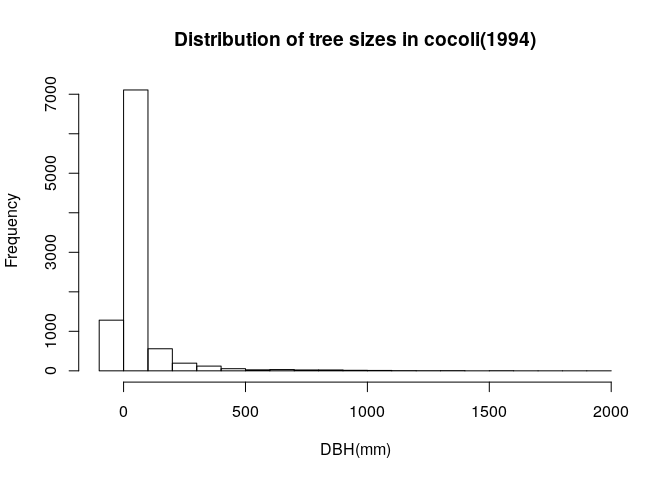
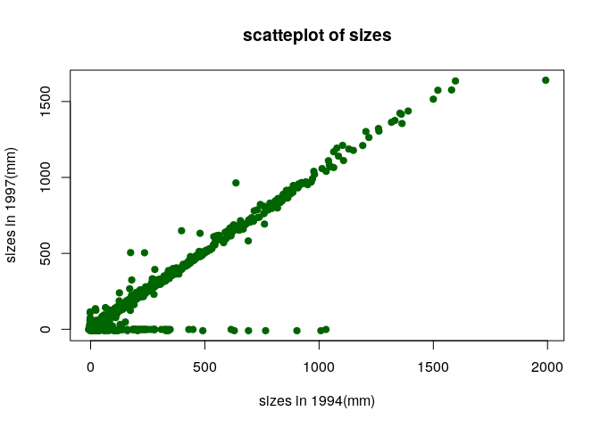

Reading in data files
---------------------

    cocoli_dat <- read.table("/home/eeb177-student/Desktop/eeb-177/class-assignments/classwork-21-Feb/cocoli.txt", header = TRUE)
    cocoli_dat

    ##         tag spcode     x     y dbh1 dbh2 dbh3 recr1 recr2 recr3 pom1 pom2
    ## 1    000001 PROTTE   3.0   0.9  171  267  277     A     A     A    1    2
    ## 2    000002 COCCPA   0.1   0.6   13   14   17     A     A     A    1    1
    ## 3    000003 EUGEPR   1.3   2.3   26   33   39     A     A     A    1    2
    ## 4    000004 PROTTE   2.2   3.4   10   17   19     A     A     A    1    1
    ## 5    000005 CLAVME   3.5   3.7   14   15   15     A     A     A    1    1
    ## 6    000006 PROTTE   4.3   4.7   12   26   25     A     A     A    1    2
    ## 7    000007 POUTCA   3.7   7.0   15   19   19     A     A     A    1    1
    ## 8    000008 SWARS1   4.1   6.3   78   78   78     A     A     A    1    1
    ## 9    000009 RINOLI   1.5  11.0   29   30   29     A     A     A    1    1
    ## 10   000010 COCCPA   0.9  14.0   28   29   33     A     A     A    1    1
    ## 11   000011 CAL2CA   4.0  13.2   69   69   65     A     A     A    1    1
    ## 12   000012 CLAVME   3.4  12.7   11   11   10     A     A     A    1    1
    ## 13   000013 BACTMA   2.0  16.2   33   38    0     A     A     B    1    1
    ## 14   000014 TRI2PL   3.8  19.7  316  323  330     A     A     A    1    2
    ## 15   000015 FARAOC   4.9  18.6   15   15   16     A     A     A    1    1
    ## 16   000016 FARAOC   4.0  18.7   54   57   57     A     A     A    1    1
    ## 17   000017 EUGEPR   3.6  18.4   14   14   13     A     A     A    1    1
    ## 18   000018 PROTTE   8.8  16.3   11   21   24     A     A     A    1    1
    ## 19   000019 ALIBED   8.8  15.6   21   28   29     A     A     A    1    1
    ## 20   000020 CUPASY   8.3  15.5   12   18   20     A     A     A    1    1
    ## 21   000021 POSOLA   7.1  15.6   26   25   25     A     A     A    1    2
    ## 22   000022 CLAVME   6.3  17.0   13   12   11     A     A     A    1    1
    ## 23   000023 CLAVME   7.2  16.9   10    0    0     A     B     B    1    2
    ## 24   000024 POSOLA   8.6  19.3   49   55   54     A     A     A    1    1
    ## 25   000025 SWARS1   6.0  10.1   68   29   35     A     A     A    1    1
    ## 26   000026 COCCPA   6.8  10.5   73   73   74     A     A     A    1    1
    ## 27   000027 THEVAH   9.3  14.8   14   27   27     A     A     A    1    1
    ## 28   000028 SWARS1   9.7  13.7   73   76   76     A     A     A    1    1
    ## 29   000029 MICOAR   9.0   5.1   15   -1   -1     A     D     D    1    0
    ## 30   000030 LACIAG   6.9   8.7   12   27   27     A     A     A    1    1
    ## 31   000031 SWARS1   9.6   8.3  201  205  205     A     A     A    1    1
    ## 32   000032 POSOLA   9.6   7.2   27   31   32     A     A     A    1    1
    ## 33   000033 FARAOC   9.1   6.3   41   49   49     A     A     A    1    1
    ## 34   000034 HEISCO   8.3   6.4   15   23   27     A     A     A    1    1
    ## 35   000035 AST2GR   6.7   0.3   58   61   60     A     A     A    1    1
    ## 36   000036 EUGEPR   6.2   0.7   10   11   11     A     A     A    1    1
    ## 37   000037 POUTCA  10.9  38.9   15   13   15     A     A     A    1    1
    ## 38   000038 COCCPA   6.9   3.5   19   22   23     A     A     A    1    1
    ## 39   000039 TRI2HI  14.5   0.9  485  490  491     A     A     A    1    1
    ## 40   000040 POSOLA  12.7   0.6   11   11   12     A     A     A    1    1
    ## 41   000041 EUGEPR  11.7   0.9   18   20   20     A     A     A    1    1
    ## 42   000042 ARDIRE  10.3   3.7  115  118  127     A     A     A    1    1
    ## 43   000043 GUARGL  12.2   4.6   31   36   36     A     A     A    1    1
    ## 44   000044 EUGEPR  12.7   4.5   14   15   16     A     A     A    1    1
    ## 45   000045 POSOLA  13.7   2.4   38   45   46     A     A     A    1    1
    ## 46   000046 AST2GR  13.3   3.3   95   99  102     A     A     A    1    1
    ## 47   000047 EUGEPR  13.8   3.6   12   16   17     A     A     A    1    1
    ## 48   000048 BACTMA  13.1   5.8   28   31   30     A     A     A    1    1
    ## 49   000049 SLOATE  11.1   8.5   24   31   32     A     A     A    1    1
    ## 50   000050 BURSSI  13.7   8.9  352  362  371     A     A     A    1    1
    ## 51   000051 POUTCA  13.8   8.4   34   36   37     A     A     A    1    1
    ## 52   000052 PROTTE  14.8   9.8   13   30   30     A     A     A    1    1
    ## 53   000053 EUGEPR  13.2   9.0   21   21    0     A     A     B    1    1
    ## 54   000054 EUGEPR  12.1   9.9   28   20   22     A     A     A    1    1
    ## 55   000055 FARAOC  13.1  11.6   12   14   17     A     A     A    1    1
    ## 56   000056 SWARS1  12.9  11.8   15   19   21     A     A     A    1    1
    ## 57   000057 BACTMA  11.6  10.8   31   40   40     A     A     A    1    1
    ## 58   000058 CUPASY  10.2  10.5   41   44   45     A     A     A    1    1
    ## 59   000059 PALIGU  11.0  13.7   18   23   -1     A     A     D    1    1
    ## 60   000060 CLAVME  10.5  13.9   17   17   19     A     A     A    1    1
    ## 61   000061 SOROAF  12.3  13.5   19   18   18     A     A     A    1    1
    ## 62   000062 EUGECO  11.4  14.9   18   23   23     A     A     A    1    1
    ## 63   000063 CHR2CA  11.5  14.5   13   17   17     A     A     A    1    1
    ## 64   000064 EUGECO  12.9  14.7   15   20   21     A     A     A    1    1
    ## 65   000065 COU2CU  14.0  14.1   13   16   21     A     A     A    1    1
    ## 66   000066 TRI2PL  14.3  13.4  241  258  260     A     A     A    1    1
    ## 67   000067 SWARS1  14.6  12.6   25   27   29     A     A     A    1    1
    ## 68   000068 EUGEPR  13.5  12.9   12   12   13     A     A     A    1    1
    ## 69   000069 COCCPA  13.2  15.5   21   26   27     A     A     A    1    1
    ## 70   000070 FARAOC  12.7  15.3   30   33   34     A     A     A    1    1
    ## 71   000071 POUTCA  12.4  16.0   16   19   20     A     A     A    1    1
    ## 72   000072 PICRLA  12.2  15.6   23   32   37     A     A     A    1    1
    ## 73   000073 FARAOC  10.1  16.2   20   22   -1     A     A     D    1    1
    ## 74   000074 CAVAPL  10.8  17.9 1332 1375 1361     A     A     A    1    1
    ## 75   000075 COU2CU  13.0  19.5   56   26   27     A     A     A    1    1
    ## 76   000076 SWARS1  14.4  18.4   62   67   69     A     A     A    1    1
    ## 77   000077 FARAOC  14.7  16.8   27   33   36     A     A     A    1    1
    ## 78   000078 EUGEPR  14.3  16.3   14   21   22     A     A     A    1    1
    ## 79   000079 SLOATE  13.7  17.0   15   14   14     A     A     A    1    1
    ## 80   000080 CUPARU  19.1  16.0   16   18   20     A     A     A    1    1
    ## 81   000081 PICRLA  17.7  13.5   19    0   -1     A     B     D    1    2
    ## 82   000082 ACALDI  17.1  17.5   49   23   44     A     A     A    1    1
    ## 83   000083 MYRCGA  15.6  18.0   21   23   26     A     A     A    1    1
    ## 84   000084 EUGEPR  15.7  19.6   15   27   16     A     A     A    1    1
    ## 85   000085 NECTMA  18.6  18.9   21   35   39     A     A     A    1    1
    ## 86   000086 BROSAL  18.8  19.0   22   23   24     A     A     A    1    1
    ## 87   000087 PICRLA  19.4  19.8   26   39   41     A     A     A    1    1
    ## 88   000088 CUPASY  19.0  18.2   28   31   34     A     A     A    1    1
    ## 89   000089 FARAOC  19.5  17.3   38   60   59     A     A     A    1    1
    ## 90   000090 PROTTE  18.0  11.8   28   34   35     A     A     A    1    1
    ## 91   000091 CAL2CA  16.7  11.6   74   88   88     A     A     A    1    1
    ## 92   000092 FARAOC  16.4  12.7   22   31   32     A     A     A    1    1
    ## 93   000093 FARAOC  15.2  13.8   12   18   20     A     A     A    1    1
    ## 94   000094 COCCPA  15.5  14.7   11   14   13     A     A     A    1    1
    ## 95   000095 CUPASY  17.0  14.5   32   34   34     A     A     A    1    1
    ## 96   000096 NECTMA  18.8  12.1   15    0   10     A     B     A    1    2
    ## 97   000097 TROPRA  19.8   5.8   20   25   24     A     A     A    1    1
    ## 98   000098 CAVAPL  16.1   7.4 1500 1515 1517     A     A     A    1    2
    ## 99   000099 SWARS1  15.4   5.2   62   63   64     A     A     A    1    1
    ## 100  000100 AST2GR  15.8   7.4   17   20   20     A     A     A    1    1
    ## 101  000101 GUARGL  16.1   8.1   68   69   69     A     A     A    1    1
    ## 102  000102 EUGEPR  15.8   9.4   24   38   28     A     A     A    1    1
    ## 103  000103 FARAOC  17.0   9.8   12   15   18     A     A     A    1    1
    ## 104  000104 CLAVME  17.6   9.4   27   26   26     A     A     A    1    1
    ## 105  000105 TRIPCU  18.7   8.9   13   17   17     A     A     A    1    1
    ## 106  000106 PROTTE  18.1   8.1   25   34   39     A     A     A    1    1
    ## 107  000107 TROPRA  18.1   7.6   16   18   18     A     A     A    1    1
    ## 108  000108 CLAVME  17.2   7.8   22   22   22     A     A     A    1    1
    ## 109  000109 BROSAL  16.6   7.5   13   15   16     A     A     A    1    1
    ## 110  000110 COU2CU  16.0   3.0   39   44   48     A     A     A    1    1
    ## 111  000111 BACTMA  15.3   4.8   28   31   31     A     A     A    1    1
    ## 112  000112 TRI2PL  17.6   4.4  139  139  139     A     A     A    1    1
    ## 113  000113 ALIBED  18.4   4.4   15   11   12     A     A     A    1    1
    ## 114  000114 MYRCGA  18.8   4.8   68   74   -1     A     A     D    1    1
    ## 115  000115 ANNOHA  19.8   2.5   36   37   41     A     A     A    1    1
    ## 116  000116 COU2CU  18.9   2.5   25   29   30     A     A     A    1    1
    ## 117  000117 EUGEPR  18.2   3.1   11   10   10     A     A     A    1    1
    ## 118  000118 PROTTE  17.5   3.2  128  157  160     A     A     A    1    1
    ## 119  000119 SWARS1   3.5  20.2   22   24   23     A     A     A    1    1
    ## 120  000120 COCCPA   3.1  20.5   66   69   65     A     A     A    1    1
    ## 121  000121 GUARGL   4.2 296.1   22   25   25     A     A     A    1    1
    ## 122  000122 COCCPA   2.0  20.4   12   16   17     A     A     A    1    1
    ## 123  000123 COU2CU   1.7  24.5   23   33   35     A     A     A    1    1
    ## 124  000124 TRI2PL   2.7  23.5  108  111  111     A     A     A    1    1
    ## 125  000125 FARAOC   4.2  22.1   20   21   23     A     A     A    1    1
    ## 126  000126 CUPASY   1.9  22.6   18   19   22     A     A     A    1    1
    ## 127  000127 CUPASY   1.9  22.8   23   24   26     A     A     A    1    1
    ## 128  000128 EUGEPR   3.9  25.9   12   14   14     A     A     A    1    1
    ## 129  000129 AST2GR   1.3  29.6   10    0   10     A     B     A    1    2
    ## 130  000130 POUTCA   4.7  29.7  105  112  114     A     A     A    1    1
    ## 131  000131 SLOATE   2.9  31.1   23   26   26     A     A     A    1    1
    ## 132  000132 CAVAPL   2.6  33.6 1363 1355 1361     A     A     A    1    1
    ## 133  000133 ALSEBL   4.8  32.6  181  188  190     A     A     A    1    1
    ## 134  000134 SWARS2   2.2  34.4   91   97   98     A     A     A    1    1
    ## 135  000135 DALBRE   2.5  34.3  301  316  322     A     A     A    1    2
    ## 136  000136 COU2CU   0.2  35.6   52   54   54     A     A     A    1    1
    ## 137  000137 COU2CU   0.2  37.9   51   57   59     A     A     A    1    1
    ## 138  000138 SWARS1   7.8  36.0  112  122  127     A     A     A    1    1
    ## 139  000139 CAL2CA   6.7  35.2  126  240  247     A     A     A    1    1
    ## 140  000140 COU2CU   6.6  35.6   34   37   40     A     A     A    1    1
    ## 141  000141 IXORFL   6.8  39.3   65   76   77     A     A     A    1    1
    ## 142  000142 HEISCO   8.5  38.9   11   18   18     A     A     A    1    1
    ## 143  000143 CASEGU   9.7  38.6  129   32   35     A     A     A    1    1
    ## 144  000144 EUGEPR   9.3  37.7   13   17   18     A     A     A    1    1
    ## 145  000145 SWARS1   7.9  31.7   44   54   55     A     A     A    1    1
    ## 146  000146 AST2GR   5.1  32.6   29   19   20     A     A     A    1    1
    ## 147  000147 ALBIAD   5.7  34.4   14   14   14     A     A     A    1    1
    ## 148  000148 AST2GR   5.8  34.8   22   23   23     A     A     A    1    1
    ## 149  000149 EUGEPR   9.6  31.4   12   19   20     A     A     A    1    1
    ## 150  000150 POUTCA   8.4  25.4   10   10   11     A     A     A    1    1
    ## 151  000151 NEEADE   6.7  26.5   34   34   35     A     A     A    1    1
    ## 152  000152 SWARS1   5.5  29.8   35   47   55     A     A     A    1    1
    ## 153  000153 PROTTE   8.4  20.0   57   78   85     A     A     A    1    1
    ## 154  000154 TRIPCU   6.4  24.5   21   23   23     A     A     A    1    1
    ## 155  000155 CUPASY   6.7  23.7   75   79   57     A     A     A    1    1
    ## 156  000156 HEISCO   9.6  25.9   15   22   24     A     A     A    1    1
    ## 157  000157 SWARS1  11.5  24.9  110  121  126     A     A     A    1    1
    ## 158  000158 NEEADE  14.8  22.3   13   16   16     A     A     A    1    1
    ## 159  000159 CAL2CA  14.7  22.4   50   51   51     A     A     A    1    1
    ## 160  000161 EUGECO  12.9  22.5   11   19    0     A     A     B    1    1
    ## 161  000162 POSOLA  12.4  25.3   25   25   28     A     A     A    1    1
    ## 162  000163 IXORFL  12.2  25.1   31   29   30     A     A     A    1    1
    ## 163  000164 BROSAL  10.0  28.8   10   14   15     A     A     A    1    1
    ## 164  000166 ANTITR  12.1  29.9  212  222  221     A     A     A    1    1
    ## 165  000167 SOROAF   1.5 228.9   11   11   11     A     A     A    1    1
    ## 166  000168 COU2CU  16.2 274.2   33   34   32     A     A     A    1    1
    ## 167  000169 AST2GR  11.7  28.4   45   48   50     A     A     A    1    1
    ## 168  000170 CUPASY  14.2  29.1   39   33   44     A     A     A    1    1
    ## 169  000171 ALBIAD  12.9  30.0   58   66   68     A     A     A    1    1
    ## 170  000172 COU2CU  10.1  31.8   20   31   32     A     A     A    1    1
    ## 171  000173 AST2GR  11.4  34.0   62   67   66     A     A     A    1    1
    ## 172  000174 MACLTI  19.2  38.9   -2   16   17     P     A     A    0    1
    ## 173  000175 COU2CU  12.7  33.9   19   20   22     A     A     A    1    1
    ## 174  000176 CASEGU  14.7  32.9   62   63   63     A     A     A    1    1
    ## 175  000177 CAL2CA  14.0  36.4   83   76   76     A     A     A    1    1
    ## 176  000178 EUGEPR  13.4  35.9   24   26   28     A     A     A    1    1
    ## 177  000179 CAL2CA  11.1  35.7  320  345  344     A     A     A    1    1
    ## 178  000180 AST2GR  10.4  37.3   37   45   45     A     A     A    1    1
    ## 179  000181 VITECO  10.1  38.0   17   17   17     A     A     A    1    1
    ## 180  000182 CAL2CA  11.0  37.7  143  171  174     A     A     A    1    2
    ## 181  000183 TRI2PL  14.1  39.1  129  133  133     A     A     A    1    1
    ## 182  000184 AST2GR  14.8  39.5   59   68   73     A     A     A    1    1
    ## 183  000185 EUGEPR  13.1  37.1   23   27   30     A     A     A    1    1
    ## 184  000186 EUGEPR  14.7  37.9   11   28   19     A     A     A    1    1
    ## 185  000187 EUGEPR  15.1  39.5   13   15   15     A     A     A    1    1
    ## 186  000188 AST2GR  16.3  39.3   25   34   38     A     A     A    1    1
    ## 187  000189 EUGEPR  18.2  39.1   31   33   37     A     A     A    1    1
    ## 188  000190 UN2_CO  18.7  39.7   11   -1   -1     A     D     D    1    0
    ## 189  000191 TRIPCU  19.7  38.1   68   63   65     A     A     A    1    1
    ## 190  000192 NECTMA  18.1  37.9   11   14   15     A     A     A    1    1
    ## 191  000193 EUGEPR  17.3  37.1   28   21   21     A     A     A    1    1
    ## 192  000194 AST2GR  18.9  31.1   16    0    0     A     B     B    1    2
    ## 193  000195 CAL2CA  15.8  31.4   65   -9   66     A     *     A    1    0
    ## 194  000196 SWARS1  16.4  33.9   91   95   95     A     A     A    1    1
    ## 195  000197 COU2CU  18.6  33.2   11   13   15     A     A     A    1    1
    ## 196  000198 COU2CU  18.0  33.0   19   23   24     A     A     A    1    1
    ## 197  000199 PROTTE  18.2  25.7   38   42   46     A     A     A    1    1
    ## 198  000200 SWARS1  18.3  26.2   99   99  101     A     A     A    1    1
    ## 199  000201 CAL2CA  15.8  25.4   71   64   64     A     A     A    1    1
    ## 200  000202 OURALU  15.5  29.0   13   13   14     A     A     A    1    1
    ## 201  000203 ALBIAD  15.1  29.5   26   27   28     A     A     A    1    1
    ## 202  000204 COU2CU  16.3  29.2   12   14   14     A     A     A    1    1
    ## 203  000205 COU2CU  19.2  27.7   34   38   38     A     A     A    1    1
    ## 204  000206 PIT1RU  18.6  28.9   14   -9    0     A     *     B    1    0
    ## 205  000207 BROSAL  19.5  26.8   13   17   17     A     A     A    1    1
    ## 206  000208 COU2CU  16.5  28.0   13   14    0     A     A     B    1    1
    ## 207  000209 CAVAPL  17.0  28.7  331  331  335     A     A     A    1    1
    ## 208  000210 PROTTE  15.2 276.2   13   15   16     A     A     A    1    1
    ## 209  000211 INGAVE  15.4  21.4   62   62   63     A     A     A    1    1
    ## 210  000212 BROSAL  16.1  22.4   15   18   20     A     A     A    1    1
    ## 211  000213 TAB1RO  16.4  23.4  344  344  343     A     A     A    1    1
    ## 212  000214 SWARS1   0.4  42.8   99   96   96     A     A     A    1    1
    ## 213  000215 CAL2CA   3.7  43.3   21   26   28     A     A     A    1    1
    ## 214  000216   ANN1   1.0  46.8   15   16   16     A     A     A    1    1
    ## 215  000217 GENIAM   0.5  47.1   14   16   17     A     A     A    1    1
    ## 216  000218 SWARS1   0.4  47.6   61   67   67     A     A     A    1    1
    ## 217  000219 CAVAPL   1.8  48.4  910  957  982     A     A     A    1    1
    ## 218  000220 AST2GR   3.3  48.1   14   15   17     A     A     A    1    1
    ## 219  000221 EUGEPR   4.2  52.3   -2   22   20     P     A     A    0    1
    ## 220  000222 TRIPCU   4.8  48.1   14   23   25     A     A     A    1    1
    ## 221  000223 PROTTE   4.3  45.6  168  198  194     A     A     A    1    1
    ## 222  000224 PROTTE   3.2  50.2   24   39   40     A     A     A    1    1
    ## 223  000225 PROTTE   3.8  52.9   20   24   23     A     A     A    1    1
    ## 224  000226 SWARS1   5.0 277.5   11   12   13     A     A     A    1    1
    ## 225  000227 COCCPA   6.8  56.9   63   72   74     A     A     A    1    2
    ## 226  000228 THEVAH   8.6  56.4   29   43   45     A     A     A    1    1
    ## 227  000229 SWARS1   9.8  58.4   40   45   46     A     A     A    1    1
    ## 228  000230 EUGEPR   9.6  51.7   37   43   47     A     A     A    1    1
    ## 229  000231 CLAVME   9.2  51.2   18   19   20     A     A     A    1    1
    ## 230  000232 EUGEPR   6.3  54.2   29   27   33     A     A     A    1    1
    ## 231  000233 CAL2CA   5.3  52.1   91  124  132     A     A     A    1    1
    ## 232  000234 AST2GR   6.5  49.4   32   14   14     A     A     A    1    2
    ## 233  000235 ANNOHA   8.4  47.9   30   34   33     A     A     A    1    1
    ## 234  000236 ANNOHA   7.0  46.4   41   37   42     A     A     A    1    1
    ## 235  000237 EUGEPR   6.7  44.7   17   16   12     A     A     A    1    1
    ## 236  000238 FARAOC  17.5 279.4   16   16   16     A     A     A    1    1
    ## 237  000239 AST2GR  12.1  40.5   14   13   14     A     A     A    1    1
    ## 238  000240 PROTTE  10.4  41.5   33   32   33     A     A     A    1    1
    ## 239  000241 AST2GR  13.4  43.3   65   75   81     A     A     A    1    1
    ## 240  000242 SPONRA  12.7  39.9   23   28   30     A     A     A    1    1
    ## 241  000243 SWARS1  10.9  45.1  182  190  190     A     A     A    1    1
    ## 242  000244 TRIPCU  11.1  48.4   37   46   55     A     A     A    1    1
    ## 243  000245 EUGEPR  10.6  47.6   25   -9    0     A     *     B    1    0
    ## 244  000246 EUGEPR  10.4  47.2   11   -9    0     A     *     B    1    0
    ## 245  000247 CUPASY  11.1  53.0   25   24   25     A     A     A    1    1
    ## 246  000248 ERY2PA  16.3 264.1   16   18   18     A     A     A    1    1
    ## 247  000249 BACTMA   4.0 231.6   28   28   28     A     A     A    1    1
    ## 248  000250 RANDFO  11.8  54.4   30   14   15     A     A     A    1    1
    ## 249  000251 ALIBED  14.4  54.8   13   12   12     A     A     A    1    1
    ## 250  000252 AST2GR  13.5  53.8   18   31   32     A     A     A    1    1
    ## 251  000253 TRIPCU  14.5  56.2   37   -9    0     A     *     B    1    0
    ## 252  000254 EUGEPR  13.5  55.9   39   28   30     A     A     A    1    1
    ## 253  000255 EUGEPR  11.4  56.1   14   19   19     A     A     A    1    1
    ## 254  000256 EUGEPR  10.7  59.2   42   46   46     A     A     A    1    1
    ## 255  000257 TRI2PL  12.3  58.2  125  140  141     A     A     A    1    1
    ## 256  000258 FARAOC  14.5  57.6   27   39   40     A     A     A    1    1
    ## 257  000259 SWARS1  14.7  57.1   11   15   15     A     A     A    1    2
    ## 258  000260 EUGEPR  12.9  56.7   34   36   40     A     A     A    1    1
    ## 259  000261 CAL2CA  18.6  55.2   11   11   -1     A     A     D    1    1
    ## 260  000262 ANTITR  17.5  55.9   37   40   43     A     A     A    1    1
    ## 261  000263 CLAVME  16.2  56.2   13   13   14     A     A     A    1    1
    ## 262  000264 POUTCA  15.3  56.4   24   25    0     A     A     B    1    1
    ## 263  000265 TRI2PL  15.4  56.6  205  225  225     A     A     A    1    1
    ## 264  000266 CLAVME  16.3  56.7   19   19   19     A     A     A    1    1
    ## 265  000267 CASECO  16.7  58.0   18   24   24     A     A     A    1    1
    ## 266  000268 SWARS1  15.9  58.6   23   25   25     A     A     A    1    1
    ## 267  000269 CHR2CA  15.8  59.3  360  400  297     A     A     A    1    2
    ## 268  000270 SWARS1  16.6  59.3   26   26   29     A     A     A    1    1
    ## 269  000271 HEISCO  17.3  59.8   20   24   25     A     A     A    1    1
    ## 270  000272 CLAVME  18.2  59.7   18   18   18     A     A     A    1    1
    ## 271  000273 SWARS1  18.6  59.7   19   19   21     A     A     A    1    1
    ## 272  000274 POCHSE  19.3  59.8   40   -1   -1     A     D     D    1    0
    ## 273  000275 EUGEPR  19.3  59.0   25   25   28     A     A     A    1    2
    ## 274  000276 COCCPA  17.2  52.0   28   36   38     A     A     A    1    1
    ## 275  000277 EUGEPR  17.3  52.4   17   19   22     A     A     A    1    1
    ## 276  000278 COU2CU  18.2  54.2   24   32   32     A     A     A    1    2
    ## 277  000279 SWARS1  17.7  54.3   55   62   65     A     A     A    1    1
    ## 278  000280 EUGEPR  17.5  54.2   16   -9    0     A     *     B    1    0
    ## 279  000281 CLAVME  16.3  54.8   10   10    0     A     A     B    1    1
    ## 280  000282 LUEHSE  18.5  54.9   24   25   27     A     A     A    1    1
    ## 281  000283 SWARS1  18.7  54.4   15   20   19     A     A     A    1    1
    ## 282  000284 EUGEPR  19.2  54.1   10   14   16     A     A     A    1    1
    ## 283  000285 COCCPA  19.0  53.9   32   30   28     A     A     A    1    1
    ## 284  000286 CLAVME  19.0  53.1   11   10    0     A     A     B    1    1
    ## 285  000287 BROSAL  18.6  52.8   10   11   12     A     A     A    1    1
    ## 286  000288 IXORFL  18.8  45.0   28   36   37     A     A     A    1    1
    ## 287  000289 BROSAL  18.6  45.8   11   19   21     A     A     A    1    1
    ## 288  000290 GENIAM  16.3  45.9   47   53   50     A     A     A    1    1
    ## 289  000291 POUTCA  17.2  48.8   16   32   34     A     A     A    1    1
    ## 290  000292 CUPARU  19.1  41.5   29   47   47     A     A     A    1    1
    ## 291  000293 CHR2CA  17.7  40.2   22   22   23     A     A     A    1    1
    ## 292  000294 COCCPA   6.5  60.4   14   -9   21     A     *     A    1    0
    ## 293  000295 EUGEPR  16.3  40.4   13   18   18     A     A     A    1    1
    ## 294  000296 BROSAL  15.9  40.6   12   14   14     A     A     A    1    1
    ## 295  000297 AST2GR  15.9  41.8   24   27   28     A     A     A    1    1
    ## 296  000298 POSOLA  15.9  43.1   25   23   23     A     A     A    1    1
    ## 297  000299 SWARS1  19.3  44.1   18   38   34     A     A     A    1    1
    ## 298  000300 EUGEPR   3.1  61.7   57   58   58     A     A     A    1    1
    ## 299  000301 FARAOC  10.9  62.4   14   22   25     A     A     A    1    1
    ## 300  000302 TRIPCU   0.7  60.5   59   95  100     A     A     A    1    1
    ## 301  000303 ANTITR   3.6  64.9   13   15   15     A     A     A    1    1
    ## 302  000304 COU2CU   4.0  63.6   14   11   17     A     A     A    1    1
    ## 303  000305 CAL2CA   2.0  62.9   25   28   30     A     A     A    1    2
    ## 304  000306 TRI2PL   4.4  66.2  267  299  303     A     A     A    1    1
    ## 305  000307 FISSFE   2.3  65.7   38   43   43     A     A     A    1    1
    ## 306  000308 EUGEPR   0.6  65.4   17   19   20     A     A     A    1    2
    ## 307  000309 EUGEPR   0.2  66.7   15   16   16     A     A     A    1    1
    ## 308  000310 CUPASY   1.5  68.8   33   36   37     A     A     A    1    1
    ## 309  000311 EUGEPR   4.8  69.5   11   17   18     A     A     A    1    1
    ## 310  000312 FARAOC   4.3  68.4   14   29   25     A     A     A    1    1
    ## 311  000313 TURNPA   2.7  66.7   14   18   19     A     A     A    1    1
    ## 312  000314 NEEADE   2.4  67.2   19   33   41     A     A     A    1    1
    ## 313  000315 COU2CU   0.4  70.5   25   24   25     A     A     A    1    1
    ## 314  000316 FARAOC   4.6  72.2   13   16   17     A     A     A    1    1
    ## 315  000317 PROTTE   0.5  79.6   11   26   34     A     A     A    1    1
    ## 316  000318 EUGEPR   4.5  77.1   27   28   28     A     A     A    1    1
    ## 317  000319 FARAOC   3.4  77.7   22   27   28     A     A     A    1    1
    ## 318  000320 PROTTE   6.5  75.0   12   14   16     A     A     A    1    1
    ## 319  000321 FARAOC   7.0  76.1   18   17    0     A     A     B    1    1
    ## 320  000322 EUGEPR   5.4  79.6   32   32   32     A     A     A    1    1
    ## 321  000323 TRI2PL   9.7  70.2  261  263  258     A     A     A    1    1
    ## 322  000324 FARAOC   5.9  70.4   14   19   21     A     A     A    1    1
    ## 323  000325 EUGEPR   5.6  72.2   13   15   18     A     A     A    1    1
    ## 324  000326 CUPASY   6.8  74.1  134  138  141     A     A     A    1    1
    ## 325  000327 COCCPA   7.9  73.2  114  128  129     A     A     A    1    1
    ## 326  000328 EUGEPR   8.1  71.8   21   24   25     A     A     A    1    1
    ## 327  000329 SWARS1   9.7  65.3   17   19   19     A     A     A    1    1
    ## 328  000330 HEISCO   6.2  65.4   23   28   32     A     A     A    1    1
    ## 329  000331 FARAOC   5.1  69.5   22   31   35     A     A     A    1    1
    ## 330  000332 FARAOC   8.1  69.6   29   38   40     A     A     A    1    1
    ## 331  000333 ANTITR   9.5  68.5   15   15   15     A     A     A    1    1
    ## 332  000334 EUGEPR   9.6  67.7   12   14   14     A     A     A    1    1
    ## 333  000335 CHOMSP   8.7  66.4   27   31   35     A     A     A    1    1
    ## 334  000336 EUGEPR   8.0  66.6   35   39   40     A     A     A    1    2
    ## 335  000337 EUGEPR   7.0  67.7   24   28   30     A     A     A    1    1
    ## 336  000338 SWARS1   7.9  60.3   22   31   32     A     A     A    1    1
    ## 337  000339 MACLTI   5.8  61.2   17   19   20     A     A     A    1    1
    ## 338  000340 STERAP   6.9  61.6   23   27   30     A     A     A    1    1
    ## 339  000341 EUGEPR   5.5  63.1   17   22   23     A     A     A    1    1
    ## 340  000342 GENIAM   5.2  64.6   12   13   13     A     A     A    1    1
    ## 341  000343 FARAOC   7.0  63.8   21   29   31     A     A     A    1    1
    ## 342  000344 ARDIRE   7.2  64.0  109  110  115     A     A     A    1    1
    ## 343  000345 EUGEPR   7.3  64.9   12   15   18     A     A     A    1    1
    ## 344  000346 EUGEPR   8.3  64.6   10   13   16     A     A     A    1    1
    ## 345  000347 FARAOC   8.2  63.8   12   13   17     A     A     A    1    1
    ## 346  000348 TRIPCU   8.0  63.4   32   44   46     A     A     A    1    1
    ## 347  000349 EUGEPR   7.7  63.3   15   15   18     A     A     A    1    1
    ## 348  000350 SWARS1   9.5  64.1   17   39   38     A     A     A    1    1
    ## 349  000351 TRI2PL   9.1  63.4  250  259  263     A     A     A    1    2
    ## 350  000352 SWARS1   9.1  62.5   23   32   35     A     A     A    1    1
    ## 351  000353 HEISCO  10.3  62.5   17   25   30     A     A     A    1    1
    ## 352  000354 CLAVME   9.9  61.6   23   29   31     A     A     A    1    1
    ## 353  000355 PICRLA  14.6  60.6   39   51   52     A     A     A    1    1
    ## 354  000356 EUGEPR  11.6  62.0   20   25   26     A     A     A    1    1
    ## 355  000357 SWARS1  12.2  64.8   29    0    0     A     B     B    1    2
    ## 356  000358 OURALU  12.2  64.5   16   16   18     A     A     A    1    1
    ## 357  000359 STEMGR  12.7  65.0   60   58   65     A     A     A    1    1
    ## 358  000360 FARAOC  14.9  64.9   16   21   22     A     A     A    1    1
    ## 359  000361 PROTTE  14.7  64.1   12   28   28     A     A     A    1    1
    ## 360  000362 ANTITR  14.0  62.3   50   68   75     A     A     A    1    1
    ## 361  000363 ANTITR  12.1  62.2   35   49   50     A     A     A    1    1
    ## 362  000364 CUPARU  11.5  62.7   11   19   20     A     A     A    1    1
    ## 363  000365 ANTITR  14.4  61.9   14   -1   -1     A     D     D    1    0
    ## 364  000366 THEVAH   4.7 296.2   15   27   28     A     A     A    1    1
    ## 365  000367 BROSAL  11.2  66.0   12   13   12     A     A     A    1    1
    ## 366  000368 COU2CU  10.3  66.4   14   53   56     A     A     A    1    1
    ## 367  000369 CASECO  10.9  69.0   43   57   59     A     A     A    1    1
    ## 368  000370 COU2CU  11.2  68.9   23   31   33     A     A     A    1    1
    ## 369  000371 LUEHSE  14.7  69.3   40   57   63     A     A     A    1    1
    ## 370  000372 SPONRA  13.2  67.8   20   29   30     A     A     A    1    1
    ## 371  000373 TRIPCU  11.6  70.3  204  221  224     A     A     A    1    1
    ## 372  000374 BURSSI  14.5  73.4   22    0   22     A     B     A    1    2
    ## 373  000375 TRI2PL  12.4  79.5  132  135  134     A     A     A    1    1
    ## 374  000376 CUPASY  12.4  79.2   40   43   45     A     A     A    1    1
    ## 375  000377 COU2CU  13.2  76.3   38   39   38     A     A     A    1    1
    ## 376  000378 HEISCO  14.3  75.7   18   20   19     A     A     A    1    1
    ## 377  000379 DALBRE  17.4  75.0   17   18   18     A     A     A    1    1
    ## 378  000380 INGAVE  15.8  75.5   57   61   59     A     A     A    1    1
    ## 379  000381 COU2CU  15.5  78.6   75   87   78     A     A     A    1    1
    ## 380  000382 EUGEPR  17.5  78.5   14   17   18     A     A     A    1    1
    ## 381  000383 PROTTE  19.5  79.2   14   20   20     A     A     A    1    1
    ## 382  000384 HEISCO  18.9  77.8   15   19   21     A     A     A    1    1
    ## 383  000385 AST2GR  19.0  70.7   29   38   38     A     A     A    1    1
    ## 384  000386 ANTITR  15.5  73.4   50   85   91     A     A     A    1    1
    ## 385  000387 CAVAPL  15.2  74.1   56   67   68     A     A     A    1    1
    ## 386  000388 IXORFL  17.5  73.9   16   15   17     A     A     A    1    1
    ## 387  000389 AST2GR  19.7  73.7   15   16   17     A     A     A    1    1
    ## 388  000390 ANTITR  17.6  72.9   70   88   92     A     A     A    1    2
    ## 389  000391 NEEADE  15.6  65.6   43   47   48     A     A     A    1    1
    ## 390  000392 EUGEPR  15.1  65.2   11   16   17     A     A     A    1    1
    ## 391  000393 CAVAPL  17.6  68.8   51   53   55     A     A     A    1    1
    ## 392  000394 TRIPCU  18.1  68.6   89   88   88     A     A     A    1    1
    ## 393  000395 LUEHSE  19.9  68.8   64   83   96     A     A     A    1    1
    ## 394  000396 SPONRA  19.5  68.7   22   33   31     A     A     A    1    1
    ## 395  000397 FARAOC   9.2 281.7   13    0    0     A     B     B    1    2
    ## 396  000398 EUGEPR  18.0  67.5   23   24   22     A     A     A    1    1
    ## 397  000399 AST2GR  19.2  60.8   29   29   31     A     A     A    1    1
    ## 398  000400 FARAOC  18.2  60.3   24   30   33     A     A     A    1    1
    ## 399  000401 TRI2PL  18.0  60.6  146  150  154     A     A     A    1    1
    ## 400  000402 EUGEPR  16.1  60.3   16   18   18     A     A     A    1    1
    ## 401  000403 EUGEPR  15.6  62.8   13   16   18     A     A     A    1    1
    ## 402  000404 SWARS1  15.7  63.3   53   66   68     A     A     A    1    1
    ## 403  000405 AST2GR  17.4  64.3   41   44   45     A     A     A    1    1
    ## 404  000406 BROSAL  19.0  64.6   33   34   34     A     A     A    1    1
    ## 405  000407 EUGEPR  19.6  62.5   21   21   21     A     A     A    1    1
    ## 406  000408 CLAVME  18.7  62.5   14   14   14     A     A     A    1    1
    ## 407  000409 ANNOHA  18.2  62.3   42   46   45     A     A     A    1    1
    ## 408  000410 CLAVME  17.4  62.7   18   18   19     A     A     A    1    1
    ## 409  000411 EUGEPR   4.5  81.2   21   22   22     A     A     A    1    1
    ## 410  000412 EUGECO   2.4  81.8   18   27   30     A     A     A    1    1
    ## 411  000413 FARAOC   1.8  81.6   20   32   32     A     A     A    1    1
    ## 412  000414 EUGEPR   0.5  80.8   11   12   12     A     A     A    1    1
    ## 413  000415 PROTTE   1.0  82.6   32   47   51     A     A     A    1    1
    ## 414  000416 COU2CU   0.1  83.9   40   42   42     A     A     A    1    1
    ## 415  000417 CUPASY   2.4  84.1   24   36   46     A     A     A    1    1
    ## 416  000418 SOROAF   2.9  84.3   13   20   17     A     A     A    1    1
    ## 417  000419 FARAOC   3.7 233.9   10   11   11     A     A     A    1    1
    ## 418  000420 ANNOHA   4.8  84.9   31   43   43     A     A     A    1    1
    ## 419  000421 HEISCO   4.7  84.0   27   29   41     A     A     A    1    1
    ## 420  000422 HEISCO   4.6  82.5   15   28   31     A     A     A    1    1
    ## 421  000423 SOROAF   1.4  83.2   15   16   17     A     A     A    1    1
    ## 422  000424 FARAOC   1.1  83.9   16   25   25     A     A     A    1    1
    ## 423  000425 OURALU   1.1  82.4   24   25   23     A     A     A    1    1
    ## 424  000426 FARAOC   2.9  82.3   15   -1   -1     A     D     D    1    0
    ## 425  000427 FARAOC   1.7  85.5   17   23   25     A     A     A    1    1
    ## 426  000428 HEISCO   0.9  85.5   25   29   31     A     A     A    1    1
    ## 427  000429 FARAOC   0.4  85.3   13   15   15     A     A     A    1    1
    ## 428  000430 FARAOC   0.2  85.3   13   16   16     A     A     A    1    2
    ## 429  000431 GUARGL   0.4  87.4   64   67   68     A     A     A    1    1
    ## 430  000432 OURALU   0.2  88.8   26   26   26     A     A     A    1    1
    ## 431  000433 PROTTE   0.6  89.8   18   29   20     A     A     A    1    2
    ## 432  000434 PROTTE   1.2  89.2   14   16   16     A     A     A    1    1
    ## 433  000435 TRI2PL   1.6  88.8   67   71   75     A     A     A    1    1
    ## 434  000436 COU2CU   1.8  89.1   33   37   38     A     A     A    1    1
    ## 435  000437 HEISCO   2.7  85.9   29   38   38     A     A     A    1    1
    ## 436  000438 HEISCO   2.7  87.1   51   64   66     A     A     A    1    1
    ## 437  000439 BROSAL   2.1  88.9   11   12   11     A     A     A    1    1
    ## 438  000440 BROSAL   3.4  90.4  277  314  325     A     A     A    1    1
    ## 439  000441 EUGEPR   0.8  91.4   30   32   32     A     A     A    1    1
    ## 440  000442 FARAOC   0.8  93.9   10   13   14     A     A     A    1    1
    ## 441  000443 COU2CU   0.7  94.9   13   14   16     A     A     A    1    1
    ## 442  000444 EUGEPR   1.6  93.9   13   15   15     A     A     A    1    1
    ## 443  000445 SOROAF   2.8  92.3   14   16   17     A     A     A    1    1
    ## 444  000446 FARAOC   1.8  93.3   19   19   -1     A     A     D    1    1
    ## 445  000447 EUGEPR   2.2  93.2   14   15   15     A     A     A    1    2
    ## 446  000448 POSOLA   2.5  96.7  144  144  143     A     A     A    1    1
    ## 447  000449 SWARS1   0.9  95.2   74   75   77     A     A     A    1    1
    ## 448  000450 EUGEPR   3.8  97.6   31   29   30     A     A     A    1    1
    ## 449  000451 EUGEPR   0.1  96.5   20   21   21     A     A     A    1    1
    ## 450  000452 SWARS1   9.7  95.5  213  248  235     A     A     A    1    2
    ## 451  000453 EUGEPR   5.3  97.2   10   11   14     A     A     A    1    1
    ## 452  000454 EUGEPR   5.1  98.7   17   18   18     A     A     A    1    1
    ## 453  000455 EUGEPR   5.9  98.1   15   15   15     A     A     A    1    1
    ## 454  000456 OURALU   6.0  98.8   11   12   11     A     A     A    1    1
    ## 455  000457 SPONMO   7.9  98.9  699  706  714     A     A     A    1    2
    ## 456  000458 EUGEPR   7.6  99.1   22   22   23     A     A     A    1    1
    ## 457  000459 AST2GR   9.2  99.8  111  112  112     A     A     A    1    1
    ## 458  000460 EUGEPR   9.4  98.2   11   10   11     A     A     A    1    1
    ## 459  000461 EUGEPR   9.0  97.1   13   14   15     A     A     A    1    1
    ## 460  000462 COU2CU   8.7  90.6   29   29   30     A     A     A    1    1
    ## 461  000463 SWARS1   8.4  90.8   38   38   41     A     A     A    1    1
    ## 462  000464 FARAOC   5.5  90.4   11   14   18     A     A     A    1    1
    ## 463  000465 HEISCO   6.3  91.8   10   11   13     A     A     A    1    2
    ## 464  000466 SOROAF   4.0 226.6   14   16   16     A     A     A    1    1
    ## 465  000467 PROTTE   5.5  92.6   17   18   22     A     A     A    1    1
    ## 466  000468 CAVAPL   5.3  93.5  264  255   -1     A     A     D    1    1
    ## 467  000469 GUARGL   5.8  93.5   45   46   46     A     A     A    1    1
    ## 468  000470 EUGEPR   9.8  92.1   10   11   11     A     A     A    1    1
    ## 469  000471 COU2CU   5.2 277.7   10   10   -1     A     A     D    1    1
    ## 470  000472 EUGEPR   9.1  91.5   13   15   18     A     A     A    1    1
    ## 471  000473 EUGEPR   8.9  92.4   11   13   13     A     A     A    1    1
    ## 472  000474 AST2GR   8.7  92.6   24   27   27     A     A     A    1    1
    ## 473  000475 EUGEPR   8.3  92.6   14   28   18     A     A     A    1    1
    ## 474  000476 CUPASY   9.7  85.5   11    0   -1     A     B     D    1    2
    ## 475  000477 SWARS1   7.1  85.6   28   33   31     A     A     A    1    2
    ## 476  000478 SOROAF   5.4  85.8   23   23   22     A     A     A    1    1
    ## 477  000479 PROTTE   5.1  87.3   18   26   26     A     A     A    1    1
    ## 478  000480 TRI2PL   9.5  87.2   95  106  106     A     A     A    1    1
    ## 479  000481 COU2CU   9.8  86.1   26   32   34     A     A     A    1    1
    ## 480  000482 ALIBED   7.4  86.7   25   26   27     A     A     A    1    1
    ## 481  000483 COU2CU   6.6  86.4   29   37   40     A     A     A    1    1
    ## 482  000484 COU2CU   6.9  87.3   26   31   33     A     A     A    1    2
    ## 483  000485 ANACEX   9.8  81.8  790  800  803     A     A     A    1    1
    ## 484  000486 EUGEPR   6.4  81.3   14   14   14     A     A     A    1    1
    ## 485  000487 CLAVME   6.7  81.9   18   19   19     A     A     A    1    1
    ## 486  000488 SOROAF   5.8  83.9   15   15   14     A     A     A    1    1
    ## 487  000489 SOROAF   7.2  83.7   27   29   32     A     A     A    1    2
    ## 488  000490 EUGECO   7.4  84.5   36   37   40     A     A     A    1    1
    ## 489  000491 SOROAF   6.2  84.8   12   15   13     A     A     A    1    1
    ## 490  000492 PROTTE   8.8  83.8   11   13   14     A     A     A    1    1
    ## 491  000493 SOROAF   9.8  84.2   13   15   17     A     A     A    1    1
    ## 492  000494 FARAOC  13.2  80.9   24   28   29     A     A     A    1    1
    ## 493  000495 HEISCO  11.4  82.7   13   16   19     A     A     A    1    1
    ## 494  000496 EUGEPR  13.7  81.8   18   19   19     A     A     A    1    1
    ## 495  000497 EUGEPR  14.4  85.2   11   12   12     A     A     A    1    1
    ## 496  000498 COU2CU  12.9  86.0   30   28   30     A     A     A    1    1
    ## 497  000499 BROSAL  12.0  85.2   24   25   26     A     A     A    1    1
    ## 498  000500 COU2CU  10.2  86.2   23   -1   -1     A     D     D    1    0
    ## 499  000501 FARAOC  10.3  87.5   25   26   27     A     A     A    1    1
    ## 500  000502 COU2CU  11.3  89.5   35   49   49     A     A     A    1    1
    ## 501  000503 COU2CU  13.6  89.9   17   17   17     A     A     A    1    1
    ## 502  000504 COU2CU  14.6  88.5   26   18   27     A     A     A    1    1
    ## 503  000505 COU2CU  14.8  87.9   16   17   17     A     A     A    1    1
    ## 504  000506 EUGEPR  14.2  87.4   14   15   16     A     A     A    1    2
    ## 505  000507 EUGEPR  14.7  86.4   35   39   40     A     A     A    1    1
    ## 506  000508 SOROAF  12.6  86.4   14   18   21     A     A     A    1    1
    ## 507  000509 SLOATE  12.4  86.2   66   67   66     A     A     A    1    1
    ## 508  000510 BROSAL  12.0  86.4   18   17   17     A     A     A    1    1
    ## 509  000511 COU2CU  14.3  90.1   38   43   43     A     A     A    1    1
    ## 510  000512 COU2CU  13.5  90.6   42   47   50     A     A     A    1    1
    ## 511  000513 EUGEPR  12.4  90.8   21   24   22     A     A     A    1    1
    ## 512  000514 EUGEPR  11.7  90.2   11   12   15     A     A     A    1    1
    ## 513  000515 EUGEPR  10.3  91.8   15   17   18     A     A     A    1    1
    ## 514  000516 COU2CU  10.1  93.4   58   66   66     A     A     A    1    1
    ## 515  000517 ALBIAD  11.0  93.5   18   18   18     A     A     A    1    1
    ## 516  000518 EUGEPR  12.7  94.1   24   25   25     A     A     A    1    1
    ## 517  000519 FARAOC  13.6  94.5   58   62   63     A     A     A    1    1
    ## 518  000520 EUGEPR  13.6  93.7   16   15   15     A     A     A    1    1
    ## 519  000521 EUGEPR  14.2  94.8   14   14   13     A     A     A    1    1
    ## 520  000522 COU2CU  14.7  93.2   31   -1   -1     A     D     D    1    0
    ## 521  000523 COU2CU  14.1  92.5   17   19   21     A     A     A    1    1
    ## 522  000524 COU2CU  14.4  91.5   16   17   19     A     A     A    1    1
    ## 523  000525 COU2CU  14.8  91.0   19   22   25     A     A     A    1    1
    ## 524  000526 ANACEX  14.6  95.1  193  194   -1     A     A     D    1    1
    ## 525  000527 COU2CU  13.3  95.6   18   18   18     A     A     A    1    1
    ## 526  000528 TAB1RO  10.1  98.2  105  105  105     A     A     A    1    1
    ## 527  000529 CUPASY  12.4  99.8   88   89   89     A     A     A    1    1
    ## 528  000530 COU2CU  14.8  98.5   27   29   29     A     A     A    1    1
    ## 529  000531 COU2CU  13.7  98.7   27   26   26     A     A     A    1    2
    ## 530  000532 EUGEPR  14.5  97.8   12   -1   -1     A     D     D    1    0
    ## 531  000533 BROSAL  19.0  95.3   36   36   35     A     A     A    1    1
    ## 532  000534 EUGECO  16.7  95.1   25   25   25     A     A     A    1    1
    ## 533  000535 COU2CU  14.8  97.4   35   39   40     A     A     A    1    1
    ## 534  000536 COU2CU  15.4  96.4   12   13   13     A     A     A    1    1
    ## 535  000537 COU2CU  16.8  97.3   21   22   23     A     A     A    1    1
    ## 536  000538 EUGEPR  19.3  98.9   24   25   26     A     A     A    1    1
    ## 537  000539 CAL1WA  19.8  98.7  118  121  121     A     A     A    1    1
    ## 538  000540 FARAOC  18.1  97.2   12   15   16     A     A     A    1    1
    ## 539  000541 COU2CU  18.5  96.2   27   -1   -1     A     D     D    1    0
    ## 540  000542 COU2CU  19.1  95.9   13   15   17     A     A     A    1    1
    ## 541  000543 EUGEPR  18.3  90.3   24   24   24     A     A     A    1    1
    ## 542  000544 FARAOC  17.6  90.7   23   27   27     A     A     A    1    1
    ## 543  000545 COU2CU  16.4  91.3   31   35   36     A     A     A    1    2
    ## 544  000546 COU2CU  15.5  91.1   13   12   13     A     A     A    1    1
    ## 545  000547 EUGEPR  16.2  91.4   13   11   12     A     A     A    1    1
    ## 546  000548 HIRTRA  15.7  92.9   16   -1   -1     A     D     D    1    0
    ## 547  000549 EUGEPR  16.0  94.8   36   38   38     A     A     A    1    1
    ## 548  000550 COU2CU  16.7  94.8   14   26   16     A     A     A    1    1
    ## 549  000551 HEISCO  18.3  94.7   32   45   49     A     A     A    1    1
    ## 550  000552 COU2CU  19.7  91.7   28   33   34     A     A     A    1    1
    ## 551  000553 EUGEPR  17.7  85.3   18   23   22     A     A     A    1    1
    ## 552  000554 COU2CU  15.8  86.6   35   34   34     A     A     A    1    1
    ## 553  000555 IXORFL  15.5  87.1   17   22   24     A     A     A    1    1
    ## 554  000556 COU2CU  15.2  88.1   32   35   36     A     A     A    1    1
    ## 555  000557 ANNOPU  15.7  88.1  216   -1   -1     A     D     D    1    0
    ## 556  000558 COU2CU  17.1  89.8   12   10   12     A     A     A    1    1
    ## 557  000559 COU2CU  18.7  89.3   26   33   36     A     A     A    1    1
    ## 558  000560 COCCPA  12.9  99.9   10   10   10     A     A     A    1    1
    ## 559  000561 EUGEPR  19.1  87.5   32   42   42     A     A     A    1    1
    ## 560  000562 TRI2PL  19.3  80.3  118  118   -1     A     A     D    1    1
    ## 561  000563 TRI2PL  18.7  80.8   82   83   82     A     A     A    1    1
    ## 562  000564 EUGEPR  17.0  80.7   13   15   16     A     A     A    1    1
    ## 563  000565 CASECO  15.0  82.4   51   55   50     A     A     A    1    1
    ## 564  000566 CAL2CA  16.4  82.5  236  504  510     A     A     A    1    2
    ## 565  000567 EUGEPR  17.4  84.8   14   13   15     A     A     A    1    1
    ## 566  000568 BROSAL  18.3  83.1   49   51   51     A     A     A    1    1
    ## 567  000569 EUGEPR  18.7  82.7   34   39   37     A     A     A    1    1
    ## 568  000570 AST2GR   0.9 100.2   54   53   52     A     A     A    1    1
    ## 569  000571 ANNOHA   0.6 101.1   43   42   42     A     A     A    1    1
    ## 570  000572 PROTTE   1.6 101.2   12   13   14     A     A     A    1    1
    ## 571  000573 ANTITR   0.8 102.8  425  432  431     A     A     A    1    1
    ## 572  000574 SOROAF   0.3 103.8   44   45   45     A     A     A    1    1
    ## 573  000575 TRI2PL   3.8 102.2  249  254  254     A     A     A    1    1
    ## 574  000576 PROTTE   2.6 106.3   50    0    0     A     B     B    1    2
    ## 575  000577 EUGEPR   1.4 105.4   28   29   31     A     A     A    1    1
    ## 576  000578 HEISCO   1.1 106.6   14   19   20     A     A     A    1    1
    ## 577  000579 SOROAF   2.1 106.8   13   17   17     A     A     A    1    2
    ## 578  000580 EUGEPR   0.3 108.1   10   13   13     A     A     A    1    1
    ## 579  000581 AST2GR   2.3 109.3   20   19   20     A     A     A    1    2
    ## 580  000582 FARAOC   3.5 108.5   10    0   -1     A     B     D    1    2
    ## 581  000583 CLAVME   4.7 106.7   10   12   13     A     A     A    1    1
    ## 582  000584 COU2CU   4.4 110.2   27   29   30     A     A     A    1    1
    ## 583  000585 EUGEPR   3.9 111.0   12   14   16     A     A     A    1    1
    ## 584  000586 COU2CU   2.5 111.2   20   19    0     A     A     B    1    1
    ## 585  000587 COU2CU   0.5 110.1   11   15   14     A     A     A    1    1
    ## 586  000588 FARAOC   0.8 110.3   24   35   36     A     A     A    1    1
    ## 587  000589 COU2CU   1.2 114.2   15   22   25     A     A     A    1    1
    ## 588  000590 OURALU   2.9 114.2   23   22   22     A     A     A    1    1
    ## 589  000591 AST2GR   2.4 113.5   69   67   66     A     A     A    1    1
    ## 590  000592 FARAOC   4.8 114.8   58   63   65     A     A     A    1    1
    ## 591  000593 COU2CU   4.2 115.4   18   23   26     A     A     A    1    1
    ## 592  000594 SOROAF   0.6 118.8   30   32   31     A     A     A    1    1
    ## 593  000595 SOROAF   2.2 118.5   22   29   33     A     A     A    1    1
    ## 594  000596 BROSAL   3.2 119.5   12   13   14     A     A     A    1    1
    ## 595  000597 EUGEPR   4.1 119.6   16   13   12     A     A     A    1    1
    ## 596  000598 COU2CU   4.4 116.7   12   13   15     A     A     A    1    1
    ## 597  000599 CUPASY   3.7 116.9   25   -9   14     A     *     A    1    0
    ## 598  000600 COU2CU   5.0 116.2   19   20   20     A     A     A    1    1
    ## 599  000601 COU2CU   6.1 116.2   10   10   10     A     A     A    1    1
    ## 600  000602 INGAFA   6.5 117.9  201  205  206     A     A     A    1    1
    ## 601  000603 ANTITR   6.9 118.7  360  362  377     A     A     A    1    2
    ## 602  000604 OURALU   5.5 119.9   36   36   38     A     A     A    1    1
    ## 603  000605 SWARS1   6.2 119.9  141  146  149     A     A     A    1    1
    ## 604  000606 SOROAF   6.7 119.4   15   15   15     A     A     A    1    1
    ## 605  000607 FARAOC   9.4 119.3   20   57   65     A     A     A    1    1
    ## 606  000608 INGAVE   9.4 118.9  122    0   -1     A     B     D    1    2
    ## 607  000609 SOROAF   8.3 116.7   25   27   28     A     A     A    1    1
    ## 608  000610 FARAOC   9.7 110.9   11   12   12     A     A     A    1    1
    ## 609  000611 CHR2CA   8.1 111.0   31   30   30     A     A     A    1    1
    ## 610  000612 FARAOC   5.2 111.2   67   73   76     A     A     A    1    1
    ## 611  000613 PROTTE   5.1 110.2   59   68   69     A     A     A    1    1
    ## 612  000614 SOROAF   5.1 112.1   14   19   19     A     A     A    1    1
    ## 613  000615 SOROAF   7.2 112.5   20   19   21     A     A     A    1    2
    ## 614  000616 FARAOC   5.4 114.8   12   12   13     A     A     A    1    2
    ## 615  000617 AST2GR   5.9 114.8   90   91   91     A     A     A    1    1
    ## 616  000618 COCCPA   9.8 114.5   48   55   54     A     A     A    1    1
    ## 617  000619 EUGEPR   9.5 112.2   23   25   26     A     A     A    1    1
    ## 618  000620 INGAFA   6.8 105.2  281  285  291     A     A     A    1    2
    ## 619  000621 TAB1RO   6.0 105.3   75   75   74     A     A     A    1    1
    ## 620  000622 ANNOHA   5.1 105.3   35   32   37     A     A     A    1    1
    ## 621  000623 EUGEPR   7.4 109.8   11   12   11     A     A     A    1    1
    ## 622  000624 NEEADE   9.8 108.8   53   55   57     A     A     A    1    1
    ## 623  000625 EUGEPR   9.4 108.9   30   31   31     A     A     A    1    1
    ## 624  000626 BROSAL   9.2 107.0   11   13   13     A     A     A    1    1
    ## 625  000627 EUGEPR   9.3 100.5   33   34   35     A     A     A    1    1
    ## 626  000628 EUGEPR   5.4 102.5   33   34   35     A     A     A    1    1
    ## 627  000629 COCCPA   5.2 103.9   24   24   25     A     A     A    1    1
    ## 628  000630 HEISCO   5.4 104.3   11   12   12     A     A     A    1    2
    ## 629  000631 SOROAF   6.8 104.7   14   17   17     A     A     A    1    1
    ## 630  000632 PROTTE   6.6 104.1   57   57   58     A     A     A    1    1
    ## 631  000633 COU2CU   6.6 102.8   19   24   25     A     A     A    1    1
    ## 632  000634 COU2CU   8.7 104.8   13   16   18     A     A     A    1    1
    ## 633  000635 FARAOC   9.7 101.5   17   19   20     A     A     A    1    1
    ## 634  000636 FARAOC  13.8 100.3   13   14   14     A     A     A    1    1
    ## 635  000637 COU2CU  13.5 101.2   19   26   22     A     A     A    1    2
    ## 636  000638 COU2CU  11.6 100.2   27   31   32     A     A     A    1    1
    ## 637  000639 EUGEPR  10.3 102.5   11   13   13     A     A     A    1    1
    ## 638  000640 HEISCO  11.3 102.4   15   18   20     A     A     A    1    1
    ## 639  000641 FARAOC   3.0 110.1   11   14   15     A     A     A    1    1
    ## 640  000642 EUGEPR  12.0 104.3   12   13   14     A     A     A    1    1
    ## 641  000643 ANDIIN  13.2 104.9  167  168  167     A     A     A    1    1
    ## 642  000644 FARAOC  13.4 103.3   22   23   24     A     A     A    1    1
    ## 643  000645 COU2CU  14.1 104.3   53   54   57     A     A     A    1    1
    ## 644  000646 COU2CU  14.9 104.5   16   16   16     A     A     A    1    1
    ## 645  000647 HEISCO  13.4 105.4   37   41   44     A     A     A    1    1
    ## 646  000648 SOROAF  10.7 108.8   19   20   19     A     A     A    1    1
    ## 647  000649 ANNOHA  11.0 109.1   28   34   36     A     A     A    1    1
    ## 648  000650 HIRTRA  12.2 109.9   24   24   -1     A     A     D    1    1
    ## 649  000651 COU2CU  14.4 107.9   25   30   34     A     A     A    1    2
    ## 650  000652 COU2CU  13.3 109.9   19   23   25     A     A     A    1    1
    ## 651  000653 ALIBED  11.6 111.1   23   23   23     A     A     A    1    1
    ## 652  000654 COU2CU  10.1 112.1   51   52   52     A     A     A    1    2
    ## 653  000655 COU2CU  11.3 113.4   11   10   10     A     A     A    1    1
    ## 654  000656 CHR2CA  13.4 112.0   11   11   11     A     A     A    1    1
    ## 655  000657 COU2CU  13.6 115.7   13   14   15     A     A     A    1    1
    ## 656  000658 ALBIAD  12.0 114.8   18   19   19     A     A     A    1    1
    ## 657  000659 PROTTE  10.4 118.6  173  188  203     A     A     A    1    2
    ## 658  000660 CUPASY  19.9 116.6   55   24   25     A     A     A    1    1
    ## 659  000661 COU2CU  18.0 115.3   61   64   64     A     A     A    1    1
    ## 660  000662 FARAOC  15.8 118.2   48   -1   -1     A     D     D    1    0
    ## 661  000663 POSOLA  18.4 118.0   22   24   25     A     A     A    1    1
    ## 662  000664 PIPERE  15.1 112.3   25   24   26     A     A     A    1    1
    ## 663  000665 LACIAG  16.2 112.5   40   39   40     A     A     A    1    1
    ## 664  000666 INGAFA  15.4 113.0   23   21   21     A     A     A    1    1
    ## 665  000667 EUGEPR  17.8 114.5   15   19   16     A     A     A    1    2
    ## 666  000668 ANNOHA  19.2 113.9   12   -1   -1     A     D     D    1    0
    ## 667  000669 PROTTE  19.0 113.3  188  191  194     A     A     A    1    2
    ## 668  000670 AST2GR  18.4 112.1  148  149  149     A     A     A    1    1
    ## 669  000671 PSE1SE  17.1 105.7  350  374  381     A     A     A    1    1
    ## 670  000672 COU2CU  15.5 105.2   13   18   19     A     A     A    1    1
    ## 671  000673 SOROAF  16.2 109.9   13   14   15     A     A     A    1    1
    ## 672  000674 COU2CU  16.6 109.8   34   31    0     A     A     B    1    1
    ## 673  000675 COU2CU  16.7 109.2   12   15   16     A     A     A    1    1
    ## 674  000676 SCH2MO  19.6 108.0   44   50   50     A     A     A    1    1
    ## 675  000677 PIPERE  17.7 106.9   31   34   34     A     A     A    1    2
    ## 676  000678 BROSAL  16.4 100.2   27   27   27     A     A     A    1    1
    ## 677  000679 COU2CU  15.2 100.3   30   31   31     A     A     A    1    1
    ## 678  000680 PROTTE  15.2 101.5   10   12   11     A     A     A    1    1
    ## 679  000681 POSOLA  16.8 102.6   33   32   33     A     A     A    1    1
    ## 680  000682 TRI2PL  15.7 104.9  231  231  233     A     A     A    1    1
    ## 681  000683 FARAOC  17.7 104.7   42   41   42     A     A     A    1    1
    ## 682  000684 COU2CU   3.8 120.5   53   60   66     A     A     A    1    1
    ## 683  000685 FARAOC   3.7 120.1   51   54   57     A     A     A    1    1
    ## 684  000686 ACALDI   0.4 122.5   23   -1   -1     A     D     D    1    0
    ## 685  000687 FARAOC   0.3 123.8   13   19   20     A     A     A    1    1
    ## 686  000688 SOROAF   4.9 124.9   17   20   20     A     A     A    1    1
    ## 687  000689 BROSAL   3.3 122.6   10   10   10     A     A     A    1    1
    ## 688  000690 PROTTE   3.4 122.2   12   14   14     A     A     A    1    1
    ## 689  000691 PROTTE   2.8 122.1   51   51   51     A     A     A    1    1
    ## 690  000692 FARAOC   3.2 121.5   36   38   39     A     A     A    1    1
    ## 691  000693 EUGEPR   4.9 120.7   14   12   13     A     A     A    1    1
    ## 692  000694 FARAOC   3.3 125.1   24   30   32     A     A     A    1    1
    ## 693  000695 ELAEOL   0.7 126.1  276  307  295     A     A     A    1    2
    ## 694  000696 COU2CU   4.0 127.2   11   12   12     A     A     A    1    1
    ## 695  000697 SOROAF   4.3 131.5   20   21   21     A     A     A    1    1
    ## 696  000698 FARAOC   4.2 131.2   15   15   -1     A     A     D    1    1
    ## 697  000699 SOROAF   0.2 131.5   15   16   16     A     A     A    1    1
    ## 698  000700 EUGEPR   0.7 131.6   14   14    0     A     A     B    1    1
    ## 699  000701 HEISCO   0.8 132.1  152  157  159     A     A     A    1    1
    ## 700  000702 BROSAL   1.1 132.1   17   17   17     A     A     A    1    1
    ## 701  000703 SOROAF   1.2 134.8   13   13   13     A     A     A    1    1
    ## 702  000704 COU2CU   1.6 134.5   15   18   20     A     A     A    1    1
    ## 703  000705 AMAICO   2.0 133.4   13   14   15     A     A     A    1    1
    ## 704  000706 FARAOC   4.3 133.0   11   12   13     A     A     A    1    1
    ## 705  000707 SOROAF   2.8 135.8   18   19   19     A     A     A    1    1
    ## 706  000708 PICRLA   0.5 137.8   63   62   64     A     A     A    1    1
    ## 707  000709 HEISCO   0.7 138.1   13   13   13     A     A     A    1    1
    ## 708  000710 SWARS1   8.7 135.1   12   13   13     A     A     A    1    1
    ## 709  000711 PIPERE   6.9 135.1   35   36   36     A     A     A    1    1
    ## 710  000712 SOROAF   5.7 138.1   10   11   11     A     A     A    1    1
    ## 711  000713 SOROAF   5.8 138.5   18   18   19     A     A     A    1    1
    ## 712  000714 SOROAF   6.1 138.9   32   34   34     A     A     A    1    1
    ## 713  000715 EUGEPR   5.3 139.0   10   12   12     A     A     A    1    1
    ## 714  000716 SOROAF   5.7 139.9   19   19   19     A     A     A    1    1
    ## 715  000717 SOROAF   6.8 139.6   11   11   11     A     A     A    1    1
    ## 716  000718 SOROAF   8.5 137.1   14   14   14     A     A     A    1    1
    ## 717  000719 SOROAF   7.7 136.5   14   16   16     A     A     A    1    1
    ## 718  000720 POSOLA   7.4 136.3   15   16   16     A     A     A    1    1
    ## 719  000721 PROTTE   9.1 130.4   16   13   13     A     A     A    1    1
    ## 720  000722 TET4JO   7.5 130.5   21   22   23     A     A     A    1    2
    ## 721  000723 PROTTE   5.1 133.1   79   83   85     A     A     A    1    1
    ## 722  000724 PICRLA   5.4 134.2   35   34   -1     A     A     D    1    1
    ## 723  000725 TET4JO   8.3 134.3   15   17   17     A     A     A    1    1
    ## 724  000726 TET4JO   6.4 128.2  585  590  660     A     A     A    1    1
    ## 725  000727 SOROAF   5.1 127.1   13   16   16     A     A     A    1    1
    ## 726  000728 COCCPA   5.3 128.9   75   79   80     A     A     A    1    1
    ## 727  000729 BACTMA   6.4 128.5   43   40   41     A     A     A    1    1
    ## 728  000730 COU2CU   8.7 129.6   15   18   19     A     A     A    1    1
    ## 729  000731 PROTTE   8.8 120.0   10   11   11     A     A     A    1    1
    ## 730  000732 SOROAF   7.0 120.4   12   13    0     A     A     B    1    2
    ## 731  000733 SOROAF   6.3 120.2   25   26   26     A     A     A    1    1
    ## 732  000734 PIPERE   5.9 123.0   27   27   31     A     A     A    1    1
    ## 733  000735 COU2CU   5.4 123.9   29   34   36     A     A     A    1    1
    ## 734  000736 SOROAF   7.8 123.9   15   16   16     A     A     A    1    1
    ## 735  000737 BACTMA  12.8 123.9   28   -9    0     A     *     B    1    0
    ## 736  000738 FARAOC  13.7 125.4   28   38   42     A     A     A    1    1
    ## 737  000739 POUTCA  10.2 127.0   19   21   21     A     A     A    1    1
    ## 738  000740 EUGEPR  14.3 129.0   31   15   10     A     A     A    1    1
    ## 739  000741 BROSAL  10.9 130.8   24   -1   -1     A     D     D    1    0
    ## 740  000742 BROSAL  14.8 132.5   66   68   67     A     A     A    1    1
    ## 741  000743 PROTTE  12.0 135.2   13   15   15     A     A     A    1    1
    ## 742  000744 EUGEPR  10.1 138.4   18   -9   16     A     *     A    1    0
    ## 743  000745 FARAOC  11.7 139.9   39   41   43     A     A     A    1    1
    ## 744  000746 FARAOC  11.6 139.2   19   22   21     A     A     A    1    1
    ## 745  000747 PROTTE  11.8 139.2   21   21   23     A     A     A    1    1
    ## 746  000748 TRI2PL  11.5 138.2   73   75   71     A     A     A    1    2
    ## 747  000749 TRI2PL  13.8 139.5   91   93   94     A     A     A    1    1
    ## 748  000750 ANACEX  13.7 137.5  816  849  831     A     A     A    1    1
    ## 749  000751 PICRLA  19.6 136.1   18   20   20     A     A     A    1    1
    ## 750  000752 SOROAF  15.2 135.2   10   10   10     A     A     A    1    1
    ## 751  000753 FARAOC  15.4 139.0   20   23   25     A     A     A    1    1
    ## 752  000754 POUTCA  18.6 139.9   11   11   11     A     A     A    1    1
    ## 753  000755 POUTCA  17.6 130.9  115  118  120     A     A     A    1    1
    ## 754  000756 FARAOC  15.1 130.1  101  111  115     A     A     A    1    1
    ## 755  000757 FARAOC  15.8 131.6   36   37   38     A     A     A    1    1
    ## 756  000758 SWARS1  15.4 133.1   30   29   29     A     A     A    1    1
    ## 757  000759 HEISCO  15.5 134.8  198  201  204     A     A     A    1    1
    ## 758  000760 FARAOC   1.7 228.8   10   11   12     A     A     A    1    1
    ## 759  000761 PROTTE  18.3 126.0   25   27   27     A     A     A    1    1
    ## 760  000762 FARAOC  15.2 126.3   19   23   25     A     A     A    1    2
    ## 761  000763 BACTMA  15.4 127.5   27   27   27     A     A     A    1    1
    ## 762  000764 ALBIAD  15.2 128.8   21    0    0     A     B     B    1    2
    ## 763  000765 OURALU  17.5 129.4   32   33   34     A     A     A    1    1
    ## 764  000766 EUGEPR  18.6 129.3   18   18   18     A     A     A    1    2
    ## 765  000767 FARAOC  17.9 128.0   44   53   53     A     A     A    1    1
    ## 766  000768 BACTMA  15.2 123.3   21   18   -1     A     A     D    1    1
    ## 767  000769 BACTMA  16.0 124.5   37   39   37     A     A     A    1    1
    ## 768  000770 FARAOC   4.2 140.7   25   27   27     A     A     A    1    1
    ## 769  000771 FARAOC   3.8 140.1  130  134  155     A     A     A    1    2
    ## 770  000772 SOROAF   2.4 141.7   12   16   17     A     A     A    1    1
    ## 771  000773 BACTMA   0.2 150.2   36   38   37     A     A     A    1    1
    ## 772  000774 IXORFL   0.3 153.1   22   22   23     A     A     A    1    1
    ## 773  000775 IXORFL   0.2 154.2   34   37   38     A     A     A    1    1
    ## 774  000776 ANACEX   1.3 154.6  682  697  709     A     A     A    1    1
    ## 775  000777 FARAOC   3.5 153.9   78   80   79     A     A     A    1    1
    ## 776  000778 FARAOC   2.7 152.0  108  114  116     A     A     A    1    1
    ## 777  000779 FARAOC   1.4 156.4   19   24   27     A     A     A    1    1
    ## 778  000780 COU2CU   0.4 159.8   47   49   53     A     A     A    1    2
    ## 779  000781 TRI2PL   1.0 156.6   16   18   18     A     A     A    1    1
    ## 780  000782 COU2CU   1.1 157.9   20   16   -1     A     A     D    1    1
    ## 781  000783 PIPERE   0.5 157.9   16   22   26     A     A     A    1    1
    ## 782  000784 EUGEPR   2.4 159.3   17   18   18     A     A     A    1    1
    ## 783  000785 COU2CU   6.6 159.8   53   59   60     A     A     A    1    1
    ## 784  000786 TRI2PL   7.8 158.8   64   64   64     A     A     A    1    1
    ## 785  000787 SOROAF   8.1 159.0   15   11   12     A     A     A    1    1
    ## 786  000788 TRI2HI   5.6 154.1  336  334  337     A     A     A    1    1
    ## 787  000789 HEISCO   6.8 154.6  159  162  165     A     A     A    1    1
    ## 788  000790 ANACEX   9.3 145.5  913  945  948     A     A     A    1    1
    ## 789  000791 BACTMA   6.3 146.1   41   40   41     A     A     A    1    1
    ## 790  000792 FARAOC   6.2 146.9   13   12   13     A     A     A    1    1
    ## 791  000793 FARAOC   6.8 149.0   24   29   32     A     A     A    1    1
    ## 792  000794 CLAVME   9.1 149.3   31   31   31     A     A     A    1    1
    ## 793  000795 SOROAF   8.8 140.8   25   27   27     A     A     A    1    1
    ## 794  000796 PROTTE   8.0 141.2   19   -1   -1     A     D     D    1    0
    ## 795  000797 FARAOC   5.7 140.2   11   -1   -1     A     D     D    1    0
    ## 796  000798 FARAOC   5.7 141.5   35   36   40     A     A     A    1    1
    ## 797  000799 HEISCO   5.3 142.1   36   -1   -1     A     D     D    1    0
    ## 798  000800 SOROAF   5.1 142.3   16   15   -1     A     A     D    1    1
    ## 799  000801 SOROAF   6.3 143.7   19   20   20     A     A     A    1    1
    ## 800  000802 PICRLA   8.7 144.7   15   17   21     A     A     A    1    2
    ## 801  000803 SOROAF   9.8 141.8   13   13   -1     A     A     D    1    1
    ## 802  000804 TRI2PL  12.4 140.7   90   -1   -1     A     D     D    1    0
    ## 803  000805 BROSAL  10.8 145.1   36   36   37     A     A     A    1    1
    ## 804  000806 HEISCO  11.6 149.8   27   29   32     A     A     A    1    1
    ## 805  000807 FARAOC  13.2 149.7   54   54   54     A     A     A    1    1
    ## 806  000808 FARAOC  14.5 149.1   30   32   32     A     A     A    1    1
    ## 807  000809 TRI2PL  12.5 154.8  132  133  133     A     A     A    1    1
    ## 808  000810 PICRLA  12.6 154.0   29   29   29     A     A     A    1    1
    ## 809  000811 ANACEX  14.0 156.1  324  338  336     A     A     A    1    1
    ## 810  000812 FARAOC  10.9 156.1   47   51   52     A     A     A    1    1
    ## 811  000813 TRI2PL  10.4 156.5   57   59   59     A     A     A    1    1
    ## 812  000814 FARAOC  11.2 159.9   24   28   29     A     A     A    1    1
    ## 813  000815 ANACEX  11.8 159.3  415  418  417     A     A     A    1    1
    ## 814  000816 INGAFA  13.0 156.2   32   -1   -1     A     D     D    1    0
    ## 815  000817 CAVAPL  18.0 155.6 1130 1187 1180     A     A     A    1    1
    ## 816  000818 SOROAF  16.7 155.2   20   19   19     A     A     A    1    1
    ## 817  000819 SWARS1  15.2 155.9   34   36   37     A     A     A    1    1
    ## 818  000820 ALIBED  15.2 158.0   12   13    0     A     A     B    1    1
    ## 819  000821 COU2CU  16.3 157.9   27   29   28     A     A     A    1    1
    ## 820  000822 FARAOC  19.9 158.6   24   33   35     A     A     A    1    1
    ## 821  000823 LACIAG  17.8 157.5   28   31   32     A     A     A    1    1
    ## 822  000824 EUGEPR  19.4 146.1   12   15   16     A     A     A    1    1
    ## 823  000825 CUPASY  16.0 147.1   62   62   62     A     A     A    1    1
    ## 824  000826 SOROAF  15.7 147.3   14   15   15     A     A     A    1    1
    ## 825  000827 FARAOC  17.5 149.4   79   83   84     A     A     A    1    1
    ## 826  000828 FARAOC  18.5 140.4   12   12   12     A     A     A    1    1
    ## 827  000829 ANACEX  16.5 140.7  301  313  311     A     A     A    1    1
    ## 828  000830 TRI2PL  16.1 141.1  133  139  130     A     A     A    1    1
    ## 829  000831 EUGEPR  16.1 140.7   24   23   25     A     A     A    1    1
    ## 830  000832 PROTTE  16.6 144.3   12   14   15     A     A     A    1    1
    ## 831  000833 COU2CU  19.7 144.6   67   -1   -1     A     D     D    1    0
    ## 832  000834 SOROAF   4.3 160.6   49   54   52     A     A     A    1    1
    ## 833  000835 CLAVME   1.0 162.0   19   18   17     A     A     A    1    1
    ## 834  000836 INGAFA   4.2 165.8  192  197  197     A     A     A    1    1
    ## 835  000837 SOROAF   3.3 165.9   12   12   12     A     A     A    1    1
    ## 836  000838 SWARS1   0.3 166.4   86   95   96     A     A     A    1    1
    ## 837  000839 POSOLA   1.7 169.8   81   86   85     A     A     A    1    1
    ## 838  000840 BROSAL   4.1 166.5   15   15   15     A     A     A    1    1
    ## 839  000841 COCCPA   0.2 171.5   36   38   40     A     A     A    1    1
    ## 840  000842 SOROAF   1.1 172.5   27   28   30     A     A     A    1    1
    ## 841  000843 SOROAF   0.8 174.0   31   36   33     A     A     A    1    2
    ## 842  000844 SOROAF   0.2 174.5   19   19   20     A     A     A    1    1
    ## 843  000845 CLAVME   3.7 175.3   30   29   29     A     A     A    1    1
    ## 844  000846 CLAVME   3.2 175.9   15   16    0     A     A     B    1    1
    ## 845  000847 SOROAF   0.2 175.3   25   27   27     A     A     A    1    1
    ## 846  000848 HEISCO   4.5 179.0   71   75   78     A     A     A    1    1
    ## 847  000849 SOROAF   8.6 175.9   10   12   14     A     A     A    1    1
    ## 848  000850 SOROAF   5.9 177.5   10   11   11     A     A     A    1    1
    ## 849  000851 EUGEPR   9.8 178.7   24   26   26     A     A     A    1    1
    ## 850  000852 HEISCO   9.4 176.5   13   20   23     A     A     A    1    1
    ## 851  000853 SOROAF   9.6 171.0   29   28   29     A     A     A    1    1
    ## 852  000854 HEISCO   7.4 170.3   15   23   25     A     A     A    1    2
    ## 853  000855 SOROAF   6.2 170.6   11   12   12     A     A     A    1    1
    ## 854  000856 CLAVME   5.3 172.2   14   15   15     A     A     A    1    1
    ## 855  000857 ANACEX   6.8 173.8  690  582  580     A     A     A    1    1
    ## 856  000858 PROTTE   9.2 165.1   11   14   14     A     A     A    1    1
    ## 857  000859 FARAOC   7.0 165.4   12   15   15     A     A     A    1    1
    ## 858  000860 PROTTE   6.7 165.2   13   15   15     A     A     A    1    1
    ## 859  000861 CLAVME   5.9 167.6   13   14   15     A     A     A    1    2
    ## 860  000862 CLAVME   6.5 167.5   10   11   10     A     A     A    1    1
    ## 861  000863 CLAVME   7.2 167.4   19   19   19     A     A     A    1    1
    ## 862  000864 CLAVME   7.2 168.1   13   11   12     A     A     A    1    1
    ## 863  000865 HEISCO   8.0 168.0   12   19   19     A     A     A    1    1
    ## 864  000866 SOROAF   8.3 169.8   43   46   46     A     A     A    1    1
    ## 865  000867 ANDIIN   9.8 168.8  118  137  138     A     A     A    1    1
    ## 866  000868 CAVAPL   9.6 168.0  858  879  880     A     A     A    1    1
    ## 867  000869 PROTTE   9.9 161.2   12   15   16     A     A     A    1    1
    ## 868  000870 TRI2PL   5.4 161.0  108  125  110     A     A     A    1    1
    ## 869  000871 CHR2CA   5.2 163.0  167  170  170     A     A     A    1    1
    ## 870  000872 FARAOC   6.2 162.8   29   28   28     A     A     A    1    1
    ## 871  000873 TRI2PL   7.4 162.8  127  140  144     A     A     A    1    1
    ## 872  000874 EUGEPR   9.3 163.6   11   11   12     A     A     A    1    1
    ## 873  000875 FARAOC  14.2 160.2   14   19   20     A     A     A    1    1
    ## 874  000876 POUTCA  10.7 161.0   54    0   -1     A     B     D    1    2
    ## 875  000877 SOROAF  10.4 161.6   22   22   22     A     A     A    1    1
    ## 876  000878 FARAOC  11.3 162.5   43   44   44     A     A     A    1    1
    ## 877  000879 FARAOC  10.8 163.1   56   58   58     A     A     A    1    1
    ## 878  000880 EUGEPR  14.8 162.8   17   17   18     A     A     A    1    1
    ## 879  000881 LACIAG  14.4 161.5   73   74   74     A     A     A    1    2
    ## 880  000882 SWARS1  14.5 166.1   28   27   27     A     A     A    1    1
    ## 881  000883 FARAOC  11.4 165.2   47   48   54     A     A     A    1    1
    ## 882  000884 TRI2PL  11.0 165.7  129  135  130     A     A     A    1    2
    ## 883  000885 FARAOC  11.6 166.4   45   47   49     A     A     A    1    1
    ## 884  000886 PROTTE  11.0 169.5   10   11    0     A     A     B    1    1
    ## 885  000887 HEISCO  13.7 171.6   40   42   45     A     A     A    1    1
    ## 886  000888 FARAOC  11.7 170.5   45   52   54     A     A     A    1    1
    ## 887  000889 HEISCO  12.0 174.5   18   24   25     A     A     A    1    1
    ## 888  000890 PROTTE  12.5 173.8   72   78   79     A     A     A    1    1
    ## 889  000891 OENOMA  11.8 173.4   63   64    0     A     A     B    1    1
    ## 890  000892 BROSAL  13.9 175.4   52   53   53     A     A     A    1    1
    ## 891  000893 PROTTE  12.3 176.1   13   15   15     A     A     A    1    1
    ## 892  000894 AST2GR  10.8 179.2   25   -1   -1     A     D     D    1    0
    ## 893  000895 JAC1CA  12.5 177.1  398  649  649     A     A     A    1    2
    ## 894  000896 POSOLA  13.2 177.0   11   12   12     A     A     A    1    1
    ## 895  000897 HEISCO  19.6 175.4   10    0   -1     A     B     D    1    2
    ## 896  000898 TRI2PL  17.4 175.5  118  119  120     A     A     A    1    1
    ## 897  000899 CLAVME  16.3 177.0   13   14   13     A     A     A    1    1
    ## 898  000900 HIRTRA  15.3 176.6   22   23   24     A     A     A    1    1
    ## 899  000901 SOROAF  17.5 179.1   40   41   44     A     A     A    1    1
    ## 900  000902 FARAOC  19.7 179.7   10   13   13     A     A     A    1    2
    ## 901  000903 BROSAL  19.7 177.8   30   32   32     A     A     A    1    1
    ## 902  000904 PROTTE  18.9 176.0   17   21   21     A     A     A    1    1
    ## 903  000905 SOROAF  18.5 176.4   24   25   26     A     A     A    1    1
    ## 904  000906 CLAVME  17.5 177.5   18   18   18     A     A     A    1    1
    ## 905  000907 SOROAF  18.7 171.1   26   28   28     A     A     A    1    1
    ## 906  000908 OURALU  17.5 171.1   10   12   13     A     A     A    1    2
    ## 907  000909 CLAVME  16.5 172.2   31   52   40     A     A     A    1    2
    ## 908  000910 INGAFA  17.8 174.1   43   43   -1     A     A     D    1    2
    ## 909  000911 FARAOC  19.9 173.9   40   -1   -1     A     D     D    1    0
    ## 910  000912 HEISCO  19.9 174.8   19   25   27     A     A     A    1    1
    ## 911  000913 HEISCO  17.0 166.5   70   77   80     A     A     A    1    1
    ## 912  000914 BROSAL  16.3 166.0   25   27   27     A     A     A    1    1
    ## 913  000915 PROTTE  15.4 165.9   12   12   13     A     A     A    1    1
    ## 914  000916 PIT1RU  16.9 168.3   23   22   -1     A     A     D    1    2
    ## 915  000917 SOROAF  15.8 169.2   20   20   20     A     A     A    1    1
    ## 916  000918 BROSAL  15.7 169.5   24   25   26     A     A     A    1    1
    ## 917  000919 AST2GR  17.3 169.7   12    0    0     A     B     B    1    2
    ## 918  000920 TRI2PL  18.7 169.9  109  109  109     A     A     A    1    1
    ## 919  000921 INGAFA  18.7 169.6   45   48   46     A     A     A    1    1
    ## 920  000922 INGAFA  19.3 168.7   49   50   -1     A     A     D    1    2
    ## 921  000923 CEDROD  19.3 167.7  582  570  585     A     A     A    1    2
    ## 922  000924 TRI2PL  17.5 160.3  123  131  131     A     A     A    1    1
    ## 923  000925 EUGEPR  17.5 163.3   18   14   14     A     A     A    1    2
    ## 924  000926 POSOLA  18.0 163.7   16   16   16     A     A     A    1    1
    ## 925  000927 ANTITR   0.2 182.0  329  335  330     A     A     A    1    1
    ## 926  000928 HEISCO   4.5 183.4   52   58   60     A     A     A    1    1
    ## 927  000929 SWARS1   3.6 186.1   89   89   90     A     A     A    1    1
    ## 928  000930 SOROAF   5.2 191.2   40   39   42     A     A     A    1    1
    ## 929  000931 PROTTE   4.0 191.2   20   22   22     A     A     A    1    1
    ## 930  000932 SOROAF   2.9 191.0   16   19   20     A     A     A    1    1
    ## 931  000933 SOROAF   2.7 191.9   15   17   18     A     A     A    1    1
    ## 932  000934 SWARS1   2.4 191.8   19   19   21     A     A     A    1    1
    ## 933  000935 SOROAF   2.9 192.8   17   18   18     A     A     A    1    1
    ## 934  000936 SWARS1   1.5 192.0   16   19   20     A     A     A    1    1
    ## 935  000937 SOROAF   2.2 193.4   25   28   29     A     A     A    1    1
    ## 936  000938 SOROAF   3.6 193.4   22   26   26     A     A     A    1    2
    ## 937  000939 SWARS1   4.0 193.2   19   23   23     A     A     A    1    1
    ## 938  000940 PROTTE   2.7 196.2   21    0    0     A     B     B    1    2
    ## 939  000941 HEISCO   9.7 195.5  175  185  192     A     A     A    1    1
    ## 940  000942 PROTTE   9.0 195.2   15   19   21     A     A     A    1    1
    ## 941  000943 ANACEX   5.3 195.7  977 1040 1039     A     A     A    1    1
    ## 942  000944 IXORFL   5.1 199.8   43   43   44     A     A     A    1    1
    ## 943  000945 POSOLA   5.3 199.9   33   37   40     A     A     A    1    1
    ## 944  000946 CHR2CA  13.5 110.0   10   10   10     A     A     A    1    1
    ## 945  000947 SOROAF   9.9 196.7   10   10    0     A     A     B    1    1
    ## 946  000948 PROTTE   8.3 195.8   24   24   24     A     A     A    1    1
    ## 947  000949 ANACEX   6.7 191.0  653  691  694     A     A     A    1    1
    ## 948  000950 SOROAF   7.1 192.2   66   67   69     A     A     A    1    1
    ## 949  000951 ACALDI  16.7  17.7   23   38   40     A     A     A    1    1
    ## 950  000952 EUGEPR   8.7 189.5   19   20   21     A     A     A    1    1
    ## 951  000953 TRI2PL  14.4 168.5   57   60   60     A     A     A    1    1
    ## 952  000954 HIRTRA   9.4 189.4   17   17   17     A     A     A    1    1
    ## 953  000955 EUGEPR   9.4 187.9   15   15   15     A     A     A    1    1
    ## 954  000956 EUGEPR   9.0 186.4   26   34   34     A     A     A    1    1
    ## 955  000957 SWARS1   9.7 180.9   75   76   77     A     A     A    1    1
    ## 956  000958 SWARS1   7.5 180.9  148  157  158     A     A     A    1    2
    ## 957  000959 COU2CU   7.4 181.0   25   26   27     A     A     A    1    1
    ## 958  000960 SOROAF   8.4 181.4   12   12   13     A     A     A    1    1
    ## 959  000961 INGAVE  14.2 180.7   20   19   20     A     A     A    1    1
    ## 960  000962 SWARS1  13.4 180.8   14   15   17     A     A     A    1    1
    ## 961  000963 HIRTAM  11.8 180.4   11   11   11     A     A     A    1    1
    ## 962  000964 PROTTE  11.3 180.2   11   12   14     A     A     A    1    1
    ## 963  000965 PROTTE  10.6 180.8   16   17   17     A     A     A    1    1
    ## 964  000966 ANACEX  13.4 183.3  453  455  443     A     A     A    1    1
    ## 965  000967 TRI2PL  12.8 183.4  134  137  137     A     A     A    1    1
    ## 966  000968 TRI2PL  13.5 184.2  225  233  234     A     A     A    1    1
    ## 967  000969 SOROAF  10.5 185.4   35   35   35     A     A     A    1    1
    ## 968  000970 COCCPA  10.2 188.9   15   19   21     A     A     A    1    1
    ## 969  000971 PROTTE  12.2 188.8   28   35   37     A     A     A    1    1
    ## 970  000972 SOROAF  13.3 189.5   21   22   22     A     A     A    1    1
    ## 971  000973 PIPERE  13.7 190.7   28   26   27     A     A     A    1    2
    ## 972  000974 FARAOC  12.5 190.3   34   42   43     A     A     A    1    1
    ## 973  000975 ANNOHA  11.7 191.2   15   20   23     A     A     A    1    1
    ## 974  000976 FARAOC  11.9 193.2   33   34   35     A     A     A    1    1
    ## 975  000977 IXORFL  13.1 192.4   14   14   14     A     A     A    1    1
    ## 976  000978 CLAVME  11.6 197.7   12   12   14     A     A     A    1    1
    ## 977  000979 TRI2PL  11.3 198.4  100  107  108     A     A     A    1    1
    ## 978  000980 AST2GR  16.0 197.5   23   23   23     A     A     A    1    1
    ## 979  000981 SOROAF  15.8 190.7   11   11   12     A     A     A    1    1
    ## 980  000982 SWARS1  16.5 192.1  140  131  131     A     A     A    1    1
    ## 981  000983 EUGEPR  19.4 186.2   29   27   28     A     A     A    1    1
    ## 982  000984 FARAOC  15.8 185.7   14   20   22     A     A     A    1    1
    ## 983  000985 FARAOC  16.0 186.3   50   52   53     A     A     A    1    1
    ## 984  000986 ANACEX  16.3 189.3  430  450  454     A     A     A    1    1
    ## 985  000987 TRIPCU  15.7 188.0   39   43   47     A     A     A    1    1
    ## 986  000988 CHR2CA  17.8 189.7   14   18   19     A     A     A    1    1
    ## 987  000989 ANNOHA  17.9 187.9   46   48   50     A     A     A    1    2
    ## 988  000990 FARAOC  19.5 180.4   31   35   37     A     A     A    1    1
    ## 989  000991 NEEADE  17.3 181.6   25   26   26     A     A     A    1    1
    ## 990  000992 TRI2PL  16.0 181.3  115  116  116     A     A     A    1    1
    ## 991  000993 ANACEX  18.5 183.5  863  865  886     A     A     A    1    1
    ## 992  000994 CUPASY  19.5 183.5   36   37   41     A     A     A    1    1
    ## 993  000995 HIRTRA  18.9 182.4   15    0   -1     A     B     D    1    2
    ## 994  000996 INGAFA  19.4 181.7   21   24   24     A     A     A    1    1
    ## 995  000997 ALIBED   3.0 203.9   14   14   14     A     A     A    1    1
    ## 996  000998 HEISCO   4.3 205.3  103  108  109     A     A     A    1    1
    ## 997  000999 IXORFL   2.4 209.9   21   22   22     A     A     A    1    1
    ## 998  001000 CASESY   3.4 212.1   42   43   43     A     A     A    1    1
    ## 999  001001 LACIAG   3.0 211.6   26   27   27     A     A     A    1    1
    ## 1000 001002 FARAOC   1.8 211.6   31   33   35     A     A     A    1    1
    ## 1001 001003 SWARS1   0.3 211.8  176  180  188     A     A     A    1    1
    ## 1002 001004 SOROAF   0.6 213.2   17   17   18     A     A     A    1    1
    ## 1003 001005 SOROAF   1.9 213.1   19   19   20     A     A     A    1    1
    ## 1004 001006 SOROAF   4.2 213.5   24   24   24     A     A     A    1    1
    ## 1005 001007 PROTTE   0.6 216.4  152  155  155     A     A     A    1    1
    ## 1006 001008 FARAOC   0.1 216.8   75   76   76     A     A     A    1    1
    ## 1007 001009 SOROAF   0.6 218.0   27   27   27     A     A     A    1    1
    ## 1008 001010 ANACEX   1.1 218.9  678  690  700     A     A     A    1    1
    ## 1009 001011 NEEADE   4.5 219.5   66   61   60     A     A     A    1    1
    ## 1010 001012 BROSAL   2.6 217.0   40   43   43     A     A     A    1    1
    ## 1011 001013 SOROAF   8.2 216.5   24   25   25     A     A     A    1    1
    ## 1012 001014 SOROAF   5.7 215.1   22   22   22     A     A     A    1    1
    ## 1013 001015 SOROAF  10.0 219.0   25   27   27     A     A     A    1    1
    ## 1014 001016 LACIAG   9.2 218.3   48   52   52     A     A     A    1    1
    ## 1015 001017 PROTTE   9.3 210.5  106  109  112     A     A     A    1    1
    ## 1016 001018 SOROAF   5.7 213.8   38   41   41     A     A     A    1    1
    ## 1017 001019 SOROAF   7.2 214.4   29   29   29     A     A     A    1    1
    ## 1018 001020 SOROAF   9.2 206.1   38   41   41     A     A     A    1    1
    ## 1019 001021 THEVAH   8.5 209.5   13   14   14     A     A     A    1    2
    ## 1020 001022 FARAOC   8.8 209.0   20   19   20     A     A     A    1    1
    ## 1021 001023 SOROAF   9.6 206.9   21   19   19     A     A     A    1    1
    ## 1022 001024 SOROAF   8.4 200.9   30   35   38     A     A     A    1    1
    ## 1023 001025 CUPASY   7.8 202.3   22    0    0     A     B     B    1    2
    ## 1024 001026 PROTTE   5.4 204.7  191  190  197     A     A     A    1    1
    ## 1025 001027 HEISCO   8.9 204.2   12   16   18     A     A     A    1    1
    ## 1026 001028 PROTTE   8.4 203.8  120   -9  165     A     *     A    1    0
    ## 1027 001029 BROSAL   9.0 202.3   15   16   16     A     A     A    1    1
    ## 1028 001030 PROTTE  14.1 200.4   24   25   29     A     A     A    1    1
    ## 1029 001031 SOROAF  10.6 200.8   24   29   31     A     A     A    1    1
    ## 1030 001032 SOROAF  10.1 202.0   19   23   23     A     A     A    1    1
    ## 1031 001033 PICRLA  11.9 204.1   22   21   22     A     A     A    1    1
    ## 1032 001034 SOROAF  14.8 204.3   17   21   21     A     A     A    1    1
    ## 1033 001035 SOROAF  13.9 203.7   16   19   19     A     A     A    1    1
    ## 1034 001036 GUARGL  14.8 201.7   22   26   26     A     A     A    1    1
    ## 1035 001037 ALIBED  14.7 201.0   18   17   18     A     A     A    1    1
    ## 1036 001038 STYLST  13.9 206.4   18   17   18     A     A     A    1    1
    ## 1037 001039 SOROAF  13.6 206.3   20   23   24     A     A     A    1    1
    ## 1038 001040 SOROAF  12.6 205.9   25   29   30     A     A     A    1    1
    ## 1039 001041 BROSAL  12.0 206.3   20   20   21     A     A     A    1    2
    ## 1040 001042 ALIBED  11.7 207.1   15   15   15     A     A     A    1    1
    ## 1041 001043 SOROAF  11.6 207.5   23   27   27     A     A     A    1    1
    ## 1042 001044 EUGEPR  11.1 207.2   15   16   15     A     A     A    1    1
    ## 1043 001045 COU2CU  11.2 207.5   39   42   42     A     A     A    1    1
    ## 1044 001046 LACIAG  11.3 207.9   72   71   75     A     A     A    1    1
    ## 1045 001047 SOROAF  14.1 208.5   29   34   35     A     A     A    1    1
    ## 1046 001048 BROSAL  14.6 207.4   27   28   30     A     A     A    1    1
    ## 1047 001049 SOROAF  13.7 207.3   33   35   36     A     A     A    1    1
    ## 1048 001050 PROTTE  13.8 211.0   63   64   64     A     A     A    1    1
    ## 1049 001051 SOROAF  13.0 210.9   19   21   21     A     A     A    1    1
    ## 1050 001052 HEISCO  11.0 210.8   40   40   44     A     A     A    1    1
    ## 1051 001053 PROTTE  12.6 212.7   33   33   34     A     A     A    1    1
    ## 1052 001054 PROTTE  13.3 214.0   59   60   63     A     A     A    1    1
    ## 1053 001055 SOROAF  15.6 216.9   16   17   16     A     A     A    1    1
    ## 1054 001056 SOROAF  19.3 215.6   30   38   38     A     A     A    1    1
    ## 1055 001057 SOROAF  19.4 219.2   66   67   68     A     A     A    1    1
    ## 1056 001058 BROSAL  16.6 210.7   36   37   39     A     A     A    1    2
    ## 1057 001059 LACIAG  16.6 212.0   18   19   19     A     A     A    1    1
    ## 1058 001060 SOROAF  17.6 211.7   25   25   26     A     A     A    1    1
    ## 1059 001061 HEISCO  16.4 212.6   11   11   11     A     A     A    1    1
    ## 1060 001062 SOROAF  16.2 213.1   50   64   64     A     A     A    1    1
    ## 1061 001063 SWARS1  16.1 213.6   95  102  105     A     A     A    1    1
    ## 1062 001064 PROTTE  16.6 214.3   13   12    0     A     A     B    1    1
    ## 1063 001065 BROSAL  17.7 214.3   15   16   17     A     A     A    1    1
    ## 1064 001066 SOROAF  18.7 212.8   31   -9   32     A     *     A    1    0
    ## 1065 001067 SOROAF  18.8 205.1   27   29   30     A     A     A    1    1
    ## 1066 001068 COCCPA  18.1 205.3   14   15   15     A     A     A    1    1
    ## 1067 001069 LACIAG  17.3 205.1   16   17   17     A     A     A    1    1
    ## 1068 001070 AST2GR  15.9 206.6   17   18   18     A     A     A    1    1
    ## 1069 001071 SWARS1  16.5 207.9   29   27   29     A     A     A    1    1
    ## 1070 001072 SOROAF  16.3 208.4   30   31   32     A     A     A    1    1
    ## 1071 001073 SOROAF  16.8 209.3   25   25   27     A     A     A    1    1
    ## 1072 001074 POUTCA  17.6 209.4   20   -9    0     A     *     B    1    0
    ## 1073 001075 PICRLA  15.4 202.2   18   19   21     A     A     A    1    2
    ## 1074 001076 SOROAF  15.6 204.6   22   25   25     A     A     A    1    1
    ## 1075 001077 CUPASY  16.9 204.1   19   22   23     A     A     A    1    1
    ## 1076 001078 SWARS1  19.1 204.8   11   12   12     A     A     A    1    1
    ## 1077 001079 HEISCO  18.9 203.6   83   90   94     A     A     A    1    1
    ## 1078 001080 IXORFL  18.3 203.7   26   27   27     A     A     A    1    1
    ## 1079 001081 FARAOC  19.0 202.7   27   29   31     A     A     A    1    1
    ## 1080 001082 FARAOC  17.3 202.4   33   36   38     A     A     A    1    1
    ## 1081 001083 FARAOC   1.2 220.9   23   29   32     A     A     A    1    1
    ## 1082 001084 GUARGL   1.4 224.1  160  158  160     A     A     A    1    1
    ## 1083 001085 SOROAF   1.5 223.6   70   68   69     A     A     A    1    1
    ## 1084 001086 BACTMA   0.2 224.7   33   33   34     A     A     A    1    1
    ## 1085 001087 ANACEX   4.4 224.0  871  917  923     A     A     A    1    1
    ## 1086 001088 AST2GR   4.5 225.7   81   83   83     A     A     A    1    2
    ## 1087 001089 SOROAF   2.7 225.8   14   15   15     A     A     A    1    2
    ## 1088 001090 SOROAF   1.8 225.8   15   18   20     A     A     A    1    2
    ## 1089 001091 SOROAF   0.4 226.9   14   17   18     A     A     A    1    1
    ## 1090 001092 BROSAL   7.9 208.9   11   -1   -1     A     D     D    1    0
    ## 1091 001093 PROTTE   2.7 212.2   10   -1   -1     A     D     D    1    0
    ## 1092 001094 FARAOC   2.4 212.7   18   -1   -1     A     D     D    1    0
    ## 1093 001095 SOROAF   0.6 212.7   11   -1   -1     A     D     D    1    0
    ## 1094 001096 BROSAL  16.2 214.6   13   -1   -1     A     D     D    1    0
    ## 1095 001097 FARAOC   3.0 230.7   16   20   22     A     A     A    1    1
    ## 1096 001098 ORMOMA   0.8 230.8  221  223  223     A     A     A    1    1
    ## 1097 001099 BACTMA   0.4 231.5   36   32   32     A     A     A    1    1
    ## 1098 001100 BACTMA   0.9 234.6   37   33   33     A     A     A    1    1
    ## 1099 001101 TRIPCU   2.1 234.3   55   54   56     A     A     A    1    1
    ## 1100 001102 PIPERE   2.2 266.4   39   -1   -1     A     D     D    1    0
    ## 1101 001103 COU2CU   4.2 233.3   29   29   30     A     A     A    1    1
    ## 1102 001104 COU2CU   4.6 231.8   19   22   24     A     A     A    1    1
    ## 1103 001105 FARAOC   4.8 231.3   10   14   15     A     A     A    1    1
    ## 1104 001106 FARAOC   4.7 236.1   20   25   25     A     A     A    1    1
    ## 1105 001107 SCH1ZO   5.8 237.9  424  422  417     A     A     A    1    1
    ## 1106 001108 INGAFA   6.0 239.7  352  379  383     A     A     A    1    1
    ## 1107 001109 BROSAL   8.6 239.7   64   62   64     A     A     A    1    1
    ## 1108 001110 SOROAF   8.7 238.8   15   18   18     A     A     A    1    1
    ## 1109 001111 SOROAF   9.3 239.1   13   13   14     A     A     A    1    1
    ## 1110 001112 BACTMA   8.2 230.9   25   32    0     A     A     B    1    1
    ## 1111 001113 SOROAF   7.8 236.7   17   19   19     A     A     A    1    1
    ## 1112 001114 SOROAF   9.2 231.5   27   30   30     A     A     A    1    1
    ## 1113 001115 SOROAF   7.5 232.6   13   13   13     A     A     A    1    1
    ## 1114 001116 FARAOC   7.6 225.7   17   19   19     A     A     A    1    1
    ## 1115 001117 SOROAF   6.7 225.4   14   16   16     A     A     A    1    1
    ## 1116 001118 COU2CU   9.9 226.8   62   65   67     A     A     A    1    1
    ## 1117 001119 CLAVME   9.8 221.2   41   -1   -1     A     D     D    1    0
    ## 1118 001120 IXORFL   6.9 219.8   52   49   51     A     A     A    1    1
    ## 1119 001121 SOROAF  12.2 221.1   17   17   17     A     A     A    1    1
    ## 1120 001122 PROTTE  11.5 220.1   28   29    0     A     A     B    1    1
    ## 1121 001123 BACTMA  10.6 223.2   39   38    0     A     A     B    1    1
    ## 1122 001124 PICRLA  10.8 224.9   29   27   28     A     A     A    1    1
    ## 1123 001125 SOROAF  12.6 224.7   19   19   20     A     A     A    1    1
    ## 1124 001126 BROSAL  12.6 224.4   19   17   17     A     A     A    1    1
    ## 1125 001127 BROSAL  13.6 224.3   18   19   19     A     A     A    1    1
    ## 1126 001128 SOROAF  13.4 222.9   34   39   -1     A     A     D    1    1
    ## 1127 001129 CAVAPL  13.9 222.4   18   18   18     A     A     A    1    1
    ## 1128 001130 SWARS1  12.0 221.7   83   97   87     A     A     A    1    1
    ## 1129 001131 BROSAL  13.6 226.2   14   14   14     A     A     A    1    1
    ## 1130 001132 SOROAF  13.8 227.0   11   12   12     A     A     A    1    1
    ## 1131 001133 HEISCO  13.5 226.9  164  187  188     A     A     A    1    2
    ## 1132 001134 PROTTE  10.8 229.0  160  176  180     A     A     A    1    1
    ## 1133 001135 EUGEPR  12.0 228.9   19   20   21     A     A     A    1    1
    ## 1134 001136 FARAOC  12.8 228.1   26   29   31     A     A     A    1    1
    ## 1135 001137 FARAOC  14.1 228.7   22   22   24     A     A     A    1    1
    ## 1136 001138 FARAOC  14.6 229.6   28   29   30     A     A     A    1    1
    ## 1137 001139 HYMECO  14.6 227.9   28   26   -1     A     A     D    1    2
    ## 1138 001140 SOROAF  13.5 227.9   16   -1   -1     A     D     D    1    0
    ## 1139 001141 SWARS1  14.5 230.5   52   54   54     A     A     A    1    1
    ## 1140 001142 PROTTE  11.7 230.5   16   15   15     A     A     A    1    1
    ## 1141 001143 SOROAF  12.7 232.5   63   -1   -1     A     D     D    1    0
    ## 1142 001144 CHR2CA  12.7 234.7   83   83   83     A     A     A    1    1
    ## 1143 001145 FARAOC  14.5 235.7   36   34   36     A     A     A    1    1
    ## 1144 001146 TERNTE  13.3 236.1   78   -1   -1     A     D     D    1    0
    ## 1145 001147 BROSAL  12.4 236.1   25   26   26     A     A     A    1    1
    ## 1146 001148 BROSAL  11.5 236.1   32   32   32     A     A     A    1    1
    ## 1147 001149 SOROAF  12.1 237.1   14   16   16     A     A     A    1    1
    ## 1148 001150 PIPERE  12.5 237.1   18   29   18     A     A     A    1    1
    ## 1149 001151 SOROAF  11.4 239.1   15   16   16     A     A     A    1    1
    ## 1150 001152 SOROAF  14.7 236.7   16   17   17     A     A     A    1    1
    ## 1151 001153 CASSEL  14.6 237.2  116  108  110     A     A     A    1    1
    ## 1152 001154 MACRGL  19.3 237.0   17   15   18     A     A     A    1    1
    ## 1153 001155 ANACEX  16.8 238.3  820  861  864     A     A     A    1    2
    ## 1154 001156 BACTMA   5.7 233.2   26   26   27     A     A     A    1    1
    ## 1155 001157 ACALMA  15.9 232.5   12   17   17     A     A     A    1    1
    ## 1156 001158 POUTCA  17.1 234.4   24   24   25     A     A     A    1    1
    ## 1157 001159 PIPECU  18.0 234.6   18    0    0     A     B     B    1    2
    ## 1158 001160 ZUELGU   3.7 244.2  254  261  262     A     A     A    1    1
    ## 1159 001161 MYRCGA   4.6 242.1   25   26   -1     A     A     D    1    1
    ## 1160 001162 SOROAF   2.3 241.7   11   11   11     A     A     A    1    1
    ## 1161 001163 STYLST   2.3 242.4   22   26   26     A     A     A    1    1
    ## 1162 001164 OCOTRU   0.3 244.0   16   15    0     A     A     B    1    1
    ## 1163 001165 CUPASY   0.1 246.2  108  115  115     A     A     A    1    1
    ## 1164 001166 AST2GR   2.5 250.5   33   32   34     A     A     A    1    1
    ## 1165 001167 MACLTI   0.3 251.7  335  355  355     A     A     A    1    1
    ## 1166 001168 SOROAF   1.1 251.3   21   -1   -1     A     D     D    1    0
    ## 1167 001169 CLAVME   0.9 254.6   34   36   43     A     A     A    1    1
    ## 1168 001170 PROTTE   3.0 253.5   78   85   85     A     A     A    1    1
    ## 1169 001171 AEGIPA   4.6 253.8   57   -1   -1     A     D     D    1    0
    ## 1170 001172 SOROAF   4.8 256.3   31   32   30     A     A     A    1    1
    ## 1171 001173 CAS1MO   2.5 255.7  274  308  309     A     A     A    1    1
    ## 1172 001174 CLAVME   1.2 255.3   27   28   28     A     A     A    1    1
    ## 1173 001175 SOROAF   1.7 256.3   17   19   20     A     A     A    1    1
    ## 1174 001176 CAVAPL   2.3 257.8  152  156  162     A     A     A    1    1
    ## 1175 001177 COU2CU   2.7 259.4   35   41   45     A     A     A    1    1
    ## 1176 001178 SOROAF   4.6 259.6   13   14   14     A     A     A    1    1
    ## 1177 001179 PIPERE   4.8 259.2   20   14   -1     A     A     D    1    1
    ## 1178 001180 POSOLA   3.8 256.5   13   13   14     A     A     A    1    1
    ## 1179 001181 SOROAF   5.4 256.7   22   24   24     A     A     A    1    1
    ## 1180 001182 AST2GR   6.4 257.2   77   76   77     A     A     A    1    1
    ## 1181 001183 FARAOC   6.4 253.8   71   -1   -1     A     D     D    1    0
    ## 1182 001184 PIPERE   9.6 254.5   32   33   27     A     A     A    1    1
    ## 1183 001185 SOROAF   7.6 246.3   13   14   15     A     A     A    1    1
    ## 1184 001186 AST2GR   6.7 249.2   31    0   -1     A     B     D    1    2
    ## 1185 001187 HEISCO   8.7 249.6   38   45   48     A     A     A    1    1
    ## 1186 001188 SOROAF  15.3 231.0  143  143  145     A     A     A    1    1
    ## 1187 001189 AST2GR   7.7 241.0   46   46   46     A     A     A    1    1
    ## 1188 001190 SOROAF   7.6 244.3   14   16   16     A     A     A    1    1
    ## 1189 001191 CLAVME  13.7 241.1   15   16   16     A     A     A    1    2
    ## 1190 001192 SOROAF  14.2 243.9   22   27   29     A     A     A    1    1
    ## 1191 001193 BROSAL  14.7 245.1   14   15   15     A     A     A    1    1
    ## 1192 001194 COU2CU  14.4 245.2   20   -1   -1     A     D     D    1    0
    ## 1193 001195 AST2GR  11.8 248.6   59   -1   -1     A     D     D    1    0
    ## 1194 001196 NEEADE  12.8 248.7   49   47   52     A     A     A    1    1
    ## 1195 001197 PROTTE  13.8 249.9   39   41   40     A     A     A    1    1
    ## 1196 001198 BROSAL  13.9 247.3   61   59   60     A     A     A    1    1
    ## 1197 001199 FICUMA  10.3 251.2  241  280  292     A     A     A    1    1
    ## 1198 001200 SOROAF  11.3 253.9   14   17   20     A     A     A    1    1
    ## 1199 001201 ALCHCO  14.0 254.3  109  120  121     A     A     A    1    1
    ## 1200 001202 HEISCO  13.7 256.2   41   44   49     A     A     A    1    1
    ## 1201 001203 SOROAF  12.7 255.9   19   13   24     A     A     A    1    1
    ## 1202 001204 HIRTRA  11.7 255.2   13   14   15     A     A     A    1    1
    ## 1203 001205 MACRGL  11.7 256.7   24   26   27     A     A     A    1    1
    ## 1204 001206 SOROAF  11.2 257.6   15   23   21     A     A     A    1    1
    ## 1205 001207 ANACEX  14.3 260.0  104  111  111     A     A     A    1    1
    ## 1206 001208 CEDROD  13.7 257.6  116  149  154     A     A     A    1    1
    ## 1207 001209 POSOLA  13.4 258.0   31   31   31     A     A     A    1    1
    ## 1208 001210 COU2CU  14.1 168.5   38   41   43     A     A     A    1    1
    ## 1209 001211 DALBRE  17.5 258.7  148  159  153     A     A     A    1    1
    ## 1210 001212 SWARS1  17.6 258.4   25   24   25     A     A     A    1    1
    ## 1211 001213 COU2CU  17.9 258.8   24   26   28     A     A     A    1    1
    ## 1212 001214 CECRLO  19.5 258.9  198   -1   -1     A     D     D    1    0
    ## 1213 001215 SOROAF  15.9 253.4   12   13   14     A     A     A    1    1
    ## 1214 001216 BROSAL  17.7 254.4   72   79   85     A     A     A    1    1
    ## 1215 001217 SOROAF  18.9 167.1   12   12    0     A     A     B    1    1
    ## 1216 001218 HIRTRA  18.6 253.2   12   11   11     A     A     A    1    1
    ## 1217 001219 TRIPCU  18.7 245.4   84   86   92     A     A     A    1    1
    ## 1218 001220 FARAOC  18.4 246.1   16   24   25     A     A     A    1    1
    ## 1219 001221 SOROAF  18.9 246.8   17   18   19     A     A     A    1    1
    ## 1220 001222 BROSAL  19.1 240.5   44   44   44     A     A     A    1    1
    ## 1221 001223 FARAOC  15.9 240.3   18   18   20     A     A     A    1    1
    ## 1222 001224 PROTTE  15.1 242.4   20   -1   -1     A     D     D    1    0
    ## 1223 001225 SOROAF  15.6 244.2   25   26    0     A     A     B    1    1
    ## 1224 001226 PICRLA  16.7 244.4   13   12   12     A     A     A    1    1
    ## 1225 001227 SOROAF  17.6 243.4   15   19   19     A     A     A    1    1
    ## 1226 001228 PROTTE  18.9 244.8   12   14   14     A     A     A    1    1
    ## 1227 001229 ALIBED   4.7  96.2   44   42   44     A     A     A    1    1
    ## 1228 001230 SWARS1  18.9 243.9   24   24   25     A     A     A    1    1
    ## 1229 001231 CASECO  19.6 242.5  131   -1   -1     A     D     D    1    0
    ## 1230 001232 MICOBO   0.5 260.5   50   50   -1     A     A     D    1    1
    ## 1231 001233 BROSAL   0.2 260.4   14   14   16     A     A     A    1    1
    ## 1232 001234 COU2CU   1.1 262.2   17   21   25     A     A     A    1    1
    ## 1233 001235 PIPERE   6.9 298.7   38   33   39     A     A     A    1    1
    ## 1234 001236 HIRTRA   2.2 264.1   15   15   14     A     A     A    1    1
    ## 1235 001237 SOROAF   3.7 263.2   28   33   34     A     A     A    1    1
    ## 1236 001238 LUEHSE   3.3 263.2   90  107  119     A     A     A    1    1
    ## 1237 001239 SOROAF   4.7 261.6   14   15   -1     A     A     D    1    1
    ## 1238 001240 SOROAF   2.8 261.6   21   23   26     A     A     A    1    1
    ## 1239 001241 PIPERE   4.1 265.7   13   14   12     A     A     A    1    1
    ## 1240 001242 FARAOC   7.6 224.1  113  113  113     A     A     A    1    1
    ## 1241 001243 GUARGL   0.4 266.2   11    0    0     A     B     B    1    2
    ## 1242 001244 COU2CU   1.0 266.3   23   27   31     A     A     A    1    1
    ## 1243 001245 SOROAF   0.3 267.5   13   15   14     A     A     A    1    2
    ## 1244 001246 TRI4GA   0.7 268.5   65  143  155     A     A     A    1    1
    ## 1245 001247 TRI2PL   1.9 268.9   15   21   21     A     A     A    1    1
    ## 1246 001248 PIPECU   3.8 268.7   16   27   31     A     A     A    1    1
    ## 1247 001249 HIRTRA   3.5 267.6   13   14   16     A     A     A    1    1
    ## 1248 001250 LUEHSE   4.3 266.2  179  223  223     A     A     A    1    1
    ## 1249 001251 AST2GR   0.8 271.3   57   59   62     A     A     A    1    1
    ## 1250 001252 GUARGL   2.2 277.3   55   57   61     A     A     A    1    2
    ## 1251 001253 TERMAM   1.4 279.4  730  787  778     A     A     A    1    1
    ## 1252 001254 BROSAL   2.7 279.0   48   49   54     A     A     A    1    1
    ## 1253 001255 CASESY   4.0 277.5   51   62   63     A     A     A    1    1
    ## 1254 001256 FARAOC   5.8 279.4   37   40   44     A     A     A    1    1
    ## 1255 001257 BACTMA   7.2 229.7   30   30    0     A     A     B    1    1
    ## 1256 001258 FARAOC   8.8 277.0   25   26   26     A     A     A    1    1
    ## 1257 001259 GUARGL   7.2 276.3  146  155  163     A     A     A    1    1
    ## 1258 001260 ORMOMA   7.3 273.3   36   36   36     A     A     A    1    1
    ## 1259 001261 COU2CU   9.6 263.9   18   23   25     A     A     A    1    1
    ## 1260 001262 HIRTRA   9.5 271.5   42   42   48     A     A     A    1    1
    ## 1261 001263 BACTMA   0.5 238.7   42   40   40     A     A     A    1    1
    ## 1262 001264 AST2GR   6.9 269.5  553  590  601     A     A     A    1    1
    ## 1263 001265 BROSAL   8.8 269.5  132  149  157     A     A     A    1    1
    ## 1264 001266 COU2CU   8.5 268.8   29   39   42     A     A     A    1    1
    ## 1265 001267 CLAVME   9.0 267.5   18   19   20     A     A     A    1    1
    ## 1266 001268 SOROAF   7.2 267.3   14   17   18     A     A     A    1    1
    ## 1267 001269 SCH1ZO   7.4 260.5  348  350  354     A     A     A    1    1
    ## 1268 001270 SOROAF   5.9 262.4   33   36   38     A     A     A    1    1
    ## 1269 001271 SOROAF   5.4 261.8   18   24   24     A     A     A    1    1
    ## 1270 001272 COU2CU   5.3 263.4   15   17   18     A     A     A    1    1
    ## 1271 001273 COU2CU   6.2 264.6   22   -1   -1     A     D     D    1    0
    ## 1272 001274 COU2CU   6.3 263.4   31   31   33     A     A     A    1    1
    ## 1273 001275 COU2CU   9.8 264.9   30   31   32     A     A     A    1    1
    ## 1274 001276 BROSAL  12.1 259.9   65   67   65     A     A     A    1    1
    ## 1275 001277 LUEHSE  10.4 264.0   75   75   73     A     A     A    1    1
    ## 1276 001278 AST2GR  12.3 264.4  115  116  116     A     A     A    1    1
    ## 1277 001279 MACRGL  14.0 263.8   48   -1   -1     A     D     D    1    0
    ## 1278 001280 COU2CU  13.8 266.6   19   21   24     A     A     A    1    1
    ## 1279 001281 COU2CU  10.1 266.2   20   -1   -1     A     D     D    1    0
    ## 1280 001282 FARAOC  13.0 268.5   24   26   27     A     A     A    1    1
    ## 1281 001283 COU2CU  11.2 270.1   20   22   26     A     A     A    1    1
    ## 1282 001284 THEVAH  10.4 271.3   22   22   23     A     A     A    1    1
    ## 1283 001285 FARAOC  12.0 271.3   37   45   46     A     A     A    1    1
    ## 1284 001286 COU2CU  12.5 273.3   13   13   13     A     A     A    1    2
    ## 1285 001287 SWARS1  12.5 274.0   26    0    0     A     B     B    1    2
    ## 1286 001288 HIRTAM  14.7 276.2  191  195  196     A     A     A    1    1
    ## 1287 001289 SOROAF  14.2 275.7   11   13   13     A     A     A    1    1
    ## 1288 001290 COU2CU  10.3 276.8   29   34   37     A     A     A    1    1
    ## 1289 001291 COU2CU  11.4 276.8   40   35   41     A     A     A    1    1
    ## 1290 001292 COU2CU  12.2 277.9   15   22   27     A     A     A    1    1
    ## 1291 001293 AMAICO  13.9 278.1   14   19   21     A     A     A    1    1
    ## 1292 001294 PROTTE  18.8 275.0   10   12   12     A     A     A    1    1
    ## 1293 001295 COU2CU  16.5 275.6   31   31   35     A     A     A    1    2
    ## 1294 001296 CLAVME  16.6 276.5   16   -1   -1     A     D     D    1    0
    ## 1295 001297 CLAVME  17.1 278.5   25   25   25     A     A     A    1    1
    ## 1296 001298 CLAVME  17.5 278.2   14   13   13     A     A     A    1    1
    ## 1297 001299 SWARS1  16.5 279.8   41   45   46     A     A     A    1    1
    ## 1298 001300 SPONMO  19.6 278.5  506  519  522     A     A     A    1    1
    ## 1299 001301 POSOLA  19.7 277.4   18   18   19     A     A     A    1    1
    ## 1300 001302 FARAOC  18.7 277.4   15   14   16     A     A     A    1    1
    ## 1301 001303 CASESY  15.9 271.7   11   15   16     A     A     A    1    1
    ## 1302 001304 COU2CU  15.2 267.9   35   36   36     A     A     A    1    1
    ## 1303 001305 PROTTE  16.1 267.5   32   32   33     A     A     A    1    1
    ## 1304 001306 MACRGL  18.6 269.6  334  336  338     A     A     A    1    1
    ## 1305 001307 COU2CU  19.2 262.2   40   45   47     A     A     A    1    1
    ## 1306 001308 CECRLO  19.8 261.1  195   -1   -1     A     D     D    1    0
    ## 1307 001309 COU2CU  19.2 261.3   24   26   26     A     A     A    1    1
    ## 1308 001310 ANACEX  18.7 261.5  196  213  213     A     A     A    1    1
    ## 1309 001311 COU2CU  18.0 262.0   15   18   18     A     A     A    1    1
    ## 1310 001312 COU2CU  17.6 260.8   18   19   22     A     A     A    1    1
    ## 1311 001313 SWARS1  15.2 262.4  179  184  185     A     A     A    1    1
    ## 1312 001314 XYL1FR   3.6 281.1  111  120  127     A     A     A    1    1
    ## 1313 001315 POSOLA   4.0 281.7   21   21   26     A     A     A    1    1
    ## 1314 001316 SWARS1   3.1 285.9  132  134  135     A     A     A    1    1
    ## 1315 001317 PIPECU   0.7 285.1   45   56   56     A     A     A    1    1
    ## 1316 001318 ZUELGU   0.6 287.8   42   52   54     A     A     A    1    1
    ## 1317 001319 PROTTE   0.3 288.3   41   45   49     A     A     A    1    1
    ## 1318 001320 BROSAL   1.6 289.9   11   22   25     A     A     A    1    1
    ## 1319 001321 BROSAL   0.2 286.6   21   27   29     A     A     A    1    1
    ## 1320 001322 POSOLA   2.2 288.8   23   26   26     A     A     A    1    1
    ## 1321 001323 CHR2CA   3.2 288.9   16   33   39     A     A     A    1    1
    ## 1322 001324 SOROAF   2.8 294.7   14   30   31     A     A     A    1    1
    ## 1323 001325 PIPERE   4.0 292.9   47   61   64     A     A     A    1    1
    ## 1324 001326 PIPEA1   4.3 291.0   15   27   27     A     A     A    1    1
    ## 1325 001327 SPONMO   2.4 290.9   10   29   34     A     A     A    1    1
    ## 1326 001328 COU2CU   0.4 292.4   45   49   49     A     A     A    1    1
    ## 1327 001329 ALIBED   1.2 295.4   38   48   50     A     A     A    1    1
    ## 1328 001330 PROTTE   1.0 295.5   11   14   15     A     A     A    1    1
    ## 1329 001331 SOROAF   4.6 299.5   12   15   15     A     A     A    1    1
    ## 1330 001332 SOROAF   1.4 297.5   21   29   32     A     A     A    1    1
    ## 1331 001333 MACRGL   1.4 299.1  220  235  237     A     A     A    1    1
    ## 1332 001334 HIRTAM   4.4 298.8   51   66   69     A     A     A    1    1
    ## 1333 001336 CAVAPL   5.6 295.6   48   -1   -1     A     D     D    1    0
    ## 1334 001337 CAVAPL   6.1 295.9   33   -1   -1     A     D     D    1    0
    ## 1335 001338 FARAOC   9.6 290.7   19   16   18     A     A     A    1    1
    ## 1336 001339 SOROAF   5.6 290.1   19   16   20     A     A     A    1    1
    ## 1337 001340 PIPERE   6.2 291.2   22   22   24     A     A     A    1    1
    ## 1338 001341 CECRPE   5.9 291.4  214   -1   -1     A     D     D    1    0
    ## 1339 001342 SOROAF   5.6 291.4   18   22   22     A     A     A    1    1
    ## 1340 001343 PIPERE   6.4 285.8   29   11   17     A     A     A    1    1
    ## 1341 001344 SWARS1   8.7 289.4   12   -1   -1     A     D     D    1    0
    ## 1342 001345 PIPERE   9.5 286.4   64   18   17     A     A     A    1    1
    ## 1343 001346 FARAOC   9.8 280.4   20   20   22     A     A     A    1    1
    ## 1344 001347 SWARS1   8.7 280.8  160  175  192     A     A     A    1    1
    ## 1345 001348 BROSAL   7.3 284.2   15   -1   -1     A     D     D    1    0
    ## 1346 001349 PIPERE   8.7 283.5   14   16   21     A     A     A    1    1
    ## 1347 001350 BROSAL   9.7 283.8   18   15   15     A     A     A    1    1
    ## 1348 001351 SOROAF  12.4 280.4   15   19   19     A     A     A    1    1
    ## 1349 001352 PROTTE  11.5 280.5   11   13   16     A     A     A    1    1
    ## 1350 001353 FARAOC  11.2 280.0   57   62   -1     A     A     D    1    1
    ## 1351 001354 HIRTRA  10.2 281.0   14    0    0     A     B     B    1    2
    ## 1352 001355 COU2CU  10.1 283.8   24   23   23     A     A     A    1    1
    ## 1353 001356 MACRGL  11.3 284.8   27   56   59     A     A     A    1    1
    ## 1354 001357 CLAVME  14.9 284.0   17   17   17     A     A     A    1    1
    ## 1355 001358 PIPEA1  14.1 282.6   55   57   59     A     A     A    1    1
    ## 1356 001359 OURALU  14.2 281.7   25   29   29     A     A     A    1    1
    ## 1357 001360 SOROAF  14.7 286.0   22   26   27     A     A     A    1    1
    ## 1358 001361 MACRGL  13.6 286.7   55   65   66     A     A     A    1    1
    ## 1359 001362 COU2CU  10.8 287.1   22   22   22     A     A     A    1    1
    ## 1360 001363 MACRGL  13.6 288.6   54   70   72     A     A     A    1    1
    ## 1361 001364 BROSAL  14.7 287.4   52   52   57     A     A     A    1    1
    ## 1362 001365 ANTITR  13.4 290.5  272  303  305     A     A     A    1    1
    ## 1363 001366 MACRGL  10.3 293.1   97  100  102     A     A     A    1    1
    ## 1364 001367 STERAP  10.1 294.2   21   17   26     A     A     A    1    1
    ## 1365 001368 CLAVME  14.2 296.6   18   18   -1     A     A     D    1    1
    ## 1366 001369 POUTCA  19.2 295.8   20   22   22     A     A     A    1    1
    ## 1367 001370 SOROAF  16.9 295.2   23   28   31     A     A     A    1    1
    ## 1368 001371 CLAVME  16.1 297.1   16   17   17     A     A     A    1    1
    ## 1369 001372 CLAVME  16.9 299.1   27   31   31     A     A     A    1    1
    ## 1370 001373 SWARS1  17.9 299.5  134  154  160     A     A     A    1    1
    ## 1371 001374 CLAVME  19.2 298.9   18   19   20     A     A     A    1    1
    ## 1372 001375 NECTMA  18.6 298.6   16   17   18     A     A     A    1    1
    ## 1373 001376 CLAVME  17.6 298.6   17   17   17     A     A     A    1    1
    ## 1374 001377 EUGEPR  17.9 297.1   38   44   44     A     A     A    1    1
    ## 1375 001378 EUGEPR  17.4 296.7   13   15   16     A     A     A    1    1
    ## 1376 001379 SWARS1  18.9 296.6  128  139  150     A     A     A    1    1
    ## 1377 001380 MACRGL  17.9 290.6  193  209  212     A     A     A    1    1
    ## 1378 001381 CAL2CA  17.3 294.2  357  375  386     A     A     A    1    1
    ## 1379 001382 EUGEPR  13.3 231.4   16   15   15     A     A     A    1    1
    ## 1380 001383 OURALU   4.8 293.4   10   11   11     A     A     A    1    1
    ## 1381 001384 EUGEPR  18.8 291.8   20   21   21     A     A     A    1    1
    ## 1382 001385 CAVAPL  19.8 291.2   42   53   56     A     A     A    1    1
    ## 1383 001386 COCCPA  19.2 290.6   20   27   30     A     A     A    1    1
    ## 1384 001387 SOROAF  15.2 236.5   25   23   24     A     A     A    1    1
    ## 1385 001388 PSYCG3  17.2 289.6   11    0    0     A     B     B    1    2
    ## 1386 001389 PROTTE  18.8 289.3   12   15    0     A     A     B    1    1
    ## 1387 001390 FARAOC  16.6 280.9   23   23   24     A     A     A    1    1
    ## 1388 001391 BROSAL  15.8 283.3   38   42   42     A     A     A    1    1
    ## 1389 001392 BROSAL 101.9   0.5   90   94   96     A     A     A    1    1
    ## 1390 001393 AST2GR 104.7   4.0  122  122  123     A     A     A    1    1
    ## 1391 001394 GUARGL 102.0  11.3   39   40   46     A     A     A    1    1
    ## 1392 001395 POSOLA 100.6  10.9   29   27   28     A     A     A    1    1
    ## 1393 001396 HEISCO 100.4  13.6   19   20   22     A     A     A    1    1
    ## 1394 001397 POSOLA 102.5  14.2   26   25   27     A     A     A    1    1
    ## 1395 001398 TRIPCU 104.8  13.5  100  102  102     A     A     A    1    2
    ## 1396 001399 PROTTE 104.5  12.2   30   31   30     A     A     A    1    1
    ## 1397 001400 EUGEPR 102.9  16.4   15   20   23     A     A     A    1    1
    ## 1398 001401 CUPASY 102.0  15.4   20   20   22     A     A     A    1    1
    ## 1399 001402 TRI2PL 101.8   5.2   97  105  108     A     A     A    1    1
    ## 1400 001403 COU2CU 100.6  17.6   12   14   15     A     A     A    1    1
    ## 1401 001404 TRI2PL 102.8  18.9  173  173  174     A     A     A    1    1
    ## 1402 001405 OURALU 103.4  18.7   11   12   14     A     A     A    1    1
    ## 1403 001406 MYRCGA 104.6  19.5   12   15   13     A     A     A    1    1
    ## 1404 001407 IXORFL 109.1  16.1   37   38   45     A     A     A    1    2
    ## 1405 001408 MYRCGA 108.6  16.8   12   10   12     A     A     A    1    1
    ## 1406 001409 NEEADE 107.1  16.3   29   30   30     A     A     A    1    1
    ## 1407 001410 PROTTE 107.4  19.2   65   67   68     A     A     A    1    1
    ## 1408 001411 ANNOHA 106.1  10.4   44   46   45     A     A     A    1    1
    ## 1409 001412 EUGEPR 107.5  12.6   13   14   15     A     A     A    1    1
    ## 1410 001413 TRI2PL 105.0  13.9  135  150  149     A     A     A    1    1
    ## 1411 001414 CUPASY 107.7  14.7   27   27   29     A     A     A    1    1
    ## 1412 001415 EUGEPR 109.4  14.0   15   16   15     A     A     A    1    1
    ## 1413 001416 COU2CU 109.9   5.1   11   17   20     A     A     A    1    1
    ## 1414 001417 AST2GR 108.0   5.1  129  143  150     A     A     A    1    1
    ## 1415 001418 ALBIAD 109.2   9.7   11   11   13     A     A     A    1    1
    ## 1416 001419 ALIBED 109.4   7.6   36   36   38     A     A     A    1    1
    ## 1417 001420 PROTTE 113.0   0.4   18   21   22     A     A     A    1    1
    ## 1418 001421 TRIPCU 112.6   2.5   70   72   70     A     A     A    1    2
    ## 1419 001422 STYLST 113.0   2.3   13   13    0     A     A     B    1    1
    ## 1420 001423 MYRCGA 114.4   3.8   18   18   18     A     A     A    1    1
    ## 1421 001424 PICRLA 114.8   3.8   13   15   18     A     A     A    1    1
    ## 1422 001425 PROTTE 110.3   2.8   24   26   28     A     A     A    1    1
    ## 1423 001426 ALIBED 114.4   5.2   32   32   32     A     A     A    1    1
    ## 1424 001427 STYLST 112.4   5.1   12   12    0     A     A     B    1    1
    ## 1425 001428 FARAOC 110.9   5.3   15   20   22     A     A     A    1    1
    ## 1426 001429 PROTTE 111.5   7.4   13   15   15     A     A     A    1    1
    ## 1427 001430 TRI2PL 110.8   7.9  165  171  171     A     A     A    1    1
    ## 1428 001431 MYRCGA 112.0   6.6   26   26   28     A     A     A    1    1
    ## 1429 001432 SCH1ZO 114.7   7.4  267  271  267     A     A     A    1    1
    ## 1430 001433 BROSAL 114.5   7.1   15   17   19     A     A     A    1    1
    ## 1431 001434 EUGEPR 104.5   7.3   10   14   14     A     A     A    1    1
    ## 1432 001435 OCOTRU 113.2  10.2   30   30   30     A     A     A    1    1
    ## 1433 001436 TRI2PL 112.4  11.2   89   94   97     A     A     A    1    1
    ## 1434 001437 TRI2PL 111.9  10.4   41   41   -1     A     A     D    1    1
    ## 1435 001438 EUGEPR 110.1  11.2   30   29    0     A     A     B    1    1
    ## 1436 001439 TRI2PL 111.7  12.7  112  116  116     A     A     A    1    1
    ## 1437 001440 TRI2TO 110.8  13.7   14   14   15     A     A     A    1    1
    ## 1438 001441 EUGEPR 110.1  14.3   24   26   25     A     A     A    1    1
    ## 1439 001442 POSOLA 102.6  12.9   12   13   13     A     A     A    1    1
    ## 1440 001443 POSOLA 112.9  13.8   21   21   20     A     A     A    1    1
    ## 1441 001444 BROSAL 113.4  14.1   20   21   21     A     A     A    1    1
    ## 1442 001445 INGAFA 113.6  13.7   20   21   -1     A     A     D    1    1
    ## 1443 001446 FARAOC 114.2  14.0   13   15   17     A     A     A    1    2
    ## 1444 001447 EUGEPR 113.7  12.4   18   18   20     A     A     A    1    1
    ## 1445 001448 MYRCGA 114.1  12.3   46   -1   -1     A     D     D    1    0
    ## 1446 001449 COU2CU 113.5  11.5   14   14   17     A     A     A    1    1
    ## 1447 001450 TRI2TO 114.5  10.6   21   -1   -1     A     D     D    1    0
    ## 1448 001451 TRIPCU 111.3  16.4   58   58   58     A     A     A    1    1
    ## 1449 001452 PROTTE 110.8  16.6   21   21   23     A     A     A    1    1
    ## 1450 001453 TRIPCU 111.9  17.6  132  148  157     A     A     A    1    1
    ## 1451 001454 POSOLA 109.7  16.4   11   12   12     A     A     A    1    1
    ## 1452 001455 PROTTE 111.4  18.1   28   29   30     A     A     A    1    1
    ## 1453 001456 ALBIAD 110.3  18.6  201  217   -1     A     A     D    1    1
    ## 1454 001457 BROSAL 114.6  18.7   93  100  103     A     A     A    1    1
    ## 1455 001458 EUGEPR 118.7  15.2   23   26   25     A     A     A    1    2
    ## 1456 001459 COU2CU 116.3  19.1   24   24   25     A     A     A    1    1
    ## 1457 001460 EUGECO 117.2  18.2   28   29   30     A     A     A    1    2
    ## 1458 001461 SCH1ZO 119.5  11.5  399  403  401     A     A     A    1    1
    ## 1459 001462 COLUGL 118.9  11.0  101  116  116     A     A     A    1    2
    ## 1460 001463 GUARGL 116.1  11.4  155  158  160     A     A     A    1    2
    ## 1461 001464 ANTITR 116.5  11.6  228  242  241     A     A     A    1    2
    ## 1462 001465 EUGEPR 115.1  11.4   13   17   19     A     A     A    1    1
    ## 1463 001466 EUGEPR 115.5  12.0   21   24   25     A     A     A    1    1
    ## 1464 001467 EUGEPR 116.0  14.3   33   37   38     A     A     A    1    1
    ## 1465 001468 POSOLA 116.4  13.4   10   13   13     A     A     A    1    1
    ## 1466 001469 TRIPCU 116.8   5.2   61   67   68     A     A     A    1    2
    ## 1467 001470 MYRCGA 116.2   5.9   32   33   39     A     A     A    1    1
    ## 1468 001471 MYRCGA 116.2   8.7   34   34   34     A     A     A    1    1
    ## 1469 001472 PIT1RU 115.6   9.4   21   22   20     A     A     A    1    1
    ## 1470 001473 DENDAR 115.6   8.9   34   34   31     A     A     A    1    1
    ## 1471 001474 GUARGL 116.9   7.7   72   72   72     A     A     A    1    1
    ## 1472 001475 BROSAL 118.9   9.7  100  111  114     A     A     A    1    1
    ## 1473 001476 GUARGL 118.0   1.9   33   -1   -1     A     D     D    1    0
    ## 1474 001477 GUARGL 116.8   0.8  113  116  117     A     A     A    1    1
    ## 1475 001478 ALIBED 116.8   3.0   43   44   44     A     A     A    1    1
    ## 1476 001479 DALBRE 117.1   4.6  364  396  377     A     A     A    1    2
    ## 1477 001480 GUARGL 100.7  21.6  158  167  169     A     A     A    1    1
    ## 1478 001481 FARAOC 101.6  23.9   14   18   20     A     A     A    1    1
    ## 1479 001482 ANTITR 102.8  25.8  244  278  275     A     A     A    1    2
    ## 1480 001483 ALBIAD 103.9  26.8  277  328  343     A     A     A    1    1
    ## 1481 001484 EUGEPR 100.3  33.2   24   24   20     A     A     A    1    1
    ## 1482 001485 OURALU 100.7  33.8   18   19   20     A     A     A    1    1
    ## 1483 001486 VITECO 100.5  34.2   95   95   97     A     A     A    1    1
    ## 1484 001487 TRI2PL 102.1  33.2  107  120  123     A     A     A    1    2
    ## 1485 001488 ANTITR 103.5  33.2  133  127  127     A     A     A    1    1
    ## 1486 001489 ALIBED 103.8  33.4   67   67   64     A     A     A    1    1
    ## 1487 001490 TRI2HI 102.0  37.3  230  238  235     A     A     A    1    1
    ## 1488 001491 ACACME 102.3  43.5   12   13   14     A     A     A    1    1
    ## 1489 001492 BROSAL 106.3  39.9   44   50   52     A     A     A    1    1
    ## 1490 001493 TRI2PL 107.8  39.1  221  235  238     A     A     A    1    1
    ## 1491 001494 HEISCO 109.3  39.3   15   20   20     A     A     A    1    1
    ## 1492 001495 BROSAL 108.4  31.7   25   26   28     A     A     A    1    1
    ## 1493 001496 CAL2CA 105.8  31.4   18   19   19     A     A     A    1    1
    ## 1494 001497 AST2GR 105.6  34.4   56   56   57     A     A     A    1    1
    ## 1495 001498 EUGEPR 107.5  29.1   22   23   22     A     A     A    1    1
    ## 1496 001499 RINOLI 108.0  20.8   22   22   23     A     A     A    1    1
    ## 1497 001500 POSOLA 106.5  20.9   12   14   15     A     A     A    1    1
    ## 1498 001501 RINOLI 106.2  20.7   11   15   17     A     A     A    1    1
    ## 1499 001502 BROSAL 107.1  11.8   13   14   14     A     A     A    1    1
    ## 1500 001503 TRIPCU 109.2  23.0   98  107  112     A     A     A    1    1
    ## 1501 001504 BROSAL 108.2  22.4   20   25   24     A     A     A    1    1
    ## 1502 001505 ALIBED 107.6  23.3   16   17   18     A     A     A    1    1
    ## 1503 001506 ANTITR 112.5  21.1  134  135  134     A     A     A    1    1
    ## 1504 001507 TRI2PL 110.1  20.8   93  100  100     A     A     A    1    2
    ## 1505 001508 SLOATE 111.7  23.6  137  142  145     A     A     A    1    1
    ## 1506 001509 CAL2CA 114.7  22.9  192  197  195     A     A     A    1    1
    ## 1507 001510 ANTITR 114.4  23.6  267  306  278     A     A     A    1    2
    ## 1508 001511 CAL2CA 110.4  27.3  221  237  242     A     A     A    1    2
    ## 1509 001512 COU2CU 113.2  31.3   19   11   12     A     A     A    1    2
    ## 1510 001513 EUGECO 112.7  32.7   13   13   13     A     A     A    1    1
    ## 1511 001514 GUARGL 114.1  33.9   20   21   21     A     A     A    1    1
    ## 1512 001515 TRI2PL 114.8  36.5  160   -1   -1     A     D     D    1    0
    ## 1513 001516 BROSAL 113.2  36.6  125  141  143     A     A     A    1    1
    ## 1514 001517 CUPASY 111.0  36.3   81   82   81     A     A     A    1    1
    ## 1515 001518 AST2GR 114.0  39.3  322  352  357     A     A     A    1    1
    ## 1516 001519 ANNOHA 114.1  38.9   40   40   36     A     A     A    1    1
    ## 1517 001520 TRI2PL 119.1  36.6  162  179  182     A     A     A    1    1
    ## 1518 001521 AST2GR 119.0  36.9   42   42   43     A     A     A    1    1
    ## 1519 001522 CUPASY 119.4  30.9   41   45   50     A     A     A    1    1
    ## 1520 001523 POSOLA 118.5  33.2   21   21   23     A     A     A    1    1
    ## 1521 001524 TRI2TO 117.6  21.5   17   19   19     A     A     A    1    1
    ## 1522 001525 ALIBED 116.0  20.2   20   21   21     A     A     A    1    1
    ## 1523 001526 ALIBED 116.0  20.6   25   -1   -1     A     D     D    1    0
    ## 1524 001527 GUARGL 116.0  21.3   21   22   22     A     A     A    1    1
    ## 1525 001528 GUARGL 116.1  22.8   17    0    0     A     B     B    1    2
    ## 1526 001529 BROSAL 116.4  23.6   20   20   20     A     A     A    1    1
    ## 1527 001530 BROSAL 102.0  42.9   21   24   25     A     A     A    1    1
    ## 1528 001531 TRIPCU 100.1  43.4  150  160  163     A     A     A    1    1
    ## 1529 001532 AST2GR 101.6  43.5   57   57   56     A     A     A    1    1
    ## 1530 001533 PROTTE 104.3  44.6   26   31   33     A     A     A    1    1
    ## 1531 001534 PICRLA 104.6  41.8   13   14   15     A     A     A    1    1
    ## 1532 001535 EUGEPR 101.5  43.9   15   15   -1     A     A     D    1    1
    ## 1533 001536 BROSAL 100.2  46.2   14   14   15     A     A     A    1    1
    ## 1534 001537 CAL2CA 101.6  45.6  210  226  231     A     A     A    1    1
    ## 1535 001538 AST2GR 102.4  45.5   15   15   16     A     A     A    1    1
    ## 1536 001539 PROTTE 102.3  45.8   26   29   31     A     A     A    1    1
    ## 1537 001540 CASECO 104.5  47.6   13   13   13     A     A     A    1    1
    ## 1538 001541 ANNOHA 103.5  49.4   12   12   -1     A     A     D    1    1
    ## 1539 001542 BROSAL 104.8  50.8   46   55   55     A     A     A    1    1
    ## 1540 001543 ACACME 101.5  50.5   17    0    0     A     B     B    1    2
    ## 1541 001544 TRI2HI 100.8  52.0   61   76   80     A     A     A    1    1
    ## 1542 001545 NECTMA 101.2  53.4   84    0   -1     A     B     D    1    2
    ## 1543 001546 SWARS1 103.8  54.9   12   15   15     A     A     A    1    1
    ## 1544 001547 CUPASY 103.7  53.6   34   38   41     A     A     A    1    1
    ## 1545 001548 CAL2CA 104.5  51.8  200  211  208     A     A     A    1    1
    ## 1546 001549 RAUVLI 103.1  55.1   50   59   59     A     A     A    1    2
    ## 1547 001550 IXORFL 103.7  59.8   22   10   11     A     A     A    1    1
    ## 1548 001551 NEEADE 104.1  59.9   52   52   51     A     A     A    1    1
    ## 1549 001552 MYRCGA 104.2  59.4   19   11   13     A     A     A    1    1
    ## 1550 001553 AST2GR 108.4  56.2   34   36   35     A     A     A    1    2
    ## 1551 001554 CUPASY 106.4  58.0   33   36   36     A     A     A    1    1
    ## 1552 001555 BROSAL 107.7  59.7  216  259  268     A     A     A    1    1
    ## 1553 001556 MACLTI 107.2  57.5   14   14   15     A     A     A    1    1
    ## 1554 001557 CASECO 106.8  51.1   13   13   13     A     A     A    1    1
    ## 1555 001558 TRIPCU 106.5  52.0   17   18   19     A     A     A    1    1
    ## 1556 001559 ALBIAD 106.5  53.4  205  220  217     A     A     A    1    1
    ## 1557 001560 CAL2CA 109.9  45.8   60   61   61     A     A     A    1    1
    ## 1558 001561 PICRLA 104.6  44.7   10   13   13     A     A     A    1    1
    ## 1559 001562 PROTTE 107.8  46.2   19   23   25     A     A     A    1    1
    ## 1560 001563 CAVAPL 105.3  46.4 1992 1640 1650     A     A     A    1    1
    ## 1561 001564 PSE1SE 106.9  47.7  743  822  839     A     A     A    1    1
    ## 1562 001565 ALBIAD 105.9  47.7   11    0    0     A     B     B    1    2
    ## 1563 001566 BROSAL 105.5  49.2   15   16   18     A     A     A    1    1
    ## 1564 001567 AST2GR 105.4  49.5  148  157  172     A     A     A    1    2
    ## 1565 001568 CAL2CA 108.4  48.7  132  135  135     A     A     A    1    1
    ## 1566 001569 AST2GR 108.9  48.4  140  144  145     A     A     A    1    1
    ## 1567 001570 BROSAL 108.1  47.4   14   14   15     A     A     A    1    1
    ## 1568 001571 ALIBED 109.4  41.8   15   14   14     A     A     A    1    1
    ## 1569 001572 EUGEPR 106.6  40.2   16   20   20     A     A     A    1    1
    ## 1570 001573 BROSAL 105.6  43.9   25   30   30     A     A     A    1    1
    ## 1571 001574 PHOECI 109.0  43.7   41   25   25     A     A     A    1    1
    ## 1572 001575 BROSAL 110.5  41.0   48   48   51     A     A     A    1    1
    ## 1573 001576 TRI2PL 111.3  42.0   29   32   34     A     A     A    1    2
    ## 1574 001577 CAL2CA 110.7  44.8  145  150  158     A     A     A    1    1
    ## 1575 001578 PICRLA 111.3  44.8   11   11   12     A     A     A    1    1
    ## 1576 001579 CAL2CA 113.3  44.2  136  155  153     A     A     A    1    2
    ## 1577 001580 ALIBED 114.3  43.4   19   21   21     A     A     A    1    1
    ## 1578 001581 ALIBED 113.7  46.3   11   14   15     A     A     A    1    1
    ## 1579 001582 OURALU 110.7  46.1   15   16   15     A     A     A    1    1
    ## 1580 001583 EUGEPR 111.3  47.8   17   22   23     A     A     A    1    1
    ## 1581 001584 TRI2PL 114.4  49.7  257  262   -1     A     A     D    1    1
    ## 1582 001585 CLAVME 113.6  47.7   11   11   12     A     A     A    1    1
    ## 1583 001586 BROSAL 113.4  51.1   39   39   41     A     A     A    1    1
    ## 1584 001587 AST2GR 112.3  51.5  107  110  112     A     A     A    1    1
    ## 1585 001588 AMAICO 111.9  52.0   13   18   18     A     A     A    1    1
    ## 1586 001589 TRIPCU 113.7  54.3   70   81   83     A     A     A    1    2
    ## 1587 001590 AST2GR 113.4  55.1   54   61   61     A     A     A    1    1
    ## 1588 001591 CECRLO 110.4  55.4  237   -1   -1     A     D     D    1    0
    ## 1589 001592 CASEGU 114.5  56.3   32   -1   -1     A     D     D    1    0
    ## 1590 001593 ALIBED 113.5  53.5   24   23   24     A     A     A    1    1
    ## 1591 001594 BURSSI 111.9  59.2   57   60   65     A     A     A    1    2
    ## 1592 001595 EUGEPR 119.9  55.1   15   18   20     A     A     A    1    1
    ## 1593 001596 BROSAL 117.4  55.3   24   28   30     A     A     A    1    1
    ## 1594 001597 INGAVE 116.4  55.7   18   11   12     A     A     A    1    2
    ## 1595 001598 ANTITR 115.9  56.4   14   -1   -1     A     D     D    1    0
    ## 1596 001599 GENIAM 115.5  58.4   58   64   62     A     A     A    1    1
    ## 1597 001600 ANTITR 115.5  58.7   61   61   60     A     A     A    1    1
    ## 1598 001601 CAL2CA 115.9  59.2   17   17   17     A     A     A    1    1
    ## 1599 001602 PSE1SE 116.9  58.6   84   94   94     A     A     A    1    1
    ## 1600 001603 CAL2CA 118.3  59.3   10   13   13     A     A     A    1    1
    ## 1601 001604 GENIAM 117.4  59.3   19   20   22     A     A     A    1    1
    ## 1602 001605 OURALU 108.0  43.1   14   14   15     A     A     A    1    1
    ## 1603 001606 CASEGU 119.1  57.5   27   28   28     A     A     A    1    2
    ## 1604 001607 CASEGU 118.6  57.0   21   22   22     A     A     A    1    1
    ## 1605 001608 TRIPCU 119.1  56.3   43   54   57     A     A     A    1    1
    ## 1606 001609 CASEGU 117.5  56.5   42   44   44     A     A     A    1    1
    ## 1607 001610 AST2GR 115.5  33.4  239  252  269     A     A     A    1    1
    ## 1608 001611 TRI2PL 119.1  51.2   37   37   41     A     A     A    1    2
    ## 1609 001612 PIT1RU 105.3  49.9   16   18   16     A     A     A    1    1
    ## 1610 001613 CORDAL 118.8  51.6   13   13   13     A     A     A    1    1
    ## 1611 001614 BROSAL 118.0  51.4   16   16   17     A     A     A    1    2
    ## 1612 001615 VITECO 115.7  53.0  101  109  106     A     A     A    1    2
    ## 1613 001616 GUARGL 115.0  54.6   20   -1   -1     A     D     D    1    0
    ## 1614 001617 BROSAL 109.4  50.3   14   17   17     A     A     A    1    1
    ## 1615 001618 ALBIAD 116.3  54.9   23   24    0     A     A     B    1    1
    ## 1616 001619 NEEADE 117.6  53.7   30   33   36     A     A     A    1    1
    ## 1617 001620 PICRLA 119.3  54.9   11   11   12     A     A     A    1    1
    ## 1618 001621 CAL2CA 118.7  54.2  250  256  257     A     A     A    1    1
    ## 1619 001622 CAL2CA 114.2  58.0   13   -1   -1     A     D     D    1    0
    ## 1620 001623 EUGEPR 117.1  45.1   32   33   33     A     A     A    1    1
    ## 1621 001624 ALIBED 116.2  46.8   15   17   19     A     A     A    1    1
    ## 1622 001625 CAL2CA 113.5  56.3   15   16   17     A     A     A    1    1
    ## 1623 001626 TRIPCU 117.4  46.8   57   66   65     A     A     A    1    1
    ## 1624 001627 FARAOC 118.0  46.3   14   22   24     A     A     A    1    1
    ## 1625 001628 TRI2PL 119.0  49.8   53   55   60     A     A     A    1    1
    ## 1626 001629 CAL2CA 117.3  48.2   30   31   35     A     A     A    1    1
    ## 1627 001630 BROSAL 118.5  48.1   51   54   58     A     A     A    1    1
    ## 1628 001631 OURALU 119.4  47.0   13   14   15     A     A     A    1    1
    ## 1629 001632 BROSAL 116.1  40.0   30   37   36     A     A     A    1    1
    ## 1630 001633 GUARGL 115.8  41.0  132  139  132     A     A     A    1    1
    ## 1631 001634 CAL2CA 116.2  44.7  150  155  155     A     A     A    1    1
    ## 1632 001635 TRI2PL 115.2  44.8   10   16   18     A     A     A    1    1
    ## 1633 001636 APHEDE 117.5  44.4   11   11   12     A     A     A    1    1
    ## 1634 001637 HIRTRA 100.6  63.9   10   12   15     A     A     A    1    1
    ## 1635 001638 AST2GR 103.7  66.3   14   14   14     A     A     A    1    1
    ## 1636 001639 CLAVME 101.0  66.6   16   16   17     A     A     A    1    1
    ## 1637 001640 AMAICO 100.2  67.4   17   24   25     A     A     A    1    1
    ## 1638 001641 XYL1FR 100.7  68.3   18   10   -1     A     A     D    1    1
    ## 1639 001642 SCH1ZO 100.1  68.8  338   -1   -1     A     D     D    1    0
    ## 1640 001643 SWARS1 103.9  69.3   77   71   71     A     A     A    1    1
    ## 1641 001644 SWARS1 101.8  70.6  196  215  217     A     A     A    1    2
    ## 1642 001645 TRIPCU 101.5  72.0   42   46   48     A     A     A    1    1
    ## 1643 001646 SOROAF 101.0  72.2   12   15   10     A     A     A    1    1
    ## 1644 001647 CUPASY 103.4  72.5   32   34   35     A     A     A    1    1
    ## 1645 001648 BROSAL 101.7  72.9   12   12   13     A     A     A    1    1
    ## 1646 001649 CUPASY 101.6  79.4   54   53   56     A     A     A    1    1
    ## 1647 001650 CAL2CA 108.1  75.9  187  203  207     A     A     A    1    2
    ## 1648 001651 AST2GR 105.2  77.7   37   38   38     A     A     A    1    1
    ## 1649 001652 AST2GR 107.6  79.1   14   14   15     A     A     A    1    1
    ## 1650 001653 IXORFL 109.7  79.4   24   26   28     A     A     A    1    1
    ## 1651 001654 TRIPCU 109.4  77.4   21   25   26     A     A     A    1    1
    ## 1652 001655 TRIPCU 108.3  70.0   72   93   94     A     A     A    1    2
    ## 1653 001656 EUGEPR 105.0  72.3   10   14   15     A     A     A    1    1
    ## 1654 001657 BROSAL 105.4  72.3   38   39   40     A     A     A    1    1
    ## 1655 001658 CUPASY 106.5  72.1   63   64   70     A     A     A    1    1
    ## 1656 001659 POCHQU 109.1  66.4  539  610  485     A     A     A    1    2
    ## 1657 001660 AST2GR 108.0  65.9   11   13   14     A     A     A    1    1
    ## 1658 001661 ALIBED 106.4  65.4   24   39   36     A     A     A    1    1
    ## 1659 001662 CAL2CA 106.1  67.3   17   18   18     A     A     A    1    1
    ## 1660 001663 EUGEPR 107.5  60.0   11   16   18     A     A     A    1    1
    ## 1661 001664 TRIPCU 102.7  64.1   17   18   19     A     A     A    1    1
    ## 1662 001665 ANTITR 105.1  64.1  157  188  187     A     A     A    1    2
    ## 1663 001666 ALBIAD 107.4  64.6   11   13   15     A     A     A    1    1
    ## 1664 001667 CLAVME 107.9  64.7   10   12   13     A     A     A    1    1
    ## 1665 001668 CAL2CA 114.3  60.6   26   28   28     A     A     A    1    1
    ## 1666 001669 APHEDE 113.9  60.3   29   -1   -1     A     D     D    1    0
    ## 1667 001670 ACACME 110.4  60.0   13    0    0     A     B     B    1    2
    ## 1668 001671 AST2GR 111.6  61.8   34   38   40     A     A     A    1    2
    ## 1669 001672 TRIPCU 112.8  63.0   31   38   38     A     A     A    1    1
    ## 1670 001673 MACLTI 111.0  64.7   17    0    0     A     B     B    1    2
    ## 1671 001674 BURSSI 114.8  64.8   30   -1   -1     A     D     D    1    0
    ## 1672 001675 CAL2CA 113.0  65.3   17   18   17     A     A     A    1    1
    ## 1673 001676 ANTITR 112.3  65.5   18   22   22     A     A     A    1    1
    ## 1674 001677 TRIPCU 111.4  66.3   28   14   15     A     A     A    1    1
    ## 1675 001678 RANDFO 111.2  68.5   27   32   28     A     A     A    1    1
    ## 1676 001679 AST2GR 114.9  69.9   34   39   47     A     A     A    1    1
    ## 1677 001680 RANDFO 114.9  66.7   25   24   23     A     A     A    1    1
    ## 1678 001681 STERAP 113.6  70.1   25   29   30     A     A     A    1    1
    ## 1679 001682 AST2GR 111.4  70.2   28   29   32     A     A     A    1    1
    ## 1680 001683 CAL2CA 110.0  70.7   20   21   22     A     A     A    1    1
    ## 1681 001684 AST2GR 111.4  72.1   28   28   26     A     A     A    1    2
    ## 1682 001685 ACACME 111.9  73.5   25   26    0     A     A     B    1    1
    ## 1683 001686 TRIPCU 114.6  72.4   24   42   46     A     A     A    1    1
    ## 1684 001687 AST2GR 114.7  71.1   15   16   17     A     A     A    1    1
    ## 1685 001688 INGAVE 113.5  76.2   61   66   61     A     A     A    1    1
    ## 1686 001689 BROSAL 113.1  75.9   30   33   33     A     A     A    1    1
    ## 1687 001690 BROSAL 112.8  75.5   12   12   13     A     A     A    1    1
    ## 1688 001691 NEEADE 112.3  75.8   23   30   30     A     A     A    1    1
    ## 1689 001692 ACACME 117.6  75.9   22   22   22     A     A     A    1    1
    ## 1690 001693 MACLTI 115.5  76.7   15   15   16     A     A     A    1    1
    ## 1691 001694 BURSSI 116.7  77.6   28   16   16     A     A     A    1    1
    ## 1692 001695 ALIBED 117.2  79.3   25   28   29     A     A     A    1    1
    ## 1693 001696 PIT1RU 117.6  78.2   11   13   17     A     A     A    1    1
    ## 1694 001697 VITECO 118.4  79.7   42   42   45     A     A     A    1    1
    ## 1695 001698 CAVAPL 118.6  78.1   60   62   62     A     A     A    1    1
    ## 1696 001699 CUPASY 119.8  78.6   19   25   29     A     A     A    1    1
    ## 1697 001700 ACACME 117.4  69.9   18    0    0     A     B     B    1    2
    ## 1698 001701 AST2GR 115.1  70.7   10   14   17     A     A     A    1    1
    ## 1699 001702 ACACME 116.1  71.9   13    0    0     A     B     B    1    2
    ## 1700 001703 TRIPCU 117.5  73.0   16   20   24     A     A     A    1    1
    ## 1701 001704 TRIPCU 119.5  66.4   20   32   35     A     A     A    1    1
    ## 1702 001705 TRIPCU 116.1  66.7  100  111  101     A     A     A    1    1
    ## 1703 001706 CAL2CA 118.2  67.9   17   -1   -1     A     D     D    1    0
    ## 1704 001707 ANTITR 119.3  67.7   77   89   87     A     A     A    1    1
    ## 1705 001708 CASEGU 119.7  61.8   62   68   67     A     A     A    1    1
    ## 1706 001709 PSE1SE 118.9  61.1   46   -1   -1     A     D     D    1    0
    ## 1707 001710 CAL2CA 116.2  60.9   16   16   17     A     A     A    1    1
    ## 1708 001711 ALIBED 116.0  61.6   29   29   31     A     A     A    1    1
    ## 1709 001712 CAL2CA 115.6  61.7   41   41   42     A     A     A    1    1
    ## 1710 001713 CAL2CA 117.2  64.3   26   33   36     A     A     A    1    2
    ## 1711 001714 AST2GR 117.5  64.7   26   33   35     A     A     A    1    2
    ## 1712 001715 TRIPCU 118.6  63.8  175  199  189     A     A     A    1    2
    ## 1713 001716 EUGEPR 119.0  63.9   12   15   18     A     A     A    1    2
    ## 1714 001717 CORDAL 116.5  63.1  116  116  117     A     A     A    1    1
    ## 1715 001718 AST2GR 116.7  63.5   37   46   51     A     A     A    1    1
    ## 1716 001719 BROSAL 103.5  80.9   51   55   57     A     A     A    1    2
    ## 1717 001720 FARAOC 102.1  80.5   28   36   50     A     A     A    1    1
    ## 1718 001721 FARAOC 100.1  81.2   40   48   48     A     A     A    1    1
    ## 1719 001722 ZUELGU 100.8  82.3   77   -1   -1     A     D     D    1    0
    ## 1720 001723 POUTCA 104.9  84.8   74   80   80     A     A     A    1    2
    ## 1721 001724 EUGEPR 102.9  82.1   11   13   11     A     A     A    1    1
    ## 1722 001725 FARAOC 102.9  85.5   54   55   56     A     A     A    1    1
    ## 1723 001726 COCCPA 100.2  87.1   18   22   24     A     A     A    1    1
    ## 1724 001727 EUGEPR 101.8  87.5   31   31   33     A     A     A    1    1
    ## 1725 001728 EUGEPR 104.7  88.8   16   16   15     A     A     A    1    1
    ## 1726 001729 TRIPCU 104.1  90.9   18   19   19     A     A     A    1    1
    ## 1727 001730 SOROAF 102.2  91.3   54   54   57     A     A     A    1    1
    ## 1728 001731 CAVAPL 100.7  90.5  648  653  654     A     A     A    1    1
    ## 1729 001732 SCH1ZO 100.2  93.1  279   -1   -1     A     D     D    1    0
    ## 1730 001733 COU2CU 103.0  92.9   44   46   45     A     A     A    1    1
    ## 1731 001734 FARAOC 103.6  94.9   11   20   24     A     A     A    1    1
    ## 1732 001735 SOROAF 104.8  93.2   13   16   18     A     A     A    1    1
    ## 1733 001736 HEISCO 104.5  93.0   12   17   19     A     A     A    1    1
    ## 1734 001737 IXORFL 100.3  97.4   33   38   39     A     A     A    1    1
    ## 1735 001738 STEMGR 101.3  98.5   75   -1   -1     A     D     D    1    0
    ## 1736 001739 PROTTE 102.9  99.7   44   46   45     A     A     A    1    2
    ## 1737 001740 EUGEPR 103.0  99.0   11   14   15     A     A     A    1    1
    ## 1738 001741 SWARS1 104.7  99.2   50   52   52     A     A     A    1    1
    ## 1739 001742 CLAVME 106.5  97.5   24   25   25     A     A     A    1    1
    ## 1740 001743 ACACME 108.5  97.1   13   14   16     A     A     A    1    1
    ## 1741 001744 AST2GR 105.0  91.0  104  105  108     A     A     A    1    1
    ## 1742 001745 FARAOC 105.0  92.6   14   18   23     A     A     A    1    1
    ## 1743 001746 TRIPCU 108.3  94.3   50   52   50     A     A     A    1    1
    ## 1744 001747 SOROAF 106.1  94.7   10   11   12     A     A     A    1    1
    ## 1745 001748 SPONMO 105.3  89.2  482  502  501     A     A     A    1    2
    ## 1746 001749 FARAOC 105.0  89.1   24   28   31     A     A     A    1    1
    ## 1747 001750 TRIPCU 109.4  88.0  107  118  118     A     A     A    1    2
    ## 1748 001751 STEMGR 105.9  83.0  132  137  135     A     A     A    1    1
    ## 1749 001752 CAL2CA 110.8  81.3  262  271  280     A     A     A    1    1
    ## 1750 001753 COU2CU 113.8  83.3   47   56   56     A     A     A    1    1
    ## 1751 001754 ALIBED 114.3  83.3   37   37   32     A     A     A    1    2
    ## 1752 001755 CUPASY 114.8  85.1   27   27   27     A     A     A    1    1
    ## 1753 001756 AST2GR 113.6  85.8  173  182  185     A     A     A    1    1
    ## 1754 001757 ALBIPR 113.1  85.7   22   27   29     A     A     A    1    1
    ## 1755 001758 BURSSI 110.1  88.8  147  147   -1     A     A     D    1    1
    ## 1756 001759 PROTTE 114.8  89.4   22   29   29     A     A     A    1    1
    ## 1757 001760 INGAVE 114.5  90.3   10   12   13     A     A     A    1    1
    ## 1758 001761 EUGEPR 112.7  90.1   10   19   20     A     A     A    1    1
    ## 1759 001762 POSOLA 114.5  91.8   11   14   16     A     A     A    1    1
    ## 1760 001763 ALBIPR 112.5  94.9   26   32   33     A     A     A    1    1
    ## 1761 001764 INGAVE 114.4  99.3   16   19   19     A     A     A    1    1
    ## 1762 001765 BROSAL 118.5  95.6   42   45   40     A     A     A    1    1
    ## 1763 001766 ANTITR 116.2  95.2  181  210  215     A     A     A    1    2
    ## 1764 001767 CLAVME 115.9  96.8   54   58   57     A     A     A    1    1
    ## 1765 001768 CLAVME 115.5  98.1   46   46   47     A     A     A    1    1
    ## 1766 001769 FARAOC 115.1  98.6   14   16   18     A     A     A    1    1
    ## 1767 001770 STEMGR 116.2  99.7  135  145  148     A     A     A    1    2
    ## 1768 001771 ALBIAD 116.4  99.3   41   43   42     A     A     A    1    1
    ## 1769 001772 INGAVE 119.2  97.9   16   19    0     A     A     B    1    1
    ## 1770 001773 AST2GR 119.8  90.9   89   91   92     A     A     A    1    1
    ## 1771 001774 CAL2CA 116.8  90.2  137  146  146     A     A     A    1    2
    ## 1772 001775 IXORFL 117.7  93.4   29   30   36     A     A     A    1    1
    ## 1773 001776 EUGESA 119.8  92.6  300  330  323     A     A     A    1    2
    ## 1774 001777 CAL2CA 119.2  91.9   54   55   55     A     A     A    1    1
    ## 1775 001778 ANTITR 116.0  88.8  317  320  320     A     A     A    1    1
    ## 1776 001779 CAL2CA 118.0  89.7  158  161  163     A     A     A    1    1
    ## 1777 001780 ZUELGU 119.9  81.4   11   13    0     A     A     B    1    1
    ## 1778 001781 SWARS1 116.5  80.1   66   68   72     A     A     A    1    1
    ## 1779 001814 SOROAF  12.8 191.9   -2   12   14     P     A     A    0    1
    ## 1780 001831 HEISCO  19.9 187.8   14   22   24     A     A     A    1    1
    ## 1781 001890 HEISCO  12.8 191.5   11   15   17     A     A     A    1    1
    ## 1782 001992 BROSAL   8.0 209.0   11   10   10     A     A     A    1    1
    ## 1783 001993 PROTTE   2.8 212.2   10   11   11     A     A     A    1    1
    ## 1784 001994 FARAOC   2.6 212.6   18   17   19     A     A     A    1    1
    ## 1785 001995 SOROAF   0.7 212.7   11    0    0     A     B     B    1    2
    ## 1786 001997 SOROAF   7.9 257.7   21   -1   -1     A     D     D    1    0
    ## 1787 002000 POSOLA 140.5   0.5   76   81   82     A     A     A    1    1
    ## 1788 002001 IXORFL 143.7   2.2   29   30   30     A     A     A    1    1
    ## 1789 002002 TRIPCU 144.8   1.5   57   57   86     A     A     A    1    1
    ## 1790 002003 PROTTE 142.6   5.7   10   13   15     A     A     A    1    1
    ## 1791 002004 GUARGL 141.1   5.1   46   50   50     A     A     A    1    1
    ## 1792 002005 GUARGL 143.9   7.2   64   64   64     A     A     A    1    1
    ## 1793 002006 PROTTE 140.8  12.4   40   45   47     A     A     A    1    1
    ## 1794 002007 THEVAH 144.5  13.6   13   13   12     A     A     A    1    1
    ## 1795 002008 GUARGL 144.4  11.8   12   12   13     A     A     A    1    1
    ## 1796 002009 PROTTE 143.6  11.9   92   99  100     A     A     A    1    1
    ## 1797 002010 TRI2PL 144.6  16.0  121  122  130     A     A     A    1    1
    ## 1798 002011 PROTTE 143.7  16.1   16   16   19     A     A     A    1    1
    ## 1799 002012 GUARGL 140.6  15.9   18   -1   -1     A     D     D    1    0
    ## 1800 002013 TRI2PL 141.6  16.8   27   -1   -1     A     D     D    1    0
    ## 1801 002014 EUGEPR 140.3  18.0   28   32   35     A     A     A    1    1
    ## 1802 002015 GUARGL 148.7  16.3  131  132  133     A     A     A    1    1
    ## 1803 002016 GUARGL 149.5  18.0   74   72   75     A     A     A    1    1
    ## 1804 002017 ZUELGU 149.7  11.1   16   -1   -1     A     D     D    1    0
    ## 1805 002018 AST2GR 148.5  10.7   14    0    0     A     B     B    1    2
    ## 1806 002019 INGAVE 145.7  13.2   22    0    0     A     B     B    1    2
    ## 1807 002020 BROSAL 145.9  13.4   89   97   97     A     A     A    1    1
    ## 1808 002021 MYRCGA 149.2  12.6   17   -1   -1     A     D     D    1    0
    ## 1809 002022 FARAOC 147.3  12.6   12   13   15     A     A     A    1    1
    ## 1810 002023 ANACEX 145.4   7.6  759  810  821     A     A     A    1    2
    ## 1811 002024 POSOLA 153.3   5.8   24   24   23     A     A     A    1    1
    ## 1812 002025 NECTMA 149.2   9.1   25   26   25     A     A     A    1    1
    ## 1813 002026 PROTTE 148.0   9.0   11   14   14     A     A     A    1    1
    ## 1814 002027 GUARGL 147.6   7.3  148  151  151     A     A     A    1    1
    ## 1815 002028 PROTTE 147.3   7.6   21   21   23     A     A     A    1    1
    ## 1816 002029 POSOLA 147.1   7.2   54   55   54     A     A     A    1    1
    ## 1817 002030 TRIPCU 154.8   2.4   69   60   63     A     A     A    1    1
    ## 1818 002031 ELAEOL 153.5   5.1  360  362  341     A     A     A    1    2
    ## 1819 002032 AST2GR 150.3   9.5   22   22   22     A     A     A    1    1
    ## 1820 002033 TROPRA 150.7   9.8   15   15   16     A     A     A    1    1
    ## 1821 002034 SENNDA 151.9  10.3   32   33   33     A     A     A    1    1
    ## 1822 002035 TRI2PL 151.2  14.8  260  266  272     A     A     A    1    1
    ## 1823 002036 SLOATE 156.4  21.0   10   11   14     A     A     A    1    1
    ## 1824 002037 CAL2CA 152.4  11.8   22   22   22     A     A     A    1    1
    ## 1825 002038 BROSAL 153.1  15.7   32   32   34     A     A     A    1    1
    ## 1826 002039 GUARGL 152.1  19.1   36   36   36     A     A     A    1    1
    ## 1827 002040 SCH1ZO 158.1  17.7  364  364  357     A     A     A    1    1
    ## 1828 002041 PIPERE 157.3  12.5   71   72   73     A     A     A    1    1
    ## 1829 002042 PIPERE 156.3  13.2   22   22   22     A     A     A    1    1
    ## 1830 002043 TRIPCU 156.0  14.8   29   36   38     A     A     A    1    1
    ## 1831 002044 PIPERE 157.6  13.4   28   28   29     A     A     A    1    1
    ## 1832 002045 PIPERE 158.5  13.0   44   45   47     A     A     A    1    1
    ## 1833 002046 LAFOPU 159.3  12.8   10   12   11     A     A     A    1    1
    ## 1834 002047 MYRILO 159.6  11.6   61   -1   -1     A     D     D    1    0
    ## 1835 002048 ORMOMA 159.6  10.6   12   16   16     A     A     A    1    1
    ## 1836 002049 ORMOMA 158.7  10.7   17   17   19     A     A     A    1    1
    ## 1837 002050 BROSAL 157.8   5.1   40   41   42     A     A     A    1    1
    ## 1838 002051 HIRTRA 156.9   5.3   38   43   44     A     A     A    1    1
    ## 1839 002052 RINOLI 154.6  29.1   21   20   19     A     A     A    1    1
    ## 1840 002053 PIPERE 157.9   6.3   24   25   25     A     A     A    1    1
    ## 1841 002054 ANACEX 156.8   0.3  654  655  656     A     A     A    1    1
    ## 1842 002055 STYLST 157.4   0.2   14    0    0     A     B     B    1    2
    ## 1843 002056 PROTTE 157.1   1.1   26   26   25     A     A     A    1    1
    ## 1844 002057 POSOLA 155.4   0.8   27   28   30     A     A     A    1    1
    ## 1845 002058 HIRTAM 156.8   2.6   11   11   12     A     A     A    1    1
    ## 1846 002059 TROPRA 159.3   7.8   15   15   16     A     A     A    1    1
    ## 1847 002060 FARAOC 159.4   9.1   47   54   56     A     A     A    1    1
    ## 1848 002061 EUGEPR 142.4  20.6   36   40   43     A     A     A    1    1
    ## 1849 002062 EUGEPR 141.1  23.7   14   17   22     A     A     A    1    1
    ## 1850 002063 SOROAF   1.5 182.3   10   12   12     A     A     A    1    1
    ## 1851 002064 ALIBED 141.3  24.7   28   28   29     A     A     A    1    1
    ## 1852 002065 STYLST 141.4  26.1   31   32   32     A     A     A    1    1
    ## 1853 002066 HIRTRA 140.2  27.2   35   40   40     A     A     A    1    1
    ## 1854 002067 SLOATE 141.8  27.3   39   42   50     A     A     A    1    1
    ## 1855 002068 CAVAPL 143.0  28.0   12    0   -1     A     B     D    1    2
    ## 1856 002069 GUARGL 142.9  29.6   11   15   15     A     A     A    1    1
    ## 1857 002070 PICRLA 143.9  29.0   33   33   35     A     A     A    1    1
    ## 1858 002071 OURALU 141.6  30.7   11   13   16     A     A     A    1    1
    ## 1859 002072 ALIBED 142.4  31.3   21   -9   21     A     *     A    1    0
    ## 1860 002073 TRIPCU 142.9  32.5   69   71   69     A     A     A    1    1
    ## 1861 002074 POSOLA 142.9  33.1   77    0   11     A     B     A    1    2
    ## 1862 002075 RANDFO 140.8  33.6   24   26   30     A     A     A    1    1
    ## 1863 002076 CAL2CA 144.7  32.8   43   46   47     A     A     A    1    1
    ## 1864 002077 TRI2PL 140.6  36.2  237  255  254     A     A     A    1    1
    ## 1865 002078 DENDAR 146.8  36.5   17   17   18     A     A     A    1    1
    ## 1866 002079 TRI2PL 145.0  39.3   37   37   37     A     A     A    1    1
    ## 1867 002080 TROPRA 149.6  36.4   30   32   39     A     A     A    1    1
    ## 1868 002081 PIPERE 149.3  30.7   14   14   14     A     A     A    1    1
    ## 1869 002082 RINOLI 149.7  31.5   12   13   15     A     A     A    1    1
    ## 1870 002083 ANTITR 148.1  32.6  213  217  218     A     A     A    1    1
    ## 1871 002084 TRIPCU 148.0  27.1   36   46   48     A     A     A    1    1
    ## 1872 002085 BROSAL 145.0  27.5   49   49   50     A     A     A    1    1
    ## 1873 002086 EUGEPR 145.3  27.7   19   23   24     A     A     A    1    1
    ## 1874 002087 ALIBED 145.3  31.5   13   13   13     A     A     A    1    1
    ## 1875 002088 COPAAR 149.1  21.2   26   27   29     A     A     A    1    1
    ## 1876 002089 TRI2PL 148.6  22.2  120  129  130     A     A     A    1    1
    ## 1877 002090 BROSAL 148.0  22.2   14   16   19     A     A     A    1    1
    ## 1878 002091 BROSAL 147.5  22.0   10    0    0     A     B     B    1    2
    ## 1879 002092 COPAAR 145.5  22.1   46   50   50     A     A     A    1    1
    ## 1880 002093 TRI2HI 145.4  22.9  309  309   -1     A     A     D    1    2
    ## 1881 002094 ANACEX 147.3  23.5  857  915  920     A     A     A    1    1
    ## 1882 002095 GUARGL 147.5  24.1   55   55   61     A     A     A    1    1
    ## 1883 002096 ANTITR 148.6  24.6  388  390   -1     A     A     D    1    2
    ## 1884 002097 FARAOC 149.2  24.4   10   16   -1     A     A     D    1    1
    ## 1885 002098 ANNOHA 150.9  23.2   26   27   28     A     A     A    1    1
    ## 1886 002099 TRIPCU 151.2  24.4   68   75   67     A     A     A    1    2
    ## 1887 002100 TRIPCU 153.1  25.1   35   38    0     A     A     B    1    1
    ## 1888 002101 OURALU 151.4  27.3   28   28   28     A     A     A    1    1
    ## 1889 002102 GUARGL 151.9  28.5   51   52   53     A     A     A    1    1
    ## 1890 002103 SAP1SA 153.8  26.7  375  405  415     A     A     A    1    1
    ## 1891 002104 SCH1ZO 151.5  31.4  448   -1   -1     A     D     D    1    0
    ## 1892 002105 LUEHSE 153.0  33.9   72   73   70     A     A     A    1    2
    ## 1893 002106 RINOLI 154.1  34.9   35   35   35     A     A     A    1    1
    ## 1894 002107 RINOLI 153.1  31.1   19   22   22     A     A     A    1    1
    ## 1895 002108 RINOLI 152.7  31.0   14   15   18     A     A     A    1    1
    ## 1896 002109 RINOLI 153.3  36.0   23    0    0     A     B     B    1    2
    ## 1897 002110 RINOLI 150.5  36.4   12   12   13     A     A     A    1    1
    ## 1898 002111 RINOLI 150.2  37.4   19   13   16     A     A     A    1    1
    ## 1899 002112 RINOLI 151.3  37.5   22   22   22     A     A     A    1    1
    ## 1900 002113 GUARGL 152.7  38.9   12   12   12     A     A     A    1    1
    ## 1901 002114 BROSAL 154.3  39.7   28   30   31     A     A     A    1    1
    ## 1902 002115 ANNOHA 154.6  38.9   28   27   29     A     A     A    1    1
    ## 1903 002116 PROTTE 153.5  37.4   79   72   73     A     A     A    1    1
    ## 1904 002117 ALIBED 150.7  34.4   31   29   24     A     A     A    1    1
    ## 1905 002118 ALIBED 151.0  33.1   44   45   46     A     A     A    1    1
    ## 1906 002119 RINOLI 152.7  34.7   33   33   34     A     A     A    1    1
    ## 1907 002120 RINOLI 158.2  35.4   15    0    0     A     B     B    1    2
    ## 1908 002121 RINOLI 155.8  35.4   28   28   28     A     A     A    1    1
    ## 1909 002122 ALIBED 155.1  35.2   31   30   30     A     A     A    1    1
    ## 1910 002123 COU2CU 156.4  36.1   16   17   17     A     A     A    1    1
    ## 1911 002124 RINOLI 157.2  39.4   25   27   27     A     A     A    1    1
    ## 1912 002125 RINOLI 158.9  39.8   19   20   21     A     A     A    1    1
    ## 1913 002126 RINOLI 159.8  38.8   28   14   16     A     A     A    1    1
    ## 1914 002127 RINOLI 159.1  37.7   30   31   31     A     A     A    1    1
    ## 1915 002128 RINOLI 157.5  37.0   27   27   22     A     A     A    1    1
    ## 1916 002129 RINOLI 159.3  30.9   33   -1   -1     A     D     D    1    0
    ## 1917 002130 CHR2CA 156.7  30.5   29   28   30     A     A     A    1    1
    ## 1918 002131 RINOLI 155.5  31.1   31   31   24     A     A     A    1    1
    ## 1919 002132 RINOLI 155.3  32.0   23   23   26     A     A     A    1    1
    ## 1920 002133 RINOLI 157.0  33.4   25   27   28     A     A     A    1    1
    ## 1921 002134 RINOLI 159.2  34.8   34   35   35     A     A     A    1    1
    ## 1922 002135 BROSAL 159.0  25.1   64   70   71     A     A     A    1    2
    ## 1923 002136 AST2GR 156.0  26.1   19   19   20     A     A     A    1    1
    ## 1924 002137 BROSAL 159.4  27.7   65   65   65     A     A     A    1    1
    ## 1925 002138 TRIPCU 156.6  24.8   43   44   45     A     A     A    1    1
    ## 1926 002139 RINOLI 157.0  36.9   14   16   -1     A     A     D    1    1
    ## 1927 002140 PHOECI 158.9  28.2  135   26   27     A     A     A    1    1
    ## 1928 002141 BROSAL 141.3  40.9   13   14   14     A     A     A    1    1
    ## 1929 002142 BROSAL 140.8  41.9  102  110  115     A     A     A    1    1
    ## 1930 002143 EUGEPR 141.5  43.2   26   28   29     A     A     A    1    1
    ## 1931 002144 CUPASY 142.3  43.5   28   31   26     A     A     A    1    1
    ## 1932 002145 HEISCO 142.8  44.5   10   16   18     A     A     A    1    1
    ## 1933 002146 TRI2PL 143.1  44.4  154  163  166     A     A     A    1    1
    ## 1934 002147 FICUBU 143.1  41.9  148  148  128     A     A     A    1    1
    ## 1935 002148 ANNOHA 140.9  46.4   18   29   20     A     A     A    1    1
    ## 1936 002149 EUGEPR 141.3  47.7   19   23   26     A     A     A    1    1
    ## 1937 002150 CAL2CA 143.6  47.5  365  371  372     A     A     A    1    1
    ## 1938 002151 POSOLA 144.6  48.2   11   12   15     A     A     A    1    1
    ## 1939 002152 HIRTRA 144.2  48.7   11   11   12     A     A     A    1    1
    ## 1940 002153 ALIBED 144.1  47.9   10   10   10     A     A     A    1    1
    ## 1941 002154 ANNOHA 142.5  50.3   48   48   52     A     A     A    1    1
    ## 1942 002155 PIT1RU 141.7  49.8   10    0    0     A     B     B    1    2
    ## 1943 002156 ALIBED 142.0  50.3   28   26   29     A     A     A    1    1
    ## 1944 002157 TRIPCU 140.1  53.6   80   80   80     A     A     A    1    1
    ## 1945 002158 NEEADE 141.2  54.1   40   40   41     A     A     A    1    1
    ## 1946 002159 TRIPCU 142.3  53.6   51   61   58     A     A     A    1    1
    ## 1947 002160 ALBIAD 142.6  53.7   13   16   16     A     A     A    1    1
    ## 1948 002161 ALIBED 143.3  52.2   39   37   38     A     A     A    1    1
    ## 1949 002162 BROSAL 143.0  57.1   35   43   47     A     A     A    1    1
    ## 1950 002163 TRIPCU 141.5  56.8  121  140  142     A     A     A    1    1
    ## 1951 002164 POSOLA 141.8  56.8   18   18   19     A     A     A    1    1
    ## 1952 002165 ALBIAD 140.7  59.8   18   22   24     A     A     A    1    1
    ## 1953 002166      * 141.1  59.9   45   48   50     A     A     A    1    1
    ## 1954 002167 BROSAL 143.0  59.6   49   62   63     A     A     A    1    1
    ## 1955 002168 CASECO 142.3  59.2   49   55   55     A     A     A    1    1
    ## 1956 002169 SAP1SA 149.1  55.7   74   75   75     A     A     A    1    1
    ## 1957 002170 SOROAF 147.7  56.2   11   15   18     A     A     A    1    1
    ## 1958 002171 PIT1RU 147.3  56.1   10   16   21     A     A     A    1    1
    ## 1959 002172 AST2GR 145.1  57.5   40   53   59     A     A     A    1    1
    ## 1960 002173 CUPASY 145.6  58.8   31   40   49     A     A     A    1    1
    ## 1961 002174 TRI2PL 147.2  58.4   19   20   21     A     A     A    1    1
    ## 1962 002175 BROSAL 147.6  59.7   18   24   27     A     A     A    1    1
    ## 1963 002176 ALIBED 147.8  59.3   17   10   11     A     A     A    1    1
    ## 1964 002177 COU2CU 149.5  57.7   38   39   41     A     A     A    1    1
    ## 1965 002178 PROTTE 149.1  57.0   35   44   46     A     A     A    1    1
    ## 1966 002179 PICRLA 148.5  56.4   25   27   30     A     A     A    1    1
    ## 1967 002180 CHR2CA 145.2  56.9   24   25   26     A     A     A    1    1
    ## 1968 002181 CAVAPL 147.0  52.2  132  139  145     A     A     A    1    1
    ## 1969 002182 CAL2CA 149.6  54.6  106  106  110     A     A     A    1    1
    ## 1970 002183 BROSAL 145.8  48.6   15   19   20     A     A     A    1    1
    ## 1971 002184 ALIBED 146.4  48.5   11   12   12     A     A     A    1    1
    ## 1972 002185 CUPASY 147.7  47.7   38   38   39     A     A     A    1    1
    ## 1973 002186 ANNOHA 149.7  47.5   29   28   28     A     A     A    1    1
    ## 1974 002187 CASEGU 148.9  40.9  119  124  120     A     A     A    1    1
    ## 1975 002188 ANNOHA 146.6  41.9   26   12   12     A     A     A    1    1
    ## 1976 002189 CASEGU 146.5  42.5   13   14   14     A     A     A    1    1
    ## 1977 002190 INGAFA 153.6  40.3   24   18   18     A     A     A    1    1
    ## 1978 002191 SOROAF 152.6  40.2   12   12   13     A     A     A    1    1
    ## 1979 002192 FARAOC   6.7  92.4   26   34   37     A     A     A    1    1
    ## 1980 002193 BROSAL 153.8  45.6   15   17   18     A     A     A    1    1
    ## 1981 002194 DENDAR 153.3  54.7   44   46   46     A     A     A    1    1
    ## 1982 002195 BROSAL 153.4  53.3   23   25   26     A     A     A    1    1
    ## 1983 002196 PSE1SE 151.2  58.4 1052 1070 1163     A     A     A    1    1
    ## 1984 002197 SWARS1 151.1  59.8   65   63   64     A     A     A    1    1
    ## 1985 002198 TRI2PL 148.2  55.4   64   70   66     A     A     A    1    1
    ## 1986 002199 GENIAM 154.6  58.9   12   14   16     A     A     A    1    1
    ## 1987 002200 CAL2CA 153.2  58.7  178  181  180     A     A     A    1    1
    ## 1988 002201 ALIBED 152.9  58.8   12    0    0     A     B     B    1    2
    ## 1989 002202 PROTTE   6.8 204.8   10   13    0     A     A     B    1    1
    ## 1990 002203 INGAFA 158.1  57.2  119  128  131     A     A     A    1    1
    ## 1991 002204 PROTTE 155.8  58.4  119  122  122     A     A     A    1    1
    ## 1992 002205 CAVAPL 155.9  59.1 1064 1065 1127     A     A     A    1    1
    ## 1993 002206 FARAOC 155.8  60.0   19   22   23     A     A     A    1    1
    ## 1994 002207 PROTTE 159.9  59.4   13   13   13     A     A     A    1    1
    ## 1995 002208 SLOATE 157.0  58.3   10   12   13     A     A     A    1    1
    ## 1996 002209 OCOTRU 159.7  57.6   14   16   17     A     A     A    1    1
    ## 1997 002210 GUARGL 157.3  51.4   21   21   21     A     A     A    1    1
    ## 1998 002211 HIRTAM 157.6  51.9   10   11   11     A     A     A    1    1
    ## 1999 002212 ANNOHA 156.2  52.8   28   29   29     A     A     A    1    1
    ## 2000 002213 TROPRA 155.6  54.8   68   68   65     A     A     A    1    1
    ## 2001 002214 BROSAL 155.8  54.7   28   32   36     A     A     A    1    1
    ## 2002 002215 COPAAR 159.1  53.7   32   32   32     A     A     A    1    1
    ## 2003 002216 BROSAL 155.8  47.2   69   69   73     A     A     A    1    1
    ## 2004 002217 NEEADE 155.2  47.4  106  116  107     A     A     A    1    1
    ## 2005 002218 DENDAR 155.9  47.7   61   61   59     A     A     A    1    1
    ## 2006 002219 GUARGL 159.5  48.7   63   66   66     A     A     A    1    1
    ## 2007 002220 PIT1RU 157.3  42.0   18    0    0     A     B     B    1    2
    ## 2008 002221 CHR2CA 156.6  41.4   25   27   27     A     A     A    1    1
    ## 2009 002222 RINOLI 155.4  41.1   23   22   22     A     A     A    1    1
    ## 2010 002223 AST2GR 156.6  44.6   77   77   78     A     A     A    1    1
    ## 2011 002224 NEEADE 159.9  43.3   56   56   51     A     A     A    1    1
    ## 2012 002225 SOROAF 144.0  61.1   17   16   17     A     A     A    1    1
    ## 2013 002226 ALIBED 142.5  60.2   16   -1   -1     A     D     D    1    0
    ## 2014 002227 CAL2CA 140.3  62.1   10   10   11     A     A     A    1    1
    ## 2015 002228 CAL2CA 140.1  62.3   12   12   13     A     A     A    1    1
    ## 2016 002229 ZUELGU 141.4  63.1   17   17   16     A     A     A    1    1
    ## 2017 002230 TROPRA 141.2  63.7   32   38   39     A     A     A    1    1
    ## 2018 002231 INGAVE 142.2  63.6   33   36   38     A     A     A    1    1
    ## 2019 002232 TURNPA 143.0  64.1   38   44   45     A     A     A    1    1
    ## 2020 002233 COU2CU 143.8  64.1   49   51   53     A     A     A    1    1
    ## 2021 002234 SOROAF 143.0  62.5   11   16   19     A     A     A    1    1
    ## 2022 002235 BROSAL 143.7  62.6   13   16   19     A     A     A    1    1
    ## 2023 002236 SOROAF 144.1  65.9   12   14   14     A     A     A    1    1
    ## 2024 002237 TRI2PL 142.3  65.4  252  256  261     A     A     A    1    1
    ## 2025 002238 ALBIAD 141.2  66.3   39   43   43     A     A     A    1    1
    ## 2026 002239 AST2GR 140.5  65.6   39   43   44     A     A     A    1    1
    ## 2027 002240 ALIBED 140.3  67.4   13   14   14     A     A     A    1    1
    ## 2028 002241 AST2GR 142.4  69.6   19   22   22     A     A     A    1    1
    ## 2029 002242 POSOLA 142.4  69.7   21   21   22     A     A     A    1    1
    ## 2030 002243 SWARS2 143.0  69.3  128  135  138     A     A     A    1    1
    ## 2031 002244 ALIBED 143.5  68.2   35   36   36     A     A     A    1    1
    ## 2032 002245 BROSAL 142.3  70.4   43   51   51     A     A     A    1    1
    ## 2033 002246 CLAVME 140.8  70.4   19   18   19     A     A     A    1    1
    ## 2034 002247 EUGEPR  19.0  56.8   19   26   16     A     A     A    1    1
    ## 2035 002248 ANNOHA 144.7  72.6   26   28   26     A     A     A    1    1
    ## 2036 002249 GENIAM 142.4  72.6   12   14   14     A     A     A    1    1
    ## 2037 002250 BROSAL 143.5  74.2   11   14   14     A     A     A    1    1
    ## 2038 002251 SCH1ZO 143.0  76.6  220  230  221     A     A     A    1    1
    ## 2039 002252 FARAOC 141.3  76.0   38   43   54     A     A     A    1    1
    ## 2040 002253 SOROAF   4.8  97.7   16   15   15     A     A     A    1    1
    ## 2041 002254 CASECO 142.2  78.4   30   33   33     A     A     A    1    1
    ## 2042 002255 ALIBED 142.0  77.6   10   -1   -1     A     D     D    1    0
    ## 2043 002256 CLAVME 143.7  78.4   17   18   18     A     A     A    1    1
    ## 2044 002257 ALIBED 145.4  77.5   30   33   34     A     A     A    1    1
    ## 2045 002258 ALIBED 148.1  79.8   74   79   81     A     A     A    1    1
    ## 2046 002259 IXORFL 148.7  70.4   13   15   18     A     A     A    1    1
    ## 2047 002260 ANACEX 147.3  71.4   93   95   95     A     A     A    1    1
    ## 2048 002261 COU2CU 145.1  70.2   36   42   45     A     A     A    1    1
    ## 2049 002262 SOROAF 145.7  70.7   37   38   41     A     A     A    1    1
    ## 2050 002263 POUTCA 145.1  72.3   14    0    0     A     B     B    1    2
    ## 2051 002264 CASECO 149.2  74.5   48   55   52     A     A     A    1    2
    ## 2052 002265 EUGEPR 151.2  74.1   27   27   22     A     A     A    1    1
    ## 2053 002266 SOROAF 149.5  72.4   11    0    0     A     B     B    1    2
    ## 2054 002267 ALIBED 141.7  66.1   24   25   25     A     A     A    1    1
    ## 2055 002268 SOROAF 141.4  67.8   10   11   11     A     A     A    1    1
    ## 2056 002269 MYRCGA 146.1  66.2   18   18   20     A     A     A    1    1
    ## 2057 002270 ALIBED 145.4  66.1   25   25   25     A     A     A    1    1
    ## 2058 002271 SOROAF 145.2  66.2   26   28   32     A     A     A    1    1
    ## 2059 002272 AST2GR 145.1  65.5   13   16   17     A     A     A    1    1
    ## 2060 002273 SOROAF 147.4  68.7   12   17   21     A     A     A    1    1
    ## 2061 002274 AST2GR 146.7  69.1   22   24   24     A     A     A    1    1
    ## 2062 002275 HEISCO 148.7  66.2   15   17   21     A     A     A    1    1
    ## 2063 002276 AST2GR 145.2  61.0   10   16   16     A     A     A    1    1
    ## 2064 002277 CAL2CA 153.3  60.1   93  100  111     A     A     A    1    1
    ## 2065 002278 CAL2CA 150.5  61.6  203  215  220     A     A     A    1    1
    ## 2066 002279 ALIBED 153.7  67.6   62   65   63     A     A     A    1    1
    ## 2067 002280 PROTTE 153.0  67.2   25   29   32     A     A     A    1    1
    ## 2068 002281 SOROAF 153.5  68.5   10   13   13     A     A     A    1    1
    ## 2069 002282 SCH1ZO 152.0  68.6  251   -1   -1     A     D     D    1    0
    ## 2070 002283 COU2CU   0.4  59.5   53   51   53     A     A     A    1    1
    ## 2071 002284 AST2GR 150.7  69.4   17   18   19     A     A     A    1    1
    ## 2072 002285 AST2GR 151.2  69.8   42   50   53     A     A     A    1    1
    ## 2073 002286 PICRLA 151.8  68.9   13   18   21     A     A     A    1    1
    ## 2074 002287 COU2CU 153.7  69.1   26   30   32     A     A     A    1    1
    ## 2075 002288 CAVAPL 151.6  70.9 1205 1302 1255     A     A     A    1    1
    ## 2076 002289 BROSAL 150.7  70.7   28   34   35     A     A     A    1    1
    ## 2077 002290 SOROAF 150.5  72.1   13    0    0     A     B     B    1    2
    ## 2078 002291 BROSAL 150.2  73.0   23   24   24     A     A     A    1    1
    ## 2079 002292 SLOATE 151.3  73.7   82   85   82     A     A     A    1    1
    ## 2080 002293 POSOLA 153.8  73.1  150  155  157     A     A     A    1    1
    ## 2081 002294 GUARGL 150.3  75.8  197   -1   -1     A     D     D    1    0
    ## 2082 002295 EUGEPR 153.4  79.0   17   17   18     A     A     A    1    1
    ## 2083 002296 ANACEX 154.4  79.1  433  439  439     A     A     A    1    2
    ## 2084 002297 TRI2PL 158.9  75.5  180  180  190     A     A     A    1    2
    ## 2085 002298 PROTTE 158.9  67.9   11   12   -1     A     A     D    1    1
    ## 2086 002299 IXORFL 156.4  72.4   18   18   18     A     A     A    1    1
    ## 2087 002300 PROTTE 158.3  66.0   21   19   21     A     A     A    1    1
    ## 2088 002301 PIPERE 156.6  66.0   40   45   48     A     A     A    1    1
    ## 2089 002302 SCH1ZO 155.9  66.3  280  283  283     A     A     A    1    1
    ## 2090 002303 ANNOHA 159.8  67.7   28   28   29     A     A     A    1    1
    ## 2091 002304 PROTTE 140.3  67.1   12   -1   -1     A     D     D    1    0
    ## 2092 002305 ALIBED 159.1  61.0   18   17   18     A     A     A    1    1
    ## 2093 002306 ANACEX 158.9  61.4  818  799  799     A     A     A    1    2
    ## 2094 002307 TRIPCU 155.9  61.4   41   42   45     A     A     A    1    1
    ## 2095 002308 PROTTE 156.7  62.4   43   47   48     A     A     A    1    1
    ## 2096 002309 TROPRA 157.7  63.4   13   14   14     A     A     A    1    1
    ## 2097 002310 FARAOC 159.2  62.9   10   15   17     A     A     A    1    1
    ## 2098 002311 EUGEPR 156.1  64.1   14   17   20     A     A     A    1    1
    ## 2099 002312 ELAEOL 144.4  83.0  320  321  280     A     A     A    1    1
    ## 2100 002313 COU2CU 141.0  82.7   14   15   16     A     A     A    1    1
    ## 2101 002314 BACTMA 143.9  92.4   31   23   25     A     A     A    1    1
    ## 2102 002315 OURALU 142.6  86.2   20   21   21     A     A     A    1    1
    ## 2103 002316 SWARS1 140.6  88.7   30   35   37     A     A     A    1    1
    ## 2104 002317 HIRTRA 141.1  88.7   12   12   11     A     A     A    1    1
    ## 2105 002318 HEISCO 143.5  89.3   34   48   55     A     A     A    1    1
    ## 2106 002319 BACTMA 144.2  91.5   30   25   28     A     A     A    1    1
    ## 2107 002320 PIPERE 142.4  90.3   11   11   12     A     A     A    1    1
    ## 2108 002321 BROSAL 140.1  90.2   44   51   58     A     A     A    1    1
    ## 2109 002323 HEISCO 142.2  93.1   30   36   37     A     A     A    1    1
    ## 2110 002324 BACTMA 149.1  95.2   22   29   23     A     A     A    1    1
    ## 2111 002325 BACTMA 151.3  96.7   23   23   23     A     A     A    1    1
    ## 2112 002326 ANACEX 144.3  96.1  479  481  479     A     A     A    1    1
    ## 2113 002327 PIPERE 143.6  96.0   54   54   56     A     A     A    1    1
    ## 2114 002328 HIRTRA 140.3  97.0   18   19   19     A     A     A    1    1
    ## 2115 002329 PROTTE 144.6  99.9   40   44   42     A     A     A    1    2
    ## 2116 002330 COU2CU 148.5  96.3   76   74   75     A     A     A    1    1
    ## 2117 002331 TRI2PL 147.3  99.8  170  180  175     A     A     A    1    1
    ## 2118 002332 IXORFL 147.7  99.3   35   40   40     A     A     A    1    1
    ## 2119 002333 ALIBED 147.3  98.5   24   24   24     A     A     A    1    1
    ## 2120 002334 SOROAF 149.1  98.3   30   35   36     A     A     A    1    1
    ## 2121 002335 TRIPCU 149.9  97.2   54   54   55     A     A     A    1    1
    ## 2122 002336 HIRTAM 145.3  98.4   20   20   20     A     A     A    1    1
    ## 2123 002337 PIPERE 149.2  90.9   47   52   54     A     A     A    1    1
    ## 2124 002338 ELAEOL 149.3  87.2  400  403  380     A     A     A    1    1
    ## 2125 002339 LONCLA 148.2  86.9   87   92   90     A     A     A    1    1
    ## 2126 002340 BROSAL 145.3  81.7   15   16   15     A     A     A    1    1
    ## 2127 002341 CLAVME 147.2  81.3   12   14   13     A     A     A    1    1
    ## 2128 002342 POSOLA 151.3  80.0   13   16   15     A     A     A    1    1
    ## 2129 002343 POSOLA 150.1  80.6   83   85   86     A     A     A    1    1
    ## 2130 002344 IXORFL 151.3  83.6   18   18   19     A     A     A    1    1
    ## 2131 002345 ELAEOL 154.2  84.4  360  363  320     A     A     A    1    1
    ## 2132 002346 GUARGL 152.4  84.6  238  241  275     A     A     A    1    2
    ## 2133 002347 HYMECO 151.2  85.2  170  176  178     A     A     A    1    1
    ## 2134 002348 PROTTE 150.4  85.9  106  139  145     A     A     A    1    1
    ## 2135 002349 MATAGL 154.7  90.4  143  148  149     A     A     A    1    1
    ## 2136 002350 EUGEPR   4.5  79.7   17   18   24     A     A     A    1    1
    ## 2137 002351 SWARS1 158.7  96.6   65   65   66     A     A     A    1    1
    ## 2138 002352 TRI2PL 157.7  96.6  201  203  203     A     A     A    1    1
    ## 2139 002353 TRI2PL 158.3  97.4  265  265  265     A     A     A    1    1
    ## 2140 002354 HEISCO 155.1  91.5   22   25   27     A     A     A    1    1
    ## 2141 002355 MATAGL 158.5  85.6   48   49   49     A     A     A    1    1
    ## 2142 002356 PROTTE 158.6  89.7   38   38   39     A     A     A    1    1
    ## 2143 002357 SWARS1 158.8  88.5   12   12   13     A     A     A    1    1
    ## 2144 002358 CASECO 158.7  87.8   24   24   23     A     A     A    1    1
    ## 2145 002359 HIRTRA 158.9  82.1   23   23   22     A     A     A    1    1
    ## 2146 002360 LACIAG 158.6  81.6   79   83   83     A     A     A    1    1
    ## 2147 002361 HEISCO 157.9  84.0   60   66   75     A     A     A    1    1
    ## 2148 002362 ANACEX 159.0  84.3  353  385  397     A     A     A    1    1
    ## 2149 002363 FARAOC 143.7  87.1   10   12   15     A     A     A    1    1
    ## 2150 002364 STYLST 143.8  87.8   10   11    0     A     A     B    1    1
    ## 2151 002365 HIRTRA 145.5  86.4   17   17   19     A     A     A    1    1
    ## 2152 002366 EUGEPR 146.3  96.0   13   14   14     A     A     A    1    1
    ## 2153 002367 BACTMA 141.6  93.3   23   25   -1     A     A     D    1    1
    ## 2154 002368 PICRLA 155.1  98.2   13   13   12     A     A     A    1    1
    ## 2155 002369 HIRTRA 157.7  97.5   13   13   17     A     A     A    1    1
    ## 2156 002371 BACTMA 154.4  92.9   30   32   30     A     A     A    1    1
    ## 2157 002372 BACTMA 151.5  92.9   29   31   29     A     A     A    1    1
    ## 2158 002373 BACTMA 149.3  92.7   19   -1   -1     A     D     D    1    0
    ## 2159 002374 BACTMA 152.0  90.2   27   27   27     A     A     A    1    1
    ## 2160 002375 BACTMA 154.0  88.2   30   27   28     A     A     A    1    1
    ## 2161 002376 BACTMA 153.8  90.5   24   21   22     A     A     A    1    1
    ## 2162 002377 PROTTE 154.7  90.9   15   14   14     A     A     A    1    1
    ## 2163 002378 BACTMA 150.7  86.6   32   26    0     A     A     B    1    1
    ## 2164 002379 BACTMA 148.1  88.0   32   32   31     A     A     A    1    1
    ## 2165 003001 POSOLA  22.4   1.6   18   18   20     A     A     A    1    1
    ## 2166 003002 AST2GR  20.8   2.4   33   33   33     A     A     A    1    1
    ## 2167 003003 FARAOC  22.0   3.9   22   24   25     A     A     A    1    1
    ## 2168 003004 ALIBED  22.5   3.4   15   15   15     A     A     A    1    1
    ## 2169 003005 AST2GR  24.7   2.4   26   35   36     A     A     A    1    1
    ## 2170 003006 BROSAL  24.5   2.1   51   52   -1     A     A     D    1    1
    ## 2171 003007 EUGEPR  20.3  15.9   26   27   25     A     A     A    1    1
    ## 2172 003008 CAL2CA  24.4   6.1  205  217  222     A     A     A    1    1
    ## 2173 003009 ALIBED  23.3   5.6   32   33   33     A     A     A    1    1
    ## 2174 003010 SWARS1  22.7   6.3   26   35   33     A     A     A    1    1
    ## 2175 003011 NECTMA  20.3   5.3   22   23   23     A     A     A    1    1
    ## 2176 003012 ORMOMA  20.1   6.6   17   22   22     A     A     A    1    1
    ## 2177 003013 FARAOC  21.6   8.8   39   44   45     A     A     A    1    1
    ## 2178 003014 BACTMA  23.5   7.4   24   25   25     A     A     A    1    1
    ## 2179 003015 POUTCA  31.9   1.0   18   18   -1     A     A     D    1    1
    ## 2180 003016 EUGEPR  22.0   7.4   26   25   25     A     A     A    1    1
    ## 2181 003017 ANTITR  23.6  10.5  123  124  123     A     A     A    1    1
    ## 2182 003018 ANACEX  23.2  10.5  565  590  590     A     A     A    1    1
    ## 2183 003019 CLAVME  22.6  10.3   24   25   25     A     A     A    1    1
    ## 2184 003020 CASEGU  22.2  10.1   74   72   79     A     A     A    1    2
    ## 2185 003021 PIT1RU  22.1  11.9   15   15    0     A     A     B    1    1
    ## 2186 003022 INGAVE  23.4  13.0   23   25   25     A     A     A    1    1
    ## 2187 003023 EUGEPR  22.3  12.6   30   36   36     A     A     A    1    1
    ## 2188 003024 EUGEPR  20.6  13.6   26   30   30     A     A     A    1    1
    ## 2189 003025 ACALDI  21.2  14.7   14   19   20     A     A     A    1    1
    ## 2190 003026 ANNOHA  21.7  14.8   17   22   22     A     A     A    1    1
    ## 2191 003027 SWARS1  24.3  11.4   13   17   18     A     A     A    1    1
    ## 2192 003028 POUTCA  24.2  15.7   17   21   21     A     A     A    1    1
    ## 2193 003029 ALIBED  20.7  35.0   27   -1   -1     A     D     D    1    0
    ## 2194 003030 SAP1SA  23.8  16.8   27   35   35     A     A     A    1    1
    ## 2195 003031 FARAOC  22.5  16.6   26   28   29     A     A     A    1    1
    ## 2196 003032 ACALDI  21.3  15.4   14   17   20     A     A     A    1    1
    ## 2197 003033 TRI2PL  20.3  15.2   74   88   90     A     A     A    1    1
    ## 2198 003034 NECTMA  21.1  16.5   13   16   17     A     A     A    1    1
    ## 2199 003035 PIT1RU  21.6  17.5   30   34   36     A     A     A    1    1
    ## 2200 003036 EUGEPR  20.1  19.9   11   11   12     A     A     A    1    1
    ## 2201 003037 BURSSI  22.7  19.6  226  257  265     A     A     A    1    1
    ## 2202 003038 FARAOC  22.9  19.3   15   19   20     A     A     A    1    1
    ## 2203 003040 TRI2PL  29.5  16.4  131  137  140     A     A     A    1    1
    ## 2204 003041 MARGNO  27.4  23.4   84   90   87     A     A     A    1    1
    ## 2205 003042 COU2CU  28.2  19.5   30   34   37     A     A     A    1    1
    ## 2206 003043 COU2CU  29.2  19.8   25   27   30     A     A     A    1    1
    ## 2207 003044 PIT1RU  29.6  19.3   17   18   18     A     A     A    1    1
    ## 2208 003045 FARAOC  29.2  17.6   26   37   35     A     A     A    1    1
    ## 2209 003046 COCCPA  27.9  18.3   13   17   18     A     A     A    1    1
    ## 2210 003047 COU2CU  27.3  17.7   32   36   38     A     A     A    1    1
    ## 2211 003048 ANNOHA  29.4  10.6   41   41   41     A     A     A    1    1
    ## 2212 003049 BROSAL  32.0  39.4   15   17   18     A     A     A    1    1
    ## 2213 003050 ANNOHA  26.3  14.7   11   19   21     A     A     A    1    1
    ## 2214 003051 BACTMA  28.6  12.4   18    0    0     A     B     B    1    2
    ## 2215 003052 CLAVME  25.8   6.3   18   19   18     A     A     A    1    1
    ## 2216 003053 CUPASY  29.6   1.1   18    0    0     A     B     B    1    2
    ## 2217 003054 PROTTE  27.8   2.0   40   48   48     A     A     A    1    1
    ## 2218 003055 CAL2CA  30.2   5.2  191  197  220     A     A     A    1    1
    ## 2219 003056 HEISCO  30.7   6.4   28   32   34     A     A     A    1    1
    ## 2220 003057 FARAOC  32.3   6.7  106  104  105     A     A     A    1    1
    ## 2221 003058 SOROAF  31.9   8.8   35   39   39     A     A     A    1    1
    ## 2222 003059 HEISCO  30.4  12.5   32   49   55     A     A     A    1    1
    ## 2223 003060 PSE1SE  31.8  14.8  928  959  958     A     A     A    1    1
    ## 2224 003061 CAL2CA  31.3  15.3   60   74   74     A     A     A    1    1
    ## 2225 003062 PIT1RU  31.2  15.6   37   42   43     A     A     A    1    1
    ## 2226 003063 FARAOC  38.7  39.3   17   24   28     A     A     A    1    1
    ## 2227 003064 CLAVME  31.6  17.0   20   20   20     A     A     A    1    1
    ## 2228 003065 CASEGU  32.4  16.8   32   36   37     A     A     A    1    1
    ## 2229 003066 TRI2PL  33.6  19.2   91   94   96     A     A     A    1    1
    ## 2230 003067 FARAOC  33.8  18.5   13   21   22     A     A     A    1    1
    ## 2231 003068 TRI2HI  34.9  18.3  342  343  341     A     A     A    1    1
    ## 2232 003069 FARAOC  34.0  17.4   23   31   34     A     A     A    1    1
    ## 2233 003070 FARAOC  33.1  16.0   11   16   16     A     A     A    1    1
    ## 2234 003071 BACTMA  38.8  15.9   34   32   31     A     A     A    1    1
    ## 2235 003072 GUARGL  38.5  36.6   16   17   -1     A     A     D    1    1
    ## 2236 003073 TRI4GA  20.9  46.9   10   -1   -1     A     D     D    1    0
    ## 2237 003074 EUGEPR  27.8  54.2   16   16   17     A     A     A    1    1
    ## 2238 003075 BACTMA  37.2  16.5   26   -1   -1     A     D     D    1    0
    ## 2239 003076 FARAOC  35.5  16.3   12   16   16     A     A     A    1    1
    ## 2240 003077 CLAVME  36.2  18.0   16   18   18     A     A     A    1    1
    ## 2241 003078 TRI2PL  35.6  19.4  108  114  115     A     A     A    1    1
    ## 2242 003079 CUPASY  37.3  19.4   19   49   46     A     A     A    1    1
    ## 2243 003080 CAL2CA  37.7  19.3   45   46   -1     A     A     D    1    1
    ## 2244 003081 EUGEPR  39.5  19.4   12   15   17     A     A     A    1    1
    ## 2245 003082 COU2CU  38.2  10.7   79   81   83     A     A     A    1    1
    ## 2246 003083 GUARGL  35.8   9.5   60   50   55     A     A     A    1    1
    ## 2247 003084 INGAFA  37.3   8.7   85  102  105     A     A     A    1    1
    ## 2248 003085 OURALU  39.5   1.2   38   41   43     A     A     A    1    1
    ## 2249 003086 PSE1SE  38.5   1.3  785  831  802     A     A     A    1    1
    ## 2250 003087 POSOLA  37.7   1.9   31   39   39     A     A     A    1    1
    ## 2251 003088 PIT1RU  36.9   1.8   27   31   31     A     A     A    1    1
    ## 2252 003089 SLOATE  36.2   4.6   53   53   58     A     A     A    1    1
    ## 2253 003090 COCCPA  22.8  20.3   25   32   35     A     A     A    1    1
    ## 2254 003091 NECTMA  21.3  21.2   13   17   21     A     A     A    1    1
    ## 2255 003092 CUPASY  21.8  21.8   65   56   62     A     A     A    1    1
    ## 2256 003093 EUGEPR  21.3  22.1   18   20   21     A     A     A    1    1
    ## 2257 003094 EUGEPR  20.4  22.7   13   14   16     A     A     A    1    1
    ## 2258 003095 ANTITR  23.2  24.4  193  200  205     A     A     A    1    1
    ## 2259 003096 CAL2CA  24.3  24.8   51   57   61     A     A     A    1    1
    ## 2260 003097 BROSAL  23.7  23.1   16   17   17     A     A     A    1    1
    ## 2261 003098 CAL2CA  21.4  25.2   47   57   56     A     A     A    1    1
    ## 2262 003099 EUGEPR  20.5  25.8   23    0    0     A     B     B    1    2
    ## 2263 003100 CASEGU  21.2  26.7   53   54   54     A     A     A    1    1
    ## 2264 003101 CUPASY  20.1  28.7   41   47   50     A     A     A    1    1
    ## 2265 003102 BROSAL  24.3  29.9   26   32   34     A     A     A    1    1
    ## 2266 003103 BROSAL  21.6  31.3   13   17   20     A     A     A    1    1
    ## 2267 003104 ANTITR  21.6  32.2  135  151  149     A     A     A    1    1
    ## 2268 003105 EUGEPR  23.8  33.3   15    0    0     A     B     B    1    2
    ## 2269 003106 ANTITR  24.7  33.3  120  123  123     A     A     A    1    1
    ## 2270 003107 EUGEPR  24.5  35.4   29   30   36     A     A     A    1    1
    ## 2271 003108 ALBIAD  24.4  36.2   72   73   74     A     A     A    1    1
    ## 2272 003109 AST2GR  23.8  36.5   39   43   45     A     A     A    1    1
    ## 2273 003110 NECTMA  22.2  38.9   20   36   41     A     A     A    1    1
    ## 2274 003111 CASECO  24.8  39.1   45   46   49     A     A     A    1    1
    ## 2275 003112 ANTITR  24.7  38.1  129  143  145     A     A     A    1    1
    ## 2276 003113 NECTMA  26.1  35.6   15   24   26     A     A     A    1    1
    ## 2277 003114 TRI2HI  25.2  39.9  520  531  529     A     A     A    1    1
    ## 2278 003115 PIT1RU  29.0  38.8   11    0    0     A     B     B    1    2
    ## 2279 003116 SWARS1  29.0  38.1   17   20   19     A     A     A    1    1
    ## 2280 003117 TRI2PL  28.7  36.8   30   38   38     A     A     A    1    1
    ## 2281 003118 EUGEPR  29.7  35.9   12   14   14     A     A     A    1    1
    ## 2282 003119 CUPASY  27.6  30.3   61   59   65     A     A     A    1    1
    ## 2283 003120 EUGEPR  25.1  31.2   14   17   20     A     A     A    1    1
    ## 2284 003121 PICRLA  26.1  32.8   26   28   30     A     A     A    1    1
    ## 2285 003122 SWARS2  28.4  34.0   28   34   35     A     A     A    1    1
    ## 2286 003123 FARAOC  29.1  34.9   12   18   18     A     A     A    1    1
    ## 2287 003124 BROSAL  28.8  32.9   12   16   16     A     A     A    1    1
    ## 2288 003125 EUGEPR  29.5  32.1   15   19   19     A     A     A    1    1
    ## 2289 003126 STEMGR  27.8  25.2   13   15   15     A     A     A    1    1
    ## 2290 003127 OURALU  27.1  25.5   12   13   -1     A     A     D    1    1
    ## 2291 003128 NECTMA  26.7  28.3   13   13   13     A     A     A    1    1
    ## 2292 003129 CHR2CA  26.6  29.9   43   49   49     A     A     A    1    1
    ## 2293 003130 COU2CU  28.8  27.0   38   49   51     A     A     A    1    1
    ## 2294 003131 COU2CU  28.5  28.7   21   27   29     A     A     A    1    1
    ## 2295 003132 CUPASY  29.6  28.1   45   48   50     A     A     A    1    1
    ## 2296 003133 CUPASY  28.9  28.5   12    0   -1     A     B     D    1    2
    ## 2297 003134 TRI2PL  29.8  28.7  207  220  223     A     A     A    1    1
    ## 2298 003135 CAL2CA  27.3  20.1   94  113  105     A     A     A    1    1
    ## 2299 003136 CUPASY  26.8  21.1   24   24   28     A     A     A    1    1
    ## 2300 003137 CASEGU  26.3  21.6  115  122  120     A     A     A    1    1
    ## 2301 003138 ALIBED  26.0  21.6   23   24   25     A     A     A    1    1
    ## 2302 003139 BUNCOD  26.3  22.0   64   70   75     A     A     A    1    1
    ## 2303 003140 FARAOC  26.0  23.6   19   20   24     A     A     A    1    1
    ## 2304 003141 CUPASY  27.1  23.2   50   45   52     A     A     A    1    1
    ## 2305 003142 COU2CU  27.3  24.2   41   48   49     A     A     A    1    1
    ## 2306 003143 FARAOC  27.6  23.7   11   17   17     A     A     A    1    1
    ## 2307 003144 EUGEPR  34.7  20.2   21   25   26     A     A     A    1    1
    ## 2308 003145 ANTITR  32.7  20.7  147  157  157     A     A     A    1    1
    ## 2309 003146 CASEGU  31.4  20.3   64   65   65     A     A     A    1    1
    ## 2310 003147 OURALU  31.1  20.6   30   32   32     A     A     A    1    1
    ## 2311 003148 CLAVME  30.7  20.1   23   24   25     A     A     A    1    1
    ## 2312 003149 TRIPCU  31.4  20.9   36   40   41     A     A     A    1    1
    ## 2313 003150 CUPASY  30.2  21.4   27   27   28     A     A     A    1    1
    ## 2314 003151 COLUHE  32.5  21.2   32   36   38     A     A     A    1    1
    ## 2315 003152 CAL2CA  32.2  21.7   18   20   19     A     A     A    1    1
    ## 2316 003153 CLAVME  32.0  22.1   13   13   14     A     A     A    1    1
    ## 2317 003154 COU2CU  33.3  22.4   29   33   41     A     A     A    1    1
    ## 2318 003155 TRI2PL  33.3  22.8   38   43   46     A     A     A    1    1
    ## 2319 003156 CHR2CA  33.1  23.6   23   23   24     A     A     A    1    1
    ## 2320 003157 EUGEPR  33.7  23.3   16   18   18     A     A     A    1    1
    ## 2321 003158 EUGEPR  34.6  25.9   14   18   19     A     A     A    1    1
    ## 2322 003159 EUGEPR  34.2  25.7   37   40   40     A     A     A    1    1
    ## 2323 003160 ALBIAD  30.4  26.9   14   17   17     A     A     A    1    1
    ## 2324 003161 EUGEPR  30.6  27.4   18   22   24     A     A     A    1    1
    ## 2325 003162 EUGEPR  30.7  28.2   22   25   24     A     A     A    1    1
    ## 2326 003163 ANNOHA  31.2  28.8   25   27   28     A     A     A    1    1
    ## 2327 003164 SWARS1  32.1  27.5   13   18   19     A     A     A    1    1
    ## 2328 003165 EUGEPR  33.7  28.5   12   13   16     A     A     A    1    1
    ## 2329 003166 EUGEPR  33.9  28.1   18   20   20     A     A     A    1    1
    ## 2330 003167 FARAOC  34.7  27.2   31   42   44     A     A     A    1    1
    ## 2331 003168 EUGEPR  33.2  31.1   13   15   19     A     A     A    1    1
    ## 2332 003169 EUGEPR  32.2  31.0   21   23   25     A     A     A    1    1
    ## 2333 003170 EUGEPR  30.2  31.2   22   27   27     A     A     A    1    1
    ## 2334 003171 SWARS1  30.2  30.6   14   15   16     A     A     A    1    1
    ## 2335 003172 EUGEPR  30.4  32.5   11   13   16     A     A     A    1    1
    ## 2336 003173 CLAVME  29.7  32.5   11   10   10     A     A     A    1    1
    ## 2337 003174 EUGEPR  30.7  32.7   20   25   26     A     A     A    1    1
    ## 2338 003175 CASEGU  32.8  32.3   35   37   40     A     A     A    1    1
    ## 2339 003176 CLAVME  30.1  34.3   24   27   27     A     A     A    1    1
    ## 2340 003177 BURSSI  33.6  33.2   17   20   20     A     A     A    1    1
    ## 2341 003178 EUGEPR  32.9  35.6   13   17   18     A     A     A    1    1
    ## 2342 003179 PIT1RU  32.7  35.7   14   19   19     A     A     A    1    1
    ## 2343 003180 ALIBED  32.0  35.2   12   17   17     A     A     A    1    1
    ## 2344 003181 BURSSI  31.0  35.8   11   12   12     A     A     A    1    1
    ## 2345 003182 INGAVE  30.6  36.8   15    0    0     A     B     B    1    2
    ## 2346 003183 BROSAL  30.2  38.4   18   18   18     A     A     A    1    1
    ## 2347 003184 EUGEPR  30.5  37.9   18   24   22     A     A     A    1    1
    ## 2348 003185 EUGEPR  34.1  40.0   16   19   23     A     A     A    1    1
    ## 2349 003186 STEMGR  32.9  38.9   23   25   25     A     A     A    1    1
    ## 2350 003187 CAL2CA  34.7  38.0  903   -9  910     A     *     A    1    0
    ## 2351 003188 EUGEPR  35.5  35.7   14   18   20     A     A     A    1    1
    ## 2352 003189 TRI2PL  35.3  39.2  120  122  121     A     A     A    1    1
    ## 2353 003190 COU2CU  39.1  36.7   15   31   34     A     A     A    1    1
    ## 2354 003191 TRI2PL  35.8  34.4   16   20   23     A     A     A    1    1
    ## 2355 003192 SWARS1  39.0  25.3  126  132  135     A     A     A    1    1
    ## 2356 003193 BURSSI  28.3  46.9   14   -9   23     A     *     A    1    0
    ## 2357 003194 CHR2CA  25.2  44.7   11   18   19     A     A     A    1    1
    ## 2358 003195 COU2CU  36.9  25.8   68   69   69     A     A     A    1    1
    ## 2359 003196 EUGEPR  35.7  25.9   12   11   13     A     A     A    1    1
    ## 2360 003197 TRI2PL  35.5  29.0   81   85   86     A     A     A    1    1
    ## 2361 003198 COU2CU  36.4  28.8   13   19   23     A     A     A    1    1
    ## 2362 003199 COU2CU  38.7  28.4   28   29   32     A     A     A    1    1
    ## 2363 003200 EUGEPR  38.8  27.1   39   45   48     A     A     A    1    1
    ## 2364 003201 ANACEX  36.9  21.0  629   -9  655     A     *     A    1    0
    ## 2365 003202 EUGEPR  35.3  23.3   31   35   37     A     A     A    1    1
    ## 2366 003203 ANTITR  36.1  24.5  140  141  141     A     A     A    1    1
    ## 2367 003204 COU2CU  39.5  22.6   72   82   81     A     A     A    1    1
    ## 2368 003205 EUGEPR  39.1  22.0   30   33   33     A     A     A    1    1
    ## 2369 003206 TRI2PL  24.5  40.3   19   31   32     A     A     A    1    1
    ## 2370 003207 TRI2PL  21.8  40.3   25   41   50     A     A     A    1    1
    ## 2371 003208 HEISCO  20.6  43.4   41   58   59     A     A     A    1    1
    ## 2372 003209 CASECO  22.8  43.5   42   57   60     A     A     A    1    1
    ## 2373 003210 PIT1RU  23.8  43.7   24    0    0     A     B     B    1    2
    ## 2374 003211 NECTMA  22.4  45.1   16   31   36     A     A     A    1    1
    ## 2375 003212 NECTMA  20.8  46.2   11   27   31     A     A     A    1    1
    ## 2376 003213 BURSSI  23.8  46.9   13   27   31     A     A     A    1    1
    ## 2377 003214 CAL2CA  20.8  52.5   44   56   61     A     A     A    1    1
    ## 2378 003215 EUGEPR  21.6  53.0   15   21   14     A     A     A    1    1
    ## 2379 003216 ANNOSP  21.1  53.3  123  136  138     A     A     A    1    1
    ## 2380 003217 BROSAL  34.7  46.2   10   10   10     A     A     A    1    1
    ## 2381 003218 COU2CU  21.5  55.8   10   17   18     A     A     A    1    1
    ## 2382 003219 COU2CU  20.8  56.7   30   39   43     A     A     A    1    1
    ## 2383 003220 COU2CU  20.1  58.9   33   38   39     A     A     A    1    1
    ## 2384 003221 GENIAM  23.1  59.2   68   72   72     A     A     A    1    1
    ## 2385 003222 RINOLI  23.7  59.8   23   27   29     A     A     A    1    1
    ## 2386 003223 ANNOHA  24.1  59.1   12   17   17     A     A     A    1    1
    ## 2387 003224 EUGEPR  24.1  58.7   17   21   22     A     A     A    1    1
    ## 2388 003225 RINOLI  22.7  57.5   13   16   16     A     A     A    1    1
    ## 2389 003226 EUGEPR  23.2  57.3   20   24   26     A     A     A    1    1
    ## 2390 003227 RINOLI  23.1  56.9   16   16   16     A     A     A    1    1
    ## 2391 003228 EUGEPR  22.6  56.5   16   19   24     A     A     A    1    1
    ## 2392 003229 COU2CU  27.5  55.6   11   12   12     A     A     A    1    1
    ## 2393 003230 COU2CU  27.6  55.3   32   35   36     A     A     A    1    1
    ## 2394 003231 RINOLI  27.4  57.3   12   19   19     A     A     A    1    1
    ## 2395 003232 ANTITR  26.7  57.8   10   13   12     A     A     A    1    1
    ## 2396 003233 NECTMA  26.3  57.9   11    0    0     A     B     B    1    2
    ## 2397 003234 THEVAH  27.1  58.3   24   25   26     A     A     A    1    1
    ## 2398 003235 RINOLI  27.1  59.0   20   20   21     A     A     A    1    1
    ## 2399 003236 TRI2HI  29.1  59.8  330   -9  333     A     *     A    1    0
    ## 2400 003237 AST2GR  29.4  59.4   14   17   15     A     A     A    1    1
    ## 2401 003238 ANTITR  29.7  57.6   28   30   29     A     A     A    1    1
    ## 2402 003239 GENIAM  28.4  57.2   20   20   20     A     A     A    1    1
    ## 2403 003240 CHR2CA  27.6  51.1   23   28   29     A     A     A    1    1
    ## 2404 003241 EUGEPR  28.1  51.6   30   36   41     A     A     A    1    1
    ## 2405 003242 SWARS1  27.5  54.4  181  184  185     A     A     A    1    1
    ## 2406 003243 COU2CU  28.8  52.9   34   45   46     A     A     A    1    1
    ## 2407 003244 AST2GR  28.5  46.9   14   20   14     A     A     A    1    1
    ## 2408 003245 TRI2TO  26.2  48.7   18   -1   -1     A     D     D    1    0
    ## 2409 003246 EUGEPR  20.0  64.4   28   33   35     A     A     A    1    1
    ## 2410 003247 GENIAM  27.5  41.4   65   80   84     A     A     A    1    1
    ## 2411 003248 BROSAL  25.9  41.5   12   11   12     A     A     A    1    1
    ## 2412 003249 EUGEPR  25.6  44.2   25   26   22     A     A     A    1    1
    ## 2413 003250 ANACEX  29.6  42.2  766   -9  776     A     *     A    1    0
    ## 2414 003251 EUGEPR  29.6  41.3   21   22   22     A     A     A    1    1
    ## 2415 003252 PROTTE  34.7  41.6   19   23   23     A     A     A    1    1
    ## 2416 003253 BROSAL  32.4  41.0   14   15   14     A     A     A    1    1
    ## 2417 003254 NEEADE  31.6  40.3   44   46   49     A     A     A    1    1
    ## 2418 003255 TRI2PL  30.1  40.2  150  160  162     A     A     A    1    1
    ## 2419 003256 TRI2PL  30.8  40.9   40   46   47     A     A     A    1    1
    ## 2420 003257 BURSSI  31.5  42.1   11   18   20     A     A     A    1    1
    ## 2421 003258 ACALDI  38.0  58.6   35   35    0     A     A     B    1    1
    ## 2422 003259 CASEGU  33.9  42.2   21   25   26     A     A     A    1    1
    ## 2423 003260 GUARGL  31.7  47.5   30   38   38     A     A     A    1    1
    ## 2424 003261 DALBRE  32.0  49.2  326  322  327     A     A     A    1    1
    ## 2425 003262 BROSAL  35.5  41.6   12   12   13     A     A     A    1    1
    ## 2426 003263 COPAAR  34.8  50.8   29   30   30     A     A     A    1    1
    ## 2427 003264 CAVAPL  33.2  51.7 1520 1574 1604     A     A     A    1    1
    ## 2428 003265 FARAOC  30.1  54.3   31   33   34     A     A     A    1    1
    ## 2429 003266 CLAVME  30.8  54.8   30   34   32     A     A     A    1    1
    ## 2430 003267 CUPASY  33.0  53.5   30   37   35     A     A     A    1    1
    ## 2431 003268 CASECO  34.7  52.9   28   31   -1     A     A     D    1    1
    ## 2432 003269 PIT1RU  30.4  58.4   10    0    0     A     B     B    1    2
    ## 2433 003270 CLAVME  30.4  58.8   15   17   18     A     A     A    1    1
    ## 2434 003271 EUGEPR  30.5  59.8   13   16   18     A     A     A    1    1
    ## 2435 003272 BURSSI  31.7  59.1   96  100  103     A     A     A    1    1
    ## 2436 003273 HEISCO  34.3  59.0   11   14   14     A     A     A    1    1
    ## 2437 003274 ANNOSP  36.4  55.6  135  141  150     A     A     A    1    1
    ## 2438 003275 EUGEPR  38.4  59.8   16   21   20     A     A     A    1    1
    ## 2439 003276 PICRLA  39.3  50.6   10   15   16     A     A     A    1    1
    ## 2440 003277 POUTCA  38.6  50.6  234  235  240     A     A     A    1    1
    ## 2441 003278 BROSAL  38.0  51.8   30   39   29     A     A     A    1    1
    ## 2442 003279 FARAOC  35.3  51.2   22   28   32     A     A     A    1    1
    ## 2443 003280 ANNOHA  39.5  54.6   40   43   47     A     A     A    1    1
    ## 2444 003281 PROTTE  38.4  45.2   86   91   89     A     A     A    1    1
    ## 2445 003282 RANDFO  36.2  46.2   20   19   22     A     A     A    1    1
    ## 2446 003283 FARAOC  37.4  45.2   35   49   -1     A     A     D    1    1
    ## 2447 003284 TRI2PL  37.6  49.1   87   97   86     A     A     A    1    1
    ## 2448 003285 ALIBED  37.6  48.0   15   16   16     A     A     A    1    1
    ## 2449 003286 COU2CU  38.3  47.0   23   30   36     A     A     A    1    1
    ## 2450 003287 CLAVME  39.5  40.8   14   12   12     A     A     A    1    1
    ## 2451 003288 FARAOC  38.5  41.1   18   23   26     A     A     A    1    1
    ## 2452 003289 ANTITR  36.0  42.7  270  333  289     A     A     A    1    1
    ## 2453 003290 ANNOHA  35.5  42.9   36   34   35     A     A     A    1    1
    ## 2454 003291 TRI2PL  37.6  44.3   15    0   13     A     B     A    1    2
    ## 2455 003292 EUGEPR  37.5  42.8   20   21   22     A     A     A    1    1
    ## 2456 003293 HEISCO  39.1  44.6   14   16   18     A     A     A    1    1
    ## 2457 003294 PICRLA  22.5  60.5   17   17   -1     A     A     D    1    1
    ## 2458 003295 EUGEPR  21.3  60.3   36   40   38     A     A     A    1    1
    ## 2459 003296 EUGEPR  22.4  61.4   12   15   16     A     A     A    1    1
    ## 2460 003297 BROSAL  20.6  62.4   12   12   12     A     A     A    1    1
    ## 2461 003298 RINOLI  21.3  62.2   29   37   38     A     A     A    1    1
    ## 2462 003299 RINOLI  20.1  62.7   20   22   23     A     A     A    1    1
    ## 2463 003300 RINOLI  21.9  63.3   14   15   17     A     A     A    1    1
    ## 2464 003301 CEDROD  23.6  64.8   17   -1   -1     A     D     D    1    0
    ## 2465 003302 RINOLI  24.3  63.3   25   29   29     A     A     A    1    1
    ## 2466 003303 CAL2CA  24.5  62.9  101   -9  265     A     *     A    1    0
    ## 2467 003304 RANDFO  24.8  67.5   42   46   36     A     A     A    1    1
    ## 2468 003305 SWARS1  24.1  66.1   23   32   33     A     A     A    1    1
    ## 2469 003306 SWARS1  21.0  73.4   17   24   25     A     A     A    1    1
    ## 2470 003307 ANTITR  20.9  73.6   16   21   23     A     A     A    1    1
    ## 2471 003308 TRI2TO  22.9  74.8   13   21   23     A     A     A    1    1
    ## 2472 003309 CECRLO  24.5  72.6  161   -9  181     A     *     A    1    0
    ## 2473 003310 COU2CU  24.1  75.6   24   27   28     A     A     A    1    1
    ## 2474 003311 COCCPA  22.4  76.6   24   24   28     A     A     A    1    1
    ## 2475 003312 COCCPA  22.3  76.5   11   19   19     A     A     A    1    1
    ## 2476 003313 FARAOC  21.1  79.5   14   19   21     A     A     A    1    1
    ## 2477 003314 ALIBED  26.9  78.5   19   22   22     A     A     A    1    1
    ## 2478 003315 FARAOC  29.3  77.5   52   61   63     A     A     A    1    1
    ## 2479 003316 BROSAL  27.6  72.4   67   74   73     A     A     A    1    1
    ## 2480 003317 CAL2CA  29.7  73.5  324  335  336     A     A     A    1    1
    ## 2481 003318 RINOLI  26.8  66.0   22   28   28     A     A     A    1    1
    ## 2482 003319 RINOLI  25.1  65.9   13   22   23     A     A     A    1    1
    ## 2483 003320 RINOLI  26.0  67.7   21   26   26     A     A     A    1    1
    ## 2484 003321 RINOLI  27.9  67.4   13   17   17     A     A     A    1    1
    ## 2485 003322 PSYCHO  28.5  67.2   14   19   20     A     A     A    1    1
    ## 2486 003323 RINOLI  26.2  60.7   38   39   41     A     A     A    1    1
    ## 2487 003324 COU2CU  25.9  60.2   17   24   18     A     A     A    1    1
    ## 2488 003325 EUGEPR  25.3  61.6   16   13   19     A     A     A    1    1
    ## 2489 003326 EUGEPR  25.2  62.7   10   19    0     A     A     B    1    1
    ## 2490 003327 RINOLI  25.2  63.8   14   20   20     A     A     A    1    1
    ## 2491 003328 TRIPCU  25.4  64.3   14   14   17     A     A     A    1    1
    ## 2492 003329 RINOLI  26.2  64.5   12   16   16     A     A     A    1    1
    ## 2493 003330 SWARS1  27.7  64.8   21   27   33     A     A     A    1    1
    ## 2494 003331 CAL2CA  28.0  63.8   20   26   27     A     A     A    1    1
    ## 2495 003332 RINOLI  28.8  64.8   11   17   18     A     A     A    1    1
    ## 2496 003333 RINOLI  29.7  64.2   17   20   21     A     A     A    1    1
    ## 2497 003334 EUGEPR  29.8  62.1   31   32   34     A     A     A    1    1
    ## 2498 003335 ANTITR  33.2  60.4   45   52   54     A     A     A    1    1
    ## 2499 003336 SWARS1  30.3  61.7   34   36   38     A     A     A    1    1
    ## 2500 003337 RINOLI  30.7  62.9   13   15   15     A     A     A    1    1
    ## 2501 003338 ALIBED  31.6  62.9   45   49   49     A     A     A    1    1
    ## 2502 003339 TRIPCU  33.1  64.6   12   16   17     A     A     A    1    1
    ## 2503 003340 AST2GR  31.2  65.5   20   24   25     A     A     A    1    1
    ## 2504 003341 RINOLI  30.6  65.4   18   28   29     A     A     A    1    1
    ## 2505 003342 AST2GR  30.9  66.9   22   25   25     A     A     A    1    1
    ## 2506 003343 ANDIIN  33.7  68.9  379  388  384     A     A     A    1    1
    ## 2507 003344 IXORFL  34.6  68.9   63   81   81     A     A     A    1    1
    ## 2508 003345 TROPRA  32.1  70.2   16   27   27     A     A     A    1    1
    ## 2509 003346 CUPASY  31.3  74.7   29   27   29     A     A     A    1    1
    ## 2510 003347 ANDIIN  31.5  74.9   17   -1   -1     A     D     D    1    0
    ## 2511 003348 FICUIN  32.0  76.9  885  901  893     A     A     A    1    1
    ## 2512 003349 EUGEPR  31.1  76.0   12   13   14     A     A     A    1    1
    ## 2513 003350 EUGEPR  30.8  79.5   21   25   25     A     A     A    1    1
    ## 2514 003351 FARAOC  33.4  79.5   33   35   36     A     A     A    1    1
    ## 2515 003352 BROSAL  39.3  75.6   26   27   29     A     A     A    1    1
    ## 2516 003353 CORDAL  35.2  75.2   19   -1   -1     A     D     D    1    0
    ## 2517 003354 PROTTE  35.6  75.7   23   24   25     A     A     A    1    1
    ## 2518 003355 SWARS1  37.1  77.4   15   16   17     A     A     A    1    1
    ## 2519 003356 ANTITR  37.6  77.7   16   -1   -1     A     D     D    1    0
    ## 2520 003357 ELAEOL  38.9  70.5  340   -9  260     A     *     A    1    0
    ## 2521 003358 CUPASY  36.8  72.7   77   83   81     A     A     A    1    1
    ## 2522 003359 CASESY  35.6  74.2   36   42   44     A     A     A    1    1
    ## 2523 003360 PROTTE  35.3  66.9   47   48   48     A     A     A    1    1
    ## 2524 003361 COU2CU  37.6  67.6   52   48   51     A     A     A    1    1
    ## 2525 003362 COU2CU  39.5  66.4   32   55   58     A     A     A    1    1
    ## 2526 003363 EUGEPR  39.8  65.9   14   19   20     A     A     A    1    1
    ## 2527 003364 COU2CU  39.5  60.0   15   16   17     A     A     A    1    1
    ## 2528 003365 COU2CU  36.5  61.2   78   78   81     A     A     A    1    1
    ## 2529 003366 EUGEPR  24.8  80.6   28   30   30     A     A     A    1    1
    ## 2530 003367 OURALU  21.1  84.1   32   32   34     A     A     A    1    1
    ## 2531 003368 FARAOC  22.7  83.4   32   33   -1     A     A     D    1    1
    ## 2532 003369 FARAOC  23.7  84.8   24   30   28     A     A     A    1    1
    ## 2533 003370 EUGEPR  24.7  83.9   33   35   39     A     A     A    1    1
    ## 2534 003371 BROSAL  24.8  82.7   42   47   47     A     A     A    1    1
    ## 2535 003372 EUGEPR  24.2  85.7   13   17   19     A     A     A    1    1
    ## 2536 003373 POSOLA  23.3  85.3   95   96   96     A     A     A    1    1
    ## 2537 003374 COU2CU  22.5  86.2   26   34   34     A     A     A    1    1
    ## 2538 003375 AST2GR  21.5  87.0   11   16   17     A     A     A    1    1
    ## 2539 003376 MATAGL  22.1  87.6   12   18    0     A     A     B    1    1
    ## 2540 003377 EUGEPR  21.2  88.8   24   37   39     A     A     A    1    1
    ## 2541 003378 COU2CU  22.2  89.4   77   -1   -1     A     D     D    1    0
    ## 2542 003379 COU2CU  24.5  87.9   46   60   61     A     A     A    1    1
    ## 2543 003380 COU2CU  20.7  91.0   33   44   49     A     A     A    1    1
    ## 2544 003381 OCOTRU  20.2  91.5   27   28   30     A     A     A    1    1
    ## 2545 003382 BROSAL  22.2  92.5   11   13   13     A     A     A    1    1
    ## 2546 003383 EUGEPR  21.4  94.3   18   19   19     A     A     A    1    1
    ## 2547 003384 COU2CU  23.8  92.7   85   88   90     A     A     A    1    1
    ## 2548 003385 COU2CU  21.1  95.4   15   25   26     A     A     A    1    1
    ## 2549 003386 COCCPA  20.5  97.0  140  148  150     A     A     A    1    1
    ## 2550 003387 COU2CU  21.1  98.8   47   49   55     A     A     A    1    1
    ## 2551 003388 IXORFL  29.6  95.4   19   30   33     A     A     A    1    1
    ## 2552 003389 PROTTE  26.1  95.9   22   26   27     A     A     A    1    1
    ## 2553 003390 COU2CU  25.9  97.2   77   75   72     A     A     A    1    1
    ## 2554 003391 COU2CU  28.8  90.2   37   39   43     A     A     A    1    1
    ## 2555 003392 TRI2PL  27.8  90.3   45   42   42     A     A     A    1    1
    ## 2556 003393 HEISCO  25.6  91.2  125  133  134     A     A     A    1    1
    ## 2557 003394 EUGEPR  26.9  85.9   11   15   16     A     A     A    1    1
    ## 2558 003395 AST2GR  25.8  85.3   61   59   59     A     A     A    1    1
    ## 2559 003396 ANACEX  25.2  89.3  247  252  252     A     A     A    1    1
    ## 2560 003397 COU2CU  26.2  89.9   35   39   40     A     A     A    1    1
    ## 2561 003398 COU2CU  27.4  88.1   30   33   35     A     A     A    1    1
    ## 2562 003399 COU2CU  27.8  88.6   30   35   38     A     A     A    1    1
    ## 2563 003400 CAL2CA  27.6  89.6  107  110  110     A     A     A    1    1
    ## 2564 003401 BROSAL  28.5  89.9   70   70   69     A     A     A    1    1
    ## 2565 003402 COU2CU  29.7  87.8   33   35   36     A     A     A    1    1
    ## 2566 003403 COU2CU  28.9  87.3   20   26   28     A     A     A    1    1
    ## 2567 003404 COU2CU  28.7  80.3   24   29   32     A     A     A    1    1
    ## 2568 003405 EUGEPR  27.0  81.5   18   20   20     A     A     A    1    1
    ## 2569 003406 COU2CU  26.7  81.4   70   70   -1     A     A     D    1    1
    ## 2570 003407 EUGEPR  25.7  80.7   39   43   43     A     A     A    1    1
    ## 2571 003408 ANNOPU  25.2  81.8  225   -1   -1     A     D     D    1    0
    ## 2572 003409 ALBIAD  26.9  83.3  110   -9  108     A     *     A    1    0
    ## 2573 003410 BROSAL  33.6  80.7   32   34   33     A     A     A    1    1
    ## 2574 003411 EUGEPR  30.9  80.9   29   17   16     A     A     A    1    1
    ## 2575 003412 EUGEPR  30.3  81.9   18   14   14     A     A     A    1    1
    ## 2576 003413 ELAEOL  32.0  84.6  262  270  269     A     A     A    1    1
    ## 2577 003414 FARAOC  33.3  84.4   14   -1   -1     A     D     D    1    0
    ## 2578 003416 AST2GR  34.5  81.7   14   15   12     A     A     A    1    1
    ## 2579 003417 CHR2CA  31.2  87.6   83   83   -1     A     A     D    1    1
    ## 2580 003418 EUGEPR  31.0  87.8   29   31   31     A     A     A    1    1
    ## 2581 003419 SPONRA  32.2  89.1  321  335  334     A     A     A    1    1
    ## 2582 003420 HEISCO  32.8  89.8  183  185  186     A     A     A    1    1
    ## 2583 003421 COU2CU  34.5  89.5   65   68   70     A     A     A    1    1
    ## 2584 003422 POSOLA  31.9  92.4   88   95   97     A     A     A    1    1
    ## 2585 003423 CAVAPL  31.5  92.0 1390 1437 1434     A     A     A    1    1
    ## 2586 003424 ANTITR  31.6  92.6  255  258  254     A     A     A    1    1
    ## 2587 003425 COU2CU  33.3  94.7   14   19   21     A     A     A    1    1
    ## 2588 003426 BROSAL  34.2  93.9   28   29   29     A     A     A    1    1
    ## 2589 003427 HEISCO  32.5  96.7   30   36   40     A     A     A    1    1
    ## 2590 003428 COU2CU  32.1  95.6   19   27   28     A     A     A    1    1
    ## 2591 003429 COU2CU  32.8  99.3   16   14   14     A     A     A    1    1
    ## 2592 003430 COU2CU  34.6  98.9   26   34   37     A     A     A    1    1
    ## 2593 003431 ALIBED  33.6  98.5   44   55   55     A     A     A    1    1
    ## 2594 003432 EUGEPR  34.7  98.0   10   12   13     A     A     A    1    1
    ## 2595 003433 COU2CU  37.5  96.3   53   59   63     A     A     A    1    1
    ## 2596 003434 TRI2PL  36.6  91.5  320  323  332     A     A     A    1    1
    ## 2597 003435 EUGEPR  36.2  91.5   12   13    0     A     A     B    1    1
    ## 2598 003436 COU2CU  35.1  92.3   32   35   38     A     A     A    1    1
    ## 2599 003437 EUGEPR  36.0  90.2   14   14   14     A     A     A    1    1
    ## 2600 003438 PROTTE  37.6  80.4   35   35   36     A     A     A    1    1
    ## 2601 003439 HEISCO  37.3  80.4   14   17   16     A     A     A    1    1
    ## 2602 003440 INGAVE  35.3  83.5  199  203  199     A     A     A    1    1
    ## 2603 003441 EUGEPR  38.5  82.8   15   17   19     A     A     A    1    1
    ## 2604 003442 HEISCO  39.4  82.3  233  233  242     A     A     A    1    1
    ## 2605 003443 COU2CU  39.9  82.2   15   15   16     A     A     A    1    1
    ## 2606 003444 PROTTE  39.9  81.0   13   15   14     A     A     A    1    1
    ## 2607 003445 COU2CU  24.1 100.5   41   -1   -1     A     D     D    1    0
    ## 2608 003446 SOROAF  20.3 102.7   56   56   56     A     A     A    1    1
    ## 2609 003447 AST2GR  22.0 103.4   44   44   44     A     A     A    1    1
    ## 2610 003448 EUGEPR  23.8 102.4   10   13   15     A     A     A    1    1
    ## 2611 003449 COU2CU  23.3 105.2   28   31   31     A     A     A    1    1
    ## 2612 003450 SWARS1  21.6 105.9   32   34   34     A     A     A    1    1
    ## 2613 003451 COU2CU  20.7 106.0   31   32   32     A     A     A    1    1
    ## 2614 003452 COU2CU  21.5 109.7   78   78   76     A     A     A    1    1
    ## 2615 003453 OCOTRU  24.1 109.7   29    0    0     A     B     B    1    2
    ## 2616 003454 ALBIAD  24.4 111.1  234  245  248     A     A     A    1    1
    ## 2617 003455 COU2CU  21.0 111.5   15   18   16     A     A     A    1    1
    ## 2618 003456      *  26.1  55.9   27   -1   -1     A     D     D    1    0
    ## 2619 003457 TRI2PL  21.2 112.6  139  140  140     A     A     A    1    1
    ## 2620 003458 BROSAL  39.6  53.3   15   18   14     A     A     A    1    1
    ## 2621 003459 FARAOC  23.9 115.2   26   -1   -1     A     D     D    1    0
    ## 2622 003460 CUPASY  21.9 115.7  105  110  119     A     A     A    1    1
    ## 2623 003461 COU2CU  23.7 119.4   15   16   15     A     A     A    1    1
    ## 2624 003462 EUGEPR  28.9 116.3   14   15   15     A     A     A    1    1
    ## 2625 003463 PROTTE  28.6 116.5   16   16   17     A     A     A    1    1
    ## 2626 003464 FARAOC  25.7 118.1   21   24   27     A     A     A    1    1
    ## 2627 003465 COU2CU  28.2 119.1   16   16   17     A     A     A    1    1
    ## 2628 003466 PIPEHI  20.0  68.3   10   13   13     A     A     A    1    1
    ## 2629 003467 AST2GR  29.5 119.7   65   69   64     A     A     A    1    1
    ## 2630 003468 SOROAF  29.6 119.7   17   19   21     A     A     A    1    1
    ## 2631 003469 EUGEPR  27.8 113.9   17   19   19     A     A     A    1    1
    ## 2632 003470 SOROAF  29.7 112.2   17   19   19     A     A     A    1    1
    ## 2633 003471 FARAOC  28.1 105.3   63   64   65     A     A     A    1    1
    ## 2634 003472 HEISCO  26.7 107.3   15   16   17     A     A     A    1    1
    ## 2635 003473 SCH1ZO  26.6 107.7  288  320  327     A     A     A    1    1
    ## 2636 003474 GUARGL  27.2 107.4   46   47   47     A     A     A    1    1
    ## 2637 003475 AMAICO  24.8 108.6   30   31   30     A     A     A    1    1
    ## 2638 003476 CHR2CA  31.5  62.6   53   53   52     A     A     A    1    1
    ## 2639 003477 AST2GR  27.5 100.8   90   94   95     A     A     A    1    1
    ## 2640 003478 COU2CU  25.1 102.0   44   44   -1     A     A     D    1    1
    ## 2641 003479 PROTTE  25.4 103.6   91  109  101     A     A     A    1    1
    ## 2642 003480 FARAOC  26.4 104.8   49   50   50     A     A     A    1    1
    ## 2643 003482 COU2CU  34.8 101.2   18   20   21     A     A     A    1    1
    ## 2644 003483 COU2CU  34.5 101.0   59   64   66     A     A     A    1    1
    ## 2645 003484 EUGEPR  30.1 101.2   10   14   13     A     A     A    1    1
    ## 2646 003485 COU2CU  30.4 295.5   17   17   17     A     A     A    1    1
    ## 2647 003486 EUGEPR  30.2 104.1   16   15   15     A     A     A    1    1
    ## 2648 003487 COU2CU  33.0 103.2   67   70   72     A     A     A    1    1
    ## 2649 003488 COU2CU  33.4 103.7   16   18   21     A     A     A    1    1
    ## 2650 003489 BROSAL  32.3 106.7   15   16   17     A     A     A    1    1
    ## 2651 003490 HEISCO  31.2 105.8   42   48   56     A     A     A    1    1
    ## 2652 003491 SOROAF  30.7 106.6   21   23   22     A     A     A    1    1
    ## 2653 003492 GUARGL  30.3 107.5   46   46   46     A     A     A    1    1
    ## 2654 003493 EUGEPR  30.2 107.9   34   37   38     A     A     A    1    1
    ## 2655 003494 COU2CU  30.9 109.0   42   44   45     A     A     A    1    1
    ## 2656 003495 FARAOC  32.3 109.8   16   20   22     A     A     A    1    1
    ## 2657 003496 BROSAL  32.1 108.6  101  102  102     A     A     A    1    1
    ## 2658 003497 PROTTE  33.2 109.8  187  190  189     A     A     A    1    1
    ## 2659 003498 COU2CU  34.1 109.6   25   30   32     A     A     A    1    1
    ## 2660 003499 SOROAF  34.3 109.3   70   75   73     A     A     A    1    1
    ## 2661 003500 EUGEPR  28.0  61.9   14   15   18     A     A     A    1    1
    ## 2662 003501 COU2CU  34.7 109.1   12   -1   -1     A     D     D    1    0
    ## 2663 003502 EUGEPR  34.5 110.4   12   14   15     A     A     A    1    1
    ## 2664 003503 BROSAL  32.8 111.1   30   -1   -1     A     D     D    1    0
    ## 2665 003504 COU2CU  31.1 111.1   34   37   40     A     A     A    1    1
    ## 2666 003505 HEISCO  31.0 111.7   12   19   21     A     A     A    1    1
    ## 2667 003506 EUGEPR  30.2 114.0   12   14   13     A     A     A    1    1
    ## 2668 003507 AST2GR  32.6 114.4   21   -1   -1     A     D     D    1    0
    ## 2669 003508 PROTTE  33.9 114.5   12   14   14     A     A     A    1    1
    ## 2670 003509 PROTTE  34.8 114.8   10    0    0     A     B     B    1    2
    ## 2671 003510 DIPHRO  31.7 115.2  156  158  162     A     A     A    1    1
    ## 2672 003511 FARAOC  31.4 115.4   37   40   42     A     A     A    1    1
    ## 2673 003512 SOROAF  31.4 117.0   17   20   20     A     A     A    1    1
    ## 2674 003513 COU2CU  30.2 117.8   19   25   26     A     A     A    1    1
    ## 2675 003514 GUARGL  31.5 119.2   47   49   52     A     A     A    1    1
    ## 2676 003515 GUARGL  36.2 115.1   88   91   91     A     A     A    1    1
    ## 2677 003516 GUARGL  36.2 110.5   93   97   96     A     A     A    1    1
    ## 2678 003517 SOROAF  35.1 111.3   12   16   19     A     A     A    1    1
    ## 2679 003518 SOROAF  36.2 112.2   16   20   20     A     A     A    1    1
    ## 2680 003519 PROTTE  25.3 149.3   13   13   14     A     A     A    1    1
    ## 2681 003520 EUGEPR  37.1 106.6   17   20   21     A     A     A    1    1
    ## 2682 003521 COU2CU  36.5 106.5   16   19   22     A     A     A    1    1
    ## 2683 003522 FARAOC  36.6 107.1   13   16   16     A     A     A    1    1
    ## 2684 003523 PIPERE  35.2 107.8   17   17   18     A     A     A    1    1
    ## 2685 003524 COU2CU  38.5 109.6   60   -1   -1     A     D     D    1    0
    ## 2686 003525 FARAOC  38.5 100.7   11   13   12     A     A     A    1    1
    ## 2687 003526 SWARS1  38.1 101.0   19   24   25     A     A     A    1    1
    ## 2688 003527 SOROAF  37.7 101.4   26   30   31     A     A     A    1    1
    ## 2689 003528 SOROAF  37.0 101.8   19   22   23     A     A     A    1    1
    ## 2690 003529 SOROAF  36.2 100.5   30   39   41     A     A     A    1    1
    ## 2691 003530 ANACEX  35.5 103.7  580  585  575     A     A     A    1    1
    ## 2692 003531 SOROAF  37.7 103.9   18   22   23     A     A     A    1    1
    ## 2693 003532 SOROAF  37.9 104.8   16   21   22     A     A     A    1    1
    ## 2694 003533 SOROAF  39.2 103.1   32   35   35     A     A     A    1    1
    ## 2695 003534 TRI2PL  39.1 103.1  152  152  152     A     A     A    1    1
    ## 2696 003535 COU2CU  23.8 120.4   75   75   76     A     A     A    1    1
    ## 2697 003536 CHR2CA  22.6 120.7   30   30   30     A     A     A    1    1
    ## 2698 003537 CUPASY  22.4 121.6  102  103   82     A     A     A    1    1
    ## 2699 003538 EUGEPR  20.7 120.2   12   15   18     A     A     A    1    1
    ## 2700 003539 OURALU  20.1 122.0   10   12   12     A     A     A    1    1
    ## 2701 003540 EUGEPR  21.9 124.0   11   14   11     A     A     A    1    1
    ## 2702 003541 EUGEPR  22.8 123.0   13   16   13     A     A     A    1    1
    ## 2703 003542 OURALU  23.0 123.0   10   11   14     A     A     A    1    1
    ## 2704 003543 COCCPA  24.8 124.8   42   49   51     A     A     A    1    1
    ## 2705 003544 FARAOC  24.1 125.6   14   19   22     A     A     A    1    1
    ## 2706 003545 COU2CU  23.2 126.4   25   28   32     A     A     A    1    1
    ## 2707 003546 COU2CU  22.3 125.8   15   19   23     A     A     A    1    1
    ## 2708 003547 EUGEPR  20.2 125.2   10   13   14     A     A     A    1    1
    ## 2709 003548 EUGEPR  20.2 126.1   17   19   20     A     A     A    1    1
    ## 2710 003549 COU2CU  23.8 126.8   67   -1   -1     A     D     D    1    0
    ## 2711 003550 PICRLA  23.8 130.1   43   48   50     A     A     A    1    1
    ## 2712 003551 COU2CU  21.7 130.4   25   31   34     A     A     A    1    1
    ## 2713 003552 COU2CU  20.1 132.1   -2   75   77     P     A     A    0    1
    ## 2714 003553 TRI2PL  21.0 134.2   80   82   84     A     A     A    1    1
    ## 2715 003554 COU2CU  22.2 134.6   35   37   38     A     A     A    1    1
    ## 2716 003555 COU2CU  23.3 135.1   27    0    0     A     B     B    1    2
    ## 2717 003556 EUGEPR  23.2 136.5   17   28   18     A     A     A    1    1
    ## 2718 003558 SWARS1  22.5 138.9   34   37   39     A     A     A    1    1
    ## 2719 003559 ALIBED  23.2 139.3   23   -1   -1     A     D     D    1    0
    ## 2720 003560 COU2CU  24.6 139.2   14   15   15     A     A     A    1    1
    ## 2721 003561 COU2CU  24.7 137.0   20   -1   -1     A     D     D    1    0
    ## 2722 003562 TRI2PL  29.5 135.3  220  228  218     A     A     A    1    1
    ## 2723 003563 SOROAF  27.8 135.2   12   16   16     A     A     A    1    1
    ## 2724 003564 EUGEPR  26.2 136.9   24   24   25     A     A     A    1    1
    ## 2725 003565 COU2CU  25.1 138.9   63   65   67     A     A     A    1    1
    ## 2726 003566 HEISCO  27.8 139.8   41   47   52     A     A     A    1    1
    ## 2727 003567 TRI2PL  27.8 139.6   55   60   60     A     A     A    1    1
    ## 2728 003568 COU2CU  28.4 138.7   58   61   63     A     A     A    1    1
    ## 2729 003569 INGAFA  25.4 133.9   47   48   46     A     A     A    1    1
    ## 2730 003570 COU2CU  27.4 134.3   39   42   43     A     A     A    1    1
    ## 2731 003571 PICRLA  28.5 131.7   54   58   58     A     A     A    1    1
    ## 2732 003572 TRI2PL  26.2 125.4  201  201  198     A     A     A    1    1
    ## 2733 003573 COU2CU  25.3 126.3   57   61   63     A     A     A    1    1
    ## 2734 003574 DALBRE  28.2 128.3  310  314  323     A     A     A    1    1
    ## 2735 003575 FICUIN  27.0 121.3  810  810  815     A     A     A    1    1
    ## 2736 003576 CLAVME  26.1 122.9   13   13   13     A     A     A    1    1
    ## 2737 003577 AST2GR  29.8 124.6   95  108   96     A     A     A    1    1
    ## 2738 003578 PROTTE  33.2 121.5   11   12   12     A     A     A    1    1
    ## 2739 003579 SOROAF  31.9 120.9   15   16   15     A     A     A    1    1
    ## 2740 003580 ANACEX  31.4 122.5  430  438  448     A     A     A    1    1
    ## 2741 003581 OURALU  30.6 121.9   30   33   32     A     A     A    1    1
    ## 2742 003582 SOROAF  31.2 123.5   13   -1   -1     A     D     D    1    0
    ## 2743 003583 FARAOC  32.2 124.8   49   50   51     A     A     A    1    1
    ## 2744 003584 PROTTE  34.7 124.7  140  152  150     A     A     A    1    1
    ## 2745 003585 CUPASY  33.6 121.8   80   82   84     A     A     A    1    1
    ## 2746 003586 POSOLA  33.8 125.8   60   67   66     A     A     A    1    1
    ## 2747 003587 COU2CU  31.1 125.9   32   36   39     A     A     A    1    1
    ## 2748 003588 CLAVME  30.7 125.4   10   10   10     A     A     A    1    1
    ## 2749 003589 OURALU  30.4 125.3   14   16   16     A     A     A    1    1
    ## 2750 003590 LINDLA  33.8 126.3   90   90   90     A     A     A    1    1
    ## 2751 003591 COU2CU  32.6 131.1   33   36   37     A     A     A    1    1
    ## 2752 003592 COU2CU  30.7 131.2   38   40   41     A     A     A    1    1
    ## 2753 003593 ALIBED  30.5 133.3   54   57   56     A     A     A    1    1
    ## 2754 003594 EUGEPR  30.3 133.5   13   15   16     A     A     A    1    1
    ## 2755 003595 CLAVME  32.4 134.6   15   15   14     A     A     A    1    1
    ## 2756 003596 COU2CU  33.9 132.2   23   25   27     A     A     A    1    1
    ## 2757 003597 BROSAL  34.1 131.8   69   60   62     A     A     A    1    1
    ## 2758 003598 SOROAF  33.7 135.4   10   13   14     A     A     A    1    1
    ## 2759 003599 FARAOC  33.5 138.3  111  111  113     A     A     A    1    1
    ## 2760 003600 PROTTE  39.4 135.2   11   -1   -1     A     D     D    1    0
    ## 2761 003601 HEISCO  36.1 135.8   20   25   28     A     A     A    1    1
    ## 2762 003602 ANDIIN  35.6 136.8  166  167  167     A     A     A    1    1
    ## 2763 003603 COU2CU  38.8 136.3   70   70   71     A     A     A    1    1
    ## 2764 003605 ANACEX  37.7 130.6 1262 1305 1262     A     A     A    1    1
    ## 2765 003606 MANGIN  35.6 132.3   87   92   88     A     A     A    1    1
    ## 2766 003607 SOROAF  35.9 133.0   11   12   15     A     A     A    1    1
    ## 2767 003608 TRI2PL  35.4 133.3  219  220  221     A     A     A    1    1
    ## 2768 003609 HIRTAM  35.8 133.7   13   14   14     A     A     A    1    1
    ## 2769 003610 SOROAF  36.2 134.9   10   14   14     A     A     A    1    1
    ## 2770 003611 TRI2PL  37.6 134.6  102   -1   -1     A     D     D    1    0
    ## 2771 003612 SOROAF  38.0 125.4   36   37   38     A     A     A    1    1
    ## 2772 003613 COU2CU  37.4 127.8   13   13   14     A     A     A    1    1
    ## 2773 003614 SOROAF  38.6 127.8   10   11   14     A     A     A    1    1
    ## 2774 003615 FARAOC  39.8 128.1   80   80   -1     A     A     D    1    1
    ## 2775 003616 HEISCO  39.1 134.1   16   20   21     A     A     A    1    1
    ## 2776 003617 TRI2PL  38.3 120.6  232  241  242     A     A     A    1    1
    ## 2777 003618 COU2CU  35.2 124.7   45   41   50     A     A     A    1    1
    ## 2778 003619 AST2GR  36.8 124.7   76   -1   -1     A     D     D    1    0
    ## 2779 003620 COU2CU  37.6 123.4   40   46   49     A     A     A    1    1
    ## 2780 003621 ALIBED  38.9 123.6   20   21   22     A     A     A    1    1
    ## 2781 003622 HEISCO  39.5 124.5   39   43   47     A     A     A    1    1
    ## 2782 003623 SOROAF  37.8 121.8   15   19   19     A     A     A    1    1
    ## 2783 003624 CUPASY  20.4 142.4   39   41   42     A     A     A    1    1
    ## 2784 003625 DALBRE  22.4 144.8  436  436  438     A     A     A    1    1
    ## 2785 003626 PROTTE  24.8 143.1   57   60   65     A     A     A    1    1
    ## 2786 003627 EUGEPR  24.5 142.9   11   13   13     A     A     A    1    1
    ## 2787 003628 OURALU  24.1 142.9   16   18   18     A     A     A    1    1
    ## 2788 003629 EUGEPR  20.2 145.1   14   17   16     A     A     A    1    1
    ## 2789 003630 EUGEPR  21.9 146.8   26   29   29     A     A     A    1    1
    ## 2790 003631 PROTTE  21.8 149.0   41   43   40     A     A     A    1    1
    ## 2791 003632 TRI2PL  23.0 148.7  172  173  172     A     A     A    1    1
    ## 2792 003633 ANNOHA  23.3 148.8   24   24   27     A     A     A    1    1
    ## 2793 003634 EUGEPR  24.0 149.5   15   17   18     A     A     A    1    1
    ## 2794 003635 PROTTE  24.6 149.3   19   21   23     A     A     A    1    1
    ## 2795 003636 EUGEPR  22.6 147.1   13   15   14     A     A     A    1    1
    ## 2796 003637 EUGEPR  24.2 147.9   20   21   22     A     A     A    1    1
    ## 2797 003638 COU2CU  24.7 148.0   39   42   46     A     A     A    1    1
    ## 2798 003639 COU2CU  24.6 147.6   50   50   55     A     A     A    1    1
    ## 2799 003640 SWARS1  21.3 152.4   30   31   31     A     A     A    1    1
    ## 2800 003641 ANDIIN  21.6 152.6  111  112  112     A     A     A    1    1
    ## 2801 003642 PROTTE  24.3 153.6   28   32   35     A     A     A    1    1
    ## 2802 003643 OURALU  24.0 153.5   10   11   10     A     A     A    1    1
    ## 2803 003644 TRI2PL  24.1 152.7   52   54   52     A     A     A    1    1
    ## 2804 003645 SOROAF  24.7 155.2   25   30   30     A     A     A    1    1
    ## 2805 003646 EUGEPR  23.3 156.3   10   11   10     A     A     A    1    1
    ## 2806 003647 SWARS1  20.7 155.2   37   40   47     A     A     A    1    1
    ## 2807 003648 FARAOC  21.8 158.2   55   58   63     A     A     A    1    1
    ## 2808 003649 PROTTE  27.2 156.1   12   14   15     A     A     A    1    1
    ## 2809 003650 ANACEX  25.5 157.2  668  680  674     A     A     A    1    1
    ## 2810 003651 COU2CU  28.8 157.3   91   94   96     A     A     A    1    1
    ## 2811 003652 PICRLA  28.5 150.9   28   28   30     A     A     A    1    1
    ## 2812 003653 PIPERE  25.7 151.9   21   -1   -1     A     D     D    1    0
    ## 2813 003654 PROTTE  25.4 152.6   17   18   18     A     A     A    1    1
    ## 2814 003655 BROSAL  27.8 153.1   10   11   11     A     A     A    1    1
    ## 2815 003656 IXORFL  28.6 154.2   53   58   61     A     A     A    1    1
    ## 2816 003657 BROSAL  28.0 151.9   10   13   13     A     A     A    1    1
    ## 2817 003658 CAL2CA  29.9 145.3   83   84   82     A     A     A    1    1
    ## 2818 003659 COU2CU  27.7 145.2   12   16   17     A     A     A    1    1
    ## 2819 003660 PROTTE  27.2 145.4   38   41   40     A     A     A    1    1
    ## 2820 003661 BROSAL  26.1 148.0   11   12   12     A     A     A    1    1
    ## 2821 003662 COU2CU  29.6 147.6   17   19   19     A     A     A    1    1
    ## 2822 003663 PIPEGR  29.2 147.4   16    0    0     A     B     B    1    2
    ## 2823 003664 PICRLA  29.7 146.4   55   58   58     A     A     A    1    1
    ## 2824 003665 COCCPA  28.3 140.3   14   16   16     A     A     A    1    1
    ## 2825 003666 SOROAF  27.6 141.1   10   11   11     A     A     A    1    1
    ## 2826 003667 CUPASY  26.2 142.1   57   42   41     A     A     A    1    1
    ## 2827 003668 IXORFL  25.2 144.8   53   56   62     A     A     A    1    1
    ## 2828 003669 COU2CU  29.7 142.8   17   18   21     A     A     A    1    1
    ## 2829 003670 COU2CU  28.8 141.8   20   24   24     A     A     A    1    1
    ## 2830 003671 POSOLA  31.9 140.8   77   78   77     A     A     A    1    1
    ## 2831 003672 ANTITR  30.3 140.3  415  420  414     A     A     A    1    1
    ## 2832 003673 FARAOC  34.6 143.7   21   21   21     A     A     A    1    1
    ## 2833 003674 COU2CU  33.8 143.4   43   46   44     A     A     A    1    1
    ## 2834 003675 BROSAL  34.2 145.7   15   15   16     A     A     A    1    1
    ## 2835 003676 CUPASY  32.5 145.9   43   45   45     A     A     A    1    1
    ## 2836 003677 PSYCG3  30.7 145.8   11   13   11     A     A     A    1    1
    ## 2837 003678 ELAEOL  23.4 235.5  355  355  350     A     A     A    1    1
    ## 2838 003679 COU2CU  31.2 147.3   21   25   26     A     A     A    1    1
    ## 2839 003680 FARAOC  31.3 149.0   25   28   29     A     A     A    1    1
    ## 2840 003681 LACIAG  32.5 149.2   15   18   18     A     A     A    1    1
    ## 2841 003682 ALIBED  33.6 149.8   12   -1   -1     A     D     D    1    0
    ## 2842 003683 SOROAF  32.3 140.7   12   14   15     A     A     A    1    1
    ## 2843 003684 IXORFL  33.5 146.7   30   37   37     A     A     A    1    1
    ## 2844 003685 COU2CU  32.5 150.5   34   40   37     A     A     A    1    1
    ## 2845 003686 LACIAG  32.3 149.9   11   15   15     A     A     A    1    1
    ## 2846 003687 PROTTE  31.0 153.7   18   21   21     A     A     A    1    1
    ## 2847 003688 TRI2PL  30.2 154.7   51   53   69     A     A     A    1    1
    ## 2848 003689 EUGEPR  34.0 156.1   15   17   16     A     A     A    1    1
    ## 2849 003690 CLAVME  28.5 248.9   19   20   20     A     A     A    1    1
    ## 2850 003691 BROSAL  32.2 155.2   26   27   26     A     A     A    1    1
    ## 2851 003692   ANN1  32.3 156.6   20   23   23     A     A     A    1    1
    ## 2852 003693 THEVAH  30.9 155.6   16   18   18     A     A     A    1    1
    ## 2853 003694 HEISCO  32.8 157.8   13   19   23     A     A     A    1    1
    ## 2854 003695 RINOLI  34.6 159.9   10   14   15     A     A     A    1    1
    ## 2855 003696 BROSAL  38.8 155.9   12   13   13     A     A     A    1    1
    ## 2856 003697 SOROAF  37.6 249.0   25   12   14     A     A     A    1    1
    ## 2857 003698 TAB1RO  35.4 158.7   12   15   15     A     A     A    1    1
    ## 2858 003699 PROTTE  35.9 159.3   11   15   15     A     A     A    1    1
    ## 2859 003700 FARAOC  38.7 158.5   18   21   23     A     A     A    1    1
    ## 2860 003701 PROTTE  39.5 158.3   14   16    0     A     A     B    1    1
    ## 2861 003702 COPAAR  39.6 150.8  181  183  184     A     A     A    1    1
    ## 2862 003703 COPAAR  37.5 145.3   70   70   71     A     A     A    1    1
    ## 2863 003704 HIRTRA  36.9 145.7   10   11   11     A     A     A    1    1
    ## 2864 003705 COU2CU  35.2 146.2   44   -1   -1     A     D     D    1    0
    ## 2865 003706 COCCPA  36.9 147.0   31   34   34     A     A     A    1    1
    ## 2866 003707 CUPASY  37.5 140.9   59   62   64     A     A     A    1    1
    ## 2867 003708 COU2CU  35.4 140.4   33   36   35     A     A     A    1    1
    ## 2868 003709 COU2CU  35.2 140.9   12   17   16     A     A     A    1    1
    ## 2869 003710 FARAOC  35.8 144.3   15   28   29     A     A     A    1    1
    ## 2870 003711 FARAOC  36.4 143.4   69   76   76     A     A     A    1    1
    ## 2871 003712 EUGEPR  36.8 143.4   10   11   11     A     A     A    1    1
    ## 2872 003713 POSOLA  37.2 144.8   12   14   15     A     A     A    1    1
    ## 2873 003714 TRI2PL  37.5 144.7  272  274  273     A     A     A    1    1
    ## 2874 003715 COU2CU  37.6 142.9   25   28   33     A     A     A    1    1
    ## 2875 003716 COU2CU  39.4 142.6   17   17   19     A     A     A    1    1
    ## 2876 003717 EUGEPR  20.9 163.5   14   16   16     A     A     A    1    1
    ## 2877 003718 ALIBED  24.0 164.2   30   30   -1     A     A     D    1    1
    ## 2878 003719 ANACEX  22.5 165.6  432  432  431     A     A     A    1    1
    ## 2879 003720 SWARS1  21.2 165.3   61   63   66     A     A     A    1    1
    ## 2880 003721 ALIBED  20.3 169.1   18   20   19     A     A     A    1    1
    ## 2881 003722 MYRCGA  21.2 169.2   39   -1   -1     A     D     D    1    0
    ## 2882 003723 CAVAPL  22.4 169.4  531  531  540     A     A     A    1    1
    ## 2883 003724 PROTTE  23.0 169.4   13   16   16     A     A     A    1    1
    ## 2884 003725 TRI2PL  23.9 168.6   40   43   45     A     A     A    1    1
    ## 2885 003726 TRI2PL  24.6 167.5  153  153  153     A     A     A    1    1
    ## 2886 003727 BROSAL  24.0 167.3   19   20   20     A     A     A    1    1
    ## 2887 003728 CUPASY  24.0 170.5   49   50   52     A     A     A    1    1
    ## 2888 003729 ANACEX  21.4 174.2  615  625  621     A     A     A    1    1
    ## 2889 003730 FARAOC  20.4 179.3   16   17   16     A     A     A    1    1
    ## 2890 003731 TRI2PL  21.9 179.8  153  153  150     A     A     A    1    1
    ## 2891 003732 SWARS1  23.6 179.0   80   81   84     A     A     A    1    1
    ## 2892 003733 PICRLA  26.8 177.5   54   65   68     A     A     A    1    1
    ## 2893 003734 IXORFL  25.4 178.7   11   12   14     A     A     A    1    1
    ## 2894 003735 COU2CU  25.5 179.8   61   62   63     A     A     A    1    1
    ## 2895 003736 FARAOC  29.0 179.8   11   16   19     A     A     A    1    1
    ## 2896 003737 ALIBED  28.6 179.2   24   27   27     A     A     A    1    1
    ## 2897 003738 TRI2PL  28.6 178.7  257  257   -1     A     A     D    1    1
    ## 2898 003739 ALIBED  27.7 171.0   35   36   36     A     A     A    1    1
    ## 2899 003740 ALIBED  20.6 261.1   14    0    0     A     B     B    1    2
    ## 2900 003741 PROTTE  27.8 174.6   13    0    0     A     B     B    1    2
    ## 2901 003742 EUGEPR  29.6 171.7   10   11   11     A     A     A    1    1
    ## 2902 003743 EUGEPR  26.6 165.2   11   13   13     A     A     A    1    1
    ## 2903 003744 CUPASY  26.4 167.4   46   12   13     A     A     A    1    1
    ## 2904 003745 SOROAF  25.9 167.8   29   31   32     A     A     A    1    1
    ## 2905 003746 CLAVME  25.6 168.9   24   -1   -1     A     D     D    1    0
    ## 2906 003747 INGAFA  27.5 161.3   22   -1   -1     A     D     D    1    0
    ## 2907 003748 OENOMA  25.1 161.3   91   92   89     A     A     A    1    1
    ## 2908 003749 PROTTE  26.0 164.2   18   19   19     A     A     A    1    1
    ## 2909 003750 COU2CU  26.3 164.3   61   62   67     A     A     A    1    1
    ## 2910 003751 HEISCO  27.6 162.1   99  105  109     A     A     A    1    1
    ## 2911 003752 PROTTE  30.8 161.1   15   15   15     A     A     A    1    1
    ## 2912 003753 HEISCO  30.1 162.5   26   34   35     A     A     A    1    1
    ## 2913 003754 HEISCO  31.1 163.4   10   12   14     A     A     A    1    1
    ## 2914 003755 RINOLI  32.4 163.7   10   12   11     A     A     A    1    1
    ## 2915 003756 PROTTE  32.3 165.5  199  200  212     A     A     A    1    1
    ## 2916 003757 COCCPA  30.1 165.8   13   18   24     A     A     A    1    1
    ## 2917 003758 EUGEPR  31.0 168.0   17   19   19     A     A     A    1    1
    ## 2918 003759 ANACEX  34.2 169.3  862  874  873     A     A     A    1    1
    ## 2919 003760 AST2GR  33.0 170.7   73   73   71     A     A     A    1    1
    ## 2920 003761 COU2CU  30.8 171.9  135  137  136     A     A     A    1    1
    ## 2921 003762 COU2CU  30.6 174.1   18   21   24     A     A     A    1    1
    ## 2922 003763 COU2CU  33.0 173.9   14   17   19     A     A     A    1    1
    ## 2923 003764 FARAOC  34.3 174.2   11   16   15     A     A     A    1    1
    ## 2924 003765 EUGEPR  34.6 174.2   10    0    0     A     B     B    1    2
    ## 2925 003766 HYMECO  33.6 173.2   61   61   59     A     A     A    1    1
    ## 2926 003767 COU2CU  34.0 175.5   25   25   28     A     A     A    1    1
    ## 2927 003768 FARAOC  32.9 176.5   19   22   24     A     A     A    1    1
    ## 2928 003769 HEISCO  31.6 175.4   18   23   29     A     A     A    1    1
    ## 2929 003770 COU2CU  30.8 175.7   12   14   15     A     A     A    1    1
    ## 2930 003771 PROTTE  31.2 176.6   11   16   19     A     A     A    1    1
    ## 2931 003772 COU2CU  30.3 177.2   45   -1   -1     A     D     D    1    0
    ## 2932 003773 COPAAR  31.4 178.8   45   49   50     A     A     A    1    1
    ## 2933 003774 COU2CU  33.3 178.5   18   25   29     A     A     A    1    1
    ## 2934 003775 BROSAL  34.8 179.2   33   37   41     A     A     A    1    1
    ## 2935 003776 IXORFL  37.5 176.4   20   22   27     A     A     A    1    1
    ## 2936 003777 PROTTE  37.3 178.2   38   -1   -1     A     D     D    1    0
    ## 2937 003778 BROSAL  37.6 178.5   13   14   -1     A     A     D    1    1
    ## 2938 003779 FARAOC  38.7 179.4   44   45   49     A     A     A    1    1
    ## 2939 003780 PROTTE  39.4 177.0   40   43   43     A     A     A    1    1
    ## 2940 003781 COU2CU  38.7 170.4   42   45   56     A     A     A    1    1
    ## 2941 003782 STYLST  35.1 173.8   20   13    0     A     A     B    1    1
    ## 2942 003783 COU2CU  34.5 299.7   32    0   10     A     B     A    1    2
    ## 2943 003784 CAL2CA  39.1 172.5  138  138  140     A     A     A    1    1
    ## 2944 003785 PROTTE  39.9 173.2   17    0   -1     A     B     D    1    2
    ## 2945 003786 FARAOC  38.9 166.5   22   25   26     A     A     A    1    1
    ## 2946 003787 PROTTE  38.5 166.1   17   18   19     A     A     A    1    1
    ## 2947 003788 CLAVME  37.7 166.1   29   30   29     A     A     A    1    1
    ## 2948 003789 CLAVME  35.1 167.4   10   11   11     A     A     A    1    1
    ## 2949 003790 FARAOC  36.1 167.6   29   32   38     A     A     A    1    1
    ## 2950 003791 INGAFA  39.6 168.7   13   16    0     A     A     B    1    1
    ## 2951 003792 CAVAPL  37.8 160.5 1150 1178 1194     A     A     A    1    1
    ## 2952 003793 PROTTE  36.9 160.9   11   13   14     A     A     A    1    1
    ## 2953 003794 PROTTE  37.5 164.8   11   13   13     A     A     A    1    1
    ## 2954 003795 THEVAH  39.3 164.3   26   28   28     A     A     A    1    1
    ## 2955 003796 EUGEPR  39.6 164.1   18   18   19     A     A     A    1    1
    ## 2956 003797 TRI2PL  39.4 161.5  124  125  127     A     A     A    1    1
    ## 2957 003798 CAL2CA  24.2 180.1  178  180  179     A     A     A    1    1
    ## 2958 003799 SOROAF  22.2 180.9   12   12   12     A     A     A    1    1
    ## 2959 003800 PROTTE  20.9 181.7   31   35   36     A     A     A    1    1
    ## 2960 003801 PROTTE  20.8 183.4   15   21   23     A     A     A    1    1
    ## 2961 003802 COU2CU  22.5 184.9   50   51   51     A     A     A    1    1
    ## 2962 003803 COCCPA  23.7 182.5   36   38   45     A     A     A    1    2
    ## 2963 003804 IXORFL  24.8 182.3   57   58   57     A     A     A    1    1
    ## 2964 003805 ANACEX  24.7 185.3  438  448  451     A     A     A    1    1
    ## 2965 003806 SWARS1  24.2 185.7   88   88   87     A     A     A    1    1
    ## 2966 003807 HEISCO  21.5 187.5   16   23   25     A     A     A    1    1
    ## 2967 003808 GUARGL  20.2 188.8   17   20   19     A     A     A    1    1
    ## 2968 003809 SOROAF  20.6 188.8   13   18   22     A     A     A    1    1
    ## 2969 003810 SOROAF  22.2 189.8   32   34   35     A     A     A    1    1
    ## 2970 003811 SOROAF  22.0 188.7   16   19   21     A     A     A    1    2
    ## 2971 003812 IXORFL  23.0 189.7   36   41   46     A     A     A    1    1
    ## 2972 003813 FARAOC  23.4 191.1   25   31   36     A     A     A    1    1
    ## 2973 003814 ALIBED  21.8 190.5   24   25   25     A     A     A    1    2
    ## 2974 003815 TRI2PL  21.3 193.3  108  111  112     A     A     A    1    1
    ## 2975 003816 COU2CU  21.0 194.1   18   25   29     A     A     A    1    1
    ## 2976 003817 PIPERE  20.5 194.8   11   13   12     A     A     A    1    1
    ## 2977 003818 EUGEPR  22.2 194.3   23   -1   -1     A     D     D    1    0
    ## 2978 003819 COU2CU  22.4 193.9   27   30   34     A     A     A    1    1
    ## 2979 003820 ALIBED  23.1 193.8   12   12   11     A     A     A    1    1
    ## 2980 003821 PROTTE  23.7 194.5   12   17   19     A     A     A    1    1
    ## 2981 003822 HIRTAM  23.2 193.3   20   21   20     A     A     A    1    1
    ## 2982 003823 COU2CU  24.7 192.8   22   23   26     A     A     A    1    1
    ## 2983 003824 EUGEPR  22.7 192.1   24   18   18     A     A     A    1    1
    ## 2984 003825 ALIBED  24.3 192.4   15   15   16     A     A     A    1    1
    ## 2985 003826 INGAFA  24.7 191.5   24   24   25     A     A     A    1    1
    ## 2986 003827 COU2CU  24.3 195.5   41   42   -1     A     A     D    1    1
    ## 2987 003828 SOROAF  20.9 198.7   17   20   20     A     A     A    1    1
    ## 2988 003830 COU2CU  24.6 197.7   61   64   64     A     A     A    1    1
    ## 2989 003831 COU2CU  28.9 195.5   32   35   39     A     A     A    1    1
    ## 2990 003832 COU2CU  26.7 195.8   15   18   20     A     A     A    1    1
    ## 2991 003833 AST2GR  25.2 196.5   47   48   52     A     A     A    1    1
    ## 2992 003834 COU2CU  25.3 198.7   38   -1   -1     A     D     D    1    0
    ## 2993 003835 CAL2CA  26.5 192.6   99  105  107     A     A     A    1    1
    ## 2994 003836 COU2CU  25.1 194.4   40   43   52     A     A     A    1    1
    ## 2995 003837 COU2CU  26.1 194.2   20   24   26     A     A     A    1    1
    ## 2996 003838 FARAOC  26.3 194.8   18   20   22     A     A     A    1    1
    ## 2997 003839 CHR2CA  29.7 191.5   79   82   82     A     A     A    1    1
    ## 2998 003840 COU2CU  29.2 185.8   11   11   12     A     A     A    1    1
    ## 2999 003841 TRI2PL  28.5 185.9   38   42   47     A     A     A    1    1
    ## 3000 003842 EUGEPR  28.1 186.2   16   17   18     A     A     A    1    1
    ## 3001 003843 POSOLA  25.3 185.6   92   95   95     A     A     A    1    1
    ## 3002 003844 COU2CU  26.5 189.0   29   30   28     A     A     A    1    1
    ## 3003 003845 DENDAR  29.2 188.5  230  243  244     A     A     A    1    1
    ## 3004 003846 CAL2CA  29.6 186.3  115  115  115     A     A     A    1    1
    ## 3005 003847 ANACEX  27.1 181.7  346  373  383     A     A     A    1    1
    ## 3006 003848 HEISCO  26.2 184.1   36   39   43     A     A     A    1    1
    ## 3007 003849 SOROAF  27.2 183.9   14   18   20     A     A     A    1    1
    ## 3008 003850 COU2CU  27.6 184.8   44   50   55     A     A     A    1    1
    ## 3009 003851 PROTTE  28.1 184.3   12   13   15     A     A     A    1    1
    ## 3010 003852 ALIBED  28.5 184.8   13   14   -1     A     A     D    1    1
    ## 3011 003853 COU2CU  29.8 184.7   24   26   24     A     A     A    1    1
    ## 3012 003854 ALIBED  29.6 182.7   22   25   24     A     A     A    1    1
    ## 3013 003855 COU2CU  29.7 182.6   11   12   12     A     A     A    1    1
    ## 3014 003856 EUGEPR  29.2 182.5   32   32   32     A     A     A    1    1
    ## 3015 003857 COU2CU  29.5 181.3   23   24   27     A     A     A    1    1
    ## 3016 003858 COU2CU  33.6 180.5   64   56   71     A     A     A    1    1
    ## 3017 003859 COU2CU  30.6 181.5   42   48   52     A     A     A    1    1
    ## 3018 003860 COU2CU  31.1 183.1   49   52   54     A     A     A    1    1
    ## 3019 003861 EUGEPR  30.1 184.9   13   15   14     A     A     A    1    1
    ## 3020 003862 COU2CU  31.5 184.2   19   19   19     A     A     A    1    1
    ## 3021 003863 COU2CU  32.3 184.3   11   12   12     A     A     A    1    1
    ## 3022 003864 HEISCO  34.3 184.9   25   28   36     A     A     A    1    1
    ## 3023 003865 COU2CU  32.8 183.7   14   14   14     A     A     A    1    1
    ## 3024 003866 EUGEPR  34.7 182.8   12   14   14     A     A     A    1    1
    ## 3025 003867 COU2CU  32.9 182.5   29   31   33     A     A     A    1    1
    ## 3026 003868 COU2CU  33.7 182.5   16   18   17     A     A     A    1    1
    ## 3027 003869 COU2CU  33.4 182.1   16   18   19     A     A     A    1    1
    ## 3028 003870 AST2GR  30.1 182.2   12   12   12     A     A     A    1    1
    ## 3029 003871 AST2GR  34.0 185.5   76   79   78     A     A     A    1    1
    ## 3030 003872 ARDIRE  31.9 184.8   77   79   79     A     A     A    1    1
    ## 3031 003873 COU2CU  31.0 185.3   13   15   17     A     A     A    1    1
    ## 3032 003874 BROSAL  30.6 185.1   10   11   12     A     A     A    1    1
    ## 3033 003875 OURALU  32.9 184.8   10   -9    0     A     *     B    1    0
    ## 3034 003876 PROTTE  30.2 187.5   10   13   14     A     A     A    1    1
    ## 3035 003877 PROTTE  32.5 189.9   16   22   23     A     A     A    1    1
    ## 3036 003878 CLAVME  34.2 186.5   22   -1   -1     A     D     D    1    0
    ## 3037 003879 COU2CU  32.9 186.9   21   23   23     A     A     A    1    1
    ## 3038 003880 COU2CU  34.7 190.6   31   31   30     A     A     A    1    1
    ## 3039 003881 PROTTE  33.2 190.8   11   15   14     A     A     A    1    1
    ## 3040 003882 JAC1CA  32.1 190.6   22   25   25     A     A     A    1    1
    ## 3041 003883 SOROAF  31.8 190.7   11   14   14     A     A     A    1    1
    ## 3042 003884 EUGEPR  30.7 191.7   12   14   13     A     A     A    1    1
    ## 3043 003885 EUGEPR  32.8 192.1   12   16   18     A     A     A    1    1
    ## 3044 003886 EUGEPR  31.9 194.7   16   20   19     A     A     A    1    1
    ## 3045 003887 MYRCGA  32.1 194.0   25   -1   -1     A     D     D    1    0
    ## 3046 003888 SOROAF  33.4 193.9   12   17   18     A     A     A    1    1
    ## 3047 003889 BROSAL  32.6 193.7   10   11   11     A     A     A    1    1
    ## 3048 003890 PROTTE  33.0 193.1   12   16   18     A     A     A    1    1
    ## 3049 003891 HIRTRA  33.2 193.2   14   15   15     A     A     A    1    1
    ## 3050 003892 PROTTE  33.3 191.8   34   39   42     A     A     A    1    1
    ## 3051 003893 EUGEPR  33.3 191.4   23   25   26     A     A     A    1    1
    ## 3052 003894 POSOLA  33.8 195.3   53   57   60     A     A     A    1    1
    ## 3053 003895 OCOTRU  32.8 195.3   20   22   24     A     A     A    1    1
    ## 3054 003896 HEISCO  32.9 196.1   12   16   17     A     A     A    1    1
    ## 3055 003897 PROTTE  33.1 196.3   38   40   42     A     A     A    1    1
    ## 3056 003898 TRI2PL  31.4 196.2  219  219  227     A     A     A    1    1
    ## 3057 003899 COU2CU  30.3 196.2   56   61   62     A     A     A    1    1
    ## 3058 003900 EUGEPR  30.6 195.1   15   17   16     A     A     A    1    1
    ## 3059 003901 COU2CU  31.6 198.1   15   16   17     A     A     A    1    1
    ## 3060 003902 COU2CU  31.1 198.5   29   31   36     A     A     A    1    1
    ## 3061 003903 STYLST  31.5 198.8   10    0    0     A     B     B    1    2
    ## 3062 003904 BROSAL  31.9 198.8   19   21   21     A     A     A    1    1
    ## 3063 003905 HEISCO  34.5 199.1   12   17   18     A     A     A    1    1
    ## 3064 003906 INGAVE  37.9 196.5   35   40   48     A     A     A    1    1
    ## 3065 003907 SWARS1  36.2 196.0   44   46   49     A     A     A    1    1
    ## 3066 003908 PROTTE  36.0 196.3   30   43   46     A     A     A    1    1
    ## 3067 003909 PROTTE  37.5 197.1   16   18    0     A     A     B    1    1
    ## 3068 003910 AMAICO  38.0 197.7   16   20   -1     A     A     D    1    1
    ## 3069 003911 EUGEPR  35.3 196.8   10   13   11     A     A     A    1    1
    ## 3070 003912 PROTTE  36.1 199.1   12   15   14     A     A     A    1    1
    ## 3071 003913 PROTTE  35.4 199.6   18   22   24     A     A     A    1    1
    ## 3072 003914 PROTTE  39.8 191.2   29   38   45     A     A     A    1    1
    ## 3073 003915 BROSAL  38.6 190.4   15   15   16     A     A     A    1    1
    ## 3074 003916 COU2CU  38.1 191.4   25   26   26     A     A     A    1    1
    ## 3075 003917 COU2CU  37.2 190.4   14   -1   -1     A     D     D    1    0
    ## 3076 003918 COU2CU  37.2 191.3   13   14   12     A     A     A    1    1
    ## 3077 003919 FARAOC  35.4 191.2   40   41   41     A     A     A    1    1
    ## 3078 003920 EUGEPR  35.3 191.9   12   20   19     A     A     A    1    1
    ## 3079 003921 SLOATE  36.9 191.8   12   15   14     A     A     A    1    1
    ## 3080 003922 FARAOC  37.0 192.0   69   73   75     A     A     A    1    1
    ## 3081 003923 CASECO  37.2 194.0   26   35   38     A     A     A    1    1
    ## 3082 003924 COU2CU  37.6 194.3   29   30   28     A     A     A    1    1
    ## 3083 003925 ALIBED  39.6 193.5   22   22   23     A     A     A    1    1
    ## 3084 003926 PROTTE  39.7 192.9   25   42   47     A     A     A    1    1
    ## 3085 003927 RANDFO  37.4 191.9   17   21   21     A     A     A    1    1
    ## 3086 003928 BACTMA  39.5 185.3   35   30    0     A     A     B    1    1
    ## 3087 003929 EUGEPR  38.9 185.6   10   11   11     A     A     A    1    1
    ## 3088 003930 HIRTAM  37.5 188.7  111  113  118     A     A     A    1    1
    ## 3089 003931 BROSAL  38.9 188.4   19   18   22     A     A     A    1    1
    ## 3090 003932 PROTTE  38.9 188.1   22   26   27     A     A     A    1    1
    ## 3091 003933 CASECO  39.9 181.4  109  112  112     A     A     A    1    1
    ## 3092 003934 ANNOPU  38.9 180.5  310   -1   -1     A     D     D    1    0
    ## 3093 003935 COU2CU  37.5 180.2   30   34   37     A     A     A    1    1
    ## 3094 003936 COU2CU  37.5 181.8   20   20   20     A     A     A    1    1
    ## 3095 003937 COU2CU  36.8 182.0   14   -1   -1     A     D     D    1    0
    ## 3096 003938 COU2CU  36.0 181.4   31   33   39     A     A     A    1    1
    ## 3097 003939 COU2CU  35.5 181.8   20   21   21     A     A     A    1    1
    ## 3098 003940 COU2CU  35.3 181.6   14   16   16     A     A     A    1    1
    ## 3099 003941 SOROAF  35.0 184.3   17   18   18     A     A     A    1    1
    ## 3100 003942 COU2CU  35.2 184.4  104  107  107     A     A     A    1    1
    ## 3101 003943 EUGEPR  36.5 184.7   16   17   16     A     A     A    1    1
    ## 3102 003944 TRI2PL  39.4 183.2  108  123  126     A     A     A    1    1
    ## 3103 003945 EUGEPR  39.2 183.4   14    0    0     A     B     B    1    2
    ## 3104 003946 COU2CU  37.7 182.6   12   13   13     A     A     A    1    1
    ## 3105 003947 COU2CU  37.5 182.6   30   33   35     A     A     A    1    1
    ## 3106 003948 HEISCO  23.9 201.2  109  120  124     A     A     A    1    1
    ## 3107 003949 FARAOC  22.6 200.8   56   58   59     A     A     A    1    1
    ## 3108 003950 PROTTE  21.5 201.2   34   34   37     A     A     A    1    1
    ## 3109 003951 SOROAF  22.1 202.5   24   26   24     A     A     A    1    1
    ## 3110 003952 SOROAF  22.1 203.6   50   51   50     A     A     A    1    1
    ## 3111 003953 ALIBED  21.3 204.5   18   19   19     A     A     A    1    1
    ## 3112 003954 FARAOC  24.2 204.7   13   20   21     A     A     A    1    1
    ## 3113 003955 SOROAF  23.8 205.1   32   33    0     A     A     B    1    1
    ## 3114 003956 GUARGL  20.9 205.3   17   19   21     A     A     A    1    1
    ## 3115 003957 SOROAF  20.2 206.5   13   16   16     A     A     A    1    1
    ## 3116 003958 COU2CU  20.4 206.4   24   27   31     A     A     A    1    2
    ## 3117 003959 ANACEX  20.4 207.5  688  702  695     A     A     A    1    1
    ## 3118 003960 SOROAF  20.6 209.9   22   25   25     A     A     A    1    1
    ## 3119 003961 PROTTE  22.4 209.6   15   18   20     A     A     A    1    1
    ## 3120 003962 EUGEPR  23.7 208.8   11   13   13     A     A     A    1    1
    ## 3121 003963 SWARS1  24.1 211.1   34   37   40     A     A     A    1    1
    ## 3122 003964 COU2CU  21.2 210.1   20   28   30     A     A     A    1    1
    ## 3123 003965 SOROAF  21.7 211.8   40   45   50     A     A     A    1    2
    ## 3124 003966 SOROAF  21.4 212.4   27   29   30     A     A     A    1    1
    ## 3125 003967 SOROAF  21.1 214.8   41   46   46     A     A     A    1    1
    ## 3126 003968 PROTTE  23.8 214.4   18   -1   -1     A     D     D    1    0
    ## 3127 003969 EUGEPR  24.2 214.4   12   15   16     A     A     A    1    1
    ## 3128 003970 EUGEPR  22.8 213.4   10   12   15     A     A     A    1    1
    ## 3129 003971 SOROAF  21.5 216.0   34   37   37     A     A     A    1    1
    ## 3130 003972 SOROAF  20.9 216.2   15   18   18     A     A     A    1    1
    ## 3131 003973 SOROAF  21.5 219.8   31   31   30     A     A     A    1    1
    ## 3132 003974 SOROAF  20.0 215.8   57   57   58     A     A     A    1    1
    ## 3133 003975 COU2CU  27.8 215.9   21   26   29     A     A     A    1    1
    ## 3134 003976 SOROAF  27.4 216.0   12   13   13     A     A     A    1    1
    ## 3135 003977 SWARS1  27.9 218.3   65   65   66     A     A     A    1    1
    ## 3136 003978 BROSAL  28.2 218.1   14   16   15     A     A     A    1    1
    ## 3137 003979 CHR2CA  28.4 219.8   16   18   17     A     A     A    1    1
    ## 3138 003980 SOROAF  27.5 210.7   33   35   37     A     A     A    1    1
    ## 3139 003981 EUGEPR  25.4 211.0   19   23   25     A     A     A    1    1
    ## 3140 003982 SWARS1  26.5 211.5   75   82   85     A     A     A    1    1
    ## 3141 003983 TRI2PL  25.9 214.3  177  182  182     A     A     A    1    1
    ## 3142 003984 SWARS1  25.7 214.4   39   41   42     A     A     A    1    1
    ## 3143 003985 AST2GR  27.1 214.2   13   15   15     A     A     A    1    1
    ## 3144 003986 SOROAF  29.0 214.1   28   35   39     A     A     A    1    1
    ## 3145 003987 POSOLA  29.7 213.2   27   30   30     A     A     A    1    1
    ## 3146 003988 HEISCO  25.7 206.5   14   18   22     A     A     A    1    1
    ## 3147 003989 SOROAF  25.9 206.8   17    0   -1     A     B     D    1    2
    ## 3148 003990 COU2CU  26.3 207.5   23   32   35     A     A     A    1    1
    ## 3149 003991 SOROAF  26.3 208.8   20   -1   -1     A     D     D    1    0
    ## 3150 003992 FARAOC  28.7 209.6   50   57   57     A     A     A    1    1
    ## 3151 003993 SOROAF  29.2 209.6   33   32   34     A     A     A    1    1
    ## 3152 003994 FARAOC  26.7 200.5   34   38   39     A     A     A    1    1
    ## 3153 003995 POSOLA  34.6 201.5   21   22   22     A     A     A    1    2
    ## 3154 003996 IXORFL  34.1 201.5  186  188  188     A     A     A    1    1
    ## 3155 003997 COU2CU  34.4 201.2   18   20   21     A     A     A    1    1
    ## 3156 003998 ANDIIN  34.2 200.4   58   59   60     A     A     A    1    1
    ## 3157 003999 SOROAF  33.3 201.1   10   12   12     A     A     A    1    1
    ## 3158 004000 EUGEPR  33.3 200.4   19   11   11     A     A     A    1    1
    ## 3159 004001 POSOLA  32.5 200.4   59   61   63     A     A     A    1    1
    ## 3160 004002 COU2CU  31.5 200.3   12   14   14     A     A     A    1    1
    ## 3161 004003 IXORFL  31.5 201.1   19   22   23     A     A     A    1    1
    ## 3162 004004 FARAOC  32.5 203.8   31   37   38     A     A     A    1    1
    ## 3163 004005 FARAOC  34.5 206.7   38   38   37     A     A     A    1    1
    ## 3164 004006 EUGEPR  32.9 205.2   11   12   11     A     A     A    1    1
    ## 3165 004007 ANACEX  34.7 211.2  537  555  536     A     A     A    1    1
    ## 3166 004008 EUGEPR  32.6 210.7   17   17   17     A     A     A    1    1
    ## 3167 004009 BROSAL  30.8 210.1   42   44   48     A     A     A    1    1
    ## 3168 004010 SOROAF  31.0 212.2   19   26   27     A     A     A    1    1
    ## 3169 004011 TRI2PL  30.9 211.6   10   14   13     A     A     A    1    1
    ## 3170 004012 COU2CU  30.3 214.9   38   43   47     A     A     A    1    1
    ## 3171 004013 TERMOB  32.8 213.7   62   63   69     A     A     A    1    1
    ## 3172 004014 PROTTE  34.0 214.5   18   19   19     A     A     A    1    1
    ## 3173 004015 OURALU  34.9 213.2   12   15   15     A     A     A    1    1
    ## 3174 004016 POSOLA  33.9 211.8   14   16   16     A     A     A    1    1
    ## 3175 004017 SOROAF  33.7 213.0   26   27   27     A     A     A    1    1
    ## 3176 004018 SOROAF  33.5 212.8   11   12   13     A     A     A    1    1
    ## 3177 004019 SLOATE  32.8 213.0   22   26   24     A     A     A    1    1
    ## 3178 004020 CUPASY  33.9 216.3   13   14   14     A     A     A    1    1
    ## 3179 004021 EUGEPR  33.1 215.9   12   14   15     A     A     A    1    1
    ## 3180 004022 COPAAR  30.8 216.7   69   72   71     A     A     A    1    1
    ## 3181 004023 TRIPCU  31.4 216.6   18   18   20     A     A     A    1    1
    ## 3182 004024 BROSAL  32.2 217.8   34   37   38     A     A     A    1    1
    ## 3183 004025 PROTTE  34.2 218.6   20   22   21     A     A     A    1    1
    ## 3184 004026 COU2CU  34.7 219.0   14   17   18     A     A     A    1    1
    ## 3185 004027 COU2CU  34.9 217.9   11   15   14     A     A     A    1    1
    ## 3186 004028 SOROAF  33.6 217.3   17   20   20     A     A     A    1    1
    ## 3187 004029 COCCPA  39.2 215.3   22   22   24     A     A     A    1    1
    ## 3188 004030 COU2CU  36.7 216.0   13   16   17     A     A     A    1    1
    ## 3189 004031 ANACEX  35.3 215.5  796  815  710     A     A     A    1    2
    ## 3190 004032 PROTTE  35.3 216.5   18   18   19     A     A     A    1    1
    ## 3191 004033 COU2CU  35.5 217.7   74   76   76     A     A     A    1    2
    ## 3192 004034 BROSAL  36.2 218.8   12   14   13     A     A     A    1    1
    ## 3193 004035 EUGEPR  37.8 219.3   12   13   14     A     A     A    1    1
    ## 3194 004036 TRI2PL  39.7 219.8   99  105  106     A     A     A    1    1
    ## 3195 004037 TRIPCU  38.8 218.5   13    0    0     A     B     B    1    2
    ## 3196 004038 COU2CU  38.7 218.0   20   23   23     A     A     A    1    1
    ## 3197 004039 COU2CU  38.1 218.0   28   28   33     A     A     A    1    1
    ## 3198 004040 COU2CU  38.7 217.6   27   29   33     A     A     A    1    1
    ## 3199 004041 COU2CU  38.6 216.2   20   -1   -1     A     D     D    1    0
    ## 3200 004042 ALIBED  37.6 216.8   10   12   11     A     A     A    1    1
    ## 3201 004043 TRI2PL  38.8 210.7   61   77   76     A     A     A    1    1
    ## 3202 004044 EUGEPR  38.6 210.6   16   16   16     A     A     A    1    1
    ## 3203 004045 FARAOC  37.1 211.2   11   12   12     A     A     A    1    1
    ## 3204 004046 ANNOHA  36.5 211.6   27   28   29     A     A     A    1    1
    ## 3205 004047 AST2GR  35.2 211.2   29   31   31     A     A     A    1    1
    ## 3206 004048 POSOLA  24.7 266.9   16   -1   -1     A     D     D    1    0
    ## 3207 004049 TRI2PL  36.3 212.1  162  170  169     A     A     A    1    1
    ## 3208 004050 SOROAF  37.2 213.3   17   19   20     A     A     A    1    1
    ## 3209 004051 EUGEPR  39.8 213.8   15   16   16     A     A     A    1    1
    ## 3210 004052 BROSAL  39.2 213.6   16   16   18     A     A     A    1    1
    ## 3211 004053 BROSAL  39.6 211.8   15   15   14     A     A     A    1    1
    ## 3212 004054 SOROAF  38.8 205.5   14   15    0     A     A     B    1    1
    ## 3213 004055 PROTTE  35.2 205.4   40   40   41     A     A     A    1    1
    ## 3214 004056 EUGEPR  35.1 209.3   13   17   16     A     A     A    1    1
    ## 3215 004057 CUPASY  36.9 208.8   71   75   75     A     A     A    1    1
    ## 3216 004058 OURALU  38.5 208.5   12   13   14     A     A     A    1    1
    ## 3217 004059 SOROAF  38.8 207.1   11   13   14     A     A     A    1    1
    ## 3218 004060 BROSAL  37.6 200.3   12   14   14     A     A     A    1    1
    ## 3219 004061 EUGEPR  35.2 200.4   14   21   22     A     A     A    1    1
    ## 3220 004062 PROTTE  35.6 202.6   17   21   21     A     A     A    1    1
    ## 3221 004063 HEISCO  36.2 203.6   15   20   23     A     A     A    1    1
    ## 3222 004064 PROTTE  36.0 204.7   18   18   18     A     A     A    1    1
    ## 3223 004066 SWARS1  24.8 220.1  130  131  131     A     A     A    1    1
    ## 3224 004067 PROTTE  22.4 221.0  102  106  106     A     A     A    1    1
    ## 3225 004068 SOROAF  22.6 221.1   11   11   11     A     A     A    1    1
    ## 3226 004069 FARAOC  20.2 224.7   62   67   63     A     A     A    1    1
    ## 3227 004071 POUTCA  24.8 221.1  199  199  197     A     A     A    1    1
    ## 3228 004072 SOROAF  22.4 225.2   71   72   75     A     A     A    1    1
    ## 3229 004073 ANACEX  22.4 225.7  705  735  750     A     A     A    1    1
    ## 3230 004074 AST2GR  21.1 229.2   10   10   12     A     A     A    1    1
    ## 3231 004075 SWARS1  22.2 227.9   13   24   25     A     A     A    1    1
    ## 3232 004076 FARAOC  22.9 228.5   43   43   45     A     A     A    1    1
    ## 3233 004078 MACRGL  29.1 238.4  291  295  289     A     A     A    1    1
    ## 3234 004079 SWARS2  28.3 230.4  156  160  160     A     A     A    1    1
    ## 3235 004080 FARAOC  26.4 230.2   25   25   27     A     A     A    1    1
    ## 3236 004081 MACRGL  30.4 233.4   11   11   11     A     A     A    1    1
    ## 3237 004082 SWARS1  25.5 228.2  101  103  102     A     A     A    1    1
    ## 3238 004083 FARAOC  25.4 228.9   60   60   59     A     A     A    1    1
    ## 3239 004084 FARAOC  26.3 229.6   14   15   16     A     A     A    1    1
    ## 3240 004085 PROTTE  27.3 229.6  145  153  143     A     A     A    1    1
    ## 3241 004086 PROTTE  25.3 221.4   92   94   93     A     A     A    1    1
    ## 3242 004087 HEISCO  26.2 222.3   43   44   46     A     A     A    1    1
    ## 3243 004088 FARAOC  27.6 223.8   51   -1   -1     A     D     D    1    0
    ## 3244 004089 TRI2HI  29.5 224.4  188  190  187     A     A     A    1    1
    ## 3245 004090 COCCPA  28.4 222.6   12   14   16     A     A     A    1    1
    ## 3246 004091 COU2CU  33.4 220.3   24   27   26     A     A     A    1    2
    ## 3247 004092 SLOATE  30.2 221.7   26   26   27     A     A     A    1    1
    ## 3248 004093 BACTMA  30.3 222.6   29   30   31     A     A     A    1    1
    ## 3249 004094 EUGEPR  31.6 224.7   10   10   12     A     A     A    1    1
    ## 3250 004095 FARAOC  32.4 223.7   18   22   28     A     A     A    1    1
    ## 3251 004096 SOROAF  33.0 222.5   14   17   18     A     A     A    1    1
    ## 3252 004097 SOROAF  33.3 229.6   11   12   12     A     A     A    1    1
    ## 3253 004098 TRI2PL  34.7 230.2  235   -1   -1     A     D     D    1    0
    ## 3254 004099 SWARS1  32.4 230.2   10   12   12     A     A     A    1    1
    ## 3255 004100 CASSEL  34.3 231.1   15   19   22     A     A     A    1    1
    ## 3256 004101 BROSAL  37.1 237.0   28   29   -1     A     A     D    1    1
    ## 3257 004102 TRI2PL  33.2 235.6  200   -1   -1     A     D     D    1    0
    ## 3258 004103 SOROAF  32.9 235.4   27   28   28     A     A     A    1    1
    ## 3259 004104 SOROAF  38.2 230.2   87   87   82     A     A     A    1    1
    ## 3260 004105 COPAAR  37.5 234.8  144  156  147     A     A     A    1    1
    ## 3261 004106 CAVAPL  37.5 234.3  325   -1   -1     A     D     D    1    0
    ## 3262 004107 PROTTE  38.1 225.2   17    0    0     A     B     B    1    2
    ## 3263 004109 SWARS1  37.1 226.9   77   69   69     A     A     A    1    1
    ## 3264 004110 EUGEPR  37.8 220.3   19   28   29     A     A     A    1    1
    ## 3265 004111 EUGEPR  37.4 221.3   26   26   30     A     A     A    1    1
    ## 3266 004112 EUGEPR  36.9 221.0   15   15   14     A     A     A    1    1
    ## 3267 004113 SOROAF  36.7 220.4   37   39   39     A     A     A    1    1
    ## 3268 004114 COU2CU  35.5 220.2   12   12   14     A     A     A    1    1
    ## 3269 004115 COU2CU  36.1 221.8   15   17   21     A     A     A    1    1
    ## 3270 004116 BROSAL  35.4 222.0   29   29   30     A     A     A    1    1
    ## 3271 004117 ANACEX  35.6 223.7  181  185  191     A     A     A    1    1
    ## 3272 004118 HEISCO  37.0 224.8   43   53   57     A     A     A    1    1
    ## 3273 004119 ANTITR  37.0 223.9  302  305  303     A     A     A    1    1
    ## 3274 004120 TRI2HI  38.6 223.9  323  325  325     A     A     A    1    1
    ## 3275 004121 COU2CU  39.6 221.9   38   38   39     A     A     A    1    1
    ## 3276 004122 PROTTE  23.7 240.3  144  145  142     A     A     A    1    1
    ## 3277 004123 COU2CU  20.5 240.4   12   12   11     A     A     A    1    1
    ## 3278 004124 SWARS1  20.2 240.8  186  187  194     A     A     A    1    1
    ## 3279 004125 COU2CU  21.2 244.2   20   21   23     A     A     A    1    1
    ## 3280 004126 FARAOC  21.8 244.3   28   29   30     A     A     A    1    1
    ## 3281 004127 OURALU  23.2 244.9   27    0   17     A     B     A    1    2
    ## 3282 004128 EUGEPR  22.0 245.4   15   17   18     A     A     A    1    2
    ## 3283 004129 COU2CU  20.6 245.7   53   55   57     A     A     A    1    1
    ## 3284 004130 FARAOC  23.6 249.6   32   33   35     A     A     A    1    1
    ## 3285 004131 OURALU  24.8 248.2   13   15   14     A     A     A    1    1
    ## 3286 004132 TRI2PL  23.6 248.5  145  150  148     A     A     A    1    1
    ## 3287 004133 COU2CU  23.4 247.8   24   27   27     A     A     A    1    1
    ## 3288 004134 FARAOC  21.5 253.5   48   50   51     A     A     A    1    1
    ## 3289 004135 LUEHSE  21.0 254.0   39   39   42     A     A     A    1    1
    ## 3290 004136 SLOATE  24.0 252.8   24   24   25     A     A     A    1    1
    ## 3291 004137 OURALU  22.8 255.4   27   22   23     A     A     A    1    1
    ## 3292 004138 BROSAL  21.6 255.4   11   12   11     A     A     A    1    1
    ## 3293 004139 MACRGL  21.1 255.7   15   18   19     A     A     A    1    1
    ## 3294 004140 COU2CU  20.8 255.8   46   48   50     A     A     A    1    1
    ## 3295 004141 HEISCO  20.4 255.5  117  117  117     A     A     A    1    1
    ## 3296 004142 BROSAL  20.3 257.0   18   18   18     A     A     A    1    1
    ## 3297 004143 LUEHSE  20.7 259.7   38   -9   14     A     *     A    1    0
    ## 3298 004144 COU2CU  21.3 259.5   41   45   45     A     A     A    1    1
    ## 3299 004145 MARGNO  28.7 250.8   32   32   33     A     A     A    1    1
    ## 3300 004146 FARAOC  28.2 250.1   19   22   24     A     A     A    1    1
    ## 3301 004147 ANTITR  26.7 250.4  292  310  305     A     A     A    1    1
    ## 3302 004148 SWARS1  25.5 253.9   14   17   18     A     A     A    1    1
    ## 3303 004149 PROTTE  31.7 275.0   14   16   16     A     A     A    1    1
    ## 3304 004150 BURSSI  28.7 245.4  523  525  555     A     A     A    1    1
    ## 3305 004151 OURALU  28.7 246.3   40   41   40     A     A     A    1    1
    ## 3306 004152 EUGEPR  28.3 246.1   16   16   18     A     A     A    1    1
    ## 3307 004153 SWARS1  26.4 246.6   81   81   88     A     A     A    1    1
    ## 3308 004154 COU2CU  26.3 248.6   64   54   51     A     A     A    1    1
    ## 3309 004155 COU2CU  26.4 249.7   26   28   28     A     A     A    1    1
    ## 3310 004156 OURALU  26.7 249.7   19   20   21     A     A     A    1    1
    ## 3311 004157 THEVAH  29.9 249.3   28   29   30     A     A     A    1    1
    ## 3312 004158 FICUIN  31.5 240.9 1360 1416 1414     A     A     A    1    1
    ## 3313 004159 RINOLI  31.5 240.1   11   14   -1     A     A     D    1    1
    ## 3314 004160 FARAOC  31.2 240.1   15   20   19     A     A     A    1    1
    ## 3315 004161 SWARS1  30.8 240.7  156  157  164     A     A     A    1    1
    ## 3316 004162 EUGEPR  25.5 242.1   16   20   18     A     A     A    1    1
    ## 3317 004163 CHR2CA  39.0 273.5   15   -1   -1     A     D     D    1    0
    ## 3318 004164 MACRGL  34.7 245.4   33   33   34     A     A     A    1    1
    ## 3319 004165 SWARS1  30.2 245.3  137  140  139     A     A     A    1    1
    ## 3320 004166 EUGEPR  30.2 246.5   18   24   20     A     A     A    1    1
    ## 3321 004167 MACRGL  33.2 251.0   33   35   36     A     A     A    1    1
    ## 3322 004168 MACRGL  32.8 250.6   81   81   86     A     A     A    1    1
    ## 3323 004169 MACRGL  31.1 251.8   73   77   83     A     A     A    1    1
    ## 3324 004170 CASESY  30.8 252.0   18   -1   -1     A     D     D    1    0
    ## 3325 004171 MACRGL  32.6 254.1   24   26   26     A     A     A    1    1
    ## 3326 004172 BROSAL  32.9 254.8   11   12   12     A     A     A    1    1
    ## 3327 004173 MACRGL  33.2 253.6   17   17   14     A     A     A    1    1
    ## 3328 004174 MACRGL  34.5 252.9   76   78   78     A     A     A    1    1
    ## 3329 004175 MACRGL  33.5 255.4   13   14   14     A     A     A    1    1
    ## 3330 004176 CECROB  32.6 256.8  206   -9   -1     A     *     D    1    0
    ## 3331 004177 BROSAL  33.8 258.6   37   46   45     A     A     A    1    1
    ## 3332 004178 CLAVME  33.6 257.2   19   19   20     A     A     A    1    1
    ## 3333 004179 SCH1ZO  39.5 255.5  420  420  422     A     A     A    1    1
    ## 3334 004180 COCCPA  36.8 267.4   18   15   14     A     A     A    1    1
    ## 3335 004181 BACTMA  36.3 269.3   22   -1   -1     A     D     D    1    0
    ## 3336 004182 OURALU  36.3 255.3   19   22   19     A     A     A    1    1
    ## 3337 004183 COU2CU  35.3 255.4   20   22   20     A     A     A    1    1
    ## 3338 004184 POSOLA  35.4 255.9   14   15   15     A     A     A    1    1
    ## 3339 004185 ALIBED  36.0 255.9   16   -1   -1     A     D     D    1    0
    ## 3340 004186 BACTMA  36.4 257.7   22   22   21     A     A     A    1    1
    ## 3341 004188 CLAVME  36.3 258.8   13   14   13     A     A     A    1    1
    ## 3342 004189 CHR2CA  36.5 259.1   39   43   45     A     A     A    1    1
    ## 3343 004190 FARAOC  39.2 258.2   54   55   56     A     A     A    1    1
    ## 3344 004191 FARAOC  38.3 250.4   22   22   22     A     A     A    1    1
    ## 3345 004192 BACTMA  35.7 253.7   30   33   32     A     A     A    1    1
    ## 3346 004193 BROSAL  37.5 254.6   31   31   31     A     A     A    1    1
    ## 3347 004196 MACRGL  37.8 240.3   -2   12   12     P     A     A    0    1
    ## 3348 004197 EUGEPR  36.0 244.2   22   25   24     A     A     A    1    1
    ## 3349 004198 MACRGL  37.0 243.3   51   57   57     A     A     A    1    1
    ## 3350 004199 EUGEPR  37.2 242.8   13   16   17     A     A     A    1    1
    ## 3351 004200 ANNOHA  20.6 260.6   22   23   21     A     A     A    1    1
    ## 3352 004201 EUGEPR  20.6 261.1   10   11   11     A     A     A    1    1
    ## 3353 004202 COU2CU  20.5 262.8   28   29   39     A     A     A    1    1
    ## 3354 004203 MACRGL  21.0 264.1   23   24   22     A     A     A    1    1
    ## 3355 004204 BROSAL  21.2 264.0   11   12   12     A     A     A    1    1
    ## 3356 004205 PIPERE  22.3 263.9   43   43   42     A     A     A    1    1
    ## 3357 004206 SWARS1  20.4 267.5  195  195  196     A     A     A    1    1
    ## 3358 004207 EUGEPR  21.5 269.7   25   28   33     A     A     A    1    1
    ## 3359 004208 MACRGL  24.3 269.7   48   49   49     A     A     A    1    1
    ## 3360 004209 SPONMO  24.7 266.6   22   -1   -1     A     D     D    1    0
    ## 3361 004210 BROSAL  24.5 266.5   31   31   30     A     A     A    1    1
    ## 3362 004211 ANACEX  24.4 272.9  732  736  736     A     A     A    1    1
    ## 3363 004212 MACRGL  24.5 275.4   36   37   40     A     A     A    1    1
    ## 3364 004213 PROTTE  21.3 275.1   14   17   18     A     A     A    1    1
    ## 3365 004214 ANACEX  23.8 279.4  231  215  218     A     A     A    1    1
    ## 3366 004215 BACTBA  23.5 279.7   31   32   32     A     A     A    1    1
    ## 3367 004216 BROSAL  28.8 275.8   17   20   18     A     A     A    1    1
    ## 3368 004217 FARAOC  29.6 278.6   14   16   16     A     A     A    1    1
    ## 3369 004218 SCH1ZO  29.6 276.1  277  277  277     A     A     A    1    1
    ## 3370 004219 ALIBED  28.9 270.3   72   72   70     A     A     A    1    2
    ## 3371 004220 TRI2TU  25.2 271.7   94   95   95     A     A     A    1    1
    ## 3372 004221 PIPERE  29.5 272.3   19   21   19     A     A     A    1    1
    ## 3373 004222 MACRGL  29.3 272.1   31   39   39     A     A     A    1    1
    ## 3374 004223 PIPERE  29.4 265.7   44   47   49     A     A     A    1    1
    ## 3375 004224 BROSAL  28.1 265.6   33   34   35     A     A     A    1    1
    ## 3376 004225 MACRGL  27.8 267.0   11   -1   -1     A     D     D    1    0
    ## 3377 004226 MACRGL  27.4 267.1   35   42   57     A     A     A    1    1
    ## 3378 004227 BROSAL  26.9 265.2   15   16   16     A     A     A    1    1
    ## 3379 004228 BACTMA  25.1 265.2   26    0   -1     A     B     D    1    2
    ## 3380 004229 BROSAL  25.5 267.8   16   15   16     A     A     A    1    1
    ## 3381 004230 PROTTE  25.3 269.6   11   12   13     A     A     A    1    1
    ## 3382 004231 SWARS1  26.5 268.5   41   43   44     A     A     A    1    1
    ## 3383 004232 PIPERE  29.6 269.9   70   71   73     A     A     A    1    2
    ## 3384 004233 BROSAL  29.7 267.6   24   25   21     A     A     A    1    1
    ## 3385 004234 CLAVME  25.2 261.1   16   17   16     A     A     A    1    1
    ## 3386 004235 MACRGL  25.0 261.3   39   41   38     A     A     A    1    1
    ## 3387 004236 SOROAF  25.2 263.7   52   54   57     A     A     A    1    1
    ## 3388 004237 THEVAH  26.5 264.2   47   51   51     A     A     A    1    1
    ## 3389 004238 SWARS1  27.6 262.8  103  107  107     A     A     A    1    1
    ## 3390 004239 HEISCO  28.8 262.3   21   22   23     A     A     A    1    1
    ## 3391 004240 CLAVME  33.5 260.7   14   16   15     A     A     A    1    1
    ## 3392 004241 MACRGL  31.0 261.1   20   22   22     A     A     A    1    1
    ## 3393 004242 MACRGL  30.4 265.5   18   -1   -1     A     D     D    1    0
    ## 3394 004243 PIPERE  31.7 267.9   39   51   49     A     A     A    1    1
    ## 3395 004244 NEEADE  30.2 269.0   17   17   15     A     A     A    1    1
    ## 3396 004245 BACTMA  34.6 270.2   37   38   38     A     A     A    1    1
    ## 3397 004246 BACTMA  33.5 271.5   34   33   31     A     A     A    1    1
    ## 3398 004247 BACTMA  32.8 274.0   30   32    0     A     A     B    1    1
    ## 3399 004248 PROTTE  33.8 273.3   32   36   36     A     A     A    1    1
    ## 3400 004249 BROSAL  34.8 272.5   27   26   29     A     A     A    1    1
    ## 3401 004250 CEDROD  31.7 275.6  468  482  485     A     A     A    1    1
    ## 3402 004251 IXORFL  32.8 279.7   56   60   64     A     A     A    1    1
    ## 3403 004252 INGAFA  35.5 275.5   33   34   35     A     A     A    1    1
    ## 3404 004253 PROTTE  39.5 279.5   53   56   59     A     A     A    1    1
    ## 3405 004254 PIPERE  36.5 270.4   42   50   54     A     A     A    1    1
    ## 3406 004255 TURNPA  36.5 271.9   27   28   30     A     A     A    1    2
    ## 3407 004256 CHR2CA  37.1 274.2  125  127  125     A     A     A    1    1
    ## 3408 004257 INGAVE  38.4 265.8   25   -1   -1     A     D     D    1    0
    ## 3409 004258 MACRGL  35.1 268.0   62   71   76     A     A     A    1    1
    ## 3410 004259 BACTMA  37.4 269.8   30   -1   -1     A     D     D    1    0
    ## 3411 004260 BACTMA  38.8 267.8   30   31   30     A     A     A    1    1
    ## 3412 004261 FARAOC  39.7 266.9   33   37   39     A     A     A    1    1
    ## 3413 004262 BROSAL  38.9 260.5   19   24   21     A     A     A    1    1
    ## 3414 004263 PIPERE  37.3 260.1   32   30   32     A     A     A    1    1
    ## 3415 004264 XYL1FR  38.6 264.4  110  116  107     A     A     A    1    1
    ## 3416 004265 GUARGL  39.7 263.8   41   45   46     A     A     A    1    1
    ## 3417 004266 PIT1RU  39.9 260.8   23   -1   -1     A     D     D    1    0
    ## 3418 004267 MACRGL  24.0 280.5   18   19   19     A     A     A    1    1
    ## 3419 004268 SWARS1  23.7 283.4  213  215  240     A     A     A    1    1
    ## 3420 004269 FARAOC  24.7 282.6   16   17   17     A     A     A    1    1
    ## 3421 004270 BURSSI  23.7 282.3  251  252  248     A     A     A    1    1
    ## 3422 004271 MACRGL  24.4 281.5   12   12   12     A     A     A    1    1
    ## 3423 004272 COU2CU  24.0 285.3   16   18   20     A     A     A    1    1
    ## 3424 004273 COU2CU  21.5 286.2   11   14   15     A     A     A    1    1
    ## 3425 004274 FARAOC  20.6 289.4   15   16   15     A     A     A    1    1
    ## 3426 004275 COU2CU  24.5 287.5   16   20   22     A     A     A    1    1
    ## 3427 004276 FARAOC  24.0 286.9   24   25   26     A     A     A    1    1
    ## 3428 004277 FARAOC  23.8 290.2   25   25   25     A     A     A    1    1
    ## 3429 004278 POSOLA  22.6 290.6   92   95   96     A     A     A    1    1
    ## 3430 004279 SWARS1  21.4 291.6   33   43   39     A     A     A    1    1
    ## 3431 004280 COU2CU  21.2 293.1   42   45   41     A     A     A    1    1
    ## 3432 004281 FARAOC  24.3 293.3   12   16   18     A     A     A    1    1
    ## 3433 004282 ANDIIN  24.4 291.9  209  213  218     A     A     A    1    1
    ## 3434 004283 COU2CU  23.8 295.3   39   45   50     A     A     A    1    1
    ## 3435 004284 EUGEPR  22.3 295.1   12   14   15     A     A     A    1    1
    ## 3436 004285 COU2CU  25.1 295.1   16   -1   -1     A     D     D    1    0
    ## 3437 004286 PROTTE  25.9 295.7   31   36   39     A     A     A    1    1
    ## 3438 004287 HEISCO  26.6 297.3   35   41   41     A     A     A    1    1
    ## 3439 004288 FARAOC  27.3 299.7   11   11   12     A     A     A    1    1
    ## 3440 004289 FARAOC  27.2 297.5   43   52   54     A     A     A    1    1
    ## 3441 004290 COU2CU  27.8 297.3   39   39   36     A     A     A    1    1
    ## 3442 004291 POSOLA  28.8 296.2   10   10   10     A     A     A    1    1
    ## 3443 004292 FARAOC  28.0 290.6   30   35   38     A     A     A    1    1
    ## 3444 004293 FARAOC  25.3 291.2   20   20   21     A     A     A    1    1
    ## 3445 004294 POSOLA  25.8 293.3   34   38   38     A     A     A    1    1
    ## 3446 004295 COU2CU  25.2 294.7   18   -1   -1     A     D     D    1    0
    ## 3447 004296 COU2CU  26.2 293.4   24   26   27     A     A     A    1    1
    ## 3448 004297 IXORFL  27.2 294.4   11   17   12     A     A     A    1    1
    ## 3449 004298 FARAOC  29.3 294.2   40   45   43     A     A     A    1    1
    ## 3450 004299 FARAOC  29.3 293.3   65   68   69     A     A     A    1    1
    ## 3451 004300 BROSAL  29.2 292.4   11   11   12     A     A     A    1    1
    ## 3452 004301 FARAOC  28.8 291.3   10   13   15     A     A     A    1    1
    ## 3453 004302 FARAOC  25.7 285.3   17   19   19     A     A     A    1    1
    ## 3454 004303 COU2CU  25.3 285.1   19   19   22     A     A     A    1    1
    ## 3455 004304 COU2CU  26.5 286.8   40   45   47     A     A     A    1    1
    ## 3456 004305 FARAOC  25.2 288.2   25   29   31     A     A     A    1    1
    ## 3457 004306 FARAOC  25.1 289.3   29   20   21     A     A     A    1    1
    ## 3458 004307 COU2CU  26.7 289.5   16   21   24     A     A     A    1    1
    ## 3459 004308 FARAOC  29.6 289.7   13   18   20     A     A     A    1    1
    ## 3460 004309 BACTMA  27.2 280.2   17   17   16     A     A     A    1    1
    ## 3461 004310 SOROAF  25.1 282.0   32   32   30     A     A     A    1    1
    ## 3462 004311 FARAOC  27.1 284.9   11   13   16     A     A     A    1    1
    ## 3463 004312 FARAOC  28.6 284.6   38   41   42     A     A     A    1    1
    ## 3464 004313 ANACEX  32.8 280.4  636  964  646     A     A     A    1    1
    ## 3465 004314 POUTCA  31.1 283.0   91   92   92     A     A     A    1    1
    ## 3466 004315 CHR2CA  30.0 283.6   21   22   22     A     A     A    1    1
    ## 3467 004316 COU2CU  34.6 284.8   69   -1   -1     A     D     D    1    0
    ## 3468 004317 COPAAR  34.1 286.6  175  180  189     A     A     A    1    1
    ## 3469 004318 FARAOC  30.1 286.7   32   -1   -1     A     D     D    1    0
    ## 3470 004319 SWARS1  30.8 288.2   15   16   16     A     A     A    1    1
    ## 3471 004320 SWARS1  30.7 288.5  111  119  118     A     A     A    1    1
    ## 3472 004321 NEEADE  34.6 290.2   48   54   53     A     A     A    1    1
    ## 3473 004322 CLAVME  30.2 291.5   15   15   15     A     A     A    1    1
    ## 3474 004323 POSOLA  33.1 294.0   81   90   90     A     A     A    1    1
    ## 3475 004324 MYRCGA  34.0 291.3   10   12   13     A     A     A    1    1
    ## 3476 004325 COU2CU  30.2 295.3   31   33   34     A     A     A    1    1
    ## 3477 004326 FARAOC  30.1 297.4  118  124  124     A     A     A    1    1
    ## 3478 004327 ANTITR  31.0 299.8  183  187  188     A     A     A    1    1
    ## 3479 004328 FARAOC  33.9 298.7   27   32   32     A     A     A    1    1
    ## 3480 004329 COU2CU  33.5 297.9   22   24   24     A     A     A    1    1
    ## 3481 004330 ALIBED  32.7 297.1   10   -1   -1     A     D     D    1    0
    ## 3482 004331 BROSAL  34.5 297.3   21   24   24     A     A     A    1    1
    ## 3483 004332 FARAOC  36.8 299.9   75   77   78     A     A     A    1    1
    ## 3484 004333 CAL2CA  38.8 298.7  178  180  185     A     A     A    1    1
    ## 3485 004334 HIRTRA  39.6 290.3   30   41   42     A     A     A    1    1
    ## 3486 004335 SPONMO  35.3 292.6  643  660  655     A     A     A    1    1
    ## 3487 004336 PROTTE  35.4 293.2   11   -9    0     A     *     B    1    0
    ## 3488 004337 SOROAF  36.1 294.7   32   34   35     A     A     A    1    1
    ## 3489 004338 MYRCGA  36.8 292.7   14   19   20     A     A     A    1    1
    ## 3490 004339 HIRTAM  39.8 292.3   11   19   14     A     A     A    1    1
    ## 3491 004340 CAL2CA  39.5 291.4  104  115  122     A     A     A    1    1
    ## 3492 004341 PROTTE  37.9 285.6   14   17   18     A     A     A    1    1
    ## 3493 004342 ANNOHA  37.1 285.2   41   33   35     A     A     A    1    1
    ## 3494 004343 ALIBED  35.2 287.5   19   19   20     A     A     A    1    1
    ## 3495 004344 FARAOC  32.5 289.1   60   62   62     A     A     A    1    1
    ## 3496 004345 FARAOC  36.7 288.0   64   68   66     A     A     A    1    1
    ## 3497 004346 ALIBED  37.3 289.8   10   12   11     A     A     A    1    1
    ## 3498 004347 FARAOC  39.5 287.5   17   23   22     A     A     A    1    1
    ## 3499 004348 ALIBED  37.2 282.4   29    0    0     A     B     B    1    2
    ## 3500 004349 EUGEPR  20.2  52.8   10   13   13     A     A     A    1    1
    ## 3501 004350 RINOLI  34.1  64.8   11   14   14     A     A     A    1    1
    ## 3502 004351 BURSSI  34.0  63.4   13   13    0     A     A     B    1    1
    ## 3503 004352 COU2CU  39.9  68.8   16   12   -1     A     A     D    1    1
    ## 3504 004353 PROTTE  38.4  79.2   14   17   17     A     A     A    1    1
    ## 3505 004354 TROPRA  33.4  72.8   30   30   30     A     A     A    1    1
    ## 3506 004355 PROTTE  21.4  81.5   10   12   11     A     A     A    1    1
    ## 3507 004356 EUGEPR  22.6  82.8   12   12   12     A     A     A    1    1
    ## 3508 004357 EUGEPR  23.2  98.9   11   15   15     A     A     A    1    1
    ## 3509 004358 AST2GR  30.2  95.3   13   13   -1     A     A     D    1    1
    ## 3510 004359 SOROAF  32.9  99.4   10   16   16     A     A     A    1    1
    ## 3511 004360 SOROAF  38.7  99.3   14   10   11     A     A     A    1    1
    ## 3512 004361 PROTTE  26.3  89.4   11   13   12     A     A     A    1    1
    ## 3513 004362 SOROAF  27.8 116.0   12   -9   12     A     *     A    1    0
    ## 3514 004363 SOROAF  33.0 109.2   13   16   17     A     A     A    1    1
    ## 3515 004364 SOROAF  37.4 111.3   11   12   12     A     A     A    1    1
    ## 3516 004365 PROTTE  32.6 115.1   19   19   18     A     A     A    1    1
    ## 3517 004366 HIRTAM  31.2 125.1   11   12   13     A     A     A    1    1
    ## 3518 004367 OURALU  35.1 274.8   11   11   12     A     A     A    1    1
    ## 3519 004535 PIPERE  77.9 251.5   -2   15   16     P     A     A    0    1
    ## 3520 004537 PROTTE  77.4 199.9   -2   11   12     P     A     A    0    1
    ## 3521 004538 SOROAF  75.7 192.3   -2   13   14     P     A     A    0    1
    ## 3522 004539 HEISCO  76.9 189.2   -2   13   14     P     A     A    0    1
    ## 3523 004540 PROTTE  76.3 185.3   -2   12   -1     P     A     D    0    1
    ## 3524 004541 PIPERE  76.4 183.7   -2   19   24     P     A     A    0    1
    ## 3525 004542 CLAVME  77.4 182.4   -2   12   13     P     A     A    0    1
    ## 3526 004543 CECROB  64.7 205.2   -2   18   39     P     A     A    0    1
    ## 3527 004544 PROTTE  60.7 208.4   -2   12   12     P     A     A    0    1
    ## 3528 004545 SOROAF  62.8 209.4   -2   11   13     P     A     A    0    1
    ## 3529 004546 SOROAF  70.7 201.9   -2   15   16     P     A     A    0    1
    ## 3530 004547 COU2CU  67.2 228.5   -2   17   13     P     A     A    0    1
    ## 3531 004548 BROSAL  79.7 221.5   -2   12   14     P     A     A    0    1
    ## 3532 004549 EUGEPR  61.6 249.6   -2   12   14     P     A     A    0    1
    ## 3533 004550 BROSAL  62.2 255.3   -2   11   13     P     A     A    0    1
    ## 3534 004601 PROTTE  63.4 283.7   -2   13   14     P     A     A    0    1
    ## 3535 004602 FARAOC  35.3  16.7   -2   12   14     P     A     A    0    1
    ## 3536 006001 AST2GR  40.5   0.6   25   25   26     A     A     A    1    1
    ## 3537 006002 LACIAG  40.3   2.5   32   39   41     A     A     A    1    1
    ## 3538 006003 CHR2CA  44.2   2.7   20   21   21     A     A     A    1    1
    ## 3539 006004 BROSAL  43.8   1.3   13   13   13     A     A     A    1    1
    ## 3540 006005 COU2CU  43.2   1.4   21   23   26     A     A     A    1    1
    ## 3541 006006 PROTTE  40.7   5.5   10   12   21     A     A     A    1    1
    ## 3542 006007 FARAOC  41.3   9.4   40   49   49     A     A     A    1    1
    ## 3543 006008 TRI2PL  42.3  18.3  138  152  156     A     A     A    1    1
    ## 3544 006009 PROTTE  43.7   9.2   21   29   30     A     A     A    1    1
    ## 3545 006010 TURNPA  42.5   5.6   34   37   36     A     A     A    1    1
    ## 3546 006011 CUPASY  40.1  10.5   31   33   37     A     A     A    1    1
    ## 3547 006012 CAL2CA  40.8  11.4  168  174  180     A     A     A    1    1
    ## 3548 006013 COU2CU  40.5  13.8   97  100   99     A     A     A    1    1
    ## 3549 006014 FARAOC  40.6  14.8   12   -9   12     A     *     A    1    0
    ## 3550 006015 FARAOC  40.2  19.3   19   22   24     A     A     A    1    1
    ## 3551 006016 ALBIAD  41.3  19.8   49   50   50     A     A     A    1    1
    ## 3552 006017 AST2GR  42.3  19.1   10   12   12     A     A     A    1    1
    ## 3553 006018 ANTITR  42.4  19.0  174  124  165     A     A     A    1    1
    ## 3554 006019 TRI2PL  43.8  18.5   91   96   92     A     A     A    1    1
    ## 3555 006020 CLAVME  43.9  17.5   14    0   10     A     B     A    1    2
    ## 3556 006021 EUGESA  44.0  16.2  312  325  315     A     A     A    1    1
    ## 3557 006022 CLAVME  45.8  15.4   10   -9   11     A     *     A    1    0
    ## 3558 006023 CUPASY  45.9  20.1   19   20   20     A     A     A    1    1
    ## 3559 006024 EUGEPR  47.0  20.5   24   27   29     A     A     A    1    1
    ## 3560 006025 COU2CU  47.9  21.0   23   36   38     A     A     A    1    1
    ## 3561 006026 POUTCA  49.4  16.1  180  325  280     A     A     A    1    1
    ## 3562 006027 EUGEPR  47.5  15.4   28   28   30     A     A     A    1    1
    ## 3563 006028 CUPASY  46.4  17.7   74   38   -1     A     A     D    1    1
    ## 3564 006029 ANNOHA  45.5  11.4   29   14   14     A     A     A    1    1
    ## 3565 006030 COU2CU  45.2  13.1   61   63   80     A     A     A    1    1
    ## 3566 006031 COU2CU  45.2  14.9   28   -9   41     A     *     A    1    0
    ## 3567 006032 TRI2PL  46.9  14.0   41   41   45     A     A     A    1    1
    ## 3568 006033 ALIBED  49.7  12.3   17   29   19     A     A     A    1    1
    ## 3569 006034 THEVAH  49.2  10.2   24   27   28     A     A     A    1    1
    ## 3570 006035 BROSAL  48.3  11.1   10   11   12     A     A     A    1    1
    ## 3571 006036 INGAFA  48.2  11.0  129  158  145     A     A     A    1    1
    ## 3572 006037 RINOLI  47.5  10.7   11   12   13     A     A     A    1    1
    ## 3573 006038 CUPASY  47.9  12.1   34   38   39     A     A     A    1    1
    ## 3574 006039 THEVAH  45.1   6.7   14   18   19     A     A     A    1    1
    ## 3575 006040 RINOLI  48.8   9.3   17   20   20     A     A     A    1    1
    ## 3576 006041 OURALU  48.9   7.7   11   11   11     A     A     A    1    1
    ## 3577 006043 OCOTRU  48.6   5.7   20   22   23     A     A     A    1    1
    ## 3578 006044 POSOLA  46.6   1.3   25   29   31     A     A     A    1    1
    ## 3579 006045 ANACEX  47.4   1.7  600  648  646     A     A     A    1    1
    ## 3580 006046 TRI2PL  48.9   3.7  160  160  165     A     A     A    1    1
    ## 3581 006047 RINOLI  49.7   2.5   19   19   16     A     A     A    1    1
    ## 3582 006048 RINOLI  50.6   1.9   15   16   18     A     A     A    1    1
    ## 3583 006049 BROSAL  50.1   2.1   34   40   38     A     A     A    1    1
    ## 3584 006050 DENDAR  50.4   3.6   15   16   15     A     A     A    1    1
    ## 3585 006051 POUTCA  51.9   3.4   64   70   68     A     A     A    1    1
    ## 3586 006052 COU2CU  52.5   4.6   17   22   27     A     A     A    1    1
    ## 3587 006053 MICOAR  53.4   4.6   10   11   13     A     A     A    1    1
    ## 3588 006054 FARAOC  53.2   0.7   22   27   26     A     A     A    1    1
    ## 3589 006055 ANNOHA  52.2   2.6   14   17   12     A     A     A    1    1
    ## 3590 006056 PIPERE  50.4   6.7   23   29   29     A     A     A    1    1
    ## 3591 006057 COU2CU  51.7   8.8   12   17   19     A     A     A    1    1
    ## 3592 006058 FARAOC  53.5   9.6   47   51   54     A     A     A    1    1
    ## 3593 006059 ALIBED  53.7   8.3   53   46   47     A     A     A    1    1
    ## 3594 006060 POSOLA  50.7  11.2   28   28   31     A     A     A    1    1
    ## 3595 006061 PROTTE  50.4  12.6   14   19   23     A     A     A    1    1
    ## 3596 006062 CUPASY  54.2  13.7   23   24   27     A     A     A    1    1
    ## 3597 006063 PROTTE  53.8  12.3   14   17   18     A     A     A    1    1
    ## 3598 006064 HIRTRA  54.9  12.4   18   16   18     A     A     A    1    1
    ## 3599 006065 PROTTE  46.1 244.9   26   25    0     A     A     B    1    1
    ## 3600 006066 LACIAG  54.5  10.6   36   38   38     A     A     A    1    1
    ## 3601 006067 EUGEPR  52.5  10.8   32   31   32     A     A     A    1    1
    ## 3602 006068 POUTCA  52.8  11.4  265  280  280     A     A     A    1    1
    ## 3603 006069 PROTTE  51.5  15.2   24   30   33     A     A     A    1    1
    ## 3604 006070 SWARS1  52.0  16.2   22   26   28     A     A     A    1    1
    ## 3605 006071 COU2CU  53.4  19.2   16   15   15     A     A     A    1    1
    ## 3606 006072 EUGEPR  53.9  18.1   16   29   17     A     A     A    1    1
    ## 3607 006073 TRI2PL  52.2  17.4  265   -1   -1     A     D     D    1    0
    ## 3608 006074 GUARGL  52.4  17.5   31   31   12     A     A     A    1    1
    ## 3609 006075 ALIBED  59.0  18.5   28   59   50     A     A     A    1    1
    ## 3610 006076 GUARGL  59.8  18.6   58   59   59     A     A     A    1    1
    ## 3611 006077 COU2CU  55.6  10.0   35   41   42     A     A     A    1    1
    ## 3612 006078 PIPERE  55.6  13.2   24    0    0     A     B     B    1    2
    ## 3613 006079 PROTTE  56.4  13.2   30   32   32     A     A     A    1    1
    ## 3614 006080 CLAVME  56.7  14.2   30   34   35     A     A     A    1    1
    ## 3615 006081 SOROAF  59.7  14.0   28   32   34     A     A     A    1    1
    ## 3616 006082 SCH1ZO  58.2  12.8  407  422  392     A     A     A    1    1
    ## 3617 006083 ALBIAD  54.7  18.3   13   15   14     A     A     A    1    1
    ## 3618 006084 PIT1RU  59.1  10.0  196  219  199     A     A     A    1    1
    ## 3619 006085 AST2GR  55.5   9.1   75   66   64     A     A     A    1    1
    ## 3620 006086 FARAOC  56.4   8.2   12   15   16     A     A     A    1    1
    ## 3621 006087 EUGEPR  58.3   9.8   16   16   17     A     A     A    1    1
    ## 3622 006088 CUPASY  58.5   9.1   74   74   79     A     A     A    1    1
    ## 3623 006089 EUGEPR  59.1   9.8   19   20   19     A     A     A    1    1
    ## 3624 006090 HIRTRA  59.5   8.7   10   10   11     A     A     A    1    1
    ## 3625 006091 FARAOC  59.6   8.1   17   21   21     A     A     A    1    1
    ## 3626 006092 ALIBED  59.8  63.6   35   36   37     A     A     A    1    1
    ## 3627 006093 CAVAPL  59.1   5.1  887  947  978     A     A     A    1    1
    ## 3628 006094 FARAOC  57.7   5.8   83   93   90     A     A     A    1    1
    ## 3629 006095 PIPERE  55.1   4.8   40   40   42     A     A     A    1    1
    ## 3630 006096 COU2CU  56.1   4.8   24   27   30     A     A     A    1    1
    ## 3631 006097 FARAOC  57.4   4.0   19   30   30     A     A     A    1    1
    ## 3632 006098 GUARGL  58.1   4.3  141  147  146     A     A     A    1    1
    ## 3633 006099 CUPASY  59.6   3.3   82   96   85     A     A     A    1    1
    ## 3634 006100 BROSAL  58.3   0.2   12   12   12     A     A     A    1    1
    ## 3635 006101 OURALU  58.2   3.6   10   -1   -1     A     D     D    1    0
    ## 3636 006102 FARAOC  57.4   2.7   19   20   20     A     A     A    1    1
    ## 3637 006103 BROSAL  40.3  21.6   10   11   12     A     A     A    1    1
    ## 3638 006104 TRI2PL  42.6  24.9   22   22   23     A     A     A    1    1
    ## 3639 006105 COU2CU  45.1  20.7   61   72   72     A     A     A    1    1
    ## 3640 006106 ANNOHA  41.7  20.6   44   44   47     A     A     A    1    1
    ## 3641 006107 COU2CU  40.3  27.1   52   57   62     A     A     A    1    1
    ## 3642 006108 ANTITR  43.2  27.7  189  199  190     A     A     A    1    1
    ## 3643 006109 MYRCGA  43.3  29.2   11   12   12     A     A     A    1    1
    ## 3644 006110 COU2CU  42.7  26.0   39   43   49     A     A     A    1    1
    ## 3645 006111 TRI2PL  41.2  31.3  192  200  201     A     A     A    1    1
    ## 3646 006112 EUGEPR  41.3  31.4   14   28   18     A     A     A    1    1
    ## 3647 006113 SOROAF  41.0  32.3   29   35   37     A     A     A    1    1
    ## 3648 006114 ALIBED  40.0  34.0   43   44   44     A     A     A    1    2
    ## 3649 006115 COU2CU  44.6  31.8   17   17   20     A     A     A    1    1
    ## 3650 006116 TRIPCU  43.7  30.7   47   48   50     A     A     A    1    1
    ## 3651 006117 BROSAL  42.2  37.2   45   48   49     A     A     A    1    1
    ## 3652 006118 SWARS1  40.8  36.4   19   36   39     A     A     A    1    1
    ## 3653 006119 TRI2PL  40.0  35.1   17   20   21     A     A     A    1    1
    ## 3654 006120 TRI2PL  44.7  39.7   16   20   20     A     A     A    1    1
    ## 3655 006121 EUGEPR  44.5  39.3   16   18   18     A     A     A    1    1
    ## 3656 006122 PIT1RU  43.7  37.7   37   42   43     A     A     A    1    1
    ## 3657 006123 COU2CU  45.2  39.4  104  112  107     A     A     A    1    1
    ## 3658 006124 ALIBED  45.7  39.2   60   60   60     A     A     A    1    1
    ## 3659 006125 SCH1ZO  46.8  38.9  399  399  398     A     A     A    1    1
    ## 3660 006126 COU2CU  47.8  32.1   13   16   19     A     A     A    1    1
    ## 3661 006127 INGAFA  45.4  31.1   53   54   54     A     A     A    1    1
    ## 3662 006128 HEISCO  48.6  25.2   17   21   26     A     A     A    1    1
    ## 3663 006129 IXORFL  49.3  25.6   15   17   17     A     A     A    1    1
    ## 3664 006130 TRI2PL  48.4  25.7  164  185  176     A     A     A    1    1
    ## 3665 006131 COU2CU  47.2  25.9   35   36   40     A     A     A    1    1
    ## 3666 006132 TRI2PL  46.7  27.3   74   76   74     A     A     A    1    1
    ## 3667 006133 EUGEPR  45.9  27.3   36   36   37     A     A     A    1    1
    ## 3668 006134 EUGEPR  45.1  29.2   20   20   21     A     A     A    1    1
    ## 3669 006135 EUGEPR  46.4  29.5   46   48   50     A     A     A    1    1
    ## 3670 006136 CLAVME  47.5  29.8   15   16   16     A     A     A    1    1
    ## 3671 006137 COU2CU  48.2  29.4   72   74   67     A     A     A    1    1
    ## 3672 006138 POUTCA  48.1  28.7  227  230  232     A     A     A    1    1
    ## 3673 006139 EUGEPR  49.1  29.1   11   11   12     A     A     A    1    1
    ## 3674 006140 SWARS1  44.6 200.6   50   53   58     A     A     A    1    1
    ## 3675 006141 FARAOC  46.8  21.5   17   24   25     A     A     A    1    1
    ## 3676 006142 EUGEPR  46.1  22.2   20   22   24     A     A     A    1    1
    ## 3677 006143 COU2CU  46.4  23.0   15   15   15     A     A     A    1    1
    ## 3678 006144 SWARS1  46.2  24.1  104  113  114     A     A     A    1    1
    ## 3679 006145 EUGEPR  45.6  24.9   14   14   14     A     A     A    1    1
    ## 3680 006146 EUGEPR  46.2  24.9   14   14   16     A     A     A    1    1
    ## 3681 006147 COU2CU  48.1  21.8   34   38   46     A     A     A    1    1
    ## 3682 006148 TAB1RO  54.3  20.1   24   29   31     A     A     A    1    1
    ## 3683 006149 COU2CU  53.4  20.1   20   21   21     A     A     A    1    1
    ## 3684 006150 PICRLA  53.2  20.2   50   67   68     A     A     A    1    1
    ## 3685 006151 FARAOC  50.5  21.8   39   43   48     A     A     A    1    1
    ## 3686 006152 BROSAL  50.3  27.5  114  123  116     A     A     A    1    1
    ## 3687 006153 COU2CU  50.8  27.7   22   22   23     A     A     A    1    1
    ## 3688 006154 ANNOHA  50.2  29.2   36   36   38     A     A     A    1    1
    ## 3689 006155 EUGEPR  51.9  29.4   15   16   18     A     A     A    1    1
    ## 3690 006156 SCH1ZO  54.4  27.1  401  401  401     A     A     A    1    1
    ## 3691 006157 EUGEPR  51.7  30.2   33   33   35     A     A     A    1    1
    ## 3692 006158 TRI2PL  51.3  30.1  118  135  126     A     A     A    1    1
    ## 3693 006159 COU2CU  50.6  32.1   22   27   30     A     A     A    1    1
    ## 3694 006160 GUARGL  50.3  32.7   35   33   -1     A     A     D    1    1
    ## 3695 006161 EUGEPR  50.9  33.8   27   28   30     A     A     A    1    1
    ## 3696 006162 AST2GR  51.1  34.0  116  131  131     A     A     A    1    1
    ## 3697 006163 POUTCA  52.9  34.2  223  232  230     A     A     A    1    1
    ## 3698 006164 COU2CU  54.9  34.6   35   39   42     A     A     A    1    1
    ## 3699 006165 TRI2PL  54.2  31.7   66   72   68     A     A     A    1    1
    ## 3700 006166 EUGEPR  50.5  36.5   29   29   30     A     A     A    1    1
    ## 3701 006167 GUARGL  52.1  39.6   84  115   84     A     A     A    1    1
    ## 3702 006168 EUGEPR  54.4  38.6   23   25   25     A     A     A    1    1
    ## 3703 006169 PROTTE  58.7  36.3   52   55   57     A     A     A    1    1
    ## 3704 006171 EUGEPR  56.5  36.4   43   47   44     A     A     A    1    1
    ## 3705 006172 NEEADE  55.6  36.2  121  121  124     A     A     A    1    1
    ## 3706 006173 GUARGL  56.6  30.4   39   -1   -1     A     D     D    1    0
    ## 3707 006174 CLAVME  57.3  34.8   20   21   21     A     A     A    1    1
    ## 3708 006175 AMAICO  58.1  25.0   10   11   11     A     A     A    1    1
    ## 3709 006176 COU2CU  56.2  26.4   35   -1   -1     A     D     D    1    0
    ## 3710 006177 COPAAR  59.8  28.7   30   32   34     A     A     A    1    1
    ## 3711 006178 EUGEPR  59.0  27.1   26   28   33     A     A     A    1    1
    ## 3712 006179 PICRLA  56.8  24.3   49   68   67     A     A     A    1    1
    ## 3713 006180 EUGEPR  58.3  23.8   27   29   31     A     A     A    1    1
    ## 3714 006181 CUPASY  56.9  65.3   13   12    0     A     A     B    1    1
    ## 3715 006182 TRIPCU  41.8  43.4  129  129  131     A     A     A    1    1
    ## 3716 006183 FARAOC  43.6  44.4   17   20   21     A     A     A    1    1
    ## 3717 006184 PICRLA  42.4  46.3   20   25   25     A     A     A    1    1
    ## 3718 006185 FARAOC  41.3  45.9   17   21   24     A     A     A    1    1
    ## 3719 006186 TAB1RO  40.5  45.6   22   23   24     A     A     A    1    1
    ## 3720 006187 ANDIIN  42.3  49.3  479  632  498     A     A     A    1    2
    ## 3721 006188 PROTTE  42.3  49.7   18   18   18     A     A     A    1    1
    ## 3722 006189 NECTMA  43.5  49.7   13   -9    0     A     *     B    1    0
    ## 3723 006190 SOROAF  44.7  48.5   48   53   54     A     A     A    1    2
    ## 3724 006191 SOROAF  44.0  48.6   21   22   19     A     A     A    1    1
    ## 3725 006192 SWARS1  44.5  51.3   21   22   24     A     A     A    1    1
    ## 3726 006193 FARAOC  44.0  50.8   17   20   21     A     A     A    1    1
    ## 3727 006194 GUARGL  42.7  50.4   17   17   18     A     A     A    1    1
    ## 3728 006195 FARAOC  41.1  50.7   21   23   26     A     A     A    1    1
    ## 3729 006196 FARAOC  40.1  51.3   10   14   15     A     A     A    1    1
    ## 3730 006197 OURALU  43.7  55.6   12   11   11     A     A     A    1    1
    ## 3731 006198 COU2CU  42.8  55.4   26   28   31     A     A     A    1    1
    ## 3732 006199 COCCPA  40.1  56.3   25   28   30     A     A     A    1    1
    ## 3733 006200 GUARGL  40.1  58.5   31   32   32     A     A     A    1    1
    ## 3734 006201 COU2CU  41.8  59.9   13   14   13     A     A     A    1    1
    ## 3735 006202 COU2CU  44.5  59.1   38   40   41     A     A     A    1    1
    ## 3736 006203 ANACEX  44.3  56.2  592  602  601     A     A     A    1    1
    ## 3737 006204 COU2CU  45.1  57.5   17   29   20     A     A     A    1    1
    ## 3738 006205 TRI2PL  46.1  57.6  152  142  142     A     A     A    1    1
    ## 3739 006206 COU2CU  46.5  59.6   68   -1   -1     A     D     D    1    0
    ## 3740 006207 COU2CU  49.3  58.4   43   48   51     A     A     A    1    2
    ## 3741 006208 COU2CU  49.0  56.6   42   45   42     A     A     A    1    1
    ## 3742 006209 EUGEPR  48.5  56.8   20   20   18     A     A     A    1    1
    ## 3743 006210 CAL2CA  47.7  53.7  281  394  382     A     A     A    1    1
    ## 3744 006211 COU2CU  48.4  54.6   74   76   73     A     A     A    1    2
    ## 3745 006212 CAL2CA  49.3  53.7  353  358  360     A     A     A    1    1
    ## 3746 006213 EUGEPR  49.7  52.5   14   15   16     A     A     A    1    1
    ## 3747 006214 EUGEPR  48.6  51.5   11   12   12     A     A     A    1    1
    ## 3748 006215 COU2CU  48.2  51.5   10   12   13     A     A     A    1    1
    ## 3749 006216 CUPASY  45.1  52.3   17   17   17     A     A     A    1    1
    ## 3750 006217 PROTTE  48.4  46.2   33   35   38     A     A     A    1    1
    ## 3751 006218 GUARGL  55.2  71.8  133  135  135     A     A     A    1    1
    ## 3752 006219 TAB1RO  45.2  45.8   13   15   14     A     A     A    1    1
    ## 3753 006220 HEISCO  46.9  49.6   18   24   26     A     A     A    1    1
    ## 3754 006221 CUPASY  48.6  49.7   24   24   24     A     A     A    1    1
    ## 3755 006222 COCCPA  49.6  47.4   21   26   28     A     A     A    1    1
    ## 3756 006223 COU2CU  45.0  40.1   14   29   19     A     A     A    1    1
    ## 3757 006224 PROTTE  48.7  44.1   13   16   16     A     A     A    1    1
    ## 3758 006225 CAL2CA  49.5  42.8  181  193  186     A     A     A    1    1
    ## 3759 006226 COU2CU  48.7  42.5   25   36   35     A     A     A    1    1
    ## 3760 006227 PROTTE  54.9  44.2   27   28   30     A     A     A    1    2
    ## 3761 006228 COU2CU  54.7  45.8   24   29   33     A     A     A    1    1
    ## 3762 006229 ANACEX  51.6  45.8  477  479  477     A     A     A    1    1
    ## 3763 006230 COU2CU  53.4  49.8   24   24   28     A     A     A    1    1
    ## 3764 006231 CLAVME  54.4  50.4   16   16   17     A     A     A    1    1
    ## 3765 006232 COU2CU  50.7  50.1   20   25   29     A     A     A    1    1
    ## 3766 006233 EUGEPR  50.4  54.0   32   32   31     A     A     A    1    1
    ## 3767 006234 CUPASY  53.5  53.8   33   33   36     A     A     A    1    1
    ## 3768 006235 GUARGL  54.0  54.5   19   19   18     A     A     A    1    1
    ## 3769 006236 COU2CU  54.2  54.4   16   19   27     A     A     A    1    1
    ## 3770 006237 COU2CU  54.1  54.9   15   15   15     A     A     A    1    1
    ## 3771 006238 SWARS1  51.3  55.7   11   14   14     A     A     A    1    1
    ## 3772 006239 EUGEPR  51.8  56.4   14   18   20     A     A     A    1    1
    ## 3773 006240 BROSAL  50.8  59.7   12   14   13     A     A     A    1    1
    ## 3774 006241 CLAVME  54.1  57.5   20   20   14     A     A     A    1    2
    ## 3775 006242 POSOLA  59.8  55.7   17   19   20     A     A     A    1    1
    ## 3776 006243 COU2CU  57.4  55.3   15   15   16     A     A     A    1    1
    ## 3777 006244 COU2CU  57.2  55.1   17   19   21     A     A     A    1    1
    ## 3778 006245 COU2CU  57.8  56.2   12   11   12     A     A     A    1    1
    ## 3779 006246 FARAOC  58.0  56.4   34   39   42     A     A     A    1    1
    ## 3780 006247 BROSAL  56.0  56.0   10   10   11     A     A     A    1    1
    ## 3781 006248 COU2CU  55.8  57.3   25   25   27     A     A     A    1    1
    ## 3782 006249 FARAOC  56.0  58.8   13   18   18     A     A     A    1    1
    ## 3783 006250 COU2CU  57.4  59.0   65   70   71     A     A     A    1    1
    ## 3784 006251 CLAVME  59.9  58.3   10    0    0     A     B     B    1    2
    ## 3785 006252 EUGEPR  42.1  57.8   10   11   12     A     A     A    1    1
    ## 3786 006253 FARAOC  58.5  57.8   34   36   38     A     A     A    1    1
    ## 3787 006254 ALIBED  58.7  57.2   14   14   14     A     A     A    1    1
    ## 3788 006255 COU2CU  57.3  57.1   14   13   15     A     A     A    1    1
    ## 3789 006256 COU2CU  57.6  56.5   35   39   42     A     A     A    1    1
    ## 3790 006257 EUGEPR  56.1  51.0   10   13   17     A     A     A    1    1
    ## 3791 006258 EUGEPR  58.8  54.1   12   14   17     A     A     A    1    1
    ## 3792 006259 TRI2PL  58.9  53.4  149  149  151     A     A     A    1    1
    ## 3793 006260 PROTTE  59.5  53.3   17   -1   -1     A     D     D    1    0
    ## 3794 006261 FARAOC  59.3  52.3   12   14   14     A     A     A    1    1
    ## 3795 006262 CUPASY  55.6  48.5   26   27   26     A     A     A    1    1
    ## 3796 006263 GUARGL  55.3  49.3   31   31   33     A     A     A    1    1
    ## 3797 006264 HEISCO  55.1  41.3   25   27   31     A     A     A    1    1
    ## 3798 006265 POSOLA  55.3  41.9   53   53   56     A     A     A    1    1
    ## 3799 006266 ANNOHA  55.6  41.9   24   29   34     A     A     A    1    1
    ## 3800 006267 COCCPA  55.6  42.2   14   15   20     A     A     A    1    1
    ## 3801 006268 GUARGL  56.3  41.5   93   96   98     A     A     A    1    1
    ## 3802 006269 EUGEPR  56.0  44.0   19   23   26     A     A     A    1    1
    ## 3803 006270 COU2CU  58.6  44.8   17   18   21     A     A     A    1    1
    ## 3804 006271 SOROAF  59.5  41.8   21   26   26     A     A     A    1    1
    ## 3805 006272 POSOLA  44.9  61.2   73   76   77     A     A     A    1    1
    ## 3806 006273 COU2CU  44.7  61.2   25   27   30     A     A     A    1    1
    ## 3807 006274 SPONMO  44.1  61.6  487  490  493     A     A     A    1    1
    ## 3808 006275 COU2CU  43.0  61.2   15   19   18     A     A     A    1    1
    ## 3809 006276 EUGEPR  42.4  61.1   21   21   20     A     A     A    1    1
    ## 3810 006277 COU2CU  40.1  63.5   72   81   78     A     A     A    1    2
    ## 3811 006278 EUGEPR  41.2  64.8   13   14   15     A     A     A    1    1
    ## 3812 006279 COU2CU  41.5  64.9   63   68   68     A     A     A    1    1
    ## 3813 006280 EUGEPR  43.1  63.7   12   12   12     A     A     A    1    2
    ## 3814 006281 COU2CU  44.4  64.4   63   75   74     A     A     A    1    1
    ## 3815 006282 FARAOC  44.6  63.2   39   46   48     A     A     A    1    1
    ## 3816 006283 ALIBED  44.9  63.1   47   50   49     A     A     A    1    1
    ## 3817 006284 COU2CU  43.8  62.8   29   32   36     A     A     A    1    1
    ## 3818 006285 TRI2PL  41.2  67.2  223  227  223     A     A     A    1    1
    ## 3819 006286 COU2CU  41.8  67.5   12   16   15     A     A     A    1    1
    ## 3820 006287 COCCPA  43.6  68.4   14   18   20     A     A     A    1    1
    ## 3821 006288 POSOLA  43.6  68.2   13   13   15     A     A     A    1    1
    ## 3822 006289 BROSAL  43.5  73.2   24   22   22     A     A     A    1    1
    ## 3823 006290 AST2GR  44.9  70.6   26   26   25     A     A     A    1    2
    ## 3824 006291 POSOLA  43.1  75.0   78   79   78     A     A     A    1    1
    ## 3825 006292 FARAOC  41.3  77.4   18   22   24     A     A     A    1    1
    ## 3826 006293 PROTTE  41.2  78.2   18   19    0     A     A     B    1    1
    ## 3827 006294 PROTTE  41.9  79.7   25   23   24     A     A     A    1    1
    ## 3828 006295 PIPERE  44.0  78.7   29   30   30     A     A     A    1    2
    ## 3829 006296 STYLST  44.7  79.6   14   14   17     A     A     A    1    1
    ## 3830 006297 PROTTE  43.9  77.6   13   13   13     A     A     A    1    1
    ## 3831 006298 HEISCO  43.5  77.2   22   26   29     A     A     A    1    1
    ## 3832 006299 PROTTE  43.4  76.5   29   31   31     A     A     A    1    1
    ## 3833 006300 HEISCO  43.1  76.2   14   17   20     A     A     A    1    1
    ## 3834 006301 COPAAR  46.3  75.1   17   19   18     A     A     A    1    1
    ## 3835 006302 PROTTE  46.7  77.3   22   23   24     A     A     A    1    1
    ## 3836 006303 PROTTE  45.9  79.2   24   27   26     A     A     A    1    1
    ## 3837 006304 BROSAL  45.7  79.8   16   16   17     A     A     A    1    1
    ## 3838 006305 HEISCO  47.5  79.8   17   26   29     A     A     A    1    1
    ## 3839 006306 EUGEPR  48.6  77.4   22   24   24     A     A     A    1    1
    ## 3840 006307 COU2CU  47.4  78.5   42   44   40     A     A     A    1    1
    ## 3841 006308 SCH1ZO  49.3  70.1  397  393  388     A     A     A    1    1
    ## 3842 006309 CLAVME  45.3  73.5   12   11   11     A     A     A    1    1
    ## 3843 006310 SLOATE  45.1  74.0   23   -1   -1     A     D     D    1    0
    ## 3844 006311 GUARGL  48.0  74.7   51   -1   -1     A     D     D    1    0
    ## 3845 006312 COU2CU  49.7  74.5   23   28   30     A     A     A    1    1
    ## 3846 006313 PROTTE  46.2  73.7   23   26   27     A     A     A    1    1
    ## 3847 006314 THEVAH  48.9  66.0   12   24   15     A     A     A    1    1
    ## 3848 006315 COU2CU  48.3  65.4   61   74   74     A     A     A    1    1
    ## 3849 006316 EUGEPR  45.1  66.2   12   18   15     A     A     A    1    1
    ## 3850 006317 EUGEPR  48.5  67.5   18   20   22     A     A     A    1    1
    ## 3851 006318 EUGEPR  47.6  60.5   37   38   39     A     A     A    1    1
    ## 3852 006319 EUGEPR  45.7  60.7   21   21   21     A     A     A    1    1
    ## 3853 006320 EUGEPR  46.3  62.6   20   20   21     A     A     A    1    1
    ## 3854 006321 TRI2TO  46.7  64.7   28   28   29     A     A     A    1    1
    ## 3855 006322 COU2CU  48.2  64.6   29   30   30     A     A     A    1    1
    ## 3856 006323 EUGEPR  48.7  64.7   29   28   30     A     A     A    1    1
    ## 3857 006324 CLAVME  49.4  63.0   12   12   12     A     A     A    1    2
    ## 3858 006325 PROTTE  51.6  61.2   90   93   92     A     A     A    1    1
    ## 3859 006326 CHR2CA  54.1  64.9   25   24   27     A     A     A    1    1
    ## 3860 006327 EUGEPR  53.9  61.2   11   15   15     A     A     A    1    1
    ## 3861 006328 SLOATE  51.0  68.1   29   27   28     A     A     A    1    1
    ## 3862 006329 AST2GR  52.5  69.8  212  217  217     A     A     A    1    1
    ## 3863 006330 CAVAPL  54.9  69.4   17   19   19     A     A     A    1    1
    ## 3864 006331 EUGEPR  53.7  67.2   27   27   27     A     A     A    1    1
    ## 3865 006332 COCCPA  50.3  72.3  111  117  117     A     A     A    1    2
    ## 3866 006333 PICRLA  50.9  73.8   10   15   18     A     A     A    1    1
    ## 3867 006334 HEISCO  54.4  73.2   14   16   16     A     A     A    1    1
    ## 3868 006335 HEISCO  54.0  72.9   18   24   25     A     A     A    1    1
    ## 3869 006336 GUARGL  54.2  75.9  111  114  114     A     A     A    1    1
    ## 3870 006337 ALIBED  56.0 268.7   18   -1   -1     A     D     D    1    0
    ## 3871 006338 FARAOC  50.9  78.7   14   16   17     A     A     A    1    1
    ## 3872 006339 PICRLA  53.6  79.9   89   91   91     A     A     A    1    2
    ## 3873 006340 HIRTAM  56.6  79.9   11   11   11     A     A     A    1    1
    ## 3874 006341 EUGEPR  57.6  79.9   25   26   26     A     A     A    1    1
    ## 3875 006342 HEISCO  55.6  73.6   15   15   15     A     A     A    1    1
    ## 3876 006343 ELAEOL  57.6  74.8  345  362  329     A     A     A    1    1
    ## 3877 006344 COU2CU  56.3  65.8   38   49   47     A     A     A    1    1
    ## 3878 006345 COU2CU  55.5  65.6   22   24   24     A     A     A    1    1
    ## 3879 006346 SOROAF  56.2  68.6   26   28   20     A     A     A    1    1
    ## 3880 006347 ANNOHA  57.4  68.6   13   15   13     A     A     A    1    1
    ## 3881 006348 COU2CU  59.4  60.1   11   13   13     A     A     A    1    1
    ## 3882 006349 COU2CU  57.4  60.1   52   60   61     A     A     A    1    1
    ## 3883 006350 EUGEPR  57.2  61.0   26   27   26     A     A     A    1    1
    ## 3884 006351 COU2CU  55.8  60.8   25   29   32     A     A     A    1    1
    ## 3885 006352 HEISCO  55.3  63.2   12   17   20     A     A     A    1    1
    ## 3886 006353 SOROAF  55.2  64.7   14   17   16     A     A     A    1    1
    ## 3887 006354 COU2CU  56.3  64.7   46   54   53     A     A     A    1    2
    ## 3888 006355 ANNOHA  57.1  64.9   25   31   33     A     A     A    1    1
    ## 3889 006356 PROTTE  42.6  80.4   10   10    0     A     A     B    1    1
    ## 3890 006357 BROSAL  44.5 201.0   24   24   26     A     A     A    1    1
    ## 3891 006358 POUTCA  40.2  82.5   14    0    0     A     B     B    1    2
    ## 3892 006359 OURALU  40.4  82.8   13   16   16     A     A     A    1    1
    ## 3893 006360 COU2CU  41.3  83.0   16   18   21     A     A     A    1    1
    ## 3894 006361 IXORFL  40.7  84.0   41   45   39     A     A     A    1    1
    ## 3895 006362 CLAVME  44.2  83.4   23   25   25     A     A     A    1    2
    ## 3896 006363 EUGEPR  44.9  83.5   25   28   29     A     A     A    1    1
    ## 3897 006364 PROTTE  44.5  83.1   18   12   13     A     A     A    1    1
    ## 3898 006365 CLAVME  43.7  81.3   23   20   24     A     A     A    1    1
    ## 3899 006366 PROTTE  42.9  81.9   12   12    0     A     A     B    1    1
    ## 3900 006367 SOROAF  44.9  85.4   28   19   19     A     A     A    1    1
    ## 3901 006368 PROTTE  42.9  85.4   11   -1   -1     A     D     D    1    0
    ## 3902 006369 AST2GR  42.6  85.2   11   11   12     A     A     A    1    1
    ## 3903 006370 PROTTE  42.4  86.0   25   26   27     A     A     A    1    1
    ## 3904 006371 CLAVME  41.2  89.8   26   27   27     A     A     A    1    1
    ## 3905 006372 SOROAF  44.3  86.8   11   11   12     A     A     A    1    1
    ## 3906 006373 EUGEPR  44.9  87.0   26   26   27     A     A     A    1    1
    ## 3907 006374 TRI2PL  44.1  91.2  216  217  221     A     A     A    1    1
    ## 3908 006375 TRI2PL  40.2  98.7  140  142  143     A     A     A    1    1
    ## 3909 006376 ANACEX  40.7  98.8  772  793  814     A     A     A    1    1
    ## 3910 006377 TRI2PL  47.3  95.4   93   94   94     A     A     A    1    1
    ## 3911 006378 GUARGL  49.0  99.5   76   77   78     A     A     A    1    1
    ## 3912 006379 SWARS1  46.5  90.4   12   -1   -1     A     D     D    1    0
    ## 3913 006380 COPAAR  49.5  85.1   18   21   21     A     A     A    1    1
    ## 3914 006381 ANACEX  49.4  85.7  288  313  304     A     A     A    1    1
    ## 3915 006382 PROTTE  45.6  85.0   40   40   40     A     A     A    1    1
    ## 3916 006383 SOROAF  45.0  85.8   15   17   17     A     A     A    1    1
    ## 3917 006384 FARAOC  45.3  86.2   43   46   48     A     A     A    1    1
    ## 3918 006385 PICRLA  48.7  80.0   10   15   16     A     A     A    1    1
    ## 3919 006386 PROTTE  46.3  80.7   32   36   39     A     A     A    1    2
    ## 3920 006387 BROSAL  45.1  83.5   19   21   21     A     A     A    1    1
    ## 3921 006388 INGAFA  46.4  83.6   23   34   34     A     A     A    1    1
    ## 3922 006389 CLAVME  48.1  84.9   20   20   20     A     A     A    1    1
    ## 3923 006390 ELAEOL  49.5  84.4  313  313  313     A     A     A    1    2
    ## 3924 006391 PICRLA  54.9  84.9   11   17   19     A     A     A    1    1
    ## 3925 006392 CLAVME  52.1  82.3   17   -1   -1     A     D     D    1    0
    ## 3926 006393 TRI2PL  54.8  85.1  100  101  101     A     A     A    1    1
    ## 3927 006394 HEISCO  51.1  88.5   18   15   16     A     A     A    1    1
    ## 3928 006395 BROSAL  50.1  89.1   11   11   12     A     A     A    1    1
    ## 3929 006396 TAB1RO  54.9  89.5   41   43   43     A     A     A    1    1
    ## 3930 006397 ANACEX  51.4  91.3  455  470  470     A     A     A    1    1
    ## 3931 006398 HEISCO  52.8  93.2   13   17   18     A     A     A    1    1
    ## 3932 006399 CLAVME  53.6  92.2   15   -1   -1     A     D     D    1    0
    ## 3933 006400 PIPERE  52.7  97.3   15    0    0     A     B     B    1    2
    ## 3934 006401 TROPRA  51.8  97.3   17   16   17     A     A     A    1    1
    ## 3935 006402 FICUIN  57.8  99.0 1103 1211 1114     A     A     A    1    1
    ## 3936 006403 CLAVME  59.7  95.3   13   13   13     A     A     A    1    1
    ## 3937 006404 EUGEPR  58.8  90.3   32   36   39     A     A     A    1    2
    ## 3938 006405 TRI2PL  56.3  91.8   69   68   70     A     A     A    1    1
    ## 3939 006406 ANACEX  55.5  93.6  758  761  758     A     A     A    1    1
    ## 3940 006407 ANACEX  55.5  94.9  351  354  349     A     A     A    1    1
    ## 3941 006408 CLAVME  56.2  88.5   16   17   18     A     A     A    1    1
    ## 3942 006409 TRI2PL  58.9  88.7   80   80   82     A     A     A    1    1
    ## 3943 006410 ERY2PA  59.2  87.3   17   16   16     A     A     A    1    1
    ## 3944 006411 CAL2CA  59.4  87.3  149  150  150     A     A     A    1    1
    ## 3945 006412 CLAVME  58.2  80.4   17   16   18     A     A     A    1    1
    ## 3946 006413 EUGEPR  57.3  80.4   11   11   12     A     A     A    1    1
    ## 3947 006414 CLAVME  57.4  84.9   12   11   12     A     A     A    1    1
    ## 3948 006415 EUGEPR  59.4  82.3   11   10   10     A     A     A    1    1
    ## 3949 006416 HEISCO  57.1  82.7   15   19   21     A     A     A    1    1
    ## 3950 006417 COU2CU  43.1 104.9   28   29   31     A     A     A    1    1
    ## 3951 006418 HEISCO  42.6 109.3   32   33   35     A     A     A    1    1
    ## 3952 006419 CUPASY  43.9 109.7   47   19   19     A     A     A    1    1
    ## 3953 006420 AST2GR  43.6 111.2  193  197  198     A     A     A    1    1
    ## 3954 006421 SOROAF  42.4 110.4   15   16   17     A     A     A    1    1
    ## 3955 006422 FARAOC  41.6 110.2   16   16   16     A     A     A    1    1
    ## 3956 006423 SOROAF  40.1 114.2   33   36   38     A     A     A    1    1
    ## 3957 006424 COU2CU  40.7 114.3   14   15   17     A     A     A    1    1
    ## 3958 006425 GUARGL  42.4 114.6  109  108  108     A     A     A    1    1
    ## 3959 006426 EUGEPR  43.3 114.9   14   15   16     A     A     A    1    1
    ## 3960 006427 PROTTE  40.4 115.1   10    0    0     A     B     B    1    2
    ## 3961 006428 PROTTE  41.2 117.1   36   35   37     A     A     A    1    1
    ## 3962 006429 ANNOHA  41.2 117.4   52   47   49     A     A     A    1    2
    ## 3963 006431 HEISCO  46.2 110.1   30   33   35     A     A     A    1    1
    ## 3964 006432 CLAVME  46.0 110.2   16   16   17     A     A     A    1    2
    ## 3965 006433 ALIBED  45.1 110.5   66   70   70     A     A     A    1    1
    ## 3966 006434 SOROAF  45.3 110.7   12   13   13     A     A     A    1    2
    ## 3967 006435 PICRLA  45.1 111.3   10   10   11     A     A     A    1    1
    ## 3968 006436 HEISCO  45.0 111.9   62   72   77     A     A     A    1    1
    ## 3969 006437 HEISCO  49.1 111.9   29   32   35     A     A     A    1    1
    ## 3970 006438 FARAOC  49.9 111.8   12   13   14     A     A     A    1    2
    ## 3971 006439 ALIBED  47.2 106.1   29   30   30     A     A     A    1    1
    ## 3972 006440 TRI2PL  45.4 106.4  154  160  160     A     A     A    1    1
    ## 3973 006441 SOROAF  45.2 108.4   14   14   14     A     A     A    1    1
    ## 3974 006442 ALIBED  45.5 109.2   29   28   29     A     A     A    1    1
    ## 3975 006443 EUGEPR  46.2 108.8   17   18   19     A     A     A    1    1
    ## 3976 006444 HEISCO  48.6 109.0   13   16   19     A     A     A    1    1
    ## 3977 006445 ANACEX  50.3 100.4  622  661  661     A     A     A    1    1
    ## 3978 006446 HEISCO  54.4 103.8   28   35   38     A     A     A    1    1
    ## 3979 006447 TRI2PL  52.1 105.7  155  152  154     A     A     A    1    1
    ## 3980 006448 CLAVME  50.6 107.5   20   21   22     A     A     A    1    1
    ## 3981 006449 EUGEPR  56.3 202.7   18   -9    0     A     *     B    1    0
    ## 3982 006450 FARAOC  54.5 108.1   31   37   40     A     A     A    1    1
    ## 3983 006451 SOROAF  52.3 107.4   15   17   17     A     A     A    1    1
    ## 3984 006452 CASSEL  50.6 111.3   12   15   17     A     A     A    1    1
    ## 3985 006453 EUGEPR  52.5 112.8   12   16   16     A     A     A    1    1
    ## 3986 006454 FARAOC  58.7 115.5   48   55   56     A     A     A    1    1
    ## 3987 006455 TRI2PL  58.7 115.9  195  209  210     A     A     A    1    1
    ## 3988 006456 INGAFA  57.5 115.2   52   53   53     A     A     A    1    1
    ## 3989 006457 TRI2PL  59.7 110.9  146  145  145     A     A     A    1    1
    ## 3990 006458 ALIBED  58.1 110.1   23   27   27     A     A     A    1    1
    ## 3991 006459 AST2GR  58.0 114.8   11   13   13     A     A     A    1    1
    ## 3992 006460 BROSAL  58.7 114.9   11   12   12     A     A     A    1    1
    ## 3993 006461 AST2GR  59.1 113.5   12   12   14     A     A     A    1    1
    ## 3994 006462 SOROAF  59.4 113.0   11   14   15     A     A     A    1    2
    ## 3995 006463 CLAVME  59.1 111.8   19   20   24     A     A     A    1    1
    ## 3996 006464 CLAVME  57.0 105.2   31   31   32     A     A     A    1    1
    ## 3997 006465 ANACEX  56.3 106.2  760  766  769     A     A     A    1    1
    ## 3998 006466 SOROAF  55.1 106.3   14   14   15     A     A     A    1    2
    ## 3999 006467 EUGEPR  56.2 108.0   29   31   33     A     A     A    1    1
    ## 4000 006468 FARAOC  55.3 108.7   18   22   24     A     A     A    1    1
    ## 4001 006469 PROTTE  55.1 109.7   10   13   14     A     A     A    1    1
    ## 4002 006470 CLAVME  56.1 109.7   12   12   13     A     A     A    1    1
    ## 4003 006471 TRI2TO  57.2 109.0   12   -1   -1     A     D     D    1    0
    ## 4004 006472 PROTTE  58.5 108.9   40   41   46     A     A     A    1    1
    ## 4005 006473 TRI2PL  57.1 108.1   75   77   78     A     A     A    1    1
    ## 4006 006474 ORMOMA  55.2 101.5   12   13   13     A     A     A    1    1
    ## 4007 006475 FARAOC  41.2 124.9   17   28   20     A     A     A    1    1
    ## 4008 006476 COU2CU  41.2 123.8   12   13   13     A     A     A    1    1
    ## 4009 006477 CUPASY  42.4 123.9   41   45   46     A     A     A    1    1
    ## 4010 006478 PROTTE  44.1 124.0   13   14   17     A     A     A    1    2
    ## 4011 006479 COU2CU  43.8 123.4   87   90   91     A     A     A    1    1
    ## 4012 006480 PIPERE  40.8 125.6   31   38   38     A     A     A    1    1
    ## 4013 006481 SOROAF  40.2 127.3   10   14   15     A     A     A    1    1
    ## 4014 006482 COU2CU  40.2 128.5   11   12   13     A     A     A    1    1
    ## 4015 006483 SOROAF  40.1 128.6   14   18   18     A     A     A    1    1
    ## 4016 006484 HEISCO  40.4 129.0   11   12   14     A     A     A    1    1
    ## 4017 006485 SOROAF  40.4 131.1   11   10   13     A     A     A    1    1
    ## 4018 006486 SOROAF  41.3 134.6   12   14   15     A     A     A    1    1
    ## 4019 006487 COU2CU  42.9 134.8   10    0    0     A     B     B    1    2
    ## 4020 006488 SOROAF  42.6 134.0   20   20   21     A     A     A    1    1
    ## 4021 006489 COU2CU  43.0 133.6   36   37   42     A     A     A    1    1
    ## 4022 006490 COU2CU  41.9 133.2   70   79   62     A     A     A    1    1
    ## 4023 006491 OURALU  42.5 135.6   20   22   22     A     A     A    1    1
    ## 4024 006492 SOROAF  41.1 135.1   15   21   21     A     A     A    1    1
    ## 4025 006493 IXORFL  40.7 139.2   21   20   23     A     A     A    1    1
    ## 4026 006494 FARAOC  41.7 138.9  101  105  105     A     A     A    1    1
    ## 4027 006495 EUGEPR  43.8 139.9   27   27   27     A     A     A    1    1
    ## 4028 006496 SOROAF  44.5 139.9   12   13   14     A     A     A    1    1
    ## 4029 006497 HEISCO  44.8 138.6   29   22   26     A     A     A    1    1
    ## 4030 006498 SOROAF  43.6 138.0   15   17   18     A     A     A    1    1
    ## 4031 006499 COU2CU  43.7 136.9   80   82   -1     A     A     D    1    1
    ## 4032 006500 SOROAF  44.8 137.2   11   16   16     A     A     A    1    1
    ## 4033 006501 COU2CU  44.9 136.5  117  117  117     A     A     A    1    1
    ## 4034 006502 COU2CU  42.7 138.2   15   -9   20     A     *     A    1    0
    ## 4035 006503 CLAVME  49.0 135.8   13   14   15     A     A     A    1    1
    ## 4036 006504 COU2CU  46.4 135.1   14   13   15     A     A     A    1    1
    ## 4037 006505 EUGEPR  45.4 135.1   17   21   16     A     A     A    1    2
    ## 4038 006506 HEISCO  45.0 137.1   31   36   38     A     A     A    1    1
    ## 4039 006507 TRIPCU  46.5 139.5   31   39   40     A     A     A    1    1
    ## 4040 006508 COU2CU  46.8 130.2   28   27   28     A     A     A    1    1
    ## 4041 006509 HEISCO  45.2 133.0   21   24   25     A     A     A    1    1
    ## 4042 006510 COU2CU  46.2 134.4   38   40   42     A     A     A    1    1
    ## 4043 006511 COU2CU  49.8 133.4   13   14   14     A     A     A    1    2
    ## 4044 006512 TRI2PL  49.4 132.9  220  213  208     A     A     A    1    1
    ## 4045 006513 IXORFL  49.9 131.9   11   12   12     A     A     A    1    1
    ## 4046 006514 ALIBED  48.7 131.2   71   -1   -1     A     D     D    1    0
    ## 4047 006515 COU2CU  46.2 132.3   28   13   14     A     A     A    1    1
    ## 4048 006516 FARAOC  49.2 125.1   24   39   42     A     A     A    1    1
    ## 4049 006517 COU2CU  48.6 125.2   23   21   22     A     A     A    1    1
    ## 4050 006518 COU2CU  47.3 127.5   28   30   35     A     A     A    1    1
    ## 4051 006519 ELAEOL  47.1 128.7  350  362  240     A     A     A    1    1
    ## 4052 006520 CLAVME  45.5 121.5   21   20   21     A     A     A    1    1
    ## 4053 006521 GUARGL  45.6 121.9   60   65   67     A     A     A    1    1
    ## 4054 006522 PROTTE  45.3 121.9   16   18   19     A     A     A    1    1
    ## 4055 006523 SOROAF  45.0 123.6   10   13   13     A     A     A    1    1
    ## 4056 006524 EUGEPR  46.3 123.9   16   18   18     A     A     A    1    1
    ## 4057 006525 SOROAF  49.3 124.9   22   24   24     A     A     A    1    1
    ## 4058 006526 FARAOC  49.1 124.5   10   14   13     A     A     A    1    1
    ## 4059 006527 COU2CU  48.6 123.7   33   36   38     A     A     A    1    1
    ## 4060 006528 ANACEX  52.5 121.6  907  931  935     A     A     A    1    1
    ## 4061 006529 COU2CU  50.7 124.8   27   27   29     A     A     A    1    1
    ## 4062 006530 COU2CU  52.4 124.7   15   16    0     A     A     B    1    1
    ## 4063 006531 SOROAF  52.7 124.9   19   22   24     A     A     A    1    1
    ## 4064 006532 FARAOC  54.5 124.6   32   32   32     A     A     A    1    1
    ## 4065 006533 PROTTE  54.7 122.6   10   14   14     A     A     A    1    1
    ## 4066 006534 PICRLA  52.8 123.8   18   19   20     A     A     A    1    1
    ## 4067 006535 COCCPA  54.1 125.5   54   56   56     A     A     A    1    1
    ## 4068 006536 BROSAL  54.0 125.6   13   13   13     A     A     A    1    1
    ## 4069 006537 CLAVME  53.1 125.2   16   16   17     A     A     A    1    1
    ## 4070 006538 ALIBED  52.1 125.3   15   15   15     A     A     A    1    1
    ## 4071 006539 COU2CU  51.3 125.1   12   12   12     A     A     A    1    1
    ## 4072 006540 HEISCO  51.1 126.0   49   56   60     A     A     A    1    1
    ## 4073 006541 CUPASY  50.6 126.6   23   24   25     A     A     A    1    1
    ## 4074 006542 COU2CU  50.4 128.1   15   15   16     A     A     A    1    1
    ## 4075 006543 COU2CU  50.3 129.6   22   28   28     A     A     A    1    1
    ## 4076 006544 ANNOHA  53.1 129.9   24   29   31     A     A     A    1    1
    ## 4077 006545 COU2CU  54.7 128.0  113   97   98     A     A     A    1    1
    ## 4078 006546 CLAVME  54.8 126.4   15   15   -1     A     A     D    1    1
    ## 4079 006547 TRI2PL  54.8 126.2  110  108  113     A     A     A    1    1
    ## 4080 006548 POUTCA  54.5 125.5   14   14   14     A     A     A    1    1
    ## 4081 006549 ALIBED  54.7 130.6   29   20   -1     A     A     D    1    1
    ## 4082 006550 CUPASY  53.1 130.1   79   -9   83     A     *     A    1    0
    ## 4083 006551 TRI2PL  50.5 130.1  115  122  124     A     A     A    1    1
    ## 4084 006552 COU2CU  50.0 130.5   17   17   19     A     A     A    1    1
    ## 4085 006553 PROTTE  50.2 130.9   12   13   14     A     A     A    1    1
    ## 4086 006554 COU2CU  50.6 131.4   63   65   66     A     A     A    1    1
    ## 4087 006555 COU2CU  50.5 132.8   24   23   23     A     A     A    1    2
    ## 4088 006556 COU2CU  50.2 133.7   25   27   27     A     A     A    1    1
    ## 4089 006557 COU2CU  54.0 132.6   38   -1   -1     A     D     D    1    0
    ## 4090 006558 FARAOC  53.5 131.9   65   67   61     A     A     A    1    1
    ## 4091 006559 COU2CU  53.0 130.8   48   53   53     A     A     A    1    1
    ## 4092 006560 SOROAF  54.5 136.4   15   -9   22     A     *     A    1    0
    ## 4093 006561 ELAEOL  51.7 135.2  355  373  250     A     A     A    1    1
    ## 4094 006562 COU2CU  50.0 136.5   22   24   25     A     A     A    1    1
    ## 4095 006563 PROTTE  51.2 137.4   20   27   29     A     A     A    1    1
    ## 4096 006564 COU2CU  50.0 139.2   74   80   75     A     A     A    1    1
    ## 4097 006565 TRIPCU  52.7 139.9   11   16   17     A     A     A    1    1
    ## 4098 006566 HEISCO  53.6 138.8   12   14   14     A     A     A    1    1
    ## 4099 006567 SOROAF  54.8 139.0   12    0   10     A     B     A    1    2
    ## 4100 006568 COU2CU  53.0 137.5   16   17   18     A     A     A    1    1
    ## 4101 006569 COU2CU  52.4 138.1   15   16   18     A     A     A    1    1
    ## 4102 006570 EUGEPR  55.0 135.8   12   13   13     A     A     A    1    1
    ## 4103 006571 COU2CU  56.1 137.2   20   22   24     A     A     A    1    1
    ## 4104 006572 HEISCO  55.0 137.2   22   -1   -1     A     D     D    1    0
    ## 4105 006573 SOROAF  55.7 138.2   18   19   20     A     A     A    1    1
    ## 4106 006574 COU2CU  59.6 139.4   25   26   27     A     A     A    1    1
    ## 4107 006575 HIRTRA  59.4 130.9   16   16   17     A     A     A    1    1
    ## 4108 006576 AMAICO  57.4 130.6   31   32   32     A     A     A    1    1
    ## 4109 006577 IXORFL  55.2 130.1   18   19   21     A     A     A    1    1
    ## 4110 006578 COU2CU  55.8 131.3   19   21   24     A     A     A    1    1
    ## 4111 006579 COU2CU  55.6 132.7   11   11   11     A     A     A    1    1
    ## 4112 006580 COU2CU  56.6 134.0  117  108  108     A     A     A    1    1
    ## 4113 006581 SCH1ZO  59.7 133.7  311  308  309     A     A     A    1    1
    ## 4114 006582 COU2CU  59.0 132.3   84   62   63     A     A     A    1    1
    ## 4115 006583 HIRTAM  58.5 132.2   59   70   71     A     A     A    1    1
    ## 4116 006584 COU2CU  56.9 132.7   27   27   24     A     A     A    1    1
    ## 4117 006585 EUGEPR  57.4 133.5   12   13   14     A     A     A    1    1
    ## 4118 006586 CLAVME  57.7 133.5   12   12   12     A     A     A    1    1
    ## 4119 006587 ALIBED  55.0 125.2   23   21   24     A     A     A    1    1
    ## 4120 006588 PROTTE  55.1 128.1   14   17   18     A     A     A    1    1
    ## 4121 006589 TRI2PL  56.6 128.3  283  293  290     A     A     A    1    1
    ## 4122 006590 POSOLA  56.8 129.1   13   14   15     A     A     A    1    1
    ## 4123 006591 SOROAF  58.0 129.7   10   10   11     A     A     A    1    1
    ## 4124 006592 CHR2CA  59.2 130.0   30   30   31     A     A     A    1    1
    ## 4125 006593 FARAOC  59.4 129.9   69   61   59     A     A     A    1    1
    ## 4126 006594 SOROAF  56.2 125.0   18   17   18     A     A     A    1    1
    ## 4127 006595 BROSAL  59.9 124.5   17   17   18     A     A     A    1    1
    ## 4128 006596 CAL2CA  59.8 122.4  211  228  235     A     A     A    1    1
    ## 4129 006597 CAL2CA  58.1 122.2   85   93   -1     A     A     D    1    1
    ## 4130 006598 AST2GR  44.6 140.1   16   17    0     A     A     B    1    1
    ## 4131 006599 SOROAF  44.6 140.8   22   23   25     A     A     A    1    1
    ## 4132 006600 EUGEPR  56.2 241.0   15   16    0     A     A     B    1    1
    ## 4133 006601 COU2CU  41.3 140.6  106  116  107     A     A     A    1    1
    ## 4134 006602 ANNOHA  40.1 142.4   30   31   34     A     A     A    1    1
    ## 4135 006603 PROTTE  43.2 143.1   12   13   13     A     A     A    1    1
    ## 4136 006604 POSOLA  44.0 149.4  100  104  104     A     A     A    1    1
    ## 4137 006605 PROTTE  40.8 152.8   55   55   55     A     A     A    1    1
    ## 4138 006606 BACTBA  42.0 153.5   36   39   39     A     A     A    1    1
    ## 4139 006607 ALIBED  42.2 153.5   35   39   39     A     A     A    1    1
    ## 4140 006608 PIPERE  40.0 157.0   19   19   16     A     A     A    1    1
    ## 4141 006609 POSOLA  45.5 157.4   17   22   24     A     A     A    1    1
    ## 4142 006610 GUARGL  47.3 150.1   93   95   95     A     A     A    1    1
    ## 4143 006611 FARAOC  49.7 145.2  112  104  112     A     A     A    1    1
    ## 4144 006612 PROTTE  47.4 146.1   46   59   52     A     A     A    1    1
    ## 4145 006613 PROTTE  46.4 145.6   11   12   12     A     A     A    1    1
    ## 4146 006614 PIPERE  46.1 146.4   44   59   59     A     A     A    1    1
    ## 4147 006615 POSOLA  46.2 140.6   14   15   15     A     A     A    1    1
    ## 4148 006616 POUTCA  46.1 141.1   22   24   23     A     A     A    1    1
    ## 4149 006617 PROTTE  45.2 142.3   28   30   32     A     A     A    1    1
    ## 4150 006618 COU2CU  47.2 142.5   53   55   54     A     A     A    1    1
    ## 4151 006619 EUGEPR  53.6 140.2   35   35   37     A     A     A    1    1
    ## 4152 006620 COU2CU  50.7 140.3   76   76   77     A     A     A    1    1
    ## 4153 006621 COU2CU  50.1 143.5   58   58   59     A     A     A    1    1
    ## 4154 006622 TRI2PL  52.2 143.6  164  167  166     A     A     A    1    1
    ## 4155 006623 HEISCO  54.7 143.7   32   34   37     A     A     A    1    1
    ## 4156 006624 FARAOC  52.3 142.7   11   13   13     A     A     A    1    1
    ## 4157 006625 CHR2CA  53.0 145.6   27   35   27     A     A     A    1    1
    ## 4158 006626 CHR2CA  51.5 147.2   51   52   52     A     A     A    1    1
    ## 4159 006627 POSOLA  50.5 147.7   96   99  100     A     A     A    1    1
    ## 4160 006628 ANACEX  50.5 154.4 1013 1058 1015     A     A     A    1    1
    ## 4161 006629 BROSAL  53.6 153.7  122  146  146     A     A     A    1    1
    ## 4162 006630 CAL2CA  50.2 155.8  169  173  172     A     A     A    1    1
    ## 4163 006631 EUGEPR  56.3 154.9   14   14   16     A     A     A    1    1
    ## 4164 006632 THEVAH  57.3 154.4   16   17   17     A     A     A    1    1
    ## 4165 006633 EUGEPR  57.5 154.5   14   14   15     A     A     A    1    1
    ## 4166 006634 TRI2PL  58.6 154.3   64   65   67     A     A     A    1    2
    ## 4167 006635 TRI2PL  59.6 153.4  338  344  335     A     A     A    1    1
    ## 4168 006636 PROTTE  58.4 152.2   10   10   11     A     A     A    1    1
    ## 4169 006637 GUARGL  55.3 147.5   56   58   57     A     A     A    1    1
    ## 4170 006638 COU2CU  58.5 146.1   40   40   42     A     A     A    1    1
    ## 4171 006639 MICOIM  56.2 145.2   13   13   14     A     A     A    1    1
    ## 4172 006640 EUGEPR  44.6 200.8   48   49   49     A     A     A    1    1
    ## 4173 006641 TRI2PL  58.3 149.1   63   65   67     A     A     A    1    1
    ## 4174 006642 EUGEPR  58.0 140.2   13   13   14     A     A     A    1    1
    ## 4175 006643 PIPERE  55.2 141.3   13   -1   -1     A     D     D    1    0
    ## 4176 006644 OURALU  55.6 144.5   12   12   12     A     A     A    1    1
    ## 4177 006645 PROTTE  56.4 143.3   15   16   16     A     A     A    1    1
    ## 4178 006646 ALIBED  56.4 143.9   24   27   28     A     A     A    1    1
    ## 4179 006647 COU2CU  56.9 144.6   28   32   33     A     A     A    1    1
    ## 4180 006648 GUARGL  57.5 144.9   42   42   43     A     A     A    1    1
    ## 4181 006649 SWARS1  58.4 144.9   14   14   14     A     A     A    1    1
    ## 4182 006650 ACALDI  56.8 143.1   19   18   20     A     A     A    1    1
    ## 4183 006651 PIPERE  44.5 160.1   32   36   40     A     A     A    1    1
    ## 4184 006652 HEISCO  44.8 161.2   15   18   22     A     A     A    1    1
    ## 4185 006653 FARAOC  40.1 160.9   83   84   82     A     A     A    1    1
    ## 4186 006654 ALIBED  41.8 161.3   16   17   18     A     A     A    1    1
    ## 4187 006655 SOROAF  40.1 163.6   27   21   22     A     A     A    1    1
    ## 4188 006656 HEISCO  41.2 163.0   28   20   21     A     A     A    1    1
    ## 4189 006657 CASESY  41.2 163.6   41   48   51     A     A     A    1    1
    ## 4190 006658 HEISCO  41.6 164.4   21   24   27     A     A     A    1    1
    ## 4191 006659 HEISCO  43.5 163.5   21   20   19     A     A     A    1    1
    ## 4192 006660 FARAOC  44.7 162.2   25   35   37     A     A     A    1    1
    ## 4193 006661 COCCPA  42.7 165.3   10   12   13     A     A     A    1    1
    ## 4194 006662 COCCPA  42.6 165.5   18   21   23     A     A     A    1    1
    ## 4195 006663 EUGEPR  40.8 166.8   11   11   12     A     A     A    1    1
    ## 4196 006664 PROTTE  40.4 166.9   23   23   24     A     A     A    1    1
    ## 4197 006665 HEISCO  40.9 167.3   14   16   18     A     A     A    1    1
    ## 4198 006666 TRI2PL  40.5 167.5  167  177  177     A     A     A    1    2
    ## 4199 006667 EUGEPR  40.0 168.0   12   12   13     A     A     A    1    1
    ## 4200 006668 RINOLI  40.6 169.7   20   20   20     A     A     A    1    1
    ## 4201 006669 PROTTE  41.6 169.2   11   11   12     A     A     A    1    1
    ## 4202 006670 CUPASY  42.0 166.0   16   17   19     A     A     A    1    1
    ## 4203 006671 HEISCO  43.1 166.7  168  170  171     A     A     A    1    1
    ## 4204 006672 CHR2CA  43.5 167.0   19   19   21     A     A     A    1    1
    ## 4205 006673 ANACEX  43.0 167.6  463  487  488     A     A     A    1    1
    ## 4206 006674 IXORFL  41.2 168.3   12   25   27     A     A     A    1    1
    ## 4207 006675 PROTTE  40.3 170.2   14   15   16     A     A     A    1    1
    ## 4208 006676 ALIBED  53.8 170.2   15   13   12     A     A     A    1    1
    ## 4209 006677 CAL2CA  40.3 174.8  122  125  127     A     A     A    1    1
    ## 4210 006678 FARAOC  42.2 174.2   21   26   29     A     A     A    1    1
    ## 4211 006679 HIRTAM  42.5 174.0   13   13   14     A     A     A    1    1
    ## 4212 006680 PIPERE  43.2 174.8   17   18   18     A     A     A    1    1
    ## 4213 006681 HEISCO  43.9 174.1   17   23   28     A     A     A    1    1
    ## 4214 006682 HEISCO  44.7 173.0   21   27   29     A     A     A    1    1
    ## 4215 006683 OURALU  44.1 175.1   11   10   11     A     A     A    1    1
    ## 4216 006684 SOROAF  42.8 176.1   16   19   23     A     A     A    1    1
    ## 4217 006685 FARAOC  42.2 176.1   18   20   23     A     A     A    1    1
    ## 4218 006686 IXORFL  41.5 177.3   48   54   57     A     A     A    1    1
    ## 4219 006687 AST2GR  47.7 175.7   56   56   59     A     A     A    1    1
    ## 4220 006688 HEISCO  47.1 175.3   -2   27   31     P     A     A    0    1
    ## 4221 006689 FARAOC  45.4 175.4   21   31   35     A     A     A    1    1
    ## 4222 006690 TRI2PL  48.4 179.9  227  232  232     A     A     A    1    1
    ## 4223 006691 FARAOC  49.6 179.1   42   43   43     A     A     A    1    1
    ## 4224 006692 FARAOC  48.1 178.0   37   42   43     A     A     A    1    1
    ## 4225 006693 FARAOC  48.0 178.3   36   36   37     A     A     A    1    1
    ## 4226 006694 HEISCO  47.8 170.7   13   15   17     A     A     A    1    1
    ## 4227 006695 HEISCO  47.3 170.5   21   27   30     A     A     A    1    1
    ## 4228 006696 FARAOC  46.4 172.0   18   21   22     A     A     A    1    1
    ## 4229 006698 SOROAF  46.6 174.8   17   22   23     A     A     A    1    1
    ## 4230 006699 PICRLA  46.7 174.0   12   12   -1     A     A     D    1    1
    ## 4231 006700 EUGEPR  46.7 173.9   11   11   12     A     A     A    1    1
    ## 4232 006701 SLOATE  49.1 173.8   73   85   85     A     A     A    1    1
    ## 4233 006702 EUGEPR  49.9 173.8   73   17   16     A     A     A    1    1
    ## 4234 006703 TRI2TO  47.2 173.0   11   11   12     A     A     A    1    1
    ## 4235 006704 HEISCO  46.6 172.6   16   21   24     A     A     A    1    1
    ## 4236 006705 TRI2PL  45.7 165.6  171  171  171     A     A     A    1    1
    ## 4237 006706 EUGEPR  46.3 167.6   14   15   16     A     A     A    1    1
    ## 4238 006707 TRI2PL  46.4 169.9  180  180  181     A     A     A    1    1
    ## 4239 006708 PROTTE  47.8 168.7   11   12   13     A     A     A    1    1
    ## 4240 006709 HEISCO  49.1 160.7   54   68   68     A     A     A    1    1
    ## 4241 006710 PROTTE  47.6 161.5   14   14   14     A     A     A    1    1
    ## 4242 006711 BROSAL  45.8 160.2   21   22   24     A     A     A    1    1
    ## 4243 006712 PROTTE  45.7 162.7   15   17   18     A     A     A    1    1
    ## 4244 006713 HIRTRA  45.0 164.1   12   13   14     A     A     A    1    1
    ## 4245 006714 EUGEPR  45.9 164.5   11   11   11     A     A     A    1    1
    ## 4246 006715 PROTTE  46.8 164.7   11   31   33     A     A     A    1    1
    ## 4247 006716 GUARGL  49.7 163.9   14   -1   -1     A     D     D    1    0
    ## 4248 006717 HEISCO  49.7 163.4   23   29   33     A     A     A    1    1
    ## 4249 006718 IXORFL  47.3 163.2   22   25   23     A     A     A    1    1
    ## 4250 006719 DENDAR  46.6 163.1   45   45   46     A     A     A    1    1
    ## 4251 006720 PROTTE  52.3 166.3  149  163  164     A     A     A    1    1
    ## 4252 006721 SOROAF  51.2 169.7   11   16   18     A     A     A    1    1
    ## 4253 006722 TRIPCU  52.3 171.7   14   22   23     A     A     A    1    1
    ## 4254 006723 PROTTE  52.3 171.9   17   20   20     A     A     A    1    1
    ## 4255 006724 TRIPCU  50.9 170.6   20   25   29     A     A     A    1    1
    ## 4256 006725 HEISCO  50.6 172.8   26   22   26     A     A     A    1    1
    ## 4257 006726 IXORFL  52.2 173.7   38   42   45     A     A     A    1    1
    ## 4258 006727 PROTTE  53.7 174.7   18   22   23     A     A     A    1    1
    ## 4259 006728 FARAOC  51.6 176.4   81   94   95     A     A     A    1    1
    ## 4260 006729 PROTTE  50.7 176.6   11   13    0     A     A     B    1    1
    ## 4261 006730 PROTTE  50.6 178.7   19   22   23     A     A     A    1    1
    ## 4262 006731 FARAOC  50.7 179.3   12   15   17     A     A     A    1    1
    ## 4263 006732 ALIBED  52.1 180.0   38   38   39     A     A     A    1    1
    ## 4264 006733 HIRTAM  53.9 179.9   55   62   64     A     A     A    1    1
    ## 4265 006734 FARAOC  58.6 175.4   48   48   48     A     A     A    1    1
    ## 4266 006735 FARAOC  58.5 176.2   77   77   77     A     A     A    1    1
    ## 4267 006736 CAL2CA  56.3 175.3  278  295  299     A     A     A    1    1
    ## 4268 006737 COU2CU  57.2 178.8   17   17   19     A     A     A    1    1
    ## 4269 006738 PROTTE  58.7 178.6   11    0    0     A     B     B    1    2
    ## 4270 006739 CASECO  59.6 177.8   62   68   68     A     A     A    1    1
    ## 4271 006740 TRI2PL  57.3 177.0   79   85   85     A     A     A    1    1
    ## 4272 006741 FARAOC  59.4 171.4   15   21   22     A     A     A    1    1
    ## 4273 006742 CEDROD  55.1 170.3   15   -1   -1     A     D     D    1    0
    ## 4274 006743 BACTMA  56.7 174.8   27   24    0     A     A     B    1    1
    ## 4275 006744 STYLST  56.7 172.6   13   13   13     A     A     A    1    1
    ## 4276 006745 ANACEX  57.5 166.2  942  971  975     A     A     A    1    1
    ## 4277 006746 FARAOC  56.4 165.2   10   19   22     A     A     A    1    1
    ## 4278 006747 HIRTAM  57.0 168.6   11   12   13     A     A     A    1    1
    ## 4279 006748 BROSAL  57.1 168.7   92  118  112     A     A     A    1    1
    ## 4280 006749 BROSAL  59.4 168.7   12   12   13     A     A     A    1    1
    ## 4281 006750 ELAEOL  55.3 161.3  280  280  230     A     A     A    1    1
    ## 4282 006751 BURSSI  40.6 180.4  423  439  439     A     A     A    1    1
    ## 4283 006752 PROTTE  40.3 182.6   13   16   17     A     A     A    1    1
    ## 4284 006753 HEISCO  40.3 183.7   80   94   97     A     A     A    1    1
    ## 4285 006754 SOROAF  42.6 184.8   16   14   15     A     A     A    1    1
    ## 4286 006755 COU2CU  40.2 187.3   47   49   50     A     A     A    1    1
    ## 4287 006756 PROTTE  40.4 187.7   14   19   20     A     A     A    1    1
    ## 4288 006757 SOROAF  41.1 187.6   17   21   22     A     A     A    1    1
    ## 4289 006758 PROTTE  40.1 188.4   14   16   17     A     A     A    1    1
    ## 4290 006759 ALBIAD  40.9 189.4   13   14   14     A     A     A    1    1
    ## 4291 006760 PROTTE  41.5 188.8   14   14   15     A     A     A    1    1
    ## 4292 006761 PROTTE  41.7 188.4   26   34   36     A     A     A    1    1
    ## 4293 006762 FARAOC  43.2 189.5   13   17   19     A     A     A    1    1
    ## 4294 006763 TRI2PL  44.8 188.3   32   39   43     A     A     A    1    1
    ## 4295 006764 PIPERE  42.8 189.3   11   11   12     A     A     A    1    1
    ## 4296 006765 ACALDI  43.5 187.4   26   37   39     A     A     A    1    1
    ## 4297 006766 COU2CU  42.1 187.3   36   28   26     A     A     A    1    1
    ## 4298 006767 PROTTE  41.9 188.0   37   58   64     A     A     A    1    1
    ## 4299 006768 ACALDI  44.0 191.2   36   35   35     A     A     A    1    1
    ## 4300 006769 PROTTE  43.0 190.5   25   41   44     A     A     A    1    1
    ## 4301 006770 CHR2CA  41.9 190.5   48   69   61     A     A     A    1    1
    ## 4302 006771 PROTTE  41.9 191.4   23   23   24     A     A     A    1    1
    ## 4303 006772 EUGEPR  40.1 194.2   28   31   33     A     A     A    1    1
    ## 4304 006773 FARAOC  40.0 194.7   70   70   70     A     A     A    1    1
    ## 4305 006774 INGAFA  42.1 194.2   29   -1   -1     A     D     D    1    0
    ## 4306 006775 EUGEPR  41.9 195.0   10   11   12     A     A     A    1    1
    ## 4307 006776 TRI2PL  41.3 195.8  181  202  204     A     A     A    1    1
    ## 4308 006777 CAL2CA  41.8 196.9  262  270  270     A     A     A    1    1
    ## 4309 006778 EUGEPR  40.0 195.4   21   28   33     A     A     A    1    2
    ## 4310 006779 PIPERE  49.5 194.9   35   38   37     A     A     A    1    1
    ## 4311 006780 BROSAL  46.8 196.8   45   47   47     A     A     A    1    1
    ## 4312 006781 BROSAL  46.9 197.6   11   14   15     A     A     A    1    1
    ## 4313 006782 COU2CU  47.4 197.7   29   35   38     A     A     A    1    1
    ## 4314 006783 PIPERE  48.1 196.2   14   20   22     A     A     A    1    1
    ## 4315 006784 OURALU  48.1 198.3   11   12   12     A     A     A    1    1
    ## 4316 006785 SOROAF  45.1 197.7   11   13   15     A     A     A    1    1
    ## 4317 006786 COPAAR  45.3 197.2   69   69   69     A     A     A    1    1
    ## 4318 006787 COU2CU  47.6 196.0   16   -1   -1     A     D     D    1    0
    ## 4319 006788 EUGEPR  47.6 199.3   21   24   24     A     A     A    1    1
    ## 4320 006789 PROTTE  47.4 199.8   14    0    0     A     B     B    1    2
    ## 4321 006790 SOROAF  49.6 196.6   25   43   46     A     A     A    1    1
    ## 4322 006791 HIRTRA  47.4 190.4   14   15   15     A     A     A    1    1
    ## 4323 006792 POSOLA  47.2 190.7   13   16   17     A     A     A    1    1
    ## 4324 006793 OCOTRU  46.7 190.8   15   25   25     A     A     A    1    1
    ## 4325 006795 PROTTE  45.9 190.9   26   39   40     A     A     A    1    1
    ## 4326 006796 ACALDI  45.4 190.7   51   71   72     A     A     A    1    1
    ## 4327 006797 STERAP  47.1 192.0   76   88   93     A     A     A    1    2
    ## 4328 006798 HEISCO  49.0 194.2   19   35   38     A     A     A    1    1
    ## 4329 006799 FICUIN  49.4 194.2   22   29   29     A     A     A    1    1
    ## 4330 006800 COU2CU  49.2 186.2   66   64   64     A     A     A    1    1
    ## 4331 006801 BROSAL  48.3 186.4   70   10   68     A     A     A    1    2
    ## 4332 006802 COU2CU  47.3 185.2   44   14   -1     A     A     D    1    2
    ## 4333 006803 COU2CU  46.9 185.6   16   15   17     A     A     A    1    1
    ## 4334 006804 PROTTE  45.9 185.7   12   13   15     A     A     A    1    1
    ## 4335 006805 PIPERE  46.5 187.4   19   21   23     A     A     A    1    1
    ## 4336 006806 ACALDI  45.7 189.1   48   52   53     A     A     A    1    1
    ## 4337 006807 EUGEPR  46.7 189.7   14   16   17     A     A     A    1    1
    ## 4338 006808 PROTTE  46.9 189.2   15   17   18     A     A     A    1    1
    ## 4339 006809 ACALDI  47.5 189.5   16   -1   -1     A     D     D    1    0
    ## 4340 006810 PROTTE  48.2 189.7   10    0    0     A     B     B    1    2
    ## 4341 006811 PIPERE  48.0 190.0   15    0    0     A     B     B    1    2
    ## 4342 006812 ACALDI  48.3 188.1   14   -1   -1     A     D     D    1    0
    ## 4343 006813 PROTTE  48.8 187.6   17    0    0     A     B     B    1    2
    ## 4344 006814 ACALDI  48.9 187.5   35   -1   -1     A     D     D    1    0
    ## 4345 006815 PROTTE  49.1 186.8   13   15   15     A     A     A    1    1
    ## 4346 006816 ANDIIN  48.4 180.1  110  118  121     A     A     A    1    1
    ## 4347 006817 COU2CU  47.1 181.4   45   45   45     A     A     A    1    1
    ## 4348 006818 COU2CU  49.6 184.6   54   -1   -1     A     D     D    1    0
    ## 4349 006819 HIRTRA  49.0 183.0   14   15   16     A     A     A    1    1
    ## 4350 006820 TRI2PL  49.5 182.5  107  113  115     A     A     A    1    1
    ## 4351 006821 CHR2CA  48.3 182.4   48   48   48     A     A     A    1    2
    ## 4352 006822 OURALU  54.4 180.7   14   15   15     A     A     A    1    1
    ## 4353 006823 BURSSI  53.2 180.1  383  372   -1     A     A     D    1    1
    ## 4354 006824 COU2CU  51.6 181.3   59   56   58     A     A     A    1    1
    ## 4355 006825 CLAVME  50.9 180.5   12   12   14     A     A     A    1    2
    ## 4356 006826 ALIBED  50.8 180.9   22   22   22     A     A     A    1    1
    ## 4357 006827 TRI2PL  51.0 183.8   69   73   75     A     A     A    1    1
    ## 4358 006828 AST2GR  54.9 185.4   59   -1   -1     A     D     D    1    0
    ## 4359 006829 FARAOC  54.0 185.1   24   26   28     A     A     A    1    1
    ## 4360 006830 HIRTRA  51.2 185.6   19   19   20     A     A     A    1    1
    ## 4361 006831 PROTTE  50.1 186.6   13   15   15     A     A     A    1    1
    ## 4362 006832 BACTMA  51.3 188.8   17   -9    0     A     *     B    1    0
    ## 4363 006833 COU2CU  52.3 188.9   33   32   33     A     A     A    1    1
    ## 4364 006834 FARAOC  54.2 188.6   10   11   11     A     A     A    1    1
    ## 4365 006835 TRI2PL  54.9 187.4  139  156  158     A     A     A    1    1
    ## 4366 006836 COU2CU  53.7 188.0   64   61   62     A     A     A    1    1
    ## 4367 006837 EUGEPR  50.2 193.5   10   10   10     A     A     A    1    1
    ## 4368 006838 HIRTRA  50.4 193.5   12   15   16     A     A     A    1    1
    ## 4369 006839 FARAOC  54.1 193.6   22   29   24     A     A     A    1    1
    ## 4370 006840 PROTTE  50.0 198.7   16   19   19     A     A     A    1    1
    ## 4371 006841 CUPASY  51.0 198.7   13   12   13     A     A     A    1    1
    ## 4372 006842 COU2CU  54.1 198.7   92  101  101     A     A     A    1    1
    ## 4373 006843 PROTTE  59.4 195.5   15   15   16     A     A     A    1    1
    ## 4374 006844 GUARGL  58.7 196.4   69   76   80     A     A     A    1    1
    ## 4375 006845 FARAOC  57.8 196.4   34   45   45     A     A     A    1    1
    ## 4376 006846 FARAOC  57.3 195.1   20   21   21     A     A     A    1    1
    ## 4377 006847 ALIBED  55.2 199.2   53   55   55     A     A     A    1    1
    ## 4378 006848 COU2CU  57.4 199.8   58   64   64     A     A     A    1    1
    ## 4379 006849 TRI2PL  58.3 199.8   28   29   31     A     A     A    1    1
    ## 4380 006850 PROTTE  59.1 199.1   22   31   32     A     A     A    1    1
    ## 4381 006851 FARAOC  59.7 198.0   17   22   24     A     A     A    1    1
    ## 4382 006852 FARAOC  57.5 197.5   55   63   63     A     A     A    1    1
    ## 4383 006853 FARAOC  57.6 191.6   49   55   56     A     A     A    1    1
    ## 4384 006854 FARAOC  57.1 190.7   16   17   18     A     A     A    1    1
    ## 4385 006855 FARAOC  55.9 193.5   48   48   48     A     A     A    1    1
    ## 4386 006856 SOROAF  45.3 255.4   16   16   -1     A     A     D    1    1
    ## 4387 006857 FARAOC  59.0 194.3   15   16   19     A     A     A    1    1
    ## 4388 006858 FARAOC  56.3 186.2   37   45   46     A     A     A    1    1
    ## 4389 006859 COU2CU  55.6 187.6   62   71   73     A     A     A    1    1
    ## 4390 006860 CAL2CA  55.9 188.4  436  445  445     A     A     A    1    1
    ## 4391 006861 COU2CU  55.6 188.9   29   33   32     A     A     A    1    1
    ## 4392 006862 FARAOC  57.7 189.3   20   23   25     A     A     A    1    1
    ## 4393 006863 BROSAL  56.0 180.2   91  100  104     A     A     A    1    1
    ## 4394 006864 COU2CU  55.1 183.6   15   17   18     A     A     A    1    1
    ## 4395 006865 ANACEX  41.6 203.7  761  693  690     A     A     A    1    1
    ## 4396 006866 PROTTE  42.6 205.4   17   17   21     A     A     A    1    1
    ## 4397 006867 BROSAL  42.3 206.7   11    0   -1     A     B     D    1    2
    ## 4398 006868 BROSAL  42.2 206.9   30   -1   -1     A     D     D    1    0
    ## 4399 006869 COU2CU  42.6 209.7   16   14    0     A     A     B    1    1
    ## 4400 006870 FARAOC  44.6 208.6   28   29   30     A     A     A    1    1
    ## 4401 006871 BROSAL  44.0 206.2   48   52   53     A     A     A    1    1
    ## 4402 006872 COU2CU  44.8 206.1  117  118  118     A     A     A    1    1
    ## 4403 006873 FARAOC  43.1 210.3   17   23   24     A     A     A    1    1
    ## 4404 006874 CUPASY  40.7 212.5   71   74   74     A     A     A    1    1
    ## 4405 006875 COU2CU  40.1 214.9   32   32   33     A     A     A    1    1
    ## 4406 006876 CHR2CA  44.2 212.6   14   16   18     A     A     A    1    1
    ## 4407 006877 BROSAL  42.2 215.3   39   43   45     A     A     A    1    1
    ## 4408 006878 BROSAL  42.2 215.5   31   34   36     A     A     A    1    1
    ## 4409 006879 COU2CU  40.2 216.6   16   17   17     A     A     A    1    1
    ## 4410 006880 EUGEPR  40.7 217.0   19   19   21     A     A     A    1    1
    ## 4411 006881 COU2CU  40.6 218.1   80   80   -1     A     A     D    1    1
    ## 4412 006882 PROTTE  42.2 219.5   25   27   27     A     A     A    1    1
    ## 4413 006883 PROTTE  43.8 219.0   15   18   18     A     A     A    1    1
    ## 4414 006884 TRI2PL  44.5 218.9   57   63   66     A     A     A    1    1
    ## 4415 006885 RINOLI  44.9 217.2   18   18   19     A     A     A    1    1
    ## 4416 006886 CUPASY  45.2 215.3   31   34   33     A     A     A    1    1
    ## 4417 006887 OURALU  45.2 218.2   10   16    0     A     A     B    1    1
    ## 4418 006888 EUGEPR  45.4 218.6   13   14   14     A     A     A    1    1
    ## 4419 006889 PROTTE  45.9 219.9   20   26   26     A     A     A    1    1
    ## 4420 006890 RINOLI  45.9 219.1   23   24   24     A     A     A    1    1
    ## 4421 006891 COU2CU  46.5 218.6   34   42   46     A     A     A    1    1
    ## 4422 006892 COU2CU  49.7 219.5   14   15    0     A     A     B    1    1
    ## 4423 006893 EUGEPR  48.7 218.1   18    0    0     A     B     B    1    2
    ## 4424 006894 ALIBED  47.2 217.5   15   18   16     A     A     A    1    1
    ## 4425 006895 COU2CU  46.8 218.1   30   33   30     A     A     A    1    1
    ## 4426 006896 LACIAG  49.2 210.3   17   23   25     A     A     A    1    1
    ## 4427 006897 POCHSE  49.0 210.1   22   24   24     A     A     A    1    1
    ## 4428 006898 COU2CU  45.7 211.9   42   48   51     A     A     A    1    1
    ## 4429 006899 EUGEPR  46.8 212.5   12   22   20     A     A     A    1    1
    ## 4430 006900 RINOLI  46.2 213.5   25   25   24     A     A     A    1    1
    ## 4431 006901 BROSAL  45.3 213.9   23   52   22     A     A     A    1    1
    ## 4432 006902 CUPASY  47.3 214.8   44   21   23     A     A     A    1    2
    ## 4433 006903 BROSAL  47.5 214.4   23   25   26     A     A     A    1    1
    ## 4434 006904 CUPASY  49.4 213.6   58   -9   58     A     *     A    1    0
    ## 4435 006905 HIRTRA  48.7 211.4   18    0   16     A     B     A    1    2
    ## 4436 006906 FARAOC  49.8 211.8   34   39   39     A     A     A    1    1
    ## 4437 006907 HEISCO  49.5 205.9   61   79   84     A     A     A    1    1
    ## 4438 006908 BROSAL  47.0 205.2   28   35   35     A     A     A    1    1
    ## 4439 006909 BROSAL  47.0 205.6  100  117  124     A     A     A    1    1
    ## 4440 006910 COU2CU  45.4 206.8   44   46   46     A     A     A    1    1
    ## 4441 006911 COU2CU  46.4 209.3   41   45   42     A     A     A    1    1
    ## 4442 006912 BROSAL  47.0 209.9   11   12    0     A     A     B    1    1
    ## 4443 006913 CUPASY  47.3 206.6   35   43   48     A     A     A    1    1
    ## 4444 006914 SLOATE  46.3 200.6   16   -9   12     A     *     A    1    0
    ## 4445 006915 EUGEPR  47.2 201.4   18    0    0     A     B     B    1    2
    ## 4446 006916 HEISCO  45.5 202.3   10    0   15     A     B     A    1    2
    ## 4447 006917 COU2CU  46.3 203.5   14   17   17     A     A     A    1    1
    ## 4448 006918 SOROAF  47.2 204.0   11    0    0     A     B     B    1    2
    ## 4449 006919 PROTTE  46.8 204.6   25   32   30     A     A     A    1    1
    ## 4450 006920 INGAFA  47.8 204.0   55   -1   -1     A     D     D    1    0
    ## 4451 006921 EUGEPR  49.7 202.6   14    0    0     A     B     B    1    2
    ## 4452 006922 FARAOC  48.5 202.6   22   38   43     A     A     A    1    1
    ## 4453 006923 PROTTE  49.6 201.0   30   48   41     A     A     A    1    1
    ## 4454 006924 FARAOC  49.3 200.1   17    0    0     A     B     B    1    2
    ## 4455 006925 HIRTRA  48.7 200.2   20   23   13     A     A     A    1    1
    ## 4456 006926 COU2CU  50.1 200.2   36    0    0     A     B     B    1    2
    ## 4457 006927 PROTTE  52.4 200.1   18   14   18     A     A     A    1    1
    ## 4458 006928 EUGEPR  50.9 200.2   23   26   27     A     A     A    1    1
    ## 4459 006929 PROTTE  52.2 203.3   15   18   22     A     A     A    1    1
    ## 4460 006930 FARAOC  53.1 204.9   17   32   34     A     A     A    1    1
    ## 4461 006931 PROTTE  54.2 204.9   13   20   22     A     A     A    1    1
    ## 4462 006932 HIRTRA  54.8 203.1   33    0   -1     A     B     D    1    2
    ## 4463 006933 COU2CU  54.8 201.9   88  104   93     A     A     A    1    2
    ## 4464 006934 FARAOC  52.4 205.7   72   73   74     A     A     A    1    1
    ## 4465 006935 COU2CU  50.3 206.2   69   73   73     A     A     A    1    1
    ## 4466 006936 TRI2PL  50.0 208.6   27   42   45     A     A     A    1    1
    ## 4467 006937 TRIPCU  51.4 211.7   48   60   60     A     A     A    1    1
    ## 4468 006938 PROTTE  51.3 214.3   29   38   39     A     A     A    1    1
    ## 4469 006939 AST2GR  54.4 212.8  130  133  131     A     A     A    1    1
    ## 4470 006940 IXORFL  54.9 212.7  110  131  135     A     A     A    1    1
    ## 4471 006941 PROTTE  54.8 215.7   11   16   17     A     A     A    1    1
    ## 4472 006942 ANACEX  52.6 215.5  421  422  421     A     A     A    1    1
    ## 4473 006943 CUPASY  51.3 215.7   50   48   48     A     A     A    1    2
    ## 4474 006944 SOROAF  51.3 219.5   15   -1   -1     A     D     D    1    0
    ## 4475 006945 EUGEPR  51.8 219.3   19   21   21     A     A     A    1    1
    ## 4476 006946 FARAOC  52.5 219.6   22   24   26     A     A     A    1    1
    ## 4477 006947 PROTTE  54.3 219.3   30   38   39     A     A     A    1    1
    ## 4478 006948 EUGECO  52.3 217.1   18   23   24     A     A     A    1    1
    ## 4479 006949 CAL2CA  58.2 215.4  448  451  455     A     A     A    1    1
    ## 4480 006950 FARAOC  56.5 215.9   17   19   21     A     A     A    1    1
    ## 4481 006951 BROSAL  56.2 216.2   18   20   20     A     A     A    1    1
    ## 4482 006952 PROTTE  59.1 218.6   18   23   24     A     A     A    1    1
    ## 4483 006953 POUTCA  59.3 217.2   18   17   19     A     A     A    1    1
    ## 4484 006954 ANNOHA  58.7 217.3   46   46   48     A     A     A    1    1
    ## 4485 006955 IXORFL  55.4 210.7   66   72   75     A     A     A    1    1
    ## 4486 006956 COPAAR  58.2 214.7   62   65   64     A     A     A    1    1
    ## 4487 006957 ANNOHA  59.9 212.2   48   52   52     A     A     A    1    1
    ## 4488 006958 POCHSE  56.3 206.9  369  365  367     A     A     A    1    1
    ## 4489 006959 PROTTE  55.8 208.2   19   31   32     A     A     A    1    1
    ## 4490 006960 COU2CU  57.5 209.8   25   27   27     A     A     A    1    1
    ## 4491 006961 SOROAF  59.1 207.3   15   22   24     A     A     A    1    1
    ## 4492 006962 COU2CU  57.9 208.3   21   32   34     A     A     A    1    1
    ## 4493 006963 EUGEPR  58.9 200.3   29   39   35     A     A     A    1    1
    ## 4494 006964 POSOLA  57.5 201.5   89  104  106     A     A     A    1    1
    ## 4495 006965 FARAOC  56.8 202.9   19   -9   17     A     *     A    1    0
    ## 4496 006966 EUGEPR  56.1 204.0   20   27   26     A     A     A    1    1
    ## 4497 006967 BROSAL  59.7 201.9   82  105  111     A     A     A    1    1
    ## 4498 006968 PROTTE  59.9 201.2   13   18   19     A     A     A    1    1
    ## 4499 006969 COU2CU  40.8 221.5   24   24   24     A     A     A    1    2
    ## 4500 006970 COU2CU  40.7 223.2   40   44   46     A     A     A    1    1
    ## 4501 006971 FARAOC  44.8 222.8   76   74   74     A     A     A    1    1
    ## 4502 006972 COU2CU  42.8 222.4   25   28   28     A     A     A    1    1
    ## 4503 006973 COU2CU  42.3 222.4   38   43   44     A     A     A    1    1
    ## 4504 006974 BROSAL  41.9 223.2   14   15   -1     A     A     D    1    1
    ## 4505 006975 BROSAL  45.0 226.0  193  199  206     A     A     A    1    1
    ## 4506 006976 FARAOC  44.8 226.3   67   76   78     A     A     A    1    1
    ## 4507 006977 IXORFL  43.8 225.5   37   39   39     A     A     A    1    1
    ## 4508 006978 SOROAF  43.5 225.6   27   26   26     A     A     A    1    1
    ## 4509 006979 STYLST  40.3 226.2   18   22    0     A     A     B    1    1
    ## 4510 006980 TRI2PL  40.9 228.7   79   79   80     A     A     A    1    1
    ## 4511 006981 SOROAF  41.0 229.8   32   33    0     A     A     B    1    1
    ## 4512 006982 FARAOC  44.9 229.0   62   61   61     A     A     A    1    1
    ## 4513 006983 CAVAPL  44.1 228.2 1041 1110 1131     A     A     A    1    1
    ## 4514 006984 FARAOC  44.3 230.6   69   58   62     A     A     A    1    1
    ## 4515 006985 OURALU  44.9 232.5   27   25   30     A     A     A    1    1
    ## 4516 006986 CHR2CA  40.3 236.7   21   22   22     A     A     A    1    1
    ## 4517 006987 SWARS1  41.6 238.3  172  175  175     A     A     A    1    1
    ## 4518 006988 FARAOC  49.0 235.3   42   44   45     A     A     A    1    2
    ## 4519 006989 ANACEX  46.3 239.6  437  479  459     A     A     A    1    1
    ## 4520 006990 SWARS1  48.6 238.5   20   20   20     A     A     A    1    1
    ## 4521 006991 FARAOC  49.6 230.3   54   60   60     A     A     A    1    1
    ## 4522 006992 SWARS1  47.4 231.3   13   13   14     A     A     A    1    1
    ## 4523 006993 ANACEX  46.1 232.9  541  560  560     A     A     A    1    1
    ## 4524 006994 BROSAL  45.5 233.2   13   14   14     A     A     A    1    1
    ## 4525 006995 POSOLA  45.9 233.1   19   21   21     A     A     A    1    1
    ## 4526 006996 COU2CU  47.0 233.3   22   26   26     A     A     A    1    1
    ## 4527 006997 COU2CU  49.2 225.5   54   54   54     A     A     A    1    1
    ## 4528 006998 COU2CU  47.9 225.4   56   -1   -1     A     D     D    1    0
    ## 4529 006999 SWARS1  47.3 226.6  119  120  120     A     A     A    1    1
    ## 4530 007000 EUGEPR  47.7 229.7   15   18   16     A     A     A    1    1
    ## 4531 007001 ELAEOL  46.2 246.4  240  236  225     A     A     A    1    2
    ## 4532 007002 COU2CU  49.4 226.6   13   14   15     A     A     A    1    1
    ## 4533 007003 HEISCO  49.2 220.1   31   31   44     A     A     A    1    1
    ## 4534 007004 COU2CU  48.9 221.3   36   39   40     A     A     A    1    1
    ## 4535 007005 BACTBA  48.1 220.7   40   40   40     A     A     A    1    1
    ## 4536 007006 COU2CU  45.2 221.1   57   63   61     A     A     A    1    1
    ## 4537 007007 COU2CU  45.6 222.4   14   16   16     A     A     A    1    1
    ## 4538 007008 COU2CU  48.3 224.3   13   15   16     A     A     A    1    1
    ## 4539 007009 TRI2PL  49.6 223.6   61   65   70     A     A     A    1    1
    ## 4540 007010 COU2CU  49.1 222.4   34   35   36     A     A     A    1    1
    ## 4541 007011 CAL2CA  48.9 222.7  334  342  343     A     A     A    1    1
    ## 4542 007012 COU2CU  48.5 222.1   24   24   24     A     A     A    1    1
    ## 4543 007013 FARAOC  47.3 222.7   40   45   48     A     A     A    1    1
    ## 4544 007014 FARAOC  54.6 220.1   58   -1   -1     A     D     D    1    0
    ## 4545 007015 EUGEPR  53.6 220.5   15   16   17     A     A     A    1    1
    ##      pom3 code1 code2 code3 mult1 mult2 mult3      date1      date2
    ## 1       2     *     *     *     1     1     1 11/02/1994 11/11/1997
    ## 2       1     *     *     *     1     1     1 11/02/1994 11/11/1997
    ## 3       2     M     M     M     2     2     2 11/02/1994 11/11/1997
    ## 4       1     *     *     *     1     1     1 11/02/1994 11/11/1997
    ## 5       1    ML    ML     M     2     2     2 11/02/1994 11/11/1997
    ## 6       2     *     *     M     1     1     2 11/02/1994 11/11/1997
    ## 7       1     M     M     M     2     2     2 11/02/1994 11/11/1997
    ## 8       1    ML    ML     M     2     2     2 11/02/1994 11/11/1997
    ## 9       1     M     M     M     2     2     2 11/02/1994 11/11/1997
    ## 10      1     *     *     *     1     1     1 11/02/1994 11/11/1997
    ## 11      1    ML    ML     M     7     4     4 11/02/1994 11/11/1997
    ## 12      1     *     *     *     1     1     1 11/02/1994 11/11/1997
    ## 13      2     *     M     R     1     2     1 11/02/1994 11/11/1997
    ## 14      2     *     *     *     1     1     1 11/02/1994 11/11/1997
    ## 15      1     L     L    ML     1     1     2 11/02/1994 11/11/1997
    ## 16      1     *     *     *     1     1     1 11/02/1994 11/11/1997
    ## 17      1     *     *     *     1     1     1 11/02/1994 11/11/1997
    ## 18      1     *     *     *     1     1     1 11/02/1994 11/11/1997
    ## 19      1     *     M     M     1     2     2 11/02/1994 11/11/1997
    ## 20      1     *     *     *     1     1     1 11/02/1994 11/11/1997
    ## 21      1     *     *     *     1     1     1 11/02/1994 11/11/1997
    ## 22      1     *     *     *     1     1     1 11/02/1994 11/11/1997
    ## 23      2     *     R     *     1    -1     1 11/02/1994 11/11/1997
    ## 24      1     *     *     *     1     1     1 11/02/1994 11/11/1997
    ## 25      1     L     *     *     1     1     1 11/02/1994 11/11/1997
    ## 26      1     M     M     M     6     5     5 11/02/1994 11/11/1997
    ## 27      1     *     *     *     1     1     1 11/02/1994 11/11/1997
    ## 28      1     *     *     *     1     1     1 11/02/1994 11/11/1997
    ## 29      0     *    DC    DT     1    -1    -1 11/02/1994 11/11/1997
    ## 30      1     *     *     *     1     1     1 11/02/1994 11/11/1997
    ## 31      1     M    MQ     M     2     2     3 11/02/1994 11/11/1997
    ## 32      1     *     *     *     1     1     1 11/02/1994 11/11/1997
    ## 33      1     *     *     *     1     1     1 11/02/1994 11/11/1997
    ## 34      1     *     *     *     1     1     1 11/02/1994 11/11/1997
    ## 35      1     *     *     *     1     1     1 11/02/1994 11/11/1997
    ## 36      1     *     *     *     1     1     1 11/02/1994 11/11/1997
    ## 37      1     L     M     M     1     2     2 11/07/1994 11/12/1997
    ## 38      1    ML     M     M     2     2     2 11/02/1994 11/11/1997
    ## 39      1     M     *     *     3     1     1 11/02/1994 11/11/1997
    ## 40      1     *     M     M     1     2     2 11/02/1994 11/11/1997
    ## 41      1     M     M     M     3     3     3 11/02/1994 11/11/1997
    ## 42      1     *     *     *     1     1     1 11/02/1994 11/11/1997
    ## 43      1     *     M     M     1     2     2 11/02/1994 11/11/1997
    ## 44      1     M     M     M     2     2     2 11/02/1994 11/11/1997
    ## 45      1     *     *     *     1     1     1 11/02/1994 11/11/1997
    ## 46      1     *     *     *     1     1     1 11/02/1994 11/11/1997
    ## 47      1     *     *     *     1     1     1 11/02/1994 11/11/1997
    ## 48      1     *     M    MR     1     3     2 11/02/1994 11/11/1997
    ## 49      1     *     *     *     1     1     1 11/02/1994 11/11/1997
    ## 50      1     *     *     *     1     1     1 11/02/1994 11/11/1997
    ## 51      1     M     M     M     4     4     4 11/02/1994 11/11/1997
    ## 52      1     *     *     *     1     1     1 11/02/1994 11/11/1997
    ## 53      2     L     L     R     1     1     1 11/02/1994 11/11/1997
    ## 54      1     *     *     *     1     1     1 11/02/1994 11/11/1997
    ## 55      1     *     *     *     1     1     1 11/02/1994 11/11/1997
    ## 56      1     *     *     *     1     1     1 11/02/1994 11/11/1997
    ## 57      1     *     M    MR     1     4     2 11/02/1994 11/11/1997
    ## 58      1     M     M     M     4     4     6 11/02/1994 11/11/1997
    ## 59      0     *     *    DS     1     1    -1 11/02/1994 11/11/1997
    ## 60      1     M     M     M     2     2     2 11/02/1994 11/11/1997
    ## 61      1     L    ML    ML     1     2     2 11/02/1994 11/11/1997
    ## 62      1     *     M     *     1     2     1 11/02/1994 11/11/1997
    ## 63      1     *     *     *     1     1     1 11/02/1994 11/11/1997
    ## 64      1     *     *     *     1     1     1 11/02/1994 11/11/1997
    ## 65      1     M     M     M     2     2     2 11/02/1994 11/11/1997
    ## 66      1     *     *     *     1     1     1 11/02/1994 11/11/1997
    ## 67      1     *     *     *     1     1     1 11/02/1994 11/11/1997
    ## 68      1     *     M     M     1     2     2 11/02/1994 11/11/1997
    ## 69      1     *     *     *     1     1     1 11/02/1994 11/11/1997
    ## 70      1     *     *     *     1     1     1 11/02/1994 11/11/1997
    ## 71      1     *     *     *     1     1     1 11/02/1994 11/11/1997
    ## 72      1     *     *     *     1     1     1 11/02/1994 11/11/1997
    ## 73      0     M     *    DS     2     1    -1 11/02/1994 11/11/1997
    ## 74      1     B     B     B     1     1     1 11/02/1994 11/11/1997
    ## 75      1     M    MR     M     4     2     2 11/02/1994 11/11/1997
    ## 76      1     *     *     *     1     1     1 11/02/1994 11/11/1997
    ## 77      1     M     M     M     5     4     4 11/02/1994 11/11/1997
    ## 78      1     *     *     *     1     1     1 11/02/1994 11/11/1997
    ## 79      1     *     M     *     1     2     1 11/02/1994 11/11/1997
    ## 80      1     *     *     *     1     1     1 11/02/1994 11/11/1997
    ## 81      0     L     R    DS     1    -1    -1 11/02/1994 11/11/1997
    ## 82      1    ML    ML    ML     2     2     3 11/02/1994 11/11/1997
    ## 83      1     *     *     *     1     1     1 11/02/1994 11/11/1997
    ## 84      1     L     M    MR     1     3     2 11/02/1994 11/11/1997
    ## 85      1     *     *     *     1     1     1 11/02/1994 11/11/1997
    ## 86      1     *     *     *     1     1     1 11/02/1994 11/11/1997
    ## 87      1     *     *     *     1     1     1 11/02/1994 11/11/1997
    ## 88      1     M     M     M     2     2     2 11/02/1994 11/11/1997
    ## 89      1     *     *     *     1     1     1 11/02/1994 11/11/1997
    ## 90      1     *     *     *     1     1     1 11/02/1994 11/11/1997
    ## 91      1     *     *     *     1     1     1 11/02/1994 11/11/1997
    ## 92      1     M     M     M     2     2     2 11/02/1994 11/11/1997
    ## 93      1     *     *     *     1     1     1 11/02/1994 11/11/1997
    ## 94      1     *     *     M     1     1     2 11/02/1994 11/11/1997
    ## 95      1     M     M     M     2     2     2 11/02/1994 11/11/1997
    ## 96      2     *    LR     *     1    -1     1 11/02/1994 11/11/1997
    ## 97      1     *     *     *     1     1     1 11/02/1994 11/11/1997
    ## 98      2     B     B     B     1     1     1 11/02/1994 11/11/1997
    ## 99      1     *     *     *     1     1     1 11/02/1994 11/11/1997
    ## 100     1     *     *     *     1     1     1 11/02/1994 11/11/1997
    ## 101     1     *     *     *     1     1     1 11/02/1994 11/11/1997
    ## 102     1     M     M     M     2     2     2 11/02/1994 11/11/1997
    ## 103     1     M     M     M     2     2     2 11/02/1994 11/11/1997
    ## 104     1     *     *     *     1     1     1 11/02/1994 11/11/1997
    ## 105     1     *     *     *     1     1     1 11/02/1994 11/11/1997
    ## 106     1     *     M     M     1     2     2 11/02/1994 11/11/1997
    ## 107     1     *     *     *     1     1     1 11/02/1994 11/11/1997
    ## 108     1     *     *     *     1     1     1 11/02/1994 11/11/1997
    ## 109     1     *     *     *     1     1     1 11/02/1994 11/11/1997
    ## 110     1     M     M     M     3     2     2 11/02/1994 11/11/1997
    ## 111     1     *     *     *     1     1     1 11/02/1994 11/11/1997
    ## 112     1     *     *     *     1     1     1 11/02/1994 11/11/1997
    ## 113     1     M     R     *     2     1     1 11/02/1994 11/11/1997
    ## 114     0     *     *    DS     1     1    -1 11/02/1994 11/11/1997
    ## 115     1     M    MR     M     3     4     4 11/02/1994 11/11/1997
    ## 116     1     *     *     *     1     1     1 11/02/1994 11/11/1997
    ## 117     1     L     L     L     1     1     1 11/02/1994 11/11/1997
    ## 118     1     *     *     *     1     1     1 11/02/1994 11/11/1997
    ## 119     1     *     *     *     1     1     1 11/07/1994 11/12/1997
    ## 120     1     M     M     M     2     2     2 11/07/1994 11/12/1997
    ## 121     1     L     *     *     1     1     1 11/21/1994 11/28/1997
    ## 122     1     *     *     *     1     1     1 11/07/1994 11/12/1997
    ## 123     1     M     M     M     3     3     3 11/07/1994 11/12/1997
    ## 124     1     *     *     *     1     1     1 11/07/1994 11/12/1997
    ## 125     1     *     *     *     1     1     1 11/07/1994 11/12/1997
    ## 126     1     M     M     M     2     2     2 11/07/1994 11/12/1997
    ## 127     1     *     *     *     1     1     1 11/07/1994 11/12/1997
    ## 128     1     *     *     *     1     1     1 11/07/1994 11/12/1997
    ## 129     2     *     R     *     1    -1     1 11/07/1994 11/12/1997
    ## 130     1     *     *     *     1     1     1 11/07/1994 11/12/1997
    ## 131     1     *     *     *     1     1     1 11/07/1994 11/12/1997
    ## 132     1     B     B     B     1     1     1 11/07/1994 11/12/1997
    ## 133     1     *     *     *     1     1     1 11/07/1994 11/12/1997
    ## 134     1     *     *     *     1     1     1 11/07/1994 11/12/1997
    ## 135     2     *     *     *     1     1     1 11/07/1994 11/12/1997
    ## 136     1     *     *     *     1     1     1 11/07/1994 11/12/1997
    ## 137     1     *     *     *     1     1     1 11/07/1994 11/12/1997
    ## 138     1     *     *     *     1     1     1 11/07/1994 11/12/1997
    ## 139     1     *     M     M     1     2     2 11/07/1994 11/12/1997
    ## 140     1     M     M     M     4     4     4 11/07/1994 11/12/1997
    ## 141     1     M     M     M     5     2     5 11/07/1994 11/12/1997
    ## 142     1     *     *     *     1     1     1 11/07/1994 11/12/1997
    ## 143     1     *     *     *     1     1     1 11/07/1994 11/12/1997
    ## 144     1     M     M     M     2     2     2 11/07/1994 11/12/1997
    ## 145     1     *     *     *     1     1     1 11/07/1994 11/12/1997
    ## 146     1     M     M     M     2     2     2 11/07/1994 11/12/1997
    ## 147     1     *     *     *     1     1     1 11/07/1994 11/12/1997
    ## 148     1     *     *     *     1     1     1 11/07/1994 11/12/1997
    ## 149     1     *     *     *     1     1     1 11/07/1994 11/12/1997
    ## 150     1     *     *     R     1     1     1 11/07/1994 11/12/1997
    ## 151     1     *     *     *     1     1     1 11/07/1994 11/12/1997
    ## 152     1     M     M     M     2     3     2 11/07/1994 11/12/1997
    ## 153     1     M     M     *     2     2     1 11/07/1994 11/12/1997
    ## 154     1     *     *     *     1     1     1 11/07/1994 11/12/1997
    ## 155     1     M    ML    MR     5     4     3 11/07/1994 11/12/1997
    ## 156     1     *     *     *     1     1     1 11/07/1994 11/12/1997
    ## 157     1     *     *     *     1     1     1 11/07/1994 11/12/1997
    ## 158     1     *     *     *     1     1     1 11/07/1994 11/12/1997
    ## 159     1     M     M     M     2     2     2 11/07/1994 11/12/1997
    ## 160     2     *     *     R     1     1     1 11/07/1994 11/12/1997
    ## 161     1     *     *     *     1     1     1 11/07/1994 11/12/1997
    ## 162     1     M     M     M     2     2     2 11/07/1994 11/12/1997
    ## 163     1     *     *     *     1     1     1 11/07/1994 11/12/1997
    ## 164     1     *     *     *     1     1     1 11/07/1994 11/12/1997
    ## 165     1     *     *     *     1     1     1 11/17/1994 11/25/1997
    ## 166     1     *     *     M     1     1     3 11/18/1994 11/27/1997
    ## 167     1     *     *     *     1     1     1 11/07/1994 11/12/1997
    ## 168     1     *    ML     M     1     2     2 11/07/1994 11/12/1997
    ## 169     1     *     *     *     1     1     1 11/07/1994 11/12/1997
    ## 170     1     M     M     M     2     2     2 11/07/1994 11/12/1997
    ## 171     1     *     *     *     1     1     1 11/07/1994 11/12/1997
    ## 172     1     *     *     *    -1     1     1 11/07/1994 11/12/1997
    ## 173     1     *     *     *     1     1     1 11/07/1994 11/12/1997
    ## 174     1     *     M     M     1     3     3 11/07/1994 11/12/1997
    ## 175     1     *     *     *     1     1     1 11/07/1994 11/12/1997
    ## 176     1     *     *     *     1     1     1 11/07/1994 11/12/1997
    ## 177     1     *     *     *     1     1     1 11/07/1994 11/12/1997
    ## 178     1     *     *     *     1     1     1 11/07/1994 11/12/1997
    ## 179     1     *     M     M     1     3     3 11/07/1994 11/12/1997
    ## 180     2     *     *     *     1     1     1 11/07/1994 11/12/1997
    ## 181     1     *     M     M     1     2     2 11/07/1994 11/12/1997
    ## 182     1     *     *     *     1     1     1 11/07/1994 11/12/1997
    ## 183     1     M     M     M     2     2     2 11/07/1994 11/12/1997
    ## 184     2     *     *     *     1     1     1 11/07/1994 11/12/1997
    ## 185     1     *     M     *     1     2     1 11/07/1994 11/12/1997
    ## 186     1     *     *     *     1     1     1 11/07/1994 11/12/1997
    ## 187     1     *     M     M     1     2     2 11/07/1994 11/12/1997
    ## 188     0     *    DC    DT     1    -1    -1 11/07/1994 11/12/1997
    ## 189     1     *     M     M     2     2     2 11/07/1994 11/12/1997
    ## 190     1     *     *     *     1     1     1 11/07/1994 11/12/1997
    ## 191     1     *     M     M     1     2     2 11/07/1994 11/12/1997
    ## 192     2     *     R     *     1    -1     1 11/07/1994 11/12/1997
    ## 193     1     M     M     *     2    -9     1 11/07/1994 11/12/1997
    ## 194     1     *     *     *     1     1     1 11/07/1994 11/12/1997
    ## 195     1     *     *     *     1     1     1 11/07/1994 11/12/1997
    ## 196     1     *     *     *     1     1     1 11/07/1994 11/12/1997
    ## 197     1    ML     M     M     3     3     3 11/07/1994 11/12/1997
    ## 198     1     L     L    ML     1     1     2 11/07/1994 11/12/1997
    ## 199     1     *     *     *     1     1     1 11/07/1994 11/12/1997
    ## 200     1     *     *     *     1     1     1 11/07/1994 11/12/1997
    ## 201     1     *     *     *     1     1     1 11/07/1994 11/12/1997
    ## 202     1     *     *     M     1     1     2 11/07/1994 11/12/1997
    ## 203     1     M     M     M     2     2     2 11/07/1994 11/12/1997
    ## 204     2     *     S     R     1    -9     1 11/07/1994 11/12/1997
    ## 205     1     *     *     *     1     1     1 11/07/1994 11/12/1997
    ## 206     2     L     *     R     1     1     1 11/07/1994 11/12/1997
    ## 207     1     *     *     *     1     1     1 11/07/1994 11/12/1997
    ## 208     1     *     *     *     1     1     1 11/18/1994 11/27/1997
    ## 209     1     M     *     *     2     1     1 11/07/1994 11/12/1997
    ## 210     1     *     *     *     1     1     1 11/07/1994 11/12/1997
    ## 211     1     *     *     Q     1     1     1 11/07/1994 11/12/1997
    ## 212     1     *     *     *     1     1     1 11/09/1994 11/13/1997
    ## 213     1     M     M     M     2     3     3 11/09/1994 11/13/1997
    ## 214     1     *     *     *     1     1     1 11/09/1994 11/13/1997
    ## 215     1     *     *     *     1     1     1 11/09/1994 11/13/1997
    ## 216     1     *     *     *     1     1     1 11/09/1994 11/13/1997
    ## 217     1     B     B     B     1     1     1 11/09/1994 11/13/1997
    ## 218     1     *     *     *     1     1     1 11/09/1994 11/13/1997
    ## 219     1     *     L     L    -1     1     1 11/09/1994 11/13/1997
    ## 220     1     *     *     *     1     1     1 11/09/1994 11/13/1997
    ## 221     1     B     B     B     1     1     1 11/09/1994 11/13/1997
    ## 222     1     *     *     *     1     1     1 11/09/1994 11/13/1997
    ## 223     1     *     *     *     1     1     1 11/09/1994 11/13/1997
    ## 224     1     *     *     *     1     1     1 11/18/1994 11/27/1997
    ## 225     2     *     M     M     1     2     2 11/09/1994 11/13/1997
    ## 226     1     *     *     *     1     1     1 11/09/1994 11/13/1997
    ## 227     1     *     *     *     1     1     1 11/09/1994 11/13/1997
    ## 228     1     *     *     *     1     1     1 11/09/1994 11/13/1997
    ## 229     1     *     *     *     1     1     1 11/09/1994 11/13/1997
    ## 230     1    ML     M     M     2     2     2 11/09/1994 11/13/1997
    ## 231     1     *     *     *     1     1     1 11/09/1994 11/13/1997
    ## 232     2    ML     *     *     3     1     1 11/09/1994 11/13/1997
    ## 233     1    ML     M     M     3     5     5 11/09/1994 11/13/1997
    ## 234     1     L    ML     M     1     7     8 11/09/1994 11/13/1997
    ## 235     1    ML     M    MR     2     2     3 11/09/1994 11/13/1997
    ## 236     1     *     M     *     1     2     1 11/18/1994 11/27/1997
    ## 237     1     *     *     *     1     1     1 11/09/1994 11/13/1997
    ## 238     1    ML    MR     M     2     4     3 11/09/1994 11/13/1997
    ## 239     1    QQ     *     *     1     1     1 11/09/1994 11/13/1997
    ## 240     1     L     *     *     1     1     1 11/09/1994 11/13/1997
    ## 241     1     L     L     L     2     1     1 11/09/1994 11/13/1997
    ## 242     1     L     *     *     1     1     1 11/09/1994 11/13/1997
    ## 243     2    ML     S     R     5    -9     1 11/09/1994 11/13/1997
    ## 244     2     L     N     R     1    -9     1 11/09/1994 11/13/1997
    ## 245     1    ML     *     M     3     1     2 11/09/1994 11/13/1997
    ## 246     1     *     *     *     1     1     1 11/18/1994 11/27/1997
    ## 247     1     *     *     *     1     1     1 11/17/1994 11/25/1997
    ## 248     1     L    MR     M     1     2     2 11/09/1994 11/13/1997
    ## 249     1     *     M     M     1     2     3 11/09/1994 11/13/1997
    ## 250     1     *     *     *     1     1     1 11/09/1994 11/13/1997
    ## 251     2     *     C     R     1    -9     1 11/09/1994 11/13/1997
    ## 252     1     M     M     L     2     2     1 11/09/1994 11/13/1997
    ## 253     1     *     *     *     1     1     1 11/09/1994 11/13/1997
    ## 254     1     *     M     M     1     3     2 11/09/1994 11/13/1997
    ## 255     1     *     *     L     1     1     1 11/09/1994 11/13/1997
    ## 256     1     *     *     *     1     1     1 11/09/1994 11/13/1997
    ## 257     2     *     *     *     1     1     1 11/09/1994 11/13/1997
    ## 258     1     *     *     *     1     1     1 11/09/1994 11/13/1997
    ## 259     0     *     *    DS     1     1    -1 11/09/1994 11/13/1997
    ## 260     1     *     *     *     1     1     1 11/09/1994 11/13/1997
    ## 261     1     *     *     L     1     1     1 11/09/1994 11/13/1997
    ## 262     2     *     *     R     1     1     1 11/09/1994 11/13/1997
    ## 263     1     *     *     *     1     1     1 11/09/1994 11/13/1997
    ## 264     1     *     *     *     1     1     1 11/09/1994 11/13/1997
    ## 265     1     *     *     L     1     1     1 11/09/1994 11/13/1997
    ## 266     1     *     *     L     1     1     1 11/09/1994 11/13/1997
    ## 267     3     *     *     B     1     1     1 11/09/1994 11/13/1997
    ## 268     1     *     *     *     1     1     1 11/09/1994 11/13/1997
    ## 269     1     *     *     *     1     1     1 11/09/1994 11/13/1997
    ## 270     1     *     *     M     1     1     2 11/09/1994 11/13/1997
    ## 271     1     *     *     *     1     1     1 11/09/1994 11/13/1997
    ## 272     0     *    DS    DC     1    -1    -1 11/09/1994 11/13/1997
    ## 273     2     *     *     *     1     1     1 11/09/1994 11/13/1997
    ## 274     1     M     M     M     2     2     4 11/09/1994 11/13/1997
    ## 275     1     *     *     *     1     1     1 11/09/1994 11/13/1997
    ## 276     2     *     *     *     1     1     1 11/09/1994 11/13/1997
    ## 277     1     *     *     *     1     1     1 11/09/1994 11/13/1997
    ## 278     2     L     C     R     1    -9     1 11/09/1994 11/13/1997
    ## 279     2     *     *     R     1     1     1 11/09/1994 11/13/1997
    ## 280     1     *     *     *     1     1     1 11/09/1994 11/13/1997
    ## 281     1     *     *     *     1     1     1 11/09/1994 11/13/1997
    ## 282     1     *     *     *     1     1     1 11/09/1994 11/13/1997
    ## 283     1     M    MR     M     4     4     4 11/09/1994 11/13/1997
    ## 284     2     *     *     R     1     1     1 11/09/1994 11/13/1997
    ## 285     1     *     *     *     1     1     1 11/09/1994 11/13/1997
    ## 286     1     M     *     M     4     1     4 11/09/1994 11/13/1997
    ## 287     1     *     *     *     1     1     1 11/09/1994 11/13/1997
    ## 288     1     L     M     M     1     2     2 11/09/1994 11/13/1997
    ## 289     1     *     M     M     1     2     2 11/09/1994 11/13/1997
    ## 290     1     *     R     *     1     1     1 11/09/1994 11/13/1997
    ## 291     1     M     *     *     2     1     1 11/09/1994 11/13/1997
    ## 292     2     *     N    MR     1    -9     2 11/10/1994 11/14/1997
    ## 293     1     *     *     *     1     1     1 11/09/1994 11/13/1997
    ## 294     1     *     *     *     1     1     1 11/09/1994 11/13/1997
    ## 295     1     *     *     *     1     1     1 11/09/1994 11/13/1997
    ## 296     1     L     M    ML     1     2     2 11/09/1994 11/13/1997
    ## 297     1     *     *     *     1     1     1 11/09/1994 11/13/1997
    ## 298     1     L     L     L     1     1     1 11/10/1994 11/14/1997
    ## 299     1     *     *     *     1     1     1 11/10/1994 11/14/1997
    ## 300     1     *     *     *     1     1     1 11/10/1994 11/14/1997
    ## 301     1     *     *     *     1     1     1 11/10/1994 11/14/1997
    ## 302     1     *     M     M     1     2     3 11/10/1994 11/14/1997
    ## 303     2     *     *     *     1     1     1 11/10/1994 11/14/1997
    ## 304     1     *     M     M     1     3     4 11/10/1994 11/14/1997
    ## 305     1     *     *     *     1     1     1 11/10/1994 11/14/1997
    ## 306     2     *    ML     M     2     2     2 11/10/1994 11/14/1997
    ## 307     1    ML    ML    ML     3     3     3 11/10/1994 11/14/1997
    ## 308     1     *     M     M     1     2     2 11/10/1994 11/14/1997
    ## 309     1     *     M     M     1     2     2 11/10/1994 11/14/1997
    ## 310     1     *     *     *     1     1     1 11/10/1994 11/14/1997
    ## 311     1     *     *     *     1     1     1 11/10/1994 11/14/1997
    ## 312     1     *     *     *     1     1     1 11/10/1994 11/14/1997
    ## 313     1     *     *     *     1     1     1 11/10/1994 11/14/1997
    ## 314     1     *     *     *     1     1     1 11/10/1994 11/14/1997
    ## 315     1     *     *     *     1     1     1 11/10/1994 11/14/1997
    ## 316     1     L     L     L     1     1     1 11/10/1994 11/14/1997
    ## 317     1     M     M     *     3     2     1 11/10/1994 11/14/1997
    ## 318     1     *     M     *     1     2     1 11/10/1994 11/14/1997
    ## 319     2     L     L     R     1     1     1 11/10/1994 11/14/1997
    ## 320     1     *     *     *     1     1     1 11/10/1994 11/14/1997
    ## 321     1     *     *     *     1     1     1 11/10/1994 11/14/1997
    ## 322     1     *     *     *     1     1     1 11/10/1994 11/14/1997
    ## 323     1     *     *     *     1     1     1 11/10/1994 11/14/1997
    ## 324     1     M     M     M     6     6     8 11/10/1994 11/14/1997
    ## 325     1     *     *     *     1     1     1 11/10/1994 11/14/1997
    ## 326     1     *     *     M     1     1     2 11/10/1994 11/14/1997
    ## 327     1     *     *     *     1     1     1 11/10/1994 11/14/1997
    ## 328     1     *     *     *     1     1     1 11/10/1994 11/14/1997
    ## 329     1     *     *     *     1     1     1 11/10/1994 11/14/1997
    ## 330     1     M     M     M     2     2     2 11/10/1994 11/14/1997
    ## 331     1     *     *     *     1     1     1 11/10/1994 11/14/1997
    ## 332     1     *     *     *     1     1     1 11/10/1994 11/14/1997
    ## 333     1     *     *     *     1     1     1 11/10/1994 11/14/1997
    ## 334     2     *     M     M     2     2     2 11/10/1994 11/14/1997
    ## 335     1     M     M     M     3     4     4 11/10/1994 11/14/1997
    ## 336     1     *     *     *     1     1     1 11/10/1994 11/14/1997
    ## 337     1     *     *     *     1     1     1 11/10/1994 11/14/1997
    ## 338     1     *     *     *     1     1     1 11/10/1994 11/14/1997
    ## 339     1     *     *     *     1     1     1 11/10/1994 11/14/1997
    ## 340     1     *     *     *     1     1     1 11/10/1994 11/14/1997
    ## 341     1     *     *     *     1     1     1 11/10/1994 11/14/1997
    ## 342     1     M     M     M     2     2     2 11/10/1994 11/14/1997
    ## 343     1     *     *     *     1     1     1 11/10/1994 11/14/1997
    ## 344     1     *     M     M     1     2     2 11/10/1994 11/14/1997
    ## 345     1     *     M     *     1     2     1 11/10/1994 11/14/1997
    ## 346     1     *     *     *     1     1     1 11/10/1994 11/14/1997
    ## 347     1     *     *     *     1     1     1 11/10/1994 11/14/1997
    ## 348     1     *     *     *     1     1     1 11/10/1994 11/14/1997
    ## 349     2     *     *     *     1     1     1 11/10/1994 11/14/1997
    ## 350     1     *     *     *     1     1     1 11/10/1994 11/14/1997
    ## 351     1     *     *     *     1     1     1 11/10/1994 11/14/1997
    ## 352     1     *     *     *     1     1     1 11/10/1994 11/14/1997
    ## 353     1     *     *     *     1     1     1 11/10/1994 11/14/1997
    ## 354     1     *     *     *     1     1     1 11/10/1994 11/14/1997
    ## 355     2     *     R     *     1    -1     1 11/10/1994 11/14/1997
    ## 356     1     *     *     *     1     1     1 11/10/1994 11/14/1997
    ## 357     1    ML    ML    ML     4     4     4 11/10/1994 11/14/1997
    ## 358     1     M     M     M     2     2     2 11/10/1994 11/14/1997
    ## 359     1     *     *     *     1     1     1 11/10/1994 11/14/1997
    ## 360     1     *     *     *     1     1     1 11/10/1994 11/14/1997
    ## 361     1     *     *     *     1     1     1 11/10/1994 11/14/1997
    ## 362     1     *     *     *     1     1     1 11/10/1994 11/14/1997
    ## 363     0     *    DS    DS     1    -1    -1 11/10/1994 11/14/1997
    ## 364     2     *     M     M     2     2     2 11/21/1994 11/28/1997
    ## 365     1     *     *     *     1     1     1 11/10/1994 11/14/1997
    ## 366     1     *     *     *     1     1     1 11/10/1994 11/14/1997
    ## 367     1     *     *     *     1     1     1 11/10/1994 11/14/1997
    ## 368     1     *     *     *     1     1     1 11/10/1994 11/14/1997
    ## 369     1     *     *     *     1     1     1 11/10/1994 11/14/1997
    ## 370     1     *     *     *     1     1     1 11/10/1994 11/14/1997
    ## 371     1     *     *     *     1     1     1 11/10/1994 11/14/1997
    ## 372     2     *     R     *     1    -1     1 11/10/1994 11/14/1997
    ## 373     1     *     *     *     1     1     1 11/10/1994 11/14/1997
    ## 374     1     M     M     M     2     2     2 11/10/1994 11/14/1997
    ## 375     1     *     *     *     1     1     1 11/10/1994 11/14/1997
    ## 376     1     *     L     L     1     1     1 11/10/1994 11/14/1997
    ## 377     1     *     *     L     1     1     1 11/10/1994 11/14/1997
    ## 378     1     M    ML    ML     2     2     3 11/10/1994 11/14/1997
    ## 379     2     M     *     *     2     1     1 11/10/1994 11/14/1997
    ## 380     1     *     L     L     1     1     1 11/10/1994 11/14/1997
    ## 381     1     *     *     *     1     1     1 11/10/1994 11/14/1997
    ## 382     1     *     *     *     1     1     1 11/10/1994 11/14/1997
    ## 383     1     *     *     *     1     1     1 11/10/1994 11/14/1997
    ## 384     1     *     *     *     1     1     1 11/10/1994 11/14/1997
    ## 385     1     *     *     *     1     1     1 11/10/1994 11/14/1997
    ## 386     1     *     M     M     1     2     2 11/10/1994 11/14/1997
    ## 387     1     *     *     *     1     1     1 11/10/1994 11/14/1997
    ## 388     3     *     *     *     1     1     1 11/10/1994 11/14/1997
    ## 389     1    ML     M     M     2     2     2 11/10/1994 11/14/1997
    ## 390     1     *     *     M     1     1     2 11/10/1994 11/14/1997
    ## 391     1     *     *     *     1     1     1 11/10/1994 11/14/1997
    ## 392     1     *     *     *     1     1     1 11/10/1994 11/14/1997
    ## 393     1     *     *     *     1     1     1 11/10/1994 11/14/1997
    ## 394     1     *     *     *     1     1     1 11/10/1994 11/14/1997
    ## 395     2     *     R     *     1    -1     1 11/21/1994 11/28/1997
    ## 396     1     L     L    ML     1     1     2 11/10/1994 11/14/1997
    ## 397     1     *     *     *     1     1     1 11/10/1994 11/14/1997
    ## 398     1     *     *     *     1     1     1 11/10/1994 11/14/1997
    ## 399     1     *     *     *     1     1     1 11/10/1994 11/14/1997
    ## 400     1     *     *     *     1     1     1 11/10/1994 11/14/1997
    ## 401     1     *     *     *     1     1     1 11/10/1994 11/14/1997
    ## 402     1     *     *     *     1     1     1 11/10/1994 11/14/1997
    ## 403     1     *     *     *     1     1     1 11/10/1994 11/14/1997
    ## 404     1     *     *     *     1     1     1 11/10/1994 11/14/1997
    ## 405     1     *     *     *     1     1     1 11/10/1994 11/14/1997
    ## 406     1     *     *     *     1     1     1 11/10/1994 11/14/1997
    ## 407     1     *     *     *     1     1     1 11/10/1994 11/14/1997
    ## 408     1     M     M     M     2     2     2 11/10/1994 11/14/1997
    ## 409     1     M     M     M     2     3     3 11/11/1994 11/18/1997
    ## 410     1     *     *     *     1     1     1 11/11/1994 11/18/1997
    ## 411     1     *     *     *     1     1     1 11/11/1994 11/18/1997
    ## 412     1     *     *     *     1     1     1 11/11/1994 11/18/1997
    ## 413     1     *     *     *     1     1     1 11/11/1994 11/18/1997
    ## 414     1     M     M     M     2     2     2 11/11/1994 11/18/1997
    ## 415     1     *     *     *     1     1     1 11/11/1994 11/18/1997
    ## 416     1     *     *     *     1     1     1 11/11/1994 11/18/1997
    ## 417     1     *     *     *     1     1     1 11/17/1994 11/25/1997
    ## 418     1     *     *     *     1     1     1 11/11/1994 11/18/1997
    ## 419     1     *     *     *     1     1     1 11/11/1994 11/18/1997
    ## 420     1     M     M     M     3     2     2 11/11/1994 11/18/1997
    ## 421     1     *     *     *     1     1     1 11/11/1994 11/18/1997
    ## 422     1     *     *     *     1     1     1 11/11/1994 11/18/1997
    ## 423     1     *     *     *     1     1     1 11/11/1994 11/18/1997
    ## 424     0     *    DC    DN     1    -1    -1 11/11/1994 11/18/1997
    ## 425     1     *     *     *     1     1     1 11/11/1994 11/18/1997
    ## 426     1     *     *     *     1     1     1 11/11/1994 11/18/1997
    ## 427     1     *     *     *     1     1     1 11/11/1994 11/18/1997
    ## 428     2     *     *     *     1     1     1 11/11/1994 11/18/1997
    ## 429     1     *     *     *     1     1     1 11/11/1994 11/18/1997
    ## 430     1     *     *     *     1     1     1 11/11/1994 11/18/1997
    ## 431     2     *     *     *     1     1     1 11/11/1994 11/18/1997
    ## 432     1     *     *     *     1     1     1 11/11/1994 11/18/1997
    ## 433     1     *     *     *     1     1     1 11/11/1994 11/18/1997
    ## 434     1     *     *     *     1     1     1 11/11/1994 11/18/1997
    ## 435     1     *     *     *     1     1     1 11/11/1994 11/18/1997
    ## 436     1     *     *     *     1     1     1 11/11/1994 11/18/1997
    ## 437     1     *     *     *     1     1     1 11/11/1994 11/18/1997
    ## 438     1     *     *     *     1     1     1 11/11/1994 11/18/1997
    ## 439     1     *     *     *     1     1     1 11/11/1994 11/18/1997
    ## 440     1     *     *     *     1     1     1 11/11/1994 11/18/1997
    ## 441     1     *     *     *     1     1     1 11/11/1994 11/18/1997
    ## 442     1     *     *     *     1     1     1 11/11/1994 11/18/1997
    ## 443     1     *     *     L     1     1     1 11/11/1994 11/18/1997
    ## 444     0     *     L    DC     1     1    -1 11/11/1994 11/18/1997
    ## 445     2     *     *     *     1     1     1 11/11/1994 11/18/1997
    ## 446     1     *     Q     *     1     1     1 11/11/1994 11/18/1997
    ## 447     1     *     *     *     1     1     1 11/11/1994 11/18/1997
    ## 448     1     *     M     M     1     2     2 11/11/1994 11/18/1997
    ## 449     1     *     *     *     1     1     1 11/11/1994 11/18/1997
    ## 450     2     *     *     *     1     1     1 11/11/1994 11/18/1997
    ## 451     1     *     *     *     1     1     1 11/11/1994 11/18/1997
    ## 452     1     *     *     *     1     1     1 11/11/1994 11/18/1997
    ## 453     1     *     *     *     1     1     1 11/11/1994 11/18/1997
    ## 454     1     *     *     *     1     1     1 11/11/1994 11/18/1997
    ## 455     2     *     *     *     1     1     1 11/11/1994 11/18/1997
    ## 456     1     *     *     *     1     1     1 11/11/1994 11/18/1997
    ## 457     1     *     *     *     1     1     1 11/11/1994 11/18/1997
    ## 458     1     *     *     *     1     1     1 11/11/1994 11/18/1997
    ## 459     1     *     *     *     1     1     1 11/11/1994 11/18/1997
    ## 460     1     M     M     M     3     3     3 11/11/1994 11/18/1997
    ## 461     1     *     *     *     1     1     1 11/11/1994 11/18/1997
    ## 462     1     *     M     M     1     3     3 11/11/1994 11/18/1997
    ## 463     2     *     M     M     1     2     2 11/11/1994 11/18/1997
    ## 464     1     *     *     *     1     1     1 11/17/1994 11/25/1997
    ## 465     1     *     *     *     1     1     1 11/11/1994 11/18/1997
    ## 466     0     *     *    DS     1     1    -1 11/11/1994 11/18/1997
    ## 467     1     *     *     *     1     1     1 11/11/1994 11/18/1997
    ## 468     1     *     *     *     1     1     1 11/11/1994 11/18/1997
    ## 469     0     *     *    DS     1     1    -1 11/18/1994 11/27/1997
    ## 470     1     *     *     *     1     1     1 11/11/1994 11/18/1997
    ## 471     1     *     *     *     1     1     1 11/11/1994 11/18/1997
    ## 472     1     *     *     *     1     1     1 11/11/1994 11/18/1997
    ## 473     1     *     *     *     1     1     1 11/11/1994 11/18/1997
    ## 474     0     *     R    DS     1    -1    -1 11/11/1994 11/18/1997
    ## 475     2     *     *     *     1     1     1 11/11/1994 11/18/1997
    ## 476     1     *     *     *     1     1     1 11/11/1994 11/18/1997
    ## 477     1     *     *     *     1     1     1 11/11/1994 11/18/1997
    ## 478     1     *     *     *     1     1     1 11/11/1994 11/18/1997
    ## 479     1     *     *     *     1     1     1 11/11/1994 11/18/1997
    ## 480     1     *     *     *     1     1     1 11/11/1994 11/18/1997
    ## 481     1     *     *     *     1     1     1 11/11/1994 11/18/1997
    ## 482     2     *     *     *     1     1     1 11/11/1994 11/18/1997
    ## 483     1     B     B     B     1     1     1 11/11/1994 11/18/1997
    ## 484     1     L     *     *     1     1     1 11/11/1994 11/18/1997
    ## 485     1     *     M     M     1     2     3 11/11/1994 11/18/1997
    ## 486     1     M     M     M     2     2     2 11/11/1994 11/18/1997
    ## 487     3     *     *     *     1     1     1 11/11/1994 11/18/1997
    ## 488     1     *     *     *     1     1     1 11/11/1994 11/18/1997
    ## 489     1     *     *     *     1     1     1 11/11/1994 11/18/1997
    ## 490     1     *     *     *     1     1     1 11/11/1994 11/18/1997
    ## 491     1     *     *     *     1     1     1 11/11/1994 11/18/1997
    ## 492     1     *     *     *     1     1     1 11/11/1994 11/18/1997
    ## 493     1     *     *     *     1     1     1 11/11/1994 11/18/1997
    ## 494     1     *     *     *     1     1     1 11/11/1994 11/18/1997
    ## 495     1     *     *     *     1     1     1 11/11/1994 11/18/1997
    ## 496     1     M     M     M     3     4     4 11/11/1994 11/18/1997
    ## 497     1     *     *     *     1     1     1 11/11/1994 11/18/1997
    ## 498     0     *    DS    DN     1    -1    -1 11/11/1994 11/18/1997
    ## 499     1     *     L     L     1     1     1 11/11/1994 11/18/1997
    ## 500     1     *     *     *     1     1     1 11/11/1994 11/18/1997
    ## 501     1     *     *     *     1     1     1 11/11/1994 11/18/1997
    ## 502     1     M     M     M     2     3     3 11/11/1994 11/18/1997
    ## 503     1     *     *     *     1     1     1 11/11/1994 11/18/1997
    ## 504     2    ML     M     M     2     2     2 11/11/1994 11/18/1997
    ## 505     1     *     *     M     1     1     2 11/11/1994 11/18/1997
    ## 506     1     *     *     *     1     1     1 11/11/1994 11/18/1997
    ## 507     1     *     *     *     1     1     1 11/11/1994 11/18/1997
    ## 508     1     *     *     *     1     1     1 11/11/1994 11/18/1997
    ## 509     1     *     *     *     1     1     1 11/11/1994 11/18/1997
    ## 510     1     *     *     *     1     1     1 11/11/1994 11/18/1997
    ## 511     1     *     *     *     1     1     1 11/11/1994 11/18/1997
    ## 512     1     *     *     *     1     1     1 11/11/1994 11/18/1997
    ## 513     1     M     M     M     2     2     2 11/11/1994 11/18/1997
    ## 514     1     *     *     *     1     1     1 11/11/1994 11/18/1997
    ## 515     1     *     *     *     1     1     1 11/11/1994 11/18/1997
    ## 516     1     *     *     *     1     1     1 11/11/1994 11/18/1997
    ## 517     1     *     *     *     1     1     1 11/11/1994 11/18/1997
    ## 518     1     *     *     *     1     1     1 11/11/1994 11/18/1997
    ## 519     1     *     *     *     1     1     1 11/11/1994 11/18/1997
    ## 520     0     *    DS    DS     1    -1    -1 11/11/1994 11/18/1997
    ## 521     1     *     *     *     1     1     1 11/11/1994 11/18/1997
    ## 522     1     *     M     *     1     2     1 11/11/1994 11/18/1997
    ## 523     1     *     *     *     1     1     1 11/11/1994 11/18/1997
    ## 524     0     *     *    DS     1     1    -1 11/11/1994 11/18/1997
    ## 525     1     *     *     *     1     1     1 11/11/1994 11/18/1997
    ## 526     1     *     *     *     1     1     1 11/11/1994 11/18/1997
    ## 527     1     *     L     *     1     1     1 11/11/1994 11/18/1997
    ## 528     1     *     *     *     1     1     1 11/11/1994 11/18/1997
    ## 529     2     *     *     *     1     1     1 11/11/1994 11/18/1997
    ## 530     0     *    DS    DC     1    -1    -1 11/11/1994 11/18/1997
    ## 531     1     *     *     *     1     1     1 11/11/1994 11/18/1997
    ## 532     1     *     *     *     1     1     1 11/11/1994 11/18/1997
    ## 533     1     *     *     *     1     1     1 11/11/1994 11/18/1997
    ## 534     1     *     *     *     1     1     1 11/11/1994 11/18/1997
    ## 535     1     *     *     *     1     1     1 11/11/1994 11/18/1997
    ## 536     1     *     *     *     1     1     1 11/11/1994 11/18/1997
    ## 537     1     M     M     M     2     2     2 11/11/1994 11/18/1997
    ## 538     1     *     *     *     1     1     1 11/11/1994 11/18/1997
    ## 539     0     *    DS    DC     1    -1    -1 11/11/1994 11/18/1997
    ## 540     1     *     *     *     1     1     1 11/11/1994 11/18/1997
    ## 541     1     *     *     *     1     1     1 11/11/1994 11/18/1997
    ## 542     1     *     *     *     1     1     1 11/11/1994 11/18/1997
    ## 543     2     *     M     M     2     2     2 11/11/1994 11/18/1997
    ## 544     1     M     M     M     2     2     2 11/11/1994 11/18/1997
    ## 545     1     M    ML    ML     2     2     2 11/11/1994 11/18/1997
    ## 546     0     M    DC    DC     2    -1    -1 11/11/1994 11/18/1997
    ## 547     1     *     *     *     1     1     1 11/11/1994 11/18/1997
    ## 548     1     *     *     *     1     1     1 11/11/1994 11/18/1997
    ## 549     1     *     *     *     1     1     1 11/11/1994 11/18/1997
    ## 550     1     *     *     *     1     1     1 11/11/1994 11/18/1997
    ## 551     1     *     *     *     1     1     1 11/11/1994 11/18/1997
    ## 552     1     *     M     M     1     2     3 11/11/1994 11/18/1997
    ## 553     1     M     M     M     3     3     3 11/11/1994 11/18/1997
    ## 554     1     *     *     *     1     1     1 11/11/1994 11/18/1997
    ## 555     0     *    DC    DC     1    -1    -1 11/11/1994 11/18/1997
    ## 556     1     *     *     *     1     1     1 11/11/1994 11/18/1997
    ## 557     1     *     *     *     1     1     1 11/11/1994 11/18/1997
    ## 558     1     *     *     *     1     1     1 11/11/1994 11/18/1997
    ## 559     1     *     *     *     1     1     1 11/11/1994 11/18/1997
    ## 560     0     *     *    DS     1     1    -1 11/11/1994 11/18/1997
    ## 561     1     *     *     *     1     1     1 11/11/1994 11/18/1997
    ## 562     1     M     M     M     2     2     2 11/11/1994 11/18/1997
    ## 563     1     *     *     *     1     1     1 11/11/1994 11/18/1997
    ## 564     3     M     *     *     2     1     1 11/11/1994 11/18/1997
    ## 565     1     *     *     *     1     1     1 11/11/1994 11/18/1997
    ## 566     1     *     *     *     1     1     1 11/11/1994 11/18/1997
    ## 567     1     *     *     *     1     1     1 11/11/1994 11/18/1997
    ## 568     1     *     *     *     1     1     1 11/14/1994 11/19/1997
    ## 569     1     M     *     *     2     1     1 11/14/1994 11/19/1997
    ## 570     1     *     *     *     1     1     1 11/14/1994 11/19/1997
    ## 571     1     B     B     B     1     1     1 11/14/1994 11/19/1997
    ## 572     1     *     *     *     1     1     1 11/14/1994 11/19/1997
    ## 573     1     *     *     *     1     1     1 11/14/1994 11/19/1997
    ## 574     2     *     R     *     1    -1     1 11/14/1994 11/19/1997
    ## 575     1     *     M     M     1     2     2 11/14/1994 11/19/1997
    ## 576     1     *     *     *     1     1     1 11/14/1994 11/19/1997
    ## 577     2     *     *     *     1     1     1 11/14/1994 11/19/1997
    ## 578     1     *     *     *     1     1     1 11/14/1994 11/19/1997
    ## 579     2     *     *     *     1     1     1 11/14/1994 11/19/1997
    ## 580     0     *     R    DS     1    -1    -1 11/14/1994 11/19/1997
    ## 581     1     *     *     *     1     1     1 11/14/1994 11/19/1997
    ## 582     1     *     *     *     1     1     1 11/14/1994 11/19/1997
    ## 583     1     *     *     *     1     1     1 11/14/1994 11/19/1997
    ## 584     2     *     *     R     1     1     1 11/14/1994 11/19/1997
    ## 585     1     *     *     L     1     1     1 11/14/1994 11/19/1997
    ## 586     1     M     *     *     2     1     1 11/14/1994 11/19/1997
    ## 587     1     M     M     M     2     3     2 11/14/1994 11/19/1997
    ## 588     1     M     M     M     2     2     2 11/14/1994 11/19/1997
    ## 589     1     *     *     *     1     1     1 11/14/1994 11/19/1997
    ## 590     1     *     *     *     1     1     1 11/14/1994 11/19/1997
    ## 591     1     *     *     *     1     1     1 11/14/1994 11/19/1997
    ## 592     1     L     M     M     1     2     2 11/14/1994 11/19/1997
    ## 593     1     *     *     *     1     1     1 11/14/1994 11/19/1997
    ## 594     1     *     *     *     1     1     1 11/14/1994 11/19/1997
    ## 595     1     *     M    ML     1     2     2 11/14/1994 11/19/1997
    ## 596     1     *     *     *     1     1     1 11/14/1994 11/19/1997
    ## 597     2    ML     C     R     2    -9     1 11/14/1994 11/19/1997
    ## 598     1     *     *     *     1     1     1 11/14/1994 11/19/1997
    ## 599     1     *     *     *     1     1     1 11/14/1994 11/19/1997
    ## 600     1     *     *     Q     1     1     1 11/14/1994 11/19/1997
    ## 601     2     *     *     *     1     1     1 11/14/1994 11/19/1997
    ## 602     1     M     M     M     2     3     2 11/14/1994 11/19/1997
    ## 603     1     *     *     *     1     1     1 11/14/1994 11/19/1997
    ## 604     1     *     *     *     1     1     1 11/14/1994 11/19/1997
    ## 605     1     *     M    ML     1     2     2 11/14/1994 11/19/1997
    ## 606     0     *     R    DC     1    -1    -1 11/14/1994 11/19/1997
    ## 607     1     *     *     *     1     1     1 11/14/1994 11/19/1997
    ## 608     1     *     *     *     1     1     1 11/14/1994 11/19/1997
    ## 609     1     *     *     *     1     1     1 11/14/1994 11/19/1997
    ## 610     1     *     *     *     1     1     1 11/14/1994 11/19/1997
    ## 611     1     *     *     *     1     1     1 11/14/1994 11/19/1997
    ## 612     1     M     M     M     2     2     2 11/14/1994 11/19/1997
    ## 613     2     *     *     *     1     1     1 11/14/1994 11/19/1997
    ## 614     2     *     *     *     1     1     1 11/14/1994 11/19/1997
    ## 615     1     *     *     *     1     1     1 11/14/1994 11/19/1997
    ## 616     1     M    MR     M     2     2     2 11/14/1994 11/19/1997
    ## 617     1     M     M     M     2     2     2 11/14/1994 11/19/1997
    ## 618     2     *     *     *     1     1     1 11/14/1994 11/19/1997
    ## 619     1     *     *     *     1     1     1 11/14/1994 11/19/1997
    ## 620     1     *     M     M     1     2     2 11/14/1994 11/19/1997
    ## 621     1     M     M     M     2     2     2 11/14/1994 11/19/1997
    ## 622     1     *     *     *     1     1     1 11/14/1994 11/19/1997
    ## 623     1     *     *     M     1     1     2 11/14/1994 11/19/1997
    ## 624     1     *     *     *     1     1     1 11/14/1994 11/19/1997
    ## 625     1     *     M     *     1     2     1 11/14/1994 11/19/1997
    ## 626     1     *     *     *     1     1     1 11/14/1994 11/19/1997
    ## 627     1     M     M     M     2     2     2 11/14/1994 11/19/1997
    ## 628     2     *     *     *     1     1     1 11/14/1994 11/19/1997
    ## 629     1     *     *     *     1     1     1 11/14/1994 11/19/1997
    ## 630     1     *     *     *     1     1     1 11/14/1994 11/19/1997
    ## 631     1     *     *     *     1     1     1 11/14/1994 11/19/1997
    ## 632     1     M     M     M     2     2     3 11/14/1994 11/19/1997
    ## 633     1     *     *     *     1     1     1 11/14/1994 11/19/1997
    ## 634     1     *     *     *     1     1     1 11/14/1994 11/19/1997
    ## 635     3     *     *     *     1     1     1 11/14/1994 11/19/1997
    ## 636     1     *     *     *     1     1     1 11/14/1994 11/19/1997
    ## 637     1     *     *     *     1     1     1 11/14/1994 11/19/1997
    ## 638     1     *     *     *     1     1     1 11/14/1994 11/19/1997
    ## 639     1     *     *     *     1     1     1 11/14/1994 11/19/1997
    ## 640     1     *     *     *     1     1     1 11/14/1994 11/19/1997
    ## 641     1     *     *     *     1     1     1 11/14/1994 11/19/1997
    ## 642     1     *     *     *     1     1     1 11/14/1994 11/19/1997
    ## 643     1     *     *     *     1     1     1 11/14/1994 11/19/1997
    ## 644     1     M     M     M     2     2     2 11/14/1994 11/19/1997
    ## 645     1     *     *     *     1     1     1 11/14/1994 11/19/1997
    ## 646     1     *     *     *     1     1     1 11/14/1994 11/19/1997
    ## 647     1     M     M     M     3     3     3 11/14/1994 11/19/1997
    ## 648     0     *     *    DS     1     1    -1 11/14/1994 11/19/1997
    ## 649     2     *     *     *     1     1     1 11/14/1994 11/19/1997
    ## 650     1     *     *     *     1     1     1 11/14/1994 11/19/1997
    ## 651     1     *     L     L     1     1     1 11/14/1994 11/19/1997
    ## 652     2     M     M     M     2     4     2 11/14/1994 11/19/1997
    ## 653     1     *     R     *     1     1     1 11/14/1994 11/19/1997
    ## 654     1     *     *     *     1     1     1 11/14/1994 11/19/1997
    ## 655     1     *     M     M     1     2     2 11/14/1994 11/19/1997
    ## 656     1     *     *     *     1     1     1 11/14/1994 11/19/1997
    ## 657     2     *     *     *     1     1     1 11/14/1994 11/19/1997
    ## 658     1    ML     M     M     5     4     5 11/14/1994 11/19/1997
    ## 659     1     *     *     M     1     1     2 11/14/1994 11/19/1997
    ## 660     0     *    DN    DT     1    -1    -1 11/14/1994 11/19/1997
    ## 661     1     *     *     *     1     1     1 11/14/1994 11/19/1997
    ## 662     1     *     M     M     1     2     2 11/14/1994 11/19/1997
    ## 663     1     M     M     *     2     2     1 11/14/1994 11/19/1997
    ## 664     1     *     *     *     1     1     1 11/14/1994 11/19/1997
    ## 665     2     *     *     *     1     1     1 11/14/1994 11/19/1997
    ## 666     0     *    DS    DT     1    -1    -1 11/14/1994 11/19/1997
    ## 667     2     M     M     M     2     2     2 11/14/1994 11/19/1997
    ## 668     1     *     *     *     1     1     1 11/14/1994 11/19/1997
    ## 669     1     *     *     *     1     1     1 11/14/1994 11/19/1997
    ## 670     1     *     *     *     1     1     1 11/14/1994 11/19/1997
    ## 671     1     *     *     *     1     1     1 11/14/1994 11/19/1997
    ## 672     2     *     *     R     1     1     1 11/14/1994 11/19/1997
    ## 673     1     *     *     *     1     1     1 11/14/1994 11/19/1997
    ## 674     1     *     *     *     1     1     1 11/14/1994 11/19/1997
    ## 675     2     *     M     M     1     2     2 11/14/1994 11/19/1997
    ## 676     1     *     *     *     1     1     1 11/14/1994 11/19/1997
    ## 677     1     *     *     *     1     1     1 11/14/1994 11/19/1997
    ## 678     1     *     *     *     1     1     1 11/14/1994 11/19/1997
    ## 679     1     *     *     *     1     1     1 11/14/1994 11/19/1997
    ## 680     1     *     *     *     1     1     1 11/14/1994 11/19/1997
    ## 681     1    ML    ML    ML     2     2     2 11/14/1994 11/19/1997
    ## 682     1     *     *     *     1     1     1 11/14/1994 11/20/1997
    ## 683     1     *     *     *     1     1     1 11/14/1994 11/20/1997
    ## 684     0     M    DS    DT     3    -1    -1 11/14/1994 11/20/1997
    ## 685     1     *     *     *     1     1     1 11/14/1994 11/20/1997
    ## 686     1     *     *     *     1     1     1 11/14/1994 11/20/1997
    ## 687     1     *     R     *     1     1     1 11/14/1994 11/20/1997
    ## 688     1     *     *     *     1     1     1 11/14/1994 11/20/1997
    ## 689     1     Q     *     *     1     1     1 11/14/1994 11/20/1997
    ## 690     1     *     *     *     1     1     1 11/14/1994 11/20/1997
    ## 691     1     L     L     M     1     1     2 11/14/1994 11/20/1997
    ## 692     1     *     *     *     1     1     1 11/14/1994 11/20/1997
    ## 693     2     *     L     L     1     1     1 11/14/1994 11/20/1997
    ## 694     1     *     *     *     1     1     1 11/14/1994 11/20/1997
    ## 695     1     *     *     *     1     1     1 11/14/1994 11/20/1997
    ## 696     0     *     *    DS     1     1    -1 11/14/1994 11/20/1997
    ## 697     1     *     *     *     1     1     1 11/14/1994 11/20/1997
    ## 698     2     *     *     R     1     1     1 11/14/1994 11/20/1997
    ## 699     1     *     *     *     1     1     1 11/14/1994 11/20/1997
    ## 700     1     *     *     *     1     1     1 11/14/1994 11/20/1997
    ## 701     1     *     *     *     1     1     1 11/14/1994 11/20/1997
    ## 702     1     *     *     *     1     1     1 11/14/1994 11/20/1997
    ## 703     1     *     *     *     1     1     1 11/14/1994 11/20/1997
    ## 704     1     *     *     *     1     1     1 11/14/1994 11/20/1997
    ## 705     1     *     *     *     1     1     1 11/14/1994 11/20/1997
    ## 706     1     *     *     *     1     1     1 11/14/1994 11/20/1997
    ## 707     1     *     *     *     1     1     1 11/14/1994 11/20/1997
    ## 708     1     *     *     *     1     1     1 11/14/1994 11/20/1997
    ## 709     1     *     *     *     1     1     1 11/14/1994 11/20/1997
    ## 710     1     *     *     *     1     1     1 11/14/1994 11/20/1997
    ## 711     1     *     *     *     1     1     1 11/14/1994 11/20/1997
    ## 712     1     *     *     *     1     1     1 11/14/1994 11/20/1997
    ## 713     1     *     *     *     1     1     1 11/14/1994 11/20/1997
    ## 714     1     *     *     *     1     1     1 11/14/1994 11/20/1997
    ## 715     1     *     *     *     1     1     1 11/14/1994 11/20/1997
    ## 716     1     *     *     *     1     1     1 11/14/1994 11/20/1997
    ## 717     1     *     *     *     1     1     1 11/14/1994 11/20/1997
    ## 718     1     *     *     *     1     1     1 11/14/1994 11/20/1997
    ## 719     1     M     *     *     2     1     1 11/14/1994 11/20/1997
    ## 720     2     *     *     M     1     1     2 11/14/1994 11/20/1997
    ## 721     1     *     *     *     1     1     1 11/14/1994 11/20/1997
    ## 722     0     *     *    DS     1     1    -1 11/14/1994 11/20/1997
    ## 723     1     *     M     M     1     2     2 11/14/1994 11/20/1997
    ## 724     1     B     B    BM     1     7     7 11/14/1994 11/20/1997
    ## 725     1     *     *     *     1     1     1 11/14/1994 11/20/1997
    ## 726     1     *     *     *     1     1     1 11/14/1994 11/20/1997
    ## 727     1     M     M     M     2     4     2 11/14/1994 11/20/1997
    ## 728     1     M     M     M     2     2     2 11/14/1994 11/20/1997
    ## 729     1     *     *     *     1     1     1 11/14/1994 11/20/1997
    ## 730     3     *     L     R     1     1     1 11/14/1994 11/20/1997
    ## 731     1     *     *     *     1     1     1 11/14/1994 11/20/1997
    ## 732     1     M     M     M     2     2     2 11/14/1994 11/20/1997
    ## 733     1     M     M     M     4     3     4 11/14/1994 11/20/1997
    ## 734     1     *     *     *     1     1     1 11/14/1994 11/20/1997
    ## 735     2     *     S     R     1    -9     1 11/14/1994 11/20/1997
    ## 736     1     *     *     *     1     1     1 11/14/1994 11/20/1997
    ## 737     1     *     *     *     1     1     1 11/14/1994 11/20/1997
    ## 738     1    ML     L    LR     6     1     1 11/14/1994 11/20/1997
    ## 739     0     *    DC    DT     1    -1    -1 11/14/1994 11/20/1997
    ## 740     1     *     *     *     1     1     1 11/14/1994 11/20/1997
    ## 741     1     *     *     *     1     1     1 11/14/1994 11/20/1997
    ## 742     1     *     *     *     1    -9     1 11/14/1994 11/20/1997
    ## 743     1     *     *     *     1     1     1 11/14/1994 11/20/1997
    ## 744     1     *     *     *     1     1     1 11/14/1994 11/20/1997
    ## 745     1     *     *     *     1     1     1 11/14/1994 11/20/1997
    ## 746     1     *     *     *     1     1     1 11/14/1994 11/20/1997
    ## 747     1     *     *     *     1     1     1 11/14/1994 11/20/1997
    ## 748     1     *     *     *     1     1     1 11/14/1994 11/20/1997
    ## 749     1     *     *     *     1     1     1 11/14/1994 11/20/1997
    ## 750     1     *     *     *     1     1     1 11/14/1994 11/20/1997
    ## 751     1     *     *     *     1     1     1 11/14/1994 11/20/1997
    ## 752     1     *     *     *     1     1     1 11/14/1994 11/20/1997
    ## 753     1     *     *     *     1     1     1 11/14/1994 11/20/1997
    ## 754     1     *     *     *     1     1     1 11/14/1994 11/20/1997
    ## 755     1     *     *     *     1     1     1 11/14/1994 11/20/1997
    ## 756     1     *     *     *     1     1     1 11/14/1994 11/20/1997
    ## 757     1     *     *     *     1     1     1 11/14/1994 11/20/1997
    ## 758     1     *     *     *     1     1     1 11/17/1994 11/25/1997
    ## 759     1     *     *     *     1     1     1 11/14/1994 11/20/1997
    ## 760     2     *     *     *     1     1     1 11/14/1994 11/20/1997
    ## 761     1     M     *     *     2     1     1 11/14/1994 11/20/1997
    ## 762     2     *     R     *     1    -1     1 11/14/1994 11/20/1997
    ## 763     1     *     *     *     1     1     1 11/14/1994 11/20/1997
    ## 764     2     *     *     *     1     1     1 11/14/1994 11/20/1997
    ## 765     1     *     *     *     1     1     1 11/14/1994 11/20/1997
    ## 766     0     *     *    DC     1     1    -1 11/14/1994 11/20/1997
    ## 767     1     M     M     M     9     6     8 11/14/1994 11/20/1997
    ## 768     1     *     *     *     1     1     1 11/15/1994 11/20/1997
    ## 769     2     *     *     *     1     1     1 11/15/1994 11/20/1997
    ## 770     1     *     *     *     1     1     1 11/15/1994 11/20/1997
    ## 771     1     M     M     M     2     3     2 11/15/1994 11/20/1997
    ## 772     1     M     M     M     3     2     3 11/15/1994 11/20/1997
    ## 773     1     M     M     M     2     2     2 11/15/1994 11/20/1997
    ## 774     1     *     *     *     1     1     1 11/15/1994 11/20/1997
    ## 775     1     *     *     *     1     1     1 11/15/1994 11/20/1997
    ## 776     1     *     *     *     1     1     1 11/15/1994 11/20/1997
    ## 777     1     M     M     M     2     2     2 11/15/1994 11/20/1997
    ## 778     2     *     M     M     2     2     2 11/15/1994 11/20/1997
    ## 779     1     *     *     *     1     1     1 11/15/1994 11/20/1997
    ## 780     0     M     *    DC     2     1    -1 11/15/1994 11/20/1997
    ## 781     1     *     M     M     1     2     2 11/15/1994 11/20/1997
    ## 782     1     M     M     M     2     2     2 11/15/1994 11/20/1997
    ## 783     1     *     *     *     1     1     1 11/15/1994 11/20/1997
    ## 784     1     *     *     *     1     1     1 11/15/1994 11/20/1997
    ## 785     1     M     *     *     2     1     1 11/15/1994 11/20/1997
    ## 786     1     *     *     *     1     1     1 11/15/1994 11/20/1997
    ## 787     1     *     *     *     1     1     1 11/15/1994 11/20/1997
    ## 788     1     *     *     *     1     1     1 11/15/1994 11/20/1997
    ## 789     1     *     *     *     1     1     1 11/15/1994 11/20/1997
    ## 790     1     *     R     *     1     1     1 11/15/1994 11/20/1997
    ## 791     1     M     M     M     2     2     2 11/15/1994 11/20/1997
    ## 792     1     *     *     *     1     1     1 11/15/1994 11/20/1997
    ## 793     1     *     *     *     1     1     1 11/15/1994 11/20/1997
    ## 794     0     *    DS    DT     1    -1    -1 11/15/1994 11/20/1997
    ## 795     0     *    DN    DC     1    -1    -1 11/15/1994 11/20/1997
    ## 796     1     *     *     *     1     1     1 11/15/1994 11/20/1997
    ## 797     0     *    DC    DC     1    -1    -1 11/15/1994 11/20/1997
    ## 798     0     *     *    DC     1     1    -1 11/15/1994 11/20/1997
    ## 799     1     *     *     *     1     1     1 11/15/1994 11/20/1997
    ## 800     2     *     *     *     1     1     1 11/15/1994 11/20/1997
    ## 801     0     *     *    DS     1     1    -1 11/15/1994 11/20/1997
    ## 802     0     L    DC    DT     1    -1    -1 11/15/1994 11/20/1997
    ## 803     1     *     *     *     1     1     1 11/15/1994 11/20/1997
    ## 804     1     *     *     *     1     1     1 11/15/1994 11/20/1997
    ## 805     1     *     *     *     1     1     1 11/15/1994 11/20/1997
    ## 806     1     *     *     *     1     1     1 11/15/1994 11/20/1997
    ## 807     1     *     *     *     1     1     1 11/15/1994 11/20/1997
    ## 808     1     *     *     *     1     1     1 11/15/1994 11/20/1997
    ## 809     1     *     *     *     1     1     1 11/15/1994 11/20/1997
    ## 810     1     *     *     *     1     1     1 11/15/1994 11/20/1997
    ## 811     1     *     *     *     1     1     1 11/15/1994 11/20/1997
    ## 812     1     *     *     *     1     1     1 11/15/1994 11/20/1997
    ## 813     1     *     *     *     1     1     1 11/15/1994 11/20/1997
    ## 814     0     *    DS    DC     1    -1    -1 11/15/1994 11/20/1997
    ## 815     2     B     B     B     1     1     1 11/15/1994 11/20/1997
    ## 816     1     M     M     M     2     2     2 11/15/1994 11/20/1997
    ## 817     1     *     *     *     1     1     1 11/15/1994 11/20/1997
    ## 818     2     *     *     R     1     1     1 11/15/1994 11/20/1997
    ## 819     1     *     *     *     1     1     1 11/15/1994 11/20/1997
    ## 820     1     *     *     *     1     1     1 11/15/1994 11/20/1997
    ## 821     1     *     *     *     1     1     1 11/15/1994 11/20/1997
    ## 822     1     *     *     *     1     1     1 11/15/1994 11/20/1997
    ## 823     1     M     M     M     5     5     6 11/15/1994 11/20/1997
    ## 824     1     *     *     *     1     1     1 11/15/1994 11/20/1997
    ## 825     1     *     *     *     1     1     1 11/15/1994 11/20/1997
    ## 826     1     *     *     L     1     1     1 11/15/1994 11/20/1997
    ## 827     1     *     *     *     1     1     1 11/15/1994 11/20/1997
    ## 828     1     *     *     *     1     1     1 11/15/1994 11/20/1997
    ## 829     1     *     *     *     1     1     1 11/15/1994 11/20/1997
    ## 830     1     *     *     *     1     1     1 11/15/1994 11/20/1997
    ## 831     0     *    DS    DS     1    -1    -1 11/15/1994 11/20/1997
    ## 832     1     *     *     *     1     1     1 11/15/1994 11/21/1997
    ## 833     1     M    MR     M     2     2     2 11/15/1994 11/21/1997
    ## 834     1     *     *     *     1     1     1 11/15/1994 11/21/1997
    ## 835     1     *     *     *     1     1     1 11/15/1994 11/21/1997
    ## 836     1     *     *     *     1     1     1 11/15/1994 11/21/1997
    ## 837     1     *     *     *     1     1     1 11/15/1994 11/21/1997
    ## 838     1     *     *     *     1     1     1 11/15/1994 11/21/1997
    ## 839     1     *     *     *     1     1     1 11/15/1994 11/21/1997
    ## 840     1     *     *     *     1     1     1 11/15/1994 11/21/1997
    ## 841     3     *     *     *     1     1     1 11/15/1994 11/21/1997
    ## 842     1     *     *     *     1     1     1 11/15/1994 11/21/1997
    ## 843     1     *     *     *     1     1     1 11/15/1994 11/21/1997
    ## 844     2     *     *     R     1     1     1 11/15/1994 11/21/1997
    ## 845     1     *     *     *     1     1     1 11/15/1994 11/21/1997
    ## 846     1     *     *     *     1     1     1 11/15/1994 11/21/1997
    ## 847     1     *     *     *     1     1     1 11/15/1994 11/21/1997
    ## 848     1     *     *     *     1     1     1 11/15/1994 11/21/1997
    ## 849     1     M     M     M     2     2     2 11/15/1994 11/21/1997
    ## 850     1     *     *     *     1     1     1 11/15/1994 11/21/1997
    ## 851     1     *     *     *     1     1     1 11/15/1994 11/21/1997
    ## 852     2     *     *     *     1     1     1 11/15/1994 11/21/1997
    ## 853     1     *     *     *     1     1     1 11/15/1994 11/21/1997
    ## 854     1     *     *     M     1     1     2 11/15/1994 11/21/1997
    ## 855     1     B     B     B     1     1     1 11/15/1994 11/21/1997
    ## 856     1     *     *     *     1     1     1 11/15/1994 11/21/1997
    ## 857     1     *     *     *     1     1     1 11/15/1994 11/21/1997
    ## 858     1     *     *     *     1     1     1 11/15/1994 11/21/1997
    ## 859     2     *     *     *     1     1     1 11/15/1994 11/21/1997
    ## 860     1     *     *     *     1     1     1 11/15/1994 11/21/1997
    ## 861     1     *     *     *     1     1     1 11/15/1994 11/21/1997
    ## 862     1     *     *     *     1     1     1 11/15/1994 11/21/1997
    ## 863     1     *     *     *     1     1     1 11/15/1994 11/21/1997
    ## 864     1     *     *     *     1     1     1 11/15/1994 11/21/1997
    ## 865     1     *     *     *     1     1     1 11/15/1994 11/21/1997
    ## 866     1     *     *     *     1     1     1 11/15/1994 11/21/1997
    ## 867     1     *     *     *     1     1     1 11/15/1994 11/21/1997
    ## 868     1     *     *     *     1     1     1 11/15/1994 11/21/1997
    ## 869     1     *     *     *     1     1     1 11/15/1994 11/21/1997
    ## 870     1     *     *     *     1     1     1 11/15/1994 11/21/1997
    ## 871     1     *     *     *     1     1     1 11/15/1994 11/21/1997
    ## 872     1     L     *     *     1     1     1 11/15/1994 11/21/1997
    ## 873     1     *     *     *     1     1     1 11/15/1994 11/21/1997
    ## 874     0     Q     R    DS     1    -1    -1 11/15/1994 11/21/1997
    ## 875     1     *     *     *     1     1     1 11/15/1994 11/21/1997
    ## 876     1     *     *     *     1     1     1 11/15/1994 11/21/1997
    ## 877     1     *     *     *     1     1     1 11/15/1994 11/21/1997
    ## 878     1     *     *     *     1     1     1 11/15/1994 11/21/1997
    ## 879     2     *     *     *     1     1     1 11/15/1994 11/21/1997
    ## 880     1     *     *     *     1     1     1 11/15/1994 11/21/1997
    ## 881     1     *     *     *     1     1     1 11/15/1994 11/21/1997
    ## 882     3     *     *     *     1     1     1 11/15/1994 11/21/1997
    ## 883     1     *     *     *     1     1     1 11/15/1994 11/21/1997
    ## 884     2     *     L     R     1     1     1 11/15/1994 11/21/1997
    ## 885     1     *     *     *     1     1     1 11/15/1994 11/21/1997
    ## 886     1     *     *     *     1     1     1 11/15/1994 11/21/1997
    ## 887     1     *     *     *     1     1     1 11/15/1994 11/21/1997
    ## 888     1     *     *     *     1     1     1 11/15/1994 11/21/1997
    ## 889     2     *     *     R     1     1     1 11/15/1994 11/21/1997
    ## 890     1     *     *     *     1     1     1 11/15/1994 11/21/1997
    ## 891     1     *     *     *     1     1     1 11/15/1994 11/21/1997
    ## 892     0     *    DS    DC     1    -1    -1 11/15/1994 11/21/1997
    ## 893     2     *     *     *     2     1     1 11/15/1994 11/21/1997
    ## 894     1     *     *     *     1     1     1 11/15/1994 11/21/1997
    ## 895     0     *     R    DC     1    -1    -1 11/15/1994 11/21/1997
    ## 896     1     *     *     *     1     1     1 11/15/1994 11/21/1997
    ## 897     1     *     *     L     1     1     1 11/15/1994 11/21/1997
    ## 898     1     *     *     *     1     1     1 11/15/1994 11/21/1997
    ## 899     1     M     M     M     3     3     3 11/15/1994 11/21/1997
    ## 900     2     *     *     *     1     1     1 11/15/1994 11/21/1997
    ## 901     1     *     *     *     1     1     1 11/15/1994 11/21/1997
    ## 902     1     *     *     *     1     1     1 11/15/1994 11/21/1997
    ## 903     1     *     *     *     1     1     1 11/15/1994 11/21/1997
    ## 904     1     *     *     *     1     1     1 11/15/1994 11/21/1997
    ## 905     1     *     *     *     1     1     1 11/15/1994 11/21/1997
    ## 906     2     *     *     *     1     1     1 11/15/1994 11/21/1997
    ## 907     2     M     *     *     2     1     1 11/15/1994 11/21/1997
    ## 908     0     *     *    DS     1     1    -1 11/15/1994 11/21/1997
    ## 909     0     *    DC    DC     1    -1    -1 11/15/1994 11/21/1997
    ## 910     1     *     *     *     1     1     1 11/15/1994 11/21/1997
    ## 911     1     *     *     *     1     1     1 11/15/1994 11/21/1997
    ## 912     1     *     *     *     1     1     1 11/15/1994 11/21/1997
    ## 913     1     *     *     *     1     1     1 11/15/1994 11/21/1997
    ## 914     0     *     *    DS     1     1    -1 11/15/1994 11/21/1997
    ## 915     1     M     M     M     2     2     2 11/15/1994 11/21/1997
    ## 916     1     *     *     *     1     1     1 11/15/1994 11/21/1997
    ## 917     2     *     R     *     1    -1     1 11/15/1994 11/21/1997
    ## 918     1     *     *     *     1     1     1 11/15/1994 11/21/1997
    ## 919     1     *     *     *     1     1     1 11/15/1994 11/21/1997
    ## 920     0     *     *    DS     1     1    -1 11/15/1994 11/21/1997
    ## 921     2     *     B     B     1     1     1 11/15/1994 11/21/1997
    ## 922     1     *     *     *     1     1     1 11/15/1994 11/21/1997
    ## 923     2     M     M     M     2     2     2 11/15/1994 11/21/1997
    ## 924     1     *     *     *     1     1     1 11/15/1994 11/21/1997
    ## 925     1     M     M     M     2     2     2 11/16/1994 11/21/1997
    ## 926     1     *     *     *     1     1     1 11/16/1994 11/21/1997
    ## 927     1     *     *     *     1     1     1 11/16/1994 11/21/1997
    ## 928     1     M     M     M     2     2     2 11/16/1994 11/21/1997
    ## 929     1     *     *     *     1     1     1 11/16/1994 11/21/1997
    ## 930     1     *     *     *     1     1     1 11/16/1994 11/21/1997
    ## 931     1     *     M     M     1     2     2 11/16/1994 11/21/1997
    ## 932     1     *     L     L     1     1     1 11/16/1994 11/21/1997
    ## 933     1     L     L     L     1     1     1 11/16/1994 11/21/1997
    ## 934     1     *     *     *     1     1     1 11/16/1994 11/21/1997
    ## 935     1     *     *     *     1     1     1 11/16/1994 11/21/1997
    ## 936     2     M     R     *     3     1     1 11/16/1994 11/21/1997
    ## 937     1     *     *     *     1     1     1 11/16/1994 11/21/1997
    ## 938     2     *     R     *     1    -1     1 11/16/1994 11/21/1997
    ## 939     1     *     *     *     1     1     1 11/16/1994 11/21/1997
    ## 940     1     *     *     *     1     1     1 11/16/1994 11/21/1997
    ## 941     1     *     *     *     1     1     1 11/16/1994 11/21/1997
    ## 942     1     M     M     M     3     3     3 11/16/1994 11/21/1997
    ## 943     1     *     M     M     1     2     2 11/16/1994 11/21/1997
    ## 944     1     *     R     *     1     1     1 11/14/1994 11/19/1997
    ## 945     2     *     *     R     1     1     1 11/16/1994 11/21/1997
    ## 946     1     *     *     *     1     1     1 11/16/1994 11/21/1997
    ## 947     1     *     *     *     1     1     1 11/16/1994 11/21/1997
    ## 948     1     *     M     M     2     2     2 11/16/1994 11/21/1997
    ## 949     1     *     *     *     1     1     1 11/02/1994 11/11/1997
    ## 950     1     L     L     *     1     1     1 11/16/1994 11/21/1997
    ## 951     1     *     *     *     1     1     1 11/15/1994 11/21/1997
    ## 952     1    ML     M     M     2     2     2 11/16/1994 11/21/1997
    ## 953     1     *     *     *     2     1     1 11/16/1994 11/21/1997
    ## 954     1     M     M     M     2     2     2 11/16/1994 11/21/1997
    ## 955     1     *     *     *     1     1     1 11/16/1994 11/21/1997
    ## 956     1     *     *     *     1     1     1 11/16/1994 11/21/1997
    ## 957     1     *     *     *     1     1     1 11/16/1994 11/21/1997
    ## 958     1     *     *     *     1     1     1 11/16/1994 11/21/1997
    ## 959     1     *     *     *     1     1     1 11/16/1994 11/21/1997
    ## 960     1     *     *     *     1     1     1 11/16/1994 11/21/1997
    ## 961     1     *     *     *     1     1     1 11/16/1994 11/21/1997
    ## 962     1     *     *     *     1     1     1 11/16/1994 11/21/1997
    ## 963     1     *     *     *     1     1     1 11/16/1994 11/21/1997
    ## 964     1     *     B     B     1     1     1 11/16/1994 11/21/1997
    ## 965     1     *     *     *     1     1     1 11/16/1994 11/21/1997
    ## 966     1     *     *     *     1     1     1 11/16/1994 11/21/1997
    ## 967     1     *     *     *     1     1     1 11/16/1994 11/21/1997
    ## 968     1    ML     M     M     2     2     2 11/16/1994 11/21/1997
    ## 969     2     *     *     *     1     1     1 11/16/1994 11/21/1997
    ## 970     1     *     *     *     1     1     1 11/16/1994 11/21/1997
    ## 971     2     *     R     *     2     1     1 11/16/1994 11/21/1997
    ## 972     1     *     *     *     1     1     1 11/16/1994 11/21/1997
    ## 973     1     M     M     M     3     3     3 11/16/1994 11/21/1997
    ## 974     1     *     *     *     1     1     1 11/16/1994 11/21/1997
    ## 975     1     *     M     M     1     2     2 11/16/1994 11/21/1997
    ## 976     1    ML     M     *     2     2     1 11/16/1994 11/21/1997
    ## 977     1     *     *     *     1     1     1 11/16/1994 11/21/1997
    ## 978     1     *     *     *     1     1     1 11/16/1994 11/21/1997
    ## 979     1     L     *     *     1     1     1 11/16/1994 11/21/1997
    ## 980     1     Q     *     Q     1     1     1 11/16/1994 11/21/1997
    ## 981     1     M     M     M     3     3     3 11/16/1994 11/21/1997
    ## 982     1     *     *     *     1     1     1 11/16/1994 11/21/1997
    ## 983     1     *     *     *     1     1     1 11/16/1994 11/21/1997
    ## 984     1     *     *     *     1     1     1 11/16/1994 11/21/1997
    ## 985     1     *     *     *     1     1     1 11/16/1994 11/21/1997
    ## 986     1     *     *     *     1     1     1 11/16/1994 11/21/1997
    ## 987     3     *     M     M     2     2     2 11/16/1994 11/21/1997
    ## 988     1     *     *     *     1     1     1 11/16/1994 11/21/1997
    ## 989     1     *     *     *     1     1     1 11/16/1994 11/21/1997
    ## 990     1     *     *     *     1     1     1 11/16/1994 11/21/1997
    ## 991     1     *     *     *     1     1     1 11/16/1994 11/21/1997
    ## 992     1     M     M     M     2     2     2 11/16/1994 11/21/1997
    ## 993     0     *     R    DC     1    -1    -1 11/16/1994 11/21/1997
    ## 994     1     *     *     *     1     1     1 11/16/1994 11/21/1997
    ## 995     1     *     *     *     1     1     1 11/16/1994 11/21/1997
    ## 996     1     *     *     *     1     1     1 11/16/1994 11/21/1997
    ## 997     1     *     *     *     1     1     1 11/16/1994 11/21/1997
    ## 998     1     *     *     *     1     1     1 11/16/1994 11/21/1997
    ## 999     1     *     *     *     1     1     1 11/16/1994 11/21/1997
    ## 1000    1     *     *     *     1     1     1 11/16/1994 11/21/1997
    ## 1001    1     *     *     *     1     1     1 11/16/1994 11/21/1997
    ## 1002    1     *     *     *     1     1     1 11/16/1994 11/21/1997
    ## 1003    1     *     *     *     1     1     1 11/16/1994 11/21/1997
    ## 1004    1     *     *     *     1     1     1 11/16/1994 11/21/1997
    ## 1005    1     *     *     *     1     1     1 11/16/1994 11/21/1997
    ## 1006    1     M     M     M     2     2     2 11/16/1994 11/21/1997
    ## 1007    1    ML     M     M     2     2     3 11/16/1994 11/21/1997
    ## 1008    1     *     *     *     1     1     1 11/16/1994 11/21/1997
    ## 1009    1     *     M     M     1     2     2 11/16/1994 11/21/1997
    ## 1010    1     *     *     *     1     1     1 11/16/1994 11/21/1997
    ## 1011    1     *     *     *     1     1     1 11/16/1994 11/21/1997
    ## 1012    1     *     *     *     1     1     1 11/16/1994 11/21/1997
    ## 1013    1     *     *     *     1     1     1 11/16/1994 11/21/1997
    ## 1014    1     *     *     *     1     1     1 11/16/1994 11/21/1997
    ## 1015    1     *     *     *     1     1     1 11/16/1994 11/21/1997
    ## 1016    1     *     *     *     1     1     1 11/16/1994 11/21/1997
    ## 1017    1     *     *     *     1     1     1 11/16/1994 11/21/1997
    ## 1018    1     *     *     *     1     1     1 11/16/1994 11/21/1997
    ## 1019    2     *    ML     M     1     2     2 11/16/1994 11/21/1997
    ## 1020    1     *     L    ML     1     1     2 11/16/1994 11/21/1997
    ## 1021    1     M     M     M     3     2     2 11/16/1994 11/21/1997
    ## 1022    1     *     *     *     1     1     1 11/16/1994 11/21/1997
    ## 1023    2     *     R     *     1    -1     1 11/16/1994 11/21/1997
    ## 1024    1     *     *     *     1     1     1 11/16/1994 11/21/1997
    ## 1025    1     *     *     *     1     1     1 11/16/1994 11/21/1997
    ## 1026    2     *     *     *     1    -9     1 11/16/1994 11/21/1997
    ## 1027    1     *     *     *     1     1     1 11/16/1994 11/21/1997
    ## 1028    1     *     *     *     1     1     1 11/16/1994 11/21/1997
    ## 1029    1     M     M     M     2     2     2 11/16/1994 11/21/1997
    ## 1030    1     *     *     *     1     1     1 11/16/1994 11/21/1997
    ## 1031    1     M     M     M     2     2     2 11/16/1994 11/21/1997
    ## 1032    1     M     M     M     2     2     2 11/16/1994 11/21/1997
    ## 1033    1     M     M     M     2     2     2 11/16/1994 11/21/1997
    ## 1034    1     *     *     L     1     1     1 11/16/1994 11/21/1997
    ## 1035    1     *     *     L     1     1     1 11/16/1994 11/21/1997
    ## 1036    1     *     *     *     1     1     1 11/16/1994 11/21/1997
    ## 1037    1     *     *     *     1     1     1 11/16/1994 11/21/1997
    ## 1038    1     *     *     *     1     1     1 11/16/1994 11/21/1997
    ## 1039    2     *     *     *     1     1     1 11/16/1994 11/21/1997
    ## 1040    1     *     *     *     1     1     1 11/16/1994 11/21/1997
    ## 1041    1     *     *     *     1     1     1 11/16/1994 11/21/1997
    ## 1042    1     *     *     *     1     1     1 11/16/1994 11/21/1997
    ## 1043    1     *     *     *     1     1     1 11/16/1994 11/21/1997
    ## 1044    1     *     *     *     1     1     1 11/16/1994 11/21/1997
    ## 1045    1     *     *     *     1     1     1 11/16/1994 11/21/1997
    ## 1046    1     *     *     *     1     1     1 11/16/1994 11/21/1997
    ## 1047    1     *     *     *     1     1     1 11/16/1994 11/21/1997
    ## 1048    1     *     *     *     1     1     1 11/16/1994 11/21/1997
    ## 1049    1     *     *     *     1     1     1 11/16/1994 11/21/1997
    ## 1050    1     *     *     *     1     1     1 11/16/1994 11/21/1997
    ## 1051    1     *     *     *     1     1     1 11/16/1994 11/21/1997
    ## 1052    1     M     M     M     2     2     2 11/16/1994 11/21/1997
    ## 1053    1     *     L     *     1     1     1 11/16/1994 11/21/1997
    ## 1054    1     *     *     *     1     1     1 11/16/1994 11/21/1997
    ## 1055    1     *     *     *     1     1     1 11/16/1994 11/21/1997
    ## 1056    2     *     *     *     1     1     1 11/16/1994 11/21/1997
    ## 1057    1     *     *     *     1     1     1 11/16/1994 11/21/1997
    ## 1058    1     *     *     *     1     1     1 11/16/1994 11/21/1997
    ## 1059    1     *     *     M     1     1     2 11/16/1994 11/21/1997
    ## 1060    1     *     *     *     1     1     1 11/16/1994 11/21/1997
    ## 1061    1     *     *     *     1     1     1 11/16/1994 11/21/1997
    ## 1062    2     *     *     R     1     1     1 11/16/1994 11/21/1997
    ## 1063    1     *     *     *     1     1     1 11/16/1994 11/21/1997
    ## 1064    1     *     S     *     1    -1     1 11/16/1994 11/21/1997
    ## 1065    1     *     *     *     1     1     1 11/16/1994 11/21/1997
    ## 1066    1     *     *     *     1     1     1 11/16/1994 11/21/1997
    ## 1067    1     *     *     *     1     1     1 11/16/1994 11/21/1997
    ## 1068    1     *     *     *     1     1     1 11/16/1994 11/21/1997
    ## 1069    1     *     *     *     1     1     1 11/16/1994 11/21/1997
    ## 1070    1     *     *     *     1     1     1 11/16/1994 11/21/1997
    ## 1071    1     *     *     *     1     1     1 11/16/1994 11/21/1997
    ## 1072    2     *     S     R     1    -9     1 11/16/1994 11/21/1997
    ## 1073    2     *     *     *     1     1     1 11/16/1994 11/21/1997
    ## 1074    1     *     *     *     1     1     1 11/16/1994 11/21/1997
    ## 1075    1     *     *     *     1     1     1 11/16/1994 11/21/1997
    ## 1076    1     *     *     *     1     1     1 11/16/1994 11/21/1997
    ## 1077    1     *     *     *     1     1     1 11/16/1994 11/21/1997
    ## 1078    1     *     *     *     1     1     1 11/16/1994 11/21/1997
    ## 1079    1     *     *     *     1     1     1 11/16/1994 11/21/1997
    ## 1080    1     *     *     *     1     1     1 11/16/1994 11/21/1997
    ## 1081    1     *     *     *     1     1     1 11/17/1994 11/25/1997
    ## 1082    1     *     *     *     1     1     1 11/17/1994 11/25/1997
    ## 1083    1     *     *     *     1     1     1 11/17/1994 11/25/1997
    ## 1084    1     M     M     M     2     2     2 11/17/1994 11/25/1997
    ## 1085    1     *     *     *     1     1     1 11/17/1994 11/25/1997
    ## 1086    3     *     *     *     1     1     1 11/17/1994 11/25/1997
    ## 1087    2     *     *     *     1     1     1 11/17/1994 11/25/1997
    ## 1088    2     *     *     *     1     1     1 11/17/1994 11/25/1997
    ## 1089    1     *     *     *     1     1     1 11/17/1994 11/25/1997
    ## 1090    0     *    DN    DN     1    -1    -1 11/16/1994 11/21/1997
    ## 1091    0     *    DN    DN     1    -1    -1 11/16/1994 11/21/1997
    ## 1092    0     *    DN    DN     1    -1    -1 11/16/1994 11/21/1997
    ## 1093    0     *    DN    DN     1    -1    -1 11/16/1994 11/21/1997
    ## 1094    0     *    DN    DN     1    -1    -1 11/16/1994 11/21/1997
    ## 1095    1     *     *     *     1     1     1 11/17/1994 11/25/1997
    ## 1096    1     *     *     *     1     1     1 11/17/1994 11/25/1997
    ## 1097    1     M     M     *     3     2     1 11/17/1994 11/25/1997
    ## 1098    1     M     M     *     7     5     1 11/17/1994 11/25/1997
    ## 1099    1     *     *     *     1     1     1 11/17/1994 11/25/1997
    ## 1100    0     M    DS    DC     2    -1    -1 11/18/1994 11/27/1997
    ## 1101    1     M     *     *     2     1     1 11/17/1994 11/25/1997
    ## 1102    1     *     *     *     1     1     1 11/17/1994 11/25/1997
    ## 1103    1     *     *     *     1     1     1 11/17/1994 11/25/1997
    ## 1104    1     M     M     M     2     2     2 11/17/1994 11/25/1997
    ## 1105    1     *     *     *     1     1     1 11/17/1994 11/25/1997
    ## 1106    1     *     *     *     1     1     1 11/17/1994 11/25/1997
    ## 1107    1     *     *     *     1     1     1 11/17/1994 11/25/1997
    ## 1108    1     *     *     *     1     1     1 11/17/1994 11/25/1997
    ## 1109    1     *     *     *     1     1     1 11/17/1994 11/25/1997
    ## 1110    2     *     *     R     1     1     1 11/17/1994 11/26/1997
    ## 1111    1     *     *     *     1     1     1 11/17/1994 11/25/1997
    ## 1112    1     *     *     *     1     1     1 11/17/1994 11/25/1997
    ## 1113    1     *     *     *     1     1     1 11/17/1994 11/25/1997
    ## 1114    1     *     *     *     1     1     1 11/17/1994 11/25/1997
    ## 1115    1     *     *     *     1     1     1 11/17/1994 11/25/1997
    ## 1116    1     *     *     *     1     1     1 11/17/1994 11/25/1997
    ## 1117    0    ML    DN    DN     5    -1    -1 11/17/1994 11/25/1997
    ## 1118    1     *     M     *     1     2     1 11/16/1994 11/21/1997
    ## 1119    1     *     *     *     1     1     1 11/17/1994 11/25/1997
    ## 1120    2     *     M     R     1     2     1 11/17/1994 11/25/1997
    ## 1121    2     M     M     R     2     2     1 11/17/1994 11/25/1997
    ## 1122    1     *     *     *     1     1     1 11/17/1994 11/25/1997
    ## 1123    1     *     *     *     1     1     1 11/17/1994 11/25/1997
    ## 1124    1     *     *     *     1     1     1 11/17/1994 11/25/1997
    ## 1125    1     *     *     *     1     1     1 11/17/1994 11/25/1997
    ## 1126    0     *     *    DC     1     1    -1 11/17/1994 11/25/1997
    ## 1127    1     *     *     *     1     1     1 11/17/1994 11/25/1997
    ## 1128    1     M     M     M     3     3     3 11/17/1994 11/25/1997
    ## 1129    1     *     L     *     1     1     1 11/17/1994 11/25/1997
    ## 1130    1     *     *     *     1     1     1 11/17/1994 11/25/1997
    ## 1131    2     *     *     *     1     1     1 11/17/1994 11/25/1997
    ## 1132    1     *     *     *     1     1     1 11/17/1994 11/25/1997
    ## 1133    1     M     *     M     2     1     2 11/17/1994 11/25/1997
    ## 1134    1     *     *     *     1     1     1 11/17/1994 11/25/1997
    ## 1135    1     M     M     M     2     2     2 11/17/1994 11/25/1997
    ## 1136    1     M     M     M     3     3     2 11/17/1994 11/25/1997
    ## 1137    0     *     *    DS     1     1    -1 11/17/1994 11/25/1997
    ## 1138    0     *    DS    DC     1    -1    -1 11/17/1994 11/25/1997
    ## 1139    1     *     *     *     1     1     1 11/17/1994 11/25/1997
    ## 1140    1     *     *     *     1     1     1 11/17/1994 11/25/1997
    ## 1141    0     *    DC    DC     1    -1    -1 11/17/1994 11/25/1997
    ## 1142    1     *     *     *     1     1     1 11/17/1994 11/25/1997
    ## 1143    1     L    ML     *     2     2     1 11/17/1994 11/25/1997
    ## 1144    0     *    DS    DC     1    -1    -1 11/17/1994 11/25/1997
    ## 1145    1     *     *     *     1     1     1 11/17/1994 11/25/1997
    ## 1146    1     *     *     *     1     1     1 11/17/1994 11/25/1997
    ## 1147    1     *     *     *     1     1     1 11/17/1994 11/25/1997
    ## 1148    1     *     M    MR     1     2     2 11/17/1994 11/25/1997
    ## 1149    1     M     M     M     2     2     2 11/17/1994 11/25/1997
    ## 1150    1     *     *     *     1     1     1 11/17/1994 11/25/1997
    ## 1151    1     *     *     *     1     1     1 11/17/1994 11/25/1997
    ## 1152    1     *     *     *     1     1     1 11/17/1994 11/25/1997
    ## 1153    2     *     *     *     1     1     1 11/17/1994 11/25/1997
    ## 1154    1     *     *     *     1     1     1 11/17/1994 11/25/1997
    ## 1155    1     *     *     *     1     1     1 11/17/1994 11/25/1997
    ## 1156    1     *     *     *     1     1     1 11/17/1994 11/25/1997
    ## 1157    2    ML     R     *     2    -1     1 11/17/1994 11/25/1997
    ## 1158    1     *     *     *     1     1     1 11/18/1994 11/26/1997
    ## 1159    0     *     *    DS     1     1    -1 11/18/1994 11/26/1997
    ## 1160    1     *     *     *     1     1     1 11/18/1994 11/26/1997
    ## 1161    1     *     *     *     1     1     1 11/18/1994 11/26/1997
    ## 1162    2     *     *     R     1     1     1 11/18/1994 11/26/1997
    ## 1163    1     M     M     M     4     6     7 11/18/1994 11/26/1997
    ## 1164    1     *     *     *     1     1     1 11/18/1994 11/26/1997
    ## 1165    2     *     *     *     1     1     1 11/18/1994 11/26/1997
    ## 1166    0     *    DC    DC     1    -1    -1 11/18/1994 11/26/1997
    ## 1167    1    ML    ML     M     4     3     5 11/18/1994 11/26/1997
    ## 1168    1     *     *     *     1     1     1 11/18/1994 11/26/1997
    ## 1169    0     *    DN    DN     1    -1    -1 11/18/1994 11/26/1997
    ## 1170    1     M     M     M     3     3     3 11/18/1994 11/26/1997
    ## 1171    2     *     *     *     1     1     1 11/18/1994 11/26/1997
    ## 1172    1     M     *     M     2     1     2 11/18/1994 11/26/1997
    ## 1173    1     *     *     *     1     1     1 11/18/1994 11/26/1997
    ## 1174    1     *     *     *     1     1     1 11/18/1994 11/26/1997
    ## 1175    2     *     *     *     1     1     1 11/18/1994 11/26/1997
    ## 1176    1     M     M     M     2     2     2 11/18/1994 11/26/1997
    ## 1177    0     *     R    DS     1     1    -1 11/18/1994 11/26/1997
    ## 1178    1     *     *     *     1     1     1 11/18/1994 11/26/1997
    ## 1179    1     *     *     *     1     1     1 11/18/1994 11/26/1997
    ## 1180    1     *     Q     *     1     1     1 11/18/1994 11/26/1997
    ## 1181    0     *    DC    DC     1    -1    -1 11/18/1994 11/26/1997
    ## 1182    1     M    ML     R     3     2     1 11/18/1994 11/26/1997
    ## 1183    1     *     *     *     1     1     1 11/18/1994 11/26/1997
    ## 1184    0     *     R    DC     1    -1    -1 11/18/1994 11/26/1997
    ## 1185    1     *     *     *     1     1     1 11/18/1994 11/26/1997
    ## 1186    1     M     M     M     2     2     2 11/17/1994 11/25/1997
    ## 1187    1     *     *     *     1     1     1 11/18/1994 11/26/1997
    ## 1188    1     *     *     *     1     1     1 11/18/1994 11/26/1997
    ## 1189    2     *     M     M     3     2     2 11/18/1994 11/26/1997
    ## 1190    1     *     *     *     1     1     1 11/18/1994 11/26/1997
    ## 1191    1     *     *     *     1     1     1 11/18/1994 11/26/1997
    ## 1192    0     L    DN    DN     1    -1    -1 11/18/1994 11/26/1997
    ## 1193    0     *    DC    DC     1    -1    -1 11/18/1994 11/26/1997
    ## 1194    1     M     M     M     2     2     2 11/18/1994 11/26/1997
    ## 1195    1     M     M     M     2     2     2 11/18/1994 11/26/1997
    ## 1196    1     *     *     *     1     1     1 11/18/1994 11/26/1997
    ## 1197    1     *     *     *     1     1     1 11/18/1994 11/26/1997
    ## 1198    1     M     M     M     2     2     2 11/18/1994 11/26/1997
    ## 1199    1     *     *     *     1     1     1 11/18/1994 11/26/1997
    ## 1200    1     M     *     *     2     1     1 11/18/1994 11/26/1997
    ## 1201    1     M     M     M     2     2     2 11/18/1994 11/26/1997
    ## 1202    1     M     M     M     3     3     3 11/18/1994 11/26/1997
    ## 1203    1     M     M     M     3     3     3 11/18/1994 11/26/1997
    ## 1204    1     *     *     *     1     1     1 11/18/1994 11/26/1997
    ## 1205    1     *     *     *     1     1     1 11/18/1994 11/26/1997
    ## 1206    1     *     *     *     1     1     1 11/18/1994 11/26/1997
    ## 1207    1     *     *     *     1     1     1 11/18/1994 11/26/1997
    ## 1208    1     M     M     M     2     2     2 11/15/1994 11/21/1997
    ## 1209    1     *     *     *     1     1     1 11/18/1994 11/26/1997
    ## 1210    1     *     *     *     1     1     1 11/18/1994 11/26/1997
    ## 1211    1     *     *     *     1     1     1 11/18/1994 11/26/1997
    ## 1212    0     *    DC    DC     1    -1    -1 11/18/1994 11/26/1997
    ## 1213    1     *     *     *     1     1     1 11/18/1994 11/26/1997
    ## 1214    2     *     *     *     1     1     1 11/18/1994 11/26/1997
    ## 1215    2     *     *     R     1     1     1 11/15/1994 11/21/1997
    ## 1216    1     *     *     M     1     1     2 11/18/1994 11/26/1997
    ## 1217    2     *     *     *     1     1     1 11/18/1994 11/26/1997
    ## 1218    1     *     *     *     1     1     1 11/18/1994 11/26/1997
    ## 1219    1     *     *     *     1     1     1 11/18/1994 11/26/1997
    ## 1220    1     *     *     *     1     1     1 11/18/1994 11/26/1997
    ## 1221    1     *     *     *     1     1     1 11/18/1994 11/26/1997
    ## 1222    0     *    DS    DC     1    -1    -1 11/18/1994 11/26/1997
    ## 1223    2     *     L     R     1     1     1 11/18/1994 11/26/1997
    ## 1224    1     *     L     *     1     1     1 11/18/1994 11/26/1997
    ## 1225    1     *     *     *     1     1     1 11/18/1994 11/26/1997
    ## 1226    1     *     *     *     1     1     1 11/18/1994 11/26/1997
    ## 1227    1     *     *     *     1     1     1 11/11/1994 11/18/1997
    ## 1228    1     *     *     *     1     1     1 11/18/1994 11/26/1997
    ## 1229    0     *    DC    DC     1    -1    -1 11/18/1994 11/26/1997
    ## 1230    0     *     *    DS     1     1    -1 11/18/1994 11/27/1997
    ## 1231    1     *     *     *     1     1     1 11/18/1994 11/27/1997
    ## 1232    1     M     M     M     2     2     2 11/18/1994 11/27/1997
    ## 1233    1     M    MR     M     2     4     4 11/21/1994 11/28/1997
    ## 1234    1     M     M     M     2     3     3 11/18/1994 11/27/1997
    ## 1235    1     M     M     M     2     2     2 11/18/1994 11/27/1997
    ## 1236    1     *     *     *     1     1     1 11/18/1994 11/27/1997
    ## 1237    0     *     L    DS     1     1    -1 11/18/1994 11/27/1997
    ## 1238    1     *     *     *     1     1     1 11/18/1994 11/27/1997
    ## 1239    1     *     *     M     1     1     2 11/18/1994 11/27/1997
    ## 1240    1     *     *     *     1     1     1 11/17/1994 11/25/1997
    ## 1241    2     *     R     *     1    -1     1 11/18/1994 11/27/1997
    ## 1242    1     *     *     *     1     1     1 11/18/1994 11/27/1997
    ## 1243    1     *     *     M     1     1     2 11/18/1994 11/27/1997
    ## 1244    1     *     *     *     3     1     1 11/18/1994 11/27/1997
    ## 1245    1     *     *     L     1     1     1 11/18/1994 11/27/1997
    ## 1246    1     M     M     M     4     4     3 11/18/1994 11/27/1997
    ## 1247    2     *     M     M     2     2     3 11/18/1994 11/27/1997
    ## 1248    1     *     Q     *     1     1     1 11/18/1994 11/27/1997
    ## 1249    1     *     *     *     1     1     1 11/18/1994 11/27/1997
    ## 1250    2     *     M     M     2     2     2 11/18/1994 11/27/1997
    ## 1251    1     B     B    BM     1     3     4 11/18/1994 11/27/1997
    ## 1252    1     *     *     M     1     1     2 11/18/1994 11/27/1997
    ## 1253    1     *     *     *     1     1     1 11/18/1994 11/27/1997
    ## 1254    1     M     M     M     3     3     2 11/18/1994 11/27/1997
    ## 1255    2     *     *     R     1     1     1 11/17/1994 11/25/1997
    ## 1256    1     M    ML     M     2     2     2 11/18/1994 11/27/1997
    ## 1257    2     *   MLQ     M     2     3     2 11/18/1994 11/27/1997
    ## 1258    1     *     *     *     1     1     1 11/18/1994 11/27/1997
    ## 1259    1     *     *     L     1     1     1 11/18/1994 11/27/1997
    ## 1260    1     *     *     *     1     1     1 11/18/1994 11/27/1997
    ## 1261    1     *     *     *    10     1     1 11/17/1994 11/25/1997
    ## 1262    2     *     *     *     1     1     1 11/18/1994 11/27/1997
    ## 1263    1     *     *     *     1     1     1 11/18/1994 11/27/1997
    ## 1264    1     *     *     *     1     1     1 11/18/1994 11/27/1997
    ## 1265    1     *     *     *     1     1     1 11/18/1994 11/27/1997
    ## 1266    1     M     M     M     2     2     2 11/18/1994 11/27/1997
    ## 1267    1     *     *     *     1     1     1 11/18/1994 11/27/1997
    ## 1268    1     M     M     M     2     2     2 11/18/1994 11/27/1997
    ## 1269    1     *     *     *     1     1     1 11/18/1994 11/27/1997
    ## 1270    1     M     M     M     2     2     2 11/18/1994 11/27/1997
    ## 1271    0     M    DS    DC     4    -1    -1 11/18/1994 11/27/1997
    ## 1272    1     *     M     M     4     4     3 11/18/1994 11/27/1997
    ## 1273    1     M     M     M     6     5     5 11/18/1994 11/27/1997
    ## 1274    1     L     L     *     1     1     1 11/18/1994 11/26/1997
    ## 1275    1     *     *     *     1     1     1 11/18/1994 11/27/1997
    ## 1276    1     *     *     Q     1     1     1 11/18/1994 11/27/1997
    ## 1277    0     M    DS    DC     2    -1    -1 11/18/1994 11/27/1997
    ## 1278    1     *     *     *     1     1     1 11/18/1994 11/27/1997
    ## 1279    0     M    DC    DN     2    -1    -1 11/18/1994 11/27/1997
    ## 1280    1     M     M     M     2     2     2 11/18/1994 11/27/1997
    ## 1281    2     *     *     M     2     1     2 11/18/1994 11/27/1997
    ## 1282    1     *     *     *     1     1     1 11/18/1994 11/27/1997
    ## 1283    1     *     *     *     1     1     1 11/18/1994 11/27/1997
    ## 1284    2     *     M     M     3     4     4 11/18/1994 11/27/1997
    ## 1285    2     *     R     *     1    -1     1 11/18/1994 11/27/1997
    ## 1286    1     M     M     M     2     2     2 11/18/1994 11/27/1997
    ## 1287    1     *     *     *     1     1     1 11/18/1994 11/27/1997
    ## 1288    1     M     M     M     5     2     3 11/18/1994 11/27/1997
    ## 1289    1     M     M     M     3     3     3 11/18/1994 11/27/1997
    ## 1290    2     *     *     M     1     1     2 11/18/1994 11/27/1997
    ## 1291    1     *     *     *     1     1     1 11/18/1994 11/27/1997
    ## 1292    1     *     *     *     1     1     1 11/18/1994 11/27/1997
    ## 1293    1     *     M     M     2     2     2 11/18/1994 11/27/1997
    ## 1294    0     *    DN    DN     1    -1    -1 11/18/1994 11/27/1997
    ## 1295    1     M     M     M     2     2     2 11/18/1994 11/27/1997
    ## 1296    1     *     R     M     1     1     2 11/18/1994 11/27/1997
    ## 1297    1     *     *     *     1     1     1 11/18/1994 11/27/1997
    ## 1298    1     *     *     *     1     1     1 11/18/1994 11/27/1997
    ## 1299    1     *     *     *     1     1     1 11/18/1994 11/27/1997
    ## 1300    1     *     *     *     1     1     1 11/18/1994 11/27/1997
    ## 1301    1     *     *     *     1     1     1 11/18/1994 11/27/1997
    ## 1302    1     M     M     M     2     3     2 11/18/1994 11/27/1997
    ## 1303    1     *     *     *     1     1     1 11/18/1994 11/27/1997
    ## 1304    1     M     M     M     2     2     2 11/18/1994 11/27/1997
    ## 1305    1     M     M     M     2     2     2 11/18/1994 11/27/1997
    ## 1306    0     *    DC    DN     1    -1    -1 11/18/1994 11/27/1997
    ## 1307    1     *    ML    ML     1     2     2 11/18/1994 11/27/1997
    ## 1308    1     *     *     *     1     1     1 11/18/1994 11/27/1997
    ## 1309    1     *     *     *     1     1     1 11/18/1994 11/27/1997
    ## 1310    1     *     L     *     1     1     1 11/18/1994 11/27/1997
    ## 1311    1     M     M     M     2     2     2 11/18/1994 11/27/1997
    ## 1312    1     *     *     *     1     1     1 11/21/1994 11/28/1997
    ## 1313    1     *     *     *     1     1     1 11/21/1994 11/28/1997
    ## 1314    1     M     M     M     2     2     2 11/21/1994 11/28/1997
    ## 1315    1     M     M     M     6    10    10 11/21/1994 11/28/1997
    ## 1316    1     *     *     *     1     1     1 11/21/1994 11/28/1997
    ## 1317    1     *     *     *     1     1     1 11/21/1994 11/28/1997
    ## 1318    1     *     *     *     1     1     1 11/21/1994 11/28/1997
    ## 1319    1     *     *     *     1     1     1 11/21/1994 11/28/1997
    ## 1320    1     *     *     *     1     1     1 11/21/1994 11/28/1997
    ## 1321    1     M     *     *     2     1     1 11/21/1994 11/28/1997
    ## 1322    1     *     *     *     1     1     1 11/21/1994 11/28/1997
    ## 1323    1     *     M     M     6     3     4 11/21/1994 11/28/1997
    ## 1324    2     *     M     M     2     4     3 11/21/1994 11/28/1997
    ## 1325    1     *     *     *     1     1     1 11/21/1994 11/28/1997
    ## 1326    1    ML    ML     M     2     4     3 11/21/1994 11/28/1997
    ## 1327    1     *     *     *     1     1     1 11/21/1994 11/28/1997
    ## 1328    1     *     *     *     1     1     1 11/21/1994 11/28/1997
    ## 1329    1     M     M     M     2     2     2 11/21/1994 11/28/1997
    ## 1330    1     *     *     *     1     1     1 11/21/1994 11/28/1997
    ## 1331    1     *     *     *     1     1     1 11/21/1994 11/28/1997
    ## 1332    1     M     M     M     4     4     4 11/21/1994 11/28/1997
    ## 1333    0     *    DN    DN     1    -1    -1 11/21/1994 11/28/1997
    ## 1334    0     *    DT    DN     1    -1    -1 11/21/1994 11/28/1997
    ## 1335    1     L    ML     *     5     2     1 11/21/1994 11/28/1997
    ## 1336    1     M     *     *     2     1     1 11/21/1994 11/28/1997
    ## 1337    1     M     M     M     2     2     3 11/21/1994 11/28/1997
    ## 1338    0     *    DC    DN     1    -1    -1 11/21/1994 11/28/1997
    ## 1339    1     M     M     M     2     2     2 11/21/1994 11/28/1997
    ## 1340    1     M     R     M     4     1     3 11/21/1994 11/28/1997
    ## 1341    0     *    DN    DN     1    -1    -1 11/21/1994 11/28/1997
    ## 1342    1     M    MR     M     3     5     2 11/21/1994 11/28/1997
    ## 1343    1     *     L    ML     1     1     2 11/21/1994 11/28/1997
    ## 1344    2     *     *     *     1     1     1 11/21/1994 11/28/1997
    ## 1345    0     *    DN    DN     1    -1    -1 11/21/1994 11/28/1997
    ## 1346    1     *     R     M     1     1     2 11/21/1994 11/28/1997
    ## 1347    1     *     *     *     1     1     1 11/21/1994 11/28/1997
    ## 1348    1     *     *     M     1     1     2 11/21/1994 11/28/1997
    ## 1349    1     *     *     *     1     1     1 11/21/1994 11/28/1997
    ## 1350    0     *     L    DC     1     1    -1 11/21/1994 11/28/1997
    ## 1351    2     *     R     *     1    -1     1 11/21/1994 11/28/1997
    ## 1352    1     M    ML     M     2     2     3 11/21/1994 11/28/1997
    ## 1353    1     *     *     *     1     1     1 11/21/1994 11/28/1997
    ## 1354    1     M     M     M     2     2     2 11/21/1994 11/28/1997
    ## 1355    1     *     *     *     1     1     1 11/21/1994 11/28/1997
    ## 1356    1     M     M     M     3     3     3 11/21/1994 11/28/1997
    ## 1357    1     *     *     *     1     1     1 11/21/1994 11/28/1997
    ## 1358    1     *     *     *     1     1     1 11/21/1994 11/28/1997
    ## 1359    1     *     L     M     1     1     2 11/21/1994 11/28/1997
    ## 1360    1     *     *     *     1     1     1 11/21/1994 11/28/1997
    ## 1361    1     *     *     *     1     1     1 11/21/1994 11/28/1997
    ## 1362    2     *     *     *     1     1     1 11/21/1994 11/28/1997
    ## 1363    1     *    ML    ML     1     4     3 11/21/1994 11/28/1997
    ## 1364    1     *     R     *     1     1     1 11/21/1994 11/28/1997
    ## 1365    0     *    ML    DN     1     2    -1 11/21/1994 11/28/1997
    ## 1366    1     *     *     *     1     1     1 11/21/1994 11/28/1997
    ## 1367    1     *     *     *     1     1     1 11/21/1994 11/28/1997
    ## 1368    1     M     M     M     2     2     2 11/21/1994 11/28/1997
    ## 1369    1     *     *     *     1     1     1 11/21/1994 11/28/1997
    ## 1370    1     *     *     *     1     1     1 11/21/1994 11/28/1997
    ## 1371    2     *     *     *     1     1     1 11/21/1994 11/28/1997
    ## 1372    1     *     M     M     1     3     3 11/21/1994 11/28/1997
    ## 1373    1     *     *     *     1     1     1 11/21/1994 11/28/1997
    ## 1374    1     *     *     *     1     1     1 11/21/1994 11/28/1997
    ## 1375    1     *     *     *     1     1     1 11/21/1994 11/28/1997
    ## 1376    1     M     *     *     2     1     1 11/21/1994 11/28/1997
    ## 1377    2     *     *     *     1     1     1 11/21/1994 11/28/1997
    ## 1378    2     *     *     *     1     1     1 11/21/1994 11/28/1997
    ## 1379    1    ML    ML     M     2     2     2 11/17/1994 11/25/1997
    ## 1380    1     *     L     *     1     1     1 11/21/1994 11/28/1997
    ## 1381    2     *     *     *     1     1     1 11/21/1994 11/28/1997
    ## 1382    1     *     *     *     1     1     1 11/21/1994 11/28/1997
    ## 1383    1     *     *     *     1     1     1 11/21/1994 11/28/1997
    ## 1384    1     M     *     *     1     1     1 11/17/1994 11/25/1997
    ## 1385    2     *     R     *     1    -1     1 11/21/1994 11/28/1997
    ## 1386    2     *     *     R     1     1     1 11/21/1994 11/28/1997
    ## 1387    1     M     M     M     2     2     2 11/21/1994 11/28/1997
    ## 1388    1     *     *     *     1     1     1 11/21/1994 11/28/1997
    ## 1389    1     *     *     *     1     1     1 11/22/1994 11/17/1997
    ## 1390    1     *     Q     *     1     1     1 11/22/1994 11/17/1997
    ## 1391    1     *     *     *     1     1     1 11/22/1994 11/17/1997
    ## 1392    1     *     *     *     1     1     1 11/22/1994 11/17/1997
    ## 1393    1     *     *     *     1     1     1 11/22/1994 11/17/1997
    ## 1394    1     *     *     *     1     1     1 11/22/1994 11/17/1997
    ## 1395    2     *    ML     M     1     2     2 11/22/1994 11/17/1997
    ## 1396    1     *     *     L     1     1     1 11/22/1994 11/17/1997
    ## 1397    1     M     *     M     2     1     2 11/22/1994 11/17/1997
    ## 1398    1     *     *     *     1     1     1 11/22/1994 11/17/1997
    ## 1399    1     *     *     *     1     1     1 11/22/1994 11/17/1997
    ## 1400    1     *     *     *     1     1     1 11/22/1994 11/17/1997
    ## 1401    1     *     *     *     1     1     1 11/22/1994 11/17/1997
    ## 1402    1     L     *     *     1     1     1 11/22/1994 11/17/1997
    ## 1403    1     *     *     *     1     1     1 11/22/1994 11/17/1997
    ## 1404    2     *     M     M     2     2     2 11/22/1994 11/17/1997
    ## 1405    1     *     R     *     1     1     1 11/22/1994 11/17/1997
    ## 1406    1     *     *     *     1     1     1 11/22/1994 11/17/1997
    ## 1407    1     *     *     *     1     1     1 11/22/1994 11/17/1997
    ## 1408    1     *     M     M     1     2     2 11/22/1994 11/17/1997
    ## 1409    1    ML    ML    ML     2     2     2 11/22/1994 11/17/1997
    ## 1410    1     *     L     *     1     1     1 11/22/1994 11/17/1997
    ## 1411    1     *     M     M     2     2     2 11/22/1994 11/17/1997
    ## 1412    1     *     M     M     1     2     2 11/22/1994 11/17/1997
    ## 1413    1     *     *     *     1     1     1 11/22/1994 11/17/1997
    ## 1414    1     *     *     *     1     1     1 11/22/1994 11/17/1997
    ## 1415    1     *     *     *     1     1     1 11/22/1994 11/17/1997
    ## 1416    1     *     *     *     1     1     1 11/22/1994 11/17/1997
    ## 1417    1     *     *     *     1     1     1 11/22/1994 11/17/1997
    ## 1418    2     *     *     *     1     1     1 11/22/1994 11/17/1997
    ## 1419    2     M     *     R     2     1     1 11/22/1994 11/17/1997
    ## 1420    1     *     *     *     1     1     1 11/22/1994 11/17/1997
    ## 1421    1     *     *     *     1     1     1 11/22/1994 11/17/1997
    ## 1422    1     *     *     *     1     1     1 11/22/1994 11/17/1997
    ## 1423    1     M     M     M     3     3     3 11/22/1994 11/17/1997
    ## 1424    2     L     L     R     1     1     1 11/22/1994 11/17/1997
    ## 1425    1     *     *     *     1     1     1 11/22/1994 11/17/1997
    ## 1426    1     *     *     *     1     1     1 11/22/1994 11/17/1997
    ## 1427    1     *     *     *     1     1     1 11/22/1994 11/17/1997
    ## 1428    1     *     *     *     1     1     1 11/22/1994 11/17/1997
    ## 1429    1     L     L     *     1     1     1 11/22/1994 11/17/1997
    ## 1430    1     M     M     M     2     2     2 11/22/1994 11/17/1997
    ## 1431    1     *     L     L     1     1     1 11/22/1994 11/17/1997
    ## 1432    1     *     M     M     1     2     2 11/22/1994 11/17/1997
    ## 1433    1     *     *     *     1     1     1 11/22/1994 11/17/1997
    ## 1434    0     *     *    DS     1     1    -1 11/22/1994 11/17/1997
    ## 1435    2     L     *     R     2     1     1 11/22/1994 11/17/1997
    ## 1436    1     *     *     *     1     1     1 11/22/1994 11/17/1997
    ## 1437    1     *     *     *     1     1     1 11/22/1994 11/17/1997
    ## 1438    1     L     L     *     1     1     1 11/22/1994 11/17/1997
    ## 1439    1     *     *     *     1     1     1 11/22/1994 11/17/1997
    ## 1440    1     *     M     M     2     2     2 11/22/1994 11/17/1997
    ## 1441    1     *     *     *     1     1     1 11/22/1994 11/17/1997
    ## 1442    0     *     *    DC     1     1    -1 11/22/1994 11/17/1997
    ## 1443    2     *     *     *     1     1     1 11/22/1994 11/17/1997
    ## 1444    1     M     M     M     2     2     2 11/22/1994 11/17/1997
    ## 1445    0     *    DS    DS     1    -1    -1 11/22/1994 11/17/1997
    ## 1446    1     M     M     M     3     2     2 11/22/1994 11/17/1997
    ## 1447    0     *    DC    DC     1    -1    -1 11/22/1994 11/17/1997
    ## 1448    1     *     *     *     1     1     1 11/22/1994 11/17/1997
    ## 1449    1     *     *     *     1     1     1 11/22/1994 11/17/1997
    ## 1450    1     *     *     *     1     1     1 11/22/1994 11/17/1997
    ## 1451    1     *     *     *     1     1     1 11/22/1994 11/17/1997
    ## 1452    1     *     *     *     1     1     1 11/22/1994 11/17/1997
    ## 1453    0     *     Q    DS     1     1    -1 11/22/1994 11/17/1997
    ## 1454    1     *     *     *     1     1     1 11/22/1994 11/17/1997
    ## 1455    2     *     M     *     1     2     1 11/22/1994 11/17/1997
    ## 1456    1     *     R     *     1     1     1 11/22/1994 11/17/1997
    ## 1457    2     *     *     *     1     1     1 11/22/1994 11/17/1997
    ## 1458    1     *     *     *     1     1     1 11/22/1994 11/17/1997
    ## 1459    2     *     *     *     1     1     1 11/22/1994 11/17/1997
    ## 1460    2     *     *     *     1     1     1 11/22/1994 11/17/1997
    ## 1461    2     *     *     *     1     1     1 11/22/1994 11/17/1997
    ## 1462    1     M     M     M     2     2     2 11/22/1994 11/17/1997
    ## 1463    1     *     *     *     1     1     1 11/22/1994 11/17/1997
    ## 1464    1     *     *     *     1     1     1 11/22/1994 11/17/1997
    ## 1465    1     *     *     *     1     1     1 11/22/1994 11/17/1997
    ## 1466    2     *     *     *     1     1     1 11/22/1994 11/17/1997
    ## 1467    1     *     *     *     1     1     1 11/22/1994 11/17/1997
    ## 1468    1     *     *     *     1     1     1 11/22/1994 11/17/1997
    ## 1469    1     M     *     *     2     1     1 11/22/1994 11/17/1997
    ## 1470    1     *     *     *     1     1     1 11/22/1994 11/17/1997
    ## 1471    1     *     *     *     1     1     1 11/22/1994 11/17/1997
    ## 1472    1     *     *     *     1     1     1 11/22/1994 11/17/1997
    ## 1473    0     *    DC    DC     1    -1    -1 11/22/1994 11/17/1997
    ## 1474    1     *     *     *     1     1     1 11/22/1994 11/17/1997
    ## 1475    1     *     *     *     1     1     1 11/22/1994 11/17/1997
    ## 1476    2     *     *     *     1     1     1 11/22/1994 11/17/1997
    ## 1477    1     *     *     *     1     1     1 11/22/1994 11/17/1997
    ## 1478    1     *     *     *     1     1     1 11/22/1994 11/17/1997
    ## 1479    2     *     *     *     1     1     1 11/22/1994 11/17/1997
    ## 1480    1     *     *     *     1     1     1 11/22/1994 11/17/1997
    ## 1481    1    ML     M     M     3     4     5 11/22/1994 11/17/1997
    ## 1482    1     *     *     M     1     1     2 11/22/1994 11/17/1997
    ## 1483    1     M     M     M     2     2     2 11/22/1994 11/17/1997
    ## 1484    2     *     *     *     1     1     1 11/22/1994 11/17/1997
    ## 1485    1     *     *     *     1     1     1 11/22/1994 11/17/1997
    ## 1486    1     *     *     *     1     1     1 11/22/1994 11/17/1997
    ## 1487    1     *     Q     *     2     1     1 11/22/1994 11/17/1997
    ## 1488    1     *     *     *     1     1     1 11/23/1994 11/18/1997
    ## 1489    1     *     *     *     1     1     1 11/22/1994 11/17/1997
    ## 1490    1     *     *     *     1     1     1 11/22/1994 11/17/1997
    ## 1491    1     *     *     *     1     1     1 11/22/1994 11/17/1997
    ## 1492    1     *     *     *     1     1     1 11/22/1994 11/17/1997
    ## 1493    1     M     M     M     2     2     2 11/22/1994 11/17/1997
    ## 1494    1     *     *     *     1     1     1 11/22/1994 11/17/1997
    ## 1495    1     M     M     M     2     2     2 11/22/1994 11/17/1997
    ## 1496    1     M     M     M     2     2     2 11/22/1994 11/17/1997
    ## 1497    1     *     *     *     1     1     1 11/22/1994 11/17/1997
    ## 1498    1     *     *     *     1     1     1 11/22/1994 11/17/1997
    ## 1499    1     *     *     *     1     1     1 11/22/1994 11/17/1997
    ## 1500    1     *     *     *     1     1     1 11/22/1994 11/17/1997
    ## 1501    1     *     *     *     1     1     1 11/22/1994 11/17/1997
    ## 1502    1     *     *     *     1     1     1 11/22/1994 11/17/1997
    ## 1503    1     *     *     *     1     1     1 11/22/1994 11/17/1997
    ## 1504    2     *     *     *     1     1     1 11/22/1994 11/17/1997
    ## 1505    1     *     *     *     1     1     1 11/22/1994 11/17/1997
    ## 1506    1     B     B     B     1     1     1 11/22/1994 11/17/1997
    ## 1507    3     *     *     *     1     1     1 11/22/1994 11/17/1997
    ## 1508    2     M     M     M     3     2     2 11/22/1994 11/17/1997
    ## 1509    2     *     *     M     1     1     3 11/22/1994 11/17/1997
    ## 1510    1     *     *     *     1     1     1 11/22/1994 11/17/1997
    ## 1511    1     *     *     *     1     1     1 11/22/1994 11/17/1997
    ## 1512    0     *    DS    DC     1    -1    -1 11/22/1994 11/17/1997
    ## 1513    1     *     *     *     1     1     1 11/22/1994 11/17/1997
    ## 1514    1     M     M     M     3     4     4 11/22/1994 11/17/1997
    ## 1515    1     *     *     *     1     1     1 11/22/1994 11/17/1997
    ## 1516    1     M     M     R     2     2     1 11/22/1994 11/17/1997
    ## 1517    1     *     *     *     1     1     1 11/22/1994 11/17/1997
    ## 1518    1     *     *     *     1     1     1 11/22/1994 11/17/1997
    ## 1519    1     M     M     M     2     3     3 11/22/1994 11/17/1997
    ## 1520    1     *     *     *     1     1     1 11/22/1994 11/17/1997
    ## 1521    1     *     L    ML     1     1     2 11/22/1994 11/17/1997
    ## 1522    1     L     L     L     1     1     1 11/22/1994 11/17/1997
    ## 1523    0     L    DC    DC     1    -1    -1 11/22/1994 11/17/1997
    ## 1524    1     *     *     *     1     1     1 11/22/1994 11/17/1997
    ## 1525    2     *     R     *     1    -1     1 11/22/1994 11/17/1997
    ## 1526    1     *     *     *     1     1     1 11/22/1994 11/17/1997
    ## 1527    1     *     *     *     1     1     1 11/23/1994 11/18/1997
    ## 1528    1     *     *     *     1     1     1 11/23/1994 11/18/1997
    ## 1529    1     *     *     *     1     1     1 11/23/1994 11/18/1997
    ## 1530    1     *     *     *     1     1     1 11/23/1994 11/18/1997
    ## 1531    1     *     M     M     1     2     2 11/23/1994 11/18/1997
    ## 1532    0     *     *    DS     1     1    -1 11/23/1994 11/18/1997
    ## 1533    1     *     *     *     1     1     1 11/23/1994 11/18/1997
    ## 1534    1     *     *     *     1     1     1 11/23/1994 11/18/1997
    ## 1535    1     *     *     *     1     1     1 11/23/1994 11/18/1997
    ## 1536    1     *     *     *     1     1     1 11/23/1994 11/18/1997
    ## 1537    1     *     L     *     1     1     1 11/23/1994 11/18/1997
    ## 1538    0     *     *    DC     1     1    -1 11/23/1994 11/18/1997
    ## 1539    1     *     *     *     1     1     1 11/23/1994 11/18/1997
    ## 1540    2     *     R     *     1    -1     1 11/23/1994 11/18/1997
    ## 1541    1     *     *     *     1     1     1 11/23/1994 11/18/1997
    ## 1542    0     *     R    DC     1    -1    -1 11/23/1994 11/18/1997
    ## 1543    1     *     *     *     1     1     1 11/23/1994 11/18/1997
    ## 1544    1     *     *     M     1     1     2 11/23/1994 11/18/1997
    ## 1545    1     *     *     *     2     1     1 11/23/1994 11/18/1997
    ## 1546    2     *     *     *     1     1     1 11/23/1994 11/18/1997
    ## 1547    1     M     R     *     2     1     1 11/23/1994 11/18/1997
    ## 1548    1     *     *     *     1     1     1 11/23/1994 11/18/1997
    ## 1549    1     M     R     *     2     1     1 11/23/1994 11/18/1997
    ## 1550    2     *     M     *     2     2     1 11/23/1994 11/18/1997
    ## 1551    1    ML     M     M     3     4     4 11/23/1994 11/18/1997
    ## 1552    1     *     *     *     1     1     1 11/23/1994 11/18/1997
    ## 1553    1     *     *     *     1     1     1 11/23/1994 11/18/1997
    ## 1554    1     *     *     *     1     1     1 11/23/1994 11/18/1997
    ## 1555    1     *     *     *     1     1     1 11/23/1994 11/18/1997
    ## 1556    1     *     *     *     1     1     1 11/23/1994 11/18/1997
    ## 1557    1     *     *     *     1     1     1 11/23/1994 11/18/1997
    ## 1558    1     *     *     *     1     1     1 11/23/1994 11/18/1997
    ## 1559    1     *     *     *     1     1     1 11/23/1994 11/18/1997
    ## 1560    1     B     B     B     1     1     1 11/23/1994 11/18/1997
    ## 1561    1     B     B     B     1     1     1 11/23/1994 11/18/1997
    ## 1562    2     *     R     *     1    -1     1 11/23/1994 11/18/1997
    ## 1563    1     *     *     *     1     1     1 11/23/1994 11/18/1997
    ## 1564    2     *     *     *     1     1     1 11/23/1994 11/18/1997
    ## 1565    1     *     *     *     1     1     1 11/23/1994 11/18/1997
    ## 1566    1     *     *     *     1     1     1 11/23/1994 11/18/1997
    ## 1567    1     *     L     L     1     1     1 11/23/1994 11/18/1997
    ## 1568    1     *     R     *     1     1     1 11/23/1994 11/18/1997
    ## 1569    1     *     M     *     1     2     1 11/23/1994 11/18/1997
    ## 1570    1     *     *     *     1     1     1 11/23/1994 11/18/1997
    ## 1571    1     M    MR     M     3     2     2 11/23/1994 11/18/1997
    ## 1572    1     *     *     *     1     1     1 11/23/1994 11/18/1997
    ## 1573    2     *     *     *     1     1     1 11/23/1994 11/18/1997
    ## 1574    1     *     *     *     1     1     1 11/23/1994 11/18/1997
    ## 1575    1     *     L     M     1     1     2 11/23/1994 11/18/1997
    ## 1576    2     *     *     *     1     1     1 11/23/1994 11/18/1997
    ## 1577    1     M     M     M     4     5     5 11/23/1994 11/18/1997
    ## 1578    1     *     *     *     1     1     1 11/23/1994 11/18/1997
    ## 1579    1     M     M     *     2     2     1 11/23/1994 11/18/1997
    ## 1580    1     *     *     *     1     1     1 11/23/1994 11/18/1997
    ## 1581    0     M     *    DS     2     1    -1 11/23/1994 11/18/1997
    ## 1582    1     *     *     *     1     1     1 11/23/1994 11/18/1997
    ## 1583    1     *     *     *     1     1     1 11/23/1994 11/18/1997
    ## 1584    1     *     *     *     1     1     1 11/23/1994 11/18/1997
    ## 1585    1     *     *     *     1     1     1 11/23/1994 11/18/1997
    ## 1586    2     *     *     *     1     1     1 11/23/1994 11/18/1997
    ## 1587    1     *     *     *     1     1     1 11/23/1994 11/18/1997
    ## 1588    0     *    DS    DC     1    -1    -1 11/23/1994 11/18/1997
    ## 1589    0     L    DC    DN     1    -1    -1 11/23/1994 11/18/1997
    ## 1590    1    ML    ML    ML     2     2     2 11/23/1994 11/18/1997
    ## 1591    2     *     *     *     1     1     1 11/23/1994 11/18/1997
    ## 1592    1     *     M     M     1     2     3 11/23/1994 11/18/1997
    ## 1593    1     *     *     L     1     1     1 11/23/1994 11/18/1997
    ## 1594    2     *     R     *     1     1     1 11/23/1994 11/18/1997
    ## 1595    0     *    DS    DN     1    -1    -1 11/23/1994 11/18/1997
    ## 1596    1     M     M     M     3     2     2 11/23/1994 11/18/1997
    ## 1597    1     *     *     *     1     1     1 11/23/1994 11/18/1997
    ## 1598    1     *     *     *     1     1     1 11/23/1994 11/18/1997
    ## 1599    1     *     *     *     1     1     1 11/23/1994 11/18/1997
    ## 1600    1     *     *     *     1     1     1 11/23/1994 11/18/1997
    ## 1601    1     *     *     *     1     1     1 11/23/1994 11/18/1997
    ## 1602    1     *     L     *     1     1     1 11/23/1994 11/18/1997
    ## 1603    2     M     *     *     1     1     1 11/23/1994 11/18/1997
    ## 1604    1     M     M     *     2     2     1 11/23/1994 11/18/1997
    ## 1605    1     *     *     *     1     1     1 11/23/1994 11/18/1997
    ## 1606    1     *     *     R     1     1     1 11/23/1994 11/18/1997
    ## 1607    1     *     *     *     1     1     1 11/22/1994 11/17/1997
    ## 1608    2     *     M     M     2     2     2 11/23/1994 11/18/1997
    ## 1609    1     *     L     L     1     1     1 11/23/1994 11/18/1997
    ## 1610    1     *     *     *     1     1     1 11/23/1994 11/18/1997
    ## 1611    2     *     *     *     1     1     1 11/23/1994 11/18/1997
    ## 1612    2     *     *     *     1     1     1 11/23/1994 11/18/1997
    ## 1613    0     *    DT    DC     1    -1    -1 11/23/1994 11/18/1997
    ## 1614    1     *     *     *     1     1     1 11/23/1994 11/18/1997
    ## 1615    2     *     *     R     1     1     1 11/23/1994 11/18/1997
    ## 1616    1     M     M     M     3     3     3 11/23/1994 11/18/1997
    ## 1617    1     *     *     *     1     1     1 11/23/1994 11/18/1997
    ## 1618    1     *     *     *     1     1     1 11/23/1994 11/18/1997
    ## 1619    0     *    DS    DS     1    -1    -1 11/23/1994 11/18/1997
    ## 1620    1     *     *     *     1     1     1 11/23/1994 11/18/1997
    ## 1621    1     *     *     *     1     1     1 11/23/1994 11/18/1997
    ## 1622    1     *     L     *     1     1     1 11/23/1994 11/18/1997
    ## 1623    1     *     *     *     1     1     1 11/23/1994 11/18/1997
    ## 1624    1     *     *     *     1     1     1 11/23/1994 11/18/1997
    ## 1625    1     *     *     *     1     1     1 11/23/1994 11/18/1997
    ## 1626    1     M     M     M     2     2     2 11/23/1994 11/18/1997
    ## 1627    1     *     *     *     1     1     1 11/23/1994 11/18/1997
    ## 1628    1     *     *     *     1     1     1 11/23/1994 11/18/1997
    ## 1629    1     *     *     *     1     1     1 11/23/1994 11/18/1997
    ## 1630    1     *     *     *     1     1     1 11/23/1994 11/18/1997
    ## 1631    1     M     M     M     2     2     2 11/23/1994 11/18/1997
    ## 1632    1     *     M     M     1     2     2 11/23/1994 11/18/1997
    ## 1633    1     *     M     M     1     2     2 11/23/1994 11/18/1997
    ## 1634    1     *     *     *     1     1     1 11/23/1994 11/18/1997
    ## 1635    1     *     M     M     1     2     2 11/23/1994 11/18/1997
    ## 1636    1     *     *     *     1     1     1 11/23/1994 11/18/1997
    ## 1637    1     *     *     *     1     1     1 11/23/1994 11/18/1997
    ## 1638    0     *     R    DC     1     1    -1 11/23/1994 11/18/1997
    ## 1639    0     *    DC    DC     1    -1    -1 11/23/1994 11/18/1997
    ## 1640    1     *     *     *     1     1     1 11/23/1994 11/18/1997
    ## 1641    2     *     *     *     1     1     1 11/23/1994 11/18/1997
    ## 1642    1     *     *     *     1     1     1 11/23/1994 11/18/1997
    ## 1643    1     *     *     R     1     1     1 11/23/1994 11/18/1997
    ## 1644    1     *     *     *     1     1     1 11/23/1994 11/18/1997
    ## 1645    1     *     *     *     1     1     1 11/23/1994 11/18/1997
    ## 1646    1     M     M     M     3     3     4 11/23/1994 11/18/1997
    ## 1647    2     *     *     *     1     1     1 11/23/1994 11/18/1997
    ## 1648    1     *     *     *     1     1     1 11/23/1994 11/18/1997
    ## 1649    1     *     *     *     1     1     1 11/23/1994 11/18/1997
    ## 1650    1     *     *     *     1     1     1 11/23/1994 11/18/1997
    ## 1651    1     *     *     *     1     1     1 11/23/1994 11/18/1997
    ## 1652    2     *     *     *     1     1     1 11/23/1994 11/18/1997
    ## 1653    1     *     *     *     1     1     1 11/23/1994 11/18/1997
    ## 1654    1     *     *     *     1     1     1 11/23/1994 11/18/1997
    ## 1655    1     M     M     M     4     4     4 11/23/1994 11/18/1997
    ## 1656    3     *     *     B     1     1     1 11/23/1994 11/18/1997
    ## 1657    1     *     *     *     1     1     1 11/23/1994 11/18/1997
    ## 1658    1     M     M     M     4     2     2 11/23/1994 11/18/1997
    ## 1659    1     M     M     M     2     2     2 11/23/1994 11/18/1997
    ## 1660    1     *     *     *     1     1     1 11/23/1994 11/18/1997
    ## 1661    1     *     *     *     1     1     1 11/23/1994 11/18/1997
    ## 1662    2     *     *     *     1     1     1 11/23/1994 11/18/1997
    ## 1663    1     *     *     *     1     1     1 11/23/1994 11/18/1997
    ## 1664    1     *     M     *     1     2     1 11/23/1994 11/18/1997
    ## 1665    1     *     *     *     1     1     1 11/23/1994 11/18/1997
    ## 1666    0     *    DC    DC     1    -1    -1 11/23/1994 11/18/1997
    ## 1667    2     *     R     *     1    -1     1 11/23/1994 11/18/1997
    ## 1668    2     *     *     *     1     1     1 11/23/1994 11/18/1997
    ## 1669    2     M     *     M     2     1     2 11/23/1994 11/18/1997
    ## 1670    3     L     R     R     1    -1     1 11/23/1994 11/18/1997
    ## 1671    0     *    DC    DC     1    -1    -1 11/23/1994 11/18/1997
    ## 1672    1     *     *     *     1     1     1 11/23/1994 11/18/1997
    ## 1673    1     M     *     *     3     1     1 11/23/1994 11/18/1997
    ## 1674    1     *     R     *     1     1     1 11/23/1994 11/18/1997
    ## 1675    1     M     M     M     2     2     3 11/23/1994 11/18/1997
    ## 1676    1     *     *     *     1     1     1 11/23/1994 11/18/1997
    ## 1677    1     M     M     M     4     3     5 11/23/1994 11/18/1997
    ## 1678    1     *     *     *     1     1     1 11/23/1994 11/18/1997
    ## 1679    1     *     *     *     1     1     1 11/23/1994 11/18/1997
    ## 1680    1     *     *     *     1     1     1 11/23/1994 11/18/1997
    ## 1681    2     *     *     *     1     1     1 11/23/1994 11/18/1997
    ## 1682    2     *     *     R     1     1     1 11/23/1994 11/18/1997
    ## 1683    1     M     *     *     2     1     1 11/23/1994 11/18/1997
    ## 1684    1     *     *     *     1     1     1 11/23/1994 11/18/1997
    ## 1685    1     *     *     M     1     1     2 11/23/1994 11/18/1997
    ## 1686    1     *     *     *     1     1     1 11/23/1994 11/18/1997
    ## 1687    1     *     *     *     1     1     1 11/23/1994 11/18/1997
    ## 1688    1     *     *     *     1     1     1 11/23/1994 11/18/1997
    ## 1689    1     *     *     *     1     1     1 11/23/1994 11/18/1997
    ## 1690    1     *     *     *     1     1     1 11/23/1994 11/18/1997
    ## 1691    1    ML    MR     M     2     2     2 11/23/1994 11/18/1997
    ## 1692    1     M     M     M     4     4     3 11/23/1994 11/18/1997
    ## 1693    1     *     *     *     1     1     1 11/23/1994 11/18/1997
    ## 1694    1     *     *     *     1     1     1 11/23/1994 11/18/1997
    ## 1695    1     *     *     *     1     1     1 11/23/1994 11/18/1997
    ## 1696    1     M     M     M     2     2     2 11/23/1994 11/18/1997
    ## 1697    2     *     R     *     1    -1     1 11/23/1994 11/18/1997
    ## 1698    1     *     *     *     1     1     1 11/23/1994 11/18/1997
    ## 1699    2     *     R     *     1    -1     1 11/23/1994 11/18/1997
    ## 1700    1     *    MR     M     1     2     2 11/23/1994 11/18/1997
    ## 1701    1     *     *     *     1     1     1 11/23/1994 11/18/1997
    ## 1702    1     Q     R     Q     1     1     1 11/23/1994 11/18/1997
    ## 1703    0    ML    DS    DS     3    -1    -1 11/23/1994 11/18/1997
    ## 1704    1     *     *     *     1     1     1 11/23/1994 11/18/1997
    ## 1705    1     *     *     *     1     1     1 11/23/1994 11/18/1997
    ## 1706    0     *    DC    DN     1    -1    -1 11/23/1994 11/18/1997
    ## 1707    1     *     *     *     1     1     1 11/23/1994 11/18/1997
    ## 1708    1     M     M     M     2     2     2 11/23/1994 11/18/1997
    ## 1709    1     *     *     *     1     1     1 11/23/1994 11/18/1997
    ## 1710    2     M     M     M     2     2     2 11/23/1994 11/18/1997
    ## 1711    2     *     *     *     1     1     1 11/23/1994 11/18/1997
    ## 1712    2     *     *     *     1     1     1 11/23/1994 11/18/1997
    ## 1713    2     *     *     *     1     1     1 11/23/1994 11/18/1997
    ## 1714    1     *     *     *     1     1     1 11/23/1994 11/18/1997
    ## 1715    1     *     *     *     1     1     1 11/23/1994 11/18/1997
    ## 1716    2     *     *     *     1     1     1 11/24/1994 11/19/1997
    ## 1717    1     *     M     M     2     2     2 11/24/1994 11/19/1997
    ## 1718    1     *     *     *     1     1     1 11/24/1994 11/19/1997
    ## 1719    0     *    DS    DC     1    -1    -1 11/24/1994 11/19/1997
    ## 1720    2     *     *     *     1     1     1 11/24/1994 11/19/1997
    ## 1721    1     *     *     M     1     1     2 11/24/1994 11/19/1997
    ## 1722    1     *     *     *     1     1     1 11/24/1994 11/19/1997
    ## 1723    1     *     *     M     1     1     2 11/24/1994 11/19/1997
    ## 1724    1     M     M     M     4     3     4 11/24/1994 11/19/1997
    ## 1725    1    ML     *     M     2     1     2 11/24/1994 11/19/1997
    ## 1726    1     *     *     *     1     1     1 11/24/1994 11/19/1997
    ## 1727    1     *     *     *     1     1     1 11/24/1994 11/19/1997
    ## 1728    1     *     *     *     1     1     1 11/24/1994 11/19/1997
    ## 1729    0     *    DC    DC     1    -1    -1 11/24/1994 11/19/1997
    ## 1730    1    ML    ML    ML     3     3     3 11/24/1994 11/19/1997
    ## 1731    1     *     *     *     1     1     1 11/24/1994 11/19/1997
    ## 1732    1     *     *     *     1     1     1 11/24/1994 11/19/1997
    ## 1733    1     *     *     *     1     1     1 11/24/1994 11/19/1997
    ## 1734    1     *     *     *     1     1     1 11/24/1994 11/19/1997
    ## 1735    0     *    DC    DC     1    -1    -1 11/24/1994 11/19/1997
    ## 1736    2     *     *     *     1     1     1 11/24/1994 11/19/1997
    ## 1737    1     *     *     *     1     1     1 11/24/1994 11/19/1997
    ## 1738    1     *     *     *     1     1     1 11/24/1994 11/19/1997
    ## 1739    1     *     *     *     1     1     1 11/24/1994 11/19/1997
    ## 1740    1     *     *     *     1     1     1 11/24/1994 11/19/1997
    ## 1741    1     *     *     *     1     1     1 11/24/1994 11/19/1997
    ## 1742    1     *     *     *     1     1     1 11/24/1994 11/19/1997
    ## 1743    1     *     *     *     1     1     1 11/24/1994 11/19/1997
    ## 1744    1     *     *     *     1     1     1 11/24/1994 11/19/1997
    ## 1745    2     *     *     *     1     1     1 11/24/1994 11/19/1997
    ## 1746    1     *     *     *     1     1     1 11/24/1994 11/19/1997
    ## 1747    2     *     *     *     1     1     1 11/24/1994 11/19/1997
    ## 1748    1     *     *     *     1     1     1 11/24/1994 11/19/1997
    ## 1749    1     *     *     *     1     1     1 11/24/1994 11/19/1997
    ## 1750    1     M     M     M     2     3     2 11/24/1994 11/19/1997
    ## 1751    2     *    ML     L     1     2     1 11/24/1994 11/19/1997
    ## 1752    1     M     M     M     4     4     5 11/24/1994 11/19/1997
    ## 1753    1     *     *     *     1     1     1 11/24/1994 11/19/1997
    ## 1754    1     *     M     M     1     2     2 11/24/1994 11/19/1997
    ## 1755    0     *     *    DS     1     1    -1 11/24/1994 11/19/1997
    ## 1756    1     *     *     *     1     1     1 11/24/1994 11/19/1997
    ## 1757    1     *     *     *     1     1     1 11/24/1994 11/19/1997
    ## 1758    1     L     L     M     1     1     4 11/24/1994 11/19/1997
    ## 1759    1     *     *     *     1     1     1 11/24/1994 11/19/1997
    ## 1760    1     *     *     *     1     1     1 11/24/1994 11/19/1997
    ## 1761    1     *     *     *     1     1     1 11/24/1994 11/19/1997
    ## 1762    1     M     M     M     2     2     2 11/24/1994 11/19/1997
    ## 1763    2     *     *     *     1     1     1 11/24/1994 11/19/1997
    ## 1764    1     M     M     M     3     3     3 11/24/1994 11/19/1997
    ## 1765    1     *     *     *     1     1     1 11/24/1994 11/19/1997
    ## 1766    1     *     *     *     1     1     1 11/24/1994 11/19/1997
    ## 1767    2     *     *     *     1     1     1 11/24/1994 11/19/1997
    ## 1768    1     *     *     *     1     1     1 11/24/1994 11/19/1997
    ## 1769    2     *     *     R     1     1     1 11/24/1994 11/19/1997
    ## 1770    1     *     *     *     1     1     1 11/24/1994 11/19/1997
    ## 1771    2     *     *     *     1     1     1 11/24/1994 11/19/1997
    ## 1772    1     M     M     M     4     3     3 11/24/1994 11/19/1997
    ## 1773    2     *     *     *     1     1     1 11/24/1994 11/19/1997
    ## 1774    1     *     *     *     1     1     1 11/24/1994 11/19/1997
    ## 1775    1     *     *     *     1     1     1 11/24/1994 11/19/1997
    ## 1776    1     *     *     *     1     1     1 11/24/1994 11/19/1997
    ## 1777    2     *     *     R     1     1     1 11/24/1994 11/19/1997
    ## 1778    1     *     *     *     1     1     1 11/24/1994 11/19/1997
    ## 1779    1     *     *     *    -1     1     1 11/16/1994 11/21/1997
    ## 1780    1     *     *     *     1     1     1 11/16/1994 11/21/1997
    ## 1781    1     *     M     M     1     2     2 11/16/1994 11/21/1997
    ## 1782    1     *     *     *     1     1     1 11/16/1994 11/21/1997
    ## 1783    1     *     *     L     1     1     1 11/16/1994 11/21/1997
    ## 1784    1     *     *     *     1     1     1 11/16/1994 11/21/1997
    ## 1785    2     *     R     *     1    -1     1 11/16/1994 11/21/1997
    ## 1786    0     L    DC     D     1    -1    -1 11/18/1994 11/26/1997
    ## 1787    1     *     *     *     1     1     1 11/30/1994 11/20/1997
    ## 1788    1     M     *     *     2     1     1 11/30/1994 11/20/1997
    ## 1789    1     M     *     *     2     1     1 11/30/1994 11/20/1997
    ## 1790    1     *     *     *     1     1     1 11/30/1994 11/20/1997
    ## 1791    1     *     *     *     1     1     1 11/30/1994 11/20/1997
    ## 1792    1     *     *     *     1     1     1 11/30/1994 11/20/1997
    ## 1793    1     *     *     *     1     1     1 11/30/1994 11/20/1997
    ## 1794    1     M     M     *     2     2     1 11/30/1994 11/20/1997
    ## 1795    1     *     *     *     1     1     1 11/30/1994 11/20/1997
    ## 1796    1     *     *     *     1     1     1 11/30/1994 11/20/1997
    ## 1797    1     L     *     *     1     1     1 11/30/1994 11/20/1997
    ## 1798    1     *     *     *     1     1     1 11/30/1994 11/20/1997
    ## 1799    0     *    DS    DS     1    -1    -1 11/30/1994 11/20/1997
    ## 1800    0     *    DS    DS     1    -1    -1 11/30/1994 11/20/1997
    ## 1801    1     *     *     *     1     1     1 11/30/1994 11/20/1997
    ## 1802    1     *     *     *     1     1     1 11/30/1994 11/20/1997
    ## 1803    1     *     *     *     1     1     1 11/30/1994 11/20/1997
    ## 1804    0     *    DC    DN     1    -1    -1 11/30/1994 11/20/1997
    ## 1805    2     M     R     *     2    -1     1 11/30/1994 11/20/1997
    ## 1806    2     M     R     *     2    -1     1 11/30/1994 11/20/1997
    ## 1807    1     *     *     *     1     1     1 11/30/1994 11/20/1997
    ## 1808    0     *    DC    DN     1    -1    -1 11/30/1994 11/20/1997
    ## 1809    1     *     *     L     1     1     1 11/30/1994 11/20/1997
    ## 1810    2     *     *     *     1     1     1 11/30/1994 11/20/1997
    ## 1811    1     *     *     *     1     1     1 11/30/1994 11/20/1997
    ## 1812    1     *     *     *     1     1     1 11/30/1994 11/20/1997
    ## 1813    1     *     *     *     1     1     1 11/30/1994 11/20/1997
    ## 1814    1     M     M     M     4     4     4 11/30/1994 11/20/1997
    ## 1815    1     *     *     *     1     1     1 11/30/1994 11/20/1997
    ## 1816    1     *     *     *     1     1     1 11/30/1994 11/20/1997
    ## 1817    1     *     *     *     1     1     1 11/30/1994 11/20/1997
    ## 1818    2     L     L     L     1     1     1 11/30/1994 11/20/1997
    ## 1819    1     *     *     *     1     1     1 11/30/1994 11/20/1997
    ## 1820    1     *     *     *     1     1     1 11/30/1994 11/20/1997
    ## 1821    1     *     *     *     1     1     1 11/30/1994 11/20/1997
    ## 1822    1     *     *     *     1     1     1 11/30/1994 11/20/1997
    ## 1823    1     L     *     *     1     1     1 12/01/1994 11/20/1997
    ## 1824    1     *     *     *     1     1     1 11/30/1994 11/20/1997
    ## 1825    1     *     *     *     1     1     1 11/30/1994 11/20/1997
    ## 1826    1     *     *     *     1     1     1 11/30/1994 11/20/1997
    ## 1827    1     *     *     *     1     1     1 11/30/1994 11/20/1997
    ## 1828    1     *     *     *     1     1     1 11/30/1994 11/20/1997
    ## 1829    1     *     *     *     1     1     1 11/30/1994 11/20/1997
    ## 1830    1     *     *     *     1     1     1 11/30/1994 11/20/1997
    ## 1831    1     *     *     *     1     1     1 11/30/1994 11/20/1997
    ## 1832    1     M     M     M     2     2     2 11/30/1994 11/20/1997
    ## 1833    1     L     L     L     1     1     1 11/30/1994 11/20/1997
    ## 1834    0     *    DC    DT     1    -1    -1 11/30/1994 11/20/1997
    ## 1835    1     *     *     *     1     1     1 11/30/1994 11/20/1997
    ## 1836    1     *     *     *     1     1     1 11/30/1994 11/20/1997
    ## 1837    1     *     *     *     1     1     1 11/30/1994 11/20/1997
    ## 1838    1     *     *     *     1     1     1 11/30/1994 11/20/1997
    ## 1839    1    ML     M    ML     3     2     3 12/01/1994 11/20/1997
    ## 1840    1     M     *     *     2     1     1 11/30/1994 11/20/1997
    ## 1841    1     *     *     *     1     1     1 11/30/1994 11/20/1997
    ## 1842    2     *     R     *     1    -1     1 11/30/1994 11/20/1997
    ## 1843    1     M     *     *     2     1     1 11/30/1994 11/20/1997
    ## 1844    1     *     *     *     1     1     1 11/30/1994 11/20/1997
    ## 1845    1     *     *     *     1     1     1 11/30/1994 11/20/1997
    ## 1846    1     *     *     *     1     1     1 11/30/1994 11/20/1997
    ## 1847    1     *     *     *     1     1     1 11/30/1994 11/20/1997
    ## 1848    1     *     *     *     1     1     1 12/01/1994 11/20/1997
    ## 1849    1     M     M     M     2     2     2 12/01/1994 11/20/1997
    ## 1850    1     *     *     *     1     1     1 11/16/1994 11/21/1997
    ## 1851    1     *     *     *     1     1     1 12/01/1994 11/20/1997
    ## 1852    1     M     *     *     2     1     1 12/01/1994 11/20/1997
    ## 1853    1     M     *     *     2     1     1 12/01/1994 11/20/1997
    ## 1854    1     M     *     *     2     1     1 12/01/1994 11/20/1997
    ## 1855    0     *     R    DN     1    -1    -1 12/01/1994 11/20/1997
    ## 1856    1     *     L    ML     1     1     2 12/01/1994 11/20/1997
    ## 1857    1     *     *     *     1     1     1 12/01/1994 11/20/1997
    ## 1858    1     M     *     *     2     1     1 12/01/1994 11/20/1997
    ## 1859    1    ML     N     L     2    -9     1 12/01/1994 11/20/1997
    ## 1860    1     M     M     M     3     2     3 12/01/1994 11/20/1997
    ## 1861    2     *     R     *     1    -1     1 12/01/1994 11/20/1997
    ## 1862    1     M     M     M     2     2     2 12/01/1994 11/20/1997
    ## 1863    1     *     *     *     1     1     1 12/01/1994 11/20/1997
    ## 1864    1     *     *     *     1     1     1 12/01/1994 11/20/1997
    ## 1865    1     *     *     *     1     1     1 12/01/1994 11/20/1997
    ## 1866    1     *     *     *     1     1     1 12/01/1994 11/20/1997
    ## 1867    1     *     *     *     1     1     1 12/01/1994 11/20/1997
    ## 1868    1     *     M     *     1     2     1 12/01/1994 11/20/1997
    ## 1869    1     M     *     M     2     1     2 12/01/1994 11/20/1997
    ## 1870    1     *     *     *     1     1     1 12/01/1994 11/20/1997
    ## 1871    1     *     M     M     1     2     2 12/01/1994 11/20/1997
    ## 1872    1     *     L     L     1     1     1 12/01/1994 11/20/1997
    ## 1873    1     L     *     *     2     1     1 12/01/1994 11/20/1997
    ## 1874    1     *     *     L     1     1     1 12/01/1994 11/20/1997
    ## 1875    1     M     M     M     2     2     2 12/01/1994 11/20/1997
    ## 1876    1     *     *     *     1     1     1 12/01/1994 11/20/1997
    ## 1877    1     *     *     *     1     1     1 12/01/1994 11/20/1997
    ## 1878    2     L    RL     *     1    -1     1 12/01/1994 11/20/1997
    ## 1879    1     *     *     *     1     1     1 12/01/1994 11/20/1997
    ## 1880    0     *     *    DC     1     1    -1 12/01/1994 11/20/1997
    ## 1881    1     *     *     *     1     1     1 12/01/1994 11/20/1997
    ## 1882    1     *     *     *     1     1     1 12/01/1994 11/20/1997
    ## 1883    0     *     L    DC     1     1    -1 12/01/1994 11/20/1997
    ## 1884    0     *     L    DC     1     1    -1 12/01/1994 11/20/1997
    ## 1885    1     M     M     M     3     3     2 12/01/1994 11/20/1997
    ## 1886    2     *     *     *     1     1     1 12/01/1994 11/20/1997
    ## 1887    2     *     *     R     1     1     1 12/01/1994 11/20/1997
    ## 1888    1     M     M     *     2     2     1 12/01/1994 11/20/1997
    ## 1889    1     M     M     M     2     2     2 12/01/1994 11/20/1997
    ## 1890    1     B     B     B     1     1     1 12/01/1994 11/20/1997
    ## 1891    0     *    DC    DC     1    -1    -1 12/01/1994 11/20/1997
    ## 1892    2     *     *     *     1     1     1 12/01/1994 11/20/1997
    ## 1893    1     *     *     *     1     1     1 12/01/1994 11/20/1997
    ## 1894    1     *     *     *     1     1     1 12/01/1994 11/20/1997
    ## 1895    1     *     *     *     1     1     1 12/01/1994 11/20/1997
    ## 1896    2     *     R     *     1    -1     1 12/01/1994 11/20/1997
    ## 1897    1     *     *     *     1     1     1 12/01/1994 11/20/1997
    ## 1898    1     M     M     M     2     2     2 12/01/1994 11/20/1997
    ## 1899    1     *     *     *     1     1     1 12/01/1994 11/20/1997
    ## 1900    1     *     *     *     1     1     1 12/01/1994 11/20/1997
    ## 1901    1     *     *     *     1     1     1 12/01/1994 11/20/1997
    ## 1902    1     M     M     M     2     2     2 12/01/1994 11/20/1997
    ## 1903    1     M     M     M     2     2     2 12/01/1994 11/20/1997
    ## 1904    1     M     M     M     2     2     3 12/01/1994 11/20/1997
    ## 1905    1     M     M     M     3     2     3 12/01/1994 11/20/1997
    ## 1906    1     *     L     *     1     1     1 12/01/1994 11/20/1997
    ## 1907    2     *     R     *     1    -1     1 12/01/1994 11/20/1997
    ## 1908    1    ML     L     M     3     1     4 12/01/1994 11/20/1997
    ## 1909    1     M     M     M     2     2     2 12/01/1994 11/20/1997
    ## 1910    1     *     *     M     1     1     2 12/01/1994 11/20/1997
    ## 1911    1     *     *     *     1     1     1 12/01/1994 11/20/1997
    ## 1912    1     L     *     *     1     1     1 12/01/1994 11/20/1997
    ## 1913    1    ML     R     *     2     1     1 12/01/1994 11/20/1997
    ## 1914    1     *     *     *     1     1     1 12/01/1994 11/20/1997
    ## 1915    1    ML    ML     R     2     2     1 12/01/1994 11/20/1997
    ## 1916    0     L    DS    DT     1    -1    -1 12/01/1994 11/20/1997
    ## 1917    1     M     M     M     2     2     2 12/01/1994 11/20/1997
    ## 1918    1     M     M     M     2     2     3 12/01/1994 11/20/1997
    ## 1919    1    ML     M     M     4     2     3 12/01/1994 11/20/1997
    ## 1920    1    ML     *     *     1     1     1 12/01/1994 11/20/1997
    ## 1921    1     *     *     *     1     1     1 12/01/1994 11/20/1997
    ## 1922    2     *     *     *     1     1     1 12/01/1994 11/20/1997
    ## 1923    1     *     *     *     1     1     1 12/01/1994 11/20/1997
    ## 1924    1     *     *     *     1     1     1 12/01/1994 11/20/1997
    ## 1925    1     *     *     *     1     1     1 12/01/1994 11/20/1997
    ## 1926    0     L     L    DS     1     1    -1 12/01/1994 11/20/1997
    ## 1927    1     M     R     *     3     1     1 12/01/1994 11/20/1997
    ## 1928    1     *     *     *     1     1     1 12/01/1994 11/21/1997
    ## 1929    1     *     *     *     1     1     1 12/01/1994 11/21/1997
    ## 1930    1     M     *     *     2     1     1 12/01/1994 11/21/1997
    ## 1931    1     M     M    MR     2     2     2 12/01/1994 11/21/1997
    ## 1932    1     *     *     *     1     1     1 12/01/1994 11/21/1997
    ## 1933    1     *     *     *     1     1     1 12/01/1994 11/21/1997
    ## 1934    2     *     *     *     2     1     1 12/01/1994 11/21/1997
    ## 1935    1     *     M     M     1     2     2 12/01/1994 11/21/1997
    ## 1936    1     M     M     M     2     3     3 12/01/1994 11/21/1997
    ## 1937    1     *     *     *     1     1     1 12/01/1994 11/21/1997
    ## 1938    1     *     *     *     1     1     1 12/01/1994 11/21/1997
    ## 1939    1    ML     L     L     2     1     1 12/01/1994 11/21/1997
    ## 1940    1     L     *     *     1     1     1 12/01/1994 11/21/1997
    ## 1941    1     M     M     M     3     2     2 12/01/1994 11/21/1997
    ## 1942    2     *     R     *     1    -1     1 12/01/1994 11/21/1997
    ## 1943    1     M     M     M     4     3     3 12/01/1994 11/21/1997
    ## 1944    1     *     *     *     1     1     1 12/01/1994 11/21/1997
    ## 1945    1    ML     M     M     3     2     2 12/01/1994 11/21/1997
    ## 1946    1     *     *     *     1     1     1 12/01/1994 11/21/1997
    ## 1947    1     *     *     *     1     1     1 12/01/1994 11/21/1997
    ## 1948    1    ML    ML     M     2     2     2 12/01/1994 11/21/1997
    ## 1949    1     *     *     *     1     1     1 12/01/1994 11/21/1997
    ## 1950    1     *     *     *     1     1     1 12/01/1994 11/21/1997
    ## 1951    1     *     *     *     1     1     1 12/01/1994 11/21/1997
    ## 1952    1     *     *     *     1     1     1 12/01/1994 11/21/1997
    ## 1953    1     *     *     *     1     1     1 12/01/1994 11/21/1997
    ## 1954    1     *     *     *     1     1     1 12/01/1994 11/21/1997
    ## 1955    1     *     *     *     1     1     1 12/01/1994 11/21/1997
    ## 1956    1     *     *     *     1     1     1 12/01/1994 11/21/1997
    ## 1957    1     *     *     *     1     1     1 12/01/1994 11/21/1997
    ## 1958    1     *     M     M     1     2     2 12/01/1994 11/21/1997
    ## 1959    1     *     *     *     1     1     1 12/01/1994 11/21/1997
    ## 1960    1     M     *     *     3     1     1 12/01/1994 11/21/1997
    ## 1961    1     *     *     *     1     1     1 12/01/1994 11/21/1997
    ## 1962    1     *     *     *     1     1     1 12/01/1994 11/21/1997
    ## 1963    1    ML    RL     *     2     1     1 12/01/1994 11/21/1997
    ## 1964    1     M     *     M     2     1     2 12/01/1994 11/21/1997
    ## 1965    1     M     *     *     3     1     1 12/01/1994 11/21/1997
    ## 1966    1     M     *     *     2     1     1 12/01/1994 11/21/1997
    ## 1967    1    ML     M     M     3     2     2 12/01/1994 11/21/1997
    ## 1968    1     *     *     *     1     1     1 12/01/1994 11/21/1997
    ## 1969    1     *     *     *     1     1     1 12/01/1994 11/21/1997
    ## 1970    1     *     *     *     1     1     1 12/01/1994 11/21/1997
    ## 1971    1     M     M     M     2     2     2 12/01/1994 11/21/1997
    ## 1972    1     M     M     M     3     2     2 12/01/1994 11/21/1997
    ## 1973    1     M     M     M     5     3     3 12/01/1994 11/21/1997
    ## 1974    1     *     M     M     8     2     3 12/01/1994 11/21/1997
    ## 1975    1     M     R     *     2     1     1 12/01/1994 11/21/1997
    ## 1976    1     *     *     *     1     1     1 12/01/1994 11/21/1997
    ## 1977    1     M     R     *     2     1     1 12/01/1994 11/21/1997
    ## 1978    1     *     *     *     1     1     1 12/01/1994 11/21/1997
    ## 1979    1     *     *     *     1     1     1 11/11/1994 11/18/1997
    ## 1980    1     *     *     *     1     1     1 12/01/1994 11/21/1997
    ## 1981    1     *     *     *     1     1     1 12/01/1994 11/21/1997
    ## 1982    1     *     *     *     1     1     1 12/01/1994 11/21/1997
    ## 1983    1     B     B     B     1     1     1 12/01/1994 11/21/1997
    ## 1984    1    ML     M     M     3     3     3 12/01/1994 11/21/1997
    ## 1985    1     L     *     L     1     1     1 12/01/1994 11/21/1997
    ## 1986    1     *     *     *     1     1     1 12/01/1994 11/21/1997
    ## 1987    1     *     *     *     1     1     1 12/01/1994 11/21/1997
    ## 1988    2     *     R     *     1    -1     1 12/01/1994 11/21/1997
    ## 1989    2     *     *     R     1     1     1 11/16/1994 11/21/1997
    ## 1990    1     *     *     *     1     1     1 12/01/1994 11/21/1997
    ## 1991    1     *     *     *     1     1     1 12/01/1994 11/21/1997
    ## 1992    1     B     B     B     1     1     1 12/01/1994 11/21/1997
    ## 1993    1     *     *     *     1     1     1 12/02/1994 11/21/1997
    ## 1994    1     *     *     *     1     1     1 12/01/1994 11/21/1997
    ## 1995    1     *     *     *     1     1     1 12/01/1994 11/21/1997
    ## 1996    1     *     *     *     1     1     1 12/01/1994 11/21/1997
    ## 1997    1     *     *     *     1     1     1 12/01/1994 11/21/1997
    ## 1998    1     *     *     *     1     1     1 12/01/1994 11/21/1997
    ## 1999    1     M     M     M     4     2     3 12/01/1994 11/21/1997
    ## 2000    1     *     *     *     1     1     1 12/01/1994 11/21/1997
    ## 2001    1     *     *     *     1     1     1 12/01/1994 11/21/1997
    ## 2002    1     *     *     *     1     1     1 12/01/1994 11/21/1997
    ## 2003    1     *     *     *     1     1     1 12/01/1994 11/21/1997
    ## 2004    1     *     *     *     1     1     1 12/01/1994 11/21/1997
    ## 2005    1     *     *     *     1     1     1 12/01/1994 11/21/1997
    ## 2006    1     *     *     *     1     1     1 12/01/1994 11/21/1997
    ## 2007    2     *     R     *     1    -1     1 12/01/1994 11/21/1997
    ## 2008    1     *     *     *     1     1     1 12/01/1994 11/21/1997
    ## 2009    1     *     L    ML     1     1     2 12/01/1994 11/21/1997
    ## 2010    1     *     *     *     1     1     1 12/01/1994 11/21/1997
    ## 2011    1     M     M     M     4     4     4 12/01/1994 11/21/1997
    ## 2012    1     *     *     *     1     1     1 12/02/1994 11/21/1997
    ## 2013    0     *    DS    DL     1    -1    -1 12/02/1994 11/21/1997
    ## 2014    1     *     *     *     1     1     1 12/02/1994 11/21/1997
    ## 2015    1     M     *     *     2     1     1 12/02/1994 11/21/1997
    ## 2016    1     *     *     *     1     1     1 12/02/1994 11/21/1997
    ## 2017    1     *     *     *     1     1     1 12/02/1994 11/21/1997
    ## 2018    1     *     *     *     1     1     1 12/02/1994 11/21/1997
    ## 2019    1     *     *     *     1     1     1 12/02/1994 11/21/1997
    ## 2020    1     *     *     *     1     1     1 12/02/1994 11/21/1997
    ## 2021    1     *     *     *     1     1     1 12/02/1994 11/21/1997
    ## 2022    1     L     *     *     1     1     1 12/02/1994 11/21/1997
    ## 2023    1     *     *     *     1     1     1 12/02/1994 11/21/1997
    ## 2024    1     *     *     *     1     1     1 12/02/1994 11/21/1997
    ## 2025    1     *     *     *     1     1     1 12/02/1994 11/21/1997
    ## 2026    1     M     M     M     2     2     2 12/02/1994 11/21/1997
    ## 2027    1     *     *     *     1     1     1 12/02/1994 11/21/1997
    ## 2028    1     *     *     *     1     1     1 12/02/1994 11/21/1997
    ## 2029    1     *     *     *     1     1     1 12/02/1994 11/21/1997
    ## 2030    1     M     M     M     2     2     2 12/02/1994 11/21/1997
    ## 2031    1     M     M     M     2     2     2 12/02/1994 11/21/1997
    ## 2032    1     *     *     *     1     1     1 12/02/1994 11/21/1997
    ## 2033    1     M     M     M     3     2     3 12/02/1994 11/21/1997
    ## 2034    1     *     M    ML     1     2     2 11/09/1994 11/13/1997
    ## 2035    1     L     L    ML     1     1     2 12/02/1994 11/21/1997
    ## 2036    1     *     *     *     1     1     1 12/02/1994 11/21/1997
    ## 2037    1     *     *     *     1     1     1 12/02/1994 11/21/1997
    ## 2038    1     *     *     *     1     1     1 12/02/1994 11/21/1997
    ## 2039    1     M     M     M     2     2     2 12/02/1994 11/21/1997
    ## 2040    1     *     *     *     1     1     1 11/11/1994 11/18/1997
    ## 2041    1     *     *     *     1     1     1 12/02/1994 11/21/1997
    ## 2042    0     *    DS    DN     1    -1    -1 12/02/1994 11/21/1997
    ## 2043    1     *     *     L     1     1     1 12/02/1994 11/21/1997
    ## 2044    1     *     *     *     1     1     1 12/02/1994 11/21/1997
    ## 2045    1     *     *     L     1     1     1 12/02/1994 11/21/1997
    ## 2046    1     *     *     *     1     1     1 12/02/1994 11/21/1997
    ## 2047    1     *     *     *     1     1     1 12/02/1994 11/21/1997
    ## 2048    1     M     M     M     3     4     3 12/02/1994 11/21/1997
    ## 2049    1     *     *     *     1     1     1 12/02/1994 11/21/1997
    ## 2050    2     *     R     *     1    -1     1 12/02/1994 11/21/1997
    ## 2051    3     *     *     *     1     1     1 12/02/1994 11/21/1997
    ## 2052    1     *     *     M     1     1     2 12/02/1994 11/21/1997
    ## 2053    2     *     R     *     1    -1     1 12/02/1994 11/21/1997
    ## 2054    1     *     *     *     1     1     1 12/02/1994 11/21/1997
    ## 2055    1     L     *     L     1     1     1 12/02/1994 11/21/1997
    ## 2056    1     *     *     *     1     1     1 12/02/1994 11/21/1997
    ## 2057    1     M     M     M     3     3     3 12/02/1994 11/21/1997
    ## 2058    1     *     *     *     1     1     1 12/02/1994 11/21/1997
    ## 2059    1     *     *     *     1     1     1 12/02/1994 11/21/1997
    ## 2060    1     *     *     *     1     1     1 12/02/1994 11/21/1997
    ## 2061    1     *     *     *     1     1     1 12/02/1994 11/21/1997
    ## 2062    1     *     M     *     1     2     1 12/02/1994 11/21/1997
    ## 2063    1     *     *     *     1     1     1 12/02/1994 11/21/1997
    ## 2064    1     *     *     *     1     1     1 12/02/1994 11/21/1997
    ## 2065    1     *     *     *     1     1     1 12/02/1994 11/21/1997
    ## 2066    1     *     *     *     1     1     1 12/02/1994 11/21/1997
    ## 2067    1     *     *     *     1     1     1 12/02/1994 11/21/1997
    ## 2068    1     *     *     *     1     1     1 12/02/1994 11/21/1997
    ## 2069    0     L    DC    DC     1    -1    -1 12/02/1994 11/21/1997
    ## 2070    1    ML    ML    ML     3     3     3 11/09/1994 11/13/1997
    ## 2071    1     *     *     *     1     1     1 12/02/1994 11/21/1997
    ## 2072    1     *     *     *     1     1     1 12/02/1994 11/21/1997
    ## 2073    1     *     *     *     1     1     1 12/02/1994 11/21/1997
    ## 2074    1     M     M     M     4     4     4 12/02/1994 11/21/1997
    ## 2075    1     B     B     B     1     1     1 12/02/1994 11/21/1997
    ## 2076    1     *     *     *     1     1     1 12/02/1994 11/21/1997
    ## 2077    2     *     R     *     1    -1     1 12/02/1994 11/21/1997
    ## 2078    1     *     *     L     1     1     1 12/02/1994 11/21/1997
    ## 2079    1     *     *     *     1     1     1 12/02/1994 11/21/1997
    ## 2080    1     *     *     *     1     1     1 12/02/1994 11/21/1997
    ## 2081    0     *    DS    DC     1    -1    -1 12/02/1994 11/21/1997
    ## 2082    1     *     *     *     1     1     1 12/02/1994 11/21/1997
    ## 2083    2     *     *     *     1     1     1 12/02/1994 11/21/1997
    ## 2084    2     *     *     *     1     1     1 12/02/1994 11/21/1997
    ## 2085    0     *     *    DS     1     1    -1 12/02/1994 11/21/1997
    ## 2086    1     M     R     *     2     1     1 12/02/1994 11/21/1997
    ## 2087    1     *     *     M     1     1     2 12/02/1994 11/21/1997
    ## 2088    1     *     *     *     1     1     1 12/02/1994 11/21/1997
    ## 2089    1     *     *     *     1     1     1 12/02/1994 11/21/1997
    ## 2090    1    ML     *     *     3     1     1 12/02/1994 11/21/1997
    ## 2091    0     *    DC    DN     1    -1    -1 12/02/1994 11/21/1997
    ## 2092    1     M     M     M     2     2     2 12/02/1994 11/21/1997
    ## 2093    2     B     B     B     2     2     1 12/02/1994 11/21/1997
    ## 2094    1     *     *     *     1     1     1 12/02/1994 11/21/1997
    ## 2095    1     M     M     M     3     3     3 12/02/1994 11/21/1997
    ## 2096    1     *     *     *     1     1     1 12/02/1994 11/21/1997
    ## 2097    1     L     *     *     1     1     1 12/02/1994 11/21/1997
    ## 2098    1     M     M     M     2     2     2 12/02/1994 11/21/1997
    ## 2099    1     M     L     L     1     1     1 12/02/1994 11/24/1997
    ## 2100    1     *     *     *     1     1     1 12/02/1994 11/24/1997
    ## 2101    1     *     *     M    42     1     4 12/02/1994 11/24/1997
    ## 2102    1     M     L     *     2     1     1 12/02/1994 11/24/1997
    ## 2103    1     *     *     *     1     1     1 12/02/1994 11/24/1997
    ## 2104    1     *     *     *     1     1     1 12/02/1994 11/24/1997
    ## 2105    1     *     *     *     1     1     1 12/02/1994 11/24/1997
    ## 2106    1     *     M     M     6     2     7 12/02/1994 11/24/1997
    ## 2107    1     L     *     *     1     1     1 12/02/1994 11/24/1997
    ## 2108    1     *     *     *     1     1     1 12/02/1994 11/24/1997
    ## 2109    1     *     *     *     1     1     1 12/02/1994 11/24/1997
    ## 2110    1     M     M     M     2    15     2 12/02/1994 11/24/1997
    ## 2111    1     *     M     M     6     5     4 12/02/1994 11/24/1997
    ## 2112    1     *     *     *     1     1     1 12/02/1994 11/24/1997
    ## 2113    1     *     *     *     1     1     1 12/02/1994 11/24/1997
    ## 2114    1     L     *     L     1     1     1 12/02/1994 11/24/1997
    ## 2115    2     *     *     *     1     1     1 12/02/1994 11/24/1997
    ## 2116    1     M     M     *     2     2     1 12/02/1994 11/24/1997
    ## 2117    1     *     *     *     1     1     1 12/02/1994 11/24/1997
    ## 2118    1     *     *     *     1     1     1 12/02/1994 11/24/1997
    ## 2119    1     *     *     *     1     1     1 12/02/1994 11/24/1997
    ## 2120    1     *     *     *     1     1     1 12/02/1994 11/24/1997
    ## 2121    1     *     *     *     1     1     1 12/02/1994 11/24/1997
    ## 2122    1     *     *     *     1     1     1 12/02/1994 11/24/1997
    ## 2123    1     *     *     *     1     1     1 12/02/1994 11/24/1997
    ## 2124    1     L     L     L     1     1     1 12/02/1994 11/24/1997
    ## 2125    1     *     *     *     1     1     1 12/02/1994 11/24/1997
    ## 2126    1     *     *     *     1     1     1 12/02/1994 11/24/1997
    ## 2127    1     *     M     M     1     2     2 12/02/1994 11/24/1997
    ## 2128    1     *     *     *     1     1     1 12/02/1994 11/24/1997
    ## 2129    1     *     *     *     1     1     1 12/02/1994 11/24/1997
    ## 2130    1     L     *     *     1     1     1 12/02/1994 11/24/1997
    ## 2131    1     L     L     L     1     1     1 12/02/1994 11/24/1997
    ## 2132    2     L     *     *     1     1     1 12/02/1994 11/24/1997
    ## 2133    1     *     *     *     1     1     1 12/02/1994 11/24/1997
    ## 2134    1     *     *     *     1     1     1 12/02/1994 11/24/1997
    ## 2135    1     *     *     *     1     1     1 12/02/1994 11/24/1997
    ## 2136    1     L     L     L     1     1     1 11/10/1994 11/14/1997
    ## 2137    1     *     *     M     1     1     2 12/02/1994 11/24/1997
    ## 2138    1     Q     *     Q     1     1     1 12/02/1994 11/24/1997
    ## 2139    1     *     *     *     1     1     1 12/02/1994 11/24/1997
    ## 2140    1     *     *     *     1     1     1 12/02/1994 11/24/1997
    ## 2141    1     M     M     M     2     2     2 12/02/1994 11/24/1997
    ## 2142    1     *     *     *     1     1     1 12/02/1994 11/24/1997
    ## 2143    1     *     *     *     1     1     1 12/02/1994 11/24/1997
    ## 2144    1     *     *     *     1     1     1 12/02/1994 11/24/1997
    ## 2145    1     *     *     *     1     1     1 12/02/1994 11/24/1997
    ## 2146    1     *     *     *     1     1     1 12/02/1994 11/24/1997
    ## 2147    1     *     *     *     1     1     1 12/02/1994 11/24/1997
    ## 2148    1     *     *     *     1     1     1 12/02/1994 11/24/1997
    ## 2149    1     *     *     *     1     1     1 12/02/1994 11/24/1997
    ## 2150    2    ML     L     R     2     1     1 12/02/1994 11/24/1997
    ## 2151    1     *     *     *     1     1     1 12/02/1994 11/24/1997
    ## 2152    1     *     *     *     1     1     1 12/02/1994 11/24/1997
    ## 2153    0     *     M    DS     1     9    -1 12/02/1994 11/24/1997
    ## 2154    1     *     *     *     1     1     1 12/02/1994 11/24/1997
    ## 2155    1     *     *     *     1     1     1 12/02/1994 11/24/1997
    ## 2156    1     M     M     M     3    11     3 12/02/1994 11/24/1997
    ## 2157    1    ML     M     M     2    21     2 12/02/1994 11/24/1997
    ## 2158    0     *    DC    DT     1    -1    -1 12/02/1994 11/24/1997
    ## 2159    1     *     *     M     4     1     5 12/02/1994 11/24/1997
    ## 2160    1     *     M     M    10     9     9 12/02/1994 11/24/1997
    ## 2161    1     M     *     *     2     1     1 12/02/1994 11/24/1997
    ## 2162    1     *     *     *     1     1     1 12/02/1994 11/24/1997
    ## 2163    2     *     M     R     1     5     1 12/02/1994 11/24/1997
    ## 2164    1     *     M     M     5     5     4 12/02/1994 11/24/1997
    ## 2165    1     *     *     *     1     1     1 11/02/1994 11/26/1997
    ## 2166    1     *     *     *     1     1     1 11/02/1994 11/26/1997
    ## 2167    1     *     *     *     1     1     1 11/02/1994 11/26/1997
    ## 2168    1     *     *     *     1     1     1 11/02/1994 11/26/1997
    ## 2169    1     *     *     *     1     1     1 11/02/1994 11/26/1997
    ## 2170    0     *     *    DS     1     1    -1 11/02/1994 11/26/1997
    ## 2171    1     L     L     L     1     1     1 11/02/1994 11/26/1997
    ## 2172    1     *     *     *     1     1     1 11/02/1994 11/26/1997
    ## 2173    1     M     M     M     2     2     2 11/02/1994 11/26/1997
    ## 2174    1     *     *     *     1     1     1 11/02/1994 11/26/1997
    ## 2175    1     M     M     M     2     2     2 11/02/1994 11/26/1997
    ## 2176    1     *     *     *     1     1     1 11/02/1994 11/26/1997
    ## 2177    1     *     *     *     1     1     1 11/02/1994 11/26/1997
    ## 2178    1     M     *     *     2     1     1 11/02/1994 11/26/1997
    ## 2179    0     *     *    DS     1     1    -1 11/02/1994 11/26/1997
    ## 2180    1     M     M     M     2     2     2 11/02/1994 11/26/1997
    ## 2181    1     *     *     *     1     1     1 11/02/1994 11/26/1997
    ## 2182    1     *     *     *     1     1     1 11/02/1994 11/26/1997
    ## 2183    1     M     M     M     2     2     2 11/02/1994 11/26/1997
    ## 2184    1     M     *     *     2     1     1 11/02/1994 11/26/1997
    ## 2185    2     *     *     R     1     1     1 11/02/1994 11/26/1997
    ## 2186    1     L     M     L     2     2     1 11/02/1994 11/26/1997
    ## 2187    1     *     *     *     1     1     1 11/02/1994 11/26/1997
    ## 2188    1     M     *     M     2     1     2 11/02/1994 11/26/1997
    ## 2189    1     *     *     *     1     1     1 11/02/1994 11/26/1997
    ## 2190    1     M     M     M     2     3     4 11/02/1994 11/26/1997
    ## 2191    1     *     *     *     1     1     1 11/02/1994 11/26/1997
    ## 2192    1     *     *     *     1     1     1 11/02/1994 11/26/1997
    ## 2193    0     L    DN    DN     1    -1    -1 11/07/1994 11/13/1997
    ## 2194    1     *     *     *     1     1     1 11/02/1994 11/26/1997
    ## 2195    1     M     M     M     3     3     3 11/02/1994 11/26/1997
    ## 2196    1     M     M     M     2     2     2 11/02/1994 11/26/1997
    ## 2197    1     *     *     *     1     1     1 11/02/1994 11/26/1997
    ## 2198    1     *     *     *     1     1     1 11/02/1994 11/26/1997
    ## 2199    1     *     *     *     1     1     1 11/02/1994 11/26/1997
    ## 2200    1     *     *     *     1     1     1 11/02/1994 11/26/1997
    ## 2201    1     *     *     *     1     1     1 11/02/1994 11/26/1997
    ## 2202    1     *     *     *     1     1     1 11/02/1994 11/26/1997
    ## 2203    1     *     *     *     1     1     1 11/02/1994 11/26/1997
    ## 2204    1     *     *     *     1     1     1 11/07/1994 11/13/1997
    ## 2205    1     *     *     *     1     1     1 11/02/1994 11/26/1997
    ## 2206    1     *     *     *     1     1     1 11/02/1994 11/26/1997
    ## 2207    1     L     M     *     1     2     1 11/02/1994 11/26/1997
    ## 2208    1     *     *     *     1     1     1 11/02/1994 11/26/1997
    ## 2209    1     *     *     *     1     1     1 11/02/1994 11/26/1997
    ## 2210    1     *     *     *     1     1     1 11/02/1994 11/26/1997
    ## 2211    1     M     M     M     2     3     3 11/02/1994 11/26/1997
    ## 2212    1     *     *     *     1     1     1 11/07/1994 11/13/1997
    ## 2213    1     *     M     M     1     2     2 11/02/1994 11/26/1997
    ## 2214    2     *     R     *     1    -1     1 11/02/1994 11/26/1997
    ## 2215    1     M     M     M     3     5     4 11/02/1994 11/26/1997
    ## 2216    2     *     R     *     1    -1     1 11/02/1994 11/26/1997
    ## 2217    1     *     *     *     1     1     1 11/02/1994 11/26/1997
    ## 2218    1     *     *     *     1     1     1 11/02/1994 11/26/1997
    ## 2219    1     *     *     *     1     1     1 11/02/1994 11/26/1997
    ## 2220    2     M     M     M     3     2     3 11/02/1994 11/26/1997
    ## 2221    1     M     *     *     2     1     1 11/02/1994 11/26/1997
    ## 2222    1     *     *     *     1     1     1 11/02/1994 11/26/1997
    ## 2223    1     B     B     B     1     1     1 11/02/1994 11/26/1997
    ## 2224    1     *     *     *     1     1     1 11/02/1994 11/26/1997
    ## 2225    1     *     *     *     1     1     1 11/02/1994 11/26/1997
    ## 2226    1     *     *     *     1     1     1 11/07/1994 11/13/1997
    ## 2227    1     *     *     *     1     1     1 11/02/1994 11/26/1997
    ## 2228    1     *     *     *     1     1     1 11/02/1994 11/26/1997
    ## 2229    1     *     *     *     1     1     1 11/02/1994 11/26/1997
    ## 2230    1     *     *     *     1     1     1 11/02/1994 11/26/1997
    ## 2231    1     *     M     M     2     2     2 11/02/1994 11/26/1997
    ## 2232    1     *     *     *     1     1     1 11/02/1994 11/26/1997
    ## 2233    1     *     *     *     1     1     1 11/02/1994 11/26/1997
    ## 2234    1     M     *     *     4     1     1 11/02/1994 11/26/1997
    ## 2235    0     *     *    DS     1     1    -1 11/07/1994 11/13/1997
    ## 2236    0     *    DC    DC     1    -1    -1 11/07/1994 11/14/1997
    ## 2237    1     *     M     M     1     2     2 11/07/1994 11/14/1997
    ## 2238    0     *    DN    DT     1    -1    -1 11/02/1994 11/26/1997
    ## 2239    1     *     *     *     1     1     1 11/02/1994 11/26/1997
    ## 2240    1     *     *     *     1     1     1 11/02/1994 11/26/1997
    ## 2241    1     *     *     *     1     1     1 11/02/1994 11/26/1997
    ## 2242    1     M     M     M     2     3     4 11/02/1994 11/26/1997
    ## 2243    0     L     L    DS     1     1    -1 11/02/1994 11/26/1997
    ## 2244    1     *     *     *     1     1     1 11/02/1994 11/26/1997
    ## 2245    1     *     *     *     1     1     1 11/02/1994 11/26/1997
    ## 2246    1     *     *     *     1     1     1 11/02/1994 11/26/1997
    ## 2247    1     *     *     *     1     1     1 11/02/1994 11/26/1997
    ## 2248    1     M     *     M     2     1     2 11/02/1994 11/26/1997
    ## 2249    1     B     B     B     1     1     1 11/02/1994 11/26/1997
    ## 2250    1     M     M     M     2     2     2 11/02/1994 11/26/1997
    ## 2251    1     *     *     *     1     1     1 11/02/1994 11/26/1997
    ## 2252    1     *     *     *     1     1     1 11/02/1994 11/26/1997
    ## 2253    1     M     M     *     2     2     1 11/07/1994 11/13/1997
    ## 2254    1     *     M     M     1     2     2 11/07/1994 11/13/1997
    ## 2255    1    ML    ML     M     5     4     4 11/07/1994 11/13/1997
    ## 2256    1     *     *     *     1     1     1 11/07/1994 11/13/1997
    ## 2257    1     *     *     M     1     1     2 11/07/1994 11/13/1997
    ## 2258    1     *     *     *     1     1     1 11/07/1994 11/13/1997
    ## 2259    1     *     *     *     1     1     1 11/07/1994 11/13/1997
    ## 2260    1     *     *     *     1     1     1 11/07/1994 11/13/1997
    ## 2261    1     *     *     *     1     1     1 11/07/1994 11/13/1997
    ## 2262    2     *     R     *     1    -1     1 11/07/1994 11/13/1997
    ## 2263    1     M     M     M     2     2     2 11/07/1994 11/13/1997
    ## 2264    1     M     M     M     3     3     3 11/07/1994 11/13/1997
    ## 2265    1     *     *     *     1     1     1 11/07/1994 11/13/1997
    ## 2266    1     *     *     *     1     1     1 11/07/1994 11/13/1997
    ## 2267    1     *     *     *     1     1     1 11/07/1994 11/13/1997
    ## 2268    2     M     R     *     2    -1     1 11/07/1994 11/13/1997
    ## 2269    1     *     *     *     1     1     1 11/07/1994 11/13/1997
    ## 2270    1     M     M     M     2     2     2 11/07/1994 11/13/1997
    ## 2271    2     *     *     *     1     1     1 11/07/1994 11/13/1997
    ## 2272    1     *     *     *     1     1     1 11/07/1994 11/13/1997
    ## 2273    1     *     *     *     1     1     1 11/07/1994 11/13/1997
    ## 2274    1     *     *     *     1     1     1 11/07/1994 11/13/1997
    ## 2275    1     *     *     *     1     1     1 11/07/1994 11/13/1997
    ## 2276    1     M     M     M     2     3     3 11/07/1994 11/13/1997
    ## 2277    1     B     B     B     1     1     1 11/07/1994 11/13/1997
    ## 2278    2     M     R     *     2    -1     1 11/07/1994 11/13/1997
    ## 2279    1     *     *     M     1     1     2 11/07/1994 11/13/1997
    ## 2280    1     *     *     *     1     1     1 11/07/1994 11/13/1997
    ## 2281    1     *     M     M     1     2     2 11/07/1994 11/13/1997
    ## 2282    1     M     M     M     3     3     4 11/07/1994 11/13/1997
    ## 2283    1     M     M     M     2     2     2 11/07/1994 11/13/1997
    ## 2284    1    ML     L     L     2     1     1 11/07/1994 11/13/1997
    ## 2285    1     *     *     *     1     1     1 11/07/1994 11/13/1997
    ## 2286    1     *     *     *     1     1     1 11/07/1994 11/13/1997
    ## 2287    1     *     *     *     1     1     1 11/07/1994 11/13/1997
    ## 2288    1     M     M     M     2     2     2 11/07/1994 11/13/1997
    ## 2289    1     M     M    MR     2     2     2 11/07/1994 11/13/1997
    ## 2290    0     L     *    DS     1     1    -1 11/07/1994 11/13/1997
    ## 2291    1     M     R     *     2     1     1 11/07/1994 11/13/1997
    ## 2292    1     *     *     *     1     1     1 11/07/1994 11/13/1997
    ## 2293    1     *     *     *     1     1     1 11/07/1994 11/13/1997
    ## 2294    1     *     *     *     1     1     1 11/07/1994 11/13/1997
    ## 2295    1     *     *     *     1     1     1 11/07/1994 11/13/1997
    ## 2296    0     *     R    DC     1    -1    -1 11/07/1994 11/13/1997
    ## 2297    1     *     *     *     1     1     1 11/07/1994 11/13/1997
    ## 2298    1     *     *     *     1     1     1 11/07/1994 11/13/1997
    ## 2299    1     *     *     M     1     1     2 11/07/1994 11/13/1997
    ## 2300    1     *     *     *     1     1     1 11/07/1994 11/13/1997
    ## 2301    1     *     *     *     1     1     1 11/07/1994 11/13/1997
    ## 2302    1     *     *     *     1     1     1 11/07/1994 11/13/1997
    ## 2303    1     *     *     *     1     1     1 11/07/1994 11/13/1997
    ## 2304    1     M     M     M     2     2     2 11/07/1994 11/13/1997
    ## 2305    1     *     *     *     1     1     1 11/07/1994 11/13/1997
    ## 2306    1     *     *     *     1     1     1 11/07/1994 11/13/1997
    ## 2307    1     *     *     *     1     1     1 11/07/1994 11/13/1997
    ## 2308    1     *     *     *     1     1     1 11/07/1994 11/13/1997
    ## 2309    1     *     M     *     1     2     1 11/07/1994 11/13/1997
    ## 2310    1     *     *     *     1     1     1 11/07/1994 11/13/1997
    ## 2311    1     M     M     M     2     3     3 11/07/1994 11/13/1997
    ## 2312    1     *     *     *     1     1     1 11/07/1994 11/13/1997
    ## 2313    1     M     M     M     2     2     2 11/07/1994 11/13/1997
    ## 2314    1     M     M     M     2     3     3 11/07/1994 11/13/1997
    ## 2315    1     *     *     *     1     1     1 11/07/1994 11/13/1997
    ## 2316    1     M     M     M     2     2     2 11/07/1994 11/13/1997
    ## 2317    1     *     *     *     1     1     1 11/07/1994 11/13/1997
    ## 2318    1     *     *     *     1     1     1 11/07/1994 11/13/1997
    ## 2319    1     *     *     *     1     1     1 11/07/1994 11/13/1997
    ## 2320    1     M     M     M     2     2     2 11/07/1994 11/13/1997
    ## 2321    1     *     *     *     1     1     1 11/07/1994 11/13/1997
    ## 2322    1     M     *     M     2     1     2 11/07/1994 11/13/1997
    ## 2323    1     *     *     *     1     1     1 11/07/1994 11/13/1997
    ## 2324    1     *     *     *     1     1     1 11/07/1994 11/13/1997
    ## 2325    1     *     *     *     1     1     1 11/07/1994 11/13/1997
    ## 2326    1     M     M     M     3     3     3 11/07/1994 11/13/1997
    ## 2327    1     *     *     *     1     1     1 11/07/1994 11/13/1997
    ## 2328    1     *     *     *     1     1     1 11/07/1994 11/13/1997
    ## 2329    1     M     M     M     2     2     2 11/07/1994 11/13/1997
    ## 2330    1     *     *     *     1     1     1 11/07/1994 11/13/1997
    ## 2331    1     *     *     *     1     1     1 11/07/1994 11/13/1997
    ## 2332    1     *     *     *     1     1     1 11/07/1994 11/13/1997
    ## 2333    1     M     *     M     2     1     2 11/07/1994 11/13/1997
    ## 2334    1     *     *     *     1     1     1 11/07/1994 11/13/1997
    ## 2335    1     *     *     *     1     1     1 11/07/1994 11/13/1997
    ## 2336    1     *     *     *     1     1     1 11/07/1994 11/13/1997
    ## 2337    1     *     *     *     1     1     1 11/07/1994 11/13/1997
    ## 2338    1     *     *     *     1     1     1 11/07/1994 11/13/1997
    ## 2339    1     *     *     *     1     1     1 11/07/1994 11/13/1997
    ## 2340    1     *     *     *     1     1     1 11/07/1994 11/13/1997
    ## 2341    1     *     *     *     1     1     1 11/07/1994 11/13/1997
    ## 2342    1     *     *     *     1     1     1 11/07/1994 11/13/1997
    ## 2343    1     *     *     M     1     1     2 11/07/1994 11/13/1997
    ## 2344    1     *     *     *     1     1     1 11/07/1994 11/13/1997
    ## 2345    2     *     R     *     1    -1     1 11/07/1994 11/13/1997
    ## 2346    1     Q     *     *     1     1     1 11/07/1994 11/13/1997
    ## 2347    1     *     *     *     1     1     1 11/07/1994 11/13/1997
    ## 2348    1     *     *     M     1     1     2 11/07/1994 11/13/1997
    ## 2349    1     *     *     *     1     1     1 11/07/1994 11/13/1997
    ## 2350    1     *     B     *     1    -9     1 11/07/1994 11/13/1997
    ## 2351    1     *     *     *     1     1     1 11/07/1994 11/13/1997
    ## 2352    1     *     *     *     1     1     1 11/07/1994 11/13/1997
    ## 2353    1     *     *     *     1     1     1 11/07/1994 11/13/1997
    ## 2354    1     *     *     *     1     1     1 11/07/1994 11/13/1997
    ## 2355    1     M     M     M     3     3     3 11/07/1994 11/13/1997
    ## 2356    2     L     N     R     1    -9     1 11/07/1994 11/14/1997
    ## 2357    1     *     *     *     1     1     1 11/07/1994 11/14/1997
    ## 2358    1     *     *     M     1     1     3 11/07/1994 11/13/1997
    ## 2359    1     *     *     *     1     1     1 11/07/1994 11/13/1997
    ## 2360    1     *     *     *     1     1     1 11/07/1994 11/13/1997
    ## 2361    1     *     *     *     1     1     1 11/07/1994 11/13/1997
    ## 2362    1     M     M     M     3     4     4 11/07/1994 11/13/1997
    ## 2363    1     *     *     *     1     1     1 11/07/1994 11/13/1997
    ## 2364    1     *     B     *     1    -9     1 11/07/1994 11/13/1997
    ## 2365    1     *     *     *     1     1     1 11/07/1994 11/13/1997
    ## 2366    1     *     *     *     1     1     1 11/07/1994 11/13/1997
    ## 2367    1     *     *     *     1     1     1 11/07/1994 11/13/1997
    ## 2368    1     M     M     M     2     2     2 11/07/1994 11/13/1997
    ## 2369    1     *     *     *     1     1     1 11/07/1994 11/14/1997
    ## 2370    1     *     *     *     1     1     1 11/07/1994 11/14/1997
    ## 2371    1     *     *     *     1     1     1 11/07/1994 11/14/1997
    ## 2372    1     *     *     *     1     1     1 11/07/1994 11/14/1997
    ## 2373    2     M     R     *     3    -1     1 11/07/1994 11/14/1997
    ## 2374    1    ML     *     *     2     1     1 11/07/1994 11/14/1997
    ## 2375    1     *     *     *     1     1     1 11/07/1994 11/14/1997
    ## 2376    1     Q     *     *     1     1     1 11/07/1994 11/14/1997
    ## 2377    1     M     M     M     2     2     2 11/07/1994 11/14/1997
    ## 2378    1     *     *     *     1     1     1 11/07/1994 11/14/1997
    ## 2379    1     *     *     *     1     1     1 11/07/1994 11/14/1997
    ## 2380    1     *     *     L     1     1     1 11/07/1994 11/14/1997
    ## 2381    1     *     *     *     1     1     1 11/07/1994 11/14/1997
    ## 2382    1     *     *     *     1     1     1 11/07/1994 11/14/1997
    ## 2383    1     *     *     L     1     1     1 11/07/1994 11/14/1997
    ## 2384    1     *     *     *     1     1     1 11/07/1994 11/14/1997
    ## 2385    1     *     *     *     1     1     1 11/07/1994 11/14/1997
    ## 2386    1     *     *     *     1     1     1 11/07/1994 11/14/1997
    ## 2387    1     M     M     M     2     2     2 11/07/1994 11/14/1997
    ## 2388    1     M     *     *     2     1     1 11/07/1994 11/14/1997
    ## 2389    1     *     *     *     1     1     1 11/07/1994 11/14/1997
    ## 2390    1     *     *     *     1     1     1 11/07/1994 11/14/1997
    ## 2391    1     *     *     *     1     1     1 11/07/1994 11/14/1997
    ## 2392    1     L     L     L     1     1     1 11/07/1994 11/14/1997
    ## 2393    1     *     *     *     1     1     1 11/07/1994 11/14/1997
    ## 2394    1     *     *     *     1     1     1 11/07/1994 11/14/1997
    ## 2395    1     *     *     *     1     1     1 11/07/1994 11/14/1997
    ## 2396    2     *     R     *     1    -1     1 11/07/1994 11/14/1997
    ## 2397    1     *     *     *     1     1     1 11/07/1994 11/14/1997
    ## 2398    1     *     *     L     1     1     1 11/07/1994 11/14/1997
    ## 2399    2     *     B     L     1    -9     1 11/07/1994 11/14/1997
    ## 2400    1     *     *     L     1     1     1 11/07/1994 11/14/1997
    ## 2401    1     *     *     *     1     1     1 11/07/1994 11/14/1997
    ## 2402    1     *     *     *     1     1     1 11/07/1994 11/14/1997
    ## 2403    1     *     *     *     1     1     1 11/07/1994 11/14/1997
    ## 2404    1     *     *     *     1     1     1 11/07/1994 11/14/1997
    ## 2405    1     *     *     *     1     1     1 11/07/1994 11/14/1997
    ## 2406    1     *     *     *     1     1     1 11/07/1994 11/14/1997
    ## 2407    1     *     *     R     1     1     1 11/07/1994 11/14/1997
    ## 2408    0     M    DT    DC     2    -1    -1 11/07/1994 11/14/1997
    ## 2409    1     M     M     M     3     2     2 11/08/1994 11/14/1997
    ## 2410    1     *     *     *     1     1     1 11/07/1994 11/14/1997
    ## 2411    1     *     R     *     1     1     1 11/07/1994 11/14/1997
    ## 2412    1     M     M     M     2     3     6 11/07/1994 11/14/1997
    ## 2413    2     *     B     B     1    -9     1 11/07/1994 11/14/1997
    ## 2414    1     M     M     M     2     3     2 11/07/1994 11/14/1997
    ## 2415    1     *     *     *     1     1     1 11/07/1994 11/14/1997
    ## 2416    1     *     *     *     1     1     1 11/07/1994 11/14/1997
    ## 2417    1     *     *     *     1     1     1 11/07/1994 11/14/1997
    ## 2418    1     *     *     *     1     1     1 11/07/1994 11/14/1997
    ## 2419    1     *     *     *     1     1     1 11/07/1994 11/14/1997
    ## 2420    1     *     *     *     1     1     1 11/07/1994 11/14/1997
    ## 2421    2    ML     *     R     2     1     1 11/07/1994 11/14/1997
    ## 2422    1     *     *     *     1     1     1 11/07/1994 11/14/1997
    ## 2423    1     *     *     *     1     1     1 11/07/1994 11/14/1997
    ## 2424    1     *     *     *     1     1     1 11/07/1994 11/14/1997
    ## 2425    1     *     *     *     1     1     1 11/07/1994 11/14/1997
    ## 2426    1     *     *     *     1     1     1 11/07/1994 11/14/1997
    ## 2427    1     B     B     B     1     1     1 11/07/1994 11/14/1997
    ## 2428    1     *     *     *     1     1     1 11/07/1994 11/14/1997
    ## 2429    1     M     M     M     2     2     2 11/07/1994 11/14/1997
    ## 2430    1    ML    ML    ML     2     2     2 11/07/1994 11/14/1997
    ## 2431    0     *     *    DS     1     1    -1 11/07/1994 11/14/1997
    ## 2432    2     *     R     *     1    -1     1 11/07/1994 11/14/1997
    ## 2433    1     *     *     *     1     1     1 11/07/1994 11/14/1997
    ## 2434    1     *     *     *     1     1     1 11/07/1994 11/14/1997
    ## 2435    1     *     *     *     1     1     1 11/07/1994 11/14/1997
    ## 2436    1     *     *     *     1     1     1 11/07/1994 11/14/1997
    ## 2437    1     *     *     *     1     1     1 11/07/1994 11/14/1997
    ## 2438    1     *     M     M     1     2     2 11/07/1994 11/14/1997
    ## 2439    1     M     *     *     2     1     1 11/07/1994 11/14/1997
    ## 2440    1     *     *     *     1     1     1 11/07/1994 11/14/1997
    ## 2441    1     *     *     *     1     1     1 11/07/1994 11/14/1997
    ## 2442    1     *     *     *     1     1     1 11/07/1994 11/14/1997
    ## 2443    1     *     *     M     1     1     2 11/07/1994 11/14/1997
    ## 2444    1     *     *     *     1     1     1 11/07/1994 11/14/1997
    ## 2445    1     *     *     *     1     1     1 11/07/1994 11/14/1997
    ## 2446    0     *     *    DS     1     1    -1 11/07/1994 11/14/1997
    ## 2447    1     *     *     *     1     1     1 11/07/1994 11/14/1997
    ## 2448    1     M     M     M     2     2     2 11/07/1994 11/14/1997
    ## 2449    1     *     *     *     1     1     1 11/07/1994 11/14/1997
    ## 2450    1     *     *     *     1     1     1 11/07/1994 11/14/1997
    ## 2451    1     *     *     M     1     1     2 11/07/1994 11/14/1997
    ## 2452    2     M     M     M     2     2     2 11/07/1994 11/14/1997
    ## 2453    1     *     *     M     1     1     2 11/07/1994 11/14/1997
    ## 2454    1     *     R     *     1    -1     1 11/07/1994 11/14/1997
    ## 2455    1     *     *     *     1     1     1 11/07/1994 11/14/1997
    ## 2456    1     *     *     *     1     1     1 11/07/1994 11/14/1997
    ## 2457    0     *     *    DS     1     1    -1 11/08/1994 11/14/1997
    ## 2458    1     *     M    ML     1     2     2 11/08/1994 11/14/1997
    ## 2459    1     *     *     *     1     1     1 11/08/1994 11/14/1997
    ## 2460    1     *     *     *     1     1     1 11/08/1994 11/14/1997
    ## 2461    1     M     M     M     3     2     4 11/08/1994 11/14/1997
    ## 2462    1     M     *     M     2     1     2 11/08/1994 11/14/1997
    ## 2463    1     *     *     *     1     1     1 11/08/1994 11/14/1997
    ## 2464    0     L    DN    DN     1    -1    -1 11/08/1994 11/14/1997
    ## 2465    1     M     *     *     2     1     1 11/08/1994 11/14/1997
    ## 2466    2     M     B     B     2    -9     1 11/08/1994 11/14/1997
    ## 2467    1     M     M     M     2     3     3 11/08/1994 11/14/1997
    ## 2468    1     M     M     M     3     3     3 11/08/1994 11/14/1997
    ## 2469    1     *     *     *     1     1     1 11/08/1994 11/14/1997
    ## 2470    1     M     M     *     2     2     1 11/08/1994 11/14/1997
    ## 2471    1     M     M     M     2     2     2 11/08/1994 11/14/1997
    ## 2472    2     *     *     B     1    -9     1 11/08/1994 11/14/1997
    ## 2473    1     *     M     M     1     4     5 11/08/1994 11/14/1997
    ## 2474    1     *     M     M     1     2     3 11/08/1994 11/14/1997
    ## 2475    1     *     *     *     1     1     1 11/08/1994 11/14/1997
    ## 2476    1     *     *     *     1     1     1 11/08/1994 11/14/1997
    ## 2477    1     *     *     *     1     1     1 11/08/1994 11/14/1997
    ## 2478    1     M     M     M     2     2     2 11/08/1994 11/14/1997
    ## 2479    1     *     *     *     1     1     1 11/08/1994 11/14/1997
    ## 2480    1     *     *     *     1     1     1 11/08/1994 11/14/1997
    ## 2481    1     *     *     *     1     1     1 11/08/1994 11/14/1997
    ## 2482    1     *     M     M     1     2     2 11/08/1994 11/14/1997
    ## 2483    1     *     *     *     1     1     1 11/08/1994 11/14/1997
    ## 2484    1     M     M     M     2     2     2 11/08/1994 11/14/1997
    ## 2485    1     M     M     M     2     2     3 11/08/1994 11/14/1997
    ## 2486    1     *     *     M     1     1     2 11/08/1994 11/14/1997
    ## 2487    1     M     M     M     2     2     2 11/08/1994 11/14/1997
    ## 2488    1     *     *     *     1     1     1 11/08/1994 11/14/1997
    ## 2489    2     *     *     R     1     1     1 11/08/1994 11/14/1997
    ## 2490    1     *     *     *     1     1     1 11/08/1994 11/14/1997
    ## 2491    1     *     *     *     1     1     1 11/08/1994 11/14/1997
    ## 2492    1     *     *     *     1     1     1 11/08/1994 11/14/1997
    ## 2493    1     *     *     *     1     1     1 11/08/1994 11/14/1997
    ## 2494    1     M     M     M     2     2     2 11/08/1994 11/14/1997
    ## 2495    1     *     *     *     1     1     1 11/08/1994 11/14/1997
    ## 2496    1     M     M     M     3     3     3 11/08/1994 11/14/1997
    ## 2497    1     *     *     *     1     1     1 11/08/1994 11/14/1997
    ## 2498    1     *     *     *     1     1     1 11/08/1994 11/14/1997
    ## 2499    1     M     M     M     2     2     2 11/08/1994 11/14/1997
    ## 2500    1     *     *     *     1     1     1 11/08/1994 11/14/1997
    ## 2501    1     *     *     *     1     1     1 11/08/1994 11/14/1997
    ## 2502    1     *     *     *     1     1     1 11/08/1994 11/14/1997
    ## 2503    1     *     *     *     1     1     1 11/08/1994 11/14/1997
    ## 2504    1     M     M     *     2     2     1 11/08/1994 11/14/1997
    ## 2505    1     *     *     *     1     1     1 11/08/1994 11/14/1997
    ## 2506    1     *     *     *     1     1     1 11/08/1994 11/14/1997
    ## 2507    1     *     *     *     1     1     1 11/08/1994 11/14/1997
    ## 2508    1     *     *     *     1     1     1 11/08/1994 11/14/1997
    ## 2509    1     M     M     M     3     2     3 11/08/1994 11/14/1997
    ## 2510    0     *    DT    DN     1    -1    -1 11/08/1994 11/14/1997
    ## 2511    1     B     B     B     1     1     1 11/08/1994 11/14/1997
    ## 2512    1     *     *     *     1     1     1 11/08/1994 11/14/1997
    ## 2513    1     M     *     *     2     1     1 11/08/1994 11/14/1997
    ## 2514    1     *     *     *     1     1     1 11/08/1994 11/14/1997
    ## 2515    1     *     *     *     1     1     1 11/08/1994 11/14/1997
    ## 2516    0     *    DS    DC     1    -1    -1 11/08/1994 11/14/1997
    ## 2517    1     *     *     *     1     1     1 11/08/1994 11/14/1997
    ## 2518    1     *     *     L     1     1     1 11/08/1994 11/14/1997
    ## 2519    0     *    DT    DC     1    -1    -1 11/08/1994 11/14/1997
    ## 2520    1     L     *     *     1    -9     1 11/08/1994 11/14/1997
    ## 2521    1     *     *     *     1     1     1 11/08/1994 11/14/1997
    ## 2522    1     M     M     M     2     2     2 11/08/1994 11/14/1997
    ## 2523    1     *     *     *     1     1     1 11/08/1994 11/14/1997
    ## 2524    1    ML     M     M     3     2     3 11/08/1994 11/14/1997
    ## 2525    1     *     *     *     1     1     1 11/08/1994 11/14/1997
    ## 2526    1     M     M     M     2     2     2 11/08/1994 11/14/1997
    ## 2527    1     M     M     M     2     2     2 11/08/1994 11/14/1997
    ## 2528    1     M     M     M     2     2     2 11/08/1994 11/14/1997
    ## 2529    1     M     M     M     2     2     2 11/08/1994 11/17/1997
    ## 2530    1     *     *     *     1     1     1 11/08/1994 11/17/1997
    ## 2531    0     *     *    DS     1     1    -1 11/08/1994 11/17/1997
    ## 2532    1     *     *     *     1     1     1 11/08/1994 11/17/1997
    ## 2533    1     *     *     *     1     1     1 11/08/1994 11/17/1997
    ## 2534    1     *     *     *     1     1     1 11/08/1994 11/17/1997
    ## 2535    1     *     *     *     1     1     1 11/08/1994 11/17/1997
    ## 2536    1     *     *     *     1     1     1 11/08/1994 11/17/1997
    ## 2537    1     *     *     *     1     1     1 11/08/1994 11/17/1997
    ## 2538    1     *     *     *     1     1     1 11/08/1994 11/17/1997
    ## 2539    2     *     *     R     1     1     1 11/08/1994 11/17/1997
    ## 2540    1     *     *     *     1     1     1 11/08/1994 11/17/1997
    ## 2541    0     *    DS    DS     1    -1    -1 11/08/1994 11/17/1997
    ## 2542    1     M     M     M     3     2     2 11/08/1994 11/17/1997
    ## 2543    1     *     *     *     1     1     1 11/08/1994 11/17/1997
    ## 2544    1     *     *     M     1     1     2 11/08/1994 11/17/1997
    ## 2545    1     *     *     *     1     1     1 11/08/1994 11/17/1997
    ## 2546    1     *     *     *     1     1     1 11/08/1994 11/17/1997
    ## 2547    1     *     *     *     1     1     1 11/08/1994 11/17/1997
    ## 2548    1     *     M     *     1     2     1 11/08/1994 11/17/1997
    ## 2549    1     M     M     M     2     2     2 11/08/1994 11/17/1997
    ## 2550    1     *     *     *     1     1     1 11/08/1994 11/17/1997
    ## 2551    1     M     M     M     2     3     3 11/08/1994 11/17/1997
    ## 2552    1     *     *     *     1     1     1 11/08/1994 11/17/1997
    ## 2553    1     L     L     L     1     1     1 11/08/1994 11/17/1997
    ## 2554    1     *     *     *     1     1     1 11/08/1994 11/17/1997
    ## 2555    1     *     *     *     1     1     1 11/08/1994 11/17/1997
    ## 2556    1     *     *     *     1     1     1 11/08/1994 11/17/1997
    ## 2557    1     *     *     *     1     1     1 11/08/1994 11/17/1997
    ## 2558    1     *     *     *     1     1     1 11/08/1994 11/17/1997
    ## 2559    1     *     *     *     1     1     1 11/08/1994 11/17/1997
    ## 2560    1     M     *     M     3     1     2 11/08/1994 11/17/1997
    ## 2561    1     *     *     *     1     1     1 11/08/1994 11/17/1997
    ## 2562    1     *     *     *     1     1     1 11/08/1994 11/17/1997
    ## 2563    1     *     *     *     1     1     1 11/08/1994 11/17/1997
    ## 2564    1     *     *     *     1     1     1 11/08/1994 11/17/1997
    ## 2565    1     *     *     *     1     1     1 11/08/1994 11/17/1997
    ## 2566    1     *     *     *     1     1     1 11/08/1994 11/17/1997
    ## 2567    1     *     *     *     1     1     1 11/08/1994 11/17/1997
    ## 2568    1     *     *     *     1     1     1 11/08/1994 11/17/1997
    ## 2569    0     *     *    DS     1     1    -1 11/08/1994 11/17/1997
    ## 2570    1     *     *     *     1     1     1 11/08/1994 11/17/1997
    ## 2571    0     *    DC    DC     1    -1    -1 11/08/1994 11/17/1997
    ## 2572    1     *     S     Q     1    -9     1 11/08/1994 11/17/1997
    ## 2573    1     *     *     *     1     1     1 11/08/1994 11/17/1997
    ## 2574    1     M     R     *     2     1     1 11/08/1994 11/17/1997
    ## 2575    1     *     M     M     1     2     2 11/08/1994 11/17/1997
    ## 2576    1     *     *     *     1     1     1 11/08/1994 11/17/1997
    ## 2577    0     *    DS    DS     1    -1    -1 11/08/1994 11/17/1997
    ## 2578    1     *     *     R     1     1     1 11/08/1994 11/17/1997
    ## 2579    0     *     *    DS     1     1    -1 11/08/1994 11/17/1997
    ## 2580    1     *     *     *     1     1     1 11/08/1994 11/17/1997
    ## 2581    1     *     *     *     1     1     1 11/08/1994 11/17/1997
    ## 2582    1     *     *     *     1     1     1 11/08/1994 11/17/1997
    ## 2583    1     *     *     *     1     1     1 11/08/1994 11/17/1997
    ## 2584    1     *     *     *     1     1     1 11/08/1994 11/17/1997
    ## 2585    1     B     B     B     1     1     1 11/08/1994 11/17/1997
    ## 2586    1     *     *     *     1     1     1 11/08/1994 11/17/1997
    ## 2587    1     *     *     *     1     1     1 11/08/1994 11/17/1997
    ## 2588    1     *     *     *     1     1     1 11/08/1994 11/17/1997
    ## 2589    1     *     *     *     1     1     1 11/08/1994 11/17/1997
    ## 2590    1     *     *     *     1     1     1 11/08/1994 11/17/1997
    ## 2591    1     *     *     *     1     1     1 11/08/1994 11/17/1997
    ## 2592    1     *     *     *     1     1     1 11/08/1994 11/17/1997
    ## 2593    1     *     *     *     1     1     1 11/08/1994 11/17/1997
    ## 2594    1     *     *     *     1     1     1 11/08/1994 11/17/1997
    ## 2595    1     *     *     *     1     1     1 11/08/1994 11/17/1997
    ## 2596    1     *     *     *     1     1     1 11/08/1994 11/17/1997
    ## 2597    2     *     *     R     1     1     1 11/08/1994 11/17/1997
    ## 2598    1     *     *     *     1     1     1 11/08/1994 11/17/1997
    ## 2599    1     *     *     *     1     1     1 11/08/1994 11/17/1997
    ## 2600    1     *     *     *     1     1     1 11/08/1994 11/17/1997
    ## 2601    1     *     *     L     1     1     1 11/08/1994 11/17/1997
    ## 2602    1     *     *     *     1     1     1 11/08/1994 11/17/1997
    ## 2603    1     *     *     *     1     1     1 11/08/1994 11/17/1997
    ## 2604    1     *     *     *     1     1     1 11/08/1994 11/17/1997
    ## 2605    1     *     *     *     1     1     1 11/08/1994 11/17/1997
    ## 2606    1     *     *     *     1     1     1 11/08/1994 11/17/1997
    ## 2607    0     *    DS    DS     1    -1    -1 11/09/1994 11/17/1997
    ## 2608    1     *     *     *     1     1     1 11/09/1994 11/17/1997
    ## 2609    1     *     *     *     1     1     1 11/09/1994 11/17/1997
    ## 2610    1     M     M     M     2     2     2 11/09/1994 11/17/1997
    ## 2611    1     *     *     *     1     1     1 11/09/1994 11/17/1997
    ## 2612    1     M     M     M     2     2     2 11/09/1994 11/17/1997
    ## 2613    1     *     *     *     1     1     1 11/09/1994 11/17/1997
    ## 2614    1     *     *     *     1     1     1 11/09/1994 11/17/1997
    ## 2615    2     *     R     *     1    -1     1 11/09/1994 11/17/1997
    ## 2616    1     *     *     *     1     1     1 11/09/1994 11/17/1997
    ## 2617    1     *     *     M     1     1     2 11/09/1994 11/17/1997
    ## 2618    0     M    DN    DC     2    -1    -1 11/07/1994 11/14/1997
    ## 2619    1     *     *     *     1     1     1 11/09/1994 11/17/1997
    ## 2620    1     *     *     R     1     1     1 11/07/1994 11/14/1997
    ## 2621    0     *    DC    DC     1    -1    -1 11/09/1994 11/17/1997
    ## 2622    1     M     M    MQ     6     4     5 11/09/1994 11/17/1997
    ## 2623    1     *     *     *     1     1     1 11/09/1994 11/17/1997
    ## 2624    1     *     *     *     1     1     1 11/09/1994 11/17/1997
    ## 2625    1     *     *     *     1     1     1 11/09/1994 11/17/1997
    ## 2626    1     *     *     *     1     1     1 11/09/1994 11/17/1997
    ## 2627    1     *     *     *     1     1     1 11/09/1994 11/17/1997
    ## 2628    1     M     M    ML     2     2     2 11/08/1994 11/14/1997
    ## 2629    2     *     *     *     1     1     1 11/09/1994 11/17/1997
    ## 2630    1     *     *     *     1     1     1 11/09/1994 11/17/1997
    ## 2631    1     *     *     *     1     1     1 11/09/1994 11/17/1997
    ## 2632    1     *     *     *     1     1     1 11/09/1994 11/17/1997
    ## 2633    1     *     *     *     1     1     1 11/09/1994 11/17/1997
    ## 2634    1     M     M     M     2     2     2 11/09/1994 11/17/1997
    ## 2635    1     *     *     *     1     1     1 11/09/1994 11/17/1997
    ## 2636    1     *     *     *     1     1     1 11/09/1994 11/17/1997
    ## 2637    1     *     *     *     1     1     1 11/09/1994 11/17/1997
    ## 2638    1     *     *     *     1     1     1 11/08/1994 11/14/1997
    ## 2639    1     *     *     *     1     1     1 11/09/1994 11/17/1997
    ## 2640    0     M     *    DS     2     1    -1 11/09/1994 11/17/1997
    ## 2641    1     *     *     *     1     1     1 11/09/1994 11/17/1997
    ## 2642    1     *     *     *     1     1     1 11/09/1994 11/17/1997
    ## 2643    1     M     M     M     2     2     2 11/09/1994 11/17/1997
    ## 2644    1     *     *     *     1     1     1 11/09/1994 11/17/1997
    ## 2645    1     *     *     *     1     1     1 11/09/1994 11/17/1997
    ## 2646    1     *     *     *     1     1     1 11/21/1994 11/27/1997
    ## 2647    1     *     M     M     1     2     2 11/09/1994 11/17/1997
    ## 2648    1     *     *     *     1     1     1 11/09/1994 11/17/1997
    ## 2649    1     *     *     *     1     1     1 11/09/1994 11/17/1997
    ## 2650    1     *     *     *     1     1     1 11/09/1994 11/17/1997
    ## 2651    1     *     *     *     1     1     1 11/09/1994 11/17/1997
    ## 2652    1     *     *     *     1     1     1 11/09/1994 11/17/1997
    ## 2653    1     *     *     *     1     1     1 11/09/1994 11/17/1997
    ## 2654    1     M     M     M     2     2     2 11/09/1994 11/17/1997
    ## 2655    1     M     M     M     3     2     2 11/09/1994 11/17/1997
    ## 2656    1     *     *     *     1     1     1 11/09/1994 11/17/1997
    ## 2657    1     *     *     *     1     1     1 11/09/1994 11/17/1997
    ## 2658    1     *     *     *     1     1     1 11/09/1994 11/17/1997
    ## 2659    1     M     M     M     2     2     2 11/09/1994 11/17/1997
    ## 2660    1     *     *     *     1     1     1 11/09/1994 11/17/1997
    ## 2661    1     *     *     *     1     1     1 11/08/1994 11/14/1997
    ## 2662    0     *    DT    DN     1    -1    -1 11/09/1994 11/17/1997
    ## 2663    1     *     *     *     1     1     1 11/09/1994 11/17/1997
    ## 2664    0     *    DS    DC     1    -1    -1 11/09/1994 11/17/1997
    ## 2665    1     M     M     M     3     2     2 11/09/1994 11/17/1997
    ## 2666    1     *     *     *     1     1     1 11/09/1994 11/17/1997
    ## 2667    1     *     M     M     1     2     2 11/09/1994 11/17/1997
    ## 2668    0     *    DT    DN     1    -1    -1 11/09/1994 11/17/1997
    ## 2669    1     *     *     *     1     1     1 11/09/1994 11/17/1997
    ## 2670    2     *     R     *     1    -1     1 11/09/1994 11/17/1997
    ## 2671    1     *     *     *     1     1     1 11/09/1994 11/17/1997
    ## 2672    1     *     *     *     1     1     1 11/09/1994 11/17/1997
    ## 2673    1     *     *     *     1     1     1 11/09/1994 11/17/1997
    ## 2674    1     *     *     *     1     1     1 11/09/1994 11/17/1997
    ## 2675    1     *     *     *     1     1     1 11/09/1994 11/17/1997
    ## 2676    1     *     *     *     1     1     1 11/09/1994 11/17/1997
    ## 2677    1     *     *     *     1     1     1 11/09/1994 11/17/1997
    ## 2678    1     *     *     *     1     1     1 11/09/1994 11/17/1997
    ## 2679    1     *     *     *     1     1     1 11/09/1994 11/17/1997
    ## 2680    1     *     *     *     1     1     1 11/14/1994 12/17/1997
    ## 2681    1     *     *     L     1     1     1 11/09/1994 11/17/1997
    ## 2682    1     M     M     M     2     2     2 11/09/1994 11/17/1997
    ## 2683    1     *     *     *     1     1     1 11/09/1994 11/17/1997
    ## 2684    1     *     M     M     1     2     2 11/09/1994 11/17/1997
    ## 2685    0    MQ    DS    DS     2    -1    -1 11/09/1994 11/17/1997
    ## 2686    1     *     *     *     1     1     1 11/09/1994 11/17/1997
    ## 2687    1     *     *     *     1     1     1 11/09/1994 11/17/1997
    ## 2688    1     *     *     *     1     1     1 11/09/1994 11/17/1997
    ## 2689    1     *     *     *     1     1     1 11/09/1994 11/17/1997
    ## 2690    1     *     *     *     1     1     1 11/09/1994 11/17/1997
    ## 2691    1     *     *     *     1     1     1 11/09/1994 11/17/1997
    ## 2692    1     *     *     *     1     1     1 11/09/1994 11/17/1997
    ## 2693    1     *     *     *     1     1     1 11/09/1994 11/17/1997
    ## 2694    1     M     M     M     2     2     2 11/09/1994 11/17/1997
    ## 2695    1     *     *     *     1     1     1 11/09/1994 11/17/1997
    ## 2696    1     *     *     *     1     1     1 11/09/1994 12/17/1997
    ## 2697    1     *     *     *     1     1     1 11/09/1994 12/17/1997
    ## 2698    2     M     M     M     5     4     5 11/09/1994 12/17/1997
    ## 2699    1     *     *     *     1     1     1 11/09/1994 12/17/1997
    ## 2700    1     *     *     *     1     1     1 11/09/1994 12/17/1997
    ## 2701    1     *     L     L     1     1     1 11/09/1994 12/17/1997
    ## 2702    1     M     M     R     2     2     1 11/09/1994 12/17/1997
    ## 2703    1     *     *     *     1     1     1 11/09/1994 12/17/1997
    ## 2704    1     M     M     M     2     2     3 11/09/1994 12/17/1997
    ## 2705    1     *     *     *     1     1     1 11/09/1994 12/17/1997
    ## 2706    1     *     *     *     1     1     1 11/09/1994 12/17/1997
    ## 2707    1     *     *     *     1     1     1 11/09/1994 12/17/1997
    ## 2708    1     *     *     *     1     1     1 11/09/1994 12/17/1997
    ## 2709    1     L     *     L     1     1     1 11/09/1994 12/17/1997
    ## 2710    0     M    DC    DC     2    -1    -1 11/09/1994 12/17/1997
    ## 2711    1     *     *     *     1     1     1 11/09/1994 12/17/1997
    ## 2712    1     M     M     M     2     2     2 11/09/1994 12/17/1997
    ## 2713    1     *     M     M    -1     3     3 11/09/1994 11/17/1997
    ## 2714    1     *     *     *     1     1     1 11/09/1994 12/17/1997
    ## 2715    1     *     *     *     1     1     1 11/09/1994 12/17/1997
    ## 2716    2     *     R     *     1    -1     1 11/09/1994 12/17/1997
    ## 2717    1     *     M     M     1     2     2 11/09/1994 12/17/1997
    ## 2718    1     *     *     *     1     1     1 11/09/1994 12/17/1997
    ## 2719    0     *    DS    DC     1    -1    -1 11/09/1994 12/17/1997
    ## 2720    1     *     *     *     1     1     1 11/09/1994 12/17/1997
    ## 2721    0     *    DS    DC     1    -1    -1 11/09/1994 12/17/1997
    ## 2722    1     *     *     *     1     1     1 11/09/1994 12/17/1997
    ## 2723    1     *     *     *     1     1     1 11/09/1994 12/17/1997
    ## 2724    1     *     *     *     1     1     1 11/09/1994 12/17/1997
    ## 2725    1     *     *     *     1     1     1 11/09/1994 12/17/1997
    ## 2726    1     *     *     *     1     1     1 11/09/1994 12/17/1997
    ## 2727    1     *     *     *     1     1     1 11/09/1994 12/17/1997
    ## 2728    1     *     *     *     1     1     1 11/09/1994 12/17/1997
    ## 2729    1     *     *     *     1     1     1 11/09/1994 12/17/1997
    ## 2730    1     M     M     M     2     2     2 11/09/1994 12/17/1997
    ## 2731    1     *     *     *     1     1     1 11/09/1994 12/17/1997
    ## 2732    1     *     *     *     1     1     1 11/09/1994 12/17/1997
    ## 2733    1     *     *     *     1     1     1 11/09/1994 12/17/1997
    ## 2734    1     *     *     *     1     1     1 11/09/1994 12/17/1997
    ## 2735    1     B     B     B     1     1     1 11/09/1994 12/17/1997
    ## 2736    1     *     *     *     1     1     1 11/09/1994 12/17/1997
    ## 2737    1     *     *     *     1     1     1 11/09/1994 12/17/1997
    ## 2738    1     *     *     *     1     1     1 11/09/1994 12/17/1997
    ## 2739    1     *     *     *     1     1     1 11/09/1994 12/17/1997
    ## 2740    1     *     *     *     1     1     1 11/09/1994 12/17/1997
    ## 2741    1     *     *     *     1     1     1 11/09/1994 12/17/1997
    ## 2742    0     *    DS    DC     1    -1    -1 11/09/1994 12/17/1997
    ## 2743    1     *     *     *     1     1     1 11/09/1994 12/17/1997
    ## 2744    1     *     *     *     1     1     1 11/09/1994 12/17/1997
    ## 2745    1     *     *     M     1     1     2 11/09/1994 12/17/1997
    ## 2746    1     *     *     *     1     1     1 11/09/1994 12/17/1997
    ## 2747    1     *     *     *     1     1     1 11/09/1994 12/17/1997
    ## 2748    1     *     *     *     1     1     1 11/09/1994 12/17/1997
    ## 2749    1     *     *     *     1     1     1 11/09/1994 12/17/1997
    ## 2750    1     *     *     *     1     1     1 11/09/1994 12/17/1997
    ## 2751    1     *     *     *     1     1     1 11/09/1994 12/17/1997
    ## 2752    1     *     *     *     1     1     1 11/09/1994 12/17/1997
    ## 2753    1     *     *     *     1     1     1 11/09/1994 12/17/1997
    ## 2754    1     *     *     *     1     1     1 11/09/1994 12/17/1997
    ## 2755    1     *     *     *     1     1     1 11/09/1994 12/17/1997
    ## 2756    1     *     *     *     1     1     1 11/09/1994 12/17/1997
    ## 2757    1     *     *     *     1     1     1 11/09/1994 12/17/1997
    ## 2758    1     *     *     *     1     1     1 11/09/1994 12/17/1997
    ## 2759    1     *     *     *     1     1     1 11/09/1994 12/17/1997
    ## 2760    0     *    DC    DT     1    -1    -1 11/09/1994 12/17/1997
    ## 2761    1     *     *     *     1     1     1 11/09/1994 12/17/1997
    ## 2762    1     *     *     *     1     1     1 11/09/1994 12/17/1997
    ## 2763    1     *     *     *     1     1     1 11/09/1994 12/17/1997
    ## 2764    1     B     B     B     1     1     1 11/09/1994 12/17/1997
    ## 2765    1     *     *     *     1     1     1 11/09/1994 12/17/1997
    ## 2766    1     *     *     *     1     1     1 11/09/1994 12/17/1997
    ## 2767    1     *     *     *     1     1     1 11/09/1994 12/17/1997
    ## 2768    1     *     *     *     1     1     1 11/09/1994 12/17/1997
    ## 2769    1     *     *     *     1     1     1 11/09/1994 12/17/1997
    ## 2770    0     *    DS    DS     1    -1    -1 11/09/1994 12/17/1997
    ## 2771    1     *     *     *     1     1     1 11/09/1994 12/17/1997
    ## 2772    1     *     *     *     1     1     1 11/09/1994 12/17/1997
    ## 2773    1     *     *     *     1     1     1 11/09/1994 12/17/1997
    ## 2774    0     *     *    DS     1     1    -1 11/09/1994 12/17/1997
    ## 2775    1     *     L     *     1     1     1 11/09/1994 12/17/1997
    ## 2776    1     *     *     *     1     1     1 11/09/1994 12/17/1997
    ## 2777    1     M     M     M     2     2     2 11/09/1994 12/17/1997
    ## 2778    0     *    DS    DS     1    -1    -1 11/09/1994 12/17/1997
    ## 2779    1     *     *     *     1     1     1 11/09/1994 12/17/1997
    ## 2780    1     *     *     *     1     1     1 11/09/1994 12/17/1997
    ## 2781    1     *     *     *     1     1     1 11/09/1994 12/17/1997
    ## 2782    1     *     *     *     1     1     1 11/09/1994 12/17/1997
    ## 2783    1     M     *     M     2     1     2 11/14/1994 12/17/1997
    ## 2784    1     *     *     *     1     1     1 11/14/1994 12/17/1997
    ## 2785    1     *     *     *     1     1     1 11/14/1994 12/17/1997
    ## 2786    1     *     *     *     1     1     1 11/14/1994 12/17/1997
    ## 2787    1     *     *     *     1     1     1 11/14/1994 12/17/1997
    ## 2788    1    ML     M     M     3     3     2 11/14/1994 12/17/1997
    ## 2789    1     *     *     *     1     1     1 11/14/1994 12/17/1997
    ## 2790    1     *     *     *     1     1     1 11/14/1994 12/17/1997
    ## 2791    1     *     *     *     1     1     1 11/14/1994 12/17/1997
    ## 2792    1     *     *     *     1     1     1 11/14/1994 12/17/1997
    ## 2793    1     *     *     *     1     1     1 11/14/1994 12/17/1997
    ## 2794    1     *     *     *     1     1     1 11/14/1994 12/17/1997
    ## 2795    1     *     *     *     1     1     1 11/14/1994 12/17/1997
    ## 2796    1     *     *     *     1     1     1 11/14/1994 12/17/1997
    ## 2797    1     *     *     *     1     1     1 11/14/1994 12/17/1997
    ## 2798    1     *     *     *     1     1     1 11/14/1994 12/17/1997
    ## 2799    1     *     *     *     1     1     1 11/14/1994 12/17/1997
    ## 2800    1     *     *     *     1     1     1 11/14/1994 12/17/1997
    ## 2801    1     *     *     *     1     1     1 11/14/1994 12/17/1997
    ## 2802    1     *     *     *     1     1     1 11/14/1994 12/17/1997
    ## 2803    1     *     *     *     1     1     1 11/14/1994 12/17/1997
    ## 2804    1     *     *     *     1     1     1 11/14/1994 12/17/1997
    ## 2805    1     L     *     *     1     1     1 11/14/1994 12/17/1997
    ## 2806    1     *     *     *     1     1     1 11/14/1994 12/17/1997
    ## 2807    1     *     *     *     1     1     1 11/14/1994 12/17/1997
    ## 2808    1     *     *     *     1     1     1 11/14/1994 12/17/1997
    ## 2809    1     B     B     B     1     1     1 11/14/1994 12/17/1997
    ## 2810    1     M     M     M     2     2     3 11/14/1994 12/17/1997
    ## 2811    1     *     *     *     1     1     1 11/14/1994 12/17/1997
    ## 2812    0     M    DS    DS     2    -1    -1 11/14/1994 12/17/1997
    ## 2813    1     *     *     *     1     1     1 11/14/1994 12/17/1997
    ## 2814    1     *     *     *     1     1     1 11/14/1994 12/17/1997
    ## 2815    1     *     *     *     1     1     1 11/14/1994 12/17/1997
    ## 2816    1     *     *     *     1     1     1 11/14/1994 12/17/1997
    ## 2817    1     *     *     *     1     1     1 11/14/1994 12/17/1997
    ## 2818    1     *     *     *     1     1     1 11/14/1994 12/17/1997
    ## 2819    1     *     *     *     1     1     1 11/14/1994 12/17/1997
    ## 2820    1     *     *     *     1     1     1 11/14/1994 12/17/1997
    ## 2821    1     *     *     *     1     1     1 11/14/1994 12/17/1997
    ## 2822    2     *     R     *     1    -1     1 11/14/1994 12/17/1997
    ## 2823    1     M     M     M     3     2     3 11/14/1994 12/17/1997
    ## 2824    1     *     M     *     1     2     1 11/14/1994 12/17/1997
    ## 2825    1     *     *     *     1     1     1 11/14/1994 12/17/1997
    ## 2826    1     *     *     *     1     1     1 11/14/1994 12/17/1997
    ## 2827    1     *     *     *     1     1     1 11/14/1994 12/17/1997
    ## 2828    1     M     M     M     2     2     2 11/14/1994 12/17/1997
    ## 2829    1     *     *     *     1     1     1 11/14/1994 12/17/1997
    ## 2830    1     *     *     *     1     1     1 11/14/1994 12/17/1997
    ## 2831    1     *     *     *     1     1     1 11/14/1994 12/17/1997
    ## 2832    1     *     *     *     1     1     1 11/14/1994 12/17/1997
    ## 2833    1     *     *     *     1     1     1 11/14/1994 12/17/1997
    ## 2834    1     *     *     *     1     1     1 11/14/1994 12/17/1997
    ## 2835    1     *     *     M     1     1     2 11/14/1994 12/17/1997
    ## 2836    1     *     *     *     1     1     1 11/14/1994 12/17/1997
    ## 2837    1     *     L     L     1     1     1 11/17/1994 11/26/1997
    ## 2838    1     *     *     *     1     1     1 11/14/1994 12/17/1997
    ## 2839    1     *     *     *     1     1     1 11/14/1994 12/17/1997
    ## 2840    1     *     *     *     1     1     1 11/14/1994 12/17/1997
    ## 2841    0     *    DS    DC     1    -1    -1 11/14/1994 12/17/1997
    ## 2842    1     *     *     *     1     1     1 11/14/1994 12/17/1997
    ## 2843    1     *     *     *     1     1     1 11/14/1994 12/17/1997
    ## 2844    1     M     M     M     2     2     2 11/14/1994 12/17/1997
    ## 2845    1     *     *     *     1     1     1 11/14/1994 12/17/1997
    ## 2846    1     *     *     *     1     1     1 11/14/1994 12/17/1997
    ## 2847    1     *     *     *     1     1     1 11/14/1994 12/17/1997
    ## 2848    1     L     *     L     1     1     1 11/14/1994 12/17/1997
    ## 2849    1     M     M     M     2     2     2 11/18/1994 11/27/1997
    ## 2850    1     *     *     *     1     1     1 11/14/1994 12/17/1997
    ## 2851    1     *     *     *     1     1     1 11/14/1994 12/17/1997
    ## 2852    1     *     *     *     1     1     1 11/14/1994 12/17/1997
    ## 2853    1     *     *     *     1     1     1 11/14/1994 12/17/1997
    ## 2854    1     *     *     *     1     1     1 11/14/1994 12/17/1997
    ## 2855    1     *     *     *     1     1     1 11/14/1994 12/17/1997
    ## 2856    1     *     R     M     1     1     2 11/18/1994 11/27/1997
    ## 2857    1     *     *     *     1     1     1 11/14/1994 12/17/1997
    ## 2858    1     *     *     *     1     1     1 11/14/1994 12/17/1997
    ## 2859    1     *     *     *     1     1     1 11/14/1994 12/17/1997
    ## 2860    2     *     *     R     1     1     1 11/14/1994 12/17/1997
    ## 2861    1     *     *     *     1     1     1 11/14/1994 12/17/1997
    ## 2862    1     *     *     *     1     1     1 11/14/1994 12/17/1997
    ## 2863    1     *     *     *     1     1     1 11/14/1994 12/17/1997
    ## 2864    0     *    DC    DN     1    -1    -1 11/14/1994 12/17/1997
    ## 2865    1     M     M     M     2     2     2 11/14/1994 12/17/1997
    ## 2866    1     M     M     M     2     2     2 11/14/1994 12/17/1997
    ## 2867    1     M     M     M     2     2     2 11/14/1994 12/17/1997
    ## 2868    1     M     M     M     2     2     2 11/14/1994 12/17/1997
    ## 2869    1     *     *     *     1     1     1 11/14/1994 12/17/1997
    ## 2870    1     *     *     *     1     1     1 11/14/1994 12/17/1997
    ## 2871    1     *     *     *     1     1     1 11/14/1994 12/17/1997
    ## 2872    1     *     *     *     1     1     1 11/14/1994 12/17/1997
    ## 2873    1     *     *     *     1     1     1 11/14/1994 12/17/1997
    ## 2874    1     *     *     *     1     1     1 11/14/1994 12/17/1997
    ## 2875    1     *     *     *     1     1     1 11/14/1994 12/17/1997
    ## 2876    1     *     *     *     1     1     1 11/14/1994 11/21/1997
    ## 2877    0     *     L    DC     1     1    -1 11/14/1994 11/21/1997
    ## 2878    1     *     *     *     1     1     1 11/14/1994 11/21/1997
    ## 2879    1     *     *     *     1     1     1 11/14/1994 11/21/1997
    ## 2880    1     *     *     L     1     1     1 11/14/1994 11/21/1997
    ## 2881    0     *    DS    DC     1    -1    -1 11/14/1994 11/21/1997
    ## 2882    1     *     *     *     1     1     1 11/14/1994 11/21/1997
    ## 2883    1     *     *     *     1     1     1 11/14/1994 11/21/1997
    ## 2884    1     *     *     *     1     1     1 11/14/1994 11/21/1997
    ## 2885    1     *     *     *     1     1     1 11/14/1994 11/21/1997
    ## 2886    1     *     *     *     1     1     1 11/14/1994 11/21/1997
    ## 2887    1     M     M     M     2     2     2 11/14/1994 11/21/1997
    ## 2888    1     B     B     B     1     1     1 11/14/1994 11/21/1997
    ## 2889    1     *     *     *     1     1     1 11/14/1994 11/21/1997
    ## 2890    1     *     *     *     1     1     1 11/14/1994 11/21/1997
    ## 2891    1     *     *     *     1     1     1 11/14/1994 11/21/1997
    ## 2892    1     *     *     *     1     1     1 11/14/1994 11/21/1997
    ## 2893    1     *     *     *     1     1     1 11/14/1994 11/21/1997
    ## 2894    1     *     *     *     1     1     1 11/14/1994 11/21/1997
    ## 2895    1     M     M     M     3     3     4 11/14/1994 11/21/1997
    ## 2896    1     *     *     *     1     1     1 11/14/1994 11/21/1997
    ## 2897    0     *     *    DC     1     1    -1 11/14/1994 11/21/1997
    ## 2898    1     L     *     *     1     1     1 11/14/1994 11/21/1997
    ## 2899    2     L     R     *     1    -1     1 11/18/1994 11/27/1997
    ## 2900    2     *     R     *     1    -1     1 11/14/1994 11/21/1997
    ## 2901    1     *     *     *     1     1     1 11/14/1994 11/21/1997
    ## 2902    1     *     *     *     1     1     1 11/14/1994 11/21/1997
    ## 2903    1     M     R     *     2     1     1 11/14/1994 11/21/1997
    ## 2904    1     *     *     *     1     1     1 11/14/1994 11/21/1997
    ## 2905    0     *    DS    DC     1    -1    -1 11/14/1994 11/21/1997
    ## 2906    0     *    DS    DC     1    -1    -1 11/14/1994 11/21/1997
    ## 2907    1     M     M     M     3     3     3 11/14/1994 11/21/1997
    ## 2908    1     *     *     *     1     1     1 11/14/1994 11/21/1997
    ## 2909    1     *     *     *     1     1     1 11/14/1994 11/21/1997
    ## 2910    1     *     *     *     1     1     1 11/14/1994 11/21/1997
    ## 2911    1     *     *     *     1     1     1 11/14/1994 11/21/1997
    ## 2912    1     *     *     *     1     1     1 11/14/1994 11/21/1997
    ## 2913    1     *     *     *     1     1     1 11/14/1994 11/21/1997
    ## 2914    1     *     *     *     1     1     1 11/14/1994 11/21/1997
    ## 2915    1     *     *     *     1     1     1 11/14/1994 11/21/1997
    ## 2916    1     *     *     *     1     1     1 11/14/1994 11/21/1997
    ## 2917    1     *     *     *     1     1     1 11/14/1994 11/21/1997
    ## 2918    1     B     B     B     1     1     1 11/14/1994 11/21/1997
    ## 2919    1     *     *     *     1     1     1 11/14/1994 11/21/1997
    ## 2920    1     *     Q     *     1     1     1 11/14/1994 11/21/1997
    ## 2921    1     M     M     M     2     2     2 11/14/1994 11/21/1997
    ## 2922    1     *     *     *     1     1     1 11/14/1994 11/21/1997
    ## 2923    1     *     *     *     1     1     1 11/14/1994 11/21/1997
    ## 2924    2     L     R     *     1    -1     1 11/14/1994 11/21/1997
    ## 2925    1     *     *     *     1     1     1 11/14/1994 11/21/1997
    ## 2926    1     *     *     *     1     1     1 11/14/1994 11/21/1997
    ## 2927    1     *     *     *     1     1     1 11/14/1994 11/21/1997
    ## 2928    2     *     *     *     1     1     1 11/14/1994 11/21/1997
    ## 2929    1     *     *     *     1     1     1 11/14/1994 11/21/1997
    ## 2930    1     *     *     *     1     1     1 11/14/1994 11/21/1997
    ## 2931    0     *    DS    DS     1    -1    -1 11/14/1994 11/21/1997
    ## 2932    1     *     *     *     1     1     1 11/14/1994 11/21/1997
    ## 2933    1     *     M     *     1     2     1 11/14/1994 11/21/1997
    ## 2934    1     *     *     *     1     1     1 11/14/1994 11/21/1997
    ## 2935    1     *     *     *     1     1     1 11/14/1994 11/21/1997
    ## 2936    0     *    DN    DN     1    -1    -1 11/14/1994 11/21/1997
    ## 2937    0     *     L    DN     1     1    -1 11/14/1994 11/21/1997
    ## 2938    1     *     *     *     1     1     1 11/14/1994 11/21/1997
    ## 2939    1     *     *     *     1     1     1 11/14/1994 11/21/1997
    ## 2940    1     *     *     *     1     1     1 11/14/1994 11/21/1997
    ## 2941    2    ML     R     R     2     1     1 11/14/1994 11/21/1997
    ## 2942    2     L     R     *     1    -1     1 11/21/1994 11/27/1997
    ## 2943    1     *     *     *     1     1     1 11/14/1994 11/21/1997
    ## 2944    0     *     R    DC     1    -1    -1 11/14/1994 11/21/1997
    ## 2945    1     *     *     *     1     1     1 11/14/1994 11/21/1997
    ## 2946    1     *     *     *     1     1     1 11/14/1994 11/21/1997
    ## 2947    1     *     *     *     1     1     1 11/14/1994 11/21/1997
    ## 2948    1     *     *     *     1     1     1 11/14/1994 11/21/1997
    ## 2949    1     *     *     *     1     1     1 11/14/1994 11/21/1997
    ## 2950    2     *     *     R     1     1     1 11/14/1994 11/21/1997
    ## 2951    1     B     B     B     1     1     1 11/14/1994 11/21/1997
    ## 2952    1     *     *     *     1     1     1 11/14/1994 11/21/1997
    ## 2953    1     *     *     *     1     1     1 11/14/1994 11/21/1997
    ## 2954    1     *     *     *     1     1     1 11/14/1994 11/21/1997
    ## 2955    1     *     M     *     1     2     1 11/14/1994 11/21/1997
    ## 2956    1     *     *     *     1     1     1 11/14/1994 11/21/1997
    ## 2957    1     *     *     *     1     1     1 11/15/1994 11/21/1997
    ## 2958    1     *     *     *     1     1     1 11/15/1994 11/21/1997
    ## 2959    1     *     *     *     1     1     1 11/15/1994 11/21/1997
    ## 2960    1     *     *     *     1     1     1 11/15/1994 11/21/1997
    ## 2961    1     M     M     M     2     2     2 11/15/1994 11/21/1997
    ## 2962    2     *     *     *     1     1     1 11/15/1994 11/21/1997
    ## 2963    1     *     *     *     1     1     1 11/15/1994 11/21/1997
    ## 2964    1     *     *     *     1     1     1 11/15/1994 11/21/1997
    ## 2965    1     *     *     *     1     1     1 11/15/1994 11/21/1997
    ## 2966    1     *     *     *     1     1     1 11/15/1994 11/21/1997
    ## 2967    1     M     *     *     2     1     1 11/15/1994 11/21/1997
    ## 2968    1     *     *     *     1     1     1 11/15/1994 11/21/1997
    ## 2969    1     M     M     M     2     2     2 11/15/1994 11/21/1997
    ## 2970    2     *     *     *     1     1     1 11/15/1994 11/21/1997
    ## 2971    1     *     *     *     1     1     1 11/15/1994 11/21/1997
    ## 2972    1     *     *     *     1     1     1 11/15/1994 11/21/1997
    ## 2973    2     *     *     *     1     1     1 11/15/1994 11/21/1997
    ## 2974    1     *     *     *     1     1     1 11/15/1994 11/21/1997
    ## 2975    1     *     *     *     1     1     1 11/15/1994 11/21/1997
    ## 2976    1     *     *     *     1     1     1 11/15/1994 11/21/1997
    ## 2977    0     L    DS    DT     1    -1    -1 11/15/1994 11/21/1997
    ## 2978    1     *     *     *     1     1     1 11/15/1994 11/21/1997
    ## 2979    1     *     L     *     1     1     1 11/15/1994 11/21/1997
    ## 2980    1     *     *     *     1     1     1 11/15/1994 11/21/1997
    ## 2981    1     *     *     *     1     1     1 11/15/1994 11/21/1997
    ## 2982    1     *     *     *     1     1     1 11/15/1994 11/21/1997
    ## 2983    1     *     *     *     1     1     1 11/15/1994 11/21/1997
    ## 2984    1     *     *     *     1     1     1 11/15/1994 11/21/1997
    ## 2985    1     *     *     *     1     1     1 11/15/1994 11/21/1997
    ## 2986    0     *     *    DS     1     1    -1 11/15/1994 11/21/1997
    ## 2987    1     *     *     *     1     1     1 11/15/1994 11/21/1997
    ## 2988    1     M     M     M     3     3     3 11/15/1994 11/21/1997
    ## 2989    1     *     *     *     1     1     1 11/15/1994 11/21/1997
    ## 2990    1     *     *     *     1     1     1 11/15/1994 11/21/1997
    ## 2991    1     *     *     *     1     1     1 11/15/1994 11/21/1997
    ## 2992    0     *    DS    DC     1    -1    -1 11/15/1994 11/21/1997
    ## 2993    1     *     *     *     1     1     1 11/15/1994 11/21/1997
    ## 2994    1     *     *     *     1     1     1 11/15/1994 11/21/1997
    ## 2995    1     *     *     *     1     1     1 11/15/1994 11/21/1997
    ## 2996    1     *     *     *     1     1     1 11/15/1994 11/21/1997
    ## 2997    1     *     *     *     1     1     1 11/15/1994 11/21/1997
    ## 2998    1     *     *     *     1     1     1 11/15/1994 11/21/1997
    ## 2999    1     M     *     *     2     1     1 11/15/1994 11/21/1997
    ## 3000    1    ML     M     M     2     2     2 11/15/1994 11/21/1997
    ## 3001    1     *     *     *     1     1     1 11/15/1994 11/21/1997
    ## 3002    1     M     M     M     2     2     2 11/15/1994 11/21/1997
    ## 3003    1     *     *     *     1     1     1 11/15/1994 11/21/1997
    ## 3004    1     *     *     *     1     1     1 11/15/1994 11/21/1997
    ## 3005    1     *     *     *     1     1     1 11/15/1994 11/21/1997
    ## 3006    1     *     *     *     1     1     1 11/15/1994 11/21/1997
    ## 3007    1     *     *     *     1     1     1 11/15/1994 11/21/1997
    ## 3008    1     *     *     *     1     1     1 11/15/1994 11/21/1997
    ## 3009    1     *     *     *     1     1     1 11/15/1994 11/21/1997
    ## 3010    0     *     *    DS     1     1    -1 11/15/1994 11/21/1997
    ## 3011    1     *     *     *     1     1     1 11/15/1994 11/21/1997
    ## 3012    1     *     *     *     1     1     1 11/15/1994 11/21/1997
    ## 3013    1     *     *     *     1     1     1 11/15/1994 11/21/1997
    ## 3014    1     *     *     *     1     1     1 11/15/1994 11/21/1997
    ## 3015    1     *     *     *     1     1     1 11/15/1994 11/21/1997
    ## 3016    1     M     M     M     2     2     2 11/15/1994 11/21/1997
    ## 3017    1     *     *     *     1     1     1 11/15/1994 11/21/1997
    ## 3018    1     M     M     M     2     2     2 11/15/1994 11/21/1997
    ## 3019    1     *     *     *     1     1     1 11/15/1994 11/21/1997
    ## 3020    1     *     *     *     1     1     1 11/15/1994 11/21/1997
    ## 3021    1     *     *     *     1     1     1 11/15/1994 11/21/1997
    ## 3022    1     *     *     *     1     1     1 11/15/1994 11/21/1997
    ## 3023    1     *     *     *     1     1     1 11/15/1994 11/21/1997
    ## 3024    1     *     *     *     1     1     1 11/15/1994 11/21/1997
    ## 3025    1     *     *     *     1     1     1 11/15/1994 11/21/1997
    ## 3026    1     M     M     M     2     2     2 11/15/1994 11/21/1997
    ## 3027    1     *     *     *     1     1     1 11/15/1994 11/21/1997
    ## 3028    1     *     *     *     1     1     1 11/15/1994 11/21/1997
    ## 3029    1     *     *     *     1     1     1 11/15/1994 11/21/1997
    ## 3030    1     *     *     *     1     1     1 11/15/1994 11/21/1997
    ## 3031    1     *     *     *     1     1     1 11/15/1994 11/21/1997
    ## 3032    1     *     *     *     1     1     1 11/15/1994 11/21/1997
    ## 3033    2     *     *     R     1    -9     1 11/15/1994 11/21/1997
    ## 3034    1     *     *     *     1     1     1 11/15/1994 11/21/1997
    ## 3035    1     *     *     *     1     1     1 11/15/1994 11/21/1997
    ## 3036    0     L    DC    DC     1    -1    -1 11/15/1994 11/21/1997
    ## 3037    1     M     M     M     2     2     3 11/15/1994 11/21/1997
    ## 3038    1     L     *     M     2     1     2 11/15/1994 11/21/1997
    ## 3039    1     *     *     *     1     1     1 11/15/1994 11/21/1997
    ## 3040    1     *     *     *     1     1     1 11/15/1994 11/21/1997
    ## 3041    1     *     *     *     1     1     1 11/15/1994 11/21/1997
    ## 3042    1     *     *     *     1     1     1 11/15/1994 11/21/1997
    ## 3043    1     *     *     *     1     1     1 11/15/1994 11/21/1997
    ## 3044    1     *     *     *     1     1     1 11/15/1994 11/21/1997
    ## 3045    0     L    DC    DT     1    -1    -1 11/15/1994 11/21/1997
    ## 3046    1     *     *     *     1     1     1 11/15/1994 11/21/1997
    ## 3047    1     *     *     *     1     1     1 11/15/1994 11/21/1997
    ## 3048    1     *     *     *     1     1     1 11/15/1994 11/21/1997
    ## 3049    1     *     M     M     1     3     2 11/15/1994 11/21/1997
    ## 3050    1     M     M     M     2     2     2 11/15/1994 11/21/1997
    ## 3051    1     *     *     *     1     1     1 11/15/1994 11/21/1997
    ## 3052    1     *     *     *     1     1     1 11/15/1994 11/21/1997
    ## 3053    1     *     *     *     1     1     1 11/15/1994 11/21/1997
    ## 3054    1     *     *     *     1     1     1 11/15/1994 11/21/1997
    ## 3055    1     *     *     *     1     1     1 11/15/1994 11/21/1997
    ## 3056    1     *     *     *     1     1     1 11/15/1994 11/21/1997
    ## 3057    1     *     *     *     1     1     1 11/15/1994 11/21/1997
    ## 3058    1     *     *     *     1     1     1 11/15/1994 11/21/1997
    ## 3059    1     *     *     *     1     1     1 11/15/1994 11/21/1997
    ## 3060    1     *     *     *     1     1     1 11/15/1994 11/21/1997
    ## 3061    2     *     R     *     1    -1     1 11/15/1994 11/21/1997
    ## 3062    1     *     *     *     1     1     1 11/15/1994 11/21/1997
    ## 3063    1     *     *     *     1     1     1 11/15/1994 11/21/1997
    ## 3064    1     *     *     *     1     1     1 11/15/1994 11/21/1997
    ## 3065    1     *     *     *     1     1     1 11/15/1994 11/21/1997
    ## 3066    1     *     *     *     1     1     1 11/15/1994 11/21/1997
    ## 3067    2     L     L     R     1     1     1 11/15/1994 11/21/1997
    ## 3068    0    ML    ML    DC     2     2    -1 11/15/1994 11/21/1997
    ## 3069    1     *     *     *     1     1     1 11/15/1994 11/21/1997
    ## 3070    1     L     M     *     1     2     1 11/15/1994 11/21/1997
    ## 3071    1     *     *     *     1     1     1 11/15/1994 11/21/1997
    ## 3072    1     *     *     *     1     1     1 11/15/1994 11/21/1997
    ## 3073    1     *     *     *     1     1     1 11/15/1994 11/21/1997
    ## 3074    1     *     *     *     1     1     1 11/15/1994 11/21/1997
    ## 3075    0     *    DS    DC     1    -1    -1 11/15/1994 11/21/1997
    ## 3076    1     *     *     *     1     1     1 11/15/1994 11/21/1997
    ## 3077    1     M     M     M     2     2     2 11/15/1994 11/21/1997
    ## 3078    1     M     M     M     2     2     2 11/15/1994 11/21/1997
    ## 3079    1     *     *     *     1     1     1 11/15/1994 11/21/1997
    ## 3080    1     *     *     *     1     1     1 11/15/1994 11/21/1997
    ## 3081    1     *     *     *     1     1     1 11/15/1994 11/21/1997
    ## 3082    1     M     M     M     2     2     2 11/15/1994 11/21/1997
    ## 3083    1     *     *     *     1     1     1 11/15/1994 11/21/1997
    ## 3084    1     *     *     *     1     1     1 11/15/1994 11/21/1997
    ## 3085    1     *     *     *     1     1     1 11/15/1994 11/21/1997
    ## 3086    2    ML     M     R     4     4     1 11/15/1994 11/21/1997
    ## 3087    1     *     *     *     1     1     1 11/15/1994 11/21/1997
    ## 3088    1     *     Q     *     1     1     1 11/15/1994 11/21/1997
    ## 3089    1     *     R     *     1     1     1 11/15/1994 11/21/1997
    ## 3090    1     *     *     *     1     1     1 11/15/1994 11/21/1997
    ## 3091    1     *     *     *     1     1     1 11/15/1994 11/21/1997
    ## 3092    0     M    DC    DC     2    -1    -1 11/15/1994 11/21/1997
    ## 3093    1     M     *     *     2     1     1 11/15/1994 11/21/1997
    ## 3094    1     *     *     *     1     1     1 11/15/1994 11/21/1997
    ## 3095    0     *    DS    DS     1    -1    -1 11/15/1994 11/21/1997
    ## 3096    1     *     *     *     1     1     1 11/15/1994 11/21/1997
    ## 3097    1     *     *     *     1     1     1 11/15/1994 11/21/1997
    ## 3098    1     *     *     *     1     1     1 11/15/1994 11/21/1997
    ## 3099    1     *     *     *     1     1     1 11/15/1994 11/21/1997
    ## 3100    1     *     *     *     1     1     1 11/15/1994 11/21/1997
    ## 3101    1     *     *     *     1     1     1 11/15/1994 11/21/1997
    ## 3102    1     *     *     *     1     1     1 11/15/1994 11/21/1997
    ## 3103    2     *     R     *     1    -1     1 11/15/1994 11/21/1997
    ## 3104    1     *     *     *     1     1     1 11/15/1994 11/21/1997
    ## 3105    1     *     *     *     1     1     1 11/15/1994 11/21/1997
    ## 3106    1     *     *     *     1     1     1 11/16/1994 11/24/1997
    ## 3107    1     *     *     *     1     1     1 11/16/1994 11/24/1997
    ## 3108    1     *     *     *     1     1     1 11/16/1994 11/24/1997
    ## 3109    1     *     *     *     1     1     1 11/16/1994 11/24/1997
    ## 3110    1     *     *     *     1     1     1 11/16/1994 11/24/1997
    ## 3111    1     *     *     *     1     1     1 11/16/1994 11/24/1997
    ## 3112    1     *     *     M     1     1     2 11/16/1994 11/24/1997
    ## 3113    2     L     L     R     1     1     1 11/16/1994 11/24/1997
    ## 3114    1     *     *     *     1     1     1 11/16/1994 11/24/1997
    ## 3115    1     *     *     *     1     1     1 11/16/1994 11/24/1997
    ## 3116    2     *     *     *     1     1     1 11/16/1994 11/24/1997
    ## 3117    1     *     *     *     1     1     1 11/16/1994 11/24/1997
    ## 3118    1     *     *     *     1     1     1 11/16/1994 11/24/1997
    ## 3119    1     *     *     *     1     1     1 11/16/1994 11/24/1997
    ## 3120    1     L     *     *     1     1     1 11/16/1994 11/24/1997
    ## 3121    1     *     *     *     1     1     1 11/16/1994 11/24/1997
    ## 3122    1     *     *     *     1     1     1 11/16/1994 11/24/1997
    ## 3123    3     *     *     *     1     1     1 11/16/1994 11/24/1997
    ## 3124    1     *     *     *     1     1     1 11/16/1994 11/24/1997
    ## 3125    1     M     M     M     2     2     2 11/16/1994 11/24/1997
    ## 3126    0     *    DS    DT     1    -1    -1 11/16/1994 11/24/1997
    ## 3127    1     *     *     *     1     1     1 11/16/1994 11/24/1997
    ## 3128    1     *     *     *     1     1     1 11/16/1994 11/24/1997
    ## 3129    1     *     *     *     1     1     1 11/16/1994 11/24/1997
    ## 3130    1     *     *     *     1     1     1 11/16/1994 11/24/1997
    ## 3131    1     *     *     *     1     1     1 11/16/1994 11/24/1997
    ## 3132    1     M     *     L     2     1     1 11/16/1994 11/24/1997
    ## 3133    1     *     *     *     1     1     1 11/16/1994 11/24/1997
    ## 3134    1     *     *     *     1     1     1 11/16/1994 11/24/1997
    ## 3135    1     *     *     *     1     1     1 11/16/1994 11/24/1997
    ## 3136    1     *     *     *     1     1     1 11/16/1994 11/24/1997
    ## 3137    1     *     *     *     1     1     1 11/16/1994 11/24/1997
    ## 3138    1     *     *     *     1     1     1 11/16/1994 11/24/1997
    ## 3139    1     M     *     *     2     1     1 11/16/1994 11/24/1997
    ## 3140    1     *     *     *     1     1     1 11/16/1994 11/24/1997
    ## 3141    1     *     *     *     1     1     1 11/16/1994 11/24/1997
    ## 3142    1     *     *     *     1     1     1 11/16/1994 11/24/1997
    ## 3143    1     *     *     *     1     1     1 11/16/1994 11/24/1997
    ## 3144    1     *     *     *     1     1     1 11/16/1994 11/24/1997
    ## 3145    1     *     *     *     1     1     1 11/16/1994 11/24/1997
    ## 3146    1     *     *     *     1     1     1 11/16/1994 11/24/1997
    ## 3147    0     *     R    DS     1    -1    -1 11/16/1994 11/24/1997
    ## 3148    1     M     M     M     6     4     5 11/16/1994 11/24/1997
    ## 3149    0     *    DC    DT     1    -1    -1 11/16/1994 11/24/1997
    ## 3150    1     *     *     *     1     1     1 11/16/1994 11/24/1997
    ## 3151    1     M     M     M     2     4     4 11/16/1994 11/24/1997
    ## 3152    1     *     *     *     1     1     1 11/16/1994 11/24/1997
    ## 3153    2     *     *     *     1     1     1 11/16/1994 11/24/1997
    ## 3154    1     *     *     *     1     1     1 11/16/1994 11/24/1997
    ## 3155    1     *     *     *     1     1     1 11/16/1994 11/24/1997
    ## 3156    1     *     *     *     1     1     1 11/16/1994 11/24/1997
    ## 3157    1     *     *     *     1     1     1 11/16/1994 11/24/1997
    ## 3158    1     *     *     *     1     1     1 11/16/1994 11/24/1997
    ## 3159    1     *     *     *     1     1     1 11/16/1994 11/24/1997
    ## 3160    1     M     *     *     2     1     1 11/16/1994 11/24/1997
    ## 3161    1     *     *     *     1     1     1 11/16/1994 11/24/1997
    ## 3162    1     *     *     *     1     1     1 11/16/1994 11/24/1997
    ## 3163    1     *     *     *     1     1     1 11/16/1994 11/24/1997
    ## 3164    1     *     *     *     1     1     1 11/16/1994 11/24/1997
    ## 3165    1     *     *     *     1     1     1 11/16/1994 11/24/1997
    ## 3166    1     *     L     L     1     1     1 11/16/1994 11/24/1997
    ## 3167    1     *     *     *     1     1     1 11/16/1994 11/24/1997
    ## 3168    1     *     *     *     1     1     1 11/16/1994 11/24/1997
    ## 3169    1     *     *     *     1     1     1 11/16/1994 11/24/1997
    ## 3170    1     M     M     M     2     2     2 11/16/1994 11/24/1997
    ## 3171    1     *     *     *     1     1     1 11/16/1994 11/24/1997
    ## 3172    1     *     *     *     1     1     1 11/16/1994 11/24/1997
    ## 3173    1     *     *     *     1     1     1 11/16/1994 11/24/1997
    ## 3174    1     *     *     *     1     1     1 11/16/1994 11/24/1997
    ## 3175    1     *     *     *     1     1     1 11/16/1994 11/24/1997
    ## 3176    1     *     *     *     1     1     1 11/16/1994 11/24/1997
    ## 3177    1     *     *     *     1     1     1 11/16/1994 11/24/1997
    ## 3178    1     M     M     M     2     3     2 11/16/1994 11/24/1997
    ## 3179    1     M     M     M     2     2     2 11/16/1994 11/24/1997
    ## 3180    1     *     *     *     1     1     1 11/16/1994 11/24/1997
    ## 3181    1     *     *     *     1     1     1 11/16/1994 11/24/1997
    ## 3182    1     *     *     *     1     1     1 11/16/1994 11/24/1997
    ## 3183    1     *     *     *     1     1     1 11/16/1994 11/24/1997
    ## 3184    1     *     *     *     1     1     1 11/16/1994 11/24/1997
    ## 3185    1     *     *     M     1     1     2 11/16/1994 11/24/1997
    ## 3186    1     *     *     *     1     1     1 11/16/1994 11/24/1997
    ## 3187    1     *     *     *     1     1     1 11/16/1994 11/24/1997
    ## 3188    1     *     *     *     1     1     1 11/16/1994 11/24/1997
    ## 3189    2     *     B     B     1     1     1 11/16/1994 11/24/1997
    ## 3190    1     *     *     *     1     1     1 11/16/1994 11/24/1997
    ## 3191    3     *     *     *     1     1     1 11/16/1994 11/24/1997
    ## 3192    1     *     *     R     1     1     1 11/16/1994 11/24/1997
    ## 3193    1     *     *     *     1     1     1 11/16/1994 11/24/1997
    ## 3194    1     *     *     *     1     1     1 11/16/1994 11/24/1997
    ## 3195    2     *     R     *     1    -1     1 11/16/1994 11/24/1997
    ## 3196    1     *     *     *     1     1     1 11/16/1994 11/24/1997
    ## 3197    1     *     *     *     1     1     1 11/16/1994 11/24/1997
    ## 3198    1     *     *     *     1     1     1 11/16/1994 11/24/1997
    ## 3199    0     *    DS    DT     1    -1    -1 11/16/1994 11/24/1997
    ## 3200    1     *     *     *     1     1     1 11/16/1994 11/24/1997
    ## 3201    1     *     *     *     1     1     1 11/16/1994 11/24/1997
    ## 3202    1     *     *     *     1     1     1 11/16/1994 11/24/1997
    ## 3203    1     *     *     *     1     1     1 11/16/1994 11/24/1997
    ## 3204    1     M     M     M     3     4     3 11/16/1994 11/24/1997
    ## 3205    1     *     *     *     1     1     1 11/16/1994 11/24/1997
    ## 3206    0     M    DS    DC     2    -1    -1 11/18/1994 11/27/1997
    ## 3207    1     *     *     *     1     1     1 11/16/1994 11/24/1997
    ## 3208    1     *     *     *     1     1     1 11/16/1994 11/24/1997
    ## 3209    1     *     *     *     1     1     1 11/16/1994 11/24/1997
    ## 3210    1     *     *     *     1     1     1 11/16/1994 11/24/1997
    ## 3211    1     *     *     *     1     1     1 11/16/1994 11/24/1997
    ## 3212    2     *     L     R     1     1     1 11/16/1994 11/24/1997
    ## 3213    1     *     *     *     1     1     1 11/16/1994 11/24/1997
    ## 3214    1     *     *     *     1     1     1 11/16/1994 11/24/1997
    ## 3215    1     *     *     *     1     1     1 11/16/1994 11/24/1997
    ## 3216    1     *     *     *     1     1     1 11/16/1994 11/24/1997
    ## 3217    1     *     M     *     1     2     1 11/16/1994 11/24/1997
    ## 3218    1     *     *     *     1     1     1 11/16/1994 11/24/1997
    ## 3219    1     M     M     M     2     2     2 11/16/1994 11/24/1997
    ## 3220    1     *     *     *     1     1     1 11/16/1994 11/24/1997
    ## 3221    1     *     *     *     1     1     1 11/16/1994 11/24/1997
    ## 3222    1     *     *     *     1     1     1 11/16/1994 11/24/1997
    ## 3223    1     *     *     *     1     1     1 11/17/1994 11/26/1997
    ## 3224    1     *     *     *     1     1     1 11/17/1994 11/26/1997
    ## 3225    1     *     *     *     1     1     1 11/17/1994 11/26/1997
    ## 3226    1     *     *     *     1     1     1 11/17/1994 11/26/1997
    ## 3227    1     *     *     *     1     1     1 11/17/1994 11/26/1997
    ## 3228    1     *     *     *     1     1     1 11/17/1994 11/26/1997
    ## 3229    1     *     *     *     1     1     1 11/17/1994 11/26/1997
    ## 3230    1     *     *     *     1     1     1 11/17/1994 11/26/1997
    ## 3231    1     *     *     *     1     1     1 11/17/1994 11/26/1997
    ## 3232    1     *     *     *     1     1     1 11/17/1994 11/26/1997
    ## 3233    1     *     *     *     1     1     1 11/17/1994 11/26/1997
    ## 3234    1     *     *     *     1     1     1 11/17/1994 11/26/1997
    ## 3235    1     *     *     *     1     1     1 11/17/1994 11/26/1997
    ## 3236    1     *     *     *     1     1     1 11/17/1994 11/26/1997
    ## 3237    1     *     Q     *     1     1     1 11/17/1994 11/26/1997
    ## 3238    1     M     M     M     4     2     4 11/17/1994 11/26/1997
    ## 3239    1     *     M     M     1     2     2 11/17/1994 11/26/1997
    ## 3240    1     *     *     *     1     1     1 11/17/1994 11/26/1997
    ## 3241    1     *     *     *     1     1     1 11/17/1994 11/26/1997
    ## 3242    1     *     *     *     1     1     1 11/17/1994 11/26/1997
    ## 3243    0     *    DS    DS     1    -1    -1 11/17/1994 11/26/1997
    ## 3244    1     *     *     *     1     1     1 11/17/1994 11/26/1997
    ## 3245    1     *     *     *     1     1     1 11/17/1994 11/26/1997
    ## 3246    2     *     *     *     1     1     1 11/17/1994 11/26/1997
    ## 3247    1     *     *     *     1     1     1 11/17/1994 11/26/1997
    ## 3248    1     M     M     M     2     2     2 11/17/1994 11/26/1997
    ## 3249    1     M     *     M     1     1     2 11/17/1994 11/26/1997
    ## 3250    1     *     *     *     1     1     1 11/17/1994 11/26/1997
    ## 3251    1     *     *     *     1     1     1 11/17/1994 11/26/1997
    ## 3252    1     *     *     *     1     1     1 11/17/1994 11/26/1997
    ## 3253    0     L    DC    DT     1    -1    -1 11/17/1994 11/26/1997
    ## 3254    1     *     *     *     1     1     1 11/17/1994 11/26/1997
    ## 3255    1     *     *     *     1     1     1 11/17/1994 11/26/1997
    ## 3256    0     L     L    DN     1     1    -1 11/17/1994 11/26/1997
    ## 3257    0     Q    DC    DN     1    -1    -1 11/17/1994 11/26/1997
    ## 3258    1     *     L     L     1     1     1 11/17/1994 11/26/1997
    ## 3259    2     *     *     *     1     1     1 11/17/1994 11/26/1997
    ## 3260    1     *     *     *     1     1     1 11/17/1994 11/26/1997
    ## 3261    0     *    DC    DC     1    -1    -1 11/17/1994 11/26/1997
    ## 3262    2     *     R     *     1    -1     1 11/17/1994 11/26/1997
    ## 3263    1     *     *     *     1     1     1 11/17/1994 11/26/1997
    ## 3264    1     *     *     *     1     1     1 11/17/1994 11/26/1997
    ## 3265    1     *     *     *     1     1     1 11/17/1994 11/26/1997
    ## 3266    1     *     *     *     1     1     1 11/17/1994 11/26/1997
    ## 3267    1     *     *     *     1     1     1 11/17/1994 11/26/1997
    ## 3268    1     *     *     *     1     1     1 11/17/1994 11/26/1997
    ## 3269    1     *     *     *     1     1     1 11/17/1994 11/26/1997
    ## 3270    1     *     *     *     1     1     1 11/17/1994 11/26/1997
    ## 3271    1     *     *     *     1     1     1 11/17/1994 11/26/1997
    ## 3272    1     *     *     *     1     1     1 11/17/1994 11/26/1997
    ## 3273    1     *     *     *     1     1     1 11/17/1994 11/26/1997
    ## 3274    1     *     *     *     1     1     1 11/17/1994 11/26/1997
    ## 3275    1     *     *     *     1     1     1 11/17/1994 11/26/1997
    ## 3276    1     *     *     *     1     1     1 11/18/1994 11/27/1997
    ## 3277    1     *     R     *     1     1     1 11/18/1994 11/27/1997
    ## 3278    1     *     *     *     1     1     1 11/18/1994 11/27/1997
    ## 3279    1     *     *     *     1     1     1 11/18/1994 11/27/1997
    ## 3280    1     *     *     *     1     1     1 11/18/1994 11/27/1997
    ## 3281    2     M     R     *     2    -1     1 11/18/1994 11/27/1997
    ## 3282    2     *     *     *     1     1     1 11/18/1994 11/27/1997
    ## 3283    1     *     *     *     1     1     1 11/18/1994 11/27/1997
    ## 3284    1     M     M     M     2     2     2 11/18/1994 11/27/1997
    ## 3285    1     M     M     M     2     2     2 11/18/1994 11/27/1997
    ## 3286    1     *     *     *     1     1     1 11/18/1994 11/27/1997
    ## 3287    1     *     *     *     1     1     1 11/18/1994 11/27/1997
    ## 3288    1     *     *     *     1     1     1 11/18/1994 11/27/1997
    ## 3289    1     *     *     *     1     1     1 11/18/1994 11/27/1997
    ## 3290    1     *     *     *     1     1     1 11/18/1994 11/27/1997
    ## 3291    1     *     R     *     1     1     1 11/18/1994 11/27/1997
    ## 3292    1     *     R     *     1     1     1 11/18/1994 11/27/1997
    ## 3293    1     *     *     *     1     1     1 11/18/1994 11/27/1997
    ## 3294    1     M     *     *     2     1     1 11/18/1994 11/27/1997
    ## 3295    1     M     M     M     2     2     2 11/18/1994 11/27/1997
    ## 3296    1     *     *     *     1     1     1 11/18/1994 11/27/1997
    ## 3297    1     M     S     M     4    -9     3 11/18/1994 11/27/1997
    ## 3298    1     M     *     L     4     1     1 11/18/1994 11/27/1997
    ## 3299    1     *     *     *     1     1     1 11/18/1994 11/27/1997
    ## 3300    1     *     *     *     1     1     1 11/18/1994 11/27/1997
    ## 3301    1     *     *     *     1     1     1 11/18/1994 11/27/1997
    ## 3302    1     *     *     *     1     1     1 11/18/1994 11/27/1997
    ## 3303    1     *     *     *     1     1     1 11/18/1994 11/27/1997
    ## 3304    1     *     *     *     1     1     1 11/18/1994 11/27/1997
    ## 3305    1     M     M     M     2     2     2 11/18/1994 11/27/1997
    ## 3306    1     *     *     *     1     1     1 11/18/1994 11/27/1997
    ## 3307    1     *     *     *     1     1     1 11/18/1994 11/27/1997
    ## 3308    1     M     M     M     2     2     2 11/18/1994 11/27/1997
    ## 3309    1     *     *     *     1     1     1 11/18/1994 11/27/1997
    ## 3310    1     *     *     *     1     1     1 11/18/1994 11/27/1997
    ## 3311    1     *     *     *     1     1     1 11/18/1994 11/27/1997
    ## 3312    1     B     B     B     1     1     1 11/18/1994 11/27/1997
    ## 3313    0     *     *    DS     1     1    -1 11/18/1994 11/27/1997
    ## 3314    1     *     *     *     1     1     1 11/18/1994 11/27/1997
    ## 3315    1     *     *     *     1     1     1 11/18/1994 11/27/1997
    ## 3316    1     M     *     M     3     1     2 11/18/1994 11/27/1997
    ## 3317    0     *    DS    DS     1    -1    -1 11/18/1994 11/27/1997
    ## 3318    1     M     M     M     2     2     2 11/18/1994 11/27/1997
    ## 3319    1     *     *     *     1     1     1 11/18/1994 11/27/1997
    ## 3320    1     M     *     M     2     1     2 11/18/1994 11/27/1997
    ## 3321    1     *     *     *     1     1     1 11/18/1994 11/27/1997
    ## 3322    1     M     *     M     2     1     2 11/18/1994 11/27/1997
    ## 3323    1     *     *     *     1     1     1 11/18/1994 11/27/1997
    ## 3324    0     *    DN    DN     1    -1    -1 11/18/1994 11/27/1997
    ## 3325    1     *     *     *     1     1     1 11/18/1994 11/27/1997
    ## 3326    1     *     *     *     1     1     1 11/18/1994 11/27/1997
    ## 3327    1     *     *     R     1     1     1 11/18/1994 11/27/1997
    ## 3328    1     *     *     *     1     1     1 11/18/1994 11/27/1997
    ## 3329    1     *     *     M     1     1     2 11/18/1994 11/27/1997
    ## 3330    0     *     B    DS     1    -9    -1 11/18/1994 11/27/1997
    ## 3331    1     *     *     *     1     1     1 11/18/1994 11/27/1997
    ## 3332    1     *     *     *     1     1     1 11/18/1994 11/27/1997
    ## 3333    1     *     *     *     1     1     1 11/18/1994 11/27/1997
    ## 3334    1     *     M     M     1     2     2 11/18/1994 11/27/1997
    ## 3335    0     *    DC    DT     1    -1    -1 11/18/1994 11/27/1997
    ## 3336    1     L     *     *     1     1     1 11/18/1994 11/27/1997
    ## 3337    1     M     M     M     2     2     3 11/18/1994 11/27/1997
    ## 3338    1     *     *     *     1     1     1 11/18/1994 11/27/1997
    ## 3339    0     *    DN    DN     1    -1    -1 11/18/1994 11/27/1997
    ## 3340    1     *     *     *     1     1     1 11/18/1994 11/27/1997
    ## 3341    1     *     *     *     1     1     1 11/18/1994 11/27/1997
    ## 3342    1     *     *     *     1     1     1 11/18/1994 11/27/1997
    ## 3343    1     *     *     *     1     1     1 11/18/1994 11/27/1997
    ## 3344    1     *     *     *     1     1     1 11/18/1994 11/27/1997
    ## 3345    1     M     *     *     2     1     1 11/18/1994 11/27/1997
    ## 3346    1     *     *     *     1     1     1 11/18/1994 11/27/1997
    ## 3347    1     *     M     M    -1     2     2 11/18/1994 11/27/1997
    ## 3348    1     M     M     M     4     3     6 11/18/1994 11/27/1997
    ## 3349    1     M     *     *     1     1     1 11/18/1994 11/27/1997
    ## 3350    1     *     *     *     1     1     1 11/18/1994 11/27/1997
    ## 3351    1    ML     M     M     5     5     3 11/18/1994 11/27/1997
    ## 3352    1     *     L     *     1     1     1 11/18/1994 11/27/1997
    ## 3353    1     M     *     M     2     1     2 11/18/1994 11/27/1997
    ## 3354    1     *     *     *     1     1     1 11/18/1994 11/27/1997
    ## 3355    1     *     *     *     1     1     1 11/18/1994 11/27/1997
    ## 3356    1     M     M     M     2     2     2 11/18/1994 11/27/1997
    ## 3357    1     *     *     *     1     1     1 11/18/1994 11/27/1997
    ## 3358    1     *     *     *     1     1     1 11/18/1994 11/27/1997
    ## 3359    1     *     *     *     1     1     1 11/18/1994 11/27/1997
    ## 3360    0     *    DC    DN     1    -1    -1 11/18/1994 11/27/1997
    ## 3361    1     *     *     *     1     1     1 11/18/1994 11/27/1997
    ## 3362    1     *     *     *     1     1     1 11/18/1994 11/27/1997
    ## 3363    1     *     *     *     1     1     1 11/18/1994 11/27/1997
    ## 3364    1     *     *     *     1     1     1 11/18/1994 11/27/1997
    ## 3365    1     *     *     *     1     1     1 11/18/1994 11/27/1997
    ## 3366    1     *     *     *     1     1     1 11/18/1994 11/27/1997
    ## 3367    1     *     *     *     1     1     1 11/18/1994 11/27/1997
    ## 3368    1     *     *     *     1     1     1 11/18/1994 11/27/1997
    ## 3369    1     *     *     *     1     1     1 11/18/1994 11/27/1997
    ## 3370    2     *     *     *     1     1     1 11/18/1994 11/27/1997
    ## 3371    1     *     *     *     1     1     1 11/18/1994 11/27/1997
    ## 3372    1     *     M    MR     1     2     2 11/18/1994 11/27/1997
    ## 3373    1     *     *     *     1     1     1 11/18/1994 11/27/1997
    ## 3374    1     *     *     *     1     1     1 11/18/1994 11/27/1997
    ## 3375    1     *     *     *     1     1     1 11/18/1994 11/27/1997
    ## 3376    0     *    DS    DC     1    -1    -1 11/18/1994 11/27/1997
    ## 3377    1     *     *     *     1     1     1 11/18/1994 11/27/1997
    ## 3378    1     *     *     *     1     1     1 11/18/1994 11/27/1997
    ## 3379    0     M     R    DC     2    -1    -1 11/18/1994 11/27/1997
    ## 3380    1     *     R     *     1     1     1 11/18/1994 11/27/1997
    ## 3381    1     *     *     *     1     1     1 11/18/1994 11/27/1997
    ## 3382    1     *     *     *     1     1     1 11/18/1994 11/27/1997
    ## 3383    2     *     *     *     1     1     1 11/18/1994 11/27/1997
    ## 3384    1     *     *     *     1     1     1 11/18/1994 11/27/1997
    ## 3385    1     *     L     *     1     1     1 11/18/1994 11/27/1997
    ## 3386    1     *     *     *     1     1     1 11/18/1994 11/27/1997
    ## 3387    1     M     M     M     2     2     2 11/18/1994 11/27/1997
    ## 3388    1     *     *     *     1     1     1 11/18/1994 11/27/1997
    ## 3389    1     *     *     *     1     1     1 11/18/1994 11/27/1997
    ## 3390    1     *     *     *     1     1     1 11/18/1994 11/27/1997
    ## 3391    1     *     *     *     1     1     1 11/18/1994 11/27/1997
    ## 3392    1     *     *     *     1     1     1 11/18/1994 11/27/1997
    ## 3393    0     *    DN    DT     1    -1    -1 11/18/1994 11/27/1997
    ## 3394    1     M     M     M     2     2     2 11/18/1994 11/27/1997
    ## 3395    1     *     *     *     1     1     1 11/18/1994 11/27/1997
    ## 3396    1     M     M     M     6     6     3 11/18/1994 11/27/1997
    ## 3397    1     M     M     *     4     2     1 11/18/1994 11/27/1997
    ## 3398    2     *     *     R     1     1     1 11/18/1994 11/27/1997
    ## 3399    1     *     *     *     1     1     1 11/18/1994 11/27/1997
    ## 3400    1     *     *     *     1     1     1 11/18/1994 11/27/1997
    ## 3401    1     *     *     *     1     1     1 11/18/1994 11/27/1997
    ## 3402    1     *     *     *     1     1     1 11/18/1994 11/27/1997
    ## 3403    1     *     *     *     1     1     1 11/18/1994 11/27/1997
    ## 3404    1     *     *     *     1     1     1 11/18/1994 11/27/1997
    ## 3405    1     *     *     *     1     1     1 11/18/1994 11/27/1997
    ## 3406    2     *     *     *     1     1     1 11/18/1994 11/27/1997
    ## 3407    1     *     *     *     1     1     1 11/18/1994 11/27/1997
    ## 3408    0     *    DS    DC     1    -1    -1 11/18/1994 11/27/1997
    ## 3409    1     *     *     *     1     1     1 11/18/1994 11/27/1997
    ## 3410    0     M    DC    DN     2    -1    -1 11/18/1994 11/27/1997
    ## 3411    1     M     *     *     2     1     1 11/18/1994 11/27/1997
    ## 3412    1     *     *     *     1     1     1 11/18/1994 11/27/1997
    ## 3413    1     *     *     R     1     1     1 11/18/1994 11/27/1997
    ## 3414    1     *     M     M     1     2     2 11/18/1994 11/27/1997
    ## 3415    1     *     *     *     1     1     1 11/18/1994 11/27/1997
    ## 3416    1     *     *     *     1     1     1 11/18/1994 11/27/1997
    ## 3417    0     *    DS    DC     1    -1    -1 11/18/1994 11/27/1997
    ## 3418    1     *     *     *     1     1     1 11/21/1994 11/27/1997
    ## 3419    1     M     M     M     5     4     5 11/21/1994 11/27/1997
    ## 3420    1     *     *     *     1     1     1 11/21/1994 11/27/1997
    ## 3421    1     *     *     *     1     1     1 11/21/1994 11/27/1997
    ## 3422    1     *     *     *     1     1     1 11/21/1994 11/27/1997
    ## 3423    1     *     *     *     1     1     1 11/21/1994 11/27/1997
    ## 3424    1     *     *     *     1     1     1 11/21/1994 11/27/1997
    ## 3425    1     *     *     *     1     1     1 11/21/1994 11/27/1997
    ## 3426    1     *     *     *     1     1     1 11/21/1994 11/27/1997
    ## 3427    1     *     *     *     1     1     1 11/21/1994 11/27/1997
    ## 3428    1     *     *     *     1     1     1 11/21/1994 11/27/1997
    ## 3429    1     *     *     *     1     1     1 11/21/1994 11/27/1997
    ## 3430    1     *     *     *     1     1     1 11/21/1994 11/27/1997
    ## 3431    1    ML    ML    ML     3     3     2 11/21/1994 11/27/1997
    ## 3432    1     *     *     *     1     1     1 11/21/1994 11/27/1997
    ## 3433    1     *     *     *     1     1     1 11/21/1994 11/27/1997
    ## 3434    1     M     M     M     2     2     2 11/21/1994 11/27/1997
    ## 3435    1     *     *     *     1     1     1 11/21/1994 11/27/1997
    ## 3436    0     *    DS    DC     1    -1    -1 11/21/1994 11/27/1997
    ## 3437    1     *     *     *     1     1     1 11/21/1994 11/27/1997
    ## 3438    1     *     *     *     1     1     1 11/21/1994 11/27/1997
    ## 3439    1     *     *     *     1     1     1 11/21/1994 11/27/1997
    ## 3440    1     *     *     *     1     1     1 11/21/1994 11/27/1997
    ## 3441    1     *     *     *     1     1     1 11/21/1994 11/27/1997
    ## 3442    1     *     *     *     1     1     1 11/21/1994 11/27/1997
    ## 3443    1     *     *     *     1     1     1 11/21/1994 11/27/1997
    ## 3444    1     *     *     *     1     1     1 11/21/1994 11/27/1997
    ## 3445    1     *     *     *     1     1     1 11/21/1994 11/27/1997
    ## 3446    0     *    DC    DC     1    -1    -1 11/21/1994 11/27/1997
    ## 3447    1     M     M     M     2     2     2 11/21/1994 11/27/1997
    ## 3448    1     M     *     M     2     1     2 11/21/1994 11/27/1997
    ## 3449    1     *     L     *     1     1     1 11/21/1994 11/27/1997
    ## 3450    1     *     *     *     1     1     1 11/21/1994 11/27/1997
    ## 3451    1     *     *     *     1     1     1 11/21/1994 11/27/1997
    ## 3452    1     *     *     *     1     1     1 11/21/1994 11/27/1997
    ## 3453    1     *     *     *     1     1     1 11/21/1994 11/27/1997
    ## 3454    1     *     *     *     1     1     1 11/21/1994 11/27/1997
    ## 3455    1     *     *     *     1     1     1 11/21/1994 11/27/1997
    ## 3456    1     *     *     *     1     1     1 11/21/1994 11/27/1997
    ## 3457    1     *     *     *     1     1     1 11/21/1994 11/27/1997
    ## 3458    1     M     *     *     2     1     1 11/21/1994 11/27/1997
    ## 3459    1     M     M     M     5     5     5 11/21/1994 11/27/1997
    ## 3460    1     *     *     *     1     1     1 11/21/1994 11/27/1997
    ## 3461    1     *     *     *     1     1     1 11/21/1994 11/27/1997
    ## 3462    1     *     *     *     1     1     1 11/21/1994 11/27/1997
    ## 3463    1     *     *     *     1     1     1 11/21/1994 11/27/1997
    ## 3464    1     B     B     B     1     1     1 11/21/1994 11/27/1997
    ## 3465    1     *     *     *     1     1     1 11/21/1994 11/27/1997
    ## 3466    1     *     *     *     1     1     1 11/21/1994 11/27/1997
    ## 3467    0     M    DS    DN     3    -1    -1 11/21/1994 11/27/1997
    ## 3468    1     *     *     *     1     1     1 11/21/1994 11/27/1997
    ## 3469    0     *    DT    DN     1    -1    -1 11/21/1994 11/27/1997
    ## 3470    1     *     *     *     1     1     1 11/21/1994 11/27/1997
    ## 3471    1     *     *     *     1     1     1 11/21/1994 11/27/1997
    ## 3472    1    ML     M     M     2     2     2 11/21/1994 11/27/1997
    ## 3473    1     *     M     M     1     2     2 11/21/1994 11/27/1997
    ## 3474    1     *     *     *     1     1     1 11/21/1994 11/27/1997
    ## 3475    1     *     *     *     1     1     1 11/21/1994 11/27/1997
    ## 3476    1     *     *     *     1     1     1 11/21/1994 11/27/1997
    ## 3477    1     *     *     *     1     1     1 11/21/1994 11/27/1997
    ## 3478    1     *     *     *     1     1     1 11/21/1994 11/27/1997
    ## 3479    1     *     *     *     1     1     1 11/21/1994 11/27/1997
    ## 3480    1     *     *     *     1     1     1 11/21/1994 11/27/1997
    ## 3481    0     *    DC    DC     1    -1    -1 11/21/1994 11/27/1997
    ## 3482    1     *     *     *     1     1     1 11/21/1994 11/27/1997
    ## 3483    1     *     *     *     1     1     1 11/21/1994 11/27/1997
    ## 3484    1     *     *     *     1     1     1 11/21/1994 11/27/1997
    ## 3485    1     *     *     *     1     1     1 11/21/1994 11/27/1997
    ## 3486    1     *     *     *     1     1     1 11/21/1994 11/27/1997
    ## 3487    2     *     C     R     1    -9     1 11/21/1994 11/27/1997
    ## 3488    1     *     *     *     1     1     1 11/21/1994 11/27/1997
    ## 3489    1     *     *     *     1     1     1 11/21/1994 11/27/1997
    ## 3490    1     *     *     *     1     1     1 11/21/1994 11/27/1997
    ## 3491    1     *     *     *     1     1     1 11/21/1994 11/27/1997
    ## 3492    1     *     *     *     1     1     1 11/21/1994 11/27/1997
    ## 3493    1     M     R     *     3     1     1 11/21/1994 11/27/1997
    ## 3494    1     *     *     *     1     1     1 11/21/1994 11/27/1997
    ## 3495    1     M     M     M     2     2     6 11/21/1994 11/27/1997
    ## 3496    1     *     *     *     1     1     1 11/21/1994 11/27/1997
    ## 3497    1     *     *     *     1     1     1 11/21/1994 11/27/1997
    ## 3498    1     *     *     *     1     1     1 11/21/1994 11/27/1997
    ## 3499    2     *     R     *     1    -1     1 11/21/1994 11/27/1997
    ## 3500    1     *     *     *     1     1     1 11/07/1994 11/14/1997
    ## 3501    1     M     M     M     2     2     2 11/08/1994 11/14/1997
    ## 3502    2     L     *     R     1     1     1 11/08/1994 11/14/1997
    ## 3503    0     *     R    DS     1     1    -1 11/08/1994 11/14/1997
    ## 3504    1     *     *     *     1     1     1 11/08/1994 11/14/1997
    ## 3505    1     *     *     *     1     1     1 11/08/1994 11/14/1997
    ## 3506    1     *     *     *     1     1     1 11/08/1994 11/17/1997
    ## 3507    1     M     M     M     2     2     2 11/08/1994 11/17/1997
    ## 3508    1     *     *     *     1     1     1 11/08/1994 11/17/1997
    ## 3509    0     *     *    DC     1     1    -1 11/08/1994 11/17/1997
    ## 3510    1     *     *     *     1     1     1 11/08/1994 11/17/1997
    ## 3511    1     M     R     *     2     1     1 11/08/1994 11/17/1997
    ## 3512    1     *     *     *     1     1     1 11/08/1994 11/17/1997
    ## 3513    1     *     N     *     1    -9     1 11/09/1994 11/17/1997
    ## 3514    1     *     *     *     1     1     1 11/09/1994 11/17/1997
    ## 3515    1     *     *     *     1     1     1 11/09/1994 11/17/1997
    ## 3516    1     *     *     *     1     1     1 11/09/1994 11/17/1997
    ## 3517    1     *     *     *     1     1     1 11/09/1994 12/17/1997
    ## 3518    1     *     *     M     1     1     2 11/18/1994 11/27/1997
    ## 3519    1     *     *     *    -1     1     1 11/16/1994 11/19/1997
    ## 3520    1     *     *     *    -1     1     1 11/14/1994 11/18/1997
    ## 3521    1     *     *     *    -1     1     1 11/14/1994 11/18/1997
    ## 3522    1     *     *     *    -1     1     1 11/14/1994 11/18/1997
    ## 3523    0     *     *    DS    -1     1    -1 11/14/1994 11/18/1997
    ## 3524    1     *     M     M    -1     2     2 11/14/1994 11/18/1997
    ## 3525    1     *     *     *    -1     1     1 11/14/1994 11/18/1997
    ## 3526    1     *     *     *    -1     1     1 11/16/1994 11/18/1997
    ## 3527    1     *     *     *    -1     1     1 11/16/1994 11/18/1997
    ## 3528    1     *     *     *    -1     1     1 11/16/1994 11/18/1997
    ## 3529    1     *     *     *    -1     1     1 11/16/1994 11/18/1997
    ## 3530    2     *     M    MR    -1     2     2 11/16/1994 11/19/1997
    ## 3531    1     *     *     *    -1     1     1 11/16/1994 11/19/1997
    ## 3532    1     *     M     M    -1     2     3 11/16/1994 11/19/1997
    ## 3533    1     *     *     *    -1     1     1 11/16/1994 11/19/1997
    ## 3534    1     *     *     *    -1     1     1 11/22/1994 11/19/1997
    ## 3535    1     *     *     *    -1     1     1 11/02/1994 11/10/1997
    ## 3536    1     *     *     *     1     1     1 11/04/1994 11/12/1997
    ## 3537    1     *     *     *     1     1     1 11/04/1994 11/12/1997
    ## 3538    1     *     *     *     1     1     1 11/04/1994 11/12/1997
    ## 3539    1     *     *     *     1     1     1 11/04/1994 11/12/1997
    ## 3540    1     *     *     *     1     1     1 11/04/1994 11/12/1997
    ## 3541    1     *     *     *     1     1     1 11/04/1994 11/12/1997
    ## 3542    1     *     *     *     1     1     1 11/04/1994 11/12/1997
    ## 3543    1     *     *     *     1     1     1 11/04/1994 11/12/1997
    ## 3544    1     *     *     *     1     1     1 11/04/1994 11/12/1997
    ## 3545    1     L     *     L     1     1     1 11/04/1994 11/12/1997
    ## 3546    1     M     M    MR     3     4     4 11/04/1994 11/12/1997
    ## 3547    1     *     *     *     2     1     1 11/04/1994 11/12/1997
    ## 3548    1     *     Q     *     1     1     1 11/04/1994 11/12/1997
    ## 3549    2     *     N     R     1    -9     1 11/04/1994 11/12/1997
    ## 3550    1     *     *     *     1     1     1 11/04/1994 11/12/1997
    ## 3551    1     *     *     *     1     1     1 11/04/1994 11/12/1997
    ## 3552    1     *     *     R     1     1     1 11/04/1994 11/12/1997
    ## 3553    1     *     *     *     1     1     1 11/04/1994 11/12/1997
    ## 3554    1     *     *     *     1     1     1 11/04/1994 11/12/1997
    ## 3555    2     *     R     *     1    -1     1 11/04/1994 11/12/1997
    ## 3556    1     *     *     *     1     1     1 11/04/1994 11/12/1997
    ## 3557    1     *     N     L     1    -9     1 11/04/1994 11/12/1997
    ## 3558    1     M     M     M     2     2     3 11/04/1994 11/12/1997
    ## 3559    1     *     *     *     1     1     1 11/04/1994 11/12/1997
    ## 3560    1     *     *     *     1     1     1 11/04/1994 11/12/1997
    ## 3561    2     M     Q     *     2     1     1 11/04/1994 11/12/1997
    ## 3562    1     *     *     *     1     1     1 11/04/1994 11/12/1997
    ## 3563    0     L     L    DT     1     1    -1 11/04/1994 11/12/1997
    ## 3564    1     L    LR     *     1     1     1 11/04/1994 11/12/1997
    ## 3565    1     *     *     *     1     1     1 11/04/1994 11/12/1997
    ## 3566    1     *     N     *     1    -9     1 11/04/1994 11/12/1997
    ## 3567    1     *     *     *     1     1     1 11/04/1994 11/12/1997
    ## 3568    1     *     *     *     1     1     1 11/04/1994 11/12/1997
    ## 3569    1     *     M     M     1     2     2 11/04/1994 11/12/1997
    ## 3570    1     *     *     *     1     1     1 11/04/1994 11/12/1997
    ## 3571    1     *     *     *     1     1     1 11/04/1994 11/12/1997
    ## 3572    1     *     *     *     1     1     1 11/04/1994 11/12/1997
    ## 3573    1     *     M     M     1     2     2 11/04/1994 11/12/1997
    ## 3574    1     *     R     *     1     1     1 11/04/1994 11/12/1997
    ## 3575    1     *     *     *     1     1     1 11/04/1994 11/12/1997
    ## 3576    1     L     *     *     1     1     1 11/04/1994 11/12/1997
    ## 3577    1     *     *     *     1     1     1 11/04/1994 11/12/1997
    ## 3578    1     *     *     *     1     1     1 11/04/1994 11/12/1997
    ## 3579    1     M     M     M     2     2     2 11/04/1994 11/12/1997
    ## 3580    1     M     *     M     2     1     2 11/04/1994 11/12/1997
    ## 3581    1     *     *     *     1     1     1 11/04/1994 11/12/1997
    ## 3582    1     *     *     *     1     1     1 11/04/1994 11/12/1997
    ## 3583    1     *     *     *     1     1     1 11/04/1994 11/12/1997
    ## 3584    1     *     *     *     1     1     1 11/04/1994 11/12/1997
    ## 3585    1     *     *     *     1     1     1 11/04/1994 11/12/1997
    ## 3586    1     M     *     M     2     1     2 11/04/1994 11/12/1997
    ## 3587    1     *     *     *     1     1     1 11/04/1994 11/12/1997
    ## 3588    1     *     *     M     1     1     2 11/04/1994 11/12/1997
    ## 3589    1     L     L    MR     1     1     2 11/04/1994 11/12/1997
    ## 3590    1     M     M     M     3     2     2 11/04/1994 11/12/1997
    ## 3591    1     *     *     *     1     1     1 11/04/1994 11/12/1997
    ## 3592    1     *     *     *     1     1     1 11/04/1994 11/12/1997
    ## 3593    1     *     *     *     1     1     1 11/04/1994 11/12/1997
    ## 3594    1     *     *     *     1     1     1 11/04/1994 11/12/1997
    ## 3595    1     *     *     *     1     1     1 11/04/1994 11/12/1997
    ## 3596    1    ML    ML     M     2     2     2 11/04/1994 11/12/1997
    ## 3597    1     *     *     *     1     1     1 11/04/1994 11/12/1997
    ## 3598    1    ML     R     *     2     1     1 11/04/1994 11/12/1997
    ## 3599    2     L     L     R     1     1     1 11/15/1994 11/27/1997
    ## 3600    1     *     *     *     1     1     1 11/04/1994 11/12/1997
    ## 3601    1     *     *     *     1     1     1 11/04/1994 11/12/1997
    ## 3602    1     M     M     M     2     2     2 11/04/1994 11/12/1997
    ## 3603    1     *     *     *     1     1     1 11/04/1994 11/12/1997
    ## 3604    1     *     *     *     1     1     1 11/04/1994 11/12/1997
    ## 3605    1     *     L     L     1     1     1 11/04/1994 11/12/1997
    ## 3606    1     *     L     *     1     1     1 11/04/1994 11/12/1997
    ## 3607    0     M    DC    DC     2    -1    -1 11/04/1994 11/12/1997
    ## 3608    1     *     L     R     1     1     1 11/04/1994 11/12/1997
    ## 3609    1     M     M     M     2     2     2 11/04/1994 11/12/1997
    ## 3610    1     *     *     *     1     1     1 11/04/1994 11/12/1997
    ## 3611    1     *     *     *     1     1     1 11/04/1994 11/12/1997
    ## 3612    2     *     R     *     1    -1     1 11/04/1994 11/12/1997
    ## 3613    1     *     *     *     1     1     1 11/04/1994 11/12/1997
    ## 3614    1     *     *     *     1     1     1 11/04/1994 11/12/1997
    ## 3615    1     *     *     *     1     1     1 11/04/1994 11/12/1997
    ## 3616    1     *     *     *     1     1     1 11/04/1994 11/12/1997
    ## 3617    1     *     L     *     1     1     1 11/04/1994 11/12/1997
    ## 3618    1     *     *     *     1     1     1 11/04/1994 11/12/1997
    ## 3619    1     Q     *     *     1     1     1 11/04/1994 11/12/1997
    ## 3620    1     *     *     *     1     1     1 11/04/1994 11/12/1997
    ## 3621    1     *     *     *     1     1     1 11/04/1994 11/12/1997
    ## 3622    1     M     M     M     3     3     3 11/04/1994 11/12/1997
    ## 3623    1     *     M     M     1     2     3 11/04/1994 11/12/1997
    ## 3624    1     *     *     *     1     1     1 11/04/1994 11/12/1997
    ## 3625    1     *     *     *     1     1     1 11/04/1994 11/12/1997
    ## 3626    1     *     *     *     1     1     1 11/07/1994 11/20/1997
    ## 3627    1     B     B     B     1     1     1 11/04/1994 11/12/1997
    ## 3628    1     *     *     *     1     1     1 11/04/1994 11/12/1997
    ## 3629    1     *     *     *     1     1     1 11/04/1994 11/12/1997
    ## 3630    1     *     *     *     1     1     1 11/04/1994 11/12/1997
    ## 3631    1     *     *     *     1     1     1 11/04/1994 11/12/1997
    ## 3632    1     *     *     *     1     1     1 11/04/1994 11/12/1997
    ## 3633    1     M     M     M     7     6     6 11/04/1994 11/12/1997
    ## 3634    1     *     *     *     1     1     1 11/04/1994 11/12/1997
    ## 3635    0     *    DC    DN     1    -1    -1 11/04/1994 11/12/1997
    ## 3636    1     M    ML     M     2     3     3 11/04/1994 11/12/1997
    ## 3637    1     *     *     *     1     1     1 11/04/1994 11/13/1997
    ## 3638    1     *     *     *     1     1     1 11/04/1994 11/13/1997
    ## 3639    1     M     M     M     2     2     2 11/04/1994 11/13/1997
    ## 3640    1     M     M     M     2     2     2 11/04/1994 11/13/1997
    ## 3641    1     M     M     M     3     2     3 11/04/1994 11/13/1997
    ## 3642    1     *     *     *     1     1     1 11/04/1994 11/13/1997
    ## 3643    1     *     *     *     1     1     1 11/04/1994 11/13/1997
    ## 3644    1     *     *     *     1     1     1 11/04/1994 11/13/1997
    ## 3645    1     *     *     *     1     1     1 11/04/1994 11/13/1997
    ## 3646    1     *     *     *     1     1     1 11/04/1994 11/13/1997
    ## 3647    1     *     M     M     1     2     2 11/04/1994 11/13/1997
    ## 3648    1     *     *     *     1     1     1 11/04/1994 11/13/1997
    ## 3649    1     *     M     M     1     2     2 11/04/1994 11/13/1997
    ## 3650    1     *     *     *     1     1     1 11/04/1994 11/13/1997
    ## 3651    1     *     *     *     1     1     1 11/04/1994 11/13/1997
    ## 3652    1     *     *     *     1     1     1 11/04/1994 11/13/1997
    ## 3653    1     M     *     M     3     1     2 11/04/1994 11/13/1997
    ## 3654    1     *     *     *     1     1     1 11/04/1994 11/13/1997
    ## 3655    1     *     *     *     1     1     1 11/04/1994 11/13/1997
    ## 3656    1     *     R     *     1     1     1 11/04/1994 11/13/1997
    ## 3657    1     *     *     *     1     1     1 11/04/1994 11/13/1997
    ## 3658    1     *     *     *     1     1     1 11/04/1994 11/13/1997
    ## 3659    1     *     *     *     1     1     1 11/04/1994 11/13/1997
    ## 3660    1     *     *     *     1     1     1 11/04/1994 11/13/1997
    ## 3661    1     *     *     *     1     1     1 11/04/1994 11/13/1997
    ## 3662    1     *     *     *     1     1     1 11/04/1994 11/13/1997
    ## 3663    1     *     *     *     1     1     1 11/04/1994 11/13/1997
    ## 3664    1     *     *     *     1     1     1 11/04/1994 11/13/1997
    ## 3665    1     *     *     *     1     1     1 11/04/1994 11/13/1997
    ## 3666    1     *     *     *     1     1     1 11/04/1994 11/13/1997
    ## 3667    1     *     *     *     1     1     1 11/04/1994 11/13/1997
    ## 3668    1     *     *     *     1     1     1 11/04/1994 11/13/1997
    ## 3669    1     *     *     *     1     1     1 11/04/1994 11/13/1997
    ## 3670    1     M     M     M     2     2     2 11/04/1994 11/13/1997
    ## 3671    1     M     M     M     3     3     2 11/04/1994 11/13/1997
    ## 3672    1     *     *     *     1     1     1 11/04/1994 11/13/1997
    ## 3673    1     *     *     *     1     1     1 11/04/1994 11/13/1997
    ## 3674    1     *     *     *     1     1     1 11/14/1994 11/26/1997
    ## 3675    1     *     *     *     1     1     1 11/04/1994 11/13/1997
    ## 3676    1     *     *     *     1     1     1 11/04/1994 11/13/1997
    ## 3677    1     *     *     *     1     1     1 11/04/1994 11/13/1997
    ## 3678    1     M     M     M     2     2     2 11/04/1994 11/13/1997
    ## 3679    1    ML    LM     L     2     2     1 11/04/1994 11/13/1997
    ## 3680    1     M     M     M     2     2     2 11/04/1994 11/13/1997
    ## 3681    1     M     M     M     3     3     3 11/04/1994 11/13/1997
    ## 3682    1     *     *     *     1     1     1 11/04/1994 11/13/1997
    ## 3683    1     *     M     M     1     2     3 11/04/1994 11/13/1997
    ## 3684    1     *     *     *     1     1     1 11/04/1994 11/13/1997
    ## 3685    1     M     M     M     4     3     4 11/04/1994 11/13/1997
    ## 3686    1     *     *     *     1     1     1 11/04/1994 11/13/1997
    ## 3687    1     M     M     M     3     3     2 11/04/1994 11/13/1997
    ## 3688    1     M    ML    ML     2     2     2 11/04/1994 11/13/1997
    ## 3689    1     *     *     *     1     1     1 11/04/1994 11/13/1997
    ## 3690    1     *     *     *     1     1     1 11/04/1994 11/13/1997
    ## 3691    1     *     *     *     1     1     1 11/04/1994 11/13/1997
    ## 3692    1     *     *     *     1     1     1 11/04/1994 11/13/1997
    ## 3693    1     *     *     *     1     1     1 11/04/1994 11/13/1997
    ## 3694    0     M     M    DS     2     2    -1 11/04/1994 11/13/1997
    ## 3695    1     *     *     *     1     1     1 11/04/1994 11/13/1997
    ## 3696    1     *     *     *     1     1     1 11/04/1994 11/13/1997
    ## 3697    1     *     *     *     1     1     1 11/04/1994 11/13/1997
    ## 3698    1     *     *     *     1     1     1 11/04/1994 11/13/1997
    ## 3699    1     *     *     *     1     1     1 11/04/1994 11/13/1997
    ## 3700    1     M     M     M     2     2     3 11/04/1994 11/13/1997
    ## 3701    1     *     *     *     1     1     1 11/04/1994 11/13/1997
    ## 3702    1     *     *     *     1     1     1 11/04/1994 11/13/1997
    ## 3703    1     *     *     *     1     1     1 11/04/1994 11/13/1997
    ## 3704    1    ML     M     M     4     4     4 11/04/1994 11/13/1997
    ## 3705    1     *     *     *     1     1     1 11/04/1994 11/13/1997
    ## 3706    0     *    DC    DC     1    -1    -1 11/04/1994 11/13/1997
    ## 3707    1     *     *     *     1     1     1 11/04/1994 11/13/1997
    ## 3708    1     *     *     *     1     1     1 11/04/1994 11/13/1997
    ## 3709    0     *    DS    DS     1    -1    -1 11/04/1994 11/13/1997
    ## 3710    1     *     *     *     1     1     1 11/04/1994 11/13/1997
    ## 3711    1     *     *     *     1     1     1 11/04/1994 11/13/1997
    ## 3712    1     *     *     *     1     1     1 11/04/1994 11/13/1997
    ## 3713    1     *     *     *     1     1     1 11/04/1994 11/13/1997
    ## 3714    2     *     *     R     1     1     1 11/07/1994 11/20/1997
    ## 3715    1     M     *     *     2     1     1 11/07/1994 11/19/1997
    ## 3716    1     *     *     M     1     1     2 11/07/1994 11/19/1997
    ## 3717    1     *     *     *     1     1     1 11/07/1994 11/19/1997
    ## 3718    1     *     *     *     1     1     1 11/07/1994 11/19/1997
    ## 3719    1     *     *     *     1     1     1 11/07/1994 11/19/1997
    ## 3720    1     M     *     M     2     1     2 11/07/1994 11/19/1997
    ## 3721    1     *     *     *     1     1     1 11/07/1994 11/19/1997
    ## 3722    2     *     T     R     1    -9     1 11/07/1994 11/19/1997
    ## 3723    3     *     *     *     1     1     1 11/07/1994 11/19/1997
    ## 3724    1     *     *     *     1     1     1 11/07/1994 11/19/1997
    ## 3725    1     *     *     *     1     1     1 11/07/1994 11/19/1997
    ## 3726    1     *     *     *     1     1     1 11/07/1994 11/19/1997
    ## 3727    1     *     *     *     1     1     1 11/07/1994 11/19/1997
    ## 3728    1     *     *     *     1     1     1 11/07/1994 11/19/1997
    ## 3729    1     *     *     *     1     1     1 11/07/1994 11/19/1997
    ## 3730    1     *     *     *     1     1     1 11/07/1994 11/19/1997
    ## 3731    1     M     M     M     4     3     3 11/07/1994 11/19/1997
    ## 3732    1     *     *     *     1     1     1 11/07/1994 11/19/1997
    ## 3733    1     *     *     *     1     1     1 11/07/1994 11/19/1997
    ## 3734    1     *     *     *     1     1     1 11/07/1994 11/19/1997
    ## 3735    1     M     M     M     2     2     2 11/07/1994 11/19/1997
    ## 3736    1     *     *     *     1     1     1 11/07/1994 11/19/1997
    ## 3737    1     *     *     *     1     1     1 11/07/1994 11/19/1997
    ## 3738    1     *     L     *     1     1     1 11/07/1994 11/19/1997
    ## 3739    0     M    DS    DT     2    -1    -1 11/07/1994 11/19/1997
    ## 3740    2     *     *     *     1     1     1 11/07/1994 11/19/1997
    ## 3741    1     *     *     *     1     1     1 11/07/1994 11/19/1997
    ## 3742    1     *     *     *     1     1     1 11/07/1994 11/19/1997
    ## 3743    1     M     *     *     2     1     1 11/07/1994 11/19/1997
    ## 3744    2     *     *     *     1     1     1 11/07/1994 11/19/1997
    ## 3745    1     M     M     M     3     3     3 11/07/1994 11/19/1997
    ## 3746    1     *     *     *     1     1     1 11/07/1994 11/19/1997
    ## 3747    1     *     *     *     1     1     1 11/07/1994 11/19/1997
    ## 3748    1     *     *     *     1     1     1 11/07/1994 11/19/1997
    ## 3749    1     M     M     M     2     2     2 11/07/1994 11/19/1997
    ## 3750    1     *     *     *     1     1     1 11/07/1994 11/19/1997
    ## 3751    1     *     *     *     1     1     1 11/07/1994 11/20/1997
    ## 3752    1     *     *     *     1     1     1 11/07/1994 11/19/1997
    ## 3753    1     *     *     *     1     1     1 11/07/1994 11/19/1997
    ## 3754    1     *     *     *     1     1     1 11/07/1994 11/19/1997
    ## 3755    1     *     *     *     1     1     1 11/07/1994 11/19/1997
    ## 3756    1     *     *     *     1     1     1 11/07/1994 11/19/1997
    ## 3757    1     *     *     *     1     1     1 11/07/1994 11/19/1997
    ## 3758    1     *     *     *     1     1     1 11/07/1994 11/19/1997
    ## 3759    1     *     *     *     1     1     1 11/07/1994 11/19/1997
    ## 3760    2     *     *     *     1     1     1 11/07/1994 11/19/1997
    ## 3761    1     M     M     M     3     3     3 11/07/1994 11/19/1997
    ## 3762    1     Q     Q     *     1     1     1 11/07/1994 11/19/1997
    ## 3763    1     M     M     M     2     2     3 11/07/1994 11/19/1997
    ## 3764    1     *     *     *     1     1     1 11/07/1994 11/19/1997
    ## 3765    1     M     M     M     3     3     4 11/07/1994 11/19/1997
    ## 3766    1     *     *     *     1     1     1 11/07/1994 11/19/1997
    ## 3767    1     *     *     *     1     1     1 11/07/1994 11/19/1997
    ## 3768    1     *     *     *     1     1     1 11/07/1994 11/19/1997
    ## 3769    1     *     *     M     1     1     2 11/07/1994 11/19/1997
    ## 3770    1     *     *     *     1     1     1 11/07/1994 11/19/1997
    ## 3771    1     *     *     *     1     1     1 11/07/1994 11/19/1997
    ## 3772    1     *     *     *     1     1     1 11/07/1994 11/19/1997
    ## 3773    1     *     *     *     1     1     1 11/07/1994 11/19/1997
    ## 3774    2     *     *     M     1     1     3 11/07/1994 11/19/1997
    ## 3775    1     *     *     *     1     1     1 11/07/1994 11/19/1997
    ## 3776    1     *     *     *     1     1     1 11/07/1994 11/19/1997
    ## 3777    1     *     M     M     1     2     2 11/07/1994 11/19/1997
    ## 3778    1     *     *     *     1     1     1 11/07/1994 11/19/1997
    ## 3779    1     *     *     *     1     1     1 11/07/1994 11/19/1997
    ## 3780    1     *     *     *     1     1     1 11/07/1994 11/19/1997
    ## 3781    1     M     *     *     2     1     1 11/07/1994 11/19/1997
    ## 3782    1     *     *     *     1     1     1 11/07/1994 11/19/1997
    ## 3783    1     M     M     M     2     2     2 11/07/1994 11/19/1997
    ## 3784    2     *     R     *     1    -1     1 11/07/1994 11/19/1997
    ## 3785    1     *     *     *     1     1     1 11/07/1994 11/19/1997
    ## 3786    1     *     *     *     1     1     1 11/07/1994 11/19/1997
    ## 3787    1     M     M     M     2     2     2 11/07/1994 11/19/1997
    ## 3788    1     *     *     *     1     1     1 11/07/1994 11/19/1997
    ## 3789    1     *     *     *     1     1     1 11/07/1994 11/19/1997
    ## 3790    1     *     *     *     1     1     1 11/07/1994 11/19/1997
    ## 3791    1     *     *     *     1     1     1 11/07/1994 11/19/1997
    ## 3792    1     *     *     *     1     1     1 11/07/1994 11/19/1997
    ## 3793    0     *    DS    DC     1    -1    -1 11/07/1994 11/19/1997
    ## 3794    1     *     *     *     1     1     1 11/07/1994 11/19/1997
    ## 3795    1     *     *     *     1     1     1 11/07/1994 11/19/1997
    ## 3796    1     *     *     *     1     1     1 11/07/1994 11/19/1997
    ## 3797    1     *     *     *     1     1     1 11/07/1994 11/19/1997
    ## 3798    1     *     *     *     1     1     1 11/07/1994 11/19/1997
    ## 3799    1     M     M     M     2     2     2 11/07/1994 11/19/1997
    ## 3800    1     M     M     M     2     2     2 11/07/1994 11/19/1997
    ## 3801    1     *     *     *     1     1     1 11/07/1994 11/19/1997
    ## 3802    1     *     M     M     1     2     2 11/07/1994 11/19/1997
    ## 3803    1     *     *     M     1     1     3 11/07/1994 11/19/1997
    ## 3804    1     *     *     *     1     1     1 11/07/1994 11/19/1997
    ## 3805    1     *     *     *     1     1     1 11/07/1994 11/20/1997
    ## 3806    1     *     *     *     1     1     1 11/07/1994 11/20/1997
    ## 3807    1     *     *     *     1     1     1 11/07/1994 11/20/1997
    ## 3808    1     *     *     *     1     1     1 11/07/1994 11/20/1997
    ## 3809    1     *     *    ML     1     1     2 11/07/1994 11/20/1997
    ## 3810    2     M     M     M     4     3     5 11/07/1994 11/20/1997
    ## 3811    1     *     *     *     1     1     1 11/07/1994 11/20/1997
    ## 3812    1     *     L     *     1     1     1 11/07/1994 11/20/1997
    ## 3813    2     *     *     *     1     1     1 11/07/1994 11/20/1997
    ## 3814    1     *     *     *     1     1     1 11/07/1994 11/20/1997
    ## 3815    1     *     *     *     1     1     1 11/07/1994 11/20/1997
    ## 3816    1     *     *     *     1     1     1 11/07/1994 11/20/1997
    ## 3817    1     *     *     *     1     1     1 11/07/1994 11/20/1997
    ## 3818    1     *     *     L     1     1     1 11/07/1994 11/20/1997
    ## 3819    1     M     M     M     2     2     2 11/07/1994 11/20/1997
    ## 3820    1     *     *     M     1     1     2 11/07/1994 11/20/1997
    ## 3821    1     *     *     *     1     1     1 11/07/1994 11/20/1997
    ## 3822    1     *     *     *     1     1     1 11/07/1994 11/20/1997
    ## 3823    2     *     *     *     1     1     1 11/07/1994 11/20/1997
    ## 3824    1     *     *     *     1     1     1 11/07/1994 11/20/1997
    ## 3825    1     *     *     *     1     1     1 11/07/1994 11/20/1997
    ## 3826    2     *     *     R     1     1     1 11/07/1994 11/20/1997
    ## 3827    1     *     *     *     1     1     1 11/07/1994 11/20/1997
    ## 3828    2     *     *     *     1     1     1 11/07/1994 11/20/1997
    ## 3829    1     *     *     *     1     1     1 11/07/1994 11/20/1997
    ## 3830    1     *     *     *     1     1     1 11/07/1994 11/20/1997
    ## 3831    1     M     *     *     2     1     1 11/07/1994 11/20/1997
    ## 3832    1     *     *     *     1     1     1 11/07/1994 11/20/1997
    ## 3833    1     *     *     *     1     1     1 11/07/1994 11/20/1997
    ## 3834    1     *     *     *     1     1     1 11/07/1994 11/20/1997
    ## 3835    1     *     *     *     1     1     1 11/07/1994 11/20/1997
    ## 3836    1     *     *     *     1     1     1 11/07/1994 11/20/1997
    ## 3837    1     *     *     *     1     1     1 11/07/1994 11/20/1997
    ## 3838    1     *     *     *     1     1     1 11/07/1994 11/20/1997
    ## 3839    1     *     *     *     1     1     1 11/07/1994 11/20/1997
    ## 3840    2     *     *     *     1     1     1 11/07/1994 11/20/1997
    ## 3841    1     *     *     *     1     1     1 11/07/1994 11/20/1997
    ## 3842    1     L     L     L     1     1     1 11/07/1994 11/20/1997
    ## 3843    0     M    DC    DC     3    -1    -1 11/07/1994 11/20/1997
    ## 3844    0     *    DS    DC     1    -1    -1 11/07/1994 11/20/1997
    ## 3845    1     M     M     M     2     2     2 11/07/1994 11/20/1997
    ## 3846    1     *     *     *     1     1     1 11/07/1994 11/20/1997
    ## 3847    1     *    ML     R     1     2     1 11/07/1994 11/20/1997
    ## 3848    1     *     *     *     1     1     1 11/07/1994 11/20/1997
    ## 3849    1    ML     M     M     3     2     4 11/07/1994 11/20/1997
    ## 3850    1     M     M     M     4     3     3 11/07/1994 11/20/1997
    ## 3851    1     *     *     *     1     1     1 11/07/1994 11/20/1997
    ## 3852    1     *     *     *     1     1     1 11/07/1994 11/20/1997
    ## 3853    1     *     *     *     1     1     1 11/07/1994 11/20/1997
    ## 3854    2     *     *     *     1     1     1 11/07/1994 11/20/1997
    ## 3855    1    ML     M    ML     3     2     2 11/07/1994 11/20/1997
    ## 3856    1     *     M     M     2     2     2 11/07/1994 11/20/1997
    ## 3857    2     *     *     *     1     1     1 11/07/1994 11/20/1997
    ## 3858    1     *     *     *     1     1     1 11/07/1994 11/20/1997
    ## 3859    1     *     *     *     1     1     1 11/07/1994 11/20/1997
    ## 3860    1     *     *     *     1     1     1 11/07/1994 11/20/1997
    ## 3861    1     *     *     *     1     1     1 11/07/1994 11/20/1997
    ## 3862    1     *     *     *     1     1     1 11/07/1994 11/20/1997
    ## 3863    1     *     *     *     1     1     1 11/07/1994 11/20/1997
    ## 3864    1     M     M     M     2     2     2 11/07/1994 11/20/1997
    ## 3865    3     *     *     *     1     1     1 11/07/1994 11/20/1997
    ## 3866    1     *     M     M     1     2     2 11/07/1994 11/20/1997
    ## 3867    1     L     M     M     1     2     2 11/07/1994 11/20/1997
    ## 3868    1     *     *     *     1     1     1 11/07/1994 11/20/1997
    ## 3869    1     *     *     *     1     1     1 11/07/1994 11/20/1997
    ## 3870    0     *    DC    DT     1    -1    -1 11/16/1994 11/27/1997
    ## 3871    1     *     *     *     1     1     1 11/07/1994 11/20/1997
    ## 3872    2     M     *     *     2     1     1 11/07/1994 11/20/1997
    ## 3873    1     *     *     *     1     1     1 11/07/1994 11/20/1997
    ## 3874    1     *     *     *     1     1     1 11/07/1994 11/20/1997
    ## 3875    1     *     *     *     1     1     1 11/07/1994 11/20/1997
    ## 3876    1     L     *     L     1     1     1 11/07/1994 11/20/1997
    ## 3877    2     *     *     *     1     1     1 11/07/1994 11/20/1997
    ## 3878    1     *     M     M     1     2     2 11/07/1994 11/20/1997
    ## 3879    1     M     M     M     2     2     2 11/07/1994 11/20/1997
    ## 3880    1     *     *     R     1     1     1 11/07/1994 11/20/1997
    ## 3881    1     *     *     *     1     1     1 11/07/1994 11/20/1997
    ## 3882    1     M     M     M     2     2     2 11/07/1994 11/20/1997
    ## 3883    1     L    ML    ML     2     4     4 11/07/1994 11/20/1997
    ## 3884    1     *     *     *     1     1     1 11/07/1994 11/20/1997
    ## 3885    1     *     *     *     1     1     1 11/07/1994 11/20/1997
    ## 3886    1     *     *     *     1     1     1 11/07/1994 11/20/1997
    ## 3887    2     *     *     *     1     1     1 11/07/1994 11/20/1997
    ## 3888    1     *     *     *     1     1     1 11/07/1994 11/20/1997
    ## 3889    2     *     *     R     1     1     1 11/08/1994 11/20/1997
    ## 3890    1     *     *     *     1     1     1 11/14/1994 11/26/1997
    ## 3891    2     *     R     *     1    -1     1 11/08/1994 11/20/1997
    ## 3892    1     *     *     *     1     1     1 11/08/1994 11/20/1997
    ## 3893    1     *     *     *     1     1     1 11/08/1994 11/20/1997
    ## 3894    1     M     *     *     2     1     1 11/08/1994 11/20/1997
    ## 3895    2     *     M     *     2     2     1 11/08/1994 11/20/1997
    ## 3896    1     *     *     *     1     1     1 11/08/1994 11/20/1997
    ## 3897    1     *     R     *     1     1     1 11/08/1994 11/20/1997
    ## 3898    1     M     M     M     3     3     3 11/08/1994 11/20/1997
    ## 3899    2     *     *     R     1     1     1 11/08/1994 11/20/1997
    ## 3900    1     *     *     *     1     1     1 11/08/1994 11/20/1997
    ## 3901    0     *    DC    DN     1    -1    -1 11/08/1994 11/20/1997
    ## 3902    1     *     *     *     1     1     1 11/08/1994 11/20/1997
    ## 3903    1     *     *     *     1     1     1 11/08/1994 11/20/1997
    ## 3904    1     *     *     *     1     1     1 11/08/1994 11/20/1997
    ## 3905    1     *     *     *     1     1     1 11/08/1994 11/20/1997
    ## 3906    1     *     *     *     1     1     1 11/08/1994 11/20/1997
    ## 3907    1     *     *     *     1     1     1 11/08/1994 11/20/1997
    ## 3908    1     *     *     *     1     1     1 11/08/1994 11/20/1997
    ## 3909    1     *     *     *     1     1     1 11/08/1994 11/20/1997
    ## 3910    1     *     *     *     1     1     1 11/08/1994 11/20/1997
    ## 3911    1     *     *     *     1     1     1 11/08/1994 11/20/1997
    ## 3912    0     *    DS    DC     1    -1    -1 11/08/1994 11/20/1997
    ## 3913    1     *     *     *     1     1     1 11/08/1994 11/20/1997
    ## 3914    1     *     *     *     1     1     1 11/08/1994 11/20/1997
    ## 3915    1     *     *     *     1     1     1 11/08/1994 11/20/1997
    ## 3916    1     *     *     *     1     1     1 11/08/1994 11/20/1997
    ## 3917    1     *     *     *     1     1     1 11/08/1994 11/20/1997
    ## 3918    1     *     *     *     1     1     1 11/08/1994 11/20/1997
    ## 3919    2     *     *     *     1     1     1 11/08/1994 11/20/1997
    ## 3920    1     *     *     *     1     1     1 11/08/1994 11/20/1997
    ## 3921    1     *     *     *     1     1     1 11/08/1994 11/20/1997
    ## 3922    1     *     *     *     1     1     1 11/08/1994 11/20/1997
    ## 3923    2     L     *     *     1     1     1 11/08/1994 11/20/1997
    ## 3924    1     *     *     *     1     1     1 11/08/1994 11/20/1997
    ## 3925    0     *    DC    DN     1    -1    -1 11/08/1994 11/20/1997
    ## 3926    1     *     *     *     1     1     1 11/08/1994 11/20/1997
    ## 3927    1     L     *     L     1     1     1 11/08/1994 11/20/1997
    ## 3928    1     *     *     *     1     1     1 11/08/1994 11/20/1997
    ## 3929    1     *     *     *     1     1     1 11/08/1994 11/20/1997
    ## 3930    1     *     *     *     1     1     1 11/08/1994 11/20/1997
    ## 3931    1     *     *     *     1     1     1 11/08/1994 11/20/1997
    ## 3932    0     M    DC    DN     3    -1    -1 11/08/1994 11/20/1997
    ## 3933    2     *     R     *     1    -1     1 11/08/1994 11/20/1997
    ## 3934    1     *     *     *     1     1     1 11/08/1994 11/20/1997
    ## 3935    1     B     B     B     1     1     1 11/08/1994 11/20/1997
    ## 3936    1     *     *     *     1     1     1 11/08/1994 11/20/1997
    ## 3937    2     *     *     *     1     1     1 11/08/1994 11/20/1997
    ## 3938    1     *     *     *     1     1     1 11/08/1994 11/20/1997
    ## 3939    1     *     *     *     1     1     1 11/08/1994 11/20/1997
    ## 3940    1     *     *     *     1     1     1 11/08/1994 11/20/1997
    ## 3941    1     M     M     M     3     3     3 11/08/1994 11/20/1997
    ## 3942    1     *     *     *     1     1     1 11/08/1994 11/20/1997
    ## 3943    1     *     *     *     1     1     1 11/08/1994 11/20/1997
    ## 3944    1     *     *     *     1     1     1 11/08/1994 11/20/1997
    ## 3945    1     *     *     *     1     1     1 11/08/1994 11/20/1997
    ## 3946    1     *     *     *     1     1     1 11/08/1994 11/20/1997
    ## 3947    1     *     *     *     1     1     1 11/08/1994 11/20/1997
    ## 3948    1     *     *     *     1     1     1 11/08/1994 11/20/1997
    ## 3949    1     *     *     *     1     1     1 11/08/1994 11/20/1997
    ## 3950    1     *     *     *     1     1     1 11/08/1994 11/20/1997
    ## 3951    1     *     *     *     1     1     1 11/08/1994 11/20/1997
    ## 3952    1    ML     R     *     2     1     1 11/08/1994 11/20/1997
    ## 3953    1     *     *     *     1     1     1 11/08/1994 11/20/1997
    ## 3954    1     *     *     *     1     1     1 11/08/1994 11/20/1997
    ## 3955    1     *     *     *     1     1     1 11/08/1994 11/20/1997
    ## 3956    1     M     *     *     2     1     1 11/08/1994 11/20/1997
    ## 3957    1     *     *     *     1     1     1 11/08/1994 11/20/1997
    ## 3958    1     *     *     *     1     1     1 11/08/1994 11/20/1997
    ## 3959    1     *     *     *     1     1     1 11/08/1994 11/20/1997
    ## 3960    2     *     R     *     1    -1     1 11/08/1994 11/20/1997
    ## 3961    1     *     *     *     1     1     1 11/08/1994 11/20/1997
    ## 3962    2     M     *     M     3     1     2 11/08/1994 11/20/1997
    ## 3963    1     *     *     *     1     1     1 11/08/1994 11/20/1997
    ## 3964    2     M     M     M     2     2     2 11/08/1994 11/20/1997
    ## 3965    1     *     *     *     1     1     1 11/08/1994 11/20/1997
    ## 3966    2     *     *     *     1     1     1 11/08/1994 11/20/1997
    ## 3967    1     *     *     *     1     1     1 11/08/1994 11/20/1997
    ## 3968    1     *     *     *     1     1     1 11/08/1994 11/20/1997
    ## 3969    1     *     *     *     1     1     1 11/08/1994 11/20/1997
    ## 3970    2     *     *     *     1     1     1 11/08/1994 11/20/1997
    ## 3971    1     *     *     *     1     1     1 11/08/1994 11/20/1997
    ## 3972    1     *     *     *     1     1     1 11/08/1994 11/20/1997
    ## 3973    1     *     *     *     1     1     1 11/08/1994 11/20/1997
    ## 3974    1    ML     M    ML     2     2     2 11/08/1994 11/20/1997
    ## 3975    1     *     *     *     1     1     1 11/08/1994 11/20/1997
    ## 3976    1     *     *     *     1     1     1 11/08/1994 11/20/1997
    ## 3977    1     *     *     *     1     1     1 11/08/1994 11/20/1997
    ## 3978    1     M     M     M     2     2     2 11/08/1994 11/20/1997
    ## 3979    1     *     *     *     1     1     1 11/08/1994 11/20/1997
    ## 3980    1     M     M     M     2     2     2 11/08/1994 11/20/1997
    ## 3981    2     L     C     R     1    -9     1 11/14/1994 11/26/1997
    ## 3982    1     *     *     *     1     1     1 11/08/1994 11/20/1997
    ## 3983    1     *     *     *     1     1     1 11/08/1994 11/20/1997
    ## 3984    1     *     *     *     1     1     1 11/08/1994 11/20/1997
    ## 3985    1     *     *     *     1     1     1 11/08/1994 11/20/1997
    ## 3986    1     *     *     *     1     1     1 11/08/1994 11/20/1997
    ## 3987    1     *     *     *     1     1     1 11/08/1994 11/20/1997
    ## 3988    1     *     *     *     1     1     1 11/08/1994 11/20/1997
    ## 3989    1     *     *     *     1     1     1 11/08/1994 11/20/1997
    ## 3990    1     *     *     *     1     1     1 11/08/1994 11/20/1997
    ## 3991    1     *     *     *     1     1     1 11/08/1994 11/20/1997
    ## 3992    1     *     *     *     1     1     1 11/08/1994 11/20/1997
    ## 3993    1     *     *     *     1     1     1 11/08/1994 11/20/1997
    ## 3994    2     *     *     *     1     1     1 11/08/1994 11/20/1997
    ## 3995    1     M     M     M     2     2     2 11/08/1994 11/20/1997
    ## 3996    1     *     *     *     1     1     1 11/08/1994 11/20/1997
    ## 3997    1     *     *     *     1     1     1 11/08/1994 11/20/1997
    ## 3998    2     *     *     *     1     1     1 11/08/1994 11/20/1997
    ## 3999    1     M     *     *     2     1     1 11/08/1994 11/20/1997
    ## 4000    1     *     *     *     1     1     1 11/08/1994 11/20/1997
    ## 4001    1     *     *     *     1     1     1 11/08/1994 11/20/1997
    ## 4002    1     *     *     M     1     1     2 11/08/1994 11/20/1997
    ## 4003    0     *    DC    DT     1    -1    -1 11/08/1994 11/20/1997
    ## 4004    1     *     *     *     1     1     1 11/08/1994 11/20/1997
    ## 4005    1     *     *     *     1     1     1 11/08/1994 11/20/1997
    ## 4006    1     *     *     *     1     1     1 11/08/1994 11/20/1997
    ## 4007    1     *     *     *     1     1     1 11/09/1994 11/21/1997
    ## 4008    1     *     *     *     1     1     1 11/09/1994 11/21/1997
    ## 4009    1    ML    MR     M     8     6     4 11/09/1994 11/21/1997
    ## 4010    2     *     *     *     1     1     1 11/09/1994 11/21/1997
    ## 4011    1     *     *     *     1     1     1 11/09/1994 11/21/1997
    ## 4012    1     *     *     *     1     1     1 11/09/1994 11/21/1997
    ## 4013    1     *     *     *     1     1     1 11/09/1994 11/21/1997
    ## 4014    1     *     *     *     1     1     1 11/09/1994 11/21/1997
    ## 4015    1     *     *     *     1     1     1 11/09/1994 11/21/1997
    ## 4016    1     *     *     *     1     1     1 11/09/1994 11/21/1997
    ## 4017    1     L     M     M     1     2     2 11/09/1994 11/21/1997
    ## 4018    1     *     *     *     1     1     1 11/09/1994 11/21/1997
    ## 4019    2     L     R     *     1    -1     1 11/09/1994 11/21/1997
    ## 4020    1     *     *     *     1     1     1 11/09/1994 11/21/1997
    ## 4021    1     M     M     M     2     2     2 11/09/1994 11/21/1997
    ## 4022    1     *     *     *     1     1     1 11/09/1994 11/21/1997
    ## 4023    1     *     R     *     1     1     1 11/09/1994 11/21/1997
    ## 4024    1     *     *     *     1     1     1 11/09/1994 11/21/1997
    ## 4025    1     M     M     M     2     2     2 11/09/1994 11/21/1997
    ## 4026    1     *     *     *     1     1     1 11/09/1994 11/21/1997
    ## 4027    1    ML    ML    ML     2     2     2 11/09/1994 11/21/1997
    ## 4028    1     *     *     *     1     1     1 11/09/1994 11/21/1997
    ## 4029    1     *     *     *     1     1     1 11/09/1994 11/21/1997
    ## 4030    1     *     *     *     1     1     1 11/09/1994 11/21/1997
    ## 4031    0     *     *    DC     1     1    -1 11/09/1994 11/21/1997
    ## 4032    1     *     *     L     1     1     1 11/09/1994 11/21/1997
    ## 4033    1     L     L     L     1     1     1 11/09/1994 11/21/1997
    ## 4034    1     *     N     *     1    -9     1 11/09/1994 11/21/1997
    ## 4035    1     *     *     *     1     1     1 11/09/1994 11/21/1997
    ## 4036    1     *     *     *     1     1     1 11/09/1994 11/21/1997
    ## 4037    2     *     *     *     1     1     1 11/09/1994 11/21/1997
    ## 4038    1     *     *     L     1     1     1 11/09/1994 11/21/1997
    ## 4039    1     *     *     *     1     1     1 11/09/1994 11/21/1997
    ## 4040    1     M     M     M     3     2     2 11/09/1994 11/21/1997
    ## 4041    1     *     *     *     1     1     1 11/09/1994 11/21/1997
    ## 4042    1     *     *     *     1     1     1 11/09/1994 11/21/1997
    ## 4043    2     *     *     *     1     1     1 11/09/1994 11/21/1997
    ## 4044    1     *     *     *     1     1     1 11/09/1994 11/21/1997
    ## 4045    1     *     *     *     1     1     1 11/09/1994 11/21/1997
    ## 4046    0     L    DC    DC     1    -1    -1 11/09/1994 11/21/1997
    ## 4047    1     M     R     *     3     1     1 11/09/1994 11/21/1997
    ## 4048    1     *     *     *     1     1     1 11/09/1994 11/21/1997
    ## 4049    1     M     M     M     2     3     3 11/09/1994 11/21/1997
    ## 4050    1     *     *     *     1     1     1 11/09/1994 11/21/1997
    ## 4051    1     L     *     L     1     1     1 11/09/1994 11/21/1997
    ## 4052    1     *     *     *     1     1     1 11/09/1994 11/21/1997
    ## 4053    1     *     *     *     1     1     1 11/09/1994 11/21/1997
    ## 4054    1     *     *     *     1     1     1 11/09/1994 11/21/1997
    ## 4055    1     *     *     *     1     1     1 11/09/1994 11/21/1997
    ## 4056    1     *     *     *     1     1     1 11/09/1994 11/21/1997
    ## 4057    1     *     *     *     1     1     1 11/09/1994 11/21/1997
    ## 4058    1     *     *     *     1     1     1 11/09/1994 11/21/1997
    ## 4059    1     *     *     *     1     1     1 11/09/1994 11/21/1997
    ## 4060    1     *     *     *     1     1     1 11/09/1994 11/21/1997
    ## 4061    1     *     *     L     1     1     1 11/09/1994 11/21/1997
    ## 4062    2     *     *     R     1     1     1 11/09/1994 11/21/1997
    ## 4063    1     *     *     *     1     1     1 11/09/1994 11/21/1997
    ## 4064    1     *     *     *     1     1     1 11/09/1994 11/21/1997
    ## 4065    1     *     *     *     1     1     1 11/09/1994 11/21/1997
    ## 4066    1     *     *     *     1     1     1 11/09/1994 11/21/1997
    ## 4067    1     *     *     M     2     1     2 11/09/1994 11/21/1997
    ## 4068    1     *     *     *     1     1     1 11/09/1994 11/21/1997
    ## 4069    1     *     *     *     1     1     1 11/09/1994 11/21/1997
    ## 4070    1     *     *     *     1     1     1 11/09/1994 11/21/1997
    ## 4071    1     *     *     L     1     1     1 11/09/1994 11/21/1997
    ## 4072    1     *     *     *     1     1     1 11/09/1994 11/21/1997
    ## 4073    1     M     M     M     2     2     2 11/09/1994 11/21/1997
    ## 4074    1     *     *     *     1     1     1 11/09/1994 11/21/1997
    ## 4075    1     *     *     *     1     1     1 11/09/1994 11/21/1997
    ## 4076    1     *     *     *     1     1     1 11/09/1994 11/21/1997
    ## 4077    1     M     R     *     2     1     1 11/09/1994 11/21/1997
    ## 4078    0     *     *    DS     1     1    -1 11/09/1994 11/21/1997
    ## 4079    1     *     *     *     1     1     1 11/09/1994 11/21/1997
    ## 4080    1     *     *     *     1     1     1 11/09/1994 11/21/1997
    ## 4081    0     *     *    DC     1     1    -1 11/09/1994 11/21/1997
    ## 4082    1     L     *     L     1    -9     1 11/09/1994 11/21/1997
    ## 4083    1     *     *     *     1     1     1 11/09/1994 11/21/1997
    ## 4084    1     *     *     *     1     1     1 11/09/1994 11/21/1997
    ## 4085    1     *     *     *     1     1     1 11/09/1994 11/21/1997
    ## 4086    1     *     *     *     1     1     1 11/09/1994 11/21/1997
    ## 4087    2     *     *     *     1     1     1 11/09/1994 11/21/1997
    ## 4088    1     *     *     *     1     1     1 11/09/1994 11/21/1997
    ## 4089    0     M    DC    DC     2    -1    -1 11/09/1994 11/21/1997
    ## 4090    1     *     *     *     1     1     1 11/09/1994 11/21/1997
    ## 4091    1     *     *     *     1     1     1 11/09/1994 11/21/1997
    ## 4092    1    ML     L     L     2    -9     1 11/09/1994 11/21/1997
    ## 4093    1     L     *     *     1     1     1 11/09/1994 11/21/1997
    ## 4094    1     *     *     *     1     1     1 11/09/1994 11/21/1997
    ## 4095    1     M     *     *     2     1     1 11/09/1994 11/21/1997
    ## 4096    1     *     *     *     1     1     1 11/09/1994 11/21/1997
    ## 4097    1     *     *     *     1     1     1 11/09/1994 11/21/1997
    ## 4098    1     *     *     *     1     1     1 11/09/1994 11/21/1997
    ## 4099    2     L     R     *     1    -1     1 11/09/1994 11/21/1997
    ## 4100    1     *     *     *     1     1     1 11/09/1994 11/21/1997
    ## 4101    1    ML     M     M     3     2     3 11/09/1994 11/21/1997
    ## 4102    1     L     *     L     1     1     1 11/09/1994 11/21/1997
    ## 4103    1     *     *     *     1     1     1 11/09/1994 11/21/1997
    ## 4104    0     L    DC    DT     1    -1    -1 11/09/1994 11/21/1997
    ## 4105    1     *     *     *     1     1     1 11/09/1994 11/21/1997
    ## 4106    1     *     *     *     1     1     1 11/09/1994 11/21/1997
    ## 4107    1     M     *     M     2     1     2 11/09/1994 11/21/1997
    ## 4108    1     *     *     *     1     1     1 11/09/1994 11/21/1997
    ## 4109    1     M     *     M     2     1     2 11/09/1994 11/21/1997
    ## 4110    1     *     *     *     1     1     1 11/09/1994 11/21/1997
    ## 4111    1     *     *     *     1     1     1 11/09/1994 11/21/1997
    ## 4112    1     *     *     *     1     1     1 11/09/1994 11/21/1997
    ## 4113    1     *     *     *     1     1     1 11/09/1994 11/21/1997
    ## 4114    1     *     *     *     1     1     1 11/09/1994 11/21/1997
    ## 4115    1     *     *     *     1     1     1 11/09/1994 11/21/1997
    ## 4116    1     *     *     *     1     1     1 11/09/1994 11/21/1997
    ## 4117    1     M     *     M     2     1     2 11/09/1994 11/21/1997
    ## 4118    1     *     *     *     1     1     1 11/09/1994 11/21/1997
    ## 4119    1     M     M     M     2     2     2 11/09/1994 11/21/1997
    ## 4120    1     *     *     *     1     1     1 11/09/1994 11/21/1997
    ## 4121    1     *     *     *     1     1     1 11/09/1994 11/21/1997
    ## 4122    1     *     *     *     1     1     1 11/09/1994 11/21/1997
    ## 4123    1     *     *     *     1     1     1 11/09/1994 11/21/1997
    ## 4124    1     *     *     *     1     1     1 11/09/1994 11/21/1997
    ## 4125    1     *     *     *     1     1     1 11/09/1994 11/21/1997
    ## 4126    1     *     *     *     1     1     1 11/09/1994 11/21/1997
    ## 4127    1     *     *     *     1     1     1 11/09/1994 11/21/1997
    ## 4128    1     *     *     *     1     1     1 11/09/1994 11/21/1997
    ## 4129    0     *     *    DC     1     1    -1 11/09/1994 11/21/1997
    ## 4130    2     *     *     R     1     1     1 11/09/1994 11/24/1997
    ## 4131    1     *     *     *     1     1     1 11/09/1994 11/24/1997
    ## 4132    2     *     L     R     1     1     1 11/15/1994 11/27/1997
    ## 4133    1     *     *     *     1     1     1 11/09/1994 11/24/1997
    ## 4134    1     M     *     *     2     1     1 11/09/1994 11/24/1997
    ## 4135    1     *     *     *     1     1     1 11/09/1994 11/24/1997
    ## 4136    1     *     *     *     1     1     1 11/09/1994 11/24/1997
    ## 4137    1     *     *     *     1     1     1 11/09/1994 11/24/1997
    ## 4138    1     *     *     *     1     1     1 11/09/1994 11/24/1997
    ## 4139    1     *     *     *     1     1     1 11/09/1994 11/24/1997
    ## 4140    1     M     M   MLR     2     3     2 11/09/1994 11/24/1997
    ## 4141    1     M     M     M     2     2     2 11/09/1994 11/24/1997
    ## 4142    1     *     *     *     1     1     1 11/09/1994 11/24/1997
    ## 4143    1     *     *     *     1     1     1 11/09/1994 11/24/1997
    ## 4144    1     *     *     *     1     1     1 11/09/1994 11/24/1997
    ## 4145    1     *     *     *     1     1     1 11/09/1994 11/24/1997
    ## 4146    1     M     *     *     2     1     1 11/09/1994 11/24/1997
    ## 4147    1     *     *     *     1     1     1 11/09/1994 11/24/1997
    ## 4148    1     *     *     *     1     1     1 11/09/1994 11/24/1997
    ## 4149    1     *     *     *     1     1     1 11/09/1994 11/24/1997
    ## 4150    1     M     M     M     2     2     2 11/09/1994 11/24/1997
    ## 4151    1     *     *     *     1     1     1 11/09/1994 11/24/1997
    ## 4152    1     M     *     *     2     1     1 11/09/1994 11/24/1997
    ## 4153    1     *     *     *     1     1     1 11/09/1994 11/24/1997
    ## 4154    1     *     *     *     1     1     1 11/09/1994 11/24/1997
    ## 4155    1     *     *     *     1     1     1 11/09/1994 11/24/1997
    ## 4156    1     *     *     *     1     1     1 11/09/1994 11/24/1997
    ## 4157    1     *     *     *     1     1     1 11/09/1994 11/24/1997
    ## 4158    1     *     *     *     1     1     1 11/09/1994 11/24/1997
    ## 4159    1     *     *     *     1     1     1 11/09/1994 11/24/1997
    ## 4160    1     *     *     *     1     1     1 11/09/1994 11/24/1997
    ## 4161    1     *     *     *     1     1     1 11/09/1994 11/24/1997
    ## 4162    1     *     *     *     1     1     1 11/09/1994 11/24/1997
    ## 4163    1     *     *     *     1     1     1 11/09/1994 11/24/1997
    ## 4164    1     *     *     *     1     1     1 11/09/1994 11/24/1997
    ## 4165    1     *     *     *     1     1     1 11/09/1994 11/24/1997
    ## 4166    2     *     *     *     1     1     1 11/09/1994 11/24/1997
    ## 4167    1     *     *     *     1     1     1 11/09/1994 11/24/1997
    ## 4168    1     *     *     *     1     1     1 11/09/1994 11/24/1997
    ## 4169    1     *     *     *     1     1     1 11/09/1994 11/24/1997
    ## 4170    1     M     M     M     2     3     2 11/09/1994 11/24/1997
    ## 4171    1     *     *     *     1     1     1 11/09/1994 11/24/1997
    ## 4172    1     L     *     *     1     1     1 11/14/1994 11/26/1997
    ## 4173    1     *     *     *     1     1     1 11/09/1994 11/24/1997
    ## 4174    1     *     *     *     1     1     1 11/09/1994 11/24/1997
    ## 4175    0     *    DC    DN     1    -1    -1 11/09/1994 11/24/1997
    ## 4176    1     *     *     *     1     1     1 11/09/1994 11/24/1997
    ## 4177    1     *     *     *     1     1     1 11/09/1994 11/24/1997
    ## 4178    1     *     *     *     1     1     1 11/09/1994 11/24/1997
    ## 4179    1     M     M     M     3     3     3 11/09/1994 11/24/1997
    ## 4180    1     *     *     *     1     1     1 11/09/1994 11/24/1997
    ## 4181    1     *     *     *     1     1     1 11/09/1994 11/24/1997
    ## 4182    1     L     L     L     1     1     1 11/09/1994 11/24/1997
    ## 4183    1     M     M     M     2     2     2 11/11/1994 11/24/1997
    ## 4184    1     *     *     *     1     1     1 11/11/1994 11/24/1997
    ## 4185    1     *     L     L     1     1     1 11/11/1994 11/24/1997
    ## 4186    1     M     *     *     2     1     1 11/11/1994 11/24/1997
    ## 4187    1     *     *     *     1     1     1 11/11/1994 11/24/1997
    ## 4188    1     *     *     *     1     1     1 11/11/1994 11/24/1997
    ## 4189    1     *     *     *     1     1     1 11/11/1994 11/24/1997
    ## 4190    1     *     *     *     1     1     1 11/11/1994 11/24/1997
    ## 4191    1     M     M     M     2     2     2 11/11/1994 11/24/1997
    ## 4192    1     *     *     *     1     1     1 11/11/1994 11/24/1997
    ## 4193    1     *     *     *     1     1     1 11/11/1994 11/24/1997
    ## 4194    1     *     M     M     2     2     2 11/11/1994 11/24/1997
    ## 4195    1     *     *     *     1     1     1 11/11/1994 11/24/1997
    ## 4196    1     *     *     *     1     1     1 11/11/1994 11/24/1997
    ## 4197    1     *     *     *     1     1     1 11/11/1994 11/24/1997
    ## 4198    2     *     *     *     1     1     1 11/11/1994 11/24/1997
    ## 4199    1     *     *     *     1     1     1 11/11/1994 11/24/1997
    ## 4200    1     *     *     *     1     1     1 11/11/1994 11/24/1997
    ## 4201    1     *     *     *     1     1     1 11/11/1994 11/24/1997
    ## 4202    1     *     *     *     1     1     1 11/11/1994 11/24/1997
    ## 4203    1     *     *     *     1     1     1 11/11/1994 11/24/1997
    ## 4204    1     *     *     *     1     1     1 11/11/1994 11/24/1997
    ## 4205    1     *     *     *     1     1     1 11/11/1994 11/24/1997
    ## 4206    1     M     *     *     2     1     1 11/11/1994 11/24/1997
    ## 4207    1     *     *     *     1     1     1 11/11/1994 11/24/1997
    ## 4208    1    ML    LR     L     2     1     1 11/11/1994 11/24/1997
    ## 4209    1     *     *     *     1     1     1 11/11/1994 11/24/1997
    ## 4210    1     *     *     *     1     1     1 11/11/1994 11/24/1997
    ## 4211    1     *     *     *     1     1     1 11/11/1994 11/24/1997
    ## 4212    1     *     *     *     1     1     1 11/11/1994 11/24/1997
    ## 4213    1     *     *     *     1     1     1 11/11/1994 11/24/1997
    ## 4214    1     *     *     *     1     1     1 11/11/1994 11/24/1997
    ## 4215    1     *     *     *     1     1     1 11/11/1994 11/24/1997
    ## 4216    1     *     *     *     1     1     1 11/11/1994 11/24/1997
    ## 4217    1     *     *     *     1     1     1 11/11/1994 11/24/1997
    ## 4218    1     M     M     *     3     3     1 11/11/1994 11/24/1997
    ## 4219    1     *     *     *     1     1     1 11/11/1994 11/24/1997
    ## 4220    1     *     *     *    -1     1     1 11/11/1994 11/21/1997
    ## 4221    1     *     *     *     1     1     1 11/11/1994 11/24/1997
    ## 4222    1     *     *     *     1     1     1 11/11/1994 11/24/1997
    ## 4223    1     L     L     L     1     1     1 11/11/1994 11/24/1997
    ## 4224    1     *     *     *     1     1     1 11/11/1994 11/24/1997
    ## 4225    1     *     *     *     1     1     1 11/11/1994 11/24/1997
    ## 4226    1     *     *     *     1     1     1 11/11/1994 11/24/1997
    ## 4227    1     *     *     *     1     1     1 11/11/1994 11/24/1997
    ## 4228    1     *     *     *     1     1     1 11/11/1994 11/24/1997
    ## 4229    1     *     *     *     1     1     1 11/11/1994 11/24/1997
    ## 4230    0     *     *    DS     1     1    -1 11/11/1994 11/24/1997
    ## 4231    1     *     *     *     1     1     1 11/11/1994 11/24/1997
    ## 4232    1     *     *     *     1     1     1 11/11/1994 11/24/1997
    ## 4233    1     *     *     *     1     1     1 11/11/1994 11/24/1997
    ## 4234    1     *     *     *     1     1     1 11/11/1994 11/24/1997
    ## 4235    1     *     *     *     1     1     1 11/11/1994 11/24/1997
    ## 4236    1     *     *     *     1     1     1 11/11/1994 11/24/1997
    ## 4237    1     *     *     *     1     1     1 11/11/1994 11/24/1997
    ## 4238    1     *     *     *     1     1     1 11/11/1994 11/24/1997
    ## 4239    1     *     *     *     1     1     1 11/11/1994 11/24/1997
    ## 4240    1     *     *     *     1     1     1 11/11/1994 11/24/1997
    ## 4241    1     *     *     *     1     1     1 11/11/1994 11/24/1997
    ## 4242    1     *     *     *     1     1     1 11/11/1994 11/24/1997
    ## 4243    1     *     *     *     1     1     1 11/11/1994 11/24/1997
    ## 4244    1     *     *     *     1     1     1 11/11/1994 11/24/1997
    ## 4245    1     *     M     M     1     2     2 11/11/1994 11/24/1997
    ## 4246    1     *     *     *     1     1     1 11/11/1994 11/24/1997
    ## 4247    0     *    DS    DC     1    -1    -1 11/11/1994 11/24/1997
    ## 4248    1     *     *     *     1     1     1 11/11/1994 11/24/1997
    ## 4249    1     *     *     M     1     1     2 11/11/1994 11/24/1997
    ## 4250    1     *     *     *     1     1     1 11/11/1994 11/24/1997
    ## 4251    1     *     *     *     1     1     1 11/11/1994 11/24/1997
    ## 4252    1     *     *     *     1     1     1 11/11/1994 11/24/1997
    ## 4253    1     *     *     *     1     1     1 11/11/1994 11/24/1997
    ## 4254    1     *     *     *     1     1     1 11/11/1994 11/24/1997
    ## 4255    1     *     *     *     1     1     1 11/11/1994 11/24/1997
    ## 4256    1     *     *     *     1     1     1 11/11/1994 11/24/1997
    ## 4257    1     M     M     M     2     2     3 11/11/1994 11/24/1997
    ## 4258    1     M     *     *     1     1     1 11/11/1994 11/24/1997
    ## 4259    1     *     *     *     1     1     1 11/11/1994 11/24/1997
    ## 4260    2     *     *     R     1     1     1 11/11/1994 11/24/1997
    ## 4261    1     *     *     *     1     1     1 11/11/1994 11/24/1997
    ## 4262    1     *     *     *     1     1     1 11/11/1994 11/24/1997
    ## 4263    1     *     *     *     1     1     1 11/11/1994 11/24/1997
    ## 4264    1     *     *     *     1     1     1 11/11/1994 11/24/1997
    ## 4265    1     *     *     M     1     1     2 11/11/1994 11/24/1997
    ## 4266    1     *     *     *     1     1     1 11/11/1994 11/24/1997
    ## 4267    1     *     *     *     1     1     1 11/11/1994 11/24/1997
    ## 4268    1     M    ML    ML     2     2     2 11/11/1994 11/24/1997
    ## 4269    2     *     R     *     1    -1     1 11/11/1994 11/24/1997
    ## 4270    1     *     *     *     1     1     1 11/11/1994 11/24/1997
    ## 4271    1     *     *     *     1     1     1 11/11/1994 11/24/1997
    ## 4272    1     *     *     *     1     1     1 11/11/1994 11/24/1997
    ## 4273    0     *    DS    DC     1    -1    -1 11/11/1994 11/24/1997
    ## 4274    2     M     R     R     2     1     1 11/11/1994 11/24/1997
    ## 4275    1     *     *     *     1     1     1 11/11/1994 11/24/1997
    ## 4276    1     *     *     *     1     1     1 11/11/1994 11/24/1997
    ## 4277    1     *     *     *     1     1     1 11/11/1994 11/24/1997
    ## 4278    1     *     *     *     1     1     1 11/11/1994 11/24/1997
    ## 4279    1     *     *     *     1     1     1 11/11/1994 11/24/1997
    ## 4280    1     *     L     *     1     1     1 11/11/1994 11/24/1997
    ## 4281    1     L     *     L     1     1     1 11/11/1994 11/24/1997
    ## 4282    1     *     *     *     1     1     1 11/11/1994 11/25/1997
    ## 4283    1     *     *     *     1     1     1 11/11/1994 11/25/1997
    ## 4284    1     *     *     *     1     1     1 11/11/1994 11/25/1997
    ## 4285    1     *     M     M     2     2     2 11/11/1994 11/25/1997
    ## 4286    1     L     M     M     2     2     2 11/11/1994 11/25/1997
    ## 4287    1     *     *     *     1     1     1 11/11/1994 11/25/1997
    ## 4288    1     *     *     *     1     1     1 11/11/1994 11/25/1997
    ## 4289    1     *     *     *     1     1     1 11/11/1994 11/25/1997
    ## 4290    1     *     *     *     1     1     1 11/11/1994 11/25/1997
    ## 4291    1     *     *     *     1     1     1 11/11/1994 11/25/1997
    ## 4292    1     *     *     *     1     1     1 11/11/1994 11/25/1997
    ## 4293    1     *     *     *     1     1     1 11/11/1994 11/25/1997
    ## 4294    1     *     M     M     2     2     2 11/11/1994 11/25/1997
    ## 4295    1     *     *     *     1     1     1 11/11/1994 11/25/1997
    ## 4296    1     M     M     M     2     2     2 11/11/1994 11/25/1997
    ## 4297    1    ML    MR     M     7     4     6 11/11/1994 11/25/1997
    ## 4298    1     *     *     *     1     1     1 11/11/1994 11/25/1997
    ## 4299    1     M     M     *     3     2     1 11/11/1994 11/25/1997
    ## 4300    1     *     *     *     1     1     1 11/11/1994 11/25/1997
    ## 4301    1     *     *     *     1     1     1 11/11/1994 11/25/1997
    ## 4302    1     *     *     *     1     1     1 11/11/1994 11/25/1997
    ## 4303    1     M     M     M     3     3     3 11/11/1994 11/25/1997
    ## 4304    1     *     *     *     1     1     1 11/11/1994 11/25/1997
    ## 4305    0     *    DS    DC     1    -1    -1 11/11/1994 11/25/1997
    ## 4306    1     *     *     *     1     1     1 11/11/1994 11/25/1997
    ## 4307    1     *     *     *     1     1     1 11/11/1994 11/25/1997
    ## 4308    1     *     *     *     1     1     1 11/11/1994 11/25/1997
    ## 4309    2     M     M     M     2     2     2 11/11/1994 11/25/1997
    ## 4310    1     *     *     M     1     1     3 11/11/1994 11/25/1997
    ## 4311    1     *     *     *     1     1     1 11/11/1994 11/25/1997
    ## 4312    1     L     *     *     1     1     1 11/11/1994 11/25/1997
    ## 4313    1     M     M     M     2     2     2 11/11/1994 11/25/1997
    ## 4314    1     M     M     *     2     2     1 11/11/1994 11/25/1997
    ## 4315    1     *     *     *     1     1     1 11/11/1994 11/25/1997
    ## 4316    1     L     *     *     1     1     1 11/11/1994 11/25/1997
    ## 4317    1     *     L     L     1     1     1 11/11/1994 11/25/1997
    ## 4318    0     L    DC    DT     2    -1    -1 11/11/1994 11/25/1997
    ## 4319    1     *     *     *     1     1     1 11/11/1994 11/25/1997
    ## 4320    2     L     R     *     1    -1     1 11/11/1994 11/25/1997
    ## 4321    1     *     *     *     1     1     1 11/11/1994 11/25/1997
    ## 4322    1     *     *     *     1     1     1 11/11/1994 11/25/1997
    ## 4323    1     *     *     *     1     1     1 11/11/1994 11/25/1997
    ## 4324    1    ML    ML    ML     2     3     3 11/11/1994 11/25/1997
    ## 4325    1     *     *     *     1     1     1 11/11/1994 11/25/1997
    ## 4326    1     *     *     *     1     1     1 11/11/1994 11/25/1997
    ## 4327    2     *     *     *     1     1     1 11/11/1994 11/25/1997
    ## 4328    1     *     *     *     1     1     1 11/11/1994 11/25/1997
    ## 4329    1     *     *     *     1     1     1 11/11/1994 11/25/1997
    ## 4330    1     M     M     M     3     3     3 11/11/1994 11/25/1997
    ## 4331    2     *     *     *     1     1     1 11/11/1994 11/25/1997
    ## 4332    0     M     R    DS     2     1    -1 11/11/1994 11/25/1997
    ## 4333    1     M     M     M     3     3     2 11/11/1994 11/25/1997
    ## 4334    1     *     *     *     1     1     1 11/11/1994 11/25/1997
    ## 4335    1     *     *     *     1     1     1 11/11/1994 11/25/1997
    ## 4336    1     M     M    ML     2     2     2 11/11/1994 11/25/1997
    ## 4337    1     *     *     *     1     1     1 11/11/1994 11/25/1997
    ## 4338    1     *     *     L     1     1     1 11/11/1994 11/25/1997
    ## 4339    0     *    DS    DT     1    -1    -1 11/11/1994 11/25/1997
    ## 4340    2     *     R     *     1    -1     1 11/11/1994 11/25/1997
    ## 4341    2     *     R     *     1    -1     1 11/11/1994 11/25/1997
    ## 4342    0     L    DS    DC     1    -1    -1 11/11/1994 11/25/1997
    ## 4343    2     *     R     *     1    -1     1 11/11/1994 11/25/1997
    ## 4344    0    ML    DS    DC     2    -1    -1 11/11/1994 11/25/1997
    ## 4345    1     *     *     *     1     1     1 11/11/1994 11/25/1997
    ## 4346    1     *     *     *     1     1     1 11/11/1994 11/25/1997
    ## 4347    1     *     *     M     1     1     2 11/11/1994 11/25/1997
    ## 4348    0     *    DS    DC     1    -1    -1 11/11/1994 11/25/1997
    ## 4349    1     *     *     *     1     1     1 11/11/1994 11/25/1997
    ## 4350    1     *     *     *     1     1     1 11/11/1994 11/25/1997
    ## 4351    2     *     *     *     1     1     1 11/11/1994 11/25/1997
    ## 4352    1     *     *     *     1     1     1 11/11/1994 11/25/1997
    ## 4353    0     *     *    DS     1     1    -1 11/11/1994 11/25/1997
    ## 4354    1     *     *     *     1     1     1 11/11/1994 11/25/1997
    ## 4355    2     *     *     *     1     1     1 11/11/1994 11/25/1997
    ## 4356    1     *     *     *     1     1     1 11/11/1994 11/25/1997
    ## 4357    1     *     *     *     1     1     1 11/11/1994 11/25/1997
    ## 4358    0     *    DS    DS     1    -1    -1 11/11/1994 11/25/1997
    ## 4359    1     *     *     *     1     1     1 11/11/1994 11/25/1997
    ## 4360    1     *     *     *     1     1     1 11/11/1994 11/25/1997
    ## 4361    1     *     *     *     1     1     1 11/11/1994 11/25/1997
    ## 4362    2     *     S     R     1    -9     1 11/11/1994 11/25/1997
    ## 4363    1     M     M     M     2     2     2 11/11/1994 11/25/1997
    ## 4364    1     *     *     *     1     1     1 11/11/1994 11/25/1997
    ## 4365    1     *     *     *     1     1     1 11/11/1994 11/25/1997
    ## 4366    1     *     *     *     1     1     1 11/11/1994 11/25/1997
    ## 4367    1     *     *     *     1     1     1 11/11/1994 11/25/1997
    ## 4368    1     *     *     *     1     1     1 11/11/1994 11/25/1997
    ## 4369    1     *     *     *     1     1     1 11/11/1994 11/25/1997
    ## 4370    1     *     *     *     1     1     1 11/11/1994 11/25/1997
    ## 4371    1     *     *     *     1     1     1 11/11/1994 11/25/1997
    ## 4372    1     *     *     M     1     1     2 11/11/1994 11/25/1997
    ## 4373    1     *     *     M     1     1     2 11/11/1994 11/25/1997
    ## 4374    1     *     *     M     1     1     2 11/11/1994 11/25/1997
    ## 4375    1     *     *     M     1     1     2 11/11/1994 11/25/1997
    ## 4376    1     *     *     *     1     1     1 11/11/1994 11/25/1997
    ## 4377    1     *     *     *     1     1     1 11/11/1994 11/25/1997
    ## 4378    1     *     *     *     1     1     1 11/11/1994 11/25/1997
    ## 4379    1     *     *     *     1     1     1 11/11/1994 11/25/1997
    ## 4380    1     *     *     *     1     1     1 11/11/1994 11/25/1997
    ## 4381    1     *     *     *     1     1     1 11/11/1994 11/25/1997
    ## 4382    1     *     *     *     1     1     1 11/11/1994 11/25/1997
    ## 4383    1     *     *     *     1     1     1 11/11/1994 11/25/1997
    ## 4384    1     *     *     *     1     1     1 11/11/1994 11/25/1997
    ## 4385    1     *     *     *     1     1     1 11/11/1994 11/25/1997
    ## 4386    0     L     L    DC     1     1    -1 11/15/1994 11/27/1997
    ## 4387    1     *     *     *     1     1     1 11/11/1994 11/25/1997
    ## 4388    1     *     *     *     1     1     1 11/11/1994 11/25/1997
    ## 4389    1     *     *     *     1     1     1 11/11/1994 11/25/1997
    ## 4390    1     *     *     *     1     1     1 11/11/1994 11/25/1997
    ## 4391    1     *     *     *     1     1     1 11/11/1994 11/25/1997
    ## 4392    2     *     *     *     1     1     1 11/11/1994 11/25/1997
    ## 4393    1     *     *     *     1     1     1 11/11/1994 11/25/1997
    ## 4394    1     *     *     *     1     1     1 11/11/1994 11/25/1997
    ## 4395    1     Q     *     *     1     1     1 11/14/1994 11/26/1997
    ## 4396    1     *     *     L     1     1     1 11/14/1994 11/26/1997
    ## 4397    0     *     R    DC     1    -1    -1 11/14/1994 11/26/1997
    ## 4398    0     *    DS    DN     1    -1    -1 11/14/1994 11/26/1997
    ## 4399    2     *     *     R     1     1     1 11/14/1994 11/26/1997
    ## 4400    1     M     *     *     2     1     1 11/14/1994 11/26/1997
    ## 4401    1     *     *     *     1     1     1 11/14/1994 11/26/1997
    ## 4402    1     L     *     L     1     1     1 11/14/1994 11/26/1997
    ## 4403    1     *     *     *     1     1     1 11/14/1994 11/26/1997
    ## 4404    1     M     M     M     2     3     3 11/14/1994 11/26/1997
    ## 4405    1     *     *     *     1     1     1 11/14/1994 11/26/1997
    ## 4406    1     *     *     *     1     1     1 11/14/1994 11/26/1997
    ## 4407    1     *     *     *     1     1     1 11/14/1994 11/26/1997
    ## 4408    1     *     *     *     1     1     1 11/14/1994 11/26/1997
    ## 4409    1     *     *     *     1     1     1 11/14/1994 11/26/1997
    ## 4410    1     *     *     *     1     1     1 11/14/1994 11/26/1997
    ## 4411    0     *     *    DS     1     1    -1 11/14/1994 11/26/1997
    ## 4412    1     M     *     *     3     1     1 11/14/1994 11/26/1997
    ## 4413    1     *     *     *     1     1     1 11/14/1994 11/26/1997
    ## 4414    1     *     *     *     1     1     1 11/14/1994 11/26/1997
    ## 4415    1     L     L     L     1     1     1 11/14/1994 11/26/1997
    ## 4416    1     L     *     M     1     1     3 11/14/1994 11/26/1997
    ## 4417    2     *     *     R     1     1     1 11/14/1994 11/26/1997
    ## 4418    1     *     *     M     1     1     2 11/14/1994 11/26/1997
    ## 4419    1     *     *     *     1     1     1 11/14/1994 11/26/1997
    ## 4420    1     *     *     *     1     1     1 11/14/1994 11/26/1997
    ## 4421    1     *     *     M     1     1     2 11/14/1994 11/26/1997
    ## 4422    2     *     *     R     1     1     1 11/14/1994 11/26/1997
    ## 4423    2     L     R     *     1    -1     1 11/14/1994 11/26/1997
    ## 4424    1     *     *     *     1     1     1 11/14/1994 11/26/1997
    ## 4425    1     L     *    ML     1     1     2 11/14/1994 11/26/1997
    ## 4426    1     *     *     *     1     1     1 11/14/1994 11/26/1997
    ## 4427    1     *     *     *     1     1     1 11/14/1994 11/26/1997
    ## 4428    1     *     *     *     1     1     1 11/14/1994 11/26/1997
    ## 4429    1     L     *     L     1     1     1 11/14/1994 11/26/1997
    ## 4430    1     *     *     *     2     1     1 11/14/1994 11/26/1997
    ## 4431    1     *     M     *     1     2     1 11/14/1994 11/26/1997
    ## 4432    2     M     *     *     2     1     1 11/14/1994 11/26/1997
    ## 4433    1     *     *     *     1     1     1 11/14/1994 11/26/1997
    ## 4434    1     M     N     M     3    -9     3 11/14/1994 11/26/1997
    ## 4435    2     *     R     L     1    -1     1 11/14/1994 11/26/1997
    ## 4436    1     *     *     *     1     1     1 11/14/1994 11/26/1997
    ## 4437    1     M     M     M     2     2     2 11/14/1994 11/26/1997
    ## 4438    1     *     *     *     1     1     1 11/14/1994 11/26/1997
    ## 4439    1     *     *     *     1     1     1 11/14/1994 11/26/1997
    ## 4440    1     *     *     M     1     1     2 11/14/1994 11/26/1997
    ## 4441    1     L     L    ML     1     1     2 11/14/1994 11/26/1997
    ## 4442    2     L     *     R     1     1     1 11/14/1994 11/26/1997
    ## 4443    1     *     *     *     1     1     1 11/14/1994 11/26/1997
    ## 4444    2     *     N     R     1    -9     1 11/14/1994 11/26/1997
    ## 4445    2     *     R     *     1    -1     1 11/14/1994 11/26/1997
    ## 4446    2     *     R     *     1    -1     1 11/14/1994 11/26/1997
    ## 4447    1     L     *     *     1     1     1 11/14/1994 11/26/1997
    ## 4448    2     L     R     *     1    -1     1 11/14/1994 11/26/1997
    ## 4449    1     L     *     M     1     1     2 11/14/1994 11/26/1997
    ## 4450    0     L    DS    DC     1    -1    -1 11/14/1994 11/26/1997
    ## 4451    2     *     R     *     1    -1     1 11/14/1994 11/26/1997
    ## 4452    1     *     *     *     1     1     1 11/14/1994 11/26/1997
    ## 4453    1     *     L    ML     1     1     2 11/14/1994 11/26/1997
    ## 4454    2     L     R     *     1    -1     1 11/14/1994 11/26/1997
    ## 4455    1     L     *     R     1     1     1 11/14/1994 11/26/1997
    ## 4456    2     L     R     *     1    -1     1 11/14/1994 11/26/1997
    ## 4457    1     L     R     *     1     1     1 11/14/1994 11/26/1997
    ## 4458    1     *     *     M     1     1     2 11/14/1994 11/26/1997
    ## 4459    1     *     *     M     1     1     2 11/14/1994 11/26/1997
    ## 4460    1     M     M     M     2     2     2 11/14/1994 11/26/1997
    ## 4461    1     *     M     M     1     2     2 11/14/1994 11/26/1997
    ## 4462    0     L     R    DC     1    -1    -1 11/14/1994 11/26/1997
    ## 4463    2     *     *     *     1     1     1 11/14/1994 11/26/1997
    ## 4464    1     M     M     M     2     2     2 11/14/1994 11/26/1997
    ## 4465    1     *     *     *     1     1     1 11/14/1994 11/26/1997
    ## 4466    1     *     *     *     1     1     1 11/14/1994 11/26/1997
    ## 4467    1     *     *     *     1     1     1 11/14/1994 11/26/1997
    ## 4468    1     *     *     *     1     1     1 11/14/1994 11/26/1997
    ## 4469    1     *     *     *     1     1     1 11/14/1994 11/26/1997
    ## 4470    1     *     *     *     1     1     1 11/14/1994 11/26/1997
    ## 4471    1     *     *     *     1     1     1 11/14/1994 11/26/1997
    ## 4472    1     *     *     *     1     1     1 11/14/1994 11/26/1997
    ## 4473    2     M     M     M     4     3     3 11/14/1994 11/26/1997
    ## 4474    0     *    DN    DN     1    -1    -1 11/14/1994 11/26/1997
    ## 4475    1     *     *     *     1     1     1 11/14/1994 11/26/1997
    ## 4476    1     *     *     *     1     1     1 11/14/1994 11/26/1997
    ## 4477    1     *     *     *     1     1     1 11/14/1994 11/26/1997
    ## 4478    1     *     *     *     1     1     1 11/14/1994 11/26/1997
    ## 4479    1     M     *     M     2     1     2 11/14/1994 11/26/1997
    ## 4480    1     *     *     *     1     1     1 11/14/1994 11/26/1997
    ## 4481    1     *     *     *     1     1     1 11/14/1994 11/26/1997
    ## 4482    1     *     *     *     1     1     1 11/14/1994 11/26/1997
    ## 4483    1     *     *     *     1     1     1 11/14/1994 11/26/1997
    ## 4484    1     M     M     M     4     3     4 11/14/1994 11/26/1997
    ## 4485    1     *     *     *     1     1     1 11/14/1994 11/26/1997
    ## 4486    1     *     *     *     1     1     1 11/14/1994 11/26/1997
    ## 4487    1     M     M     M     6     6     6 11/14/1994 11/26/1997
    ## 4488    1     Q     *     *     1     1     1 11/14/1994 11/26/1997
    ## 4489    1     *     *     *     1     1     1 11/14/1994 11/26/1997
    ## 4490    1     M     M     M     2     3     3 11/14/1994 11/26/1997
    ## 4491    1     *     *     *     1     1     1 11/14/1994 11/26/1997
    ## 4492    1     *     *     *     1     1     1 11/14/1994 11/26/1997
    ## 4493    1     M     M     M     2     2     2 11/14/1994 11/26/1997
    ## 4494    1     *     *     *     1     1     1 11/14/1994 11/26/1997
    ## 4495    1     L     C     L     1    -9     1 11/14/1994 11/26/1997
    ## 4496    1     *     *     *     1     1     1 11/14/1994 11/26/1997
    ## 4497    1     *     *     *     1     1     1 11/14/1994 11/26/1997
    ## 4498    1     *     *     *     1     1     1 11/14/1994 11/26/1997
    ## 4499    2     M     *     M     2     1     2 11/15/1994 11/26/1997
    ## 4500    1     *     *     *     1     1     1 11/15/1994 11/26/1997
    ## 4501    1     *     *     *     1     1     1 11/15/1994 11/26/1997
    ## 4502    1     *     *     *     1     1     1 11/15/1994 11/26/1997
    ## 4503    1     *     *     *     1     1     1 11/15/1994 11/26/1997
    ## 4504    0     *     *    DS     1     1    -1 11/15/1994 11/26/1997
    ## 4505    1     *     *     *     1     1     1 11/15/1994 11/26/1997
    ## 4506    1     *     *     *     1     1     1 11/15/1994 11/26/1997
    ## 4507    1     *     *     *     1     1     1 11/15/1994 11/26/1997
    ## 4508    1     *     *     *     1     1     1 11/15/1994 11/26/1997
    ## 4509    2     L     L     R     1     1     1 11/15/1994 11/26/1997
    ## 4510    1     *     *     *     1     1     1 11/15/1994 11/26/1997
    ## 4511    2     *     *     R     1     1     1 11/15/1994 11/26/1997
    ## 4512    1     *     *     *     1     1     1 11/15/1994 11/26/1997
    ## 4513    1     B     B     B     1     1     1 11/15/1994 11/26/1997
    ## 4514    1     *     *     *     1     1     1 11/15/1994 11/26/1997
    ## 4515    1     *     *     *     1     1     1 11/15/1994 11/26/1997
    ## 4516    1     *     L     *     1     1     1 11/15/1994 11/26/1997
    ## 4517    1     *     *     *     1     1     1 11/15/1994 11/26/1997
    ## 4518    2     *     *     *     1     1     1 11/15/1994 11/26/1997
    ## 4519    2     *     *     *     1     1     1 11/15/1994 11/26/1997
    ## 4520    1     *     *     *     1     1     1 11/15/1994 11/26/1997
    ## 4521    1     *     *     *     1     1     1 11/15/1994 11/26/1997
    ## 4522    1     *     *     *     1     1     1 11/15/1994 11/26/1997
    ## 4523    1     *     *     *     1     1     1 11/15/1994 11/26/1997
    ## 4524    1     *     *     *     1     1     1 11/15/1994 11/26/1997
    ## 4525    1     *     *     *     1     1     1 11/15/1994 11/26/1997
    ## 4526    1     M     M     M     2     2     2 11/15/1994 11/26/1997
    ## 4527    1     *     *     *     1     1     1 11/15/1994 11/26/1997
    ## 4528    0     *    DC    DT     1    -1    -1 11/15/1994 11/26/1997
    ## 4529    1     *     *     *     1     1     1 11/15/1994 11/26/1997
    ## 4530    1     M     M     M     2     2     2 11/15/1994 11/26/1997
    ## 4531    2     L     L     L     1     1     1 11/15/1994 11/27/1997
    ## 4532    1     M     M     M     2     2     2 11/15/1994 11/26/1997
    ## 4533    1     *     *     *     1     1     1 11/15/1994 11/26/1997
    ## 4534    1     *     *     *     1     1     1 11/15/1994 11/26/1997
    ## 4535    1     *     *     *     1     1     1 11/15/1994 11/26/1997
    ## 4536    1     M     *     M     3     1     3 11/15/1994 11/26/1997
    ## 4537    1     *     *     *     1     1     1 11/15/1994 11/26/1997
    ## 4538    1     L     L     *     2     1     1 11/15/1994 11/26/1997
    ## 4539    1     *     *     *     1     1     1 11/15/1994 11/26/1997
    ## 4540    1     *     *     *     1     1     1 11/15/1994 11/26/1997
    ## 4541    1     *     *     *     1     1     1 11/15/1994 11/26/1997
    ## 4542    1     M     M     M     2     2     2 11/15/1994 11/26/1997
    ## 4543    1     *     *     *     1     1     1 11/15/1994 11/26/1997
    ## 4544    0     *    DS    DC     1    -1    -1 11/15/1994 11/26/1997
    ## 4545    1     M     *     M     2     1     2 11/15/1994 11/26/1997
    ##           date3
    ## 1    11/23/1998
    ## 2    11/23/1998
    ## 3    11/23/1998
    ## 4    11/23/1998
    ## 5    11/23/1998
    ## 6    11/23/1998
    ## 7    11/23/1998
    ## 8    11/23/1998
    ## 9    11/23/1998
    ## 10   11/23/1998
    ## 11   11/23/1998
    ## 12   11/23/1998
    ## 13   11/23/1998
    ## 14   11/23/1998
    ## 15   11/23/1998
    ## 16   11/23/1998
    ## 17   11/23/1998
    ## 18   11/23/1998
    ## 19   11/23/1998
    ## 20   11/23/1998
    ## 21   11/23/1998
    ## 22   11/23/1998
    ## 23   11/23/1998
    ## 24   11/23/1998
    ## 25   11/23/1998
    ## 26   11/23/1998
    ## 27   11/23/1998
    ## 28   11/23/1998
    ## 29   11/23/1998
    ## 30   11/23/1998
    ## 31   11/23/1998
    ## 32   11/23/1998
    ## 33   11/23/1998
    ## 34   11/23/1998
    ## 35   11/23/1998
    ## 36   11/23/1998
    ## 37   11/24/1998
    ## 38   11/23/1998
    ## 39   11/23/1998
    ## 40   11/23/1998
    ## 41   11/23/1998
    ## 42   11/23/1998
    ## 43   11/23/1998
    ## 44   11/23/1998
    ## 45   11/23/1998
    ## 46   11/23/1998
    ## 47   11/23/1998
    ## 48   11/23/1998
    ## 49   11/23/1998
    ## 50   11/23/1998
    ## 51   11/23/1998
    ## 52   11/23/1998
    ## 53   11/23/1998
    ## 54   11/23/1998
    ## 55   11/23/1998
    ## 56   11/23/1998
    ## 57   11/23/1998
    ## 58   11/23/1998
    ## 59   11/23/1998
    ## 60   11/23/1998
    ## 61   11/23/1998
    ## 62   11/23/1998
    ## 63   11/23/1998
    ## 64   11/23/1998
    ## 65   11/23/1998
    ## 66   11/23/1998
    ## 67   11/23/1998
    ## 68   11/23/1998
    ## 69   11/23/1998
    ## 70   11/23/1998
    ## 71   11/23/1998
    ## 72   11/23/1998
    ## 73   11/23/1998
    ## 74   11/23/1998
    ## 75   11/23/1998
    ## 76   11/23/1998
    ## 77   11/23/1998
    ## 78   11/23/1998
    ## 79   11/23/1998
    ## 80   11/23/1998
    ## 81   11/23/1998
    ## 82   11/23/1998
    ## 83   11/23/1998
    ## 84   11/23/1998
    ## 85   11/23/1998
    ## 86   11/23/1998
    ## 87   11/23/1998
    ## 88   11/23/1998
    ## 89   11/23/1998
    ## 90   11/23/1998
    ## 91   11/23/1998
    ## 92   11/23/1998
    ## 93   11/23/1998
    ## 94   11/23/1998
    ## 95   11/23/1998
    ## 96   11/23/1998
    ## 97   11/23/1998
    ## 98   11/23/1998
    ## 99   11/23/1998
    ## 100  11/23/1998
    ## 101  11/23/1998
    ## 102  11/23/1998
    ## 103  11/23/1998
    ## 104  11/23/1998
    ## 105  11/23/1998
    ## 106  11/23/1998
    ## 107  11/23/1998
    ## 108  11/23/1998
    ## 109  11/23/1998
    ## 110  11/23/1998
    ## 111  11/23/1998
    ## 112  11/23/1998
    ## 113  11/23/1998
    ## 114  11/23/1998
    ## 115  11/23/1998
    ## 116  11/23/1998
    ## 117  11/23/1998
    ## 118  11/23/1998
    ## 119  11/24/1998
    ## 120  11/24/1998
    ## 121  12/11/1998
    ## 122  11/24/1998
    ## 123  11/24/1998
    ## 124  11/24/1998
    ## 125  11/24/1998
    ## 126  11/24/1998
    ## 127  11/24/1998
    ## 128  11/24/1998
    ## 129  11/24/1998
    ## 130  11/24/1998
    ## 131  11/24/1998
    ## 132  11/24/1998
    ## 133  11/24/1998
    ## 134  11/24/1998
    ## 135  11/24/1998
    ## 136  11/24/1998
    ## 137  11/24/1998
    ## 138  11/24/1998
    ## 139  11/24/1998
    ## 140  11/24/1998
    ## 141  11/24/1998
    ## 142  11/24/1998
    ## 143  11/24/1998
    ## 144  11/24/1998
    ## 145  11/24/1998
    ## 146  11/24/1998
    ## 147  11/24/1998
    ## 148  11/24/1998
    ## 149  11/24/1998
    ## 150  11/24/1998
    ## 151  11/24/1998
    ## 152  11/24/1998
    ## 153  11/24/1998
    ## 154  11/24/1998
    ## 155  11/24/1998
    ## 156  11/24/1998
    ## 157  11/24/1998
    ## 158  11/24/1998
    ## 159  11/24/1998
    ## 160  11/24/1998
    ## 161  11/24/1998
    ## 162  11/24/1998
    ## 163  11/24/1998
    ## 164  11/24/1998
    ## 165  12/08/1998
    ## 166  12/10/1998
    ## 167  11/24/1998
    ## 168  11/24/1998
    ## 169  11/24/1998
    ## 170  11/24/1998
    ## 171  11/24/1998
    ## 172  11/24/1998
    ## 173  11/24/1998
    ## 174  11/24/1998
    ## 175  11/24/1998
    ## 176  11/24/1998
    ## 177  11/24/1998
    ## 178  11/24/1998
    ## 179  11/24/1998
    ## 180  11/24/1998
    ## 181  11/24/1998
    ## 182  11/24/1998
    ## 183  11/24/1998
    ## 184  11/24/1998
    ## 185  11/24/1998
    ## 186  11/24/1998
    ## 187  11/24/1998
    ## 188  11/24/1998
    ## 189  11/24/1998
    ## 190  11/24/1998
    ## 191  11/24/1998
    ## 192  11/24/1998
    ## 193  11/24/1998
    ## 194  11/24/1998
    ## 195  11/24/1998
    ## 196  11/24/1998
    ## 197  11/24/1998
    ## 198  11/24/1998
    ## 199  11/24/1998
    ## 200  11/24/1998
    ## 201  11/24/1998
    ## 202  11/24/1998
    ## 203  11/24/1998
    ## 204  11/24/1998
    ## 205  11/24/1998
    ## 206  11/24/1998
    ## 207  11/24/1998
    ## 208  12/10/1998
    ## 209  11/24/1998
    ## 210  11/24/1998
    ## 211  11/24/1998
    ## 212  11/26/1998
    ## 213  11/26/1998
    ## 214  11/26/1998
    ## 215  11/26/1998
    ## 216  11/26/1998
    ## 217  11/26/1998
    ## 218  11/26/1998
    ## 219  11/26/1998
    ## 220  11/26/1998
    ## 221  11/26/1998
    ## 222  11/26/1998
    ## 223  11/26/1998
    ## 224  12/10/1998
    ## 225  11/26/1998
    ## 226  11/26/1998
    ## 227  11/26/1998
    ## 228  11/26/1998
    ## 229  11/26/1998
    ## 230  11/26/1998
    ## 231  11/26/1998
    ## 232  11/26/1998
    ## 233  11/26/1998
    ## 234  11/26/1998
    ## 235  11/26/1998
    ## 236  12/10/1998
    ## 237  11/26/1998
    ## 238  11/26/1998
    ## 239  11/26/1998
    ## 240  11/26/1998
    ## 241  11/26/1998
    ## 242  11/26/1998
    ## 243  11/26/1998
    ## 244  11/26/1998
    ## 245  11/26/1998
    ## 246  12/10/1998
    ## 247  12/08/1998
    ## 248  11/26/1998
    ## 249  11/26/1998
    ## 250  11/26/1998
    ## 251  11/26/1998
    ## 252  11/26/1998
    ## 253  11/26/1998
    ## 254  11/26/1998
    ## 255  11/26/1998
    ## 256  11/26/1998
    ## 257  11/26/1998
    ## 258  11/26/1998
    ## 259  11/26/1998
    ## 260  11/26/1998
    ## 261  11/26/1998
    ## 262  11/26/1998
    ## 263  11/26/1998
    ## 264  11/26/1998
    ## 265  11/26/1998
    ## 266  11/26/1998
    ## 267  11/26/1998
    ## 268  11/26/1998
    ## 269  11/26/1998
    ## 270  11/26/1998
    ## 271  11/26/1998
    ## 272  11/26/1998
    ## 273  11/26/1998
    ## 274  11/26/1998
    ## 275  11/26/1998
    ## 276  11/26/1998
    ## 277  11/26/1998
    ## 278  11/26/1998
    ## 279  11/26/1998
    ## 280  11/26/1998
    ## 281  11/26/1998
    ## 282  11/26/1998
    ## 283  11/26/1998
    ## 284  11/26/1998
    ## 285  11/26/1998
    ## 286  11/26/1998
    ## 287  11/26/1998
    ## 288  11/26/1998
    ## 289  11/26/1998
    ## 290  11/26/1998
    ## 291  11/26/1998
    ## 292  11/27/1998
    ## 293  11/26/1998
    ## 294  11/26/1998
    ## 295  11/26/1998
    ## 296  11/26/1998
    ## 297  11/26/1998
    ## 298  11/27/1998
    ## 299  11/27/1998
    ## 300  11/27/1998
    ## 301  11/27/1998
    ## 302  11/27/1998
    ## 303  11/27/1998
    ## 304  11/27/1998
    ## 305  11/27/1998
    ## 306  11/27/1998
    ## 307  11/27/1998
    ## 308  11/27/1998
    ## 309  11/27/1998
    ## 310  11/27/1998
    ## 311  11/27/1998
    ## 312  11/27/1998
    ## 313  11/27/1998
    ## 314  11/27/1998
    ## 315  11/27/1998
    ## 316  11/27/1998
    ## 317  11/27/1998
    ## 318  11/27/1998
    ## 319  11/27/1998
    ## 320  11/27/1998
    ## 321  11/27/1998
    ## 322  11/27/1998
    ## 323  11/27/1998
    ## 324  11/27/1998
    ## 325  11/27/1998
    ## 326  11/27/1998
    ## 327  11/27/1998
    ## 328  11/27/1998
    ## 329  11/27/1998
    ## 330  11/27/1998
    ## 331  11/27/1998
    ## 332  11/27/1998
    ## 333  11/27/1998
    ## 334  11/27/1998
    ## 335  11/27/1998
    ## 336  11/27/1998
    ## 337  11/27/1998
    ## 338  11/27/1998
    ## 339  11/27/1998
    ## 340  11/27/1998
    ## 341  11/27/1998
    ## 342  11/27/1998
    ## 343  11/27/1998
    ## 344  11/27/1998
    ## 345  11/27/1998
    ## 346  11/27/1998
    ## 347  11/27/1998
    ## 348  11/27/1998
    ## 349  11/27/1998
    ## 350  11/27/1998
    ## 351  11/27/1998
    ## 352  11/27/1998
    ## 353  11/27/1998
    ## 354  11/27/1998
    ## 355  11/27/1998
    ## 356  11/27/1998
    ## 357  11/27/1998
    ## 358  11/27/1998
    ## 359  11/27/1998
    ## 360  11/27/1998
    ## 361  11/27/1998
    ## 362  11/27/1998
    ## 363  11/27/1998
    ## 364  12/11/1998
    ## 365  11/27/1998
    ## 366  11/27/1998
    ## 367  11/27/1998
    ## 368  11/27/1998
    ## 369  11/27/1998
    ## 370  11/27/1998
    ## 371  11/27/1998
    ## 372  11/27/1998
    ## 373  11/27/1998
    ## 374  11/27/1998
    ## 375  11/27/1998
    ## 376  11/27/1998
    ## 377  11/27/1998
    ## 378  11/27/1998
    ## 379  11/27/1998
    ## 380  11/27/1998
    ## 381  11/27/1998
    ## 382  11/27/1998
    ## 383  11/27/1998
    ## 384  11/27/1998
    ## 385  11/27/1998
    ## 386  11/27/1998
    ## 387  11/27/1998
    ## 388  11/27/1998
    ## 389  11/27/1998
    ## 390  11/27/1998
    ## 391  11/27/1998
    ## 392  11/27/1998
    ## 393  11/27/1998
    ## 394  11/27/1998
    ## 395  12/11/1998
    ## 396  11/27/1998
    ## 397  11/27/1998
    ## 398  11/27/1998
    ## 399  11/27/1998
    ## 400  11/27/1998
    ## 401  11/27/1998
    ## 402  11/27/1998
    ## 403  11/27/1998
    ## 404  11/27/1998
    ## 405  11/27/1998
    ## 406  11/27/1998
    ## 407  11/27/1998
    ## 408  11/27/1998
    ## 409  11/27/1998
    ## 410  11/27/1998
    ## 411  11/27/1998
    ## 412  11/27/1998
    ## 413  11/27/1998
    ## 414  11/27/1998
    ## 415  11/27/1998
    ## 416  11/27/1998
    ## 417  12/08/1998
    ## 418  11/27/1998
    ## 419  11/27/1998
    ## 420  11/27/1998
    ## 421  11/27/1998
    ## 422  11/27/1998
    ## 423  11/27/1998
    ## 424  11/27/1998
    ## 425  11/27/1998
    ## 426  11/27/1998
    ## 427  11/27/1998
    ## 428  11/27/1998
    ## 429  11/27/1998
    ## 430  11/27/1998
    ## 431  11/27/1998
    ## 432  11/27/1998
    ## 433  11/27/1998
    ## 434  11/27/1998
    ## 435  11/27/1998
    ## 436  11/27/1998
    ## 437  11/27/1998
    ## 438  11/27/1998
    ## 439  11/27/1998
    ## 440  11/27/1998
    ## 441  11/27/1998
    ## 442  11/27/1998
    ## 443  11/27/1998
    ## 444  11/27/1998
    ## 445  11/27/1998
    ## 446  11/27/1998
    ## 447  11/27/1998
    ## 448  11/27/1998
    ## 449  11/27/1998
    ## 450  11/27/1998
    ## 451  11/27/1998
    ## 452  11/27/1998
    ## 453  11/27/1998
    ## 454  11/27/1998
    ## 455  11/27/1998
    ## 456  11/27/1998
    ## 457  11/27/1998
    ## 458  11/27/1998
    ## 459  11/27/1998
    ## 460  11/27/1998
    ## 461  11/27/1998
    ## 462  11/27/1998
    ## 463  11/27/1998
    ## 464  12/08/1998
    ## 465  11/27/1998
    ## 466  11/27/1998
    ## 467  11/27/1998
    ## 468  11/27/1998
    ## 469  12/10/1998
    ## 470  11/27/1998
    ## 471  11/27/1998
    ## 472  11/27/1998
    ## 473  11/27/1998
    ## 474  11/27/1998
    ## 475  11/27/1998
    ## 476  11/27/1998
    ## 477  11/27/1998
    ## 478  11/27/1998
    ## 479  11/27/1998
    ## 480  11/27/1998
    ## 481  11/27/1998
    ## 482  11/27/1998
    ## 483  11/27/1998
    ## 484  11/27/1998
    ## 485  11/27/1998
    ## 486  11/27/1998
    ## 487  11/27/1998
    ## 488  11/27/1998
    ## 489  11/27/1998
    ## 490  11/27/1998
    ## 491  11/27/1998
    ## 492  11/27/1998
    ## 493  11/27/1998
    ## 494  11/27/1998
    ## 495  11/27/1998
    ## 496  11/27/1998
    ## 497  11/27/1998
    ## 498  11/27/1998
    ## 499  11/27/1998
    ## 500  11/27/1998
    ## 501  11/27/1998
    ## 502  11/27/1998
    ## 503  11/27/1998
    ## 504  11/27/1998
    ## 505  11/27/1998
    ## 506  11/27/1998
    ## 507  11/27/1998
    ## 508  11/27/1998
    ## 509  11/27/1998
    ## 510  11/27/1998
    ## 511  11/27/1998
    ## 512  11/27/1998
    ## 513  11/27/1998
    ## 514  11/27/1998
    ## 515  11/27/1998
    ## 516  11/27/1998
    ## 517  11/27/1998
    ## 518  11/27/1998
    ## 519  11/27/1998
    ## 520  11/27/1998
    ## 521  11/27/1998
    ## 522  11/27/1998
    ## 523  11/27/1998
    ## 524  11/27/1998
    ## 525  11/27/1998
    ## 526  11/27/1998
    ## 527  11/27/1998
    ## 528  11/27/1998
    ## 529  11/27/1998
    ## 530  11/27/1998
    ## 531  11/27/1998
    ## 532  11/27/1998
    ## 533  11/27/1998
    ## 534  11/27/1998
    ## 535  11/27/1998
    ## 536  11/27/1998
    ## 537  11/27/1998
    ## 538  11/27/1998
    ## 539  11/27/1998
    ## 540  11/27/1998
    ## 541  11/27/1998
    ## 542  11/27/1998
    ## 543  11/27/1998
    ## 544  11/27/1998
    ## 545  11/27/1998
    ## 546  11/27/1998
    ## 547  11/27/1998
    ## 548  11/27/1998
    ## 549  11/27/1998
    ## 550  11/27/1998
    ## 551  11/27/1998
    ## 552  11/27/1998
    ## 553  11/27/1998
    ## 554  11/27/1998
    ## 555  11/27/1998
    ## 556  11/27/1998
    ## 557  11/27/1998
    ## 558  11/27/1998
    ## 559  11/27/1998
    ## 560  11/27/1998
    ## 561  11/27/1998
    ## 562  11/27/1998
    ## 563  11/27/1998
    ## 564  11/27/1998
    ## 565  11/27/1998
    ## 566  11/27/1998
    ## 567  11/27/1998
    ## 568  12/01/1998
    ## 569  12/01/1998
    ## 570  12/01/1998
    ## 571  12/01/1998
    ## 572  12/01/1998
    ## 573  12/01/1998
    ## 574  12/01/1998
    ## 575  12/01/1998
    ## 576  12/01/1998
    ## 577  12/01/1998
    ## 578  12/01/1998
    ## 579  12/01/1998
    ## 580  12/01/1998
    ## 581  12/01/1998
    ## 582  12/01/1998
    ## 583  12/01/1998
    ## 584  12/01/1998
    ## 585  12/01/1998
    ## 586  12/01/1998
    ## 587  12/01/1998
    ## 588  12/01/1998
    ## 589  12/01/1998
    ## 590  12/01/1998
    ## 591  12/01/1998
    ## 592  12/01/1998
    ## 593  12/01/1998
    ## 594  12/01/1998
    ## 595  12/01/1998
    ## 596  12/01/1998
    ## 597  12/01/1998
    ## 598  12/01/1998
    ## 599  12/01/1998
    ## 600  12/01/1998
    ## 601  12/01/1998
    ## 602  12/01/1998
    ## 603  12/01/1998
    ## 604  12/01/1998
    ## 605  12/01/1998
    ## 606  12/01/1998
    ## 607  12/01/1998
    ## 608  12/01/1998
    ## 609  12/01/1998
    ## 610  12/01/1998
    ## 611  12/01/1998
    ## 612  12/01/1998
    ## 613  12/01/1998
    ## 614  12/01/1998
    ## 615  12/01/1998
    ## 616  12/01/1998
    ## 617  12/01/1998
    ## 618  12/01/1998
    ## 619  12/01/1998
    ## 620  12/01/1998
    ## 621  12/01/1998
    ## 622  12/01/1998
    ## 623  12/01/1998
    ## 624  12/01/1998
    ## 625  12/01/1998
    ## 626  12/01/1998
    ## 627  12/01/1998
    ## 628  12/01/1998
    ## 629  12/01/1998
    ## 630  12/01/1998
    ## 631  12/01/1998
    ## 632  12/01/1998
    ## 633  12/01/1998
    ## 634  12/01/1998
    ## 635  12/01/1998
    ## 636  12/01/1998
    ## 637  12/01/1998
    ## 638  12/01/1998
    ## 639  12/01/1998
    ## 640  12/01/1998
    ## 641  12/01/1998
    ## 642  12/01/1998
    ## 643  12/01/1998
    ## 644  12/01/1998
    ## 645  12/01/1998
    ## 646  12/01/1998
    ## 647  12/01/1998
    ## 648  12/01/1998
    ## 649  12/01/1998
    ## 650  12/01/1998
    ## 651  12/01/1998
    ## 652  12/01/1998
    ## 653  12/01/1998
    ## 654  12/01/1998
    ## 655  12/01/1998
    ## 656  12/01/1998
    ## 657  12/01/1998
    ## 658  12/01/1998
    ## 659  12/01/1998
    ## 660  12/01/1998
    ## 661  12/01/1998
    ## 662  12/01/1998
    ## 663  12/01/1998
    ## 664  12/01/1998
    ## 665  12/01/1998
    ## 666  12/01/1998
    ## 667  12/01/1998
    ## 668  12/01/1998
    ## 669  12/01/1998
    ## 670  12/01/1998
    ## 671  12/01/1998
    ## 672  12/01/1998
    ## 673  12/01/1998
    ## 674  12/01/1998
    ## 675  12/01/1998
    ## 676  12/01/1998
    ## 677  12/01/1998
    ## 678  12/01/1998
    ## 679  12/01/1998
    ## 680  12/01/1998
    ## 681  12/01/1998
    ## 682  12/04/1998
    ## 683  12/04/1998
    ## 684  12/04/1998
    ## 685  12/04/1998
    ## 686  12/04/1998
    ## 687  12/04/1998
    ## 688  12/04/1998
    ## 689  12/04/1998
    ## 690  12/04/1998
    ## 691  12/04/1998
    ## 692  12/04/1998
    ## 693  12/04/1998
    ## 694  12/04/1998
    ## 695  12/04/1998
    ## 696  12/04/1998
    ## 697  12/04/1998
    ## 698  12/04/1998
    ## 699  12/04/1998
    ## 700  12/04/1998
    ## 701  12/04/1998
    ## 702  12/04/1998
    ## 703  12/04/1998
    ## 704  12/04/1998
    ## 705  12/04/1998
    ## 706  12/04/1998
    ## 707  12/04/1998
    ## 708  12/04/1998
    ## 709  12/04/1998
    ## 710  12/04/1998
    ## 711  12/04/1998
    ## 712  12/04/1998
    ## 713  12/04/1998
    ## 714  12/04/1998
    ## 715  12/04/1998
    ## 716  12/04/1998
    ## 717  12/04/1998
    ## 718  12/04/1998
    ## 719  12/04/1998
    ## 720  12/04/1998
    ## 721  12/04/1998
    ## 722  12/04/1998
    ## 723  12/04/1998
    ## 724  12/04/1998
    ## 725  12/04/1998
    ## 726  12/04/1998
    ## 727  12/04/1998
    ## 728  12/04/1998
    ## 729  12/04/1998
    ## 730  12/04/1998
    ## 731  12/04/1998
    ## 732  12/04/1998
    ## 733  12/04/1998
    ## 734  12/04/1998
    ## 735  12/04/1998
    ## 736  12/04/1998
    ## 737  12/04/1998
    ## 738  12/04/1998
    ## 739  12/04/1998
    ## 740  12/04/1998
    ## 741  12/04/1998
    ## 742  12/04/1998
    ## 743  12/04/1998
    ## 744  12/04/1998
    ## 745  12/04/1998
    ## 746  12/04/1998
    ## 747  12/04/1998
    ## 748  12/04/1998
    ## 749  12/04/1998
    ## 750  12/04/1998
    ## 751  12/04/1998
    ## 752  12/04/1998
    ## 753  12/04/1998
    ## 754  12/04/1998
    ## 755  12/04/1998
    ## 756  12/04/1998
    ## 757  12/04/1998
    ## 758  12/08/1998
    ## 759  12/04/1998
    ## 760  12/04/1998
    ## 761  12/04/1998
    ## 762  12/04/1998
    ## 763  12/04/1998
    ## 764  12/04/1998
    ## 765  12/04/1998
    ## 766  12/04/1998
    ## 767  12/04/1998
    ## 768  12/02/1998
    ## 769  12/02/1998
    ## 770  12/02/1998
    ## 771  12/02/1998
    ## 772  12/02/1998
    ## 773  12/02/1998
    ## 774  12/02/1998
    ## 775  12/02/1998
    ## 776  12/02/1998
    ## 777  12/02/1998
    ## 778  12/02/1998
    ## 779  12/02/1998
    ## 780  12/02/1998
    ## 781  12/02/1998
    ## 782  12/02/1998
    ## 783  12/02/1998
    ## 784  12/02/1998
    ## 785  12/02/1998
    ## 786  12/02/1998
    ## 787  12/02/1998
    ## 788  12/02/1998
    ## 789  12/02/1998
    ## 790  12/02/1998
    ## 791  12/02/1998
    ## 792  12/02/1998
    ## 793  12/02/1998
    ## 794  12/02/1998
    ## 795  12/02/1998
    ## 796  12/02/1998
    ## 797  12/02/1998
    ## 798  12/02/1998
    ## 799  12/02/1998
    ## 800  12/02/1998
    ## 801  12/02/1998
    ## 802  12/02/1998
    ## 803  12/02/1998
    ## 804  12/02/1998
    ## 805  12/02/1998
    ## 806  12/02/1998
    ## 807  12/02/1998
    ## 808  12/02/1998
    ## 809  12/02/1998
    ## 810  12/02/1998
    ## 811  12/02/1998
    ## 812  12/02/1998
    ## 813  12/02/1998
    ## 814  12/02/1998
    ## 815  12/02/1998
    ## 816  12/02/1998
    ## 817  12/02/1998
    ## 818  12/02/1998
    ## 819  12/02/1998
    ## 820  12/02/1998
    ## 821  12/02/1998
    ## 822  12/02/1998
    ## 823  12/02/1998
    ## 824  12/02/1998
    ## 825  12/02/1998
    ## 826  12/02/1998
    ## 827  12/02/1998
    ## 828  12/02/1998
    ## 829  12/02/1998
    ## 830  12/02/1998
    ## 831  12/02/1998
    ## 832  12/02/1998
    ## 833  12/02/1998
    ## 834  12/02/1998
    ## 835  12/02/1998
    ## 836  12/02/1998
    ## 837  12/02/1998
    ## 838  12/02/1998
    ## 839  12/02/1998
    ## 840  12/02/1998
    ## 841  12/02/1998
    ## 842  12/02/1998
    ## 843  12/02/1998
    ## 844  12/02/1998
    ## 845  12/02/1998
    ## 846  12/02/1998
    ## 847  12/02/1998
    ## 848  12/02/1998
    ## 849  12/02/1998
    ## 850  12/02/1998
    ## 851  12/02/1998
    ## 852  12/02/1998
    ## 853  12/02/1998
    ## 854  12/02/1998
    ## 855  12/02/1998
    ## 856  12/02/1998
    ## 857  12/02/1998
    ## 858  12/02/1998
    ## 859  12/02/1998
    ## 860  12/02/1998
    ## 861  12/02/1998
    ## 862  12/02/1998
    ## 863  12/02/1998
    ## 864  12/02/1998
    ## 865  12/02/1998
    ## 866  12/02/1998
    ## 867  12/02/1998
    ## 868  12/02/1998
    ## 869  12/02/1998
    ## 870  12/02/1998
    ## 871  12/02/1998
    ## 872  12/02/1998
    ## 873  12/02/1998
    ## 874  12/02/1998
    ## 875  12/02/1998
    ## 876  12/02/1998
    ## 877  12/02/1998
    ## 878  12/02/1998
    ## 879  12/02/1998
    ## 880  12/02/1998
    ## 881  12/02/1998
    ## 882  12/02/1998
    ## 883  12/02/1998
    ## 884  12/02/1998
    ## 885  12/02/1998
    ## 886  12/02/1998
    ## 887  12/02/1998
    ## 888  12/02/1998
    ## 889  12/02/1998
    ## 890  12/02/1998
    ## 891  12/02/1998
    ## 892  12/02/1998
    ## 893  12/02/1998
    ## 894  12/02/1998
    ## 895  12/02/1998
    ## 896  12/02/1998
    ## 897  12/02/1998
    ## 898  12/02/1998
    ## 899  12/02/1998
    ## 900  12/02/1998
    ## 901  12/02/1998
    ## 902  12/02/1998
    ## 903  12/02/1998
    ## 904  12/02/1998
    ## 905  12/02/1998
    ## 906  12/02/1998
    ## 907  12/02/1998
    ## 908  12/02/1998
    ## 909  12/02/1998
    ## 910  12/02/1998
    ## 911  12/02/1998
    ## 912  12/02/1998
    ## 913  12/02/1998
    ## 914  12/02/1998
    ## 915  12/02/1998
    ## 916  12/02/1998
    ## 917  12/02/1998
    ## 918  12/02/1998
    ## 919  12/02/1998
    ## 920  12/02/1998
    ## 921  12/02/1998
    ## 922  12/02/1998
    ## 923  12/02/1998
    ## 924  12/02/1998
    ## 925  12/03/1998
    ## 926  12/03/1998
    ## 927  12/03/1998
    ## 928  12/03/1998
    ## 929  12/03/1998
    ## 930  12/03/1998
    ## 931  12/03/1998
    ## 932  12/03/1998
    ## 933  12/03/1998
    ## 934  12/03/1998
    ## 935  12/03/1998
    ## 936  12/03/1998
    ## 937  12/03/1998
    ## 938  12/03/1998
    ## 939  12/03/1998
    ## 940  12/03/1998
    ## 941  12/03/1998
    ## 942  12/03/1998
    ## 943  12/03/1998
    ## 944  12/01/1998
    ## 945  12/03/1998
    ## 946  12/03/1998
    ## 947  12/03/1998
    ## 948  12/03/1998
    ## 949  11/23/1998
    ## 950  12/03/1998
    ## 951  12/02/1998
    ## 952  12/03/1998
    ## 953  12/03/1998
    ## 954  12/03/1998
    ## 955  12/03/1998
    ## 956  12/03/1998
    ## 957  12/03/1998
    ## 958  12/03/1998
    ## 959  12/03/1998
    ## 960  12/03/1998
    ## 961  12/03/1998
    ## 962  12/03/1998
    ## 963  12/03/1998
    ## 964  12/03/1998
    ## 965  12/03/1998
    ## 966  12/03/1998
    ## 967  12/03/1998
    ## 968  12/03/1998
    ## 969  12/03/1998
    ## 970  12/03/1998
    ## 971  12/03/1998
    ## 972  12/03/1998
    ## 973  12/03/1998
    ## 974  12/03/1998
    ## 975  12/03/1998
    ## 976  12/03/1998
    ## 977  12/03/1998
    ## 978  12/03/1998
    ## 979  12/03/1998
    ## 980  12/03/1998
    ## 981  12/03/1998
    ## 982  12/03/1998
    ## 983  12/03/1998
    ## 984  12/03/1998
    ## 985  12/03/1998
    ## 986  12/03/1998
    ## 987  12/03/1998
    ## 988  12/03/1998
    ## 989  12/03/1998
    ## 990  12/03/1998
    ## 991  12/03/1998
    ## 992  12/03/1998
    ## 993  12/03/1998
    ## 994  12/03/1998
    ## 995  12/04/1998
    ## 996  12/04/1998
    ## 997  12/04/1998
    ## 998  12/04/1998
    ## 999  12/04/1998
    ## 1000 12/04/1998
    ## 1001 12/04/1998
    ## 1002 12/04/1998
    ## 1003 12/04/1998
    ## 1004 12/04/1998
    ## 1005 12/04/1998
    ## 1006 12/04/1998
    ## 1007 12/04/1998
    ## 1008 12/04/1998
    ## 1009 12/04/1998
    ## 1010 12/04/1998
    ## 1011 12/04/1998
    ## 1012 12/04/1998
    ## 1013 12/04/1998
    ## 1014 12/04/1998
    ## 1015 12/04/1998
    ## 1016 12/04/1998
    ## 1017 12/04/1998
    ## 1018 12/04/1998
    ## 1019 12/04/1998
    ## 1020 12/04/1998
    ## 1021 12/04/1998
    ## 1022 12/04/1998
    ## 1023 12/04/1998
    ## 1024 12/04/1998
    ## 1025 12/04/1998
    ## 1026 12/04/1998
    ## 1027 12/04/1998
    ## 1028 12/04/1998
    ## 1029 12/04/1998
    ## 1030 12/04/1998
    ## 1031 12/04/1998
    ## 1032 12/04/1998
    ## 1033 12/04/1998
    ## 1034 12/04/1998
    ## 1035 12/04/1998
    ## 1036 12/04/1998
    ## 1037 12/04/1998
    ## 1038 12/04/1998
    ## 1039 12/04/1998
    ## 1040 12/04/1998
    ## 1041 12/04/1998
    ## 1042 12/04/1998
    ## 1043 12/04/1998
    ## 1044 12/04/1998
    ## 1045 12/04/1998
    ## 1046 12/04/1998
    ## 1047 12/04/1998
    ## 1048 12/04/1998
    ## 1049 12/04/1998
    ## 1050 12/04/1998
    ## 1051 12/04/1998
    ## 1052 12/04/1998
    ## 1053 12/04/1998
    ## 1054 12/04/1998
    ## 1055 12/04/1998
    ## 1056 12/04/1998
    ## 1057 12/04/1998
    ## 1058 12/04/1998
    ## 1059 12/04/1998
    ## 1060 12/04/1998
    ## 1061 12/04/1998
    ## 1062 12/04/1998
    ## 1063 12/04/1998
    ## 1064 12/04/1998
    ## 1065 12/04/1998
    ## 1066 12/04/1998
    ## 1067 12/04/1998
    ## 1068 12/04/1998
    ## 1069 12/04/1998
    ## 1070 12/04/1998
    ## 1071 12/04/1998
    ## 1072 12/04/1998
    ## 1073 12/04/1998
    ## 1074 12/04/1998
    ## 1075 12/04/1998
    ## 1076 12/04/1998
    ## 1077 12/04/1998
    ## 1078 12/04/1998
    ## 1079 12/04/1998
    ## 1080 12/04/1998
    ## 1081 12/08/1998
    ## 1082 12/08/1998
    ## 1083 12/08/1998
    ## 1084 12/08/1998
    ## 1085 12/08/1998
    ## 1086 12/08/1998
    ## 1087 12/08/1998
    ## 1088 12/08/1998
    ## 1089 12/08/1998
    ## 1090 12/04/1998
    ## 1091 12/04/1998
    ## 1092 12/04/1998
    ## 1093 12/04/1998
    ## 1094 12/04/1998
    ## 1095 12/08/1998
    ## 1096 12/08/1998
    ## 1097 12/08/1998
    ## 1098 12/08/1998
    ## 1099 12/08/1998
    ## 1100 12/10/1998
    ## 1101 12/08/1998
    ## 1102 12/08/1998
    ## 1103 12/08/1998
    ## 1104 12/08/1998
    ## 1105 12/08/1998
    ## 1106 12/08/1998
    ## 1107 12/08/1998
    ## 1108 12/08/1998
    ## 1109 12/08/1998
    ## 1110 12/08/1998
    ## 1111 12/08/1998
    ## 1112 12/08/1998
    ## 1113 12/08/1998
    ## 1114 12/08/1998
    ## 1115 12/08/1998
    ## 1116 12/08/1998
    ## 1117 12/08/1998
    ## 1118 12/04/1998
    ## 1119 12/08/1998
    ## 1120 12/08/1998
    ## 1121 12/08/1998
    ## 1122 12/08/1998
    ## 1123 12/08/1998
    ## 1124 12/08/1998
    ## 1125 12/08/1998
    ## 1126 12/08/1998
    ## 1127 12/08/1998
    ## 1128 12/08/1998
    ## 1129 12/08/1998
    ## 1130 12/08/1998
    ## 1131 12/08/1998
    ## 1132 12/08/1998
    ## 1133 12/08/1998
    ## 1134 12/08/1998
    ## 1135 12/08/1998
    ## 1136 12/08/1998
    ## 1137 12/08/1998
    ## 1138 12/08/1998
    ## 1139 12/08/1998
    ## 1140 12/08/1998
    ## 1141 12/08/1998
    ## 1142 12/08/1998
    ## 1143 12/08/1998
    ## 1144 12/08/1998
    ## 1145 12/08/1998
    ## 1146 12/08/1998
    ## 1147 12/08/1998
    ## 1148 12/08/1998
    ## 1149 12/08/1998
    ## 1150 12/08/1998
    ## 1151 12/08/1998
    ## 1152 12/08/1998
    ## 1153 12/08/1998
    ## 1154 12/08/1998
    ## 1155 12/08/1998
    ## 1156 12/08/1998
    ## 1157 12/08/1998
    ## 1158 12/10/1998
    ## 1159 12/10/1998
    ## 1160 12/10/1998
    ## 1161 12/10/1998
    ## 1162 12/10/1998
    ## 1163 12/10/1998
    ## 1164 12/10/1998
    ## 1165 12/10/1998
    ## 1166 12/10/1998
    ## 1167 12/10/1998
    ## 1168 12/10/1998
    ## 1169 12/10/1998
    ## 1170 12/10/1998
    ## 1171 12/10/1998
    ## 1172 12/10/1998
    ## 1173 12/10/1998
    ## 1174 12/10/1998
    ## 1175 12/10/1998
    ## 1176 12/10/1998
    ## 1177 12/10/1998
    ## 1178 12/10/1998
    ## 1179 12/10/1998
    ## 1180 12/10/1998
    ## 1181 12/10/1998
    ## 1182 12/10/1998
    ## 1183 12/10/1998
    ## 1184 12/10/1998
    ## 1185 12/10/1998
    ## 1186 12/08/1998
    ## 1187 12/10/1998
    ## 1188 12/10/1998
    ## 1189 12/10/1998
    ## 1190 12/10/1998
    ## 1191 12/10/1998
    ## 1192 12/10/1998
    ## 1193 12/10/1998
    ## 1194 12/10/1998
    ## 1195 12/10/1998
    ## 1196 12/10/1998
    ## 1197 12/10/1998
    ## 1198 12/10/1998
    ## 1199 12/10/1998
    ## 1200 12/10/1998
    ## 1201 12/10/1998
    ## 1202 12/10/1998
    ## 1203 12/10/1998
    ## 1204 12/10/1998
    ## 1205 12/10/1998
    ## 1206 12/10/1998
    ## 1207 12/10/1998
    ## 1208 12/02/1998
    ## 1209 12/10/1998
    ## 1210 12/10/1998
    ## 1211 12/10/1998
    ## 1212 12/10/1998
    ## 1213 12/10/1998
    ## 1214 12/10/1998
    ## 1215 12/02/1998
    ## 1216 12/10/1998
    ## 1217 12/10/1998
    ## 1218 12/10/1998
    ## 1219 12/10/1998
    ## 1220 12/10/1998
    ## 1221 12/10/1998
    ## 1222 12/10/1998
    ## 1223 12/10/1998
    ## 1224 12/10/1998
    ## 1225 12/10/1998
    ## 1226 12/10/1998
    ## 1227 11/27/1998
    ## 1228 12/10/1998
    ## 1229 12/10/1998
    ## 1230 12/10/1998
    ## 1231 12/10/1998
    ## 1232 12/10/1998
    ## 1233 12/11/1998
    ## 1234 12/10/1998
    ## 1235 12/10/1998
    ## 1236 12/10/1998
    ## 1237 12/10/1998
    ## 1238 12/10/1998
    ## 1239 12/10/1998
    ## 1240 12/08/1998
    ## 1241 12/10/1998
    ## 1242 12/10/1998
    ## 1243 12/10/1998
    ## 1244 12/10/1998
    ## 1245 12/10/1998
    ## 1246 12/10/1998
    ## 1247 12/10/1998
    ## 1248 12/10/1998
    ## 1249 12/10/1998
    ## 1250 12/10/1998
    ## 1251 12/10/1998
    ## 1252 12/10/1998
    ## 1253 12/10/1998
    ## 1254 12/10/1998
    ## 1255 12/08/1998
    ## 1256 12/10/1998
    ## 1257 12/10/1998
    ## 1258 12/10/1998
    ## 1259 12/10/1998
    ## 1260 12/10/1998
    ## 1261 12/08/1998
    ## 1262 12/10/1998
    ## 1263 12/10/1998
    ## 1264 12/10/1998
    ## 1265 12/10/1998
    ## 1266 12/10/1998
    ## 1267 12/10/1998
    ## 1268 12/10/1998
    ## 1269 12/10/1998
    ## 1270 12/10/1998
    ## 1271 12/10/1998
    ## 1272 12/10/1998
    ## 1273 12/10/1998
    ## 1274 12/10/1998
    ## 1275 12/10/1998
    ## 1276 12/10/1998
    ## 1277 12/10/1998
    ## 1278 12/10/1998
    ## 1279 12/10/1998
    ## 1280 12/10/1998
    ## 1281 12/10/1998
    ## 1282 12/10/1998
    ## 1283 12/10/1998
    ## 1284 12/10/1998
    ## 1285 12/10/1998
    ## 1286 12/10/1998
    ## 1287 12/10/1998
    ## 1288 12/10/1998
    ## 1289 12/10/1998
    ## 1290 12/10/1998
    ## 1291 12/10/1998
    ## 1292 12/10/1998
    ## 1293 12/10/1998
    ## 1294 12/10/1998
    ## 1295 12/10/1998
    ## 1296 12/10/1998
    ## 1297 12/10/1998
    ## 1298 12/10/1998
    ## 1299 12/10/1998
    ## 1300 12/10/1998
    ## 1301 12/10/1998
    ## 1302 12/10/1998
    ## 1303 12/10/1998
    ## 1304 12/10/1998
    ## 1305 12/10/1998
    ## 1306 12/10/1998
    ## 1307 12/10/1998
    ## 1308 12/10/1998
    ## 1309 12/10/1998
    ## 1310 12/10/1998
    ## 1311 12/10/1998
    ## 1312 12/11/1998
    ## 1313 12/11/1998
    ## 1314 12/11/1998
    ## 1315 12/11/1998
    ## 1316 12/11/1998
    ## 1317 12/11/1998
    ## 1318 12/11/1998
    ## 1319 12/11/1998
    ## 1320 12/11/1998
    ## 1321 12/11/1998
    ## 1322 12/11/1998
    ## 1323 12/11/1998
    ## 1324 12/11/1998
    ## 1325 12/11/1998
    ## 1326 12/11/1998
    ## 1327 12/11/1998
    ## 1328 12/11/1998
    ## 1329 12/11/1998
    ## 1330 12/11/1998
    ## 1331 12/11/1998
    ## 1332 12/11/1998
    ## 1333 12/11/1998
    ## 1334 12/11/1998
    ## 1335 12/11/1998
    ## 1336 12/11/1998
    ## 1337 12/11/1998
    ## 1338 12/11/1998
    ## 1339 12/11/1998
    ## 1340 12/11/1998
    ## 1341 12/11/1998
    ## 1342 12/11/1998
    ## 1343 12/11/1998
    ## 1344 12/11/1998
    ## 1345 12/11/1998
    ## 1346 12/11/1998
    ## 1347 12/11/1998
    ## 1348 12/11/1998
    ## 1349 12/11/1998
    ## 1350 12/11/1998
    ## 1351 12/11/1998
    ## 1352 12/11/1998
    ## 1353 12/11/1998
    ## 1354 12/11/1998
    ## 1355 12/11/1998
    ## 1356 12/11/1998
    ## 1357 12/11/1998
    ## 1358 12/11/1998
    ## 1359 12/11/1998
    ## 1360 12/11/1998
    ## 1361 12/11/1998
    ## 1362 12/11/1998
    ## 1363 12/11/1998
    ## 1364 12/11/1998
    ## 1365 12/11/1998
    ## 1366 12/11/1998
    ## 1367 12/11/1998
    ## 1368 12/11/1998
    ## 1369 12/11/1998
    ## 1370 12/11/1998
    ## 1371 12/11/1998
    ## 1372 12/11/1998
    ## 1373 12/11/1998
    ## 1374 12/11/1998
    ## 1375 12/11/1998
    ## 1376 12/11/1998
    ## 1377 12/11/1998
    ## 1378 12/11/1998
    ## 1379 12/08/1998
    ## 1380 12/11/1998
    ## 1381 12/11/1998
    ## 1382 12/11/1998
    ## 1383 12/11/1998
    ## 1384 12/08/1998
    ## 1385 12/11/1998
    ## 1386 12/11/1998
    ## 1387 12/11/1998
    ## 1388 12/11/1998
    ## 1389 12/17/1998
    ## 1390 12/17/1998
    ## 1391 12/17/1998
    ## 1392 12/17/1998
    ## 1393 12/17/1998
    ## 1394 12/17/1998
    ## 1395 12/17/1998
    ## 1396 12/17/1998
    ## 1397 12/17/1998
    ## 1398 12/17/1998
    ## 1399 12/17/1998
    ## 1400 12/17/1998
    ## 1401 12/17/1998
    ## 1402 12/17/1998
    ## 1403 12/17/1998
    ## 1404 12/17/1998
    ## 1405 12/17/1998
    ## 1406 12/17/1998
    ## 1407 12/17/1998
    ## 1408 12/17/1998
    ## 1409 12/17/1998
    ## 1410 12/17/1998
    ## 1411 12/17/1998
    ## 1412 12/17/1998
    ## 1413 12/17/1998
    ## 1414 12/17/1998
    ## 1415 12/17/1998
    ## 1416 12/17/1998
    ## 1417 12/17/1998
    ## 1418 12/17/1998
    ## 1419 12/17/1998
    ## 1420 12/17/1998
    ## 1421 12/17/1998
    ## 1422 12/17/1998
    ## 1423 12/17/1998
    ## 1424 12/17/1998
    ## 1425 12/17/1998
    ## 1426 12/17/1998
    ## 1427 12/17/1998
    ## 1428 12/17/1998
    ## 1429 12/17/1998
    ## 1430 12/17/1998
    ## 1431 12/17/1998
    ## 1432 12/17/1998
    ## 1433 12/17/1998
    ## 1434 12/17/1998
    ## 1435 12/17/1998
    ## 1436 12/17/1998
    ## 1437 12/17/1998
    ## 1438 12/17/1998
    ## 1439 12/17/1998
    ## 1440 12/17/1998
    ## 1441 12/17/1998
    ## 1442 12/17/1998
    ## 1443 12/17/1998
    ## 1444 12/17/1998
    ## 1445 12/17/1998
    ## 1446 12/17/1998
    ## 1447 12/17/1998
    ## 1448 12/17/1998
    ## 1449 12/17/1998
    ## 1450 12/17/1998
    ## 1451 12/17/1998
    ## 1452 12/17/1998
    ## 1453 12/17/1998
    ## 1454 12/17/1998
    ## 1455 12/17/1998
    ## 1456 12/17/1998
    ## 1457 12/17/1998
    ## 1458 12/17/1998
    ## 1459 12/17/1998
    ## 1460 12/17/1998
    ## 1461 12/17/1998
    ## 1462 12/17/1998
    ## 1463 12/17/1998
    ## 1464 12/17/1998
    ## 1465 12/17/1998
    ## 1466 12/17/1998
    ## 1467 12/17/1998
    ## 1468 12/17/1998
    ## 1469 12/17/1998
    ## 1470 12/17/1998
    ## 1471 12/17/1998
    ## 1472 12/17/1998
    ## 1473 12/17/1998
    ## 1474 12/17/1998
    ## 1475 12/17/1998
    ## 1476 12/17/1998
    ## 1477 12/22/1998
    ## 1478 12/22/1998
    ## 1479 12/22/1998
    ## 1480 12/22/1998
    ## 1481 12/22/1998
    ## 1482 12/22/1998
    ## 1483 12/22/1998
    ## 1484 12/22/1998
    ## 1485 12/22/1998
    ## 1486 12/22/1998
    ## 1487 12/22/1998
    ## 1488 12/22/1998
    ## 1489 12/22/1998
    ## 1490 12/22/1998
    ## 1491 12/22/1998
    ## 1492 12/22/1998
    ## 1493 12/22/1998
    ## 1494 12/22/1998
    ## 1495 12/22/1998
    ## 1496 12/22/1998
    ## 1497 12/22/1998
    ## 1498 12/22/1998
    ## 1499 12/17/1998
    ## 1500 12/22/1998
    ## 1501 12/22/1998
    ## 1502 12/22/1998
    ## 1503 12/22/1998
    ## 1504 12/22/1998
    ## 1505 12/22/1998
    ## 1506 12/22/1998
    ## 1507 12/22/1998
    ## 1508 12/22/1998
    ## 1509 12/22/1998
    ## 1510 12/22/1998
    ## 1511 12/22/1998
    ## 1512 12/22/1998
    ## 1513 12/22/1998
    ## 1514 12/22/1998
    ## 1515 12/22/1998
    ## 1516 12/22/1998
    ## 1517 12/22/1998
    ## 1518 12/22/1998
    ## 1519 12/22/1998
    ## 1520 12/22/1998
    ## 1521 12/22/1998
    ## 1522 12/22/1998
    ## 1523 12/22/1998
    ## 1524 12/22/1998
    ## 1525 12/22/1998
    ## 1526 12/22/1998
    ## 1527 12/22/1998
    ## 1528 12/22/1998
    ## 1529 12/22/1998
    ## 1530 12/22/1998
    ## 1531 12/22/1998
    ## 1532 12/22/1998
    ## 1533 12/22/1998
    ## 1534 12/22/1998
    ## 1535 12/22/1998
    ## 1536 12/22/1998
    ## 1537 12/22/1998
    ## 1538 12/22/1998
    ## 1539 12/22/1998
    ## 1540 12/22/1998
    ## 1541 12/22/1998
    ## 1542 12/22/1998
    ## 1543 12/22/1998
    ## 1544 12/22/1998
    ## 1545 12/22/1998
    ## 1546 12/22/1998
    ## 1547 12/22/1998
    ## 1548 12/22/1998
    ## 1549 12/22/1998
    ## 1550 12/22/1998
    ## 1551 12/22/1998
    ## 1552 12/22/1998
    ## 1553 12/22/1998
    ## 1554 12/22/1998
    ## 1555 12/22/1998
    ## 1556 12/22/1998
    ## 1557 12/22/1998
    ## 1558 12/22/1998
    ## 1559 12/22/1998
    ## 1560 12/22/1998
    ## 1561 12/22/1998
    ## 1562 12/22/1998
    ## 1563 12/22/1998
    ## 1564 12/22/1998
    ## 1565 12/22/1998
    ## 1566 12/22/1998
    ## 1567 12/22/1998
    ## 1568 12/22/1998
    ## 1569 12/22/1998
    ## 1570 12/22/1998
    ## 1571 12/22/1998
    ## 1572 12/22/1998
    ## 1573 12/22/1998
    ## 1574 12/22/1998
    ## 1575 12/22/1998
    ## 1576 12/22/1998
    ## 1577 12/22/1998
    ## 1578 12/22/1998
    ## 1579 12/22/1998
    ## 1580 12/22/1998
    ## 1581 12/22/1998
    ## 1582 12/22/1998
    ## 1583 12/22/1998
    ## 1584 12/22/1998
    ## 1585 12/22/1998
    ## 1586 12/22/1998
    ## 1587 12/22/1998
    ## 1588 12/22/1998
    ## 1589 12/22/1998
    ## 1590 12/22/1998
    ## 1591 12/22/1998
    ## 1592 12/22/1998
    ## 1593 12/22/1998
    ## 1594 12/22/1998
    ## 1595 12/22/1998
    ## 1596 12/22/1998
    ## 1597 12/22/1998
    ## 1598 12/22/1998
    ## 1599 12/22/1998
    ## 1600 12/22/1998
    ## 1601 12/22/1998
    ## 1602 12/22/1998
    ## 1603 12/22/1998
    ## 1604 12/22/1998
    ## 1605 12/22/1998
    ## 1606 12/22/1998
    ## 1607 12/22/1998
    ## 1608 12/22/1998
    ## 1609 12/22/1998
    ## 1610 12/22/1998
    ## 1611 12/22/1998
    ## 1612 12/22/1998
    ## 1613 12/22/1998
    ## 1614 12/22/1998
    ## 1615 12/22/1998
    ## 1616 12/22/1998
    ## 1617 12/22/1998
    ## 1618 12/22/1998
    ## 1619 12/22/1998
    ## 1620 12/22/1998
    ## 1621 12/22/1998
    ## 1622 12/22/1998
    ## 1623 12/22/1998
    ## 1624 12/22/1998
    ## 1625 12/22/1998
    ## 1626 12/22/1998
    ## 1627 12/22/1998
    ## 1628 12/22/1998
    ## 1629 12/22/1998
    ## 1630 12/22/1998
    ## 1631 12/22/1998
    ## 1632 12/22/1998
    ## 1633 12/22/1998
    ## 1634 12/23/1998
    ## 1635 12/23/1998
    ## 1636 12/23/1998
    ## 1637 12/23/1998
    ## 1638 12/23/1998
    ## 1639 12/23/1998
    ## 1640 12/23/1998
    ## 1641 12/23/1998
    ## 1642 12/23/1998
    ## 1643 12/23/1998
    ## 1644 12/23/1998
    ## 1645 12/23/1998
    ## 1646 12/23/1998
    ## 1647 12/23/1998
    ## 1648 12/23/1998
    ## 1649 12/23/1998
    ## 1650 12/23/1998
    ## 1651 12/23/1998
    ## 1652 12/23/1998
    ## 1653 12/23/1998
    ## 1654 12/23/1998
    ## 1655 12/23/1998
    ## 1656 12/23/1998
    ## 1657 12/23/1998
    ## 1658 12/23/1998
    ## 1659 12/23/1998
    ## 1660 12/23/1998
    ## 1661 12/23/1998
    ## 1662 12/23/1998
    ## 1663 12/23/1998
    ## 1664 12/23/1998
    ## 1665 12/23/1998
    ## 1666 12/23/1998
    ## 1667 12/23/1998
    ## 1668 12/23/1998
    ## 1669 12/23/1998
    ## 1670 12/23/1998
    ## 1671 12/23/1998
    ## 1672 12/23/1998
    ## 1673 12/23/1998
    ## 1674 12/23/1998
    ## 1675 12/23/1998
    ## 1676 12/23/1998
    ## 1677 12/23/1998
    ## 1678 12/23/1998
    ## 1679 12/23/1998
    ## 1680 12/23/1998
    ## 1681 12/23/1998
    ## 1682 12/23/1998
    ## 1683 12/23/1998
    ## 1684 12/23/1998
    ## 1685 12/23/1998
    ## 1686 12/23/1998
    ## 1687 12/23/1998
    ## 1688 12/23/1998
    ## 1689 12/23/1998
    ## 1690 12/23/1998
    ## 1691 12/23/1998
    ## 1692 12/23/1998
    ## 1693 12/23/1998
    ## 1694 12/23/1998
    ## 1695 12/23/1998
    ## 1696 12/23/1998
    ## 1697 12/23/1998
    ## 1698 12/23/1998
    ## 1699 12/23/1998
    ## 1700 12/23/1998
    ## 1701 12/23/1998
    ## 1702 12/23/1998
    ## 1703 12/23/1998
    ## 1704 12/23/1998
    ## 1705 12/23/1998
    ## 1706 12/23/1998
    ## 1707 12/23/1998
    ## 1708 12/23/1998
    ## 1709 12/23/1998
    ## 1710 12/23/1998
    ## 1711 12/23/1998
    ## 1712 12/23/1998
    ## 1713 12/23/1998
    ## 1714 12/23/1998
    ## 1715 12/23/1998
    ## 1716 12/23/1998
    ## 1717 12/23/1998
    ## 1718 12/23/1998
    ## 1719 12/23/1998
    ## 1720 12/23/1998
    ## 1721 12/23/1998
    ## 1722 12/23/1998
    ## 1723 12/23/1998
    ## 1724 12/23/1998
    ## 1725 12/23/1998
    ## 1726 12/23/1998
    ## 1727 12/23/1998
    ## 1728 12/23/1998
    ## 1729 12/23/1998
    ## 1730 12/23/1998
    ## 1731 12/23/1998
    ## 1732 12/23/1998
    ## 1733 12/23/1998
    ## 1734 12/23/1998
    ## 1735 12/23/1998
    ## 1736 12/23/1998
    ## 1737 12/23/1998
    ## 1738 12/23/1998
    ## 1739 12/23/1998
    ## 1740 12/23/1998
    ## 1741 12/23/1998
    ## 1742 12/23/1998
    ## 1743 12/23/1998
    ## 1744 12/23/1998
    ## 1745 12/23/1998
    ## 1746 12/23/1998
    ## 1747 12/23/1998
    ## 1748 12/23/1998
    ## 1749 12/23/1998
    ## 1750 12/23/1998
    ## 1751 12/23/1998
    ## 1752 12/23/1998
    ## 1753 12/23/1998
    ## 1754 12/23/1998
    ## 1755 12/23/1998
    ## 1756 12/23/1998
    ## 1757 12/23/1998
    ## 1758 12/23/1998
    ## 1759 12/23/1998
    ## 1760 12/23/1998
    ## 1761 12/23/1998
    ## 1762 12/23/1998
    ## 1763 12/23/1998
    ## 1764 12/23/1998
    ## 1765 12/23/1998
    ## 1766 12/23/1998
    ## 1767 12/23/1998
    ## 1768 12/23/1998
    ## 1769 12/23/1998
    ## 1770 12/23/1998
    ## 1771 12/23/1998
    ## 1772 12/23/1998
    ## 1773 12/23/1998
    ## 1774 12/23/1998
    ## 1775 12/23/1998
    ## 1776 12/23/1998
    ## 1777 12/23/1998
    ## 1778 12/23/1998
    ## 1779 12/03/1998
    ## 1780 12/03/1998
    ## 1781 12/03/1998
    ## 1782 12/04/1998
    ## 1783 12/04/1998
    ## 1784 12/04/1998
    ## 1785 12/04/1998
    ## 1786 12/10/1998
    ## 1787 12/17/1998
    ## 1788 12/17/1998
    ## 1789 12/17/1998
    ## 1790 12/17/1998
    ## 1791 12/17/1998
    ## 1792 12/17/1998
    ## 1793 12/17/1998
    ## 1794 12/17/1998
    ## 1795 12/17/1998
    ## 1796 12/17/1998
    ## 1797 12/17/1998
    ## 1798 12/17/1998
    ## 1799 12/17/1998
    ## 1800 12/17/1998
    ## 1801 12/17/1998
    ## 1802 12/17/1998
    ## 1803 12/17/1998
    ## 1804 12/17/1998
    ## 1805 12/17/1998
    ## 1806 12/17/1998
    ## 1807 12/17/1998
    ## 1808 12/17/1998
    ## 1809 12/17/1998
    ## 1810 12/17/1998
    ## 1811 12/17/1998
    ## 1812 12/17/1998
    ## 1813 12/17/1998
    ## 1814 12/17/1998
    ## 1815 12/17/1998
    ## 1816 12/17/1998
    ## 1817 12/17/1998
    ## 1818 12/17/1998
    ## 1819 12/17/1998
    ## 1820 12/17/1998
    ## 1821 12/17/1998
    ## 1822 12/17/1998
    ## 1823 12/21/1998
    ## 1824 12/17/1998
    ## 1825 12/17/1998
    ## 1826 12/17/1998
    ## 1827 12/17/1998
    ## 1828 12/17/1998
    ## 1829 12/17/1998
    ## 1830 12/17/1998
    ## 1831 12/17/1998
    ## 1832 12/17/1998
    ## 1833 12/17/1998
    ## 1834 12/17/1998
    ## 1835 12/17/1998
    ## 1836 12/17/1998
    ## 1837 12/17/1998
    ## 1838 12/17/1998
    ## 1839 12/21/1998
    ## 1840 12/17/1998
    ## 1841 12/17/1998
    ## 1842 12/17/1998
    ## 1843 12/17/1998
    ## 1844 12/17/1998
    ## 1845 12/17/1998
    ## 1846 12/17/1998
    ## 1847 12/17/1998
    ## 1848 12/21/1998
    ## 1849 12/21/1998
    ## 1850 12/03/1998
    ## 1851 12/21/1998
    ## 1852 12/21/1998
    ## 1853 12/21/1998
    ## 1854 12/21/1998
    ## 1855 12/21/1998
    ## 1856 12/21/1998
    ## 1857 12/21/1998
    ## 1858 12/21/1998
    ## 1859 12/21/1998
    ## 1860 12/21/1998
    ## 1861 12/21/1998
    ## 1862 12/21/1998
    ## 1863 12/21/1998
    ## 1864 12/21/1998
    ## 1865 12/21/1998
    ## 1866 12/21/1998
    ## 1867 12/21/1998
    ## 1868 12/21/1998
    ## 1869 12/21/1998
    ## 1870 12/21/1998
    ## 1871 12/21/1998
    ## 1872 12/21/1998
    ## 1873 12/21/1998
    ## 1874 12/21/1998
    ## 1875 12/21/1998
    ## 1876 12/21/1998
    ## 1877 12/21/1998
    ## 1878 12/21/1998
    ## 1879 12/21/1998
    ## 1880 12/21/1998
    ## 1881 12/21/1998
    ## 1882 12/21/1998
    ## 1883 12/21/1998
    ## 1884 12/21/1998
    ## 1885 12/21/1998
    ## 1886 12/21/1998
    ## 1887 12/21/1998
    ## 1888 12/21/1998
    ## 1889 12/21/1998
    ## 1890 12/21/1998
    ## 1891 12/21/1998
    ## 1892 12/21/1998
    ## 1893 12/21/1998
    ## 1894 12/21/1998
    ## 1895 12/21/1998
    ## 1896 12/21/1998
    ## 1897 12/21/1998
    ## 1898 12/21/1998
    ## 1899 12/21/1998
    ## 1900 12/21/1998
    ## 1901 12/21/1998
    ## 1902 12/21/1998
    ## 1903 12/21/1998
    ## 1904 12/21/1998
    ## 1905 12/21/1998
    ## 1906 12/21/1998
    ## 1907 12/21/1998
    ## 1908 12/21/1998
    ## 1909 12/21/1998
    ## 1910 12/21/1998
    ## 1911 12/21/1998
    ## 1912 12/21/1998
    ## 1913 12/21/1998
    ## 1914 12/21/1998
    ## 1915 12/21/1998
    ## 1916 12/21/1998
    ## 1917 12/21/1998
    ## 1918 12/21/1998
    ## 1919 12/21/1998
    ## 1920 12/21/1998
    ## 1921 12/21/1998
    ## 1922 12/21/1998
    ## 1923 12/21/1998
    ## 1924 12/21/1998
    ## 1925 12/21/1998
    ## 1926 12/21/1998
    ## 1927 12/21/1998
    ## 1928 12/22/1998
    ## 1929 12/22/1998
    ## 1930 12/22/1998
    ## 1931 12/22/1998
    ## 1932 12/22/1998
    ## 1933 12/22/1998
    ## 1934 12/22/1998
    ## 1935 12/22/1998
    ## 1936 12/22/1998
    ## 1937 12/22/1998
    ## 1938 12/22/1998
    ## 1939 12/22/1998
    ## 1940 12/22/1998
    ## 1941 12/22/1998
    ## 1942 12/22/1998
    ## 1943 12/22/1998
    ## 1944 12/22/1998
    ## 1945 12/22/1998
    ## 1946 12/22/1998
    ## 1947 12/22/1998
    ## 1948 12/22/1998
    ## 1949 12/22/1998
    ## 1950 12/22/1998
    ## 1951 12/22/1998
    ## 1952 12/22/1998
    ## 1953 12/22/1998
    ## 1954 12/22/1998
    ## 1955 12/22/1998
    ## 1956 12/22/1998
    ## 1957 12/22/1998
    ## 1958 12/22/1998
    ## 1959 12/22/1998
    ## 1960 12/22/1998
    ## 1961 12/22/1998
    ## 1962 12/22/1998
    ## 1963 12/22/1998
    ## 1964 12/22/1998
    ## 1965 12/22/1998
    ## 1966 12/22/1998
    ## 1967 12/22/1998
    ## 1968 12/22/1998
    ## 1969 12/22/1998
    ## 1970 12/22/1998
    ## 1971 12/22/1998
    ## 1972 12/22/1998
    ## 1973 12/22/1998
    ## 1974 12/22/1998
    ## 1975 12/22/1998
    ## 1976 12/22/1998
    ## 1977 12/22/1998
    ## 1978 12/22/1998
    ## 1979 11/27/1998
    ## 1980 12/22/1998
    ## 1981 12/22/1998
    ## 1982 12/22/1998
    ## 1983 12/22/1998
    ## 1984 12/22/1998
    ## 1985 12/22/1998
    ## 1986 12/22/1998
    ## 1987 12/22/1998
    ## 1988 12/22/1998
    ## 1989 12/04/1998
    ## 1990 12/22/1998
    ## 1991 12/22/1998
    ## 1992 12/22/1998
    ## 1993 12/23/1998
    ## 1994 12/22/1998
    ## 1995 12/22/1998
    ## 1996 12/22/1998
    ## 1997 12/22/1998
    ## 1998 12/22/1998
    ## 1999 12/22/1998
    ## 2000 12/22/1998
    ## 2001 12/22/1998
    ## 2002 12/22/1998
    ## 2003 12/22/1998
    ## 2004 12/22/1998
    ## 2005 12/22/1998
    ## 2006 12/22/1998
    ## 2007 12/22/1998
    ## 2008 12/22/1998
    ## 2009 12/22/1998
    ## 2010 12/22/1998
    ## 2011 12/22/1998
    ## 2012 12/23/1998
    ## 2013 12/23/1998
    ## 2014 12/23/1998
    ## 2015 12/23/1998
    ## 2016 12/23/1998
    ## 2017 12/23/1998
    ## 2018 12/23/1998
    ## 2019 12/23/1998
    ## 2020 12/23/1998
    ## 2021 12/23/1998
    ## 2022 12/23/1998
    ## 2023 12/23/1998
    ## 2024 12/23/1998
    ## 2025 12/23/1998
    ## 2026 12/23/1998
    ## 2027 12/23/1998
    ## 2028 12/23/1998
    ## 2029 12/23/1998
    ## 2030 12/23/1998
    ## 2031 12/23/1998
    ## 2032 12/23/1998
    ## 2033 12/23/1998
    ## 2034 11/26/1998
    ## 2035 12/23/1998
    ## 2036 12/23/1998
    ## 2037 12/23/1998
    ## 2038 12/23/1998
    ## 2039 12/23/1998
    ## 2040 11/27/1998
    ## 2041 12/23/1998
    ## 2042 12/23/1998
    ## 2043 12/23/1998
    ## 2044 12/23/1998
    ## 2045 12/23/1998
    ## 2046 12/23/1998
    ## 2047 12/23/1998
    ## 2048 12/23/1998
    ## 2049 12/23/1998
    ## 2050 12/23/1998
    ## 2051 12/23/1998
    ## 2052 12/23/1998
    ## 2053 12/23/1998
    ## 2054 12/23/1998
    ## 2055 12/23/1998
    ## 2056 12/23/1998
    ## 2057 12/23/1998
    ## 2058 12/23/1998
    ## 2059 12/23/1998
    ## 2060 12/23/1998
    ## 2061 12/23/1998
    ## 2062 12/23/1998
    ## 2063 12/23/1998
    ## 2064 12/23/1998
    ## 2065 12/23/1998
    ## 2066 12/23/1998
    ## 2067 12/23/1998
    ## 2068 12/23/1998
    ## 2069 12/23/1998
    ## 2070 11/26/1998
    ## 2071 12/23/1998
    ## 2072 12/23/1998
    ## 2073 12/23/1998
    ## 2074 12/23/1998
    ## 2075 12/23/1998
    ## 2076 12/23/1998
    ## 2077 12/23/1998
    ## 2078 12/23/1998
    ## 2079 12/23/1998
    ## 2080 12/23/1998
    ## 2081 12/23/1998
    ## 2082 12/23/1998
    ## 2083 12/23/1998
    ## 2084 12/23/1998
    ## 2085 12/23/1998
    ## 2086 12/23/1998
    ## 2087 12/23/1998
    ## 2088 12/23/1998
    ## 2089 12/23/1998
    ## 2090 12/23/1998
    ## 2091 12/23/1998
    ## 2092 12/23/1998
    ## 2093 12/23/1998
    ## 2094 12/23/1998
    ## 2095 12/23/1998
    ## 2096 12/23/1998
    ## 2097 12/23/1998
    ## 2098 12/23/1998
    ## 2099 12/29/1998
    ## 2100 12/29/1998
    ## 2101 12/29/1998
    ## 2102 12/29/1998
    ## 2103 12/29/1998
    ## 2104 12/29/1998
    ## 2105 12/29/1998
    ## 2106 12/29/1998
    ## 2107 12/29/1998
    ## 2108 12/29/1998
    ## 2109 12/29/1998
    ## 2110 12/29/1998
    ## 2111 12/29/1998
    ## 2112 12/29/1998
    ## 2113 12/29/1998
    ## 2114 12/29/1998
    ## 2115 12/29/1998
    ## 2116 12/29/1998
    ## 2117 12/29/1998
    ## 2118 12/29/1998
    ## 2119 12/29/1998
    ## 2120 12/29/1998
    ## 2121 12/29/1998
    ## 2122 12/29/1998
    ## 2123 12/29/1998
    ## 2124 12/29/1998
    ## 2125 12/29/1998
    ## 2126 12/29/1998
    ## 2127 12/29/1998
    ## 2128 12/29/1998
    ## 2129 12/29/1998
    ## 2130 12/29/1998
    ## 2131 12/29/1998
    ## 2132 12/29/1998
    ## 2133 12/29/1998
    ## 2134 12/29/1998
    ## 2135 12/29/1998
    ## 2136 11/27/1998
    ## 2137 12/29/1998
    ## 2138 12/29/1998
    ## 2139 12/29/1998
    ## 2140 12/29/1998
    ## 2141 12/29/1998
    ## 2142 12/29/1998
    ## 2143 12/29/1998
    ## 2144 12/29/1998
    ## 2145 12/29/1998
    ## 2146 12/29/1998
    ## 2147 12/29/1998
    ## 2148 12/29/1998
    ## 2149 12/29/1998
    ## 2150 12/29/1998
    ## 2151 12/29/1998
    ## 2152 12/29/1998
    ## 2153 12/29/1998
    ## 2154 12/29/1998
    ## 2155 12/29/1998
    ## 2156 12/29/1998
    ## 2157 12/29/1998
    ## 2158 12/29/1998
    ## 2159 12/29/1998
    ## 2160 12/29/1998
    ## 2161 12/29/1998
    ## 2162 12/29/1998
    ## 2163 12/29/1998
    ## 2164 12/29/1998
    ## 2165 11/23/1998
    ## 2166 11/23/1998
    ## 2167 11/23/1998
    ## 2168 11/23/1998
    ## 2169 11/23/1998
    ## 2170 11/23/1998
    ## 2171 11/23/1998
    ## 2172 11/23/1998
    ## 2173 11/23/1998
    ## 2174 11/23/1998
    ## 2175 11/23/1998
    ## 2176 11/23/1998
    ## 2177 11/23/1998
    ## 2178 11/23/1998
    ## 2179 11/23/1998
    ## 2180 11/23/1998
    ## 2181 11/23/1998
    ## 2182 11/23/1998
    ## 2183 11/23/1998
    ## 2184 11/23/1998
    ## 2185 11/23/1998
    ## 2186 11/23/1998
    ## 2187 11/23/1998
    ## 2188 11/23/1998
    ## 2189 11/23/1998
    ## 2190 11/23/1998
    ## 2191 11/23/1998
    ## 2192 11/23/1998
    ## 2193 12/14/1998
    ## 2194 11/23/1998
    ## 2195 11/23/1998
    ## 2196 11/23/1998
    ## 2197 11/23/1998
    ## 2198 11/23/1998
    ## 2199 11/23/1998
    ## 2200 11/23/1998
    ## 2201 11/23/1998
    ## 2202 11/23/1998
    ## 2203 11/23/1998
    ## 2204 12/14/1998
    ## 2205 11/23/1998
    ## 2206 11/23/1998
    ## 2207 11/23/1998
    ## 2208 11/23/1998
    ## 2209 11/23/1998
    ## 2210 11/23/1998
    ## 2211 11/23/1998
    ## 2212 12/14/1998
    ## 2213 11/23/1998
    ## 2214 11/23/1998
    ## 2215 11/23/1998
    ## 2216 11/23/1998
    ## 2217 11/23/1998
    ## 2218 11/23/1998
    ## 2219 11/23/1998
    ## 2220 11/23/1998
    ## 2221 11/23/1998
    ## 2222 11/23/1998
    ## 2223 11/23/1998
    ## 2224 11/23/1998
    ## 2225 11/23/1998
    ## 2226 12/14/1998
    ## 2227 11/23/1998
    ## 2228 11/23/1998
    ## 2229 11/23/1998
    ## 2230 11/23/1998
    ## 2231 11/23/1998
    ## 2232 11/23/1998
    ## 2233 11/23/1998
    ## 2234 11/23/1998
    ## 2235 12/14/1998
    ## 2236 12/25/1998
    ## 2237 12/25/1998
    ## 2238 11/23/1998
    ## 2239 11/23/1998
    ## 2240 11/23/1998
    ## 2241 11/23/1998
    ## 2242 11/23/1998
    ## 2243 11/23/1998
    ## 2244 11/23/1998
    ## 2245 11/23/1998
    ## 2246 11/23/1998
    ## 2247 11/23/1998
    ## 2248 11/23/1998
    ## 2249 11/23/1998
    ## 2250 11/23/1998
    ## 2251 11/23/1998
    ## 2252 11/23/1998
    ## 2253 12/14/1998
    ## 2254 12/14/1998
    ## 2255 12/14/1998
    ## 2256 12/14/1998
    ## 2257 12/14/1998
    ## 2258 12/14/1998
    ## 2259 12/14/1998
    ## 2260 12/14/1998
    ## 2261 12/14/1998
    ## 2262 12/14/1998
    ## 2263 12/14/1998
    ## 2264 12/14/1998
    ## 2265 12/14/1998
    ## 2266 12/14/1998
    ## 2267 12/14/1998
    ## 2268 12/14/1998
    ## 2269 12/14/1998
    ## 2270 12/14/1998
    ## 2271 12/14/1998
    ## 2272 12/14/1998
    ## 2273 12/14/1998
    ## 2274 12/14/1998
    ## 2275 12/14/1998
    ## 2276 12/14/1998
    ## 2277 12/14/1998
    ## 2278 12/14/1998
    ## 2279 12/14/1998
    ## 2280 12/14/1998
    ## 2281 12/14/1998
    ## 2282 12/14/1998
    ## 2283 12/14/1998
    ## 2284 12/14/1998
    ## 2285 12/14/1998
    ## 2286 12/14/1998
    ## 2287 12/14/1998
    ## 2288 12/14/1998
    ## 2289 12/14/1998
    ## 2290 12/14/1998
    ## 2291 12/14/1998
    ## 2292 12/14/1998
    ## 2293 12/14/1998
    ## 2294 12/14/1998
    ## 2295 12/14/1998
    ## 2296 12/14/1998
    ## 2297 12/14/1998
    ## 2298 12/14/1998
    ## 2299 12/14/1998
    ## 2300 12/14/1998
    ## 2301 12/14/1998
    ## 2302 12/14/1998
    ## 2303 12/14/1998
    ## 2304 12/14/1998
    ## 2305 12/14/1998
    ## 2306 12/14/1998
    ## 2307 12/14/1998
    ## 2308 12/14/1998
    ## 2309 12/14/1998
    ## 2310 12/14/1998
    ## 2311 12/14/1998
    ## 2312 12/14/1998
    ## 2313 12/14/1998
    ## 2314 12/14/1998
    ## 2315 12/14/1998
    ## 2316 12/14/1998
    ## 2317 12/14/1998
    ## 2318 12/14/1998
    ## 2319 12/14/1998
    ## 2320 12/14/1998
    ## 2321 12/14/1998
    ## 2322 12/14/1998
    ## 2323 12/14/1998
    ## 2324 12/14/1998
    ## 2325 12/14/1998
    ## 2326 12/14/1998
    ## 2327 12/14/1998
    ## 2328 12/14/1998
    ## 2329 12/14/1998
    ## 2330 12/14/1998
    ## 2331 12/14/1998
    ## 2332 12/14/1998
    ## 2333 12/14/1998
    ## 2334 12/14/1998
    ## 2335 12/14/1998
    ## 2336 12/14/1998
    ## 2337 12/14/1998
    ## 2338 12/14/1998
    ## 2339 12/14/1998
    ## 2340 12/14/1998
    ## 2341 12/14/1998
    ## 2342 12/14/1998
    ## 2343 12/14/1998
    ## 2344 12/14/1998
    ## 2345 12/14/1998
    ## 2346 12/14/1998
    ## 2347 12/14/1998
    ## 2348 12/14/1998
    ## 2349 12/14/1998
    ## 2350 12/14/1998
    ## 2351 12/14/1998
    ## 2352 12/14/1998
    ## 2353 12/14/1998
    ## 2354 12/14/1998
    ## 2355 12/14/1998
    ## 2356 12/25/1998
    ## 2357 12/25/1998
    ## 2358 12/14/1998
    ## 2359 12/14/1998
    ## 2360 12/14/1998
    ## 2361 12/14/1998
    ## 2362 12/14/1998
    ## 2363 12/14/1998
    ## 2364 12/14/1998
    ## 2365 12/14/1998
    ## 2366 12/14/1998
    ## 2367 12/14/1998
    ## 2368 12/14/1998
    ## 2369 12/25/1998
    ## 2370 12/25/1998
    ## 2371 12/25/1998
    ## 2372 12/25/1998
    ## 2373 12/25/1998
    ## 2374 12/25/1998
    ## 2375 12/25/1998
    ## 2376 12/25/1998
    ## 2377 12/25/1998
    ## 2378 12/25/1998
    ## 2379 12/25/1998
    ## 2380 12/25/1998
    ## 2381 12/25/1998
    ## 2382 12/25/1998
    ## 2383 12/25/1998
    ## 2384 12/25/1998
    ## 2385 12/25/1998
    ## 2386 12/25/1998
    ## 2387 12/25/1998
    ## 2388 12/25/1998
    ## 2389 12/25/1998
    ## 2390 12/25/1998
    ## 2391 12/25/1998
    ## 2392 12/25/1998
    ## 2393 12/25/1998
    ## 2394 12/25/1998
    ## 2395 12/25/1998
    ## 2396 12/25/1998
    ## 2397 12/25/1998
    ## 2398 12/25/1998
    ## 2399 12/25/1998
    ## 2400 12/25/1998
    ## 2401 12/25/1998
    ## 2402 12/25/1998
    ## 2403 12/25/1998
    ## 2404 12/25/1998
    ## 2405 12/25/1998
    ## 2406 12/25/1998
    ## 2407 12/25/1998
    ## 2408 12/25/1998
    ## 2409 12/27/1998
    ## 2410 12/25/1998
    ## 2411 12/25/1998
    ## 2412 12/25/1998
    ## 2413 12/25/1998
    ## 2414 12/25/1998
    ## 2415 12/25/1998
    ## 2416 12/25/1998
    ## 2417 12/25/1998
    ## 2418 12/25/1998
    ## 2419 12/25/1998
    ## 2420 12/25/1998
    ## 2421 12/25/1998
    ## 2422 12/25/1998
    ## 2423 12/25/1998
    ## 2424 12/25/1998
    ## 2425 12/25/1998
    ## 2426 12/25/1998
    ## 2427 12/25/1998
    ## 2428 12/25/1998
    ## 2429 12/25/1998
    ## 2430 12/25/1998
    ## 2431 12/25/1998
    ## 2432 12/25/1998
    ## 2433 12/25/1998
    ## 2434 12/25/1998
    ## 2435 12/25/1998
    ## 2436 12/25/1998
    ## 2437 12/25/1998
    ## 2438 12/25/1998
    ## 2439 12/25/1998
    ## 2440 12/25/1998
    ## 2441 12/25/1998
    ## 2442 12/25/1998
    ## 2443 12/25/1998
    ## 2444 12/25/1998
    ## 2445 12/25/1998
    ## 2446 12/25/1998
    ## 2447 12/25/1998
    ## 2448 12/25/1998
    ## 2449 12/25/1998
    ## 2450 12/25/1998
    ## 2451 12/25/1998
    ## 2452 12/25/1998
    ## 2453 12/25/1998
    ## 2454 12/25/1998
    ## 2455 12/25/1998
    ## 2456 12/25/1998
    ## 2457 12/27/1998
    ## 2458 12/27/1998
    ## 2459 12/27/1998
    ## 2460 12/27/1998
    ## 2461 12/27/1998
    ## 2462 12/27/1998
    ## 2463 12/27/1998
    ## 2464 12/27/1998
    ## 2465 12/27/1998
    ## 2466 12/27/1998
    ## 2467 12/27/1998
    ## 2468 12/27/1998
    ## 2469 12/27/1998
    ## 2470 12/27/1998
    ## 2471 12/27/1998
    ## 2472 12/27/1998
    ## 2473 12/27/1998
    ## 2474 12/27/1998
    ## 2475 12/27/1998
    ## 2476 12/27/1998
    ## 2477 12/27/1998
    ## 2478 12/27/1998
    ## 2479 12/27/1998
    ## 2480 12/27/1998
    ## 2481 12/27/1998
    ## 2482 12/27/1998
    ## 2483 12/27/1998
    ## 2484 12/27/1998
    ## 2485 12/27/1998
    ## 2486 12/27/1998
    ## 2487 12/27/1998
    ## 2488 12/27/1998
    ## 2489 12/27/1998
    ## 2490 12/27/1998
    ## 2491 12/27/1998
    ## 2492 12/27/1998
    ## 2493 12/27/1998
    ## 2494 12/27/1998
    ## 2495 12/27/1998
    ## 2496 12/27/1998
    ## 2497 12/27/1998
    ## 2498 12/27/1998
    ## 2499 12/27/1998
    ## 2500 12/27/1998
    ## 2501 12/27/1998
    ## 2502 12/27/1998
    ## 2503 12/27/1998
    ## 2504 12/27/1998
    ## 2505 12/27/1998
    ## 2506 12/27/1998
    ## 2507 12/27/1998
    ## 2508 12/27/1998
    ## 2509 12/27/1998
    ## 2510 12/27/1998
    ## 2511 12/27/1998
    ## 2512 12/27/1998
    ## 2513 12/27/1998
    ## 2514 12/27/1998
    ## 2515 12/27/1998
    ## 2516 12/27/1998
    ## 2517 12/27/1998
    ## 2518 12/27/1998
    ## 2519 12/27/1998
    ## 2520 12/27/1998
    ## 2521 12/27/1998
    ## 2522 12/27/1998
    ## 2523 12/27/1998
    ## 2524 12/27/1998
    ## 2525 12/27/1998
    ## 2526 12/27/1998
    ## 2527 12/27/1998
    ## 2528 12/27/1998
    ## 2529 12/27/1998
    ## 2530 12/27/1998
    ## 2531 12/27/1998
    ## 2532 12/27/1998
    ## 2533 12/27/1998
    ## 2534 12/27/1998
    ## 2535 12/27/1998
    ## 2536 12/27/1998
    ## 2537 12/27/1998
    ## 2538 12/27/1998
    ## 2539 12/27/1998
    ## 2540 12/27/1998
    ## 2541 12/27/1998
    ## 2542 12/27/1998
    ## 2543 12/27/1998
    ## 2544 12/27/1998
    ## 2545 12/27/1998
    ## 2546 12/27/1998
    ## 2547 12/27/1998
    ## 2548 12/27/1998
    ## 2549 12/27/1998
    ## 2550 12/27/1998
    ## 2551 12/27/1998
    ## 2552 12/27/1998
    ## 2553 12/27/1998
    ## 2554 12/27/1998
    ## 2555 12/27/1998
    ## 2556 12/27/1998
    ## 2557 12/27/1998
    ## 2558 12/27/1998
    ## 2559 12/27/1998
    ## 2560 12/27/1998
    ## 2561 12/27/1998
    ## 2562 12/27/1998
    ## 2563 12/27/1998
    ## 2564 12/27/1998
    ## 2565 12/27/1998
    ## 2566 12/27/1998
    ## 2567 12/27/1998
    ## 2568 12/27/1998
    ## 2569 12/27/1998
    ## 2570 12/27/1998
    ## 2571 12/27/1998
    ## 2572 12/27/1998
    ## 2573 12/27/1998
    ## 2574 12/27/1998
    ## 2575 12/27/1998
    ## 2576 12/27/1998
    ## 2577 12/27/1998
    ## 2578 12/27/1998
    ## 2579 12/27/1998
    ## 2580 12/27/1998
    ## 2581 12/27/1998
    ## 2582 12/27/1998
    ## 2583 12/27/1998
    ## 2584 12/27/1998
    ## 2585 12/27/1998
    ## 2586 12/27/1998
    ## 2587 12/27/1998
    ## 2588 12/27/1998
    ## 2589 12/27/1998
    ## 2590 12/27/1998
    ## 2591 12/27/1998
    ## 2592 12/27/1998
    ## 2593 12/27/1998
    ## 2594 12/27/1998
    ## 2595 12/27/1998
    ## 2596 12/27/1998
    ## 2597 12/27/1998
    ## 2598 12/27/1998
    ## 2599 12/27/1998
    ## 2600 12/27/1998
    ## 2601 12/27/1998
    ## 2602 12/27/1998
    ## 2603 12/27/1998
    ## 2604 12/27/1998
    ## 2605 12/27/1998
    ## 2606 12/27/1998
    ## 2607 12/31/1998
    ## 2608 12/31/1998
    ## 2609 12/31/1998
    ## 2610 12/31/1998
    ## 2611 12/31/1998
    ## 2612 12/31/1998
    ## 2613 12/31/1998
    ## 2614 12/31/1998
    ## 2615 12/31/1998
    ## 2616 12/31/1998
    ## 2617 12/31/1998
    ## 2618 12/25/1998
    ## 2619 12/31/1998
    ## 2620 12/25/1998
    ## 2621 12/31/1998
    ## 2622 12/31/1998
    ## 2623 12/31/1998
    ## 2624 12/31/1998
    ## 2625 12/31/1998
    ## 2626 12/31/1998
    ## 2627 12/31/1998
    ## 2628 12/27/1998
    ## 2629 12/31/1998
    ## 2630 12/31/1998
    ## 2631 12/31/1998
    ## 2632 12/31/1998
    ## 2633 12/31/1998
    ## 2634 12/31/1998
    ## 2635 12/31/1998
    ## 2636 12/31/1998
    ## 2637 12/31/1998
    ## 2638 12/27/1998
    ## 2639 12/31/1998
    ## 2640 12/31/1998
    ## 2641 12/31/1998
    ## 2642 12/31/1998
    ## 2643 12/31/1998
    ## 2644 12/31/1998
    ## 2645 12/31/1998
    ## 2646 12/15/1998
    ## 2647 12/31/1998
    ## 2648 12/31/1998
    ## 2649 12/31/1998
    ## 2650 12/31/1998
    ## 2651 12/31/1998
    ## 2652 12/31/1998
    ## 2653 12/31/1998
    ## 2654 12/31/1998
    ## 2655 12/31/1998
    ## 2656 12/31/1998
    ## 2657 12/31/1998
    ## 2658 12/31/1998
    ## 2659 12/31/1998
    ## 2660 12/31/1998
    ## 2661 12/27/1998
    ## 2662 12/31/1998
    ## 2663 12/31/1998
    ## 2664 12/31/1998
    ## 2665 12/31/1998
    ## 2666 12/31/1998
    ## 2667 12/31/1998
    ## 2668 12/31/1998
    ## 2669 12/31/1998
    ## 2670 12/31/1998
    ## 2671 12/31/1998
    ## 2672 12/31/1998
    ## 2673 12/31/1998
    ## 2674 12/31/1998
    ## 2675 12/31/1998
    ## 2676 12/31/1998
    ## 2677 12/31/1998
    ## 2678 12/31/1998
    ## 2679 12/31/1998
    ## 2680 12/02/1998
    ## 2681 12/31/1998
    ## 2682 12/31/1998
    ## 2683 12/31/1998
    ## 2684 12/31/1998
    ## 2685 12/31/1998
    ## 2686 12/31/1998
    ## 2687 12/31/1998
    ## 2688 12/31/1998
    ## 2689 12/31/1998
    ## 2690 12/31/1998
    ## 2691 12/31/1998
    ## 2692 12/31/1998
    ## 2693 12/31/1998
    ## 2694 12/31/1998
    ## 2695 12/31/1998
    ## 2696 12/01/1998
    ## 2697 12/01/1998
    ## 2698 12/01/1998
    ## 2699 12/01/1998
    ## 2700 12/01/1998
    ## 2701 12/01/1998
    ## 2702 12/01/1998
    ## 2703 12/01/1998
    ## 2704 12/01/1998
    ## 2705 12/01/1998
    ## 2706 12/01/1998
    ## 2707 12/01/1998
    ## 2708 12/01/1998
    ## 2709 12/01/1998
    ## 2710 12/01/1998
    ## 2711 12/01/1998
    ## 2712 12/01/1998
    ## 2713 12/01/1998
    ## 2714 12/01/1998
    ## 2715 12/01/1998
    ## 2716 12/01/1998
    ## 2717 12/01/1998
    ## 2718 12/01/1998
    ## 2719 12/01/1998
    ## 2720 12/01/1998
    ## 2721 12/01/1998
    ## 2722 12/01/1998
    ## 2723 12/01/1998
    ## 2724 12/01/1998
    ## 2725 12/01/1998
    ## 2726 12/01/1998
    ## 2727 12/01/1998
    ## 2728 12/01/1998
    ## 2729 12/01/1998
    ## 2730 12/01/1998
    ## 2731 12/01/1998
    ## 2732 12/01/1998
    ## 2733 12/01/1998
    ## 2734 12/01/1998
    ## 2735 12/01/1998
    ## 2736 12/01/1998
    ## 2737 12/01/1998
    ## 2738 12/01/1998
    ## 2739 12/01/1998
    ## 2740 12/01/1998
    ## 2741 12/01/1998
    ## 2742 12/01/1998
    ## 2743 12/01/1998
    ## 2744 12/01/1998
    ## 2745 12/01/1998
    ## 2746 12/01/1998
    ## 2747 12/01/1998
    ## 2748 12/01/1998
    ## 2749 12/01/1998
    ## 2750 12/01/1998
    ## 2751 12/01/1998
    ## 2752 12/01/1998
    ## 2753 12/01/1998
    ## 2754 12/01/1998
    ## 2755 12/01/1998
    ## 2756 12/01/1998
    ## 2757 12/01/1998
    ## 2758 12/01/1998
    ## 2759 12/01/1998
    ## 2760 12/01/1998
    ## 2761 12/01/1998
    ## 2762 12/01/1998
    ## 2763 12/01/1998
    ## 2764 12/01/1998
    ## 2765 12/01/1998
    ## 2766 12/01/1998
    ## 2767 12/01/1998
    ## 2768 12/01/1998
    ## 2769 12/01/1998
    ## 2770 12/01/1998
    ## 2771 12/01/1998
    ## 2772 12/01/1998
    ## 2773 12/01/1998
    ## 2774 12/01/1998
    ## 2775 12/01/1998
    ## 2776 12/01/1998
    ## 2777 12/01/1998
    ## 2778 12/01/1998
    ## 2779 12/01/1998
    ## 2780 12/01/1998
    ## 2781 12/01/1998
    ## 2782 12/01/1998
    ## 2783 12/02/1998
    ## 2784 12/02/1998
    ## 2785 12/02/1998
    ## 2786 12/02/1998
    ## 2787 12/02/1998
    ## 2788 12/02/1998
    ## 2789 12/02/1998
    ## 2790 12/02/1998
    ## 2791 12/02/1998
    ## 2792 12/02/1998
    ## 2793 12/02/1998
    ## 2794 12/02/1998
    ## 2795 12/02/1998
    ## 2796 12/02/1998
    ## 2797 12/02/1998
    ## 2798 12/02/1998
    ## 2799 12/02/1998
    ## 2800 12/02/1998
    ## 2801 12/02/1998
    ## 2802 12/02/1998
    ## 2803 12/02/1998
    ## 2804 12/02/1998
    ## 2805 12/02/1998
    ## 2806 12/02/1998
    ## 2807 12/02/1998
    ## 2808 12/02/1998
    ## 2809 12/02/1998
    ## 2810 12/02/1998
    ## 2811 12/02/1998
    ## 2812 12/02/1998
    ## 2813 12/02/1998
    ## 2814 12/02/1998
    ## 2815 12/02/1998
    ## 2816 12/02/1998
    ## 2817 12/02/1998
    ## 2818 12/02/1998
    ## 2819 12/02/1998
    ## 2820 12/02/1998
    ## 2821 12/02/1998
    ## 2822 12/02/1998
    ## 2823 12/02/1998
    ## 2824 12/02/1998
    ## 2825 12/02/1998
    ## 2826 12/02/1998
    ## 2827 12/02/1998
    ## 2828 12/02/1998
    ## 2829 12/02/1998
    ## 2830 12/02/1998
    ## 2831 12/02/1998
    ## 2832 12/02/1998
    ## 2833 12/02/1998
    ## 2834 12/02/1998
    ## 2835 12/02/1998
    ## 2836 12/02/1998
    ## 2837 12/10/1998
    ## 2838 12/02/1998
    ## 2839 12/02/1998
    ## 2840 12/02/1998
    ## 2841 12/02/1998
    ## 2842 12/02/1998
    ## 2843 12/02/1998
    ## 2844 12/02/1998
    ## 2845 12/02/1998
    ## 2846 12/02/1998
    ## 2847 12/02/1998
    ## 2848 12/02/1998
    ## 2849 12/11/1998
    ## 2850 12/02/1998
    ## 2851 12/02/1998
    ## 2852 12/02/1998
    ## 2853 12/02/1998
    ## 2854 12/02/1998
    ## 2855 12/02/1998
    ## 2856 12/11/1998
    ## 2857 12/02/1998
    ## 2858 12/02/1998
    ## 2859 12/02/1998
    ## 2860 12/02/1998
    ## 2861 12/02/1998
    ## 2862 12/02/1998
    ## 2863 12/02/1998
    ## 2864 12/02/1998
    ## 2865 12/02/1998
    ## 2866 12/02/1998
    ## 2867 12/02/1998
    ## 2868 12/02/1998
    ## 2869 12/02/1998
    ## 2870 12/02/1998
    ## 2871 12/02/1998
    ## 2872 12/02/1998
    ## 2873 12/02/1998
    ## 2874 12/02/1998
    ## 2875 12/02/1998
    ## 2876 12/09/1998
    ## 2877 12/09/1998
    ## 2878 12/09/1998
    ## 2879 12/09/1998
    ## 2880 12/09/1998
    ## 2881 12/09/1998
    ## 2882 12/09/1998
    ## 2883 12/09/1998
    ## 2884 12/09/1998
    ## 2885 12/09/1998
    ## 2886 12/09/1998
    ## 2887 12/09/1998
    ## 2888 12/09/1998
    ## 2889 12/09/1998
    ## 2890 12/09/1998
    ## 2891 12/09/1998
    ## 2892 12/09/1998
    ## 2893 12/09/1998
    ## 2894 12/09/1998
    ## 2895 12/09/1998
    ## 2896 12/09/1998
    ## 2897 12/09/1998
    ## 2898 12/09/1998
    ## 2899 12/15/1998
    ## 2900 12/09/1998
    ## 2901 12/09/1998
    ## 2902 12/09/1998
    ## 2903 12/09/1998
    ## 2904 12/09/1998
    ## 2905 12/09/1998
    ## 2906 12/09/1998
    ## 2907 12/09/1998
    ## 2908 12/09/1998
    ## 2909 12/09/1998
    ## 2910 12/09/1998
    ## 2911 12/09/1998
    ## 2912 12/09/1998
    ## 2913 12/09/1998
    ## 2914 12/09/1998
    ## 2915 12/09/1998
    ## 2916 12/09/1998
    ## 2917 12/09/1998
    ## 2918 12/09/1998
    ## 2919 12/09/1998
    ## 2920 12/09/1998
    ## 2921 12/09/1998
    ## 2922 12/09/1998
    ## 2923 12/09/1998
    ## 2924 12/09/1998
    ## 2925 12/09/1998
    ## 2926 12/09/1998
    ## 2927 12/09/1998
    ## 2928 12/09/1998
    ## 2929 12/09/1998
    ## 2930 12/09/1998
    ## 2931 12/09/1998
    ## 2932 12/09/1998
    ## 2933 12/09/1998
    ## 2934 12/09/1998
    ## 2935 12/09/1998
    ## 2936 12/09/1998
    ## 2937 12/09/1998
    ## 2938 12/09/1998
    ## 2939 12/09/1998
    ## 2940 12/09/1998
    ## 2941 12/09/1998
    ## 2942 12/15/1998
    ## 2943 12/09/1998
    ## 2944 12/09/1998
    ## 2945 12/09/1998
    ## 2946 12/09/1998
    ## 2947 12/09/1998
    ## 2948 12/09/1998
    ## 2949 12/09/1998
    ## 2950 12/09/1998
    ## 2951 12/09/1998
    ## 2952 12/09/1998
    ## 2953 12/09/1998
    ## 2954 12/09/1998
    ## 2955 12/09/1998
    ## 2956 12/09/1998
    ## 2957 12/04/1998
    ## 2958 12/04/1998
    ## 2959 12/04/1998
    ## 2960 12/04/1998
    ## 2961 12/04/1998
    ## 2962 12/04/1998
    ## 2963 12/04/1998
    ## 2964 12/04/1998
    ## 2965 12/04/1998
    ## 2966 12/04/1998
    ## 2967 12/04/1998
    ## 2968 12/04/1998
    ## 2969 12/04/1998
    ## 2970 12/04/1998
    ## 2971 12/04/1998
    ## 2972 12/04/1998
    ## 2973 12/04/1998
    ## 2974 12/04/1998
    ## 2975 12/04/1998
    ## 2976 12/04/1998
    ## 2977 12/04/1998
    ## 2978 12/04/1998
    ## 2979 12/04/1998
    ## 2980 12/04/1998
    ## 2981 12/04/1998
    ## 2982 12/04/1998
    ## 2983 12/04/1998
    ## 2984 12/04/1998
    ## 2985 12/04/1998
    ## 2986 12/04/1998
    ## 2987 12/04/1998
    ## 2988 12/04/1998
    ## 2989 12/04/1998
    ## 2990 12/04/1998
    ## 2991 12/04/1998
    ## 2992 12/04/1998
    ## 2993 12/04/1998
    ## 2994 12/04/1998
    ## 2995 12/04/1998
    ## 2996 12/04/1998
    ## 2997 12/04/1998
    ## 2998 12/04/1998
    ## 2999 12/04/1998
    ## 3000 12/04/1998
    ## 3001 12/04/1998
    ## 3002 12/04/1998
    ## 3003 12/04/1998
    ## 3004 12/04/1998
    ## 3005 12/04/1998
    ## 3006 12/04/1998
    ## 3007 12/04/1998
    ## 3008 12/04/1998
    ## 3009 12/04/1998
    ## 3010 12/04/1998
    ## 3011 12/04/1998
    ## 3012 12/04/1998
    ## 3013 12/04/1998
    ## 3014 12/04/1998
    ## 3015 12/04/1998
    ## 3016 12/04/1998
    ## 3017 12/04/1998
    ## 3018 12/04/1998
    ## 3019 12/04/1998
    ## 3020 12/04/1998
    ## 3021 12/04/1998
    ## 3022 12/04/1998
    ## 3023 12/04/1998
    ## 3024 12/04/1998
    ## 3025 12/04/1998
    ## 3026 12/04/1998
    ## 3027 12/04/1998
    ## 3028 12/04/1998
    ## 3029 12/04/1998
    ## 3030 12/04/1998
    ## 3031 12/04/1998
    ## 3032 12/04/1998
    ## 3033 12/04/1998
    ## 3034 12/04/1998
    ## 3035 12/04/1998
    ## 3036 12/04/1998
    ## 3037 12/04/1998
    ## 3038 12/04/1998
    ## 3039 12/04/1998
    ## 3040 12/04/1998
    ## 3041 12/04/1998
    ## 3042 12/04/1998
    ## 3043 12/04/1998
    ## 3044 12/04/1998
    ## 3045 12/04/1998
    ## 3046 12/04/1998
    ## 3047 12/04/1998
    ## 3048 12/04/1998
    ## 3049 12/04/1998
    ## 3050 12/04/1998
    ## 3051 12/04/1998
    ## 3052 12/04/1998
    ## 3053 12/04/1998
    ## 3054 12/04/1998
    ## 3055 12/04/1998
    ## 3056 12/04/1998
    ## 3057 12/04/1998
    ## 3058 12/04/1998
    ## 3059 12/04/1998
    ## 3060 12/04/1998
    ## 3061 12/04/1998
    ## 3062 12/04/1998
    ## 3063 12/04/1998
    ## 3064 12/04/1998
    ## 3065 12/04/1998
    ## 3066 12/04/1998
    ## 3067 12/04/1998
    ## 3068 12/04/1998
    ## 3069 12/04/1998
    ## 3070 12/04/1998
    ## 3071 12/04/1998
    ## 3072 12/04/1998
    ## 3073 12/04/1998
    ## 3074 12/04/1998
    ## 3075 12/04/1998
    ## 3076 12/04/1998
    ## 3077 12/04/1998
    ## 3078 12/04/1998
    ## 3079 12/04/1998
    ## 3080 12/04/1998
    ## 3081 12/04/1998
    ## 3082 12/04/1998
    ## 3083 12/04/1998
    ## 3084 12/04/1998
    ## 3085 12/04/1998
    ## 3086 12/04/1998
    ## 3087 12/04/1998
    ## 3088 12/04/1998
    ## 3089 12/04/1998
    ## 3090 12/04/1998
    ## 3091 12/04/1998
    ## 3092 12/04/1998
    ## 3093 12/04/1998
    ## 3094 12/04/1998
    ## 3095 12/04/1998
    ## 3096 12/04/1998
    ## 3097 12/04/1998
    ## 3098 12/04/1998
    ## 3099 12/04/1998
    ## 3100 12/04/1998
    ## 3101 12/04/1998
    ## 3102 12/04/1998
    ## 3103 12/04/1998
    ## 3104 12/04/1998
    ## 3105 12/04/1998
    ## 3106 12/09/1998
    ## 3107 12/09/1998
    ## 3108 12/09/1998
    ## 3109 12/09/1998
    ## 3110 12/09/1998
    ## 3111 12/09/1998
    ## 3112 12/09/1998
    ## 3113 12/09/1998
    ## 3114 12/09/1998
    ## 3115 12/09/1998
    ## 3116 12/09/1998
    ## 3117 12/09/1998
    ## 3118 12/09/1998
    ## 3119 12/09/1998
    ## 3120 12/09/1998
    ## 3121 12/09/1998
    ## 3122 12/09/1998
    ## 3123 12/09/1998
    ## 3124 12/09/1998
    ## 3125 12/09/1998
    ## 3126 12/09/1998
    ## 3127 12/09/1998
    ## 3128 12/09/1998
    ## 3129 12/09/1998
    ## 3130 12/09/1998
    ## 3131 12/09/1998
    ## 3132 12/09/1998
    ## 3133 12/09/1998
    ## 3134 12/09/1998
    ## 3135 12/09/1998
    ## 3136 12/09/1998
    ## 3137 12/09/1998
    ## 3138 12/09/1998
    ## 3139 12/09/1998
    ## 3140 12/09/1998
    ## 3141 12/09/1998
    ## 3142 12/09/1998
    ## 3143 12/09/1998
    ## 3144 12/09/1998
    ## 3145 12/09/1998
    ## 3146 12/09/1998
    ## 3147 12/09/1998
    ## 3148 12/09/1998
    ## 3149 12/09/1998
    ## 3150 12/09/1998
    ## 3151 12/09/1998
    ## 3152 12/09/1998
    ## 3153 12/09/1998
    ## 3154 12/09/1998
    ## 3155 12/09/1998
    ## 3156 12/09/1998
    ## 3157 12/09/1998
    ## 3158 12/09/1998
    ## 3159 12/09/1998
    ## 3160 12/09/1998
    ## 3161 12/09/1998
    ## 3162 12/09/1998
    ## 3163 12/09/1998
    ## 3164 12/09/1998
    ## 3165 12/09/1998
    ## 3166 12/09/1998
    ## 3167 12/09/1998
    ## 3168 12/09/1998
    ## 3169 12/09/1998
    ## 3170 12/09/1998
    ## 3171 12/09/1998
    ## 3172 12/09/1998
    ## 3173 12/09/1998
    ## 3174 12/09/1998
    ## 3175 12/09/1998
    ## 3176 12/09/1998
    ## 3177 12/09/1998
    ## 3178 12/09/1998
    ## 3179 12/09/1998
    ## 3180 12/09/1998
    ## 3181 12/09/1998
    ## 3182 12/09/1998
    ## 3183 12/09/1998
    ## 3184 12/09/1998
    ## 3185 12/09/1998
    ## 3186 12/09/1998
    ## 3187 12/09/1998
    ## 3188 12/09/1998
    ## 3189 12/09/1998
    ## 3190 12/09/1998
    ## 3191 12/09/1998
    ## 3192 12/09/1998
    ## 3193 12/09/1998
    ## 3194 12/09/1998
    ## 3195 12/09/1998
    ## 3196 12/09/1998
    ## 3197 12/09/1998
    ## 3198 12/09/1998
    ## 3199 12/09/1998
    ## 3200 12/09/1998
    ## 3201 12/09/1998
    ## 3202 12/09/1998
    ## 3203 12/09/1998
    ## 3204 12/09/1998
    ## 3205 12/09/1998
    ## 3206 12/15/1998
    ## 3207 12/09/1998
    ## 3208 12/09/1998
    ## 3209 12/09/1998
    ## 3210 12/09/1998
    ## 3211 12/09/1998
    ## 3212 12/09/1998
    ## 3213 12/09/1998
    ## 3214 12/09/1998
    ## 3215 12/09/1998
    ## 3216 12/09/1998
    ## 3217 12/09/1998
    ## 3218 12/09/1998
    ## 3219 12/09/1998
    ## 3220 12/09/1998
    ## 3221 12/09/1998
    ## 3222 12/09/1998
    ## 3223 12/10/1998
    ## 3224 12/10/1998
    ## 3225 12/10/1998
    ## 3226 12/10/1998
    ## 3227 12/10/1998
    ## 3228 12/10/1998
    ## 3229 12/10/1998
    ## 3230 12/10/1998
    ## 3231 12/10/1998
    ## 3232 12/10/1998
    ## 3233 12/10/1998
    ## 3234 12/10/1998
    ## 3235 12/10/1998
    ## 3236 12/10/1998
    ## 3237 12/10/1998
    ## 3238 12/10/1998
    ## 3239 12/10/1998
    ## 3240 12/10/1998
    ## 3241 12/10/1998
    ## 3242 12/10/1998
    ## 3243 12/10/1998
    ## 3244 12/10/1998
    ## 3245 12/10/1998
    ## 3246 12/10/1998
    ## 3247 12/10/1998
    ## 3248 12/10/1998
    ## 3249 12/10/1998
    ## 3250 12/10/1998
    ## 3251 12/10/1998
    ## 3252 12/10/1998
    ## 3253 12/10/1998
    ## 3254 12/10/1998
    ## 3255 12/10/1998
    ## 3256 12/10/1998
    ## 3257 12/10/1998
    ## 3258 12/10/1998
    ## 3259 12/10/1998
    ## 3260 12/10/1998
    ## 3261 12/10/1998
    ## 3262 12/10/1998
    ## 3263 12/10/1998
    ## 3264 12/10/1998
    ## 3265 12/10/1998
    ## 3266 12/10/1998
    ## 3267 12/10/1998
    ## 3268 12/10/1998
    ## 3269 12/10/1998
    ## 3270 12/10/1998
    ## 3271 12/10/1998
    ## 3272 12/10/1998
    ## 3273 12/10/1998
    ## 3274 12/10/1998
    ## 3275 12/10/1998
    ## 3276 12/11/1998
    ## 3277 12/11/1998
    ## 3278 12/11/1998
    ## 3279 12/11/1998
    ## 3280 12/11/1998
    ## 3281 12/11/1998
    ## 3282 12/11/1998
    ## 3283 12/11/1998
    ## 3284 12/11/1998
    ## 3285 12/11/1998
    ## 3286 12/11/1998
    ## 3287 12/11/1998
    ## 3288 12/11/1998
    ## 3289 12/11/1998
    ## 3290 12/11/1998
    ## 3291 12/11/1998
    ## 3292 12/11/1998
    ## 3293 12/11/1998
    ## 3294 12/11/1998
    ## 3295 12/11/1998
    ## 3296 12/11/1998
    ## 3297 12/11/1998
    ## 3298 12/11/1998
    ## 3299 12/11/1998
    ## 3300 12/11/1998
    ## 3301 12/11/1998
    ## 3302 12/11/1998
    ## 3303 12/15/1998
    ## 3304 12/11/1998
    ## 3305 12/11/1998
    ## 3306 12/11/1998
    ## 3307 12/11/1998
    ## 3308 12/11/1998
    ## 3309 12/11/1998
    ## 3310 12/11/1998
    ## 3311 12/11/1998
    ## 3312 12/11/1998
    ## 3313 12/11/1998
    ## 3314 12/11/1998
    ## 3315 12/11/1998
    ## 3316 12/11/1998
    ## 3317 12/15/1998
    ## 3318 12/11/1998
    ## 3319 12/11/1998
    ## 3320 12/11/1998
    ## 3321 12/11/1998
    ## 3322 12/11/1998
    ## 3323 12/11/1998
    ## 3324 12/11/1998
    ## 3325 12/11/1998
    ## 3326 12/11/1998
    ## 3327 12/11/1998
    ## 3328 12/11/1998
    ## 3329 12/11/1998
    ## 3330 12/11/1998
    ## 3331 12/11/1998
    ## 3332 12/11/1998
    ## 3333 12/11/1998
    ## 3334 12/15/1998
    ## 3335 12/15/1998
    ## 3336 12/11/1998
    ## 3337 12/11/1998
    ## 3338 12/11/1998
    ## 3339 12/11/1998
    ## 3340 12/11/1998
    ## 3341 12/11/1998
    ## 3342 12/11/1998
    ## 3343 12/11/1998
    ## 3344 12/11/1998
    ## 3345 12/11/1998
    ## 3346 12/11/1998
    ## 3347 12/11/1998
    ## 3348 12/11/1998
    ## 3349 12/11/1998
    ## 3350 12/11/1998
    ## 3351 12/15/1998
    ## 3352 12/15/1998
    ## 3353 12/15/1998
    ## 3354 12/15/1998
    ## 3355 12/15/1998
    ## 3356 12/15/1998
    ## 3357 12/15/1998
    ## 3358 12/15/1998
    ## 3359 12/15/1998
    ## 3360 12/15/1998
    ## 3361 12/15/1998
    ## 3362 12/15/1998
    ## 3363 12/15/1998
    ## 3364 12/15/1998
    ## 3365 12/15/1998
    ## 3366 12/15/1998
    ## 3367 12/15/1998
    ## 3368 12/15/1998
    ## 3369 12/15/1998
    ## 3370 12/15/1998
    ## 3371 12/15/1998
    ## 3372 12/15/1998
    ## 3373 12/15/1998
    ## 3374 12/15/1998
    ## 3375 12/15/1998
    ## 3376 12/15/1998
    ## 3377 12/15/1998
    ## 3378 12/15/1998
    ## 3379 12/15/1998
    ## 3380 12/15/1998
    ## 3381 12/15/1998
    ## 3382 12/15/1998
    ## 3383 12/15/1998
    ## 3384 12/15/1998
    ## 3385 12/15/1998
    ## 3386 12/15/1998
    ## 3387 12/15/1998
    ## 3388 12/15/1998
    ## 3389 12/15/1998
    ## 3390 12/15/1998
    ## 3391 12/15/1998
    ## 3392 12/15/1998
    ## 3393 12/15/1998
    ## 3394 12/15/1998
    ## 3395 12/15/1998
    ## 3396 12/15/1998
    ## 3397 12/15/1998
    ## 3398 12/15/1998
    ## 3399 12/15/1998
    ## 3400 12/15/1998
    ## 3401 12/15/1998
    ## 3402 12/15/1998
    ## 3403 12/15/1998
    ## 3404 12/15/1998
    ## 3405 12/15/1998
    ## 3406 12/15/1998
    ## 3407 12/15/1998
    ## 3408 12/15/1998
    ## 3409 12/15/1998
    ## 3410 12/15/1998
    ## 3411 12/15/1998
    ## 3412 12/15/1998
    ## 3413 12/15/1998
    ## 3414 12/15/1998
    ## 3415 12/15/1998
    ## 3416 12/15/1998
    ## 3417 12/15/1998
    ## 3418 12/15/1998
    ## 3419 12/15/1998
    ## 3420 12/15/1998
    ## 3421 12/15/1998
    ## 3422 12/15/1998
    ## 3423 12/15/1998
    ## 3424 12/15/1998
    ## 3425 12/15/1998
    ## 3426 12/15/1998
    ## 3427 12/15/1998
    ## 3428 12/15/1998
    ## 3429 12/15/1998
    ## 3430 12/15/1998
    ## 3431 12/15/1998
    ## 3432 12/15/1998
    ## 3433 12/15/1998
    ## 3434 12/15/1998
    ## 3435 12/15/1998
    ## 3436 12/15/1998
    ## 3437 12/15/1998
    ## 3438 12/15/1998
    ## 3439 12/15/1998
    ## 3440 12/15/1998
    ## 3441 12/15/1998
    ## 3442 12/15/1998
    ## 3443 12/15/1998
    ## 3444 12/15/1998
    ## 3445 12/15/1998
    ## 3446 12/15/1998
    ## 3447 12/15/1998
    ## 3448 12/15/1998
    ## 3449 12/15/1998
    ## 3450 12/15/1998
    ## 3451 12/15/1998
    ## 3452 12/15/1998
    ## 3453 12/15/1998
    ## 3454 12/15/1998
    ## 3455 12/15/1998
    ## 3456 12/15/1998
    ## 3457 12/15/1998
    ## 3458 12/15/1998
    ## 3459 12/15/1998
    ## 3460 12/15/1998
    ## 3461 12/15/1998
    ## 3462 12/15/1998
    ## 3463 12/15/1998
    ## 3464 12/15/1998
    ## 3465 12/15/1998
    ## 3466 12/15/1998
    ## 3467 12/15/1998
    ## 3468 12/15/1998
    ## 3469 12/15/1998
    ## 3470 12/15/1998
    ## 3471 12/15/1998
    ## 3472 12/15/1998
    ## 3473 12/15/1998
    ## 3474 12/15/1998
    ## 3475 12/15/1998
    ## 3476 12/15/1998
    ## 3477 12/15/1998
    ## 3478 12/15/1998
    ## 3479 12/15/1998
    ## 3480 12/15/1998
    ## 3481 12/15/1998
    ## 3482 12/15/1998
    ## 3483 12/15/1998
    ## 3484 12/15/1998
    ## 3485 12/15/1998
    ## 3486 12/15/1998
    ## 3487 12/15/1998
    ## 3488 12/15/1998
    ## 3489 12/15/1998
    ## 3490 12/15/1998
    ## 3491 12/15/1998
    ## 3492 12/15/1998
    ## 3493 12/15/1998
    ## 3494 12/15/1998
    ## 3495 12/15/1998
    ## 3496 12/15/1998
    ## 3497 12/15/1998
    ## 3498 12/15/1998
    ## 3499 12/15/1998
    ## 3500 12/25/1998
    ## 3501 12/27/1998
    ## 3502 12/27/1998
    ## 3503 12/27/1998
    ## 3504 12/27/1998
    ## 3505 12/27/1998
    ## 3506 12/27/1998
    ## 3507 12/27/1998
    ## 3508 12/27/1998
    ## 3509 12/27/1998
    ## 3510 12/27/1998
    ## 3511 12/27/1998
    ## 3512 12/27/1998
    ## 3513 12/31/1998
    ## 3514 12/31/1998
    ## 3515 12/31/1998
    ## 3516 12/31/1998
    ## 3517 12/01/1998
    ## 3518 12/15/1998
    ## 3519 12/16/1998
    ## 3520 12/14/1998
    ## 3521 12/14/1998
    ## 3522 12/14/1998
    ## 3523 12/14/1998
    ## 3524 12/14/1998
    ## 3525 12/14/1998
    ## 3526 12/15/1998
    ## 3527 12/15/1998
    ## 3528 12/15/1998
    ## 3529 12/15/1998
    ## 3530 12/15/1998
    ## 3531 12/15/1998
    ## 3532 12/16/1998
    ## 3533 12/16/1998
    ## 3534 12/17/1998
    ## 3535 11/23/1998
    ## 3536 11/24/1998
    ## 3537 11/24/1998
    ## 3538 11/24/1998
    ## 3539 11/24/1998
    ## 3540 11/24/1998
    ## 3541 11/24/1998
    ## 3542 11/24/1998
    ## 3543 11/24/1998
    ## 3544 11/24/1998
    ## 3545 11/24/1998
    ## 3546 11/24/1998
    ## 3547 11/24/1998
    ## 3548 11/24/1998
    ## 3549 11/24/1998
    ## 3550 11/24/1998
    ## 3551 11/24/1998
    ## 3552 11/24/1998
    ## 3553 11/24/1998
    ## 3554 11/24/1998
    ## 3555 11/24/1998
    ## 3556 11/24/1998
    ## 3557 11/24/1998
    ## 3558 11/24/1998
    ## 3559 11/24/1998
    ## 3560 11/24/1998
    ## 3561 11/24/1998
    ## 3562 11/24/1998
    ## 3563 11/24/1998
    ## 3564 11/24/1998
    ## 3565 11/24/1998
    ## 3566 11/24/1998
    ## 3567 11/24/1998
    ## 3568 11/24/1998
    ## 3569 11/24/1998
    ## 3570 11/24/1998
    ## 3571 11/24/1998
    ## 3572 11/24/1998
    ## 3573 11/24/1998
    ## 3574 11/24/1998
    ## 3575 11/24/1998
    ## 3576 11/24/1998
    ## 3577 11/24/1998
    ## 3578 11/24/1998
    ## 3579 11/24/1998
    ## 3580 11/24/1998
    ## 3581 11/24/1998
    ## 3582 11/24/1998
    ## 3583 11/24/1998
    ## 3584 11/24/1998
    ## 3585 11/24/1998
    ## 3586 11/24/1998
    ## 3587 11/24/1998
    ## 3588 11/24/1998
    ## 3589 11/24/1998
    ## 3590 11/24/1998
    ## 3591 11/24/1998
    ## 3592 11/24/1998
    ## 3593 11/24/1998
    ## 3594 11/24/1998
    ## 3595 11/24/1998
    ## 3596 11/24/1998
    ## 3597 11/24/1998
    ## 3598 11/24/1998
    ## 3599 12/11/1998
    ## 3600 11/24/1998
    ## 3601 11/24/1998
    ## 3602 11/24/1998
    ## 3603 11/24/1998
    ## 3604 11/24/1998
    ## 3605 11/24/1998
    ## 3606 11/24/1998
    ## 3607 11/24/1998
    ## 3608 11/24/1998
    ## 3609 11/24/1998
    ## 3610 11/24/1998
    ## 3611 11/24/1998
    ## 3612 11/24/1998
    ## 3613 11/24/1998
    ## 3614 11/24/1998
    ## 3615 11/24/1998
    ## 3616 11/24/1998
    ## 3617 11/24/1998
    ## 3618 11/24/1998
    ## 3619 11/24/1998
    ## 3620 11/24/1998
    ## 3621 11/24/1998
    ## 3622 11/24/1998
    ## 3623 11/24/1998
    ## 3624 11/24/1998
    ## 3625 11/24/1998
    ## 3626 11/25/1998
    ## 3627 11/24/1998
    ## 3628 11/24/1998
    ## 3629 11/24/1998
    ## 3630 11/24/1998
    ## 3631 11/24/1998
    ## 3632 11/24/1998
    ## 3633 11/24/1998
    ## 3634 11/24/1998
    ## 3635 11/24/1998
    ## 3636 11/24/1998
    ## 3637 11/24/1998
    ## 3638 11/24/1998
    ## 3639 11/24/1998
    ## 3640 11/24/1998
    ## 3641 11/24/1998
    ## 3642 11/24/1998
    ## 3643 11/24/1998
    ## 3644 11/24/1998
    ## 3645 11/24/1998
    ## 3646 11/24/1998
    ## 3647 11/24/1998
    ## 3648 11/24/1998
    ## 3649 11/24/1998
    ## 3650 11/24/1998
    ## 3651 11/24/1998
    ## 3652 11/24/1998
    ## 3653 11/24/1998
    ## 3654 11/24/1998
    ## 3655 11/24/1998
    ## 3656 11/24/1998
    ## 3657 11/24/1998
    ## 3658 11/24/1998
    ## 3659 11/24/1998
    ## 3660 11/24/1998
    ## 3661 11/24/1998
    ## 3662 11/24/1998
    ## 3663 11/24/1998
    ## 3664 11/24/1998
    ## 3665 11/24/1998
    ## 3666 11/24/1998
    ## 3667 11/24/1998
    ## 3668 11/24/1998
    ## 3669 11/24/1998
    ## 3670 11/24/1998
    ## 3671 11/24/1998
    ## 3672 11/24/1998
    ## 3673 11/24/1998
    ## 3674 12/08/1998
    ## 3675 11/24/1998
    ## 3676 11/24/1998
    ## 3677 11/24/1998
    ## 3678 11/24/1998
    ## 3679 11/24/1998
    ## 3680 11/24/1998
    ## 3681 11/24/1998
    ## 3682 11/24/1998
    ## 3683 11/24/1998
    ## 3684 11/24/1998
    ## 3685 11/24/1998
    ## 3686 11/24/1998
    ## 3687 11/24/1998
    ## 3688 11/24/1998
    ## 3689 11/24/1998
    ## 3690 11/24/1998
    ## 3691 11/24/1998
    ## 3692 11/24/1998
    ## 3693 11/24/1998
    ## 3694 11/24/1998
    ## 3695 11/24/1998
    ## 3696 11/24/1998
    ## 3697 11/24/1998
    ## 3698 11/24/1998
    ## 3699 11/24/1998
    ## 3700 11/24/1998
    ## 3701 11/24/1998
    ## 3702 11/24/1998
    ## 3703 11/24/1998
    ## 3704 11/24/1998
    ## 3705 11/24/1998
    ## 3706 11/24/1998
    ## 3707 11/24/1998
    ## 3708 11/24/1998
    ## 3709 11/24/1998
    ## 3710 11/24/1998
    ## 3711 11/24/1998
    ## 3712 11/24/1998
    ## 3713 11/24/1998
    ## 3714 11/25/1998
    ## 3715 11/24/1998
    ## 3716 11/24/1998
    ## 3717 11/24/1998
    ## 3718 11/24/1998
    ## 3719 11/24/1998
    ## 3720 11/24/1998
    ## 3721 11/24/1998
    ## 3722 11/24/1998
    ## 3723 11/24/1998
    ## 3724 11/24/1998
    ## 3725 11/24/1998
    ## 3726 11/24/1998
    ## 3727 11/24/1998
    ## 3728 11/24/1998
    ## 3729 11/24/1998
    ## 3730 11/24/1998
    ## 3731 11/24/1998
    ## 3732 11/24/1998
    ## 3733 11/24/1998
    ## 3734 11/24/1998
    ## 3735 11/24/1998
    ## 3736 11/24/1998
    ## 3737 11/24/1998
    ## 3738 11/24/1998
    ## 3739 11/24/1998
    ## 3740 11/24/1998
    ## 3741 11/24/1998
    ## 3742 11/24/1998
    ## 3743 11/24/1998
    ## 3744 11/24/1998
    ## 3745 11/24/1998
    ## 3746 11/24/1998
    ## 3747 11/24/1998
    ## 3748 11/24/1998
    ## 3749 11/24/1998
    ## 3750 11/24/1998
    ## 3751 11/25/1998
    ## 3752 11/24/1998
    ## 3753 11/24/1998
    ## 3754 11/24/1998
    ## 3755 11/24/1998
    ## 3756 11/24/1998
    ## 3757 11/24/1998
    ## 3758 11/24/1998
    ## 3759 11/24/1998
    ## 3760 11/24/1998
    ## 3761 11/24/1998
    ## 3762 11/24/1998
    ## 3763 11/24/1998
    ## 3764 11/24/1998
    ## 3765 11/24/1998
    ## 3766 11/24/1998
    ## 3767 11/24/1998
    ## 3768 11/24/1998
    ## 3769 11/24/1998
    ## 3770 11/24/1998
    ## 3771 11/24/1998
    ## 3772 11/24/1998
    ## 3773 11/24/1998
    ## 3774 11/24/1998
    ## 3775 11/24/1998
    ## 3776 11/24/1998
    ## 3777 11/24/1998
    ## 3778 11/24/1998
    ## 3779 11/24/1998
    ## 3780 11/24/1998
    ## 3781 11/24/1998
    ## 3782 11/24/1998
    ## 3783 11/24/1998
    ## 3784 11/24/1998
    ## 3785 11/24/1998
    ## 3786 11/24/1998
    ## 3787 11/24/1998
    ## 3788 11/24/1998
    ## 3789 11/24/1998
    ## 3790 11/24/1998
    ## 3791 11/24/1998
    ## 3792 11/24/1998
    ## 3793 11/24/1998
    ## 3794 11/24/1998
    ## 3795 11/24/1998
    ## 3796 11/24/1998
    ## 3797 11/24/1998
    ## 3798 11/24/1998
    ## 3799 11/24/1998
    ## 3800 11/24/1998
    ## 3801 11/24/1998
    ## 3802 11/24/1998
    ## 3803 11/24/1998
    ## 3804 11/24/1998
    ## 3805 11/25/1998
    ## 3806 11/25/1998
    ## 3807 11/25/1998
    ## 3808 11/25/1998
    ## 3809 11/25/1998
    ## 3810 11/25/1998
    ## 3811 11/25/1998
    ## 3812 11/25/1998
    ## 3813 11/25/1998
    ## 3814 11/25/1998
    ## 3815 11/25/1998
    ## 3816 11/25/1998
    ## 3817 11/25/1998
    ## 3818 11/25/1998
    ## 3819 11/25/1998
    ## 3820 11/25/1998
    ## 3821 11/25/1998
    ## 3822 11/25/1998
    ## 3823 11/25/1998
    ## 3824 11/25/1998
    ## 3825 11/25/1998
    ## 3826 11/25/1998
    ## 3827 11/25/1998
    ## 3828 11/25/1998
    ## 3829 11/25/1998
    ## 3830 11/25/1998
    ## 3831 11/25/1998
    ## 3832 11/25/1998
    ## 3833 11/25/1998
    ## 3834 11/25/1998
    ## 3835 11/25/1998
    ## 3836 11/25/1998
    ## 3837 11/25/1998
    ## 3838 11/25/1998
    ## 3839 11/25/1998
    ## 3840 11/25/1998
    ## 3841 11/25/1998
    ## 3842 11/25/1998
    ## 3843 11/25/1998
    ## 3844 11/25/1998
    ## 3845 11/25/1998
    ## 3846 11/25/1998
    ## 3847 11/25/1998
    ## 3848 11/25/1998
    ## 3849 11/25/1998
    ## 3850 11/25/1998
    ## 3851 11/25/1998
    ## 3852 11/25/1998
    ## 3853 11/25/1998
    ## 3854 11/25/1998
    ## 3855 11/25/1998
    ## 3856 11/25/1998
    ## 3857 11/25/1998
    ## 3858 11/25/1998
    ## 3859 11/25/1998
    ## 3860 11/25/1998
    ## 3861 11/25/1998
    ## 3862 11/25/1998
    ## 3863 11/25/1998
    ## 3864 11/25/1998
    ## 3865 11/25/1998
    ## 3866 11/25/1998
    ## 3867 11/25/1998
    ## 3868 11/25/1998
    ## 3869 11/25/1998
    ## 3870 12/14/1998
    ## 3871 11/25/1998
    ## 3872 11/25/1998
    ## 3873 11/25/1998
    ## 3874 11/25/1998
    ## 3875 11/25/1998
    ## 3876 11/25/1998
    ## 3877 11/25/1998
    ## 3878 11/25/1998
    ## 3879 11/25/1998
    ## 3880 11/25/1998
    ## 3881 11/25/1998
    ## 3882 11/25/1998
    ## 3883 11/25/1998
    ## 3884 11/25/1998
    ## 3885 11/25/1998
    ## 3886 11/25/1998
    ## 3887 11/25/1998
    ## 3888 11/25/1998
    ## 3889 11/30/1998
    ## 3890 12/08/1998
    ## 3891 11/30/1998
    ## 3892 11/30/1998
    ## 3893 11/30/1998
    ## 3894 11/30/1998
    ## 3895 11/30/1998
    ## 3896 11/30/1998
    ## 3897 11/30/1998
    ## 3898 11/30/1998
    ## 3899 11/30/1998
    ## 3900 11/30/1998
    ## 3901 11/30/1998
    ## 3902 11/30/1998
    ## 3903 11/30/1998
    ## 3904 11/30/1998
    ## 3905 11/30/1998
    ## 3906 11/30/1998
    ## 3907 11/30/1998
    ## 3908 11/30/1998
    ## 3909 11/30/1998
    ## 3910 11/30/1998
    ## 3911 11/30/1998
    ## 3912 11/30/1998
    ## 3913 11/30/1998
    ## 3914 11/30/1998
    ## 3915 11/30/1998
    ## 3916 11/30/1998
    ## 3917 11/30/1998
    ## 3918 11/30/1998
    ## 3919 11/30/1998
    ## 3920 11/30/1998
    ## 3921 11/30/1998
    ## 3922 11/30/1998
    ## 3923 11/30/1998
    ## 3924 11/30/1998
    ## 3925 11/30/1998
    ## 3926 11/30/1998
    ## 3927 11/30/1998
    ## 3928 11/30/1998
    ## 3929 11/30/1998
    ## 3930 11/30/1998
    ## 3931 11/30/1998
    ## 3932 11/30/1998
    ## 3933 11/30/1998
    ## 3934 11/30/1998
    ## 3935 11/30/1998
    ## 3936 11/30/1998
    ## 3937 11/30/1998
    ## 3938 11/30/1998
    ## 3939 11/30/1998
    ## 3940 11/30/1998
    ## 3941 11/30/1998
    ## 3942 11/30/1998
    ## 3943 11/30/1998
    ## 3944 11/30/1998
    ## 3945 11/30/1998
    ## 3946 11/30/1998
    ## 3947 11/30/1998
    ## 3948 11/30/1998
    ## 3949 11/30/1998
    ## 3950 11/30/1998
    ## 3951 11/30/1998
    ## 3952 11/30/1998
    ## 3953 11/30/1998
    ## 3954 11/30/1998
    ## 3955 11/30/1998
    ## 3956 11/30/1998
    ## 3957 11/30/1998
    ## 3958 11/30/1998
    ## 3959 11/30/1998
    ## 3960 11/30/1998
    ## 3961 11/30/1998
    ## 3962 11/30/1998
    ## 3963 11/30/1998
    ## 3964 11/30/1998
    ## 3965 11/30/1998
    ## 3966 11/30/1998
    ## 3967 11/30/1998
    ## 3968 11/30/1998
    ## 3969 11/30/1998
    ## 3970 11/30/1998
    ## 3971 11/30/1998
    ## 3972 11/30/1998
    ## 3973 11/30/1998
    ## 3974 11/30/1998
    ## 3975 11/30/1998
    ## 3976 11/30/1998
    ## 3977 11/30/1998
    ## 3978 11/30/1998
    ## 3979 11/30/1998
    ## 3980 11/30/1998
    ## 3981 12/08/1998
    ## 3982 11/30/1998
    ## 3983 11/30/1998
    ## 3984 11/30/1998
    ## 3985 11/30/1998
    ## 3986 11/30/1998
    ## 3987 11/30/1998
    ## 3988 11/30/1998
    ## 3989 11/30/1998
    ## 3990 11/30/1998
    ## 3991 11/30/1998
    ## 3992 11/30/1998
    ## 3993 11/30/1998
    ## 3994 11/30/1998
    ## 3995 11/30/1998
    ## 3996 11/30/1998
    ## 3997 11/30/1998
    ## 3998 11/30/1998
    ## 3999 11/30/1998
    ## 4000 11/30/1998
    ## 4001 11/30/1998
    ## 4002 11/30/1998
    ## 4003 11/30/1998
    ## 4004 11/30/1998
    ## 4005 11/30/1998
    ## 4006 11/30/1998
    ## 4007 12/01/1998
    ## 4008 12/01/1998
    ## 4009 12/01/1998
    ## 4010 12/01/1998
    ## 4011 12/01/1998
    ## 4012 12/01/1998
    ## 4013 12/01/1998
    ## 4014 12/01/1998
    ## 4015 12/01/1998
    ## 4016 12/01/1998
    ## 4017 12/01/1998
    ## 4018 12/01/1998
    ## 4019 12/01/1998
    ## 4020 12/01/1998
    ## 4021 12/01/1998
    ## 4022 12/01/1998
    ## 4023 12/01/1998
    ## 4024 12/01/1998
    ## 4025 12/01/1998
    ## 4026 12/01/1998
    ## 4027 12/01/1998
    ## 4028 12/01/1998
    ## 4029 12/01/1998
    ## 4030 12/01/1998
    ## 4031 12/01/1998
    ## 4032 12/01/1998
    ## 4033 12/01/1998
    ## 4034 12/01/1998
    ## 4035 12/01/1998
    ## 4036 12/01/1998
    ## 4037 12/01/1998
    ## 4038 12/01/1998
    ## 4039 12/01/1998
    ## 4040 12/01/1998
    ## 4041 12/01/1998
    ## 4042 12/01/1998
    ## 4043 12/01/1998
    ## 4044 12/01/1998
    ## 4045 12/01/1998
    ## 4046 12/01/1998
    ## 4047 12/01/1998
    ## 4048 12/01/1998
    ## 4049 12/01/1998
    ## 4050 12/01/1998
    ## 4051 12/01/1998
    ## 4052 12/01/1998
    ## 4053 12/01/1998
    ## 4054 12/01/1998
    ## 4055 12/01/1998
    ## 4056 12/01/1998
    ## 4057 12/01/1998
    ## 4058 12/01/1998
    ## 4059 12/01/1998
    ## 4060 12/01/1998
    ## 4061 12/01/1998
    ## 4062 12/01/1998
    ## 4063 12/01/1998
    ## 4064 12/01/1998
    ## 4065 12/01/1998
    ## 4066 12/01/1998
    ## 4067 12/01/1998
    ## 4068 12/01/1998
    ## 4069 12/01/1998
    ## 4070 12/01/1998
    ## 4071 12/01/1998
    ## 4072 12/01/1998
    ## 4073 12/01/1998
    ## 4074 12/01/1998
    ## 4075 12/01/1998
    ## 4076 12/01/1998
    ## 4077 12/01/1998
    ## 4078 12/01/1998
    ## 4079 12/01/1998
    ## 4080 12/01/1998
    ## 4081 12/01/1998
    ## 4082 12/01/1998
    ## 4083 12/01/1998
    ## 4084 12/01/1998
    ## 4085 12/01/1998
    ## 4086 12/01/1998
    ## 4087 12/01/1998
    ## 4088 12/01/1998
    ## 4089 12/01/1998
    ## 4090 12/01/1998
    ## 4091 12/01/1998
    ## 4092 12/01/1998
    ## 4093 12/01/1998
    ## 4094 12/01/1998
    ## 4095 12/01/1998
    ## 4096 12/01/1998
    ## 4097 12/01/1998
    ## 4098 12/01/1998
    ## 4099 12/01/1998
    ## 4100 12/01/1998
    ## 4101 12/01/1998
    ## 4102 12/01/1998
    ## 4103 12/01/1998
    ## 4104 12/01/1998
    ## 4105 12/01/1998
    ## 4106 12/01/1998
    ## 4107 12/01/1998
    ## 4108 12/01/1998
    ## 4109 12/01/1998
    ## 4110 12/01/1998
    ## 4111 12/01/1998
    ## 4112 12/01/1998
    ## 4113 12/01/1998
    ## 4114 12/01/1998
    ## 4115 12/01/1998
    ## 4116 12/01/1998
    ## 4117 12/01/1998
    ## 4118 12/01/1998
    ## 4119 12/01/1998
    ## 4120 12/01/1998
    ## 4121 12/01/1998
    ## 4122 12/01/1998
    ## 4123 12/01/1998
    ## 4124 12/01/1998
    ## 4125 12/01/1998
    ## 4126 12/01/1998
    ## 4127 12/01/1998
    ## 4128 12/01/1998
    ## 4129 12/01/1998
    ## 4130 12/02/1998
    ## 4131 12/02/1998
    ## 4132 12/11/1998
    ## 4133 12/02/1998
    ## 4134 12/02/1998
    ## 4135 12/02/1998
    ## 4136 12/02/1998
    ## 4137 12/02/1998
    ## 4138 12/02/1998
    ## 4139 12/02/1998
    ## 4140 12/02/1998
    ## 4141 12/02/1998
    ## 4142 12/02/1998
    ## 4143 12/02/1998
    ## 4144 12/02/1998
    ## 4145 12/02/1998
    ## 4146 12/02/1998
    ## 4147 12/02/1998
    ## 4148 12/02/1998
    ## 4149 12/02/1998
    ## 4150 12/02/1998
    ## 4151 12/02/1998
    ## 4152 12/02/1998
    ## 4153 12/02/1998
    ## 4154 12/02/1998
    ## 4155 12/02/1998
    ## 4156 12/02/1998
    ## 4157 12/02/1998
    ## 4158 12/02/1998
    ## 4159 12/02/1998
    ## 4160 12/02/1998
    ## 4161 12/02/1998
    ## 4162 12/02/1998
    ## 4163 12/02/1998
    ## 4164 12/02/1998
    ## 4165 12/02/1998
    ## 4166 12/02/1998
    ## 4167 12/02/1998
    ## 4168 12/02/1998
    ## 4169 12/02/1998
    ## 4170 12/02/1998
    ## 4171 12/02/1998
    ## 4172 12/08/1998
    ## 4173 12/02/1998
    ## 4174 12/02/1998
    ## 4175 12/02/1998
    ## 4176 12/02/1998
    ## 4177 12/02/1998
    ## 4178 12/02/1998
    ## 4179 12/02/1998
    ## 4180 12/02/1998
    ## 4181 12/02/1998
    ## 4182 12/02/1998
    ## 4183 12/03/1998
    ## 4184 12/03/1998
    ## 4185 12/03/1998
    ## 4186 12/03/1998
    ## 4187 12/03/1998
    ## 4188 12/03/1998
    ## 4189 12/03/1998
    ## 4190 12/03/1998
    ## 4191 12/03/1998
    ## 4192 12/03/1998
    ## 4193 12/03/1998
    ## 4194 12/03/1998
    ## 4195 12/03/1998
    ## 4196 12/03/1998
    ## 4197 12/03/1998
    ## 4198 12/03/1998
    ## 4199 12/03/1998
    ## 4200 12/03/1998
    ## 4201 12/03/1998
    ## 4202 12/03/1998
    ## 4203 12/03/1998
    ## 4204 12/03/1998
    ## 4205 12/03/1998
    ## 4206 12/03/1998
    ## 4207 12/03/1998
    ## 4208 12/03/1998
    ## 4209 12/03/1998
    ## 4210 12/03/1998
    ## 4211 12/03/1998
    ## 4212 12/03/1998
    ## 4213 12/03/1998
    ## 4214 12/03/1998
    ## 4215 12/03/1998
    ## 4216 12/03/1998
    ## 4217 12/03/1998
    ## 4218 12/03/1998
    ## 4219 12/03/1998
    ## 4220 12/03/1998
    ## 4221 12/03/1998
    ## 4222 12/03/1998
    ## 4223 12/03/1998
    ## 4224 12/03/1998
    ## 4225 12/03/1998
    ## 4226 12/03/1998
    ## 4227 12/03/1998
    ## 4228 12/03/1998
    ## 4229 12/03/1998
    ## 4230 12/03/1998
    ## 4231 12/03/1998
    ## 4232 12/03/1998
    ## 4233 12/03/1998
    ## 4234 12/03/1998
    ## 4235 12/03/1998
    ## 4236 12/03/1998
    ## 4237 12/03/1998
    ## 4238 12/03/1998
    ## 4239 12/03/1998
    ## 4240 12/03/1998
    ## 4241 12/03/1998
    ## 4242 12/03/1998
    ## 4243 12/03/1998
    ## 4244 12/03/1998
    ## 4245 12/03/1998
    ## 4246 12/03/1998
    ## 4247 12/03/1998
    ## 4248 12/03/1998
    ## 4249 12/03/1998
    ## 4250 12/03/1998
    ## 4251 12/03/1998
    ## 4252 12/03/1998
    ## 4253 12/03/1998
    ## 4254 12/03/1998
    ## 4255 12/03/1998
    ## 4256 12/03/1998
    ## 4257 12/03/1998
    ## 4258 12/03/1998
    ## 4259 12/03/1998
    ## 4260 12/03/1998
    ## 4261 12/03/1998
    ## 4262 12/03/1998
    ## 4263 12/03/1998
    ## 4264 12/03/1998
    ## 4265 12/03/1998
    ## 4266 12/03/1998
    ## 4267 12/03/1998
    ## 4268 12/03/1998
    ## 4269 12/03/1998
    ## 4270 12/03/1998
    ## 4271 12/03/1998
    ## 4272 12/03/1998
    ## 4273 12/03/1998
    ## 4274 12/03/1998
    ## 4275 12/03/1998
    ## 4276 12/03/1998
    ## 4277 12/03/1998
    ## 4278 12/03/1998
    ## 4279 12/03/1998
    ## 4280 12/03/1998
    ## 4281 12/03/1998
    ## 4282 12/04/1998
    ## 4283 12/04/1998
    ## 4284 12/04/1998
    ## 4285 12/04/1998
    ## 4286 12/04/1998
    ## 4287 12/04/1998
    ## 4288 12/04/1998
    ## 4289 12/04/1998
    ## 4290 12/04/1998
    ## 4291 12/04/1998
    ## 4292 12/04/1998
    ## 4293 12/04/1998
    ## 4294 12/04/1998
    ## 4295 12/04/1998
    ## 4296 12/04/1998
    ## 4297 12/04/1998
    ## 4298 12/04/1998
    ## 4299 12/04/1998
    ## 4300 12/04/1998
    ## 4301 12/04/1998
    ## 4302 12/04/1998
    ## 4303 12/04/1998
    ## 4304 12/04/1998
    ## 4305 12/04/1998
    ## 4306 12/04/1998
    ## 4307 12/04/1998
    ## 4308 12/04/1998
    ## 4309 12/04/1998
    ## 4310 12/04/1998
    ## 4311 12/04/1998
    ## 4312 12/04/1998
    ## 4313 12/04/1998
    ## 4314 12/04/1998
    ## 4315 12/04/1998
    ## 4316 12/04/1998
    ## 4317 12/04/1998
    ## 4318 12/04/1998
    ## 4319 12/04/1998
    ## 4320 12/04/1998
    ## 4321 12/04/1998
    ## 4322 12/04/1998
    ## 4323 12/04/1998
    ## 4324 12/04/1998
    ## 4325 12/04/1998
    ## 4326 12/04/1998
    ## 4327 12/04/1998
    ## 4328 12/04/1998
    ## 4329 12/04/1998
    ## 4330 12/04/1998
    ## 4331 12/04/1998
    ## 4332 12/04/1998
    ## 4333 12/04/1998
    ## 4334 12/04/1998
    ## 4335 12/04/1998
    ## 4336 12/04/1998
    ## 4337 12/04/1998
    ## 4338 12/04/1998
    ## 4339 12/04/1998
    ## 4340 12/04/1998
    ## 4341 12/04/1998
    ## 4342 12/04/1998
    ## 4343 12/04/1998
    ## 4344 12/04/1998
    ## 4345 12/04/1998
    ## 4346 12/04/1998
    ## 4347 12/04/1998
    ## 4348 12/04/1998
    ## 4349 12/04/1998
    ## 4350 12/04/1998
    ## 4351 12/04/1998
    ## 4352 12/04/1998
    ## 4353 12/04/1998
    ## 4354 12/04/1998
    ## 4355 12/04/1998
    ## 4356 12/04/1998
    ## 4357 12/04/1998
    ## 4358 12/04/1998
    ## 4359 12/04/1998
    ## 4360 12/04/1998
    ## 4361 12/04/1998
    ## 4362 12/04/1998
    ## 4363 12/04/1998
    ## 4364 12/04/1998
    ## 4365 12/04/1998
    ## 4366 12/04/1998
    ## 4367 12/04/1998
    ## 4368 12/04/1998
    ## 4369 12/04/1998
    ## 4370 12/04/1998
    ## 4371 12/04/1998
    ## 4372 12/04/1998
    ## 4373 12/04/1998
    ## 4374 12/04/1998
    ## 4375 12/04/1998
    ## 4376 12/04/1998
    ## 4377 12/04/1998
    ## 4378 12/04/1998
    ## 4379 12/04/1998
    ## 4380 12/04/1998
    ## 4381 12/04/1998
    ## 4382 12/04/1998
    ## 4383 12/04/1998
    ## 4384 12/04/1998
    ## 4385 12/04/1998
    ## 4386 12/11/1998
    ## 4387 12/04/1998
    ## 4388 12/04/1998
    ## 4389 12/04/1998
    ## 4390 12/04/1998
    ## 4391 12/04/1998
    ## 4392 12/04/1998
    ## 4393 12/04/1998
    ## 4394 12/04/1998
    ## 4395 12/08/1998
    ## 4396 12/08/1998
    ## 4397 12/08/1998
    ## 4398 12/08/1998
    ## 4399 12/08/1998
    ## 4400 12/08/1998
    ## 4401 12/08/1998
    ## 4402 12/08/1998
    ## 4403 12/08/1998
    ## 4404 12/08/1998
    ## 4405 12/08/1998
    ## 4406 12/08/1998
    ## 4407 12/08/1998
    ## 4408 12/08/1998
    ## 4409 12/08/1998
    ## 4410 12/08/1998
    ## 4411 12/08/1998
    ## 4412 12/08/1998
    ## 4413 12/08/1998
    ## 4414 12/08/1998
    ## 4415 12/08/1998
    ## 4416 12/08/1998
    ## 4417 12/08/1998
    ## 4418 12/08/1998
    ## 4419 12/08/1998
    ## 4420 12/08/1998
    ## 4421 12/08/1998
    ## 4422 12/08/1998
    ## 4423 12/08/1998
    ## 4424 12/08/1998
    ## 4425 12/08/1998
    ## 4426 12/08/1998
    ## 4427 12/08/1998
    ## 4428 12/08/1998
    ## 4429 12/08/1998
    ## 4430 12/08/1998
    ## 4431 12/08/1998
    ## 4432 12/08/1998
    ## 4433 12/08/1998
    ## 4434 12/08/1998
    ## 4435 12/08/1998
    ## 4436 12/08/1998
    ## 4437 12/08/1998
    ## 4438 12/08/1998
    ## 4439 12/08/1998
    ## 4440 12/08/1998
    ## 4441 12/08/1998
    ## 4442 12/08/1998
    ## 4443 12/08/1998
    ## 4444 12/08/1998
    ## 4445 12/08/1998
    ## 4446 12/08/1998
    ## 4447 12/08/1998
    ## 4448 12/08/1998
    ## 4449 12/08/1998
    ## 4450 12/08/1998
    ## 4451 12/08/1998
    ## 4452 12/08/1998
    ## 4453 12/08/1998
    ## 4454 12/08/1998
    ## 4455 12/08/1998
    ## 4456 12/08/1998
    ## 4457 12/08/1998
    ## 4458 12/08/1998
    ## 4459 12/08/1998
    ## 4460 12/08/1998
    ## 4461 12/08/1998
    ## 4462 12/08/1998
    ## 4463 12/08/1998
    ## 4464 12/08/1998
    ## 4465 12/08/1998
    ## 4466 12/08/1998
    ## 4467 12/08/1998
    ## 4468 12/08/1998
    ## 4469 12/08/1998
    ## 4470 12/08/1998
    ## 4471 12/08/1998
    ## 4472 12/08/1998
    ## 4473 12/08/1998
    ## 4474 12/08/1998
    ## 4475 12/08/1998
    ## 4476 12/08/1998
    ## 4477 12/08/1998
    ## 4478 12/08/1998
    ## 4479 12/08/1998
    ## 4480 12/08/1998
    ## 4481 12/08/1998
    ## 4482 12/08/1998
    ## 4483 12/08/1998
    ## 4484 12/08/1998
    ## 4485 12/08/1998
    ## 4486 12/08/1998
    ## 4487 12/08/1998
    ## 4488 12/08/1998
    ## 4489 12/08/1998
    ## 4490 12/08/1998
    ## 4491 12/08/1998
    ## 4492 12/08/1998
    ## 4493 12/08/1998
    ## 4494 12/08/1998
    ## 4495 12/08/1998
    ## 4496 12/08/1998
    ## 4497 12/08/1998
    ## 4498 12/08/1998
    ## 4499 12/10/1998
    ## 4500 12/10/1998
    ## 4501 12/10/1998
    ## 4502 12/10/1998
    ## 4503 12/10/1998
    ## 4504 12/10/1998
    ## 4505 12/10/1998
    ## 4506 12/10/1998
    ## 4507 12/10/1998
    ## 4508 12/10/1998
    ## 4509 12/10/1998
    ## 4510 12/10/1998
    ## 4511 12/10/1998
    ## 4512 12/10/1998
    ## 4513 12/10/1998
    ## 4514 12/10/1998
    ## 4515 12/10/1998
    ## 4516 12/10/1998
    ## 4517 12/10/1998
    ## 4518 12/10/1998
    ## 4519 12/10/1998
    ## 4520 12/10/1998
    ## 4521 12/10/1998
    ## 4522 12/10/1998
    ## 4523 12/10/1998
    ## 4524 12/10/1998
    ## 4525 12/10/1998
    ## 4526 12/10/1998
    ## 4527 12/10/1998
    ## 4528 12/10/1998
    ## 4529 12/10/1998
    ## 4530 12/10/1998
    ## 4531 12/11/1998
    ## 4532 12/10/1998
    ## 4533 12/10/1998
    ## 4534 12/10/1998
    ## 4535 12/10/1998
    ## 4536 12/10/1998
    ## 4537 12/10/1998
    ## 4538 12/10/1998
    ## 4539 12/10/1998
    ## 4540 12/10/1998
    ## 4541 12/10/1998
    ## 4542 12/10/1998
    ## 4543 12/10/1998
    ## 4544 12/10/1998
    ## 4545 12/10/1998
    ##  [ reached getOption("max.print") -- omitted 4921 rows ]

    sizes_in_94 <- cocoli_dat$dbh1
    names(sizes_in_94) <- cocoli_dat$tag
    sizes_in_94

    ## 000001 000002 000003 000004 000005 000006 000007 000008 000009 000010 
    ##    171     13     26     10     14     12     15     78     29     28 
    ## 000011 000012 000013 000014 000015 000016 000017 000018 000019 000020 
    ##     69     11     33    316     15     54     14     11     21     12 
    ## 000021 000022 000023 000024 000025 000026 000027 000028 000029 000030 
    ##     26     13     10     49     68     73     14     73     15     12 
    ## 000031 000032 000033 000034 000035 000036 000037 000038 000039 000040 
    ##    201     27     41     15     58     10     15     19    485     11 
    ## 000041 000042 000043 000044 000045 000046 000047 000048 000049 000050 
    ##     18    115     31     14     38     95     12     28     24    352 
    ## 000051 000052 000053 000054 000055 000056 000057 000058 000059 000060 
    ##     34     13     21     28     12     15     31     41     18     17 
    ## 000061 000062 000063 000064 000065 000066 000067 000068 000069 000070 
    ##     19     18     13     15     13    241     25     12     21     30 
    ## 000071 000072 000073 000074 000075 000076 000077 000078 000079 000080 
    ##     16     23     20   1332     56     62     27     14     15     16 
    ## 000081 000082 000083 000084 000085 000086 000087 000088 000089 000090 
    ##     19     49     21     15     21     22     26     28     38     28 
    ## 000091 000092 000093 000094 000095 000096 000097 000098 000099 000100 
    ##     74     22     12     11     32     15     20   1500     62     17 
    ## 000101 000102 000103 000104 000105 000106 000107 000108 000109 000110 
    ##     68     24     12     27     13     25     16     22     13     39 
    ## 000111 000112 000113 000114 000115 000116 000117 000118 000119 000120 
    ##     28    139     15     68     36     25     11    128     22     66 
    ## 000121 000122 000123 000124 000125 000126 000127 000128 000129 000130 
    ##     22     12     23    108     20     18     23     12     10    105 
    ## 000131 000132 000133 000134 000135 000136 000137 000138 000139 000140 
    ##     23   1363    181     91    301     52     51    112    126     34 
    ## 000141 000142 000143 000144 000145 000146 000147 000148 000149 000150 
    ##     65     11    129     13     44     29     14     22     12     10 
    ## 000151 000152 000153 000154 000155 000156 000157 000158 000159 000161 
    ##     34     35     57     21     75     15    110     13     50     11 
    ## 000162 000163 000164 000166 000167 000168 000169 000170 000171 000172 
    ##     25     31     10    212     11     33     45     39     58     20 
    ## 000173 000174 000175 000176 000177 000178 000179 000180 000181 000182 
    ##     62     -2     19     62     83     24    320     37     17    143 
    ## 000183 000184 000185 000186 000187 000188 000189 000190 000191 000192 
    ##    129     59     23     11     13     25     31     11     68     11 
    ## 000193 000194 000195 000196 000197 000198 000199 000200 000201 000202 
    ##     28     16     65     91     11     19     38     99     71     13 
    ## 000203 000204 000205 000206 000207 000208 000209 000210 000211 000212 
    ##     26     12     34     14     13     13    331     13     62     15 
    ## 000213 000214 000215 000216 000217 000218 000219 000220 000221 000222 
    ##    344     99     21     15     14     61    910     14     -2     14 
    ## 000223 000224 000225 000226 000227 000228 000229 000230 000231 000232 
    ##    168     24     20     11     63     29     40     37     18     29 
    ## 000233 000234 000235 000236 000237 000238 000239 000240 000241 000242 
    ##     91     32     30     41     17     16     14     33     65     23 
    ## 000243 000244 000245 000246 000247 000248 000249 000250 000251 000252 
    ##    182     37     25     11     25     16     28     30     13     18 
    ## 000253 000254 000255 000256 000257 000258 000259 000260 000261 000262 
    ##     37     39     14     42    125     27     11     34     11     37 
    ## 000263 000264 000265 000266 000267 000268 000269 000270 000271 000272 
    ##     13     24    205     19     18     23    360     26     20     18 
    ## 000273 000274 000275 000276 000277 000278 000279 000280 000281 000282 
    ##     19     40     25     28     17     24     55     16     10     24 
    ## 000283 000284 000285 000286 000287 000288 000289 000290 000291 000292 
    ##     15     10     32     11     10     28     11     47     16     29 
    ## 000293 000294 000295 000296 000297 000298 000299 000300 000301 000302 
    ##     22     14     13     12     24     25     18     57     14     59 
    ## 000303 000304 000305 000306 000307 000308 000309 000310 000311 000312 
    ##     13     14     25    267     38     17     15     33     11     14 
    ## 000313 000314 000315 000316 000317 000318 000319 000320 000321 000322 
    ##     14     19     25     13     11     27     22     12     18     32 
    ## 000323 000324 000325 000326 000327 000328 000329 000330 000331 000332 
    ##    261     14     13    134    114     21     17     23     22     29 
    ## 000333 000334 000335 000336 000337 000338 000339 000340 000341 000342 
    ##     15     12     27     35     24     22     17     23     17     12 
    ## 000343 000344 000345 000346 000347 000348 000349 000350 000351 000352 
    ##     21    109     12     10     12     32     15     17    250     23 
    ## 000353 000354 000355 000356 000357 000358 000359 000360 000361 000362 
    ##     17     23     39     20     29     16     60     16     12     50 
    ## 000363 000364 000365 000366 000367 000368 000369 000370 000371 000372 
    ##     35     11     14     15     12     14     43     23     40     20 
    ## 000373 000374 000375 000376 000377 000378 000379 000380 000381 000382 
    ##    204     22    132     40     38     18     17     57     75     14 
    ## 000383 000384 000385 000386 000387 000388 000389 000390 000391 000392 
    ##     14     15     29     50     56     16     15     70     43     11 
    ## 000393 000394 000395 000396 000397 000398 000399 000400 000401 000402 
    ##     51     89     64     22     13     23     29     24    146     16 
    ## 000403 000404 000405 000406 000407 000408 000409 000410 000411 000412 
    ##     13     53     41     33     21     14     42     18     21     18 
    ## 000413 000414 000415 000416 000417 000418 000419 000420 000421 000422 
    ##     20     11     32     40     24     13     10     31     27     15 
    ## 000423 000424 000425 000426 000427 000428 000429 000430 000431 000432 
    ##     15     16     24     15     17     25     13     13     64     26 
    ## 000433 000434 000435 000436 000437 000438 000439 000440 000441 000442 
    ##     18     14     67     33     29     51     11    277     30     10 
    ## 000443 000444 000445 000446 000447 000448 000449 000450 000451 000452 
    ##     13     13     14     19     14    144     74     31     20    213 
    ## 000453 000454 000455 000456 000457 000458 000459 000460 000461 000462 
    ##     10     17     15     11    699     22    111     11     13     29 
    ## 000463 000464 000465 000466 000467 000468 000469 000470 000471 000472 
    ##     38     11     10     14     17    264     45     10     10     13 
    ## 000473 000474 000475 000476 000477 000478 000479 000480 000481 000482 
    ##     11     24     14     11     28     23     18     95     26     25 
    ## 000483 000484 000485 000486 000487 000488 000489 000490 000491 000492 
    ##     29     26    790     14     18     15     27     36     12     11 
    ## 000493 000494 000495 000496 000497 000498 000499 000500 000501 000502 
    ##     13     24     13     18     11     30     24     23     25     35 
    ## 000503 000504 000505 000506 000507 000508 000509 000510 000511 000512 
    ##     17     26     16     14     35     14     66     18     38     42 
    ## 000513 000514 000515 000516 000517 000518 000519 000520 000521 000522 
    ##     21     11     15     58     18     24     58     16     14     31 
    ## 000523 000524 000525 000526 000527 000528 000529 000530 000531 000532 
    ##     17     16     19    193     18    105     88     27     27     12 
    ## 000533 000534 000535 000536 000537 000538 000539 000540 000541 000542 
    ##     36     25     35     12     21     24    118     12     27     13 
    ## 000543 000544 000545 000546 000547 000548 000549 000550 000551 000552 
    ##     24     23     31     13     13     16     36     14     32     28 
    ## 000553 000554 000555 000556 000557 000558 000559 000560 000561 000562 
    ##     18     35     17     32    216     12     26     10     32    118 
    ## 000563 000564 000565 000566 000567 000568 000569 000570 000571 000572 
    ##     82     13     51    236     14     49     34     54     43     12 
    ## 000573 000574 000575 000576 000577 000578 000579 000580 000581 000582 
    ##    425     44    249     50     28     14     13     10     20     10 
    ## 000583 000584 000585 000586 000587 000588 000589 000590 000591 000592 
    ##     10     27     12     20     11     24     15     23     69     58 
    ## 000593 000594 000595 000596 000597 000598 000599 000600 000601 000602 
    ##     18     30     22     12     16     12     25     19     10    201 
    ## 000603 000604 000605 000606 000607 000608 000609 000610 000611 000612 
    ##    360     36    141     15     20    122     25     11     31     67 
    ## 000613 000614 000615 000616 000617 000618 000619 000620 000621 000622 
    ##     59     14     20     12     90     48     23    281     75     35 
    ## 000623 000624 000625 000626 000627 000628 000629 000630 000631 000632 
    ##     11     53     30     11     33     33     24     11     14     57 
    ## 000633 000634 000635 000636 000637 000638 000639 000640 000641 000642 
    ##     19     13     17     13     19     27     11     15     11     12 
    ## 000643 000644 000645 000646 000647 000648 000649 000650 000651 000652 
    ##    167     22     53     16     37     19     28     24     25     19 
    ## 000653 000654 000655 000656 000657 000658 000659 000660 000661 000662 
    ##     23     51     11     11     13     18    173     55     61     48 
    ## 000663 000664 000665 000666 000667 000668 000669 000670 000671 000672 
    ##     22     25     40     23     15     12    188    148    350     13 
    ## 000673 000674 000675 000676 000677 000678 000679 000680 000681 000682 
    ##     13     34     12     44     31     27     30     10     33    231 
    ## 000683 000684 000685 000686 000687 000688 000689 000690 000691 000692 
    ##     42     53     51     23     13     17     10     12     51     36 
    ## 000693 000694 000695 000696 000697 000698 000699 000700 000701 000702 
    ##     14     24    276     11     20     15     15     14    152     17 
    ## 000703 000704 000705 000706 000707 000708 000709 000710 000711 000712 
    ##     13     15     13     11     18     63     13     12     35     10 
    ## 000713 000714 000715 000716 000717 000718 000719 000720 000721 000722 
    ##     18     32     10     19     11     14     14     15     16     21 
    ## 000723 000724 000725 000726 000727 000728 000729 000730 000731 000732 
    ##     79     35     15    585     13     75     43     15     10     12 
    ## 000733 000734 000735 000736 000737 000738 000739 000740 000741 000742 
    ##     25     27     29     15     28     28     19     31     24     66 
    ## 000743 000744 000745 000746 000747 000748 000749 000750 000751 000752 
    ##     13     18     39     19     21     73     91    816     18     10 
    ## 000753 000754 000755 000756 000757 000758 000759 000760 000761 000762 
    ##     20     11    115    101     36     30    198     10     25     19 
    ## 000763 000764 000765 000766 000767 000768 000769 000770 000771 000772 
    ##     27     21     32     18     44     21     37     25    130     12 
    ## 000773 000774 000775 000776 000777 000778 000779 000780 000781 000782 
    ##     36     22     34    682     78    108     19     47     16     20 
    ## 000783 000784 000785 000786 000787 000788 000789 000790 000791 000792 
    ##     16     17     53     64     15    336    159    913     41     13 
    ## 000793 000794 000795 000796 000797 000798 000799 000800 000801 000802 
    ##     24     31     25     19     11     35     36     16     19     15 
    ## 000803 000804 000805 000806 000807 000808 000809 000810 000811 000812 
    ##     13     90     36     27     54     30    132     29    324     47 
    ## 000813 000814 000815 000816 000817 000818 000819 000820 000821 000822 
    ##     57     24    415     32   1130     20     34     12     27     24 
    ## 000823 000824 000825 000826 000827 000828 000829 000830 000831 000832 
    ##     28     12     62     14     79     12    301    133     24     12 
    ## 000833 000834 000835 000836 000837 000838 000839 000840 000841 000842 
    ##     67     49     19    192     12     86     81     15     36     27 
    ## 000843 000844 000845 000846 000847 000848 000849 000850 000851 000852 
    ##     31     19     30     15     25     71     10     10     24     13 
    ## 000853 000854 000855 000856 000857 000858 000859 000860 000861 000862 
    ##     29     15     11     14    690     11     12     13     13     10 
    ## 000863 000864 000865 000866 000867 000868 000869 000870 000871 000872 
    ##     19     13     12     43    118    858     12    108    167     29 
    ## 000873 000874 000875 000876 000877 000878 000879 000880 000881 000882 
    ##    127     11     14     54     22     43     56     17     73     28 
    ## 000883 000884 000885 000886 000887 000888 000889 000890 000891 000892 
    ##     47    129     45     10     40     45     18     72     63     52 
    ## 000893 000894 000895 000896 000897 000898 000899 000900 000901 000902 
    ##     13     25    398     11     10    118     13     22     40     10 
    ## 000903 000904 000905 000906 000907 000908 000909 000910 000911 000912 
    ##     30     17     24     18     26     10     31     43     40     19 
    ## 000913 000914 000915 000916 000917 000918 000919 000920 000921 000922 
    ##     70     25     12     23     20     24     12    109     45     49 
    ## 000923 000924 000925 000926 000927 000928 000929 000930 000931 000932 
    ##    582    123     18     16    329     52     89     40     20     16 
    ## 000933 000934 000935 000936 000937 000938 000939 000940 000941 000942 
    ##     15     19     17     16     25     22     19     21    175     15 
    ## 000943 000944 000945 000946 000947 000948 000949 000950 000951 000952 
    ##    977     43     33     10     10     24    653     66     23     19 
    ## 000953 000954 000955 000956 000957 000958 000959 000960 000961 000962 
    ##     57     17     15     26     75    148     25     12     20     14 
    ## 000963 000964 000965 000966 000967 000968 000969 000970 000971 000972 
    ##     11     11     16    453    134    225     35     15     28     21 
    ## 000973 000974 000975 000976 000977 000978 000979 000980 000981 000982 
    ##     28     34     15     33     14     12    100     23     11    140 
    ## 000983 000984 000985 000986 000987 000988 000989 000990 000991 000992 
    ##     29     14     50    430     39     14     46     31     25    115 
    ## 000993 000994 000995 000996 000997 000998 000999 001000 001001 001002 
    ##    863     36     15     21     14    103     21     42     26     31 
    ## 001003 001004 001005 001006 001007 001008 001009 001010 001011 001012 
    ##    176     17     19     24    152     75     27    678     66     40 
    ## 001013 001014 001015 001016 001017 001018 001019 001020 001021 001022 
    ##     24     22     25     48    106     38     29     38     13     20 
    ## 001023 001024 001025 001026 001027 001028 001029 001030 001031 001032 
    ##     21     30     22    191     12    120     15     24     24     19 
    ## 001033 001034 001035 001036 001037 001038 001039 001040 001041 001042 
    ##     22     17     16     22     18     18     20     25     20     15 
    ## 001043 001044 001045 001046 001047 001048 001049 001050 001051 001052 
    ##     23     15     39     72     29     27     33     63     19     40 
    ## 001053 001054 001055 001056 001057 001058 001059 001060 001061 001062 
    ##     33     59     16     30     66     36     18     25     11     50 
    ## 001063 001064 001065 001066 001067 001068 001069 001070 001071 001072 
    ##     95     13     15     31     27     14     16     17     29     30 
    ## 001073 001074 001075 001076 001077 001078 001079 001080 001081 001082 
    ##     25     20     18     22     19     11     83     26     27     33 
    ## 001083 001084 001085 001086 001087 001088 001089 001090 001091 001092 
    ##     23    160     70     33    871     81     14     15     14     11 
    ## 001093 001094 001095 001096 001097 001098 001099 001100 001101 001102 
    ##     10     18     11     13     16    221     36     37     55     39 
    ## 001103 001104 001105 001106 001107 001108 001109 001110 001111 001112 
    ##     29     19     10     20    424    352     64     15     13     25 
    ## 001113 001114 001115 001116 001117 001118 001119 001120 001121 001122 
    ##     17     27     13     17     14     62     41     52     17     28 
    ## 001123 001124 001125 001126 001127 001128 001129 001130 001131 001132 
    ##     39     29     19     19     18     34     18     83     14     11 
    ## 001133 001134 001135 001136 001137 001138 001139 001140 001141 001142 
    ##    164    160     19     26     22     28     28     16     52     16 
    ## 001143 001144 001145 001146 001147 001148 001149 001150 001151 001152 
    ##     63     83     36     78     25     32     14     18     15     16 
    ## 001153 001154 001155 001156 001157 001158 001159 001160 001161 001162 
    ##    116     17    820     26     12     24     18    254     25     11 
    ## 001163 001164 001165 001166 001167 001168 001169 001170 001171 001172 
    ##     22     16    108     33    335     21     34     78     57     31 
    ## 001173 001174 001175 001176 001177 001178 001179 001180 001181 001182 
    ##    274     27     17    152     35     13     20     13     22     77 
    ## 001183 001184 001185 001186 001187 001188 001189 001190 001191 001192 
    ##     71     32     13     31     38    143     46     14     15     22 
    ## 001193 001194 001195 001196 001197 001198 001199 001200 001201 001202 
    ##     14     20     59     49     39     61    241     14    109     41 
    ## 001203 001204 001205 001206 001207 001208 001209 001210 001211 001212 
    ##     19     13     24     15    104    116     31     38    148     25 
    ## 001213 001214 001215 001216 001217 001218 001219 001220 001221 001222 
    ##     24    198     12     72     12     12     84     16     17     44 
    ## 001223 001224 001225 001226 001227 001228 001229 001230 001231 001232 
    ##     18     20     25     13     15     12     44     24    131     50 
    ## 001233 001234 001235 001236 001237 001238 001239 001240 001241 001242 
    ##     14     17     38     15     28     90     14     21     13    113 
    ## 001243 001244 001245 001246 001247 001248 001249 001250 001251 001252 
    ##     11     23     13     65     15     16     13    179     57     55 
    ## 001253 001254 001255 001256 001257 001258 001259 001260 001261 001262 
    ##    730     48     51     37     30     25    146     36     18     42 
    ## 001263 001264 001265 001266 001267 001268 001269 001270 001271 001272 
    ##     42    553    132     29     18     14    348     33     18     15 
    ## 001273 001274 001275 001276 001277 001278 001279 001280 001281 001282 
    ##     22     31     30     65     75    115     48     19     20     24 
    ## 001283 001284 001285 001286 001287 001288 001289 001290 001291 001292 
    ##     20     22     37     13     26    191     11     29     40     15 
    ## 001293 001294 001295 001296 001297 001298 001299 001300 001301 001302 
    ##     14     10     31     16     25     14     41    506     18     15 
    ## 001303 001304 001305 001306 001307 001308 001309 001310 001311 001312 
    ##     11     35     32    334     40    195     24    196     15     18 
    ## 001313 001314 001315 001316 001317 001318 001319 001320 001321 001322 
    ##    179    111     21    132     45     42     41     11     21     23 
    ## 001323 001324 001325 001326 001327 001328 001329 001330 001331 001332 
    ##     16     14     47     15     10     45     38     11     12     21 
    ## 001333 001334 001336 001337 001338 001339 001340 001341 001342 001343 
    ##    220     51     48     33     19     19     22    214     18     29 
    ## 001344 001345 001346 001347 001348 001349 001350 001351 001352 001353 
    ##     12     64     20    160     15     14     18     15     11     57 
    ## 001354 001355 001356 001357 001358 001359 001360 001361 001362 001363 
    ##     14     24     27     17     55     25     22     55     22     54 
    ## 001364 001365 001366 001367 001368 001369 001370 001371 001372 001373 
    ##     52    272     97     21     18     20     23     16     27    134 
    ## 001374 001375 001376 001377 001378 001379 001380 001381 001382 001383 
    ##     18     16     17     38     13    128    193    357     16     10 
    ## 001384 001385 001386 001387 001388 001389 001390 001391 001392 001393 
    ##     20     42     20     25     11     12     23     38     90    122 
    ## 001394 001395 001396 001397 001398 001399 001400 001401 001402 001403 
    ##     39     29     19     26    100     30     15     20     97     12 
    ## 001404 001405 001406 001407 001408 001409 001410 001411 001412 001413 
    ##    173     11     12     37     12     29     65     44     13    135 
    ## 001414 001415 001416 001417 001418 001419 001420 001421 001422 001423 
    ##     27     15     11    129     11     36     18     70     13     18 
    ## 001424 001425 001426 001427 001428 001429 001430 001431 001432 001433 
    ##     13     24     32     12     15     13    165     26    267     15 
    ## 001434 001435 001436 001437 001438 001439 001440 001441 001442 001443 
    ##     10     30     89     41     30    112     14     24     12     21 
    ## 001444 001445 001446 001447 001448 001449 001450 001451 001452 001453 
    ##     20     20     13     18     46     14     21     58     21    132 
    ## 001454 001455 001456 001457 001458 001459 001460 001461 001462 001463 
    ##     11     28    201     93     23     24     28    399    101    155 
    ## 001464 001465 001466 001467 001468 001469 001470 001471 001472 001473 
    ##    228     13     21     33     10     61     32     34     21     34 
    ## 001474 001475 001476 001477 001478 001479 001480 001481 001482 001483 
    ##     72    100     33    113     43    364    158     14    244    277 
    ## 001484 001485 001486 001487 001488 001489 001490 001491 001492 001493 
    ##     24     18     95    107    133     67    230     12     44    221 
    ## 001494 001495 001496 001497 001498 001499 001500 001501 001502 001503 
    ##     15     25     18     56     22     22     12     11     13     98 
    ## 001504 001505 001506 001507 001508 001509 001510 001511 001512 001513 
    ##     20     16    134     93    137    192    267    221     19     13 
    ## 001514 001515 001516 001517 001518 001519 001520 001521 001522 001523 
    ##     20    160    125     81    322     40    162     42     41     21 
    ## 001524 001525 001526 001527 001528 001529 001530 001531 001532 001533 
    ##     17     20     25     21     17     20     21    150     57     26 
    ## 001534 001535 001536 001537 001538 001539 001540 001541 001542 001543 
    ##     13     15     14    210     15     26     13     12     46     17 
    ## 001544 001545 001546 001547 001548 001549 001550 001551 001552 001553 
    ##     61     84     12     34    200     50     22     52     19     34 
    ## 001554 001555 001556 001557 001558 001559 001560 001561 001562 001563 
    ##     33    216     14     13     17    205     60     10     19   1992 
    ## 001564 001565 001566 001567 001568 001569 001570 001571 001572 001573 
    ##    743     11     15    148    132    140     14     15     16     25 
    ## 001574 001575 001576 001577 001578 001579 001580 001581 001582 001583 
    ##     41     48     29    145     11    136     19     11     15     17 
    ## 001584 001585 001586 001587 001588 001589 001590 001591 001592 001593 
    ##    257     11     39    107     13     70     54    237     32     24 
    ## 001594 001595 001596 001597 001598 001599 001600 001601 001602 001603 
    ##     57     15     24     18     14     58     61     17     84     10 
    ## 001604 001605 001606 001607 001608 001609 001610 001611 001612 001613 
    ##     19     14     27     21     43     42    239     37     16     13 
    ## 001614 001615 001616 001617 001618 001619 001620 001621 001622 001623 
    ##     16    101     20     14     23     30     11    250     13     32 
    ## 001624 001625 001626 001627 001628 001629 001630 001631 001632 001633 
    ##     15     15     57     14     53     30     51     13     30    132 
    ## 001634 001635 001636 001637 001638 001639 001640 001641 001642 001643 
    ##    150     10     11     10     14     16     17     18    338     77 
    ## 001644 001645 001646 001647 001648 001649 001650 001651 001652 001653 
    ##    196     42     12     32     12     54    187     37     14     24 
    ## 001654 001655 001656 001657 001658 001659 001660 001661 001662 001663 
    ##     21     72     10     38     63    539     11     24     17     11 
    ## 001664 001665 001666 001667 001668 001669 001670 001671 001672 001673 
    ##     17    157     11     10     26     29     13     34     31     17 
    ## 001674 001675 001676 001677 001678 001679 001680 001681 001682 001683 
    ##     30     17     18     28     27     34     25     25     28     20 
    ## 001684 001685 001686 001687 001688 001689 001690 001691 001692 001693 
    ##     28     25     24     15     61     30     12     23     22     15 
    ## 001694 001695 001696 001697 001698 001699 001700 001701 001702 001703 
    ##     28     25     11     42     60     19     18     10     13     16 
    ## 001704 001705 001706 001707 001708 001709 001710 001711 001712 001713 
    ##     20    100     17     77     62     46     16     29     41     26 
    ## 001714 001715 001716 001717 001718 001719 001720 001721 001722 001723 
    ##     26    175     12    116     37     51     28     40     77     74 
    ## 001724 001725 001726 001727 001728 001729 001730 001731 001732 001733 
    ##     11     54     18     31     16     18     54    648    279     44 
    ## 001734 001735 001736 001737 001738 001739 001740 001741 001742 001743 
    ##     11     13     12     33     75     44     11     50     24     13 
    ## 001744 001745 001746 001747 001748 001749 001750 001751 001752 001753 
    ##    104     14     50     10    482     24    107    132    262     47 
    ## 001754 001755 001756 001757 001758 001759 001760 001761 001762 001763 
    ##     37     27    173     22    147     22     10     10     11     26 
    ## 001764 001765 001766 001767 001768 001769 001770 001771 001772 001773 
    ##     16     42    181     54     46     14    135     41     16     89 
    ## 001774 001775 001776 001777 001778 001779 001780 001781 001814 001831 
    ##    137     29    300     54    317    158     11     66     -2     14 
    ## 001890 001992 001993 001994 001995 001997 002000 002001 002002 002003 
    ##     11     11     10     18     11     21     76     29     57     10 
    ## 002004 002005 002006 002007 002008 002009 002010 002011 002012 002013 
    ##     46     64     40     13     12     92    121     16     18     27 
    ## 002014 002015 002016 002017 002018 002019 002020 002021 002022 002023 
    ##     28    131     74     16     14     22     89     17     12    759 
    ## 002024 002025 002026 002027 002028 002029 002030 002031 002032 002033 
    ##     24     25     11    148     21     54     69    360     22     15 
    ## 002034 002035 002036 002037 002038 002039 002040 002041 002042 002043 
    ##     32    260     10     22     32     36    364     71     22     29 
    ## 002044 002045 002046 002047 002048 002049 002050 002051 002052 002053 
    ##     28     44     10     61     12     17     40     38     21     24 
    ## 002054 002055 002056 002057 002058 002059 002060 002061 002062 002063 
    ##    654     14     26     27     11     15     47     36     14     10 
    ## 002064 002065 002066 002067 002068 002069 002070 002071 002072 002073 
    ##     28     31     35     39     12     11     33     11     21     69 
    ## 002074 002075 002076 002077 002078 002079 002080 002081 002082 002083 
    ##     77     24     43    237     17     37     30     14     12    213 
    ## 002084 002085 002086 002087 002088 002089 002090 002091 002092 002093 
    ##     36     49     19     13     26    120     14     10     46    309 
    ## 002094 002095 002096 002097 002098 002099 002100 002101 002102 002103 
    ##    857     55    388     10     26     68     35     28     51    375 
    ## 002104 002105 002106 002107 002108 002109 002110 002111 002112 002113 
    ##    448     72     35     19     14     23     12     19     22     12 
    ## 002114 002115 002116 002117 002118 002119 002120 002121 002122 002123 
    ##     28     28     79     31     44     33     15     28     31     16 
    ## 002124 002125 002126 002127 002128 002129 002130 002131 002132 002133 
    ##     25     19     28     30     27     33     29     31     23     25 
    ## 002134 002135 002136 002137 002138 002139 002140 002141 002142 002143 
    ##     34     64     19     65     43     14    135     13    102     26 
    ## 002144 002145 002146 002147 002148 002149 002150 002151 002152 002153 
    ##     28     10    154    148     18     19    365     11     11     10 
    ## 002154 002155 002156 002157 002158 002159 002160 002161 002162 002163 
    ##     48     10     28     80     40     51     13     39     35    121 
    ## 002164 002165 002166 002167 002168 002169 002170 002171 002172 002173 
    ##     18     18     45     49     49     74     11     10     40     31 
    ## 002174 002175 002176 002177 002178 002179 002180 002181 002182 002183 
    ##     19     18     17     38     35     25     24    132    106     15 
    ## 002184 002185 002186 002187 002188 002189 002190 002191 002192 002193 
    ##     11     38     29    119     26     13     24     12     26     15 
    ## 002194 002195 002196 002197 002198 002199 002200 002201 002202 002203 
    ##     44     23   1052     65     64     12    178     12     10    119 
    ## 002204 002205 002206 002207 002208 002209 002210 002211 002212 002213 
    ##    119   1064     19     13     10     14     21     10     28     68 
    ## 002214 002215 002216 002217 002218 002219 002220 002221 002222 002223 
    ##     28     32     69    106     61     63     18     25     23     77 
    ## 002224 002225 002226 002227 002228 002229 002230 002231 002232 002233 
    ##     56     17     16     10     12     17     32     33     38     49 
    ## 002234 002235 002236 002237 002238 002239 002240 002241 002242 002243 
    ##     11     13     12    252     39     39     13     19     21    128 
    ## 002244 002245 002246 002247 002248 002249 002250 002251 002252 002253 
    ##     35     43     19     19     26     12     11    220     38     16 
    ## 002254 002255 002256 002257 002258 002259 002260 002261 002262 002263 
    ##     30     10     17     30     74     13     93     36     37     14 
    ## 002264 002265 002266 002267 002268 002269 002270 002271 002272 002273 
    ##     48     27     11     24     10     18     25     26     13     12 
    ## 002274 002275 002276 002277 002278 002279 002280 002281 002282 002283 
    ##     22     15     10     93    203     62     25     10    251     53 
    ## 002284 002285 002286 002287 002288 002289 002290 002291 002292 002293 
    ##     17     42     13     26   1205     28     13     23     82    150 
    ## 002294 002295 002296 002297 002298 002299 002300 002301 002302 002303 
    ##    197     17    433    180     11     18     21     40    280     28 
    ## 002304 002305 002306 002307 002308 002309 002310 002311 002312 002313 
    ##     12     18    818     41     43     13     10     14    320     14 
    ## 002314 002315 002316 002317 002318 002319 002320 002321 002323 002324 
    ##     31     20     30     12     34     30     11     44     30     22 
    ## 002325 002326 002327 002328 002329 002330 002331 002332 002333 002334 
    ##     23    479     54     18     40     76    170     35     24     30 
    ## 002335 002336 002337 002338 002339 002340 002341 002342 002343 002344 
    ##     54     20     47    400     87     15     12     13     83     18 
    ## 002345 002346 002347 002348 002349 002350 002351 002352 002353 002354 
    ##    360    238    170    106    143     17     65    201    265     22 
    ## 002355 002356 002357 002358 002359 002360 002361 002362 002363 002364 
    ##     48     38     12     24     23     79     60    353     10     10 
    ## 002365 002366 002367 002368 002369 002371 002372 002373 002374 002375 
    ##     17     13     23     13     13     30     29     19     27     30 
    ## 002376 002377 002378 002379 003001 003002 003003 003004 003005 003006 
    ##     24     15     32     32     18     33     22     15     26     51 
    ## 003007 003008 003009 003010 003011 003012 003013 003014 003015 003016 
    ##     26    205     32     26     22     17     39     24     18     26 
    ## 003017 003018 003019 003020 003021 003022 003023 003024 003025 003026 
    ##    123    565     24     74     15     23     30     26     14     17 
    ## 003027 003028 003029 003030 003031 003032 003033 003034 003035 003036 
    ##     13     17     27     27     26     14     74     13     30     11 
    ## 003037 003038 003040 003041 003042 003043 003044 003045 003046 003047 
    ##    226     15    131     84     30     25     17     26     13     32 
    ## 003048 003049 003050 003051 003052 003053 003054 003055 003056 003057 
    ##     41     15     11     18     18     18     40    191     28    106 
    ## 003058 003059 003060 003061 003062 003063 003064 003065 003066 003067 
    ##     35     32    928     60     37     17     20     32     91     13 
    ## 003068 003069 003070 003071 003072 003073 003074 003075 003076 003077 
    ##    342     23     11     34     16     10     16     26     12     16 
    ## 003078 003079 003080 003081 003082 003083 003084 003085 003086 003087 
    ##    108     19     45     12     79     60     85     38    785     31 
    ## 003088 003089 003090 003091 003092 003093 003094 003095 003096 003097 
    ##     27     53     25     13     65     18     13    193     51     16 
    ## 003098 003099 003100 003101 003102 003103 003104 003105 003106 003107 
    ##     47     23     53     41     26     13    135     15    120     29 
    ## 003108 003109 003110 003111 003112 003113 003114 003115 003116 003117 
    ##     72     39     20     45    129     15    520     11     17     30 
    ## 003118 003119 003120 003121 003122 003123 003124 003125 003126 003127 
    ##     12     61     14     26     28     12     12     15     13     12 
    ## 003128 003129 003130 003131 003132 003133 003134 003135 003136 003137 
    ##     13     43     38     21     45     12    207     94     24    115 
    ## 003138 003139 003140 003141 003142 003143 003144 003145 003146 003147 
    ##     23     64     19     50     41     11     21    147     64     30 
    ## 003148 003149 003150 003151 003152 003153 003154 003155 003156 003157 
    ##     23     36     27     32     18     13     29     38     23     16 
    ## 003158 003159 003160 003161 003162 003163 003164 003165 003166 003167 
    ##     14     37     14     18     22     25     13     12     18     31 
    ## 003168 003169 003170 003171 003172 003173 003174 003175 003176 003177 
    ##     13     21     22     14     11     11     20     35     24     17 
    ## 003178 003179 003180 003181 003182 003183 003184 003185 003186 003187 
    ##     13     14     12     11     15     18     18     16     23    903 
    ## 003188 003189 003190 003191 003192 003193 003194 003195 003196 003197 
    ##     14    120     15     16    126     14     11     68     12     81 
    ## 003198 003199 003200 003201 003202 003203 003204 003205 003206 003207 
    ##     13     28     39    629     31    140     72     30     19     25 
    ## 003208 003209 003210 003211 003212 003213 003214 003215 003216 003217 
    ##     41     42     24     16     11     13     44     15    123     10 
    ## 003218 003219 003220 003221 003222 003223 003224 003225 003226 003227 
    ##     10     30     33     68     23     12     17     13     20     16 
    ## 003228 003229 003230 003231 003232 003233 003234 003235 003236 003237 
    ##     16     11     32     12     10     11     24     20    330     14 
    ## 003238 003239 003240 003241 003242 003243 003244 003245 003246 003247 
    ##     28     20     23     30    181     34     14     18     28     65 
    ## 003248 003249 003250 003251 003252 003253 003254 003255 003256 003257 
    ##     12     25    766     21     19     14     44    150     40     11 
    ## 003258 003259 003260 003261 003262 003263 003264 003265 003266 003267 
    ##     35     21     30    326     12     29   1520     31     30     30 
    ## 003268 003269 003270 003271 003272 003273 003274 003275 003276 003277 
    ##     28     10     15     13     96     11    135     16     10    234 
    ## 003278 003279 003280 003281 003282 003283 003284 003285 003286 003287 
    ##     30     22     40     86     20     35     87     15     23     14 
    ## 003288 003289 003290 003291 003292 003293 003294 003295 003296 003297 
    ##     18    270     36     15     20     14     17     36     12     12 
    ## 003298 003299 003300 003301 003302 003303 003304 003305 003306 003307 
    ##     29     20     14     17     25    101     42     23     17     16 
    ## 003308 003309 003310 003311 003312 003313 003314 003315 003316 003317 
    ##     13    161     24     24     11     14     19     52     67    324 
    ## 003318 003319 003320 003321 003322 003323 003324 003325 003326 003327 
    ##     22     13     21     13     14     38     17     16     10     14 
    ## 003328 003329 003330 003331 003332 003333 003334 003335 003336 003337 
    ##     14     12     21     20     11     17     31     45     34     13 
    ## 003338 003339 003340 003341 003342 003343 003344 003345 003346 003347 
    ##     45     12     20     18     22    379     63     16     29     17 
    ## 003348 003349 003350 003351 003352 003353 003354 003355 003356 003357 
    ##    885     12     21     33     26     19     23     15     16    340 
    ## 003358 003359 003360 003361 003362 003363 003364 003365 003366 003367 
    ##     77     36     47     52     32     14     15     78     28     32 
    ## 003368 003369 003370 003371 003372 003373 003374 003375 003376 003377 
    ##     32     24     33     42     13     95     26     11     12     24 
    ## 003378 003379 003380 003381 003382 003383 003384 003385 003386 003387 
    ##     77     46     33     27     11     18     85     15    140     47 
    ## 003388 003389 003390 003391 003392 003393 003394 003395 003396 003397 
    ##     19     22     77     37     45    125     11     61    247     35 
    ## 003398 003399 003400 003401 003402 003403 003404 003405 003406 003407 
    ##     30     30    107     70     33     20     24     18     70     39 
    ## 003408 003409 003410 003411 003412 003413 003414 003416 003417 003418 
    ##    225    110     32     29     18    262     14     14     83     29 
    ## 003419 003420 003421 003422 003423 003424 003425 003426 003427 003428 
    ##    321    183     65     88   1390    255     14     28     30     19 
    ## 003429 003430 003431 003432 003433 003434 003435 003436 003437 003438 
    ##     16     26     44     10     53    320     12     32     14     35 
    ## 003439 003440 003441 003442 003443 003444 003445 003446 003447 003448 
    ##     14    199     15    233     15     13     41     56     44     10 
    ## 003449 003450 003451 003452 003453 003454 003455 003456 003457 003458 
    ##     28     32     31     78     29    234     15     27    139     15 
    ## 003459 003460 003461 003462 003463 003464 003465 003466 003467 003468 
    ##     26    105     15     14     16     21     16     10     65     17 
    ## 003469 003470 003471 003472 003473 003474 003475 003476 003477 003478 
    ##     17     17     63     15    288     46     30     53     90     44 
    ## 003479 003480 003482 003483 003484 003485 003486 003487 003488 003489 
    ##     91     49     18     59     10     17     16     67     16     15 
    ## 003490 003491 003492 003493 003494 003495 003496 003497 003498 003499 
    ##     42     21     46     34     42     16    101    187     25     70 
    ## 003500 003501 003502 003503 003504 003505 003506 003507 003508 003509 
    ##     14     12     12     30     34     12     12     21     12     10 
    ## 003510 003511 003512 003513 003514 003515 003516 003517 003518 003519 
    ##    156     37     17     19     47     88     93     12     16     13 
    ## 003520 003521 003522 003523 003524 003525 003526 003527 003528 003529 
    ##     17     16     13     17     60     11     19     26     19     30 
    ## 003530 003531 003532 003533 003534 003535 003536 003537 003538 003539 
    ##    580     18     16     32    152     75     30    102     12     10 
    ## 003540 003541 003542 003543 003544 003545 003546 003547 003548 003549 
    ##     11     13     10     42     14     25     15     10     17     67 
    ## 003550 003551 003552 003553 003554 003555 003556 003558 003559 003560 
    ##     43     25     -2     80     35     27     17     34     23     14 
    ## 003561 003562 003563 003564 003565 003566 003567 003568 003569 003570 
    ##     20    220     12     24     63     41     55     58     47     39 
    ## 003571 003572 003573 003574 003575 003576 003577 003578 003579 003580 
    ##     54    201     57    310    810     13     95     11     15    430 
    ## 003581 003582 003583 003584 003585 003586 003587 003588 003589 003590 
    ##     30     13     49    140     80     60     32     10     14     90 
    ## 003591 003592 003593 003594 003595 003596 003597 003598 003599 003600 
    ##     33     38     54     13     15     23     69     10    111     11 
    ## 003601 003602 003603 003605 003606 003607 003608 003609 003610 003611 
    ##     20    166     70   1262     87     11    219     13     10    102 
    ## 003612 003613 003614 003615 003616 003617 003618 003619 003620 003621 
    ##     36     13     10     80     16    232     45     76     40     20 
    ## 003622 003623 003624 003625 003626 003627 003628 003629 003630 003631 
    ##     39     15     39    436     57     11     16     14     26     41 
    ## 003632 003633 003634 003635 003636 003637 003638 003639 003640 003641 
    ##    172     24     15     19     13     20     39     50     30    111 
    ## 003642 003643 003644 003645 003646 003647 003648 003649 003650 003651 
    ##     28     10     52     25     10     37     55     12    668     91 
    ## 003652 003653 003654 003655 003656 003657 003658 003659 003660 003661 
    ##     28     21     17     10     53     10     83     12     38     11 
    ## 003662 003663 003664 003665 003666 003667 003668 003669 003670 003671 
    ##     17     16     55     14     10     57     53     17     20     77 
    ## 003672 003673 003674 003675 003676 003677 003678 003679 003680 003681 
    ##    415     21     43     15     43     11    355     21     25     15 
    ## 003682 003683 003684 003685 003686 003687 003688 003689 003690 003691 
    ##     12     12     30     34     11     18     51     15     19     26 
    ## 003692 003693 003694 003695 003696 003697 003698 003699 003700 003701 
    ##     20     16     13     10     12     25     12     11     18     14 
    ## 003702 003703 003704 003705 003706 003707 003708 003709 003710 003711 
    ##    181     70     10     44     31     59     33     12     15     69 
    ## 003712 003713 003714 003715 003716 003717 003718 003719 003720 003721 
    ##     10     12    272     25     17     14     30    432     61     18 
    ## 003722 003723 003724 003725 003726 003727 003728 003729 003730 003731 
    ##     39    531     13     40    153     19     49    615     16    153 
    ## 003732 003733 003734 003735 003736 003737 003738 003739 003740 003741 
    ##     80     54     11     61     11     24    257     35     14     13 
    ## 003742 003743 003744 003745 003746 003747 003748 003749 003750 003751 
    ##     10     11     46     29     24     22     91     18     61     99 
    ## 003752 003753 003754 003755 003756 003757 003758 003759 003760 003761 
    ##     15     26     10     10    199     13     17    862     73    135 
    ## 003762 003763 003764 003765 003766 003767 003768 003769 003770 003771 
    ##     18     14     11     10     61     25     19     18     12     11 
    ## 003772 003773 003774 003775 003776 003777 003778 003779 003780 003781 
    ##     45     45     18     33     20     38     13     44     40     42 
    ## 003782 003783 003784 003785 003786 003787 003788 003789 003790 003791 
    ##     20     32    138     17     22     17     29     10     29     13 
    ## 003792 003793 003794 003795 003796 003797 003798 003799 003800 003801 
    ##   1150     11     11     26     18    124    178     12     31     15 
    ## 003802 003803 003804 003805 003806 003807 003808 003809 003810 003811 
    ##     50     36     57    438     88     16     17     13     32     16 
    ## 003812 003813 003814 003815 003816 003817 003818 003819 003820 003821 
    ##     36     25     24    108     18     11     23     27     12     12 
    ## 003822 003823 003824 003825 003826 003827 003828 003830 003831 003832 
    ##     20     22     24     15     24     41     17     61     32     15 
    ## 003833 003834 003835 003836 003837 003838 003839 003840 003841 003842 
    ##     47     38     99     40     20     18     79     11     38     16 
    ## 003843 003844 003845 003846 003847 003848 003849 003850 003851 003852 
    ##     92     29    230    115    346     36     14     44     12     13 
    ## 003853 003854 003855 003856 003857 003858 003859 003860 003861 003862 
    ##     24     22     11     32     23     64     42     49     13     19 
    ## 003863 003864 003865 003866 003867 003868 003869 003870 003871 003872 
    ##     11     25     14     12     29     16     16     12     76     77 
    ## 003873 003874 003875 003876 003877 003878 003879 003880 003881 003882 
    ##     13     10     10     10     16     22     21     31     11     22 
    ## 003883 003884 003885 003886 003887 003888 003889 003890 003891 003892 
    ##     11     12     12     16     25     12     10     12     14     34 
    ## 003893 003894 003895 003896 003897 003898 003899 003900 003901 003902 
    ##     23     53     20     12     38    219     56     15     15     29 
    ## 003903 003904 003905 003906 003907 003908 003909 003910 003911 003912 
    ##     10     19     12     35     44     30     16     16     10     12 
    ## 003913 003914 003915 003916 003917 003918 003919 003920 003921 003922 
    ##     18     29     15     25     14     13     40     12     12     69 
    ## 003923 003924 003925 003926 003927 003928 003929 003930 003931 003932 
    ##     26     29     22     25     17     35     10    111     19     22 
    ## 003933 003934 003935 003936 003937 003938 003939 003940 003941 003942 
    ##    109    310     30     20     14     31     20     14     17    104 
    ## 003943 003944 003945 003946 003947 003948 003949 003950 003951 003952 
    ##     16    108     14     12     30    109     56     34     24     50 
    ## 003953 003954 003955 003956 003957 003958 003959 003960 003961 003962 
    ##     18     13     32     17     13     24    688     22     15     11 
    ## 003963 003964 003965 003966 003967 003968 003969 003970 003971 003972 
    ##     34     20     40     27     41     18     12     10     34     15 
    ## 003973 003974 003975 003976 003977 003978 003979 003980 003981 003982 
    ##     31     57     21     12     65     14     16     33     19     75 
    ## 003983 003984 003985 003986 003987 003988 003989 003990 003991 003992 
    ##    177     39     13     28     27     14     17     23     20     50 
    ## 003993 003994 003995 003996 003997 003998 003999 004000 004001 004002 
    ##     33     34     21    186     18     58     10     19     59     12 
    ## 004003 004004 004005 004006 004007 004008 004009 004010 004011 004012 
    ##     19     31     38     11    537     17     42     19     10     38 
    ## 004013 004014 004015 004016 004017 004018 004019 004020 004021 004022 
    ##     62     18     12     14     26     11     22     13     12     69 
    ## 004023 004024 004025 004026 004027 004028 004029 004030 004031 004032 
    ##     18     34     20     14     11     17     22     13    796     18 
    ## 004033 004034 004035 004036 004037 004038 004039 004040 004041 004042 
    ##     74     12     12     99     13     20     28     27     20     10 
    ## 004043 004044 004045 004046 004047 004048 004049 004050 004051 004052 
    ##     61     16     11     27     29     16    162     17     15     16 
    ## 004053 004054 004055 004056 004057 004058 004059 004060 004061 004062 
    ##     15     14     40     13     71     12     11     12     14     17 
    ## 004063 004064 004066 004067 004068 004069 004071 004072 004073 004074 
    ##     15     18    130    102     11     62    199     71    705     10 
    ## 004075 004076 004078 004079 004080 004081 004082 004083 004084 004085 
    ##     13     43    291    156     25     11    101     60     14    145 
    ## 004086 004087 004088 004089 004090 004091 004092 004093 004094 004095 
    ##     92     43     51    188     12     24     26     29     10     18 
    ## 004096 004097 004098 004099 004100 004101 004102 004103 004104 004105 
    ##     14     11    235     10     15     28    200     27     87    144 
    ## 004106 004107 004109 004110 004111 004112 004113 004114 004115 004116 
    ##    325     17     77     19     26     15     37     12     15     29 
    ## 004117 004118 004119 004120 004121 004122 004123 004124 004125 004126 
    ##    181     43    302    323     38    144     12    186     20     28 
    ## 004127 004128 004129 004130 004131 004132 004133 004134 004135 004136 
    ##     27     15     53     32     13    145     24     48     39     24 
    ## 004137 004138 004139 004140 004141 004142 004143 004144 004145 004146 
    ##     27     11     15     46    117     18     38     41     32     19 
    ## 004147 004148 004149 004150 004151 004152 004153 004154 004155 004156 
    ##    292     14     14    523     40     16     81     64     26     19 
    ## 004157 004158 004159 004160 004161 004162 004163 004164 004165 004166 
    ##     28   1360     11     15    156     16     15     33    137     18 
    ## 004167 004168 004169 004170 004171 004172 004173 004174 004175 004176 
    ##     33     81     73     18     24     11     17     76     13    206 
    ## 004177 004178 004179 004180 004181 004182 004183 004184 004185 004186 
    ##     37     19    420     18     22     19     20     14     16     22 
    ## 004188 004189 004190 004191 004192 004193 004196 004197 004198 004199 
    ##     13     39     54     22     30     31     -2     22     51     13 
    ## 004200 004201 004202 004203 004204 004205 004206 004207 004208 004209 
    ##     22     10     28     23     11     43    195     25     48     22 
    ## 004210 004211 004212 004213 004214 004215 004216 004217 004218 004219 
    ##     31    732     36     14    231     31     17     14    277     72 
    ## 004220 004221 004222 004223 004224 004225 004226 004227 004228 004229 
    ##     94     19     31     44     33     11     35     15     26     16 
    ## 004230 004231 004232 004233 004234 004235 004236 004237 004238 004239 
    ##     11     41     70     24     16     39     52     47    103     21 
    ## 004240 004241 004242 004243 004244 004245 004246 004247 004248 004249 
    ##     14     20     18     39     17     37     34     30     32     27 
    ## 004250 004251 004252 004253 004254 004255 004256 004257 004258 004259 
    ##    468     56     33     53     42     27    125     25     62     30 
    ## 004260 004261 004262 004263 004264 004265 004266 004267 004268 004269 
    ##     30     33     19     32    110     41     23     18    213     16 
    ## 004270 004271 004272 004273 004274 004275 004276 004277 004278 004279 
    ##    251     12     16     11     15     16     24     25     92     33 
    ## 004280 004281 004282 004283 004284 004285 004286 004287 004288 004289 
    ##     42     12    209     39     12     16     31     35     11     43 
    ## 004290 004291 004292 004293 004294 004295 004296 004297 004298 004299 
    ##     39     10     30     20     34     18     24     11     40     65 
    ## 004300 004301 004302 004303 004304 004305 004306 004307 004308 004309 
    ##     11     10     17     19     40     25     29     16     13     17 
    ## 004310 004311 004312 004313 004314 004315 004316 004317 004318 004319 
    ##     32     11     38    636     91     21     69    175     32     15 
    ## 004320 004321 004322 004323 004324 004325 004326 004327 004328 004329 
    ##    111     48     15     81     10     31    118    183     27     22 
    ## 004330 004331 004332 004333 004334 004335 004336 004337 004338 004339 
    ##     10     21     75    178     30    643     11     32     14     11 
    ## 004340 004341 004342 004343 004344 004345 004346 004347 004348 004349 
    ##    104     14     41     19     60     64     10     17     29     10 
    ## 004350 004351 004352 004353 004354 004355 004356 004357 004358 004359 
    ##     11     13     16     14     30     10     12     11     13     10 
    ## 004360 004361 004362 004363 004364 004365 004366 004367 004535 004537 
    ##     14     11     12     13     11     19     11     11     -2     -2 
    ## 004538 004539 004540 004541 004542 004543 004544 004545 004546 004547 
    ##     -2     -2     -2     -2     -2     -2     -2     -2     -2     -2 
    ## 004548 004549 004550 004601 004602 006001 006002 006003 006004 006005 
    ##     -2     -2     -2     -2     -2     25     32     20     13     21 
    ## 006006 006007 006008 006009 006010 006011 006012 006013 006014 006015 
    ##     10     40    138     21     34     31    168     97     12     19 
    ## 006016 006017 006018 006019 006020 006021 006022 006023 006024 006025 
    ##     49     10    174     91     14    312     10     19     24     23 
    ## 006026 006027 006028 006029 006030 006031 006032 006033 006034 006035 
    ##    180     28     74     29     61     28     41     17     24     10 
    ## 006036 006037 006038 006039 006040 006041 006043 006044 006045 006046 
    ##    129     11     34     14     17     11     20     25    600    160 
    ## 006047 006048 006049 006050 006051 006052 006053 006054 006055 006056 
    ##     19     15     34     15     64     17     10     22     14     23 
    ## 006057 006058 006059 006060 006061 006062 006063 006064 006065 006066 
    ##     12     47     53     28     14     23     14     18     26     36 
    ## 006067 006068 006069 006070 006071 006072 006073 006074 006075 006076 
    ##     32    265     24     22     16     16    265     31     28     58 
    ## 006077 006078 006079 006080 006081 006082 006083 006084 006085 006086 
    ##     35     24     30     30     28    407     13    196     75     12 
    ## 006087 006088 006089 006090 006091 006092 006093 006094 006095 006096 
    ##     16     74     19     10     17     35    887     83     40     24 
    ## 006097 006098 006099 006100 006101 006102 006103 006104 006105 006106 
    ##     19    141     82     12     10     19     10     22     61     44 
    ## 006107 006108 006109 006110 006111 006112 006113 006114 006115 006116 
    ##     52    189     11     39    192     14     29     43     17     47 
    ## 006117 006118 006119 006120 006121 006122 006123 006124 006125 006126 
    ##     45     19     17     16     16     37    104     60    399     13 
    ## 006127 006128 006129 006130 006131 006132 006133 006134 006135 006136 
    ##     53     17     15    164     35     74     36     20     46     15 
    ## 006137 006138 006139 006140 006141 006142 006143 006144 006145 006146 
    ##     72    227     11     50     17     20     15    104     14     14 
    ## 006147 006148 006149 006150 006151 006152 006153 006154 006155 006156 
    ##     34     24     20     50     39    114     22     36     15    401 
    ## 006157 006158 006159 006160 006161 006162 006163 006164 006165 006166 
    ##     33    118     22     35     27    116    223     35     66     29 
    ## 006167 006168 006169 006171 006172 006173 006174 006175 006176 006177 
    ##     84     23     52     43    121     39     20     10     35     30 
    ## 006178 006179 006180 006181 006182 006183 006184 006185 006186 006187 
    ##     26     49     27     13    129     17     20     17     22    479 
    ## 006188 006189 006190 006191 006192 006193 006194 006195 006196 006197 
    ##     18     13     48     21     21     17     17     21     10     12 
    ## 006198 006199 006200 006201 006202 006203 006204 006205 006206 006207 
    ##     26     25     31     13     38    592     17    152     68     43 
    ## 006208 006209 006210 006211 006212 006213 006214 006215 006216 006217 
    ##     42     20    281     74    353     14     11     10     17     33 
    ## 006218 006219 006220 006221 006222 006223 006224 006225 006226 006227 
    ##    133     13     18     24     21     14     13    181     25     27 
    ## 006228 006229 006230 006231 006232 006233 006234 006235 006236 006237 
    ##     24    477     24     16     20     32     33     19     16     15 
    ## 006238 006239 006240 006241 006242 006243 006244 006245 006246 006247 
    ##     11     14     12     20     17     15     17     12     34     10 
    ## 006248 006249 006250 006251 006252 006253 006254 006255 006256 006257 
    ##     25     13     65     10     10     34     14     14     35     10 
    ## 006258 006259 006260 006261 006262 006263 006264 006265 006266 006267 
    ##     12    149     17     12     26     31     25     53     24     14 
    ## 006268 006269 006270 006271 006272 006273 006274 006275 006276 006277 
    ##     93     19     17     21     73     25    487     15     21     72 
    ## 006278 006279 006280 006281 006282 006283 006284 006285 006286 006287 
    ##     13     63     12     63     39     47     29    223     12     14 
    ## 006288 006289 006290 006291 006292 006293 006294 006295 006296 006297 
    ##     13     24     26     78     18     18     25     29     14     13 
    ## 006298 006299 006300 006301 006302 006303 006304 006305 006306 006307 
    ##     22     29     14     17     22     24     16     17     22     42 
    ## 006308 006309 006310 006311 006312 006313 006314 006315 006316 006317 
    ##    397     12     23     51     23     23     12     61     12     18 
    ## 006318 006319 006320 006321 006322 006323 006324 006325 006326 006327 
    ##     37     21     20     28     29     29     12     90     25     11 
    ## 006328 006329 006330 006331 006332 006333 006334 006335 006336 006337 
    ##     29    212     17     27    111     10     14     18    111     18 
    ## 006338 006339 006340 006341 006342 006343 006344 006345 006346 006347 
    ##     14     89     11     25     15    345     38     22     26     13 
    ## 006348 006349 006350 006351 006352 006353 006354 006355 006356 006357 
    ##     11     52     26     25     12     14     46     25     10     24 
    ## 006358 006359 006360 006361 006362 006363 006364 006365 006366 006367 
    ##     14     13     16     41     23     25     18     23     12     28 
    ## 006368 006369 006370 006371 006372 006373 006374 006375 006376 006377 
    ##     11     11     25     26     11     26    216    140    772     93 
    ## 006378 006379 006380 006381 006382 006383 006384 006385 006386 006387 
    ##     76     12     18    288     40     15     43     10     32     19 
    ## 006388 006389 006390 006391 006392 006393 006394 006395 006396 006397 
    ##     23     20    313     11     17    100     18     11     41    455 
    ## 006398 006399 006400 006401 006402 006403 006404 006405 006406 006407 
    ##     13     15     15     17   1103     13     32     69    758    351 
    ## 006408 006409 006410 006411 006412 006413 006414 006415 006416 006417 
    ##     16     80     17    149     17     11     12     11     15     28 
    ## 006418 006419 006420 006421 006422 006423 006424 006425 006426 006427 
    ##     32     47    193     15     16     33     14    109     14     10 
    ## 006428 006429 006431 006432 006433 006434 006435 006436 006437 006438 
    ##     36     52     30     16     66     12     10     62     29     12 
    ## 006439 006440 006441 006442 006443 006444 006445 006446 006447 006448 
    ##     29    154     14     29     17     13    622     28    155     20 
    ## 006449 006450 006451 006452 006453 006454 006455 006456 006457 006458 
    ##     18     31     15     12     12     48    195     52    146     23 
    ## 006459 006460 006461 006462 006463 006464 006465 006466 006467 006468 
    ##     11     11     12     11     19     31    760     14     29     18 
    ## 006469 006470 006471 006472 006473 006474 006475 006476 006477 006478 
    ##     10     12     12     40     75     12     17     12     41     13 
    ## 006479 006480 006481 006482 006483 006484 006485 006486 006487 006488 
    ##     87     31     10     11     14     11     11     12     10     20 
    ## 006489 006490 006491 006492 006493 006494 006495 006496 006497 006498 
    ##     36     70     20     15     21    101     27     12     29     15 
    ## 006499 006500 006501 006502 006503 006504 006505 006506 006507 006508 
    ##     80     11    117     15     13     14     17     31     31     28 
    ## 006509 006510 006511 006512 006513 006514 006515 006516 006517 006518 
    ##     21     38     13    220     11     71     28     24     23     28 
    ## 006519 006520 006521 006522 006523 006524 006525 006526 006527 006528 
    ##    350     21     60     16     10     16     22     10     33    907 
    ## 006529 006530 006531 006532 006533 006534 006535 006536 006537 006538 
    ##     27     15     19     32     10     18     54     13     16     15 
    ## 006539 006540 006541 006542 006543 006544 006545 006546 006547 006548 
    ##     12     49     23     15     22     24    113     15    110     14 
    ## 006549 006550 006551 006552 006553 006554 006555 006556 006557 006558 
    ##     29     79    115     17     12     63     24     25     38     65 
    ## 006559 006560 006561 006562 006563 006564 006565 006566 006567 006568 
    ##     48     15    355     22     20     74     11     12     12     16 
    ## 006569 006570 006571 006572 006573 006574 006575 006576 006577 006578 
    ##     15     12     20     22     18     25     16     31     18     19 
    ## 006579 006580 006581 006582 006583 006584 006585 006586 006587 006588 
    ##     11    117    311     84     59     27     12     12     23     14 
    ## 006589 006590 006591 006592 006593 006594 006595 006596 006597 006598 
    ##    283     13     10     30     69     18     17    211     85     16 
    ## 006599 006600 006601 006602 006603 006604 006605 006606 006607 006608 
    ##     22     15    106     30     12    100     55     36     35     19 
    ## 006609 006610 006611 006612 006613 006614 006615 006616 006617 006618 
    ##     17     93    112     46     11     44     14     22     28     53 
    ## 006619 006620 006621 006622 006623 006624 006625 006626 006627 006628 
    ##     35     76     58    164     32     11     27     51     96   1013 
    ## 006629 006630 006631 006632 006633 006634 006635 006636 006637 006638 
    ##    122    169     14     16     14     64    338     10     56     40 
    ## 006639 006640 006641 006642 006643 006644 006645 006646 006647 006648 
    ##     13     48     63     13     13     12     15     24     28     42 
    ## 006649 006650 006651 006652 006653 006654 006655 006656 006657 006658 
    ##     14     19     32     15     83     16     27     28     41     21 
    ## 006659 006660 006661 006662 006663 006664 006665 006666 006667 006668 
    ##     21     25     10     18     11     23     14    167     12     20 
    ## 006669 006670 006671 006672 006673 006674 006675 006676 006677 006678 
    ##     11     16    168     19    463     12     14     15    122     21 
    ## 006679 006680 006681 006682 006683 006684 006685 006686 006687 006688 
    ##     13     17     17     21     11     16     18     48     56     -2 
    ## 006689 006690 006691 006692 006693 006694 006695 006696 006698 006699 
    ##     21    227     42     37     36     13     21     18     17     12 
    ## 006700 006701 006702 006703 006704 006705 006706 006707 006708 006709 
    ##     11     73     73     11     16    171     14    180     11     54 
    ## 006710 006711 006712 006713 006714 006715 006716 006717 006718 006719 
    ##     14     21     15     12     11     11     14     23     22     45 
    ## 006720 006721 006722 006723 006724 006725 006726 006727 006728 006729 
    ##    149     11     14     17     20     26     38     18     81     11 
    ## 006730 006731 006732 006733 006734 006735 006736 006737 006738 006739 
    ##     19     12     38     55     48     77    278     17     11     62 
    ## 006740 006741 006742 006743 006744 006745 006746 006747 006748 006749 
    ##     79     15     15     27     13    942     10     11     92     12 
    ## 006750 006751 006752 006753 006754 006755 006756 006757 006758 006759 
    ##    280    423     13     80     16     47     14     17     14     13 
    ## 006760 006761 006762 006763 006764 006765 006766 006767 006768 006769 
    ##     14     26     13     32     11     26     36     37     36     25 
    ## 006770 006771 006772 006773 006774 006775 006776 006777 006778 006779 
    ##     48     23     28     70     29     10    181    262     21     35 
    ## 006780 006781 006782 006783 006784 006785 006786 006787 006788 006789 
    ##     45     11     29     14     11     11     69     16     21     14 
    ## 006790 006791 006792 006793 006795 006796 006797 006798 006799 006800 
    ##     25     14     13     15     26     51     76     19     22     66 
    ## 006801 006802 006803 006804 006805 006806 006807 006808 006809 006810 
    ##     70     44     16     12     19     48     14     15     16     10 
    ## 006811 006812 006813 006814 006815 006816 006817 006818 006819 006820 
    ##     15     14     17     35     13    110     45     54     14    107 
    ## 006821 006822 006823 006824 006825 006826 006827 006828 006829 006830 
    ##     48     14    383     59     12     22     69     59     24     19 
    ## 006831 006832 006833 006834 006835 006836 006837 006838 006839 006840 
    ##     13     17     33     10    139     64     10     12     22     16 
    ## 006841 006842 006843 006844 006845 006846 006847 006848 006849 006850 
    ##     13     92     15     69     34     20     53     58     28     22 
    ## 006851 006852 006853 006854 006855 006856 006857 006858 006859 006860 
    ##     17     55     49     16     48     16     15     37     62    436 
    ## 006861 006862 006863 006864 006865 006866 006867 006868 006869 006870 
    ##     29     20     91     15    761     17     11     30     16     28 
    ## 006871 006872 006873 006874 006875 006876 006877 006878 006879 006880 
    ##     48    117     17     71     32     14     39     31     16     19 
    ## 006881 006882 006883 006884 006885 006886 006887 006888 006889 006890 
    ##     80     25     15     57     18     31     10     13     20     23 
    ## 006891 006892 006893 006894 006895 006896 006897 006898 006899 006900 
    ##     34     14     18     15     30     17     22     42     12     25 
    ## 006901 006902 006903 006904 006905 006906 006907 006908 006909 006910 
    ##     23     44     23     58     18     34     61     28    100     44 
    ## 006911 006912 006913 006914 006915 006916 006917 006918 006919 006920 
    ##     41     11     35     16     18     10     14     11     25     55 
    ## 006921 006922 006923 006924 006925 006926 006927 006928 006929 006930 
    ##     14     22     30     17     20     36     18     23     15     17 
    ## 006931 006932 006933 006934 006935 006936 006937 006938 006939 006940 
    ##     13     33     88     72     69     27     48     29    130    110 
    ## 006941 006942 006943 006944 006945 006946 006947 006948 006949 006950 
    ##     11    421     50     15     19     22     30     18    448     17 
    ## 006951 006952 006953 006954 006955 006956 006957 006958 006959 006960 
    ##     18     18     18     46     66     62     48    369     19     25 
    ## 006961 006962 006963 006964 006965 006966 006967 006968 006969 006970 
    ##     15     21     29     89     19     20     82     13     24     40 
    ## 006971 006972 006973 006974 006975 006976 006977 006978 006979 006980 
    ##     76     25     38     14    193     67     37     27     18     79 
    ## 006981 006982 006983 006984 006985 006986 006987 006988 006989 006990 
    ##     32     62   1041     69     27     21    172     42    437     20 
    ## 006991 006992 006993 006994 006995 006996 006997 006998 006999 007000 
    ##     54     13    541     13     19     22     54     56    119     15 
    ## 007001 007002 007003 007004 007005 007006 007007 007008 007009 007010 
    ##    240     13     31     36     40     57     14     13     61     34 
    ## 007011 007012 007013 007014 007015 007016 007017 007018 007019 007020 
    ##    334     24     40     58     15     17     49     53     15     36 
    ## 007021 007022 007023 007024 007025 007026 007027 007028 007029 007030 
    ##     40     23     23     38     10    180     21     21     17     12 
    ## 007031 007032 007033 007034 007035 007036 007037 007038 007039 007040 
    ##     18     49     28     37     16     12     29     23     12     15 
    ## 007041 007042 007043 007044 007045 007046 007047 007048 007049 007050 
    ##     12     11     14     16     16     16     19     22     27    132 
    ## 007051 007052 007053 007054 007055 007056 007057 007058 007059 007060 
    ##     14     27    172     10     17    359     24     27     13     21 
    ## 007061 007062 007063 007064 007065 007066 007067 007068 007069 007070 
    ##    265    168     14     28     18     27     42    980     20    320 
    ## 007071 007072 007073 007074 007075 007076 007077 007078 007079 007080 
    ##     40     79     10    171     93     21     62     12     12     12 
    ## 007081 007082 007083 007084 007085 007086 007087 007088 007089 007091 
    ##     61     44     16     53     48     20     17     10     23     88 
    ## 007092 007093 007094 007095 007096 007097 007098 007099 007100 007101 
    ##     10    257     14     12     80     16    212     29     26    108 
    ## 007102 007103 007104 007105 007106 007107 007108 007109 007110 007111 
    ##     72     84     52     13     15     63     38     43     16     56 
    ## 007112 007113 007114 007115 007116 007117 007118 007119 007120 007121 
    ##     21     57     56     48     15     17     15     75     19     59 
    ## 007122 007123 007124 007125 007126 007127 007128 007129 007130 007131 
    ##     48     17     48     79     22     24     66     15     31     45 
    ## 007132 007133 007134 007135 007136 007137 007138 007139 007140 007141 
    ##     77     15    193     24     77     86     29     16     45     46 
    ## 007142 007143 007144 007145 007146 007147 007148 007150 007151 007152 
    ##     10     15     61     78     22     17     19     15     15     10 
    ## 007153 007154 007155 007156 007157 007158 007159 007160 007161 007162 
    ##     15     37     11     14     12     32     36     14     69    324 
    ## 007163 007164 007165 007166 007167 007168 007169 007170 007171 007172 
    ##     11     17     16     93     27     13     12     10     18     22 
    ## 007173 007174 007175 007176 007177 007178 007179 007180 007181 007182 
    ##     20     17     17     15     70     50    112    299     65     11 
    ## 007183 007184 007185 007186 007187 007188 007189 007190 007191 007192 
    ##     12     40     17     26     11     14     11     33     21     16 
    ## 007193 007194 007195 007196 007197 007198 007199 007200 007201 007202 
    ##    272     39     31    711     15     13     83     28     17     35 
    ## 007203 007204 007205 007206 007207 007208 007209 007210 007211 007212 
    ##     99     13     17     13     11     15     29     75     17     11 
    ## 007213 007214 007215 007216 007217 007218 007219 007220 007221 007222 
    ##     15     17    148     17     45     17     68     30     48     70 
    ## 007223 007224 007225 007226 007227 007228 007229 007230 007231 007232 
    ##     89     37     22    287     42     37    103     99     76     18 
    ## 007233 007234 007235 007236 007237 007238 007239 007240 007241 007242 
    ##    225     30     41     43     14     31     48     13     54    115 
    ## 007243 007244 007245 007246 007248 007249 007250 007251 007252 007253 
    ##     12     24     10     47     28     22     14    121     80    614 
    ## 007254 007255 007256 007257 007258 007259 007260 007261 007262 007263 
    ##     23     63     21     10     41    177     90     12     21     16 
    ## 007264 007266 007267 007268 007269 007270 007271 007272 007273 007274 
    ##     11     13     19     55     10     13    209     29     23     12 
    ## 007275 007276 007277 007278 007279 007280 007281 007282 007283 007284 
    ##     13     61     86     25    341     10     68    316     15     17 
    ## 007285 007286 007287 007288 007289 007290 007291 007292 007293 007294 
    ##     55     33     24    345     19    160    172     15     19     20 
    ## 007295 007296 007297 007298 007299 007300 007301 007302 007303 007304 
    ##     21     18     55    103    163    130     15     17    187    344 
    ## 007305 007306 007307 007308 007309 007310 007311 007312 007313 007314 
    ##    623     34     42     21    258    252     14     27     39     28 
    ## 007315 007316 007317 007318 007319 007320 007321 007322 007323 007324 
    ##     25     76     30    184     84    329     20     12    140     26 
    ## 007325 007326 007327 007328 007329 007330 007331 007332 007333 007334 
    ##     30     18     29     11    315     20     22     30    173     22 
    ## 007335 007336 007337 007338 007339 007340 007341 007342 007343 007344 
    ##     32     53     21     51     43     22     78     29     41    299 
    ## 007345 007346 007347 007348 007349 007350 007351 007352 007353 007354 
    ##    359     11    112     88     51     76     26    177    106     22 
    ## 007355 007356 007357 007358 007359 007360 007361 007362 007363 007364 
    ##     19     40     64     18     17     12     52     67     40     31 
    ## 007365 007366 007367 007368 007369 007370 007371 007372 007373 007374 
    ##     88     27     11     82     57     77    339     13    103     33 
    ## 007375 007376 007377 007378 007379 007380 007381 007382 007383 007384 
    ##     20     34     69    190     14     17     51     21     17     57 
    ## 007385 007386 007387 007388 007389 007390 007391 007392 007393 007394 
    ##    262    218     11     21     21     11     22    280     21     45 
    ## 007395 007396 007397 007398 007399 007400 007401 007402 007403 007404 
    ##     24    116     10     32     61     70     24     59     11     23 
    ## 007405 007406 007407 007408 007409 007410 007411 007412 007413 007414 
    ##     32     41     12    111     22     15     12     30     35     18 
    ## 007415 007416 007417 007418 007419 007420 007421 007422 007423 007424 
    ##     35     43     14     36     13    227     18     13    421    104 
    ## 007425 007426 007427 007428 007429 007430 007431 007432 007433 007434 
    ##     20     12     17    120     66     79     12     42     22     15 
    ## 007435 007436 007437 007438 007439 007440 007441 007442 007443 007444 
    ##     57     12     11     19     32     26     29    109     13     25 
    ## 007445 007446 007447 007448 007449 007450 007451 007452 007453 007454 
    ##     38     37     39     44     40     35     16     37     19     51 
    ## 007455 007456 007457 007458 007459 007460 007461 007462 007463 007464 
    ##     54     13     13     19    121     66     21     43     94    103 
    ## 007465 007466 007467 007468 007469 007470 007471 007472 007473 007474 
    ##     13     19     32     49     12    111    154     19     16     45 
    ## 007475 007476 007477 007478 007479 007480 007481 007482 007483 007484 
    ##     26     40     19    134     11     65     13     16     16     86 
    ## 007485 007486 007487 007488 007489 007490 007491 007492 007493 007494 
    ##     56     31     14     36     71     16     27    103     22    135 
    ## 007495 007496 007497 007498 007499 007500 007501 007502 007503 007504 
    ##     73     39     53     76     42     15     28    111     17     18 
    ## 007505 007506 007507 007508 007509 007510 007511 007512 007513 007514 
    ##     22     48     67     24     42     13    106   1580     20     72 
    ## 007515 007516 007517 007518 007519 007520 007521 007522 007523 007524 
    ##     92     13     12    150     20     30     29     21     33    229 
    ## 007525 007526 007527 007528 007529 007530 007531 007532 007533 007534 
    ##     16    186    199    135     36     57     47     76     14     50 
    ## 007535 007536 007537 007538 007539 007540 007541 007542 007543 007544 
    ##     16     45     49     60     10    220     35     15     19    170 
    ## 007545 007546 007547 007548 007549 007550 007551 007552 007553 007554 
    ##     28     28     10     27     17     48     27    794     10     14 
    ## 007555 007556 007557 007558 007559 007560 007561 007562 007563 007564 
    ##     16     25    123     11     13     17     28     16    360     18 
    ## 007565 007566 007567 007568 007569 007570 007571 007572 007573 007574 
    ##     23     13     12     17     16     29     10     17    206     12 
    ## 007575 007576 007577 007578 007579 007580 007581 007582 007583 007584 
    ##     52     19     12     23     13     17     16     48     65     61 
    ## 007585 007586 007587 007588 007589 007590 007591 007592 007593 007594 
    ##    221     16     11     15     58     30     44    164     12     15 
    ## 007595 007596 007597 007598 007599 007600 007601 007602 007603 007604 
    ##     58     26     27    270     13     66     53     18     31     16 
    ## 007605 007606 007607 007608 007609 007610 007611 007612 007613 007614 
    ##     15     11   1354     25     18     13     20    252     26    310 
    ## 007615 007616 007617 007618 007619 007620 007621 007622 007623 007624 
    ##     13     19     13     22     41    214     14     78     31     23 
    ## 007625 007626 007627 007628 007629 007630 007631 007632 007633 007634 
    ##     25     13    338     28     11     14     10     22     24     10 
    ## 007635 007636 007637 007638 007639 007640 007641 007642 007643 007644 
    ##     19     16    179     67     95     72     36     16     13     13 
    ## 007645 007646 007647 007648 007649 007650 007651 007652 007653 007654 
    ##     99    965     16     32     30     22     13     14     15     13 
    ## 007655 007656 007657 007658 007659 007660 007661 007662 007663 007664 
    ##     15     19     12     70     36     21     15     82     31     15 
    ## 007665 007666 007667 007668 007669 007670 007671 007672 007673 007674 
    ##     16     25     13     20     15     17    151     13     20     13 
    ## 007675 007676 007677 007678 007679 007680 007681 007682 007683 007684 
    ##     11     10     43     26     26     21     12     13     11     88 
    ## 007685 007686 007687 007688 007689 007690 007691 007692 007693 007694 
    ##     30     40     11     21    115     22     35     19     29    102 
    ## 007695 007696 007697 007698 007699 007700 007701 007702 007703 007704 
    ##     31     14     21     45     12     35     10     25     40    119 
    ## 007705 007706 007707 007708 007709 007710 007711 007712 007713 007714 
    ##     43     72     19     13     14     21     18    109    320     16 
    ## 007715 007716 007717 007718 007719 007720 007721 007722 007723 007724 
    ##     17     29    128     17     10     35     13    106    325     17 
    ## 007725 007726 007727 007728 007729 007730 007731 007732 007733 007734 
    ##     11    109     92    239     71     28     72     38     64     12 
    ## 007735 007736 007737 007738 007739 007740 007741 007742 007743 007744 
    ##     16     23     11     72     17     37     17     14     37     26 
    ## 007745 007746 007747 007748 007749 007750 007751 007752 007753 007754 
    ##    105     14    738     15     12     13     50     34     16     13 
    ## 007755 007756 007757 007758 007759 007760 007761 007762 007763 007764 
    ##     29     25     25     12     12     13     23     39     17    151 
    ## 007765 007766 007767 007768 007769 007770 007771 007772 007773 007774 
    ##     12    113    159     36     30     20     21     11     20     43 
    ## 007775 007776 007777 007778 007779 007780 007781 007782 007783 007784 
    ##     14     15     13     19     77     21     23     10     38     44 
    ## 007785 007786 007787 007788 007789 007790 007791 007792 007793 007794 
    ##    101     19     20     40     20     11     14     48     20     23 
    ## 007795 007796 007797 007798 007799 007800 007801 007802 007803 007804 
    ##     23     26    110     13     15     12     18     21     38    481 
    ## 007805 007806 007807 007808 007809 007810 007811 007812 007813 007814 
    ##     17    154     12     14     10    125     14     44    337    610 
    ## 007815 007816 007817 007818 007819 007820 007821 007822 007823 007824 
    ##     29     26     28    105     21    282     28     51     20     13 
    ## 007825 007826 007827 007828 007829 007830 007831 007832 007833 007834 
    ##    147     14     11     25     95     13     24     25     43     37 
    ## 007835 007836 007837 007838 007839 007840 007841 007842 007843 007844 
    ##     89     77     11     11     17     51    100     19     28     18 
    ## 007845 007846 007847 007848 007849 007850 007851 007852 007853 007854 
    ##     20     30     16     22     13    107     79     31     11    223 
    ## 007855 007856 007857 007858 007859 007860 007861 007862 007863 007864 
    ##    134     25     48     10     14     27     58     69     11     13 
    ## 007865 007866 007867 007868 007869 007870 007871 007872 007873 007874 
    ##     10     35     18     13     62    668     18     14     14     84 
    ## 007875 007876 007877 007878 007879 007880 007881 007882 007883 007884 
    ##     19     14     11     32     16     11    115    338     81     78 
    ## 007885 007886 007887 007888 007889 007890 007891 007892 007893 007894 
    ##     52     65     10     23     12     33    167    425     79     44 
    ## 007895 007896 007897 007898 007899 007900 007901 007902 007903 007904 
    ##     37     16     12    418     15     13     16    492     25     35 
    ## 007905 007906 007907 007908 007909 007910 007911 007912 007913 007914 
    ##     94     14     50    168     30     24     14     17     49    246 
    ## 007915 007916 007917 007918 007919 007920 007921 007922 007923 007924 
    ##     26     47     23     18     17     20     26     11     34     29 
    ## 007925 007926 007927 007928 007929 007930 007931 007932 007933 007934 
    ##     19     11     16     17     14     24     11     25     18     27 
    ## 007935 007936 007937 007938 007939 007940 007941 007942 007943 007944 
    ##     22     23     19     18     34    187     18     21     12    152 
    ## 007945 007946 007947 007948 007949 007950 007951 007952 007953 007954 
    ##     22     17     14     39     27     14     25     12     10     12 
    ## 007955 007956 007957 007958 007959 007960 007961 007962 007963 007964 
    ##     17     13     12     14     33     25     10     17     13     27 
    ## 007965 007966 007967 007968 007969 007970 007971 007972 007973 007974 
    ##     10    312     63     40     48     15     36     33     20     18 
    ## 007975 007976 007977 007978 007979 007980 007981 007982 007983 007984 
    ##     31     19     11    243     14     11     13     16     24     11 
    ## 007985 007986 007987 007988 007989 007990 007991 007992 007993 007994 
    ##     16     34     74     16     20     11     10     33     16     21 
    ## 007995 007996 007997 007998 007999 008000 008001 008002 008003 008004 
    ##     34     75     38     14     12     17    279     55     15     16 
    ## 008005 008006 008007 008008 008009 008010 008011 008012 008013 008014 
    ##     15     22     23     13     31     28     11     13     10     69 
    ## 008015 008016 008017 008018 008019 008020 008021 008022 008023 008024 
    ##     15     12     28     11     14     29    215     10     13     20 
    ## 008025 008026 008027 008028 008029 008030 008031 008032 008033 008034 
    ##     33     34     23     17     11     14     23     40     33     35 
    ## 008035 008036 008037 008038 008039 008040 008041 008042 008043 008044 
    ##     20     17    161     12     15     22    110     12     41     48 
    ## 008045 008046 008047 008048 008049 008050 008051 008052 008053 008054 
    ##     19     10     29     11     16     16     21     14     15     53 
    ## 008055 008056 008057 008058 008059 008060 008061 008063 008064 008065 
    ##     28     26     15    144     10     32     42     15     37     19 
    ## 008066 008067 008068 008069 008070 008071 008072 008073 008074 008075 
    ##     14     20     24     14     15     75     13     77     18     79 
    ## 008076 008077 008078 008079 008080 008081 008082 008083 008084 008085 
    ##     39     17     28    122     22     10     79     38     25     10 
    ## 008086 008087 008088 008089 008090 008091 008092 008093 008094 008095 
    ##     60     12    173    778     10     23     16     37     32     22 
    ## 008096 008097 008098 008099 008100 008101 008102 008103 008104 008105 
    ##     12    153    357     40     35    233     18     13     33     17 
    ## 008106 008107 008108 008109 008110 008111 008112 008113 008114 008115 
    ##     21     15     19     88     63     14     24     37     11     13 
    ## 008116 008117 008118 008119 008120 008121 008122 008123 008125 008126 
    ##     31     50     11     42     11     21     58     24     49     19 
    ## 008127 008128 008129 008130 008131 008132 008133 008134 008135 008136 
    ##     28     57     10     17     31     11     68     15     25     24 
    ## 008137 008138 008139 008140 008141 008142 008143 008144 008145 008146 
    ##     12     14     66     23     15     71     14     11     23     18 
    ## 008147 008148 008149 008150 008151 008152 008153 008154 008155 008156 
    ##     22     19     12     10     82     11     72     12     16     18 
    ## 008157 008158 008159 008160 008161 008162 008163 008164 008165 008166 
    ##    654     17     64     11     15     16     33     19     39    198 
    ## 008168 008169 008170 008171 008172 008173 008174 008175 008176 008177 
    ##     -2     15     32     12     12    116     22    143    148    843 
    ## 008178 008179 008180 008181 008182 008183 008184 008185 008186 008187 
    ##     17     29     18     68     10     23     57     12     42    148 
    ## 008188 008189 008190 008191 008192 008193 008194 008195 008196 008197 
    ##     16     18     10     13     11     32     14     30     20     14 
    ## 008198 008199 008200 008201 008202 008203 008204 008205 008206 008207 
    ##     11     17     12     12    129     13     20     52     12     13 
    ## 008208 008209 008210 008211 008212 008213 008214 008215 008216 008217 
    ##     33     12     25     22     18     12     15     10    431     22 
    ## 008218 008219 008220 008221 008222 008223 008224 008225 008226 008227 
    ##     20     13     21     11     32     21     25     13     31     86 
    ## 008228 008229 008230 008231 008232 008233 008234 008235 008236 008237 
    ##     16     25     15     14     14     33     12     29     21    597 
    ## 008238 008239 008240 008241 008242 008243 008244 008245 008246 008247 
    ##     45     13     15    190     13     76     68     27     19     32 
    ## 008248 008249 008250 008251 008252 008253 008254 008255 008256 008257 
    ##     20     26     23     26     14     14     27    178     17     12 
    ## 008258 008259 008260 008261 008262 008263 008264 008265 008266 008267 
    ##     18     13     24     22     20     21     38     15     73     11 
    ## 008268 008269 008270 008271 008272 008273 008274 008275 008276 008277 
    ##     27     69     16     19     11     27     24     39     70     23 
    ## 008278 008280 008281 008282 008283 008284 008285 008286 008287 008288 
    ##     24     23     22     15     12     20     37     71     35     30 
    ## 008289 008290 008291 008292 008293 008294 008295 008296 008297 008298 
    ##     11     10     10     11    150     76     28    105    523     39 
    ## 008299 008300 008301 008302 008303 008304 008305 008306 008307 008308 
    ##     18     23     20     11     25     19     22     24     22     18 
    ## 008309 008310 008311 008312 008313 008314 008315 008316 008317 008318 
    ##     24     91     15     34    923     32     13     48     20    713 
    ## 008319 008320 008321 008322 008323 008324 008325 008326 008327 008328 
    ##     34     13     32     17     17     68     25     16     35     13 
    ## 008329 008330 008331 008332 008333 008334 008335 008336 008337 008338 
    ##     29     81     19     13     41     28     29     39     11     92 
    ## 008339 008340 008341 008342 008343 008344 008345 008346 008347 008348 
    ##     19     31     28     14     30     17     15     13     59     10 
    ## 008349 008350 008351 008352 008353 008354 008355 008356 008357 008358 
    ##     17     60     12     20     10     96    121     28    135     20 
    ## 008359 008360 008361 008362 008363 008364 008365 008366 008367 008368 
    ##     11    544    111     15     42    142     17     12     15    417 
    ## 008369 008370 008371 008372 008373 008374 008375 008377 008378 008379 
    ##     48     32     37     21     13     16     23     17     36     16 
    ## 008380 008381 008382 008383 008384 008385 008386 008387 008388 008389 
    ##     16     26     15    256     22     25     23     18     13     15 
    ## 008390 008391 008392 008393 008394 008395 008396 008397 008398 008399 
    ##     13     11     11     26     22     32    368     15     15     12 
    ## 008400 008401 008402 008403 008404 008405 008406 008407 008408 008409 
    ##     14     24     15     14     23     14     31     47     16     39 
    ## 008410 008411 008412 008413 008414 008415 008416 008417 008418 008419 
    ##     36     16     16     23     35     33     37    147     11     15 
    ## 008420 008421 008422 008423 008424 008425 008426 008427 008428 008429 
    ##    141     13     12     18     11    245    327    111     16     18 
    ## 008430 008431 008432 008433 008434 008435 008436 008437 008438 008440 
    ##     19     11     17     12     13     26     13     16     18     19 
    ## 008441 008442 008443 008444 008445 008446 008447 008448 008449 008450 
    ##     14     14    137     32    143     32     18     12     44     14 
    ## 008451 008452 008453 008454 008455 008456 008457 008458 008459 008460 
    ##     11    102     13     80     10     10    162    874     13     12 
    ## 008461 008463 008464 008465 008466 008467 008468 008469 008470 008471 
    ##     36     53     65     89    138     17   1191     27     31     36 
    ## 008472 008473 008474 008475 008476 008477 008478 008479 008480 008481 
    ##     14     23     10    175     17     46     53     15     42     30 
    ## 008482 008483 008484 008485 008486 008487 008488 008489 008490 008491 
    ##     15     26     33     14     17     26    297     16     29     15 
    ## 008492 008493 008494 008495 008496 008497 008498 008499 008500 008502 
    ##     60    281    250     60     10     41     17     56     10     10 
    ## 008503 008504 008505 008506 008507 008508 008509 008510 008511 008512 
    ##     43     17     78     13     20     12     21     13     31     13 
    ## 008513 008514 008515 008516 008517 008518 008519 008520 008521 008522 
    ##     71     48     17   1031     19     11     19     52     31     22 
    ## 008523 008524 008525 008526 008527 008528 008529 008530 008531 008532 
    ##     21     22    215    182     17    487     31     32     30    589 
    ## 008533 008534 008535 008536 008537 008538 008539 008540 008541 008542 
    ##     76     10     53     15     13     74    116     39     90     10 
    ## 008543 008544 008545 008546 008547 008548 008549 008550 008551 008552 
    ##     74     20     50     39     27     15     47     38     60     24 
    ## 008553 008554 008555 008556 008557 008558 008559 008560 008561 008562 
    ##     19     12     25     27     21     79     28     32     72     13 
    ## 008563 008565 008566 008567 008568 008569 008570 008571 008572 008573 
    ##     13     22     15     11     16     14     11     75    175     12 
    ## 008574 008575 008576 008577 008578 008579 008580 008581 008582 008583 
    ##     28     27     14     98    117     29     88    109     82     10 
    ## 008584 008585 008586 008587 008588 008589 008590 008591 008592 008593 
    ##     11     54    180    152     13     38     28     12     17     33 
    ## 008594 008595 008596 008597 008598 008600 008601 008602 008603 008604 
    ##     27     99     15    608     59     -2     98     41     53     44 
    ## 008605 008606 008607 008608 008609 008610 008611 008612 008613 008614 
    ##     38     65     40     10     10     68    297     11     29     15 
    ## 008615 008616 008617 008618 008619 008620 008621 008622 008623 008624 
    ##     54     30     20     64     58     66     72     58     16    136 
    ## 008625 008626 008627 008628 008629 008630 008631 008632 008633 008634 
    ##     47     11     63     10     11     21     12     73     11     15 
    ## 008635 008637 008638 008639 008640 008641 008642 008643 008691 008692 
    ##     13     13    415     10     11     15     67     25     12     11 
    ## 008693 008694 008695 008710 008711 008712 008713 009001 009002 009003 
    ##     35     42     37     10     10     13     18     43    222     43 
    ## 009004 009005 009006 009007 009008 009009 009010 009011 009012 009013 
    ##     31     16     14     32     21     13     19     20     44     16 
    ## 009014 009015 009016 009017 009018 009019 009020 009021 009022 009023 
    ##    374    194     33     20     11     10     26    278     38     37 
    ## 009024 009025 009026 009027 009028 009029 009030 009031 009032 009033 
    ##     -2     11     14     10     12     38     65     56     34     11 
    ## 009034 009035 009037 009038 009039 009040 009041 009042 009043 009044 
    ##     92     24     12     15     34    310     50     22     11     44 
    ## 009045 009046 009047 009048 009049 009050 009051 009052 009053 009054 
    ##     90     64     27     26     12    352     12    215     16     14 
    ## 009055 009056 009057 009058 009059 009060 009061 009062 009063 009064 
    ##     11     56     38     20     42     12     10    140     16     12 
    ## 009065 009066 009067 009068 009069 009070 009071 009072 009073 009074 
    ##     28    160    229     18     11     21     14    230     39    562 
    ## 009075 009076 009077 009078 009079 009080 009081 009083 009084 009085 
    ##     20    259     58    140    153    164    181     53     95     25 
    ## 009086 009087 009088 009089 009090 009091 009092 009093 009094 009095 
    ##     18     14    220     23     13    200     17     34     86    228 
    ## 009096 009097 009098 009099 009100 009101 009102 009103 009104 009105 
    ##     31     30    133    250     52     48     11     43     37     20 
    ## 009106 009107 009108 009109 009110 009111 009112 009113 009114 009115 
    ##     19     11     36    250     18     20    115     14     95     89 
    ## 009116 009117 009118 009119 009120 009121 009122 009123 009124 009125 
    ##     11     13     22    113     18     78    258    318    103    164 
    ## 009126 009127 009128 009129 009130 009131 009132 009133 009134 009135 
    ##     70     17    133    169     71    241     21    691     40     10 
    ## 009136 009137 009138 009139 009140 009141 009142 009143 009144 009145 
    ##     20     57    173     12     11     14     71     17     74     31 
    ## 009146 009147 009148 009149 009150 009151 009152 009153 009154 009155 
    ##    160     41     19     23     64     10    291     27     95     23 
    ## 009156 009157 009158 009159 009161 009162 009163 009164 009165 009166 
    ##     17     39   1597     33     38     16     11     14     16     16 
    ## 009167 009168 009169 009170 009171 009172 009173 009174 009175 009176 
    ##    134     14     13     37     43     12     36     16    179     24 
    ## 009177 009178 009179 009180 009181 009182 009183 009184 009185 009186 
    ##     14     33    420     17     44     11     16     23     22     79 
    ## 009187 009188 009189 009190 009191 009192 009193 009194 009195 009196 
    ##     40     14     19     67     13     17     20     16     42     17 
    ## 009197 009198 009199 009200 009201 009202 009203 009204 009205 009206 
    ##     14     14    278     12    189     11     19     12     46     14 
    ## 009207 009208 009209 009210 009211 009212 009213 009214 009215 009216 
    ##     11    111     18    173     26     19     13     26     17     33 
    ## 009217 009218 009219 009220 009221 009222 009223 009224 009225 009226 
    ##     15     14     29     16     22    110     55     13     14     11 
    ## 009227 009228 009229 009230 009231 009232 009233 009234 009235 009236 
    ##    182     30     18     32     12     72    425     33     24     95 
    ## 009237 009238 009239 009240 009241 009242 009243 009244 009245 009246 
    ##     13     14     30     34     41     13     12     19    151    120 
    ## 009247 009248 009249 009250 009251 009252 009253 009254 009255 009256 
    ##     11    665     82     11     67     24     21     13     43     18 
    ## 009257 009258 009259 009260 009261 009262 009263 009264 009265 009266 
    ##     69     13     26     67    860     12     21     61     21     23 
    ## 009267 009268 009269 009270 009271 009272 009273 009274 009275 009276 
    ##     14     11     26     24     40     81     18    185     14     10 
    ## 009277 009278 009279 009280 009281 009282 009283 009284 009285 009286 
    ##     30     48     13     22     22    216     62     48     33     33 
    ## 009287 009288 009289 009290 009291 009292 009293 009294 009295 009296 
    ##     11     22     13     23     23     14     11     15     56     11 
    ## 009297 009298 009299 009300 009301 009302 009303 009304 009305 009306 
    ##     22    208     15     15     18     16     27    122     20     13 
    ## 009307 009308 009309 009310 009311 009313 009314 009315 009316 009317 
    ##     14     23    491     86     12    115     12     14     27     14 
    ## 009318 009319 009320 009321 009322 009323 009324 009325 009326 009327 
    ##     13     12     16     22     98     31     13     33     18     47 
    ## 009328 009329 009330 009331 009332 009333 009334 009335 009336 009337 
    ##     38     10     34     59    123     63    106     36    764     14 
    ## 009338 009339 009340 009341 009342 009343 009344 009345 009346 009347 
    ##     30     19     16     44     57     24     15     53    971     93 
    ## 009348 009349 009350 009351 009352 009353 009354 009355 009356 009357 
    ##     23     32     24     11     79     25    474     47     44     14 
    ## 009358 009359 009360 009361 009362 009363 009364 009365 009366 009367 
    ##     27     29     44     70     26     32     59     15    277     18 
    ## 009368 009369 009370 009371 009372 009373 009374 009375 009376 009377 
    ##     34     45     42    155    105     12     48    965     27     25 
    ## 009378 009379 009380 009381 009382 009383 009384 009385 009386 009387 
    ##    210     17     12     33     55    135    107     16     71     48 
    ## 009388 009389 009390 009391 009392 009393 009394 009395 009396 009397 
    ##     32    344     32     62     10    290     14     33     76     33 
    ## 009398 009399 009400 009401 009402 009403 009404 009405 009406 009407 
    ##    208    950     54    195     10     22     42     17     39     10 
    ## 009408 009409 009410 009411 009412 009413 009414 009415 009416 009417 
    ##     79    360     21     11     14     15     46     42     17     45 
    ## 009418 009419 009420 009421 009422 009423 009424 009425 009426 009427 
    ##     76     11    134    431    313    188     12     42     39     41 
    ## 009428 009429 009430 009431 009432 009433 009434 009435 009436 009437 
    ##     36     42     10     34     22     34     37     22    413     12 
    ## 009438 009439 009440 009441 009442 009443 009444 009445 009446 009447 
    ##     63     44     11     13     20     61     20     16     21     16 
    ## 009448 009449 009450 009451 009452 009453 009454 009455 009456 009457 
    ##     17     20     14     14     14     20     12     41     21     35 
    ## 009458 009459 009460 009461 009462 009463 009464 009465 009466 009467 
    ##     27     21     17     31     16     15     11     17     16     15 
    ## 009468 009469 009470 009471 009472 009473 009474 009475 009476 009477 
    ##     15     27     42    256     19     15     19    236     24     15 
    ## 009478 009479 009480 009481 009482 009483 009484 009485 009486 009487 
    ##     31     14     34     14    125     10     10    328     10     83 
    ## 009488 009489 009490 009491 009492 009493 009494 009495 009496 009497 
    ##     23     16     13    372    506     20     28     18    144     48 
    ## 009498 009499 009500 009501 009502 009503 009504 009505 009506 009507 
    ##     56     52     24     60     16     23     17     13     18     35 
    ## 009508 009509 009510 009511 009512 009513 009514 009515 009516 009517 
    ##     61     16     45     18     18     23     19     11    109     53 
    ## 009518 009519 009520 009521 009522 009523 009524 009525 009526 009527 
    ##     16     20     12     79     15     16     70     20     14     66 
    ## 009528 009529 009530 009531 009532 009533 009534 009535 009536 009537 
    ##     35     81     52     55     12     13     12     13     48     27 
    ## 009538 009539 009540 009541 009542 009543 009544 009545 009546 009547 
    ##     35     13     25     16     24     28     18     66    208     83 
    ## 009548 009549 009550 009551 009552 009553 009554 009555 009556 009557 
    ##     41     14     19     18     30     57    355     11     18     46 
    ## 009558 009559 009560 009561 009562 009563 009564 009565 009566 009567 
    ##     42     15     23     15     36     16     34     19    191     38 
    ## 009568 009569 009570 009571 009572 009573 009574 009575 009576 009577 
    ##     27     35     17     39     18     20     14     19     11     17 
    ## 009578 009579 009580 009581 009582 009583 009584 009585 009586 009587 
    ##     10     10     23     14     14     11     40     15     35     16 
    ## 009588 009589 009590 009591 009592 009593 009594 009595 009596 009597 
    ##     29     62    211     12     15     12    110     25     20     13 
    ## 009598 009599 009600 009602 009603 009604 009605 009606 009607 009608 
    ##     31     12     20     20     10    124     22     11     21     28 
    ## 009609 009610 009611 009612 009613 009614 009615 009616 009617 009618 
    ##     81   1030     30     26     11     11     25     22     24     39 
    ## 009619 009620 009621 009622 009623 009624 009625 009626 009627 009628 
    ##     31     20     14     20     26     80     50     27     21    592 
    ## 009629 009630 009631 009632 009633 009634 009635 009636 009637 009638 
    ##    209     32     10     24     28     15     52     10     16     34 
    ## 009639 009640 009641 009642 009643 009644 009645 009646 009647 009648 
    ##     16     13     22     40     25    155     20     34     12     34 
    ## 009649 009650 009651 009652 009653 009654 009655 009656 009657 009658 
    ##     41     27     18     14     42     15     48     15     13    170 
    ## 009659 009660 009661 009662 009663 009664 009665 009666 009667 009668 
    ##     41     11     27     14     23     19     46     17     36     13 
    ## 009669 009670 009671 009673 009674 009675 009676 009677 009678 009679 
    ##     34     14    142     16     47    169     14    596     81     23 
    ## 009680 009681 009682 009683 009684 009685 009686 009687 009688 009689 
    ##    135     27     40     32     22     12    510     40     10     26 
    ## 009690 009691 009692 009693 009694 009695 009696 009697 009698 009699 
    ##     35     10     17     15     49     35     51    808     19     10 
    ## 009700 009701 009702 009703 009704 009705 009706 009707 009708 009709 
    ##     17     16     15     11    219     17     17     22     15     15 
    ## 009710 009711 009712 009713 009714 009715 009716 009717 009718 009719 
    ##     10     15     13     17    655     69     73     48     28     17 
    ## 009720 009721 009722 009723 009724 009725 009726 009727 009728 009729 
    ##     10    107     25     17     59     19     20     56     37     10 
    ## 009730 009731 009732 009733 009734 009735 009736 009737 009738 009739 
    ##     34     27     12     25     15     18     27     24     16     15 
    ## 009740 009741 009742 009743 009744 009745 009746 009747 009748 009749 
    ##     47    117     19     55     16     38    615     49     25     14 
    ## 009750 009751 009752 009753 009754 009755 009756 009757 009758 009759 
    ##     77     29     20     24     34    345     32     60     15     11 
    ## 009760 009761 009762 009763 009764 009765 009766 009767 009768 009769 
    ##     20     39     70     37     50     23     66     13     39     21 
    ## 009770 009771 009772 009773 009774 009775 009776 009777 009778 009779 
    ##     24     36     29     34     19     18     11     21     43     14 
    ## 009780 009781 009782 009783 009784 009785 009786 009787 009788 009789 
    ##    180     28     21     24    120     13     22     13    279     10 
    ## 009790 009791 009792 009793 009794 009795 009796 009797 009798 009799 
    ##     51     12     34     52     49     17     13     28     12     16 
    ## 009800 009801 009802 009803 009804 009805 009806 009807 009808 009809 
    ##     14     28    161     10     18     24     36     16     39    775 
    ## 009810 009811 009812 009813 009814 009815 009816 009817 009818 009819 
    ##     48     37     29     10     49     15     16     10     96     32 
    ## 009820 009821 009822 009823 009824 009825 009826 009827 009828 009829 
    ##     18     18     24     72     70    305     39     25     12     20 
    ## 009830 009831 009832 009833 009834 009835 009836 009837 009838 009839 
    ##     21     21     12     16     18     26     15     21     15     55 
    ## 009840 009841 009842 009843 009844 009845 009846 009847 009848 009849 
    ##     15     17     12     22     12     28     12     18     36     24 
    ## 009850 009851 009853 009854 009855 009856 009857 009858 009859 009860 
    ##     22     28     17     11     18     15     13     16     35     75 
    ## 009861 009862 009863 009864 009865 009866 009867 009868 009869 009870 
    ##     21     40     42     34     13     37    180     13     18     14 
    ## 009871 009872 009873 009874 009875 009876 009877 009878 009879 009880 
    ##     16     11    394     37     88     25     16     25     21     51 
    ## 009881 009882 009883 009884 009885 009886 009887 009888 009889 009890 
    ##     17     31     41    167     10     54     91     15     18     29 
    ## 009891 009892 009893 009894 009895 009896 009897 009898 009899 009900 
    ##     35     23     12     25     15     23    646     12     31     19 
    ## 009901 009902 009903 009904 009905 009906 009907 009908 009909 009910 
    ##     22     27     33     11    194     46     30     19     20     20 
    ## 009911 009912 009913 009914 009915 009916 009917 009918 009919 009920 
    ##     12     34     34     10    159     12     28     27    133     35 
    ## 009921 009922 009923 009924 009925 009926 009927 009928 009929 009930 
    ##     17     10     18     20     15     15     10     67     13     24 
    ## 009931 009932 009933 009934 009935 009936 009938 009939 009940 009941 
    ##     21     18     35     11     10     28     21     64     51     20 
    ## 009942 009943 009944 009945 009946 009947 009948 009949 009950 009951 
    ##    122     18     21     29     35    131     86     76     15     14 
    ## 009952 009953 009954 009955 009956 009957 009958 009959 009960 009961 
    ##    189     18     34     14     40     28     16     27     19     12 
    ## 009962 009963 009964 009965 009966 009967 009968 009969 009970 009971 
    ##     24    795     15     47     29     32     21    844     28     25 
    ## 009972 009973 009974 009975 009976 009977 009978 009979 009980 009981 
    ##     36    215     46     44     37     11     50    838     34     12 
    ## 009982 009983 009984 009985 009986 009987 009989 009990 009991 009992 
    ##     18     21     18     15     13     17     15     14     38     13 
    ## 009993 009994 009995 009996 009997 009998 009999 010000 010001 010002 
    ##     19     44     53    109    195     26     10     50     23     58 
    ## 010003 010004 010005 010006 010007 010008 010009 010010 010011 010012 
    ##     16    626     26     16     10    110   1085     71     52     21 
    ## 010013 010014 010015 010016 010017 010018 010019 010020 010021 010022 
    ##     16     19    147     11     16     16     75     10     25     42 
    ## 010023 010024 010025 010026 010027 010028 010029 010030 010031 010032 
    ##     14    602     21     83     18     39     25    123     13     15 
    ## 010033 010034 010035 010036 010037 010038 010039 010040 010041 010042 
    ##     13     49    129     34     16     15     13     20     33     24 
    ## 010043 010044 010045 010046 010047 010048 010049 010050 010051 010052 
    ##     40     50     30     18     10     20     86     11     15     23 
    ## 010053 010054 010055 010056 010057 010058 010059 010060 010061 010062 
    ##     13     16     38    162    100     13     12     18     13     49 
    ## 010063 010064 010065 010066 010067 010068 010069 010070 010071 010072 
    ##     25    297     40     24     90     15     38    105     16     17 
    ## 010073 010074 010075 010076 010077 010078 010079 010080 010081 010083 
    ##     22     10     89     28     15     43     25     74     31     28 
    ## 010084 010085 010086 010087 010088 010089 010090 010091 010092 010093 
    ##     17     32     15     17     42     86     29     23     16     19 
    ## 010094 010095 010096 010097 010098 010099 010100 010101 010102 010103 
    ##    282    124     64     33     85     26     19     87    103     49 
    ## 010104 010105 010106 010107 010108 010109 010110 010111 010112 010113 
    ##     21     74     80     23    552    185     25     10     24     11 
    ## 010114 010115 010116 010117 010118 010119 010120 010121 010122 010123 
    ##     14     58     25     30     86     18    139     38     40     14 
    ## 010124 010125 010126 010127 010128 010129 010130 010131 010132 010133 
    ##    110     13     10     77     61     44     15    109    136     92 
    ## 010134 010135 010136 010137 010138 010139 010140 010141 010142 010143 
    ##     37     62     15     79    357    240     10     14     14     14 
    ## 010144 010145 010146 010147 010148 010149 010150 010151 010152 010153 
    ##     16     43     80     31    181     15     35     32     17    232 
    ## 010154 010155 010156 010157 010158 010159 010160 010161 010162 010163 
    ##    187     10     37     17     20     42     16     24    174     20 
    ## 010164 010165 010166 010167 010168 010169 010170 010171 010172 010173 
    ##    109     23     14     11     10    112     28    110     46     11 
    ## 010174 010175 010176 010177 010178 010179 010180 010181 010182 010183 
    ##     83     11     34     27     53     18     25     12     53     20 
    ## 010184 010185 010186 010187 010188 010189 010190 010191 010192 010193 
    ##     83     26     26     50    150    150     13     19     42     56 
    ## 010194 010195 010196 010197 010198 010199 010200 010201 010202 010203 
    ##     32    321     22    188     12     72     57    190     40     26 
    ## 010204 010205 010206 010207 010208 010209 010210 010211 010212 010213 
    ##     11     25     18    194     24     76    158     39     32     24 
    ## 010214 010215 010216 010217 010218 010219 010220 010221 010222 010223 
    ##     15     17     94     83    360     30     13     13     93    130 
    ## 010224 010225 010226 010227 010228 010229 010230 010231 010232 010233 
    ##     24     51     14     37     42     48     15     80     22     25 
    ## 010234 010235 010236 010237 010238 010239 010240 010241 010242 010243 
    ##     82     36     15     35     13     11    135     25     34     -2 
    ## 010245 010246 010247 010248 010249 010250 010251 010252 010253 010254 
    ##    475     29     15     15    377    153     30     16     19     10 
    ## 010255 010256 010257 010258 010259 010260 010261 010262 010263 010264 
    ##     47     33     24     15     23     52     27     36     14     24 
    ## 010265 010266 010267 010268 010269 010270 010271 010272 010273 010274 
    ##     58     26     38     62     13    111    830    176     33     22 
    ## 010275 010276 010277 010278 010279 010280 010281 010282 010283 010284 
    ##     37    118     81     37     26     22     97     65    348     36 
    ## 010285 010286 010287 010288 010289 010290 010291 010292 010293 010294 
    ##     27    488     15     28    107     30     16     14     26     48 
    ## 010295 010296 010297 010298 010299 010300 010301 010302 010303 010304 
    ##     12     13    205     18     85     12     18     40     28     26 
    ## 010305 010306 010307 010308 010309 010310 010311 010312 010313 010314 
    ##     10    191     89     15    128     26     30     21    162     30 
    ## 010315 010316 010317 010318 010319 010320 010321 010322 010323 010324 
    ##     13     46     20    270     47    144     48     27     13     34 
    ## 010325 010326 010327 010328 010329 010330 010331 010332 010333 010334 
    ##     36     14     15    124     18     18     36     36     57     31 
    ## 010335 010336 010337 010338 010339 010340 010341 010342 010343 010344 
    ##     88     28     30     32     38     29     12     30     52     13 
    ## 010345 010346 010347 010348 010349 010350 010351 010352 010353 010354 
    ##     24     12     20     13     44     47     18     55     46     11 
    ## 010355 010356 010357 010358 010359 010360 010361 010362 010363 010364 
    ##     16     24     12    145     11     16     16     16     22     10 
    ## 010365 010366 010367 010368 010369 010370 010371 010372 010373 010374 
    ##    105     22     11    127     62     42     11     30     78     32 
    ## 010375 010376 010377 010378 010379 010380 010381 010382 010383 010384 
    ##     62    149     87     37    130     10     20     19     25     45 
    ## 010385 010386 010387 010388 010389 010390 010391 010393 010394 010395 
    ##     60    344     45     45    696    313     16    257     22     12 
    ## 010396 010397 010398 010399 010400 010401 010402 010403 010404 010405 
    ##     46   1008     11   1260     21     18     18     32     19     18 
    ## 010406 010407 010408 010409 010410 010411 010412 010413 010414 010415 
    ##     25     45    341    133     66     25     28     61    500     11 
    ## 010416 010417 010418 010419 010420 010421 010422 010423 010424 010425 
    ##     22     35     11     25     11     13     12    103     12     12 
    ## 010426 010427 010428 010429 010430 010431 010432 010433 010434 010435 
    ##     52     75     21     27    319     35     18     14     19     31 
    ## 010436 010437 010438 010439 010440 010441 010442 010443 010444 010445 
    ##     19     16    544     31     25     30     16     39     22     36 
    ## 010446 010447 010448 010449 010450 010451 010452 010453 010454 010455 
    ##     13     13     12     17     25     15     24    817     14     26 
    ## 010456 010457 010458 010459 010460 010461 010462 010463 010464 010465 
    ##     64     27     39    261    132    143     20     12    254     14 
    ## 010466 010467 010468 010469 010470 010471 010472 010473 010474 010475 
    ##     16    355    191     16    255     14     16     36     22    144 
    ## 010476 010477 010478 010479 010480 010481 010482 010483 010484 010485 
    ##     19     52    166     34     17     42     17     23     17    146 
    ## 010486 010487 010488 010489 010490 010491 010492 010493 010494 010495 
    ##     13     11     34     26     22    135     32     14     18     11 
    ## 010496 010497 010498 010499 010500 010501 010502 010503 010504 010505 
    ##     16     48     17     28     10     58     29     25    242     25 
    ## 010506 010507 010508 010509 010510 010511 010512 010513 010514 010515 
    ##     20     21     14     10     17     12     26     72     20    385 
    ## 010516 010517 010518 010519 010520 010521 010522 010879 010880 010881 
    ##     24     22     17     14     35     18     36    150    716     25 
    ## 010882 010883 010884 010885 010886 010887 010888 010889 010890 010891 
    ##     17     42     68     55     29     14     11     21     59     58 
    ## 010892 010893 010894 010895 010896 010897 010898 010899 010900 010901 
    ##     56     12     71    136     16     16     13    857     17     57 
    ## 010902 010903 010904 010905 010906 010907 010908 010909 010910 010911 
    ##     56     20     32     20     13     23     14     42     15     15 
    ## 010912 010913 010914 010915 010916 010917 010918 010919 010920 010921 
    ##     38     12     57     30     15     92     11     22     13     11 
    ## 010922 010923 010924 010925 010926 010927 010928 010929 01092A 010930 
    ##     13     13     43     12     36     21    656     57     17     51 
    ## 010931 010932 010933 010934 010935 010936 010937 010938 010939 01093A 
    ##     14     23     14     17     71     21     74     33     19     99 
    ## 010940 010941 010942 010943 010944 010945 010947 010948 010949 01094A 
    ##     77     14     30     34     65     46     35     55     15     33 
    ## 010950 010951 010952 010953 010954 010956 010957 010958 010959 01095A 
    ##    305     57     44    169    125     36     12     32    149     18 
    ## 010960 010961 010962 010963 010964 010965 010966 010967 010968 010969 
    ##     32     97     24     14     68    371     15     16   1064     10 
    ## 01096A 010970 010971 010972 010973 010974 010975 010976 010977 010978 
    ##     39     21     27     31     16    156     18     20     33     35 
    ## 010979 010980 010981 010982 010983 010984 010985 010986 010987 010988 
    ##     86     15     50     15     46     16     98     36    145     27 
    ## 010989 010990 010991 010992 010993 010994 010995 010996 010997 010998 
    ##     13     59     24     24     26     54   1218     33    412    405 
    ## 010999 011000 011001 011002 011003 011004 011005 011006 011007 011008 
    ##     13     19    270     41    308     23     12     44     63     86 
    ## 011009 011010 011011 011013 011014 011015 011016 011017 011018 011019 
    ##     74     11    174     13     56     87    107    486     12     20 
    ## 011020 011021 011022 011023 011024 011025 011026 011027 011028 011029 
    ##     16    622     37     37     14     45     15     16    138     38 
    ## 011030 011031 011032 011033 011034 011035 011036 011037 011038 011039 
    ##     13     42     31     29    149     14     25     30     12     16 
    ## 011040 011041 011042 011043 011044 011045 011046 011047 011048 011049 
    ##     52     45    308     14     23     11     12     25     12     16 
    ## 011050 011051 011052 011053 011054 011055 011056 011057 011058 011059 
    ##    194     11     20     31     24     32    238     18     13    245 
    ## 011060 011061 011062 011063 011064 011065 011066 011067 011068 011069 
    ##     84     10     92    152     34    386    163     59    132    390 
    ## 011070 011071 011072 011073 011074 011075 011076 011077 011078 011079 
    ##     11     24     23     29     12     28    136     14     26     12 
    ## 011080 011081 011082 011083 011084 011085 011086 011087 011088 011089 
    ##     12     14     13     40     12    808     24     21     10     12 
    ## 011090 011091 011092 011093 011094 011095 011096 011097 011098 011099 
    ##    190     24     64     37     13     30     17     19    267    160 
    ## 011100 011101 011102 011103 011104 011105 011106 011107 011108 011109 
    ##     22     13     21     31     11     20     18     19     12     37 
    ## 011110 011111 011112 011113 011114 011115 011116 011117 011118 011119 
    ##     10     16     11     12     16     26     15     13     32     15 
    ## 011120 011121 011122 011123 011124 011125 011126 011127 011128 011129 
    ##    120     16     11     33    140     29     12     32     19     11 
    ## 011130 011131 011132 011133 011134 011135 011136 011137 011138 011139 
    ##     11    430     14     16     73     34     16    199     17     28 
    ## 011140 011141 011142 011143 011144 011145 011146 011147 011148 011149 
    ##     15    180   1107     67    273    105     17     20    445     17 
    ## 011150 011151 011152 011153 011154 011155 011156 011157 011158 011159 
    ##     10     81     22     21    275     20     12     12    126     33 
    ## 011160 011161 011162 011163 011164 011165 011166 011167 011168 011169 
    ##     18     17     21     17     34     13     23    488     60     25 
    ## 011170 011171 011172 011173 011174 011175 011176 011177 011178 011179 
    ##    229     47    185     14     21     18     83     13     34     45 
    ## 011180 011181 011182 011183 011184 011185 011186 011187 011188 011189 
    ##     87     12     12     12     19     18    778     16     40     38 
    ## 011190 011191 011192 011193 011194 011195 011196 011197 011198 011199 
    ##     47     13     12    156    295    103     21     23     18     40 
    ## 011200 011201 011202 011203 011204 011205 011206 011207 011208 011209 
    ##     21    154     13    397     31     19     19     21     29     53 
    ## 011210 011211 011212 011213 011214 011215 011216 011217 011218 011219 
    ##     12     23     54     29     18     51     12     32     11     80 
    ## 011220 011221 011222 011223 011224 011225 011226 011227 011228 011229 
    ##     14     97     40     38    226     65     53     13     33    208 
    ## 011230 011231 011232 011233 011234 011235 011236 011237 011238 011239 
    ##     20     16     25     13    839     19    610     48     15     24 
    ## 011240 011241 011242 011243 011244 011245 011246 011247 011248 011249 
    ##     20     27     12     63     11     15    123    355     19    298 
    ## 011250 011251 011252 011253 011254 011255 011256 011257 011258 011259 
    ##     68     47     26     29     26     36     23     33     32     38 
    ## 011260 011261 011262 011263 011264 011265 011266 011267 011268 011269 
    ##     15     45     17    192     13     18     36     60     11     13 
    ## 011270 011271 011272 011273 011274 011275 011276 011277 011278 011279 
    ##     16     18     51     52     92     11     48     14     22     72 
    ## 011280 011281 011282 011283 011284 011285 011286 011287 011288 011289 
    ##     11     18    394     15     15    692     15    412     36     10 
    ## 011290 011291 011292 011293 011294 011295 011296 011297 011298 011299 
    ##     16     14     26     10     10     17     12     13     75     13 
    ## 011300 011301 011302 011303 011304 011305 011306 011307 011308 011309 
    ##     18     14    332     98     20     20     17    232     17    179 
    ## 011310 011311 011312 011313 011314 011315 011316 011317 011318 011319 
    ##     18     42     44     28     14     41     26     38     12    360 
    ## 011320 011321 011322 011323 011324 011325 011326 011327 011328 011329 
    ##    285     54     30     18     16     14     16     62     12     45 
    ## 011330 011331 011332 011333 011334 011335 011336 011337 011338 011339 
    ##     14     11     28     57     17     11   1045     41    260     92 
    ## 011340 011341 011342 011343 011344 011345 011346 011347 011348 011349 
    ##   1078    151     10     40     15     44     17     80    461     12 
    ## 011350 011351 011352 011353 011354 011355 011356 011357 011358 011359 
    ##     18     10     14     17     13     47     31     95     35     20 
    ## 011360 011361 011362 011363 011364 011365 011366 011367 011368 011369 
    ##     10     66     20     11     44     25     29     11     17     81 
    ## 011370 011371 011372 011373 011374 011375 011376 011377 011378 011379 
    ##     12    282     12     20     10     26     15     12     10    266 
    ## 011380 011381 011382 011383 011384 011385 011386 011387 011388 011389 
    ##     13    521     33     16     41     13     10    615     34     14 
    ## 011390 011391 011393 011394 011395 011397 011398 011399 011400 011401 
    ##     24     11     21     69     15     29     11     13     41     10 
    ## 011402 011403 011405 011406 011407 011408 011409 011410 011411 040626 
    ##     24     40     10     26     14     15     33     30     -9     -2 
    ## 040627 040628 041958 047477 047478 047479 047480 047481 047482 047483 
    ##     -2     -2   1317     -2     -2     -2     -2     -2     -2     -2 
    ## 047484 047485 047486 047487 047488 047489 047490 047491 047492 -47493 
    ##     -2     -2     -2     -2     -2     -2     -2     -2     -2     -2 
    ## 047493 047494 047495 047496 047497 047498 047499 047500 047502 047503 
    ##     -2     -2     -2     -2     -2     -2     -2     -2     -2     -2 
    ## 047504 047505 047506 047507 047508 047509 047510 047511 047512 047513 
    ##     -2     -2     -2     -2     -2     -2     -2     -2     -2     -2 
    ## 047514 047515 047516 047517 047518 047519 047520 047521 047522 047523 
    ##     -2     -2     -2     -2     -2     -2     -2     -2     -2     -2 
    ## 047524 047525 047526 047527 047528 047529 047530 047531 047532 047533 
    ##     -2     -2     -2     -2     -2     -2     -2     -2     -2     -2 
    ## 047534 047535 047934 047935 047936 047937 047938 047939 047940 047941 
    ##     -2     -2     -2     -2     -2     -2     -2     -2     -2     -2 
    ## 047942 047944 047945 047946 047950 047951 047952 047953 047954 047955 
    ##     -2     -2     -2     -2     -2     -2     -2     -2     -2     -2 
    ## 047956 047957 047958 047959 047960 047961 047962 047963 047964 047965 
    ##     -2     -2     -2     -2     -2     -2     -2     -2     -2     -2 
    ## 047966 047967 047968 047969 047970 047971 047972 047973 047974 047975 
    ##     -2     -2     -2     -2     -2     -2     -2     -2     -2     -2 
    ## 047976 047977 047978 047979 047980 047981 047983 047984 047985 047986 
    ##     -2     -2     -2     -2     -2     -2     -2     -2     -2     -2 
    ## 047987 048001 048002 048003 048004 048005 048006 048007 048008 048009 
    ##     -2     -2     -2     -2     -2     -2     -2     -2     -2     -2 
    ## 048010 048011 048012 048013 048014 048015 048017 048018 048019 048021 
    ##     -2     -2     -2     -2     -2     -2     -2     -2     -2     -2 
    ## 048022 048023 048024 048026 048027 048028 048030 048031 048032 048033 
    ##     -2     -2     -2     -2     -2     -2     -2     -2     -2     -2 
    ## 048034 048035 048036 048037 048038 048039 048040 048041 048042 048043 
    ##     -2     -2     -2     -2     -2     -2     -2     -2     -2     -2 
    ## 048044 048045 048046 048048 048049 048050 048051 048052 048053 048054 
    ##     -2     -2     -2     -2     -2     -2     -2     -2     -2     -2 
    ## 048055 048056 048057 048058 048059 048060 048061 048062 048063 048064 
    ##     -2     -2     -2     -2     -2     -2     -2     -2     -2     -2 
    ## 048065 048066 048067 048068 048069 048070 048071 048072 048073 048074 
    ##     -2     -2     -2     -2     -2     -2     -2     -2     -2     -2 
    ## 048075 048076 048077 048078 048079 048080 048081 048082 048083 048084 
    ##     -2     -2     -2     -2     -2     -2     -2     -2     -2     -2 
    ## 048085 048086 048087 048088 048089 048090 048091 048092 048093 048094 
    ##     -2     -2     -2     -2     -2     -2     -2     -2     -2     -2 
    ## 048095 048096 048097 048098 048099 048100 048101 048102 048103 048104 
    ##     -2     -2     -2     -2     -2     -2     -2     -2     -2     -2 
    ## 048105 048106 048107 048108 048109 048111 048112 048113 048114 048115 
    ##     -2     -2     -2     -2     -2     -2     -2     -2     -2     -2 
    ## 048116 048117 048118 048119 048120 048121 048122 048123 048124 048125 
    ##     -2     -2     -2     -2     -2     -2     -2     -2     -2     -2 
    ## 048126 048127 048128 048129 048130 048131 048132 048133 048134 048135 
    ##     -2     -2     -2     -2     -2     -2     -2     -2     -2     -2 
    ## 048136 048137 048138 048139 048140 048141 048142 048143 048144 048145 
    ##     -2     -2     -2     -2     -2     -2     -2     -2     -2     -2 
    ## 048146 048147 048148 048149 048150 048401 048402 048403 048404 048405 
    ##     -2     -2     -2     -2     -2     -2     -2     -2     -2     -2 
    ## 048406 048407 048409 048410 048411 048412 048414 048415 048416 048417 
    ##     -2     -2     -2     -2     -2     -2     -2     -2     -2     -2 
    ## 048418 048419 048420 048421 048422 048423 048424 048425 048426 048427 
    ##     -2     -2     -2     -2     -2     -2     -2     -2     -2     -2 
    ## 048428 048429 048430 048431 048432 048433 048434 048435 048436 048437 
    ##     -2     -2     -2     -2     -2     -2     -2     -2     -2     -2 
    ## 048438 048439 048440 048441 048442 048443 048444 048445 048446 048447 
    ##     -2     -2     -2     -2     -2     -2     -2     -2     -2     -2 
    ## 048448 048449 048450 048451 048452 048453 048454 048456 048457 048458 
    ##     -2     -2     -2     -2     -2     -2     -2     -2     -2     -2 
    ## 048460 048461 048462 048464 048465 048466 048467 048468 048469 048470 
    ##     -2     -2     -2     -2     -2     -2     -2     -2     -2     -2 
    ## 048471 048472 048473 048474 048475 048476 048478 048479 048480 048481 
    ##     -2     -2     -2     -2     -2     -2     -2     -2     -2     -2 
    ## 048482 048483 048484 048487 048488 048489 048490 048491 048493 048494 
    ##     -2     -2     -2     -2     -2     -2     -2     -2     -2     -2 
    ## 048495 048496 048497 048498 048499 048500 048501 048502 048503 048504 
    ##     -2     -2     -2     -2     -2     -2     -2     -2     -2     -2 
    ## 048505 048506 048507 048508 048509 048510 048511 048513 048514 048515 
    ##     -2     -2     -2     -2     -2     -2     -2     -2     -2     -2 
    ## 048516 048518 048519 048521 049001 049002 049003 049004 049005 049007 
    ##     -2     -2     -2     -2     -2     -2     -2     -2     -2     -2 
    ## 049008 049009 049010 049011 049012 049013 049014 049016 049018 049019 
    ##     -2     -2     -2     -2     -2     -2     -2     -2     -2     -2 
    ## 049020 049021 049022 049023 049024 049025 049026 049027 049028 049030 
    ##     -2     -2     -2     -2     -2     -2     -2     -2     -2     -2 
    ## 049031 049032 049033 049034 049035 049036 049039 049040 049041 049042 
    ##     -2     -2     -2     -2     -2     -2     -2     -2     -2     -2 
    ## 049043 049044 049045 049046 049050 049051 049052 049053 049054 049055 
    ##     -2     -2     -2     -2     -2     -2     -2     -2     -2     -2 
    ## 049056 049057 049058 049059 049060 049061 049062 049063 049064 049065 
    ##     -2     -2     -2     -2     -2     -2     -2     -2     -2     -2 
    ## 049066 049067 049068 049069 049070 049071 049072 049073 049074 049075 
    ##     -2     -2     -2     -2     -2     -2     -2     -2     -2     -2 
    ## 049201 049202 049204 049205 049206 049207 049208 049209 049210 049211 
    ##     -2     -2     -2     -2     -2     -2     -2     -2     -2     -2 
    ## 049212 049213 049214 049215 049216 049217 049219 049220 049221 049222 
    ##     -2     -2     -2     -2     -2     -2     -2     -2     -2     -2 
    ## 049225 049227 049228 049229 049230 049231 049232 049233 049234 049235 
    ##     -2     -2     -2     -2     -2     -2     -2     -2     -2     -2 
    ## 049236 049237 049238 049239 049240 049241 049242 049243 049245 049246 
    ##     -2     -2     -2     -2     -2     -2     -2     -2     -2     -2 
    ## 049247 049248 049249 049251 049252 049253 049254 049255 049256 049257 
    ##     -2     -2     -2     -2     -2     -2     -2     -2     -2     -2 
    ## 049258 049259 049260 049501 049502 049503 049504 049505 049506 049507 
    ##     -2     -2     -2     -2     -2     -2     -2     -2     -2     -2 
    ## 049508 049509 049510 049511 049512 049513 049514 049515 049516 049517 
    ##     -2     -2     -2     14     -2     -2     -2     -2     -2     -2 
    ## 049518 049519 049520 049521 049522 049523 049524 049525 049526 049527 
    ##     -2     -2     -2     -2     -2     -2     -2     -2     -2     -2 
    ## 049528 049529 049530 049531 049532 049533 049534 049535 049536 049537 
    ##     -2     -2     -2     -2     -2     -2     -2     -2     -2     -2 
    ## 049538 049539 049540 049541 049542 049543 049544 049545 049546 049547 
    ##     -2     -2     -2     -2     -2     -2     -2     -2     -2     -2 
    ## 049548 049549 049550 049551 049552 049553 049554 049555 049556 049557 
    ##     -2     -2     -2     -2     -2     -2     -2     -2     -2     -2 
    ## 049558 049559 049560 049561 049562 049563 049564 049565 049566 049567 
    ##     -2     -2     -2     -2     -2     -2     -2     -2     -2     -2 
    ## 049568 049569 049570 049571 049572 049573 049574 049575 049576 049577 
    ##     -2     -2     -2     -2     -2     -2     -2     -2     -2     -2 
    ## 049578 049579 049580 049581 049582 049583 049584 049585 049586 049587 
    ##     -2     -2     -2     -2     -2     -2     -2     -2     -2     -2 
    ## 049588 049589 049590 049593 049601 049602 049607 049609 049610 049611 
    ##     -2     -2     -2     -2     -2     -2     -2     -2     -2     -2 
    ## 049612 049613 049614 049615 049616 049617 049618 049619 049620 049621 
    ##     -2     -2     -2     -2     -2     -2     -2     -2     -2     -2 
    ## 049622 049623 049624 049625 049629 049630 049631 049900 049902 049903 
    ##     -2     -2     -2     -2     -2     -2     -2     -2     -2     -2 
    ## 049905 049906 049909 049910 049912 049913 049914 049915 049916 049917 
    ##     -2     -2     -2     -2     -2     -2     -2     -2     -2     -2 
    ## 049918 049919 049920 049921 049922 049923 049927 049928 049929 049930 
    ##     -2     -2     -2     -2     -2     -2     -2     -2     -2     -2 
    ## 049931 049932 049933 049934 049935 049936 049937 049938 049939 049940 
    ##     -2     -2     -2     -2     -2     -2     -2     -2     -2     -2 
    ## 049941 049942 049943 049944 049945 049946 049947 049948 049949 050479 
    ##     -2     -2     -2     -2     -2     -2     -2     -2     -2     -2 
    ## 050480 050485 050486 050487 050488 050489 050490 050491 050492 050493 
    ##     -2     -2     -2     -2     -2     -2     -2     -2     -2     -2 
    ## 050494 050495 050496 050497 050498 050499 050500      1 528890 528891 
    ##     -2     -2     -2     -2     -2     -2     -2     -2     -2     -2 
    ## 531534 041201 041202 041203 041204 041205 041206 041207 041208 041209 
    ##     -2     -2     -2     -2     -2     -2     -2     -2     -2     -2 
    ## 041210 041211 041212 041901 041213 041214 041215 041216 041217 041218 
    ##     -2     -2     -2     -2     -2     -2     -2     -2     -2     -2 
    ## 041219 041220 041221 041910 041911 041223 041224 041225 041226 041227 
    ##     -2     -2     -2     -2     -2     -2     -2     -2     -2     -2 
    ## 041228 041229 041922 041923 041924 041925 041926 041230 041231 041233 
    ##     -2     -2     -2     -2     -2     -2     -2     -2     -2     -2 
    ## 041234 041235 041236 041237 041238 041239 041240 041241 041927 041243 
    ##     -2     -2     -2     -2     -2     -2     -2     -2     -2     -2 
    ## 041244 041245 041246 041247 041928 041248 041249 041250 041953 041252 
    ##     -2     -2     -2     -2     -2     -2     -2     -2     -2     -2 
    ## 041253 041254 041255 041944 041945 041946 041947 041948 041256 041257 
    ##     -2     -2     -2     -2     -2     -2     -2     -2     -2     -2 
    ## 041259 041260 041956 041957 041262 041263 041264 041265 041266 041268 
    ##     -2     -2     -2     -2     -2     -2     -2     -2     -2     -2 
    ## 041269 041270 041271 041272 041273 041274 041275 041959 041960 041961 
    ##     -2     -2     -2     -2     -2     -2     -2     -2     -2     -2 
    ## 041962 041963 041276 041277 041278 041979 041279 041280 041281 041282 
    ##     -2     -2     -2     -2     -2     -2     -2     -2     -2     -2 
    ## 041283 041285 041286 041287 041288 041289 041290 041292 041293 041294 
    ##     -2     -2     -2     -2     -2     -2     -2     -2     -2     -2 
    ## 041295 041296 041297 041298 041299 041300 041302 041303 041304 041306 
    ##     -2     -2     -2     -2     -2     -2     -2     -2     -2     -2 
    ## 041307 041308 041309 041987 041988 041360 041361 041362 041363 041364 
    ##     -2     -2     -2     -2     -2     -2     -2     -2     -2     -2 
    ## 041365 041366 041367 041368 041369 041371 041372 041373 041374 041375 
    ##     -2     -2     -2     -2     -2     -2     -2     -2     -2     -2 
    ## 041376 041377 041904 041905 041906 041907 041908 041909 041378 041379 
    ##     -2     -2     -2     -2     -2     -2     -2     -2     -2     -2 
    ## 041916 041917 041918 041919 041920 041921 041380 041381 041382 041383 
    ##     -2     -2     -2     -2     -2     -2     -2     -2     -2     -2 
    ## 041384 041385 041386 041387 041388 041389 041390 041391 041392 041393 
    ##     -2     -2     -2     -2     -2     -2     -2     -2     -2     -2 
    ## 041394 041395 041396 041397 041398 041929 041930 041399 041933 041934 
    ##     -2     -2     -2     -2     -2     -2     -2     -2     -2     -2 
    ## 041935 041936 041402 041403 041954 041404 041401 041406 041951 041952 
    ##     -2     -2     -2     -2     -2     -2     -2     -2     -2     -2 
    ## 041408 041409 041410 041411 041413 041955 041407 041414 041415 041964 
    ##     -2     -2     -2     -2     -2     -2     -2     -2     -2     -2 
    ## 041965 041966 041416 041419 041420 041421 041423 041992 041993 004065 
    ##     -2     -2     -2     -2     -2     -2     -2     -2     -2     -2 
    ## 041425 041424 041426 041428 041429 041430 041994 041433 041995 041996 
    ##     -2     -2     -2     -2     -2     -2     -2     -2     -2     -2 
    ## 041436 041989 041990 041991 041435 041437 041438 041439 041440 041441 
    ##     -2     -2     -2     -2     -2     -2     -2     -2     -2     -2 
    ## 041442 041466 041467 041468 041902 041903 041469 041470 041471 041472 
    ##     -2     -2     -2     -2     -2     -2     -2     -2     -2     -2 
    ## 041473 041474 041475 041476 041477 041478 041479 041480 041481 041482 
    ##     -2     -2     -2     -2     -2     -2     -2     -2     -2     -2 
    ## 041483 041484 041485 041486 041487 041488 041489 041490 041491 041492 
    ##     -2     -2     -2     -2     -2     -2     -2     -2     -2     -2 
    ## 041931 041932 041493 041494 041496 041497 041498 041499 041500 041501 
    ##     -2     -2     -2     -2     -2     -2     -2     -2     -2     -2 
    ## 041502 041503 041504 041505 041506 041507 041509 041949 041510 041511 
    ##     -2     -2     -2     -2     -2     -2     -2     -2     -2     -2 
    ## 041950 041512 041513 041514 041515 041516 041517 041518 041519 041520 
    ##     -2     -2     -2     -2     -2     -2     -2     -2     -2     -2 
    ## 041522 041523 041524 041525 041967 041526 041527 041528 041530 041531 
    ##     -2     -2     -2     -2     -2     -2     -2     -2     -2     -2 
    ## 041532 041533 041534 041535 041536 041538 041539 041540 041541 041997 
    ##     -2     -2     -2     -2     -2     -2     -2     -2     -2     -2 
    ## 041542 041543 041998 041999 042000 007090 041310 041311 041544 041545 
    ##     -2     -2     -2     -2     -2     -2     -2     -2     -2     -2 
    ## 041546 041312 041572 041573 041574 041912 041913 041914 041915 041575 
    ##     -2     -2     -2     -2     -2     -2     -2     -2     -2     -2 
    ## 041576 041577 041578 041579 041580 041581 041582 041583 041584 041585 
    ##     -2     -2     -2     -2     -2     -2     -2     -2     -2     -2 
    ## 041586 041587 041589 041590 041591 041592 041593 528893 041594 041595 
    ##     -2     -2     -2     -2     -2     -2     -2     -2     -2     -2 
    ## 041596 041597 041598 041599 041972 041968 041969 041970 041971 041600 
    ##     -2     -2     -2     -2     -2     -2     -2     -2     -2     -2 
    ## 041602 041978 041603 041604 041605 041607 041981 041610 041611 041612 
    ##     -2     -2     -2     -2     -2     -2     -2     -2     -2     -2 
    ## 041615 041982 041983 041616 041618 041619 041620 041621 041622 009852 
    ##     -2     -2     -2     -2     -2     -2     -2     -2     -2     -2 
    ## 041321 041623 041624 041625 041626 041627 041628 041320 041629 041630 
    ##     -2     -2     -2     -2     -2     -2     -2     -2     -2     -2 
    ## 041631 041632 041633 041634 041635 041636 041637 041638 041639 041640 
    ##     -2     -2     -2     -2     -2     -2     -2     -2     -2     -2 
    ## 041641 041317 041642 041643 041644 041645 041646 041647 041648 041649 
    ##     -2     -2     -2     -2     -2     -2     -2     -2     -2     -2 
    ## 011392 041313 041678 041679 041680 041681 041682 041937 041938 041939 
    ##     -2     -2     -2     -2     -2     -2     -2     -2     -2     -2 
    ## 041940 041941 041942 041943 041683 041973 041684 041685 041686 041687 
    ##     -2     -2     -2     -2     -2     -2     -2     -2     -2     -2 
    ## 041974 041975 041976 041977 041688 041980 041689 041690 041691 041692 
    ##     -2     -2     -2     -2     -2     -2     -2     -2     -2     -2 
    ## 041693 041694 041695 041696 041697 041698 041699 041700 041984 041985 
    ##     -2     -2     -2     -2     -2     -2     -2     -2     -2     -2 
    ## 041986 041701 041702 041703 041704 041705 041706 041707 041322 041323 
    ##     -2     -2     -2     -2     -2     -2     -2     -2     -2     -2 
    ## 041324 041325 041326 041327 041328 041708 041709 041710 041712 041319 
    ##     -2     -2     -2     -2     -2     -2     -2     -2     -2     -2 
    ## 041713 041714 041715 041716 041717 041718 041719 041720 041721 041722 
    ##     -2     -2     -2     -2     -2     -2     -2     -2     -2     -2 
    ## 041723 041724 041725 041726 041727 041728 041318 041729 041731 041732 
    ##     -2     -2     -2     -2     -2     -2     -2     -2     -2     -2 
    ## 041316 041733 041734 041315 041314 041784 041785 041786 041787 041788 
    ##     -2     -2     -2     -2     -2     -2     -2     -2     -2     -2 
    ## 041329 041333 041334 041789 041790 041791 041792 041793 041794 041795 
    ##     -2     -2     -2     -2     -2     -2     -2     -2     -2     -2 
    ## 041339 041340 041809 041810 041812 041330 041331 041332 041813 041814 
    ##     -2     -2     -2     -2     -2     -2     -2     -2     -2     -2 
    ## 041815 041816 041817 041818 041819 010244 041820 041821 041823 041824 
    ##     -2     -2     -2     -2     -2     -2     -2     -2     -2     -2 
    ## 041825 041826 041827 041828 010392 041829 041830 041831 041832 041833 
    ##     -2     -2     -2     -2     -2     -2     -2     -2     -2     -2 
    ## 041834 041835 041836 041341 041837 041838 041839 041840 041841 041842 
    ##     -2     -2     -2     -2     -2     -2     -2     -2     -2     -2 
    ## 041843 041844 041845 041846 041847 041342 041849 041850 041851 041852 
    ##     -2     -2     -2     -2     -2     -2     -2     -2     -2     -2 
    ## 041853 041854 041855 041856 041870 041857 041858 041859 041860 041861 
    ##     -2     -2     -2     -2     -2     -2     -2     -2     -2     -2 
    ## 041862 041863 041864 041865 041335 041866 041867 041336 041868 041337 
    ##     -2     -2     -2     -2     -2     -2     -2     -2     -2     -2 
    ## 041338 041869 041877 041878 041879 041880 041881 041882 041883 041884 
    ##     -2     -2     -2     -2     -2     -2     -2     -2     -2     -2 
    ## 041343 041885 041886 041887 041888 041443 
    ##     -2     -2     -2     -2     -2     -2

    sizes_in_94[c("000009", "000099")]

    ## 000009 000099 
    ##     29     62

    sizes_in_97 <- cocoli_dat$dbh2
    rgr_1 <-(sizes_in_97)/sizes_in_94
    rgr_1

    ##        000001        000002        000003        000004        000005 
    ##  1.561404e+00  1.076923e+00  1.269231e+00  1.700000e+00  1.071429e+00 
    ##        000006        000007        000008        000009        000010 
    ##  2.166667e+00  1.266667e+00  1.000000e+00  1.034483e+00  1.035714e+00 
    ##        000011        000012        000013        000014        000015 
    ##  1.000000e+00  1.000000e+00  1.151515e+00  1.022152e+00  1.000000e+00 
    ##        000016        000017        000018        000019        000020 
    ##  1.055556e+00  1.000000e+00  1.909091e+00  1.333333e+00  1.500000e+00 
    ##        000021        000022        000023        000024        000025 
    ##  9.615385e-01  9.230769e-01  0.000000e+00  1.122449e+00  4.264706e-01 
    ##        000026        000027        000028        000029        000030 
    ##  1.000000e+00  1.928571e+00  1.041096e+00 -6.666667e-02  2.250000e+00 
    ##        000031        000032        000033        000034        000035 
    ##  1.019900e+00  1.148148e+00  1.195122e+00  1.533333e+00  1.051724e+00 
    ##        000036        000037        000038        000039        000040 
    ##  1.100000e+00  8.666667e-01  1.157895e+00  1.010309e+00  1.000000e+00 
    ##        000041        000042        000043        000044        000045 
    ##  1.111111e+00  1.026087e+00  1.161290e+00  1.071429e+00  1.184211e+00 
    ##        000046        000047        000048        000049        000050 
    ##  1.042105e+00  1.333333e+00  1.107143e+00  1.291667e+00  1.028409e+00 
    ##        000051        000052        000053        000054        000055 
    ##  1.058824e+00  2.307692e+00  1.000000e+00  7.142857e-01  1.166667e+00 
    ##        000056        000057        000058        000059        000060 
    ##  1.266667e+00  1.290323e+00  1.073171e+00  1.277778e+00  1.000000e+00 
    ##        000061        000062        000063        000064        000065 
    ##  9.473684e-01  1.277778e+00  1.307692e+00  1.333333e+00  1.230769e+00 
    ##        000066        000067        000068        000069        000070 
    ##  1.070539e+00  1.080000e+00  1.000000e+00  1.238095e+00  1.100000e+00 
    ##        000071        000072        000073        000074        000075 
    ##  1.187500e+00  1.391304e+00  1.100000e+00  1.032282e+00  4.642857e-01 
    ##        000076        000077        000078        000079        000080 
    ##  1.080645e+00  1.222222e+00  1.500000e+00  9.333333e-01  1.125000e+00 
    ##        000081        000082        000083        000084        000085 
    ##  0.000000e+00  4.693878e-01  1.095238e+00  1.800000e+00  1.666667e+00 
    ##        000086        000087        000088        000089        000090 
    ##  1.045455e+00  1.500000e+00  1.107143e+00  1.578947e+00  1.214286e+00 
    ##        000091        000092        000093        000094        000095 
    ##  1.189189e+00  1.409091e+00  1.500000e+00  1.272727e+00  1.062500e+00 
    ##        000096        000097        000098        000099        000100 
    ##  0.000000e+00  1.250000e+00  1.010000e+00  1.016129e+00  1.176471e+00 
    ##        000101        000102        000103        000104        000105 
    ##  1.014706e+00  1.583333e+00  1.250000e+00  9.629630e-01  1.307692e+00 
    ##        000106        000107        000108        000109        000110 
    ##  1.360000e+00  1.125000e+00  1.000000e+00  1.153846e+00  1.128205e+00 
    ##        000111        000112        000113        000114        000115 
    ##  1.107143e+00  1.000000e+00  7.333333e-01  1.088235e+00  1.027778e+00 
    ##        000116        000117        000118        000119        000120 
    ##  1.160000e+00  9.090909e-01  1.226562e+00  1.090909e+00  1.045455e+00 
    ##        000121        000122        000123        000124        000125 
    ##  1.136364e+00  1.333333e+00  1.434783e+00  1.027778e+00  1.050000e+00 
    ##        000126        000127        000128        000129        000130 
    ##  1.055556e+00  1.043478e+00  1.166667e+00  0.000000e+00  1.066667e+00 
    ##        000131        000132        000133        000134        000135 
    ##  1.130435e+00  9.941306e-01  1.038674e+00  1.065934e+00  1.049834e+00 
    ##        000136        000137        000138        000139        000140 
    ##  1.038462e+00  1.117647e+00  1.089286e+00  1.904762e+00  1.088235e+00 
    ##        000141        000142        000143        000144        000145 
    ##  1.169231e+00  1.636364e+00  2.480620e-01  1.307692e+00  1.227273e+00 
    ##        000146        000147        000148        000149        000150 
    ##  6.551724e-01  1.000000e+00  1.045455e+00  1.583333e+00  1.000000e+00 
    ##        000151        000152        000153        000154        000155 
    ##  1.000000e+00  1.342857e+00  1.368421e+00  1.095238e+00  1.053333e+00 
    ##        000156        000157        000158        000159        000161 
    ##  1.466667e+00  1.100000e+00  1.230769e+00  1.020000e+00  1.727273e+00 
    ##        000162        000163        000164        000166        000167 
    ##  1.000000e+00  9.354839e-01  1.400000e+00  1.047170e+00  1.000000e+00 
    ##        000168        000169        000170        000171        000172 
    ##  1.030303e+00  1.066667e+00  8.461538e-01  1.137931e+00  1.550000e+00 
    ##        000173        000174        000175        000176        000177 
    ##  1.080645e+00 -8.000000e+00  1.052632e+00  1.016129e+00  9.156627e-01 
    ##        000178        000179        000180        000181        000182 
    ##  1.083333e+00  1.078125e+00  1.216216e+00  1.000000e+00  1.195804e+00 
    ##        000183        000184        000185        000186        000187 
    ##  1.031008e+00  1.152542e+00  1.173913e+00  2.545455e+00  1.153846e+00 
    ##        000188        000189        000190        000191        000192 
    ##  1.360000e+00  1.064516e+00 -9.090909e-02  9.264706e-01  1.272727e+00 
    ##        000193        000194        000195        000196        000197 
    ##  7.500000e-01  0.000000e+00 -1.384615e-01  1.043956e+00  1.181818e+00 
    ##        000198        000199        000200        000201        000202 
    ##  1.210526e+00  1.105263e+00  1.000000e+00  9.014085e-01  1.000000e+00 
    ##        000203        000204        000205        000206        000207 
    ##  1.038462e+00  1.166667e+00  1.117647e+00 -6.428571e-01  1.307692e+00 
    ##        000208        000209        000210        000211        000212 
    ##  1.076923e+00  1.000000e+00  1.153846e+00  1.000000e+00  1.200000e+00 
    ##        000213        000214        000215        000216        000217 
    ##  1.000000e+00  9.696970e-01  1.238095e+00  1.066667e+00  1.142857e+00 
    ##        000218        000219        000220        000221        000222 
    ##  1.098361e+00  1.051648e+00  1.071429e+00 -1.100000e+01  1.642857e+00 
    ##        000223        000224        000225        000226        000227 
    ##  1.178571e+00  1.625000e+00  1.200000e+00  1.090909e+00  1.142857e+00 
    ##        000228        000229        000230        000231        000232 
    ##  1.482759e+00  1.125000e+00  1.162162e+00  1.055556e+00  9.310345e-01 
    ##        000233        000234        000235        000236        000237 
    ##  1.362637e+00  4.375000e-01  1.133333e+00  9.024390e-01  9.411765e-01 
    ##        000238        000239        000240        000241        000242 
    ##  1.000000e+00  9.285714e-01  9.696970e-01  1.153846e+00  1.217391e+00 
    ##        000243        000244        000245        000246        000247 
    ##  1.043956e+00  1.243243e+00 -3.600000e-01 -8.181818e-01  9.600000e-01 
    ##        000248        000249        000250        000251        000252 
    ##  1.125000e+00  1.000000e+00  4.666667e-01  9.230769e-01  1.722222e+00 
    ##        000253        000254        000255        000256        000257 
    ## -2.432432e-01  7.179487e-01  1.357143e+00  1.095238e+00  1.120000e+00 
    ##        000258        000259        000260        000261        000262 
    ##  1.444444e+00  1.363636e+00  1.058824e+00  1.000000e+00  1.081081e+00 
    ##        000263        000264        000265        000266        000267 
    ##  1.000000e+00  1.041667e+00  1.097561e+00  1.000000e+00  1.333333e+00 
    ##        000268        000269        000270        000271        000272 
    ##  1.086957e+00  1.111111e+00  1.000000e+00  1.200000e+00  1.000000e+00 
    ##        000273        000274        000275        000276        000277 
    ##  1.000000e+00 -2.500000e-02  1.000000e+00  1.285714e+00  1.117647e+00 
    ##        000278        000279        000280        000281        000282 
    ##  1.333333e+00  1.127273e+00 -5.625000e-01  1.000000e+00  1.041667e+00 
    ##        000283        000284        000285        000286        000287 
    ##  1.333333e+00  1.400000e+00  9.375000e-01  9.090909e-01  1.100000e+00 
    ##        000288        000289        000290        000291        000292 
    ##  1.285714e+00  1.727273e+00  1.127660e+00  2.000000e+00  1.620690e+00 
    ##        000293        000294        000295        000296        000297 
    ##  1.000000e+00 -6.428571e-01  1.384615e+00  1.166667e+00  1.125000e+00 
    ##        000298        000299        000300        000301        000302 
    ##  9.200000e-01  2.111111e+00  1.017544e+00  1.571429e+00  1.610169e+00 
    ##        000303        000304        000305        000306        000307 
    ##  1.153846e+00  7.857143e-01  1.120000e+00  1.119850e+00  1.131579e+00 
    ##        000308        000309        000310        000311        000312 
    ##  1.117647e+00  1.066667e+00  1.090909e+00  1.545455e+00  2.071429e+00 
    ##        000313        000314        000315        000316        000317 
    ##  1.285714e+00  1.736842e+00  9.600000e-01  1.230769e+00  2.363636e+00 
    ##        000318        000319        000320        000321        000322 
    ##  1.037037e+00  1.227273e+00  1.166667e+00  9.444444e-01  1.000000e+00 
    ##        000323        000324        000325        000326        000327 
    ##  1.007663e+00  1.357143e+00  1.153846e+00  1.029851e+00  1.122807e+00 
    ##        000328        000329        000330        000331        000332 
    ##  1.142857e+00  1.117647e+00  1.217391e+00  1.409091e+00  1.310345e+00 
    ##        000333        000334        000335        000336        000337 
    ##  1.000000e+00  1.166667e+00  1.148148e+00  1.114286e+00  1.166667e+00 
    ##        000338        000339        000340        000341        000342 
    ##  1.409091e+00  1.117647e+00  1.173913e+00  1.294118e+00  1.083333e+00 
    ##        000343        000344        000345        000346        000347 
    ##  1.380952e+00  1.009174e+00  1.250000e+00  1.300000e+00  1.083333e+00 
    ##        000348        000349        000350        000351        000352 
    ##  1.375000e+00  1.000000e+00  2.294118e+00  1.036000e+00  1.391304e+00 
    ##        000353        000354        000355        000356        000357 
    ##  1.470588e+00  1.260870e+00  1.307692e+00  1.250000e+00  0.000000e+00 
    ##        000358        000359        000360        000361        000362 
    ##  1.000000e+00  9.666667e-01  1.312500e+00  2.333333e+00  1.360000e+00 
    ##        000363        000364        000365        000366        000367 
    ##  1.400000e+00  1.727273e+00 -7.142857e-02  1.800000e+00  1.083333e+00 
    ##        000368        000369        000370        000371        000372 
    ##  3.785714e+00  1.325581e+00  1.347826e+00  1.425000e+00  1.450000e+00 
    ##        000373        000374        000375        000376        000377 
    ##  1.083333e+00  0.000000e+00  1.022727e+00  1.075000e+00  1.026316e+00 
    ##        000378        000379        000380        000381        000382 
    ##  1.111111e+00  1.058824e+00  1.070175e+00  1.160000e+00  1.214286e+00 
    ##        000383        000384        000385        000386        000387 
    ##  1.428571e+00  1.266667e+00  1.310345e+00  1.700000e+00  1.196429e+00 
    ##        000388        000389        000390        000391        000392 
    ##  9.375000e-01  1.066667e+00  1.257143e+00  1.093023e+00  1.454545e+00 
    ##        000393        000394        000395        000396        000397 
    ##  1.039216e+00  9.887640e-01  1.296875e+00  1.500000e+00  0.000000e+00 
    ##        000398        000399        000400        000401        000402 
    ##  1.043478e+00  1.000000e+00  1.250000e+00  1.027397e+00  1.125000e+00 
    ##        000403        000404        000405        000406        000407 
    ##  1.230769e+00  1.245283e+00  1.073171e+00  1.030303e+00  1.000000e+00 
    ##        000408        000409        000410        000411        000412 
    ##  1.000000e+00  1.095238e+00  1.000000e+00  1.047619e+00  1.500000e+00 
    ##        000413        000414        000415        000416        000417 
    ##  1.600000e+00  1.090909e+00  1.468750e+00  1.050000e+00  1.500000e+00 
    ##        000418        000419        000420        000421        000422 
    ##  1.538462e+00  1.100000e+00  1.387097e+00  1.074074e+00  1.866667e+00 
    ##        000423        000424        000425        000426        000427 
    ##  1.066667e+00  1.562500e+00  1.041667e+00 -6.666667e-02  1.352941e+00 
    ##        000428        000429        000430        000431        000432 
    ##  1.160000e+00  1.153846e+00  1.230769e+00  1.046875e+00  1.000000e+00 
    ##        000433        000434        000435        000436        000437 
    ##  1.611111e+00  1.142857e+00  1.059701e+00  1.121212e+00  1.310345e+00 
    ##        000438        000439        000440        000441        000442 
    ##  1.254902e+00  1.090909e+00  1.133574e+00  1.066667e+00  1.300000e+00 
    ##        000443        000444        000445        000446        000447 
    ##  1.076923e+00  1.153846e+00  1.142857e+00  1.000000e+00  1.071429e+00 
    ##        000448        000449        000450        000451        000452 
    ##  1.000000e+00  1.013514e+00  9.354839e-01  1.050000e+00  1.164319e+00 
    ##        000453        000454        000455        000456        000457 
    ##  1.100000e+00  1.058824e+00  1.000000e+00  1.090909e+00  1.010014e+00 
    ##        000458        000459        000460        000461        000462 
    ##  1.000000e+00  1.009009e+00  9.090909e-01  1.076923e+00  1.000000e+00 
    ##        000463        000464        000465        000466        000467 
    ##  1.000000e+00  1.272727e+00  1.100000e+00  1.142857e+00  1.058824e+00 
    ##        000468        000469        000470        000471        000472 
    ##  9.659091e-01  1.022222e+00  1.100000e+00  1.000000e+00  1.153846e+00 
    ##        000473        000474        000475        000476        000477 
    ##  1.181818e+00  1.125000e+00  2.000000e+00  0.000000e+00  1.178571e+00 
    ##        000478        000479        000480        000481        000482 
    ##  1.000000e+00  1.444444e+00  1.115789e+00  1.230769e+00  1.040000e+00 
    ##        000483        000484        000485        000486        000487 
    ##  1.275862e+00  1.192308e+00  1.012658e+00  1.000000e+00  1.055556e+00 
    ##        000488        000489        000490        000491        000492 
    ##  1.000000e+00  1.074074e+00  1.027778e+00  1.250000e+00  1.181818e+00 
    ##        000493        000494        000495        000496        000497 
    ##  1.153846e+00  1.166667e+00  1.230769e+00  1.055556e+00  1.090909e+00 
    ##        000498        000499        000500        000501        000502 
    ##  9.333333e-01  1.041667e+00 -4.347826e-02  1.040000e+00  1.400000e+00 
    ##        000503        000504        000505        000506        000507 
    ##  1.000000e+00  6.923077e-01  1.062500e+00  1.071429e+00  1.114286e+00 
    ##        000508        000509        000510        000511        000512 
    ##  1.285714e+00  1.015152e+00  9.444444e-01  1.131579e+00  1.119048e+00 
    ##        000513        000514        000515        000516        000517 
    ##  1.142857e+00  1.090909e+00  1.133333e+00  1.137931e+00  1.000000e+00 
    ##        000518        000519        000520        000521        000522 
    ##  1.041667e+00  1.068966e+00  9.375000e-01  1.000000e+00 -3.225806e-02 
    ##        000523        000524        000525        000526        000527 
    ##  1.117647e+00  1.062500e+00  1.157895e+00  1.005181e+00  1.000000e+00 
    ##        000528        000529        000530        000531        000532 
    ##  1.000000e+00  1.011364e+00  1.074074e+00  9.629630e-01 -8.333333e-02 
    ##        000533        000534        000535        000536        000537 
    ##  1.000000e+00  1.000000e+00  1.114286e+00  1.083333e+00  1.047619e+00 
    ##        000538        000539        000540        000541        000542 
    ##  1.041667e+00  1.025424e+00  1.250000e+00 -3.703704e-02  1.153846e+00 
    ##        000543        000544        000545        000546        000547 
    ##  1.000000e+00  1.173913e+00  1.129032e+00  9.230769e-01  8.461538e-01 
    ##        000548        000549        000550        000551        000552 
    ## -6.250000e-02  1.055556e+00  1.857143e+00  1.406250e+00  1.178571e+00 
    ##        000553        000554        000555        000556        000557 
    ##  1.277778e+00  9.714286e-01  1.294118e+00  1.093750e+00 -4.629630e-03 
    ##        000558        000559        000560        000561        000562 
    ##  8.333333e-01  1.269231e+00  1.000000e+00  1.312500e+00  1.000000e+00 
    ##        000563        000564        000565        000566        000567 
    ##  1.012195e+00  1.153846e+00  1.078431e+00  2.135593e+00  9.285714e-01 
    ##        000568        000569        000570        000571        000572 
    ##  1.040816e+00  1.147059e+00  9.814815e-01  9.767442e-01  1.083333e+00 
    ##        000573        000574        000575        000576        000577 
    ##  1.016471e+00  1.022727e+00  1.020080e+00  0.000000e+00  1.035714e+00 
    ##        000578        000579        000580        000581        000582 
    ##  1.357143e+00  1.307692e+00  1.300000e+00  9.500000e-01  0.000000e+00 
    ##        000583        000584        000585        000586        000587 
    ##  1.200000e+00  1.074074e+00  1.166667e+00  9.500000e-01  1.363636e+00 
    ##        000588        000589        000590        000591        000592 
    ##  1.458333e+00  1.466667e+00  9.565217e-01  9.710145e-01  1.086207e+00 
    ##        000593        000594        000595        000596        000597 
    ##  1.277778e+00  1.066667e+00  1.318182e+00  1.083333e+00  8.125000e-01 
    ##        000598        000599        000600        000601        000602 
    ##  1.083333e+00 -3.600000e-01  1.052632e+00  1.000000e+00  1.019900e+00 
    ##        000603        000604        000605        000606        000607 
    ##  1.005556e+00  1.000000e+00  1.035461e+00  1.000000e+00  2.850000e+00 
    ##        000608        000609        000610        000611        000612 
    ##  0.000000e+00  1.080000e+00  1.090909e+00  9.677419e-01  1.089552e+00 
    ##        000613        000614        000615        000616        000617 
    ##  1.152542e+00  1.357143e+00  9.500000e-01  1.000000e+00  1.011111e+00 
    ##        000618        000619        000620        000621        000622 
    ##  1.145833e+00  1.086957e+00  1.014235e+00  1.000000e+00  9.142857e-01 
    ##        000623        000624        000625        000626        000627 
    ##  1.090909e+00  1.037736e+00  1.033333e+00  1.181818e+00  1.030303e+00 
    ##        000628        000629        000630        000631        000632 
    ##  1.030303e+00  1.000000e+00  1.090909e+00  1.214286e+00  1.000000e+00 
    ##        000633        000634        000635        000636        000637 
    ##  1.263158e+00  1.230769e+00  1.117647e+00  1.076923e+00  1.368421e+00 
    ##        000638        000639        000640        000641        000642 
    ##  1.148148e+00  1.181818e+00  1.200000e+00  1.272727e+00  1.083333e+00 
    ##        000643        000644        000645        000646        000647 
    ##  1.005988e+00  1.045455e+00  1.018868e+00  1.000000e+00  1.108108e+00 
    ##        000648        000649        000650        000651        000652 
    ##  1.052632e+00  1.214286e+00  1.000000e+00  1.200000e+00  1.210526e+00 
    ##        000653        000654        000655        000656        000657 
    ##  1.000000e+00  1.019608e+00  9.090909e-01  1.000000e+00  1.076923e+00 
    ##        000658        000659        000660        000661        000662 
    ##  1.055556e+00  1.086705e+00  4.363636e-01  1.049180e+00 -2.083333e-02 
    ##        000663        000664        000665        000666        000667 
    ##  1.090909e+00  9.600000e-01  9.750000e-01  9.130435e-01  1.266667e+00 
    ##        000668        000669        000670        000671        000672 
    ## -8.333333e-02  1.015957e+00  1.006757e+00  1.068571e+00  1.384615e+00 
    ##        000673        000674        000675        000676        000677 
    ##  1.076923e+00  9.117647e-01  1.250000e+00  1.136364e+00  1.096774e+00 
    ##        000678        000679        000680        000681        000682 
    ##  1.000000e+00  1.033333e+00  1.200000e+00  9.696970e-01  1.000000e+00 
    ##        000683        000684        000685        000686        000687 
    ##  9.761905e-01  1.132075e+00  1.058824e+00 -4.347826e-02  1.461538e+00 
    ##        000688        000689        000690        000691        000692 
    ##  1.176471e+00  1.000000e+00  1.166667e+00  1.000000e+00  1.055556e+00 
    ##        000693        000694        000695        000696        000697 
    ##  8.571429e-01  1.250000e+00  1.112319e+00  1.090909e+00  1.050000e+00 
    ##        000698        000699        000700        000701        000702 
    ##  1.000000e+00  1.066667e+00  1.000000e+00  1.032895e+00  1.000000e+00 
    ##        000703        000704        000705        000706        000707 
    ##  1.000000e+00  1.200000e+00  1.076923e+00  1.090909e+00  1.055556e+00 
    ##        000708        000709        000710        000711        000712 
    ##  9.841270e-01  1.000000e+00  1.083333e+00  1.028571e+00  1.100000e+00 
    ##        000713        000714        000715        000716        000717 
    ##  1.000000e+00  1.062500e+00  1.200000e+00  1.000000e+00  1.000000e+00 
    ##        000718        000719        000720        000721        000722 
    ##  1.000000e+00  1.142857e+00  1.066667e+00  8.125000e-01  1.047619e+00 
    ##        000723        000724        000725        000726        000727 
    ##  1.050633e+00  9.714286e-01  1.133333e+00  1.008547e+00  1.230769e+00 
    ##        000728        000729        000730        000731        000732 
    ##  1.053333e+00  9.302326e-01  1.200000e+00  1.100000e+00  1.083333e+00 
    ##        000733        000734        000735        000736        000737 
    ##  1.040000e+00  1.000000e+00  1.172414e+00  1.066667e+00 -3.214286e-01 
    ##        000738        000739        000740        000741        000742 
    ##  1.357143e+00  1.105263e+00  4.838710e-01 -4.166667e-02  1.030303e+00 
    ##        000743        000744        000745        000746        000747 
    ##  1.153846e+00 -5.000000e-01  1.051282e+00  1.157895e+00  1.000000e+00 
    ##        000748        000749        000750        000751        000752 
    ##  1.027397e+00  1.021978e+00  1.040441e+00  1.111111e+00  1.000000e+00 
    ##        000753        000754        000755        000756        000757 
    ##  1.150000e+00  1.000000e+00  1.026087e+00  1.099010e+00  1.027778e+00 
    ##        000758        000759        000760        000761        000762 
    ##  9.666667e-01  1.015152e+00  1.100000e+00  1.080000e+00  1.210526e+00 
    ##        000763        000764        000765        000766        000767 
    ##  1.000000e+00  0.000000e+00  1.031250e+00  1.000000e+00  1.204545e+00 
    ##        000768        000769        000770        000771        000772 
    ##  8.571429e-01  1.054054e+00  1.080000e+00  1.030769e+00  1.333333e+00 
    ##        000773        000774        000775        000776        000777 
    ##  1.055556e+00  1.000000e+00  1.088235e+00  1.021994e+00  1.025641e+00 
    ##        000778        000779        000780        000781        000782 
    ##  1.055556e+00  1.263158e+00  1.042553e+00  1.125000e+00  8.000000e-01 
    ##        000783        000784        000785        000786        000787 
    ##  1.375000e+00  1.058824e+00  1.113208e+00  1.000000e+00  7.333333e-01 
    ##        000788        000789        000790        000791        000792 
    ##  9.940476e-01  1.018868e+00  1.035049e+00  9.756098e-01  9.230769e-01 
    ##        000793        000794        000795        000796        000797 
    ##  1.208333e+00  1.000000e+00  1.080000e+00 -5.263158e-02 -9.090909e-02 
    ##        000798        000799        000800        000801        000802 
    ##  1.028571e+00 -2.777778e-02  9.375000e-01  1.052632e+00  1.133333e+00 
    ##        000803        000804        000805        000806        000807 
    ##  1.000000e+00 -1.111111e-02  1.000000e+00  1.074074e+00  1.000000e+00 
    ##        000808        000809        000810        000811        000812 
    ##  1.066667e+00  1.007576e+00  1.000000e+00  1.043210e+00  1.085106e+00 
    ##        000813        000814        000815        000816        000817 
    ##  1.035088e+00  1.166667e+00  1.007229e+00 -3.125000e-02  1.050442e+00 
    ##        000818        000819        000820        000821        000822 
    ##  9.500000e-01  1.058824e+00  1.083333e+00  1.074074e+00  1.375000e+00 
    ##        000823        000824        000825        000826        000827 
    ##  1.107143e+00  1.250000e+00  1.000000e+00  1.071429e+00  1.050633e+00 
    ##        000828        000829        000830        000831        000832 
    ##  1.000000e+00  1.039867e+00  1.045113e+00  9.583333e-01  1.166667e+00 
    ##        000833        000834        000835        000836        000837 
    ## -1.492537e-02  1.102041e+00  9.473684e-01  1.026042e+00  1.000000e+00 
    ##        000838        000839        000840        000841        000842 
    ##  1.104651e+00  1.061728e+00  1.000000e+00  1.055556e+00  1.037037e+00 
    ##        000843        000844        000845        000846        000847 
    ##  1.161290e+00  1.000000e+00  9.666667e-01  1.066667e+00  1.080000e+00 
    ##        000848        000849        000850        000851        000852 
    ##  1.056338e+00  1.200000e+00  1.100000e+00  1.083333e+00  1.538462e+00 
    ##        000853        000854        000855        000856        000857 
    ##  9.655172e-01  1.533333e+00  1.090909e+00  1.071429e+00  8.434783e-01 
    ##        000858        000859        000860        000861        000862 
    ##  1.272727e+00  1.250000e+00  1.153846e+00  1.076923e+00  1.100000e+00 
    ##        000863        000864        000865        000866        000867 
    ##  1.000000e+00  8.461538e-01  1.583333e+00  1.069767e+00  1.161017e+00 
    ##        000868        000869        000870        000871        000872 
    ##  1.024476e+00  1.250000e+00  1.157407e+00  1.017964e+00  9.655172e-01 
    ##        000873        000874        000875        000876        000877 
    ##  1.102362e+00  1.000000e+00  1.357143e+00  0.000000e+00  1.000000e+00 
    ##        000878        000879        000880        000881        000882 
    ##  1.023256e+00  1.035714e+00  1.000000e+00  1.013699e+00  9.642857e-01 
    ##        000883        000884        000885        000886        000887 
    ##  1.021277e+00  1.046512e+00  1.044444e+00  1.100000e+00  1.050000e+00 
    ##        000888        000889        000890        000891        000892 
    ##  1.155556e+00  1.333333e+00  1.083333e+00  1.015873e+00  1.019231e+00 
    ##        000893        000894        000895        000896        000897 
    ##  1.153846e+00 -4.000000e-02  1.630653e+00  1.090909e+00  0.000000e+00 
    ##        000898        000899        000900        000901        000902 
    ##  1.008475e+00  1.076923e+00  1.045455e+00  1.025000e+00  1.300000e+00 
    ##        000903        000904        000905        000906        000907 
    ##  1.066667e+00  1.235294e+00  1.041667e+00  1.000000e+00  1.076923e+00 
    ##        000908        000909        000910        000911        000912 
    ##  1.200000e+00  1.677419e+00  1.000000e+00 -2.500000e-02  1.315789e+00 
    ##        000913        000914        000915        000916        000917 
    ##  1.100000e+00  1.080000e+00  1.000000e+00  9.565217e-01  1.000000e+00 
    ##        000918        000919        000920        000921        000922 
    ##  1.041667e+00  0.000000e+00  1.000000e+00  1.066667e+00  1.020408e+00 
    ##        000923        000924        000925        000926        000927 
    ##  9.793814e-01  1.065041e+00  7.777778e-01  1.000000e+00  1.018237e+00 
    ##        000928        000929        000930        000931        000932 
    ##  1.115385e+00  1.000000e+00  9.750000e-01  1.100000e+00  1.187500e+00 
    ##        000933        000934        000935        000936        000937 
    ##  1.133333e+00  1.000000e+00  1.058824e+00  1.187500e+00  1.120000e+00 
    ##        000938        000939        000940        000941        000942 
    ##  1.181818e+00  1.210526e+00  0.000000e+00  1.057143e+00  1.266667e+00 
    ##        000943        000944        000945        000946        000947 
    ##  1.064483e+00  1.000000e+00  1.121212e+00  1.000000e+00  1.000000e+00 
    ##        000948        000949        000950        000951        000952 
    ##  1.000000e+00  1.058193e+00  1.015152e+00  1.652174e+00  1.052632e+00 
    ##        000953        000954        000955        000956        000957 
    ##  1.052632e+00  1.000000e+00  1.000000e+00  1.307692e+00  1.013333e+00 
    ##        000958        000959        000960        000961        000962 
    ##  1.060811e+00  1.040000e+00  1.000000e+00  9.500000e-01  1.071429e+00 
    ##        000963        000964        000965        000966        000967 
    ##  1.000000e+00  1.090909e+00  1.062500e+00  1.004415e+00  1.022388e+00 
    ##        000968        000969        000970        000971        000972 
    ##  1.035556e+00  1.000000e+00  1.266667e+00  1.250000e+00  1.047619e+00 
    ##        000973        000974        000975        000976        000977 
    ##  9.285714e-01  1.235294e+00  1.333333e+00  1.030303e+00  1.000000e+00 
    ##        000978        000979        000980        000981        000982 
    ##  1.000000e+00  1.070000e+00  1.000000e+00  1.000000e+00  9.357143e-01 
    ##        000983        000984        000985        000986        000987 
    ##  9.310345e-01  1.428571e+00  1.040000e+00  1.046512e+00  1.102564e+00 
    ##        000988        000989        000990        000991        000992 
    ##  1.285714e+00  1.043478e+00  1.129032e+00  1.040000e+00  1.008696e+00 
    ##        000993        000994        000995        000996        000997 
    ##  1.002317e+00  1.027778e+00  0.000000e+00  1.142857e+00  1.000000e+00 
    ##        000998        000999        001000        001001        001002 
    ##  1.048544e+00  1.047619e+00  1.023810e+00  1.038462e+00  1.064516e+00 
    ##        001003        001004        001005        001006        001007 
    ##  1.022727e+00  1.000000e+00  1.000000e+00  1.000000e+00  1.019737e+00 
    ##        001008        001009        001010        001011        001012 
    ##  1.013333e+00  1.000000e+00  1.017699e+00  9.242424e-01  1.075000e+00 
    ##        001013        001014        001015        001016        001017 
    ##  1.041667e+00  1.000000e+00  1.080000e+00  1.083333e+00  1.028302e+00 
    ##        001018        001019        001020        001021        001022 
    ##  1.078947e+00  1.000000e+00  1.078947e+00  1.076923e+00  9.500000e-01 
    ##        001023        001024        001025        001026        001027 
    ##  9.047619e-01  1.166667e+00  0.000000e+00  9.947644e-01  1.333333e+00 
    ##        001028        001029        001030        001031        001032 
    ## -7.500000e-02  1.066667e+00  1.041667e+00  1.208333e+00  1.210526e+00 
    ##        001033        001034        001035        001036        001037 
    ##  9.545455e-01  1.235294e+00  1.187500e+00  1.181818e+00  9.444444e-01 
    ##        001038        001039        001040        001041        001042 
    ##  9.444444e-01  1.150000e+00  1.160000e+00  1.000000e+00  1.000000e+00 
    ##        001043        001044        001045        001046        001047 
    ##  1.173913e+00  1.066667e+00  1.076923e+00  9.861111e-01  1.172414e+00 
    ##        001048        001049        001050        001051        001052 
    ##  1.037037e+00  1.060606e+00  1.015873e+00  1.105263e+00  1.000000e+00 
    ##        001053        001054        001055        001056        001057 
    ##  1.000000e+00  1.016949e+00  1.062500e+00  1.266667e+00  1.015152e+00 
    ##        001058        001059        001060        001061        001062 
    ##  1.027778e+00  1.055556e+00  1.000000e+00  1.000000e+00  1.280000e+00 
    ##        001063        001064        001065        001066        001067 
    ##  1.073684e+00  9.230769e-01  1.066667e+00 -2.903226e-01  1.074074e+00 
    ##        001068        001069        001070        001071        001072 
    ##  1.071429e+00  1.062500e+00  1.058824e+00  9.310345e-01  1.033333e+00 
    ##        001073        001074        001075        001076        001077 
    ##  1.000000e+00 -4.500000e-01  1.055556e+00  1.136364e+00  1.157895e+00 
    ##        001078        001079        001080        001081        001082 
    ##  1.090909e+00  1.084337e+00  1.038462e+00  1.074074e+00  1.090909e+00 
    ##        001083        001084        001085        001086        001087 
    ##  1.260870e+00  9.875000e-01  9.714286e-01  1.000000e+00  1.052813e+00 
    ##        001088        001089        001090        001091        001092 
    ##  1.024691e+00  1.071429e+00  1.200000e+00  1.214286e+00 -9.090909e-02 
    ##        001093        001094        001095        001096        001097 
    ## -1.000000e-01 -5.555556e-02 -9.090909e-02 -7.692308e-02  1.250000e+00 
    ##        001098        001099        001100        001101        001102 
    ##  1.009050e+00  8.888889e-01  8.918919e-01  9.818182e-01 -2.564103e-02 
    ##        001103        001104        001105        001106        001107 
    ##  1.000000e+00  1.157895e+00  1.400000e+00  1.250000e+00  9.952830e-01 
    ##        001108        001109        001110        001111        001112 
    ##  1.076705e+00  9.687500e-01  1.200000e+00  1.000000e+00  1.280000e+00 
    ##        001113        001114        001115        001116        001117 
    ##  1.117647e+00  1.111111e+00  1.000000e+00  1.117647e+00  1.142857e+00 
    ##        001118        001119        001120        001121        001122 
    ##  1.048387e+00 -2.439024e-02  9.423077e-01  1.000000e+00  1.035714e+00 
    ##        001123        001124        001125        001126        001127 
    ##  9.743590e-01  9.310345e-01  1.000000e+00  8.947368e-01  1.055556e+00 
    ##        001128        001129        001130        001131        001132 
    ##  1.147059e+00  1.000000e+00  1.168675e+00  1.000000e+00  1.090909e+00 
    ##        001133        001134        001135        001136        001137 
    ##  1.140244e+00  1.100000e+00  1.052632e+00  1.115385e+00  1.000000e+00 
    ##        001138        001139        001140        001141        001142 
    ##  1.035714e+00  9.285714e-01 -6.250000e-02  1.038462e+00  9.375000e-01 
    ##        001143        001144        001145        001146        001147 
    ## -1.587302e-02  1.000000e+00  9.444444e-01 -1.282051e-02  1.040000e+00 
    ##        001148        001149        001150        001151        001152 
    ##  1.000000e+00  1.142857e+00  1.611111e+00  1.066667e+00  1.062500e+00 
    ##        001153        001154        001155        001156        001157 
    ##  9.310345e-01  8.823529e-01  1.050000e+00  1.000000e+00  1.416667e+00 
    ##        001158        001159        001160        001161        001162 
    ##  1.000000e+00  0.000000e+00  1.027559e+00  1.040000e+00  1.000000e+00 
    ##        001163        001164        001165        001166        001167 
    ##  1.181818e+00  9.375000e-01  1.064815e+00  9.696970e-01  1.059701e+00 
    ##        001168        001169        001170        001171        001172 
    ## -4.761905e-02  1.058824e+00  1.089744e+00 -1.754386e-02  1.032258e+00 
    ##        001173        001174        001175        001176        001177 
    ##  1.124088e+00  1.037037e+00  1.117647e+00  1.026316e+00  1.171429e+00 
    ##        001178        001179        001180        001181        001182 
    ##  1.076923e+00  7.000000e-01  1.000000e+00  1.090909e+00  9.870130e-01 
    ##        001183        001184        001185        001186        001187 
    ## -1.408451e-02  1.031250e+00  1.076923e+00  0.000000e+00  1.184211e+00 
    ##        001188        001189        001190        001191        001192 
    ##  1.000000e+00  1.000000e+00  1.142857e+00  1.066667e+00  1.227273e+00 
    ##        001193        001194        001195        001196        001197 
    ##  1.071429e+00 -5.000000e-02 -1.694915e-02  9.591837e-01  1.051282e+00 
    ##        001198        001199        001200        001201        001202 
    ##  9.672131e-01  1.161826e+00  1.214286e+00  1.100917e+00  1.073171e+00 
    ##        001203        001204        001205        001206        001207 
    ##  6.842105e-01  1.076923e+00  1.083333e+00  1.533333e+00  1.067308e+00 
    ##        001208        001209        001210        001211        001212 
    ##  1.284483e+00  1.000000e+00  1.078947e+00  1.074324e+00  9.600000e-01 
    ##        001213        001214        001215        001216        001217 
    ##  1.083333e+00 -5.050505e-03  1.083333e+00  1.097222e+00  1.000000e+00 
    ##        001218        001219        001220        001221        001222 
    ##  9.166667e-01  1.023810e+00  1.500000e+00  1.058824e+00  1.000000e+00 
    ##        001223        001224        001225        001226        001227 
    ##  1.000000e+00 -5.000000e-02  1.040000e+00  9.230769e-01  1.266667e+00 
    ##        001228        001229        001230        001231        001232 
    ##  1.166667e+00  9.545455e-01  1.000000e+00 -7.633588e-03  1.000000e+00 
    ##        001233        001234        001235        001236        001237 
    ##  1.000000e+00  1.235294e+00  8.684211e-01  1.000000e+00  1.178571e+00 
    ##        001238        001239        001240        001241        001242 
    ##  1.188889e+00  1.071429e+00  1.095238e+00  1.076923e+00  1.000000e+00 
    ##        001243        001244        001245        001246        001247 
    ##  0.000000e+00  1.173913e+00  1.153846e+00  2.200000e+00  1.400000e+00 
    ##        001248        001249        001250        001251        001252 
    ##  1.687500e+00  1.076923e+00  1.245810e+00  1.035088e+00  1.036364e+00 
    ##        001253        001254        001255        001256        001257 
    ##  1.078082e+00  1.020833e+00  1.215686e+00  1.081081e+00  1.000000e+00 
    ##        001258        001259        001260        001261        001262 
    ##  1.040000e+00  1.061644e+00  1.000000e+00  1.277778e+00  1.000000e+00 
    ##        001263        001264        001265        001266        001267 
    ##  9.523810e-01  1.066908e+00  1.128788e+00  1.344828e+00  1.055556e+00 
    ##        001268        001269        001270        001271        001272 
    ##  1.214286e+00  1.005747e+00  1.090909e+00  1.333333e+00  1.133333e+00 
    ##        001273        001274        001275        001276        001277 
    ## -4.545455e-02  1.000000e+00  1.033333e+00  1.030769e+00  1.000000e+00 
    ##        001278        001279        001280        001281        001282 
    ##  1.008696e+00 -2.083333e-02  1.105263e+00 -5.000000e-02  1.083333e+00 
    ##        001283        001284        001285        001286        001287 
    ##  1.100000e+00  1.000000e+00  1.216216e+00  1.000000e+00  0.000000e+00 
    ##        001288        001289        001290        001291        001292 
    ##  1.020942e+00  1.181818e+00  1.172414e+00  8.750000e-01  1.466667e+00 
    ##        001293        001294        001295        001296        001297 
    ##  1.357143e+00  1.200000e+00  1.000000e+00 -6.250000e-02  1.000000e+00 
    ##        001298        001299        001300        001301        001302 
    ##  9.285714e-01  1.097561e+00  1.025692e+00  1.000000e+00  9.333333e-01 
    ##        001303        001304        001305        001306        001307 
    ##  1.363636e+00  1.028571e+00  1.000000e+00  1.005988e+00  1.125000e+00 
    ##        001308        001309        001310        001311        001312 
    ## -5.128205e-03  1.083333e+00  1.086735e+00  1.200000e+00  1.055556e+00 
    ##        001313        001314        001315        001316        001317 
    ##  1.027933e+00  1.081081e+00  1.000000e+00  1.015152e+00  1.244444e+00 
    ##        001318        001319        001320        001321        001322 
    ##  1.238095e+00  1.097561e+00  2.000000e+00  1.285714e+00  1.130435e+00 
    ##        001323        001324        001325        001326        001327 
    ##  2.062500e+00  2.142857e+00  1.297872e+00  1.800000e+00  2.900000e+00 
    ##        001328        001329        001330        001331        001332 
    ##  1.088889e+00  1.263158e+00  1.272727e+00  1.250000e+00  1.380952e+00 
    ##        001333        001334        001336        001337        001338 
    ##  1.068182e+00  1.294118e+00 -2.083333e-02 -3.030303e-02  8.421053e-01 
    ##        001339        001340        001341        001342        001343 
    ##  8.421053e-01  1.000000e+00 -4.672897e-03  1.222222e+00  3.793103e-01 
    ##        001344        001345        001346        001347        001348 
    ## -8.333333e-02  2.812500e-01  1.000000e+00  1.093750e+00 -6.666667e-02 
    ##        001349        001350        001351        001352        001353 
    ##  1.142857e+00  8.333333e-01  1.266667e+00  1.181818e+00  1.087719e+00 
    ##        001354        001355        001356        001357        001358 
    ##  0.000000e+00  9.583333e-01  2.074074e+00  1.000000e+00  1.036364e+00 
    ##        001359        001360        001361        001362        001363 
    ##  1.160000e+00  1.181818e+00  1.181818e+00  1.000000e+00  1.296296e+00 
    ##        001364        001365        001366        001367        001368 
    ##  1.000000e+00  1.113971e+00  1.030928e+00  8.095238e-01  1.000000e+00 
    ##        001369        001370        001371        001372        001373 
    ##  1.100000e+00  1.217391e+00  1.062500e+00  1.148148e+00  1.149254e+00 
    ##        001374        001375        001376        001377        001378 
    ##  1.055556e+00  1.062500e+00  1.000000e+00  1.157895e+00  1.153846e+00 
    ##        001379        001380        001381        001382        001383 
    ##  1.085938e+00  1.082902e+00  1.050420e+00  9.375000e-01  1.100000e+00 
    ##        001384        001385        001386        001387        001388 
    ##  1.050000e+00  1.261905e+00  1.350000e+00  9.200000e-01  0.000000e+00 
    ##        001389        001390        001391        001392        001393 
    ##  1.250000e+00  1.000000e+00  1.105263e+00  1.044444e+00  1.000000e+00 
    ##        001394        001395        001396        001397        001398 
    ##  1.025641e+00  9.310345e-01  1.052632e+00  9.615385e-01  1.020000e+00 
    ##        001399        001400        001401        001402        001403 
    ##  1.033333e+00  1.333333e+00  1.000000e+00  1.082474e+00  1.166667e+00 
    ##        001404        001405        001406        001407        001408 
    ##  1.000000e+00  1.090909e+00  1.250000e+00  1.027027e+00  8.333333e-01 
    ##        001409        001410        001411        001412        001413 
    ##  1.034483e+00  1.030769e+00  1.045455e+00  1.076923e+00  1.111111e+00 
    ##        001414        001415        001416        001417        001418 
    ##  1.000000e+00  1.066667e+00  1.545455e+00  1.108527e+00  1.000000e+00 
    ##        001419        001420        001421        001422        001423 
    ##  1.000000e+00  1.166667e+00  1.028571e+00  1.000000e+00  1.000000e+00 
    ##        001424        001425        001426        001427        001428 
    ##  1.153846e+00  1.083333e+00  1.000000e+00  1.000000e+00  1.333333e+00 
    ##        001429        001430        001431        001432        001433 
    ##  1.153846e+00  1.036364e+00  1.000000e+00  1.014981e+00  1.133333e+00 
    ##        001434        001435        001436        001437        001438 
    ##  1.400000e+00  1.000000e+00  1.056180e+00  1.000000e+00  9.666667e-01 
    ##        001439        001440        001441        001442        001443 
    ##  1.035714e+00  1.000000e+00  1.083333e+00  1.083333e+00  1.000000e+00 
    ##        001444        001445        001446        001447        001448 
    ##  1.050000e+00  1.050000e+00  1.153846e+00  1.000000e+00 -2.173913e-02 
    ##        001449        001450        001451        001452        001453 
    ##  1.000000e+00 -4.761905e-02  1.000000e+00  1.000000e+00  1.121212e+00 
    ##        001454        001455        001456        001457        001458 
    ##  1.090909e+00  1.035714e+00  1.079602e+00  1.075269e+00  1.130435e+00 
    ##        001459        001460        001461        001462        001463 
    ##  1.000000e+00  1.035714e+00  1.010025e+00  1.148515e+00  1.019355e+00 
    ##        001464        001465        001466        001467        001468 
    ##  1.061404e+00  1.307692e+00  1.142857e+00  1.121212e+00  1.300000e+00 
    ##        001469        001470        001471        001472        001473 
    ##  1.098361e+00  1.031250e+00  1.000000e+00  1.047619e+00  1.000000e+00 
    ##        001474        001475        001476        001477        001478 
    ##  1.000000e+00  1.110000e+00 -3.030303e-02  1.026549e+00  1.023256e+00 
    ##        001479        001480        001481        001482        001483 
    ##  1.087912e+00  1.056962e+00  1.285714e+00  1.139344e+00  1.184116e+00 
    ##        001484        001485        001486        001487        001488 
    ##  1.000000e+00  1.055556e+00  1.000000e+00  1.121495e+00  9.548872e-01 
    ##        001489        001490        001491        001492        001493 
    ##  1.000000e+00  1.034783e+00  1.083333e+00  1.136364e+00  1.063348e+00 
    ##        001494        001495        001496        001497        001498 
    ##  1.333333e+00  1.040000e+00  1.055556e+00  1.000000e+00  1.045455e+00 
    ##        001499        001500        001501        001502        001503 
    ##  1.000000e+00  1.166667e+00  1.363636e+00  1.076923e+00  1.091837e+00 
    ##        001504        001505        001506        001507        001508 
    ##  1.250000e+00  1.062500e+00  1.007463e+00  1.075269e+00  1.036496e+00 
    ##        001509        001510        001511        001512        001513 
    ##  1.026042e+00  1.146067e+00  1.072398e+00  5.789474e-01  1.000000e+00 
    ##        001514        001515        001516        001517        001518 
    ##  1.050000e+00 -6.250000e-03  1.128000e+00  1.012346e+00  1.093168e+00 
    ##        001519        001520        001521        001522        001523 
    ##  1.000000e+00  1.104938e+00  1.000000e+00  1.097561e+00  1.000000e+00 
    ##        001524        001525        001526        001527        001528 
    ##  1.117647e+00  1.050000e+00 -4.000000e-02  1.047619e+00  0.000000e+00 
    ##        001529        001530        001531        001532        001533 
    ##  1.000000e+00  1.142857e+00  1.066667e+00  1.000000e+00  1.192308e+00 
    ##        001534        001535        001536        001537        001538 
    ##  1.076923e+00  1.000000e+00  1.000000e+00  1.076190e+00  1.000000e+00 
    ##        001539        001540        001541        001542        001543 
    ##  1.115385e+00  1.000000e+00  1.000000e+00  1.195652e+00  0.000000e+00 
    ##        001544        001545        001546        001547        001548 
    ##  1.245902e+00  0.000000e+00  1.250000e+00  1.117647e+00  1.055000e+00 
    ##        001549        001550        001551        001552        001553 
    ##  1.180000e+00  4.545455e-01  1.000000e+00  5.789474e-01  1.058824e+00 
    ##        001554        001555        001556        001557        001558 
    ##  1.090909e+00  1.199074e+00  1.000000e+00  1.000000e+00  1.058824e+00 
    ##        001559        001560        001561        001562        001563 
    ##  1.073171e+00  1.016667e+00  1.300000e+00  1.210526e+00  8.232932e-01 
    ##        001564        001565        001566        001567        001568 
    ##  1.106326e+00  0.000000e+00  1.066667e+00  1.060811e+00  1.022727e+00 
    ##        001569        001570        001571        001572        001573 
    ##  1.028571e+00  1.000000e+00  9.333333e-01  1.250000e+00  1.200000e+00 
    ##        001574        001575        001576        001577        001578 
    ##  6.097561e-01  1.000000e+00  1.103448e+00  1.034483e+00  1.000000e+00 
    ##        001579        001580        001581        001582        001583 
    ##  1.139706e+00  1.105263e+00  1.272727e+00  1.066667e+00  1.294118e+00 
    ##        001584        001585        001586        001587        001588 
    ##  1.019455e+00  1.000000e+00  1.000000e+00  1.028037e+00  1.384615e+00 
    ##        001589        001590        001591        001592        001593 
    ##  1.157143e+00  1.129630e+00 -4.219409e-03 -3.125000e-02  9.583333e-01 
    ##        001594        001595        001596        001597        001598 
    ##  1.052632e+00  1.200000e+00  1.166667e+00  6.111111e-01 -7.142857e-02 
    ##        001599        001600        001601        001602        001603 
    ##  1.103448e+00  1.000000e+00  1.000000e+00  1.119048e+00  1.300000e+00 
    ##        001604        001605        001606        001607        001608 
    ##  1.052632e+00  1.000000e+00  1.037037e+00  1.047619e+00  1.255814e+00 
    ##        001609        001610        001611        001612        001613 
    ##  1.047619e+00  1.054393e+00  1.000000e+00  1.125000e+00  1.000000e+00 
    ##        001614        001615        001616        001617        001618 
    ##  1.000000e+00  1.079208e+00 -5.000000e-02  1.214286e+00  1.043478e+00 
    ##        001619        001620        001621        001622        001623 
    ##  1.100000e+00  1.000000e+00  1.024000e+00 -7.692308e-02  1.031250e+00 
    ##        001624        001625        001626        001627        001628 
    ##  1.133333e+00  1.066667e+00  1.157895e+00  1.571429e+00  1.037736e+00 
    ##        001629        001630        001631        001632        001633 
    ##  1.033333e+00  1.058824e+00  1.076923e+00  1.233333e+00  1.053030e+00 
    ##        001634        001635        001636        001637        001638 
    ##  1.033333e+00  1.600000e+00  1.000000e+00  1.200000e+00  1.000000e+00 
    ##        001639        001640        001641        001642        001643 
    ##  1.000000e+00  1.411765e+00  5.555556e-01 -2.958580e-03  9.220779e-01 
    ##        001644        001645        001646        001647        001648 
    ##  1.096939e+00  1.095238e+00  1.250000e+00  1.062500e+00  1.000000e+00 
    ##        001649        001650        001651        001652        001653 
    ##  9.814815e-01  1.085561e+00  1.027027e+00  1.000000e+00  1.083333e+00 
    ##        001654        001655        001656        001657        001658 
    ##  1.190476e+00  1.291667e+00  1.400000e+00  1.026316e+00  1.015873e+00 
    ##        001659        001660        001661        001662        001663 
    ##  1.131725e+00  1.181818e+00  1.625000e+00  1.058824e+00  1.454545e+00 
    ##        001664        001665        001666        001667        001668 
    ##  1.058824e+00  1.197452e+00  1.181818e+00  1.200000e+00  1.076923e+00 
    ##        001669        001670        001671        001672        001673 
    ## -3.448276e-02  0.000000e+00  1.117647e+00  1.225806e+00  0.000000e+00 
    ##        001674        001675        001676        001677        001678 
    ## -3.333333e-02  1.058824e+00  1.222222e+00  5.000000e-01  1.185185e+00 
    ##        001679        001680        001681        001682        001683 
    ##  1.147059e+00  9.600000e-01  1.160000e+00  1.035714e+00  1.050000e+00 
    ##        001684        001685        001686        001687        001688 
    ##  1.000000e+00  1.040000e+00  1.750000e+00  1.066667e+00  1.081967e+00 
    ##        001689        001690        001691        001692        001693 
    ##  1.100000e+00  1.000000e+00  1.304348e+00  1.000000e+00  1.000000e+00 
    ##        001694        001695        001696        001697        001698 
    ##  5.714286e-01  1.120000e+00  1.181818e+00  1.000000e+00  1.033333e+00 
    ##        001699        001700        001701        001702        001703 
    ##  1.315789e+00  0.000000e+00  1.400000e+00  0.000000e+00  1.250000e+00 
    ##        001704        001705        001706        001707        001708 
    ##  1.600000e+00  1.110000e+00 -5.882353e-02  1.155844e+00  1.096774e+00 
    ##        001709        001710        001711        001712        001713 
    ## -2.173913e-02  1.000000e+00  1.000000e+00  1.000000e+00  1.269231e+00 
    ##        001714        001715        001716        001717        001718 
    ##  1.269231e+00  1.137143e+00  1.250000e+00  1.000000e+00  1.243243e+00 
    ##        001719        001720        001721        001722        001723 
    ##  1.078431e+00  1.285714e+00  1.200000e+00 -1.298701e-02  1.081081e+00 
    ##        001724        001725        001726        001727        001728 
    ##  1.181818e+00  1.018519e+00  1.222222e+00  1.000000e+00  1.000000e+00 
    ##        001729        001730        001731        001732        001733 
    ##  1.055556e+00  1.000000e+00  1.007716e+00 -3.584229e-03  1.045455e+00 
    ##        001734        001735        001736        001737        001738 
    ##  1.818182e+00  1.230769e+00  1.416667e+00  1.151515e+00 -1.333333e-02 
    ##        001739        001740        001741        001742        001743 
    ##  1.045455e+00  1.272727e+00  1.040000e+00  1.041667e+00  1.076923e+00 
    ##        001744        001745        001746        001747        001748 
    ##  1.009615e+00  1.285714e+00  1.040000e+00  1.100000e+00  1.041494e+00 
    ##        001749        001750        001751        001752        001753 
    ##  1.166667e+00  1.102804e+00  1.037879e+00  1.034351e+00  1.191489e+00 
    ##        001754        001755        001756        001757        001758 
    ##  1.000000e+00  1.000000e+00  1.052023e+00  1.227273e+00  1.000000e+00 
    ##        001759        001760        001761        001762        001763 
    ##  1.318182e+00  1.200000e+00  1.900000e+00  1.272727e+00  1.230769e+00 
    ##        001764        001765        001766        001767        001768 
    ##  1.187500e+00  1.071429e+00  1.160221e+00  1.074074e+00  1.000000e+00 
    ##        001769        001770        001771        001772        001773 
    ##  1.142857e+00  1.074074e+00  1.048780e+00  1.187500e+00  1.022472e+00 
    ##        001774        001775        001776        001777        001778 
    ##  1.065693e+00  1.034483e+00  1.100000e+00  1.018519e+00  1.009464e+00 
    ##        001779        001780        001781        001814        001831 
    ##  1.018987e+00  1.181818e+00  1.030303e+00 -6.000000e+00  1.571429e+00 
    ##        001890        001992        001993        001994        001995 
    ##  1.363636e+00  9.090909e-01  1.100000e+00  9.444444e-01  0.000000e+00 
    ##        001997        002000        002001        002002        002003 
    ## -4.761905e-02  1.065789e+00  1.034483e+00  1.000000e+00  1.300000e+00 
    ##        002004        002005        002006        002007        002008 
    ##  1.086957e+00  1.000000e+00  1.125000e+00  1.000000e+00  1.000000e+00 
    ##        002009        002010        002011        002012        002013 
    ##  1.076087e+00  1.008264e+00  1.000000e+00 -5.555556e-02 -3.703704e-02 
    ##        002014        002015        002016        002017        002018 
    ##  1.142857e+00  1.007634e+00  9.729730e-01 -6.250000e-02  0.000000e+00 
    ##        002019        002020        002021        002022        002023 
    ##  0.000000e+00  1.089888e+00 -5.882353e-02  1.083333e+00  1.067194e+00 
    ##        002024        002025        002026        002027        002028 
    ##  1.000000e+00  1.040000e+00  1.272727e+00  1.020270e+00  1.000000e+00 
    ##        002029        002030        002031        002032        002033 
    ##  1.018519e+00  8.695652e-01  1.005556e+00  1.000000e+00  1.000000e+00 
    ##        002034        002035        002036        002037        002038 
    ##  1.031250e+00  1.023077e+00  1.100000e+00  1.000000e+00  1.000000e+00 
    ##        002039        002040        002041        002042        002043 
    ##  1.000000e+00  1.000000e+00  1.014085e+00  1.000000e+00  1.241379e+00 
    ##        002044        002045        002046        002047        002048 
    ##  1.000000e+00  1.022727e+00  1.200000e+00 -1.639344e-02  1.333333e+00 
    ##        002049        002050        002051        002052        002053 
    ##  1.000000e+00  1.025000e+00  1.131579e+00  9.523810e-01  1.041667e+00 
    ##        002054        002055        002056        002057        002058 
    ##  1.001529e+00  0.000000e+00  1.000000e+00  1.037037e+00  1.000000e+00 
    ##        002059        002060        002061        002062        002063 
    ##  1.000000e+00  1.148936e+00  1.111111e+00  1.214286e+00  1.200000e+00 
    ##        002064        002065        002066        002067        002068 
    ##  1.000000e+00  1.032258e+00  1.142857e+00  1.076923e+00  0.000000e+00 
    ##        002069        002070        002071        002072        002073 
    ##  1.363636e+00  1.000000e+00  1.181818e+00 -4.285714e-01  1.028986e+00 
    ##        002074        002075        002076        002077        002078 
    ##  0.000000e+00  1.083333e+00  1.069767e+00  1.075949e+00  1.000000e+00 
    ##        002079        002080        002081        002082        002083 
    ##  1.000000e+00  1.066667e+00  1.000000e+00  1.083333e+00  1.018779e+00 
    ##        002084        002085        002086        002087        002088 
    ##  1.277778e+00  1.000000e+00  1.210526e+00  1.000000e+00  1.038462e+00 
    ##        002089        002090        002091        002092        002093 
    ##  1.075000e+00  1.142857e+00  0.000000e+00  1.086957e+00  1.000000e+00 
    ##        002094        002095        002096        002097        002098 
    ##  1.067678e+00  1.000000e+00  1.005155e+00  1.600000e+00  1.038462e+00 
    ##        002099        002100        002101        002102        002103 
    ##  1.102941e+00  1.085714e+00  1.000000e+00  1.019608e+00  1.080000e+00 
    ##        002104        002105        002106        002107        002108 
    ## -2.232143e-03  1.013889e+00  1.000000e+00  1.157895e+00  1.071429e+00 
    ##        002109        002110        002111        002112        002113 
    ##  0.000000e+00  1.000000e+00  6.842105e-01  1.000000e+00  1.000000e+00 
    ##        002114        002115        002116        002117        002118 
    ##  1.071429e+00  9.642857e-01  9.113924e-01  9.354839e-01  1.022727e+00 
    ##        002119        002120        002121        002122        002123 
    ##  1.000000e+00  0.000000e+00  1.000000e+00  9.677419e-01  1.062500e+00 
    ##        002124        002125        002126        002127        002128 
    ##  1.080000e+00  1.052632e+00  5.000000e-01  1.033333e+00  1.000000e+00 
    ##        002129        002130        002131        002132        002133 
    ## -3.030303e-02  9.655172e-01  1.000000e+00  1.000000e+00  1.080000e+00 
    ##        002134        002135        002136        002137        002138 
    ##  1.029412e+00  1.093750e+00  1.000000e+00  1.000000e+00  1.023256e+00 
    ##        002139        002140        002141        002142        002143 
    ##  1.142857e+00  1.925926e-01  1.076923e+00  1.078431e+00  1.076923e+00 
    ##        002144        002145        002146        002147        002148 
    ##  1.107143e+00  1.600000e+00  1.058442e+00  1.000000e+00  1.611111e+00 
    ##        002149        002150        002151        002152        002153 
    ##  1.210526e+00  1.016438e+00  1.090909e+00  1.000000e+00  1.000000e+00 
    ##        002154        002155        002156        002157        002158 
    ##  1.000000e+00  0.000000e+00  9.285714e-01  1.000000e+00  1.000000e+00 
    ##        002159        002160        002161        002162        002163 
    ##  1.196078e+00  1.230769e+00  9.487179e-01  1.228571e+00  1.157025e+00 
    ##        002164        002165        002166        002167        002168 
    ##  1.000000e+00  1.222222e+00  1.066667e+00  1.265306e+00  1.122449e+00 
    ##        002169        002170        002171        002172        002173 
    ##  1.013514e+00  1.363636e+00  1.600000e+00  1.325000e+00  1.290323e+00 
    ##        002174        002175        002176        002177        002178 
    ##  1.052632e+00  1.333333e+00  5.882353e-01  1.026316e+00  1.257143e+00 
    ##        002179        002180        002181        002182        002183 
    ##  1.080000e+00  1.041667e+00  1.053030e+00  1.000000e+00  1.266667e+00 
    ##        002184        002185        002186        002187        002188 
    ##  1.090909e+00  1.000000e+00  9.655172e-01  1.042017e+00  4.615385e-01 
    ##        002189        002190        002191        002192        002193 
    ##  1.076923e+00  7.500000e-01  1.000000e+00  1.307692e+00  1.133333e+00 
    ##        002194        002195        002196        002197        002198 
    ##  1.045455e+00  1.086957e+00  1.017110e+00  9.692308e-01  1.093750e+00 
    ##        002199        002200        002201        002202        002203 
    ##  1.166667e+00  1.016854e+00  0.000000e+00  1.300000e+00  1.075630e+00 
    ##        002204        002205        002206        002207        002208 
    ##  1.025210e+00  1.000940e+00  1.157895e+00  1.000000e+00  1.200000e+00 
    ##        002209        002210        002211        002212        002213 
    ##  1.142857e+00  1.000000e+00  1.100000e+00  1.035714e+00  1.000000e+00 
    ##        002214        002215        002216        002217        002218 
    ##  1.142857e+00  1.000000e+00  1.000000e+00  1.094340e+00  1.000000e+00 
    ##        002219        002220        002221        002222        002223 
    ##  1.047619e+00  0.000000e+00  1.080000e+00  9.565217e-01  1.000000e+00 
    ##        002224        002225        002226        002227        002228 
    ##  1.000000e+00  9.411765e-01 -6.250000e-02  1.000000e+00  1.000000e+00 
    ##        002229        002230        002231        002232        002233 
    ##  1.000000e+00  1.187500e+00  1.090909e+00  1.157895e+00  1.040816e+00 
    ##        002234        002235        002236        002237        002238 
    ##  1.454545e+00  1.230769e+00  1.166667e+00  1.015873e+00  1.102564e+00 
    ##        002239        002240        002241        002242        002243 
    ##  1.102564e+00  1.076923e+00  1.157895e+00  1.000000e+00  1.054688e+00 
    ##        002244        002245        002246        002247        002248 
    ##  1.028571e+00  1.186047e+00  9.473684e-01  1.368421e+00  1.076923e+00 
    ##        002249        002250        002251        002252        002253 
    ##  1.166667e+00  1.272727e+00  1.045455e+00  1.131579e+00  9.375000e-01 
    ##        002254        002255        002256        002257        002258 
    ##  1.100000e+00 -1.000000e-01  1.058824e+00  1.100000e+00  1.067568e+00 
    ##        002259        002260        002261        002262        002263 
    ##  1.153846e+00  1.021505e+00  1.166667e+00  1.027027e+00  0.000000e+00 
    ##        002264        002265        002266        002267        002268 
    ##  1.145833e+00  1.000000e+00  0.000000e+00  1.041667e+00  1.100000e+00 
    ##        002269        002270        002271        002272        002273 
    ##  1.000000e+00  1.000000e+00  1.076923e+00  1.230769e+00  1.416667e+00 
    ##        002274        002275        002276        002277        002278 
    ##  1.090909e+00  1.133333e+00  1.600000e+00  1.075269e+00  1.059113e+00 
    ##        002279        002280        002281        002282        002283 
    ##  1.048387e+00  1.160000e+00  1.300000e+00 -3.984064e-03  9.622642e-01 
    ##        002284        002285        002286        002287        002288 
    ##  1.058824e+00  1.190476e+00  1.384615e+00  1.153846e+00  1.080498e+00 
    ##        002289        002290        002291        002292        002293 
    ##  1.214286e+00  0.000000e+00  1.043478e+00  1.036585e+00  1.033333e+00 
    ##        002294        002295        002296        002297        002298 
    ## -5.076142e-03  1.000000e+00  1.013857e+00  1.000000e+00  1.090909e+00 
    ##        002299        002300        002301        002302        002303 
    ##  1.000000e+00  9.047619e-01  1.125000e+00  1.010714e+00  1.000000e+00 
    ##        002304        002305        002306        002307        002308 
    ## -8.333333e-02  9.444444e-01  9.767726e-01  1.024390e+00  1.093023e+00 
    ##        002309        002310        002311        002312        002313 
    ##  1.076923e+00  1.500000e+00  1.214286e+00  1.003125e+00  1.071429e+00 
    ##        002314        002315        002316        002317        002318 
    ##  7.419355e-01  1.050000e+00  1.166667e+00  1.000000e+00  1.411765e+00 
    ##        002319        002320        002321        002323        002324 
    ##  8.333333e-01  1.000000e+00  1.159091e+00  1.200000e+00  1.318182e+00 
    ##        002325        002326        002327        002328        002329 
    ##  1.000000e+00  1.004175e+00  1.000000e+00  1.055556e+00  1.100000e+00 
    ##        002330        002331        002332        002333        002334 
    ##  9.736842e-01  1.058824e+00  1.142857e+00  1.000000e+00  1.166667e+00 
    ##        002335        002336        002337        002338        002339 
    ##  1.000000e+00  1.000000e+00  1.106383e+00  1.007500e+00  1.057471e+00 
    ##        002340        002341        002342        002343        002344 
    ##  1.066667e+00  1.166667e+00  1.230769e+00  1.024096e+00  1.000000e+00 
    ##        002345        002346        002347        002348        002349 
    ##  1.008333e+00  1.012605e+00  1.035294e+00  1.311321e+00  1.034965e+00 
    ##        002350        002351        002352        002353        002354 
    ##  1.058824e+00  1.000000e+00  1.009950e+00  1.000000e+00  1.136364e+00 
    ##        002355        002356        002357        002358        002359 
    ##  1.020833e+00  1.000000e+00  1.000000e+00  1.000000e+00  1.000000e+00 
    ##        002360        002361        002362        002363        002364 
    ##  1.050633e+00  1.100000e+00  1.090652e+00  1.200000e+00  1.100000e+00 
    ##        002365        002366        002367        002368        002369 
    ##  1.000000e+00  1.076923e+00  1.086957e+00  1.000000e+00  1.000000e+00 
    ##        002371        002372        002373        002374        002375 
    ##  1.066667e+00  1.068966e+00 -5.263158e-02  1.000000e+00  9.000000e-01 
    ##        002376        002377        002378        002379        003001 
    ##  8.750000e-01  9.333333e-01  8.125000e-01  1.000000e+00  1.000000e+00 
    ##        003002        003003        003004        003005        003006 
    ##  1.000000e+00  1.090909e+00  1.000000e+00  1.346154e+00  1.019608e+00 
    ##        003007        003008        003009        003010        003011 
    ##  1.038462e+00  1.058537e+00  1.031250e+00  1.346154e+00  1.045455e+00 
    ##        003012        003013        003014        003015        003016 
    ##  1.294118e+00  1.128205e+00  1.041667e+00  1.000000e+00  9.615385e-01 
    ##        003017        003018        003019        003020        003021 
    ##  1.008130e+00  1.044248e+00  1.041667e+00  9.729730e-01  1.000000e+00 
    ##        003022        003023        003024        003025        003026 
    ##  1.086957e+00  1.200000e+00  1.153846e+00  1.357143e+00  1.294118e+00 
    ##        003027        003028        003029        003030        003031 
    ##  1.307692e+00  1.235294e+00 -3.703704e-02  1.296296e+00  1.076923e+00 
    ##        003032        003033        003034        003035        003036 
    ##  1.214286e+00  1.189189e+00  1.230769e+00  1.133333e+00  1.000000e+00 
    ##        003037        003038        003040        003041        003042 
    ##  1.137168e+00  1.266667e+00  1.045802e+00  1.071429e+00  1.133333e+00 
    ##        003043        003044        003045        003046        003047 
    ##  1.080000e+00  1.058824e+00  1.423077e+00  1.307692e+00  1.125000e+00 
    ##        003048        003049        003050        003051        003052 
    ##  1.000000e+00  1.133333e+00  1.727273e+00  0.000000e+00  1.055556e+00 
    ##        003053        003054        003055        003056        003057 
    ##  0.000000e+00  1.200000e+00  1.031414e+00  1.142857e+00  9.811321e-01 
    ##        003058        003059        003060        003061        003062 
    ##  1.114286e+00  1.531250e+00  1.033405e+00  1.233333e+00  1.135135e+00 
    ##        003063        003064        003065        003066        003067 
    ##  1.411765e+00  1.000000e+00  1.125000e+00  1.032967e+00  1.615385e+00 
    ##        003068        003069        003070        003071        003072 
    ##  1.002924e+00  1.347826e+00  1.454545e+00  9.411765e-01  1.062500e+00 
    ##        003073        003074        003075        003076        003077 
    ## -1.000000e-01  1.000000e+00 -3.846154e-02  1.333333e+00  1.125000e+00 
    ##        003078        003079        003080        003081        003082 
    ##  1.055556e+00  2.578947e+00  1.022222e+00  1.250000e+00  1.025316e+00 
    ##        003083        003084        003085        003086        003087 
    ##  8.333333e-01  1.200000e+00  1.078947e+00  1.058599e+00  1.258065e+00 
    ##        003088        003089        003090        003091        003092 
    ##  1.148148e+00  1.000000e+00  1.280000e+00  1.307692e+00  8.615385e-01 
    ##        003093        003094        003095        003096        003097 
    ##  1.111111e+00  1.076923e+00  1.036269e+00  1.117647e+00  1.062500e+00 
    ##        003098        003099        003100        003101        003102 
    ##  1.212766e+00  0.000000e+00  1.018868e+00  1.146341e+00  1.230769e+00 
    ##        003103        003104        003105        003106        003107 
    ##  1.307692e+00  1.118519e+00  0.000000e+00  1.025000e+00  1.034483e+00 
    ##        003108        003109        003110        003111        003112 
    ##  1.013889e+00  1.102564e+00  1.800000e+00  1.022222e+00  1.108527e+00 
    ##        003113        003114        003115        003116        003117 
    ##  1.600000e+00  1.021154e+00  0.000000e+00  1.176471e+00  1.266667e+00 
    ##        003118        003119        003120        003121        003122 
    ##  1.166667e+00  9.672131e-01  1.214286e+00  1.076923e+00  1.214286e+00 
    ##        003123        003124        003125        003126        003127 
    ##  1.500000e+00  1.333333e+00  1.266667e+00  1.153846e+00  1.083333e+00 
    ##        003128        003129        003130        003131        003132 
    ##  1.000000e+00  1.139535e+00  1.289474e+00  1.285714e+00  1.066667e+00 
    ##        003133        003134        003135        003136        003137 
    ##  0.000000e+00  1.062802e+00  1.202128e+00  1.000000e+00  1.060870e+00 
    ##        003138        003139        003140        003141        003142 
    ##  1.043478e+00  1.093750e+00  1.052632e+00  9.000000e-01  1.170732e+00 
    ##        003143        003144        003145        003146        003147 
    ##  1.545455e+00  1.190476e+00  1.068027e+00  1.015625e+00  1.066667e+00 
    ##        003148        003149        003150        003151        003152 
    ##  1.043478e+00  1.111111e+00  1.000000e+00  1.125000e+00  1.111111e+00 
    ##        003153        003154        003155        003156        003157 
    ##  1.000000e+00  1.137931e+00  1.131579e+00  1.000000e+00  1.125000e+00 
    ##        003158        003159        003160        003161        003162 
    ##  1.285714e+00  1.081081e+00  1.214286e+00  1.222222e+00  1.136364e+00 
    ##        003163        003164        003165        003166        003167 
    ##  1.080000e+00  1.384615e+00  1.083333e+00  1.111111e+00  1.354839e+00 
    ##        003168        003169        003170        003171        003172 
    ##  1.153846e+00  1.095238e+00  1.227273e+00  1.071429e+00  1.181818e+00 
    ##        003173        003174        003175        003176        003177 
    ##  9.090909e-01  1.250000e+00  1.057143e+00  1.125000e+00  1.176471e+00 
    ##        003178        003179        003180        003181        003182 
    ##  1.307692e+00  1.357143e+00  1.416667e+00  1.090909e+00  0.000000e+00 
    ##        003183        003184        003185        003186        003187 
    ##  1.000000e+00  1.333333e+00  1.187500e+00  1.086957e+00 -9.966777e-03 
    ##        003188        003189        003190        003191        003192 
    ##  1.285714e+00  1.016667e+00  2.066667e+00  1.250000e+00  1.047619e+00 
    ##        003193        003194        003195        003196        003197 
    ## -6.428571e-01  1.636364e+00  1.014706e+00  9.166667e-01  1.049383e+00 
    ##        003198        003199        003200        003201        003202 
    ##  1.461538e+00  1.035714e+00  1.153846e+00 -1.430843e-02  1.129032e+00 
    ##        003203        003204        003205        003206        003207 
    ##  1.007143e+00  1.138889e+00  1.100000e+00  1.631579e+00  1.640000e+00 
    ##        003208        003209        003210        003211        003212 
    ##  1.414634e+00  1.357143e+00  0.000000e+00  1.937500e+00  2.454545e+00 
    ##        003213        003214        003215        003216        003217 
    ##  2.076923e+00  1.272727e+00  1.400000e+00  1.105691e+00  1.000000e+00 
    ##        003218        003219        003220        003221        003222 
    ##  1.700000e+00  1.300000e+00  1.151515e+00  1.058824e+00  1.173913e+00 
    ##        003223        003224        003225        003226        003227 
    ##  1.416667e+00  1.235294e+00  1.230769e+00  1.200000e+00  1.000000e+00 
    ##        003228        003229        003230        003231        003232 
    ##  1.187500e+00  1.090909e+00  1.093750e+00  1.583333e+00  1.300000e+00 
    ##        003233        003234        003235        003236        003237 
    ##  0.000000e+00  1.041667e+00  1.000000e+00 -2.727273e-02  1.214286e+00 
    ##        003238        003239        003240        003241        003242 
    ##  1.071429e+00  1.000000e+00  1.217391e+00  1.200000e+00  1.016575e+00 
    ##        003243        003244        003245        003246        003247 
    ##  1.323529e+00  1.428571e+00 -5.555556e-02  1.178571e+00  1.230769e+00 
    ##        003248        003249        003250        003251        003252 
    ##  9.166667e-01  1.040000e+00 -1.174935e-02  1.047619e+00  1.210526e+00 
    ##        003253        003254        003255        003256        003257 
    ##  1.071429e+00  1.045455e+00  1.066667e+00  1.150000e+00  1.636364e+00 
    ##        003258        003259        003260        003261        003262 
    ##  1.000000e+00  1.190476e+00  1.266667e+00  9.877301e-01  1.000000e+00 
    ##        003263        003264        003265        003266        003267 
    ##  1.034483e+00  1.035526e+00  1.064516e+00  1.133333e+00  1.233333e+00 
    ##        003268        003269        003270        003271        003272 
    ##  1.107143e+00  0.000000e+00  1.133333e+00  1.230769e+00  1.041667e+00 
    ##        003273        003274        003275        003276        003277 
    ##  1.272727e+00  1.044444e+00  1.312500e+00  1.500000e+00  1.004274e+00 
    ##        003278        003279        003280        003281        003282 
    ##  1.300000e+00  1.272727e+00  1.075000e+00  1.058140e+00  9.500000e-01 
    ##        003283        003284        003285        003286        003287 
    ##  1.400000e+00  1.114943e+00  1.066667e+00  1.304348e+00  8.571429e-01 
    ##        003288        003289        003290        003291        003292 
    ##  1.277778e+00  1.233333e+00  9.444444e-01  0.000000e+00  1.050000e+00 
    ##        003293        003294        003295        003296        003297 
    ##  1.142857e+00  1.000000e+00  1.111111e+00  1.250000e+00  1.000000e+00 
    ##        003298        003299        003300        003301        003302 
    ##  1.275862e+00  1.100000e+00  1.071429e+00 -5.882353e-02  1.160000e+00 
    ##        003303        003304        003305        003306        003307 
    ## -8.910891e-02  1.095238e+00  1.391304e+00  1.411765e+00  1.312500e+00 
    ##        003308        003309        003310        003311        003312 
    ##  1.615385e+00 -5.590062e-02  1.125000e+00  1.000000e+00  1.727273e+00 
    ##        003313        003314        003315        003316        003317 
    ##  1.357143e+00  1.157895e+00  1.173077e+00  1.104478e+00  1.033951e+00 
    ##        003318        003319        003320        003321        003322 
    ##  1.272727e+00  1.692308e+00  1.238095e+00  1.307692e+00  1.357143e+00 
    ##        003323        003324        003325        003326        003327 
    ##  1.026316e+00  1.411765e+00  8.125000e-01  1.900000e+00  1.428571e+00 
    ##        003328        003329        003330        003331        003332 
    ##  1.000000e+00  1.333333e+00  1.285714e+00  1.300000e+00  1.545455e+00 
    ##        003333        003334        003335        003336        003337 
    ##  1.176471e+00  1.032258e+00  1.155556e+00  1.058824e+00  1.153846e+00 
    ##        003338        003339        003340        003341        003342 
    ##  1.088889e+00  1.333333e+00  1.200000e+00  1.555556e+00  1.136364e+00 
    ##        003343        003344        003345        003346        003347 
    ##  1.023747e+00  1.285714e+00  1.687500e+00  9.310345e-01 -5.882353e-02 
    ##        003348        003349        003350        003351        003352 
    ##  1.018079e+00  1.083333e+00  1.190476e+00  1.060606e+00  1.038462e+00 
    ##        003353        003354        003355        003356        003357 
    ## -5.263158e-02  1.043478e+00  1.066667e+00 -6.250000e-02 -2.647059e-02 
    ##        003358        003359        003360        003361        003362 
    ##  1.077922e+00  1.166667e+00  1.021277e+00  9.230769e-01  1.718750e+00 
    ##        003363        003364        003365        003366        003367 
    ##  1.357143e+00  1.066667e+00  1.000000e+00  1.071429e+00  1.000000e+00 
    ##        003368        003369        003370        003371        003372 
    ##  1.031250e+00  1.250000e+00  1.060606e+00  1.119048e+00  1.307692e+00 
    ##        003373        003374        003375        003376        003377 
    ##  1.010526e+00  1.307692e+00  1.454545e+00  1.500000e+00  1.541667e+00 
    ##        003378        003379        003380        003381        003382 
    ## -1.298701e-02  1.304348e+00  1.333333e+00  1.037037e+00  1.181818e+00 
    ##        003383        003384        003385        003386        003387 
    ##  1.055556e+00  1.035294e+00  1.666667e+00  1.057143e+00  1.042553e+00 
    ##        003388        003389        003390        003391        003392 
    ##  1.578947e+00  1.181818e+00  9.740260e-01  1.054054e+00  9.333333e-01 
    ##        003393        003394        003395        003396        003397 
    ##  1.064000e+00  1.363636e+00  9.672131e-01  1.020243e+00  1.114286e+00 
    ##        003398        003399        003400        003401        003402 
    ##  1.100000e+00  1.166667e+00  1.028037e+00  1.000000e+00  1.060606e+00 
    ##        003403        003404        003405        003406        003407 
    ##  1.300000e+00  1.208333e+00  1.111111e+00  1.000000e+00  1.102564e+00 
    ##        003408        003409        003410        003411        003412 
    ## -4.444444e-03 -8.181818e-02  1.062500e+00  5.862069e-01  7.777778e-01 
    ##        003413        003414        003416        003417        003418 
    ##  1.030534e+00 -7.142857e-02  1.071429e+00  1.000000e+00  1.068966e+00 
    ##        003419        003420        003421        003422        003423 
    ##  1.043614e+00  1.010929e+00  1.046154e+00  1.079545e+00  1.033813e+00 
    ##        003424        003425        003426        003427        003428 
    ##  1.011765e+00  1.357143e+00  1.035714e+00  1.200000e+00  1.421053e+00 
    ##        003429        003430        003431        003432        003433 
    ##  8.750000e-01  1.307692e+00  1.250000e+00  1.200000e+00  1.113208e+00 
    ##        003434        003435        003436        003437        003438 
    ##  1.009375e+00  1.083333e+00  1.093750e+00  1.000000e+00  1.000000e+00 
    ##        003439        003440        003441        003442        003443 
    ##  1.214286e+00  1.020101e+00  1.133333e+00  1.000000e+00  1.000000e+00 
    ##        003444        003445        003446        003447        003448 
    ##  1.153846e+00 -2.439024e-02  1.000000e+00  1.000000e+00  1.300000e+00 
    ##        003449        003450        003451        003452        003453 
    ##  1.107143e+00  1.062500e+00  1.032258e+00  1.000000e+00  0.000000e+00 
    ##        003454        003455        003456        003457        003458 
    ##  1.047009e+00  1.200000e+00 -3.703704e-02  1.007194e+00  1.200000e+00 
    ##        003459        003460        003461        003462        003463 
    ## -3.846154e-02  1.047619e+00  1.066667e+00  1.071429e+00  1.000000e+00 
    ##        003464        003465        003466        003467        003468 
    ##  1.142857e+00  1.000000e+00  1.300000e+00  1.061538e+00  1.117647e+00 
    ##        003469        003470        003471        003472        003473 
    ##  1.117647e+00  1.117647e+00  1.015873e+00  1.066667e+00  1.111111e+00 
    ##        003474        003475        003476        003477        003478 
    ##  1.021739e+00  1.033333e+00  1.000000e+00  1.044444e+00  1.000000e+00 
    ##        003479        003480        003482        003483        003484 
    ##  1.197802e+00  1.020408e+00  1.111111e+00  1.084746e+00  1.400000e+00 
    ##        003485        003486        003487        003488        003489 
    ##  1.000000e+00  9.375000e-01  1.044776e+00  1.125000e+00  1.066667e+00 
    ##        003490        003491        003492        003493        003494 
    ##  1.142857e+00  1.095238e+00  1.000000e+00  1.088235e+00  1.047619e+00 
    ##        003495        003496        003497        003498        003499 
    ##  1.250000e+00  1.009901e+00  1.016043e+00  1.200000e+00  1.071429e+00 
    ##        003500        003501        003502        003503        003504 
    ##  1.071429e+00 -8.333333e-02  1.166667e+00 -3.333333e-02  1.088235e+00 
    ##        003505        003506        003507        003508        003509 
    ##  1.583333e+00  1.166667e+00 -4.761905e-02  1.166667e+00  0.000000e+00 
    ##        003510        003511        003512        003513        003514 
    ##  1.012821e+00  1.081081e+00  1.176471e+00  1.315789e+00  1.042553e+00 
    ##        003515        003516        003517        003518        003519 
    ##  1.034091e+00  1.043011e+00  1.333333e+00  1.250000e+00  1.000000e+00 
    ##        003520        003521        003522        003523        003524 
    ##  1.176471e+00  1.187500e+00  1.230769e+00  1.000000e+00 -1.666667e-02 
    ##        003525        003526        003527        003528        003529 
    ##  1.181818e+00  1.263158e+00  1.153846e+00  1.157895e+00  1.300000e+00 
    ##        003530        003531        003532        003533        003534 
    ##  1.008621e+00  1.222222e+00  1.312500e+00  1.093750e+00  1.000000e+00 
    ##        003535        003536        003537        003538        003539 
    ##  1.000000e+00  1.000000e+00  1.009804e+00  1.250000e+00  1.200000e+00 
    ##        003540        003541        003542        003543        003544 
    ##  1.272727e+00  1.230769e+00  1.100000e+00  1.166667e+00  1.357143e+00 
    ##        003545        003546        003547        003548        003549 
    ##  1.120000e+00  1.266667e+00  1.300000e+00  1.117647e+00 -1.492537e-02 
    ##        003550        003551        003552        003553        003554 
    ##  1.116279e+00  1.240000e+00 -3.750000e+01  1.025000e+00  1.057143e+00 
    ##        003555        003556        003558        003559        003560 
    ##  0.000000e+00  1.647059e+00  1.088235e+00 -4.347826e-02  1.071429e+00 
    ##        003561        003562        003563        003564        003565 
    ## -5.000000e-02  1.036364e+00  1.333333e+00  1.000000e+00  1.031746e+00 
    ##        003566        003567        003568        003569        003570 
    ##  1.146341e+00  1.090909e+00  1.051724e+00  1.021277e+00  1.076923e+00 
    ##        003571        003572        003573        003574        003575 
    ##  1.074074e+00  1.000000e+00  1.070175e+00  1.012903e+00  1.000000e+00 
    ##        003576        003577        003578        003579        003580 
    ##  1.000000e+00  1.136842e+00  1.090909e+00  1.066667e+00  1.018605e+00 
    ##        003581        003582        003583        003584        003585 
    ##  1.100000e+00 -7.692308e-02  1.020408e+00  1.085714e+00  1.025000e+00 
    ##        003586        003587        003588        003589        003590 
    ##  1.116667e+00  1.125000e+00  1.000000e+00  1.142857e+00  1.000000e+00 
    ##        003591        003592        003593        003594        003595 
    ##  1.090909e+00  1.052632e+00  1.055556e+00  1.153846e+00  1.000000e+00 
    ##        003596        003597        003598        003599        003600 
    ##  1.086957e+00  8.695652e-01  1.300000e+00  1.000000e+00 -9.090909e-02 
    ##        003601        003602        003603        003605        003606 
    ##  1.250000e+00  1.006024e+00  1.000000e+00  1.034073e+00  1.057471e+00 
    ##        003607        003608        003609        003610        003611 
    ##  1.090909e+00  1.004566e+00  1.076923e+00  1.400000e+00 -9.803922e-03 
    ##        003612        003613        003614        003615        003616 
    ##  1.027778e+00  1.000000e+00  1.100000e+00  1.000000e+00  1.250000e+00 
    ##        003617        003618        003619        003620        003621 
    ##  1.038793e+00  9.111111e-01 -1.315789e-02  1.150000e+00  1.050000e+00 
    ##        003622        003623        003624        003625        003626 
    ##  1.102564e+00  1.266667e+00  1.051282e+00  1.000000e+00  1.052632e+00 
    ##        003627        003628        003629        003630        003631 
    ##  1.181818e+00  1.125000e+00  1.214286e+00  1.115385e+00  1.048780e+00 
    ##        003632        003633        003634        003635        003636 
    ##  1.005814e+00  1.000000e+00  1.133333e+00  1.105263e+00  1.153846e+00 
    ##        003637        003638        003639        003640        003641 
    ##  1.050000e+00  1.076923e+00  1.000000e+00  1.033333e+00  1.009009e+00 
    ##        003642        003643        003644        003645        003646 
    ##  1.142857e+00  1.100000e+00  1.038462e+00  1.200000e+00  1.100000e+00 
    ##        003647        003648        003649        003650        003651 
    ##  1.081081e+00  1.054545e+00  1.166667e+00  1.017964e+00  1.032967e+00 
    ##        003652        003653        003654        003655        003656 
    ##  1.000000e+00 -4.761905e-02  1.058824e+00  1.100000e+00  1.094340e+00 
    ##        003657        003658        003659        003660        003661 
    ##  1.300000e+00  1.012048e+00  1.333333e+00  1.078947e+00  1.090909e+00 
    ##        003662        003663        003664        003665        003666 
    ##  1.117647e+00  0.000000e+00  1.054545e+00  1.142857e+00  1.100000e+00 
    ##        003667        003668        003669        003670        003671 
    ##  7.368421e-01  1.056604e+00  1.058824e+00  1.200000e+00  1.012987e+00 
    ##        003672        003673        003674        003675        003676 
    ##  1.012048e+00  1.000000e+00  1.069767e+00  1.000000e+00  1.046512e+00 
    ##        003677        003678        003679        003680        003681 
    ##  1.181818e+00  1.000000e+00  1.190476e+00  1.120000e+00  1.200000e+00 
    ##        003682        003683        003684        003685        003686 
    ## -8.333333e-02  1.166667e+00  1.233333e+00  1.176471e+00  1.363636e+00 
    ##        003687        003688        003689        003690        003691 
    ##  1.166667e+00  1.039216e+00  1.133333e+00  1.052632e+00  1.038462e+00 
    ##        003692        003693        003694        003695        003696 
    ##  1.150000e+00  1.125000e+00  1.461538e+00  1.400000e+00  1.083333e+00 
    ##        003697        003698        003699        003700        003701 
    ##  4.800000e-01  1.250000e+00  1.363636e+00  1.166667e+00  1.142857e+00 
    ##        003702        003703        003704        003705        003706 
    ##  1.011050e+00  1.000000e+00  1.100000e+00 -2.272727e-02  1.096774e+00 
    ##        003707        003708        003709        003710        003711 
    ##  1.050847e+00  1.090909e+00  1.416667e+00  1.866667e+00  1.101449e+00 
    ##        003712        003713        003714        003715        003716 
    ##  1.100000e+00  1.166667e+00  1.007353e+00  1.120000e+00  1.000000e+00 
    ##        003717        003718        003719        003720        003721 
    ##  1.142857e+00  1.000000e+00  1.000000e+00  1.032787e+00  1.111111e+00 
    ##        003722        003723        003724        003725        003726 
    ## -2.564103e-02  1.000000e+00  1.230769e+00  1.075000e+00  1.000000e+00 
    ##        003727        003728        003729        003730        003731 
    ##  1.052632e+00  1.020408e+00  1.016260e+00  1.062500e+00  1.000000e+00 
    ##        003732        003733        003734        003735        003736 
    ##  1.012500e+00  1.203704e+00  1.090909e+00  1.016393e+00  1.454545e+00 
    ##        003737        003738        003739        003740        003741 
    ##  1.125000e+00  1.000000e+00  1.028571e+00  0.000000e+00  0.000000e+00 
    ##        003742        003743        003744        003745        003746 
    ##  1.100000e+00  1.181818e+00  2.608696e-01  1.068966e+00 -4.166667e-02 
    ##        003747        003748        003749        003750        003751 
    ## -4.545455e-02  1.010989e+00  1.055556e+00  1.016393e+00  1.060606e+00 
    ##        003752        003753        003754        003755        003756 
    ##  1.000000e+00  1.307692e+00  1.200000e+00  1.200000e+00  1.005025e+00 
    ##        003757        003758        003759        003760        003761 
    ##  1.384615e+00  1.117647e+00  1.013921e+00  1.000000e+00  1.014815e+00 
    ##        003762        003763        003764        003765        003766 
    ##  1.166667e+00  1.214286e+00  1.454545e+00  0.000000e+00  1.000000e+00 
    ##        003767        003768        003769        003770        003771 
    ##  1.000000e+00  1.157895e+00  1.277778e+00  1.166667e+00  1.454545e+00 
    ##        003772        003773        003774        003775        003776 
    ## -2.222222e-02  1.088889e+00  1.388889e+00  1.121212e+00  1.100000e+00 
    ##        003777        003778        003779        003780        003781 
    ## -2.631579e-02  1.076923e+00  1.022727e+00  1.075000e+00  1.071429e+00 
    ##        003782        003783        003784        003785        003786 
    ##  6.500000e-01  0.000000e+00  1.000000e+00  0.000000e+00  1.136364e+00 
    ##        003787        003788        003789        003790        003791 
    ##  1.058824e+00  1.034483e+00  1.100000e+00  1.103448e+00  1.230769e+00 
    ##        003792        003793        003794        003795        003796 
    ##  1.024348e+00  1.181818e+00  1.181818e+00  1.076923e+00  1.000000e+00 
    ##        003797        003798        003799        003800        003801 
    ##  1.008065e+00  1.011236e+00  1.000000e+00  1.129032e+00  1.400000e+00 
    ##        003802        003803        003804        003805        003806 
    ##  1.020000e+00  1.055556e+00  1.017544e+00  1.022831e+00  1.000000e+00 
    ##        003807        003808        003809        003810        003811 
    ##  1.437500e+00  1.176471e+00  1.384615e+00  1.062500e+00  1.187500e+00 
    ##        003812        003813        003814        003815        003816 
    ##  1.138889e+00  1.240000e+00  1.041667e+00  1.027778e+00  1.388889e+00 
    ##        003817        003818        003819        003820        003821 
    ##  1.181818e+00 -4.347826e-02  1.111111e+00  1.000000e+00  1.416667e+00 
    ##        003822        003823        003824        003825        003826 
    ##  1.050000e+00  1.045455e+00  7.500000e-01  1.000000e+00  1.000000e+00 
    ##        003827        003828        003830        003831        003832 
    ##  1.024390e+00  1.176471e+00  1.049180e+00  1.093750e+00  1.200000e+00 
    ##        003833        003834        003835        003836        003837 
    ##  1.021277e+00 -2.631579e-02  1.060606e+00  1.075000e+00  1.200000e+00 
    ##        003838        003839        003840        003841        003842 
    ##  1.111111e+00  1.037975e+00  1.000000e+00  1.105263e+00  1.062500e+00 
    ##        003843        003844        003845        003846        003847 
    ##  1.032609e+00  1.034483e+00  1.056522e+00  1.000000e+00  1.078035e+00 
    ##        003848        003849        003850        003851        003852 
    ##  1.083333e+00  1.285714e+00  1.136364e+00  1.083333e+00  1.076923e+00 
    ##        003853        003854        003855        003856        003857 
    ##  1.083333e+00  1.136364e+00  1.090909e+00  1.000000e+00  1.043478e+00 
    ##        003858        003859        003860        003861        003862 
    ##  8.750000e-01  1.142857e+00  1.061224e+00  1.153846e+00  1.000000e+00 
    ##        003863        003864        003865        003866        003867 
    ##  1.090909e+00  1.120000e+00  1.000000e+00  1.166667e+00  1.068966e+00 
    ##        003868        003869        003870        003871        003872 
    ##  1.125000e+00  1.125000e+00  1.000000e+00  1.039474e+00  1.025974e+00 
    ##        003873        003874        003875        003876        003877 
    ##  1.153846e+00  1.100000e+00 -9.000000e-01  1.300000e+00  1.375000e+00 
    ##        003878        003879        003880        003881        003882 
    ## -4.545455e-02  1.095238e+00  1.000000e+00  1.363636e+00  1.136364e+00 
    ##        003883        003884        003885        003886        003887 
    ##  1.272727e+00  1.166667e+00  1.333333e+00  1.250000e+00 -4.000000e-02 
    ##        003888        003889        003890        003891        003892 
    ##  1.416667e+00  1.100000e+00  1.333333e+00  1.071429e+00  1.147059e+00 
    ##        003893        003894        003895        003896        003897 
    ##  1.086957e+00  1.075472e+00  1.100000e+00  1.333333e+00  1.052632e+00 
    ##        003898        003899        003900        003901        003902 
    ##  1.000000e+00  1.089286e+00  1.133333e+00  1.066667e+00  1.068966e+00 
    ##        003903        003904        003905        003906        003907 
    ##  0.000000e+00  1.105263e+00  1.416667e+00  1.142857e+00  1.045455e+00 
    ##        003908        003909        003910        003911        003912 
    ##  1.433333e+00  1.125000e+00  1.250000e+00  1.300000e+00  1.250000e+00 
    ##        003913        003914        003915        003916        003917 
    ##  1.222222e+00  1.310345e+00  1.000000e+00  1.040000e+00 -7.142857e-02 
    ##        003918        003919        003920        003921        003922 
    ##  1.076923e+00  1.025000e+00  1.666667e+00  1.250000e+00  1.057971e+00 
    ##        003923        003924        003925        003926        003927 
    ##  1.346154e+00  1.034483e+00  1.000000e+00  1.680000e+00  1.235294e+00 
    ##        003928        003929        003930        003931        003932 
    ##  8.571429e-01  1.100000e+00  1.018018e+00  9.473684e-01  1.181818e+00 
    ##        003933        003934        003935        003936        003937 
    ##  1.027523e+00 -3.225806e-03  1.133333e+00  1.000000e+00 -7.142857e-02 
    ##        003938        003939        003940        003941        003942 
    ##  1.064516e+00  1.050000e+00  1.142857e+00  1.058824e+00  1.028846e+00 
    ##        003943        003944        003945        003946        003947 
    ##  1.062500e+00  1.138889e+00  0.000000e+00  1.083333e+00  1.100000e+00 
    ##        003948        003949        003950        003951        003952 
    ##  1.100917e+00  1.035714e+00  1.000000e+00  1.083333e+00  1.020000e+00 
    ##        003953        003954        003955        003956        003957 
    ##  1.055556e+00  1.538462e+00  1.031250e+00  1.117647e+00  1.230769e+00 
    ##        003958        003959        003960        003961        003962 
    ##  1.125000e+00  1.020349e+00  1.136364e+00  1.200000e+00  1.181818e+00 
    ##        003963        003964        003965        003966        003967 
    ##  1.088235e+00  1.400000e+00  1.125000e+00  1.074074e+00  1.121951e+00 
    ##        003968        003969        003970        003971        003972 
    ## -5.555556e-02  1.250000e+00  1.200000e+00  1.088235e+00  1.200000e+00 
    ##        003973        003974        003975        003976        003977 
    ##  1.000000e+00  1.000000e+00  1.238095e+00  1.083333e+00  1.000000e+00 
    ##        003978        003979        003980        003981        003982 
    ##  1.142857e+00  1.125000e+00  1.060606e+00  1.210526e+00  1.093333e+00 
    ##        003983        003984        003985        003986        003987 
    ##  1.028249e+00  1.051282e+00  1.153846e+00  1.250000e+00  1.111111e+00 
    ##        003988        003989        003990        003991        003992 
    ##  1.285714e+00  0.000000e+00  1.391304e+00 -5.000000e-02  1.140000e+00 
    ##        003993        003994        003995        003996        003997 
    ##  9.696970e-01  1.117647e+00  1.047619e+00  1.010753e+00  1.111111e+00 
    ##        003998        003999        004000        004001        004002 
    ##  1.017241e+00  1.200000e+00  5.789474e-01  1.033898e+00  1.166667e+00 
    ##        004003        004004        004005        004006        004007 
    ##  1.157895e+00  1.193548e+00  1.000000e+00  1.090909e+00  1.033520e+00 
    ##        004008        004009        004010        004011        004012 
    ##  1.000000e+00  1.047619e+00  1.368421e+00  1.400000e+00  1.131579e+00 
    ##        004013        004014        004015        004016        004017 
    ##  1.016129e+00  1.055556e+00  1.250000e+00  1.142857e+00  1.038462e+00 
    ##        004018        004019        004020        004021        004022 
    ##  1.090909e+00  1.181818e+00  1.076923e+00  1.166667e+00  1.043478e+00 
    ##        004023        004024        004025        004026        004027 
    ##  1.000000e+00  1.088235e+00  1.100000e+00  1.214286e+00  1.363636e+00 
    ##        004028        004029        004030        004031        004032 
    ##  1.176471e+00  1.000000e+00  1.230769e+00  1.023869e+00  1.000000e+00 
    ##        004033        004034        004035        004036        004037 
    ##  1.027027e+00  1.166667e+00  1.083333e+00  1.060606e+00  0.000000e+00 
    ##        004038        004039        004040        004041        004042 
    ##  1.150000e+00  1.000000e+00  1.074074e+00 -5.000000e-02  1.200000e+00 
    ##        004043        004044        004045        004046        004047 
    ##  1.262295e+00  1.000000e+00  1.090909e+00  1.037037e+00  1.068966e+00 
    ##        004048        004049        004050        004051        004052 
    ## -6.250000e-02  1.049383e+00  1.117647e+00  1.066667e+00  1.000000e+00 
    ##        004053        004054        004055        004056        004057 
    ##  1.000000e+00  1.071429e+00  1.000000e+00  1.307692e+00  1.056338e+00 
    ##        004058        004059        004060        004061        004062 
    ##  1.083333e+00  1.181818e+00  1.166667e+00  1.500000e+00  1.235294e+00 
    ##        004063        004064        004066        004067        004068 
    ##  1.333333e+00  1.000000e+00  1.007692e+00  1.039216e+00  1.000000e+00 
    ##        004069        004071        004072        004073        004074 
    ##  1.080645e+00  1.000000e+00  1.014085e+00  1.042553e+00  1.000000e+00 
    ##        004075        004076        004078        004079        004080 
    ##  1.846154e+00  1.000000e+00  1.013746e+00  1.025641e+00  1.000000e+00 
    ##        004081        004082        004083        004084        004085 
    ##  1.000000e+00  1.019802e+00  1.000000e+00  1.071429e+00  1.055172e+00 
    ##        004086        004087        004088        004089        004090 
    ##  1.021739e+00  1.023256e+00 -1.960784e-02  1.010638e+00  1.166667e+00 
    ##        004091        004092        004093        004094        004095 
    ##  1.125000e+00  1.000000e+00  1.034483e+00  1.000000e+00  1.222222e+00 
    ##        004096        004097        004098        004099        004100 
    ##  1.214286e+00  1.090909e+00 -4.255319e-03  1.200000e+00  1.266667e+00 
    ##        004101        004102        004103        004104        004105 
    ##  1.035714e+00 -5.000000e-03  1.037037e+00  1.000000e+00  1.083333e+00 
    ##        004106        004107        004109        004110        004111 
    ## -3.076923e-03  0.000000e+00  8.961039e-01  1.473684e+00  1.000000e+00 
    ##        004112        004113        004114        004115        004116 
    ##  1.000000e+00  1.054054e+00  1.000000e+00  1.133333e+00  1.000000e+00 
    ##        004117        004118        004119        004120        004121 
    ##  1.022099e+00  1.232558e+00  1.009934e+00  1.006192e+00  1.000000e+00 
    ##        004122        004123        004124        004125        004126 
    ##  1.006944e+00  1.000000e+00  1.005376e+00  1.050000e+00  1.035714e+00 
    ##        004127        004128        004129        004130        004131 
    ##  0.000000e+00  1.133333e+00  1.037736e+00  1.031250e+00  1.153846e+00 
    ##        004132        004133        004134        004135        004136 
    ##  1.034483e+00  1.125000e+00  1.041667e+00  1.000000e+00  1.000000e+00 
    ##        004137        004138        004139        004140        004141 
    ##  8.148148e-01  1.090909e+00  1.200000e+00  1.043478e+00  1.000000e+00 
    ##        004142        004143        004144        004145        004146 
    ##  1.000000e+00 -2.368421e-01  1.097561e+00  1.000000e+00  1.157895e+00 
    ##        004147        004148        004149        004150        004151 
    ##  1.061644e+00  1.214286e+00  1.142857e+00  1.003824e+00  1.025000e+00 
    ##        004152        004153        004154        004155        004156 
    ##  1.000000e+00  1.000000e+00  8.437500e-01  1.076923e+00  1.052632e+00 
    ##        004157        004158        004159        004160        004161 
    ##  1.035714e+00  1.041176e+00  1.272727e+00  1.333333e+00  1.006410e+00 
    ##        004162        004163        004164        004165        004166 
    ##  1.250000e+00 -6.666667e-02  1.000000e+00  1.021898e+00  1.333333e+00 
    ##        004167        004168        004169        004170        004171 
    ##  1.060606e+00  1.000000e+00  1.054795e+00 -5.555556e-02  1.083333e+00 
    ##        004172        004173        004174        004175        004176 
    ##  1.090909e+00  1.000000e+00  1.026316e+00  1.076923e+00 -4.368932e-02 
    ##        004177        004178        004179        004180        004181 
    ##  1.243243e+00  1.000000e+00  1.000000e+00  8.333333e-01 -4.545455e-02 
    ##        004182        004183        004184        004185        004186 
    ##  1.157895e+00  1.100000e+00  1.071429e+00 -6.250000e-02  1.000000e+00 
    ##        004188        004189        004190        004191        004192 
    ##  1.076923e+00  1.102564e+00  1.018519e+00  1.000000e+00  1.100000e+00 
    ##        004193        004196        004197        004198        004199 
    ##  1.000000e+00 -6.000000e+00  1.136364e+00  1.117647e+00  1.230769e+00 
    ##        004200        004201        004202        004203        004204 
    ##  1.045455e+00  1.100000e+00  1.035714e+00  1.043478e+00  1.090909e+00 
    ##        004205        004206        004207        004208        004209 
    ##  1.000000e+00  1.000000e+00  1.120000e+00  1.020833e+00 -4.545455e-02 
    ##        004210        004211        004212        004213        004214 
    ##  1.000000e+00  1.005464e+00  1.027778e+00  1.214286e+00  9.307359e-01 
    ##        004215        004216        004217        004218        004219 
    ##  1.032258e+00  1.176471e+00  1.142857e+00  1.000000e+00  1.000000e+00 
    ##        004220        004221        004222        004223        004224 
    ##  1.010638e+00  1.105263e+00  1.258065e+00  1.068182e+00  1.030303e+00 
    ##        004225        004226        004227        004228        004229 
    ## -9.090909e-02  1.200000e+00  1.066667e+00  0.000000e+00  9.375000e-01 
    ##        004230        004231        004232        004233        004234 
    ##  1.090909e+00  1.048780e+00  1.014286e+00  1.041667e+00  1.062500e+00 
    ##        004235        004236        004237        004238        004239 
    ##  1.051282e+00  1.038462e+00  1.085106e+00  1.038835e+00  1.047619e+00 
    ##        004240        004241        004242        004243        004244 
    ##  1.142857e+00  1.100000e+00 -5.555556e-02  1.307692e+00  1.000000e+00 
    ##        004245        004246        004247        004248        004249 
    ##  1.027027e+00  9.705882e-01  1.066667e+00  1.125000e+00  9.629630e-01 
    ##        004250        004251        004252        004253        004254 
    ##  1.029915e+00  1.071429e+00  1.030303e+00  1.056604e+00  1.190476e+00 
    ##        004255        004256        004257        004258        004259 
    ##  1.037037e+00  1.016000e+00 -4.000000e-02  1.145161e+00 -3.333333e-02 
    ##        004260        004261        004262        004263        004264 
    ##  1.033333e+00  1.121212e+00  1.263158e+00  9.375000e-01  1.054545e+00 
    ##        004265        004266        004267        004268        004269 
    ##  1.097561e+00 -4.347826e-02  1.055556e+00  1.009390e+00  1.062500e+00 
    ##        004270        004271        004272        004273        004274 
    ##  1.003984e+00  1.000000e+00  1.125000e+00  1.272727e+00  1.066667e+00 
    ##        004275        004276        004277        004278        004279 
    ##  1.250000e+00  1.041667e+00  1.000000e+00  1.032609e+00  1.303030e+00 
    ##        004280        004281        004282        004283        004284 
    ##  1.071429e+00  1.333333e+00  1.019139e+00  1.153846e+00  1.166667e+00 
    ##        004285        004286        004287        004288        004289 
    ## -6.250000e-02  1.161290e+00  1.171429e+00  1.000000e+00  1.209302e+00 
    ##        004290        004291        004292        004293        004294 
    ##  1.000000e+00  1.000000e+00  1.166667e+00  1.000000e+00  1.117647e+00 
    ##        004295        004296        004297        004298        004299 
    ## -5.555556e-02  1.083333e+00  1.545455e+00  1.125000e+00  1.046154e+00 
    ##        004300        004301        004302        004303        004304 
    ##  1.000000e+00  1.300000e+00  1.117647e+00  1.000000e+00  1.125000e+00 
    ##        004305        004306        004307        004308        004309 
    ##  1.160000e+00  6.896552e-01  1.312500e+00  1.384615e+00  1.000000e+00 
    ##        004310        004311        004312        004313        004314 
    ##  1.000000e+00  1.181818e+00  1.078947e+00  1.515723e+00  1.010989e+00 
    ##        004315        004316        004317        004318        004319 
    ##  1.047619e+00 -1.449275e-02  1.028571e+00 -3.125000e-02  1.066667e+00 
    ##        004320        004321        004322        004323        004324 
    ##  1.072072e+00  1.125000e+00  1.000000e+00  1.111111e+00  1.200000e+00 
    ##        004325        004326        004327        004328        004329 
    ##  1.064516e+00  1.050847e+00  1.021858e+00  1.185185e+00  1.090909e+00 
    ##        004330        004331        004332        004333        004334 
    ## -1.000000e-01  1.142857e+00  1.026667e+00  1.011236e+00  1.366667e+00 
    ##        004335        004336        004337        004338        004339 
    ##  1.026439e+00 -8.181818e-01  1.062500e+00  1.357143e+00  1.727273e+00 
    ##        004340        004341        004342        004343        004344 
    ##  1.105769e+00  1.214286e+00  8.048780e-01  1.000000e+00  1.033333e+00 
    ##        004345        004346        004347        004348        004349 
    ##  1.062500e+00  1.200000e+00  1.352941e+00  0.000000e+00  1.300000e+00 
    ##        004350        004351        004352        004353        004354 
    ##  1.272727e+00  1.000000e+00  7.500000e-01  1.214286e+00  1.000000e+00 
    ##        004355        004356        004357        004358        004359 
    ##  1.200000e+00  1.000000e+00  1.363636e+00  1.000000e+00  1.600000e+00 
    ##        004360        004361        004362        004363        004364 
    ##  7.142857e-01  1.181818e+00 -7.500000e-01  1.230769e+00  1.090909e+00 
    ##        004365        004366        004367        004535        004537 
    ##  1.000000e+00  1.090909e+00  1.000000e+00 -7.500000e+00 -5.500000e+00 
    ##        004538        004539        004540        004541        004542 
    ## -6.500000e+00 -6.500000e+00 -6.000000e+00 -9.500000e+00 -6.000000e+00 
    ##        004543        004544        004545        004546        004547 
    ## -9.000000e+00 -6.000000e+00 -5.500000e+00 -7.500000e+00 -8.500000e+00 
    ##        004548        004549        004550        004601        004602 
    ## -6.000000e+00 -6.000000e+00 -5.500000e+00 -6.500000e+00 -6.000000e+00 
    ##        006001        006002        006003        006004        006005 
    ##  1.000000e+00  1.218750e+00  1.050000e+00  1.000000e+00  1.095238e+00 
    ##        006006        006007        006008        006009        006010 
    ##  1.200000e+00  1.225000e+00  1.101449e+00  1.380952e+00  1.088235e+00 
    ##        006011        006012        006013        006014        006015 
    ##  1.064516e+00  1.035714e+00  1.030928e+00 -7.500000e-01  1.157895e+00 
    ##        006016        006017        006018        006019        006020 
    ##  1.020408e+00  1.200000e+00  7.126437e-01  1.054945e+00  0.000000e+00 
    ##        006021        006022        006023        006024        006025 
    ##  1.041667e+00 -9.000000e-01  1.052632e+00  1.125000e+00  1.565217e+00 
    ##        006026        006027        006028        006029        006030 
    ##  1.805556e+00  1.000000e+00  5.135135e-01  4.827586e-01  1.032787e+00 
    ##        006031        006032        006033        006034        006035 
    ## -3.214286e-01  1.000000e+00  1.705882e+00  1.125000e+00  1.100000e+00 
    ##        006036        006037        006038        006039        006040 
    ##  1.224806e+00  1.090909e+00  1.117647e+00  1.285714e+00  1.176471e+00 
    ##        006041        006043        006044        006045        006046 
    ##  1.000000e+00  1.100000e+00  1.160000e+00  1.080000e+00  1.000000e+00 
    ##        006047        006048        006049        006050        006051 
    ##  1.000000e+00  1.066667e+00  1.176471e+00  1.066667e+00  1.093750e+00 
    ##        006052        006053        006054        006055        006056 
    ##  1.294118e+00  1.100000e+00  1.227273e+00  1.214286e+00  1.260870e+00 
    ##        006057        006058        006059        006060        006061 
    ##  1.416667e+00  1.085106e+00  8.679245e-01  1.000000e+00  1.357143e+00 
    ##        006062        006063        006064        006065        006066 
    ##  1.043478e+00  1.214286e+00  8.888889e-01  9.615385e-01  1.055556e+00 
    ##        006067        006068        006069        006070        006071 
    ##  9.687500e-01  1.056604e+00  1.250000e+00  1.181818e+00  9.375000e-01 
    ##        006072        006073        006074        006075        006076 
    ##  1.812500e+00 -3.773585e-03  1.000000e+00  2.107143e+00  1.017241e+00 
    ##        006077        006078        006079        006080        006081 
    ##  1.171429e+00  0.000000e+00  1.066667e+00  1.133333e+00  1.142857e+00 
    ##        006082        006083        006084        006085        006086 
    ##  1.036855e+00  1.153846e+00  1.117347e+00  8.800000e-01  1.250000e+00 
    ##        006087        006088        006089        006090        006091 
    ##  1.000000e+00  1.000000e+00  1.052632e+00  1.000000e+00  1.235294e+00 
    ##        006092        006093        006094        006095        006096 
    ##  1.028571e+00  1.067644e+00  1.120482e+00  1.000000e+00  1.125000e+00 
    ##        006097        006098        006099        006100        006101 
    ##  1.578947e+00  1.042553e+00  1.170732e+00  1.000000e+00 -1.000000e-01 
    ##        006102        006103        006104        006105        006106 
    ##  1.052632e+00  1.100000e+00  1.000000e+00  1.180328e+00  1.000000e+00 
    ##        006107        006108        006109        006110        006111 
    ##  1.096154e+00  1.052910e+00  1.090909e+00  1.102564e+00  1.041667e+00 
    ##        006112        006113        006114        006115        006116 
    ##  2.000000e+00  1.206897e+00  1.023256e+00  1.000000e+00  1.021277e+00 
    ##        006117        006118        006119        006120        006121 
    ##  1.066667e+00  1.894737e+00  1.176471e+00  1.250000e+00  1.125000e+00 
    ##        006122        006123        006124        006125        006126 
    ##  1.135135e+00  1.076923e+00  1.000000e+00  1.000000e+00  1.230769e+00 
    ##        006127        006128        006129        006130        006131 
    ##  1.018868e+00  1.235294e+00  1.133333e+00  1.128049e+00  1.028571e+00 
    ##        006132        006133        006134        006135        006136 
    ##  1.027027e+00  1.000000e+00  1.000000e+00  1.043478e+00  1.066667e+00 
    ##        006137        006138        006139        006140        006141 
    ##  1.027778e+00  1.013216e+00  1.000000e+00  1.060000e+00  1.411765e+00 
    ##        006142        006143        006144        006145        006146 
    ##  1.100000e+00  1.000000e+00  1.086538e+00  1.000000e+00  1.000000e+00 
    ##        006147        006148        006149        006150        006151 
    ##  1.117647e+00  1.208333e+00  1.050000e+00  1.340000e+00  1.102564e+00 
    ##        006152        006153        006154        006155        006156 
    ##  1.078947e+00  1.000000e+00  1.000000e+00  1.066667e+00  1.000000e+00 
    ##        006157        006158        006159        006160        006161 
    ##  1.000000e+00  1.144068e+00  1.227273e+00  9.428571e-01  1.037037e+00 
    ##        006162        006163        006164        006165        006166 
    ##  1.129310e+00  1.040359e+00  1.114286e+00  1.090909e+00  1.000000e+00 
    ##        006167        006168        006169        006171        006172 
    ##  1.369048e+00  1.086957e+00  1.057692e+00  1.093023e+00  1.000000e+00 
    ##        006173        006174        006175        006176        006177 
    ## -2.564103e-02  1.050000e+00  1.100000e+00 -2.857143e-02  1.066667e+00 
    ##        006178        006179        006180        006181        006182 
    ##  1.076923e+00  1.387755e+00  1.074074e+00  9.230769e-01  1.000000e+00 
    ##        006183        006184        006185        006186        006187 
    ##  1.176471e+00  1.250000e+00  1.235294e+00  1.045455e+00  1.319415e+00 
    ##        006188        006189        006190        006191        006192 
    ##  1.000000e+00 -6.923077e-01  1.104167e+00  1.047619e+00  1.047619e+00 
    ##        006193        006194        006195        006196        006197 
    ##  1.176471e+00  1.000000e+00  1.095238e+00  1.400000e+00  9.166667e-01 
    ##        006198        006199        006200        006201        006202 
    ##  1.076923e+00  1.120000e+00  1.032258e+00  1.076923e+00  1.052632e+00 
    ##        006203        006204        006205        006206        006207 
    ##  1.016892e+00  1.705882e+00  9.342105e-01 -1.470588e-02  1.116279e+00 
    ##        006208        006209        006210        006211        006212 
    ##  1.071429e+00  1.000000e+00  1.402135e+00  1.027027e+00  1.014164e+00 
    ##        006213        006214        006215        006216        006217 
    ##  1.071429e+00  1.090909e+00  1.200000e+00  1.000000e+00  1.060606e+00 
    ##        006218        006219        006220        006221        006222 
    ##  1.015038e+00  1.153846e+00  1.333333e+00  1.000000e+00  1.238095e+00 
    ##        006223        006224        006225        006226        006227 
    ##  2.071429e+00  1.230769e+00  1.066298e+00  1.440000e+00  1.037037e+00 
    ##        006228        006229        006230        006231        006232 
    ##  1.208333e+00  1.004193e+00  1.000000e+00  1.000000e+00  1.250000e+00 
    ##        006233        006234        006235        006236        006237 
    ##  1.000000e+00  1.000000e+00  1.000000e+00  1.187500e+00  1.000000e+00 
    ##        006238        006239        006240        006241        006242 
    ##  1.272727e+00  1.285714e+00  1.166667e+00  1.000000e+00  1.117647e+00 
    ##        006243        006244        006245        006246        006247 
    ##  1.000000e+00  1.117647e+00  9.166667e-01  1.147059e+00  1.000000e+00 
    ##        006248        006249        006250        006251        006252 
    ##  1.000000e+00  1.384615e+00  1.076923e+00  0.000000e+00  1.100000e+00 
    ##        006253        006254        006255        006256        006257 
    ##  1.058824e+00  1.000000e+00  9.285714e-01  1.114286e+00  1.300000e+00 
    ##        006258        006259        006260        006261        006262 
    ##  1.166667e+00  1.000000e+00 -5.882353e-02  1.166667e+00  1.038462e+00 
    ##        006263        006264        006265        006266        006267 
    ##  1.000000e+00  1.080000e+00  1.000000e+00  1.208333e+00  1.071429e+00 
    ##        006268        006269        006270        006271        006272 
    ##  1.032258e+00  1.210526e+00  1.058824e+00  1.238095e+00  1.041096e+00 
    ##        006273        006274        006275        006276        006277 
    ##  1.080000e+00  1.006160e+00  1.266667e+00  1.000000e+00  1.125000e+00 
    ##        006278        006279        006280        006281        006282 
    ##  1.076923e+00  1.079365e+00  1.000000e+00  1.190476e+00  1.179487e+00 
    ##        006283        006284        006285        006286        006287 
    ##  1.063830e+00  1.103448e+00  1.017937e+00  1.333333e+00  1.285714e+00 
    ##        006288        006289        006290        006291        006292 
    ##  1.000000e+00  9.166667e-01  1.000000e+00  1.012821e+00  1.222222e+00 
    ##        006293        006294        006295        006296        006297 
    ##  1.055556e+00  9.200000e-01  1.034483e+00  1.000000e+00  1.000000e+00 
    ##        006298        006299        006300        006301        006302 
    ##  1.181818e+00  1.068966e+00  1.214286e+00  1.117647e+00  1.045455e+00 
    ##        006303        006304        006305        006306        006307 
    ##  1.125000e+00  1.000000e+00  1.529412e+00  1.090909e+00  1.047619e+00 
    ##        006308        006309        006310        006311        006312 
    ##  9.899244e-01  9.166667e-01 -4.347826e-02 -1.960784e-02  1.217391e+00 
    ##        006313        006314        006315        006316        006317 
    ##  1.130435e+00  2.000000e+00  1.213115e+00  1.500000e+00  1.111111e+00 
    ##        006318        006319        006320        006321        006322 
    ##  1.027027e+00  1.000000e+00  1.000000e+00  1.000000e+00  1.034483e+00 
    ##        006323        006324        006325        006326        006327 
    ##  9.655172e-01  1.000000e+00  1.033333e+00  9.600000e-01  1.363636e+00 
    ##        006328        006329        006330        006331        006332 
    ##  9.310345e-01  1.023585e+00  1.117647e+00  1.000000e+00  1.054054e+00 
    ##        006333        006334        006335        006336        006337 
    ##  1.500000e+00  1.142857e+00  1.333333e+00  1.027027e+00 -5.555556e-02 
    ##        006338        006339        006340        006341        006342 
    ##  1.142857e+00  1.022472e+00  1.000000e+00  1.040000e+00  1.000000e+00 
    ##        006343        006344        006345        006346        006347 
    ##  1.049275e+00  1.289474e+00  1.090909e+00  1.076923e+00  1.153846e+00 
    ##        006348        006349        006350        006351        006352 
    ##  1.181818e+00  1.153846e+00  1.038462e+00  1.160000e+00  1.416667e+00 
    ##        006353        006354        006355        006356        006357 
    ##  1.214286e+00  1.173913e+00  1.240000e+00  1.000000e+00  1.000000e+00 
    ##        006358        006359        006360        006361        006362 
    ##  0.000000e+00  1.230769e+00  1.125000e+00  1.097561e+00  1.086957e+00 
    ##        006363        006364        006365        006366        006367 
    ##  1.120000e+00  6.666667e-01  8.695652e-01  1.000000e+00  6.785714e-01 
    ##        006368        006369        006370        006371        006372 
    ## -9.090909e-02  1.000000e+00  1.040000e+00  1.038462e+00  1.000000e+00 
    ##        006373        006374        006375        006376        006377 
    ##  1.000000e+00  1.004630e+00  1.014286e+00  1.027202e+00  1.010753e+00 
    ##        006378        006379        006380        006381        006382 
    ##  1.013158e+00 -8.333333e-02  1.166667e+00  1.086806e+00  1.000000e+00 
    ##        006383        006384        006385        006386        006387 
    ##  1.133333e+00  1.069767e+00  1.500000e+00  1.125000e+00  1.105263e+00 
    ##        006388        006389        006390        006391        006392 
    ##  1.478261e+00  1.000000e+00  1.000000e+00  1.545455e+00 -5.882353e-02 
    ##        006393        006394        006395        006396        006397 
    ##  1.010000e+00  8.333333e-01  1.000000e+00  1.048780e+00  1.032967e+00 
    ##        006398        006399        006400        006401        006402 
    ##  1.307692e+00 -6.666667e-02  0.000000e+00  9.411765e-01  1.097915e+00 
    ##        006403        006404        006405        006406        006407 
    ##  1.000000e+00  1.125000e+00  9.855072e-01  1.003958e+00  1.008547e+00 
    ##        006408        006409        006410        006411        006412 
    ##  1.062500e+00  1.000000e+00  9.411765e-01  1.006711e+00  9.411765e-01 
    ##        006413        006414        006415        006416        006417 
    ##  1.000000e+00  9.166667e-01  9.090909e-01  1.266667e+00  1.035714e+00 
    ##        006418        006419        006420        006421        006422 
    ##  1.031250e+00  4.042553e-01  1.020725e+00  1.066667e+00  1.000000e+00 
    ##        006423        006424        006425        006426        006427 
    ##  1.090909e+00  1.071429e+00  9.908257e-01  1.071429e+00  0.000000e+00 
    ##        006428        006429        006431        006432        006433 
    ##  9.722222e-01  9.038462e-01  1.100000e+00  1.000000e+00  1.060606e+00 
    ##        006434        006435        006436        006437        006438 
    ##  1.083333e+00  1.000000e+00  1.161290e+00  1.103448e+00  1.083333e+00 
    ##        006439        006440        006441        006442        006443 
    ##  1.034483e+00  1.038961e+00  1.000000e+00  9.655172e-01  1.058824e+00 
    ##        006444        006445        006446        006447        006448 
    ##  1.230769e+00  1.062701e+00  1.250000e+00  9.806452e-01  1.050000e+00 
    ##        006449        006450        006451        006452        006453 
    ## -5.000000e-01  1.193548e+00  1.133333e+00  1.250000e+00  1.333333e+00 
    ##        006454        006455        006456        006457        006458 
    ##  1.145833e+00  1.071795e+00  1.019231e+00  9.931507e-01  1.173913e+00 
    ##        006459        006460        006461        006462        006463 
    ##  1.181818e+00  1.090909e+00  1.000000e+00  1.272727e+00  1.052632e+00 
    ##        006464        006465        006466        006467        006468 
    ##  1.000000e+00  1.007895e+00  1.000000e+00  1.068966e+00  1.222222e+00 
    ##        006469        006470        006471        006472        006473 
    ##  1.300000e+00  1.000000e+00 -8.333333e-02  1.025000e+00  1.026667e+00 
    ##        006474        006475        006476        006477        006478 
    ##  1.083333e+00  1.647059e+00  1.083333e+00  1.097561e+00  1.076923e+00 
    ##        006479        006480        006481        006482        006483 
    ##  1.034483e+00  1.225806e+00  1.400000e+00  1.090909e+00  1.285714e+00 
    ##        006484        006485        006486        006487        006488 
    ##  1.090909e+00  9.090909e-01  1.166667e+00  0.000000e+00  1.000000e+00 
    ##        006489        006490        006491        006492        006493 
    ##  1.027778e+00  1.128571e+00  1.100000e+00  1.400000e+00  9.523810e-01 
    ##        006494        006495        006496        006497        006498 
    ##  1.039604e+00  1.000000e+00  1.083333e+00  7.586207e-01  1.133333e+00 
    ##        006499        006500        006501        006502        006503 
    ##  1.025000e+00  1.454545e+00  1.000000e+00 -6.000000e-01  1.076923e+00 
    ##        006504        006505        006506        006507        006508 
    ##  9.285714e-01  1.235294e+00  1.161290e+00  1.258065e+00  9.642857e-01 
    ##        006509        006510        006511        006512        006513 
    ##  1.142857e+00  1.052632e+00  1.076923e+00  9.681818e-01  1.090909e+00 
    ##        006514        006515        006516        006517        006518 
    ## -1.408451e-02  4.642857e-01  1.625000e+00  9.130435e-01  1.071429e+00 
    ##        006519        006520        006521        006522        006523 
    ##  1.034286e+00  9.523810e-01  1.083333e+00  1.125000e+00  1.300000e+00 
    ##        006524        006525        006526        006527        006528 
    ##  1.125000e+00  1.090909e+00  1.400000e+00  1.090909e+00  1.026461e+00 
    ##        006529        006530        006531        006532        006533 
    ##  1.000000e+00  1.066667e+00  1.157895e+00  1.000000e+00  1.400000e+00 
    ##        006534        006535        006536        006537        006538 
    ##  1.055556e+00  1.037037e+00  1.000000e+00  1.000000e+00  1.000000e+00 
    ##        006539        006540        006541        006542        006543 
    ##  1.000000e+00  1.142857e+00  1.043478e+00  1.000000e+00  1.272727e+00 
    ##        006544        006545        006546        006547        006548 
    ##  1.208333e+00  8.584071e-01  1.000000e+00  9.818182e-01  1.000000e+00 
    ##        006549        006550        006551        006552        006553 
    ##  6.896552e-01 -1.139241e-01  1.060870e+00  1.000000e+00  1.083333e+00 
    ##        006554        006555        006556        006557        006558 
    ##  1.031746e+00  9.583333e-01  1.080000e+00 -2.631579e-02  1.030769e+00 
    ##        006559        006560        006561        006562        006563 
    ##  1.104167e+00 -6.000000e-01  1.050704e+00  1.090909e+00  1.350000e+00 
    ##        006564        006565        006566        006567        006568 
    ##  1.081081e+00  1.454545e+00  1.166667e+00  0.000000e+00  1.062500e+00 
    ##        006569        006570        006571        006572        006573 
    ##  1.066667e+00  1.083333e+00  1.100000e+00 -4.545455e-02  1.055556e+00 
    ##        006574        006575        006576        006577        006578 
    ##  1.040000e+00  1.000000e+00  1.032258e+00  1.055556e+00  1.105263e+00 
    ##        006579        006580        006581        006582        006583 
    ##  1.000000e+00  9.230769e-01  9.903537e-01  7.380952e-01  1.186441e+00 
    ##        006584        006585        006586        006587        006588 
    ##  1.000000e+00  1.083333e+00  1.000000e+00  9.130435e-01  1.214286e+00 
    ##        006589        006590        006591        006592        006593 
    ##  1.035336e+00  1.076923e+00  1.000000e+00  1.000000e+00  8.840580e-01 
    ##        006594        006595        006596        006597        006598 
    ##  9.444444e-01  1.000000e+00  1.080569e+00  1.094118e+00  1.062500e+00 
    ##        006599        006600        006601        006602        006603 
    ##  1.045455e+00  1.066667e+00  1.094340e+00  1.033333e+00  1.083333e+00 
    ##        006604        006605        006606        006607        006608 
    ##  1.040000e+00  1.000000e+00  1.083333e+00  1.114286e+00  1.000000e+00 
    ##        006609        006610        006611        006612        006613 
    ##  1.294118e+00  1.021505e+00  9.285714e-01  1.282609e+00  1.090909e+00 
    ##        006614        006615        006616        006617        006618 
    ##  1.340909e+00  1.071429e+00  1.090909e+00  1.071429e+00  1.037736e+00 
    ##        006619        006620        006621        006622        006623 
    ##  1.000000e+00  1.000000e+00  1.000000e+00  1.018293e+00  1.062500e+00 
    ##        006624        006625        006626        006627        006628 
    ##  1.181818e+00  1.296296e+00  1.019608e+00  1.031250e+00  1.044423e+00 
    ##        006629        006630        006631        006632        006633 
    ##  1.196721e+00  1.023669e+00  1.000000e+00  1.062500e+00  1.000000e+00 
    ##        006634        006635        006636        006637        006638 
    ##  1.015625e+00  1.017751e+00  1.000000e+00  1.035714e+00  1.000000e+00 
    ##        006639        006640        006641        006642        006643 
    ##  1.000000e+00  1.020833e+00  1.031746e+00  1.000000e+00 -7.692308e-02 
    ##        006644        006645        006646        006647        006648 
    ##  1.000000e+00  1.066667e+00  1.125000e+00  1.142857e+00  1.000000e+00 
    ##        006649        006650        006651        006652        006653 
    ##  1.000000e+00  9.473684e-01  1.125000e+00  1.200000e+00  1.012048e+00 
    ##        006654        006655        006656        006657        006658 
    ##  1.062500e+00  7.777778e-01  7.142857e-01  1.170732e+00  1.142857e+00 
    ##        006659        006660        006661        006662        006663 
    ##  9.523810e-01  1.400000e+00  1.200000e+00  1.166667e+00  1.000000e+00 
    ##        006664        006665        006666        006667        006668 
    ##  1.000000e+00  1.142857e+00  1.059880e+00  1.000000e+00  1.000000e+00 
    ##        006669        006670        006671        006672        006673 
    ##  1.000000e+00  1.062500e+00  1.011905e+00  1.000000e+00  1.051836e+00 
    ##        006674        006675        006676        006677        006678 
    ##  2.083333e+00  1.071429e+00  8.666667e-01  1.024590e+00  1.238095e+00 
    ##        006679        006680        006681        006682        006683 
    ##  1.000000e+00  1.058824e+00  1.352941e+00  1.285714e+00  9.090909e-01 
    ##        006684        006685        006686        006687        006688 
    ##  1.187500e+00  1.111111e+00  1.125000e+00  1.000000e+00 -1.350000e+01 
    ##        006689        006690        006691        006692        006693 
    ##  1.476190e+00  1.022026e+00  1.023810e+00  1.135135e+00  1.000000e+00 
    ##        006694        006695        006696        006698        006699 
    ##  1.153846e+00  1.285714e+00  1.166667e+00  1.294118e+00  1.000000e+00 
    ##        006700        006701        006702        006703        006704 
    ##  1.000000e+00  1.164384e+00  2.328767e-01  1.000000e+00  1.312500e+00 
    ##        006705        006706        006707        006708        006709 
    ##  1.000000e+00  1.071429e+00  1.000000e+00  1.090909e+00  1.259259e+00 
    ##        006710        006711        006712        006713        006714 
    ##  1.000000e+00  1.047619e+00  1.133333e+00  1.083333e+00  1.000000e+00 
    ##        006715        006716        006717        006718        006719 
    ##  2.818182e+00 -7.142857e-02  1.260870e+00  1.136364e+00  1.000000e+00 
    ##        006720        006721        006722        006723        006724 
    ##  1.093960e+00  1.454545e+00  1.571429e+00  1.176471e+00  1.250000e+00 
    ##        006725        006726        006727        006728        006729 
    ##  8.461538e-01  1.105263e+00  1.222222e+00  1.160494e+00  1.181818e+00 
    ##        006730        006731        006732        006733        006734 
    ##  1.157895e+00  1.250000e+00  1.000000e+00  1.127273e+00  1.000000e+00 
    ##        006735        006736        006737        006738        006739 
    ##  1.000000e+00  1.061151e+00  1.000000e+00  0.000000e+00  1.096774e+00 
    ##        006740        006741        006742        006743        006744 
    ##  1.075949e+00  1.400000e+00 -6.666667e-02  8.888889e-01  1.000000e+00 
    ##        006745        006746        006747        006748        006749 
    ##  1.030786e+00  1.900000e+00  1.090909e+00  1.282609e+00  1.000000e+00 
    ##        006750        006751        006752        006753        006754 
    ##  1.000000e+00  1.037825e+00  1.230769e+00  1.175000e+00  8.750000e-01 
    ##        006755        006756        006757        006758        006759 
    ##  1.042553e+00  1.357143e+00  1.235294e+00  1.142857e+00  1.076923e+00 
    ##        006760        006761        006762        006763        006764 
    ##  1.000000e+00  1.307692e+00  1.307692e+00  1.218750e+00  1.000000e+00 
    ##        006765        006766        006767        006768        006769 
    ##  1.423077e+00  7.777778e-01  1.567568e+00  9.722222e-01  1.640000e+00 
    ##        006770        006771        006772        006773        006774 
    ##  1.437500e+00  1.000000e+00  1.107143e+00  1.000000e+00 -3.448276e-02 
    ##        006775        006776        006777        006778        006779 
    ##  1.100000e+00  1.116022e+00  1.030534e+00  1.333333e+00  1.085714e+00 
    ##        006780        006781        006782        006783        006784 
    ##  1.044444e+00  1.272727e+00  1.206897e+00  1.428571e+00  1.090909e+00 
    ##        006785        006786        006787        006788        006789 
    ##  1.181818e+00  1.000000e+00 -6.250000e-02  1.142857e+00  0.000000e+00 
    ##        006790        006791        006792        006793        006795 
    ##  1.720000e+00  1.071429e+00  1.230769e+00  1.666667e+00  1.500000e+00 
    ##        006796        006797        006798        006799        006800 
    ##  1.392157e+00  1.157895e+00  1.842105e+00  1.318182e+00  9.696970e-01 
    ##        006801        006802        006803        006804        006805 
    ##  1.428571e-01  3.181818e-01  9.375000e-01  1.083333e+00  1.105263e+00 
    ##        006806        006807        006808        006809        006810 
    ##  1.083333e+00  1.142857e+00  1.133333e+00 -6.250000e-02  0.000000e+00 
    ##        006811        006812        006813        006814        006815 
    ##  0.000000e+00 -7.142857e-02  0.000000e+00 -2.857143e-02  1.153846e+00 
    ##        006816        006817        006818        006819        006820 
    ##  1.072727e+00  1.000000e+00 -1.851852e-02  1.071429e+00  1.056075e+00 
    ##        006821        006822        006823        006824        006825 
    ##  1.000000e+00  1.071429e+00  9.712794e-01  9.491525e-01  1.000000e+00 
    ##        006826        006827        006828        006829        006830 
    ##  1.000000e+00  1.057971e+00 -1.694915e-02  1.083333e+00  1.000000e+00 
    ##        006831        006832        006833        006834        006835 
    ##  1.153846e+00 -5.294118e-01  9.696970e-01  1.100000e+00  1.122302e+00 
    ##        006836        006837        006838        006839        006840 
    ##  9.531250e-01  1.000000e+00  1.250000e+00  1.318182e+00  1.187500e+00 
    ##        006841        006842        006843        006844        006845 
    ##  9.230769e-01  1.097826e+00  1.000000e+00  1.101449e+00  1.323529e+00 
    ##        006846        006847        006848        006849        006850 
    ##  1.050000e+00  1.037736e+00  1.103448e+00  1.035714e+00  1.409091e+00 
    ##        006851        006852        006853        006854        006855 
    ##  1.294118e+00  1.145455e+00  1.122449e+00  1.062500e+00  1.000000e+00 
    ##        006856        006857        006858        006859        006860 
    ##  1.000000e+00  1.066667e+00  1.216216e+00  1.145161e+00  1.020642e+00 
    ##        006861        006862        006863        006864        006865 
    ##  1.137931e+00  1.150000e+00  1.098901e+00  1.133333e+00  9.106439e-01 
    ##        006866        006867        006868        006869        006870 
    ##  1.000000e+00  0.000000e+00 -3.333333e-02  8.750000e-01  1.035714e+00 
    ##        006871        006872        006873        006874        006875 
    ##  1.083333e+00  1.008547e+00  1.352941e+00  1.042254e+00  1.000000e+00 
    ##        006876        006877        006878        006879        006880 
    ##  1.142857e+00  1.102564e+00  1.096774e+00  1.062500e+00  1.000000e+00 
    ##        006881        006882        006883        006884        006885 
    ##  1.000000e+00  1.080000e+00  1.200000e+00  1.105263e+00  1.000000e+00 
    ##        006886        006887        006888        006889        006890 
    ##  1.096774e+00  1.600000e+00  1.076923e+00  1.300000e+00  1.043478e+00 
    ##        006891        006892        006893        006894        006895 
    ##  1.235294e+00  1.071429e+00  0.000000e+00  1.200000e+00  1.100000e+00 
    ##        006896        006897        006898        006899        006900 
    ##  1.352941e+00  1.090909e+00  1.142857e+00  1.833333e+00  1.000000e+00 
    ##        006901        006902        006903        006904        006905 
    ##  2.260870e+00  4.772727e-01  1.086957e+00 -1.551724e-01  0.000000e+00 
    ##        006906        006907        006908        006909        006910 
    ##  1.147059e+00  1.295082e+00  1.250000e+00  1.170000e+00  1.045455e+00 
    ##        006911        006912        006913        006914        006915 
    ##  1.097561e+00  1.090909e+00  1.228571e+00 -5.625000e-01  0.000000e+00 
    ##        006916        006917        006918        006919        006920 
    ##  0.000000e+00  1.214286e+00  0.000000e+00  1.280000e+00 -1.818182e-02 
    ##        006921        006922        006923        006924        006925 
    ##  0.000000e+00  1.727273e+00  1.600000e+00  0.000000e+00  1.150000e+00 
    ##        006926        006927        006928        006929        006930 
    ##  0.000000e+00  7.777778e-01  1.130435e+00  1.200000e+00  1.882353e+00 
    ##        006931        006932        006933        006934        006935 
    ##  1.538462e+00  0.000000e+00  1.181818e+00  1.013889e+00  1.057971e+00 
    ##        006936        006937        006938        006939        006940 
    ##  1.555556e+00  1.250000e+00  1.310345e+00  1.023077e+00  1.190909e+00 
    ##        006941        006942        006943        006944        006945 
    ##  1.454545e+00  1.002375e+00  9.600000e-01 -6.666667e-02  1.105263e+00 
    ##        006946        006947        006948        006949        006950 
    ##  1.090909e+00  1.266667e+00  1.277778e+00  1.006696e+00  1.117647e+00 
    ##        006951        006952        006953        006954        006955 
    ##  1.111111e+00  1.277778e+00  9.444444e-01  1.000000e+00  1.090909e+00 
    ##        006956        006957        006958        006959        006960 
    ##  1.048387e+00  1.083333e+00  9.891599e-01  1.631579e+00  1.080000e+00 
    ##        006961        006962        006963        006964        006965 
    ##  1.466667e+00  1.523810e+00  1.344828e+00  1.168539e+00 -4.736842e-01 
    ##        006966        006967        006968        006969        006970 
    ##  1.350000e+00  1.280488e+00  1.384615e+00  1.000000e+00  1.100000e+00 
    ##        006971        006972        006973        006974        006975 
    ##  9.736842e-01  1.120000e+00  1.131579e+00  1.071429e+00  1.031088e+00 
    ##        006976        006977        006978        006979        006980 
    ##  1.134328e+00  1.054054e+00  9.629630e-01  1.222222e+00  1.000000e+00 
    ##        006981        006982        006983        006984        006985 
    ##  1.031250e+00  9.838710e-01  1.066282e+00  8.405797e-01  9.259259e-01 
    ##        006986        006987        006988        006989        006990 
    ##  1.047619e+00  1.017442e+00  1.047619e+00  1.096110e+00  1.000000e+00 
    ##        006991        006992        006993        006994        006995 
    ##  1.111111e+00  1.000000e+00  1.035120e+00  1.076923e+00  1.105263e+00 
    ##        006996        006997        006998        006999        007000 
    ##  1.181818e+00  1.000000e+00 -1.785714e-02  1.008403e+00  1.200000e+00 
    ##        007001        007002        007003        007004        007005 
    ##  9.833333e-01  1.076923e+00  1.000000e+00  1.083333e+00  1.000000e+00 
    ##        007006        007007        007008        007009        007010 
    ##  1.105263e+00  1.142857e+00  1.153846e+00  1.065574e+00  1.029412e+00 
    ##        007011        007012        007013        007014        007015 
    ##  1.023952e+00  1.000000e+00  1.125000e+00 -1.724138e-02  1.066667e+00 
    ##        007016        007017        007018        007019        007020 
    ##  1.117647e+00  1.081633e+00  1.056604e+00  1.000000e+00  1.111111e+00 
    ##        007021        007022        007023        007024        007025 
    ##  1.075000e+00  1.043478e+00  1.130435e+00  7.368421e-01  1.000000e+00 
    ##        007026        007027        007028        007029        007030 
    ##  1.016667e+00  1.095238e+00  1.238095e+00  1.000000e+00  0.000000e+00 
    ##        007031        007032        007033        007034        007035 
    ##  1.055556e+00 -2.040816e-02  1.107143e+00  1.054054e+00  1.000000e+00 
    ##        007036        007037        007038        007039        007040 
    ##  1.250000e+00  1.068966e+00  1.478261e+00  0.000000e+00  1.066667e+00 
    ##        007041        007042        007043        007044        007045 
    ##  1.166667e+00  1.181818e+00 -6.428571e-01 -5.625000e-01  1.125000e+00 
    ##        007046        007047        007048        007049        007050 
    ##  1.000000e+00  1.473684e+00  1.136364e+00  1.148148e+00  1.000000e+00 
    ##        007051        007052        007053        007054        007055 
    ##  1.000000e+00 -3.703704e-02  1.029070e+00  1.000000e+00  1.058824e+00 
    ##        007056        007057        007058        007059        007060 
    ##  1.000000e+00  1.041667e+00  1.000000e+00  1.000000e+00  1.000000e+00 
    ##        007061        007062        007063        007064        007065 
    ##  1.018868e+00  1.047619e+00  1.000000e+00  1.000000e+00  1.000000e+00 
    ##        007066        007067        007068        007069        007070 
    ##  1.000000e+00  1.047619e+00  1.040816e+00  1.150000e+00  9.843750e-01 
    ##        007071        007072        007073        007074        007075 
    ##  1.125000e+00  9.620253e-01  1.500000e+00  1.011696e+00  1.075269e+00 
    ##        007076        007077        007078        007079        007080 
    ##  1.047619e+00  9.032258e-01  1.083333e+00  1.000000e+00  2.166667e+00 
    ##        007081        007082        007083        007084        007085 
    ##  9.672131e-01 -2.272727e-02  1.062500e+00  1.018868e+00  1.041667e+00 
    ##        007086        007087        007088        007089        007091 
    ##  1.000000e+00  9.411765e-01  1.000000e+00  1.086957e+00  1.000000e+00 
    ##        007092        007093        007094        007095        007096 
    ##  1.100000e+00  9.922179e-01  1.142857e+00  1.166667e+00  1.037500e+00 
    ##        007097        007098        007099        007100        007101 
    ##  1.187500e+00  1.042453e+00  0.000000e+00 -3.846154e-02  1.000000e+00 
    ##        007102        007103        007104        007105        007106 
    ##  8.888889e-01  1.035714e+00  1.057692e+00  0.000000e+00  1.066667e+00 
    ##        007107        007108        007109        007110        007111 
    ##  1.015873e+00  1.026316e+00  9.302326e-01  1.062500e+00  1.017857e+00 
    ##        007112        007113        007114        007115        007116 
    ##  1.238095e+00 -1.754386e-02  9.107143e-01  1.020833e+00  1.000000e+00 
    ##        007117        007118        007119        007120        007121 
    ##  1.000000e+00  1.000000e+00  1.040000e+00 -5.263158e-02  1.000000e+00 
    ##        007122        007123        007124        007125        007126 
    ##  1.041667e+00  1.058824e+00  1.000000e+00  1.012658e+00  0.000000e+00 
    ##        007127        007128        007129        007130        007131 
    ##  1.000000e+00  1.000000e+00  1.200000e+00  9.677419e-01  1.022222e+00 
    ##        007132        007133        007134        007135        007136 
    ##  1.168831e+00  1.000000e+00  9.844560e-01  1.041667e+00  1.090909e+00 
    ##        007137        007138        007139        007140        007141 
    ##  1.081395e+00  1.000000e+00  1.000000e+00  1.022222e+00  1.065217e+00 
    ##        007142        007143        007144        007145        007146 
    ##  1.200000e+00  1.000000e+00  1.016393e+00  1.012821e+00  1.090909e+00 
    ##        007147        007148        007150        007151        007152 
    ##  6.470588e-01  1.105263e+00  1.466667e+00 -6.666667e-02  1.200000e+00 
    ##        007153        007154        007155        007156        007157 
    ## -6.666667e-02  1.027027e+00  1.363636e+00  1.000000e+00  1.000000e+00 
    ##        007158        007159        007160        007161        007162 
    ##  1.125000e+00  1.083333e+00  1.000000e+00 -1.449275e-02  1.003086e+00 
    ##        007163        007164        007165        007166        007167 
    ##  1.090909e+00  8.823529e-01  1.000000e+00  1.096774e+00  4.814815e-01 
    ##        007168        007169        007170        007171        007172 
    ##  1.230769e+00  1.000000e+00 -1.000000e-01  1.000000e+00  1.000000e+00 
    ##        007173        007174        007175        007176        007177 
    ##  1.000000e+00  0.000000e+00  1.058824e+00  1.133333e+00  1.100000e+00 
    ##        007178        007179        007180        007181        007182 
    ##  1.020000e+00  9.821429e-01  1.006689e+00  1.000000e+00  1.090909e+00 
    ##        007183        007184        007185        007186        007187 
    ##  1.000000e+00  1.150000e+00  1.176471e+00  1.038462e+00  1.272727e+00 
    ##        007188        007189        007190        007191        007192 
    ##  1.142857e+00  1.181818e+00  1.121212e+00  1.190476e+00 -6.250000e-02 
    ##        007193        007194        007195        007196        007197 
    ##  1.051471e+00  1.025641e+00  1.032258e+00  1.001406e+00  1.000000e+00 
    ##        007198        007199        007200        007201        007202 
    ##  9.230769e-01  9.759036e-01  9.285714e-01  1.000000e+00  1.114286e+00 
    ##        007203        007204        007205        007206        007207 
    ##  1.050505e+00  1.000000e+00  1.000000e+00  1.307692e+00  1.000000e+00 
    ##        007208        007209        007210        007211        007212 
    ##  1.000000e+00 -3.448276e-02  1.013333e+00  1.058824e+00  1.000000e+00 
    ##        007213        007214        007215        007216        007217 
    ##  9.333333e-01  1.058824e+00  1.027027e+00  1.058824e+00  9.777778e-01 
    ##        007218        007219        007220        007221        007222 
    ##  1.000000e+00  1.000000e+00  1.033333e+00  1.000000e+00  1.000000e+00 
    ##        007223        007224        007225        007226        007227 
    ##  9.887640e-01  9.459459e-01  1.000000e+00  1.034843e+00  1.119048e+00 
    ##        007228        007229        007230        007231        007232 
    ##  9.729730e-01  1.000000e+00  1.070707e+00  1.000000e+00 -5.555556e-02 
    ##        007233        007234        007235        007236        007237 
    ##  1.053333e+00  0.000000e+00  9.756098e-01  1.093023e+00  1.000000e+00 
    ##        007238        007239        007240        007241        007242 
    ##  0.000000e+00  1.062500e+00  0.000000e+00  1.037037e+00  1.017391e+00 
    ##        007243        007244        007245        007246        007248 
    ##  1.083333e+00  1.000000e+00  1.200000e+00  6.170213e-01  1.000000e+00 
    ##        007249        007250        007251        007252        007253 
    ##  1.045455e+00  1.000000e+00  1.000000e+00 -1.250000e-02  1.001629e+00 
    ##        007254        007255        007256        007257        007258 
    ##  1.000000e+00  9.841270e-01  1.523810e+00  1.400000e+00  2.682927e-01 
    ##        007259        007260        007261        007262        007263 
    ##  1.033898e+00  1.022222e+00  1.250000e+00  1.047619e+00  1.000000e+00 
    ##        007264        007266        007267        007268        007269 
    ##  1.181818e+00  9.230769e-01  1.052632e+00  9.454545e-01  1.000000e+00 
    ##        007270        007271        007272        007273        007274 
    ##  1.076923e+00  1.033493e+00  1.000000e+00  1.000000e+00  1.000000e+00 
    ##        007275        007276        007277        007278        007279 
    ##  1.153846e+00  9.672131e-01  9.883721e-01  9.600000e-01  1.005865e+00 
    ##        007280        007281        007282        007283        007284 
    ##  1.000000e+00  9.852941e-01  1.060127e+00  1.533333e+00  7.647059e-01 
    ##        007285        007286        007287        007288        007289 
    ##  1.018182e+00  1.000000e+00  1.166667e+00  1.000000e+00  6.315789e-01 
    ##        007290        007291        007292        007293        007294 
    ##  1.031250e+00  1.034884e+00 -6.666667e-02  1.105263e+00  0.000000e+00 
    ##        007295        007296        007297        007298        007299 
    ##  1.047619e+00  1.000000e+00  1.000000e+00  1.048544e+00  9.938650e-01 
    ##        007300        007301        007302        007303        007304 
    ##  1.015385e+00  1.000000e+00  7.647059e-01 -5.347594e-03  9.709302e-01 
    ##        007305        007306        007307        007308        007309 
    ##  1.035313e+00  1.000000e+00  1.000000e+00  1.095238e+00  1.003876e+00 
    ##        007310        007311        007312        007313        007314 
    ##  1.059524e+00  1.142857e+00  7.407407e-01  8.461538e-01  8.928571e-01 
    ##        007315        007316        007317        007318        007319 
    ##  1.000000e+00  9.868421e-01  1.066667e+00  1.048913e+00  1.261905e+00 
    ##        007320        007321        007322        007323        007324 
    ##  1.009119e+00  1.300000e+00  1.250000e+00  1.000000e+00  1.076923e+00 
    ##        007325        007326        007327        007328        007329 
    ##  9.666667e-01  9.444444e-01  1.241379e+00  1.181818e+00  1.012698e+00 
    ##        007330        007331        007332        007333        007334 
    ##  0.000000e+00  0.000000e+00  1.233333e+00  1.052023e+00  1.090909e+00 
    ##        007335        007336        007337        007338        007339 
    ##  1.000000e+00  1.000000e+00  1.000000e+00  9.803922e-01  9.302326e-01 
    ##        007340        007341        007342        007343        007344 
    ##  1.000000e+00  9.871795e-01  1.413793e+00  1.121951e+00  1.016722e+00 
    ##        007345        007346        007347        007348        007349 
    ##  1.072423e+00  1.090909e+00  1.000000e+00  1.011364e+00  1.000000e+00 
    ##        007350        007351        007352        007353        007354 
    ##  1.000000e+00  1.153846e+00  1.022599e+00  1.000000e+00  1.045455e+00 
    ##        007355        007356        007357        007358        007359 
    ##  1.000000e+00  1.200000e+00  1.046875e+00  0.000000e+00  1.000000e+00 
    ##        007360        007361        007362        007363        007364 
    ##  9.166667e-01  1.000000e+00  9.253731e-01  3.000000e-01  1.000000e+00 
    ##        007365        007366        007367        007368        007369 
    ##  1.000000e+00  1.074074e+00  0.000000e+00  1.060976e+00  1.017544e+00 
    ##        007370        007371        007372        007373        007374 
    ##  9.870130e-01  1.109145e+00  1.000000e+00  1.000000e+00  1.030303e+00 
    ##        007375        007376        007377        007378        007379 
    ##  1.050000e+00  1.117647e+00  9.855072e-01  1.021053e+00  1.428571e+00 
    ##        007380        007381        007382        007383        007384 
    ##  1.000000e+00  1.039216e+00  1.000000e+00  1.000000e+00  1.192982e+00 
    ##        007385        007386        007387        007388        007389 
    ##  1.095420e+00  1.022936e+00  1.000000e+00  1.047619e+00  1.047619e+00 
    ##        007390        007391        007392        007393        007394 
    ##  1.181818e+00  1.181818e+00 -3.571429e-03  6.476190e+00  1.000000e+00 
    ##        007395        007396        007397        007398        007399 
    ##  1.083333e+00  1.086207e+00  1.000000e+00  1.000000e+00  1.032787e+00 
    ##        007400        007401        007402        007403        007404 
    ##  1.000000e+00  1.083333e+00  9.152542e-01  1.363636e+00  1.043478e+00 
    ##        007405        007406        007407        007408        007409 
    ##  1.156250e+00  1.414634e+00  1.083333e+00  1.054054e+00  1.272727e+00 
    ##        007410        007411        007412        007413        007414 
    ## -6.666667e-02  1.000000e+00 -3.333333e-02  9.428571e-01  1.166667e+00 
    ##        007415        007416        007417        007418        007419 
    ##  1.000000e+00  1.186047e+00  1.071429e+00  6.944444e-01  1.076923e+00 
    ##        007420        007421        007422        007423        007424 
    ##  1.061674e+00  1.000000e+00  1.076923e+00  1.014252e+00 -9.615385e-03 
    ##        007425        007426        007427        007428        007429 
    ##  1.050000e+00  1.083333e+00  1.235294e+00 -8.333333e-03  1.060606e+00 
    ##        007430        007431        007432        007433        007434 
    ##  1.025316e+00  1.083333e+00  1.047619e+00  1.000000e+00  1.066667e+00 
    ##        007435        007436        007437        007438        007439 
    ##  1.000000e+00  1.250000e+00  1.363636e+00  1.157895e+00  1.000000e+00 
    ##        007440        007441        007442        007443        007444 
    ## -3.846154e-02  0.000000e+00  1.000000e+00  1.230769e+00  1.120000e+00 
    ##        007445        007446        007447        007448        007449 
    ##  1.078947e+00 -2.702703e-02  0.000000e+00  1.000000e+00  1.000000e+00 
    ##        007450        007451        007452        007453        007454 
    ## -2.857143e-02 -6.250000e-02  1.027027e+00  9.473684e-01  1.098039e+00 
    ##        007455        007456        007457        007458        007459 
    ##  1.148148e+00  1.230769e+00 -7.692308e-02  1.105263e+00  1.123967e+00 
    ##        007460        007461        007462        007463        007464 
    ##  1.121212e+00  1.000000e+00  1.023256e+00  1.053191e+00  1.029126e+00 
    ##        007465        007466        007467        007468        007469 
    ##  1.000000e+00  1.052632e+00  1.000000e+00  1.061224e+00 -8.333333e-02 
    ##        007470        007471        007472        007473        007474 
    ##  1.009009e+00  1.019481e+00  1.473684e+00  1.125000e+00  9.111111e-01 
    ##        007475        007476        007477        007478        007479 
    ##  1.115385e+00  1.625000e+00  1.210526e+00  1.044776e+00  1.545455e+00 
    ##        007480        007481        007482        007483        007484 
    ##  1.015385e+00  1.076923e+00  0.000000e+00  1.187500e+00  1.058140e+00 
    ##        007485        007486        007487        007488        007489 
    ##  1.071429e+00  1.032258e+00  1.857143e+00  7.500000e-01  9.718310e-01 
    ##        007490        007491        007492        007493        007494 
    ##  1.562500e+00  1.000000e+00  1.067961e+00  1.000000e+00  1.096296e+00 
    ##        007495        007496        007497        007498        007499 
    ##  1.150685e+00  1.256410e+00  1.037736e+00  1.026316e+00 -2.380952e-02 
    ##        007500        007501        007502        007503        007504 
    ##  0.000000e+00  1.428571e+00  1.009009e+00  1.000000e+00  1.000000e+00 
    ##        007505        007506        007507        007508        007509 
    ##  7.272727e-01  1.083333e+00  1.074627e+00  1.041667e+00  1.190476e+00 
    ##        007510        007511        007512        007513        007514 
    ##  1.692308e+00  1.000000e+00  9.974684e-01  1.000000e+00  1.055556e+00 
    ##        007515        007516        007517        007518        007519 
    ##  1.086957e+00  1.000000e+00  1.000000e+00  1.120000e+00  1.400000e+00 
    ##        007520        007521        007522        007523        007524 
    ##  1.000000e+00  1.551724e+00  9.523810e-01  1.090909e+00 -4.366812e-03 
    ##        007525        007526        007527        007528        007529 
    ##  1.500000e+00  1.000000e+00  1.000000e+00  1.000000e+00  1.000000e+00 
    ##        007530        007531        007532        007533        007534 
    ##  1.035088e+00  1.000000e+00  1.092105e+00  1.071429e+00  1.100000e+00 
    ##        007535        007536        007537        007538        007539 
    ##  1.000000e+00  1.000000e+00  1.102041e+00  1.083333e+00  1.200000e+00 
    ##        007540        007541        007542        007543        007544 
    ##  1.004545e+00  1.028571e+00  1.266667e+00  1.210526e+00  1.052941e+00 
    ##        007545        007546        007547        007548        007549 
    ##  1.142857e+00  6.071429e-01  1.400000e+00  1.000000e+00  1.000000e+00 
    ##        007550        007551        007552        007553        007554 
    ##  1.125000e+00  1.148148e+00  1.002519e+00  1.000000e+00  1.000000e+00 
    ##        007555        007556        007557        007558        007559 
    ##  1.000000e+00  1.040000e+00  1.056911e+00  1.272727e+00  1.230769e+00 
    ##        007560        007561        007562        007563        007564 
    ##  1.058824e+00  1.000000e+00  1.125000e+00  1.000000e+00  1.000000e+00 
    ##        007565        007566        007567        007568        007569 
    ##  1.000000e+00  1.230769e+00  1.000000e+00  1.000000e+00  1.000000e+00 
    ##        007570        007571        007572        007573        007574 
    ##  1.000000e+00  1.300000e+00  1.000000e+00  1.000000e+00  1.583333e+00 
    ##        007575        007576        007577        007578        007579 
    ##  1.000000e+00  1.105263e+00  1.166667e+00  1.043478e+00  1.000000e+00 
    ##        007580        007581        007582        007583        007584 
    ##  1.000000e+00  8.750000e-01  1.041667e+00  9.538462e-01  1.000000e+00 
    ##        007585        007586        007587        007588        007589 
    ##  1.176471e+00  1.000000e+00  1.181818e+00  1.000000e+00  1.051724e+00 
    ##        007590        007591        007592        007593        007594 
    ##  1.100000e+00  1.000000e+00  1.018293e+00  1.250000e+00  1.133333e+00 
    ##        007595        007596        007597        007598        007599 
    ##  1.034483e+00  1.038462e+00  1.185185e+00  1.018519e+00  1.153846e+00 
    ##        007600        007601        007602        007603        007604 
    ##  1.000000e+00  1.075472e+00  1.000000e+00  1.193548e+00  1.000000e+00 
    ##        007605        007606        007607        007608        007609 
    ##  1.000000e+00  1.000000e+00  1.050960e+00  1.080000e+00  1.000000e+00 
    ##        007610        007611        007612        007613        007614 
    ##  0.000000e+00  9.500000e-01  1.007937e+00  1.000000e+00  1.000000e+00 
    ##        007615        007616        007617        007618        007619 
    ##  1.384615e+00  1.263158e+00 -7.692308e-02  1.000000e+00  1.024390e+00 
    ##        007620        007621        007622        007623        007624 
    ##  1.046729e+00  1.000000e+00  1.000000e+00  1.000000e+00  1.000000e+00 
    ##        007625        007626        007627        007628        007629 
    ##  9.200000e-01  1.153846e+00  1.073964e+00  1.142857e+00  1.090909e+00 
    ##        007630        007631        007632        007633        007634 
    ##  1.000000e+00  1.000000e+00  1.136364e+00  1.250000e+00  1.100000e+00 
    ##        007635        007636        007637        007638        007639 
    ##  9.473684e-01  1.125000e+00  1.022346e+00  1.000000e+00  1.021053e+00 
    ##        007640        007641        007642        007643        007644 
    ##  1.000000e+00  7.500000e-01  1.000000e+00  1.000000e+00  1.076923e+00 
    ##        007645        007646        007647        007648        007649 
    ##  1.010101e+00  1.005181e+00  1.250000e+00  1.000000e+00  1.000000e+00 
    ##        007650        007651        007652        007653        007654 
    ##  1.045455e+00  1.000000e+00  1.000000e+00  1.000000e+00  9.230769e-01 
    ##        007655        007656        007657        007658        007659 
    ##  1.000000e+00  1.000000e+00  1.083333e+00  1.000000e+00  1.000000e+00 
    ##        007660        007661        007662        007663        007664 
    ##  7.619048e-01  1.066667e+00  1.012195e+00  1.000000e+00 -6.666667e-02 
    ##        007665        007666        007667        007668        007669 
    ##  1.000000e+00  1.040000e+00  0.000000e+00  1.100000e+00 -6.666667e-02 
    ##        007670        007671        007672        007673        007674 
    ##  1.058824e+00  1.145695e+00  1.307692e+00  5.000000e-01  1.000000e+00 
    ##        007675        007676        007677        007678        007679 
    ##  1.000000e+00 -1.000000e-01  1.023256e+00  1.153846e+00  1.115385e+00 
    ##        007680        007681        007682        007683        007684 
    ##  1.095238e+00 -8.333333e-02 -7.692308e-02  1.090909e+00  1.136364e+00 
    ##        007685        007686        007687        007688        007689 
    ##  1.000000e+00  1.000000e+00  1.000000e+00  1.000000e+00  1.121739e+00 
    ##        007690        007691        007692        007693        007694 
    ##  1.000000e+00  1.085714e+00  1.000000e+00  1.068966e+00  1.215686e+00 
    ##        007695        007696        007697        007698        007699 
    ##  1.096774e+00  1.000000e+00  9.523810e-01  1.066667e+00  1.000000e+00 
    ##        007700        007701        007702        007703        007704 
    ##  1.028571e+00  1.000000e+00  1.000000e+00  1.025000e+00  1.033613e+00 
    ##        007705        007706        007707        007708        007709 
    ##  1.069767e+00  1.027778e+00  8.947368e-01  1.076923e+00 -7.142857e-02 
    ##        007710        007711        007712        007713        007714 
    ##  1.000000e+00  1.000000e+00  1.009174e+00  1.000000e+00  1.062500e+00 
    ##        007715        007716        007717        007718        007719 
    ##  1.058824e+00  1.068966e+00  9.609375e-01  1.058824e+00  1.100000e+00 
    ##        007720        007721        007722        007723        007724 
    ##  1.171429e+00  1.307692e+00  1.000000e+00  1.000000e+00  1.000000e+00 
    ##        007725        007726        007727        007728        007729 
    ##  1.000000e+00  1.073394e+00  1.076087e+00  1.016736e+00 -1.408451e-02 
    ##        007730        007731        007732        007733        007734 
    ##  1.000000e+00  9.722222e-01  7.631579e-01  1.312500e+00  1.000000e+00 
    ##        007735        007736        007737        007738        007739 
    ##  1.000000e+00  1.130435e+00  1.000000e+00  3.055556e-01  1.176471e+00 
    ##        007740        007741        007742        007743        007744 
    ##  9.729730e-01  1.058824e+00  1.214286e+00  1.081081e+00  1.307692e+00 
    ##        007745        007746        007747        007748        007749 
    ##  1.066667e+00  1.071429e+00  1.000000e+00  1.200000e+00  1.000000e+00 
    ##        007750        007751        007752        007753        007754 
    ##  1.307692e+00  1.000000e+00  1.058824e+00  1.000000e+00  1.153846e+00 
    ##        007755        007756        007757        007758        007759 
    ## -3.448276e-02  1.040000e+00  1.000000e+00  1.000000e+00  1.500000e+00 
    ##        007760        007761        007762        007763        007764 
    ##  1.076923e+00  1.000000e+00  1.102564e+00  1.000000e+00  1.026490e+00 
    ##        007765        007766        007767        007768        007769 
    ##  1.000000e+00  1.061947e+00  1.088050e+00 -2.777778e-02  1.000000e+00 
    ##        007770        007771        007772        007773        007774 
    ##  1.200000e+00  1.047619e+00  0.000000e+00  1.250000e+00  1.000000e+00 
    ##        007775        007776        007777        007778        007779 
    ##  1.071429e+00  1.000000e+00 -7.692308e-02  1.052632e+00  1.051948e+00 
    ##        007780        007781        007782        007783        007784 
    ##  1.000000e+00  1.086957e+00  1.000000e+00  1.105263e+00  1.022727e+00 
    ##        007785        007786        007787        007788        007789 
    ##  1.009901e+00  1.052632e+00  1.250000e+00  0.000000e+00 -5.000000e-02 
    ##        007790        007791        007792        007793        007794 
    ##  1.090909e+00  0.000000e+00  1.083333e+00  1.100000e+00  1.043478e+00 
    ##        007795        007796        007797        007798        007799 
    ##  1.217391e+00  1.153846e+00  9.000000e-01 -7.692308e-02  1.000000e+00 
    ##        007800        007801        007802        007803        007804 
    ##  1.083333e+00  1.055556e+00  0.000000e+00  1.236842e+00  9.979210e-01 
    ##        007805        007806        007807        007808        007809 
    ##  1.058824e+00  1.006494e+00  1.000000e+00  1.000000e+00  1.100000e+00 
    ##        007810        007811        007812        007813        007814 
    ##  1.040000e+00  1.071429e+00  1.022727e+00  1.008902e+00  1.093443e+00 
    ##        007815        007816        007817        007818        007819 
    ##  1.103448e+00  1.076923e+00  1.142857e+00  1.009524e+00  1.000000e+00 
    ##        007820        007821        007822        007823        007824 
    ##  1.014184e+00  1.035714e+00  1.019608e+00  8.000000e-01  1.000000e+00 
    ##        007825        007826        007827        007828        007829 
    ##  1.074830e+00  1.357143e+00  1.272727e+00  1.000000e+00  1.136842e+00 
    ##        007830        007831        007832        007833        007834 
    ##  1.307692e+00  4.583333e-01  5.600000e-01  1.000000e+00  1.081081e+00 
    ##        007835        007836        007837        007838        007839 
    ##  1.112360e+00  8.311688e-01  1.090909e+00  1.090909e+00 -5.882353e-02 
    ##        007840        007841        007842        007843        007844 
    ##  1.039216e+00  1.060000e+00  1.000000e+00  1.035714e+00  1.111111e+00 
    ##        007845        007846        007847        007848        007849 
    ##  1.250000e+00  1.033333e+00  1.000000e+00  1.181818e+00  1.307692e+00 
    ##        007850        007851        007852        007853        007854 
    ##  1.009346e+00  1.000000e+00  1.000000e+00  1.000000e+00  1.040359e+00 
    ##        007855        007856        007857        007858        007859 
    ##  1.044776e+00  1.000000e+00  1.125000e+00  1.300000e+00  1.071429e+00 
    ##        007860        007861        007862        007863        007864 
    ##  1.000000e+00  1.000000e+00  1.043478e+00  1.000000e+00  1.230769e+00 
    ##        007865        007866        007867        007868        007869 
    ##  1.000000e+00  1.057143e+00  1.055556e+00  1.000000e+00  1.112903e+00 
    ##        007870        007871        007872        007873        007874 
    ##  9.880240e-01  1.111111e+00  1.428571e+00  1.000000e+00  1.071429e+00 
    ##        007875        007876        007877        007878        007879 
    ##  1.105263e+00  1.071429e+00  1.181818e+00  1.062500e+00  1.000000e+00 
    ##        007880        007881        007882        007883        007884 
    ##  9.090909e-01  1.017391e+00  1.014793e+00  1.123457e+00  1.038462e+00 
    ##        007885        007886        007887        007888        007889 
    ##  1.173077e+00  1.000000e+00  1.100000e+00  1.000000e+00  1.500000e+00 
    ##        007890        007891        007892        007893        007894 
    ##  1.030303e+00  1.041916e+00  1.007059e+00  1.000000e+00  1.181818e+00 
    ##        007895        007896        007897        007898        007899 
    ##  1.000000e+00  1.187500e+00  1.166667e+00  1.016746e+00  1.200000e+00 
    ##        007900        007901        007902        007903        007904 
    ##  1.307692e+00  1.312500e+00  1.004065e+00  1.080000e+00  1.171429e+00 
    ##        007905        007906        007907        007908        007909 
    ##  1.010638e+00  0.000000e+00  1.200000e+00  1.029762e+00  1.533333e+00 
    ##        007910        007911        007912        007913        007914 
    ##  6.666667e-01  1.071429e+00  1.176471e+00  9.387755e-01  1.077236e+00 
    ##        007915        007916        007917        007918        007919 
    ##  1.230769e+00  1.000000e+00  1.521739e+00  1.277778e+00  1.411765e+00 
    ##        007920        007921        007922        007923        007924 
    ##  1.100000e+00  1.038462e+00  1.272727e+00  1.029412e+00  1.137931e+00 
    ##        007925        007926        007927        007928        007929 
    ##  1.473684e+00  0.000000e+00  1.062500e+00  1.117647e+00  1.000000e+00 
    ##        007930        007931        007932        007933        007934 
    ##  1.166667e+00  1.000000e+00  1.240000e+00  1.166667e+00  9.259259e-01 
    ##        007935        007936        007937        007938        007939 
    ##  1.045455e+00  1.086957e+00  1.052632e+00  1.111111e+00  1.294118e+00 
    ##        007940        007941        007942        007943        007944 
    ## -5.347594e-03  1.444444e+00  1.095238e+00  1.416667e+00  1.092105e+00 
    ##        007945        007946        007947        007948        007949 
    ##  1.090909e+00  1.058824e+00  1.071429e+00  1.102564e+00  1.185185e+00 
    ##        007950        007951        007952        007953        007954 
    ##  1.357143e+00  1.320000e+00  1.666667e+00  1.500000e+00  1.166667e+00 
    ##        007955        007956        007957        007958        007959 
    ##  1.117647e+00 -7.692308e-02  1.416667e+00  1.071429e+00  1.181818e+00 
    ##        007960        007961        007962        007963        007964 
    ##  1.520000e+00  1.800000e+00  1.294118e+00  1.076923e+00  1.148148e+00 
    ##        007965        007966        007967        007968        007969 
    ##  1.500000e+00  1.064103e+00  1.000000e+00  1.100000e+00  1.000000e+00 
    ##        007970        007971        007972        007973        007974 
    ##  1.000000e+00  1.361111e+00  9.696970e-01  1.000000e+00  1.166667e+00 
    ##        007975        007976        007977        007978        007979 
    ##  9.677419e-01  1.368421e+00  1.545455e+00 -4.115226e-03  1.214286e+00 
    ##        007980        007981        007982        007983        007984 
    ##  2.000000e+00  1.153846e+00  1.125000e+00  1.000000e+00  1.272727e+00 
    ##        007985        007986        007987        007988        007989 
    ##  1.437500e+00  9.705882e-01  9.459459e-01  1.187500e+00  1.050000e+00 
    ##        007990        007991        007992        007993        007994 
    ##  1.272727e+00  1.400000e+00  1.060606e+00  1.062500e+00  1.238095e+00 
    ##        007995        007996        007997        007998        007999 
    ##  1.411765e+00  1.160000e+00  1.052632e+00  1.428571e+00  2.000000e+00 
    ##        008000        008001        008002        008003        008004 
    ##  1.058824e+00  1.007168e+00  1.054545e+00  1.000000e+00  1.250000e+00 
    ##        008005        008006        008007        008008        008009 
    ##  1.133333e+00  1.090909e+00  9.565217e-01  1.153846e+00  1.032258e+00 
    ##        008010        008011        008012        008013        008014 
    ##  1.250000e+00  1.000000e+00  1.153846e+00  1.100000e+00  1.333333e+00 
    ##        008015        008016        008017        008018        008019 
    ##  1.066667e+00  0.000000e+00  1.178571e+00  2.000000e+00  1.214286e+00 
    ##        008020        008021        008022        008023        008024 
    ##  1.034483e+00  1.041860e+00  1.200000e+00  1.076923e+00  1.050000e+00 
    ##        008025        008026        008027        008028        008029 
    ##  1.030303e+00  1.029412e+00  1.000000e+00  1.176471e+00  1.272727e+00 
    ##        008030        008031        008032        008033        008034 
    ##  1.071429e+00  1.347826e+00  8.000000e-01  9.696970e-01  1.142857e+00 
    ##        008035        008036        008037        008038        008039 
    ##  1.200000e+00  1.411765e+00  1.074534e+00  1.166667e+00  1.133333e+00 
    ##        008040        008041        008042        008043        008044 
    ##  1.000000e+00  1.045455e+00  1.000000e+00  1.073171e+00 -2.083333e-02 
    ##        008045        008046        008047        008048        008049 
    ##  1.210526e+00  1.300000e+00  1.068966e+00  1.272727e+00  1.125000e+00 
    ##        008050        008051        008052        008053        008054 
    ##  1.375000e+00  1.047619e+00  1.214286e+00  9.333333e-01  1.037736e+00 
    ##        008055        008056        008057        008058        008059 
    ##  1.214286e+00  1.000000e+00  1.000000e+00  1.194444e+00  1.300000e+00 
    ##        008060        008061        008063        008064        008065 
    ##  9.687500e-01  1.047619e+00  1.133333e+00  1.081081e+00  1.000000e+00 
    ##        008066        008067        008068        008069        008070 
    ##  1.142857e+00  1.200000e+00  1.125000e+00  1.214286e+00  1.066667e+00 
    ##        008071        008072        008073        008074        008075 
    ##  1.133333e+00  1.153846e+00  1.051948e+00  1.055556e+00  1.063291e+00 
    ##        008076        008077        008078        008079        008080 
    ##  9.743590e-01  1.000000e+00  1.000000e+00  1.016393e+00  7.272727e-01 
    ##        008081        008082        008083        008084        008085 
    ##  1.100000e+00  1.025316e+00  1.026316e+00  1.120000e+00  1.100000e+00 
    ##        008086        008087        008088        008089        008090 
    ##  1.116667e+00  1.166667e+00  1.069364e+00  1.034704e+00  1.200000e+00 
    ##        008091        008092        008093        008094        008095 
    ##  1.043478e+00  1.250000e+00  1.027027e+00  1.000000e+00  1.090909e+00 
    ##        008096        008097        008098        008099        008100 
    ##  1.416667e+00  1.026144e+00  1.000000e+00  1.175000e+00  1.028571e+00 
    ##        008101        008102        008103        008104        008105 
    ##  1.030043e+00  1.111111e+00  1.076923e+00  1.181818e+00  1.058824e+00 
    ##        008106        008107        008108        008109        008110 
    ##  1.333333e+00  1.000000e+00  1.210526e+00  9.772727e-01  5.714286e-01 
    ##        008111        008112        008113        008114        008115 
    ##  1.500000e+00  1.083333e+00  1.108108e+00  1.181818e+00  1.307692e+00 
    ##        008116        008117        008118        008119        008120 
    ##  9.354839e-01  1.040000e+00  1.454545e+00 -2.380952e-02  1.363636e+00 
    ##        008121        008122        008123        008125        008126 
    ##  1.095238e+00  1.327586e+00  1.125000e+00  1.081633e+00  1.157895e+00 
    ##        008127        008128        008129        008130        008131 
    ##  1.357143e+00  1.087719e+00  1.000000e+00  1.176471e+00  1.032258e+00 
    ##        008132        008133        008134        008135        008136 
    ##  9.090909e-01  9.117647e-01  1.200000e+00  1.080000e+00  1.041667e+00 
    ##        008137        008138        008139        008140        008141 
    ##  2.166667e+00  1.357143e+00  1.060606e+00  1.173913e+00  1.066667e+00 
    ##        008142        008143        008144        008145        008146 
    ##  1.028169e+00  7.857143e-01  0.000000e+00  1.173913e+00  1.166667e+00 
    ##        008147        008148        008149        008150        008151 
    ##  1.000000e+00  1.000000e+00  1.083333e+00  1.100000e+00  1.073171e+00 
    ##        008152        008153        008154        008155        008156 
    ##  1.090909e+00  1.013889e+00 -8.333333e-02  9.375000e-01  1.111111e+00 
    ##        008157        008158        008159        008160        008161 
    ##  1.009174e+00  1.000000e+00  1.000000e+00  1.181818e+00  1.000000e+00 
    ##        008162        008163        008164        008165        008166 
    ##  1.187500e+00  9.696970e-01  1.157895e+00  1.000000e+00  1.010101e+00 
    ##        008168        008169        008170        008171        008172 
    ## -9.500000e+00  1.000000e+00  1.000000e+00  1.083333e+00  0.000000e+00 
    ##        008173        008174        008175        008176        008177 
    ##  1.034483e+00  1.181818e+00  1.083916e+00  1.027027e+00  1.054567e+00 
    ##        008178        008179        008180        008181        008182 
    ##  1.352941e+00  1.034483e+00  1.111111e+00  1.117647e+00  1.000000e+00 
    ##        008183        008184        008185        008186        008187 
    ##  1.000000e+00  1.052632e+00  0.000000e+00  1.071429e+00  1.081081e+00 
    ##        008188        008189        008190        008191        008192 
    ##  1.000000e+00  1.222222e+00  1.100000e+00  0.000000e+00  1.000000e+00 
    ##        008193        008194        008195        008196        008197 
    ##  5.312500e-01  1.071429e+00  1.000000e+00  1.200000e+00  1.071429e+00 
    ##        008198        008199        008200        008201        008202 
    ##  0.000000e+00  1.117647e+00  1.250000e+00  1.250000e+00  1.007752e+00 
    ##        008203        008204        008205        008206        008207 
    ##  1.076923e+00  0.000000e+00  1.000000e+00  1.166667e+00  1.076923e+00 
    ##        008208        008209        008210        008211        008212 
    ##  9.090909e-01  1.083333e+00  1.120000e+00  1.045455e+00  1.000000e+00 
    ##        008213        008214        008215        008216        008217 
    ##  1.416667e+00  1.000000e+00  1.500000e+00  1.011601e+00  1.000000e+00 
    ##        008218        008219        008220        008221        008222 
    ##  1.200000e+00  1.076923e+00  1.000000e+00  1.000000e+00  1.125000e+00 
    ##        008223        008224        008225        008226        008227 
    ##  1.095238e+00  1.040000e+00  1.230769e+00  1.000000e+00  1.081395e+00 
    ##        008228        008229        008230        008231        008232 
    ##  1.437500e+00  1.280000e+00  1.200000e+00  1.214286e+00  1.500000e+00 
    ##        008233        008234        008235        008236        008237 
    ##  1.060606e+00  1.333333e+00  1.000000e+00  9.523810e-01  1.016750e+00 
    ##        008238        008239        008240        008241        008242 
    ##  1.044444e+00  1.230769e+00 -6.666667e-02  8.526316e-01  1.384615e+00 
    ##        008243        008244        008245        008246        008247 
    ##  1.131579e+00  1.029412e+00  1.037037e+00  1.000000e+00  1.125000e+00 
    ##        008248        008249        008250        008251        008252 
    ##  1.000000e+00  1.000000e+00  1.000000e+00  1.346154e+00  1.000000e+00 
    ##        008253        008254        008255        008256        008257 
    ##  1.000000e+00  1.148148e+00  9.887640e-01  1.235294e+00  1.166667e+00 
    ##        008258        008259        008260        008261        008262 
    ##  1.111111e+00  1.000000e+00  1.250000e+00  1.136364e+00  1.000000e+00 
    ##        008263        008264        008265        008266        008267 
    ##  1.095238e+00  1.105263e+00  1.066667e+00  1.000000e+00  1.272727e+00 
    ##        008268        008269        008270        008271        008272 
    ##  1.185185e+00  1.000000e+00  1.000000e+00  1.000000e+00  1.000000e+00 
    ##        008273        008274        008275        008276        008277 
    ##  1.222222e+00 -4.166667e-02  1.000000e+00  1.100000e+00  1.043478e+00 
    ##        008278        008280        008281        008282        008283 
    ##  1.041667e+00  1.130435e+00  1.000000e+00  1.133333e+00  1.083333e+00 
    ##        008284        008285        008286        008287        008288 
    ##  1.050000e+00  1.081081e+00  1.014085e+00  1.114286e+00  1.000000e+00 
    ##        008289        008290        008291        008292        008293 
    ##  1.090909e+00  1.000000e+00  1.700000e+00  0.000000e+00  1.000000e+00 
    ##        008294        008295        008296        008297        008298 
    ##  1.078947e+00  1.035714e+00  1.047619e+00  1.000000e+00  1.051282e+00 
    ##        008299        008300        008301        008302        008303 
    ##  1.388889e+00  1.000000e+00  1.100000e+00  1.363636e+00  1.080000e+00 
    ##        008304        008305        008306        008307        008308 
    ##  1.000000e+00  9.090909e-01  1.000000e+00  1.000000e+00  1.055556e+00 
    ##        008309        008310        008311        008312        008313 
    ##  1.375000e+00  1.065934e+00  1.000000e+00  1.000000e+00  1.046587e+00 
    ##        008314        008315        008316        008317        008318 
    ##  1.093750e+00  1.076923e+00  1.000000e+00  1.200000e+00  9.985975e-01 
    ##        008319        008320        008321        008322        008323 
    ##  1.058824e+00  1.000000e+00  1.062500e+00  1.000000e+00  1.000000e+00 
    ##        008324        008325        008326        008327        008328 
    ##  1.000000e+00  1.040000e+00  1.062500e+00  1.114286e+00 -7.692308e-02 
    ##        008329        008330        008331        008332        008333 
    ##  1.000000e+00  1.049383e+00  1.105263e+00  1.307692e+00  1.000000e+00 
    ##        008334        008335        008336        008337        008338 
    ##  1.000000e+00  9.655172e-01  1.153846e+00  1.000000e+00  1.163043e+00 
    ##        008339        008340        008341        008342        008343 
    ##  0.000000e+00  1.064516e+00  1.178571e+00  1.214286e+00  1.000000e+00 
    ##        008344        008345        008346        008347        008348 
    ##  1.176471e+00 -6.666667e-02  1.076923e+00  1.135593e+00  1.200000e+00 
    ##        008349        008350        008351        008352        008353 
    ##  9.411765e-01  1.000000e+00  1.000000e+00  1.100000e+00  1.200000e+00 
    ##        008354        008355        008356        008357        008358 
    ##  1.052083e+00  1.000000e+00  9.642857e-01  1.000000e+00  1.050000e+00 
    ##        008359        008360        008361        008362        008363 
    ##  1.272727e+00  1.049632e+00  1.000000e+00  1.333333e+00  9.761905e-01 
    ##        008364        008365        008366        008367        008368 
    ## -7.042254e-03  1.000000e+00  0.000000e+00  1.200000e+00  1.009592e+00 
    ##        008369        008370        008371        008372        008373 
    ## -2.083333e-02  1.062500e+00  1.027027e+00  1.285714e+00  1.153846e+00 
    ##        008374        008375        008377        008378        008379 
    ##  1.125000e+00  1.043478e+00  1.000000e+00  1.111111e+00  1.187500e+00 
    ##        008380        008381        008382        008383        008384 
    ##  1.000000e+00  1.000000e+00  1.066667e+00  1.062500e+00  1.090909e+00 
    ##        008385        008386        008387        008388        008389 
    ##  1.240000e+00  1.000000e+00  1.111111e+00 -7.692308e-02  1.000000e+00 
    ##        008390        008391        008392        008393        008394 
    ##  1.000000e+00  1.000000e+00  9.090909e-01  1.000000e+00  1.000000e+00 
    ##        008395        008396        008397        008398        008399 
    ##  1.000000e+00  1.002717e+00  1.000000e+00  9.333333e-01  1.083333e+00 
    ##        008400        008401        008402        008403        008404 
    ##  0.000000e+00  1.000000e+00  1.133333e+00  1.000000e+00  4.782609e-01 
    ##        008405        008406        008407        008408        008409 
    ##  1.000000e+00  1.000000e+00  1.000000e+00  1.062500e+00  1.025641e+00 
    ##        008410        008411        008412        008413        008414 
    ##  1.111111e+00  1.375000e+00  0.000000e+00  1.000000e+00  1.000000e+00 
    ##        008415        008416        008417        008418        008419 
    ##  1.000000e+00 -2.702703e-02  1.000000e+00  1.272727e+00  1.000000e+00 
    ##        008420        008421        008422        008423        008424 
    ##  9.929078e-01  1.153846e+00 -8.333333e-02  1.000000e+00  1.272727e+00 
    ##        008425        008426        008427        008428        008429 
    ##  1.000000e+00 -3.058104e-03  1.000000e+00  1.125000e+00  1.277778e+00 
    ##        008430        008431        008432        008433        008434 
    ##  1.052632e+00  1.636364e+00  1.058824e+00  1.250000e+00  1.307692e+00 
    ##        008435        008436        008437        008438        008440 
    ##  1.000000e+00  1.153846e+00  1.187500e+00  1.166667e+00  1.052632e+00 
    ##        008441        008442        008443        008444        008445 
    ##  1.214286e+00  1.071429e+00  9.927007e-01  1.031250e+00  1.000000e+00 
    ##        008446        008447        008448        008449        008450 
    ##  1.031250e+00  1.000000e+00  1.083333e+00  1.068182e+00  1.000000e+00 
    ##        008451        008452        008453        008454        008455 
    ##  1.090909e+00  1.049020e+00  1.230769e+00  1.075000e+00  1.400000e+00 
    ##        008456        008457        008458        008459        008460 
    ##  1.000000e+00  1.000000e+00  1.018307e+00  1.000000e+00  1.000000e+00 
    ##        008461        008463        008464        008465        008466 
    ##  1.250000e+00  9.811321e-01  1.076923e+00  1.056180e+00 -7.246377e-03 
    ##        008467        008468        008469        008470        008471 
    ##  1.000000e+00  1.015953e+00  1.000000e+00  1.032258e+00  1.027778e+00 
    ##        008472        008473        008474        008475        008476 
    ##  1.000000e+00  1.130435e+00  1.000000e+00  2.885714e+00  1.235294e+00 
    ##        008477        008478        008479        008480        008481 
    ##  1.021739e+00  1.018868e+00  1.066667e+00  1.000000e+00  1.033333e+00 
    ##        008482        008483        008484        008485        008486 
    ##  1.066667e+00  1.000000e+00  1.060606e+00  1.000000e+00  1.000000e+00 
    ##        008487        008488        008489        008490        008491 
    ##  1.000000e+00  1.010101e+00  1.000000e+00  1.000000e+00  1.000000e+00 
    ##        008492        008493        008494        008495        008496 
    ##  1.000000e+00  1.032028e+00  1.008000e+00  1.100000e+00  1.000000e+00 
    ##        008497        008498        008499        008500        008502 
    ##  1.000000e+00  1.117647e+00  7.321429e-01  1.000000e+00  1.000000e+00 
    ##        008503        008504        008505        008506        008507 
    ##  1.000000e+00  1.000000e+00  1.025641e+00  1.230769e+00  1.000000e+00 
    ##        008508        008509        008510        008511        008512 
    ##  1.083333e+00  1.095238e+00  0.000000e+00  1.064516e+00  1.076923e+00 
    ##        008513        008514        008515        008516        008517 
    ##  1.140845e+00  8.750000e-01  1.176471e+00  1.008729e+00  1.052632e+00 
    ##        008518        008519        008520        008521        008522 
    ##  1.090909e+00  1.052632e+00  1.019231e+00  1.032258e+00  1.090909e+00 
    ##        008523        008524        008525        008526        008527 
    ##  1.285714e+00  1.136364e+00  1.027907e+00  1.000000e+00 -5.882353e-02 
    ##        008528        008529        008530        008531        008532 
    ##  1.002053e+00  1.064516e+00  1.031250e+00 -3.333333e-02  1.084890e+00 
    ##        008533        008534        008535        008536        008537 
    ##  1.013158e+00  1.000000e+00  1.094340e+00  1.000000e+00  1.230769e+00 
    ##        008538        008539        008540        008541        008542 
    ##  2.432432e-01  1.094828e+00  1.000000e+00  1.155556e+00  1.300000e+00 
    ##        008543        008544        008545        008546        008547 
    ##  1.148649e+00  1.100000e+00  1.200000e+00 -2.564103e-02  7.407407e-01 
    ##        008548        008549        008550        008551        008552 
    ##  1.000000e+00  1.000000e+00  1.052632e+00  1.000000e+00  1.041667e+00 
    ##        008553        008554        008555        008556        008557 
    ##  1.000000e+00  1.000000e+00 -4.000000e-02  0.000000e+00  0.000000e+00 
    ##        008558        008559        008560        008561        008562 
    ##  1.139241e+00  1.178571e+00  3.437500e-01  2.222222e-01  0.000000e+00 
    ##        008563        008565        008566        008567        008568 
    ##  1.076923e+00  1.045455e+00  1.066667e+00  1.181818e+00  1.437500e+00 
    ##        008569        008570        008571        008572        008573 
    ##  1.285714e+00  1.636364e+00  1.160000e+00  1.074286e+00  1.000000e+00 
    ##        008574        008575        008576        008577        008578 
    ##  0.000000e+00  1.111111e+00  1.428571e+00  1.112245e+00  1.051282e+00 
    ##        008579        008580        008581        008582        008583 
    ##  1.137931e+00  1.000000e+00  1.137615e+00  1.012195e+00  1.300000e+00 
    ##        008584        008585        008586        008587        008588 
    ##  1.363636e+00  1.018519e+00  1.038889e+00  3.157895e-01  1.076923e+00 
    ##        008589        008590        008591        008592        008593 
    ##  1.157895e+00 -3.214286e-01  0.000000e+00  1.000000e+00 -3.030303e-02 
    ##        008594        008595        008596        008597        008598 
    ##  1.037037e+00  1.060606e+00  0.000000e+00  1.077303e+00  0.000000e+00 
    ##        008600        008601        008602        008603        008604 
    ## -6.000000e+00  1.030612e+00  1.024390e+00  7.358491e-01  3.636364e-01 
    ##        008605        008606        008607        008608        008609 
    ##  1.631579e+00  2.769231e-01  1.100000e+00  1.200000e+00  0.000000e+00 
    ##        008610        008611        008612        008613        008614 
    ##  1.102941e+00  1.094276e+00  1.090909e+00  0.000000e+00  0.000000e+00 
    ##        008615        008616        008617        008618        008619 
    ##  1.185185e+00 -3.000000e-01  1.300000e+00  5.937500e-01  1.206897e+00 
    ##        008620        008621        008622        008623        008624 
    ##  1.106061e+00  1.000000e+00  9.827586e-01  1.062500e+00  1.139706e+00 
    ##        008625        008626        008627        008628        008629 
    ##  1.234043e+00 -9.090909e-02  1.015873e+00  0.000000e+00  0.000000e+00 
    ##        008630        008631        008632        008633        008634 
    ##  1.142857e+00  1.250000e+00  1.041096e+00  1.181818e+00  1.133333e+00 
    ##        008635        008637        008638        008639        008640 
    ##  1.153846e+00  1.000000e+00  1.038554e+00  1.000000e+00  1.000000e+00 
    ##        008641        008642        008643        008691        008692 
    ##  1.133333e+00  1.000000e+00  4.800000e-01  1.083333e+00  1.363636e+00 
    ##        008693        008694        008695        008710        008711 
    ## -2.857143e-02  1.000000e+00  1.000000e+00  1.300000e+00  1.100000e+00 
    ##        008712        008713        009001        009002        009003 
    ##  1.076923e+00  1.000000e+00  1.023256e+00  1.018018e+00  1.046512e+00 
    ##        009004        009005        009006        009007        009008 
    ##  8.064516e-01  1.000000e+00  9.285714e-01  1.125000e+00  6.190476e-01 
    ##        009009        009010        009011        009012        009013 
    ##  1.000000e+00  1.000000e+00  1.150000e+00  1.045455e+00  1.000000e+00 
    ##        009014        009015        009016        009017        009018 
    ##  9.732620e-01  1.010309e+00  1.151515e+00  1.100000e+00  1.181818e+00 
    ##        009019        009020        009021        009022        009023 
    ##  1.100000e+00  1.076923e+00 -3.597122e-03  1.105263e+00  1.027027e+00 
    ##        009024        009025        009026        009027        009028 
    ## -1.350000e+01  1.181818e+00  1.071429e+00  1.500000e+00  1.166667e+00 
    ##        009029        009030        009031        009032        009033 
    ##  1.157895e+00  1.046154e+00  1.178571e+00  1.235294e+00  1.000000e+00 
    ##        009034        009035        009037        009038        009039 
    ##  1.021739e+00  1.166667e+00  1.333333e+00  1.333333e+00  1.235294e+00 
    ##        009040        009041        009042        009043        009044 
    ##  1.041935e+00  1.100000e+00  1.000000e+00  1.000000e+00  1.000000e+00 
    ##        009045        009046        009047        009048        009049 
    ##  1.022222e+00  1.046875e+00  1.037037e+00  1.038462e+00  1.000000e+00 
    ##        009050        009051        009052        009053        009054 
    ##  1.011364e+00  1.250000e+00  1.181395e+00  1.187500e+00  0.000000e+00 
    ##        009055        009056        009057        009058        009059 
    ##  1.636364e+00  1.035714e+00  1.000000e+00  1.050000e+00  1.023810e+00 
    ##        009060        009061        009062        009063        009064 
    ##  1.083333e+00  1.500000e+00  1.000000e+00  1.125000e+00  1.083333e+00 
    ##        009065        009066        009067        009068        009069 
    ##  1.035714e+00  1.031250e+00  1.000000e+00  1.055556e+00  1.272727e+00 
    ##        009070        009071        009072        009073        009074 
    ##  1.095238e+00  1.357143e+00  1.013043e+00  8.461538e-01  1.101423e+00 
    ##        009075        009076        009077        009078        009079 
    ##  1.350000e+00  9.922780e-01  1.034483e+00  1.028571e+00  1.026144e+00 
    ##        009080        009081        009083        009084        009085 
    ##  1.018293e+00  1.000000e+00  1.000000e+00  1.021053e+00  1.080000e+00 
    ##        009086        009087        009088        009089        009090 
    ##  1.333333e+00  1.357143e+00  1.040909e+00  1.086957e+00  1.076923e+00 
    ##        009091        009092        009093        009094        009095 
    ##  1.215000e+00  1.235294e+00  1.147059e+00  1.046512e+00  1.030702e+00 
    ##        009096        009097        009098        009099        009100 
    ##  1.000000e+00  1.000000e+00  1.000000e+00  1.000000e+00  1.057692e+00 
    ##        009101        009102        009103        009104        009105 
    ##  1.083333e+00  1.636364e+00  1.093023e+00  1.000000e+00  1.000000e+00 
    ##        009106        009107        009108        009109        009110 
    ##  1.000000e+00  1.000000e+00  1.027778e+00  1.012000e+00  1.055556e+00 
    ##        009111        009112        009113        009114        009115 
    ##  1.100000e+00  1.060870e+00  1.285714e+00  1.000000e+00  1.022472e+00 
    ##        009116        009117        009118        009119        009120 
    ##  1.000000e+00  1.307692e+00  1.136364e+00  1.000000e+00  1.111111e+00 
    ##        009121        009122        009123        009124        009125 
    ##  8.717949e-01  1.011628e+00  1.000000e+00  1.097087e+00  1.006098e+00 
    ##        009126        009127        009128        009129        009130 
    ##  1.000000e+00 -5.882353e-02  1.015038e+00  9.585799e-01  1.000000e+00 
    ##        009131        009132        009133        009134        009135 
    ##  1.053942e+00  1.238095e+00 -1.302460e-02 -2.500000e-02  1.200000e+00 
    ##        009136        009137        009138        009139        009140 
    ## -5.000000e-02  1.000000e+00  9.826590e-01  1.083333e+00  1.545455e+00 
    ##        009141        009142        009143        009144        009145 
    ##  1.928571e+00  1.000000e+00  1.117647e+00 -1.351351e-02  1.096774e+00 
    ##        009146        009147        009148        009149        009150 
    ##  1.012500e+00  1.121951e+00  1.052632e+00  0.000000e+00  1.062500e+00 
    ##        009151        009152        009153        009154        009155 
    ##  1.300000e+00  1.013746e+00  1.037037e+00  2.421053e-01  1.086957e+00 
    ##        009156        009157        009158        009159        009161 
    ##  0.000000e+00  1.000000e+00  1.023795e+00  1.090909e+00  0.000000e+00 
    ##        009162        009163        009164        009165        009166 
    ##  1.000000e+00 -9.090909e-02  1.071429e+00  1.000000e+00  1.062500e+00 
    ##        009167        009168        009169        009170        009171 
    ##  1.022388e+00  1.142857e+00  1.076923e+00  1.027027e+00  1.000000e+00 
    ##        009172        009173        009174        009175        009176 
    ##  1.000000e+00  1.055556e+00  1.187500e+00  1.044693e+00  1.000000e+00 
    ##        009177        009178        009179        009180        009181 
    ##  1.214286e+00  1.000000e+00  1.026190e+00  1.117647e+00  1.022727e+00 
    ##        009182        009183        009184        009185        009186 
    ##  1.272727e+00  1.125000e+00  1.043478e+00  1.136364e+00  1.000000e+00 
    ##        009187        009188        009189        009190        009191 
    ##  1.025000e+00  1.142857e+00  1.263158e+00  1.000000e+00  1.461538e+00 
    ##        009192        009193        009194        009195        009196 
    ##  1.058824e+00  1.000000e+00  1.062500e+00  0.000000e+00  1.000000e+00 
    ##        009197        009198        009199        009200        009201 
    ##  1.500000e+00  1.285714e+00 -3.597122e-03  1.250000e+00  1.031746e+00 
    ##        009202        009203        009204        009205        009206 
    ##  1.090909e+00  1.000000e+00  1.166667e+00  1.043478e+00  1.285714e+00 
    ##        009207        009208        009209        009210        009211 
    ##  1.181818e+00  1.009009e+00  1.222222e+00  1.069364e+00  1.000000e+00 
    ##        009212        009213        009214        009215        009216 
    ##  1.473684e+00  1.230769e+00  1.000000e+00  1.235294e+00  1.121212e+00 
    ##        009217        009218        009219        009220        009221 
    ##  0.000000e+00  1.357143e+00  1.034483e+00  1.187500e+00  1.181818e+00 
    ##        009222        009223        009224        009225        009226 
    ##  7.000000e-01  1.000000e+00  1.076923e+00  1.214286e+00  1.090909e+00 
    ##        009227        009228        009229        009230        009231 
    ##  1.000000e+00  1.100000e+00  1.000000e+00  1.062500e+00  1.333333e+00 
    ##        009232        009233        009234        009235        009236 
    ##  1.097222e+00  1.035294e+00  1.000000e+00  1.000000e+00  1.105263e+00 
    ##        009237        009238        009239        009240        009241 
    ##  0.000000e+00  1.000000e+00  1.033333e+00  1.088235e+00  1.097561e+00 
    ##        009242        009243        009244        009245        009246 
    ##  1.076923e+00  1.083333e+00  1.105263e+00  1.006623e+00  1.041667e+00 
    ##        009247        009248        009249        009250        009251 
    ##  1.090909e+00  1.003008e+00  1.000000e+00  1.000000e+00  1.044776e+00 
    ##        009252        009253        009254        009255        009256 
    ##  9.166667e-01  1.000000e+00  1.076923e+00  1.023256e+00  1.000000e+00 
    ##        009257        009258        009259        009260        009261 
    ##  1.028986e+00  9.230769e-01  1.076923e+00  1.014925e+00  1.037209e+00 
    ##        009262        009263        009264        009265        009266 
    ##  1.250000e+00  1.047619e+00  1.098361e+00 -4.761905e-02  1.043478e+00 
    ##        009267        009268        009269        009270        009271 
    ##  1.000000e+00  1.363636e+00  1.076923e+00  1.041667e+00  1.150000e+00 
    ##        009272        009273        009274        009275        009276 
    ##  1.012346e+00  1.111111e+00 -5.405405e-03  1.000000e+00  1.300000e+00 
    ##        009277        009278        009279        009280        009281 
    ##  1.000000e+00  1.083333e+00  1.000000e+00  1.045455e+00  1.227273e+00 
    ##        009282        009283        009284        009285        009286 
    ##  1.032407e+00  1.096774e+00  1.000000e+00  1.090909e+00  1.090909e+00 
    ##        009287        009288        009289        009290        009291 
    ##  1.454545e+00  1.136364e+00  1.000000e+00  1.086957e+00  1.217391e+00 
    ##        009292        009293        009294        009295        009296 
    ##  1.071429e+00  1.454545e+00  1.200000e+00  1.071429e+00  1.000000e+00 
    ##        009297        009298        009299        009300        009301 
    ##  1.090909e+00  1.000000e+00  1.133333e+00  1.133333e+00  1.055556e+00 
    ##        009302        009303        009304        009305        009306 
    ##  1.062500e+00  1.037037e+00  1.040984e+00  0.000000e+00  1.615385e+00 
    ##        009307        009308        009309        009310        009311 
    ##  1.285714e+00  1.043478e+00 -1.832994e-02  1.011628e+00  1.000000e+00 
    ##        009313        009314        009315        009316        009317 
    ##  1.026087e+00  1.166667e+00  1.142857e+00  1.074074e+00  1.000000e+00 
    ##        009318        009319        009320        009321        009322 
    ##  1.230769e+00  1.000000e+00  1.000000e+00  1.045455e+00  1.040816e+00 
    ##        009323        009324        009325        009326        009327 
    ##  1.000000e+00  1.000000e+00  1.030303e+00  9.444444e-01  1.106383e+00 
    ##        009328        009329        009330        009331        009332 
    ##  1.026316e+00  1.400000e+00  1.029412e+00  1.016949e+00  1.073171e+00 
    ##        009333        009334        009335        009336        009337 
    ##  1.095238e+00  1.056604e+00  1.222222e+00  1.048429e+00  1.000000e+00 
    ##        009338        009339        009340        009341        009342 
    ##  1.066667e+00  1.105263e+00  1.062500e+00  1.068182e+00  1.070175e+00 
    ##        009343        009344        009345        009346        009347 
    ##  1.041667e+00  1.066667e+00  1.113208e+00  1.020597e+00 -1.075269e-02 
    ##        009348        009349        009350        009351        009352 
    ##  0.000000e+00 -3.125000e-02  1.125000e+00  1.000000e+00  1.050633e+00 
    ##        009353        009354        009355        009356        009357 
    ##  1.120000e+00  1.012658e+00  1.106383e+00  1.113636e+00  1.285714e+00 
    ##        009358        009359        009360        009361        009362 
    ##  1.333333e+00  1.137931e+00  1.090909e+00  1.100000e+00  1.115385e+00 
    ##        009363        009364        009365        009366        009367 
    ##  1.093750e+00 -1.694915e-02  1.000000e+00  8.303249e-01  1.055556e+00 
    ##        009368        009369        009370        009371        009372 
    ##  1.029412e+00  1.088889e+00  1.071429e+00  1.000000e+00  1.095238e+00 
    ##        009373        009374        009375        009376        009377 
    ##  1.083333e+00  1.041667e+00  1.006218e+00  1.074074e+00  1.040000e+00 
    ##        009378        009379        009380        009381        009382 
    ## -4.761905e-03  1.117647e+00  1.000000e+00  1.121212e+00  1.018182e+00 
    ##        009383        009384        009385        009386        009387 
    ##  1.059259e+00  1.093458e+00  1.062500e+00  1.014085e+00  1.208333e+00 
    ##        009388        009389        009390        009391        009392 
    ##  1.156250e+00  1.081395e+00  1.000000e+00  1.080645e+00  1.200000e+00 
    ##        009393        009394        009395        009396        009397 
    ##  1.003448e+00  1.071429e+00  1.060606e+00  1.105263e+00  9.696970e-01 
    ##        009398        009399        009400        009401        009402 
    ##  1.004808e+00  1.002105e+00  1.166667e+00  1.015385e+00  1.100000e+00 
    ##        009403        009404        009405        009406        009407 
    ##  1.000000e+00  1.047619e+00  1.117647e+00  1.000000e+00  1.000000e+00 
    ##        009408        009409        009410        009411        009412 
    ##  1.012658e+00  1.055556e+00  8.571429e-01  1.090909e+00  8.571429e-01 
    ##        009413        009414        009415        009416        009417 
    ##  0.000000e+00  9.565217e-01  9.523810e-01  1.000000e+00  1.022222e+00 
    ##        009418        009419        009420        009421        009422 
    ##  1.157895e+00  1.181818e+00  1.037313e+00  1.048724e+00  1.012780e+00 
    ##        009423        009424        009425        009426        009427 
    ##  1.196809e+00  1.250000e+00  1.023810e+00  9.487179e-01  1.000000e+00 
    ##        009428        009429        009430        009431        009432 
    ##  1.055556e+00  1.023810e+00  1.100000e+00  1.000000e+00  1.000000e+00 
    ##        009433        009434        009435        009436        009437 
    ##  1.000000e+00  1.162162e+00  1.000000e+00  1.000000e+00  0.000000e+00 
    ##        009438        009439        009440        009441        009442 
    ##  1.142857e+00  1.000000e+00  1.090909e+00  1.307692e+00  1.200000e+00 
    ##        009443        009444        009445        009446        009447 
    ##  1.049180e+00  1.100000e+00  0.000000e+00  0.000000e+00  1.125000e+00 
    ##        009448        009449        009450        009451        009452 
    ##  1.000000e+00  1.100000e+00  1.000000e+00  1.214286e+00  0.000000e+00 
    ##        009453        009454        009455        009456        009457 
    ## -5.000000e-02 -8.333333e-02  1.024390e+00  1.000000e+00  1.085714e+00 
    ##        009458        009459        009460        009461        009462 
    ##  1.000000e+00  1.000000e+00  1.117647e+00  1.000000e+00  1.000000e+00 
    ##        009463        009464        009465        009466        009467 
    ##  1.000000e+00  1.090909e+00  1.000000e+00  1.000000e+00 -6.666667e-02 
    ##        009468        009469        009470        009471        009472 
    ##  1.000000e+00  1.000000e+00  8.095238e-01  1.023438e+00  1.000000e+00 
    ##        009473        009474        009475        009476        009477 
    ##  1.000000e+00  1.052632e+00  1.000000e+00  1.083333e+00 -6.666667e-02 
    ##        009478        009479        009480        009481        009482 
    ##  1.129032e+00  0.000000e+00  1.147059e+00  1.214286e+00  1.496000e+00 
    ##        009483        009484        009485        009486        009487 
    ## -1.000000e-01  1.200000e+00  9.695122e-01  1.100000e+00  1.144578e+00 
    ##        009488        009489        009490        009491        009492 
    ##  1.086957e+00 -6.250000e-02  1.076923e+00  1.024194e+00  1.029644e+00 
    ##        009493        009494        009495        009496        009497 
    ##  1.100000e+00  1.142857e+00 -5.555556e-02  1.020833e+00  1.208333e+00 
    ##        009498        009499        009500        009501        009502 
    ##  1.000000e+00  1.019231e+00  1.125000e+00  1.216667e+00  1.062500e+00 
    ##        009503        009504        009505        009506        009507 
    ##  1.086957e+00  8.823529e-01  1.000000e+00  1.000000e+00  1.285714e+00 
    ##        009508        009509        009510        009511        009512 
    ##  1.377049e+00 -6.250000e-02  1.000000e+00  1.000000e+00  1.000000e+00 
    ##        009513        009514        009515        009516        009517 
    ##  1.260870e+00  1.000000e+00 -9.090909e-02  1.275229e+00  1.132075e+00 
    ##        009518        009519        009520        009521        009522 
    ##  1.250000e+00  1.450000e+00  1.166667e+00  1.632911e+00  1.133333e+00 
    ##        009523        009524        009525        009526        009527 
    ##  0.000000e+00  1.000000e+00  1.150000e+00  1.214286e+00  1.030303e+00 
    ##        009528        009529        009530        009531        009532 
    ##  1.028571e+00  1.333333e+00  1.000000e+00  1.272727e+00  1.000000e+00 
    ##        009533        009534        009535        009536        009537 
    ##  1.000000e+00  0.000000e+00  0.000000e+00  1.250000e+00  1.148148e+00 
    ##        009538        009539        009540        009541        009542 
    ##  1.428571e+00  1.000000e+00  1.000000e+00  1.125000e+00  1.541667e+00 
    ##        009543        009544        009545        009546        009547 
    ##  1.214286e+00  1.166667e+00  1.000000e+00  1.048077e+00  1.084337e+00 
    ##        009548        009549        009550        009551        009552 
    ##  1.024390e+00  1.428571e+00  1.105263e+00 -5.555556e-02  1.233333e+00 
    ##        009553        009554        009555        009556        009557 
    ##  1.140351e+00  1.000000e+00  1.272727e+00  1.166667e+00  1.217391e+00 
    ##        009558        009559        009560        009561        009562 
    ##  1.023810e+00  1.000000e+00  1.043478e+00  1.000000e+00  1.055556e+00 
    ##        009563        009564        009565        009566        009567 
    ##  1.187500e+00  1.000000e+00  1.000000e+00  1.057592e+00  1.000000e+00 
    ##        009568        009569        009570        009571        009572 
    ##  1.148148e+00  9.714286e-01  1.117647e+00  1.000000e+00 -5.000000e-01 
    ##        009573        009574        009575        009576        009577 
    ##  1.000000e+00  1.571429e+00  9.473684e-01  1.000000e+00  1.058824e+00 
    ##        009578        009579        009580        009581        009582 
    ##  1.000000e+00  1.000000e+00  1.043478e+00 -6.428571e-01  1.357143e+00 
    ##        009583        009584        009585        009586        009587 
    ##  1.090909e+00  1.050000e+00  1.000000e+00  1.085714e+00  1.062500e+00 
    ##        009588        009589        009590        009591        009592 
    ##  1.172414e+00  1.000000e+00  1.175355e+00  1.583333e+00 -6.666667e-02 
    ##        009593        009594        009595        009596        009597 
    ##  1.416667e+00  1.081818e+00  8.800000e-01  1.000000e+00  0.000000e+00 
    ##        009598        009599        009600        009602        009603 
    ## -3.225806e-02 -8.333333e-02 -5.000000e-02 -4.500000e-01 -1.000000e-01 
    ##        009604        009605        009606        009607        009608 
    ##  1.048387e+00  1.045455e+00 -9.090909e-02  1.333333e+00  1.000000e+00 
    ##        009609        009610        009611        009612        009613 
    ##  1.000000e+00 -9.708738e-04  1.133333e+00  1.230769e+00  1.090909e+00 
    ##        009614        009615        009616        009617        009618 
    ##  1.090909e+00  1.040000e+00  1.090909e+00  1.208333e+00  1.025641e+00 
    ##        009619        009620        009621        009622        009623 
    ##  1.064516e+00 -5.000000e-02 -7.142857e-02  1.100000e+00  1.230769e+00 
    ##        009624        009625        009626        009627        009628 
    ##  1.100000e+00  1.040000e+00  1.111111e+00  1.000000e+00  1.005068e+00 
    ##        009629        009630        009631        009632        009633 
    ##  1.014354e+00  1.031250e+00  1.100000e+00  1.000000e+00  1.035714e+00 
    ##        009634        009635        009636        009637        009638 
    ##  1.066667e+00  1.134615e+00  1.100000e+00  1.125000e+00  1.029412e+00 
    ##        009639        009640        009641        009642        009643 
    ##  1.125000e+00  1.076923e+00  1.136364e+00  1.150000e+00  1.160000e+00 
    ##        009644        009645        009646        009647        009648 
    ##  1.012903e+00  1.250000e+00  1.147059e+00  1.083333e+00  1.235294e+00 
    ##        009649        009650        009651        009652        009653 
    ##  1.000000e+00  1.000000e+00  1.055556e+00  1.214286e+00  1.119048e+00 
    ##        009654        009655        009656        009657        009658 
    ##  1.133333e+00  1.041667e+00  0.000000e+00  0.000000e+00  1.023529e+00 
    ##        009659        009660        009661        009662        009663 
    ##  1.146341e+00  1.181818e+00  1.000000e+00  1.357143e+00  1.000000e+00 
    ##        009664        009665        009666        009667        009668 
    ##  1.157895e+00  1.086957e+00  1.000000e+00 -2.777778e-02  1.000000e+00 
    ##        009669        009670        009671        009673        009674 
    ##  1.029412e+00  1.071429e+00  1.133803e+00  1.062500e+00  1.042553e+00 
    ##        009675        009676        009677        009678        009679 
    ##  1.112426e+00  1.214286e+00  1.043624e+00  1.197531e+00  1.260870e+00 
    ##        009680        009681        009682        009683        009684 
    ##  1.074074e+00  1.111111e+00  1.000000e+00  1.250000e+00  1.045455e+00 
    ##        009685        009686        009687        009688        009689 
    ##  1.250000e+00  1.003922e+00  1.125000e+00  1.000000e+00  1.000000e+00 
    ##        009690        009691        009692        009693        009694 
    ##  1.028571e+00  1.200000e+00  1.058824e+00  1.000000e+00  1.000000e+00 
    ##        009695        009696        009697        009698        009699 
    ##  1.028571e+00  1.000000e+00  1.028465e+00  1.210526e+00  1.500000e+00 
    ##        009700        009701        009702        009703        009704 
    ##  1.058824e+00  1.187500e+00  1.066667e+00  1.363636e+00  1.013699e+00 
    ##        009705        009706        009707        009708        009709 
    ##  1.000000e+00  1.294118e+00  1.090909e+00  3.533333e+00  1.066667e+00 
    ##        009710        009711        009712        009713        009714 
    ##  1.100000e+00  1.000000e+00  1.538462e+00  1.058824e+00  1.018321e+00 
    ##        009715        009716        009717        009718        009719 
    ##  1.130435e+00  1.136986e+00  1.083333e+00  1.285714e+00  1.470588e+00 
    ##        009720        009721        009722        009723        009724 
    ##  1.100000e+00  1.046729e+00  1.200000e+00  1.470588e+00  1.000000e+00 
    ##        009725        009726        009727        009728        009729 
    ##  1.000000e+00  1.000000e+00  1.250000e+00  1.000000e+00  1.100000e+00 
    ##        009730        009731        009732        009733        009734 
    ##  1.294118e+00  1.185185e+00  1.500000e+00  1.120000e+00  1.266667e+00 
    ##        009735        009736        009737        009738        009739 
    ##  1.111111e+00  1.000000e+00  1.083333e+00  1.000000e+00  1.066667e+00 
    ##        009740        009741        009742        009743        009744 
    ##  1.319149e+00  1.239316e+00  1.315789e+00  1.054545e+00  1.125000e+00 
    ##        009745        009746        009747        009748        009749 
    ##  1.157895e+00  1.035772e+00  5.714286e-01  1.040000e+00  1.214286e+00 
    ##        009750        009751        009752        009753        009754 
    ##  1.129870e+00  1.068966e+00  1.100000e+00  1.208333e+00  1.147059e+00 
    ##        009755        009756        009757        009758        009759 
    ##  1.014493e+00  1.031250e+00  1.100000e+00  1.133333e+00  1.181818e+00 
    ##        009760        009761        009762        009763        009764 
    ##  1.050000e+00  1.051282e+00  1.057143e+00  1.027027e+00  1.180000e+00 
    ##        009765        009766        009767        009768        009769 
    ##  1.173913e+00  1.060606e+00  1.000000e+00  1.076923e+00  1.047619e+00 
    ##        009770        009771        009772        009773        009774 
    ##  1.125000e+00  1.055556e+00  1.000000e+00  1.294118e+00  1.000000e+00 
    ##        009775        009776        009777        009778        009779 
    ##  1.388889e+00  2.272727e+00  1.333333e+00  1.139535e+00  1.357143e+00 
    ##        009780        009781        009782        009783        009784 
    ##  1.011111e+00  9.285714e-01  1.571429e+00  1.041667e+00  1.091667e+00 
    ##        009785        009786        009787        009788        009789 
    ##  0.000000e+00  1.045455e+00  1.000000e+00  1.039427e+00  1.000000e+00 
    ##        009790        009791        009792        009793        009794 
    ##  1.058824e+00  1.083333e+00  1.088235e+00  1.076923e+00  1.000000e+00 
    ##        009795        009796        009797        009798        009799 
    ##  1.117647e+00  1.230769e+00  1.000000e+00  1.000000e+00  1.125000e+00 
    ##        009800        009801        009802        009803        009804 
    ##  1.142857e+00  1.250000e+00  8.819876e-01  1.100000e+00  1.000000e+00 
    ##        009805        009806        009807        009808        009809 
    ##  1.000000e+00  1.166667e+00  1.250000e+00  1.153846e+00  1.014194e+00 
    ##        009810        009811        009812        009813        009814 
    ##  1.000000e+00  1.162162e+00  1.034483e+00  1.000000e+00  1.102041e+00 
    ##        009815        009816        009817        009818        009819 
    ##  1.466667e+00  1.000000e+00  1.400000e+00  1.218750e+00  1.093750e+00 
    ##        009820        009821        009822        009823        009824 
    ##  1.055556e+00  1.000000e+00  1.041667e+00  1.000000e+00  1.042857e+00 
    ##        009825        009826        009827        009828        009829 
    ##  9.704918e-01  1.000000e+00  1.040000e+00  1.166667e+00  1.150000e+00 
    ##        009830        009831        009832        009833        009834 
    ##  1.238095e+00  1.238095e+00  1.166667e+00  1.125000e+00  1.000000e+00 
    ##        009835        009836        009837        009838        009839 
    ##  1.115385e+00  1.066667e+00  1.095238e+00  1.000000e+00  1.000000e+00 
    ##        009840        009841        009842        009843        009844 
    ##  1.266667e+00  1.058824e+00  0.000000e+00  1.136364e+00  1.416667e+00 
    ##        009845        009846        009847        009848        009849 
    ##  1.035714e+00  1.250000e+00  1.000000e+00  1.194444e+00  1.041667e+00 
    ##        009850        009851        009853        009854        009855 
    ##  1.181818e+00  1.035714e+00  1.058824e+00  1.181818e+00  1.000000e+00 
    ##        009856        009857        009858        009859        009860 
    ##  1.200000e+00  1.461538e+00  1.062500e+00  0.000000e+00  1.080000e+00 
    ##        009861        009862        009863        009864        009865 
    ##  1.000000e+00  1.150000e+00  1.095238e+00  1.147059e+00  1.000000e+00 
    ##        009866        009867        009868        009869        009870 
    ##  1.027027e+00  1.005556e+00  0.000000e+00 -5.555556e-02 -6.428571e-01 
    ##        009871        009872        009873        009874        009875 
    ##  1.062500e+00  1.000000e+00  1.012690e+00  1.054054e+00  1.022727e+00 
    ##        009876        009877        009878        009879        009880 
    ##  1.040000e+00  1.000000e+00  1.000000e+00  1.095238e+00  1.039216e+00 
    ##        009881        009882        009883        009884        009885 
    ##  1.294118e+00 -2.903226e-01  1.000000e+00  1.053892e+00  1.100000e+00 
    ##        009886        009887        009888        009889        009890 
    ##  1.018519e+00  1.054945e+00  1.133333e+00  1.166667e+00  1.172414e+00 
    ##        009891        009892        009893        009894        009895 
    ##  1.342857e+00  1.000000e+00  1.000000e+00 -4.000000e-02  1.066667e+00 
    ##        009896        009897        009898        009899        009900 
    ##  5.434783e+00  1.044892e+00  1.000000e+00  1.161290e+00  1.000000e+00 
    ##        009901        009902        009903        009904        009905 
    ##  1.045455e+00  1.074074e+00  1.000000e+00  1.545455e+00  1.030928e+00 
    ##        009906        009907        009908        009909        009910 
    ##  1.065217e+00  1.033333e+00  0.000000e+00  1.300000e+00  1.050000e+00 
    ##        009911        009912        009913        009914        009915 
    ##  1.166667e+00  1.117647e+00 -2.941176e-02  1.300000e+00  1.044025e+00 
    ##        009916        009917        009918        009919        009920 
    ##  1.250000e+00  1.178571e+00  1.074074e+00  1.142857e+00  1.028571e+00 
    ##        009921        009922        009923        009924        009925 
    ##  1.235294e+00  1.600000e+00  1.166667e+00  1.050000e+00  1.133333e+00 
    ##        009926        009927        009928        009929        009930 
    ##  1.133333e+00  0.000000e+00  3.432836e-01  1.153846e+00  1.166667e+00 
    ##        009931        009932        009933        009934        009935 
    ##  1.380952e+00  1.000000e+00  1.171429e+00  1.272727e+00  1.000000e+00 
    ##        009936        009938        009939        009940        009941 
    ##  1.285714e+00  1.190476e+00  1.015625e+00  1.058824e+00  1.050000e+00 
    ##        009942        009943        009944        009945        009946 
    ##  1.008197e+00  1.333333e+00  1.000000e+00 -3.103448e-01  0.000000e+00 
    ##        009947        009948        009949        009950        009951 
    ##  1.015267e+00  1.093023e+00  1.052632e+00  1.066667e+00  1.071429e+00 
    ##        009952        009953        009954        009955        009956 
    ##  1.000000e+00  1.055556e+00 -2.941176e-02  1.000000e+00  1.175000e+00 
    ##        009957        009958        009959        009960        009961 
    ##  1.178571e+00  1.000000e+00  0.000000e+00  0.000000e+00  1.000000e+00 
    ##        009962        009963        009964        009965        009966 
    ##  0.000000e+00  1.011321e+00  1.000000e+00  1.063830e+00  8.965517e-01 
    ##        009967        009968        009969        009970        009971 
    ##  1.062500e+00  1.047619e+00  1.031991e+00  1.000000e+00  1.120000e+00 
    ##        009972        009973        009974        009975        009976 
    ##  1.000000e+00  1.009302e+00  1.043478e+00  1.022727e+00  1.027027e+00 
    ##        009977        009978        009979        009980        009981 
    ##  1.000000e+00  1.100000e+00  1.008353e+00  1.000000e+00  1.000000e+00 
    ##        009982        009983        009984        009985        009986 
    ##  1.055556e+00  9.523810e-01 -5.555556e-02  1.066667e+00  1.000000e+00 
    ##        009987        009989        009990        009991        009992 
    ##  0.000000e+00  1.066667e+00  1.142857e+00  1.026316e+00  1.000000e+00 
    ##        009993        009994        009995        009996        009997 
    ## -5.263158e-02  9.318182e-01  1.000000e+00  1.055046e+00  1.000000e+00 
    ##        009998        009999        010000        010001        010002 
    ##  1.076923e+00  1.400000e+00  1.040000e+00  1.347826e+00  1.034483e+00 
    ##        010003        010004        010005        010006        010007 
    ##  1.187500e+00  1.099042e+00  1.000000e+00  1.187500e+00  1.000000e+00 
    ##        010008        010009        010010        010011        010012 
    ##  1.009091e+00  1.050691e+00  1.028169e+00  1.000000e+00  1.095238e+00 
    ##        010013        010014        010015        010016        010017 
    ##  1.000000e+00  1.000000e+00  1.020408e+00  1.090909e+00  1.062500e+00 
    ##        010018        010019        010020        010021        010022 
    ##  1.000000e+00 -1.333333e-02  1.000000e+00  1.040000e+00  1.190476e+00 
    ##        010023        010024        010025        010026        010027 
    ##  1.285714e+00  1.046512e+00  1.000000e+00  1.024096e+00  1.222222e+00 
    ##        010028        010029        010030        010031        010032 
    ##  1.025641e+00  1.040000e+00  1.032520e+00  1.000000e+00  1.000000e+00 
    ##        010033        010034        010035        010036        010037 
    ##  1.000000e+00  1.000000e+00  1.038760e+00  1.029412e+00  1.187500e+00 
    ##        010038        010039        010040        010041        010042 
    ##  1.266667e+00  1.076923e+00  1.150000e+00  1.000000e+00  1.083333e+00 
    ##        010043        010044        010045        010046        010047 
    ##  1.000000e+00  1.080000e+00  1.033333e+00  8.888889e-01  1.100000e+00 
    ##        010048        010049        010050        010051        010052 
    ##  1.100000e+00  1.000000e+00  1.090909e+00  1.000000e+00  1.173913e+00 
    ##        010053        010054        010055        010056        010057 
    ##  1.384615e+00  1.000000e+00  1.078947e+00  1.055556e+00  1.010000e+00 
    ##        010058        010059        010060        010061        010062 
    ## -6.923077e-01  1.000000e+00  1.055556e+00  1.076923e+00  1.061224e+00 
    ##        010063        010064        010065        010066        010067 
    ##  0.000000e+00  1.000000e+00  1.100000e+00  1.083333e+00  1.111111e+00 
    ##        010068        010069        010070        010071        010072 
    ##  1.133333e+00  9.736842e-01  1.019048e+00  1.000000e+00  1.411765e+00 
    ##        010073        010074        010075        010076        010077 
    ##  1.181818e+00  1.000000e+00  1.033708e+00  1.142857e+00  1.266667e+00 
    ##        010078        010079        010080        010081        010083 
    ##  1.023256e+00  1.240000e+00  1.081081e+00  1.064516e+00  1.250000e+00 
    ##        010084        010085        010086        010087        010088 
    ##  1.000000e+00  1.000000e+00  1.066667e+00  1.000000e+00  1.000000e+00 
    ##        010089        010090        010091        010092        010093 
    ##  1.011628e+00  1.068966e+00  1.173913e+00  1.000000e+00  1.000000e+00 
    ##        010094        010095        010096        010097        010098 
    ##  1.028369e+00  1.000000e+00  1.015625e+00  1.000000e+00  1.047059e+00 
    ##        010099        010100        010101        010102        010103 
    ## -3.846154e-02  1.000000e+00  1.045977e+00  1.058252e+00  1.061224e+00 
    ##        010104        010105        010106        010107        010108 
    ##  1.047619e+00  1.067568e+00  1.050000e+00  1.000000e+00  1.117754e+00 
    ##        010109        010110        010111        010112        010113 
    ##  1.032432e+00  1.040000e+00  1.300000e+00  1.125000e+00  1.000000e+00 
    ##        010114        010115        010116        010117        010118 
    ##  1.071429e+00  1.051724e+00  0.000000e+00  1.166667e+00  1.011628e+00 
    ##        010119        010120        010121        010122        010123 
    ## -5.555556e-02  1.014388e+00  1.184211e+00  1.000000e+00  1.214286e+00 
    ##        010124        010125        010126        010127        010128 
    ##  1.027273e+00  1.000000e+00  0.000000e+00  1.168831e+00  1.000000e+00 
    ##        010129        010130        010131        010132        010133 
    ##  1.068182e+00  1.400000e+00  1.128440e+00  1.095588e+00  1.065217e+00 
    ##        010134        010135        010136        010137        010138 
    ##  1.027027e+00  1.080645e+00  1.000000e+00  1.037975e+00  1.050420e+00 
    ##        010139        010140        010141        010142        010143 
    ##  1.008333e+00  1.100000e+00  1.071429e+00  1.285714e+00 -7.142857e-02 
    ##        010144        010145        010146        010147        010148 
    ##  1.000000e+00  1.069767e+00  1.025000e+00  1.032258e+00  1.011050e+00 
    ##        010149        010150        010151        010152        010153 
    ##  1.066667e+00  1.257143e+00  1.062500e+00  1.235294e+00  1.116379e+00 
    ##        010154        010155        010156        010157        010158 
    ##  1.042781e+00  1.000000e+00  1.054054e+00  1.058824e+00  1.150000e+00 
    ##        010159        010160        010161        010162        010163 
    ##  1.142857e+00  1.312500e+00  1.000000e+00  1.057471e+00  1.000000e+00 
    ##        010164        010165        010166        010167        010168 
    ##  1.064220e+00  1.043478e+00  1.214286e+00  1.272727e+00 -1.000000e-01 
    ##        010169        010170        010171        010172        010173 
    ##  1.035714e+00  1.035714e+00  1.045455e+00  1.000000e+00  1.090909e+00 
    ##        010174        010175        010176        010177        010178 
    ##  1.060241e+00  1.090909e+00  1.029412e+00  1.185185e+00  1.018868e+00 
    ##        010179        010180        010181        010182        010183 
    ##  1.111111e+00  1.200000e+00  1.166667e+00  1.018868e+00 -5.000000e-02 
    ##        010184        010185        010186        010187        010188 
    ##  1.036145e+00  1.076923e+00  1.076923e+00  1.040000e+00  1.006667e+00 
    ##        010189        010190        010191        010192        010193 
    ##  1.120000e+00  1.230769e+00  1.052632e+00  1.142857e+00  1.017857e+00 
    ##        010194        010195        010196        010197        010198 
    ##  1.031250e+00  1.034268e+00  1.090909e+00  1.015957e+00  1.166667e+00 
    ##        010199        010200        010201        010202        010203 
    ##  1.013889e+00  1.000000e+00  1.010526e+00  1.150000e+00  1.038462e+00 
    ##        010204        010205        010206        010207        010208 
    ##  1.272727e+00  1.000000e+00  1.055556e+00  1.036082e+00  1.041667e+00 
    ##        010209        010210        010211        010212        010213 
    ##  1.026316e+00  1.012658e+00  1.102564e+00  1.000000e+00  1.000000e+00 
    ##        010214        010215        010216        010217        010218 
    ##  1.000000e+00  1.000000e+00  1.031915e+00  1.012048e+00  1.097222e+00 
    ##        010219        010220        010221        010222        010223 
    ##  1.066667e+00  1.230769e+00  1.076923e+00  1.021505e+00  1.030769e+00 
    ##        010224        010225        010226        010227        010228 
    ##  1.083333e+00  1.019608e+00  1.071429e+00  1.054054e+00  1.000000e+00 
    ##        010229        010230        010231        010232        010233 
    ##  1.020833e+00  1.066667e+00  1.012500e+00  1.090909e+00  1.120000e+00 
    ##        010234        010235        010236        010237        010238 
    ##  1.134146e+00  1.138889e+00  1.400000e+00  1.114286e+00  1.307692e+00 
    ##        010239        010240        010241        010242        010243 
    ##  1.090909e+00  1.014815e+00  1.160000e+00  1.000000e+00 -5.450000e+01 
    ##        010245        010246        010247        010248        010249 
    ##  1.080000e+00  1.034483e+00  1.400000e+00 -6.666667e-02  1.010610e+00 
    ##        010250        010251        010252        010253        010254 
    ##  1.013072e+00  1.033333e+00  1.062500e+00  1.157895e+00  1.300000e+00 
    ##        010255        010256        010257        010258        010259 
    ##  1.085106e+00  1.151515e+00  0.000000e+00  1.066667e+00  1.347826e+00 
    ##        010260        010261        010262        010263        010264 
    ##  1.057692e+00  1.000000e+00  1.027778e+00  1.142857e+00 -3.750000e-01 
    ##        010265        010266        010267        010268        010269 
    ##  1.896552e-01 -3.846154e-02  1.052632e+00  1.080645e+00  1.076923e+00 
    ##        010270        010271        010272        010273        010274 
    ##  1.018018e+00  1.006024e+00  1.107955e+00  1.060606e+00  1.227273e+00 
    ##        010275        010276        010277        010278        010279 
    ##  1.054054e+00  1.000000e+00  1.037037e+00  1.027027e+00 -3.846154e-02 
    ##        010280        010281        010282        010283        010284 
    ##  1.181818e+00  1.092784e+00  1.046154e+00 -2.873563e-03  1.000000e+00 
    ##        010285        010286        010287        010288        010289 
    ##  1.074074e+00  1.045082e+00  1.066667e+00  1.214286e+00  1.046729e+00 
    ##        010290        010291        010292        010293        010294 
    ##  1.300000e+00  1.125000e+00  1.214286e+00  1.230769e+00  1.000000e+00 
    ##        010295        010296        010297        010298        010299 
    ##  1.250000e+00  1.076923e+00  1.082927e+00  1.055556e+00  1.035294e+00 
    ##        010300        010301        010302        010303        010304 
    ##  1.083333e+00  0.000000e+00  1.250000e+00  1.214286e+00  1.038462e+00 
    ##        010305        010306        010307        010308        010309 
    ##  1.400000e+00  1.041885e+00  1.033708e+00  1.266667e+00  1.039062e+00 
    ##        010310        010311        010312        010313        010314 
    ##  1.038462e+00  1.066667e+00  1.142857e+00  1.006173e+00  1.033333e+00 
    ##        010315        010316        010317        010318        010319 
    ##  1.000000e+00  1.000000e+00  1.250000e+00  1.011111e+00 -2.127660e-02 
    ##        010320        010321        010322        010323        010324 
    ##  1.159722e+00  1.020833e+00  1.222222e+00  1.076923e+00  1.029412e+00 
    ##        010325        010326        010327        010328        010329 
    ##  1.166667e+00  1.142857e+00  1.133333e+00  1.008065e+00  8.888889e-01 
    ##        010330        010331        010332        010333        010334 
    ## -5.555556e-02  1.027778e+00  1.027778e+00  1.035088e+00  1.000000e+00 
    ##        010335        010336        010337        010338        010339 
    ##  1.022727e+00  1.035714e+00  1.066667e+00  1.125000e+00  1.078947e+00 
    ##        010340        010341        010342        010343        010344 
    ##  1.103448e+00  1.000000e+00  1.033333e+00  1.076923e+00  1.384615e+00 
    ##        010345        010346        010347        010348        010349 
    ##  1.041667e+00  1.500000e+00  1.200000e+00  0.000000e+00  1.000000e+00 
    ##        010350        010351        010352        010353        010354 
    ##  1.106383e+00  1.222222e+00  1.000000e+00  1.043478e+00  1.545455e+00 
    ##        010355        010356        010357        010358        010359 
    ##  1.000000e+00  1.000000e+00  1.166667e+00  1.034483e+00  1.090909e+00 
    ##        010360        010361        010362        010363        010364 
    ##  1.375000e+00  1.187500e+00  1.125000e+00  1.181818e+00  1.300000e+00 
    ##        010365        010366        010367        010368        010369 
    ##  1.047619e+00  1.045455e+00  1.636364e+00  1.007874e+00  1.032258e+00 
    ##        010370        010371        010372        010373        010374 
    ##  1.000000e+00  1.454545e+00  1.033333e+00  1.012821e+00  8.125000e-01 
    ##        010375        010376        010377        010378        010379 
    ##  1.064516e+00  1.006711e+00  1.000000e+00 -2.702703e-02  1.000000e+00 
    ##        010380        010381        010382        010383        010384 
    ##  0.000000e+00  0.000000e+00  8.421053e-01  1.000000e+00  1.000000e+00 
    ##        010385        010386        010387        010388        010389 
    ##  1.016667e+00  1.075581e+00 -2.222222e-02  1.111111e+00  1.037356e+00 
    ##        010390        010391        010393        010394        010395 
    ##  1.009585e+00  7.500000e-01  1.097276e+00  1.045455e+00  1.083333e+00 
    ##        010396        010397        010398        010399        010400 
    ##  1.000000e+00 -8.928571e-03  1.454545e+00  1.049206e+00  1.047619e+00 
    ##        010401        010402        010403        010404        010405 
    ##  1.111111e+00  1.166667e+00  1.000000e+00  1.000000e+00  1.055556e+00 
    ##        010406        010407        010408        010409        010410 
    ##  1.240000e+00  1.000000e+00  1.134897e+00  1.052632e+00  1.000000e+00 
    ##        010411        010412        010413        010414        010415 
    ##  1.040000e+00  1.000000e+00  1.016393e+00  1.006000e+00  1.000000e+00 
    ##        010416        010417        010418        010419        010420 
    ##  1.090909e+00  1.085714e+00  0.000000e+00  1.000000e+00  1.363636e+00 
    ##        010421        010422        010423        010424        010425 
    ##  1.076923e+00  1.000000e+00  1.038835e+00  1.250000e+00  1.083333e+00 
    ##        010426        010427        010428        010429        010430 
    ##  1.057692e+00  1.080000e+00  6.666667e-01  1.037037e+00  1.000000e+00 
    ##        010431        010432        010433        010434        010435 
    ##  1.000000e+00  1.111111e+00  1.285714e+00 -5.263158e-02  1.032258e+00 
    ##        010436        010437        010438        010439        010440 
    ##  1.315789e+00  1.375000e+00  1.020221e+00  1.000000e+00  1.160000e+00 
    ##        010441        010442        010443        010444        010445 
    ##  1.133333e+00  1.125000e+00  1.000000e+00  1.045455e+00  1.083333e+00 
    ##        010446        010447        010448        010449        010450 
    ##  1.076923e+00  1.076923e+00  1.500000e+00  8.823529e-01  1.000000e+00 
    ##        010451        010452        010453        010454        010455 
    ##  1.066667e+00  1.041667e+00  1.011016e+00  1.214286e+00  1.000000e+00 
    ##        010456        010457        010458        010459        010460 
    ##  1.000000e+00  1.000000e+00  1.000000e+00  1.030651e+00  1.015152e+00 
    ##        010461        010462        010463        010464        010465 
    ##  1.055944e+00  1.100000e+00  1.166667e+00  1.047244e+00  1.142857e+00 
    ##        010466        010467        010468        010469        010470 
    ##  1.187500e+00  1.002817e+00  1.000000e+00  1.187500e+00  1.000000e+00 
    ##        010471        010472        010473        010474        010475 
    ##  1.071429e+00  1.187500e+00  1.000000e+00  1.045455e+00  1.041667e+00 
    ##        010476        010477        010478        010479        010480 
    ##  1.157895e+00  1.019231e+00  1.000000e+00  1.147059e+00  1.294118e+00 
    ##        010481        010482        010483        010484        010485 
    ##  1.000000e+00  1.176471e+00  1.130435e+00 -5.882353e-02  1.095890e+00 
    ##        010486        010487        010488        010489        010490 
    ##  1.153846e+00  1.181818e+00  1.176471e+00  1.000000e+00  1.045455e+00 
    ##        010491        010492        010493        010494        010495 
    ##  1.000000e+00  1.000000e+00 -7.142857e-02  1.111111e+00  1.090909e+00 
    ##        010496        010497        010498        010499        010500 
    ##  1.000000e+00  1.020833e+00  1.058824e+00  1.035714e+00  1.200000e+00 
    ##        010501        010502        010503        010504        010505 
    ##  1.034483e+00  1.172414e+00  1.080000e+00  1.000000e+00  1.120000e+00 
    ##        010506        010507        010508        010509        010510 
    ##  1.050000e+00  1.047619e+00  1.071429e+00  1.100000e+00  1.058824e+00 
    ##        010511        010512        010513        010514        010515 
    ##  1.083333e+00  1.000000e+00  1.041667e+00  1.000000e+00  1.000000e+00 
    ##        010516        010517        010518        010519        010520 
    ##  1.083333e+00  1.000000e+00  1.235294e+00  1.071429e+00  1.085714e+00 
    ##        010521        010522        010879        010880        010881 
    ##  1.222222e+00  1.166667e+00  1.006667e+00  1.089385e+00  1.080000e+00 
    ##        010882        010883        010884        010885        010886 
    ##  0.000000e+00  8.333333e-01  1.014706e+00  1.036364e+00  1.034483e+00 
    ##        010887        010888        010889        010890        010891 
    ##  1.142857e+00  0.000000e+00  1.142857e+00  8.305085e-01  9.310345e-01 
    ##        010892        010893        010894        010895        010896 
    ##  1.089286e+00  1.083333e+00  1.084507e+00  1.029412e+00  1.187500e+00 
    ##        010897        010898        010899        010900        010901 
    ##  1.312500e+00  1.000000e+00  1.008168e+00  1.117647e+00  1.140351e+00 
    ##        010902        010903        010904        010905        010906 
    ##  1.000000e+00  1.100000e+00  1.000000e+00  1.050000e+00  1.230769e+00 
    ##        010907        010908        010909        010910        010911 
    ##  1.043478e+00  1.357143e+00  1.023810e+00  1.066667e+00  1.000000e+00 
    ##        010912        010913        010914        010915        010916 
    ##  1.026316e+00  1.000000e+00  1.035088e+00  1.066667e+00  1.000000e+00 
    ##        010917        010918        010919        010920        010921 
    ##  1.000000e+00  1.090909e+00  1.181818e+00  1.230769e+00  1.272727e+00 
    ##        010922        010923        010924        010925        010926 
    ##  1.307692e+00  1.000000e+00  1.000000e+00  1.000000e+00  1.194444e+00 
    ##        010927        010928        010929        01092A        010930 
    ##  1.047619e+00  1.089939e+00  1.017544e+00  1.117647e+00  1.215686e+00 
    ##        010931        010932        010933        010934        010935 
    ##  1.142857e+00 -3.913043e-01  1.000000e+00  1.529412e+00  1.000000e+00 
    ##        010936        010937        010938        010939        01093A 
    ##  1.047619e+00  9.459459e-01  1.030303e+00  1.052632e+00  1.010101e+00 
    ##        010940        010941        010942        010943        010944 
    ##  1.051948e+00  1.000000e+00  1.033333e+00  0.000000e+00  1.076923e+00 
    ##        010945        010947        010948        010949        01094A 
    ##  1.000000e+00  1.000000e+00  1.054545e+00  1.133333e+00  1.000000e+00 
    ##        010950        010951        010952        010953        010954 
    ##  1.000000e+00  1.000000e+00  1.000000e+00  1.029586e+00  1.008000e+00 
    ##        010956        010957        010958        010959        01095A 
    ##  1.027778e+00  0.000000e+00  1.000000e+00  1.000000e+00  1.000000e+00 
    ##        010960        010961        010962        010963        010964 
    ##  1.031250e+00  1.030928e+00 -4.166667e-02  1.071429e+00  1.073529e+00 
    ##        010965        010966        010967        010968        010969 
    ##  1.000000e+00  1.866667e+00  1.125000e+00  1.098684e+00  1.000000e+00 
    ##        01096A        010970        010971        010972        010973 
    ##  8.974359e-01  1.047619e+00  1.037037e+00  1.322581e+00  1.062500e+00 
    ##        010974        010975        010976        010977        010978 
    ##  1.000000e+00  1.222222e+00  1.050000e+00  1.090909e+00  1.171429e+00 
    ##        010979        010980        010981        010982        010983 
    ##  1.011628e+00  1.333333e+00  1.260000e+00  1.266667e+00 -2.173913e-02 
    ##        010984        010985        010986        010987        010988 
    ##  1.187500e+00  1.173469e+00  1.083333e+00  1.027586e+00  1.037037e+00 
    ##        010989        010990        010991        010992        010993 
    ##  1.230769e+00  1.355932e+00  1.000000e+00  1.041667e+00  1.153846e+00 
    ##        010994        010995        010996        010997        010998 
    ##  1.018519e+00  1.036946e+00  1.000000e+00  1.014563e+00  1.056790e+00 
    ##        010999        011000        011001        011002        011003 
    ##  1.000000e+00  1.105263e+00  1.007407e+00  1.048780e+00  1.000000e+00 
    ##        011004        011005        011006        011007        011008 
    ##  1.173913e+00  1.333333e+00  1.136364e+00  1.095238e+00  1.081395e+00 
    ##        011009        011010        011011        011013        011014 
    ##  1.000000e+00  1.181818e+00  1.080460e+00  1.307692e+00  1.125000e+00 
    ##        011015        011016        011017        011018        011019 
    ##  1.137931e+00  1.028037e+00  1.000000e+00  0.000000e+00  1.100000e+00 
    ##        011020        011021        011022        011023        011024 
    ##  1.062500e+00  1.088424e+00  1.108108e+00  1.189189e+00  1.214286e+00 
    ##        011025        011026        011027        011028        011029 
    ##  1.066667e+00  1.000000e+00  1.125000e+00  1.065217e+00  8.421053e-01 
    ##        011030        011031        011032        011033        011034 
    ##  1.076923e+00  1.023810e+00  1.032258e+00  1.000000e+00  1.000000e+00 
    ##        011035        011036        011037        011038        011039 
    ##  1.285714e+00  1.000000e+00  1.200000e+00  1.166667e+00  1.125000e+00 
    ##        011040        011041        011042        011043        011044 
    ##  1.038462e+00  1.088889e+00  9.837662e-01  1.500000e+00  1.130435e+00 
    ##        011045        011046        011047        011048        011049 
    ##  1.090909e+00  1.166667e+00  1.000000e+00  1.000000e+00  1.125000e+00 
    ##        011050        011051        011052        011053        011054 
    ##  1.087629e+00  0.000000e+00  1.100000e+00 -3.225806e-02  1.125000e+00 
    ##        011055        011056        011057        011058        011059 
    ## -3.125000e-02  1.012605e+00  1.000000e+00  1.307692e+00  1.004082e+00 
    ##        011060        011061        011062        011063        011064 
    ##  1.035714e+00  1.700000e+00  1.032609e+00  1.000000e+00  1.088235e+00 
    ##        011065        011066        011067        011068        011069 
    ##  9.430052e-01  1.000000e+00  1.254237e+00  1.000000e+00  1.035897e+00 
    ##        011070        011071        011072        011073        011074 
    ##  1.090909e+00  1.000000e+00  1.000000e+00  1.000000e+00  1.000000e+00 
    ##        011075        011076        011077        011078        011079 
    ##  1.035714e+00 -7.352941e-03  1.000000e+00  1.115385e+00  1.000000e+00 
    ##        011080        011081        011082        011083        011084 
    ##  1.916667e+00  1.285714e+00  1.230769e+00 -2.500000e-02  1.583333e+00 
    ##        011085        011086        011087        011088        011089 
    ##  1.045792e+00  1.000000e+00  1.142857e+00  1.300000e+00  1.000000e+00 
    ##        011090        011091        011092        011093        011094 
    ##  1.036842e+00  1.000000e+00  1.078125e+00  1.108108e+00  1.076923e+00 
    ##        011095        011096        011097        011098        011099 
    ##  1.133333e+00  1.176471e+00  1.105263e+00  1.000000e+00  1.018750e+00 
    ##        011100        011101        011102        011103        011104 
    ##  1.000000e+00  1.153846e+00  1.095238e+00  1.129032e+00  1.272727e+00 
    ##        011105        011106        011107        011108        011109 
    ##  1.150000e+00  1.166667e+00  1.000000e+00  1.083333e+00  1.189189e+00 
    ##        011110        011111        011112        011113        011114 
    ##  1.600000e+00  1.312500e+00  1.181818e+00  1.000000e+00  1.187500e+00 
    ##        011115        011116        011117        011118        011119 
    ##  1.115385e+00  1.066667e+00  1.384615e+00  1.187500e+00  1.266667e+00 
    ##        011120        011121        011122        011123        011124 
    ##  1.025000e+00  1.062500e+00  1.000000e+00  1.000000e+00  9.928571e-01 
    ##        011125        011126        011127        011128        011129 
    ##  1.172414e+00  1.000000e+00  1.125000e+00  1.157895e+00  1.090909e+00 
    ##        011130        011131        011132        011133        011134 
    ##  1.090909e+00 -2.325581e-03  1.142857e+00  1.125000e+00  0.000000e+00 
    ##        011135        011136        011137        011138        011139 
    ##  1.088235e+00 -6.250000e-02  1.015075e+00  1.058824e+00  1.071429e+00 
    ##        011140        011141        011142        011143        011144 
    ##  1.066667e+00  1.016667e+00  1.003613e+00  8.805970e-01  1.032967e+00 
    ##        011145        011146        011147        011148        011149 
    ##  1.000000e+00  1.000000e+00  1.000000e+00  1.017978e+00  1.000000e+00 
    ##        011150        011151        011152        011153        011154 
    ##  1.200000e+00  1.024691e+00  8.181818e-01  1.095238e+00  1.029091e+00 
    ##        011155        011156        011157        011158        011159 
    ##  1.200000e+00  1.083333e+00  1.083333e+00  1.031746e+00  1.121212e+00 
    ##        011160        011161        011162        011163        011164 
    ##  1.277778e+00  1.294118e+00  1.238095e+00  1.117647e+00  1.147059e+00 
    ##        011165        011166        011167        011168        011169 
    ##  1.000000e+00  1.086957e+00  1.004098e+00  1.066667e+00  1.200000e+00 
    ##        011170        011171        011172        011173        011174 
    ##  1.000000e+00  9.574468e-01 -5.405405e-03  1.142857e+00  1.000000e+00 
    ##        011175        011176        011177        011178        011179 
    ##  1.222222e+00  1.156627e+00  1.230769e+00  1.205882e+00  3.111111e-01 
    ##        011180        011181        011182        011183        011184 
    ##  1.000000e+00  1.083333e+00  1.166667e+00  1.083333e+00  1.000000e+00 
    ##        011185        011186        011187        011188        011189 
    ##  1.055556e+00  1.012853e+00 -6.250000e-02  1.050000e+00  1.105263e+00 
    ##        011190        011191        011192        011193        011194 
    ##  1.063830e+00  1.230769e+00  1.250000e+00  1.057692e+00  1.044068e+00 
    ##        011195        011196        011197        011198        011199 
    ##  1.174757e+00 -4.761905e-02  1.000000e+00  1.000000e+00  1.000000e+00 
    ##        011200        011201        011202        011203        011204 
    ##  1.047619e+00  1.051948e+00  1.230769e+00  1.007557e+00  1.161290e+00 
    ##        011205        011206        011207        011208        011209 
    ##  1.210526e+00  1.684211e+00  1.142857e+00  1.241379e+00  1.075472e+00 
    ##        011210        011211        011212        011213        011214 
    ##  1.166667e+00  1.000000e+00  1.000000e+00  9.310345e-01  1.055556e+00 
    ##        011215        011216        011217        011218        011219 
    ##  1.019608e+00  1.000000e+00  1.031250e+00  1.272727e+00  1.100000e+00 
    ##        011220        011221        011222        011223        011224 
    ##  1.000000e+00 -1.030928e-02  1.000000e+00  1.078947e+00  1.000000e+00 
    ##        011225        011226        011227        011228        011229 
    ##  1.061538e+00  1.150943e+00  1.000000e+00  1.000000e+00  1.043269e+00 
    ##        011230        011231        011232        011233        011234 
    ##  1.100000e+00  1.187500e+00  1.040000e+00  1.076923e+00  1.042908e+00 
    ##        011235        011236        011237        011238        011239 
    ##  1.157895e+00  1.016393e+00  1.000000e+00  1.066667e+00  1.166667e+00 
    ##        011240        011241        011242        011243        011244 
    ##  1.150000e+00  1.037037e+00  0.000000e+00  9.841270e-01  0.000000e+00 
    ##        011245        011246        011247        011248        011249 
    ##  1.000000e+00  1.040650e+00  1.014085e+00  0.000000e+00  1.060403e+00 
    ##        011250        011251        011252        011253        011254 
    ##  1.000000e+00  0.000000e+00  1.115385e+00  1.103448e+00  0.000000e+00 
    ##        011255        011256        011257        011258        011259 
    ##  1.333333e+00  1.000000e+00  1.181818e+00  1.187500e+00  1.368421e+00 
    ##        011260        011261        011262        011263        011264 
    ##  1.200000e+00  1.066667e+00  1.000000e+00  1.031250e+00  1.153846e+00 
    ##        011265        011266        011267        011268        011269 
    ##  1.111111e+00  1.027778e+00  1.050000e+00  1.000000e+00 -7.692308e-02 
    ##        011270        011271        011272        011273        011274 
    ##  8.125000e-01  1.000000e+00  1.019608e+00  1.057692e+00  1.000000e+00 
    ##        011275        011276        011277        011278        011279 
    ##  1.000000e+00 -2.083333e-02  1.000000e+00  1.045455e+00  9.444444e-01 
    ##        011280        011281        011282        011283        011284 
    ##  1.181818e+00  1.111111e+00  1.000000e+00  1.066667e+00 -6.666667e-02 
    ##        011285        011286        011287        011288        011289 
    ##  1.040462e+00  1.133333e+00  1.019417e+00  1.055556e+00  1.000000e+00 
    ##        011290        011291        011292        011293        011294 
    ##  1.250000e+00  1.000000e+00  1.038462e+00  1.500000e+00  1.000000e+00 
    ##        011295        011296        011297        011298        011299 
    ##  1.176471e+00  1.500000e+00  1.000000e+00  1.066667e+00  1.076923e+00 
    ##        011300        011301        011302        011303        011304 
    ##  1.055556e+00  1.142857e+00  1.000000e+00  1.020408e+00  1.050000e+00 
    ##        011305        011306        011307        011308        011309 
    ##  1.050000e+00  1.058824e+00  1.099138e+00  1.117647e+00  1.000000e+00 
    ##        011310        011311        011312        011313        011314 
    ##  1.111111e+00  9.761905e-01  1.000000e+00  1.250000e+00  1.142857e+00 
    ##        011315        011316        011317        011318        011319 
    ##  1.243902e+00  1.153846e+00  1.078947e+00  1.083333e+00  1.000000e+00 
    ##        011320        011321        011322        011323        011324 
    ##  1.052632e+00  1.000000e+00  1.200000e+00  1.000000e+00  1.250000e+00 
    ##        011325        011326        011327        011328        011329 
    ##  1.000000e+00  1.000000e+00  1.000000e+00  1.166667e+00  9.777778e-01 
    ##        011330        011331        011332        011333        011334 
    ##  1.142857e+00  1.090909e+00  1.142857e+00  1.087719e+00  1.176471e+00 
    ##        011335        011336        011337        011338        011339 
    ##  1.272727e+00  1.034450e+00  1.048780e+00  1.000000e+00  1.108696e+00 
    ##        011340        011341        011342        011343        011344 
    ##  1.106679e+00  1.059603e+00  1.000000e+00  1.000000e+00  1.000000e+00 
    ##        011345        011346        011347        011348        011349 
    ##  1.022727e+00  1.058824e+00  1.062500e+00  1.010846e+00  1.000000e+00 
    ##        011350        011351        011352        011353        011354 
    ##  1.055556e+00  1.000000e+00  1.071429e+00  1.058824e+00  1.000000e+00 
    ##        011355        011356        011357        011358        011359 
    ##  1.000000e+00  1.032258e+00  1.021053e+00  1.057143e+00  1.100000e+00 
    ##        011360        011361        011362        011363        011364 
    ##  1.000000e+00  1.000000e+00  1.000000e+00  1.090909e+00  1.000000e+00 
    ##        011365        011366        011367        011368        011369 
    ##  1.000000e+00  1.000000e+00  1.363636e+00  1.117647e+00  1.012346e+00 
    ##        011370        011371        011372        011373        011374 
    ##  1.000000e+00  1.010638e+00  1.000000e+00  1.050000e+00  1.300000e+00 
    ##        011375        011376        011377        011378        011379 
    ##  1.076923e+00 -6.666667e-02  1.000000e+00  1.200000e+00  1.022556e+00 
    ##        011380        011381        011382        011383        011384 
    ##  1.153846e+00  1.007678e+00  1.030303e+00  1.000000e+00  1.000000e+00 
    ##        011385        011386        011387        011388        011389 
    ##  1.153846e+00  1.400000e+00 -1.626016e-03  1.000000e+00  1.071429e+00 
    ##        011390        011391        011393        011394        011395 
    ##  4.166667e-01  1.090909e+00  1.000000e+00  1.043478e+00  1.000000e+00 
    ##        011397        011398        011399        011400        011401 
    ##  6.551724e-01  1.363636e+00  1.076923e+00  1.097561e+00  1.600000e+00 
    ##        011402        011403        011405        011406        011407 
    ##  0.000000e+00  1.075000e+00  1.000000e+00  7.692308e-01 -6.428571e-01 
    ##        011408        011409        011410        011411        040626 
    ##  1.133333e+00  9.696970e-01  1.366667e+00  1.111111e-01 -6.500000e+00 
    ##        040627        040628        041958        047477        047478 
    ## -6.500000e+00 -5.000000e+00  1.034928e+00 -7.000000e+00 -1.250000e+01 
    ##        047479        047480        047481        047482        047483 
    ## -1.900000e+01 -5.500000e+00 -1.050000e+01 -9.000000e+00 -5.500000e+00 
    ##        047484        047485        047486        047487        047488 
    ## -1.350000e+01 -1.100000e+01 -1.200000e+01 -1.450000e+01 -1.200000e+01 
    ##        047489        047490        047491        047492        -47493 
    ## -1.050000e+01 -1.600000e+01 -1.750000e+01 -1.850000e+01 -6.500000e+00 
    ##        047493        047494        047495        047496        047497 
    ## -1.450000e+01 -1.700000e+01 -7.500000e+00 -6.500000e+00 -6.000000e+00 
    ##        047498        047499        047500        047502        047503 
    ## -9.000000e+00 -9.500000e+00 -6.000000e+00 -6.000000e+00 -6.000000e+00 
    ##        047504        047505        047506        047507        047508 
    ## -9.000000e+00 -5.000000e+00 -5.500000e+00 -6.500000e+00 -6.000000e+00 
    ##        047509        047510        047511        047512        047513 
    ## -5.500000e+00 -3.350000e+01 -6.000000e+00 -1.100000e+01 -1.550000e+01 
    ##        047514        047515        047516        047517        047518 
    ## -7.500000e+00 -1.250000e+01 -7.000000e+00 -6.500000e+00 -8.500000e+00 
    ##        047519        047520        047521        047522        047523 
    ## -1.900000e+01 -2.250000e+01 -8.500000e+00 -1.550000e+01 -6.000000e+00 
    ##        047524        047525        047526        047527        047528 
    ## -5.500000e+00 -7.000000e+00 -8.000000e+00 -7.000000e+00 -6.000000e+00 
    ##        047529        047530        047531        047532        047533 
    ## -5.500000e+00 -7.000000e+00 -6.500000e+00 -6.000000e+00 -6.000000e+00 
    ##        047534        047535        047934        047935        047936 
    ## -5.500000e+00 -5.000000e+00 -5.500000e+00 -9.000000e+00 -7.000000e+00 
    ##        047937        047938        047939        047940        047941 
    ## -5.500000e+00 -5.500000e+00 -6.000000e+00 -5.500000e+00 -6.500000e+00 
    ##        047942        047944        047945        047946        047950 
    ## -6.000000e+00 -5.500000e+00 -5.500000e+00 -6.500000e+00 -6.500000e+00 
    ##        047951        047952        047953        047954        047955 
    ## -5.000000e+00 -5.500000e+00 -1.100000e+01 -5.000000e+00 -6.500000e+00 
    ##        047956        047957        047958        047959        047960 
    ## -5.500000e+00 -5.500000e+00 -7.500000e+00 -7.000000e+00 -5.000000e+00 
    ##        047961        047962        047963        047964        047965 
    ## -7.500000e+00 -6.000000e+00 -1.150000e+01 -1.050000e+01 -5.500000e+00 
    ##        047966        047967        047968        047969        047970 
    ## -8.000000e+00 -2.950000e+01 -5.500000e+00 -6.500000e+00 -6.000000e+00 
    ##        047971        047972        047973        047974        047975 
    ## -5.500000e+00 -1.000000e+01 -7.000000e+00 -7.500000e+00 -5.500000e+00 
    ##        047976        047977        047978        047979        047980 
    ## -9.500000e+00 -6.000000e+00 -8.500000e+00 -8.000000e+00 -6.500000e+00 
    ##        047981        047983        047984        047985        047986 
    ## -8.500000e+00 -5.000000e+00 -7.000000e+00 -6.500000e+00 -6.000000e+00 
    ##        047987        048001        048002        048003        048004 
    ## -6.000000e+00 -5.500000e+00 -6.500000e+00 -6.500000e+00 -5.500000e+00 
    ##        048005        048006        048007        048008        048009 
    ## -5.000000e+00 -5.000000e+00 -7.500000e+00 -8.500000e+00 -7.500000e+00 
    ##        048010        048011        048012        048013        048014 
    ## -1.050000e+01 -5.000000e+00 -5.500000e+00 -7.500000e+00 -6.500000e+00 
    ##        048015        048017        048018        048019        048021 
    ## -5.500000e+00 -6.500000e+00 -5.000000e+00 -5.500000e+00 -9.500000e+00 
    ##        048022        048023        048024        048026        048027 
    ## -5.500000e+00 -7.000000e+00 -5.500000e+00 -1.050000e+01 -1.050000e+01 
    ##        048028        048030        048031        048032        048033 
    ## -1.500000e+01 -6.000000e+00 -1.250000e+01 -5.000000e+00 -1.150000e+01 
    ##        048034        048035        048036        048037        048038 
    ## -7.000000e+00 -5.500000e+00 -8.500000e+00 -1.400000e+01 -7.000000e+00 
    ##        048039        048040        048041        048042        048043 
    ## -9.000000e+00 -7.500000e+00 -7.500000e+00 -9.000000e+00 -1.300000e+01 
    ##        048044        048045        048046        048048        048049 
    ## -6.000000e+00 -5.000000e+00 -7.000000e+00 -6.000000e+00 -7.000000e+00 
    ##        048050        048051        048052        048053        048054 
    ## -5.500000e+00 -5.500000e+00 -6.000000e+00 -6.000000e+00 -5.500000e+00 
    ##        048055        048056        048057        048058        048059 
    ## -5.500000e+00 -5.000000e+00 -7.000000e+00 -6.500000e+00 -5.500000e+00 
    ##        048060        048061        048062        048063        048064 
    ## -7.000000e+00 -6.000000e+00 -7.000000e+00 -5.500000e+00 -5.500000e+00 
    ##        048065        048066        048067        048068        048069 
    ## -7.500000e+00 -5.500000e+00 -5.000000e+00 -6.500000e+00 -5.000000e+00 
    ##        048070        048071        048072        048073        048074 
    ## -6.000000e+00 -8.500000e+00 -6.000000e+00 -6.500000e+00 -7.000000e+00 
    ##        048075        048076        048077        048078        048079 
    ## -8.000000e+00 -6.000000e+00 -5.500000e+00 -6.500000e+00 -7.500000e+00 
    ##        048080        048081        048082        048083        048084 
    ## -5.000000e+00 -5.500000e+00 -6.000000e+00 -6.000000e+00 -6.000000e+00 
    ##        048085        048086        048087        048088        048089 
    ## -6.000000e+00 -5.500000e+00 -6.500000e+00 -5.500000e+00 -5.500000e+00 
    ##        048090        048091        048092        048093        048094 
    ## -8.500000e+00 -5.500000e+00 -7.000000e+00 -6.000000e+00 -5.500000e+00 
    ##        048095        048096        048097        048098        048099 
    ## -6.500000e+00 -5.500000e+00 -5.500000e+00 -5.000000e+00 -6.500000e+00 
    ##        048100        048101        048102        048103        048104 
    ## -6.500000e+00 -5.500000e+00 -6.000000e+00 -6.000000e+00 -5.000000e+00 
    ##        048105        048106        048107        048108        048109 
    ## -7.000000e+00 -5.500000e+00 -8.000000e+00 -5.500000e+00 -6.500000e+00 
    ##        048111        048112        048113        048114        048115 
    ## -6.500000e+00 -9.000000e+00 -5.500000e+00 -5.000000e+00 -5.500000e+00 
    ##        048116        048117        048118        048119        048120 
    ## -5.500000e+00 -6.000000e+00 -5.000000e+00 -5.500000e+00 -1.950000e+01 
    ##        048121        048122        048123        048124        048125 
    ## -7.000000e+00 -5.500000e+00 -5.500000e+00 -5.000000e+00 -5.500000e+00 
    ##        048126        048127        048128        048129        048130 
    ## -6.500000e+00 -7.000000e+00 -5.500000e+00 -5.000000e+00 -7.000000e+00 
    ##        048131        048132        048133        048134        048135 
    ## -6.000000e+00 -6.500000e+00 -7.500000e+00 -7.500000e+00 -6.500000e+00 
    ##        048136        048137        048138        048139        048140 
    ## -3.200000e+01 -6.500000e+00 -7.000000e+00 -6.500000e+00 -6.000000e+00 
    ##        048141        048142        048143        048144        048145 
    ## -5.500000e+00 -8.000000e+00 -6.000000e+00 -1.950000e+01 -2.950000e+01 
    ##        048146        048147        048148        048149        048150 
    ## -9.500000e+00 -3.100000e+01 -5.500000e+00 -7.000000e+00 -9.500000e+00 
    ##        048401        048402        048403        048404        048405 
    ## -5.500000e+00 -5.000000e+00 -7.500000e+00 -6.500000e+00 -6.000000e+00 
    ##        048406        048407        048409        048410        048411 
    ## -5.000000e+00 -5.000000e+00 -5.000000e+00 -5.500000e+00 -7.500000e+00 
    ##        048412        048414        048415        048416        048417 
    ## -5.000000e+00 -1.100000e+01 -6.000000e+00 -6.500000e+00 -5.000000e+00 
    ##        048418        048419        048420        048421        048422 
    ## -6.000000e+00 -8.000000e+00 -8.000000e+00 -5.000000e+00 -6.000000e+00 
    ##        048423        048424        048425        048426        048427 
    ## -6.000000e+00 -6.000000e+00 -6.000000e+00 -5.000000e+00 -6.000000e+00 
    ##        048428        048429        048430        048431        048432 
    ## -5.000000e+00 -8.000000e+00 -6.000000e+00 -6.500000e+00 -6.500000e+00 
    ##        048433        048434        048435        048436        048437 
    ## -6.500000e+00 -5.500000e+00 -5.500000e+00 -6.000000e+00 -6.500000e+00 
    ##        048438        048439        048440        048441        048442 
    ## -8.000000e+00 -6.000000e+00 -6.000000e+00 -6.000000e+00 -5.000000e+00 
    ##        048443        048444        048445        048446        048447 
    ## -6.500000e+00 -5.500000e+00 -6.000000e+00 -6.000000e+00 -6.500000e+00 
    ##        048448        048449        048450        048451        048452 
    ## -5.500000e+00 -6.000000e+00 -5.500000e+00 -5.500000e+00 -5.500000e+00 
    ##        048453        048454        048456        048457        048458 
    ## -5.500000e+00 -6.000000e+00 -7.000000e+00 -5.000000e+00 -6.000000e+00 
    ##        048460        048461        048462        048464        048465 
    ## -5.000000e+00 -7.500000e+00 -6.500000e+00 -6.000000e+00 -5.500000e+00 
    ##        048466        048467        048468        048469        048470 
    ## -6.000000e+00 -6.000000e+00 -6.000000e+00 -7.000000e+00 -5.000000e+00 
    ##        048471        048472        048473        048474        048475 
    ## -6.500000e+00 -5.000000e+00 -6.000000e+00 -5.000000e+00 -6.500000e+00 
    ##        048476        048478        048479        048480        048481 
    ## -5.500000e+00 -5.500000e+00 -5.500000e+00 -6.000000e+00 -6.000000e+00 
    ##        048482        048483        048484        048487        048488 
    ## -5.000000e+00 -5.500000e+00 -7.000000e+00 -6.000000e+00 -5.500000e+00 
    ##        048489        048490        048491        048493        048494 
    ## -5.500000e+00 -6.000000e+00 -7.500000e+00 -5.500000e+00 -5.000000e+00 
    ##        048495        048496        048497        048498        048499 
    ## -7.000000e+00 -5.500000e+00 -5.000000e+00 -6.500000e+00 -5.500000e+00 
    ##        048500        048501        048502        048503        048504 
    ## -5.500000e+00 -6.500000e+00 -6.000000e+00 -5.500000e+00 -7.000000e+00 
    ##        048505        048506        048507        048508        048509 
    ## -5.500000e+00 -5.500000e+00 -6.000000e+00 -5.000000e+00 -8.500000e+00 
    ##        048510        048511        048513        048514        048515 
    ## -7.000000e+00 -1.050000e+01 -8.500000e+00 -6.000000e+00 -6.000000e+00 
    ##        048516        048518        048519        048521        049001 
    ## -6.000000e+00 -8.000000e+00 -5.500000e+00 -6.500000e+00 -5.500000e+00 
    ##        049002        049003        049004        049005        049007 
    ## -6.000000e+00 -6.000000e+00 -5.500000e+00 -5.500000e+00 -8.500000e+00 
    ##        049008        049009        049010        049011        049012 
    ## -7.500000e+00 -7.500000e+00 -5.500000e+00 -7.000000e+00 -5.500000e+00 
    ##        049013        049014        049016        049018        049019 
    ## -5.500000e+00  4.500000e+00 -5.500000e+00 -5.500000e+00 -5.500000e+00 
    ##        049020        049021        049022        049023        049024 
    ## -5.500000e+00 -6.000000e+00 -5.000000e+00 -6.000000e+00 -5.500000e+00 
    ##        049025        049026        049027        049028        049030 
    ## -5.500000e+00 -5.500000e+00 -5.500000e+00 -6.000000e+00 -8.500000e+00 
    ##        049031        049032        049033        049034        049035 
    ## -5.500000e+00 -1.150000e+01 -5.500000e+00 -7.500000e+00 -8.000000e+00 
    ##        049036        049039        049040        049041        049042 
    ## -7.500000e+00 -5.500000e+00 -7.000000e+00 -1.600000e+01 -1.150000e+01 
    ##        049043        049044        049045        049046        049050 
    ## -5.500000e+00 -5.500000e+00 -5.500000e+00 -5.500000e+00 -8.000000e+00 
    ##        049051        049052        049053        049054        049055 
    ## -1.100000e+01 -5.000000e+00 -5.500000e+00 -5.500000e+00 -6.500000e+00 
    ##        049056        049057        049058        049059        049060 
    ## -5.500000e+00 -6.000000e+00 -6.000000e+00 -1.400000e+01 -5.000000e+00 
    ##        049061        049062        049063        049064        049065 
    ## -1.150000e+01 -6.500000e+00 -5.500000e+00 -5.500000e+00 -5.000000e+00 
    ##        049066        049067        049068        049069        049070 
    ## -1.000000e+01 -6.000000e+00 -6.000000e+00 -7.500000e+00 -5.750000e+01 
    ##        049071        049072        049073        049074        049075 
    ## -5.500000e+00 -8.000000e+00 -6.500000e+00 -6.000000e+00 -5.500000e+00 
    ##        049201        049202        049204        049205        049206 
    ## -6.000000e+00 -5.500000e+00 -5.000000e+00 -7.000000e+00 -5.500000e+00 
    ##        049207        049208        049209        049210        049211 
    ## -5.500000e+00 -5.000000e+00 -5.500000e+00 -9.000000e+00 -6.000000e+00 
    ##        049212        049213        049214        049215        049216 
    ## -6.000000e+00 -5.500000e+00 -5.000000e+00 -5.500000e+00 -5.000000e+00 
    ##        049217        049219        049220        049221        049222 
    ## -7.500000e+00 -7.500000e+00 -5.000000e+00 -7.500000e+00 -5.000000e+00 
    ##        049225        049227        049228        049229        049230 
    ## -6.500000e+00 -7.500000e+00 -7.000000e+00 -6.000000e+00 -6.500000e+00 
    ##        049231        049232        049233        049234        049235 
    ## -7.000000e+00 -9.000000e+00 -5.500000e+00 -7.000000e+00 -7.000000e+00 
    ##        049236        049237        049238        049239        049240 
    ## -9.500000e+00 -5.500000e+00 -6.000000e+00 -5.000000e+00 -5.000000e+00 
    ##        049241        049242        049243        049245        049246 
    ## -5.500000e+00 -5.500000e+00 -5.000000e+00 -5.000000e+00 -6.000000e+00 
    ##        049247        049248        049249        049251        049252 
    ## -9.500000e+00 -5.500000e+00 -5.500000e+00 -7.000000e+00 -5.500000e+00 
    ##        049253        049254        049255        049256        049257 
    ## -6.500000e+00 -5.500000e+00 -6.000000e+00 -6.000000e+00 -5.500000e+00 
    ##        049258        049259        049260        049501        049502 
    ## -6.000000e+00 -6.500000e+00 -5.500000e+00 -5.500000e+00 -5.500000e+00 
    ##        049503        049504        049505        049506        049507 
    ## -5.000000e+00 -5.500000e+00 -5.000000e+00 -5.000000e+00 -6.000000e+00 
    ##        049508        049509        049510        049511        049512 
    ## -6.000000e+00 -5.500000e+00 -5.500000e+00  1.214286e+00 -5.000000e+00 
    ##        049513        049514        049515        049516        049517 
    ## -6.000000e+00 -6.000000e+00 -6.500000e+00 -8.000000e+00 -5.500000e+00 
    ##        049518        049519        049520        049521        049522 
    ## -5.000000e+00 -6.000000e+00 -6.500000e+00 -6.500000e+00 -7.000000e+00 
    ##        049523        049524        049525        049526        049527 
    ## -9.500000e+00 -6.000000e+00 -5.000000e+00 -5.500000e+00 -5.500000e+00 
    ##        049528        049529        049530        049531        049532 
    ## -1.050000e+01 -9.000000e+00 -7.500000e+00 -5.000000e+00 -5.000000e+00 
    ##        049533        049534        049535        049536        049537 
    ## -5.500000e+00 -6.000000e+00 -6.500000e+00 -5.000000e+00 -6.500000e+00 
    ##        049538        049539        049540        049541        049542 
    ## -6.000000e+00 -6.500000e+00 -5.500000e+00 -6.000000e+00 -1.250000e+01 
    ##        049543        049544        049545        049546        049547 
    ## -8.500000e+00 -6.000000e+00 -5.000000e+00 -7.500000e+00 -6.500000e+00 
    ##        049548        049549        049550        049551        049552 
    ## -6.500000e+00 -8.000000e+00 -8.500000e+00 -7.000000e+00 -6.000000e+00 
    ##        049553        049554        049555        049556        049557 
    ## -1.000000e+01 -9.500000e+00 -5.000000e+00 -5.000000e+00 -6.000000e+00 
    ##        049558        049559        049560        049561        049562 
    ## -6.000000e+00 -5.000000e+00 -8.000000e+00 -6.500000e+00 -6.500000e+00 
    ##        049563        049564        049565        049566        049567 
    ## -5.500000e+00 -5.500000e+00 -6.500000e+00 -7.500000e+00 -5.500000e+00 
    ##        049568        049569        049570        049571        049572 
    ## -5.500000e+00 -6.000000e+00 -5.000000e+00 -7.000000e+00 -6.000000e+00 
    ##        049573        049574        049575        049576        049577 
    ## -5.500000e+00 -6.000000e+00 -5.500000e+00 -8.000000e+00 -5.500000e+00 
    ##        049578        049579        049580        049581        049582 
    ## -5.000000e+00 -6.000000e+00 -5.500000e+00 -5.000000e+00 -6.000000e+00 
    ##        049583        049584        049585        049586        049587 
    ## -5.000000e+00 -6.500000e+00 -6.000000e+00 -5.500000e+00 -6.500000e+00 
    ##        049588        049589        049590        049593        049601 
    ## -5.000000e+00 -5.500000e+00 -8.000000e+00 -5.000000e+00 -7.000000e+00 
    ##        049602        049607        049609        049610        049611 
    ## -5.000000e+00 -5.500000e+00 -6.000000e+00 -6.500000e+00 -6.000000e+00 
    ##        049612        049613        049614        049615        049616 
    ## -5.500000e+00 -7.000000e+00 -6.000000e+00 -7.000000e+00 -5.500000e+00 
    ##        049617        049618        049619        049620        049621 
    ## -5.000000e+00 -5.000000e+00 -7.000000e+00 -5.500000e+00 -7.500000e+00 
    ##        049622        049623        049624        049625        049629 
    ## -7.000000e+00 -6.500000e+00 -5.500000e+00 -5.500000e+00 -6.000000e+00 
    ##        049630        049631        049900        049902        049903 
    ## -6.000000e+00 -6.000000e+00 -5.000000e+00 -5.000000e+00 -6.000000e+00 
    ##        049905        049906        049909        049910        049912 
    ## -6.000000e+00 -6.500000e+00 -6.000000e+00 -5.000000e+00 -5.500000e+00 
    ##        049913        049914        049915        049916        049917 
    ## -5.500000e+00 -5.500000e+00 -6.500000e+00 -5.500000e+00 -6.000000e+00 
    ##        049918        049919        049920        049921        049922 
    ## -5.500000e+00 -5.000000e+00 -7.000000e+00 -6.500000e+00 -7.000000e+00 
    ##        049923        049927        049928        049929        049930 
    ## -7.000000e+00 -9.000000e+00 -5.500000e+00 -5.500000e+00 -7.000000e+00 
    ##        049931        049932        049933        049934        049935 
    ## -5.500000e+00 -5.500000e+00 -8.000000e+00 -6.000000e+00 -6.500000e+00 
    ##        049936        049937        049938        049939        049940 
    ## -5.500000e+00 -6.000000e+00 -5.500000e+00 -6.500000e+00 -5.500000e+00 
    ##        049941        049942        049943        049944        049945 
    ## -6.000000e+00 -6.000000e+00 -7.000000e+00 -7.500000e+00 -5.500000e+00 
    ##        049946        049947        049948        049949        050479 
    ## -5.000000e+00 -5.500000e+00 -7.500000e+00 -5.500000e+00 -5.500000e+00 
    ##        050480        050485        050486        050487        050488 
    ## -1.400000e+01 -1.450000e+01 -7.000000e+00 -6.500000e+00 -7.000000e+00 
    ##        050489        050490        050491        050492        050493 
    ## -1.000000e+01 -1.200000e+01 -6.000000e+00 -5.000000e+00 -6.000000e+00 
    ##        050494        050495        050496        050497        050498 
    ## -6.000000e+00 -9.000000e+00 -6.000000e+00 -5.500000e+00 -5.500000e+00 
    ##        050499        050500             1        528890        528891 
    ## -5.500000e+00 -7.500000e+00 -6.500000e+00 -8.500000e+00 -7.500000e+00 
    ##        531534        041201        041202        041203        041204 
    ## -6.500000e+00  1.000000e+00  1.000000e+00  1.000000e+00  1.000000e+00 
    ##        041205        041206        041207        041208        041209 
    ##  1.000000e+00  1.000000e+00  1.000000e+00  1.000000e+00  1.000000e+00 
    ##        041210        041211        041212        041901        041213 
    ##  1.000000e+00  1.000000e+00  1.000000e+00  1.000000e+00  1.000000e+00 
    ##        041214        041215        041216        041217        041218 
    ##  1.000000e+00  1.000000e+00  1.000000e+00  1.000000e+00  1.000000e+00 
    ##        041219        041220        041221        041910        041911 
    ##  1.000000e+00  1.000000e+00  1.000000e+00  1.000000e+00  1.000000e+00 
    ##        041223        041224        041225        041226        041227 
    ##  1.000000e+00  1.000000e+00  1.000000e+00  1.000000e+00  1.000000e+00 
    ##        041228        041229        041922        041923        041924 
    ##  1.000000e+00  1.000000e+00  1.000000e+00  1.000000e+00  1.000000e+00 
    ##        041925        041926        041230        041231        041233 
    ##  1.000000e+00  1.000000e+00  1.000000e+00  1.000000e+00  1.000000e+00 
    ##        041234        041235        041236        041237        041238 
    ##  1.000000e+00  1.000000e+00  1.000000e+00  1.000000e+00  1.000000e+00 
    ##        041239        041240        041241        041927        041243 
    ##  1.000000e+00  1.000000e+00  1.000000e+00  1.000000e+00  1.000000e+00 
    ##        041244        041245        041246        041247        041928 
    ##  1.000000e+00  1.000000e+00  1.000000e+00  1.000000e+00  1.000000e+00 
    ##        041248        041249        041250        041953        041252 
    ##  1.000000e+00  1.000000e+00  1.000000e+00  1.000000e+00  1.000000e+00 
    ##        041253        041254        041255        041944        041945 
    ##  1.000000e+00  1.000000e+00  1.000000e+00  1.000000e+00  1.000000e+00 
    ##        041946        041947        041948        041256        041257 
    ##  1.000000e+00  1.000000e+00  1.000000e+00  1.000000e+00  1.000000e+00 
    ##        041259        041260        041956        041957        041262 
    ##  1.000000e+00  1.000000e+00  1.000000e+00  1.000000e+00  1.000000e+00 
    ##        041263        041264        041265        041266        041268 
    ##  1.000000e+00  1.000000e+00  1.000000e+00  1.000000e+00  1.000000e+00 
    ##        041269        041270        041271        041272        041273 
    ##  1.000000e+00  1.000000e+00  1.000000e+00  1.000000e+00  1.000000e+00 
    ##        041274        041275        041959        041960        041961 
    ##  1.000000e+00  1.000000e+00  1.000000e+00  1.000000e+00  1.000000e+00 
    ##        041962        041963        041276        041277        041278 
    ##  1.000000e+00  1.000000e+00  1.000000e+00  1.000000e+00  1.000000e+00 
    ##        041979        041279        041280        041281        041282 
    ##  1.000000e+00  1.000000e+00  1.000000e+00  1.000000e+00  1.000000e+00 
    ##        041283        041285        041286        041287        041288 
    ##  1.000000e+00  1.000000e+00  1.000000e+00  1.000000e+00  1.000000e+00 
    ##        041289        041290        041292        041293        041294 
    ##  1.000000e+00  1.000000e+00  1.000000e+00  1.000000e+00  1.000000e+00 
    ##        041295        041296        041297        041298        041299 
    ##  1.000000e+00  1.000000e+00  1.000000e+00  1.000000e+00  1.000000e+00 
    ##        041300        041302        041303        041304        041306 
    ##  1.000000e+00  1.000000e+00  1.000000e+00  1.000000e+00  1.000000e+00 
    ##        041307        041308        041309        041987        041988 
    ##  1.000000e+00  1.000000e+00  1.000000e+00  1.000000e+00  1.000000e+00 
    ##        041360        041361        041362        041363        041364 
    ##  1.000000e+00  1.000000e+00  1.000000e+00  1.000000e+00  1.000000e+00 
    ##        041365        041366        041367        041368        041369 
    ##  1.000000e+00  1.000000e+00  1.000000e+00  1.000000e+00  1.000000e+00 
    ##        041371        041372        041373        041374        041375 
    ##  1.000000e+00  1.000000e+00  1.000000e+00  1.000000e+00  1.000000e+00 
    ##        041376        041377        041904        041905        041906 
    ##  1.000000e+00  1.000000e+00  1.000000e+00  1.000000e+00  1.000000e+00 
    ##        041907        041908        041909        041378        041379 
    ##  1.000000e+00  1.000000e+00  1.000000e+00  1.000000e+00  1.000000e+00 
    ##        041916        041917        041918        041919        041920 
    ##  1.000000e+00  1.000000e+00  1.000000e+00  1.000000e+00  1.000000e+00 
    ##        041921        041380        041381        041382        041383 
    ##  1.000000e+00  1.000000e+00  1.000000e+00  1.000000e+00  1.000000e+00 
    ##        041384        041385        041386        041387        041388 
    ##  1.000000e+00  1.000000e+00  1.000000e+00  1.000000e+00  1.000000e+00 
    ##        041389        041390        041391        041392        041393 
    ##  1.000000e+00  1.000000e+00  1.000000e+00  1.000000e+00  1.000000e+00 
    ##        041394        041395        041396        041397        041398 
    ##  1.000000e+00  1.000000e+00  1.000000e+00  1.000000e+00  1.000000e+00 
    ##        041929        041930        041399        041933        041934 
    ##  1.000000e+00  1.000000e+00  1.000000e+00  1.000000e+00  1.000000e+00 
    ##        041935        041936        041402        041403        041954 
    ##  1.000000e+00  1.000000e+00  1.000000e+00  1.000000e+00  1.000000e+00 
    ##        041404        041401        041406        041951        041952 
    ##  1.000000e+00  1.000000e+00  1.000000e+00  1.000000e+00  1.000000e+00 
    ##        041408        041409        041410        041411        041413 
    ##  1.000000e+00  1.000000e+00  1.000000e+00  1.000000e+00  1.000000e+00 
    ##        041955        041407        041414        041415        041964 
    ##  1.000000e+00  1.000000e+00  1.000000e+00  1.000000e+00  1.000000e+00 
    ##        041965        041966        041416        041419        041420 
    ##  1.000000e+00  1.000000e+00  1.000000e+00  1.000000e+00  1.000000e+00 
    ##        041421        041423        041992        041993        004065 
    ##  1.000000e+00  1.000000e+00  1.000000e+00  1.000000e+00  1.000000e+00 
    ##        041425        041424        041426        041428        041429 
    ##  1.000000e+00  1.000000e+00  1.000000e+00  1.000000e+00  1.000000e+00 
    ##        041430        041994        041433        041995        041996 
    ##  1.000000e+00  1.000000e+00  1.000000e+00  1.000000e+00  1.000000e+00 
    ##        041436        041989        041990        041991        041435 
    ##  1.000000e+00  1.000000e+00  1.000000e+00  1.000000e+00  1.000000e+00 
    ##        041437        041438        041439        041440        041441 
    ##  1.000000e+00  1.000000e+00  1.000000e+00  1.000000e+00  1.000000e+00 
    ##        041442        041466        041467        041468        041902 
    ##  1.000000e+00  1.000000e+00  1.000000e+00  1.000000e+00  1.000000e+00 
    ##        041903        041469        041470        041471        041472 
    ##  1.000000e+00  1.000000e+00  1.000000e+00  1.000000e+00  1.000000e+00 
    ##        041473        041474        041475        041476        041477 
    ##  1.000000e+00  1.000000e+00  1.000000e+00  1.000000e+00  1.000000e+00 
    ##        041478        041479        041480        041481        041482 
    ##  1.000000e+00  1.000000e+00  1.000000e+00  1.000000e+00  1.000000e+00 
    ##        041483        041484        041485        041486        041487 
    ##  1.000000e+00  1.000000e+00  1.000000e+00  1.000000e+00  1.000000e+00 
    ##        041488        041489        041490        041491        041492 
    ##  1.000000e+00  1.000000e+00  1.000000e+00  1.000000e+00  1.000000e+00 
    ##        041931        041932        041493        041494        041496 
    ##  1.000000e+00  1.000000e+00  1.000000e+00  1.000000e+00  1.000000e+00 
    ##        041497        041498        041499        041500        041501 
    ##  1.000000e+00  1.000000e+00  1.000000e+00  1.000000e+00  1.000000e+00 
    ##        041502        041503        041504        041505        041506 
    ##  1.000000e+00  1.000000e+00  1.000000e+00  1.000000e+00  1.000000e+00 
    ##        041507        041509        041949        041510        041511 
    ##  1.000000e+00  1.000000e+00  1.000000e+00  1.000000e+00  1.000000e+00 
    ##        041950        041512        041513        041514        041515 
    ##  1.000000e+00  1.000000e+00  1.000000e+00  1.000000e+00  1.000000e+00 
    ##        041516        041517        041518        041519        041520 
    ##  1.000000e+00  1.000000e+00  1.000000e+00  1.000000e+00  1.000000e+00 
    ##        041522        041523        041524        041525        041967 
    ##  1.000000e+00  1.000000e+00  1.000000e+00  1.000000e+00  1.000000e+00 
    ##        041526        041527        041528        041530        041531 
    ##  1.000000e+00  1.000000e+00  1.000000e+00  1.000000e+00  1.000000e+00 
    ##        041532        041533        041534        041535        041536 
    ##  1.000000e+00  1.000000e+00  1.000000e+00  1.000000e+00  1.000000e+00 
    ##        041538        041539        041540        041541        041997 
    ##  1.000000e+00  1.000000e+00  1.000000e+00  1.000000e+00  1.000000e+00 
    ##        041542        041543        041998        041999        042000 
    ##  1.000000e+00  1.000000e+00  1.000000e+00  1.000000e+00  1.000000e+00 
    ##        007090        041310        041311        041544        041545 
    ##  1.000000e+00  1.000000e+00  1.000000e+00  1.000000e+00  1.000000e+00 
    ##        041546        041312        041572        041573        041574 
    ##  1.000000e+00  1.000000e+00  1.000000e+00  1.000000e+00  1.000000e+00 
    ##        041912        041913        041914        041915        041575 
    ##  1.000000e+00  1.000000e+00  1.000000e+00  1.000000e+00  1.000000e+00 
    ##        041576        041577        041578        041579        041580 
    ##  1.000000e+00  1.000000e+00  1.000000e+00  1.000000e+00  1.000000e+00 
    ##        041581        041582        041583        041584        041585 
    ##  1.000000e+00  1.000000e+00  1.000000e+00  1.000000e+00  1.000000e+00 
    ##        041586        041587        041589        041590        041591 
    ##  1.000000e+00  1.000000e+00  1.000000e+00  1.000000e+00  1.000000e+00 
    ##        041592        041593        528893        041594        041595 
    ##  1.000000e+00  1.000000e+00  1.000000e+00  1.000000e+00  1.000000e+00 
    ##        041596        041597        041598        041599        041972 
    ##  1.000000e+00  1.000000e+00  1.000000e+00  1.000000e+00  1.000000e+00 
    ##        041968        041969        041970        041971        041600 
    ##  1.000000e+00  1.000000e+00  1.000000e+00  1.000000e+00  1.000000e+00 
    ##        041602        041978        041603        041604        041605 
    ##  1.000000e+00  1.000000e+00  1.000000e+00  1.000000e+00  1.000000e+00 
    ##        041607        041981        041610        041611        041612 
    ##  1.000000e+00  1.000000e+00  1.000000e+00  1.000000e+00  1.000000e+00 
    ##        041615        041982        041983        041616        041618 
    ##  1.000000e+00  1.000000e+00  1.000000e+00  1.000000e+00  1.000000e+00 
    ##        041619        041620        041621        041622        009852 
    ##  1.000000e+00  1.000000e+00  1.000000e+00  1.000000e+00  1.000000e+00 
    ##        041321        041623        041624        041625        041626 
    ##  1.000000e+00  1.000000e+00  1.000000e+00  1.000000e+00  1.000000e+00 
    ##        041627        041628        041320        041629        041630 
    ##  1.000000e+00  1.000000e+00  1.000000e+00  1.000000e+00  1.000000e+00 
    ##        041631        041632        041633        041634        041635 
    ##  1.000000e+00  1.000000e+00  1.000000e+00  1.000000e+00  1.000000e+00 
    ##        041636        041637        041638        041639        041640 
    ##  1.000000e+00  1.000000e+00  1.000000e+00  1.000000e+00  1.000000e+00 
    ##        041641        041317        041642        041643        041644 
    ##  1.000000e+00  1.000000e+00  1.000000e+00  1.000000e+00  1.000000e+00 
    ##        041645        041646        041647        041648        041649 
    ##  1.000000e+00  1.000000e+00  1.000000e+00  1.000000e+00  1.000000e+00 
    ##        011392        041313        041678        041679        041680 
    ##  1.000000e+00  1.000000e+00  1.000000e+00  1.000000e+00  1.000000e+00 
    ##        041681        041682        041937        041938        041939 
    ##  1.000000e+00  1.000000e+00  1.000000e+00  1.000000e+00  1.000000e+00 
    ##        041940        041941        041942        041943        041683 
    ##  1.000000e+00  1.000000e+00  1.000000e+00  1.000000e+00  1.000000e+00 
    ##        041973        041684        041685        041686        041687 
    ##  1.000000e+00  1.000000e+00  1.000000e+00  1.000000e+00  1.000000e+00 
    ##        041974        041975        041976        041977        041688 
    ##  1.000000e+00  1.000000e+00  1.000000e+00  1.000000e+00  1.000000e+00 
    ##        041980        041689        041690        041691        041692 
    ##  1.000000e+00  1.000000e+00  1.000000e+00  1.000000e+00  1.000000e+00 
    ##        041693        041694        041695        041696        041697 
    ##  1.000000e+00  1.000000e+00  1.000000e+00  1.000000e+00  1.000000e+00 
    ##        041698        041699        041700        041984        041985 
    ##  1.000000e+00  1.000000e+00  1.000000e+00  1.000000e+00  1.000000e+00 
    ##        041986        041701        041702        041703        041704 
    ##  1.000000e+00  1.000000e+00  1.000000e+00  1.000000e+00  1.000000e+00 
    ##        041705        041706        041707        041322        041323 
    ##  1.000000e+00  1.000000e+00  1.000000e+00  1.000000e+00  1.000000e+00 
    ##        041324        041325        041326        041327        041328 
    ##  1.000000e+00  1.000000e+00  1.000000e+00  1.000000e+00  1.000000e+00 
    ##        041708        041709        041710        041712        041319 
    ##  1.000000e+00  1.000000e+00  1.000000e+00  1.000000e+00  1.000000e+00 
    ##        041713        041714        041715        041716        041717 
    ##  1.000000e+00  1.000000e+00  1.000000e+00  1.000000e+00  1.000000e+00 
    ##        041718        041719        041720        041721        041722 
    ##  1.000000e+00  1.000000e+00  1.000000e+00  1.000000e+00  1.000000e+00 
    ##        041723        041724        041725        041726        041727 
    ##  1.000000e+00  1.000000e+00  1.000000e+00  1.000000e+00  1.000000e+00 
    ##        041728        041318        041729        041731        041732 
    ##  1.000000e+00  1.000000e+00  1.000000e+00  1.000000e+00  1.000000e+00 
    ##        041316        041733        041734        041315        041314 
    ##  1.000000e+00  1.000000e+00  1.000000e+00  1.000000e+00  1.000000e+00 
    ##        041784        041785        041786        041787        041788 
    ##  1.000000e+00  1.000000e+00  1.000000e+00  1.000000e+00  1.000000e+00 
    ##        041329        041333        041334        041789        041790 
    ##  1.000000e+00  1.000000e+00  1.000000e+00  1.000000e+00  1.000000e+00 
    ##        041791        041792        041793        041794        041795 
    ##  1.000000e+00  1.000000e+00  1.000000e+00  1.000000e+00  1.000000e+00 
    ##        041339        041340        041809        041810        041812 
    ##  1.000000e+00  1.000000e+00  1.000000e+00  1.000000e+00  1.000000e+00 
    ##        041330        041331        041332        041813        041814 
    ##  1.000000e+00  1.000000e+00  1.000000e+00  1.000000e+00  1.000000e+00 
    ##        041815        041816        041817        041818        041819 
    ##  1.000000e+00  1.000000e+00  1.000000e+00  1.000000e+00  1.000000e+00 
    ##        010244        041820        041821        041823        041824 
    ##  1.000000e+00  1.000000e+00  1.000000e+00  1.000000e+00  1.000000e+00 
    ##        041825        041826        041827        041828        010392 
    ##  1.000000e+00  1.000000e+00  1.000000e+00  1.000000e+00  1.000000e+00 
    ##        041829        041830        041831        041832        041833 
    ##  1.000000e+00  1.000000e+00  1.000000e+00  1.000000e+00  1.000000e+00 
    ##        041834        041835        041836        041341        041837 
    ##  1.000000e+00  1.000000e+00  1.000000e+00  1.000000e+00  1.000000e+00 
    ##        041838        041839        041840        041841        041842 
    ##  1.000000e+00  1.000000e+00  1.000000e+00  1.000000e+00  1.000000e+00 
    ##        041843        041844        041845        041846        041847 
    ##  1.000000e+00  1.000000e+00  1.000000e+00  1.000000e+00  1.000000e+00 
    ##        041342        041849        041850        041851        041852 
    ##  1.000000e+00  1.000000e+00  1.000000e+00  1.000000e+00  1.000000e+00 
    ##        041853        041854        041855        041856        041870 
    ##  1.000000e+00  1.000000e+00  1.000000e+00  1.000000e+00  1.000000e+00 
    ##        041857        041858        041859        041860        041861 
    ##  1.000000e+00  1.000000e+00  1.000000e+00  1.000000e+00  1.000000e+00 
    ##        041862        041863        041864        041865        041335 
    ##  1.000000e+00  1.000000e+00  1.000000e+00  1.000000e+00  1.000000e+00 
    ##        041866        041867        041336        041868        041337 
    ##  1.000000e+00  1.000000e+00  1.000000e+00  1.000000e+00  1.000000e+00 
    ##        041338        041869        041877        041878        041879 
    ##  1.000000e+00  1.000000e+00  1.000000e+00  1.000000e+00  1.000000e+00 
    ##        041880        041881        041882        041883        041884 
    ##  1.000000e+00  1.000000e+00  1.000000e+00  1.000000e+00  1.000000e+00 
    ##        041343        041885        041886        041887        041888 
    ##  1.000000e+00  1.000000e+00  1.000000e+00  1.000000e+00  1.000000e+00 
    ##        041443 
    ##  1.000000e+00

    cocoli_dat$rgr1 <- rgr_1
    cocoli_dat

    ##         tag spcode     x     y dbh1 dbh2 dbh3 recr1 recr2 recr3 pom1 pom2
    ## 1    000001 PROTTE   3.0   0.9  171  267  277     A     A     A    1    2
    ## 2    000002 COCCPA   0.1   0.6   13   14   17     A     A     A    1    1
    ## 3    000003 EUGEPR   1.3   2.3   26   33   39     A     A     A    1    2
    ## 4    000004 PROTTE   2.2   3.4   10   17   19     A     A     A    1    1
    ## 5    000005 CLAVME   3.5   3.7   14   15   15     A     A     A    1    1
    ## 6    000006 PROTTE   4.3   4.7   12   26   25     A     A     A    1    2
    ## 7    000007 POUTCA   3.7   7.0   15   19   19     A     A     A    1    1
    ## 8    000008 SWARS1   4.1   6.3   78   78   78     A     A     A    1    1
    ## 9    000009 RINOLI   1.5  11.0   29   30   29     A     A     A    1    1
    ## 10   000010 COCCPA   0.9  14.0   28   29   33     A     A     A    1    1
    ## 11   000011 CAL2CA   4.0  13.2   69   69   65     A     A     A    1    1
    ## 12   000012 CLAVME   3.4  12.7   11   11   10     A     A     A    1    1
    ## 13   000013 BACTMA   2.0  16.2   33   38    0     A     A     B    1    1
    ## 14   000014 TRI2PL   3.8  19.7  316  323  330     A     A     A    1    2
    ## 15   000015 FARAOC   4.9  18.6   15   15   16     A     A     A    1    1
    ## 16   000016 FARAOC   4.0  18.7   54   57   57     A     A     A    1    1
    ## 17   000017 EUGEPR   3.6  18.4   14   14   13     A     A     A    1    1
    ## 18   000018 PROTTE   8.8  16.3   11   21   24     A     A     A    1    1
    ## 19   000019 ALIBED   8.8  15.6   21   28   29     A     A     A    1    1
    ## 20   000020 CUPASY   8.3  15.5   12   18   20     A     A     A    1    1
    ## 21   000021 POSOLA   7.1  15.6   26   25   25     A     A     A    1    2
    ## 22   000022 CLAVME   6.3  17.0   13   12   11     A     A     A    1    1
    ## 23   000023 CLAVME   7.2  16.9   10    0    0     A     B     B    1    2
    ## 24   000024 POSOLA   8.6  19.3   49   55   54     A     A     A    1    1
    ## 25   000025 SWARS1   6.0  10.1   68   29   35     A     A     A    1    1
    ## 26   000026 COCCPA   6.8  10.5   73   73   74     A     A     A    1    1
    ## 27   000027 THEVAH   9.3  14.8   14   27   27     A     A     A    1    1
    ## 28   000028 SWARS1   9.7  13.7   73   76   76     A     A     A    1    1
    ## 29   000029 MICOAR   9.0   5.1   15   -1   -1     A     D     D    1    0
    ## 30   000030 LACIAG   6.9   8.7   12   27   27     A     A     A    1    1
    ## 31   000031 SWARS1   9.6   8.3  201  205  205     A     A     A    1    1
    ## 32   000032 POSOLA   9.6   7.2   27   31   32     A     A     A    1    1
    ## 33   000033 FARAOC   9.1   6.3   41   49   49     A     A     A    1    1
    ## 34   000034 HEISCO   8.3   6.4   15   23   27     A     A     A    1    1
    ## 35   000035 AST2GR   6.7   0.3   58   61   60     A     A     A    1    1
    ## 36   000036 EUGEPR   6.2   0.7   10   11   11     A     A     A    1    1
    ## 37   000037 POUTCA  10.9  38.9   15   13   15     A     A     A    1    1
    ## 38   000038 COCCPA   6.9   3.5   19   22   23     A     A     A    1    1
    ## 39   000039 TRI2HI  14.5   0.9  485  490  491     A     A     A    1    1
    ## 40   000040 POSOLA  12.7   0.6   11   11   12     A     A     A    1    1
    ## 41   000041 EUGEPR  11.7   0.9   18   20   20     A     A     A    1    1
    ## 42   000042 ARDIRE  10.3   3.7  115  118  127     A     A     A    1    1
    ## 43   000043 GUARGL  12.2   4.6   31   36   36     A     A     A    1    1
    ## 44   000044 EUGEPR  12.7   4.5   14   15   16     A     A     A    1    1
    ## 45   000045 POSOLA  13.7   2.4   38   45   46     A     A     A    1    1
    ## 46   000046 AST2GR  13.3   3.3   95   99  102     A     A     A    1    1
    ## 47   000047 EUGEPR  13.8   3.6   12   16   17     A     A     A    1    1
    ## 48   000048 BACTMA  13.1   5.8   28   31   30     A     A     A    1    1
    ## 49   000049 SLOATE  11.1   8.5   24   31   32     A     A     A    1    1
    ## 50   000050 BURSSI  13.7   8.9  352  362  371     A     A     A    1    1
    ## 51   000051 POUTCA  13.8   8.4   34   36   37     A     A     A    1    1
    ## 52   000052 PROTTE  14.8   9.8   13   30   30     A     A     A    1    1
    ## 53   000053 EUGEPR  13.2   9.0   21   21    0     A     A     B    1    1
    ## 54   000054 EUGEPR  12.1   9.9   28   20   22     A     A     A    1    1
    ## 55   000055 FARAOC  13.1  11.6   12   14   17     A     A     A    1    1
    ## 56   000056 SWARS1  12.9  11.8   15   19   21     A     A     A    1    1
    ## 57   000057 BACTMA  11.6  10.8   31   40   40     A     A     A    1    1
    ## 58   000058 CUPASY  10.2  10.5   41   44   45     A     A     A    1    1
    ## 59   000059 PALIGU  11.0  13.7   18   23   -1     A     A     D    1    1
    ## 60   000060 CLAVME  10.5  13.9   17   17   19     A     A     A    1    1
    ## 61   000061 SOROAF  12.3  13.5   19   18   18     A     A     A    1    1
    ## 62   000062 EUGECO  11.4  14.9   18   23   23     A     A     A    1    1
    ## 63   000063 CHR2CA  11.5  14.5   13   17   17     A     A     A    1    1
    ## 64   000064 EUGECO  12.9  14.7   15   20   21     A     A     A    1    1
    ## 65   000065 COU2CU  14.0  14.1   13   16   21     A     A     A    1    1
    ## 66   000066 TRI2PL  14.3  13.4  241  258  260     A     A     A    1    1
    ## 67   000067 SWARS1  14.6  12.6   25   27   29     A     A     A    1    1
    ## 68   000068 EUGEPR  13.5  12.9   12   12   13     A     A     A    1    1
    ## 69   000069 COCCPA  13.2  15.5   21   26   27     A     A     A    1    1
    ## 70   000070 FARAOC  12.7  15.3   30   33   34     A     A     A    1    1
    ## 71   000071 POUTCA  12.4  16.0   16   19   20     A     A     A    1    1
    ## 72   000072 PICRLA  12.2  15.6   23   32   37     A     A     A    1    1
    ## 73   000073 FARAOC  10.1  16.2   20   22   -1     A     A     D    1    1
    ## 74   000074 CAVAPL  10.8  17.9 1332 1375 1361     A     A     A    1    1
    ## 75   000075 COU2CU  13.0  19.5   56   26   27     A     A     A    1    1
    ## 76   000076 SWARS1  14.4  18.4   62   67   69     A     A     A    1    1
    ## 77   000077 FARAOC  14.7  16.8   27   33   36     A     A     A    1    1
    ## 78   000078 EUGEPR  14.3  16.3   14   21   22     A     A     A    1    1
    ## 79   000079 SLOATE  13.7  17.0   15   14   14     A     A     A    1    1
    ## 80   000080 CUPARU  19.1  16.0   16   18   20     A     A     A    1    1
    ## 81   000081 PICRLA  17.7  13.5   19    0   -1     A     B     D    1    2
    ## 82   000082 ACALDI  17.1  17.5   49   23   44     A     A     A    1    1
    ## 83   000083 MYRCGA  15.6  18.0   21   23   26     A     A     A    1    1
    ## 84   000084 EUGEPR  15.7  19.6   15   27   16     A     A     A    1    1
    ## 85   000085 NECTMA  18.6  18.9   21   35   39     A     A     A    1    1
    ## 86   000086 BROSAL  18.8  19.0   22   23   24     A     A     A    1    1
    ## 87   000087 PICRLA  19.4  19.8   26   39   41     A     A     A    1    1
    ## 88   000088 CUPASY  19.0  18.2   28   31   34     A     A     A    1    1
    ## 89   000089 FARAOC  19.5  17.3   38   60   59     A     A     A    1    1
    ## 90   000090 PROTTE  18.0  11.8   28   34   35     A     A     A    1    1
    ## 91   000091 CAL2CA  16.7  11.6   74   88   88     A     A     A    1    1
    ## 92   000092 FARAOC  16.4  12.7   22   31   32     A     A     A    1    1
    ## 93   000093 FARAOC  15.2  13.8   12   18   20     A     A     A    1    1
    ## 94   000094 COCCPA  15.5  14.7   11   14   13     A     A     A    1    1
    ## 95   000095 CUPASY  17.0  14.5   32   34   34     A     A     A    1    1
    ## 96   000096 NECTMA  18.8  12.1   15    0   10     A     B     A    1    2
    ## 97   000097 TROPRA  19.8   5.8   20   25   24     A     A     A    1    1
    ## 98   000098 CAVAPL  16.1   7.4 1500 1515 1517     A     A     A    1    2
    ## 99   000099 SWARS1  15.4   5.2   62   63   64     A     A     A    1    1
    ## 100  000100 AST2GR  15.8   7.4   17   20   20     A     A     A    1    1
    ## 101  000101 GUARGL  16.1   8.1   68   69   69     A     A     A    1    1
    ## 102  000102 EUGEPR  15.8   9.4   24   38   28     A     A     A    1    1
    ## 103  000103 FARAOC  17.0   9.8   12   15   18     A     A     A    1    1
    ## 104  000104 CLAVME  17.6   9.4   27   26   26     A     A     A    1    1
    ## 105  000105 TRIPCU  18.7   8.9   13   17   17     A     A     A    1    1
    ## 106  000106 PROTTE  18.1   8.1   25   34   39     A     A     A    1    1
    ## 107  000107 TROPRA  18.1   7.6   16   18   18     A     A     A    1    1
    ## 108  000108 CLAVME  17.2   7.8   22   22   22     A     A     A    1    1
    ## 109  000109 BROSAL  16.6   7.5   13   15   16     A     A     A    1    1
    ## 110  000110 COU2CU  16.0   3.0   39   44   48     A     A     A    1    1
    ## 111  000111 BACTMA  15.3   4.8   28   31   31     A     A     A    1    1
    ## 112  000112 TRI2PL  17.6   4.4  139  139  139     A     A     A    1    1
    ## 113  000113 ALIBED  18.4   4.4   15   11   12     A     A     A    1    1
    ## 114  000114 MYRCGA  18.8   4.8   68   74   -1     A     A     D    1    1
    ## 115  000115 ANNOHA  19.8   2.5   36   37   41     A     A     A    1    1
    ## 116  000116 COU2CU  18.9   2.5   25   29   30     A     A     A    1    1
    ## 117  000117 EUGEPR  18.2   3.1   11   10   10     A     A     A    1    1
    ## 118  000118 PROTTE  17.5   3.2  128  157  160     A     A     A    1    1
    ## 119  000119 SWARS1   3.5  20.2   22   24   23     A     A     A    1    1
    ## 120  000120 COCCPA   3.1  20.5   66   69   65     A     A     A    1    1
    ## 121  000121 GUARGL   4.2 296.1   22   25   25     A     A     A    1    1
    ## 122  000122 COCCPA   2.0  20.4   12   16   17     A     A     A    1    1
    ## 123  000123 COU2CU   1.7  24.5   23   33   35     A     A     A    1    1
    ## 124  000124 TRI2PL   2.7  23.5  108  111  111     A     A     A    1    1
    ## 125  000125 FARAOC   4.2  22.1   20   21   23     A     A     A    1    1
    ## 126  000126 CUPASY   1.9  22.6   18   19   22     A     A     A    1    1
    ## 127  000127 CUPASY   1.9  22.8   23   24   26     A     A     A    1    1
    ## 128  000128 EUGEPR   3.9  25.9   12   14   14     A     A     A    1    1
    ## 129  000129 AST2GR   1.3  29.6   10    0   10     A     B     A    1    2
    ## 130  000130 POUTCA   4.7  29.7  105  112  114     A     A     A    1    1
    ## 131  000131 SLOATE   2.9  31.1   23   26   26     A     A     A    1    1
    ## 132  000132 CAVAPL   2.6  33.6 1363 1355 1361     A     A     A    1    1
    ## 133  000133 ALSEBL   4.8  32.6  181  188  190     A     A     A    1    1
    ## 134  000134 SWARS2   2.2  34.4   91   97   98     A     A     A    1    1
    ## 135  000135 DALBRE   2.5  34.3  301  316  322     A     A     A    1    2
    ## 136  000136 COU2CU   0.2  35.6   52   54   54     A     A     A    1    1
    ## 137  000137 COU2CU   0.2  37.9   51   57   59     A     A     A    1    1
    ## 138  000138 SWARS1   7.8  36.0  112  122  127     A     A     A    1    1
    ## 139  000139 CAL2CA   6.7  35.2  126  240  247     A     A     A    1    1
    ## 140  000140 COU2CU   6.6  35.6   34   37   40     A     A     A    1    1
    ## 141  000141 IXORFL   6.8  39.3   65   76   77     A     A     A    1    1
    ## 142  000142 HEISCO   8.5  38.9   11   18   18     A     A     A    1    1
    ## 143  000143 CASEGU   9.7  38.6  129   32   35     A     A     A    1    1
    ## 144  000144 EUGEPR   9.3  37.7   13   17   18     A     A     A    1    1
    ## 145  000145 SWARS1   7.9  31.7   44   54   55     A     A     A    1    1
    ## 146  000146 AST2GR   5.1  32.6   29   19   20     A     A     A    1    1
    ## 147  000147 ALBIAD   5.7  34.4   14   14   14     A     A     A    1    1
    ## 148  000148 AST2GR   5.8  34.8   22   23   23     A     A     A    1    1
    ## 149  000149 EUGEPR   9.6  31.4   12   19   20     A     A     A    1    1
    ## 150  000150 POUTCA   8.4  25.4   10   10   11     A     A     A    1    1
    ## 151  000151 NEEADE   6.7  26.5   34   34   35     A     A     A    1    1
    ## 152  000152 SWARS1   5.5  29.8   35   47   55     A     A     A    1    1
    ## 153  000153 PROTTE   8.4  20.0   57   78   85     A     A     A    1    1
    ## 154  000154 TRIPCU   6.4  24.5   21   23   23     A     A     A    1    1
    ## 155  000155 CUPASY   6.7  23.7   75   79   57     A     A     A    1    1
    ## 156  000156 HEISCO   9.6  25.9   15   22   24     A     A     A    1    1
    ## 157  000157 SWARS1  11.5  24.9  110  121  126     A     A     A    1    1
    ## 158  000158 NEEADE  14.8  22.3   13   16   16     A     A     A    1    1
    ## 159  000159 CAL2CA  14.7  22.4   50   51   51     A     A     A    1    1
    ## 160  000161 EUGECO  12.9  22.5   11   19    0     A     A     B    1    1
    ## 161  000162 POSOLA  12.4  25.3   25   25   28     A     A     A    1    1
    ## 162  000163 IXORFL  12.2  25.1   31   29   30     A     A     A    1    1
    ## 163  000164 BROSAL  10.0  28.8   10   14   15     A     A     A    1    1
    ## 164  000166 ANTITR  12.1  29.9  212  222  221     A     A     A    1    1
    ## 165  000167 SOROAF   1.5 228.9   11   11   11     A     A     A    1    1
    ## 166  000168 COU2CU  16.2 274.2   33   34   32     A     A     A    1    1
    ## 167  000169 AST2GR  11.7  28.4   45   48   50     A     A     A    1    1
    ## 168  000170 CUPASY  14.2  29.1   39   33   44     A     A     A    1    1
    ## 169  000171 ALBIAD  12.9  30.0   58   66   68     A     A     A    1    1
    ## 170  000172 COU2CU  10.1  31.8   20   31   32     A     A     A    1    1
    ## 171  000173 AST2GR  11.4  34.0   62   67   66     A     A     A    1    1
    ## 172  000174 MACLTI  19.2  38.9   -2   16   17     P     A     A    0    1
    ## 173  000175 COU2CU  12.7  33.9   19   20   22     A     A     A    1    1
    ## 174  000176 CASEGU  14.7  32.9   62   63   63     A     A     A    1    1
    ## 175  000177 CAL2CA  14.0  36.4   83   76   76     A     A     A    1    1
    ## 176  000178 EUGEPR  13.4  35.9   24   26   28     A     A     A    1    1
    ## 177  000179 CAL2CA  11.1  35.7  320  345  344     A     A     A    1    1
    ## 178  000180 AST2GR  10.4  37.3   37   45   45     A     A     A    1    1
    ## 179  000181 VITECO  10.1  38.0   17   17   17     A     A     A    1    1
    ## 180  000182 CAL2CA  11.0  37.7  143  171  174     A     A     A    1    2
    ## 181  000183 TRI2PL  14.1  39.1  129  133  133     A     A     A    1    1
    ## 182  000184 AST2GR  14.8  39.5   59   68   73     A     A     A    1    1
    ## 183  000185 EUGEPR  13.1  37.1   23   27   30     A     A     A    1    1
    ## 184  000186 EUGEPR  14.7  37.9   11   28   19     A     A     A    1    1
    ## 185  000187 EUGEPR  15.1  39.5   13   15   15     A     A     A    1    1
    ## 186  000188 AST2GR  16.3  39.3   25   34   38     A     A     A    1    1
    ## 187  000189 EUGEPR  18.2  39.1   31   33   37     A     A     A    1    1
    ## 188  000190 UN2_CO  18.7  39.7   11   -1   -1     A     D     D    1    0
    ## 189  000191 TRIPCU  19.7  38.1   68   63   65     A     A     A    1    1
    ## 190  000192 NECTMA  18.1  37.9   11   14   15     A     A     A    1    1
    ## 191  000193 EUGEPR  17.3  37.1   28   21   21     A     A     A    1    1
    ## 192  000194 AST2GR  18.9  31.1   16    0    0     A     B     B    1    2
    ## 193  000195 CAL2CA  15.8  31.4   65   -9   66     A     *     A    1    0
    ## 194  000196 SWARS1  16.4  33.9   91   95   95     A     A     A    1    1
    ## 195  000197 COU2CU  18.6  33.2   11   13   15     A     A     A    1    1
    ## 196  000198 COU2CU  18.0  33.0   19   23   24     A     A     A    1    1
    ## 197  000199 PROTTE  18.2  25.7   38   42   46     A     A     A    1    1
    ## 198  000200 SWARS1  18.3  26.2   99   99  101     A     A     A    1    1
    ## 199  000201 CAL2CA  15.8  25.4   71   64   64     A     A     A    1    1
    ## 200  000202 OURALU  15.5  29.0   13   13   14     A     A     A    1    1
    ## 201  000203 ALBIAD  15.1  29.5   26   27   28     A     A     A    1    1
    ## 202  000204 COU2CU  16.3  29.2   12   14   14     A     A     A    1    1
    ## 203  000205 COU2CU  19.2  27.7   34   38   38     A     A     A    1    1
    ## 204  000206 PIT1RU  18.6  28.9   14   -9    0     A     *     B    1    0
    ## 205  000207 BROSAL  19.5  26.8   13   17   17     A     A     A    1    1
    ## 206  000208 COU2CU  16.5  28.0   13   14    0     A     A     B    1    1
    ## 207  000209 CAVAPL  17.0  28.7  331  331  335     A     A     A    1    1
    ## 208  000210 PROTTE  15.2 276.2   13   15   16     A     A     A    1    1
    ## 209  000211 INGAVE  15.4  21.4   62   62   63     A     A     A    1    1
    ## 210  000212 BROSAL  16.1  22.4   15   18   20     A     A     A    1    1
    ## 211  000213 TAB1RO  16.4  23.4  344  344  343     A     A     A    1    1
    ## 212  000214 SWARS1   0.4  42.8   99   96   96     A     A     A    1    1
    ## 213  000215 CAL2CA   3.7  43.3   21   26   28     A     A     A    1    1
    ## 214  000216   ANN1   1.0  46.8   15   16   16     A     A     A    1    1
    ## 215  000217 GENIAM   0.5  47.1   14   16   17     A     A     A    1    1
    ## 216  000218 SWARS1   0.4  47.6   61   67   67     A     A     A    1    1
    ## 217  000219 CAVAPL   1.8  48.4  910  957  982     A     A     A    1    1
    ## 218  000220 AST2GR   3.3  48.1   14   15   17     A     A     A    1    1
    ## 219  000221 EUGEPR   4.2  52.3   -2   22   20     P     A     A    0    1
    ## 220  000222 TRIPCU   4.8  48.1   14   23   25     A     A     A    1    1
    ## 221  000223 PROTTE   4.3  45.6  168  198  194     A     A     A    1    1
    ## 222  000224 PROTTE   3.2  50.2   24   39   40     A     A     A    1    1
    ## 223  000225 PROTTE   3.8  52.9   20   24   23     A     A     A    1    1
    ## 224  000226 SWARS1   5.0 277.5   11   12   13     A     A     A    1    1
    ## 225  000227 COCCPA   6.8  56.9   63   72   74     A     A     A    1    2
    ## 226  000228 THEVAH   8.6  56.4   29   43   45     A     A     A    1    1
    ## 227  000229 SWARS1   9.8  58.4   40   45   46     A     A     A    1    1
    ## 228  000230 EUGEPR   9.6  51.7   37   43   47     A     A     A    1    1
    ## 229  000231 CLAVME   9.2  51.2   18   19   20     A     A     A    1    1
    ## 230  000232 EUGEPR   6.3  54.2   29   27   33     A     A     A    1    1
    ## 231  000233 CAL2CA   5.3  52.1   91  124  132     A     A     A    1    1
    ## 232  000234 AST2GR   6.5  49.4   32   14   14     A     A     A    1    2
    ## 233  000235 ANNOHA   8.4  47.9   30   34   33     A     A     A    1    1
    ## 234  000236 ANNOHA   7.0  46.4   41   37   42     A     A     A    1    1
    ## 235  000237 EUGEPR   6.7  44.7   17   16   12     A     A     A    1    1
    ## 236  000238 FARAOC  17.5 279.4   16   16   16     A     A     A    1    1
    ## 237  000239 AST2GR  12.1  40.5   14   13   14     A     A     A    1    1
    ## 238  000240 PROTTE  10.4  41.5   33   32   33     A     A     A    1    1
    ## 239  000241 AST2GR  13.4  43.3   65   75   81     A     A     A    1    1
    ## 240  000242 SPONRA  12.7  39.9   23   28   30     A     A     A    1    1
    ## 241  000243 SWARS1  10.9  45.1  182  190  190     A     A     A    1    1
    ## 242  000244 TRIPCU  11.1  48.4   37   46   55     A     A     A    1    1
    ## 243  000245 EUGEPR  10.6  47.6   25   -9    0     A     *     B    1    0
    ## 244  000246 EUGEPR  10.4  47.2   11   -9    0     A     *     B    1    0
    ## 245  000247 CUPASY  11.1  53.0   25   24   25     A     A     A    1    1
    ## 246  000248 ERY2PA  16.3 264.1   16   18   18     A     A     A    1    1
    ## 247  000249 BACTMA   4.0 231.6   28   28   28     A     A     A    1    1
    ## 248  000250 RANDFO  11.8  54.4   30   14   15     A     A     A    1    1
    ## 249  000251 ALIBED  14.4  54.8   13   12   12     A     A     A    1    1
    ## 250  000252 AST2GR  13.5  53.8   18   31   32     A     A     A    1    1
    ## 251  000253 TRIPCU  14.5  56.2   37   -9    0     A     *     B    1    0
    ## 252  000254 EUGEPR  13.5  55.9   39   28   30     A     A     A    1    1
    ## 253  000255 EUGEPR  11.4  56.1   14   19   19     A     A     A    1    1
    ## 254  000256 EUGEPR  10.7  59.2   42   46   46     A     A     A    1    1
    ## 255  000257 TRI2PL  12.3  58.2  125  140  141     A     A     A    1    1
    ## 256  000258 FARAOC  14.5  57.6   27   39   40     A     A     A    1    1
    ## 257  000259 SWARS1  14.7  57.1   11   15   15     A     A     A    1    2
    ## 258  000260 EUGEPR  12.9  56.7   34   36   40     A     A     A    1    1
    ## 259  000261 CAL2CA  18.6  55.2   11   11   -1     A     A     D    1    1
    ## 260  000262 ANTITR  17.5  55.9   37   40   43     A     A     A    1    1
    ## 261  000263 CLAVME  16.2  56.2   13   13   14     A     A     A    1    1
    ## 262  000264 POUTCA  15.3  56.4   24   25    0     A     A     B    1    1
    ## 263  000265 TRI2PL  15.4  56.6  205  225  225     A     A     A    1    1
    ## 264  000266 CLAVME  16.3  56.7   19   19   19     A     A     A    1    1
    ## 265  000267 CASECO  16.7  58.0   18   24   24     A     A     A    1    1
    ## 266  000268 SWARS1  15.9  58.6   23   25   25     A     A     A    1    1
    ## 267  000269 CHR2CA  15.8  59.3  360  400  297     A     A     A    1    2
    ## 268  000270 SWARS1  16.6  59.3   26   26   29     A     A     A    1    1
    ## 269  000271 HEISCO  17.3  59.8   20   24   25     A     A     A    1    1
    ## 270  000272 CLAVME  18.2  59.7   18   18   18     A     A     A    1    1
    ## 271  000273 SWARS1  18.6  59.7   19   19   21     A     A     A    1    1
    ## 272  000274 POCHSE  19.3  59.8   40   -1   -1     A     D     D    1    0
    ## 273  000275 EUGEPR  19.3  59.0   25   25   28     A     A     A    1    2
    ## 274  000276 COCCPA  17.2  52.0   28   36   38     A     A     A    1    1
    ## 275  000277 EUGEPR  17.3  52.4   17   19   22     A     A     A    1    1
    ## 276  000278 COU2CU  18.2  54.2   24   32   32     A     A     A    1    2
    ## 277  000279 SWARS1  17.7  54.3   55   62   65     A     A     A    1    1
    ## 278  000280 EUGEPR  17.5  54.2   16   -9    0     A     *     B    1    0
    ## 279  000281 CLAVME  16.3  54.8   10   10    0     A     A     B    1    1
    ## 280  000282 LUEHSE  18.5  54.9   24   25   27     A     A     A    1    1
    ## 281  000283 SWARS1  18.7  54.4   15   20   19     A     A     A    1    1
    ## 282  000284 EUGEPR  19.2  54.1   10   14   16     A     A     A    1    1
    ## 283  000285 COCCPA  19.0  53.9   32   30   28     A     A     A    1    1
    ## 284  000286 CLAVME  19.0  53.1   11   10    0     A     A     B    1    1
    ## 285  000287 BROSAL  18.6  52.8   10   11   12     A     A     A    1    1
    ## 286  000288 IXORFL  18.8  45.0   28   36   37     A     A     A    1    1
    ## 287  000289 BROSAL  18.6  45.8   11   19   21     A     A     A    1    1
    ## 288  000290 GENIAM  16.3  45.9   47   53   50     A     A     A    1    1
    ## 289  000291 POUTCA  17.2  48.8   16   32   34     A     A     A    1    1
    ## 290  000292 CUPARU  19.1  41.5   29   47   47     A     A     A    1    1
    ## 291  000293 CHR2CA  17.7  40.2   22   22   23     A     A     A    1    1
    ## 292  000294 COCCPA   6.5  60.4   14   -9   21     A     *     A    1    0
    ## 293  000295 EUGEPR  16.3  40.4   13   18   18     A     A     A    1    1
    ## 294  000296 BROSAL  15.9  40.6   12   14   14     A     A     A    1    1
    ## 295  000297 AST2GR  15.9  41.8   24   27   28     A     A     A    1    1
    ## 296  000298 POSOLA  15.9  43.1   25   23   23     A     A     A    1    1
    ## 297  000299 SWARS1  19.3  44.1   18   38   34     A     A     A    1    1
    ## 298  000300 EUGEPR   3.1  61.7   57   58   58     A     A     A    1    1
    ## 299  000301 FARAOC  10.9  62.4   14   22   25     A     A     A    1    1
    ## 300  000302 TRIPCU   0.7  60.5   59   95  100     A     A     A    1    1
    ## 301  000303 ANTITR   3.6  64.9   13   15   15     A     A     A    1    1
    ## 302  000304 COU2CU   4.0  63.6   14   11   17     A     A     A    1    1
    ## 303  000305 CAL2CA   2.0  62.9   25   28   30     A     A     A    1    2
    ## 304  000306 TRI2PL   4.4  66.2  267  299  303     A     A     A    1    1
    ## 305  000307 FISSFE   2.3  65.7   38   43   43     A     A     A    1    1
    ## 306  000308 EUGEPR   0.6  65.4   17   19   20     A     A     A    1    2
    ## 307  000309 EUGEPR   0.2  66.7   15   16   16     A     A     A    1    1
    ## 308  000310 CUPASY   1.5  68.8   33   36   37     A     A     A    1    1
    ## 309  000311 EUGEPR   4.8  69.5   11   17   18     A     A     A    1    1
    ## 310  000312 FARAOC   4.3  68.4   14   29   25     A     A     A    1    1
    ## 311  000313 TURNPA   2.7  66.7   14   18   19     A     A     A    1    1
    ## 312  000314 NEEADE   2.4  67.2   19   33   41     A     A     A    1    1
    ## 313  000315 COU2CU   0.4  70.5   25   24   25     A     A     A    1    1
    ## 314  000316 FARAOC   4.6  72.2   13   16   17     A     A     A    1    1
    ## 315  000317 PROTTE   0.5  79.6   11   26   34     A     A     A    1    1
    ## 316  000318 EUGEPR   4.5  77.1   27   28   28     A     A     A    1    1
    ## 317  000319 FARAOC   3.4  77.7   22   27   28     A     A     A    1    1
    ## 318  000320 PROTTE   6.5  75.0   12   14   16     A     A     A    1    1
    ## 319  000321 FARAOC   7.0  76.1   18   17    0     A     A     B    1    1
    ## 320  000322 EUGEPR   5.4  79.6   32   32   32     A     A     A    1    1
    ## 321  000323 TRI2PL   9.7  70.2  261  263  258     A     A     A    1    1
    ## 322  000324 FARAOC   5.9  70.4   14   19   21     A     A     A    1    1
    ## 323  000325 EUGEPR   5.6  72.2   13   15   18     A     A     A    1    1
    ## 324  000326 CUPASY   6.8  74.1  134  138  141     A     A     A    1    1
    ## 325  000327 COCCPA   7.9  73.2  114  128  129     A     A     A    1    1
    ## 326  000328 EUGEPR   8.1  71.8   21   24   25     A     A     A    1    1
    ## 327  000329 SWARS1   9.7  65.3   17   19   19     A     A     A    1    1
    ## 328  000330 HEISCO   6.2  65.4   23   28   32     A     A     A    1    1
    ## 329  000331 FARAOC   5.1  69.5   22   31   35     A     A     A    1    1
    ## 330  000332 FARAOC   8.1  69.6   29   38   40     A     A     A    1    1
    ## 331  000333 ANTITR   9.5  68.5   15   15   15     A     A     A    1    1
    ## 332  000334 EUGEPR   9.6  67.7   12   14   14     A     A     A    1    1
    ## 333  000335 CHOMSP   8.7  66.4   27   31   35     A     A     A    1    1
    ## 334  000336 EUGEPR   8.0  66.6   35   39   40     A     A     A    1    2
    ## 335  000337 EUGEPR   7.0  67.7   24   28   30     A     A     A    1    1
    ## 336  000338 SWARS1   7.9  60.3   22   31   32     A     A     A    1    1
    ## 337  000339 MACLTI   5.8  61.2   17   19   20     A     A     A    1    1
    ## 338  000340 STERAP   6.9  61.6   23   27   30     A     A     A    1    1
    ## 339  000341 EUGEPR   5.5  63.1   17   22   23     A     A     A    1    1
    ## 340  000342 GENIAM   5.2  64.6   12   13   13     A     A     A    1    1
    ## 341  000343 FARAOC   7.0  63.8   21   29   31     A     A     A    1    1
    ## 342  000344 ARDIRE   7.2  64.0  109  110  115     A     A     A    1    1
    ## 343  000345 EUGEPR   7.3  64.9   12   15   18     A     A     A    1    1
    ## 344  000346 EUGEPR   8.3  64.6   10   13   16     A     A     A    1    1
    ## 345  000347 FARAOC   8.2  63.8   12   13   17     A     A     A    1    1
    ## 346  000348 TRIPCU   8.0  63.4   32   44   46     A     A     A    1    1
    ## 347  000349 EUGEPR   7.7  63.3   15   15   18     A     A     A    1    1
    ## 348  000350 SWARS1   9.5  64.1   17   39   38     A     A     A    1    1
    ## 349  000351 TRI2PL   9.1  63.4  250  259  263     A     A     A    1    2
    ## 350  000352 SWARS1   9.1  62.5   23   32   35     A     A     A    1    1
    ## 351  000353 HEISCO  10.3  62.5   17   25   30     A     A     A    1    1
    ## 352  000354 CLAVME   9.9  61.6   23   29   31     A     A     A    1    1
    ## 353  000355 PICRLA  14.6  60.6   39   51   52     A     A     A    1    1
    ## 354  000356 EUGEPR  11.6  62.0   20   25   26     A     A     A    1    1
    ## 355  000357 SWARS1  12.2  64.8   29    0    0     A     B     B    1    2
    ## 356  000358 OURALU  12.2  64.5   16   16   18     A     A     A    1    1
    ## 357  000359 STEMGR  12.7  65.0   60   58   65     A     A     A    1    1
    ## 358  000360 FARAOC  14.9  64.9   16   21   22     A     A     A    1    1
    ## 359  000361 PROTTE  14.7  64.1   12   28   28     A     A     A    1    1
    ## 360  000362 ANTITR  14.0  62.3   50   68   75     A     A     A    1    1
    ## 361  000363 ANTITR  12.1  62.2   35   49   50     A     A     A    1    1
    ## 362  000364 CUPARU  11.5  62.7   11   19   20     A     A     A    1    1
    ## 363  000365 ANTITR  14.4  61.9   14   -1   -1     A     D     D    1    0
    ## 364  000366 THEVAH   4.7 296.2   15   27   28     A     A     A    1    1
    ## 365  000367 BROSAL  11.2  66.0   12   13   12     A     A     A    1    1
    ## 366  000368 COU2CU  10.3  66.4   14   53   56     A     A     A    1    1
    ## 367  000369 CASECO  10.9  69.0   43   57   59     A     A     A    1    1
    ## 368  000370 COU2CU  11.2  68.9   23   31   33     A     A     A    1    1
    ## 369  000371 LUEHSE  14.7  69.3   40   57   63     A     A     A    1    1
    ## 370  000372 SPONRA  13.2  67.8   20   29   30     A     A     A    1    1
    ## 371  000373 TRIPCU  11.6  70.3  204  221  224     A     A     A    1    1
    ## 372  000374 BURSSI  14.5  73.4   22    0   22     A     B     A    1    2
    ## 373  000375 TRI2PL  12.4  79.5  132  135  134     A     A     A    1    1
    ## 374  000376 CUPASY  12.4  79.2   40   43   45     A     A     A    1    1
    ## 375  000377 COU2CU  13.2  76.3   38   39   38     A     A     A    1    1
    ## 376  000378 HEISCO  14.3  75.7   18   20   19     A     A     A    1    1
    ## 377  000379 DALBRE  17.4  75.0   17   18   18     A     A     A    1    1
    ## 378  000380 INGAVE  15.8  75.5   57   61   59     A     A     A    1    1
    ## 379  000381 COU2CU  15.5  78.6   75   87   78     A     A     A    1    1
    ## 380  000382 EUGEPR  17.5  78.5   14   17   18     A     A     A    1    1
    ## 381  000383 PROTTE  19.5  79.2   14   20   20     A     A     A    1    1
    ## 382  000384 HEISCO  18.9  77.8   15   19   21     A     A     A    1    1
    ## 383  000385 AST2GR  19.0  70.7   29   38   38     A     A     A    1    1
    ## 384  000386 ANTITR  15.5  73.4   50   85   91     A     A     A    1    1
    ## 385  000387 CAVAPL  15.2  74.1   56   67   68     A     A     A    1    1
    ## 386  000388 IXORFL  17.5  73.9   16   15   17     A     A     A    1    1
    ## 387  000389 AST2GR  19.7  73.7   15   16   17     A     A     A    1    1
    ## 388  000390 ANTITR  17.6  72.9   70   88   92     A     A     A    1    2
    ## 389  000391 NEEADE  15.6  65.6   43   47   48     A     A     A    1    1
    ## 390  000392 EUGEPR  15.1  65.2   11   16   17     A     A     A    1    1
    ## 391  000393 CAVAPL  17.6  68.8   51   53   55     A     A     A    1    1
    ## 392  000394 TRIPCU  18.1  68.6   89   88   88     A     A     A    1    1
    ## 393  000395 LUEHSE  19.9  68.8   64   83   96     A     A     A    1    1
    ## 394  000396 SPONRA  19.5  68.7   22   33   31     A     A     A    1    1
    ## 395  000397 FARAOC   9.2 281.7   13    0    0     A     B     B    1    2
    ## 396  000398 EUGEPR  18.0  67.5   23   24   22     A     A     A    1    1
    ## 397  000399 AST2GR  19.2  60.8   29   29   31     A     A     A    1    1
    ## 398  000400 FARAOC  18.2  60.3   24   30   33     A     A     A    1    1
    ## 399  000401 TRI2PL  18.0  60.6  146  150  154     A     A     A    1    1
    ## 400  000402 EUGEPR  16.1  60.3   16   18   18     A     A     A    1    1
    ## 401  000403 EUGEPR  15.6  62.8   13   16   18     A     A     A    1    1
    ## 402  000404 SWARS1  15.7  63.3   53   66   68     A     A     A    1    1
    ## 403  000405 AST2GR  17.4  64.3   41   44   45     A     A     A    1    1
    ## 404  000406 BROSAL  19.0  64.6   33   34   34     A     A     A    1    1
    ## 405  000407 EUGEPR  19.6  62.5   21   21   21     A     A     A    1    1
    ## 406  000408 CLAVME  18.7  62.5   14   14   14     A     A     A    1    1
    ## 407  000409 ANNOHA  18.2  62.3   42   46   45     A     A     A    1    1
    ## 408  000410 CLAVME  17.4  62.7   18   18   19     A     A     A    1    1
    ## 409  000411 EUGEPR   4.5  81.2   21   22   22     A     A     A    1    1
    ## 410  000412 EUGECO   2.4  81.8   18   27   30     A     A     A    1    1
    ## 411  000413 FARAOC   1.8  81.6   20   32   32     A     A     A    1    1
    ## 412  000414 EUGEPR   0.5  80.8   11   12   12     A     A     A    1    1
    ## 413  000415 PROTTE   1.0  82.6   32   47   51     A     A     A    1    1
    ## 414  000416 COU2CU   0.1  83.9   40   42   42     A     A     A    1    1
    ## 415  000417 CUPASY   2.4  84.1   24   36   46     A     A     A    1    1
    ## 416  000418 SOROAF   2.9  84.3   13   20   17     A     A     A    1    1
    ## 417  000419 FARAOC   3.7 233.9   10   11   11     A     A     A    1    1
    ## 418  000420 ANNOHA   4.8  84.9   31   43   43     A     A     A    1    1
    ## 419  000421 HEISCO   4.7  84.0   27   29   41     A     A     A    1    1
    ## 420  000422 HEISCO   4.6  82.5   15   28   31     A     A     A    1    1
    ## 421  000423 SOROAF   1.4  83.2   15   16   17     A     A     A    1    1
    ## 422  000424 FARAOC   1.1  83.9   16   25   25     A     A     A    1    1
    ## 423  000425 OURALU   1.1  82.4   24   25   23     A     A     A    1    1
    ## 424  000426 FARAOC   2.9  82.3   15   -1   -1     A     D     D    1    0
    ## 425  000427 FARAOC   1.7  85.5   17   23   25     A     A     A    1    1
    ## 426  000428 HEISCO   0.9  85.5   25   29   31     A     A     A    1    1
    ## 427  000429 FARAOC   0.4  85.3   13   15   15     A     A     A    1    1
    ## 428  000430 FARAOC   0.2  85.3   13   16   16     A     A     A    1    2
    ## 429  000431 GUARGL   0.4  87.4   64   67   68     A     A     A    1    1
    ## 430  000432 OURALU   0.2  88.8   26   26   26     A     A     A    1    1
    ## 431  000433 PROTTE   0.6  89.8   18   29   20     A     A     A    1    2
    ## 432  000434 PROTTE   1.2  89.2   14   16   16     A     A     A    1    1
    ## 433  000435 TRI2PL   1.6  88.8   67   71   75     A     A     A    1    1
    ## 434  000436 COU2CU   1.8  89.1   33   37   38     A     A     A    1    1
    ## 435  000437 HEISCO   2.7  85.9   29   38   38     A     A     A    1    1
    ## 436  000438 HEISCO   2.7  87.1   51   64   66     A     A     A    1    1
    ## 437  000439 BROSAL   2.1  88.9   11   12   11     A     A     A    1    1
    ## 438  000440 BROSAL   3.4  90.4  277  314  325     A     A     A    1    1
    ## 439  000441 EUGEPR   0.8  91.4   30   32   32     A     A     A    1    1
    ## 440  000442 FARAOC   0.8  93.9   10   13   14     A     A     A    1    1
    ## 441  000443 COU2CU   0.7  94.9   13   14   16     A     A     A    1    1
    ## 442  000444 EUGEPR   1.6  93.9   13   15   15     A     A     A    1    1
    ## 443  000445 SOROAF   2.8  92.3   14   16   17     A     A     A    1    1
    ## 444  000446 FARAOC   1.8  93.3   19   19   -1     A     A     D    1    1
    ## 445  000447 EUGEPR   2.2  93.2   14   15   15     A     A     A    1    2
    ## 446  000448 POSOLA   2.5  96.7  144  144  143     A     A     A    1    1
    ## 447  000449 SWARS1   0.9  95.2   74   75   77     A     A     A    1    1
    ## 448  000450 EUGEPR   3.8  97.6   31   29   30     A     A     A    1    1
    ## 449  000451 EUGEPR   0.1  96.5   20   21   21     A     A     A    1    1
    ## 450  000452 SWARS1   9.7  95.5  213  248  235     A     A     A    1    2
    ## 451  000453 EUGEPR   5.3  97.2   10   11   14     A     A     A    1    1
    ## 452  000454 EUGEPR   5.1  98.7   17   18   18     A     A     A    1    1
    ## 453  000455 EUGEPR   5.9  98.1   15   15   15     A     A     A    1    1
    ## 454  000456 OURALU   6.0  98.8   11   12   11     A     A     A    1    1
    ## 455  000457 SPONMO   7.9  98.9  699  706  714     A     A     A    1    2
    ## 456  000458 EUGEPR   7.6  99.1   22   22   23     A     A     A    1    1
    ## 457  000459 AST2GR   9.2  99.8  111  112  112     A     A     A    1    1
    ## 458  000460 EUGEPR   9.4  98.2   11   10   11     A     A     A    1    1
    ## 459  000461 EUGEPR   9.0  97.1   13   14   15     A     A     A    1    1
    ## 460  000462 COU2CU   8.7  90.6   29   29   30     A     A     A    1    1
    ## 461  000463 SWARS1   8.4  90.8   38   38   41     A     A     A    1    1
    ## 462  000464 FARAOC   5.5  90.4   11   14   18     A     A     A    1    1
    ## 463  000465 HEISCO   6.3  91.8   10   11   13     A     A     A    1    2
    ## 464  000466 SOROAF   4.0 226.6   14   16   16     A     A     A    1    1
    ## 465  000467 PROTTE   5.5  92.6   17   18   22     A     A     A    1    1
    ## 466  000468 CAVAPL   5.3  93.5  264  255   -1     A     A     D    1    1
    ## 467  000469 GUARGL   5.8  93.5   45   46   46     A     A     A    1    1
    ## 468  000470 EUGEPR   9.8  92.1   10   11   11     A     A     A    1    1
    ## 469  000471 COU2CU   5.2 277.7   10   10   -1     A     A     D    1    1
    ## 470  000472 EUGEPR   9.1  91.5   13   15   18     A     A     A    1    1
    ## 471  000473 EUGEPR   8.9  92.4   11   13   13     A     A     A    1    1
    ## 472  000474 AST2GR   8.7  92.6   24   27   27     A     A     A    1    1
    ## 473  000475 EUGEPR   8.3  92.6   14   28   18     A     A     A    1    1
    ## 474  000476 CUPASY   9.7  85.5   11    0   -1     A     B     D    1    2
    ## 475  000477 SWARS1   7.1  85.6   28   33   31     A     A     A    1    2
    ## 476  000478 SOROAF   5.4  85.8   23   23   22     A     A     A    1    1
    ## 477  000479 PROTTE   5.1  87.3   18   26   26     A     A     A    1    1
    ## 478  000480 TRI2PL   9.5  87.2   95  106  106     A     A     A    1    1
    ## 479  000481 COU2CU   9.8  86.1   26   32   34     A     A     A    1    1
    ## 480  000482 ALIBED   7.4  86.7   25   26   27     A     A     A    1    1
    ## 481  000483 COU2CU   6.6  86.4   29   37   40     A     A     A    1    1
    ## 482  000484 COU2CU   6.9  87.3   26   31   33     A     A     A    1    2
    ## 483  000485 ANACEX   9.8  81.8  790  800  803     A     A     A    1    1
    ## 484  000486 EUGEPR   6.4  81.3   14   14   14     A     A     A    1    1
    ## 485  000487 CLAVME   6.7  81.9   18   19   19     A     A     A    1    1
    ## 486  000488 SOROAF   5.8  83.9   15   15   14     A     A     A    1    1
    ## 487  000489 SOROAF   7.2  83.7   27   29   32     A     A     A    1    2
    ## 488  000490 EUGECO   7.4  84.5   36   37   40     A     A     A    1    1
    ## 489  000491 SOROAF   6.2  84.8   12   15   13     A     A     A    1    1
    ## 490  000492 PROTTE   8.8  83.8   11   13   14     A     A     A    1    1
    ## 491  000493 SOROAF   9.8  84.2   13   15   17     A     A     A    1    1
    ## 492  000494 FARAOC  13.2  80.9   24   28   29     A     A     A    1    1
    ## 493  000495 HEISCO  11.4  82.7   13   16   19     A     A     A    1    1
    ## 494  000496 EUGEPR  13.7  81.8   18   19   19     A     A     A    1    1
    ## 495  000497 EUGEPR  14.4  85.2   11   12   12     A     A     A    1    1
    ## 496  000498 COU2CU  12.9  86.0   30   28   30     A     A     A    1    1
    ## 497  000499 BROSAL  12.0  85.2   24   25   26     A     A     A    1    1
    ## 498  000500 COU2CU  10.2  86.2   23   -1   -1     A     D     D    1    0
    ## 499  000501 FARAOC  10.3  87.5   25   26   27     A     A     A    1    1
    ## 500  000502 COU2CU  11.3  89.5   35   49   49     A     A     A    1    1
    ## 501  000503 COU2CU  13.6  89.9   17   17   17     A     A     A    1    1
    ## 502  000504 COU2CU  14.6  88.5   26   18   27     A     A     A    1    1
    ## 503  000505 COU2CU  14.8  87.9   16   17   17     A     A     A    1    1
    ## 504  000506 EUGEPR  14.2  87.4   14   15   16     A     A     A    1    2
    ## 505  000507 EUGEPR  14.7  86.4   35   39   40     A     A     A    1    1
    ## 506  000508 SOROAF  12.6  86.4   14   18   21     A     A     A    1    1
    ## 507  000509 SLOATE  12.4  86.2   66   67   66     A     A     A    1    1
    ## 508  000510 BROSAL  12.0  86.4   18   17   17     A     A     A    1    1
    ## 509  000511 COU2CU  14.3  90.1   38   43   43     A     A     A    1    1
    ## 510  000512 COU2CU  13.5  90.6   42   47   50     A     A     A    1    1
    ## 511  000513 EUGEPR  12.4  90.8   21   24   22     A     A     A    1    1
    ## 512  000514 EUGEPR  11.7  90.2   11   12   15     A     A     A    1    1
    ## 513  000515 EUGEPR  10.3  91.8   15   17   18     A     A     A    1    1
    ## 514  000516 COU2CU  10.1  93.4   58   66   66     A     A     A    1    1
    ## 515  000517 ALBIAD  11.0  93.5   18   18   18     A     A     A    1    1
    ## 516  000518 EUGEPR  12.7  94.1   24   25   25     A     A     A    1    1
    ## 517  000519 FARAOC  13.6  94.5   58   62   63     A     A     A    1    1
    ## 518  000520 EUGEPR  13.6  93.7   16   15   15     A     A     A    1    1
    ## 519  000521 EUGEPR  14.2  94.8   14   14   13     A     A     A    1    1
    ## 520  000522 COU2CU  14.7  93.2   31   -1   -1     A     D     D    1    0
    ## 521  000523 COU2CU  14.1  92.5   17   19   21     A     A     A    1    1
    ## 522  000524 COU2CU  14.4  91.5   16   17   19     A     A     A    1    1
    ## 523  000525 COU2CU  14.8  91.0   19   22   25     A     A     A    1    1
    ## 524  000526 ANACEX  14.6  95.1  193  194   -1     A     A     D    1    1
    ## 525  000527 COU2CU  13.3  95.6   18   18   18     A     A     A    1    1
    ## 526  000528 TAB1RO  10.1  98.2  105  105  105     A     A     A    1    1
    ## 527  000529 CUPASY  12.4  99.8   88   89   89     A     A     A    1    1
    ## 528  000530 COU2CU  14.8  98.5   27   29   29     A     A     A    1    1
    ## 529  000531 COU2CU  13.7  98.7   27   26   26     A     A     A    1    2
    ## 530  000532 EUGEPR  14.5  97.8   12   -1   -1     A     D     D    1    0
    ## 531  000533 BROSAL  19.0  95.3   36   36   35     A     A     A    1    1
    ## 532  000534 EUGECO  16.7  95.1   25   25   25     A     A     A    1    1
    ## 533  000535 COU2CU  14.8  97.4   35   39   40     A     A     A    1    1
    ## 534  000536 COU2CU  15.4  96.4   12   13   13     A     A     A    1    1
    ## 535  000537 COU2CU  16.8  97.3   21   22   23     A     A     A    1    1
    ## 536  000538 EUGEPR  19.3  98.9   24   25   26     A     A     A    1    1
    ## 537  000539 CAL1WA  19.8  98.7  118  121  121     A     A     A    1    1
    ## 538  000540 FARAOC  18.1  97.2   12   15   16     A     A     A    1    1
    ## 539  000541 COU2CU  18.5  96.2   27   -1   -1     A     D     D    1    0
    ## 540  000542 COU2CU  19.1  95.9   13   15   17     A     A     A    1    1
    ## 541  000543 EUGEPR  18.3  90.3   24   24   24     A     A     A    1    1
    ## 542  000544 FARAOC  17.6  90.7   23   27   27     A     A     A    1    1
    ## 543  000545 COU2CU  16.4  91.3   31   35   36     A     A     A    1    2
    ## 544  000546 COU2CU  15.5  91.1   13   12   13     A     A     A    1    1
    ## 545  000547 EUGEPR  16.2  91.4   13   11   12     A     A     A    1    1
    ## 546  000548 HIRTRA  15.7  92.9   16   -1   -1     A     D     D    1    0
    ## 547  000549 EUGEPR  16.0  94.8   36   38   38     A     A     A    1    1
    ## 548  000550 COU2CU  16.7  94.8   14   26   16     A     A     A    1    1
    ## 549  000551 HEISCO  18.3  94.7   32   45   49     A     A     A    1    1
    ## 550  000552 COU2CU  19.7  91.7   28   33   34     A     A     A    1    1
    ## 551  000553 EUGEPR  17.7  85.3   18   23   22     A     A     A    1    1
    ## 552  000554 COU2CU  15.8  86.6   35   34   34     A     A     A    1    1
    ## 553  000555 IXORFL  15.5  87.1   17   22   24     A     A     A    1    1
    ## 554  000556 COU2CU  15.2  88.1   32   35   36     A     A     A    1    1
    ## 555  000557 ANNOPU  15.7  88.1  216   -1   -1     A     D     D    1    0
    ## 556  000558 COU2CU  17.1  89.8   12   10   12     A     A     A    1    1
    ## 557  000559 COU2CU  18.7  89.3   26   33   36     A     A     A    1    1
    ## 558  000560 COCCPA  12.9  99.9   10   10   10     A     A     A    1    1
    ## 559  000561 EUGEPR  19.1  87.5   32   42   42     A     A     A    1    1
    ## 560  000562 TRI2PL  19.3  80.3  118  118   -1     A     A     D    1    1
    ## 561  000563 TRI2PL  18.7  80.8   82   83   82     A     A     A    1    1
    ## 562  000564 EUGEPR  17.0  80.7   13   15   16     A     A     A    1    1
    ## 563  000565 CASECO  15.0  82.4   51   55   50     A     A     A    1    1
    ## 564  000566 CAL2CA  16.4  82.5  236  504  510     A     A     A    1    2
    ## 565  000567 EUGEPR  17.4  84.8   14   13   15     A     A     A    1    1
    ## 566  000568 BROSAL  18.3  83.1   49   51   51     A     A     A    1    1
    ## 567  000569 EUGEPR  18.7  82.7   34   39   37     A     A     A    1    1
    ## 568  000570 AST2GR   0.9 100.2   54   53   52     A     A     A    1    1
    ## 569  000571 ANNOHA   0.6 101.1   43   42   42     A     A     A    1    1
    ## 570  000572 PROTTE   1.6 101.2   12   13   14     A     A     A    1    1
    ## 571  000573 ANTITR   0.8 102.8  425  432  431     A     A     A    1    1
    ## 572  000574 SOROAF   0.3 103.8   44   45   45     A     A     A    1    1
    ## 573  000575 TRI2PL   3.8 102.2  249  254  254     A     A     A    1    1
    ## 574  000576 PROTTE   2.6 106.3   50    0    0     A     B     B    1    2
    ## 575  000577 EUGEPR   1.4 105.4   28   29   31     A     A     A    1    1
    ## 576  000578 HEISCO   1.1 106.6   14   19   20     A     A     A    1    1
    ## 577  000579 SOROAF   2.1 106.8   13   17   17     A     A     A    1    2
    ## 578  000580 EUGEPR   0.3 108.1   10   13   13     A     A     A    1    1
    ## 579  000581 AST2GR   2.3 109.3   20   19   20     A     A     A    1    2
    ## 580  000582 FARAOC   3.5 108.5   10    0   -1     A     B     D    1    2
    ## 581  000583 CLAVME   4.7 106.7   10   12   13     A     A     A    1    1
    ## 582  000584 COU2CU   4.4 110.2   27   29   30     A     A     A    1    1
    ## 583  000585 EUGEPR   3.9 111.0   12   14   16     A     A     A    1    1
    ## 584  000586 COU2CU   2.5 111.2   20   19    0     A     A     B    1    1
    ## 585  000587 COU2CU   0.5 110.1   11   15   14     A     A     A    1    1
    ## 586  000588 FARAOC   0.8 110.3   24   35   36     A     A     A    1    1
    ## 587  000589 COU2CU   1.2 114.2   15   22   25     A     A     A    1    1
    ## 588  000590 OURALU   2.9 114.2   23   22   22     A     A     A    1    1
    ## 589  000591 AST2GR   2.4 113.5   69   67   66     A     A     A    1    1
    ## 590  000592 FARAOC   4.8 114.8   58   63   65     A     A     A    1    1
    ## 591  000593 COU2CU   4.2 115.4   18   23   26     A     A     A    1    1
    ## 592  000594 SOROAF   0.6 118.8   30   32   31     A     A     A    1    1
    ## 593  000595 SOROAF   2.2 118.5   22   29   33     A     A     A    1    1
    ## 594  000596 BROSAL   3.2 119.5   12   13   14     A     A     A    1    1
    ## 595  000597 EUGEPR   4.1 119.6   16   13   12     A     A     A    1    1
    ## 596  000598 COU2CU   4.4 116.7   12   13   15     A     A     A    1    1
    ## 597  000599 CUPASY   3.7 116.9   25   -9   14     A     *     A    1    0
    ## 598  000600 COU2CU   5.0 116.2   19   20   20     A     A     A    1    1
    ## 599  000601 COU2CU   6.1 116.2   10   10   10     A     A     A    1    1
    ## 600  000602 INGAFA   6.5 117.9  201  205  206     A     A     A    1    1
    ## 601  000603 ANTITR   6.9 118.7  360  362  377     A     A     A    1    2
    ## 602  000604 OURALU   5.5 119.9   36   36   38     A     A     A    1    1
    ## 603  000605 SWARS1   6.2 119.9  141  146  149     A     A     A    1    1
    ## 604  000606 SOROAF   6.7 119.4   15   15   15     A     A     A    1    1
    ## 605  000607 FARAOC   9.4 119.3   20   57   65     A     A     A    1    1
    ## 606  000608 INGAVE   9.4 118.9  122    0   -1     A     B     D    1    2
    ## 607  000609 SOROAF   8.3 116.7   25   27   28     A     A     A    1    1
    ## 608  000610 FARAOC   9.7 110.9   11   12   12     A     A     A    1    1
    ## 609  000611 CHR2CA   8.1 111.0   31   30   30     A     A     A    1    1
    ## 610  000612 FARAOC   5.2 111.2   67   73   76     A     A     A    1    1
    ## 611  000613 PROTTE   5.1 110.2   59   68   69     A     A     A    1    1
    ## 612  000614 SOROAF   5.1 112.1   14   19   19     A     A     A    1    1
    ## 613  000615 SOROAF   7.2 112.5   20   19   21     A     A     A    1    2
    ## 614  000616 FARAOC   5.4 114.8   12   12   13     A     A     A    1    2
    ## 615  000617 AST2GR   5.9 114.8   90   91   91     A     A     A    1    1
    ## 616  000618 COCCPA   9.8 114.5   48   55   54     A     A     A    1    1
    ## 617  000619 EUGEPR   9.5 112.2   23   25   26     A     A     A    1    1
    ## 618  000620 INGAFA   6.8 105.2  281  285  291     A     A     A    1    2
    ## 619  000621 TAB1RO   6.0 105.3   75   75   74     A     A     A    1    1
    ## 620  000622 ANNOHA   5.1 105.3   35   32   37     A     A     A    1    1
    ## 621  000623 EUGEPR   7.4 109.8   11   12   11     A     A     A    1    1
    ## 622  000624 NEEADE   9.8 108.8   53   55   57     A     A     A    1    1
    ## 623  000625 EUGEPR   9.4 108.9   30   31   31     A     A     A    1    1
    ## 624  000626 BROSAL   9.2 107.0   11   13   13     A     A     A    1    1
    ## 625  000627 EUGEPR   9.3 100.5   33   34   35     A     A     A    1    1
    ## 626  000628 EUGEPR   5.4 102.5   33   34   35     A     A     A    1    1
    ## 627  000629 COCCPA   5.2 103.9   24   24   25     A     A     A    1    1
    ## 628  000630 HEISCO   5.4 104.3   11   12   12     A     A     A    1    2
    ## 629  000631 SOROAF   6.8 104.7   14   17   17     A     A     A    1    1
    ## 630  000632 PROTTE   6.6 104.1   57   57   58     A     A     A    1    1
    ## 631  000633 COU2CU   6.6 102.8   19   24   25     A     A     A    1    1
    ## 632  000634 COU2CU   8.7 104.8   13   16   18     A     A     A    1    1
    ## 633  000635 FARAOC   9.7 101.5   17   19   20     A     A     A    1    1
    ## 634  000636 FARAOC  13.8 100.3   13   14   14     A     A     A    1    1
    ## 635  000637 COU2CU  13.5 101.2   19   26   22     A     A     A    1    2
    ## 636  000638 COU2CU  11.6 100.2   27   31   32     A     A     A    1    1
    ## 637  000639 EUGEPR  10.3 102.5   11   13   13     A     A     A    1    1
    ## 638  000640 HEISCO  11.3 102.4   15   18   20     A     A     A    1    1
    ## 639  000641 FARAOC   3.0 110.1   11   14   15     A     A     A    1    1
    ## 640  000642 EUGEPR  12.0 104.3   12   13   14     A     A     A    1    1
    ## 641  000643 ANDIIN  13.2 104.9  167  168  167     A     A     A    1    1
    ## 642  000644 FARAOC  13.4 103.3   22   23   24     A     A     A    1    1
    ## 643  000645 COU2CU  14.1 104.3   53   54   57     A     A     A    1    1
    ## 644  000646 COU2CU  14.9 104.5   16   16   16     A     A     A    1    1
    ## 645  000647 HEISCO  13.4 105.4   37   41   44     A     A     A    1    1
    ## 646  000648 SOROAF  10.7 108.8   19   20   19     A     A     A    1    1
    ## 647  000649 ANNOHA  11.0 109.1   28   34   36     A     A     A    1    1
    ## 648  000650 HIRTRA  12.2 109.9   24   24   -1     A     A     D    1    1
    ## 649  000651 COU2CU  14.4 107.9   25   30   34     A     A     A    1    2
    ## 650  000652 COU2CU  13.3 109.9   19   23   25     A     A     A    1    1
    ## 651  000653 ALIBED  11.6 111.1   23   23   23     A     A     A    1    1
    ## 652  000654 COU2CU  10.1 112.1   51   52   52     A     A     A    1    2
    ## 653  000655 COU2CU  11.3 113.4   11   10   10     A     A     A    1    1
    ## 654  000656 CHR2CA  13.4 112.0   11   11   11     A     A     A    1    1
    ## 655  000657 COU2CU  13.6 115.7   13   14   15     A     A     A    1    1
    ## 656  000658 ALBIAD  12.0 114.8   18   19   19     A     A     A    1    1
    ## 657  000659 PROTTE  10.4 118.6  173  188  203     A     A     A    1    2
    ## 658  000660 CUPASY  19.9 116.6   55   24   25     A     A     A    1    1
    ## 659  000661 COU2CU  18.0 115.3   61   64   64     A     A     A    1    1
    ## 660  000662 FARAOC  15.8 118.2   48   -1   -1     A     D     D    1    0
    ## 661  000663 POSOLA  18.4 118.0   22   24   25     A     A     A    1    1
    ## 662  000664 PIPERE  15.1 112.3   25   24   26     A     A     A    1    1
    ## 663  000665 LACIAG  16.2 112.5   40   39   40     A     A     A    1    1
    ## 664  000666 INGAFA  15.4 113.0   23   21   21     A     A     A    1    1
    ## 665  000667 EUGEPR  17.8 114.5   15   19   16     A     A     A    1    2
    ## 666  000668 ANNOHA  19.2 113.9   12   -1   -1     A     D     D    1    0
    ## 667  000669 PROTTE  19.0 113.3  188  191  194     A     A     A    1    2
    ## 668  000670 AST2GR  18.4 112.1  148  149  149     A     A     A    1    1
    ## 669  000671 PSE1SE  17.1 105.7  350  374  381     A     A     A    1    1
    ## 670  000672 COU2CU  15.5 105.2   13   18   19     A     A     A    1    1
    ## 671  000673 SOROAF  16.2 109.9   13   14   15     A     A     A    1    1
    ## 672  000674 COU2CU  16.6 109.8   34   31    0     A     A     B    1    1
    ## 673  000675 COU2CU  16.7 109.2   12   15   16     A     A     A    1    1
    ## 674  000676 SCH2MO  19.6 108.0   44   50   50     A     A     A    1    1
    ## 675  000677 PIPERE  17.7 106.9   31   34   34     A     A     A    1    2
    ## 676  000678 BROSAL  16.4 100.2   27   27   27     A     A     A    1    1
    ## 677  000679 COU2CU  15.2 100.3   30   31   31     A     A     A    1    1
    ## 678  000680 PROTTE  15.2 101.5   10   12   11     A     A     A    1    1
    ## 679  000681 POSOLA  16.8 102.6   33   32   33     A     A     A    1    1
    ## 680  000682 TRI2PL  15.7 104.9  231  231  233     A     A     A    1    1
    ## 681  000683 FARAOC  17.7 104.7   42   41   42     A     A     A    1    1
    ## 682  000684 COU2CU   3.8 120.5   53   60   66     A     A     A    1    1
    ## 683  000685 FARAOC   3.7 120.1   51   54   57     A     A     A    1    1
    ## 684  000686 ACALDI   0.4 122.5   23   -1   -1     A     D     D    1    0
    ## 685  000687 FARAOC   0.3 123.8   13   19   20     A     A     A    1    1
    ## 686  000688 SOROAF   4.9 124.9   17   20   20     A     A     A    1    1
    ## 687  000689 BROSAL   3.3 122.6   10   10   10     A     A     A    1    1
    ## 688  000690 PROTTE   3.4 122.2   12   14   14     A     A     A    1    1
    ## 689  000691 PROTTE   2.8 122.1   51   51   51     A     A     A    1    1
    ## 690  000692 FARAOC   3.2 121.5   36   38   39     A     A     A    1    1
    ## 691  000693 EUGEPR   4.9 120.7   14   12   13     A     A     A    1    1
    ## 692  000694 FARAOC   3.3 125.1   24   30   32     A     A     A    1    1
    ## 693  000695 ELAEOL   0.7 126.1  276  307  295     A     A     A    1    2
    ## 694  000696 COU2CU   4.0 127.2   11   12   12     A     A     A    1    1
    ## 695  000697 SOROAF   4.3 131.5   20   21   21     A     A     A    1    1
    ## 696  000698 FARAOC   4.2 131.2   15   15   -1     A     A     D    1    1
    ## 697  000699 SOROAF   0.2 131.5   15   16   16     A     A     A    1    1
    ## 698  000700 EUGEPR   0.7 131.6   14   14    0     A     A     B    1    1
    ## 699  000701 HEISCO   0.8 132.1  152  157  159     A     A     A    1    1
    ## 700  000702 BROSAL   1.1 132.1   17   17   17     A     A     A    1    1
    ## 701  000703 SOROAF   1.2 134.8   13   13   13     A     A     A    1    1
    ## 702  000704 COU2CU   1.6 134.5   15   18   20     A     A     A    1    1
    ## 703  000705 AMAICO   2.0 133.4   13   14   15     A     A     A    1    1
    ## 704  000706 FARAOC   4.3 133.0   11   12   13     A     A     A    1    1
    ## 705  000707 SOROAF   2.8 135.8   18   19   19     A     A     A    1    1
    ## 706  000708 PICRLA   0.5 137.8   63   62   64     A     A     A    1    1
    ## 707  000709 HEISCO   0.7 138.1   13   13   13     A     A     A    1    1
    ## 708  000710 SWARS1   8.7 135.1   12   13   13     A     A     A    1    1
    ## 709  000711 PIPERE   6.9 135.1   35   36   36     A     A     A    1    1
    ## 710  000712 SOROAF   5.7 138.1   10   11   11     A     A     A    1    1
    ## 711  000713 SOROAF   5.8 138.5   18   18   19     A     A     A    1    1
    ## 712  000714 SOROAF   6.1 138.9   32   34   34     A     A     A    1    1
    ## 713  000715 EUGEPR   5.3 139.0   10   12   12     A     A     A    1    1
    ## 714  000716 SOROAF   5.7 139.9   19   19   19     A     A     A    1    1
    ## 715  000717 SOROAF   6.8 139.6   11   11   11     A     A     A    1    1
    ## 716  000718 SOROAF   8.5 137.1   14   14   14     A     A     A    1    1
    ## 717  000719 SOROAF   7.7 136.5   14   16   16     A     A     A    1    1
    ## 718  000720 POSOLA   7.4 136.3   15   16   16     A     A     A    1    1
    ## 719  000721 PROTTE   9.1 130.4   16   13   13     A     A     A    1    1
    ## 720  000722 TET4JO   7.5 130.5   21   22   23     A     A     A    1    2
    ## 721  000723 PROTTE   5.1 133.1   79   83   85     A     A     A    1    1
    ## 722  000724 PICRLA   5.4 134.2   35   34   -1     A     A     D    1    1
    ## 723  000725 TET4JO   8.3 134.3   15   17   17     A     A     A    1    1
    ## 724  000726 TET4JO   6.4 128.2  585  590  660     A     A     A    1    1
    ## 725  000727 SOROAF   5.1 127.1   13   16   16     A     A     A    1    1
    ## 726  000728 COCCPA   5.3 128.9   75   79   80     A     A     A    1    1
    ## 727  000729 BACTMA   6.4 128.5   43   40   41     A     A     A    1    1
    ## 728  000730 COU2CU   8.7 129.6   15   18   19     A     A     A    1    1
    ## 729  000731 PROTTE   8.8 120.0   10   11   11     A     A     A    1    1
    ## 730  000732 SOROAF   7.0 120.4   12   13    0     A     A     B    1    2
    ## 731  000733 SOROAF   6.3 120.2   25   26   26     A     A     A    1    1
    ## 732  000734 PIPERE   5.9 123.0   27   27   31     A     A     A    1    1
    ## 733  000735 COU2CU   5.4 123.9   29   34   36     A     A     A    1    1
    ## 734  000736 SOROAF   7.8 123.9   15   16   16     A     A     A    1    1
    ## 735  000737 BACTMA  12.8 123.9   28   -9    0     A     *     B    1    0
    ## 736  000738 FARAOC  13.7 125.4   28   38   42     A     A     A    1    1
    ## 737  000739 POUTCA  10.2 127.0   19   21   21     A     A     A    1    1
    ## 738  000740 EUGEPR  14.3 129.0   31   15   10     A     A     A    1    1
    ## 739  000741 BROSAL  10.9 130.8   24   -1   -1     A     D     D    1    0
    ## 740  000742 BROSAL  14.8 132.5   66   68   67     A     A     A    1    1
    ## 741  000743 PROTTE  12.0 135.2   13   15   15     A     A     A    1    1
    ## 742  000744 EUGEPR  10.1 138.4   18   -9   16     A     *     A    1    0
    ## 743  000745 FARAOC  11.7 139.9   39   41   43     A     A     A    1    1
    ## 744  000746 FARAOC  11.6 139.2   19   22   21     A     A     A    1    1
    ## 745  000747 PROTTE  11.8 139.2   21   21   23     A     A     A    1    1
    ## 746  000748 TRI2PL  11.5 138.2   73   75   71     A     A     A    1    2
    ## 747  000749 TRI2PL  13.8 139.5   91   93   94     A     A     A    1    1
    ## 748  000750 ANACEX  13.7 137.5  816  849  831     A     A     A    1    1
    ## 749  000751 PICRLA  19.6 136.1   18   20   20     A     A     A    1    1
    ## 750  000752 SOROAF  15.2 135.2   10   10   10     A     A     A    1    1
    ## 751  000753 FARAOC  15.4 139.0   20   23   25     A     A     A    1    1
    ## 752  000754 POUTCA  18.6 139.9   11   11   11     A     A     A    1    1
    ## 753  000755 POUTCA  17.6 130.9  115  118  120     A     A     A    1    1
    ## 754  000756 FARAOC  15.1 130.1  101  111  115     A     A     A    1    1
    ## 755  000757 FARAOC  15.8 131.6   36   37   38     A     A     A    1    1
    ## 756  000758 SWARS1  15.4 133.1   30   29   29     A     A     A    1    1
    ## 757  000759 HEISCO  15.5 134.8  198  201  204     A     A     A    1    1
    ## 758  000760 FARAOC   1.7 228.8   10   11   12     A     A     A    1    1
    ## 759  000761 PROTTE  18.3 126.0   25   27   27     A     A     A    1    1
    ## 760  000762 FARAOC  15.2 126.3   19   23   25     A     A     A    1    2
    ## 761  000763 BACTMA  15.4 127.5   27   27   27     A     A     A    1    1
    ## 762  000764 ALBIAD  15.2 128.8   21    0    0     A     B     B    1    2
    ## 763  000765 OURALU  17.5 129.4   32   33   34     A     A     A    1    1
    ## 764  000766 EUGEPR  18.6 129.3   18   18   18     A     A     A    1    2
    ## 765  000767 FARAOC  17.9 128.0   44   53   53     A     A     A    1    1
    ## 766  000768 BACTMA  15.2 123.3   21   18   -1     A     A     D    1    1
    ## 767  000769 BACTMA  16.0 124.5   37   39   37     A     A     A    1    1
    ## 768  000770 FARAOC   4.2 140.7   25   27   27     A     A     A    1    1
    ## 769  000771 FARAOC   3.8 140.1  130  134  155     A     A     A    1    2
    ## 770  000772 SOROAF   2.4 141.7   12   16   17     A     A     A    1    1
    ## 771  000773 BACTMA   0.2 150.2   36   38   37     A     A     A    1    1
    ## 772  000774 IXORFL   0.3 153.1   22   22   23     A     A     A    1    1
    ## 773  000775 IXORFL   0.2 154.2   34   37   38     A     A     A    1    1
    ## 774  000776 ANACEX   1.3 154.6  682  697  709     A     A     A    1    1
    ## 775  000777 FARAOC   3.5 153.9   78   80   79     A     A     A    1    1
    ## 776  000778 FARAOC   2.7 152.0  108  114  116     A     A     A    1    1
    ## 777  000779 FARAOC   1.4 156.4   19   24   27     A     A     A    1    1
    ## 778  000780 COU2CU   0.4 159.8   47   49   53     A     A     A    1    2
    ## 779  000781 TRI2PL   1.0 156.6   16   18   18     A     A     A    1    1
    ## 780  000782 COU2CU   1.1 157.9   20   16   -1     A     A     D    1    1
    ## 781  000783 PIPERE   0.5 157.9   16   22   26     A     A     A    1    1
    ## 782  000784 EUGEPR   2.4 159.3   17   18   18     A     A     A    1    1
    ## 783  000785 COU2CU   6.6 159.8   53   59   60     A     A     A    1    1
    ## 784  000786 TRI2PL   7.8 158.8   64   64   64     A     A     A    1    1
    ## 785  000787 SOROAF   8.1 159.0   15   11   12     A     A     A    1    1
    ## 786  000788 TRI2HI   5.6 154.1  336  334  337     A     A     A    1    1
    ## 787  000789 HEISCO   6.8 154.6  159  162  165     A     A     A    1    1
    ## 788  000790 ANACEX   9.3 145.5  913  945  948     A     A     A    1    1
    ## 789  000791 BACTMA   6.3 146.1   41   40   41     A     A     A    1    1
    ## 790  000792 FARAOC   6.2 146.9   13   12   13     A     A     A    1    1
    ## 791  000793 FARAOC   6.8 149.0   24   29   32     A     A     A    1    1
    ## 792  000794 CLAVME   9.1 149.3   31   31   31     A     A     A    1    1
    ## 793  000795 SOROAF   8.8 140.8   25   27   27     A     A     A    1    1
    ## 794  000796 PROTTE   8.0 141.2   19   -1   -1     A     D     D    1    0
    ## 795  000797 FARAOC   5.7 140.2   11   -1   -1     A     D     D    1    0
    ## 796  000798 FARAOC   5.7 141.5   35   36   40     A     A     A    1    1
    ## 797  000799 HEISCO   5.3 142.1   36   -1   -1     A     D     D    1    0
    ## 798  000800 SOROAF   5.1 142.3   16   15   -1     A     A     D    1    1
    ## 799  000801 SOROAF   6.3 143.7   19   20   20     A     A     A    1    1
    ## 800  000802 PICRLA   8.7 144.7   15   17   21     A     A     A    1    2
    ## 801  000803 SOROAF   9.8 141.8   13   13   -1     A     A     D    1    1
    ## 802  000804 TRI2PL  12.4 140.7   90   -1   -1     A     D     D    1    0
    ## 803  000805 BROSAL  10.8 145.1   36   36   37     A     A     A    1    1
    ## 804  000806 HEISCO  11.6 149.8   27   29   32     A     A     A    1    1
    ## 805  000807 FARAOC  13.2 149.7   54   54   54     A     A     A    1    1
    ## 806  000808 FARAOC  14.5 149.1   30   32   32     A     A     A    1    1
    ## 807  000809 TRI2PL  12.5 154.8  132  133  133     A     A     A    1    1
    ## 808  000810 PICRLA  12.6 154.0   29   29   29     A     A     A    1    1
    ## 809  000811 ANACEX  14.0 156.1  324  338  336     A     A     A    1    1
    ## 810  000812 FARAOC  10.9 156.1   47   51   52     A     A     A    1    1
    ## 811  000813 TRI2PL  10.4 156.5   57   59   59     A     A     A    1    1
    ## 812  000814 FARAOC  11.2 159.9   24   28   29     A     A     A    1    1
    ## 813  000815 ANACEX  11.8 159.3  415  418  417     A     A     A    1    1
    ## 814  000816 INGAFA  13.0 156.2   32   -1   -1     A     D     D    1    0
    ## 815  000817 CAVAPL  18.0 155.6 1130 1187 1180     A     A     A    1    1
    ## 816  000818 SOROAF  16.7 155.2   20   19   19     A     A     A    1    1
    ## 817  000819 SWARS1  15.2 155.9   34   36   37     A     A     A    1    1
    ## 818  000820 ALIBED  15.2 158.0   12   13    0     A     A     B    1    1
    ## 819  000821 COU2CU  16.3 157.9   27   29   28     A     A     A    1    1
    ## 820  000822 FARAOC  19.9 158.6   24   33   35     A     A     A    1    1
    ## 821  000823 LACIAG  17.8 157.5   28   31   32     A     A     A    1    1
    ## 822  000824 EUGEPR  19.4 146.1   12   15   16     A     A     A    1    1
    ## 823  000825 CUPASY  16.0 147.1   62   62   62     A     A     A    1    1
    ## 824  000826 SOROAF  15.7 147.3   14   15   15     A     A     A    1    1
    ## 825  000827 FARAOC  17.5 149.4   79   83   84     A     A     A    1    1
    ## 826  000828 FARAOC  18.5 140.4   12   12   12     A     A     A    1    1
    ## 827  000829 ANACEX  16.5 140.7  301  313  311     A     A     A    1    1
    ## 828  000830 TRI2PL  16.1 141.1  133  139  130     A     A     A    1    1
    ## 829  000831 EUGEPR  16.1 140.7   24   23   25     A     A     A    1    1
    ## 830  000832 PROTTE  16.6 144.3   12   14   15     A     A     A    1    1
    ## 831  000833 COU2CU  19.7 144.6   67   -1   -1     A     D     D    1    0
    ## 832  000834 SOROAF   4.3 160.6   49   54   52     A     A     A    1    1
    ## 833  000835 CLAVME   1.0 162.0   19   18   17     A     A     A    1    1
    ## 834  000836 INGAFA   4.2 165.8  192  197  197     A     A     A    1    1
    ## 835  000837 SOROAF   3.3 165.9   12   12   12     A     A     A    1    1
    ## 836  000838 SWARS1   0.3 166.4   86   95   96     A     A     A    1    1
    ## 837  000839 POSOLA   1.7 169.8   81   86   85     A     A     A    1    1
    ## 838  000840 BROSAL   4.1 166.5   15   15   15     A     A     A    1    1
    ## 839  000841 COCCPA   0.2 171.5   36   38   40     A     A     A    1    1
    ## 840  000842 SOROAF   1.1 172.5   27   28   30     A     A     A    1    1
    ## 841  000843 SOROAF   0.8 174.0   31   36   33     A     A     A    1    2
    ## 842  000844 SOROAF   0.2 174.5   19   19   20     A     A     A    1    1
    ## 843  000845 CLAVME   3.7 175.3   30   29   29     A     A     A    1    1
    ## 844  000846 CLAVME   3.2 175.9   15   16    0     A     A     B    1    1
    ## 845  000847 SOROAF   0.2 175.3   25   27   27     A     A     A    1    1
    ## 846  000848 HEISCO   4.5 179.0   71   75   78     A     A     A    1    1
    ## 847  000849 SOROAF   8.6 175.9   10   12   14     A     A     A    1    1
    ## 848  000850 SOROAF   5.9 177.5   10   11   11     A     A     A    1    1
    ## 849  000851 EUGEPR   9.8 178.7   24   26   26     A     A     A    1    1
    ## 850  000852 HEISCO   9.4 176.5   13   20   23     A     A     A    1    1
    ## 851  000853 SOROAF   9.6 171.0   29   28   29     A     A     A    1    1
    ## 852  000854 HEISCO   7.4 170.3   15   23   25     A     A     A    1    2
    ## 853  000855 SOROAF   6.2 170.6   11   12   12     A     A     A    1    1
    ## 854  000856 CLAVME   5.3 172.2   14   15   15     A     A     A    1    1
    ## 855  000857 ANACEX   6.8 173.8  690  582  580     A     A     A    1    1
    ## 856  000858 PROTTE   9.2 165.1   11   14   14     A     A     A    1    1
    ## 857  000859 FARAOC   7.0 165.4   12   15   15     A     A     A    1    1
    ## 858  000860 PROTTE   6.7 165.2   13   15   15     A     A     A    1    1
    ## 859  000861 CLAVME   5.9 167.6   13   14   15     A     A     A    1    2
    ## 860  000862 CLAVME   6.5 167.5   10   11   10     A     A     A    1    1
    ## 861  000863 CLAVME   7.2 167.4   19   19   19     A     A     A    1    1
    ## 862  000864 CLAVME   7.2 168.1   13   11   12     A     A     A    1    1
    ## 863  000865 HEISCO   8.0 168.0   12   19   19     A     A     A    1    1
    ## 864  000866 SOROAF   8.3 169.8   43   46   46     A     A     A    1    1
    ## 865  000867 ANDIIN   9.8 168.8  118  137  138     A     A     A    1    1
    ## 866  000868 CAVAPL   9.6 168.0  858  879  880     A     A     A    1    1
    ## 867  000869 PROTTE   9.9 161.2   12   15   16     A     A     A    1    1
    ## 868  000870 TRI2PL   5.4 161.0  108  125  110     A     A     A    1    1
    ## 869  000871 CHR2CA   5.2 163.0  167  170  170     A     A     A    1    1
    ## 870  000872 FARAOC   6.2 162.8   29   28   28     A     A     A    1    1
    ## 871  000873 TRI2PL   7.4 162.8  127  140  144     A     A     A    1    1
    ## 872  000874 EUGEPR   9.3 163.6   11   11   12     A     A     A    1    1
    ## 873  000875 FARAOC  14.2 160.2   14   19   20     A     A     A    1    1
    ## 874  000876 POUTCA  10.7 161.0   54    0   -1     A     B     D    1    2
    ## 875  000877 SOROAF  10.4 161.6   22   22   22     A     A     A    1    1
    ## 876  000878 FARAOC  11.3 162.5   43   44   44     A     A     A    1    1
    ## 877  000879 FARAOC  10.8 163.1   56   58   58     A     A     A    1    1
    ## 878  000880 EUGEPR  14.8 162.8   17   17   18     A     A     A    1    1
    ## 879  000881 LACIAG  14.4 161.5   73   74   74     A     A     A    1    2
    ## 880  000882 SWARS1  14.5 166.1   28   27   27     A     A     A    1    1
    ## 881  000883 FARAOC  11.4 165.2   47   48   54     A     A     A    1    1
    ## 882  000884 TRI2PL  11.0 165.7  129  135  130     A     A     A    1    2
    ## 883  000885 FARAOC  11.6 166.4   45   47   49     A     A     A    1    1
    ## 884  000886 PROTTE  11.0 169.5   10   11    0     A     A     B    1    1
    ## 885  000887 HEISCO  13.7 171.6   40   42   45     A     A     A    1    1
    ## 886  000888 FARAOC  11.7 170.5   45   52   54     A     A     A    1    1
    ## 887  000889 HEISCO  12.0 174.5   18   24   25     A     A     A    1    1
    ## 888  000890 PROTTE  12.5 173.8   72   78   79     A     A     A    1    1
    ## 889  000891 OENOMA  11.8 173.4   63   64    0     A     A     B    1    1
    ## 890  000892 BROSAL  13.9 175.4   52   53   53     A     A     A    1    1
    ## 891  000893 PROTTE  12.3 176.1   13   15   15     A     A     A    1    1
    ## 892  000894 AST2GR  10.8 179.2   25   -1   -1     A     D     D    1    0
    ## 893  000895 JAC1CA  12.5 177.1  398  649  649     A     A     A    1    2
    ## 894  000896 POSOLA  13.2 177.0   11   12   12     A     A     A    1    1
    ## 895  000897 HEISCO  19.6 175.4   10    0   -1     A     B     D    1    2
    ## 896  000898 TRI2PL  17.4 175.5  118  119  120     A     A     A    1    1
    ## 897  000899 CLAVME  16.3 177.0   13   14   13     A     A     A    1    1
    ## 898  000900 HIRTRA  15.3 176.6   22   23   24     A     A     A    1    1
    ## 899  000901 SOROAF  17.5 179.1   40   41   44     A     A     A    1    1
    ## 900  000902 FARAOC  19.7 179.7   10   13   13     A     A     A    1    2
    ## 901  000903 BROSAL  19.7 177.8   30   32   32     A     A     A    1    1
    ## 902  000904 PROTTE  18.9 176.0   17   21   21     A     A     A    1    1
    ## 903  000905 SOROAF  18.5 176.4   24   25   26     A     A     A    1    1
    ## 904  000906 CLAVME  17.5 177.5   18   18   18     A     A     A    1    1
    ## 905  000907 SOROAF  18.7 171.1   26   28   28     A     A     A    1    1
    ## 906  000908 OURALU  17.5 171.1   10   12   13     A     A     A    1    2
    ## 907  000909 CLAVME  16.5 172.2   31   52   40     A     A     A    1    2
    ## 908  000910 INGAFA  17.8 174.1   43   43   -1     A     A     D    1    2
    ## 909  000911 FARAOC  19.9 173.9   40   -1   -1     A     D     D    1    0
    ## 910  000912 HEISCO  19.9 174.8   19   25   27     A     A     A    1    1
    ## 911  000913 HEISCO  17.0 166.5   70   77   80     A     A     A    1    1
    ## 912  000914 BROSAL  16.3 166.0   25   27   27     A     A     A    1    1
    ## 913  000915 PROTTE  15.4 165.9   12   12   13     A     A     A    1    1
    ## 914  000916 PIT1RU  16.9 168.3   23   22   -1     A     A     D    1    2
    ## 915  000917 SOROAF  15.8 169.2   20   20   20     A     A     A    1    1
    ## 916  000918 BROSAL  15.7 169.5   24   25   26     A     A     A    1    1
    ## 917  000919 AST2GR  17.3 169.7   12    0    0     A     B     B    1    2
    ## 918  000920 TRI2PL  18.7 169.9  109  109  109     A     A     A    1    1
    ## 919  000921 INGAFA  18.7 169.6   45   48   46     A     A     A    1    1
    ## 920  000922 INGAFA  19.3 168.7   49   50   -1     A     A     D    1    2
    ## 921  000923 CEDROD  19.3 167.7  582  570  585     A     A     A    1    2
    ## 922  000924 TRI2PL  17.5 160.3  123  131  131     A     A     A    1    1
    ## 923  000925 EUGEPR  17.5 163.3   18   14   14     A     A     A    1    2
    ## 924  000926 POSOLA  18.0 163.7   16   16   16     A     A     A    1    1
    ## 925  000927 ANTITR   0.2 182.0  329  335  330     A     A     A    1    1
    ## 926  000928 HEISCO   4.5 183.4   52   58   60     A     A     A    1    1
    ## 927  000929 SWARS1   3.6 186.1   89   89   90     A     A     A    1    1
    ## 928  000930 SOROAF   5.2 191.2   40   39   42     A     A     A    1    1
    ## 929  000931 PROTTE   4.0 191.2   20   22   22     A     A     A    1    1
    ## 930  000932 SOROAF   2.9 191.0   16   19   20     A     A     A    1    1
    ## 931  000933 SOROAF   2.7 191.9   15   17   18     A     A     A    1    1
    ## 932  000934 SWARS1   2.4 191.8   19   19   21     A     A     A    1    1
    ## 933  000935 SOROAF   2.9 192.8   17   18   18     A     A     A    1    1
    ## 934  000936 SWARS1   1.5 192.0   16   19   20     A     A     A    1    1
    ## 935  000937 SOROAF   2.2 193.4   25   28   29     A     A     A    1    1
    ## 936  000938 SOROAF   3.6 193.4   22   26   26     A     A     A    1    2
    ## 937  000939 SWARS1   4.0 193.2   19   23   23     A     A     A    1    1
    ## 938  000940 PROTTE   2.7 196.2   21    0    0     A     B     B    1    2
    ## 939  000941 HEISCO   9.7 195.5  175  185  192     A     A     A    1    1
    ## 940  000942 PROTTE   9.0 195.2   15   19   21     A     A     A    1    1
    ## 941  000943 ANACEX   5.3 195.7  977 1040 1039     A     A     A    1    1
    ## 942  000944 IXORFL   5.1 199.8   43   43   44     A     A     A    1    1
    ## 943  000945 POSOLA   5.3 199.9   33   37   40     A     A     A    1    1
    ## 944  000946 CHR2CA  13.5 110.0   10   10   10     A     A     A    1    1
    ## 945  000947 SOROAF   9.9 196.7   10   10    0     A     A     B    1    1
    ## 946  000948 PROTTE   8.3 195.8   24   24   24     A     A     A    1    1
    ## 947  000949 ANACEX   6.7 191.0  653  691  694     A     A     A    1    1
    ## 948  000950 SOROAF   7.1 192.2   66   67   69     A     A     A    1    1
    ## 949  000951 ACALDI  16.7  17.7   23   38   40     A     A     A    1    1
    ## 950  000952 EUGEPR   8.7 189.5   19   20   21     A     A     A    1    1
    ## 951  000953 TRI2PL  14.4 168.5   57   60   60     A     A     A    1    1
    ## 952  000954 HIRTRA   9.4 189.4   17   17   17     A     A     A    1    1
    ## 953  000955 EUGEPR   9.4 187.9   15   15   15     A     A     A    1    1
    ## 954  000956 EUGEPR   9.0 186.4   26   34   34     A     A     A    1    1
    ## 955  000957 SWARS1   9.7 180.9   75   76   77     A     A     A    1    1
    ## 956  000958 SWARS1   7.5 180.9  148  157  158     A     A     A    1    2
    ## 957  000959 COU2CU   7.4 181.0   25   26   27     A     A     A    1    1
    ## 958  000960 SOROAF   8.4 181.4   12   12   13     A     A     A    1    1
    ## 959  000961 INGAVE  14.2 180.7   20   19   20     A     A     A    1    1
    ## 960  000962 SWARS1  13.4 180.8   14   15   17     A     A     A    1    1
    ## 961  000963 HIRTAM  11.8 180.4   11   11   11     A     A     A    1    1
    ## 962  000964 PROTTE  11.3 180.2   11   12   14     A     A     A    1    1
    ## 963  000965 PROTTE  10.6 180.8   16   17   17     A     A     A    1    1
    ## 964  000966 ANACEX  13.4 183.3  453  455  443     A     A     A    1    1
    ## 965  000967 TRI2PL  12.8 183.4  134  137  137     A     A     A    1    1
    ## 966  000968 TRI2PL  13.5 184.2  225  233  234     A     A     A    1    1
    ## 967  000969 SOROAF  10.5 185.4   35   35   35     A     A     A    1    1
    ## 968  000970 COCCPA  10.2 188.9   15   19   21     A     A     A    1    1
    ## 969  000971 PROTTE  12.2 188.8   28   35   37     A     A     A    1    1
    ## 970  000972 SOROAF  13.3 189.5   21   22   22     A     A     A    1    1
    ## 971  000973 PIPERE  13.7 190.7   28   26   27     A     A     A    1    2
    ## 972  000974 FARAOC  12.5 190.3   34   42   43     A     A     A    1    1
    ## 973  000975 ANNOHA  11.7 191.2   15   20   23     A     A     A    1    1
    ## 974  000976 FARAOC  11.9 193.2   33   34   35     A     A     A    1    1
    ## 975  000977 IXORFL  13.1 192.4   14   14   14     A     A     A    1    1
    ## 976  000978 CLAVME  11.6 197.7   12   12   14     A     A     A    1    1
    ## 977  000979 TRI2PL  11.3 198.4  100  107  108     A     A     A    1    1
    ## 978  000980 AST2GR  16.0 197.5   23   23   23     A     A     A    1    1
    ## 979  000981 SOROAF  15.8 190.7   11   11   12     A     A     A    1    1
    ## 980  000982 SWARS1  16.5 192.1  140  131  131     A     A     A    1    1
    ## 981  000983 EUGEPR  19.4 186.2   29   27   28     A     A     A    1    1
    ## 982  000984 FARAOC  15.8 185.7   14   20   22     A     A     A    1    1
    ## 983  000985 FARAOC  16.0 186.3   50   52   53     A     A     A    1    1
    ## 984  000986 ANACEX  16.3 189.3  430  450  454     A     A     A    1    1
    ## 985  000987 TRIPCU  15.7 188.0   39   43   47     A     A     A    1    1
    ## 986  000988 CHR2CA  17.8 189.7   14   18   19     A     A     A    1    1
    ## 987  000989 ANNOHA  17.9 187.9   46   48   50     A     A     A    1    2
    ## 988  000990 FARAOC  19.5 180.4   31   35   37     A     A     A    1    1
    ## 989  000991 NEEADE  17.3 181.6   25   26   26     A     A     A    1    1
    ## 990  000992 TRI2PL  16.0 181.3  115  116  116     A     A     A    1    1
    ## 991  000993 ANACEX  18.5 183.5  863  865  886     A     A     A    1    1
    ## 992  000994 CUPASY  19.5 183.5   36   37   41     A     A     A    1    1
    ## 993  000995 HIRTRA  18.9 182.4   15    0   -1     A     B     D    1    2
    ## 994  000996 INGAFA  19.4 181.7   21   24   24     A     A     A    1    1
    ## 995  000997 ALIBED   3.0 203.9   14   14   14     A     A     A    1    1
    ## 996  000998 HEISCO   4.3 205.3  103  108  109     A     A     A    1    1
    ## 997  000999 IXORFL   2.4 209.9   21   22   22     A     A     A    1    1
    ## 998  001000 CASESY   3.4 212.1   42   43   43     A     A     A    1    1
    ## 999  001001 LACIAG   3.0 211.6   26   27   27     A     A     A    1    1
    ## 1000 001002 FARAOC   1.8 211.6   31   33   35     A     A     A    1    1
    ## 1001 001003 SWARS1   0.3 211.8  176  180  188     A     A     A    1    1
    ## 1002 001004 SOROAF   0.6 213.2   17   17   18     A     A     A    1    1
    ## 1003 001005 SOROAF   1.9 213.1   19   19   20     A     A     A    1    1
    ## 1004 001006 SOROAF   4.2 213.5   24   24   24     A     A     A    1    1
    ## 1005 001007 PROTTE   0.6 216.4  152  155  155     A     A     A    1    1
    ## 1006 001008 FARAOC   0.1 216.8   75   76   76     A     A     A    1    1
    ## 1007 001009 SOROAF   0.6 218.0   27   27   27     A     A     A    1    1
    ## 1008 001010 ANACEX   1.1 218.9  678  690  700     A     A     A    1    1
    ## 1009 001011 NEEADE   4.5 219.5   66   61   60     A     A     A    1    1
    ## 1010 001012 BROSAL   2.6 217.0   40   43   43     A     A     A    1    1
    ## 1011 001013 SOROAF   8.2 216.5   24   25   25     A     A     A    1    1
    ## 1012 001014 SOROAF   5.7 215.1   22   22   22     A     A     A    1    1
    ## 1013 001015 SOROAF  10.0 219.0   25   27   27     A     A     A    1    1
    ## 1014 001016 LACIAG   9.2 218.3   48   52   52     A     A     A    1    1
    ## 1015 001017 PROTTE   9.3 210.5  106  109  112     A     A     A    1    1
    ## 1016 001018 SOROAF   5.7 213.8   38   41   41     A     A     A    1    1
    ## 1017 001019 SOROAF   7.2 214.4   29   29   29     A     A     A    1    1
    ## 1018 001020 SOROAF   9.2 206.1   38   41   41     A     A     A    1    1
    ## 1019 001021 THEVAH   8.5 209.5   13   14   14     A     A     A    1    2
    ## 1020 001022 FARAOC   8.8 209.0   20   19   20     A     A     A    1    1
    ## 1021 001023 SOROAF   9.6 206.9   21   19   19     A     A     A    1    1
    ## 1022 001024 SOROAF   8.4 200.9   30   35   38     A     A     A    1    1
    ## 1023 001025 CUPASY   7.8 202.3   22    0    0     A     B     B    1    2
    ## 1024 001026 PROTTE   5.4 204.7  191  190  197     A     A     A    1    1
    ## 1025 001027 HEISCO   8.9 204.2   12   16   18     A     A     A    1    1
    ## 1026 001028 PROTTE   8.4 203.8  120   -9  165     A     *     A    1    0
    ## 1027 001029 BROSAL   9.0 202.3   15   16   16     A     A     A    1    1
    ## 1028 001030 PROTTE  14.1 200.4   24   25   29     A     A     A    1    1
    ## 1029 001031 SOROAF  10.6 200.8   24   29   31     A     A     A    1    1
    ## 1030 001032 SOROAF  10.1 202.0   19   23   23     A     A     A    1    1
    ## 1031 001033 PICRLA  11.9 204.1   22   21   22     A     A     A    1    1
    ## 1032 001034 SOROAF  14.8 204.3   17   21   21     A     A     A    1    1
    ## 1033 001035 SOROAF  13.9 203.7   16   19   19     A     A     A    1    1
    ## 1034 001036 GUARGL  14.8 201.7   22   26   26     A     A     A    1    1
    ## 1035 001037 ALIBED  14.7 201.0   18   17   18     A     A     A    1    1
    ## 1036 001038 STYLST  13.9 206.4   18   17   18     A     A     A    1    1
    ## 1037 001039 SOROAF  13.6 206.3   20   23   24     A     A     A    1    1
    ## 1038 001040 SOROAF  12.6 205.9   25   29   30     A     A     A    1    1
    ## 1039 001041 BROSAL  12.0 206.3   20   20   21     A     A     A    1    2
    ## 1040 001042 ALIBED  11.7 207.1   15   15   15     A     A     A    1    1
    ## 1041 001043 SOROAF  11.6 207.5   23   27   27     A     A     A    1    1
    ## 1042 001044 EUGEPR  11.1 207.2   15   16   15     A     A     A    1    1
    ## 1043 001045 COU2CU  11.2 207.5   39   42   42     A     A     A    1    1
    ## 1044 001046 LACIAG  11.3 207.9   72   71   75     A     A     A    1    1
    ## 1045 001047 SOROAF  14.1 208.5   29   34   35     A     A     A    1    1
    ## 1046 001048 BROSAL  14.6 207.4   27   28   30     A     A     A    1    1
    ## 1047 001049 SOROAF  13.7 207.3   33   35   36     A     A     A    1    1
    ## 1048 001050 PROTTE  13.8 211.0   63   64   64     A     A     A    1    1
    ## 1049 001051 SOROAF  13.0 210.9   19   21   21     A     A     A    1    1
    ## 1050 001052 HEISCO  11.0 210.8   40   40   44     A     A     A    1    1
    ## 1051 001053 PROTTE  12.6 212.7   33   33   34     A     A     A    1    1
    ## 1052 001054 PROTTE  13.3 214.0   59   60   63     A     A     A    1    1
    ## 1053 001055 SOROAF  15.6 216.9   16   17   16     A     A     A    1    1
    ## 1054 001056 SOROAF  19.3 215.6   30   38   38     A     A     A    1    1
    ## 1055 001057 SOROAF  19.4 219.2   66   67   68     A     A     A    1    1
    ## 1056 001058 BROSAL  16.6 210.7   36   37   39     A     A     A    1    2
    ## 1057 001059 LACIAG  16.6 212.0   18   19   19     A     A     A    1    1
    ## 1058 001060 SOROAF  17.6 211.7   25   25   26     A     A     A    1    1
    ## 1059 001061 HEISCO  16.4 212.6   11   11   11     A     A     A    1    1
    ## 1060 001062 SOROAF  16.2 213.1   50   64   64     A     A     A    1    1
    ## 1061 001063 SWARS1  16.1 213.6   95  102  105     A     A     A    1    1
    ## 1062 001064 PROTTE  16.6 214.3   13   12    0     A     A     B    1    1
    ## 1063 001065 BROSAL  17.7 214.3   15   16   17     A     A     A    1    1
    ## 1064 001066 SOROAF  18.7 212.8   31   -9   32     A     *     A    1    0
    ## 1065 001067 SOROAF  18.8 205.1   27   29   30     A     A     A    1    1
    ## 1066 001068 COCCPA  18.1 205.3   14   15   15     A     A     A    1    1
    ## 1067 001069 LACIAG  17.3 205.1   16   17   17     A     A     A    1    1
    ## 1068 001070 AST2GR  15.9 206.6   17   18   18     A     A     A    1    1
    ## 1069 001071 SWARS1  16.5 207.9   29   27   29     A     A     A    1    1
    ## 1070 001072 SOROAF  16.3 208.4   30   31   32     A     A     A    1    1
    ## 1071 001073 SOROAF  16.8 209.3   25   25   27     A     A     A    1    1
    ## 1072 001074 POUTCA  17.6 209.4   20   -9    0     A     *     B    1    0
    ## 1073 001075 PICRLA  15.4 202.2   18   19   21     A     A     A    1    2
    ## 1074 001076 SOROAF  15.6 204.6   22   25   25     A     A     A    1    1
    ## 1075 001077 CUPASY  16.9 204.1   19   22   23     A     A     A    1    1
    ## 1076 001078 SWARS1  19.1 204.8   11   12   12     A     A     A    1    1
    ## 1077 001079 HEISCO  18.9 203.6   83   90   94     A     A     A    1    1
    ## 1078 001080 IXORFL  18.3 203.7   26   27   27     A     A     A    1    1
    ## 1079 001081 FARAOC  19.0 202.7   27   29   31     A     A     A    1    1
    ## 1080 001082 FARAOC  17.3 202.4   33   36   38     A     A     A    1    1
    ## 1081 001083 FARAOC   1.2 220.9   23   29   32     A     A     A    1    1
    ## 1082 001084 GUARGL   1.4 224.1  160  158  160     A     A     A    1    1
    ## 1083 001085 SOROAF   1.5 223.6   70   68   69     A     A     A    1    1
    ## 1084 001086 BACTMA   0.2 224.7   33   33   34     A     A     A    1    1
    ## 1085 001087 ANACEX   4.4 224.0  871  917  923     A     A     A    1    1
    ## 1086 001088 AST2GR   4.5 225.7   81   83   83     A     A     A    1    2
    ## 1087 001089 SOROAF   2.7 225.8   14   15   15     A     A     A    1    2
    ## 1088 001090 SOROAF   1.8 225.8   15   18   20     A     A     A    1    2
    ## 1089 001091 SOROAF   0.4 226.9   14   17   18     A     A     A    1    1
    ## 1090 001092 BROSAL   7.9 208.9   11   -1   -1     A     D     D    1    0
    ## 1091 001093 PROTTE   2.7 212.2   10   -1   -1     A     D     D    1    0
    ## 1092 001094 FARAOC   2.4 212.7   18   -1   -1     A     D     D    1    0
    ## 1093 001095 SOROAF   0.6 212.7   11   -1   -1     A     D     D    1    0
    ## 1094 001096 BROSAL  16.2 214.6   13   -1   -1     A     D     D    1    0
    ## 1095 001097 FARAOC   3.0 230.7   16   20   22     A     A     A    1    1
    ## 1096 001098 ORMOMA   0.8 230.8  221  223  223     A     A     A    1    1
    ## 1097 001099 BACTMA   0.4 231.5   36   32   32     A     A     A    1    1
    ## 1098 001100 BACTMA   0.9 234.6   37   33   33     A     A     A    1    1
    ## 1099 001101 TRIPCU   2.1 234.3   55   54   56     A     A     A    1    1
    ## 1100 001102 PIPERE   2.2 266.4   39   -1   -1     A     D     D    1    0
    ## 1101 001103 COU2CU   4.2 233.3   29   29   30     A     A     A    1    1
    ## 1102 001104 COU2CU   4.6 231.8   19   22   24     A     A     A    1    1
    ## 1103 001105 FARAOC   4.8 231.3   10   14   15     A     A     A    1    1
    ## 1104 001106 FARAOC   4.7 236.1   20   25   25     A     A     A    1    1
    ## 1105 001107 SCH1ZO   5.8 237.9  424  422  417     A     A     A    1    1
    ## 1106 001108 INGAFA   6.0 239.7  352  379  383     A     A     A    1    1
    ## 1107 001109 BROSAL   8.6 239.7   64   62   64     A     A     A    1    1
    ## 1108 001110 SOROAF   8.7 238.8   15   18   18     A     A     A    1    1
    ## 1109 001111 SOROAF   9.3 239.1   13   13   14     A     A     A    1    1
    ## 1110 001112 BACTMA   8.2 230.9   25   32    0     A     A     B    1    1
    ## 1111 001113 SOROAF   7.8 236.7   17   19   19     A     A     A    1    1
    ## 1112 001114 SOROAF   9.2 231.5   27   30   30     A     A     A    1    1
    ## 1113 001115 SOROAF   7.5 232.6   13   13   13     A     A     A    1    1
    ## 1114 001116 FARAOC   7.6 225.7   17   19   19     A     A     A    1    1
    ## 1115 001117 SOROAF   6.7 225.4   14   16   16     A     A     A    1    1
    ## 1116 001118 COU2CU   9.9 226.8   62   65   67     A     A     A    1    1
    ## 1117 001119 CLAVME   9.8 221.2   41   -1   -1     A     D     D    1    0
    ## 1118 001120 IXORFL   6.9 219.8   52   49   51     A     A     A    1    1
    ## 1119 001121 SOROAF  12.2 221.1   17   17   17     A     A     A    1    1
    ## 1120 001122 PROTTE  11.5 220.1   28   29    0     A     A     B    1    1
    ## 1121 001123 BACTMA  10.6 223.2   39   38    0     A     A     B    1    1
    ## 1122 001124 PICRLA  10.8 224.9   29   27   28     A     A     A    1    1
    ## 1123 001125 SOROAF  12.6 224.7   19   19   20     A     A     A    1    1
    ## 1124 001126 BROSAL  12.6 224.4   19   17   17     A     A     A    1    1
    ## 1125 001127 BROSAL  13.6 224.3   18   19   19     A     A     A    1    1
    ## 1126 001128 SOROAF  13.4 222.9   34   39   -1     A     A     D    1    1
    ## 1127 001129 CAVAPL  13.9 222.4   18   18   18     A     A     A    1    1
    ## 1128 001130 SWARS1  12.0 221.7   83   97   87     A     A     A    1    1
    ## 1129 001131 BROSAL  13.6 226.2   14   14   14     A     A     A    1    1
    ## 1130 001132 SOROAF  13.8 227.0   11   12   12     A     A     A    1    1
    ## 1131 001133 HEISCO  13.5 226.9  164  187  188     A     A     A    1    2
    ## 1132 001134 PROTTE  10.8 229.0  160  176  180     A     A     A    1    1
    ## 1133 001135 EUGEPR  12.0 228.9   19   20   21     A     A     A    1    1
    ## 1134 001136 FARAOC  12.8 228.1   26   29   31     A     A     A    1    1
    ## 1135 001137 FARAOC  14.1 228.7   22   22   24     A     A     A    1    1
    ## 1136 001138 FARAOC  14.6 229.6   28   29   30     A     A     A    1    1
    ## 1137 001139 HYMECO  14.6 227.9   28   26   -1     A     A     D    1    2
    ## 1138 001140 SOROAF  13.5 227.9   16   -1   -1     A     D     D    1    0
    ## 1139 001141 SWARS1  14.5 230.5   52   54   54     A     A     A    1    1
    ## 1140 001142 PROTTE  11.7 230.5   16   15   15     A     A     A    1    1
    ## 1141 001143 SOROAF  12.7 232.5   63   -1   -1     A     D     D    1    0
    ## 1142 001144 CHR2CA  12.7 234.7   83   83   83     A     A     A    1    1
    ## 1143 001145 FARAOC  14.5 235.7   36   34   36     A     A     A    1    1
    ## 1144 001146 TERNTE  13.3 236.1   78   -1   -1     A     D     D    1    0
    ## 1145 001147 BROSAL  12.4 236.1   25   26   26     A     A     A    1    1
    ## 1146 001148 BROSAL  11.5 236.1   32   32   32     A     A     A    1    1
    ## 1147 001149 SOROAF  12.1 237.1   14   16   16     A     A     A    1    1
    ## 1148 001150 PIPERE  12.5 237.1   18   29   18     A     A     A    1    1
    ## 1149 001151 SOROAF  11.4 239.1   15   16   16     A     A     A    1    1
    ## 1150 001152 SOROAF  14.7 236.7   16   17   17     A     A     A    1    1
    ## 1151 001153 CASSEL  14.6 237.2  116  108  110     A     A     A    1    1
    ## 1152 001154 MACRGL  19.3 237.0   17   15   18     A     A     A    1    1
    ## 1153 001155 ANACEX  16.8 238.3  820  861  864     A     A     A    1    2
    ## 1154 001156 BACTMA   5.7 233.2   26   26   27     A     A     A    1    1
    ## 1155 001157 ACALMA  15.9 232.5   12   17   17     A     A     A    1    1
    ## 1156 001158 POUTCA  17.1 234.4   24   24   25     A     A     A    1    1
    ## 1157 001159 PIPECU  18.0 234.6   18    0    0     A     B     B    1    2
    ## 1158 001160 ZUELGU   3.7 244.2  254  261  262     A     A     A    1    1
    ## 1159 001161 MYRCGA   4.6 242.1   25   26   -1     A     A     D    1    1
    ## 1160 001162 SOROAF   2.3 241.7   11   11   11     A     A     A    1    1
    ## 1161 001163 STYLST   2.3 242.4   22   26   26     A     A     A    1    1
    ## 1162 001164 OCOTRU   0.3 244.0   16   15    0     A     A     B    1    1
    ## 1163 001165 CUPASY   0.1 246.2  108  115  115     A     A     A    1    1
    ## 1164 001166 AST2GR   2.5 250.5   33   32   34     A     A     A    1    1
    ## 1165 001167 MACLTI   0.3 251.7  335  355  355     A     A     A    1    1
    ## 1166 001168 SOROAF   1.1 251.3   21   -1   -1     A     D     D    1    0
    ## 1167 001169 CLAVME   0.9 254.6   34   36   43     A     A     A    1    1
    ## 1168 001170 PROTTE   3.0 253.5   78   85   85     A     A     A    1    1
    ## 1169 001171 AEGIPA   4.6 253.8   57   -1   -1     A     D     D    1    0
    ## 1170 001172 SOROAF   4.8 256.3   31   32   30     A     A     A    1    1
    ## 1171 001173 CAS1MO   2.5 255.7  274  308  309     A     A     A    1    1
    ## 1172 001174 CLAVME   1.2 255.3   27   28   28     A     A     A    1    1
    ## 1173 001175 SOROAF   1.7 256.3   17   19   20     A     A     A    1    1
    ## 1174 001176 CAVAPL   2.3 257.8  152  156  162     A     A     A    1    1
    ## 1175 001177 COU2CU   2.7 259.4   35   41   45     A     A     A    1    1
    ## 1176 001178 SOROAF   4.6 259.6   13   14   14     A     A     A    1    1
    ## 1177 001179 PIPERE   4.8 259.2   20   14   -1     A     A     D    1    1
    ## 1178 001180 POSOLA   3.8 256.5   13   13   14     A     A     A    1    1
    ## 1179 001181 SOROAF   5.4 256.7   22   24   24     A     A     A    1    1
    ## 1180 001182 AST2GR   6.4 257.2   77   76   77     A     A     A    1    1
    ## 1181 001183 FARAOC   6.4 253.8   71   -1   -1     A     D     D    1    0
    ## 1182 001184 PIPERE   9.6 254.5   32   33   27     A     A     A    1    1
    ## 1183 001185 SOROAF   7.6 246.3   13   14   15     A     A     A    1    1
    ## 1184 001186 AST2GR   6.7 249.2   31    0   -1     A     B     D    1    2
    ## 1185 001187 HEISCO   8.7 249.6   38   45   48     A     A     A    1    1
    ## 1186 001188 SOROAF  15.3 231.0  143  143  145     A     A     A    1    1
    ## 1187 001189 AST2GR   7.7 241.0   46   46   46     A     A     A    1    1
    ## 1188 001190 SOROAF   7.6 244.3   14   16   16     A     A     A    1    1
    ## 1189 001191 CLAVME  13.7 241.1   15   16   16     A     A     A    1    2
    ## 1190 001192 SOROAF  14.2 243.9   22   27   29     A     A     A    1    1
    ## 1191 001193 BROSAL  14.7 245.1   14   15   15     A     A     A    1    1
    ## 1192 001194 COU2CU  14.4 245.2   20   -1   -1     A     D     D    1    0
    ## 1193 001195 AST2GR  11.8 248.6   59   -1   -1     A     D     D    1    0
    ## 1194 001196 NEEADE  12.8 248.7   49   47   52     A     A     A    1    1
    ## 1195 001197 PROTTE  13.8 249.9   39   41   40     A     A     A    1    1
    ## 1196 001198 BROSAL  13.9 247.3   61   59   60     A     A     A    1    1
    ## 1197 001199 FICUMA  10.3 251.2  241  280  292     A     A     A    1    1
    ## 1198 001200 SOROAF  11.3 253.9   14   17   20     A     A     A    1    1
    ## 1199 001201 ALCHCO  14.0 254.3  109  120  121     A     A     A    1    1
    ## 1200 001202 HEISCO  13.7 256.2   41   44   49     A     A     A    1    1
    ## 1201 001203 SOROAF  12.7 255.9   19   13   24     A     A     A    1    1
    ## 1202 001204 HIRTRA  11.7 255.2   13   14   15     A     A     A    1    1
    ## 1203 001205 MACRGL  11.7 256.7   24   26   27     A     A     A    1    1
    ## 1204 001206 SOROAF  11.2 257.6   15   23   21     A     A     A    1    1
    ## 1205 001207 ANACEX  14.3 260.0  104  111  111     A     A     A    1    1
    ## 1206 001208 CEDROD  13.7 257.6  116  149  154     A     A     A    1    1
    ## 1207 001209 POSOLA  13.4 258.0   31   31   31     A     A     A    1    1
    ## 1208 001210 COU2CU  14.1 168.5   38   41   43     A     A     A    1    1
    ## 1209 001211 DALBRE  17.5 258.7  148  159  153     A     A     A    1    1
    ## 1210 001212 SWARS1  17.6 258.4   25   24   25     A     A     A    1    1
    ## 1211 001213 COU2CU  17.9 258.8   24   26   28     A     A     A    1    1
    ## 1212 001214 CECRLO  19.5 258.9  198   -1   -1     A     D     D    1    0
    ## 1213 001215 SOROAF  15.9 253.4   12   13   14     A     A     A    1    1
    ## 1214 001216 BROSAL  17.7 254.4   72   79   85     A     A     A    1    1
    ## 1215 001217 SOROAF  18.9 167.1   12   12    0     A     A     B    1    1
    ## 1216 001218 HIRTRA  18.6 253.2   12   11   11     A     A     A    1    1
    ## 1217 001219 TRIPCU  18.7 245.4   84   86   92     A     A     A    1    1
    ## 1218 001220 FARAOC  18.4 246.1   16   24   25     A     A     A    1    1
    ## 1219 001221 SOROAF  18.9 246.8   17   18   19     A     A     A    1    1
    ## 1220 001222 BROSAL  19.1 240.5   44   44   44     A     A     A    1    1
    ## 1221 001223 FARAOC  15.9 240.3   18   18   20     A     A     A    1    1
    ## 1222 001224 PROTTE  15.1 242.4   20   -1   -1     A     D     D    1    0
    ## 1223 001225 SOROAF  15.6 244.2   25   26    0     A     A     B    1    1
    ## 1224 001226 PICRLA  16.7 244.4   13   12   12     A     A     A    1    1
    ## 1225 001227 SOROAF  17.6 243.4   15   19   19     A     A     A    1    1
    ## 1226 001228 PROTTE  18.9 244.8   12   14   14     A     A     A    1    1
    ## 1227 001229 ALIBED   4.7  96.2   44   42   44     A     A     A    1    1
    ## 1228 001230 SWARS1  18.9 243.9   24   24   25     A     A     A    1    1
    ## 1229 001231 CASECO  19.6 242.5  131   -1   -1     A     D     D    1    0
    ## 1230 001232 MICOBO   0.5 260.5   50   50   -1     A     A     D    1    1
    ## 1231 001233 BROSAL   0.2 260.4   14   14   16     A     A     A    1    1
    ## 1232 001234 COU2CU   1.1 262.2   17   21   25     A     A     A    1    1
    ## 1233 001235 PIPERE   6.9 298.7   38   33   39     A     A     A    1    1
    ## 1234 001236 HIRTRA   2.2 264.1   15   15   14     A     A     A    1    1
    ## 1235 001237 SOROAF   3.7 263.2   28   33   34     A     A     A    1    1
    ## 1236 001238 LUEHSE   3.3 263.2   90  107  119     A     A     A    1    1
    ## 1237 001239 SOROAF   4.7 261.6   14   15   -1     A     A     D    1    1
    ## 1238 001240 SOROAF   2.8 261.6   21   23   26     A     A     A    1    1
    ## 1239 001241 PIPERE   4.1 265.7   13   14   12     A     A     A    1    1
    ## 1240 001242 FARAOC   7.6 224.1  113  113  113     A     A     A    1    1
    ## 1241 001243 GUARGL   0.4 266.2   11    0    0     A     B     B    1    2
    ## 1242 001244 COU2CU   1.0 266.3   23   27   31     A     A     A    1    1
    ## 1243 001245 SOROAF   0.3 267.5   13   15   14     A     A     A    1    2
    ## 1244 001246 TRI4GA   0.7 268.5   65  143  155     A     A     A    1    1
    ## 1245 001247 TRI2PL   1.9 268.9   15   21   21     A     A     A    1    1
    ## 1246 001248 PIPECU   3.8 268.7   16   27   31     A     A     A    1    1
    ## 1247 001249 HIRTRA   3.5 267.6   13   14   16     A     A     A    1    1
    ## 1248 001250 LUEHSE   4.3 266.2  179  223  223     A     A     A    1    1
    ## 1249 001251 AST2GR   0.8 271.3   57   59   62     A     A     A    1    1
    ## 1250 001252 GUARGL   2.2 277.3   55   57   61     A     A     A    1    2
    ## 1251 001253 TERMAM   1.4 279.4  730  787  778     A     A     A    1    1
    ## 1252 001254 BROSAL   2.7 279.0   48   49   54     A     A     A    1    1
    ## 1253 001255 CASESY   4.0 277.5   51   62   63     A     A     A    1    1
    ## 1254 001256 FARAOC   5.8 279.4   37   40   44     A     A     A    1    1
    ## 1255 001257 BACTMA   7.2 229.7   30   30    0     A     A     B    1    1
    ## 1256 001258 FARAOC   8.8 277.0   25   26   26     A     A     A    1    1
    ## 1257 001259 GUARGL   7.2 276.3  146  155  163     A     A     A    1    1
    ## 1258 001260 ORMOMA   7.3 273.3   36   36   36     A     A     A    1    1
    ## 1259 001261 COU2CU   9.6 263.9   18   23   25     A     A     A    1    1
    ## 1260 001262 HIRTRA   9.5 271.5   42   42   48     A     A     A    1    1
    ## 1261 001263 BACTMA   0.5 238.7   42   40   40     A     A     A    1    1
    ## 1262 001264 AST2GR   6.9 269.5  553  590  601     A     A     A    1    1
    ## 1263 001265 BROSAL   8.8 269.5  132  149  157     A     A     A    1    1
    ## 1264 001266 COU2CU   8.5 268.8   29   39   42     A     A     A    1    1
    ## 1265 001267 CLAVME   9.0 267.5   18   19   20     A     A     A    1    1
    ## 1266 001268 SOROAF   7.2 267.3   14   17   18     A     A     A    1    1
    ## 1267 001269 SCH1ZO   7.4 260.5  348  350  354     A     A     A    1    1
    ## 1268 001270 SOROAF   5.9 262.4   33   36   38     A     A     A    1    1
    ## 1269 001271 SOROAF   5.4 261.8   18   24   24     A     A     A    1    1
    ## 1270 001272 COU2CU   5.3 263.4   15   17   18     A     A     A    1    1
    ## 1271 001273 COU2CU   6.2 264.6   22   -1   -1     A     D     D    1    0
    ## 1272 001274 COU2CU   6.3 263.4   31   31   33     A     A     A    1    1
    ## 1273 001275 COU2CU   9.8 264.9   30   31   32     A     A     A    1    1
    ## 1274 001276 BROSAL  12.1 259.9   65   67   65     A     A     A    1    1
    ## 1275 001277 LUEHSE  10.4 264.0   75   75   73     A     A     A    1    1
    ## 1276 001278 AST2GR  12.3 264.4  115  116  116     A     A     A    1    1
    ## 1277 001279 MACRGL  14.0 263.8   48   -1   -1     A     D     D    1    0
    ## 1278 001280 COU2CU  13.8 266.6   19   21   24     A     A     A    1    1
    ## 1279 001281 COU2CU  10.1 266.2   20   -1   -1     A     D     D    1    0
    ## 1280 001282 FARAOC  13.0 268.5   24   26   27     A     A     A    1    1
    ## 1281 001283 COU2CU  11.2 270.1   20   22   26     A     A     A    1    1
    ## 1282 001284 THEVAH  10.4 271.3   22   22   23     A     A     A    1    1
    ## 1283 001285 FARAOC  12.0 271.3   37   45   46     A     A     A    1    1
    ## 1284 001286 COU2CU  12.5 273.3   13   13   13     A     A     A    1    2
    ## 1285 001287 SWARS1  12.5 274.0   26    0    0     A     B     B    1    2
    ## 1286 001288 HIRTAM  14.7 276.2  191  195  196     A     A     A    1    1
    ## 1287 001289 SOROAF  14.2 275.7   11   13   13     A     A     A    1    1
    ## 1288 001290 COU2CU  10.3 276.8   29   34   37     A     A     A    1    1
    ## 1289 001291 COU2CU  11.4 276.8   40   35   41     A     A     A    1    1
    ## 1290 001292 COU2CU  12.2 277.9   15   22   27     A     A     A    1    1
    ## 1291 001293 AMAICO  13.9 278.1   14   19   21     A     A     A    1    1
    ## 1292 001294 PROTTE  18.8 275.0   10   12   12     A     A     A    1    1
    ## 1293 001295 COU2CU  16.5 275.6   31   31   35     A     A     A    1    2
    ## 1294 001296 CLAVME  16.6 276.5   16   -1   -1     A     D     D    1    0
    ## 1295 001297 CLAVME  17.1 278.5   25   25   25     A     A     A    1    1
    ## 1296 001298 CLAVME  17.5 278.2   14   13   13     A     A     A    1    1
    ## 1297 001299 SWARS1  16.5 279.8   41   45   46     A     A     A    1    1
    ## 1298 001300 SPONMO  19.6 278.5  506  519  522     A     A     A    1    1
    ## 1299 001301 POSOLA  19.7 277.4   18   18   19     A     A     A    1    1
    ## 1300 001302 FARAOC  18.7 277.4   15   14   16     A     A     A    1    1
    ## 1301 001303 CASESY  15.9 271.7   11   15   16     A     A     A    1    1
    ## 1302 001304 COU2CU  15.2 267.9   35   36   36     A     A     A    1    1
    ## 1303 001305 PROTTE  16.1 267.5   32   32   33     A     A     A    1    1
    ## 1304 001306 MACRGL  18.6 269.6  334  336  338     A     A     A    1    1
    ## 1305 001307 COU2CU  19.2 262.2   40   45   47     A     A     A    1    1
    ## 1306 001308 CECRLO  19.8 261.1  195   -1   -1     A     D     D    1    0
    ## 1307 001309 COU2CU  19.2 261.3   24   26   26     A     A     A    1    1
    ## 1308 001310 ANACEX  18.7 261.5  196  213  213     A     A     A    1    1
    ## 1309 001311 COU2CU  18.0 262.0   15   18   18     A     A     A    1    1
    ## 1310 001312 COU2CU  17.6 260.8   18   19   22     A     A     A    1    1
    ## 1311 001313 SWARS1  15.2 262.4  179  184  185     A     A     A    1    1
    ## 1312 001314 XYL1FR   3.6 281.1  111  120  127     A     A     A    1    1
    ## 1313 001315 POSOLA   4.0 281.7   21   21   26     A     A     A    1    1
    ## 1314 001316 SWARS1   3.1 285.9  132  134  135     A     A     A    1    1
    ## 1315 001317 PIPECU   0.7 285.1   45   56   56     A     A     A    1    1
    ## 1316 001318 ZUELGU   0.6 287.8   42   52   54     A     A     A    1    1
    ## 1317 001319 PROTTE   0.3 288.3   41   45   49     A     A     A    1    1
    ## 1318 001320 BROSAL   1.6 289.9   11   22   25     A     A     A    1    1
    ## 1319 001321 BROSAL   0.2 286.6   21   27   29     A     A     A    1    1
    ## 1320 001322 POSOLA   2.2 288.8   23   26   26     A     A     A    1    1
    ## 1321 001323 CHR2CA   3.2 288.9   16   33   39     A     A     A    1    1
    ## 1322 001324 SOROAF   2.8 294.7   14   30   31     A     A     A    1    1
    ## 1323 001325 PIPERE   4.0 292.9   47   61   64     A     A     A    1    1
    ## 1324 001326 PIPEA1   4.3 291.0   15   27   27     A     A     A    1    1
    ## 1325 001327 SPONMO   2.4 290.9   10   29   34     A     A     A    1    1
    ## 1326 001328 COU2CU   0.4 292.4   45   49   49     A     A     A    1    1
    ## 1327 001329 ALIBED   1.2 295.4   38   48   50     A     A     A    1    1
    ## 1328 001330 PROTTE   1.0 295.5   11   14   15     A     A     A    1    1
    ## 1329 001331 SOROAF   4.6 299.5   12   15   15     A     A     A    1    1
    ## 1330 001332 SOROAF   1.4 297.5   21   29   32     A     A     A    1    1
    ## 1331 001333 MACRGL   1.4 299.1  220  235  237     A     A     A    1    1
    ## 1332 001334 HIRTAM   4.4 298.8   51   66   69     A     A     A    1    1
    ## 1333 001336 CAVAPL   5.6 295.6   48   -1   -1     A     D     D    1    0
    ## 1334 001337 CAVAPL   6.1 295.9   33   -1   -1     A     D     D    1    0
    ## 1335 001338 FARAOC   9.6 290.7   19   16   18     A     A     A    1    1
    ## 1336 001339 SOROAF   5.6 290.1   19   16   20     A     A     A    1    1
    ## 1337 001340 PIPERE   6.2 291.2   22   22   24     A     A     A    1    1
    ## 1338 001341 CECRPE   5.9 291.4  214   -1   -1     A     D     D    1    0
    ## 1339 001342 SOROAF   5.6 291.4   18   22   22     A     A     A    1    1
    ## 1340 001343 PIPERE   6.4 285.8   29   11   17     A     A     A    1    1
    ## 1341 001344 SWARS1   8.7 289.4   12   -1   -1     A     D     D    1    0
    ## 1342 001345 PIPERE   9.5 286.4   64   18   17     A     A     A    1    1
    ## 1343 001346 FARAOC   9.8 280.4   20   20   22     A     A     A    1    1
    ## 1344 001347 SWARS1   8.7 280.8  160  175  192     A     A     A    1    1
    ## 1345 001348 BROSAL   7.3 284.2   15   -1   -1     A     D     D    1    0
    ## 1346 001349 PIPERE   8.7 283.5   14   16   21     A     A     A    1    1
    ## 1347 001350 BROSAL   9.7 283.8   18   15   15     A     A     A    1    1
    ## 1348 001351 SOROAF  12.4 280.4   15   19   19     A     A     A    1    1
    ## 1349 001352 PROTTE  11.5 280.5   11   13   16     A     A     A    1    1
    ## 1350 001353 FARAOC  11.2 280.0   57   62   -1     A     A     D    1    1
    ## 1351 001354 HIRTRA  10.2 281.0   14    0    0     A     B     B    1    2
    ## 1352 001355 COU2CU  10.1 283.8   24   23   23     A     A     A    1    1
    ## 1353 001356 MACRGL  11.3 284.8   27   56   59     A     A     A    1    1
    ## 1354 001357 CLAVME  14.9 284.0   17   17   17     A     A     A    1    1
    ## 1355 001358 PIPEA1  14.1 282.6   55   57   59     A     A     A    1    1
    ## 1356 001359 OURALU  14.2 281.7   25   29   29     A     A     A    1    1
    ## 1357 001360 SOROAF  14.7 286.0   22   26   27     A     A     A    1    1
    ## 1358 001361 MACRGL  13.6 286.7   55   65   66     A     A     A    1    1
    ## 1359 001362 COU2CU  10.8 287.1   22   22   22     A     A     A    1    1
    ## 1360 001363 MACRGL  13.6 288.6   54   70   72     A     A     A    1    1
    ## 1361 001364 BROSAL  14.7 287.4   52   52   57     A     A     A    1    1
    ## 1362 001365 ANTITR  13.4 290.5  272  303  305     A     A     A    1    1
    ## 1363 001366 MACRGL  10.3 293.1   97  100  102     A     A     A    1    1
    ## 1364 001367 STERAP  10.1 294.2   21   17   26     A     A     A    1    1
    ## 1365 001368 CLAVME  14.2 296.6   18   18   -1     A     A     D    1    1
    ## 1366 001369 POUTCA  19.2 295.8   20   22   22     A     A     A    1    1
    ## 1367 001370 SOROAF  16.9 295.2   23   28   31     A     A     A    1    1
    ## 1368 001371 CLAVME  16.1 297.1   16   17   17     A     A     A    1    1
    ## 1369 001372 CLAVME  16.9 299.1   27   31   31     A     A     A    1    1
    ## 1370 001373 SWARS1  17.9 299.5  134  154  160     A     A     A    1    1
    ## 1371 001374 CLAVME  19.2 298.9   18   19   20     A     A     A    1    1
    ## 1372 001375 NECTMA  18.6 298.6   16   17   18     A     A     A    1    1
    ## 1373 001376 CLAVME  17.6 298.6   17   17   17     A     A     A    1    1
    ## 1374 001377 EUGEPR  17.9 297.1   38   44   44     A     A     A    1    1
    ## 1375 001378 EUGEPR  17.4 296.7   13   15   16     A     A     A    1    1
    ## 1376 001379 SWARS1  18.9 296.6  128  139  150     A     A     A    1    1
    ## 1377 001380 MACRGL  17.9 290.6  193  209  212     A     A     A    1    1
    ## 1378 001381 CAL2CA  17.3 294.2  357  375  386     A     A     A    1    1
    ## 1379 001382 EUGEPR  13.3 231.4   16   15   15     A     A     A    1    1
    ## 1380 001383 OURALU   4.8 293.4   10   11   11     A     A     A    1    1
    ## 1381 001384 EUGEPR  18.8 291.8   20   21   21     A     A     A    1    1
    ## 1382 001385 CAVAPL  19.8 291.2   42   53   56     A     A     A    1    1
    ## 1383 001386 COCCPA  19.2 290.6   20   27   30     A     A     A    1    1
    ## 1384 001387 SOROAF  15.2 236.5   25   23   24     A     A     A    1    1
    ## 1385 001388 PSYCG3  17.2 289.6   11    0    0     A     B     B    1    2
    ## 1386 001389 PROTTE  18.8 289.3   12   15    0     A     A     B    1    1
    ## 1387 001390 FARAOC  16.6 280.9   23   23   24     A     A     A    1    1
    ## 1388 001391 BROSAL  15.8 283.3   38   42   42     A     A     A    1    1
    ## 1389 001392 BROSAL 101.9   0.5   90   94   96     A     A     A    1    1
    ## 1390 001393 AST2GR 104.7   4.0  122  122  123     A     A     A    1    1
    ## 1391 001394 GUARGL 102.0  11.3   39   40   46     A     A     A    1    1
    ## 1392 001395 POSOLA 100.6  10.9   29   27   28     A     A     A    1    1
    ## 1393 001396 HEISCO 100.4  13.6   19   20   22     A     A     A    1    1
    ## 1394 001397 POSOLA 102.5  14.2   26   25   27     A     A     A    1    1
    ## 1395 001398 TRIPCU 104.8  13.5  100  102  102     A     A     A    1    2
    ## 1396 001399 PROTTE 104.5  12.2   30   31   30     A     A     A    1    1
    ## 1397 001400 EUGEPR 102.9  16.4   15   20   23     A     A     A    1    1
    ## 1398 001401 CUPASY 102.0  15.4   20   20   22     A     A     A    1    1
    ## 1399 001402 TRI2PL 101.8   5.2   97  105  108     A     A     A    1    1
    ## 1400 001403 COU2CU 100.6  17.6   12   14   15     A     A     A    1    1
    ## 1401 001404 TRI2PL 102.8  18.9  173  173  174     A     A     A    1    1
    ## 1402 001405 OURALU 103.4  18.7   11   12   14     A     A     A    1    1
    ## 1403 001406 MYRCGA 104.6  19.5   12   15   13     A     A     A    1    1
    ## 1404 001407 IXORFL 109.1  16.1   37   38   45     A     A     A    1    2
    ## 1405 001408 MYRCGA 108.6  16.8   12   10   12     A     A     A    1    1
    ## 1406 001409 NEEADE 107.1  16.3   29   30   30     A     A     A    1    1
    ## 1407 001410 PROTTE 107.4  19.2   65   67   68     A     A     A    1    1
    ## 1408 001411 ANNOHA 106.1  10.4   44   46   45     A     A     A    1    1
    ## 1409 001412 EUGEPR 107.5  12.6   13   14   15     A     A     A    1    1
    ## 1410 001413 TRI2PL 105.0  13.9  135  150  149     A     A     A    1    1
    ## 1411 001414 CUPASY 107.7  14.7   27   27   29     A     A     A    1    1
    ## 1412 001415 EUGEPR 109.4  14.0   15   16   15     A     A     A    1    1
    ## 1413 001416 COU2CU 109.9   5.1   11   17   20     A     A     A    1    1
    ## 1414 001417 AST2GR 108.0   5.1  129  143  150     A     A     A    1    1
    ## 1415 001418 ALBIAD 109.2   9.7   11   11   13     A     A     A    1    1
    ## 1416 001419 ALIBED 109.4   7.6   36   36   38     A     A     A    1    1
    ## 1417 001420 PROTTE 113.0   0.4   18   21   22     A     A     A    1    1
    ## 1418 001421 TRIPCU 112.6   2.5   70   72   70     A     A     A    1    2
    ## 1419 001422 STYLST 113.0   2.3   13   13    0     A     A     B    1    1
    ## 1420 001423 MYRCGA 114.4   3.8   18   18   18     A     A     A    1    1
    ## 1421 001424 PICRLA 114.8   3.8   13   15   18     A     A     A    1    1
    ## 1422 001425 PROTTE 110.3   2.8   24   26   28     A     A     A    1    1
    ## 1423 001426 ALIBED 114.4   5.2   32   32   32     A     A     A    1    1
    ## 1424 001427 STYLST 112.4   5.1   12   12    0     A     A     B    1    1
    ## 1425 001428 FARAOC 110.9   5.3   15   20   22     A     A     A    1    1
    ## 1426 001429 PROTTE 111.5   7.4   13   15   15     A     A     A    1    1
    ## 1427 001430 TRI2PL 110.8   7.9  165  171  171     A     A     A    1    1
    ## 1428 001431 MYRCGA 112.0   6.6   26   26   28     A     A     A    1    1
    ## 1429 001432 SCH1ZO 114.7   7.4  267  271  267     A     A     A    1    1
    ## 1430 001433 BROSAL 114.5   7.1   15   17   19     A     A     A    1    1
    ## 1431 001434 EUGEPR 104.5   7.3   10   14   14     A     A     A    1    1
    ## 1432 001435 OCOTRU 113.2  10.2   30   30   30     A     A     A    1    1
    ## 1433 001436 TRI2PL 112.4  11.2   89   94   97     A     A     A    1    1
    ## 1434 001437 TRI2PL 111.9  10.4   41   41   -1     A     A     D    1    1
    ## 1435 001438 EUGEPR 110.1  11.2   30   29    0     A     A     B    1    1
    ## 1436 001439 TRI2PL 111.7  12.7  112  116  116     A     A     A    1    1
    ## 1437 001440 TRI2TO 110.8  13.7   14   14   15     A     A     A    1    1
    ## 1438 001441 EUGEPR 110.1  14.3   24   26   25     A     A     A    1    1
    ## 1439 001442 POSOLA 102.6  12.9   12   13   13     A     A     A    1    1
    ## 1440 001443 POSOLA 112.9  13.8   21   21   20     A     A     A    1    1
    ## 1441 001444 BROSAL 113.4  14.1   20   21   21     A     A     A    1    1
    ## 1442 001445 INGAFA 113.6  13.7   20   21   -1     A     A     D    1    1
    ## 1443 001446 FARAOC 114.2  14.0   13   15   17     A     A     A    1    2
    ## 1444 001447 EUGEPR 113.7  12.4   18   18   20     A     A     A    1    1
    ## 1445 001448 MYRCGA 114.1  12.3   46   -1   -1     A     D     D    1    0
    ## 1446 001449 COU2CU 113.5  11.5   14   14   17     A     A     A    1    1
    ## 1447 001450 TRI2TO 114.5  10.6   21   -1   -1     A     D     D    1    0
    ## 1448 001451 TRIPCU 111.3  16.4   58   58   58     A     A     A    1    1
    ## 1449 001452 PROTTE 110.8  16.6   21   21   23     A     A     A    1    1
    ## 1450 001453 TRIPCU 111.9  17.6  132  148  157     A     A     A    1    1
    ## 1451 001454 POSOLA 109.7  16.4   11   12   12     A     A     A    1    1
    ## 1452 001455 PROTTE 111.4  18.1   28   29   30     A     A     A    1    1
    ## 1453 001456 ALBIAD 110.3  18.6  201  217   -1     A     A     D    1    1
    ## 1454 001457 BROSAL 114.6  18.7   93  100  103     A     A     A    1    1
    ## 1455 001458 EUGEPR 118.7  15.2   23   26   25     A     A     A    1    2
    ## 1456 001459 COU2CU 116.3  19.1   24   24   25     A     A     A    1    1
    ## 1457 001460 EUGECO 117.2  18.2   28   29   30     A     A     A    1    2
    ## 1458 001461 SCH1ZO 119.5  11.5  399  403  401     A     A     A    1    1
    ## 1459 001462 COLUGL 118.9  11.0  101  116  116     A     A     A    1    2
    ## 1460 001463 GUARGL 116.1  11.4  155  158  160     A     A     A    1    2
    ## 1461 001464 ANTITR 116.5  11.6  228  242  241     A     A     A    1    2
    ## 1462 001465 EUGEPR 115.1  11.4   13   17   19     A     A     A    1    1
    ## 1463 001466 EUGEPR 115.5  12.0   21   24   25     A     A     A    1    1
    ## 1464 001467 EUGEPR 116.0  14.3   33   37   38     A     A     A    1    1
    ## 1465 001468 POSOLA 116.4  13.4   10   13   13     A     A     A    1    1
    ## 1466 001469 TRIPCU 116.8   5.2   61   67   68     A     A     A    1    2
    ## 1467 001470 MYRCGA 116.2   5.9   32   33   39     A     A     A    1    1
    ## 1468 001471 MYRCGA 116.2   8.7   34   34   34     A     A     A    1    1
    ## 1469 001472 PIT1RU 115.6   9.4   21   22   20     A     A     A    1    1
    ## 1470 001473 DENDAR 115.6   8.9   34   34   31     A     A     A    1    1
    ## 1471 001474 GUARGL 116.9   7.7   72   72   72     A     A     A    1    1
    ## 1472 001475 BROSAL 118.9   9.7  100  111  114     A     A     A    1    1
    ## 1473 001476 GUARGL 118.0   1.9   33   -1   -1     A     D     D    1    0
    ## 1474 001477 GUARGL 116.8   0.8  113  116  117     A     A     A    1    1
    ## 1475 001478 ALIBED 116.8   3.0   43   44   44     A     A     A    1    1
    ## 1476 001479 DALBRE 117.1   4.6  364  396  377     A     A     A    1    2
    ## 1477 001480 GUARGL 100.7  21.6  158  167  169     A     A     A    1    1
    ## 1478 001481 FARAOC 101.6  23.9   14   18   20     A     A     A    1    1
    ## 1479 001482 ANTITR 102.8  25.8  244  278  275     A     A     A    1    2
    ## 1480 001483 ALBIAD 103.9  26.8  277  328  343     A     A     A    1    1
    ## 1481 001484 EUGEPR 100.3  33.2   24   24   20     A     A     A    1    1
    ## 1482 001485 OURALU 100.7  33.8   18   19   20     A     A     A    1    1
    ## 1483 001486 VITECO 100.5  34.2   95   95   97     A     A     A    1    1
    ## 1484 001487 TRI2PL 102.1  33.2  107  120  123     A     A     A    1    2
    ## 1485 001488 ANTITR 103.5  33.2  133  127  127     A     A     A    1    1
    ## 1486 001489 ALIBED 103.8  33.4   67   67   64     A     A     A    1    1
    ## 1487 001490 TRI2HI 102.0  37.3  230  238  235     A     A     A    1    1
    ## 1488 001491 ACACME 102.3  43.5   12   13   14     A     A     A    1    1
    ## 1489 001492 BROSAL 106.3  39.9   44   50   52     A     A     A    1    1
    ## 1490 001493 TRI2PL 107.8  39.1  221  235  238     A     A     A    1    1
    ## 1491 001494 HEISCO 109.3  39.3   15   20   20     A     A     A    1    1
    ## 1492 001495 BROSAL 108.4  31.7   25   26   28     A     A     A    1    1
    ## 1493 001496 CAL2CA 105.8  31.4   18   19   19     A     A     A    1    1
    ## 1494 001497 AST2GR 105.6  34.4   56   56   57     A     A     A    1    1
    ## 1495 001498 EUGEPR 107.5  29.1   22   23   22     A     A     A    1    1
    ## 1496 001499 RINOLI 108.0  20.8   22   22   23     A     A     A    1    1
    ## 1497 001500 POSOLA 106.5  20.9   12   14   15     A     A     A    1    1
    ## 1498 001501 RINOLI 106.2  20.7   11   15   17     A     A     A    1    1
    ## 1499 001502 BROSAL 107.1  11.8   13   14   14     A     A     A    1    1
    ## 1500 001503 TRIPCU 109.2  23.0   98  107  112     A     A     A    1    1
    ## 1501 001504 BROSAL 108.2  22.4   20   25   24     A     A     A    1    1
    ## 1502 001505 ALIBED 107.6  23.3   16   17   18     A     A     A    1    1
    ## 1503 001506 ANTITR 112.5  21.1  134  135  134     A     A     A    1    1
    ## 1504 001507 TRI2PL 110.1  20.8   93  100  100     A     A     A    1    2
    ## 1505 001508 SLOATE 111.7  23.6  137  142  145     A     A     A    1    1
    ## 1506 001509 CAL2CA 114.7  22.9  192  197  195     A     A     A    1    1
    ## 1507 001510 ANTITR 114.4  23.6  267  306  278     A     A     A    1    2
    ## 1508 001511 CAL2CA 110.4  27.3  221  237  242     A     A     A    1    2
    ## 1509 001512 COU2CU 113.2  31.3   19   11   12     A     A     A    1    2
    ## 1510 001513 EUGECO 112.7  32.7   13   13   13     A     A     A    1    1
    ## 1511 001514 GUARGL 114.1  33.9   20   21   21     A     A     A    1    1
    ## 1512 001515 TRI2PL 114.8  36.5  160   -1   -1     A     D     D    1    0
    ## 1513 001516 BROSAL 113.2  36.6  125  141  143     A     A     A    1    1
    ## 1514 001517 CUPASY 111.0  36.3   81   82   81     A     A     A    1    1
    ## 1515 001518 AST2GR 114.0  39.3  322  352  357     A     A     A    1    1
    ## 1516 001519 ANNOHA 114.1  38.9   40   40   36     A     A     A    1    1
    ## 1517 001520 TRI2PL 119.1  36.6  162  179  182     A     A     A    1    1
    ## 1518 001521 AST2GR 119.0  36.9   42   42   43     A     A     A    1    1
    ## 1519 001522 CUPASY 119.4  30.9   41   45   50     A     A     A    1    1
    ## 1520 001523 POSOLA 118.5  33.2   21   21   23     A     A     A    1    1
    ## 1521 001524 TRI2TO 117.6  21.5   17   19   19     A     A     A    1    1
    ## 1522 001525 ALIBED 116.0  20.2   20   21   21     A     A     A    1    1
    ## 1523 001526 ALIBED 116.0  20.6   25   -1   -1     A     D     D    1    0
    ## 1524 001527 GUARGL 116.0  21.3   21   22   22     A     A     A    1    1
    ## 1525 001528 GUARGL 116.1  22.8   17    0    0     A     B     B    1    2
    ## 1526 001529 BROSAL 116.4  23.6   20   20   20     A     A     A    1    1
    ## 1527 001530 BROSAL 102.0  42.9   21   24   25     A     A     A    1    1
    ## 1528 001531 TRIPCU 100.1  43.4  150  160  163     A     A     A    1    1
    ## 1529 001532 AST2GR 101.6  43.5   57   57   56     A     A     A    1    1
    ## 1530 001533 PROTTE 104.3  44.6   26   31   33     A     A     A    1    1
    ## 1531 001534 PICRLA 104.6  41.8   13   14   15     A     A     A    1    1
    ## 1532 001535 EUGEPR 101.5  43.9   15   15   -1     A     A     D    1    1
    ## 1533 001536 BROSAL 100.2  46.2   14   14   15     A     A     A    1    1
    ## 1534 001537 CAL2CA 101.6  45.6  210  226  231     A     A     A    1    1
    ## 1535 001538 AST2GR 102.4  45.5   15   15   16     A     A     A    1    1
    ## 1536 001539 PROTTE 102.3  45.8   26   29   31     A     A     A    1    1
    ## 1537 001540 CASECO 104.5  47.6   13   13   13     A     A     A    1    1
    ## 1538 001541 ANNOHA 103.5  49.4   12   12   -1     A     A     D    1    1
    ## 1539 001542 BROSAL 104.8  50.8   46   55   55     A     A     A    1    1
    ## 1540 001543 ACACME 101.5  50.5   17    0    0     A     B     B    1    2
    ## 1541 001544 TRI2HI 100.8  52.0   61   76   80     A     A     A    1    1
    ## 1542 001545 NECTMA 101.2  53.4   84    0   -1     A     B     D    1    2
    ## 1543 001546 SWARS1 103.8  54.9   12   15   15     A     A     A    1    1
    ## 1544 001547 CUPASY 103.7  53.6   34   38   41     A     A     A    1    1
    ## 1545 001548 CAL2CA 104.5  51.8  200  211  208     A     A     A    1    1
    ## 1546 001549 RAUVLI 103.1  55.1   50   59   59     A     A     A    1    2
    ## 1547 001550 IXORFL 103.7  59.8   22   10   11     A     A     A    1    1
    ## 1548 001551 NEEADE 104.1  59.9   52   52   51     A     A     A    1    1
    ## 1549 001552 MYRCGA 104.2  59.4   19   11   13     A     A     A    1    1
    ## 1550 001553 AST2GR 108.4  56.2   34   36   35     A     A     A    1    2
    ## 1551 001554 CUPASY 106.4  58.0   33   36   36     A     A     A    1    1
    ## 1552 001555 BROSAL 107.7  59.7  216  259  268     A     A     A    1    1
    ## 1553 001556 MACLTI 107.2  57.5   14   14   15     A     A     A    1    1
    ## 1554 001557 CASECO 106.8  51.1   13   13   13     A     A     A    1    1
    ## 1555 001558 TRIPCU 106.5  52.0   17   18   19     A     A     A    1    1
    ## 1556 001559 ALBIAD 106.5  53.4  205  220  217     A     A     A    1    1
    ## 1557 001560 CAL2CA 109.9  45.8   60   61   61     A     A     A    1    1
    ## 1558 001561 PICRLA 104.6  44.7   10   13   13     A     A     A    1    1
    ## 1559 001562 PROTTE 107.8  46.2   19   23   25     A     A     A    1    1
    ## 1560 001563 CAVAPL 105.3  46.4 1992 1640 1650     A     A     A    1    1
    ## 1561 001564 PSE1SE 106.9  47.7  743  822  839     A     A     A    1    1
    ## 1562 001565 ALBIAD 105.9  47.7   11    0    0     A     B     B    1    2
    ## 1563 001566 BROSAL 105.5  49.2   15   16   18     A     A     A    1    1
    ## 1564 001567 AST2GR 105.4  49.5  148  157  172     A     A     A    1    2
    ## 1565 001568 CAL2CA 108.4  48.7  132  135  135     A     A     A    1    1
    ## 1566 001569 AST2GR 108.9  48.4  140  144  145     A     A     A    1    1
    ## 1567 001570 BROSAL 108.1  47.4   14   14   15     A     A     A    1    1
    ## 1568 001571 ALIBED 109.4  41.8   15   14   14     A     A     A    1    1
    ## 1569 001572 EUGEPR 106.6  40.2   16   20   20     A     A     A    1    1
    ## 1570 001573 BROSAL 105.6  43.9   25   30   30     A     A     A    1    1
    ## 1571 001574 PHOECI 109.0  43.7   41   25   25     A     A     A    1    1
    ## 1572 001575 BROSAL 110.5  41.0   48   48   51     A     A     A    1    1
    ## 1573 001576 TRI2PL 111.3  42.0   29   32   34     A     A     A    1    2
    ## 1574 001577 CAL2CA 110.7  44.8  145  150  158     A     A     A    1    1
    ## 1575 001578 PICRLA 111.3  44.8   11   11   12     A     A     A    1    1
    ## 1576 001579 CAL2CA 113.3  44.2  136  155  153     A     A     A    1    2
    ## 1577 001580 ALIBED 114.3  43.4   19   21   21     A     A     A    1    1
    ## 1578 001581 ALIBED 113.7  46.3   11   14   15     A     A     A    1    1
    ## 1579 001582 OURALU 110.7  46.1   15   16   15     A     A     A    1    1
    ## 1580 001583 EUGEPR 111.3  47.8   17   22   23     A     A     A    1    1
    ## 1581 001584 TRI2PL 114.4  49.7  257  262   -1     A     A     D    1    1
    ## 1582 001585 CLAVME 113.6  47.7   11   11   12     A     A     A    1    1
    ## 1583 001586 BROSAL 113.4  51.1   39   39   41     A     A     A    1    1
    ## 1584 001587 AST2GR 112.3  51.5  107  110  112     A     A     A    1    1
    ## 1585 001588 AMAICO 111.9  52.0   13   18   18     A     A     A    1    1
    ## 1586 001589 TRIPCU 113.7  54.3   70   81   83     A     A     A    1    2
    ## 1587 001590 AST2GR 113.4  55.1   54   61   61     A     A     A    1    1
    ## 1588 001591 CECRLO 110.4  55.4  237   -1   -1     A     D     D    1    0
    ## 1589 001592 CASEGU 114.5  56.3   32   -1   -1     A     D     D    1    0
    ## 1590 001593 ALIBED 113.5  53.5   24   23   24     A     A     A    1    1
    ## 1591 001594 BURSSI 111.9  59.2   57   60   65     A     A     A    1    2
    ## 1592 001595 EUGEPR 119.9  55.1   15   18   20     A     A     A    1    1
    ## 1593 001596 BROSAL 117.4  55.3   24   28   30     A     A     A    1    1
    ## 1594 001597 INGAVE 116.4  55.7   18   11   12     A     A     A    1    2
    ## 1595 001598 ANTITR 115.9  56.4   14   -1   -1     A     D     D    1    0
    ## 1596 001599 GENIAM 115.5  58.4   58   64   62     A     A     A    1    1
    ## 1597 001600 ANTITR 115.5  58.7   61   61   60     A     A     A    1    1
    ## 1598 001601 CAL2CA 115.9  59.2   17   17   17     A     A     A    1    1
    ## 1599 001602 PSE1SE 116.9  58.6   84   94   94     A     A     A    1    1
    ## 1600 001603 CAL2CA 118.3  59.3   10   13   13     A     A     A    1    1
    ## 1601 001604 GENIAM 117.4  59.3   19   20   22     A     A     A    1    1
    ## 1602 001605 OURALU 108.0  43.1   14   14   15     A     A     A    1    1
    ## 1603 001606 CASEGU 119.1  57.5   27   28   28     A     A     A    1    2
    ## 1604 001607 CASEGU 118.6  57.0   21   22   22     A     A     A    1    1
    ## 1605 001608 TRIPCU 119.1  56.3   43   54   57     A     A     A    1    1
    ## 1606 001609 CASEGU 117.5  56.5   42   44   44     A     A     A    1    1
    ## 1607 001610 AST2GR 115.5  33.4  239  252  269     A     A     A    1    1
    ## 1608 001611 TRI2PL 119.1  51.2   37   37   41     A     A     A    1    2
    ## 1609 001612 PIT1RU 105.3  49.9   16   18   16     A     A     A    1    1
    ## 1610 001613 CORDAL 118.8  51.6   13   13   13     A     A     A    1    1
    ## 1611 001614 BROSAL 118.0  51.4   16   16   17     A     A     A    1    2
    ## 1612 001615 VITECO 115.7  53.0  101  109  106     A     A     A    1    2
    ## 1613 001616 GUARGL 115.0  54.6   20   -1   -1     A     D     D    1    0
    ## 1614 001617 BROSAL 109.4  50.3   14   17   17     A     A     A    1    1
    ## 1615 001618 ALBIAD 116.3  54.9   23   24    0     A     A     B    1    1
    ## 1616 001619 NEEADE 117.6  53.7   30   33   36     A     A     A    1    1
    ## 1617 001620 PICRLA 119.3  54.9   11   11   12     A     A     A    1    1
    ## 1618 001621 CAL2CA 118.7  54.2  250  256  257     A     A     A    1    1
    ## 1619 001622 CAL2CA 114.2  58.0   13   -1   -1     A     D     D    1    0
    ## 1620 001623 EUGEPR 117.1  45.1   32   33   33     A     A     A    1    1
    ## 1621 001624 ALIBED 116.2  46.8   15   17   19     A     A     A    1    1
    ## 1622 001625 CAL2CA 113.5  56.3   15   16   17     A     A     A    1    1
    ## 1623 001626 TRIPCU 117.4  46.8   57   66   65     A     A     A    1    1
    ## 1624 001627 FARAOC 118.0  46.3   14   22   24     A     A     A    1    1
    ## 1625 001628 TRI2PL 119.0  49.8   53   55   60     A     A     A    1    1
    ## 1626 001629 CAL2CA 117.3  48.2   30   31   35     A     A     A    1    1
    ## 1627 001630 BROSAL 118.5  48.1   51   54   58     A     A     A    1    1
    ## 1628 001631 OURALU 119.4  47.0   13   14   15     A     A     A    1    1
    ## 1629 001632 BROSAL 116.1  40.0   30   37   36     A     A     A    1    1
    ## 1630 001633 GUARGL 115.8  41.0  132  139  132     A     A     A    1    1
    ## 1631 001634 CAL2CA 116.2  44.7  150  155  155     A     A     A    1    1
    ## 1632 001635 TRI2PL 115.2  44.8   10   16   18     A     A     A    1    1
    ## 1633 001636 APHEDE 117.5  44.4   11   11   12     A     A     A    1    1
    ## 1634 001637 HIRTRA 100.6  63.9   10   12   15     A     A     A    1    1
    ## 1635 001638 AST2GR 103.7  66.3   14   14   14     A     A     A    1    1
    ## 1636 001639 CLAVME 101.0  66.6   16   16   17     A     A     A    1    1
    ## 1637 001640 AMAICO 100.2  67.4   17   24   25     A     A     A    1    1
    ## 1638 001641 XYL1FR 100.7  68.3   18   10   -1     A     A     D    1    1
    ## 1639 001642 SCH1ZO 100.1  68.8  338   -1   -1     A     D     D    1    0
    ## 1640 001643 SWARS1 103.9  69.3   77   71   71     A     A     A    1    1
    ## 1641 001644 SWARS1 101.8  70.6  196  215  217     A     A     A    1    2
    ## 1642 001645 TRIPCU 101.5  72.0   42   46   48     A     A     A    1    1
    ## 1643 001646 SOROAF 101.0  72.2   12   15   10     A     A     A    1    1
    ## 1644 001647 CUPASY 103.4  72.5   32   34   35     A     A     A    1    1
    ## 1645 001648 BROSAL 101.7  72.9   12   12   13     A     A     A    1    1
    ## 1646 001649 CUPASY 101.6  79.4   54   53   56     A     A     A    1    1
    ## 1647 001650 CAL2CA 108.1  75.9  187  203  207     A     A     A    1    2
    ## 1648 001651 AST2GR 105.2  77.7   37   38   38     A     A     A    1    1
    ## 1649 001652 AST2GR 107.6  79.1   14   14   15     A     A     A    1    1
    ## 1650 001653 IXORFL 109.7  79.4   24   26   28     A     A     A    1    1
    ## 1651 001654 TRIPCU 109.4  77.4   21   25   26     A     A     A    1    1
    ## 1652 001655 TRIPCU 108.3  70.0   72   93   94     A     A     A    1    2
    ## 1653 001656 EUGEPR 105.0  72.3   10   14   15     A     A     A    1    1
    ## 1654 001657 BROSAL 105.4  72.3   38   39   40     A     A     A    1    1
    ## 1655 001658 CUPASY 106.5  72.1   63   64   70     A     A     A    1    1
    ## 1656 001659 POCHQU 109.1  66.4  539  610  485     A     A     A    1    2
    ## 1657 001660 AST2GR 108.0  65.9   11   13   14     A     A     A    1    1
    ## 1658 001661 ALIBED 106.4  65.4   24   39   36     A     A     A    1    1
    ## 1659 001662 CAL2CA 106.1  67.3   17   18   18     A     A     A    1    1
    ## 1660 001663 EUGEPR 107.5  60.0   11   16   18     A     A     A    1    1
    ## 1661 001664 TRIPCU 102.7  64.1   17   18   19     A     A     A    1    1
    ## 1662 001665 ANTITR 105.1  64.1  157  188  187     A     A     A    1    2
    ## 1663 001666 ALBIAD 107.4  64.6   11   13   15     A     A     A    1    1
    ## 1664 001667 CLAVME 107.9  64.7   10   12   13     A     A     A    1    1
    ## 1665 001668 CAL2CA 114.3  60.6   26   28   28     A     A     A    1    1
    ## 1666 001669 APHEDE 113.9  60.3   29   -1   -1     A     D     D    1    0
    ## 1667 001670 ACACME 110.4  60.0   13    0    0     A     B     B    1    2
    ## 1668 001671 AST2GR 111.6  61.8   34   38   40     A     A     A    1    2
    ## 1669 001672 TRIPCU 112.8  63.0   31   38   38     A     A     A    1    1
    ## 1670 001673 MACLTI 111.0  64.7   17    0    0     A     B     B    1    2
    ## 1671 001674 BURSSI 114.8  64.8   30   -1   -1     A     D     D    1    0
    ## 1672 001675 CAL2CA 113.0  65.3   17   18   17     A     A     A    1    1
    ## 1673 001676 ANTITR 112.3  65.5   18   22   22     A     A     A    1    1
    ## 1674 001677 TRIPCU 111.4  66.3   28   14   15     A     A     A    1    1
    ## 1675 001678 RANDFO 111.2  68.5   27   32   28     A     A     A    1    1
    ## 1676 001679 AST2GR 114.9  69.9   34   39   47     A     A     A    1    1
    ## 1677 001680 RANDFO 114.9  66.7   25   24   23     A     A     A    1    1
    ## 1678 001681 STERAP 113.6  70.1   25   29   30     A     A     A    1    1
    ## 1679 001682 AST2GR 111.4  70.2   28   29   32     A     A     A    1    1
    ## 1680 001683 CAL2CA 110.0  70.7   20   21   22     A     A     A    1    1
    ## 1681 001684 AST2GR 111.4  72.1   28   28   26     A     A     A    1    2
    ## 1682 001685 ACACME 111.9  73.5   25   26    0     A     A     B    1    1
    ## 1683 001686 TRIPCU 114.6  72.4   24   42   46     A     A     A    1    1
    ## 1684 001687 AST2GR 114.7  71.1   15   16   17     A     A     A    1    1
    ## 1685 001688 INGAVE 113.5  76.2   61   66   61     A     A     A    1    1
    ## 1686 001689 BROSAL 113.1  75.9   30   33   33     A     A     A    1    1
    ## 1687 001690 BROSAL 112.8  75.5   12   12   13     A     A     A    1    1
    ## 1688 001691 NEEADE 112.3  75.8   23   30   30     A     A     A    1    1
    ## 1689 001692 ACACME 117.6  75.9   22   22   22     A     A     A    1    1
    ## 1690 001693 MACLTI 115.5  76.7   15   15   16     A     A     A    1    1
    ## 1691 001694 BURSSI 116.7  77.6   28   16   16     A     A     A    1    1
    ## 1692 001695 ALIBED 117.2  79.3   25   28   29     A     A     A    1    1
    ## 1693 001696 PIT1RU 117.6  78.2   11   13   17     A     A     A    1    1
    ## 1694 001697 VITECO 118.4  79.7   42   42   45     A     A     A    1    1
    ## 1695 001698 CAVAPL 118.6  78.1   60   62   62     A     A     A    1    1
    ## 1696 001699 CUPASY 119.8  78.6   19   25   29     A     A     A    1    1
    ## 1697 001700 ACACME 117.4  69.9   18    0    0     A     B     B    1    2
    ## 1698 001701 AST2GR 115.1  70.7   10   14   17     A     A     A    1    1
    ## 1699 001702 ACACME 116.1  71.9   13    0    0     A     B     B    1    2
    ## 1700 001703 TRIPCU 117.5  73.0   16   20   24     A     A     A    1    1
    ## 1701 001704 TRIPCU 119.5  66.4   20   32   35     A     A     A    1    1
    ## 1702 001705 TRIPCU 116.1  66.7  100  111  101     A     A     A    1    1
    ## 1703 001706 CAL2CA 118.2  67.9   17   -1   -1     A     D     D    1    0
    ## 1704 001707 ANTITR 119.3  67.7   77   89   87     A     A     A    1    1
    ## 1705 001708 CASEGU 119.7  61.8   62   68   67     A     A     A    1    1
    ## 1706 001709 PSE1SE 118.9  61.1   46   -1   -1     A     D     D    1    0
    ## 1707 001710 CAL2CA 116.2  60.9   16   16   17     A     A     A    1    1
    ## 1708 001711 ALIBED 116.0  61.6   29   29   31     A     A     A    1    1
    ## 1709 001712 CAL2CA 115.6  61.7   41   41   42     A     A     A    1    1
    ## 1710 001713 CAL2CA 117.2  64.3   26   33   36     A     A     A    1    2
    ## 1711 001714 AST2GR 117.5  64.7   26   33   35     A     A     A    1    2
    ## 1712 001715 TRIPCU 118.6  63.8  175  199  189     A     A     A    1    2
    ## 1713 001716 EUGEPR 119.0  63.9   12   15   18     A     A     A    1    2
    ## 1714 001717 CORDAL 116.5  63.1  116  116  117     A     A     A    1    1
    ## 1715 001718 AST2GR 116.7  63.5   37   46   51     A     A     A    1    1
    ## 1716 001719 BROSAL 103.5  80.9   51   55   57     A     A     A    1    2
    ## 1717 001720 FARAOC 102.1  80.5   28   36   50     A     A     A    1    1
    ## 1718 001721 FARAOC 100.1  81.2   40   48   48     A     A     A    1    1
    ## 1719 001722 ZUELGU 100.8  82.3   77   -1   -1     A     D     D    1    0
    ## 1720 001723 POUTCA 104.9  84.8   74   80   80     A     A     A    1    2
    ## 1721 001724 EUGEPR 102.9  82.1   11   13   11     A     A     A    1    1
    ## 1722 001725 FARAOC 102.9  85.5   54   55   56     A     A     A    1    1
    ## 1723 001726 COCCPA 100.2  87.1   18   22   24     A     A     A    1    1
    ## 1724 001727 EUGEPR 101.8  87.5   31   31   33     A     A     A    1    1
    ## 1725 001728 EUGEPR 104.7  88.8   16   16   15     A     A     A    1    1
    ## 1726 001729 TRIPCU 104.1  90.9   18   19   19     A     A     A    1    1
    ## 1727 001730 SOROAF 102.2  91.3   54   54   57     A     A     A    1    1
    ## 1728 001731 CAVAPL 100.7  90.5  648  653  654     A     A     A    1    1
    ## 1729 001732 SCH1ZO 100.2  93.1  279   -1   -1     A     D     D    1    0
    ## 1730 001733 COU2CU 103.0  92.9   44   46   45     A     A     A    1    1
    ## 1731 001734 FARAOC 103.6  94.9   11   20   24     A     A     A    1    1
    ## 1732 001735 SOROAF 104.8  93.2   13   16   18     A     A     A    1    1
    ## 1733 001736 HEISCO 104.5  93.0   12   17   19     A     A     A    1    1
    ## 1734 001737 IXORFL 100.3  97.4   33   38   39     A     A     A    1    1
    ## 1735 001738 STEMGR 101.3  98.5   75   -1   -1     A     D     D    1    0
    ## 1736 001739 PROTTE 102.9  99.7   44   46   45     A     A     A    1    2
    ## 1737 001740 EUGEPR 103.0  99.0   11   14   15     A     A     A    1    1
    ## 1738 001741 SWARS1 104.7  99.2   50   52   52     A     A     A    1    1
    ## 1739 001742 CLAVME 106.5  97.5   24   25   25     A     A     A    1    1
    ## 1740 001743 ACACME 108.5  97.1   13   14   16     A     A     A    1    1
    ## 1741 001744 AST2GR 105.0  91.0  104  105  108     A     A     A    1    1
    ## 1742 001745 FARAOC 105.0  92.6   14   18   23     A     A     A    1    1
    ## 1743 001746 TRIPCU 108.3  94.3   50   52   50     A     A     A    1    1
    ## 1744 001747 SOROAF 106.1  94.7   10   11   12     A     A     A    1    1
    ## 1745 001748 SPONMO 105.3  89.2  482  502  501     A     A     A    1    2
    ## 1746 001749 FARAOC 105.0  89.1   24   28   31     A     A     A    1    1
    ## 1747 001750 TRIPCU 109.4  88.0  107  118  118     A     A     A    1    2
    ## 1748 001751 STEMGR 105.9  83.0  132  137  135     A     A     A    1    1
    ## 1749 001752 CAL2CA 110.8  81.3  262  271  280     A     A     A    1    1
    ## 1750 001753 COU2CU 113.8  83.3   47   56   56     A     A     A    1    1
    ## 1751 001754 ALIBED 114.3  83.3   37   37   32     A     A     A    1    2
    ## 1752 001755 CUPASY 114.8  85.1   27   27   27     A     A     A    1    1
    ## 1753 001756 AST2GR 113.6  85.8  173  182  185     A     A     A    1    1
    ## 1754 001757 ALBIPR 113.1  85.7   22   27   29     A     A     A    1    1
    ## 1755 001758 BURSSI 110.1  88.8  147  147   -1     A     A     D    1    1
    ## 1756 001759 PROTTE 114.8  89.4   22   29   29     A     A     A    1    1
    ## 1757 001760 INGAVE 114.5  90.3   10   12   13     A     A     A    1    1
    ## 1758 001761 EUGEPR 112.7  90.1   10   19   20     A     A     A    1    1
    ## 1759 001762 POSOLA 114.5  91.8   11   14   16     A     A     A    1    1
    ## 1760 001763 ALBIPR 112.5  94.9   26   32   33     A     A     A    1    1
    ## 1761 001764 INGAVE 114.4  99.3   16   19   19     A     A     A    1    1
    ## 1762 001765 BROSAL 118.5  95.6   42   45   40     A     A     A    1    1
    ## 1763 001766 ANTITR 116.2  95.2  181  210  215     A     A     A    1    2
    ## 1764 001767 CLAVME 115.9  96.8   54   58   57     A     A     A    1    1
    ## 1765 001768 CLAVME 115.5  98.1   46   46   47     A     A     A    1    1
    ## 1766 001769 FARAOC 115.1  98.6   14   16   18     A     A     A    1    1
    ## 1767 001770 STEMGR 116.2  99.7  135  145  148     A     A     A    1    2
    ## 1768 001771 ALBIAD 116.4  99.3   41   43   42     A     A     A    1    1
    ## 1769 001772 INGAVE 119.2  97.9   16   19    0     A     A     B    1    1
    ## 1770 001773 AST2GR 119.8  90.9   89   91   92     A     A     A    1    1
    ## 1771 001774 CAL2CA 116.8  90.2  137  146  146     A     A     A    1    2
    ## 1772 001775 IXORFL 117.7  93.4   29   30   36     A     A     A    1    1
    ## 1773 001776 EUGESA 119.8  92.6  300  330  323     A     A     A    1    2
    ## 1774 001777 CAL2CA 119.2  91.9   54   55   55     A     A     A    1    1
    ## 1775 001778 ANTITR 116.0  88.8  317  320  320     A     A     A    1    1
    ## 1776 001779 CAL2CA 118.0  89.7  158  161  163     A     A     A    1    1
    ## 1777 001780 ZUELGU 119.9  81.4   11   13    0     A     A     B    1    1
    ## 1778 001781 SWARS1 116.5  80.1   66   68   72     A     A     A    1    1
    ## 1779 001814 SOROAF  12.8 191.9   -2   12   14     P     A     A    0    1
    ## 1780 001831 HEISCO  19.9 187.8   14   22   24     A     A     A    1    1
    ## 1781 001890 HEISCO  12.8 191.5   11   15   17     A     A     A    1    1
    ## 1782 001992 BROSAL   8.0 209.0   11   10   10     A     A     A    1    1
    ## 1783 001993 PROTTE   2.8 212.2   10   11   11     A     A     A    1    1
    ## 1784 001994 FARAOC   2.6 212.6   18   17   19     A     A     A    1    1
    ## 1785 001995 SOROAF   0.7 212.7   11    0    0     A     B     B    1    2
    ## 1786 001997 SOROAF   7.9 257.7   21   -1   -1     A     D     D    1    0
    ## 1787 002000 POSOLA 140.5   0.5   76   81   82     A     A     A    1    1
    ## 1788 002001 IXORFL 143.7   2.2   29   30   30     A     A     A    1    1
    ## 1789 002002 TRIPCU 144.8   1.5   57   57   86     A     A     A    1    1
    ## 1790 002003 PROTTE 142.6   5.7   10   13   15     A     A     A    1    1
    ## 1791 002004 GUARGL 141.1   5.1   46   50   50     A     A     A    1    1
    ## 1792 002005 GUARGL 143.9   7.2   64   64   64     A     A     A    1    1
    ## 1793 002006 PROTTE 140.8  12.4   40   45   47     A     A     A    1    1
    ## 1794 002007 THEVAH 144.5  13.6   13   13   12     A     A     A    1    1
    ## 1795 002008 GUARGL 144.4  11.8   12   12   13     A     A     A    1    1
    ## 1796 002009 PROTTE 143.6  11.9   92   99  100     A     A     A    1    1
    ## 1797 002010 TRI2PL 144.6  16.0  121  122  130     A     A     A    1    1
    ## 1798 002011 PROTTE 143.7  16.1   16   16   19     A     A     A    1    1
    ## 1799 002012 GUARGL 140.6  15.9   18   -1   -1     A     D     D    1    0
    ## 1800 002013 TRI2PL 141.6  16.8   27   -1   -1     A     D     D    1    0
    ## 1801 002014 EUGEPR 140.3  18.0   28   32   35     A     A     A    1    1
    ## 1802 002015 GUARGL 148.7  16.3  131  132  133     A     A     A    1    1
    ## 1803 002016 GUARGL 149.5  18.0   74   72   75     A     A     A    1    1
    ## 1804 002017 ZUELGU 149.7  11.1   16   -1   -1     A     D     D    1    0
    ## 1805 002018 AST2GR 148.5  10.7   14    0    0     A     B     B    1    2
    ## 1806 002019 INGAVE 145.7  13.2   22    0    0     A     B     B    1    2
    ## 1807 002020 BROSAL 145.9  13.4   89   97   97     A     A     A    1    1
    ## 1808 002021 MYRCGA 149.2  12.6   17   -1   -1     A     D     D    1    0
    ## 1809 002022 FARAOC 147.3  12.6   12   13   15     A     A     A    1    1
    ## 1810 002023 ANACEX 145.4   7.6  759  810  821     A     A     A    1    2
    ## 1811 002024 POSOLA 153.3   5.8   24   24   23     A     A     A    1    1
    ## 1812 002025 NECTMA 149.2   9.1   25   26   25     A     A     A    1    1
    ## 1813 002026 PROTTE 148.0   9.0   11   14   14     A     A     A    1    1
    ## 1814 002027 GUARGL 147.6   7.3  148  151  151     A     A     A    1    1
    ## 1815 002028 PROTTE 147.3   7.6   21   21   23     A     A     A    1    1
    ## 1816 002029 POSOLA 147.1   7.2   54   55   54     A     A     A    1    1
    ## 1817 002030 TRIPCU 154.8   2.4   69   60   63     A     A     A    1    1
    ## 1818 002031 ELAEOL 153.5   5.1  360  362  341     A     A     A    1    2
    ## 1819 002032 AST2GR 150.3   9.5   22   22   22     A     A     A    1    1
    ## 1820 002033 TROPRA 150.7   9.8   15   15   16     A     A     A    1    1
    ## 1821 002034 SENNDA 151.9  10.3   32   33   33     A     A     A    1    1
    ## 1822 002035 TRI2PL 151.2  14.8  260  266  272     A     A     A    1    1
    ## 1823 002036 SLOATE 156.4  21.0   10   11   14     A     A     A    1    1
    ## 1824 002037 CAL2CA 152.4  11.8   22   22   22     A     A     A    1    1
    ## 1825 002038 BROSAL 153.1  15.7   32   32   34     A     A     A    1    1
    ## 1826 002039 GUARGL 152.1  19.1   36   36   36     A     A     A    1    1
    ## 1827 002040 SCH1ZO 158.1  17.7  364  364  357     A     A     A    1    1
    ## 1828 002041 PIPERE 157.3  12.5   71   72   73     A     A     A    1    1
    ## 1829 002042 PIPERE 156.3  13.2   22   22   22     A     A     A    1    1
    ## 1830 002043 TRIPCU 156.0  14.8   29   36   38     A     A     A    1    1
    ## 1831 002044 PIPERE 157.6  13.4   28   28   29     A     A     A    1    1
    ## 1832 002045 PIPERE 158.5  13.0   44   45   47     A     A     A    1    1
    ## 1833 002046 LAFOPU 159.3  12.8   10   12   11     A     A     A    1    1
    ## 1834 002047 MYRILO 159.6  11.6   61   -1   -1     A     D     D    1    0
    ## 1835 002048 ORMOMA 159.6  10.6   12   16   16     A     A     A    1    1
    ## 1836 002049 ORMOMA 158.7  10.7   17   17   19     A     A     A    1    1
    ## 1837 002050 BROSAL 157.8   5.1   40   41   42     A     A     A    1    1
    ## 1838 002051 HIRTRA 156.9   5.3   38   43   44     A     A     A    1    1
    ## 1839 002052 RINOLI 154.6  29.1   21   20   19     A     A     A    1    1
    ## 1840 002053 PIPERE 157.9   6.3   24   25   25     A     A     A    1    1
    ## 1841 002054 ANACEX 156.8   0.3  654  655  656     A     A     A    1    1
    ## 1842 002055 STYLST 157.4   0.2   14    0    0     A     B     B    1    2
    ## 1843 002056 PROTTE 157.1   1.1   26   26   25     A     A     A    1    1
    ## 1844 002057 POSOLA 155.4   0.8   27   28   30     A     A     A    1    1
    ## 1845 002058 HIRTAM 156.8   2.6   11   11   12     A     A     A    1    1
    ## 1846 002059 TROPRA 159.3   7.8   15   15   16     A     A     A    1    1
    ## 1847 002060 FARAOC 159.4   9.1   47   54   56     A     A     A    1    1
    ## 1848 002061 EUGEPR 142.4  20.6   36   40   43     A     A     A    1    1
    ## 1849 002062 EUGEPR 141.1  23.7   14   17   22     A     A     A    1    1
    ## 1850 002063 SOROAF   1.5 182.3   10   12   12     A     A     A    1    1
    ## 1851 002064 ALIBED 141.3  24.7   28   28   29     A     A     A    1    1
    ## 1852 002065 STYLST 141.4  26.1   31   32   32     A     A     A    1    1
    ## 1853 002066 HIRTRA 140.2  27.2   35   40   40     A     A     A    1    1
    ## 1854 002067 SLOATE 141.8  27.3   39   42   50     A     A     A    1    1
    ## 1855 002068 CAVAPL 143.0  28.0   12    0   -1     A     B     D    1    2
    ## 1856 002069 GUARGL 142.9  29.6   11   15   15     A     A     A    1    1
    ## 1857 002070 PICRLA 143.9  29.0   33   33   35     A     A     A    1    1
    ## 1858 002071 OURALU 141.6  30.7   11   13   16     A     A     A    1    1
    ## 1859 002072 ALIBED 142.4  31.3   21   -9   21     A     *     A    1    0
    ## 1860 002073 TRIPCU 142.9  32.5   69   71   69     A     A     A    1    1
    ## 1861 002074 POSOLA 142.9  33.1   77    0   11     A     B     A    1    2
    ## 1862 002075 RANDFO 140.8  33.6   24   26   30     A     A     A    1    1
    ## 1863 002076 CAL2CA 144.7  32.8   43   46   47     A     A     A    1    1
    ## 1864 002077 TRI2PL 140.6  36.2  237  255  254     A     A     A    1    1
    ## 1865 002078 DENDAR 146.8  36.5   17   17   18     A     A     A    1    1
    ## 1866 002079 TRI2PL 145.0  39.3   37   37   37     A     A     A    1    1
    ## 1867 002080 TROPRA 149.6  36.4   30   32   39     A     A     A    1    1
    ## 1868 002081 PIPERE 149.3  30.7   14   14   14     A     A     A    1    1
    ## 1869 002082 RINOLI 149.7  31.5   12   13   15     A     A     A    1    1
    ## 1870 002083 ANTITR 148.1  32.6  213  217  218     A     A     A    1    1
    ## 1871 002084 TRIPCU 148.0  27.1   36   46   48     A     A     A    1    1
    ## 1872 002085 BROSAL 145.0  27.5   49   49   50     A     A     A    1    1
    ## 1873 002086 EUGEPR 145.3  27.7   19   23   24     A     A     A    1    1
    ## 1874 002087 ALIBED 145.3  31.5   13   13   13     A     A     A    1    1
    ## 1875 002088 COPAAR 149.1  21.2   26   27   29     A     A     A    1    1
    ## 1876 002089 TRI2PL 148.6  22.2  120  129  130     A     A     A    1    1
    ## 1877 002090 BROSAL 148.0  22.2   14   16   19     A     A     A    1    1
    ## 1878 002091 BROSAL 147.5  22.0   10    0    0     A     B     B    1    2
    ## 1879 002092 COPAAR 145.5  22.1   46   50   50     A     A     A    1    1
    ## 1880 002093 TRI2HI 145.4  22.9  309  309   -1     A     A     D    1    2
    ## 1881 002094 ANACEX 147.3  23.5  857  915  920     A     A     A    1    1
    ## 1882 002095 GUARGL 147.5  24.1   55   55   61     A     A     A    1    1
    ## 1883 002096 ANTITR 148.6  24.6  388  390   -1     A     A     D    1    2
    ## 1884 002097 FARAOC 149.2  24.4   10   16   -1     A     A     D    1    1
    ## 1885 002098 ANNOHA 150.9  23.2   26   27   28     A     A     A    1    1
    ## 1886 002099 TRIPCU 151.2  24.4   68   75   67     A     A     A    1    2
    ## 1887 002100 TRIPCU 153.1  25.1   35   38    0     A     A     B    1    1
    ## 1888 002101 OURALU 151.4  27.3   28   28   28     A     A     A    1    1
    ## 1889 002102 GUARGL 151.9  28.5   51   52   53     A     A     A    1    1
    ## 1890 002103 SAP1SA 153.8  26.7  375  405  415     A     A     A    1    1
    ## 1891 002104 SCH1ZO 151.5  31.4  448   -1   -1     A     D     D    1    0
    ## 1892 002105 LUEHSE 153.0  33.9   72   73   70     A     A     A    1    2
    ## 1893 002106 RINOLI 154.1  34.9   35   35   35     A     A     A    1    1
    ## 1894 002107 RINOLI 153.1  31.1   19   22   22     A     A     A    1    1
    ## 1895 002108 RINOLI 152.7  31.0   14   15   18     A     A     A    1    1
    ## 1896 002109 RINOLI 153.3  36.0   23    0    0     A     B     B    1    2
    ## 1897 002110 RINOLI 150.5  36.4   12   12   13     A     A     A    1    1
    ## 1898 002111 RINOLI 150.2  37.4   19   13   16     A     A     A    1    1
    ## 1899 002112 RINOLI 151.3  37.5   22   22   22     A     A     A    1    1
    ## 1900 002113 GUARGL 152.7  38.9   12   12   12     A     A     A    1    1
    ## 1901 002114 BROSAL 154.3  39.7   28   30   31     A     A     A    1    1
    ## 1902 002115 ANNOHA 154.6  38.9   28   27   29     A     A     A    1    1
    ## 1903 002116 PROTTE 153.5  37.4   79   72   73     A     A     A    1    1
    ## 1904 002117 ALIBED 150.7  34.4   31   29   24     A     A     A    1    1
    ## 1905 002118 ALIBED 151.0  33.1   44   45   46     A     A     A    1    1
    ## 1906 002119 RINOLI 152.7  34.7   33   33   34     A     A     A    1    1
    ## 1907 002120 RINOLI 158.2  35.4   15    0    0     A     B     B    1    2
    ## 1908 002121 RINOLI 155.8  35.4   28   28   28     A     A     A    1    1
    ## 1909 002122 ALIBED 155.1  35.2   31   30   30     A     A     A    1    1
    ## 1910 002123 COU2CU 156.4  36.1   16   17   17     A     A     A    1    1
    ## 1911 002124 RINOLI 157.2  39.4   25   27   27     A     A     A    1    1
    ## 1912 002125 RINOLI 158.9  39.8   19   20   21     A     A     A    1    1
    ## 1913 002126 RINOLI 159.8  38.8   28   14   16     A     A     A    1    1
    ## 1914 002127 RINOLI 159.1  37.7   30   31   31     A     A     A    1    1
    ## 1915 002128 RINOLI 157.5  37.0   27   27   22     A     A     A    1    1
    ## 1916 002129 RINOLI 159.3  30.9   33   -1   -1     A     D     D    1    0
    ## 1917 002130 CHR2CA 156.7  30.5   29   28   30     A     A     A    1    1
    ## 1918 002131 RINOLI 155.5  31.1   31   31   24     A     A     A    1    1
    ## 1919 002132 RINOLI 155.3  32.0   23   23   26     A     A     A    1    1
    ## 1920 002133 RINOLI 157.0  33.4   25   27   28     A     A     A    1    1
    ## 1921 002134 RINOLI 159.2  34.8   34   35   35     A     A     A    1    1
    ## 1922 002135 BROSAL 159.0  25.1   64   70   71     A     A     A    1    2
    ## 1923 002136 AST2GR 156.0  26.1   19   19   20     A     A     A    1    1
    ## 1924 002137 BROSAL 159.4  27.7   65   65   65     A     A     A    1    1
    ## 1925 002138 TRIPCU 156.6  24.8   43   44   45     A     A     A    1    1
    ## 1926 002139 RINOLI 157.0  36.9   14   16   -1     A     A     D    1    1
    ## 1927 002140 PHOECI 158.9  28.2  135   26   27     A     A     A    1    1
    ## 1928 002141 BROSAL 141.3  40.9   13   14   14     A     A     A    1    1
    ## 1929 002142 BROSAL 140.8  41.9  102  110  115     A     A     A    1    1
    ## 1930 002143 EUGEPR 141.5  43.2   26   28   29     A     A     A    1    1
    ## 1931 002144 CUPASY 142.3  43.5   28   31   26     A     A     A    1    1
    ## 1932 002145 HEISCO 142.8  44.5   10   16   18     A     A     A    1    1
    ## 1933 002146 TRI2PL 143.1  44.4  154  163  166     A     A     A    1    1
    ## 1934 002147 FICUBU 143.1  41.9  148  148  128     A     A     A    1    1
    ## 1935 002148 ANNOHA 140.9  46.4   18   29   20     A     A     A    1    1
    ## 1936 002149 EUGEPR 141.3  47.7   19   23   26     A     A     A    1    1
    ## 1937 002150 CAL2CA 143.6  47.5  365  371  372     A     A     A    1    1
    ## 1938 002151 POSOLA 144.6  48.2   11   12   15     A     A     A    1    1
    ## 1939 002152 HIRTRA 144.2  48.7   11   11   12     A     A     A    1    1
    ## 1940 002153 ALIBED 144.1  47.9   10   10   10     A     A     A    1    1
    ## 1941 002154 ANNOHA 142.5  50.3   48   48   52     A     A     A    1    1
    ## 1942 002155 PIT1RU 141.7  49.8   10    0    0     A     B     B    1    2
    ## 1943 002156 ALIBED 142.0  50.3   28   26   29     A     A     A    1    1
    ## 1944 002157 TRIPCU 140.1  53.6   80   80   80     A     A     A    1    1
    ## 1945 002158 NEEADE 141.2  54.1   40   40   41     A     A     A    1    1
    ## 1946 002159 TRIPCU 142.3  53.6   51   61   58     A     A     A    1    1
    ## 1947 002160 ALBIAD 142.6  53.7   13   16   16     A     A     A    1    1
    ## 1948 002161 ALIBED 143.3  52.2   39   37   38     A     A     A    1    1
    ## 1949 002162 BROSAL 143.0  57.1   35   43   47     A     A     A    1    1
    ## 1950 002163 TRIPCU 141.5  56.8  121  140  142     A     A     A    1    1
    ## 1951 002164 POSOLA 141.8  56.8   18   18   19     A     A     A    1    1
    ## 1952 002165 ALBIAD 140.7  59.8   18   22   24     A     A     A    1    1
    ## 1953 002166      * 141.1  59.9   45   48   50     A     A     A    1    1
    ## 1954 002167 BROSAL 143.0  59.6   49   62   63     A     A     A    1    1
    ## 1955 002168 CASECO 142.3  59.2   49   55   55     A     A     A    1    1
    ## 1956 002169 SAP1SA 149.1  55.7   74   75   75     A     A     A    1    1
    ## 1957 002170 SOROAF 147.7  56.2   11   15   18     A     A     A    1    1
    ## 1958 002171 PIT1RU 147.3  56.1   10   16   21     A     A     A    1    1
    ## 1959 002172 AST2GR 145.1  57.5   40   53   59     A     A     A    1    1
    ## 1960 002173 CUPASY 145.6  58.8   31   40   49     A     A     A    1    1
    ## 1961 002174 TRI2PL 147.2  58.4   19   20   21     A     A     A    1    1
    ## 1962 002175 BROSAL 147.6  59.7   18   24   27     A     A     A    1    1
    ## 1963 002176 ALIBED 147.8  59.3   17   10   11     A     A     A    1    1
    ## 1964 002177 COU2CU 149.5  57.7   38   39   41     A     A     A    1    1
    ## 1965 002178 PROTTE 149.1  57.0   35   44   46     A     A     A    1    1
    ## 1966 002179 PICRLA 148.5  56.4   25   27   30     A     A     A    1    1
    ## 1967 002180 CHR2CA 145.2  56.9   24   25   26     A     A     A    1    1
    ## 1968 002181 CAVAPL 147.0  52.2  132  139  145     A     A     A    1    1
    ## 1969 002182 CAL2CA 149.6  54.6  106  106  110     A     A     A    1    1
    ## 1970 002183 BROSAL 145.8  48.6   15   19   20     A     A     A    1    1
    ## 1971 002184 ALIBED 146.4  48.5   11   12   12     A     A     A    1    1
    ## 1972 002185 CUPASY 147.7  47.7   38   38   39     A     A     A    1    1
    ## 1973 002186 ANNOHA 149.7  47.5   29   28   28     A     A     A    1    1
    ## 1974 002187 CASEGU 148.9  40.9  119  124  120     A     A     A    1    1
    ## 1975 002188 ANNOHA 146.6  41.9   26   12   12     A     A     A    1    1
    ## 1976 002189 CASEGU 146.5  42.5   13   14   14     A     A     A    1    1
    ## 1977 002190 INGAFA 153.6  40.3   24   18   18     A     A     A    1    1
    ## 1978 002191 SOROAF 152.6  40.2   12   12   13     A     A     A    1    1
    ## 1979 002192 FARAOC   6.7  92.4   26   34   37     A     A     A    1    1
    ## 1980 002193 BROSAL 153.8  45.6   15   17   18     A     A     A    1    1
    ## 1981 002194 DENDAR 153.3  54.7   44   46   46     A     A     A    1    1
    ## 1982 002195 BROSAL 153.4  53.3   23   25   26     A     A     A    1    1
    ## 1983 002196 PSE1SE 151.2  58.4 1052 1070 1163     A     A     A    1    1
    ## 1984 002197 SWARS1 151.1  59.8   65   63   64     A     A     A    1    1
    ## 1985 002198 TRI2PL 148.2  55.4   64   70   66     A     A     A    1    1
    ## 1986 002199 GENIAM 154.6  58.9   12   14   16     A     A     A    1    1
    ## 1987 002200 CAL2CA 153.2  58.7  178  181  180     A     A     A    1    1
    ## 1988 002201 ALIBED 152.9  58.8   12    0    0     A     B     B    1    2
    ## 1989 002202 PROTTE   6.8 204.8   10   13    0     A     A     B    1    1
    ## 1990 002203 INGAFA 158.1  57.2  119  128  131     A     A     A    1    1
    ## 1991 002204 PROTTE 155.8  58.4  119  122  122     A     A     A    1    1
    ## 1992 002205 CAVAPL 155.9  59.1 1064 1065 1127     A     A     A    1    1
    ## 1993 002206 FARAOC 155.8  60.0   19   22   23     A     A     A    1    1
    ## 1994 002207 PROTTE 159.9  59.4   13   13   13     A     A     A    1    1
    ## 1995 002208 SLOATE 157.0  58.3   10   12   13     A     A     A    1    1
    ## 1996 002209 OCOTRU 159.7  57.6   14   16   17     A     A     A    1    1
    ## 1997 002210 GUARGL 157.3  51.4   21   21   21     A     A     A    1    1
    ## 1998 002211 HIRTAM 157.6  51.9   10   11   11     A     A     A    1    1
    ## 1999 002212 ANNOHA 156.2  52.8   28   29   29     A     A     A    1    1
    ## 2000 002213 TROPRA 155.6  54.8   68   68   65     A     A     A    1    1
    ## 2001 002214 BROSAL 155.8  54.7   28   32   36     A     A     A    1    1
    ## 2002 002215 COPAAR 159.1  53.7   32   32   32     A     A     A    1    1
    ## 2003 002216 BROSAL 155.8  47.2   69   69   73     A     A     A    1    1
    ## 2004 002217 NEEADE 155.2  47.4  106  116  107     A     A     A    1    1
    ## 2005 002218 DENDAR 155.9  47.7   61   61   59     A     A     A    1    1
    ## 2006 002219 GUARGL 159.5  48.7   63   66   66     A     A     A    1    1
    ## 2007 002220 PIT1RU 157.3  42.0   18    0    0     A     B     B    1    2
    ## 2008 002221 CHR2CA 156.6  41.4   25   27   27     A     A     A    1    1
    ## 2009 002222 RINOLI 155.4  41.1   23   22   22     A     A     A    1    1
    ## 2010 002223 AST2GR 156.6  44.6   77   77   78     A     A     A    1    1
    ## 2011 002224 NEEADE 159.9  43.3   56   56   51     A     A     A    1    1
    ## 2012 002225 SOROAF 144.0  61.1   17   16   17     A     A     A    1    1
    ## 2013 002226 ALIBED 142.5  60.2   16   -1   -1     A     D     D    1    0
    ## 2014 002227 CAL2CA 140.3  62.1   10   10   11     A     A     A    1    1
    ## 2015 002228 CAL2CA 140.1  62.3   12   12   13     A     A     A    1    1
    ## 2016 002229 ZUELGU 141.4  63.1   17   17   16     A     A     A    1    1
    ## 2017 002230 TROPRA 141.2  63.7   32   38   39     A     A     A    1    1
    ## 2018 002231 INGAVE 142.2  63.6   33   36   38     A     A     A    1    1
    ## 2019 002232 TURNPA 143.0  64.1   38   44   45     A     A     A    1    1
    ## 2020 002233 COU2CU 143.8  64.1   49   51   53     A     A     A    1    1
    ## 2021 002234 SOROAF 143.0  62.5   11   16   19     A     A     A    1    1
    ## 2022 002235 BROSAL 143.7  62.6   13   16   19     A     A     A    1    1
    ## 2023 002236 SOROAF 144.1  65.9   12   14   14     A     A     A    1    1
    ## 2024 002237 TRI2PL 142.3  65.4  252  256  261     A     A     A    1    1
    ## 2025 002238 ALBIAD 141.2  66.3   39   43   43     A     A     A    1    1
    ## 2026 002239 AST2GR 140.5  65.6   39   43   44     A     A     A    1    1
    ## 2027 002240 ALIBED 140.3  67.4   13   14   14     A     A     A    1    1
    ## 2028 002241 AST2GR 142.4  69.6   19   22   22     A     A     A    1    1
    ## 2029 002242 POSOLA 142.4  69.7   21   21   22     A     A     A    1    1
    ## 2030 002243 SWARS2 143.0  69.3  128  135  138     A     A     A    1    1
    ## 2031 002244 ALIBED 143.5  68.2   35   36   36     A     A     A    1    1
    ## 2032 002245 BROSAL 142.3  70.4   43   51   51     A     A     A    1    1
    ## 2033 002246 CLAVME 140.8  70.4   19   18   19     A     A     A    1    1
    ## 2034 002247 EUGEPR  19.0  56.8   19   26   16     A     A     A    1    1
    ## 2035 002248 ANNOHA 144.7  72.6   26   28   26     A     A     A    1    1
    ## 2036 002249 GENIAM 142.4  72.6   12   14   14     A     A     A    1    1
    ## 2037 002250 BROSAL 143.5  74.2   11   14   14     A     A     A    1    1
    ## 2038 002251 SCH1ZO 143.0  76.6  220  230  221     A     A     A    1    1
    ## 2039 002252 FARAOC 141.3  76.0   38   43   54     A     A     A    1    1
    ## 2040 002253 SOROAF   4.8  97.7   16   15   15     A     A     A    1    1
    ## 2041 002254 CASECO 142.2  78.4   30   33   33     A     A     A    1    1
    ## 2042 002255 ALIBED 142.0  77.6   10   -1   -1     A     D     D    1    0
    ## 2043 002256 CLAVME 143.7  78.4   17   18   18     A     A     A    1    1
    ## 2044 002257 ALIBED 145.4  77.5   30   33   34     A     A     A    1    1
    ## 2045 002258 ALIBED 148.1  79.8   74   79   81     A     A     A    1    1
    ## 2046 002259 IXORFL 148.7  70.4   13   15   18     A     A     A    1    1
    ## 2047 002260 ANACEX 147.3  71.4   93   95   95     A     A     A    1    1
    ## 2048 002261 COU2CU 145.1  70.2   36   42   45     A     A     A    1    1
    ## 2049 002262 SOROAF 145.7  70.7   37   38   41     A     A     A    1    1
    ## 2050 002263 POUTCA 145.1  72.3   14    0    0     A     B     B    1    2
    ## 2051 002264 CASECO 149.2  74.5   48   55   52     A     A     A    1    2
    ## 2052 002265 EUGEPR 151.2  74.1   27   27   22     A     A     A    1    1
    ## 2053 002266 SOROAF 149.5  72.4   11    0    0     A     B     B    1    2
    ## 2054 002267 ALIBED 141.7  66.1   24   25   25     A     A     A    1    1
    ## 2055 002268 SOROAF 141.4  67.8   10   11   11     A     A     A    1    1
    ## 2056 002269 MYRCGA 146.1  66.2   18   18   20     A     A     A    1    1
    ## 2057 002270 ALIBED 145.4  66.1   25   25   25     A     A     A    1    1
    ## 2058 002271 SOROAF 145.2  66.2   26   28   32     A     A     A    1    1
    ## 2059 002272 AST2GR 145.1  65.5   13   16   17     A     A     A    1    1
    ## 2060 002273 SOROAF 147.4  68.7   12   17   21     A     A     A    1    1
    ## 2061 002274 AST2GR 146.7  69.1   22   24   24     A     A     A    1    1
    ## 2062 002275 HEISCO 148.7  66.2   15   17   21     A     A     A    1    1
    ## 2063 002276 AST2GR 145.2  61.0   10   16   16     A     A     A    1    1
    ## 2064 002277 CAL2CA 153.3  60.1   93  100  111     A     A     A    1    1
    ## 2065 002278 CAL2CA 150.5  61.6  203  215  220     A     A     A    1    1
    ## 2066 002279 ALIBED 153.7  67.6   62   65   63     A     A     A    1    1
    ## 2067 002280 PROTTE 153.0  67.2   25   29   32     A     A     A    1    1
    ## 2068 002281 SOROAF 153.5  68.5   10   13   13     A     A     A    1    1
    ## 2069 002282 SCH1ZO 152.0  68.6  251   -1   -1     A     D     D    1    0
    ## 2070 002283 COU2CU   0.4  59.5   53   51   53     A     A     A    1    1
    ## 2071 002284 AST2GR 150.7  69.4   17   18   19     A     A     A    1    1
    ## 2072 002285 AST2GR 151.2  69.8   42   50   53     A     A     A    1    1
    ## 2073 002286 PICRLA 151.8  68.9   13   18   21     A     A     A    1    1
    ## 2074 002287 COU2CU 153.7  69.1   26   30   32     A     A     A    1    1
    ## 2075 002288 CAVAPL 151.6  70.9 1205 1302 1255     A     A     A    1    1
    ## 2076 002289 BROSAL 150.7  70.7   28   34   35     A     A     A    1    1
    ## 2077 002290 SOROAF 150.5  72.1   13    0    0     A     B     B    1    2
    ## 2078 002291 BROSAL 150.2  73.0   23   24   24     A     A     A    1    1
    ## 2079 002292 SLOATE 151.3  73.7   82   85   82     A     A     A    1    1
    ## 2080 002293 POSOLA 153.8  73.1  150  155  157     A     A     A    1    1
    ## 2081 002294 GUARGL 150.3  75.8  197   -1   -1     A     D     D    1    0
    ## 2082 002295 EUGEPR 153.4  79.0   17   17   18     A     A     A    1    1
    ## 2083 002296 ANACEX 154.4  79.1  433  439  439     A     A     A    1    2
    ## 2084 002297 TRI2PL 158.9  75.5  180  180  190     A     A     A    1    2
    ## 2085 002298 PROTTE 158.9  67.9   11   12   -1     A     A     D    1    1
    ## 2086 002299 IXORFL 156.4  72.4   18   18   18     A     A     A    1    1
    ## 2087 002300 PROTTE 158.3  66.0   21   19   21     A     A     A    1    1
    ## 2088 002301 PIPERE 156.6  66.0   40   45   48     A     A     A    1    1
    ## 2089 002302 SCH1ZO 155.9  66.3  280  283  283     A     A     A    1    1
    ## 2090 002303 ANNOHA 159.8  67.7   28   28   29     A     A     A    1    1
    ## 2091 002304 PROTTE 140.3  67.1   12   -1   -1     A     D     D    1    0
    ## 2092 002305 ALIBED 159.1  61.0   18   17   18     A     A     A    1    1
    ## 2093 002306 ANACEX 158.9  61.4  818  799  799     A     A     A    1    2
    ## 2094 002307 TRIPCU 155.9  61.4   41   42   45     A     A     A    1    1
    ## 2095 002308 PROTTE 156.7  62.4   43   47   48     A     A     A    1    1
    ## 2096 002309 TROPRA 157.7  63.4   13   14   14     A     A     A    1    1
    ## 2097 002310 FARAOC 159.2  62.9   10   15   17     A     A     A    1    1
    ## 2098 002311 EUGEPR 156.1  64.1   14   17   20     A     A     A    1    1
    ## 2099 002312 ELAEOL 144.4  83.0  320  321  280     A     A     A    1    1
    ## 2100 002313 COU2CU 141.0  82.7   14   15   16     A     A     A    1    1
    ## 2101 002314 BACTMA 143.9  92.4   31   23   25     A     A     A    1    1
    ## 2102 002315 OURALU 142.6  86.2   20   21   21     A     A     A    1    1
    ## 2103 002316 SWARS1 140.6  88.7   30   35   37     A     A     A    1    1
    ## 2104 002317 HIRTRA 141.1  88.7   12   12   11     A     A     A    1    1
    ## 2105 002318 HEISCO 143.5  89.3   34   48   55     A     A     A    1    1
    ## 2106 002319 BACTMA 144.2  91.5   30   25   28     A     A     A    1    1
    ## 2107 002320 PIPERE 142.4  90.3   11   11   12     A     A     A    1    1
    ## 2108 002321 BROSAL 140.1  90.2   44   51   58     A     A     A    1    1
    ## 2109 002323 HEISCO 142.2  93.1   30   36   37     A     A     A    1    1
    ## 2110 002324 BACTMA 149.1  95.2   22   29   23     A     A     A    1    1
    ## 2111 002325 BACTMA 151.3  96.7   23   23   23     A     A     A    1    1
    ## 2112 002326 ANACEX 144.3  96.1  479  481  479     A     A     A    1    1
    ## 2113 002327 PIPERE 143.6  96.0   54   54   56     A     A     A    1    1
    ## 2114 002328 HIRTRA 140.3  97.0   18   19   19     A     A     A    1    1
    ## 2115 002329 PROTTE 144.6  99.9   40   44   42     A     A     A    1    2
    ## 2116 002330 COU2CU 148.5  96.3   76   74   75     A     A     A    1    1
    ## 2117 002331 TRI2PL 147.3  99.8  170  180  175     A     A     A    1    1
    ## 2118 002332 IXORFL 147.7  99.3   35   40   40     A     A     A    1    1
    ## 2119 002333 ALIBED 147.3  98.5   24   24   24     A     A     A    1    1
    ## 2120 002334 SOROAF 149.1  98.3   30   35   36     A     A     A    1    1
    ## 2121 002335 TRIPCU 149.9  97.2   54   54   55     A     A     A    1    1
    ## 2122 002336 HIRTAM 145.3  98.4   20   20   20     A     A     A    1    1
    ## 2123 002337 PIPERE 149.2  90.9   47   52   54     A     A     A    1    1
    ## 2124 002338 ELAEOL 149.3  87.2  400  403  380     A     A     A    1    1
    ## 2125 002339 LONCLA 148.2  86.9   87   92   90     A     A     A    1    1
    ## 2126 002340 BROSAL 145.3  81.7   15   16   15     A     A     A    1    1
    ## 2127 002341 CLAVME 147.2  81.3   12   14   13     A     A     A    1    1
    ## 2128 002342 POSOLA 151.3  80.0   13   16   15     A     A     A    1    1
    ## 2129 002343 POSOLA 150.1  80.6   83   85   86     A     A     A    1    1
    ## 2130 002344 IXORFL 151.3  83.6   18   18   19     A     A     A    1    1
    ## 2131 002345 ELAEOL 154.2  84.4  360  363  320     A     A     A    1    1
    ## 2132 002346 GUARGL 152.4  84.6  238  241  275     A     A     A    1    2
    ## 2133 002347 HYMECO 151.2  85.2  170  176  178     A     A     A    1    1
    ## 2134 002348 PROTTE 150.4  85.9  106  139  145     A     A     A    1    1
    ## 2135 002349 MATAGL 154.7  90.4  143  148  149     A     A     A    1    1
    ## 2136 002350 EUGEPR   4.5  79.7   17   18   24     A     A     A    1    1
    ## 2137 002351 SWARS1 158.7  96.6   65   65   66     A     A     A    1    1
    ## 2138 002352 TRI2PL 157.7  96.6  201  203  203     A     A     A    1    1
    ## 2139 002353 TRI2PL 158.3  97.4  265  265  265     A     A     A    1    1
    ## 2140 002354 HEISCO 155.1  91.5   22   25   27     A     A     A    1    1
    ## 2141 002355 MATAGL 158.5  85.6   48   49   49     A     A     A    1    1
    ## 2142 002356 PROTTE 158.6  89.7   38   38   39     A     A     A    1    1
    ## 2143 002357 SWARS1 158.8  88.5   12   12   13     A     A     A    1    1
    ## 2144 002358 CASECO 158.7  87.8   24   24   23     A     A     A    1    1
    ## 2145 002359 HIRTRA 158.9  82.1   23   23   22     A     A     A    1    1
    ## 2146 002360 LACIAG 158.6  81.6   79   83   83     A     A     A    1    1
    ## 2147 002361 HEISCO 157.9  84.0   60   66   75     A     A     A    1    1
    ## 2148 002362 ANACEX 159.0  84.3  353  385  397     A     A     A    1    1
    ## 2149 002363 FARAOC 143.7  87.1   10   12   15     A     A     A    1    1
    ## 2150 002364 STYLST 143.8  87.8   10   11    0     A     A     B    1    1
    ## 2151 002365 HIRTRA 145.5  86.4   17   17   19     A     A     A    1    1
    ## 2152 002366 EUGEPR 146.3  96.0   13   14   14     A     A     A    1    1
    ## 2153 002367 BACTMA 141.6  93.3   23   25   -1     A     A     D    1    1
    ## 2154 002368 PICRLA 155.1  98.2   13   13   12     A     A     A    1    1
    ## 2155 002369 HIRTRA 157.7  97.5   13   13   17     A     A     A    1    1
    ## 2156 002371 BACTMA 154.4  92.9   30   32   30     A     A     A    1    1
    ## 2157 002372 BACTMA 151.5  92.9   29   31   29     A     A     A    1    1
    ## 2158 002373 BACTMA 149.3  92.7   19   -1   -1     A     D     D    1    0
    ## 2159 002374 BACTMA 152.0  90.2   27   27   27     A     A     A    1    1
    ## 2160 002375 BACTMA 154.0  88.2   30   27   28     A     A     A    1    1
    ## 2161 002376 BACTMA 153.8  90.5   24   21   22     A     A     A    1    1
    ## 2162 002377 PROTTE 154.7  90.9   15   14   14     A     A     A    1    1
    ## 2163 002378 BACTMA 150.7  86.6   32   26    0     A     A     B    1    1
    ## 2164 002379 BACTMA 148.1  88.0   32   32   31     A     A     A    1    1
    ## 2165 003001 POSOLA  22.4   1.6   18   18   20     A     A     A    1    1
    ## 2166 003002 AST2GR  20.8   2.4   33   33   33     A     A     A    1    1
    ## 2167 003003 FARAOC  22.0   3.9   22   24   25     A     A     A    1    1
    ## 2168 003004 ALIBED  22.5   3.4   15   15   15     A     A     A    1    1
    ## 2169 003005 AST2GR  24.7   2.4   26   35   36     A     A     A    1    1
    ## 2170 003006 BROSAL  24.5   2.1   51   52   -1     A     A     D    1    1
    ## 2171 003007 EUGEPR  20.3  15.9   26   27   25     A     A     A    1    1
    ## 2172 003008 CAL2CA  24.4   6.1  205  217  222     A     A     A    1    1
    ## 2173 003009 ALIBED  23.3   5.6   32   33   33     A     A     A    1    1
    ## 2174 003010 SWARS1  22.7   6.3   26   35   33     A     A     A    1    1
    ## 2175 003011 NECTMA  20.3   5.3   22   23   23     A     A     A    1    1
    ## 2176 003012 ORMOMA  20.1   6.6   17   22   22     A     A     A    1    1
    ## 2177 003013 FARAOC  21.6   8.8   39   44   45     A     A     A    1    1
    ## 2178 003014 BACTMA  23.5   7.4   24   25   25     A     A     A    1    1
    ## 2179 003015 POUTCA  31.9   1.0   18   18   -1     A     A     D    1    1
    ## 2180 003016 EUGEPR  22.0   7.4   26   25   25     A     A     A    1    1
    ## 2181 003017 ANTITR  23.6  10.5  123  124  123     A     A     A    1    1
    ## 2182 003018 ANACEX  23.2  10.5  565  590  590     A     A     A    1    1
    ## 2183 003019 CLAVME  22.6  10.3   24   25   25     A     A     A    1    1
    ## 2184 003020 CASEGU  22.2  10.1   74   72   79     A     A     A    1    2
    ## 2185 003021 PIT1RU  22.1  11.9   15   15    0     A     A     B    1    1
    ## 2186 003022 INGAVE  23.4  13.0   23   25   25     A     A     A    1    1
    ## 2187 003023 EUGEPR  22.3  12.6   30   36   36     A     A     A    1    1
    ## 2188 003024 EUGEPR  20.6  13.6   26   30   30     A     A     A    1    1
    ## 2189 003025 ACALDI  21.2  14.7   14   19   20     A     A     A    1    1
    ## 2190 003026 ANNOHA  21.7  14.8   17   22   22     A     A     A    1    1
    ## 2191 003027 SWARS1  24.3  11.4   13   17   18     A     A     A    1    1
    ## 2192 003028 POUTCA  24.2  15.7   17   21   21     A     A     A    1    1
    ## 2193 003029 ALIBED  20.7  35.0   27   -1   -1     A     D     D    1    0
    ## 2194 003030 SAP1SA  23.8  16.8   27   35   35     A     A     A    1    1
    ## 2195 003031 FARAOC  22.5  16.6   26   28   29     A     A     A    1    1
    ## 2196 003032 ACALDI  21.3  15.4   14   17   20     A     A     A    1    1
    ## 2197 003033 TRI2PL  20.3  15.2   74   88   90     A     A     A    1    1
    ## 2198 003034 NECTMA  21.1  16.5   13   16   17     A     A     A    1    1
    ## 2199 003035 PIT1RU  21.6  17.5   30   34   36     A     A     A    1    1
    ## 2200 003036 EUGEPR  20.1  19.9   11   11   12     A     A     A    1    1
    ## 2201 003037 BURSSI  22.7  19.6  226  257  265     A     A     A    1    1
    ## 2202 003038 FARAOC  22.9  19.3   15   19   20     A     A     A    1    1
    ## 2203 003040 TRI2PL  29.5  16.4  131  137  140     A     A     A    1    1
    ## 2204 003041 MARGNO  27.4  23.4   84   90   87     A     A     A    1    1
    ## 2205 003042 COU2CU  28.2  19.5   30   34   37     A     A     A    1    1
    ## 2206 003043 COU2CU  29.2  19.8   25   27   30     A     A     A    1    1
    ## 2207 003044 PIT1RU  29.6  19.3   17   18   18     A     A     A    1    1
    ## 2208 003045 FARAOC  29.2  17.6   26   37   35     A     A     A    1    1
    ## 2209 003046 COCCPA  27.9  18.3   13   17   18     A     A     A    1    1
    ## 2210 003047 COU2CU  27.3  17.7   32   36   38     A     A     A    1    1
    ## 2211 003048 ANNOHA  29.4  10.6   41   41   41     A     A     A    1    1
    ## 2212 003049 BROSAL  32.0  39.4   15   17   18     A     A     A    1    1
    ## 2213 003050 ANNOHA  26.3  14.7   11   19   21     A     A     A    1    1
    ## 2214 003051 BACTMA  28.6  12.4   18    0    0     A     B     B    1    2
    ## 2215 003052 CLAVME  25.8   6.3   18   19   18     A     A     A    1    1
    ## 2216 003053 CUPASY  29.6   1.1   18    0    0     A     B     B    1    2
    ## 2217 003054 PROTTE  27.8   2.0   40   48   48     A     A     A    1    1
    ## 2218 003055 CAL2CA  30.2   5.2  191  197  220     A     A     A    1    1
    ## 2219 003056 HEISCO  30.7   6.4   28   32   34     A     A     A    1    1
    ## 2220 003057 FARAOC  32.3   6.7  106  104  105     A     A     A    1    1
    ## 2221 003058 SOROAF  31.9   8.8   35   39   39     A     A     A    1    1
    ## 2222 003059 HEISCO  30.4  12.5   32   49   55     A     A     A    1    1
    ## 2223 003060 PSE1SE  31.8  14.8  928  959  958     A     A     A    1    1
    ## 2224 003061 CAL2CA  31.3  15.3   60   74   74     A     A     A    1    1
    ## 2225 003062 PIT1RU  31.2  15.6   37   42   43     A     A     A    1    1
    ## 2226 003063 FARAOC  38.7  39.3   17   24   28     A     A     A    1    1
    ## 2227 003064 CLAVME  31.6  17.0   20   20   20     A     A     A    1    1
    ## 2228 003065 CASEGU  32.4  16.8   32   36   37     A     A     A    1    1
    ## 2229 003066 TRI2PL  33.6  19.2   91   94   96     A     A     A    1    1
    ## 2230 003067 FARAOC  33.8  18.5   13   21   22     A     A     A    1    1
    ## 2231 003068 TRI2HI  34.9  18.3  342  343  341     A     A     A    1    1
    ## 2232 003069 FARAOC  34.0  17.4   23   31   34     A     A     A    1    1
    ## 2233 003070 FARAOC  33.1  16.0   11   16   16     A     A     A    1    1
    ## 2234 003071 BACTMA  38.8  15.9   34   32   31     A     A     A    1    1
    ## 2235 003072 GUARGL  38.5  36.6   16   17   -1     A     A     D    1    1
    ## 2236 003073 TRI4GA  20.9  46.9   10   -1   -1     A     D     D    1    0
    ## 2237 003074 EUGEPR  27.8  54.2   16   16   17     A     A     A    1    1
    ## 2238 003075 BACTMA  37.2  16.5   26   -1   -1     A     D     D    1    0
    ## 2239 003076 FARAOC  35.5  16.3   12   16   16     A     A     A    1    1
    ## 2240 003077 CLAVME  36.2  18.0   16   18   18     A     A     A    1    1
    ## 2241 003078 TRI2PL  35.6  19.4  108  114  115     A     A     A    1    1
    ## 2242 003079 CUPASY  37.3  19.4   19   49   46     A     A     A    1    1
    ## 2243 003080 CAL2CA  37.7  19.3   45   46   -1     A     A     D    1    1
    ## 2244 003081 EUGEPR  39.5  19.4   12   15   17     A     A     A    1    1
    ## 2245 003082 COU2CU  38.2  10.7   79   81   83     A     A     A    1    1
    ## 2246 003083 GUARGL  35.8   9.5   60   50   55     A     A     A    1    1
    ## 2247 003084 INGAFA  37.3   8.7   85  102  105     A     A     A    1    1
    ## 2248 003085 OURALU  39.5   1.2   38   41   43     A     A     A    1    1
    ## 2249 003086 PSE1SE  38.5   1.3  785  831  802     A     A     A    1    1
    ## 2250 003087 POSOLA  37.7   1.9   31   39   39     A     A     A    1    1
    ## 2251 003088 PIT1RU  36.9   1.8   27   31   31     A     A     A    1    1
    ## 2252 003089 SLOATE  36.2   4.6   53   53   58     A     A     A    1    1
    ## 2253 003090 COCCPA  22.8  20.3   25   32   35     A     A     A    1    1
    ## 2254 003091 NECTMA  21.3  21.2   13   17   21     A     A     A    1    1
    ## 2255 003092 CUPASY  21.8  21.8   65   56   62     A     A     A    1    1
    ## 2256 003093 EUGEPR  21.3  22.1   18   20   21     A     A     A    1    1
    ## 2257 003094 EUGEPR  20.4  22.7   13   14   16     A     A     A    1    1
    ## 2258 003095 ANTITR  23.2  24.4  193  200  205     A     A     A    1    1
    ## 2259 003096 CAL2CA  24.3  24.8   51   57   61     A     A     A    1    1
    ## 2260 003097 BROSAL  23.7  23.1   16   17   17     A     A     A    1    1
    ## 2261 003098 CAL2CA  21.4  25.2   47   57   56     A     A     A    1    1
    ## 2262 003099 EUGEPR  20.5  25.8   23    0    0     A     B     B    1    2
    ## 2263 003100 CASEGU  21.2  26.7   53   54   54     A     A     A    1    1
    ## 2264 003101 CUPASY  20.1  28.7   41   47   50     A     A     A    1    1
    ## 2265 003102 BROSAL  24.3  29.9   26   32   34     A     A     A    1    1
    ## 2266 003103 BROSAL  21.6  31.3   13   17   20     A     A     A    1    1
    ## 2267 003104 ANTITR  21.6  32.2  135  151  149     A     A     A    1    1
    ## 2268 003105 EUGEPR  23.8  33.3   15    0    0     A     B     B    1    2
    ## 2269 003106 ANTITR  24.7  33.3  120  123  123     A     A     A    1    1
    ## 2270 003107 EUGEPR  24.5  35.4   29   30   36     A     A     A    1    1
    ## 2271 003108 ALBIAD  24.4  36.2   72   73   74     A     A     A    1    1
    ## 2272 003109 AST2GR  23.8  36.5   39   43   45     A     A     A    1    1
    ## 2273 003110 NECTMA  22.2  38.9   20   36   41     A     A     A    1    1
    ## 2274 003111 CASECO  24.8  39.1   45   46   49     A     A     A    1    1
    ## 2275 003112 ANTITR  24.7  38.1  129  143  145     A     A     A    1    1
    ## 2276 003113 NECTMA  26.1  35.6   15   24   26     A     A     A    1    1
    ## 2277 003114 TRI2HI  25.2  39.9  520  531  529     A     A     A    1    1
    ## 2278 003115 PIT1RU  29.0  38.8   11    0    0     A     B     B    1    2
    ## 2279 003116 SWARS1  29.0  38.1   17   20   19     A     A     A    1    1
    ## 2280 003117 TRI2PL  28.7  36.8   30   38   38     A     A     A    1    1
    ## 2281 003118 EUGEPR  29.7  35.9   12   14   14     A     A     A    1    1
    ## 2282 003119 CUPASY  27.6  30.3   61   59   65     A     A     A    1    1
    ## 2283 003120 EUGEPR  25.1  31.2   14   17   20     A     A     A    1    1
    ## 2284 003121 PICRLA  26.1  32.8   26   28   30     A     A     A    1    1
    ## 2285 003122 SWARS2  28.4  34.0   28   34   35     A     A     A    1    1
    ## 2286 003123 FARAOC  29.1  34.9   12   18   18     A     A     A    1    1
    ## 2287 003124 BROSAL  28.8  32.9   12   16   16     A     A     A    1    1
    ## 2288 003125 EUGEPR  29.5  32.1   15   19   19     A     A     A    1    1
    ## 2289 003126 STEMGR  27.8  25.2   13   15   15     A     A     A    1    1
    ## 2290 003127 OURALU  27.1  25.5   12   13   -1     A     A     D    1    1
    ## 2291 003128 NECTMA  26.7  28.3   13   13   13     A     A     A    1    1
    ## 2292 003129 CHR2CA  26.6  29.9   43   49   49     A     A     A    1    1
    ## 2293 003130 COU2CU  28.8  27.0   38   49   51     A     A     A    1    1
    ## 2294 003131 COU2CU  28.5  28.7   21   27   29     A     A     A    1    1
    ## 2295 003132 CUPASY  29.6  28.1   45   48   50     A     A     A    1    1
    ## 2296 003133 CUPASY  28.9  28.5   12    0   -1     A     B     D    1    2
    ## 2297 003134 TRI2PL  29.8  28.7  207  220  223     A     A     A    1    1
    ## 2298 003135 CAL2CA  27.3  20.1   94  113  105     A     A     A    1    1
    ## 2299 003136 CUPASY  26.8  21.1   24   24   28     A     A     A    1    1
    ## 2300 003137 CASEGU  26.3  21.6  115  122  120     A     A     A    1    1
    ## 2301 003138 ALIBED  26.0  21.6   23   24   25     A     A     A    1    1
    ## 2302 003139 BUNCOD  26.3  22.0   64   70   75     A     A     A    1    1
    ## 2303 003140 FARAOC  26.0  23.6   19   20   24     A     A     A    1    1
    ## 2304 003141 CUPASY  27.1  23.2   50   45   52     A     A     A    1    1
    ## 2305 003142 COU2CU  27.3  24.2   41   48   49     A     A     A    1    1
    ## 2306 003143 FARAOC  27.6  23.7   11   17   17     A     A     A    1    1
    ## 2307 003144 EUGEPR  34.7  20.2   21   25   26     A     A     A    1    1
    ## 2308 003145 ANTITR  32.7  20.7  147  157  157     A     A     A    1    1
    ## 2309 003146 CASEGU  31.4  20.3   64   65   65     A     A     A    1    1
    ## 2310 003147 OURALU  31.1  20.6   30   32   32     A     A     A    1    1
    ## 2311 003148 CLAVME  30.7  20.1   23   24   25     A     A     A    1    1
    ## 2312 003149 TRIPCU  31.4  20.9   36   40   41     A     A     A    1    1
    ## 2313 003150 CUPASY  30.2  21.4   27   27   28     A     A     A    1    1
    ## 2314 003151 COLUHE  32.5  21.2   32   36   38     A     A     A    1    1
    ## 2315 003152 CAL2CA  32.2  21.7   18   20   19     A     A     A    1    1
    ## 2316 003153 CLAVME  32.0  22.1   13   13   14     A     A     A    1    1
    ## 2317 003154 COU2CU  33.3  22.4   29   33   41     A     A     A    1    1
    ## 2318 003155 TRI2PL  33.3  22.8   38   43   46     A     A     A    1    1
    ## 2319 003156 CHR2CA  33.1  23.6   23   23   24     A     A     A    1    1
    ## 2320 003157 EUGEPR  33.7  23.3   16   18   18     A     A     A    1    1
    ## 2321 003158 EUGEPR  34.6  25.9   14   18   19     A     A     A    1    1
    ## 2322 003159 EUGEPR  34.2  25.7   37   40   40     A     A     A    1    1
    ## 2323 003160 ALBIAD  30.4  26.9   14   17   17     A     A     A    1    1
    ## 2324 003161 EUGEPR  30.6  27.4   18   22   24     A     A     A    1    1
    ## 2325 003162 EUGEPR  30.7  28.2   22   25   24     A     A     A    1    1
    ## 2326 003163 ANNOHA  31.2  28.8   25   27   28     A     A     A    1    1
    ## 2327 003164 SWARS1  32.1  27.5   13   18   19     A     A     A    1    1
    ## 2328 003165 EUGEPR  33.7  28.5   12   13   16     A     A     A    1    1
    ## 2329 003166 EUGEPR  33.9  28.1   18   20   20     A     A     A    1    1
    ## 2330 003167 FARAOC  34.7  27.2   31   42   44     A     A     A    1    1
    ## 2331 003168 EUGEPR  33.2  31.1   13   15   19     A     A     A    1    1
    ## 2332 003169 EUGEPR  32.2  31.0   21   23   25     A     A     A    1    1
    ## 2333 003170 EUGEPR  30.2  31.2   22   27   27     A     A     A    1    1
    ## 2334 003171 SWARS1  30.2  30.6   14   15   16     A     A     A    1    1
    ## 2335 003172 EUGEPR  30.4  32.5   11   13   16     A     A     A    1    1
    ## 2336 003173 CLAVME  29.7  32.5   11   10   10     A     A     A    1    1
    ## 2337 003174 EUGEPR  30.7  32.7   20   25   26     A     A     A    1    1
    ## 2338 003175 CASEGU  32.8  32.3   35   37   40     A     A     A    1    1
    ## 2339 003176 CLAVME  30.1  34.3   24   27   27     A     A     A    1    1
    ## 2340 003177 BURSSI  33.6  33.2   17   20   20     A     A     A    1    1
    ## 2341 003178 EUGEPR  32.9  35.6   13   17   18     A     A     A    1    1
    ## 2342 003179 PIT1RU  32.7  35.7   14   19   19     A     A     A    1    1
    ## 2343 003180 ALIBED  32.0  35.2   12   17   17     A     A     A    1    1
    ## 2344 003181 BURSSI  31.0  35.8   11   12   12     A     A     A    1    1
    ## 2345 003182 INGAVE  30.6  36.8   15    0    0     A     B     B    1    2
    ## 2346 003183 BROSAL  30.2  38.4   18   18   18     A     A     A    1    1
    ## 2347 003184 EUGEPR  30.5  37.9   18   24   22     A     A     A    1    1
    ## 2348 003185 EUGEPR  34.1  40.0   16   19   23     A     A     A    1    1
    ## 2349 003186 STEMGR  32.9  38.9   23   25   25     A     A     A    1    1
    ## 2350 003187 CAL2CA  34.7  38.0  903   -9  910     A     *     A    1    0
    ## 2351 003188 EUGEPR  35.5  35.7   14   18   20     A     A     A    1    1
    ## 2352 003189 TRI2PL  35.3  39.2  120  122  121     A     A     A    1    1
    ## 2353 003190 COU2CU  39.1  36.7   15   31   34     A     A     A    1    1
    ## 2354 003191 TRI2PL  35.8  34.4   16   20   23     A     A     A    1    1
    ## 2355 003192 SWARS1  39.0  25.3  126  132  135     A     A     A    1    1
    ## 2356 003193 BURSSI  28.3  46.9   14   -9   23     A     *     A    1    0
    ## 2357 003194 CHR2CA  25.2  44.7   11   18   19     A     A     A    1    1
    ## 2358 003195 COU2CU  36.9  25.8   68   69   69     A     A     A    1    1
    ## 2359 003196 EUGEPR  35.7  25.9   12   11   13     A     A     A    1    1
    ## 2360 003197 TRI2PL  35.5  29.0   81   85   86     A     A     A    1    1
    ## 2361 003198 COU2CU  36.4  28.8   13   19   23     A     A     A    1    1
    ## 2362 003199 COU2CU  38.7  28.4   28   29   32     A     A     A    1    1
    ## 2363 003200 EUGEPR  38.8  27.1   39   45   48     A     A     A    1    1
    ## 2364 003201 ANACEX  36.9  21.0  629   -9  655     A     *     A    1    0
    ## 2365 003202 EUGEPR  35.3  23.3   31   35   37     A     A     A    1    1
    ## 2366 003203 ANTITR  36.1  24.5  140  141  141     A     A     A    1    1
    ## 2367 003204 COU2CU  39.5  22.6   72   82   81     A     A     A    1    1
    ## 2368 003205 EUGEPR  39.1  22.0   30   33   33     A     A     A    1    1
    ## 2369 003206 TRI2PL  24.5  40.3   19   31   32     A     A     A    1    1
    ## 2370 003207 TRI2PL  21.8  40.3   25   41   50     A     A     A    1    1
    ## 2371 003208 HEISCO  20.6  43.4   41   58   59     A     A     A    1    1
    ## 2372 003209 CASECO  22.8  43.5   42   57   60     A     A     A    1    1
    ## 2373 003210 PIT1RU  23.8  43.7   24    0    0     A     B     B    1    2
    ## 2374 003211 NECTMA  22.4  45.1   16   31   36     A     A     A    1    1
    ## 2375 003212 NECTMA  20.8  46.2   11   27   31     A     A     A    1    1
    ## 2376 003213 BURSSI  23.8  46.9   13   27   31     A     A     A    1    1
    ## 2377 003214 CAL2CA  20.8  52.5   44   56   61     A     A     A    1    1
    ## 2378 003215 EUGEPR  21.6  53.0   15   21   14     A     A     A    1    1
    ## 2379 003216 ANNOSP  21.1  53.3  123  136  138     A     A     A    1    1
    ## 2380 003217 BROSAL  34.7  46.2   10   10   10     A     A     A    1    1
    ## 2381 003218 COU2CU  21.5  55.8   10   17   18     A     A     A    1    1
    ## 2382 003219 COU2CU  20.8  56.7   30   39   43     A     A     A    1    1
    ## 2383 003220 COU2CU  20.1  58.9   33   38   39     A     A     A    1    1
    ## 2384 003221 GENIAM  23.1  59.2   68   72   72     A     A     A    1    1
    ## 2385 003222 RINOLI  23.7  59.8   23   27   29     A     A     A    1    1
    ## 2386 003223 ANNOHA  24.1  59.1   12   17   17     A     A     A    1    1
    ## 2387 003224 EUGEPR  24.1  58.7   17   21   22     A     A     A    1    1
    ## 2388 003225 RINOLI  22.7  57.5   13   16   16     A     A     A    1    1
    ## 2389 003226 EUGEPR  23.2  57.3   20   24   26     A     A     A    1    1
    ## 2390 003227 RINOLI  23.1  56.9   16   16   16     A     A     A    1    1
    ## 2391 003228 EUGEPR  22.6  56.5   16   19   24     A     A     A    1    1
    ## 2392 003229 COU2CU  27.5  55.6   11   12   12     A     A     A    1    1
    ## 2393 003230 COU2CU  27.6  55.3   32   35   36     A     A     A    1    1
    ## 2394 003231 RINOLI  27.4  57.3   12   19   19     A     A     A    1    1
    ## 2395 003232 ANTITR  26.7  57.8   10   13   12     A     A     A    1    1
    ## 2396 003233 NECTMA  26.3  57.9   11    0    0     A     B     B    1    2
    ## 2397 003234 THEVAH  27.1  58.3   24   25   26     A     A     A    1    1
    ## 2398 003235 RINOLI  27.1  59.0   20   20   21     A     A     A    1    1
    ## 2399 003236 TRI2HI  29.1  59.8  330   -9  333     A     *     A    1    0
    ## 2400 003237 AST2GR  29.4  59.4   14   17   15     A     A     A    1    1
    ## 2401 003238 ANTITR  29.7  57.6   28   30   29     A     A     A    1    1
    ## 2402 003239 GENIAM  28.4  57.2   20   20   20     A     A     A    1    1
    ## 2403 003240 CHR2CA  27.6  51.1   23   28   29     A     A     A    1    1
    ## 2404 003241 EUGEPR  28.1  51.6   30   36   41     A     A     A    1    1
    ## 2405 003242 SWARS1  27.5  54.4  181  184  185     A     A     A    1    1
    ## 2406 003243 COU2CU  28.8  52.9   34   45   46     A     A     A    1    1
    ## 2407 003244 AST2GR  28.5  46.9   14   20   14     A     A     A    1    1
    ## 2408 003245 TRI2TO  26.2  48.7   18   -1   -1     A     D     D    1    0
    ## 2409 003246 EUGEPR  20.0  64.4   28   33   35     A     A     A    1    1
    ## 2410 003247 GENIAM  27.5  41.4   65   80   84     A     A     A    1    1
    ## 2411 003248 BROSAL  25.9  41.5   12   11   12     A     A     A    1    1
    ## 2412 003249 EUGEPR  25.6  44.2   25   26   22     A     A     A    1    1
    ## 2413 003250 ANACEX  29.6  42.2  766   -9  776     A     *     A    1    0
    ## 2414 003251 EUGEPR  29.6  41.3   21   22   22     A     A     A    1    1
    ## 2415 003252 PROTTE  34.7  41.6   19   23   23     A     A     A    1    1
    ## 2416 003253 BROSAL  32.4  41.0   14   15   14     A     A     A    1    1
    ## 2417 003254 NEEADE  31.6  40.3   44   46   49     A     A     A    1    1
    ## 2418 003255 TRI2PL  30.1  40.2  150  160  162     A     A     A    1    1
    ## 2419 003256 TRI2PL  30.8  40.9   40   46   47     A     A     A    1    1
    ## 2420 003257 BURSSI  31.5  42.1   11   18   20     A     A     A    1    1
    ## 2421 003258 ACALDI  38.0  58.6   35   35    0     A     A     B    1    1
    ## 2422 003259 CASEGU  33.9  42.2   21   25   26     A     A     A    1    1
    ## 2423 003260 GUARGL  31.7  47.5   30   38   38     A     A     A    1    1
    ## 2424 003261 DALBRE  32.0  49.2  326  322  327     A     A     A    1    1
    ## 2425 003262 BROSAL  35.5  41.6   12   12   13     A     A     A    1    1
    ## 2426 003263 COPAAR  34.8  50.8   29   30   30     A     A     A    1    1
    ## 2427 003264 CAVAPL  33.2  51.7 1520 1574 1604     A     A     A    1    1
    ## 2428 003265 FARAOC  30.1  54.3   31   33   34     A     A     A    1    1
    ## 2429 003266 CLAVME  30.8  54.8   30   34   32     A     A     A    1    1
    ## 2430 003267 CUPASY  33.0  53.5   30   37   35     A     A     A    1    1
    ## 2431 003268 CASECO  34.7  52.9   28   31   -1     A     A     D    1    1
    ## 2432 003269 PIT1RU  30.4  58.4   10    0    0     A     B     B    1    2
    ## 2433 003270 CLAVME  30.4  58.8   15   17   18     A     A     A    1    1
    ## 2434 003271 EUGEPR  30.5  59.8   13   16   18     A     A     A    1    1
    ## 2435 003272 BURSSI  31.7  59.1   96  100  103     A     A     A    1    1
    ## 2436 003273 HEISCO  34.3  59.0   11   14   14     A     A     A    1    1
    ## 2437 003274 ANNOSP  36.4  55.6  135  141  150     A     A     A    1    1
    ## 2438 003275 EUGEPR  38.4  59.8   16   21   20     A     A     A    1    1
    ## 2439 003276 PICRLA  39.3  50.6   10   15   16     A     A     A    1    1
    ## 2440 003277 POUTCA  38.6  50.6  234  235  240     A     A     A    1    1
    ## 2441 003278 BROSAL  38.0  51.8   30   39   29     A     A     A    1    1
    ## 2442 003279 FARAOC  35.3  51.2   22   28   32     A     A     A    1    1
    ## 2443 003280 ANNOHA  39.5  54.6   40   43   47     A     A     A    1    1
    ## 2444 003281 PROTTE  38.4  45.2   86   91   89     A     A     A    1    1
    ## 2445 003282 RANDFO  36.2  46.2   20   19   22     A     A     A    1    1
    ## 2446 003283 FARAOC  37.4  45.2   35   49   -1     A     A     D    1    1
    ## 2447 003284 TRI2PL  37.6  49.1   87   97   86     A     A     A    1    1
    ## 2448 003285 ALIBED  37.6  48.0   15   16   16     A     A     A    1    1
    ## 2449 003286 COU2CU  38.3  47.0   23   30   36     A     A     A    1    1
    ## 2450 003287 CLAVME  39.5  40.8   14   12   12     A     A     A    1    1
    ## 2451 003288 FARAOC  38.5  41.1   18   23   26     A     A     A    1    1
    ## 2452 003289 ANTITR  36.0  42.7  270  333  289     A     A     A    1    1
    ## 2453 003290 ANNOHA  35.5  42.9   36   34   35     A     A     A    1    1
    ## 2454 003291 TRI2PL  37.6  44.3   15    0   13     A     B     A    1    2
    ## 2455 003292 EUGEPR  37.5  42.8   20   21   22     A     A     A    1    1
    ## 2456 003293 HEISCO  39.1  44.6   14   16   18     A     A     A    1    1
    ## 2457 003294 PICRLA  22.5  60.5   17   17   -1     A     A     D    1    1
    ## 2458 003295 EUGEPR  21.3  60.3   36   40   38     A     A     A    1    1
    ## 2459 003296 EUGEPR  22.4  61.4   12   15   16     A     A     A    1    1
    ## 2460 003297 BROSAL  20.6  62.4   12   12   12     A     A     A    1    1
    ## 2461 003298 RINOLI  21.3  62.2   29   37   38     A     A     A    1    1
    ## 2462 003299 RINOLI  20.1  62.7   20   22   23     A     A     A    1    1
    ## 2463 003300 RINOLI  21.9  63.3   14   15   17     A     A     A    1    1
    ## 2464 003301 CEDROD  23.6  64.8   17   -1   -1     A     D     D    1    0
    ## 2465 003302 RINOLI  24.3  63.3   25   29   29     A     A     A    1    1
    ## 2466 003303 CAL2CA  24.5  62.9  101   -9  265     A     *     A    1    0
    ## 2467 003304 RANDFO  24.8  67.5   42   46   36     A     A     A    1    1
    ## 2468 003305 SWARS1  24.1  66.1   23   32   33     A     A     A    1    1
    ## 2469 003306 SWARS1  21.0  73.4   17   24   25     A     A     A    1    1
    ## 2470 003307 ANTITR  20.9  73.6   16   21   23     A     A     A    1    1
    ## 2471 003308 TRI2TO  22.9  74.8   13   21   23     A     A     A    1    1
    ## 2472 003309 CECRLO  24.5  72.6  161   -9  181     A     *     A    1    0
    ## 2473 003310 COU2CU  24.1  75.6   24   27   28     A     A     A    1    1
    ## 2474 003311 COCCPA  22.4  76.6   24   24   28     A     A     A    1    1
    ## 2475 003312 COCCPA  22.3  76.5   11   19   19     A     A     A    1    1
    ## 2476 003313 FARAOC  21.1  79.5   14   19   21     A     A     A    1    1
    ## 2477 003314 ALIBED  26.9  78.5   19   22   22     A     A     A    1    1
    ## 2478 003315 FARAOC  29.3  77.5   52   61   63     A     A     A    1    1
    ## 2479 003316 BROSAL  27.6  72.4   67   74   73     A     A     A    1    1
    ## 2480 003317 CAL2CA  29.7  73.5  324  335  336     A     A     A    1    1
    ## 2481 003318 RINOLI  26.8  66.0   22   28   28     A     A     A    1    1
    ## 2482 003319 RINOLI  25.1  65.9   13   22   23     A     A     A    1    1
    ## 2483 003320 RINOLI  26.0  67.7   21   26   26     A     A     A    1    1
    ## 2484 003321 RINOLI  27.9  67.4   13   17   17     A     A     A    1    1
    ## 2485 003322 PSYCHO  28.5  67.2   14   19   20     A     A     A    1    1
    ## 2486 003323 RINOLI  26.2  60.7   38   39   41     A     A     A    1    1
    ## 2487 003324 COU2CU  25.9  60.2   17   24   18     A     A     A    1    1
    ## 2488 003325 EUGEPR  25.3  61.6   16   13   19     A     A     A    1    1
    ## 2489 003326 EUGEPR  25.2  62.7   10   19    0     A     A     B    1    1
    ## 2490 003327 RINOLI  25.2  63.8   14   20   20     A     A     A    1    1
    ## 2491 003328 TRIPCU  25.4  64.3   14   14   17     A     A     A    1    1
    ## 2492 003329 RINOLI  26.2  64.5   12   16   16     A     A     A    1    1
    ## 2493 003330 SWARS1  27.7  64.8   21   27   33     A     A     A    1    1
    ## 2494 003331 CAL2CA  28.0  63.8   20   26   27     A     A     A    1    1
    ## 2495 003332 RINOLI  28.8  64.8   11   17   18     A     A     A    1    1
    ## 2496 003333 RINOLI  29.7  64.2   17   20   21     A     A     A    1    1
    ## 2497 003334 EUGEPR  29.8  62.1   31   32   34     A     A     A    1    1
    ## 2498 003335 ANTITR  33.2  60.4   45   52   54     A     A     A    1    1
    ## 2499 003336 SWARS1  30.3  61.7   34   36   38     A     A     A    1    1
    ## 2500 003337 RINOLI  30.7  62.9   13   15   15     A     A     A    1    1
    ## 2501 003338 ALIBED  31.6  62.9   45   49   49     A     A     A    1    1
    ## 2502 003339 TRIPCU  33.1  64.6   12   16   17     A     A     A    1    1
    ## 2503 003340 AST2GR  31.2  65.5   20   24   25     A     A     A    1    1
    ## 2504 003341 RINOLI  30.6  65.4   18   28   29     A     A     A    1    1
    ## 2505 003342 AST2GR  30.9  66.9   22   25   25     A     A     A    1    1
    ## 2506 003343 ANDIIN  33.7  68.9  379  388  384     A     A     A    1    1
    ## 2507 003344 IXORFL  34.6  68.9   63   81   81     A     A     A    1    1
    ## 2508 003345 TROPRA  32.1  70.2   16   27   27     A     A     A    1    1
    ## 2509 003346 CUPASY  31.3  74.7   29   27   29     A     A     A    1    1
    ## 2510 003347 ANDIIN  31.5  74.9   17   -1   -1     A     D     D    1    0
    ## 2511 003348 FICUIN  32.0  76.9  885  901  893     A     A     A    1    1
    ## 2512 003349 EUGEPR  31.1  76.0   12   13   14     A     A     A    1    1
    ## 2513 003350 EUGEPR  30.8  79.5   21   25   25     A     A     A    1    1
    ## 2514 003351 FARAOC  33.4  79.5   33   35   36     A     A     A    1    1
    ## 2515 003352 BROSAL  39.3  75.6   26   27   29     A     A     A    1    1
    ## 2516 003353 CORDAL  35.2  75.2   19   -1   -1     A     D     D    1    0
    ## 2517 003354 PROTTE  35.6  75.7   23   24   25     A     A     A    1    1
    ## 2518 003355 SWARS1  37.1  77.4   15   16   17     A     A     A    1    1
    ## 2519 003356 ANTITR  37.6  77.7   16   -1   -1     A     D     D    1    0
    ## 2520 003357 ELAEOL  38.9  70.5  340   -9  260     A     *     A    1    0
    ## 2521 003358 CUPASY  36.8  72.7   77   83   81     A     A     A    1    1
    ## 2522 003359 CASESY  35.6  74.2   36   42   44     A     A     A    1    1
    ## 2523 003360 PROTTE  35.3  66.9   47   48   48     A     A     A    1    1
    ## 2524 003361 COU2CU  37.6  67.6   52   48   51     A     A     A    1    1
    ## 2525 003362 COU2CU  39.5  66.4   32   55   58     A     A     A    1    1
    ## 2526 003363 EUGEPR  39.8  65.9   14   19   20     A     A     A    1    1
    ## 2527 003364 COU2CU  39.5  60.0   15   16   17     A     A     A    1    1
    ## 2528 003365 COU2CU  36.5  61.2   78   78   81     A     A     A    1    1
    ## 2529 003366 EUGEPR  24.8  80.6   28   30   30     A     A     A    1    1
    ## 2530 003367 OURALU  21.1  84.1   32   32   34     A     A     A    1    1
    ## 2531 003368 FARAOC  22.7  83.4   32   33   -1     A     A     D    1    1
    ## 2532 003369 FARAOC  23.7  84.8   24   30   28     A     A     A    1    1
    ## 2533 003370 EUGEPR  24.7  83.9   33   35   39     A     A     A    1    1
    ## 2534 003371 BROSAL  24.8  82.7   42   47   47     A     A     A    1    1
    ## 2535 003372 EUGEPR  24.2  85.7   13   17   19     A     A     A    1    1
    ## 2536 003373 POSOLA  23.3  85.3   95   96   96     A     A     A    1    1
    ## 2537 003374 COU2CU  22.5  86.2   26   34   34     A     A     A    1    1
    ## 2538 003375 AST2GR  21.5  87.0   11   16   17     A     A     A    1    1
    ## 2539 003376 MATAGL  22.1  87.6   12   18    0     A     A     B    1    1
    ## 2540 003377 EUGEPR  21.2  88.8   24   37   39     A     A     A    1    1
    ## 2541 003378 COU2CU  22.2  89.4   77   -1   -1     A     D     D    1    0
    ## 2542 003379 COU2CU  24.5  87.9   46   60   61     A     A     A    1    1
    ## 2543 003380 COU2CU  20.7  91.0   33   44   49     A     A     A    1    1
    ## 2544 003381 OCOTRU  20.2  91.5   27   28   30     A     A     A    1    1
    ## 2545 003382 BROSAL  22.2  92.5   11   13   13     A     A     A    1    1
    ## 2546 003383 EUGEPR  21.4  94.3   18   19   19     A     A     A    1    1
    ## 2547 003384 COU2CU  23.8  92.7   85   88   90     A     A     A    1    1
    ## 2548 003385 COU2CU  21.1  95.4   15   25   26     A     A     A    1    1
    ## 2549 003386 COCCPA  20.5  97.0  140  148  150     A     A     A    1    1
    ## 2550 003387 COU2CU  21.1  98.8   47   49   55     A     A     A    1    1
    ## 2551 003388 IXORFL  29.6  95.4   19   30   33     A     A     A    1    1
    ## 2552 003389 PROTTE  26.1  95.9   22   26   27     A     A     A    1    1
    ## 2553 003390 COU2CU  25.9  97.2   77   75   72     A     A     A    1    1
    ## 2554 003391 COU2CU  28.8  90.2   37   39   43     A     A     A    1    1
    ## 2555 003392 TRI2PL  27.8  90.3   45   42   42     A     A     A    1    1
    ## 2556 003393 HEISCO  25.6  91.2  125  133  134     A     A     A    1    1
    ## 2557 003394 EUGEPR  26.9  85.9   11   15   16     A     A     A    1    1
    ## 2558 003395 AST2GR  25.8  85.3   61   59   59     A     A     A    1    1
    ## 2559 003396 ANACEX  25.2  89.3  247  252  252     A     A     A    1    1
    ## 2560 003397 COU2CU  26.2  89.9   35   39   40     A     A     A    1    1
    ## 2561 003398 COU2CU  27.4  88.1   30   33   35     A     A     A    1    1
    ## 2562 003399 COU2CU  27.8  88.6   30   35   38     A     A     A    1    1
    ## 2563 003400 CAL2CA  27.6  89.6  107  110  110     A     A     A    1    1
    ## 2564 003401 BROSAL  28.5  89.9   70   70   69     A     A     A    1    1
    ## 2565 003402 COU2CU  29.7  87.8   33   35   36     A     A     A    1    1
    ## 2566 003403 COU2CU  28.9  87.3   20   26   28     A     A     A    1    1
    ## 2567 003404 COU2CU  28.7  80.3   24   29   32     A     A     A    1    1
    ## 2568 003405 EUGEPR  27.0  81.5   18   20   20     A     A     A    1    1
    ## 2569 003406 COU2CU  26.7  81.4   70   70   -1     A     A     D    1    1
    ## 2570 003407 EUGEPR  25.7  80.7   39   43   43     A     A     A    1    1
    ## 2571 003408 ANNOPU  25.2  81.8  225   -1   -1     A     D     D    1    0
    ## 2572 003409 ALBIAD  26.9  83.3  110   -9  108     A     *     A    1    0
    ## 2573 003410 BROSAL  33.6  80.7   32   34   33     A     A     A    1    1
    ## 2574 003411 EUGEPR  30.9  80.9   29   17   16     A     A     A    1    1
    ## 2575 003412 EUGEPR  30.3  81.9   18   14   14     A     A     A    1    1
    ## 2576 003413 ELAEOL  32.0  84.6  262  270  269     A     A     A    1    1
    ## 2577 003414 FARAOC  33.3  84.4   14   -1   -1     A     D     D    1    0
    ## 2578 003416 AST2GR  34.5  81.7   14   15   12     A     A     A    1    1
    ## 2579 003417 CHR2CA  31.2  87.6   83   83   -1     A     A     D    1    1
    ## 2580 003418 EUGEPR  31.0  87.8   29   31   31     A     A     A    1    1
    ## 2581 003419 SPONRA  32.2  89.1  321  335  334     A     A     A    1    1
    ## 2582 003420 HEISCO  32.8  89.8  183  185  186     A     A     A    1    1
    ## 2583 003421 COU2CU  34.5  89.5   65   68   70     A     A     A    1    1
    ## 2584 003422 POSOLA  31.9  92.4   88   95   97     A     A     A    1    1
    ## 2585 003423 CAVAPL  31.5  92.0 1390 1437 1434     A     A     A    1    1
    ## 2586 003424 ANTITR  31.6  92.6  255  258  254     A     A     A    1    1
    ## 2587 003425 COU2CU  33.3  94.7   14   19   21     A     A     A    1    1
    ## 2588 003426 BROSAL  34.2  93.9   28   29   29     A     A     A    1    1
    ## 2589 003427 HEISCO  32.5  96.7   30   36   40     A     A     A    1    1
    ## 2590 003428 COU2CU  32.1  95.6   19   27   28     A     A     A    1    1
    ## 2591 003429 COU2CU  32.8  99.3   16   14   14     A     A     A    1    1
    ## 2592 003430 COU2CU  34.6  98.9   26   34   37     A     A     A    1    1
    ## 2593 003431 ALIBED  33.6  98.5   44   55   55     A     A     A    1    1
    ## 2594 003432 EUGEPR  34.7  98.0   10   12   13     A     A     A    1    1
    ## 2595 003433 COU2CU  37.5  96.3   53   59   63     A     A     A    1    1
    ## 2596 003434 TRI2PL  36.6  91.5  320  323  332     A     A     A    1    1
    ## 2597 003435 EUGEPR  36.2  91.5   12   13    0     A     A     B    1    1
    ## 2598 003436 COU2CU  35.1  92.3   32   35   38     A     A     A    1    1
    ## 2599 003437 EUGEPR  36.0  90.2   14   14   14     A     A     A    1    1
    ## 2600 003438 PROTTE  37.6  80.4   35   35   36     A     A     A    1    1
    ## 2601 003439 HEISCO  37.3  80.4   14   17   16     A     A     A    1    1
    ## 2602 003440 INGAVE  35.3  83.5  199  203  199     A     A     A    1    1
    ## 2603 003441 EUGEPR  38.5  82.8   15   17   19     A     A     A    1    1
    ## 2604 003442 HEISCO  39.4  82.3  233  233  242     A     A     A    1    1
    ## 2605 003443 COU2CU  39.9  82.2   15   15   16     A     A     A    1    1
    ## 2606 003444 PROTTE  39.9  81.0   13   15   14     A     A     A    1    1
    ## 2607 003445 COU2CU  24.1 100.5   41   -1   -1     A     D     D    1    0
    ## 2608 003446 SOROAF  20.3 102.7   56   56   56     A     A     A    1    1
    ## 2609 003447 AST2GR  22.0 103.4   44   44   44     A     A     A    1    1
    ## 2610 003448 EUGEPR  23.8 102.4   10   13   15     A     A     A    1    1
    ## 2611 003449 COU2CU  23.3 105.2   28   31   31     A     A     A    1    1
    ## 2612 003450 SWARS1  21.6 105.9   32   34   34     A     A     A    1    1
    ## 2613 003451 COU2CU  20.7 106.0   31   32   32     A     A     A    1    1
    ## 2614 003452 COU2CU  21.5 109.7   78   78   76     A     A     A    1    1
    ## 2615 003453 OCOTRU  24.1 109.7   29    0    0     A     B     B    1    2
    ## 2616 003454 ALBIAD  24.4 111.1  234  245  248     A     A     A    1    1
    ## 2617 003455 COU2CU  21.0 111.5   15   18   16     A     A     A    1    1
    ## 2618 003456      *  26.1  55.9   27   -1   -1     A     D     D    1    0
    ## 2619 003457 TRI2PL  21.2 112.6  139  140  140     A     A     A    1    1
    ## 2620 003458 BROSAL  39.6  53.3   15   18   14     A     A     A    1    1
    ## 2621 003459 FARAOC  23.9 115.2   26   -1   -1     A     D     D    1    0
    ## 2622 003460 CUPASY  21.9 115.7  105  110  119     A     A     A    1    1
    ## 2623 003461 COU2CU  23.7 119.4   15   16   15     A     A     A    1    1
    ## 2624 003462 EUGEPR  28.9 116.3   14   15   15     A     A     A    1    1
    ## 2625 003463 PROTTE  28.6 116.5   16   16   17     A     A     A    1    1
    ## 2626 003464 FARAOC  25.7 118.1   21   24   27     A     A     A    1    1
    ## 2627 003465 COU2CU  28.2 119.1   16   16   17     A     A     A    1    1
    ## 2628 003466 PIPEHI  20.0  68.3   10   13   13     A     A     A    1    1
    ## 2629 003467 AST2GR  29.5 119.7   65   69   64     A     A     A    1    1
    ## 2630 003468 SOROAF  29.6 119.7   17   19   21     A     A     A    1    1
    ## 2631 003469 EUGEPR  27.8 113.9   17   19   19     A     A     A    1    1
    ## 2632 003470 SOROAF  29.7 112.2   17   19   19     A     A     A    1    1
    ## 2633 003471 FARAOC  28.1 105.3   63   64   65     A     A     A    1    1
    ## 2634 003472 HEISCO  26.7 107.3   15   16   17     A     A     A    1    1
    ## 2635 003473 SCH1ZO  26.6 107.7  288  320  327     A     A     A    1    1
    ## 2636 003474 GUARGL  27.2 107.4   46   47   47     A     A     A    1    1
    ## 2637 003475 AMAICO  24.8 108.6   30   31   30     A     A     A    1    1
    ## 2638 003476 CHR2CA  31.5  62.6   53   53   52     A     A     A    1    1
    ## 2639 003477 AST2GR  27.5 100.8   90   94   95     A     A     A    1    1
    ## 2640 003478 COU2CU  25.1 102.0   44   44   -1     A     A     D    1    1
    ## 2641 003479 PROTTE  25.4 103.6   91  109  101     A     A     A    1    1
    ## 2642 003480 FARAOC  26.4 104.8   49   50   50     A     A     A    1    1
    ## 2643 003482 COU2CU  34.8 101.2   18   20   21     A     A     A    1    1
    ## 2644 003483 COU2CU  34.5 101.0   59   64   66     A     A     A    1    1
    ## 2645 003484 EUGEPR  30.1 101.2   10   14   13     A     A     A    1    1
    ## 2646 003485 COU2CU  30.4 295.5   17   17   17     A     A     A    1    1
    ## 2647 003486 EUGEPR  30.2 104.1   16   15   15     A     A     A    1    1
    ## 2648 003487 COU2CU  33.0 103.2   67   70   72     A     A     A    1    1
    ## 2649 003488 COU2CU  33.4 103.7   16   18   21     A     A     A    1    1
    ## 2650 003489 BROSAL  32.3 106.7   15   16   17     A     A     A    1    1
    ## 2651 003490 HEISCO  31.2 105.8   42   48   56     A     A     A    1    1
    ## 2652 003491 SOROAF  30.7 106.6   21   23   22     A     A     A    1    1
    ## 2653 003492 GUARGL  30.3 107.5   46   46   46     A     A     A    1    1
    ## 2654 003493 EUGEPR  30.2 107.9   34   37   38     A     A     A    1    1
    ## 2655 003494 COU2CU  30.9 109.0   42   44   45     A     A     A    1    1
    ## 2656 003495 FARAOC  32.3 109.8   16   20   22     A     A     A    1    1
    ## 2657 003496 BROSAL  32.1 108.6  101  102  102     A     A     A    1    1
    ## 2658 003497 PROTTE  33.2 109.8  187  190  189     A     A     A    1    1
    ## 2659 003498 COU2CU  34.1 109.6   25   30   32     A     A     A    1    1
    ## 2660 003499 SOROAF  34.3 109.3   70   75   73     A     A     A    1    1
    ## 2661 003500 EUGEPR  28.0  61.9   14   15   18     A     A     A    1    1
    ## 2662 003501 COU2CU  34.7 109.1   12   -1   -1     A     D     D    1    0
    ## 2663 003502 EUGEPR  34.5 110.4   12   14   15     A     A     A    1    1
    ## 2664 003503 BROSAL  32.8 111.1   30   -1   -1     A     D     D    1    0
    ## 2665 003504 COU2CU  31.1 111.1   34   37   40     A     A     A    1    1
    ## 2666 003505 HEISCO  31.0 111.7   12   19   21     A     A     A    1    1
    ## 2667 003506 EUGEPR  30.2 114.0   12   14   13     A     A     A    1    1
    ## 2668 003507 AST2GR  32.6 114.4   21   -1   -1     A     D     D    1    0
    ## 2669 003508 PROTTE  33.9 114.5   12   14   14     A     A     A    1    1
    ## 2670 003509 PROTTE  34.8 114.8   10    0    0     A     B     B    1    2
    ## 2671 003510 DIPHRO  31.7 115.2  156  158  162     A     A     A    1    1
    ## 2672 003511 FARAOC  31.4 115.4   37   40   42     A     A     A    1    1
    ## 2673 003512 SOROAF  31.4 117.0   17   20   20     A     A     A    1    1
    ## 2674 003513 COU2CU  30.2 117.8   19   25   26     A     A     A    1    1
    ## 2675 003514 GUARGL  31.5 119.2   47   49   52     A     A     A    1    1
    ## 2676 003515 GUARGL  36.2 115.1   88   91   91     A     A     A    1    1
    ## 2677 003516 GUARGL  36.2 110.5   93   97   96     A     A     A    1    1
    ## 2678 003517 SOROAF  35.1 111.3   12   16   19     A     A     A    1    1
    ## 2679 003518 SOROAF  36.2 112.2   16   20   20     A     A     A    1    1
    ## 2680 003519 PROTTE  25.3 149.3   13   13   14     A     A     A    1    1
    ## 2681 003520 EUGEPR  37.1 106.6   17   20   21     A     A     A    1    1
    ## 2682 003521 COU2CU  36.5 106.5   16   19   22     A     A     A    1    1
    ## 2683 003522 FARAOC  36.6 107.1   13   16   16     A     A     A    1    1
    ## 2684 003523 PIPERE  35.2 107.8   17   17   18     A     A     A    1    1
    ## 2685 003524 COU2CU  38.5 109.6   60   -1   -1     A     D     D    1    0
    ## 2686 003525 FARAOC  38.5 100.7   11   13   12     A     A     A    1    1
    ## 2687 003526 SWARS1  38.1 101.0   19   24   25     A     A     A    1    1
    ## 2688 003527 SOROAF  37.7 101.4   26   30   31     A     A     A    1    1
    ## 2689 003528 SOROAF  37.0 101.8   19   22   23     A     A     A    1    1
    ## 2690 003529 SOROAF  36.2 100.5   30   39   41     A     A     A    1    1
    ## 2691 003530 ANACEX  35.5 103.7  580  585  575     A     A     A    1    1
    ## 2692 003531 SOROAF  37.7 103.9   18   22   23     A     A     A    1    1
    ## 2693 003532 SOROAF  37.9 104.8   16   21   22     A     A     A    1    1
    ## 2694 003533 SOROAF  39.2 103.1   32   35   35     A     A     A    1    1
    ## 2695 003534 TRI2PL  39.1 103.1  152  152  152     A     A     A    1    1
    ## 2696 003535 COU2CU  23.8 120.4   75   75   76     A     A     A    1    1
    ## 2697 003536 CHR2CA  22.6 120.7   30   30   30     A     A     A    1    1
    ## 2698 003537 CUPASY  22.4 121.6  102  103   82     A     A     A    1    1
    ## 2699 003538 EUGEPR  20.7 120.2   12   15   18     A     A     A    1    1
    ## 2700 003539 OURALU  20.1 122.0   10   12   12     A     A     A    1    1
    ## 2701 003540 EUGEPR  21.9 124.0   11   14   11     A     A     A    1    1
    ## 2702 003541 EUGEPR  22.8 123.0   13   16   13     A     A     A    1    1
    ## 2703 003542 OURALU  23.0 123.0   10   11   14     A     A     A    1    1
    ## 2704 003543 COCCPA  24.8 124.8   42   49   51     A     A     A    1    1
    ## 2705 003544 FARAOC  24.1 125.6   14   19   22     A     A     A    1    1
    ## 2706 003545 COU2CU  23.2 126.4   25   28   32     A     A     A    1    1
    ## 2707 003546 COU2CU  22.3 125.8   15   19   23     A     A     A    1    1
    ## 2708 003547 EUGEPR  20.2 125.2   10   13   14     A     A     A    1    1
    ## 2709 003548 EUGEPR  20.2 126.1   17   19   20     A     A     A    1    1
    ## 2710 003549 COU2CU  23.8 126.8   67   -1   -1     A     D     D    1    0
    ## 2711 003550 PICRLA  23.8 130.1   43   48   50     A     A     A    1    1
    ## 2712 003551 COU2CU  21.7 130.4   25   31   34     A     A     A    1    1
    ## 2713 003552 COU2CU  20.1 132.1   -2   75   77     P     A     A    0    1
    ## 2714 003553 TRI2PL  21.0 134.2   80   82   84     A     A     A    1    1
    ## 2715 003554 COU2CU  22.2 134.6   35   37   38     A     A     A    1    1
    ## 2716 003555 COU2CU  23.3 135.1   27    0    0     A     B     B    1    2
    ## 2717 003556 EUGEPR  23.2 136.5   17   28   18     A     A     A    1    1
    ## 2718 003558 SWARS1  22.5 138.9   34   37   39     A     A     A    1    1
    ## 2719 003559 ALIBED  23.2 139.3   23   -1   -1     A     D     D    1    0
    ## 2720 003560 COU2CU  24.6 139.2   14   15   15     A     A     A    1    1
    ## 2721 003561 COU2CU  24.7 137.0   20   -1   -1     A     D     D    1    0
    ## 2722 003562 TRI2PL  29.5 135.3  220  228  218     A     A     A    1    1
    ## 2723 003563 SOROAF  27.8 135.2   12   16   16     A     A     A    1    1
    ## 2724 003564 EUGEPR  26.2 136.9   24   24   25     A     A     A    1    1
    ## 2725 003565 COU2CU  25.1 138.9   63   65   67     A     A     A    1    1
    ## 2726 003566 HEISCO  27.8 139.8   41   47   52     A     A     A    1    1
    ## 2727 003567 TRI2PL  27.8 139.6   55   60   60     A     A     A    1    1
    ## 2728 003568 COU2CU  28.4 138.7   58   61   63     A     A     A    1    1
    ## 2729 003569 INGAFA  25.4 133.9   47   48   46     A     A     A    1    1
    ## 2730 003570 COU2CU  27.4 134.3   39   42   43     A     A     A    1    1
    ## 2731 003571 PICRLA  28.5 131.7   54   58   58     A     A     A    1    1
    ## 2732 003572 TRI2PL  26.2 125.4  201  201  198     A     A     A    1    1
    ## 2733 003573 COU2CU  25.3 126.3   57   61   63     A     A     A    1    1
    ## 2734 003574 DALBRE  28.2 128.3  310  314  323     A     A     A    1    1
    ## 2735 003575 FICUIN  27.0 121.3  810  810  815     A     A     A    1    1
    ## 2736 003576 CLAVME  26.1 122.9   13   13   13     A     A     A    1    1
    ## 2737 003577 AST2GR  29.8 124.6   95  108   96     A     A     A    1    1
    ## 2738 003578 PROTTE  33.2 121.5   11   12   12     A     A     A    1    1
    ## 2739 003579 SOROAF  31.9 120.9   15   16   15     A     A     A    1    1
    ## 2740 003580 ANACEX  31.4 122.5  430  438  448     A     A     A    1    1
    ## 2741 003581 OURALU  30.6 121.9   30   33   32     A     A     A    1    1
    ## 2742 003582 SOROAF  31.2 123.5   13   -1   -1     A     D     D    1    0
    ## 2743 003583 FARAOC  32.2 124.8   49   50   51     A     A     A    1    1
    ## 2744 003584 PROTTE  34.7 124.7  140  152  150     A     A     A    1    1
    ## 2745 003585 CUPASY  33.6 121.8   80   82   84     A     A     A    1    1
    ## 2746 003586 POSOLA  33.8 125.8   60   67   66     A     A     A    1    1
    ## 2747 003587 COU2CU  31.1 125.9   32   36   39     A     A     A    1    1
    ## 2748 003588 CLAVME  30.7 125.4   10   10   10     A     A     A    1    1
    ## 2749 003589 OURALU  30.4 125.3   14   16   16     A     A     A    1    1
    ## 2750 003590 LINDLA  33.8 126.3   90   90   90     A     A     A    1    1
    ## 2751 003591 COU2CU  32.6 131.1   33   36   37     A     A     A    1    1
    ## 2752 003592 COU2CU  30.7 131.2   38   40   41     A     A     A    1    1
    ## 2753 003593 ALIBED  30.5 133.3   54   57   56     A     A     A    1    1
    ## 2754 003594 EUGEPR  30.3 133.5   13   15   16     A     A     A    1    1
    ## 2755 003595 CLAVME  32.4 134.6   15   15   14     A     A     A    1    1
    ## 2756 003596 COU2CU  33.9 132.2   23   25   27     A     A     A    1    1
    ## 2757 003597 BROSAL  34.1 131.8   69   60   62     A     A     A    1    1
    ## 2758 003598 SOROAF  33.7 135.4   10   13   14     A     A     A    1    1
    ## 2759 003599 FARAOC  33.5 138.3  111  111  113     A     A     A    1    1
    ## 2760 003600 PROTTE  39.4 135.2   11   -1   -1     A     D     D    1    0
    ## 2761 003601 HEISCO  36.1 135.8   20   25   28     A     A     A    1    1
    ## 2762 003602 ANDIIN  35.6 136.8  166  167  167     A     A     A    1    1
    ## 2763 003603 COU2CU  38.8 136.3   70   70   71     A     A     A    1    1
    ## 2764 003605 ANACEX  37.7 130.6 1262 1305 1262     A     A     A    1    1
    ## 2765 003606 MANGIN  35.6 132.3   87   92   88     A     A     A    1    1
    ## 2766 003607 SOROAF  35.9 133.0   11   12   15     A     A     A    1    1
    ## 2767 003608 TRI2PL  35.4 133.3  219  220  221     A     A     A    1    1
    ## 2768 003609 HIRTAM  35.8 133.7   13   14   14     A     A     A    1    1
    ## 2769 003610 SOROAF  36.2 134.9   10   14   14     A     A     A    1    1
    ## 2770 003611 TRI2PL  37.6 134.6  102   -1   -1     A     D     D    1    0
    ## 2771 003612 SOROAF  38.0 125.4   36   37   38     A     A     A    1    1
    ## 2772 003613 COU2CU  37.4 127.8   13   13   14     A     A     A    1    1
    ## 2773 003614 SOROAF  38.6 127.8   10   11   14     A     A     A    1    1
    ## 2774 003615 FARAOC  39.8 128.1   80   80   -1     A     A     D    1    1
    ## 2775 003616 HEISCO  39.1 134.1   16   20   21     A     A     A    1    1
    ## 2776 003617 TRI2PL  38.3 120.6  232  241  242     A     A     A    1    1
    ## 2777 003618 COU2CU  35.2 124.7   45   41   50     A     A     A    1    1
    ## 2778 003619 AST2GR  36.8 124.7   76   -1   -1     A     D     D    1    0
    ## 2779 003620 COU2CU  37.6 123.4   40   46   49     A     A     A    1    1
    ## 2780 003621 ALIBED  38.9 123.6   20   21   22     A     A     A    1    1
    ## 2781 003622 HEISCO  39.5 124.5   39   43   47     A     A     A    1    1
    ## 2782 003623 SOROAF  37.8 121.8   15   19   19     A     A     A    1    1
    ## 2783 003624 CUPASY  20.4 142.4   39   41   42     A     A     A    1    1
    ## 2784 003625 DALBRE  22.4 144.8  436  436  438     A     A     A    1    1
    ## 2785 003626 PROTTE  24.8 143.1   57   60   65     A     A     A    1    1
    ## 2786 003627 EUGEPR  24.5 142.9   11   13   13     A     A     A    1    1
    ## 2787 003628 OURALU  24.1 142.9   16   18   18     A     A     A    1    1
    ## 2788 003629 EUGEPR  20.2 145.1   14   17   16     A     A     A    1    1
    ## 2789 003630 EUGEPR  21.9 146.8   26   29   29     A     A     A    1    1
    ## 2790 003631 PROTTE  21.8 149.0   41   43   40     A     A     A    1    1
    ## 2791 003632 TRI2PL  23.0 148.7  172  173  172     A     A     A    1    1
    ## 2792 003633 ANNOHA  23.3 148.8   24   24   27     A     A     A    1    1
    ## 2793 003634 EUGEPR  24.0 149.5   15   17   18     A     A     A    1    1
    ## 2794 003635 PROTTE  24.6 149.3   19   21   23     A     A     A    1    1
    ## 2795 003636 EUGEPR  22.6 147.1   13   15   14     A     A     A    1    1
    ## 2796 003637 EUGEPR  24.2 147.9   20   21   22     A     A     A    1    1
    ## 2797 003638 COU2CU  24.7 148.0   39   42   46     A     A     A    1    1
    ## 2798 003639 COU2CU  24.6 147.6   50   50   55     A     A     A    1    1
    ## 2799 003640 SWARS1  21.3 152.4   30   31   31     A     A     A    1    1
    ## 2800 003641 ANDIIN  21.6 152.6  111  112  112     A     A     A    1    1
    ## 2801 003642 PROTTE  24.3 153.6   28   32   35     A     A     A    1    1
    ## 2802 003643 OURALU  24.0 153.5   10   11   10     A     A     A    1    1
    ## 2803 003644 TRI2PL  24.1 152.7   52   54   52     A     A     A    1    1
    ## 2804 003645 SOROAF  24.7 155.2   25   30   30     A     A     A    1    1
    ## 2805 003646 EUGEPR  23.3 156.3   10   11   10     A     A     A    1    1
    ## 2806 003647 SWARS1  20.7 155.2   37   40   47     A     A     A    1    1
    ## 2807 003648 FARAOC  21.8 158.2   55   58   63     A     A     A    1    1
    ## 2808 003649 PROTTE  27.2 156.1   12   14   15     A     A     A    1    1
    ## 2809 003650 ANACEX  25.5 157.2  668  680  674     A     A     A    1    1
    ## 2810 003651 COU2CU  28.8 157.3   91   94   96     A     A     A    1    1
    ## 2811 003652 PICRLA  28.5 150.9   28   28   30     A     A     A    1    1
    ## 2812 003653 PIPERE  25.7 151.9   21   -1   -1     A     D     D    1    0
    ## 2813 003654 PROTTE  25.4 152.6   17   18   18     A     A     A    1    1
    ## 2814 003655 BROSAL  27.8 153.1   10   11   11     A     A     A    1    1
    ## 2815 003656 IXORFL  28.6 154.2   53   58   61     A     A     A    1    1
    ## 2816 003657 BROSAL  28.0 151.9   10   13   13     A     A     A    1    1
    ## 2817 003658 CAL2CA  29.9 145.3   83   84   82     A     A     A    1    1
    ## 2818 003659 COU2CU  27.7 145.2   12   16   17     A     A     A    1    1
    ## 2819 003660 PROTTE  27.2 145.4   38   41   40     A     A     A    1    1
    ## 2820 003661 BROSAL  26.1 148.0   11   12   12     A     A     A    1    1
    ## 2821 003662 COU2CU  29.6 147.6   17   19   19     A     A     A    1    1
    ## 2822 003663 PIPEGR  29.2 147.4   16    0    0     A     B     B    1    2
    ## 2823 003664 PICRLA  29.7 146.4   55   58   58     A     A     A    1    1
    ## 2824 003665 COCCPA  28.3 140.3   14   16   16     A     A     A    1    1
    ## 2825 003666 SOROAF  27.6 141.1   10   11   11     A     A     A    1    1
    ## 2826 003667 CUPASY  26.2 142.1   57   42   41     A     A     A    1    1
    ## 2827 003668 IXORFL  25.2 144.8   53   56   62     A     A     A    1    1
    ## 2828 003669 COU2CU  29.7 142.8   17   18   21     A     A     A    1    1
    ## 2829 003670 COU2CU  28.8 141.8   20   24   24     A     A     A    1    1
    ## 2830 003671 POSOLA  31.9 140.8   77   78   77     A     A     A    1    1
    ## 2831 003672 ANTITR  30.3 140.3  415  420  414     A     A     A    1    1
    ## 2832 003673 FARAOC  34.6 143.7   21   21   21     A     A     A    1    1
    ## 2833 003674 COU2CU  33.8 143.4   43   46   44     A     A     A    1    1
    ## 2834 003675 BROSAL  34.2 145.7   15   15   16     A     A     A    1    1
    ## 2835 003676 CUPASY  32.5 145.9   43   45   45     A     A     A    1    1
    ## 2836 003677 PSYCG3  30.7 145.8   11   13   11     A     A     A    1    1
    ## 2837 003678 ELAEOL  23.4 235.5  355  355  350     A     A     A    1    1
    ## 2838 003679 COU2CU  31.2 147.3   21   25   26     A     A     A    1    1
    ## 2839 003680 FARAOC  31.3 149.0   25   28   29     A     A     A    1    1
    ## 2840 003681 LACIAG  32.5 149.2   15   18   18     A     A     A    1    1
    ## 2841 003682 ALIBED  33.6 149.8   12   -1   -1     A     D     D    1    0
    ## 2842 003683 SOROAF  32.3 140.7   12   14   15     A     A     A    1    1
    ## 2843 003684 IXORFL  33.5 146.7   30   37   37     A     A     A    1    1
    ## 2844 003685 COU2CU  32.5 150.5   34   40   37     A     A     A    1    1
    ## 2845 003686 LACIAG  32.3 149.9   11   15   15     A     A     A    1    1
    ## 2846 003687 PROTTE  31.0 153.7   18   21   21     A     A     A    1    1
    ## 2847 003688 TRI2PL  30.2 154.7   51   53   69     A     A     A    1    1
    ## 2848 003689 EUGEPR  34.0 156.1   15   17   16     A     A     A    1    1
    ## 2849 003690 CLAVME  28.5 248.9   19   20   20     A     A     A    1    1
    ## 2850 003691 BROSAL  32.2 155.2   26   27   26     A     A     A    1    1
    ## 2851 003692   ANN1  32.3 156.6   20   23   23     A     A     A    1    1
    ## 2852 003693 THEVAH  30.9 155.6   16   18   18     A     A     A    1    1
    ## 2853 003694 HEISCO  32.8 157.8   13   19   23     A     A     A    1    1
    ## 2854 003695 RINOLI  34.6 159.9   10   14   15     A     A     A    1    1
    ## 2855 003696 BROSAL  38.8 155.9   12   13   13     A     A     A    1    1
    ## 2856 003697 SOROAF  37.6 249.0   25   12   14     A     A     A    1    1
    ## 2857 003698 TAB1RO  35.4 158.7   12   15   15     A     A     A    1    1
    ## 2858 003699 PROTTE  35.9 159.3   11   15   15     A     A     A    1    1
    ## 2859 003700 FARAOC  38.7 158.5   18   21   23     A     A     A    1    1
    ## 2860 003701 PROTTE  39.5 158.3   14   16    0     A     A     B    1    1
    ## 2861 003702 COPAAR  39.6 150.8  181  183  184     A     A     A    1    1
    ## 2862 003703 COPAAR  37.5 145.3   70   70   71     A     A     A    1    1
    ## 2863 003704 HIRTRA  36.9 145.7   10   11   11     A     A     A    1    1
    ## 2864 003705 COU2CU  35.2 146.2   44   -1   -1     A     D     D    1    0
    ## 2865 003706 COCCPA  36.9 147.0   31   34   34     A     A     A    1    1
    ## 2866 003707 CUPASY  37.5 140.9   59   62   64     A     A     A    1    1
    ## 2867 003708 COU2CU  35.4 140.4   33   36   35     A     A     A    1    1
    ## 2868 003709 COU2CU  35.2 140.9   12   17   16     A     A     A    1    1
    ## 2869 003710 FARAOC  35.8 144.3   15   28   29     A     A     A    1    1
    ## 2870 003711 FARAOC  36.4 143.4   69   76   76     A     A     A    1    1
    ## 2871 003712 EUGEPR  36.8 143.4   10   11   11     A     A     A    1    1
    ## 2872 003713 POSOLA  37.2 144.8   12   14   15     A     A     A    1    1
    ## 2873 003714 TRI2PL  37.5 144.7  272  274  273     A     A     A    1    1
    ## 2874 003715 COU2CU  37.6 142.9   25   28   33     A     A     A    1    1
    ## 2875 003716 COU2CU  39.4 142.6   17   17   19     A     A     A    1    1
    ## 2876 003717 EUGEPR  20.9 163.5   14   16   16     A     A     A    1    1
    ## 2877 003718 ALIBED  24.0 164.2   30   30   -1     A     A     D    1    1
    ## 2878 003719 ANACEX  22.5 165.6  432  432  431     A     A     A    1    1
    ## 2879 003720 SWARS1  21.2 165.3   61   63   66     A     A     A    1    1
    ## 2880 003721 ALIBED  20.3 169.1   18   20   19     A     A     A    1    1
    ## 2881 003722 MYRCGA  21.2 169.2   39   -1   -1     A     D     D    1    0
    ## 2882 003723 CAVAPL  22.4 169.4  531  531  540     A     A     A    1    1
    ## 2883 003724 PROTTE  23.0 169.4   13   16   16     A     A     A    1    1
    ## 2884 003725 TRI2PL  23.9 168.6   40   43   45     A     A     A    1    1
    ## 2885 003726 TRI2PL  24.6 167.5  153  153  153     A     A     A    1    1
    ## 2886 003727 BROSAL  24.0 167.3   19   20   20     A     A     A    1    1
    ## 2887 003728 CUPASY  24.0 170.5   49   50   52     A     A     A    1    1
    ## 2888 003729 ANACEX  21.4 174.2  615  625  621     A     A     A    1    1
    ## 2889 003730 FARAOC  20.4 179.3   16   17   16     A     A     A    1    1
    ## 2890 003731 TRI2PL  21.9 179.8  153  153  150     A     A     A    1    1
    ## 2891 003732 SWARS1  23.6 179.0   80   81   84     A     A     A    1    1
    ## 2892 003733 PICRLA  26.8 177.5   54   65   68     A     A     A    1    1
    ## 2893 003734 IXORFL  25.4 178.7   11   12   14     A     A     A    1    1
    ## 2894 003735 COU2CU  25.5 179.8   61   62   63     A     A     A    1    1
    ## 2895 003736 FARAOC  29.0 179.8   11   16   19     A     A     A    1    1
    ## 2896 003737 ALIBED  28.6 179.2   24   27   27     A     A     A    1    1
    ## 2897 003738 TRI2PL  28.6 178.7  257  257   -1     A     A     D    1    1
    ## 2898 003739 ALIBED  27.7 171.0   35   36   36     A     A     A    1    1
    ## 2899 003740 ALIBED  20.6 261.1   14    0    0     A     B     B    1    2
    ## 2900 003741 PROTTE  27.8 174.6   13    0    0     A     B     B    1    2
    ## 2901 003742 EUGEPR  29.6 171.7   10   11   11     A     A     A    1    1
    ## 2902 003743 EUGEPR  26.6 165.2   11   13   13     A     A     A    1    1
    ## 2903 003744 CUPASY  26.4 167.4   46   12   13     A     A     A    1    1
    ## 2904 003745 SOROAF  25.9 167.8   29   31   32     A     A     A    1    1
    ## 2905 003746 CLAVME  25.6 168.9   24   -1   -1     A     D     D    1    0
    ## 2906 003747 INGAFA  27.5 161.3   22   -1   -1     A     D     D    1    0
    ## 2907 003748 OENOMA  25.1 161.3   91   92   89     A     A     A    1    1
    ## 2908 003749 PROTTE  26.0 164.2   18   19   19     A     A     A    1    1
    ## 2909 003750 COU2CU  26.3 164.3   61   62   67     A     A     A    1    1
    ## 2910 003751 HEISCO  27.6 162.1   99  105  109     A     A     A    1    1
    ## 2911 003752 PROTTE  30.8 161.1   15   15   15     A     A     A    1    1
    ## 2912 003753 HEISCO  30.1 162.5   26   34   35     A     A     A    1    1
    ## 2913 003754 HEISCO  31.1 163.4   10   12   14     A     A     A    1    1
    ## 2914 003755 RINOLI  32.4 163.7   10   12   11     A     A     A    1    1
    ## 2915 003756 PROTTE  32.3 165.5  199  200  212     A     A     A    1    1
    ## 2916 003757 COCCPA  30.1 165.8   13   18   24     A     A     A    1    1
    ## 2917 003758 EUGEPR  31.0 168.0   17   19   19     A     A     A    1    1
    ## 2918 003759 ANACEX  34.2 169.3  862  874  873     A     A     A    1    1
    ## 2919 003760 AST2GR  33.0 170.7   73   73   71     A     A     A    1    1
    ## 2920 003761 COU2CU  30.8 171.9  135  137  136     A     A     A    1    1
    ## 2921 003762 COU2CU  30.6 174.1   18   21   24     A     A     A    1    1
    ## 2922 003763 COU2CU  33.0 173.9   14   17   19     A     A     A    1    1
    ## 2923 003764 FARAOC  34.3 174.2   11   16   15     A     A     A    1    1
    ## 2924 003765 EUGEPR  34.6 174.2   10    0    0     A     B     B    1    2
    ## 2925 003766 HYMECO  33.6 173.2   61   61   59     A     A     A    1    1
    ## 2926 003767 COU2CU  34.0 175.5   25   25   28     A     A     A    1    1
    ## 2927 003768 FARAOC  32.9 176.5   19   22   24     A     A     A    1    1
    ## 2928 003769 HEISCO  31.6 175.4   18   23   29     A     A     A    1    1
    ## 2929 003770 COU2CU  30.8 175.7   12   14   15     A     A     A    1    1
    ## 2930 003771 PROTTE  31.2 176.6   11   16   19     A     A     A    1    1
    ## 2931 003772 COU2CU  30.3 177.2   45   -1   -1     A     D     D    1    0
    ## 2932 003773 COPAAR  31.4 178.8   45   49   50     A     A     A    1    1
    ## 2933 003774 COU2CU  33.3 178.5   18   25   29     A     A     A    1    1
    ## 2934 003775 BROSAL  34.8 179.2   33   37   41     A     A     A    1    1
    ## 2935 003776 IXORFL  37.5 176.4   20   22   27     A     A     A    1    1
    ## 2936 003777 PROTTE  37.3 178.2   38   -1   -1     A     D     D    1    0
    ## 2937 003778 BROSAL  37.6 178.5   13   14   -1     A     A     D    1    1
    ## 2938 003779 FARAOC  38.7 179.4   44   45   49     A     A     A    1    1
    ## 2939 003780 PROTTE  39.4 177.0   40   43   43     A     A     A    1    1
    ## 2940 003781 COU2CU  38.7 170.4   42   45   56     A     A     A    1    1
    ## 2941 003782 STYLST  35.1 173.8   20   13    0     A     A     B    1    1
    ## 2942 003783 COU2CU  34.5 299.7   32    0   10     A     B     A    1    2
    ## 2943 003784 CAL2CA  39.1 172.5  138  138  140     A     A     A    1    1
    ## 2944 003785 PROTTE  39.9 173.2   17    0   -1     A     B     D    1    2
    ## 2945 003786 FARAOC  38.9 166.5   22   25   26     A     A     A    1    1
    ## 2946 003787 PROTTE  38.5 166.1   17   18   19     A     A     A    1    1
    ## 2947 003788 CLAVME  37.7 166.1   29   30   29     A     A     A    1    1
    ## 2948 003789 CLAVME  35.1 167.4   10   11   11     A     A     A    1    1
    ## 2949 003790 FARAOC  36.1 167.6   29   32   38     A     A     A    1    1
    ## 2950 003791 INGAFA  39.6 168.7   13   16    0     A     A     B    1    1
    ## 2951 003792 CAVAPL  37.8 160.5 1150 1178 1194     A     A     A    1    1
    ## 2952 003793 PROTTE  36.9 160.9   11   13   14     A     A     A    1    1
    ## 2953 003794 PROTTE  37.5 164.8   11   13   13     A     A     A    1    1
    ## 2954 003795 THEVAH  39.3 164.3   26   28   28     A     A     A    1    1
    ## 2955 003796 EUGEPR  39.6 164.1   18   18   19     A     A     A    1    1
    ## 2956 003797 TRI2PL  39.4 161.5  124  125  127     A     A     A    1    1
    ## 2957 003798 CAL2CA  24.2 180.1  178  180  179     A     A     A    1    1
    ## 2958 003799 SOROAF  22.2 180.9   12   12   12     A     A     A    1    1
    ## 2959 003800 PROTTE  20.9 181.7   31   35   36     A     A     A    1    1
    ## 2960 003801 PROTTE  20.8 183.4   15   21   23     A     A     A    1    1
    ## 2961 003802 COU2CU  22.5 184.9   50   51   51     A     A     A    1    1
    ## 2962 003803 COCCPA  23.7 182.5   36   38   45     A     A     A    1    2
    ## 2963 003804 IXORFL  24.8 182.3   57   58   57     A     A     A    1    1
    ## 2964 003805 ANACEX  24.7 185.3  438  448  451     A     A     A    1    1
    ## 2965 003806 SWARS1  24.2 185.7   88   88   87     A     A     A    1    1
    ## 2966 003807 HEISCO  21.5 187.5   16   23   25     A     A     A    1    1
    ## 2967 003808 GUARGL  20.2 188.8   17   20   19     A     A     A    1    1
    ## 2968 003809 SOROAF  20.6 188.8   13   18   22     A     A     A    1    1
    ## 2969 003810 SOROAF  22.2 189.8   32   34   35     A     A     A    1    1
    ## 2970 003811 SOROAF  22.0 188.7   16   19   21     A     A     A    1    2
    ## 2971 003812 IXORFL  23.0 189.7   36   41   46     A     A     A    1    1
    ## 2972 003813 FARAOC  23.4 191.1   25   31   36     A     A     A    1    1
    ## 2973 003814 ALIBED  21.8 190.5   24   25   25     A     A     A    1    2
    ## 2974 003815 TRI2PL  21.3 193.3  108  111  112     A     A     A    1    1
    ## 2975 003816 COU2CU  21.0 194.1   18   25   29     A     A     A    1    1
    ## 2976 003817 PIPERE  20.5 194.8   11   13   12     A     A     A    1    1
    ## 2977 003818 EUGEPR  22.2 194.3   23   -1   -1     A     D     D    1    0
    ## 2978 003819 COU2CU  22.4 193.9   27   30   34     A     A     A    1    1
    ## 2979 003820 ALIBED  23.1 193.8   12   12   11     A     A     A    1    1
    ## 2980 003821 PROTTE  23.7 194.5   12   17   19     A     A     A    1    1
    ## 2981 003822 HIRTAM  23.2 193.3   20   21   20     A     A     A    1    1
    ## 2982 003823 COU2CU  24.7 192.8   22   23   26     A     A     A    1    1
    ## 2983 003824 EUGEPR  22.7 192.1   24   18   18     A     A     A    1    1
    ## 2984 003825 ALIBED  24.3 192.4   15   15   16     A     A     A    1    1
    ## 2985 003826 INGAFA  24.7 191.5   24   24   25     A     A     A    1    1
    ## 2986 003827 COU2CU  24.3 195.5   41   42   -1     A     A     D    1    1
    ## 2987 003828 SOROAF  20.9 198.7   17   20   20     A     A     A    1    1
    ## 2988 003830 COU2CU  24.6 197.7   61   64   64     A     A     A    1    1
    ## 2989 003831 COU2CU  28.9 195.5   32   35   39     A     A     A    1    1
    ## 2990 003832 COU2CU  26.7 195.8   15   18   20     A     A     A    1    1
    ## 2991 003833 AST2GR  25.2 196.5   47   48   52     A     A     A    1    1
    ## 2992 003834 COU2CU  25.3 198.7   38   -1   -1     A     D     D    1    0
    ## 2993 003835 CAL2CA  26.5 192.6   99  105  107     A     A     A    1    1
    ## 2994 003836 COU2CU  25.1 194.4   40   43   52     A     A     A    1    1
    ## 2995 003837 COU2CU  26.1 194.2   20   24   26     A     A     A    1    1
    ## 2996 003838 FARAOC  26.3 194.8   18   20   22     A     A     A    1    1
    ## 2997 003839 CHR2CA  29.7 191.5   79   82   82     A     A     A    1    1
    ## 2998 003840 COU2CU  29.2 185.8   11   11   12     A     A     A    1    1
    ## 2999 003841 TRI2PL  28.5 185.9   38   42   47     A     A     A    1    1
    ## 3000 003842 EUGEPR  28.1 186.2   16   17   18     A     A     A    1    1
    ## 3001 003843 POSOLA  25.3 185.6   92   95   95     A     A     A    1    1
    ## 3002 003844 COU2CU  26.5 189.0   29   30   28     A     A     A    1    1
    ## 3003 003845 DENDAR  29.2 188.5  230  243  244     A     A     A    1    1
    ## 3004 003846 CAL2CA  29.6 186.3  115  115  115     A     A     A    1    1
    ## 3005 003847 ANACEX  27.1 181.7  346  373  383     A     A     A    1    1
    ## 3006 003848 HEISCO  26.2 184.1   36   39   43     A     A     A    1    1
    ## 3007 003849 SOROAF  27.2 183.9   14   18   20     A     A     A    1    1
    ## 3008 003850 COU2CU  27.6 184.8   44   50   55     A     A     A    1    1
    ## 3009 003851 PROTTE  28.1 184.3   12   13   15     A     A     A    1    1
    ## 3010 003852 ALIBED  28.5 184.8   13   14   -1     A     A     D    1    1
    ## 3011 003853 COU2CU  29.8 184.7   24   26   24     A     A     A    1    1
    ## 3012 003854 ALIBED  29.6 182.7   22   25   24     A     A     A    1    1
    ## 3013 003855 COU2CU  29.7 182.6   11   12   12     A     A     A    1    1
    ## 3014 003856 EUGEPR  29.2 182.5   32   32   32     A     A     A    1    1
    ## 3015 003857 COU2CU  29.5 181.3   23   24   27     A     A     A    1    1
    ## 3016 003858 COU2CU  33.6 180.5   64   56   71     A     A     A    1    1
    ## 3017 003859 COU2CU  30.6 181.5   42   48   52     A     A     A    1    1
    ## 3018 003860 COU2CU  31.1 183.1   49   52   54     A     A     A    1    1
    ## 3019 003861 EUGEPR  30.1 184.9   13   15   14     A     A     A    1    1
    ## 3020 003862 COU2CU  31.5 184.2   19   19   19     A     A     A    1    1
    ## 3021 003863 COU2CU  32.3 184.3   11   12   12     A     A     A    1    1
    ## 3022 003864 HEISCO  34.3 184.9   25   28   36     A     A     A    1    1
    ## 3023 003865 COU2CU  32.8 183.7   14   14   14     A     A     A    1    1
    ## 3024 003866 EUGEPR  34.7 182.8   12   14   14     A     A     A    1    1
    ## 3025 003867 COU2CU  32.9 182.5   29   31   33     A     A     A    1    1
    ## 3026 003868 COU2CU  33.7 182.5   16   18   17     A     A     A    1    1
    ## 3027 003869 COU2CU  33.4 182.1   16   18   19     A     A     A    1    1
    ## 3028 003870 AST2GR  30.1 182.2   12   12   12     A     A     A    1    1
    ## 3029 003871 AST2GR  34.0 185.5   76   79   78     A     A     A    1    1
    ## 3030 003872 ARDIRE  31.9 184.8   77   79   79     A     A     A    1    1
    ## 3031 003873 COU2CU  31.0 185.3   13   15   17     A     A     A    1    1
    ## 3032 003874 BROSAL  30.6 185.1   10   11   12     A     A     A    1    1
    ## 3033 003875 OURALU  32.9 184.8   10   -9    0     A     *     B    1    0
    ## 3034 003876 PROTTE  30.2 187.5   10   13   14     A     A     A    1    1
    ## 3035 003877 PROTTE  32.5 189.9   16   22   23     A     A     A    1    1
    ## 3036 003878 CLAVME  34.2 186.5   22   -1   -1     A     D     D    1    0
    ## 3037 003879 COU2CU  32.9 186.9   21   23   23     A     A     A    1    1
    ## 3038 003880 COU2CU  34.7 190.6   31   31   30     A     A     A    1    1
    ## 3039 003881 PROTTE  33.2 190.8   11   15   14     A     A     A    1    1
    ## 3040 003882 JAC1CA  32.1 190.6   22   25   25     A     A     A    1    1
    ## 3041 003883 SOROAF  31.8 190.7   11   14   14     A     A     A    1    1
    ## 3042 003884 EUGEPR  30.7 191.7   12   14   13     A     A     A    1    1
    ## 3043 003885 EUGEPR  32.8 192.1   12   16   18     A     A     A    1    1
    ## 3044 003886 EUGEPR  31.9 194.7   16   20   19     A     A     A    1    1
    ## 3045 003887 MYRCGA  32.1 194.0   25   -1   -1     A     D     D    1    0
    ## 3046 003888 SOROAF  33.4 193.9   12   17   18     A     A     A    1    1
    ## 3047 003889 BROSAL  32.6 193.7   10   11   11     A     A     A    1    1
    ## 3048 003890 PROTTE  33.0 193.1   12   16   18     A     A     A    1    1
    ## 3049 003891 HIRTRA  33.2 193.2   14   15   15     A     A     A    1    1
    ## 3050 003892 PROTTE  33.3 191.8   34   39   42     A     A     A    1    1
    ## 3051 003893 EUGEPR  33.3 191.4   23   25   26     A     A     A    1    1
    ## 3052 003894 POSOLA  33.8 195.3   53   57   60     A     A     A    1    1
    ## 3053 003895 OCOTRU  32.8 195.3   20   22   24     A     A     A    1    1
    ## 3054 003896 HEISCO  32.9 196.1   12   16   17     A     A     A    1    1
    ## 3055 003897 PROTTE  33.1 196.3   38   40   42     A     A     A    1    1
    ## 3056 003898 TRI2PL  31.4 196.2  219  219  227     A     A     A    1    1
    ## 3057 003899 COU2CU  30.3 196.2   56   61   62     A     A     A    1    1
    ## 3058 003900 EUGEPR  30.6 195.1   15   17   16     A     A     A    1    1
    ## 3059 003901 COU2CU  31.6 198.1   15   16   17     A     A     A    1    1
    ## 3060 003902 COU2CU  31.1 198.5   29   31   36     A     A     A    1    1
    ## 3061 003903 STYLST  31.5 198.8   10    0    0     A     B     B    1    2
    ## 3062 003904 BROSAL  31.9 198.8   19   21   21     A     A     A    1    1
    ## 3063 003905 HEISCO  34.5 199.1   12   17   18     A     A     A    1    1
    ## 3064 003906 INGAVE  37.9 196.5   35   40   48     A     A     A    1    1
    ## 3065 003907 SWARS1  36.2 196.0   44   46   49     A     A     A    1    1
    ## 3066 003908 PROTTE  36.0 196.3   30   43   46     A     A     A    1    1
    ## 3067 003909 PROTTE  37.5 197.1   16   18    0     A     A     B    1    1
    ## 3068 003910 AMAICO  38.0 197.7   16   20   -1     A     A     D    1    1
    ## 3069 003911 EUGEPR  35.3 196.8   10   13   11     A     A     A    1    1
    ## 3070 003912 PROTTE  36.1 199.1   12   15   14     A     A     A    1    1
    ## 3071 003913 PROTTE  35.4 199.6   18   22   24     A     A     A    1    1
    ## 3072 003914 PROTTE  39.8 191.2   29   38   45     A     A     A    1    1
    ## 3073 003915 BROSAL  38.6 190.4   15   15   16     A     A     A    1    1
    ## 3074 003916 COU2CU  38.1 191.4   25   26   26     A     A     A    1    1
    ## 3075 003917 COU2CU  37.2 190.4   14   -1   -1     A     D     D    1    0
    ## 3076 003918 COU2CU  37.2 191.3   13   14   12     A     A     A    1    1
    ## 3077 003919 FARAOC  35.4 191.2   40   41   41     A     A     A    1    1
    ## 3078 003920 EUGEPR  35.3 191.9   12   20   19     A     A     A    1    1
    ## 3079 003921 SLOATE  36.9 191.8   12   15   14     A     A     A    1    1
    ## 3080 003922 FARAOC  37.0 192.0   69   73   75     A     A     A    1    1
    ## 3081 003923 CASECO  37.2 194.0   26   35   38     A     A     A    1    1
    ## 3082 003924 COU2CU  37.6 194.3   29   30   28     A     A     A    1    1
    ## 3083 003925 ALIBED  39.6 193.5   22   22   23     A     A     A    1    1
    ## 3084 003926 PROTTE  39.7 192.9   25   42   47     A     A     A    1    1
    ## 3085 003927 RANDFO  37.4 191.9   17   21   21     A     A     A    1    1
    ## 3086 003928 BACTMA  39.5 185.3   35   30    0     A     A     B    1    1
    ## 3087 003929 EUGEPR  38.9 185.6   10   11   11     A     A     A    1    1
    ## 3088 003930 HIRTAM  37.5 188.7  111  113  118     A     A     A    1    1
    ## 3089 003931 BROSAL  38.9 188.4   19   18   22     A     A     A    1    1
    ## 3090 003932 PROTTE  38.9 188.1   22   26   27     A     A     A    1    1
    ## 3091 003933 CASECO  39.9 181.4  109  112  112     A     A     A    1    1
    ## 3092 003934 ANNOPU  38.9 180.5  310   -1   -1     A     D     D    1    0
    ## 3093 003935 COU2CU  37.5 180.2   30   34   37     A     A     A    1    1
    ## 3094 003936 COU2CU  37.5 181.8   20   20   20     A     A     A    1    1
    ## 3095 003937 COU2CU  36.8 182.0   14   -1   -1     A     D     D    1    0
    ## 3096 003938 COU2CU  36.0 181.4   31   33   39     A     A     A    1    1
    ## 3097 003939 COU2CU  35.5 181.8   20   21   21     A     A     A    1    1
    ## 3098 003940 COU2CU  35.3 181.6   14   16   16     A     A     A    1    1
    ## 3099 003941 SOROAF  35.0 184.3   17   18   18     A     A     A    1    1
    ## 3100 003942 COU2CU  35.2 184.4  104  107  107     A     A     A    1    1
    ## 3101 003943 EUGEPR  36.5 184.7   16   17   16     A     A     A    1    1
    ## 3102 003944 TRI2PL  39.4 183.2  108  123  126     A     A     A    1    1
    ## 3103 003945 EUGEPR  39.2 183.4   14    0    0     A     B     B    1    2
    ## 3104 003946 COU2CU  37.7 182.6   12   13   13     A     A     A    1    1
    ## 3105 003947 COU2CU  37.5 182.6   30   33   35     A     A     A    1    1
    ## 3106 003948 HEISCO  23.9 201.2  109  120  124     A     A     A    1    1
    ## 3107 003949 FARAOC  22.6 200.8   56   58   59     A     A     A    1    1
    ## 3108 003950 PROTTE  21.5 201.2   34   34   37     A     A     A    1    1
    ## 3109 003951 SOROAF  22.1 202.5   24   26   24     A     A     A    1    1
    ## 3110 003952 SOROAF  22.1 203.6   50   51   50     A     A     A    1    1
    ## 3111 003953 ALIBED  21.3 204.5   18   19   19     A     A     A    1    1
    ## 3112 003954 FARAOC  24.2 204.7   13   20   21     A     A     A    1    1
    ## 3113 003955 SOROAF  23.8 205.1   32   33    0     A     A     B    1    1
    ## 3114 003956 GUARGL  20.9 205.3   17   19   21     A     A     A    1    1
    ## 3115 003957 SOROAF  20.2 206.5   13   16   16     A     A     A    1    1
    ## 3116 003958 COU2CU  20.4 206.4   24   27   31     A     A     A    1    2
    ## 3117 003959 ANACEX  20.4 207.5  688  702  695     A     A     A    1    1
    ## 3118 003960 SOROAF  20.6 209.9   22   25   25     A     A     A    1    1
    ## 3119 003961 PROTTE  22.4 209.6   15   18   20     A     A     A    1    1
    ## 3120 003962 EUGEPR  23.7 208.8   11   13   13     A     A     A    1    1
    ## 3121 003963 SWARS1  24.1 211.1   34   37   40     A     A     A    1    1
    ## 3122 003964 COU2CU  21.2 210.1   20   28   30     A     A     A    1    1
    ## 3123 003965 SOROAF  21.7 211.8   40   45   50     A     A     A    1    2
    ## 3124 003966 SOROAF  21.4 212.4   27   29   30     A     A     A    1    1
    ## 3125 003967 SOROAF  21.1 214.8   41   46   46     A     A     A    1    1
    ## 3126 003968 PROTTE  23.8 214.4   18   -1   -1     A     D     D    1    0
    ## 3127 003969 EUGEPR  24.2 214.4   12   15   16     A     A     A    1    1
    ## 3128 003970 EUGEPR  22.8 213.4   10   12   15     A     A     A    1    1
    ## 3129 003971 SOROAF  21.5 216.0   34   37   37     A     A     A    1    1
    ## 3130 003972 SOROAF  20.9 216.2   15   18   18     A     A     A    1    1
    ## 3131 003973 SOROAF  21.5 219.8   31   31   30     A     A     A    1    1
    ## 3132 003974 SOROAF  20.0 215.8   57   57   58     A     A     A    1    1
    ## 3133 003975 COU2CU  27.8 215.9   21   26   29     A     A     A    1    1
    ## 3134 003976 SOROAF  27.4 216.0   12   13   13     A     A     A    1    1
    ## 3135 003977 SWARS1  27.9 218.3   65   65   66     A     A     A    1    1
    ## 3136 003978 BROSAL  28.2 218.1   14   16   15     A     A     A    1    1
    ## 3137 003979 CHR2CA  28.4 219.8   16   18   17     A     A     A    1    1
    ## 3138 003980 SOROAF  27.5 210.7   33   35   37     A     A     A    1    1
    ## 3139 003981 EUGEPR  25.4 211.0   19   23   25     A     A     A    1    1
    ## 3140 003982 SWARS1  26.5 211.5   75   82   85     A     A     A    1    1
    ## 3141 003983 TRI2PL  25.9 214.3  177  182  182     A     A     A    1    1
    ## 3142 003984 SWARS1  25.7 214.4   39   41   42     A     A     A    1    1
    ## 3143 003985 AST2GR  27.1 214.2   13   15   15     A     A     A    1    1
    ## 3144 003986 SOROAF  29.0 214.1   28   35   39     A     A     A    1    1
    ## 3145 003987 POSOLA  29.7 213.2   27   30   30     A     A     A    1    1
    ## 3146 003988 HEISCO  25.7 206.5   14   18   22     A     A     A    1    1
    ## 3147 003989 SOROAF  25.9 206.8   17    0   -1     A     B     D    1    2
    ## 3148 003990 COU2CU  26.3 207.5   23   32   35     A     A     A    1    1
    ## 3149 003991 SOROAF  26.3 208.8   20   -1   -1     A     D     D    1    0
    ## 3150 003992 FARAOC  28.7 209.6   50   57   57     A     A     A    1    1
    ## 3151 003993 SOROAF  29.2 209.6   33   32   34     A     A     A    1    1
    ## 3152 003994 FARAOC  26.7 200.5   34   38   39     A     A     A    1    1
    ## 3153 003995 POSOLA  34.6 201.5   21   22   22     A     A     A    1    2
    ## 3154 003996 IXORFL  34.1 201.5  186  188  188     A     A     A    1    1
    ## 3155 003997 COU2CU  34.4 201.2   18   20   21     A     A     A    1    1
    ## 3156 003998 ANDIIN  34.2 200.4   58   59   60     A     A     A    1    1
    ## 3157 003999 SOROAF  33.3 201.1   10   12   12     A     A     A    1    1
    ## 3158 004000 EUGEPR  33.3 200.4   19   11   11     A     A     A    1    1
    ## 3159 004001 POSOLA  32.5 200.4   59   61   63     A     A     A    1    1
    ## 3160 004002 COU2CU  31.5 200.3   12   14   14     A     A     A    1    1
    ## 3161 004003 IXORFL  31.5 201.1   19   22   23     A     A     A    1    1
    ## 3162 004004 FARAOC  32.5 203.8   31   37   38     A     A     A    1    1
    ## 3163 004005 FARAOC  34.5 206.7   38   38   37     A     A     A    1    1
    ## 3164 004006 EUGEPR  32.9 205.2   11   12   11     A     A     A    1    1
    ## 3165 004007 ANACEX  34.7 211.2  537  555  536     A     A     A    1    1
    ## 3166 004008 EUGEPR  32.6 210.7   17   17   17     A     A     A    1    1
    ## 3167 004009 BROSAL  30.8 210.1   42   44   48     A     A     A    1    1
    ## 3168 004010 SOROAF  31.0 212.2   19   26   27     A     A     A    1    1
    ## 3169 004011 TRI2PL  30.9 211.6   10   14   13     A     A     A    1    1
    ## 3170 004012 COU2CU  30.3 214.9   38   43   47     A     A     A    1    1
    ## 3171 004013 TERMOB  32.8 213.7   62   63   69     A     A     A    1    1
    ## 3172 004014 PROTTE  34.0 214.5   18   19   19     A     A     A    1    1
    ## 3173 004015 OURALU  34.9 213.2   12   15   15     A     A     A    1    1
    ## 3174 004016 POSOLA  33.9 211.8   14   16   16     A     A     A    1    1
    ## 3175 004017 SOROAF  33.7 213.0   26   27   27     A     A     A    1    1
    ## 3176 004018 SOROAF  33.5 212.8   11   12   13     A     A     A    1    1
    ## 3177 004019 SLOATE  32.8 213.0   22   26   24     A     A     A    1    1
    ## 3178 004020 CUPASY  33.9 216.3   13   14   14     A     A     A    1    1
    ## 3179 004021 EUGEPR  33.1 215.9   12   14   15     A     A     A    1    1
    ## 3180 004022 COPAAR  30.8 216.7   69   72   71     A     A     A    1    1
    ## 3181 004023 TRIPCU  31.4 216.6   18   18   20     A     A     A    1    1
    ## 3182 004024 BROSAL  32.2 217.8   34   37   38     A     A     A    1    1
    ## 3183 004025 PROTTE  34.2 218.6   20   22   21     A     A     A    1    1
    ## 3184 004026 COU2CU  34.7 219.0   14   17   18     A     A     A    1    1
    ## 3185 004027 COU2CU  34.9 217.9   11   15   14     A     A     A    1    1
    ## 3186 004028 SOROAF  33.6 217.3   17   20   20     A     A     A    1    1
    ## 3187 004029 COCCPA  39.2 215.3   22   22   24     A     A     A    1    1
    ## 3188 004030 COU2CU  36.7 216.0   13   16   17     A     A     A    1    1
    ## 3189 004031 ANACEX  35.3 215.5  796  815  710     A     A     A    1    2
    ## 3190 004032 PROTTE  35.3 216.5   18   18   19     A     A     A    1    1
    ## 3191 004033 COU2CU  35.5 217.7   74   76   76     A     A     A    1    2
    ## 3192 004034 BROSAL  36.2 218.8   12   14   13     A     A     A    1    1
    ## 3193 004035 EUGEPR  37.8 219.3   12   13   14     A     A     A    1    1
    ## 3194 004036 TRI2PL  39.7 219.8   99  105  106     A     A     A    1    1
    ## 3195 004037 TRIPCU  38.8 218.5   13    0    0     A     B     B    1    2
    ## 3196 004038 COU2CU  38.7 218.0   20   23   23     A     A     A    1    1
    ## 3197 004039 COU2CU  38.1 218.0   28   28   33     A     A     A    1    1
    ## 3198 004040 COU2CU  38.7 217.6   27   29   33     A     A     A    1    1
    ## 3199 004041 COU2CU  38.6 216.2   20   -1   -1     A     D     D    1    0
    ## 3200 004042 ALIBED  37.6 216.8   10   12   11     A     A     A    1    1
    ## 3201 004043 TRI2PL  38.8 210.7   61   77   76     A     A     A    1    1
    ## 3202 004044 EUGEPR  38.6 210.6   16   16   16     A     A     A    1    1
    ## 3203 004045 FARAOC  37.1 211.2   11   12   12     A     A     A    1    1
    ## 3204 004046 ANNOHA  36.5 211.6   27   28   29     A     A     A    1    1
    ## 3205 004047 AST2GR  35.2 211.2   29   31   31     A     A     A    1    1
    ## 3206 004048 POSOLA  24.7 266.9   16   -1   -1     A     D     D    1    0
    ## 3207 004049 TRI2PL  36.3 212.1  162  170  169     A     A     A    1    1
    ## 3208 004050 SOROAF  37.2 213.3   17   19   20     A     A     A    1    1
    ## 3209 004051 EUGEPR  39.8 213.8   15   16   16     A     A     A    1    1
    ## 3210 004052 BROSAL  39.2 213.6   16   16   18     A     A     A    1    1
    ## 3211 004053 BROSAL  39.6 211.8   15   15   14     A     A     A    1    1
    ## 3212 004054 SOROAF  38.8 205.5   14   15    0     A     A     B    1    1
    ## 3213 004055 PROTTE  35.2 205.4   40   40   41     A     A     A    1    1
    ## 3214 004056 EUGEPR  35.1 209.3   13   17   16     A     A     A    1    1
    ## 3215 004057 CUPASY  36.9 208.8   71   75   75     A     A     A    1    1
    ## 3216 004058 OURALU  38.5 208.5   12   13   14     A     A     A    1    1
    ## 3217 004059 SOROAF  38.8 207.1   11   13   14     A     A     A    1    1
    ## 3218 004060 BROSAL  37.6 200.3   12   14   14     A     A     A    1    1
    ## 3219 004061 EUGEPR  35.2 200.4   14   21   22     A     A     A    1    1
    ## 3220 004062 PROTTE  35.6 202.6   17   21   21     A     A     A    1    1
    ## 3221 004063 HEISCO  36.2 203.6   15   20   23     A     A     A    1    1
    ## 3222 004064 PROTTE  36.0 204.7   18   18   18     A     A     A    1    1
    ## 3223 004066 SWARS1  24.8 220.1  130  131  131     A     A     A    1    1
    ## 3224 004067 PROTTE  22.4 221.0  102  106  106     A     A     A    1    1
    ## 3225 004068 SOROAF  22.6 221.1   11   11   11     A     A     A    1    1
    ## 3226 004069 FARAOC  20.2 224.7   62   67   63     A     A     A    1    1
    ## 3227 004071 POUTCA  24.8 221.1  199  199  197     A     A     A    1    1
    ## 3228 004072 SOROAF  22.4 225.2   71   72   75     A     A     A    1    1
    ## 3229 004073 ANACEX  22.4 225.7  705  735  750     A     A     A    1    1
    ## 3230 004074 AST2GR  21.1 229.2   10   10   12     A     A     A    1    1
    ## 3231 004075 SWARS1  22.2 227.9   13   24   25     A     A     A    1    1
    ## 3232 004076 FARAOC  22.9 228.5   43   43   45     A     A     A    1    1
    ## 3233 004078 MACRGL  29.1 238.4  291  295  289     A     A     A    1    1
    ## 3234 004079 SWARS2  28.3 230.4  156  160  160     A     A     A    1    1
    ## 3235 004080 FARAOC  26.4 230.2   25   25   27     A     A     A    1    1
    ## 3236 004081 MACRGL  30.4 233.4   11   11   11     A     A     A    1    1
    ## 3237 004082 SWARS1  25.5 228.2  101  103  102     A     A     A    1    1
    ## 3238 004083 FARAOC  25.4 228.9   60   60   59     A     A     A    1    1
    ## 3239 004084 FARAOC  26.3 229.6   14   15   16     A     A     A    1    1
    ## 3240 004085 PROTTE  27.3 229.6  145  153  143     A     A     A    1    1
    ## 3241 004086 PROTTE  25.3 221.4   92   94   93     A     A     A    1    1
    ## 3242 004087 HEISCO  26.2 222.3   43   44   46     A     A     A    1    1
    ## 3243 004088 FARAOC  27.6 223.8   51   -1   -1     A     D     D    1    0
    ## 3244 004089 TRI2HI  29.5 224.4  188  190  187     A     A     A    1    1
    ## 3245 004090 COCCPA  28.4 222.6   12   14   16     A     A     A    1    1
    ## 3246 004091 COU2CU  33.4 220.3   24   27   26     A     A     A    1    2
    ## 3247 004092 SLOATE  30.2 221.7   26   26   27     A     A     A    1    1
    ## 3248 004093 BACTMA  30.3 222.6   29   30   31     A     A     A    1    1
    ## 3249 004094 EUGEPR  31.6 224.7   10   10   12     A     A     A    1    1
    ## 3250 004095 FARAOC  32.4 223.7   18   22   28     A     A     A    1    1
    ## 3251 004096 SOROAF  33.0 222.5   14   17   18     A     A     A    1    1
    ## 3252 004097 SOROAF  33.3 229.6   11   12   12     A     A     A    1    1
    ## 3253 004098 TRI2PL  34.7 230.2  235   -1   -1     A     D     D    1    0
    ## 3254 004099 SWARS1  32.4 230.2   10   12   12     A     A     A    1    1
    ## 3255 004100 CASSEL  34.3 231.1   15   19   22     A     A     A    1    1
    ## 3256 004101 BROSAL  37.1 237.0   28   29   -1     A     A     D    1    1
    ## 3257 004102 TRI2PL  33.2 235.6  200   -1   -1     A     D     D    1    0
    ## 3258 004103 SOROAF  32.9 235.4   27   28   28     A     A     A    1    1
    ## 3259 004104 SOROAF  38.2 230.2   87   87   82     A     A     A    1    1
    ## 3260 004105 COPAAR  37.5 234.8  144  156  147     A     A     A    1    1
    ## 3261 004106 CAVAPL  37.5 234.3  325   -1   -1     A     D     D    1    0
    ## 3262 004107 PROTTE  38.1 225.2   17    0    0     A     B     B    1    2
    ## 3263 004109 SWARS1  37.1 226.9   77   69   69     A     A     A    1    1
    ## 3264 004110 EUGEPR  37.8 220.3   19   28   29     A     A     A    1    1
    ## 3265 004111 EUGEPR  37.4 221.3   26   26   30     A     A     A    1    1
    ## 3266 004112 EUGEPR  36.9 221.0   15   15   14     A     A     A    1    1
    ## 3267 004113 SOROAF  36.7 220.4   37   39   39     A     A     A    1    1
    ## 3268 004114 COU2CU  35.5 220.2   12   12   14     A     A     A    1    1
    ## 3269 004115 COU2CU  36.1 221.8   15   17   21     A     A     A    1    1
    ## 3270 004116 BROSAL  35.4 222.0   29   29   30     A     A     A    1    1
    ## 3271 004117 ANACEX  35.6 223.7  181  185  191     A     A     A    1    1
    ## 3272 004118 HEISCO  37.0 224.8   43   53   57     A     A     A    1    1
    ## 3273 004119 ANTITR  37.0 223.9  302  305  303     A     A     A    1    1
    ## 3274 004120 TRI2HI  38.6 223.9  323  325  325     A     A     A    1    1
    ## 3275 004121 COU2CU  39.6 221.9   38   38   39     A     A     A    1    1
    ## 3276 004122 PROTTE  23.7 240.3  144  145  142     A     A     A    1    1
    ## 3277 004123 COU2CU  20.5 240.4   12   12   11     A     A     A    1    1
    ## 3278 004124 SWARS1  20.2 240.8  186  187  194     A     A     A    1    1
    ## 3279 004125 COU2CU  21.2 244.2   20   21   23     A     A     A    1    1
    ## 3280 004126 FARAOC  21.8 244.3   28   29   30     A     A     A    1    1
    ## 3281 004127 OURALU  23.2 244.9   27    0   17     A     B     A    1    2
    ## 3282 004128 EUGEPR  22.0 245.4   15   17   18     A     A     A    1    2
    ## 3283 004129 COU2CU  20.6 245.7   53   55   57     A     A     A    1    1
    ## 3284 004130 FARAOC  23.6 249.6   32   33   35     A     A     A    1    1
    ## 3285 004131 OURALU  24.8 248.2   13   15   14     A     A     A    1    1
    ## 3286 004132 TRI2PL  23.6 248.5  145  150  148     A     A     A    1    1
    ## 3287 004133 COU2CU  23.4 247.8   24   27   27     A     A     A    1    1
    ## 3288 004134 FARAOC  21.5 253.5   48   50   51     A     A     A    1    1
    ## 3289 004135 LUEHSE  21.0 254.0   39   39   42     A     A     A    1    1
    ## 3290 004136 SLOATE  24.0 252.8   24   24   25     A     A     A    1    1
    ## 3291 004137 OURALU  22.8 255.4   27   22   23     A     A     A    1    1
    ## 3292 004138 BROSAL  21.6 255.4   11   12   11     A     A     A    1    1
    ## 3293 004139 MACRGL  21.1 255.7   15   18   19     A     A     A    1    1
    ## 3294 004140 COU2CU  20.8 255.8   46   48   50     A     A     A    1    1
    ## 3295 004141 HEISCO  20.4 255.5  117  117  117     A     A     A    1    1
    ## 3296 004142 BROSAL  20.3 257.0   18   18   18     A     A     A    1    1
    ## 3297 004143 LUEHSE  20.7 259.7   38   -9   14     A     *     A    1    0
    ## 3298 004144 COU2CU  21.3 259.5   41   45   45     A     A     A    1    1
    ## 3299 004145 MARGNO  28.7 250.8   32   32   33     A     A     A    1    1
    ## 3300 004146 FARAOC  28.2 250.1   19   22   24     A     A     A    1    1
    ## 3301 004147 ANTITR  26.7 250.4  292  310  305     A     A     A    1    1
    ## 3302 004148 SWARS1  25.5 253.9   14   17   18     A     A     A    1    1
    ## 3303 004149 PROTTE  31.7 275.0   14   16   16     A     A     A    1    1
    ## 3304 004150 BURSSI  28.7 245.4  523  525  555     A     A     A    1    1
    ## 3305 004151 OURALU  28.7 246.3   40   41   40     A     A     A    1    1
    ## 3306 004152 EUGEPR  28.3 246.1   16   16   18     A     A     A    1    1
    ## 3307 004153 SWARS1  26.4 246.6   81   81   88     A     A     A    1    1
    ## 3308 004154 COU2CU  26.3 248.6   64   54   51     A     A     A    1    1
    ## 3309 004155 COU2CU  26.4 249.7   26   28   28     A     A     A    1    1
    ## 3310 004156 OURALU  26.7 249.7   19   20   21     A     A     A    1    1
    ## 3311 004157 THEVAH  29.9 249.3   28   29   30     A     A     A    1    1
    ## 3312 004158 FICUIN  31.5 240.9 1360 1416 1414     A     A     A    1    1
    ## 3313 004159 RINOLI  31.5 240.1   11   14   -1     A     A     D    1    1
    ## 3314 004160 FARAOC  31.2 240.1   15   20   19     A     A     A    1    1
    ## 3315 004161 SWARS1  30.8 240.7  156  157  164     A     A     A    1    1
    ## 3316 004162 EUGEPR  25.5 242.1   16   20   18     A     A     A    1    1
    ## 3317 004163 CHR2CA  39.0 273.5   15   -1   -1     A     D     D    1    0
    ## 3318 004164 MACRGL  34.7 245.4   33   33   34     A     A     A    1    1
    ## 3319 004165 SWARS1  30.2 245.3  137  140  139     A     A     A    1    1
    ## 3320 004166 EUGEPR  30.2 246.5   18   24   20     A     A     A    1    1
    ## 3321 004167 MACRGL  33.2 251.0   33   35   36     A     A     A    1    1
    ## 3322 004168 MACRGL  32.8 250.6   81   81   86     A     A     A    1    1
    ## 3323 004169 MACRGL  31.1 251.8   73   77   83     A     A     A    1    1
    ## 3324 004170 CASESY  30.8 252.0   18   -1   -1     A     D     D    1    0
    ## 3325 004171 MACRGL  32.6 254.1   24   26   26     A     A     A    1    1
    ## 3326 004172 BROSAL  32.9 254.8   11   12   12     A     A     A    1    1
    ## 3327 004173 MACRGL  33.2 253.6   17   17   14     A     A     A    1    1
    ## 3328 004174 MACRGL  34.5 252.9   76   78   78     A     A     A    1    1
    ## 3329 004175 MACRGL  33.5 255.4   13   14   14     A     A     A    1    1
    ## 3330 004176 CECROB  32.6 256.8  206   -9   -1     A     *     D    1    0
    ## 3331 004177 BROSAL  33.8 258.6   37   46   45     A     A     A    1    1
    ## 3332 004178 CLAVME  33.6 257.2   19   19   20     A     A     A    1    1
    ## 3333 004179 SCH1ZO  39.5 255.5  420  420  422     A     A     A    1    1
    ## 3334 004180 COCCPA  36.8 267.4   18   15   14     A     A     A    1    1
    ## 3335 004181 BACTMA  36.3 269.3   22   -1   -1     A     D     D    1    0
    ## 3336 004182 OURALU  36.3 255.3   19   22   19     A     A     A    1    1
    ## 3337 004183 COU2CU  35.3 255.4   20   22   20     A     A     A    1    1
    ## 3338 004184 POSOLA  35.4 255.9   14   15   15     A     A     A    1    1
    ## 3339 004185 ALIBED  36.0 255.9   16   -1   -1     A     D     D    1    0
    ## 3340 004186 BACTMA  36.4 257.7   22   22   21     A     A     A    1    1
    ## 3341 004188 CLAVME  36.3 258.8   13   14   13     A     A     A    1    1
    ## 3342 004189 CHR2CA  36.5 259.1   39   43   45     A     A     A    1    1
    ## 3343 004190 FARAOC  39.2 258.2   54   55   56     A     A     A    1    1
    ## 3344 004191 FARAOC  38.3 250.4   22   22   22     A     A     A    1    1
    ## 3345 004192 BACTMA  35.7 253.7   30   33   32     A     A     A    1    1
    ## 3346 004193 BROSAL  37.5 254.6   31   31   31     A     A     A    1    1
    ## 3347 004196 MACRGL  37.8 240.3   -2   12   12     P     A     A    0    1
    ## 3348 004197 EUGEPR  36.0 244.2   22   25   24     A     A     A    1    1
    ## 3349 004198 MACRGL  37.0 243.3   51   57   57     A     A     A    1    1
    ## 3350 004199 EUGEPR  37.2 242.8   13   16   17     A     A     A    1    1
    ## 3351 004200 ANNOHA  20.6 260.6   22   23   21     A     A     A    1    1
    ## 3352 004201 EUGEPR  20.6 261.1   10   11   11     A     A     A    1    1
    ## 3353 004202 COU2CU  20.5 262.8   28   29   39     A     A     A    1    1
    ## 3354 004203 MACRGL  21.0 264.1   23   24   22     A     A     A    1    1
    ## 3355 004204 BROSAL  21.2 264.0   11   12   12     A     A     A    1    1
    ## 3356 004205 PIPERE  22.3 263.9   43   43   42     A     A     A    1    1
    ## 3357 004206 SWARS1  20.4 267.5  195  195  196     A     A     A    1    1
    ## 3358 004207 EUGEPR  21.5 269.7   25   28   33     A     A     A    1    1
    ## 3359 004208 MACRGL  24.3 269.7   48   49   49     A     A     A    1    1
    ## 3360 004209 SPONMO  24.7 266.6   22   -1   -1     A     D     D    1    0
    ## 3361 004210 BROSAL  24.5 266.5   31   31   30     A     A     A    1    1
    ## 3362 004211 ANACEX  24.4 272.9  732  736  736     A     A     A    1    1
    ## 3363 004212 MACRGL  24.5 275.4   36   37   40     A     A     A    1    1
    ## 3364 004213 PROTTE  21.3 275.1   14   17   18     A     A     A    1    1
    ## 3365 004214 ANACEX  23.8 279.4  231  215  218     A     A     A    1    1
    ## 3366 004215 BACTBA  23.5 279.7   31   32   32     A     A     A    1    1
    ## 3367 004216 BROSAL  28.8 275.8   17   20   18     A     A     A    1    1
    ## 3368 004217 FARAOC  29.6 278.6   14   16   16     A     A     A    1    1
    ## 3369 004218 SCH1ZO  29.6 276.1  277  277  277     A     A     A    1    1
    ## 3370 004219 ALIBED  28.9 270.3   72   72   70     A     A     A    1    2
    ## 3371 004220 TRI2TU  25.2 271.7   94   95   95     A     A     A    1    1
    ## 3372 004221 PIPERE  29.5 272.3   19   21   19     A     A     A    1    1
    ## 3373 004222 MACRGL  29.3 272.1   31   39   39     A     A     A    1    1
    ## 3374 004223 PIPERE  29.4 265.7   44   47   49     A     A     A    1    1
    ## 3375 004224 BROSAL  28.1 265.6   33   34   35     A     A     A    1    1
    ## 3376 004225 MACRGL  27.8 267.0   11   -1   -1     A     D     D    1    0
    ## 3377 004226 MACRGL  27.4 267.1   35   42   57     A     A     A    1    1
    ## 3378 004227 BROSAL  26.9 265.2   15   16   16     A     A     A    1    1
    ## 3379 004228 BACTMA  25.1 265.2   26    0   -1     A     B     D    1    2
    ## 3380 004229 BROSAL  25.5 267.8   16   15   16     A     A     A    1    1
    ## 3381 004230 PROTTE  25.3 269.6   11   12   13     A     A     A    1    1
    ## 3382 004231 SWARS1  26.5 268.5   41   43   44     A     A     A    1    1
    ## 3383 004232 PIPERE  29.6 269.9   70   71   73     A     A     A    1    2
    ## 3384 004233 BROSAL  29.7 267.6   24   25   21     A     A     A    1    1
    ## 3385 004234 CLAVME  25.2 261.1   16   17   16     A     A     A    1    1
    ## 3386 004235 MACRGL  25.0 261.3   39   41   38     A     A     A    1    1
    ## 3387 004236 SOROAF  25.2 263.7   52   54   57     A     A     A    1    1
    ## 3388 004237 THEVAH  26.5 264.2   47   51   51     A     A     A    1    1
    ## 3389 004238 SWARS1  27.6 262.8  103  107  107     A     A     A    1    1
    ## 3390 004239 HEISCO  28.8 262.3   21   22   23     A     A     A    1    1
    ## 3391 004240 CLAVME  33.5 260.7   14   16   15     A     A     A    1    1
    ## 3392 004241 MACRGL  31.0 261.1   20   22   22     A     A     A    1    1
    ## 3393 004242 MACRGL  30.4 265.5   18   -1   -1     A     D     D    1    0
    ## 3394 004243 PIPERE  31.7 267.9   39   51   49     A     A     A    1    1
    ## 3395 004244 NEEADE  30.2 269.0   17   17   15     A     A     A    1    1
    ## 3396 004245 BACTMA  34.6 270.2   37   38   38     A     A     A    1    1
    ## 3397 004246 BACTMA  33.5 271.5   34   33   31     A     A     A    1    1
    ## 3398 004247 BACTMA  32.8 274.0   30   32    0     A     A     B    1    1
    ## 3399 004248 PROTTE  33.8 273.3   32   36   36     A     A     A    1    1
    ## 3400 004249 BROSAL  34.8 272.5   27   26   29     A     A     A    1    1
    ## 3401 004250 CEDROD  31.7 275.6  468  482  485     A     A     A    1    1
    ## 3402 004251 IXORFL  32.8 279.7   56   60   64     A     A     A    1    1
    ## 3403 004252 INGAFA  35.5 275.5   33   34   35     A     A     A    1    1
    ## 3404 004253 PROTTE  39.5 279.5   53   56   59     A     A     A    1    1
    ## 3405 004254 PIPERE  36.5 270.4   42   50   54     A     A     A    1    1
    ## 3406 004255 TURNPA  36.5 271.9   27   28   30     A     A     A    1    2
    ## 3407 004256 CHR2CA  37.1 274.2  125  127  125     A     A     A    1    1
    ## 3408 004257 INGAVE  38.4 265.8   25   -1   -1     A     D     D    1    0
    ## 3409 004258 MACRGL  35.1 268.0   62   71   76     A     A     A    1    1
    ## 3410 004259 BACTMA  37.4 269.8   30   -1   -1     A     D     D    1    0
    ## 3411 004260 BACTMA  38.8 267.8   30   31   30     A     A     A    1    1
    ## 3412 004261 FARAOC  39.7 266.9   33   37   39     A     A     A    1    1
    ## 3413 004262 BROSAL  38.9 260.5   19   24   21     A     A     A    1    1
    ## 3414 004263 PIPERE  37.3 260.1   32   30   32     A     A     A    1    1
    ## 3415 004264 XYL1FR  38.6 264.4  110  116  107     A     A     A    1    1
    ## 3416 004265 GUARGL  39.7 263.8   41   45   46     A     A     A    1    1
    ## 3417 004266 PIT1RU  39.9 260.8   23   -1   -1     A     D     D    1    0
    ## 3418 004267 MACRGL  24.0 280.5   18   19   19     A     A     A    1    1
    ## 3419 004268 SWARS1  23.7 283.4  213  215  240     A     A     A    1    1
    ## 3420 004269 FARAOC  24.7 282.6   16   17   17     A     A     A    1    1
    ## 3421 004270 BURSSI  23.7 282.3  251  252  248     A     A     A    1    1
    ## 3422 004271 MACRGL  24.4 281.5   12   12   12     A     A     A    1    1
    ## 3423 004272 COU2CU  24.0 285.3   16   18   20     A     A     A    1    1
    ## 3424 004273 COU2CU  21.5 286.2   11   14   15     A     A     A    1    1
    ## 3425 004274 FARAOC  20.6 289.4   15   16   15     A     A     A    1    1
    ## 3426 004275 COU2CU  24.5 287.5   16   20   22     A     A     A    1    1
    ## 3427 004276 FARAOC  24.0 286.9   24   25   26     A     A     A    1    1
    ## 3428 004277 FARAOC  23.8 290.2   25   25   25     A     A     A    1    1
    ## 3429 004278 POSOLA  22.6 290.6   92   95   96     A     A     A    1    1
    ## 3430 004279 SWARS1  21.4 291.6   33   43   39     A     A     A    1    1
    ## 3431 004280 COU2CU  21.2 293.1   42   45   41     A     A     A    1    1
    ## 3432 004281 FARAOC  24.3 293.3   12   16   18     A     A     A    1    1
    ## 3433 004282 ANDIIN  24.4 291.9  209  213  218     A     A     A    1    1
    ## 3434 004283 COU2CU  23.8 295.3   39   45   50     A     A     A    1    1
    ## 3435 004284 EUGEPR  22.3 295.1   12   14   15     A     A     A    1    1
    ## 3436 004285 COU2CU  25.1 295.1   16   -1   -1     A     D     D    1    0
    ## 3437 004286 PROTTE  25.9 295.7   31   36   39     A     A     A    1    1
    ## 3438 004287 HEISCO  26.6 297.3   35   41   41     A     A     A    1    1
    ## 3439 004288 FARAOC  27.3 299.7   11   11   12     A     A     A    1    1
    ## 3440 004289 FARAOC  27.2 297.5   43   52   54     A     A     A    1    1
    ## 3441 004290 COU2CU  27.8 297.3   39   39   36     A     A     A    1    1
    ## 3442 004291 POSOLA  28.8 296.2   10   10   10     A     A     A    1    1
    ## 3443 004292 FARAOC  28.0 290.6   30   35   38     A     A     A    1    1
    ## 3444 004293 FARAOC  25.3 291.2   20   20   21     A     A     A    1    1
    ## 3445 004294 POSOLA  25.8 293.3   34   38   38     A     A     A    1    1
    ## 3446 004295 COU2CU  25.2 294.7   18   -1   -1     A     D     D    1    0
    ## 3447 004296 COU2CU  26.2 293.4   24   26   27     A     A     A    1    1
    ## 3448 004297 IXORFL  27.2 294.4   11   17   12     A     A     A    1    1
    ## 3449 004298 FARAOC  29.3 294.2   40   45   43     A     A     A    1    1
    ## 3450 004299 FARAOC  29.3 293.3   65   68   69     A     A     A    1    1
    ## 3451 004300 BROSAL  29.2 292.4   11   11   12     A     A     A    1    1
    ## 3452 004301 FARAOC  28.8 291.3   10   13   15     A     A     A    1    1
    ## 3453 004302 FARAOC  25.7 285.3   17   19   19     A     A     A    1    1
    ## 3454 004303 COU2CU  25.3 285.1   19   19   22     A     A     A    1    1
    ## 3455 004304 COU2CU  26.5 286.8   40   45   47     A     A     A    1    1
    ## 3456 004305 FARAOC  25.2 288.2   25   29   31     A     A     A    1    1
    ## 3457 004306 FARAOC  25.1 289.3   29   20   21     A     A     A    1    1
    ## 3458 004307 COU2CU  26.7 289.5   16   21   24     A     A     A    1    1
    ## 3459 004308 FARAOC  29.6 289.7   13   18   20     A     A     A    1    1
    ## 3460 004309 BACTMA  27.2 280.2   17   17   16     A     A     A    1    1
    ## 3461 004310 SOROAF  25.1 282.0   32   32   30     A     A     A    1    1
    ## 3462 004311 FARAOC  27.1 284.9   11   13   16     A     A     A    1    1
    ## 3463 004312 FARAOC  28.6 284.6   38   41   42     A     A     A    1    1
    ## 3464 004313 ANACEX  32.8 280.4  636  964  646     A     A     A    1    1
    ## 3465 004314 POUTCA  31.1 283.0   91   92   92     A     A     A    1    1
    ## 3466 004315 CHR2CA  30.0 283.6   21   22   22     A     A     A    1    1
    ## 3467 004316 COU2CU  34.6 284.8   69   -1   -1     A     D     D    1    0
    ## 3468 004317 COPAAR  34.1 286.6  175  180  189     A     A     A    1    1
    ## 3469 004318 FARAOC  30.1 286.7   32   -1   -1     A     D     D    1    0
    ## 3470 004319 SWARS1  30.8 288.2   15   16   16     A     A     A    1    1
    ## 3471 004320 SWARS1  30.7 288.5  111  119  118     A     A     A    1    1
    ## 3472 004321 NEEADE  34.6 290.2   48   54   53     A     A     A    1    1
    ## 3473 004322 CLAVME  30.2 291.5   15   15   15     A     A     A    1    1
    ## 3474 004323 POSOLA  33.1 294.0   81   90   90     A     A     A    1    1
    ## 3475 004324 MYRCGA  34.0 291.3   10   12   13     A     A     A    1    1
    ## 3476 004325 COU2CU  30.2 295.3   31   33   34     A     A     A    1    1
    ## 3477 004326 FARAOC  30.1 297.4  118  124  124     A     A     A    1    1
    ## 3478 004327 ANTITR  31.0 299.8  183  187  188     A     A     A    1    1
    ## 3479 004328 FARAOC  33.9 298.7   27   32   32     A     A     A    1    1
    ## 3480 004329 COU2CU  33.5 297.9   22   24   24     A     A     A    1    1
    ## 3481 004330 ALIBED  32.7 297.1   10   -1   -1     A     D     D    1    0
    ## 3482 004331 BROSAL  34.5 297.3   21   24   24     A     A     A    1    1
    ## 3483 004332 FARAOC  36.8 299.9   75   77   78     A     A     A    1    1
    ## 3484 004333 CAL2CA  38.8 298.7  178  180  185     A     A     A    1    1
    ## 3485 004334 HIRTRA  39.6 290.3   30   41   42     A     A     A    1    1
    ## 3486 004335 SPONMO  35.3 292.6  643  660  655     A     A     A    1    1
    ## 3487 004336 PROTTE  35.4 293.2   11   -9    0     A     *     B    1    0
    ## 3488 004337 SOROAF  36.1 294.7   32   34   35     A     A     A    1    1
    ## 3489 004338 MYRCGA  36.8 292.7   14   19   20     A     A     A    1    1
    ## 3490 004339 HIRTAM  39.8 292.3   11   19   14     A     A     A    1    1
    ## 3491 004340 CAL2CA  39.5 291.4  104  115  122     A     A     A    1    1
    ## 3492 004341 PROTTE  37.9 285.6   14   17   18     A     A     A    1    1
    ## 3493 004342 ANNOHA  37.1 285.2   41   33   35     A     A     A    1    1
    ## 3494 004343 ALIBED  35.2 287.5   19   19   20     A     A     A    1    1
    ## 3495 004344 FARAOC  32.5 289.1   60   62   62     A     A     A    1    1
    ## 3496 004345 FARAOC  36.7 288.0   64   68   66     A     A     A    1    1
    ## 3497 004346 ALIBED  37.3 289.8   10   12   11     A     A     A    1    1
    ## 3498 004347 FARAOC  39.5 287.5   17   23   22     A     A     A    1    1
    ## 3499 004348 ALIBED  37.2 282.4   29    0    0     A     B     B    1    2
    ## 3500 004349 EUGEPR  20.2  52.8   10   13   13     A     A     A    1    1
    ## 3501 004350 RINOLI  34.1  64.8   11   14   14     A     A     A    1    1
    ## 3502 004351 BURSSI  34.0  63.4   13   13    0     A     A     B    1    1
    ## 3503 004352 COU2CU  39.9  68.8   16   12   -1     A     A     D    1    1
    ## 3504 004353 PROTTE  38.4  79.2   14   17   17     A     A     A    1    1
    ## 3505 004354 TROPRA  33.4  72.8   30   30   30     A     A     A    1    1
    ## 3506 004355 PROTTE  21.4  81.5   10   12   11     A     A     A    1    1
    ## 3507 004356 EUGEPR  22.6  82.8   12   12   12     A     A     A    1    1
    ## 3508 004357 EUGEPR  23.2  98.9   11   15   15     A     A     A    1    1
    ## 3509 004358 AST2GR  30.2  95.3   13   13   -1     A     A     D    1    1
    ## 3510 004359 SOROAF  32.9  99.4   10   16   16     A     A     A    1    1
    ## 3511 004360 SOROAF  38.7  99.3   14   10   11     A     A     A    1    1
    ## 3512 004361 PROTTE  26.3  89.4   11   13   12     A     A     A    1    1
    ## 3513 004362 SOROAF  27.8 116.0   12   -9   12     A     *     A    1    0
    ## 3514 004363 SOROAF  33.0 109.2   13   16   17     A     A     A    1    1
    ## 3515 004364 SOROAF  37.4 111.3   11   12   12     A     A     A    1    1
    ## 3516 004365 PROTTE  32.6 115.1   19   19   18     A     A     A    1    1
    ## 3517 004366 HIRTAM  31.2 125.1   11   12   13     A     A     A    1    1
    ## 3518 004367 OURALU  35.1 274.8   11   11   12     A     A     A    1    1
    ## 3519 004535 PIPERE  77.9 251.5   -2   15   16     P     A     A    0    1
    ## 3520 004537 PROTTE  77.4 199.9   -2   11   12     P     A     A    0    1
    ## 3521 004538 SOROAF  75.7 192.3   -2   13   14     P     A     A    0    1
    ## 3522 004539 HEISCO  76.9 189.2   -2   13   14     P     A     A    0    1
    ## 3523 004540 PROTTE  76.3 185.3   -2   12   -1     P     A     D    0    1
    ## 3524 004541 PIPERE  76.4 183.7   -2   19   24     P     A     A    0    1
    ## 3525 004542 CLAVME  77.4 182.4   -2   12   13     P     A     A    0    1
    ## 3526 004543 CECROB  64.7 205.2   -2   18   39     P     A     A    0    1
    ## 3527 004544 PROTTE  60.7 208.4   -2   12   12     P     A     A    0    1
    ## 3528 004545 SOROAF  62.8 209.4   -2   11   13     P     A     A    0    1
    ## 3529 004546 SOROAF  70.7 201.9   -2   15   16     P     A     A    0    1
    ## 3530 004547 COU2CU  67.2 228.5   -2   17   13     P     A     A    0    1
    ## 3531 004548 BROSAL  79.7 221.5   -2   12   14     P     A     A    0    1
    ## 3532 004549 EUGEPR  61.6 249.6   -2   12   14     P     A     A    0    1
    ## 3533 004550 BROSAL  62.2 255.3   -2   11   13     P     A     A    0    1
    ## 3534 004601 PROTTE  63.4 283.7   -2   13   14     P     A     A    0    1
    ## 3535 004602 FARAOC  35.3  16.7   -2   12   14     P     A     A    0    1
    ## 3536 006001 AST2GR  40.5   0.6   25   25   26     A     A     A    1    1
    ## 3537 006002 LACIAG  40.3   2.5   32   39   41     A     A     A    1    1
    ## 3538 006003 CHR2CA  44.2   2.7   20   21   21     A     A     A    1    1
    ## 3539 006004 BROSAL  43.8   1.3   13   13   13     A     A     A    1    1
    ## 3540 006005 COU2CU  43.2   1.4   21   23   26     A     A     A    1    1
    ## 3541 006006 PROTTE  40.7   5.5   10   12   21     A     A     A    1    1
    ## 3542 006007 FARAOC  41.3   9.4   40   49   49     A     A     A    1    1
    ## 3543 006008 TRI2PL  42.3  18.3  138  152  156     A     A     A    1    1
    ## 3544 006009 PROTTE  43.7   9.2   21   29   30     A     A     A    1    1
    ## 3545 006010 TURNPA  42.5   5.6   34   37   36     A     A     A    1    1
    ## 3546 006011 CUPASY  40.1  10.5   31   33   37     A     A     A    1    1
    ## 3547 006012 CAL2CA  40.8  11.4  168  174  180     A     A     A    1    1
    ## 3548 006013 COU2CU  40.5  13.8   97  100   99     A     A     A    1    1
    ## 3549 006014 FARAOC  40.6  14.8   12   -9   12     A     *     A    1    0
    ## 3550 006015 FARAOC  40.2  19.3   19   22   24     A     A     A    1    1
    ## 3551 006016 ALBIAD  41.3  19.8   49   50   50     A     A     A    1    1
    ## 3552 006017 AST2GR  42.3  19.1   10   12   12     A     A     A    1    1
    ## 3553 006018 ANTITR  42.4  19.0  174  124  165     A     A     A    1    1
    ## 3554 006019 TRI2PL  43.8  18.5   91   96   92     A     A     A    1    1
    ## 3555 006020 CLAVME  43.9  17.5   14    0   10     A     B     A    1    2
    ## 3556 006021 EUGESA  44.0  16.2  312  325  315     A     A     A    1    1
    ## 3557 006022 CLAVME  45.8  15.4   10   -9   11     A     *     A    1    0
    ## 3558 006023 CUPASY  45.9  20.1   19   20   20     A     A     A    1    1
    ## 3559 006024 EUGEPR  47.0  20.5   24   27   29     A     A     A    1    1
    ## 3560 006025 COU2CU  47.9  21.0   23   36   38     A     A     A    1    1
    ## 3561 006026 POUTCA  49.4  16.1  180  325  280     A     A     A    1    1
    ## 3562 006027 EUGEPR  47.5  15.4   28   28   30     A     A     A    1    1
    ## 3563 006028 CUPASY  46.4  17.7   74   38   -1     A     A     D    1    1
    ## 3564 006029 ANNOHA  45.5  11.4   29   14   14     A     A     A    1    1
    ## 3565 006030 COU2CU  45.2  13.1   61   63   80     A     A     A    1    1
    ## 3566 006031 COU2CU  45.2  14.9   28   -9   41     A     *     A    1    0
    ## 3567 006032 TRI2PL  46.9  14.0   41   41   45     A     A     A    1    1
    ## 3568 006033 ALIBED  49.7  12.3   17   29   19     A     A     A    1    1
    ## 3569 006034 THEVAH  49.2  10.2   24   27   28     A     A     A    1    1
    ## 3570 006035 BROSAL  48.3  11.1   10   11   12     A     A     A    1    1
    ## 3571 006036 INGAFA  48.2  11.0  129  158  145     A     A     A    1    1
    ## 3572 006037 RINOLI  47.5  10.7   11   12   13     A     A     A    1    1
    ## 3573 006038 CUPASY  47.9  12.1   34   38   39     A     A     A    1    1
    ## 3574 006039 THEVAH  45.1   6.7   14   18   19     A     A     A    1    1
    ## 3575 006040 RINOLI  48.8   9.3   17   20   20     A     A     A    1    1
    ## 3576 006041 OURALU  48.9   7.7   11   11   11     A     A     A    1    1
    ## 3577 006043 OCOTRU  48.6   5.7   20   22   23     A     A     A    1    1
    ## 3578 006044 POSOLA  46.6   1.3   25   29   31     A     A     A    1    1
    ## 3579 006045 ANACEX  47.4   1.7  600  648  646     A     A     A    1    1
    ## 3580 006046 TRI2PL  48.9   3.7  160  160  165     A     A     A    1    1
    ## 3581 006047 RINOLI  49.7   2.5   19   19   16     A     A     A    1    1
    ## 3582 006048 RINOLI  50.6   1.9   15   16   18     A     A     A    1    1
    ## 3583 006049 BROSAL  50.1   2.1   34   40   38     A     A     A    1    1
    ## 3584 006050 DENDAR  50.4   3.6   15   16   15     A     A     A    1    1
    ## 3585 006051 POUTCA  51.9   3.4   64   70   68     A     A     A    1    1
    ## 3586 006052 COU2CU  52.5   4.6   17   22   27     A     A     A    1    1
    ## 3587 006053 MICOAR  53.4   4.6   10   11   13     A     A     A    1    1
    ## 3588 006054 FARAOC  53.2   0.7   22   27   26     A     A     A    1    1
    ## 3589 006055 ANNOHA  52.2   2.6   14   17   12     A     A     A    1    1
    ## 3590 006056 PIPERE  50.4   6.7   23   29   29     A     A     A    1    1
    ## 3591 006057 COU2CU  51.7   8.8   12   17   19     A     A     A    1    1
    ## 3592 006058 FARAOC  53.5   9.6   47   51   54     A     A     A    1    1
    ## 3593 006059 ALIBED  53.7   8.3   53   46   47     A     A     A    1    1
    ## 3594 006060 POSOLA  50.7  11.2   28   28   31     A     A     A    1    1
    ## 3595 006061 PROTTE  50.4  12.6   14   19   23     A     A     A    1    1
    ## 3596 006062 CUPASY  54.2  13.7   23   24   27     A     A     A    1    1
    ## 3597 006063 PROTTE  53.8  12.3   14   17   18     A     A     A    1    1
    ## 3598 006064 HIRTRA  54.9  12.4   18   16   18     A     A     A    1    1
    ## 3599 006065 PROTTE  46.1 244.9   26   25    0     A     A     B    1    1
    ## 3600 006066 LACIAG  54.5  10.6   36   38   38     A     A     A    1    1
    ## 3601 006067 EUGEPR  52.5  10.8   32   31   32     A     A     A    1    1
    ## 3602 006068 POUTCA  52.8  11.4  265  280  280     A     A     A    1    1
    ## 3603 006069 PROTTE  51.5  15.2   24   30   33     A     A     A    1    1
    ## 3604 006070 SWARS1  52.0  16.2   22   26   28     A     A     A    1    1
    ## 3605 006071 COU2CU  53.4  19.2   16   15   15     A     A     A    1    1
    ## 3606 006072 EUGEPR  53.9  18.1   16   29   17     A     A     A    1    1
    ## 3607 006073 TRI2PL  52.2  17.4  265   -1   -1     A     D     D    1    0
    ## 3608 006074 GUARGL  52.4  17.5   31   31   12     A     A     A    1    1
    ## 3609 006075 ALIBED  59.0  18.5   28   59   50     A     A     A    1    1
    ## 3610 006076 GUARGL  59.8  18.6   58   59   59     A     A     A    1    1
    ## 3611 006077 COU2CU  55.6  10.0   35   41   42     A     A     A    1    1
    ## 3612 006078 PIPERE  55.6  13.2   24    0    0     A     B     B    1    2
    ## 3613 006079 PROTTE  56.4  13.2   30   32   32     A     A     A    1    1
    ## 3614 006080 CLAVME  56.7  14.2   30   34   35     A     A     A    1    1
    ## 3615 006081 SOROAF  59.7  14.0   28   32   34     A     A     A    1    1
    ## 3616 006082 SCH1ZO  58.2  12.8  407  422  392     A     A     A    1    1
    ## 3617 006083 ALBIAD  54.7  18.3   13   15   14     A     A     A    1    1
    ## 3618 006084 PIT1RU  59.1  10.0  196  219  199     A     A     A    1    1
    ## 3619 006085 AST2GR  55.5   9.1   75   66   64     A     A     A    1    1
    ## 3620 006086 FARAOC  56.4   8.2   12   15   16     A     A     A    1    1
    ## 3621 006087 EUGEPR  58.3   9.8   16   16   17     A     A     A    1    1
    ## 3622 006088 CUPASY  58.5   9.1   74   74   79     A     A     A    1    1
    ## 3623 006089 EUGEPR  59.1   9.8   19   20   19     A     A     A    1    1
    ## 3624 006090 HIRTRA  59.5   8.7   10   10   11     A     A     A    1    1
    ## 3625 006091 FARAOC  59.6   8.1   17   21   21     A     A     A    1    1
    ## 3626 006092 ALIBED  59.8  63.6   35   36   37     A     A     A    1    1
    ## 3627 006093 CAVAPL  59.1   5.1  887  947  978     A     A     A    1    1
    ## 3628 006094 FARAOC  57.7   5.8   83   93   90     A     A     A    1    1
    ## 3629 006095 PIPERE  55.1   4.8   40   40   42     A     A     A    1    1
    ## 3630 006096 COU2CU  56.1   4.8   24   27   30     A     A     A    1    1
    ## 3631 006097 FARAOC  57.4   4.0   19   30   30     A     A     A    1    1
    ## 3632 006098 GUARGL  58.1   4.3  141  147  146     A     A     A    1    1
    ## 3633 006099 CUPASY  59.6   3.3   82   96   85     A     A     A    1    1
    ## 3634 006100 BROSAL  58.3   0.2   12   12   12     A     A     A    1    1
    ## 3635 006101 OURALU  58.2   3.6   10   -1   -1     A     D     D    1    0
    ## 3636 006102 FARAOC  57.4   2.7   19   20   20     A     A     A    1    1
    ## 3637 006103 BROSAL  40.3  21.6   10   11   12     A     A     A    1    1
    ## 3638 006104 TRI2PL  42.6  24.9   22   22   23     A     A     A    1    1
    ## 3639 006105 COU2CU  45.1  20.7   61   72   72     A     A     A    1    1
    ## 3640 006106 ANNOHA  41.7  20.6   44   44   47     A     A     A    1    1
    ## 3641 006107 COU2CU  40.3  27.1   52   57   62     A     A     A    1    1
    ## 3642 006108 ANTITR  43.2  27.7  189  199  190     A     A     A    1    1
    ## 3643 006109 MYRCGA  43.3  29.2   11   12   12     A     A     A    1    1
    ## 3644 006110 COU2CU  42.7  26.0   39   43   49     A     A     A    1    1
    ## 3645 006111 TRI2PL  41.2  31.3  192  200  201     A     A     A    1    1
    ## 3646 006112 EUGEPR  41.3  31.4   14   28   18     A     A     A    1    1
    ## 3647 006113 SOROAF  41.0  32.3   29   35   37     A     A     A    1    1
    ## 3648 006114 ALIBED  40.0  34.0   43   44   44     A     A     A    1    2
    ## 3649 006115 COU2CU  44.6  31.8   17   17   20     A     A     A    1    1
    ## 3650 006116 TRIPCU  43.7  30.7   47   48   50     A     A     A    1    1
    ## 3651 006117 BROSAL  42.2  37.2   45   48   49     A     A     A    1    1
    ## 3652 006118 SWARS1  40.8  36.4   19   36   39     A     A     A    1    1
    ## 3653 006119 TRI2PL  40.0  35.1   17   20   21     A     A     A    1    1
    ## 3654 006120 TRI2PL  44.7  39.7   16   20   20     A     A     A    1    1
    ## 3655 006121 EUGEPR  44.5  39.3   16   18   18     A     A     A    1    1
    ## 3656 006122 PIT1RU  43.7  37.7   37   42   43     A     A     A    1    1
    ## 3657 006123 COU2CU  45.2  39.4  104  112  107     A     A     A    1    1
    ## 3658 006124 ALIBED  45.7  39.2   60   60   60     A     A     A    1    1
    ## 3659 006125 SCH1ZO  46.8  38.9  399  399  398     A     A     A    1    1
    ## 3660 006126 COU2CU  47.8  32.1   13   16   19     A     A     A    1    1
    ## 3661 006127 INGAFA  45.4  31.1   53   54   54     A     A     A    1    1
    ## 3662 006128 HEISCO  48.6  25.2   17   21   26     A     A     A    1    1
    ## 3663 006129 IXORFL  49.3  25.6   15   17   17     A     A     A    1    1
    ## 3664 006130 TRI2PL  48.4  25.7  164  185  176     A     A     A    1    1
    ## 3665 006131 COU2CU  47.2  25.9   35   36   40     A     A     A    1    1
    ## 3666 006132 TRI2PL  46.7  27.3   74   76   74     A     A     A    1    1
    ## 3667 006133 EUGEPR  45.9  27.3   36   36   37     A     A     A    1    1
    ## 3668 006134 EUGEPR  45.1  29.2   20   20   21     A     A     A    1    1
    ## 3669 006135 EUGEPR  46.4  29.5   46   48   50     A     A     A    1    1
    ## 3670 006136 CLAVME  47.5  29.8   15   16   16     A     A     A    1    1
    ## 3671 006137 COU2CU  48.2  29.4   72   74   67     A     A     A    1    1
    ## 3672 006138 POUTCA  48.1  28.7  227  230  232     A     A     A    1    1
    ## 3673 006139 EUGEPR  49.1  29.1   11   11   12     A     A     A    1    1
    ## 3674 006140 SWARS1  44.6 200.6   50   53   58     A     A     A    1    1
    ## 3675 006141 FARAOC  46.8  21.5   17   24   25     A     A     A    1    1
    ## 3676 006142 EUGEPR  46.1  22.2   20   22   24     A     A     A    1    1
    ## 3677 006143 COU2CU  46.4  23.0   15   15   15     A     A     A    1    1
    ## 3678 006144 SWARS1  46.2  24.1  104  113  114     A     A     A    1    1
    ## 3679 006145 EUGEPR  45.6  24.9   14   14   14     A     A     A    1    1
    ## 3680 006146 EUGEPR  46.2  24.9   14   14   16     A     A     A    1    1
    ## 3681 006147 COU2CU  48.1  21.8   34   38   46     A     A     A    1    1
    ## 3682 006148 TAB1RO  54.3  20.1   24   29   31     A     A     A    1    1
    ## 3683 006149 COU2CU  53.4  20.1   20   21   21     A     A     A    1    1
    ## 3684 006150 PICRLA  53.2  20.2   50   67   68     A     A     A    1    1
    ## 3685 006151 FARAOC  50.5  21.8   39   43   48     A     A     A    1    1
    ## 3686 006152 BROSAL  50.3  27.5  114  123  116     A     A     A    1    1
    ## 3687 006153 COU2CU  50.8  27.7   22   22   23     A     A     A    1    1
    ## 3688 006154 ANNOHA  50.2  29.2   36   36   38     A     A     A    1    1
    ## 3689 006155 EUGEPR  51.9  29.4   15   16   18     A     A     A    1    1
    ## 3690 006156 SCH1ZO  54.4  27.1  401  401  401     A     A     A    1    1
    ## 3691 006157 EUGEPR  51.7  30.2   33   33   35     A     A     A    1    1
    ## 3692 006158 TRI2PL  51.3  30.1  118  135  126     A     A     A    1    1
    ## 3693 006159 COU2CU  50.6  32.1   22   27   30     A     A     A    1    1
    ## 3694 006160 GUARGL  50.3  32.7   35   33   -1     A     A     D    1    1
    ## 3695 006161 EUGEPR  50.9  33.8   27   28   30     A     A     A    1    1
    ## 3696 006162 AST2GR  51.1  34.0  116  131  131     A     A     A    1    1
    ## 3697 006163 POUTCA  52.9  34.2  223  232  230     A     A     A    1    1
    ## 3698 006164 COU2CU  54.9  34.6   35   39   42     A     A     A    1    1
    ## 3699 006165 TRI2PL  54.2  31.7   66   72   68     A     A     A    1    1
    ## 3700 006166 EUGEPR  50.5  36.5   29   29   30     A     A     A    1    1
    ## 3701 006167 GUARGL  52.1  39.6   84  115   84     A     A     A    1    1
    ## 3702 006168 EUGEPR  54.4  38.6   23   25   25     A     A     A    1    1
    ## 3703 006169 PROTTE  58.7  36.3   52   55   57     A     A     A    1    1
    ## 3704 006171 EUGEPR  56.5  36.4   43   47   44     A     A     A    1    1
    ## 3705 006172 NEEADE  55.6  36.2  121  121  124     A     A     A    1    1
    ## 3706 006173 GUARGL  56.6  30.4   39   -1   -1     A     D     D    1    0
    ## 3707 006174 CLAVME  57.3  34.8   20   21   21     A     A     A    1    1
    ## 3708 006175 AMAICO  58.1  25.0   10   11   11     A     A     A    1    1
    ## 3709 006176 COU2CU  56.2  26.4   35   -1   -1     A     D     D    1    0
    ## 3710 006177 COPAAR  59.8  28.7   30   32   34     A     A     A    1    1
    ## 3711 006178 EUGEPR  59.0  27.1   26   28   33     A     A     A    1    1
    ## 3712 006179 PICRLA  56.8  24.3   49   68   67     A     A     A    1    1
    ## 3713 006180 EUGEPR  58.3  23.8   27   29   31     A     A     A    1    1
    ## 3714 006181 CUPASY  56.9  65.3   13   12    0     A     A     B    1    1
    ## 3715 006182 TRIPCU  41.8  43.4  129  129  131     A     A     A    1    1
    ## 3716 006183 FARAOC  43.6  44.4   17   20   21     A     A     A    1    1
    ## 3717 006184 PICRLA  42.4  46.3   20   25   25     A     A     A    1    1
    ## 3718 006185 FARAOC  41.3  45.9   17   21   24     A     A     A    1    1
    ## 3719 006186 TAB1RO  40.5  45.6   22   23   24     A     A     A    1    1
    ## 3720 006187 ANDIIN  42.3  49.3  479  632  498     A     A     A    1    2
    ## 3721 006188 PROTTE  42.3  49.7   18   18   18     A     A     A    1    1
    ## 3722 006189 NECTMA  43.5  49.7   13   -9    0     A     *     B    1    0
    ## 3723 006190 SOROAF  44.7  48.5   48   53   54     A     A     A    1    2
    ## 3724 006191 SOROAF  44.0  48.6   21   22   19     A     A     A    1    1
    ## 3725 006192 SWARS1  44.5  51.3   21   22   24     A     A     A    1    1
    ## 3726 006193 FARAOC  44.0  50.8   17   20   21     A     A     A    1    1
    ## 3727 006194 GUARGL  42.7  50.4   17   17   18     A     A     A    1    1
    ## 3728 006195 FARAOC  41.1  50.7   21   23   26     A     A     A    1    1
    ## 3729 006196 FARAOC  40.1  51.3   10   14   15     A     A     A    1    1
    ## 3730 006197 OURALU  43.7  55.6   12   11   11     A     A     A    1    1
    ## 3731 006198 COU2CU  42.8  55.4   26   28   31     A     A     A    1    1
    ## 3732 006199 COCCPA  40.1  56.3   25   28   30     A     A     A    1    1
    ## 3733 006200 GUARGL  40.1  58.5   31   32   32     A     A     A    1    1
    ## 3734 006201 COU2CU  41.8  59.9   13   14   13     A     A     A    1    1
    ## 3735 006202 COU2CU  44.5  59.1   38   40   41     A     A     A    1    1
    ## 3736 006203 ANACEX  44.3  56.2  592  602  601     A     A     A    1    1
    ## 3737 006204 COU2CU  45.1  57.5   17   29   20     A     A     A    1    1
    ## 3738 006205 TRI2PL  46.1  57.6  152  142  142     A     A     A    1    1
    ## 3739 006206 COU2CU  46.5  59.6   68   -1   -1     A     D     D    1    0
    ## 3740 006207 COU2CU  49.3  58.4   43   48   51     A     A     A    1    2
    ## 3741 006208 COU2CU  49.0  56.6   42   45   42     A     A     A    1    1
    ## 3742 006209 EUGEPR  48.5  56.8   20   20   18     A     A     A    1    1
    ## 3743 006210 CAL2CA  47.7  53.7  281  394  382     A     A     A    1    1
    ## 3744 006211 COU2CU  48.4  54.6   74   76   73     A     A     A    1    2
    ## 3745 006212 CAL2CA  49.3  53.7  353  358  360     A     A     A    1    1
    ## 3746 006213 EUGEPR  49.7  52.5   14   15   16     A     A     A    1    1
    ## 3747 006214 EUGEPR  48.6  51.5   11   12   12     A     A     A    1    1
    ## 3748 006215 COU2CU  48.2  51.5   10   12   13     A     A     A    1    1
    ## 3749 006216 CUPASY  45.1  52.3   17   17   17     A     A     A    1    1
    ## 3750 006217 PROTTE  48.4  46.2   33   35   38     A     A     A    1    1
    ## 3751 006218 GUARGL  55.2  71.8  133  135  135     A     A     A    1    1
    ## 3752 006219 TAB1RO  45.2  45.8   13   15   14     A     A     A    1    1
    ## 3753 006220 HEISCO  46.9  49.6   18   24   26     A     A     A    1    1
    ## 3754 006221 CUPASY  48.6  49.7   24   24   24     A     A     A    1    1
    ## 3755 006222 COCCPA  49.6  47.4   21   26   28     A     A     A    1    1
    ## 3756 006223 COU2CU  45.0  40.1   14   29   19     A     A     A    1    1
    ## 3757 006224 PROTTE  48.7  44.1   13   16   16     A     A     A    1    1
    ## 3758 006225 CAL2CA  49.5  42.8  181  193  186     A     A     A    1    1
    ## 3759 006226 COU2CU  48.7  42.5   25   36   35     A     A     A    1    1
    ## 3760 006227 PROTTE  54.9  44.2   27   28   30     A     A     A    1    2
    ## 3761 006228 COU2CU  54.7  45.8   24   29   33     A     A     A    1    1
    ## 3762 006229 ANACEX  51.6  45.8  477  479  477     A     A     A    1    1
    ## 3763 006230 COU2CU  53.4  49.8   24   24   28     A     A     A    1    1
    ## 3764 006231 CLAVME  54.4  50.4   16   16   17     A     A     A    1    1
    ## 3765 006232 COU2CU  50.7  50.1   20   25   29     A     A     A    1    1
    ## 3766 006233 EUGEPR  50.4  54.0   32   32   31     A     A     A    1    1
    ## 3767 006234 CUPASY  53.5  53.8   33   33   36     A     A     A    1    1
    ## 3768 006235 GUARGL  54.0  54.5   19   19   18     A     A     A    1    1
    ## 3769 006236 COU2CU  54.2  54.4   16   19   27     A     A     A    1    1
    ## 3770 006237 COU2CU  54.1  54.9   15   15   15     A     A     A    1    1
    ## 3771 006238 SWARS1  51.3  55.7   11   14   14     A     A     A    1    1
    ## 3772 006239 EUGEPR  51.8  56.4   14   18   20     A     A     A    1    1
    ## 3773 006240 BROSAL  50.8  59.7   12   14   13     A     A     A    1    1
    ## 3774 006241 CLAVME  54.1  57.5   20   20   14     A     A     A    1    2
    ## 3775 006242 POSOLA  59.8  55.7   17   19   20     A     A     A    1    1
    ## 3776 006243 COU2CU  57.4  55.3   15   15   16     A     A     A    1    1
    ## 3777 006244 COU2CU  57.2  55.1   17   19   21     A     A     A    1    1
    ## 3778 006245 COU2CU  57.8  56.2   12   11   12     A     A     A    1    1
    ## 3779 006246 FARAOC  58.0  56.4   34   39   42     A     A     A    1    1
    ## 3780 006247 BROSAL  56.0  56.0   10   10   11     A     A     A    1    1
    ## 3781 006248 COU2CU  55.8  57.3   25   25   27     A     A     A    1    1
    ## 3782 006249 FARAOC  56.0  58.8   13   18   18     A     A     A    1    1
    ## 3783 006250 COU2CU  57.4  59.0   65   70   71     A     A     A    1    1
    ## 3784 006251 CLAVME  59.9  58.3   10    0    0     A     B     B    1    2
    ## 3785 006252 EUGEPR  42.1  57.8   10   11   12     A     A     A    1    1
    ## 3786 006253 FARAOC  58.5  57.8   34   36   38     A     A     A    1    1
    ## 3787 006254 ALIBED  58.7  57.2   14   14   14     A     A     A    1    1
    ## 3788 006255 COU2CU  57.3  57.1   14   13   15     A     A     A    1    1
    ## 3789 006256 COU2CU  57.6  56.5   35   39   42     A     A     A    1    1
    ## 3790 006257 EUGEPR  56.1  51.0   10   13   17     A     A     A    1    1
    ## 3791 006258 EUGEPR  58.8  54.1   12   14   17     A     A     A    1    1
    ## 3792 006259 TRI2PL  58.9  53.4  149  149  151     A     A     A    1    1
    ## 3793 006260 PROTTE  59.5  53.3   17   -1   -1     A     D     D    1    0
    ## 3794 006261 FARAOC  59.3  52.3   12   14   14     A     A     A    1    1
    ## 3795 006262 CUPASY  55.6  48.5   26   27   26     A     A     A    1    1
    ## 3796 006263 GUARGL  55.3  49.3   31   31   33     A     A     A    1    1
    ## 3797 006264 HEISCO  55.1  41.3   25   27   31     A     A     A    1    1
    ## 3798 006265 POSOLA  55.3  41.9   53   53   56     A     A     A    1    1
    ## 3799 006266 ANNOHA  55.6  41.9   24   29   34     A     A     A    1    1
    ## 3800 006267 COCCPA  55.6  42.2   14   15   20     A     A     A    1    1
    ## 3801 006268 GUARGL  56.3  41.5   93   96   98     A     A     A    1    1
    ## 3802 006269 EUGEPR  56.0  44.0   19   23   26     A     A     A    1    1
    ## 3803 006270 COU2CU  58.6  44.8   17   18   21     A     A     A    1    1
    ## 3804 006271 SOROAF  59.5  41.8   21   26   26     A     A     A    1    1
    ## 3805 006272 POSOLA  44.9  61.2   73   76   77     A     A     A    1    1
    ## 3806 006273 COU2CU  44.7  61.2   25   27   30     A     A     A    1    1
    ## 3807 006274 SPONMO  44.1  61.6  487  490  493     A     A     A    1    1
    ## 3808 006275 COU2CU  43.0  61.2   15   19   18     A     A     A    1    1
    ## 3809 006276 EUGEPR  42.4  61.1   21   21   20     A     A     A    1    1
    ## 3810 006277 COU2CU  40.1  63.5   72   81   78     A     A     A    1    2
    ## 3811 006278 EUGEPR  41.2  64.8   13   14   15     A     A     A    1    1
    ## 3812 006279 COU2CU  41.5  64.9   63   68   68     A     A     A    1    1
    ## 3813 006280 EUGEPR  43.1  63.7   12   12   12     A     A     A    1    2
    ## 3814 006281 COU2CU  44.4  64.4   63   75   74     A     A     A    1    1
    ## 3815 006282 FARAOC  44.6  63.2   39   46   48     A     A     A    1    1
    ## 3816 006283 ALIBED  44.9  63.1   47   50   49     A     A     A    1    1
    ## 3817 006284 COU2CU  43.8  62.8   29   32   36     A     A     A    1    1
    ## 3818 006285 TRI2PL  41.2  67.2  223  227  223     A     A     A    1    1
    ## 3819 006286 COU2CU  41.8  67.5   12   16   15     A     A     A    1    1
    ## 3820 006287 COCCPA  43.6  68.4   14   18   20     A     A     A    1    1
    ## 3821 006288 POSOLA  43.6  68.2   13   13   15     A     A     A    1    1
    ## 3822 006289 BROSAL  43.5  73.2   24   22   22     A     A     A    1    1
    ## 3823 006290 AST2GR  44.9  70.6   26   26   25     A     A     A    1    2
    ## 3824 006291 POSOLA  43.1  75.0   78   79   78     A     A     A    1    1
    ## 3825 006292 FARAOC  41.3  77.4   18   22   24     A     A     A    1    1
    ## 3826 006293 PROTTE  41.2  78.2   18   19    0     A     A     B    1    1
    ## 3827 006294 PROTTE  41.9  79.7   25   23   24     A     A     A    1    1
    ## 3828 006295 PIPERE  44.0  78.7   29   30   30     A     A     A    1    2
    ## 3829 006296 STYLST  44.7  79.6   14   14   17     A     A     A    1    1
    ## 3830 006297 PROTTE  43.9  77.6   13   13   13     A     A     A    1    1
    ## 3831 006298 HEISCO  43.5  77.2   22   26   29     A     A     A    1    1
    ## 3832 006299 PROTTE  43.4  76.5   29   31   31     A     A     A    1    1
    ## 3833 006300 HEISCO  43.1  76.2   14   17   20     A     A     A    1    1
    ## 3834 006301 COPAAR  46.3  75.1   17   19   18     A     A     A    1    1
    ## 3835 006302 PROTTE  46.7  77.3   22   23   24     A     A     A    1    1
    ## 3836 006303 PROTTE  45.9  79.2   24   27   26     A     A     A    1    1
    ## 3837 006304 BROSAL  45.7  79.8   16   16   17     A     A     A    1    1
    ## 3838 006305 HEISCO  47.5  79.8   17   26   29     A     A     A    1    1
    ## 3839 006306 EUGEPR  48.6  77.4   22   24   24     A     A     A    1    1
    ## 3840 006307 COU2CU  47.4  78.5   42   44   40     A     A     A    1    1
    ## 3841 006308 SCH1ZO  49.3  70.1  397  393  388     A     A     A    1    1
    ## 3842 006309 CLAVME  45.3  73.5   12   11   11     A     A     A    1    1
    ## 3843 006310 SLOATE  45.1  74.0   23   -1   -1     A     D     D    1    0
    ## 3844 006311 GUARGL  48.0  74.7   51   -1   -1     A     D     D    1    0
    ## 3845 006312 COU2CU  49.7  74.5   23   28   30     A     A     A    1    1
    ## 3846 006313 PROTTE  46.2  73.7   23   26   27     A     A     A    1    1
    ## 3847 006314 THEVAH  48.9  66.0   12   24   15     A     A     A    1    1
    ## 3848 006315 COU2CU  48.3  65.4   61   74   74     A     A     A    1    1
    ## 3849 006316 EUGEPR  45.1  66.2   12   18   15     A     A     A    1    1
    ## 3850 006317 EUGEPR  48.5  67.5   18   20   22     A     A     A    1    1
    ## 3851 006318 EUGEPR  47.6  60.5   37   38   39     A     A     A    1    1
    ## 3852 006319 EUGEPR  45.7  60.7   21   21   21     A     A     A    1    1
    ## 3853 006320 EUGEPR  46.3  62.6   20   20   21     A     A     A    1    1
    ## 3854 006321 TRI2TO  46.7  64.7   28   28   29     A     A     A    1    1
    ## 3855 006322 COU2CU  48.2  64.6   29   30   30     A     A     A    1    1
    ## 3856 006323 EUGEPR  48.7  64.7   29   28   30     A     A     A    1    1
    ## 3857 006324 CLAVME  49.4  63.0   12   12   12     A     A     A    1    2
    ## 3858 006325 PROTTE  51.6  61.2   90   93   92     A     A     A    1    1
    ## 3859 006326 CHR2CA  54.1  64.9   25   24   27     A     A     A    1    1
    ## 3860 006327 EUGEPR  53.9  61.2   11   15   15     A     A     A    1    1
    ## 3861 006328 SLOATE  51.0  68.1   29   27   28     A     A     A    1    1
    ## 3862 006329 AST2GR  52.5  69.8  212  217  217     A     A     A    1    1
    ## 3863 006330 CAVAPL  54.9  69.4   17   19   19     A     A     A    1    1
    ## 3864 006331 EUGEPR  53.7  67.2   27   27   27     A     A     A    1    1
    ## 3865 006332 COCCPA  50.3  72.3  111  117  117     A     A     A    1    2
    ## 3866 006333 PICRLA  50.9  73.8   10   15   18     A     A     A    1    1
    ## 3867 006334 HEISCO  54.4  73.2   14   16   16     A     A     A    1    1
    ## 3868 006335 HEISCO  54.0  72.9   18   24   25     A     A     A    1    1
    ## 3869 006336 GUARGL  54.2  75.9  111  114  114     A     A     A    1    1
    ## 3870 006337 ALIBED  56.0 268.7   18   -1   -1     A     D     D    1    0
    ## 3871 006338 FARAOC  50.9  78.7   14   16   17     A     A     A    1    1
    ## 3872 006339 PICRLA  53.6  79.9   89   91   91     A     A     A    1    2
    ## 3873 006340 HIRTAM  56.6  79.9   11   11   11     A     A     A    1    1
    ## 3874 006341 EUGEPR  57.6  79.9   25   26   26     A     A     A    1    1
    ## 3875 006342 HEISCO  55.6  73.6   15   15   15     A     A     A    1    1
    ## 3876 006343 ELAEOL  57.6  74.8  345  362  329     A     A     A    1    1
    ## 3877 006344 COU2CU  56.3  65.8   38   49   47     A     A     A    1    1
    ## 3878 006345 COU2CU  55.5  65.6   22   24   24     A     A     A    1    1
    ## 3879 006346 SOROAF  56.2  68.6   26   28   20     A     A     A    1    1
    ## 3880 006347 ANNOHA  57.4  68.6   13   15   13     A     A     A    1    1
    ## 3881 006348 COU2CU  59.4  60.1   11   13   13     A     A     A    1    1
    ## 3882 006349 COU2CU  57.4  60.1   52   60   61     A     A     A    1    1
    ## 3883 006350 EUGEPR  57.2  61.0   26   27   26     A     A     A    1    1
    ## 3884 006351 COU2CU  55.8  60.8   25   29   32     A     A     A    1    1
    ## 3885 006352 HEISCO  55.3  63.2   12   17   20     A     A     A    1    1
    ## 3886 006353 SOROAF  55.2  64.7   14   17   16     A     A     A    1    1
    ## 3887 006354 COU2CU  56.3  64.7   46   54   53     A     A     A    1    2
    ## 3888 006355 ANNOHA  57.1  64.9   25   31   33     A     A     A    1    1
    ## 3889 006356 PROTTE  42.6  80.4   10   10    0     A     A     B    1    1
    ## 3890 006357 BROSAL  44.5 201.0   24   24   26     A     A     A    1    1
    ## 3891 006358 POUTCA  40.2  82.5   14    0    0     A     B     B    1    2
    ## 3892 006359 OURALU  40.4  82.8   13   16   16     A     A     A    1    1
    ## 3893 006360 COU2CU  41.3  83.0   16   18   21     A     A     A    1    1
    ## 3894 006361 IXORFL  40.7  84.0   41   45   39     A     A     A    1    1
    ## 3895 006362 CLAVME  44.2  83.4   23   25   25     A     A     A    1    2
    ## 3896 006363 EUGEPR  44.9  83.5   25   28   29     A     A     A    1    1
    ## 3897 006364 PROTTE  44.5  83.1   18   12   13     A     A     A    1    1
    ## 3898 006365 CLAVME  43.7  81.3   23   20   24     A     A     A    1    1
    ## 3899 006366 PROTTE  42.9  81.9   12   12    0     A     A     B    1    1
    ## 3900 006367 SOROAF  44.9  85.4   28   19   19     A     A     A    1    1
    ## 3901 006368 PROTTE  42.9  85.4   11   -1   -1     A     D     D    1    0
    ## 3902 006369 AST2GR  42.6  85.2   11   11   12     A     A     A    1    1
    ## 3903 006370 PROTTE  42.4  86.0   25   26   27     A     A     A    1    1
    ## 3904 006371 CLAVME  41.2  89.8   26   27   27     A     A     A    1    1
    ## 3905 006372 SOROAF  44.3  86.8   11   11   12     A     A     A    1    1
    ## 3906 006373 EUGEPR  44.9  87.0   26   26   27     A     A     A    1    1
    ## 3907 006374 TRI2PL  44.1  91.2  216  217  221     A     A     A    1    1
    ## 3908 006375 TRI2PL  40.2  98.7  140  142  143     A     A     A    1    1
    ## 3909 006376 ANACEX  40.7  98.8  772  793  814     A     A     A    1    1
    ## 3910 006377 TRI2PL  47.3  95.4   93   94   94     A     A     A    1    1
    ## 3911 006378 GUARGL  49.0  99.5   76   77   78     A     A     A    1    1
    ## 3912 006379 SWARS1  46.5  90.4   12   -1   -1     A     D     D    1    0
    ## 3913 006380 COPAAR  49.5  85.1   18   21   21     A     A     A    1    1
    ## 3914 006381 ANACEX  49.4  85.7  288  313  304     A     A     A    1    1
    ## 3915 006382 PROTTE  45.6  85.0   40   40   40     A     A     A    1    1
    ## 3916 006383 SOROAF  45.0  85.8   15   17   17     A     A     A    1    1
    ## 3917 006384 FARAOC  45.3  86.2   43   46   48     A     A     A    1    1
    ## 3918 006385 PICRLA  48.7  80.0   10   15   16     A     A     A    1    1
    ## 3919 006386 PROTTE  46.3  80.7   32   36   39     A     A     A    1    2
    ## 3920 006387 BROSAL  45.1  83.5   19   21   21     A     A     A    1    1
    ## 3921 006388 INGAFA  46.4  83.6   23   34   34     A     A     A    1    1
    ## 3922 006389 CLAVME  48.1  84.9   20   20   20     A     A     A    1    1
    ## 3923 006390 ELAEOL  49.5  84.4  313  313  313     A     A     A    1    2
    ## 3924 006391 PICRLA  54.9  84.9   11   17   19     A     A     A    1    1
    ## 3925 006392 CLAVME  52.1  82.3   17   -1   -1     A     D     D    1    0
    ## 3926 006393 TRI2PL  54.8  85.1  100  101  101     A     A     A    1    1
    ## 3927 006394 HEISCO  51.1  88.5   18   15   16     A     A     A    1    1
    ## 3928 006395 BROSAL  50.1  89.1   11   11   12     A     A     A    1    1
    ## 3929 006396 TAB1RO  54.9  89.5   41   43   43     A     A     A    1    1
    ## 3930 006397 ANACEX  51.4  91.3  455  470  470     A     A     A    1    1
    ## 3931 006398 HEISCO  52.8  93.2   13   17   18     A     A     A    1    1
    ## 3932 006399 CLAVME  53.6  92.2   15   -1   -1     A     D     D    1    0
    ## 3933 006400 PIPERE  52.7  97.3   15    0    0     A     B     B    1    2
    ## 3934 006401 TROPRA  51.8  97.3   17   16   17     A     A     A    1    1
    ## 3935 006402 FICUIN  57.8  99.0 1103 1211 1114     A     A     A    1    1
    ## 3936 006403 CLAVME  59.7  95.3   13   13   13     A     A     A    1    1
    ## 3937 006404 EUGEPR  58.8  90.3   32   36   39     A     A     A    1    2
    ## 3938 006405 TRI2PL  56.3  91.8   69   68   70     A     A     A    1    1
    ## 3939 006406 ANACEX  55.5  93.6  758  761  758     A     A     A    1    1
    ## 3940 006407 ANACEX  55.5  94.9  351  354  349     A     A     A    1    1
    ## 3941 006408 CLAVME  56.2  88.5   16   17   18     A     A     A    1    1
    ## 3942 006409 TRI2PL  58.9  88.7   80   80   82     A     A     A    1    1
    ## 3943 006410 ERY2PA  59.2  87.3   17   16   16     A     A     A    1    1
    ## 3944 006411 CAL2CA  59.4  87.3  149  150  150     A     A     A    1    1
    ## 3945 006412 CLAVME  58.2  80.4   17   16   18     A     A     A    1    1
    ## 3946 006413 EUGEPR  57.3  80.4   11   11   12     A     A     A    1    1
    ## 3947 006414 CLAVME  57.4  84.9   12   11   12     A     A     A    1    1
    ## 3948 006415 EUGEPR  59.4  82.3   11   10   10     A     A     A    1    1
    ## 3949 006416 HEISCO  57.1  82.7   15   19   21     A     A     A    1    1
    ## 3950 006417 COU2CU  43.1 104.9   28   29   31     A     A     A    1    1
    ## 3951 006418 HEISCO  42.6 109.3   32   33   35     A     A     A    1    1
    ## 3952 006419 CUPASY  43.9 109.7   47   19   19     A     A     A    1    1
    ## 3953 006420 AST2GR  43.6 111.2  193  197  198     A     A     A    1    1
    ## 3954 006421 SOROAF  42.4 110.4   15   16   17     A     A     A    1    1
    ## 3955 006422 FARAOC  41.6 110.2   16   16   16     A     A     A    1    1
    ## 3956 006423 SOROAF  40.1 114.2   33   36   38     A     A     A    1    1
    ## 3957 006424 COU2CU  40.7 114.3   14   15   17     A     A     A    1    1
    ## 3958 006425 GUARGL  42.4 114.6  109  108  108     A     A     A    1    1
    ## 3959 006426 EUGEPR  43.3 114.9   14   15   16     A     A     A    1    1
    ## 3960 006427 PROTTE  40.4 115.1   10    0    0     A     B     B    1    2
    ## 3961 006428 PROTTE  41.2 117.1   36   35   37     A     A     A    1    1
    ## 3962 006429 ANNOHA  41.2 117.4   52   47   49     A     A     A    1    2
    ## 3963 006431 HEISCO  46.2 110.1   30   33   35     A     A     A    1    1
    ## 3964 006432 CLAVME  46.0 110.2   16   16   17     A     A     A    1    2
    ## 3965 006433 ALIBED  45.1 110.5   66   70   70     A     A     A    1    1
    ## 3966 006434 SOROAF  45.3 110.7   12   13   13     A     A     A    1    2
    ## 3967 006435 PICRLA  45.1 111.3   10   10   11     A     A     A    1    1
    ## 3968 006436 HEISCO  45.0 111.9   62   72   77     A     A     A    1    1
    ## 3969 006437 HEISCO  49.1 111.9   29   32   35     A     A     A    1    1
    ## 3970 006438 FARAOC  49.9 111.8   12   13   14     A     A     A    1    2
    ## 3971 006439 ALIBED  47.2 106.1   29   30   30     A     A     A    1    1
    ## 3972 006440 TRI2PL  45.4 106.4  154  160  160     A     A     A    1    1
    ## 3973 006441 SOROAF  45.2 108.4   14   14   14     A     A     A    1    1
    ## 3974 006442 ALIBED  45.5 109.2   29   28   29     A     A     A    1    1
    ## 3975 006443 EUGEPR  46.2 108.8   17   18   19     A     A     A    1    1
    ## 3976 006444 HEISCO  48.6 109.0   13   16   19     A     A     A    1    1
    ## 3977 006445 ANACEX  50.3 100.4  622  661  661     A     A     A    1    1
    ## 3978 006446 HEISCO  54.4 103.8   28   35   38     A     A     A    1    1
    ## 3979 006447 TRI2PL  52.1 105.7  155  152  154     A     A     A    1    1
    ## 3980 006448 CLAVME  50.6 107.5   20   21   22     A     A     A    1    1
    ## 3981 006449 EUGEPR  56.3 202.7   18   -9    0     A     *     B    1    0
    ## 3982 006450 FARAOC  54.5 108.1   31   37   40     A     A     A    1    1
    ## 3983 006451 SOROAF  52.3 107.4   15   17   17     A     A     A    1    1
    ## 3984 006452 CASSEL  50.6 111.3   12   15   17     A     A     A    1    1
    ## 3985 006453 EUGEPR  52.5 112.8   12   16   16     A     A     A    1    1
    ## 3986 006454 FARAOC  58.7 115.5   48   55   56     A     A     A    1    1
    ## 3987 006455 TRI2PL  58.7 115.9  195  209  210     A     A     A    1    1
    ## 3988 006456 INGAFA  57.5 115.2   52   53   53     A     A     A    1    1
    ## 3989 006457 TRI2PL  59.7 110.9  146  145  145     A     A     A    1    1
    ## 3990 006458 ALIBED  58.1 110.1   23   27   27     A     A     A    1    1
    ## 3991 006459 AST2GR  58.0 114.8   11   13   13     A     A     A    1    1
    ## 3992 006460 BROSAL  58.7 114.9   11   12   12     A     A     A    1    1
    ## 3993 006461 AST2GR  59.1 113.5   12   12   14     A     A     A    1    1
    ## 3994 006462 SOROAF  59.4 113.0   11   14   15     A     A     A    1    2
    ## 3995 006463 CLAVME  59.1 111.8   19   20   24     A     A     A    1    1
    ## 3996 006464 CLAVME  57.0 105.2   31   31   32     A     A     A    1    1
    ## 3997 006465 ANACEX  56.3 106.2  760  766  769     A     A     A    1    1
    ## 3998 006466 SOROAF  55.1 106.3   14   14   15     A     A     A    1    2
    ## 3999 006467 EUGEPR  56.2 108.0   29   31   33     A     A     A    1    1
    ## 4000 006468 FARAOC  55.3 108.7   18   22   24     A     A     A    1    1
    ## 4001 006469 PROTTE  55.1 109.7   10   13   14     A     A     A    1    1
    ## 4002 006470 CLAVME  56.1 109.7   12   12   13     A     A     A    1    1
    ## 4003 006471 TRI2TO  57.2 109.0   12   -1   -1     A     D     D    1    0
    ## 4004 006472 PROTTE  58.5 108.9   40   41   46     A     A     A    1    1
    ## 4005 006473 TRI2PL  57.1 108.1   75   77   78     A     A     A    1    1
    ## 4006 006474 ORMOMA  55.2 101.5   12   13   13     A     A     A    1    1
    ## 4007 006475 FARAOC  41.2 124.9   17   28   20     A     A     A    1    1
    ## 4008 006476 COU2CU  41.2 123.8   12   13   13     A     A     A    1    1
    ## 4009 006477 CUPASY  42.4 123.9   41   45   46     A     A     A    1    1
    ## 4010 006478 PROTTE  44.1 124.0   13   14   17     A     A     A    1    2
    ## 4011 006479 COU2CU  43.8 123.4   87   90   91     A     A     A    1    1
    ## 4012 006480 PIPERE  40.8 125.6   31   38   38     A     A     A    1    1
    ## 4013 006481 SOROAF  40.2 127.3   10   14   15     A     A     A    1    1
    ## 4014 006482 COU2CU  40.2 128.5   11   12   13     A     A     A    1    1
    ## 4015 006483 SOROAF  40.1 128.6   14   18   18     A     A     A    1    1
    ## 4016 006484 HEISCO  40.4 129.0   11   12   14     A     A     A    1    1
    ## 4017 006485 SOROAF  40.4 131.1   11   10   13     A     A     A    1    1
    ## 4018 006486 SOROAF  41.3 134.6   12   14   15     A     A     A    1    1
    ## 4019 006487 COU2CU  42.9 134.8   10    0    0     A     B     B    1    2
    ## 4020 006488 SOROAF  42.6 134.0   20   20   21     A     A     A    1    1
    ## 4021 006489 COU2CU  43.0 133.6   36   37   42     A     A     A    1    1
    ## 4022 006490 COU2CU  41.9 133.2   70   79   62     A     A     A    1    1
    ## 4023 006491 OURALU  42.5 135.6   20   22   22     A     A     A    1    1
    ## 4024 006492 SOROAF  41.1 135.1   15   21   21     A     A     A    1    1
    ## 4025 006493 IXORFL  40.7 139.2   21   20   23     A     A     A    1    1
    ## 4026 006494 FARAOC  41.7 138.9  101  105  105     A     A     A    1    1
    ## 4027 006495 EUGEPR  43.8 139.9   27   27   27     A     A     A    1    1
    ## 4028 006496 SOROAF  44.5 139.9   12   13   14     A     A     A    1    1
    ## 4029 006497 HEISCO  44.8 138.6   29   22   26     A     A     A    1    1
    ## 4030 006498 SOROAF  43.6 138.0   15   17   18     A     A     A    1    1
    ## 4031 006499 COU2CU  43.7 136.9   80   82   -1     A     A     D    1    1
    ## 4032 006500 SOROAF  44.8 137.2   11   16   16     A     A     A    1    1
    ## 4033 006501 COU2CU  44.9 136.5  117  117  117     A     A     A    1    1
    ## 4034 006502 COU2CU  42.7 138.2   15   -9   20     A     *     A    1    0
    ## 4035 006503 CLAVME  49.0 135.8   13   14   15     A     A     A    1    1
    ## 4036 006504 COU2CU  46.4 135.1   14   13   15     A     A     A    1    1
    ## 4037 006505 EUGEPR  45.4 135.1   17   21   16     A     A     A    1    2
    ## 4038 006506 HEISCO  45.0 137.1   31   36   38     A     A     A    1    1
    ## 4039 006507 TRIPCU  46.5 139.5   31   39   40     A     A     A    1    1
    ## 4040 006508 COU2CU  46.8 130.2   28   27   28     A     A     A    1    1
    ## 4041 006509 HEISCO  45.2 133.0   21   24   25     A     A     A    1    1
    ## 4042 006510 COU2CU  46.2 134.4   38   40   42     A     A     A    1    1
    ## 4043 006511 COU2CU  49.8 133.4   13   14   14     A     A     A    1    2
    ## 4044 006512 TRI2PL  49.4 132.9  220  213  208     A     A     A    1    1
    ## 4045 006513 IXORFL  49.9 131.9   11   12   12     A     A     A    1    1
    ## 4046 006514 ALIBED  48.7 131.2   71   -1   -1     A     D     D    1    0
    ## 4047 006515 COU2CU  46.2 132.3   28   13   14     A     A     A    1    1
    ## 4048 006516 FARAOC  49.2 125.1   24   39   42     A     A     A    1    1
    ## 4049 006517 COU2CU  48.6 125.2   23   21   22     A     A     A    1    1
    ## 4050 006518 COU2CU  47.3 127.5   28   30   35     A     A     A    1    1
    ## 4051 006519 ELAEOL  47.1 128.7  350  362  240     A     A     A    1    1
    ## 4052 006520 CLAVME  45.5 121.5   21   20   21     A     A     A    1    1
    ## 4053 006521 GUARGL  45.6 121.9   60   65   67     A     A     A    1    1
    ## 4054 006522 PROTTE  45.3 121.9   16   18   19     A     A     A    1    1
    ## 4055 006523 SOROAF  45.0 123.6   10   13   13     A     A     A    1    1
    ## 4056 006524 EUGEPR  46.3 123.9   16   18   18     A     A     A    1    1
    ## 4057 006525 SOROAF  49.3 124.9   22   24   24     A     A     A    1    1
    ## 4058 006526 FARAOC  49.1 124.5   10   14   13     A     A     A    1    1
    ## 4059 006527 COU2CU  48.6 123.7   33   36   38     A     A     A    1    1
    ## 4060 006528 ANACEX  52.5 121.6  907  931  935     A     A     A    1    1
    ## 4061 006529 COU2CU  50.7 124.8   27   27   29     A     A     A    1    1
    ## 4062 006530 COU2CU  52.4 124.7   15   16    0     A     A     B    1    1
    ## 4063 006531 SOROAF  52.7 124.9   19   22   24     A     A     A    1    1
    ## 4064 006532 FARAOC  54.5 124.6   32   32   32     A     A     A    1    1
    ## 4065 006533 PROTTE  54.7 122.6   10   14   14     A     A     A    1    1
    ## 4066 006534 PICRLA  52.8 123.8   18   19   20     A     A     A    1    1
    ## 4067 006535 COCCPA  54.1 125.5   54   56   56     A     A     A    1    1
    ## 4068 006536 BROSAL  54.0 125.6   13   13   13     A     A     A    1    1
    ## 4069 006537 CLAVME  53.1 125.2   16   16   17     A     A     A    1    1
    ## 4070 006538 ALIBED  52.1 125.3   15   15   15     A     A     A    1    1
    ## 4071 006539 COU2CU  51.3 125.1   12   12   12     A     A     A    1    1
    ## 4072 006540 HEISCO  51.1 126.0   49   56   60     A     A     A    1    1
    ## 4073 006541 CUPASY  50.6 126.6   23   24   25     A     A     A    1    1
    ## 4074 006542 COU2CU  50.4 128.1   15   15   16     A     A     A    1    1
    ## 4075 006543 COU2CU  50.3 129.6   22   28   28     A     A     A    1    1
    ## 4076 006544 ANNOHA  53.1 129.9   24   29   31     A     A     A    1    1
    ## 4077 006545 COU2CU  54.7 128.0  113   97   98     A     A     A    1    1
    ## 4078 006546 CLAVME  54.8 126.4   15   15   -1     A     A     D    1    1
    ## 4079 006547 TRI2PL  54.8 126.2  110  108  113     A     A     A    1    1
    ## 4080 006548 POUTCA  54.5 125.5   14   14   14     A     A     A    1    1
    ## 4081 006549 ALIBED  54.7 130.6   29   20   -1     A     A     D    1    1
    ## 4082 006550 CUPASY  53.1 130.1   79   -9   83     A     *     A    1    0
    ## 4083 006551 TRI2PL  50.5 130.1  115  122  124     A     A     A    1    1
    ## 4084 006552 COU2CU  50.0 130.5   17   17   19     A     A     A    1    1
    ## 4085 006553 PROTTE  50.2 130.9   12   13   14     A     A     A    1    1
    ## 4086 006554 COU2CU  50.6 131.4   63   65   66     A     A     A    1    1
    ## 4087 006555 COU2CU  50.5 132.8   24   23   23     A     A     A    1    2
    ## 4088 006556 COU2CU  50.2 133.7   25   27   27     A     A     A    1    1
    ## 4089 006557 COU2CU  54.0 132.6   38   -1   -1     A     D     D    1    0
    ## 4090 006558 FARAOC  53.5 131.9   65   67   61     A     A     A    1    1
    ## 4091 006559 COU2CU  53.0 130.8   48   53   53     A     A     A    1    1
    ## 4092 006560 SOROAF  54.5 136.4   15   -9   22     A     *     A    1    0
    ## 4093 006561 ELAEOL  51.7 135.2  355  373  250     A     A     A    1    1
    ## 4094 006562 COU2CU  50.0 136.5   22   24   25     A     A     A    1    1
    ## 4095 006563 PROTTE  51.2 137.4   20   27   29     A     A     A    1    1
    ## 4096 006564 COU2CU  50.0 139.2   74   80   75     A     A     A    1    1
    ## 4097 006565 TRIPCU  52.7 139.9   11   16   17     A     A     A    1    1
    ## 4098 006566 HEISCO  53.6 138.8   12   14   14     A     A     A    1    1
    ## 4099 006567 SOROAF  54.8 139.0   12    0   10     A     B     A    1    2
    ## 4100 006568 COU2CU  53.0 137.5   16   17   18     A     A     A    1    1
    ## 4101 006569 COU2CU  52.4 138.1   15   16   18     A     A     A    1    1
    ## 4102 006570 EUGEPR  55.0 135.8   12   13   13     A     A     A    1    1
    ## 4103 006571 COU2CU  56.1 137.2   20   22   24     A     A     A    1    1
    ## 4104 006572 HEISCO  55.0 137.2   22   -1   -1     A     D     D    1    0
    ## 4105 006573 SOROAF  55.7 138.2   18   19   20     A     A     A    1    1
    ## 4106 006574 COU2CU  59.6 139.4   25   26   27     A     A     A    1    1
    ## 4107 006575 HIRTRA  59.4 130.9   16   16   17     A     A     A    1    1
    ## 4108 006576 AMAICO  57.4 130.6   31   32   32     A     A     A    1    1
    ## 4109 006577 IXORFL  55.2 130.1   18   19   21     A     A     A    1    1
    ## 4110 006578 COU2CU  55.8 131.3   19   21   24     A     A     A    1    1
    ## 4111 006579 COU2CU  55.6 132.7   11   11   11     A     A     A    1    1
    ## 4112 006580 COU2CU  56.6 134.0  117  108  108     A     A     A    1    1
    ## 4113 006581 SCH1ZO  59.7 133.7  311  308  309     A     A     A    1    1
    ## 4114 006582 COU2CU  59.0 132.3   84   62   63     A     A     A    1    1
    ## 4115 006583 HIRTAM  58.5 132.2   59   70   71     A     A     A    1    1
    ## 4116 006584 COU2CU  56.9 132.7   27   27   24     A     A     A    1    1
    ## 4117 006585 EUGEPR  57.4 133.5   12   13   14     A     A     A    1    1
    ## 4118 006586 CLAVME  57.7 133.5   12   12   12     A     A     A    1    1
    ## 4119 006587 ALIBED  55.0 125.2   23   21   24     A     A     A    1    1
    ## 4120 006588 PROTTE  55.1 128.1   14   17   18     A     A     A    1    1
    ## 4121 006589 TRI2PL  56.6 128.3  283  293  290     A     A     A    1    1
    ## 4122 006590 POSOLA  56.8 129.1   13   14   15     A     A     A    1    1
    ## 4123 006591 SOROAF  58.0 129.7   10   10   11     A     A     A    1    1
    ## 4124 006592 CHR2CA  59.2 130.0   30   30   31     A     A     A    1    1
    ## 4125 006593 FARAOC  59.4 129.9   69   61   59     A     A     A    1    1
    ## 4126 006594 SOROAF  56.2 125.0   18   17   18     A     A     A    1    1
    ## 4127 006595 BROSAL  59.9 124.5   17   17   18     A     A     A    1    1
    ## 4128 006596 CAL2CA  59.8 122.4  211  228  235     A     A     A    1    1
    ## 4129 006597 CAL2CA  58.1 122.2   85   93   -1     A     A     D    1    1
    ## 4130 006598 AST2GR  44.6 140.1   16   17    0     A     A     B    1    1
    ## 4131 006599 SOROAF  44.6 140.8   22   23   25     A     A     A    1    1
    ## 4132 006600 EUGEPR  56.2 241.0   15   16    0     A     A     B    1    1
    ## 4133 006601 COU2CU  41.3 140.6  106  116  107     A     A     A    1    1
    ## 4134 006602 ANNOHA  40.1 142.4   30   31   34     A     A     A    1    1
    ## 4135 006603 PROTTE  43.2 143.1   12   13   13     A     A     A    1    1
    ## 4136 006604 POSOLA  44.0 149.4  100  104  104     A     A     A    1    1
    ## 4137 006605 PROTTE  40.8 152.8   55   55   55     A     A     A    1    1
    ## 4138 006606 BACTBA  42.0 153.5   36   39   39     A     A     A    1    1
    ## 4139 006607 ALIBED  42.2 153.5   35   39   39     A     A     A    1    1
    ## 4140 006608 PIPERE  40.0 157.0   19   19   16     A     A     A    1    1
    ## 4141 006609 POSOLA  45.5 157.4   17   22   24     A     A     A    1    1
    ## 4142 006610 GUARGL  47.3 150.1   93   95   95     A     A     A    1    1
    ## 4143 006611 FARAOC  49.7 145.2  112  104  112     A     A     A    1    1
    ## 4144 006612 PROTTE  47.4 146.1   46   59   52     A     A     A    1    1
    ## 4145 006613 PROTTE  46.4 145.6   11   12   12     A     A     A    1    1
    ## 4146 006614 PIPERE  46.1 146.4   44   59   59     A     A     A    1    1
    ## 4147 006615 POSOLA  46.2 140.6   14   15   15     A     A     A    1    1
    ## 4148 006616 POUTCA  46.1 141.1   22   24   23     A     A     A    1    1
    ## 4149 006617 PROTTE  45.2 142.3   28   30   32     A     A     A    1    1
    ## 4150 006618 COU2CU  47.2 142.5   53   55   54     A     A     A    1    1
    ## 4151 006619 EUGEPR  53.6 140.2   35   35   37     A     A     A    1    1
    ## 4152 006620 COU2CU  50.7 140.3   76   76   77     A     A     A    1    1
    ## 4153 006621 COU2CU  50.1 143.5   58   58   59     A     A     A    1    1
    ## 4154 006622 TRI2PL  52.2 143.6  164  167  166     A     A     A    1    1
    ## 4155 006623 HEISCO  54.7 143.7   32   34   37     A     A     A    1    1
    ## 4156 006624 FARAOC  52.3 142.7   11   13   13     A     A     A    1    1
    ## 4157 006625 CHR2CA  53.0 145.6   27   35   27     A     A     A    1    1
    ## 4158 006626 CHR2CA  51.5 147.2   51   52   52     A     A     A    1    1
    ## 4159 006627 POSOLA  50.5 147.7   96   99  100     A     A     A    1    1
    ## 4160 006628 ANACEX  50.5 154.4 1013 1058 1015     A     A     A    1    1
    ## 4161 006629 BROSAL  53.6 153.7  122  146  146     A     A     A    1    1
    ## 4162 006630 CAL2CA  50.2 155.8  169  173  172     A     A     A    1    1
    ## 4163 006631 EUGEPR  56.3 154.9   14   14   16     A     A     A    1    1
    ## 4164 006632 THEVAH  57.3 154.4   16   17   17     A     A     A    1    1
    ## 4165 006633 EUGEPR  57.5 154.5   14   14   15     A     A     A    1    1
    ## 4166 006634 TRI2PL  58.6 154.3   64   65   67     A     A     A    1    2
    ## 4167 006635 TRI2PL  59.6 153.4  338  344  335     A     A     A    1    1
    ## 4168 006636 PROTTE  58.4 152.2   10   10   11     A     A     A    1    1
    ## 4169 006637 GUARGL  55.3 147.5   56   58   57     A     A     A    1    1
    ## 4170 006638 COU2CU  58.5 146.1   40   40   42     A     A     A    1    1
    ## 4171 006639 MICOIM  56.2 145.2   13   13   14     A     A     A    1    1
    ## 4172 006640 EUGEPR  44.6 200.8   48   49   49     A     A     A    1    1
    ## 4173 006641 TRI2PL  58.3 149.1   63   65   67     A     A     A    1    1
    ## 4174 006642 EUGEPR  58.0 140.2   13   13   14     A     A     A    1    1
    ## 4175 006643 PIPERE  55.2 141.3   13   -1   -1     A     D     D    1    0
    ## 4176 006644 OURALU  55.6 144.5   12   12   12     A     A     A    1    1
    ## 4177 006645 PROTTE  56.4 143.3   15   16   16     A     A     A    1    1
    ## 4178 006646 ALIBED  56.4 143.9   24   27   28     A     A     A    1    1
    ## 4179 006647 COU2CU  56.9 144.6   28   32   33     A     A     A    1    1
    ## 4180 006648 GUARGL  57.5 144.9   42   42   43     A     A     A    1    1
    ## 4181 006649 SWARS1  58.4 144.9   14   14   14     A     A     A    1    1
    ## 4182 006650 ACALDI  56.8 143.1   19   18   20     A     A     A    1    1
    ## 4183 006651 PIPERE  44.5 160.1   32   36   40     A     A     A    1    1
    ## 4184 006652 HEISCO  44.8 161.2   15   18   22     A     A     A    1    1
    ## 4185 006653 FARAOC  40.1 160.9   83   84   82     A     A     A    1    1
    ## 4186 006654 ALIBED  41.8 161.3   16   17   18     A     A     A    1    1
    ## 4187 006655 SOROAF  40.1 163.6   27   21   22     A     A     A    1    1
    ## 4188 006656 HEISCO  41.2 163.0   28   20   21     A     A     A    1    1
    ## 4189 006657 CASESY  41.2 163.6   41   48   51     A     A     A    1    1
    ## 4190 006658 HEISCO  41.6 164.4   21   24   27     A     A     A    1    1
    ## 4191 006659 HEISCO  43.5 163.5   21   20   19     A     A     A    1    1
    ## 4192 006660 FARAOC  44.7 162.2   25   35   37     A     A     A    1    1
    ## 4193 006661 COCCPA  42.7 165.3   10   12   13     A     A     A    1    1
    ## 4194 006662 COCCPA  42.6 165.5   18   21   23     A     A     A    1    1
    ## 4195 006663 EUGEPR  40.8 166.8   11   11   12     A     A     A    1    1
    ## 4196 006664 PROTTE  40.4 166.9   23   23   24     A     A     A    1    1
    ## 4197 006665 HEISCO  40.9 167.3   14   16   18     A     A     A    1    1
    ## 4198 006666 TRI2PL  40.5 167.5  167  177  177     A     A     A    1    2
    ## 4199 006667 EUGEPR  40.0 168.0   12   12   13     A     A     A    1    1
    ## 4200 006668 RINOLI  40.6 169.7   20   20   20     A     A     A    1    1
    ## 4201 006669 PROTTE  41.6 169.2   11   11   12     A     A     A    1    1
    ## 4202 006670 CUPASY  42.0 166.0   16   17   19     A     A     A    1    1
    ## 4203 006671 HEISCO  43.1 166.7  168  170  171     A     A     A    1    1
    ## 4204 006672 CHR2CA  43.5 167.0   19   19   21     A     A     A    1    1
    ## 4205 006673 ANACEX  43.0 167.6  463  487  488     A     A     A    1    1
    ## 4206 006674 IXORFL  41.2 168.3   12   25   27     A     A     A    1    1
    ## 4207 006675 PROTTE  40.3 170.2   14   15   16     A     A     A    1    1
    ## 4208 006676 ALIBED  53.8 170.2   15   13   12     A     A     A    1    1
    ## 4209 006677 CAL2CA  40.3 174.8  122  125  127     A     A     A    1    1
    ## 4210 006678 FARAOC  42.2 174.2   21   26   29     A     A     A    1    1
    ## 4211 006679 HIRTAM  42.5 174.0   13   13   14     A     A     A    1    1
    ## 4212 006680 PIPERE  43.2 174.8   17   18   18     A     A     A    1    1
    ## 4213 006681 HEISCO  43.9 174.1   17   23   28     A     A     A    1    1
    ## 4214 006682 HEISCO  44.7 173.0   21   27   29     A     A     A    1    1
    ## 4215 006683 OURALU  44.1 175.1   11   10   11     A     A     A    1    1
    ## 4216 006684 SOROAF  42.8 176.1   16   19   23     A     A     A    1    1
    ## 4217 006685 FARAOC  42.2 176.1   18   20   23     A     A     A    1    1
    ## 4218 006686 IXORFL  41.5 177.3   48   54   57     A     A     A    1    1
    ## 4219 006687 AST2GR  47.7 175.7   56   56   59     A     A     A    1    1
    ## 4220 006688 HEISCO  47.1 175.3   -2   27   31     P     A     A    0    1
    ## 4221 006689 FARAOC  45.4 175.4   21   31   35     A     A     A    1    1
    ## 4222 006690 TRI2PL  48.4 179.9  227  232  232     A     A     A    1    1
    ## 4223 006691 FARAOC  49.6 179.1   42   43   43     A     A     A    1    1
    ## 4224 006692 FARAOC  48.1 178.0   37   42   43     A     A     A    1    1
    ## 4225 006693 FARAOC  48.0 178.3   36   36   37     A     A     A    1    1
    ## 4226 006694 HEISCO  47.8 170.7   13   15   17     A     A     A    1    1
    ## 4227 006695 HEISCO  47.3 170.5   21   27   30     A     A     A    1    1
    ## 4228 006696 FARAOC  46.4 172.0   18   21   22     A     A     A    1    1
    ## 4229 006698 SOROAF  46.6 174.8   17   22   23     A     A     A    1    1
    ## 4230 006699 PICRLA  46.7 174.0   12   12   -1     A     A     D    1    1
    ## 4231 006700 EUGEPR  46.7 173.9   11   11   12     A     A     A    1    1
    ## 4232 006701 SLOATE  49.1 173.8   73   85   85     A     A     A    1    1
    ## 4233 006702 EUGEPR  49.9 173.8   73   17   16     A     A     A    1    1
    ## 4234 006703 TRI2TO  47.2 173.0   11   11   12     A     A     A    1    1
    ## 4235 006704 HEISCO  46.6 172.6   16   21   24     A     A     A    1    1
    ## 4236 006705 TRI2PL  45.7 165.6  171  171  171     A     A     A    1    1
    ## 4237 006706 EUGEPR  46.3 167.6   14   15   16     A     A     A    1    1
    ## 4238 006707 TRI2PL  46.4 169.9  180  180  181     A     A     A    1    1
    ## 4239 006708 PROTTE  47.8 168.7   11   12   13     A     A     A    1    1
    ## 4240 006709 HEISCO  49.1 160.7   54   68   68     A     A     A    1    1
    ## 4241 006710 PROTTE  47.6 161.5   14   14   14     A     A     A    1    1
    ## 4242 006711 BROSAL  45.8 160.2   21   22   24     A     A     A    1    1
    ## 4243 006712 PROTTE  45.7 162.7   15   17   18     A     A     A    1    1
    ## 4244 006713 HIRTRA  45.0 164.1   12   13   14     A     A     A    1    1
    ## 4245 006714 EUGEPR  45.9 164.5   11   11   11     A     A     A    1    1
    ## 4246 006715 PROTTE  46.8 164.7   11   31   33     A     A     A    1    1
    ## 4247 006716 GUARGL  49.7 163.9   14   -1   -1     A     D     D    1    0
    ## 4248 006717 HEISCO  49.7 163.4   23   29   33     A     A     A    1    1
    ## 4249 006718 IXORFL  47.3 163.2   22   25   23     A     A     A    1    1
    ## 4250 006719 DENDAR  46.6 163.1   45   45   46     A     A     A    1    1
    ## 4251 006720 PROTTE  52.3 166.3  149  163  164     A     A     A    1    1
    ## 4252 006721 SOROAF  51.2 169.7   11   16   18     A     A     A    1    1
    ## 4253 006722 TRIPCU  52.3 171.7   14   22   23     A     A     A    1    1
    ## 4254 006723 PROTTE  52.3 171.9   17   20   20     A     A     A    1    1
    ## 4255 006724 TRIPCU  50.9 170.6   20   25   29     A     A     A    1    1
    ## 4256 006725 HEISCO  50.6 172.8   26   22   26     A     A     A    1    1
    ## 4257 006726 IXORFL  52.2 173.7   38   42   45     A     A     A    1    1
    ## 4258 006727 PROTTE  53.7 174.7   18   22   23     A     A     A    1    1
    ## 4259 006728 FARAOC  51.6 176.4   81   94   95     A     A     A    1    1
    ## 4260 006729 PROTTE  50.7 176.6   11   13    0     A     A     B    1    1
    ## 4261 006730 PROTTE  50.6 178.7   19   22   23     A     A     A    1    1
    ## 4262 006731 FARAOC  50.7 179.3   12   15   17     A     A     A    1    1
    ## 4263 006732 ALIBED  52.1 180.0   38   38   39     A     A     A    1    1
    ## 4264 006733 HIRTAM  53.9 179.9   55   62   64     A     A     A    1    1
    ## 4265 006734 FARAOC  58.6 175.4   48   48   48     A     A     A    1    1
    ## 4266 006735 FARAOC  58.5 176.2   77   77   77     A     A     A    1    1
    ## 4267 006736 CAL2CA  56.3 175.3  278  295  299     A     A     A    1    1
    ## 4268 006737 COU2CU  57.2 178.8   17   17   19     A     A     A    1    1
    ## 4269 006738 PROTTE  58.7 178.6   11    0    0     A     B     B    1    2
    ## 4270 006739 CASECO  59.6 177.8   62   68   68     A     A     A    1    1
    ## 4271 006740 TRI2PL  57.3 177.0   79   85   85     A     A     A    1    1
    ## 4272 006741 FARAOC  59.4 171.4   15   21   22     A     A     A    1    1
    ## 4273 006742 CEDROD  55.1 170.3   15   -1   -1     A     D     D    1    0
    ## 4274 006743 BACTMA  56.7 174.8   27   24    0     A     A     B    1    1
    ## 4275 006744 STYLST  56.7 172.6   13   13   13     A     A     A    1    1
    ## 4276 006745 ANACEX  57.5 166.2  942  971  975     A     A     A    1    1
    ## 4277 006746 FARAOC  56.4 165.2   10   19   22     A     A     A    1    1
    ## 4278 006747 HIRTAM  57.0 168.6   11   12   13     A     A     A    1    1
    ## 4279 006748 BROSAL  57.1 168.7   92  118  112     A     A     A    1    1
    ## 4280 006749 BROSAL  59.4 168.7   12   12   13     A     A     A    1    1
    ## 4281 006750 ELAEOL  55.3 161.3  280  280  230     A     A     A    1    1
    ## 4282 006751 BURSSI  40.6 180.4  423  439  439     A     A     A    1    1
    ## 4283 006752 PROTTE  40.3 182.6   13   16   17     A     A     A    1    1
    ## 4284 006753 HEISCO  40.3 183.7   80   94   97     A     A     A    1    1
    ## 4285 006754 SOROAF  42.6 184.8   16   14   15     A     A     A    1    1
    ## 4286 006755 COU2CU  40.2 187.3   47   49   50     A     A     A    1    1
    ## 4287 006756 PROTTE  40.4 187.7   14   19   20     A     A     A    1    1
    ## 4288 006757 SOROAF  41.1 187.6   17   21   22     A     A     A    1    1
    ## 4289 006758 PROTTE  40.1 188.4   14   16   17     A     A     A    1    1
    ## 4290 006759 ALBIAD  40.9 189.4   13   14   14     A     A     A    1    1
    ## 4291 006760 PROTTE  41.5 188.8   14   14   15     A     A     A    1    1
    ## 4292 006761 PROTTE  41.7 188.4   26   34   36     A     A     A    1    1
    ## 4293 006762 FARAOC  43.2 189.5   13   17   19     A     A     A    1    1
    ## 4294 006763 TRI2PL  44.8 188.3   32   39   43     A     A     A    1    1
    ## 4295 006764 PIPERE  42.8 189.3   11   11   12     A     A     A    1    1
    ## 4296 006765 ACALDI  43.5 187.4   26   37   39     A     A     A    1    1
    ## 4297 006766 COU2CU  42.1 187.3   36   28   26     A     A     A    1    1
    ## 4298 006767 PROTTE  41.9 188.0   37   58   64     A     A     A    1    1
    ## 4299 006768 ACALDI  44.0 191.2   36   35   35     A     A     A    1    1
    ## 4300 006769 PROTTE  43.0 190.5   25   41   44     A     A     A    1    1
    ## 4301 006770 CHR2CA  41.9 190.5   48   69   61     A     A     A    1    1
    ## 4302 006771 PROTTE  41.9 191.4   23   23   24     A     A     A    1    1
    ## 4303 006772 EUGEPR  40.1 194.2   28   31   33     A     A     A    1    1
    ## 4304 006773 FARAOC  40.0 194.7   70   70   70     A     A     A    1    1
    ## 4305 006774 INGAFA  42.1 194.2   29   -1   -1     A     D     D    1    0
    ## 4306 006775 EUGEPR  41.9 195.0   10   11   12     A     A     A    1    1
    ## 4307 006776 TRI2PL  41.3 195.8  181  202  204     A     A     A    1    1
    ## 4308 006777 CAL2CA  41.8 196.9  262  270  270     A     A     A    1    1
    ## 4309 006778 EUGEPR  40.0 195.4   21   28   33     A     A     A    1    2
    ## 4310 006779 PIPERE  49.5 194.9   35   38   37     A     A     A    1    1
    ## 4311 006780 BROSAL  46.8 196.8   45   47   47     A     A     A    1    1
    ## 4312 006781 BROSAL  46.9 197.6   11   14   15     A     A     A    1    1
    ## 4313 006782 COU2CU  47.4 197.7   29   35   38     A     A     A    1    1
    ## 4314 006783 PIPERE  48.1 196.2   14   20   22     A     A     A    1    1
    ## 4315 006784 OURALU  48.1 198.3   11   12   12     A     A     A    1    1
    ## 4316 006785 SOROAF  45.1 197.7   11   13   15     A     A     A    1    1
    ## 4317 006786 COPAAR  45.3 197.2   69   69   69     A     A     A    1    1
    ## 4318 006787 COU2CU  47.6 196.0   16   -1   -1     A     D     D    1    0
    ## 4319 006788 EUGEPR  47.6 199.3   21   24   24     A     A     A    1    1
    ## 4320 006789 PROTTE  47.4 199.8   14    0    0     A     B     B    1    2
    ## 4321 006790 SOROAF  49.6 196.6   25   43   46     A     A     A    1    1
    ## 4322 006791 HIRTRA  47.4 190.4   14   15   15     A     A     A    1    1
    ## 4323 006792 POSOLA  47.2 190.7   13   16   17     A     A     A    1    1
    ## 4324 006793 OCOTRU  46.7 190.8   15   25   25     A     A     A    1    1
    ## 4325 006795 PROTTE  45.9 190.9   26   39   40     A     A     A    1    1
    ## 4326 006796 ACALDI  45.4 190.7   51   71   72     A     A     A    1    1
    ## 4327 006797 STERAP  47.1 192.0   76   88   93     A     A     A    1    2
    ## 4328 006798 HEISCO  49.0 194.2   19   35   38     A     A     A    1    1
    ## 4329 006799 FICUIN  49.4 194.2   22   29   29     A     A     A    1    1
    ## 4330 006800 COU2CU  49.2 186.2   66   64   64     A     A     A    1    1
    ## 4331 006801 BROSAL  48.3 186.4   70   10   68     A     A     A    1    2
    ## 4332 006802 COU2CU  47.3 185.2   44   14   -1     A     A     D    1    2
    ## 4333 006803 COU2CU  46.9 185.6   16   15   17     A     A     A    1    1
    ## 4334 006804 PROTTE  45.9 185.7   12   13   15     A     A     A    1    1
    ## 4335 006805 PIPERE  46.5 187.4   19   21   23     A     A     A    1    1
    ## 4336 006806 ACALDI  45.7 189.1   48   52   53     A     A     A    1    1
    ## 4337 006807 EUGEPR  46.7 189.7   14   16   17     A     A     A    1    1
    ## 4338 006808 PROTTE  46.9 189.2   15   17   18     A     A     A    1    1
    ## 4339 006809 ACALDI  47.5 189.5   16   -1   -1     A     D     D    1    0
    ## 4340 006810 PROTTE  48.2 189.7   10    0    0     A     B     B    1    2
    ## 4341 006811 PIPERE  48.0 190.0   15    0    0     A     B     B    1    2
    ## 4342 006812 ACALDI  48.3 188.1   14   -1   -1     A     D     D    1    0
    ## 4343 006813 PROTTE  48.8 187.6   17    0    0     A     B     B    1    2
    ## 4344 006814 ACALDI  48.9 187.5   35   -1   -1     A     D     D    1    0
    ## 4345 006815 PROTTE  49.1 186.8   13   15   15     A     A     A    1    1
    ## 4346 006816 ANDIIN  48.4 180.1  110  118  121     A     A     A    1    1
    ## 4347 006817 COU2CU  47.1 181.4   45   45   45     A     A     A    1    1
    ##      pom3 code1 code2 code3 mult1 mult2 mult3      date1      date2
    ## 1       2     *     *     *     1     1     1 11/02/1994 11/11/1997
    ## 2       1     *     *     *     1     1     1 11/02/1994 11/11/1997
    ## 3       2     M     M     M     2     2     2 11/02/1994 11/11/1997
    ## 4       1     *     *     *     1     1     1 11/02/1994 11/11/1997
    ## 5       1    ML    ML     M     2     2     2 11/02/1994 11/11/1997
    ## 6       2     *     *     M     1     1     2 11/02/1994 11/11/1997
    ## 7       1     M     M     M     2     2     2 11/02/1994 11/11/1997
    ## 8       1    ML    ML     M     2     2     2 11/02/1994 11/11/1997
    ## 9       1     M     M     M     2     2     2 11/02/1994 11/11/1997
    ## 10      1     *     *     *     1     1     1 11/02/1994 11/11/1997
    ## 11      1    ML    ML     M     7     4     4 11/02/1994 11/11/1997
    ## 12      1     *     *     *     1     1     1 11/02/1994 11/11/1997
    ## 13      2     *     M     R     1     2     1 11/02/1994 11/11/1997
    ## 14      2     *     *     *     1     1     1 11/02/1994 11/11/1997
    ## 15      1     L     L    ML     1     1     2 11/02/1994 11/11/1997
    ## 16      1     *     *     *     1     1     1 11/02/1994 11/11/1997
    ## 17      1     *     *     *     1     1     1 11/02/1994 11/11/1997
    ## 18      1     *     *     *     1     1     1 11/02/1994 11/11/1997
    ## 19      1     *     M     M     1     2     2 11/02/1994 11/11/1997
    ## 20      1     *     *     *     1     1     1 11/02/1994 11/11/1997
    ## 21      1     *     *     *     1     1     1 11/02/1994 11/11/1997
    ## 22      1     *     *     *     1     1     1 11/02/1994 11/11/1997
    ## 23      2     *     R     *     1    -1     1 11/02/1994 11/11/1997
    ## 24      1     *     *     *     1     1     1 11/02/1994 11/11/1997
    ## 25      1     L     *     *     1     1     1 11/02/1994 11/11/1997
    ## 26      1     M     M     M     6     5     5 11/02/1994 11/11/1997
    ## 27      1     *     *     *     1     1     1 11/02/1994 11/11/1997
    ## 28      1     *     *     *     1     1     1 11/02/1994 11/11/1997
    ## 29      0     *    DC    DT     1    -1    -1 11/02/1994 11/11/1997
    ## 30      1     *     *     *     1     1     1 11/02/1994 11/11/1997
    ## 31      1     M    MQ     M     2     2     3 11/02/1994 11/11/1997
    ## 32      1     *     *     *     1     1     1 11/02/1994 11/11/1997
    ## 33      1     *     *     *     1     1     1 11/02/1994 11/11/1997
    ## 34      1     *     *     *     1     1     1 11/02/1994 11/11/1997
    ## 35      1     *     *     *     1     1     1 11/02/1994 11/11/1997
    ## 36      1     *     *     *     1     1     1 11/02/1994 11/11/1997
    ## 37      1     L     M     M     1     2     2 11/07/1994 11/12/1997
    ## 38      1    ML     M     M     2     2     2 11/02/1994 11/11/1997
    ## 39      1     M     *     *     3     1     1 11/02/1994 11/11/1997
    ## 40      1     *     M     M     1     2     2 11/02/1994 11/11/1997
    ## 41      1     M     M     M     3     3     3 11/02/1994 11/11/1997
    ## 42      1     *     *     *     1     1     1 11/02/1994 11/11/1997
    ## 43      1     *     M     M     1     2     2 11/02/1994 11/11/1997
    ## 44      1     M     M     M     2     2     2 11/02/1994 11/11/1997
    ## 45      1     *     *     *     1     1     1 11/02/1994 11/11/1997
    ## 46      1     *     *     *     1     1     1 11/02/1994 11/11/1997
    ## 47      1     *     *     *     1     1     1 11/02/1994 11/11/1997
    ## 48      1     *     M    MR     1     3     2 11/02/1994 11/11/1997
    ## 49      1     *     *     *     1     1     1 11/02/1994 11/11/1997
    ## 50      1     *     *     *     1     1     1 11/02/1994 11/11/1997
    ## 51      1     M     M     M     4     4     4 11/02/1994 11/11/1997
    ## 52      1     *     *     *     1     1     1 11/02/1994 11/11/1997
    ## 53      2     L     L     R     1     1     1 11/02/1994 11/11/1997
    ## 54      1     *     *     *     1     1     1 11/02/1994 11/11/1997
    ## 55      1     *     *     *     1     1     1 11/02/1994 11/11/1997
    ## 56      1     *     *     *     1     1     1 11/02/1994 11/11/1997
    ## 57      1     *     M    MR     1     4     2 11/02/1994 11/11/1997
    ## 58      1     M     M     M     4     4     6 11/02/1994 11/11/1997
    ## 59      0     *     *    DS     1     1    -1 11/02/1994 11/11/1997
    ## 60      1     M     M     M     2     2     2 11/02/1994 11/11/1997
    ## 61      1     L    ML    ML     1     2     2 11/02/1994 11/11/1997
    ## 62      1     *     M     *     1     2     1 11/02/1994 11/11/1997
    ## 63      1     *     *     *     1     1     1 11/02/1994 11/11/1997
    ## 64      1     *     *     *     1     1     1 11/02/1994 11/11/1997
    ## 65      1     M     M     M     2     2     2 11/02/1994 11/11/1997
    ## 66      1     *     *     *     1     1     1 11/02/1994 11/11/1997
    ## 67      1     *     *     *     1     1     1 11/02/1994 11/11/1997
    ## 68      1     *     M     M     1     2     2 11/02/1994 11/11/1997
    ## 69      1     *     *     *     1     1     1 11/02/1994 11/11/1997
    ## 70      1     *     *     *     1     1     1 11/02/1994 11/11/1997
    ## 71      1     *     *     *     1     1     1 11/02/1994 11/11/1997
    ## 72      1     *     *     *     1     1     1 11/02/1994 11/11/1997
    ## 73      0     M     *    DS     2     1    -1 11/02/1994 11/11/1997
    ## 74      1     B     B     B     1     1     1 11/02/1994 11/11/1997
    ## 75      1     M    MR     M     4     2     2 11/02/1994 11/11/1997
    ## 76      1     *     *     *     1     1     1 11/02/1994 11/11/1997
    ## 77      1     M     M     M     5     4     4 11/02/1994 11/11/1997
    ## 78      1     *     *     *     1     1     1 11/02/1994 11/11/1997
    ## 79      1     *     M     *     1     2     1 11/02/1994 11/11/1997
    ## 80      1     *     *     *     1     1     1 11/02/1994 11/11/1997
    ## 81      0     L     R    DS     1    -1    -1 11/02/1994 11/11/1997
    ## 82      1    ML    ML    ML     2     2     3 11/02/1994 11/11/1997
    ## 83      1     *     *     *     1     1     1 11/02/1994 11/11/1997
    ## 84      1     L     M    MR     1     3     2 11/02/1994 11/11/1997
    ## 85      1     *     *     *     1     1     1 11/02/1994 11/11/1997
    ## 86      1     *     *     *     1     1     1 11/02/1994 11/11/1997
    ## 87      1     *     *     *     1     1     1 11/02/1994 11/11/1997
    ## 88      1     M     M     M     2     2     2 11/02/1994 11/11/1997
    ## 89      1     *     *     *     1     1     1 11/02/1994 11/11/1997
    ## 90      1     *     *     *     1     1     1 11/02/1994 11/11/1997
    ## 91      1     *     *     *     1     1     1 11/02/1994 11/11/1997
    ## 92      1     M     M     M     2     2     2 11/02/1994 11/11/1997
    ## 93      1     *     *     *     1     1     1 11/02/1994 11/11/1997
    ## 94      1     *     *     M     1     1     2 11/02/1994 11/11/1997
    ## 95      1     M     M     M     2     2     2 11/02/1994 11/11/1997
    ## 96      2     *    LR     *     1    -1     1 11/02/1994 11/11/1997
    ## 97      1     *     *     *     1     1     1 11/02/1994 11/11/1997
    ## 98      2     B     B     B     1     1     1 11/02/1994 11/11/1997
    ## 99      1     *     *     *     1     1     1 11/02/1994 11/11/1997
    ## 100     1     *     *     *     1     1     1 11/02/1994 11/11/1997
    ## 101     1     *     *     *     1     1     1 11/02/1994 11/11/1997
    ## 102     1     M     M     M     2     2     2 11/02/1994 11/11/1997
    ## 103     1     M     M     M     2     2     2 11/02/1994 11/11/1997
    ## 104     1     *     *     *     1     1     1 11/02/1994 11/11/1997
    ## 105     1     *     *     *     1     1     1 11/02/1994 11/11/1997
    ## 106     1     *     M     M     1     2     2 11/02/1994 11/11/1997
    ## 107     1     *     *     *     1     1     1 11/02/1994 11/11/1997
    ## 108     1     *     *     *     1     1     1 11/02/1994 11/11/1997
    ## 109     1     *     *     *     1     1     1 11/02/1994 11/11/1997
    ## 110     1     M     M     M     3     2     2 11/02/1994 11/11/1997
    ## 111     1     *     *     *     1     1     1 11/02/1994 11/11/1997
    ## 112     1     *     *     *     1     1     1 11/02/1994 11/11/1997
    ## 113     1     M     R     *     2     1     1 11/02/1994 11/11/1997
    ## 114     0     *     *    DS     1     1    -1 11/02/1994 11/11/1997
    ## 115     1     M    MR     M     3     4     4 11/02/1994 11/11/1997
    ## 116     1     *     *     *     1     1     1 11/02/1994 11/11/1997
    ## 117     1     L     L     L     1     1     1 11/02/1994 11/11/1997
    ## 118     1     *     *     *     1     1     1 11/02/1994 11/11/1997
    ## 119     1     *     *     *     1     1     1 11/07/1994 11/12/1997
    ## 120     1     M     M     M     2     2     2 11/07/1994 11/12/1997
    ## 121     1     L     *     *     1     1     1 11/21/1994 11/28/1997
    ## 122     1     *     *     *     1     1     1 11/07/1994 11/12/1997
    ## 123     1     M     M     M     3     3     3 11/07/1994 11/12/1997
    ## 124     1     *     *     *     1     1     1 11/07/1994 11/12/1997
    ## 125     1     *     *     *     1     1     1 11/07/1994 11/12/1997
    ## 126     1     M     M     M     2     2     2 11/07/1994 11/12/1997
    ## 127     1     *     *     *     1     1     1 11/07/1994 11/12/1997
    ## 128     1     *     *     *     1     1     1 11/07/1994 11/12/1997
    ## 129     2     *     R     *     1    -1     1 11/07/1994 11/12/1997
    ## 130     1     *     *     *     1     1     1 11/07/1994 11/12/1997
    ## 131     1     *     *     *     1     1     1 11/07/1994 11/12/1997
    ## 132     1     B     B     B     1     1     1 11/07/1994 11/12/1997
    ## 133     1     *     *     *     1     1     1 11/07/1994 11/12/1997
    ## 134     1     *     *     *     1     1     1 11/07/1994 11/12/1997
    ## 135     2     *     *     *     1     1     1 11/07/1994 11/12/1997
    ## 136     1     *     *     *     1     1     1 11/07/1994 11/12/1997
    ## 137     1     *     *     *     1     1     1 11/07/1994 11/12/1997
    ## 138     1     *     *     *     1     1     1 11/07/1994 11/12/1997
    ## 139     1     *     M     M     1     2     2 11/07/1994 11/12/1997
    ## 140     1     M     M     M     4     4     4 11/07/1994 11/12/1997
    ## 141     1     M     M     M     5     2     5 11/07/1994 11/12/1997
    ## 142     1     *     *     *     1     1     1 11/07/1994 11/12/1997
    ## 143     1     *     *     *     1     1     1 11/07/1994 11/12/1997
    ## 144     1     M     M     M     2     2     2 11/07/1994 11/12/1997
    ## 145     1     *     *     *     1     1     1 11/07/1994 11/12/1997
    ## 146     1     M     M     M     2     2     2 11/07/1994 11/12/1997
    ## 147     1     *     *     *     1     1     1 11/07/1994 11/12/1997
    ## 148     1     *     *     *     1     1     1 11/07/1994 11/12/1997
    ## 149     1     *     *     *     1     1     1 11/07/1994 11/12/1997
    ## 150     1     *     *     R     1     1     1 11/07/1994 11/12/1997
    ## 151     1     *     *     *     1     1     1 11/07/1994 11/12/1997
    ## 152     1     M     M     M     2     3     2 11/07/1994 11/12/1997
    ## 153     1     M     M     *     2     2     1 11/07/1994 11/12/1997
    ## 154     1     *     *     *     1     1     1 11/07/1994 11/12/1997
    ## 155     1     M    ML    MR     5     4     3 11/07/1994 11/12/1997
    ## 156     1     *     *     *     1     1     1 11/07/1994 11/12/1997
    ## 157     1     *     *     *     1     1     1 11/07/1994 11/12/1997
    ## 158     1     *     *     *     1     1     1 11/07/1994 11/12/1997
    ## 159     1     M     M     M     2     2     2 11/07/1994 11/12/1997
    ## 160     2     *     *     R     1     1     1 11/07/1994 11/12/1997
    ## 161     1     *     *     *     1     1     1 11/07/1994 11/12/1997
    ## 162     1     M     M     M     2     2     2 11/07/1994 11/12/1997
    ## 163     1     *     *     *     1     1     1 11/07/1994 11/12/1997
    ## 164     1     *     *     *     1     1     1 11/07/1994 11/12/1997
    ## 165     1     *     *     *     1     1     1 11/17/1994 11/25/1997
    ## 166     1     *     *     M     1     1     3 11/18/1994 11/27/1997
    ## 167     1     *     *     *     1     1     1 11/07/1994 11/12/1997
    ## 168     1     *    ML     M     1     2     2 11/07/1994 11/12/1997
    ## 169     1     *     *     *     1     1     1 11/07/1994 11/12/1997
    ## 170     1     M     M     M     2     2     2 11/07/1994 11/12/1997
    ## 171     1     *     *     *     1     1     1 11/07/1994 11/12/1997
    ## 172     1     *     *     *    -1     1     1 11/07/1994 11/12/1997
    ## 173     1     *     *     *     1     1     1 11/07/1994 11/12/1997
    ## 174     1     *     M     M     1     3     3 11/07/1994 11/12/1997
    ## 175     1     *     *     *     1     1     1 11/07/1994 11/12/1997
    ## 176     1     *     *     *     1     1     1 11/07/1994 11/12/1997
    ## 177     1     *     *     *     1     1     1 11/07/1994 11/12/1997
    ## 178     1     *     *     *     1     1     1 11/07/1994 11/12/1997
    ## 179     1     *     M     M     1     3     3 11/07/1994 11/12/1997
    ## 180     2     *     *     *     1     1     1 11/07/1994 11/12/1997
    ## 181     1     *     M     M     1     2     2 11/07/1994 11/12/1997
    ## 182     1     *     *     *     1     1     1 11/07/1994 11/12/1997
    ## 183     1     M     M     M     2     2     2 11/07/1994 11/12/1997
    ## 184     2     *     *     *     1     1     1 11/07/1994 11/12/1997
    ## 185     1     *     M     *     1     2     1 11/07/1994 11/12/1997
    ## 186     1     *     *     *     1     1     1 11/07/1994 11/12/1997
    ## 187     1     *     M     M     1     2     2 11/07/1994 11/12/1997
    ## 188     0     *    DC    DT     1    -1    -1 11/07/1994 11/12/1997
    ## 189     1     *     M     M     2     2     2 11/07/1994 11/12/1997
    ## 190     1     *     *     *     1     1     1 11/07/1994 11/12/1997
    ## 191     1     *     M     M     1     2     2 11/07/1994 11/12/1997
    ## 192     2     *     R     *     1    -1     1 11/07/1994 11/12/1997
    ## 193     1     M     M     *     2    -9     1 11/07/1994 11/12/1997
    ## 194     1     *     *     *     1     1     1 11/07/1994 11/12/1997
    ## 195     1     *     *     *     1     1     1 11/07/1994 11/12/1997
    ## 196     1     *     *     *     1     1     1 11/07/1994 11/12/1997
    ## 197     1    ML     M     M     3     3     3 11/07/1994 11/12/1997
    ## 198     1     L     L    ML     1     1     2 11/07/1994 11/12/1997
    ## 199     1     *     *     *     1     1     1 11/07/1994 11/12/1997
    ## 200     1     *     *     *     1     1     1 11/07/1994 11/12/1997
    ## 201     1     *     *     *     1     1     1 11/07/1994 11/12/1997
    ## 202     1     *     *     M     1     1     2 11/07/1994 11/12/1997
    ## 203     1     M     M     M     2     2     2 11/07/1994 11/12/1997
    ## 204     2     *     S     R     1    -9     1 11/07/1994 11/12/1997
    ## 205     1     *     *     *     1     1     1 11/07/1994 11/12/1997
    ## 206     2     L     *     R     1     1     1 11/07/1994 11/12/1997
    ## 207     1     *     *     *     1     1     1 11/07/1994 11/12/1997
    ## 208     1     *     *     *     1     1     1 11/18/1994 11/27/1997
    ## 209     1     M     *     *     2     1     1 11/07/1994 11/12/1997
    ## 210     1     *     *     *     1     1     1 11/07/1994 11/12/1997
    ## 211     1     *     *     Q     1     1     1 11/07/1994 11/12/1997
    ## 212     1     *     *     *     1     1     1 11/09/1994 11/13/1997
    ## 213     1     M     M     M     2     3     3 11/09/1994 11/13/1997
    ## 214     1     *     *     *     1     1     1 11/09/1994 11/13/1997
    ## 215     1     *     *     *     1     1     1 11/09/1994 11/13/1997
    ## 216     1     *     *     *     1     1     1 11/09/1994 11/13/1997
    ## 217     1     B     B     B     1     1     1 11/09/1994 11/13/1997
    ## 218     1     *     *     *     1     1     1 11/09/1994 11/13/1997
    ## 219     1     *     L     L    -1     1     1 11/09/1994 11/13/1997
    ## 220     1     *     *     *     1     1     1 11/09/1994 11/13/1997
    ## 221     1     B     B     B     1     1     1 11/09/1994 11/13/1997
    ## 222     1     *     *     *     1     1     1 11/09/1994 11/13/1997
    ## 223     1     *     *     *     1     1     1 11/09/1994 11/13/1997
    ## 224     1     *     *     *     1     1     1 11/18/1994 11/27/1997
    ## 225     2     *     M     M     1     2     2 11/09/1994 11/13/1997
    ## 226     1     *     *     *     1     1     1 11/09/1994 11/13/1997
    ## 227     1     *     *     *     1     1     1 11/09/1994 11/13/1997
    ## 228     1     *     *     *     1     1     1 11/09/1994 11/13/1997
    ## 229     1     *     *     *     1     1     1 11/09/1994 11/13/1997
    ## 230     1    ML     M     M     2     2     2 11/09/1994 11/13/1997
    ## 231     1     *     *     *     1     1     1 11/09/1994 11/13/1997
    ## 232     2    ML     *     *     3     1     1 11/09/1994 11/13/1997
    ## 233     1    ML     M     M     3     5     5 11/09/1994 11/13/1997
    ## 234     1     L    ML     M     1     7     8 11/09/1994 11/13/1997
    ## 235     1    ML     M    MR     2     2     3 11/09/1994 11/13/1997
    ## 236     1     *     M     *     1     2     1 11/18/1994 11/27/1997
    ## 237     1     *     *     *     1     1     1 11/09/1994 11/13/1997
    ## 238     1    ML    MR     M     2     4     3 11/09/1994 11/13/1997
    ## 239     1    QQ     *     *     1     1     1 11/09/1994 11/13/1997
    ## 240     1     L     *     *     1     1     1 11/09/1994 11/13/1997
    ## 241     1     L     L     L     2     1     1 11/09/1994 11/13/1997
    ## 242     1     L     *     *     1     1     1 11/09/1994 11/13/1997
    ## 243     2    ML     S     R     5    -9     1 11/09/1994 11/13/1997
    ## 244     2     L     N     R     1    -9     1 11/09/1994 11/13/1997
    ## 245     1    ML     *     M     3     1     2 11/09/1994 11/13/1997
    ## 246     1     *     *     *     1     1     1 11/18/1994 11/27/1997
    ## 247     1     *     *     *     1     1     1 11/17/1994 11/25/1997
    ## 248     1     L    MR     M     1     2     2 11/09/1994 11/13/1997
    ## 249     1     *     M     M     1     2     3 11/09/1994 11/13/1997
    ## 250     1     *     *     *     1     1     1 11/09/1994 11/13/1997
    ## 251     2     *     C     R     1    -9     1 11/09/1994 11/13/1997
    ## 252     1     M     M     L     2     2     1 11/09/1994 11/13/1997
    ## 253     1     *     *     *     1     1     1 11/09/1994 11/13/1997
    ## 254     1     *     M     M     1     3     2 11/09/1994 11/13/1997
    ## 255     1     *     *     L     1     1     1 11/09/1994 11/13/1997
    ## 256     1     *     *     *     1     1     1 11/09/1994 11/13/1997
    ## 257     2     *     *     *     1     1     1 11/09/1994 11/13/1997
    ## 258     1     *     *     *     1     1     1 11/09/1994 11/13/1997
    ## 259     0     *     *    DS     1     1    -1 11/09/1994 11/13/1997
    ## 260     1     *     *     *     1     1     1 11/09/1994 11/13/1997
    ## 261     1     *     *     L     1     1     1 11/09/1994 11/13/1997
    ## 262     2     *     *     R     1     1     1 11/09/1994 11/13/1997
    ## 263     1     *     *     *     1     1     1 11/09/1994 11/13/1997
    ## 264     1     *     *     *     1     1     1 11/09/1994 11/13/1997
    ## 265     1     *     *     L     1     1     1 11/09/1994 11/13/1997
    ## 266     1     *     *     L     1     1     1 11/09/1994 11/13/1997
    ## 267     3     *     *     B     1     1     1 11/09/1994 11/13/1997
    ## 268     1     *     *     *     1     1     1 11/09/1994 11/13/1997
    ## 269     1     *     *     *     1     1     1 11/09/1994 11/13/1997
    ## 270     1     *     *     M     1     1     2 11/09/1994 11/13/1997
    ## 271     1     *     *     *     1     1     1 11/09/1994 11/13/1997
    ## 272     0     *    DS    DC     1    -1    -1 11/09/1994 11/13/1997
    ## 273     2     *     *     *     1     1     1 11/09/1994 11/13/1997
    ## 274     1     M     M     M     2     2     4 11/09/1994 11/13/1997
    ## 275     1     *     *     *     1     1     1 11/09/1994 11/13/1997
    ## 276     2     *     *     *     1     1     1 11/09/1994 11/13/1997
    ## 277     1     *     *     *     1     1     1 11/09/1994 11/13/1997
    ## 278     2     L     C     R     1    -9     1 11/09/1994 11/13/1997
    ## 279     2     *     *     R     1     1     1 11/09/1994 11/13/1997
    ## 280     1     *     *     *     1     1     1 11/09/1994 11/13/1997
    ## 281     1     *     *     *     1     1     1 11/09/1994 11/13/1997
    ## 282     1     *     *     *     1     1     1 11/09/1994 11/13/1997
    ## 283     1     M    MR     M     4     4     4 11/09/1994 11/13/1997
    ## 284     2     *     *     R     1     1     1 11/09/1994 11/13/1997
    ## 285     1     *     *     *     1     1     1 11/09/1994 11/13/1997
    ## 286     1     M     *     M     4     1     4 11/09/1994 11/13/1997
    ## 287     1     *     *     *     1     1     1 11/09/1994 11/13/1997
    ## 288     1     L     M     M     1     2     2 11/09/1994 11/13/1997
    ## 289     1     *     M     M     1     2     2 11/09/1994 11/13/1997
    ## 290     1     *     R     *     1     1     1 11/09/1994 11/13/1997
    ## 291     1     M     *     *     2     1     1 11/09/1994 11/13/1997
    ## 292     2     *     N    MR     1    -9     2 11/10/1994 11/14/1997
    ## 293     1     *     *     *     1     1     1 11/09/1994 11/13/1997
    ## 294     1     *     *     *     1     1     1 11/09/1994 11/13/1997
    ## 295     1     *     *     *     1     1     1 11/09/1994 11/13/1997
    ## 296     1     L     M    ML     1     2     2 11/09/1994 11/13/1997
    ## 297     1     *     *     *     1     1     1 11/09/1994 11/13/1997
    ## 298     1     L     L     L     1     1     1 11/10/1994 11/14/1997
    ## 299     1     *     *     *     1     1     1 11/10/1994 11/14/1997
    ## 300     1     *     *     *     1     1     1 11/10/1994 11/14/1997
    ## 301     1     *     *     *     1     1     1 11/10/1994 11/14/1997
    ## 302     1     *     M     M     1     2     3 11/10/1994 11/14/1997
    ## 303     2     *     *     *     1     1     1 11/10/1994 11/14/1997
    ## 304     1     *     M     M     1     3     4 11/10/1994 11/14/1997
    ## 305     1     *     *     *     1     1     1 11/10/1994 11/14/1997
    ## 306     2     *    ML     M     2     2     2 11/10/1994 11/14/1997
    ## 307     1    ML    ML    ML     3     3     3 11/10/1994 11/14/1997
    ## 308     1     *     M     M     1     2     2 11/10/1994 11/14/1997
    ## 309     1     *     M     M     1     2     2 11/10/1994 11/14/1997
    ## 310     1     *     *     *     1     1     1 11/10/1994 11/14/1997
    ## 311     1     *     *     *     1     1     1 11/10/1994 11/14/1997
    ## 312     1     *     *     *     1     1     1 11/10/1994 11/14/1997
    ## 313     1     *     *     *     1     1     1 11/10/1994 11/14/1997
    ## 314     1     *     *     *     1     1     1 11/10/1994 11/14/1997
    ## 315     1     *     *     *     1     1     1 11/10/1994 11/14/1997
    ## 316     1     L     L     L     1     1     1 11/10/1994 11/14/1997
    ## 317     1     M     M     *     3     2     1 11/10/1994 11/14/1997
    ## 318     1     *     M     *     1     2     1 11/10/1994 11/14/1997
    ## 319     2     L     L     R     1     1     1 11/10/1994 11/14/1997
    ## 320     1     *     *     *     1     1     1 11/10/1994 11/14/1997
    ## 321     1     *     *     *     1     1     1 11/10/1994 11/14/1997
    ## 322     1     *     *     *     1     1     1 11/10/1994 11/14/1997
    ## 323     1     *     *     *     1     1     1 11/10/1994 11/14/1997
    ## 324     1     M     M     M     6     6     8 11/10/1994 11/14/1997
    ## 325     1     *     *     *     1     1     1 11/10/1994 11/14/1997
    ## 326     1     *     *     M     1     1     2 11/10/1994 11/14/1997
    ## 327     1     *     *     *     1     1     1 11/10/1994 11/14/1997
    ## 328     1     *     *     *     1     1     1 11/10/1994 11/14/1997
    ## 329     1     *     *     *     1     1     1 11/10/1994 11/14/1997
    ## 330     1     M     M     M     2     2     2 11/10/1994 11/14/1997
    ## 331     1     *     *     *     1     1     1 11/10/1994 11/14/1997
    ## 332     1     *     *     *     1     1     1 11/10/1994 11/14/1997
    ## 333     1     *     *     *     1     1     1 11/10/1994 11/14/1997
    ## 334     2     *     M     M     2     2     2 11/10/1994 11/14/1997
    ## 335     1     M     M     M     3     4     4 11/10/1994 11/14/1997
    ## 336     1     *     *     *     1     1     1 11/10/1994 11/14/1997
    ## 337     1     *     *     *     1     1     1 11/10/1994 11/14/1997
    ## 338     1     *     *     *     1     1     1 11/10/1994 11/14/1997
    ## 339     1     *     *     *     1     1     1 11/10/1994 11/14/1997
    ## 340     1     *     *     *     1     1     1 11/10/1994 11/14/1997
    ## 341     1     *     *     *     1     1     1 11/10/1994 11/14/1997
    ## 342     1     M     M     M     2     2     2 11/10/1994 11/14/1997
    ## 343     1     *     *     *     1     1     1 11/10/1994 11/14/1997
    ## 344     1     *     M     M     1     2     2 11/10/1994 11/14/1997
    ## 345     1     *     M     *     1     2     1 11/10/1994 11/14/1997
    ## 346     1     *     *     *     1     1     1 11/10/1994 11/14/1997
    ## 347     1     *     *     *     1     1     1 11/10/1994 11/14/1997
    ## 348     1     *     *     *     1     1     1 11/10/1994 11/14/1997
    ## 349     2     *     *     *     1     1     1 11/10/1994 11/14/1997
    ## 350     1     *     *     *     1     1     1 11/10/1994 11/14/1997
    ## 351     1     *     *     *     1     1     1 11/10/1994 11/14/1997
    ## 352     1     *     *     *     1     1     1 11/10/1994 11/14/1997
    ## 353     1     *     *     *     1     1     1 11/10/1994 11/14/1997
    ## 354     1     *     *     *     1     1     1 11/10/1994 11/14/1997
    ## 355     2     *     R     *     1    -1     1 11/10/1994 11/14/1997
    ## 356     1     *     *     *     1     1     1 11/10/1994 11/14/1997
    ## 357     1    ML    ML    ML     4     4     4 11/10/1994 11/14/1997
    ## 358     1     M     M     M     2     2     2 11/10/1994 11/14/1997
    ## 359     1     *     *     *     1     1     1 11/10/1994 11/14/1997
    ## 360     1     *     *     *     1     1     1 11/10/1994 11/14/1997
    ## 361     1     *     *     *     1     1     1 11/10/1994 11/14/1997
    ## 362     1     *     *     *     1     1     1 11/10/1994 11/14/1997
    ## 363     0     *    DS    DS     1    -1    -1 11/10/1994 11/14/1997
    ## 364     2     *     M     M     2     2     2 11/21/1994 11/28/1997
    ## 365     1     *     *     *     1     1     1 11/10/1994 11/14/1997
    ## 366     1     *     *     *     1     1     1 11/10/1994 11/14/1997
    ## 367     1     *     *     *     1     1     1 11/10/1994 11/14/1997
    ## 368     1     *     *     *     1     1     1 11/10/1994 11/14/1997
    ## 369     1     *     *     *     1     1     1 11/10/1994 11/14/1997
    ## 370     1     *     *     *     1     1     1 11/10/1994 11/14/1997
    ## 371     1     *     *     *     1     1     1 11/10/1994 11/14/1997
    ## 372     2     *     R     *     1    -1     1 11/10/1994 11/14/1997
    ## 373     1     *     *     *     1     1     1 11/10/1994 11/14/1997
    ## 374     1     M     M     M     2     2     2 11/10/1994 11/14/1997
    ## 375     1     *     *     *     1     1     1 11/10/1994 11/14/1997
    ## 376     1     *     L     L     1     1     1 11/10/1994 11/14/1997
    ## 377     1     *     *     L     1     1     1 11/10/1994 11/14/1997
    ## 378     1     M    ML    ML     2     2     3 11/10/1994 11/14/1997
    ## 379     2     M     *     *     2     1     1 11/10/1994 11/14/1997
    ## 380     1     *     L     L     1     1     1 11/10/1994 11/14/1997
    ## 381     1     *     *     *     1     1     1 11/10/1994 11/14/1997
    ## 382     1     *     *     *     1     1     1 11/10/1994 11/14/1997
    ## 383     1     *     *     *     1     1     1 11/10/1994 11/14/1997
    ## 384     1     *     *     *     1     1     1 11/10/1994 11/14/1997
    ## 385     1     *     *     *     1     1     1 11/10/1994 11/14/1997
    ## 386     1     *     M     M     1     2     2 11/10/1994 11/14/1997
    ## 387     1     *     *     *     1     1     1 11/10/1994 11/14/1997
    ## 388     3     *     *     *     1     1     1 11/10/1994 11/14/1997
    ## 389     1    ML     M     M     2     2     2 11/10/1994 11/14/1997
    ## 390     1     *     *     M     1     1     2 11/10/1994 11/14/1997
    ## 391     1     *     *     *     1     1     1 11/10/1994 11/14/1997
    ## 392     1     *     *     *     1     1     1 11/10/1994 11/14/1997
    ## 393     1     *     *     *     1     1     1 11/10/1994 11/14/1997
    ## 394     1     *     *     *     1     1     1 11/10/1994 11/14/1997
    ## 395     2     *     R     *     1    -1     1 11/21/1994 11/28/1997
    ## 396     1     L     L    ML     1     1     2 11/10/1994 11/14/1997
    ## 397     1     *     *     *     1     1     1 11/10/1994 11/14/1997
    ## 398     1     *     *     *     1     1     1 11/10/1994 11/14/1997
    ## 399     1     *     *     *     1     1     1 11/10/1994 11/14/1997
    ## 400     1     *     *     *     1     1     1 11/10/1994 11/14/1997
    ## 401     1     *     *     *     1     1     1 11/10/1994 11/14/1997
    ## 402     1     *     *     *     1     1     1 11/10/1994 11/14/1997
    ## 403     1     *     *     *     1     1     1 11/10/1994 11/14/1997
    ## 404     1     *     *     *     1     1     1 11/10/1994 11/14/1997
    ## 405     1     *     *     *     1     1     1 11/10/1994 11/14/1997
    ## 406     1     *     *     *     1     1     1 11/10/1994 11/14/1997
    ## 407     1     *     *     *     1     1     1 11/10/1994 11/14/1997
    ## 408     1     M     M     M     2     2     2 11/10/1994 11/14/1997
    ## 409     1     M     M     M     2     3     3 11/11/1994 11/18/1997
    ## 410     1     *     *     *     1     1     1 11/11/1994 11/18/1997
    ## 411     1     *     *     *     1     1     1 11/11/1994 11/18/1997
    ## 412     1     *     *     *     1     1     1 11/11/1994 11/18/1997
    ## 413     1     *     *     *     1     1     1 11/11/1994 11/18/1997
    ## 414     1     M     M     M     2     2     2 11/11/1994 11/18/1997
    ## 415     1     *     *     *     1     1     1 11/11/1994 11/18/1997
    ## 416     1     *     *     *     1     1     1 11/11/1994 11/18/1997
    ## 417     1     *     *     *     1     1     1 11/17/1994 11/25/1997
    ## 418     1     *     *     *     1     1     1 11/11/1994 11/18/1997
    ## 419     1     *     *     *     1     1     1 11/11/1994 11/18/1997
    ## 420     1     M     M     M     3     2     2 11/11/1994 11/18/1997
    ## 421     1     *     *     *     1     1     1 11/11/1994 11/18/1997
    ## 422     1     *     *     *     1     1     1 11/11/1994 11/18/1997
    ## 423     1     *     *     *     1     1     1 11/11/1994 11/18/1997
    ## 424     0     *    DC    DN     1    -1    -1 11/11/1994 11/18/1997
    ## 425     1     *     *     *     1     1     1 11/11/1994 11/18/1997
    ## 426     1     *     *     *     1     1     1 11/11/1994 11/18/1997
    ## 427     1     *     *     *     1     1     1 11/11/1994 11/18/1997
    ## 428     2     *     *     *     1     1     1 11/11/1994 11/18/1997
    ## 429     1     *     *     *     1     1     1 11/11/1994 11/18/1997
    ## 430     1     *     *     *     1     1     1 11/11/1994 11/18/1997
    ## 431     2     *     *     *     1     1     1 11/11/1994 11/18/1997
    ## 432     1     *     *     *     1     1     1 11/11/1994 11/18/1997
    ## 433     1     *     *     *     1     1     1 11/11/1994 11/18/1997
    ## 434     1     *     *     *     1     1     1 11/11/1994 11/18/1997
    ## 435     1     *     *     *     1     1     1 11/11/1994 11/18/1997
    ## 436     1     *     *     *     1     1     1 11/11/1994 11/18/1997
    ## 437     1     *     *     *     1     1     1 11/11/1994 11/18/1997
    ## 438     1     *     *     *     1     1     1 11/11/1994 11/18/1997
    ## 439     1     *     *     *     1     1     1 11/11/1994 11/18/1997
    ## 440     1     *     *     *     1     1     1 11/11/1994 11/18/1997
    ## 441     1     *     *     *     1     1     1 11/11/1994 11/18/1997
    ## 442     1     *     *     *     1     1     1 11/11/1994 11/18/1997
    ## 443     1     *     *     L     1     1     1 11/11/1994 11/18/1997
    ## 444     0     *     L    DC     1     1    -1 11/11/1994 11/18/1997
    ## 445     2     *     *     *     1     1     1 11/11/1994 11/18/1997
    ## 446     1     *     Q     *     1     1     1 11/11/1994 11/18/1997
    ## 447     1     *     *     *     1     1     1 11/11/1994 11/18/1997
    ## 448     1     *     M     M     1     2     2 11/11/1994 11/18/1997
    ## 449     1     *     *     *     1     1     1 11/11/1994 11/18/1997
    ## 450     2     *     *     *     1     1     1 11/11/1994 11/18/1997
    ## 451     1     *     *     *     1     1     1 11/11/1994 11/18/1997
    ## 452     1     *     *     *     1     1     1 11/11/1994 11/18/1997
    ## 453     1     *     *     *     1     1     1 11/11/1994 11/18/1997
    ## 454     1     *     *     *     1     1     1 11/11/1994 11/18/1997
    ## 455     2     *     *     *     1     1     1 11/11/1994 11/18/1997
    ## 456     1     *     *     *     1     1     1 11/11/1994 11/18/1997
    ## 457     1     *     *     *     1     1     1 11/11/1994 11/18/1997
    ## 458     1     *     *     *     1     1     1 11/11/1994 11/18/1997
    ## 459     1     *     *     *     1     1     1 11/11/1994 11/18/1997
    ## 460     1     M     M     M     3     3     3 11/11/1994 11/18/1997
    ## 461     1     *     *     *     1     1     1 11/11/1994 11/18/1997
    ## 462     1     *     M     M     1     3     3 11/11/1994 11/18/1997
    ## 463     2     *     M     M     1     2     2 11/11/1994 11/18/1997
    ## 464     1     *     *     *     1     1     1 11/17/1994 11/25/1997
    ## 465     1     *     *     *     1     1     1 11/11/1994 11/18/1997
    ## 466     0     *     *    DS     1     1    -1 11/11/1994 11/18/1997
    ## 467     1     *     *     *     1     1     1 11/11/1994 11/18/1997
    ## 468     1     *     *     *     1     1     1 11/11/1994 11/18/1997
    ## 469     0     *     *    DS     1     1    -1 11/18/1994 11/27/1997
    ## 470     1     *     *     *     1     1     1 11/11/1994 11/18/1997
    ## 471     1     *     *     *     1     1     1 11/11/1994 11/18/1997
    ## 472     1     *     *     *     1     1     1 11/11/1994 11/18/1997
    ## 473     1     *     *     *     1     1     1 11/11/1994 11/18/1997
    ## 474     0     *     R    DS     1    -1    -1 11/11/1994 11/18/1997
    ## 475     2     *     *     *     1     1     1 11/11/1994 11/18/1997
    ## 476     1     *     *     *     1     1     1 11/11/1994 11/18/1997
    ## 477     1     *     *     *     1     1     1 11/11/1994 11/18/1997
    ## 478     1     *     *     *     1     1     1 11/11/1994 11/18/1997
    ## 479     1     *     *     *     1     1     1 11/11/1994 11/18/1997
    ## 480     1     *     *     *     1     1     1 11/11/1994 11/18/1997
    ## 481     1     *     *     *     1     1     1 11/11/1994 11/18/1997
    ## 482     2     *     *     *     1     1     1 11/11/1994 11/18/1997
    ## 483     1     B     B     B     1     1     1 11/11/1994 11/18/1997
    ## 484     1     L     *     *     1     1     1 11/11/1994 11/18/1997
    ## 485     1     *     M     M     1     2     3 11/11/1994 11/18/1997
    ## 486     1     M     M     M     2     2     2 11/11/1994 11/18/1997
    ## 487     3     *     *     *     1     1     1 11/11/1994 11/18/1997
    ## 488     1     *     *     *     1     1     1 11/11/1994 11/18/1997
    ## 489     1     *     *     *     1     1     1 11/11/1994 11/18/1997
    ## 490     1     *     *     *     1     1     1 11/11/1994 11/18/1997
    ## 491     1     *     *     *     1     1     1 11/11/1994 11/18/1997
    ## 492     1     *     *     *     1     1     1 11/11/1994 11/18/1997
    ## 493     1     *     *     *     1     1     1 11/11/1994 11/18/1997
    ## 494     1     *     *     *     1     1     1 11/11/1994 11/18/1997
    ## 495     1     *     *     *     1     1     1 11/11/1994 11/18/1997
    ## 496     1     M     M     M     3     4     4 11/11/1994 11/18/1997
    ## 497     1     *     *     *     1     1     1 11/11/1994 11/18/1997
    ## 498     0     *    DS    DN     1    -1    -1 11/11/1994 11/18/1997
    ## 499     1     *     L     L     1     1     1 11/11/1994 11/18/1997
    ## 500     1     *     *     *     1     1     1 11/11/1994 11/18/1997
    ## 501     1     *     *     *     1     1     1 11/11/1994 11/18/1997
    ## 502     1     M     M     M     2     3     3 11/11/1994 11/18/1997
    ## 503     1     *     *     *     1     1     1 11/11/1994 11/18/1997
    ## 504     2    ML     M     M     2     2     2 11/11/1994 11/18/1997
    ## 505     1     *     *     M     1     1     2 11/11/1994 11/18/1997
    ## 506     1     *     *     *     1     1     1 11/11/1994 11/18/1997
    ## 507     1     *     *     *     1     1     1 11/11/1994 11/18/1997
    ## 508     1     *     *     *     1     1     1 11/11/1994 11/18/1997
    ## 509     1     *     *     *     1     1     1 11/11/1994 11/18/1997
    ## 510     1     *     *     *     1     1     1 11/11/1994 11/18/1997
    ## 511     1     *     *     *     1     1     1 11/11/1994 11/18/1997
    ## 512     1     *     *     *     1     1     1 11/11/1994 11/18/1997
    ## 513     1     M     M     M     2     2     2 11/11/1994 11/18/1997
    ## 514     1     *     *     *     1     1     1 11/11/1994 11/18/1997
    ## 515     1     *     *     *     1     1     1 11/11/1994 11/18/1997
    ## 516     1     *     *     *     1     1     1 11/11/1994 11/18/1997
    ## 517     1     *     *     *     1     1     1 11/11/1994 11/18/1997
    ## 518     1     *     *     *     1     1     1 11/11/1994 11/18/1997
    ## 519     1     *     *     *     1     1     1 11/11/1994 11/18/1997
    ## 520     0     *    DS    DS     1    -1    -1 11/11/1994 11/18/1997
    ## 521     1     *     *     *     1     1     1 11/11/1994 11/18/1997
    ## 522     1     *     M     *     1     2     1 11/11/1994 11/18/1997
    ## 523     1     *     *     *     1     1     1 11/11/1994 11/18/1997
    ## 524     0     *     *    DS     1     1    -1 11/11/1994 11/18/1997
    ## 525     1     *     *     *     1     1     1 11/11/1994 11/18/1997
    ## 526     1     *     *     *     1     1     1 11/11/1994 11/18/1997
    ## 527     1     *     L     *     1     1     1 11/11/1994 11/18/1997
    ## 528     1     *     *     *     1     1     1 11/11/1994 11/18/1997
    ## 529     2     *     *     *     1     1     1 11/11/1994 11/18/1997
    ## 530     0     *    DS    DC     1    -1    -1 11/11/1994 11/18/1997
    ## 531     1     *     *     *     1     1     1 11/11/1994 11/18/1997
    ## 532     1     *     *     *     1     1     1 11/11/1994 11/18/1997
    ## 533     1     *     *     *     1     1     1 11/11/1994 11/18/1997
    ## 534     1     *     *     *     1     1     1 11/11/1994 11/18/1997
    ## 535     1     *     *     *     1     1     1 11/11/1994 11/18/1997
    ## 536     1     *     *     *     1     1     1 11/11/1994 11/18/1997
    ## 537     1     M     M     M     2     2     2 11/11/1994 11/18/1997
    ## 538     1     *     *     *     1     1     1 11/11/1994 11/18/1997
    ## 539     0     *    DS    DC     1    -1    -1 11/11/1994 11/18/1997
    ## 540     1     *     *     *     1     1     1 11/11/1994 11/18/1997
    ## 541     1     *     *     *     1     1     1 11/11/1994 11/18/1997
    ## 542     1     *     *     *     1     1     1 11/11/1994 11/18/1997
    ## 543     2     *     M     M     2     2     2 11/11/1994 11/18/1997
    ## 544     1     M     M     M     2     2     2 11/11/1994 11/18/1997
    ## 545     1     M    ML    ML     2     2     2 11/11/1994 11/18/1997
    ## 546     0     M    DC    DC     2    -1    -1 11/11/1994 11/18/1997
    ## 547     1     *     *     *     1     1     1 11/11/1994 11/18/1997
    ## 548     1     *     *     *     1     1     1 11/11/1994 11/18/1997
    ## 549     1     *     *     *     1     1     1 11/11/1994 11/18/1997
    ## 550     1     *     *     *     1     1     1 11/11/1994 11/18/1997
    ## 551     1     *     *     *     1     1     1 11/11/1994 11/18/1997
    ## 552     1     *     M     M     1     2     3 11/11/1994 11/18/1997
    ## 553     1     M     M     M     3     3     3 11/11/1994 11/18/1997
    ## 554     1     *     *     *     1     1     1 11/11/1994 11/18/1997
    ## 555     0     *    DC    DC     1    -1    -1 11/11/1994 11/18/1997
    ## 556     1     *     *     *     1     1     1 11/11/1994 11/18/1997
    ## 557     1     *     *     *     1     1     1 11/11/1994 11/18/1997
    ## 558     1     *     *     *     1     1     1 11/11/1994 11/18/1997
    ## 559     1     *     *     *     1     1     1 11/11/1994 11/18/1997
    ## 560     0     *     *    DS     1     1    -1 11/11/1994 11/18/1997
    ## 561     1     *     *     *     1     1     1 11/11/1994 11/18/1997
    ## 562     1     M     M     M     2     2     2 11/11/1994 11/18/1997
    ## 563     1     *     *     *     1     1     1 11/11/1994 11/18/1997
    ## 564     3     M     *     *     2     1     1 11/11/1994 11/18/1997
    ## 565     1     *     *     *     1     1     1 11/11/1994 11/18/1997
    ## 566     1     *     *     *     1     1     1 11/11/1994 11/18/1997
    ## 567     1     *     *     *     1     1     1 11/11/1994 11/18/1997
    ## 568     1     *     *     *     1     1     1 11/14/1994 11/19/1997
    ## 569     1     M     *     *     2     1     1 11/14/1994 11/19/1997
    ## 570     1     *     *     *     1     1     1 11/14/1994 11/19/1997
    ## 571     1     B     B     B     1     1     1 11/14/1994 11/19/1997
    ## 572     1     *     *     *     1     1     1 11/14/1994 11/19/1997
    ## 573     1     *     *     *     1     1     1 11/14/1994 11/19/1997
    ## 574     2     *     R     *     1    -1     1 11/14/1994 11/19/1997
    ## 575     1     *     M     M     1     2     2 11/14/1994 11/19/1997
    ## 576     1     *     *     *     1     1     1 11/14/1994 11/19/1997
    ## 577     2     *     *     *     1     1     1 11/14/1994 11/19/1997
    ## 578     1     *     *     *     1     1     1 11/14/1994 11/19/1997
    ## 579     2     *     *     *     1     1     1 11/14/1994 11/19/1997
    ## 580     0     *     R    DS     1    -1    -1 11/14/1994 11/19/1997
    ## 581     1     *     *     *     1     1     1 11/14/1994 11/19/1997
    ## 582     1     *     *     *     1     1     1 11/14/1994 11/19/1997
    ## 583     1     *     *     *     1     1     1 11/14/1994 11/19/1997
    ## 584     2     *     *     R     1     1     1 11/14/1994 11/19/1997
    ## 585     1     *     *     L     1     1     1 11/14/1994 11/19/1997
    ## 586     1     M     *     *     2     1     1 11/14/1994 11/19/1997
    ## 587     1     M     M     M     2     3     2 11/14/1994 11/19/1997
    ## 588     1     M     M     M     2     2     2 11/14/1994 11/19/1997
    ## 589     1     *     *     *     1     1     1 11/14/1994 11/19/1997
    ## 590     1     *     *     *     1     1     1 11/14/1994 11/19/1997
    ## 591     1     *     *     *     1     1     1 11/14/1994 11/19/1997
    ## 592     1     L     M     M     1     2     2 11/14/1994 11/19/1997
    ## 593     1     *     *     *     1     1     1 11/14/1994 11/19/1997
    ## 594     1     *     *     *     1     1     1 11/14/1994 11/19/1997
    ## 595     1     *     M    ML     1     2     2 11/14/1994 11/19/1997
    ## 596     1     *     *     *     1     1     1 11/14/1994 11/19/1997
    ## 597     2    ML     C     R     2    -9     1 11/14/1994 11/19/1997
    ## 598     1     *     *     *     1     1     1 11/14/1994 11/19/1997
    ## 599     1     *     *     *     1     1     1 11/14/1994 11/19/1997
    ## 600     1     *     *     Q     1     1     1 11/14/1994 11/19/1997
    ## 601     2     *     *     *     1     1     1 11/14/1994 11/19/1997
    ## 602     1     M     M     M     2     3     2 11/14/1994 11/19/1997
    ## 603     1     *     *     *     1     1     1 11/14/1994 11/19/1997
    ## 604     1     *     *     *     1     1     1 11/14/1994 11/19/1997
    ## 605     1     *     M    ML     1     2     2 11/14/1994 11/19/1997
    ## 606     0     *     R    DC     1    -1    -1 11/14/1994 11/19/1997
    ## 607     1     *     *     *     1     1     1 11/14/1994 11/19/1997
    ## 608     1     *     *     *     1     1     1 11/14/1994 11/19/1997
    ## 609     1     *     *     *     1     1     1 11/14/1994 11/19/1997
    ## 610     1     *     *     *     1     1     1 11/14/1994 11/19/1997
    ## 611     1     *     *     *     1     1     1 11/14/1994 11/19/1997
    ## 612     1     M     M     M     2     2     2 11/14/1994 11/19/1997
    ## 613     2     *     *     *     1     1     1 11/14/1994 11/19/1997
    ## 614     2     *     *     *     1     1     1 11/14/1994 11/19/1997
    ## 615     1     *     *     *     1     1     1 11/14/1994 11/19/1997
    ## 616     1     M    MR     M     2     2     2 11/14/1994 11/19/1997
    ## 617     1     M     M     M     2     2     2 11/14/1994 11/19/1997
    ## 618     2     *     *     *     1     1     1 11/14/1994 11/19/1997
    ## 619     1     *     *     *     1     1     1 11/14/1994 11/19/1997
    ## 620     1     *     M     M     1     2     2 11/14/1994 11/19/1997
    ## 621     1     M     M     M     2     2     2 11/14/1994 11/19/1997
    ## 622     1     *     *     *     1     1     1 11/14/1994 11/19/1997
    ## 623     1     *     *     M     1     1     2 11/14/1994 11/19/1997
    ## 624     1     *     *     *     1     1     1 11/14/1994 11/19/1997
    ## 625     1     *     M     *     1     2     1 11/14/1994 11/19/1997
    ## 626     1     *     *     *     1     1     1 11/14/1994 11/19/1997
    ## 627     1     M     M     M     2     2     2 11/14/1994 11/19/1997
    ## 628     2     *     *     *     1     1     1 11/14/1994 11/19/1997
    ## 629     1     *     *     *     1     1     1 11/14/1994 11/19/1997
    ## 630     1     *     *     *     1     1     1 11/14/1994 11/19/1997
    ## 631     1     *     *     *     1     1     1 11/14/1994 11/19/1997
    ## 632     1     M     M     M     2     2     3 11/14/1994 11/19/1997
    ## 633     1     *     *     *     1     1     1 11/14/1994 11/19/1997
    ## 634     1     *     *     *     1     1     1 11/14/1994 11/19/1997
    ## 635     3     *     *     *     1     1     1 11/14/1994 11/19/1997
    ## 636     1     *     *     *     1     1     1 11/14/1994 11/19/1997
    ## 637     1     *     *     *     1     1     1 11/14/1994 11/19/1997
    ## 638     1     *     *     *     1     1     1 11/14/1994 11/19/1997
    ## 639     1     *     *     *     1     1     1 11/14/1994 11/19/1997
    ## 640     1     *     *     *     1     1     1 11/14/1994 11/19/1997
    ## 641     1     *     *     *     1     1     1 11/14/1994 11/19/1997
    ## 642     1     *     *     *     1     1     1 11/14/1994 11/19/1997
    ## 643     1     *     *     *     1     1     1 11/14/1994 11/19/1997
    ## 644     1     M     M     M     2     2     2 11/14/1994 11/19/1997
    ## 645     1     *     *     *     1     1     1 11/14/1994 11/19/1997
    ## 646     1     *     *     *     1     1     1 11/14/1994 11/19/1997
    ## 647     1     M     M     M     3     3     3 11/14/1994 11/19/1997
    ## 648     0     *     *    DS     1     1    -1 11/14/1994 11/19/1997
    ## 649     2     *     *     *     1     1     1 11/14/1994 11/19/1997
    ## 650     1     *     *     *     1     1     1 11/14/1994 11/19/1997
    ## 651     1     *     L     L     1     1     1 11/14/1994 11/19/1997
    ## 652     2     M     M     M     2     4     2 11/14/1994 11/19/1997
    ## 653     1     *     R     *     1     1     1 11/14/1994 11/19/1997
    ## 654     1     *     *     *     1     1     1 11/14/1994 11/19/1997
    ## 655     1     *     M     M     1     2     2 11/14/1994 11/19/1997
    ## 656     1     *     *     *     1     1     1 11/14/1994 11/19/1997
    ## 657     2     *     *     *     1     1     1 11/14/1994 11/19/1997
    ## 658     1    ML     M     M     5     4     5 11/14/1994 11/19/1997
    ## 659     1     *     *     M     1     1     2 11/14/1994 11/19/1997
    ## 660     0     *    DN    DT     1    -1    -1 11/14/1994 11/19/1997
    ## 661     1     *     *     *     1     1     1 11/14/1994 11/19/1997
    ## 662     1     *     M     M     1     2     2 11/14/1994 11/19/1997
    ## 663     1     M     M     *     2     2     1 11/14/1994 11/19/1997
    ## 664     1     *     *     *     1     1     1 11/14/1994 11/19/1997
    ## 665     2     *     *     *     1     1     1 11/14/1994 11/19/1997
    ## 666     0     *    DS    DT     1    -1    -1 11/14/1994 11/19/1997
    ## 667     2     M     M     M     2     2     2 11/14/1994 11/19/1997
    ## 668     1     *     *     *     1     1     1 11/14/1994 11/19/1997
    ## 669     1     *     *     *     1     1     1 11/14/1994 11/19/1997
    ## 670     1     *     *     *     1     1     1 11/14/1994 11/19/1997
    ## 671     1     *     *     *     1     1     1 11/14/1994 11/19/1997
    ## 672     2     *     *     R     1     1     1 11/14/1994 11/19/1997
    ## 673     1     *     *     *     1     1     1 11/14/1994 11/19/1997
    ## 674     1     *     *     *     1     1     1 11/14/1994 11/19/1997
    ## 675     2     *     M     M     1     2     2 11/14/1994 11/19/1997
    ## 676     1     *     *     *     1     1     1 11/14/1994 11/19/1997
    ## 677     1     *     *     *     1     1     1 11/14/1994 11/19/1997
    ## 678     1     *     *     *     1     1     1 11/14/1994 11/19/1997
    ## 679     1     *     *     *     1     1     1 11/14/1994 11/19/1997
    ## 680     1     *     *     *     1     1     1 11/14/1994 11/19/1997
    ## 681     1    ML    ML    ML     2     2     2 11/14/1994 11/19/1997
    ## 682     1     *     *     *     1     1     1 11/14/1994 11/20/1997
    ## 683     1     *     *     *     1     1     1 11/14/1994 11/20/1997
    ## 684     0     M    DS    DT     3    -1    -1 11/14/1994 11/20/1997
    ## 685     1     *     *     *     1     1     1 11/14/1994 11/20/1997
    ## 686     1     *     *     *     1     1     1 11/14/1994 11/20/1997
    ## 687     1     *     R     *     1     1     1 11/14/1994 11/20/1997
    ## 688     1     *     *     *     1     1     1 11/14/1994 11/20/1997
    ## 689     1     Q     *     *     1     1     1 11/14/1994 11/20/1997
    ## 690     1     *     *     *     1     1     1 11/14/1994 11/20/1997
    ## 691     1     L     L     M     1     1     2 11/14/1994 11/20/1997
    ## 692     1     *     *     *     1     1     1 11/14/1994 11/20/1997
    ## 693     2     *     L     L     1     1     1 11/14/1994 11/20/1997
    ## 694     1     *     *     *     1     1     1 11/14/1994 11/20/1997
    ## 695     1     *     *     *     1     1     1 11/14/1994 11/20/1997
    ## 696     0     *     *    DS     1     1    -1 11/14/1994 11/20/1997
    ## 697     1     *     *     *     1     1     1 11/14/1994 11/20/1997
    ## 698     2     *     *     R     1     1     1 11/14/1994 11/20/1997
    ## 699     1     *     *     *     1     1     1 11/14/1994 11/20/1997
    ## 700     1     *     *     *     1     1     1 11/14/1994 11/20/1997
    ## 701     1     *     *     *     1     1     1 11/14/1994 11/20/1997
    ## 702     1     *     *     *     1     1     1 11/14/1994 11/20/1997
    ## 703     1     *     *     *     1     1     1 11/14/1994 11/20/1997
    ## 704     1     *     *     *     1     1     1 11/14/1994 11/20/1997
    ## 705     1     *     *     *     1     1     1 11/14/1994 11/20/1997
    ## 706     1     *     *     *     1     1     1 11/14/1994 11/20/1997
    ## 707     1     *     *     *     1     1     1 11/14/1994 11/20/1997
    ## 708     1     *     *     *     1     1     1 11/14/1994 11/20/1997
    ## 709     1     *     *     *     1     1     1 11/14/1994 11/20/1997
    ## 710     1     *     *     *     1     1     1 11/14/1994 11/20/1997
    ## 711     1     *     *     *     1     1     1 11/14/1994 11/20/1997
    ## 712     1     *     *     *     1     1     1 11/14/1994 11/20/1997
    ## 713     1     *     *     *     1     1     1 11/14/1994 11/20/1997
    ## 714     1     *     *     *     1     1     1 11/14/1994 11/20/1997
    ## 715     1     *     *     *     1     1     1 11/14/1994 11/20/1997
    ## 716     1     *     *     *     1     1     1 11/14/1994 11/20/1997
    ## 717     1     *     *     *     1     1     1 11/14/1994 11/20/1997
    ## 718     1     *     *     *     1     1     1 11/14/1994 11/20/1997
    ## 719     1     M     *     *     2     1     1 11/14/1994 11/20/1997
    ## 720     2     *     *     M     1     1     2 11/14/1994 11/20/1997
    ## 721     1     *     *     *     1     1     1 11/14/1994 11/20/1997
    ## 722     0     *     *    DS     1     1    -1 11/14/1994 11/20/1997
    ## 723     1     *     M     M     1     2     2 11/14/1994 11/20/1997
    ## 724     1     B     B    BM     1     7     7 11/14/1994 11/20/1997
    ## 725     1     *     *     *     1     1     1 11/14/1994 11/20/1997
    ## 726     1     *     *     *     1     1     1 11/14/1994 11/20/1997
    ## 727     1     M     M     M     2     4     2 11/14/1994 11/20/1997
    ## 728     1     M     M     M     2     2     2 11/14/1994 11/20/1997
    ## 729     1     *     *     *     1     1     1 11/14/1994 11/20/1997
    ## 730     3     *     L     R     1     1     1 11/14/1994 11/20/1997
    ## 731     1     *     *     *     1     1     1 11/14/1994 11/20/1997
    ## 732     1     M     M     M     2     2     2 11/14/1994 11/20/1997
    ## 733     1     M     M     M     4     3     4 11/14/1994 11/20/1997
    ## 734     1     *     *     *     1     1     1 11/14/1994 11/20/1997
    ## 735     2     *     S     R     1    -9     1 11/14/1994 11/20/1997
    ## 736     1     *     *     *     1     1     1 11/14/1994 11/20/1997
    ## 737     1     *     *     *     1     1     1 11/14/1994 11/20/1997
    ## 738     1    ML     L    LR     6     1     1 11/14/1994 11/20/1997
    ## 739     0     *    DC    DT     1    -1    -1 11/14/1994 11/20/1997
    ## 740     1     *     *     *     1     1     1 11/14/1994 11/20/1997
    ## 741     1     *     *     *     1     1     1 11/14/1994 11/20/1997
    ## 742     1     *     *     *     1    -9     1 11/14/1994 11/20/1997
    ## 743     1     *     *     *     1     1     1 11/14/1994 11/20/1997
    ## 744     1     *     *     *     1     1     1 11/14/1994 11/20/1997
    ## 745     1     *     *     *     1     1     1 11/14/1994 11/20/1997
    ## 746     1     *     *     *     1     1     1 11/14/1994 11/20/1997
    ## 747     1     *     *     *     1     1     1 11/14/1994 11/20/1997
    ## 748     1     *     *     *     1     1     1 11/14/1994 11/20/1997
    ## 749     1     *     *     *     1     1     1 11/14/1994 11/20/1997
    ## 750     1     *     *     *     1     1     1 11/14/1994 11/20/1997
    ## 751     1     *     *     *     1     1     1 11/14/1994 11/20/1997
    ## 752     1     *     *     *     1     1     1 11/14/1994 11/20/1997
    ## 753     1     *     *     *     1     1     1 11/14/1994 11/20/1997
    ## 754     1     *     *     *     1     1     1 11/14/1994 11/20/1997
    ## 755     1     *     *     *     1     1     1 11/14/1994 11/20/1997
    ## 756     1     *     *     *     1     1     1 11/14/1994 11/20/1997
    ## 757     1     *     *     *     1     1     1 11/14/1994 11/20/1997
    ## 758     1     *     *     *     1     1     1 11/17/1994 11/25/1997
    ## 759     1     *     *     *     1     1     1 11/14/1994 11/20/1997
    ## 760     2     *     *     *     1     1     1 11/14/1994 11/20/1997
    ## 761     1     M     *     *     2     1     1 11/14/1994 11/20/1997
    ## 762     2     *     R     *     1    -1     1 11/14/1994 11/20/1997
    ## 763     1     *     *     *     1     1     1 11/14/1994 11/20/1997
    ## 764     2     *     *     *     1     1     1 11/14/1994 11/20/1997
    ## 765     1     *     *     *     1     1     1 11/14/1994 11/20/1997
    ## 766     0     *     *    DC     1     1    -1 11/14/1994 11/20/1997
    ## 767     1     M     M     M     9     6     8 11/14/1994 11/20/1997
    ## 768     1     *     *     *     1     1     1 11/15/1994 11/20/1997
    ## 769     2     *     *     *     1     1     1 11/15/1994 11/20/1997
    ## 770     1     *     *     *     1     1     1 11/15/1994 11/20/1997
    ## 771     1     M     M     M     2     3     2 11/15/1994 11/20/1997
    ## 772     1     M     M     M     3     2     3 11/15/1994 11/20/1997
    ## 773     1     M     M     M     2     2     2 11/15/1994 11/20/1997
    ## 774     1     *     *     *     1     1     1 11/15/1994 11/20/1997
    ## 775     1     *     *     *     1     1     1 11/15/1994 11/20/1997
    ## 776     1     *     *     *     1     1     1 11/15/1994 11/20/1997
    ## 777     1     M     M     M     2     2     2 11/15/1994 11/20/1997
    ## 778     2     *     M     M     2     2     2 11/15/1994 11/20/1997
    ## 779     1     *     *     *     1     1     1 11/15/1994 11/20/1997
    ## 780     0     M     *    DC     2     1    -1 11/15/1994 11/20/1997
    ## 781     1     *     M     M     1     2     2 11/15/1994 11/20/1997
    ## 782     1     M     M     M     2     2     2 11/15/1994 11/20/1997
    ## 783     1     *     *     *     1     1     1 11/15/1994 11/20/1997
    ## 784     1     *     *     *     1     1     1 11/15/1994 11/20/1997
    ## 785     1     M     *     *     2     1     1 11/15/1994 11/20/1997
    ## 786     1     *     *     *     1     1     1 11/15/1994 11/20/1997
    ## 787     1     *     *     *     1     1     1 11/15/1994 11/20/1997
    ## 788     1     *     *     *     1     1     1 11/15/1994 11/20/1997
    ## 789     1     *     *     *     1     1     1 11/15/1994 11/20/1997
    ## 790     1     *     R     *     1     1     1 11/15/1994 11/20/1997
    ## 791     1     M     M     M     2     2     2 11/15/1994 11/20/1997
    ## 792     1     *     *     *     1     1     1 11/15/1994 11/20/1997
    ## 793     1     *     *     *     1     1     1 11/15/1994 11/20/1997
    ## 794     0     *    DS    DT     1    -1    -1 11/15/1994 11/20/1997
    ## 795     0     *    DN    DC     1    -1    -1 11/15/1994 11/20/1997
    ## 796     1     *     *     *     1     1     1 11/15/1994 11/20/1997
    ## 797     0     *    DC    DC     1    -1    -1 11/15/1994 11/20/1997
    ## 798     0     *     *    DC     1     1    -1 11/15/1994 11/20/1997
    ## 799     1     *     *     *     1     1     1 11/15/1994 11/20/1997
    ## 800     2     *     *     *     1     1     1 11/15/1994 11/20/1997
    ## 801     0     *     *    DS     1     1    -1 11/15/1994 11/20/1997
    ## 802     0     L    DC    DT     1    -1    -1 11/15/1994 11/20/1997
    ## 803     1     *     *     *     1     1     1 11/15/1994 11/20/1997
    ## 804     1     *     *     *     1     1     1 11/15/1994 11/20/1997
    ## 805     1     *     *     *     1     1     1 11/15/1994 11/20/1997
    ## 806     1     *     *     *     1     1     1 11/15/1994 11/20/1997
    ## 807     1     *     *     *     1     1     1 11/15/1994 11/20/1997
    ## 808     1     *     *     *     1     1     1 11/15/1994 11/20/1997
    ## 809     1     *     *     *     1     1     1 11/15/1994 11/20/1997
    ## 810     1     *     *     *     1     1     1 11/15/1994 11/20/1997
    ## 811     1     *     *     *     1     1     1 11/15/1994 11/20/1997
    ## 812     1     *     *     *     1     1     1 11/15/1994 11/20/1997
    ## 813     1     *     *     *     1     1     1 11/15/1994 11/20/1997
    ## 814     0     *    DS    DC     1    -1    -1 11/15/1994 11/20/1997
    ## 815     2     B     B     B     1     1     1 11/15/1994 11/20/1997
    ## 816     1     M     M     M     2     2     2 11/15/1994 11/20/1997
    ## 817     1     *     *     *     1     1     1 11/15/1994 11/20/1997
    ## 818     2     *     *     R     1     1     1 11/15/1994 11/20/1997
    ## 819     1     *     *     *     1     1     1 11/15/1994 11/20/1997
    ## 820     1     *     *     *     1     1     1 11/15/1994 11/20/1997
    ## 821     1     *     *     *     1     1     1 11/15/1994 11/20/1997
    ## 822     1     *     *     *     1     1     1 11/15/1994 11/20/1997
    ## 823     1     M     M     M     5     5     6 11/15/1994 11/20/1997
    ## 824     1     *     *     *     1     1     1 11/15/1994 11/20/1997
    ## 825     1     *     *     *     1     1     1 11/15/1994 11/20/1997
    ## 826     1     *     *     L     1     1     1 11/15/1994 11/20/1997
    ## 827     1     *     *     *     1     1     1 11/15/1994 11/20/1997
    ## 828     1     *     *     *     1     1     1 11/15/1994 11/20/1997
    ## 829     1     *     *     *     1     1     1 11/15/1994 11/20/1997
    ## 830     1     *     *     *     1     1     1 11/15/1994 11/20/1997
    ## 831     0     *    DS    DS     1    -1    -1 11/15/1994 11/20/1997
    ## 832     1     *     *     *     1     1     1 11/15/1994 11/21/1997
    ## 833     1     M    MR     M     2     2     2 11/15/1994 11/21/1997
    ## 834     1     *     *     *     1     1     1 11/15/1994 11/21/1997
    ## 835     1     *     *     *     1     1     1 11/15/1994 11/21/1997
    ## 836     1     *     *     *     1     1     1 11/15/1994 11/21/1997
    ## 837     1     *     *     *     1     1     1 11/15/1994 11/21/1997
    ## 838     1     *     *     *     1     1     1 11/15/1994 11/21/1997
    ## 839     1     *     *     *     1     1     1 11/15/1994 11/21/1997
    ## 840     1     *     *     *     1     1     1 11/15/1994 11/21/1997
    ## 841     3     *     *     *     1     1     1 11/15/1994 11/21/1997
    ## 842     1     *     *     *     1     1     1 11/15/1994 11/21/1997
    ## 843     1     *     *     *     1     1     1 11/15/1994 11/21/1997
    ## 844     2     *     *     R     1     1     1 11/15/1994 11/21/1997
    ## 845     1     *     *     *     1     1     1 11/15/1994 11/21/1997
    ## 846     1     *     *     *     1     1     1 11/15/1994 11/21/1997
    ## 847     1     *     *     *     1     1     1 11/15/1994 11/21/1997
    ## 848     1     *     *     *     1     1     1 11/15/1994 11/21/1997
    ## 849     1     M     M     M     2     2     2 11/15/1994 11/21/1997
    ## 850     1     *     *     *     1     1     1 11/15/1994 11/21/1997
    ## 851     1     *     *     *     1     1     1 11/15/1994 11/21/1997
    ## 852     2     *     *     *     1     1     1 11/15/1994 11/21/1997
    ## 853     1     *     *     *     1     1     1 11/15/1994 11/21/1997
    ## 854     1     *     *     M     1     1     2 11/15/1994 11/21/1997
    ## 855     1     B     B     B     1     1     1 11/15/1994 11/21/1997
    ## 856     1     *     *     *     1     1     1 11/15/1994 11/21/1997
    ## 857     1     *     *     *     1     1     1 11/15/1994 11/21/1997
    ## 858     1     *     *     *     1     1     1 11/15/1994 11/21/1997
    ## 859     2     *     *     *     1     1     1 11/15/1994 11/21/1997
    ## 860     1     *     *     *     1     1     1 11/15/1994 11/21/1997
    ## 861     1     *     *     *     1     1     1 11/15/1994 11/21/1997
    ## 862     1     *     *     *     1     1     1 11/15/1994 11/21/1997
    ## 863     1     *     *     *     1     1     1 11/15/1994 11/21/1997
    ## 864     1     *     *     *     1     1     1 11/15/1994 11/21/1997
    ## 865     1     *     *     *     1     1     1 11/15/1994 11/21/1997
    ## 866     1     *     *     *     1     1     1 11/15/1994 11/21/1997
    ## 867     1     *     *     *     1     1     1 11/15/1994 11/21/1997
    ## 868     1     *     *     *     1     1     1 11/15/1994 11/21/1997
    ## 869     1     *     *     *     1     1     1 11/15/1994 11/21/1997
    ## 870     1     *     *     *     1     1     1 11/15/1994 11/21/1997
    ## 871     1     *     *     *     1     1     1 11/15/1994 11/21/1997
    ## 872     1     L     *     *     1     1     1 11/15/1994 11/21/1997
    ## 873     1     *     *     *     1     1     1 11/15/1994 11/21/1997
    ## 874     0     Q     R    DS     1    -1    -1 11/15/1994 11/21/1997
    ## 875     1     *     *     *     1     1     1 11/15/1994 11/21/1997
    ## 876     1     *     *     *     1     1     1 11/15/1994 11/21/1997
    ## 877     1     *     *     *     1     1     1 11/15/1994 11/21/1997
    ## 878     1     *     *     *     1     1     1 11/15/1994 11/21/1997
    ## 879     2     *     *     *     1     1     1 11/15/1994 11/21/1997
    ## 880     1     *     *     *     1     1     1 11/15/1994 11/21/1997
    ## 881     1     *     *     *     1     1     1 11/15/1994 11/21/1997
    ## 882     3     *     *     *     1     1     1 11/15/1994 11/21/1997
    ## 883     1     *     *     *     1     1     1 11/15/1994 11/21/1997
    ## 884     2     *     L     R     1     1     1 11/15/1994 11/21/1997
    ## 885     1     *     *     *     1     1     1 11/15/1994 11/21/1997
    ## 886     1     *     *     *     1     1     1 11/15/1994 11/21/1997
    ## 887     1     *     *     *     1     1     1 11/15/1994 11/21/1997
    ## 888     1     *     *     *     1     1     1 11/15/1994 11/21/1997
    ## 889     2     *     *     R     1     1     1 11/15/1994 11/21/1997
    ## 890     1     *     *     *     1     1     1 11/15/1994 11/21/1997
    ## 891     1     *     *     *     1     1     1 11/15/1994 11/21/1997
    ## 892     0     *    DS    DC     1    -1    -1 11/15/1994 11/21/1997
    ## 893     2     *     *     *     2     1     1 11/15/1994 11/21/1997
    ## 894     1     *     *     *     1     1     1 11/15/1994 11/21/1997
    ## 895     0     *     R    DC     1    -1    -1 11/15/1994 11/21/1997
    ## 896     1     *     *     *     1     1     1 11/15/1994 11/21/1997
    ## 897     1     *     *     L     1     1     1 11/15/1994 11/21/1997
    ## 898     1     *     *     *     1     1     1 11/15/1994 11/21/1997
    ## 899     1     M     M     M     3     3     3 11/15/1994 11/21/1997
    ## 900     2     *     *     *     1     1     1 11/15/1994 11/21/1997
    ## 901     1     *     *     *     1     1     1 11/15/1994 11/21/1997
    ## 902     1     *     *     *     1     1     1 11/15/1994 11/21/1997
    ## 903     1     *     *     *     1     1     1 11/15/1994 11/21/1997
    ## 904     1     *     *     *     1     1     1 11/15/1994 11/21/1997
    ## 905     1     *     *     *     1     1     1 11/15/1994 11/21/1997
    ## 906     2     *     *     *     1     1     1 11/15/1994 11/21/1997
    ## 907     2     M     *     *     2     1     1 11/15/1994 11/21/1997
    ## 908     0     *     *    DS     1     1    -1 11/15/1994 11/21/1997
    ## 909     0     *    DC    DC     1    -1    -1 11/15/1994 11/21/1997
    ## 910     1     *     *     *     1     1     1 11/15/1994 11/21/1997
    ## 911     1     *     *     *     1     1     1 11/15/1994 11/21/1997
    ## 912     1     *     *     *     1     1     1 11/15/1994 11/21/1997
    ## 913     1     *     *     *     1     1     1 11/15/1994 11/21/1997
    ## 914     0     *     *    DS     1     1    -1 11/15/1994 11/21/1997
    ## 915     1     M     M     M     2     2     2 11/15/1994 11/21/1997
    ## 916     1     *     *     *     1     1     1 11/15/1994 11/21/1997
    ## 917     2     *     R     *     1    -1     1 11/15/1994 11/21/1997
    ## 918     1     *     *     *     1     1     1 11/15/1994 11/21/1997
    ## 919     1     *     *     *     1     1     1 11/15/1994 11/21/1997
    ## 920     0     *     *    DS     1     1    -1 11/15/1994 11/21/1997
    ## 921     2     *     B     B     1     1     1 11/15/1994 11/21/1997
    ## 922     1     *     *     *     1     1     1 11/15/1994 11/21/1997
    ## 923     2     M     M     M     2     2     2 11/15/1994 11/21/1997
    ## 924     1     *     *     *     1     1     1 11/15/1994 11/21/1997
    ## 925     1     M     M     M     2     2     2 11/16/1994 11/21/1997
    ## 926     1     *     *     *     1     1     1 11/16/1994 11/21/1997
    ## 927     1     *     *     *     1     1     1 11/16/1994 11/21/1997
    ## 928     1     M     M     M     2     2     2 11/16/1994 11/21/1997
    ## 929     1     *     *     *     1     1     1 11/16/1994 11/21/1997
    ## 930     1     *     *     *     1     1     1 11/16/1994 11/21/1997
    ## 931     1     *     M     M     1     2     2 11/16/1994 11/21/1997
    ## 932     1     *     L     L     1     1     1 11/16/1994 11/21/1997
    ## 933     1     L     L     L     1     1     1 11/16/1994 11/21/1997
    ## 934     1     *     *     *     1     1     1 11/16/1994 11/21/1997
    ## 935     1     *     *     *     1     1     1 11/16/1994 11/21/1997
    ## 936     2     M     R     *     3     1     1 11/16/1994 11/21/1997
    ## 937     1     *     *     *     1     1     1 11/16/1994 11/21/1997
    ## 938     2     *     R     *     1    -1     1 11/16/1994 11/21/1997
    ## 939     1     *     *     *     1     1     1 11/16/1994 11/21/1997
    ## 940     1     *     *     *     1     1     1 11/16/1994 11/21/1997
    ## 941     1     *     *     *     1     1     1 11/16/1994 11/21/1997
    ## 942     1     M     M     M     3     3     3 11/16/1994 11/21/1997
    ## 943     1     *     M     M     1     2     2 11/16/1994 11/21/1997
    ## 944     1     *     R     *     1     1     1 11/14/1994 11/19/1997
    ## 945     2     *     *     R     1     1     1 11/16/1994 11/21/1997
    ## 946     1     *     *     *     1     1     1 11/16/1994 11/21/1997
    ## 947     1     *     *     *     1     1     1 11/16/1994 11/21/1997
    ## 948     1     *     M     M     2     2     2 11/16/1994 11/21/1997
    ## 949     1     *     *     *     1     1     1 11/02/1994 11/11/1997
    ## 950     1     L     L     *     1     1     1 11/16/1994 11/21/1997
    ## 951     1     *     *     *     1     1     1 11/15/1994 11/21/1997
    ## 952     1    ML     M     M     2     2     2 11/16/1994 11/21/1997
    ## 953     1     *     *     *     2     1     1 11/16/1994 11/21/1997
    ## 954     1     M     M     M     2     2     2 11/16/1994 11/21/1997
    ## 955     1     *     *     *     1     1     1 11/16/1994 11/21/1997
    ## 956     1     *     *     *     1     1     1 11/16/1994 11/21/1997
    ## 957     1     *     *     *     1     1     1 11/16/1994 11/21/1997
    ## 958     1     *     *     *     1     1     1 11/16/1994 11/21/1997
    ## 959     1     *     *     *     1     1     1 11/16/1994 11/21/1997
    ## 960     1     *     *     *     1     1     1 11/16/1994 11/21/1997
    ## 961     1     *     *     *     1     1     1 11/16/1994 11/21/1997
    ## 962     1     *     *     *     1     1     1 11/16/1994 11/21/1997
    ## 963     1     *     *     *     1     1     1 11/16/1994 11/21/1997
    ## 964     1     *     B     B     1     1     1 11/16/1994 11/21/1997
    ## 965     1     *     *     *     1     1     1 11/16/1994 11/21/1997
    ## 966     1     *     *     *     1     1     1 11/16/1994 11/21/1997
    ## 967     1     *     *     *     1     1     1 11/16/1994 11/21/1997
    ## 968     1    ML     M     M     2     2     2 11/16/1994 11/21/1997
    ## 969     2     *     *     *     1     1     1 11/16/1994 11/21/1997
    ## 970     1     *     *     *     1     1     1 11/16/1994 11/21/1997
    ## 971     2     *     R     *     2     1     1 11/16/1994 11/21/1997
    ## 972     1     *     *     *     1     1     1 11/16/1994 11/21/1997
    ## 973     1     M     M     M     3     3     3 11/16/1994 11/21/1997
    ## 974     1     *     *     *     1     1     1 11/16/1994 11/21/1997
    ## 975     1     *     M     M     1     2     2 11/16/1994 11/21/1997
    ## 976     1    ML     M     *     2     2     1 11/16/1994 11/21/1997
    ## 977     1     *     *     *     1     1     1 11/16/1994 11/21/1997
    ## 978     1     *     *     *     1     1     1 11/16/1994 11/21/1997
    ## 979     1     L     *     *     1     1     1 11/16/1994 11/21/1997
    ## 980     1     Q     *     Q     1     1     1 11/16/1994 11/21/1997
    ## 981     1     M     M     M     3     3     3 11/16/1994 11/21/1997
    ## 982     1     *     *     *     1     1     1 11/16/1994 11/21/1997
    ## 983     1     *     *     *     1     1     1 11/16/1994 11/21/1997
    ## 984     1     *     *     *     1     1     1 11/16/1994 11/21/1997
    ## 985     1     *     *     *     1     1     1 11/16/1994 11/21/1997
    ## 986     1     *     *     *     1     1     1 11/16/1994 11/21/1997
    ## 987     3     *     M     M     2     2     2 11/16/1994 11/21/1997
    ## 988     1     *     *     *     1     1     1 11/16/1994 11/21/1997
    ## 989     1     *     *     *     1     1     1 11/16/1994 11/21/1997
    ## 990     1     *     *     *     1     1     1 11/16/1994 11/21/1997
    ## 991     1     *     *     *     1     1     1 11/16/1994 11/21/1997
    ## 992     1     M     M     M     2     2     2 11/16/1994 11/21/1997
    ## 993     0     *     R    DC     1    -1    -1 11/16/1994 11/21/1997
    ## 994     1     *     *     *     1     1     1 11/16/1994 11/21/1997
    ## 995     1     *     *     *     1     1     1 11/16/1994 11/21/1997
    ## 996     1     *     *     *     1     1     1 11/16/1994 11/21/1997
    ## 997     1     *     *     *     1     1     1 11/16/1994 11/21/1997
    ## 998     1     *     *     *     1     1     1 11/16/1994 11/21/1997
    ## 999     1     *     *     *     1     1     1 11/16/1994 11/21/1997
    ## 1000    1     *     *     *     1     1     1 11/16/1994 11/21/1997
    ## 1001    1     *     *     *     1     1     1 11/16/1994 11/21/1997
    ## 1002    1     *     *     *     1     1     1 11/16/1994 11/21/1997
    ## 1003    1     *     *     *     1     1     1 11/16/1994 11/21/1997
    ## 1004    1     *     *     *     1     1     1 11/16/1994 11/21/1997
    ## 1005    1     *     *     *     1     1     1 11/16/1994 11/21/1997
    ## 1006    1     M     M     M     2     2     2 11/16/1994 11/21/1997
    ## 1007    1    ML     M     M     2     2     3 11/16/1994 11/21/1997
    ## 1008    1     *     *     *     1     1     1 11/16/1994 11/21/1997
    ## 1009    1     *     M     M     1     2     2 11/16/1994 11/21/1997
    ## 1010    1     *     *     *     1     1     1 11/16/1994 11/21/1997
    ## 1011    1     *     *     *     1     1     1 11/16/1994 11/21/1997
    ## 1012    1     *     *     *     1     1     1 11/16/1994 11/21/1997
    ## 1013    1     *     *     *     1     1     1 11/16/1994 11/21/1997
    ## 1014    1     *     *     *     1     1     1 11/16/1994 11/21/1997
    ## 1015    1     *     *     *     1     1     1 11/16/1994 11/21/1997
    ## 1016    1     *     *     *     1     1     1 11/16/1994 11/21/1997
    ## 1017    1     *     *     *     1     1     1 11/16/1994 11/21/1997
    ## 1018    1     *     *     *     1     1     1 11/16/1994 11/21/1997
    ## 1019    2     *    ML     M     1     2     2 11/16/1994 11/21/1997
    ## 1020    1     *     L    ML     1     1     2 11/16/1994 11/21/1997
    ## 1021    1     M     M     M     3     2     2 11/16/1994 11/21/1997
    ## 1022    1     *     *     *     1     1     1 11/16/1994 11/21/1997
    ## 1023    2     *     R     *     1    -1     1 11/16/1994 11/21/1997
    ## 1024    1     *     *     *     1     1     1 11/16/1994 11/21/1997
    ## 1025    1     *     *     *     1     1     1 11/16/1994 11/21/1997
    ## 1026    2     *     *     *     1    -9     1 11/16/1994 11/21/1997
    ## 1027    1     *     *     *     1     1     1 11/16/1994 11/21/1997
    ## 1028    1     *     *     *     1     1     1 11/16/1994 11/21/1997
    ## 1029    1     M     M     M     2     2     2 11/16/1994 11/21/1997
    ## 1030    1     *     *     *     1     1     1 11/16/1994 11/21/1997
    ## 1031    1     M     M     M     2     2     2 11/16/1994 11/21/1997
    ## 1032    1     M     M     M     2     2     2 11/16/1994 11/21/1997
    ## 1033    1     M     M     M     2     2     2 11/16/1994 11/21/1997
    ## 1034    1     *     *     L     1     1     1 11/16/1994 11/21/1997
    ## 1035    1     *     *     L     1     1     1 11/16/1994 11/21/1997
    ## 1036    1     *     *     *     1     1     1 11/16/1994 11/21/1997
    ## 1037    1     *     *     *     1     1     1 11/16/1994 11/21/1997
    ## 1038    1     *     *     *     1     1     1 11/16/1994 11/21/1997
    ## 1039    2     *     *     *     1     1     1 11/16/1994 11/21/1997
    ## 1040    1     *     *     *     1     1     1 11/16/1994 11/21/1997
    ## 1041    1     *     *     *     1     1     1 11/16/1994 11/21/1997
    ## 1042    1     *     *     *     1     1     1 11/16/1994 11/21/1997
    ## 1043    1     *     *     *     1     1     1 11/16/1994 11/21/1997
    ## 1044    1     *     *     *     1     1     1 11/16/1994 11/21/1997
    ## 1045    1     *     *     *     1     1     1 11/16/1994 11/21/1997
    ## 1046    1     *     *     *     1     1     1 11/16/1994 11/21/1997
    ## 1047    1     *     *     *     1     1     1 11/16/1994 11/21/1997
    ## 1048    1     *     *     *     1     1     1 11/16/1994 11/21/1997
    ## 1049    1     *     *     *     1     1     1 11/16/1994 11/21/1997
    ## 1050    1     *     *     *     1     1     1 11/16/1994 11/21/1997
    ## 1051    1     *     *     *     1     1     1 11/16/1994 11/21/1997
    ## 1052    1     M     M     M     2     2     2 11/16/1994 11/21/1997
    ## 1053    1     *     L     *     1     1     1 11/16/1994 11/21/1997
    ## 1054    1     *     *     *     1     1     1 11/16/1994 11/21/1997
    ## 1055    1     *     *     *     1     1     1 11/16/1994 11/21/1997
    ## 1056    2     *     *     *     1     1     1 11/16/1994 11/21/1997
    ## 1057    1     *     *     *     1     1     1 11/16/1994 11/21/1997
    ## 1058    1     *     *     *     1     1     1 11/16/1994 11/21/1997
    ## 1059    1     *     *     M     1     1     2 11/16/1994 11/21/1997
    ## 1060    1     *     *     *     1     1     1 11/16/1994 11/21/1997
    ## 1061    1     *     *     *     1     1     1 11/16/1994 11/21/1997
    ## 1062    2     *     *     R     1     1     1 11/16/1994 11/21/1997
    ## 1063    1     *     *     *     1     1     1 11/16/1994 11/21/1997
    ## 1064    1     *     S     *     1    -1     1 11/16/1994 11/21/1997
    ## 1065    1     *     *     *     1     1     1 11/16/1994 11/21/1997
    ## 1066    1     *     *     *     1     1     1 11/16/1994 11/21/1997
    ## 1067    1     *     *     *     1     1     1 11/16/1994 11/21/1997
    ## 1068    1     *     *     *     1     1     1 11/16/1994 11/21/1997
    ## 1069    1     *     *     *     1     1     1 11/16/1994 11/21/1997
    ## 1070    1     *     *     *     1     1     1 11/16/1994 11/21/1997
    ## 1071    1     *     *     *     1     1     1 11/16/1994 11/21/1997
    ## 1072    2     *     S     R     1    -9     1 11/16/1994 11/21/1997
    ## 1073    2     *     *     *     1     1     1 11/16/1994 11/21/1997
    ## 1074    1     *     *     *     1     1     1 11/16/1994 11/21/1997
    ## 1075    1     *     *     *     1     1     1 11/16/1994 11/21/1997
    ## 1076    1     *     *     *     1     1     1 11/16/1994 11/21/1997
    ## 1077    1     *     *     *     1     1     1 11/16/1994 11/21/1997
    ## 1078    1     *     *     *     1     1     1 11/16/1994 11/21/1997
    ## 1079    1     *     *     *     1     1     1 11/16/1994 11/21/1997
    ## 1080    1     *     *     *     1     1     1 11/16/1994 11/21/1997
    ## 1081    1     *     *     *     1     1     1 11/17/1994 11/25/1997
    ## 1082    1     *     *     *     1     1     1 11/17/1994 11/25/1997
    ## 1083    1     *     *     *     1     1     1 11/17/1994 11/25/1997
    ## 1084    1     M     M     M     2     2     2 11/17/1994 11/25/1997
    ## 1085    1     *     *     *     1     1     1 11/17/1994 11/25/1997
    ## 1086    3     *     *     *     1     1     1 11/17/1994 11/25/1997
    ## 1087    2     *     *     *     1     1     1 11/17/1994 11/25/1997
    ## 1088    2     *     *     *     1     1     1 11/17/1994 11/25/1997
    ## 1089    1     *     *     *     1     1     1 11/17/1994 11/25/1997
    ## 1090    0     *    DN    DN     1    -1    -1 11/16/1994 11/21/1997
    ## 1091    0     *    DN    DN     1    -1    -1 11/16/1994 11/21/1997
    ## 1092    0     *    DN    DN     1    -1    -1 11/16/1994 11/21/1997
    ## 1093    0     *    DN    DN     1    -1    -1 11/16/1994 11/21/1997
    ## 1094    0     *    DN    DN     1    -1    -1 11/16/1994 11/21/1997
    ## 1095    1     *     *     *     1     1     1 11/17/1994 11/25/1997
    ## 1096    1     *     *     *     1     1     1 11/17/1994 11/25/1997
    ## 1097    1     M     M     *     3     2     1 11/17/1994 11/25/1997
    ## 1098    1     M     M     *     7     5     1 11/17/1994 11/25/1997
    ## 1099    1     *     *     *     1     1     1 11/17/1994 11/25/1997
    ## 1100    0     M    DS    DC     2    -1    -1 11/18/1994 11/27/1997
    ## 1101    1     M     *     *     2     1     1 11/17/1994 11/25/1997
    ## 1102    1     *     *     *     1     1     1 11/17/1994 11/25/1997
    ## 1103    1     *     *     *     1     1     1 11/17/1994 11/25/1997
    ## 1104    1     M     M     M     2     2     2 11/17/1994 11/25/1997
    ## 1105    1     *     *     *     1     1     1 11/17/1994 11/25/1997
    ## 1106    1     *     *     *     1     1     1 11/17/1994 11/25/1997
    ## 1107    1     *     *     *     1     1     1 11/17/1994 11/25/1997
    ## 1108    1     *     *     *     1     1     1 11/17/1994 11/25/1997
    ## 1109    1     *     *     *     1     1     1 11/17/1994 11/25/1997
    ## 1110    2     *     *     R     1     1     1 11/17/1994 11/26/1997
    ## 1111    1     *     *     *     1     1     1 11/17/1994 11/25/1997
    ## 1112    1     *     *     *     1     1     1 11/17/1994 11/25/1997
    ## 1113    1     *     *     *     1     1     1 11/17/1994 11/25/1997
    ## 1114    1     *     *     *     1     1     1 11/17/1994 11/25/1997
    ## 1115    1     *     *     *     1     1     1 11/17/1994 11/25/1997
    ## 1116    1     *     *     *     1     1     1 11/17/1994 11/25/1997
    ## 1117    0    ML    DN    DN     5    -1    -1 11/17/1994 11/25/1997
    ## 1118    1     *     M     *     1     2     1 11/16/1994 11/21/1997
    ## 1119    1     *     *     *     1     1     1 11/17/1994 11/25/1997
    ## 1120    2     *     M     R     1     2     1 11/17/1994 11/25/1997
    ## 1121    2     M     M     R     2     2     1 11/17/1994 11/25/1997
    ## 1122    1     *     *     *     1     1     1 11/17/1994 11/25/1997
    ## 1123    1     *     *     *     1     1     1 11/17/1994 11/25/1997
    ## 1124    1     *     *     *     1     1     1 11/17/1994 11/25/1997
    ## 1125    1     *     *     *     1     1     1 11/17/1994 11/25/1997
    ## 1126    0     *     *    DC     1     1    -1 11/17/1994 11/25/1997
    ## 1127    1     *     *     *     1     1     1 11/17/1994 11/25/1997
    ## 1128    1     M     M     M     3     3     3 11/17/1994 11/25/1997
    ## 1129    1     *     L     *     1     1     1 11/17/1994 11/25/1997
    ## 1130    1     *     *     *     1     1     1 11/17/1994 11/25/1997
    ## 1131    2     *     *     *     1     1     1 11/17/1994 11/25/1997
    ## 1132    1     *     *     *     1     1     1 11/17/1994 11/25/1997
    ## 1133    1     M     *     M     2     1     2 11/17/1994 11/25/1997
    ## 1134    1     *     *     *     1     1     1 11/17/1994 11/25/1997
    ## 1135    1     M     M     M     2     2     2 11/17/1994 11/25/1997
    ## 1136    1     M     M     M     3     3     2 11/17/1994 11/25/1997
    ## 1137    0     *     *    DS     1     1    -1 11/17/1994 11/25/1997
    ## 1138    0     *    DS    DC     1    -1    -1 11/17/1994 11/25/1997
    ## 1139    1     *     *     *     1     1     1 11/17/1994 11/25/1997
    ## 1140    1     *     *     *     1     1     1 11/17/1994 11/25/1997
    ## 1141    0     *    DC    DC     1    -1    -1 11/17/1994 11/25/1997
    ## 1142    1     *     *     *     1     1     1 11/17/1994 11/25/1997
    ## 1143    1     L    ML     *     2     2     1 11/17/1994 11/25/1997
    ## 1144    0     *    DS    DC     1    -1    -1 11/17/1994 11/25/1997
    ## 1145    1     *     *     *     1     1     1 11/17/1994 11/25/1997
    ## 1146    1     *     *     *     1     1     1 11/17/1994 11/25/1997
    ## 1147    1     *     *     *     1     1     1 11/17/1994 11/25/1997
    ## 1148    1     *     M    MR     1     2     2 11/17/1994 11/25/1997
    ## 1149    1     M     M     M     2     2     2 11/17/1994 11/25/1997
    ## 1150    1     *     *     *     1     1     1 11/17/1994 11/25/1997
    ## 1151    1     *     *     *     1     1     1 11/17/1994 11/25/1997
    ## 1152    1     *     *     *     1     1     1 11/17/1994 11/25/1997
    ## 1153    2     *     *     *     1     1     1 11/17/1994 11/25/1997
    ## 1154    1     *     *     *     1     1     1 11/17/1994 11/25/1997
    ## 1155    1     *     *     *     1     1     1 11/17/1994 11/25/1997
    ## 1156    1     *     *     *     1     1     1 11/17/1994 11/25/1997
    ## 1157    2    ML     R     *     2    -1     1 11/17/1994 11/25/1997
    ## 1158    1     *     *     *     1     1     1 11/18/1994 11/26/1997
    ## 1159    0     *     *    DS     1     1    -1 11/18/1994 11/26/1997
    ## 1160    1     *     *     *     1     1     1 11/18/1994 11/26/1997
    ## 1161    1     *     *     *     1     1     1 11/18/1994 11/26/1997
    ## 1162    2     *     *     R     1     1     1 11/18/1994 11/26/1997
    ## 1163    1     M     M     M     4     6     7 11/18/1994 11/26/1997
    ## 1164    1     *     *     *     1     1     1 11/18/1994 11/26/1997
    ## 1165    2     *     *     *     1     1     1 11/18/1994 11/26/1997
    ## 1166    0     *    DC    DC     1    -1    -1 11/18/1994 11/26/1997
    ## 1167    1    ML    ML     M     4     3     5 11/18/1994 11/26/1997
    ## 1168    1     *     *     *     1     1     1 11/18/1994 11/26/1997
    ## 1169    0     *    DN    DN     1    -1    -1 11/18/1994 11/26/1997
    ## 1170    1     M     M     M     3     3     3 11/18/1994 11/26/1997
    ## 1171    2     *     *     *     1     1     1 11/18/1994 11/26/1997
    ## 1172    1     M     *     M     2     1     2 11/18/1994 11/26/1997
    ## 1173    1     *     *     *     1     1     1 11/18/1994 11/26/1997
    ## 1174    1     *     *     *     1     1     1 11/18/1994 11/26/1997
    ## 1175    2     *     *     *     1     1     1 11/18/1994 11/26/1997
    ## 1176    1     M     M     M     2     2     2 11/18/1994 11/26/1997
    ## 1177    0     *     R    DS     1     1    -1 11/18/1994 11/26/1997
    ## 1178    1     *     *     *     1     1     1 11/18/1994 11/26/1997
    ## 1179    1     *     *     *     1     1     1 11/18/1994 11/26/1997
    ## 1180    1     *     Q     *     1     1     1 11/18/1994 11/26/1997
    ## 1181    0     *    DC    DC     1    -1    -1 11/18/1994 11/26/1997
    ## 1182    1     M    ML     R     3     2     1 11/18/1994 11/26/1997
    ## 1183    1     *     *     *     1     1     1 11/18/1994 11/26/1997
    ## 1184    0     *     R    DC     1    -1    -1 11/18/1994 11/26/1997
    ## 1185    1     *     *     *     1     1     1 11/18/1994 11/26/1997
    ## 1186    1     M     M     M     2     2     2 11/17/1994 11/25/1997
    ## 1187    1     *     *     *     1     1     1 11/18/1994 11/26/1997
    ## 1188    1     *     *     *     1     1     1 11/18/1994 11/26/1997
    ## 1189    2     *     M     M     3     2     2 11/18/1994 11/26/1997
    ## 1190    1     *     *     *     1     1     1 11/18/1994 11/26/1997
    ## 1191    1     *     *     *     1     1     1 11/18/1994 11/26/1997
    ## 1192    0     L    DN    DN     1    -1    -1 11/18/1994 11/26/1997
    ## 1193    0     *    DC    DC     1    -1    -1 11/18/1994 11/26/1997
    ## 1194    1     M     M     M     2     2     2 11/18/1994 11/26/1997
    ## 1195    1     M     M     M     2     2     2 11/18/1994 11/26/1997
    ## 1196    1     *     *     *     1     1     1 11/18/1994 11/26/1997
    ## 1197    1     *     *     *     1     1     1 11/18/1994 11/26/1997
    ## 1198    1     M     M     M     2     2     2 11/18/1994 11/26/1997
    ## 1199    1     *     *     *     1     1     1 11/18/1994 11/26/1997
    ## 1200    1     M     *     *     2     1     1 11/18/1994 11/26/1997
    ## 1201    1     M     M     M     2     2     2 11/18/1994 11/26/1997
    ## 1202    1     M     M     M     3     3     3 11/18/1994 11/26/1997
    ## 1203    1     M     M     M     3     3     3 11/18/1994 11/26/1997
    ## 1204    1     *     *     *     1     1     1 11/18/1994 11/26/1997
    ## 1205    1     *     *     *     1     1     1 11/18/1994 11/26/1997
    ## 1206    1     *     *     *     1     1     1 11/18/1994 11/26/1997
    ## 1207    1     *     *     *     1     1     1 11/18/1994 11/26/1997
    ## 1208    1     M     M     M     2     2     2 11/15/1994 11/21/1997
    ## 1209    1     *     *     *     1     1     1 11/18/1994 11/26/1997
    ## 1210    1     *     *     *     1     1     1 11/18/1994 11/26/1997
    ## 1211    1     *     *     *     1     1     1 11/18/1994 11/26/1997
    ## 1212    0     *    DC    DC     1    -1    -1 11/18/1994 11/26/1997
    ## 1213    1     *     *     *     1     1     1 11/18/1994 11/26/1997
    ## 1214    2     *     *     *     1     1     1 11/18/1994 11/26/1997
    ## 1215    2     *     *     R     1     1     1 11/15/1994 11/21/1997
    ## 1216    1     *     *     M     1     1     2 11/18/1994 11/26/1997
    ## 1217    2     *     *     *     1     1     1 11/18/1994 11/26/1997
    ## 1218    1     *     *     *     1     1     1 11/18/1994 11/26/1997
    ## 1219    1     *     *     *     1     1     1 11/18/1994 11/26/1997
    ## 1220    1     *     *     *     1     1     1 11/18/1994 11/26/1997
    ## 1221    1     *     *     *     1     1     1 11/18/1994 11/26/1997
    ## 1222    0     *    DS    DC     1    -1    -1 11/18/1994 11/26/1997
    ## 1223    2     *     L     R     1     1     1 11/18/1994 11/26/1997
    ## 1224    1     *     L     *     1     1     1 11/18/1994 11/26/1997
    ## 1225    1     *     *     *     1     1     1 11/18/1994 11/26/1997
    ## 1226    1     *     *     *     1     1     1 11/18/1994 11/26/1997
    ## 1227    1     *     *     *     1     1     1 11/11/1994 11/18/1997
    ## 1228    1     *     *     *     1     1     1 11/18/1994 11/26/1997
    ## 1229    0     *    DC    DC     1    -1    -1 11/18/1994 11/26/1997
    ## 1230    0     *     *    DS     1     1    -1 11/18/1994 11/27/1997
    ## 1231    1     *     *     *     1     1     1 11/18/1994 11/27/1997
    ## 1232    1     M     M     M     2     2     2 11/18/1994 11/27/1997
    ## 1233    1     M    MR     M     2     4     4 11/21/1994 11/28/1997
    ## 1234    1     M     M     M     2     3     3 11/18/1994 11/27/1997
    ## 1235    1     M     M     M     2     2     2 11/18/1994 11/27/1997
    ## 1236    1     *     *     *     1     1     1 11/18/1994 11/27/1997
    ## 1237    0     *     L    DS     1     1    -1 11/18/1994 11/27/1997
    ## 1238    1     *     *     *     1     1     1 11/18/1994 11/27/1997
    ## 1239    1     *     *     M     1     1     2 11/18/1994 11/27/1997
    ## 1240    1     *     *     *     1     1     1 11/17/1994 11/25/1997
    ## 1241    2     *     R     *     1    -1     1 11/18/1994 11/27/1997
    ## 1242    1     *     *     *     1     1     1 11/18/1994 11/27/1997
    ## 1243    1     *     *     M     1     1     2 11/18/1994 11/27/1997
    ## 1244    1     *     *     *     3     1     1 11/18/1994 11/27/1997
    ## 1245    1     *     *     L     1     1     1 11/18/1994 11/27/1997
    ## 1246    1     M     M     M     4     4     3 11/18/1994 11/27/1997
    ## 1247    2     *     M     M     2     2     3 11/18/1994 11/27/1997
    ## 1248    1     *     Q     *     1     1     1 11/18/1994 11/27/1997
    ## 1249    1     *     *     *     1     1     1 11/18/1994 11/27/1997
    ## 1250    2     *     M     M     2     2     2 11/18/1994 11/27/1997
    ## 1251    1     B     B    BM     1     3     4 11/18/1994 11/27/1997
    ## 1252    1     *     *     M     1     1     2 11/18/1994 11/27/1997
    ## 1253    1     *     *     *     1     1     1 11/18/1994 11/27/1997
    ## 1254    1     M     M     M     3     3     2 11/18/1994 11/27/1997
    ## 1255    2     *     *     R     1     1     1 11/17/1994 11/25/1997
    ## 1256    1     M    ML     M     2     2     2 11/18/1994 11/27/1997
    ## 1257    2     *   MLQ     M     2     3     2 11/18/1994 11/27/1997
    ## 1258    1     *     *     *     1     1     1 11/18/1994 11/27/1997
    ## 1259    1     *     *     L     1     1     1 11/18/1994 11/27/1997
    ## 1260    1     *     *     *     1     1     1 11/18/1994 11/27/1997
    ## 1261    1     *     *     *    10     1     1 11/17/1994 11/25/1997
    ## 1262    2     *     *     *     1     1     1 11/18/1994 11/27/1997
    ## 1263    1     *     *     *     1     1     1 11/18/1994 11/27/1997
    ## 1264    1     *     *     *     1     1     1 11/18/1994 11/27/1997
    ## 1265    1     *     *     *     1     1     1 11/18/1994 11/27/1997
    ## 1266    1     M     M     M     2     2     2 11/18/1994 11/27/1997
    ## 1267    1     *     *     *     1     1     1 11/18/1994 11/27/1997
    ## 1268    1     M     M     M     2     2     2 11/18/1994 11/27/1997
    ## 1269    1     *     *     *     1     1     1 11/18/1994 11/27/1997
    ## 1270    1     M     M     M     2     2     2 11/18/1994 11/27/1997
    ## 1271    0     M    DS    DC     4    -1    -1 11/18/1994 11/27/1997
    ## 1272    1     *     M     M     4     4     3 11/18/1994 11/27/1997
    ## 1273    1     M     M     M     6     5     5 11/18/1994 11/27/1997
    ## 1274    1     L     L     *     1     1     1 11/18/1994 11/26/1997
    ## 1275    1     *     *     *     1     1     1 11/18/1994 11/27/1997
    ## 1276    1     *     *     Q     1     1     1 11/18/1994 11/27/1997
    ## 1277    0     M    DS    DC     2    -1    -1 11/18/1994 11/27/1997
    ## 1278    1     *     *     *     1     1     1 11/18/1994 11/27/1997
    ## 1279    0     M    DC    DN     2    -1    -1 11/18/1994 11/27/1997
    ## 1280    1     M     M     M     2     2     2 11/18/1994 11/27/1997
    ## 1281    2     *     *     M     2     1     2 11/18/1994 11/27/1997
    ## 1282    1     *     *     *     1     1     1 11/18/1994 11/27/1997
    ## 1283    1     *     *     *     1     1     1 11/18/1994 11/27/1997
    ## 1284    2     *     M     M     3     4     4 11/18/1994 11/27/1997
    ## 1285    2     *     R     *     1    -1     1 11/18/1994 11/27/1997
    ## 1286    1     M     M     M     2     2     2 11/18/1994 11/27/1997
    ## 1287    1     *     *     *     1     1     1 11/18/1994 11/27/1997
    ## 1288    1     M     M     M     5     2     3 11/18/1994 11/27/1997
    ## 1289    1     M     M     M     3     3     3 11/18/1994 11/27/1997
    ## 1290    2     *     *     M     1     1     2 11/18/1994 11/27/1997
    ## 1291    1     *     *     *     1     1     1 11/18/1994 11/27/1997
    ## 1292    1     *     *     *     1     1     1 11/18/1994 11/27/1997
    ## 1293    1     *     M     M     2     2     2 11/18/1994 11/27/1997
    ## 1294    0     *    DN    DN     1    -1    -1 11/18/1994 11/27/1997
    ## 1295    1     M     M     M     2     2     2 11/18/1994 11/27/1997
    ## 1296    1     *     R     M     1     1     2 11/18/1994 11/27/1997
    ## 1297    1     *     *     *     1     1     1 11/18/1994 11/27/1997
    ## 1298    1     *     *     *     1     1     1 11/18/1994 11/27/1997
    ## 1299    1     *     *     *     1     1     1 11/18/1994 11/27/1997
    ## 1300    1     *     *     *     1     1     1 11/18/1994 11/27/1997
    ## 1301    1     *     *     *     1     1     1 11/18/1994 11/27/1997
    ## 1302    1     M     M     M     2     3     2 11/18/1994 11/27/1997
    ## 1303    1     *     *     *     1     1     1 11/18/1994 11/27/1997
    ## 1304    1     M     M     M     2     2     2 11/18/1994 11/27/1997
    ## 1305    1     M     M     M     2     2     2 11/18/1994 11/27/1997
    ## 1306    0     *    DC    DN     1    -1    -1 11/18/1994 11/27/1997
    ## 1307    1     *    ML    ML     1     2     2 11/18/1994 11/27/1997
    ## 1308    1     *     *     *     1     1     1 11/18/1994 11/27/1997
    ## 1309    1     *     *     *     1     1     1 11/18/1994 11/27/1997
    ## 1310    1     *     L     *     1     1     1 11/18/1994 11/27/1997
    ## 1311    1     M     M     M     2     2     2 11/18/1994 11/27/1997
    ## 1312    1     *     *     *     1     1     1 11/21/1994 11/28/1997
    ## 1313    1     *     *     *     1     1     1 11/21/1994 11/28/1997
    ## 1314    1     M     M     M     2     2     2 11/21/1994 11/28/1997
    ## 1315    1     M     M     M     6    10    10 11/21/1994 11/28/1997
    ## 1316    1     *     *     *     1     1     1 11/21/1994 11/28/1997
    ## 1317    1     *     *     *     1     1     1 11/21/1994 11/28/1997
    ## 1318    1     *     *     *     1     1     1 11/21/1994 11/28/1997
    ## 1319    1     *     *     *     1     1     1 11/21/1994 11/28/1997
    ## 1320    1     *     *     *     1     1     1 11/21/1994 11/28/1997
    ## 1321    1     M     *     *     2     1     1 11/21/1994 11/28/1997
    ## 1322    1     *     *     *     1     1     1 11/21/1994 11/28/1997
    ## 1323    1     *     M     M     6     3     4 11/21/1994 11/28/1997
    ## 1324    2     *     M     M     2     4     3 11/21/1994 11/28/1997
    ## 1325    1     *     *     *     1     1     1 11/21/1994 11/28/1997
    ## 1326    1    ML    ML     M     2     4     3 11/21/1994 11/28/1997
    ## 1327    1     *     *     *     1     1     1 11/21/1994 11/28/1997
    ## 1328    1     *     *     *     1     1     1 11/21/1994 11/28/1997
    ## 1329    1     M     M     M     2     2     2 11/21/1994 11/28/1997
    ## 1330    1     *     *     *     1     1     1 11/21/1994 11/28/1997
    ## 1331    1     *     *     *     1     1     1 11/21/1994 11/28/1997
    ## 1332    1     M     M     M     4     4     4 11/21/1994 11/28/1997
    ## 1333    0     *    DN    DN     1    -1    -1 11/21/1994 11/28/1997
    ## 1334    0     *    DT    DN     1    -1    -1 11/21/1994 11/28/1997
    ## 1335    1     L    ML     *     5     2     1 11/21/1994 11/28/1997
    ## 1336    1     M     *     *     2     1     1 11/21/1994 11/28/1997
    ## 1337    1     M     M     M     2     2     3 11/21/1994 11/28/1997
    ## 1338    0     *    DC    DN     1    -1    -1 11/21/1994 11/28/1997
    ## 1339    1     M     M     M     2     2     2 11/21/1994 11/28/1997
    ## 1340    1     M     R     M     4     1     3 11/21/1994 11/28/1997
    ## 1341    0     *    DN    DN     1    -1    -1 11/21/1994 11/28/1997
    ## 1342    1     M    MR     M     3     5     2 11/21/1994 11/28/1997
    ## 1343    1     *     L    ML     1     1     2 11/21/1994 11/28/1997
    ## 1344    2     *     *     *     1     1     1 11/21/1994 11/28/1997
    ## 1345    0     *    DN    DN     1    -1    -1 11/21/1994 11/28/1997
    ## 1346    1     *     R     M     1     1     2 11/21/1994 11/28/1997
    ## 1347    1     *     *     *     1     1     1 11/21/1994 11/28/1997
    ## 1348    1     *     *     M     1     1     2 11/21/1994 11/28/1997
    ## 1349    1     *     *     *     1     1     1 11/21/1994 11/28/1997
    ## 1350    0     *     L    DC     1     1    -1 11/21/1994 11/28/1997
    ## 1351    2     *     R     *     1    -1     1 11/21/1994 11/28/1997
    ## 1352    1     M    ML     M     2     2     3 11/21/1994 11/28/1997
    ## 1353    1     *     *     *     1     1     1 11/21/1994 11/28/1997
    ## 1354    1     M     M     M     2     2     2 11/21/1994 11/28/1997
    ## 1355    1     *     *     *     1     1     1 11/21/1994 11/28/1997
    ## 1356    1     M     M     M     3     3     3 11/21/1994 11/28/1997
    ## 1357    1     *     *     *     1     1     1 11/21/1994 11/28/1997
    ## 1358    1     *     *     *     1     1     1 11/21/1994 11/28/1997
    ## 1359    1     *     L     M     1     1     2 11/21/1994 11/28/1997
    ## 1360    1     *     *     *     1     1     1 11/21/1994 11/28/1997
    ## 1361    1     *     *     *     1     1     1 11/21/1994 11/28/1997
    ## 1362    2     *     *     *     1     1     1 11/21/1994 11/28/1997
    ## 1363    1     *    ML    ML     1     4     3 11/21/1994 11/28/1997
    ## 1364    1     *     R     *     1     1     1 11/21/1994 11/28/1997
    ## 1365    0     *    ML    DN     1     2    -1 11/21/1994 11/28/1997
    ## 1366    1     *     *     *     1     1     1 11/21/1994 11/28/1997
    ## 1367    1     *     *     *     1     1     1 11/21/1994 11/28/1997
    ## 1368    1     M     M     M     2     2     2 11/21/1994 11/28/1997
    ## 1369    1     *     *     *     1     1     1 11/21/1994 11/28/1997
    ## 1370    1     *     *     *     1     1     1 11/21/1994 11/28/1997
    ## 1371    2     *     *     *     1     1     1 11/21/1994 11/28/1997
    ## 1372    1     *     M     M     1     3     3 11/21/1994 11/28/1997
    ## 1373    1     *     *     *     1     1     1 11/21/1994 11/28/1997
    ## 1374    1     *     *     *     1     1     1 11/21/1994 11/28/1997
    ## 1375    1     *     *     *     1     1     1 11/21/1994 11/28/1997
    ## 1376    1     M     *     *     2     1     1 11/21/1994 11/28/1997
    ## 1377    2     *     *     *     1     1     1 11/21/1994 11/28/1997
    ## 1378    2     *     *     *     1     1     1 11/21/1994 11/28/1997
    ## 1379    1    ML    ML     M     2     2     2 11/17/1994 11/25/1997
    ## 1380    1     *     L     *     1     1     1 11/21/1994 11/28/1997
    ## 1381    2     *     *     *     1     1     1 11/21/1994 11/28/1997
    ## 1382    1     *     *     *     1     1     1 11/21/1994 11/28/1997
    ## 1383    1     *     *     *     1     1     1 11/21/1994 11/28/1997
    ## 1384    1     M     *     *     1     1     1 11/17/1994 11/25/1997
    ## 1385    2     *     R     *     1    -1     1 11/21/1994 11/28/1997
    ## 1386    2     *     *     R     1     1     1 11/21/1994 11/28/1997
    ## 1387    1     M     M     M     2     2     2 11/21/1994 11/28/1997
    ## 1388    1     *     *     *     1     1     1 11/21/1994 11/28/1997
    ## 1389    1     *     *     *     1     1     1 11/22/1994 11/17/1997
    ## 1390    1     *     Q     *     1     1     1 11/22/1994 11/17/1997
    ## 1391    1     *     *     *     1     1     1 11/22/1994 11/17/1997
    ## 1392    1     *     *     *     1     1     1 11/22/1994 11/17/1997
    ## 1393    1     *     *     *     1     1     1 11/22/1994 11/17/1997
    ## 1394    1     *     *     *     1     1     1 11/22/1994 11/17/1997
    ## 1395    2     *    ML     M     1     2     2 11/22/1994 11/17/1997
    ## 1396    1     *     *     L     1     1     1 11/22/1994 11/17/1997
    ## 1397    1     M     *     M     2     1     2 11/22/1994 11/17/1997
    ## 1398    1     *     *     *     1     1     1 11/22/1994 11/17/1997
    ## 1399    1     *     *     *     1     1     1 11/22/1994 11/17/1997
    ## 1400    1     *     *     *     1     1     1 11/22/1994 11/17/1997
    ## 1401    1     *     *     *     1     1     1 11/22/1994 11/17/1997
    ## 1402    1     L     *     *     1     1     1 11/22/1994 11/17/1997
    ## 1403    1     *     *     *     1     1     1 11/22/1994 11/17/1997
    ## 1404    2     *     M     M     2     2     2 11/22/1994 11/17/1997
    ## 1405    1     *     R     *     1     1     1 11/22/1994 11/17/1997
    ## 1406    1     *     *     *     1     1     1 11/22/1994 11/17/1997
    ## 1407    1     *     *     *     1     1     1 11/22/1994 11/17/1997
    ## 1408    1     *     M     M     1     2     2 11/22/1994 11/17/1997
    ## 1409    1    ML    ML    ML     2     2     2 11/22/1994 11/17/1997
    ## 1410    1     *     L     *     1     1     1 11/22/1994 11/17/1997
    ## 1411    1     *     M     M     2     2     2 11/22/1994 11/17/1997
    ## 1412    1     *     M     M     1     2     2 11/22/1994 11/17/1997
    ## 1413    1     *     *     *     1     1     1 11/22/1994 11/17/1997
    ## 1414    1     *     *     *     1     1     1 11/22/1994 11/17/1997
    ## 1415    1     *     *     *     1     1     1 11/22/1994 11/17/1997
    ## 1416    1     *     *     *     1     1     1 11/22/1994 11/17/1997
    ## 1417    1     *     *     *     1     1     1 11/22/1994 11/17/1997
    ## 1418    2     *     *     *     1     1     1 11/22/1994 11/17/1997
    ## 1419    2     M     *     R     2     1     1 11/22/1994 11/17/1997
    ## 1420    1     *     *     *     1     1     1 11/22/1994 11/17/1997
    ## 1421    1     *     *     *     1     1     1 11/22/1994 11/17/1997
    ## 1422    1     *     *     *     1     1     1 11/22/1994 11/17/1997
    ## 1423    1     M     M     M     3     3     3 11/22/1994 11/17/1997
    ## 1424    2     L     L     R     1     1     1 11/22/1994 11/17/1997
    ## 1425    1     *     *     *     1     1     1 11/22/1994 11/17/1997
    ## 1426    1     *     *     *     1     1     1 11/22/1994 11/17/1997
    ## 1427    1     *     *     *     1     1     1 11/22/1994 11/17/1997
    ## 1428    1     *     *     *     1     1     1 11/22/1994 11/17/1997
    ## 1429    1     L     L     *     1     1     1 11/22/1994 11/17/1997
    ## 1430    1     M     M     M     2     2     2 11/22/1994 11/17/1997
    ## 1431    1     *     L     L     1     1     1 11/22/1994 11/17/1997
    ## 1432    1     *     M     M     1     2     2 11/22/1994 11/17/1997
    ## 1433    1     *     *     *     1     1     1 11/22/1994 11/17/1997
    ## 1434    0     *     *    DS     1     1    -1 11/22/1994 11/17/1997
    ## 1435    2     L     *     R     2     1     1 11/22/1994 11/17/1997
    ## 1436    1     *     *     *     1     1     1 11/22/1994 11/17/1997
    ## 1437    1     *     *     *     1     1     1 11/22/1994 11/17/1997
    ## 1438    1     L     L     *     1     1     1 11/22/1994 11/17/1997
    ## 1439    1     *     *     *     1     1     1 11/22/1994 11/17/1997
    ## 1440    1     *     M     M     2     2     2 11/22/1994 11/17/1997
    ## 1441    1     *     *     *     1     1     1 11/22/1994 11/17/1997
    ## 1442    0     *     *    DC     1     1    -1 11/22/1994 11/17/1997
    ## 1443    2     *     *     *     1     1     1 11/22/1994 11/17/1997
    ## 1444    1     M     M     M     2     2     2 11/22/1994 11/17/1997
    ## 1445    0     *    DS    DS     1    -1    -1 11/22/1994 11/17/1997
    ## 1446    1     M     M     M     3     2     2 11/22/1994 11/17/1997
    ## 1447    0     *    DC    DC     1    -1    -1 11/22/1994 11/17/1997
    ## 1448    1     *     *     *     1     1     1 11/22/1994 11/17/1997
    ## 1449    1     *     *     *     1     1     1 11/22/1994 11/17/1997
    ## 1450    1     *     *     *     1     1     1 11/22/1994 11/17/1997
    ## 1451    1     *     *     *     1     1     1 11/22/1994 11/17/1997
    ## 1452    1     *     *     *     1     1     1 11/22/1994 11/17/1997
    ## 1453    0     *     Q    DS     1     1    -1 11/22/1994 11/17/1997
    ## 1454    1     *     *     *     1     1     1 11/22/1994 11/17/1997
    ## 1455    2     *     M     *     1     2     1 11/22/1994 11/17/1997
    ## 1456    1     *     R     *     1     1     1 11/22/1994 11/17/1997
    ## 1457    2     *     *     *     1     1     1 11/22/1994 11/17/1997
    ## 1458    1     *     *     *     1     1     1 11/22/1994 11/17/1997
    ## 1459    2     *     *     *     1     1     1 11/22/1994 11/17/1997
    ## 1460    2     *     *     *     1     1     1 11/22/1994 11/17/1997
    ## 1461    2     *     *     *     1     1     1 11/22/1994 11/17/1997
    ## 1462    1     M     M     M     2     2     2 11/22/1994 11/17/1997
    ## 1463    1     *     *     *     1     1     1 11/22/1994 11/17/1997
    ## 1464    1     *     *     *     1     1     1 11/22/1994 11/17/1997
    ## 1465    1     *     *     *     1     1     1 11/22/1994 11/17/1997
    ## 1466    2     *     *     *     1     1     1 11/22/1994 11/17/1997
    ## 1467    1     *     *     *     1     1     1 11/22/1994 11/17/1997
    ## 1468    1     *     *     *     1     1     1 11/22/1994 11/17/1997
    ## 1469    1     M     *     *     2     1     1 11/22/1994 11/17/1997
    ## 1470    1     *     *     *     1     1     1 11/22/1994 11/17/1997
    ## 1471    1     *     *     *     1     1     1 11/22/1994 11/17/1997
    ## 1472    1     *     *     *     1     1     1 11/22/1994 11/17/1997
    ## 1473    0     *    DC    DC     1    -1    -1 11/22/1994 11/17/1997
    ## 1474    1     *     *     *     1     1     1 11/22/1994 11/17/1997
    ## 1475    1     *     *     *     1     1     1 11/22/1994 11/17/1997
    ## 1476    2     *     *     *     1     1     1 11/22/1994 11/17/1997
    ## 1477    1     *     *     *     1     1     1 11/22/1994 11/17/1997
    ## 1478    1     *     *     *     1     1     1 11/22/1994 11/17/1997
    ## 1479    2     *     *     *     1     1     1 11/22/1994 11/17/1997
    ## 1480    1     *     *     *     1     1     1 11/22/1994 11/17/1997
    ## 1481    1    ML     M     M     3     4     5 11/22/1994 11/17/1997
    ## 1482    1     *     *     M     1     1     2 11/22/1994 11/17/1997
    ## 1483    1     M     M     M     2     2     2 11/22/1994 11/17/1997
    ## 1484    2     *     *     *     1     1     1 11/22/1994 11/17/1997
    ## 1485    1     *     *     *     1     1     1 11/22/1994 11/17/1997
    ## 1486    1     *     *     *     1     1     1 11/22/1994 11/17/1997
    ## 1487    1     *     Q     *     2     1     1 11/22/1994 11/17/1997
    ## 1488    1     *     *     *     1     1     1 11/23/1994 11/18/1997
    ## 1489    1     *     *     *     1     1     1 11/22/1994 11/17/1997
    ## 1490    1     *     *     *     1     1     1 11/22/1994 11/17/1997
    ## 1491    1     *     *     *     1     1     1 11/22/1994 11/17/1997
    ## 1492    1     *     *     *     1     1     1 11/22/1994 11/17/1997
    ## 1493    1     M     M     M     2     2     2 11/22/1994 11/17/1997
    ## 1494    1     *     *     *     1     1     1 11/22/1994 11/17/1997
    ## 1495    1     M     M     M     2     2     2 11/22/1994 11/17/1997
    ## 1496    1     M     M     M     2     2     2 11/22/1994 11/17/1997
    ## 1497    1     *     *     *     1     1     1 11/22/1994 11/17/1997
    ## 1498    1     *     *     *     1     1     1 11/22/1994 11/17/1997
    ## 1499    1     *     *     *     1     1     1 11/22/1994 11/17/1997
    ## 1500    1     *     *     *     1     1     1 11/22/1994 11/17/1997
    ## 1501    1     *     *     *     1     1     1 11/22/1994 11/17/1997
    ## 1502    1     *     *     *     1     1     1 11/22/1994 11/17/1997
    ## 1503    1     *     *     *     1     1     1 11/22/1994 11/17/1997
    ## 1504    2     *     *     *     1     1     1 11/22/1994 11/17/1997
    ## 1505    1     *     *     *     1     1     1 11/22/1994 11/17/1997
    ## 1506    1     B     B     B     1     1     1 11/22/1994 11/17/1997
    ## 1507    3     *     *     *     1     1     1 11/22/1994 11/17/1997
    ## 1508    2     M     M     M     3     2     2 11/22/1994 11/17/1997
    ## 1509    2     *     *     M     1     1     3 11/22/1994 11/17/1997
    ## 1510    1     *     *     *     1     1     1 11/22/1994 11/17/1997
    ## 1511    1     *     *     *     1     1     1 11/22/1994 11/17/1997
    ## 1512    0     *    DS    DC     1    -1    -1 11/22/1994 11/17/1997
    ## 1513    1     *     *     *     1     1     1 11/22/1994 11/17/1997
    ## 1514    1     M     M     M     3     4     4 11/22/1994 11/17/1997
    ## 1515    1     *     *     *     1     1     1 11/22/1994 11/17/1997
    ## 1516    1     M     M     R     2     2     1 11/22/1994 11/17/1997
    ## 1517    1     *     *     *     1     1     1 11/22/1994 11/17/1997
    ## 1518    1     *     *     *     1     1     1 11/22/1994 11/17/1997
    ## 1519    1     M     M     M     2     3     3 11/22/1994 11/17/1997
    ## 1520    1     *     *     *     1     1     1 11/22/1994 11/17/1997
    ## 1521    1     *     L    ML     1     1     2 11/22/1994 11/17/1997
    ## 1522    1     L     L     L     1     1     1 11/22/1994 11/17/1997
    ## 1523    0     L    DC    DC     1    -1    -1 11/22/1994 11/17/1997
    ## 1524    1     *     *     *     1     1     1 11/22/1994 11/17/1997
    ## 1525    2     *     R     *     1    -1     1 11/22/1994 11/17/1997
    ## 1526    1     *     *     *     1     1     1 11/22/1994 11/17/1997
    ## 1527    1     *     *     *     1     1     1 11/23/1994 11/18/1997
    ## 1528    1     *     *     *     1     1     1 11/23/1994 11/18/1997
    ## 1529    1     *     *     *     1     1     1 11/23/1994 11/18/1997
    ## 1530    1     *     *     *     1     1     1 11/23/1994 11/18/1997
    ## 1531    1     *     M     M     1     2     2 11/23/1994 11/18/1997
    ## 1532    0     *     *    DS     1     1    -1 11/23/1994 11/18/1997
    ## 1533    1     *     *     *     1     1     1 11/23/1994 11/18/1997
    ## 1534    1     *     *     *     1     1     1 11/23/1994 11/18/1997
    ## 1535    1     *     *     *     1     1     1 11/23/1994 11/18/1997
    ## 1536    1     *     *     *     1     1     1 11/23/1994 11/18/1997
    ## 1537    1     *     L     *     1     1     1 11/23/1994 11/18/1997
    ## 1538    0     *     *    DC     1     1    -1 11/23/1994 11/18/1997
    ## 1539    1     *     *     *     1     1     1 11/23/1994 11/18/1997
    ## 1540    2     *     R     *     1    -1     1 11/23/1994 11/18/1997
    ## 1541    1     *     *     *     1     1     1 11/23/1994 11/18/1997
    ## 1542    0     *     R    DC     1    -1    -1 11/23/1994 11/18/1997
    ## 1543    1     *     *     *     1     1     1 11/23/1994 11/18/1997
    ## 1544    1     *     *     M     1     1     2 11/23/1994 11/18/1997
    ## 1545    1     *     *     *     2     1     1 11/23/1994 11/18/1997
    ## 1546    2     *     *     *     1     1     1 11/23/1994 11/18/1997
    ## 1547    1     M     R     *     2     1     1 11/23/1994 11/18/1997
    ## 1548    1     *     *     *     1     1     1 11/23/1994 11/18/1997
    ## 1549    1     M     R     *     2     1     1 11/23/1994 11/18/1997
    ## 1550    2     *     M     *     2     2     1 11/23/1994 11/18/1997
    ## 1551    1    ML     M     M     3     4     4 11/23/1994 11/18/1997
    ## 1552    1     *     *     *     1     1     1 11/23/1994 11/18/1997
    ## 1553    1     *     *     *     1     1     1 11/23/1994 11/18/1997
    ## 1554    1     *     *     *     1     1     1 11/23/1994 11/18/1997
    ## 1555    1     *     *     *     1     1     1 11/23/1994 11/18/1997
    ## 1556    1     *     *     *     1     1     1 11/23/1994 11/18/1997
    ## 1557    1     *     *     *     1     1     1 11/23/1994 11/18/1997
    ## 1558    1     *     *     *     1     1     1 11/23/1994 11/18/1997
    ## 1559    1     *     *     *     1     1     1 11/23/1994 11/18/1997
    ## 1560    1     B     B     B     1     1     1 11/23/1994 11/18/1997
    ## 1561    1     B     B     B     1     1     1 11/23/1994 11/18/1997
    ## 1562    2     *     R     *     1    -1     1 11/23/1994 11/18/1997
    ## 1563    1     *     *     *     1     1     1 11/23/1994 11/18/1997
    ## 1564    2     *     *     *     1     1     1 11/23/1994 11/18/1997
    ## 1565    1     *     *     *     1     1     1 11/23/1994 11/18/1997
    ## 1566    1     *     *     *     1     1     1 11/23/1994 11/18/1997
    ## 1567    1     *     L     L     1     1     1 11/23/1994 11/18/1997
    ## 1568    1     *     R     *     1     1     1 11/23/1994 11/18/1997
    ## 1569    1     *     M     *     1     2     1 11/23/1994 11/18/1997
    ## 1570    1     *     *     *     1     1     1 11/23/1994 11/18/1997
    ## 1571    1     M    MR     M     3     2     2 11/23/1994 11/18/1997
    ## 1572    1     *     *     *     1     1     1 11/23/1994 11/18/1997
    ## 1573    2     *     *     *     1     1     1 11/23/1994 11/18/1997
    ## 1574    1     *     *     *     1     1     1 11/23/1994 11/18/1997
    ## 1575    1     *     L     M     1     1     2 11/23/1994 11/18/1997
    ## 1576    2     *     *     *     1     1     1 11/23/1994 11/18/1997
    ## 1577    1     M     M     M     4     5     5 11/23/1994 11/18/1997
    ## 1578    1     *     *     *     1     1     1 11/23/1994 11/18/1997
    ## 1579    1     M     M     *     2     2     1 11/23/1994 11/18/1997
    ## 1580    1     *     *     *     1     1     1 11/23/1994 11/18/1997
    ## 1581    0     M     *    DS     2     1    -1 11/23/1994 11/18/1997
    ## 1582    1     *     *     *     1     1     1 11/23/1994 11/18/1997
    ## 1583    1     *     *     *     1     1     1 11/23/1994 11/18/1997
    ## 1584    1     *     *     *     1     1     1 11/23/1994 11/18/1997
    ## 1585    1     *     *     *     1     1     1 11/23/1994 11/18/1997
    ## 1586    2     *     *     *     1     1     1 11/23/1994 11/18/1997
    ## 1587    1     *     *     *     1     1     1 11/23/1994 11/18/1997
    ## 1588    0     *    DS    DC     1    -1    -1 11/23/1994 11/18/1997
    ## 1589    0     L    DC    DN     1    -1    -1 11/23/1994 11/18/1997
    ## 1590    1    ML    ML    ML     2     2     2 11/23/1994 11/18/1997
    ## 1591    2     *     *     *     1     1     1 11/23/1994 11/18/1997
    ## 1592    1     *     M     M     1     2     3 11/23/1994 11/18/1997
    ## 1593    1     *     *     L     1     1     1 11/23/1994 11/18/1997
    ## 1594    2     *     R     *     1     1     1 11/23/1994 11/18/1997
    ## 1595    0     *    DS    DN     1    -1    -1 11/23/1994 11/18/1997
    ## 1596    1     M     M     M     3     2     2 11/23/1994 11/18/1997
    ## 1597    1     *     *     *     1     1     1 11/23/1994 11/18/1997
    ## 1598    1     *     *     *     1     1     1 11/23/1994 11/18/1997
    ## 1599    1     *     *     *     1     1     1 11/23/1994 11/18/1997
    ## 1600    1     *     *     *     1     1     1 11/23/1994 11/18/1997
    ## 1601    1     *     *     *     1     1     1 11/23/1994 11/18/1997
    ## 1602    1     *     L     *     1     1     1 11/23/1994 11/18/1997
    ## 1603    2     M     *     *     1     1     1 11/23/1994 11/18/1997
    ## 1604    1     M     M     *     2     2     1 11/23/1994 11/18/1997
    ## 1605    1     *     *     *     1     1     1 11/23/1994 11/18/1997
    ## 1606    1     *     *     R     1     1     1 11/23/1994 11/18/1997
    ## 1607    1     *     *     *     1     1     1 11/22/1994 11/17/1997
    ## 1608    2     *     M     M     2     2     2 11/23/1994 11/18/1997
    ## 1609    1     *     L     L     1     1     1 11/23/1994 11/18/1997
    ## 1610    1     *     *     *     1     1     1 11/23/1994 11/18/1997
    ## 1611    2     *     *     *     1     1     1 11/23/1994 11/18/1997
    ## 1612    2     *     *     *     1     1     1 11/23/1994 11/18/1997
    ## 1613    0     *    DT    DC     1    -1    -1 11/23/1994 11/18/1997
    ## 1614    1     *     *     *     1     1     1 11/23/1994 11/18/1997
    ## 1615    2     *     *     R     1     1     1 11/23/1994 11/18/1997
    ## 1616    1     M     M     M     3     3     3 11/23/1994 11/18/1997
    ## 1617    1     *     *     *     1     1     1 11/23/1994 11/18/1997
    ## 1618    1     *     *     *     1     1     1 11/23/1994 11/18/1997
    ## 1619    0     *    DS    DS     1    -1    -1 11/23/1994 11/18/1997
    ## 1620    1     *     *     *     1     1     1 11/23/1994 11/18/1997
    ## 1621    1     *     *     *     1     1     1 11/23/1994 11/18/1997
    ## 1622    1     *     L     *     1     1     1 11/23/1994 11/18/1997
    ## 1623    1     *     *     *     1     1     1 11/23/1994 11/18/1997
    ## 1624    1     *     *     *     1     1     1 11/23/1994 11/18/1997
    ## 1625    1     *     *     *     1     1     1 11/23/1994 11/18/1997
    ## 1626    1     M     M     M     2     2     2 11/23/1994 11/18/1997
    ## 1627    1     *     *     *     1     1     1 11/23/1994 11/18/1997
    ## 1628    1     *     *     *     1     1     1 11/23/1994 11/18/1997
    ## 1629    1     *     *     *     1     1     1 11/23/1994 11/18/1997
    ## 1630    1     *     *     *     1     1     1 11/23/1994 11/18/1997
    ## 1631    1     M     M     M     2     2     2 11/23/1994 11/18/1997
    ## 1632    1     *     M     M     1     2     2 11/23/1994 11/18/1997
    ## 1633    1     *     M     M     1     2     2 11/23/1994 11/18/1997
    ## 1634    1     *     *     *     1     1     1 11/23/1994 11/18/1997
    ## 1635    1     *     M     M     1     2     2 11/23/1994 11/18/1997
    ## 1636    1     *     *     *     1     1     1 11/23/1994 11/18/1997
    ## 1637    1     *     *     *     1     1     1 11/23/1994 11/18/1997
    ## 1638    0     *     R    DC     1     1    -1 11/23/1994 11/18/1997
    ## 1639    0     *    DC    DC     1    -1    -1 11/23/1994 11/18/1997
    ## 1640    1     *     *     *     1     1     1 11/23/1994 11/18/1997
    ## 1641    2     *     *     *     1     1     1 11/23/1994 11/18/1997
    ## 1642    1     *     *     *     1     1     1 11/23/1994 11/18/1997
    ## 1643    1     *     *     R     1     1     1 11/23/1994 11/18/1997
    ## 1644    1     *     *     *     1     1     1 11/23/1994 11/18/1997
    ## 1645    1     *     *     *     1     1     1 11/23/1994 11/18/1997
    ## 1646    1     M     M     M     3     3     4 11/23/1994 11/18/1997
    ## 1647    2     *     *     *     1     1     1 11/23/1994 11/18/1997
    ## 1648    1     *     *     *     1     1     1 11/23/1994 11/18/1997
    ## 1649    1     *     *     *     1     1     1 11/23/1994 11/18/1997
    ## 1650    1     *     *     *     1     1     1 11/23/1994 11/18/1997
    ## 1651    1     *     *     *     1     1     1 11/23/1994 11/18/1997
    ## 1652    2     *     *     *     1     1     1 11/23/1994 11/18/1997
    ## 1653    1     *     *     *     1     1     1 11/23/1994 11/18/1997
    ## 1654    1     *     *     *     1     1     1 11/23/1994 11/18/1997
    ## 1655    1     M     M     M     4     4     4 11/23/1994 11/18/1997
    ## 1656    3     *     *     B     1     1     1 11/23/1994 11/18/1997
    ## 1657    1     *     *     *     1     1     1 11/23/1994 11/18/1997
    ## 1658    1     M     M     M     4     2     2 11/23/1994 11/18/1997
    ## 1659    1     M     M     M     2     2     2 11/23/1994 11/18/1997
    ## 1660    1     *     *     *     1     1     1 11/23/1994 11/18/1997
    ## 1661    1     *     *     *     1     1     1 11/23/1994 11/18/1997
    ## 1662    2     *     *     *     1     1     1 11/23/1994 11/18/1997
    ## 1663    1     *     *     *     1     1     1 11/23/1994 11/18/1997
    ## 1664    1     *     M     *     1     2     1 11/23/1994 11/18/1997
    ## 1665    1     *     *     *     1     1     1 11/23/1994 11/18/1997
    ## 1666    0     *    DC    DC     1    -1    -1 11/23/1994 11/18/1997
    ## 1667    2     *     R     *     1    -1     1 11/23/1994 11/18/1997
    ## 1668    2     *     *     *     1     1     1 11/23/1994 11/18/1997
    ## 1669    2     M     *     M     2     1     2 11/23/1994 11/18/1997
    ## 1670    3     L     R     R     1    -1     1 11/23/1994 11/18/1997
    ## 1671    0     *    DC    DC     1    -1    -1 11/23/1994 11/18/1997
    ## 1672    1     *     *     *     1     1     1 11/23/1994 11/18/1997
    ## 1673    1     M     *     *     3     1     1 11/23/1994 11/18/1997
    ## 1674    1     *     R     *     1     1     1 11/23/1994 11/18/1997
    ## 1675    1     M     M     M     2     2     3 11/23/1994 11/18/1997
    ## 1676    1     *     *     *     1     1     1 11/23/1994 11/18/1997
    ## 1677    1     M     M     M     4     3     5 11/23/1994 11/18/1997
    ## 1678    1     *     *     *     1     1     1 11/23/1994 11/18/1997
    ## 1679    1     *     *     *     1     1     1 11/23/1994 11/18/1997
    ## 1680    1     *     *     *     1     1     1 11/23/1994 11/18/1997
    ## 1681    2     *     *     *     1     1     1 11/23/1994 11/18/1997
    ## 1682    2     *     *     R     1     1     1 11/23/1994 11/18/1997
    ## 1683    1     M     *     *     2     1     1 11/23/1994 11/18/1997
    ## 1684    1     *     *     *     1     1     1 11/23/1994 11/18/1997
    ## 1685    1     *     *     M     1     1     2 11/23/1994 11/18/1997
    ## 1686    1     *     *     *     1     1     1 11/23/1994 11/18/1997
    ## 1687    1     *     *     *     1     1     1 11/23/1994 11/18/1997
    ## 1688    1     *     *     *     1     1     1 11/23/1994 11/18/1997
    ## 1689    1     *     *     *     1     1     1 11/23/1994 11/18/1997
    ## 1690    1     *     *     *     1     1     1 11/23/1994 11/18/1997
    ## 1691    1    ML    MR     M     2     2     2 11/23/1994 11/18/1997
    ## 1692    1     M     M     M     4     4     3 11/23/1994 11/18/1997
    ## 1693    1     *     *     *     1     1     1 11/23/1994 11/18/1997
    ## 1694    1     *     *     *     1     1     1 11/23/1994 11/18/1997
    ## 1695    1     *     *     *     1     1     1 11/23/1994 11/18/1997
    ## 1696    1     M     M     M     2     2     2 11/23/1994 11/18/1997
    ## 1697    2     *     R     *     1    -1     1 11/23/1994 11/18/1997
    ## 1698    1     *     *     *     1     1     1 11/23/1994 11/18/1997
    ## 1699    2     *     R     *     1    -1     1 11/23/1994 11/18/1997
    ## 1700    1     *    MR     M     1     2     2 11/23/1994 11/18/1997
    ## 1701    1     *     *     *     1     1     1 11/23/1994 11/18/1997
    ## 1702    1     Q     R     Q     1     1     1 11/23/1994 11/18/1997
    ## 1703    0    ML    DS    DS     3    -1    -1 11/23/1994 11/18/1997
    ## 1704    1     *     *     *     1     1     1 11/23/1994 11/18/1997
    ## 1705    1     *     *     *     1     1     1 11/23/1994 11/18/1997
    ## 1706    0     *    DC    DN     1    -1    -1 11/23/1994 11/18/1997
    ## 1707    1     *     *     *     1     1     1 11/23/1994 11/18/1997
    ## 1708    1     M     M     M     2     2     2 11/23/1994 11/18/1997
    ## 1709    1     *     *     *     1     1     1 11/23/1994 11/18/1997
    ## 1710    2     M     M     M     2     2     2 11/23/1994 11/18/1997
    ## 1711    2     *     *     *     1     1     1 11/23/1994 11/18/1997
    ## 1712    2     *     *     *     1     1     1 11/23/1994 11/18/1997
    ## 1713    2     *     *     *     1     1     1 11/23/1994 11/18/1997
    ## 1714    1     *     *     *     1     1     1 11/23/1994 11/18/1997
    ## 1715    1     *     *     *     1     1     1 11/23/1994 11/18/1997
    ## 1716    2     *     *     *     1     1     1 11/24/1994 11/19/1997
    ## 1717    1     *     M     M     2     2     2 11/24/1994 11/19/1997
    ## 1718    1     *     *     *     1     1     1 11/24/1994 11/19/1997
    ## 1719    0     *    DS    DC     1    -1    -1 11/24/1994 11/19/1997
    ## 1720    2     *     *     *     1     1     1 11/24/1994 11/19/1997
    ## 1721    1     *     *     M     1     1     2 11/24/1994 11/19/1997
    ## 1722    1     *     *     *     1     1     1 11/24/1994 11/19/1997
    ## 1723    1     *     *     M     1     1     2 11/24/1994 11/19/1997
    ## 1724    1     M     M     M     4     3     4 11/24/1994 11/19/1997
    ## 1725    1    ML     *     M     2     1     2 11/24/1994 11/19/1997
    ## 1726    1     *     *     *     1     1     1 11/24/1994 11/19/1997
    ## 1727    1     *     *     *     1     1     1 11/24/1994 11/19/1997
    ## 1728    1     *     *     *     1     1     1 11/24/1994 11/19/1997
    ## 1729    0     *    DC    DC     1    -1    -1 11/24/1994 11/19/1997
    ## 1730    1    ML    ML    ML     3     3     3 11/24/1994 11/19/1997
    ## 1731    1     *     *     *     1     1     1 11/24/1994 11/19/1997
    ## 1732    1     *     *     *     1     1     1 11/24/1994 11/19/1997
    ## 1733    1     *     *     *     1     1     1 11/24/1994 11/19/1997
    ## 1734    1     *     *     *     1     1     1 11/24/1994 11/19/1997
    ## 1735    0     *    DC    DC     1    -1    -1 11/24/1994 11/19/1997
    ## 1736    2     *     *     *     1     1     1 11/24/1994 11/19/1997
    ## 1737    1     *     *     *     1     1     1 11/24/1994 11/19/1997
    ## 1738    1     *     *     *     1     1     1 11/24/1994 11/19/1997
    ## 1739    1     *     *     *     1     1     1 11/24/1994 11/19/1997
    ## 1740    1     *     *     *     1     1     1 11/24/1994 11/19/1997
    ## 1741    1     *     *     *     1     1     1 11/24/1994 11/19/1997
    ## 1742    1     *     *     *     1     1     1 11/24/1994 11/19/1997
    ## 1743    1     *     *     *     1     1     1 11/24/1994 11/19/1997
    ## 1744    1     *     *     *     1     1     1 11/24/1994 11/19/1997
    ## 1745    2     *     *     *     1     1     1 11/24/1994 11/19/1997
    ## 1746    1     *     *     *     1     1     1 11/24/1994 11/19/1997
    ## 1747    2     *     *     *     1     1     1 11/24/1994 11/19/1997
    ## 1748    1     *     *     *     1     1     1 11/24/1994 11/19/1997
    ## 1749    1     *     *     *     1     1     1 11/24/1994 11/19/1997
    ## 1750    1     M     M     M     2     3     2 11/24/1994 11/19/1997
    ## 1751    2     *    ML     L     1     2     1 11/24/1994 11/19/1997
    ## 1752    1     M     M     M     4     4     5 11/24/1994 11/19/1997
    ## 1753    1     *     *     *     1     1     1 11/24/1994 11/19/1997
    ## 1754    1     *     M     M     1     2     2 11/24/1994 11/19/1997
    ## 1755    0     *     *    DS     1     1    -1 11/24/1994 11/19/1997
    ## 1756    1     *     *     *     1     1     1 11/24/1994 11/19/1997
    ## 1757    1     *     *     *     1     1     1 11/24/1994 11/19/1997
    ## 1758    1     L     L     M     1     1     4 11/24/1994 11/19/1997
    ## 1759    1     *     *     *     1     1     1 11/24/1994 11/19/1997
    ## 1760    1     *     *     *     1     1     1 11/24/1994 11/19/1997
    ## 1761    1     *     *     *     1     1     1 11/24/1994 11/19/1997
    ## 1762    1     M     M     M     2     2     2 11/24/1994 11/19/1997
    ## 1763    2     *     *     *     1     1     1 11/24/1994 11/19/1997
    ## 1764    1     M     M     M     3     3     3 11/24/1994 11/19/1997
    ## 1765    1     *     *     *     1     1     1 11/24/1994 11/19/1997
    ## 1766    1     *     *     *     1     1     1 11/24/1994 11/19/1997
    ## 1767    2     *     *     *     1     1     1 11/24/1994 11/19/1997
    ## 1768    1     *     *     *     1     1     1 11/24/1994 11/19/1997
    ## 1769    2     *     *     R     1     1     1 11/24/1994 11/19/1997
    ## 1770    1     *     *     *     1     1     1 11/24/1994 11/19/1997
    ## 1771    2     *     *     *     1     1     1 11/24/1994 11/19/1997
    ## 1772    1     M     M     M     4     3     3 11/24/1994 11/19/1997
    ## 1773    2     *     *     *     1     1     1 11/24/1994 11/19/1997
    ## 1774    1     *     *     *     1     1     1 11/24/1994 11/19/1997
    ## 1775    1     *     *     *     1     1     1 11/24/1994 11/19/1997
    ## 1776    1     *     *     *     1     1     1 11/24/1994 11/19/1997
    ## 1777    2     *     *     R     1     1     1 11/24/1994 11/19/1997
    ## 1778    1     *     *     *     1     1     1 11/24/1994 11/19/1997
    ## 1779    1     *     *     *    -1     1     1 11/16/1994 11/21/1997
    ## 1780    1     *     *     *     1     1     1 11/16/1994 11/21/1997
    ## 1781    1     *     M     M     1     2     2 11/16/1994 11/21/1997
    ## 1782    1     *     *     *     1     1     1 11/16/1994 11/21/1997
    ## 1783    1     *     *     L     1     1     1 11/16/1994 11/21/1997
    ## 1784    1     *     *     *     1     1     1 11/16/1994 11/21/1997
    ## 1785    2     *     R     *     1    -1     1 11/16/1994 11/21/1997
    ## 1786    0     L    DC     D     1    -1    -1 11/18/1994 11/26/1997
    ## 1787    1     *     *     *     1     1     1 11/30/1994 11/20/1997
    ## 1788    1     M     *     *     2     1     1 11/30/1994 11/20/1997
    ## 1789    1     M     *     *     2     1     1 11/30/1994 11/20/1997
    ## 1790    1     *     *     *     1     1     1 11/30/1994 11/20/1997
    ## 1791    1     *     *     *     1     1     1 11/30/1994 11/20/1997
    ## 1792    1     *     *     *     1     1     1 11/30/1994 11/20/1997
    ## 1793    1     *     *     *     1     1     1 11/30/1994 11/20/1997
    ## 1794    1     M     M     *     2     2     1 11/30/1994 11/20/1997
    ## 1795    1     *     *     *     1     1     1 11/30/1994 11/20/1997
    ## 1796    1     *     *     *     1     1     1 11/30/1994 11/20/1997
    ## 1797    1     L     *     *     1     1     1 11/30/1994 11/20/1997
    ## 1798    1     *     *     *     1     1     1 11/30/1994 11/20/1997
    ## 1799    0     *    DS    DS     1    -1    -1 11/30/1994 11/20/1997
    ## 1800    0     *    DS    DS     1    -1    -1 11/30/1994 11/20/1997
    ## 1801    1     *     *     *     1     1     1 11/30/1994 11/20/1997
    ## 1802    1     *     *     *     1     1     1 11/30/1994 11/20/1997
    ## 1803    1     *     *     *     1     1     1 11/30/1994 11/20/1997
    ## 1804    0     *    DC    DN     1    -1    -1 11/30/1994 11/20/1997
    ## 1805    2     M     R     *     2    -1     1 11/30/1994 11/20/1997
    ## 1806    2     M     R     *     2    -1     1 11/30/1994 11/20/1997
    ## 1807    1     *     *     *     1     1     1 11/30/1994 11/20/1997
    ## 1808    0     *    DC    DN     1    -1    -1 11/30/1994 11/20/1997
    ## 1809    1     *     *     L     1     1     1 11/30/1994 11/20/1997
    ## 1810    2     *     *     *     1     1     1 11/30/1994 11/20/1997
    ## 1811    1     *     *     *     1     1     1 11/30/1994 11/20/1997
    ## 1812    1     *     *     *     1     1     1 11/30/1994 11/20/1997
    ## 1813    1     *     *     *     1     1     1 11/30/1994 11/20/1997
    ## 1814    1     M     M     M     4     4     4 11/30/1994 11/20/1997
    ## 1815    1     *     *     *     1     1     1 11/30/1994 11/20/1997
    ## 1816    1     *     *     *     1     1     1 11/30/1994 11/20/1997
    ## 1817    1     *     *     *     1     1     1 11/30/1994 11/20/1997
    ## 1818    2     L     L     L     1     1     1 11/30/1994 11/20/1997
    ## 1819    1     *     *     *     1     1     1 11/30/1994 11/20/1997
    ## 1820    1     *     *     *     1     1     1 11/30/1994 11/20/1997
    ## 1821    1     *     *     *     1     1     1 11/30/1994 11/20/1997
    ## 1822    1     *     *     *     1     1     1 11/30/1994 11/20/1997
    ## 1823    1     L     *     *     1     1     1 12/01/1994 11/20/1997
    ## 1824    1     *     *     *     1     1     1 11/30/1994 11/20/1997
    ## 1825    1     *     *     *     1     1     1 11/30/1994 11/20/1997
    ## 1826    1     *     *     *     1     1     1 11/30/1994 11/20/1997
    ## 1827    1     *     *     *     1     1     1 11/30/1994 11/20/1997
    ## 1828    1     *     *     *     1     1     1 11/30/1994 11/20/1997
    ## 1829    1     *     *     *     1     1     1 11/30/1994 11/20/1997
    ## 1830    1     *     *     *     1     1     1 11/30/1994 11/20/1997
    ## 1831    1     *     *     *     1     1     1 11/30/1994 11/20/1997
    ## 1832    1     M     M     M     2     2     2 11/30/1994 11/20/1997
    ## 1833    1     L     L     L     1     1     1 11/30/1994 11/20/1997
    ## 1834    0     *    DC    DT     1    -1    -1 11/30/1994 11/20/1997
    ## 1835    1     *     *     *     1     1     1 11/30/1994 11/20/1997
    ## 1836    1     *     *     *     1     1     1 11/30/1994 11/20/1997
    ## 1837    1     *     *     *     1     1     1 11/30/1994 11/20/1997
    ## 1838    1     *     *     *     1     1     1 11/30/1994 11/20/1997
    ## 1839    1    ML     M    ML     3     2     3 12/01/1994 11/20/1997
    ## 1840    1     M     *     *     2     1     1 11/30/1994 11/20/1997
    ## 1841    1     *     *     *     1     1     1 11/30/1994 11/20/1997
    ## 1842    2     *     R     *     1    -1     1 11/30/1994 11/20/1997
    ## 1843    1     M     *     *     2     1     1 11/30/1994 11/20/1997
    ## 1844    1     *     *     *     1     1     1 11/30/1994 11/20/1997
    ## 1845    1     *     *     *     1     1     1 11/30/1994 11/20/1997
    ## 1846    1     *     *     *     1     1     1 11/30/1994 11/20/1997
    ## 1847    1     *     *     *     1     1     1 11/30/1994 11/20/1997
    ## 1848    1     *     *     *     1     1     1 12/01/1994 11/20/1997
    ## 1849    1     M     M     M     2     2     2 12/01/1994 11/20/1997
    ## 1850    1     *     *     *     1     1     1 11/16/1994 11/21/1997
    ## 1851    1     *     *     *     1     1     1 12/01/1994 11/20/1997
    ## 1852    1     M     *     *     2     1     1 12/01/1994 11/20/1997
    ## 1853    1     M     *     *     2     1     1 12/01/1994 11/20/1997
    ## 1854    1     M     *     *     2     1     1 12/01/1994 11/20/1997
    ## 1855    0     *     R    DN     1    -1    -1 12/01/1994 11/20/1997
    ## 1856    1     *     L    ML     1     1     2 12/01/1994 11/20/1997
    ## 1857    1     *     *     *     1     1     1 12/01/1994 11/20/1997
    ## 1858    1     M     *     *     2     1     1 12/01/1994 11/20/1997
    ## 1859    1    ML     N     L     2    -9     1 12/01/1994 11/20/1997
    ## 1860    1     M     M     M     3     2     3 12/01/1994 11/20/1997
    ## 1861    2     *     R     *     1    -1     1 12/01/1994 11/20/1997
    ## 1862    1     M     M     M     2     2     2 12/01/1994 11/20/1997
    ## 1863    1     *     *     *     1     1     1 12/01/1994 11/20/1997
    ## 1864    1     *     *     *     1     1     1 12/01/1994 11/20/1997
    ## 1865    1     *     *     *     1     1     1 12/01/1994 11/20/1997
    ## 1866    1     *     *     *     1     1     1 12/01/1994 11/20/1997
    ## 1867    1     *     *     *     1     1     1 12/01/1994 11/20/1997
    ## 1868    1     *     M     *     1     2     1 12/01/1994 11/20/1997
    ## 1869    1     M     *     M     2     1     2 12/01/1994 11/20/1997
    ## 1870    1     *     *     *     1     1     1 12/01/1994 11/20/1997
    ## 1871    1     *     M     M     1     2     2 12/01/1994 11/20/1997
    ## 1872    1     *     L     L     1     1     1 12/01/1994 11/20/1997
    ## 1873    1     L     *     *     2     1     1 12/01/1994 11/20/1997
    ## 1874    1     *     *     L     1     1     1 12/01/1994 11/20/1997
    ## 1875    1     M     M     M     2     2     2 12/01/1994 11/20/1997
    ## 1876    1     *     *     *     1     1     1 12/01/1994 11/20/1997
    ## 1877    1     *     *     *     1     1     1 12/01/1994 11/20/1997
    ## 1878    2     L    RL     *     1    -1     1 12/01/1994 11/20/1997
    ## 1879    1     *     *     *     1     1     1 12/01/1994 11/20/1997
    ## 1880    0     *     *    DC     1     1    -1 12/01/1994 11/20/1997
    ## 1881    1     *     *     *     1     1     1 12/01/1994 11/20/1997
    ## 1882    1     *     *     *     1     1     1 12/01/1994 11/20/1997
    ## 1883    0     *     L    DC     1     1    -1 12/01/1994 11/20/1997
    ## 1884    0     *     L    DC     1     1    -1 12/01/1994 11/20/1997
    ## 1885    1     M     M     M     3     3     2 12/01/1994 11/20/1997
    ## 1886    2     *     *     *     1     1     1 12/01/1994 11/20/1997
    ## 1887    2     *     *     R     1     1     1 12/01/1994 11/20/1997
    ## 1888    1     M     M     *     2     2     1 12/01/1994 11/20/1997
    ## 1889    1     M     M     M     2     2     2 12/01/1994 11/20/1997
    ## 1890    1     B     B     B     1     1     1 12/01/1994 11/20/1997
    ## 1891    0     *    DC    DC     1    -1    -1 12/01/1994 11/20/1997
    ## 1892    2     *     *     *     1     1     1 12/01/1994 11/20/1997
    ## 1893    1     *     *     *     1     1     1 12/01/1994 11/20/1997
    ## 1894    1     *     *     *     1     1     1 12/01/1994 11/20/1997
    ## 1895    1     *     *     *     1     1     1 12/01/1994 11/20/1997
    ## 1896    2     *     R     *     1    -1     1 12/01/1994 11/20/1997
    ## 1897    1     *     *     *     1     1     1 12/01/1994 11/20/1997
    ## 1898    1     M     M     M     2     2     2 12/01/1994 11/20/1997
    ## 1899    1     *     *     *     1     1     1 12/01/1994 11/20/1997
    ## 1900    1     *     *     *     1     1     1 12/01/1994 11/20/1997
    ## 1901    1     *     *     *     1     1     1 12/01/1994 11/20/1997
    ## 1902    1     M     M     M     2     2     2 12/01/1994 11/20/1997
    ## 1903    1     M     M     M     2     2     2 12/01/1994 11/20/1997
    ## 1904    1     M     M     M     2     2     3 12/01/1994 11/20/1997
    ## 1905    1     M     M     M     3     2     3 12/01/1994 11/20/1997
    ## 1906    1     *     L     *     1     1     1 12/01/1994 11/20/1997
    ## 1907    2     *     R     *     1    -1     1 12/01/1994 11/20/1997
    ## 1908    1    ML     L     M     3     1     4 12/01/1994 11/20/1997
    ## 1909    1     M     M     M     2     2     2 12/01/1994 11/20/1997
    ## 1910    1     *     *     M     1     1     2 12/01/1994 11/20/1997
    ## 1911    1     *     *     *     1     1     1 12/01/1994 11/20/1997
    ## 1912    1     L     *     *     1     1     1 12/01/1994 11/20/1997
    ## 1913    1    ML     R     *     2     1     1 12/01/1994 11/20/1997
    ## 1914    1     *     *     *     1     1     1 12/01/1994 11/20/1997
    ## 1915    1    ML    ML     R     2     2     1 12/01/1994 11/20/1997
    ## 1916    0     L    DS    DT     1    -1    -1 12/01/1994 11/20/1997
    ## 1917    1     M     M     M     2     2     2 12/01/1994 11/20/1997
    ## 1918    1     M     M     M     2     2     3 12/01/1994 11/20/1997
    ## 1919    1    ML     M     M     4     2     3 12/01/1994 11/20/1997
    ## 1920    1    ML     *     *     1     1     1 12/01/1994 11/20/1997
    ## 1921    1     *     *     *     1     1     1 12/01/1994 11/20/1997
    ## 1922    2     *     *     *     1     1     1 12/01/1994 11/20/1997
    ## 1923    1     *     *     *     1     1     1 12/01/1994 11/20/1997
    ## 1924    1     *     *     *     1     1     1 12/01/1994 11/20/1997
    ## 1925    1     *     *     *     1     1     1 12/01/1994 11/20/1997
    ## 1926    0     L     L    DS     1     1    -1 12/01/1994 11/20/1997
    ## 1927    1     M     R     *     3     1     1 12/01/1994 11/20/1997
    ## 1928    1     *     *     *     1     1     1 12/01/1994 11/21/1997
    ## 1929    1     *     *     *     1     1     1 12/01/1994 11/21/1997
    ## 1930    1     M     *     *     2     1     1 12/01/1994 11/21/1997
    ## 1931    1     M     M    MR     2     2     2 12/01/1994 11/21/1997
    ## 1932    1     *     *     *     1     1     1 12/01/1994 11/21/1997
    ## 1933    1     *     *     *     1     1     1 12/01/1994 11/21/1997
    ## 1934    2     *     *     *     2     1     1 12/01/1994 11/21/1997
    ## 1935    1     *     M     M     1     2     2 12/01/1994 11/21/1997
    ## 1936    1     M     M     M     2     3     3 12/01/1994 11/21/1997
    ## 1937    1     *     *     *     1     1     1 12/01/1994 11/21/1997
    ## 1938    1     *     *     *     1     1     1 12/01/1994 11/21/1997
    ## 1939    1    ML     L     L     2     1     1 12/01/1994 11/21/1997
    ## 1940    1     L     *     *     1     1     1 12/01/1994 11/21/1997
    ## 1941    1     M     M     M     3     2     2 12/01/1994 11/21/1997
    ## 1942    2     *     R     *     1    -1     1 12/01/1994 11/21/1997
    ## 1943    1     M     M     M     4     3     3 12/01/1994 11/21/1997
    ## 1944    1     *     *     *     1     1     1 12/01/1994 11/21/1997
    ## 1945    1    ML     M     M     3     2     2 12/01/1994 11/21/1997
    ## 1946    1     *     *     *     1     1     1 12/01/1994 11/21/1997
    ## 1947    1     *     *     *     1     1     1 12/01/1994 11/21/1997
    ## 1948    1    ML    ML     M     2     2     2 12/01/1994 11/21/1997
    ## 1949    1     *     *     *     1     1     1 12/01/1994 11/21/1997
    ## 1950    1     *     *     *     1     1     1 12/01/1994 11/21/1997
    ## 1951    1     *     *     *     1     1     1 12/01/1994 11/21/1997
    ## 1952    1     *     *     *     1     1     1 12/01/1994 11/21/1997
    ## 1953    1     *     *     *     1     1     1 12/01/1994 11/21/1997
    ## 1954    1     *     *     *     1     1     1 12/01/1994 11/21/1997
    ## 1955    1     *     *     *     1     1     1 12/01/1994 11/21/1997
    ## 1956    1     *     *     *     1     1     1 12/01/1994 11/21/1997
    ## 1957    1     *     *     *     1     1     1 12/01/1994 11/21/1997
    ## 1958    1     *     M     M     1     2     2 12/01/1994 11/21/1997
    ## 1959    1     *     *     *     1     1     1 12/01/1994 11/21/1997
    ## 1960    1     M     *     *     3     1     1 12/01/1994 11/21/1997
    ## 1961    1     *     *     *     1     1     1 12/01/1994 11/21/1997
    ## 1962    1     *     *     *     1     1     1 12/01/1994 11/21/1997
    ## 1963    1    ML    RL     *     2     1     1 12/01/1994 11/21/1997
    ## 1964    1     M     *     M     2     1     2 12/01/1994 11/21/1997
    ## 1965    1     M     *     *     3     1     1 12/01/1994 11/21/1997
    ## 1966    1     M     *     *     2     1     1 12/01/1994 11/21/1997
    ## 1967    1    ML     M     M     3     2     2 12/01/1994 11/21/1997
    ## 1968    1     *     *     *     1     1     1 12/01/1994 11/21/1997
    ## 1969    1     *     *     *     1     1     1 12/01/1994 11/21/1997
    ## 1970    1     *     *     *     1     1     1 12/01/1994 11/21/1997
    ## 1971    1     M     M     M     2     2     2 12/01/1994 11/21/1997
    ## 1972    1     M     M     M     3     2     2 12/01/1994 11/21/1997
    ## 1973    1     M     M     M     5     3     3 12/01/1994 11/21/1997
    ## 1974    1     *     M     M     8     2     3 12/01/1994 11/21/1997
    ## 1975    1     M     R     *     2     1     1 12/01/1994 11/21/1997
    ## 1976    1     *     *     *     1     1     1 12/01/1994 11/21/1997
    ## 1977    1     M     R     *     2     1     1 12/01/1994 11/21/1997
    ## 1978    1     *     *     *     1     1     1 12/01/1994 11/21/1997
    ## 1979    1     *     *     *     1     1     1 11/11/1994 11/18/1997
    ## 1980    1     *     *     *     1     1     1 12/01/1994 11/21/1997
    ## 1981    1     *     *     *     1     1     1 12/01/1994 11/21/1997
    ## 1982    1     *     *     *     1     1     1 12/01/1994 11/21/1997
    ## 1983    1     B     B     B     1     1     1 12/01/1994 11/21/1997
    ## 1984    1    ML     M     M     3     3     3 12/01/1994 11/21/1997
    ## 1985    1     L     *     L     1     1     1 12/01/1994 11/21/1997
    ## 1986    1     *     *     *     1     1     1 12/01/1994 11/21/1997
    ## 1987    1     *     *     *     1     1     1 12/01/1994 11/21/1997
    ## 1988    2     *     R     *     1    -1     1 12/01/1994 11/21/1997
    ## 1989    2     *     *     R     1     1     1 11/16/1994 11/21/1997
    ## 1990    1     *     *     *     1     1     1 12/01/1994 11/21/1997
    ## 1991    1     *     *     *     1     1     1 12/01/1994 11/21/1997
    ## 1992    1     B     B     B     1     1     1 12/01/1994 11/21/1997
    ## 1993    1     *     *     *     1     1     1 12/02/1994 11/21/1997
    ## 1994    1     *     *     *     1     1     1 12/01/1994 11/21/1997
    ## 1995    1     *     *     *     1     1     1 12/01/1994 11/21/1997
    ## 1996    1     *     *     *     1     1     1 12/01/1994 11/21/1997
    ## 1997    1     *     *     *     1     1     1 12/01/1994 11/21/1997
    ## 1998    1     *     *     *     1     1     1 12/01/1994 11/21/1997
    ## 1999    1     M     M     M     4     2     3 12/01/1994 11/21/1997
    ## 2000    1     *     *     *     1     1     1 12/01/1994 11/21/1997
    ## 2001    1     *     *     *     1     1     1 12/01/1994 11/21/1997
    ## 2002    1     *     *     *     1     1     1 12/01/1994 11/21/1997
    ## 2003    1     *     *     *     1     1     1 12/01/1994 11/21/1997
    ## 2004    1     *     *     *     1     1     1 12/01/1994 11/21/1997
    ## 2005    1     *     *     *     1     1     1 12/01/1994 11/21/1997
    ## 2006    1     *     *     *     1     1     1 12/01/1994 11/21/1997
    ## 2007    2     *     R     *     1    -1     1 12/01/1994 11/21/1997
    ## 2008    1     *     *     *     1     1     1 12/01/1994 11/21/1997
    ## 2009    1     *     L    ML     1     1     2 12/01/1994 11/21/1997
    ## 2010    1     *     *     *     1     1     1 12/01/1994 11/21/1997
    ## 2011    1     M     M     M     4     4     4 12/01/1994 11/21/1997
    ## 2012    1     *     *     *     1     1     1 12/02/1994 11/21/1997
    ## 2013    0     *    DS    DL     1    -1    -1 12/02/1994 11/21/1997
    ## 2014    1     *     *     *     1     1     1 12/02/1994 11/21/1997
    ## 2015    1     M     *     *     2     1     1 12/02/1994 11/21/1997
    ## 2016    1     *     *     *     1     1     1 12/02/1994 11/21/1997
    ## 2017    1     *     *     *     1     1     1 12/02/1994 11/21/1997
    ## 2018    1     *     *     *     1     1     1 12/02/1994 11/21/1997
    ## 2019    1     *     *     *     1     1     1 12/02/1994 11/21/1997
    ## 2020    1     *     *     *     1     1     1 12/02/1994 11/21/1997
    ## 2021    1     *     *     *     1     1     1 12/02/1994 11/21/1997
    ## 2022    1     L     *     *     1     1     1 12/02/1994 11/21/1997
    ## 2023    1     *     *     *     1     1     1 12/02/1994 11/21/1997
    ## 2024    1     *     *     *     1     1     1 12/02/1994 11/21/1997
    ## 2025    1     *     *     *     1     1     1 12/02/1994 11/21/1997
    ## 2026    1     M     M     M     2     2     2 12/02/1994 11/21/1997
    ## 2027    1     *     *     *     1     1     1 12/02/1994 11/21/1997
    ## 2028    1     *     *     *     1     1     1 12/02/1994 11/21/1997
    ## 2029    1     *     *     *     1     1     1 12/02/1994 11/21/1997
    ## 2030    1     M     M     M     2     2     2 12/02/1994 11/21/1997
    ## 2031    1     M     M     M     2     2     2 12/02/1994 11/21/1997
    ## 2032    1     *     *     *     1     1     1 12/02/1994 11/21/1997
    ## 2033    1     M     M     M     3     2     3 12/02/1994 11/21/1997
    ## 2034    1     *     M    ML     1     2     2 11/09/1994 11/13/1997
    ## 2035    1     L     L    ML     1     1     2 12/02/1994 11/21/1997
    ## 2036    1     *     *     *     1     1     1 12/02/1994 11/21/1997
    ## 2037    1     *     *     *     1     1     1 12/02/1994 11/21/1997
    ## 2038    1     *     *     *     1     1     1 12/02/1994 11/21/1997
    ## 2039    1     M     M     M     2     2     2 12/02/1994 11/21/1997
    ## 2040    1     *     *     *     1     1     1 11/11/1994 11/18/1997
    ## 2041    1     *     *     *     1     1     1 12/02/1994 11/21/1997
    ## 2042    0     *    DS    DN     1    -1    -1 12/02/1994 11/21/1997
    ## 2043    1     *     *     L     1     1     1 12/02/1994 11/21/1997
    ## 2044    1     *     *     *     1     1     1 12/02/1994 11/21/1997
    ## 2045    1     *     *     L     1     1     1 12/02/1994 11/21/1997
    ## 2046    1     *     *     *     1     1     1 12/02/1994 11/21/1997
    ## 2047    1     *     *     *     1     1     1 12/02/1994 11/21/1997
    ## 2048    1     M     M     M     3     4     3 12/02/1994 11/21/1997
    ## 2049    1     *     *     *     1     1     1 12/02/1994 11/21/1997
    ## 2050    2     *     R     *     1    -1     1 12/02/1994 11/21/1997
    ## 2051    3     *     *     *     1     1     1 12/02/1994 11/21/1997
    ## 2052    1     *     *     M     1     1     2 12/02/1994 11/21/1997
    ## 2053    2     *     R     *     1    -1     1 12/02/1994 11/21/1997
    ## 2054    1     *     *     *     1     1     1 12/02/1994 11/21/1997
    ## 2055    1     L     *     L     1     1     1 12/02/1994 11/21/1997
    ## 2056    1     *     *     *     1     1     1 12/02/1994 11/21/1997
    ## 2057    1     M     M     M     3     3     3 12/02/1994 11/21/1997
    ## 2058    1     *     *     *     1     1     1 12/02/1994 11/21/1997
    ## 2059    1     *     *     *     1     1     1 12/02/1994 11/21/1997
    ## 2060    1     *     *     *     1     1     1 12/02/1994 11/21/1997
    ## 2061    1     *     *     *     1     1     1 12/02/1994 11/21/1997
    ## 2062    1     *     M     *     1     2     1 12/02/1994 11/21/1997
    ## 2063    1     *     *     *     1     1     1 12/02/1994 11/21/1997
    ## 2064    1     *     *     *     1     1     1 12/02/1994 11/21/1997
    ## 2065    1     *     *     *     1     1     1 12/02/1994 11/21/1997
    ## 2066    1     *     *     *     1     1     1 12/02/1994 11/21/1997
    ## 2067    1     *     *     *     1     1     1 12/02/1994 11/21/1997
    ## 2068    1     *     *     *     1     1     1 12/02/1994 11/21/1997
    ## 2069    0     L    DC    DC     1    -1    -1 12/02/1994 11/21/1997
    ## 2070    1    ML    ML    ML     3     3     3 11/09/1994 11/13/1997
    ## 2071    1     *     *     *     1     1     1 12/02/1994 11/21/1997
    ## 2072    1     *     *     *     1     1     1 12/02/1994 11/21/1997
    ## 2073    1     *     *     *     1     1     1 12/02/1994 11/21/1997
    ## 2074    1     M     M     M     4     4     4 12/02/1994 11/21/1997
    ## 2075    1     B     B     B     1     1     1 12/02/1994 11/21/1997
    ## 2076    1     *     *     *     1     1     1 12/02/1994 11/21/1997
    ## 2077    2     *     R     *     1    -1     1 12/02/1994 11/21/1997
    ## 2078    1     *     *     L     1     1     1 12/02/1994 11/21/1997
    ## 2079    1     *     *     *     1     1     1 12/02/1994 11/21/1997
    ## 2080    1     *     *     *     1     1     1 12/02/1994 11/21/1997
    ## 2081    0     *    DS    DC     1    -1    -1 12/02/1994 11/21/1997
    ## 2082    1     *     *     *     1     1     1 12/02/1994 11/21/1997
    ## 2083    2     *     *     *     1     1     1 12/02/1994 11/21/1997
    ## 2084    2     *     *     *     1     1     1 12/02/1994 11/21/1997
    ## 2085    0     *     *    DS     1     1    -1 12/02/1994 11/21/1997
    ## 2086    1     M     R     *     2     1     1 12/02/1994 11/21/1997
    ## 2087    1     *     *     M     1     1     2 12/02/1994 11/21/1997
    ## 2088    1     *     *     *     1     1     1 12/02/1994 11/21/1997
    ## 2089    1     *     *     *     1     1     1 12/02/1994 11/21/1997
    ## 2090    1    ML     *     *     3     1     1 12/02/1994 11/21/1997
    ## 2091    0     *    DC    DN     1    -1    -1 12/02/1994 11/21/1997
    ## 2092    1     M     M     M     2     2     2 12/02/1994 11/21/1997
    ## 2093    2     B     B     B     2     2     1 12/02/1994 11/21/1997
    ## 2094    1     *     *     *     1     1     1 12/02/1994 11/21/1997
    ## 2095    1     M     M     M     3     3     3 12/02/1994 11/21/1997
    ## 2096    1     *     *     *     1     1     1 12/02/1994 11/21/1997
    ## 2097    1     L     *     *     1     1     1 12/02/1994 11/21/1997
    ## 2098    1     M     M     M     2     2     2 12/02/1994 11/21/1997
    ## 2099    1     M     L     L     1     1     1 12/02/1994 11/24/1997
    ## 2100    1     *     *     *     1     1     1 12/02/1994 11/24/1997
    ## 2101    1     *     *     M    42     1     4 12/02/1994 11/24/1997
    ## 2102    1     M     L     *     2     1     1 12/02/1994 11/24/1997
    ## 2103    1     *     *     *     1     1     1 12/02/1994 11/24/1997
    ## 2104    1     *     *     *     1     1     1 12/02/1994 11/24/1997
    ## 2105    1     *     *     *     1     1     1 12/02/1994 11/24/1997
    ## 2106    1     *     M     M     6     2     7 12/02/1994 11/24/1997
    ## 2107    1     L     *     *     1     1     1 12/02/1994 11/24/1997
    ## 2108    1     *     *     *     1     1     1 12/02/1994 11/24/1997
    ## 2109    1     *     *     *     1     1     1 12/02/1994 11/24/1997
    ## 2110    1     M     M     M     2    15     2 12/02/1994 11/24/1997
    ## 2111    1     *     M     M     6     5     4 12/02/1994 11/24/1997
    ## 2112    1     *     *     *     1     1     1 12/02/1994 11/24/1997
    ## 2113    1     *     *     *     1     1     1 12/02/1994 11/24/1997
    ## 2114    1     L     *     L     1     1     1 12/02/1994 11/24/1997
    ## 2115    2     *     *     *     1     1     1 12/02/1994 11/24/1997
    ## 2116    1     M     M     *     2     2     1 12/02/1994 11/24/1997
    ## 2117    1     *     *     *     1     1     1 12/02/1994 11/24/1997
    ## 2118    1     *     *     *     1     1     1 12/02/1994 11/24/1997
    ## 2119    1     *     *     *     1     1     1 12/02/1994 11/24/1997
    ## 2120    1     *     *     *     1     1     1 12/02/1994 11/24/1997
    ## 2121    1     *     *     *     1     1     1 12/02/1994 11/24/1997
    ## 2122    1     *     *     *     1     1     1 12/02/1994 11/24/1997
    ## 2123    1     *     *     *     1     1     1 12/02/1994 11/24/1997
    ## 2124    1     L     L     L     1     1     1 12/02/1994 11/24/1997
    ## 2125    1     *     *     *     1     1     1 12/02/1994 11/24/1997
    ## 2126    1     *     *     *     1     1     1 12/02/1994 11/24/1997
    ## 2127    1     *     M     M     1     2     2 12/02/1994 11/24/1997
    ## 2128    1     *     *     *     1     1     1 12/02/1994 11/24/1997
    ## 2129    1     *     *     *     1     1     1 12/02/1994 11/24/1997
    ## 2130    1     L     *     *     1     1     1 12/02/1994 11/24/1997
    ## 2131    1     L     L     L     1     1     1 12/02/1994 11/24/1997
    ## 2132    2     L     *     *     1     1     1 12/02/1994 11/24/1997
    ## 2133    1     *     *     *     1     1     1 12/02/1994 11/24/1997
    ## 2134    1     *     *     *     1     1     1 12/02/1994 11/24/1997
    ## 2135    1     *     *     *     1     1     1 12/02/1994 11/24/1997
    ## 2136    1     L     L     L     1     1     1 11/10/1994 11/14/1997
    ## 2137    1     *     *     M     1     1     2 12/02/1994 11/24/1997
    ## 2138    1     Q     *     Q     1     1     1 12/02/1994 11/24/1997
    ## 2139    1     *     *     *     1     1     1 12/02/1994 11/24/1997
    ## 2140    1     *     *     *     1     1     1 12/02/1994 11/24/1997
    ## 2141    1     M     M     M     2     2     2 12/02/1994 11/24/1997
    ## 2142    1     *     *     *     1     1     1 12/02/1994 11/24/1997
    ## 2143    1     *     *     *     1     1     1 12/02/1994 11/24/1997
    ## 2144    1     *     *     *     1     1     1 12/02/1994 11/24/1997
    ## 2145    1     *     *     *     1     1     1 12/02/1994 11/24/1997
    ## 2146    1     *     *     *     1     1     1 12/02/1994 11/24/1997
    ## 2147    1     *     *     *     1     1     1 12/02/1994 11/24/1997
    ## 2148    1     *     *     *     1     1     1 12/02/1994 11/24/1997
    ## 2149    1     *     *     *     1     1     1 12/02/1994 11/24/1997
    ## 2150    2    ML     L     R     2     1     1 12/02/1994 11/24/1997
    ## 2151    1     *     *     *     1     1     1 12/02/1994 11/24/1997
    ## 2152    1     *     *     *     1     1     1 12/02/1994 11/24/1997
    ## 2153    0     *     M    DS     1     9    -1 12/02/1994 11/24/1997
    ## 2154    1     *     *     *     1     1     1 12/02/1994 11/24/1997
    ## 2155    1     *     *     *     1     1     1 12/02/1994 11/24/1997
    ## 2156    1     M     M     M     3    11     3 12/02/1994 11/24/1997
    ## 2157    1    ML     M     M     2    21     2 12/02/1994 11/24/1997
    ## 2158    0     *    DC    DT     1    -1    -1 12/02/1994 11/24/1997
    ## 2159    1     *     *     M     4     1     5 12/02/1994 11/24/1997
    ## 2160    1     *     M     M    10     9     9 12/02/1994 11/24/1997
    ## 2161    1     M     *     *     2     1     1 12/02/1994 11/24/1997
    ## 2162    1     *     *     *     1     1     1 12/02/1994 11/24/1997
    ## 2163    2     *     M     R     1     5     1 12/02/1994 11/24/1997
    ## 2164    1     *     M     M     5     5     4 12/02/1994 11/24/1997
    ## 2165    1     *     *     *     1     1     1 11/02/1994 11/26/1997
    ## 2166    1     *     *     *     1     1     1 11/02/1994 11/26/1997
    ## 2167    1     *     *     *     1     1     1 11/02/1994 11/26/1997
    ## 2168    1     *     *     *     1     1     1 11/02/1994 11/26/1997
    ## 2169    1     *     *     *     1     1     1 11/02/1994 11/26/1997
    ## 2170    0     *     *    DS     1     1    -1 11/02/1994 11/26/1997
    ## 2171    1     L     L     L     1     1     1 11/02/1994 11/26/1997
    ## 2172    1     *     *     *     1     1     1 11/02/1994 11/26/1997
    ## 2173    1     M     M     M     2     2     2 11/02/1994 11/26/1997
    ## 2174    1     *     *     *     1     1     1 11/02/1994 11/26/1997
    ## 2175    1     M     M     M     2     2     2 11/02/1994 11/26/1997
    ## 2176    1     *     *     *     1     1     1 11/02/1994 11/26/1997
    ## 2177    1     *     *     *     1     1     1 11/02/1994 11/26/1997
    ## 2178    1     M     *     *     2     1     1 11/02/1994 11/26/1997
    ## 2179    0     *     *    DS     1     1    -1 11/02/1994 11/26/1997
    ## 2180    1     M     M     M     2     2     2 11/02/1994 11/26/1997
    ## 2181    1     *     *     *     1     1     1 11/02/1994 11/26/1997
    ## 2182    1     *     *     *     1     1     1 11/02/1994 11/26/1997
    ## 2183    1     M     M     M     2     2     2 11/02/1994 11/26/1997
    ## 2184    1     M     *     *     2     1     1 11/02/1994 11/26/1997
    ## 2185    2     *     *     R     1     1     1 11/02/1994 11/26/1997
    ## 2186    1     L     M     L     2     2     1 11/02/1994 11/26/1997
    ## 2187    1     *     *     *     1     1     1 11/02/1994 11/26/1997
    ## 2188    1     M     *     M     2     1     2 11/02/1994 11/26/1997
    ## 2189    1     *     *     *     1     1     1 11/02/1994 11/26/1997
    ## 2190    1     M     M     M     2     3     4 11/02/1994 11/26/1997
    ## 2191    1     *     *     *     1     1     1 11/02/1994 11/26/1997
    ## 2192    1     *     *     *     1     1     1 11/02/1994 11/26/1997
    ## 2193    0     L    DN    DN     1    -1    -1 11/07/1994 11/13/1997
    ## 2194    1     *     *     *     1     1     1 11/02/1994 11/26/1997
    ## 2195    1     M     M     M     3     3     3 11/02/1994 11/26/1997
    ## 2196    1     M     M     M     2     2     2 11/02/1994 11/26/1997
    ## 2197    1     *     *     *     1     1     1 11/02/1994 11/26/1997
    ## 2198    1     *     *     *     1     1     1 11/02/1994 11/26/1997
    ## 2199    1     *     *     *     1     1     1 11/02/1994 11/26/1997
    ## 2200    1     *     *     *     1     1     1 11/02/1994 11/26/1997
    ## 2201    1     *     *     *     1     1     1 11/02/1994 11/26/1997
    ## 2202    1     *     *     *     1     1     1 11/02/1994 11/26/1997
    ## 2203    1     *     *     *     1     1     1 11/02/1994 11/26/1997
    ## 2204    1     *     *     *     1     1     1 11/07/1994 11/13/1997
    ## 2205    1     *     *     *     1     1     1 11/02/1994 11/26/1997
    ## 2206    1     *     *     *     1     1     1 11/02/1994 11/26/1997
    ## 2207    1     L     M     *     1     2     1 11/02/1994 11/26/1997
    ## 2208    1     *     *     *     1     1     1 11/02/1994 11/26/1997
    ## 2209    1     *     *     *     1     1     1 11/02/1994 11/26/1997
    ## 2210    1     *     *     *     1     1     1 11/02/1994 11/26/1997
    ## 2211    1     M     M     M     2     3     3 11/02/1994 11/26/1997
    ## 2212    1     *     *     *     1     1     1 11/07/1994 11/13/1997
    ## 2213    1     *     M     M     1     2     2 11/02/1994 11/26/1997
    ## 2214    2     *     R     *     1    -1     1 11/02/1994 11/26/1997
    ## 2215    1     M     M     M     3     5     4 11/02/1994 11/26/1997
    ## 2216    2     *     R     *     1    -1     1 11/02/1994 11/26/1997
    ## 2217    1     *     *     *     1     1     1 11/02/1994 11/26/1997
    ## 2218    1     *     *     *     1     1     1 11/02/1994 11/26/1997
    ## 2219    1     *     *     *     1     1     1 11/02/1994 11/26/1997
    ## 2220    2     M     M     M     3     2     3 11/02/1994 11/26/1997
    ## 2221    1     M     *     *     2     1     1 11/02/1994 11/26/1997
    ## 2222    1     *     *     *     1     1     1 11/02/1994 11/26/1997
    ## 2223    1     B     B     B     1     1     1 11/02/1994 11/26/1997
    ## 2224    1     *     *     *     1     1     1 11/02/1994 11/26/1997
    ## 2225    1     *     *     *     1     1     1 11/02/1994 11/26/1997
    ## 2226    1     *     *     *     1     1     1 11/07/1994 11/13/1997
    ## 2227    1     *     *     *     1     1     1 11/02/1994 11/26/1997
    ## 2228    1     *     *     *     1     1     1 11/02/1994 11/26/1997
    ## 2229    1     *     *     *     1     1     1 11/02/1994 11/26/1997
    ## 2230    1     *     *     *     1     1     1 11/02/1994 11/26/1997
    ## 2231    1     *     M     M     2     2     2 11/02/1994 11/26/1997
    ## 2232    1     *     *     *     1     1     1 11/02/1994 11/26/1997
    ## 2233    1     *     *     *     1     1     1 11/02/1994 11/26/1997
    ## 2234    1     M     *     *     4     1     1 11/02/1994 11/26/1997
    ## 2235    0     *     *    DS     1     1    -1 11/07/1994 11/13/1997
    ## 2236    0     *    DC    DC     1    -1    -1 11/07/1994 11/14/1997
    ## 2237    1     *     M     M     1     2     2 11/07/1994 11/14/1997
    ## 2238    0     *    DN    DT     1    -1    -1 11/02/1994 11/26/1997
    ## 2239    1     *     *     *     1     1     1 11/02/1994 11/26/1997
    ## 2240    1     *     *     *     1     1     1 11/02/1994 11/26/1997
    ## 2241    1     *     *     *     1     1     1 11/02/1994 11/26/1997
    ## 2242    1     M     M     M     2     3     4 11/02/1994 11/26/1997
    ## 2243    0     L     L    DS     1     1    -1 11/02/1994 11/26/1997
    ## 2244    1     *     *     *     1     1     1 11/02/1994 11/26/1997
    ## 2245    1     *     *     *     1     1     1 11/02/1994 11/26/1997
    ## 2246    1     *     *     *     1     1     1 11/02/1994 11/26/1997
    ## 2247    1     *     *     *     1     1     1 11/02/1994 11/26/1997
    ## 2248    1     M     *     M     2     1     2 11/02/1994 11/26/1997
    ## 2249    1     B     B     B     1     1     1 11/02/1994 11/26/1997
    ## 2250    1     M     M     M     2     2     2 11/02/1994 11/26/1997
    ## 2251    1     *     *     *     1     1     1 11/02/1994 11/26/1997
    ## 2252    1     *     *     *     1     1     1 11/02/1994 11/26/1997
    ## 2253    1     M     M     *     2     2     1 11/07/1994 11/13/1997
    ## 2254    1     *     M     M     1     2     2 11/07/1994 11/13/1997
    ## 2255    1    ML    ML     M     5     4     4 11/07/1994 11/13/1997
    ## 2256    1     *     *     *     1     1     1 11/07/1994 11/13/1997
    ## 2257    1     *     *     M     1     1     2 11/07/1994 11/13/1997
    ## 2258    1     *     *     *     1     1     1 11/07/1994 11/13/1997
    ## 2259    1     *     *     *     1     1     1 11/07/1994 11/13/1997
    ## 2260    1     *     *     *     1     1     1 11/07/1994 11/13/1997
    ## 2261    1     *     *     *     1     1     1 11/07/1994 11/13/1997
    ## 2262    2     *     R     *     1    -1     1 11/07/1994 11/13/1997
    ## 2263    1     M     M     M     2     2     2 11/07/1994 11/13/1997
    ## 2264    1     M     M     M     3     3     3 11/07/1994 11/13/1997
    ## 2265    1     *     *     *     1     1     1 11/07/1994 11/13/1997
    ## 2266    1     *     *     *     1     1     1 11/07/1994 11/13/1997
    ## 2267    1     *     *     *     1     1     1 11/07/1994 11/13/1997
    ## 2268    2     M     R     *     2    -1     1 11/07/1994 11/13/1997
    ## 2269    1     *     *     *     1     1     1 11/07/1994 11/13/1997
    ## 2270    1     M     M     M     2     2     2 11/07/1994 11/13/1997
    ## 2271    2     *     *     *     1     1     1 11/07/1994 11/13/1997
    ## 2272    1     *     *     *     1     1     1 11/07/1994 11/13/1997
    ## 2273    1     *     *     *     1     1     1 11/07/1994 11/13/1997
    ## 2274    1     *     *     *     1     1     1 11/07/1994 11/13/1997
    ## 2275    1     *     *     *     1     1     1 11/07/1994 11/13/1997
    ## 2276    1     M     M     M     2     3     3 11/07/1994 11/13/1997
    ## 2277    1     B     B     B     1     1     1 11/07/1994 11/13/1997
    ## 2278    2     M     R     *     2    -1     1 11/07/1994 11/13/1997
    ## 2279    1     *     *     M     1     1     2 11/07/1994 11/13/1997
    ## 2280    1     *     *     *     1     1     1 11/07/1994 11/13/1997
    ## 2281    1     *     M     M     1     2     2 11/07/1994 11/13/1997
    ## 2282    1     M     M     M     3     3     4 11/07/1994 11/13/1997
    ## 2283    1     M     M     M     2     2     2 11/07/1994 11/13/1997
    ## 2284    1    ML     L     L     2     1     1 11/07/1994 11/13/1997
    ## 2285    1     *     *     *     1     1     1 11/07/1994 11/13/1997
    ## 2286    1     *     *     *     1     1     1 11/07/1994 11/13/1997
    ## 2287    1     *     *     *     1     1     1 11/07/1994 11/13/1997
    ## 2288    1     M     M     M     2     2     2 11/07/1994 11/13/1997
    ## 2289    1     M     M    MR     2     2     2 11/07/1994 11/13/1997
    ## 2290    0     L     *    DS     1     1    -1 11/07/1994 11/13/1997
    ## 2291    1     M     R     *     2     1     1 11/07/1994 11/13/1997
    ## 2292    1     *     *     *     1     1     1 11/07/1994 11/13/1997
    ## 2293    1     *     *     *     1     1     1 11/07/1994 11/13/1997
    ## 2294    1     *     *     *     1     1     1 11/07/1994 11/13/1997
    ## 2295    1     *     *     *     1     1     1 11/07/1994 11/13/1997
    ## 2296    0     *     R    DC     1    -1    -1 11/07/1994 11/13/1997
    ## 2297    1     *     *     *     1     1     1 11/07/1994 11/13/1997
    ## 2298    1     *     *     *     1     1     1 11/07/1994 11/13/1997
    ## 2299    1     *     *     M     1     1     2 11/07/1994 11/13/1997
    ## 2300    1     *     *     *     1     1     1 11/07/1994 11/13/1997
    ## 2301    1     *     *     *     1     1     1 11/07/1994 11/13/1997
    ## 2302    1     *     *     *     1     1     1 11/07/1994 11/13/1997
    ## 2303    1     *     *     *     1     1     1 11/07/1994 11/13/1997
    ## 2304    1     M     M     M     2     2     2 11/07/1994 11/13/1997
    ## 2305    1     *     *     *     1     1     1 11/07/1994 11/13/1997
    ## 2306    1     *     *     *     1     1     1 11/07/1994 11/13/1997
    ## 2307    1     *     *     *     1     1     1 11/07/1994 11/13/1997
    ## 2308    1     *     *     *     1     1     1 11/07/1994 11/13/1997
    ## 2309    1     *     M     *     1     2     1 11/07/1994 11/13/1997
    ## 2310    1     *     *     *     1     1     1 11/07/1994 11/13/1997
    ## 2311    1     M     M     M     2     3     3 11/07/1994 11/13/1997
    ## 2312    1     *     *     *     1     1     1 11/07/1994 11/13/1997
    ## 2313    1     M     M     M     2     2     2 11/07/1994 11/13/1997
    ## 2314    1     M     M     M     2     3     3 11/07/1994 11/13/1997
    ## 2315    1     *     *     *     1     1     1 11/07/1994 11/13/1997
    ## 2316    1     M     M     M     2     2     2 11/07/1994 11/13/1997
    ## 2317    1     *     *     *     1     1     1 11/07/1994 11/13/1997
    ## 2318    1     *     *     *     1     1     1 11/07/1994 11/13/1997
    ## 2319    1     *     *     *     1     1     1 11/07/1994 11/13/1997
    ## 2320    1     M     M     M     2     2     2 11/07/1994 11/13/1997
    ## 2321    1     *     *     *     1     1     1 11/07/1994 11/13/1997
    ## 2322    1     M     *     M     2     1     2 11/07/1994 11/13/1997
    ## 2323    1     *     *     *     1     1     1 11/07/1994 11/13/1997
    ## 2324    1     *     *     *     1     1     1 11/07/1994 11/13/1997
    ## 2325    1     *     *     *     1     1     1 11/07/1994 11/13/1997
    ## 2326    1     M     M     M     3     3     3 11/07/1994 11/13/1997
    ## 2327    1     *     *     *     1     1     1 11/07/1994 11/13/1997
    ## 2328    1     *     *     *     1     1     1 11/07/1994 11/13/1997
    ## 2329    1     M     M     M     2     2     2 11/07/1994 11/13/1997
    ## 2330    1     *     *     *     1     1     1 11/07/1994 11/13/1997
    ## 2331    1     *     *     *     1     1     1 11/07/1994 11/13/1997
    ## 2332    1     *     *     *     1     1     1 11/07/1994 11/13/1997
    ## 2333    1     M     *     M     2     1     2 11/07/1994 11/13/1997
    ## 2334    1     *     *     *     1     1     1 11/07/1994 11/13/1997
    ## 2335    1     *     *     *     1     1     1 11/07/1994 11/13/1997
    ## 2336    1     *     *     *     1     1     1 11/07/1994 11/13/1997
    ## 2337    1     *     *     *     1     1     1 11/07/1994 11/13/1997
    ## 2338    1     *     *     *     1     1     1 11/07/1994 11/13/1997
    ## 2339    1     *     *     *     1     1     1 11/07/1994 11/13/1997
    ## 2340    1     *     *     *     1     1     1 11/07/1994 11/13/1997
    ## 2341    1     *     *     *     1     1     1 11/07/1994 11/13/1997
    ## 2342    1     *     *     *     1     1     1 11/07/1994 11/13/1997
    ## 2343    1     *     *     M     1     1     2 11/07/1994 11/13/1997
    ## 2344    1     *     *     *     1     1     1 11/07/1994 11/13/1997
    ## 2345    2     *     R     *     1    -1     1 11/07/1994 11/13/1997
    ## 2346    1     Q     *     *     1     1     1 11/07/1994 11/13/1997
    ## 2347    1     *     *     *     1     1     1 11/07/1994 11/13/1997
    ## 2348    1     *     *     M     1     1     2 11/07/1994 11/13/1997
    ## 2349    1     *     *     *     1     1     1 11/07/1994 11/13/1997
    ## 2350    1     *     B     *     1    -9     1 11/07/1994 11/13/1997
    ## 2351    1     *     *     *     1     1     1 11/07/1994 11/13/1997
    ## 2352    1     *     *     *     1     1     1 11/07/1994 11/13/1997
    ## 2353    1     *     *     *     1     1     1 11/07/1994 11/13/1997
    ## 2354    1     *     *     *     1     1     1 11/07/1994 11/13/1997
    ## 2355    1     M     M     M     3     3     3 11/07/1994 11/13/1997
    ## 2356    2     L     N     R     1    -9     1 11/07/1994 11/14/1997
    ## 2357    1     *     *     *     1     1     1 11/07/1994 11/14/1997
    ## 2358    1     *     *     M     1     1     3 11/07/1994 11/13/1997
    ## 2359    1     *     *     *     1     1     1 11/07/1994 11/13/1997
    ## 2360    1     *     *     *     1     1     1 11/07/1994 11/13/1997
    ## 2361    1     *     *     *     1     1     1 11/07/1994 11/13/1997
    ## 2362    1     M     M     M     3     4     4 11/07/1994 11/13/1997
    ## 2363    1     *     *     *     1     1     1 11/07/1994 11/13/1997
    ## 2364    1     *     B     *     1    -9     1 11/07/1994 11/13/1997
    ## 2365    1     *     *     *     1     1     1 11/07/1994 11/13/1997
    ## 2366    1     *     *     *     1     1     1 11/07/1994 11/13/1997
    ## 2367    1     *     *     *     1     1     1 11/07/1994 11/13/1997
    ## 2368    1     M     M     M     2     2     2 11/07/1994 11/13/1997
    ## 2369    1     *     *     *     1     1     1 11/07/1994 11/14/1997
    ## 2370    1     *     *     *     1     1     1 11/07/1994 11/14/1997
    ## 2371    1     *     *     *     1     1     1 11/07/1994 11/14/1997
    ## 2372    1     *     *     *     1     1     1 11/07/1994 11/14/1997
    ## 2373    2     M     R     *     3    -1     1 11/07/1994 11/14/1997
    ## 2374    1    ML     *     *     2     1     1 11/07/1994 11/14/1997
    ## 2375    1     *     *     *     1     1     1 11/07/1994 11/14/1997
    ## 2376    1     Q     *     *     1     1     1 11/07/1994 11/14/1997
    ## 2377    1     M     M     M     2     2     2 11/07/1994 11/14/1997
    ## 2378    1     *     *     *     1     1     1 11/07/1994 11/14/1997
    ## 2379    1     *     *     *     1     1     1 11/07/1994 11/14/1997
    ## 2380    1     *     *     L     1     1     1 11/07/1994 11/14/1997
    ## 2381    1     *     *     *     1     1     1 11/07/1994 11/14/1997
    ## 2382    1     *     *     *     1     1     1 11/07/1994 11/14/1997
    ## 2383    1     *     *     L     1     1     1 11/07/1994 11/14/1997
    ## 2384    1     *     *     *     1     1     1 11/07/1994 11/14/1997
    ## 2385    1     *     *     *     1     1     1 11/07/1994 11/14/1997
    ## 2386    1     *     *     *     1     1     1 11/07/1994 11/14/1997
    ## 2387    1     M     M     M     2     2     2 11/07/1994 11/14/1997
    ## 2388    1     M     *     *     2     1     1 11/07/1994 11/14/1997
    ## 2389    1     *     *     *     1     1     1 11/07/1994 11/14/1997
    ## 2390    1     *     *     *     1     1     1 11/07/1994 11/14/1997
    ## 2391    1     *     *     *     1     1     1 11/07/1994 11/14/1997
    ## 2392    1     L     L     L     1     1     1 11/07/1994 11/14/1997
    ## 2393    1     *     *     *     1     1     1 11/07/1994 11/14/1997
    ## 2394    1     *     *     *     1     1     1 11/07/1994 11/14/1997
    ## 2395    1     *     *     *     1     1     1 11/07/1994 11/14/1997
    ## 2396    2     *     R     *     1    -1     1 11/07/1994 11/14/1997
    ## 2397    1     *     *     *     1     1     1 11/07/1994 11/14/1997
    ## 2398    1     *     *     L     1     1     1 11/07/1994 11/14/1997
    ## 2399    2     *     B     L     1    -9     1 11/07/1994 11/14/1997
    ## 2400    1     *     *     L     1     1     1 11/07/1994 11/14/1997
    ## 2401    1     *     *     *     1     1     1 11/07/1994 11/14/1997
    ## 2402    1     *     *     *     1     1     1 11/07/1994 11/14/1997
    ## 2403    1     *     *     *     1     1     1 11/07/1994 11/14/1997
    ## 2404    1     *     *     *     1     1     1 11/07/1994 11/14/1997
    ## 2405    1     *     *     *     1     1     1 11/07/1994 11/14/1997
    ## 2406    1     *     *     *     1     1     1 11/07/1994 11/14/1997
    ## 2407    1     *     *     R     1     1     1 11/07/1994 11/14/1997
    ## 2408    0     M    DT    DC     2    -1    -1 11/07/1994 11/14/1997
    ## 2409    1     M     M     M     3     2     2 11/08/1994 11/14/1997
    ## 2410    1     *     *     *     1     1     1 11/07/1994 11/14/1997
    ## 2411    1     *     R     *     1     1     1 11/07/1994 11/14/1997
    ## 2412    1     M     M     M     2     3     6 11/07/1994 11/14/1997
    ## 2413    2     *     B     B     1    -9     1 11/07/1994 11/14/1997
    ## 2414    1     M     M     M     2     3     2 11/07/1994 11/14/1997
    ## 2415    1     *     *     *     1     1     1 11/07/1994 11/14/1997
    ## 2416    1     *     *     *     1     1     1 11/07/1994 11/14/1997
    ## 2417    1     *     *     *     1     1     1 11/07/1994 11/14/1997
    ## 2418    1     *     *     *     1     1     1 11/07/1994 11/14/1997
    ## 2419    1     *     *     *     1     1     1 11/07/1994 11/14/1997
    ## 2420    1     *     *     *     1     1     1 11/07/1994 11/14/1997
    ## 2421    2    ML     *     R     2     1     1 11/07/1994 11/14/1997
    ## 2422    1     *     *     *     1     1     1 11/07/1994 11/14/1997
    ## 2423    1     *     *     *     1     1     1 11/07/1994 11/14/1997
    ## 2424    1     *     *     *     1     1     1 11/07/1994 11/14/1997
    ## 2425    1     *     *     *     1     1     1 11/07/1994 11/14/1997
    ## 2426    1     *     *     *     1     1     1 11/07/1994 11/14/1997
    ## 2427    1     B     B     B     1     1     1 11/07/1994 11/14/1997
    ## 2428    1     *     *     *     1     1     1 11/07/1994 11/14/1997
    ## 2429    1     M     M     M     2     2     2 11/07/1994 11/14/1997
    ## 2430    1    ML    ML    ML     2     2     2 11/07/1994 11/14/1997
    ## 2431    0     *     *    DS     1     1    -1 11/07/1994 11/14/1997
    ## 2432    2     *     R     *     1    -1     1 11/07/1994 11/14/1997
    ## 2433    1     *     *     *     1     1     1 11/07/1994 11/14/1997
    ## 2434    1     *     *     *     1     1     1 11/07/1994 11/14/1997
    ## 2435    1     *     *     *     1     1     1 11/07/1994 11/14/1997
    ## 2436    1     *     *     *     1     1     1 11/07/1994 11/14/1997
    ## 2437    1     *     *     *     1     1     1 11/07/1994 11/14/1997
    ## 2438    1     *     M     M     1     2     2 11/07/1994 11/14/1997
    ## 2439    1     M     *     *     2     1     1 11/07/1994 11/14/1997
    ## 2440    1     *     *     *     1     1     1 11/07/1994 11/14/1997
    ## 2441    1     *     *     *     1     1     1 11/07/1994 11/14/1997
    ## 2442    1     *     *     *     1     1     1 11/07/1994 11/14/1997
    ## 2443    1     *     *     M     1     1     2 11/07/1994 11/14/1997
    ## 2444    1     *     *     *     1     1     1 11/07/1994 11/14/1997
    ## 2445    1     *     *     *     1     1     1 11/07/1994 11/14/1997
    ## 2446    0     *     *    DS     1     1    -1 11/07/1994 11/14/1997
    ## 2447    1     *     *     *     1     1     1 11/07/1994 11/14/1997
    ## 2448    1     M     M     M     2     2     2 11/07/1994 11/14/1997
    ## 2449    1     *     *     *     1     1     1 11/07/1994 11/14/1997
    ## 2450    1     *     *     *     1     1     1 11/07/1994 11/14/1997
    ## 2451    1     *     *     M     1     1     2 11/07/1994 11/14/1997
    ## 2452    2     M     M     M     2     2     2 11/07/1994 11/14/1997
    ## 2453    1     *     *     M     1     1     2 11/07/1994 11/14/1997
    ## 2454    1     *     R     *     1    -1     1 11/07/1994 11/14/1997
    ## 2455    1     *     *     *     1     1     1 11/07/1994 11/14/1997
    ## 2456    1     *     *     *     1     1     1 11/07/1994 11/14/1997
    ## 2457    0     *     *    DS     1     1    -1 11/08/1994 11/14/1997
    ## 2458    1     *     M    ML     1     2     2 11/08/1994 11/14/1997
    ## 2459    1     *     *     *     1     1     1 11/08/1994 11/14/1997
    ## 2460    1     *     *     *     1     1     1 11/08/1994 11/14/1997
    ## 2461    1     M     M     M     3     2     4 11/08/1994 11/14/1997
    ## 2462    1     M     *     M     2     1     2 11/08/1994 11/14/1997
    ## 2463    1     *     *     *     1     1     1 11/08/1994 11/14/1997
    ## 2464    0     L    DN    DN     1    -1    -1 11/08/1994 11/14/1997
    ## 2465    1     M     *     *     2     1     1 11/08/1994 11/14/1997
    ## 2466    2     M     B     B     2    -9     1 11/08/1994 11/14/1997
    ## 2467    1     M     M     M     2     3     3 11/08/1994 11/14/1997
    ## 2468    1     M     M     M     3     3     3 11/08/1994 11/14/1997
    ## 2469    1     *     *     *     1     1     1 11/08/1994 11/14/1997
    ## 2470    1     M     M     *     2     2     1 11/08/1994 11/14/1997
    ## 2471    1     M     M     M     2     2     2 11/08/1994 11/14/1997
    ## 2472    2     *     *     B     1    -9     1 11/08/1994 11/14/1997
    ## 2473    1     *     M     M     1     4     5 11/08/1994 11/14/1997
    ## 2474    1     *     M     M     1     2     3 11/08/1994 11/14/1997
    ## 2475    1     *     *     *     1     1     1 11/08/1994 11/14/1997
    ## 2476    1     *     *     *     1     1     1 11/08/1994 11/14/1997
    ## 2477    1     *     *     *     1     1     1 11/08/1994 11/14/1997
    ## 2478    1     M     M     M     2     2     2 11/08/1994 11/14/1997
    ## 2479    1     *     *     *     1     1     1 11/08/1994 11/14/1997
    ## 2480    1     *     *     *     1     1     1 11/08/1994 11/14/1997
    ## 2481    1     *     *     *     1     1     1 11/08/1994 11/14/1997
    ## 2482    1     *     M     M     1     2     2 11/08/1994 11/14/1997
    ## 2483    1     *     *     *     1     1     1 11/08/1994 11/14/1997
    ## 2484    1     M     M     M     2     2     2 11/08/1994 11/14/1997
    ## 2485    1     M     M     M     2     2     3 11/08/1994 11/14/1997
    ## 2486    1     *     *     M     1     1     2 11/08/1994 11/14/1997
    ## 2487    1     M     M     M     2     2     2 11/08/1994 11/14/1997
    ## 2488    1     *     *     *     1     1     1 11/08/1994 11/14/1997
    ## 2489    2     *     *     R     1     1     1 11/08/1994 11/14/1997
    ## 2490    1     *     *     *     1     1     1 11/08/1994 11/14/1997
    ## 2491    1     *     *     *     1     1     1 11/08/1994 11/14/1997
    ## 2492    1     *     *     *     1     1     1 11/08/1994 11/14/1997
    ## 2493    1     *     *     *     1     1     1 11/08/1994 11/14/1997
    ## 2494    1     M     M     M     2     2     2 11/08/1994 11/14/1997
    ## 2495    1     *     *     *     1     1     1 11/08/1994 11/14/1997
    ## 2496    1     M     M     M     3     3     3 11/08/1994 11/14/1997
    ## 2497    1     *     *     *     1     1     1 11/08/1994 11/14/1997
    ## 2498    1     *     *     *     1     1     1 11/08/1994 11/14/1997
    ## 2499    1     M     M     M     2     2     2 11/08/1994 11/14/1997
    ## 2500    1     *     *     *     1     1     1 11/08/1994 11/14/1997
    ## 2501    1     *     *     *     1     1     1 11/08/1994 11/14/1997
    ## 2502    1     *     *     *     1     1     1 11/08/1994 11/14/1997
    ## 2503    1     *     *     *     1     1     1 11/08/1994 11/14/1997
    ## 2504    1     M     M     *     2     2     1 11/08/1994 11/14/1997
    ## 2505    1     *     *     *     1     1     1 11/08/1994 11/14/1997
    ## 2506    1     *     *     *     1     1     1 11/08/1994 11/14/1997
    ## 2507    1     *     *     *     1     1     1 11/08/1994 11/14/1997
    ## 2508    1     *     *     *     1     1     1 11/08/1994 11/14/1997
    ## 2509    1     M     M     M     3     2     3 11/08/1994 11/14/1997
    ## 2510    0     *    DT    DN     1    -1    -1 11/08/1994 11/14/1997
    ## 2511    1     B     B     B     1     1     1 11/08/1994 11/14/1997
    ## 2512    1     *     *     *     1     1     1 11/08/1994 11/14/1997
    ## 2513    1     M     *     *     2     1     1 11/08/1994 11/14/1997
    ## 2514    1     *     *     *     1     1     1 11/08/1994 11/14/1997
    ## 2515    1     *     *     *     1     1     1 11/08/1994 11/14/1997
    ## 2516    0     *    DS    DC     1    -1    -1 11/08/1994 11/14/1997
    ## 2517    1     *     *     *     1     1     1 11/08/1994 11/14/1997
    ## 2518    1     *     *     L     1     1     1 11/08/1994 11/14/1997
    ## 2519    0     *    DT    DC     1    -1    -1 11/08/1994 11/14/1997
    ## 2520    1     L     *     *     1    -9     1 11/08/1994 11/14/1997
    ## 2521    1     *     *     *     1     1     1 11/08/1994 11/14/1997
    ## 2522    1     M     M     M     2     2     2 11/08/1994 11/14/1997
    ## 2523    1     *     *     *     1     1     1 11/08/1994 11/14/1997
    ## 2524    1    ML     M     M     3     2     3 11/08/1994 11/14/1997
    ## 2525    1     *     *     *     1     1     1 11/08/1994 11/14/1997
    ## 2526    1     M     M     M     2     2     2 11/08/1994 11/14/1997
    ## 2527    1     M     M     M     2     2     2 11/08/1994 11/14/1997
    ## 2528    1     M     M     M     2     2     2 11/08/1994 11/14/1997
    ## 2529    1     M     M     M     2     2     2 11/08/1994 11/17/1997
    ## 2530    1     *     *     *     1     1     1 11/08/1994 11/17/1997
    ## 2531    0     *     *    DS     1     1    -1 11/08/1994 11/17/1997
    ## 2532    1     *     *     *     1     1     1 11/08/1994 11/17/1997
    ## 2533    1     *     *     *     1     1     1 11/08/1994 11/17/1997
    ## 2534    1     *     *     *     1     1     1 11/08/1994 11/17/1997
    ## 2535    1     *     *     *     1     1     1 11/08/1994 11/17/1997
    ## 2536    1     *     *     *     1     1     1 11/08/1994 11/17/1997
    ## 2537    1     *     *     *     1     1     1 11/08/1994 11/17/1997
    ## 2538    1     *     *     *     1     1     1 11/08/1994 11/17/1997
    ## 2539    2     *     *     R     1     1     1 11/08/1994 11/17/1997
    ## 2540    1     *     *     *     1     1     1 11/08/1994 11/17/1997
    ## 2541    0     *    DS    DS     1    -1    -1 11/08/1994 11/17/1997
    ## 2542    1     M     M     M     3     2     2 11/08/1994 11/17/1997
    ## 2543    1     *     *     *     1     1     1 11/08/1994 11/17/1997
    ## 2544    1     *     *     M     1     1     2 11/08/1994 11/17/1997
    ## 2545    1     *     *     *     1     1     1 11/08/1994 11/17/1997
    ## 2546    1     *     *     *     1     1     1 11/08/1994 11/17/1997
    ## 2547    1     *     *     *     1     1     1 11/08/1994 11/17/1997
    ## 2548    1     *     M     *     1     2     1 11/08/1994 11/17/1997
    ## 2549    1     M     M     M     2     2     2 11/08/1994 11/17/1997
    ## 2550    1     *     *     *     1     1     1 11/08/1994 11/17/1997
    ## 2551    1     M     M     M     2     3     3 11/08/1994 11/17/1997
    ## 2552    1     *     *     *     1     1     1 11/08/1994 11/17/1997
    ## 2553    1     L     L     L     1     1     1 11/08/1994 11/17/1997
    ## 2554    1     *     *     *     1     1     1 11/08/1994 11/17/1997
    ## 2555    1     *     *     *     1     1     1 11/08/1994 11/17/1997
    ## 2556    1     *     *     *     1     1     1 11/08/1994 11/17/1997
    ## 2557    1     *     *     *     1     1     1 11/08/1994 11/17/1997
    ## 2558    1     *     *     *     1     1     1 11/08/1994 11/17/1997
    ## 2559    1     *     *     *     1     1     1 11/08/1994 11/17/1997
    ## 2560    1     M     *     M     3     1     2 11/08/1994 11/17/1997
    ## 2561    1     *     *     *     1     1     1 11/08/1994 11/17/1997
    ## 2562    1     *     *     *     1     1     1 11/08/1994 11/17/1997
    ## 2563    1     *     *     *     1     1     1 11/08/1994 11/17/1997
    ## 2564    1     *     *     *     1     1     1 11/08/1994 11/17/1997
    ## 2565    1     *     *     *     1     1     1 11/08/1994 11/17/1997
    ## 2566    1     *     *     *     1     1     1 11/08/1994 11/17/1997
    ## 2567    1     *     *     *     1     1     1 11/08/1994 11/17/1997
    ## 2568    1     *     *     *     1     1     1 11/08/1994 11/17/1997
    ## 2569    0     *     *    DS     1     1    -1 11/08/1994 11/17/1997
    ## 2570    1     *     *     *     1     1     1 11/08/1994 11/17/1997
    ## 2571    0     *    DC    DC     1    -1    -1 11/08/1994 11/17/1997
    ## 2572    1     *     S     Q     1    -9     1 11/08/1994 11/17/1997
    ## 2573    1     *     *     *     1     1     1 11/08/1994 11/17/1997
    ## 2574    1     M     R     *     2     1     1 11/08/1994 11/17/1997
    ## 2575    1     *     M     M     1     2     2 11/08/1994 11/17/1997
    ## 2576    1     *     *     *     1     1     1 11/08/1994 11/17/1997
    ## 2577    0     *    DS    DS     1    -1    -1 11/08/1994 11/17/1997
    ## 2578    1     *     *     R     1     1     1 11/08/1994 11/17/1997
    ## 2579    0     *     *    DS     1     1    -1 11/08/1994 11/17/1997
    ## 2580    1     *     *     *     1     1     1 11/08/1994 11/17/1997
    ## 2581    1     *     *     *     1     1     1 11/08/1994 11/17/1997
    ## 2582    1     *     *     *     1     1     1 11/08/1994 11/17/1997
    ## 2583    1     *     *     *     1     1     1 11/08/1994 11/17/1997
    ## 2584    1     *     *     *     1     1     1 11/08/1994 11/17/1997
    ## 2585    1     B     B     B     1     1     1 11/08/1994 11/17/1997
    ## 2586    1     *     *     *     1     1     1 11/08/1994 11/17/1997
    ## 2587    1     *     *     *     1     1     1 11/08/1994 11/17/1997
    ## 2588    1     *     *     *     1     1     1 11/08/1994 11/17/1997
    ## 2589    1     *     *     *     1     1     1 11/08/1994 11/17/1997
    ## 2590    1     *     *     *     1     1     1 11/08/1994 11/17/1997
    ## 2591    1     *     *     *     1     1     1 11/08/1994 11/17/1997
    ## 2592    1     *     *     *     1     1     1 11/08/1994 11/17/1997
    ## 2593    1     *     *     *     1     1     1 11/08/1994 11/17/1997
    ## 2594    1     *     *     *     1     1     1 11/08/1994 11/17/1997
    ## 2595    1     *     *     *     1     1     1 11/08/1994 11/17/1997
    ## 2596    1     *     *     *     1     1     1 11/08/1994 11/17/1997
    ## 2597    2     *     *     R     1     1     1 11/08/1994 11/17/1997
    ## 2598    1     *     *     *     1     1     1 11/08/1994 11/17/1997
    ## 2599    1     *     *     *     1     1     1 11/08/1994 11/17/1997
    ## 2600    1     *     *     *     1     1     1 11/08/1994 11/17/1997
    ## 2601    1     *     *     L     1     1     1 11/08/1994 11/17/1997
    ## 2602    1     *     *     *     1     1     1 11/08/1994 11/17/1997
    ## 2603    1     *     *     *     1     1     1 11/08/1994 11/17/1997
    ## 2604    1     *     *     *     1     1     1 11/08/1994 11/17/1997
    ## 2605    1     *     *     *     1     1     1 11/08/1994 11/17/1997
    ## 2606    1     *     *     *     1     1     1 11/08/1994 11/17/1997
    ## 2607    0     *    DS    DS     1    -1    -1 11/09/1994 11/17/1997
    ## 2608    1     *     *     *     1     1     1 11/09/1994 11/17/1997
    ## 2609    1     *     *     *     1     1     1 11/09/1994 11/17/1997
    ## 2610    1     M     M     M     2     2     2 11/09/1994 11/17/1997
    ## 2611    1     *     *     *     1     1     1 11/09/1994 11/17/1997
    ## 2612    1     M     M     M     2     2     2 11/09/1994 11/17/1997
    ## 2613    1     *     *     *     1     1     1 11/09/1994 11/17/1997
    ## 2614    1     *     *     *     1     1     1 11/09/1994 11/17/1997
    ## 2615    2     *     R     *     1    -1     1 11/09/1994 11/17/1997
    ## 2616    1     *     *     *     1     1     1 11/09/1994 11/17/1997
    ## 2617    1     *     *     M     1     1     2 11/09/1994 11/17/1997
    ## 2618    0     M    DN    DC     2    -1    -1 11/07/1994 11/14/1997
    ## 2619    1     *     *     *     1     1     1 11/09/1994 11/17/1997
    ## 2620    1     *     *     R     1     1     1 11/07/1994 11/14/1997
    ## 2621    0     *    DC    DC     1    -1    -1 11/09/1994 11/17/1997
    ## 2622    1     M     M    MQ     6     4     5 11/09/1994 11/17/1997
    ## 2623    1     *     *     *     1     1     1 11/09/1994 11/17/1997
    ## 2624    1     *     *     *     1     1     1 11/09/1994 11/17/1997
    ## 2625    1     *     *     *     1     1     1 11/09/1994 11/17/1997
    ## 2626    1     *     *     *     1     1     1 11/09/1994 11/17/1997
    ## 2627    1     *     *     *     1     1     1 11/09/1994 11/17/1997
    ## 2628    1     M     M    ML     2     2     2 11/08/1994 11/14/1997
    ## 2629    2     *     *     *     1     1     1 11/09/1994 11/17/1997
    ## 2630    1     *     *     *     1     1     1 11/09/1994 11/17/1997
    ## 2631    1     *     *     *     1     1     1 11/09/1994 11/17/1997
    ## 2632    1     *     *     *     1     1     1 11/09/1994 11/17/1997
    ## 2633    1     *     *     *     1     1     1 11/09/1994 11/17/1997
    ## 2634    1     M     M     M     2     2     2 11/09/1994 11/17/1997
    ## 2635    1     *     *     *     1     1     1 11/09/1994 11/17/1997
    ## 2636    1     *     *     *     1     1     1 11/09/1994 11/17/1997
    ## 2637    1     *     *     *     1     1     1 11/09/1994 11/17/1997
    ## 2638    1     *     *     *     1     1     1 11/08/1994 11/14/1997
    ## 2639    1     *     *     *     1     1     1 11/09/1994 11/17/1997
    ## 2640    0     M     *    DS     2     1    -1 11/09/1994 11/17/1997
    ## 2641    1     *     *     *     1     1     1 11/09/1994 11/17/1997
    ## 2642    1     *     *     *     1     1     1 11/09/1994 11/17/1997
    ## 2643    1     M     M     M     2     2     2 11/09/1994 11/17/1997
    ## 2644    1     *     *     *     1     1     1 11/09/1994 11/17/1997
    ## 2645    1     *     *     *     1     1     1 11/09/1994 11/17/1997
    ## 2646    1     *     *     *     1     1     1 11/21/1994 11/27/1997
    ## 2647    1     *     M     M     1     2     2 11/09/1994 11/17/1997
    ## 2648    1     *     *     *     1     1     1 11/09/1994 11/17/1997
    ## 2649    1     *     *     *     1     1     1 11/09/1994 11/17/1997
    ## 2650    1     *     *     *     1     1     1 11/09/1994 11/17/1997
    ## 2651    1     *     *     *     1     1     1 11/09/1994 11/17/1997
    ## 2652    1     *     *     *     1     1     1 11/09/1994 11/17/1997
    ## 2653    1     *     *     *     1     1     1 11/09/1994 11/17/1997
    ## 2654    1     M     M     M     2     2     2 11/09/1994 11/17/1997
    ## 2655    1     M     M     M     3     2     2 11/09/1994 11/17/1997
    ## 2656    1     *     *     *     1     1     1 11/09/1994 11/17/1997
    ## 2657    1     *     *     *     1     1     1 11/09/1994 11/17/1997
    ## 2658    1     *     *     *     1     1     1 11/09/1994 11/17/1997
    ## 2659    1     M     M     M     2     2     2 11/09/1994 11/17/1997
    ## 2660    1     *     *     *     1     1     1 11/09/1994 11/17/1997
    ## 2661    1     *     *     *     1     1     1 11/08/1994 11/14/1997
    ## 2662    0     *    DT    DN     1    -1    -1 11/09/1994 11/17/1997
    ## 2663    1     *     *     *     1     1     1 11/09/1994 11/17/1997
    ## 2664    0     *    DS    DC     1    -1    -1 11/09/1994 11/17/1997
    ## 2665    1     M     M     M     3     2     2 11/09/1994 11/17/1997
    ## 2666    1     *     *     *     1     1     1 11/09/1994 11/17/1997
    ## 2667    1     *     M     M     1     2     2 11/09/1994 11/17/1997
    ## 2668    0     *    DT    DN     1    -1    -1 11/09/1994 11/17/1997
    ## 2669    1     *     *     *     1     1     1 11/09/1994 11/17/1997
    ## 2670    2     *     R     *     1    -1     1 11/09/1994 11/17/1997
    ## 2671    1     *     *     *     1     1     1 11/09/1994 11/17/1997
    ## 2672    1     *     *     *     1     1     1 11/09/1994 11/17/1997
    ## 2673    1     *     *     *     1     1     1 11/09/1994 11/17/1997
    ## 2674    1     *     *     *     1     1     1 11/09/1994 11/17/1997
    ## 2675    1     *     *     *     1     1     1 11/09/1994 11/17/1997
    ## 2676    1     *     *     *     1     1     1 11/09/1994 11/17/1997
    ## 2677    1     *     *     *     1     1     1 11/09/1994 11/17/1997
    ## 2678    1     *     *     *     1     1     1 11/09/1994 11/17/1997
    ## 2679    1     *     *     *     1     1     1 11/09/1994 11/17/1997
    ## 2680    1     *     *     *     1     1     1 11/14/1994 12/17/1997
    ## 2681    1     *     *     L     1     1     1 11/09/1994 11/17/1997
    ## 2682    1     M     M     M     2     2     2 11/09/1994 11/17/1997
    ## 2683    1     *     *     *     1     1     1 11/09/1994 11/17/1997
    ## 2684    1     *     M     M     1     2     2 11/09/1994 11/17/1997
    ## 2685    0    MQ    DS    DS     2    -1    -1 11/09/1994 11/17/1997
    ## 2686    1     *     *     *     1     1     1 11/09/1994 11/17/1997
    ## 2687    1     *     *     *     1     1     1 11/09/1994 11/17/1997
    ## 2688    1     *     *     *     1     1     1 11/09/1994 11/17/1997
    ## 2689    1     *     *     *     1     1     1 11/09/1994 11/17/1997
    ## 2690    1     *     *     *     1     1     1 11/09/1994 11/17/1997
    ## 2691    1     *     *     *     1     1     1 11/09/1994 11/17/1997
    ## 2692    1     *     *     *     1     1     1 11/09/1994 11/17/1997
    ## 2693    1     *     *     *     1     1     1 11/09/1994 11/17/1997
    ## 2694    1     M     M     M     2     2     2 11/09/1994 11/17/1997
    ## 2695    1     *     *     *     1     1     1 11/09/1994 11/17/1997
    ## 2696    1     *     *     *     1     1     1 11/09/1994 12/17/1997
    ## 2697    1     *     *     *     1     1     1 11/09/1994 12/17/1997
    ## 2698    2     M     M     M     5     4     5 11/09/1994 12/17/1997
    ## 2699    1     *     *     *     1     1     1 11/09/1994 12/17/1997
    ## 2700    1     *     *     *     1     1     1 11/09/1994 12/17/1997
    ## 2701    1     *     L     L     1     1     1 11/09/1994 12/17/1997
    ## 2702    1     M     M     R     2     2     1 11/09/1994 12/17/1997
    ## 2703    1     *     *     *     1     1     1 11/09/1994 12/17/1997
    ## 2704    1     M     M     M     2     2     3 11/09/1994 12/17/1997
    ## 2705    1     *     *     *     1     1     1 11/09/1994 12/17/1997
    ## 2706    1     *     *     *     1     1     1 11/09/1994 12/17/1997
    ## 2707    1     *     *     *     1     1     1 11/09/1994 12/17/1997
    ## 2708    1     *     *     *     1     1     1 11/09/1994 12/17/1997
    ## 2709    1     L     *     L     1     1     1 11/09/1994 12/17/1997
    ## 2710    0     M    DC    DC     2    -1    -1 11/09/1994 12/17/1997
    ## 2711    1     *     *     *     1     1     1 11/09/1994 12/17/1997
    ## 2712    1     M     M     M     2     2     2 11/09/1994 12/17/1997
    ## 2713    1     *     M     M    -1     3     3 11/09/1994 11/17/1997
    ## 2714    1     *     *     *     1     1     1 11/09/1994 12/17/1997
    ## 2715    1     *     *     *     1     1     1 11/09/1994 12/17/1997
    ## 2716    2     *     R     *     1    -1     1 11/09/1994 12/17/1997
    ## 2717    1     *     M     M     1     2     2 11/09/1994 12/17/1997
    ## 2718    1     *     *     *     1     1     1 11/09/1994 12/17/1997
    ## 2719    0     *    DS    DC     1    -1    -1 11/09/1994 12/17/1997
    ## 2720    1     *     *     *     1     1     1 11/09/1994 12/17/1997
    ## 2721    0     *    DS    DC     1    -1    -1 11/09/1994 12/17/1997
    ## 2722    1     *     *     *     1     1     1 11/09/1994 12/17/1997
    ## 2723    1     *     *     *     1     1     1 11/09/1994 12/17/1997
    ## 2724    1     *     *     *     1     1     1 11/09/1994 12/17/1997
    ## 2725    1     *     *     *     1     1     1 11/09/1994 12/17/1997
    ## 2726    1     *     *     *     1     1     1 11/09/1994 12/17/1997
    ## 2727    1     *     *     *     1     1     1 11/09/1994 12/17/1997
    ## 2728    1     *     *     *     1     1     1 11/09/1994 12/17/1997
    ## 2729    1     *     *     *     1     1     1 11/09/1994 12/17/1997
    ## 2730    1     M     M     M     2     2     2 11/09/1994 12/17/1997
    ## 2731    1     *     *     *     1     1     1 11/09/1994 12/17/1997
    ## 2732    1     *     *     *     1     1     1 11/09/1994 12/17/1997
    ## 2733    1     *     *     *     1     1     1 11/09/1994 12/17/1997
    ## 2734    1     *     *     *     1     1     1 11/09/1994 12/17/1997
    ## 2735    1     B     B     B     1     1     1 11/09/1994 12/17/1997
    ## 2736    1     *     *     *     1     1     1 11/09/1994 12/17/1997
    ## 2737    1     *     *     *     1     1     1 11/09/1994 12/17/1997
    ## 2738    1     *     *     *     1     1     1 11/09/1994 12/17/1997
    ## 2739    1     *     *     *     1     1     1 11/09/1994 12/17/1997
    ## 2740    1     *     *     *     1     1     1 11/09/1994 12/17/1997
    ## 2741    1     *     *     *     1     1     1 11/09/1994 12/17/1997
    ## 2742    0     *    DS    DC     1    -1    -1 11/09/1994 12/17/1997
    ## 2743    1     *     *     *     1     1     1 11/09/1994 12/17/1997
    ## 2744    1     *     *     *     1     1     1 11/09/1994 12/17/1997
    ## 2745    1     *     *     M     1     1     2 11/09/1994 12/17/1997
    ## 2746    1     *     *     *     1     1     1 11/09/1994 12/17/1997
    ## 2747    1     *     *     *     1     1     1 11/09/1994 12/17/1997
    ## 2748    1     *     *     *     1     1     1 11/09/1994 12/17/1997
    ## 2749    1     *     *     *     1     1     1 11/09/1994 12/17/1997
    ## 2750    1     *     *     *     1     1     1 11/09/1994 12/17/1997
    ## 2751    1     *     *     *     1     1     1 11/09/1994 12/17/1997
    ## 2752    1     *     *     *     1     1     1 11/09/1994 12/17/1997
    ## 2753    1     *     *     *     1     1     1 11/09/1994 12/17/1997
    ## 2754    1     *     *     *     1     1     1 11/09/1994 12/17/1997
    ## 2755    1     *     *     *     1     1     1 11/09/1994 12/17/1997
    ## 2756    1     *     *     *     1     1     1 11/09/1994 12/17/1997
    ## 2757    1     *     *     *     1     1     1 11/09/1994 12/17/1997
    ## 2758    1     *     *     *     1     1     1 11/09/1994 12/17/1997
    ## 2759    1     *     *     *     1     1     1 11/09/1994 12/17/1997
    ## 2760    0     *    DC    DT     1    -1    -1 11/09/1994 12/17/1997
    ## 2761    1     *     *     *     1     1     1 11/09/1994 12/17/1997
    ## 2762    1     *     *     *     1     1     1 11/09/1994 12/17/1997
    ## 2763    1     *     *     *     1     1     1 11/09/1994 12/17/1997
    ## 2764    1     B     B     B     1     1     1 11/09/1994 12/17/1997
    ## 2765    1     *     *     *     1     1     1 11/09/1994 12/17/1997
    ## 2766    1     *     *     *     1     1     1 11/09/1994 12/17/1997
    ## 2767    1     *     *     *     1     1     1 11/09/1994 12/17/1997
    ## 2768    1     *     *     *     1     1     1 11/09/1994 12/17/1997
    ## 2769    1     *     *     *     1     1     1 11/09/1994 12/17/1997
    ## 2770    0     *    DS    DS     1    -1    -1 11/09/1994 12/17/1997
    ## 2771    1     *     *     *     1     1     1 11/09/1994 12/17/1997
    ## 2772    1     *     *     *     1     1     1 11/09/1994 12/17/1997
    ## 2773    1     *     *     *     1     1     1 11/09/1994 12/17/1997
    ## 2774    0     *     *    DS     1     1    -1 11/09/1994 12/17/1997
    ## 2775    1     *     L     *     1     1     1 11/09/1994 12/17/1997
    ## 2776    1     *     *     *     1     1     1 11/09/1994 12/17/1997
    ## 2777    1     M     M     M     2     2     2 11/09/1994 12/17/1997
    ## 2778    0     *    DS    DS     1    -1    -1 11/09/1994 12/17/1997
    ## 2779    1     *     *     *     1     1     1 11/09/1994 12/17/1997
    ## 2780    1     *     *     *     1     1     1 11/09/1994 12/17/1997
    ## 2781    1     *     *     *     1     1     1 11/09/1994 12/17/1997
    ## 2782    1     *     *     *     1     1     1 11/09/1994 12/17/1997
    ## 2783    1     M     *     M     2     1     2 11/14/1994 12/17/1997
    ## 2784    1     *     *     *     1     1     1 11/14/1994 12/17/1997
    ## 2785    1     *     *     *     1     1     1 11/14/1994 12/17/1997
    ## 2786    1     *     *     *     1     1     1 11/14/1994 12/17/1997
    ## 2787    1     *     *     *     1     1     1 11/14/1994 12/17/1997
    ## 2788    1    ML     M     M     3     3     2 11/14/1994 12/17/1997
    ## 2789    1     *     *     *     1     1     1 11/14/1994 12/17/1997
    ## 2790    1     *     *     *     1     1     1 11/14/1994 12/17/1997
    ## 2791    1     *     *     *     1     1     1 11/14/1994 12/17/1997
    ## 2792    1     *     *     *     1     1     1 11/14/1994 12/17/1997
    ## 2793    1     *     *     *     1     1     1 11/14/1994 12/17/1997
    ## 2794    1     *     *     *     1     1     1 11/14/1994 12/17/1997
    ## 2795    1     *     *     *     1     1     1 11/14/1994 12/17/1997
    ## 2796    1     *     *     *     1     1     1 11/14/1994 12/17/1997
    ## 2797    1     *     *     *     1     1     1 11/14/1994 12/17/1997
    ## 2798    1     *     *     *     1     1     1 11/14/1994 12/17/1997
    ## 2799    1     *     *     *     1     1     1 11/14/1994 12/17/1997
    ## 2800    1     *     *     *     1     1     1 11/14/1994 12/17/1997
    ## 2801    1     *     *     *     1     1     1 11/14/1994 12/17/1997
    ## 2802    1     *     *     *     1     1     1 11/14/1994 12/17/1997
    ## 2803    1     *     *     *     1     1     1 11/14/1994 12/17/1997
    ## 2804    1     *     *     *     1     1     1 11/14/1994 12/17/1997
    ## 2805    1     L     *     *     1     1     1 11/14/1994 12/17/1997
    ## 2806    1     *     *     *     1     1     1 11/14/1994 12/17/1997
    ## 2807    1     *     *     *     1     1     1 11/14/1994 12/17/1997
    ## 2808    1     *     *     *     1     1     1 11/14/1994 12/17/1997
    ## 2809    1     B     B     B     1     1     1 11/14/1994 12/17/1997
    ## 2810    1     M     M     M     2     2     3 11/14/1994 12/17/1997
    ## 2811    1     *     *     *     1     1     1 11/14/1994 12/17/1997
    ## 2812    0     M    DS    DS     2    -1    -1 11/14/1994 12/17/1997
    ## 2813    1     *     *     *     1     1     1 11/14/1994 12/17/1997
    ## 2814    1     *     *     *     1     1     1 11/14/1994 12/17/1997
    ## 2815    1     *     *     *     1     1     1 11/14/1994 12/17/1997
    ## 2816    1     *     *     *     1     1     1 11/14/1994 12/17/1997
    ## 2817    1     *     *     *     1     1     1 11/14/1994 12/17/1997
    ## 2818    1     *     *     *     1     1     1 11/14/1994 12/17/1997
    ## 2819    1     *     *     *     1     1     1 11/14/1994 12/17/1997
    ## 2820    1     *     *     *     1     1     1 11/14/1994 12/17/1997
    ## 2821    1     *     *     *     1     1     1 11/14/1994 12/17/1997
    ## 2822    2     *     R     *     1    -1     1 11/14/1994 12/17/1997
    ## 2823    1     M     M     M     3     2     3 11/14/1994 12/17/1997
    ## 2824    1     *     M     *     1     2     1 11/14/1994 12/17/1997
    ## 2825    1     *     *     *     1     1     1 11/14/1994 12/17/1997
    ## 2826    1     *     *     *     1     1     1 11/14/1994 12/17/1997
    ## 2827    1     *     *     *     1     1     1 11/14/1994 12/17/1997
    ## 2828    1     M     M     M     2     2     2 11/14/1994 12/17/1997
    ## 2829    1     *     *     *     1     1     1 11/14/1994 12/17/1997
    ## 2830    1     *     *     *     1     1     1 11/14/1994 12/17/1997
    ## 2831    1     *     *     *     1     1     1 11/14/1994 12/17/1997
    ## 2832    1     *     *     *     1     1     1 11/14/1994 12/17/1997
    ## 2833    1     *     *     *     1     1     1 11/14/1994 12/17/1997
    ## 2834    1     *     *     *     1     1     1 11/14/1994 12/17/1997
    ## 2835    1     *     *     M     1     1     2 11/14/1994 12/17/1997
    ## 2836    1     *     *     *     1     1     1 11/14/1994 12/17/1997
    ## 2837    1     *     L     L     1     1     1 11/17/1994 11/26/1997
    ## 2838    1     *     *     *     1     1     1 11/14/1994 12/17/1997
    ## 2839    1     *     *     *     1     1     1 11/14/1994 12/17/1997
    ## 2840    1     *     *     *     1     1     1 11/14/1994 12/17/1997
    ## 2841    0     *    DS    DC     1    -1    -1 11/14/1994 12/17/1997
    ## 2842    1     *     *     *     1     1     1 11/14/1994 12/17/1997
    ## 2843    1     *     *     *     1     1     1 11/14/1994 12/17/1997
    ## 2844    1     M     M     M     2     2     2 11/14/1994 12/17/1997
    ## 2845    1     *     *     *     1     1     1 11/14/1994 12/17/1997
    ## 2846    1     *     *     *     1     1     1 11/14/1994 12/17/1997
    ## 2847    1     *     *     *     1     1     1 11/14/1994 12/17/1997
    ## 2848    1     L     *     L     1     1     1 11/14/1994 12/17/1997
    ## 2849    1     M     M     M     2     2     2 11/18/1994 11/27/1997
    ## 2850    1     *     *     *     1     1     1 11/14/1994 12/17/1997
    ## 2851    1     *     *     *     1     1     1 11/14/1994 12/17/1997
    ## 2852    1     *     *     *     1     1     1 11/14/1994 12/17/1997
    ## 2853    1     *     *     *     1     1     1 11/14/1994 12/17/1997
    ## 2854    1     *     *     *     1     1     1 11/14/1994 12/17/1997
    ## 2855    1     *     *     *     1     1     1 11/14/1994 12/17/1997
    ## 2856    1     *     R     M     1     1     2 11/18/1994 11/27/1997
    ## 2857    1     *     *     *     1     1     1 11/14/1994 12/17/1997
    ## 2858    1     *     *     *     1     1     1 11/14/1994 12/17/1997
    ## 2859    1     *     *     *     1     1     1 11/14/1994 12/17/1997
    ## 2860    2     *     *     R     1     1     1 11/14/1994 12/17/1997
    ## 2861    1     *     *     *     1     1     1 11/14/1994 12/17/1997
    ## 2862    1     *     *     *     1     1     1 11/14/1994 12/17/1997
    ## 2863    1     *     *     *     1     1     1 11/14/1994 12/17/1997
    ## 2864    0     *    DC    DN     1    -1    -1 11/14/1994 12/17/1997
    ## 2865    1     M     M     M     2     2     2 11/14/1994 12/17/1997
    ## 2866    1     M     M     M     2     2     2 11/14/1994 12/17/1997
    ## 2867    1     M     M     M     2     2     2 11/14/1994 12/17/1997
    ## 2868    1     M     M     M     2     2     2 11/14/1994 12/17/1997
    ## 2869    1     *     *     *     1     1     1 11/14/1994 12/17/1997
    ## 2870    1     *     *     *     1     1     1 11/14/1994 12/17/1997
    ## 2871    1     *     *     *     1     1     1 11/14/1994 12/17/1997
    ## 2872    1     *     *     *     1     1     1 11/14/1994 12/17/1997
    ## 2873    1     *     *     *     1     1     1 11/14/1994 12/17/1997
    ## 2874    1     *     *     *     1     1     1 11/14/1994 12/17/1997
    ## 2875    1     *     *     *     1     1     1 11/14/1994 12/17/1997
    ## 2876    1     *     *     *     1     1     1 11/14/1994 11/21/1997
    ## 2877    0     *     L    DC     1     1    -1 11/14/1994 11/21/1997
    ## 2878    1     *     *     *     1     1     1 11/14/1994 11/21/1997
    ## 2879    1     *     *     *     1     1     1 11/14/1994 11/21/1997
    ## 2880    1     *     *     L     1     1     1 11/14/1994 11/21/1997
    ## 2881    0     *    DS    DC     1    -1    -1 11/14/1994 11/21/1997
    ## 2882    1     *     *     *     1     1     1 11/14/1994 11/21/1997
    ## 2883    1     *     *     *     1     1     1 11/14/1994 11/21/1997
    ## 2884    1     *     *     *     1     1     1 11/14/1994 11/21/1997
    ## 2885    1     *     *     *     1     1     1 11/14/1994 11/21/1997
    ## 2886    1     *     *     *     1     1     1 11/14/1994 11/21/1997
    ## 2887    1     M     M     M     2     2     2 11/14/1994 11/21/1997
    ## 2888    1     B     B     B     1     1     1 11/14/1994 11/21/1997
    ## 2889    1     *     *     *     1     1     1 11/14/1994 11/21/1997
    ## 2890    1     *     *     *     1     1     1 11/14/1994 11/21/1997
    ## 2891    1     *     *     *     1     1     1 11/14/1994 11/21/1997
    ## 2892    1     *     *     *     1     1     1 11/14/1994 11/21/1997
    ## 2893    1     *     *     *     1     1     1 11/14/1994 11/21/1997
    ## 2894    1     *     *     *     1     1     1 11/14/1994 11/21/1997
    ## 2895    1     M     M     M     3     3     4 11/14/1994 11/21/1997
    ## 2896    1     *     *     *     1     1     1 11/14/1994 11/21/1997
    ## 2897    0     *     *    DC     1     1    -1 11/14/1994 11/21/1997
    ## 2898    1     L     *     *     1     1     1 11/14/1994 11/21/1997
    ## 2899    2     L     R     *     1    -1     1 11/18/1994 11/27/1997
    ## 2900    2     *     R     *     1    -1     1 11/14/1994 11/21/1997
    ## 2901    1     *     *     *     1     1     1 11/14/1994 11/21/1997
    ## 2902    1     *     *     *     1     1     1 11/14/1994 11/21/1997
    ## 2903    1     M     R     *     2     1     1 11/14/1994 11/21/1997
    ## 2904    1     *     *     *     1     1     1 11/14/1994 11/21/1997
    ## 2905    0     *    DS    DC     1    -1    -1 11/14/1994 11/21/1997
    ## 2906    0     *    DS    DC     1    -1    -1 11/14/1994 11/21/1997
    ## 2907    1     M     M     M     3     3     3 11/14/1994 11/21/1997
    ## 2908    1     *     *     *     1     1     1 11/14/1994 11/21/1997
    ## 2909    1     *     *     *     1     1     1 11/14/1994 11/21/1997
    ## 2910    1     *     *     *     1     1     1 11/14/1994 11/21/1997
    ## 2911    1     *     *     *     1     1     1 11/14/1994 11/21/1997
    ## 2912    1     *     *     *     1     1     1 11/14/1994 11/21/1997
    ## 2913    1     *     *     *     1     1     1 11/14/1994 11/21/1997
    ## 2914    1     *     *     *     1     1     1 11/14/1994 11/21/1997
    ## 2915    1     *     *     *     1     1     1 11/14/1994 11/21/1997
    ## 2916    1     *     *     *     1     1     1 11/14/1994 11/21/1997
    ## 2917    1     *     *     *     1     1     1 11/14/1994 11/21/1997
    ## 2918    1     B     B     B     1     1     1 11/14/1994 11/21/1997
    ## 2919    1     *     *     *     1     1     1 11/14/1994 11/21/1997
    ## 2920    1     *     Q     *     1     1     1 11/14/1994 11/21/1997
    ## 2921    1     M     M     M     2     2     2 11/14/1994 11/21/1997
    ## 2922    1     *     *     *     1     1     1 11/14/1994 11/21/1997
    ## 2923    1     *     *     *     1     1     1 11/14/1994 11/21/1997
    ## 2924    2     L     R     *     1    -1     1 11/14/1994 11/21/1997
    ## 2925    1     *     *     *     1     1     1 11/14/1994 11/21/1997
    ## 2926    1     *     *     *     1     1     1 11/14/1994 11/21/1997
    ## 2927    1     *     *     *     1     1     1 11/14/1994 11/21/1997
    ## 2928    2     *     *     *     1     1     1 11/14/1994 11/21/1997
    ## 2929    1     *     *     *     1     1     1 11/14/1994 11/21/1997
    ## 2930    1     *     *     *     1     1     1 11/14/1994 11/21/1997
    ## 2931    0     *    DS    DS     1    -1    -1 11/14/1994 11/21/1997
    ## 2932    1     *     *     *     1     1     1 11/14/1994 11/21/1997
    ## 2933    1     *     M     *     1     2     1 11/14/1994 11/21/1997
    ## 2934    1     *     *     *     1     1     1 11/14/1994 11/21/1997
    ## 2935    1     *     *     *     1     1     1 11/14/1994 11/21/1997
    ## 2936    0     *    DN    DN     1    -1    -1 11/14/1994 11/21/1997
    ## 2937    0     *     L    DN     1     1    -1 11/14/1994 11/21/1997
    ## 2938    1     *     *     *     1     1     1 11/14/1994 11/21/1997
    ## 2939    1     *     *     *     1     1     1 11/14/1994 11/21/1997
    ## 2940    1     *     *     *     1     1     1 11/14/1994 11/21/1997
    ## 2941    2    ML     R     R     2     1     1 11/14/1994 11/21/1997
    ## 2942    2     L     R     *     1    -1     1 11/21/1994 11/27/1997
    ## 2943    1     *     *     *     1     1     1 11/14/1994 11/21/1997
    ## 2944    0     *     R    DC     1    -1    -1 11/14/1994 11/21/1997
    ## 2945    1     *     *     *     1     1     1 11/14/1994 11/21/1997
    ## 2946    1     *     *     *     1     1     1 11/14/1994 11/21/1997
    ## 2947    1     *     *     *     1     1     1 11/14/1994 11/21/1997
    ## 2948    1     *     *     *     1     1     1 11/14/1994 11/21/1997
    ## 2949    1     *     *     *     1     1     1 11/14/1994 11/21/1997
    ## 2950    2     *     *     R     1     1     1 11/14/1994 11/21/1997
    ## 2951    1     B     B     B     1     1     1 11/14/1994 11/21/1997
    ## 2952    1     *     *     *     1     1     1 11/14/1994 11/21/1997
    ## 2953    1     *     *     *     1     1     1 11/14/1994 11/21/1997
    ## 2954    1     *     *     *     1     1     1 11/14/1994 11/21/1997
    ## 2955    1     *     M     *     1     2     1 11/14/1994 11/21/1997
    ## 2956    1     *     *     *     1     1     1 11/14/1994 11/21/1997
    ## 2957    1     *     *     *     1     1     1 11/15/1994 11/21/1997
    ## 2958    1     *     *     *     1     1     1 11/15/1994 11/21/1997
    ## 2959    1     *     *     *     1     1     1 11/15/1994 11/21/1997
    ## 2960    1     *     *     *     1     1     1 11/15/1994 11/21/1997
    ## 2961    1     M     M     M     2     2     2 11/15/1994 11/21/1997
    ## 2962    2     *     *     *     1     1     1 11/15/1994 11/21/1997
    ## 2963    1     *     *     *     1     1     1 11/15/1994 11/21/1997
    ## 2964    1     *     *     *     1     1     1 11/15/1994 11/21/1997
    ## 2965    1     *     *     *     1     1     1 11/15/1994 11/21/1997
    ## 2966    1     *     *     *     1     1     1 11/15/1994 11/21/1997
    ## 2967    1     M     *     *     2     1     1 11/15/1994 11/21/1997
    ## 2968    1     *     *     *     1     1     1 11/15/1994 11/21/1997
    ## 2969    1     M     M     M     2     2     2 11/15/1994 11/21/1997
    ## 2970    2     *     *     *     1     1     1 11/15/1994 11/21/1997
    ## 2971    1     *     *     *     1     1     1 11/15/1994 11/21/1997
    ## 2972    1     *     *     *     1     1     1 11/15/1994 11/21/1997
    ## 2973    2     *     *     *     1     1     1 11/15/1994 11/21/1997
    ## 2974    1     *     *     *     1     1     1 11/15/1994 11/21/1997
    ## 2975    1     *     *     *     1     1     1 11/15/1994 11/21/1997
    ## 2976    1     *     *     *     1     1     1 11/15/1994 11/21/1997
    ## 2977    0     L    DS    DT     1    -1    -1 11/15/1994 11/21/1997
    ## 2978    1     *     *     *     1     1     1 11/15/1994 11/21/1997
    ## 2979    1     *     L     *     1     1     1 11/15/1994 11/21/1997
    ## 2980    1     *     *     *     1     1     1 11/15/1994 11/21/1997
    ## 2981    1     *     *     *     1     1     1 11/15/1994 11/21/1997
    ## 2982    1     *     *     *     1     1     1 11/15/1994 11/21/1997
    ## 2983    1     *     *     *     1     1     1 11/15/1994 11/21/1997
    ## 2984    1     *     *     *     1     1     1 11/15/1994 11/21/1997
    ## 2985    1     *     *     *     1     1     1 11/15/1994 11/21/1997
    ## 2986    0     *     *    DS     1     1    -1 11/15/1994 11/21/1997
    ## 2987    1     *     *     *     1     1     1 11/15/1994 11/21/1997
    ## 2988    1     M     M     M     3     3     3 11/15/1994 11/21/1997
    ## 2989    1     *     *     *     1     1     1 11/15/1994 11/21/1997
    ## 2990    1     *     *     *     1     1     1 11/15/1994 11/21/1997
    ## 2991    1     *     *     *     1     1     1 11/15/1994 11/21/1997
    ## 2992    0     *    DS    DC     1    -1    -1 11/15/1994 11/21/1997
    ## 2993    1     *     *     *     1     1     1 11/15/1994 11/21/1997
    ## 2994    1     *     *     *     1     1     1 11/15/1994 11/21/1997
    ## 2995    1     *     *     *     1     1     1 11/15/1994 11/21/1997
    ## 2996    1     *     *     *     1     1     1 11/15/1994 11/21/1997
    ## 2997    1     *     *     *     1     1     1 11/15/1994 11/21/1997
    ## 2998    1     *     *     *     1     1     1 11/15/1994 11/21/1997
    ## 2999    1     M     *     *     2     1     1 11/15/1994 11/21/1997
    ## 3000    1    ML     M     M     2     2     2 11/15/1994 11/21/1997
    ## 3001    1     *     *     *     1     1     1 11/15/1994 11/21/1997
    ## 3002    1     M     M     M     2     2     2 11/15/1994 11/21/1997
    ## 3003    1     *     *     *     1     1     1 11/15/1994 11/21/1997
    ## 3004    1     *     *     *     1     1     1 11/15/1994 11/21/1997
    ## 3005    1     *     *     *     1     1     1 11/15/1994 11/21/1997
    ## 3006    1     *     *     *     1     1     1 11/15/1994 11/21/1997
    ## 3007    1     *     *     *     1     1     1 11/15/1994 11/21/1997
    ## 3008    1     *     *     *     1     1     1 11/15/1994 11/21/1997
    ## 3009    1     *     *     *     1     1     1 11/15/1994 11/21/1997
    ## 3010    0     *     *    DS     1     1    -1 11/15/1994 11/21/1997
    ## 3011    1     *     *     *     1     1     1 11/15/1994 11/21/1997
    ## 3012    1     *     *     *     1     1     1 11/15/1994 11/21/1997
    ## 3013    1     *     *     *     1     1     1 11/15/1994 11/21/1997
    ## 3014    1     *     *     *     1     1     1 11/15/1994 11/21/1997
    ## 3015    1     *     *     *     1     1     1 11/15/1994 11/21/1997
    ## 3016    1     M     M     M     2     2     2 11/15/1994 11/21/1997
    ## 3017    1     *     *     *     1     1     1 11/15/1994 11/21/1997
    ## 3018    1     M     M     M     2     2     2 11/15/1994 11/21/1997
    ## 3019    1     *     *     *     1     1     1 11/15/1994 11/21/1997
    ## 3020    1     *     *     *     1     1     1 11/15/1994 11/21/1997
    ## 3021    1     *     *     *     1     1     1 11/15/1994 11/21/1997
    ## 3022    1     *     *     *     1     1     1 11/15/1994 11/21/1997
    ## 3023    1     *     *     *     1     1     1 11/15/1994 11/21/1997
    ## 3024    1     *     *     *     1     1     1 11/15/1994 11/21/1997
    ## 3025    1     *     *     *     1     1     1 11/15/1994 11/21/1997
    ## 3026    1     M     M     M     2     2     2 11/15/1994 11/21/1997
    ## 3027    1     *     *     *     1     1     1 11/15/1994 11/21/1997
    ## 3028    1     *     *     *     1     1     1 11/15/1994 11/21/1997
    ## 3029    1     *     *     *     1     1     1 11/15/1994 11/21/1997
    ## 3030    1     *     *     *     1     1     1 11/15/1994 11/21/1997
    ## 3031    1     *     *     *     1     1     1 11/15/1994 11/21/1997
    ## 3032    1     *     *     *     1     1     1 11/15/1994 11/21/1997
    ## 3033    2     *     *     R     1    -9     1 11/15/1994 11/21/1997
    ## 3034    1     *     *     *     1     1     1 11/15/1994 11/21/1997
    ## 3035    1     *     *     *     1     1     1 11/15/1994 11/21/1997
    ## 3036    0     L    DC    DC     1    -1    -1 11/15/1994 11/21/1997
    ## 3037    1     M     M     M     2     2     3 11/15/1994 11/21/1997
    ## 3038    1     L     *     M     2     1     2 11/15/1994 11/21/1997
    ## 3039    1     *     *     *     1     1     1 11/15/1994 11/21/1997
    ## 3040    1     *     *     *     1     1     1 11/15/1994 11/21/1997
    ## 3041    1     *     *     *     1     1     1 11/15/1994 11/21/1997
    ## 3042    1     *     *     *     1     1     1 11/15/1994 11/21/1997
    ## 3043    1     *     *     *     1     1     1 11/15/1994 11/21/1997
    ## 3044    1     *     *     *     1     1     1 11/15/1994 11/21/1997
    ## 3045    0     L    DC    DT     1    -1    -1 11/15/1994 11/21/1997
    ## 3046    1     *     *     *     1     1     1 11/15/1994 11/21/1997
    ## 3047    1     *     *     *     1     1     1 11/15/1994 11/21/1997
    ## 3048    1     *     *     *     1     1     1 11/15/1994 11/21/1997
    ## 3049    1     *     M     M     1     3     2 11/15/1994 11/21/1997
    ## 3050    1     M     M     M     2     2     2 11/15/1994 11/21/1997
    ## 3051    1     *     *     *     1     1     1 11/15/1994 11/21/1997
    ## 3052    1     *     *     *     1     1     1 11/15/1994 11/21/1997
    ## 3053    1     *     *     *     1     1     1 11/15/1994 11/21/1997
    ## 3054    1     *     *     *     1     1     1 11/15/1994 11/21/1997
    ## 3055    1     *     *     *     1     1     1 11/15/1994 11/21/1997
    ## 3056    1     *     *     *     1     1     1 11/15/1994 11/21/1997
    ## 3057    1     *     *     *     1     1     1 11/15/1994 11/21/1997
    ## 3058    1     *     *     *     1     1     1 11/15/1994 11/21/1997
    ## 3059    1     *     *     *     1     1     1 11/15/1994 11/21/1997
    ## 3060    1     *     *     *     1     1     1 11/15/1994 11/21/1997
    ## 3061    2     *     R     *     1    -1     1 11/15/1994 11/21/1997
    ## 3062    1     *     *     *     1     1     1 11/15/1994 11/21/1997
    ## 3063    1     *     *     *     1     1     1 11/15/1994 11/21/1997
    ## 3064    1     *     *     *     1     1     1 11/15/1994 11/21/1997
    ## 3065    1     *     *     *     1     1     1 11/15/1994 11/21/1997
    ## 3066    1     *     *     *     1     1     1 11/15/1994 11/21/1997
    ## 3067    2     L     L     R     1     1     1 11/15/1994 11/21/1997
    ## 3068    0    ML    ML    DC     2     2    -1 11/15/1994 11/21/1997
    ## 3069    1     *     *     *     1     1     1 11/15/1994 11/21/1997
    ## 3070    1     L     M     *     1     2     1 11/15/1994 11/21/1997
    ## 3071    1     *     *     *     1     1     1 11/15/1994 11/21/1997
    ## 3072    1     *     *     *     1     1     1 11/15/1994 11/21/1997
    ## 3073    1     *     *     *     1     1     1 11/15/1994 11/21/1997
    ## 3074    1     *     *     *     1     1     1 11/15/1994 11/21/1997
    ## 3075    0     *    DS    DC     1    -1    -1 11/15/1994 11/21/1997
    ## 3076    1     *     *     *     1     1     1 11/15/1994 11/21/1997
    ## 3077    1     M     M     M     2     2     2 11/15/1994 11/21/1997
    ## 3078    1     M     M     M     2     2     2 11/15/1994 11/21/1997
    ## 3079    1     *     *     *     1     1     1 11/15/1994 11/21/1997
    ## 3080    1     *     *     *     1     1     1 11/15/1994 11/21/1997
    ## 3081    1     *     *     *     1     1     1 11/15/1994 11/21/1997
    ## 3082    1     M     M     M     2     2     2 11/15/1994 11/21/1997
    ## 3083    1     *     *     *     1     1     1 11/15/1994 11/21/1997
    ## 3084    1     *     *     *     1     1     1 11/15/1994 11/21/1997
    ## 3085    1     *     *     *     1     1     1 11/15/1994 11/21/1997
    ## 3086    2    ML     M     R     4     4     1 11/15/1994 11/21/1997
    ## 3087    1     *     *     *     1     1     1 11/15/1994 11/21/1997
    ## 3088    1     *     Q     *     1     1     1 11/15/1994 11/21/1997
    ## 3089    1     *     R     *     1     1     1 11/15/1994 11/21/1997
    ## 3090    1     *     *     *     1     1     1 11/15/1994 11/21/1997
    ## 3091    1     *     *     *     1     1     1 11/15/1994 11/21/1997
    ## 3092    0     M    DC    DC     2    -1    -1 11/15/1994 11/21/1997
    ## 3093    1     M     *     *     2     1     1 11/15/1994 11/21/1997
    ## 3094    1     *     *     *     1     1     1 11/15/1994 11/21/1997
    ## 3095    0     *    DS    DS     1    -1    -1 11/15/1994 11/21/1997
    ## 3096    1     *     *     *     1     1     1 11/15/1994 11/21/1997
    ## 3097    1     *     *     *     1     1     1 11/15/1994 11/21/1997
    ## 3098    1     *     *     *     1     1     1 11/15/1994 11/21/1997
    ## 3099    1     *     *     *     1     1     1 11/15/1994 11/21/1997
    ## 3100    1     *     *     *     1     1     1 11/15/1994 11/21/1997
    ## 3101    1     *     *     *     1     1     1 11/15/1994 11/21/1997
    ## 3102    1     *     *     *     1     1     1 11/15/1994 11/21/1997
    ## 3103    2     *     R     *     1    -1     1 11/15/1994 11/21/1997
    ## 3104    1     *     *     *     1     1     1 11/15/1994 11/21/1997
    ## 3105    1     *     *     *     1     1     1 11/15/1994 11/21/1997
    ## 3106    1     *     *     *     1     1     1 11/16/1994 11/24/1997
    ## 3107    1     *     *     *     1     1     1 11/16/1994 11/24/1997
    ## 3108    1     *     *     *     1     1     1 11/16/1994 11/24/1997
    ## 3109    1     *     *     *     1     1     1 11/16/1994 11/24/1997
    ## 3110    1     *     *     *     1     1     1 11/16/1994 11/24/1997
    ## 3111    1     *     *     *     1     1     1 11/16/1994 11/24/1997
    ## 3112    1     *     *     M     1     1     2 11/16/1994 11/24/1997
    ## 3113    2     L     L     R     1     1     1 11/16/1994 11/24/1997
    ## 3114    1     *     *     *     1     1     1 11/16/1994 11/24/1997
    ## 3115    1     *     *     *     1     1     1 11/16/1994 11/24/1997
    ## 3116    2     *     *     *     1     1     1 11/16/1994 11/24/1997
    ## 3117    1     *     *     *     1     1     1 11/16/1994 11/24/1997
    ## 3118    1     *     *     *     1     1     1 11/16/1994 11/24/1997
    ## 3119    1     *     *     *     1     1     1 11/16/1994 11/24/1997
    ## 3120    1     L     *     *     1     1     1 11/16/1994 11/24/1997
    ## 3121    1     *     *     *     1     1     1 11/16/1994 11/24/1997
    ## 3122    1     *     *     *     1     1     1 11/16/1994 11/24/1997
    ## 3123    3     *     *     *     1     1     1 11/16/1994 11/24/1997
    ## 3124    1     *     *     *     1     1     1 11/16/1994 11/24/1997
    ## 3125    1     M     M     M     2     2     2 11/16/1994 11/24/1997
    ## 3126    0     *    DS    DT     1    -1    -1 11/16/1994 11/24/1997
    ## 3127    1     *     *     *     1     1     1 11/16/1994 11/24/1997
    ## 3128    1     *     *     *     1     1     1 11/16/1994 11/24/1997
    ## 3129    1     *     *     *     1     1     1 11/16/1994 11/24/1997
    ## 3130    1     *     *     *     1     1     1 11/16/1994 11/24/1997
    ## 3131    1     *     *     *     1     1     1 11/16/1994 11/24/1997
    ## 3132    1     M     *     L     2     1     1 11/16/1994 11/24/1997
    ## 3133    1     *     *     *     1     1     1 11/16/1994 11/24/1997
    ## 3134    1     *     *     *     1     1     1 11/16/1994 11/24/1997
    ## 3135    1     *     *     *     1     1     1 11/16/1994 11/24/1997
    ## 3136    1     *     *     *     1     1     1 11/16/1994 11/24/1997
    ## 3137    1     *     *     *     1     1     1 11/16/1994 11/24/1997
    ## 3138    1     *     *     *     1     1     1 11/16/1994 11/24/1997
    ## 3139    1     M     *     *     2     1     1 11/16/1994 11/24/1997
    ## 3140    1     *     *     *     1     1     1 11/16/1994 11/24/1997
    ## 3141    1     *     *     *     1     1     1 11/16/1994 11/24/1997
    ## 3142    1     *     *     *     1     1     1 11/16/1994 11/24/1997
    ## 3143    1     *     *     *     1     1     1 11/16/1994 11/24/1997
    ## 3144    1     *     *     *     1     1     1 11/16/1994 11/24/1997
    ## 3145    1     *     *     *     1     1     1 11/16/1994 11/24/1997
    ## 3146    1     *     *     *     1     1     1 11/16/1994 11/24/1997
    ## 3147    0     *     R    DS     1    -1    -1 11/16/1994 11/24/1997
    ## 3148    1     M     M     M     6     4     5 11/16/1994 11/24/1997
    ## 3149    0     *    DC    DT     1    -1    -1 11/16/1994 11/24/1997
    ## 3150    1     *     *     *     1     1     1 11/16/1994 11/24/1997
    ## 3151    1     M     M     M     2     4     4 11/16/1994 11/24/1997
    ## 3152    1     *     *     *     1     1     1 11/16/1994 11/24/1997
    ## 3153    2     *     *     *     1     1     1 11/16/1994 11/24/1997
    ## 3154    1     *     *     *     1     1     1 11/16/1994 11/24/1997
    ## 3155    1     *     *     *     1     1     1 11/16/1994 11/24/1997
    ## 3156    1     *     *     *     1     1     1 11/16/1994 11/24/1997
    ## 3157    1     *     *     *     1     1     1 11/16/1994 11/24/1997
    ## 3158    1     *     *     *     1     1     1 11/16/1994 11/24/1997
    ## 3159    1     *     *     *     1     1     1 11/16/1994 11/24/1997
    ## 3160    1     M     *     *     2     1     1 11/16/1994 11/24/1997
    ## 3161    1     *     *     *     1     1     1 11/16/1994 11/24/1997
    ## 3162    1     *     *     *     1     1     1 11/16/1994 11/24/1997
    ## 3163    1     *     *     *     1     1     1 11/16/1994 11/24/1997
    ## 3164    1     *     *     *     1     1     1 11/16/1994 11/24/1997
    ## 3165    1     *     *     *     1     1     1 11/16/1994 11/24/1997
    ## 3166    1     *     L     L     1     1     1 11/16/1994 11/24/1997
    ## 3167    1     *     *     *     1     1     1 11/16/1994 11/24/1997
    ## 3168    1     *     *     *     1     1     1 11/16/1994 11/24/1997
    ## 3169    1     *     *     *     1     1     1 11/16/1994 11/24/1997
    ## 3170    1     M     M     M     2     2     2 11/16/1994 11/24/1997
    ## 3171    1     *     *     *     1     1     1 11/16/1994 11/24/1997
    ## 3172    1     *     *     *     1     1     1 11/16/1994 11/24/1997
    ## 3173    1     *     *     *     1     1     1 11/16/1994 11/24/1997
    ## 3174    1     *     *     *     1     1     1 11/16/1994 11/24/1997
    ## 3175    1     *     *     *     1     1     1 11/16/1994 11/24/1997
    ## 3176    1     *     *     *     1     1     1 11/16/1994 11/24/1997
    ## 3177    1     *     *     *     1     1     1 11/16/1994 11/24/1997
    ## 3178    1     M     M     M     2     3     2 11/16/1994 11/24/1997
    ## 3179    1     M     M     M     2     2     2 11/16/1994 11/24/1997
    ## 3180    1     *     *     *     1     1     1 11/16/1994 11/24/1997
    ## 3181    1     *     *     *     1     1     1 11/16/1994 11/24/1997
    ## 3182    1     *     *     *     1     1     1 11/16/1994 11/24/1997
    ## 3183    1     *     *     *     1     1     1 11/16/1994 11/24/1997
    ## 3184    1     *     *     *     1     1     1 11/16/1994 11/24/1997
    ## 3185    1     *     *     M     1     1     2 11/16/1994 11/24/1997
    ## 3186    1     *     *     *     1     1     1 11/16/1994 11/24/1997
    ## 3187    1     *     *     *     1     1     1 11/16/1994 11/24/1997
    ## 3188    1     *     *     *     1     1     1 11/16/1994 11/24/1997
    ## 3189    2     *     B     B     1     1     1 11/16/1994 11/24/1997
    ## 3190    1     *     *     *     1     1     1 11/16/1994 11/24/1997
    ## 3191    3     *     *     *     1     1     1 11/16/1994 11/24/1997
    ## 3192    1     *     *     R     1     1     1 11/16/1994 11/24/1997
    ## 3193    1     *     *     *     1     1     1 11/16/1994 11/24/1997
    ## 3194    1     *     *     *     1     1     1 11/16/1994 11/24/1997
    ## 3195    2     *     R     *     1    -1     1 11/16/1994 11/24/1997
    ## 3196    1     *     *     *     1     1     1 11/16/1994 11/24/1997
    ## 3197    1     *     *     *     1     1     1 11/16/1994 11/24/1997
    ## 3198    1     *     *     *     1     1     1 11/16/1994 11/24/1997
    ## 3199    0     *    DS    DT     1    -1    -1 11/16/1994 11/24/1997
    ## 3200    1     *     *     *     1     1     1 11/16/1994 11/24/1997
    ## 3201    1     *     *     *     1     1     1 11/16/1994 11/24/1997
    ## 3202    1     *     *     *     1     1     1 11/16/1994 11/24/1997
    ## 3203    1     *     *     *     1     1     1 11/16/1994 11/24/1997
    ## 3204    1     M     M     M     3     4     3 11/16/1994 11/24/1997
    ## 3205    1     *     *     *     1     1     1 11/16/1994 11/24/1997
    ## 3206    0     M    DS    DC     2    -1    -1 11/18/1994 11/27/1997
    ## 3207    1     *     *     *     1     1     1 11/16/1994 11/24/1997
    ## 3208    1     *     *     *     1     1     1 11/16/1994 11/24/1997
    ## 3209    1     *     *     *     1     1     1 11/16/1994 11/24/1997
    ## 3210    1     *     *     *     1     1     1 11/16/1994 11/24/1997
    ## 3211    1     *     *     *     1     1     1 11/16/1994 11/24/1997
    ## 3212    2     *     L     R     1     1     1 11/16/1994 11/24/1997
    ## 3213    1     *     *     *     1     1     1 11/16/1994 11/24/1997
    ## 3214    1     *     *     *     1     1     1 11/16/1994 11/24/1997
    ## 3215    1     *     *     *     1     1     1 11/16/1994 11/24/1997
    ## 3216    1     *     *     *     1     1     1 11/16/1994 11/24/1997
    ## 3217    1     *     M     *     1     2     1 11/16/1994 11/24/1997
    ## 3218    1     *     *     *     1     1     1 11/16/1994 11/24/1997
    ## 3219    1     M     M     M     2     2     2 11/16/1994 11/24/1997
    ## 3220    1     *     *     *     1     1     1 11/16/1994 11/24/1997
    ## 3221    1     *     *     *     1     1     1 11/16/1994 11/24/1997
    ## 3222    1     *     *     *     1     1     1 11/16/1994 11/24/1997
    ## 3223    1     *     *     *     1     1     1 11/17/1994 11/26/1997
    ## 3224    1     *     *     *     1     1     1 11/17/1994 11/26/1997
    ## 3225    1     *     *     *     1     1     1 11/17/1994 11/26/1997
    ## 3226    1     *     *     *     1     1     1 11/17/1994 11/26/1997
    ## 3227    1     *     *     *     1     1     1 11/17/1994 11/26/1997
    ## 3228    1     *     *     *     1     1     1 11/17/1994 11/26/1997
    ## 3229    1     *     *     *     1     1     1 11/17/1994 11/26/1997
    ## 3230    1     *     *     *     1     1     1 11/17/1994 11/26/1997
    ## 3231    1     *     *     *     1     1     1 11/17/1994 11/26/1997
    ## 3232    1     *     *     *     1     1     1 11/17/1994 11/26/1997
    ## 3233    1     *     *     *     1     1     1 11/17/1994 11/26/1997
    ## 3234    1     *     *     *     1     1     1 11/17/1994 11/26/1997
    ## 3235    1     *     *     *     1     1     1 11/17/1994 11/26/1997
    ## 3236    1     *     *     *     1     1     1 11/17/1994 11/26/1997
    ## 3237    1     *     Q     *     1     1     1 11/17/1994 11/26/1997
    ## 3238    1     M     M     M     4     2     4 11/17/1994 11/26/1997
    ## 3239    1     *     M     M     1     2     2 11/17/1994 11/26/1997
    ## 3240    1     *     *     *     1     1     1 11/17/1994 11/26/1997
    ## 3241    1     *     *     *     1     1     1 11/17/1994 11/26/1997
    ## 3242    1     *     *     *     1     1     1 11/17/1994 11/26/1997
    ## 3243    0     *    DS    DS     1    -1    -1 11/17/1994 11/26/1997
    ## 3244    1     *     *     *     1     1     1 11/17/1994 11/26/1997
    ## 3245    1     *     *     *     1     1     1 11/17/1994 11/26/1997
    ## 3246    2     *     *     *     1     1     1 11/17/1994 11/26/1997
    ## 3247    1     *     *     *     1     1     1 11/17/1994 11/26/1997
    ## 3248    1     M     M     M     2     2     2 11/17/1994 11/26/1997
    ## 3249    1     M     *     M     1     1     2 11/17/1994 11/26/1997
    ## 3250    1     *     *     *     1     1     1 11/17/1994 11/26/1997
    ## 3251    1     *     *     *     1     1     1 11/17/1994 11/26/1997
    ## 3252    1     *     *     *     1     1     1 11/17/1994 11/26/1997
    ## 3253    0     L    DC    DT     1    -1    -1 11/17/1994 11/26/1997
    ## 3254    1     *     *     *     1     1     1 11/17/1994 11/26/1997
    ## 3255    1     *     *     *     1     1     1 11/17/1994 11/26/1997
    ## 3256    0     L     L    DN     1     1    -1 11/17/1994 11/26/1997
    ## 3257    0     Q    DC    DN     1    -1    -1 11/17/1994 11/26/1997
    ## 3258    1     *     L     L     1     1     1 11/17/1994 11/26/1997
    ## 3259    2     *     *     *     1     1     1 11/17/1994 11/26/1997
    ## 3260    1     *     *     *     1     1     1 11/17/1994 11/26/1997
    ## 3261    0     *    DC    DC     1    -1    -1 11/17/1994 11/26/1997
    ## 3262    2     *     R     *     1    -1     1 11/17/1994 11/26/1997
    ## 3263    1     *     *     *     1     1     1 11/17/1994 11/26/1997
    ## 3264    1     *     *     *     1     1     1 11/17/1994 11/26/1997
    ## 3265    1     *     *     *     1     1     1 11/17/1994 11/26/1997
    ## 3266    1     *     *     *     1     1     1 11/17/1994 11/26/1997
    ## 3267    1     *     *     *     1     1     1 11/17/1994 11/26/1997
    ## 3268    1     *     *     *     1     1     1 11/17/1994 11/26/1997
    ## 3269    1     *     *     *     1     1     1 11/17/1994 11/26/1997
    ## 3270    1     *     *     *     1     1     1 11/17/1994 11/26/1997
    ## 3271    1     *     *     *     1     1     1 11/17/1994 11/26/1997
    ## 3272    1     *     *     *     1     1     1 11/17/1994 11/26/1997
    ## 3273    1     *     *     *     1     1     1 11/17/1994 11/26/1997
    ## 3274    1     *     *     *     1     1     1 11/17/1994 11/26/1997
    ## 3275    1     *     *     *     1     1     1 11/17/1994 11/26/1997
    ## 3276    1     *     *     *     1     1     1 11/18/1994 11/27/1997
    ## 3277    1     *     R     *     1     1     1 11/18/1994 11/27/1997
    ## 3278    1     *     *     *     1     1     1 11/18/1994 11/27/1997
    ## 3279    1     *     *     *     1     1     1 11/18/1994 11/27/1997
    ## 3280    1     *     *     *     1     1     1 11/18/1994 11/27/1997
    ## 3281    2     M     R     *     2    -1     1 11/18/1994 11/27/1997
    ## 3282    2     *     *     *     1     1     1 11/18/1994 11/27/1997
    ## 3283    1     *     *     *     1     1     1 11/18/1994 11/27/1997
    ## 3284    1     M     M     M     2     2     2 11/18/1994 11/27/1997
    ## 3285    1     M     M     M     2     2     2 11/18/1994 11/27/1997
    ## 3286    1     *     *     *     1     1     1 11/18/1994 11/27/1997
    ## 3287    1     *     *     *     1     1     1 11/18/1994 11/27/1997
    ## 3288    1     *     *     *     1     1     1 11/18/1994 11/27/1997
    ## 3289    1     *     *     *     1     1     1 11/18/1994 11/27/1997
    ## 3290    1     *     *     *     1     1     1 11/18/1994 11/27/1997
    ## 3291    1     *     R     *     1     1     1 11/18/1994 11/27/1997
    ## 3292    1     *     R     *     1     1     1 11/18/1994 11/27/1997
    ## 3293    1     *     *     *     1     1     1 11/18/1994 11/27/1997
    ## 3294    1     M     *     *     2     1     1 11/18/1994 11/27/1997
    ## 3295    1     M     M     M     2     2     2 11/18/1994 11/27/1997
    ## 3296    1     *     *     *     1     1     1 11/18/1994 11/27/1997
    ## 3297    1     M     S     M     4    -9     3 11/18/1994 11/27/1997
    ## 3298    1     M     *     L     4     1     1 11/18/1994 11/27/1997
    ## 3299    1     *     *     *     1     1     1 11/18/1994 11/27/1997
    ## 3300    1     *     *     *     1     1     1 11/18/1994 11/27/1997
    ## 3301    1     *     *     *     1     1     1 11/18/1994 11/27/1997
    ## 3302    1     *     *     *     1     1     1 11/18/1994 11/27/1997
    ## 3303    1     *     *     *     1     1     1 11/18/1994 11/27/1997
    ## 3304    1     *     *     *     1     1     1 11/18/1994 11/27/1997
    ## 3305    1     M     M     M     2     2     2 11/18/1994 11/27/1997
    ## 3306    1     *     *     *     1     1     1 11/18/1994 11/27/1997
    ## 3307    1     *     *     *     1     1     1 11/18/1994 11/27/1997
    ## 3308    1     M     M     M     2     2     2 11/18/1994 11/27/1997
    ## 3309    1     *     *     *     1     1     1 11/18/1994 11/27/1997
    ## 3310    1     *     *     *     1     1     1 11/18/1994 11/27/1997
    ## 3311    1     *     *     *     1     1     1 11/18/1994 11/27/1997
    ## 3312    1     B     B     B     1     1     1 11/18/1994 11/27/1997
    ## 3313    0     *     *    DS     1     1    -1 11/18/1994 11/27/1997
    ## 3314    1     *     *     *     1     1     1 11/18/1994 11/27/1997
    ## 3315    1     *     *     *     1     1     1 11/18/1994 11/27/1997
    ## 3316    1     M     *     M     3     1     2 11/18/1994 11/27/1997
    ## 3317    0     *    DS    DS     1    -1    -1 11/18/1994 11/27/1997
    ## 3318    1     M     M     M     2     2     2 11/18/1994 11/27/1997
    ## 3319    1     *     *     *     1     1     1 11/18/1994 11/27/1997
    ## 3320    1     M     *     M     2     1     2 11/18/1994 11/27/1997
    ## 3321    1     *     *     *     1     1     1 11/18/1994 11/27/1997
    ## 3322    1     M     *     M     2     1     2 11/18/1994 11/27/1997
    ## 3323    1     *     *     *     1     1     1 11/18/1994 11/27/1997
    ## 3324    0     *    DN    DN     1    -1    -1 11/18/1994 11/27/1997
    ## 3325    1     *     *     *     1     1     1 11/18/1994 11/27/1997
    ## 3326    1     *     *     *     1     1     1 11/18/1994 11/27/1997
    ## 3327    1     *     *     R     1     1     1 11/18/1994 11/27/1997
    ## 3328    1     *     *     *     1     1     1 11/18/1994 11/27/1997
    ## 3329    1     *     *     M     1     1     2 11/18/1994 11/27/1997
    ## 3330    0     *     B    DS     1    -9    -1 11/18/1994 11/27/1997
    ## 3331    1     *     *     *     1     1     1 11/18/1994 11/27/1997
    ## 3332    1     *     *     *     1     1     1 11/18/1994 11/27/1997
    ## 3333    1     *     *     *     1     1     1 11/18/1994 11/27/1997
    ## 3334    1     *     M     M     1     2     2 11/18/1994 11/27/1997
    ## 3335    0     *    DC    DT     1    -1    -1 11/18/1994 11/27/1997
    ## 3336    1     L     *     *     1     1     1 11/18/1994 11/27/1997
    ## 3337    1     M     M     M     2     2     3 11/18/1994 11/27/1997
    ## 3338    1     *     *     *     1     1     1 11/18/1994 11/27/1997
    ## 3339    0     *    DN    DN     1    -1    -1 11/18/1994 11/27/1997
    ## 3340    1     *     *     *     1     1     1 11/18/1994 11/27/1997
    ## 3341    1     *     *     *     1     1     1 11/18/1994 11/27/1997
    ## 3342    1     *     *     *     1     1     1 11/18/1994 11/27/1997
    ## 3343    1     *     *     *     1     1     1 11/18/1994 11/27/1997
    ## 3344    1     *     *     *     1     1     1 11/18/1994 11/27/1997
    ## 3345    1     M     *     *     2     1     1 11/18/1994 11/27/1997
    ## 3346    1     *     *     *     1     1     1 11/18/1994 11/27/1997
    ## 3347    1     *     M     M    -1     2     2 11/18/1994 11/27/1997
    ## 3348    1     M     M     M     4     3     6 11/18/1994 11/27/1997
    ## 3349    1     M     *     *     1     1     1 11/18/1994 11/27/1997
    ## 3350    1     *     *     *     1     1     1 11/18/1994 11/27/1997
    ## 3351    1    ML     M     M     5     5     3 11/18/1994 11/27/1997
    ## 3352    1     *     L     *     1     1     1 11/18/1994 11/27/1997
    ## 3353    1     M     *     M     2     1     2 11/18/1994 11/27/1997
    ## 3354    1     *     *     *     1     1     1 11/18/1994 11/27/1997
    ## 3355    1     *     *     *     1     1     1 11/18/1994 11/27/1997
    ## 3356    1     M     M     M     2     2     2 11/18/1994 11/27/1997
    ## 3357    1     *     *     *     1     1     1 11/18/1994 11/27/1997
    ## 3358    1     *     *     *     1     1     1 11/18/1994 11/27/1997
    ## 3359    1     *     *     *     1     1     1 11/18/1994 11/27/1997
    ## 3360    0     *    DC    DN     1    -1    -1 11/18/1994 11/27/1997
    ## 3361    1     *     *     *     1     1     1 11/18/1994 11/27/1997
    ## 3362    1     *     *     *     1     1     1 11/18/1994 11/27/1997
    ## 3363    1     *     *     *     1     1     1 11/18/1994 11/27/1997
    ## 3364    1     *     *     *     1     1     1 11/18/1994 11/27/1997
    ## 3365    1     *     *     *     1     1     1 11/18/1994 11/27/1997
    ## 3366    1     *     *     *     1     1     1 11/18/1994 11/27/1997
    ## 3367    1     *     *     *     1     1     1 11/18/1994 11/27/1997
    ## 3368    1     *     *     *     1     1     1 11/18/1994 11/27/1997
    ## 3369    1     *     *     *     1     1     1 11/18/1994 11/27/1997
    ## 3370    2     *     *     *     1     1     1 11/18/1994 11/27/1997
    ## 3371    1     *     *     *     1     1     1 11/18/1994 11/27/1997
    ## 3372    1     *     M    MR     1     2     2 11/18/1994 11/27/1997
    ## 3373    1     *     *     *     1     1     1 11/18/1994 11/27/1997
    ## 3374    1     *     *     *     1     1     1 11/18/1994 11/27/1997
    ## 3375    1     *     *     *     1     1     1 11/18/1994 11/27/1997
    ## 3376    0     *    DS    DC     1    -1    -1 11/18/1994 11/27/1997
    ## 3377    1     *     *     *     1     1     1 11/18/1994 11/27/1997
    ## 3378    1     *     *     *     1     1     1 11/18/1994 11/27/1997
    ## 3379    0     M     R    DC     2    -1    -1 11/18/1994 11/27/1997
    ## 3380    1     *     R     *     1     1     1 11/18/1994 11/27/1997
    ## 3381    1     *     *     *     1     1     1 11/18/1994 11/27/1997
    ## 3382    1     *     *     *     1     1     1 11/18/1994 11/27/1997
    ## 3383    2     *     *     *     1     1     1 11/18/1994 11/27/1997
    ## 3384    1     *     *     *     1     1     1 11/18/1994 11/27/1997
    ## 3385    1     *     L     *     1     1     1 11/18/1994 11/27/1997
    ## 3386    1     *     *     *     1     1     1 11/18/1994 11/27/1997
    ## 3387    1     M     M     M     2     2     2 11/18/1994 11/27/1997
    ## 3388    1     *     *     *     1     1     1 11/18/1994 11/27/1997
    ## 3389    1     *     *     *     1     1     1 11/18/1994 11/27/1997
    ## 3390    1     *     *     *     1     1     1 11/18/1994 11/27/1997
    ## 3391    1     *     *     *     1     1     1 11/18/1994 11/27/1997
    ## 3392    1     *     *     *     1     1     1 11/18/1994 11/27/1997
    ## 3393    0     *    DN    DT     1    -1    -1 11/18/1994 11/27/1997
    ## 3394    1     M     M     M     2     2     2 11/18/1994 11/27/1997
    ## 3395    1     *     *     *     1     1     1 11/18/1994 11/27/1997
    ## 3396    1     M     M     M     6     6     3 11/18/1994 11/27/1997
    ## 3397    1     M     M     *     4     2     1 11/18/1994 11/27/1997
    ## 3398    2     *     *     R     1     1     1 11/18/1994 11/27/1997
    ## 3399    1     *     *     *     1     1     1 11/18/1994 11/27/1997
    ## 3400    1     *     *     *     1     1     1 11/18/1994 11/27/1997
    ## 3401    1     *     *     *     1     1     1 11/18/1994 11/27/1997
    ## 3402    1     *     *     *     1     1     1 11/18/1994 11/27/1997
    ## 3403    1     *     *     *     1     1     1 11/18/1994 11/27/1997
    ## 3404    1     *     *     *     1     1     1 11/18/1994 11/27/1997
    ## 3405    1     *     *     *     1     1     1 11/18/1994 11/27/1997
    ## 3406    2     *     *     *     1     1     1 11/18/1994 11/27/1997
    ## 3407    1     *     *     *     1     1     1 11/18/1994 11/27/1997
    ## 3408    0     *    DS    DC     1    -1    -1 11/18/1994 11/27/1997
    ## 3409    1     *     *     *     1     1     1 11/18/1994 11/27/1997
    ## 3410    0     M    DC    DN     2    -1    -1 11/18/1994 11/27/1997
    ## 3411    1     M     *     *     2     1     1 11/18/1994 11/27/1997
    ## 3412    1     *     *     *     1     1     1 11/18/1994 11/27/1997
    ## 3413    1     *     *     R     1     1     1 11/18/1994 11/27/1997
    ## 3414    1     *     M     M     1     2     2 11/18/1994 11/27/1997
    ## 3415    1     *     *     *     1     1     1 11/18/1994 11/27/1997
    ## 3416    1     *     *     *     1     1     1 11/18/1994 11/27/1997
    ## 3417    0     *    DS    DC     1    -1    -1 11/18/1994 11/27/1997
    ## 3418    1     *     *     *     1     1     1 11/21/1994 11/27/1997
    ## 3419    1     M     M     M     5     4     5 11/21/1994 11/27/1997
    ## 3420    1     *     *     *     1     1     1 11/21/1994 11/27/1997
    ## 3421    1     *     *     *     1     1     1 11/21/1994 11/27/1997
    ## 3422    1     *     *     *     1     1     1 11/21/1994 11/27/1997
    ## 3423    1     *     *     *     1     1     1 11/21/1994 11/27/1997
    ## 3424    1     *     *     *     1     1     1 11/21/1994 11/27/1997
    ## 3425    1     *     *     *     1     1     1 11/21/1994 11/27/1997
    ## 3426    1     *     *     *     1     1     1 11/21/1994 11/27/1997
    ## 3427    1     *     *     *     1     1     1 11/21/1994 11/27/1997
    ## 3428    1     *     *     *     1     1     1 11/21/1994 11/27/1997
    ## 3429    1     *     *     *     1     1     1 11/21/1994 11/27/1997
    ## 3430    1     *     *     *     1     1     1 11/21/1994 11/27/1997
    ## 3431    1    ML    ML    ML     3     3     2 11/21/1994 11/27/1997
    ## 3432    1     *     *     *     1     1     1 11/21/1994 11/27/1997
    ## 3433    1     *     *     *     1     1     1 11/21/1994 11/27/1997
    ## 3434    1     M     M     M     2     2     2 11/21/1994 11/27/1997
    ## 3435    1     *     *     *     1     1     1 11/21/1994 11/27/1997
    ## 3436    0     *    DS    DC     1    -1    -1 11/21/1994 11/27/1997
    ## 3437    1     *     *     *     1     1     1 11/21/1994 11/27/1997
    ## 3438    1     *     *     *     1     1     1 11/21/1994 11/27/1997
    ## 3439    1     *     *     *     1     1     1 11/21/1994 11/27/1997
    ## 3440    1     *     *     *     1     1     1 11/21/1994 11/27/1997
    ## 3441    1     *     *     *     1     1     1 11/21/1994 11/27/1997
    ## 3442    1     *     *     *     1     1     1 11/21/1994 11/27/1997
    ## 3443    1     *     *     *     1     1     1 11/21/1994 11/27/1997
    ## 3444    1     *     *     *     1     1     1 11/21/1994 11/27/1997
    ## 3445    1     *     *     *     1     1     1 11/21/1994 11/27/1997
    ## 3446    0     *    DC    DC     1    -1    -1 11/21/1994 11/27/1997
    ## 3447    1     M     M     M     2     2     2 11/21/1994 11/27/1997
    ## 3448    1     M     *     M     2     1     2 11/21/1994 11/27/1997
    ## 3449    1     *     L     *     1     1     1 11/21/1994 11/27/1997
    ## 3450    1     *     *     *     1     1     1 11/21/1994 11/27/1997
    ## 3451    1     *     *     *     1     1     1 11/21/1994 11/27/1997
    ## 3452    1     *     *     *     1     1     1 11/21/1994 11/27/1997
    ## 3453    1     *     *     *     1     1     1 11/21/1994 11/27/1997
    ## 3454    1     *     *     *     1     1     1 11/21/1994 11/27/1997
    ## 3455    1     *     *     *     1     1     1 11/21/1994 11/27/1997
    ## 3456    1     *     *     *     1     1     1 11/21/1994 11/27/1997
    ## 3457    1     *     *     *     1     1     1 11/21/1994 11/27/1997
    ## 3458    1     M     *     *     2     1     1 11/21/1994 11/27/1997
    ## 3459    1     M     M     M     5     5     5 11/21/1994 11/27/1997
    ## 3460    1     *     *     *     1     1     1 11/21/1994 11/27/1997
    ## 3461    1     *     *     *     1     1     1 11/21/1994 11/27/1997
    ## 3462    1     *     *     *     1     1     1 11/21/1994 11/27/1997
    ## 3463    1     *     *     *     1     1     1 11/21/1994 11/27/1997
    ## 3464    1     B     B     B     1     1     1 11/21/1994 11/27/1997
    ## 3465    1     *     *     *     1     1     1 11/21/1994 11/27/1997
    ## 3466    1     *     *     *     1     1     1 11/21/1994 11/27/1997
    ## 3467    0     M    DS    DN     3    -1    -1 11/21/1994 11/27/1997
    ## 3468    1     *     *     *     1     1     1 11/21/1994 11/27/1997
    ## 3469    0     *    DT    DN     1    -1    -1 11/21/1994 11/27/1997
    ## 3470    1     *     *     *     1     1     1 11/21/1994 11/27/1997
    ## 3471    1     *     *     *     1     1     1 11/21/1994 11/27/1997
    ## 3472    1    ML     M     M     2     2     2 11/21/1994 11/27/1997
    ## 3473    1     *     M     M     1     2     2 11/21/1994 11/27/1997
    ## 3474    1     *     *     *     1     1     1 11/21/1994 11/27/1997
    ## 3475    1     *     *     *     1     1     1 11/21/1994 11/27/1997
    ## 3476    1     *     *     *     1     1     1 11/21/1994 11/27/1997
    ## 3477    1     *     *     *     1     1     1 11/21/1994 11/27/1997
    ## 3478    1     *     *     *     1     1     1 11/21/1994 11/27/1997
    ## 3479    1     *     *     *     1     1     1 11/21/1994 11/27/1997
    ## 3480    1     *     *     *     1     1     1 11/21/1994 11/27/1997
    ## 3481    0     *    DC    DC     1    -1    -1 11/21/1994 11/27/1997
    ## 3482    1     *     *     *     1     1     1 11/21/1994 11/27/1997
    ## 3483    1     *     *     *     1     1     1 11/21/1994 11/27/1997
    ## 3484    1     *     *     *     1     1     1 11/21/1994 11/27/1997
    ## 3485    1     *     *     *     1     1     1 11/21/1994 11/27/1997
    ## 3486    1     *     *     *     1     1     1 11/21/1994 11/27/1997
    ## 3487    2     *     C     R     1    -9     1 11/21/1994 11/27/1997
    ## 3488    1     *     *     *     1     1     1 11/21/1994 11/27/1997
    ## 3489    1     *     *     *     1     1     1 11/21/1994 11/27/1997
    ## 3490    1     *     *     *     1     1     1 11/21/1994 11/27/1997
    ## 3491    1     *     *     *     1     1     1 11/21/1994 11/27/1997
    ## 3492    1     *     *     *     1     1     1 11/21/1994 11/27/1997
    ## 3493    1     M     R     *     3     1     1 11/21/1994 11/27/1997
    ## 3494    1     *     *     *     1     1     1 11/21/1994 11/27/1997
    ## 3495    1     M     M     M     2     2     6 11/21/1994 11/27/1997
    ## 3496    1     *     *     *     1     1     1 11/21/1994 11/27/1997
    ## 3497    1     *     *     *     1     1     1 11/21/1994 11/27/1997
    ## 3498    1     *     *     *     1     1     1 11/21/1994 11/27/1997
    ## 3499    2     *     R     *     1    -1     1 11/21/1994 11/27/1997
    ## 3500    1     *     *     *     1     1     1 11/07/1994 11/14/1997
    ## 3501    1     M     M     M     2     2     2 11/08/1994 11/14/1997
    ## 3502    2     L     *     R     1     1     1 11/08/1994 11/14/1997
    ## 3503    0     *     R    DS     1     1    -1 11/08/1994 11/14/1997
    ## 3504    1     *     *     *     1     1     1 11/08/1994 11/14/1997
    ## 3505    1     *     *     *     1     1     1 11/08/1994 11/14/1997
    ## 3506    1     *     *     *     1     1     1 11/08/1994 11/17/1997
    ## 3507    1     M     M     M     2     2     2 11/08/1994 11/17/1997
    ## 3508    1     *     *     *     1     1     1 11/08/1994 11/17/1997
    ## 3509    0     *     *    DC     1     1    -1 11/08/1994 11/17/1997
    ## 3510    1     *     *     *     1     1     1 11/08/1994 11/17/1997
    ## 3511    1     M     R     *     2     1     1 11/08/1994 11/17/1997
    ## 3512    1     *     *     *     1     1     1 11/08/1994 11/17/1997
    ## 3513    1     *     N     *     1    -9     1 11/09/1994 11/17/1997
    ## 3514    1     *     *     *     1     1     1 11/09/1994 11/17/1997
    ## 3515    1     *     *     *     1     1     1 11/09/1994 11/17/1997
    ## 3516    1     *     *     *     1     1     1 11/09/1994 11/17/1997
    ## 3517    1     *     *     *     1     1     1 11/09/1994 12/17/1997
    ## 3518    1     *     *     M     1     1     2 11/18/1994 11/27/1997
    ## 3519    1     *     *     *    -1     1     1 11/16/1994 11/19/1997
    ## 3520    1     *     *     *    -1     1     1 11/14/1994 11/18/1997
    ## 3521    1     *     *     *    -1     1     1 11/14/1994 11/18/1997
    ## 3522    1     *     *     *    -1     1     1 11/14/1994 11/18/1997
    ## 3523    0     *     *    DS    -1     1    -1 11/14/1994 11/18/1997
    ## 3524    1     *     M     M    -1     2     2 11/14/1994 11/18/1997
    ## 3525    1     *     *     *    -1     1     1 11/14/1994 11/18/1997
    ## 3526    1     *     *     *    -1     1     1 11/16/1994 11/18/1997
    ## 3527    1     *     *     *    -1     1     1 11/16/1994 11/18/1997
    ## 3528    1     *     *     *    -1     1     1 11/16/1994 11/18/1997
    ## 3529    1     *     *     *    -1     1     1 11/16/1994 11/18/1997
    ## 3530    2     *     M    MR    -1     2     2 11/16/1994 11/19/1997
    ## 3531    1     *     *     *    -1     1     1 11/16/1994 11/19/1997
    ## 3532    1     *     M     M    -1     2     3 11/16/1994 11/19/1997
    ## 3533    1     *     *     *    -1     1     1 11/16/1994 11/19/1997
    ## 3534    1     *     *     *    -1     1     1 11/22/1994 11/19/1997
    ## 3535    1     *     *     *    -1     1     1 11/02/1994 11/10/1997
    ## 3536    1     *     *     *     1     1     1 11/04/1994 11/12/1997
    ## 3537    1     *     *     *     1     1     1 11/04/1994 11/12/1997
    ## 3538    1     *     *     *     1     1     1 11/04/1994 11/12/1997
    ## 3539    1     *     *     *     1     1     1 11/04/1994 11/12/1997
    ## 3540    1     *     *     *     1     1     1 11/04/1994 11/12/1997
    ## 3541    1     *     *     *     1     1     1 11/04/1994 11/12/1997
    ## 3542    1     *     *     *     1     1     1 11/04/1994 11/12/1997
    ## 3543    1     *     *     *     1     1     1 11/04/1994 11/12/1997
    ## 3544    1     *     *     *     1     1     1 11/04/1994 11/12/1997
    ## 3545    1     L     *     L     1     1     1 11/04/1994 11/12/1997
    ## 3546    1     M     M    MR     3     4     4 11/04/1994 11/12/1997
    ## 3547    1     *     *     *     2     1     1 11/04/1994 11/12/1997
    ## 3548    1     *     Q     *     1     1     1 11/04/1994 11/12/1997
    ## 3549    2     *     N     R     1    -9     1 11/04/1994 11/12/1997
    ## 3550    1     *     *     *     1     1     1 11/04/1994 11/12/1997
    ## 3551    1     *     *     *     1     1     1 11/04/1994 11/12/1997
    ## 3552    1     *     *     R     1     1     1 11/04/1994 11/12/1997
    ## 3553    1     *     *     *     1     1     1 11/04/1994 11/12/1997
    ## 3554    1     *     *     *     1     1     1 11/04/1994 11/12/1997
    ## 3555    2     *     R     *     1    -1     1 11/04/1994 11/12/1997
    ## 3556    1     *     *     *     1     1     1 11/04/1994 11/12/1997
    ## 3557    1     *     N     L     1    -9     1 11/04/1994 11/12/1997
    ## 3558    1     M     M     M     2     2     3 11/04/1994 11/12/1997
    ## 3559    1     *     *     *     1     1     1 11/04/1994 11/12/1997
    ## 3560    1     *     *     *     1     1     1 11/04/1994 11/12/1997
    ## 3561    2     M     Q     *     2     1     1 11/04/1994 11/12/1997
    ## 3562    1     *     *     *     1     1     1 11/04/1994 11/12/1997
    ## 3563    0     L     L    DT     1     1    -1 11/04/1994 11/12/1997
    ## 3564    1     L    LR     *     1     1     1 11/04/1994 11/12/1997
    ## 3565    1     *     *     *     1     1     1 11/04/1994 11/12/1997
    ## 3566    1     *     N     *     1    -9     1 11/04/1994 11/12/1997
    ## 3567    1     *     *     *     1     1     1 11/04/1994 11/12/1997
    ## 3568    1     *     *     *     1     1     1 11/04/1994 11/12/1997
    ## 3569    1     *     M     M     1     2     2 11/04/1994 11/12/1997
    ## 3570    1     *     *     *     1     1     1 11/04/1994 11/12/1997
    ## 3571    1     *     *     *     1     1     1 11/04/1994 11/12/1997
    ## 3572    1     *     *     *     1     1     1 11/04/1994 11/12/1997
    ## 3573    1     *     M     M     1     2     2 11/04/1994 11/12/1997
    ## 3574    1     *     R     *     1     1     1 11/04/1994 11/12/1997
    ## 3575    1     *     *     *     1     1     1 11/04/1994 11/12/1997
    ## 3576    1     L     *     *     1     1     1 11/04/1994 11/12/1997
    ## 3577    1     *     *     *     1     1     1 11/04/1994 11/12/1997
    ## 3578    1     *     *     *     1     1     1 11/04/1994 11/12/1997
    ## 3579    1     M     M     M     2     2     2 11/04/1994 11/12/1997
    ## 3580    1     M     *     M     2     1     2 11/04/1994 11/12/1997
    ## 3581    1     *     *     *     1     1     1 11/04/1994 11/12/1997
    ## 3582    1     *     *     *     1     1     1 11/04/1994 11/12/1997
    ## 3583    1     *     *     *     1     1     1 11/04/1994 11/12/1997
    ## 3584    1     *     *     *     1     1     1 11/04/1994 11/12/1997
    ## 3585    1     *     *     *     1     1     1 11/04/1994 11/12/1997
    ## 3586    1     M     *     M     2     1     2 11/04/1994 11/12/1997
    ## 3587    1     *     *     *     1     1     1 11/04/1994 11/12/1997
    ## 3588    1     *     *     M     1     1     2 11/04/1994 11/12/1997
    ## 3589    1     L     L    MR     1     1     2 11/04/1994 11/12/1997
    ## 3590    1     M     M     M     3     2     2 11/04/1994 11/12/1997
    ## 3591    1     *     *     *     1     1     1 11/04/1994 11/12/1997
    ## 3592    1     *     *     *     1     1     1 11/04/1994 11/12/1997
    ## 3593    1     *     *     *     1     1     1 11/04/1994 11/12/1997
    ## 3594    1     *     *     *     1     1     1 11/04/1994 11/12/1997
    ## 3595    1     *     *     *     1     1     1 11/04/1994 11/12/1997
    ## 3596    1    ML    ML     M     2     2     2 11/04/1994 11/12/1997
    ## 3597    1     *     *     *     1     1     1 11/04/1994 11/12/1997
    ## 3598    1    ML     R     *     2     1     1 11/04/1994 11/12/1997
    ## 3599    2     L     L     R     1     1     1 11/15/1994 11/27/1997
    ## 3600    1     *     *     *     1     1     1 11/04/1994 11/12/1997
    ## 3601    1     *     *     *     1     1     1 11/04/1994 11/12/1997
    ## 3602    1     M     M     M     2     2     2 11/04/1994 11/12/1997
    ## 3603    1     *     *     *     1     1     1 11/04/1994 11/12/1997
    ## 3604    1     *     *     *     1     1     1 11/04/1994 11/12/1997
    ## 3605    1     *     L     L     1     1     1 11/04/1994 11/12/1997
    ## 3606    1     *     L     *     1     1     1 11/04/1994 11/12/1997
    ## 3607    0     M    DC    DC     2    -1    -1 11/04/1994 11/12/1997
    ## 3608    1     *     L     R     1     1     1 11/04/1994 11/12/1997
    ## 3609    1     M     M     M     2     2     2 11/04/1994 11/12/1997
    ## 3610    1     *     *     *     1     1     1 11/04/1994 11/12/1997
    ## 3611    1     *     *     *     1     1     1 11/04/1994 11/12/1997
    ## 3612    2     *     R     *     1    -1     1 11/04/1994 11/12/1997
    ## 3613    1     *     *     *     1     1     1 11/04/1994 11/12/1997
    ## 3614    1     *     *     *     1     1     1 11/04/1994 11/12/1997
    ## 3615    1     *     *     *     1     1     1 11/04/1994 11/12/1997
    ## 3616    1     *     *     *     1     1     1 11/04/1994 11/12/1997
    ## 3617    1     *     L     *     1     1     1 11/04/1994 11/12/1997
    ## 3618    1     *     *     *     1     1     1 11/04/1994 11/12/1997
    ## 3619    1     Q     *     *     1     1     1 11/04/1994 11/12/1997
    ## 3620    1     *     *     *     1     1     1 11/04/1994 11/12/1997
    ## 3621    1     *     *     *     1     1     1 11/04/1994 11/12/1997
    ## 3622    1     M     M     M     3     3     3 11/04/1994 11/12/1997
    ## 3623    1     *     M     M     1     2     3 11/04/1994 11/12/1997
    ## 3624    1     *     *     *     1     1     1 11/04/1994 11/12/1997
    ## 3625    1     *     *     *     1     1     1 11/04/1994 11/12/1997
    ## 3626    1     *     *     *     1     1     1 11/07/1994 11/20/1997
    ## 3627    1     B     B     B     1     1     1 11/04/1994 11/12/1997
    ## 3628    1     *     *     *     1     1     1 11/04/1994 11/12/1997
    ## 3629    1     *     *     *     1     1     1 11/04/1994 11/12/1997
    ## 3630    1     *     *     *     1     1     1 11/04/1994 11/12/1997
    ## 3631    1     *     *     *     1     1     1 11/04/1994 11/12/1997
    ## 3632    1     *     *     *     1     1     1 11/04/1994 11/12/1997
    ## 3633    1     M     M     M     7     6     6 11/04/1994 11/12/1997
    ## 3634    1     *     *     *     1     1     1 11/04/1994 11/12/1997
    ## 3635    0     *    DC    DN     1    -1    -1 11/04/1994 11/12/1997
    ## 3636    1     M    ML     M     2     3     3 11/04/1994 11/12/1997
    ## 3637    1     *     *     *     1     1     1 11/04/1994 11/13/1997
    ## 3638    1     *     *     *     1     1     1 11/04/1994 11/13/1997
    ## 3639    1     M     M     M     2     2     2 11/04/1994 11/13/1997
    ## 3640    1     M     M     M     2     2     2 11/04/1994 11/13/1997
    ## 3641    1     M     M     M     3     2     3 11/04/1994 11/13/1997
    ## 3642    1     *     *     *     1     1     1 11/04/1994 11/13/1997
    ## 3643    1     *     *     *     1     1     1 11/04/1994 11/13/1997
    ## 3644    1     *     *     *     1     1     1 11/04/1994 11/13/1997
    ## 3645    1     *     *     *     1     1     1 11/04/1994 11/13/1997
    ## 3646    1     *     *     *     1     1     1 11/04/1994 11/13/1997
    ## 3647    1     *     M     M     1     2     2 11/04/1994 11/13/1997
    ## 3648    1     *     *     *     1     1     1 11/04/1994 11/13/1997
    ## 3649    1     *     M     M     1     2     2 11/04/1994 11/13/1997
    ## 3650    1     *     *     *     1     1     1 11/04/1994 11/13/1997
    ## 3651    1     *     *     *     1     1     1 11/04/1994 11/13/1997
    ## 3652    1     *     *     *     1     1     1 11/04/1994 11/13/1997
    ## 3653    1     M     *     M     3     1     2 11/04/1994 11/13/1997
    ## 3654    1     *     *     *     1     1     1 11/04/1994 11/13/1997
    ## 3655    1     *     *     *     1     1     1 11/04/1994 11/13/1997
    ## 3656    1     *     R     *     1     1     1 11/04/1994 11/13/1997
    ## 3657    1     *     *     *     1     1     1 11/04/1994 11/13/1997
    ## 3658    1     *     *     *     1     1     1 11/04/1994 11/13/1997
    ## 3659    1     *     *     *     1     1     1 11/04/1994 11/13/1997
    ## 3660    1     *     *     *     1     1     1 11/04/1994 11/13/1997
    ## 3661    1     *     *     *     1     1     1 11/04/1994 11/13/1997
    ## 3662    1     *     *     *     1     1     1 11/04/1994 11/13/1997
    ## 3663    1     *     *     *     1     1     1 11/04/1994 11/13/1997
    ## 3664    1     *     *     *     1     1     1 11/04/1994 11/13/1997
    ## 3665    1     *     *     *     1     1     1 11/04/1994 11/13/1997
    ## 3666    1     *     *     *     1     1     1 11/04/1994 11/13/1997
    ## 3667    1     *     *     *     1     1     1 11/04/1994 11/13/1997
    ## 3668    1     *     *     *     1     1     1 11/04/1994 11/13/1997
    ## 3669    1     *     *     *     1     1     1 11/04/1994 11/13/1997
    ## 3670    1     M     M     M     2     2     2 11/04/1994 11/13/1997
    ## 3671    1     M     M     M     3     3     2 11/04/1994 11/13/1997
    ## 3672    1     *     *     *     1     1     1 11/04/1994 11/13/1997
    ## 3673    1     *     *     *     1     1     1 11/04/1994 11/13/1997
    ## 3674    1     *     *     *     1     1     1 11/14/1994 11/26/1997
    ## 3675    1     *     *     *     1     1     1 11/04/1994 11/13/1997
    ## 3676    1     *     *     *     1     1     1 11/04/1994 11/13/1997
    ## 3677    1     *     *     *     1     1     1 11/04/1994 11/13/1997
    ## 3678    1     M     M     M     2     2     2 11/04/1994 11/13/1997
    ## 3679    1    ML    LM     L     2     2     1 11/04/1994 11/13/1997
    ## 3680    1     M     M     M     2     2     2 11/04/1994 11/13/1997
    ## 3681    1     M     M     M     3     3     3 11/04/1994 11/13/1997
    ## 3682    1     *     *     *     1     1     1 11/04/1994 11/13/1997
    ## 3683    1     *     M     M     1     2     3 11/04/1994 11/13/1997
    ## 3684    1     *     *     *     1     1     1 11/04/1994 11/13/1997
    ## 3685    1     M     M     M     4     3     4 11/04/1994 11/13/1997
    ## 3686    1     *     *     *     1     1     1 11/04/1994 11/13/1997
    ## 3687    1     M     M     M     3     3     2 11/04/1994 11/13/1997
    ## 3688    1     M    ML    ML     2     2     2 11/04/1994 11/13/1997
    ## 3689    1     *     *     *     1     1     1 11/04/1994 11/13/1997
    ## 3690    1     *     *     *     1     1     1 11/04/1994 11/13/1997
    ## 3691    1     *     *     *     1     1     1 11/04/1994 11/13/1997
    ## 3692    1     *     *     *     1     1     1 11/04/1994 11/13/1997
    ## 3693    1     *     *     *     1     1     1 11/04/1994 11/13/1997
    ## 3694    0     M     M    DS     2     2    -1 11/04/1994 11/13/1997
    ## 3695    1     *     *     *     1     1     1 11/04/1994 11/13/1997
    ## 3696    1     *     *     *     1     1     1 11/04/1994 11/13/1997
    ## 3697    1     *     *     *     1     1     1 11/04/1994 11/13/1997
    ## 3698    1     *     *     *     1     1     1 11/04/1994 11/13/1997
    ## 3699    1     *     *     *     1     1     1 11/04/1994 11/13/1997
    ## 3700    1     M     M     M     2     2     3 11/04/1994 11/13/1997
    ## 3701    1     *     *     *     1     1     1 11/04/1994 11/13/1997
    ## 3702    1     *     *     *     1     1     1 11/04/1994 11/13/1997
    ## 3703    1     *     *     *     1     1     1 11/04/1994 11/13/1997
    ## 3704    1    ML     M     M     4     4     4 11/04/1994 11/13/1997
    ## 3705    1     *     *     *     1     1     1 11/04/1994 11/13/1997
    ## 3706    0     *    DC    DC     1    -1    -1 11/04/1994 11/13/1997
    ## 3707    1     *     *     *     1     1     1 11/04/1994 11/13/1997
    ## 3708    1     *     *     *     1     1     1 11/04/1994 11/13/1997
    ## 3709    0     *    DS    DS     1    -1    -1 11/04/1994 11/13/1997
    ## 3710    1     *     *     *     1     1     1 11/04/1994 11/13/1997
    ## 3711    1     *     *     *     1     1     1 11/04/1994 11/13/1997
    ## 3712    1     *     *     *     1     1     1 11/04/1994 11/13/1997
    ## 3713    1     *     *     *     1     1     1 11/04/1994 11/13/1997
    ## 3714    2     *     *     R     1     1     1 11/07/1994 11/20/1997
    ## 3715    1     M     *     *     2     1     1 11/07/1994 11/19/1997
    ## 3716    1     *     *     M     1     1     2 11/07/1994 11/19/1997
    ## 3717    1     *     *     *     1     1     1 11/07/1994 11/19/1997
    ## 3718    1     *     *     *     1     1     1 11/07/1994 11/19/1997
    ## 3719    1     *     *     *     1     1     1 11/07/1994 11/19/1997
    ## 3720    1     M     *     M     2     1     2 11/07/1994 11/19/1997
    ## 3721    1     *     *     *     1     1     1 11/07/1994 11/19/1997
    ## 3722    2     *     T     R     1    -9     1 11/07/1994 11/19/1997
    ## 3723    3     *     *     *     1     1     1 11/07/1994 11/19/1997
    ## 3724    1     *     *     *     1     1     1 11/07/1994 11/19/1997
    ## 3725    1     *     *     *     1     1     1 11/07/1994 11/19/1997
    ## 3726    1     *     *     *     1     1     1 11/07/1994 11/19/1997
    ## 3727    1     *     *     *     1     1     1 11/07/1994 11/19/1997
    ## 3728    1     *     *     *     1     1     1 11/07/1994 11/19/1997
    ## 3729    1     *     *     *     1     1     1 11/07/1994 11/19/1997
    ## 3730    1     *     *     *     1     1     1 11/07/1994 11/19/1997
    ## 3731    1     M     M     M     4     3     3 11/07/1994 11/19/1997
    ## 3732    1     *     *     *     1     1     1 11/07/1994 11/19/1997
    ## 3733    1     *     *     *     1     1     1 11/07/1994 11/19/1997
    ## 3734    1     *     *     *     1     1     1 11/07/1994 11/19/1997
    ## 3735    1     M     M     M     2     2     2 11/07/1994 11/19/1997
    ## 3736    1     *     *     *     1     1     1 11/07/1994 11/19/1997
    ## 3737    1     *     *     *     1     1     1 11/07/1994 11/19/1997
    ## 3738    1     *     L     *     1     1     1 11/07/1994 11/19/1997
    ## 3739    0     M    DS    DT     2    -1    -1 11/07/1994 11/19/1997
    ## 3740    2     *     *     *     1     1     1 11/07/1994 11/19/1997
    ## 3741    1     *     *     *     1     1     1 11/07/1994 11/19/1997
    ## 3742    1     *     *     *     1     1     1 11/07/1994 11/19/1997
    ## 3743    1     M     *     *     2     1     1 11/07/1994 11/19/1997
    ## 3744    2     *     *     *     1     1     1 11/07/1994 11/19/1997
    ## 3745    1     M     M     M     3     3     3 11/07/1994 11/19/1997
    ## 3746    1     *     *     *     1     1     1 11/07/1994 11/19/1997
    ## 3747    1     *     *     *     1     1     1 11/07/1994 11/19/1997
    ## 3748    1     *     *     *     1     1     1 11/07/1994 11/19/1997
    ## 3749    1     M     M     M     2     2     2 11/07/1994 11/19/1997
    ## 3750    1     *     *     *     1     1     1 11/07/1994 11/19/1997
    ## 3751    1     *     *     *     1     1     1 11/07/1994 11/20/1997
    ## 3752    1     *     *     *     1     1     1 11/07/1994 11/19/1997
    ## 3753    1     *     *     *     1     1     1 11/07/1994 11/19/1997
    ## 3754    1     *     *     *     1     1     1 11/07/1994 11/19/1997
    ## 3755    1     *     *     *     1     1     1 11/07/1994 11/19/1997
    ## 3756    1     *     *     *     1     1     1 11/07/1994 11/19/1997
    ## 3757    1     *     *     *     1     1     1 11/07/1994 11/19/1997
    ## 3758    1     *     *     *     1     1     1 11/07/1994 11/19/1997
    ## 3759    1     *     *     *     1     1     1 11/07/1994 11/19/1997
    ## 3760    2     *     *     *     1     1     1 11/07/1994 11/19/1997
    ## 3761    1     M     M     M     3     3     3 11/07/1994 11/19/1997
    ## 3762    1     Q     Q     *     1     1     1 11/07/1994 11/19/1997
    ## 3763    1     M     M     M     2     2     3 11/07/1994 11/19/1997
    ## 3764    1     *     *     *     1     1     1 11/07/1994 11/19/1997
    ## 3765    1     M     M     M     3     3     4 11/07/1994 11/19/1997
    ## 3766    1     *     *     *     1     1     1 11/07/1994 11/19/1997
    ## 3767    1     *     *     *     1     1     1 11/07/1994 11/19/1997
    ## 3768    1     *     *     *     1     1     1 11/07/1994 11/19/1997
    ## 3769    1     *     *     M     1     1     2 11/07/1994 11/19/1997
    ## 3770    1     *     *     *     1     1     1 11/07/1994 11/19/1997
    ## 3771    1     *     *     *     1     1     1 11/07/1994 11/19/1997
    ## 3772    1     *     *     *     1     1     1 11/07/1994 11/19/1997
    ## 3773    1     *     *     *     1     1     1 11/07/1994 11/19/1997
    ## 3774    2     *     *     M     1     1     3 11/07/1994 11/19/1997
    ## 3775    1     *     *     *     1     1     1 11/07/1994 11/19/1997
    ## 3776    1     *     *     *     1     1     1 11/07/1994 11/19/1997
    ## 3777    1     *     M     M     1     2     2 11/07/1994 11/19/1997
    ## 3778    1     *     *     *     1     1     1 11/07/1994 11/19/1997
    ## 3779    1     *     *     *     1     1     1 11/07/1994 11/19/1997
    ## 3780    1     *     *     *     1     1     1 11/07/1994 11/19/1997
    ## 3781    1     M     *     *     2     1     1 11/07/1994 11/19/1997
    ## 3782    1     *     *     *     1     1     1 11/07/1994 11/19/1997
    ## 3783    1     M     M     M     2     2     2 11/07/1994 11/19/1997
    ## 3784    2     *     R     *     1    -1     1 11/07/1994 11/19/1997
    ## 3785    1     *     *     *     1     1     1 11/07/1994 11/19/1997
    ## 3786    1     *     *     *     1     1     1 11/07/1994 11/19/1997
    ## 3787    1     M     M     M     2     2     2 11/07/1994 11/19/1997
    ## 3788    1     *     *     *     1     1     1 11/07/1994 11/19/1997
    ## 3789    1     *     *     *     1     1     1 11/07/1994 11/19/1997
    ## 3790    1     *     *     *     1     1     1 11/07/1994 11/19/1997
    ## 3791    1     *     *     *     1     1     1 11/07/1994 11/19/1997
    ## 3792    1     *     *     *     1     1     1 11/07/1994 11/19/1997
    ## 3793    0     *    DS    DC     1    -1    -1 11/07/1994 11/19/1997
    ## 3794    1     *     *     *     1     1     1 11/07/1994 11/19/1997
    ## 3795    1     *     *     *     1     1     1 11/07/1994 11/19/1997
    ## 3796    1     *     *     *     1     1     1 11/07/1994 11/19/1997
    ## 3797    1     *     *     *     1     1     1 11/07/1994 11/19/1997
    ## 3798    1     *     *     *     1     1     1 11/07/1994 11/19/1997
    ## 3799    1     M     M     M     2     2     2 11/07/1994 11/19/1997
    ## 3800    1     M     M     M     2     2     2 11/07/1994 11/19/1997
    ## 3801    1     *     *     *     1     1     1 11/07/1994 11/19/1997
    ## 3802    1     *     M     M     1     2     2 11/07/1994 11/19/1997
    ## 3803    1     *     *     M     1     1     3 11/07/1994 11/19/1997
    ## 3804    1     *     *     *     1     1     1 11/07/1994 11/19/1997
    ## 3805    1     *     *     *     1     1     1 11/07/1994 11/20/1997
    ## 3806    1     *     *     *     1     1     1 11/07/1994 11/20/1997
    ## 3807    1     *     *     *     1     1     1 11/07/1994 11/20/1997
    ## 3808    1     *     *     *     1     1     1 11/07/1994 11/20/1997
    ## 3809    1     *     *    ML     1     1     2 11/07/1994 11/20/1997
    ## 3810    2     M     M     M     4     3     5 11/07/1994 11/20/1997
    ## 3811    1     *     *     *     1     1     1 11/07/1994 11/20/1997
    ## 3812    1     *     L     *     1     1     1 11/07/1994 11/20/1997
    ## 3813    2     *     *     *     1     1     1 11/07/1994 11/20/1997
    ## 3814    1     *     *     *     1     1     1 11/07/1994 11/20/1997
    ## 3815    1     *     *     *     1     1     1 11/07/1994 11/20/1997
    ## 3816    1     *     *     *     1     1     1 11/07/1994 11/20/1997
    ## 3817    1     *     *     *     1     1     1 11/07/1994 11/20/1997
    ## 3818    1     *     *     L     1     1     1 11/07/1994 11/20/1997
    ## 3819    1     M     M     M     2     2     2 11/07/1994 11/20/1997
    ## 3820    1     *     *     M     1     1     2 11/07/1994 11/20/1997
    ## 3821    1     *     *     *     1     1     1 11/07/1994 11/20/1997
    ## 3822    1     *     *     *     1     1     1 11/07/1994 11/20/1997
    ## 3823    2     *     *     *     1     1     1 11/07/1994 11/20/1997
    ## 3824    1     *     *     *     1     1     1 11/07/1994 11/20/1997
    ## 3825    1     *     *     *     1     1     1 11/07/1994 11/20/1997
    ## 3826    2     *     *     R     1     1     1 11/07/1994 11/20/1997
    ## 3827    1     *     *     *     1     1     1 11/07/1994 11/20/1997
    ## 3828    2     *     *     *     1     1     1 11/07/1994 11/20/1997
    ## 3829    1     *     *     *     1     1     1 11/07/1994 11/20/1997
    ## 3830    1     *     *     *     1     1     1 11/07/1994 11/20/1997
    ## 3831    1     M     *     *     2     1     1 11/07/1994 11/20/1997
    ## 3832    1     *     *     *     1     1     1 11/07/1994 11/20/1997
    ## 3833    1     *     *     *     1     1     1 11/07/1994 11/20/1997
    ## 3834    1     *     *     *     1     1     1 11/07/1994 11/20/1997
    ## 3835    1     *     *     *     1     1     1 11/07/1994 11/20/1997
    ## 3836    1     *     *     *     1     1     1 11/07/1994 11/20/1997
    ## 3837    1     *     *     *     1     1     1 11/07/1994 11/20/1997
    ## 3838    1     *     *     *     1     1     1 11/07/1994 11/20/1997
    ## 3839    1     *     *     *     1     1     1 11/07/1994 11/20/1997
    ## 3840    2     *     *     *     1     1     1 11/07/1994 11/20/1997
    ## 3841    1     *     *     *     1     1     1 11/07/1994 11/20/1997
    ## 3842    1     L     L     L     1     1     1 11/07/1994 11/20/1997
    ## 3843    0     M    DC    DC     3    -1    -1 11/07/1994 11/20/1997
    ## 3844    0     *    DS    DC     1    -1    -1 11/07/1994 11/20/1997
    ## 3845    1     M     M     M     2     2     2 11/07/1994 11/20/1997
    ## 3846    1     *     *     *     1     1     1 11/07/1994 11/20/1997
    ## 3847    1     *    ML     R     1     2     1 11/07/1994 11/20/1997
    ## 3848    1     *     *     *     1     1     1 11/07/1994 11/20/1997
    ## 3849    1    ML     M     M     3     2     4 11/07/1994 11/20/1997
    ## 3850    1     M     M     M     4     3     3 11/07/1994 11/20/1997
    ## 3851    1     *     *     *     1     1     1 11/07/1994 11/20/1997
    ## 3852    1     *     *     *     1     1     1 11/07/1994 11/20/1997
    ## 3853    1     *     *     *     1     1     1 11/07/1994 11/20/1997
    ## 3854    2     *     *     *     1     1     1 11/07/1994 11/20/1997
    ## 3855    1    ML     M    ML     3     2     2 11/07/1994 11/20/1997
    ## 3856    1     *     M     M     2     2     2 11/07/1994 11/20/1997
    ## 3857    2     *     *     *     1     1     1 11/07/1994 11/20/1997
    ## 3858    1     *     *     *     1     1     1 11/07/1994 11/20/1997
    ## 3859    1     *     *     *     1     1     1 11/07/1994 11/20/1997
    ## 3860    1     *     *     *     1     1     1 11/07/1994 11/20/1997
    ## 3861    1     *     *     *     1     1     1 11/07/1994 11/20/1997
    ## 3862    1     *     *     *     1     1     1 11/07/1994 11/20/1997
    ## 3863    1     *     *     *     1     1     1 11/07/1994 11/20/1997
    ## 3864    1     M     M     M     2     2     2 11/07/1994 11/20/1997
    ## 3865    3     *     *     *     1     1     1 11/07/1994 11/20/1997
    ## 3866    1     *     M     M     1     2     2 11/07/1994 11/20/1997
    ## 3867    1     L     M     M     1     2     2 11/07/1994 11/20/1997
    ## 3868    1     *     *     *     1     1     1 11/07/1994 11/20/1997
    ## 3869    1     *     *     *     1     1     1 11/07/1994 11/20/1997
    ## 3870    0     *    DC    DT     1    -1    -1 11/16/1994 11/27/1997
    ## 3871    1     *     *     *     1     1     1 11/07/1994 11/20/1997
    ## 3872    2     M     *     *     2     1     1 11/07/1994 11/20/1997
    ## 3873    1     *     *     *     1     1     1 11/07/1994 11/20/1997
    ## 3874    1     *     *     *     1     1     1 11/07/1994 11/20/1997
    ## 3875    1     *     *     *     1     1     1 11/07/1994 11/20/1997
    ## 3876    1     L     *     L     1     1     1 11/07/1994 11/20/1997
    ## 3877    2     *     *     *     1     1     1 11/07/1994 11/20/1997
    ## 3878    1     *     M     M     1     2     2 11/07/1994 11/20/1997
    ## 3879    1     M     M     M     2     2     2 11/07/1994 11/20/1997
    ## 3880    1     *     *     R     1     1     1 11/07/1994 11/20/1997
    ## 3881    1     *     *     *     1     1     1 11/07/1994 11/20/1997
    ## 3882    1     M     M     M     2     2     2 11/07/1994 11/20/1997
    ## 3883    1     L    ML    ML     2     4     4 11/07/1994 11/20/1997
    ## 3884    1     *     *     *     1     1     1 11/07/1994 11/20/1997
    ## 3885    1     *     *     *     1     1     1 11/07/1994 11/20/1997
    ## 3886    1     *     *     *     1     1     1 11/07/1994 11/20/1997
    ## 3887    2     *     *     *     1     1     1 11/07/1994 11/20/1997
    ## 3888    1     *     *     *     1     1     1 11/07/1994 11/20/1997
    ## 3889    2     *     *     R     1     1     1 11/08/1994 11/20/1997
    ## 3890    1     *     *     *     1     1     1 11/14/1994 11/26/1997
    ## 3891    2     *     R     *     1    -1     1 11/08/1994 11/20/1997
    ## 3892    1     *     *     *     1     1     1 11/08/1994 11/20/1997
    ## 3893    1     *     *     *     1     1     1 11/08/1994 11/20/1997
    ## 3894    1     M     *     *     2     1     1 11/08/1994 11/20/1997
    ## 3895    2     *     M     *     2     2     1 11/08/1994 11/20/1997
    ## 3896    1     *     *     *     1     1     1 11/08/1994 11/20/1997
    ## 3897    1     *     R     *     1     1     1 11/08/1994 11/20/1997
    ## 3898    1     M     M     M     3     3     3 11/08/1994 11/20/1997
    ## 3899    2     *     *     R     1     1     1 11/08/1994 11/20/1997
    ## 3900    1     *     *     *     1     1     1 11/08/1994 11/20/1997
    ## 3901    0     *    DC    DN     1    -1    -1 11/08/1994 11/20/1997
    ## 3902    1     *     *     *     1     1     1 11/08/1994 11/20/1997
    ## 3903    1     *     *     *     1     1     1 11/08/1994 11/20/1997
    ## 3904    1     *     *     *     1     1     1 11/08/1994 11/20/1997
    ## 3905    1     *     *     *     1     1     1 11/08/1994 11/20/1997
    ## 3906    1     *     *     *     1     1     1 11/08/1994 11/20/1997
    ## 3907    1     *     *     *     1     1     1 11/08/1994 11/20/1997
    ## 3908    1     *     *     *     1     1     1 11/08/1994 11/20/1997
    ## 3909    1     *     *     *     1     1     1 11/08/1994 11/20/1997
    ## 3910    1     *     *     *     1     1     1 11/08/1994 11/20/1997
    ## 3911    1     *     *     *     1     1     1 11/08/1994 11/20/1997
    ## 3912    0     *    DS    DC     1    -1    -1 11/08/1994 11/20/1997
    ## 3913    1     *     *     *     1     1     1 11/08/1994 11/20/1997
    ## 3914    1     *     *     *     1     1     1 11/08/1994 11/20/1997
    ## 3915    1     *     *     *     1     1     1 11/08/1994 11/20/1997
    ## 3916    1     *     *     *     1     1     1 11/08/1994 11/20/1997
    ## 3917    1     *     *     *     1     1     1 11/08/1994 11/20/1997
    ## 3918    1     *     *     *     1     1     1 11/08/1994 11/20/1997
    ## 3919    2     *     *     *     1     1     1 11/08/1994 11/20/1997
    ## 3920    1     *     *     *     1     1     1 11/08/1994 11/20/1997
    ## 3921    1     *     *     *     1     1     1 11/08/1994 11/20/1997
    ## 3922    1     *     *     *     1     1     1 11/08/1994 11/20/1997
    ## 3923    2     L     *     *     1     1     1 11/08/1994 11/20/1997
    ## 3924    1     *     *     *     1     1     1 11/08/1994 11/20/1997
    ## 3925    0     *    DC    DN     1    -1    -1 11/08/1994 11/20/1997
    ## 3926    1     *     *     *     1     1     1 11/08/1994 11/20/1997
    ## 3927    1     L     *     L     1     1     1 11/08/1994 11/20/1997
    ## 3928    1     *     *     *     1     1     1 11/08/1994 11/20/1997
    ## 3929    1     *     *     *     1     1     1 11/08/1994 11/20/1997
    ## 3930    1     *     *     *     1     1     1 11/08/1994 11/20/1997
    ## 3931    1     *     *     *     1     1     1 11/08/1994 11/20/1997
    ## 3932    0     M    DC    DN     3    -1    -1 11/08/1994 11/20/1997
    ## 3933    2     *     R     *     1    -1     1 11/08/1994 11/20/1997
    ## 3934    1     *     *     *     1     1     1 11/08/1994 11/20/1997
    ## 3935    1     B     B     B     1     1     1 11/08/1994 11/20/1997
    ## 3936    1     *     *     *     1     1     1 11/08/1994 11/20/1997
    ## 3937    2     *     *     *     1     1     1 11/08/1994 11/20/1997
    ## 3938    1     *     *     *     1     1     1 11/08/1994 11/20/1997
    ## 3939    1     *     *     *     1     1     1 11/08/1994 11/20/1997
    ## 3940    1     *     *     *     1     1     1 11/08/1994 11/20/1997
    ## 3941    1     M     M     M     3     3     3 11/08/1994 11/20/1997
    ## 3942    1     *     *     *     1     1     1 11/08/1994 11/20/1997
    ## 3943    1     *     *     *     1     1     1 11/08/1994 11/20/1997
    ## 3944    1     *     *     *     1     1     1 11/08/1994 11/20/1997
    ## 3945    1     *     *     *     1     1     1 11/08/1994 11/20/1997
    ## 3946    1     *     *     *     1     1     1 11/08/1994 11/20/1997
    ## 3947    1     *     *     *     1     1     1 11/08/1994 11/20/1997
    ## 3948    1     *     *     *     1     1     1 11/08/1994 11/20/1997
    ## 3949    1     *     *     *     1     1     1 11/08/1994 11/20/1997
    ## 3950    1     *     *     *     1     1     1 11/08/1994 11/20/1997
    ## 3951    1     *     *     *     1     1     1 11/08/1994 11/20/1997
    ## 3952    1    ML     R     *     2     1     1 11/08/1994 11/20/1997
    ## 3953    1     *     *     *     1     1     1 11/08/1994 11/20/1997
    ## 3954    1     *     *     *     1     1     1 11/08/1994 11/20/1997
    ## 3955    1     *     *     *     1     1     1 11/08/1994 11/20/1997
    ## 3956    1     M     *     *     2     1     1 11/08/1994 11/20/1997
    ## 3957    1     *     *     *     1     1     1 11/08/1994 11/20/1997
    ## 3958    1     *     *     *     1     1     1 11/08/1994 11/20/1997
    ## 3959    1     *     *     *     1     1     1 11/08/1994 11/20/1997
    ## 3960    2     *     R     *     1    -1     1 11/08/1994 11/20/1997
    ## 3961    1     *     *     *     1     1     1 11/08/1994 11/20/1997
    ## 3962    2     M     *     M     3     1     2 11/08/1994 11/20/1997
    ## 3963    1     *     *     *     1     1     1 11/08/1994 11/20/1997
    ## 3964    2     M     M     M     2     2     2 11/08/1994 11/20/1997
    ## 3965    1     *     *     *     1     1     1 11/08/1994 11/20/1997
    ## 3966    2     *     *     *     1     1     1 11/08/1994 11/20/1997
    ## 3967    1     *     *     *     1     1     1 11/08/1994 11/20/1997
    ## 3968    1     *     *     *     1     1     1 11/08/1994 11/20/1997
    ## 3969    1     *     *     *     1     1     1 11/08/1994 11/20/1997
    ## 3970    2     *     *     *     1     1     1 11/08/1994 11/20/1997
    ## 3971    1     *     *     *     1     1     1 11/08/1994 11/20/1997
    ## 3972    1     *     *     *     1     1     1 11/08/1994 11/20/1997
    ## 3973    1     *     *     *     1     1     1 11/08/1994 11/20/1997
    ## 3974    1    ML     M    ML     2     2     2 11/08/1994 11/20/1997
    ## 3975    1     *     *     *     1     1     1 11/08/1994 11/20/1997
    ## 3976    1     *     *     *     1     1     1 11/08/1994 11/20/1997
    ## 3977    1     *     *     *     1     1     1 11/08/1994 11/20/1997
    ## 3978    1     M     M     M     2     2     2 11/08/1994 11/20/1997
    ## 3979    1     *     *     *     1     1     1 11/08/1994 11/20/1997
    ## 3980    1     M     M     M     2     2     2 11/08/1994 11/20/1997
    ## 3981    2     L     C     R     1    -9     1 11/14/1994 11/26/1997
    ## 3982    1     *     *     *     1     1     1 11/08/1994 11/20/1997
    ## 3983    1     *     *     *     1     1     1 11/08/1994 11/20/1997
    ## 3984    1     *     *     *     1     1     1 11/08/1994 11/20/1997
    ## 3985    1     *     *     *     1     1     1 11/08/1994 11/20/1997
    ## 3986    1     *     *     *     1     1     1 11/08/1994 11/20/1997
    ## 3987    1     *     *     *     1     1     1 11/08/1994 11/20/1997
    ## 3988    1     *     *     *     1     1     1 11/08/1994 11/20/1997
    ## 3989    1     *     *     *     1     1     1 11/08/1994 11/20/1997
    ## 3990    1     *     *     *     1     1     1 11/08/1994 11/20/1997
    ## 3991    1     *     *     *     1     1     1 11/08/1994 11/20/1997
    ## 3992    1     *     *     *     1     1     1 11/08/1994 11/20/1997
    ## 3993    1     *     *     *     1     1     1 11/08/1994 11/20/1997
    ## 3994    2     *     *     *     1     1     1 11/08/1994 11/20/1997
    ## 3995    1     M     M     M     2     2     2 11/08/1994 11/20/1997
    ## 3996    1     *     *     *     1     1     1 11/08/1994 11/20/1997
    ## 3997    1     *     *     *     1     1     1 11/08/1994 11/20/1997
    ## 3998    2     *     *     *     1     1     1 11/08/1994 11/20/1997
    ## 3999    1     M     *     *     2     1     1 11/08/1994 11/20/1997
    ## 4000    1     *     *     *     1     1     1 11/08/1994 11/20/1997
    ## 4001    1     *     *     *     1     1     1 11/08/1994 11/20/1997
    ## 4002    1     *     *     M     1     1     2 11/08/1994 11/20/1997
    ## 4003    0     *    DC    DT     1    -1    -1 11/08/1994 11/20/1997
    ## 4004    1     *     *     *     1     1     1 11/08/1994 11/20/1997
    ## 4005    1     *     *     *     1     1     1 11/08/1994 11/20/1997
    ## 4006    1     *     *     *     1     1     1 11/08/1994 11/20/1997
    ## 4007    1     *     *     *     1     1     1 11/09/1994 11/21/1997
    ## 4008    1     *     *     *     1     1     1 11/09/1994 11/21/1997
    ## 4009    1    ML    MR     M     8     6     4 11/09/1994 11/21/1997
    ## 4010    2     *     *     *     1     1     1 11/09/1994 11/21/1997
    ## 4011    1     *     *     *     1     1     1 11/09/1994 11/21/1997
    ## 4012    1     *     *     *     1     1     1 11/09/1994 11/21/1997
    ## 4013    1     *     *     *     1     1     1 11/09/1994 11/21/1997
    ## 4014    1     *     *     *     1     1     1 11/09/1994 11/21/1997
    ## 4015    1     *     *     *     1     1     1 11/09/1994 11/21/1997
    ## 4016    1     *     *     *     1     1     1 11/09/1994 11/21/1997
    ## 4017    1     L     M     M     1     2     2 11/09/1994 11/21/1997
    ## 4018    1     *     *     *     1     1     1 11/09/1994 11/21/1997
    ## 4019    2     L     R     *     1    -1     1 11/09/1994 11/21/1997
    ## 4020    1     *     *     *     1     1     1 11/09/1994 11/21/1997
    ## 4021    1     M     M     M     2     2     2 11/09/1994 11/21/1997
    ## 4022    1     *     *     *     1     1     1 11/09/1994 11/21/1997
    ## 4023    1     *     R     *     1     1     1 11/09/1994 11/21/1997
    ## 4024    1     *     *     *     1     1     1 11/09/1994 11/21/1997
    ## 4025    1     M     M     M     2     2     2 11/09/1994 11/21/1997
    ## 4026    1     *     *     *     1     1     1 11/09/1994 11/21/1997
    ## 4027    1    ML    ML    ML     2     2     2 11/09/1994 11/21/1997
    ## 4028    1     *     *     *     1     1     1 11/09/1994 11/21/1997
    ## 4029    1     *     *     *     1     1     1 11/09/1994 11/21/1997
    ## 4030    1     *     *     *     1     1     1 11/09/1994 11/21/1997
    ## 4031    0     *     *    DC     1     1    -1 11/09/1994 11/21/1997
    ## 4032    1     *     *     L     1     1     1 11/09/1994 11/21/1997
    ## 4033    1     L     L     L     1     1     1 11/09/1994 11/21/1997
    ## 4034    1     *     N     *     1    -9     1 11/09/1994 11/21/1997
    ## 4035    1     *     *     *     1     1     1 11/09/1994 11/21/1997
    ## 4036    1     *     *     *     1     1     1 11/09/1994 11/21/1997
    ## 4037    2     *     *     *     1     1     1 11/09/1994 11/21/1997
    ## 4038    1     *     *     L     1     1     1 11/09/1994 11/21/1997
    ## 4039    1     *     *     *     1     1     1 11/09/1994 11/21/1997
    ## 4040    1     M     M     M     3     2     2 11/09/1994 11/21/1997
    ## 4041    1     *     *     *     1     1     1 11/09/1994 11/21/1997
    ## 4042    1     *     *     *     1     1     1 11/09/1994 11/21/1997
    ## 4043    2     *     *     *     1     1     1 11/09/1994 11/21/1997
    ## 4044    1     *     *     *     1     1     1 11/09/1994 11/21/1997
    ## 4045    1     *     *     *     1     1     1 11/09/1994 11/21/1997
    ## 4046    0     L    DC    DC     1    -1    -1 11/09/1994 11/21/1997
    ## 4047    1     M     R     *     3     1     1 11/09/1994 11/21/1997
    ## 4048    1     *     *     *     1     1     1 11/09/1994 11/21/1997
    ## 4049    1     M     M     M     2     3     3 11/09/1994 11/21/1997
    ## 4050    1     *     *     *     1     1     1 11/09/1994 11/21/1997
    ## 4051    1     L     *     L     1     1     1 11/09/1994 11/21/1997
    ## 4052    1     *     *     *     1     1     1 11/09/1994 11/21/1997
    ## 4053    1     *     *     *     1     1     1 11/09/1994 11/21/1997
    ## 4054    1     *     *     *     1     1     1 11/09/1994 11/21/1997
    ## 4055    1     *     *     *     1     1     1 11/09/1994 11/21/1997
    ## 4056    1     *     *     *     1     1     1 11/09/1994 11/21/1997
    ## 4057    1     *     *     *     1     1     1 11/09/1994 11/21/1997
    ## 4058    1     *     *     *     1     1     1 11/09/1994 11/21/1997
    ## 4059    1     *     *     *     1     1     1 11/09/1994 11/21/1997
    ## 4060    1     *     *     *     1     1     1 11/09/1994 11/21/1997
    ## 4061    1     *     *     L     1     1     1 11/09/1994 11/21/1997
    ## 4062    2     *     *     R     1     1     1 11/09/1994 11/21/1997
    ## 4063    1     *     *     *     1     1     1 11/09/1994 11/21/1997
    ## 4064    1     *     *     *     1     1     1 11/09/1994 11/21/1997
    ## 4065    1     *     *     *     1     1     1 11/09/1994 11/21/1997
    ## 4066    1     *     *     *     1     1     1 11/09/1994 11/21/1997
    ## 4067    1     *     *     M     2     1     2 11/09/1994 11/21/1997
    ## 4068    1     *     *     *     1     1     1 11/09/1994 11/21/1997
    ## 4069    1     *     *     *     1     1     1 11/09/1994 11/21/1997
    ## 4070    1     *     *     *     1     1     1 11/09/1994 11/21/1997
    ## 4071    1     *     *     L     1     1     1 11/09/1994 11/21/1997
    ## 4072    1     *     *     *     1     1     1 11/09/1994 11/21/1997
    ## 4073    1     M     M     M     2     2     2 11/09/1994 11/21/1997
    ## 4074    1     *     *     *     1     1     1 11/09/1994 11/21/1997
    ## 4075    1     *     *     *     1     1     1 11/09/1994 11/21/1997
    ## 4076    1     *     *     *     1     1     1 11/09/1994 11/21/1997
    ## 4077    1     M     R     *     2     1     1 11/09/1994 11/21/1997
    ## 4078    0     *     *    DS     1     1    -1 11/09/1994 11/21/1997
    ## 4079    1     *     *     *     1     1     1 11/09/1994 11/21/1997
    ## 4080    1     *     *     *     1     1     1 11/09/1994 11/21/1997
    ## 4081    0     *     *    DC     1     1    -1 11/09/1994 11/21/1997
    ## 4082    1     L     *     L     1    -9     1 11/09/1994 11/21/1997
    ## 4083    1     *     *     *     1     1     1 11/09/1994 11/21/1997
    ## 4084    1     *     *     *     1     1     1 11/09/1994 11/21/1997
    ## 4085    1     *     *     *     1     1     1 11/09/1994 11/21/1997
    ## 4086    1     *     *     *     1     1     1 11/09/1994 11/21/1997
    ## 4087    2     *     *     *     1     1     1 11/09/1994 11/21/1997
    ## 4088    1     *     *     *     1     1     1 11/09/1994 11/21/1997
    ## 4089    0     M    DC    DC     2    -1    -1 11/09/1994 11/21/1997
    ## 4090    1     *     *     *     1     1     1 11/09/1994 11/21/1997
    ## 4091    1     *     *     *     1     1     1 11/09/1994 11/21/1997
    ## 4092    1    ML     L     L     2    -9     1 11/09/1994 11/21/1997
    ## 4093    1     L     *     *     1     1     1 11/09/1994 11/21/1997
    ## 4094    1     *     *     *     1     1     1 11/09/1994 11/21/1997
    ## 4095    1     M     *     *     2     1     1 11/09/1994 11/21/1997
    ## 4096    1     *     *     *     1     1     1 11/09/1994 11/21/1997
    ## 4097    1     *     *     *     1     1     1 11/09/1994 11/21/1997
    ## 4098    1     *     *     *     1     1     1 11/09/1994 11/21/1997
    ## 4099    2     L     R     *     1    -1     1 11/09/1994 11/21/1997
    ## 4100    1     *     *     *     1     1     1 11/09/1994 11/21/1997
    ## 4101    1    ML     M     M     3     2     3 11/09/1994 11/21/1997
    ## 4102    1     L     *     L     1     1     1 11/09/1994 11/21/1997
    ## 4103    1     *     *     *     1     1     1 11/09/1994 11/21/1997
    ## 4104    0     L    DC    DT     1    -1    -1 11/09/1994 11/21/1997
    ## 4105    1     *     *     *     1     1     1 11/09/1994 11/21/1997
    ## 4106    1     *     *     *     1     1     1 11/09/1994 11/21/1997
    ## 4107    1     M     *     M     2     1     2 11/09/1994 11/21/1997
    ## 4108    1     *     *     *     1     1     1 11/09/1994 11/21/1997
    ## 4109    1     M     *     M     2     1     2 11/09/1994 11/21/1997
    ## 4110    1     *     *     *     1     1     1 11/09/1994 11/21/1997
    ## 4111    1     *     *     *     1     1     1 11/09/1994 11/21/1997
    ## 4112    1     *     *     *     1     1     1 11/09/1994 11/21/1997
    ## 4113    1     *     *     *     1     1     1 11/09/1994 11/21/1997
    ## 4114    1     *     *     *     1     1     1 11/09/1994 11/21/1997
    ## 4115    1     *     *     *     1     1     1 11/09/1994 11/21/1997
    ## 4116    1     *     *     *     1     1     1 11/09/1994 11/21/1997
    ## 4117    1     M     *     M     2     1     2 11/09/1994 11/21/1997
    ## 4118    1     *     *     *     1     1     1 11/09/1994 11/21/1997
    ## 4119    1     M     M     M     2     2     2 11/09/1994 11/21/1997
    ## 4120    1     *     *     *     1     1     1 11/09/1994 11/21/1997
    ## 4121    1     *     *     *     1     1     1 11/09/1994 11/21/1997
    ## 4122    1     *     *     *     1     1     1 11/09/1994 11/21/1997
    ## 4123    1     *     *     *     1     1     1 11/09/1994 11/21/1997
    ## 4124    1     *     *     *     1     1     1 11/09/1994 11/21/1997
    ## 4125    1     *     *     *     1     1     1 11/09/1994 11/21/1997
    ## 4126    1     *     *     *     1     1     1 11/09/1994 11/21/1997
    ## 4127    1     *     *     *     1     1     1 11/09/1994 11/21/1997
    ## 4128    1     *     *     *     1     1     1 11/09/1994 11/21/1997
    ## 4129    0     *     *    DC     1     1    -1 11/09/1994 11/21/1997
    ## 4130    2     *     *     R     1     1     1 11/09/1994 11/24/1997
    ## 4131    1     *     *     *     1     1     1 11/09/1994 11/24/1997
    ## 4132    2     *     L     R     1     1     1 11/15/1994 11/27/1997
    ## 4133    1     *     *     *     1     1     1 11/09/1994 11/24/1997
    ## 4134    1     M     *     *     2     1     1 11/09/1994 11/24/1997
    ## 4135    1     *     *     *     1     1     1 11/09/1994 11/24/1997
    ## 4136    1     *     *     *     1     1     1 11/09/1994 11/24/1997
    ## 4137    1     *     *     *     1     1     1 11/09/1994 11/24/1997
    ## 4138    1     *     *     *     1     1     1 11/09/1994 11/24/1997
    ## 4139    1     *     *     *     1     1     1 11/09/1994 11/24/1997
    ## 4140    1     M     M   MLR     2     3     2 11/09/1994 11/24/1997
    ## 4141    1     M     M     M     2     2     2 11/09/1994 11/24/1997
    ## 4142    1     *     *     *     1     1     1 11/09/1994 11/24/1997
    ## 4143    1     *     *     *     1     1     1 11/09/1994 11/24/1997
    ## 4144    1     *     *     *     1     1     1 11/09/1994 11/24/1997
    ## 4145    1     *     *     *     1     1     1 11/09/1994 11/24/1997
    ## 4146    1     M     *     *     2     1     1 11/09/1994 11/24/1997
    ## 4147    1     *     *     *     1     1     1 11/09/1994 11/24/1997
    ## 4148    1     *     *     *     1     1     1 11/09/1994 11/24/1997
    ## 4149    1     *     *     *     1     1     1 11/09/1994 11/24/1997
    ## 4150    1     M     M     M     2     2     2 11/09/1994 11/24/1997
    ## 4151    1     *     *     *     1     1     1 11/09/1994 11/24/1997
    ## 4152    1     M     *     *     2     1     1 11/09/1994 11/24/1997
    ## 4153    1     *     *     *     1     1     1 11/09/1994 11/24/1997
    ## 4154    1     *     *     *     1     1     1 11/09/1994 11/24/1997
    ## 4155    1     *     *     *     1     1     1 11/09/1994 11/24/1997
    ## 4156    1     *     *     *     1     1     1 11/09/1994 11/24/1997
    ## 4157    1     *     *     *     1     1     1 11/09/1994 11/24/1997
    ## 4158    1     *     *     *     1     1     1 11/09/1994 11/24/1997
    ## 4159    1     *     *     *     1     1     1 11/09/1994 11/24/1997
    ## 4160    1     *     *     *     1     1     1 11/09/1994 11/24/1997
    ## 4161    1     *     *     *     1     1     1 11/09/1994 11/24/1997
    ## 4162    1     *     *     *     1     1     1 11/09/1994 11/24/1997
    ## 4163    1     *     *     *     1     1     1 11/09/1994 11/24/1997
    ## 4164    1     *     *     *     1     1     1 11/09/1994 11/24/1997
    ## 4165    1     *     *     *     1     1     1 11/09/1994 11/24/1997
    ## 4166    2     *     *     *     1     1     1 11/09/1994 11/24/1997
    ## 4167    1     *     *     *     1     1     1 11/09/1994 11/24/1997
    ## 4168    1     *     *     *     1     1     1 11/09/1994 11/24/1997
    ## 4169    1     *     *     *     1     1     1 11/09/1994 11/24/1997
    ## 4170    1     M     M     M     2     3     2 11/09/1994 11/24/1997
    ## 4171    1     *     *     *     1     1     1 11/09/1994 11/24/1997
    ## 4172    1     L     *     *     1     1     1 11/14/1994 11/26/1997
    ## 4173    1     *     *     *     1     1     1 11/09/1994 11/24/1997
    ## 4174    1     *     *     *     1     1     1 11/09/1994 11/24/1997
    ## 4175    0     *    DC    DN     1    -1    -1 11/09/1994 11/24/1997
    ## 4176    1     *     *     *     1     1     1 11/09/1994 11/24/1997
    ## 4177    1     *     *     *     1     1     1 11/09/1994 11/24/1997
    ## 4178    1     *     *     *     1     1     1 11/09/1994 11/24/1997
    ## 4179    1     M     M     M     3     3     3 11/09/1994 11/24/1997
    ## 4180    1     *     *     *     1     1     1 11/09/1994 11/24/1997
    ## 4181    1     *     *     *     1     1     1 11/09/1994 11/24/1997
    ## 4182    1     L     L     L     1     1     1 11/09/1994 11/24/1997
    ## 4183    1     M     M     M     2     2     2 11/11/1994 11/24/1997
    ## 4184    1     *     *     *     1     1     1 11/11/1994 11/24/1997
    ## 4185    1     *     L     L     1     1     1 11/11/1994 11/24/1997
    ## 4186    1     M     *     *     2     1     1 11/11/1994 11/24/1997
    ## 4187    1     *     *     *     1     1     1 11/11/1994 11/24/1997
    ## 4188    1     *     *     *     1     1     1 11/11/1994 11/24/1997
    ## 4189    1     *     *     *     1     1     1 11/11/1994 11/24/1997
    ## 4190    1     *     *     *     1     1     1 11/11/1994 11/24/1997
    ## 4191    1     M     M     M     2     2     2 11/11/1994 11/24/1997
    ## 4192    1     *     *     *     1     1     1 11/11/1994 11/24/1997
    ## 4193    1     *     *     *     1     1     1 11/11/1994 11/24/1997
    ## 4194    1     *     M     M     2     2     2 11/11/1994 11/24/1997
    ## 4195    1     *     *     *     1     1     1 11/11/1994 11/24/1997
    ## 4196    1     *     *     *     1     1     1 11/11/1994 11/24/1997
    ## 4197    1     *     *     *     1     1     1 11/11/1994 11/24/1997
    ## 4198    2     *     *     *     1     1     1 11/11/1994 11/24/1997
    ## 4199    1     *     *     *     1     1     1 11/11/1994 11/24/1997
    ## 4200    1     *     *     *     1     1     1 11/11/1994 11/24/1997
    ## 4201    1     *     *     *     1     1     1 11/11/1994 11/24/1997
    ## 4202    1     *     *     *     1     1     1 11/11/1994 11/24/1997
    ## 4203    1     *     *     *     1     1     1 11/11/1994 11/24/1997
    ## 4204    1     *     *     *     1     1     1 11/11/1994 11/24/1997
    ## 4205    1     *     *     *     1     1     1 11/11/1994 11/24/1997
    ## 4206    1     M     *     *     2     1     1 11/11/1994 11/24/1997
    ## 4207    1     *     *     *     1     1     1 11/11/1994 11/24/1997
    ## 4208    1    ML    LR     L     2     1     1 11/11/1994 11/24/1997
    ## 4209    1     *     *     *     1     1     1 11/11/1994 11/24/1997
    ## 4210    1     *     *     *     1     1     1 11/11/1994 11/24/1997
    ## 4211    1     *     *     *     1     1     1 11/11/1994 11/24/1997
    ## 4212    1     *     *     *     1     1     1 11/11/1994 11/24/1997
    ## 4213    1     *     *     *     1     1     1 11/11/1994 11/24/1997
    ## 4214    1     *     *     *     1     1     1 11/11/1994 11/24/1997
    ## 4215    1     *     *     *     1     1     1 11/11/1994 11/24/1997
    ## 4216    1     *     *     *     1     1     1 11/11/1994 11/24/1997
    ## 4217    1     *     *     *     1     1     1 11/11/1994 11/24/1997
    ## 4218    1     M     M     *     3     3     1 11/11/1994 11/24/1997
    ## 4219    1     *     *     *     1     1     1 11/11/1994 11/24/1997
    ## 4220    1     *     *     *    -1     1     1 11/11/1994 11/21/1997
    ## 4221    1     *     *     *     1     1     1 11/11/1994 11/24/1997
    ## 4222    1     *     *     *     1     1     1 11/11/1994 11/24/1997
    ## 4223    1     L     L     L     1     1     1 11/11/1994 11/24/1997
    ## 4224    1     *     *     *     1     1     1 11/11/1994 11/24/1997
    ## 4225    1     *     *     *     1     1     1 11/11/1994 11/24/1997
    ## 4226    1     *     *     *     1     1     1 11/11/1994 11/24/1997
    ## 4227    1     *     *     *     1     1     1 11/11/1994 11/24/1997
    ## 4228    1     *     *     *     1     1     1 11/11/1994 11/24/1997
    ## 4229    1     *     *     *     1     1     1 11/11/1994 11/24/1997
    ## 4230    0     *     *    DS     1     1    -1 11/11/1994 11/24/1997
    ## 4231    1     *     *     *     1     1     1 11/11/1994 11/24/1997
    ## 4232    1     *     *     *     1     1     1 11/11/1994 11/24/1997
    ## 4233    1     *     *     *     1     1     1 11/11/1994 11/24/1997
    ## 4234    1     *     *     *     1     1     1 11/11/1994 11/24/1997
    ## 4235    1     *     *     *     1     1     1 11/11/1994 11/24/1997
    ## 4236    1     *     *     *     1     1     1 11/11/1994 11/24/1997
    ## 4237    1     *     *     *     1     1     1 11/11/1994 11/24/1997
    ## 4238    1     *     *     *     1     1     1 11/11/1994 11/24/1997
    ## 4239    1     *     *     *     1     1     1 11/11/1994 11/24/1997
    ## 4240    1     *     *     *     1     1     1 11/11/1994 11/24/1997
    ## 4241    1     *     *     *     1     1     1 11/11/1994 11/24/1997
    ## 4242    1     *     *     *     1     1     1 11/11/1994 11/24/1997
    ## 4243    1     *     *     *     1     1     1 11/11/1994 11/24/1997
    ## 4244    1     *     *     *     1     1     1 11/11/1994 11/24/1997
    ## 4245    1     *     M     M     1     2     2 11/11/1994 11/24/1997
    ## 4246    1     *     *     *     1     1     1 11/11/1994 11/24/1997
    ## 4247    0     *    DS    DC     1    -1    -1 11/11/1994 11/24/1997
    ## 4248    1     *     *     *     1     1     1 11/11/1994 11/24/1997
    ## 4249    1     *     *     M     1     1     2 11/11/1994 11/24/1997
    ## 4250    1     *     *     *     1     1     1 11/11/1994 11/24/1997
    ## 4251    1     *     *     *     1     1     1 11/11/1994 11/24/1997
    ## 4252    1     *     *     *     1     1     1 11/11/1994 11/24/1997
    ## 4253    1     *     *     *     1     1     1 11/11/1994 11/24/1997
    ## 4254    1     *     *     *     1     1     1 11/11/1994 11/24/1997
    ## 4255    1     *     *     *     1     1     1 11/11/1994 11/24/1997
    ## 4256    1     *     *     *     1     1     1 11/11/1994 11/24/1997
    ## 4257    1     M     M     M     2     2     3 11/11/1994 11/24/1997
    ## 4258    1     M     *     *     1     1     1 11/11/1994 11/24/1997
    ## 4259    1     *     *     *     1     1     1 11/11/1994 11/24/1997
    ## 4260    2     *     *     R     1     1     1 11/11/1994 11/24/1997
    ## 4261    1     *     *     *     1     1     1 11/11/1994 11/24/1997
    ## 4262    1     *     *     *     1     1     1 11/11/1994 11/24/1997
    ## 4263    1     *     *     *     1     1     1 11/11/1994 11/24/1997
    ## 4264    1     *     *     *     1     1     1 11/11/1994 11/24/1997
    ## 4265    1     *     *     M     1     1     2 11/11/1994 11/24/1997
    ## 4266    1     *     *     *     1     1     1 11/11/1994 11/24/1997
    ## 4267    1     *     *     *     1     1     1 11/11/1994 11/24/1997
    ## 4268    1     M    ML    ML     2     2     2 11/11/1994 11/24/1997
    ## 4269    2     *     R     *     1    -1     1 11/11/1994 11/24/1997
    ## 4270    1     *     *     *     1     1     1 11/11/1994 11/24/1997
    ## 4271    1     *     *     *     1     1     1 11/11/1994 11/24/1997
    ## 4272    1     *     *     *     1     1     1 11/11/1994 11/24/1997
    ## 4273    0     *    DS    DC     1    -1    -1 11/11/1994 11/24/1997
    ## 4274    2     M     R     R     2     1     1 11/11/1994 11/24/1997
    ## 4275    1     *     *     *     1     1     1 11/11/1994 11/24/1997
    ## 4276    1     *     *     *     1     1     1 11/11/1994 11/24/1997
    ## 4277    1     *     *     *     1     1     1 11/11/1994 11/24/1997
    ## 4278    1     *     *     *     1     1     1 11/11/1994 11/24/1997
    ## 4279    1     *     *     *     1     1     1 11/11/1994 11/24/1997
    ## 4280    1     *     L     *     1     1     1 11/11/1994 11/24/1997
    ## 4281    1     L     *     L     1     1     1 11/11/1994 11/24/1997
    ## 4282    1     *     *     *     1     1     1 11/11/1994 11/25/1997
    ## 4283    1     *     *     *     1     1     1 11/11/1994 11/25/1997
    ## 4284    1     *     *     *     1     1     1 11/11/1994 11/25/1997
    ## 4285    1     *     M     M     2     2     2 11/11/1994 11/25/1997
    ## 4286    1     L     M     M     2     2     2 11/11/1994 11/25/1997
    ## 4287    1     *     *     *     1     1     1 11/11/1994 11/25/1997
    ## 4288    1     *     *     *     1     1     1 11/11/1994 11/25/1997
    ## 4289    1     *     *     *     1     1     1 11/11/1994 11/25/1997
    ## 4290    1     *     *     *     1     1     1 11/11/1994 11/25/1997
    ## 4291    1     *     *     *     1     1     1 11/11/1994 11/25/1997
    ## 4292    1     *     *     *     1     1     1 11/11/1994 11/25/1997
    ## 4293    1     *     *     *     1     1     1 11/11/1994 11/25/1997
    ## 4294    1     *     M     M     2     2     2 11/11/1994 11/25/1997
    ## 4295    1     *     *     *     1     1     1 11/11/1994 11/25/1997
    ## 4296    1     M     M     M     2     2     2 11/11/1994 11/25/1997
    ## 4297    1    ML    MR     M     7     4     6 11/11/1994 11/25/1997
    ## 4298    1     *     *     *     1     1     1 11/11/1994 11/25/1997
    ## 4299    1     M     M     *     3     2     1 11/11/1994 11/25/1997
    ## 4300    1     *     *     *     1     1     1 11/11/1994 11/25/1997
    ## 4301    1     *     *     *     1     1     1 11/11/1994 11/25/1997
    ## 4302    1     *     *     *     1     1     1 11/11/1994 11/25/1997
    ## 4303    1     M     M     M     3     3     3 11/11/1994 11/25/1997
    ## 4304    1     *     *     *     1     1     1 11/11/1994 11/25/1997
    ## 4305    0     *    DS    DC     1    -1    -1 11/11/1994 11/25/1997
    ## 4306    1     *     *     *     1     1     1 11/11/1994 11/25/1997
    ## 4307    1     *     *     *     1     1     1 11/11/1994 11/25/1997
    ## 4308    1     *     *     *     1     1     1 11/11/1994 11/25/1997
    ## 4309    2     M     M     M     2     2     2 11/11/1994 11/25/1997
    ## 4310    1     *     *     M     1     1     3 11/11/1994 11/25/1997
    ## 4311    1     *     *     *     1     1     1 11/11/1994 11/25/1997
    ## 4312    1     L     *     *     1     1     1 11/11/1994 11/25/1997
    ## 4313    1     M     M     M     2     2     2 11/11/1994 11/25/1997
    ## 4314    1     M     M     *     2     2     1 11/11/1994 11/25/1997
    ## 4315    1     *     *     *     1     1     1 11/11/1994 11/25/1997
    ## 4316    1     L     *     *     1     1     1 11/11/1994 11/25/1997
    ## 4317    1     *     L     L     1     1     1 11/11/1994 11/25/1997
    ## 4318    0     L    DC    DT     2    -1    -1 11/11/1994 11/25/1997
    ## 4319    1     *     *     *     1     1     1 11/11/1994 11/25/1997
    ## 4320    2     L     R     *     1    -1     1 11/11/1994 11/25/1997
    ## 4321    1     *     *     *     1     1     1 11/11/1994 11/25/1997
    ## 4322    1     *     *     *     1     1     1 11/11/1994 11/25/1997
    ## 4323    1     *     *     *     1     1     1 11/11/1994 11/25/1997
    ## 4324    1    ML    ML    ML     2     3     3 11/11/1994 11/25/1997
    ## 4325    1     *     *     *     1     1     1 11/11/1994 11/25/1997
    ## 4326    1     *     *     *     1     1     1 11/11/1994 11/25/1997
    ## 4327    2     *     *     *     1     1     1 11/11/1994 11/25/1997
    ## 4328    1     *     *     *     1     1     1 11/11/1994 11/25/1997
    ## 4329    1     *     *     *     1     1     1 11/11/1994 11/25/1997
    ## 4330    1     M     M     M     3     3     3 11/11/1994 11/25/1997
    ## 4331    2     *     *     *     1     1     1 11/11/1994 11/25/1997
    ## 4332    0     M     R    DS     2     1    -1 11/11/1994 11/25/1997
    ## 4333    1     M     M     M     3     3     2 11/11/1994 11/25/1997
    ## 4334    1     *     *     *     1     1     1 11/11/1994 11/25/1997
    ## 4335    1     *     *     *     1     1     1 11/11/1994 11/25/1997
    ## 4336    1     M     M    ML     2     2     2 11/11/1994 11/25/1997
    ## 4337    1     *     *     *     1     1     1 11/11/1994 11/25/1997
    ## 4338    1     *     *     L     1     1     1 11/11/1994 11/25/1997
    ## 4339    0     *    DS    DT     1    -1    -1 11/11/1994 11/25/1997
    ## 4340    2     *     R     *     1    -1     1 11/11/1994 11/25/1997
    ## 4341    2     *     R     *     1    -1     1 11/11/1994 11/25/1997
    ## 4342    0     L    DS    DC     1    -1    -1 11/11/1994 11/25/1997
    ## 4343    2     *     R     *     1    -1     1 11/11/1994 11/25/1997
    ## 4344    0    ML    DS    DC     2    -1    -1 11/11/1994 11/25/1997
    ## 4345    1     *     *     *     1     1     1 11/11/1994 11/25/1997
    ## 4346    1     *     *     *     1     1     1 11/11/1994 11/25/1997
    ## 4347    1     *     *     M     1     1     2 11/11/1994 11/25/1997
    ##           date3          rgr1
    ## 1    11/23/1998  1.561404e+00
    ## 2    11/23/1998  1.076923e+00
    ## 3    11/23/1998  1.269231e+00
    ## 4    11/23/1998  1.700000e+00
    ## 5    11/23/1998  1.071429e+00
    ## 6    11/23/1998  2.166667e+00
    ## 7    11/23/1998  1.266667e+00
    ## 8    11/23/1998  1.000000e+00
    ## 9    11/23/1998  1.034483e+00
    ## 10   11/23/1998  1.035714e+00
    ## 11   11/23/1998  1.000000e+00
    ## 12   11/23/1998  1.000000e+00
    ## 13   11/23/1998  1.151515e+00
    ## 14   11/23/1998  1.022152e+00
    ## 15   11/23/1998  1.000000e+00
    ## 16   11/23/1998  1.055556e+00
    ## 17   11/23/1998  1.000000e+00
    ## 18   11/23/1998  1.909091e+00
    ## 19   11/23/1998  1.333333e+00
    ## 20   11/23/1998  1.500000e+00
    ## 21   11/23/1998  9.615385e-01
    ## 22   11/23/1998  9.230769e-01
    ## 23   11/23/1998  0.000000e+00
    ## 24   11/23/1998  1.122449e+00
    ## 25   11/23/1998  4.264706e-01
    ## 26   11/23/1998  1.000000e+00
    ## 27   11/23/1998  1.928571e+00
    ## 28   11/23/1998  1.041096e+00
    ## 29   11/23/1998 -6.666667e-02
    ## 30   11/23/1998  2.250000e+00
    ## 31   11/23/1998  1.019900e+00
    ## 32   11/23/1998  1.148148e+00
    ## 33   11/23/1998  1.195122e+00
    ## 34   11/23/1998  1.533333e+00
    ## 35   11/23/1998  1.051724e+00
    ## 36   11/23/1998  1.100000e+00
    ## 37   11/24/1998  8.666667e-01
    ## 38   11/23/1998  1.157895e+00
    ## 39   11/23/1998  1.010309e+00
    ## 40   11/23/1998  1.000000e+00
    ## 41   11/23/1998  1.111111e+00
    ## 42   11/23/1998  1.026087e+00
    ## 43   11/23/1998  1.161290e+00
    ## 44   11/23/1998  1.071429e+00
    ## 45   11/23/1998  1.184211e+00
    ## 46   11/23/1998  1.042105e+00
    ## 47   11/23/1998  1.333333e+00
    ## 48   11/23/1998  1.107143e+00
    ## 49   11/23/1998  1.291667e+00
    ## 50   11/23/1998  1.028409e+00
    ## 51   11/23/1998  1.058824e+00
    ## 52   11/23/1998  2.307692e+00
    ## 53   11/23/1998  1.000000e+00
    ## 54   11/23/1998  7.142857e-01
    ## 55   11/23/1998  1.166667e+00
    ## 56   11/23/1998  1.266667e+00
    ## 57   11/23/1998  1.290323e+00
    ## 58   11/23/1998  1.073171e+00
    ## 59   11/23/1998  1.277778e+00
    ## 60   11/23/1998  1.000000e+00
    ## 61   11/23/1998  9.473684e-01
    ## 62   11/23/1998  1.277778e+00
    ## 63   11/23/1998  1.307692e+00
    ## 64   11/23/1998  1.333333e+00
    ## 65   11/23/1998  1.230769e+00
    ## 66   11/23/1998  1.070539e+00
    ## 67   11/23/1998  1.080000e+00
    ## 68   11/23/1998  1.000000e+00
    ## 69   11/23/1998  1.238095e+00
    ## 70   11/23/1998  1.100000e+00
    ## 71   11/23/1998  1.187500e+00
    ## 72   11/23/1998  1.391304e+00
    ## 73   11/23/1998  1.100000e+00
    ## 74   11/23/1998  1.032282e+00
    ## 75   11/23/1998  4.642857e-01
    ## 76   11/23/1998  1.080645e+00
    ## 77   11/23/1998  1.222222e+00
    ## 78   11/23/1998  1.500000e+00
    ## 79   11/23/1998  9.333333e-01
    ## 80   11/23/1998  1.125000e+00
    ## 81   11/23/1998  0.000000e+00
    ## 82   11/23/1998  4.693878e-01
    ## 83   11/23/1998  1.095238e+00
    ## 84   11/23/1998  1.800000e+00
    ## 85   11/23/1998  1.666667e+00
    ## 86   11/23/1998  1.045455e+00
    ## 87   11/23/1998  1.500000e+00
    ## 88   11/23/1998  1.107143e+00
    ## 89   11/23/1998  1.578947e+00
    ## 90   11/23/1998  1.214286e+00
    ## 91   11/23/1998  1.189189e+00
    ## 92   11/23/1998  1.409091e+00
    ## 93   11/23/1998  1.500000e+00
    ## 94   11/23/1998  1.272727e+00
    ## 95   11/23/1998  1.062500e+00
    ## 96   11/23/1998  0.000000e+00
    ## 97   11/23/1998  1.250000e+00
    ## 98   11/23/1998  1.010000e+00
    ## 99   11/23/1998  1.016129e+00
    ## 100  11/23/1998  1.176471e+00
    ## 101  11/23/1998  1.014706e+00
    ## 102  11/23/1998  1.583333e+00
    ## 103  11/23/1998  1.250000e+00
    ## 104  11/23/1998  9.629630e-01
    ## 105  11/23/1998  1.307692e+00
    ## 106  11/23/1998  1.360000e+00
    ## 107  11/23/1998  1.125000e+00
    ## 108  11/23/1998  1.000000e+00
    ## 109  11/23/1998  1.153846e+00
    ## 110  11/23/1998  1.128205e+00
    ## 111  11/23/1998  1.107143e+00
    ## 112  11/23/1998  1.000000e+00
    ## 113  11/23/1998  7.333333e-01
    ## 114  11/23/1998  1.088235e+00
    ## 115  11/23/1998  1.027778e+00
    ## 116  11/23/1998  1.160000e+00
    ## 117  11/23/1998  9.090909e-01
    ## 118  11/23/1998  1.226562e+00
    ## 119  11/24/1998  1.090909e+00
    ## 120  11/24/1998  1.045455e+00
    ## 121  12/11/1998  1.136364e+00
    ## 122  11/24/1998  1.333333e+00
    ## 123  11/24/1998  1.434783e+00
    ## 124  11/24/1998  1.027778e+00
    ## 125  11/24/1998  1.050000e+00
    ## 126  11/24/1998  1.055556e+00
    ## 127  11/24/1998  1.043478e+00
    ## 128  11/24/1998  1.166667e+00
    ## 129  11/24/1998  0.000000e+00
    ## 130  11/24/1998  1.066667e+00
    ## 131  11/24/1998  1.130435e+00
    ## 132  11/24/1998  9.941306e-01
    ## 133  11/24/1998  1.038674e+00
    ## 134  11/24/1998  1.065934e+00
    ## 135  11/24/1998  1.049834e+00
    ## 136  11/24/1998  1.038462e+00
    ## 137  11/24/1998  1.117647e+00
    ## 138  11/24/1998  1.089286e+00
    ## 139  11/24/1998  1.904762e+00
    ## 140  11/24/1998  1.088235e+00
    ## 141  11/24/1998  1.169231e+00
    ## 142  11/24/1998  1.636364e+00
    ## 143  11/24/1998  2.480620e-01
    ## 144  11/24/1998  1.307692e+00
    ## 145  11/24/1998  1.227273e+00
    ## 146  11/24/1998  6.551724e-01
    ## 147  11/24/1998  1.000000e+00
    ## 148  11/24/1998  1.045455e+00
    ## 149  11/24/1998  1.583333e+00
    ## 150  11/24/1998  1.000000e+00
    ## 151  11/24/1998  1.000000e+00
    ## 152  11/24/1998  1.342857e+00
    ## 153  11/24/1998  1.368421e+00
    ## 154  11/24/1998  1.095238e+00
    ## 155  11/24/1998  1.053333e+00
    ## 156  11/24/1998  1.466667e+00
    ## 157  11/24/1998  1.100000e+00
    ## 158  11/24/1998  1.230769e+00
    ## 159  11/24/1998  1.020000e+00
    ## 160  11/24/1998  1.727273e+00
    ## 161  11/24/1998  1.000000e+00
    ## 162  11/24/1998  9.354839e-01
    ## 163  11/24/1998  1.400000e+00
    ## 164  11/24/1998  1.047170e+00
    ## 165  12/08/1998  1.000000e+00
    ## 166  12/10/1998  1.030303e+00
    ## 167  11/24/1998  1.066667e+00
    ## 168  11/24/1998  8.461538e-01
    ## 169  11/24/1998  1.137931e+00
    ## 170  11/24/1998  1.550000e+00
    ## 171  11/24/1998  1.080645e+00
    ## 172  11/24/1998 -8.000000e+00
    ## 173  11/24/1998  1.052632e+00
    ## 174  11/24/1998  1.016129e+00
    ## 175  11/24/1998  9.156627e-01
    ## 176  11/24/1998  1.083333e+00
    ## 177  11/24/1998  1.078125e+00
    ## 178  11/24/1998  1.216216e+00
    ## 179  11/24/1998  1.000000e+00
    ## 180  11/24/1998  1.195804e+00
    ## 181  11/24/1998  1.031008e+00
    ## 182  11/24/1998  1.152542e+00
    ## 183  11/24/1998  1.173913e+00
    ## 184  11/24/1998  2.545455e+00
    ## 185  11/24/1998  1.153846e+00
    ## 186  11/24/1998  1.360000e+00
    ## 187  11/24/1998  1.064516e+00
    ## 188  11/24/1998 -9.090909e-02
    ## 189  11/24/1998  9.264706e-01
    ## 190  11/24/1998  1.272727e+00
    ## 191  11/24/1998  7.500000e-01
    ## 192  11/24/1998  0.000000e+00
    ## 193  11/24/1998 -1.384615e-01
    ## 194  11/24/1998  1.043956e+00
    ## 195  11/24/1998  1.181818e+00
    ## 196  11/24/1998  1.210526e+00
    ## 197  11/24/1998  1.105263e+00
    ## 198  11/24/1998  1.000000e+00
    ## 199  11/24/1998  9.014085e-01
    ## 200  11/24/1998  1.000000e+00
    ## 201  11/24/1998  1.038462e+00
    ## 202  11/24/1998  1.166667e+00
    ## 203  11/24/1998  1.117647e+00
    ## 204  11/24/1998 -6.428571e-01
    ## 205  11/24/1998  1.307692e+00
    ## 206  11/24/1998  1.076923e+00
    ## 207  11/24/1998  1.000000e+00
    ## 208  12/10/1998  1.153846e+00
    ## 209  11/24/1998  1.000000e+00
    ## 210  11/24/1998  1.200000e+00
    ## 211  11/24/1998  1.000000e+00
    ## 212  11/26/1998  9.696970e-01
    ## 213  11/26/1998  1.238095e+00
    ## 214  11/26/1998  1.066667e+00
    ## 215  11/26/1998  1.142857e+00
    ## 216  11/26/1998  1.098361e+00
    ## 217  11/26/1998  1.051648e+00
    ## 218  11/26/1998  1.071429e+00
    ## 219  11/26/1998 -1.100000e+01
    ## 220  11/26/1998  1.642857e+00
    ## 221  11/26/1998  1.178571e+00
    ## 222  11/26/1998  1.625000e+00
    ## 223  11/26/1998  1.200000e+00
    ## 224  12/10/1998  1.090909e+00
    ## 225  11/26/1998  1.142857e+00
    ## 226  11/26/1998  1.482759e+00
    ## 227  11/26/1998  1.125000e+00
    ## 228  11/26/1998  1.162162e+00
    ## 229  11/26/1998  1.055556e+00
    ## 230  11/26/1998  9.310345e-01
    ## 231  11/26/1998  1.362637e+00
    ## 232  11/26/1998  4.375000e-01
    ## 233  11/26/1998  1.133333e+00
    ## 234  11/26/1998  9.024390e-01
    ## 235  11/26/1998  9.411765e-01
    ## 236  12/10/1998  1.000000e+00
    ## 237  11/26/1998  9.285714e-01
    ## 238  11/26/1998  9.696970e-01
    ## 239  11/26/1998  1.153846e+00
    ## 240  11/26/1998  1.217391e+00
    ## 241  11/26/1998  1.043956e+00
    ## 242  11/26/1998  1.243243e+00
    ## 243  11/26/1998 -3.600000e-01
    ## 244  11/26/1998 -8.181818e-01
    ## 245  11/26/1998  9.600000e-01
    ## 246  12/10/1998  1.125000e+00
    ## 247  12/08/1998  1.000000e+00
    ## 248  11/26/1998  4.666667e-01
    ## 249  11/26/1998  9.230769e-01
    ## 250  11/26/1998  1.722222e+00
    ## 251  11/26/1998 -2.432432e-01
    ## 252  11/26/1998  7.179487e-01
    ## 253  11/26/1998  1.357143e+00
    ## 254  11/26/1998  1.095238e+00
    ## 255  11/26/1998  1.120000e+00
    ## 256  11/26/1998  1.444444e+00
    ## 257  11/26/1998  1.363636e+00
    ## 258  11/26/1998  1.058824e+00
    ## 259  11/26/1998  1.000000e+00
    ## 260  11/26/1998  1.081081e+00
    ## 261  11/26/1998  1.000000e+00
    ## 262  11/26/1998  1.041667e+00
    ## 263  11/26/1998  1.097561e+00
    ## 264  11/26/1998  1.000000e+00
    ## 265  11/26/1998  1.333333e+00
    ## 266  11/26/1998  1.086957e+00
    ## 267  11/26/1998  1.111111e+00
    ## 268  11/26/1998  1.000000e+00
    ## 269  11/26/1998  1.200000e+00
    ## 270  11/26/1998  1.000000e+00
    ## 271  11/26/1998  1.000000e+00
    ## 272  11/26/1998 -2.500000e-02
    ## 273  11/26/1998  1.000000e+00
    ## 274  11/26/1998  1.285714e+00
    ## 275  11/26/1998  1.117647e+00
    ## 276  11/26/1998  1.333333e+00
    ## 277  11/26/1998  1.127273e+00
    ## 278  11/26/1998 -5.625000e-01
    ## 279  11/26/1998  1.000000e+00
    ## 280  11/26/1998  1.041667e+00
    ## 281  11/26/1998  1.333333e+00
    ## 282  11/26/1998  1.400000e+00
    ## 283  11/26/1998  9.375000e-01
    ## 284  11/26/1998  9.090909e-01
    ## 285  11/26/1998  1.100000e+00
    ## 286  11/26/1998  1.285714e+00
    ## 287  11/26/1998  1.727273e+00
    ## 288  11/26/1998  1.127660e+00
    ## 289  11/26/1998  2.000000e+00
    ## 290  11/26/1998  1.620690e+00
    ## 291  11/26/1998  1.000000e+00
    ## 292  11/27/1998 -6.428571e-01
    ## 293  11/26/1998  1.384615e+00
    ## 294  11/26/1998  1.166667e+00
    ## 295  11/26/1998  1.125000e+00
    ## 296  11/26/1998  9.200000e-01
    ## 297  11/26/1998  2.111111e+00
    ## 298  11/27/1998  1.017544e+00
    ## 299  11/27/1998  1.571429e+00
    ## 300  11/27/1998  1.610169e+00
    ## 301  11/27/1998  1.153846e+00
    ## 302  11/27/1998  7.857143e-01
    ## 303  11/27/1998  1.120000e+00
    ## 304  11/27/1998  1.119850e+00
    ## 305  11/27/1998  1.131579e+00
    ## 306  11/27/1998  1.117647e+00
    ## 307  11/27/1998  1.066667e+00
    ## 308  11/27/1998  1.090909e+00
    ## 309  11/27/1998  1.545455e+00
    ## 310  11/27/1998  2.071429e+00
    ## 311  11/27/1998  1.285714e+00
    ## 312  11/27/1998  1.736842e+00
    ## 313  11/27/1998  9.600000e-01
    ## 314  11/27/1998  1.230769e+00
    ## 315  11/27/1998  2.363636e+00
    ## 316  11/27/1998  1.037037e+00
    ## 317  11/27/1998  1.227273e+00
    ## 318  11/27/1998  1.166667e+00
    ## 319  11/27/1998  9.444444e-01
    ## 320  11/27/1998  1.000000e+00
    ## 321  11/27/1998  1.007663e+00
    ## 322  11/27/1998  1.357143e+00
    ## 323  11/27/1998  1.153846e+00
    ## 324  11/27/1998  1.029851e+00
    ## 325  11/27/1998  1.122807e+00
    ## 326  11/27/1998  1.142857e+00
    ## 327  11/27/1998  1.117647e+00
    ## 328  11/27/1998  1.217391e+00
    ## 329  11/27/1998  1.409091e+00
    ## 330  11/27/1998  1.310345e+00
    ## 331  11/27/1998  1.000000e+00
    ## 332  11/27/1998  1.166667e+00
    ## 333  11/27/1998  1.148148e+00
    ## 334  11/27/1998  1.114286e+00
    ## 335  11/27/1998  1.166667e+00
    ## 336  11/27/1998  1.409091e+00
    ## 337  11/27/1998  1.117647e+00
    ## 338  11/27/1998  1.173913e+00
    ## 339  11/27/1998  1.294118e+00
    ## 340  11/27/1998  1.083333e+00
    ## 341  11/27/1998  1.380952e+00
    ## 342  11/27/1998  1.009174e+00
    ## 343  11/27/1998  1.250000e+00
    ## 344  11/27/1998  1.300000e+00
    ## 345  11/27/1998  1.083333e+00
    ## 346  11/27/1998  1.375000e+00
    ## 347  11/27/1998  1.000000e+00
    ## 348  11/27/1998  2.294118e+00
    ## 349  11/27/1998  1.036000e+00
    ## 350  11/27/1998  1.391304e+00
    ## 351  11/27/1998  1.470588e+00
    ## 352  11/27/1998  1.260870e+00
    ## 353  11/27/1998  1.307692e+00
    ## 354  11/27/1998  1.250000e+00
    ## 355  11/27/1998  0.000000e+00
    ## 356  11/27/1998  1.000000e+00
    ## 357  11/27/1998  9.666667e-01
    ## 358  11/27/1998  1.312500e+00
    ## 359  11/27/1998  2.333333e+00
    ## 360  11/27/1998  1.360000e+00
    ## 361  11/27/1998  1.400000e+00
    ## 362  11/27/1998  1.727273e+00
    ## 363  11/27/1998 -7.142857e-02
    ## 364  12/11/1998  1.800000e+00
    ## 365  11/27/1998  1.083333e+00
    ## 366  11/27/1998  3.785714e+00
    ## 367  11/27/1998  1.325581e+00
    ## 368  11/27/1998  1.347826e+00
    ## 369  11/27/1998  1.425000e+00
    ## 370  11/27/1998  1.450000e+00
    ## 371  11/27/1998  1.083333e+00
    ## 372  11/27/1998  0.000000e+00
    ## 373  11/27/1998  1.022727e+00
    ## 374  11/27/1998  1.075000e+00
    ## 375  11/27/1998  1.026316e+00
    ## 376  11/27/1998  1.111111e+00
    ## 377  11/27/1998  1.058824e+00
    ## 378  11/27/1998  1.070175e+00
    ## 379  11/27/1998  1.160000e+00
    ## 380  11/27/1998  1.214286e+00
    ## 381  11/27/1998  1.428571e+00
    ## 382  11/27/1998  1.266667e+00
    ## 383  11/27/1998  1.310345e+00
    ## 384  11/27/1998  1.700000e+00
    ## 385  11/27/1998  1.196429e+00
    ## 386  11/27/1998  9.375000e-01
    ## 387  11/27/1998  1.066667e+00
    ## 388  11/27/1998  1.257143e+00
    ## 389  11/27/1998  1.093023e+00
    ## 390  11/27/1998  1.454545e+00
    ## 391  11/27/1998  1.039216e+00
    ## 392  11/27/1998  9.887640e-01
    ## 393  11/27/1998  1.296875e+00
    ## 394  11/27/1998  1.500000e+00
    ## 395  12/11/1998  0.000000e+00
    ## 396  11/27/1998  1.043478e+00
    ## 397  11/27/1998  1.000000e+00
    ## 398  11/27/1998  1.250000e+00
    ## 399  11/27/1998  1.027397e+00
    ## 400  11/27/1998  1.125000e+00
    ## 401  11/27/1998  1.230769e+00
    ## 402  11/27/1998  1.245283e+00
    ## 403  11/27/1998  1.073171e+00
    ## 404  11/27/1998  1.030303e+00
    ## 405  11/27/1998  1.000000e+00
    ## 406  11/27/1998  1.000000e+00
    ## 407  11/27/1998  1.095238e+00
    ## 408  11/27/1998  1.000000e+00
    ## 409  11/27/1998  1.047619e+00
    ## 410  11/27/1998  1.500000e+00
    ## 411  11/27/1998  1.600000e+00
    ## 412  11/27/1998  1.090909e+00
    ## 413  11/27/1998  1.468750e+00
    ## 414  11/27/1998  1.050000e+00
    ## 415  11/27/1998  1.500000e+00
    ## 416  11/27/1998  1.538462e+00
    ## 417  12/08/1998  1.100000e+00
    ## 418  11/27/1998  1.387097e+00
    ## 419  11/27/1998  1.074074e+00
    ## 420  11/27/1998  1.866667e+00
    ## 421  11/27/1998  1.066667e+00
    ## 422  11/27/1998  1.562500e+00
    ## 423  11/27/1998  1.041667e+00
    ## 424  11/27/1998 -6.666667e-02
    ## 425  11/27/1998  1.352941e+00
    ## 426  11/27/1998  1.160000e+00
    ## 427  11/27/1998  1.153846e+00
    ## 428  11/27/1998  1.230769e+00
    ## 429  11/27/1998  1.046875e+00
    ## 430  11/27/1998  1.000000e+00
    ## 431  11/27/1998  1.611111e+00
    ## 432  11/27/1998  1.142857e+00
    ## 433  11/27/1998  1.059701e+00
    ## 434  11/27/1998  1.121212e+00
    ## 435  11/27/1998  1.310345e+00
    ## 436  11/27/1998  1.254902e+00
    ## 437  11/27/1998  1.090909e+00
    ## 438  11/27/1998  1.133574e+00
    ## 439  11/27/1998  1.066667e+00
    ## 440  11/27/1998  1.300000e+00
    ## 441  11/27/1998  1.076923e+00
    ## 442  11/27/1998  1.153846e+00
    ## 443  11/27/1998  1.142857e+00
    ## 444  11/27/1998  1.000000e+00
    ## 445  11/27/1998  1.071429e+00
    ## 446  11/27/1998  1.000000e+00
    ## 447  11/27/1998  1.013514e+00
    ## 448  11/27/1998  9.354839e-01
    ## 449  11/27/1998  1.050000e+00
    ## 450  11/27/1998  1.164319e+00
    ## 451  11/27/1998  1.100000e+00
    ## 452  11/27/1998  1.058824e+00
    ## 453  11/27/1998  1.000000e+00
    ## 454  11/27/1998  1.090909e+00
    ## 455  11/27/1998  1.010014e+00
    ## 456  11/27/1998  1.000000e+00
    ## 457  11/27/1998  1.009009e+00
    ## 458  11/27/1998  9.090909e-01
    ## 459  11/27/1998  1.076923e+00
    ## 460  11/27/1998  1.000000e+00
    ## 461  11/27/1998  1.000000e+00
    ## 462  11/27/1998  1.272727e+00
    ## 463  11/27/1998  1.100000e+00
    ## 464  12/08/1998  1.142857e+00
    ## 465  11/27/1998  1.058824e+00
    ## 466  11/27/1998  9.659091e-01
    ## 467  11/27/1998  1.022222e+00
    ## 468  11/27/1998  1.100000e+00
    ## 469  12/10/1998  1.000000e+00
    ## 470  11/27/1998  1.153846e+00
    ## 471  11/27/1998  1.181818e+00
    ## 472  11/27/1998  1.125000e+00
    ## 473  11/27/1998  2.000000e+00
    ## 474  11/27/1998  0.000000e+00
    ## 475  11/27/1998  1.178571e+00
    ## 476  11/27/1998  1.000000e+00
    ## 477  11/27/1998  1.444444e+00
    ## 478  11/27/1998  1.115789e+00
    ## 479  11/27/1998  1.230769e+00
    ## 480  11/27/1998  1.040000e+00
    ## 481  11/27/1998  1.275862e+00
    ## 482  11/27/1998  1.192308e+00
    ## 483  11/27/1998  1.012658e+00
    ## 484  11/27/1998  1.000000e+00
    ## 485  11/27/1998  1.055556e+00
    ## 486  11/27/1998  1.000000e+00
    ## 487  11/27/1998  1.074074e+00
    ## 488  11/27/1998  1.027778e+00
    ## 489  11/27/1998  1.250000e+00
    ## 490  11/27/1998  1.181818e+00
    ## 491  11/27/1998  1.153846e+00
    ## 492  11/27/1998  1.166667e+00
    ## 493  11/27/1998  1.230769e+00
    ## 494  11/27/1998  1.055556e+00
    ## 495  11/27/1998  1.090909e+00
    ## 496  11/27/1998  9.333333e-01
    ## 497  11/27/1998  1.041667e+00
    ## 498  11/27/1998 -4.347826e-02
    ## 499  11/27/1998  1.040000e+00
    ## 500  11/27/1998  1.400000e+00
    ## 501  11/27/1998  1.000000e+00
    ## 502  11/27/1998  6.923077e-01
    ## 503  11/27/1998  1.062500e+00
    ## 504  11/27/1998  1.071429e+00
    ## 505  11/27/1998  1.114286e+00
    ## 506  11/27/1998  1.285714e+00
    ## 507  11/27/1998  1.015152e+00
    ## 508  11/27/1998  9.444444e-01
    ## 509  11/27/1998  1.131579e+00
    ## 510  11/27/1998  1.119048e+00
    ## 511  11/27/1998  1.142857e+00
    ## 512  11/27/1998  1.090909e+00
    ## 513  11/27/1998  1.133333e+00
    ## 514  11/27/1998  1.137931e+00
    ## 515  11/27/1998  1.000000e+00
    ## 516  11/27/1998  1.041667e+00
    ## 517  11/27/1998  1.068966e+00
    ## 518  11/27/1998  9.375000e-01
    ## 519  11/27/1998  1.000000e+00
    ## 520  11/27/1998 -3.225806e-02
    ## 521  11/27/1998  1.117647e+00
    ## 522  11/27/1998  1.062500e+00
    ## 523  11/27/1998  1.157895e+00
    ## 524  11/27/1998  1.005181e+00
    ## 525  11/27/1998  1.000000e+00
    ## 526  11/27/1998  1.000000e+00
    ## 527  11/27/1998  1.011364e+00
    ## 528  11/27/1998  1.074074e+00
    ## 529  11/27/1998  9.629630e-01
    ## 530  11/27/1998 -8.333333e-02
    ## 531  11/27/1998  1.000000e+00
    ## 532  11/27/1998  1.000000e+00
    ## 533  11/27/1998  1.114286e+00
    ## 534  11/27/1998  1.083333e+00
    ## 535  11/27/1998  1.047619e+00
    ## 536  11/27/1998  1.041667e+00
    ## 537  11/27/1998  1.025424e+00
    ## 538  11/27/1998  1.250000e+00
    ## 539  11/27/1998 -3.703704e-02
    ## 540  11/27/1998  1.153846e+00
    ## 541  11/27/1998  1.000000e+00
    ## 542  11/27/1998  1.173913e+00
    ## 543  11/27/1998  1.129032e+00
    ## 544  11/27/1998  9.230769e-01
    ## 545  11/27/1998  8.461538e-01
    ## 546  11/27/1998 -6.250000e-02
    ## 547  11/27/1998  1.055556e+00
    ## 548  11/27/1998  1.857143e+00
    ## 549  11/27/1998  1.406250e+00
    ## 550  11/27/1998  1.178571e+00
    ## 551  11/27/1998  1.277778e+00
    ## 552  11/27/1998  9.714286e-01
    ## 553  11/27/1998  1.294118e+00
    ## 554  11/27/1998  1.093750e+00
    ## 555  11/27/1998 -4.629630e-03
    ## 556  11/27/1998  8.333333e-01
    ## 557  11/27/1998  1.269231e+00
    ## 558  11/27/1998  1.000000e+00
    ## 559  11/27/1998  1.312500e+00
    ## 560  11/27/1998  1.000000e+00
    ## 561  11/27/1998  1.012195e+00
    ## 562  11/27/1998  1.153846e+00
    ## 563  11/27/1998  1.078431e+00
    ## 564  11/27/1998  2.135593e+00
    ## 565  11/27/1998  9.285714e-01
    ## 566  11/27/1998  1.040816e+00
    ## 567  11/27/1998  1.147059e+00
    ## 568  12/01/1998  9.814815e-01
    ## 569  12/01/1998  9.767442e-01
    ## 570  12/01/1998  1.083333e+00
    ## 571  12/01/1998  1.016471e+00
    ## 572  12/01/1998  1.022727e+00
    ## 573  12/01/1998  1.020080e+00
    ## 574  12/01/1998  0.000000e+00
    ## 575  12/01/1998  1.035714e+00
    ## 576  12/01/1998  1.357143e+00
    ## 577  12/01/1998  1.307692e+00
    ## 578  12/01/1998  1.300000e+00
    ## 579  12/01/1998  9.500000e-01
    ## 580  12/01/1998  0.000000e+00
    ## 581  12/01/1998  1.200000e+00
    ## 582  12/01/1998  1.074074e+00
    ## 583  12/01/1998  1.166667e+00
    ## 584  12/01/1998  9.500000e-01
    ## 585  12/01/1998  1.363636e+00
    ## 586  12/01/1998  1.458333e+00
    ## 587  12/01/1998  1.466667e+00
    ## 588  12/01/1998  9.565217e-01
    ## 589  12/01/1998  9.710145e-01
    ## 590  12/01/1998  1.086207e+00
    ## 591  12/01/1998  1.277778e+00
    ## 592  12/01/1998  1.066667e+00
    ## 593  12/01/1998  1.318182e+00
    ## 594  12/01/1998  1.083333e+00
    ## 595  12/01/1998  8.125000e-01
    ## 596  12/01/1998  1.083333e+00
    ## 597  12/01/1998 -3.600000e-01
    ## 598  12/01/1998  1.052632e+00
    ## 599  12/01/1998  1.000000e+00
    ## 600  12/01/1998  1.019900e+00
    ## 601  12/01/1998  1.005556e+00
    ## 602  12/01/1998  1.000000e+00
    ## 603  12/01/1998  1.035461e+00
    ## 604  12/01/1998  1.000000e+00
    ## 605  12/01/1998  2.850000e+00
    ## 606  12/01/1998  0.000000e+00
    ## 607  12/01/1998  1.080000e+00
    ## 608  12/01/1998  1.090909e+00
    ## 609  12/01/1998  9.677419e-01
    ## 610  12/01/1998  1.089552e+00
    ## 611  12/01/1998  1.152542e+00
    ## 612  12/01/1998  1.357143e+00
    ## 613  12/01/1998  9.500000e-01
    ## 614  12/01/1998  1.000000e+00
    ## 615  12/01/1998  1.011111e+00
    ## 616  12/01/1998  1.145833e+00
    ## 617  12/01/1998  1.086957e+00
    ## 618  12/01/1998  1.014235e+00
    ## 619  12/01/1998  1.000000e+00
    ## 620  12/01/1998  9.142857e-01
    ## 621  12/01/1998  1.090909e+00
    ## 622  12/01/1998  1.037736e+00
    ## 623  12/01/1998  1.033333e+00
    ## 624  12/01/1998  1.181818e+00
    ## 625  12/01/1998  1.030303e+00
    ## 626  12/01/1998  1.030303e+00
    ## 627  12/01/1998  1.000000e+00
    ## 628  12/01/1998  1.090909e+00
    ## 629  12/01/1998  1.214286e+00
    ## 630  12/01/1998  1.000000e+00
    ## 631  12/01/1998  1.263158e+00
    ## 632  12/01/1998  1.230769e+00
    ## 633  12/01/1998  1.117647e+00
    ## 634  12/01/1998  1.076923e+00
    ## 635  12/01/1998  1.368421e+00
    ## 636  12/01/1998  1.148148e+00
    ## 637  12/01/1998  1.181818e+00
    ## 638  12/01/1998  1.200000e+00
    ## 639  12/01/1998  1.272727e+00
    ## 640  12/01/1998  1.083333e+00
    ## 641  12/01/1998  1.005988e+00
    ## 642  12/01/1998  1.045455e+00
    ## 643  12/01/1998  1.018868e+00
    ## 644  12/01/1998  1.000000e+00
    ## 645  12/01/1998  1.108108e+00
    ## 646  12/01/1998  1.052632e+00
    ## 647  12/01/1998  1.214286e+00
    ## 648  12/01/1998  1.000000e+00
    ## 649  12/01/1998  1.200000e+00
    ## 650  12/01/1998  1.210526e+00
    ## 651  12/01/1998  1.000000e+00
    ## 652  12/01/1998  1.019608e+00
    ## 653  12/01/1998  9.090909e-01
    ## 654  12/01/1998  1.000000e+00
    ## 655  12/01/1998  1.076923e+00
    ## 656  12/01/1998  1.055556e+00
    ## 657  12/01/1998  1.086705e+00
    ## 658  12/01/1998  4.363636e-01
    ## 659  12/01/1998  1.049180e+00
    ## 660  12/01/1998 -2.083333e-02
    ## 661  12/01/1998  1.090909e+00
    ## 662  12/01/1998  9.600000e-01
    ## 663  12/01/1998  9.750000e-01
    ## 664  12/01/1998  9.130435e-01
    ## 665  12/01/1998  1.266667e+00
    ## 666  12/01/1998 -8.333333e-02
    ## 667  12/01/1998  1.015957e+00
    ## 668  12/01/1998  1.006757e+00
    ## 669  12/01/1998  1.068571e+00
    ## 670  12/01/1998  1.384615e+00
    ## 671  12/01/1998  1.076923e+00
    ## 672  12/01/1998  9.117647e-01
    ## 673  12/01/1998  1.250000e+00
    ## 674  12/01/1998  1.136364e+00
    ## 675  12/01/1998  1.096774e+00
    ## 676  12/01/1998  1.000000e+00
    ## 677  12/01/1998  1.033333e+00
    ## 678  12/01/1998  1.200000e+00
    ## 679  12/01/1998  9.696970e-01
    ## 680  12/01/1998  1.000000e+00
    ## 681  12/01/1998  9.761905e-01
    ## 682  12/04/1998  1.132075e+00
    ## 683  12/04/1998  1.058824e+00
    ## 684  12/04/1998 -4.347826e-02
    ## 685  12/04/1998  1.461538e+00
    ## 686  12/04/1998  1.176471e+00
    ## 687  12/04/1998  1.000000e+00
    ## 688  12/04/1998  1.166667e+00
    ## 689  12/04/1998  1.000000e+00
    ## 690  12/04/1998  1.055556e+00
    ## 691  12/04/1998  8.571429e-01
    ## 692  12/04/1998  1.250000e+00
    ## 693  12/04/1998  1.112319e+00
    ## 694  12/04/1998  1.090909e+00
    ## 695  12/04/1998  1.050000e+00
    ## 696  12/04/1998  1.000000e+00
    ## 697  12/04/1998  1.066667e+00
    ## 698  12/04/1998  1.000000e+00
    ## 699  12/04/1998  1.032895e+00
    ## 700  12/04/1998  1.000000e+00
    ## 701  12/04/1998  1.000000e+00
    ## 702  12/04/1998  1.200000e+00
    ## 703  12/04/1998  1.076923e+00
    ## 704  12/04/1998  1.090909e+00
    ## 705  12/04/1998  1.055556e+00
    ## 706  12/04/1998  9.841270e-01
    ## 707  12/04/1998  1.000000e+00
    ## 708  12/04/1998  1.083333e+00
    ## 709  12/04/1998  1.028571e+00
    ## 710  12/04/1998  1.100000e+00
    ## 711  12/04/1998  1.000000e+00
    ## 712  12/04/1998  1.062500e+00
    ## 713  12/04/1998  1.200000e+00
    ## 714  12/04/1998  1.000000e+00
    ## 715  12/04/1998  1.000000e+00
    ## 716  12/04/1998  1.000000e+00
    ## 717  12/04/1998  1.142857e+00
    ## 718  12/04/1998  1.066667e+00
    ## 719  12/04/1998  8.125000e-01
    ## 720  12/04/1998  1.047619e+00
    ## 721  12/04/1998  1.050633e+00
    ## 722  12/04/1998  9.714286e-01
    ## 723  12/04/1998  1.133333e+00
    ## 724  12/04/1998  1.008547e+00
    ## 725  12/04/1998  1.230769e+00
    ## 726  12/04/1998  1.053333e+00
    ## 727  12/04/1998  9.302326e-01
    ## 728  12/04/1998  1.200000e+00
    ## 729  12/04/1998  1.100000e+00
    ## 730  12/04/1998  1.083333e+00
    ## 731  12/04/1998  1.040000e+00
    ## 732  12/04/1998  1.000000e+00
    ## 733  12/04/1998  1.172414e+00
    ## 734  12/04/1998  1.066667e+00
    ## 735  12/04/1998 -3.214286e-01
    ## 736  12/04/1998  1.357143e+00
    ## 737  12/04/1998  1.105263e+00
    ## 738  12/04/1998  4.838710e-01
    ## 739  12/04/1998 -4.166667e-02
    ## 740  12/04/1998  1.030303e+00
    ## 741  12/04/1998  1.153846e+00
    ## 742  12/04/1998 -5.000000e-01
    ## 743  12/04/1998  1.051282e+00
    ## 744  12/04/1998  1.157895e+00
    ## 745  12/04/1998  1.000000e+00
    ## 746  12/04/1998  1.027397e+00
    ## 747  12/04/1998  1.021978e+00
    ## 748  12/04/1998  1.040441e+00
    ## 749  12/04/1998  1.111111e+00
    ## 750  12/04/1998  1.000000e+00
    ## 751  12/04/1998  1.150000e+00
    ## 752  12/04/1998  1.000000e+00
    ## 753  12/04/1998  1.026087e+00
    ## 754  12/04/1998  1.099010e+00
    ## 755  12/04/1998  1.027778e+00
    ## 756  12/04/1998  9.666667e-01
    ## 757  12/04/1998  1.015152e+00
    ## 758  12/08/1998  1.100000e+00
    ## 759  12/04/1998  1.080000e+00
    ## 760  12/04/1998  1.210526e+00
    ## 761  12/04/1998  1.000000e+00
    ## 762  12/04/1998  0.000000e+00
    ## 763  12/04/1998  1.031250e+00
    ## 764  12/04/1998  1.000000e+00
    ## 765  12/04/1998  1.204545e+00
    ## 766  12/04/1998  8.571429e-01
    ## 767  12/04/1998  1.054054e+00
    ## 768  12/02/1998  1.080000e+00
    ## 769  12/02/1998  1.030769e+00
    ## 770  12/02/1998  1.333333e+00
    ## 771  12/02/1998  1.055556e+00
    ## 772  12/02/1998  1.000000e+00
    ## 773  12/02/1998  1.088235e+00
    ## 774  12/02/1998  1.021994e+00
    ## 775  12/02/1998  1.025641e+00
    ## 776  12/02/1998  1.055556e+00
    ## 777  12/02/1998  1.263158e+00
    ## 778  12/02/1998  1.042553e+00
    ## 779  12/02/1998  1.125000e+00
    ## 780  12/02/1998  8.000000e-01
    ## 781  12/02/1998  1.375000e+00
    ## 782  12/02/1998  1.058824e+00
    ## 783  12/02/1998  1.113208e+00
    ## 784  12/02/1998  1.000000e+00
    ## 785  12/02/1998  7.333333e-01
    ## 786  12/02/1998  9.940476e-01
    ## 787  12/02/1998  1.018868e+00
    ## 788  12/02/1998  1.035049e+00
    ## 789  12/02/1998  9.756098e-01
    ## 790  12/02/1998  9.230769e-01
    ## 791  12/02/1998  1.208333e+00
    ## 792  12/02/1998  1.000000e+00
    ## 793  12/02/1998  1.080000e+00
    ## 794  12/02/1998 -5.263158e-02
    ## 795  12/02/1998 -9.090909e-02
    ## 796  12/02/1998  1.028571e+00
    ## 797  12/02/1998 -2.777778e-02
    ## 798  12/02/1998  9.375000e-01
    ## 799  12/02/1998  1.052632e+00
    ## 800  12/02/1998  1.133333e+00
    ## 801  12/02/1998  1.000000e+00
    ## 802  12/02/1998 -1.111111e-02
    ## 803  12/02/1998  1.000000e+00
    ## 804  12/02/1998  1.074074e+00
    ## 805  12/02/1998  1.000000e+00
    ## 806  12/02/1998  1.066667e+00
    ## 807  12/02/1998  1.007576e+00
    ## 808  12/02/1998  1.000000e+00
    ## 809  12/02/1998  1.043210e+00
    ## 810  12/02/1998  1.085106e+00
    ## 811  12/02/1998  1.035088e+00
    ## 812  12/02/1998  1.166667e+00
    ## 813  12/02/1998  1.007229e+00
    ## 814  12/02/1998 -3.125000e-02
    ## 815  12/02/1998  1.050442e+00
    ## 816  12/02/1998  9.500000e-01
    ## 817  12/02/1998  1.058824e+00
    ## 818  12/02/1998  1.083333e+00
    ## 819  12/02/1998  1.074074e+00
    ## 820  12/02/1998  1.375000e+00
    ## 821  12/02/1998  1.107143e+00
    ## 822  12/02/1998  1.250000e+00
    ## 823  12/02/1998  1.000000e+00
    ## 824  12/02/1998  1.071429e+00
    ## 825  12/02/1998  1.050633e+00
    ## 826  12/02/1998  1.000000e+00
    ## 827  12/02/1998  1.039867e+00
    ## 828  12/02/1998  1.045113e+00
    ## 829  12/02/1998  9.583333e-01
    ## 830  12/02/1998  1.166667e+00
    ## 831  12/02/1998 -1.492537e-02
    ## 832  12/02/1998  1.102041e+00
    ## 833  12/02/1998  9.473684e-01
    ## 834  12/02/1998  1.026042e+00
    ## 835  12/02/1998  1.000000e+00
    ## 836  12/02/1998  1.104651e+00
    ## 837  12/02/1998  1.061728e+00
    ## 838  12/02/1998  1.000000e+00
    ## 839  12/02/1998  1.055556e+00
    ## 840  12/02/1998  1.037037e+00
    ## 841  12/02/1998  1.161290e+00
    ## 842  12/02/1998  1.000000e+00
    ## 843  12/02/1998  9.666667e-01
    ## 844  12/02/1998  1.066667e+00
    ## 845  12/02/1998  1.080000e+00
    ## 846  12/02/1998  1.056338e+00
    ## 847  12/02/1998  1.200000e+00
    ## 848  12/02/1998  1.100000e+00
    ## 849  12/02/1998  1.083333e+00
    ## 850  12/02/1998  1.538462e+00
    ## 851  12/02/1998  9.655172e-01
    ## 852  12/02/1998  1.533333e+00
    ## 853  12/02/1998  1.090909e+00
    ## 854  12/02/1998  1.071429e+00
    ## 855  12/02/1998  8.434783e-01
    ## 856  12/02/1998  1.272727e+00
    ## 857  12/02/1998  1.250000e+00
    ## 858  12/02/1998  1.153846e+00
    ## 859  12/02/1998  1.076923e+00
    ## 860  12/02/1998  1.100000e+00
    ## 861  12/02/1998  1.000000e+00
    ## 862  12/02/1998  8.461538e-01
    ## 863  12/02/1998  1.583333e+00
    ## 864  12/02/1998  1.069767e+00
    ## 865  12/02/1998  1.161017e+00
    ## 866  12/02/1998  1.024476e+00
    ## 867  12/02/1998  1.250000e+00
    ## 868  12/02/1998  1.157407e+00
    ## 869  12/02/1998  1.017964e+00
    ## 870  12/02/1998  9.655172e-01
    ## 871  12/02/1998  1.102362e+00
    ## 872  12/02/1998  1.000000e+00
    ## 873  12/02/1998  1.357143e+00
    ## 874  12/02/1998  0.000000e+00
    ## 875  12/02/1998  1.000000e+00
    ## 876  12/02/1998  1.023256e+00
    ## 877  12/02/1998  1.035714e+00
    ## 878  12/02/1998  1.000000e+00
    ## 879  12/02/1998  1.013699e+00
    ## 880  12/02/1998  9.642857e-01
    ## 881  12/02/1998  1.021277e+00
    ## 882  12/02/1998  1.046512e+00
    ## 883  12/02/1998  1.044444e+00
    ## 884  12/02/1998  1.100000e+00
    ## 885  12/02/1998  1.050000e+00
    ## 886  12/02/1998  1.155556e+00
    ## 887  12/02/1998  1.333333e+00
    ## 888  12/02/1998  1.083333e+00
    ## 889  12/02/1998  1.015873e+00
    ## 890  12/02/1998  1.019231e+00
    ## 891  12/02/1998  1.153846e+00
    ## 892  12/02/1998 -4.000000e-02
    ## 893  12/02/1998  1.630653e+00
    ## 894  12/02/1998  1.090909e+00
    ## 895  12/02/1998  0.000000e+00
    ## 896  12/02/1998  1.008475e+00
    ## 897  12/02/1998  1.076923e+00
    ## 898  12/02/1998  1.045455e+00
    ## 899  12/02/1998  1.025000e+00
    ## 900  12/02/1998  1.300000e+00
    ## 901  12/02/1998  1.066667e+00
    ## 902  12/02/1998  1.235294e+00
    ## 903  12/02/1998  1.041667e+00
    ## 904  12/02/1998  1.000000e+00
    ## 905  12/02/1998  1.076923e+00
    ## 906  12/02/1998  1.200000e+00
    ## 907  12/02/1998  1.677419e+00
    ## 908  12/02/1998  1.000000e+00
    ## 909  12/02/1998 -2.500000e-02
    ## 910  12/02/1998  1.315789e+00
    ## 911  12/02/1998  1.100000e+00
    ## 912  12/02/1998  1.080000e+00
    ## 913  12/02/1998  1.000000e+00
    ## 914  12/02/1998  9.565217e-01
    ## 915  12/02/1998  1.000000e+00
    ## 916  12/02/1998  1.041667e+00
    ## 917  12/02/1998  0.000000e+00
    ## 918  12/02/1998  1.000000e+00
    ## 919  12/02/1998  1.066667e+00
    ## 920  12/02/1998  1.020408e+00
    ## 921  12/02/1998  9.793814e-01
    ## 922  12/02/1998  1.065041e+00
    ## 923  12/02/1998  7.777778e-01
    ## 924  12/02/1998  1.000000e+00
    ## 925  12/03/1998  1.018237e+00
    ## 926  12/03/1998  1.115385e+00
    ## 927  12/03/1998  1.000000e+00
    ## 928  12/03/1998  9.750000e-01
    ## 929  12/03/1998  1.100000e+00
    ## 930  12/03/1998  1.187500e+00
    ## 931  12/03/1998  1.133333e+00
    ## 932  12/03/1998  1.000000e+00
    ## 933  12/03/1998  1.058824e+00
    ## 934  12/03/1998  1.187500e+00
    ## 935  12/03/1998  1.120000e+00
    ## 936  12/03/1998  1.181818e+00
    ## 937  12/03/1998  1.210526e+00
    ## 938  12/03/1998  0.000000e+00
    ## 939  12/03/1998  1.057143e+00
    ## 940  12/03/1998  1.266667e+00
    ## 941  12/03/1998  1.064483e+00
    ## 942  12/03/1998  1.000000e+00
    ## 943  12/03/1998  1.121212e+00
    ## 944  12/01/1998  1.000000e+00
    ## 945  12/03/1998  1.000000e+00
    ## 946  12/03/1998  1.000000e+00
    ## 947  12/03/1998  1.058193e+00
    ## 948  12/03/1998  1.015152e+00
    ## 949  11/23/1998  1.652174e+00
    ## 950  12/03/1998  1.052632e+00
    ## 951  12/02/1998  1.052632e+00
    ## 952  12/03/1998  1.000000e+00
    ## 953  12/03/1998  1.000000e+00
    ## 954  12/03/1998  1.307692e+00
    ## 955  12/03/1998  1.013333e+00
    ## 956  12/03/1998  1.060811e+00
    ## 957  12/03/1998  1.040000e+00
    ## 958  12/03/1998  1.000000e+00
    ## 959  12/03/1998  9.500000e-01
    ## 960  12/03/1998  1.071429e+00
    ## 961  12/03/1998  1.000000e+00
    ## 962  12/03/1998  1.090909e+00
    ## 963  12/03/1998  1.062500e+00
    ## 964  12/03/1998  1.004415e+00
    ## 965  12/03/1998  1.022388e+00
    ## 966  12/03/1998  1.035556e+00
    ## 967  12/03/1998  1.000000e+00
    ## 968  12/03/1998  1.266667e+00
    ## 969  12/03/1998  1.250000e+00
    ## 970  12/03/1998  1.047619e+00
    ## 971  12/03/1998  9.285714e-01
    ## 972  12/03/1998  1.235294e+00
    ## 973  12/03/1998  1.333333e+00
    ## 974  12/03/1998  1.030303e+00
    ## 975  12/03/1998  1.000000e+00
    ## 976  12/03/1998  1.000000e+00
    ## 977  12/03/1998  1.070000e+00
    ## 978  12/03/1998  1.000000e+00
    ## 979  12/03/1998  1.000000e+00
    ## 980  12/03/1998  9.357143e-01
    ## 981  12/03/1998  9.310345e-01
    ## 982  12/03/1998  1.428571e+00
    ## 983  12/03/1998  1.040000e+00
    ## 984  12/03/1998  1.046512e+00
    ## 985  12/03/1998  1.102564e+00
    ## 986  12/03/1998  1.285714e+00
    ## 987  12/03/1998  1.043478e+00
    ## 988  12/03/1998  1.129032e+00
    ## 989  12/03/1998  1.040000e+00
    ## 990  12/03/1998  1.008696e+00
    ## 991  12/03/1998  1.002317e+00
    ## 992  12/03/1998  1.027778e+00
    ## 993  12/03/1998  0.000000e+00
    ## 994  12/03/1998  1.142857e+00
    ## 995  12/04/1998  1.000000e+00
    ## 996  12/04/1998  1.048544e+00
    ## 997  12/04/1998  1.047619e+00
    ## 998  12/04/1998  1.023810e+00
    ## 999  12/04/1998  1.038462e+00
    ## 1000 12/04/1998  1.064516e+00
    ## 1001 12/04/1998  1.022727e+00
    ## 1002 12/04/1998  1.000000e+00
    ## 1003 12/04/1998  1.000000e+00
    ## 1004 12/04/1998  1.000000e+00
    ## 1005 12/04/1998  1.019737e+00
    ## 1006 12/04/1998  1.013333e+00
    ## 1007 12/04/1998  1.000000e+00
    ## 1008 12/04/1998  1.017699e+00
    ## 1009 12/04/1998  9.242424e-01
    ## 1010 12/04/1998  1.075000e+00
    ## 1011 12/04/1998  1.041667e+00
    ## 1012 12/04/1998  1.000000e+00
    ## 1013 12/04/1998  1.080000e+00
    ## 1014 12/04/1998  1.083333e+00
    ## 1015 12/04/1998  1.028302e+00
    ## 1016 12/04/1998  1.078947e+00
    ## 1017 12/04/1998  1.000000e+00
    ## 1018 12/04/1998  1.078947e+00
    ## 1019 12/04/1998  1.076923e+00
    ## 1020 12/04/1998  9.500000e-01
    ## 1021 12/04/1998  9.047619e-01
    ## 1022 12/04/1998  1.166667e+00
    ## 1023 12/04/1998  0.000000e+00
    ## 1024 12/04/1998  9.947644e-01
    ## 1025 12/04/1998  1.333333e+00
    ## 1026 12/04/1998 -7.500000e-02
    ## 1027 12/04/1998  1.066667e+00
    ## 1028 12/04/1998  1.041667e+00
    ## 1029 12/04/1998  1.208333e+00
    ## 1030 12/04/1998  1.210526e+00
    ## 1031 12/04/1998  9.545455e-01
    ## 1032 12/04/1998  1.235294e+00
    ## 1033 12/04/1998  1.187500e+00
    ## 1034 12/04/1998  1.181818e+00
    ## 1035 12/04/1998  9.444444e-01
    ## 1036 12/04/1998  9.444444e-01
    ## 1037 12/04/1998  1.150000e+00
    ## 1038 12/04/1998  1.160000e+00
    ## 1039 12/04/1998  1.000000e+00
    ## 1040 12/04/1998  1.000000e+00
    ## 1041 12/04/1998  1.173913e+00
    ## 1042 12/04/1998  1.066667e+00
    ## 1043 12/04/1998  1.076923e+00
    ## 1044 12/04/1998  9.861111e-01
    ## 1045 12/04/1998  1.172414e+00
    ## 1046 12/04/1998  1.037037e+00
    ## 1047 12/04/1998  1.060606e+00
    ## 1048 12/04/1998  1.015873e+00
    ## 1049 12/04/1998  1.105263e+00
    ## 1050 12/04/1998  1.000000e+00
    ## 1051 12/04/1998  1.000000e+00
    ## 1052 12/04/1998  1.016949e+00
    ## 1053 12/04/1998  1.062500e+00
    ## 1054 12/04/1998  1.266667e+00
    ## 1055 12/04/1998  1.015152e+00
    ## 1056 12/04/1998  1.027778e+00
    ## 1057 12/04/1998  1.055556e+00
    ## 1058 12/04/1998  1.000000e+00
    ## 1059 12/04/1998  1.000000e+00
    ## 1060 12/04/1998  1.280000e+00
    ## 1061 12/04/1998  1.073684e+00
    ## 1062 12/04/1998  9.230769e-01
    ## 1063 12/04/1998  1.066667e+00
    ## 1064 12/04/1998 -2.903226e-01
    ## 1065 12/04/1998  1.074074e+00
    ## 1066 12/04/1998  1.071429e+00
    ## 1067 12/04/1998  1.062500e+00
    ## 1068 12/04/1998  1.058824e+00
    ## 1069 12/04/1998  9.310345e-01
    ## 1070 12/04/1998  1.033333e+00
    ## 1071 12/04/1998  1.000000e+00
    ## 1072 12/04/1998 -4.500000e-01
    ## 1073 12/04/1998  1.055556e+00
    ## 1074 12/04/1998  1.136364e+00
    ## 1075 12/04/1998  1.157895e+00
    ## 1076 12/04/1998  1.090909e+00
    ## 1077 12/04/1998  1.084337e+00
    ## 1078 12/04/1998  1.038462e+00
    ## 1079 12/04/1998  1.074074e+00
    ## 1080 12/04/1998  1.090909e+00
    ## 1081 12/08/1998  1.260870e+00
    ## 1082 12/08/1998  9.875000e-01
    ## 1083 12/08/1998  9.714286e-01
    ## 1084 12/08/1998  1.000000e+00
    ## 1085 12/08/1998  1.052813e+00
    ## 1086 12/08/1998  1.024691e+00
    ## 1087 12/08/1998  1.071429e+00
    ## 1088 12/08/1998  1.200000e+00
    ## 1089 12/08/1998  1.214286e+00
    ## 1090 12/04/1998 -9.090909e-02
    ## 1091 12/04/1998 -1.000000e-01
    ## 1092 12/04/1998 -5.555556e-02
    ## 1093 12/04/1998 -9.090909e-02
    ## 1094 12/04/1998 -7.692308e-02
    ## 1095 12/08/1998  1.250000e+00
    ## 1096 12/08/1998  1.009050e+00
    ## 1097 12/08/1998  8.888889e-01
    ## 1098 12/08/1998  8.918919e-01
    ## 1099 12/08/1998  9.818182e-01
    ## 1100 12/10/1998 -2.564103e-02
    ## 1101 12/08/1998  1.000000e+00
    ## 1102 12/08/1998  1.157895e+00
    ## 1103 12/08/1998  1.400000e+00
    ## 1104 12/08/1998  1.250000e+00
    ## 1105 12/08/1998  9.952830e-01
    ## 1106 12/08/1998  1.076705e+00
    ## 1107 12/08/1998  9.687500e-01
    ## 1108 12/08/1998  1.200000e+00
    ## 1109 12/08/1998  1.000000e+00
    ## 1110 12/08/1998  1.280000e+00
    ## 1111 12/08/1998  1.117647e+00
    ## 1112 12/08/1998  1.111111e+00
    ## 1113 12/08/1998  1.000000e+00
    ## 1114 12/08/1998  1.117647e+00
    ## 1115 12/08/1998  1.142857e+00
    ## 1116 12/08/1998  1.048387e+00
    ## 1117 12/08/1998 -2.439024e-02
    ## 1118 12/04/1998  9.423077e-01
    ## 1119 12/08/1998  1.000000e+00
    ## 1120 12/08/1998  1.035714e+00
    ## 1121 12/08/1998  9.743590e-01
    ## 1122 12/08/1998  9.310345e-01
    ## 1123 12/08/1998  1.000000e+00
    ## 1124 12/08/1998  8.947368e-01
    ## 1125 12/08/1998  1.055556e+00
    ## 1126 12/08/1998  1.147059e+00
    ## 1127 12/08/1998  1.000000e+00
    ## 1128 12/08/1998  1.168675e+00
    ## 1129 12/08/1998  1.000000e+00
    ## 1130 12/08/1998  1.090909e+00
    ## 1131 12/08/1998  1.140244e+00
    ## 1132 12/08/1998  1.100000e+00
    ## 1133 12/08/1998  1.052632e+00
    ## 1134 12/08/1998  1.115385e+00
    ## 1135 12/08/1998  1.000000e+00
    ## 1136 12/08/1998  1.035714e+00
    ## 1137 12/08/1998  9.285714e-01
    ## 1138 12/08/1998 -6.250000e-02
    ## 1139 12/08/1998  1.038462e+00
    ## 1140 12/08/1998  9.375000e-01
    ## 1141 12/08/1998 -1.587302e-02
    ## 1142 12/08/1998  1.000000e+00
    ## 1143 12/08/1998  9.444444e-01
    ## 1144 12/08/1998 -1.282051e-02
    ## 1145 12/08/1998  1.040000e+00
    ## 1146 12/08/1998  1.000000e+00
    ## 1147 12/08/1998  1.142857e+00
    ## 1148 12/08/1998  1.611111e+00
    ## 1149 12/08/1998  1.066667e+00
    ## 1150 12/08/1998  1.062500e+00
    ## 1151 12/08/1998  9.310345e-01
    ## 1152 12/08/1998  8.823529e-01
    ## 1153 12/08/1998  1.050000e+00
    ## 1154 12/08/1998  1.000000e+00
    ## 1155 12/08/1998  1.416667e+00
    ## 1156 12/08/1998  1.000000e+00
    ## 1157 12/08/1998  0.000000e+00
    ## 1158 12/10/1998  1.027559e+00
    ## 1159 12/10/1998  1.040000e+00
    ## 1160 12/10/1998  1.000000e+00
    ## 1161 12/10/1998  1.181818e+00
    ## 1162 12/10/1998  9.375000e-01
    ## 1163 12/10/1998  1.064815e+00
    ## 1164 12/10/1998  9.696970e-01
    ## 1165 12/10/1998  1.059701e+00
    ## 1166 12/10/1998 -4.761905e-02
    ## 1167 12/10/1998  1.058824e+00
    ## 1168 12/10/1998  1.089744e+00
    ## 1169 12/10/1998 -1.754386e-02
    ## 1170 12/10/1998  1.032258e+00
    ## 1171 12/10/1998  1.124088e+00
    ## 1172 12/10/1998  1.037037e+00
    ## 1173 12/10/1998  1.117647e+00
    ## 1174 12/10/1998  1.026316e+00
    ## 1175 12/10/1998  1.171429e+00
    ## 1176 12/10/1998  1.076923e+00
    ## 1177 12/10/1998  7.000000e-01
    ## 1178 12/10/1998  1.000000e+00
    ## 1179 12/10/1998  1.090909e+00
    ## 1180 12/10/1998  9.870130e-01
    ## 1181 12/10/1998 -1.408451e-02
    ## 1182 12/10/1998  1.031250e+00
    ## 1183 12/10/1998  1.076923e+00
    ## 1184 12/10/1998  0.000000e+00
    ## 1185 12/10/1998  1.184211e+00
    ## 1186 12/08/1998  1.000000e+00
    ## 1187 12/10/1998  1.000000e+00
    ## 1188 12/10/1998  1.142857e+00
    ## 1189 12/10/1998  1.066667e+00
    ## 1190 12/10/1998  1.227273e+00
    ## 1191 12/10/1998  1.071429e+00
    ## 1192 12/10/1998 -5.000000e-02
    ## 1193 12/10/1998 -1.694915e-02
    ## 1194 12/10/1998  9.591837e-01
    ## 1195 12/10/1998  1.051282e+00
    ## 1196 12/10/1998  9.672131e-01
    ## 1197 12/10/1998  1.161826e+00
    ## 1198 12/10/1998  1.214286e+00
    ## 1199 12/10/1998  1.100917e+00
    ## 1200 12/10/1998  1.073171e+00
    ## 1201 12/10/1998  6.842105e-01
    ## 1202 12/10/1998  1.076923e+00
    ## 1203 12/10/1998  1.083333e+00
    ## 1204 12/10/1998  1.533333e+00
    ## 1205 12/10/1998  1.067308e+00
    ## 1206 12/10/1998  1.284483e+00
    ## 1207 12/10/1998  1.000000e+00
    ## 1208 12/02/1998  1.078947e+00
    ## 1209 12/10/1998  1.074324e+00
    ## 1210 12/10/1998  9.600000e-01
    ## 1211 12/10/1998  1.083333e+00
    ## 1212 12/10/1998 -5.050505e-03
    ## 1213 12/10/1998  1.083333e+00
    ## 1214 12/10/1998  1.097222e+00
    ## 1215 12/02/1998  1.000000e+00
    ## 1216 12/10/1998  9.166667e-01
    ## 1217 12/10/1998  1.023810e+00
    ## 1218 12/10/1998  1.500000e+00
    ## 1219 12/10/1998  1.058824e+00
    ## 1220 12/10/1998  1.000000e+00
    ## 1221 12/10/1998  1.000000e+00
    ## 1222 12/10/1998 -5.000000e-02
    ## 1223 12/10/1998  1.040000e+00
    ## 1224 12/10/1998  9.230769e-01
    ## 1225 12/10/1998  1.266667e+00
    ## 1226 12/10/1998  1.166667e+00
    ## 1227 11/27/1998  9.545455e-01
    ## 1228 12/10/1998  1.000000e+00
    ## 1229 12/10/1998 -7.633588e-03
    ## 1230 12/10/1998  1.000000e+00
    ## 1231 12/10/1998  1.000000e+00
    ## 1232 12/10/1998  1.235294e+00
    ## 1233 12/11/1998  8.684211e-01
    ## 1234 12/10/1998  1.000000e+00
    ## 1235 12/10/1998  1.178571e+00
    ## 1236 12/10/1998  1.188889e+00
    ## 1237 12/10/1998  1.071429e+00
    ## 1238 12/10/1998  1.095238e+00
    ## 1239 12/10/1998  1.076923e+00
    ## 1240 12/08/1998  1.000000e+00
    ## 1241 12/10/1998  0.000000e+00
    ## 1242 12/10/1998  1.173913e+00
    ## 1243 12/10/1998  1.153846e+00
    ## 1244 12/10/1998  2.200000e+00
    ## 1245 12/10/1998  1.400000e+00
    ## 1246 12/10/1998  1.687500e+00
    ## 1247 12/10/1998  1.076923e+00
    ## 1248 12/10/1998  1.245810e+00
    ## 1249 12/10/1998  1.035088e+00
    ## 1250 12/10/1998  1.036364e+00
    ## 1251 12/10/1998  1.078082e+00
    ## 1252 12/10/1998  1.020833e+00
    ## 1253 12/10/1998  1.215686e+00
    ## 1254 12/10/1998  1.081081e+00
    ## 1255 12/08/1998  1.000000e+00
    ## 1256 12/10/1998  1.040000e+00
    ## 1257 12/10/1998  1.061644e+00
    ## 1258 12/10/1998  1.000000e+00
    ## 1259 12/10/1998  1.277778e+00
    ## 1260 12/10/1998  1.000000e+00
    ## 1261 12/08/1998  9.523810e-01
    ## 1262 12/10/1998  1.066908e+00
    ## 1263 12/10/1998  1.128788e+00
    ## 1264 12/10/1998  1.344828e+00
    ## 1265 12/10/1998  1.055556e+00
    ## 1266 12/10/1998  1.214286e+00
    ## 1267 12/10/1998  1.005747e+00
    ## 1268 12/10/1998  1.090909e+00
    ## 1269 12/10/1998  1.333333e+00
    ## 1270 12/10/1998  1.133333e+00
    ## 1271 12/10/1998 -4.545455e-02
    ## 1272 12/10/1998  1.000000e+00
    ## 1273 12/10/1998  1.033333e+00
    ## 1274 12/10/1998  1.030769e+00
    ## 1275 12/10/1998  1.000000e+00
    ## 1276 12/10/1998  1.008696e+00
    ## 1277 12/10/1998 -2.083333e-02
    ## 1278 12/10/1998  1.105263e+00
    ## 1279 12/10/1998 -5.000000e-02
    ## 1280 12/10/1998  1.083333e+00
    ## 1281 12/10/1998  1.100000e+00
    ## 1282 12/10/1998  1.000000e+00
    ## 1283 12/10/1998  1.216216e+00
    ## 1284 12/10/1998  1.000000e+00
    ## 1285 12/10/1998  0.000000e+00
    ## 1286 12/10/1998  1.020942e+00
    ## 1287 12/10/1998  1.181818e+00
    ## 1288 12/10/1998  1.172414e+00
    ## 1289 12/10/1998  8.750000e-01
    ## 1290 12/10/1998  1.466667e+00
    ## 1291 12/10/1998  1.357143e+00
    ## 1292 12/10/1998  1.200000e+00
    ## 1293 12/10/1998  1.000000e+00
    ## 1294 12/10/1998 -6.250000e-02
    ## 1295 12/10/1998  1.000000e+00
    ## 1296 12/10/1998  9.285714e-01
    ## 1297 12/10/1998  1.097561e+00
    ## 1298 12/10/1998  1.025692e+00
    ## 1299 12/10/1998  1.000000e+00
    ## 1300 12/10/1998  9.333333e-01
    ## 1301 12/10/1998  1.363636e+00
    ## 1302 12/10/1998  1.028571e+00
    ## 1303 12/10/1998  1.000000e+00
    ## 1304 12/10/1998  1.005988e+00
    ## 1305 12/10/1998  1.125000e+00
    ## 1306 12/10/1998 -5.128205e-03
    ## 1307 12/10/1998  1.083333e+00
    ## 1308 12/10/1998  1.086735e+00
    ## 1309 12/10/1998  1.200000e+00
    ## 1310 12/10/1998  1.055556e+00
    ## 1311 12/10/1998  1.027933e+00
    ## 1312 12/11/1998  1.081081e+00
    ## 1313 12/11/1998  1.000000e+00
    ## 1314 12/11/1998  1.015152e+00
    ## 1315 12/11/1998  1.244444e+00
    ## 1316 12/11/1998  1.238095e+00
    ## 1317 12/11/1998  1.097561e+00
    ## 1318 12/11/1998  2.000000e+00
    ## 1319 12/11/1998  1.285714e+00
    ## 1320 12/11/1998  1.130435e+00
    ## 1321 12/11/1998  2.062500e+00
    ## 1322 12/11/1998  2.142857e+00
    ## 1323 12/11/1998  1.297872e+00
    ## 1324 12/11/1998  1.800000e+00
    ## 1325 12/11/1998  2.900000e+00
    ## 1326 12/11/1998  1.088889e+00
    ## 1327 12/11/1998  1.263158e+00
    ## 1328 12/11/1998  1.272727e+00
    ## 1329 12/11/1998  1.250000e+00
    ## 1330 12/11/1998  1.380952e+00
    ## 1331 12/11/1998  1.068182e+00
    ## 1332 12/11/1998  1.294118e+00
    ## 1333 12/11/1998 -2.083333e-02
    ## 1334 12/11/1998 -3.030303e-02
    ## 1335 12/11/1998  8.421053e-01
    ## 1336 12/11/1998  8.421053e-01
    ## 1337 12/11/1998  1.000000e+00
    ## 1338 12/11/1998 -4.672897e-03
    ## 1339 12/11/1998  1.222222e+00
    ## 1340 12/11/1998  3.793103e-01
    ## 1341 12/11/1998 -8.333333e-02
    ## 1342 12/11/1998  2.812500e-01
    ## 1343 12/11/1998  1.000000e+00
    ## 1344 12/11/1998  1.093750e+00
    ## 1345 12/11/1998 -6.666667e-02
    ## 1346 12/11/1998  1.142857e+00
    ## 1347 12/11/1998  8.333333e-01
    ## 1348 12/11/1998  1.266667e+00
    ## 1349 12/11/1998  1.181818e+00
    ## 1350 12/11/1998  1.087719e+00
    ## 1351 12/11/1998  0.000000e+00
    ## 1352 12/11/1998  9.583333e-01
    ## 1353 12/11/1998  2.074074e+00
    ## 1354 12/11/1998  1.000000e+00
    ## 1355 12/11/1998  1.036364e+00
    ## 1356 12/11/1998  1.160000e+00
    ## 1357 12/11/1998  1.181818e+00
    ## 1358 12/11/1998  1.181818e+00
    ## 1359 12/11/1998  1.000000e+00
    ## 1360 12/11/1998  1.296296e+00
    ## 1361 12/11/1998  1.000000e+00
    ## 1362 12/11/1998  1.113971e+00
    ## 1363 12/11/1998  1.030928e+00
    ## 1364 12/11/1998  8.095238e-01
    ## 1365 12/11/1998  1.000000e+00
    ## 1366 12/11/1998  1.100000e+00
    ## 1367 12/11/1998  1.217391e+00
    ## 1368 12/11/1998  1.062500e+00
    ## 1369 12/11/1998  1.148148e+00
    ## 1370 12/11/1998  1.149254e+00
    ## 1371 12/11/1998  1.055556e+00
    ## 1372 12/11/1998  1.062500e+00
    ## 1373 12/11/1998  1.000000e+00
    ## 1374 12/11/1998  1.157895e+00
    ## 1375 12/11/1998  1.153846e+00
    ## 1376 12/11/1998  1.085938e+00
    ## 1377 12/11/1998  1.082902e+00
    ## 1378 12/11/1998  1.050420e+00
    ## 1379 12/08/1998  9.375000e-01
    ## 1380 12/11/1998  1.100000e+00
    ## 1381 12/11/1998  1.050000e+00
    ## 1382 12/11/1998  1.261905e+00
    ## 1383 12/11/1998  1.350000e+00
    ## 1384 12/08/1998  9.200000e-01
    ## 1385 12/11/1998  0.000000e+00
    ## 1386 12/11/1998  1.250000e+00
    ## 1387 12/11/1998  1.000000e+00
    ## 1388 12/11/1998  1.105263e+00
    ## 1389 12/17/1998  1.044444e+00
    ## 1390 12/17/1998  1.000000e+00
    ## 1391 12/17/1998  1.025641e+00
    ## 1392 12/17/1998  9.310345e-01
    ## 1393 12/17/1998  1.052632e+00
    ## 1394 12/17/1998  9.615385e-01
    ## 1395 12/17/1998  1.020000e+00
    ## 1396 12/17/1998  1.033333e+00
    ## 1397 12/17/1998  1.333333e+00
    ## 1398 12/17/1998  1.000000e+00
    ## 1399 12/17/1998  1.082474e+00
    ## 1400 12/17/1998  1.166667e+00
    ## 1401 12/17/1998  1.000000e+00
    ## 1402 12/17/1998  1.090909e+00
    ## 1403 12/17/1998  1.250000e+00
    ## 1404 12/17/1998  1.027027e+00
    ## 1405 12/17/1998  8.333333e-01
    ## 1406 12/17/1998  1.034483e+00
    ## 1407 12/17/1998  1.030769e+00
    ## 1408 12/17/1998  1.045455e+00
    ## 1409 12/17/1998  1.076923e+00
    ## 1410 12/17/1998  1.111111e+00
    ## 1411 12/17/1998  1.000000e+00
    ## 1412 12/17/1998  1.066667e+00
    ## 1413 12/17/1998  1.545455e+00
    ## 1414 12/17/1998  1.108527e+00
    ## 1415 12/17/1998  1.000000e+00
    ## 1416 12/17/1998  1.000000e+00
    ## 1417 12/17/1998  1.166667e+00
    ## 1418 12/17/1998  1.028571e+00
    ## 1419 12/17/1998  1.000000e+00
    ## 1420 12/17/1998  1.000000e+00
    ## 1421 12/17/1998  1.153846e+00
    ## 1422 12/17/1998  1.083333e+00
    ## 1423 12/17/1998  1.000000e+00
    ## 1424 12/17/1998  1.000000e+00
    ## 1425 12/17/1998  1.333333e+00
    ## 1426 12/17/1998  1.153846e+00
    ## 1427 12/17/1998  1.036364e+00
    ## 1428 12/17/1998  1.000000e+00
    ## 1429 12/17/1998  1.014981e+00
    ## 1430 12/17/1998  1.133333e+00
    ## 1431 12/17/1998  1.400000e+00
    ## 1432 12/17/1998  1.000000e+00
    ## 1433 12/17/1998  1.056180e+00
    ## 1434 12/17/1998  1.000000e+00
    ## 1435 12/17/1998  9.666667e-01
    ## 1436 12/17/1998  1.035714e+00
    ## 1437 12/17/1998  1.000000e+00
    ## 1438 12/17/1998  1.083333e+00
    ## 1439 12/17/1998  1.083333e+00
    ## 1440 12/17/1998  1.000000e+00
    ## 1441 12/17/1998  1.050000e+00
    ## 1442 12/17/1998  1.050000e+00
    ## 1443 12/17/1998  1.153846e+00
    ## 1444 12/17/1998  1.000000e+00
    ## 1445 12/17/1998 -2.173913e-02
    ## 1446 12/17/1998  1.000000e+00
    ## 1447 12/17/1998 -4.761905e-02
    ## 1448 12/17/1998  1.000000e+00
    ## 1449 12/17/1998  1.000000e+00
    ## 1450 12/17/1998  1.121212e+00
    ## 1451 12/17/1998  1.090909e+00
    ## 1452 12/17/1998  1.035714e+00
    ## 1453 12/17/1998  1.079602e+00
    ## 1454 12/17/1998  1.075269e+00
    ## 1455 12/17/1998  1.130435e+00
    ## 1456 12/17/1998  1.000000e+00
    ## 1457 12/17/1998  1.035714e+00
    ## 1458 12/17/1998  1.010025e+00
    ## 1459 12/17/1998  1.148515e+00
    ## 1460 12/17/1998  1.019355e+00
    ## 1461 12/17/1998  1.061404e+00
    ## 1462 12/17/1998  1.307692e+00
    ## 1463 12/17/1998  1.142857e+00
    ## 1464 12/17/1998  1.121212e+00
    ## 1465 12/17/1998  1.300000e+00
    ## 1466 12/17/1998  1.098361e+00
    ## 1467 12/17/1998  1.031250e+00
    ## 1468 12/17/1998  1.000000e+00
    ## 1469 12/17/1998  1.047619e+00
    ## 1470 12/17/1998  1.000000e+00
    ## 1471 12/17/1998  1.000000e+00
    ## 1472 12/17/1998  1.110000e+00
    ## 1473 12/17/1998 -3.030303e-02
    ## 1474 12/17/1998  1.026549e+00
    ## 1475 12/17/1998  1.023256e+00
    ## 1476 12/17/1998  1.087912e+00
    ## 1477 12/22/1998  1.056962e+00
    ## 1478 12/22/1998  1.285714e+00
    ## 1479 12/22/1998  1.139344e+00
    ## 1480 12/22/1998  1.184116e+00
    ## 1481 12/22/1998  1.000000e+00
    ## 1482 12/22/1998  1.055556e+00
    ## 1483 12/22/1998  1.000000e+00
    ## 1484 12/22/1998  1.121495e+00
    ## 1485 12/22/1998  9.548872e-01
    ## 1486 12/22/1998  1.000000e+00
    ## 1487 12/22/1998  1.034783e+00
    ## 1488 12/22/1998  1.083333e+00
    ## 1489 12/22/1998  1.136364e+00
    ## 1490 12/22/1998  1.063348e+00
    ## 1491 12/22/1998  1.333333e+00
    ## 1492 12/22/1998  1.040000e+00
    ## 1493 12/22/1998  1.055556e+00
    ## 1494 12/22/1998  1.000000e+00
    ## 1495 12/22/1998  1.045455e+00
    ## 1496 12/22/1998  1.000000e+00
    ## 1497 12/22/1998  1.166667e+00
    ## 1498 12/22/1998  1.363636e+00
    ## 1499 12/17/1998  1.076923e+00
    ## 1500 12/22/1998  1.091837e+00
    ## 1501 12/22/1998  1.250000e+00
    ## 1502 12/22/1998  1.062500e+00
    ## 1503 12/22/1998  1.007463e+00
    ## 1504 12/22/1998  1.075269e+00
    ## 1505 12/22/1998  1.036496e+00
    ## 1506 12/22/1998  1.026042e+00
    ## 1507 12/22/1998  1.146067e+00
    ## 1508 12/22/1998  1.072398e+00
    ## 1509 12/22/1998  5.789474e-01
    ## 1510 12/22/1998  1.000000e+00
    ## 1511 12/22/1998  1.050000e+00
    ## 1512 12/22/1998 -6.250000e-03
    ## 1513 12/22/1998  1.128000e+00
    ## 1514 12/22/1998  1.012346e+00
    ## 1515 12/22/1998  1.093168e+00
    ## 1516 12/22/1998  1.000000e+00
    ## 1517 12/22/1998  1.104938e+00
    ## 1518 12/22/1998  1.000000e+00
    ## 1519 12/22/1998  1.097561e+00
    ## 1520 12/22/1998  1.000000e+00
    ## 1521 12/22/1998  1.117647e+00
    ## 1522 12/22/1998  1.050000e+00
    ## 1523 12/22/1998 -4.000000e-02
    ## 1524 12/22/1998  1.047619e+00
    ## 1525 12/22/1998  0.000000e+00
    ## 1526 12/22/1998  1.000000e+00
    ## 1527 12/22/1998  1.142857e+00
    ## 1528 12/22/1998  1.066667e+00
    ## 1529 12/22/1998  1.000000e+00
    ## 1530 12/22/1998  1.192308e+00
    ## 1531 12/22/1998  1.076923e+00
    ## 1532 12/22/1998  1.000000e+00
    ## 1533 12/22/1998  1.000000e+00
    ## 1534 12/22/1998  1.076190e+00
    ## 1535 12/22/1998  1.000000e+00
    ## 1536 12/22/1998  1.115385e+00
    ## 1537 12/22/1998  1.000000e+00
    ## 1538 12/22/1998  1.000000e+00
    ## 1539 12/22/1998  1.195652e+00
    ## 1540 12/22/1998  0.000000e+00
    ## 1541 12/22/1998  1.245902e+00
    ## 1542 12/22/1998  0.000000e+00
    ## 1543 12/22/1998  1.250000e+00
    ## 1544 12/22/1998  1.117647e+00
    ## 1545 12/22/1998  1.055000e+00
    ## 1546 12/22/1998  1.180000e+00
    ## 1547 12/22/1998  4.545455e-01
    ## 1548 12/22/1998  1.000000e+00
    ## 1549 12/22/1998  5.789474e-01
    ## 1550 12/22/1998  1.058824e+00
    ## 1551 12/22/1998  1.090909e+00
    ## 1552 12/22/1998  1.199074e+00
    ## 1553 12/22/1998  1.000000e+00
    ## 1554 12/22/1998  1.000000e+00
    ## 1555 12/22/1998  1.058824e+00
    ## 1556 12/22/1998  1.073171e+00
    ## 1557 12/22/1998  1.016667e+00
    ## 1558 12/22/1998  1.300000e+00
    ## 1559 12/22/1998  1.210526e+00
    ## 1560 12/22/1998  8.232932e-01
    ## 1561 12/22/1998  1.106326e+00
    ## 1562 12/22/1998  0.000000e+00
    ## 1563 12/22/1998  1.066667e+00
    ## 1564 12/22/1998  1.060811e+00
    ## 1565 12/22/1998  1.022727e+00
    ## 1566 12/22/1998  1.028571e+00
    ## 1567 12/22/1998  1.000000e+00
    ## 1568 12/22/1998  9.333333e-01
    ## 1569 12/22/1998  1.250000e+00
    ## 1570 12/22/1998  1.200000e+00
    ## 1571 12/22/1998  6.097561e-01
    ## 1572 12/22/1998  1.000000e+00
    ## 1573 12/22/1998  1.103448e+00
    ## 1574 12/22/1998  1.034483e+00
    ## 1575 12/22/1998  1.000000e+00
    ## 1576 12/22/1998  1.139706e+00
    ## 1577 12/22/1998  1.105263e+00
    ## 1578 12/22/1998  1.272727e+00
    ## 1579 12/22/1998  1.066667e+00
    ## 1580 12/22/1998  1.294118e+00
    ## 1581 12/22/1998  1.019455e+00
    ## 1582 12/22/1998  1.000000e+00
    ## 1583 12/22/1998  1.000000e+00
    ## 1584 12/22/1998  1.028037e+00
    ## 1585 12/22/1998  1.384615e+00
    ## 1586 12/22/1998  1.157143e+00
    ## 1587 12/22/1998  1.129630e+00
    ## 1588 12/22/1998 -4.219409e-03
    ## 1589 12/22/1998 -3.125000e-02
    ## 1590 12/22/1998  9.583333e-01
    ## 1591 12/22/1998  1.052632e+00
    ## 1592 12/22/1998  1.200000e+00
    ## 1593 12/22/1998  1.166667e+00
    ## 1594 12/22/1998  6.111111e-01
    ## 1595 12/22/1998 -7.142857e-02
    ## 1596 12/22/1998  1.103448e+00
    ## 1597 12/22/1998  1.000000e+00
    ## 1598 12/22/1998  1.000000e+00
    ## 1599 12/22/1998  1.119048e+00
    ## 1600 12/22/1998  1.300000e+00
    ## 1601 12/22/1998  1.052632e+00
    ## 1602 12/22/1998  1.000000e+00
    ## 1603 12/22/1998  1.037037e+00
    ## 1604 12/22/1998  1.047619e+00
    ## 1605 12/22/1998  1.255814e+00
    ## 1606 12/22/1998  1.047619e+00
    ## 1607 12/22/1998  1.054393e+00
    ## 1608 12/22/1998  1.000000e+00
    ## 1609 12/22/1998  1.125000e+00
    ## 1610 12/22/1998  1.000000e+00
    ## 1611 12/22/1998  1.000000e+00
    ## 1612 12/22/1998  1.079208e+00
    ## 1613 12/22/1998 -5.000000e-02
    ## 1614 12/22/1998  1.214286e+00
    ## 1615 12/22/1998  1.043478e+00
    ## 1616 12/22/1998  1.100000e+00
    ## 1617 12/22/1998  1.000000e+00
    ## 1618 12/22/1998  1.024000e+00
    ## 1619 12/22/1998 -7.692308e-02
    ## 1620 12/22/1998  1.031250e+00
    ## 1621 12/22/1998  1.133333e+00
    ## 1622 12/22/1998  1.066667e+00
    ## 1623 12/22/1998  1.157895e+00
    ## 1624 12/22/1998  1.571429e+00
    ## 1625 12/22/1998  1.037736e+00
    ## 1626 12/22/1998  1.033333e+00
    ## 1627 12/22/1998  1.058824e+00
    ## 1628 12/22/1998  1.076923e+00
    ## 1629 12/22/1998  1.233333e+00
    ## 1630 12/22/1998  1.053030e+00
    ## 1631 12/22/1998  1.033333e+00
    ## 1632 12/22/1998  1.600000e+00
    ## 1633 12/22/1998  1.000000e+00
    ## 1634 12/23/1998  1.200000e+00
    ## 1635 12/23/1998  1.000000e+00
    ## 1636 12/23/1998  1.000000e+00
    ## 1637 12/23/1998  1.411765e+00
    ## 1638 12/23/1998  5.555556e-01
    ## 1639 12/23/1998 -2.958580e-03
    ## 1640 12/23/1998  9.220779e-01
    ## 1641 12/23/1998  1.096939e+00
    ## 1642 12/23/1998  1.095238e+00
    ## 1643 12/23/1998  1.250000e+00
    ## 1644 12/23/1998  1.062500e+00
    ## 1645 12/23/1998  1.000000e+00
    ## 1646 12/23/1998  9.814815e-01
    ## 1647 12/23/1998  1.085561e+00
    ## 1648 12/23/1998  1.027027e+00
    ## 1649 12/23/1998  1.000000e+00
    ## 1650 12/23/1998  1.083333e+00
    ## 1651 12/23/1998  1.190476e+00
    ## 1652 12/23/1998  1.291667e+00
    ## 1653 12/23/1998  1.400000e+00
    ## 1654 12/23/1998  1.026316e+00
    ## 1655 12/23/1998  1.015873e+00
    ## 1656 12/23/1998  1.131725e+00
    ## 1657 12/23/1998  1.181818e+00
    ## 1658 12/23/1998  1.625000e+00
    ## 1659 12/23/1998  1.058824e+00
    ## 1660 12/23/1998  1.454545e+00
    ## 1661 12/23/1998  1.058824e+00
    ## 1662 12/23/1998  1.197452e+00
    ## 1663 12/23/1998  1.181818e+00
    ## 1664 12/23/1998  1.200000e+00
    ## 1665 12/23/1998  1.076923e+00
    ## 1666 12/23/1998 -3.448276e-02
    ## 1667 12/23/1998  0.000000e+00
    ## 1668 12/23/1998  1.117647e+00
    ## 1669 12/23/1998  1.225806e+00
    ## 1670 12/23/1998  0.000000e+00
    ## 1671 12/23/1998 -3.333333e-02
    ## 1672 12/23/1998  1.058824e+00
    ## 1673 12/23/1998  1.222222e+00
    ## 1674 12/23/1998  5.000000e-01
    ## 1675 12/23/1998  1.185185e+00
    ## 1676 12/23/1998  1.147059e+00
    ## 1677 12/23/1998  9.600000e-01
    ## 1678 12/23/1998  1.160000e+00
    ## 1679 12/23/1998  1.035714e+00
    ## 1680 12/23/1998  1.050000e+00
    ## 1681 12/23/1998  1.000000e+00
    ## 1682 12/23/1998  1.040000e+00
    ## 1683 12/23/1998  1.750000e+00
    ## 1684 12/23/1998  1.066667e+00
    ## 1685 12/23/1998  1.081967e+00
    ## 1686 12/23/1998  1.100000e+00
    ## 1687 12/23/1998  1.000000e+00
    ## 1688 12/23/1998  1.304348e+00
    ## 1689 12/23/1998  1.000000e+00
    ## 1690 12/23/1998  1.000000e+00
    ## 1691 12/23/1998  5.714286e-01
    ## 1692 12/23/1998  1.120000e+00
    ## 1693 12/23/1998  1.181818e+00
    ## 1694 12/23/1998  1.000000e+00
    ## 1695 12/23/1998  1.033333e+00
    ## 1696 12/23/1998  1.315789e+00
    ## 1697 12/23/1998  0.000000e+00
    ## 1698 12/23/1998  1.400000e+00
    ## 1699 12/23/1998  0.000000e+00
    ## 1700 12/23/1998  1.250000e+00
    ## 1701 12/23/1998  1.600000e+00
    ## 1702 12/23/1998  1.110000e+00
    ## 1703 12/23/1998 -5.882353e-02
    ## 1704 12/23/1998  1.155844e+00
    ## 1705 12/23/1998  1.096774e+00
    ## 1706 12/23/1998 -2.173913e-02
    ## 1707 12/23/1998  1.000000e+00
    ## 1708 12/23/1998  1.000000e+00
    ## 1709 12/23/1998  1.000000e+00
    ## 1710 12/23/1998  1.269231e+00
    ## 1711 12/23/1998  1.269231e+00
    ## 1712 12/23/1998  1.137143e+00
    ## 1713 12/23/1998  1.250000e+00
    ## 1714 12/23/1998  1.000000e+00
    ## 1715 12/23/1998  1.243243e+00
    ## 1716 12/23/1998  1.078431e+00
    ## 1717 12/23/1998  1.285714e+00
    ## 1718 12/23/1998  1.200000e+00
    ## 1719 12/23/1998 -1.298701e-02
    ## 1720 12/23/1998  1.081081e+00
    ## 1721 12/23/1998  1.181818e+00
    ## 1722 12/23/1998  1.018519e+00
    ## 1723 12/23/1998  1.222222e+00
    ## 1724 12/23/1998  1.000000e+00
    ## 1725 12/23/1998  1.000000e+00
    ## 1726 12/23/1998  1.055556e+00
    ## 1727 12/23/1998  1.000000e+00
    ## 1728 12/23/1998  1.007716e+00
    ## 1729 12/23/1998 -3.584229e-03
    ## 1730 12/23/1998  1.045455e+00
    ## 1731 12/23/1998  1.818182e+00
    ## 1732 12/23/1998  1.230769e+00
    ## 1733 12/23/1998  1.416667e+00
    ## 1734 12/23/1998  1.151515e+00
    ## 1735 12/23/1998 -1.333333e-02
    ## 1736 12/23/1998  1.045455e+00
    ## 1737 12/23/1998  1.272727e+00
    ## 1738 12/23/1998  1.040000e+00
    ## 1739 12/23/1998  1.041667e+00
    ## 1740 12/23/1998  1.076923e+00
    ## 1741 12/23/1998  1.009615e+00
    ## 1742 12/23/1998  1.285714e+00
    ## 1743 12/23/1998  1.040000e+00
    ## 1744 12/23/1998  1.100000e+00
    ## 1745 12/23/1998  1.041494e+00
    ## 1746 12/23/1998  1.166667e+00
    ## 1747 12/23/1998  1.102804e+00
    ## 1748 12/23/1998  1.037879e+00
    ## 1749 12/23/1998  1.034351e+00
    ## 1750 12/23/1998  1.191489e+00
    ## 1751 12/23/1998  1.000000e+00
    ## 1752 12/23/1998  1.000000e+00
    ## 1753 12/23/1998  1.052023e+00
    ## 1754 12/23/1998  1.227273e+00
    ## 1755 12/23/1998  1.000000e+00
    ## 1756 12/23/1998  1.318182e+00
    ## 1757 12/23/1998  1.200000e+00
    ## 1758 12/23/1998  1.900000e+00
    ## 1759 12/23/1998  1.272727e+00
    ## 1760 12/23/1998  1.230769e+00
    ## 1761 12/23/1998  1.187500e+00
    ## 1762 12/23/1998  1.071429e+00
    ## 1763 12/23/1998  1.160221e+00
    ## 1764 12/23/1998  1.074074e+00
    ## 1765 12/23/1998  1.000000e+00
    ## 1766 12/23/1998  1.142857e+00
    ## 1767 12/23/1998  1.074074e+00
    ## 1768 12/23/1998  1.048780e+00
    ## 1769 12/23/1998  1.187500e+00
    ## 1770 12/23/1998  1.022472e+00
    ## 1771 12/23/1998  1.065693e+00
    ## 1772 12/23/1998  1.034483e+00
    ## 1773 12/23/1998  1.100000e+00
    ## 1774 12/23/1998  1.018519e+00
    ## 1775 12/23/1998  1.009464e+00
    ## 1776 12/23/1998  1.018987e+00
    ## 1777 12/23/1998  1.181818e+00
    ## 1778 12/23/1998  1.030303e+00
    ## 1779 12/03/1998 -6.000000e+00
    ## 1780 12/03/1998  1.571429e+00
    ## 1781 12/03/1998  1.363636e+00
    ## 1782 12/04/1998  9.090909e-01
    ## 1783 12/04/1998  1.100000e+00
    ## 1784 12/04/1998  9.444444e-01
    ## 1785 12/04/1998  0.000000e+00
    ## 1786 12/10/1998 -4.761905e-02
    ## 1787 12/17/1998  1.065789e+00
    ## 1788 12/17/1998  1.034483e+00
    ## 1789 12/17/1998  1.000000e+00
    ## 1790 12/17/1998  1.300000e+00
    ## 1791 12/17/1998  1.086957e+00
    ## 1792 12/17/1998  1.000000e+00
    ## 1793 12/17/1998  1.125000e+00
    ## 1794 12/17/1998  1.000000e+00
    ## 1795 12/17/1998  1.000000e+00
    ## 1796 12/17/1998  1.076087e+00
    ## 1797 12/17/1998  1.008264e+00
    ## 1798 12/17/1998  1.000000e+00
    ## 1799 12/17/1998 -5.555556e-02
    ## 1800 12/17/1998 -3.703704e-02
    ## 1801 12/17/1998  1.142857e+00
    ## 1802 12/17/1998  1.007634e+00
    ## 1803 12/17/1998  9.729730e-01
    ## 1804 12/17/1998 -6.250000e-02
    ## 1805 12/17/1998  0.000000e+00
    ## 1806 12/17/1998  0.000000e+00
    ## 1807 12/17/1998  1.089888e+00
    ## 1808 12/17/1998 -5.882353e-02
    ## 1809 12/17/1998  1.083333e+00
    ## 1810 12/17/1998  1.067194e+00
    ## 1811 12/17/1998  1.000000e+00
    ## 1812 12/17/1998  1.040000e+00
    ## 1813 12/17/1998  1.272727e+00
    ## 1814 12/17/1998  1.020270e+00
    ## 1815 12/17/1998  1.000000e+00
    ## 1816 12/17/1998  1.018519e+00
    ## 1817 12/17/1998  8.695652e-01
    ## 1818 12/17/1998  1.005556e+00
    ## 1819 12/17/1998  1.000000e+00
    ## 1820 12/17/1998  1.000000e+00
    ## 1821 12/17/1998  1.031250e+00
    ## 1822 12/17/1998  1.023077e+00
    ## 1823 12/21/1998  1.100000e+00
    ## 1824 12/17/1998  1.000000e+00
    ## 1825 12/17/1998  1.000000e+00
    ## 1826 12/17/1998  1.000000e+00
    ## 1827 12/17/1998  1.000000e+00
    ## 1828 12/17/1998  1.014085e+00
    ## 1829 12/17/1998  1.000000e+00
    ## 1830 12/17/1998  1.241379e+00
    ## 1831 12/17/1998  1.000000e+00
    ## 1832 12/17/1998  1.022727e+00
    ## 1833 12/17/1998  1.200000e+00
    ## 1834 12/17/1998 -1.639344e-02
    ## 1835 12/17/1998  1.333333e+00
    ## 1836 12/17/1998  1.000000e+00
    ## 1837 12/17/1998  1.025000e+00
    ## 1838 12/17/1998  1.131579e+00
    ## 1839 12/21/1998  9.523810e-01
    ## 1840 12/17/1998  1.041667e+00
    ## 1841 12/17/1998  1.001529e+00
    ## 1842 12/17/1998  0.000000e+00
    ## 1843 12/17/1998  1.000000e+00
    ## 1844 12/17/1998  1.037037e+00
    ## 1845 12/17/1998  1.000000e+00
    ## 1846 12/17/1998  1.000000e+00
    ## 1847 12/17/1998  1.148936e+00
    ## 1848 12/21/1998  1.111111e+00
    ## 1849 12/21/1998  1.214286e+00
    ## 1850 12/03/1998  1.200000e+00
    ## 1851 12/21/1998  1.000000e+00
    ## 1852 12/21/1998  1.032258e+00
    ## 1853 12/21/1998  1.142857e+00
    ## 1854 12/21/1998  1.076923e+00
    ## 1855 12/21/1998  0.000000e+00
    ## 1856 12/21/1998  1.363636e+00
    ## 1857 12/21/1998  1.000000e+00
    ## 1858 12/21/1998  1.181818e+00
    ## 1859 12/21/1998 -4.285714e-01
    ## 1860 12/21/1998  1.028986e+00
    ## 1861 12/21/1998  0.000000e+00
    ## 1862 12/21/1998  1.083333e+00
    ## 1863 12/21/1998  1.069767e+00
    ## 1864 12/21/1998  1.075949e+00
    ## 1865 12/21/1998  1.000000e+00
    ## 1866 12/21/1998  1.000000e+00
    ## 1867 12/21/1998  1.066667e+00
    ## 1868 12/21/1998  1.000000e+00
    ## 1869 12/21/1998  1.083333e+00
    ## 1870 12/21/1998  1.018779e+00
    ## 1871 12/21/1998  1.277778e+00
    ## 1872 12/21/1998  1.000000e+00
    ## 1873 12/21/1998  1.210526e+00
    ## 1874 12/21/1998  1.000000e+00
    ## 1875 12/21/1998  1.038462e+00
    ## 1876 12/21/1998  1.075000e+00
    ## 1877 12/21/1998  1.142857e+00
    ## 1878 12/21/1998  0.000000e+00
    ## 1879 12/21/1998  1.086957e+00
    ## 1880 12/21/1998  1.000000e+00
    ## 1881 12/21/1998  1.067678e+00
    ## 1882 12/21/1998  1.000000e+00
    ## 1883 12/21/1998  1.005155e+00
    ## 1884 12/21/1998  1.600000e+00
    ## 1885 12/21/1998  1.038462e+00
    ## 1886 12/21/1998  1.102941e+00
    ## 1887 12/21/1998  1.085714e+00
    ## 1888 12/21/1998  1.000000e+00
    ## 1889 12/21/1998  1.019608e+00
    ## 1890 12/21/1998  1.080000e+00
    ## 1891 12/21/1998 -2.232143e-03
    ## 1892 12/21/1998  1.013889e+00
    ## 1893 12/21/1998  1.000000e+00
    ## 1894 12/21/1998  1.157895e+00
    ## 1895 12/21/1998  1.071429e+00
    ## 1896 12/21/1998  0.000000e+00
    ## 1897 12/21/1998  1.000000e+00
    ## 1898 12/21/1998  6.842105e-01
    ## 1899 12/21/1998  1.000000e+00
    ## 1900 12/21/1998  1.000000e+00
    ## 1901 12/21/1998  1.071429e+00
    ## 1902 12/21/1998  9.642857e-01
    ## 1903 12/21/1998  9.113924e-01
    ## 1904 12/21/1998  9.354839e-01
    ## 1905 12/21/1998  1.022727e+00
    ## 1906 12/21/1998  1.000000e+00
    ## 1907 12/21/1998  0.000000e+00
    ## 1908 12/21/1998  1.000000e+00
    ## 1909 12/21/1998  9.677419e-01
    ## 1910 12/21/1998  1.062500e+00
    ## 1911 12/21/1998  1.080000e+00
    ## 1912 12/21/1998  1.052632e+00
    ## 1913 12/21/1998  5.000000e-01
    ## 1914 12/21/1998  1.033333e+00
    ## 1915 12/21/1998  1.000000e+00
    ## 1916 12/21/1998 -3.030303e-02
    ## 1917 12/21/1998  9.655172e-01
    ## 1918 12/21/1998  1.000000e+00
    ## 1919 12/21/1998  1.000000e+00
    ## 1920 12/21/1998  1.080000e+00
    ## 1921 12/21/1998  1.029412e+00
    ## 1922 12/21/1998  1.093750e+00
    ## 1923 12/21/1998  1.000000e+00
    ## 1924 12/21/1998  1.000000e+00
    ## 1925 12/21/1998  1.023256e+00
    ## 1926 12/21/1998  1.142857e+00
    ## 1927 12/21/1998  1.925926e-01
    ## 1928 12/22/1998  1.076923e+00
    ## 1929 12/22/1998  1.078431e+00
    ## 1930 12/22/1998  1.076923e+00
    ## 1931 12/22/1998  1.107143e+00
    ## 1932 12/22/1998  1.600000e+00
    ## 1933 12/22/1998  1.058442e+00
    ## 1934 12/22/1998  1.000000e+00
    ## 1935 12/22/1998  1.611111e+00
    ## 1936 12/22/1998  1.210526e+00
    ## 1937 12/22/1998  1.016438e+00
    ## 1938 12/22/1998  1.090909e+00
    ## 1939 12/22/1998  1.000000e+00
    ## 1940 12/22/1998  1.000000e+00
    ## 1941 12/22/1998  1.000000e+00
    ## 1942 12/22/1998  0.000000e+00
    ## 1943 12/22/1998  9.285714e-01
    ## 1944 12/22/1998  1.000000e+00
    ## 1945 12/22/1998  1.000000e+00
    ## 1946 12/22/1998  1.196078e+00
    ## 1947 12/22/1998  1.230769e+00
    ## 1948 12/22/1998  9.487179e-01
    ## 1949 12/22/1998  1.228571e+00
    ## 1950 12/22/1998  1.157025e+00
    ## 1951 12/22/1998  1.000000e+00
    ## 1952 12/22/1998  1.222222e+00
    ## 1953 12/22/1998  1.066667e+00
    ## 1954 12/22/1998  1.265306e+00
    ## 1955 12/22/1998  1.122449e+00
    ## 1956 12/22/1998  1.013514e+00
    ## 1957 12/22/1998  1.363636e+00
    ## 1958 12/22/1998  1.600000e+00
    ## 1959 12/22/1998  1.325000e+00
    ## 1960 12/22/1998  1.290323e+00
    ## 1961 12/22/1998  1.052632e+00
    ## 1962 12/22/1998  1.333333e+00
    ## 1963 12/22/1998  5.882353e-01
    ## 1964 12/22/1998  1.026316e+00
    ## 1965 12/22/1998  1.257143e+00
    ## 1966 12/22/1998  1.080000e+00
    ## 1967 12/22/1998  1.041667e+00
    ## 1968 12/22/1998  1.053030e+00
    ## 1969 12/22/1998  1.000000e+00
    ## 1970 12/22/1998  1.266667e+00
    ## 1971 12/22/1998  1.090909e+00
    ## 1972 12/22/1998  1.000000e+00
    ## 1973 12/22/1998  9.655172e-01
    ## 1974 12/22/1998  1.042017e+00
    ## 1975 12/22/1998  4.615385e-01
    ## 1976 12/22/1998  1.076923e+00
    ## 1977 12/22/1998  7.500000e-01
    ## 1978 12/22/1998  1.000000e+00
    ## 1979 11/27/1998  1.307692e+00
    ## 1980 12/22/1998  1.133333e+00
    ## 1981 12/22/1998  1.045455e+00
    ## 1982 12/22/1998  1.086957e+00
    ## 1983 12/22/1998  1.017110e+00
    ## 1984 12/22/1998  9.692308e-01
    ## 1985 12/22/1998  1.093750e+00
    ## 1986 12/22/1998  1.166667e+00
    ## 1987 12/22/1998  1.016854e+00
    ## 1988 12/22/1998  0.000000e+00
    ## 1989 12/04/1998  1.300000e+00
    ## 1990 12/22/1998  1.075630e+00
    ## 1991 12/22/1998  1.025210e+00
    ## 1992 12/22/1998  1.000940e+00
    ## 1993 12/23/1998  1.157895e+00
    ## 1994 12/22/1998  1.000000e+00
    ## 1995 12/22/1998  1.200000e+00
    ## 1996 12/22/1998  1.142857e+00
    ## 1997 12/22/1998  1.000000e+00
    ## 1998 12/22/1998  1.100000e+00
    ## 1999 12/22/1998  1.035714e+00
    ## 2000 12/22/1998  1.000000e+00
    ## 2001 12/22/1998  1.142857e+00
    ## 2002 12/22/1998  1.000000e+00
    ## 2003 12/22/1998  1.000000e+00
    ## 2004 12/22/1998  1.094340e+00
    ## 2005 12/22/1998  1.000000e+00
    ## 2006 12/22/1998  1.047619e+00
    ## 2007 12/22/1998  0.000000e+00
    ## 2008 12/22/1998  1.080000e+00
    ## 2009 12/22/1998  9.565217e-01
    ## 2010 12/22/1998  1.000000e+00
    ## 2011 12/22/1998  1.000000e+00
    ## 2012 12/23/1998  9.411765e-01
    ## 2013 12/23/1998 -6.250000e-02
    ## 2014 12/23/1998  1.000000e+00
    ## 2015 12/23/1998  1.000000e+00
    ## 2016 12/23/1998  1.000000e+00
    ## 2017 12/23/1998  1.187500e+00
    ## 2018 12/23/1998  1.090909e+00
    ## 2019 12/23/1998  1.157895e+00
    ## 2020 12/23/1998  1.040816e+00
    ## 2021 12/23/1998  1.454545e+00
    ## 2022 12/23/1998  1.230769e+00
    ## 2023 12/23/1998  1.166667e+00
    ## 2024 12/23/1998  1.015873e+00
    ## 2025 12/23/1998  1.102564e+00
    ## 2026 12/23/1998  1.102564e+00
    ## 2027 12/23/1998  1.076923e+00
    ## 2028 12/23/1998  1.157895e+00
    ## 2029 12/23/1998  1.000000e+00
    ## 2030 12/23/1998  1.054688e+00
    ## 2031 12/23/1998  1.028571e+00
    ## 2032 12/23/1998  1.186047e+00
    ## 2033 12/23/1998  9.473684e-01
    ## 2034 11/26/1998  1.368421e+00
    ## 2035 12/23/1998  1.076923e+00
    ## 2036 12/23/1998  1.166667e+00
    ## 2037 12/23/1998  1.272727e+00
    ## 2038 12/23/1998  1.045455e+00
    ## 2039 12/23/1998  1.131579e+00
    ## 2040 11/27/1998  9.375000e-01
    ## 2041 12/23/1998  1.100000e+00
    ## 2042 12/23/1998 -1.000000e-01
    ## 2043 12/23/1998  1.058824e+00
    ## 2044 12/23/1998  1.100000e+00
    ## 2045 12/23/1998  1.067568e+00
    ## 2046 12/23/1998  1.153846e+00
    ## 2047 12/23/1998  1.021505e+00
    ## 2048 12/23/1998  1.166667e+00
    ## 2049 12/23/1998  1.027027e+00
    ## 2050 12/23/1998  0.000000e+00
    ## 2051 12/23/1998  1.145833e+00
    ## 2052 12/23/1998  1.000000e+00
    ## 2053 12/23/1998  0.000000e+00
    ## 2054 12/23/1998  1.041667e+00
    ## 2055 12/23/1998  1.100000e+00
    ## 2056 12/23/1998  1.000000e+00
    ## 2057 12/23/1998  1.000000e+00
    ## 2058 12/23/1998  1.076923e+00
    ## 2059 12/23/1998  1.230769e+00
    ## 2060 12/23/1998  1.416667e+00
    ## 2061 12/23/1998  1.090909e+00
    ## 2062 12/23/1998  1.133333e+00
    ## 2063 12/23/1998  1.600000e+00
    ## 2064 12/23/1998  1.075269e+00
    ## 2065 12/23/1998  1.059113e+00
    ## 2066 12/23/1998  1.048387e+00
    ## 2067 12/23/1998  1.160000e+00
    ## 2068 12/23/1998  1.300000e+00
    ## 2069 12/23/1998 -3.984064e-03
    ## 2070 11/26/1998  9.622642e-01
    ## 2071 12/23/1998  1.058824e+00
    ## 2072 12/23/1998  1.190476e+00
    ## 2073 12/23/1998  1.384615e+00
    ## 2074 12/23/1998  1.153846e+00
    ## 2075 12/23/1998  1.080498e+00
    ## 2076 12/23/1998  1.214286e+00
    ## 2077 12/23/1998  0.000000e+00
    ## 2078 12/23/1998  1.043478e+00
    ## 2079 12/23/1998  1.036585e+00
    ## 2080 12/23/1998  1.033333e+00
    ## 2081 12/23/1998 -5.076142e-03
    ## 2082 12/23/1998  1.000000e+00
    ## 2083 12/23/1998  1.013857e+00
    ## 2084 12/23/1998  1.000000e+00
    ## 2085 12/23/1998  1.090909e+00
    ## 2086 12/23/1998  1.000000e+00
    ## 2087 12/23/1998  9.047619e-01
    ## 2088 12/23/1998  1.125000e+00
    ## 2089 12/23/1998  1.010714e+00
    ## 2090 12/23/1998  1.000000e+00
    ## 2091 12/23/1998 -8.333333e-02
    ## 2092 12/23/1998  9.444444e-01
    ## 2093 12/23/1998  9.767726e-01
    ## 2094 12/23/1998  1.024390e+00
    ## 2095 12/23/1998  1.093023e+00
    ## 2096 12/23/1998  1.076923e+00
    ## 2097 12/23/1998  1.500000e+00
    ## 2098 12/23/1998  1.214286e+00
    ## 2099 12/29/1998  1.003125e+00
    ## 2100 12/29/1998  1.071429e+00
    ## 2101 12/29/1998  7.419355e-01
    ## 2102 12/29/1998  1.050000e+00
    ## 2103 12/29/1998  1.166667e+00
    ## 2104 12/29/1998  1.000000e+00
    ## 2105 12/29/1998  1.411765e+00
    ## 2106 12/29/1998  8.333333e-01
    ## 2107 12/29/1998  1.000000e+00
    ## 2108 12/29/1998  1.159091e+00
    ## 2109 12/29/1998  1.200000e+00
    ## 2110 12/29/1998  1.318182e+00
    ## 2111 12/29/1998  1.000000e+00
    ## 2112 12/29/1998  1.004175e+00
    ## 2113 12/29/1998  1.000000e+00
    ## 2114 12/29/1998  1.055556e+00
    ## 2115 12/29/1998  1.100000e+00
    ## 2116 12/29/1998  9.736842e-01
    ## 2117 12/29/1998  1.058824e+00
    ## 2118 12/29/1998  1.142857e+00
    ## 2119 12/29/1998  1.000000e+00
    ## 2120 12/29/1998  1.166667e+00
    ## 2121 12/29/1998  1.000000e+00
    ## 2122 12/29/1998  1.000000e+00
    ## 2123 12/29/1998  1.106383e+00
    ## 2124 12/29/1998  1.007500e+00
    ## 2125 12/29/1998  1.057471e+00
    ## 2126 12/29/1998  1.066667e+00
    ## 2127 12/29/1998  1.166667e+00
    ## 2128 12/29/1998  1.230769e+00
    ## 2129 12/29/1998  1.024096e+00
    ## 2130 12/29/1998  1.000000e+00
    ## 2131 12/29/1998  1.008333e+00
    ## 2132 12/29/1998  1.012605e+00
    ## 2133 12/29/1998  1.035294e+00
    ## 2134 12/29/1998  1.311321e+00
    ## 2135 12/29/1998  1.034965e+00
    ## 2136 11/27/1998  1.058824e+00
    ## 2137 12/29/1998  1.000000e+00
    ## 2138 12/29/1998  1.009950e+00
    ## 2139 12/29/1998  1.000000e+00
    ## 2140 12/29/1998  1.136364e+00
    ## 2141 12/29/1998  1.020833e+00
    ## 2142 12/29/1998  1.000000e+00
    ## 2143 12/29/1998  1.000000e+00
    ## 2144 12/29/1998  1.000000e+00
    ## 2145 12/29/1998  1.000000e+00
    ## 2146 12/29/1998  1.050633e+00
    ## 2147 12/29/1998  1.100000e+00
    ## 2148 12/29/1998  1.090652e+00
    ## 2149 12/29/1998  1.200000e+00
    ## 2150 12/29/1998  1.100000e+00
    ## 2151 12/29/1998  1.000000e+00
    ## 2152 12/29/1998  1.076923e+00
    ## 2153 12/29/1998  1.086957e+00
    ## 2154 12/29/1998  1.000000e+00
    ## 2155 12/29/1998  1.000000e+00
    ## 2156 12/29/1998  1.066667e+00
    ## 2157 12/29/1998  1.068966e+00
    ## 2158 12/29/1998 -5.263158e-02
    ## 2159 12/29/1998  1.000000e+00
    ## 2160 12/29/1998  9.000000e-01
    ## 2161 12/29/1998  8.750000e-01
    ## 2162 12/29/1998  9.333333e-01
    ## 2163 12/29/1998  8.125000e-01
    ## 2164 12/29/1998  1.000000e+00
    ## 2165 11/23/1998  1.000000e+00
    ## 2166 11/23/1998  1.000000e+00
    ## 2167 11/23/1998  1.090909e+00
    ## 2168 11/23/1998  1.000000e+00
    ## 2169 11/23/1998  1.346154e+00
    ## 2170 11/23/1998  1.019608e+00
    ## 2171 11/23/1998  1.038462e+00
    ## 2172 11/23/1998  1.058537e+00
    ## 2173 11/23/1998  1.031250e+00
    ## 2174 11/23/1998  1.346154e+00
    ## 2175 11/23/1998  1.045455e+00
    ## 2176 11/23/1998  1.294118e+00
    ## 2177 11/23/1998  1.128205e+00
    ## 2178 11/23/1998  1.041667e+00
    ## 2179 11/23/1998  1.000000e+00
    ## 2180 11/23/1998  9.615385e-01
    ## 2181 11/23/1998  1.008130e+00
    ## 2182 11/23/1998  1.044248e+00
    ## 2183 11/23/1998  1.041667e+00
    ## 2184 11/23/1998  9.729730e-01
    ## 2185 11/23/1998  1.000000e+00
    ## 2186 11/23/1998  1.086957e+00
    ## 2187 11/23/1998  1.200000e+00
    ## 2188 11/23/1998  1.153846e+00
    ## 2189 11/23/1998  1.357143e+00
    ## 2190 11/23/1998  1.294118e+00
    ## 2191 11/23/1998  1.307692e+00
    ## 2192 11/23/1998  1.235294e+00
    ## 2193 12/14/1998 -3.703704e-02
    ## 2194 11/23/1998  1.296296e+00
    ## 2195 11/23/1998  1.076923e+00
    ## 2196 11/23/1998  1.214286e+00
    ## 2197 11/23/1998  1.189189e+00
    ## 2198 11/23/1998  1.230769e+00
    ## 2199 11/23/1998  1.133333e+00
    ## 2200 11/23/1998  1.000000e+00
    ## 2201 11/23/1998  1.137168e+00
    ## 2202 11/23/1998  1.266667e+00
    ## 2203 11/23/1998  1.045802e+00
    ## 2204 12/14/1998  1.071429e+00
    ## 2205 11/23/1998  1.133333e+00
    ## 2206 11/23/1998  1.080000e+00
    ## 2207 11/23/1998  1.058824e+00
    ## 2208 11/23/1998  1.423077e+00
    ## 2209 11/23/1998  1.307692e+00
    ## 2210 11/23/1998  1.125000e+00
    ## 2211 11/23/1998  1.000000e+00
    ## 2212 12/14/1998  1.133333e+00
    ## 2213 11/23/1998  1.727273e+00
    ## 2214 11/23/1998  0.000000e+00
    ## 2215 11/23/1998  1.055556e+00
    ## 2216 11/23/1998  0.000000e+00
    ## 2217 11/23/1998  1.200000e+00
    ## 2218 11/23/1998  1.031414e+00
    ## 2219 11/23/1998  1.142857e+00
    ## 2220 11/23/1998  9.811321e-01
    ## 2221 11/23/1998  1.114286e+00
    ## 2222 11/23/1998  1.531250e+00
    ## 2223 11/23/1998  1.033405e+00
    ## 2224 11/23/1998  1.233333e+00
    ## 2225 11/23/1998  1.135135e+00
    ## 2226 12/14/1998  1.411765e+00
    ## 2227 11/23/1998  1.000000e+00
    ## 2228 11/23/1998  1.125000e+00
    ## 2229 11/23/1998  1.032967e+00
    ## 2230 11/23/1998  1.615385e+00
    ## 2231 11/23/1998  1.002924e+00
    ## 2232 11/23/1998  1.347826e+00
    ## 2233 11/23/1998  1.454545e+00
    ## 2234 11/23/1998  9.411765e-01
    ## 2235 12/14/1998  1.062500e+00
    ## 2236 12/25/1998 -1.000000e-01
    ## 2237 12/25/1998  1.000000e+00
    ## 2238 11/23/1998 -3.846154e-02
    ## 2239 11/23/1998  1.333333e+00
    ## 2240 11/23/1998  1.125000e+00
    ## 2241 11/23/1998  1.055556e+00
    ## 2242 11/23/1998  2.578947e+00
    ## 2243 11/23/1998  1.022222e+00
    ## 2244 11/23/1998  1.250000e+00
    ## 2245 11/23/1998  1.025316e+00
    ## 2246 11/23/1998  8.333333e-01
    ## 2247 11/23/1998  1.200000e+00
    ## 2248 11/23/1998  1.078947e+00
    ## 2249 11/23/1998  1.058599e+00
    ## 2250 11/23/1998  1.258065e+00
    ## 2251 11/23/1998  1.148148e+00
    ## 2252 11/23/1998  1.000000e+00
    ## 2253 12/14/1998  1.280000e+00
    ## 2254 12/14/1998  1.307692e+00
    ## 2255 12/14/1998  8.615385e-01
    ## 2256 12/14/1998  1.111111e+00
    ## 2257 12/14/1998  1.076923e+00
    ## 2258 12/14/1998  1.036269e+00
    ## 2259 12/14/1998  1.117647e+00
    ## 2260 12/14/1998  1.062500e+00
    ## 2261 12/14/1998  1.212766e+00
    ## 2262 12/14/1998  0.000000e+00
    ## 2263 12/14/1998  1.018868e+00
    ## 2264 12/14/1998  1.146341e+00
    ## 2265 12/14/1998  1.230769e+00
    ## 2266 12/14/1998  1.307692e+00
    ## 2267 12/14/1998  1.118519e+00
    ## 2268 12/14/1998  0.000000e+00
    ## 2269 12/14/1998  1.025000e+00
    ## 2270 12/14/1998  1.034483e+00
    ## 2271 12/14/1998  1.013889e+00
    ## 2272 12/14/1998  1.102564e+00
    ## 2273 12/14/1998  1.800000e+00
    ## 2274 12/14/1998  1.022222e+00
    ## 2275 12/14/1998  1.108527e+00
    ## 2276 12/14/1998  1.600000e+00
    ## 2277 12/14/1998  1.021154e+00
    ## 2278 12/14/1998  0.000000e+00
    ## 2279 12/14/1998  1.176471e+00
    ## 2280 12/14/1998  1.266667e+00
    ## 2281 12/14/1998  1.166667e+00
    ## 2282 12/14/1998  9.672131e-01
    ## 2283 12/14/1998  1.214286e+00
    ## 2284 12/14/1998  1.076923e+00
    ## 2285 12/14/1998  1.214286e+00
    ## 2286 12/14/1998  1.500000e+00
    ## 2287 12/14/1998  1.333333e+00
    ## 2288 12/14/1998  1.266667e+00
    ## 2289 12/14/1998  1.153846e+00
    ## 2290 12/14/1998  1.083333e+00
    ## 2291 12/14/1998  1.000000e+00
    ## 2292 12/14/1998  1.139535e+00
    ## 2293 12/14/1998  1.289474e+00
    ## 2294 12/14/1998  1.285714e+00
    ## 2295 12/14/1998  1.066667e+00
    ## 2296 12/14/1998  0.000000e+00
    ## 2297 12/14/1998  1.062802e+00
    ## 2298 12/14/1998  1.202128e+00
    ## 2299 12/14/1998  1.000000e+00
    ## 2300 12/14/1998  1.060870e+00
    ## 2301 12/14/1998  1.043478e+00
    ## 2302 12/14/1998  1.093750e+00
    ## 2303 12/14/1998  1.052632e+00
    ## 2304 12/14/1998  9.000000e-01
    ## 2305 12/14/1998  1.170732e+00
    ## 2306 12/14/1998  1.545455e+00
    ## 2307 12/14/1998  1.190476e+00
    ## 2308 12/14/1998  1.068027e+00
    ## 2309 12/14/1998  1.015625e+00
    ## 2310 12/14/1998  1.066667e+00
    ## 2311 12/14/1998  1.043478e+00
    ## 2312 12/14/1998  1.111111e+00
    ## 2313 12/14/1998  1.000000e+00
    ## 2314 12/14/1998  1.125000e+00
    ## 2315 12/14/1998  1.111111e+00
    ## 2316 12/14/1998  1.000000e+00
    ## 2317 12/14/1998  1.137931e+00
    ## 2318 12/14/1998  1.131579e+00
    ## 2319 12/14/1998  1.000000e+00
    ## 2320 12/14/1998  1.125000e+00
    ## 2321 12/14/1998  1.285714e+00
    ## 2322 12/14/1998  1.081081e+00
    ## 2323 12/14/1998  1.214286e+00
    ## 2324 12/14/1998  1.222222e+00
    ## 2325 12/14/1998  1.136364e+00
    ## 2326 12/14/1998  1.080000e+00
    ## 2327 12/14/1998  1.384615e+00
    ## 2328 12/14/1998  1.083333e+00
    ## 2329 12/14/1998  1.111111e+00
    ## 2330 12/14/1998  1.354839e+00
    ## 2331 12/14/1998  1.153846e+00
    ## 2332 12/14/1998  1.095238e+00
    ## 2333 12/14/1998  1.227273e+00
    ## 2334 12/14/1998  1.071429e+00
    ## 2335 12/14/1998  1.181818e+00
    ## 2336 12/14/1998  9.090909e-01
    ## 2337 12/14/1998  1.250000e+00
    ## 2338 12/14/1998  1.057143e+00
    ## 2339 12/14/1998  1.125000e+00
    ## 2340 12/14/1998  1.176471e+00
    ## 2341 12/14/1998  1.307692e+00
    ## 2342 12/14/1998  1.357143e+00
    ## 2343 12/14/1998  1.416667e+00
    ## 2344 12/14/1998  1.090909e+00
    ## 2345 12/14/1998  0.000000e+00
    ## 2346 12/14/1998  1.000000e+00
    ## 2347 12/14/1998  1.333333e+00
    ## 2348 12/14/1998  1.187500e+00
    ## 2349 12/14/1998  1.086957e+00
    ## 2350 12/14/1998 -9.966777e-03
    ## 2351 12/14/1998  1.285714e+00
    ## 2352 12/14/1998  1.016667e+00
    ## 2353 12/14/1998  2.066667e+00
    ## 2354 12/14/1998  1.250000e+00
    ## 2355 12/14/1998  1.047619e+00
    ## 2356 12/25/1998 -6.428571e-01
    ## 2357 12/25/1998  1.636364e+00
    ## 2358 12/14/1998  1.014706e+00
    ## 2359 12/14/1998  9.166667e-01
    ## 2360 12/14/1998  1.049383e+00
    ## 2361 12/14/1998  1.461538e+00
    ## 2362 12/14/1998  1.035714e+00
    ## 2363 12/14/1998  1.153846e+00
    ## 2364 12/14/1998 -1.430843e-02
    ## 2365 12/14/1998  1.129032e+00
    ## 2366 12/14/1998  1.007143e+00
    ## 2367 12/14/1998  1.138889e+00
    ## 2368 12/14/1998  1.100000e+00
    ## 2369 12/25/1998  1.631579e+00
    ## 2370 12/25/1998  1.640000e+00
    ## 2371 12/25/1998  1.414634e+00
    ## 2372 12/25/1998  1.357143e+00
    ## 2373 12/25/1998  0.000000e+00
    ## 2374 12/25/1998  1.937500e+00
    ## 2375 12/25/1998  2.454545e+00
    ## 2376 12/25/1998  2.076923e+00
    ## 2377 12/25/1998  1.272727e+00
    ## 2378 12/25/1998  1.400000e+00
    ## 2379 12/25/1998  1.105691e+00
    ## 2380 12/25/1998  1.000000e+00
    ## 2381 12/25/1998  1.700000e+00
    ## 2382 12/25/1998  1.300000e+00
    ## 2383 12/25/1998  1.151515e+00
    ## 2384 12/25/1998  1.058824e+00
    ## 2385 12/25/1998  1.173913e+00
    ## 2386 12/25/1998  1.416667e+00
    ## 2387 12/25/1998  1.235294e+00
    ## 2388 12/25/1998  1.230769e+00
    ## 2389 12/25/1998  1.200000e+00
    ## 2390 12/25/1998  1.000000e+00
    ## 2391 12/25/1998  1.187500e+00
    ## 2392 12/25/1998  1.090909e+00
    ## 2393 12/25/1998  1.093750e+00
    ## 2394 12/25/1998  1.583333e+00
    ## 2395 12/25/1998  1.300000e+00
    ## 2396 12/25/1998  0.000000e+00
    ## 2397 12/25/1998  1.041667e+00
    ## 2398 12/25/1998  1.000000e+00
    ## 2399 12/25/1998 -2.727273e-02
    ## 2400 12/25/1998  1.214286e+00
    ## 2401 12/25/1998  1.071429e+00
    ## 2402 12/25/1998  1.000000e+00
    ## 2403 12/25/1998  1.217391e+00
    ## 2404 12/25/1998  1.200000e+00
    ## 2405 12/25/1998  1.016575e+00
    ## 2406 12/25/1998  1.323529e+00
    ## 2407 12/25/1998  1.428571e+00
    ## 2408 12/25/1998 -5.555556e-02
    ## 2409 12/27/1998  1.178571e+00
    ## 2410 12/25/1998  1.230769e+00
    ## 2411 12/25/1998  9.166667e-01
    ## 2412 12/25/1998  1.040000e+00
    ## 2413 12/25/1998 -1.174935e-02
    ## 2414 12/25/1998  1.047619e+00
    ## 2415 12/25/1998  1.210526e+00
    ## 2416 12/25/1998  1.071429e+00
    ## 2417 12/25/1998  1.045455e+00
    ## 2418 12/25/1998  1.066667e+00
    ## 2419 12/25/1998  1.150000e+00
    ## 2420 12/25/1998  1.636364e+00
    ## 2421 12/25/1998  1.000000e+00
    ## 2422 12/25/1998  1.190476e+00
    ## 2423 12/25/1998  1.266667e+00
    ## 2424 12/25/1998  9.877301e-01
    ## 2425 12/25/1998  1.000000e+00
    ## 2426 12/25/1998  1.034483e+00
    ## 2427 12/25/1998  1.035526e+00
    ## 2428 12/25/1998  1.064516e+00
    ## 2429 12/25/1998  1.133333e+00
    ## 2430 12/25/1998  1.233333e+00
    ## 2431 12/25/1998  1.107143e+00
    ## 2432 12/25/1998  0.000000e+00
    ## 2433 12/25/1998  1.133333e+00
    ## 2434 12/25/1998  1.230769e+00
    ## 2435 12/25/1998  1.041667e+00
    ## 2436 12/25/1998  1.272727e+00
    ## 2437 12/25/1998  1.044444e+00
    ## 2438 12/25/1998  1.312500e+00
    ## 2439 12/25/1998  1.500000e+00
    ## 2440 12/25/1998  1.004274e+00
    ## 2441 12/25/1998  1.300000e+00
    ## 2442 12/25/1998  1.272727e+00
    ## 2443 12/25/1998  1.075000e+00
    ## 2444 12/25/1998  1.058140e+00
    ## 2445 12/25/1998  9.500000e-01
    ## 2446 12/25/1998  1.400000e+00
    ## 2447 12/25/1998  1.114943e+00
    ## 2448 12/25/1998  1.066667e+00
    ## 2449 12/25/1998  1.304348e+00
    ## 2450 12/25/1998  8.571429e-01
    ## 2451 12/25/1998  1.277778e+00
    ## 2452 12/25/1998  1.233333e+00
    ## 2453 12/25/1998  9.444444e-01
    ## 2454 12/25/1998  0.000000e+00
    ## 2455 12/25/1998  1.050000e+00
    ## 2456 12/25/1998  1.142857e+00
    ## 2457 12/27/1998  1.000000e+00
    ## 2458 12/27/1998  1.111111e+00
    ## 2459 12/27/1998  1.250000e+00
    ## 2460 12/27/1998  1.000000e+00
    ## 2461 12/27/1998  1.275862e+00
    ## 2462 12/27/1998  1.100000e+00
    ## 2463 12/27/1998  1.071429e+00
    ## 2464 12/27/1998 -5.882353e-02
    ## 2465 12/27/1998  1.160000e+00
    ## 2466 12/27/1998 -8.910891e-02
    ## 2467 12/27/1998  1.095238e+00
    ## 2468 12/27/1998  1.391304e+00
    ## 2469 12/27/1998  1.411765e+00
    ## 2470 12/27/1998  1.312500e+00
    ## 2471 12/27/1998  1.615385e+00
    ## 2472 12/27/1998 -5.590062e-02
    ## 2473 12/27/1998  1.125000e+00
    ## 2474 12/27/1998  1.000000e+00
    ## 2475 12/27/1998  1.727273e+00
    ## 2476 12/27/1998  1.357143e+00
    ## 2477 12/27/1998  1.157895e+00
    ## 2478 12/27/1998  1.173077e+00
    ## 2479 12/27/1998  1.104478e+00
    ## 2480 12/27/1998  1.033951e+00
    ## 2481 12/27/1998  1.272727e+00
    ## 2482 12/27/1998  1.692308e+00
    ## 2483 12/27/1998  1.238095e+00
    ## 2484 12/27/1998  1.307692e+00
    ## 2485 12/27/1998  1.357143e+00
    ## 2486 12/27/1998  1.026316e+00
    ## 2487 12/27/1998  1.411765e+00
    ## 2488 12/27/1998  8.125000e-01
    ## 2489 12/27/1998  1.900000e+00
    ## 2490 12/27/1998  1.428571e+00
    ## 2491 12/27/1998  1.000000e+00
    ## 2492 12/27/1998  1.333333e+00
    ## 2493 12/27/1998  1.285714e+00
    ## 2494 12/27/1998  1.300000e+00
    ## 2495 12/27/1998  1.545455e+00
    ## 2496 12/27/1998  1.176471e+00
    ## 2497 12/27/1998  1.032258e+00
    ## 2498 12/27/1998  1.155556e+00
    ## 2499 12/27/1998  1.058824e+00
    ## 2500 12/27/1998  1.153846e+00
    ## 2501 12/27/1998  1.088889e+00
    ## 2502 12/27/1998  1.333333e+00
    ## 2503 12/27/1998  1.200000e+00
    ## 2504 12/27/1998  1.555556e+00
    ## 2505 12/27/1998  1.136364e+00
    ## 2506 12/27/1998  1.023747e+00
    ## 2507 12/27/1998  1.285714e+00
    ## 2508 12/27/1998  1.687500e+00
    ## 2509 12/27/1998  9.310345e-01
    ## 2510 12/27/1998 -5.882353e-02
    ## 2511 12/27/1998  1.018079e+00
    ## 2512 12/27/1998  1.083333e+00
    ## 2513 12/27/1998  1.190476e+00
    ## 2514 12/27/1998  1.060606e+00
    ## 2515 12/27/1998  1.038462e+00
    ## 2516 12/27/1998 -5.263158e-02
    ## 2517 12/27/1998  1.043478e+00
    ## 2518 12/27/1998  1.066667e+00
    ## 2519 12/27/1998 -6.250000e-02
    ## 2520 12/27/1998 -2.647059e-02
    ## 2521 12/27/1998  1.077922e+00
    ## 2522 12/27/1998  1.166667e+00
    ## 2523 12/27/1998  1.021277e+00
    ## 2524 12/27/1998  9.230769e-01
    ## 2525 12/27/1998  1.718750e+00
    ## 2526 12/27/1998  1.357143e+00
    ## 2527 12/27/1998  1.066667e+00
    ## 2528 12/27/1998  1.000000e+00
    ## 2529 12/27/1998  1.071429e+00
    ## 2530 12/27/1998  1.000000e+00
    ## 2531 12/27/1998  1.031250e+00
    ## 2532 12/27/1998  1.250000e+00
    ## 2533 12/27/1998  1.060606e+00
    ## 2534 12/27/1998  1.119048e+00
    ## 2535 12/27/1998  1.307692e+00
    ## 2536 12/27/1998  1.010526e+00
    ## 2537 12/27/1998  1.307692e+00
    ## 2538 12/27/1998  1.454545e+00
    ## 2539 12/27/1998  1.500000e+00
    ## 2540 12/27/1998  1.541667e+00
    ## 2541 12/27/1998 -1.298701e-02
    ## 2542 12/27/1998  1.304348e+00
    ## 2543 12/27/1998  1.333333e+00
    ## 2544 12/27/1998  1.037037e+00
    ## 2545 12/27/1998  1.181818e+00
    ## 2546 12/27/1998  1.055556e+00
    ## 2547 12/27/1998  1.035294e+00
    ## 2548 12/27/1998  1.666667e+00
    ## 2549 12/27/1998  1.057143e+00
    ## 2550 12/27/1998  1.042553e+00
    ## 2551 12/27/1998  1.578947e+00
    ## 2552 12/27/1998  1.181818e+00
    ## 2553 12/27/1998  9.740260e-01
    ## 2554 12/27/1998  1.054054e+00
    ## 2555 12/27/1998  9.333333e-01
    ## 2556 12/27/1998  1.064000e+00
    ## 2557 12/27/1998  1.363636e+00
    ## 2558 12/27/1998  9.672131e-01
    ## 2559 12/27/1998  1.020243e+00
    ## 2560 12/27/1998  1.114286e+00
    ## 2561 12/27/1998  1.100000e+00
    ## 2562 12/27/1998  1.166667e+00
    ## 2563 12/27/1998  1.028037e+00
    ## 2564 12/27/1998  1.000000e+00
    ## 2565 12/27/1998  1.060606e+00
    ## 2566 12/27/1998  1.300000e+00
    ## 2567 12/27/1998  1.208333e+00
    ## 2568 12/27/1998  1.111111e+00
    ## 2569 12/27/1998  1.000000e+00
    ## 2570 12/27/1998  1.102564e+00
    ## 2571 12/27/1998 -4.444444e-03
    ## 2572 12/27/1998 -8.181818e-02
    ## 2573 12/27/1998  1.062500e+00
    ## 2574 12/27/1998  5.862069e-01
    ## 2575 12/27/1998  7.777778e-01
    ## 2576 12/27/1998  1.030534e+00
    ## 2577 12/27/1998 -7.142857e-02
    ## 2578 12/27/1998  1.071429e+00
    ## 2579 12/27/1998  1.000000e+00
    ## 2580 12/27/1998  1.068966e+00
    ## 2581 12/27/1998  1.043614e+00
    ## 2582 12/27/1998  1.010929e+00
    ## 2583 12/27/1998  1.046154e+00
    ## 2584 12/27/1998  1.079545e+00
    ## 2585 12/27/1998  1.033813e+00
    ## 2586 12/27/1998  1.011765e+00
    ## 2587 12/27/1998  1.357143e+00
    ## 2588 12/27/1998  1.035714e+00
    ## 2589 12/27/1998  1.200000e+00
    ## 2590 12/27/1998  1.421053e+00
    ## 2591 12/27/1998  8.750000e-01
    ## 2592 12/27/1998  1.307692e+00
    ## 2593 12/27/1998  1.250000e+00
    ## 2594 12/27/1998  1.200000e+00
    ## 2595 12/27/1998  1.113208e+00
    ## 2596 12/27/1998  1.009375e+00
    ## 2597 12/27/1998  1.083333e+00
    ## 2598 12/27/1998  1.093750e+00
    ## 2599 12/27/1998  1.000000e+00
    ## 2600 12/27/1998  1.000000e+00
    ## 2601 12/27/1998  1.214286e+00
    ## 2602 12/27/1998  1.020101e+00
    ## 2603 12/27/1998  1.133333e+00
    ## 2604 12/27/1998  1.000000e+00
    ## 2605 12/27/1998  1.000000e+00
    ## 2606 12/27/1998  1.153846e+00
    ## 2607 12/31/1998 -2.439024e-02
    ## 2608 12/31/1998  1.000000e+00
    ## 2609 12/31/1998  1.000000e+00
    ## 2610 12/31/1998  1.300000e+00
    ## 2611 12/31/1998  1.107143e+00
    ## 2612 12/31/1998  1.062500e+00
    ## 2613 12/31/1998  1.032258e+00
    ## 2614 12/31/1998  1.000000e+00
    ## 2615 12/31/1998  0.000000e+00
    ## 2616 12/31/1998  1.047009e+00
    ## 2617 12/31/1998  1.200000e+00
    ## 2618 12/25/1998 -3.703704e-02
    ## 2619 12/31/1998  1.007194e+00
    ## 2620 12/25/1998  1.200000e+00
    ## 2621 12/31/1998 -3.846154e-02
    ## 2622 12/31/1998  1.047619e+00
    ## 2623 12/31/1998  1.066667e+00
    ## 2624 12/31/1998  1.071429e+00
    ## 2625 12/31/1998  1.000000e+00
    ## 2626 12/31/1998  1.142857e+00
    ## 2627 12/31/1998  1.000000e+00
    ## 2628 12/27/1998  1.300000e+00
    ## 2629 12/31/1998  1.061538e+00
    ## 2630 12/31/1998  1.117647e+00
    ## 2631 12/31/1998  1.117647e+00
    ## 2632 12/31/1998  1.117647e+00
    ## 2633 12/31/1998  1.015873e+00
    ## 2634 12/31/1998  1.066667e+00
    ## 2635 12/31/1998  1.111111e+00
    ## 2636 12/31/1998  1.021739e+00
    ## 2637 12/31/1998  1.033333e+00
    ## 2638 12/27/1998  1.000000e+00
    ## 2639 12/31/1998  1.044444e+00
    ## 2640 12/31/1998  1.000000e+00
    ## 2641 12/31/1998  1.197802e+00
    ## 2642 12/31/1998  1.020408e+00
    ## 2643 12/31/1998  1.111111e+00
    ## 2644 12/31/1998  1.084746e+00
    ## 2645 12/31/1998  1.400000e+00
    ## 2646 12/15/1998  1.000000e+00
    ## 2647 12/31/1998  9.375000e-01
    ## 2648 12/31/1998  1.044776e+00
    ## 2649 12/31/1998  1.125000e+00
    ## 2650 12/31/1998  1.066667e+00
    ## 2651 12/31/1998  1.142857e+00
    ## 2652 12/31/1998  1.095238e+00
    ## 2653 12/31/1998  1.000000e+00
    ## 2654 12/31/1998  1.088235e+00
    ## 2655 12/31/1998  1.047619e+00
    ## 2656 12/31/1998  1.250000e+00
    ## 2657 12/31/1998  1.009901e+00
    ## 2658 12/31/1998  1.016043e+00
    ## 2659 12/31/1998  1.200000e+00
    ## 2660 12/31/1998  1.071429e+00
    ## 2661 12/27/1998  1.071429e+00
    ## 2662 12/31/1998 -8.333333e-02
    ## 2663 12/31/1998  1.166667e+00
    ## 2664 12/31/1998 -3.333333e-02
    ## 2665 12/31/1998  1.088235e+00
    ## 2666 12/31/1998  1.583333e+00
    ## 2667 12/31/1998  1.166667e+00
    ## 2668 12/31/1998 -4.761905e-02
    ## 2669 12/31/1998  1.166667e+00
    ## 2670 12/31/1998  0.000000e+00
    ## 2671 12/31/1998  1.012821e+00
    ## 2672 12/31/1998  1.081081e+00
    ## 2673 12/31/1998  1.176471e+00
    ## 2674 12/31/1998  1.315789e+00
    ## 2675 12/31/1998  1.042553e+00
    ## 2676 12/31/1998  1.034091e+00
    ## 2677 12/31/1998  1.043011e+00
    ## 2678 12/31/1998  1.333333e+00
    ## 2679 12/31/1998  1.250000e+00
    ## 2680 12/02/1998  1.000000e+00
    ## 2681 12/31/1998  1.176471e+00
    ## 2682 12/31/1998  1.187500e+00
    ## 2683 12/31/1998  1.230769e+00
    ## 2684 12/31/1998  1.000000e+00
    ## 2685 12/31/1998 -1.666667e-02
    ## 2686 12/31/1998  1.181818e+00
    ## 2687 12/31/1998  1.263158e+00
    ## 2688 12/31/1998  1.153846e+00
    ## 2689 12/31/1998  1.157895e+00
    ## 2690 12/31/1998  1.300000e+00
    ## 2691 12/31/1998  1.008621e+00
    ## 2692 12/31/1998  1.222222e+00
    ## 2693 12/31/1998  1.312500e+00
    ## 2694 12/31/1998  1.093750e+00
    ## 2695 12/31/1998  1.000000e+00
    ## 2696 12/01/1998  1.000000e+00
    ## 2697 12/01/1998  1.000000e+00
    ## 2698 12/01/1998  1.009804e+00
    ## 2699 12/01/1998  1.250000e+00
    ## 2700 12/01/1998  1.200000e+00
    ## 2701 12/01/1998  1.272727e+00
    ## 2702 12/01/1998  1.230769e+00
    ## 2703 12/01/1998  1.100000e+00
    ## 2704 12/01/1998  1.166667e+00
    ## 2705 12/01/1998  1.357143e+00
    ## 2706 12/01/1998  1.120000e+00
    ## 2707 12/01/1998  1.266667e+00
    ## 2708 12/01/1998  1.300000e+00
    ## 2709 12/01/1998  1.117647e+00
    ## 2710 12/01/1998 -1.492537e-02
    ## 2711 12/01/1998  1.116279e+00
    ## 2712 12/01/1998  1.240000e+00
    ## 2713 12/01/1998 -3.750000e+01
    ## 2714 12/01/1998  1.025000e+00
    ## 2715 12/01/1998  1.057143e+00
    ## 2716 12/01/1998  0.000000e+00
    ## 2717 12/01/1998  1.647059e+00
    ## 2718 12/01/1998  1.088235e+00
    ## 2719 12/01/1998 -4.347826e-02
    ## 2720 12/01/1998  1.071429e+00
    ## 2721 12/01/1998 -5.000000e-02
    ## 2722 12/01/1998  1.036364e+00
    ## 2723 12/01/1998  1.333333e+00
    ## 2724 12/01/1998  1.000000e+00
    ## 2725 12/01/1998  1.031746e+00
    ## 2726 12/01/1998  1.146341e+00
    ## 2727 12/01/1998  1.090909e+00
    ## 2728 12/01/1998  1.051724e+00
    ## 2729 12/01/1998  1.021277e+00
    ## 2730 12/01/1998  1.076923e+00
    ## 2731 12/01/1998  1.074074e+00
    ## 2732 12/01/1998  1.000000e+00
    ## 2733 12/01/1998  1.070175e+00
    ## 2734 12/01/1998  1.012903e+00
    ## 2735 12/01/1998  1.000000e+00
    ## 2736 12/01/1998  1.000000e+00
    ## 2737 12/01/1998  1.136842e+00
    ## 2738 12/01/1998  1.090909e+00
    ## 2739 12/01/1998  1.066667e+00
    ## 2740 12/01/1998  1.018605e+00
    ## 2741 12/01/1998  1.100000e+00
    ## 2742 12/01/1998 -7.692308e-02
    ## 2743 12/01/1998  1.020408e+00
    ## 2744 12/01/1998  1.085714e+00
    ## 2745 12/01/1998  1.025000e+00
    ## 2746 12/01/1998  1.116667e+00
    ## 2747 12/01/1998  1.125000e+00
    ## 2748 12/01/1998  1.000000e+00
    ## 2749 12/01/1998  1.142857e+00
    ## 2750 12/01/1998  1.000000e+00
    ## 2751 12/01/1998  1.090909e+00
    ## 2752 12/01/1998  1.052632e+00
    ## 2753 12/01/1998  1.055556e+00
    ## 2754 12/01/1998  1.153846e+00
    ## 2755 12/01/1998  1.000000e+00
    ## 2756 12/01/1998  1.086957e+00
    ## 2757 12/01/1998  8.695652e-01
    ## 2758 12/01/1998  1.300000e+00
    ## 2759 12/01/1998  1.000000e+00
    ## 2760 12/01/1998 -9.090909e-02
    ## 2761 12/01/1998  1.250000e+00
    ## 2762 12/01/1998  1.006024e+00
    ## 2763 12/01/1998  1.000000e+00
    ## 2764 12/01/1998  1.034073e+00
    ## 2765 12/01/1998  1.057471e+00
    ## 2766 12/01/1998  1.090909e+00
    ## 2767 12/01/1998  1.004566e+00
    ## 2768 12/01/1998  1.076923e+00
    ## 2769 12/01/1998  1.400000e+00
    ## 2770 12/01/1998 -9.803922e-03
    ## 2771 12/01/1998  1.027778e+00
    ## 2772 12/01/1998  1.000000e+00
    ## 2773 12/01/1998  1.100000e+00
    ## 2774 12/01/1998  1.000000e+00
    ## 2775 12/01/1998  1.250000e+00
    ## 2776 12/01/1998  1.038793e+00
    ## 2777 12/01/1998  9.111111e-01
    ## 2778 12/01/1998 -1.315789e-02
    ## 2779 12/01/1998  1.150000e+00
    ## 2780 12/01/1998  1.050000e+00
    ## 2781 12/01/1998  1.102564e+00
    ## 2782 12/01/1998  1.266667e+00
    ## 2783 12/02/1998  1.051282e+00
    ## 2784 12/02/1998  1.000000e+00
    ## 2785 12/02/1998  1.052632e+00
    ## 2786 12/02/1998  1.181818e+00
    ## 2787 12/02/1998  1.125000e+00
    ## 2788 12/02/1998  1.214286e+00
    ## 2789 12/02/1998  1.115385e+00
    ## 2790 12/02/1998  1.048780e+00
    ## 2791 12/02/1998  1.005814e+00
    ## 2792 12/02/1998  1.000000e+00
    ## 2793 12/02/1998  1.133333e+00
    ## 2794 12/02/1998  1.105263e+00
    ## 2795 12/02/1998  1.153846e+00
    ## 2796 12/02/1998  1.050000e+00
    ## 2797 12/02/1998  1.076923e+00
    ## 2798 12/02/1998  1.000000e+00
    ## 2799 12/02/1998  1.033333e+00
    ## 2800 12/02/1998  1.009009e+00
    ## 2801 12/02/1998  1.142857e+00
    ## 2802 12/02/1998  1.100000e+00
    ## 2803 12/02/1998  1.038462e+00
    ## 2804 12/02/1998  1.200000e+00
    ## 2805 12/02/1998  1.100000e+00
    ## 2806 12/02/1998  1.081081e+00
    ## 2807 12/02/1998  1.054545e+00
    ## 2808 12/02/1998  1.166667e+00
    ## 2809 12/02/1998  1.017964e+00
    ## 2810 12/02/1998  1.032967e+00
    ## 2811 12/02/1998  1.000000e+00
    ## 2812 12/02/1998 -4.761905e-02
    ## 2813 12/02/1998  1.058824e+00
    ## 2814 12/02/1998  1.100000e+00
    ## 2815 12/02/1998  1.094340e+00
    ## 2816 12/02/1998  1.300000e+00
    ## 2817 12/02/1998  1.012048e+00
    ## 2818 12/02/1998  1.333333e+00
    ## 2819 12/02/1998  1.078947e+00
    ## 2820 12/02/1998  1.090909e+00
    ## 2821 12/02/1998  1.117647e+00
    ## 2822 12/02/1998  0.000000e+00
    ## 2823 12/02/1998  1.054545e+00
    ## 2824 12/02/1998  1.142857e+00
    ## 2825 12/02/1998  1.100000e+00
    ## 2826 12/02/1998  7.368421e-01
    ## 2827 12/02/1998  1.056604e+00
    ## 2828 12/02/1998  1.058824e+00
    ## 2829 12/02/1998  1.200000e+00
    ## 2830 12/02/1998  1.012987e+00
    ## 2831 12/02/1998  1.012048e+00
    ## 2832 12/02/1998  1.000000e+00
    ## 2833 12/02/1998  1.069767e+00
    ## 2834 12/02/1998  1.000000e+00
    ## 2835 12/02/1998  1.046512e+00
    ## 2836 12/02/1998  1.181818e+00
    ## 2837 12/10/1998  1.000000e+00
    ## 2838 12/02/1998  1.190476e+00
    ## 2839 12/02/1998  1.120000e+00
    ## 2840 12/02/1998  1.200000e+00
    ## 2841 12/02/1998 -8.333333e-02
    ## 2842 12/02/1998  1.166667e+00
    ## 2843 12/02/1998  1.233333e+00
    ## 2844 12/02/1998  1.176471e+00
    ## 2845 12/02/1998  1.363636e+00
    ## 2846 12/02/1998  1.166667e+00
    ## 2847 12/02/1998  1.039216e+00
    ## 2848 12/02/1998  1.133333e+00
    ## 2849 12/11/1998  1.052632e+00
    ## 2850 12/02/1998  1.038462e+00
    ## 2851 12/02/1998  1.150000e+00
    ## 2852 12/02/1998  1.125000e+00
    ## 2853 12/02/1998  1.461538e+00
    ## 2854 12/02/1998  1.400000e+00
    ## 2855 12/02/1998  1.083333e+00
    ## 2856 12/11/1998  4.800000e-01
    ## 2857 12/02/1998  1.250000e+00
    ## 2858 12/02/1998  1.363636e+00
    ## 2859 12/02/1998  1.166667e+00
    ## 2860 12/02/1998  1.142857e+00
    ## 2861 12/02/1998  1.011050e+00
    ## 2862 12/02/1998  1.000000e+00
    ## 2863 12/02/1998  1.100000e+00
    ## 2864 12/02/1998 -2.272727e-02
    ## 2865 12/02/1998  1.096774e+00
    ## 2866 12/02/1998  1.050847e+00
    ## 2867 12/02/1998  1.090909e+00
    ## 2868 12/02/1998  1.416667e+00
    ## 2869 12/02/1998  1.866667e+00
    ## 2870 12/02/1998  1.101449e+00
    ## 2871 12/02/1998  1.100000e+00
    ## 2872 12/02/1998  1.166667e+00
    ## 2873 12/02/1998  1.007353e+00
    ## 2874 12/02/1998  1.120000e+00
    ## 2875 12/02/1998  1.000000e+00
    ## 2876 12/09/1998  1.142857e+00
    ## 2877 12/09/1998  1.000000e+00
    ## 2878 12/09/1998  1.000000e+00
    ## 2879 12/09/1998  1.032787e+00
    ## 2880 12/09/1998  1.111111e+00
    ## 2881 12/09/1998 -2.564103e-02
    ## 2882 12/09/1998  1.000000e+00
    ## 2883 12/09/1998  1.230769e+00
    ## 2884 12/09/1998  1.075000e+00
    ## 2885 12/09/1998  1.000000e+00
    ## 2886 12/09/1998  1.052632e+00
    ## 2887 12/09/1998  1.020408e+00
    ## 2888 12/09/1998  1.016260e+00
    ## 2889 12/09/1998  1.062500e+00
    ## 2890 12/09/1998  1.000000e+00
    ## 2891 12/09/1998  1.012500e+00
    ## 2892 12/09/1998  1.203704e+00
    ## 2893 12/09/1998  1.090909e+00
    ## 2894 12/09/1998  1.016393e+00
    ## 2895 12/09/1998  1.454545e+00
    ## 2896 12/09/1998  1.125000e+00
    ## 2897 12/09/1998  1.000000e+00
    ## 2898 12/09/1998  1.028571e+00
    ## 2899 12/15/1998  0.000000e+00
    ## 2900 12/09/1998  0.000000e+00
    ## 2901 12/09/1998  1.100000e+00
    ## 2902 12/09/1998  1.181818e+00
    ## 2903 12/09/1998  2.608696e-01
    ## 2904 12/09/1998  1.068966e+00
    ## 2905 12/09/1998 -4.166667e-02
    ## 2906 12/09/1998 -4.545455e-02
    ## 2907 12/09/1998  1.010989e+00
    ## 2908 12/09/1998  1.055556e+00
    ## 2909 12/09/1998  1.016393e+00
    ## 2910 12/09/1998  1.060606e+00
    ## 2911 12/09/1998  1.000000e+00
    ## 2912 12/09/1998  1.307692e+00
    ## 2913 12/09/1998  1.200000e+00
    ## 2914 12/09/1998  1.200000e+00
    ## 2915 12/09/1998  1.005025e+00
    ## 2916 12/09/1998  1.384615e+00
    ## 2917 12/09/1998  1.117647e+00
    ## 2918 12/09/1998  1.013921e+00
    ## 2919 12/09/1998  1.000000e+00
    ## 2920 12/09/1998  1.014815e+00
    ## 2921 12/09/1998  1.166667e+00
    ## 2922 12/09/1998  1.214286e+00
    ## 2923 12/09/1998  1.454545e+00
    ## 2924 12/09/1998  0.000000e+00
    ## 2925 12/09/1998  1.000000e+00
    ## 2926 12/09/1998  1.000000e+00
    ## 2927 12/09/1998  1.157895e+00
    ## 2928 12/09/1998  1.277778e+00
    ## 2929 12/09/1998  1.166667e+00
    ## 2930 12/09/1998  1.454545e+00
    ## 2931 12/09/1998 -2.222222e-02
    ## 2932 12/09/1998  1.088889e+00
    ## 2933 12/09/1998  1.388889e+00
    ## 2934 12/09/1998  1.121212e+00
    ## 2935 12/09/1998  1.100000e+00
    ## 2936 12/09/1998 -2.631579e-02
    ## 2937 12/09/1998  1.076923e+00
    ## 2938 12/09/1998  1.022727e+00
    ## 2939 12/09/1998  1.075000e+00
    ## 2940 12/09/1998  1.071429e+00
    ## 2941 12/09/1998  6.500000e-01
    ## 2942 12/15/1998  0.000000e+00
    ## 2943 12/09/1998  1.000000e+00
    ## 2944 12/09/1998  0.000000e+00
    ## 2945 12/09/1998  1.136364e+00
    ## 2946 12/09/1998  1.058824e+00
    ## 2947 12/09/1998  1.034483e+00
    ## 2948 12/09/1998  1.100000e+00
    ## 2949 12/09/1998  1.103448e+00
    ## 2950 12/09/1998  1.230769e+00
    ## 2951 12/09/1998  1.024348e+00
    ## 2952 12/09/1998  1.181818e+00
    ## 2953 12/09/1998  1.181818e+00
    ## 2954 12/09/1998  1.076923e+00
    ## 2955 12/09/1998  1.000000e+00
    ## 2956 12/09/1998  1.008065e+00
    ## 2957 12/04/1998  1.011236e+00
    ## 2958 12/04/1998  1.000000e+00
    ## 2959 12/04/1998  1.129032e+00
    ## 2960 12/04/1998  1.400000e+00
    ## 2961 12/04/1998  1.020000e+00
    ## 2962 12/04/1998  1.055556e+00
    ## 2963 12/04/1998  1.017544e+00
    ## 2964 12/04/1998  1.022831e+00
    ## 2965 12/04/1998  1.000000e+00
    ## 2966 12/04/1998  1.437500e+00
    ## 2967 12/04/1998  1.176471e+00
    ## 2968 12/04/1998  1.384615e+00
    ## 2969 12/04/1998  1.062500e+00
    ## 2970 12/04/1998  1.187500e+00
    ## 2971 12/04/1998  1.138889e+00
    ## 2972 12/04/1998  1.240000e+00
    ## 2973 12/04/1998  1.041667e+00
    ## 2974 12/04/1998  1.027778e+00
    ## 2975 12/04/1998  1.388889e+00
    ## 2976 12/04/1998  1.181818e+00
    ## 2977 12/04/1998 -4.347826e-02
    ## 2978 12/04/1998  1.111111e+00
    ## 2979 12/04/1998  1.000000e+00
    ## 2980 12/04/1998  1.416667e+00
    ## 2981 12/04/1998  1.050000e+00
    ## 2982 12/04/1998  1.045455e+00
    ## 2983 12/04/1998  7.500000e-01
    ## 2984 12/04/1998  1.000000e+00
    ## 2985 12/04/1998  1.000000e+00
    ## 2986 12/04/1998  1.024390e+00
    ## 2987 12/04/1998  1.176471e+00
    ## 2988 12/04/1998  1.049180e+00
    ## 2989 12/04/1998  1.093750e+00
    ## 2990 12/04/1998  1.200000e+00
    ## 2991 12/04/1998  1.021277e+00
    ## 2992 12/04/1998 -2.631579e-02
    ## 2993 12/04/1998  1.060606e+00
    ## 2994 12/04/1998  1.075000e+00
    ## 2995 12/04/1998  1.200000e+00
    ## 2996 12/04/1998  1.111111e+00
    ## 2997 12/04/1998  1.037975e+00
    ## 2998 12/04/1998  1.000000e+00
    ## 2999 12/04/1998  1.105263e+00
    ## 3000 12/04/1998  1.062500e+00
    ## 3001 12/04/1998  1.032609e+00
    ## 3002 12/04/1998  1.034483e+00
    ## 3003 12/04/1998  1.056522e+00
    ## 3004 12/04/1998  1.000000e+00
    ## 3005 12/04/1998  1.078035e+00
    ## 3006 12/04/1998  1.083333e+00
    ## 3007 12/04/1998  1.285714e+00
    ## 3008 12/04/1998  1.136364e+00
    ## 3009 12/04/1998  1.083333e+00
    ## 3010 12/04/1998  1.076923e+00
    ## 3011 12/04/1998  1.083333e+00
    ## 3012 12/04/1998  1.136364e+00
    ## 3013 12/04/1998  1.090909e+00
    ## 3014 12/04/1998  1.000000e+00
    ## 3015 12/04/1998  1.043478e+00
    ## 3016 12/04/1998  8.750000e-01
    ## 3017 12/04/1998  1.142857e+00
    ## 3018 12/04/1998  1.061224e+00
    ## 3019 12/04/1998  1.153846e+00
    ## 3020 12/04/1998  1.000000e+00
    ## 3021 12/04/1998  1.090909e+00
    ## 3022 12/04/1998  1.120000e+00
    ## 3023 12/04/1998  1.000000e+00
    ## 3024 12/04/1998  1.166667e+00
    ## 3025 12/04/1998  1.068966e+00
    ## 3026 12/04/1998  1.125000e+00
    ## 3027 12/04/1998  1.125000e+00
    ## 3028 12/04/1998  1.000000e+00
    ## 3029 12/04/1998  1.039474e+00
    ## 3030 12/04/1998  1.025974e+00
    ## 3031 12/04/1998  1.153846e+00
    ## 3032 12/04/1998  1.100000e+00
    ## 3033 12/04/1998 -9.000000e-01
    ## 3034 12/04/1998  1.300000e+00
    ## 3035 12/04/1998  1.375000e+00
    ## 3036 12/04/1998 -4.545455e-02
    ## 3037 12/04/1998  1.095238e+00
    ## 3038 12/04/1998  1.000000e+00
    ## 3039 12/04/1998  1.363636e+00
    ## 3040 12/04/1998  1.136364e+00
    ## 3041 12/04/1998  1.272727e+00
    ## 3042 12/04/1998  1.166667e+00
    ## 3043 12/04/1998  1.333333e+00
    ## 3044 12/04/1998  1.250000e+00
    ## 3045 12/04/1998 -4.000000e-02
    ## 3046 12/04/1998  1.416667e+00
    ## 3047 12/04/1998  1.100000e+00
    ## 3048 12/04/1998  1.333333e+00
    ## 3049 12/04/1998  1.071429e+00
    ## 3050 12/04/1998  1.147059e+00
    ## 3051 12/04/1998  1.086957e+00
    ## 3052 12/04/1998  1.075472e+00
    ## 3053 12/04/1998  1.100000e+00
    ## 3054 12/04/1998  1.333333e+00
    ## 3055 12/04/1998  1.052632e+00
    ## 3056 12/04/1998  1.000000e+00
    ## 3057 12/04/1998  1.089286e+00
    ## 3058 12/04/1998  1.133333e+00
    ## 3059 12/04/1998  1.066667e+00
    ## 3060 12/04/1998  1.068966e+00
    ## 3061 12/04/1998  0.000000e+00
    ## 3062 12/04/1998  1.105263e+00
    ## 3063 12/04/1998  1.416667e+00
    ## 3064 12/04/1998  1.142857e+00
    ## 3065 12/04/1998  1.045455e+00
    ## 3066 12/04/1998  1.433333e+00
    ## 3067 12/04/1998  1.125000e+00
    ## 3068 12/04/1998  1.250000e+00
    ## 3069 12/04/1998  1.300000e+00
    ## 3070 12/04/1998  1.250000e+00
    ## 3071 12/04/1998  1.222222e+00
    ## 3072 12/04/1998  1.310345e+00
    ## 3073 12/04/1998  1.000000e+00
    ## 3074 12/04/1998  1.040000e+00
    ## 3075 12/04/1998 -7.142857e-02
    ## 3076 12/04/1998  1.076923e+00
    ## 3077 12/04/1998  1.025000e+00
    ## 3078 12/04/1998  1.666667e+00
    ## 3079 12/04/1998  1.250000e+00
    ## 3080 12/04/1998  1.057971e+00
    ## 3081 12/04/1998  1.346154e+00
    ## 3082 12/04/1998  1.034483e+00
    ## 3083 12/04/1998  1.000000e+00
    ## 3084 12/04/1998  1.680000e+00
    ## 3085 12/04/1998  1.235294e+00
    ## 3086 12/04/1998  8.571429e-01
    ## 3087 12/04/1998  1.100000e+00
    ## 3088 12/04/1998  1.018018e+00
    ## 3089 12/04/1998  9.473684e-01
    ## 3090 12/04/1998  1.181818e+00
    ## 3091 12/04/1998  1.027523e+00
    ## 3092 12/04/1998 -3.225806e-03
    ## 3093 12/04/1998  1.133333e+00
    ## 3094 12/04/1998  1.000000e+00
    ## 3095 12/04/1998 -7.142857e-02
    ## 3096 12/04/1998  1.064516e+00
    ## 3097 12/04/1998  1.050000e+00
    ## 3098 12/04/1998  1.142857e+00
    ## 3099 12/04/1998  1.058824e+00
    ## 3100 12/04/1998  1.028846e+00
    ## 3101 12/04/1998  1.062500e+00
    ## 3102 12/04/1998  1.138889e+00
    ## 3103 12/04/1998  0.000000e+00
    ## 3104 12/04/1998  1.083333e+00
    ## 3105 12/04/1998  1.100000e+00
    ## 3106 12/09/1998  1.100917e+00
    ## 3107 12/09/1998  1.035714e+00
    ## 3108 12/09/1998  1.000000e+00
    ## 3109 12/09/1998  1.083333e+00
    ## 3110 12/09/1998  1.020000e+00
    ## 3111 12/09/1998  1.055556e+00
    ## 3112 12/09/1998  1.538462e+00
    ## 3113 12/09/1998  1.031250e+00
    ## 3114 12/09/1998  1.117647e+00
    ## 3115 12/09/1998  1.230769e+00
    ## 3116 12/09/1998  1.125000e+00
    ## 3117 12/09/1998  1.020349e+00
    ## 3118 12/09/1998  1.136364e+00
    ## 3119 12/09/1998  1.200000e+00
    ## 3120 12/09/1998  1.181818e+00
    ## 3121 12/09/1998  1.088235e+00
    ## 3122 12/09/1998  1.400000e+00
    ## 3123 12/09/1998  1.125000e+00
    ## 3124 12/09/1998  1.074074e+00
    ## 3125 12/09/1998  1.121951e+00
    ## 3126 12/09/1998 -5.555556e-02
    ## 3127 12/09/1998  1.250000e+00
    ## 3128 12/09/1998  1.200000e+00
    ## 3129 12/09/1998  1.088235e+00
    ## 3130 12/09/1998  1.200000e+00
    ## 3131 12/09/1998  1.000000e+00
    ## 3132 12/09/1998  1.000000e+00
    ## 3133 12/09/1998  1.238095e+00
    ## 3134 12/09/1998  1.083333e+00
    ## 3135 12/09/1998  1.000000e+00
    ## 3136 12/09/1998  1.142857e+00
    ## 3137 12/09/1998  1.125000e+00
    ## 3138 12/09/1998  1.060606e+00
    ## 3139 12/09/1998  1.210526e+00
    ## 3140 12/09/1998  1.093333e+00
    ## 3141 12/09/1998  1.028249e+00
    ## 3142 12/09/1998  1.051282e+00
    ## 3143 12/09/1998  1.153846e+00
    ## 3144 12/09/1998  1.250000e+00
    ## 3145 12/09/1998  1.111111e+00
    ## 3146 12/09/1998  1.285714e+00
    ## 3147 12/09/1998  0.000000e+00
    ## 3148 12/09/1998  1.391304e+00
    ## 3149 12/09/1998 -5.000000e-02
    ## 3150 12/09/1998  1.140000e+00
    ## 3151 12/09/1998  9.696970e-01
    ## 3152 12/09/1998  1.117647e+00
    ## 3153 12/09/1998  1.047619e+00
    ## 3154 12/09/1998  1.010753e+00
    ## 3155 12/09/1998  1.111111e+00
    ## 3156 12/09/1998  1.017241e+00
    ## 3157 12/09/1998  1.200000e+00
    ## 3158 12/09/1998  5.789474e-01
    ## 3159 12/09/1998  1.033898e+00
    ## 3160 12/09/1998  1.166667e+00
    ## 3161 12/09/1998  1.157895e+00
    ## 3162 12/09/1998  1.193548e+00
    ## 3163 12/09/1998  1.000000e+00
    ## 3164 12/09/1998  1.090909e+00
    ## 3165 12/09/1998  1.033520e+00
    ## 3166 12/09/1998  1.000000e+00
    ## 3167 12/09/1998  1.047619e+00
    ## 3168 12/09/1998  1.368421e+00
    ## 3169 12/09/1998  1.400000e+00
    ## 3170 12/09/1998  1.131579e+00
    ## 3171 12/09/1998  1.016129e+00
    ## 3172 12/09/1998  1.055556e+00
    ## 3173 12/09/1998  1.250000e+00
    ## 3174 12/09/1998  1.142857e+00
    ## 3175 12/09/1998  1.038462e+00
    ## 3176 12/09/1998  1.090909e+00
    ## 3177 12/09/1998  1.181818e+00
    ## 3178 12/09/1998  1.076923e+00
    ## 3179 12/09/1998  1.166667e+00
    ## 3180 12/09/1998  1.043478e+00
    ## 3181 12/09/1998  1.000000e+00
    ## 3182 12/09/1998  1.088235e+00
    ## 3183 12/09/1998  1.100000e+00
    ## 3184 12/09/1998  1.214286e+00
    ## 3185 12/09/1998  1.363636e+00
    ## 3186 12/09/1998  1.176471e+00
    ## 3187 12/09/1998  1.000000e+00
    ## 3188 12/09/1998  1.230769e+00
    ## 3189 12/09/1998  1.023869e+00
    ## 3190 12/09/1998  1.000000e+00
    ## 3191 12/09/1998  1.027027e+00
    ## 3192 12/09/1998  1.166667e+00
    ## 3193 12/09/1998  1.083333e+00
    ## 3194 12/09/1998  1.060606e+00
    ## 3195 12/09/1998  0.000000e+00
    ## 3196 12/09/1998  1.150000e+00
    ## 3197 12/09/1998  1.000000e+00
    ## 3198 12/09/1998  1.074074e+00
    ## 3199 12/09/1998 -5.000000e-02
    ## 3200 12/09/1998  1.200000e+00
    ## 3201 12/09/1998  1.262295e+00
    ## 3202 12/09/1998  1.000000e+00
    ## 3203 12/09/1998  1.090909e+00
    ## 3204 12/09/1998  1.037037e+00
    ## 3205 12/09/1998  1.068966e+00
    ## 3206 12/15/1998 -6.250000e-02
    ## 3207 12/09/1998  1.049383e+00
    ## 3208 12/09/1998  1.117647e+00
    ## 3209 12/09/1998  1.066667e+00
    ## 3210 12/09/1998  1.000000e+00
    ## 3211 12/09/1998  1.000000e+00
    ## 3212 12/09/1998  1.071429e+00
    ## 3213 12/09/1998  1.000000e+00
    ## 3214 12/09/1998  1.307692e+00
    ## 3215 12/09/1998  1.056338e+00
    ## 3216 12/09/1998  1.083333e+00
    ## 3217 12/09/1998  1.181818e+00
    ## 3218 12/09/1998  1.166667e+00
    ## 3219 12/09/1998  1.500000e+00
    ## 3220 12/09/1998  1.235294e+00
    ## 3221 12/09/1998  1.333333e+00
    ## 3222 12/09/1998  1.000000e+00
    ## 3223 12/10/1998  1.007692e+00
    ## 3224 12/10/1998  1.039216e+00
    ## 3225 12/10/1998  1.000000e+00
    ## 3226 12/10/1998  1.080645e+00
    ## 3227 12/10/1998  1.000000e+00
    ## 3228 12/10/1998  1.014085e+00
    ## 3229 12/10/1998  1.042553e+00
    ## 3230 12/10/1998  1.000000e+00
    ## 3231 12/10/1998  1.846154e+00
    ## 3232 12/10/1998  1.000000e+00
    ## 3233 12/10/1998  1.013746e+00
    ## 3234 12/10/1998  1.025641e+00
    ## 3235 12/10/1998  1.000000e+00
    ## 3236 12/10/1998  1.000000e+00
    ## 3237 12/10/1998  1.019802e+00
    ## 3238 12/10/1998  1.000000e+00
    ## 3239 12/10/1998  1.071429e+00
    ## 3240 12/10/1998  1.055172e+00
    ## 3241 12/10/1998  1.021739e+00
    ## 3242 12/10/1998  1.023256e+00
    ## 3243 12/10/1998 -1.960784e-02
    ## 3244 12/10/1998  1.010638e+00
    ## 3245 12/10/1998  1.166667e+00
    ## 3246 12/10/1998  1.125000e+00
    ## 3247 12/10/1998  1.000000e+00
    ## 3248 12/10/1998  1.034483e+00
    ## 3249 12/10/1998  1.000000e+00
    ## 3250 12/10/1998  1.222222e+00
    ## 3251 12/10/1998  1.214286e+00
    ## 3252 12/10/1998  1.090909e+00
    ## 3253 12/10/1998 -4.255319e-03
    ## 3254 12/10/1998  1.200000e+00
    ## 3255 12/10/1998  1.266667e+00
    ## 3256 12/10/1998  1.035714e+00
    ## 3257 12/10/1998 -5.000000e-03
    ## 3258 12/10/1998  1.037037e+00
    ## 3259 12/10/1998  1.000000e+00
    ## 3260 12/10/1998  1.083333e+00
    ## 3261 12/10/1998 -3.076923e-03
    ## 3262 12/10/1998  0.000000e+00
    ## 3263 12/10/1998  8.961039e-01
    ## 3264 12/10/1998  1.473684e+00
    ## 3265 12/10/1998  1.000000e+00
    ## 3266 12/10/1998  1.000000e+00
    ## 3267 12/10/1998  1.054054e+00
    ## 3268 12/10/1998  1.000000e+00
    ## 3269 12/10/1998  1.133333e+00
    ## 3270 12/10/1998  1.000000e+00
    ## 3271 12/10/1998  1.022099e+00
    ## 3272 12/10/1998  1.232558e+00
    ## 3273 12/10/1998  1.009934e+00
    ## 3274 12/10/1998  1.006192e+00
    ## 3275 12/10/1998  1.000000e+00
    ## 3276 12/11/1998  1.006944e+00
    ## 3277 12/11/1998  1.000000e+00
    ## 3278 12/11/1998  1.005376e+00
    ## 3279 12/11/1998  1.050000e+00
    ## 3280 12/11/1998  1.035714e+00
    ## 3281 12/11/1998  0.000000e+00
    ## 3282 12/11/1998  1.133333e+00
    ## 3283 12/11/1998  1.037736e+00
    ## 3284 12/11/1998  1.031250e+00
    ## 3285 12/11/1998  1.153846e+00
    ## 3286 12/11/1998  1.034483e+00
    ## 3287 12/11/1998  1.125000e+00
    ## 3288 12/11/1998  1.041667e+00
    ## 3289 12/11/1998  1.000000e+00
    ## 3290 12/11/1998  1.000000e+00
    ## 3291 12/11/1998  8.148148e-01
    ## 3292 12/11/1998  1.090909e+00
    ## 3293 12/11/1998  1.200000e+00
    ## 3294 12/11/1998  1.043478e+00
    ## 3295 12/11/1998  1.000000e+00
    ## 3296 12/11/1998  1.000000e+00
    ## 3297 12/11/1998 -2.368421e-01
    ## 3298 12/11/1998  1.097561e+00
    ## 3299 12/11/1998  1.000000e+00
    ## 3300 12/11/1998  1.157895e+00
    ## 3301 12/11/1998  1.061644e+00
    ## 3302 12/11/1998  1.214286e+00
    ## 3303 12/15/1998  1.142857e+00
    ## 3304 12/11/1998  1.003824e+00
    ## 3305 12/11/1998  1.025000e+00
    ## 3306 12/11/1998  1.000000e+00
    ## 3307 12/11/1998  1.000000e+00
    ## 3308 12/11/1998  8.437500e-01
    ## 3309 12/11/1998  1.076923e+00
    ## 3310 12/11/1998  1.052632e+00
    ## 3311 12/11/1998  1.035714e+00
    ## 3312 12/11/1998  1.041176e+00
    ## 3313 12/11/1998  1.272727e+00
    ## 3314 12/11/1998  1.333333e+00
    ## 3315 12/11/1998  1.006410e+00
    ## 3316 12/11/1998  1.250000e+00
    ## 3317 12/15/1998 -6.666667e-02
    ## 3318 12/11/1998  1.000000e+00
    ## 3319 12/11/1998  1.021898e+00
    ## 3320 12/11/1998  1.333333e+00
    ## 3321 12/11/1998  1.060606e+00
    ## 3322 12/11/1998  1.000000e+00
    ## 3323 12/11/1998  1.054795e+00
    ## 3324 12/11/1998 -5.555556e-02
    ## 3325 12/11/1998  1.083333e+00
    ## 3326 12/11/1998  1.090909e+00
    ## 3327 12/11/1998  1.000000e+00
    ## 3328 12/11/1998  1.026316e+00
    ## 3329 12/11/1998  1.076923e+00
    ## 3330 12/11/1998 -4.368932e-02
    ## 3331 12/11/1998  1.243243e+00
    ## 3332 12/11/1998  1.000000e+00
    ## 3333 12/11/1998  1.000000e+00
    ## 3334 12/15/1998  8.333333e-01
    ## 3335 12/15/1998 -4.545455e-02
    ## 3336 12/11/1998  1.157895e+00
    ## 3337 12/11/1998  1.100000e+00
    ## 3338 12/11/1998  1.071429e+00
    ## 3339 12/11/1998 -6.250000e-02
    ## 3340 12/11/1998  1.000000e+00
    ## 3341 12/11/1998  1.076923e+00
    ## 3342 12/11/1998  1.102564e+00
    ## 3343 12/11/1998  1.018519e+00
    ## 3344 12/11/1998  1.000000e+00
    ## 3345 12/11/1998  1.100000e+00
    ## 3346 12/11/1998  1.000000e+00
    ## 3347 12/11/1998 -6.000000e+00
    ## 3348 12/11/1998  1.136364e+00
    ## 3349 12/11/1998  1.117647e+00
    ## 3350 12/11/1998  1.230769e+00
    ## 3351 12/15/1998  1.045455e+00
    ## 3352 12/15/1998  1.100000e+00
    ## 3353 12/15/1998  1.035714e+00
    ## 3354 12/15/1998  1.043478e+00
    ## 3355 12/15/1998  1.090909e+00
    ## 3356 12/15/1998  1.000000e+00
    ## 3357 12/15/1998  1.000000e+00
    ## 3358 12/15/1998  1.120000e+00
    ## 3359 12/15/1998  1.020833e+00
    ## 3360 12/15/1998 -4.545455e-02
    ## 3361 12/15/1998  1.000000e+00
    ## 3362 12/15/1998  1.005464e+00
    ## 3363 12/15/1998  1.027778e+00
    ## 3364 12/15/1998  1.214286e+00
    ## 3365 12/15/1998  9.307359e-01
    ## 3366 12/15/1998  1.032258e+00
    ## 3367 12/15/1998  1.176471e+00
    ## 3368 12/15/1998  1.142857e+00
    ## 3369 12/15/1998  1.000000e+00
    ## 3370 12/15/1998  1.000000e+00
    ## 3371 12/15/1998  1.010638e+00
    ## 3372 12/15/1998  1.105263e+00
    ## 3373 12/15/1998  1.258065e+00
    ## 3374 12/15/1998  1.068182e+00
    ## 3375 12/15/1998  1.030303e+00
    ## 3376 12/15/1998 -9.090909e-02
    ## 3377 12/15/1998  1.200000e+00
    ## 3378 12/15/1998  1.066667e+00
    ## 3379 12/15/1998  0.000000e+00
    ## 3380 12/15/1998  9.375000e-01
    ## 3381 12/15/1998  1.090909e+00
    ## 3382 12/15/1998  1.048780e+00
    ## 3383 12/15/1998  1.014286e+00
    ## 3384 12/15/1998  1.041667e+00
    ## 3385 12/15/1998  1.062500e+00
    ## 3386 12/15/1998  1.051282e+00
    ## 3387 12/15/1998  1.038462e+00
    ## 3388 12/15/1998  1.085106e+00
    ## 3389 12/15/1998  1.038835e+00
    ## 3390 12/15/1998  1.047619e+00
    ## 3391 12/15/1998  1.142857e+00
    ## 3392 12/15/1998  1.100000e+00
    ## 3393 12/15/1998 -5.555556e-02
    ## 3394 12/15/1998  1.307692e+00
    ## 3395 12/15/1998  1.000000e+00
    ## 3396 12/15/1998  1.027027e+00
    ## 3397 12/15/1998  9.705882e-01
    ## 3398 12/15/1998  1.066667e+00
    ## 3399 12/15/1998  1.125000e+00
    ## 3400 12/15/1998  9.629630e-01
    ## 3401 12/15/1998  1.029915e+00
    ## 3402 12/15/1998  1.071429e+00
    ## 3403 12/15/1998  1.030303e+00
    ## 3404 12/15/1998  1.056604e+00
    ## 3405 12/15/1998  1.190476e+00
    ## 3406 12/15/1998  1.037037e+00
    ## 3407 12/15/1998  1.016000e+00
    ## 3408 12/15/1998 -4.000000e-02
    ## 3409 12/15/1998  1.145161e+00
    ## 3410 12/15/1998 -3.333333e-02
    ## 3411 12/15/1998  1.033333e+00
    ## 3412 12/15/1998  1.121212e+00
    ## 3413 12/15/1998  1.263158e+00
    ## 3414 12/15/1998  9.375000e-01
    ## 3415 12/15/1998  1.054545e+00
    ## 3416 12/15/1998  1.097561e+00
    ## 3417 12/15/1998 -4.347826e-02
    ## 3418 12/15/1998  1.055556e+00
    ## 3419 12/15/1998  1.009390e+00
    ## 3420 12/15/1998  1.062500e+00
    ## 3421 12/15/1998  1.003984e+00
    ## 3422 12/15/1998  1.000000e+00
    ## 3423 12/15/1998  1.125000e+00
    ## 3424 12/15/1998  1.272727e+00
    ## 3425 12/15/1998  1.066667e+00
    ## 3426 12/15/1998  1.250000e+00
    ## 3427 12/15/1998  1.041667e+00
    ## 3428 12/15/1998  1.000000e+00
    ## 3429 12/15/1998  1.032609e+00
    ## 3430 12/15/1998  1.303030e+00
    ## 3431 12/15/1998  1.071429e+00
    ## 3432 12/15/1998  1.333333e+00
    ## 3433 12/15/1998  1.019139e+00
    ## 3434 12/15/1998  1.153846e+00
    ## 3435 12/15/1998  1.166667e+00
    ## 3436 12/15/1998 -6.250000e-02
    ## 3437 12/15/1998  1.161290e+00
    ## 3438 12/15/1998  1.171429e+00
    ## 3439 12/15/1998  1.000000e+00
    ## 3440 12/15/1998  1.209302e+00
    ## 3441 12/15/1998  1.000000e+00
    ## 3442 12/15/1998  1.000000e+00
    ## 3443 12/15/1998  1.166667e+00
    ## 3444 12/15/1998  1.000000e+00
    ## 3445 12/15/1998  1.117647e+00
    ## 3446 12/15/1998 -5.555556e-02
    ## 3447 12/15/1998  1.083333e+00
    ## 3448 12/15/1998  1.545455e+00
    ## 3449 12/15/1998  1.125000e+00
    ## 3450 12/15/1998  1.046154e+00
    ## 3451 12/15/1998  1.000000e+00
    ## 3452 12/15/1998  1.300000e+00
    ## 3453 12/15/1998  1.117647e+00
    ## 3454 12/15/1998  1.000000e+00
    ## 3455 12/15/1998  1.125000e+00
    ## 3456 12/15/1998  1.160000e+00
    ## 3457 12/15/1998  6.896552e-01
    ## 3458 12/15/1998  1.312500e+00
    ## 3459 12/15/1998  1.384615e+00
    ## 3460 12/15/1998  1.000000e+00
    ## 3461 12/15/1998  1.000000e+00
    ## 3462 12/15/1998  1.181818e+00
    ## 3463 12/15/1998  1.078947e+00
    ## 3464 12/15/1998  1.515723e+00
    ## 3465 12/15/1998  1.010989e+00
    ## 3466 12/15/1998  1.047619e+00
    ## 3467 12/15/1998 -1.449275e-02
    ## 3468 12/15/1998  1.028571e+00
    ## 3469 12/15/1998 -3.125000e-02
    ## 3470 12/15/1998  1.066667e+00
    ## 3471 12/15/1998  1.072072e+00
    ## 3472 12/15/1998  1.125000e+00
    ## 3473 12/15/1998  1.000000e+00
    ## 3474 12/15/1998  1.111111e+00
    ## 3475 12/15/1998  1.200000e+00
    ## 3476 12/15/1998  1.064516e+00
    ## 3477 12/15/1998  1.050847e+00
    ## 3478 12/15/1998  1.021858e+00
    ## 3479 12/15/1998  1.185185e+00
    ## 3480 12/15/1998  1.090909e+00
    ## 3481 12/15/1998 -1.000000e-01
    ## 3482 12/15/1998  1.142857e+00
    ## 3483 12/15/1998  1.026667e+00
    ## 3484 12/15/1998  1.011236e+00
    ## 3485 12/15/1998  1.366667e+00
    ## 3486 12/15/1998  1.026439e+00
    ## 3487 12/15/1998 -8.181818e-01
    ## 3488 12/15/1998  1.062500e+00
    ## 3489 12/15/1998  1.357143e+00
    ## 3490 12/15/1998  1.727273e+00
    ## 3491 12/15/1998  1.105769e+00
    ## 3492 12/15/1998  1.214286e+00
    ## 3493 12/15/1998  8.048780e-01
    ## 3494 12/15/1998  1.000000e+00
    ## 3495 12/15/1998  1.033333e+00
    ## 3496 12/15/1998  1.062500e+00
    ## 3497 12/15/1998  1.200000e+00
    ## 3498 12/15/1998  1.352941e+00
    ## 3499 12/15/1998  0.000000e+00
    ## 3500 12/25/1998  1.300000e+00
    ## 3501 12/27/1998  1.272727e+00
    ## 3502 12/27/1998  1.000000e+00
    ## 3503 12/27/1998  7.500000e-01
    ## 3504 12/27/1998  1.214286e+00
    ## 3505 12/27/1998  1.000000e+00
    ## 3506 12/27/1998  1.200000e+00
    ## 3507 12/27/1998  1.000000e+00
    ## 3508 12/27/1998  1.363636e+00
    ## 3509 12/27/1998  1.000000e+00
    ## 3510 12/27/1998  1.600000e+00
    ## 3511 12/27/1998  7.142857e-01
    ## 3512 12/27/1998  1.181818e+00
    ## 3513 12/31/1998 -7.500000e-01
    ## 3514 12/31/1998  1.230769e+00
    ## 3515 12/31/1998  1.090909e+00
    ## 3516 12/31/1998  1.000000e+00
    ## 3517 12/01/1998  1.090909e+00
    ## 3518 12/15/1998  1.000000e+00
    ## 3519 12/16/1998 -7.500000e+00
    ## 3520 12/14/1998 -5.500000e+00
    ## 3521 12/14/1998 -6.500000e+00
    ## 3522 12/14/1998 -6.500000e+00
    ## 3523 12/14/1998 -6.000000e+00
    ## 3524 12/14/1998 -9.500000e+00
    ## 3525 12/14/1998 -6.000000e+00
    ## 3526 12/15/1998 -9.000000e+00
    ## 3527 12/15/1998 -6.000000e+00
    ## 3528 12/15/1998 -5.500000e+00
    ## 3529 12/15/1998 -7.500000e+00
    ## 3530 12/15/1998 -8.500000e+00
    ## 3531 12/15/1998 -6.000000e+00
    ## 3532 12/16/1998 -6.000000e+00
    ## 3533 12/16/1998 -5.500000e+00
    ## 3534 12/17/1998 -6.500000e+00
    ## 3535 11/23/1998 -6.000000e+00
    ## 3536 11/24/1998  1.000000e+00
    ## 3537 11/24/1998  1.218750e+00
    ## 3538 11/24/1998  1.050000e+00
    ## 3539 11/24/1998  1.000000e+00
    ## 3540 11/24/1998  1.095238e+00
    ## 3541 11/24/1998  1.200000e+00
    ## 3542 11/24/1998  1.225000e+00
    ## 3543 11/24/1998  1.101449e+00
    ## 3544 11/24/1998  1.380952e+00
    ## 3545 11/24/1998  1.088235e+00
    ## 3546 11/24/1998  1.064516e+00
    ## 3547 11/24/1998  1.035714e+00
    ## 3548 11/24/1998  1.030928e+00
    ## 3549 11/24/1998 -7.500000e-01
    ## 3550 11/24/1998  1.157895e+00
    ## 3551 11/24/1998  1.020408e+00
    ## 3552 11/24/1998  1.200000e+00
    ## 3553 11/24/1998  7.126437e-01
    ## 3554 11/24/1998  1.054945e+00
    ## 3555 11/24/1998  0.000000e+00
    ## 3556 11/24/1998  1.041667e+00
    ## 3557 11/24/1998 -9.000000e-01
    ## 3558 11/24/1998  1.052632e+00
    ## 3559 11/24/1998  1.125000e+00
    ## 3560 11/24/1998  1.565217e+00
    ## 3561 11/24/1998  1.805556e+00
    ## 3562 11/24/1998  1.000000e+00
    ## 3563 11/24/1998  5.135135e-01
    ## 3564 11/24/1998  4.827586e-01
    ## 3565 11/24/1998  1.032787e+00
    ## 3566 11/24/1998 -3.214286e-01
    ## 3567 11/24/1998  1.000000e+00
    ## 3568 11/24/1998  1.705882e+00
    ## 3569 11/24/1998  1.125000e+00
    ## 3570 11/24/1998  1.100000e+00
    ## 3571 11/24/1998  1.224806e+00
    ## 3572 11/24/1998  1.090909e+00
    ## 3573 11/24/1998  1.117647e+00
    ## 3574 11/24/1998  1.285714e+00
    ## 3575 11/24/1998  1.176471e+00
    ## 3576 11/24/1998  1.000000e+00
    ## 3577 11/24/1998  1.100000e+00
    ## 3578 11/24/1998  1.160000e+00
    ## 3579 11/24/1998  1.080000e+00
    ## 3580 11/24/1998  1.000000e+00
    ## 3581 11/24/1998  1.000000e+00
    ## 3582 11/24/1998  1.066667e+00
    ## 3583 11/24/1998  1.176471e+00
    ## 3584 11/24/1998  1.066667e+00
    ## 3585 11/24/1998  1.093750e+00
    ## 3586 11/24/1998  1.294118e+00
    ## 3587 11/24/1998  1.100000e+00
    ## 3588 11/24/1998  1.227273e+00
    ## 3589 11/24/1998  1.214286e+00
    ## 3590 11/24/1998  1.260870e+00
    ## 3591 11/24/1998  1.416667e+00
    ## 3592 11/24/1998  1.085106e+00
    ## 3593 11/24/1998  8.679245e-01
    ## 3594 11/24/1998  1.000000e+00
    ## 3595 11/24/1998  1.357143e+00
    ## 3596 11/24/1998  1.043478e+00
    ## 3597 11/24/1998  1.214286e+00
    ## 3598 11/24/1998  8.888889e-01
    ## 3599 12/11/1998  9.615385e-01
    ## 3600 11/24/1998  1.055556e+00
    ## 3601 11/24/1998  9.687500e-01
    ## 3602 11/24/1998  1.056604e+00
    ## 3603 11/24/1998  1.250000e+00
    ## 3604 11/24/1998  1.181818e+00
    ## 3605 11/24/1998  9.375000e-01
    ## 3606 11/24/1998  1.812500e+00
    ## 3607 11/24/1998 -3.773585e-03
    ## 3608 11/24/1998  1.000000e+00
    ## 3609 11/24/1998  2.107143e+00
    ## 3610 11/24/1998  1.017241e+00
    ## 3611 11/24/1998  1.171429e+00
    ## 3612 11/24/1998  0.000000e+00
    ## 3613 11/24/1998  1.066667e+00
    ## 3614 11/24/1998  1.133333e+00
    ## 3615 11/24/1998  1.142857e+00
    ## 3616 11/24/1998  1.036855e+00
    ## 3617 11/24/1998  1.153846e+00
    ## 3618 11/24/1998  1.117347e+00
    ## 3619 11/24/1998  8.800000e-01
    ## 3620 11/24/1998  1.250000e+00
    ## 3621 11/24/1998  1.000000e+00
    ## 3622 11/24/1998  1.000000e+00
    ## 3623 11/24/1998  1.052632e+00
    ## 3624 11/24/1998  1.000000e+00
    ## 3625 11/24/1998  1.235294e+00
    ## 3626 11/25/1998  1.028571e+00
    ## 3627 11/24/1998  1.067644e+00
    ## 3628 11/24/1998  1.120482e+00
    ## 3629 11/24/1998  1.000000e+00
    ## 3630 11/24/1998  1.125000e+00
    ## 3631 11/24/1998  1.578947e+00
    ## 3632 11/24/1998  1.042553e+00
    ## 3633 11/24/1998  1.170732e+00
    ## 3634 11/24/1998  1.000000e+00
    ## 3635 11/24/1998 -1.000000e-01
    ## 3636 11/24/1998  1.052632e+00
    ## 3637 11/24/1998  1.100000e+00
    ## 3638 11/24/1998  1.000000e+00
    ## 3639 11/24/1998  1.180328e+00
    ## 3640 11/24/1998  1.000000e+00
    ## 3641 11/24/1998  1.096154e+00
    ## 3642 11/24/1998  1.052910e+00
    ## 3643 11/24/1998  1.090909e+00
    ## 3644 11/24/1998  1.102564e+00
    ## 3645 11/24/1998  1.041667e+00
    ## 3646 11/24/1998  2.000000e+00
    ## 3647 11/24/1998  1.206897e+00
    ## 3648 11/24/1998  1.023256e+00
    ## 3649 11/24/1998  1.000000e+00
    ## 3650 11/24/1998  1.021277e+00
    ## 3651 11/24/1998  1.066667e+00
    ## 3652 11/24/1998  1.894737e+00
    ## 3653 11/24/1998  1.176471e+00
    ## 3654 11/24/1998  1.250000e+00
    ## 3655 11/24/1998  1.125000e+00
    ## 3656 11/24/1998  1.135135e+00
    ## 3657 11/24/1998  1.076923e+00
    ## 3658 11/24/1998  1.000000e+00
    ## 3659 11/24/1998  1.000000e+00
    ## 3660 11/24/1998  1.230769e+00
    ## 3661 11/24/1998  1.018868e+00
    ## 3662 11/24/1998  1.235294e+00
    ## 3663 11/24/1998  1.133333e+00
    ## 3664 11/24/1998  1.128049e+00
    ## 3665 11/24/1998  1.028571e+00
    ## 3666 11/24/1998  1.027027e+00
    ## 3667 11/24/1998  1.000000e+00
    ## 3668 11/24/1998  1.000000e+00
    ## 3669 11/24/1998  1.043478e+00
    ## 3670 11/24/1998  1.066667e+00
    ## 3671 11/24/1998  1.027778e+00
    ## 3672 11/24/1998  1.013216e+00
    ## 3673 11/24/1998  1.000000e+00
    ## 3674 12/08/1998  1.060000e+00
    ## 3675 11/24/1998  1.411765e+00
    ## 3676 11/24/1998  1.100000e+00
    ## 3677 11/24/1998  1.000000e+00
    ## 3678 11/24/1998  1.086538e+00
    ## 3679 11/24/1998  1.000000e+00
    ## 3680 11/24/1998  1.000000e+00
    ## 3681 11/24/1998  1.117647e+00
    ## 3682 11/24/1998  1.208333e+00
    ## 3683 11/24/1998  1.050000e+00
    ## 3684 11/24/1998  1.340000e+00
    ## 3685 11/24/1998  1.102564e+00
    ## 3686 11/24/1998  1.078947e+00
    ## 3687 11/24/1998  1.000000e+00
    ## 3688 11/24/1998  1.000000e+00
    ## 3689 11/24/1998  1.066667e+00
    ## 3690 11/24/1998  1.000000e+00
    ## 3691 11/24/1998  1.000000e+00
    ## 3692 11/24/1998  1.144068e+00
    ## 3693 11/24/1998  1.227273e+00
    ## 3694 11/24/1998  9.428571e-01
    ## 3695 11/24/1998  1.037037e+00
    ## 3696 11/24/1998  1.129310e+00
    ## 3697 11/24/1998  1.040359e+00
    ## 3698 11/24/1998  1.114286e+00
    ## 3699 11/24/1998  1.090909e+00
    ## 3700 11/24/1998  1.000000e+00
    ## 3701 11/24/1998  1.369048e+00
    ## 3702 11/24/1998  1.086957e+00
    ## 3703 11/24/1998  1.057692e+00
    ## 3704 11/24/1998  1.093023e+00
    ## 3705 11/24/1998  1.000000e+00
    ## 3706 11/24/1998 -2.564103e-02
    ## 3707 11/24/1998  1.050000e+00
    ## 3708 11/24/1998  1.100000e+00
    ## 3709 11/24/1998 -2.857143e-02
    ## 3710 11/24/1998  1.066667e+00
    ## 3711 11/24/1998  1.076923e+00
    ## 3712 11/24/1998  1.387755e+00
    ## 3713 11/24/1998  1.074074e+00
    ## 3714 11/25/1998  9.230769e-01
    ## 3715 11/24/1998  1.000000e+00
    ## 3716 11/24/1998  1.176471e+00
    ## 3717 11/24/1998  1.250000e+00
    ## 3718 11/24/1998  1.235294e+00
    ## 3719 11/24/1998  1.045455e+00
    ## 3720 11/24/1998  1.319415e+00
    ## 3721 11/24/1998  1.000000e+00
    ## 3722 11/24/1998 -6.923077e-01
    ## 3723 11/24/1998  1.104167e+00
    ## 3724 11/24/1998  1.047619e+00
    ## 3725 11/24/1998  1.047619e+00
    ## 3726 11/24/1998  1.176471e+00
    ## 3727 11/24/1998  1.000000e+00
    ## 3728 11/24/1998  1.095238e+00
    ## 3729 11/24/1998  1.400000e+00
    ## 3730 11/24/1998  9.166667e-01
    ## 3731 11/24/1998  1.076923e+00
    ## 3732 11/24/1998  1.120000e+00
    ## 3733 11/24/1998  1.032258e+00
    ## 3734 11/24/1998  1.076923e+00
    ## 3735 11/24/1998  1.052632e+00
    ## 3736 11/24/1998  1.016892e+00
    ## 3737 11/24/1998  1.705882e+00
    ## 3738 11/24/1998  9.342105e-01
    ## 3739 11/24/1998 -1.470588e-02
    ## 3740 11/24/1998  1.116279e+00
    ## 3741 11/24/1998  1.071429e+00
    ## 3742 11/24/1998  1.000000e+00
    ## 3743 11/24/1998  1.402135e+00
    ## 3744 11/24/1998  1.027027e+00
    ## 3745 11/24/1998  1.014164e+00
    ## 3746 11/24/1998  1.071429e+00
    ## 3747 11/24/1998  1.090909e+00
    ## 3748 11/24/1998  1.200000e+00
    ## 3749 11/24/1998  1.000000e+00
    ## 3750 11/24/1998  1.060606e+00
    ## 3751 11/25/1998  1.015038e+00
    ## 3752 11/24/1998  1.153846e+00
    ## 3753 11/24/1998  1.333333e+00
    ## 3754 11/24/1998  1.000000e+00
    ## 3755 11/24/1998  1.238095e+00
    ## 3756 11/24/1998  2.071429e+00
    ## 3757 11/24/1998  1.230769e+00
    ## 3758 11/24/1998  1.066298e+00
    ## 3759 11/24/1998  1.440000e+00
    ## 3760 11/24/1998  1.037037e+00
    ## 3761 11/24/1998  1.208333e+00
    ## 3762 11/24/1998  1.004193e+00
    ## 3763 11/24/1998  1.000000e+00
    ## 3764 11/24/1998  1.000000e+00
    ## 3765 11/24/1998  1.250000e+00
    ## 3766 11/24/1998  1.000000e+00
    ## 3767 11/24/1998  1.000000e+00
    ## 3768 11/24/1998  1.000000e+00
    ## 3769 11/24/1998  1.187500e+00
    ## 3770 11/24/1998  1.000000e+00
    ## 3771 11/24/1998  1.272727e+00
    ## 3772 11/24/1998  1.285714e+00
    ## 3773 11/24/1998  1.166667e+00
    ## 3774 11/24/1998  1.000000e+00
    ## 3775 11/24/1998  1.117647e+00
    ## 3776 11/24/1998  1.000000e+00
    ## 3777 11/24/1998  1.117647e+00
    ## 3778 11/24/1998  9.166667e-01
    ## 3779 11/24/1998  1.147059e+00
    ## 3780 11/24/1998  1.000000e+00
    ## 3781 11/24/1998  1.000000e+00
    ## 3782 11/24/1998  1.384615e+00
    ## 3783 11/24/1998  1.076923e+00
    ## 3784 11/24/1998  0.000000e+00
    ## 3785 11/24/1998  1.100000e+00
    ## 3786 11/24/1998  1.058824e+00
    ## 3787 11/24/1998  1.000000e+00
    ## 3788 11/24/1998  9.285714e-01
    ## 3789 11/24/1998  1.114286e+00
    ## 3790 11/24/1998  1.300000e+00
    ## 3791 11/24/1998  1.166667e+00
    ## 3792 11/24/1998  1.000000e+00
    ## 3793 11/24/1998 -5.882353e-02
    ## 3794 11/24/1998  1.166667e+00
    ## 3795 11/24/1998  1.038462e+00
    ## 3796 11/24/1998  1.000000e+00
    ## 3797 11/24/1998  1.080000e+00
    ## 3798 11/24/1998  1.000000e+00
    ## 3799 11/24/1998  1.208333e+00
    ## 3800 11/24/1998  1.071429e+00
    ## 3801 11/24/1998  1.032258e+00
    ## 3802 11/24/1998  1.210526e+00
    ## 3803 11/24/1998  1.058824e+00
    ## 3804 11/24/1998  1.238095e+00
    ## 3805 11/25/1998  1.041096e+00
    ## 3806 11/25/1998  1.080000e+00
    ## 3807 11/25/1998  1.006160e+00
    ## 3808 11/25/1998  1.266667e+00
    ## 3809 11/25/1998  1.000000e+00
    ## 3810 11/25/1998  1.125000e+00
    ## 3811 11/25/1998  1.076923e+00
    ## 3812 11/25/1998  1.079365e+00
    ## 3813 11/25/1998  1.000000e+00
    ## 3814 11/25/1998  1.190476e+00
    ## 3815 11/25/1998  1.179487e+00
    ## 3816 11/25/1998  1.063830e+00
    ## 3817 11/25/1998  1.103448e+00
    ## 3818 11/25/1998  1.017937e+00
    ## 3819 11/25/1998  1.333333e+00
    ## 3820 11/25/1998  1.285714e+00
    ## 3821 11/25/1998  1.000000e+00
    ## 3822 11/25/1998  9.166667e-01
    ## 3823 11/25/1998  1.000000e+00
    ## 3824 11/25/1998  1.012821e+00
    ## 3825 11/25/1998  1.222222e+00
    ## 3826 11/25/1998  1.055556e+00
    ## 3827 11/25/1998  9.200000e-01
    ## 3828 11/25/1998  1.034483e+00
    ## 3829 11/25/1998  1.000000e+00
    ## 3830 11/25/1998  1.000000e+00
    ## 3831 11/25/1998  1.181818e+00
    ## 3832 11/25/1998  1.068966e+00
    ## 3833 11/25/1998  1.214286e+00
    ## 3834 11/25/1998  1.117647e+00
    ## 3835 11/25/1998  1.045455e+00
    ## 3836 11/25/1998  1.125000e+00
    ## 3837 11/25/1998  1.000000e+00
    ## 3838 11/25/1998  1.529412e+00
    ## 3839 11/25/1998  1.090909e+00
    ## 3840 11/25/1998  1.047619e+00
    ## 3841 11/25/1998  9.899244e-01
    ## 3842 11/25/1998  9.166667e-01
    ## 3843 11/25/1998 -4.347826e-02
    ## 3844 11/25/1998 -1.960784e-02
    ## 3845 11/25/1998  1.217391e+00
    ## 3846 11/25/1998  1.130435e+00
    ## 3847 11/25/1998  2.000000e+00
    ## 3848 11/25/1998  1.213115e+00
    ## 3849 11/25/1998  1.500000e+00
    ## 3850 11/25/1998  1.111111e+00
    ## 3851 11/25/1998  1.027027e+00
    ## 3852 11/25/1998  1.000000e+00
    ## 3853 11/25/1998  1.000000e+00
    ## 3854 11/25/1998  1.000000e+00
    ## 3855 11/25/1998  1.034483e+00
    ## 3856 11/25/1998  9.655172e-01
    ## 3857 11/25/1998  1.000000e+00
    ## 3858 11/25/1998  1.033333e+00
    ## 3859 11/25/1998  9.600000e-01
    ## 3860 11/25/1998  1.363636e+00
    ## 3861 11/25/1998  9.310345e-01
    ## 3862 11/25/1998  1.023585e+00
    ## 3863 11/25/1998  1.117647e+00
    ## 3864 11/25/1998  1.000000e+00
    ## 3865 11/25/1998  1.054054e+00
    ## 3866 11/25/1998  1.500000e+00
    ## 3867 11/25/1998  1.142857e+00
    ## 3868 11/25/1998  1.333333e+00
    ## 3869 11/25/1998  1.027027e+00
    ## 3870 12/14/1998 -5.555556e-02
    ## 3871 11/25/1998  1.142857e+00
    ## 3872 11/25/1998  1.022472e+00
    ## 3873 11/25/1998  1.000000e+00
    ## 3874 11/25/1998  1.040000e+00
    ## 3875 11/25/1998  1.000000e+00
    ## 3876 11/25/1998  1.049275e+00
    ## 3877 11/25/1998  1.289474e+00
    ## 3878 11/25/1998  1.090909e+00
    ## 3879 11/25/1998  1.076923e+00
    ## 3880 11/25/1998  1.153846e+00
    ## 3881 11/25/1998  1.181818e+00
    ## 3882 11/25/1998  1.153846e+00
    ## 3883 11/25/1998  1.038462e+00
    ## 3884 11/25/1998  1.160000e+00
    ## 3885 11/25/1998  1.416667e+00
    ## 3886 11/25/1998  1.214286e+00
    ## 3887 11/25/1998  1.173913e+00
    ## 3888 11/25/1998  1.240000e+00
    ## 3889 11/30/1998  1.000000e+00
    ## 3890 12/08/1998  1.000000e+00
    ## 3891 11/30/1998  0.000000e+00
    ## 3892 11/30/1998  1.230769e+00
    ## 3893 11/30/1998  1.125000e+00
    ## 3894 11/30/1998  1.097561e+00
    ## 3895 11/30/1998  1.086957e+00
    ## 3896 11/30/1998  1.120000e+00
    ## 3897 11/30/1998  6.666667e-01
    ## 3898 11/30/1998  8.695652e-01
    ## 3899 11/30/1998  1.000000e+00
    ## 3900 11/30/1998  6.785714e-01
    ## 3901 11/30/1998 -9.090909e-02
    ## 3902 11/30/1998  1.000000e+00
    ## 3903 11/30/1998  1.040000e+00
    ## 3904 11/30/1998  1.038462e+00
    ## 3905 11/30/1998  1.000000e+00
    ## 3906 11/30/1998  1.000000e+00
    ## 3907 11/30/1998  1.004630e+00
    ## 3908 11/30/1998  1.014286e+00
    ## 3909 11/30/1998  1.027202e+00
    ## 3910 11/30/1998  1.010753e+00
    ## 3911 11/30/1998  1.013158e+00
    ## 3912 11/30/1998 -8.333333e-02
    ## 3913 11/30/1998  1.166667e+00
    ## 3914 11/30/1998  1.086806e+00
    ## 3915 11/30/1998  1.000000e+00
    ## 3916 11/30/1998  1.133333e+00
    ## 3917 11/30/1998  1.069767e+00
    ## 3918 11/30/1998  1.500000e+00
    ## 3919 11/30/1998  1.125000e+00
    ## 3920 11/30/1998  1.105263e+00
    ## 3921 11/30/1998  1.478261e+00
    ## 3922 11/30/1998  1.000000e+00
    ## 3923 11/30/1998  1.000000e+00
    ## 3924 11/30/1998  1.545455e+00
    ## 3925 11/30/1998 -5.882353e-02
    ## 3926 11/30/1998  1.010000e+00
    ## 3927 11/30/1998  8.333333e-01
    ## 3928 11/30/1998  1.000000e+00
    ## 3929 11/30/1998  1.048780e+00
    ## 3930 11/30/1998  1.032967e+00
    ## 3931 11/30/1998  1.307692e+00
    ## 3932 11/30/1998 -6.666667e-02
    ## 3933 11/30/1998  0.000000e+00
    ## 3934 11/30/1998  9.411765e-01
    ## 3935 11/30/1998  1.097915e+00
    ## 3936 11/30/1998  1.000000e+00
    ## 3937 11/30/1998  1.125000e+00
    ## 3938 11/30/1998  9.855072e-01
    ## 3939 11/30/1998  1.003958e+00
    ## 3940 11/30/1998  1.008547e+00
    ## 3941 11/30/1998  1.062500e+00
    ## 3942 11/30/1998  1.000000e+00
    ## 3943 11/30/1998  9.411765e-01
    ## 3944 11/30/1998  1.006711e+00
    ## 3945 11/30/1998  9.411765e-01
    ## 3946 11/30/1998  1.000000e+00
    ## 3947 11/30/1998  9.166667e-01
    ## 3948 11/30/1998  9.090909e-01
    ## 3949 11/30/1998  1.266667e+00
    ## 3950 11/30/1998  1.035714e+00
    ## 3951 11/30/1998  1.031250e+00
    ## 3952 11/30/1998  4.042553e-01
    ## 3953 11/30/1998  1.020725e+00
    ## 3954 11/30/1998  1.066667e+00
    ## 3955 11/30/1998  1.000000e+00
    ## 3956 11/30/1998  1.090909e+00
    ## 3957 11/30/1998  1.071429e+00
    ## 3958 11/30/1998  9.908257e-01
    ## 3959 11/30/1998  1.071429e+00
    ## 3960 11/30/1998  0.000000e+00
    ## 3961 11/30/1998  9.722222e-01
    ## 3962 11/30/1998  9.038462e-01
    ## 3963 11/30/1998  1.100000e+00
    ## 3964 11/30/1998  1.000000e+00
    ## 3965 11/30/1998  1.060606e+00
    ## 3966 11/30/1998  1.083333e+00
    ## 3967 11/30/1998  1.000000e+00
    ## 3968 11/30/1998  1.161290e+00
    ## 3969 11/30/1998  1.103448e+00
    ## 3970 11/30/1998  1.083333e+00
    ## 3971 11/30/1998  1.034483e+00
    ## 3972 11/30/1998  1.038961e+00
    ## 3973 11/30/1998  1.000000e+00
    ## 3974 11/30/1998  9.655172e-01
    ## 3975 11/30/1998  1.058824e+00
    ## 3976 11/30/1998  1.230769e+00
    ## 3977 11/30/1998  1.062701e+00
    ## 3978 11/30/1998  1.250000e+00
    ## 3979 11/30/1998  9.806452e-01
    ## 3980 11/30/1998  1.050000e+00
    ## 3981 12/08/1998 -5.000000e-01
    ## 3982 11/30/1998  1.193548e+00
    ## 3983 11/30/1998  1.133333e+00
    ## 3984 11/30/1998  1.250000e+00
    ## 3985 11/30/1998  1.333333e+00
    ## 3986 11/30/1998  1.145833e+00
    ## 3987 11/30/1998  1.071795e+00
    ## 3988 11/30/1998  1.019231e+00
    ## 3989 11/30/1998  9.931507e-01
    ## 3990 11/30/1998  1.173913e+00
    ## 3991 11/30/1998  1.181818e+00
    ## 3992 11/30/1998  1.090909e+00
    ## 3993 11/30/1998  1.000000e+00
    ## 3994 11/30/1998  1.272727e+00
    ## 3995 11/30/1998  1.052632e+00
    ## 3996 11/30/1998  1.000000e+00
    ## 3997 11/30/1998  1.007895e+00
    ## 3998 11/30/1998  1.000000e+00
    ## 3999 11/30/1998  1.068966e+00
    ## 4000 11/30/1998  1.222222e+00
    ## 4001 11/30/1998  1.300000e+00
    ## 4002 11/30/1998  1.000000e+00
    ## 4003 11/30/1998 -8.333333e-02
    ## 4004 11/30/1998  1.025000e+00
    ## 4005 11/30/1998  1.026667e+00
    ## 4006 11/30/1998  1.083333e+00
    ## 4007 12/01/1998  1.647059e+00
    ## 4008 12/01/1998  1.083333e+00
    ## 4009 12/01/1998  1.097561e+00
    ## 4010 12/01/1998  1.076923e+00
    ## 4011 12/01/1998  1.034483e+00
    ## 4012 12/01/1998  1.225806e+00
    ## 4013 12/01/1998  1.400000e+00
    ## 4014 12/01/1998  1.090909e+00
    ## 4015 12/01/1998  1.285714e+00
    ## 4016 12/01/1998  1.090909e+00
    ## 4017 12/01/1998  9.090909e-01
    ## 4018 12/01/1998  1.166667e+00
    ## 4019 12/01/1998  0.000000e+00
    ## 4020 12/01/1998  1.000000e+00
    ## 4021 12/01/1998  1.027778e+00
    ## 4022 12/01/1998  1.128571e+00
    ## 4023 12/01/1998  1.100000e+00
    ## 4024 12/01/1998  1.400000e+00
    ## 4025 12/01/1998  9.523810e-01
    ## 4026 12/01/1998  1.039604e+00
    ## 4027 12/01/1998  1.000000e+00
    ## 4028 12/01/1998  1.083333e+00
    ## 4029 12/01/1998  7.586207e-01
    ## 4030 12/01/1998  1.133333e+00
    ## 4031 12/01/1998  1.025000e+00
    ## 4032 12/01/1998  1.454545e+00
    ## 4033 12/01/1998  1.000000e+00
    ## 4034 12/01/1998 -6.000000e-01
    ## 4035 12/01/1998  1.076923e+00
    ## 4036 12/01/1998  9.285714e-01
    ## 4037 12/01/1998  1.235294e+00
    ## 4038 12/01/1998  1.161290e+00
    ## 4039 12/01/1998  1.258065e+00
    ## 4040 12/01/1998  9.642857e-01
    ## 4041 12/01/1998  1.142857e+00
    ## 4042 12/01/1998  1.052632e+00
    ## 4043 12/01/1998  1.076923e+00
    ## 4044 12/01/1998  9.681818e-01
    ## 4045 12/01/1998  1.090909e+00
    ## 4046 12/01/1998 -1.408451e-02
    ## 4047 12/01/1998  4.642857e-01
    ## 4048 12/01/1998  1.625000e+00
    ## 4049 12/01/1998  9.130435e-01
    ## 4050 12/01/1998  1.071429e+00
    ## 4051 12/01/1998  1.034286e+00
    ## 4052 12/01/1998  9.523810e-01
    ## 4053 12/01/1998  1.083333e+00
    ## 4054 12/01/1998  1.125000e+00
    ## 4055 12/01/1998  1.300000e+00
    ## 4056 12/01/1998  1.125000e+00
    ## 4057 12/01/1998  1.090909e+00
    ## 4058 12/01/1998  1.400000e+00
    ## 4059 12/01/1998  1.090909e+00
    ## 4060 12/01/1998  1.026461e+00
    ## 4061 12/01/1998  1.000000e+00
    ## 4062 12/01/1998  1.066667e+00
    ## 4063 12/01/1998  1.157895e+00
    ## 4064 12/01/1998  1.000000e+00
    ## 4065 12/01/1998  1.400000e+00
    ## 4066 12/01/1998  1.055556e+00
    ## 4067 12/01/1998  1.037037e+00
    ## 4068 12/01/1998  1.000000e+00
    ## 4069 12/01/1998  1.000000e+00
    ## 4070 12/01/1998  1.000000e+00
    ## 4071 12/01/1998  1.000000e+00
    ## 4072 12/01/1998  1.142857e+00
    ## 4073 12/01/1998  1.043478e+00
    ## 4074 12/01/1998  1.000000e+00
    ## 4075 12/01/1998  1.272727e+00
    ## 4076 12/01/1998  1.208333e+00
    ## 4077 12/01/1998  8.584071e-01
    ## 4078 12/01/1998  1.000000e+00
    ## 4079 12/01/1998  9.818182e-01
    ## 4080 12/01/1998  1.000000e+00
    ## 4081 12/01/1998  6.896552e-01
    ## 4082 12/01/1998 -1.139241e-01
    ## 4083 12/01/1998  1.060870e+00
    ## 4084 12/01/1998  1.000000e+00
    ## 4085 12/01/1998  1.083333e+00
    ## 4086 12/01/1998  1.031746e+00
    ## 4087 12/01/1998  9.583333e-01
    ## 4088 12/01/1998  1.080000e+00
    ## 4089 12/01/1998 -2.631579e-02
    ## 4090 12/01/1998  1.030769e+00
    ## 4091 12/01/1998  1.104167e+00
    ## 4092 12/01/1998 -6.000000e-01
    ## 4093 12/01/1998  1.050704e+00
    ## 4094 12/01/1998  1.090909e+00
    ## 4095 12/01/1998  1.350000e+00
    ## 4096 12/01/1998  1.081081e+00
    ## 4097 12/01/1998  1.454545e+00
    ## 4098 12/01/1998  1.166667e+00
    ## 4099 12/01/1998  0.000000e+00
    ## 4100 12/01/1998  1.062500e+00
    ## 4101 12/01/1998  1.066667e+00
    ## 4102 12/01/1998  1.083333e+00
    ## 4103 12/01/1998  1.100000e+00
    ## 4104 12/01/1998 -4.545455e-02
    ## 4105 12/01/1998  1.055556e+00
    ## 4106 12/01/1998  1.040000e+00
    ## 4107 12/01/1998  1.000000e+00
    ## 4108 12/01/1998  1.032258e+00
    ## 4109 12/01/1998  1.055556e+00
    ## 4110 12/01/1998  1.105263e+00
    ## 4111 12/01/1998  1.000000e+00
    ## 4112 12/01/1998  9.230769e-01
    ## 4113 12/01/1998  9.903537e-01
    ## 4114 12/01/1998  7.380952e-01
    ## 4115 12/01/1998  1.186441e+00
    ## 4116 12/01/1998  1.000000e+00
    ## 4117 12/01/1998  1.083333e+00
    ## 4118 12/01/1998  1.000000e+00
    ## 4119 12/01/1998  9.130435e-01
    ## 4120 12/01/1998  1.214286e+00
    ## 4121 12/01/1998  1.035336e+00
    ## 4122 12/01/1998  1.076923e+00
    ## 4123 12/01/1998  1.000000e+00
    ## 4124 12/01/1998  1.000000e+00
    ## 4125 12/01/1998  8.840580e-01
    ## 4126 12/01/1998  9.444444e-01
    ## 4127 12/01/1998  1.000000e+00
    ## 4128 12/01/1998  1.080569e+00
    ## 4129 12/01/1998  1.094118e+00
    ## 4130 12/02/1998  1.062500e+00
    ## 4131 12/02/1998  1.045455e+00
    ## 4132 12/11/1998  1.066667e+00
    ## 4133 12/02/1998  1.094340e+00
    ## 4134 12/02/1998  1.033333e+00
    ## 4135 12/02/1998  1.083333e+00
    ## 4136 12/02/1998  1.040000e+00
    ## 4137 12/02/1998  1.000000e+00
    ## 4138 12/02/1998  1.083333e+00
    ## 4139 12/02/1998  1.114286e+00
    ## 4140 12/02/1998  1.000000e+00
    ## 4141 12/02/1998  1.294118e+00
    ## 4142 12/02/1998  1.021505e+00
    ## 4143 12/02/1998  9.285714e-01
    ## 4144 12/02/1998  1.282609e+00
    ## 4145 12/02/1998  1.090909e+00
    ## 4146 12/02/1998  1.340909e+00
    ## 4147 12/02/1998  1.071429e+00
    ## 4148 12/02/1998  1.090909e+00
    ## 4149 12/02/1998  1.071429e+00
    ## 4150 12/02/1998  1.037736e+00
    ## 4151 12/02/1998  1.000000e+00
    ## 4152 12/02/1998  1.000000e+00
    ## 4153 12/02/1998  1.000000e+00
    ## 4154 12/02/1998  1.018293e+00
    ## 4155 12/02/1998  1.062500e+00
    ## 4156 12/02/1998  1.181818e+00
    ## 4157 12/02/1998  1.296296e+00
    ## 4158 12/02/1998  1.019608e+00
    ## 4159 12/02/1998  1.031250e+00
    ## 4160 12/02/1998  1.044423e+00
    ## 4161 12/02/1998  1.196721e+00
    ## 4162 12/02/1998  1.023669e+00
    ## 4163 12/02/1998  1.000000e+00
    ## 4164 12/02/1998  1.062500e+00
    ## 4165 12/02/1998  1.000000e+00
    ## 4166 12/02/1998  1.015625e+00
    ## 4167 12/02/1998  1.017751e+00
    ## 4168 12/02/1998  1.000000e+00
    ## 4169 12/02/1998  1.035714e+00
    ## 4170 12/02/1998  1.000000e+00
    ## 4171 12/02/1998  1.000000e+00
    ## 4172 12/08/1998  1.020833e+00
    ## 4173 12/02/1998  1.031746e+00
    ## 4174 12/02/1998  1.000000e+00
    ## 4175 12/02/1998 -7.692308e-02
    ## 4176 12/02/1998  1.000000e+00
    ## 4177 12/02/1998  1.066667e+00
    ## 4178 12/02/1998  1.125000e+00
    ## 4179 12/02/1998  1.142857e+00
    ## 4180 12/02/1998  1.000000e+00
    ## 4181 12/02/1998  1.000000e+00
    ## 4182 12/02/1998  9.473684e-01
    ## 4183 12/03/1998  1.125000e+00
    ## 4184 12/03/1998  1.200000e+00
    ## 4185 12/03/1998  1.012048e+00
    ## 4186 12/03/1998  1.062500e+00
    ## 4187 12/03/1998  7.777778e-01
    ## 4188 12/03/1998  7.142857e-01
    ## 4189 12/03/1998  1.170732e+00
    ## 4190 12/03/1998  1.142857e+00
    ## 4191 12/03/1998  9.523810e-01
    ## 4192 12/03/1998  1.400000e+00
    ## 4193 12/03/1998  1.200000e+00
    ## 4194 12/03/1998  1.166667e+00
    ## 4195 12/03/1998  1.000000e+00
    ## 4196 12/03/1998  1.000000e+00
    ## 4197 12/03/1998  1.142857e+00
    ## 4198 12/03/1998  1.059880e+00
    ## 4199 12/03/1998  1.000000e+00
    ## 4200 12/03/1998  1.000000e+00
    ## 4201 12/03/1998  1.000000e+00
    ## 4202 12/03/1998  1.062500e+00
    ## 4203 12/03/1998  1.011905e+00
    ## 4204 12/03/1998  1.000000e+00
    ## 4205 12/03/1998  1.051836e+00
    ## 4206 12/03/1998  2.083333e+00
    ## 4207 12/03/1998  1.071429e+00
    ## 4208 12/03/1998  8.666667e-01
    ## 4209 12/03/1998  1.024590e+00
    ## 4210 12/03/1998  1.238095e+00
    ## 4211 12/03/1998  1.000000e+00
    ## 4212 12/03/1998  1.058824e+00
    ## 4213 12/03/1998  1.352941e+00
    ## 4214 12/03/1998  1.285714e+00
    ## 4215 12/03/1998  9.090909e-01
    ## 4216 12/03/1998  1.187500e+00
    ## 4217 12/03/1998  1.111111e+00
    ## 4218 12/03/1998  1.125000e+00
    ## 4219 12/03/1998  1.000000e+00
    ## 4220 12/03/1998 -1.350000e+01
    ## 4221 12/03/1998  1.476190e+00
    ## 4222 12/03/1998  1.022026e+00
    ## 4223 12/03/1998  1.023810e+00
    ## 4224 12/03/1998  1.135135e+00
    ## 4225 12/03/1998  1.000000e+00
    ## 4226 12/03/1998  1.153846e+00
    ## 4227 12/03/1998  1.285714e+00
    ## 4228 12/03/1998  1.166667e+00
    ## 4229 12/03/1998  1.294118e+00
    ## 4230 12/03/1998  1.000000e+00
    ## 4231 12/03/1998  1.000000e+00
    ## 4232 12/03/1998  1.164384e+00
    ## 4233 12/03/1998  2.328767e-01
    ## 4234 12/03/1998  1.000000e+00
    ## 4235 12/03/1998  1.312500e+00
    ## 4236 12/03/1998  1.000000e+00
    ## 4237 12/03/1998  1.071429e+00
    ## 4238 12/03/1998  1.000000e+00
    ## 4239 12/03/1998  1.090909e+00
    ## 4240 12/03/1998  1.259259e+00
    ## 4241 12/03/1998  1.000000e+00
    ## 4242 12/03/1998  1.047619e+00
    ## 4243 12/03/1998  1.133333e+00
    ## 4244 12/03/1998  1.083333e+00
    ## 4245 12/03/1998  1.000000e+00
    ## 4246 12/03/1998  2.818182e+00
    ## 4247 12/03/1998 -7.142857e-02
    ## 4248 12/03/1998  1.260870e+00
    ## 4249 12/03/1998  1.136364e+00
    ## 4250 12/03/1998  1.000000e+00
    ## 4251 12/03/1998  1.093960e+00
    ## 4252 12/03/1998  1.454545e+00
    ## 4253 12/03/1998  1.571429e+00
    ## 4254 12/03/1998  1.176471e+00
    ## 4255 12/03/1998  1.250000e+00
    ## 4256 12/03/1998  8.461538e-01
    ## 4257 12/03/1998  1.105263e+00
    ## 4258 12/03/1998  1.222222e+00
    ## 4259 12/03/1998  1.160494e+00
    ## 4260 12/03/1998  1.181818e+00
    ## 4261 12/03/1998  1.157895e+00
    ## 4262 12/03/1998  1.250000e+00
    ## 4263 12/03/1998  1.000000e+00
    ## 4264 12/03/1998  1.127273e+00
    ## 4265 12/03/1998  1.000000e+00
    ## 4266 12/03/1998  1.000000e+00
    ## 4267 12/03/1998  1.061151e+00
    ## 4268 12/03/1998  1.000000e+00
    ## 4269 12/03/1998  0.000000e+00
    ## 4270 12/03/1998  1.096774e+00
    ## 4271 12/03/1998  1.075949e+00
    ## 4272 12/03/1998  1.400000e+00
    ## 4273 12/03/1998 -6.666667e-02
    ## 4274 12/03/1998  8.888889e-01
    ## 4275 12/03/1998  1.000000e+00
    ## 4276 12/03/1998  1.030786e+00
    ## 4277 12/03/1998  1.900000e+00
    ## 4278 12/03/1998  1.090909e+00
    ## 4279 12/03/1998  1.282609e+00
    ## 4280 12/03/1998  1.000000e+00
    ## 4281 12/03/1998  1.000000e+00
    ## 4282 12/04/1998  1.037825e+00
    ## 4283 12/04/1998  1.230769e+00
    ## 4284 12/04/1998  1.175000e+00
    ## 4285 12/04/1998  8.750000e-01
    ## 4286 12/04/1998  1.042553e+00
    ## 4287 12/04/1998  1.357143e+00
    ## 4288 12/04/1998  1.235294e+00
    ## 4289 12/04/1998  1.142857e+00
    ## 4290 12/04/1998  1.076923e+00
    ## 4291 12/04/1998  1.000000e+00
    ## 4292 12/04/1998  1.307692e+00
    ## 4293 12/04/1998  1.307692e+00
    ## 4294 12/04/1998  1.218750e+00
    ## 4295 12/04/1998  1.000000e+00
    ## 4296 12/04/1998  1.423077e+00
    ## 4297 12/04/1998  7.777778e-01
    ## 4298 12/04/1998  1.567568e+00
    ## 4299 12/04/1998  9.722222e-01
    ## 4300 12/04/1998  1.640000e+00
    ## 4301 12/04/1998  1.437500e+00
    ## 4302 12/04/1998  1.000000e+00
    ## 4303 12/04/1998  1.107143e+00
    ## 4304 12/04/1998  1.000000e+00
    ## 4305 12/04/1998 -3.448276e-02
    ## 4306 12/04/1998  1.100000e+00
    ## 4307 12/04/1998  1.116022e+00
    ## 4308 12/04/1998  1.030534e+00
    ## 4309 12/04/1998  1.333333e+00
    ## 4310 12/04/1998  1.085714e+00
    ## 4311 12/04/1998  1.044444e+00
    ## 4312 12/04/1998  1.272727e+00
    ## 4313 12/04/1998  1.206897e+00
    ## 4314 12/04/1998  1.428571e+00
    ## 4315 12/04/1998  1.090909e+00
    ## 4316 12/04/1998  1.181818e+00
    ## 4317 12/04/1998  1.000000e+00
    ## 4318 12/04/1998 -6.250000e-02
    ## 4319 12/04/1998  1.142857e+00
    ## 4320 12/04/1998  0.000000e+00
    ## 4321 12/04/1998  1.720000e+00
    ## 4322 12/04/1998  1.071429e+00
    ## 4323 12/04/1998  1.230769e+00
    ## 4324 12/04/1998  1.666667e+00
    ## 4325 12/04/1998  1.500000e+00
    ## 4326 12/04/1998  1.392157e+00
    ## 4327 12/04/1998  1.157895e+00
    ## 4328 12/04/1998  1.842105e+00
    ## 4329 12/04/1998  1.318182e+00
    ## 4330 12/04/1998  9.696970e-01
    ## 4331 12/04/1998  1.428571e-01
    ## 4332 12/04/1998  3.181818e-01
    ## 4333 12/04/1998  9.375000e-01
    ## 4334 12/04/1998  1.083333e+00
    ## 4335 12/04/1998  1.105263e+00
    ## 4336 12/04/1998  1.083333e+00
    ## 4337 12/04/1998  1.142857e+00
    ## 4338 12/04/1998  1.133333e+00
    ## 4339 12/04/1998 -6.250000e-02
    ## 4340 12/04/1998  0.000000e+00
    ## 4341 12/04/1998  0.000000e+00
    ## 4342 12/04/1998 -7.142857e-02
    ## 4343 12/04/1998  0.000000e+00
    ## 4344 12/04/1998 -2.857143e-02
    ## 4345 12/04/1998  1.153846e+00
    ## 4346 12/04/1998  1.072727e+00
    ## 4347 12/04/1998  1.000000e+00
    ##  [ reached getOption("max.print") -- omitted 5119 rows ]

\`\`\`r \#bar graph - make with barplot() \#box plot- make iwth
boxplot() \#scatterplot-make with plot()

\#histogram- make with hist()

hist(sizes\_in\_94, xlab = "DBH(mm)", main = "Distribution of tree sizes
in cocoli(1994)") \`\`\`

`r  plot(x = sizes_in_94, y = sizes_in_97, main = "scatteplot of sizes", xlab = "sizes in 1994(mm)", ylab  = "sizes in 1997(mm)", pch = 19, col = "darkgreen")`

    library(dplyr)

    ## 
    ## Attaching package: 'dplyr'

    ## The following objects are masked from 'package:stats':
    ## 
    ##     filter, lag

    ## The following objects are masked from 'package:base':
    ## 
    ##     intersect, setdiff, setequal, union

     # %>% is idential to the  |  in terminal
    cocoli_dat

    ##         tag spcode     x     y dbh1 dbh2 dbh3 recr1 recr2 recr3 pom1 pom2
    ## 1    000001 PROTTE   3.0   0.9  171  267  277     A     A     A    1    2
    ## 2    000002 COCCPA   0.1   0.6   13   14   17     A     A     A    1    1
    ## 3    000003 EUGEPR   1.3   2.3   26   33   39     A     A     A    1    2
    ## 4    000004 PROTTE   2.2   3.4   10   17   19     A     A     A    1    1
    ## 5    000005 CLAVME   3.5   3.7   14   15   15     A     A     A    1    1
    ## 6    000006 PROTTE   4.3   4.7   12   26   25     A     A     A    1    2
    ## 7    000007 POUTCA   3.7   7.0   15   19   19     A     A     A    1    1
    ## 8    000008 SWARS1   4.1   6.3   78   78   78     A     A     A    1    1
    ## 9    000009 RINOLI   1.5  11.0   29   30   29     A     A     A    1    1
    ## 10   000010 COCCPA   0.9  14.0   28   29   33     A     A     A    1    1
    ## 11   000011 CAL2CA   4.0  13.2   69   69   65     A     A     A    1    1
    ## 12   000012 CLAVME   3.4  12.7   11   11   10     A     A     A    1    1
    ## 13   000013 BACTMA   2.0  16.2   33   38    0     A     A     B    1    1
    ## 14   000014 TRI2PL   3.8  19.7  316  323  330     A     A     A    1    2
    ## 15   000015 FARAOC   4.9  18.6   15   15   16     A     A     A    1    1
    ## 16   000016 FARAOC   4.0  18.7   54   57   57     A     A     A    1    1
    ## 17   000017 EUGEPR   3.6  18.4   14   14   13     A     A     A    1    1
    ## 18   000018 PROTTE   8.8  16.3   11   21   24     A     A     A    1    1
    ## 19   000019 ALIBED   8.8  15.6   21   28   29     A     A     A    1    1
    ## 20   000020 CUPASY   8.3  15.5   12   18   20     A     A     A    1    1
    ## 21   000021 POSOLA   7.1  15.6   26   25   25     A     A     A    1    2
    ## 22   000022 CLAVME   6.3  17.0   13   12   11     A     A     A    1    1
    ## 23   000023 CLAVME   7.2  16.9   10    0    0     A     B     B    1    2
    ## 24   000024 POSOLA   8.6  19.3   49   55   54     A     A     A    1    1
    ## 25   000025 SWARS1   6.0  10.1   68   29   35     A     A     A    1    1
    ## 26   000026 COCCPA   6.8  10.5   73   73   74     A     A     A    1    1
    ## 27   000027 THEVAH   9.3  14.8   14   27   27     A     A     A    1    1
    ## 28   000028 SWARS1   9.7  13.7   73   76   76     A     A     A    1    1
    ## 29   000029 MICOAR   9.0   5.1   15   -1   -1     A     D     D    1    0
    ## 30   000030 LACIAG   6.9   8.7   12   27   27     A     A     A    1    1
    ## 31   000031 SWARS1   9.6   8.3  201  205  205     A     A     A    1    1
    ## 32   000032 POSOLA   9.6   7.2   27   31   32     A     A     A    1    1
    ## 33   000033 FARAOC   9.1   6.3   41   49   49     A     A     A    1    1
    ## 34   000034 HEISCO   8.3   6.4   15   23   27     A     A     A    1    1
    ## 35   000035 AST2GR   6.7   0.3   58   61   60     A     A     A    1    1
    ## 36   000036 EUGEPR   6.2   0.7   10   11   11     A     A     A    1    1
    ## 37   000037 POUTCA  10.9  38.9   15   13   15     A     A     A    1    1
    ## 38   000038 COCCPA   6.9   3.5   19   22   23     A     A     A    1    1
    ## 39   000039 TRI2HI  14.5   0.9  485  490  491     A     A     A    1    1
    ## 40   000040 POSOLA  12.7   0.6   11   11   12     A     A     A    1    1
    ## 41   000041 EUGEPR  11.7   0.9   18   20   20     A     A     A    1    1
    ## 42   000042 ARDIRE  10.3   3.7  115  118  127     A     A     A    1    1
    ## 43   000043 GUARGL  12.2   4.6   31   36   36     A     A     A    1    1
    ## 44   000044 EUGEPR  12.7   4.5   14   15   16     A     A     A    1    1
    ## 45   000045 POSOLA  13.7   2.4   38   45   46     A     A     A    1    1
    ## 46   000046 AST2GR  13.3   3.3   95   99  102     A     A     A    1    1
    ## 47   000047 EUGEPR  13.8   3.6   12   16   17     A     A     A    1    1
    ## 48   000048 BACTMA  13.1   5.8   28   31   30     A     A     A    1    1
    ## 49   000049 SLOATE  11.1   8.5   24   31   32     A     A     A    1    1
    ## 50   000050 BURSSI  13.7   8.9  352  362  371     A     A     A    1    1
    ## 51   000051 POUTCA  13.8   8.4   34   36   37     A     A     A    1    1
    ## 52   000052 PROTTE  14.8   9.8   13   30   30     A     A     A    1    1
    ## 53   000053 EUGEPR  13.2   9.0   21   21    0     A     A     B    1    1
    ## 54   000054 EUGEPR  12.1   9.9   28   20   22     A     A     A    1    1
    ## 55   000055 FARAOC  13.1  11.6   12   14   17     A     A     A    1    1
    ## 56   000056 SWARS1  12.9  11.8   15   19   21     A     A     A    1    1
    ## 57   000057 BACTMA  11.6  10.8   31   40   40     A     A     A    1    1
    ## 58   000058 CUPASY  10.2  10.5   41   44   45     A     A     A    1    1
    ## 59   000059 PALIGU  11.0  13.7   18   23   -1     A     A     D    1    1
    ## 60   000060 CLAVME  10.5  13.9   17   17   19     A     A     A    1    1
    ## 61   000061 SOROAF  12.3  13.5   19   18   18     A     A     A    1    1
    ## 62   000062 EUGECO  11.4  14.9   18   23   23     A     A     A    1    1
    ## 63   000063 CHR2CA  11.5  14.5   13   17   17     A     A     A    1    1
    ## 64   000064 EUGECO  12.9  14.7   15   20   21     A     A     A    1    1
    ## 65   000065 COU2CU  14.0  14.1   13   16   21     A     A     A    1    1
    ## 66   000066 TRI2PL  14.3  13.4  241  258  260     A     A     A    1    1
    ## 67   000067 SWARS1  14.6  12.6   25   27   29     A     A     A    1    1
    ## 68   000068 EUGEPR  13.5  12.9   12   12   13     A     A     A    1    1
    ## 69   000069 COCCPA  13.2  15.5   21   26   27     A     A     A    1    1
    ## 70   000070 FARAOC  12.7  15.3   30   33   34     A     A     A    1    1
    ## 71   000071 POUTCA  12.4  16.0   16   19   20     A     A     A    1    1
    ## 72   000072 PICRLA  12.2  15.6   23   32   37     A     A     A    1    1
    ## 73   000073 FARAOC  10.1  16.2   20   22   -1     A     A     D    1    1
    ## 74   000074 CAVAPL  10.8  17.9 1332 1375 1361     A     A     A    1    1
    ## 75   000075 COU2CU  13.0  19.5   56   26   27     A     A     A    1    1
    ## 76   000076 SWARS1  14.4  18.4   62   67   69     A     A     A    1    1
    ## 77   000077 FARAOC  14.7  16.8   27   33   36     A     A     A    1    1
    ## 78   000078 EUGEPR  14.3  16.3   14   21   22     A     A     A    1    1
    ## 79   000079 SLOATE  13.7  17.0   15   14   14     A     A     A    1    1
    ## 80   000080 CUPARU  19.1  16.0   16   18   20     A     A     A    1    1
    ## 81   000081 PICRLA  17.7  13.5   19    0   -1     A     B     D    1    2
    ## 82   000082 ACALDI  17.1  17.5   49   23   44     A     A     A    1    1
    ## 83   000083 MYRCGA  15.6  18.0   21   23   26     A     A     A    1    1
    ## 84   000084 EUGEPR  15.7  19.6   15   27   16     A     A     A    1    1
    ## 85   000085 NECTMA  18.6  18.9   21   35   39     A     A     A    1    1
    ## 86   000086 BROSAL  18.8  19.0   22   23   24     A     A     A    1    1
    ## 87   000087 PICRLA  19.4  19.8   26   39   41     A     A     A    1    1
    ## 88   000088 CUPASY  19.0  18.2   28   31   34     A     A     A    1    1
    ## 89   000089 FARAOC  19.5  17.3   38   60   59     A     A     A    1    1
    ## 90   000090 PROTTE  18.0  11.8   28   34   35     A     A     A    1    1
    ## 91   000091 CAL2CA  16.7  11.6   74   88   88     A     A     A    1    1
    ## 92   000092 FARAOC  16.4  12.7   22   31   32     A     A     A    1    1
    ## 93   000093 FARAOC  15.2  13.8   12   18   20     A     A     A    1    1
    ## 94   000094 COCCPA  15.5  14.7   11   14   13     A     A     A    1    1
    ## 95   000095 CUPASY  17.0  14.5   32   34   34     A     A     A    1    1
    ## 96   000096 NECTMA  18.8  12.1   15    0   10     A     B     A    1    2
    ## 97   000097 TROPRA  19.8   5.8   20   25   24     A     A     A    1    1
    ## 98   000098 CAVAPL  16.1   7.4 1500 1515 1517     A     A     A    1    2
    ## 99   000099 SWARS1  15.4   5.2   62   63   64     A     A     A    1    1
    ## 100  000100 AST2GR  15.8   7.4   17   20   20     A     A     A    1    1
    ## 101  000101 GUARGL  16.1   8.1   68   69   69     A     A     A    1    1
    ## 102  000102 EUGEPR  15.8   9.4   24   38   28     A     A     A    1    1
    ## 103  000103 FARAOC  17.0   9.8   12   15   18     A     A     A    1    1
    ## 104  000104 CLAVME  17.6   9.4   27   26   26     A     A     A    1    1
    ## 105  000105 TRIPCU  18.7   8.9   13   17   17     A     A     A    1    1
    ## 106  000106 PROTTE  18.1   8.1   25   34   39     A     A     A    1    1
    ## 107  000107 TROPRA  18.1   7.6   16   18   18     A     A     A    1    1
    ## 108  000108 CLAVME  17.2   7.8   22   22   22     A     A     A    1    1
    ## 109  000109 BROSAL  16.6   7.5   13   15   16     A     A     A    1    1
    ## 110  000110 COU2CU  16.0   3.0   39   44   48     A     A     A    1    1
    ## 111  000111 BACTMA  15.3   4.8   28   31   31     A     A     A    1    1
    ## 112  000112 TRI2PL  17.6   4.4  139  139  139     A     A     A    1    1
    ## 113  000113 ALIBED  18.4   4.4   15   11   12     A     A     A    1    1
    ## 114  000114 MYRCGA  18.8   4.8   68   74   -1     A     A     D    1    1
    ## 115  000115 ANNOHA  19.8   2.5   36   37   41     A     A     A    1    1
    ## 116  000116 COU2CU  18.9   2.5   25   29   30     A     A     A    1    1
    ## 117  000117 EUGEPR  18.2   3.1   11   10   10     A     A     A    1    1
    ## 118  000118 PROTTE  17.5   3.2  128  157  160     A     A     A    1    1
    ## 119  000119 SWARS1   3.5  20.2   22   24   23     A     A     A    1    1
    ## 120  000120 COCCPA   3.1  20.5   66   69   65     A     A     A    1    1
    ## 121  000121 GUARGL   4.2 296.1   22   25   25     A     A     A    1    1
    ## 122  000122 COCCPA   2.0  20.4   12   16   17     A     A     A    1    1
    ## 123  000123 COU2CU   1.7  24.5   23   33   35     A     A     A    1    1
    ## 124  000124 TRI2PL   2.7  23.5  108  111  111     A     A     A    1    1
    ## 125  000125 FARAOC   4.2  22.1   20   21   23     A     A     A    1    1
    ## 126  000126 CUPASY   1.9  22.6   18   19   22     A     A     A    1    1
    ## 127  000127 CUPASY   1.9  22.8   23   24   26     A     A     A    1    1
    ## 128  000128 EUGEPR   3.9  25.9   12   14   14     A     A     A    1    1
    ## 129  000129 AST2GR   1.3  29.6   10    0   10     A     B     A    1    2
    ## 130  000130 POUTCA   4.7  29.7  105  112  114     A     A     A    1    1
    ## 131  000131 SLOATE   2.9  31.1   23   26   26     A     A     A    1    1
    ## 132  000132 CAVAPL   2.6  33.6 1363 1355 1361     A     A     A    1    1
    ## 133  000133 ALSEBL   4.8  32.6  181  188  190     A     A     A    1    1
    ## 134  000134 SWARS2   2.2  34.4   91   97   98     A     A     A    1    1
    ## 135  000135 DALBRE   2.5  34.3  301  316  322     A     A     A    1    2
    ## 136  000136 COU2CU   0.2  35.6   52   54   54     A     A     A    1    1
    ## 137  000137 COU2CU   0.2  37.9   51   57   59     A     A     A    1    1
    ## 138  000138 SWARS1   7.8  36.0  112  122  127     A     A     A    1    1
    ## 139  000139 CAL2CA   6.7  35.2  126  240  247     A     A     A    1    1
    ## 140  000140 COU2CU   6.6  35.6   34   37   40     A     A     A    1    1
    ## 141  000141 IXORFL   6.8  39.3   65   76   77     A     A     A    1    1
    ## 142  000142 HEISCO   8.5  38.9   11   18   18     A     A     A    1    1
    ## 143  000143 CASEGU   9.7  38.6  129   32   35     A     A     A    1    1
    ## 144  000144 EUGEPR   9.3  37.7   13   17   18     A     A     A    1    1
    ## 145  000145 SWARS1   7.9  31.7   44   54   55     A     A     A    1    1
    ## 146  000146 AST2GR   5.1  32.6   29   19   20     A     A     A    1    1
    ## 147  000147 ALBIAD   5.7  34.4   14   14   14     A     A     A    1    1
    ## 148  000148 AST2GR   5.8  34.8   22   23   23     A     A     A    1    1
    ## 149  000149 EUGEPR   9.6  31.4   12   19   20     A     A     A    1    1
    ## 150  000150 POUTCA   8.4  25.4   10   10   11     A     A     A    1    1
    ## 151  000151 NEEADE   6.7  26.5   34   34   35     A     A     A    1    1
    ## 152  000152 SWARS1   5.5  29.8   35   47   55     A     A     A    1    1
    ## 153  000153 PROTTE   8.4  20.0   57   78   85     A     A     A    1    1
    ## 154  000154 TRIPCU   6.4  24.5   21   23   23     A     A     A    1    1
    ## 155  000155 CUPASY   6.7  23.7   75   79   57     A     A     A    1    1
    ## 156  000156 HEISCO   9.6  25.9   15   22   24     A     A     A    1    1
    ## 157  000157 SWARS1  11.5  24.9  110  121  126     A     A     A    1    1
    ## 158  000158 NEEADE  14.8  22.3   13   16   16     A     A     A    1    1
    ## 159  000159 CAL2CA  14.7  22.4   50   51   51     A     A     A    1    1
    ## 160  000161 EUGECO  12.9  22.5   11   19    0     A     A     B    1    1
    ## 161  000162 POSOLA  12.4  25.3   25   25   28     A     A     A    1    1
    ## 162  000163 IXORFL  12.2  25.1   31   29   30     A     A     A    1    1
    ## 163  000164 BROSAL  10.0  28.8   10   14   15     A     A     A    1    1
    ## 164  000166 ANTITR  12.1  29.9  212  222  221     A     A     A    1    1
    ## 165  000167 SOROAF   1.5 228.9   11   11   11     A     A     A    1    1
    ## 166  000168 COU2CU  16.2 274.2   33   34   32     A     A     A    1    1
    ## 167  000169 AST2GR  11.7  28.4   45   48   50     A     A     A    1    1
    ## 168  000170 CUPASY  14.2  29.1   39   33   44     A     A     A    1    1
    ## 169  000171 ALBIAD  12.9  30.0   58   66   68     A     A     A    1    1
    ## 170  000172 COU2CU  10.1  31.8   20   31   32     A     A     A    1    1
    ## 171  000173 AST2GR  11.4  34.0   62   67   66     A     A     A    1    1
    ## 172  000174 MACLTI  19.2  38.9   -2   16   17     P     A     A    0    1
    ## 173  000175 COU2CU  12.7  33.9   19   20   22     A     A     A    1    1
    ## 174  000176 CASEGU  14.7  32.9   62   63   63     A     A     A    1    1
    ## 175  000177 CAL2CA  14.0  36.4   83   76   76     A     A     A    1    1
    ## 176  000178 EUGEPR  13.4  35.9   24   26   28     A     A     A    1    1
    ## 177  000179 CAL2CA  11.1  35.7  320  345  344     A     A     A    1    1
    ## 178  000180 AST2GR  10.4  37.3   37   45   45     A     A     A    1    1
    ## 179  000181 VITECO  10.1  38.0   17   17   17     A     A     A    1    1
    ## 180  000182 CAL2CA  11.0  37.7  143  171  174     A     A     A    1    2
    ## 181  000183 TRI2PL  14.1  39.1  129  133  133     A     A     A    1    1
    ## 182  000184 AST2GR  14.8  39.5   59   68   73     A     A     A    1    1
    ## 183  000185 EUGEPR  13.1  37.1   23   27   30     A     A     A    1    1
    ## 184  000186 EUGEPR  14.7  37.9   11   28   19     A     A     A    1    1
    ## 185  000187 EUGEPR  15.1  39.5   13   15   15     A     A     A    1    1
    ## 186  000188 AST2GR  16.3  39.3   25   34   38     A     A     A    1    1
    ## 187  000189 EUGEPR  18.2  39.1   31   33   37     A     A     A    1    1
    ## 188  000190 UN2_CO  18.7  39.7   11   -1   -1     A     D     D    1    0
    ## 189  000191 TRIPCU  19.7  38.1   68   63   65     A     A     A    1    1
    ## 190  000192 NECTMA  18.1  37.9   11   14   15     A     A     A    1    1
    ## 191  000193 EUGEPR  17.3  37.1   28   21   21     A     A     A    1    1
    ## 192  000194 AST2GR  18.9  31.1   16    0    0     A     B     B    1    2
    ## 193  000195 CAL2CA  15.8  31.4   65   -9   66     A     *     A    1    0
    ## 194  000196 SWARS1  16.4  33.9   91   95   95     A     A     A    1    1
    ## 195  000197 COU2CU  18.6  33.2   11   13   15     A     A     A    1    1
    ## 196  000198 COU2CU  18.0  33.0   19   23   24     A     A     A    1    1
    ## 197  000199 PROTTE  18.2  25.7   38   42   46     A     A     A    1    1
    ## 198  000200 SWARS1  18.3  26.2   99   99  101     A     A     A    1    1
    ## 199  000201 CAL2CA  15.8  25.4   71   64   64     A     A     A    1    1
    ## 200  000202 OURALU  15.5  29.0   13   13   14     A     A     A    1    1
    ## 201  000203 ALBIAD  15.1  29.5   26   27   28     A     A     A    1    1
    ## 202  000204 COU2CU  16.3  29.2   12   14   14     A     A     A    1    1
    ## 203  000205 COU2CU  19.2  27.7   34   38   38     A     A     A    1    1
    ## 204  000206 PIT1RU  18.6  28.9   14   -9    0     A     *     B    1    0
    ## 205  000207 BROSAL  19.5  26.8   13   17   17     A     A     A    1    1
    ## 206  000208 COU2CU  16.5  28.0   13   14    0     A     A     B    1    1
    ## 207  000209 CAVAPL  17.0  28.7  331  331  335     A     A     A    1    1
    ## 208  000210 PROTTE  15.2 276.2   13   15   16     A     A     A    1    1
    ## 209  000211 INGAVE  15.4  21.4   62   62   63     A     A     A    1    1
    ## 210  000212 BROSAL  16.1  22.4   15   18   20     A     A     A    1    1
    ## 211  000213 TAB1RO  16.4  23.4  344  344  343     A     A     A    1    1
    ## 212  000214 SWARS1   0.4  42.8   99   96   96     A     A     A    1    1
    ## 213  000215 CAL2CA   3.7  43.3   21   26   28     A     A     A    1    1
    ## 214  000216   ANN1   1.0  46.8   15   16   16     A     A     A    1    1
    ## 215  000217 GENIAM   0.5  47.1   14   16   17     A     A     A    1    1
    ## 216  000218 SWARS1   0.4  47.6   61   67   67     A     A     A    1    1
    ## 217  000219 CAVAPL   1.8  48.4  910  957  982     A     A     A    1    1
    ## 218  000220 AST2GR   3.3  48.1   14   15   17     A     A     A    1    1
    ## 219  000221 EUGEPR   4.2  52.3   -2   22   20     P     A     A    0    1
    ## 220  000222 TRIPCU   4.8  48.1   14   23   25     A     A     A    1    1
    ## 221  000223 PROTTE   4.3  45.6  168  198  194     A     A     A    1    1
    ## 222  000224 PROTTE   3.2  50.2   24   39   40     A     A     A    1    1
    ## 223  000225 PROTTE   3.8  52.9   20   24   23     A     A     A    1    1
    ## 224  000226 SWARS1   5.0 277.5   11   12   13     A     A     A    1    1
    ## 225  000227 COCCPA   6.8  56.9   63   72   74     A     A     A    1    2
    ## 226  000228 THEVAH   8.6  56.4   29   43   45     A     A     A    1    1
    ## 227  000229 SWARS1   9.8  58.4   40   45   46     A     A     A    1    1
    ## 228  000230 EUGEPR   9.6  51.7   37   43   47     A     A     A    1    1
    ## 229  000231 CLAVME   9.2  51.2   18   19   20     A     A     A    1    1
    ## 230  000232 EUGEPR   6.3  54.2   29   27   33     A     A     A    1    1
    ## 231  000233 CAL2CA   5.3  52.1   91  124  132     A     A     A    1    1
    ## 232  000234 AST2GR   6.5  49.4   32   14   14     A     A     A    1    2
    ## 233  000235 ANNOHA   8.4  47.9   30   34   33     A     A     A    1    1
    ## 234  000236 ANNOHA   7.0  46.4   41   37   42     A     A     A    1    1
    ## 235  000237 EUGEPR   6.7  44.7   17   16   12     A     A     A    1    1
    ## 236  000238 FARAOC  17.5 279.4   16   16   16     A     A     A    1    1
    ## 237  000239 AST2GR  12.1  40.5   14   13   14     A     A     A    1    1
    ## 238  000240 PROTTE  10.4  41.5   33   32   33     A     A     A    1    1
    ## 239  000241 AST2GR  13.4  43.3   65   75   81     A     A     A    1    1
    ## 240  000242 SPONRA  12.7  39.9   23   28   30     A     A     A    1    1
    ## 241  000243 SWARS1  10.9  45.1  182  190  190     A     A     A    1    1
    ## 242  000244 TRIPCU  11.1  48.4   37   46   55     A     A     A    1    1
    ## 243  000245 EUGEPR  10.6  47.6   25   -9    0     A     *     B    1    0
    ## 244  000246 EUGEPR  10.4  47.2   11   -9    0     A     *     B    1    0
    ## 245  000247 CUPASY  11.1  53.0   25   24   25     A     A     A    1    1
    ## 246  000248 ERY2PA  16.3 264.1   16   18   18     A     A     A    1    1
    ## 247  000249 BACTMA   4.0 231.6   28   28   28     A     A     A    1    1
    ## 248  000250 RANDFO  11.8  54.4   30   14   15     A     A     A    1    1
    ## 249  000251 ALIBED  14.4  54.8   13   12   12     A     A     A    1    1
    ## 250  000252 AST2GR  13.5  53.8   18   31   32     A     A     A    1    1
    ## 251  000253 TRIPCU  14.5  56.2   37   -9    0     A     *     B    1    0
    ## 252  000254 EUGEPR  13.5  55.9   39   28   30     A     A     A    1    1
    ## 253  000255 EUGEPR  11.4  56.1   14   19   19     A     A     A    1    1
    ## 254  000256 EUGEPR  10.7  59.2   42   46   46     A     A     A    1    1
    ## 255  000257 TRI2PL  12.3  58.2  125  140  141     A     A     A    1    1
    ## 256  000258 FARAOC  14.5  57.6   27   39   40     A     A     A    1    1
    ## 257  000259 SWARS1  14.7  57.1   11   15   15     A     A     A    1    2
    ## 258  000260 EUGEPR  12.9  56.7   34   36   40     A     A     A    1    1
    ## 259  000261 CAL2CA  18.6  55.2   11   11   -1     A     A     D    1    1
    ## 260  000262 ANTITR  17.5  55.9   37   40   43     A     A     A    1    1
    ## 261  000263 CLAVME  16.2  56.2   13   13   14     A     A     A    1    1
    ## 262  000264 POUTCA  15.3  56.4   24   25    0     A     A     B    1    1
    ## 263  000265 TRI2PL  15.4  56.6  205  225  225     A     A     A    1    1
    ## 264  000266 CLAVME  16.3  56.7   19   19   19     A     A     A    1    1
    ## 265  000267 CASECO  16.7  58.0   18   24   24     A     A     A    1    1
    ## 266  000268 SWARS1  15.9  58.6   23   25   25     A     A     A    1    1
    ## 267  000269 CHR2CA  15.8  59.3  360  400  297     A     A     A    1    2
    ## 268  000270 SWARS1  16.6  59.3   26   26   29     A     A     A    1    1
    ## 269  000271 HEISCO  17.3  59.8   20   24   25     A     A     A    1    1
    ## 270  000272 CLAVME  18.2  59.7   18   18   18     A     A     A    1    1
    ## 271  000273 SWARS1  18.6  59.7   19   19   21     A     A     A    1    1
    ## 272  000274 POCHSE  19.3  59.8   40   -1   -1     A     D     D    1    0
    ## 273  000275 EUGEPR  19.3  59.0   25   25   28     A     A     A    1    2
    ## 274  000276 COCCPA  17.2  52.0   28   36   38     A     A     A    1    1
    ## 275  000277 EUGEPR  17.3  52.4   17   19   22     A     A     A    1    1
    ## 276  000278 COU2CU  18.2  54.2   24   32   32     A     A     A    1    2
    ## 277  000279 SWARS1  17.7  54.3   55   62   65     A     A     A    1    1
    ## 278  000280 EUGEPR  17.5  54.2   16   -9    0     A     *     B    1    0
    ## 279  000281 CLAVME  16.3  54.8   10   10    0     A     A     B    1    1
    ## 280  000282 LUEHSE  18.5  54.9   24   25   27     A     A     A    1    1
    ## 281  000283 SWARS1  18.7  54.4   15   20   19     A     A     A    1    1
    ## 282  000284 EUGEPR  19.2  54.1   10   14   16     A     A     A    1    1
    ## 283  000285 COCCPA  19.0  53.9   32   30   28     A     A     A    1    1
    ## 284  000286 CLAVME  19.0  53.1   11   10    0     A     A     B    1    1
    ## 285  000287 BROSAL  18.6  52.8   10   11   12     A     A     A    1    1
    ## 286  000288 IXORFL  18.8  45.0   28   36   37     A     A     A    1    1
    ## 287  000289 BROSAL  18.6  45.8   11   19   21     A     A     A    1    1
    ## 288  000290 GENIAM  16.3  45.9   47   53   50     A     A     A    1    1
    ## 289  000291 POUTCA  17.2  48.8   16   32   34     A     A     A    1    1
    ## 290  000292 CUPARU  19.1  41.5   29   47   47     A     A     A    1    1
    ## 291  000293 CHR2CA  17.7  40.2   22   22   23     A     A     A    1    1
    ## 292  000294 COCCPA   6.5  60.4   14   -9   21     A     *     A    1    0
    ## 293  000295 EUGEPR  16.3  40.4   13   18   18     A     A     A    1    1
    ## 294  000296 BROSAL  15.9  40.6   12   14   14     A     A     A    1    1
    ## 295  000297 AST2GR  15.9  41.8   24   27   28     A     A     A    1    1
    ## 296  000298 POSOLA  15.9  43.1   25   23   23     A     A     A    1    1
    ## 297  000299 SWARS1  19.3  44.1   18   38   34     A     A     A    1    1
    ## 298  000300 EUGEPR   3.1  61.7   57   58   58     A     A     A    1    1
    ## 299  000301 FARAOC  10.9  62.4   14   22   25     A     A     A    1    1
    ## 300  000302 TRIPCU   0.7  60.5   59   95  100     A     A     A    1    1
    ## 301  000303 ANTITR   3.6  64.9   13   15   15     A     A     A    1    1
    ## 302  000304 COU2CU   4.0  63.6   14   11   17     A     A     A    1    1
    ## 303  000305 CAL2CA   2.0  62.9   25   28   30     A     A     A    1    2
    ## 304  000306 TRI2PL   4.4  66.2  267  299  303     A     A     A    1    1
    ## 305  000307 FISSFE   2.3  65.7   38   43   43     A     A     A    1    1
    ## 306  000308 EUGEPR   0.6  65.4   17   19   20     A     A     A    1    2
    ## 307  000309 EUGEPR   0.2  66.7   15   16   16     A     A     A    1    1
    ## 308  000310 CUPASY   1.5  68.8   33   36   37     A     A     A    1    1
    ## 309  000311 EUGEPR   4.8  69.5   11   17   18     A     A     A    1    1
    ## 310  000312 FARAOC   4.3  68.4   14   29   25     A     A     A    1    1
    ## 311  000313 TURNPA   2.7  66.7   14   18   19     A     A     A    1    1
    ## 312  000314 NEEADE   2.4  67.2   19   33   41     A     A     A    1    1
    ## 313  000315 COU2CU   0.4  70.5   25   24   25     A     A     A    1    1
    ## 314  000316 FARAOC   4.6  72.2   13   16   17     A     A     A    1    1
    ## 315  000317 PROTTE   0.5  79.6   11   26   34     A     A     A    1    1
    ## 316  000318 EUGEPR   4.5  77.1   27   28   28     A     A     A    1    1
    ## 317  000319 FARAOC   3.4  77.7   22   27   28     A     A     A    1    1
    ## 318  000320 PROTTE   6.5  75.0   12   14   16     A     A     A    1    1
    ## 319  000321 FARAOC   7.0  76.1   18   17    0     A     A     B    1    1
    ## 320  000322 EUGEPR   5.4  79.6   32   32   32     A     A     A    1    1
    ## 321  000323 TRI2PL   9.7  70.2  261  263  258     A     A     A    1    1
    ## 322  000324 FARAOC   5.9  70.4   14   19   21     A     A     A    1    1
    ## 323  000325 EUGEPR   5.6  72.2   13   15   18     A     A     A    1    1
    ## 324  000326 CUPASY   6.8  74.1  134  138  141     A     A     A    1    1
    ## 325  000327 COCCPA   7.9  73.2  114  128  129     A     A     A    1    1
    ## 326  000328 EUGEPR   8.1  71.8   21   24   25     A     A     A    1    1
    ## 327  000329 SWARS1   9.7  65.3   17   19   19     A     A     A    1    1
    ## 328  000330 HEISCO   6.2  65.4   23   28   32     A     A     A    1    1
    ## 329  000331 FARAOC   5.1  69.5   22   31   35     A     A     A    1    1
    ## 330  000332 FARAOC   8.1  69.6   29   38   40     A     A     A    1    1
    ## 331  000333 ANTITR   9.5  68.5   15   15   15     A     A     A    1    1
    ## 332  000334 EUGEPR   9.6  67.7   12   14   14     A     A     A    1    1
    ## 333  000335 CHOMSP   8.7  66.4   27   31   35     A     A     A    1    1
    ## 334  000336 EUGEPR   8.0  66.6   35   39   40     A     A     A    1    2
    ## 335  000337 EUGEPR   7.0  67.7   24   28   30     A     A     A    1    1
    ## 336  000338 SWARS1   7.9  60.3   22   31   32     A     A     A    1    1
    ## 337  000339 MACLTI   5.8  61.2   17   19   20     A     A     A    1    1
    ## 338  000340 STERAP   6.9  61.6   23   27   30     A     A     A    1    1
    ## 339  000341 EUGEPR   5.5  63.1   17   22   23     A     A     A    1    1
    ## 340  000342 GENIAM   5.2  64.6   12   13   13     A     A     A    1    1
    ## 341  000343 FARAOC   7.0  63.8   21   29   31     A     A     A    1    1
    ## 342  000344 ARDIRE   7.2  64.0  109  110  115     A     A     A    1    1
    ## 343  000345 EUGEPR   7.3  64.9   12   15   18     A     A     A    1    1
    ## 344  000346 EUGEPR   8.3  64.6   10   13   16     A     A     A    1    1
    ## 345  000347 FARAOC   8.2  63.8   12   13   17     A     A     A    1    1
    ## 346  000348 TRIPCU   8.0  63.4   32   44   46     A     A     A    1    1
    ## 347  000349 EUGEPR   7.7  63.3   15   15   18     A     A     A    1    1
    ## 348  000350 SWARS1   9.5  64.1   17   39   38     A     A     A    1    1
    ## 349  000351 TRI2PL   9.1  63.4  250  259  263     A     A     A    1    2
    ## 350  000352 SWARS1   9.1  62.5   23   32   35     A     A     A    1    1
    ## 351  000353 HEISCO  10.3  62.5   17   25   30     A     A     A    1    1
    ## 352  000354 CLAVME   9.9  61.6   23   29   31     A     A     A    1    1
    ## 353  000355 PICRLA  14.6  60.6   39   51   52     A     A     A    1    1
    ## 354  000356 EUGEPR  11.6  62.0   20   25   26     A     A     A    1    1
    ## 355  000357 SWARS1  12.2  64.8   29    0    0     A     B     B    1    2
    ## 356  000358 OURALU  12.2  64.5   16   16   18     A     A     A    1    1
    ## 357  000359 STEMGR  12.7  65.0   60   58   65     A     A     A    1    1
    ## 358  000360 FARAOC  14.9  64.9   16   21   22     A     A     A    1    1
    ## 359  000361 PROTTE  14.7  64.1   12   28   28     A     A     A    1    1
    ## 360  000362 ANTITR  14.0  62.3   50   68   75     A     A     A    1    1
    ## 361  000363 ANTITR  12.1  62.2   35   49   50     A     A     A    1    1
    ## 362  000364 CUPARU  11.5  62.7   11   19   20     A     A     A    1    1
    ## 363  000365 ANTITR  14.4  61.9   14   -1   -1     A     D     D    1    0
    ## 364  000366 THEVAH   4.7 296.2   15   27   28     A     A     A    1    1
    ## 365  000367 BROSAL  11.2  66.0   12   13   12     A     A     A    1    1
    ## 366  000368 COU2CU  10.3  66.4   14   53   56     A     A     A    1    1
    ## 367  000369 CASECO  10.9  69.0   43   57   59     A     A     A    1    1
    ## 368  000370 COU2CU  11.2  68.9   23   31   33     A     A     A    1    1
    ## 369  000371 LUEHSE  14.7  69.3   40   57   63     A     A     A    1    1
    ## 370  000372 SPONRA  13.2  67.8   20   29   30     A     A     A    1    1
    ## 371  000373 TRIPCU  11.6  70.3  204  221  224     A     A     A    1    1
    ## 372  000374 BURSSI  14.5  73.4   22    0   22     A     B     A    1    2
    ## 373  000375 TRI2PL  12.4  79.5  132  135  134     A     A     A    1    1
    ## 374  000376 CUPASY  12.4  79.2   40   43   45     A     A     A    1    1
    ## 375  000377 COU2CU  13.2  76.3   38   39   38     A     A     A    1    1
    ## 376  000378 HEISCO  14.3  75.7   18   20   19     A     A     A    1    1
    ## 377  000379 DALBRE  17.4  75.0   17   18   18     A     A     A    1    1
    ## 378  000380 INGAVE  15.8  75.5   57   61   59     A     A     A    1    1
    ## 379  000381 COU2CU  15.5  78.6   75   87   78     A     A     A    1    1
    ## 380  000382 EUGEPR  17.5  78.5   14   17   18     A     A     A    1    1
    ## 381  000383 PROTTE  19.5  79.2   14   20   20     A     A     A    1    1
    ## 382  000384 HEISCO  18.9  77.8   15   19   21     A     A     A    1    1
    ## 383  000385 AST2GR  19.0  70.7   29   38   38     A     A     A    1    1
    ## 384  000386 ANTITR  15.5  73.4   50   85   91     A     A     A    1    1
    ## 385  000387 CAVAPL  15.2  74.1   56   67   68     A     A     A    1    1
    ## 386  000388 IXORFL  17.5  73.9   16   15   17     A     A     A    1    1
    ## 387  000389 AST2GR  19.7  73.7   15   16   17     A     A     A    1    1
    ## 388  000390 ANTITR  17.6  72.9   70   88   92     A     A     A    1    2
    ## 389  000391 NEEADE  15.6  65.6   43   47   48     A     A     A    1    1
    ## 390  000392 EUGEPR  15.1  65.2   11   16   17     A     A     A    1    1
    ## 391  000393 CAVAPL  17.6  68.8   51   53   55     A     A     A    1    1
    ## 392  000394 TRIPCU  18.1  68.6   89   88   88     A     A     A    1    1
    ## 393  000395 LUEHSE  19.9  68.8   64   83   96     A     A     A    1    1
    ## 394  000396 SPONRA  19.5  68.7   22   33   31     A     A     A    1    1
    ## 395  000397 FARAOC   9.2 281.7   13    0    0     A     B     B    1    2
    ## 396  000398 EUGEPR  18.0  67.5   23   24   22     A     A     A    1    1
    ## 397  000399 AST2GR  19.2  60.8   29   29   31     A     A     A    1    1
    ## 398  000400 FARAOC  18.2  60.3   24   30   33     A     A     A    1    1
    ## 399  000401 TRI2PL  18.0  60.6  146  150  154     A     A     A    1    1
    ## 400  000402 EUGEPR  16.1  60.3   16   18   18     A     A     A    1    1
    ## 401  000403 EUGEPR  15.6  62.8   13   16   18     A     A     A    1    1
    ## 402  000404 SWARS1  15.7  63.3   53   66   68     A     A     A    1    1
    ## 403  000405 AST2GR  17.4  64.3   41   44   45     A     A     A    1    1
    ## 404  000406 BROSAL  19.0  64.6   33   34   34     A     A     A    1    1
    ## 405  000407 EUGEPR  19.6  62.5   21   21   21     A     A     A    1    1
    ## 406  000408 CLAVME  18.7  62.5   14   14   14     A     A     A    1    1
    ## 407  000409 ANNOHA  18.2  62.3   42   46   45     A     A     A    1    1
    ## 408  000410 CLAVME  17.4  62.7   18   18   19     A     A     A    1    1
    ## 409  000411 EUGEPR   4.5  81.2   21   22   22     A     A     A    1    1
    ## 410  000412 EUGECO   2.4  81.8   18   27   30     A     A     A    1    1
    ## 411  000413 FARAOC   1.8  81.6   20   32   32     A     A     A    1    1
    ## 412  000414 EUGEPR   0.5  80.8   11   12   12     A     A     A    1    1
    ## 413  000415 PROTTE   1.0  82.6   32   47   51     A     A     A    1    1
    ## 414  000416 COU2CU   0.1  83.9   40   42   42     A     A     A    1    1
    ## 415  000417 CUPASY   2.4  84.1   24   36   46     A     A     A    1    1
    ## 416  000418 SOROAF   2.9  84.3   13   20   17     A     A     A    1    1
    ## 417  000419 FARAOC   3.7 233.9   10   11   11     A     A     A    1    1
    ## 418  000420 ANNOHA   4.8  84.9   31   43   43     A     A     A    1    1
    ## 419  000421 HEISCO   4.7  84.0   27   29   41     A     A     A    1    1
    ## 420  000422 HEISCO   4.6  82.5   15   28   31     A     A     A    1    1
    ## 421  000423 SOROAF   1.4  83.2   15   16   17     A     A     A    1    1
    ## 422  000424 FARAOC   1.1  83.9   16   25   25     A     A     A    1    1
    ## 423  000425 OURALU   1.1  82.4   24   25   23     A     A     A    1    1
    ## 424  000426 FARAOC   2.9  82.3   15   -1   -1     A     D     D    1    0
    ## 425  000427 FARAOC   1.7  85.5   17   23   25     A     A     A    1    1
    ## 426  000428 HEISCO   0.9  85.5   25   29   31     A     A     A    1    1
    ## 427  000429 FARAOC   0.4  85.3   13   15   15     A     A     A    1    1
    ## 428  000430 FARAOC   0.2  85.3   13   16   16     A     A     A    1    2
    ## 429  000431 GUARGL   0.4  87.4   64   67   68     A     A     A    1    1
    ## 430  000432 OURALU   0.2  88.8   26   26   26     A     A     A    1    1
    ## 431  000433 PROTTE   0.6  89.8   18   29   20     A     A     A    1    2
    ## 432  000434 PROTTE   1.2  89.2   14   16   16     A     A     A    1    1
    ## 433  000435 TRI2PL   1.6  88.8   67   71   75     A     A     A    1    1
    ## 434  000436 COU2CU   1.8  89.1   33   37   38     A     A     A    1    1
    ## 435  000437 HEISCO   2.7  85.9   29   38   38     A     A     A    1    1
    ## 436  000438 HEISCO   2.7  87.1   51   64   66     A     A     A    1    1
    ## 437  000439 BROSAL   2.1  88.9   11   12   11     A     A     A    1    1
    ## 438  000440 BROSAL   3.4  90.4  277  314  325     A     A     A    1    1
    ## 439  000441 EUGEPR   0.8  91.4   30   32   32     A     A     A    1    1
    ## 440  000442 FARAOC   0.8  93.9   10   13   14     A     A     A    1    1
    ## 441  000443 COU2CU   0.7  94.9   13   14   16     A     A     A    1    1
    ## 442  000444 EUGEPR   1.6  93.9   13   15   15     A     A     A    1    1
    ## 443  000445 SOROAF   2.8  92.3   14   16   17     A     A     A    1    1
    ## 444  000446 FARAOC   1.8  93.3   19   19   -1     A     A     D    1    1
    ## 445  000447 EUGEPR   2.2  93.2   14   15   15     A     A     A    1    2
    ## 446  000448 POSOLA   2.5  96.7  144  144  143     A     A     A    1    1
    ## 447  000449 SWARS1   0.9  95.2   74   75   77     A     A     A    1    1
    ## 448  000450 EUGEPR   3.8  97.6   31   29   30     A     A     A    1    1
    ## 449  000451 EUGEPR   0.1  96.5   20   21   21     A     A     A    1    1
    ## 450  000452 SWARS1   9.7  95.5  213  248  235     A     A     A    1    2
    ## 451  000453 EUGEPR   5.3  97.2   10   11   14     A     A     A    1    1
    ## 452  000454 EUGEPR   5.1  98.7   17   18   18     A     A     A    1    1
    ## 453  000455 EUGEPR   5.9  98.1   15   15   15     A     A     A    1    1
    ## 454  000456 OURALU   6.0  98.8   11   12   11     A     A     A    1    1
    ## 455  000457 SPONMO   7.9  98.9  699  706  714     A     A     A    1    2
    ## 456  000458 EUGEPR   7.6  99.1   22   22   23     A     A     A    1    1
    ## 457  000459 AST2GR   9.2  99.8  111  112  112     A     A     A    1    1
    ## 458  000460 EUGEPR   9.4  98.2   11   10   11     A     A     A    1    1
    ## 459  000461 EUGEPR   9.0  97.1   13   14   15     A     A     A    1    1
    ## 460  000462 COU2CU   8.7  90.6   29   29   30     A     A     A    1    1
    ## 461  000463 SWARS1   8.4  90.8   38   38   41     A     A     A    1    1
    ## 462  000464 FARAOC   5.5  90.4   11   14   18     A     A     A    1    1
    ## 463  000465 HEISCO   6.3  91.8   10   11   13     A     A     A    1    2
    ## 464  000466 SOROAF   4.0 226.6   14   16   16     A     A     A    1    1
    ## 465  000467 PROTTE   5.5  92.6   17   18   22     A     A     A    1    1
    ## 466  000468 CAVAPL   5.3  93.5  264  255   -1     A     A     D    1    1
    ## 467  000469 GUARGL   5.8  93.5   45   46   46     A     A     A    1    1
    ## 468  000470 EUGEPR   9.8  92.1   10   11   11     A     A     A    1    1
    ## 469  000471 COU2CU   5.2 277.7   10   10   -1     A     A     D    1    1
    ## 470  000472 EUGEPR   9.1  91.5   13   15   18     A     A     A    1    1
    ## 471  000473 EUGEPR   8.9  92.4   11   13   13     A     A     A    1    1
    ## 472  000474 AST2GR   8.7  92.6   24   27   27     A     A     A    1    1
    ## 473  000475 EUGEPR   8.3  92.6   14   28   18     A     A     A    1    1
    ## 474  000476 CUPASY   9.7  85.5   11    0   -1     A     B     D    1    2
    ## 475  000477 SWARS1   7.1  85.6   28   33   31     A     A     A    1    2
    ## 476  000478 SOROAF   5.4  85.8   23   23   22     A     A     A    1    1
    ## 477  000479 PROTTE   5.1  87.3   18   26   26     A     A     A    1    1
    ## 478  000480 TRI2PL   9.5  87.2   95  106  106     A     A     A    1    1
    ## 479  000481 COU2CU   9.8  86.1   26   32   34     A     A     A    1    1
    ## 480  000482 ALIBED   7.4  86.7   25   26   27     A     A     A    1    1
    ## 481  000483 COU2CU   6.6  86.4   29   37   40     A     A     A    1    1
    ## 482  000484 COU2CU   6.9  87.3   26   31   33     A     A     A    1    2
    ## 483  000485 ANACEX   9.8  81.8  790  800  803     A     A     A    1    1
    ## 484  000486 EUGEPR   6.4  81.3   14   14   14     A     A     A    1    1
    ## 485  000487 CLAVME   6.7  81.9   18   19   19     A     A     A    1    1
    ## 486  000488 SOROAF   5.8  83.9   15   15   14     A     A     A    1    1
    ## 487  000489 SOROAF   7.2  83.7   27   29   32     A     A     A    1    2
    ## 488  000490 EUGECO   7.4  84.5   36   37   40     A     A     A    1    1
    ## 489  000491 SOROAF   6.2  84.8   12   15   13     A     A     A    1    1
    ## 490  000492 PROTTE   8.8  83.8   11   13   14     A     A     A    1    1
    ## 491  000493 SOROAF   9.8  84.2   13   15   17     A     A     A    1    1
    ## 492  000494 FARAOC  13.2  80.9   24   28   29     A     A     A    1    1
    ## 493  000495 HEISCO  11.4  82.7   13   16   19     A     A     A    1    1
    ## 494  000496 EUGEPR  13.7  81.8   18   19   19     A     A     A    1    1
    ## 495  000497 EUGEPR  14.4  85.2   11   12   12     A     A     A    1    1
    ## 496  000498 COU2CU  12.9  86.0   30   28   30     A     A     A    1    1
    ## 497  000499 BROSAL  12.0  85.2   24   25   26     A     A     A    1    1
    ## 498  000500 COU2CU  10.2  86.2   23   -1   -1     A     D     D    1    0
    ## 499  000501 FARAOC  10.3  87.5   25   26   27     A     A     A    1    1
    ## 500  000502 COU2CU  11.3  89.5   35   49   49     A     A     A    1    1
    ## 501  000503 COU2CU  13.6  89.9   17   17   17     A     A     A    1    1
    ## 502  000504 COU2CU  14.6  88.5   26   18   27     A     A     A    1    1
    ## 503  000505 COU2CU  14.8  87.9   16   17   17     A     A     A    1    1
    ## 504  000506 EUGEPR  14.2  87.4   14   15   16     A     A     A    1    2
    ## 505  000507 EUGEPR  14.7  86.4   35   39   40     A     A     A    1    1
    ## 506  000508 SOROAF  12.6  86.4   14   18   21     A     A     A    1    1
    ## 507  000509 SLOATE  12.4  86.2   66   67   66     A     A     A    1    1
    ## 508  000510 BROSAL  12.0  86.4   18   17   17     A     A     A    1    1
    ## 509  000511 COU2CU  14.3  90.1   38   43   43     A     A     A    1    1
    ## 510  000512 COU2CU  13.5  90.6   42   47   50     A     A     A    1    1
    ## 511  000513 EUGEPR  12.4  90.8   21   24   22     A     A     A    1    1
    ## 512  000514 EUGEPR  11.7  90.2   11   12   15     A     A     A    1    1
    ## 513  000515 EUGEPR  10.3  91.8   15   17   18     A     A     A    1    1
    ## 514  000516 COU2CU  10.1  93.4   58   66   66     A     A     A    1    1
    ## 515  000517 ALBIAD  11.0  93.5   18   18   18     A     A     A    1    1
    ## 516  000518 EUGEPR  12.7  94.1   24   25   25     A     A     A    1    1
    ## 517  000519 FARAOC  13.6  94.5   58   62   63     A     A     A    1    1
    ## 518  000520 EUGEPR  13.6  93.7   16   15   15     A     A     A    1    1
    ## 519  000521 EUGEPR  14.2  94.8   14   14   13     A     A     A    1    1
    ## 520  000522 COU2CU  14.7  93.2   31   -1   -1     A     D     D    1    0
    ## 521  000523 COU2CU  14.1  92.5   17   19   21     A     A     A    1    1
    ## 522  000524 COU2CU  14.4  91.5   16   17   19     A     A     A    1    1
    ## 523  000525 COU2CU  14.8  91.0   19   22   25     A     A     A    1    1
    ## 524  000526 ANACEX  14.6  95.1  193  194   -1     A     A     D    1    1
    ## 525  000527 COU2CU  13.3  95.6   18   18   18     A     A     A    1    1
    ## 526  000528 TAB1RO  10.1  98.2  105  105  105     A     A     A    1    1
    ## 527  000529 CUPASY  12.4  99.8   88   89   89     A     A     A    1    1
    ## 528  000530 COU2CU  14.8  98.5   27   29   29     A     A     A    1    1
    ## 529  000531 COU2CU  13.7  98.7   27   26   26     A     A     A    1    2
    ## 530  000532 EUGEPR  14.5  97.8   12   -1   -1     A     D     D    1    0
    ## 531  000533 BROSAL  19.0  95.3   36   36   35     A     A     A    1    1
    ## 532  000534 EUGECO  16.7  95.1   25   25   25     A     A     A    1    1
    ## 533  000535 COU2CU  14.8  97.4   35   39   40     A     A     A    1    1
    ## 534  000536 COU2CU  15.4  96.4   12   13   13     A     A     A    1    1
    ## 535  000537 COU2CU  16.8  97.3   21   22   23     A     A     A    1    1
    ## 536  000538 EUGEPR  19.3  98.9   24   25   26     A     A     A    1    1
    ## 537  000539 CAL1WA  19.8  98.7  118  121  121     A     A     A    1    1
    ## 538  000540 FARAOC  18.1  97.2   12   15   16     A     A     A    1    1
    ## 539  000541 COU2CU  18.5  96.2   27   -1   -1     A     D     D    1    0
    ## 540  000542 COU2CU  19.1  95.9   13   15   17     A     A     A    1    1
    ## 541  000543 EUGEPR  18.3  90.3   24   24   24     A     A     A    1    1
    ## 542  000544 FARAOC  17.6  90.7   23   27   27     A     A     A    1    1
    ## 543  000545 COU2CU  16.4  91.3   31   35   36     A     A     A    1    2
    ## 544  000546 COU2CU  15.5  91.1   13   12   13     A     A     A    1    1
    ## 545  000547 EUGEPR  16.2  91.4   13   11   12     A     A     A    1    1
    ## 546  000548 HIRTRA  15.7  92.9   16   -1   -1     A     D     D    1    0
    ## 547  000549 EUGEPR  16.0  94.8   36   38   38     A     A     A    1    1
    ## 548  000550 COU2CU  16.7  94.8   14   26   16     A     A     A    1    1
    ## 549  000551 HEISCO  18.3  94.7   32   45   49     A     A     A    1    1
    ## 550  000552 COU2CU  19.7  91.7   28   33   34     A     A     A    1    1
    ## 551  000553 EUGEPR  17.7  85.3   18   23   22     A     A     A    1    1
    ## 552  000554 COU2CU  15.8  86.6   35   34   34     A     A     A    1    1
    ## 553  000555 IXORFL  15.5  87.1   17   22   24     A     A     A    1    1
    ## 554  000556 COU2CU  15.2  88.1   32   35   36     A     A     A    1    1
    ## 555  000557 ANNOPU  15.7  88.1  216   -1   -1     A     D     D    1    0
    ## 556  000558 COU2CU  17.1  89.8   12   10   12     A     A     A    1    1
    ## 557  000559 COU2CU  18.7  89.3   26   33   36     A     A     A    1    1
    ## 558  000560 COCCPA  12.9  99.9   10   10   10     A     A     A    1    1
    ## 559  000561 EUGEPR  19.1  87.5   32   42   42     A     A     A    1    1
    ## 560  000562 TRI2PL  19.3  80.3  118  118   -1     A     A     D    1    1
    ## 561  000563 TRI2PL  18.7  80.8   82   83   82     A     A     A    1    1
    ## 562  000564 EUGEPR  17.0  80.7   13   15   16     A     A     A    1    1
    ## 563  000565 CASECO  15.0  82.4   51   55   50     A     A     A    1    1
    ## 564  000566 CAL2CA  16.4  82.5  236  504  510     A     A     A    1    2
    ## 565  000567 EUGEPR  17.4  84.8   14   13   15     A     A     A    1    1
    ## 566  000568 BROSAL  18.3  83.1   49   51   51     A     A     A    1    1
    ## 567  000569 EUGEPR  18.7  82.7   34   39   37     A     A     A    1    1
    ## 568  000570 AST2GR   0.9 100.2   54   53   52     A     A     A    1    1
    ## 569  000571 ANNOHA   0.6 101.1   43   42   42     A     A     A    1    1
    ## 570  000572 PROTTE   1.6 101.2   12   13   14     A     A     A    1    1
    ## 571  000573 ANTITR   0.8 102.8  425  432  431     A     A     A    1    1
    ## 572  000574 SOROAF   0.3 103.8   44   45   45     A     A     A    1    1
    ## 573  000575 TRI2PL   3.8 102.2  249  254  254     A     A     A    1    1
    ## 574  000576 PROTTE   2.6 106.3   50    0    0     A     B     B    1    2
    ## 575  000577 EUGEPR   1.4 105.4   28   29   31     A     A     A    1    1
    ## 576  000578 HEISCO   1.1 106.6   14   19   20     A     A     A    1    1
    ## 577  000579 SOROAF   2.1 106.8   13   17   17     A     A     A    1    2
    ## 578  000580 EUGEPR   0.3 108.1   10   13   13     A     A     A    1    1
    ## 579  000581 AST2GR   2.3 109.3   20   19   20     A     A     A    1    2
    ## 580  000582 FARAOC   3.5 108.5   10    0   -1     A     B     D    1    2
    ## 581  000583 CLAVME   4.7 106.7   10   12   13     A     A     A    1    1
    ## 582  000584 COU2CU   4.4 110.2   27   29   30     A     A     A    1    1
    ## 583  000585 EUGEPR   3.9 111.0   12   14   16     A     A     A    1    1
    ## 584  000586 COU2CU   2.5 111.2   20   19    0     A     A     B    1    1
    ## 585  000587 COU2CU   0.5 110.1   11   15   14     A     A     A    1    1
    ## 586  000588 FARAOC   0.8 110.3   24   35   36     A     A     A    1    1
    ## 587  000589 COU2CU   1.2 114.2   15   22   25     A     A     A    1    1
    ## 588  000590 OURALU   2.9 114.2   23   22   22     A     A     A    1    1
    ## 589  000591 AST2GR   2.4 113.5   69   67   66     A     A     A    1    1
    ## 590  000592 FARAOC   4.8 114.8   58   63   65     A     A     A    1    1
    ## 591  000593 COU2CU   4.2 115.4   18   23   26     A     A     A    1    1
    ## 592  000594 SOROAF   0.6 118.8   30   32   31     A     A     A    1    1
    ## 593  000595 SOROAF   2.2 118.5   22   29   33     A     A     A    1    1
    ## 594  000596 BROSAL   3.2 119.5   12   13   14     A     A     A    1    1
    ## 595  000597 EUGEPR   4.1 119.6   16   13   12     A     A     A    1    1
    ## 596  000598 COU2CU   4.4 116.7   12   13   15     A     A     A    1    1
    ## 597  000599 CUPASY   3.7 116.9   25   -9   14     A     *     A    1    0
    ## 598  000600 COU2CU   5.0 116.2   19   20   20     A     A     A    1    1
    ## 599  000601 COU2CU   6.1 116.2   10   10   10     A     A     A    1    1
    ## 600  000602 INGAFA   6.5 117.9  201  205  206     A     A     A    1    1
    ## 601  000603 ANTITR   6.9 118.7  360  362  377     A     A     A    1    2
    ## 602  000604 OURALU   5.5 119.9   36   36   38     A     A     A    1    1
    ## 603  000605 SWARS1   6.2 119.9  141  146  149     A     A     A    1    1
    ## 604  000606 SOROAF   6.7 119.4   15   15   15     A     A     A    1    1
    ## 605  000607 FARAOC   9.4 119.3   20   57   65     A     A     A    1    1
    ## 606  000608 INGAVE   9.4 118.9  122    0   -1     A     B     D    1    2
    ## 607  000609 SOROAF   8.3 116.7   25   27   28     A     A     A    1    1
    ## 608  000610 FARAOC   9.7 110.9   11   12   12     A     A     A    1    1
    ## 609  000611 CHR2CA   8.1 111.0   31   30   30     A     A     A    1    1
    ## 610  000612 FARAOC   5.2 111.2   67   73   76     A     A     A    1    1
    ## 611  000613 PROTTE   5.1 110.2   59   68   69     A     A     A    1    1
    ## 612  000614 SOROAF   5.1 112.1   14   19   19     A     A     A    1    1
    ## 613  000615 SOROAF   7.2 112.5   20   19   21     A     A     A    1    2
    ## 614  000616 FARAOC   5.4 114.8   12   12   13     A     A     A    1    2
    ## 615  000617 AST2GR   5.9 114.8   90   91   91     A     A     A    1    1
    ## 616  000618 COCCPA   9.8 114.5   48   55   54     A     A     A    1    1
    ## 617  000619 EUGEPR   9.5 112.2   23   25   26     A     A     A    1    1
    ## 618  000620 INGAFA   6.8 105.2  281  285  291     A     A     A    1    2
    ## 619  000621 TAB1RO   6.0 105.3   75   75   74     A     A     A    1    1
    ## 620  000622 ANNOHA   5.1 105.3   35   32   37     A     A     A    1    1
    ## 621  000623 EUGEPR   7.4 109.8   11   12   11     A     A     A    1    1
    ## 622  000624 NEEADE   9.8 108.8   53   55   57     A     A     A    1    1
    ## 623  000625 EUGEPR   9.4 108.9   30   31   31     A     A     A    1    1
    ## 624  000626 BROSAL   9.2 107.0   11   13   13     A     A     A    1    1
    ## 625  000627 EUGEPR   9.3 100.5   33   34   35     A     A     A    1    1
    ## 626  000628 EUGEPR   5.4 102.5   33   34   35     A     A     A    1    1
    ## 627  000629 COCCPA   5.2 103.9   24   24   25     A     A     A    1    1
    ## 628  000630 HEISCO   5.4 104.3   11   12   12     A     A     A    1    2
    ## 629  000631 SOROAF   6.8 104.7   14   17   17     A     A     A    1    1
    ## 630  000632 PROTTE   6.6 104.1   57   57   58     A     A     A    1    1
    ## 631  000633 COU2CU   6.6 102.8   19   24   25     A     A     A    1    1
    ## 632  000634 COU2CU   8.7 104.8   13   16   18     A     A     A    1    1
    ## 633  000635 FARAOC   9.7 101.5   17   19   20     A     A     A    1    1
    ## 634  000636 FARAOC  13.8 100.3   13   14   14     A     A     A    1    1
    ## 635  000637 COU2CU  13.5 101.2   19   26   22     A     A     A    1    2
    ## 636  000638 COU2CU  11.6 100.2   27   31   32     A     A     A    1    1
    ## 637  000639 EUGEPR  10.3 102.5   11   13   13     A     A     A    1    1
    ## 638  000640 HEISCO  11.3 102.4   15   18   20     A     A     A    1    1
    ## 639  000641 FARAOC   3.0 110.1   11   14   15     A     A     A    1    1
    ## 640  000642 EUGEPR  12.0 104.3   12   13   14     A     A     A    1    1
    ## 641  000643 ANDIIN  13.2 104.9  167  168  167     A     A     A    1    1
    ## 642  000644 FARAOC  13.4 103.3   22   23   24     A     A     A    1    1
    ## 643  000645 COU2CU  14.1 104.3   53   54   57     A     A     A    1    1
    ## 644  000646 COU2CU  14.9 104.5   16   16   16     A     A     A    1    1
    ## 645  000647 HEISCO  13.4 105.4   37   41   44     A     A     A    1    1
    ## 646  000648 SOROAF  10.7 108.8   19   20   19     A     A     A    1    1
    ## 647  000649 ANNOHA  11.0 109.1   28   34   36     A     A     A    1    1
    ## 648  000650 HIRTRA  12.2 109.9   24   24   -1     A     A     D    1    1
    ## 649  000651 COU2CU  14.4 107.9   25   30   34     A     A     A    1    2
    ## 650  000652 COU2CU  13.3 109.9   19   23   25     A     A     A    1    1
    ## 651  000653 ALIBED  11.6 111.1   23   23   23     A     A     A    1    1
    ## 652  000654 COU2CU  10.1 112.1   51   52   52     A     A     A    1    2
    ## 653  000655 COU2CU  11.3 113.4   11   10   10     A     A     A    1    1
    ## 654  000656 CHR2CA  13.4 112.0   11   11   11     A     A     A    1    1
    ## 655  000657 COU2CU  13.6 115.7   13   14   15     A     A     A    1    1
    ## 656  000658 ALBIAD  12.0 114.8   18   19   19     A     A     A    1    1
    ## 657  000659 PROTTE  10.4 118.6  173  188  203     A     A     A    1    2
    ## 658  000660 CUPASY  19.9 116.6   55   24   25     A     A     A    1    1
    ## 659  000661 COU2CU  18.0 115.3   61   64   64     A     A     A    1    1
    ## 660  000662 FARAOC  15.8 118.2   48   -1   -1     A     D     D    1    0
    ## 661  000663 POSOLA  18.4 118.0   22   24   25     A     A     A    1    1
    ## 662  000664 PIPERE  15.1 112.3   25   24   26     A     A     A    1    1
    ## 663  000665 LACIAG  16.2 112.5   40   39   40     A     A     A    1    1
    ## 664  000666 INGAFA  15.4 113.0   23   21   21     A     A     A    1    1
    ## 665  000667 EUGEPR  17.8 114.5   15   19   16     A     A     A    1    2
    ## 666  000668 ANNOHA  19.2 113.9   12   -1   -1     A     D     D    1    0
    ## 667  000669 PROTTE  19.0 113.3  188  191  194     A     A     A    1    2
    ## 668  000670 AST2GR  18.4 112.1  148  149  149     A     A     A    1    1
    ## 669  000671 PSE1SE  17.1 105.7  350  374  381     A     A     A    1    1
    ## 670  000672 COU2CU  15.5 105.2   13   18   19     A     A     A    1    1
    ## 671  000673 SOROAF  16.2 109.9   13   14   15     A     A     A    1    1
    ## 672  000674 COU2CU  16.6 109.8   34   31    0     A     A     B    1    1
    ## 673  000675 COU2CU  16.7 109.2   12   15   16     A     A     A    1    1
    ## 674  000676 SCH2MO  19.6 108.0   44   50   50     A     A     A    1    1
    ## 675  000677 PIPERE  17.7 106.9   31   34   34     A     A     A    1    2
    ## 676  000678 BROSAL  16.4 100.2   27   27   27     A     A     A    1    1
    ## 677  000679 COU2CU  15.2 100.3   30   31   31     A     A     A    1    1
    ## 678  000680 PROTTE  15.2 101.5   10   12   11     A     A     A    1    1
    ## 679  000681 POSOLA  16.8 102.6   33   32   33     A     A     A    1    1
    ## 680  000682 TRI2PL  15.7 104.9  231  231  233     A     A     A    1    1
    ## 681  000683 FARAOC  17.7 104.7   42   41   42     A     A     A    1    1
    ## 682  000684 COU2CU   3.8 120.5   53   60   66     A     A     A    1    1
    ## 683  000685 FARAOC   3.7 120.1   51   54   57     A     A     A    1    1
    ## 684  000686 ACALDI   0.4 122.5   23   -1   -1     A     D     D    1    0
    ## 685  000687 FARAOC   0.3 123.8   13   19   20     A     A     A    1    1
    ## 686  000688 SOROAF   4.9 124.9   17   20   20     A     A     A    1    1
    ## 687  000689 BROSAL   3.3 122.6   10   10   10     A     A     A    1    1
    ## 688  000690 PROTTE   3.4 122.2   12   14   14     A     A     A    1    1
    ## 689  000691 PROTTE   2.8 122.1   51   51   51     A     A     A    1    1
    ## 690  000692 FARAOC   3.2 121.5   36   38   39     A     A     A    1    1
    ## 691  000693 EUGEPR   4.9 120.7   14   12   13     A     A     A    1    1
    ## 692  000694 FARAOC   3.3 125.1   24   30   32     A     A     A    1    1
    ## 693  000695 ELAEOL   0.7 126.1  276  307  295     A     A     A    1    2
    ## 694  000696 COU2CU   4.0 127.2   11   12   12     A     A     A    1    1
    ## 695  000697 SOROAF   4.3 131.5   20   21   21     A     A     A    1    1
    ## 696  000698 FARAOC   4.2 131.2   15   15   -1     A     A     D    1    1
    ## 697  000699 SOROAF   0.2 131.5   15   16   16     A     A     A    1    1
    ## 698  000700 EUGEPR   0.7 131.6   14   14    0     A     A     B    1    1
    ## 699  000701 HEISCO   0.8 132.1  152  157  159     A     A     A    1    1
    ## 700  000702 BROSAL   1.1 132.1   17   17   17     A     A     A    1    1
    ## 701  000703 SOROAF   1.2 134.8   13   13   13     A     A     A    1    1
    ## 702  000704 COU2CU   1.6 134.5   15   18   20     A     A     A    1    1
    ## 703  000705 AMAICO   2.0 133.4   13   14   15     A     A     A    1    1
    ## 704  000706 FARAOC   4.3 133.0   11   12   13     A     A     A    1    1
    ## 705  000707 SOROAF   2.8 135.8   18   19   19     A     A     A    1    1
    ## 706  000708 PICRLA   0.5 137.8   63   62   64     A     A     A    1    1
    ## 707  000709 HEISCO   0.7 138.1   13   13   13     A     A     A    1    1
    ## 708  000710 SWARS1   8.7 135.1   12   13   13     A     A     A    1    1
    ## 709  000711 PIPERE   6.9 135.1   35   36   36     A     A     A    1    1
    ## 710  000712 SOROAF   5.7 138.1   10   11   11     A     A     A    1    1
    ## 711  000713 SOROAF   5.8 138.5   18   18   19     A     A     A    1    1
    ## 712  000714 SOROAF   6.1 138.9   32   34   34     A     A     A    1    1
    ## 713  000715 EUGEPR   5.3 139.0   10   12   12     A     A     A    1    1
    ## 714  000716 SOROAF   5.7 139.9   19   19   19     A     A     A    1    1
    ## 715  000717 SOROAF   6.8 139.6   11   11   11     A     A     A    1    1
    ## 716  000718 SOROAF   8.5 137.1   14   14   14     A     A     A    1    1
    ## 717  000719 SOROAF   7.7 136.5   14   16   16     A     A     A    1    1
    ## 718  000720 POSOLA   7.4 136.3   15   16   16     A     A     A    1    1
    ## 719  000721 PROTTE   9.1 130.4   16   13   13     A     A     A    1    1
    ## 720  000722 TET4JO   7.5 130.5   21   22   23     A     A     A    1    2
    ## 721  000723 PROTTE   5.1 133.1   79   83   85     A     A     A    1    1
    ## 722  000724 PICRLA   5.4 134.2   35   34   -1     A     A     D    1    1
    ## 723  000725 TET4JO   8.3 134.3   15   17   17     A     A     A    1    1
    ## 724  000726 TET4JO   6.4 128.2  585  590  660     A     A     A    1    1
    ## 725  000727 SOROAF   5.1 127.1   13   16   16     A     A     A    1    1
    ## 726  000728 COCCPA   5.3 128.9   75   79   80     A     A     A    1    1
    ## 727  000729 BACTMA   6.4 128.5   43   40   41     A     A     A    1    1
    ## 728  000730 COU2CU   8.7 129.6   15   18   19     A     A     A    1    1
    ## 729  000731 PROTTE   8.8 120.0   10   11   11     A     A     A    1    1
    ## 730  000732 SOROAF   7.0 120.4   12   13    0     A     A     B    1    2
    ## 731  000733 SOROAF   6.3 120.2   25   26   26     A     A     A    1    1
    ## 732  000734 PIPERE   5.9 123.0   27   27   31     A     A     A    1    1
    ## 733  000735 COU2CU   5.4 123.9   29   34   36     A     A     A    1    1
    ## 734  000736 SOROAF   7.8 123.9   15   16   16     A     A     A    1    1
    ## 735  000737 BACTMA  12.8 123.9   28   -9    0     A     *     B    1    0
    ## 736  000738 FARAOC  13.7 125.4   28   38   42     A     A     A    1    1
    ## 737  000739 POUTCA  10.2 127.0   19   21   21     A     A     A    1    1
    ## 738  000740 EUGEPR  14.3 129.0   31   15   10     A     A     A    1    1
    ## 739  000741 BROSAL  10.9 130.8   24   -1   -1     A     D     D    1    0
    ## 740  000742 BROSAL  14.8 132.5   66   68   67     A     A     A    1    1
    ## 741  000743 PROTTE  12.0 135.2   13   15   15     A     A     A    1    1
    ## 742  000744 EUGEPR  10.1 138.4   18   -9   16     A     *     A    1    0
    ## 743  000745 FARAOC  11.7 139.9   39   41   43     A     A     A    1    1
    ## 744  000746 FARAOC  11.6 139.2   19   22   21     A     A     A    1    1
    ## 745  000747 PROTTE  11.8 139.2   21   21   23     A     A     A    1    1
    ## 746  000748 TRI2PL  11.5 138.2   73   75   71     A     A     A    1    2
    ## 747  000749 TRI2PL  13.8 139.5   91   93   94     A     A     A    1    1
    ## 748  000750 ANACEX  13.7 137.5  816  849  831     A     A     A    1    1
    ## 749  000751 PICRLA  19.6 136.1   18   20   20     A     A     A    1    1
    ## 750  000752 SOROAF  15.2 135.2   10   10   10     A     A     A    1    1
    ## 751  000753 FARAOC  15.4 139.0   20   23   25     A     A     A    1    1
    ## 752  000754 POUTCA  18.6 139.9   11   11   11     A     A     A    1    1
    ## 753  000755 POUTCA  17.6 130.9  115  118  120     A     A     A    1    1
    ## 754  000756 FARAOC  15.1 130.1  101  111  115     A     A     A    1    1
    ## 755  000757 FARAOC  15.8 131.6   36   37   38     A     A     A    1    1
    ## 756  000758 SWARS1  15.4 133.1   30   29   29     A     A     A    1    1
    ## 757  000759 HEISCO  15.5 134.8  198  201  204     A     A     A    1    1
    ## 758  000760 FARAOC   1.7 228.8   10   11   12     A     A     A    1    1
    ## 759  000761 PROTTE  18.3 126.0   25   27   27     A     A     A    1    1
    ## 760  000762 FARAOC  15.2 126.3   19   23   25     A     A     A    1    2
    ## 761  000763 BACTMA  15.4 127.5   27   27   27     A     A     A    1    1
    ## 762  000764 ALBIAD  15.2 128.8   21    0    0     A     B     B    1    2
    ## 763  000765 OURALU  17.5 129.4   32   33   34     A     A     A    1    1
    ## 764  000766 EUGEPR  18.6 129.3   18   18   18     A     A     A    1    2
    ## 765  000767 FARAOC  17.9 128.0   44   53   53     A     A     A    1    1
    ## 766  000768 BACTMA  15.2 123.3   21   18   -1     A     A     D    1    1
    ## 767  000769 BACTMA  16.0 124.5   37   39   37     A     A     A    1    1
    ## 768  000770 FARAOC   4.2 140.7   25   27   27     A     A     A    1    1
    ## 769  000771 FARAOC   3.8 140.1  130  134  155     A     A     A    1    2
    ## 770  000772 SOROAF   2.4 141.7   12   16   17     A     A     A    1    1
    ## 771  000773 BACTMA   0.2 150.2   36   38   37     A     A     A    1    1
    ## 772  000774 IXORFL   0.3 153.1   22   22   23     A     A     A    1    1
    ## 773  000775 IXORFL   0.2 154.2   34   37   38     A     A     A    1    1
    ## 774  000776 ANACEX   1.3 154.6  682  697  709     A     A     A    1    1
    ## 775  000777 FARAOC   3.5 153.9   78   80   79     A     A     A    1    1
    ## 776  000778 FARAOC   2.7 152.0  108  114  116     A     A     A    1    1
    ## 777  000779 FARAOC   1.4 156.4   19   24   27     A     A     A    1    1
    ## 778  000780 COU2CU   0.4 159.8   47   49   53     A     A     A    1    2
    ## 779  000781 TRI2PL   1.0 156.6   16   18   18     A     A     A    1    1
    ## 780  000782 COU2CU   1.1 157.9   20   16   -1     A     A     D    1    1
    ## 781  000783 PIPERE   0.5 157.9   16   22   26     A     A     A    1    1
    ## 782  000784 EUGEPR   2.4 159.3   17   18   18     A     A     A    1    1
    ## 783  000785 COU2CU   6.6 159.8   53   59   60     A     A     A    1    1
    ## 784  000786 TRI2PL   7.8 158.8   64   64   64     A     A     A    1    1
    ## 785  000787 SOROAF   8.1 159.0   15   11   12     A     A     A    1    1
    ## 786  000788 TRI2HI   5.6 154.1  336  334  337     A     A     A    1    1
    ## 787  000789 HEISCO   6.8 154.6  159  162  165     A     A     A    1    1
    ## 788  000790 ANACEX   9.3 145.5  913  945  948     A     A     A    1    1
    ## 789  000791 BACTMA   6.3 146.1   41   40   41     A     A     A    1    1
    ## 790  000792 FARAOC   6.2 146.9   13   12   13     A     A     A    1    1
    ## 791  000793 FARAOC   6.8 149.0   24   29   32     A     A     A    1    1
    ## 792  000794 CLAVME   9.1 149.3   31   31   31     A     A     A    1    1
    ## 793  000795 SOROAF   8.8 140.8   25   27   27     A     A     A    1    1
    ## 794  000796 PROTTE   8.0 141.2   19   -1   -1     A     D     D    1    0
    ## 795  000797 FARAOC   5.7 140.2   11   -1   -1     A     D     D    1    0
    ## 796  000798 FARAOC   5.7 141.5   35   36   40     A     A     A    1    1
    ## 797  000799 HEISCO   5.3 142.1   36   -1   -1     A     D     D    1    0
    ## 798  000800 SOROAF   5.1 142.3   16   15   -1     A     A     D    1    1
    ## 799  000801 SOROAF   6.3 143.7   19   20   20     A     A     A    1    1
    ## 800  000802 PICRLA   8.7 144.7   15   17   21     A     A     A    1    2
    ## 801  000803 SOROAF   9.8 141.8   13   13   -1     A     A     D    1    1
    ## 802  000804 TRI2PL  12.4 140.7   90   -1   -1     A     D     D    1    0
    ## 803  000805 BROSAL  10.8 145.1   36   36   37     A     A     A    1    1
    ## 804  000806 HEISCO  11.6 149.8   27   29   32     A     A     A    1    1
    ## 805  000807 FARAOC  13.2 149.7   54   54   54     A     A     A    1    1
    ## 806  000808 FARAOC  14.5 149.1   30   32   32     A     A     A    1    1
    ## 807  000809 TRI2PL  12.5 154.8  132  133  133     A     A     A    1    1
    ## 808  000810 PICRLA  12.6 154.0   29   29   29     A     A     A    1    1
    ## 809  000811 ANACEX  14.0 156.1  324  338  336     A     A     A    1    1
    ## 810  000812 FARAOC  10.9 156.1   47   51   52     A     A     A    1    1
    ## 811  000813 TRI2PL  10.4 156.5   57   59   59     A     A     A    1    1
    ## 812  000814 FARAOC  11.2 159.9   24   28   29     A     A     A    1    1
    ## 813  000815 ANACEX  11.8 159.3  415  418  417     A     A     A    1    1
    ## 814  000816 INGAFA  13.0 156.2   32   -1   -1     A     D     D    1    0
    ## 815  000817 CAVAPL  18.0 155.6 1130 1187 1180     A     A     A    1    1
    ## 816  000818 SOROAF  16.7 155.2   20   19   19     A     A     A    1    1
    ## 817  000819 SWARS1  15.2 155.9   34   36   37     A     A     A    1    1
    ## 818  000820 ALIBED  15.2 158.0   12   13    0     A     A     B    1    1
    ## 819  000821 COU2CU  16.3 157.9   27   29   28     A     A     A    1    1
    ## 820  000822 FARAOC  19.9 158.6   24   33   35     A     A     A    1    1
    ## 821  000823 LACIAG  17.8 157.5   28   31   32     A     A     A    1    1
    ## 822  000824 EUGEPR  19.4 146.1   12   15   16     A     A     A    1    1
    ## 823  000825 CUPASY  16.0 147.1   62   62   62     A     A     A    1    1
    ## 824  000826 SOROAF  15.7 147.3   14   15   15     A     A     A    1    1
    ## 825  000827 FARAOC  17.5 149.4   79   83   84     A     A     A    1    1
    ## 826  000828 FARAOC  18.5 140.4   12   12   12     A     A     A    1    1
    ## 827  000829 ANACEX  16.5 140.7  301  313  311     A     A     A    1    1
    ## 828  000830 TRI2PL  16.1 141.1  133  139  130     A     A     A    1    1
    ## 829  000831 EUGEPR  16.1 140.7   24   23   25     A     A     A    1    1
    ## 830  000832 PROTTE  16.6 144.3   12   14   15     A     A     A    1    1
    ## 831  000833 COU2CU  19.7 144.6   67   -1   -1     A     D     D    1    0
    ## 832  000834 SOROAF   4.3 160.6   49   54   52     A     A     A    1    1
    ## 833  000835 CLAVME   1.0 162.0   19   18   17     A     A     A    1    1
    ## 834  000836 INGAFA   4.2 165.8  192  197  197     A     A     A    1    1
    ## 835  000837 SOROAF   3.3 165.9   12   12   12     A     A     A    1    1
    ## 836  000838 SWARS1   0.3 166.4   86   95   96     A     A     A    1    1
    ## 837  000839 POSOLA   1.7 169.8   81   86   85     A     A     A    1    1
    ## 838  000840 BROSAL   4.1 166.5   15   15   15     A     A     A    1    1
    ## 839  000841 COCCPA   0.2 171.5   36   38   40     A     A     A    1    1
    ## 840  000842 SOROAF   1.1 172.5   27   28   30     A     A     A    1    1
    ## 841  000843 SOROAF   0.8 174.0   31   36   33     A     A     A    1    2
    ## 842  000844 SOROAF   0.2 174.5   19   19   20     A     A     A    1    1
    ## 843  000845 CLAVME   3.7 175.3   30   29   29     A     A     A    1    1
    ## 844  000846 CLAVME   3.2 175.9   15   16    0     A     A     B    1    1
    ## 845  000847 SOROAF   0.2 175.3   25   27   27     A     A     A    1    1
    ## 846  000848 HEISCO   4.5 179.0   71   75   78     A     A     A    1    1
    ## 847  000849 SOROAF   8.6 175.9   10   12   14     A     A     A    1    1
    ## 848  000850 SOROAF   5.9 177.5   10   11   11     A     A     A    1    1
    ## 849  000851 EUGEPR   9.8 178.7   24   26   26     A     A     A    1    1
    ## 850  000852 HEISCO   9.4 176.5   13   20   23     A     A     A    1    1
    ## 851  000853 SOROAF   9.6 171.0   29   28   29     A     A     A    1    1
    ## 852  000854 HEISCO   7.4 170.3   15   23   25     A     A     A    1    2
    ## 853  000855 SOROAF   6.2 170.6   11   12   12     A     A     A    1    1
    ## 854  000856 CLAVME   5.3 172.2   14   15   15     A     A     A    1    1
    ## 855  000857 ANACEX   6.8 173.8  690  582  580     A     A     A    1    1
    ## 856  000858 PROTTE   9.2 165.1   11   14   14     A     A     A    1    1
    ## 857  000859 FARAOC   7.0 165.4   12   15   15     A     A     A    1    1
    ## 858  000860 PROTTE   6.7 165.2   13   15   15     A     A     A    1    1
    ## 859  000861 CLAVME   5.9 167.6   13   14   15     A     A     A    1    2
    ## 860  000862 CLAVME   6.5 167.5   10   11   10     A     A     A    1    1
    ## 861  000863 CLAVME   7.2 167.4   19   19   19     A     A     A    1    1
    ## 862  000864 CLAVME   7.2 168.1   13   11   12     A     A     A    1    1
    ## 863  000865 HEISCO   8.0 168.0   12   19   19     A     A     A    1    1
    ## 864  000866 SOROAF   8.3 169.8   43   46   46     A     A     A    1    1
    ## 865  000867 ANDIIN   9.8 168.8  118  137  138     A     A     A    1    1
    ## 866  000868 CAVAPL   9.6 168.0  858  879  880     A     A     A    1    1
    ## 867  000869 PROTTE   9.9 161.2   12   15   16     A     A     A    1    1
    ## 868  000870 TRI2PL   5.4 161.0  108  125  110     A     A     A    1    1
    ## 869  000871 CHR2CA   5.2 163.0  167  170  170     A     A     A    1    1
    ## 870  000872 FARAOC   6.2 162.8   29   28   28     A     A     A    1    1
    ## 871  000873 TRI2PL   7.4 162.8  127  140  144     A     A     A    1    1
    ## 872  000874 EUGEPR   9.3 163.6   11   11   12     A     A     A    1    1
    ## 873  000875 FARAOC  14.2 160.2   14   19   20     A     A     A    1    1
    ## 874  000876 POUTCA  10.7 161.0   54    0   -1     A     B     D    1    2
    ## 875  000877 SOROAF  10.4 161.6   22   22   22     A     A     A    1    1
    ## 876  000878 FARAOC  11.3 162.5   43   44   44     A     A     A    1    1
    ## 877  000879 FARAOC  10.8 163.1   56   58   58     A     A     A    1    1
    ## 878  000880 EUGEPR  14.8 162.8   17   17   18     A     A     A    1    1
    ## 879  000881 LACIAG  14.4 161.5   73   74   74     A     A     A    1    2
    ## 880  000882 SWARS1  14.5 166.1   28   27   27     A     A     A    1    1
    ## 881  000883 FARAOC  11.4 165.2   47   48   54     A     A     A    1    1
    ## 882  000884 TRI2PL  11.0 165.7  129  135  130     A     A     A    1    2
    ## 883  000885 FARAOC  11.6 166.4   45   47   49     A     A     A    1    1
    ## 884  000886 PROTTE  11.0 169.5   10   11    0     A     A     B    1    1
    ## 885  000887 HEISCO  13.7 171.6   40   42   45     A     A     A    1    1
    ## 886  000888 FARAOC  11.7 170.5   45   52   54     A     A     A    1    1
    ## 887  000889 HEISCO  12.0 174.5   18   24   25     A     A     A    1    1
    ## 888  000890 PROTTE  12.5 173.8   72   78   79     A     A     A    1    1
    ## 889  000891 OENOMA  11.8 173.4   63   64    0     A     A     B    1    1
    ## 890  000892 BROSAL  13.9 175.4   52   53   53     A     A     A    1    1
    ## 891  000893 PROTTE  12.3 176.1   13   15   15     A     A     A    1    1
    ## 892  000894 AST2GR  10.8 179.2   25   -1   -1     A     D     D    1    0
    ## 893  000895 JAC1CA  12.5 177.1  398  649  649     A     A     A    1    2
    ## 894  000896 POSOLA  13.2 177.0   11   12   12     A     A     A    1    1
    ## 895  000897 HEISCO  19.6 175.4   10    0   -1     A     B     D    1    2
    ## 896  000898 TRI2PL  17.4 175.5  118  119  120     A     A     A    1    1
    ## 897  000899 CLAVME  16.3 177.0   13   14   13     A     A     A    1    1
    ## 898  000900 HIRTRA  15.3 176.6   22   23   24     A     A     A    1    1
    ## 899  000901 SOROAF  17.5 179.1   40   41   44     A     A     A    1    1
    ## 900  000902 FARAOC  19.7 179.7   10   13   13     A     A     A    1    2
    ## 901  000903 BROSAL  19.7 177.8   30   32   32     A     A     A    1    1
    ## 902  000904 PROTTE  18.9 176.0   17   21   21     A     A     A    1    1
    ## 903  000905 SOROAF  18.5 176.4   24   25   26     A     A     A    1    1
    ## 904  000906 CLAVME  17.5 177.5   18   18   18     A     A     A    1    1
    ## 905  000907 SOROAF  18.7 171.1   26   28   28     A     A     A    1    1
    ## 906  000908 OURALU  17.5 171.1   10   12   13     A     A     A    1    2
    ## 907  000909 CLAVME  16.5 172.2   31   52   40     A     A     A    1    2
    ## 908  000910 INGAFA  17.8 174.1   43   43   -1     A     A     D    1    2
    ## 909  000911 FARAOC  19.9 173.9   40   -1   -1     A     D     D    1    0
    ## 910  000912 HEISCO  19.9 174.8   19   25   27     A     A     A    1    1
    ## 911  000913 HEISCO  17.0 166.5   70   77   80     A     A     A    1    1
    ## 912  000914 BROSAL  16.3 166.0   25   27   27     A     A     A    1    1
    ## 913  000915 PROTTE  15.4 165.9   12   12   13     A     A     A    1    1
    ## 914  000916 PIT1RU  16.9 168.3   23   22   -1     A     A     D    1    2
    ## 915  000917 SOROAF  15.8 169.2   20   20   20     A     A     A    1    1
    ## 916  000918 BROSAL  15.7 169.5   24   25   26     A     A     A    1    1
    ## 917  000919 AST2GR  17.3 169.7   12    0    0     A     B     B    1    2
    ## 918  000920 TRI2PL  18.7 169.9  109  109  109     A     A     A    1    1
    ## 919  000921 INGAFA  18.7 169.6   45   48   46     A     A     A    1    1
    ## 920  000922 INGAFA  19.3 168.7   49   50   -1     A     A     D    1    2
    ## 921  000923 CEDROD  19.3 167.7  582  570  585     A     A     A    1    2
    ## 922  000924 TRI2PL  17.5 160.3  123  131  131     A     A     A    1    1
    ## 923  000925 EUGEPR  17.5 163.3   18   14   14     A     A     A    1    2
    ## 924  000926 POSOLA  18.0 163.7   16   16   16     A     A     A    1    1
    ## 925  000927 ANTITR   0.2 182.0  329  335  330     A     A     A    1    1
    ## 926  000928 HEISCO   4.5 183.4   52   58   60     A     A     A    1    1
    ## 927  000929 SWARS1   3.6 186.1   89   89   90     A     A     A    1    1
    ## 928  000930 SOROAF   5.2 191.2   40   39   42     A     A     A    1    1
    ## 929  000931 PROTTE   4.0 191.2   20   22   22     A     A     A    1    1
    ## 930  000932 SOROAF   2.9 191.0   16   19   20     A     A     A    1    1
    ## 931  000933 SOROAF   2.7 191.9   15   17   18     A     A     A    1    1
    ## 932  000934 SWARS1   2.4 191.8   19   19   21     A     A     A    1    1
    ## 933  000935 SOROAF   2.9 192.8   17   18   18     A     A     A    1    1
    ## 934  000936 SWARS1   1.5 192.0   16   19   20     A     A     A    1    1
    ## 935  000937 SOROAF   2.2 193.4   25   28   29     A     A     A    1    1
    ## 936  000938 SOROAF   3.6 193.4   22   26   26     A     A     A    1    2
    ## 937  000939 SWARS1   4.0 193.2   19   23   23     A     A     A    1    1
    ## 938  000940 PROTTE   2.7 196.2   21    0    0     A     B     B    1    2
    ## 939  000941 HEISCO   9.7 195.5  175  185  192     A     A     A    1    1
    ## 940  000942 PROTTE   9.0 195.2   15   19   21     A     A     A    1    1
    ## 941  000943 ANACEX   5.3 195.7  977 1040 1039     A     A     A    1    1
    ## 942  000944 IXORFL   5.1 199.8   43   43   44     A     A     A    1    1
    ## 943  000945 POSOLA   5.3 199.9   33   37   40     A     A     A    1    1
    ## 944  000946 CHR2CA  13.5 110.0   10   10   10     A     A     A    1    1
    ## 945  000947 SOROAF   9.9 196.7   10   10    0     A     A     B    1    1
    ## 946  000948 PROTTE   8.3 195.8   24   24   24     A     A     A    1    1
    ## 947  000949 ANACEX   6.7 191.0  653  691  694     A     A     A    1    1
    ## 948  000950 SOROAF   7.1 192.2   66   67   69     A     A     A    1    1
    ## 949  000951 ACALDI  16.7  17.7   23   38   40     A     A     A    1    1
    ## 950  000952 EUGEPR   8.7 189.5   19   20   21     A     A     A    1    1
    ## 951  000953 TRI2PL  14.4 168.5   57   60   60     A     A     A    1    1
    ## 952  000954 HIRTRA   9.4 189.4   17   17   17     A     A     A    1    1
    ## 953  000955 EUGEPR   9.4 187.9   15   15   15     A     A     A    1    1
    ## 954  000956 EUGEPR   9.0 186.4   26   34   34     A     A     A    1    1
    ## 955  000957 SWARS1   9.7 180.9   75   76   77     A     A     A    1    1
    ## 956  000958 SWARS1   7.5 180.9  148  157  158     A     A     A    1    2
    ## 957  000959 COU2CU   7.4 181.0   25   26   27     A     A     A    1    1
    ## 958  000960 SOROAF   8.4 181.4   12   12   13     A     A     A    1    1
    ## 959  000961 INGAVE  14.2 180.7   20   19   20     A     A     A    1    1
    ## 960  000962 SWARS1  13.4 180.8   14   15   17     A     A     A    1    1
    ## 961  000963 HIRTAM  11.8 180.4   11   11   11     A     A     A    1    1
    ## 962  000964 PROTTE  11.3 180.2   11   12   14     A     A     A    1    1
    ## 963  000965 PROTTE  10.6 180.8   16   17   17     A     A     A    1    1
    ## 964  000966 ANACEX  13.4 183.3  453  455  443     A     A     A    1    1
    ## 965  000967 TRI2PL  12.8 183.4  134  137  137     A     A     A    1    1
    ## 966  000968 TRI2PL  13.5 184.2  225  233  234     A     A     A    1    1
    ## 967  000969 SOROAF  10.5 185.4   35   35   35     A     A     A    1    1
    ## 968  000970 COCCPA  10.2 188.9   15   19   21     A     A     A    1    1
    ## 969  000971 PROTTE  12.2 188.8   28   35   37     A     A     A    1    1
    ## 970  000972 SOROAF  13.3 189.5   21   22   22     A     A     A    1    1
    ## 971  000973 PIPERE  13.7 190.7   28   26   27     A     A     A    1    2
    ## 972  000974 FARAOC  12.5 190.3   34   42   43     A     A     A    1    1
    ## 973  000975 ANNOHA  11.7 191.2   15   20   23     A     A     A    1    1
    ## 974  000976 FARAOC  11.9 193.2   33   34   35     A     A     A    1    1
    ## 975  000977 IXORFL  13.1 192.4   14   14   14     A     A     A    1    1
    ## 976  000978 CLAVME  11.6 197.7   12   12   14     A     A     A    1    1
    ## 977  000979 TRI2PL  11.3 198.4  100  107  108     A     A     A    1    1
    ## 978  000980 AST2GR  16.0 197.5   23   23   23     A     A     A    1    1
    ## 979  000981 SOROAF  15.8 190.7   11   11   12     A     A     A    1    1
    ## 980  000982 SWARS1  16.5 192.1  140  131  131     A     A     A    1    1
    ## 981  000983 EUGEPR  19.4 186.2   29   27   28     A     A     A    1    1
    ## 982  000984 FARAOC  15.8 185.7   14   20   22     A     A     A    1    1
    ## 983  000985 FARAOC  16.0 186.3   50   52   53     A     A     A    1    1
    ## 984  000986 ANACEX  16.3 189.3  430  450  454     A     A     A    1    1
    ## 985  000987 TRIPCU  15.7 188.0   39   43   47     A     A     A    1    1
    ## 986  000988 CHR2CA  17.8 189.7   14   18   19     A     A     A    1    1
    ## 987  000989 ANNOHA  17.9 187.9   46   48   50     A     A     A    1    2
    ## 988  000990 FARAOC  19.5 180.4   31   35   37     A     A     A    1    1
    ## 989  000991 NEEADE  17.3 181.6   25   26   26     A     A     A    1    1
    ## 990  000992 TRI2PL  16.0 181.3  115  116  116     A     A     A    1    1
    ## 991  000993 ANACEX  18.5 183.5  863  865  886     A     A     A    1    1
    ## 992  000994 CUPASY  19.5 183.5   36   37   41     A     A     A    1    1
    ## 993  000995 HIRTRA  18.9 182.4   15    0   -1     A     B     D    1    2
    ## 994  000996 INGAFA  19.4 181.7   21   24   24     A     A     A    1    1
    ## 995  000997 ALIBED   3.0 203.9   14   14   14     A     A     A    1    1
    ## 996  000998 HEISCO   4.3 205.3  103  108  109     A     A     A    1    1
    ## 997  000999 IXORFL   2.4 209.9   21   22   22     A     A     A    1    1
    ## 998  001000 CASESY   3.4 212.1   42   43   43     A     A     A    1    1
    ## 999  001001 LACIAG   3.0 211.6   26   27   27     A     A     A    1    1
    ## 1000 001002 FARAOC   1.8 211.6   31   33   35     A     A     A    1    1
    ## 1001 001003 SWARS1   0.3 211.8  176  180  188     A     A     A    1    1
    ## 1002 001004 SOROAF   0.6 213.2   17   17   18     A     A     A    1    1
    ## 1003 001005 SOROAF   1.9 213.1   19   19   20     A     A     A    1    1
    ## 1004 001006 SOROAF   4.2 213.5   24   24   24     A     A     A    1    1
    ## 1005 001007 PROTTE   0.6 216.4  152  155  155     A     A     A    1    1
    ## 1006 001008 FARAOC   0.1 216.8   75   76   76     A     A     A    1    1
    ## 1007 001009 SOROAF   0.6 218.0   27   27   27     A     A     A    1    1
    ## 1008 001010 ANACEX   1.1 218.9  678  690  700     A     A     A    1    1
    ## 1009 001011 NEEADE   4.5 219.5   66   61   60     A     A     A    1    1
    ## 1010 001012 BROSAL   2.6 217.0   40   43   43     A     A     A    1    1
    ## 1011 001013 SOROAF   8.2 216.5   24   25   25     A     A     A    1    1
    ## 1012 001014 SOROAF   5.7 215.1   22   22   22     A     A     A    1    1
    ## 1013 001015 SOROAF  10.0 219.0   25   27   27     A     A     A    1    1
    ## 1014 001016 LACIAG   9.2 218.3   48   52   52     A     A     A    1    1
    ## 1015 001017 PROTTE   9.3 210.5  106  109  112     A     A     A    1    1
    ## 1016 001018 SOROAF   5.7 213.8   38   41   41     A     A     A    1    1
    ## 1017 001019 SOROAF   7.2 214.4   29   29   29     A     A     A    1    1
    ## 1018 001020 SOROAF   9.2 206.1   38   41   41     A     A     A    1    1
    ## 1019 001021 THEVAH   8.5 209.5   13   14   14     A     A     A    1    2
    ## 1020 001022 FARAOC   8.8 209.0   20   19   20     A     A     A    1    1
    ## 1021 001023 SOROAF   9.6 206.9   21   19   19     A     A     A    1    1
    ## 1022 001024 SOROAF   8.4 200.9   30   35   38     A     A     A    1    1
    ## 1023 001025 CUPASY   7.8 202.3   22    0    0     A     B     B    1    2
    ## 1024 001026 PROTTE   5.4 204.7  191  190  197     A     A     A    1    1
    ## 1025 001027 HEISCO   8.9 204.2   12   16   18     A     A     A    1    1
    ## 1026 001028 PROTTE   8.4 203.8  120   -9  165     A     *     A    1    0
    ## 1027 001029 BROSAL   9.0 202.3   15   16   16     A     A     A    1    1
    ## 1028 001030 PROTTE  14.1 200.4   24   25   29     A     A     A    1    1
    ## 1029 001031 SOROAF  10.6 200.8   24   29   31     A     A     A    1    1
    ## 1030 001032 SOROAF  10.1 202.0   19   23   23     A     A     A    1    1
    ## 1031 001033 PICRLA  11.9 204.1   22   21   22     A     A     A    1    1
    ## 1032 001034 SOROAF  14.8 204.3   17   21   21     A     A     A    1    1
    ## 1033 001035 SOROAF  13.9 203.7   16   19   19     A     A     A    1    1
    ## 1034 001036 GUARGL  14.8 201.7   22   26   26     A     A     A    1    1
    ## 1035 001037 ALIBED  14.7 201.0   18   17   18     A     A     A    1    1
    ## 1036 001038 STYLST  13.9 206.4   18   17   18     A     A     A    1    1
    ## 1037 001039 SOROAF  13.6 206.3   20   23   24     A     A     A    1    1
    ## 1038 001040 SOROAF  12.6 205.9   25   29   30     A     A     A    1    1
    ## 1039 001041 BROSAL  12.0 206.3   20   20   21     A     A     A    1    2
    ## 1040 001042 ALIBED  11.7 207.1   15   15   15     A     A     A    1    1
    ## 1041 001043 SOROAF  11.6 207.5   23   27   27     A     A     A    1    1
    ## 1042 001044 EUGEPR  11.1 207.2   15   16   15     A     A     A    1    1
    ## 1043 001045 COU2CU  11.2 207.5   39   42   42     A     A     A    1    1
    ## 1044 001046 LACIAG  11.3 207.9   72   71   75     A     A     A    1    1
    ## 1045 001047 SOROAF  14.1 208.5   29   34   35     A     A     A    1    1
    ## 1046 001048 BROSAL  14.6 207.4   27   28   30     A     A     A    1    1
    ## 1047 001049 SOROAF  13.7 207.3   33   35   36     A     A     A    1    1
    ## 1048 001050 PROTTE  13.8 211.0   63   64   64     A     A     A    1    1
    ## 1049 001051 SOROAF  13.0 210.9   19   21   21     A     A     A    1    1
    ## 1050 001052 HEISCO  11.0 210.8   40   40   44     A     A     A    1    1
    ## 1051 001053 PROTTE  12.6 212.7   33   33   34     A     A     A    1    1
    ## 1052 001054 PROTTE  13.3 214.0   59   60   63     A     A     A    1    1
    ## 1053 001055 SOROAF  15.6 216.9   16   17   16     A     A     A    1    1
    ## 1054 001056 SOROAF  19.3 215.6   30   38   38     A     A     A    1    1
    ## 1055 001057 SOROAF  19.4 219.2   66   67   68     A     A     A    1    1
    ## 1056 001058 BROSAL  16.6 210.7   36   37   39     A     A     A    1    2
    ## 1057 001059 LACIAG  16.6 212.0   18   19   19     A     A     A    1    1
    ## 1058 001060 SOROAF  17.6 211.7   25   25   26     A     A     A    1    1
    ## 1059 001061 HEISCO  16.4 212.6   11   11   11     A     A     A    1    1
    ## 1060 001062 SOROAF  16.2 213.1   50   64   64     A     A     A    1    1
    ## 1061 001063 SWARS1  16.1 213.6   95  102  105     A     A     A    1    1
    ## 1062 001064 PROTTE  16.6 214.3   13   12    0     A     A     B    1    1
    ## 1063 001065 BROSAL  17.7 214.3   15   16   17     A     A     A    1    1
    ## 1064 001066 SOROAF  18.7 212.8   31   -9   32     A     *     A    1    0
    ## 1065 001067 SOROAF  18.8 205.1   27   29   30     A     A     A    1    1
    ## 1066 001068 COCCPA  18.1 205.3   14   15   15     A     A     A    1    1
    ## 1067 001069 LACIAG  17.3 205.1   16   17   17     A     A     A    1    1
    ## 1068 001070 AST2GR  15.9 206.6   17   18   18     A     A     A    1    1
    ## 1069 001071 SWARS1  16.5 207.9   29   27   29     A     A     A    1    1
    ## 1070 001072 SOROAF  16.3 208.4   30   31   32     A     A     A    1    1
    ## 1071 001073 SOROAF  16.8 209.3   25   25   27     A     A     A    1    1
    ## 1072 001074 POUTCA  17.6 209.4   20   -9    0     A     *     B    1    0
    ## 1073 001075 PICRLA  15.4 202.2   18   19   21     A     A     A    1    2
    ## 1074 001076 SOROAF  15.6 204.6   22   25   25     A     A     A    1    1
    ## 1075 001077 CUPASY  16.9 204.1   19   22   23     A     A     A    1    1
    ## 1076 001078 SWARS1  19.1 204.8   11   12   12     A     A     A    1    1
    ## 1077 001079 HEISCO  18.9 203.6   83   90   94     A     A     A    1    1
    ## 1078 001080 IXORFL  18.3 203.7   26   27   27     A     A     A    1    1
    ## 1079 001081 FARAOC  19.0 202.7   27   29   31     A     A     A    1    1
    ## 1080 001082 FARAOC  17.3 202.4   33   36   38     A     A     A    1    1
    ## 1081 001083 FARAOC   1.2 220.9   23   29   32     A     A     A    1    1
    ## 1082 001084 GUARGL   1.4 224.1  160  158  160     A     A     A    1    1
    ## 1083 001085 SOROAF   1.5 223.6   70   68   69     A     A     A    1    1
    ## 1084 001086 BACTMA   0.2 224.7   33   33   34     A     A     A    1    1
    ## 1085 001087 ANACEX   4.4 224.0  871  917  923     A     A     A    1    1
    ## 1086 001088 AST2GR   4.5 225.7   81   83   83     A     A     A    1    2
    ## 1087 001089 SOROAF   2.7 225.8   14   15   15     A     A     A    1    2
    ## 1088 001090 SOROAF   1.8 225.8   15   18   20     A     A     A    1    2
    ## 1089 001091 SOROAF   0.4 226.9   14   17   18     A     A     A    1    1
    ## 1090 001092 BROSAL   7.9 208.9   11   -1   -1     A     D     D    1    0
    ## 1091 001093 PROTTE   2.7 212.2   10   -1   -1     A     D     D    1    0
    ## 1092 001094 FARAOC   2.4 212.7   18   -1   -1     A     D     D    1    0
    ## 1093 001095 SOROAF   0.6 212.7   11   -1   -1     A     D     D    1    0
    ## 1094 001096 BROSAL  16.2 214.6   13   -1   -1     A     D     D    1    0
    ## 1095 001097 FARAOC   3.0 230.7   16   20   22     A     A     A    1    1
    ## 1096 001098 ORMOMA   0.8 230.8  221  223  223     A     A     A    1    1
    ## 1097 001099 BACTMA   0.4 231.5   36   32   32     A     A     A    1    1
    ## 1098 001100 BACTMA   0.9 234.6   37   33   33     A     A     A    1    1
    ## 1099 001101 TRIPCU   2.1 234.3   55   54   56     A     A     A    1    1
    ## 1100 001102 PIPERE   2.2 266.4   39   -1   -1     A     D     D    1    0
    ## 1101 001103 COU2CU   4.2 233.3   29   29   30     A     A     A    1    1
    ## 1102 001104 COU2CU   4.6 231.8   19   22   24     A     A     A    1    1
    ## 1103 001105 FARAOC   4.8 231.3   10   14   15     A     A     A    1    1
    ## 1104 001106 FARAOC   4.7 236.1   20   25   25     A     A     A    1    1
    ## 1105 001107 SCH1ZO   5.8 237.9  424  422  417     A     A     A    1    1
    ## 1106 001108 INGAFA   6.0 239.7  352  379  383     A     A     A    1    1
    ## 1107 001109 BROSAL   8.6 239.7   64   62   64     A     A     A    1    1
    ## 1108 001110 SOROAF   8.7 238.8   15   18   18     A     A     A    1    1
    ## 1109 001111 SOROAF   9.3 239.1   13   13   14     A     A     A    1    1
    ## 1110 001112 BACTMA   8.2 230.9   25   32    0     A     A     B    1    1
    ## 1111 001113 SOROAF   7.8 236.7   17   19   19     A     A     A    1    1
    ## 1112 001114 SOROAF   9.2 231.5   27   30   30     A     A     A    1    1
    ## 1113 001115 SOROAF   7.5 232.6   13   13   13     A     A     A    1    1
    ## 1114 001116 FARAOC   7.6 225.7   17   19   19     A     A     A    1    1
    ## 1115 001117 SOROAF   6.7 225.4   14   16   16     A     A     A    1    1
    ## 1116 001118 COU2CU   9.9 226.8   62   65   67     A     A     A    1    1
    ## 1117 001119 CLAVME   9.8 221.2   41   -1   -1     A     D     D    1    0
    ## 1118 001120 IXORFL   6.9 219.8   52   49   51     A     A     A    1    1
    ## 1119 001121 SOROAF  12.2 221.1   17   17   17     A     A     A    1    1
    ## 1120 001122 PROTTE  11.5 220.1   28   29    0     A     A     B    1    1
    ## 1121 001123 BACTMA  10.6 223.2   39   38    0     A     A     B    1    1
    ## 1122 001124 PICRLA  10.8 224.9   29   27   28     A     A     A    1    1
    ## 1123 001125 SOROAF  12.6 224.7   19   19   20     A     A     A    1    1
    ## 1124 001126 BROSAL  12.6 224.4   19   17   17     A     A     A    1    1
    ## 1125 001127 BROSAL  13.6 224.3   18   19   19     A     A     A    1    1
    ## 1126 001128 SOROAF  13.4 222.9   34   39   -1     A     A     D    1    1
    ## 1127 001129 CAVAPL  13.9 222.4   18   18   18     A     A     A    1    1
    ## 1128 001130 SWARS1  12.0 221.7   83   97   87     A     A     A    1    1
    ## 1129 001131 BROSAL  13.6 226.2   14   14   14     A     A     A    1    1
    ## 1130 001132 SOROAF  13.8 227.0   11   12   12     A     A     A    1    1
    ## 1131 001133 HEISCO  13.5 226.9  164  187  188     A     A     A    1    2
    ## 1132 001134 PROTTE  10.8 229.0  160  176  180     A     A     A    1    1
    ## 1133 001135 EUGEPR  12.0 228.9   19   20   21     A     A     A    1    1
    ## 1134 001136 FARAOC  12.8 228.1   26   29   31     A     A     A    1    1
    ## 1135 001137 FARAOC  14.1 228.7   22   22   24     A     A     A    1    1
    ## 1136 001138 FARAOC  14.6 229.6   28   29   30     A     A     A    1    1
    ## 1137 001139 HYMECO  14.6 227.9   28   26   -1     A     A     D    1    2
    ## 1138 001140 SOROAF  13.5 227.9   16   -1   -1     A     D     D    1    0
    ## 1139 001141 SWARS1  14.5 230.5   52   54   54     A     A     A    1    1
    ## 1140 001142 PROTTE  11.7 230.5   16   15   15     A     A     A    1    1
    ## 1141 001143 SOROAF  12.7 232.5   63   -1   -1     A     D     D    1    0
    ## 1142 001144 CHR2CA  12.7 234.7   83   83   83     A     A     A    1    1
    ## 1143 001145 FARAOC  14.5 235.7   36   34   36     A     A     A    1    1
    ## 1144 001146 TERNTE  13.3 236.1   78   -1   -1     A     D     D    1    0
    ## 1145 001147 BROSAL  12.4 236.1   25   26   26     A     A     A    1    1
    ## 1146 001148 BROSAL  11.5 236.1   32   32   32     A     A     A    1    1
    ## 1147 001149 SOROAF  12.1 237.1   14   16   16     A     A     A    1    1
    ## 1148 001150 PIPERE  12.5 237.1   18   29   18     A     A     A    1    1
    ## 1149 001151 SOROAF  11.4 239.1   15   16   16     A     A     A    1    1
    ## 1150 001152 SOROAF  14.7 236.7   16   17   17     A     A     A    1    1
    ## 1151 001153 CASSEL  14.6 237.2  116  108  110     A     A     A    1    1
    ## 1152 001154 MACRGL  19.3 237.0   17   15   18     A     A     A    1    1
    ## 1153 001155 ANACEX  16.8 238.3  820  861  864     A     A     A    1    2
    ## 1154 001156 BACTMA   5.7 233.2   26   26   27     A     A     A    1    1
    ## 1155 001157 ACALMA  15.9 232.5   12   17   17     A     A     A    1    1
    ## 1156 001158 POUTCA  17.1 234.4   24   24   25     A     A     A    1    1
    ## 1157 001159 PIPECU  18.0 234.6   18    0    0     A     B     B    1    2
    ## 1158 001160 ZUELGU   3.7 244.2  254  261  262     A     A     A    1    1
    ## 1159 001161 MYRCGA   4.6 242.1   25   26   -1     A     A     D    1    1
    ## 1160 001162 SOROAF   2.3 241.7   11   11   11     A     A     A    1    1
    ## 1161 001163 STYLST   2.3 242.4   22   26   26     A     A     A    1    1
    ## 1162 001164 OCOTRU   0.3 244.0   16   15    0     A     A     B    1    1
    ## 1163 001165 CUPASY   0.1 246.2  108  115  115     A     A     A    1    1
    ## 1164 001166 AST2GR   2.5 250.5   33   32   34     A     A     A    1    1
    ## 1165 001167 MACLTI   0.3 251.7  335  355  355     A     A     A    1    1
    ## 1166 001168 SOROAF   1.1 251.3   21   -1   -1     A     D     D    1    0
    ## 1167 001169 CLAVME   0.9 254.6   34   36   43     A     A     A    1    1
    ## 1168 001170 PROTTE   3.0 253.5   78   85   85     A     A     A    1    1
    ## 1169 001171 AEGIPA   4.6 253.8   57   -1   -1     A     D     D    1    0
    ## 1170 001172 SOROAF   4.8 256.3   31   32   30     A     A     A    1    1
    ## 1171 001173 CAS1MO   2.5 255.7  274  308  309     A     A     A    1    1
    ## 1172 001174 CLAVME   1.2 255.3   27   28   28     A     A     A    1    1
    ## 1173 001175 SOROAF   1.7 256.3   17   19   20     A     A     A    1    1
    ## 1174 001176 CAVAPL   2.3 257.8  152  156  162     A     A     A    1    1
    ## 1175 001177 COU2CU   2.7 259.4   35   41   45     A     A     A    1    1
    ## 1176 001178 SOROAF   4.6 259.6   13   14   14     A     A     A    1    1
    ## 1177 001179 PIPERE   4.8 259.2   20   14   -1     A     A     D    1    1
    ## 1178 001180 POSOLA   3.8 256.5   13   13   14     A     A     A    1    1
    ## 1179 001181 SOROAF   5.4 256.7   22   24   24     A     A     A    1    1
    ## 1180 001182 AST2GR   6.4 257.2   77   76   77     A     A     A    1    1
    ## 1181 001183 FARAOC   6.4 253.8   71   -1   -1     A     D     D    1    0
    ## 1182 001184 PIPERE   9.6 254.5   32   33   27     A     A     A    1    1
    ## 1183 001185 SOROAF   7.6 246.3   13   14   15     A     A     A    1    1
    ## 1184 001186 AST2GR   6.7 249.2   31    0   -1     A     B     D    1    2
    ## 1185 001187 HEISCO   8.7 249.6   38   45   48     A     A     A    1    1
    ## 1186 001188 SOROAF  15.3 231.0  143  143  145     A     A     A    1    1
    ## 1187 001189 AST2GR   7.7 241.0   46   46   46     A     A     A    1    1
    ## 1188 001190 SOROAF   7.6 244.3   14   16   16     A     A     A    1    1
    ## 1189 001191 CLAVME  13.7 241.1   15   16   16     A     A     A    1    2
    ## 1190 001192 SOROAF  14.2 243.9   22   27   29     A     A     A    1    1
    ## 1191 001193 BROSAL  14.7 245.1   14   15   15     A     A     A    1    1
    ## 1192 001194 COU2CU  14.4 245.2   20   -1   -1     A     D     D    1    0
    ## 1193 001195 AST2GR  11.8 248.6   59   -1   -1     A     D     D    1    0
    ## 1194 001196 NEEADE  12.8 248.7   49   47   52     A     A     A    1    1
    ## 1195 001197 PROTTE  13.8 249.9   39   41   40     A     A     A    1    1
    ## 1196 001198 BROSAL  13.9 247.3   61   59   60     A     A     A    1    1
    ## 1197 001199 FICUMA  10.3 251.2  241  280  292     A     A     A    1    1
    ## 1198 001200 SOROAF  11.3 253.9   14   17   20     A     A     A    1    1
    ## 1199 001201 ALCHCO  14.0 254.3  109  120  121     A     A     A    1    1
    ## 1200 001202 HEISCO  13.7 256.2   41   44   49     A     A     A    1    1
    ## 1201 001203 SOROAF  12.7 255.9   19   13   24     A     A     A    1    1
    ## 1202 001204 HIRTRA  11.7 255.2   13   14   15     A     A     A    1    1
    ## 1203 001205 MACRGL  11.7 256.7   24   26   27     A     A     A    1    1
    ## 1204 001206 SOROAF  11.2 257.6   15   23   21     A     A     A    1    1
    ## 1205 001207 ANACEX  14.3 260.0  104  111  111     A     A     A    1    1
    ## 1206 001208 CEDROD  13.7 257.6  116  149  154     A     A     A    1    1
    ## 1207 001209 POSOLA  13.4 258.0   31   31   31     A     A     A    1    1
    ## 1208 001210 COU2CU  14.1 168.5   38   41   43     A     A     A    1    1
    ## 1209 001211 DALBRE  17.5 258.7  148  159  153     A     A     A    1    1
    ## 1210 001212 SWARS1  17.6 258.4   25   24   25     A     A     A    1    1
    ## 1211 001213 COU2CU  17.9 258.8   24   26   28     A     A     A    1    1
    ## 1212 001214 CECRLO  19.5 258.9  198   -1   -1     A     D     D    1    0
    ## 1213 001215 SOROAF  15.9 253.4   12   13   14     A     A     A    1    1
    ## 1214 001216 BROSAL  17.7 254.4   72   79   85     A     A     A    1    1
    ## 1215 001217 SOROAF  18.9 167.1   12   12    0     A     A     B    1    1
    ## 1216 001218 HIRTRA  18.6 253.2   12   11   11     A     A     A    1    1
    ## 1217 001219 TRIPCU  18.7 245.4   84   86   92     A     A     A    1    1
    ## 1218 001220 FARAOC  18.4 246.1   16   24   25     A     A     A    1    1
    ## 1219 001221 SOROAF  18.9 246.8   17   18   19     A     A     A    1    1
    ## 1220 001222 BROSAL  19.1 240.5   44   44   44     A     A     A    1    1
    ## 1221 001223 FARAOC  15.9 240.3   18   18   20     A     A     A    1    1
    ## 1222 001224 PROTTE  15.1 242.4   20   -1   -1     A     D     D    1    0
    ## 1223 001225 SOROAF  15.6 244.2   25   26    0     A     A     B    1    1
    ## 1224 001226 PICRLA  16.7 244.4   13   12   12     A     A     A    1    1
    ## 1225 001227 SOROAF  17.6 243.4   15   19   19     A     A     A    1    1
    ## 1226 001228 PROTTE  18.9 244.8   12   14   14     A     A     A    1    1
    ## 1227 001229 ALIBED   4.7  96.2   44   42   44     A     A     A    1    1
    ## 1228 001230 SWARS1  18.9 243.9   24   24   25     A     A     A    1    1
    ## 1229 001231 CASECO  19.6 242.5  131   -1   -1     A     D     D    1    0
    ## 1230 001232 MICOBO   0.5 260.5   50   50   -1     A     A     D    1    1
    ## 1231 001233 BROSAL   0.2 260.4   14   14   16     A     A     A    1    1
    ## 1232 001234 COU2CU   1.1 262.2   17   21   25     A     A     A    1    1
    ## 1233 001235 PIPERE   6.9 298.7   38   33   39     A     A     A    1    1
    ## 1234 001236 HIRTRA   2.2 264.1   15   15   14     A     A     A    1    1
    ## 1235 001237 SOROAF   3.7 263.2   28   33   34     A     A     A    1    1
    ## 1236 001238 LUEHSE   3.3 263.2   90  107  119     A     A     A    1    1
    ## 1237 001239 SOROAF   4.7 261.6   14   15   -1     A     A     D    1    1
    ## 1238 001240 SOROAF   2.8 261.6   21   23   26     A     A     A    1    1
    ## 1239 001241 PIPERE   4.1 265.7   13   14   12     A     A     A    1    1
    ## 1240 001242 FARAOC   7.6 224.1  113  113  113     A     A     A    1    1
    ## 1241 001243 GUARGL   0.4 266.2   11    0    0     A     B     B    1    2
    ## 1242 001244 COU2CU   1.0 266.3   23   27   31     A     A     A    1    1
    ## 1243 001245 SOROAF   0.3 267.5   13   15   14     A     A     A    1    2
    ## 1244 001246 TRI4GA   0.7 268.5   65  143  155     A     A     A    1    1
    ## 1245 001247 TRI2PL   1.9 268.9   15   21   21     A     A     A    1    1
    ## 1246 001248 PIPECU   3.8 268.7   16   27   31     A     A     A    1    1
    ## 1247 001249 HIRTRA   3.5 267.6   13   14   16     A     A     A    1    1
    ## 1248 001250 LUEHSE   4.3 266.2  179  223  223     A     A     A    1    1
    ## 1249 001251 AST2GR   0.8 271.3   57   59   62     A     A     A    1    1
    ## 1250 001252 GUARGL   2.2 277.3   55   57   61     A     A     A    1    2
    ## 1251 001253 TERMAM   1.4 279.4  730  787  778     A     A     A    1    1
    ## 1252 001254 BROSAL   2.7 279.0   48   49   54     A     A     A    1    1
    ## 1253 001255 CASESY   4.0 277.5   51   62   63     A     A     A    1    1
    ## 1254 001256 FARAOC   5.8 279.4   37   40   44     A     A     A    1    1
    ## 1255 001257 BACTMA   7.2 229.7   30   30    0     A     A     B    1    1
    ## 1256 001258 FARAOC   8.8 277.0   25   26   26     A     A     A    1    1
    ## 1257 001259 GUARGL   7.2 276.3  146  155  163     A     A     A    1    1
    ## 1258 001260 ORMOMA   7.3 273.3   36   36   36     A     A     A    1    1
    ## 1259 001261 COU2CU   9.6 263.9   18   23   25     A     A     A    1    1
    ## 1260 001262 HIRTRA   9.5 271.5   42   42   48     A     A     A    1    1
    ## 1261 001263 BACTMA   0.5 238.7   42   40   40     A     A     A    1    1
    ## 1262 001264 AST2GR   6.9 269.5  553  590  601     A     A     A    1    1
    ## 1263 001265 BROSAL   8.8 269.5  132  149  157     A     A     A    1    1
    ## 1264 001266 COU2CU   8.5 268.8   29   39   42     A     A     A    1    1
    ## 1265 001267 CLAVME   9.0 267.5   18   19   20     A     A     A    1    1
    ## 1266 001268 SOROAF   7.2 267.3   14   17   18     A     A     A    1    1
    ## 1267 001269 SCH1ZO   7.4 260.5  348  350  354     A     A     A    1    1
    ## 1268 001270 SOROAF   5.9 262.4   33   36   38     A     A     A    1    1
    ## 1269 001271 SOROAF   5.4 261.8   18   24   24     A     A     A    1    1
    ## 1270 001272 COU2CU   5.3 263.4   15   17   18     A     A     A    1    1
    ## 1271 001273 COU2CU   6.2 264.6   22   -1   -1     A     D     D    1    0
    ## 1272 001274 COU2CU   6.3 263.4   31   31   33     A     A     A    1    1
    ## 1273 001275 COU2CU   9.8 264.9   30   31   32     A     A     A    1    1
    ## 1274 001276 BROSAL  12.1 259.9   65   67   65     A     A     A    1    1
    ## 1275 001277 LUEHSE  10.4 264.0   75   75   73     A     A     A    1    1
    ## 1276 001278 AST2GR  12.3 264.4  115  116  116     A     A     A    1    1
    ## 1277 001279 MACRGL  14.0 263.8   48   -1   -1     A     D     D    1    0
    ## 1278 001280 COU2CU  13.8 266.6   19   21   24     A     A     A    1    1
    ## 1279 001281 COU2CU  10.1 266.2   20   -1   -1     A     D     D    1    0
    ## 1280 001282 FARAOC  13.0 268.5   24   26   27     A     A     A    1    1
    ## 1281 001283 COU2CU  11.2 270.1   20   22   26     A     A     A    1    1
    ## 1282 001284 THEVAH  10.4 271.3   22   22   23     A     A     A    1    1
    ## 1283 001285 FARAOC  12.0 271.3   37   45   46     A     A     A    1    1
    ## 1284 001286 COU2CU  12.5 273.3   13   13   13     A     A     A    1    2
    ## 1285 001287 SWARS1  12.5 274.0   26    0    0     A     B     B    1    2
    ## 1286 001288 HIRTAM  14.7 276.2  191  195  196     A     A     A    1    1
    ## 1287 001289 SOROAF  14.2 275.7   11   13   13     A     A     A    1    1
    ## 1288 001290 COU2CU  10.3 276.8   29   34   37     A     A     A    1    1
    ## 1289 001291 COU2CU  11.4 276.8   40   35   41     A     A     A    1    1
    ## 1290 001292 COU2CU  12.2 277.9   15   22   27     A     A     A    1    1
    ## 1291 001293 AMAICO  13.9 278.1   14   19   21     A     A     A    1    1
    ## 1292 001294 PROTTE  18.8 275.0   10   12   12     A     A     A    1    1
    ## 1293 001295 COU2CU  16.5 275.6   31   31   35     A     A     A    1    2
    ## 1294 001296 CLAVME  16.6 276.5   16   -1   -1     A     D     D    1    0
    ## 1295 001297 CLAVME  17.1 278.5   25   25   25     A     A     A    1    1
    ## 1296 001298 CLAVME  17.5 278.2   14   13   13     A     A     A    1    1
    ## 1297 001299 SWARS1  16.5 279.8   41   45   46     A     A     A    1    1
    ## 1298 001300 SPONMO  19.6 278.5  506  519  522     A     A     A    1    1
    ## 1299 001301 POSOLA  19.7 277.4   18   18   19     A     A     A    1    1
    ## 1300 001302 FARAOC  18.7 277.4   15   14   16     A     A     A    1    1
    ## 1301 001303 CASESY  15.9 271.7   11   15   16     A     A     A    1    1
    ## 1302 001304 COU2CU  15.2 267.9   35   36   36     A     A     A    1    1
    ## 1303 001305 PROTTE  16.1 267.5   32   32   33     A     A     A    1    1
    ## 1304 001306 MACRGL  18.6 269.6  334  336  338     A     A     A    1    1
    ## 1305 001307 COU2CU  19.2 262.2   40   45   47     A     A     A    1    1
    ## 1306 001308 CECRLO  19.8 261.1  195   -1   -1     A     D     D    1    0
    ## 1307 001309 COU2CU  19.2 261.3   24   26   26     A     A     A    1    1
    ## 1308 001310 ANACEX  18.7 261.5  196  213  213     A     A     A    1    1
    ## 1309 001311 COU2CU  18.0 262.0   15   18   18     A     A     A    1    1
    ## 1310 001312 COU2CU  17.6 260.8   18   19   22     A     A     A    1    1
    ## 1311 001313 SWARS1  15.2 262.4  179  184  185     A     A     A    1    1
    ## 1312 001314 XYL1FR   3.6 281.1  111  120  127     A     A     A    1    1
    ## 1313 001315 POSOLA   4.0 281.7   21   21   26     A     A     A    1    1
    ## 1314 001316 SWARS1   3.1 285.9  132  134  135     A     A     A    1    1
    ## 1315 001317 PIPECU   0.7 285.1   45   56   56     A     A     A    1    1
    ## 1316 001318 ZUELGU   0.6 287.8   42   52   54     A     A     A    1    1
    ## 1317 001319 PROTTE   0.3 288.3   41   45   49     A     A     A    1    1
    ## 1318 001320 BROSAL   1.6 289.9   11   22   25     A     A     A    1    1
    ## 1319 001321 BROSAL   0.2 286.6   21   27   29     A     A     A    1    1
    ## 1320 001322 POSOLA   2.2 288.8   23   26   26     A     A     A    1    1
    ## 1321 001323 CHR2CA   3.2 288.9   16   33   39     A     A     A    1    1
    ## 1322 001324 SOROAF   2.8 294.7   14   30   31     A     A     A    1    1
    ## 1323 001325 PIPERE   4.0 292.9   47   61   64     A     A     A    1    1
    ## 1324 001326 PIPEA1   4.3 291.0   15   27   27     A     A     A    1    1
    ## 1325 001327 SPONMO   2.4 290.9   10   29   34     A     A     A    1    1
    ## 1326 001328 COU2CU   0.4 292.4   45   49   49     A     A     A    1    1
    ## 1327 001329 ALIBED   1.2 295.4   38   48   50     A     A     A    1    1
    ## 1328 001330 PROTTE   1.0 295.5   11   14   15     A     A     A    1    1
    ## 1329 001331 SOROAF   4.6 299.5   12   15   15     A     A     A    1    1
    ## 1330 001332 SOROAF   1.4 297.5   21   29   32     A     A     A    1    1
    ## 1331 001333 MACRGL   1.4 299.1  220  235  237     A     A     A    1    1
    ## 1332 001334 HIRTAM   4.4 298.8   51   66   69     A     A     A    1    1
    ## 1333 001336 CAVAPL   5.6 295.6   48   -1   -1     A     D     D    1    0
    ## 1334 001337 CAVAPL   6.1 295.9   33   -1   -1     A     D     D    1    0
    ## 1335 001338 FARAOC   9.6 290.7   19   16   18     A     A     A    1    1
    ## 1336 001339 SOROAF   5.6 290.1   19   16   20     A     A     A    1    1
    ## 1337 001340 PIPERE   6.2 291.2   22   22   24     A     A     A    1    1
    ## 1338 001341 CECRPE   5.9 291.4  214   -1   -1     A     D     D    1    0
    ## 1339 001342 SOROAF   5.6 291.4   18   22   22     A     A     A    1    1
    ## 1340 001343 PIPERE   6.4 285.8   29   11   17     A     A     A    1    1
    ## 1341 001344 SWARS1   8.7 289.4   12   -1   -1     A     D     D    1    0
    ## 1342 001345 PIPERE   9.5 286.4   64   18   17     A     A     A    1    1
    ## 1343 001346 FARAOC   9.8 280.4   20   20   22     A     A     A    1    1
    ## 1344 001347 SWARS1   8.7 280.8  160  175  192     A     A     A    1    1
    ## 1345 001348 BROSAL   7.3 284.2   15   -1   -1     A     D     D    1    0
    ## 1346 001349 PIPERE   8.7 283.5   14   16   21     A     A     A    1    1
    ## 1347 001350 BROSAL   9.7 283.8   18   15   15     A     A     A    1    1
    ## 1348 001351 SOROAF  12.4 280.4   15   19   19     A     A     A    1    1
    ## 1349 001352 PROTTE  11.5 280.5   11   13   16     A     A     A    1    1
    ## 1350 001353 FARAOC  11.2 280.0   57   62   -1     A     A     D    1    1
    ## 1351 001354 HIRTRA  10.2 281.0   14    0    0     A     B     B    1    2
    ## 1352 001355 COU2CU  10.1 283.8   24   23   23     A     A     A    1    1
    ## 1353 001356 MACRGL  11.3 284.8   27   56   59     A     A     A    1    1
    ## 1354 001357 CLAVME  14.9 284.0   17   17   17     A     A     A    1    1
    ## 1355 001358 PIPEA1  14.1 282.6   55   57   59     A     A     A    1    1
    ## 1356 001359 OURALU  14.2 281.7   25   29   29     A     A     A    1    1
    ## 1357 001360 SOROAF  14.7 286.0   22   26   27     A     A     A    1    1
    ## 1358 001361 MACRGL  13.6 286.7   55   65   66     A     A     A    1    1
    ## 1359 001362 COU2CU  10.8 287.1   22   22   22     A     A     A    1    1
    ## 1360 001363 MACRGL  13.6 288.6   54   70   72     A     A     A    1    1
    ## 1361 001364 BROSAL  14.7 287.4   52   52   57     A     A     A    1    1
    ## 1362 001365 ANTITR  13.4 290.5  272  303  305     A     A     A    1    1
    ## 1363 001366 MACRGL  10.3 293.1   97  100  102     A     A     A    1    1
    ## 1364 001367 STERAP  10.1 294.2   21   17   26     A     A     A    1    1
    ## 1365 001368 CLAVME  14.2 296.6   18   18   -1     A     A     D    1    1
    ## 1366 001369 POUTCA  19.2 295.8   20   22   22     A     A     A    1    1
    ## 1367 001370 SOROAF  16.9 295.2   23   28   31     A     A     A    1    1
    ## 1368 001371 CLAVME  16.1 297.1   16   17   17     A     A     A    1    1
    ## 1369 001372 CLAVME  16.9 299.1   27   31   31     A     A     A    1    1
    ## 1370 001373 SWARS1  17.9 299.5  134  154  160     A     A     A    1    1
    ## 1371 001374 CLAVME  19.2 298.9   18   19   20     A     A     A    1    1
    ## 1372 001375 NECTMA  18.6 298.6   16   17   18     A     A     A    1    1
    ## 1373 001376 CLAVME  17.6 298.6   17   17   17     A     A     A    1    1
    ## 1374 001377 EUGEPR  17.9 297.1   38   44   44     A     A     A    1    1
    ## 1375 001378 EUGEPR  17.4 296.7   13   15   16     A     A     A    1    1
    ## 1376 001379 SWARS1  18.9 296.6  128  139  150     A     A     A    1    1
    ## 1377 001380 MACRGL  17.9 290.6  193  209  212     A     A     A    1    1
    ## 1378 001381 CAL2CA  17.3 294.2  357  375  386     A     A     A    1    1
    ## 1379 001382 EUGEPR  13.3 231.4   16   15   15     A     A     A    1    1
    ## 1380 001383 OURALU   4.8 293.4   10   11   11     A     A     A    1    1
    ## 1381 001384 EUGEPR  18.8 291.8   20   21   21     A     A     A    1    1
    ## 1382 001385 CAVAPL  19.8 291.2   42   53   56     A     A     A    1    1
    ## 1383 001386 COCCPA  19.2 290.6   20   27   30     A     A     A    1    1
    ## 1384 001387 SOROAF  15.2 236.5   25   23   24     A     A     A    1    1
    ## 1385 001388 PSYCG3  17.2 289.6   11    0    0     A     B     B    1    2
    ## 1386 001389 PROTTE  18.8 289.3   12   15    0     A     A     B    1    1
    ## 1387 001390 FARAOC  16.6 280.9   23   23   24     A     A     A    1    1
    ## 1388 001391 BROSAL  15.8 283.3   38   42   42     A     A     A    1    1
    ## 1389 001392 BROSAL 101.9   0.5   90   94   96     A     A     A    1    1
    ## 1390 001393 AST2GR 104.7   4.0  122  122  123     A     A     A    1    1
    ## 1391 001394 GUARGL 102.0  11.3   39   40   46     A     A     A    1    1
    ## 1392 001395 POSOLA 100.6  10.9   29   27   28     A     A     A    1    1
    ## 1393 001396 HEISCO 100.4  13.6   19   20   22     A     A     A    1    1
    ## 1394 001397 POSOLA 102.5  14.2   26   25   27     A     A     A    1    1
    ## 1395 001398 TRIPCU 104.8  13.5  100  102  102     A     A     A    1    2
    ## 1396 001399 PROTTE 104.5  12.2   30   31   30     A     A     A    1    1
    ## 1397 001400 EUGEPR 102.9  16.4   15   20   23     A     A     A    1    1
    ## 1398 001401 CUPASY 102.0  15.4   20   20   22     A     A     A    1    1
    ## 1399 001402 TRI2PL 101.8   5.2   97  105  108     A     A     A    1    1
    ## 1400 001403 COU2CU 100.6  17.6   12   14   15     A     A     A    1    1
    ## 1401 001404 TRI2PL 102.8  18.9  173  173  174     A     A     A    1    1
    ## 1402 001405 OURALU 103.4  18.7   11   12   14     A     A     A    1    1
    ## 1403 001406 MYRCGA 104.6  19.5   12   15   13     A     A     A    1    1
    ## 1404 001407 IXORFL 109.1  16.1   37   38   45     A     A     A    1    2
    ## 1405 001408 MYRCGA 108.6  16.8   12   10   12     A     A     A    1    1
    ## 1406 001409 NEEADE 107.1  16.3   29   30   30     A     A     A    1    1
    ## 1407 001410 PROTTE 107.4  19.2   65   67   68     A     A     A    1    1
    ## 1408 001411 ANNOHA 106.1  10.4   44   46   45     A     A     A    1    1
    ## 1409 001412 EUGEPR 107.5  12.6   13   14   15     A     A     A    1    1
    ## 1410 001413 TRI2PL 105.0  13.9  135  150  149     A     A     A    1    1
    ## 1411 001414 CUPASY 107.7  14.7   27   27   29     A     A     A    1    1
    ## 1412 001415 EUGEPR 109.4  14.0   15   16   15     A     A     A    1    1
    ## 1413 001416 COU2CU 109.9   5.1   11   17   20     A     A     A    1    1
    ## 1414 001417 AST2GR 108.0   5.1  129  143  150     A     A     A    1    1
    ## 1415 001418 ALBIAD 109.2   9.7   11   11   13     A     A     A    1    1
    ## 1416 001419 ALIBED 109.4   7.6   36   36   38     A     A     A    1    1
    ## 1417 001420 PROTTE 113.0   0.4   18   21   22     A     A     A    1    1
    ## 1418 001421 TRIPCU 112.6   2.5   70   72   70     A     A     A    1    2
    ## 1419 001422 STYLST 113.0   2.3   13   13    0     A     A     B    1    1
    ## 1420 001423 MYRCGA 114.4   3.8   18   18   18     A     A     A    1    1
    ## 1421 001424 PICRLA 114.8   3.8   13   15   18     A     A     A    1    1
    ## 1422 001425 PROTTE 110.3   2.8   24   26   28     A     A     A    1    1
    ## 1423 001426 ALIBED 114.4   5.2   32   32   32     A     A     A    1    1
    ## 1424 001427 STYLST 112.4   5.1   12   12    0     A     A     B    1    1
    ## 1425 001428 FARAOC 110.9   5.3   15   20   22     A     A     A    1    1
    ## 1426 001429 PROTTE 111.5   7.4   13   15   15     A     A     A    1    1
    ## 1427 001430 TRI2PL 110.8   7.9  165  171  171     A     A     A    1    1
    ## 1428 001431 MYRCGA 112.0   6.6   26   26   28     A     A     A    1    1
    ## 1429 001432 SCH1ZO 114.7   7.4  267  271  267     A     A     A    1    1
    ## 1430 001433 BROSAL 114.5   7.1   15   17   19     A     A     A    1    1
    ## 1431 001434 EUGEPR 104.5   7.3   10   14   14     A     A     A    1    1
    ## 1432 001435 OCOTRU 113.2  10.2   30   30   30     A     A     A    1    1
    ## 1433 001436 TRI2PL 112.4  11.2   89   94   97     A     A     A    1    1
    ## 1434 001437 TRI2PL 111.9  10.4   41   41   -1     A     A     D    1    1
    ## 1435 001438 EUGEPR 110.1  11.2   30   29    0     A     A     B    1    1
    ## 1436 001439 TRI2PL 111.7  12.7  112  116  116     A     A     A    1    1
    ## 1437 001440 TRI2TO 110.8  13.7   14   14   15     A     A     A    1    1
    ## 1438 001441 EUGEPR 110.1  14.3   24   26   25     A     A     A    1    1
    ## 1439 001442 POSOLA 102.6  12.9   12   13   13     A     A     A    1    1
    ## 1440 001443 POSOLA 112.9  13.8   21   21   20     A     A     A    1    1
    ## 1441 001444 BROSAL 113.4  14.1   20   21   21     A     A     A    1    1
    ## 1442 001445 INGAFA 113.6  13.7   20   21   -1     A     A     D    1    1
    ## 1443 001446 FARAOC 114.2  14.0   13   15   17     A     A     A    1    2
    ## 1444 001447 EUGEPR 113.7  12.4   18   18   20     A     A     A    1    1
    ## 1445 001448 MYRCGA 114.1  12.3   46   -1   -1     A     D     D    1    0
    ## 1446 001449 COU2CU 113.5  11.5   14   14   17     A     A     A    1    1
    ## 1447 001450 TRI2TO 114.5  10.6   21   -1   -1     A     D     D    1    0
    ## 1448 001451 TRIPCU 111.3  16.4   58   58   58     A     A     A    1    1
    ## 1449 001452 PROTTE 110.8  16.6   21   21   23     A     A     A    1    1
    ## 1450 001453 TRIPCU 111.9  17.6  132  148  157     A     A     A    1    1
    ## 1451 001454 POSOLA 109.7  16.4   11   12   12     A     A     A    1    1
    ## 1452 001455 PROTTE 111.4  18.1   28   29   30     A     A     A    1    1
    ## 1453 001456 ALBIAD 110.3  18.6  201  217   -1     A     A     D    1    1
    ## 1454 001457 BROSAL 114.6  18.7   93  100  103     A     A     A    1    1
    ## 1455 001458 EUGEPR 118.7  15.2   23   26   25     A     A     A    1    2
    ## 1456 001459 COU2CU 116.3  19.1   24   24   25     A     A     A    1    1
    ## 1457 001460 EUGECO 117.2  18.2   28   29   30     A     A     A    1    2
    ## 1458 001461 SCH1ZO 119.5  11.5  399  403  401     A     A     A    1    1
    ## 1459 001462 COLUGL 118.9  11.0  101  116  116     A     A     A    1    2
    ## 1460 001463 GUARGL 116.1  11.4  155  158  160     A     A     A    1    2
    ## 1461 001464 ANTITR 116.5  11.6  228  242  241     A     A     A    1    2
    ## 1462 001465 EUGEPR 115.1  11.4   13   17   19     A     A     A    1    1
    ## 1463 001466 EUGEPR 115.5  12.0   21   24   25     A     A     A    1    1
    ## 1464 001467 EUGEPR 116.0  14.3   33   37   38     A     A     A    1    1
    ## 1465 001468 POSOLA 116.4  13.4   10   13   13     A     A     A    1    1
    ## 1466 001469 TRIPCU 116.8   5.2   61   67   68     A     A     A    1    2
    ## 1467 001470 MYRCGA 116.2   5.9   32   33   39     A     A     A    1    1
    ## 1468 001471 MYRCGA 116.2   8.7   34   34   34     A     A     A    1    1
    ## 1469 001472 PIT1RU 115.6   9.4   21   22   20     A     A     A    1    1
    ## 1470 001473 DENDAR 115.6   8.9   34   34   31     A     A     A    1    1
    ## 1471 001474 GUARGL 116.9   7.7   72   72   72     A     A     A    1    1
    ## 1472 001475 BROSAL 118.9   9.7  100  111  114     A     A     A    1    1
    ## 1473 001476 GUARGL 118.0   1.9   33   -1   -1     A     D     D    1    0
    ## 1474 001477 GUARGL 116.8   0.8  113  116  117     A     A     A    1    1
    ## 1475 001478 ALIBED 116.8   3.0   43   44   44     A     A     A    1    1
    ## 1476 001479 DALBRE 117.1   4.6  364  396  377     A     A     A    1    2
    ## 1477 001480 GUARGL 100.7  21.6  158  167  169     A     A     A    1    1
    ## 1478 001481 FARAOC 101.6  23.9   14   18   20     A     A     A    1    1
    ## 1479 001482 ANTITR 102.8  25.8  244  278  275     A     A     A    1    2
    ## 1480 001483 ALBIAD 103.9  26.8  277  328  343     A     A     A    1    1
    ## 1481 001484 EUGEPR 100.3  33.2   24   24   20     A     A     A    1    1
    ## 1482 001485 OURALU 100.7  33.8   18   19   20     A     A     A    1    1
    ## 1483 001486 VITECO 100.5  34.2   95   95   97     A     A     A    1    1
    ## 1484 001487 TRI2PL 102.1  33.2  107  120  123     A     A     A    1    2
    ## 1485 001488 ANTITR 103.5  33.2  133  127  127     A     A     A    1    1
    ## 1486 001489 ALIBED 103.8  33.4   67   67   64     A     A     A    1    1
    ## 1487 001490 TRI2HI 102.0  37.3  230  238  235     A     A     A    1    1
    ## 1488 001491 ACACME 102.3  43.5   12   13   14     A     A     A    1    1
    ## 1489 001492 BROSAL 106.3  39.9   44   50   52     A     A     A    1    1
    ## 1490 001493 TRI2PL 107.8  39.1  221  235  238     A     A     A    1    1
    ## 1491 001494 HEISCO 109.3  39.3   15   20   20     A     A     A    1    1
    ## 1492 001495 BROSAL 108.4  31.7   25   26   28     A     A     A    1    1
    ## 1493 001496 CAL2CA 105.8  31.4   18   19   19     A     A     A    1    1
    ## 1494 001497 AST2GR 105.6  34.4   56   56   57     A     A     A    1    1
    ## 1495 001498 EUGEPR 107.5  29.1   22   23   22     A     A     A    1    1
    ## 1496 001499 RINOLI 108.0  20.8   22   22   23     A     A     A    1    1
    ## 1497 001500 POSOLA 106.5  20.9   12   14   15     A     A     A    1    1
    ## 1498 001501 RINOLI 106.2  20.7   11   15   17     A     A     A    1    1
    ## 1499 001502 BROSAL 107.1  11.8   13   14   14     A     A     A    1    1
    ## 1500 001503 TRIPCU 109.2  23.0   98  107  112     A     A     A    1    1
    ## 1501 001504 BROSAL 108.2  22.4   20   25   24     A     A     A    1    1
    ## 1502 001505 ALIBED 107.6  23.3   16   17   18     A     A     A    1    1
    ## 1503 001506 ANTITR 112.5  21.1  134  135  134     A     A     A    1    1
    ## 1504 001507 TRI2PL 110.1  20.8   93  100  100     A     A     A    1    2
    ## 1505 001508 SLOATE 111.7  23.6  137  142  145     A     A     A    1    1
    ## 1506 001509 CAL2CA 114.7  22.9  192  197  195     A     A     A    1    1
    ## 1507 001510 ANTITR 114.4  23.6  267  306  278     A     A     A    1    2
    ## 1508 001511 CAL2CA 110.4  27.3  221  237  242     A     A     A    1    2
    ## 1509 001512 COU2CU 113.2  31.3   19   11   12     A     A     A    1    2
    ## 1510 001513 EUGECO 112.7  32.7   13   13   13     A     A     A    1    1
    ## 1511 001514 GUARGL 114.1  33.9   20   21   21     A     A     A    1    1
    ## 1512 001515 TRI2PL 114.8  36.5  160   -1   -1     A     D     D    1    0
    ## 1513 001516 BROSAL 113.2  36.6  125  141  143     A     A     A    1    1
    ## 1514 001517 CUPASY 111.0  36.3   81   82   81     A     A     A    1    1
    ## 1515 001518 AST2GR 114.0  39.3  322  352  357     A     A     A    1    1
    ## 1516 001519 ANNOHA 114.1  38.9   40   40   36     A     A     A    1    1
    ## 1517 001520 TRI2PL 119.1  36.6  162  179  182     A     A     A    1    1
    ## 1518 001521 AST2GR 119.0  36.9   42   42   43     A     A     A    1    1
    ## 1519 001522 CUPASY 119.4  30.9   41   45   50     A     A     A    1    1
    ## 1520 001523 POSOLA 118.5  33.2   21   21   23     A     A     A    1    1
    ## 1521 001524 TRI2TO 117.6  21.5   17   19   19     A     A     A    1    1
    ## 1522 001525 ALIBED 116.0  20.2   20   21   21     A     A     A    1    1
    ## 1523 001526 ALIBED 116.0  20.6   25   -1   -1     A     D     D    1    0
    ## 1524 001527 GUARGL 116.0  21.3   21   22   22     A     A     A    1    1
    ## 1525 001528 GUARGL 116.1  22.8   17    0    0     A     B     B    1    2
    ## 1526 001529 BROSAL 116.4  23.6   20   20   20     A     A     A    1    1
    ## 1527 001530 BROSAL 102.0  42.9   21   24   25     A     A     A    1    1
    ## 1528 001531 TRIPCU 100.1  43.4  150  160  163     A     A     A    1    1
    ## 1529 001532 AST2GR 101.6  43.5   57   57   56     A     A     A    1    1
    ## 1530 001533 PROTTE 104.3  44.6   26   31   33     A     A     A    1    1
    ## 1531 001534 PICRLA 104.6  41.8   13   14   15     A     A     A    1    1
    ## 1532 001535 EUGEPR 101.5  43.9   15   15   -1     A     A     D    1    1
    ## 1533 001536 BROSAL 100.2  46.2   14   14   15     A     A     A    1    1
    ## 1534 001537 CAL2CA 101.6  45.6  210  226  231     A     A     A    1    1
    ## 1535 001538 AST2GR 102.4  45.5   15   15   16     A     A     A    1    1
    ## 1536 001539 PROTTE 102.3  45.8   26   29   31     A     A     A    1    1
    ## 1537 001540 CASECO 104.5  47.6   13   13   13     A     A     A    1    1
    ## 1538 001541 ANNOHA 103.5  49.4   12   12   -1     A     A     D    1    1
    ## 1539 001542 BROSAL 104.8  50.8   46   55   55     A     A     A    1    1
    ## 1540 001543 ACACME 101.5  50.5   17    0    0     A     B     B    1    2
    ## 1541 001544 TRI2HI 100.8  52.0   61   76   80     A     A     A    1    1
    ## 1542 001545 NECTMA 101.2  53.4   84    0   -1     A     B     D    1    2
    ## 1543 001546 SWARS1 103.8  54.9   12   15   15     A     A     A    1    1
    ## 1544 001547 CUPASY 103.7  53.6   34   38   41     A     A     A    1    1
    ## 1545 001548 CAL2CA 104.5  51.8  200  211  208     A     A     A    1    1
    ## 1546 001549 RAUVLI 103.1  55.1   50   59   59     A     A     A    1    2
    ## 1547 001550 IXORFL 103.7  59.8   22   10   11     A     A     A    1    1
    ## 1548 001551 NEEADE 104.1  59.9   52   52   51     A     A     A    1    1
    ## 1549 001552 MYRCGA 104.2  59.4   19   11   13     A     A     A    1    1
    ## 1550 001553 AST2GR 108.4  56.2   34   36   35     A     A     A    1    2
    ## 1551 001554 CUPASY 106.4  58.0   33   36   36     A     A     A    1    1
    ## 1552 001555 BROSAL 107.7  59.7  216  259  268     A     A     A    1    1
    ## 1553 001556 MACLTI 107.2  57.5   14   14   15     A     A     A    1    1
    ## 1554 001557 CASECO 106.8  51.1   13   13   13     A     A     A    1    1
    ## 1555 001558 TRIPCU 106.5  52.0   17   18   19     A     A     A    1    1
    ## 1556 001559 ALBIAD 106.5  53.4  205  220  217     A     A     A    1    1
    ## 1557 001560 CAL2CA 109.9  45.8   60   61   61     A     A     A    1    1
    ## 1558 001561 PICRLA 104.6  44.7   10   13   13     A     A     A    1    1
    ## 1559 001562 PROTTE 107.8  46.2   19   23   25     A     A     A    1    1
    ## 1560 001563 CAVAPL 105.3  46.4 1992 1640 1650     A     A     A    1    1
    ## 1561 001564 PSE1SE 106.9  47.7  743  822  839     A     A     A    1    1
    ## 1562 001565 ALBIAD 105.9  47.7   11    0    0     A     B     B    1    2
    ## 1563 001566 BROSAL 105.5  49.2   15   16   18     A     A     A    1    1
    ## 1564 001567 AST2GR 105.4  49.5  148  157  172     A     A     A    1    2
    ## 1565 001568 CAL2CA 108.4  48.7  132  135  135     A     A     A    1    1
    ## 1566 001569 AST2GR 108.9  48.4  140  144  145     A     A     A    1    1
    ## 1567 001570 BROSAL 108.1  47.4   14   14   15     A     A     A    1    1
    ## 1568 001571 ALIBED 109.4  41.8   15   14   14     A     A     A    1    1
    ## 1569 001572 EUGEPR 106.6  40.2   16   20   20     A     A     A    1    1
    ## 1570 001573 BROSAL 105.6  43.9   25   30   30     A     A     A    1    1
    ## 1571 001574 PHOECI 109.0  43.7   41   25   25     A     A     A    1    1
    ## 1572 001575 BROSAL 110.5  41.0   48   48   51     A     A     A    1    1
    ## 1573 001576 TRI2PL 111.3  42.0   29   32   34     A     A     A    1    2
    ## 1574 001577 CAL2CA 110.7  44.8  145  150  158     A     A     A    1    1
    ## 1575 001578 PICRLA 111.3  44.8   11   11   12     A     A     A    1    1
    ## 1576 001579 CAL2CA 113.3  44.2  136  155  153     A     A     A    1    2
    ## 1577 001580 ALIBED 114.3  43.4   19   21   21     A     A     A    1    1
    ## 1578 001581 ALIBED 113.7  46.3   11   14   15     A     A     A    1    1
    ## 1579 001582 OURALU 110.7  46.1   15   16   15     A     A     A    1    1
    ## 1580 001583 EUGEPR 111.3  47.8   17   22   23     A     A     A    1    1
    ## 1581 001584 TRI2PL 114.4  49.7  257  262   -1     A     A     D    1    1
    ## 1582 001585 CLAVME 113.6  47.7   11   11   12     A     A     A    1    1
    ## 1583 001586 BROSAL 113.4  51.1   39   39   41     A     A     A    1    1
    ## 1584 001587 AST2GR 112.3  51.5  107  110  112     A     A     A    1    1
    ## 1585 001588 AMAICO 111.9  52.0   13   18   18     A     A     A    1    1
    ## 1586 001589 TRIPCU 113.7  54.3   70   81   83     A     A     A    1    2
    ## 1587 001590 AST2GR 113.4  55.1   54   61   61     A     A     A    1    1
    ## 1588 001591 CECRLO 110.4  55.4  237   -1   -1     A     D     D    1    0
    ## 1589 001592 CASEGU 114.5  56.3   32   -1   -1     A     D     D    1    0
    ## 1590 001593 ALIBED 113.5  53.5   24   23   24     A     A     A    1    1
    ## 1591 001594 BURSSI 111.9  59.2   57   60   65     A     A     A    1    2
    ## 1592 001595 EUGEPR 119.9  55.1   15   18   20     A     A     A    1    1
    ## 1593 001596 BROSAL 117.4  55.3   24   28   30     A     A     A    1    1
    ## 1594 001597 INGAVE 116.4  55.7   18   11   12     A     A     A    1    2
    ## 1595 001598 ANTITR 115.9  56.4   14   -1   -1     A     D     D    1    0
    ## 1596 001599 GENIAM 115.5  58.4   58   64   62     A     A     A    1    1
    ## 1597 001600 ANTITR 115.5  58.7   61   61   60     A     A     A    1    1
    ## 1598 001601 CAL2CA 115.9  59.2   17   17   17     A     A     A    1    1
    ## 1599 001602 PSE1SE 116.9  58.6   84   94   94     A     A     A    1    1
    ## 1600 001603 CAL2CA 118.3  59.3   10   13   13     A     A     A    1    1
    ## 1601 001604 GENIAM 117.4  59.3   19   20   22     A     A     A    1    1
    ## 1602 001605 OURALU 108.0  43.1   14   14   15     A     A     A    1    1
    ## 1603 001606 CASEGU 119.1  57.5   27   28   28     A     A     A    1    2
    ## 1604 001607 CASEGU 118.6  57.0   21   22   22     A     A     A    1    1
    ## 1605 001608 TRIPCU 119.1  56.3   43   54   57     A     A     A    1    1
    ## 1606 001609 CASEGU 117.5  56.5   42   44   44     A     A     A    1    1
    ## 1607 001610 AST2GR 115.5  33.4  239  252  269     A     A     A    1    1
    ## 1608 001611 TRI2PL 119.1  51.2   37   37   41     A     A     A    1    2
    ## 1609 001612 PIT1RU 105.3  49.9   16   18   16     A     A     A    1    1
    ## 1610 001613 CORDAL 118.8  51.6   13   13   13     A     A     A    1    1
    ## 1611 001614 BROSAL 118.0  51.4   16   16   17     A     A     A    1    2
    ## 1612 001615 VITECO 115.7  53.0  101  109  106     A     A     A    1    2
    ## 1613 001616 GUARGL 115.0  54.6   20   -1   -1     A     D     D    1    0
    ## 1614 001617 BROSAL 109.4  50.3   14   17   17     A     A     A    1    1
    ## 1615 001618 ALBIAD 116.3  54.9   23   24    0     A     A     B    1    1
    ## 1616 001619 NEEADE 117.6  53.7   30   33   36     A     A     A    1    1
    ## 1617 001620 PICRLA 119.3  54.9   11   11   12     A     A     A    1    1
    ## 1618 001621 CAL2CA 118.7  54.2  250  256  257     A     A     A    1    1
    ## 1619 001622 CAL2CA 114.2  58.0   13   -1   -1     A     D     D    1    0
    ## 1620 001623 EUGEPR 117.1  45.1   32   33   33     A     A     A    1    1
    ## 1621 001624 ALIBED 116.2  46.8   15   17   19     A     A     A    1    1
    ## 1622 001625 CAL2CA 113.5  56.3   15   16   17     A     A     A    1    1
    ## 1623 001626 TRIPCU 117.4  46.8   57   66   65     A     A     A    1    1
    ## 1624 001627 FARAOC 118.0  46.3   14   22   24     A     A     A    1    1
    ## 1625 001628 TRI2PL 119.0  49.8   53   55   60     A     A     A    1    1
    ## 1626 001629 CAL2CA 117.3  48.2   30   31   35     A     A     A    1    1
    ## 1627 001630 BROSAL 118.5  48.1   51   54   58     A     A     A    1    1
    ## 1628 001631 OURALU 119.4  47.0   13   14   15     A     A     A    1    1
    ## 1629 001632 BROSAL 116.1  40.0   30   37   36     A     A     A    1    1
    ## 1630 001633 GUARGL 115.8  41.0  132  139  132     A     A     A    1    1
    ## 1631 001634 CAL2CA 116.2  44.7  150  155  155     A     A     A    1    1
    ## 1632 001635 TRI2PL 115.2  44.8   10   16   18     A     A     A    1    1
    ## 1633 001636 APHEDE 117.5  44.4   11   11   12     A     A     A    1    1
    ## 1634 001637 HIRTRA 100.6  63.9   10   12   15     A     A     A    1    1
    ## 1635 001638 AST2GR 103.7  66.3   14   14   14     A     A     A    1    1
    ## 1636 001639 CLAVME 101.0  66.6   16   16   17     A     A     A    1    1
    ## 1637 001640 AMAICO 100.2  67.4   17   24   25     A     A     A    1    1
    ## 1638 001641 XYL1FR 100.7  68.3   18   10   -1     A     A     D    1    1
    ## 1639 001642 SCH1ZO 100.1  68.8  338   -1   -1     A     D     D    1    0
    ## 1640 001643 SWARS1 103.9  69.3   77   71   71     A     A     A    1    1
    ## 1641 001644 SWARS1 101.8  70.6  196  215  217     A     A     A    1    2
    ## 1642 001645 TRIPCU 101.5  72.0   42   46   48     A     A     A    1    1
    ## 1643 001646 SOROAF 101.0  72.2   12   15   10     A     A     A    1    1
    ## 1644 001647 CUPASY 103.4  72.5   32   34   35     A     A     A    1    1
    ## 1645 001648 BROSAL 101.7  72.9   12   12   13     A     A     A    1    1
    ## 1646 001649 CUPASY 101.6  79.4   54   53   56     A     A     A    1    1
    ## 1647 001650 CAL2CA 108.1  75.9  187  203  207     A     A     A    1    2
    ## 1648 001651 AST2GR 105.2  77.7   37   38   38     A     A     A    1    1
    ## 1649 001652 AST2GR 107.6  79.1   14   14   15     A     A     A    1    1
    ## 1650 001653 IXORFL 109.7  79.4   24   26   28     A     A     A    1    1
    ## 1651 001654 TRIPCU 109.4  77.4   21   25   26     A     A     A    1    1
    ## 1652 001655 TRIPCU 108.3  70.0   72   93   94     A     A     A    1    2
    ## 1653 001656 EUGEPR 105.0  72.3   10   14   15     A     A     A    1    1
    ## 1654 001657 BROSAL 105.4  72.3   38   39   40     A     A     A    1    1
    ## 1655 001658 CUPASY 106.5  72.1   63   64   70     A     A     A    1    1
    ## 1656 001659 POCHQU 109.1  66.4  539  610  485     A     A     A    1    2
    ## 1657 001660 AST2GR 108.0  65.9   11   13   14     A     A     A    1    1
    ## 1658 001661 ALIBED 106.4  65.4   24   39   36     A     A     A    1    1
    ## 1659 001662 CAL2CA 106.1  67.3   17   18   18     A     A     A    1    1
    ## 1660 001663 EUGEPR 107.5  60.0   11   16   18     A     A     A    1    1
    ## 1661 001664 TRIPCU 102.7  64.1   17   18   19     A     A     A    1    1
    ## 1662 001665 ANTITR 105.1  64.1  157  188  187     A     A     A    1    2
    ## 1663 001666 ALBIAD 107.4  64.6   11   13   15     A     A     A    1    1
    ## 1664 001667 CLAVME 107.9  64.7   10   12   13     A     A     A    1    1
    ## 1665 001668 CAL2CA 114.3  60.6   26   28   28     A     A     A    1    1
    ## 1666 001669 APHEDE 113.9  60.3   29   -1   -1     A     D     D    1    0
    ## 1667 001670 ACACME 110.4  60.0   13    0    0     A     B     B    1    2
    ## 1668 001671 AST2GR 111.6  61.8   34   38   40     A     A     A    1    2
    ## 1669 001672 TRIPCU 112.8  63.0   31   38   38     A     A     A    1    1
    ## 1670 001673 MACLTI 111.0  64.7   17    0    0     A     B     B    1    2
    ## 1671 001674 BURSSI 114.8  64.8   30   -1   -1     A     D     D    1    0
    ## 1672 001675 CAL2CA 113.0  65.3   17   18   17     A     A     A    1    1
    ## 1673 001676 ANTITR 112.3  65.5   18   22   22     A     A     A    1    1
    ## 1674 001677 TRIPCU 111.4  66.3   28   14   15     A     A     A    1    1
    ## 1675 001678 RANDFO 111.2  68.5   27   32   28     A     A     A    1    1
    ## 1676 001679 AST2GR 114.9  69.9   34   39   47     A     A     A    1    1
    ## 1677 001680 RANDFO 114.9  66.7   25   24   23     A     A     A    1    1
    ## 1678 001681 STERAP 113.6  70.1   25   29   30     A     A     A    1    1
    ## 1679 001682 AST2GR 111.4  70.2   28   29   32     A     A     A    1    1
    ## 1680 001683 CAL2CA 110.0  70.7   20   21   22     A     A     A    1    1
    ## 1681 001684 AST2GR 111.4  72.1   28   28   26     A     A     A    1    2
    ## 1682 001685 ACACME 111.9  73.5   25   26    0     A     A     B    1    1
    ## 1683 001686 TRIPCU 114.6  72.4   24   42   46     A     A     A    1    1
    ## 1684 001687 AST2GR 114.7  71.1   15   16   17     A     A     A    1    1
    ## 1685 001688 INGAVE 113.5  76.2   61   66   61     A     A     A    1    1
    ## 1686 001689 BROSAL 113.1  75.9   30   33   33     A     A     A    1    1
    ## 1687 001690 BROSAL 112.8  75.5   12   12   13     A     A     A    1    1
    ## 1688 001691 NEEADE 112.3  75.8   23   30   30     A     A     A    1    1
    ## 1689 001692 ACACME 117.6  75.9   22   22   22     A     A     A    1    1
    ## 1690 001693 MACLTI 115.5  76.7   15   15   16     A     A     A    1    1
    ## 1691 001694 BURSSI 116.7  77.6   28   16   16     A     A     A    1    1
    ## 1692 001695 ALIBED 117.2  79.3   25   28   29     A     A     A    1    1
    ## 1693 001696 PIT1RU 117.6  78.2   11   13   17     A     A     A    1    1
    ## 1694 001697 VITECO 118.4  79.7   42   42   45     A     A     A    1    1
    ## 1695 001698 CAVAPL 118.6  78.1   60   62   62     A     A     A    1    1
    ## 1696 001699 CUPASY 119.8  78.6   19   25   29     A     A     A    1    1
    ## 1697 001700 ACACME 117.4  69.9   18    0    0     A     B     B    1    2
    ## 1698 001701 AST2GR 115.1  70.7   10   14   17     A     A     A    1    1
    ## 1699 001702 ACACME 116.1  71.9   13    0    0     A     B     B    1    2
    ## 1700 001703 TRIPCU 117.5  73.0   16   20   24     A     A     A    1    1
    ## 1701 001704 TRIPCU 119.5  66.4   20   32   35     A     A     A    1    1
    ## 1702 001705 TRIPCU 116.1  66.7  100  111  101     A     A     A    1    1
    ## 1703 001706 CAL2CA 118.2  67.9   17   -1   -1     A     D     D    1    0
    ## 1704 001707 ANTITR 119.3  67.7   77   89   87     A     A     A    1    1
    ## 1705 001708 CASEGU 119.7  61.8   62   68   67     A     A     A    1    1
    ## 1706 001709 PSE1SE 118.9  61.1   46   -1   -1     A     D     D    1    0
    ## 1707 001710 CAL2CA 116.2  60.9   16   16   17     A     A     A    1    1
    ## 1708 001711 ALIBED 116.0  61.6   29   29   31     A     A     A    1    1
    ## 1709 001712 CAL2CA 115.6  61.7   41   41   42     A     A     A    1    1
    ## 1710 001713 CAL2CA 117.2  64.3   26   33   36     A     A     A    1    2
    ## 1711 001714 AST2GR 117.5  64.7   26   33   35     A     A     A    1    2
    ## 1712 001715 TRIPCU 118.6  63.8  175  199  189     A     A     A    1    2
    ## 1713 001716 EUGEPR 119.0  63.9   12   15   18     A     A     A    1    2
    ## 1714 001717 CORDAL 116.5  63.1  116  116  117     A     A     A    1    1
    ## 1715 001718 AST2GR 116.7  63.5   37   46   51     A     A     A    1    1
    ## 1716 001719 BROSAL 103.5  80.9   51   55   57     A     A     A    1    2
    ## 1717 001720 FARAOC 102.1  80.5   28   36   50     A     A     A    1    1
    ## 1718 001721 FARAOC 100.1  81.2   40   48   48     A     A     A    1    1
    ## 1719 001722 ZUELGU 100.8  82.3   77   -1   -1     A     D     D    1    0
    ## 1720 001723 POUTCA 104.9  84.8   74   80   80     A     A     A    1    2
    ## 1721 001724 EUGEPR 102.9  82.1   11   13   11     A     A     A    1    1
    ## 1722 001725 FARAOC 102.9  85.5   54   55   56     A     A     A    1    1
    ## 1723 001726 COCCPA 100.2  87.1   18   22   24     A     A     A    1    1
    ## 1724 001727 EUGEPR 101.8  87.5   31   31   33     A     A     A    1    1
    ## 1725 001728 EUGEPR 104.7  88.8   16   16   15     A     A     A    1    1
    ## 1726 001729 TRIPCU 104.1  90.9   18   19   19     A     A     A    1    1
    ## 1727 001730 SOROAF 102.2  91.3   54   54   57     A     A     A    1    1
    ## 1728 001731 CAVAPL 100.7  90.5  648  653  654     A     A     A    1    1
    ## 1729 001732 SCH1ZO 100.2  93.1  279   -1   -1     A     D     D    1    0
    ## 1730 001733 COU2CU 103.0  92.9   44   46   45     A     A     A    1    1
    ## 1731 001734 FARAOC 103.6  94.9   11   20   24     A     A     A    1    1
    ## 1732 001735 SOROAF 104.8  93.2   13   16   18     A     A     A    1    1
    ## 1733 001736 HEISCO 104.5  93.0   12   17   19     A     A     A    1    1
    ## 1734 001737 IXORFL 100.3  97.4   33   38   39     A     A     A    1    1
    ## 1735 001738 STEMGR 101.3  98.5   75   -1   -1     A     D     D    1    0
    ## 1736 001739 PROTTE 102.9  99.7   44   46   45     A     A     A    1    2
    ## 1737 001740 EUGEPR 103.0  99.0   11   14   15     A     A     A    1    1
    ## 1738 001741 SWARS1 104.7  99.2   50   52   52     A     A     A    1    1
    ## 1739 001742 CLAVME 106.5  97.5   24   25   25     A     A     A    1    1
    ## 1740 001743 ACACME 108.5  97.1   13   14   16     A     A     A    1    1
    ## 1741 001744 AST2GR 105.0  91.0  104  105  108     A     A     A    1    1
    ## 1742 001745 FARAOC 105.0  92.6   14   18   23     A     A     A    1    1
    ## 1743 001746 TRIPCU 108.3  94.3   50   52   50     A     A     A    1    1
    ## 1744 001747 SOROAF 106.1  94.7   10   11   12     A     A     A    1    1
    ## 1745 001748 SPONMO 105.3  89.2  482  502  501     A     A     A    1    2
    ## 1746 001749 FARAOC 105.0  89.1   24   28   31     A     A     A    1    1
    ## 1747 001750 TRIPCU 109.4  88.0  107  118  118     A     A     A    1    2
    ## 1748 001751 STEMGR 105.9  83.0  132  137  135     A     A     A    1    1
    ## 1749 001752 CAL2CA 110.8  81.3  262  271  280     A     A     A    1    1
    ## 1750 001753 COU2CU 113.8  83.3   47   56   56     A     A     A    1    1
    ## 1751 001754 ALIBED 114.3  83.3   37   37   32     A     A     A    1    2
    ## 1752 001755 CUPASY 114.8  85.1   27   27   27     A     A     A    1    1
    ## 1753 001756 AST2GR 113.6  85.8  173  182  185     A     A     A    1    1
    ## 1754 001757 ALBIPR 113.1  85.7   22   27   29     A     A     A    1    1
    ## 1755 001758 BURSSI 110.1  88.8  147  147   -1     A     A     D    1    1
    ## 1756 001759 PROTTE 114.8  89.4   22   29   29     A     A     A    1    1
    ## 1757 001760 INGAVE 114.5  90.3   10   12   13     A     A     A    1    1
    ## 1758 001761 EUGEPR 112.7  90.1   10   19   20     A     A     A    1    1
    ## 1759 001762 POSOLA 114.5  91.8   11   14   16     A     A     A    1    1
    ## 1760 001763 ALBIPR 112.5  94.9   26   32   33     A     A     A    1    1
    ## 1761 001764 INGAVE 114.4  99.3   16   19   19     A     A     A    1    1
    ## 1762 001765 BROSAL 118.5  95.6   42   45   40     A     A     A    1    1
    ## 1763 001766 ANTITR 116.2  95.2  181  210  215     A     A     A    1    2
    ## 1764 001767 CLAVME 115.9  96.8   54   58   57     A     A     A    1    1
    ## 1765 001768 CLAVME 115.5  98.1   46   46   47     A     A     A    1    1
    ## 1766 001769 FARAOC 115.1  98.6   14   16   18     A     A     A    1    1
    ## 1767 001770 STEMGR 116.2  99.7  135  145  148     A     A     A    1    2
    ## 1768 001771 ALBIAD 116.4  99.3   41   43   42     A     A     A    1    1
    ## 1769 001772 INGAVE 119.2  97.9   16   19    0     A     A     B    1    1
    ## 1770 001773 AST2GR 119.8  90.9   89   91   92     A     A     A    1    1
    ## 1771 001774 CAL2CA 116.8  90.2  137  146  146     A     A     A    1    2
    ## 1772 001775 IXORFL 117.7  93.4   29   30   36     A     A     A    1    1
    ## 1773 001776 EUGESA 119.8  92.6  300  330  323     A     A     A    1    2
    ## 1774 001777 CAL2CA 119.2  91.9   54   55   55     A     A     A    1    1
    ## 1775 001778 ANTITR 116.0  88.8  317  320  320     A     A     A    1    1
    ## 1776 001779 CAL2CA 118.0  89.7  158  161  163     A     A     A    1    1
    ## 1777 001780 ZUELGU 119.9  81.4   11   13    0     A     A     B    1    1
    ## 1778 001781 SWARS1 116.5  80.1   66   68   72     A     A     A    1    1
    ## 1779 001814 SOROAF  12.8 191.9   -2   12   14     P     A     A    0    1
    ## 1780 001831 HEISCO  19.9 187.8   14   22   24     A     A     A    1    1
    ## 1781 001890 HEISCO  12.8 191.5   11   15   17     A     A     A    1    1
    ## 1782 001992 BROSAL   8.0 209.0   11   10   10     A     A     A    1    1
    ## 1783 001993 PROTTE   2.8 212.2   10   11   11     A     A     A    1    1
    ## 1784 001994 FARAOC   2.6 212.6   18   17   19     A     A     A    1    1
    ## 1785 001995 SOROAF   0.7 212.7   11    0    0     A     B     B    1    2
    ## 1786 001997 SOROAF   7.9 257.7   21   -1   -1     A     D     D    1    0
    ## 1787 002000 POSOLA 140.5   0.5   76   81   82     A     A     A    1    1
    ## 1788 002001 IXORFL 143.7   2.2   29   30   30     A     A     A    1    1
    ## 1789 002002 TRIPCU 144.8   1.5   57   57   86     A     A     A    1    1
    ## 1790 002003 PROTTE 142.6   5.7   10   13   15     A     A     A    1    1
    ## 1791 002004 GUARGL 141.1   5.1   46   50   50     A     A     A    1    1
    ## 1792 002005 GUARGL 143.9   7.2   64   64   64     A     A     A    1    1
    ## 1793 002006 PROTTE 140.8  12.4   40   45   47     A     A     A    1    1
    ## 1794 002007 THEVAH 144.5  13.6   13   13   12     A     A     A    1    1
    ## 1795 002008 GUARGL 144.4  11.8   12   12   13     A     A     A    1    1
    ## 1796 002009 PROTTE 143.6  11.9   92   99  100     A     A     A    1    1
    ## 1797 002010 TRI2PL 144.6  16.0  121  122  130     A     A     A    1    1
    ## 1798 002011 PROTTE 143.7  16.1   16   16   19     A     A     A    1    1
    ## 1799 002012 GUARGL 140.6  15.9   18   -1   -1     A     D     D    1    0
    ## 1800 002013 TRI2PL 141.6  16.8   27   -1   -1     A     D     D    1    0
    ## 1801 002014 EUGEPR 140.3  18.0   28   32   35     A     A     A    1    1
    ## 1802 002015 GUARGL 148.7  16.3  131  132  133     A     A     A    1    1
    ## 1803 002016 GUARGL 149.5  18.0   74   72   75     A     A     A    1    1
    ## 1804 002017 ZUELGU 149.7  11.1   16   -1   -1     A     D     D    1    0
    ## 1805 002018 AST2GR 148.5  10.7   14    0    0     A     B     B    1    2
    ## 1806 002019 INGAVE 145.7  13.2   22    0    0     A     B     B    1    2
    ## 1807 002020 BROSAL 145.9  13.4   89   97   97     A     A     A    1    1
    ## 1808 002021 MYRCGA 149.2  12.6   17   -1   -1     A     D     D    1    0
    ## 1809 002022 FARAOC 147.3  12.6   12   13   15     A     A     A    1    1
    ## 1810 002023 ANACEX 145.4   7.6  759  810  821     A     A     A    1    2
    ## 1811 002024 POSOLA 153.3   5.8   24   24   23     A     A     A    1    1
    ## 1812 002025 NECTMA 149.2   9.1   25   26   25     A     A     A    1    1
    ## 1813 002026 PROTTE 148.0   9.0   11   14   14     A     A     A    1    1
    ## 1814 002027 GUARGL 147.6   7.3  148  151  151     A     A     A    1    1
    ## 1815 002028 PROTTE 147.3   7.6   21   21   23     A     A     A    1    1
    ## 1816 002029 POSOLA 147.1   7.2   54   55   54     A     A     A    1    1
    ## 1817 002030 TRIPCU 154.8   2.4   69   60   63     A     A     A    1    1
    ## 1818 002031 ELAEOL 153.5   5.1  360  362  341     A     A     A    1    2
    ## 1819 002032 AST2GR 150.3   9.5   22   22   22     A     A     A    1    1
    ## 1820 002033 TROPRA 150.7   9.8   15   15   16     A     A     A    1    1
    ## 1821 002034 SENNDA 151.9  10.3   32   33   33     A     A     A    1    1
    ## 1822 002035 TRI2PL 151.2  14.8  260  266  272     A     A     A    1    1
    ## 1823 002036 SLOATE 156.4  21.0   10   11   14     A     A     A    1    1
    ## 1824 002037 CAL2CA 152.4  11.8   22   22   22     A     A     A    1    1
    ## 1825 002038 BROSAL 153.1  15.7   32   32   34     A     A     A    1    1
    ## 1826 002039 GUARGL 152.1  19.1   36   36   36     A     A     A    1    1
    ## 1827 002040 SCH1ZO 158.1  17.7  364  364  357     A     A     A    1    1
    ## 1828 002041 PIPERE 157.3  12.5   71   72   73     A     A     A    1    1
    ## 1829 002042 PIPERE 156.3  13.2   22   22   22     A     A     A    1    1
    ## 1830 002043 TRIPCU 156.0  14.8   29   36   38     A     A     A    1    1
    ## 1831 002044 PIPERE 157.6  13.4   28   28   29     A     A     A    1    1
    ## 1832 002045 PIPERE 158.5  13.0   44   45   47     A     A     A    1    1
    ## 1833 002046 LAFOPU 159.3  12.8   10   12   11     A     A     A    1    1
    ## 1834 002047 MYRILO 159.6  11.6   61   -1   -1     A     D     D    1    0
    ## 1835 002048 ORMOMA 159.6  10.6   12   16   16     A     A     A    1    1
    ## 1836 002049 ORMOMA 158.7  10.7   17   17   19     A     A     A    1    1
    ## 1837 002050 BROSAL 157.8   5.1   40   41   42     A     A     A    1    1
    ## 1838 002051 HIRTRA 156.9   5.3   38   43   44     A     A     A    1    1
    ## 1839 002052 RINOLI 154.6  29.1   21   20   19     A     A     A    1    1
    ## 1840 002053 PIPERE 157.9   6.3   24   25   25     A     A     A    1    1
    ## 1841 002054 ANACEX 156.8   0.3  654  655  656     A     A     A    1    1
    ## 1842 002055 STYLST 157.4   0.2   14    0    0     A     B     B    1    2
    ## 1843 002056 PROTTE 157.1   1.1   26   26   25     A     A     A    1    1
    ## 1844 002057 POSOLA 155.4   0.8   27   28   30     A     A     A    1    1
    ## 1845 002058 HIRTAM 156.8   2.6   11   11   12     A     A     A    1    1
    ## 1846 002059 TROPRA 159.3   7.8   15   15   16     A     A     A    1    1
    ## 1847 002060 FARAOC 159.4   9.1   47   54   56     A     A     A    1    1
    ## 1848 002061 EUGEPR 142.4  20.6   36   40   43     A     A     A    1    1
    ## 1849 002062 EUGEPR 141.1  23.7   14   17   22     A     A     A    1    1
    ## 1850 002063 SOROAF   1.5 182.3   10   12   12     A     A     A    1    1
    ## 1851 002064 ALIBED 141.3  24.7   28   28   29     A     A     A    1    1
    ## 1852 002065 STYLST 141.4  26.1   31   32   32     A     A     A    1    1
    ## 1853 002066 HIRTRA 140.2  27.2   35   40   40     A     A     A    1    1
    ## 1854 002067 SLOATE 141.8  27.3   39   42   50     A     A     A    1    1
    ## 1855 002068 CAVAPL 143.0  28.0   12    0   -1     A     B     D    1    2
    ## 1856 002069 GUARGL 142.9  29.6   11   15   15     A     A     A    1    1
    ## 1857 002070 PICRLA 143.9  29.0   33   33   35     A     A     A    1    1
    ## 1858 002071 OURALU 141.6  30.7   11   13   16     A     A     A    1    1
    ## 1859 002072 ALIBED 142.4  31.3   21   -9   21     A     *     A    1    0
    ## 1860 002073 TRIPCU 142.9  32.5   69   71   69     A     A     A    1    1
    ## 1861 002074 POSOLA 142.9  33.1   77    0   11     A     B     A    1    2
    ## 1862 002075 RANDFO 140.8  33.6   24   26   30     A     A     A    1    1
    ## 1863 002076 CAL2CA 144.7  32.8   43   46   47     A     A     A    1    1
    ## 1864 002077 TRI2PL 140.6  36.2  237  255  254     A     A     A    1    1
    ## 1865 002078 DENDAR 146.8  36.5   17   17   18     A     A     A    1    1
    ## 1866 002079 TRI2PL 145.0  39.3   37   37   37     A     A     A    1    1
    ## 1867 002080 TROPRA 149.6  36.4   30   32   39     A     A     A    1    1
    ## 1868 002081 PIPERE 149.3  30.7   14   14   14     A     A     A    1    1
    ## 1869 002082 RINOLI 149.7  31.5   12   13   15     A     A     A    1    1
    ## 1870 002083 ANTITR 148.1  32.6  213  217  218     A     A     A    1    1
    ## 1871 002084 TRIPCU 148.0  27.1   36   46   48     A     A     A    1    1
    ## 1872 002085 BROSAL 145.0  27.5   49   49   50     A     A     A    1    1
    ## 1873 002086 EUGEPR 145.3  27.7   19   23   24     A     A     A    1    1
    ## 1874 002087 ALIBED 145.3  31.5   13   13   13     A     A     A    1    1
    ## 1875 002088 COPAAR 149.1  21.2   26   27   29     A     A     A    1    1
    ## 1876 002089 TRI2PL 148.6  22.2  120  129  130     A     A     A    1    1
    ## 1877 002090 BROSAL 148.0  22.2   14   16   19     A     A     A    1    1
    ## 1878 002091 BROSAL 147.5  22.0   10    0    0     A     B     B    1    2
    ## 1879 002092 COPAAR 145.5  22.1   46   50   50     A     A     A    1    1
    ## 1880 002093 TRI2HI 145.4  22.9  309  309   -1     A     A     D    1    2
    ## 1881 002094 ANACEX 147.3  23.5  857  915  920     A     A     A    1    1
    ## 1882 002095 GUARGL 147.5  24.1   55   55   61     A     A     A    1    1
    ## 1883 002096 ANTITR 148.6  24.6  388  390   -1     A     A     D    1    2
    ## 1884 002097 FARAOC 149.2  24.4   10   16   -1     A     A     D    1    1
    ## 1885 002098 ANNOHA 150.9  23.2   26   27   28     A     A     A    1    1
    ## 1886 002099 TRIPCU 151.2  24.4   68   75   67     A     A     A    1    2
    ## 1887 002100 TRIPCU 153.1  25.1   35   38    0     A     A     B    1    1
    ## 1888 002101 OURALU 151.4  27.3   28   28   28     A     A     A    1    1
    ## 1889 002102 GUARGL 151.9  28.5   51   52   53     A     A     A    1    1
    ## 1890 002103 SAP1SA 153.8  26.7  375  405  415     A     A     A    1    1
    ## 1891 002104 SCH1ZO 151.5  31.4  448   -1   -1     A     D     D    1    0
    ## 1892 002105 LUEHSE 153.0  33.9   72   73   70     A     A     A    1    2
    ## 1893 002106 RINOLI 154.1  34.9   35   35   35     A     A     A    1    1
    ## 1894 002107 RINOLI 153.1  31.1   19   22   22     A     A     A    1    1
    ## 1895 002108 RINOLI 152.7  31.0   14   15   18     A     A     A    1    1
    ## 1896 002109 RINOLI 153.3  36.0   23    0    0     A     B     B    1    2
    ## 1897 002110 RINOLI 150.5  36.4   12   12   13     A     A     A    1    1
    ## 1898 002111 RINOLI 150.2  37.4   19   13   16     A     A     A    1    1
    ## 1899 002112 RINOLI 151.3  37.5   22   22   22     A     A     A    1    1
    ## 1900 002113 GUARGL 152.7  38.9   12   12   12     A     A     A    1    1
    ## 1901 002114 BROSAL 154.3  39.7   28   30   31     A     A     A    1    1
    ## 1902 002115 ANNOHA 154.6  38.9   28   27   29     A     A     A    1    1
    ## 1903 002116 PROTTE 153.5  37.4   79   72   73     A     A     A    1    1
    ## 1904 002117 ALIBED 150.7  34.4   31   29   24     A     A     A    1    1
    ## 1905 002118 ALIBED 151.0  33.1   44   45   46     A     A     A    1    1
    ## 1906 002119 RINOLI 152.7  34.7   33   33   34     A     A     A    1    1
    ## 1907 002120 RINOLI 158.2  35.4   15    0    0     A     B     B    1    2
    ## 1908 002121 RINOLI 155.8  35.4   28   28   28     A     A     A    1    1
    ## 1909 002122 ALIBED 155.1  35.2   31   30   30     A     A     A    1    1
    ## 1910 002123 COU2CU 156.4  36.1   16   17   17     A     A     A    1    1
    ## 1911 002124 RINOLI 157.2  39.4   25   27   27     A     A     A    1    1
    ## 1912 002125 RINOLI 158.9  39.8   19   20   21     A     A     A    1    1
    ## 1913 002126 RINOLI 159.8  38.8   28   14   16     A     A     A    1    1
    ## 1914 002127 RINOLI 159.1  37.7   30   31   31     A     A     A    1    1
    ## 1915 002128 RINOLI 157.5  37.0   27   27   22     A     A     A    1    1
    ## 1916 002129 RINOLI 159.3  30.9   33   -1   -1     A     D     D    1    0
    ## 1917 002130 CHR2CA 156.7  30.5   29   28   30     A     A     A    1    1
    ## 1918 002131 RINOLI 155.5  31.1   31   31   24     A     A     A    1    1
    ## 1919 002132 RINOLI 155.3  32.0   23   23   26     A     A     A    1    1
    ## 1920 002133 RINOLI 157.0  33.4   25   27   28     A     A     A    1    1
    ## 1921 002134 RINOLI 159.2  34.8   34   35   35     A     A     A    1    1
    ## 1922 002135 BROSAL 159.0  25.1   64   70   71     A     A     A    1    2
    ## 1923 002136 AST2GR 156.0  26.1   19   19   20     A     A     A    1    1
    ## 1924 002137 BROSAL 159.4  27.7   65   65   65     A     A     A    1    1
    ## 1925 002138 TRIPCU 156.6  24.8   43   44   45     A     A     A    1    1
    ## 1926 002139 RINOLI 157.0  36.9   14   16   -1     A     A     D    1    1
    ## 1927 002140 PHOECI 158.9  28.2  135   26   27     A     A     A    1    1
    ## 1928 002141 BROSAL 141.3  40.9   13   14   14     A     A     A    1    1
    ## 1929 002142 BROSAL 140.8  41.9  102  110  115     A     A     A    1    1
    ## 1930 002143 EUGEPR 141.5  43.2   26   28   29     A     A     A    1    1
    ## 1931 002144 CUPASY 142.3  43.5   28   31   26     A     A     A    1    1
    ## 1932 002145 HEISCO 142.8  44.5   10   16   18     A     A     A    1    1
    ## 1933 002146 TRI2PL 143.1  44.4  154  163  166     A     A     A    1    1
    ## 1934 002147 FICUBU 143.1  41.9  148  148  128     A     A     A    1    1
    ## 1935 002148 ANNOHA 140.9  46.4   18   29   20     A     A     A    1    1
    ## 1936 002149 EUGEPR 141.3  47.7   19   23   26     A     A     A    1    1
    ## 1937 002150 CAL2CA 143.6  47.5  365  371  372     A     A     A    1    1
    ## 1938 002151 POSOLA 144.6  48.2   11   12   15     A     A     A    1    1
    ## 1939 002152 HIRTRA 144.2  48.7   11   11   12     A     A     A    1    1
    ## 1940 002153 ALIBED 144.1  47.9   10   10   10     A     A     A    1    1
    ## 1941 002154 ANNOHA 142.5  50.3   48   48   52     A     A     A    1    1
    ## 1942 002155 PIT1RU 141.7  49.8   10    0    0     A     B     B    1    2
    ## 1943 002156 ALIBED 142.0  50.3   28   26   29     A     A     A    1    1
    ## 1944 002157 TRIPCU 140.1  53.6   80   80   80     A     A     A    1    1
    ## 1945 002158 NEEADE 141.2  54.1   40   40   41     A     A     A    1    1
    ## 1946 002159 TRIPCU 142.3  53.6   51   61   58     A     A     A    1    1
    ## 1947 002160 ALBIAD 142.6  53.7   13   16   16     A     A     A    1    1
    ## 1948 002161 ALIBED 143.3  52.2   39   37   38     A     A     A    1    1
    ## 1949 002162 BROSAL 143.0  57.1   35   43   47     A     A     A    1    1
    ## 1950 002163 TRIPCU 141.5  56.8  121  140  142     A     A     A    1    1
    ## 1951 002164 POSOLA 141.8  56.8   18   18   19     A     A     A    1    1
    ## 1952 002165 ALBIAD 140.7  59.8   18   22   24     A     A     A    1    1
    ## 1953 002166      * 141.1  59.9   45   48   50     A     A     A    1    1
    ## 1954 002167 BROSAL 143.0  59.6   49   62   63     A     A     A    1    1
    ## 1955 002168 CASECO 142.3  59.2   49   55   55     A     A     A    1    1
    ## 1956 002169 SAP1SA 149.1  55.7   74   75   75     A     A     A    1    1
    ## 1957 002170 SOROAF 147.7  56.2   11   15   18     A     A     A    1    1
    ## 1958 002171 PIT1RU 147.3  56.1   10   16   21     A     A     A    1    1
    ## 1959 002172 AST2GR 145.1  57.5   40   53   59     A     A     A    1    1
    ## 1960 002173 CUPASY 145.6  58.8   31   40   49     A     A     A    1    1
    ## 1961 002174 TRI2PL 147.2  58.4   19   20   21     A     A     A    1    1
    ## 1962 002175 BROSAL 147.6  59.7   18   24   27     A     A     A    1    1
    ## 1963 002176 ALIBED 147.8  59.3   17   10   11     A     A     A    1    1
    ## 1964 002177 COU2CU 149.5  57.7   38   39   41     A     A     A    1    1
    ## 1965 002178 PROTTE 149.1  57.0   35   44   46     A     A     A    1    1
    ## 1966 002179 PICRLA 148.5  56.4   25   27   30     A     A     A    1    1
    ## 1967 002180 CHR2CA 145.2  56.9   24   25   26     A     A     A    1    1
    ## 1968 002181 CAVAPL 147.0  52.2  132  139  145     A     A     A    1    1
    ## 1969 002182 CAL2CA 149.6  54.6  106  106  110     A     A     A    1    1
    ## 1970 002183 BROSAL 145.8  48.6   15   19   20     A     A     A    1    1
    ## 1971 002184 ALIBED 146.4  48.5   11   12   12     A     A     A    1    1
    ## 1972 002185 CUPASY 147.7  47.7   38   38   39     A     A     A    1    1
    ## 1973 002186 ANNOHA 149.7  47.5   29   28   28     A     A     A    1    1
    ## 1974 002187 CASEGU 148.9  40.9  119  124  120     A     A     A    1    1
    ## 1975 002188 ANNOHA 146.6  41.9   26   12   12     A     A     A    1    1
    ## 1976 002189 CASEGU 146.5  42.5   13   14   14     A     A     A    1    1
    ## 1977 002190 INGAFA 153.6  40.3   24   18   18     A     A     A    1    1
    ## 1978 002191 SOROAF 152.6  40.2   12   12   13     A     A     A    1    1
    ## 1979 002192 FARAOC   6.7  92.4   26   34   37     A     A     A    1    1
    ## 1980 002193 BROSAL 153.8  45.6   15   17   18     A     A     A    1    1
    ## 1981 002194 DENDAR 153.3  54.7   44   46   46     A     A     A    1    1
    ## 1982 002195 BROSAL 153.4  53.3   23   25   26     A     A     A    1    1
    ## 1983 002196 PSE1SE 151.2  58.4 1052 1070 1163     A     A     A    1    1
    ## 1984 002197 SWARS1 151.1  59.8   65   63   64     A     A     A    1    1
    ## 1985 002198 TRI2PL 148.2  55.4   64   70   66     A     A     A    1    1
    ## 1986 002199 GENIAM 154.6  58.9   12   14   16     A     A     A    1    1
    ## 1987 002200 CAL2CA 153.2  58.7  178  181  180     A     A     A    1    1
    ## 1988 002201 ALIBED 152.9  58.8   12    0    0     A     B     B    1    2
    ## 1989 002202 PROTTE   6.8 204.8   10   13    0     A     A     B    1    1
    ## 1990 002203 INGAFA 158.1  57.2  119  128  131     A     A     A    1    1
    ## 1991 002204 PROTTE 155.8  58.4  119  122  122     A     A     A    1    1
    ## 1992 002205 CAVAPL 155.9  59.1 1064 1065 1127     A     A     A    1    1
    ## 1993 002206 FARAOC 155.8  60.0   19   22   23     A     A     A    1    1
    ## 1994 002207 PROTTE 159.9  59.4   13   13   13     A     A     A    1    1
    ## 1995 002208 SLOATE 157.0  58.3   10   12   13     A     A     A    1    1
    ## 1996 002209 OCOTRU 159.7  57.6   14   16   17     A     A     A    1    1
    ## 1997 002210 GUARGL 157.3  51.4   21   21   21     A     A     A    1    1
    ## 1998 002211 HIRTAM 157.6  51.9   10   11   11     A     A     A    1    1
    ## 1999 002212 ANNOHA 156.2  52.8   28   29   29     A     A     A    1    1
    ## 2000 002213 TROPRA 155.6  54.8   68   68   65     A     A     A    1    1
    ## 2001 002214 BROSAL 155.8  54.7   28   32   36     A     A     A    1    1
    ## 2002 002215 COPAAR 159.1  53.7   32   32   32     A     A     A    1    1
    ## 2003 002216 BROSAL 155.8  47.2   69   69   73     A     A     A    1    1
    ## 2004 002217 NEEADE 155.2  47.4  106  116  107     A     A     A    1    1
    ## 2005 002218 DENDAR 155.9  47.7   61   61   59     A     A     A    1    1
    ## 2006 002219 GUARGL 159.5  48.7   63   66   66     A     A     A    1    1
    ## 2007 002220 PIT1RU 157.3  42.0   18    0    0     A     B     B    1    2
    ## 2008 002221 CHR2CA 156.6  41.4   25   27   27     A     A     A    1    1
    ## 2009 002222 RINOLI 155.4  41.1   23   22   22     A     A     A    1    1
    ## 2010 002223 AST2GR 156.6  44.6   77   77   78     A     A     A    1    1
    ## 2011 002224 NEEADE 159.9  43.3   56   56   51     A     A     A    1    1
    ## 2012 002225 SOROAF 144.0  61.1   17   16   17     A     A     A    1    1
    ## 2013 002226 ALIBED 142.5  60.2   16   -1   -1     A     D     D    1    0
    ## 2014 002227 CAL2CA 140.3  62.1   10   10   11     A     A     A    1    1
    ## 2015 002228 CAL2CA 140.1  62.3   12   12   13     A     A     A    1    1
    ## 2016 002229 ZUELGU 141.4  63.1   17   17   16     A     A     A    1    1
    ## 2017 002230 TROPRA 141.2  63.7   32   38   39     A     A     A    1    1
    ## 2018 002231 INGAVE 142.2  63.6   33   36   38     A     A     A    1    1
    ## 2019 002232 TURNPA 143.0  64.1   38   44   45     A     A     A    1    1
    ## 2020 002233 COU2CU 143.8  64.1   49   51   53     A     A     A    1    1
    ## 2021 002234 SOROAF 143.0  62.5   11   16   19     A     A     A    1    1
    ## 2022 002235 BROSAL 143.7  62.6   13   16   19     A     A     A    1    1
    ## 2023 002236 SOROAF 144.1  65.9   12   14   14     A     A     A    1    1
    ## 2024 002237 TRI2PL 142.3  65.4  252  256  261     A     A     A    1    1
    ## 2025 002238 ALBIAD 141.2  66.3   39   43   43     A     A     A    1    1
    ## 2026 002239 AST2GR 140.5  65.6   39   43   44     A     A     A    1    1
    ## 2027 002240 ALIBED 140.3  67.4   13   14   14     A     A     A    1    1
    ## 2028 002241 AST2GR 142.4  69.6   19   22   22     A     A     A    1    1
    ## 2029 002242 POSOLA 142.4  69.7   21   21   22     A     A     A    1    1
    ## 2030 002243 SWARS2 143.0  69.3  128  135  138     A     A     A    1    1
    ## 2031 002244 ALIBED 143.5  68.2   35   36   36     A     A     A    1    1
    ## 2032 002245 BROSAL 142.3  70.4   43   51   51     A     A     A    1    1
    ## 2033 002246 CLAVME 140.8  70.4   19   18   19     A     A     A    1    1
    ## 2034 002247 EUGEPR  19.0  56.8   19   26   16     A     A     A    1    1
    ## 2035 002248 ANNOHA 144.7  72.6   26   28   26     A     A     A    1    1
    ## 2036 002249 GENIAM 142.4  72.6   12   14   14     A     A     A    1    1
    ## 2037 002250 BROSAL 143.5  74.2   11   14   14     A     A     A    1    1
    ## 2038 002251 SCH1ZO 143.0  76.6  220  230  221     A     A     A    1    1
    ## 2039 002252 FARAOC 141.3  76.0   38   43   54     A     A     A    1    1
    ## 2040 002253 SOROAF   4.8  97.7   16   15   15     A     A     A    1    1
    ## 2041 002254 CASECO 142.2  78.4   30   33   33     A     A     A    1    1
    ## 2042 002255 ALIBED 142.0  77.6   10   -1   -1     A     D     D    1    0
    ## 2043 002256 CLAVME 143.7  78.4   17   18   18     A     A     A    1    1
    ## 2044 002257 ALIBED 145.4  77.5   30   33   34     A     A     A    1    1
    ## 2045 002258 ALIBED 148.1  79.8   74   79   81     A     A     A    1    1
    ## 2046 002259 IXORFL 148.7  70.4   13   15   18     A     A     A    1    1
    ## 2047 002260 ANACEX 147.3  71.4   93   95   95     A     A     A    1    1
    ## 2048 002261 COU2CU 145.1  70.2   36   42   45     A     A     A    1    1
    ## 2049 002262 SOROAF 145.7  70.7   37   38   41     A     A     A    1    1
    ## 2050 002263 POUTCA 145.1  72.3   14    0    0     A     B     B    1    2
    ## 2051 002264 CASECO 149.2  74.5   48   55   52     A     A     A    1    2
    ## 2052 002265 EUGEPR 151.2  74.1   27   27   22     A     A     A    1    1
    ## 2053 002266 SOROAF 149.5  72.4   11    0    0     A     B     B    1    2
    ## 2054 002267 ALIBED 141.7  66.1   24   25   25     A     A     A    1    1
    ## 2055 002268 SOROAF 141.4  67.8   10   11   11     A     A     A    1    1
    ## 2056 002269 MYRCGA 146.1  66.2   18   18   20     A     A     A    1    1
    ## 2057 002270 ALIBED 145.4  66.1   25   25   25     A     A     A    1    1
    ## 2058 002271 SOROAF 145.2  66.2   26   28   32     A     A     A    1    1
    ## 2059 002272 AST2GR 145.1  65.5   13   16   17     A     A     A    1    1
    ## 2060 002273 SOROAF 147.4  68.7   12   17   21     A     A     A    1    1
    ## 2061 002274 AST2GR 146.7  69.1   22   24   24     A     A     A    1    1
    ## 2062 002275 HEISCO 148.7  66.2   15   17   21     A     A     A    1    1
    ## 2063 002276 AST2GR 145.2  61.0   10   16   16     A     A     A    1    1
    ## 2064 002277 CAL2CA 153.3  60.1   93  100  111     A     A     A    1    1
    ## 2065 002278 CAL2CA 150.5  61.6  203  215  220     A     A     A    1    1
    ## 2066 002279 ALIBED 153.7  67.6   62   65   63     A     A     A    1    1
    ## 2067 002280 PROTTE 153.0  67.2   25   29   32     A     A     A    1    1
    ## 2068 002281 SOROAF 153.5  68.5   10   13   13     A     A     A    1    1
    ## 2069 002282 SCH1ZO 152.0  68.6  251   -1   -1     A     D     D    1    0
    ## 2070 002283 COU2CU   0.4  59.5   53   51   53     A     A     A    1    1
    ## 2071 002284 AST2GR 150.7  69.4   17   18   19     A     A     A    1    1
    ## 2072 002285 AST2GR 151.2  69.8   42   50   53     A     A     A    1    1
    ## 2073 002286 PICRLA 151.8  68.9   13   18   21     A     A     A    1    1
    ## 2074 002287 COU2CU 153.7  69.1   26   30   32     A     A     A    1    1
    ## 2075 002288 CAVAPL 151.6  70.9 1205 1302 1255     A     A     A    1    1
    ## 2076 002289 BROSAL 150.7  70.7   28   34   35     A     A     A    1    1
    ## 2077 002290 SOROAF 150.5  72.1   13    0    0     A     B     B    1    2
    ## 2078 002291 BROSAL 150.2  73.0   23   24   24     A     A     A    1    1
    ## 2079 002292 SLOATE 151.3  73.7   82   85   82     A     A     A    1    1
    ## 2080 002293 POSOLA 153.8  73.1  150  155  157     A     A     A    1    1
    ## 2081 002294 GUARGL 150.3  75.8  197   -1   -1     A     D     D    1    0
    ## 2082 002295 EUGEPR 153.4  79.0   17   17   18     A     A     A    1    1
    ## 2083 002296 ANACEX 154.4  79.1  433  439  439     A     A     A    1    2
    ## 2084 002297 TRI2PL 158.9  75.5  180  180  190     A     A     A    1    2
    ## 2085 002298 PROTTE 158.9  67.9   11   12   -1     A     A     D    1    1
    ## 2086 002299 IXORFL 156.4  72.4   18   18   18     A     A     A    1    1
    ## 2087 002300 PROTTE 158.3  66.0   21   19   21     A     A     A    1    1
    ## 2088 002301 PIPERE 156.6  66.0   40   45   48     A     A     A    1    1
    ## 2089 002302 SCH1ZO 155.9  66.3  280  283  283     A     A     A    1    1
    ## 2090 002303 ANNOHA 159.8  67.7   28   28   29     A     A     A    1    1
    ## 2091 002304 PROTTE 140.3  67.1   12   -1   -1     A     D     D    1    0
    ## 2092 002305 ALIBED 159.1  61.0   18   17   18     A     A     A    1    1
    ## 2093 002306 ANACEX 158.9  61.4  818  799  799     A     A     A    1    2
    ## 2094 002307 TRIPCU 155.9  61.4   41   42   45     A     A     A    1    1
    ## 2095 002308 PROTTE 156.7  62.4   43   47   48     A     A     A    1    1
    ## 2096 002309 TROPRA 157.7  63.4   13   14   14     A     A     A    1    1
    ## 2097 002310 FARAOC 159.2  62.9   10   15   17     A     A     A    1    1
    ## 2098 002311 EUGEPR 156.1  64.1   14   17   20     A     A     A    1    1
    ## 2099 002312 ELAEOL 144.4  83.0  320  321  280     A     A     A    1    1
    ## 2100 002313 COU2CU 141.0  82.7   14   15   16     A     A     A    1    1
    ## 2101 002314 BACTMA 143.9  92.4   31   23   25     A     A     A    1    1
    ## 2102 002315 OURALU 142.6  86.2   20   21   21     A     A     A    1    1
    ## 2103 002316 SWARS1 140.6  88.7   30   35   37     A     A     A    1    1
    ## 2104 002317 HIRTRA 141.1  88.7   12   12   11     A     A     A    1    1
    ## 2105 002318 HEISCO 143.5  89.3   34   48   55     A     A     A    1    1
    ## 2106 002319 BACTMA 144.2  91.5   30   25   28     A     A     A    1    1
    ## 2107 002320 PIPERE 142.4  90.3   11   11   12     A     A     A    1    1
    ## 2108 002321 BROSAL 140.1  90.2   44   51   58     A     A     A    1    1
    ## 2109 002323 HEISCO 142.2  93.1   30   36   37     A     A     A    1    1
    ## 2110 002324 BACTMA 149.1  95.2   22   29   23     A     A     A    1    1
    ## 2111 002325 BACTMA 151.3  96.7   23   23   23     A     A     A    1    1
    ## 2112 002326 ANACEX 144.3  96.1  479  481  479     A     A     A    1    1
    ## 2113 002327 PIPERE 143.6  96.0   54   54   56     A     A     A    1    1
    ## 2114 002328 HIRTRA 140.3  97.0   18   19   19     A     A     A    1    1
    ## 2115 002329 PROTTE 144.6  99.9   40   44   42     A     A     A    1    2
    ## 2116 002330 COU2CU 148.5  96.3   76   74   75     A     A     A    1    1
    ## 2117 002331 TRI2PL 147.3  99.8  170  180  175     A     A     A    1    1
    ## 2118 002332 IXORFL 147.7  99.3   35   40   40     A     A     A    1    1
    ## 2119 002333 ALIBED 147.3  98.5   24   24   24     A     A     A    1    1
    ## 2120 002334 SOROAF 149.1  98.3   30   35   36     A     A     A    1    1
    ## 2121 002335 TRIPCU 149.9  97.2   54   54   55     A     A     A    1    1
    ## 2122 002336 HIRTAM 145.3  98.4   20   20   20     A     A     A    1    1
    ## 2123 002337 PIPERE 149.2  90.9   47   52   54     A     A     A    1    1
    ## 2124 002338 ELAEOL 149.3  87.2  400  403  380     A     A     A    1    1
    ## 2125 002339 LONCLA 148.2  86.9   87   92   90     A     A     A    1    1
    ## 2126 002340 BROSAL 145.3  81.7   15   16   15     A     A     A    1    1
    ## 2127 002341 CLAVME 147.2  81.3   12   14   13     A     A     A    1    1
    ## 2128 002342 POSOLA 151.3  80.0   13   16   15     A     A     A    1    1
    ## 2129 002343 POSOLA 150.1  80.6   83   85   86     A     A     A    1    1
    ## 2130 002344 IXORFL 151.3  83.6   18   18   19     A     A     A    1    1
    ## 2131 002345 ELAEOL 154.2  84.4  360  363  320     A     A     A    1    1
    ## 2132 002346 GUARGL 152.4  84.6  238  241  275     A     A     A    1    2
    ## 2133 002347 HYMECO 151.2  85.2  170  176  178     A     A     A    1    1
    ## 2134 002348 PROTTE 150.4  85.9  106  139  145     A     A     A    1    1
    ## 2135 002349 MATAGL 154.7  90.4  143  148  149     A     A     A    1    1
    ## 2136 002350 EUGEPR   4.5  79.7   17   18   24     A     A     A    1    1
    ## 2137 002351 SWARS1 158.7  96.6   65   65   66     A     A     A    1    1
    ## 2138 002352 TRI2PL 157.7  96.6  201  203  203     A     A     A    1    1
    ## 2139 002353 TRI2PL 158.3  97.4  265  265  265     A     A     A    1    1
    ## 2140 002354 HEISCO 155.1  91.5   22   25   27     A     A     A    1    1
    ## 2141 002355 MATAGL 158.5  85.6   48   49   49     A     A     A    1    1
    ## 2142 002356 PROTTE 158.6  89.7   38   38   39     A     A     A    1    1
    ## 2143 002357 SWARS1 158.8  88.5   12   12   13     A     A     A    1    1
    ## 2144 002358 CASECO 158.7  87.8   24   24   23     A     A     A    1    1
    ## 2145 002359 HIRTRA 158.9  82.1   23   23   22     A     A     A    1    1
    ## 2146 002360 LACIAG 158.6  81.6   79   83   83     A     A     A    1    1
    ## 2147 002361 HEISCO 157.9  84.0   60   66   75     A     A     A    1    1
    ## 2148 002362 ANACEX 159.0  84.3  353  385  397     A     A     A    1    1
    ## 2149 002363 FARAOC 143.7  87.1   10   12   15     A     A     A    1    1
    ## 2150 002364 STYLST 143.8  87.8   10   11    0     A     A     B    1    1
    ## 2151 002365 HIRTRA 145.5  86.4   17   17   19     A     A     A    1    1
    ## 2152 002366 EUGEPR 146.3  96.0   13   14   14     A     A     A    1    1
    ## 2153 002367 BACTMA 141.6  93.3   23   25   -1     A     A     D    1    1
    ## 2154 002368 PICRLA 155.1  98.2   13   13   12     A     A     A    1    1
    ## 2155 002369 HIRTRA 157.7  97.5   13   13   17     A     A     A    1    1
    ## 2156 002371 BACTMA 154.4  92.9   30   32   30     A     A     A    1    1
    ## 2157 002372 BACTMA 151.5  92.9   29   31   29     A     A     A    1    1
    ## 2158 002373 BACTMA 149.3  92.7   19   -1   -1     A     D     D    1    0
    ## 2159 002374 BACTMA 152.0  90.2   27   27   27     A     A     A    1    1
    ## 2160 002375 BACTMA 154.0  88.2   30   27   28     A     A     A    1    1
    ## 2161 002376 BACTMA 153.8  90.5   24   21   22     A     A     A    1    1
    ## 2162 002377 PROTTE 154.7  90.9   15   14   14     A     A     A    1    1
    ## 2163 002378 BACTMA 150.7  86.6   32   26    0     A     A     B    1    1
    ## 2164 002379 BACTMA 148.1  88.0   32   32   31     A     A     A    1    1
    ## 2165 003001 POSOLA  22.4   1.6   18   18   20     A     A     A    1    1
    ## 2166 003002 AST2GR  20.8   2.4   33   33   33     A     A     A    1    1
    ## 2167 003003 FARAOC  22.0   3.9   22   24   25     A     A     A    1    1
    ## 2168 003004 ALIBED  22.5   3.4   15   15   15     A     A     A    1    1
    ## 2169 003005 AST2GR  24.7   2.4   26   35   36     A     A     A    1    1
    ## 2170 003006 BROSAL  24.5   2.1   51   52   -1     A     A     D    1    1
    ## 2171 003007 EUGEPR  20.3  15.9   26   27   25     A     A     A    1    1
    ## 2172 003008 CAL2CA  24.4   6.1  205  217  222     A     A     A    1    1
    ## 2173 003009 ALIBED  23.3   5.6   32   33   33     A     A     A    1    1
    ## 2174 003010 SWARS1  22.7   6.3   26   35   33     A     A     A    1    1
    ## 2175 003011 NECTMA  20.3   5.3   22   23   23     A     A     A    1    1
    ## 2176 003012 ORMOMA  20.1   6.6   17   22   22     A     A     A    1    1
    ## 2177 003013 FARAOC  21.6   8.8   39   44   45     A     A     A    1    1
    ## 2178 003014 BACTMA  23.5   7.4   24   25   25     A     A     A    1    1
    ## 2179 003015 POUTCA  31.9   1.0   18   18   -1     A     A     D    1    1
    ## 2180 003016 EUGEPR  22.0   7.4   26   25   25     A     A     A    1    1
    ## 2181 003017 ANTITR  23.6  10.5  123  124  123     A     A     A    1    1
    ## 2182 003018 ANACEX  23.2  10.5  565  590  590     A     A     A    1    1
    ## 2183 003019 CLAVME  22.6  10.3   24   25   25     A     A     A    1    1
    ## 2184 003020 CASEGU  22.2  10.1   74   72   79     A     A     A    1    2
    ## 2185 003021 PIT1RU  22.1  11.9   15   15    0     A     A     B    1    1
    ## 2186 003022 INGAVE  23.4  13.0   23   25   25     A     A     A    1    1
    ## 2187 003023 EUGEPR  22.3  12.6   30   36   36     A     A     A    1    1
    ## 2188 003024 EUGEPR  20.6  13.6   26   30   30     A     A     A    1    1
    ## 2189 003025 ACALDI  21.2  14.7   14   19   20     A     A     A    1    1
    ## 2190 003026 ANNOHA  21.7  14.8   17   22   22     A     A     A    1    1
    ## 2191 003027 SWARS1  24.3  11.4   13   17   18     A     A     A    1    1
    ## 2192 003028 POUTCA  24.2  15.7   17   21   21     A     A     A    1    1
    ## 2193 003029 ALIBED  20.7  35.0   27   -1   -1     A     D     D    1    0
    ## 2194 003030 SAP1SA  23.8  16.8   27   35   35     A     A     A    1    1
    ## 2195 003031 FARAOC  22.5  16.6   26   28   29     A     A     A    1    1
    ## 2196 003032 ACALDI  21.3  15.4   14   17   20     A     A     A    1    1
    ## 2197 003033 TRI2PL  20.3  15.2   74   88   90     A     A     A    1    1
    ## 2198 003034 NECTMA  21.1  16.5   13   16   17     A     A     A    1    1
    ## 2199 003035 PIT1RU  21.6  17.5   30   34   36     A     A     A    1    1
    ## 2200 003036 EUGEPR  20.1  19.9   11   11   12     A     A     A    1    1
    ## 2201 003037 BURSSI  22.7  19.6  226  257  265     A     A     A    1    1
    ## 2202 003038 FARAOC  22.9  19.3   15   19   20     A     A     A    1    1
    ## 2203 003040 TRI2PL  29.5  16.4  131  137  140     A     A     A    1    1
    ## 2204 003041 MARGNO  27.4  23.4   84   90   87     A     A     A    1    1
    ## 2205 003042 COU2CU  28.2  19.5   30   34   37     A     A     A    1    1
    ## 2206 003043 COU2CU  29.2  19.8   25   27   30     A     A     A    1    1
    ## 2207 003044 PIT1RU  29.6  19.3   17   18   18     A     A     A    1    1
    ## 2208 003045 FARAOC  29.2  17.6   26   37   35     A     A     A    1    1
    ## 2209 003046 COCCPA  27.9  18.3   13   17   18     A     A     A    1    1
    ## 2210 003047 COU2CU  27.3  17.7   32   36   38     A     A     A    1    1
    ## 2211 003048 ANNOHA  29.4  10.6   41   41   41     A     A     A    1    1
    ## 2212 003049 BROSAL  32.0  39.4   15   17   18     A     A     A    1    1
    ## 2213 003050 ANNOHA  26.3  14.7   11   19   21     A     A     A    1    1
    ## 2214 003051 BACTMA  28.6  12.4   18    0    0     A     B     B    1    2
    ## 2215 003052 CLAVME  25.8   6.3   18   19   18     A     A     A    1    1
    ## 2216 003053 CUPASY  29.6   1.1   18    0    0     A     B     B    1    2
    ## 2217 003054 PROTTE  27.8   2.0   40   48   48     A     A     A    1    1
    ## 2218 003055 CAL2CA  30.2   5.2  191  197  220     A     A     A    1    1
    ## 2219 003056 HEISCO  30.7   6.4   28   32   34     A     A     A    1    1
    ## 2220 003057 FARAOC  32.3   6.7  106  104  105     A     A     A    1    1
    ## 2221 003058 SOROAF  31.9   8.8   35   39   39     A     A     A    1    1
    ## 2222 003059 HEISCO  30.4  12.5   32   49   55     A     A     A    1    1
    ## 2223 003060 PSE1SE  31.8  14.8  928  959  958     A     A     A    1    1
    ## 2224 003061 CAL2CA  31.3  15.3   60   74   74     A     A     A    1    1
    ## 2225 003062 PIT1RU  31.2  15.6   37   42   43     A     A     A    1    1
    ## 2226 003063 FARAOC  38.7  39.3   17   24   28     A     A     A    1    1
    ## 2227 003064 CLAVME  31.6  17.0   20   20   20     A     A     A    1    1
    ## 2228 003065 CASEGU  32.4  16.8   32   36   37     A     A     A    1    1
    ## 2229 003066 TRI2PL  33.6  19.2   91   94   96     A     A     A    1    1
    ## 2230 003067 FARAOC  33.8  18.5   13   21   22     A     A     A    1    1
    ## 2231 003068 TRI2HI  34.9  18.3  342  343  341     A     A     A    1    1
    ## 2232 003069 FARAOC  34.0  17.4   23   31   34     A     A     A    1    1
    ## 2233 003070 FARAOC  33.1  16.0   11   16   16     A     A     A    1    1
    ## 2234 003071 BACTMA  38.8  15.9   34   32   31     A     A     A    1    1
    ## 2235 003072 GUARGL  38.5  36.6   16   17   -1     A     A     D    1    1
    ## 2236 003073 TRI4GA  20.9  46.9   10   -1   -1     A     D     D    1    0
    ## 2237 003074 EUGEPR  27.8  54.2   16   16   17     A     A     A    1    1
    ## 2238 003075 BACTMA  37.2  16.5   26   -1   -1     A     D     D    1    0
    ## 2239 003076 FARAOC  35.5  16.3   12   16   16     A     A     A    1    1
    ## 2240 003077 CLAVME  36.2  18.0   16   18   18     A     A     A    1    1
    ## 2241 003078 TRI2PL  35.6  19.4  108  114  115     A     A     A    1    1
    ## 2242 003079 CUPASY  37.3  19.4   19   49   46     A     A     A    1    1
    ## 2243 003080 CAL2CA  37.7  19.3   45   46   -1     A     A     D    1    1
    ## 2244 003081 EUGEPR  39.5  19.4   12   15   17     A     A     A    1    1
    ## 2245 003082 COU2CU  38.2  10.7   79   81   83     A     A     A    1    1
    ## 2246 003083 GUARGL  35.8   9.5   60   50   55     A     A     A    1    1
    ## 2247 003084 INGAFA  37.3   8.7   85  102  105     A     A     A    1    1
    ## 2248 003085 OURALU  39.5   1.2   38   41   43     A     A     A    1    1
    ## 2249 003086 PSE1SE  38.5   1.3  785  831  802     A     A     A    1    1
    ## 2250 003087 POSOLA  37.7   1.9   31   39   39     A     A     A    1    1
    ## 2251 003088 PIT1RU  36.9   1.8   27   31   31     A     A     A    1    1
    ## 2252 003089 SLOATE  36.2   4.6   53   53   58     A     A     A    1    1
    ## 2253 003090 COCCPA  22.8  20.3   25   32   35     A     A     A    1    1
    ## 2254 003091 NECTMA  21.3  21.2   13   17   21     A     A     A    1    1
    ## 2255 003092 CUPASY  21.8  21.8   65   56   62     A     A     A    1    1
    ## 2256 003093 EUGEPR  21.3  22.1   18   20   21     A     A     A    1    1
    ## 2257 003094 EUGEPR  20.4  22.7   13   14   16     A     A     A    1    1
    ## 2258 003095 ANTITR  23.2  24.4  193  200  205     A     A     A    1    1
    ## 2259 003096 CAL2CA  24.3  24.8   51   57   61     A     A     A    1    1
    ## 2260 003097 BROSAL  23.7  23.1   16   17   17     A     A     A    1    1
    ## 2261 003098 CAL2CA  21.4  25.2   47   57   56     A     A     A    1    1
    ## 2262 003099 EUGEPR  20.5  25.8   23    0    0     A     B     B    1    2
    ## 2263 003100 CASEGU  21.2  26.7   53   54   54     A     A     A    1    1
    ## 2264 003101 CUPASY  20.1  28.7   41   47   50     A     A     A    1    1
    ## 2265 003102 BROSAL  24.3  29.9   26   32   34     A     A     A    1    1
    ## 2266 003103 BROSAL  21.6  31.3   13   17   20     A     A     A    1    1
    ## 2267 003104 ANTITR  21.6  32.2  135  151  149     A     A     A    1    1
    ## 2268 003105 EUGEPR  23.8  33.3   15    0    0     A     B     B    1    2
    ## 2269 003106 ANTITR  24.7  33.3  120  123  123     A     A     A    1    1
    ## 2270 003107 EUGEPR  24.5  35.4   29   30   36     A     A     A    1    1
    ## 2271 003108 ALBIAD  24.4  36.2   72   73   74     A     A     A    1    1
    ## 2272 003109 AST2GR  23.8  36.5   39   43   45     A     A     A    1    1
    ## 2273 003110 NECTMA  22.2  38.9   20   36   41     A     A     A    1    1
    ## 2274 003111 CASECO  24.8  39.1   45   46   49     A     A     A    1    1
    ## 2275 003112 ANTITR  24.7  38.1  129  143  145     A     A     A    1    1
    ## 2276 003113 NECTMA  26.1  35.6   15   24   26     A     A     A    1    1
    ## 2277 003114 TRI2HI  25.2  39.9  520  531  529     A     A     A    1    1
    ## 2278 003115 PIT1RU  29.0  38.8   11    0    0     A     B     B    1    2
    ## 2279 003116 SWARS1  29.0  38.1   17   20   19     A     A     A    1    1
    ## 2280 003117 TRI2PL  28.7  36.8   30   38   38     A     A     A    1    1
    ## 2281 003118 EUGEPR  29.7  35.9   12   14   14     A     A     A    1    1
    ## 2282 003119 CUPASY  27.6  30.3   61   59   65     A     A     A    1    1
    ## 2283 003120 EUGEPR  25.1  31.2   14   17   20     A     A     A    1    1
    ## 2284 003121 PICRLA  26.1  32.8   26   28   30     A     A     A    1    1
    ## 2285 003122 SWARS2  28.4  34.0   28   34   35     A     A     A    1    1
    ## 2286 003123 FARAOC  29.1  34.9   12   18   18     A     A     A    1    1
    ## 2287 003124 BROSAL  28.8  32.9   12   16   16     A     A     A    1    1
    ## 2288 003125 EUGEPR  29.5  32.1   15   19   19     A     A     A    1    1
    ## 2289 003126 STEMGR  27.8  25.2   13   15   15     A     A     A    1    1
    ## 2290 003127 OURALU  27.1  25.5   12   13   -1     A     A     D    1    1
    ## 2291 003128 NECTMA  26.7  28.3   13   13   13     A     A     A    1    1
    ## 2292 003129 CHR2CA  26.6  29.9   43   49   49     A     A     A    1    1
    ## 2293 003130 COU2CU  28.8  27.0   38   49   51     A     A     A    1    1
    ## 2294 003131 COU2CU  28.5  28.7   21   27   29     A     A     A    1    1
    ## 2295 003132 CUPASY  29.6  28.1   45   48   50     A     A     A    1    1
    ## 2296 003133 CUPASY  28.9  28.5   12    0   -1     A     B     D    1    2
    ## 2297 003134 TRI2PL  29.8  28.7  207  220  223     A     A     A    1    1
    ## 2298 003135 CAL2CA  27.3  20.1   94  113  105     A     A     A    1    1
    ## 2299 003136 CUPASY  26.8  21.1   24   24   28     A     A     A    1    1
    ## 2300 003137 CASEGU  26.3  21.6  115  122  120     A     A     A    1    1
    ## 2301 003138 ALIBED  26.0  21.6   23   24   25     A     A     A    1    1
    ## 2302 003139 BUNCOD  26.3  22.0   64   70   75     A     A     A    1    1
    ## 2303 003140 FARAOC  26.0  23.6   19   20   24     A     A     A    1    1
    ## 2304 003141 CUPASY  27.1  23.2   50   45   52     A     A     A    1    1
    ## 2305 003142 COU2CU  27.3  24.2   41   48   49     A     A     A    1    1
    ## 2306 003143 FARAOC  27.6  23.7   11   17   17     A     A     A    1    1
    ## 2307 003144 EUGEPR  34.7  20.2   21   25   26     A     A     A    1    1
    ## 2308 003145 ANTITR  32.7  20.7  147  157  157     A     A     A    1    1
    ## 2309 003146 CASEGU  31.4  20.3   64   65   65     A     A     A    1    1
    ## 2310 003147 OURALU  31.1  20.6   30   32   32     A     A     A    1    1
    ## 2311 003148 CLAVME  30.7  20.1   23   24   25     A     A     A    1    1
    ## 2312 003149 TRIPCU  31.4  20.9   36   40   41     A     A     A    1    1
    ## 2313 003150 CUPASY  30.2  21.4   27   27   28     A     A     A    1    1
    ## 2314 003151 COLUHE  32.5  21.2   32   36   38     A     A     A    1    1
    ## 2315 003152 CAL2CA  32.2  21.7   18   20   19     A     A     A    1    1
    ## 2316 003153 CLAVME  32.0  22.1   13   13   14     A     A     A    1    1
    ## 2317 003154 COU2CU  33.3  22.4   29   33   41     A     A     A    1    1
    ## 2318 003155 TRI2PL  33.3  22.8   38   43   46     A     A     A    1    1
    ## 2319 003156 CHR2CA  33.1  23.6   23   23   24     A     A     A    1    1
    ## 2320 003157 EUGEPR  33.7  23.3   16   18   18     A     A     A    1    1
    ## 2321 003158 EUGEPR  34.6  25.9   14   18   19     A     A     A    1    1
    ## 2322 003159 EUGEPR  34.2  25.7   37   40   40     A     A     A    1    1
    ## 2323 003160 ALBIAD  30.4  26.9   14   17   17     A     A     A    1    1
    ## 2324 003161 EUGEPR  30.6  27.4   18   22   24     A     A     A    1    1
    ## 2325 003162 EUGEPR  30.7  28.2   22   25   24     A     A     A    1    1
    ## 2326 003163 ANNOHA  31.2  28.8   25   27   28     A     A     A    1    1
    ## 2327 003164 SWARS1  32.1  27.5   13   18   19     A     A     A    1    1
    ## 2328 003165 EUGEPR  33.7  28.5   12   13   16     A     A     A    1    1
    ## 2329 003166 EUGEPR  33.9  28.1   18   20   20     A     A     A    1    1
    ## 2330 003167 FARAOC  34.7  27.2   31   42   44     A     A     A    1    1
    ## 2331 003168 EUGEPR  33.2  31.1   13   15   19     A     A     A    1    1
    ## 2332 003169 EUGEPR  32.2  31.0   21   23   25     A     A     A    1    1
    ## 2333 003170 EUGEPR  30.2  31.2   22   27   27     A     A     A    1    1
    ## 2334 003171 SWARS1  30.2  30.6   14   15   16     A     A     A    1    1
    ## 2335 003172 EUGEPR  30.4  32.5   11   13   16     A     A     A    1    1
    ## 2336 003173 CLAVME  29.7  32.5   11   10   10     A     A     A    1    1
    ## 2337 003174 EUGEPR  30.7  32.7   20   25   26     A     A     A    1    1
    ## 2338 003175 CASEGU  32.8  32.3   35   37   40     A     A     A    1    1
    ## 2339 003176 CLAVME  30.1  34.3   24   27   27     A     A     A    1    1
    ## 2340 003177 BURSSI  33.6  33.2   17   20   20     A     A     A    1    1
    ## 2341 003178 EUGEPR  32.9  35.6   13   17   18     A     A     A    1    1
    ## 2342 003179 PIT1RU  32.7  35.7   14   19   19     A     A     A    1    1
    ## 2343 003180 ALIBED  32.0  35.2   12   17   17     A     A     A    1    1
    ## 2344 003181 BURSSI  31.0  35.8   11   12   12     A     A     A    1    1
    ## 2345 003182 INGAVE  30.6  36.8   15    0    0     A     B     B    1    2
    ## 2346 003183 BROSAL  30.2  38.4   18   18   18     A     A     A    1    1
    ## 2347 003184 EUGEPR  30.5  37.9   18   24   22     A     A     A    1    1
    ## 2348 003185 EUGEPR  34.1  40.0   16   19   23     A     A     A    1    1
    ## 2349 003186 STEMGR  32.9  38.9   23   25   25     A     A     A    1    1
    ## 2350 003187 CAL2CA  34.7  38.0  903   -9  910     A     *     A    1    0
    ## 2351 003188 EUGEPR  35.5  35.7   14   18   20     A     A     A    1    1
    ## 2352 003189 TRI2PL  35.3  39.2  120  122  121     A     A     A    1    1
    ## 2353 003190 COU2CU  39.1  36.7   15   31   34     A     A     A    1    1
    ## 2354 003191 TRI2PL  35.8  34.4   16   20   23     A     A     A    1    1
    ## 2355 003192 SWARS1  39.0  25.3  126  132  135     A     A     A    1    1
    ## 2356 003193 BURSSI  28.3  46.9   14   -9   23     A     *     A    1    0
    ## 2357 003194 CHR2CA  25.2  44.7   11   18   19     A     A     A    1    1
    ## 2358 003195 COU2CU  36.9  25.8   68   69   69     A     A     A    1    1
    ## 2359 003196 EUGEPR  35.7  25.9   12   11   13     A     A     A    1    1
    ## 2360 003197 TRI2PL  35.5  29.0   81   85   86     A     A     A    1    1
    ## 2361 003198 COU2CU  36.4  28.8   13   19   23     A     A     A    1    1
    ## 2362 003199 COU2CU  38.7  28.4   28   29   32     A     A     A    1    1
    ## 2363 003200 EUGEPR  38.8  27.1   39   45   48     A     A     A    1    1
    ## 2364 003201 ANACEX  36.9  21.0  629   -9  655     A     *     A    1    0
    ## 2365 003202 EUGEPR  35.3  23.3   31   35   37     A     A     A    1    1
    ## 2366 003203 ANTITR  36.1  24.5  140  141  141     A     A     A    1    1
    ## 2367 003204 COU2CU  39.5  22.6   72   82   81     A     A     A    1    1
    ## 2368 003205 EUGEPR  39.1  22.0   30   33   33     A     A     A    1    1
    ## 2369 003206 TRI2PL  24.5  40.3   19   31   32     A     A     A    1    1
    ## 2370 003207 TRI2PL  21.8  40.3   25   41   50     A     A     A    1    1
    ## 2371 003208 HEISCO  20.6  43.4   41   58   59     A     A     A    1    1
    ## 2372 003209 CASECO  22.8  43.5   42   57   60     A     A     A    1    1
    ## 2373 003210 PIT1RU  23.8  43.7   24    0    0     A     B     B    1    2
    ## 2374 003211 NECTMA  22.4  45.1   16   31   36     A     A     A    1    1
    ## 2375 003212 NECTMA  20.8  46.2   11   27   31     A     A     A    1    1
    ## 2376 003213 BURSSI  23.8  46.9   13   27   31     A     A     A    1    1
    ## 2377 003214 CAL2CA  20.8  52.5   44   56   61     A     A     A    1    1
    ## 2378 003215 EUGEPR  21.6  53.0   15   21   14     A     A     A    1    1
    ## 2379 003216 ANNOSP  21.1  53.3  123  136  138     A     A     A    1    1
    ## 2380 003217 BROSAL  34.7  46.2   10   10   10     A     A     A    1    1
    ## 2381 003218 COU2CU  21.5  55.8   10   17   18     A     A     A    1    1
    ## 2382 003219 COU2CU  20.8  56.7   30   39   43     A     A     A    1    1
    ## 2383 003220 COU2CU  20.1  58.9   33   38   39     A     A     A    1    1
    ## 2384 003221 GENIAM  23.1  59.2   68   72   72     A     A     A    1    1
    ## 2385 003222 RINOLI  23.7  59.8   23   27   29     A     A     A    1    1
    ## 2386 003223 ANNOHA  24.1  59.1   12   17   17     A     A     A    1    1
    ## 2387 003224 EUGEPR  24.1  58.7   17   21   22     A     A     A    1    1
    ## 2388 003225 RINOLI  22.7  57.5   13   16   16     A     A     A    1    1
    ## 2389 003226 EUGEPR  23.2  57.3   20   24   26     A     A     A    1    1
    ## 2390 003227 RINOLI  23.1  56.9   16   16   16     A     A     A    1    1
    ## 2391 003228 EUGEPR  22.6  56.5   16   19   24     A     A     A    1    1
    ## 2392 003229 COU2CU  27.5  55.6   11   12   12     A     A     A    1    1
    ## 2393 003230 COU2CU  27.6  55.3   32   35   36     A     A     A    1    1
    ## 2394 003231 RINOLI  27.4  57.3   12   19   19     A     A     A    1    1
    ## 2395 003232 ANTITR  26.7  57.8   10   13   12     A     A     A    1    1
    ## 2396 003233 NECTMA  26.3  57.9   11    0    0     A     B     B    1    2
    ## 2397 003234 THEVAH  27.1  58.3   24   25   26     A     A     A    1    1
    ## 2398 003235 RINOLI  27.1  59.0   20   20   21     A     A     A    1    1
    ## 2399 003236 TRI2HI  29.1  59.8  330   -9  333     A     *     A    1    0
    ## 2400 003237 AST2GR  29.4  59.4   14   17   15     A     A     A    1    1
    ## 2401 003238 ANTITR  29.7  57.6   28   30   29     A     A     A    1    1
    ## 2402 003239 GENIAM  28.4  57.2   20   20   20     A     A     A    1    1
    ## 2403 003240 CHR2CA  27.6  51.1   23   28   29     A     A     A    1    1
    ## 2404 003241 EUGEPR  28.1  51.6   30   36   41     A     A     A    1    1
    ## 2405 003242 SWARS1  27.5  54.4  181  184  185     A     A     A    1    1
    ## 2406 003243 COU2CU  28.8  52.9   34   45   46     A     A     A    1    1
    ## 2407 003244 AST2GR  28.5  46.9   14   20   14     A     A     A    1    1
    ## 2408 003245 TRI2TO  26.2  48.7   18   -1   -1     A     D     D    1    0
    ## 2409 003246 EUGEPR  20.0  64.4   28   33   35     A     A     A    1    1
    ## 2410 003247 GENIAM  27.5  41.4   65   80   84     A     A     A    1    1
    ## 2411 003248 BROSAL  25.9  41.5   12   11   12     A     A     A    1    1
    ## 2412 003249 EUGEPR  25.6  44.2   25   26   22     A     A     A    1    1
    ## 2413 003250 ANACEX  29.6  42.2  766   -9  776     A     *     A    1    0
    ## 2414 003251 EUGEPR  29.6  41.3   21   22   22     A     A     A    1    1
    ## 2415 003252 PROTTE  34.7  41.6   19   23   23     A     A     A    1    1
    ## 2416 003253 BROSAL  32.4  41.0   14   15   14     A     A     A    1    1
    ## 2417 003254 NEEADE  31.6  40.3   44   46   49     A     A     A    1    1
    ## 2418 003255 TRI2PL  30.1  40.2  150  160  162     A     A     A    1    1
    ## 2419 003256 TRI2PL  30.8  40.9   40   46   47     A     A     A    1    1
    ## 2420 003257 BURSSI  31.5  42.1   11   18   20     A     A     A    1    1
    ## 2421 003258 ACALDI  38.0  58.6   35   35    0     A     A     B    1    1
    ## 2422 003259 CASEGU  33.9  42.2   21   25   26     A     A     A    1    1
    ## 2423 003260 GUARGL  31.7  47.5   30   38   38     A     A     A    1    1
    ## 2424 003261 DALBRE  32.0  49.2  326  322  327     A     A     A    1    1
    ## 2425 003262 BROSAL  35.5  41.6   12   12   13     A     A     A    1    1
    ## 2426 003263 COPAAR  34.8  50.8   29   30   30     A     A     A    1    1
    ## 2427 003264 CAVAPL  33.2  51.7 1520 1574 1604     A     A     A    1    1
    ## 2428 003265 FARAOC  30.1  54.3   31   33   34     A     A     A    1    1
    ## 2429 003266 CLAVME  30.8  54.8   30   34   32     A     A     A    1    1
    ## 2430 003267 CUPASY  33.0  53.5   30   37   35     A     A     A    1    1
    ## 2431 003268 CASECO  34.7  52.9   28   31   -1     A     A     D    1    1
    ## 2432 003269 PIT1RU  30.4  58.4   10    0    0     A     B     B    1    2
    ## 2433 003270 CLAVME  30.4  58.8   15   17   18     A     A     A    1    1
    ## 2434 003271 EUGEPR  30.5  59.8   13   16   18     A     A     A    1    1
    ## 2435 003272 BURSSI  31.7  59.1   96  100  103     A     A     A    1    1
    ## 2436 003273 HEISCO  34.3  59.0   11   14   14     A     A     A    1    1
    ## 2437 003274 ANNOSP  36.4  55.6  135  141  150     A     A     A    1    1
    ## 2438 003275 EUGEPR  38.4  59.8   16   21   20     A     A     A    1    1
    ## 2439 003276 PICRLA  39.3  50.6   10   15   16     A     A     A    1    1
    ## 2440 003277 POUTCA  38.6  50.6  234  235  240     A     A     A    1    1
    ## 2441 003278 BROSAL  38.0  51.8   30   39   29     A     A     A    1    1
    ## 2442 003279 FARAOC  35.3  51.2   22   28   32     A     A     A    1    1
    ## 2443 003280 ANNOHA  39.5  54.6   40   43   47     A     A     A    1    1
    ## 2444 003281 PROTTE  38.4  45.2   86   91   89     A     A     A    1    1
    ## 2445 003282 RANDFO  36.2  46.2   20   19   22     A     A     A    1    1
    ## 2446 003283 FARAOC  37.4  45.2   35   49   -1     A     A     D    1    1
    ## 2447 003284 TRI2PL  37.6  49.1   87   97   86     A     A     A    1    1
    ## 2448 003285 ALIBED  37.6  48.0   15   16   16     A     A     A    1    1
    ## 2449 003286 COU2CU  38.3  47.0   23   30   36     A     A     A    1    1
    ## 2450 003287 CLAVME  39.5  40.8   14   12   12     A     A     A    1    1
    ## 2451 003288 FARAOC  38.5  41.1   18   23   26     A     A     A    1    1
    ## 2452 003289 ANTITR  36.0  42.7  270  333  289     A     A     A    1    1
    ## 2453 003290 ANNOHA  35.5  42.9   36   34   35     A     A     A    1    1
    ## 2454 003291 TRI2PL  37.6  44.3   15    0   13     A     B     A    1    2
    ## 2455 003292 EUGEPR  37.5  42.8   20   21   22     A     A     A    1    1
    ## 2456 003293 HEISCO  39.1  44.6   14   16   18     A     A     A    1    1
    ## 2457 003294 PICRLA  22.5  60.5   17   17   -1     A     A     D    1    1
    ## 2458 003295 EUGEPR  21.3  60.3   36   40   38     A     A     A    1    1
    ## 2459 003296 EUGEPR  22.4  61.4   12   15   16     A     A     A    1    1
    ## 2460 003297 BROSAL  20.6  62.4   12   12   12     A     A     A    1    1
    ## 2461 003298 RINOLI  21.3  62.2   29   37   38     A     A     A    1    1
    ## 2462 003299 RINOLI  20.1  62.7   20   22   23     A     A     A    1    1
    ## 2463 003300 RINOLI  21.9  63.3   14   15   17     A     A     A    1    1
    ## 2464 003301 CEDROD  23.6  64.8   17   -1   -1     A     D     D    1    0
    ## 2465 003302 RINOLI  24.3  63.3   25   29   29     A     A     A    1    1
    ## 2466 003303 CAL2CA  24.5  62.9  101   -9  265     A     *     A    1    0
    ## 2467 003304 RANDFO  24.8  67.5   42   46   36     A     A     A    1    1
    ## 2468 003305 SWARS1  24.1  66.1   23   32   33     A     A     A    1    1
    ## 2469 003306 SWARS1  21.0  73.4   17   24   25     A     A     A    1    1
    ## 2470 003307 ANTITR  20.9  73.6   16   21   23     A     A     A    1    1
    ## 2471 003308 TRI2TO  22.9  74.8   13   21   23     A     A     A    1    1
    ## 2472 003309 CECRLO  24.5  72.6  161   -9  181     A     *     A    1    0
    ## 2473 003310 COU2CU  24.1  75.6   24   27   28     A     A     A    1    1
    ## 2474 003311 COCCPA  22.4  76.6   24   24   28     A     A     A    1    1
    ## 2475 003312 COCCPA  22.3  76.5   11   19   19     A     A     A    1    1
    ## 2476 003313 FARAOC  21.1  79.5   14   19   21     A     A     A    1    1
    ## 2477 003314 ALIBED  26.9  78.5   19   22   22     A     A     A    1    1
    ## 2478 003315 FARAOC  29.3  77.5   52   61   63     A     A     A    1    1
    ## 2479 003316 BROSAL  27.6  72.4   67   74   73     A     A     A    1    1
    ## 2480 003317 CAL2CA  29.7  73.5  324  335  336     A     A     A    1    1
    ## 2481 003318 RINOLI  26.8  66.0   22   28   28     A     A     A    1    1
    ## 2482 003319 RINOLI  25.1  65.9   13   22   23     A     A     A    1    1
    ## 2483 003320 RINOLI  26.0  67.7   21   26   26     A     A     A    1    1
    ## 2484 003321 RINOLI  27.9  67.4   13   17   17     A     A     A    1    1
    ## 2485 003322 PSYCHO  28.5  67.2   14   19   20     A     A     A    1    1
    ## 2486 003323 RINOLI  26.2  60.7   38   39   41     A     A     A    1    1
    ## 2487 003324 COU2CU  25.9  60.2   17   24   18     A     A     A    1    1
    ## 2488 003325 EUGEPR  25.3  61.6   16   13   19     A     A     A    1    1
    ## 2489 003326 EUGEPR  25.2  62.7   10   19    0     A     A     B    1    1
    ## 2490 003327 RINOLI  25.2  63.8   14   20   20     A     A     A    1    1
    ## 2491 003328 TRIPCU  25.4  64.3   14   14   17     A     A     A    1    1
    ## 2492 003329 RINOLI  26.2  64.5   12   16   16     A     A     A    1    1
    ## 2493 003330 SWARS1  27.7  64.8   21   27   33     A     A     A    1    1
    ## 2494 003331 CAL2CA  28.0  63.8   20   26   27     A     A     A    1    1
    ## 2495 003332 RINOLI  28.8  64.8   11   17   18     A     A     A    1    1
    ## 2496 003333 RINOLI  29.7  64.2   17   20   21     A     A     A    1    1
    ## 2497 003334 EUGEPR  29.8  62.1   31   32   34     A     A     A    1    1
    ## 2498 003335 ANTITR  33.2  60.4   45   52   54     A     A     A    1    1
    ## 2499 003336 SWARS1  30.3  61.7   34   36   38     A     A     A    1    1
    ## 2500 003337 RINOLI  30.7  62.9   13   15   15     A     A     A    1    1
    ## 2501 003338 ALIBED  31.6  62.9   45   49   49     A     A     A    1    1
    ## 2502 003339 TRIPCU  33.1  64.6   12   16   17     A     A     A    1    1
    ## 2503 003340 AST2GR  31.2  65.5   20   24   25     A     A     A    1    1
    ## 2504 003341 RINOLI  30.6  65.4   18   28   29     A     A     A    1    1
    ## 2505 003342 AST2GR  30.9  66.9   22   25   25     A     A     A    1    1
    ## 2506 003343 ANDIIN  33.7  68.9  379  388  384     A     A     A    1    1
    ## 2507 003344 IXORFL  34.6  68.9   63   81   81     A     A     A    1    1
    ## 2508 003345 TROPRA  32.1  70.2   16   27   27     A     A     A    1    1
    ## 2509 003346 CUPASY  31.3  74.7   29   27   29     A     A     A    1    1
    ## 2510 003347 ANDIIN  31.5  74.9   17   -1   -1     A     D     D    1    0
    ## 2511 003348 FICUIN  32.0  76.9  885  901  893     A     A     A    1    1
    ## 2512 003349 EUGEPR  31.1  76.0   12   13   14     A     A     A    1    1
    ## 2513 003350 EUGEPR  30.8  79.5   21   25   25     A     A     A    1    1
    ## 2514 003351 FARAOC  33.4  79.5   33   35   36     A     A     A    1    1
    ## 2515 003352 BROSAL  39.3  75.6   26   27   29     A     A     A    1    1
    ## 2516 003353 CORDAL  35.2  75.2   19   -1   -1     A     D     D    1    0
    ## 2517 003354 PROTTE  35.6  75.7   23   24   25     A     A     A    1    1
    ## 2518 003355 SWARS1  37.1  77.4   15   16   17     A     A     A    1    1
    ## 2519 003356 ANTITR  37.6  77.7   16   -1   -1     A     D     D    1    0
    ## 2520 003357 ELAEOL  38.9  70.5  340   -9  260     A     *     A    1    0
    ## 2521 003358 CUPASY  36.8  72.7   77   83   81     A     A     A    1    1
    ## 2522 003359 CASESY  35.6  74.2   36   42   44     A     A     A    1    1
    ## 2523 003360 PROTTE  35.3  66.9   47   48   48     A     A     A    1    1
    ## 2524 003361 COU2CU  37.6  67.6   52   48   51     A     A     A    1    1
    ## 2525 003362 COU2CU  39.5  66.4   32   55   58     A     A     A    1    1
    ## 2526 003363 EUGEPR  39.8  65.9   14   19   20     A     A     A    1    1
    ## 2527 003364 COU2CU  39.5  60.0   15   16   17     A     A     A    1    1
    ## 2528 003365 COU2CU  36.5  61.2   78   78   81     A     A     A    1    1
    ## 2529 003366 EUGEPR  24.8  80.6   28   30   30     A     A     A    1    1
    ## 2530 003367 OURALU  21.1  84.1   32   32   34     A     A     A    1    1
    ## 2531 003368 FARAOC  22.7  83.4   32   33   -1     A     A     D    1    1
    ## 2532 003369 FARAOC  23.7  84.8   24   30   28     A     A     A    1    1
    ## 2533 003370 EUGEPR  24.7  83.9   33   35   39     A     A     A    1    1
    ## 2534 003371 BROSAL  24.8  82.7   42   47   47     A     A     A    1    1
    ## 2535 003372 EUGEPR  24.2  85.7   13   17   19     A     A     A    1    1
    ## 2536 003373 POSOLA  23.3  85.3   95   96   96     A     A     A    1    1
    ## 2537 003374 COU2CU  22.5  86.2   26   34   34     A     A     A    1    1
    ## 2538 003375 AST2GR  21.5  87.0   11   16   17     A     A     A    1    1
    ## 2539 003376 MATAGL  22.1  87.6   12   18    0     A     A     B    1    1
    ## 2540 003377 EUGEPR  21.2  88.8   24   37   39     A     A     A    1    1
    ## 2541 003378 COU2CU  22.2  89.4   77   -1   -1     A     D     D    1    0
    ## 2542 003379 COU2CU  24.5  87.9   46   60   61     A     A     A    1    1
    ## 2543 003380 COU2CU  20.7  91.0   33   44   49     A     A     A    1    1
    ## 2544 003381 OCOTRU  20.2  91.5   27   28   30     A     A     A    1    1
    ## 2545 003382 BROSAL  22.2  92.5   11   13   13     A     A     A    1    1
    ## 2546 003383 EUGEPR  21.4  94.3   18   19   19     A     A     A    1    1
    ## 2547 003384 COU2CU  23.8  92.7   85   88   90     A     A     A    1    1
    ## 2548 003385 COU2CU  21.1  95.4   15   25   26     A     A     A    1    1
    ## 2549 003386 COCCPA  20.5  97.0  140  148  150     A     A     A    1    1
    ## 2550 003387 COU2CU  21.1  98.8   47   49   55     A     A     A    1    1
    ## 2551 003388 IXORFL  29.6  95.4   19   30   33     A     A     A    1    1
    ## 2552 003389 PROTTE  26.1  95.9   22   26   27     A     A     A    1    1
    ## 2553 003390 COU2CU  25.9  97.2   77   75   72     A     A     A    1    1
    ## 2554 003391 COU2CU  28.8  90.2   37   39   43     A     A     A    1    1
    ## 2555 003392 TRI2PL  27.8  90.3   45   42   42     A     A     A    1    1
    ## 2556 003393 HEISCO  25.6  91.2  125  133  134     A     A     A    1    1
    ## 2557 003394 EUGEPR  26.9  85.9   11   15   16     A     A     A    1    1
    ## 2558 003395 AST2GR  25.8  85.3   61   59   59     A     A     A    1    1
    ## 2559 003396 ANACEX  25.2  89.3  247  252  252     A     A     A    1    1
    ## 2560 003397 COU2CU  26.2  89.9   35   39   40     A     A     A    1    1
    ## 2561 003398 COU2CU  27.4  88.1   30   33   35     A     A     A    1    1
    ## 2562 003399 COU2CU  27.8  88.6   30   35   38     A     A     A    1    1
    ## 2563 003400 CAL2CA  27.6  89.6  107  110  110     A     A     A    1    1
    ## 2564 003401 BROSAL  28.5  89.9   70   70   69     A     A     A    1    1
    ## 2565 003402 COU2CU  29.7  87.8   33   35   36     A     A     A    1    1
    ## 2566 003403 COU2CU  28.9  87.3   20   26   28     A     A     A    1    1
    ## 2567 003404 COU2CU  28.7  80.3   24   29   32     A     A     A    1    1
    ## 2568 003405 EUGEPR  27.0  81.5   18   20   20     A     A     A    1    1
    ## 2569 003406 COU2CU  26.7  81.4   70   70   -1     A     A     D    1    1
    ## 2570 003407 EUGEPR  25.7  80.7   39   43   43     A     A     A    1    1
    ## 2571 003408 ANNOPU  25.2  81.8  225   -1   -1     A     D     D    1    0
    ## 2572 003409 ALBIAD  26.9  83.3  110   -9  108     A     *     A    1    0
    ## 2573 003410 BROSAL  33.6  80.7   32   34   33     A     A     A    1    1
    ## 2574 003411 EUGEPR  30.9  80.9   29   17   16     A     A     A    1    1
    ## 2575 003412 EUGEPR  30.3  81.9   18   14   14     A     A     A    1    1
    ## 2576 003413 ELAEOL  32.0  84.6  262  270  269     A     A     A    1    1
    ## 2577 003414 FARAOC  33.3  84.4   14   -1   -1     A     D     D    1    0
    ## 2578 003416 AST2GR  34.5  81.7   14   15   12     A     A     A    1    1
    ## 2579 003417 CHR2CA  31.2  87.6   83   83   -1     A     A     D    1    1
    ## 2580 003418 EUGEPR  31.0  87.8   29   31   31     A     A     A    1    1
    ## 2581 003419 SPONRA  32.2  89.1  321  335  334     A     A     A    1    1
    ## 2582 003420 HEISCO  32.8  89.8  183  185  186     A     A     A    1    1
    ## 2583 003421 COU2CU  34.5  89.5   65   68   70     A     A     A    1    1
    ## 2584 003422 POSOLA  31.9  92.4   88   95   97     A     A     A    1    1
    ## 2585 003423 CAVAPL  31.5  92.0 1390 1437 1434     A     A     A    1    1
    ## 2586 003424 ANTITR  31.6  92.6  255  258  254     A     A     A    1    1
    ## 2587 003425 COU2CU  33.3  94.7   14   19   21     A     A     A    1    1
    ## 2588 003426 BROSAL  34.2  93.9   28   29   29     A     A     A    1    1
    ## 2589 003427 HEISCO  32.5  96.7   30   36   40     A     A     A    1    1
    ## 2590 003428 COU2CU  32.1  95.6   19   27   28     A     A     A    1    1
    ## 2591 003429 COU2CU  32.8  99.3   16   14   14     A     A     A    1    1
    ## 2592 003430 COU2CU  34.6  98.9   26   34   37     A     A     A    1    1
    ## 2593 003431 ALIBED  33.6  98.5   44   55   55     A     A     A    1    1
    ## 2594 003432 EUGEPR  34.7  98.0   10   12   13     A     A     A    1    1
    ## 2595 003433 COU2CU  37.5  96.3   53   59   63     A     A     A    1    1
    ## 2596 003434 TRI2PL  36.6  91.5  320  323  332     A     A     A    1    1
    ## 2597 003435 EUGEPR  36.2  91.5   12   13    0     A     A     B    1    1
    ## 2598 003436 COU2CU  35.1  92.3   32   35   38     A     A     A    1    1
    ## 2599 003437 EUGEPR  36.0  90.2   14   14   14     A     A     A    1    1
    ## 2600 003438 PROTTE  37.6  80.4   35   35   36     A     A     A    1    1
    ## 2601 003439 HEISCO  37.3  80.4   14   17   16     A     A     A    1    1
    ## 2602 003440 INGAVE  35.3  83.5  199  203  199     A     A     A    1    1
    ## 2603 003441 EUGEPR  38.5  82.8   15   17   19     A     A     A    1    1
    ## 2604 003442 HEISCO  39.4  82.3  233  233  242     A     A     A    1    1
    ## 2605 003443 COU2CU  39.9  82.2   15   15   16     A     A     A    1    1
    ## 2606 003444 PROTTE  39.9  81.0   13   15   14     A     A     A    1    1
    ## 2607 003445 COU2CU  24.1 100.5   41   -1   -1     A     D     D    1    0
    ## 2608 003446 SOROAF  20.3 102.7   56   56   56     A     A     A    1    1
    ## 2609 003447 AST2GR  22.0 103.4   44   44   44     A     A     A    1    1
    ## 2610 003448 EUGEPR  23.8 102.4   10   13   15     A     A     A    1    1
    ## 2611 003449 COU2CU  23.3 105.2   28   31   31     A     A     A    1    1
    ## 2612 003450 SWARS1  21.6 105.9   32   34   34     A     A     A    1    1
    ## 2613 003451 COU2CU  20.7 106.0   31   32   32     A     A     A    1    1
    ## 2614 003452 COU2CU  21.5 109.7   78   78   76     A     A     A    1    1
    ## 2615 003453 OCOTRU  24.1 109.7   29    0    0     A     B     B    1    2
    ## 2616 003454 ALBIAD  24.4 111.1  234  245  248     A     A     A    1    1
    ## 2617 003455 COU2CU  21.0 111.5   15   18   16     A     A     A    1    1
    ## 2618 003456      *  26.1  55.9   27   -1   -1     A     D     D    1    0
    ## 2619 003457 TRI2PL  21.2 112.6  139  140  140     A     A     A    1    1
    ## 2620 003458 BROSAL  39.6  53.3   15   18   14     A     A     A    1    1
    ## 2621 003459 FARAOC  23.9 115.2   26   -1   -1     A     D     D    1    0
    ## 2622 003460 CUPASY  21.9 115.7  105  110  119     A     A     A    1    1
    ## 2623 003461 COU2CU  23.7 119.4   15   16   15     A     A     A    1    1
    ## 2624 003462 EUGEPR  28.9 116.3   14   15   15     A     A     A    1    1
    ## 2625 003463 PROTTE  28.6 116.5   16   16   17     A     A     A    1    1
    ## 2626 003464 FARAOC  25.7 118.1   21   24   27     A     A     A    1    1
    ## 2627 003465 COU2CU  28.2 119.1   16   16   17     A     A     A    1    1
    ## 2628 003466 PIPEHI  20.0  68.3   10   13   13     A     A     A    1    1
    ## 2629 003467 AST2GR  29.5 119.7   65   69   64     A     A     A    1    1
    ## 2630 003468 SOROAF  29.6 119.7   17   19   21     A     A     A    1    1
    ## 2631 003469 EUGEPR  27.8 113.9   17   19   19     A     A     A    1    1
    ## 2632 003470 SOROAF  29.7 112.2   17   19   19     A     A     A    1    1
    ## 2633 003471 FARAOC  28.1 105.3   63   64   65     A     A     A    1    1
    ## 2634 003472 HEISCO  26.7 107.3   15   16   17     A     A     A    1    1
    ## 2635 003473 SCH1ZO  26.6 107.7  288  320  327     A     A     A    1    1
    ## 2636 003474 GUARGL  27.2 107.4   46   47   47     A     A     A    1    1
    ## 2637 003475 AMAICO  24.8 108.6   30   31   30     A     A     A    1    1
    ## 2638 003476 CHR2CA  31.5  62.6   53   53   52     A     A     A    1    1
    ## 2639 003477 AST2GR  27.5 100.8   90   94   95     A     A     A    1    1
    ## 2640 003478 COU2CU  25.1 102.0   44   44   -1     A     A     D    1    1
    ## 2641 003479 PROTTE  25.4 103.6   91  109  101     A     A     A    1    1
    ## 2642 003480 FARAOC  26.4 104.8   49   50   50     A     A     A    1    1
    ## 2643 003482 COU2CU  34.8 101.2   18   20   21     A     A     A    1    1
    ## 2644 003483 COU2CU  34.5 101.0   59   64   66     A     A     A    1    1
    ## 2645 003484 EUGEPR  30.1 101.2   10   14   13     A     A     A    1    1
    ## 2646 003485 COU2CU  30.4 295.5   17   17   17     A     A     A    1    1
    ## 2647 003486 EUGEPR  30.2 104.1   16   15   15     A     A     A    1    1
    ## 2648 003487 COU2CU  33.0 103.2   67   70   72     A     A     A    1    1
    ## 2649 003488 COU2CU  33.4 103.7   16   18   21     A     A     A    1    1
    ## 2650 003489 BROSAL  32.3 106.7   15   16   17     A     A     A    1    1
    ## 2651 003490 HEISCO  31.2 105.8   42   48   56     A     A     A    1    1
    ## 2652 003491 SOROAF  30.7 106.6   21   23   22     A     A     A    1    1
    ## 2653 003492 GUARGL  30.3 107.5   46   46   46     A     A     A    1    1
    ## 2654 003493 EUGEPR  30.2 107.9   34   37   38     A     A     A    1    1
    ## 2655 003494 COU2CU  30.9 109.0   42   44   45     A     A     A    1    1
    ## 2656 003495 FARAOC  32.3 109.8   16   20   22     A     A     A    1    1
    ## 2657 003496 BROSAL  32.1 108.6  101  102  102     A     A     A    1    1
    ## 2658 003497 PROTTE  33.2 109.8  187  190  189     A     A     A    1    1
    ## 2659 003498 COU2CU  34.1 109.6   25   30   32     A     A     A    1    1
    ## 2660 003499 SOROAF  34.3 109.3   70   75   73     A     A     A    1    1
    ## 2661 003500 EUGEPR  28.0  61.9   14   15   18     A     A     A    1    1
    ## 2662 003501 COU2CU  34.7 109.1   12   -1   -1     A     D     D    1    0
    ## 2663 003502 EUGEPR  34.5 110.4   12   14   15     A     A     A    1    1
    ## 2664 003503 BROSAL  32.8 111.1   30   -1   -1     A     D     D    1    0
    ## 2665 003504 COU2CU  31.1 111.1   34   37   40     A     A     A    1    1
    ## 2666 003505 HEISCO  31.0 111.7   12   19   21     A     A     A    1    1
    ## 2667 003506 EUGEPR  30.2 114.0   12   14   13     A     A     A    1    1
    ## 2668 003507 AST2GR  32.6 114.4   21   -1   -1     A     D     D    1    0
    ## 2669 003508 PROTTE  33.9 114.5   12   14   14     A     A     A    1    1
    ## 2670 003509 PROTTE  34.8 114.8   10    0    0     A     B     B    1    2
    ## 2671 003510 DIPHRO  31.7 115.2  156  158  162     A     A     A    1    1
    ## 2672 003511 FARAOC  31.4 115.4   37   40   42     A     A     A    1    1
    ## 2673 003512 SOROAF  31.4 117.0   17   20   20     A     A     A    1    1
    ## 2674 003513 COU2CU  30.2 117.8   19   25   26     A     A     A    1    1
    ## 2675 003514 GUARGL  31.5 119.2   47   49   52     A     A     A    1    1
    ## 2676 003515 GUARGL  36.2 115.1   88   91   91     A     A     A    1    1
    ## 2677 003516 GUARGL  36.2 110.5   93   97   96     A     A     A    1    1
    ## 2678 003517 SOROAF  35.1 111.3   12   16   19     A     A     A    1    1
    ## 2679 003518 SOROAF  36.2 112.2   16   20   20     A     A     A    1    1
    ## 2680 003519 PROTTE  25.3 149.3   13   13   14     A     A     A    1    1
    ## 2681 003520 EUGEPR  37.1 106.6   17   20   21     A     A     A    1    1
    ## 2682 003521 COU2CU  36.5 106.5   16   19   22     A     A     A    1    1
    ## 2683 003522 FARAOC  36.6 107.1   13   16   16     A     A     A    1    1
    ## 2684 003523 PIPERE  35.2 107.8   17   17   18     A     A     A    1    1
    ## 2685 003524 COU2CU  38.5 109.6   60   -1   -1     A     D     D    1    0
    ## 2686 003525 FARAOC  38.5 100.7   11   13   12     A     A     A    1    1
    ## 2687 003526 SWARS1  38.1 101.0   19   24   25     A     A     A    1    1
    ## 2688 003527 SOROAF  37.7 101.4   26   30   31     A     A     A    1    1
    ## 2689 003528 SOROAF  37.0 101.8   19   22   23     A     A     A    1    1
    ## 2690 003529 SOROAF  36.2 100.5   30   39   41     A     A     A    1    1
    ## 2691 003530 ANACEX  35.5 103.7  580  585  575     A     A     A    1    1
    ## 2692 003531 SOROAF  37.7 103.9   18   22   23     A     A     A    1    1
    ## 2693 003532 SOROAF  37.9 104.8   16   21   22     A     A     A    1    1
    ## 2694 003533 SOROAF  39.2 103.1   32   35   35     A     A     A    1    1
    ## 2695 003534 TRI2PL  39.1 103.1  152  152  152     A     A     A    1    1
    ## 2696 003535 COU2CU  23.8 120.4   75   75   76     A     A     A    1    1
    ## 2697 003536 CHR2CA  22.6 120.7   30   30   30     A     A     A    1    1
    ## 2698 003537 CUPASY  22.4 121.6  102  103   82     A     A     A    1    1
    ## 2699 003538 EUGEPR  20.7 120.2   12   15   18     A     A     A    1    1
    ## 2700 003539 OURALU  20.1 122.0   10   12   12     A     A     A    1    1
    ## 2701 003540 EUGEPR  21.9 124.0   11   14   11     A     A     A    1    1
    ## 2702 003541 EUGEPR  22.8 123.0   13   16   13     A     A     A    1    1
    ## 2703 003542 OURALU  23.0 123.0   10   11   14     A     A     A    1    1
    ## 2704 003543 COCCPA  24.8 124.8   42   49   51     A     A     A    1    1
    ## 2705 003544 FARAOC  24.1 125.6   14   19   22     A     A     A    1    1
    ## 2706 003545 COU2CU  23.2 126.4   25   28   32     A     A     A    1    1
    ## 2707 003546 COU2CU  22.3 125.8   15   19   23     A     A     A    1    1
    ## 2708 003547 EUGEPR  20.2 125.2   10   13   14     A     A     A    1    1
    ## 2709 003548 EUGEPR  20.2 126.1   17   19   20     A     A     A    1    1
    ## 2710 003549 COU2CU  23.8 126.8   67   -1   -1     A     D     D    1    0
    ## 2711 003550 PICRLA  23.8 130.1   43   48   50     A     A     A    1    1
    ## 2712 003551 COU2CU  21.7 130.4   25   31   34     A     A     A    1    1
    ## 2713 003552 COU2CU  20.1 132.1   -2   75   77     P     A     A    0    1
    ## 2714 003553 TRI2PL  21.0 134.2   80   82   84     A     A     A    1    1
    ## 2715 003554 COU2CU  22.2 134.6   35   37   38     A     A     A    1    1
    ## 2716 003555 COU2CU  23.3 135.1   27    0    0     A     B     B    1    2
    ## 2717 003556 EUGEPR  23.2 136.5   17   28   18     A     A     A    1    1
    ## 2718 003558 SWARS1  22.5 138.9   34   37   39     A     A     A    1    1
    ## 2719 003559 ALIBED  23.2 139.3   23   -1   -1     A     D     D    1    0
    ## 2720 003560 COU2CU  24.6 139.2   14   15   15     A     A     A    1    1
    ## 2721 003561 COU2CU  24.7 137.0   20   -1   -1     A     D     D    1    0
    ## 2722 003562 TRI2PL  29.5 135.3  220  228  218     A     A     A    1    1
    ## 2723 003563 SOROAF  27.8 135.2   12   16   16     A     A     A    1    1
    ## 2724 003564 EUGEPR  26.2 136.9   24   24   25     A     A     A    1    1
    ## 2725 003565 COU2CU  25.1 138.9   63   65   67     A     A     A    1    1
    ## 2726 003566 HEISCO  27.8 139.8   41   47   52     A     A     A    1    1
    ## 2727 003567 TRI2PL  27.8 139.6   55   60   60     A     A     A    1    1
    ## 2728 003568 COU2CU  28.4 138.7   58   61   63     A     A     A    1    1
    ## 2729 003569 INGAFA  25.4 133.9   47   48   46     A     A     A    1    1
    ## 2730 003570 COU2CU  27.4 134.3   39   42   43     A     A     A    1    1
    ## 2731 003571 PICRLA  28.5 131.7   54   58   58     A     A     A    1    1
    ## 2732 003572 TRI2PL  26.2 125.4  201  201  198     A     A     A    1    1
    ## 2733 003573 COU2CU  25.3 126.3   57   61   63     A     A     A    1    1
    ## 2734 003574 DALBRE  28.2 128.3  310  314  323     A     A     A    1    1
    ## 2735 003575 FICUIN  27.0 121.3  810  810  815     A     A     A    1    1
    ## 2736 003576 CLAVME  26.1 122.9   13   13   13     A     A     A    1    1
    ## 2737 003577 AST2GR  29.8 124.6   95  108   96     A     A     A    1    1
    ## 2738 003578 PROTTE  33.2 121.5   11   12   12     A     A     A    1    1
    ## 2739 003579 SOROAF  31.9 120.9   15   16   15     A     A     A    1    1
    ## 2740 003580 ANACEX  31.4 122.5  430  438  448     A     A     A    1    1
    ## 2741 003581 OURALU  30.6 121.9   30   33   32     A     A     A    1    1
    ## 2742 003582 SOROAF  31.2 123.5   13   -1   -1     A     D     D    1    0
    ## 2743 003583 FARAOC  32.2 124.8   49   50   51     A     A     A    1    1
    ## 2744 003584 PROTTE  34.7 124.7  140  152  150     A     A     A    1    1
    ## 2745 003585 CUPASY  33.6 121.8   80   82   84     A     A     A    1    1
    ## 2746 003586 POSOLA  33.8 125.8   60   67   66     A     A     A    1    1
    ## 2747 003587 COU2CU  31.1 125.9   32   36   39     A     A     A    1    1
    ## 2748 003588 CLAVME  30.7 125.4   10   10   10     A     A     A    1    1
    ## 2749 003589 OURALU  30.4 125.3   14   16   16     A     A     A    1    1
    ## 2750 003590 LINDLA  33.8 126.3   90   90   90     A     A     A    1    1
    ## 2751 003591 COU2CU  32.6 131.1   33   36   37     A     A     A    1    1
    ## 2752 003592 COU2CU  30.7 131.2   38   40   41     A     A     A    1    1
    ## 2753 003593 ALIBED  30.5 133.3   54   57   56     A     A     A    1    1
    ## 2754 003594 EUGEPR  30.3 133.5   13   15   16     A     A     A    1    1
    ## 2755 003595 CLAVME  32.4 134.6   15   15   14     A     A     A    1    1
    ## 2756 003596 COU2CU  33.9 132.2   23   25   27     A     A     A    1    1
    ## 2757 003597 BROSAL  34.1 131.8   69   60   62     A     A     A    1    1
    ## 2758 003598 SOROAF  33.7 135.4   10   13   14     A     A     A    1    1
    ## 2759 003599 FARAOC  33.5 138.3  111  111  113     A     A     A    1    1
    ## 2760 003600 PROTTE  39.4 135.2   11   -1   -1     A     D     D    1    0
    ## 2761 003601 HEISCO  36.1 135.8   20   25   28     A     A     A    1    1
    ## 2762 003602 ANDIIN  35.6 136.8  166  167  167     A     A     A    1    1
    ## 2763 003603 COU2CU  38.8 136.3   70   70   71     A     A     A    1    1
    ## 2764 003605 ANACEX  37.7 130.6 1262 1305 1262     A     A     A    1    1
    ## 2765 003606 MANGIN  35.6 132.3   87   92   88     A     A     A    1    1
    ## 2766 003607 SOROAF  35.9 133.0   11   12   15     A     A     A    1    1
    ## 2767 003608 TRI2PL  35.4 133.3  219  220  221     A     A     A    1    1
    ## 2768 003609 HIRTAM  35.8 133.7   13   14   14     A     A     A    1    1
    ## 2769 003610 SOROAF  36.2 134.9   10   14   14     A     A     A    1    1
    ## 2770 003611 TRI2PL  37.6 134.6  102   -1   -1     A     D     D    1    0
    ## 2771 003612 SOROAF  38.0 125.4   36   37   38     A     A     A    1    1
    ## 2772 003613 COU2CU  37.4 127.8   13   13   14     A     A     A    1    1
    ## 2773 003614 SOROAF  38.6 127.8   10   11   14     A     A     A    1    1
    ## 2774 003615 FARAOC  39.8 128.1   80   80   -1     A     A     D    1    1
    ## 2775 003616 HEISCO  39.1 134.1   16   20   21     A     A     A    1    1
    ## 2776 003617 TRI2PL  38.3 120.6  232  241  242     A     A     A    1    1
    ## 2777 003618 COU2CU  35.2 124.7   45   41   50     A     A     A    1    1
    ## 2778 003619 AST2GR  36.8 124.7   76   -1   -1     A     D     D    1    0
    ## 2779 003620 COU2CU  37.6 123.4   40   46   49     A     A     A    1    1
    ## 2780 003621 ALIBED  38.9 123.6   20   21   22     A     A     A    1    1
    ## 2781 003622 HEISCO  39.5 124.5   39   43   47     A     A     A    1    1
    ## 2782 003623 SOROAF  37.8 121.8   15   19   19     A     A     A    1    1
    ## 2783 003624 CUPASY  20.4 142.4   39   41   42     A     A     A    1    1
    ## 2784 003625 DALBRE  22.4 144.8  436  436  438     A     A     A    1    1
    ## 2785 003626 PROTTE  24.8 143.1   57   60   65     A     A     A    1    1
    ## 2786 003627 EUGEPR  24.5 142.9   11   13   13     A     A     A    1    1
    ## 2787 003628 OURALU  24.1 142.9   16   18   18     A     A     A    1    1
    ## 2788 003629 EUGEPR  20.2 145.1   14   17   16     A     A     A    1    1
    ## 2789 003630 EUGEPR  21.9 146.8   26   29   29     A     A     A    1    1
    ## 2790 003631 PROTTE  21.8 149.0   41   43   40     A     A     A    1    1
    ## 2791 003632 TRI2PL  23.0 148.7  172  173  172     A     A     A    1    1
    ## 2792 003633 ANNOHA  23.3 148.8   24   24   27     A     A     A    1    1
    ## 2793 003634 EUGEPR  24.0 149.5   15   17   18     A     A     A    1    1
    ## 2794 003635 PROTTE  24.6 149.3   19   21   23     A     A     A    1    1
    ## 2795 003636 EUGEPR  22.6 147.1   13   15   14     A     A     A    1    1
    ## 2796 003637 EUGEPR  24.2 147.9   20   21   22     A     A     A    1    1
    ## 2797 003638 COU2CU  24.7 148.0   39   42   46     A     A     A    1    1
    ## 2798 003639 COU2CU  24.6 147.6   50   50   55     A     A     A    1    1
    ## 2799 003640 SWARS1  21.3 152.4   30   31   31     A     A     A    1    1
    ## 2800 003641 ANDIIN  21.6 152.6  111  112  112     A     A     A    1    1
    ## 2801 003642 PROTTE  24.3 153.6   28   32   35     A     A     A    1    1
    ## 2802 003643 OURALU  24.0 153.5   10   11   10     A     A     A    1    1
    ## 2803 003644 TRI2PL  24.1 152.7   52   54   52     A     A     A    1    1
    ## 2804 003645 SOROAF  24.7 155.2   25   30   30     A     A     A    1    1
    ## 2805 003646 EUGEPR  23.3 156.3   10   11   10     A     A     A    1    1
    ## 2806 003647 SWARS1  20.7 155.2   37   40   47     A     A     A    1    1
    ## 2807 003648 FARAOC  21.8 158.2   55   58   63     A     A     A    1    1
    ## 2808 003649 PROTTE  27.2 156.1   12   14   15     A     A     A    1    1
    ## 2809 003650 ANACEX  25.5 157.2  668  680  674     A     A     A    1    1
    ## 2810 003651 COU2CU  28.8 157.3   91   94   96     A     A     A    1    1
    ## 2811 003652 PICRLA  28.5 150.9   28   28   30     A     A     A    1    1
    ## 2812 003653 PIPERE  25.7 151.9   21   -1   -1     A     D     D    1    0
    ## 2813 003654 PROTTE  25.4 152.6   17   18   18     A     A     A    1    1
    ## 2814 003655 BROSAL  27.8 153.1   10   11   11     A     A     A    1    1
    ## 2815 003656 IXORFL  28.6 154.2   53   58   61     A     A     A    1    1
    ## 2816 003657 BROSAL  28.0 151.9   10   13   13     A     A     A    1    1
    ## 2817 003658 CAL2CA  29.9 145.3   83   84   82     A     A     A    1    1
    ## 2818 003659 COU2CU  27.7 145.2   12   16   17     A     A     A    1    1
    ## 2819 003660 PROTTE  27.2 145.4   38   41   40     A     A     A    1    1
    ## 2820 003661 BROSAL  26.1 148.0   11   12   12     A     A     A    1    1
    ## 2821 003662 COU2CU  29.6 147.6   17   19   19     A     A     A    1    1
    ## 2822 003663 PIPEGR  29.2 147.4   16    0    0     A     B     B    1    2
    ## 2823 003664 PICRLA  29.7 146.4   55   58   58     A     A     A    1    1
    ## 2824 003665 COCCPA  28.3 140.3   14   16   16     A     A     A    1    1
    ## 2825 003666 SOROAF  27.6 141.1   10   11   11     A     A     A    1    1
    ## 2826 003667 CUPASY  26.2 142.1   57   42   41     A     A     A    1    1
    ## 2827 003668 IXORFL  25.2 144.8   53   56   62     A     A     A    1    1
    ## 2828 003669 COU2CU  29.7 142.8   17   18   21     A     A     A    1    1
    ## 2829 003670 COU2CU  28.8 141.8   20   24   24     A     A     A    1    1
    ## 2830 003671 POSOLA  31.9 140.8   77   78   77     A     A     A    1    1
    ## 2831 003672 ANTITR  30.3 140.3  415  420  414     A     A     A    1    1
    ## 2832 003673 FARAOC  34.6 143.7   21   21   21     A     A     A    1    1
    ## 2833 003674 COU2CU  33.8 143.4   43   46   44     A     A     A    1    1
    ## 2834 003675 BROSAL  34.2 145.7   15   15   16     A     A     A    1    1
    ## 2835 003676 CUPASY  32.5 145.9   43   45   45     A     A     A    1    1
    ## 2836 003677 PSYCG3  30.7 145.8   11   13   11     A     A     A    1    1
    ## 2837 003678 ELAEOL  23.4 235.5  355  355  350     A     A     A    1    1
    ## 2838 003679 COU2CU  31.2 147.3   21   25   26     A     A     A    1    1
    ## 2839 003680 FARAOC  31.3 149.0   25   28   29     A     A     A    1    1
    ## 2840 003681 LACIAG  32.5 149.2   15   18   18     A     A     A    1    1
    ## 2841 003682 ALIBED  33.6 149.8   12   -1   -1     A     D     D    1    0
    ## 2842 003683 SOROAF  32.3 140.7   12   14   15     A     A     A    1    1
    ## 2843 003684 IXORFL  33.5 146.7   30   37   37     A     A     A    1    1
    ## 2844 003685 COU2CU  32.5 150.5   34   40   37     A     A     A    1    1
    ## 2845 003686 LACIAG  32.3 149.9   11   15   15     A     A     A    1    1
    ## 2846 003687 PROTTE  31.0 153.7   18   21   21     A     A     A    1    1
    ## 2847 003688 TRI2PL  30.2 154.7   51   53   69     A     A     A    1    1
    ## 2848 003689 EUGEPR  34.0 156.1   15   17   16     A     A     A    1    1
    ## 2849 003690 CLAVME  28.5 248.9   19   20   20     A     A     A    1    1
    ## 2850 003691 BROSAL  32.2 155.2   26   27   26     A     A     A    1    1
    ## 2851 003692   ANN1  32.3 156.6   20   23   23     A     A     A    1    1
    ## 2852 003693 THEVAH  30.9 155.6   16   18   18     A     A     A    1    1
    ## 2853 003694 HEISCO  32.8 157.8   13   19   23     A     A     A    1    1
    ## 2854 003695 RINOLI  34.6 159.9   10   14   15     A     A     A    1    1
    ## 2855 003696 BROSAL  38.8 155.9   12   13   13     A     A     A    1    1
    ## 2856 003697 SOROAF  37.6 249.0   25   12   14     A     A     A    1    1
    ## 2857 003698 TAB1RO  35.4 158.7   12   15   15     A     A     A    1    1
    ## 2858 003699 PROTTE  35.9 159.3   11   15   15     A     A     A    1    1
    ## 2859 003700 FARAOC  38.7 158.5   18   21   23     A     A     A    1    1
    ## 2860 003701 PROTTE  39.5 158.3   14   16    0     A     A     B    1    1
    ## 2861 003702 COPAAR  39.6 150.8  181  183  184     A     A     A    1    1
    ## 2862 003703 COPAAR  37.5 145.3   70   70   71     A     A     A    1    1
    ## 2863 003704 HIRTRA  36.9 145.7   10   11   11     A     A     A    1    1
    ## 2864 003705 COU2CU  35.2 146.2   44   -1   -1     A     D     D    1    0
    ## 2865 003706 COCCPA  36.9 147.0   31   34   34     A     A     A    1    1
    ## 2866 003707 CUPASY  37.5 140.9   59   62   64     A     A     A    1    1
    ## 2867 003708 COU2CU  35.4 140.4   33   36   35     A     A     A    1    1
    ## 2868 003709 COU2CU  35.2 140.9   12   17   16     A     A     A    1    1
    ## 2869 003710 FARAOC  35.8 144.3   15   28   29     A     A     A    1    1
    ## 2870 003711 FARAOC  36.4 143.4   69   76   76     A     A     A    1    1
    ## 2871 003712 EUGEPR  36.8 143.4   10   11   11     A     A     A    1    1
    ## 2872 003713 POSOLA  37.2 144.8   12   14   15     A     A     A    1    1
    ## 2873 003714 TRI2PL  37.5 144.7  272  274  273     A     A     A    1    1
    ## 2874 003715 COU2CU  37.6 142.9   25   28   33     A     A     A    1    1
    ## 2875 003716 COU2CU  39.4 142.6   17   17   19     A     A     A    1    1
    ## 2876 003717 EUGEPR  20.9 163.5   14   16   16     A     A     A    1    1
    ## 2877 003718 ALIBED  24.0 164.2   30   30   -1     A     A     D    1    1
    ## 2878 003719 ANACEX  22.5 165.6  432  432  431     A     A     A    1    1
    ## 2879 003720 SWARS1  21.2 165.3   61   63   66     A     A     A    1    1
    ## 2880 003721 ALIBED  20.3 169.1   18   20   19     A     A     A    1    1
    ## 2881 003722 MYRCGA  21.2 169.2   39   -1   -1     A     D     D    1    0
    ## 2882 003723 CAVAPL  22.4 169.4  531  531  540     A     A     A    1    1
    ## 2883 003724 PROTTE  23.0 169.4   13   16   16     A     A     A    1    1
    ## 2884 003725 TRI2PL  23.9 168.6   40   43   45     A     A     A    1    1
    ## 2885 003726 TRI2PL  24.6 167.5  153  153  153     A     A     A    1    1
    ## 2886 003727 BROSAL  24.0 167.3   19   20   20     A     A     A    1    1
    ## 2887 003728 CUPASY  24.0 170.5   49   50   52     A     A     A    1    1
    ## 2888 003729 ANACEX  21.4 174.2  615  625  621     A     A     A    1    1
    ## 2889 003730 FARAOC  20.4 179.3   16   17   16     A     A     A    1    1
    ## 2890 003731 TRI2PL  21.9 179.8  153  153  150     A     A     A    1    1
    ## 2891 003732 SWARS1  23.6 179.0   80   81   84     A     A     A    1    1
    ## 2892 003733 PICRLA  26.8 177.5   54   65   68     A     A     A    1    1
    ## 2893 003734 IXORFL  25.4 178.7   11   12   14     A     A     A    1    1
    ## 2894 003735 COU2CU  25.5 179.8   61   62   63     A     A     A    1    1
    ## 2895 003736 FARAOC  29.0 179.8   11   16   19     A     A     A    1    1
    ## 2896 003737 ALIBED  28.6 179.2   24   27   27     A     A     A    1    1
    ## 2897 003738 TRI2PL  28.6 178.7  257  257   -1     A     A     D    1    1
    ## 2898 003739 ALIBED  27.7 171.0   35   36   36     A     A     A    1    1
    ## 2899 003740 ALIBED  20.6 261.1   14    0    0     A     B     B    1    2
    ## 2900 003741 PROTTE  27.8 174.6   13    0    0     A     B     B    1    2
    ## 2901 003742 EUGEPR  29.6 171.7   10   11   11     A     A     A    1    1
    ## 2902 003743 EUGEPR  26.6 165.2   11   13   13     A     A     A    1    1
    ## 2903 003744 CUPASY  26.4 167.4   46   12   13     A     A     A    1    1
    ## 2904 003745 SOROAF  25.9 167.8   29   31   32     A     A     A    1    1
    ## 2905 003746 CLAVME  25.6 168.9   24   -1   -1     A     D     D    1    0
    ## 2906 003747 INGAFA  27.5 161.3   22   -1   -1     A     D     D    1    0
    ## 2907 003748 OENOMA  25.1 161.3   91   92   89     A     A     A    1    1
    ## 2908 003749 PROTTE  26.0 164.2   18   19   19     A     A     A    1    1
    ## 2909 003750 COU2CU  26.3 164.3   61   62   67     A     A     A    1    1
    ## 2910 003751 HEISCO  27.6 162.1   99  105  109     A     A     A    1    1
    ## 2911 003752 PROTTE  30.8 161.1   15   15   15     A     A     A    1    1
    ## 2912 003753 HEISCO  30.1 162.5   26   34   35     A     A     A    1    1
    ## 2913 003754 HEISCO  31.1 163.4   10   12   14     A     A     A    1    1
    ## 2914 003755 RINOLI  32.4 163.7   10   12   11     A     A     A    1    1
    ## 2915 003756 PROTTE  32.3 165.5  199  200  212     A     A     A    1    1
    ## 2916 003757 COCCPA  30.1 165.8   13   18   24     A     A     A    1    1
    ## 2917 003758 EUGEPR  31.0 168.0   17   19   19     A     A     A    1    1
    ## 2918 003759 ANACEX  34.2 169.3  862  874  873     A     A     A    1    1
    ## 2919 003760 AST2GR  33.0 170.7   73   73   71     A     A     A    1    1
    ## 2920 003761 COU2CU  30.8 171.9  135  137  136     A     A     A    1    1
    ## 2921 003762 COU2CU  30.6 174.1   18   21   24     A     A     A    1    1
    ## 2922 003763 COU2CU  33.0 173.9   14   17   19     A     A     A    1    1
    ## 2923 003764 FARAOC  34.3 174.2   11   16   15     A     A     A    1    1
    ## 2924 003765 EUGEPR  34.6 174.2   10    0    0     A     B     B    1    2
    ## 2925 003766 HYMECO  33.6 173.2   61   61   59     A     A     A    1    1
    ## 2926 003767 COU2CU  34.0 175.5   25   25   28     A     A     A    1    1
    ## 2927 003768 FARAOC  32.9 176.5   19   22   24     A     A     A    1    1
    ## 2928 003769 HEISCO  31.6 175.4   18   23   29     A     A     A    1    1
    ## 2929 003770 COU2CU  30.8 175.7   12   14   15     A     A     A    1    1
    ## 2930 003771 PROTTE  31.2 176.6   11   16   19     A     A     A    1    1
    ## 2931 003772 COU2CU  30.3 177.2   45   -1   -1     A     D     D    1    0
    ## 2932 003773 COPAAR  31.4 178.8   45   49   50     A     A     A    1    1
    ## 2933 003774 COU2CU  33.3 178.5   18   25   29     A     A     A    1    1
    ## 2934 003775 BROSAL  34.8 179.2   33   37   41     A     A     A    1    1
    ## 2935 003776 IXORFL  37.5 176.4   20   22   27     A     A     A    1    1
    ## 2936 003777 PROTTE  37.3 178.2   38   -1   -1     A     D     D    1    0
    ## 2937 003778 BROSAL  37.6 178.5   13   14   -1     A     A     D    1    1
    ## 2938 003779 FARAOC  38.7 179.4   44   45   49     A     A     A    1    1
    ## 2939 003780 PROTTE  39.4 177.0   40   43   43     A     A     A    1    1
    ## 2940 003781 COU2CU  38.7 170.4   42   45   56     A     A     A    1    1
    ## 2941 003782 STYLST  35.1 173.8   20   13    0     A     A     B    1    1
    ## 2942 003783 COU2CU  34.5 299.7   32    0   10     A     B     A    1    2
    ## 2943 003784 CAL2CA  39.1 172.5  138  138  140     A     A     A    1    1
    ## 2944 003785 PROTTE  39.9 173.2   17    0   -1     A     B     D    1    2
    ## 2945 003786 FARAOC  38.9 166.5   22   25   26     A     A     A    1    1
    ## 2946 003787 PROTTE  38.5 166.1   17   18   19     A     A     A    1    1
    ## 2947 003788 CLAVME  37.7 166.1   29   30   29     A     A     A    1    1
    ## 2948 003789 CLAVME  35.1 167.4   10   11   11     A     A     A    1    1
    ## 2949 003790 FARAOC  36.1 167.6   29   32   38     A     A     A    1    1
    ## 2950 003791 INGAFA  39.6 168.7   13   16    0     A     A     B    1    1
    ## 2951 003792 CAVAPL  37.8 160.5 1150 1178 1194     A     A     A    1    1
    ## 2952 003793 PROTTE  36.9 160.9   11   13   14     A     A     A    1    1
    ## 2953 003794 PROTTE  37.5 164.8   11   13   13     A     A     A    1    1
    ## 2954 003795 THEVAH  39.3 164.3   26   28   28     A     A     A    1    1
    ## 2955 003796 EUGEPR  39.6 164.1   18   18   19     A     A     A    1    1
    ## 2956 003797 TRI2PL  39.4 161.5  124  125  127     A     A     A    1    1
    ## 2957 003798 CAL2CA  24.2 180.1  178  180  179     A     A     A    1    1
    ## 2958 003799 SOROAF  22.2 180.9   12   12   12     A     A     A    1    1
    ## 2959 003800 PROTTE  20.9 181.7   31   35   36     A     A     A    1    1
    ## 2960 003801 PROTTE  20.8 183.4   15   21   23     A     A     A    1    1
    ## 2961 003802 COU2CU  22.5 184.9   50   51   51     A     A     A    1    1
    ## 2962 003803 COCCPA  23.7 182.5   36   38   45     A     A     A    1    2
    ## 2963 003804 IXORFL  24.8 182.3   57   58   57     A     A     A    1    1
    ## 2964 003805 ANACEX  24.7 185.3  438  448  451     A     A     A    1    1
    ## 2965 003806 SWARS1  24.2 185.7   88   88   87     A     A     A    1    1
    ## 2966 003807 HEISCO  21.5 187.5   16   23   25     A     A     A    1    1
    ## 2967 003808 GUARGL  20.2 188.8   17   20   19     A     A     A    1    1
    ## 2968 003809 SOROAF  20.6 188.8   13   18   22     A     A     A    1    1
    ## 2969 003810 SOROAF  22.2 189.8   32   34   35     A     A     A    1    1
    ## 2970 003811 SOROAF  22.0 188.7   16   19   21     A     A     A    1    2
    ## 2971 003812 IXORFL  23.0 189.7   36   41   46     A     A     A    1    1
    ## 2972 003813 FARAOC  23.4 191.1   25   31   36     A     A     A    1    1
    ## 2973 003814 ALIBED  21.8 190.5   24   25   25     A     A     A    1    2
    ## 2974 003815 TRI2PL  21.3 193.3  108  111  112     A     A     A    1    1
    ## 2975 003816 COU2CU  21.0 194.1   18   25   29     A     A     A    1    1
    ## 2976 003817 PIPERE  20.5 194.8   11   13   12     A     A     A    1    1
    ## 2977 003818 EUGEPR  22.2 194.3   23   -1   -1     A     D     D    1    0
    ## 2978 003819 COU2CU  22.4 193.9   27   30   34     A     A     A    1    1
    ## 2979 003820 ALIBED  23.1 193.8   12   12   11     A     A     A    1    1
    ## 2980 003821 PROTTE  23.7 194.5   12   17   19     A     A     A    1    1
    ## 2981 003822 HIRTAM  23.2 193.3   20   21   20     A     A     A    1    1
    ## 2982 003823 COU2CU  24.7 192.8   22   23   26     A     A     A    1    1
    ## 2983 003824 EUGEPR  22.7 192.1   24   18   18     A     A     A    1    1
    ## 2984 003825 ALIBED  24.3 192.4   15   15   16     A     A     A    1    1
    ## 2985 003826 INGAFA  24.7 191.5   24   24   25     A     A     A    1    1
    ## 2986 003827 COU2CU  24.3 195.5   41   42   -1     A     A     D    1    1
    ## 2987 003828 SOROAF  20.9 198.7   17   20   20     A     A     A    1    1
    ## 2988 003830 COU2CU  24.6 197.7   61   64   64     A     A     A    1    1
    ## 2989 003831 COU2CU  28.9 195.5   32   35   39     A     A     A    1    1
    ## 2990 003832 COU2CU  26.7 195.8   15   18   20     A     A     A    1    1
    ## 2991 003833 AST2GR  25.2 196.5   47   48   52     A     A     A    1    1
    ## 2992 003834 COU2CU  25.3 198.7   38   -1   -1     A     D     D    1    0
    ## 2993 003835 CAL2CA  26.5 192.6   99  105  107     A     A     A    1    1
    ## 2994 003836 COU2CU  25.1 194.4   40   43   52     A     A     A    1    1
    ## 2995 003837 COU2CU  26.1 194.2   20   24   26     A     A     A    1    1
    ## 2996 003838 FARAOC  26.3 194.8   18   20   22     A     A     A    1    1
    ## 2997 003839 CHR2CA  29.7 191.5   79   82   82     A     A     A    1    1
    ## 2998 003840 COU2CU  29.2 185.8   11   11   12     A     A     A    1    1
    ## 2999 003841 TRI2PL  28.5 185.9   38   42   47     A     A     A    1    1
    ## 3000 003842 EUGEPR  28.1 186.2   16   17   18     A     A     A    1    1
    ## 3001 003843 POSOLA  25.3 185.6   92   95   95     A     A     A    1    1
    ## 3002 003844 COU2CU  26.5 189.0   29   30   28     A     A     A    1    1
    ## 3003 003845 DENDAR  29.2 188.5  230  243  244     A     A     A    1    1
    ## 3004 003846 CAL2CA  29.6 186.3  115  115  115     A     A     A    1    1
    ## 3005 003847 ANACEX  27.1 181.7  346  373  383     A     A     A    1    1
    ## 3006 003848 HEISCO  26.2 184.1   36   39   43     A     A     A    1    1
    ## 3007 003849 SOROAF  27.2 183.9   14   18   20     A     A     A    1    1
    ## 3008 003850 COU2CU  27.6 184.8   44   50   55     A     A     A    1    1
    ## 3009 003851 PROTTE  28.1 184.3   12   13   15     A     A     A    1    1
    ## 3010 003852 ALIBED  28.5 184.8   13   14   -1     A     A     D    1    1
    ## 3011 003853 COU2CU  29.8 184.7   24   26   24     A     A     A    1    1
    ## 3012 003854 ALIBED  29.6 182.7   22   25   24     A     A     A    1    1
    ## 3013 003855 COU2CU  29.7 182.6   11   12   12     A     A     A    1    1
    ## 3014 003856 EUGEPR  29.2 182.5   32   32   32     A     A     A    1    1
    ## 3015 003857 COU2CU  29.5 181.3   23   24   27     A     A     A    1    1
    ## 3016 003858 COU2CU  33.6 180.5   64   56   71     A     A     A    1    1
    ## 3017 003859 COU2CU  30.6 181.5   42   48   52     A     A     A    1    1
    ## 3018 003860 COU2CU  31.1 183.1   49   52   54     A     A     A    1    1
    ## 3019 003861 EUGEPR  30.1 184.9   13   15   14     A     A     A    1    1
    ## 3020 003862 COU2CU  31.5 184.2   19   19   19     A     A     A    1    1
    ## 3021 003863 COU2CU  32.3 184.3   11   12   12     A     A     A    1    1
    ## 3022 003864 HEISCO  34.3 184.9   25   28   36     A     A     A    1    1
    ## 3023 003865 COU2CU  32.8 183.7   14   14   14     A     A     A    1    1
    ## 3024 003866 EUGEPR  34.7 182.8   12   14   14     A     A     A    1    1
    ## 3025 003867 COU2CU  32.9 182.5   29   31   33     A     A     A    1    1
    ## 3026 003868 COU2CU  33.7 182.5   16   18   17     A     A     A    1    1
    ## 3027 003869 COU2CU  33.4 182.1   16   18   19     A     A     A    1    1
    ## 3028 003870 AST2GR  30.1 182.2   12   12   12     A     A     A    1    1
    ## 3029 003871 AST2GR  34.0 185.5   76   79   78     A     A     A    1    1
    ## 3030 003872 ARDIRE  31.9 184.8   77   79   79     A     A     A    1    1
    ## 3031 003873 COU2CU  31.0 185.3   13   15   17     A     A     A    1    1
    ## 3032 003874 BROSAL  30.6 185.1   10   11   12     A     A     A    1    1
    ## 3033 003875 OURALU  32.9 184.8   10   -9    0     A     *     B    1    0
    ## 3034 003876 PROTTE  30.2 187.5   10   13   14     A     A     A    1    1
    ## 3035 003877 PROTTE  32.5 189.9   16   22   23     A     A     A    1    1
    ## 3036 003878 CLAVME  34.2 186.5   22   -1   -1     A     D     D    1    0
    ## 3037 003879 COU2CU  32.9 186.9   21   23   23     A     A     A    1    1
    ## 3038 003880 COU2CU  34.7 190.6   31   31   30     A     A     A    1    1
    ## 3039 003881 PROTTE  33.2 190.8   11   15   14     A     A     A    1    1
    ## 3040 003882 JAC1CA  32.1 190.6   22   25   25     A     A     A    1    1
    ## 3041 003883 SOROAF  31.8 190.7   11   14   14     A     A     A    1    1
    ## 3042 003884 EUGEPR  30.7 191.7   12   14   13     A     A     A    1    1
    ## 3043 003885 EUGEPR  32.8 192.1   12   16   18     A     A     A    1    1
    ## 3044 003886 EUGEPR  31.9 194.7   16   20   19     A     A     A    1    1
    ## 3045 003887 MYRCGA  32.1 194.0   25   -1   -1     A     D     D    1    0
    ## 3046 003888 SOROAF  33.4 193.9   12   17   18     A     A     A    1    1
    ## 3047 003889 BROSAL  32.6 193.7   10   11   11     A     A     A    1    1
    ## 3048 003890 PROTTE  33.0 193.1   12   16   18     A     A     A    1    1
    ## 3049 003891 HIRTRA  33.2 193.2   14   15   15     A     A     A    1    1
    ## 3050 003892 PROTTE  33.3 191.8   34   39   42     A     A     A    1    1
    ## 3051 003893 EUGEPR  33.3 191.4   23   25   26     A     A     A    1    1
    ## 3052 003894 POSOLA  33.8 195.3   53   57   60     A     A     A    1    1
    ## 3053 003895 OCOTRU  32.8 195.3   20   22   24     A     A     A    1    1
    ## 3054 003896 HEISCO  32.9 196.1   12   16   17     A     A     A    1    1
    ## 3055 003897 PROTTE  33.1 196.3   38   40   42     A     A     A    1    1
    ## 3056 003898 TRI2PL  31.4 196.2  219  219  227     A     A     A    1    1
    ## 3057 003899 COU2CU  30.3 196.2   56   61   62     A     A     A    1    1
    ## 3058 003900 EUGEPR  30.6 195.1   15   17   16     A     A     A    1    1
    ## 3059 003901 COU2CU  31.6 198.1   15   16   17     A     A     A    1    1
    ## 3060 003902 COU2CU  31.1 198.5   29   31   36     A     A     A    1    1
    ## 3061 003903 STYLST  31.5 198.8   10    0    0     A     B     B    1    2
    ## 3062 003904 BROSAL  31.9 198.8   19   21   21     A     A     A    1    1
    ## 3063 003905 HEISCO  34.5 199.1   12   17   18     A     A     A    1    1
    ## 3064 003906 INGAVE  37.9 196.5   35   40   48     A     A     A    1    1
    ## 3065 003907 SWARS1  36.2 196.0   44   46   49     A     A     A    1    1
    ## 3066 003908 PROTTE  36.0 196.3   30   43   46     A     A     A    1    1
    ## 3067 003909 PROTTE  37.5 197.1   16   18    0     A     A     B    1    1
    ## 3068 003910 AMAICO  38.0 197.7   16   20   -1     A     A     D    1    1
    ## 3069 003911 EUGEPR  35.3 196.8   10   13   11     A     A     A    1    1
    ## 3070 003912 PROTTE  36.1 199.1   12   15   14     A     A     A    1    1
    ## 3071 003913 PROTTE  35.4 199.6   18   22   24     A     A     A    1    1
    ## 3072 003914 PROTTE  39.8 191.2   29   38   45     A     A     A    1    1
    ## 3073 003915 BROSAL  38.6 190.4   15   15   16     A     A     A    1    1
    ## 3074 003916 COU2CU  38.1 191.4   25   26   26     A     A     A    1    1
    ## 3075 003917 COU2CU  37.2 190.4   14   -1   -1     A     D     D    1    0
    ## 3076 003918 COU2CU  37.2 191.3   13   14   12     A     A     A    1    1
    ## 3077 003919 FARAOC  35.4 191.2   40   41   41     A     A     A    1    1
    ## 3078 003920 EUGEPR  35.3 191.9   12   20   19     A     A     A    1    1
    ## 3079 003921 SLOATE  36.9 191.8   12   15   14     A     A     A    1    1
    ## 3080 003922 FARAOC  37.0 192.0   69   73   75     A     A     A    1    1
    ## 3081 003923 CASECO  37.2 194.0   26   35   38     A     A     A    1    1
    ## 3082 003924 COU2CU  37.6 194.3   29   30   28     A     A     A    1    1
    ## 3083 003925 ALIBED  39.6 193.5   22   22   23     A     A     A    1    1
    ## 3084 003926 PROTTE  39.7 192.9   25   42   47     A     A     A    1    1
    ## 3085 003927 RANDFO  37.4 191.9   17   21   21     A     A     A    1    1
    ## 3086 003928 BACTMA  39.5 185.3   35   30    0     A     A     B    1    1
    ## 3087 003929 EUGEPR  38.9 185.6   10   11   11     A     A     A    1    1
    ## 3088 003930 HIRTAM  37.5 188.7  111  113  118     A     A     A    1    1
    ## 3089 003931 BROSAL  38.9 188.4   19   18   22     A     A     A    1    1
    ## 3090 003932 PROTTE  38.9 188.1   22   26   27     A     A     A    1    1
    ## 3091 003933 CASECO  39.9 181.4  109  112  112     A     A     A    1    1
    ## 3092 003934 ANNOPU  38.9 180.5  310   -1   -1     A     D     D    1    0
    ## 3093 003935 COU2CU  37.5 180.2   30   34   37     A     A     A    1    1
    ## 3094 003936 COU2CU  37.5 181.8   20   20   20     A     A     A    1    1
    ## 3095 003937 COU2CU  36.8 182.0   14   -1   -1     A     D     D    1    0
    ## 3096 003938 COU2CU  36.0 181.4   31   33   39     A     A     A    1    1
    ## 3097 003939 COU2CU  35.5 181.8   20   21   21     A     A     A    1    1
    ## 3098 003940 COU2CU  35.3 181.6   14   16   16     A     A     A    1    1
    ## 3099 003941 SOROAF  35.0 184.3   17   18   18     A     A     A    1    1
    ## 3100 003942 COU2CU  35.2 184.4  104  107  107     A     A     A    1    1
    ## 3101 003943 EUGEPR  36.5 184.7   16   17   16     A     A     A    1    1
    ## 3102 003944 TRI2PL  39.4 183.2  108  123  126     A     A     A    1    1
    ## 3103 003945 EUGEPR  39.2 183.4   14    0    0     A     B     B    1    2
    ## 3104 003946 COU2CU  37.7 182.6   12   13   13     A     A     A    1    1
    ## 3105 003947 COU2CU  37.5 182.6   30   33   35     A     A     A    1    1
    ## 3106 003948 HEISCO  23.9 201.2  109  120  124     A     A     A    1    1
    ## 3107 003949 FARAOC  22.6 200.8   56   58   59     A     A     A    1    1
    ## 3108 003950 PROTTE  21.5 201.2   34   34   37     A     A     A    1    1
    ## 3109 003951 SOROAF  22.1 202.5   24   26   24     A     A     A    1    1
    ## 3110 003952 SOROAF  22.1 203.6   50   51   50     A     A     A    1    1
    ## 3111 003953 ALIBED  21.3 204.5   18   19   19     A     A     A    1    1
    ## 3112 003954 FARAOC  24.2 204.7   13   20   21     A     A     A    1    1
    ## 3113 003955 SOROAF  23.8 205.1   32   33    0     A     A     B    1    1
    ## 3114 003956 GUARGL  20.9 205.3   17   19   21     A     A     A    1    1
    ## 3115 003957 SOROAF  20.2 206.5   13   16   16     A     A     A    1    1
    ## 3116 003958 COU2CU  20.4 206.4   24   27   31     A     A     A    1    2
    ## 3117 003959 ANACEX  20.4 207.5  688  702  695     A     A     A    1    1
    ## 3118 003960 SOROAF  20.6 209.9   22   25   25     A     A     A    1    1
    ## 3119 003961 PROTTE  22.4 209.6   15   18   20     A     A     A    1    1
    ## 3120 003962 EUGEPR  23.7 208.8   11   13   13     A     A     A    1    1
    ## 3121 003963 SWARS1  24.1 211.1   34   37   40     A     A     A    1    1
    ## 3122 003964 COU2CU  21.2 210.1   20   28   30     A     A     A    1    1
    ## 3123 003965 SOROAF  21.7 211.8   40   45   50     A     A     A    1    2
    ## 3124 003966 SOROAF  21.4 212.4   27   29   30     A     A     A    1    1
    ## 3125 003967 SOROAF  21.1 214.8   41   46   46     A     A     A    1    1
    ## 3126 003968 PROTTE  23.8 214.4   18   -1   -1     A     D     D    1    0
    ## 3127 003969 EUGEPR  24.2 214.4   12   15   16     A     A     A    1    1
    ## 3128 003970 EUGEPR  22.8 213.4   10   12   15     A     A     A    1    1
    ## 3129 003971 SOROAF  21.5 216.0   34   37   37     A     A     A    1    1
    ## 3130 003972 SOROAF  20.9 216.2   15   18   18     A     A     A    1    1
    ## 3131 003973 SOROAF  21.5 219.8   31   31   30     A     A     A    1    1
    ## 3132 003974 SOROAF  20.0 215.8   57   57   58     A     A     A    1    1
    ## 3133 003975 COU2CU  27.8 215.9   21   26   29     A     A     A    1    1
    ## 3134 003976 SOROAF  27.4 216.0   12   13   13     A     A     A    1    1
    ## 3135 003977 SWARS1  27.9 218.3   65   65   66     A     A     A    1    1
    ## 3136 003978 BROSAL  28.2 218.1   14   16   15     A     A     A    1    1
    ## 3137 003979 CHR2CA  28.4 219.8   16   18   17     A     A     A    1    1
    ## 3138 003980 SOROAF  27.5 210.7   33   35   37     A     A     A    1    1
    ## 3139 003981 EUGEPR  25.4 211.0   19   23   25     A     A     A    1    1
    ## 3140 003982 SWARS1  26.5 211.5   75   82   85     A     A     A    1    1
    ## 3141 003983 TRI2PL  25.9 214.3  177  182  182     A     A     A    1    1
    ## 3142 003984 SWARS1  25.7 214.4   39   41   42     A     A     A    1    1
    ## 3143 003985 AST2GR  27.1 214.2   13   15   15     A     A     A    1    1
    ## 3144 003986 SOROAF  29.0 214.1   28   35   39     A     A     A    1    1
    ## 3145 003987 POSOLA  29.7 213.2   27   30   30     A     A     A    1    1
    ## 3146 003988 HEISCO  25.7 206.5   14   18   22     A     A     A    1    1
    ## 3147 003989 SOROAF  25.9 206.8   17    0   -1     A     B     D    1    2
    ## 3148 003990 COU2CU  26.3 207.5   23   32   35     A     A     A    1    1
    ## 3149 003991 SOROAF  26.3 208.8   20   -1   -1     A     D     D    1    0
    ## 3150 003992 FARAOC  28.7 209.6   50   57   57     A     A     A    1    1
    ## 3151 003993 SOROAF  29.2 209.6   33   32   34     A     A     A    1    1
    ## 3152 003994 FARAOC  26.7 200.5   34   38   39     A     A     A    1    1
    ## 3153 003995 POSOLA  34.6 201.5   21   22   22     A     A     A    1    2
    ## 3154 003996 IXORFL  34.1 201.5  186  188  188     A     A     A    1    1
    ## 3155 003997 COU2CU  34.4 201.2   18   20   21     A     A     A    1    1
    ## 3156 003998 ANDIIN  34.2 200.4   58   59   60     A     A     A    1    1
    ## 3157 003999 SOROAF  33.3 201.1   10   12   12     A     A     A    1    1
    ## 3158 004000 EUGEPR  33.3 200.4   19   11   11     A     A     A    1    1
    ## 3159 004001 POSOLA  32.5 200.4   59   61   63     A     A     A    1    1
    ## 3160 004002 COU2CU  31.5 200.3   12   14   14     A     A     A    1    1
    ## 3161 004003 IXORFL  31.5 201.1   19   22   23     A     A     A    1    1
    ## 3162 004004 FARAOC  32.5 203.8   31   37   38     A     A     A    1    1
    ## 3163 004005 FARAOC  34.5 206.7   38   38   37     A     A     A    1    1
    ## 3164 004006 EUGEPR  32.9 205.2   11   12   11     A     A     A    1    1
    ## 3165 004007 ANACEX  34.7 211.2  537  555  536     A     A     A    1    1
    ## 3166 004008 EUGEPR  32.6 210.7   17   17   17     A     A     A    1    1
    ## 3167 004009 BROSAL  30.8 210.1   42   44   48     A     A     A    1    1
    ## 3168 004010 SOROAF  31.0 212.2   19   26   27     A     A     A    1    1
    ## 3169 004011 TRI2PL  30.9 211.6   10   14   13     A     A     A    1    1
    ## 3170 004012 COU2CU  30.3 214.9   38   43   47     A     A     A    1    1
    ## 3171 004013 TERMOB  32.8 213.7   62   63   69     A     A     A    1    1
    ## 3172 004014 PROTTE  34.0 214.5   18   19   19     A     A     A    1    1
    ## 3173 004015 OURALU  34.9 213.2   12   15   15     A     A     A    1    1
    ## 3174 004016 POSOLA  33.9 211.8   14   16   16     A     A     A    1    1
    ## 3175 004017 SOROAF  33.7 213.0   26   27   27     A     A     A    1    1
    ## 3176 004018 SOROAF  33.5 212.8   11   12   13     A     A     A    1    1
    ## 3177 004019 SLOATE  32.8 213.0   22   26   24     A     A     A    1    1
    ## 3178 004020 CUPASY  33.9 216.3   13   14   14     A     A     A    1    1
    ## 3179 004021 EUGEPR  33.1 215.9   12   14   15     A     A     A    1    1
    ## 3180 004022 COPAAR  30.8 216.7   69   72   71     A     A     A    1    1
    ## 3181 004023 TRIPCU  31.4 216.6   18   18   20     A     A     A    1    1
    ## 3182 004024 BROSAL  32.2 217.8   34   37   38     A     A     A    1    1
    ## 3183 004025 PROTTE  34.2 218.6   20   22   21     A     A     A    1    1
    ## 3184 004026 COU2CU  34.7 219.0   14   17   18     A     A     A    1    1
    ## 3185 004027 COU2CU  34.9 217.9   11   15   14     A     A     A    1    1
    ## 3186 004028 SOROAF  33.6 217.3   17   20   20     A     A     A    1    1
    ## 3187 004029 COCCPA  39.2 215.3   22   22   24     A     A     A    1    1
    ## 3188 004030 COU2CU  36.7 216.0   13   16   17     A     A     A    1    1
    ## 3189 004031 ANACEX  35.3 215.5  796  815  710     A     A     A    1    2
    ## 3190 004032 PROTTE  35.3 216.5   18   18   19     A     A     A    1    1
    ## 3191 004033 COU2CU  35.5 217.7   74   76   76     A     A     A    1    2
    ## 3192 004034 BROSAL  36.2 218.8   12   14   13     A     A     A    1    1
    ## 3193 004035 EUGEPR  37.8 219.3   12   13   14     A     A     A    1    1
    ## 3194 004036 TRI2PL  39.7 219.8   99  105  106     A     A     A    1    1
    ## 3195 004037 TRIPCU  38.8 218.5   13    0    0     A     B     B    1    2
    ## 3196 004038 COU2CU  38.7 218.0   20   23   23     A     A     A    1    1
    ## 3197 004039 COU2CU  38.1 218.0   28   28   33     A     A     A    1    1
    ## 3198 004040 COU2CU  38.7 217.6   27   29   33     A     A     A    1    1
    ## 3199 004041 COU2CU  38.6 216.2   20   -1   -1     A     D     D    1    0
    ## 3200 004042 ALIBED  37.6 216.8   10   12   11     A     A     A    1    1
    ## 3201 004043 TRI2PL  38.8 210.7   61   77   76     A     A     A    1    1
    ## 3202 004044 EUGEPR  38.6 210.6   16   16   16     A     A     A    1    1
    ## 3203 004045 FARAOC  37.1 211.2   11   12   12     A     A     A    1    1
    ## 3204 004046 ANNOHA  36.5 211.6   27   28   29     A     A     A    1    1
    ## 3205 004047 AST2GR  35.2 211.2   29   31   31     A     A     A    1    1
    ## 3206 004048 POSOLA  24.7 266.9   16   -1   -1     A     D     D    1    0
    ## 3207 004049 TRI2PL  36.3 212.1  162  170  169     A     A     A    1    1
    ## 3208 004050 SOROAF  37.2 213.3   17   19   20     A     A     A    1    1
    ## 3209 004051 EUGEPR  39.8 213.8   15   16   16     A     A     A    1    1
    ## 3210 004052 BROSAL  39.2 213.6   16   16   18     A     A     A    1    1
    ## 3211 004053 BROSAL  39.6 211.8   15   15   14     A     A     A    1    1
    ## 3212 004054 SOROAF  38.8 205.5   14   15    0     A     A     B    1    1
    ## 3213 004055 PROTTE  35.2 205.4   40   40   41     A     A     A    1    1
    ## 3214 004056 EUGEPR  35.1 209.3   13   17   16     A     A     A    1    1
    ## 3215 004057 CUPASY  36.9 208.8   71   75   75     A     A     A    1    1
    ## 3216 004058 OURALU  38.5 208.5   12   13   14     A     A     A    1    1
    ## 3217 004059 SOROAF  38.8 207.1   11   13   14     A     A     A    1    1
    ## 3218 004060 BROSAL  37.6 200.3   12   14   14     A     A     A    1    1
    ## 3219 004061 EUGEPR  35.2 200.4   14   21   22     A     A     A    1    1
    ## 3220 004062 PROTTE  35.6 202.6   17   21   21     A     A     A    1    1
    ## 3221 004063 HEISCO  36.2 203.6   15   20   23     A     A     A    1    1
    ## 3222 004064 PROTTE  36.0 204.7   18   18   18     A     A     A    1    1
    ## 3223 004066 SWARS1  24.8 220.1  130  131  131     A     A     A    1    1
    ## 3224 004067 PROTTE  22.4 221.0  102  106  106     A     A     A    1    1
    ## 3225 004068 SOROAF  22.6 221.1   11   11   11     A     A     A    1    1
    ## 3226 004069 FARAOC  20.2 224.7   62   67   63     A     A     A    1    1
    ## 3227 004071 POUTCA  24.8 221.1  199  199  197     A     A     A    1    1
    ## 3228 004072 SOROAF  22.4 225.2   71   72   75     A     A     A    1    1
    ## 3229 004073 ANACEX  22.4 225.7  705  735  750     A     A     A    1    1
    ## 3230 004074 AST2GR  21.1 229.2   10   10   12     A     A     A    1    1
    ## 3231 004075 SWARS1  22.2 227.9   13   24   25     A     A     A    1    1
    ## 3232 004076 FARAOC  22.9 228.5   43   43   45     A     A     A    1    1
    ## 3233 004078 MACRGL  29.1 238.4  291  295  289     A     A     A    1    1
    ## 3234 004079 SWARS2  28.3 230.4  156  160  160     A     A     A    1    1
    ## 3235 004080 FARAOC  26.4 230.2   25   25   27     A     A     A    1    1
    ## 3236 004081 MACRGL  30.4 233.4   11   11   11     A     A     A    1    1
    ## 3237 004082 SWARS1  25.5 228.2  101  103  102     A     A     A    1    1
    ## 3238 004083 FARAOC  25.4 228.9   60   60   59     A     A     A    1    1
    ## 3239 004084 FARAOC  26.3 229.6   14   15   16     A     A     A    1    1
    ## 3240 004085 PROTTE  27.3 229.6  145  153  143     A     A     A    1    1
    ## 3241 004086 PROTTE  25.3 221.4   92   94   93     A     A     A    1    1
    ## 3242 004087 HEISCO  26.2 222.3   43   44   46     A     A     A    1    1
    ## 3243 004088 FARAOC  27.6 223.8   51   -1   -1     A     D     D    1    0
    ## 3244 004089 TRI2HI  29.5 224.4  188  190  187     A     A     A    1    1
    ## 3245 004090 COCCPA  28.4 222.6   12   14   16     A     A     A    1    1
    ## 3246 004091 COU2CU  33.4 220.3   24   27   26     A     A     A    1    2
    ## 3247 004092 SLOATE  30.2 221.7   26   26   27     A     A     A    1    1
    ## 3248 004093 BACTMA  30.3 222.6   29   30   31     A     A     A    1    1
    ## 3249 004094 EUGEPR  31.6 224.7   10   10   12     A     A     A    1    1
    ## 3250 004095 FARAOC  32.4 223.7   18   22   28     A     A     A    1    1
    ## 3251 004096 SOROAF  33.0 222.5   14   17   18     A     A     A    1    1
    ## 3252 004097 SOROAF  33.3 229.6   11   12   12     A     A     A    1    1
    ## 3253 004098 TRI2PL  34.7 230.2  235   -1   -1     A     D     D    1    0
    ## 3254 004099 SWARS1  32.4 230.2   10   12   12     A     A     A    1    1
    ## 3255 004100 CASSEL  34.3 231.1   15   19   22     A     A     A    1    1
    ## 3256 004101 BROSAL  37.1 237.0   28   29   -1     A     A     D    1    1
    ## 3257 004102 TRI2PL  33.2 235.6  200   -1   -1     A     D     D    1    0
    ## 3258 004103 SOROAF  32.9 235.4   27   28   28     A     A     A    1    1
    ## 3259 004104 SOROAF  38.2 230.2   87   87   82     A     A     A    1    1
    ## 3260 004105 COPAAR  37.5 234.8  144  156  147     A     A     A    1    1
    ## 3261 004106 CAVAPL  37.5 234.3  325   -1   -1     A     D     D    1    0
    ## 3262 004107 PROTTE  38.1 225.2   17    0    0     A     B     B    1    2
    ## 3263 004109 SWARS1  37.1 226.9   77   69   69     A     A     A    1    1
    ## 3264 004110 EUGEPR  37.8 220.3   19   28   29     A     A     A    1    1
    ## 3265 004111 EUGEPR  37.4 221.3   26   26   30     A     A     A    1    1
    ## 3266 004112 EUGEPR  36.9 221.0   15   15   14     A     A     A    1    1
    ## 3267 004113 SOROAF  36.7 220.4   37   39   39     A     A     A    1    1
    ## 3268 004114 COU2CU  35.5 220.2   12   12   14     A     A     A    1    1
    ## 3269 004115 COU2CU  36.1 221.8   15   17   21     A     A     A    1    1
    ## 3270 004116 BROSAL  35.4 222.0   29   29   30     A     A     A    1    1
    ## 3271 004117 ANACEX  35.6 223.7  181  185  191     A     A     A    1    1
    ## 3272 004118 HEISCO  37.0 224.8   43   53   57     A     A     A    1    1
    ## 3273 004119 ANTITR  37.0 223.9  302  305  303     A     A     A    1    1
    ## 3274 004120 TRI2HI  38.6 223.9  323  325  325     A     A     A    1    1
    ## 3275 004121 COU2CU  39.6 221.9   38   38   39     A     A     A    1    1
    ## 3276 004122 PROTTE  23.7 240.3  144  145  142     A     A     A    1    1
    ## 3277 004123 COU2CU  20.5 240.4   12   12   11     A     A     A    1    1
    ## 3278 004124 SWARS1  20.2 240.8  186  187  194     A     A     A    1    1
    ## 3279 004125 COU2CU  21.2 244.2   20   21   23     A     A     A    1    1
    ## 3280 004126 FARAOC  21.8 244.3   28   29   30     A     A     A    1    1
    ## 3281 004127 OURALU  23.2 244.9   27    0   17     A     B     A    1    2
    ## 3282 004128 EUGEPR  22.0 245.4   15   17   18     A     A     A    1    2
    ## 3283 004129 COU2CU  20.6 245.7   53   55   57     A     A     A    1    1
    ## 3284 004130 FARAOC  23.6 249.6   32   33   35     A     A     A    1    1
    ## 3285 004131 OURALU  24.8 248.2   13   15   14     A     A     A    1    1
    ## 3286 004132 TRI2PL  23.6 248.5  145  150  148     A     A     A    1    1
    ## 3287 004133 COU2CU  23.4 247.8   24   27   27     A     A     A    1    1
    ## 3288 004134 FARAOC  21.5 253.5   48   50   51     A     A     A    1    1
    ## 3289 004135 LUEHSE  21.0 254.0   39   39   42     A     A     A    1    1
    ## 3290 004136 SLOATE  24.0 252.8   24   24   25     A     A     A    1    1
    ## 3291 004137 OURALU  22.8 255.4   27   22   23     A     A     A    1    1
    ## 3292 004138 BROSAL  21.6 255.4   11   12   11     A     A     A    1    1
    ## 3293 004139 MACRGL  21.1 255.7   15   18   19     A     A     A    1    1
    ## 3294 004140 COU2CU  20.8 255.8   46   48   50     A     A     A    1    1
    ## 3295 004141 HEISCO  20.4 255.5  117  117  117     A     A     A    1    1
    ## 3296 004142 BROSAL  20.3 257.0   18   18   18     A     A     A    1    1
    ## 3297 004143 LUEHSE  20.7 259.7   38   -9   14     A     *     A    1    0
    ## 3298 004144 COU2CU  21.3 259.5   41   45   45     A     A     A    1    1
    ## 3299 004145 MARGNO  28.7 250.8   32   32   33     A     A     A    1    1
    ## 3300 004146 FARAOC  28.2 250.1   19   22   24     A     A     A    1    1
    ## 3301 004147 ANTITR  26.7 250.4  292  310  305     A     A     A    1    1
    ## 3302 004148 SWARS1  25.5 253.9   14   17   18     A     A     A    1    1
    ## 3303 004149 PROTTE  31.7 275.0   14   16   16     A     A     A    1    1
    ## 3304 004150 BURSSI  28.7 245.4  523  525  555     A     A     A    1    1
    ## 3305 004151 OURALU  28.7 246.3   40   41   40     A     A     A    1    1
    ## 3306 004152 EUGEPR  28.3 246.1   16   16   18     A     A     A    1    1
    ## 3307 004153 SWARS1  26.4 246.6   81   81   88     A     A     A    1    1
    ## 3308 004154 COU2CU  26.3 248.6   64   54   51     A     A     A    1    1
    ## 3309 004155 COU2CU  26.4 249.7   26   28   28     A     A     A    1    1
    ## 3310 004156 OURALU  26.7 249.7   19   20   21     A     A     A    1    1
    ## 3311 004157 THEVAH  29.9 249.3   28   29   30     A     A     A    1    1
    ## 3312 004158 FICUIN  31.5 240.9 1360 1416 1414     A     A     A    1    1
    ## 3313 004159 RINOLI  31.5 240.1   11   14   -1     A     A     D    1    1
    ## 3314 004160 FARAOC  31.2 240.1   15   20   19     A     A     A    1    1
    ## 3315 004161 SWARS1  30.8 240.7  156  157  164     A     A     A    1    1
    ## 3316 004162 EUGEPR  25.5 242.1   16   20   18     A     A     A    1    1
    ## 3317 004163 CHR2CA  39.0 273.5   15   -1   -1     A     D     D    1    0
    ## 3318 004164 MACRGL  34.7 245.4   33   33   34     A     A     A    1    1
    ## 3319 004165 SWARS1  30.2 245.3  137  140  139     A     A     A    1    1
    ## 3320 004166 EUGEPR  30.2 246.5   18   24   20     A     A     A    1    1
    ## 3321 004167 MACRGL  33.2 251.0   33   35   36     A     A     A    1    1
    ## 3322 004168 MACRGL  32.8 250.6   81   81   86     A     A     A    1    1
    ## 3323 004169 MACRGL  31.1 251.8   73   77   83     A     A     A    1    1
    ## 3324 004170 CASESY  30.8 252.0   18   -1   -1     A     D     D    1    0
    ## 3325 004171 MACRGL  32.6 254.1   24   26   26     A     A     A    1    1
    ## 3326 004172 BROSAL  32.9 254.8   11   12   12     A     A     A    1    1
    ## 3327 004173 MACRGL  33.2 253.6   17   17   14     A     A     A    1    1
    ## 3328 004174 MACRGL  34.5 252.9   76   78   78     A     A     A    1    1
    ## 3329 004175 MACRGL  33.5 255.4   13   14   14     A     A     A    1    1
    ## 3330 004176 CECROB  32.6 256.8  206   -9   -1     A     *     D    1    0
    ## 3331 004177 BROSAL  33.8 258.6   37   46   45     A     A     A    1    1
    ## 3332 004178 CLAVME  33.6 257.2   19   19   20     A     A     A    1    1
    ## 3333 004179 SCH1ZO  39.5 255.5  420  420  422     A     A     A    1    1
    ## 3334 004180 COCCPA  36.8 267.4   18   15   14     A     A     A    1    1
    ## 3335 004181 BACTMA  36.3 269.3   22   -1   -1     A     D     D    1    0
    ## 3336 004182 OURALU  36.3 255.3   19   22   19     A     A     A    1    1
    ## 3337 004183 COU2CU  35.3 255.4   20   22   20     A     A     A    1    1
    ## 3338 004184 POSOLA  35.4 255.9   14   15   15     A     A     A    1    1
    ## 3339 004185 ALIBED  36.0 255.9   16   -1   -1     A     D     D    1    0
    ## 3340 004186 BACTMA  36.4 257.7   22   22   21     A     A     A    1    1
    ## 3341 004188 CLAVME  36.3 258.8   13   14   13     A     A     A    1    1
    ## 3342 004189 CHR2CA  36.5 259.1   39   43   45     A     A     A    1    1
    ## 3343 004190 FARAOC  39.2 258.2   54   55   56     A     A     A    1    1
    ## 3344 004191 FARAOC  38.3 250.4   22   22   22     A     A     A    1    1
    ## 3345 004192 BACTMA  35.7 253.7   30   33   32     A     A     A    1    1
    ## 3346 004193 BROSAL  37.5 254.6   31   31   31     A     A     A    1    1
    ## 3347 004196 MACRGL  37.8 240.3   -2   12   12     P     A     A    0    1
    ## 3348 004197 EUGEPR  36.0 244.2   22   25   24     A     A     A    1    1
    ## 3349 004198 MACRGL  37.0 243.3   51   57   57     A     A     A    1    1
    ## 3350 004199 EUGEPR  37.2 242.8   13   16   17     A     A     A    1    1
    ## 3351 004200 ANNOHA  20.6 260.6   22   23   21     A     A     A    1    1
    ## 3352 004201 EUGEPR  20.6 261.1   10   11   11     A     A     A    1    1
    ## 3353 004202 COU2CU  20.5 262.8   28   29   39     A     A     A    1    1
    ## 3354 004203 MACRGL  21.0 264.1   23   24   22     A     A     A    1    1
    ## 3355 004204 BROSAL  21.2 264.0   11   12   12     A     A     A    1    1
    ## 3356 004205 PIPERE  22.3 263.9   43   43   42     A     A     A    1    1
    ## 3357 004206 SWARS1  20.4 267.5  195  195  196     A     A     A    1    1
    ## 3358 004207 EUGEPR  21.5 269.7   25   28   33     A     A     A    1    1
    ## 3359 004208 MACRGL  24.3 269.7   48   49   49     A     A     A    1    1
    ## 3360 004209 SPONMO  24.7 266.6   22   -1   -1     A     D     D    1    0
    ## 3361 004210 BROSAL  24.5 266.5   31   31   30     A     A     A    1    1
    ## 3362 004211 ANACEX  24.4 272.9  732  736  736     A     A     A    1    1
    ## 3363 004212 MACRGL  24.5 275.4   36   37   40     A     A     A    1    1
    ## 3364 004213 PROTTE  21.3 275.1   14   17   18     A     A     A    1    1
    ## 3365 004214 ANACEX  23.8 279.4  231  215  218     A     A     A    1    1
    ## 3366 004215 BACTBA  23.5 279.7   31   32   32     A     A     A    1    1
    ## 3367 004216 BROSAL  28.8 275.8   17   20   18     A     A     A    1    1
    ## 3368 004217 FARAOC  29.6 278.6   14   16   16     A     A     A    1    1
    ## 3369 004218 SCH1ZO  29.6 276.1  277  277  277     A     A     A    1    1
    ## 3370 004219 ALIBED  28.9 270.3   72   72   70     A     A     A    1    2
    ## 3371 004220 TRI2TU  25.2 271.7   94   95   95     A     A     A    1    1
    ## 3372 004221 PIPERE  29.5 272.3   19   21   19     A     A     A    1    1
    ## 3373 004222 MACRGL  29.3 272.1   31   39   39     A     A     A    1    1
    ## 3374 004223 PIPERE  29.4 265.7   44   47   49     A     A     A    1    1
    ## 3375 004224 BROSAL  28.1 265.6   33   34   35     A     A     A    1    1
    ## 3376 004225 MACRGL  27.8 267.0   11   -1   -1     A     D     D    1    0
    ## 3377 004226 MACRGL  27.4 267.1   35   42   57     A     A     A    1    1
    ## 3378 004227 BROSAL  26.9 265.2   15   16   16     A     A     A    1    1
    ## 3379 004228 BACTMA  25.1 265.2   26    0   -1     A     B     D    1    2
    ## 3380 004229 BROSAL  25.5 267.8   16   15   16     A     A     A    1    1
    ## 3381 004230 PROTTE  25.3 269.6   11   12   13     A     A     A    1    1
    ## 3382 004231 SWARS1  26.5 268.5   41   43   44     A     A     A    1    1
    ## 3383 004232 PIPERE  29.6 269.9   70   71   73     A     A     A    1    2
    ## 3384 004233 BROSAL  29.7 267.6   24   25   21     A     A     A    1    1
    ## 3385 004234 CLAVME  25.2 261.1   16   17   16     A     A     A    1    1
    ## 3386 004235 MACRGL  25.0 261.3   39   41   38     A     A     A    1    1
    ## 3387 004236 SOROAF  25.2 263.7   52   54   57     A     A     A    1    1
    ## 3388 004237 THEVAH  26.5 264.2   47   51   51     A     A     A    1    1
    ## 3389 004238 SWARS1  27.6 262.8  103  107  107     A     A     A    1    1
    ## 3390 004239 HEISCO  28.8 262.3   21   22   23     A     A     A    1    1
    ## 3391 004240 CLAVME  33.5 260.7   14   16   15     A     A     A    1    1
    ## 3392 004241 MACRGL  31.0 261.1   20   22   22     A     A     A    1    1
    ## 3393 004242 MACRGL  30.4 265.5   18   -1   -1     A     D     D    1    0
    ## 3394 004243 PIPERE  31.7 267.9   39   51   49     A     A     A    1    1
    ## 3395 004244 NEEADE  30.2 269.0   17   17   15     A     A     A    1    1
    ## 3396 004245 BACTMA  34.6 270.2   37   38   38     A     A     A    1    1
    ## 3397 004246 BACTMA  33.5 271.5   34   33   31     A     A     A    1    1
    ## 3398 004247 BACTMA  32.8 274.0   30   32    0     A     A     B    1    1
    ## 3399 004248 PROTTE  33.8 273.3   32   36   36     A     A     A    1    1
    ## 3400 004249 BROSAL  34.8 272.5   27   26   29     A     A     A    1    1
    ## 3401 004250 CEDROD  31.7 275.6  468  482  485     A     A     A    1    1
    ## 3402 004251 IXORFL  32.8 279.7   56   60   64     A     A     A    1    1
    ## 3403 004252 INGAFA  35.5 275.5   33   34   35     A     A     A    1    1
    ## 3404 004253 PROTTE  39.5 279.5   53   56   59     A     A     A    1    1
    ## 3405 004254 PIPERE  36.5 270.4   42   50   54     A     A     A    1    1
    ## 3406 004255 TURNPA  36.5 271.9   27   28   30     A     A     A    1    2
    ## 3407 004256 CHR2CA  37.1 274.2  125  127  125     A     A     A    1    1
    ## 3408 004257 INGAVE  38.4 265.8   25   -1   -1     A     D     D    1    0
    ## 3409 004258 MACRGL  35.1 268.0   62   71   76     A     A     A    1    1
    ## 3410 004259 BACTMA  37.4 269.8   30   -1   -1     A     D     D    1    0
    ## 3411 004260 BACTMA  38.8 267.8   30   31   30     A     A     A    1    1
    ## 3412 004261 FARAOC  39.7 266.9   33   37   39     A     A     A    1    1
    ## 3413 004262 BROSAL  38.9 260.5   19   24   21     A     A     A    1    1
    ## 3414 004263 PIPERE  37.3 260.1   32   30   32     A     A     A    1    1
    ## 3415 004264 XYL1FR  38.6 264.4  110  116  107     A     A     A    1    1
    ## 3416 004265 GUARGL  39.7 263.8   41   45   46     A     A     A    1    1
    ## 3417 004266 PIT1RU  39.9 260.8   23   -1   -1     A     D     D    1    0
    ## 3418 004267 MACRGL  24.0 280.5   18   19   19     A     A     A    1    1
    ## 3419 004268 SWARS1  23.7 283.4  213  215  240     A     A     A    1    1
    ## 3420 004269 FARAOC  24.7 282.6   16   17   17     A     A     A    1    1
    ## 3421 004270 BURSSI  23.7 282.3  251  252  248     A     A     A    1    1
    ## 3422 004271 MACRGL  24.4 281.5   12   12   12     A     A     A    1    1
    ## 3423 004272 COU2CU  24.0 285.3   16   18   20     A     A     A    1    1
    ## 3424 004273 COU2CU  21.5 286.2   11   14   15     A     A     A    1    1
    ## 3425 004274 FARAOC  20.6 289.4   15   16   15     A     A     A    1    1
    ## 3426 004275 COU2CU  24.5 287.5   16   20   22     A     A     A    1    1
    ## 3427 004276 FARAOC  24.0 286.9   24   25   26     A     A     A    1    1
    ## 3428 004277 FARAOC  23.8 290.2   25   25   25     A     A     A    1    1
    ## 3429 004278 POSOLA  22.6 290.6   92   95   96     A     A     A    1    1
    ## 3430 004279 SWARS1  21.4 291.6   33   43   39     A     A     A    1    1
    ## 3431 004280 COU2CU  21.2 293.1   42   45   41     A     A     A    1    1
    ## 3432 004281 FARAOC  24.3 293.3   12   16   18     A     A     A    1    1
    ## 3433 004282 ANDIIN  24.4 291.9  209  213  218     A     A     A    1    1
    ## 3434 004283 COU2CU  23.8 295.3   39   45   50     A     A     A    1    1
    ## 3435 004284 EUGEPR  22.3 295.1   12   14   15     A     A     A    1    1
    ## 3436 004285 COU2CU  25.1 295.1   16   -1   -1     A     D     D    1    0
    ## 3437 004286 PROTTE  25.9 295.7   31   36   39     A     A     A    1    1
    ## 3438 004287 HEISCO  26.6 297.3   35   41   41     A     A     A    1    1
    ## 3439 004288 FARAOC  27.3 299.7   11   11   12     A     A     A    1    1
    ## 3440 004289 FARAOC  27.2 297.5   43   52   54     A     A     A    1    1
    ## 3441 004290 COU2CU  27.8 297.3   39   39   36     A     A     A    1    1
    ## 3442 004291 POSOLA  28.8 296.2   10   10   10     A     A     A    1    1
    ## 3443 004292 FARAOC  28.0 290.6   30   35   38     A     A     A    1    1
    ## 3444 004293 FARAOC  25.3 291.2   20   20   21     A     A     A    1    1
    ## 3445 004294 POSOLA  25.8 293.3   34   38   38     A     A     A    1    1
    ## 3446 004295 COU2CU  25.2 294.7   18   -1   -1     A     D     D    1    0
    ## 3447 004296 COU2CU  26.2 293.4   24   26   27     A     A     A    1    1
    ## 3448 004297 IXORFL  27.2 294.4   11   17   12     A     A     A    1    1
    ## 3449 004298 FARAOC  29.3 294.2   40   45   43     A     A     A    1    1
    ## 3450 004299 FARAOC  29.3 293.3   65   68   69     A     A     A    1    1
    ## 3451 004300 BROSAL  29.2 292.4   11   11   12     A     A     A    1    1
    ## 3452 004301 FARAOC  28.8 291.3   10   13   15     A     A     A    1    1
    ## 3453 004302 FARAOC  25.7 285.3   17   19   19     A     A     A    1    1
    ## 3454 004303 COU2CU  25.3 285.1   19   19   22     A     A     A    1    1
    ## 3455 004304 COU2CU  26.5 286.8   40   45   47     A     A     A    1    1
    ## 3456 004305 FARAOC  25.2 288.2   25   29   31     A     A     A    1    1
    ## 3457 004306 FARAOC  25.1 289.3   29   20   21     A     A     A    1    1
    ## 3458 004307 COU2CU  26.7 289.5   16   21   24     A     A     A    1    1
    ## 3459 004308 FARAOC  29.6 289.7   13   18   20     A     A     A    1    1
    ## 3460 004309 BACTMA  27.2 280.2   17   17   16     A     A     A    1    1
    ## 3461 004310 SOROAF  25.1 282.0   32   32   30     A     A     A    1    1
    ## 3462 004311 FARAOC  27.1 284.9   11   13   16     A     A     A    1    1
    ## 3463 004312 FARAOC  28.6 284.6   38   41   42     A     A     A    1    1
    ## 3464 004313 ANACEX  32.8 280.4  636  964  646     A     A     A    1    1
    ## 3465 004314 POUTCA  31.1 283.0   91   92   92     A     A     A    1    1
    ## 3466 004315 CHR2CA  30.0 283.6   21   22   22     A     A     A    1    1
    ## 3467 004316 COU2CU  34.6 284.8   69   -1   -1     A     D     D    1    0
    ## 3468 004317 COPAAR  34.1 286.6  175  180  189     A     A     A    1    1
    ## 3469 004318 FARAOC  30.1 286.7   32   -1   -1     A     D     D    1    0
    ## 3470 004319 SWARS1  30.8 288.2   15   16   16     A     A     A    1    1
    ## 3471 004320 SWARS1  30.7 288.5  111  119  118     A     A     A    1    1
    ## 3472 004321 NEEADE  34.6 290.2   48   54   53     A     A     A    1    1
    ## 3473 004322 CLAVME  30.2 291.5   15   15   15     A     A     A    1    1
    ## 3474 004323 POSOLA  33.1 294.0   81   90   90     A     A     A    1    1
    ## 3475 004324 MYRCGA  34.0 291.3   10   12   13     A     A     A    1    1
    ## 3476 004325 COU2CU  30.2 295.3   31   33   34     A     A     A    1    1
    ## 3477 004326 FARAOC  30.1 297.4  118  124  124     A     A     A    1    1
    ## 3478 004327 ANTITR  31.0 299.8  183  187  188     A     A     A    1    1
    ## 3479 004328 FARAOC  33.9 298.7   27   32   32     A     A     A    1    1
    ## 3480 004329 COU2CU  33.5 297.9   22   24   24     A     A     A    1    1
    ## 3481 004330 ALIBED  32.7 297.1   10   -1   -1     A     D     D    1    0
    ## 3482 004331 BROSAL  34.5 297.3   21   24   24     A     A     A    1    1
    ## 3483 004332 FARAOC  36.8 299.9   75   77   78     A     A     A    1    1
    ## 3484 004333 CAL2CA  38.8 298.7  178  180  185     A     A     A    1    1
    ## 3485 004334 HIRTRA  39.6 290.3   30   41   42     A     A     A    1    1
    ## 3486 004335 SPONMO  35.3 292.6  643  660  655     A     A     A    1    1
    ## 3487 004336 PROTTE  35.4 293.2   11   -9    0     A     *     B    1    0
    ## 3488 004337 SOROAF  36.1 294.7   32   34   35     A     A     A    1    1
    ## 3489 004338 MYRCGA  36.8 292.7   14   19   20     A     A     A    1    1
    ## 3490 004339 HIRTAM  39.8 292.3   11   19   14     A     A     A    1    1
    ## 3491 004340 CAL2CA  39.5 291.4  104  115  122     A     A     A    1    1
    ## 3492 004341 PROTTE  37.9 285.6   14   17   18     A     A     A    1    1
    ## 3493 004342 ANNOHA  37.1 285.2   41   33   35     A     A     A    1    1
    ## 3494 004343 ALIBED  35.2 287.5   19   19   20     A     A     A    1    1
    ## 3495 004344 FARAOC  32.5 289.1   60   62   62     A     A     A    1    1
    ## 3496 004345 FARAOC  36.7 288.0   64   68   66     A     A     A    1    1
    ## 3497 004346 ALIBED  37.3 289.8   10   12   11     A     A     A    1    1
    ## 3498 004347 FARAOC  39.5 287.5   17   23   22     A     A     A    1    1
    ## 3499 004348 ALIBED  37.2 282.4   29    0    0     A     B     B    1    2
    ## 3500 004349 EUGEPR  20.2  52.8   10   13   13     A     A     A    1    1
    ## 3501 004350 RINOLI  34.1  64.8   11   14   14     A     A     A    1    1
    ## 3502 004351 BURSSI  34.0  63.4   13   13    0     A     A     B    1    1
    ## 3503 004352 COU2CU  39.9  68.8   16   12   -1     A     A     D    1    1
    ## 3504 004353 PROTTE  38.4  79.2   14   17   17     A     A     A    1    1
    ## 3505 004354 TROPRA  33.4  72.8   30   30   30     A     A     A    1    1
    ## 3506 004355 PROTTE  21.4  81.5   10   12   11     A     A     A    1    1
    ## 3507 004356 EUGEPR  22.6  82.8   12   12   12     A     A     A    1    1
    ## 3508 004357 EUGEPR  23.2  98.9   11   15   15     A     A     A    1    1
    ## 3509 004358 AST2GR  30.2  95.3   13   13   -1     A     A     D    1    1
    ## 3510 004359 SOROAF  32.9  99.4   10   16   16     A     A     A    1    1
    ## 3511 004360 SOROAF  38.7  99.3   14   10   11     A     A     A    1    1
    ## 3512 004361 PROTTE  26.3  89.4   11   13   12     A     A     A    1    1
    ## 3513 004362 SOROAF  27.8 116.0   12   -9   12     A     *     A    1    0
    ## 3514 004363 SOROAF  33.0 109.2   13   16   17     A     A     A    1    1
    ## 3515 004364 SOROAF  37.4 111.3   11   12   12     A     A     A    1    1
    ## 3516 004365 PROTTE  32.6 115.1   19   19   18     A     A     A    1    1
    ## 3517 004366 HIRTAM  31.2 125.1   11   12   13     A     A     A    1    1
    ## 3518 004367 OURALU  35.1 274.8   11   11   12     A     A     A    1    1
    ## 3519 004535 PIPERE  77.9 251.5   -2   15   16     P     A     A    0    1
    ## 3520 004537 PROTTE  77.4 199.9   -2   11   12     P     A     A    0    1
    ## 3521 004538 SOROAF  75.7 192.3   -2   13   14     P     A     A    0    1
    ## 3522 004539 HEISCO  76.9 189.2   -2   13   14     P     A     A    0    1
    ## 3523 004540 PROTTE  76.3 185.3   -2   12   -1     P     A     D    0    1
    ## 3524 004541 PIPERE  76.4 183.7   -2   19   24     P     A     A    0    1
    ## 3525 004542 CLAVME  77.4 182.4   -2   12   13     P     A     A    0    1
    ## 3526 004543 CECROB  64.7 205.2   -2   18   39     P     A     A    0    1
    ## 3527 004544 PROTTE  60.7 208.4   -2   12   12     P     A     A    0    1
    ## 3528 004545 SOROAF  62.8 209.4   -2   11   13     P     A     A    0    1
    ## 3529 004546 SOROAF  70.7 201.9   -2   15   16     P     A     A    0    1
    ## 3530 004547 COU2CU  67.2 228.5   -2   17   13     P     A     A    0    1
    ## 3531 004548 BROSAL  79.7 221.5   -2   12   14     P     A     A    0    1
    ## 3532 004549 EUGEPR  61.6 249.6   -2   12   14     P     A     A    0    1
    ## 3533 004550 BROSAL  62.2 255.3   -2   11   13     P     A     A    0    1
    ## 3534 004601 PROTTE  63.4 283.7   -2   13   14     P     A     A    0    1
    ## 3535 004602 FARAOC  35.3  16.7   -2   12   14     P     A     A    0    1
    ## 3536 006001 AST2GR  40.5   0.6   25   25   26     A     A     A    1    1
    ## 3537 006002 LACIAG  40.3   2.5   32   39   41     A     A     A    1    1
    ## 3538 006003 CHR2CA  44.2   2.7   20   21   21     A     A     A    1    1
    ## 3539 006004 BROSAL  43.8   1.3   13   13   13     A     A     A    1    1
    ## 3540 006005 COU2CU  43.2   1.4   21   23   26     A     A     A    1    1
    ## 3541 006006 PROTTE  40.7   5.5   10   12   21     A     A     A    1    1
    ## 3542 006007 FARAOC  41.3   9.4   40   49   49     A     A     A    1    1
    ## 3543 006008 TRI2PL  42.3  18.3  138  152  156     A     A     A    1    1
    ## 3544 006009 PROTTE  43.7   9.2   21   29   30     A     A     A    1    1
    ## 3545 006010 TURNPA  42.5   5.6   34   37   36     A     A     A    1    1
    ## 3546 006011 CUPASY  40.1  10.5   31   33   37     A     A     A    1    1
    ## 3547 006012 CAL2CA  40.8  11.4  168  174  180     A     A     A    1    1
    ## 3548 006013 COU2CU  40.5  13.8   97  100   99     A     A     A    1    1
    ## 3549 006014 FARAOC  40.6  14.8   12   -9   12     A     *     A    1    0
    ## 3550 006015 FARAOC  40.2  19.3   19   22   24     A     A     A    1    1
    ## 3551 006016 ALBIAD  41.3  19.8   49   50   50     A     A     A    1    1
    ## 3552 006017 AST2GR  42.3  19.1   10   12   12     A     A     A    1    1
    ## 3553 006018 ANTITR  42.4  19.0  174  124  165     A     A     A    1    1
    ## 3554 006019 TRI2PL  43.8  18.5   91   96   92     A     A     A    1    1
    ## 3555 006020 CLAVME  43.9  17.5   14    0   10     A     B     A    1    2
    ## 3556 006021 EUGESA  44.0  16.2  312  325  315     A     A     A    1    1
    ## 3557 006022 CLAVME  45.8  15.4   10   -9   11     A     *     A    1    0
    ## 3558 006023 CUPASY  45.9  20.1   19   20   20     A     A     A    1    1
    ## 3559 006024 EUGEPR  47.0  20.5   24   27   29     A     A     A    1    1
    ## 3560 006025 COU2CU  47.9  21.0   23   36   38     A     A     A    1    1
    ## 3561 006026 POUTCA  49.4  16.1  180  325  280     A     A     A    1    1
    ## 3562 006027 EUGEPR  47.5  15.4   28   28   30     A     A     A    1    1
    ## 3563 006028 CUPASY  46.4  17.7   74   38   -1     A     A     D    1    1
    ## 3564 006029 ANNOHA  45.5  11.4   29   14   14     A     A     A    1    1
    ## 3565 006030 COU2CU  45.2  13.1   61   63   80     A     A     A    1    1
    ## 3566 006031 COU2CU  45.2  14.9   28   -9   41     A     *     A    1    0
    ## 3567 006032 TRI2PL  46.9  14.0   41   41   45     A     A     A    1    1
    ## 3568 006033 ALIBED  49.7  12.3   17   29   19     A     A     A    1    1
    ## 3569 006034 THEVAH  49.2  10.2   24   27   28     A     A     A    1    1
    ## 3570 006035 BROSAL  48.3  11.1   10   11   12     A     A     A    1    1
    ## 3571 006036 INGAFA  48.2  11.0  129  158  145     A     A     A    1    1
    ## 3572 006037 RINOLI  47.5  10.7   11   12   13     A     A     A    1    1
    ## 3573 006038 CUPASY  47.9  12.1   34   38   39     A     A     A    1    1
    ## 3574 006039 THEVAH  45.1   6.7   14   18   19     A     A     A    1    1
    ## 3575 006040 RINOLI  48.8   9.3   17   20   20     A     A     A    1    1
    ## 3576 006041 OURALU  48.9   7.7   11   11   11     A     A     A    1    1
    ## 3577 006043 OCOTRU  48.6   5.7   20   22   23     A     A     A    1    1
    ## 3578 006044 POSOLA  46.6   1.3   25   29   31     A     A     A    1    1
    ## 3579 006045 ANACEX  47.4   1.7  600  648  646     A     A     A    1    1
    ## 3580 006046 TRI2PL  48.9   3.7  160  160  165     A     A     A    1    1
    ## 3581 006047 RINOLI  49.7   2.5   19   19   16     A     A     A    1    1
    ## 3582 006048 RINOLI  50.6   1.9   15   16   18     A     A     A    1    1
    ## 3583 006049 BROSAL  50.1   2.1   34   40   38     A     A     A    1    1
    ## 3584 006050 DENDAR  50.4   3.6   15   16   15     A     A     A    1    1
    ## 3585 006051 POUTCA  51.9   3.4   64   70   68     A     A     A    1    1
    ## 3586 006052 COU2CU  52.5   4.6   17   22   27     A     A     A    1    1
    ## 3587 006053 MICOAR  53.4   4.6   10   11   13     A     A     A    1    1
    ## 3588 006054 FARAOC  53.2   0.7   22   27   26     A     A     A    1    1
    ## 3589 006055 ANNOHA  52.2   2.6   14   17   12     A     A     A    1    1
    ## 3590 006056 PIPERE  50.4   6.7   23   29   29     A     A     A    1    1
    ## 3591 006057 COU2CU  51.7   8.8   12   17   19     A     A     A    1    1
    ## 3592 006058 FARAOC  53.5   9.6   47   51   54     A     A     A    1    1
    ## 3593 006059 ALIBED  53.7   8.3   53   46   47     A     A     A    1    1
    ## 3594 006060 POSOLA  50.7  11.2   28   28   31     A     A     A    1    1
    ## 3595 006061 PROTTE  50.4  12.6   14   19   23     A     A     A    1    1
    ## 3596 006062 CUPASY  54.2  13.7   23   24   27     A     A     A    1    1
    ## 3597 006063 PROTTE  53.8  12.3   14   17   18     A     A     A    1    1
    ## 3598 006064 HIRTRA  54.9  12.4   18   16   18     A     A     A    1    1
    ## 3599 006065 PROTTE  46.1 244.9   26   25    0     A     A     B    1    1
    ## 3600 006066 LACIAG  54.5  10.6   36   38   38     A     A     A    1    1
    ## 3601 006067 EUGEPR  52.5  10.8   32   31   32     A     A     A    1    1
    ## 3602 006068 POUTCA  52.8  11.4  265  280  280     A     A     A    1    1
    ## 3603 006069 PROTTE  51.5  15.2   24   30   33     A     A     A    1    1
    ## 3604 006070 SWARS1  52.0  16.2   22   26   28     A     A     A    1    1
    ## 3605 006071 COU2CU  53.4  19.2   16   15   15     A     A     A    1    1
    ## 3606 006072 EUGEPR  53.9  18.1   16   29   17     A     A     A    1    1
    ## 3607 006073 TRI2PL  52.2  17.4  265   -1   -1     A     D     D    1    0
    ## 3608 006074 GUARGL  52.4  17.5   31   31   12     A     A     A    1    1
    ## 3609 006075 ALIBED  59.0  18.5   28   59   50     A     A     A    1    1
    ## 3610 006076 GUARGL  59.8  18.6   58   59   59     A     A     A    1    1
    ## 3611 006077 COU2CU  55.6  10.0   35   41   42     A     A     A    1    1
    ## 3612 006078 PIPERE  55.6  13.2   24    0    0     A     B     B    1    2
    ## 3613 006079 PROTTE  56.4  13.2   30   32   32     A     A     A    1    1
    ## 3614 006080 CLAVME  56.7  14.2   30   34   35     A     A     A    1    1
    ## 3615 006081 SOROAF  59.7  14.0   28   32   34     A     A     A    1    1
    ## 3616 006082 SCH1ZO  58.2  12.8  407  422  392     A     A     A    1    1
    ## 3617 006083 ALBIAD  54.7  18.3   13   15   14     A     A     A    1    1
    ## 3618 006084 PIT1RU  59.1  10.0  196  219  199     A     A     A    1    1
    ## 3619 006085 AST2GR  55.5   9.1   75   66   64     A     A     A    1    1
    ## 3620 006086 FARAOC  56.4   8.2   12   15   16     A     A     A    1    1
    ## 3621 006087 EUGEPR  58.3   9.8   16   16   17     A     A     A    1    1
    ## 3622 006088 CUPASY  58.5   9.1   74   74   79     A     A     A    1    1
    ## 3623 006089 EUGEPR  59.1   9.8   19   20   19     A     A     A    1    1
    ## 3624 006090 HIRTRA  59.5   8.7   10   10   11     A     A     A    1    1
    ## 3625 006091 FARAOC  59.6   8.1   17   21   21     A     A     A    1    1
    ## 3626 006092 ALIBED  59.8  63.6   35   36   37     A     A     A    1    1
    ## 3627 006093 CAVAPL  59.1   5.1  887  947  978     A     A     A    1    1
    ## 3628 006094 FARAOC  57.7   5.8   83   93   90     A     A     A    1    1
    ## 3629 006095 PIPERE  55.1   4.8   40   40   42     A     A     A    1    1
    ## 3630 006096 COU2CU  56.1   4.8   24   27   30     A     A     A    1    1
    ## 3631 006097 FARAOC  57.4   4.0   19   30   30     A     A     A    1    1
    ## 3632 006098 GUARGL  58.1   4.3  141  147  146     A     A     A    1    1
    ## 3633 006099 CUPASY  59.6   3.3   82   96   85     A     A     A    1    1
    ## 3634 006100 BROSAL  58.3   0.2   12   12   12     A     A     A    1    1
    ## 3635 006101 OURALU  58.2   3.6   10   -1   -1     A     D     D    1    0
    ## 3636 006102 FARAOC  57.4   2.7   19   20   20     A     A     A    1    1
    ## 3637 006103 BROSAL  40.3  21.6   10   11   12     A     A     A    1    1
    ## 3638 006104 TRI2PL  42.6  24.9   22   22   23     A     A     A    1    1
    ## 3639 006105 COU2CU  45.1  20.7   61   72   72     A     A     A    1    1
    ## 3640 006106 ANNOHA  41.7  20.6   44   44   47     A     A     A    1    1
    ## 3641 006107 COU2CU  40.3  27.1   52   57   62     A     A     A    1    1
    ## 3642 006108 ANTITR  43.2  27.7  189  199  190     A     A     A    1    1
    ## 3643 006109 MYRCGA  43.3  29.2   11   12   12     A     A     A    1    1
    ## 3644 006110 COU2CU  42.7  26.0   39   43   49     A     A     A    1    1
    ## 3645 006111 TRI2PL  41.2  31.3  192  200  201     A     A     A    1    1
    ## 3646 006112 EUGEPR  41.3  31.4   14   28   18     A     A     A    1    1
    ## 3647 006113 SOROAF  41.0  32.3   29   35   37     A     A     A    1    1
    ## 3648 006114 ALIBED  40.0  34.0   43   44   44     A     A     A    1    2
    ## 3649 006115 COU2CU  44.6  31.8   17   17   20     A     A     A    1    1
    ## 3650 006116 TRIPCU  43.7  30.7   47   48   50     A     A     A    1    1
    ## 3651 006117 BROSAL  42.2  37.2   45   48   49     A     A     A    1    1
    ## 3652 006118 SWARS1  40.8  36.4   19   36   39     A     A     A    1    1
    ## 3653 006119 TRI2PL  40.0  35.1   17   20   21     A     A     A    1    1
    ## 3654 006120 TRI2PL  44.7  39.7   16   20   20     A     A     A    1    1
    ## 3655 006121 EUGEPR  44.5  39.3   16   18   18     A     A     A    1    1
    ## 3656 006122 PIT1RU  43.7  37.7   37   42   43     A     A     A    1    1
    ## 3657 006123 COU2CU  45.2  39.4  104  112  107     A     A     A    1    1
    ## 3658 006124 ALIBED  45.7  39.2   60   60   60     A     A     A    1    1
    ## 3659 006125 SCH1ZO  46.8  38.9  399  399  398     A     A     A    1    1
    ## 3660 006126 COU2CU  47.8  32.1   13   16   19     A     A     A    1    1
    ## 3661 006127 INGAFA  45.4  31.1   53   54   54     A     A     A    1    1
    ## 3662 006128 HEISCO  48.6  25.2   17   21   26     A     A     A    1    1
    ## 3663 006129 IXORFL  49.3  25.6   15   17   17     A     A     A    1    1
    ## 3664 006130 TRI2PL  48.4  25.7  164  185  176     A     A     A    1    1
    ## 3665 006131 COU2CU  47.2  25.9   35   36   40     A     A     A    1    1
    ## 3666 006132 TRI2PL  46.7  27.3   74   76   74     A     A     A    1    1
    ## 3667 006133 EUGEPR  45.9  27.3   36   36   37     A     A     A    1    1
    ## 3668 006134 EUGEPR  45.1  29.2   20   20   21     A     A     A    1    1
    ## 3669 006135 EUGEPR  46.4  29.5   46   48   50     A     A     A    1    1
    ## 3670 006136 CLAVME  47.5  29.8   15   16   16     A     A     A    1    1
    ## 3671 006137 COU2CU  48.2  29.4   72   74   67     A     A     A    1    1
    ## 3672 006138 POUTCA  48.1  28.7  227  230  232     A     A     A    1    1
    ## 3673 006139 EUGEPR  49.1  29.1   11   11   12     A     A     A    1    1
    ## 3674 006140 SWARS1  44.6 200.6   50   53   58     A     A     A    1    1
    ## 3675 006141 FARAOC  46.8  21.5   17   24   25     A     A     A    1    1
    ## 3676 006142 EUGEPR  46.1  22.2   20   22   24     A     A     A    1    1
    ## 3677 006143 COU2CU  46.4  23.0   15   15   15     A     A     A    1    1
    ## 3678 006144 SWARS1  46.2  24.1  104  113  114     A     A     A    1    1
    ## 3679 006145 EUGEPR  45.6  24.9   14   14   14     A     A     A    1    1
    ## 3680 006146 EUGEPR  46.2  24.9   14   14   16     A     A     A    1    1
    ## 3681 006147 COU2CU  48.1  21.8   34   38   46     A     A     A    1    1
    ## 3682 006148 TAB1RO  54.3  20.1   24   29   31     A     A     A    1    1
    ## 3683 006149 COU2CU  53.4  20.1   20   21   21     A     A     A    1    1
    ## 3684 006150 PICRLA  53.2  20.2   50   67   68     A     A     A    1    1
    ## 3685 006151 FARAOC  50.5  21.8   39   43   48     A     A     A    1    1
    ## 3686 006152 BROSAL  50.3  27.5  114  123  116     A     A     A    1    1
    ## 3687 006153 COU2CU  50.8  27.7   22   22   23     A     A     A    1    1
    ## 3688 006154 ANNOHA  50.2  29.2   36   36   38     A     A     A    1    1
    ## 3689 006155 EUGEPR  51.9  29.4   15   16   18     A     A     A    1    1
    ## 3690 006156 SCH1ZO  54.4  27.1  401  401  401     A     A     A    1    1
    ## 3691 006157 EUGEPR  51.7  30.2   33   33   35     A     A     A    1    1
    ## 3692 006158 TRI2PL  51.3  30.1  118  135  126     A     A     A    1    1
    ## 3693 006159 COU2CU  50.6  32.1   22   27   30     A     A     A    1    1
    ## 3694 006160 GUARGL  50.3  32.7   35   33   -1     A     A     D    1    1
    ## 3695 006161 EUGEPR  50.9  33.8   27   28   30     A     A     A    1    1
    ## 3696 006162 AST2GR  51.1  34.0  116  131  131     A     A     A    1    1
    ## 3697 006163 POUTCA  52.9  34.2  223  232  230     A     A     A    1    1
    ## 3698 006164 COU2CU  54.9  34.6   35   39   42     A     A     A    1    1
    ## 3699 006165 TRI2PL  54.2  31.7   66   72   68     A     A     A    1    1
    ## 3700 006166 EUGEPR  50.5  36.5   29   29   30     A     A     A    1    1
    ## 3701 006167 GUARGL  52.1  39.6   84  115   84     A     A     A    1    1
    ## 3702 006168 EUGEPR  54.4  38.6   23   25   25     A     A     A    1    1
    ## 3703 006169 PROTTE  58.7  36.3   52   55   57     A     A     A    1    1
    ## 3704 006171 EUGEPR  56.5  36.4   43   47   44     A     A     A    1    1
    ## 3705 006172 NEEADE  55.6  36.2  121  121  124     A     A     A    1    1
    ## 3706 006173 GUARGL  56.6  30.4   39   -1   -1     A     D     D    1    0
    ## 3707 006174 CLAVME  57.3  34.8   20   21   21     A     A     A    1    1
    ## 3708 006175 AMAICO  58.1  25.0   10   11   11     A     A     A    1    1
    ## 3709 006176 COU2CU  56.2  26.4   35   -1   -1     A     D     D    1    0
    ## 3710 006177 COPAAR  59.8  28.7   30   32   34     A     A     A    1    1
    ## 3711 006178 EUGEPR  59.0  27.1   26   28   33     A     A     A    1    1
    ## 3712 006179 PICRLA  56.8  24.3   49   68   67     A     A     A    1    1
    ## 3713 006180 EUGEPR  58.3  23.8   27   29   31     A     A     A    1    1
    ## 3714 006181 CUPASY  56.9  65.3   13   12    0     A     A     B    1    1
    ## 3715 006182 TRIPCU  41.8  43.4  129  129  131     A     A     A    1    1
    ## 3716 006183 FARAOC  43.6  44.4   17   20   21     A     A     A    1    1
    ## 3717 006184 PICRLA  42.4  46.3   20   25   25     A     A     A    1    1
    ## 3718 006185 FARAOC  41.3  45.9   17   21   24     A     A     A    1    1
    ## 3719 006186 TAB1RO  40.5  45.6   22   23   24     A     A     A    1    1
    ## 3720 006187 ANDIIN  42.3  49.3  479  632  498     A     A     A    1    2
    ## 3721 006188 PROTTE  42.3  49.7   18   18   18     A     A     A    1    1
    ## 3722 006189 NECTMA  43.5  49.7   13   -9    0     A     *     B    1    0
    ## 3723 006190 SOROAF  44.7  48.5   48   53   54     A     A     A    1    2
    ## 3724 006191 SOROAF  44.0  48.6   21   22   19     A     A     A    1    1
    ## 3725 006192 SWARS1  44.5  51.3   21   22   24     A     A     A    1    1
    ## 3726 006193 FARAOC  44.0  50.8   17   20   21     A     A     A    1    1
    ## 3727 006194 GUARGL  42.7  50.4   17   17   18     A     A     A    1    1
    ## 3728 006195 FARAOC  41.1  50.7   21   23   26     A     A     A    1    1
    ## 3729 006196 FARAOC  40.1  51.3   10   14   15     A     A     A    1    1
    ## 3730 006197 OURALU  43.7  55.6   12   11   11     A     A     A    1    1
    ## 3731 006198 COU2CU  42.8  55.4   26   28   31     A     A     A    1    1
    ## 3732 006199 COCCPA  40.1  56.3   25   28   30     A     A     A    1    1
    ## 3733 006200 GUARGL  40.1  58.5   31   32   32     A     A     A    1    1
    ## 3734 006201 COU2CU  41.8  59.9   13   14   13     A     A     A    1    1
    ## 3735 006202 COU2CU  44.5  59.1   38   40   41     A     A     A    1    1
    ## 3736 006203 ANACEX  44.3  56.2  592  602  601     A     A     A    1    1
    ## 3737 006204 COU2CU  45.1  57.5   17   29   20     A     A     A    1    1
    ## 3738 006205 TRI2PL  46.1  57.6  152  142  142     A     A     A    1    1
    ## 3739 006206 COU2CU  46.5  59.6   68   -1   -1     A     D     D    1    0
    ## 3740 006207 COU2CU  49.3  58.4   43   48   51     A     A     A    1    2
    ## 3741 006208 COU2CU  49.0  56.6   42   45   42     A     A     A    1    1
    ## 3742 006209 EUGEPR  48.5  56.8   20   20   18     A     A     A    1    1
    ## 3743 006210 CAL2CA  47.7  53.7  281  394  382     A     A     A    1    1
    ## 3744 006211 COU2CU  48.4  54.6   74   76   73     A     A     A    1    2
    ## 3745 006212 CAL2CA  49.3  53.7  353  358  360     A     A     A    1    1
    ## 3746 006213 EUGEPR  49.7  52.5   14   15   16     A     A     A    1    1
    ## 3747 006214 EUGEPR  48.6  51.5   11   12   12     A     A     A    1    1
    ## 3748 006215 COU2CU  48.2  51.5   10   12   13     A     A     A    1    1
    ## 3749 006216 CUPASY  45.1  52.3   17   17   17     A     A     A    1    1
    ## 3750 006217 PROTTE  48.4  46.2   33   35   38     A     A     A    1    1
    ## 3751 006218 GUARGL  55.2  71.8  133  135  135     A     A     A    1    1
    ## 3752 006219 TAB1RO  45.2  45.8   13   15   14     A     A     A    1    1
    ## 3753 006220 HEISCO  46.9  49.6   18   24   26     A     A     A    1    1
    ## 3754 006221 CUPASY  48.6  49.7   24   24   24     A     A     A    1    1
    ## 3755 006222 COCCPA  49.6  47.4   21   26   28     A     A     A    1    1
    ## 3756 006223 COU2CU  45.0  40.1   14   29   19     A     A     A    1    1
    ## 3757 006224 PROTTE  48.7  44.1   13   16   16     A     A     A    1    1
    ## 3758 006225 CAL2CA  49.5  42.8  181  193  186     A     A     A    1    1
    ## 3759 006226 COU2CU  48.7  42.5   25   36   35     A     A     A    1    1
    ## 3760 006227 PROTTE  54.9  44.2   27   28   30     A     A     A    1    2
    ## 3761 006228 COU2CU  54.7  45.8   24   29   33     A     A     A    1    1
    ## 3762 006229 ANACEX  51.6  45.8  477  479  477     A     A     A    1    1
    ## 3763 006230 COU2CU  53.4  49.8   24   24   28     A     A     A    1    1
    ## 3764 006231 CLAVME  54.4  50.4   16   16   17     A     A     A    1    1
    ## 3765 006232 COU2CU  50.7  50.1   20   25   29     A     A     A    1    1
    ## 3766 006233 EUGEPR  50.4  54.0   32   32   31     A     A     A    1    1
    ## 3767 006234 CUPASY  53.5  53.8   33   33   36     A     A     A    1    1
    ## 3768 006235 GUARGL  54.0  54.5   19   19   18     A     A     A    1    1
    ## 3769 006236 COU2CU  54.2  54.4   16   19   27     A     A     A    1    1
    ## 3770 006237 COU2CU  54.1  54.9   15   15   15     A     A     A    1    1
    ## 3771 006238 SWARS1  51.3  55.7   11   14   14     A     A     A    1    1
    ## 3772 006239 EUGEPR  51.8  56.4   14   18   20     A     A     A    1    1
    ## 3773 006240 BROSAL  50.8  59.7   12   14   13     A     A     A    1    1
    ## 3774 006241 CLAVME  54.1  57.5   20   20   14     A     A     A    1    2
    ## 3775 006242 POSOLA  59.8  55.7   17   19   20     A     A     A    1    1
    ## 3776 006243 COU2CU  57.4  55.3   15   15   16     A     A     A    1    1
    ## 3777 006244 COU2CU  57.2  55.1   17   19   21     A     A     A    1    1
    ## 3778 006245 COU2CU  57.8  56.2   12   11   12     A     A     A    1    1
    ## 3779 006246 FARAOC  58.0  56.4   34   39   42     A     A     A    1    1
    ## 3780 006247 BROSAL  56.0  56.0   10   10   11     A     A     A    1    1
    ## 3781 006248 COU2CU  55.8  57.3   25   25   27     A     A     A    1    1
    ## 3782 006249 FARAOC  56.0  58.8   13   18   18     A     A     A    1    1
    ## 3783 006250 COU2CU  57.4  59.0   65   70   71     A     A     A    1    1
    ## 3784 006251 CLAVME  59.9  58.3   10    0    0     A     B     B    1    2
    ## 3785 006252 EUGEPR  42.1  57.8   10   11   12     A     A     A    1    1
    ## 3786 006253 FARAOC  58.5  57.8   34   36   38     A     A     A    1    1
    ## 3787 006254 ALIBED  58.7  57.2   14   14   14     A     A     A    1    1
    ## 3788 006255 COU2CU  57.3  57.1   14   13   15     A     A     A    1    1
    ## 3789 006256 COU2CU  57.6  56.5   35   39   42     A     A     A    1    1
    ## 3790 006257 EUGEPR  56.1  51.0   10   13   17     A     A     A    1    1
    ## 3791 006258 EUGEPR  58.8  54.1   12   14   17     A     A     A    1    1
    ## 3792 006259 TRI2PL  58.9  53.4  149  149  151     A     A     A    1    1
    ## 3793 006260 PROTTE  59.5  53.3   17   -1   -1     A     D     D    1    0
    ## 3794 006261 FARAOC  59.3  52.3   12   14   14     A     A     A    1    1
    ## 3795 006262 CUPASY  55.6  48.5   26   27   26     A     A     A    1    1
    ## 3796 006263 GUARGL  55.3  49.3   31   31   33     A     A     A    1    1
    ## 3797 006264 HEISCO  55.1  41.3   25   27   31     A     A     A    1    1
    ## 3798 006265 POSOLA  55.3  41.9   53   53   56     A     A     A    1    1
    ## 3799 006266 ANNOHA  55.6  41.9   24   29   34     A     A     A    1    1
    ## 3800 006267 COCCPA  55.6  42.2   14   15   20     A     A     A    1    1
    ## 3801 006268 GUARGL  56.3  41.5   93   96   98     A     A     A    1    1
    ## 3802 006269 EUGEPR  56.0  44.0   19   23   26     A     A     A    1    1
    ## 3803 006270 COU2CU  58.6  44.8   17   18   21     A     A     A    1    1
    ## 3804 006271 SOROAF  59.5  41.8   21   26   26     A     A     A    1    1
    ## 3805 006272 POSOLA  44.9  61.2   73   76   77     A     A     A    1    1
    ## 3806 006273 COU2CU  44.7  61.2   25   27   30     A     A     A    1    1
    ## 3807 006274 SPONMO  44.1  61.6  487  490  493     A     A     A    1    1
    ## 3808 006275 COU2CU  43.0  61.2   15   19   18     A     A     A    1    1
    ## 3809 006276 EUGEPR  42.4  61.1   21   21   20     A     A     A    1    1
    ## 3810 006277 COU2CU  40.1  63.5   72   81   78     A     A     A    1    2
    ## 3811 006278 EUGEPR  41.2  64.8   13   14   15     A     A     A    1    1
    ## 3812 006279 COU2CU  41.5  64.9   63   68   68     A     A     A    1    1
    ## 3813 006280 EUGEPR  43.1  63.7   12   12   12     A     A     A    1    2
    ## 3814 006281 COU2CU  44.4  64.4   63   75   74     A     A     A    1    1
    ## 3815 006282 FARAOC  44.6  63.2   39   46   48     A     A     A    1    1
    ## 3816 006283 ALIBED  44.9  63.1   47   50   49     A     A     A    1    1
    ## 3817 006284 COU2CU  43.8  62.8   29   32   36     A     A     A    1    1
    ## 3818 006285 TRI2PL  41.2  67.2  223  227  223     A     A     A    1    1
    ## 3819 006286 COU2CU  41.8  67.5   12   16   15     A     A     A    1    1
    ## 3820 006287 COCCPA  43.6  68.4   14   18   20     A     A     A    1    1
    ## 3821 006288 POSOLA  43.6  68.2   13   13   15     A     A     A    1    1
    ## 3822 006289 BROSAL  43.5  73.2   24   22   22     A     A     A    1    1
    ## 3823 006290 AST2GR  44.9  70.6   26   26   25     A     A     A    1    2
    ## 3824 006291 POSOLA  43.1  75.0   78   79   78     A     A     A    1    1
    ## 3825 006292 FARAOC  41.3  77.4   18   22   24     A     A     A    1    1
    ## 3826 006293 PROTTE  41.2  78.2   18   19    0     A     A     B    1    1
    ## 3827 006294 PROTTE  41.9  79.7   25   23   24     A     A     A    1    1
    ## 3828 006295 PIPERE  44.0  78.7   29   30   30     A     A     A    1    2
    ## 3829 006296 STYLST  44.7  79.6   14   14   17     A     A     A    1    1
    ## 3830 006297 PROTTE  43.9  77.6   13   13   13     A     A     A    1    1
    ## 3831 006298 HEISCO  43.5  77.2   22   26   29     A     A     A    1    1
    ## 3832 006299 PROTTE  43.4  76.5   29   31   31     A     A     A    1    1
    ## 3833 006300 HEISCO  43.1  76.2   14   17   20     A     A     A    1    1
    ## 3834 006301 COPAAR  46.3  75.1   17   19   18     A     A     A    1    1
    ## 3835 006302 PROTTE  46.7  77.3   22   23   24     A     A     A    1    1
    ## 3836 006303 PROTTE  45.9  79.2   24   27   26     A     A     A    1    1
    ## 3837 006304 BROSAL  45.7  79.8   16   16   17     A     A     A    1    1
    ## 3838 006305 HEISCO  47.5  79.8   17   26   29     A     A     A    1    1
    ## 3839 006306 EUGEPR  48.6  77.4   22   24   24     A     A     A    1    1
    ## 3840 006307 COU2CU  47.4  78.5   42   44   40     A     A     A    1    1
    ## 3841 006308 SCH1ZO  49.3  70.1  397  393  388     A     A     A    1    1
    ## 3842 006309 CLAVME  45.3  73.5   12   11   11     A     A     A    1    1
    ## 3843 006310 SLOATE  45.1  74.0   23   -1   -1     A     D     D    1    0
    ## 3844 006311 GUARGL  48.0  74.7   51   -1   -1     A     D     D    1    0
    ## 3845 006312 COU2CU  49.7  74.5   23   28   30     A     A     A    1    1
    ## 3846 006313 PROTTE  46.2  73.7   23   26   27     A     A     A    1    1
    ## 3847 006314 THEVAH  48.9  66.0   12   24   15     A     A     A    1    1
    ## 3848 006315 COU2CU  48.3  65.4   61   74   74     A     A     A    1    1
    ## 3849 006316 EUGEPR  45.1  66.2   12   18   15     A     A     A    1    1
    ## 3850 006317 EUGEPR  48.5  67.5   18   20   22     A     A     A    1    1
    ## 3851 006318 EUGEPR  47.6  60.5   37   38   39     A     A     A    1    1
    ## 3852 006319 EUGEPR  45.7  60.7   21   21   21     A     A     A    1    1
    ## 3853 006320 EUGEPR  46.3  62.6   20   20   21     A     A     A    1    1
    ## 3854 006321 TRI2TO  46.7  64.7   28   28   29     A     A     A    1    1
    ## 3855 006322 COU2CU  48.2  64.6   29   30   30     A     A     A    1    1
    ## 3856 006323 EUGEPR  48.7  64.7   29   28   30     A     A     A    1    1
    ## 3857 006324 CLAVME  49.4  63.0   12   12   12     A     A     A    1    2
    ## 3858 006325 PROTTE  51.6  61.2   90   93   92     A     A     A    1    1
    ## 3859 006326 CHR2CA  54.1  64.9   25   24   27     A     A     A    1    1
    ## 3860 006327 EUGEPR  53.9  61.2   11   15   15     A     A     A    1    1
    ## 3861 006328 SLOATE  51.0  68.1   29   27   28     A     A     A    1    1
    ## 3862 006329 AST2GR  52.5  69.8  212  217  217     A     A     A    1    1
    ## 3863 006330 CAVAPL  54.9  69.4   17   19   19     A     A     A    1    1
    ## 3864 006331 EUGEPR  53.7  67.2   27   27   27     A     A     A    1    1
    ## 3865 006332 COCCPA  50.3  72.3  111  117  117     A     A     A    1    2
    ## 3866 006333 PICRLA  50.9  73.8   10   15   18     A     A     A    1    1
    ## 3867 006334 HEISCO  54.4  73.2   14   16   16     A     A     A    1    1
    ## 3868 006335 HEISCO  54.0  72.9   18   24   25     A     A     A    1    1
    ## 3869 006336 GUARGL  54.2  75.9  111  114  114     A     A     A    1    1
    ## 3870 006337 ALIBED  56.0 268.7   18   -1   -1     A     D     D    1    0
    ## 3871 006338 FARAOC  50.9  78.7   14   16   17     A     A     A    1    1
    ## 3872 006339 PICRLA  53.6  79.9   89   91   91     A     A     A    1    2
    ## 3873 006340 HIRTAM  56.6  79.9   11   11   11     A     A     A    1    1
    ## 3874 006341 EUGEPR  57.6  79.9   25   26   26     A     A     A    1    1
    ## 3875 006342 HEISCO  55.6  73.6   15   15   15     A     A     A    1    1
    ## 3876 006343 ELAEOL  57.6  74.8  345  362  329     A     A     A    1    1
    ## 3877 006344 COU2CU  56.3  65.8   38   49   47     A     A     A    1    1
    ## 3878 006345 COU2CU  55.5  65.6   22   24   24     A     A     A    1    1
    ## 3879 006346 SOROAF  56.2  68.6   26   28   20     A     A     A    1    1
    ## 3880 006347 ANNOHA  57.4  68.6   13   15   13     A     A     A    1    1
    ## 3881 006348 COU2CU  59.4  60.1   11   13   13     A     A     A    1    1
    ## 3882 006349 COU2CU  57.4  60.1   52   60   61     A     A     A    1    1
    ## 3883 006350 EUGEPR  57.2  61.0   26   27   26     A     A     A    1    1
    ## 3884 006351 COU2CU  55.8  60.8   25   29   32     A     A     A    1    1
    ## 3885 006352 HEISCO  55.3  63.2   12   17   20     A     A     A    1    1
    ## 3886 006353 SOROAF  55.2  64.7   14   17   16     A     A     A    1    1
    ## 3887 006354 COU2CU  56.3  64.7   46   54   53     A     A     A    1    2
    ## 3888 006355 ANNOHA  57.1  64.9   25   31   33     A     A     A    1    1
    ## 3889 006356 PROTTE  42.6  80.4   10   10    0     A     A     B    1    1
    ## 3890 006357 BROSAL  44.5 201.0   24   24   26     A     A     A    1    1
    ## 3891 006358 POUTCA  40.2  82.5   14    0    0     A     B     B    1    2
    ## 3892 006359 OURALU  40.4  82.8   13   16   16     A     A     A    1    1
    ## 3893 006360 COU2CU  41.3  83.0   16   18   21     A     A     A    1    1
    ## 3894 006361 IXORFL  40.7  84.0   41   45   39     A     A     A    1    1
    ## 3895 006362 CLAVME  44.2  83.4   23   25   25     A     A     A    1    2
    ## 3896 006363 EUGEPR  44.9  83.5   25   28   29     A     A     A    1    1
    ## 3897 006364 PROTTE  44.5  83.1   18   12   13     A     A     A    1    1
    ## 3898 006365 CLAVME  43.7  81.3   23   20   24     A     A     A    1    1
    ## 3899 006366 PROTTE  42.9  81.9   12   12    0     A     A     B    1    1
    ## 3900 006367 SOROAF  44.9  85.4   28   19   19     A     A     A    1    1
    ## 3901 006368 PROTTE  42.9  85.4   11   -1   -1     A     D     D    1    0
    ## 3902 006369 AST2GR  42.6  85.2   11   11   12     A     A     A    1    1
    ## 3903 006370 PROTTE  42.4  86.0   25   26   27     A     A     A    1    1
    ## 3904 006371 CLAVME  41.2  89.8   26   27   27     A     A     A    1    1
    ## 3905 006372 SOROAF  44.3  86.8   11   11   12     A     A     A    1    1
    ## 3906 006373 EUGEPR  44.9  87.0   26   26   27     A     A     A    1    1
    ## 3907 006374 TRI2PL  44.1  91.2  216  217  221     A     A     A    1    1
    ## 3908 006375 TRI2PL  40.2  98.7  140  142  143     A     A     A    1    1
    ## 3909 006376 ANACEX  40.7  98.8  772  793  814     A     A     A    1    1
    ## 3910 006377 TRI2PL  47.3  95.4   93   94   94     A     A     A    1    1
    ## 3911 006378 GUARGL  49.0  99.5   76   77   78     A     A     A    1    1
    ## 3912 006379 SWARS1  46.5  90.4   12   -1   -1     A     D     D    1    0
    ## 3913 006380 COPAAR  49.5  85.1   18   21   21     A     A     A    1    1
    ## 3914 006381 ANACEX  49.4  85.7  288  313  304     A     A     A    1    1
    ## 3915 006382 PROTTE  45.6  85.0   40   40   40     A     A     A    1    1
    ## 3916 006383 SOROAF  45.0  85.8   15   17   17     A     A     A    1    1
    ## 3917 006384 FARAOC  45.3  86.2   43   46   48     A     A     A    1    1
    ## 3918 006385 PICRLA  48.7  80.0   10   15   16     A     A     A    1    1
    ## 3919 006386 PROTTE  46.3  80.7   32   36   39     A     A     A    1    2
    ## 3920 006387 BROSAL  45.1  83.5   19   21   21     A     A     A    1    1
    ## 3921 006388 INGAFA  46.4  83.6   23   34   34     A     A     A    1    1
    ## 3922 006389 CLAVME  48.1  84.9   20   20   20     A     A     A    1    1
    ## 3923 006390 ELAEOL  49.5  84.4  313  313  313     A     A     A    1    2
    ## 3924 006391 PICRLA  54.9  84.9   11   17   19     A     A     A    1    1
    ## 3925 006392 CLAVME  52.1  82.3   17   -1   -1     A     D     D    1    0
    ## 3926 006393 TRI2PL  54.8  85.1  100  101  101     A     A     A    1    1
    ## 3927 006394 HEISCO  51.1  88.5   18   15   16     A     A     A    1    1
    ## 3928 006395 BROSAL  50.1  89.1   11   11   12     A     A     A    1    1
    ## 3929 006396 TAB1RO  54.9  89.5   41   43   43     A     A     A    1    1
    ## 3930 006397 ANACEX  51.4  91.3  455  470  470     A     A     A    1    1
    ## 3931 006398 HEISCO  52.8  93.2   13   17   18     A     A     A    1    1
    ## 3932 006399 CLAVME  53.6  92.2   15   -1   -1     A     D     D    1    0
    ## 3933 006400 PIPERE  52.7  97.3   15    0    0     A     B     B    1    2
    ## 3934 006401 TROPRA  51.8  97.3   17   16   17     A     A     A    1    1
    ## 3935 006402 FICUIN  57.8  99.0 1103 1211 1114     A     A     A    1    1
    ## 3936 006403 CLAVME  59.7  95.3   13   13   13     A     A     A    1    1
    ## 3937 006404 EUGEPR  58.8  90.3   32   36   39     A     A     A    1    2
    ## 3938 006405 TRI2PL  56.3  91.8   69   68   70     A     A     A    1    1
    ## 3939 006406 ANACEX  55.5  93.6  758  761  758     A     A     A    1    1
    ## 3940 006407 ANACEX  55.5  94.9  351  354  349     A     A     A    1    1
    ## 3941 006408 CLAVME  56.2  88.5   16   17   18     A     A     A    1    1
    ## 3942 006409 TRI2PL  58.9  88.7   80   80   82     A     A     A    1    1
    ## 3943 006410 ERY2PA  59.2  87.3   17   16   16     A     A     A    1    1
    ## 3944 006411 CAL2CA  59.4  87.3  149  150  150     A     A     A    1    1
    ## 3945 006412 CLAVME  58.2  80.4   17   16   18     A     A     A    1    1
    ## 3946 006413 EUGEPR  57.3  80.4   11   11   12     A     A     A    1    1
    ## 3947 006414 CLAVME  57.4  84.9   12   11   12     A     A     A    1    1
    ## 3948 006415 EUGEPR  59.4  82.3   11   10   10     A     A     A    1    1
    ## 3949 006416 HEISCO  57.1  82.7   15   19   21     A     A     A    1    1
    ## 3950 006417 COU2CU  43.1 104.9   28   29   31     A     A     A    1    1
    ## 3951 006418 HEISCO  42.6 109.3   32   33   35     A     A     A    1    1
    ## 3952 006419 CUPASY  43.9 109.7   47   19   19     A     A     A    1    1
    ## 3953 006420 AST2GR  43.6 111.2  193  197  198     A     A     A    1    1
    ## 3954 006421 SOROAF  42.4 110.4   15   16   17     A     A     A    1    1
    ## 3955 006422 FARAOC  41.6 110.2   16   16   16     A     A     A    1    1
    ## 3956 006423 SOROAF  40.1 114.2   33   36   38     A     A     A    1    1
    ## 3957 006424 COU2CU  40.7 114.3   14   15   17     A     A     A    1    1
    ## 3958 006425 GUARGL  42.4 114.6  109  108  108     A     A     A    1    1
    ## 3959 006426 EUGEPR  43.3 114.9   14   15   16     A     A     A    1    1
    ## 3960 006427 PROTTE  40.4 115.1   10    0    0     A     B     B    1    2
    ## 3961 006428 PROTTE  41.2 117.1   36   35   37     A     A     A    1    1
    ## 3962 006429 ANNOHA  41.2 117.4   52   47   49     A     A     A    1    2
    ## 3963 006431 HEISCO  46.2 110.1   30   33   35     A     A     A    1    1
    ## 3964 006432 CLAVME  46.0 110.2   16   16   17     A     A     A    1    2
    ## 3965 006433 ALIBED  45.1 110.5   66   70   70     A     A     A    1    1
    ## 3966 006434 SOROAF  45.3 110.7   12   13   13     A     A     A    1    2
    ## 3967 006435 PICRLA  45.1 111.3   10   10   11     A     A     A    1    1
    ## 3968 006436 HEISCO  45.0 111.9   62   72   77     A     A     A    1    1
    ## 3969 006437 HEISCO  49.1 111.9   29   32   35     A     A     A    1    1
    ## 3970 006438 FARAOC  49.9 111.8   12   13   14     A     A     A    1    2
    ## 3971 006439 ALIBED  47.2 106.1   29   30   30     A     A     A    1    1
    ## 3972 006440 TRI2PL  45.4 106.4  154  160  160     A     A     A    1    1
    ## 3973 006441 SOROAF  45.2 108.4   14   14   14     A     A     A    1    1
    ## 3974 006442 ALIBED  45.5 109.2   29   28   29     A     A     A    1    1
    ## 3975 006443 EUGEPR  46.2 108.8   17   18   19     A     A     A    1    1
    ## 3976 006444 HEISCO  48.6 109.0   13   16   19     A     A     A    1    1
    ## 3977 006445 ANACEX  50.3 100.4  622  661  661     A     A     A    1    1
    ## 3978 006446 HEISCO  54.4 103.8   28   35   38     A     A     A    1    1
    ## 3979 006447 TRI2PL  52.1 105.7  155  152  154     A     A     A    1    1
    ## 3980 006448 CLAVME  50.6 107.5   20   21   22     A     A     A    1    1
    ## 3981 006449 EUGEPR  56.3 202.7   18   -9    0     A     *     B    1    0
    ## 3982 006450 FARAOC  54.5 108.1   31   37   40     A     A     A    1    1
    ## 3983 006451 SOROAF  52.3 107.4   15   17   17     A     A     A    1    1
    ## 3984 006452 CASSEL  50.6 111.3   12   15   17     A     A     A    1    1
    ## 3985 006453 EUGEPR  52.5 112.8   12   16   16     A     A     A    1    1
    ## 3986 006454 FARAOC  58.7 115.5   48   55   56     A     A     A    1    1
    ## 3987 006455 TRI2PL  58.7 115.9  195  209  210     A     A     A    1    1
    ## 3988 006456 INGAFA  57.5 115.2   52   53   53     A     A     A    1    1
    ## 3989 006457 TRI2PL  59.7 110.9  146  145  145     A     A     A    1    1
    ## 3990 006458 ALIBED  58.1 110.1   23   27   27     A     A     A    1    1
    ## 3991 006459 AST2GR  58.0 114.8   11   13   13     A     A     A    1    1
    ## 3992 006460 BROSAL  58.7 114.9   11   12   12     A     A     A    1    1
    ## 3993 006461 AST2GR  59.1 113.5   12   12   14     A     A     A    1    1
    ## 3994 006462 SOROAF  59.4 113.0   11   14   15     A     A     A    1    2
    ## 3995 006463 CLAVME  59.1 111.8   19   20   24     A     A     A    1    1
    ## 3996 006464 CLAVME  57.0 105.2   31   31   32     A     A     A    1    1
    ## 3997 006465 ANACEX  56.3 106.2  760  766  769     A     A     A    1    1
    ## 3998 006466 SOROAF  55.1 106.3   14   14   15     A     A     A    1    2
    ## 3999 006467 EUGEPR  56.2 108.0   29   31   33     A     A     A    1    1
    ## 4000 006468 FARAOC  55.3 108.7   18   22   24     A     A     A    1    1
    ## 4001 006469 PROTTE  55.1 109.7   10   13   14     A     A     A    1    1
    ## 4002 006470 CLAVME  56.1 109.7   12   12   13     A     A     A    1    1
    ## 4003 006471 TRI2TO  57.2 109.0   12   -1   -1     A     D     D    1    0
    ## 4004 006472 PROTTE  58.5 108.9   40   41   46     A     A     A    1    1
    ## 4005 006473 TRI2PL  57.1 108.1   75   77   78     A     A     A    1    1
    ## 4006 006474 ORMOMA  55.2 101.5   12   13   13     A     A     A    1    1
    ## 4007 006475 FARAOC  41.2 124.9   17   28   20     A     A     A    1    1
    ## 4008 006476 COU2CU  41.2 123.8   12   13   13     A     A     A    1    1
    ## 4009 006477 CUPASY  42.4 123.9   41   45   46     A     A     A    1    1
    ## 4010 006478 PROTTE  44.1 124.0   13   14   17     A     A     A    1    2
    ## 4011 006479 COU2CU  43.8 123.4   87   90   91     A     A     A    1    1
    ## 4012 006480 PIPERE  40.8 125.6   31   38   38     A     A     A    1    1
    ## 4013 006481 SOROAF  40.2 127.3   10   14   15     A     A     A    1    1
    ## 4014 006482 COU2CU  40.2 128.5   11   12   13     A     A     A    1    1
    ## 4015 006483 SOROAF  40.1 128.6   14   18   18     A     A     A    1    1
    ## 4016 006484 HEISCO  40.4 129.0   11   12   14     A     A     A    1    1
    ## 4017 006485 SOROAF  40.4 131.1   11   10   13     A     A     A    1    1
    ## 4018 006486 SOROAF  41.3 134.6   12   14   15     A     A     A    1    1
    ## 4019 006487 COU2CU  42.9 134.8   10    0    0     A     B     B    1    2
    ## 4020 006488 SOROAF  42.6 134.0   20   20   21     A     A     A    1    1
    ## 4021 006489 COU2CU  43.0 133.6   36   37   42     A     A     A    1    1
    ## 4022 006490 COU2CU  41.9 133.2   70   79   62     A     A     A    1    1
    ## 4023 006491 OURALU  42.5 135.6   20   22   22     A     A     A    1    1
    ## 4024 006492 SOROAF  41.1 135.1   15   21   21     A     A     A    1    1
    ## 4025 006493 IXORFL  40.7 139.2   21   20   23     A     A     A    1    1
    ## 4026 006494 FARAOC  41.7 138.9  101  105  105     A     A     A    1    1
    ## 4027 006495 EUGEPR  43.8 139.9   27   27   27     A     A     A    1    1
    ## 4028 006496 SOROAF  44.5 139.9   12   13   14     A     A     A    1    1
    ## 4029 006497 HEISCO  44.8 138.6   29   22   26     A     A     A    1    1
    ## 4030 006498 SOROAF  43.6 138.0   15   17   18     A     A     A    1    1
    ## 4031 006499 COU2CU  43.7 136.9   80   82   -1     A     A     D    1    1
    ## 4032 006500 SOROAF  44.8 137.2   11   16   16     A     A     A    1    1
    ## 4033 006501 COU2CU  44.9 136.5  117  117  117     A     A     A    1    1
    ## 4034 006502 COU2CU  42.7 138.2   15   -9   20     A     *     A    1    0
    ## 4035 006503 CLAVME  49.0 135.8   13   14   15     A     A     A    1    1
    ## 4036 006504 COU2CU  46.4 135.1   14   13   15     A     A     A    1    1
    ## 4037 006505 EUGEPR  45.4 135.1   17   21   16     A     A     A    1    2
    ## 4038 006506 HEISCO  45.0 137.1   31   36   38     A     A     A    1    1
    ## 4039 006507 TRIPCU  46.5 139.5   31   39   40     A     A     A    1    1
    ## 4040 006508 COU2CU  46.8 130.2   28   27   28     A     A     A    1    1
    ## 4041 006509 HEISCO  45.2 133.0   21   24   25     A     A     A    1    1
    ## 4042 006510 COU2CU  46.2 134.4   38   40   42     A     A     A    1    1
    ## 4043 006511 COU2CU  49.8 133.4   13   14   14     A     A     A    1    2
    ## 4044 006512 TRI2PL  49.4 132.9  220  213  208     A     A     A    1    1
    ## 4045 006513 IXORFL  49.9 131.9   11   12   12     A     A     A    1    1
    ## 4046 006514 ALIBED  48.7 131.2   71   -1   -1     A     D     D    1    0
    ## 4047 006515 COU2CU  46.2 132.3   28   13   14     A     A     A    1    1
    ## 4048 006516 FARAOC  49.2 125.1   24   39   42     A     A     A    1    1
    ## 4049 006517 COU2CU  48.6 125.2   23   21   22     A     A     A    1    1
    ## 4050 006518 COU2CU  47.3 127.5   28   30   35     A     A     A    1    1
    ## 4051 006519 ELAEOL  47.1 128.7  350  362  240     A     A     A    1    1
    ## 4052 006520 CLAVME  45.5 121.5   21   20   21     A     A     A    1    1
    ## 4053 006521 GUARGL  45.6 121.9   60   65   67     A     A     A    1    1
    ## 4054 006522 PROTTE  45.3 121.9   16   18   19     A     A     A    1    1
    ## 4055 006523 SOROAF  45.0 123.6   10   13   13     A     A     A    1    1
    ## 4056 006524 EUGEPR  46.3 123.9   16   18   18     A     A     A    1    1
    ## 4057 006525 SOROAF  49.3 124.9   22   24   24     A     A     A    1    1
    ## 4058 006526 FARAOC  49.1 124.5   10   14   13     A     A     A    1    1
    ## 4059 006527 COU2CU  48.6 123.7   33   36   38     A     A     A    1    1
    ## 4060 006528 ANACEX  52.5 121.6  907  931  935     A     A     A    1    1
    ## 4061 006529 COU2CU  50.7 124.8   27   27   29     A     A     A    1    1
    ## 4062 006530 COU2CU  52.4 124.7   15   16    0     A     A     B    1    1
    ## 4063 006531 SOROAF  52.7 124.9   19   22   24     A     A     A    1    1
    ## 4064 006532 FARAOC  54.5 124.6   32   32   32     A     A     A    1    1
    ## 4065 006533 PROTTE  54.7 122.6   10   14   14     A     A     A    1    1
    ## 4066 006534 PICRLA  52.8 123.8   18   19   20     A     A     A    1    1
    ## 4067 006535 COCCPA  54.1 125.5   54   56   56     A     A     A    1    1
    ## 4068 006536 BROSAL  54.0 125.6   13   13   13     A     A     A    1    1
    ## 4069 006537 CLAVME  53.1 125.2   16   16   17     A     A     A    1    1
    ## 4070 006538 ALIBED  52.1 125.3   15   15   15     A     A     A    1    1
    ## 4071 006539 COU2CU  51.3 125.1   12   12   12     A     A     A    1    1
    ## 4072 006540 HEISCO  51.1 126.0   49   56   60     A     A     A    1    1
    ## 4073 006541 CUPASY  50.6 126.6   23   24   25     A     A     A    1    1
    ## 4074 006542 COU2CU  50.4 128.1   15   15   16     A     A     A    1    1
    ## 4075 006543 COU2CU  50.3 129.6   22   28   28     A     A     A    1    1
    ## 4076 006544 ANNOHA  53.1 129.9   24   29   31     A     A     A    1    1
    ## 4077 006545 COU2CU  54.7 128.0  113   97   98     A     A     A    1    1
    ## 4078 006546 CLAVME  54.8 126.4   15   15   -1     A     A     D    1    1
    ## 4079 006547 TRI2PL  54.8 126.2  110  108  113     A     A     A    1    1
    ## 4080 006548 POUTCA  54.5 125.5   14   14   14     A     A     A    1    1
    ## 4081 006549 ALIBED  54.7 130.6   29   20   -1     A     A     D    1    1
    ## 4082 006550 CUPASY  53.1 130.1   79   -9   83     A     *     A    1    0
    ## 4083 006551 TRI2PL  50.5 130.1  115  122  124     A     A     A    1    1
    ## 4084 006552 COU2CU  50.0 130.5   17   17   19     A     A     A    1    1
    ## 4085 006553 PROTTE  50.2 130.9   12   13   14     A     A     A    1    1
    ## 4086 006554 COU2CU  50.6 131.4   63   65   66     A     A     A    1    1
    ## 4087 006555 COU2CU  50.5 132.8   24   23   23     A     A     A    1    2
    ## 4088 006556 COU2CU  50.2 133.7   25   27   27     A     A     A    1    1
    ## 4089 006557 COU2CU  54.0 132.6   38   -1   -1     A     D     D    1    0
    ## 4090 006558 FARAOC  53.5 131.9   65   67   61     A     A     A    1    1
    ## 4091 006559 COU2CU  53.0 130.8   48   53   53     A     A     A    1    1
    ## 4092 006560 SOROAF  54.5 136.4   15   -9   22     A     *     A    1    0
    ## 4093 006561 ELAEOL  51.7 135.2  355  373  250     A     A     A    1    1
    ## 4094 006562 COU2CU  50.0 136.5   22   24   25     A     A     A    1    1
    ## 4095 006563 PROTTE  51.2 137.4   20   27   29     A     A     A    1    1
    ## 4096 006564 COU2CU  50.0 139.2   74   80   75     A     A     A    1    1
    ## 4097 006565 TRIPCU  52.7 139.9   11   16   17     A     A     A    1    1
    ## 4098 006566 HEISCO  53.6 138.8   12   14   14     A     A     A    1    1
    ## 4099 006567 SOROAF  54.8 139.0   12    0   10     A     B     A    1    2
    ## 4100 006568 COU2CU  53.0 137.5   16   17   18     A     A     A    1    1
    ## 4101 006569 COU2CU  52.4 138.1   15   16   18     A     A     A    1    1
    ## 4102 006570 EUGEPR  55.0 135.8   12   13   13     A     A     A    1    1
    ## 4103 006571 COU2CU  56.1 137.2   20   22   24     A     A     A    1    1
    ## 4104 006572 HEISCO  55.0 137.2   22   -1   -1     A     D     D    1    0
    ## 4105 006573 SOROAF  55.7 138.2   18   19   20     A     A     A    1    1
    ## 4106 006574 COU2CU  59.6 139.4   25   26   27     A     A     A    1    1
    ## 4107 006575 HIRTRA  59.4 130.9   16   16   17     A     A     A    1    1
    ## 4108 006576 AMAICO  57.4 130.6   31   32   32     A     A     A    1    1
    ## 4109 006577 IXORFL  55.2 130.1   18   19   21     A     A     A    1    1
    ## 4110 006578 COU2CU  55.8 131.3   19   21   24     A     A     A    1    1
    ## 4111 006579 COU2CU  55.6 132.7   11   11   11     A     A     A    1    1
    ## 4112 006580 COU2CU  56.6 134.0  117  108  108     A     A     A    1    1
    ## 4113 006581 SCH1ZO  59.7 133.7  311  308  309     A     A     A    1    1
    ## 4114 006582 COU2CU  59.0 132.3   84   62   63     A     A     A    1    1
    ## 4115 006583 HIRTAM  58.5 132.2   59   70   71     A     A     A    1    1
    ## 4116 006584 COU2CU  56.9 132.7   27   27   24     A     A     A    1    1
    ## 4117 006585 EUGEPR  57.4 133.5   12   13   14     A     A     A    1    1
    ## 4118 006586 CLAVME  57.7 133.5   12   12   12     A     A     A    1    1
    ## 4119 006587 ALIBED  55.0 125.2   23   21   24     A     A     A    1    1
    ## 4120 006588 PROTTE  55.1 128.1   14   17   18     A     A     A    1    1
    ## 4121 006589 TRI2PL  56.6 128.3  283  293  290     A     A     A    1    1
    ## 4122 006590 POSOLA  56.8 129.1   13   14   15     A     A     A    1    1
    ## 4123 006591 SOROAF  58.0 129.7   10   10   11     A     A     A    1    1
    ## 4124 006592 CHR2CA  59.2 130.0   30   30   31     A     A     A    1    1
    ## 4125 006593 FARAOC  59.4 129.9   69   61   59     A     A     A    1    1
    ## 4126 006594 SOROAF  56.2 125.0   18   17   18     A     A     A    1    1
    ## 4127 006595 BROSAL  59.9 124.5   17   17   18     A     A     A    1    1
    ## 4128 006596 CAL2CA  59.8 122.4  211  228  235     A     A     A    1    1
    ## 4129 006597 CAL2CA  58.1 122.2   85   93   -1     A     A     D    1    1
    ## 4130 006598 AST2GR  44.6 140.1   16   17    0     A     A     B    1    1
    ## 4131 006599 SOROAF  44.6 140.8   22   23   25     A     A     A    1    1
    ## 4132 006600 EUGEPR  56.2 241.0   15   16    0     A     A     B    1    1
    ## 4133 006601 COU2CU  41.3 140.6  106  116  107     A     A     A    1    1
    ## 4134 006602 ANNOHA  40.1 142.4   30   31   34     A     A     A    1    1
    ## 4135 006603 PROTTE  43.2 143.1   12   13   13     A     A     A    1    1
    ## 4136 006604 POSOLA  44.0 149.4  100  104  104     A     A     A    1    1
    ## 4137 006605 PROTTE  40.8 152.8   55   55   55     A     A     A    1    1
    ## 4138 006606 BACTBA  42.0 153.5   36   39   39     A     A     A    1    1
    ## 4139 006607 ALIBED  42.2 153.5   35   39   39     A     A     A    1    1
    ## 4140 006608 PIPERE  40.0 157.0   19   19   16     A     A     A    1    1
    ## 4141 006609 POSOLA  45.5 157.4   17   22   24     A     A     A    1    1
    ## 4142 006610 GUARGL  47.3 150.1   93   95   95     A     A     A    1    1
    ## 4143 006611 FARAOC  49.7 145.2  112  104  112     A     A     A    1    1
    ## 4144 006612 PROTTE  47.4 146.1   46   59   52     A     A     A    1    1
    ## 4145 006613 PROTTE  46.4 145.6   11   12   12     A     A     A    1    1
    ## 4146 006614 PIPERE  46.1 146.4   44   59   59     A     A     A    1    1
    ## 4147 006615 POSOLA  46.2 140.6   14   15   15     A     A     A    1    1
    ## 4148 006616 POUTCA  46.1 141.1   22   24   23     A     A     A    1    1
    ## 4149 006617 PROTTE  45.2 142.3   28   30   32     A     A     A    1    1
    ## 4150 006618 COU2CU  47.2 142.5   53   55   54     A     A     A    1    1
    ## 4151 006619 EUGEPR  53.6 140.2   35   35   37     A     A     A    1    1
    ## 4152 006620 COU2CU  50.7 140.3   76   76   77     A     A     A    1    1
    ## 4153 006621 COU2CU  50.1 143.5   58   58   59     A     A     A    1    1
    ## 4154 006622 TRI2PL  52.2 143.6  164  167  166     A     A     A    1    1
    ## 4155 006623 HEISCO  54.7 143.7   32   34   37     A     A     A    1    1
    ## 4156 006624 FARAOC  52.3 142.7   11   13   13     A     A     A    1    1
    ## 4157 006625 CHR2CA  53.0 145.6   27   35   27     A     A     A    1    1
    ## 4158 006626 CHR2CA  51.5 147.2   51   52   52     A     A     A    1    1
    ## 4159 006627 POSOLA  50.5 147.7   96   99  100     A     A     A    1    1
    ## 4160 006628 ANACEX  50.5 154.4 1013 1058 1015     A     A     A    1    1
    ## 4161 006629 BROSAL  53.6 153.7  122  146  146     A     A     A    1    1
    ## 4162 006630 CAL2CA  50.2 155.8  169  173  172     A     A     A    1    1
    ## 4163 006631 EUGEPR  56.3 154.9   14   14   16     A     A     A    1    1
    ## 4164 006632 THEVAH  57.3 154.4   16   17   17     A     A     A    1    1
    ## 4165 006633 EUGEPR  57.5 154.5   14   14   15     A     A     A    1    1
    ## 4166 006634 TRI2PL  58.6 154.3   64   65   67     A     A     A    1    2
    ## 4167 006635 TRI2PL  59.6 153.4  338  344  335     A     A     A    1    1
    ## 4168 006636 PROTTE  58.4 152.2   10   10   11     A     A     A    1    1
    ## 4169 006637 GUARGL  55.3 147.5   56   58   57     A     A     A    1    1
    ## 4170 006638 COU2CU  58.5 146.1   40   40   42     A     A     A    1    1
    ## 4171 006639 MICOIM  56.2 145.2   13   13   14     A     A     A    1    1
    ## 4172 006640 EUGEPR  44.6 200.8   48   49   49     A     A     A    1    1
    ## 4173 006641 TRI2PL  58.3 149.1   63   65   67     A     A     A    1    1
    ## 4174 006642 EUGEPR  58.0 140.2   13   13   14     A     A     A    1    1
    ## 4175 006643 PIPERE  55.2 141.3   13   -1   -1     A     D     D    1    0
    ## 4176 006644 OURALU  55.6 144.5   12   12   12     A     A     A    1    1
    ## 4177 006645 PROTTE  56.4 143.3   15   16   16     A     A     A    1    1
    ## 4178 006646 ALIBED  56.4 143.9   24   27   28     A     A     A    1    1
    ## 4179 006647 COU2CU  56.9 144.6   28   32   33     A     A     A    1    1
    ## 4180 006648 GUARGL  57.5 144.9   42   42   43     A     A     A    1    1
    ## 4181 006649 SWARS1  58.4 144.9   14   14   14     A     A     A    1    1
    ## 4182 006650 ACALDI  56.8 143.1   19   18   20     A     A     A    1    1
    ## 4183 006651 PIPERE  44.5 160.1   32   36   40     A     A     A    1    1
    ## 4184 006652 HEISCO  44.8 161.2   15   18   22     A     A     A    1    1
    ## 4185 006653 FARAOC  40.1 160.9   83   84   82     A     A     A    1    1
    ## 4186 006654 ALIBED  41.8 161.3   16   17   18     A     A     A    1    1
    ## 4187 006655 SOROAF  40.1 163.6   27   21   22     A     A     A    1    1
    ## 4188 006656 HEISCO  41.2 163.0   28   20   21     A     A     A    1    1
    ## 4189 006657 CASESY  41.2 163.6   41   48   51     A     A     A    1    1
    ## 4190 006658 HEISCO  41.6 164.4   21   24   27     A     A     A    1    1
    ## 4191 006659 HEISCO  43.5 163.5   21   20   19     A     A     A    1    1
    ## 4192 006660 FARAOC  44.7 162.2   25   35   37     A     A     A    1    1
    ## 4193 006661 COCCPA  42.7 165.3   10   12   13     A     A     A    1    1
    ## 4194 006662 COCCPA  42.6 165.5   18   21   23     A     A     A    1    1
    ## 4195 006663 EUGEPR  40.8 166.8   11   11   12     A     A     A    1    1
    ## 4196 006664 PROTTE  40.4 166.9   23   23   24     A     A     A    1    1
    ## 4197 006665 HEISCO  40.9 167.3   14   16   18     A     A     A    1    1
    ## 4198 006666 TRI2PL  40.5 167.5  167  177  177     A     A     A    1    2
    ## 4199 006667 EUGEPR  40.0 168.0   12   12   13     A     A     A    1    1
    ## 4200 006668 RINOLI  40.6 169.7   20   20   20     A     A     A    1    1
    ## 4201 006669 PROTTE  41.6 169.2   11   11   12     A     A     A    1    1
    ## 4202 006670 CUPASY  42.0 166.0   16   17   19     A     A     A    1    1
    ## 4203 006671 HEISCO  43.1 166.7  168  170  171     A     A     A    1    1
    ## 4204 006672 CHR2CA  43.5 167.0   19   19   21     A     A     A    1    1
    ## 4205 006673 ANACEX  43.0 167.6  463  487  488     A     A     A    1    1
    ## 4206 006674 IXORFL  41.2 168.3   12   25   27     A     A     A    1    1
    ## 4207 006675 PROTTE  40.3 170.2   14   15   16     A     A     A    1    1
    ## 4208 006676 ALIBED  53.8 170.2   15   13   12     A     A     A    1    1
    ## 4209 006677 CAL2CA  40.3 174.8  122  125  127     A     A     A    1    1
    ## 4210 006678 FARAOC  42.2 174.2   21   26   29     A     A     A    1    1
    ## 4211 006679 HIRTAM  42.5 174.0   13   13   14     A     A     A    1    1
    ## 4212 006680 PIPERE  43.2 174.8   17   18   18     A     A     A    1    1
    ## 4213 006681 HEISCO  43.9 174.1   17   23   28     A     A     A    1    1
    ## 4214 006682 HEISCO  44.7 173.0   21   27   29     A     A     A    1    1
    ## 4215 006683 OURALU  44.1 175.1   11   10   11     A     A     A    1    1
    ## 4216 006684 SOROAF  42.8 176.1   16   19   23     A     A     A    1    1
    ## 4217 006685 FARAOC  42.2 176.1   18   20   23     A     A     A    1    1
    ## 4218 006686 IXORFL  41.5 177.3   48   54   57     A     A     A    1    1
    ## 4219 006687 AST2GR  47.7 175.7   56   56   59     A     A     A    1    1
    ## 4220 006688 HEISCO  47.1 175.3   -2   27   31     P     A     A    0    1
    ## 4221 006689 FARAOC  45.4 175.4   21   31   35     A     A     A    1    1
    ## 4222 006690 TRI2PL  48.4 179.9  227  232  232     A     A     A    1    1
    ## 4223 006691 FARAOC  49.6 179.1   42   43   43     A     A     A    1    1
    ## 4224 006692 FARAOC  48.1 178.0   37   42   43     A     A     A    1    1
    ## 4225 006693 FARAOC  48.0 178.3   36   36   37     A     A     A    1    1
    ## 4226 006694 HEISCO  47.8 170.7   13   15   17     A     A     A    1    1
    ## 4227 006695 HEISCO  47.3 170.5   21   27   30     A     A     A    1    1
    ## 4228 006696 FARAOC  46.4 172.0   18   21   22     A     A     A    1    1
    ## 4229 006698 SOROAF  46.6 174.8   17   22   23     A     A     A    1    1
    ## 4230 006699 PICRLA  46.7 174.0   12   12   -1     A     A     D    1    1
    ## 4231 006700 EUGEPR  46.7 173.9   11   11   12     A     A     A    1    1
    ## 4232 006701 SLOATE  49.1 173.8   73   85   85     A     A     A    1    1
    ## 4233 006702 EUGEPR  49.9 173.8   73   17   16     A     A     A    1    1
    ## 4234 006703 TRI2TO  47.2 173.0   11   11   12     A     A     A    1    1
    ## 4235 006704 HEISCO  46.6 172.6   16   21   24     A     A     A    1    1
    ## 4236 006705 TRI2PL  45.7 165.6  171  171  171     A     A     A    1    1
    ## 4237 006706 EUGEPR  46.3 167.6   14   15   16     A     A     A    1    1
    ## 4238 006707 TRI2PL  46.4 169.9  180  180  181     A     A     A    1    1
    ## 4239 006708 PROTTE  47.8 168.7   11   12   13     A     A     A    1    1
    ## 4240 006709 HEISCO  49.1 160.7   54   68   68     A     A     A    1    1
    ## 4241 006710 PROTTE  47.6 161.5   14   14   14     A     A     A    1    1
    ## 4242 006711 BROSAL  45.8 160.2   21   22   24     A     A     A    1    1
    ## 4243 006712 PROTTE  45.7 162.7   15   17   18     A     A     A    1    1
    ## 4244 006713 HIRTRA  45.0 164.1   12   13   14     A     A     A    1    1
    ## 4245 006714 EUGEPR  45.9 164.5   11   11   11     A     A     A    1    1
    ## 4246 006715 PROTTE  46.8 164.7   11   31   33     A     A     A    1    1
    ## 4247 006716 GUARGL  49.7 163.9   14   -1   -1     A     D     D    1    0
    ## 4248 006717 HEISCO  49.7 163.4   23   29   33     A     A     A    1    1
    ## 4249 006718 IXORFL  47.3 163.2   22   25   23     A     A     A    1    1
    ## 4250 006719 DENDAR  46.6 163.1   45   45   46     A     A     A    1    1
    ## 4251 006720 PROTTE  52.3 166.3  149  163  164     A     A     A    1    1
    ## 4252 006721 SOROAF  51.2 169.7   11   16   18     A     A     A    1    1
    ## 4253 006722 TRIPCU  52.3 171.7   14   22   23     A     A     A    1    1
    ## 4254 006723 PROTTE  52.3 171.9   17   20   20     A     A     A    1    1
    ## 4255 006724 TRIPCU  50.9 170.6   20   25   29     A     A     A    1    1
    ## 4256 006725 HEISCO  50.6 172.8   26   22   26     A     A     A    1    1
    ## 4257 006726 IXORFL  52.2 173.7   38   42   45     A     A     A    1    1
    ## 4258 006727 PROTTE  53.7 174.7   18   22   23     A     A     A    1    1
    ## 4259 006728 FARAOC  51.6 176.4   81   94   95     A     A     A    1    1
    ## 4260 006729 PROTTE  50.7 176.6   11   13    0     A     A     B    1    1
    ## 4261 006730 PROTTE  50.6 178.7   19   22   23     A     A     A    1    1
    ## 4262 006731 FARAOC  50.7 179.3   12   15   17     A     A     A    1    1
    ## 4263 006732 ALIBED  52.1 180.0   38   38   39     A     A     A    1    1
    ## 4264 006733 HIRTAM  53.9 179.9   55   62   64     A     A     A    1    1
    ## 4265 006734 FARAOC  58.6 175.4   48   48   48     A     A     A    1    1
    ## 4266 006735 FARAOC  58.5 176.2   77   77   77     A     A     A    1    1
    ## 4267 006736 CAL2CA  56.3 175.3  278  295  299     A     A     A    1    1
    ## 4268 006737 COU2CU  57.2 178.8   17   17   19     A     A     A    1    1
    ## 4269 006738 PROTTE  58.7 178.6   11    0    0     A     B     B    1    2
    ## 4270 006739 CASECO  59.6 177.8   62   68   68     A     A     A    1    1
    ## 4271 006740 TRI2PL  57.3 177.0   79   85   85     A     A     A    1    1
    ## 4272 006741 FARAOC  59.4 171.4   15   21   22     A     A     A    1    1
    ## 4273 006742 CEDROD  55.1 170.3   15   -1   -1     A     D     D    1    0
    ## 4274 006743 BACTMA  56.7 174.8   27   24    0     A     A     B    1    1
    ## 4275 006744 STYLST  56.7 172.6   13   13   13     A     A     A    1    1
    ## 4276 006745 ANACEX  57.5 166.2  942  971  975     A     A     A    1    1
    ## 4277 006746 FARAOC  56.4 165.2   10   19   22     A     A     A    1    1
    ## 4278 006747 HIRTAM  57.0 168.6   11   12   13     A     A     A    1    1
    ## 4279 006748 BROSAL  57.1 168.7   92  118  112     A     A     A    1    1
    ## 4280 006749 BROSAL  59.4 168.7   12   12   13     A     A     A    1    1
    ## 4281 006750 ELAEOL  55.3 161.3  280  280  230     A     A     A    1    1
    ## 4282 006751 BURSSI  40.6 180.4  423  439  439     A     A     A    1    1
    ## 4283 006752 PROTTE  40.3 182.6   13   16   17     A     A     A    1    1
    ## 4284 006753 HEISCO  40.3 183.7   80   94   97     A     A     A    1    1
    ## 4285 006754 SOROAF  42.6 184.8   16   14   15     A     A     A    1    1
    ## 4286 006755 COU2CU  40.2 187.3   47   49   50     A     A     A    1    1
    ## 4287 006756 PROTTE  40.4 187.7   14   19   20     A     A     A    1    1
    ## 4288 006757 SOROAF  41.1 187.6   17   21   22     A     A     A    1    1
    ## 4289 006758 PROTTE  40.1 188.4   14   16   17     A     A     A    1    1
    ## 4290 006759 ALBIAD  40.9 189.4   13   14   14     A     A     A    1    1
    ## 4291 006760 PROTTE  41.5 188.8   14   14   15     A     A     A    1    1
    ## 4292 006761 PROTTE  41.7 188.4   26   34   36     A     A     A    1    1
    ## 4293 006762 FARAOC  43.2 189.5   13   17   19     A     A     A    1    1
    ## 4294 006763 TRI2PL  44.8 188.3   32   39   43     A     A     A    1    1
    ## 4295 006764 PIPERE  42.8 189.3   11   11   12     A     A     A    1    1
    ## 4296 006765 ACALDI  43.5 187.4   26   37   39     A     A     A    1    1
    ## 4297 006766 COU2CU  42.1 187.3   36   28   26     A     A     A    1    1
    ## 4298 006767 PROTTE  41.9 188.0   37   58   64     A     A     A    1    1
    ## 4299 006768 ACALDI  44.0 191.2   36   35   35     A     A     A    1    1
    ## 4300 006769 PROTTE  43.0 190.5   25   41   44     A     A     A    1    1
    ## 4301 006770 CHR2CA  41.9 190.5   48   69   61     A     A     A    1    1
    ## 4302 006771 PROTTE  41.9 191.4   23   23   24     A     A     A    1    1
    ## 4303 006772 EUGEPR  40.1 194.2   28   31   33     A     A     A    1    1
    ## 4304 006773 FARAOC  40.0 194.7   70   70   70     A     A     A    1    1
    ## 4305 006774 INGAFA  42.1 194.2   29   -1   -1     A     D     D    1    0
    ## 4306 006775 EUGEPR  41.9 195.0   10   11   12     A     A     A    1    1
    ## 4307 006776 TRI2PL  41.3 195.8  181  202  204     A     A     A    1    1
    ## 4308 006777 CAL2CA  41.8 196.9  262  270  270     A     A     A    1    1
    ## 4309 006778 EUGEPR  40.0 195.4   21   28   33     A     A     A    1    2
    ## 4310 006779 PIPERE  49.5 194.9   35   38   37     A     A     A    1    1
    ## 4311 006780 BROSAL  46.8 196.8   45   47   47     A     A     A    1    1
    ## 4312 006781 BROSAL  46.9 197.6   11   14   15     A     A     A    1    1
    ## 4313 006782 COU2CU  47.4 197.7   29   35   38     A     A     A    1    1
    ## 4314 006783 PIPERE  48.1 196.2   14   20   22     A     A     A    1    1
    ## 4315 006784 OURALU  48.1 198.3   11   12   12     A     A     A    1    1
    ## 4316 006785 SOROAF  45.1 197.7   11   13   15     A     A     A    1    1
    ## 4317 006786 COPAAR  45.3 197.2   69   69   69     A     A     A    1    1
    ## 4318 006787 COU2CU  47.6 196.0   16   -1   -1     A     D     D    1    0
    ## 4319 006788 EUGEPR  47.6 199.3   21   24   24     A     A     A    1    1
    ## 4320 006789 PROTTE  47.4 199.8   14    0    0     A     B     B    1    2
    ## 4321 006790 SOROAF  49.6 196.6   25   43   46     A     A     A    1    1
    ## 4322 006791 HIRTRA  47.4 190.4   14   15   15     A     A     A    1    1
    ## 4323 006792 POSOLA  47.2 190.7   13   16   17     A     A     A    1    1
    ## 4324 006793 OCOTRU  46.7 190.8   15   25   25     A     A     A    1    1
    ## 4325 006795 PROTTE  45.9 190.9   26   39   40     A     A     A    1    1
    ## 4326 006796 ACALDI  45.4 190.7   51   71   72     A     A     A    1    1
    ## 4327 006797 STERAP  47.1 192.0   76   88   93     A     A     A    1    2
    ## 4328 006798 HEISCO  49.0 194.2   19   35   38     A     A     A    1    1
    ## 4329 006799 FICUIN  49.4 194.2   22   29   29     A     A     A    1    1
    ## 4330 006800 COU2CU  49.2 186.2   66   64   64     A     A     A    1    1
    ## 4331 006801 BROSAL  48.3 186.4   70   10   68     A     A     A    1    2
    ## 4332 006802 COU2CU  47.3 185.2   44   14   -1     A     A     D    1    2
    ## 4333 006803 COU2CU  46.9 185.6   16   15   17     A     A     A    1    1
    ## 4334 006804 PROTTE  45.9 185.7   12   13   15     A     A     A    1    1
    ## 4335 006805 PIPERE  46.5 187.4   19   21   23     A     A     A    1    1
    ## 4336 006806 ACALDI  45.7 189.1   48   52   53     A     A     A    1    1
    ## 4337 006807 EUGEPR  46.7 189.7   14   16   17     A     A     A    1    1
    ## 4338 006808 PROTTE  46.9 189.2   15   17   18     A     A     A    1    1
    ## 4339 006809 ACALDI  47.5 189.5   16   -1   -1     A     D     D    1    0
    ## 4340 006810 PROTTE  48.2 189.7   10    0    0     A     B     B    1    2
    ## 4341 006811 PIPERE  48.0 190.0   15    0    0     A     B     B    1    2
    ## 4342 006812 ACALDI  48.3 188.1   14   -1   -1     A     D     D    1    0
    ## 4343 006813 PROTTE  48.8 187.6   17    0    0     A     B     B    1    2
    ## 4344 006814 ACALDI  48.9 187.5   35   -1   -1     A     D     D    1    0
    ## 4345 006815 PROTTE  49.1 186.8   13   15   15     A     A     A    1    1
    ## 4346 006816 ANDIIN  48.4 180.1  110  118  121     A     A     A    1    1
    ## 4347 006817 COU2CU  47.1 181.4   45   45   45     A     A     A    1    1
    ##      pom3 code1 code2 code3 mult1 mult2 mult3      date1      date2
    ## 1       2     *     *     *     1     1     1 11/02/1994 11/11/1997
    ## 2       1     *     *     *     1     1     1 11/02/1994 11/11/1997
    ## 3       2     M     M     M     2     2     2 11/02/1994 11/11/1997
    ## 4       1     *     *     *     1     1     1 11/02/1994 11/11/1997
    ## 5       1    ML    ML     M     2     2     2 11/02/1994 11/11/1997
    ## 6       2     *     *     M     1     1     2 11/02/1994 11/11/1997
    ## 7       1     M     M     M     2     2     2 11/02/1994 11/11/1997
    ## 8       1    ML    ML     M     2     2     2 11/02/1994 11/11/1997
    ## 9       1     M     M     M     2     2     2 11/02/1994 11/11/1997
    ## 10      1     *     *     *     1     1     1 11/02/1994 11/11/1997
    ## 11      1    ML    ML     M     7     4     4 11/02/1994 11/11/1997
    ## 12      1     *     *     *     1     1     1 11/02/1994 11/11/1997
    ## 13      2     *     M     R     1     2     1 11/02/1994 11/11/1997
    ## 14      2     *     *     *     1     1     1 11/02/1994 11/11/1997
    ## 15      1     L     L    ML     1     1     2 11/02/1994 11/11/1997
    ## 16      1     *     *     *     1     1     1 11/02/1994 11/11/1997
    ## 17      1     *     *     *     1     1     1 11/02/1994 11/11/1997
    ## 18      1     *     *     *     1     1     1 11/02/1994 11/11/1997
    ## 19      1     *     M     M     1     2     2 11/02/1994 11/11/1997
    ## 20      1     *     *     *     1     1     1 11/02/1994 11/11/1997
    ## 21      1     *     *     *     1     1     1 11/02/1994 11/11/1997
    ## 22      1     *     *     *     1     1     1 11/02/1994 11/11/1997
    ## 23      2     *     R     *     1    -1     1 11/02/1994 11/11/1997
    ## 24      1     *     *     *     1     1     1 11/02/1994 11/11/1997
    ## 25      1     L     *     *     1     1     1 11/02/1994 11/11/1997
    ## 26      1     M     M     M     6     5     5 11/02/1994 11/11/1997
    ## 27      1     *     *     *     1     1     1 11/02/1994 11/11/1997
    ## 28      1     *     *     *     1     1     1 11/02/1994 11/11/1997
    ## 29      0     *    DC    DT     1    -1    -1 11/02/1994 11/11/1997
    ## 30      1     *     *     *     1     1     1 11/02/1994 11/11/1997
    ## 31      1     M    MQ     M     2     2     3 11/02/1994 11/11/1997
    ## 32      1     *     *     *     1     1     1 11/02/1994 11/11/1997
    ## 33      1     *     *     *     1     1     1 11/02/1994 11/11/1997
    ## 34      1     *     *     *     1     1     1 11/02/1994 11/11/1997
    ## 35      1     *     *     *     1     1     1 11/02/1994 11/11/1997
    ## 36      1     *     *     *     1     1     1 11/02/1994 11/11/1997
    ## 37      1     L     M     M     1     2     2 11/07/1994 11/12/1997
    ## 38      1    ML     M     M     2     2     2 11/02/1994 11/11/1997
    ## 39      1     M     *     *     3     1     1 11/02/1994 11/11/1997
    ## 40      1     *     M     M     1     2     2 11/02/1994 11/11/1997
    ## 41      1     M     M     M     3     3     3 11/02/1994 11/11/1997
    ## 42      1     *     *     *     1     1     1 11/02/1994 11/11/1997
    ## 43      1     *     M     M     1     2     2 11/02/1994 11/11/1997
    ## 44      1     M     M     M     2     2     2 11/02/1994 11/11/1997
    ## 45      1     *     *     *     1     1     1 11/02/1994 11/11/1997
    ## 46      1     *     *     *     1     1     1 11/02/1994 11/11/1997
    ## 47      1     *     *     *     1     1     1 11/02/1994 11/11/1997
    ## 48      1     *     M    MR     1     3     2 11/02/1994 11/11/1997
    ## 49      1     *     *     *     1     1     1 11/02/1994 11/11/1997
    ## 50      1     *     *     *     1     1     1 11/02/1994 11/11/1997
    ## 51      1     M     M     M     4     4     4 11/02/1994 11/11/1997
    ## 52      1     *     *     *     1     1     1 11/02/1994 11/11/1997
    ## 53      2     L     L     R     1     1     1 11/02/1994 11/11/1997
    ## 54      1     *     *     *     1     1     1 11/02/1994 11/11/1997
    ## 55      1     *     *     *     1     1     1 11/02/1994 11/11/1997
    ## 56      1     *     *     *     1     1     1 11/02/1994 11/11/1997
    ## 57      1     *     M    MR     1     4     2 11/02/1994 11/11/1997
    ## 58      1     M     M     M     4     4     6 11/02/1994 11/11/1997
    ## 59      0     *     *    DS     1     1    -1 11/02/1994 11/11/1997
    ## 60      1     M     M     M     2     2     2 11/02/1994 11/11/1997
    ## 61      1     L    ML    ML     1     2     2 11/02/1994 11/11/1997
    ## 62      1     *     M     *     1     2     1 11/02/1994 11/11/1997
    ## 63      1     *     *     *     1     1     1 11/02/1994 11/11/1997
    ## 64      1     *     *     *     1     1     1 11/02/1994 11/11/1997
    ## 65      1     M     M     M     2     2     2 11/02/1994 11/11/1997
    ## 66      1     *     *     *     1     1     1 11/02/1994 11/11/1997
    ## 67      1     *     *     *     1     1     1 11/02/1994 11/11/1997
    ## 68      1     *     M     M     1     2     2 11/02/1994 11/11/1997
    ## 69      1     *     *     *     1     1     1 11/02/1994 11/11/1997
    ## 70      1     *     *     *     1     1     1 11/02/1994 11/11/1997
    ## 71      1     *     *     *     1     1     1 11/02/1994 11/11/1997
    ## 72      1     *     *     *     1     1     1 11/02/1994 11/11/1997
    ## 73      0     M     *    DS     2     1    -1 11/02/1994 11/11/1997
    ## 74      1     B     B     B     1     1     1 11/02/1994 11/11/1997
    ## 75      1     M    MR     M     4     2     2 11/02/1994 11/11/1997
    ## 76      1     *     *     *     1     1     1 11/02/1994 11/11/1997
    ## 77      1     M     M     M     5     4     4 11/02/1994 11/11/1997
    ## 78      1     *     *     *     1     1     1 11/02/1994 11/11/1997
    ## 79      1     *     M     *     1     2     1 11/02/1994 11/11/1997
    ## 80      1     *     *     *     1     1     1 11/02/1994 11/11/1997
    ## 81      0     L     R    DS     1    -1    -1 11/02/1994 11/11/1997
    ## 82      1    ML    ML    ML     2     2     3 11/02/1994 11/11/1997
    ## 83      1     *     *     *     1     1     1 11/02/1994 11/11/1997
    ## 84      1     L     M    MR     1     3     2 11/02/1994 11/11/1997
    ## 85      1     *     *     *     1     1     1 11/02/1994 11/11/1997
    ## 86      1     *     *     *     1     1     1 11/02/1994 11/11/1997
    ## 87      1     *     *     *     1     1     1 11/02/1994 11/11/1997
    ## 88      1     M     M     M     2     2     2 11/02/1994 11/11/1997
    ## 89      1     *     *     *     1     1     1 11/02/1994 11/11/1997
    ## 90      1     *     *     *     1     1     1 11/02/1994 11/11/1997
    ## 91      1     *     *     *     1     1     1 11/02/1994 11/11/1997
    ## 92      1     M     M     M     2     2     2 11/02/1994 11/11/1997
    ## 93      1     *     *     *     1     1     1 11/02/1994 11/11/1997
    ## 94      1     *     *     M     1     1     2 11/02/1994 11/11/1997
    ## 95      1     M     M     M     2     2     2 11/02/1994 11/11/1997
    ## 96      2     *    LR     *     1    -1     1 11/02/1994 11/11/1997
    ## 97      1     *     *     *     1     1     1 11/02/1994 11/11/1997
    ## 98      2     B     B     B     1     1     1 11/02/1994 11/11/1997
    ## 99      1     *     *     *     1     1     1 11/02/1994 11/11/1997
    ## 100     1     *     *     *     1     1     1 11/02/1994 11/11/1997
    ## 101     1     *     *     *     1     1     1 11/02/1994 11/11/1997
    ## 102     1     M     M     M     2     2     2 11/02/1994 11/11/1997
    ## 103     1     M     M     M     2     2     2 11/02/1994 11/11/1997
    ## 104     1     *     *     *     1     1     1 11/02/1994 11/11/1997
    ## 105     1     *     *     *     1     1     1 11/02/1994 11/11/1997
    ## 106     1     *     M     M     1     2     2 11/02/1994 11/11/1997
    ## 107     1     *     *     *     1     1     1 11/02/1994 11/11/1997
    ## 108     1     *     *     *     1     1     1 11/02/1994 11/11/1997
    ## 109     1     *     *     *     1     1     1 11/02/1994 11/11/1997
    ## 110     1     M     M     M     3     2     2 11/02/1994 11/11/1997
    ## 111     1     *     *     *     1     1     1 11/02/1994 11/11/1997
    ## 112     1     *     *     *     1     1     1 11/02/1994 11/11/1997
    ## 113     1     M     R     *     2     1     1 11/02/1994 11/11/1997
    ## 114     0     *     *    DS     1     1    -1 11/02/1994 11/11/1997
    ## 115     1     M    MR     M     3     4     4 11/02/1994 11/11/1997
    ## 116     1     *     *     *     1     1     1 11/02/1994 11/11/1997
    ## 117     1     L     L     L     1     1     1 11/02/1994 11/11/1997
    ## 118     1     *     *     *     1     1     1 11/02/1994 11/11/1997
    ## 119     1     *     *     *     1     1     1 11/07/1994 11/12/1997
    ## 120     1     M     M     M     2     2     2 11/07/1994 11/12/1997
    ## 121     1     L     *     *     1     1     1 11/21/1994 11/28/1997
    ## 122     1     *     *     *     1     1     1 11/07/1994 11/12/1997
    ## 123     1     M     M     M     3     3     3 11/07/1994 11/12/1997
    ## 124     1     *     *     *     1     1     1 11/07/1994 11/12/1997
    ## 125     1     *     *     *     1     1     1 11/07/1994 11/12/1997
    ## 126     1     M     M     M     2     2     2 11/07/1994 11/12/1997
    ## 127     1     *     *     *     1     1     1 11/07/1994 11/12/1997
    ## 128     1     *     *     *     1     1     1 11/07/1994 11/12/1997
    ## 129     2     *     R     *     1    -1     1 11/07/1994 11/12/1997
    ## 130     1     *     *     *     1     1     1 11/07/1994 11/12/1997
    ## 131     1     *     *     *     1     1     1 11/07/1994 11/12/1997
    ## 132     1     B     B     B     1     1     1 11/07/1994 11/12/1997
    ## 133     1     *     *     *     1     1     1 11/07/1994 11/12/1997
    ## 134     1     *     *     *     1     1     1 11/07/1994 11/12/1997
    ## 135     2     *     *     *     1     1     1 11/07/1994 11/12/1997
    ## 136     1     *     *     *     1     1     1 11/07/1994 11/12/1997
    ## 137     1     *     *     *     1     1     1 11/07/1994 11/12/1997
    ## 138     1     *     *     *     1     1     1 11/07/1994 11/12/1997
    ## 139     1     *     M     M     1     2     2 11/07/1994 11/12/1997
    ## 140     1     M     M     M     4     4     4 11/07/1994 11/12/1997
    ## 141     1     M     M     M     5     2     5 11/07/1994 11/12/1997
    ## 142     1     *     *     *     1     1     1 11/07/1994 11/12/1997
    ## 143     1     *     *     *     1     1     1 11/07/1994 11/12/1997
    ## 144     1     M     M     M     2     2     2 11/07/1994 11/12/1997
    ## 145     1     *     *     *     1     1     1 11/07/1994 11/12/1997
    ## 146     1     M     M     M     2     2     2 11/07/1994 11/12/1997
    ## 147     1     *     *     *     1     1     1 11/07/1994 11/12/1997
    ## 148     1     *     *     *     1     1     1 11/07/1994 11/12/1997
    ## 149     1     *     *     *     1     1     1 11/07/1994 11/12/1997
    ## 150     1     *     *     R     1     1     1 11/07/1994 11/12/1997
    ## 151     1     *     *     *     1     1     1 11/07/1994 11/12/1997
    ## 152     1     M     M     M     2     3     2 11/07/1994 11/12/1997
    ## 153     1     M     M     *     2     2     1 11/07/1994 11/12/1997
    ## 154     1     *     *     *     1     1     1 11/07/1994 11/12/1997
    ## 155     1     M    ML    MR     5     4     3 11/07/1994 11/12/1997
    ## 156     1     *     *     *     1     1     1 11/07/1994 11/12/1997
    ## 157     1     *     *     *     1     1     1 11/07/1994 11/12/1997
    ## 158     1     *     *     *     1     1     1 11/07/1994 11/12/1997
    ## 159     1     M     M     M     2     2     2 11/07/1994 11/12/1997
    ## 160     2     *     *     R     1     1     1 11/07/1994 11/12/1997
    ## 161     1     *     *     *     1     1     1 11/07/1994 11/12/1997
    ## 162     1     M     M     M     2     2     2 11/07/1994 11/12/1997
    ## 163     1     *     *     *     1     1     1 11/07/1994 11/12/1997
    ## 164     1     *     *     *     1     1     1 11/07/1994 11/12/1997
    ## 165     1     *     *     *     1     1     1 11/17/1994 11/25/1997
    ## 166     1     *     *     M     1     1     3 11/18/1994 11/27/1997
    ## 167     1     *     *     *     1     1     1 11/07/1994 11/12/1997
    ## 168     1     *    ML     M     1     2     2 11/07/1994 11/12/1997
    ## 169     1     *     *     *     1     1     1 11/07/1994 11/12/1997
    ## 170     1     M     M     M     2     2     2 11/07/1994 11/12/1997
    ## 171     1     *     *     *     1     1     1 11/07/1994 11/12/1997
    ## 172     1     *     *     *    -1     1     1 11/07/1994 11/12/1997
    ## 173     1     *     *     *     1     1     1 11/07/1994 11/12/1997
    ## 174     1     *     M     M     1     3     3 11/07/1994 11/12/1997
    ## 175     1     *     *     *     1     1     1 11/07/1994 11/12/1997
    ## 176     1     *     *     *     1     1     1 11/07/1994 11/12/1997
    ## 177     1     *     *     *     1     1     1 11/07/1994 11/12/1997
    ## 178     1     *     *     *     1     1     1 11/07/1994 11/12/1997
    ## 179     1     *     M     M     1     3     3 11/07/1994 11/12/1997
    ## 180     2     *     *     *     1     1     1 11/07/1994 11/12/1997
    ## 181     1     *     M     M     1     2     2 11/07/1994 11/12/1997
    ## 182     1     *     *     *     1     1     1 11/07/1994 11/12/1997
    ## 183     1     M     M     M     2     2     2 11/07/1994 11/12/1997
    ## 184     2     *     *     *     1     1     1 11/07/1994 11/12/1997
    ## 185     1     *     M     *     1     2     1 11/07/1994 11/12/1997
    ## 186     1     *     *     *     1     1     1 11/07/1994 11/12/1997
    ## 187     1     *     M     M     1     2     2 11/07/1994 11/12/1997
    ## 188     0     *    DC    DT     1    -1    -1 11/07/1994 11/12/1997
    ## 189     1     *     M     M     2     2     2 11/07/1994 11/12/1997
    ## 190     1     *     *     *     1     1     1 11/07/1994 11/12/1997
    ## 191     1     *     M     M     1     2     2 11/07/1994 11/12/1997
    ## 192     2     *     R     *     1    -1     1 11/07/1994 11/12/1997
    ## 193     1     M     M     *     2    -9     1 11/07/1994 11/12/1997
    ## 194     1     *     *     *     1     1     1 11/07/1994 11/12/1997
    ## 195     1     *     *     *     1     1     1 11/07/1994 11/12/1997
    ## 196     1     *     *     *     1     1     1 11/07/1994 11/12/1997
    ## 197     1    ML     M     M     3     3     3 11/07/1994 11/12/1997
    ## 198     1     L     L    ML     1     1     2 11/07/1994 11/12/1997
    ## 199     1     *     *     *     1     1     1 11/07/1994 11/12/1997
    ## 200     1     *     *     *     1     1     1 11/07/1994 11/12/1997
    ## 201     1     *     *     *     1     1     1 11/07/1994 11/12/1997
    ## 202     1     *     *     M     1     1     2 11/07/1994 11/12/1997
    ## 203     1     M     M     M     2     2     2 11/07/1994 11/12/1997
    ## 204     2     *     S     R     1    -9     1 11/07/1994 11/12/1997
    ## 205     1     *     *     *     1     1     1 11/07/1994 11/12/1997
    ## 206     2     L     *     R     1     1     1 11/07/1994 11/12/1997
    ## 207     1     *     *     *     1     1     1 11/07/1994 11/12/1997
    ## 208     1     *     *     *     1     1     1 11/18/1994 11/27/1997
    ## 209     1     M     *     *     2     1     1 11/07/1994 11/12/1997
    ## 210     1     *     *     *     1     1     1 11/07/1994 11/12/1997
    ## 211     1     *     *     Q     1     1     1 11/07/1994 11/12/1997
    ## 212     1     *     *     *     1     1     1 11/09/1994 11/13/1997
    ## 213     1     M     M     M     2     3     3 11/09/1994 11/13/1997
    ## 214     1     *     *     *     1     1     1 11/09/1994 11/13/1997
    ## 215     1     *     *     *     1     1     1 11/09/1994 11/13/1997
    ## 216     1     *     *     *     1     1     1 11/09/1994 11/13/1997
    ## 217     1     B     B     B     1     1     1 11/09/1994 11/13/1997
    ## 218     1     *     *     *     1     1     1 11/09/1994 11/13/1997
    ## 219     1     *     L     L    -1     1     1 11/09/1994 11/13/1997
    ## 220     1     *     *     *     1     1     1 11/09/1994 11/13/1997
    ## 221     1     B     B     B     1     1     1 11/09/1994 11/13/1997
    ## 222     1     *     *     *     1     1     1 11/09/1994 11/13/1997
    ## 223     1     *     *     *     1     1     1 11/09/1994 11/13/1997
    ## 224     1     *     *     *     1     1     1 11/18/1994 11/27/1997
    ## 225     2     *     M     M     1     2     2 11/09/1994 11/13/1997
    ## 226     1     *     *     *     1     1     1 11/09/1994 11/13/1997
    ## 227     1     *     *     *     1     1     1 11/09/1994 11/13/1997
    ## 228     1     *     *     *     1     1     1 11/09/1994 11/13/1997
    ## 229     1     *     *     *     1     1     1 11/09/1994 11/13/1997
    ## 230     1    ML     M     M     2     2     2 11/09/1994 11/13/1997
    ## 231     1     *     *     *     1     1     1 11/09/1994 11/13/1997
    ## 232     2    ML     *     *     3     1     1 11/09/1994 11/13/1997
    ## 233     1    ML     M     M     3     5     5 11/09/1994 11/13/1997
    ## 234     1     L    ML     M     1     7     8 11/09/1994 11/13/1997
    ## 235     1    ML     M    MR     2     2     3 11/09/1994 11/13/1997
    ## 236     1     *     M     *     1     2     1 11/18/1994 11/27/1997
    ## 237     1     *     *     *     1     1     1 11/09/1994 11/13/1997
    ## 238     1    ML    MR     M     2     4     3 11/09/1994 11/13/1997
    ## 239     1    QQ     *     *     1     1     1 11/09/1994 11/13/1997
    ## 240     1     L     *     *     1     1     1 11/09/1994 11/13/1997
    ## 241     1     L     L     L     2     1     1 11/09/1994 11/13/1997
    ## 242     1     L     *     *     1     1     1 11/09/1994 11/13/1997
    ## 243     2    ML     S     R     5    -9     1 11/09/1994 11/13/1997
    ## 244     2     L     N     R     1    -9     1 11/09/1994 11/13/1997
    ## 245     1    ML     *     M     3     1     2 11/09/1994 11/13/1997
    ## 246     1     *     *     *     1     1     1 11/18/1994 11/27/1997
    ## 247     1     *     *     *     1     1     1 11/17/1994 11/25/1997
    ## 248     1     L    MR     M     1     2     2 11/09/1994 11/13/1997
    ## 249     1     *     M     M     1     2     3 11/09/1994 11/13/1997
    ## 250     1     *     *     *     1     1     1 11/09/1994 11/13/1997
    ## 251     2     *     C     R     1    -9     1 11/09/1994 11/13/1997
    ## 252     1     M     M     L     2     2     1 11/09/1994 11/13/1997
    ## 253     1     *     *     *     1     1     1 11/09/1994 11/13/1997
    ## 254     1     *     M     M     1     3     2 11/09/1994 11/13/1997
    ## 255     1     *     *     L     1     1     1 11/09/1994 11/13/1997
    ## 256     1     *     *     *     1     1     1 11/09/1994 11/13/1997
    ## 257     2     *     *     *     1     1     1 11/09/1994 11/13/1997
    ## 258     1     *     *     *     1     1     1 11/09/1994 11/13/1997
    ## 259     0     *     *    DS     1     1    -1 11/09/1994 11/13/1997
    ## 260     1     *     *     *     1     1     1 11/09/1994 11/13/1997
    ## 261     1     *     *     L     1     1     1 11/09/1994 11/13/1997
    ## 262     2     *     *     R     1     1     1 11/09/1994 11/13/1997
    ## 263     1     *     *     *     1     1     1 11/09/1994 11/13/1997
    ## 264     1     *     *     *     1     1     1 11/09/1994 11/13/1997
    ## 265     1     *     *     L     1     1     1 11/09/1994 11/13/1997
    ## 266     1     *     *     L     1     1     1 11/09/1994 11/13/1997
    ## 267     3     *     *     B     1     1     1 11/09/1994 11/13/1997
    ## 268     1     *     *     *     1     1     1 11/09/1994 11/13/1997
    ## 269     1     *     *     *     1     1     1 11/09/1994 11/13/1997
    ## 270     1     *     *     M     1     1     2 11/09/1994 11/13/1997
    ## 271     1     *     *     *     1     1     1 11/09/1994 11/13/1997
    ## 272     0     *    DS    DC     1    -1    -1 11/09/1994 11/13/1997
    ## 273     2     *     *     *     1     1     1 11/09/1994 11/13/1997
    ## 274     1     M     M     M     2     2     4 11/09/1994 11/13/1997
    ## 275     1     *     *     *     1     1     1 11/09/1994 11/13/1997
    ## 276     2     *     *     *     1     1     1 11/09/1994 11/13/1997
    ## 277     1     *     *     *     1     1     1 11/09/1994 11/13/1997
    ## 278     2     L     C     R     1    -9     1 11/09/1994 11/13/1997
    ## 279     2     *     *     R     1     1     1 11/09/1994 11/13/1997
    ## 280     1     *     *     *     1     1     1 11/09/1994 11/13/1997
    ## 281     1     *     *     *     1     1     1 11/09/1994 11/13/1997
    ## 282     1     *     *     *     1     1     1 11/09/1994 11/13/1997
    ## 283     1     M    MR     M     4     4     4 11/09/1994 11/13/1997
    ## 284     2     *     *     R     1     1     1 11/09/1994 11/13/1997
    ## 285     1     *     *     *     1     1     1 11/09/1994 11/13/1997
    ## 286     1     M     *     M     4     1     4 11/09/1994 11/13/1997
    ## 287     1     *     *     *     1     1     1 11/09/1994 11/13/1997
    ## 288     1     L     M     M     1     2     2 11/09/1994 11/13/1997
    ## 289     1     *     M     M     1     2     2 11/09/1994 11/13/1997
    ## 290     1     *     R     *     1     1     1 11/09/1994 11/13/1997
    ## 291     1     M     *     *     2     1     1 11/09/1994 11/13/1997
    ## 292     2     *     N    MR     1    -9     2 11/10/1994 11/14/1997
    ## 293     1     *     *     *     1     1     1 11/09/1994 11/13/1997
    ## 294     1     *     *     *     1     1     1 11/09/1994 11/13/1997
    ## 295     1     *     *     *     1     1     1 11/09/1994 11/13/1997
    ## 296     1     L     M    ML     1     2     2 11/09/1994 11/13/1997
    ## 297     1     *     *     *     1     1     1 11/09/1994 11/13/1997
    ## 298     1     L     L     L     1     1     1 11/10/1994 11/14/1997
    ## 299     1     *     *     *     1     1     1 11/10/1994 11/14/1997
    ## 300     1     *     *     *     1     1     1 11/10/1994 11/14/1997
    ## 301     1     *     *     *     1     1     1 11/10/1994 11/14/1997
    ## 302     1     *     M     M     1     2     3 11/10/1994 11/14/1997
    ## 303     2     *     *     *     1     1     1 11/10/1994 11/14/1997
    ## 304     1     *     M     M     1     3     4 11/10/1994 11/14/1997
    ## 305     1     *     *     *     1     1     1 11/10/1994 11/14/1997
    ## 306     2     *    ML     M     2     2     2 11/10/1994 11/14/1997
    ## 307     1    ML    ML    ML     3     3     3 11/10/1994 11/14/1997
    ## 308     1     *     M     M     1     2     2 11/10/1994 11/14/1997
    ## 309     1     *     M     M     1     2     2 11/10/1994 11/14/1997
    ## 310     1     *     *     *     1     1     1 11/10/1994 11/14/1997
    ## 311     1     *     *     *     1     1     1 11/10/1994 11/14/1997
    ## 312     1     *     *     *     1     1     1 11/10/1994 11/14/1997
    ## 313     1     *     *     *     1     1     1 11/10/1994 11/14/1997
    ## 314     1     *     *     *     1     1     1 11/10/1994 11/14/1997
    ## 315     1     *     *     *     1     1     1 11/10/1994 11/14/1997
    ## 316     1     L     L     L     1     1     1 11/10/1994 11/14/1997
    ## 317     1     M     M     *     3     2     1 11/10/1994 11/14/1997
    ## 318     1     *     M     *     1     2     1 11/10/1994 11/14/1997
    ## 319     2     L     L     R     1     1     1 11/10/1994 11/14/1997
    ## 320     1     *     *     *     1     1     1 11/10/1994 11/14/1997
    ## 321     1     *     *     *     1     1     1 11/10/1994 11/14/1997
    ## 322     1     *     *     *     1     1     1 11/10/1994 11/14/1997
    ## 323     1     *     *     *     1     1     1 11/10/1994 11/14/1997
    ## 324     1     M     M     M     6     6     8 11/10/1994 11/14/1997
    ## 325     1     *     *     *     1     1     1 11/10/1994 11/14/1997
    ## 326     1     *     *     M     1     1     2 11/10/1994 11/14/1997
    ## 327     1     *     *     *     1     1     1 11/10/1994 11/14/1997
    ## 328     1     *     *     *     1     1     1 11/10/1994 11/14/1997
    ## 329     1     *     *     *     1     1     1 11/10/1994 11/14/1997
    ## 330     1     M     M     M     2     2     2 11/10/1994 11/14/1997
    ## 331     1     *     *     *     1     1     1 11/10/1994 11/14/1997
    ## 332     1     *     *     *     1     1     1 11/10/1994 11/14/1997
    ## 333     1     *     *     *     1     1     1 11/10/1994 11/14/1997
    ## 334     2     *     M     M     2     2     2 11/10/1994 11/14/1997
    ## 335     1     M     M     M     3     4     4 11/10/1994 11/14/1997
    ## 336     1     *     *     *     1     1     1 11/10/1994 11/14/1997
    ## 337     1     *     *     *     1     1     1 11/10/1994 11/14/1997
    ## 338     1     *     *     *     1     1     1 11/10/1994 11/14/1997
    ## 339     1     *     *     *     1     1     1 11/10/1994 11/14/1997
    ## 340     1     *     *     *     1     1     1 11/10/1994 11/14/1997
    ## 341     1     *     *     *     1     1     1 11/10/1994 11/14/1997
    ## 342     1     M     M     M     2     2     2 11/10/1994 11/14/1997
    ## 343     1     *     *     *     1     1     1 11/10/1994 11/14/1997
    ## 344     1     *     M     M     1     2     2 11/10/1994 11/14/1997
    ## 345     1     *     M     *     1     2     1 11/10/1994 11/14/1997
    ## 346     1     *     *     *     1     1     1 11/10/1994 11/14/1997
    ## 347     1     *     *     *     1     1     1 11/10/1994 11/14/1997
    ## 348     1     *     *     *     1     1     1 11/10/1994 11/14/1997
    ## 349     2     *     *     *     1     1     1 11/10/1994 11/14/1997
    ## 350     1     *     *     *     1     1     1 11/10/1994 11/14/1997
    ## 351     1     *     *     *     1     1     1 11/10/1994 11/14/1997
    ## 352     1     *     *     *     1     1     1 11/10/1994 11/14/1997
    ## 353     1     *     *     *     1     1     1 11/10/1994 11/14/1997
    ## 354     1     *     *     *     1     1     1 11/10/1994 11/14/1997
    ## 355     2     *     R     *     1    -1     1 11/10/1994 11/14/1997
    ## 356     1     *     *     *     1     1     1 11/10/1994 11/14/1997
    ## 357     1    ML    ML    ML     4     4     4 11/10/1994 11/14/1997
    ## 358     1     M     M     M     2     2     2 11/10/1994 11/14/1997
    ## 359     1     *     *     *     1     1     1 11/10/1994 11/14/1997
    ## 360     1     *     *     *     1     1     1 11/10/1994 11/14/1997
    ## 361     1     *     *     *     1     1     1 11/10/1994 11/14/1997
    ## 362     1     *     *     *     1     1     1 11/10/1994 11/14/1997
    ## 363     0     *    DS    DS     1    -1    -1 11/10/1994 11/14/1997
    ## 364     2     *     M     M     2     2     2 11/21/1994 11/28/1997
    ## 365     1     *     *     *     1     1     1 11/10/1994 11/14/1997
    ## 366     1     *     *     *     1     1     1 11/10/1994 11/14/1997
    ## 367     1     *     *     *     1     1     1 11/10/1994 11/14/1997
    ## 368     1     *     *     *     1     1     1 11/10/1994 11/14/1997
    ## 369     1     *     *     *     1     1     1 11/10/1994 11/14/1997
    ## 370     1     *     *     *     1     1     1 11/10/1994 11/14/1997
    ## 371     1     *     *     *     1     1     1 11/10/1994 11/14/1997
    ## 372     2     *     R     *     1    -1     1 11/10/1994 11/14/1997
    ## 373     1     *     *     *     1     1     1 11/10/1994 11/14/1997
    ## 374     1     M     M     M     2     2     2 11/10/1994 11/14/1997
    ## 375     1     *     *     *     1     1     1 11/10/1994 11/14/1997
    ## 376     1     *     L     L     1     1     1 11/10/1994 11/14/1997
    ## 377     1     *     *     L     1     1     1 11/10/1994 11/14/1997
    ## 378     1     M    ML    ML     2     2     3 11/10/1994 11/14/1997
    ## 379     2     M     *     *     2     1     1 11/10/1994 11/14/1997
    ## 380     1     *     L     L     1     1     1 11/10/1994 11/14/1997
    ## 381     1     *     *     *     1     1     1 11/10/1994 11/14/1997
    ## 382     1     *     *     *     1     1     1 11/10/1994 11/14/1997
    ## 383     1     *     *     *     1     1     1 11/10/1994 11/14/1997
    ## 384     1     *     *     *     1     1     1 11/10/1994 11/14/1997
    ## 385     1     *     *     *     1     1     1 11/10/1994 11/14/1997
    ## 386     1     *     M     M     1     2     2 11/10/1994 11/14/1997
    ## 387     1     *     *     *     1     1     1 11/10/1994 11/14/1997
    ## 388     3     *     *     *     1     1     1 11/10/1994 11/14/1997
    ## 389     1    ML     M     M     2     2     2 11/10/1994 11/14/1997
    ## 390     1     *     *     M     1     1     2 11/10/1994 11/14/1997
    ## 391     1     *     *     *     1     1     1 11/10/1994 11/14/1997
    ## 392     1     *     *     *     1     1     1 11/10/1994 11/14/1997
    ## 393     1     *     *     *     1     1     1 11/10/1994 11/14/1997
    ## 394     1     *     *     *     1     1     1 11/10/1994 11/14/1997
    ## 395     2     *     R     *     1    -1     1 11/21/1994 11/28/1997
    ## 396     1     L     L    ML     1     1     2 11/10/1994 11/14/1997
    ## 397     1     *     *     *     1     1     1 11/10/1994 11/14/1997
    ## 398     1     *     *     *     1     1     1 11/10/1994 11/14/1997
    ## 399     1     *     *     *     1     1     1 11/10/1994 11/14/1997
    ## 400     1     *     *     *     1     1     1 11/10/1994 11/14/1997
    ## 401     1     *     *     *     1     1     1 11/10/1994 11/14/1997
    ## 402     1     *     *     *     1     1     1 11/10/1994 11/14/1997
    ## 403     1     *     *     *     1     1     1 11/10/1994 11/14/1997
    ## 404     1     *     *     *     1     1     1 11/10/1994 11/14/1997
    ## 405     1     *     *     *     1     1     1 11/10/1994 11/14/1997
    ## 406     1     *     *     *     1     1     1 11/10/1994 11/14/1997
    ## 407     1     *     *     *     1     1     1 11/10/1994 11/14/1997
    ## 408     1     M     M     M     2     2     2 11/10/1994 11/14/1997
    ## 409     1     M     M     M     2     3     3 11/11/1994 11/18/1997
    ## 410     1     *     *     *     1     1     1 11/11/1994 11/18/1997
    ## 411     1     *     *     *     1     1     1 11/11/1994 11/18/1997
    ## 412     1     *     *     *     1     1     1 11/11/1994 11/18/1997
    ## 413     1     *     *     *     1     1     1 11/11/1994 11/18/1997
    ## 414     1     M     M     M     2     2     2 11/11/1994 11/18/1997
    ## 415     1     *     *     *     1     1     1 11/11/1994 11/18/1997
    ## 416     1     *     *     *     1     1     1 11/11/1994 11/18/1997
    ## 417     1     *     *     *     1     1     1 11/17/1994 11/25/1997
    ## 418     1     *     *     *     1     1     1 11/11/1994 11/18/1997
    ## 419     1     *     *     *     1     1     1 11/11/1994 11/18/1997
    ## 420     1     M     M     M     3     2     2 11/11/1994 11/18/1997
    ## 421     1     *     *     *     1     1     1 11/11/1994 11/18/1997
    ## 422     1     *     *     *     1     1     1 11/11/1994 11/18/1997
    ## 423     1     *     *     *     1     1     1 11/11/1994 11/18/1997
    ## 424     0     *    DC    DN     1    -1    -1 11/11/1994 11/18/1997
    ## 425     1     *     *     *     1     1     1 11/11/1994 11/18/1997
    ## 426     1     *     *     *     1     1     1 11/11/1994 11/18/1997
    ## 427     1     *     *     *     1     1     1 11/11/1994 11/18/1997
    ## 428     2     *     *     *     1     1     1 11/11/1994 11/18/1997
    ## 429     1     *     *     *     1     1     1 11/11/1994 11/18/1997
    ## 430     1     *     *     *     1     1     1 11/11/1994 11/18/1997
    ## 431     2     *     *     *     1     1     1 11/11/1994 11/18/1997
    ## 432     1     *     *     *     1     1     1 11/11/1994 11/18/1997
    ## 433     1     *     *     *     1     1     1 11/11/1994 11/18/1997
    ## 434     1     *     *     *     1     1     1 11/11/1994 11/18/1997
    ## 435     1     *     *     *     1     1     1 11/11/1994 11/18/1997
    ## 436     1     *     *     *     1     1     1 11/11/1994 11/18/1997
    ## 437     1     *     *     *     1     1     1 11/11/1994 11/18/1997
    ## 438     1     *     *     *     1     1     1 11/11/1994 11/18/1997
    ## 439     1     *     *     *     1     1     1 11/11/1994 11/18/1997
    ## 440     1     *     *     *     1     1     1 11/11/1994 11/18/1997
    ## 441     1     *     *     *     1     1     1 11/11/1994 11/18/1997
    ## 442     1     *     *     *     1     1     1 11/11/1994 11/18/1997
    ## 443     1     *     *     L     1     1     1 11/11/1994 11/18/1997
    ## 444     0     *     L    DC     1     1    -1 11/11/1994 11/18/1997
    ## 445     2     *     *     *     1     1     1 11/11/1994 11/18/1997
    ## 446     1     *     Q     *     1     1     1 11/11/1994 11/18/1997
    ## 447     1     *     *     *     1     1     1 11/11/1994 11/18/1997
    ## 448     1     *     M     M     1     2     2 11/11/1994 11/18/1997
    ## 449     1     *     *     *     1     1     1 11/11/1994 11/18/1997
    ## 450     2     *     *     *     1     1     1 11/11/1994 11/18/1997
    ## 451     1     *     *     *     1     1     1 11/11/1994 11/18/1997
    ## 452     1     *     *     *     1     1     1 11/11/1994 11/18/1997
    ## 453     1     *     *     *     1     1     1 11/11/1994 11/18/1997
    ## 454     1     *     *     *     1     1     1 11/11/1994 11/18/1997
    ## 455     2     *     *     *     1     1     1 11/11/1994 11/18/1997
    ## 456     1     *     *     *     1     1     1 11/11/1994 11/18/1997
    ## 457     1     *     *     *     1     1     1 11/11/1994 11/18/1997
    ## 458     1     *     *     *     1     1     1 11/11/1994 11/18/1997
    ## 459     1     *     *     *     1     1     1 11/11/1994 11/18/1997
    ## 460     1     M     M     M     3     3     3 11/11/1994 11/18/1997
    ## 461     1     *     *     *     1     1     1 11/11/1994 11/18/1997
    ## 462     1     *     M     M     1     3     3 11/11/1994 11/18/1997
    ## 463     2     *     M     M     1     2     2 11/11/1994 11/18/1997
    ## 464     1     *     *     *     1     1     1 11/17/1994 11/25/1997
    ## 465     1     *     *     *     1     1     1 11/11/1994 11/18/1997
    ## 466     0     *     *    DS     1     1    -1 11/11/1994 11/18/1997
    ## 467     1     *     *     *     1     1     1 11/11/1994 11/18/1997
    ## 468     1     *     *     *     1     1     1 11/11/1994 11/18/1997
    ## 469     0     *     *    DS     1     1    -1 11/18/1994 11/27/1997
    ## 470     1     *     *     *     1     1     1 11/11/1994 11/18/1997
    ## 471     1     *     *     *     1     1     1 11/11/1994 11/18/1997
    ## 472     1     *     *     *     1     1     1 11/11/1994 11/18/1997
    ## 473     1     *     *     *     1     1     1 11/11/1994 11/18/1997
    ## 474     0     *     R    DS     1    -1    -1 11/11/1994 11/18/1997
    ## 475     2     *     *     *     1     1     1 11/11/1994 11/18/1997
    ## 476     1     *     *     *     1     1     1 11/11/1994 11/18/1997
    ## 477     1     *     *     *     1     1     1 11/11/1994 11/18/1997
    ## 478     1     *     *     *     1     1     1 11/11/1994 11/18/1997
    ## 479     1     *     *     *     1     1     1 11/11/1994 11/18/1997
    ## 480     1     *     *     *     1     1     1 11/11/1994 11/18/1997
    ## 481     1     *     *     *     1     1     1 11/11/1994 11/18/1997
    ## 482     2     *     *     *     1     1     1 11/11/1994 11/18/1997
    ## 483     1     B     B     B     1     1     1 11/11/1994 11/18/1997
    ## 484     1     L     *     *     1     1     1 11/11/1994 11/18/1997
    ## 485     1     *     M     M     1     2     3 11/11/1994 11/18/1997
    ## 486     1     M     M     M     2     2     2 11/11/1994 11/18/1997
    ## 487     3     *     *     *     1     1     1 11/11/1994 11/18/1997
    ## 488     1     *     *     *     1     1     1 11/11/1994 11/18/1997
    ## 489     1     *     *     *     1     1     1 11/11/1994 11/18/1997
    ## 490     1     *     *     *     1     1     1 11/11/1994 11/18/1997
    ## 491     1     *     *     *     1     1     1 11/11/1994 11/18/1997
    ## 492     1     *     *     *     1     1     1 11/11/1994 11/18/1997
    ## 493     1     *     *     *     1     1     1 11/11/1994 11/18/1997
    ## 494     1     *     *     *     1     1     1 11/11/1994 11/18/1997
    ## 495     1     *     *     *     1     1     1 11/11/1994 11/18/1997
    ## 496     1     M     M     M     3     4     4 11/11/1994 11/18/1997
    ## 497     1     *     *     *     1     1     1 11/11/1994 11/18/1997
    ## 498     0     *    DS    DN     1    -1    -1 11/11/1994 11/18/1997
    ## 499     1     *     L     L     1     1     1 11/11/1994 11/18/1997
    ## 500     1     *     *     *     1     1     1 11/11/1994 11/18/1997
    ## 501     1     *     *     *     1     1     1 11/11/1994 11/18/1997
    ## 502     1     M     M     M     2     3     3 11/11/1994 11/18/1997
    ## 503     1     *     *     *     1     1     1 11/11/1994 11/18/1997
    ## 504     2    ML     M     M     2     2     2 11/11/1994 11/18/1997
    ## 505     1     *     *     M     1     1     2 11/11/1994 11/18/1997
    ## 506     1     *     *     *     1     1     1 11/11/1994 11/18/1997
    ## 507     1     *     *     *     1     1     1 11/11/1994 11/18/1997
    ## 508     1     *     *     *     1     1     1 11/11/1994 11/18/1997
    ## 509     1     *     *     *     1     1     1 11/11/1994 11/18/1997
    ## 510     1     *     *     *     1     1     1 11/11/1994 11/18/1997
    ## 511     1     *     *     *     1     1     1 11/11/1994 11/18/1997
    ## 512     1     *     *     *     1     1     1 11/11/1994 11/18/1997
    ## 513     1     M     M     M     2     2     2 11/11/1994 11/18/1997
    ## 514     1     *     *     *     1     1     1 11/11/1994 11/18/1997
    ## 515     1     *     *     *     1     1     1 11/11/1994 11/18/1997
    ## 516     1     *     *     *     1     1     1 11/11/1994 11/18/1997
    ## 517     1     *     *     *     1     1     1 11/11/1994 11/18/1997
    ## 518     1     *     *     *     1     1     1 11/11/1994 11/18/1997
    ## 519     1     *     *     *     1     1     1 11/11/1994 11/18/1997
    ## 520     0     *    DS    DS     1    -1    -1 11/11/1994 11/18/1997
    ## 521     1     *     *     *     1     1     1 11/11/1994 11/18/1997
    ## 522     1     *     M     *     1     2     1 11/11/1994 11/18/1997
    ## 523     1     *     *     *     1     1     1 11/11/1994 11/18/1997
    ## 524     0     *     *    DS     1     1    -1 11/11/1994 11/18/1997
    ## 525     1     *     *     *     1     1     1 11/11/1994 11/18/1997
    ## 526     1     *     *     *     1     1     1 11/11/1994 11/18/1997
    ## 527     1     *     L     *     1     1     1 11/11/1994 11/18/1997
    ## 528     1     *     *     *     1     1     1 11/11/1994 11/18/1997
    ## 529     2     *     *     *     1     1     1 11/11/1994 11/18/1997
    ## 530     0     *    DS    DC     1    -1    -1 11/11/1994 11/18/1997
    ## 531     1     *     *     *     1     1     1 11/11/1994 11/18/1997
    ## 532     1     *     *     *     1     1     1 11/11/1994 11/18/1997
    ## 533     1     *     *     *     1     1     1 11/11/1994 11/18/1997
    ## 534     1     *     *     *     1     1     1 11/11/1994 11/18/1997
    ## 535     1     *     *     *     1     1     1 11/11/1994 11/18/1997
    ## 536     1     *     *     *     1     1     1 11/11/1994 11/18/1997
    ## 537     1     M     M     M     2     2     2 11/11/1994 11/18/1997
    ## 538     1     *     *     *     1     1     1 11/11/1994 11/18/1997
    ## 539     0     *    DS    DC     1    -1    -1 11/11/1994 11/18/1997
    ## 540     1     *     *     *     1     1     1 11/11/1994 11/18/1997
    ## 541     1     *     *     *     1     1     1 11/11/1994 11/18/1997
    ## 542     1     *     *     *     1     1     1 11/11/1994 11/18/1997
    ## 543     2     *     M     M     2     2     2 11/11/1994 11/18/1997
    ## 544     1     M     M     M     2     2     2 11/11/1994 11/18/1997
    ## 545     1     M    ML    ML     2     2     2 11/11/1994 11/18/1997
    ## 546     0     M    DC    DC     2    -1    -1 11/11/1994 11/18/1997
    ## 547     1     *     *     *     1     1     1 11/11/1994 11/18/1997
    ## 548     1     *     *     *     1     1     1 11/11/1994 11/18/1997
    ## 549     1     *     *     *     1     1     1 11/11/1994 11/18/1997
    ## 550     1     *     *     *     1     1     1 11/11/1994 11/18/1997
    ## 551     1     *     *     *     1     1     1 11/11/1994 11/18/1997
    ## 552     1     *     M     M     1     2     3 11/11/1994 11/18/1997
    ## 553     1     M     M     M     3     3     3 11/11/1994 11/18/1997
    ## 554     1     *     *     *     1     1     1 11/11/1994 11/18/1997
    ## 555     0     *    DC    DC     1    -1    -1 11/11/1994 11/18/1997
    ## 556     1     *     *     *     1     1     1 11/11/1994 11/18/1997
    ## 557     1     *     *     *     1     1     1 11/11/1994 11/18/1997
    ## 558     1     *     *     *     1     1     1 11/11/1994 11/18/1997
    ## 559     1     *     *     *     1     1     1 11/11/1994 11/18/1997
    ## 560     0     *     *    DS     1     1    -1 11/11/1994 11/18/1997
    ## 561     1     *     *     *     1     1     1 11/11/1994 11/18/1997
    ## 562     1     M     M     M     2     2     2 11/11/1994 11/18/1997
    ## 563     1     *     *     *     1     1     1 11/11/1994 11/18/1997
    ## 564     3     M     *     *     2     1     1 11/11/1994 11/18/1997
    ## 565     1     *     *     *     1     1     1 11/11/1994 11/18/1997
    ## 566     1     *     *     *     1     1     1 11/11/1994 11/18/1997
    ## 567     1     *     *     *     1     1     1 11/11/1994 11/18/1997
    ## 568     1     *     *     *     1     1     1 11/14/1994 11/19/1997
    ## 569     1     M     *     *     2     1     1 11/14/1994 11/19/1997
    ## 570     1     *     *     *     1     1     1 11/14/1994 11/19/1997
    ## 571     1     B     B     B     1     1     1 11/14/1994 11/19/1997
    ## 572     1     *     *     *     1     1     1 11/14/1994 11/19/1997
    ## 573     1     *     *     *     1     1     1 11/14/1994 11/19/1997
    ## 574     2     *     R     *     1    -1     1 11/14/1994 11/19/1997
    ## 575     1     *     M     M     1     2     2 11/14/1994 11/19/1997
    ## 576     1     *     *     *     1     1     1 11/14/1994 11/19/1997
    ## 577     2     *     *     *     1     1     1 11/14/1994 11/19/1997
    ## 578     1     *     *     *     1     1     1 11/14/1994 11/19/1997
    ## 579     2     *     *     *     1     1     1 11/14/1994 11/19/1997
    ## 580     0     *     R    DS     1    -1    -1 11/14/1994 11/19/1997
    ## 581     1     *     *     *     1     1     1 11/14/1994 11/19/1997
    ## 582     1     *     *     *     1     1     1 11/14/1994 11/19/1997
    ## 583     1     *     *     *     1     1     1 11/14/1994 11/19/1997
    ## 584     2     *     *     R     1     1     1 11/14/1994 11/19/1997
    ## 585     1     *     *     L     1     1     1 11/14/1994 11/19/1997
    ## 586     1     M     *     *     2     1     1 11/14/1994 11/19/1997
    ## 587     1     M     M     M     2     3     2 11/14/1994 11/19/1997
    ## 588     1     M     M     M     2     2     2 11/14/1994 11/19/1997
    ## 589     1     *     *     *     1     1     1 11/14/1994 11/19/1997
    ## 590     1     *     *     *     1     1     1 11/14/1994 11/19/1997
    ## 591     1     *     *     *     1     1     1 11/14/1994 11/19/1997
    ## 592     1     L     M     M     1     2     2 11/14/1994 11/19/1997
    ## 593     1     *     *     *     1     1     1 11/14/1994 11/19/1997
    ## 594     1     *     *     *     1     1     1 11/14/1994 11/19/1997
    ## 595     1     *     M    ML     1     2     2 11/14/1994 11/19/1997
    ## 596     1     *     *     *     1     1     1 11/14/1994 11/19/1997
    ## 597     2    ML     C     R     2    -9     1 11/14/1994 11/19/1997
    ## 598     1     *     *     *     1     1     1 11/14/1994 11/19/1997
    ## 599     1     *     *     *     1     1     1 11/14/1994 11/19/1997
    ## 600     1     *     *     Q     1     1     1 11/14/1994 11/19/1997
    ## 601     2     *     *     *     1     1     1 11/14/1994 11/19/1997
    ## 602     1     M     M     M     2     3     2 11/14/1994 11/19/1997
    ## 603     1     *     *     *     1     1     1 11/14/1994 11/19/1997
    ## 604     1     *     *     *     1     1     1 11/14/1994 11/19/1997
    ## 605     1     *     M    ML     1     2     2 11/14/1994 11/19/1997
    ## 606     0     *     R    DC     1    -1    -1 11/14/1994 11/19/1997
    ## 607     1     *     *     *     1     1     1 11/14/1994 11/19/1997
    ## 608     1     *     *     *     1     1     1 11/14/1994 11/19/1997
    ## 609     1     *     *     *     1     1     1 11/14/1994 11/19/1997
    ## 610     1     *     *     *     1     1     1 11/14/1994 11/19/1997
    ## 611     1     *     *     *     1     1     1 11/14/1994 11/19/1997
    ## 612     1     M     M     M     2     2     2 11/14/1994 11/19/1997
    ## 613     2     *     *     *     1     1     1 11/14/1994 11/19/1997
    ## 614     2     *     *     *     1     1     1 11/14/1994 11/19/1997
    ## 615     1     *     *     *     1     1     1 11/14/1994 11/19/1997
    ## 616     1     M    MR     M     2     2     2 11/14/1994 11/19/1997
    ## 617     1     M     M     M     2     2     2 11/14/1994 11/19/1997
    ## 618     2     *     *     *     1     1     1 11/14/1994 11/19/1997
    ## 619     1     *     *     *     1     1     1 11/14/1994 11/19/1997
    ## 620     1     *     M     M     1     2     2 11/14/1994 11/19/1997
    ## 621     1     M     M     M     2     2     2 11/14/1994 11/19/1997
    ## 622     1     *     *     *     1     1     1 11/14/1994 11/19/1997
    ## 623     1     *     *     M     1     1     2 11/14/1994 11/19/1997
    ## 624     1     *     *     *     1     1     1 11/14/1994 11/19/1997
    ## 625     1     *     M     *     1     2     1 11/14/1994 11/19/1997
    ## 626     1     *     *     *     1     1     1 11/14/1994 11/19/1997
    ## 627     1     M     M     M     2     2     2 11/14/1994 11/19/1997
    ## 628     2     *     *     *     1     1     1 11/14/1994 11/19/1997
    ## 629     1     *     *     *     1     1     1 11/14/1994 11/19/1997
    ## 630     1     *     *     *     1     1     1 11/14/1994 11/19/1997
    ## 631     1     *     *     *     1     1     1 11/14/1994 11/19/1997
    ## 632     1     M     M     M     2     2     3 11/14/1994 11/19/1997
    ## 633     1     *     *     *     1     1     1 11/14/1994 11/19/1997
    ## 634     1     *     *     *     1     1     1 11/14/1994 11/19/1997
    ## 635     3     *     *     *     1     1     1 11/14/1994 11/19/1997
    ## 636     1     *     *     *     1     1     1 11/14/1994 11/19/1997
    ## 637     1     *     *     *     1     1     1 11/14/1994 11/19/1997
    ## 638     1     *     *     *     1     1     1 11/14/1994 11/19/1997
    ## 639     1     *     *     *     1     1     1 11/14/1994 11/19/1997
    ## 640     1     *     *     *     1     1     1 11/14/1994 11/19/1997
    ## 641     1     *     *     *     1     1     1 11/14/1994 11/19/1997
    ## 642     1     *     *     *     1     1     1 11/14/1994 11/19/1997
    ## 643     1     *     *     *     1     1     1 11/14/1994 11/19/1997
    ## 644     1     M     M     M     2     2     2 11/14/1994 11/19/1997
    ## 645     1     *     *     *     1     1     1 11/14/1994 11/19/1997
    ## 646     1     *     *     *     1     1     1 11/14/1994 11/19/1997
    ## 647     1     M     M     M     3     3     3 11/14/1994 11/19/1997
    ## 648     0     *     *    DS     1     1    -1 11/14/1994 11/19/1997
    ## 649     2     *     *     *     1     1     1 11/14/1994 11/19/1997
    ## 650     1     *     *     *     1     1     1 11/14/1994 11/19/1997
    ## 651     1     *     L     L     1     1     1 11/14/1994 11/19/1997
    ## 652     2     M     M     M     2     4     2 11/14/1994 11/19/1997
    ## 653     1     *     R     *     1     1     1 11/14/1994 11/19/1997
    ## 654     1     *     *     *     1     1     1 11/14/1994 11/19/1997
    ## 655     1     *     M     M     1     2     2 11/14/1994 11/19/1997
    ## 656     1     *     *     *     1     1     1 11/14/1994 11/19/1997
    ## 657     2     *     *     *     1     1     1 11/14/1994 11/19/1997
    ## 658     1    ML     M     M     5     4     5 11/14/1994 11/19/1997
    ## 659     1     *     *     M     1     1     2 11/14/1994 11/19/1997
    ## 660     0     *    DN    DT     1    -1    -1 11/14/1994 11/19/1997
    ## 661     1     *     *     *     1     1     1 11/14/1994 11/19/1997
    ## 662     1     *     M     M     1     2     2 11/14/1994 11/19/1997
    ## 663     1     M     M     *     2     2     1 11/14/1994 11/19/1997
    ## 664     1     *     *     *     1     1     1 11/14/1994 11/19/1997
    ## 665     2     *     *     *     1     1     1 11/14/1994 11/19/1997
    ## 666     0     *    DS    DT     1    -1    -1 11/14/1994 11/19/1997
    ## 667     2     M     M     M     2     2     2 11/14/1994 11/19/1997
    ## 668     1     *     *     *     1     1     1 11/14/1994 11/19/1997
    ## 669     1     *     *     *     1     1     1 11/14/1994 11/19/1997
    ## 670     1     *     *     *     1     1     1 11/14/1994 11/19/1997
    ## 671     1     *     *     *     1     1     1 11/14/1994 11/19/1997
    ## 672     2     *     *     R     1     1     1 11/14/1994 11/19/1997
    ## 673     1     *     *     *     1     1     1 11/14/1994 11/19/1997
    ## 674     1     *     *     *     1     1     1 11/14/1994 11/19/1997
    ## 675     2     *     M     M     1     2     2 11/14/1994 11/19/1997
    ## 676     1     *     *     *     1     1     1 11/14/1994 11/19/1997
    ## 677     1     *     *     *     1     1     1 11/14/1994 11/19/1997
    ## 678     1     *     *     *     1     1     1 11/14/1994 11/19/1997
    ## 679     1     *     *     *     1     1     1 11/14/1994 11/19/1997
    ## 680     1     *     *     *     1     1     1 11/14/1994 11/19/1997
    ## 681     1    ML    ML    ML     2     2     2 11/14/1994 11/19/1997
    ## 682     1     *     *     *     1     1     1 11/14/1994 11/20/1997
    ## 683     1     *     *     *     1     1     1 11/14/1994 11/20/1997
    ## 684     0     M    DS    DT     3    -1    -1 11/14/1994 11/20/1997
    ## 685     1     *     *     *     1     1     1 11/14/1994 11/20/1997
    ## 686     1     *     *     *     1     1     1 11/14/1994 11/20/1997
    ## 687     1     *     R     *     1     1     1 11/14/1994 11/20/1997
    ## 688     1     *     *     *     1     1     1 11/14/1994 11/20/1997
    ## 689     1     Q     *     *     1     1     1 11/14/1994 11/20/1997
    ## 690     1     *     *     *     1     1     1 11/14/1994 11/20/1997
    ## 691     1     L     L     M     1     1     2 11/14/1994 11/20/1997
    ## 692     1     *     *     *     1     1     1 11/14/1994 11/20/1997
    ## 693     2     *     L     L     1     1     1 11/14/1994 11/20/1997
    ## 694     1     *     *     *     1     1     1 11/14/1994 11/20/1997
    ## 695     1     *     *     *     1     1     1 11/14/1994 11/20/1997
    ## 696     0     *     *    DS     1     1    -1 11/14/1994 11/20/1997
    ## 697     1     *     *     *     1     1     1 11/14/1994 11/20/1997
    ## 698     2     *     *     R     1     1     1 11/14/1994 11/20/1997
    ## 699     1     *     *     *     1     1     1 11/14/1994 11/20/1997
    ## 700     1     *     *     *     1     1     1 11/14/1994 11/20/1997
    ## 701     1     *     *     *     1     1     1 11/14/1994 11/20/1997
    ## 702     1     *     *     *     1     1     1 11/14/1994 11/20/1997
    ## 703     1     *     *     *     1     1     1 11/14/1994 11/20/1997
    ## 704     1     *     *     *     1     1     1 11/14/1994 11/20/1997
    ## 705     1     *     *     *     1     1     1 11/14/1994 11/20/1997
    ## 706     1     *     *     *     1     1     1 11/14/1994 11/20/1997
    ## 707     1     *     *     *     1     1     1 11/14/1994 11/20/1997
    ## 708     1     *     *     *     1     1     1 11/14/1994 11/20/1997
    ## 709     1     *     *     *     1     1     1 11/14/1994 11/20/1997
    ## 710     1     *     *     *     1     1     1 11/14/1994 11/20/1997
    ## 711     1     *     *     *     1     1     1 11/14/1994 11/20/1997
    ## 712     1     *     *     *     1     1     1 11/14/1994 11/20/1997
    ## 713     1     *     *     *     1     1     1 11/14/1994 11/20/1997
    ## 714     1     *     *     *     1     1     1 11/14/1994 11/20/1997
    ## 715     1     *     *     *     1     1     1 11/14/1994 11/20/1997
    ## 716     1     *     *     *     1     1     1 11/14/1994 11/20/1997
    ## 717     1     *     *     *     1     1     1 11/14/1994 11/20/1997
    ## 718     1     *     *     *     1     1     1 11/14/1994 11/20/1997
    ## 719     1     M     *     *     2     1     1 11/14/1994 11/20/1997
    ## 720     2     *     *     M     1     1     2 11/14/1994 11/20/1997
    ## 721     1     *     *     *     1     1     1 11/14/1994 11/20/1997
    ## 722     0     *     *    DS     1     1    -1 11/14/1994 11/20/1997
    ## 723     1     *     M     M     1     2     2 11/14/1994 11/20/1997
    ## 724     1     B     B    BM     1     7     7 11/14/1994 11/20/1997
    ## 725     1     *     *     *     1     1     1 11/14/1994 11/20/1997
    ## 726     1     *     *     *     1     1     1 11/14/1994 11/20/1997
    ## 727     1     M     M     M     2     4     2 11/14/1994 11/20/1997
    ## 728     1     M     M     M     2     2     2 11/14/1994 11/20/1997
    ## 729     1     *     *     *     1     1     1 11/14/1994 11/20/1997
    ## 730     3     *     L     R     1     1     1 11/14/1994 11/20/1997
    ## 731     1     *     *     *     1     1     1 11/14/1994 11/20/1997
    ## 732     1     M     M     M     2     2     2 11/14/1994 11/20/1997
    ## 733     1     M     M     M     4     3     4 11/14/1994 11/20/1997
    ## 734     1     *     *     *     1     1     1 11/14/1994 11/20/1997
    ## 735     2     *     S     R     1    -9     1 11/14/1994 11/20/1997
    ## 736     1     *     *     *     1     1     1 11/14/1994 11/20/1997
    ## 737     1     *     *     *     1     1     1 11/14/1994 11/20/1997
    ## 738     1    ML     L    LR     6     1     1 11/14/1994 11/20/1997
    ## 739     0     *    DC    DT     1    -1    -1 11/14/1994 11/20/1997
    ## 740     1     *     *     *     1     1     1 11/14/1994 11/20/1997
    ## 741     1     *     *     *     1     1     1 11/14/1994 11/20/1997
    ## 742     1     *     *     *     1    -9     1 11/14/1994 11/20/1997
    ## 743     1     *     *     *     1     1     1 11/14/1994 11/20/1997
    ## 744     1     *     *     *     1     1     1 11/14/1994 11/20/1997
    ## 745     1     *     *     *     1     1     1 11/14/1994 11/20/1997
    ## 746     1     *     *     *     1     1     1 11/14/1994 11/20/1997
    ## 747     1     *     *     *     1     1     1 11/14/1994 11/20/1997
    ## 748     1     *     *     *     1     1     1 11/14/1994 11/20/1997
    ## 749     1     *     *     *     1     1     1 11/14/1994 11/20/1997
    ## 750     1     *     *     *     1     1     1 11/14/1994 11/20/1997
    ## 751     1     *     *     *     1     1     1 11/14/1994 11/20/1997
    ## 752     1     *     *     *     1     1     1 11/14/1994 11/20/1997
    ## 753     1     *     *     *     1     1     1 11/14/1994 11/20/1997
    ## 754     1     *     *     *     1     1     1 11/14/1994 11/20/1997
    ## 755     1     *     *     *     1     1     1 11/14/1994 11/20/1997
    ## 756     1     *     *     *     1     1     1 11/14/1994 11/20/1997
    ## 757     1     *     *     *     1     1     1 11/14/1994 11/20/1997
    ## 758     1     *     *     *     1     1     1 11/17/1994 11/25/1997
    ## 759     1     *     *     *     1     1     1 11/14/1994 11/20/1997
    ## 760     2     *     *     *     1     1     1 11/14/1994 11/20/1997
    ## 761     1     M     *     *     2     1     1 11/14/1994 11/20/1997
    ## 762     2     *     R     *     1    -1     1 11/14/1994 11/20/1997
    ## 763     1     *     *     *     1     1     1 11/14/1994 11/20/1997
    ## 764     2     *     *     *     1     1     1 11/14/1994 11/20/1997
    ## 765     1     *     *     *     1     1     1 11/14/1994 11/20/1997
    ## 766     0     *     *    DC     1     1    -1 11/14/1994 11/20/1997
    ## 767     1     M     M     M     9     6     8 11/14/1994 11/20/1997
    ## 768     1     *     *     *     1     1     1 11/15/1994 11/20/1997
    ## 769     2     *     *     *     1     1     1 11/15/1994 11/20/1997
    ## 770     1     *     *     *     1     1     1 11/15/1994 11/20/1997
    ## 771     1     M     M     M     2     3     2 11/15/1994 11/20/1997
    ## 772     1     M     M     M     3     2     3 11/15/1994 11/20/1997
    ## 773     1     M     M     M     2     2     2 11/15/1994 11/20/1997
    ## 774     1     *     *     *     1     1     1 11/15/1994 11/20/1997
    ## 775     1     *     *     *     1     1     1 11/15/1994 11/20/1997
    ## 776     1     *     *     *     1     1     1 11/15/1994 11/20/1997
    ## 777     1     M     M     M     2     2     2 11/15/1994 11/20/1997
    ## 778     2     *     M     M     2     2     2 11/15/1994 11/20/1997
    ## 779     1     *     *     *     1     1     1 11/15/1994 11/20/1997
    ## 780     0     M     *    DC     2     1    -1 11/15/1994 11/20/1997
    ## 781     1     *     M     M     1     2     2 11/15/1994 11/20/1997
    ## 782     1     M     M     M     2     2     2 11/15/1994 11/20/1997
    ## 783     1     *     *     *     1     1     1 11/15/1994 11/20/1997
    ## 784     1     *     *     *     1     1     1 11/15/1994 11/20/1997
    ## 785     1     M     *     *     2     1     1 11/15/1994 11/20/1997
    ## 786     1     *     *     *     1     1     1 11/15/1994 11/20/1997
    ## 787     1     *     *     *     1     1     1 11/15/1994 11/20/1997
    ## 788     1     *     *     *     1     1     1 11/15/1994 11/20/1997
    ## 789     1     *     *     *     1     1     1 11/15/1994 11/20/1997
    ## 790     1     *     R     *     1     1     1 11/15/1994 11/20/1997
    ## 791     1     M     M     M     2     2     2 11/15/1994 11/20/1997
    ## 792     1     *     *     *     1     1     1 11/15/1994 11/20/1997
    ## 793     1     *     *     *     1     1     1 11/15/1994 11/20/1997
    ## 794     0     *    DS    DT     1    -1    -1 11/15/1994 11/20/1997
    ## 795     0     *    DN    DC     1    -1    -1 11/15/1994 11/20/1997
    ## 796     1     *     *     *     1     1     1 11/15/1994 11/20/1997
    ## 797     0     *    DC    DC     1    -1    -1 11/15/1994 11/20/1997
    ## 798     0     *     *    DC     1     1    -1 11/15/1994 11/20/1997
    ## 799     1     *     *     *     1     1     1 11/15/1994 11/20/1997
    ## 800     2     *     *     *     1     1     1 11/15/1994 11/20/1997
    ## 801     0     *     *    DS     1     1    -1 11/15/1994 11/20/1997
    ## 802     0     L    DC    DT     1    -1    -1 11/15/1994 11/20/1997
    ## 803     1     *     *     *     1     1     1 11/15/1994 11/20/1997
    ## 804     1     *     *     *     1     1     1 11/15/1994 11/20/1997
    ## 805     1     *     *     *     1     1     1 11/15/1994 11/20/1997
    ## 806     1     *     *     *     1     1     1 11/15/1994 11/20/1997
    ## 807     1     *     *     *     1     1     1 11/15/1994 11/20/1997
    ## 808     1     *     *     *     1     1     1 11/15/1994 11/20/1997
    ## 809     1     *     *     *     1     1     1 11/15/1994 11/20/1997
    ## 810     1     *     *     *     1     1     1 11/15/1994 11/20/1997
    ## 811     1     *     *     *     1     1     1 11/15/1994 11/20/1997
    ## 812     1     *     *     *     1     1     1 11/15/1994 11/20/1997
    ## 813     1     *     *     *     1     1     1 11/15/1994 11/20/1997
    ## 814     0     *    DS    DC     1    -1    -1 11/15/1994 11/20/1997
    ## 815     2     B     B     B     1     1     1 11/15/1994 11/20/1997
    ## 816     1     M     M     M     2     2     2 11/15/1994 11/20/1997
    ## 817     1     *     *     *     1     1     1 11/15/1994 11/20/1997
    ## 818     2     *     *     R     1     1     1 11/15/1994 11/20/1997
    ## 819     1     *     *     *     1     1     1 11/15/1994 11/20/1997
    ## 820     1     *     *     *     1     1     1 11/15/1994 11/20/1997
    ## 821     1     *     *     *     1     1     1 11/15/1994 11/20/1997
    ## 822     1     *     *     *     1     1     1 11/15/1994 11/20/1997
    ## 823     1     M     M     M     5     5     6 11/15/1994 11/20/1997
    ## 824     1     *     *     *     1     1     1 11/15/1994 11/20/1997
    ## 825     1     *     *     *     1     1     1 11/15/1994 11/20/1997
    ## 826     1     *     *     L     1     1     1 11/15/1994 11/20/1997
    ## 827     1     *     *     *     1     1     1 11/15/1994 11/20/1997
    ## 828     1     *     *     *     1     1     1 11/15/1994 11/20/1997
    ## 829     1     *     *     *     1     1     1 11/15/1994 11/20/1997
    ## 830     1     *     *     *     1     1     1 11/15/1994 11/20/1997
    ## 831     0     *    DS    DS     1    -1    -1 11/15/1994 11/20/1997
    ## 832     1     *     *     *     1     1     1 11/15/1994 11/21/1997
    ## 833     1     M    MR     M     2     2     2 11/15/1994 11/21/1997
    ## 834     1     *     *     *     1     1     1 11/15/1994 11/21/1997
    ## 835     1     *     *     *     1     1     1 11/15/1994 11/21/1997
    ## 836     1     *     *     *     1     1     1 11/15/1994 11/21/1997
    ## 837     1     *     *     *     1     1     1 11/15/1994 11/21/1997
    ## 838     1     *     *     *     1     1     1 11/15/1994 11/21/1997
    ## 839     1     *     *     *     1     1     1 11/15/1994 11/21/1997
    ## 840     1     *     *     *     1     1     1 11/15/1994 11/21/1997
    ## 841     3     *     *     *     1     1     1 11/15/1994 11/21/1997
    ## 842     1     *     *     *     1     1     1 11/15/1994 11/21/1997
    ## 843     1     *     *     *     1     1     1 11/15/1994 11/21/1997
    ## 844     2     *     *     R     1     1     1 11/15/1994 11/21/1997
    ## 845     1     *     *     *     1     1     1 11/15/1994 11/21/1997
    ## 846     1     *     *     *     1     1     1 11/15/1994 11/21/1997
    ## 847     1     *     *     *     1     1     1 11/15/1994 11/21/1997
    ## 848     1     *     *     *     1     1     1 11/15/1994 11/21/1997
    ## 849     1     M     M     M     2     2     2 11/15/1994 11/21/1997
    ## 850     1     *     *     *     1     1     1 11/15/1994 11/21/1997
    ## 851     1     *     *     *     1     1     1 11/15/1994 11/21/1997
    ## 852     2     *     *     *     1     1     1 11/15/1994 11/21/1997
    ## 853     1     *     *     *     1     1     1 11/15/1994 11/21/1997
    ## 854     1     *     *     M     1     1     2 11/15/1994 11/21/1997
    ## 855     1     B     B     B     1     1     1 11/15/1994 11/21/1997
    ## 856     1     *     *     *     1     1     1 11/15/1994 11/21/1997
    ## 857     1     *     *     *     1     1     1 11/15/1994 11/21/1997
    ## 858     1     *     *     *     1     1     1 11/15/1994 11/21/1997
    ## 859     2     *     *     *     1     1     1 11/15/1994 11/21/1997
    ## 860     1     *     *     *     1     1     1 11/15/1994 11/21/1997
    ## 861     1     *     *     *     1     1     1 11/15/1994 11/21/1997
    ## 862     1     *     *     *     1     1     1 11/15/1994 11/21/1997
    ## 863     1     *     *     *     1     1     1 11/15/1994 11/21/1997
    ## 864     1     *     *     *     1     1     1 11/15/1994 11/21/1997
    ## 865     1     *     *     *     1     1     1 11/15/1994 11/21/1997
    ## 866     1     *     *     *     1     1     1 11/15/1994 11/21/1997
    ## 867     1     *     *     *     1     1     1 11/15/1994 11/21/1997
    ## 868     1     *     *     *     1     1     1 11/15/1994 11/21/1997
    ## 869     1     *     *     *     1     1     1 11/15/1994 11/21/1997
    ## 870     1     *     *     *     1     1     1 11/15/1994 11/21/1997
    ## 871     1     *     *     *     1     1     1 11/15/1994 11/21/1997
    ## 872     1     L     *     *     1     1     1 11/15/1994 11/21/1997
    ## 873     1     *     *     *     1     1     1 11/15/1994 11/21/1997
    ## 874     0     Q     R    DS     1    -1    -1 11/15/1994 11/21/1997
    ## 875     1     *     *     *     1     1     1 11/15/1994 11/21/1997
    ## 876     1     *     *     *     1     1     1 11/15/1994 11/21/1997
    ## 877     1     *     *     *     1     1     1 11/15/1994 11/21/1997
    ## 878     1     *     *     *     1     1     1 11/15/1994 11/21/1997
    ## 879     2     *     *     *     1     1     1 11/15/1994 11/21/1997
    ## 880     1     *     *     *     1     1     1 11/15/1994 11/21/1997
    ## 881     1     *     *     *     1     1     1 11/15/1994 11/21/1997
    ## 882     3     *     *     *     1     1     1 11/15/1994 11/21/1997
    ## 883     1     *     *     *     1     1     1 11/15/1994 11/21/1997
    ## 884     2     *     L     R     1     1     1 11/15/1994 11/21/1997
    ## 885     1     *     *     *     1     1     1 11/15/1994 11/21/1997
    ## 886     1     *     *     *     1     1     1 11/15/1994 11/21/1997
    ## 887     1     *     *     *     1     1     1 11/15/1994 11/21/1997
    ## 888     1     *     *     *     1     1     1 11/15/1994 11/21/1997
    ## 889     2     *     *     R     1     1     1 11/15/1994 11/21/1997
    ## 890     1     *     *     *     1     1     1 11/15/1994 11/21/1997
    ## 891     1     *     *     *     1     1     1 11/15/1994 11/21/1997
    ## 892     0     *    DS    DC     1    -1    -1 11/15/1994 11/21/1997
    ## 893     2     *     *     *     2     1     1 11/15/1994 11/21/1997
    ## 894     1     *     *     *     1     1     1 11/15/1994 11/21/1997
    ## 895     0     *     R    DC     1    -1    -1 11/15/1994 11/21/1997
    ## 896     1     *     *     *     1     1     1 11/15/1994 11/21/1997
    ## 897     1     *     *     L     1     1     1 11/15/1994 11/21/1997
    ## 898     1     *     *     *     1     1     1 11/15/1994 11/21/1997
    ## 899     1     M     M     M     3     3     3 11/15/1994 11/21/1997
    ## 900     2     *     *     *     1     1     1 11/15/1994 11/21/1997
    ## 901     1     *     *     *     1     1     1 11/15/1994 11/21/1997
    ## 902     1     *     *     *     1     1     1 11/15/1994 11/21/1997
    ## 903     1     *     *     *     1     1     1 11/15/1994 11/21/1997
    ## 904     1     *     *     *     1     1     1 11/15/1994 11/21/1997
    ## 905     1     *     *     *     1     1     1 11/15/1994 11/21/1997
    ## 906     2     *     *     *     1     1     1 11/15/1994 11/21/1997
    ## 907     2     M     *     *     2     1     1 11/15/1994 11/21/1997
    ## 908     0     *     *    DS     1     1    -1 11/15/1994 11/21/1997
    ## 909     0     *    DC    DC     1    -1    -1 11/15/1994 11/21/1997
    ## 910     1     *     *     *     1     1     1 11/15/1994 11/21/1997
    ## 911     1     *     *     *     1     1     1 11/15/1994 11/21/1997
    ## 912     1     *     *     *     1     1     1 11/15/1994 11/21/1997
    ## 913     1     *     *     *     1     1     1 11/15/1994 11/21/1997
    ## 914     0     *     *    DS     1     1    -1 11/15/1994 11/21/1997
    ## 915     1     M     M     M     2     2     2 11/15/1994 11/21/1997
    ## 916     1     *     *     *     1     1     1 11/15/1994 11/21/1997
    ## 917     2     *     R     *     1    -1     1 11/15/1994 11/21/1997
    ## 918     1     *     *     *     1     1     1 11/15/1994 11/21/1997
    ## 919     1     *     *     *     1     1     1 11/15/1994 11/21/1997
    ## 920     0     *     *    DS     1     1    -1 11/15/1994 11/21/1997
    ## 921     2     *     B     B     1     1     1 11/15/1994 11/21/1997
    ## 922     1     *     *     *     1     1     1 11/15/1994 11/21/1997
    ## 923     2     M     M     M     2     2     2 11/15/1994 11/21/1997
    ## 924     1     *     *     *     1     1     1 11/15/1994 11/21/1997
    ## 925     1     M     M     M     2     2     2 11/16/1994 11/21/1997
    ## 926     1     *     *     *     1     1     1 11/16/1994 11/21/1997
    ## 927     1     *     *     *     1     1     1 11/16/1994 11/21/1997
    ## 928     1     M     M     M     2     2     2 11/16/1994 11/21/1997
    ## 929     1     *     *     *     1     1     1 11/16/1994 11/21/1997
    ## 930     1     *     *     *     1     1     1 11/16/1994 11/21/1997
    ## 931     1     *     M     M     1     2     2 11/16/1994 11/21/1997
    ## 932     1     *     L     L     1     1     1 11/16/1994 11/21/1997
    ## 933     1     L     L     L     1     1     1 11/16/1994 11/21/1997
    ## 934     1     *     *     *     1     1     1 11/16/1994 11/21/1997
    ## 935     1     *     *     *     1     1     1 11/16/1994 11/21/1997
    ## 936     2     M     R     *     3     1     1 11/16/1994 11/21/1997
    ## 937     1     *     *     *     1     1     1 11/16/1994 11/21/1997
    ## 938     2     *     R     *     1    -1     1 11/16/1994 11/21/1997
    ## 939     1     *     *     *     1     1     1 11/16/1994 11/21/1997
    ## 940     1     *     *     *     1     1     1 11/16/1994 11/21/1997
    ## 941     1     *     *     *     1     1     1 11/16/1994 11/21/1997
    ## 942     1     M     M     M     3     3     3 11/16/1994 11/21/1997
    ## 943     1     *     M     M     1     2     2 11/16/1994 11/21/1997
    ## 944     1     *     R     *     1     1     1 11/14/1994 11/19/1997
    ## 945     2     *     *     R     1     1     1 11/16/1994 11/21/1997
    ## 946     1     *     *     *     1     1     1 11/16/1994 11/21/1997
    ## 947     1     *     *     *     1     1     1 11/16/1994 11/21/1997
    ## 948     1     *     M     M     2     2     2 11/16/1994 11/21/1997
    ## 949     1     *     *     *     1     1     1 11/02/1994 11/11/1997
    ## 950     1     L     L     *     1     1     1 11/16/1994 11/21/1997
    ## 951     1     *     *     *     1     1     1 11/15/1994 11/21/1997
    ## 952     1    ML     M     M     2     2     2 11/16/1994 11/21/1997
    ## 953     1     *     *     *     2     1     1 11/16/1994 11/21/1997
    ## 954     1     M     M     M     2     2     2 11/16/1994 11/21/1997
    ## 955     1     *     *     *     1     1     1 11/16/1994 11/21/1997
    ## 956     1     *     *     *     1     1     1 11/16/1994 11/21/1997
    ## 957     1     *     *     *     1     1     1 11/16/1994 11/21/1997
    ## 958     1     *     *     *     1     1     1 11/16/1994 11/21/1997
    ## 959     1     *     *     *     1     1     1 11/16/1994 11/21/1997
    ## 960     1     *     *     *     1     1     1 11/16/1994 11/21/1997
    ## 961     1     *     *     *     1     1     1 11/16/1994 11/21/1997
    ## 962     1     *     *     *     1     1     1 11/16/1994 11/21/1997
    ## 963     1     *     *     *     1     1     1 11/16/1994 11/21/1997
    ## 964     1     *     B     B     1     1     1 11/16/1994 11/21/1997
    ## 965     1     *     *     *     1     1     1 11/16/1994 11/21/1997
    ## 966     1     *     *     *     1     1     1 11/16/1994 11/21/1997
    ## 967     1     *     *     *     1     1     1 11/16/1994 11/21/1997
    ## 968     1    ML     M     M     2     2     2 11/16/1994 11/21/1997
    ## 969     2     *     *     *     1     1     1 11/16/1994 11/21/1997
    ## 970     1     *     *     *     1     1     1 11/16/1994 11/21/1997
    ## 971     2     *     R     *     2     1     1 11/16/1994 11/21/1997
    ## 972     1     *     *     *     1     1     1 11/16/1994 11/21/1997
    ## 973     1     M     M     M     3     3     3 11/16/1994 11/21/1997
    ## 974     1     *     *     *     1     1     1 11/16/1994 11/21/1997
    ## 975     1     *     M     M     1     2     2 11/16/1994 11/21/1997
    ## 976     1    ML     M     *     2     2     1 11/16/1994 11/21/1997
    ## 977     1     *     *     *     1     1     1 11/16/1994 11/21/1997
    ## 978     1     *     *     *     1     1     1 11/16/1994 11/21/1997
    ## 979     1     L     *     *     1     1     1 11/16/1994 11/21/1997
    ## 980     1     Q     *     Q     1     1     1 11/16/1994 11/21/1997
    ## 981     1     M     M     M     3     3     3 11/16/1994 11/21/1997
    ## 982     1     *     *     *     1     1     1 11/16/1994 11/21/1997
    ## 983     1     *     *     *     1     1     1 11/16/1994 11/21/1997
    ## 984     1     *     *     *     1     1     1 11/16/1994 11/21/1997
    ## 985     1     *     *     *     1     1     1 11/16/1994 11/21/1997
    ## 986     1     *     *     *     1     1     1 11/16/1994 11/21/1997
    ## 987     3     *     M     M     2     2     2 11/16/1994 11/21/1997
    ## 988     1     *     *     *     1     1     1 11/16/1994 11/21/1997
    ## 989     1     *     *     *     1     1     1 11/16/1994 11/21/1997
    ## 990     1     *     *     *     1     1     1 11/16/1994 11/21/1997
    ## 991     1     *     *     *     1     1     1 11/16/1994 11/21/1997
    ## 992     1     M     M     M     2     2     2 11/16/1994 11/21/1997
    ## 993     0     *     R    DC     1    -1    -1 11/16/1994 11/21/1997
    ## 994     1     *     *     *     1     1     1 11/16/1994 11/21/1997
    ## 995     1     *     *     *     1     1     1 11/16/1994 11/21/1997
    ## 996     1     *     *     *     1     1     1 11/16/1994 11/21/1997
    ## 997     1     *     *     *     1     1     1 11/16/1994 11/21/1997
    ## 998     1     *     *     *     1     1     1 11/16/1994 11/21/1997
    ## 999     1     *     *     *     1     1     1 11/16/1994 11/21/1997
    ## 1000    1     *     *     *     1     1     1 11/16/1994 11/21/1997
    ## 1001    1     *     *     *     1     1     1 11/16/1994 11/21/1997
    ## 1002    1     *     *     *     1     1     1 11/16/1994 11/21/1997
    ## 1003    1     *     *     *     1     1     1 11/16/1994 11/21/1997
    ## 1004    1     *     *     *     1     1     1 11/16/1994 11/21/1997
    ## 1005    1     *     *     *     1     1     1 11/16/1994 11/21/1997
    ## 1006    1     M     M     M     2     2     2 11/16/1994 11/21/1997
    ## 1007    1    ML     M     M     2     2     3 11/16/1994 11/21/1997
    ## 1008    1     *     *     *     1     1     1 11/16/1994 11/21/1997
    ## 1009    1     *     M     M     1     2     2 11/16/1994 11/21/1997
    ## 1010    1     *     *     *     1     1     1 11/16/1994 11/21/1997
    ## 1011    1     *     *     *     1     1     1 11/16/1994 11/21/1997
    ## 1012    1     *     *     *     1     1     1 11/16/1994 11/21/1997
    ## 1013    1     *     *     *     1     1     1 11/16/1994 11/21/1997
    ## 1014    1     *     *     *     1     1     1 11/16/1994 11/21/1997
    ## 1015    1     *     *     *     1     1     1 11/16/1994 11/21/1997
    ## 1016    1     *     *     *     1     1     1 11/16/1994 11/21/1997
    ## 1017    1     *     *     *     1     1     1 11/16/1994 11/21/1997
    ## 1018    1     *     *     *     1     1     1 11/16/1994 11/21/1997
    ## 1019    2     *    ML     M     1     2     2 11/16/1994 11/21/1997
    ## 1020    1     *     L    ML     1     1     2 11/16/1994 11/21/1997
    ## 1021    1     M     M     M     3     2     2 11/16/1994 11/21/1997
    ## 1022    1     *     *     *     1     1     1 11/16/1994 11/21/1997
    ## 1023    2     *     R     *     1    -1     1 11/16/1994 11/21/1997
    ## 1024    1     *     *     *     1     1     1 11/16/1994 11/21/1997
    ## 1025    1     *     *     *     1     1     1 11/16/1994 11/21/1997
    ## 1026    2     *     *     *     1    -9     1 11/16/1994 11/21/1997
    ## 1027    1     *     *     *     1     1     1 11/16/1994 11/21/1997
    ## 1028    1     *     *     *     1     1     1 11/16/1994 11/21/1997
    ## 1029    1     M     M     M     2     2     2 11/16/1994 11/21/1997
    ## 1030    1     *     *     *     1     1     1 11/16/1994 11/21/1997
    ## 1031    1     M     M     M     2     2     2 11/16/1994 11/21/1997
    ## 1032    1     M     M     M     2     2     2 11/16/1994 11/21/1997
    ## 1033    1     M     M     M     2     2     2 11/16/1994 11/21/1997
    ## 1034    1     *     *     L     1     1     1 11/16/1994 11/21/1997
    ## 1035    1     *     *     L     1     1     1 11/16/1994 11/21/1997
    ## 1036    1     *     *     *     1     1     1 11/16/1994 11/21/1997
    ## 1037    1     *     *     *     1     1     1 11/16/1994 11/21/1997
    ## 1038    1     *     *     *     1     1     1 11/16/1994 11/21/1997
    ## 1039    2     *     *     *     1     1     1 11/16/1994 11/21/1997
    ## 1040    1     *     *     *     1     1     1 11/16/1994 11/21/1997
    ## 1041    1     *     *     *     1     1     1 11/16/1994 11/21/1997
    ## 1042    1     *     *     *     1     1     1 11/16/1994 11/21/1997
    ## 1043    1     *     *     *     1     1     1 11/16/1994 11/21/1997
    ## 1044    1     *     *     *     1     1     1 11/16/1994 11/21/1997
    ## 1045    1     *     *     *     1     1     1 11/16/1994 11/21/1997
    ## 1046    1     *     *     *     1     1     1 11/16/1994 11/21/1997
    ## 1047    1     *     *     *     1     1     1 11/16/1994 11/21/1997
    ## 1048    1     *     *     *     1     1     1 11/16/1994 11/21/1997
    ## 1049    1     *     *     *     1     1     1 11/16/1994 11/21/1997
    ## 1050    1     *     *     *     1     1     1 11/16/1994 11/21/1997
    ## 1051    1     *     *     *     1     1     1 11/16/1994 11/21/1997
    ## 1052    1     M     M     M     2     2     2 11/16/1994 11/21/1997
    ## 1053    1     *     L     *     1     1     1 11/16/1994 11/21/1997
    ## 1054    1     *     *     *     1     1     1 11/16/1994 11/21/1997
    ## 1055    1     *     *     *     1     1     1 11/16/1994 11/21/1997
    ## 1056    2     *     *     *     1     1     1 11/16/1994 11/21/1997
    ## 1057    1     *     *     *     1     1     1 11/16/1994 11/21/1997
    ## 1058    1     *     *     *     1     1     1 11/16/1994 11/21/1997
    ## 1059    1     *     *     M     1     1     2 11/16/1994 11/21/1997
    ## 1060    1     *     *     *     1     1     1 11/16/1994 11/21/1997
    ## 1061    1     *     *     *     1     1     1 11/16/1994 11/21/1997
    ## 1062    2     *     *     R     1     1     1 11/16/1994 11/21/1997
    ## 1063    1     *     *     *     1     1     1 11/16/1994 11/21/1997
    ## 1064    1     *     S     *     1    -1     1 11/16/1994 11/21/1997
    ## 1065    1     *     *     *     1     1     1 11/16/1994 11/21/1997
    ## 1066    1     *     *     *     1     1     1 11/16/1994 11/21/1997
    ## 1067    1     *     *     *     1     1     1 11/16/1994 11/21/1997
    ## 1068    1     *     *     *     1     1     1 11/16/1994 11/21/1997
    ## 1069    1     *     *     *     1     1     1 11/16/1994 11/21/1997
    ## 1070    1     *     *     *     1     1     1 11/16/1994 11/21/1997
    ## 1071    1     *     *     *     1     1     1 11/16/1994 11/21/1997
    ## 1072    2     *     S     R     1    -9     1 11/16/1994 11/21/1997
    ## 1073    2     *     *     *     1     1     1 11/16/1994 11/21/1997
    ## 1074    1     *     *     *     1     1     1 11/16/1994 11/21/1997
    ## 1075    1     *     *     *     1     1     1 11/16/1994 11/21/1997
    ## 1076    1     *     *     *     1     1     1 11/16/1994 11/21/1997
    ## 1077    1     *     *     *     1     1     1 11/16/1994 11/21/1997
    ## 1078    1     *     *     *     1     1     1 11/16/1994 11/21/1997
    ## 1079    1     *     *     *     1     1     1 11/16/1994 11/21/1997
    ## 1080    1     *     *     *     1     1     1 11/16/1994 11/21/1997
    ## 1081    1     *     *     *     1     1     1 11/17/1994 11/25/1997
    ## 1082    1     *     *     *     1     1     1 11/17/1994 11/25/1997
    ## 1083    1     *     *     *     1     1     1 11/17/1994 11/25/1997
    ## 1084    1     M     M     M     2     2     2 11/17/1994 11/25/1997
    ## 1085    1     *     *     *     1     1     1 11/17/1994 11/25/1997
    ## 1086    3     *     *     *     1     1     1 11/17/1994 11/25/1997
    ## 1087    2     *     *     *     1     1     1 11/17/1994 11/25/1997
    ## 1088    2     *     *     *     1     1     1 11/17/1994 11/25/1997
    ## 1089    1     *     *     *     1     1     1 11/17/1994 11/25/1997
    ## 1090    0     *    DN    DN     1    -1    -1 11/16/1994 11/21/1997
    ## 1091    0     *    DN    DN     1    -1    -1 11/16/1994 11/21/1997
    ## 1092    0     *    DN    DN     1    -1    -1 11/16/1994 11/21/1997
    ## 1093    0     *    DN    DN     1    -1    -1 11/16/1994 11/21/1997
    ## 1094    0     *    DN    DN     1    -1    -1 11/16/1994 11/21/1997
    ## 1095    1     *     *     *     1     1     1 11/17/1994 11/25/1997
    ## 1096    1     *     *     *     1     1     1 11/17/1994 11/25/1997
    ## 1097    1     M     M     *     3     2     1 11/17/1994 11/25/1997
    ## 1098    1     M     M     *     7     5     1 11/17/1994 11/25/1997
    ## 1099    1     *     *     *     1     1     1 11/17/1994 11/25/1997
    ## 1100    0     M    DS    DC     2    -1    -1 11/18/1994 11/27/1997
    ## 1101    1     M     *     *     2     1     1 11/17/1994 11/25/1997
    ## 1102    1     *     *     *     1     1     1 11/17/1994 11/25/1997
    ## 1103    1     *     *     *     1     1     1 11/17/1994 11/25/1997
    ## 1104    1     M     M     M     2     2     2 11/17/1994 11/25/1997
    ## 1105    1     *     *     *     1     1     1 11/17/1994 11/25/1997
    ## 1106    1     *     *     *     1     1     1 11/17/1994 11/25/1997
    ## 1107    1     *     *     *     1     1     1 11/17/1994 11/25/1997
    ## 1108    1     *     *     *     1     1     1 11/17/1994 11/25/1997
    ## 1109    1     *     *     *     1     1     1 11/17/1994 11/25/1997
    ## 1110    2     *     *     R     1     1     1 11/17/1994 11/26/1997
    ## 1111    1     *     *     *     1     1     1 11/17/1994 11/25/1997
    ## 1112    1     *     *     *     1     1     1 11/17/1994 11/25/1997
    ## 1113    1     *     *     *     1     1     1 11/17/1994 11/25/1997
    ## 1114    1     *     *     *     1     1     1 11/17/1994 11/25/1997
    ## 1115    1     *     *     *     1     1     1 11/17/1994 11/25/1997
    ## 1116    1     *     *     *     1     1     1 11/17/1994 11/25/1997
    ## 1117    0    ML    DN    DN     5    -1    -1 11/17/1994 11/25/1997
    ## 1118    1     *     M     *     1     2     1 11/16/1994 11/21/1997
    ## 1119    1     *     *     *     1     1     1 11/17/1994 11/25/1997
    ## 1120    2     *     M     R     1     2     1 11/17/1994 11/25/1997
    ## 1121    2     M     M     R     2     2     1 11/17/1994 11/25/1997
    ## 1122    1     *     *     *     1     1     1 11/17/1994 11/25/1997
    ## 1123    1     *     *     *     1     1     1 11/17/1994 11/25/1997
    ## 1124    1     *     *     *     1     1     1 11/17/1994 11/25/1997
    ## 1125    1     *     *     *     1     1     1 11/17/1994 11/25/1997
    ## 1126    0     *     *    DC     1     1    -1 11/17/1994 11/25/1997
    ## 1127    1     *     *     *     1     1     1 11/17/1994 11/25/1997
    ## 1128    1     M     M     M     3     3     3 11/17/1994 11/25/1997
    ## 1129    1     *     L     *     1     1     1 11/17/1994 11/25/1997
    ## 1130    1     *     *     *     1     1     1 11/17/1994 11/25/1997
    ## 1131    2     *     *     *     1     1     1 11/17/1994 11/25/1997
    ## 1132    1     *     *     *     1     1     1 11/17/1994 11/25/1997
    ## 1133    1     M     *     M     2     1     2 11/17/1994 11/25/1997
    ## 1134    1     *     *     *     1     1     1 11/17/1994 11/25/1997
    ## 1135    1     M     M     M     2     2     2 11/17/1994 11/25/1997
    ## 1136    1     M     M     M     3     3     2 11/17/1994 11/25/1997
    ## 1137    0     *     *    DS     1     1    -1 11/17/1994 11/25/1997
    ## 1138    0     *    DS    DC     1    -1    -1 11/17/1994 11/25/1997
    ## 1139    1     *     *     *     1     1     1 11/17/1994 11/25/1997
    ## 1140    1     *     *     *     1     1     1 11/17/1994 11/25/1997
    ## 1141    0     *    DC    DC     1    -1    -1 11/17/1994 11/25/1997
    ## 1142    1     *     *     *     1     1     1 11/17/1994 11/25/1997
    ## 1143    1     L    ML     *     2     2     1 11/17/1994 11/25/1997
    ## 1144    0     *    DS    DC     1    -1    -1 11/17/1994 11/25/1997
    ## 1145    1     *     *     *     1     1     1 11/17/1994 11/25/1997
    ## 1146    1     *     *     *     1     1     1 11/17/1994 11/25/1997
    ## 1147    1     *     *     *     1     1     1 11/17/1994 11/25/1997
    ## 1148    1     *     M    MR     1     2     2 11/17/1994 11/25/1997
    ## 1149    1     M     M     M     2     2     2 11/17/1994 11/25/1997
    ## 1150    1     *     *     *     1     1     1 11/17/1994 11/25/1997
    ## 1151    1     *     *     *     1     1     1 11/17/1994 11/25/1997
    ## 1152    1     *     *     *     1     1     1 11/17/1994 11/25/1997
    ## 1153    2     *     *     *     1     1     1 11/17/1994 11/25/1997
    ## 1154    1     *     *     *     1     1     1 11/17/1994 11/25/1997
    ## 1155    1     *     *     *     1     1     1 11/17/1994 11/25/1997
    ## 1156    1     *     *     *     1     1     1 11/17/1994 11/25/1997
    ## 1157    2    ML     R     *     2    -1     1 11/17/1994 11/25/1997
    ## 1158    1     *     *     *     1     1     1 11/18/1994 11/26/1997
    ## 1159    0     *     *    DS     1     1    -1 11/18/1994 11/26/1997
    ## 1160    1     *     *     *     1     1     1 11/18/1994 11/26/1997
    ## 1161    1     *     *     *     1     1     1 11/18/1994 11/26/1997
    ## 1162    2     *     *     R     1     1     1 11/18/1994 11/26/1997
    ## 1163    1     M     M     M     4     6     7 11/18/1994 11/26/1997
    ## 1164    1     *     *     *     1     1     1 11/18/1994 11/26/1997
    ## 1165    2     *     *     *     1     1     1 11/18/1994 11/26/1997
    ## 1166    0     *    DC    DC     1    -1    -1 11/18/1994 11/26/1997
    ## 1167    1    ML    ML     M     4     3     5 11/18/1994 11/26/1997
    ## 1168    1     *     *     *     1     1     1 11/18/1994 11/26/1997
    ## 1169    0     *    DN    DN     1    -1    -1 11/18/1994 11/26/1997
    ## 1170    1     M     M     M     3     3     3 11/18/1994 11/26/1997
    ## 1171    2     *     *     *     1     1     1 11/18/1994 11/26/1997
    ## 1172    1     M     *     M     2     1     2 11/18/1994 11/26/1997
    ## 1173    1     *     *     *     1     1     1 11/18/1994 11/26/1997
    ## 1174    1     *     *     *     1     1     1 11/18/1994 11/26/1997
    ## 1175    2     *     *     *     1     1     1 11/18/1994 11/26/1997
    ## 1176    1     M     M     M     2     2     2 11/18/1994 11/26/1997
    ## 1177    0     *     R    DS     1     1    -1 11/18/1994 11/26/1997
    ## 1178    1     *     *     *     1     1     1 11/18/1994 11/26/1997
    ## 1179    1     *     *     *     1     1     1 11/18/1994 11/26/1997
    ## 1180    1     *     Q     *     1     1     1 11/18/1994 11/26/1997
    ## 1181    0     *    DC    DC     1    -1    -1 11/18/1994 11/26/1997
    ## 1182    1     M    ML     R     3     2     1 11/18/1994 11/26/1997
    ## 1183    1     *     *     *     1     1     1 11/18/1994 11/26/1997
    ## 1184    0     *     R    DC     1    -1    -1 11/18/1994 11/26/1997
    ## 1185    1     *     *     *     1     1     1 11/18/1994 11/26/1997
    ## 1186    1     M     M     M     2     2     2 11/17/1994 11/25/1997
    ## 1187    1     *     *     *     1     1     1 11/18/1994 11/26/1997
    ## 1188    1     *     *     *     1     1     1 11/18/1994 11/26/1997
    ## 1189    2     *     M     M     3     2     2 11/18/1994 11/26/1997
    ## 1190    1     *     *     *     1     1     1 11/18/1994 11/26/1997
    ## 1191    1     *     *     *     1     1     1 11/18/1994 11/26/1997
    ## 1192    0     L    DN    DN     1    -1    -1 11/18/1994 11/26/1997
    ## 1193    0     *    DC    DC     1    -1    -1 11/18/1994 11/26/1997
    ## 1194    1     M     M     M     2     2     2 11/18/1994 11/26/1997
    ## 1195    1     M     M     M     2     2     2 11/18/1994 11/26/1997
    ## 1196    1     *     *     *     1     1     1 11/18/1994 11/26/1997
    ## 1197    1     *     *     *     1     1     1 11/18/1994 11/26/1997
    ## 1198    1     M     M     M     2     2     2 11/18/1994 11/26/1997
    ## 1199    1     *     *     *     1     1     1 11/18/1994 11/26/1997
    ## 1200    1     M     *     *     2     1     1 11/18/1994 11/26/1997
    ## 1201    1     M     M     M     2     2     2 11/18/1994 11/26/1997
    ## 1202    1     M     M     M     3     3     3 11/18/1994 11/26/1997
    ## 1203    1     M     M     M     3     3     3 11/18/1994 11/26/1997
    ## 1204    1     *     *     *     1     1     1 11/18/1994 11/26/1997
    ## 1205    1     *     *     *     1     1     1 11/18/1994 11/26/1997
    ## 1206    1     *     *     *     1     1     1 11/18/1994 11/26/1997
    ## 1207    1     *     *     *     1     1     1 11/18/1994 11/26/1997
    ## 1208    1     M     M     M     2     2     2 11/15/1994 11/21/1997
    ## 1209    1     *     *     *     1     1     1 11/18/1994 11/26/1997
    ## 1210    1     *     *     *     1     1     1 11/18/1994 11/26/1997
    ## 1211    1     *     *     *     1     1     1 11/18/1994 11/26/1997
    ## 1212    0     *    DC    DC     1    -1    -1 11/18/1994 11/26/1997
    ## 1213    1     *     *     *     1     1     1 11/18/1994 11/26/1997
    ## 1214    2     *     *     *     1     1     1 11/18/1994 11/26/1997
    ## 1215    2     *     *     R     1     1     1 11/15/1994 11/21/1997
    ## 1216    1     *     *     M     1     1     2 11/18/1994 11/26/1997
    ## 1217    2     *     *     *     1     1     1 11/18/1994 11/26/1997
    ## 1218    1     *     *     *     1     1     1 11/18/1994 11/26/1997
    ## 1219    1     *     *     *     1     1     1 11/18/1994 11/26/1997
    ## 1220    1     *     *     *     1     1     1 11/18/1994 11/26/1997
    ## 1221    1     *     *     *     1     1     1 11/18/1994 11/26/1997
    ## 1222    0     *    DS    DC     1    -1    -1 11/18/1994 11/26/1997
    ## 1223    2     *     L     R     1     1     1 11/18/1994 11/26/1997
    ## 1224    1     *     L     *     1     1     1 11/18/1994 11/26/1997
    ## 1225    1     *     *     *     1     1     1 11/18/1994 11/26/1997
    ## 1226    1     *     *     *     1     1     1 11/18/1994 11/26/1997
    ## 1227    1     *     *     *     1     1     1 11/11/1994 11/18/1997
    ## 1228    1     *     *     *     1     1     1 11/18/1994 11/26/1997
    ## 1229    0     *    DC    DC     1    -1    -1 11/18/1994 11/26/1997
    ## 1230    0     *     *    DS     1     1    -1 11/18/1994 11/27/1997
    ## 1231    1     *     *     *     1     1     1 11/18/1994 11/27/1997
    ## 1232    1     M     M     M     2     2     2 11/18/1994 11/27/1997
    ## 1233    1     M    MR     M     2     4     4 11/21/1994 11/28/1997
    ## 1234    1     M     M     M     2     3     3 11/18/1994 11/27/1997
    ## 1235    1     M     M     M     2     2     2 11/18/1994 11/27/1997
    ## 1236    1     *     *     *     1     1     1 11/18/1994 11/27/1997
    ## 1237    0     *     L    DS     1     1    -1 11/18/1994 11/27/1997
    ## 1238    1     *     *     *     1     1     1 11/18/1994 11/27/1997
    ## 1239    1     *     *     M     1     1     2 11/18/1994 11/27/1997
    ## 1240    1     *     *     *     1     1     1 11/17/1994 11/25/1997
    ## 1241    2     *     R     *     1    -1     1 11/18/1994 11/27/1997
    ## 1242    1     *     *     *     1     1     1 11/18/1994 11/27/1997
    ## 1243    1     *     *     M     1     1     2 11/18/1994 11/27/1997
    ## 1244    1     *     *     *     3     1     1 11/18/1994 11/27/1997
    ## 1245    1     *     *     L     1     1     1 11/18/1994 11/27/1997
    ## 1246    1     M     M     M     4     4     3 11/18/1994 11/27/1997
    ## 1247    2     *     M     M     2     2     3 11/18/1994 11/27/1997
    ## 1248    1     *     Q     *     1     1     1 11/18/1994 11/27/1997
    ## 1249    1     *     *     *     1     1     1 11/18/1994 11/27/1997
    ## 1250    2     *     M     M     2     2     2 11/18/1994 11/27/1997
    ## 1251    1     B     B    BM     1     3     4 11/18/1994 11/27/1997
    ## 1252    1     *     *     M     1     1     2 11/18/1994 11/27/1997
    ## 1253    1     *     *     *     1     1     1 11/18/1994 11/27/1997
    ## 1254    1     M     M     M     3     3     2 11/18/1994 11/27/1997
    ## 1255    2     *     *     R     1     1     1 11/17/1994 11/25/1997
    ## 1256    1     M    ML     M     2     2     2 11/18/1994 11/27/1997
    ## 1257    2     *   MLQ     M     2     3     2 11/18/1994 11/27/1997
    ## 1258    1     *     *     *     1     1     1 11/18/1994 11/27/1997
    ## 1259    1     *     *     L     1     1     1 11/18/1994 11/27/1997
    ## 1260    1     *     *     *     1     1     1 11/18/1994 11/27/1997
    ## 1261    1     *     *     *    10     1     1 11/17/1994 11/25/1997
    ## 1262    2     *     *     *     1     1     1 11/18/1994 11/27/1997
    ## 1263    1     *     *     *     1     1     1 11/18/1994 11/27/1997
    ## 1264    1     *     *     *     1     1     1 11/18/1994 11/27/1997
    ## 1265    1     *     *     *     1     1     1 11/18/1994 11/27/1997
    ## 1266    1     M     M     M     2     2     2 11/18/1994 11/27/1997
    ## 1267    1     *     *     *     1     1     1 11/18/1994 11/27/1997
    ## 1268    1     M     M     M     2     2     2 11/18/1994 11/27/1997
    ## 1269    1     *     *     *     1     1     1 11/18/1994 11/27/1997
    ## 1270    1     M     M     M     2     2     2 11/18/1994 11/27/1997
    ## 1271    0     M    DS    DC     4    -1    -1 11/18/1994 11/27/1997
    ## 1272    1     *     M     M     4     4     3 11/18/1994 11/27/1997
    ## 1273    1     M     M     M     6     5     5 11/18/1994 11/27/1997
    ## 1274    1     L     L     *     1     1     1 11/18/1994 11/26/1997
    ## 1275    1     *     *     *     1     1     1 11/18/1994 11/27/1997
    ## 1276    1     *     *     Q     1     1     1 11/18/1994 11/27/1997
    ## 1277    0     M    DS    DC     2    -1    -1 11/18/1994 11/27/1997
    ## 1278    1     *     *     *     1     1     1 11/18/1994 11/27/1997
    ## 1279    0     M    DC    DN     2    -1    -1 11/18/1994 11/27/1997
    ## 1280    1     M     M     M     2     2     2 11/18/1994 11/27/1997
    ## 1281    2     *     *     M     2     1     2 11/18/1994 11/27/1997
    ## 1282    1     *     *     *     1     1     1 11/18/1994 11/27/1997
    ## 1283    1     *     *     *     1     1     1 11/18/1994 11/27/1997
    ## 1284    2     *     M     M     3     4     4 11/18/1994 11/27/1997
    ## 1285    2     *     R     *     1    -1     1 11/18/1994 11/27/1997
    ## 1286    1     M     M     M     2     2     2 11/18/1994 11/27/1997
    ## 1287    1     *     *     *     1     1     1 11/18/1994 11/27/1997
    ## 1288    1     M     M     M     5     2     3 11/18/1994 11/27/1997
    ## 1289    1     M     M     M     3     3     3 11/18/1994 11/27/1997
    ## 1290    2     *     *     M     1     1     2 11/18/1994 11/27/1997
    ## 1291    1     *     *     *     1     1     1 11/18/1994 11/27/1997
    ## 1292    1     *     *     *     1     1     1 11/18/1994 11/27/1997
    ## 1293    1     *     M     M     2     2     2 11/18/1994 11/27/1997
    ## 1294    0     *    DN    DN     1    -1    -1 11/18/1994 11/27/1997
    ## 1295    1     M     M     M     2     2     2 11/18/1994 11/27/1997
    ## 1296    1     *     R     M     1     1     2 11/18/1994 11/27/1997
    ## 1297    1     *     *     *     1     1     1 11/18/1994 11/27/1997
    ## 1298    1     *     *     *     1     1     1 11/18/1994 11/27/1997
    ## 1299    1     *     *     *     1     1     1 11/18/1994 11/27/1997
    ## 1300    1     *     *     *     1     1     1 11/18/1994 11/27/1997
    ## 1301    1     *     *     *     1     1     1 11/18/1994 11/27/1997
    ## 1302    1     M     M     M     2     3     2 11/18/1994 11/27/1997
    ## 1303    1     *     *     *     1     1     1 11/18/1994 11/27/1997
    ## 1304    1     M     M     M     2     2     2 11/18/1994 11/27/1997
    ## 1305    1     M     M     M     2     2     2 11/18/1994 11/27/1997
    ## 1306    0     *    DC    DN     1    -1    -1 11/18/1994 11/27/1997
    ## 1307    1     *    ML    ML     1     2     2 11/18/1994 11/27/1997
    ## 1308    1     *     *     *     1     1     1 11/18/1994 11/27/1997
    ## 1309    1     *     *     *     1     1     1 11/18/1994 11/27/1997
    ## 1310    1     *     L     *     1     1     1 11/18/1994 11/27/1997
    ## 1311    1     M     M     M     2     2     2 11/18/1994 11/27/1997
    ## 1312    1     *     *     *     1     1     1 11/21/1994 11/28/1997
    ## 1313    1     *     *     *     1     1     1 11/21/1994 11/28/1997
    ## 1314    1     M     M     M     2     2     2 11/21/1994 11/28/1997
    ## 1315    1     M     M     M     6    10    10 11/21/1994 11/28/1997
    ## 1316    1     *     *     *     1     1     1 11/21/1994 11/28/1997
    ## 1317    1     *     *     *     1     1     1 11/21/1994 11/28/1997
    ## 1318    1     *     *     *     1     1     1 11/21/1994 11/28/1997
    ## 1319    1     *     *     *     1     1     1 11/21/1994 11/28/1997
    ## 1320    1     *     *     *     1     1     1 11/21/1994 11/28/1997
    ## 1321    1     M     *     *     2     1     1 11/21/1994 11/28/1997
    ## 1322    1     *     *     *     1     1     1 11/21/1994 11/28/1997
    ## 1323    1     *     M     M     6     3     4 11/21/1994 11/28/1997
    ## 1324    2     *     M     M     2     4     3 11/21/1994 11/28/1997
    ## 1325    1     *     *     *     1     1     1 11/21/1994 11/28/1997
    ## 1326    1    ML    ML     M     2     4     3 11/21/1994 11/28/1997
    ## 1327    1     *     *     *     1     1     1 11/21/1994 11/28/1997
    ## 1328    1     *     *     *     1     1     1 11/21/1994 11/28/1997
    ## 1329    1     M     M     M     2     2     2 11/21/1994 11/28/1997
    ## 1330    1     *     *     *     1     1     1 11/21/1994 11/28/1997
    ## 1331    1     *     *     *     1     1     1 11/21/1994 11/28/1997
    ## 1332    1     M     M     M     4     4     4 11/21/1994 11/28/1997
    ## 1333    0     *    DN    DN     1    -1    -1 11/21/1994 11/28/1997
    ## 1334    0     *    DT    DN     1    -1    -1 11/21/1994 11/28/1997
    ## 1335    1     L    ML     *     5     2     1 11/21/1994 11/28/1997
    ## 1336    1     M     *     *     2     1     1 11/21/1994 11/28/1997
    ## 1337    1     M     M     M     2     2     3 11/21/1994 11/28/1997
    ## 1338    0     *    DC    DN     1    -1    -1 11/21/1994 11/28/1997
    ## 1339    1     M     M     M     2     2     2 11/21/1994 11/28/1997
    ## 1340    1     M     R     M     4     1     3 11/21/1994 11/28/1997
    ## 1341    0     *    DN    DN     1    -1    -1 11/21/1994 11/28/1997
    ## 1342    1     M    MR     M     3     5     2 11/21/1994 11/28/1997
    ## 1343    1     *     L    ML     1     1     2 11/21/1994 11/28/1997
    ## 1344    2     *     *     *     1     1     1 11/21/1994 11/28/1997
    ## 1345    0     *    DN    DN     1    -1    -1 11/21/1994 11/28/1997
    ## 1346    1     *     R     M     1     1     2 11/21/1994 11/28/1997
    ## 1347    1     *     *     *     1     1     1 11/21/1994 11/28/1997
    ## 1348    1     *     *     M     1     1     2 11/21/1994 11/28/1997
    ## 1349    1     *     *     *     1     1     1 11/21/1994 11/28/1997
    ## 1350    0     *     L    DC     1     1    -1 11/21/1994 11/28/1997
    ## 1351    2     *     R     *     1    -1     1 11/21/1994 11/28/1997
    ## 1352    1     M    ML     M     2     2     3 11/21/1994 11/28/1997
    ## 1353    1     *     *     *     1     1     1 11/21/1994 11/28/1997
    ## 1354    1     M     M     M     2     2     2 11/21/1994 11/28/1997
    ## 1355    1     *     *     *     1     1     1 11/21/1994 11/28/1997
    ## 1356    1     M     M     M     3     3     3 11/21/1994 11/28/1997
    ## 1357    1     *     *     *     1     1     1 11/21/1994 11/28/1997
    ## 1358    1     *     *     *     1     1     1 11/21/1994 11/28/1997
    ## 1359    1     *     L     M     1     1     2 11/21/1994 11/28/1997
    ## 1360    1     *     *     *     1     1     1 11/21/1994 11/28/1997
    ## 1361    1     *     *     *     1     1     1 11/21/1994 11/28/1997
    ## 1362    2     *     *     *     1     1     1 11/21/1994 11/28/1997
    ## 1363    1     *    ML    ML     1     4     3 11/21/1994 11/28/1997
    ## 1364    1     *     R     *     1     1     1 11/21/1994 11/28/1997
    ## 1365    0     *    ML    DN     1     2    -1 11/21/1994 11/28/1997
    ## 1366    1     *     *     *     1     1     1 11/21/1994 11/28/1997
    ## 1367    1     *     *     *     1     1     1 11/21/1994 11/28/1997
    ## 1368    1     M     M     M     2     2     2 11/21/1994 11/28/1997
    ## 1369    1     *     *     *     1     1     1 11/21/1994 11/28/1997
    ## 1370    1     *     *     *     1     1     1 11/21/1994 11/28/1997
    ## 1371    2     *     *     *     1     1     1 11/21/1994 11/28/1997
    ## 1372    1     *     M     M     1     3     3 11/21/1994 11/28/1997
    ## 1373    1     *     *     *     1     1     1 11/21/1994 11/28/1997
    ## 1374    1     *     *     *     1     1     1 11/21/1994 11/28/1997
    ## 1375    1     *     *     *     1     1     1 11/21/1994 11/28/1997
    ## 1376    1     M     *     *     2     1     1 11/21/1994 11/28/1997
    ## 1377    2     *     *     *     1     1     1 11/21/1994 11/28/1997
    ## 1378    2     *     *     *     1     1     1 11/21/1994 11/28/1997
    ## 1379    1    ML    ML     M     2     2     2 11/17/1994 11/25/1997
    ## 1380    1     *     L     *     1     1     1 11/21/1994 11/28/1997
    ## 1381    2     *     *     *     1     1     1 11/21/1994 11/28/1997
    ## 1382    1     *     *     *     1     1     1 11/21/1994 11/28/1997
    ## 1383    1     *     *     *     1     1     1 11/21/1994 11/28/1997
    ## 1384    1     M     *     *     1     1     1 11/17/1994 11/25/1997
    ## 1385    2     *     R     *     1    -1     1 11/21/1994 11/28/1997
    ## 1386    2     *     *     R     1     1     1 11/21/1994 11/28/1997
    ## 1387    1     M     M     M     2     2     2 11/21/1994 11/28/1997
    ## 1388    1     *     *     *     1     1     1 11/21/1994 11/28/1997
    ## 1389    1     *     *     *     1     1     1 11/22/1994 11/17/1997
    ## 1390    1     *     Q     *     1     1     1 11/22/1994 11/17/1997
    ## 1391    1     *     *     *     1     1     1 11/22/1994 11/17/1997
    ## 1392    1     *     *     *     1     1     1 11/22/1994 11/17/1997
    ## 1393    1     *     *     *     1     1     1 11/22/1994 11/17/1997
    ## 1394    1     *     *     *     1     1     1 11/22/1994 11/17/1997
    ## 1395    2     *    ML     M     1     2     2 11/22/1994 11/17/1997
    ## 1396    1     *     *     L     1     1     1 11/22/1994 11/17/1997
    ## 1397    1     M     *     M     2     1     2 11/22/1994 11/17/1997
    ## 1398    1     *     *     *     1     1     1 11/22/1994 11/17/1997
    ## 1399    1     *     *     *     1     1     1 11/22/1994 11/17/1997
    ## 1400    1     *     *     *     1     1     1 11/22/1994 11/17/1997
    ## 1401    1     *     *     *     1     1     1 11/22/1994 11/17/1997
    ## 1402    1     L     *     *     1     1     1 11/22/1994 11/17/1997
    ## 1403    1     *     *     *     1     1     1 11/22/1994 11/17/1997
    ## 1404    2     *     M     M     2     2     2 11/22/1994 11/17/1997
    ## 1405    1     *     R     *     1     1     1 11/22/1994 11/17/1997
    ## 1406    1     *     *     *     1     1     1 11/22/1994 11/17/1997
    ## 1407    1     *     *     *     1     1     1 11/22/1994 11/17/1997
    ## 1408    1     *     M     M     1     2     2 11/22/1994 11/17/1997
    ## 1409    1    ML    ML    ML     2     2     2 11/22/1994 11/17/1997
    ## 1410    1     *     L     *     1     1     1 11/22/1994 11/17/1997
    ## 1411    1     *     M     M     2     2     2 11/22/1994 11/17/1997
    ## 1412    1     *     M     M     1     2     2 11/22/1994 11/17/1997
    ## 1413    1     *     *     *     1     1     1 11/22/1994 11/17/1997
    ## 1414    1     *     *     *     1     1     1 11/22/1994 11/17/1997
    ## 1415    1     *     *     *     1     1     1 11/22/1994 11/17/1997
    ## 1416    1     *     *     *     1     1     1 11/22/1994 11/17/1997
    ## 1417    1     *     *     *     1     1     1 11/22/1994 11/17/1997
    ## 1418    2     *     *     *     1     1     1 11/22/1994 11/17/1997
    ## 1419    2     M     *     R     2     1     1 11/22/1994 11/17/1997
    ## 1420    1     *     *     *     1     1     1 11/22/1994 11/17/1997
    ## 1421    1     *     *     *     1     1     1 11/22/1994 11/17/1997
    ## 1422    1     *     *     *     1     1     1 11/22/1994 11/17/1997
    ## 1423    1     M     M     M     3     3     3 11/22/1994 11/17/1997
    ## 1424    2     L     L     R     1     1     1 11/22/1994 11/17/1997
    ## 1425    1     *     *     *     1     1     1 11/22/1994 11/17/1997
    ## 1426    1     *     *     *     1     1     1 11/22/1994 11/17/1997
    ## 1427    1     *     *     *     1     1     1 11/22/1994 11/17/1997
    ## 1428    1     *     *     *     1     1     1 11/22/1994 11/17/1997
    ## 1429    1     L     L     *     1     1     1 11/22/1994 11/17/1997
    ## 1430    1     M     M     M     2     2     2 11/22/1994 11/17/1997
    ## 1431    1     *     L     L     1     1     1 11/22/1994 11/17/1997
    ## 1432    1     *     M     M     1     2     2 11/22/1994 11/17/1997
    ## 1433    1     *     *     *     1     1     1 11/22/1994 11/17/1997
    ## 1434    0     *     *    DS     1     1    -1 11/22/1994 11/17/1997
    ## 1435    2     L     *     R     2     1     1 11/22/1994 11/17/1997
    ## 1436    1     *     *     *     1     1     1 11/22/1994 11/17/1997
    ## 1437    1     *     *     *     1     1     1 11/22/1994 11/17/1997
    ## 1438    1     L     L     *     1     1     1 11/22/1994 11/17/1997
    ## 1439    1     *     *     *     1     1     1 11/22/1994 11/17/1997
    ## 1440    1     *     M     M     2     2     2 11/22/1994 11/17/1997
    ## 1441    1     *     *     *     1     1     1 11/22/1994 11/17/1997
    ## 1442    0     *     *    DC     1     1    -1 11/22/1994 11/17/1997
    ## 1443    2     *     *     *     1     1     1 11/22/1994 11/17/1997
    ## 1444    1     M     M     M     2     2     2 11/22/1994 11/17/1997
    ## 1445    0     *    DS    DS     1    -1    -1 11/22/1994 11/17/1997
    ## 1446    1     M     M     M     3     2     2 11/22/1994 11/17/1997
    ## 1447    0     *    DC    DC     1    -1    -1 11/22/1994 11/17/1997
    ## 1448    1     *     *     *     1     1     1 11/22/1994 11/17/1997
    ## 1449    1     *     *     *     1     1     1 11/22/1994 11/17/1997
    ## 1450    1     *     *     *     1     1     1 11/22/1994 11/17/1997
    ## 1451    1     *     *     *     1     1     1 11/22/1994 11/17/1997
    ## 1452    1     *     *     *     1     1     1 11/22/1994 11/17/1997
    ## 1453    0     *     Q    DS     1     1    -1 11/22/1994 11/17/1997
    ## 1454    1     *     *     *     1     1     1 11/22/1994 11/17/1997
    ## 1455    2     *     M     *     1     2     1 11/22/1994 11/17/1997
    ## 1456    1     *     R     *     1     1     1 11/22/1994 11/17/1997
    ## 1457    2     *     *     *     1     1     1 11/22/1994 11/17/1997
    ## 1458    1     *     *     *     1     1     1 11/22/1994 11/17/1997
    ## 1459    2     *     *     *     1     1     1 11/22/1994 11/17/1997
    ## 1460    2     *     *     *     1     1     1 11/22/1994 11/17/1997
    ## 1461    2     *     *     *     1     1     1 11/22/1994 11/17/1997
    ## 1462    1     M     M     M     2     2     2 11/22/1994 11/17/1997
    ## 1463    1     *     *     *     1     1     1 11/22/1994 11/17/1997
    ## 1464    1     *     *     *     1     1     1 11/22/1994 11/17/1997
    ## 1465    1     *     *     *     1     1     1 11/22/1994 11/17/1997
    ## 1466    2     *     *     *     1     1     1 11/22/1994 11/17/1997
    ## 1467    1     *     *     *     1     1     1 11/22/1994 11/17/1997
    ## 1468    1     *     *     *     1     1     1 11/22/1994 11/17/1997
    ## 1469    1     M     *     *     2     1     1 11/22/1994 11/17/1997
    ## 1470    1     *     *     *     1     1     1 11/22/1994 11/17/1997
    ## 1471    1     *     *     *     1     1     1 11/22/1994 11/17/1997
    ## 1472    1     *     *     *     1     1     1 11/22/1994 11/17/1997
    ## 1473    0     *    DC    DC     1    -1    -1 11/22/1994 11/17/1997
    ## 1474    1     *     *     *     1     1     1 11/22/1994 11/17/1997
    ## 1475    1     *     *     *     1     1     1 11/22/1994 11/17/1997
    ## 1476    2     *     *     *     1     1     1 11/22/1994 11/17/1997
    ## 1477    1     *     *     *     1     1     1 11/22/1994 11/17/1997
    ## 1478    1     *     *     *     1     1     1 11/22/1994 11/17/1997
    ## 1479    2     *     *     *     1     1     1 11/22/1994 11/17/1997
    ## 1480    1     *     *     *     1     1     1 11/22/1994 11/17/1997
    ## 1481    1    ML     M     M     3     4     5 11/22/1994 11/17/1997
    ## 1482    1     *     *     M     1     1     2 11/22/1994 11/17/1997
    ## 1483    1     M     M     M     2     2     2 11/22/1994 11/17/1997
    ## 1484    2     *     *     *     1     1     1 11/22/1994 11/17/1997
    ## 1485    1     *     *     *     1     1     1 11/22/1994 11/17/1997
    ## 1486    1     *     *     *     1     1     1 11/22/1994 11/17/1997
    ## 1487    1     *     Q     *     2     1     1 11/22/1994 11/17/1997
    ## 1488    1     *     *     *     1     1     1 11/23/1994 11/18/1997
    ## 1489    1     *     *     *     1     1     1 11/22/1994 11/17/1997
    ## 1490    1     *     *     *     1     1     1 11/22/1994 11/17/1997
    ## 1491    1     *     *     *     1     1     1 11/22/1994 11/17/1997
    ## 1492    1     *     *     *     1     1     1 11/22/1994 11/17/1997
    ## 1493    1     M     M     M     2     2     2 11/22/1994 11/17/1997
    ## 1494    1     *     *     *     1     1     1 11/22/1994 11/17/1997
    ## 1495    1     M     M     M     2     2     2 11/22/1994 11/17/1997
    ## 1496    1     M     M     M     2     2     2 11/22/1994 11/17/1997
    ## 1497    1     *     *     *     1     1     1 11/22/1994 11/17/1997
    ## 1498    1     *     *     *     1     1     1 11/22/1994 11/17/1997
    ## 1499    1     *     *     *     1     1     1 11/22/1994 11/17/1997
    ## 1500    1     *     *     *     1     1     1 11/22/1994 11/17/1997
    ## 1501    1     *     *     *     1     1     1 11/22/1994 11/17/1997
    ## 1502    1     *     *     *     1     1     1 11/22/1994 11/17/1997
    ## 1503    1     *     *     *     1     1     1 11/22/1994 11/17/1997
    ## 1504    2     *     *     *     1     1     1 11/22/1994 11/17/1997
    ## 1505    1     *     *     *     1     1     1 11/22/1994 11/17/1997
    ## 1506    1     B     B     B     1     1     1 11/22/1994 11/17/1997
    ## 1507    3     *     *     *     1     1     1 11/22/1994 11/17/1997
    ## 1508    2     M     M     M     3     2     2 11/22/1994 11/17/1997
    ## 1509    2     *     *     M     1     1     3 11/22/1994 11/17/1997
    ## 1510    1     *     *     *     1     1     1 11/22/1994 11/17/1997
    ## 1511    1     *     *     *     1     1     1 11/22/1994 11/17/1997
    ## 1512    0     *    DS    DC     1    -1    -1 11/22/1994 11/17/1997
    ## 1513    1     *     *     *     1     1     1 11/22/1994 11/17/1997
    ## 1514    1     M     M     M     3     4     4 11/22/1994 11/17/1997
    ## 1515    1     *     *     *     1     1     1 11/22/1994 11/17/1997
    ## 1516    1     M     M     R     2     2     1 11/22/1994 11/17/1997
    ## 1517    1     *     *     *     1     1     1 11/22/1994 11/17/1997
    ## 1518    1     *     *     *     1     1     1 11/22/1994 11/17/1997
    ## 1519    1     M     M     M     2     3     3 11/22/1994 11/17/1997
    ## 1520    1     *     *     *     1     1     1 11/22/1994 11/17/1997
    ## 1521    1     *     L    ML     1     1     2 11/22/1994 11/17/1997
    ## 1522    1     L     L     L     1     1     1 11/22/1994 11/17/1997
    ## 1523    0     L    DC    DC     1    -1    -1 11/22/1994 11/17/1997
    ## 1524    1     *     *     *     1     1     1 11/22/1994 11/17/1997
    ## 1525    2     *     R     *     1    -1     1 11/22/1994 11/17/1997
    ## 1526    1     *     *     *     1     1     1 11/22/1994 11/17/1997
    ## 1527    1     *     *     *     1     1     1 11/23/1994 11/18/1997
    ## 1528    1     *     *     *     1     1     1 11/23/1994 11/18/1997
    ## 1529    1     *     *     *     1     1     1 11/23/1994 11/18/1997
    ## 1530    1     *     *     *     1     1     1 11/23/1994 11/18/1997
    ## 1531    1     *     M     M     1     2     2 11/23/1994 11/18/1997
    ## 1532    0     *     *    DS     1     1    -1 11/23/1994 11/18/1997
    ## 1533    1     *     *     *     1     1     1 11/23/1994 11/18/1997
    ## 1534    1     *     *     *     1     1     1 11/23/1994 11/18/1997
    ## 1535    1     *     *     *     1     1     1 11/23/1994 11/18/1997
    ## 1536    1     *     *     *     1     1     1 11/23/1994 11/18/1997
    ## 1537    1     *     L     *     1     1     1 11/23/1994 11/18/1997
    ## 1538    0     *     *    DC     1     1    -1 11/23/1994 11/18/1997
    ## 1539    1     *     *     *     1     1     1 11/23/1994 11/18/1997
    ## 1540    2     *     R     *     1    -1     1 11/23/1994 11/18/1997
    ## 1541    1     *     *     *     1     1     1 11/23/1994 11/18/1997
    ## 1542    0     *     R    DC     1    -1    -1 11/23/1994 11/18/1997
    ## 1543    1     *     *     *     1     1     1 11/23/1994 11/18/1997
    ## 1544    1     *     *     M     1     1     2 11/23/1994 11/18/1997
    ## 1545    1     *     *     *     2     1     1 11/23/1994 11/18/1997
    ## 1546    2     *     *     *     1     1     1 11/23/1994 11/18/1997
    ## 1547    1     M     R     *     2     1     1 11/23/1994 11/18/1997
    ## 1548    1     *     *     *     1     1     1 11/23/1994 11/18/1997
    ## 1549    1     M     R     *     2     1     1 11/23/1994 11/18/1997
    ## 1550    2     *     M     *     2     2     1 11/23/1994 11/18/1997
    ## 1551    1    ML     M     M     3     4     4 11/23/1994 11/18/1997
    ## 1552    1     *     *     *     1     1     1 11/23/1994 11/18/1997
    ## 1553    1     *     *     *     1     1     1 11/23/1994 11/18/1997
    ## 1554    1     *     *     *     1     1     1 11/23/1994 11/18/1997
    ## 1555    1     *     *     *     1     1     1 11/23/1994 11/18/1997
    ## 1556    1     *     *     *     1     1     1 11/23/1994 11/18/1997
    ## 1557    1     *     *     *     1     1     1 11/23/1994 11/18/1997
    ## 1558    1     *     *     *     1     1     1 11/23/1994 11/18/1997
    ## 1559    1     *     *     *     1     1     1 11/23/1994 11/18/1997
    ## 1560    1     B     B     B     1     1     1 11/23/1994 11/18/1997
    ## 1561    1     B     B     B     1     1     1 11/23/1994 11/18/1997
    ## 1562    2     *     R     *     1    -1     1 11/23/1994 11/18/1997
    ## 1563    1     *     *     *     1     1     1 11/23/1994 11/18/1997
    ## 1564    2     *     *     *     1     1     1 11/23/1994 11/18/1997
    ## 1565    1     *     *     *     1     1     1 11/23/1994 11/18/1997
    ## 1566    1     *     *     *     1     1     1 11/23/1994 11/18/1997
    ## 1567    1     *     L     L     1     1     1 11/23/1994 11/18/1997
    ## 1568    1     *     R     *     1     1     1 11/23/1994 11/18/1997
    ## 1569    1     *     M     *     1     2     1 11/23/1994 11/18/1997
    ## 1570    1     *     *     *     1     1     1 11/23/1994 11/18/1997
    ## 1571    1     M    MR     M     3     2     2 11/23/1994 11/18/1997
    ## 1572    1     *     *     *     1     1     1 11/23/1994 11/18/1997
    ## 1573    2     *     *     *     1     1     1 11/23/1994 11/18/1997
    ## 1574    1     *     *     *     1     1     1 11/23/1994 11/18/1997
    ## 1575    1     *     L     M     1     1     2 11/23/1994 11/18/1997
    ## 1576    2     *     *     *     1     1     1 11/23/1994 11/18/1997
    ## 1577    1     M     M     M     4     5     5 11/23/1994 11/18/1997
    ## 1578    1     *     *     *     1     1     1 11/23/1994 11/18/1997
    ## 1579    1     M     M     *     2     2     1 11/23/1994 11/18/1997
    ## 1580    1     *     *     *     1     1     1 11/23/1994 11/18/1997
    ## 1581    0     M     *    DS     2     1    -1 11/23/1994 11/18/1997
    ## 1582    1     *     *     *     1     1     1 11/23/1994 11/18/1997
    ## 1583    1     *     *     *     1     1     1 11/23/1994 11/18/1997
    ## 1584    1     *     *     *     1     1     1 11/23/1994 11/18/1997
    ## 1585    1     *     *     *     1     1     1 11/23/1994 11/18/1997
    ## 1586    2     *     *     *     1     1     1 11/23/1994 11/18/1997
    ## 1587    1     *     *     *     1     1     1 11/23/1994 11/18/1997
    ## 1588    0     *    DS    DC     1    -1    -1 11/23/1994 11/18/1997
    ## 1589    0     L    DC    DN     1    -1    -1 11/23/1994 11/18/1997
    ## 1590    1    ML    ML    ML     2     2     2 11/23/1994 11/18/1997
    ## 1591    2     *     *     *     1     1     1 11/23/1994 11/18/1997
    ## 1592    1     *     M     M     1     2     3 11/23/1994 11/18/1997
    ## 1593    1     *     *     L     1     1     1 11/23/1994 11/18/1997
    ## 1594    2     *     R     *     1     1     1 11/23/1994 11/18/1997
    ## 1595    0     *    DS    DN     1    -1    -1 11/23/1994 11/18/1997
    ## 1596    1     M     M     M     3     2     2 11/23/1994 11/18/1997
    ## 1597    1     *     *     *     1     1     1 11/23/1994 11/18/1997
    ## 1598    1     *     *     *     1     1     1 11/23/1994 11/18/1997
    ## 1599    1     *     *     *     1     1     1 11/23/1994 11/18/1997
    ## 1600    1     *     *     *     1     1     1 11/23/1994 11/18/1997
    ## 1601    1     *     *     *     1     1     1 11/23/1994 11/18/1997
    ## 1602    1     *     L     *     1     1     1 11/23/1994 11/18/1997
    ## 1603    2     M     *     *     1     1     1 11/23/1994 11/18/1997
    ## 1604    1     M     M     *     2     2     1 11/23/1994 11/18/1997
    ## 1605    1     *     *     *     1     1     1 11/23/1994 11/18/1997
    ## 1606    1     *     *     R     1     1     1 11/23/1994 11/18/1997
    ## 1607    1     *     *     *     1     1     1 11/22/1994 11/17/1997
    ## 1608    2     *     M     M     2     2     2 11/23/1994 11/18/1997
    ## 1609    1     *     L     L     1     1     1 11/23/1994 11/18/1997
    ## 1610    1     *     *     *     1     1     1 11/23/1994 11/18/1997
    ## 1611    2     *     *     *     1     1     1 11/23/1994 11/18/1997
    ## 1612    2     *     *     *     1     1     1 11/23/1994 11/18/1997
    ## 1613    0     *    DT    DC     1    -1    -1 11/23/1994 11/18/1997
    ## 1614    1     *     *     *     1     1     1 11/23/1994 11/18/1997
    ## 1615    2     *     *     R     1     1     1 11/23/1994 11/18/1997
    ## 1616    1     M     M     M     3     3     3 11/23/1994 11/18/1997
    ## 1617    1     *     *     *     1     1     1 11/23/1994 11/18/1997
    ## 1618    1     *     *     *     1     1     1 11/23/1994 11/18/1997
    ## 1619    0     *    DS    DS     1    -1    -1 11/23/1994 11/18/1997
    ## 1620    1     *     *     *     1     1     1 11/23/1994 11/18/1997
    ## 1621    1     *     *     *     1     1     1 11/23/1994 11/18/1997
    ## 1622    1     *     L     *     1     1     1 11/23/1994 11/18/1997
    ## 1623    1     *     *     *     1     1     1 11/23/1994 11/18/1997
    ## 1624    1     *     *     *     1     1     1 11/23/1994 11/18/1997
    ## 1625    1     *     *     *     1     1     1 11/23/1994 11/18/1997
    ## 1626    1     M     M     M     2     2     2 11/23/1994 11/18/1997
    ## 1627    1     *     *     *     1     1     1 11/23/1994 11/18/1997
    ## 1628    1     *     *     *     1     1     1 11/23/1994 11/18/1997
    ## 1629    1     *     *     *     1     1     1 11/23/1994 11/18/1997
    ## 1630    1     *     *     *     1     1     1 11/23/1994 11/18/1997
    ## 1631    1     M     M     M     2     2     2 11/23/1994 11/18/1997
    ## 1632    1     *     M     M     1     2     2 11/23/1994 11/18/1997
    ## 1633    1     *     M     M     1     2     2 11/23/1994 11/18/1997
    ## 1634    1     *     *     *     1     1     1 11/23/1994 11/18/1997
    ## 1635    1     *     M     M     1     2     2 11/23/1994 11/18/1997
    ## 1636    1     *     *     *     1     1     1 11/23/1994 11/18/1997
    ## 1637    1     *     *     *     1     1     1 11/23/1994 11/18/1997
    ## 1638    0     *     R    DC     1     1    -1 11/23/1994 11/18/1997
    ## 1639    0     *    DC    DC     1    -1    -1 11/23/1994 11/18/1997
    ## 1640    1     *     *     *     1     1     1 11/23/1994 11/18/1997
    ## 1641    2     *     *     *     1     1     1 11/23/1994 11/18/1997
    ## 1642    1     *     *     *     1     1     1 11/23/1994 11/18/1997
    ## 1643    1     *     *     R     1     1     1 11/23/1994 11/18/1997
    ## 1644    1     *     *     *     1     1     1 11/23/1994 11/18/1997
    ## 1645    1     *     *     *     1     1     1 11/23/1994 11/18/1997
    ## 1646    1     M     M     M     3     3     4 11/23/1994 11/18/1997
    ## 1647    2     *     *     *     1     1     1 11/23/1994 11/18/1997
    ## 1648    1     *     *     *     1     1     1 11/23/1994 11/18/1997
    ## 1649    1     *     *     *     1     1     1 11/23/1994 11/18/1997
    ## 1650    1     *     *     *     1     1     1 11/23/1994 11/18/1997
    ## 1651    1     *     *     *     1     1     1 11/23/1994 11/18/1997
    ## 1652    2     *     *     *     1     1     1 11/23/1994 11/18/1997
    ## 1653    1     *     *     *     1     1     1 11/23/1994 11/18/1997
    ## 1654    1     *     *     *     1     1     1 11/23/1994 11/18/1997
    ## 1655    1     M     M     M     4     4     4 11/23/1994 11/18/1997
    ## 1656    3     *     *     B     1     1     1 11/23/1994 11/18/1997
    ## 1657    1     *     *     *     1     1     1 11/23/1994 11/18/1997
    ## 1658    1     M     M     M     4     2     2 11/23/1994 11/18/1997
    ## 1659    1     M     M     M     2     2     2 11/23/1994 11/18/1997
    ## 1660    1     *     *     *     1     1     1 11/23/1994 11/18/1997
    ## 1661    1     *     *     *     1     1     1 11/23/1994 11/18/1997
    ## 1662    2     *     *     *     1     1     1 11/23/1994 11/18/1997
    ## 1663    1     *     *     *     1     1     1 11/23/1994 11/18/1997
    ## 1664    1     *     M     *     1     2     1 11/23/1994 11/18/1997
    ## 1665    1     *     *     *     1     1     1 11/23/1994 11/18/1997
    ## 1666    0     *    DC    DC     1    -1    -1 11/23/1994 11/18/1997
    ## 1667    2     *     R     *     1    -1     1 11/23/1994 11/18/1997
    ## 1668    2     *     *     *     1     1     1 11/23/1994 11/18/1997
    ## 1669    2     M     *     M     2     1     2 11/23/1994 11/18/1997
    ## 1670    3     L     R     R     1    -1     1 11/23/1994 11/18/1997
    ## 1671    0     *    DC    DC     1    -1    -1 11/23/1994 11/18/1997
    ## 1672    1     *     *     *     1     1     1 11/23/1994 11/18/1997
    ## 1673    1     M     *     *     3     1     1 11/23/1994 11/18/1997
    ## 1674    1     *     R     *     1     1     1 11/23/1994 11/18/1997
    ## 1675    1     M     M     M     2     2     3 11/23/1994 11/18/1997
    ## 1676    1     *     *     *     1     1     1 11/23/1994 11/18/1997
    ## 1677    1     M     M     M     4     3     5 11/23/1994 11/18/1997
    ## 1678    1     *     *     *     1     1     1 11/23/1994 11/18/1997
    ## 1679    1     *     *     *     1     1     1 11/23/1994 11/18/1997
    ## 1680    1     *     *     *     1     1     1 11/23/1994 11/18/1997
    ## 1681    2     *     *     *     1     1     1 11/23/1994 11/18/1997
    ## 1682    2     *     *     R     1     1     1 11/23/1994 11/18/1997
    ## 1683    1     M     *     *     2     1     1 11/23/1994 11/18/1997
    ## 1684    1     *     *     *     1     1     1 11/23/1994 11/18/1997
    ## 1685    1     *     *     M     1     1     2 11/23/1994 11/18/1997
    ## 1686    1     *     *     *     1     1     1 11/23/1994 11/18/1997
    ## 1687    1     *     *     *     1     1     1 11/23/1994 11/18/1997
    ## 1688    1     *     *     *     1     1     1 11/23/1994 11/18/1997
    ## 1689    1     *     *     *     1     1     1 11/23/1994 11/18/1997
    ## 1690    1     *     *     *     1     1     1 11/23/1994 11/18/1997
    ## 1691    1    ML    MR     M     2     2     2 11/23/1994 11/18/1997
    ## 1692    1     M     M     M     4     4     3 11/23/1994 11/18/1997
    ## 1693    1     *     *     *     1     1     1 11/23/1994 11/18/1997
    ## 1694    1     *     *     *     1     1     1 11/23/1994 11/18/1997
    ## 1695    1     *     *     *     1     1     1 11/23/1994 11/18/1997
    ## 1696    1     M     M     M     2     2     2 11/23/1994 11/18/1997
    ## 1697    2     *     R     *     1    -1     1 11/23/1994 11/18/1997
    ## 1698    1     *     *     *     1     1     1 11/23/1994 11/18/1997
    ## 1699    2     *     R     *     1    -1     1 11/23/1994 11/18/1997
    ## 1700    1     *    MR     M     1     2     2 11/23/1994 11/18/1997
    ## 1701    1     *     *     *     1     1     1 11/23/1994 11/18/1997
    ## 1702    1     Q     R     Q     1     1     1 11/23/1994 11/18/1997
    ## 1703    0    ML    DS    DS     3    -1    -1 11/23/1994 11/18/1997
    ## 1704    1     *     *     *     1     1     1 11/23/1994 11/18/1997
    ## 1705    1     *     *     *     1     1     1 11/23/1994 11/18/1997
    ## 1706    0     *    DC    DN     1    -1    -1 11/23/1994 11/18/1997
    ## 1707    1     *     *     *     1     1     1 11/23/1994 11/18/1997
    ## 1708    1     M     M     M     2     2     2 11/23/1994 11/18/1997
    ## 1709    1     *     *     *     1     1     1 11/23/1994 11/18/1997
    ## 1710    2     M     M     M     2     2     2 11/23/1994 11/18/1997
    ## 1711    2     *     *     *     1     1     1 11/23/1994 11/18/1997
    ## 1712    2     *     *     *     1     1     1 11/23/1994 11/18/1997
    ## 1713    2     *     *     *     1     1     1 11/23/1994 11/18/1997
    ## 1714    1     *     *     *     1     1     1 11/23/1994 11/18/1997
    ## 1715    1     *     *     *     1     1     1 11/23/1994 11/18/1997
    ## 1716    2     *     *     *     1     1     1 11/24/1994 11/19/1997
    ## 1717    1     *     M     M     2     2     2 11/24/1994 11/19/1997
    ## 1718    1     *     *     *     1     1     1 11/24/1994 11/19/1997
    ## 1719    0     *    DS    DC     1    -1    -1 11/24/1994 11/19/1997
    ## 1720    2     *     *     *     1     1     1 11/24/1994 11/19/1997
    ## 1721    1     *     *     M     1     1     2 11/24/1994 11/19/1997
    ## 1722    1     *     *     *     1     1     1 11/24/1994 11/19/1997
    ## 1723    1     *     *     M     1     1     2 11/24/1994 11/19/1997
    ## 1724    1     M     M     M     4     3     4 11/24/1994 11/19/1997
    ## 1725    1    ML     *     M     2     1     2 11/24/1994 11/19/1997
    ## 1726    1     *     *     *     1     1     1 11/24/1994 11/19/1997
    ## 1727    1     *     *     *     1     1     1 11/24/1994 11/19/1997
    ## 1728    1     *     *     *     1     1     1 11/24/1994 11/19/1997
    ## 1729    0     *    DC    DC     1    -1    -1 11/24/1994 11/19/1997
    ## 1730    1    ML    ML    ML     3     3     3 11/24/1994 11/19/1997
    ## 1731    1     *     *     *     1     1     1 11/24/1994 11/19/1997
    ## 1732    1     *     *     *     1     1     1 11/24/1994 11/19/1997
    ## 1733    1     *     *     *     1     1     1 11/24/1994 11/19/1997
    ## 1734    1     *     *     *     1     1     1 11/24/1994 11/19/1997
    ## 1735    0     *    DC    DC     1    -1    -1 11/24/1994 11/19/1997
    ## 1736    2     *     *     *     1     1     1 11/24/1994 11/19/1997
    ## 1737    1     *     *     *     1     1     1 11/24/1994 11/19/1997
    ## 1738    1     *     *     *     1     1     1 11/24/1994 11/19/1997
    ## 1739    1     *     *     *     1     1     1 11/24/1994 11/19/1997
    ## 1740    1     *     *     *     1     1     1 11/24/1994 11/19/1997
    ## 1741    1     *     *     *     1     1     1 11/24/1994 11/19/1997
    ## 1742    1     *     *     *     1     1     1 11/24/1994 11/19/1997
    ## 1743    1     *     *     *     1     1     1 11/24/1994 11/19/1997
    ## 1744    1     *     *     *     1     1     1 11/24/1994 11/19/1997
    ## 1745    2     *     *     *     1     1     1 11/24/1994 11/19/1997
    ## 1746    1     *     *     *     1     1     1 11/24/1994 11/19/1997
    ## 1747    2     *     *     *     1     1     1 11/24/1994 11/19/1997
    ## 1748    1     *     *     *     1     1     1 11/24/1994 11/19/1997
    ## 1749    1     *     *     *     1     1     1 11/24/1994 11/19/1997
    ## 1750    1     M     M     M     2     3     2 11/24/1994 11/19/1997
    ## 1751    2     *    ML     L     1     2     1 11/24/1994 11/19/1997
    ## 1752    1     M     M     M     4     4     5 11/24/1994 11/19/1997
    ## 1753    1     *     *     *     1     1     1 11/24/1994 11/19/1997
    ## 1754    1     *     M     M     1     2     2 11/24/1994 11/19/1997
    ## 1755    0     *     *    DS     1     1    -1 11/24/1994 11/19/1997
    ## 1756    1     *     *     *     1     1     1 11/24/1994 11/19/1997
    ## 1757    1     *     *     *     1     1     1 11/24/1994 11/19/1997
    ## 1758    1     L     L     M     1     1     4 11/24/1994 11/19/1997
    ## 1759    1     *     *     *     1     1     1 11/24/1994 11/19/1997
    ## 1760    1     *     *     *     1     1     1 11/24/1994 11/19/1997
    ## 1761    1     *     *     *     1     1     1 11/24/1994 11/19/1997
    ## 1762    1     M     M     M     2     2     2 11/24/1994 11/19/1997
    ## 1763    2     *     *     *     1     1     1 11/24/1994 11/19/1997
    ## 1764    1     M     M     M     3     3     3 11/24/1994 11/19/1997
    ## 1765    1     *     *     *     1     1     1 11/24/1994 11/19/1997
    ## 1766    1     *     *     *     1     1     1 11/24/1994 11/19/1997
    ## 1767    2     *     *     *     1     1     1 11/24/1994 11/19/1997
    ## 1768    1     *     *     *     1     1     1 11/24/1994 11/19/1997
    ## 1769    2     *     *     R     1     1     1 11/24/1994 11/19/1997
    ## 1770    1     *     *     *     1     1     1 11/24/1994 11/19/1997
    ## 1771    2     *     *     *     1     1     1 11/24/1994 11/19/1997
    ## 1772    1     M     M     M     4     3     3 11/24/1994 11/19/1997
    ## 1773    2     *     *     *     1     1     1 11/24/1994 11/19/1997
    ## 1774    1     *     *     *     1     1     1 11/24/1994 11/19/1997
    ## 1775    1     *     *     *     1     1     1 11/24/1994 11/19/1997
    ## 1776    1     *     *     *     1     1     1 11/24/1994 11/19/1997
    ## 1777    2     *     *     R     1     1     1 11/24/1994 11/19/1997
    ## 1778    1     *     *     *     1     1     1 11/24/1994 11/19/1997
    ## 1779    1     *     *     *    -1     1     1 11/16/1994 11/21/1997
    ## 1780    1     *     *     *     1     1     1 11/16/1994 11/21/1997
    ## 1781    1     *     M     M     1     2     2 11/16/1994 11/21/1997
    ## 1782    1     *     *     *     1     1     1 11/16/1994 11/21/1997
    ## 1783    1     *     *     L     1     1     1 11/16/1994 11/21/1997
    ## 1784    1     *     *     *     1     1     1 11/16/1994 11/21/1997
    ## 1785    2     *     R     *     1    -1     1 11/16/1994 11/21/1997
    ## 1786    0     L    DC     D     1    -1    -1 11/18/1994 11/26/1997
    ## 1787    1     *     *     *     1     1     1 11/30/1994 11/20/1997
    ## 1788    1     M     *     *     2     1     1 11/30/1994 11/20/1997
    ## 1789    1     M     *     *     2     1     1 11/30/1994 11/20/1997
    ## 1790    1     *     *     *     1     1     1 11/30/1994 11/20/1997
    ## 1791    1     *     *     *     1     1     1 11/30/1994 11/20/1997
    ## 1792    1     *     *     *     1     1     1 11/30/1994 11/20/1997
    ## 1793    1     *     *     *     1     1     1 11/30/1994 11/20/1997
    ## 1794    1     M     M     *     2     2     1 11/30/1994 11/20/1997
    ## 1795    1     *     *     *     1     1     1 11/30/1994 11/20/1997
    ## 1796    1     *     *     *     1     1     1 11/30/1994 11/20/1997
    ## 1797    1     L     *     *     1     1     1 11/30/1994 11/20/1997
    ## 1798    1     *     *     *     1     1     1 11/30/1994 11/20/1997
    ## 1799    0     *    DS    DS     1    -1    -1 11/30/1994 11/20/1997
    ## 1800    0     *    DS    DS     1    -1    -1 11/30/1994 11/20/1997
    ## 1801    1     *     *     *     1     1     1 11/30/1994 11/20/1997
    ## 1802    1     *     *     *     1     1     1 11/30/1994 11/20/1997
    ## 1803    1     *     *     *     1     1     1 11/30/1994 11/20/1997
    ## 1804    0     *    DC    DN     1    -1    -1 11/30/1994 11/20/1997
    ## 1805    2     M     R     *     2    -1     1 11/30/1994 11/20/1997
    ## 1806    2     M     R     *     2    -1     1 11/30/1994 11/20/1997
    ## 1807    1     *     *     *     1     1     1 11/30/1994 11/20/1997
    ## 1808    0     *    DC    DN     1    -1    -1 11/30/1994 11/20/1997
    ## 1809    1     *     *     L     1     1     1 11/30/1994 11/20/1997
    ## 1810    2     *     *     *     1     1     1 11/30/1994 11/20/1997
    ## 1811    1     *     *     *     1     1     1 11/30/1994 11/20/1997
    ## 1812    1     *     *     *     1     1     1 11/30/1994 11/20/1997
    ## 1813    1     *     *     *     1     1     1 11/30/1994 11/20/1997
    ## 1814    1     M     M     M     4     4     4 11/30/1994 11/20/1997
    ## 1815    1     *     *     *     1     1     1 11/30/1994 11/20/1997
    ## 1816    1     *     *     *     1     1     1 11/30/1994 11/20/1997
    ## 1817    1     *     *     *     1     1     1 11/30/1994 11/20/1997
    ## 1818    2     L     L     L     1     1     1 11/30/1994 11/20/1997
    ## 1819    1     *     *     *     1     1     1 11/30/1994 11/20/1997
    ## 1820    1     *     *     *     1     1     1 11/30/1994 11/20/1997
    ## 1821    1     *     *     *     1     1     1 11/30/1994 11/20/1997
    ## 1822    1     *     *     *     1     1     1 11/30/1994 11/20/1997
    ## 1823    1     L     *     *     1     1     1 12/01/1994 11/20/1997
    ## 1824    1     *     *     *     1     1     1 11/30/1994 11/20/1997
    ## 1825    1     *     *     *     1     1     1 11/30/1994 11/20/1997
    ## 1826    1     *     *     *     1     1     1 11/30/1994 11/20/1997
    ## 1827    1     *     *     *     1     1     1 11/30/1994 11/20/1997
    ## 1828    1     *     *     *     1     1     1 11/30/1994 11/20/1997
    ## 1829    1     *     *     *     1     1     1 11/30/1994 11/20/1997
    ## 1830    1     *     *     *     1     1     1 11/30/1994 11/20/1997
    ## 1831    1     *     *     *     1     1     1 11/30/1994 11/20/1997
    ## 1832    1     M     M     M     2     2     2 11/30/1994 11/20/1997
    ## 1833    1     L     L     L     1     1     1 11/30/1994 11/20/1997
    ## 1834    0     *    DC    DT     1    -1    -1 11/30/1994 11/20/1997
    ## 1835    1     *     *     *     1     1     1 11/30/1994 11/20/1997
    ## 1836    1     *     *     *     1     1     1 11/30/1994 11/20/1997
    ## 1837    1     *     *     *     1     1     1 11/30/1994 11/20/1997
    ## 1838    1     *     *     *     1     1     1 11/30/1994 11/20/1997
    ## 1839    1    ML     M    ML     3     2     3 12/01/1994 11/20/1997
    ## 1840    1     M     *     *     2     1     1 11/30/1994 11/20/1997
    ## 1841    1     *     *     *     1     1     1 11/30/1994 11/20/1997
    ## 1842    2     *     R     *     1    -1     1 11/30/1994 11/20/1997
    ## 1843    1     M     *     *     2     1     1 11/30/1994 11/20/1997
    ## 1844    1     *     *     *     1     1     1 11/30/1994 11/20/1997
    ## 1845    1     *     *     *     1     1     1 11/30/1994 11/20/1997
    ## 1846    1     *     *     *     1     1     1 11/30/1994 11/20/1997
    ## 1847    1     *     *     *     1     1     1 11/30/1994 11/20/1997
    ## 1848    1     *     *     *     1     1     1 12/01/1994 11/20/1997
    ## 1849    1     M     M     M     2     2     2 12/01/1994 11/20/1997
    ## 1850    1     *     *     *     1     1     1 11/16/1994 11/21/1997
    ## 1851    1     *     *     *     1     1     1 12/01/1994 11/20/1997
    ## 1852    1     M     *     *     2     1     1 12/01/1994 11/20/1997
    ## 1853    1     M     *     *     2     1     1 12/01/1994 11/20/1997
    ## 1854    1     M     *     *     2     1     1 12/01/1994 11/20/1997
    ## 1855    0     *     R    DN     1    -1    -1 12/01/1994 11/20/1997
    ## 1856    1     *     L    ML     1     1     2 12/01/1994 11/20/1997
    ## 1857    1     *     *     *     1     1     1 12/01/1994 11/20/1997
    ## 1858    1     M     *     *     2     1     1 12/01/1994 11/20/1997
    ## 1859    1    ML     N     L     2    -9     1 12/01/1994 11/20/1997
    ## 1860    1     M     M     M     3     2     3 12/01/1994 11/20/1997
    ## 1861    2     *     R     *     1    -1     1 12/01/1994 11/20/1997
    ## 1862    1     M     M     M     2     2     2 12/01/1994 11/20/1997
    ## 1863    1     *     *     *     1     1     1 12/01/1994 11/20/1997
    ## 1864    1     *     *     *     1     1     1 12/01/1994 11/20/1997
    ## 1865    1     *     *     *     1     1     1 12/01/1994 11/20/1997
    ## 1866    1     *     *     *     1     1     1 12/01/1994 11/20/1997
    ## 1867    1     *     *     *     1     1     1 12/01/1994 11/20/1997
    ## 1868    1     *     M     *     1     2     1 12/01/1994 11/20/1997
    ## 1869    1     M     *     M     2     1     2 12/01/1994 11/20/1997
    ## 1870    1     *     *     *     1     1     1 12/01/1994 11/20/1997
    ## 1871    1     *     M     M     1     2     2 12/01/1994 11/20/1997
    ## 1872    1     *     L     L     1     1     1 12/01/1994 11/20/1997
    ## 1873    1     L     *     *     2     1     1 12/01/1994 11/20/1997
    ## 1874    1     *     *     L     1     1     1 12/01/1994 11/20/1997
    ## 1875    1     M     M     M     2     2     2 12/01/1994 11/20/1997
    ## 1876    1     *     *     *     1     1     1 12/01/1994 11/20/1997
    ## 1877    1     *     *     *     1     1     1 12/01/1994 11/20/1997
    ## 1878    2     L    RL     *     1    -1     1 12/01/1994 11/20/1997
    ## 1879    1     *     *     *     1     1     1 12/01/1994 11/20/1997
    ## 1880    0     *     *    DC     1     1    -1 12/01/1994 11/20/1997
    ## 1881    1     *     *     *     1     1     1 12/01/1994 11/20/1997
    ## 1882    1     *     *     *     1     1     1 12/01/1994 11/20/1997
    ## 1883    0     *     L    DC     1     1    -1 12/01/1994 11/20/1997
    ## 1884    0     *     L    DC     1     1    -1 12/01/1994 11/20/1997
    ## 1885    1     M     M     M     3     3     2 12/01/1994 11/20/1997
    ## 1886    2     *     *     *     1     1     1 12/01/1994 11/20/1997
    ## 1887    2     *     *     R     1     1     1 12/01/1994 11/20/1997
    ## 1888    1     M     M     *     2     2     1 12/01/1994 11/20/1997
    ## 1889    1     M     M     M     2     2     2 12/01/1994 11/20/1997
    ## 1890    1     B     B     B     1     1     1 12/01/1994 11/20/1997
    ## 1891    0     *    DC    DC     1    -1    -1 12/01/1994 11/20/1997
    ## 1892    2     *     *     *     1     1     1 12/01/1994 11/20/1997
    ## 1893    1     *     *     *     1     1     1 12/01/1994 11/20/1997
    ## 1894    1     *     *     *     1     1     1 12/01/1994 11/20/1997
    ## 1895    1     *     *     *     1     1     1 12/01/1994 11/20/1997
    ## 1896    2     *     R     *     1    -1     1 12/01/1994 11/20/1997
    ## 1897    1     *     *     *     1     1     1 12/01/1994 11/20/1997
    ## 1898    1     M     M     M     2     2     2 12/01/1994 11/20/1997
    ## 1899    1     *     *     *     1     1     1 12/01/1994 11/20/1997
    ## 1900    1     *     *     *     1     1     1 12/01/1994 11/20/1997
    ## 1901    1     *     *     *     1     1     1 12/01/1994 11/20/1997
    ## 1902    1     M     M     M     2     2     2 12/01/1994 11/20/1997
    ## 1903    1     M     M     M     2     2     2 12/01/1994 11/20/1997
    ## 1904    1     M     M     M     2     2     3 12/01/1994 11/20/1997
    ## 1905    1     M     M     M     3     2     3 12/01/1994 11/20/1997
    ## 1906    1     *     L     *     1     1     1 12/01/1994 11/20/1997
    ## 1907    2     *     R     *     1    -1     1 12/01/1994 11/20/1997
    ## 1908    1    ML     L     M     3     1     4 12/01/1994 11/20/1997
    ## 1909    1     M     M     M     2     2     2 12/01/1994 11/20/1997
    ## 1910    1     *     *     M     1     1     2 12/01/1994 11/20/1997
    ## 1911    1     *     *     *     1     1     1 12/01/1994 11/20/1997
    ## 1912    1     L     *     *     1     1     1 12/01/1994 11/20/1997
    ## 1913    1    ML     R     *     2     1     1 12/01/1994 11/20/1997
    ## 1914    1     *     *     *     1     1     1 12/01/1994 11/20/1997
    ## 1915    1    ML    ML     R     2     2     1 12/01/1994 11/20/1997
    ## 1916    0     L    DS    DT     1    -1    -1 12/01/1994 11/20/1997
    ## 1917    1     M     M     M     2     2     2 12/01/1994 11/20/1997
    ## 1918    1     M     M     M     2     2     3 12/01/1994 11/20/1997
    ## 1919    1    ML     M     M     4     2     3 12/01/1994 11/20/1997
    ## 1920    1    ML     *     *     1     1     1 12/01/1994 11/20/1997
    ## 1921    1     *     *     *     1     1     1 12/01/1994 11/20/1997
    ## 1922    2     *     *     *     1     1     1 12/01/1994 11/20/1997
    ## 1923    1     *     *     *     1     1     1 12/01/1994 11/20/1997
    ## 1924    1     *     *     *     1     1     1 12/01/1994 11/20/1997
    ## 1925    1     *     *     *     1     1     1 12/01/1994 11/20/1997
    ## 1926    0     L     L    DS     1     1    -1 12/01/1994 11/20/1997
    ## 1927    1     M     R     *     3     1     1 12/01/1994 11/20/1997
    ## 1928    1     *     *     *     1     1     1 12/01/1994 11/21/1997
    ## 1929    1     *     *     *     1     1     1 12/01/1994 11/21/1997
    ## 1930    1     M     *     *     2     1     1 12/01/1994 11/21/1997
    ## 1931    1     M     M    MR     2     2     2 12/01/1994 11/21/1997
    ## 1932    1     *     *     *     1     1     1 12/01/1994 11/21/1997
    ## 1933    1     *     *     *     1     1     1 12/01/1994 11/21/1997
    ## 1934    2     *     *     *     2     1     1 12/01/1994 11/21/1997
    ## 1935    1     *     M     M     1     2     2 12/01/1994 11/21/1997
    ## 1936    1     M     M     M     2     3     3 12/01/1994 11/21/1997
    ## 1937    1     *     *     *     1     1     1 12/01/1994 11/21/1997
    ## 1938    1     *     *     *     1     1     1 12/01/1994 11/21/1997
    ## 1939    1    ML     L     L     2     1     1 12/01/1994 11/21/1997
    ## 1940    1     L     *     *     1     1     1 12/01/1994 11/21/1997
    ## 1941    1     M     M     M     3     2     2 12/01/1994 11/21/1997
    ## 1942    2     *     R     *     1    -1     1 12/01/1994 11/21/1997
    ## 1943    1     M     M     M     4     3     3 12/01/1994 11/21/1997
    ## 1944    1     *     *     *     1     1     1 12/01/1994 11/21/1997
    ## 1945    1    ML     M     M     3     2     2 12/01/1994 11/21/1997
    ## 1946    1     *     *     *     1     1     1 12/01/1994 11/21/1997
    ## 1947    1     *     *     *     1     1     1 12/01/1994 11/21/1997
    ## 1948    1    ML    ML     M     2     2     2 12/01/1994 11/21/1997
    ## 1949    1     *     *     *     1     1     1 12/01/1994 11/21/1997
    ## 1950    1     *     *     *     1     1     1 12/01/1994 11/21/1997
    ## 1951    1     *     *     *     1     1     1 12/01/1994 11/21/1997
    ## 1952    1     *     *     *     1     1     1 12/01/1994 11/21/1997
    ## 1953    1     *     *     *     1     1     1 12/01/1994 11/21/1997
    ## 1954    1     *     *     *     1     1     1 12/01/1994 11/21/1997
    ## 1955    1     *     *     *     1     1     1 12/01/1994 11/21/1997
    ## 1956    1     *     *     *     1     1     1 12/01/1994 11/21/1997
    ## 1957    1     *     *     *     1     1     1 12/01/1994 11/21/1997
    ## 1958    1     *     M     M     1     2     2 12/01/1994 11/21/1997
    ## 1959    1     *     *     *     1     1     1 12/01/1994 11/21/1997
    ## 1960    1     M     *     *     3     1     1 12/01/1994 11/21/1997
    ## 1961    1     *     *     *     1     1     1 12/01/1994 11/21/1997
    ## 1962    1     *     *     *     1     1     1 12/01/1994 11/21/1997
    ## 1963    1    ML    RL     *     2     1     1 12/01/1994 11/21/1997
    ## 1964    1     M     *     M     2     1     2 12/01/1994 11/21/1997
    ## 1965    1     M     *     *     3     1     1 12/01/1994 11/21/1997
    ## 1966    1     M     *     *     2     1     1 12/01/1994 11/21/1997
    ## 1967    1    ML     M     M     3     2     2 12/01/1994 11/21/1997
    ## 1968    1     *     *     *     1     1     1 12/01/1994 11/21/1997
    ## 1969    1     *     *     *     1     1     1 12/01/1994 11/21/1997
    ## 1970    1     *     *     *     1     1     1 12/01/1994 11/21/1997
    ## 1971    1     M     M     M     2     2     2 12/01/1994 11/21/1997
    ## 1972    1     M     M     M     3     2     2 12/01/1994 11/21/1997
    ## 1973    1     M     M     M     5     3     3 12/01/1994 11/21/1997
    ## 1974    1     *     M     M     8     2     3 12/01/1994 11/21/1997
    ## 1975    1     M     R     *     2     1     1 12/01/1994 11/21/1997
    ## 1976    1     *     *     *     1     1     1 12/01/1994 11/21/1997
    ## 1977    1     M     R     *     2     1     1 12/01/1994 11/21/1997
    ## 1978    1     *     *     *     1     1     1 12/01/1994 11/21/1997
    ## 1979    1     *     *     *     1     1     1 11/11/1994 11/18/1997
    ## 1980    1     *     *     *     1     1     1 12/01/1994 11/21/1997
    ## 1981    1     *     *     *     1     1     1 12/01/1994 11/21/1997
    ## 1982    1     *     *     *     1     1     1 12/01/1994 11/21/1997
    ## 1983    1     B     B     B     1     1     1 12/01/1994 11/21/1997
    ## 1984    1    ML     M     M     3     3     3 12/01/1994 11/21/1997
    ## 1985    1     L     *     L     1     1     1 12/01/1994 11/21/1997
    ## 1986    1     *     *     *     1     1     1 12/01/1994 11/21/1997
    ## 1987    1     *     *     *     1     1     1 12/01/1994 11/21/1997
    ## 1988    2     *     R     *     1    -1     1 12/01/1994 11/21/1997
    ## 1989    2     *     *     R     1     1     1 11/16/1994 11/21/1997
    ## 1990    1     *     *     *     1     1     1 12/01/1994 11/21/1997
    ## 1991    1     *     *     *     1     1     1 12/01/1994 11/21/1997
    ## 1992    1     B     B     B     1     1     1 12/01/1994 11/21/1997
    ## 1993    1     *     *     *     1     1     1 12/02/1994 11/21/1997
    ## 1994    1     *     *     *     1     1     1 12/01/1994 11/21/1997
    ## 1995    1     *     *     *     1     1     1 12/01/1994 11/21/1997
    ## 1996    1     *     *     *     1     1     1 12/01/1994 11/21/1997
    ## 1997    1     *     *     *     1     1     1 12/01/1994 11/21/1997
    ## 1998    1     *     *     *     1     1     1 12/01/1994 11/21/1997
    ## 1999    1     M     M     M     4     2     3 12/01/1994 11/21/1997
    ## 2000    1     *     *     *     1     1     1 12/01/1994 11/21/1997
    ## 2001    1     *     *     *     1     1     1 12/01/1994 11/21/1997
    ## 2002    1     *     *     *     1     1     1 12/01/1994 11/21/1997
    ## 2003    1     *     *     *     1     1     1 12/01/1994 11/21/1997
    ## 2004    1     *     *     *     1     1     1 12/01/1994 11/21/1997
    ## 2005    1     *     *     *     1     1     1 12/01/1994 11/21/1997
    ## 2006    1     *     *     *     1     1     1 12/01/1994 11/21/1997
    ## 2007    2     *     R     *     1    -1     1 12/01/1994 11/21/1997
    ## 2008    1     *     *     *     1     1     1 12/01/1994 11/21/1997
    ## 2009    1     *     L    ML     1     1     2 12/01/1994 11/21/1997
    ## 2010    1     *     *     *     1     1     1 12/01/1994 11/21/1997
    ## 2011    1     M     M     M     4     4     4 12/01/1994 11/21/1997
    ## 2012    1     *     *     *     1     1     1 12/02/1994 11/21/1997
    ## 2013    0     *    DS    DL     1    -1    -1 12/02/1994 11/21/1997
    ## 2014    1     *     *     *     1     1     1 12/02/1994 11/21/1997
    ## 2015    1     M     *     *     2     1     1 12/02/1994 11/21/1997
    ## 2016    1     *     *     *     1     1     1 12/02/1994 11/21/1997
    ## 2017    1     *     *     *     1     1     1 12/02/1994 11/21/1997
    ## 2018    1     *     *     *     1     1     1 12/02/1994 11/21/1997
    ## 2019    1     *     *     *     1     1     1 12/02/1994 11/21/1997
    ## 2020    1     *     *     *     1     1     1 12/02/1994 11/21/1997
    ## 2021    1     *     *     *     1     1     1 12/02/1994 11/21/1997
    ## 2022    1     L     *     *     1     1     1 12/02/1994 11/21/1997
    ## 2023    1     *     *     *     1     1     1 12/02/1994 11/21/1997
    ## 2024    1     *     *     *     1     1     1 12/02/1994 11/21/1997
    ## 2025    1     *     *     *     1     1     1 12/02/1994 11/21/1997
    ## 2026    1     M     M     M     2     2     2 12/02/1994 11/21/1997
    ## 2027    1     *     *     *     1     1     1 12/02/1994 11/21/1997
    ## 2028    1     *     *     *     1     1     1 12/02/1994 11/21/1997
    ## 2029    1     *     *     *     1     1     1 12/02/1994 11/21/1997
    ## 2030    1     M     M     M     2     2     2 12/02/1994 11/21/1997
    ## 2031    1     M     M     M     2     2     2 12/02/1994 11/21/1997
    ## 2032    1     *     *     *     1     1     1 12/02/1994 11/21/1997
    ## 2033    1     M     M     M     3     2     3 12/02/1994 11/21/1997
    ## 2034    1     *     M    ML     1     2     2 11/09/1994 11/13/1997
    ## 2035    1     L     L    ML     1     1     2 12/02/1994 11/21/1997
    ## 2036    1     *     *     *     1     1     1 12/02/1994 11/21/1997
    ## 2037    1     *     *     *     1     1     1 12/02/1994 11/21/1997
    ## 2038    1     *     *     *     1     1     1 12/02/1994 11/21/1997
    ## 2039    1     M     M     M     2     2     2 12/02/1994 11/21/1997
    ## 2040    1     *     *     *     1     1     1 11/11/1994 11/18/1997
    ## 2041    1     *     *     *     1     1     1 12/02/1994 11/21/1997
    ## 2042    0     *    DS    DN     1    -1    -1 12/02/1994 11/21/1997
    ## 2043    1     *     *     L     1     1     1 12/02/1994 11/21/1997
    ## 2044    1     *     *     *     1     1     1 12/02/1994 11/21/1997
    ## 2045    1     *     *     L     1     1     1 12/02/1994 11/21/1997
    ## 2046    1     *     *     *     1     1     1 12/02/1994 11/21/1997
    ## 2047    1     *     *     *     1     1     1 12/02/1994 11/21/1997
    ## 2048    1     M     M     M     3     4     3 12/02/1994 11/21/1997
    ## 2049    1     *     *     *     1     1     1 12/02/1994 11/21/1997
    ## 2050    2     *     R     *     1    -1     1 12/02/1994 11/21/1997
    ## 2051    3     *     *     *     1     1     1 12/02/1994 11/21/1997
    ## 2052    1     *     *     M     1     1     2 12/02/1994 11/21/1997
    ## 2053    2     *     R     *     1    -1     1 12/02/1994 11/21/1997
    ## 2054    1     *     *     *     1     1     1 12/02/1994 11/21/1997
    ## 2055    1     L     *     L     1     1     1 12/02/1994 11/21/1997
    ## 2056    1     *     *     *     1     1     1 12/02/1994 11/21/1997
    ## 2057    1     M     M     M     3     3     3 12/02/1994 11/21/1997
    ## 2058    1     *     *     *     1     1     1 12/02/1994 11/21/1997
    ## 2059    1     *     *     *     1     1     1 12/02/1994 11/21/1997
    ## 2060    1     *     *     *     1     1     1 12/02/1994 11/21/1997
    ## 2061    1     *     *     *     1     1     1 12/02/1994 11/21/1997
    ## 2062    1     *     M     *     1     2     1 12/02/1994 11/21/1997
    ## 2063    1     *     *     *     1     1     1 12/02/1994 11/21/1997
    ## 2064    1     *     *     *     1     1     1 12/02/1994 11/21/1997
    ## 2065    1     *     *     *     1     1     1 12/02/1994 11/21/1997
    ## 2066    1     *     *     *     1     1     1 12/02/1994 11/21/1997
    ## 2067    1     *     *     *     1     1     1 12/02/1994 11/21/1997
    ## 2068    1     *     *     *     1     1     1 12/02/1994 11/21/1997
    ## 2069    0     L    DC    DC     1    -1    -1 12/02/1994 11/21/1997
    ## 2070    1    ML    ML    ML     3     3     3 11/09/1994 11/13/1997
    ## 2071    1     *     *     *     1     1     1 12/02/1994 11/21/1997
    ## 2072    1     *     *     *     1     1     1 12/02/1994 11/21/1997
    ## 2073    1     *     *     *     1     1     1 12/02/1994 11/21/1997
    ## 2074    1     M     M     M     4     4     4 12/02/1994 11/21/1997
    ## 2075    1     B     B     B     1     1     1 12/02/1994 11/21/1997
    ## 2076    1     *     *     *     1     1     1 12/02/1994 11/21/1997
    ## 2077    2     *     R     *     1    -1     1 12/02/1994 11/21/1997
    ## 2078    1     *     *     L     1     1     1 12/02/1994 11/21/1997
    ## 2079    1     *     *     *     1     1     1 12/02/1994 11/21/1997
    ## 2080    1     *     *     *     1     1     1 12/02/1994 11/21/1997
    ## 2081    0     *    DS    DC     1    -1    -1 12/02/1994 11/21/1997
    ## 2082    1     *     *     *     1     1     1 12/02/1994 11/21/1997
    ## 2083    2     *     *     *     1     1     1 12/02/1994 11/21/1997
    ## 2084    2     *     *     *     1     1     1 12/02/1994 11/21/1997
    ## 2085    0     *     *    DS     1     1    -1 12/02/1994 11/21/1997
    ## 2086    1     M     R     *     2     1     1 12/02/1994 11/21/1997
    ## 2087    1     *     *     M     1     1     2 12/02/1994 11/21/1997
    ## 2088    1     *     *     *     1     1     1 12/02/1994 11/21/1997
    ## 2089    1     *     *     *     1     1     1 12/02/1994 11/21/1997
    ## 2090    1    ML     *     *     3     1     1 12/02/1994 11/21/1997
    ## 2091    0     *    DC    DN     1    -1    -1 12/02/1994 11/21/1997
    ## 2092    1     M     M     M     2     2     2 12/02/1994 11/21/1997
    ## 2093    2     B     B     B     2     2     1 12/02/1994 11/21/1997
    ## 2094    1     *     *     *     1     1     1 12/02/1994 11/21/1997
    ## 2095    1     M     M     M     3     3     3 12/02/1994 11/21/1997
    ## 2096    1     *     *     *     1     1     1 12/02/1994 11/21/1997
    ## 2097    1     L     *     *     1     1     1 12/02/1994 11/21/1997
    ## 2098    1     M     M     M     2     2     2 12/02/1994 11/21/1997
    ## 2099    1     M     L     L     1     1     1 12/02/1994 11/24/1997
    ## 2100    1     *     *     *     1     1     1 12/02/1994 11/24/1997
    ## 2101    1     *     *     M    42     1     4 12/02/1994 11/24/1997
    ## 2102    1     M     L     *     2     1     1 12/02/1994 11/24/1997
    ## 2103    1     *     *     *     1     1     1 12/02/1994 11/24/1997
    ## 2104    1     *     *     *     1     1     1 12/02/1994 11/24/1997
    ## 2105    1     *     *     *     1     1     1 12/02/1994 11/24/1997
    ## 2106    1     *     M     M     6     2     7 12/02/1994 11/24/1997
    ## 2107    1     L     *     *     1     1     1 12/02/1994 11/24/1997
    ## 2108    1     *     *     *     1     1     1 12/02/1994 11/24/1997
    ## 2109    1     *     *     *     1     1     1 12/02/1994 11/24/1997
    ## 2110    1     M     M     M     2    15     2 12/02/1994 11/24/1997
    ## 2111    1     *     M     M     6     5     4 12/02/1994 11/24/1997
    ## 2112    1     *     *     *     1     1     1 12/02/1994 11/24/1997
    ## 2113    1     *     *     *     1     1     1 12/02/1994 11/24/1997
    ## 2114    1     L     *     L     1     1     1 12/02/1994 11/24/1997
    ## 2115    2     *     *     *     1     1     1 12/02/1994 11/24/1997
    ## 2116    1     M     M     *     2     2     1 12/02/1994 11/24/1997
    ## 2117    1     *     *     *     1     1     1 12/02/1994 11/24/1997
    ## 2118    1     *     *     *     1     1     1 12/02/1994 11/24/1997
    ## 2119    1     *     *     *     1     1     1 12/02/1994 11/24/1997
    ## 2120    1     *     *     *     1     1     1 12/02/1994 11/24/1997
    ## 2121    1     *     *     *     1     1     1 12/02/1994 11/24/1997
    ## 2122    1     *     *     *     1     1     1 12/02/1994 11/24/1997
    ## 2123    1     *     *     *     1     1     1 12/02/1994 11/24/1997
    ## 2124    1     L     L     L     1     1     1 12/02/1994 11/24/1997
    ## 2125    1     *     *     *     1     1     1 12/02/1994 11/24/1997
    ## 2126    1     *     *     *     1     1     1 12/02/1994 11/24/1997
    ## 2127    1     *     M     M     1     2     2 12/02/1994 11/24/1997
    ## 2128    1     *     *     *     1     1     1 12/02/1994 11/24/1997
    ## 2129    1     *     *     *     1     1     1 12/02/1994 11/24/1997
    ## 2130    1     L     *     *     1     1     1 12/02/1994 11/24/1997
    ## 2131    1     L     L     L     1     1     1 12/02/1994 11/24/1997
    ## 2132    2     L     *     *     1     1     1 12/02/1994 11/24/1997
    ## 2133    1     *     *     *     1     1     1 12/02/1994 11/24/1997
    ## 2134    1     *     *     *     1     1     1 12/02/1994 11/24/1997
    ## 2135    1     *     *     *     1     1     1 12/02/1994 11/24/1997
    ## 2136    1     L     L     L     1     1     1 11/10/1994 11/14/1997
    ## 2137    1     *     *     M     1     1     2 12/02/1994 11/24/1997
    ## 2138    1     Q     *     Q     1     1     1 12/02/1994 11/24/1997
    ## 2139    1     *     *     *     1     1     1 12/02/1994 11/24/1997
    ## 2140    1     *     *     *     1     1     1 12/02/1994 11/24/1997
    ## 2141    1     M     M     M     2     2     2 12/02/1994 11/24/1997
    ## 2142    1     *     *     *     1     1     1 12/02/1994 11/24/1997
    ## 2143    1     *     *     *     1     1     1 12/02/1994 11/24/1997
    ## 2144    1     *     *     *     1     1     1 12/02/1994 11/24/1997
    ## 2145    1     *     *     *     1     1     1 12/02/1994 11/24/1997
    ## 2146    1     *     *     *     1     1     1 12/02/1994 11/24/1997
    ## 2147    1     *     *     *     1     1     1 12/02/1994 11/24/1997
    ## 2148    1     *     *     *     1     1     1 12/02/1994 11/24/1997
    ## 2149    1     *     *     *     1     1     1 12/02/1994 11/24/1997
    ## 2150    2    ML     L     R     2     1     1 12/02/1994 11/24/1997
    ## 2151    1     *     *     *     1     1     1 12/02/1994 11/24/1997
    ## 2152    1     *     *     *     1     1     1 12/02/1994 11/24/1997
    ## 2153    0     *     M    DS     1     9    -1 12/02/1994 11/24/1997
    ## 2154    1     *     *     *     1     1     1 12/02/1994 11/24/1997
    ## 2155    1     *     *     *     1     1     1 12/02/1994 11/24/1997
    ## 2156    1     M     M     M     3    11     3 12/02/1994 11/24/1997
    ## 2157    1    ML     M     M     2    21     2 12/02/1994 11/24/1997
    ## 2158    0     *    DC    DT     1    -1    -1 12/02/1994 11/24/1997
    ## 2159    1     *     *     M     4     1     5 12/02/1994 11/24/1997
    ## 2160    1     *     M     M    10     9     9 12/02/1994 11/24/1997
    ## 2161    1     M     *     *     2     1     1 12/02/1994 11/24/1997
    ## 2162    1     *     *     *     1     1     1 12/02/1994 11/24/1997
    ## 2163    2     *     M     R     1     5     1 12/02/1994 11/24/1997
    ## 2164    1     *     M     M     5     5     4 12/02/1994 11/24/1997
    ## 2165    1     *     *     *     1     1     1 11/02/1994 11/26/1997
    ## 2166    1     *     *     *     1     1     1 11/02/1994 11/26/1997
    ## 2167    1     *     *     *     1     1     1 11/02/1994 11/26/1997
    ## 2168    1     *     *     *     1     1     1 11/02/1994 11/26/1997
    ## 2169    1     *     *     *     1     1     1 11/02/1994 11/26/1997
    ## 2170    0     *     *    DS     1     1    -1 11/02/1994 11/26/1997
    ## 2171    1     L     L     L     1     1     1 11/02/1994 11/26/1997
    ## 2172    1     *     *     *     1     1     1 11/02/1994 11/26/1997
    ## 2173    1     M     M     M     2     2     2 11/02/1994 11/26/1997
    ## 2174    1     *     *     *     1     1     1 11/02/1994 11/26/1997
    ## 2175    1     M     M     M     2     2     2 11/02/1994 11/26/1997
    ## 2176    1     *     *     *     1     1     1 11/02/1994 11/26/1997
    ## 2177    1     *     *     *     1     1     1 11/02/1994 11/26/1997
    ## 2178    1     M     *     *     2     1     1 11/02/1994 11/26/1997
    ## 2179    0     *     *    DS     1     1    -1 11/02/1994 11/26/1997
    ## 2180    1     M     M     M     2     2     2 11/02/1994 11/26/1997
    ## 2181    1     *     *     *     1     1     1 11/02/1994 11/26/1997
    ## 2182    1     *     *     *     1     1     1 11/02/1994 11/26/1997
    ## 2183    1     M     M     M     2     2     2 11/02/1994 11/26/1997
    ## 2184    1     M     *     *     2     1     1 11/02/1994 11/26/1997
    ## 2185    2     *     *     R     1     1     1 11/02/1994 11/26/1997
    ## 2186    1     L     M     L     2     2     1 11/02/1994 11/26/1997
    ## 2187    1     *     *     *     1     1     1 11/02/1994 11/26/1997
    ## 2188    1     M     *     M     2     1     2 11/02/1994 11/26/1997
    ## 2189    1     *     *     *     1     1     1 11/02/1994 11/26/1997
    ## 2190    1     M     M     M     2     3     4 11/02/1994 11/26/1997
    ## 2191    1     *     *     *     1     1     1 11/02/1994 11/26/1997
    ## 2192    1     *     *     *     1     1     1 11/02/1994 11/26/1997
    ## 2193    0     L    DN    DN     1    -1    -1 11/07/1994 11/13/1997
    ## 2194    1     *     *     *     1     1     1 11/02/1994 11/26/1997
    ## 2195    1     M     M     M     3     3     3 11/02/1994 11/26/1997
    ## 2196    1     M     M     M     2     2     2 11/02/1994 11/26/1997
    ## 2197    1     *     *     *     1     1     1 11/02/1994 11/26/1997
    ## 2198    1     *     *     *     1     1     1 11/02/1994 11/26/1997
    ## 2199    1     *     *     *     1     1     1 11/02/1994 11/26/1997
    ## 2200    1     *     *     *     1     1     1 11/02/1994 11/26/1997
    ## 2201    1     *     *     *     1     1     1 11/02/1994 11/26/1997
    ## 2202    1     *     *     *     1     1     1 11/02/1994 11/26/1997
    ## 2203    1     *     *     *     1     1     1 11/02/1994 11/26/1997
    ## 2204    1     *     *     *     1     1     1 11/07/1994 11/13/1997
    ## 2205    1     *     *     *     1     1     1 11/02/1994 11/26/1997
    ## 2206    1     *     *     *     1     1     1 11/02/1994 11/26/1997
    ## 2207    1     L     M     *     1     2     1 11/02/1994 11/26/1997
    ## 2208    1     *     *     *     1     1     1 11/02/1994 11/26/1997
    ## 2209    1     *     *     *     1     1     1 11/02/1994 11/26/1997
    ## 2210    1     *     *     *     1     1     1 11/02/1994 11/26/1997
    ## 2211    1     M     M     M     2     3     3 11/02/1994 11/26/1997
    ## 2212    1     *     *     *     1     1     1 11/07/1994 11/13/1997
    ## 2213    1     *     M     M     1     2     2 11/02/1994 11/26/1997
    ## 2214    2     *     R     *     1    -1     1 11/02/1994 11/26/1997
    ## 2215    1     M     M     M     3     5     4 11/02/1994 11/26/1997
    ## 2216    2     *     R     *     1    -1     1 11/02/1994 11/26/1997
    ## 2217    1     *     *     *     1     1     1 11/02/1994 11/26/1997
    ## 2218    1     *     *     *     1     1     1 11/02/1994 11/26/1997
    ## 2219    1     *     *     *     1     1     1 11/02/1994 11/26/1997
    ## 2220    2     M     M     M     3     2     3 11/02/1994 11/26/1997
    ## 2221    1     M     *     *     2     1     1 11/02/1994 11/26/1997
    ## 2222    1     *     *     *     1     1     1 11/02/1994 11/26/1997
    ## 2223    1     B     B     B     1     1     1 11/02/1994 11/26/1997
    ## 2224    1     *     *     *     1     1     1 11/02/1994 11/26/1997
    ## 2225    1     *     *     *     1     1     1 11/02/1994 11/26/1997
    ## 2226    1     *     *     *     1     1     1 11/07/1994 11/13/1997
    ## 2227    1     *     *     *     1     1     1 11/02/1994 11/26/1997
    ## 2228    1     *     *     *     1     1     1 11/02/1994 11/26/1997
    ## 2229    1     *     *     *     1     1     1 11/02/1994 11/26/1997
    ## 2230    1     *     *     *     1     1     1 11/02/1994 11/26/1997
    ## 2231    1     *     M     M     2     2     2 11/02/1994 11/26/1997
    ## 2232    1     *     *     *     1     1     1 11/02/1994 11/26/1997
    ## 2233    1     *     *     *     1     1     1 11/02/1994 11/26/1997
    ## 2234    1     M     *     *     4     1     1 11/02/1994 11/26/1997
    ## 2235    0     *     *    DS     1     1    -1 11/07/1994 11/13/1997
    ## 2236    0     *    DC    DC     1    -1    -1 11/07/1994 11/14/1997
    ## 2237    1     *     M     M     1     2     2 11/07/1994 11/14/1997
    ## 2238    0     *    DN    DT     1    -1    -1 11/02/1994 11/26/1997
    ## 2239    1     *     *     *     1     1     1 11/02/1994 11/26/1997
    ## 2240    1     *     *     *     1     1     1 11/02/1994 11/26/1997
    ## 2241    1     *     *     *     1     1     1 11/02/1994 11/26/1997
    ## 2242    1     M     M     M     2     3     4 11/02/1994 11/26/1997
    ## 2243    0     L     L    DS     1     1    -1 11/02/1994 11/26/1997
    ## 2244    1     *     *     *     1     1     1 11/02/1994 11/26/1997
    ## 2245    1     *     *     *     1     1     1 11/02/1994 11/26/1997
    ## 2246    1     *     *     *     1     1     1 11/02/1994 11/26/1997
    ## 2247    1     *     *     *     1     1     1 11/02/1994 11/26/1997
    ## 2248    1     M     *     M     2     1     2 11/02/1994 11/26/1997
    ## 2249    1     B     B     B     1     1     1 11/02/1994 11/26/1997
    ## 2250    1     M     M     M     2     2     2 11/02/1994 11/26/1997
    ## 2251    1     *     *     *     1     1     1 11/02/1994 11/26/1997
    ## 2252    1     *     *     *     1     1     1 11/02/1994 11/26/1997
    ## 2253    1     M     M     *     2     2     1 11/07/1994 11/13/1997
    ## 2254    1     *     M     M     1     2     2 11/07/1994 11/13/1997
    ## 2255    1    ML    ML     M     5     4     4 11/07/1994 11/13/1997
    ## 2256    1     *     *     *     1     1     1 11/07/1994 11/13/1997
    ## 2257    1     *     *     M     1     1     2 11/07/1994 11/13/1997
    ## 2258    1     *     *     *     1     1     1 11/07/1994 11/13/1997
    ## 2259    1     *     *     *     1     1     1 11/07/1994 11/13/1997
    ## 2260    1     *     *     *     1     1     1 11/07/1994 11/13/1997
    ## 2261    1     *     *     *     1     1     1 11/07/1994 11/13/1997
    ## 2262    2     *     R     *     1    -1     1 11/07/1994 11/13/1997
    ## 2263    1     M     M     M     2     2     2 11/07/1994 11/13/1997
    ## 2264    1     M     M     M     3     3     3 11/07/1994 11/13/1997
    ## 2265    1     *     *     *     1     1     1 11/07/1994 11/13/1997
    ## 2266    1     *     *     *     1     1     1 11/07/1994 11/13/1997
    ## 2267    1     *     *     *     1     1     1 11/07/1994 11/13/1997
    ## 2268    2     M     R     *     2    -1     1 11/07/1994 11/13/1997
    ## 2269    1     *     *     *     1     1     1 11/07/1994 11/13/1997
    ## 2270    1     M     M     M     2     2     2 11/07/1994 11/13/1997
    ## 2271    2     *     *     *     1     1     1 11/07/1994 11/13/1997
    ## 2272    1     *     *     *     1     1     1 11/07/1994 11/13/1997
    ## 2273    1     *     *     *     1     1     1 11/07/1994 11/13/1997
    ## 2274    1     *     *     *     1     1     1 11/07/1994 11/13/1997
    ## 2275    1     *     *     *     1     1     1 11/07/1994 11/13/1997
    ## 2276    1     M     M     M     2     3     3 11/07/1994 11/13/1997
    ## 2277    1     B     B     B     1     1     1 11/07/1994 11/13/1997
    ## 2278    2     M     R     *     2    -1     1 11/07/1994 11/13/1997
    ## 2279    1     *     *     M     1     1     2 11/07/1994 11/13/1997
    ## 2280    1     *     *     *     1     1     1 11/07/1994 11/13/1997
    ## 2281    1     *     M     M     1     2     2 11/07/1994 11/13/1997
    ## 2282    1     M     M     M     3     3     4 11/07/1994 11/13/1997
    ## 2283    1     M     M     M     2     2     2 11/07/1994 11/13/1997
    ## 2284    1    ML     L     L     2     1     1 11/07/1994 11/13/1997
    ## 2285    1     *     *     *     1     1     1 11/07/1994 11/13/1997
    ## 2286    1     *     *     *     1     1     1 11/07/1994 11/13/1997
    ## 2287    1     *     *     *     1     1     1 11/07/1994 11/13/1997
    ## 2288    1     M     M     M     2     2     2 11/07/1994 11/13/1997
    ## 2289    1     M     M    MR     2     2     2 11/07/1994 11/13/1997
    ## 2290    0     L     *    DS     1     1    -1 11/07/1994 11/13/1997
    ## 2291    1     M     R     *     2     1     1 11/07/1994 11/13/1997
    ## 2292    1     *     *     *     1     1     1 11/07/1994 11/13/1997
    ## 2293    1     *     *     *     1     1     1 11/07/1994 11/13/1997
    ## 2294    1     *     *     *     1     1     1 11/07/1994 11/13/1997
    ## 2295    1     *     *     *     1     1     1 11/07/1994 11/13/1997
    ## 2296    0     *     R    DC     1    -1    -1 11/07/1994 11/13/1997
    ## 2297    1     *     *     *     1     1     1 11/07/1994 11/13/1997
    ## 2298    1     *     *     *     1     1     1 11/07/1994 11/13/1997
    ## 2299    1     *     *     M     1     1     2 11/07/1994 11/13/1997
    ## 2300    1     *     *     *     1     1     1 11/07/1994 11/13/1997
    ## 2301    1     *     *     *     1     1     1 11/07/1994 11/13/1997
    ## 2302    1     *     *     *     1     1     1 11/07/1994 11/13/1997
    ## 2303    1     *     *     *     1     1     1 11/07/1994 11/13/1997
    ## 2304    1     M     M     M     2     2     2 11/07/1994 11/13/1997
    ## 2305    1     *     *     *     1     1     1 11/07/1994 11/13/1997
    ## 2306    1     *     *     *     1     1     1 11/07/1994 11/13/1997
    ## 2307    1     *     *     *     1     1     1 11/07/1994 11/13/1997
    ## 2308    1     *     *     *     1     1     1 11/07/1994 11/13/1997
    ## 2309    1     *     M     *     1     2     1 11/07/1994 11/13/1997
    ## 2310    1     *     *     *     1     1     1 11/07/1994 11/13/1997
    ## 2311    1     M     M     M     2     3     3 11/07/1994 11/13/1997
    ## 2312    1     *     *     *     1     1     1 11/07/1994 11/13/1997
    ## 2313    1     M     M     M     2     2     2 11/07/1994 11/13/1997
    ## 2314    1     M     M     M     2     3     3 11/07/1994 11/13/1997
    ## 2315    1     *     *     *     1     1     1 11/07/1994 11/13/1997
    ## 2316    1     M     M     M     2     2     2 11/07/1994 11/13/1997
    ## 2317    1     *     *     *     1     1     1 11/07/1994 11/13/1997
    ## 2318    1     *     *     *     1     1     1 11/07/1994 11/13/1997
    ## 2319    1     *     *     *     1     1     1 11/07/1994 11/13/1997
    ## 2320    1     M     M     M     2     2     2 11/07/1994 11/13/1997
    ## 2321    1     *     *     *     1     1     1 11/07/1994 11/13/1997
    ## 2322    1     M     *     M     2     1     2 11/07/1994 11/13/1997
    ## 2323    1     *     *     *     1     1     1 11/07/1994 11/13/1997
    ## 2324    1     *     *     *     1     1     1 11/07/1994 11/13/1997
    ## 2325    1     *     *     *     1     1     1 11/07/1994 11/13/1997
    ## 2326    1     M     M     M     3     3     3 11/07/1994 11/13/1997
    ## 2327    1     *     *     *     1     1     1 11/07/1994 11/13/1997
    ## 2328    1     *     *     *     1     1     1 11/07/1994 11/13/1997
    ## 2329    1     M     M     M     2     2     2 11/07/1994 11/13/1997
    ## 2330    1     *     *     *     1     1     1 11/07/1994 11/13/1997
    ## 2331    1     *     *     *     1     1     1 11/07/1994 11/13/1997
    ## 2332    1     *     *     *     1     1     1 11/07/1994 11/13/1997
    ## 2333    1     M     *     M     2     1     2 11/07/1994 11/13/1997
    ## 2334    1     *     *     *     1     1     1 11/07/1994 11/13/1997
    ## 2335    1     *     *     *     1     1     1 11/07/1994 11/13/1997
    ## 2336    1     *     *     *     1     1     1 11/07/1994 11/13/1997
    ## 2337    1     *     *     *     1     1     1 11/07/1994 11/13/1997
    ## 2338    1     *     *     *     1     1     1 11/07/1994 11/13/1997
    ## 2339    1     *     *     *     1     1     1 11/07/1994 11/13/1997
    ## 2340    1     *     *     *     1     1     1 11/07/1994 11/13/1997
    ## 2341    1     *     *     *     1     1     1 11/07/1994 11/13/1997
    ## 2342    1     *     *     *     1     1     1 11/07/1994 11/13/1997
    ## 2343    1     *     *     M     1     1     2 11/07/1994 11/13/1997
    ## 2344    1     *     *     *     1     1     1 11/07/1994 11/13/1997
    ## 2345    2     *     R     *     1    -1     1 11/07/1994 11/13/1997
    ## 2346    1     Q     *     *     1     1     1 11/07/1994 11/13/1997
    ## 2347    1     *     *     *     1     1     1 11/07/1994 11/13/1997
    ## 2348    1     *     *     M     1     1     2 11/07/1994 11/13/1997
    ## 2349    1     *     *     *     1     1     1 11/07/1994 11/13/1997
    ## 2350    1     *     B     *     1    -9     1 11/07/1994 11/13/1997
    ## 2351    1     *     *     *     1     1     1 11/07/1994 11/13/1997
    ## 2352    1     *     *     *     1     1     1 11/07/1994 11/13/1997
    ## 2353    1     *     *     *     1     1     1 11/07/1994 11/13/1997
    ## 2354    1     *     *     *     1     1     1 11/07/1994 11/13/1997
    ## 2355    1     M     M     M     3     3     3 11/07/1994 11/13/1997
    ## 2356    2     L     N     R     1    -9     1 11/07/1994 11/14/1997
    ## 2357    1     *     *     *     1     1     1 11/07/1994 11/14/1997
    ## 2358    1     *     *     M     1     1     3 11/07/1994 11/13/1997
    ## 2359    1     *     *     *     1     1     1 11/07/1994 11/13/1997
    ## 2360    1     *     *     *     1     1     1 11/07/1994 11/13/1997
    ## 2361    1     *     *     *     1     1     1 11/07/1994 11/13/1997
    ## 2362    1     M     M     M     3     4     4 11/07/1994 11/13/1997
    ## 2363    1     *     *     *     1     1     1 11/07/1994 11/13/1997
    ## 2364    1     *     B     *     1    -9     1 11/07/1994 11/13/1997
    ## 2365    1     *     *     *     1     1     1 11/07/1994 11/13/1997
    ## 2366    1     *     *     *     1     1     1 11/07/1994 11/13/1997
    ## 2367    1     *     *     *     1     1     1 11/07/1994 11/13/1997
    ## 2368    1     M     M     M     2     2     2 11/07/1994 11/13/1997
    ## 2369    1     *     *     *     1     1     1 11/07/1994 11/14/1997
    ## 2370    1     *     *     *     1     1     1 11/07/1994 11/14/1997
    ## 2371    1     *     *     *     1     1     1 11/07/1994 11/14/1997
    ## 2372    1     *     *     *     1     1     1 11/07/1994 11/14/1997
    ## 2373    2     M     R     *     3    -1     1 11/07/1994 11/14/1997
    ## 2374    1    ML     *     *     2     1     1 11/07/1994 11/14/1997
    ## 2375    1     *     *     *     1     1     1 11/07/1994 11/14/1997
    ## 2376    1     Q     *     *     1     1     1 11/07/1994 11/14/1997
    ## 2377    1     M     M     M     2     2     2 11/07/1994 11/14/1997
    ## 2378    1     *     *     *     1     1     1 11/07/1994 11/14/1997
    ## 2379    1     *     *     *     1     1     1 11/07/1994 11/14/1997
    ## 2380    1     *     *     L     1     1     1 11/07/1994 11/14/1997
    ## 2381    1     *     *     *     1     1     1 11/07/1994 11/14/1997
    ## 2382    1     *     *     *     1     1     1 11/07/1994 11/14/1997
    ## 2383    1     *     *     L     1     1     1 11/07/1994 11/14/1997
    ## 2384    1     *     *     *     1     1     1 11/07/1994 11/14/1997
    ## 2385    1     *     *     *     1     1     1 11/07/1994 11/14/1997
    ## 2386    1     *     *     *     1     1     1 11/07/1994 11/14/1997
    ## 2387    1     M     M     M     2     2     2 11/07/1994 11/14/1997
    ## 2388    1     M     *     *     2     1     1 11/07/1994 11/14/1997
    ## 2389    1     *     *     *     1     1     1 11/07/1994 11/14/1997
    ## 2390    1     *     *     *     1     1     1 11/07/1994 11/14/1997
    ## 2391    1     *     *     *     1     1     1 11/07/1994 11/14/1997
    ## 2392    1     L     L     L     1     1     1 11/07/1994 11/14/1997
    ## 2393    1     *     *     *     1     1     1 11/07/1994 11/14/1997
    ## 2394    1     *     *     *     1     1     1 11/07/1994 11/14/1997
    ## 2395    1     *     *     *     1     1     1 11/07/1994 11/14/1997
    ## 2396    2     *     R     *     1    -1     1 11/07/1994 11/14/1997
    ## 2397    1     *     *     *     1     1     1 11/07/1994 11/14/1997
    ## 2398    1     *     *     L     1     1     1 11/07/1994 11/14/1997
    ## 2399    2     *     B     L     1    -9     1 11/07/1994 11/14/1997
    ## 2400    1     *     *     L     1     1     1 11/07/1994 11/14/1997
    ## 2401    1     *     *     *     1     1     1 11/07/1994 11/14/1997
    ## 2402    1     *     *     *     1     1     1 11/07/1994 11/14/1997
    ## 2403    1     *     *     *     1     1     1 11/07/1994 11/14/1997
    ## 2404    1     *     *     *     1     1     1 11/07/1994 11/14/1997
    ## 2405    1     *     *     *     1     1     1 11/07/1994 11/14/1997
    ## 2406    1     *     *     *     1     1     1 11/07/1994 11/14/1997
    ## 2407    1     *     *     R     1     1     1 11/07/1994 11/14/1997
    ## 2408    0     M    DT    DC     2    -1    -1 11/07/1994 11/14/1997
    ## 2409    1     M     M     M     3     2     2 11/08/1994 11/14/1997
    ## 2410    1     *     *     *     1     1     1 11/07/1994 11/14/1997
    ## 2411    1     *     R     *     1     1     1 11/07/1994 11/14/1997
    ## 2412    1     M     M     M     2     3     6 11/07/1994 11/14/1997
    ## 2413    2     *     B     B     1    -9     1 11/07/1994 11/14/1997
    ## 2414    1     M     M     M     2     3     2 11/07/1994 11/14/1997
    ## 2415    1     *     *     *     1     1     1 11/07/1994 11/14/1997
    ## 2416    1     *     *     *     1     1     1 11/07/1994 11/14/1997
    ## 2417    1     *     *     *     1     1     1 11/07/1994 11/14/1997
    ## 2418    1     *     *     *     1     1     1 11/07/1994 11/14/1997
    ## 2419    1     *     *     *     1     1     1 11/07/1994 11/14/1997
    ## 2420    1     *     *     *     1     1     1 11/07/1994 11/14/1997
    ## 2421    2    ML     *     R     2     1     1 11/07/1994 11/14/1997
    ## 2422    1     *     *     *     1     1     1 11/07/1994 11/14/1997
    ## 2423    1     *     *     *     1     1     1 11/07/1994 11/14/1997
    ## 2424    1     *     *     *     1     1     1 11/07/1994 11/14/1997
    ## 2425    1     *     *     *     1     1     1 11/07/1994 11/14/1997
    ## 2426    1     *     *     *     1     1     1 11/07/1994 11/14/1997
    ## 2427    1     B     B     B     1     1     1 11/07/1994 11/14/1997
    ## 2428    1     *     *     *     1     1     1 11/07/1994 11/14/1997
    ## 2429    1     M     M     M     2     2     2 11/07/1994 11/14/1997
    ## 2430    1    ML    ML    ML     2     2     2 11/07/1994 11/14/1997
    ## 2431    0     *     *    DS     1     1    -1 11/07/1994 11/14/1997
    ## 2432    2     *     R     *     1    -1     1 11/07/1994 11/14/1997
    ## 2433    1     *     *     *     1     1     1 11/07/1994 11/14/1997
    ## 2434    1     *     *     *     1     1     1 11/07/1994 11/14/1997
    ## 2435    1     *     *     *     1     1     1 11/07/1994 11/14/1997
    ## 2436    1     *     *     *     1     1     1 11/07/1994 11/14/1997
    ## 2437    1     *     *     *     1     1     1 11/07/1994 11/14/1997
    ## 2438    1     *     M     M     1     2     2 11/07/1994 11/14/1997
    ## 2439    1     M     *     *     2     1     1 11/07/1994 11/14/1997
    ## 2440    1     *     *     *     1     1     1 11/07/1994 11/14/1997
    ## 2441    1     *     *     *     1     1     1 11/07/1994 11/14/1997
    ## 2442    1     *     *     *     1     1     1 11/07/1994 11/14/1997
    ## 2443    1     *     *     M     1     1     2 11/07/1994 11/14/1997
    ## 2444    1     *     *     *     1     1     1 11/07/1994 11/14/1997
    ## 2445    1     *     *     *     1     1     1 11/07/1994 11/14/1997
    ## 2446    0     *     *    DS     1     1    -1 11/07/1994 11/14/1997
    ## 2447    1     *     *     *     1     1     1 11/07/1994 11/14/1997
    ## 2448    1     M     M     M     2     2     2 11/07/1994 11/14/1997
    ## 2449    1     *     *     *     1     1     1 11/07/1994 11/14/1997
    ## 2450    1     *     *     *     1     1     1 11/07/1994 11/14/1997
    ## 2451    1     *     *     M     1     1     2 11/07/1994 11/14/1997
    ## 2452    2     M     M     M     2     2     2 11/07/1994 11/14/1997
    ## 2453    1     *     *     M     1     1     2 11/07/1994 11/14/1997
    ## 2454    1     *     R     *     1    -1     1 11/07/1994 11/14/1997
    ## 2455    1     *     *     *     1     1     1 11/07/1994 11/14/1997
    ## 2456    1     *     *     *     1     1     1 11/07/1994 11/14/1997
    ## 2457    0     *     *    DS     1     1    -1 11/08/1994 11/14/1997
    ## 2458    1     *     M    ML     1     2     2 11/08/1994 11/14/1997
    ## 2459    1     *     *     *     1     1     1 11/08/1994 11/14/1997
    ## 2460    1     *     *     *     1     1     1 11/08/1994 11/14/1997
    ## 2461    1     M     M     M     3     2     4 11/08/1994 11/14/1997
    ## 2462    1     M     *     M     2     1     2 11/08/1994 11/14/1997
    ## 2463    1     *     *     *     1     1     1 11/08/1994 11/14/1997
    ## 2464    0     L    DN    DN     1    -1    -1 11/08/1994 11/14/1997
    ## 2465    1     M     *     *     2     1     1 11/08/1994 11/14/1997
    ## 2466    2     M     B     B     2    -9     1 11/08/1994 11/14/1997
    ## 2467    1     M     M     M     2     3     3 11/08/1994 11/14/1997
    ## 2468    1     M     M     M     3     3     3 11/08/1994 11/14/1997
    ## 2469    1     *     *     *     1     1     1 11/08/1994 11/14/1997
    ## 2470    1     M     M     *     2     2     1 11/08/1994 11/14/1997
    ## 2471    1     M     M     M     2     2     2 11/08/1994 11/14/1997
    ## 2472    2     *     *     B     1    -9     1 11/08/1994 11/14/1997
    ## 2473    1     *     M     M     1     4     5 11/08/1994 11/14/1997
    ## 2474    1     *     M     M     1     2     3 11/08/1994 11/14/1997
    ## 2475    1     *     *     *     1     1     1 11/08/1994 11/14/1997
    ## 2476    1     *     *     *     1     1     1 11/08/1994 11/14/1997
    ## 2477    1     *     *     *     1     1     1 11/08/1994 11/14/1997
    ## 2478    1     M     M     M     2     2     2 11/08/1994 11/14/1997
    ## 2479    1     *     *     *     1     1     1 11/08/1994 11/14/1997
    ## 2480    1     *     *     *     1     1     1 11/08/1994 11/14/1997
    ## 2481    1     *     *     *     1     1     1 11/08/1994 11/14/1997
    ## 2482    1     *     M     M     1     2     2 11/08/1994 11/14/1997
    ## 2483    1     *     *     *     1     1     1 11/08/1994 11/14/1997
    ## 2484    1     M     M     M     2     2     2 11/08/1994 11/14/1997
    ## 2485    1     M     M     M     2     2     3 11/08/1994 11/14/1997
    ## 2486    1     *     *     M     1     1     2 11/08/1994 11/14/1997
    ## 2487    1     M     M     M     2     2     2 11/08/1994 11/14/1997
    ## 2488    1     *     *     *     1     1     1 11/08/1994 11/14/1997
    ## 2489    2     *     *     R     1     1     1 11/08/1994 11/14/1997
    ## 2490    1     *     *     *     1     1     1 11/08/1994 11/14/1997
    ## 2491    1     *     *     *     1     1     1 11/08/1994 11/14/1997
    ## 2492    1     *     *     *     1     1     1 11/08/1994 11/14/1997
    ## 2493    1     *     *     *     1     1     1 11/08/1994 11/14/1997
    ## 2494    1     M     M     M     2     2     2 11/08/1994 11/14/1997
    ## 2495    1     *     *     *     1     1     1 11/08/1994 11/14/1997
    ## 2496    1     M     M     M     3     3     3 11/08/1994 11/14/1997
    ## 2497    1     *     *     *     1     1     1 11/08/1994 11/14/1997
    ## 2498    1     *     *     *     1     1     1 11/08/1994 11/14/1997
    ## 2499    1     M     M     M     2     2     2 11/08/1994 11/14/1997
    ## 2500    1     *     *     *     1     1     1 11/08/1994 11/14/1997
    ## 2501    1     *     *     *     1     1     1 11/08/1994 11/14/1997
    ## 2502    1     *     *     *     1     1     1 11/08/1994 11/14/1997
    ## 2503    1     *     *     *     1     1     1 11/08/1994 11/14/1997
    ## 2504    1     M     M     *     2     2     1 11/08/1994 11/14/1997
    ## 2505    1     *     *     *     1     1     1 11/08/1994 11/14/1997
    ## 2506    1     *     *     *     1     1     1 11/08/1994 11/14/1997
    ## 2507    1     *     *     *     1     1     1 11/08/1994 11/14/1997
    ## 2508    1     *     *     *     1     1     1 11/08/1994 11/14/1997
    ## 2509    1     M     M     M     3     2     3 11/08/1994 11/14/1997
    ## 2510    0     *    DT    DN     1    -1    -1 11/08/1994 11/14/1997
    ## 2511    1     B     B     B     1     1     1 11/08/1994 11/14/1997
    ## 2512    1     *     *     *     1     1     1 11/08/1994 11/14/1997
    ## 2513    1     M     *     *     2     1     1 11/08/1994 11/14/1997
    ## 2514    1     *     *     *     1     1     1 11/08/1994 11/14/1997
    ## 2515    1     *     *     *     1     1     1 11/08/1994 11/14/1997
    ## 2516    0     *    DS    DC     1    -1    -1 11/08/1994 11/14/1997
    ## 2517    1     *     *     *     1     1     1 11/08/1994 11/14/1997
    ## 2518    1     *     *     L     1     1     1 11/08/1994 11/14/1997
    ## 2519    0     *    DT    DC     1    -1    -1 11/08/1994 11/14/1997
    ## 2520    1     L     *     *     1    -9     1 11/08/1994 11/14/1997
    ## 2521    1     *     *     *     1     1     1 11/08/1994 11/14/1997
    ## 2522    1     M     M     M     2     2     2 11/08/1994 11/14/1997
    ## 2523    1     *     *     *     1     1     1 11/08/1994 11/14/1997
    ## 2524    1    ML     M     M     3     2     3 11/08/1994 11/14/1997
    ## 2525    1     *     *     *     1     1     1 11/08/1994 11/14/1997
    ## 2526    1     M     M     M     2     2     2 11/08/1994 11/14/1997
    ## 2527    1     M     M     M     2     2     2 11/08/1994 11/14/1997
    ## 2528    1     M     M     M     2     2     2 11/08/1994 11/14/1997
    ## 2529    1     M     M     M     2     2     2 11/08/1994 11/17/1997
    ## 2530    1     *     *     *     1     1     1 11/08/1994 11/17/1997
    ## 2531    0     *     *    DS     1     1    -1 11/08/1994 11/17/1997
    ## 2532    1     *     *     *     1     1     1 11/08/1994 11/17/1997
    ## 2533    1     *     *     *     1     1     1 11/08/1994 11/17/1997
    ## 2534    1     *     *     *     1     1     1 11/08/1994 11/17/1997
    ## 2535    1     *     *     *     1     1     1 11/08/1994 11/17/1997
    ## 2536    1     *     *     *     1     1     1 11/08/1994 11/17/1997
    ## 2537    1     *     *     *     1     1     1 11/08/1994 11/17/1997
    ## 2538    1     *     *     *     1     1     1 11/08/1994 11/17/1997
    ## 2539    2     *     *     R     1     1     1 11/08/1994 11/17/1997
    ## 2540    1     *     *     *     1     1     1 11/08/1994 11/17/1997
    ## 2541    0     *    DS    DS     1    -1    -1 11/08/1994 11/17/1997
    ## 2542    1     M     M     M     3     2     2 11/08/1994 11/17/1997
    ## 2543    1     *     *     *     1     1     1 11/08/1994 11/17/1997
    ## 2544    1     *     *     M     1     1     2 11/08/1994 11/17/1997
    ## 2545    1     *     *     *     1     1     1 11/08/1994 11/17/1997
    ## 2546    1     *     *     *     1     1     1 11/08/1994 11/17/1997
    ## 2547    1     *     *     *     1     1     1 11/08/1994 11/17/1997
    ## 2548    1     *     M     *     1     2     1 11/08/1994 11/17/1997
    ## 2549    1     M     M     M     2     2     2 11/08/1994 11/17/1997
    ## 2550    1     *     *     *     1     1     1 11/08/1994 11/17/1997
    ## 2551    1     M     M     M     2     3     3 11/08/1994 11/17/1997
    ## 2552    1     *     *     *     1     1     1 11/08/1994 11/17/1997
    ## 2553    1     L     L     L     1     1     1 11/08/1994 11/17/1997
    ## 2554    1     *     *     *     1     1     1 11/08/1994 11/17/1997
    ## 2555    1     *     *     *     1     1     1 11/08/1994 11/17/1997
    ## 2556    1     *     *     *     1     1     1 11/08/1994 11/17/1997
    ## 2557    1     *     *     *     1     1     1 11/08/1994 11/17/1997
    ## 2558    1     *     *     *     1     1     1 11/08/1994 11/17/1997
    ## 2559    1     *     *     *     1     1     1 11/08/1994 11/17/1997
    ## 2560    1     M     *     M     3     1     2 11/08/1994 11/17/1997
    ## 2561    1     *     *     *     1     1     1 11/08/1994 11/17/1997
    ## 2562    1     *     *     *     1     1     1 11/08/1994 11/17/1997
    ## 2563    1     *     *     *     1     1     1 11/08/1994 11/17/1997
    ## 2564    1     *     *     *     1     1     1 11/08/1994 11/17/1997
    ## 2565    1     *     *     *     1     1     1 11/08/1994 11/17/1997
    ## 2566    1     *     *     *     1     1     1 11/08/1994 11/17/1997
    ## 2567    1     *     *     *     1     1     1 11/08/1994 11/17/1997
    ## 2568    1     *     *     *     1     1     1 11/08/1994 11/17/1997
    ## 2569    0     *     *    DS     1     1    -1 11/08/1994 11/17/1997
    ## 2570    1     *     *     *     1     1     1 11/08/1994 11/17/1997
    ## 2571    0     *    DC    DC     1    -1    -1 11/08/1994 11/17/1997
    ## 2572    1     *     S     Q     1    -9     1 11/08/1994 11/17/1997
    ## 2573    1     *     *     *     1     1     1 11/08/1994 11/17/1997
    ## 2574    1     M     R     *     2     1     1 11/08/1994 11/17/1997
    ## 2575    1     *     M     M     1     2     2 11/08/1994 11/17/1997
    ## 2576    1     *     *     *     1     1     1 11/08/1994 11/17/1997
    ## 2577    0     *    DS    DS     1    -1    -1 11/08/1994 11/17/1997
    ## 2578    1     *     *     R     1     1     1 11/08/1994 11/17/1997
    ## 2579    0     *     *    DS     1     1    -1 11/08/1994 11/17/1997
    ## 2580    1     *     *     *     1     1     1 11/08/1994 11/17/1997
    ## 2581    1     *     *     *     1     1     1 11/08/1994 11/17/1997
    ## 2582    1     *     *     *     1     1     1 11/08/1994 11/17/1997
    ## 2583    1     *     *     *     1     1     1 11/08/1994 11/17/1997
    ## 2584    1     *     *     *     1     1     1 11/08/1994 11/17/1997
    ## 2585    1     B     B     B     1     1     1 11/08/1994 11/17/1997
    ## 2586    1     *     *     *     1     1     1 11/08/1994 11/17/1997
    ## 2587    1     *     *     *     1     1     1 11/08/1994 11/17/1997
    ## 2588    1     *     *     *     1     1     1 11/08/1994 11/17/1997
    ## 2589    1     *     *     *     1     1     1 11/08/1994 11/17/1997
    ## 2590    1     *     *     *     1     1     1 11/08/1994 11/17/1997
    ## 2591    1     *     *     *     1     1     1 11/08/1994 11/17/1997
    ## 2592    1     *     *     *     1     1     1 11/08/1994 11/17/1997
    ## 2593    1     *     *     *     1     1     1 11/08/1994 11/17/1997
    ## 2594    1     *     *     *     1     1     1 11/08/1994 11/17/1997
    ## 2595    1     *     *     *     1     1     1 11/08/1994 11/17/1997
    ## 2596    1     *     *     *     1     1     1 11/08/1994 11/17/1997
    ## 2597    2     *     *     R     1     1     1 11/08/1994 11/17/1997
    ## 2598    1     *     *     *     1     1     1 11/08/1994 11/17/1997
    ## 2599    1     *     *     *     1     1     1 11/08/1994 11/17/1997
    ## 2600    1     *     *     *     1     1     1 11/08/1994 11/17/1997
    ## 2601    1     *     *     L     1     1     1 11/08/1994 11/17/1997
    ## 2602    1     *     *     *     1     1     1 11/08/1994 11/17/1997
    ## 2603    1     *     *     *     1     1     1 11/08/1994 11/17/1997
    ## 2604    1     *     *     *     1     1     1 11/08/1994 11/17/1997
    ## 2605    1     *     *     *     1     1     1 11/08/1994 11/17/1997
    ## 2606    1     *     *     *     1     1     1 11/08/1994 11/17/1997
    ## 2607    0     *    DS    DS     1    -1    -1 11/09/1994 11/17/1997
    ## 2608    1     *     *     *     1     1     1 11/09/1994 11/17/1997
    ## 2609    1     *     *     *     1     1     1 11/09/1994 11/17/1997
    ## 2610    1     M     M     M     2     2     2 11/09/1994 11/17/1997
    ## 2611    1     *     *     *     1     1     1 11/09/1994 11/17/1997
    ## 2612    1     M     M     M     2     2     2 11/09/1994 11/17/1997
    ## 2613    1     *     *     *     1     1     1 11/09/1994 11/17/1997
    ## 2614    1     *     *     *     1     1     1 11/09/1994 11/17/1997
    ## 2615    2     *     R     *     1    -1     1 11/09/1994 11/17/1997
    ## 2616    1     *     *     *     1     1     1 11/09/1994 11/17/1997
    ## 2617    1     *     *     M     1     1     2 11/09/1994 11/17/1997
    ## 2618    0     M    DN    DC     2    -1    -1 11/07/1994 11/14/1997
    ## 2619    1     *     *     *     1     1     1 11/09/1994 11/17/1997
    ## 2620    1     *     *     R     1     1     1 11/07/1994 11/14/1997
    ## 2621    0     *    DC    DC     1    -1    -1 11/09/1994 11/17/1997
    ## 2622    1     M     M    MQ     6     4     5 11/09/1994 11/17/1997
    ## 2623    1     *     *     *     1     1     1 11/09/1994 11/17/1997
    ## 2624    1     *     *     *     1     1     1 11/09/1994 11/17/1997
    ## 2625    1     *     *     *     1     1     1 11/09/1994 11/17/1997
    ## 2626    1     *     *     *     1     1     1 11/09/1994 11/17/1997
    ## 2627    1     *     *     *     1     1     1 11/09/1994 11/17/1997
    ## 2628    1     M     M    ML     2     2     2 11/08/1994 11/14/1997
    ## 2629    2     *     *     *     1     1     1 11/09/1994 11/17/1997
    ## 2630    1     *     *     *     1     1     1 11/09/1994 11/17/1997
    ## 2631    1     *     *     *     1     1     1 11/09/1994 11/17/1997
    ## 2632    1     *     *     *     1     1     1 11/09/1994 11/17/1997
    ## 2633    1     *     *     *     1     1     1 11/09/1994 11/17/1997
    ## 2634    1     M     M     M     2     2     2 11/09/1994 11/17/1997
    ## 2635    1     *     *     *     1     1     1 11/09/1994 11/17/1997
    ## 2636    1     *     *     *     1     1     1 11/09/1994 11/17/1997
    ## 2637    1     *     *     *     1     1     1 11/09/1994 11/17/1997
    ## 2638    1     *     *     *     1     1     1 11/08/1994 11/14/1997
    ## 2639    1     *     *     *     1     1     1 11/09/1994 11/17/1997
    ## 2640    0     M     *    DS     2     1    -1 11/09/1994 11/17/1997
    ## 2641    1     *     *     *     1     1     1 11/09/1994 11/17/1997
    ## 2642    1     *     *     *     1     1     1 11/09/1994 11/17/1997
    ## 2643    1     M     M     M     2     2     2 11/09/1994 11/17/1997
    ## 2644    1     *     *     *     1     1     1 11/09/1994 11/17/1997
    ## 2645    1     *     *     *     1     1     1 11/09/1994 11/17/1997
    ## 2646    1     *     *     *     1     1     1 11/21/1994 11/27/1997
    ## 2647    1     *     M     M     1     2     2 11/09/1994 11/17/1997
    ## 2648    1     *     *     *     1     1     1 11/09/1994 11/17/1997
    ## 2649    1     *     *     *     1     1     1 11/09/1994 11/17/1997
    ## 2650    1     *     *     *     1     1     1 11/09/1994 11/17/1997
    ## 2651    1     *     *     *     1     1     1 11/09/1994 11/17/1997
    ## 2652    1     *     *     *     1     1     1 11/09/1994 11/17/1997
    ## 2653    1     *     *     *     1     1     1 11/09/1994 11/17/1997
    ## 2654    1     M     M     M     2     2     2 11/09/1994 11/17/1997
    ## 2655    1     M     M     M     3     2     2 11/09/1994 11/17/1997
    ## 2656    1     *     *     *     1     1     1 11/09/1994 11/17/1997
    ## 2657    1     *     *     *     1     1     1 11/09/1994 11/17/1997
    ## 2658    1     *     *     *     1     1     1 11/09/1994 11/17/1997
    ## 2659    1     M     M     M     2     2     2 11/09/1994 11/17/1997
    ## 2660    1     *     *     *     1     1     1 11/09/1994 11/17/1997
    ## 2661    1     *     *     *     1     1     1 11/08/1994 11/14/1997
    ## 2662    0     *    DT    DN     1    -1    -1 11/09/1994 11/17/1997
    ## 2663    1     *     *     *     1     1     1 11/09/1994 11/17/1997
    ## 2664    0     *    DS    DC     1    -1    -1 11/09/1994 11/17/1997
    ## 2665    1     M     M     M     3     2     2 11/09/1994 11/17/1997
    ## 2666    1     *     *     *     1     1     1 11/09/1994 11/17/1997
    ## 2667    1     *     M     M     1     2     2 11/09/1994 11/17/1997
    ## 2668    0     *    DT    DN     1    -1    -1 11/09/1994 11/17/1997
    ## 2669    1     *     *     *     1     1     1 11/09/1994 11/17/1997
    ## 2670    2     *     R     *     1    -1     1 11/09/1994 11/17/1997
    ## 2671    1     *     *     *     1     1     1 11/09/1994 11/17/1997
    ## 2672    1     *     *     *     1     1     1 11/09/1994 11/17/1997
    ## 2673    1     *     *     *     1     1     1 11/09/1994 11/17/1997
    ## 2674    1     *     *     *     1     1     1 11/09/1994 11/17/1997
    ## 2675    1     *     *     *     1     1     1 11/09/1994 11/17/1997
    ## 2676    1     *     *     *     1     1     1 11/09/1994 11/17/1997
    ## 2677    1     *     *     *     1     1     1 11/09/1994 11/17/1997
    ## 2678    1     *     *     *     1     1     1 11/09/1994 11/17/1997
    ## 2679    1     *     *     *     1     1     1 11/09/1994 11/17/1997
    ## 2680    1     *     *     *     1     1     1 11/14/1994 12/17/1997
    ## 2681    1     *     *     L     1     1     1 11/09/1994 11/17/1997
    ## 2682    1     M     M     M     2     2     2 11/09/1994 11/17/1997
    ## 2683    1     *     *     *     1     1     1 11/09/1994 11/17/1997
    ## 2684    1     *     M     M     1     2     2 11/09/1994 11/17/1997
    ## 2685    0    MQ    DS    DS     2    -1    -1 11/09/1994 11/17/1997
    ## 2686    1     *     *     *     1     1     1 11/09/1994 11/17/1997
    ## 2687    1     *     *     *     1     1     1 11/09/1994 11/17/1997
    ## 2688    1     *     *     *     1     1     1 11/09/1994 11/17/1997
    ## 2689    1     *     *     *     1     1     1 11/09/1994 11/17/1997
    ## 2690    1     *     *     *     1     1     1 11/09/1994 11/17/1997
    ## 2691    1     *     *     *     1     1     1 11/09/1994 11/17/1997
    ## 2692    1     *     *     *     1     1     1 11/09/1994 11/17/1997
    ## 2693    1     *     *     *     1     1     1 11/09/1994 11/17/1997
    ## 2694    1     M     M     M     2     2     2 11/09/1994 11/17/1997
    ## 2695    1     *     *     *     1     1     1 11/09/1994 11/17/1997
    ## 2696    1     *     *     *     1     1     1 11/09/1994 12/17/1997
    ## 2697    1     *     *     *     1     1     1 11/09/1994 12/17/1997
    ## 2698    2     M     M     M     5     4     5 11/09/1994 12/17/1997
    ## 2699    1     *     *     *     1     1     1 11/09/1994 12/17/1997
    ## 2700    1     *     *     *     1     1     1 11/09/1994 12/17/1997
    ## 2701    1     *     L     L     1     1     1 11/09/1994 12/17/1997
    ## 2702    1     M     M     R     2     2     1 11/09/1994 12/17/1997
    ## 2703    1     *     *     *     1     1     1 11/09/1994 12/17/1997
    ## 2704    1     M     M     M     2     2     3 11/09/1994 12/17/1997
    ## 2705    1     *     *     *     1     1     1 11/09/1994 12/17/1997
    ## 2706    1     *     *     *     1     1     1 11/09/1994 12/17/1997
    ## 2707    1     *     *     *     1     1     1 11/09/1994 12/17/1997
    ## 2708    1     *     *     *     1     1     1 11/09/1994 12/17/1997
    ## 2709    1     L     *     L     1     1     1 11/09/1994 12/17/1997
    ## 2710    0     M    DC    DC     2    -1    -1 11/09/1994 12/17/1997
    ## 2711    1     *     *     *     1     1     1 11/09/1994 12/17/1997
    ## 2712    1     M     M     M     2     2     2 11/09/1994 12/17/1997
    ## 2713    1     *     M     M    -1     3     3 11/09/1994 11/17/1997
    ## 2714    1     *     *     *     1     1     1 11/09/1994 12/17/1997
    ## 2715    1     *     *     *     1     1     1 11/09/1994 12/17/1997
    ## 2716    2     *     R     *     1    -1     1 11/09/1994 12/17/1997
    ## 2717    1     *     M     M     1     2     2 11/09/1994 12/17/1997
    ## 2718    1     *     *     *     1     1     1 11/09/1994 12/17/1997
    ## 2719    0     *    DS    DC     1    -1    -1 11/09/1994 12/17/1997
    ## 2720    1     *     *     *     1     1     1 11/09/1994 12/17/1997
    ## 2721    0     *    DS    DC     1    -1    -1 11/09/1994 12/17/1997
    ## 2722    1     *     *     *     1     1     1 11/09/1994 12/17/1997
    ## 2723    1     *     *     *     1     1     1 11/09/1994 12/17/1997
    ## 2724    1     *     *     *     1     1     1 11/09/1994 12/17/1997
    ## 2725    1     *     *     *     1     1     1 11/09/1994 12/17/1997
    ## 2726    1     *     *     *     1     1     1 11/09/1994 12/17/1997
    ## 2727    1     *     *     *     1     1     1 11/09/1994 12/17/1997
    ## 2728    1     *     *     *     1     1     1 11/09/1994 12/17/1997
    ## 2729    1     *     *     *     1     1     1 11/09/1994 12/17/1997
    ## 2730    1     M     M     M     2     2     2 11/09/1994 12/17/1997
    ## 2731    1     *     *     *     1     1     1 11/09/1994 12/17/1997
    ## 2732    1     *     *     *     1     1     1 11/09/1994 12/17/1997
    ## 2733    1     *     *     *     1     1     1 11/09/1994 12/17/1997
    ## 2734    1     *     *     *     1     1     1 11/09/1994 12/17/1997
    ## 2735    1     B     B     B     1     1     1 11/09/1994 12/17/1997
    ## 2736    1     *     *     *     1     1     1 11/09/1994 12/17/1997
    ## 2737    1     *     *     *     1     1     1 11/09/1994 12/17/1997
    ## 2738    1     *     *     *     1     1     1 11/09/1994 12/17/1997
    ## 2739    1     *     *     *     1     1     1 11/09/1994 12/17/1997
    ## 2740    1     *     *     *     1     1     1 11/09/1994 12/17/1997
    ## 2741    1     *     *     *     1     1     1 11/09/1994 12/17/1997
    ## 2742    0     *    DS    DC     1    -1    -1 11/09/1994 12/17/1997
    ## 2743    1     *     *     *     1     1     1 11/09/1994 12/17/1997
    ## 2744    1     *     *     *     1     1     1 11/09/1994 12/17/1997
    ## 2745    1     *     *     M     1     1     2 11/09/1994 12/17/1997
    ## 2746    1     *     *     *     1     1     1 11/09/1994 12/17/1997
    ## 2747    1     *     *     *     1     1     1 11/09/1994 12/17/1997
    ## 2748    1     *     *     *     1     1     1 11/09/1994 12/17/1997
    ## 2749    1     *     *     *     1     1     1 11/09/1994 12/17/1997
    ## 2750    1     *     *     *     1     1     1 11/09/1994 12/17/1997
    ## 2751    1     *     *     *     1     1     1 11/09/1994 12/17/1997
    ## 2752    1     *     *     *     1     1     1 11/09/1994 12/17/1997
    ## 2753    1     *     *     *     1     1     1 11/09/1994 12/17/1997
    ## 2754    1     *     *     *     1     1     1 11/09/1994 12/17/1997
    ## 2755    1     *     *     *     1     1     1 11/09/1994 12/17/1997
    ## 2756    1     *     *     *     1     1     1 11/09/1994 12/17/1997
    ## 2757    1     *     *     *     1     1     1 11/09/1994 12/17/1997
    ## 2758    1     *     *     *     1     1     1 11/09/1994 12/17/1997
    ## 2759    1     *     *     *     1     1     1 11/09/1994 12/17/1997
    ## 2760    0     *    DC    DT     1    -1    -1 11/09/1994 12/17/1997
    ## 2761    1     *     *     *     1     1     1 11/09/1994 12/17/1997
    ## 2762    1     *     *     *     1     1     1 11/09/1994 12/17/1997
    ## 2763    1     *     *     *     1     1     1 11/09/1994 12/17/1997
    ## 2764    1     B     B     B     1     1     1 11/09/1994 12/17/1997
    ## 2765    1     *     *     *     1     1     1 11/09/1994 12/17/1997
    ## 2766    1     *     *     *     1     1     1 11/09/1994 12/17/1997
    ## 2767    1     *     *     *     1     1     1 11/09/1994 12/17/1997
    ## 2768    1     *     *     *     1     1     1 11/09/1994 12/17/1997
    ## 2769    1     *     *     *     1     1     1 11/09/1994 12/17/1997
    ## 2770    0     *    DS    DS     1    -1    -1 11/09/1994 12/17/1997
    ## 2771    1     *     *     *     1     1     1 11/09/1994 12/17/1997
    ## 2772    1     *     *     *     1     1     1 11/09/1994 12/17/1997
    ## 2773    1     *     *     *     1     1     1 11/09/1994 12/17/1997
    ## 2774    0     *     *    DS     1     1    -1 11/09/1994 12/17/1997
    ## 2775    1     *     L     *     1     1     1 11/09/1994 12/17/1997
    ## 2776    1     *     *     *     1     1     1 11/09/1994 12/17/1997
    ## 2777    1     M     M     M     2     2     2 11/09/1994 12/17/1997
    ## 2778    0     *    DS    DS     1    -1    -1 11/09/1994 12/17/1997
    ## 2779    1     *     *     *     1     1     1 11/09/1994 12/17/1997
    ## 2780    1     *     *     *     1     1     1 11/09/1994 12/17/1997
    ## 2781    1     *     *     *     1     1     1 11/09/1994 12/17/1997
    ## 2782    1     *     *     *     1     1     1 11/09/1994 12/17/1997
    ## 2783    1     M     *     M     2     1     2 11/14/1994 12/17/1997
    ## 2784    1     *     *     *     1     1     1 11/14/1994 12/17/1997
    ## 2785    1     *     *     *     1     1     1 11/14/1994 12/17/1997
    ## 2786    1     *     *     *     1     1     1 11/14/1994 12/17/1997
    ## 2787    1     *     *     *     1     1     1 11/14/1994 12/17/1997
    ## 2788    1    ML     M     M     3     3     2 11/14/1994 12/17/1997
    ## 2789    1     *     *     *     1     1     1 11/14/1994 12/17/1997
    ## 2790    1     *     *     *     1     1     1 11/14/1994 12/17/1997
    ## 2791    1     *     *     *     1     1     1 11/14/1994 12/17/1997
    ## 2792    1     *     *     *     1     1     1 11/14/1994 12/17/1997
    ## 2793    1     *     *     *     1     1     1 11/14/1994 12/17/1997
    ## 2794    1     *     *     *     1     1     1 11/14/1994 12/17/1997
    ## 2795    1     *     *     *     1     1     1 11/14/1994 12/17/1997
    ## 2796    1     *     *     *     1     1     1 11/14/1994 12/17/1997
    ## 2797    1     *     *     *     1     1     1 11/14/1994 12/17/1997
    ## 2798    1     *     *     *     1     1     1 11/14/1994 12/17/1997
    ## 2799    1     *     *     *     1     1     1 11/14/1994 12/17/1997
    ## 2800    1     *     *     *     1     1     1 11/14/1994 12/17/1997
    ## 2801    1     *     *     *     1     1     1 11/14/1994 12/17/1997
    ## 2802    1     *     *     *     1     1     1 11/14/1994 12/17/1997
    ## 2803    1     *     *     *     1     1     1 11/14/1994 12/17/1997
    ## 2804    1     *     *     *     1     1     1 11/14/1994 12/17/1997
    ## 2805    1     L     *     *     1     1     1 11/14/1994 12/17/1997
    ## 2806    1     *     *     *     1     1     1 11/14/1994 12/17/1997
    ## 2807    1     *     *     *     1     1     1 11/14/1994 12/17/1997
    ## 2808    1     *     *     *     1     1     1 11/14/1994 12/17/1997
    ## 2809    1     B     B     B     1     1     1 11/14/1994 12/17/1997
    ## 2810    1     M     M     M     2     2     3 11/14/1994 12/17/1997
    ## 2811    1     *     *     *     1     1     1 11/14/1994 12/17/1997
    ## 2812    0     M    DS    DS     2    -1    -1 11/14/1994 12/17/1997
    ## 2813    1     *     *     *     1     1     1 11/14/1994 12/17/1997
    ## 2814    1     *     *     *     1     1     1 11/14/1994 12/17/1997
    ## 2815    1     *     *     *     1     1     1 11/14/1994 12/17/1997
    ## 2816    1     *     *     *     1     1     1 11/14/1994 12/17/1997
    ## 2817    1     *     *     *     1     1     1 11/14/1994 12/17/1997
    ## 2818    1     *     *     *     1     1     1 11/14/1994 12/17/1997
    ## 2819    1     *     *     *     1     1     1 11/14/1994 12/17/1997
    ## 2820    1     *     *     *     1     1     1 11/14/1994 12/17/1997
    ## 2821    1     *     *     *     1     1     1 11/14/1994 12/17/1997
    ## 2822    2     *     R     *     1    -1     1 11/14/1994 12/17/1997
    ## 2823    1     M     M     M     3     2     3 11/14/1994 12/17/1997
    ## 2824    1     *     M     *     1     2     1 11/14/1994 12/17/1997
    ## 2825    1     *     *     *     1     1     1 11/14/1994 12/17/1997
    ## 2826    1     *     *     *     1     1     1 11/14/1994 12/17/1997
    ## 2827    1     *     *     *     1     1     1 11/14/1994 12/17/1997
    ## 2828    1     M     M     M     2     2     2 11/14/1994 12/17/1997
    ## 2829    1     *     *     *     1     1     1 11/14/1994 12/17/1997
    ## 2830    1     *     *     *     1     1     1 11/14/1994 12/17/1997
    ## 2831    1     *     *     *     1     1     1 11/14/1994 12/17/1997
    ## 2832    1     *     *     *     1     1     1 11/14/1994 12/17/1997
    ## 2833    1     *     *     *     1     1     1 11/14/1994 12/17/1997
    ## 2834    1     *     *     *     1     1     1 11/14/1994 12/17/1997
    ## 2835    1     *     *     M     1     1     2 11/14/1994 12/17/1997
    ## 2836    1     *     *     *     1     1     1 11/14/1994 12/17/1997
    ## 2837    1     *     L     L     1     1     1 11/17/1994 11/26/1997
    ## 2838    1     *     *     *     1     1     1 11/14/1994 12/17/1997
    ## 2839    1     *     *     *     1     1     1 11/14/1994 12/17/1997
    ## 2840    1     *     *     *     1     1     1 11/14/1994 12/17/1997
    ## 2841    0     *    DS    DC     1    -1    -1 11/14/1994 12/17/1997
    ## 2842    1     *     *     *     1     1     1 11/14/1994 12/17/1997
    ## 2843    1     *     *     *     1     1     1 11/14/1994 12/17/1997
    ## 2844    1     M     M     M     2     2     2 11/14/1994 12/17/1997
    ## 2845    1     *     *     *     1     1     1 11/14/1994 12/17/1997
    ## 2846    1     *     *     *     1     1     1 11/14/1994 12/17/1997
    ## 2847    1     *     *     *     1     1     1 11/14/1994 12/17/1997
    ## 2848    1     L     *     L     1     1     1 11/14/1994 12/17/1997
    ## 2849    1     M     M     M     2     2     2 11/18/1994 11/27/1997
    ## 2850    1     *     *     *     1     1     1 11/14/1994 12/17/1997
    ## 2851    1     *     *     *     1     1     1 11/14/1994 12/17/1997
    ## 2852    1     *     *     *     1     1     1 11/14/1994 12/17/1997
    ## 2853    1     *     *     *     1     1     1 11/14/1994 12/17/1997
    ## 2854    1     *     *     *     1     1     1 11/14/1994 12/17/1997
    ## 2855    1     *     *     *     1     1     1 11/14/1994 12/17/1997
    ## 2856    1     *     R     M     1     1     2 11/18/1994 11/27/1997
    ## 2857    1     *     *     *     1     1     1 11/14/1994 12/17/1997
    ## 2858    1     *     *     *     1     1     1 11/14/1994 12/17/1997
    ## 2859    1     *     *     *     1     1     1 11/14/1994 12/17/1997
    ## 2860    2     *     *     R     1     1     1 11/14/1994 12/17/1997
    ## 2861    1     *     *     *     1     1     1 11/14/1994 12/17/1997
    ## 2862    1     *     *     *     1     1     1 11/14/1994 12/17/1997
    ## 2863    1     *     *     *     1     1     1 11/14/1994 12/17/1997
    ## 2864    0     *    DC    DN     1    -1    -1 11/14/1994 12/17/1997
    ## 2865    1     M     M     M     2     2     2 11/14/1994 12/17/1997
    ## 2866    1     M     M     M     2     2     2 11/14/1994 12/17/1997
    ## 2867    1     M     M     M     2     2     2 11/14/1994 12/17/1997
    ## 2868    1     M     M     M     2     2     2 11/14/1994 12/17/1997
    ## 2869    1     *     *     *     1     1     1 11/14/1994 12/17/1997
    ## 2870    1     *     *     *     1     1     1 11/14/1994 12/17/1997
    ## 2871    1     *     *     *     1     1     1 11/14/1994 12/17/1997
    ## 2872    1     *     *     *     1     1     1 11/14/1994 12/17/1997
    ## 2873    1     *     *     *     1     1     1 11/14/1994 12/17/1997
    ## 2874    1     *     *     *     1     1     1 11/14/1994 12/17/1997
    ## 2875    1     *     *     *     1     1     1 11/14/1994 12/17/1997
    ## 2876    1     *     *     *     1     1     1 11/14/1994 11/21/1997
    ## 2877    0     *     L    DC     1     1    -1 11/14/1994 11/21/1997
    ## 2878    1     *     *     *     1     1     1 11/14/1994 11/21/1997
    ## 2879    1     *     *     *     1     1     1 11/14/1994 11/21/1997
    ## 2880    1     *     *     L     1     1     1 11/14/1994 11/21/1997
    ## 2881    0     *    DS    DC     1    -1    -1 11/14/1994 11/21/1997
    ## 2882    1     *     *     *     1     1     1 11/14/1994 11/21/1997
    ## 2883    1     *     *     *     1     1     1 11/14/1994 11/21/1997
    ## 2884    1     *     *     *     1     1     1 11/14/1994 11/21/1997
    ## 2885    1     *     *     *     1     1     1 11/14/1994 11/21/1997
    ## 2886    1     *     *     *     1     1     1 11/14/1994 11/21/1997
    ## 2887    1     M     M     M     2     2     2 11/14/1994 11/21/1997
    ## 2888    1     B     B     B     1     1     1 11/14/1994 11/21/1997
    ## 2889    1     *     *     *     1     1     1 11/14/1994 11/21/1997
    ## 2890    1     *     *     *     1     1     1 11/14/1994 11/21/1997
    ## 2891    1     *     *     *     1     1     1 11/14/1994 11/21/1997
    ## 2892    1     *     *     *     1     1     1 11/14/1994 11/21/1997
    ## 2893    1     *     *     *     1     1     1 11/14/1994 11/21/1997
    ## 2894    1     *     *     *     1     1     1 11/14/1994 11/21/1997
    ## 2895    1     M     M     M     3     3     4 11/14/1994 11/21/1997
    ## 2896    1     *     *     *     1     1     1 11/14/1994 11/21/1997
    ## 2897    0     *     *    DC     1     1    -1 11/14/1994 11/21/1997
    ## 2898    1     L     *     *     1     1     1 11/14/1994 11/21/1997
    ## 2899    2     L     R     *     1    -1     1 11/18/1994 11/27/1997
    ## 2900    2     *     R     *     1    -1     1 11/14/1994 11/21/1997
    ## 2901    1     *     *     *     1     1     1 11/14/1994 11/21/1997
    ## 2902    1     *     *     *     1     1     1 11/14/1994 11/21/1997
    ## 2903    1     M     R     *     2     1     1 11/14/1994 11/21/1997
    ## 2904    1     *     *     *     1     1     1 11/14/1994 11/21/1997
    ## 2905    0     *    DS    DC     1    -1    -1 11/14/1994 11/21/1997
    ## 2906    0     *    DS    DC     1    -1    -1 11/14/1994 11/21/1997
    ## 2907    1     M     M     M     3     3     3 11/14/1994 11/21/1997
    ## 2908    1     *     *     *     1     1     1 11/14/1994 11/21/1997
    ## 2909    1     *     *     *     1     1     1 11/14/1994 11/21/1997
    ## 2910    1     *     *     *     1     1     1 11/14/1994 11/21/1997
    ## 2911    1     *     *     *     1     1     1 11/14/1994 11/21/1997
    ## 2912    1     *     *     *     1     1     1 11/14/1994 11/21/1997
    ## 2913    1     *     *     *     1     1     1 11/14/1994 11/21/1997
    ## 2914    1     *     *     *     1     1     1 11/14/1994 11/21/1997
    ## 2915    1     *     *     *     1     1     1 11/14/1994 11/21/1997
    ## 2916    1     *     *     *     1     1     1 11/14/1994 11/21/1997
    ## 2917    1     *     *     *     1     1     1 11/14/1994 11/21/1997
    ## 2918    1     B     B     B     1     1     1 11/14/1994 11/21/1997
    ## 2919    1     *     *     *     1     1     1 11/14/1994 11/21/1997
    ## 2920    1     *     Q     *     1     1     1 11/14/1994 11/21/1997
    ## 2921    1     M     M     M     2     2     2 11/14/1994 11/21/1997
    ## 2922    1     *     *     *     1     1     1 11/14/1994 11/21/1997
    ## 2923    1     *     *     *     1     1     1 11/14/1994 11/21/1997
    ## 2924    2     L     R     *     1    -1     1 11/14/1994 11/21/1997
    ## 2925    1     *     *     *     1     1     1 11/14/1994 11/21/1997
    ## 2926    1     *     *     *     1     1     1 11/14/1994 11/21/1997
    ## 2927    1     *     *     *     1     1     1 11/14/1994 11/21/1997
    ## 2928    2     *     *     *     1     1     1 11/14/1994 11/21/1997
    ## 2929    1     *     *     *     1     1     1 11/14/1994 11/21/1997
    ## 2930    1     *     *     *     1     1     1 11/14/1994 11/21/1997
    ## 2931    0     *    DS    DS     1    -1    -1 11/14/1994 11/21/1997
    ## 2932    1     *     *     *     1     1     1 11/14/1994 11/21/1997
    ## 2933    1     *     M     *     1     2     1 11/14/1994 11/21/1997
    ## 2934    1     *     *     *     1     1     1 11/14/1994 11/21/1997
    ## 2935    1     *     *     *     1     1     1 11/14/1994 11/21/1997
    ## 2936    0     *    DN    DN     1    -1    -1 11/14/1994 11/21/1997
    ## 2937    0     *     L    DN     1     1    -1 11/14/1994 11/21/1997
    ## 2938    1     *     *     *     1     1     1 11/14/1994 11/21/1997
    ## 2939    1     *     *     *     1     1     1 11/14/1994 11/21/1997
    ## 2940    1     *     *     *     1     1     1 11/14/1994 11/21/1997
    ## 2941    2    ML     R     R     2     1     1 11/14/1994 11/21/1997
    ## 2942    2     L     R     *     1    -1     1 11/21/1994 11/27/1997
    ## 2943    1     *     *     *     1     1     1 11/14/1994 11/21/1997
    ## 2944    0     *     R    DC     1    -1    -1 11/14/1994 11/21/1997
    ## 2945    1     *     *     *     1     1     1 11/14/1994 11/21/1997
    ## 2946    1     *     *     *     1     1     1 11/14/1994 11/21/1997
    ## 2947    1     *     *     *     1     1     1 11/14/1994 11/21/1997
    ## 2948    1     *     *     *     1     1     1 11/14/1994 11/21/1997
    ## 2949    1     *     *     *     1     1     1 11/14/1994 11/21/1997
    ## 2950    2     *     *     R     1     1     1 11/14/1994 11/21/1997
    ## 2951    1     B     B     B     1     1     1 11/14/1994 11/21/1997
    ## 2952    1     *     *     *     1     1     1 11/14/1994 11/21/1997
    ## 2953    1     *     *     *     1     1     1 11/14/1994 11/21/1997
    ## 2954    1     *     *     *     1     1     1 11/14/1994 11/21/1997
    ## 2955    1     *     M     *     1     2     1 11/14/1994 11/21/1997
    ## 2956    1     *     *     *     1     1     1 11/14/1994 11/21/1997
    ## 2957    1     *     *     *     1     1     1 11/15/1994 11/21/1997
    ## 2958    1     *     *     *     1     1     1 11/15/1994 11/21/1997
    ## 2959    1     *     *     *     1     1     1 11/15/1994 11/21/1997
    ## 2960    1     *     *     *     1     1     1 11/15/1994 11/21/1997
    ## 2961    1     M     M     M     2     2     2 11/15/1994 11/21/1997
    ## 2962    2     *     *     *     1     1     1 11/15/1994 11/21/1997
    ## 2963    1     *     *     *     1     1     1 11/15/1994 11/21/1997
    ## 2964    1     *     *     *     1     1     1 11/15/1994 11/21/1997
    ## 2965    1     *     *     *     1     1     1 11/15/1994 11/21/1997
    ## 2966    1     *     *     *     1     1     1 11/15/1994 11/21/1997
    ## 2967    1     M     *     *     2     1     1 11/15/1994 11/21/1997
    ## 2968    1     *     *     *     1     1     1 11/15/1994 11/21/1997
    ## 2969    1     M     M     M     2     2     2 11/15/1994 11/21/1997
    ## 2970    2     *     *     *     1     1     1 11/15/1994 11/21/1997
    ## 2971    1     *     *     *     1     1     1 11/15/1994 11/21/1997
    ## 2972    1     *     *     *     1     1     1 11/15/1994 11/21/1997
    ## 2973    2     *     *     *     1     1     1 11/15/1994 11/21/1997
    ## 2974    1     *     *     *     1     1     1 11/15/1994 11/21/1997
    ## 2975    1     *     *     *     1     1     1 11/15/1994 11/21/1997
    ## 2976    1     *     *     *     1     1     1 11/15/1994 11/21/1997
    ## 2977    0     L    DS    DT     1    -1    -1 11/15/1994 11/21/1997
    ## 2978    1     *     *     *     1     1     1 11/15/1994 11/21/1997
    ## 2979    1     *     L     *     1     1     1 11/15/1994 11/21/1997
    ## 2980    1     *     *     *     1     1     1 11/15/1994 11/21/1997
    ## 2981    1     *     *     *     1     1     1 11/15/1994 11/21/1997
    ## 2982    1     *     *     *     1     1     1 11/15/1994 11/21/1997
    ## 2983    1     *     *     *     1     1     1 11/15/1994 11/21/1997
    ## 2984    1     *     *     *     1     1     1 11/15/1994 11/21/1997
    ## 2985    1     *     *     *     1     1     1 11/15/1994 11/21/1997
    ## 2986    0     *     *    DS     1     1    -1 11/15/1994 11/21/1997
    ## 2987    1     *     *     *     1     1     1 11/15/1994 11/21/1997
    ## 2988    1     M     M     M     3     3     3 11/15/1994 11/21/1997
    ## 2989    1     *     *     *     1     1     1 11/15/1994 11/21/1997
    ## 2990    1     *     *     *     1     1     1 11/15/1994 11/21/1997
    ## 2991    1     *     *     *     1     1     1 11/15/1994 11/21/1997
    ## 2992    0     *    DS    DC     1    -1    -1 11/15/1994 11/21/1997
    ## 2993    1     *     *     *     1     1     1 11/15/1994 11/21/1997
    ## 2994    1     *     *     *     1     1     1 11/15/1994 11/21/1997
    ## 2995    1     *     *     *     1     1     1 11/15/1994 11/21/1997
    ## 2996    1     *     *     *     1     1     1 11/15/1994 11/21/1997
    ## 2997    1     *     *     *     1     1     1 11/15/1994 11/21/1997
    ## 2998    1     *     *     *     1     1     1 11/15/1994 11/21/1997
    ## 2999    1     M     *     *     2     1     1 11/15/1994 11/21/1997
    ## 3000    1    ML     M     M     2     2     2 11/15/1994 11/21/1997
    ## 3001    1     *     *     *     1     1     1 11/15/1994 11/21/1997
    ## 3002    1     M     M     M     2     2     2 11/15/1994 11/21/1997
    ## 3003    1     *     *     *     1     1     1 11/15/1994 11/21/1997
    ## 3004    1     *     *     *     1     1     1 11/15/1994 11/21/1997
    ## 3005    1     *     *     *     1     1     1 11/15/1994 11/21/1997
    ## 3006    1     *     *     *     1     1     1 11/15/1994 11/21/1997
    ## 3007    1     *     *     *     1     1     1 11/15/1994 11/21/1997
    ## 3008    1     *     *     *     1     1     1 11/15/1994 11/21/1997
    ## 3009    1     *     *     *     1     1     1 11/15/1994 11/21/1997
    ## 3010    0     *     *    DS     1     1    -1 11/15/1994 11/21/1997
    ## 3011    1     *     *     *     1     1     1 11/15/1994 11/21/1997
    ## 3012    1     *     *     *     1     1     1 11/15/1994 11/21/1997
    ## 3013    1     *     *     *     1     1     1 11/15/1994 11/21/1997
    ## 3014    1     *     *     *     1     1     1 11/15/1994 11/21/1997
    ## 3015    1     *     *     *     1     1     1 11/15/1994 11/21/1997
    ## 3016    1     M     M     M     2     2     2 11/15/1994 11/21/1997
    ## 3017    1     *     *     *     1     1     1 11/15/1994 11/21/1997
    ## 3018    1     M     M     M     2     2     2 11/15/1994 11/21/1997
    ## 3019    1     *     *     *     1     1     1 11/15/1994 11/21/1997
    ## 3020    1     *     *     *     1     1     1 11/15/1994 11/21/1997
    ## 3021    1     *     *     *     1     1     1 11/15/1994 11/21/1997
    ## 3022    1     *     *     *     1     1     1 11/15/1994 11/21/1997
    ## 3023    1     *     *     *     1     1     1 11/15/1994 11/21/1997
    ## 3024    1     *     *     *     1     1     1 11/15/1994 11/21/1997
    ## 3025    1     *     *     *     1     1     1 11/15/1994 11/21/1997
    ## 3026    1     M     M     M     2     2     2 11/15/1994 11/21/1997
    ## 3027    1     *     *     *     1     1     1 11/15/1994 11/21/1997
    ## 3028    1     *     *     *     1     1     1 11/15/1994 11/21/1997
    ## 3029    1     *     *     *     1     1     1 11/15/1994 11/21/1997
    ## 3030    1     *     *     *     1     1     1 11/15/1994 11/21/1997
    ## 3031    1     *     *     *     1     1     1 11/15/1994 11/21/1997
    ## 3032    1     *     *     *     1     1     1 11/15/1994 11/21/1997
    ## 3033    2     *     *     R     1    -9     1 11/15/1994 11/21/1997
    ## 3034    1     *     *     *     1     1     1 11/15/1994 11/21/1997
    ## 3035    1     *     *     *     1     1     1 11/15/1994 11/21/1997
    ## 3036    0     L    DC    DC     1    -1    -1 11/15/1994 11/21/1997
    ## 3037    1     M     M     M     2     2     3 11/15/1994 11/21/1997
    ## 3038    1     L     *     M     2     1     2 11/15/1994 11/21/1997
    ## 3039    1     *     *     *     1     1     1 11/15/1994 11/21/1997
    ## 3040    1     *     *     *     1     1     1 11/15/1994 11/21/1997
    ## 3041    1     *     *     *     1     1     1 11/15/1994 11/21/1997
    ## 3042    1     *     *     *     1     1     1 11/15/1994 11/21/1997
    ## 3043    1     *     *     *     1     1     1 11/15/1994 11/21/1997
    ## 3044    1     *     *     *     1     1     1 11/15/1994 11/21/1997
    ## 3045    0     L    DC    DT     1    -1    -1 11/15/1994 11/21/1997
    ## 3046    1     *     *     *     1     1     1 11/15/1994 11/21/1997
    ## 3047    1     *     *     *     1     1     1 11/15/1994 11/21/1997
    ## 3048    1     *     *     *     1     1     1 11/15/1994 11/21/1997
    ## 3049    1     *     M     M     1     3     2 11/15/1994 11/21/1997
    ## 3050    1     M     M     M     2     2     2 11/15/1994 11/21/1997
    ## 3051    1     *     *     *     1     1     1 11/15/1994 11/21/1997
    ## 3052    1     *     *     *     1     1     1 11/15/1994 11/21/1997
    ## 3053    1     *     *     *     1     1     1 11/15/1994 11/21/1997
    ## 3054    1     *     *     *     1     1     1 11/15/1994 11/21/1997
    ## 3055    1     *     *     *     1     1     1 11/15/1994 11/21/1997
    ## 3056    1     *     *     *     1     1     1 11/15/1994 11/21/1997
    ## 3057    1     *     *     *     1     1     1 11/15/1994 11/21/1997
    ## 3058    1     *     *     *     1     1     1 11/15/1994 11/21/1997
    ## 3059    1     *     *     *     1     1     1 11/15/1994 11/21/1997
    ## 3060    1     *     *     *     1     1     1 11/15/1994 11/21/1997
    ## 3061    2     *     R     *     1    -1     1 11/15/1994 11/21/1997
    ## 3062    1     *     *     *     1     1     1 11/15/1994 11/21/1997
    ## 3063    1     *     *     *     1     1     1 11/15/1994 11/21/1997
    ## 3064    1     *     *     *     1     1     1 11/15/1994 11/21/1997
    ## 3065    1     *     *     *     1     1     1 11/15/1994 11/21/1997
    ## 3066    1     *     *     *     1     1     1 11/15/1994 11/21/1997
    ## 3067    2     L     L     R     1     1     1 11/15/1994 11/21/1997
    ## 3068    0    ML    ML    DC     2     2    -1 11/15/1994 11/21/1997
    ## 3069    1     *     *     *     1     1     1 11/15/1994 11/21/1997
    ## 3070    1     L     M     *     1     2     1 11/15/1994 11/21/1997
    ## 3071    1     *     *     *     1     1     1 11/15/1994 11/21/1997
    ## 3072    1     *     *     *     1     1     1 11/15/1994 11/21/1997
    ## 3073    1     *     *     *     1     1     1 11/15/1994 11/21/1997
    ## 3074    1     *     *     *     1     1     1 11/15/1994 11/21/1997
    ## 3075    0     *    DS    DC     1    -1    -1 11/15/1994 11/21/1997
    ## 3076    1     *     *     *     1     1     1 11/15/1994 11/21/1997
    ## 3077    1     M     M     M     2     2     2 11/15/1994 11/21/1997
    ## 3078    1     M     M     M     2     2     2 11/15/1994 11/21/1997
    ## 3079    1     *     *     *     1     1     1 11/15/1994 11/21/1997
    ## 3080    1     *     *     *     1     1     1 11/15/1994 11/21/1997
    ## 3081    1     *     *     *     1     1     1 11/15/1994 11/21/1997
    ## 3082    1     M     M     M     2     2     2 11/15/1994 11/21/1997
    ## 3083    1     *     *     *     1     1     1 11/15/1994 11/21/1997
    ## 3084    1     *     *     *     1     1     1 11/15/1994 11/21/1997
    ## 3085    1     *     *     *     1     1     1 11/15/1994 11/21/1997
    ## 3086    2    ML     M     R     4     4     1 11/15/1994 11/21/1997
    ## 3087    1     *     *     *     1     1     1 11/15/1994 11/21/1997
    ## 3088    1     *     Q     *     1     1     1 11/15/1994 11/21/1997
    ## 3089    1     *     R     *     1     1     1 11/15/1994 11/21/1997
    ## 3090    1     *     *     *     1     1     1 11/15/1994 11/21/1997
    ## 3091    1     *     *     *     1     1     1 11/15/1994 11/21/1997
    ## 3092    0     M    DC    DC     2    -1    -1 11/15/1994 11/21/1997
    ## 3093    1     M     *     *     2     1     1 11/15/1994 11/21/1997
    ## 3094    1     *     *     *     1     1     1 11/15/1994 11/21/1997
    ## 3095    0     *    DS    DS     1    -1    -1 11/15/1994 11/21/1997
    ## 3096    1     *     *     *     1     1     1 11/15/1994 11/21/1997
    ## 3097    1     *     *     *     1     1     1 11/15/1994 11/21/1997
    ## 3098    1     *     *     *     1     1     1 11/15/1994 11/21/1997
    ## 3099    1     *     *     *     1     1     1 11/15/1994 11/21/1997
    ## 3100    1     *     *     *     1     1     1 11/15/1994 11/21/1997
    ## 3101    1     *     *     *     1     1     1 11/15/1994 11/21/1997
    ## 3102    1     *     *     *     1     1     1 11/15/1994 11/21/1997
    ## 3103    2     *     R     *     1    -1     1 11/15/1994 11/21/1997
    ## 3104    1     *     *     *     1     1     1 11/15/1994 11/21/1997
    ## 3105    1     *     *     *     1     1     1 11/15/1994 11/21/1997
    ## 3106    1     *     *     *     1     1     1 11/16/1994 11/24/1997
    ## 3107    1     *     *     *     1     1     1 11/16/1994 11/24/1997
    ## 3108    1     *     *     *     1     1     1 11/16/1994 11/24/1997
    ## 3109    1     *     *     *     1     1     1 11/16/1994 11/24/1997
    ## 3110    1     *     *     *     1     1     1 11/16/1994 11/24/1997
    ## 3111    1     *     *     *     1     1     1 11/16/1994 11/24/1997
    ## 3112    1     *     *     M     1     1     2 11/16/1994 11/24/1997
    ## 3113    2     L     L     R     1     1     1 11/16/1994 11/24/1997
    ## 3114    1     *     *     *     1     1     1 11/16/1994 11/24/1997
    ## 3115    1     *     *     *     1     1     1 11/16/1994 11/24/1997
    ## 3116    2     *     *     *     1     1     1 11/16/1994 11/24/1997
    ## 3117    1     *     *     *     1     1     1 11/16/1994 11/24/1997
    ## 3118    1     *     *     *     1     1     1 11/16/1994 11/24/1997
    ## 3119    1     *     *     *     1     1     1 11/16/1994 11/24/1997
    ## 3120    1     L     *     *     1     1     1 11/16/1994 11/24/1997
    ## 3121    1     *     *     *     1     1     1 11/16/1994 11/24/1997
    ## 3122    1     *     *     *     1     1     1 11/16/1994 11/24/1997
    ## 3123    3     *     *     *     1     1     1 11/16/1994 11/24/1997
    ## 3124    1     *     *     *     1     1     1 11/16/1994 11/24/1997
    ## 3125    1     M     M     M     2     2     2 11/16/1994 11/24/1997
    ## 3126    0     *    DS    DT     1    -1    -1 11/16/1994 11/24/1997
    ## 3127    1     *     *     *     1     1     1 11/16/1994 11/24/1997
    ## 3128    1     *     *     *     1     1     1 11/16/1994 11/24/1997
    ## 3129    1     *     *     *     1     1     1 11/16/1994 11/24/1997
    ## 3130    1     *     *     *     1     1     1 11/16/1994 11/24/1997
    ## 3131    1     *     *     *     1     1     1 11/16/1994 11/24/1997
    ## 3132    1     M     *     L     2     1     1 11/16/1994 11/24/1997
    ## 3133    1     *     *     *     1     1     1 11/16/1994 11/24/1997
    ## 3134    1     *     *     *     1     1     1 11/16/1994 11/24/1997
    ## 3135    1     *     *     *     1     1     1 11/16/1994 11/24/1997
    ## 3136    1     *     *     *     1     1     1 11/16/1994 11/24/1997
    ## 3137    1     *     *     *     1     1     1 11/16/1994 11/24/1997
    ## 3138    1     *     *     *     1     1     1 11/16/1994 11/24/1997
    ## 3139    1     M     *     *     2     1     1 11/16/1994 11/24/1997
    ## 3140    1     *     *     *     1     1     1 11/16/1994 11/24/1997
    ## 3141    1     *     *     *     1     1     1 11/16/1994 11/24/1997
    ## 3142    1     *     *     *     1     1     1 11/16/1994 11/24/1997
    ## 3143    1     *     *     *     1     1     1 11/16/1994 11/24/1997
    ## 3144    1     *     *     *     1     1     1 11/16/1994 11/24/1997
    ## 3145    1     *     *     *     1     1     1 11/16/1994 11/24/1997
    ## 3146    1     *     *     *     1     1     1 11/16/1994 11/24/1997
    ## 3147    0     *     R    DS     1    -1    -1 11/16/1994 11/24/1997
    ## 3148    1     M     M     M     6     4     5 11/16/1994 11/24/1997
    ## 3149    0     *    DC    DT     1    -1    -1 11/16/1994 11/24/1997
    ## 3150    1     *     *     *     1     1     1 11/16/1994 11/24/1997
    ## 3151    1     M     M     M     2     4     4 11/16/1994 11/24/1997
    ## 3152    1     *     *     *     1     1     1 11/16/1994 11/24/1997
    ## 3153    2     *     *     *     1     1     1 11/16/1994 11/24/1997
    ## 3154    1     *     *     *     1     1     1 11/16/1994 11/24/1997
    ## 3155    1     *     *     *     1     1     1 11/16/1994 11/24/1997
    ## 3156    1     *     *     *     1     1     1 11/16/1994 11/24/1997
    ## 3157    1     *     *     *     1     1     1 11/16/1994 11/24/1997
    ## 3158    1     *     *     *     1     1     1 11/16/1994 11/24/1997
    ## 3159    1     *     *     *     1     1     1 11/16/1994 11/24/1997
    ## 3160    1     M     *     *     2     1     1 11/16/1994 11/24/1997
    ## 3161    1     *     *     *     1     1     1 11/16/1994 11/24/1997
    ## 3162    1     *     *     *     1     1     1 11/16/1994 11/24/1997
    ## 3163    1     *     *     *     1     1     1 11/16/1994 11/24/1997
    ## 3164    1     *     *     *     1     1     1 11/16/1994 11/24/1997
    ## 3165    1     *     *     *     1     1     1 11/16/1994 11/24/1997
    ## 3166    1     *     L     L     1     1     1 11/16/1994 11/24/1997
    ## 3167    1     *     *     *     1     1     1 11/16/1994 11/24/1997
    ## 3168    1     *     *     *     1     1     1 11/16/1994 11/24/1997
    ## 3169    1     *     *     *     1     1     1 11/16/1994 11/24/1997
    ## 3170    1     M     M     M     2     2     2 11/16/1994 11/24/1997
    ## 3171    1     *     *     *     1     1     1 11/16/1994 11/24/1997
    ## 3172    1     *     *     *     1     1     1 11/16/1994 11/24/1997
    ## 3173    1     *     *     *     1     1     1 11/16/1994 11/24/1997
    ## 3174    1     *     *     *     1     1     1 11/16/1994 11/24/1997
    ## 3175    1     *     *     *     1     1     1 11/16/1994 11/24/1997
    ## 3176    1     *     *     *     1     1     1 11/16/1994 11/24/1997
    ## 3177    1     *     *     *     1     1     1 11/16/1994 11/24/1997
    ## 3178    1     M     M     M     2     3     2 11/16/1994 11/24/1997
    ## 3179    1     M     M     M     2     2     2 11/16/1994 11/24/1997
    ## 3180    1     *     *     *     1     1     1 11/16/1994 11/24/1997
    ## 3181    1     *     *     *     1     1     1 11/16/1994 11/24/1997
    ## 3182    1     *     *     *     1     1     1 11/16/1994 11/24/1997
    ## 3183    1     *     *     *     1     1     1 11/16/1994 11/24/1997
    ## 3184    1     *     *     *     1     1     1 11/16/1994 11/24/1997
    ## 3185    1     *     *     M     1     1     2 11/16/1994 11/24/1997
    ## 3186    1     *     *     *     1     1     1 11/16/1994 11/24/1997
    ## 3187    1     *     *     *     1     1     1 11/16/1994 11/24/1997
    ## 3188    1     *     *     *     1     1     1 11/16/1994 11/24/1997
    ## 3189    2     *     B     B     1     1     1 11/16/1994 11/24/1997
    ## 3190    1     *     *     *     1     1     1 11/16/1994 11/24/1997
    ## 3191    3     *     *     *     1     1     1 11/16/1994 11/24/1997
    ## 3192    1     *     *     R     1     1     1 11/16/1994 11/24/1997
    ## 3193    1     *     *     *     1     1     1 11/16/1994 11/24/1997
    ## 3194    1     *     *     *     1     1     1 11/16/1994 11/24/1997
    ## 3195    2     *     R     *     1    -1     1 11/16/1994 11/24/1997
    ## 3196    1     *     *     *     1     1     1 11/16/1994 11/24/1997
    ## 3197    1     *     *     *     1     1     1 11/16/1994 11/24/1997
    ## 3198    1     *     *     *     1     1     1 11/16/1994 11/24/1997
    ## 3199    0     *    DS    DT     1    -1    -1 11/16/1994 11/24/1997
    ## 3200    1     *     *     *     1     1     1 11/16/1994 11/24/1997
    ## 3201    1     *     *     *     1     1     1 11/16/1994 11/24/1997
    ## 3202    1     *     *     *     1     1     1 11/16/1994 11/24/1997
    ## 3203    1     *     *     *     1     1     1 11/16/1994 11/24/1997
    ## 3204    1     M     M     M     3     4     3 11/16/1994 11/24/1997
    ## 3205    1     *     *     *     1     1     1 11/16/1994 11/24/1997
    ## 3206    0     M    DS    DC     2    -1    -1 11/18/1994 11/27/1997
    ## 3207    1     *     *     *     1     1     1 11/16/1994 11/24/1997
    ## 3208    1     *     *     *     1     1     1 11/16/1994 11/24/1997
    ## 3209    1     *     *     *     1     1     1 11/16/1994 11/24/1997
    ## 3210    1     *     *     *     1     1     1 11/16/1994 11/24/1997
    ## 3211    1     *     *     *     1     1     1 11/16/1994 11/24/1997
    ## 3212    2     *     L     R     1     1     1 11/16/1994 11/24/1997
    ## 3213    1     *     *     *     1     1     1 11/16/1994 11/24/1997
    ## 3214    1     *     *     *     1     1     1 11/16/1994 11/24/1997
    ## 3215    1     *     *     *     1     1     1 11/16/1994 11/24/1997
    ## 3216    1     *     *     *     1     1     1 11/16/1994 11/24/1997
    ## 3217    1     *     M     *     1     2     1 11/16/1994 11/24/1997
    ## 3218    1     *     *     *     1     1     1 11/16/1994 11/24/1997
    ## 3219    1     M     M     M     2     2     2 11/16/1994 11/24/1997
    ## 3220    1     *     *     *     1     1     1 11/16/1994 11/24/1997
    ## 3221    1     *     *     *     1     1     1 11/16/1994 11/24/1997
    ## 3222    1     *     *     *     1     1     1 11/16/1994 11/24/1997
    ## 3223    1     *     *     *     1     1     1 11/17/1994 11/26/1997
    ## 3224    1     *     *     *     1     1     1 11/17/1994 11/26/1997
    ## 3225    1     *     *     *     1     1     1 11/17/1994 11/26/1997
    ## 3226    1     *     *     *     1     1     1 11/17/1994 11/26/1997
    ## 3227    1     *     *     *     1     1     1 11/17/1994 11/26/1997
    ## 3228    1     *     *     *     1     1     1 11/17/1994 11/26/1997
    ## 3229    1     *     *     *     1     1     1 11/17/1994 11/26/1997
    ## 3230    1     *     *     *     1     1     1 11/17/1994 11/26/1997
    ## 3231    1     *     *     *     1     1     1 11/17/1994 11/26/1997
    ## 3232    1     *     *     *     1     1     1 11/17/1994 11/26/1997
    ## 3233    1     *     *     *     1     1     1 11/17/1994 11/26/1997
    ## 3234    1     *     *     *     1     1     1 11/17/1994 11/26/1997
    ## 3235    1     *     *     *     1     1     1 11/17/1994 11/26/1997
    ## 3236    1     *     *     *     1     1     1 11/17/1994 11/26/1997
    ## 3237    1     *     Q     *     1     1     1 11/17/1994 11/26/1997
    ## 3238    1     M     M     M     4     2     4 11/17/1994 11/26/1997
    ## 3239    1     *     M     M     1     2     2 11/17/1994 11/26/1997
    ## 3240    1     *     *     *     1     1     1 11/17/1994 11/26/1997
    ## 3241    1     *     *     *     1     1     1 11/17/1994 11/26/1997
    ## 3242    1     *     *     *     1     1     1 11/17/1994 11/26/1997
    ## 3243    0     *    DS    DS     1    -1    -1 11/17/1994 11/26/1997
    ## 3244    1     *     *     *     1     1     1 11/17/1994 11/26/1997
    ## 3245    1     *     *     *     1     1     1 11/17/1994 11/26/1997
    ## 3246    2     *     *     *     1     1     1 11/17/1994 11/26/1997
    ## 3247    1     *     *     *     1     1     1 11/17/1994 11/26/1997
    ## 3248    1     M     M     M     2     2     2 11/17/1994 11/26/1997
    ## 3249    1     M     *     M     1     1     2 11/17/1994 11/26/1997
    ## 3250    1     *     *     *     1     1     1 11/17/1994 11/26/1997
    ## 3251    1     *     *     *     1     1     1 11/17/1994 11/26/1997
    ## 3252    1     *     *     *     1     1     1 11/17/1994 11/26/1997
    ## 3253    0     L    DC    DT     1    -1    -1 11/17/1994 11/26/1997
    ## 3254    1     *     *     *     1     1     1 11/17/1994 11/26/1997
    ## 3255    1     *     *     *     1     1     1 11/17/1994 11/26/1997
    ## 3256    0     L     L    DN     1     1    -1 11/17/1994 11/26/1997
    ## 3257    0     Q    DC    DN     1    -1    -1 11/17/1994 11/26/1997
    ## 3258    1     *     L     L     1     1     1 11/17/1994 11/26/1997
    ## 3259    2     *     *     *     1     1     1 11/17/1994 11/26/1997
    ## 3260    1     *     *     *     1     1     1 11/17/1994 11/26/1997
    ## 3261    0     *    DC    DC     1    -1    -1 11/17/1994 11/26/1997
    ## 3262    2     *     R     *     1    -1     1 11/17/1994 11/26/1997
    ## 3263    1     *     *     *     1     1     1 11/17/1994 11/26/1997
    ## 3264    1     *     *     *     1     1     1 11/17/1994 11/26/1997
    ## 3265    1     *     *     *     1     1     1 11/17/1994 11/26/1997
    ## 3266    1     *     *     *     1     1     1 11/17/1994 11/26/1997
    ## 3267    1     *     *     *     1     1     1 11/17/1994 11/26/1997
    ## 3268    1     *     *     *     1     1     1 11/17/1994 11/26/1997
    ## 3269    1     *     *     *     1     1     1 11/17/1994 11/26/1997
    ## 3270    1     *     *     *     1     1     1 11/17/1994 11/26/1997
    ## 3271    1     *     *     *     1     1     1 11/17/1994 11/26/1997
    ## 3272    1     *     *     *     1     1     1 11/17/1994 11/26/1997
    ## 3273    1     *     *     *     1     1     1 11/17/1994 11/26/1997
    ## 3274    1     *     *     *     1     1     1 11/17/1994 11/26/1997
    ## 3275    1     *     *     *     1     1     1 11/17/1994 11/26/1997
    ## 3276    1     *     *     *     1     1     1 11/18/1994 11/27/1997
    ## 3277    1     *     R     *     1     1     1 11/18/1994 11/27/1997
    ## 3278    1     *     *     *     1     1     1 11/18/1994 11/27/1997
    ## 3279    1     *     *     *     1     1     1 11/18/1994 11/27/1997
    ## 3280    1     *     *     *     1     1     1 11/18/1994 11/27/1997
    ## 3281    2     M     R     *     2    -1     1 11/18/1994 11/27/1997
    ## 3282    2     *     *     *     1     1     1 11/18/1994 11/27/1997
    ## 3283    1     *     *     *     1     1     1 11/18/1994 11/27/1997
    ## 3284    1     M     M     M     2     2     2 11/18/1994 11/27/1997
    ## 3285    1     M     M     M     2     2     2 11/18/1994 11/27/1997
    ## 3286    1     *     *     *     1     1     1 11/18/1994 11/27/1997
    ## 3287    1     *     *     *     1     1     1 11/18/1994 11/27/1997
    ## 3288    1     *     *     *     1     1     1 11/18/1994 11/27/1997
    ## 3289    1     *     *     *     1     1     1 11/18/1994 11/27/1997
    ## 3290    1     *     *     *     1     1     1 11/18/1994 11/27/1997
    ## 3291    1     *     R     *     1     1     1 11/18/1994 11/27/1997
    ## 3292    1     *     R     *     1     1     1 11/18/1994 11/27/1997
    ## 3293    1     *     *     *     1     1     1 11/18/1994 11/27/1997
    ## 3294    1     M     *     *     2     1     1 11/18/1994 11/27/1997
    ## 3295    1     M     M     M     2     2     2 11/18/1994 11/27/1997
    ## 3296    1     *     *     *     1     1     1 11/18/1994 11/27/1997
    ## 3297    1     M     S     M     4    -9     3 11/18/1994 11/27/1997
    ## 3298    1     M     *     L     4     1     1 11/18/1994 11/27/1997
    ## 3299    1     *     *     *     1     1     1 11/18/1994 11/27/1997
    ## 3300    1     *     *     *     1     1     1 11/18/1994 11/27/1997
    ## 3301    1     *     *     *     1     1     1 11/18/1994 11/27/1997
    ## 3302    1     *     *     *     1     1     1 11/18/1994 11/27/1997
    ## 3303    1     *     *     *     1     1     1 11/18/1994 11/27/1997
    ## 3304    1     *     *     *     1     1     1 11/18/1994 11/27/1997
    ## 3305    1     M     M     M     2     2     2 11/18/1994 11/27/1997
    ## 3306    1     *     *     *     1     1     1 11/18/1994 11/27/1997
    ## 3307    1     *     *     *     1     1     1 11/18/1994 11/27/1997
    ## 3308    1     M     M     M     2     2     2 11/18/1994 11/27/1997
    ## 3309    1     *     *     *     1     1     1 11/18/1994 11/27/1997
    ## 3310    1     *     *     *     1     1     1 11/18/1994 11/27/1997
    ## 3311    1     *     *     *     1     1     1 11/18/1994 11/27/1997
    ## 3312    1     B     B     B     1     1     1 11/18/1994 11/27/1997
    ## 3313    0     *     *    DS     1     1    -1 11/18/1994 11/27/1997
    ## 3314    1     *     *     *     1     1     1 11/18/1994 11/27/1997
    ## 3315    1     *     *     *     1     1     1 11/18/1994 11/27/1997
    ## 3316    1     M     *     M     3     1     2 11/18/1994 11/27/1997
    ## 3317    0     *    DS    DS     1    -1    -1 11/18/1994 11/27/1997
    ## 3318    1     M     M     M     2     2     2 11/18/1994 11/27/1997
    ## 3319    1     *     *     *     1     1     1 11/18/1994 11/27/1997
    ## 3320    1     M     *     M     2     1     2 11/18/1994 11/27/1997
    ## 3321    1     *     *     *     1     1     1 11/18/1994 11/27/1997
    ## 3322    1     M     *     M     2     1     2 11/18/1994 11/27/1997
    ## 3323    1     *     *     *     1     1     1 11/18/1994 11/27/1997
    ## 3324    0     *    DN    DN     1    -1    -1 11/18/1994 11/27/1997
    ## 3325    1     *     *     *     1     1     1 11/18/1994 11/27/1997
    ## 3326    1     *     *     *     1     1     1 11/18/1994 11/27/1997
    ## 3327    1     *     *     R     1     1     1 11/18/1994 11/27/1997
    ## 3328    1     *     *     *     1     1     1 11/18/1994 11/27/1997
    ## 3329    1     *     *     M     1     1     2 11/18/1994 11/27/1997
    ## 3330    0     *     B    DS     1    -9    -1 11/18/1994 11/27/1997
    ## 3331    1     *     *     *     1     1     1 11/18/1994 11/27/1997
    ## 3332    1     *     *     *     1     1     1 11/18/1994 11/27/1997
    ## 3333    1     *     *     *     1     1     1 11/18/1994 11/27/1997
    ## 3334    1     *     M     M     1     2     2 11/18/1994 11/27/1997
    ## 3335    0     *    DC    DT     1    -1    -1 11/18/1994 11/27/1997
    ## 3336    1     L     *     *     1     1     1 11/18/1994 11/27/1997
    ## 3337    1     M     M     M     2     2     3 11/18/1994 11/27/1997
    ## 3338    1     *     *     *     1     1     1 11/18/1994 11/27/1997
    ## 3339    0     *    DN    DN     1    -1    -1 11/18/1994 11/27/1997
    ## 3340    1     *     *     *     1     1     1 11/18/1994 11/27/1997
    ## 3341    1     *     *     *     1     1     1 11/18/1994 11/27/1997
    ## 3342    1     *     *     *     1     1     1 11/18/1994 11/27/1997
    ## 3343    1     *     *     *     1     1     1 11/18/1994 11/27/1997
    ## 3344    1     *     *     *     1     1     1 11/18/1994 11/27/1997
    ## 3345    1     M     *     *     2     1     1 11/18/1994 11/27/1997
    ## 3346    1     *     *     *     1     1     1 11/18/1994 11/27/1997
    ## 3347    1     *     M     M    -1     2     2 11/18/1994 11/27/1997
    ## 3348    1     M     M     M     4     3     6 11/18/1994 11/27/1997
    ## 3349    1     M     *     *     1     1     1 11/18/1994 11/27/1997
    ## 3350    1     *     *     *     1     1     1 11/18/1994 11/27/1997
    ## 3351    1    ML     M     M     5     5     3 11/18/1994 11/27/1997
    ## 3352    1     *     L     *     1     1     1 11/18/1994 11/27/1997
    ## 3353    1     M     *     M     2     1     2 11/18/1994 11/27/1997
    ## 3354    1     *     *     *     1     1     1 11/18/1994 11/27/1997
    ## 3355    1     *     *     *     1     1     1 11/18/1994 11/27/1997
    ## 3356    1     M     M     M     2     2     2 11/18/1994 11/27/1997
    ## 3357    1     *     *     *     1     1     1 11/18/1994 11/27/1997
    ## 3358    1     *     *     *     1     1     1 11/18/1994 11/27/1997
    ## 3359    1     *     *     *     1     1     1 11/18/1994 11/27/1997
    ## 3360    0     *    DC    DN     1    -1    -1 11/18/1994 11/27/1997
    ## 3361    1     *     *     *     1     1     1 11/18/1994 11/27/1997
    ## 3362    1     *     *     *     1     1     1 11/18/1994 11/27/1997
    ## 3363    1     *     *     *     1     1     1 11/18/1994 11/27/1997
    ## 3364    1     *     *     *     1     1     1 11/18/1994 11/27/1997
    ## 3365    1     *     *     *     1     1     1 11/18/1994 11/27/1997
    ## 3366    1     *     *     *     1     1     1 11/18/1994 11/27/1997
    ## 3367    1     *     *     *     1     1     1 11/18/1994 11/27/1997
    ## 3368    1     *     *     *     1     1     1 11/18/1994 11/27/1997
    ## 3369    1     *     *     *     1     1     1 11/18/1994 11/27/1997
    ## 3370    2     *     *     *     1     1     1 11/18/1994 11/27/1997
    ## 3371    1     *     *     *     1     1     1 11/18/1994 11/27/1997
    ## 3372    1     *     M    MR     1     2     2 11/18/1994 11/27/1997
    ## 3373    1     *     *     *     1     1     1 11/18/1994 11/27/1997
    ## 3374    1     *     *     *     1     1     1 11/18/1994 11/27/1997
    ## 3375    1     *     *     *     1     1     1 11/18/1994 11/27/1997
    ## 3376    0     *    DS    DC     1    -1    -1 11/18/1994 11/27/1997
    ## 3377    1     *     *     *     1     1     1 11/18/1994 11/27/1997
    ## 3378    1     *     *     *     1     1     1 11/18/1994 11/27/1997
    ## 3379    0     M     R    DC     2    -1    -1 11/18/1994 11/27/1997
    ## 3380    1     *     R     *     1     1     1 11/18/1994 11/27/1997
    ## 3381    1     *     *     *     1     1     1 11/18/1994 11/27/1997
    ## 3382    1     *     *     *     1     1     1 11/18/1994 11/27/1997
    ## 3383    2     *     *     *     1     1     1 11/18/1994 11/27/1997
    ## 3384    1     *     *     *     1     1     1 11/18/1994 11/27/1997
    ## 3385    1     *     L     *     1     1     1 11/18/1994 11/27/1997
    ## 3386    1     *     *     *     1     1     1 11/18/1994 11/27/1997
    ## 3387    1     M     M     M     2     2     2 11/18/1994 11/27/1997
    ## 3388    1     *     *     *     1     1     1 11/18/1994 11/27/1997
    ## 3389    1     *     *     *     1     1     1 11/18/1994 11/27/1997
    ## 3390    1     *     *     *     1     1     1 11/18/1994 11/27/1997
    ## 3391    1     *     *     *     1     1     1 11/18/1994 11/27/1997
    ## 3392    1     *     *     *     1     1     1 11/18/1994 11/27/1997
    ## 3393    0     *    DN    DT     1    -1    -1 11/18/1994 11/27/1997
    ## 3394    1     M     M     M     2     2     2 11/18/1994 11/27/1997
    ## 3395    1     *     *     *     1     1     1 11/18/1994 11/27/1997
    ## 3396    1     M     M     M     6     6     3 11/18/1994 11/27/1997
    ## 3397    1     M     M     *     4     2     1 11/18/1994 11/27/1997
    ## 3398    2     *     *     R     1     1     1 11/18/1994 11/27/1997
    ## 3399    1     *     *     *     1     1     1 11/18/1994 11/27/1997
    ## 3400    1     *     *     *     1     1     1 11/18/1994 11/27/1997
    ## 3401    1     *     *     *     1     1     1 11/18/1994 11/27/1997
    ## 3402    1     *     *     *     1     1     1 11/18/1994 11/27/1997
    ## 3403    1     *     *     *     1     1     1 11/18/1994 11/27/1997
    ## 3404    1     *     *     *     1     1     1 11/18/1994 11/27/1997
    ## 3405    1     *     *     *     1     1     1 11/18/1994 11/27/1997
    ## 3406    2     *     *     *     1     1     1 11/18/1994 11/27/1997
    ## 3407    1     *     *     *     1     1     1 11/18/1994 11/27/1997
    ## 3408    0     *    DS    DC     1    -1    -1 11/18/1994 11/27/1997
    ## 3409    1     *     *     *     1     1     1 11/18/1994 11/27/1997
    ## 3410    0     M    DC    DN     2    -1    -1 11/18/1994 11/27/1997
    ## 3411    1     M     *     *     2     1     1 11/18/1994 11/27/1997
    ## 3412    1     *     *     *     1     1     1 11/18/1994 11/27/1997
    ## 3413    1     *     *     R     1     1     1 11/18/1994 11/27/1997
    ## 3414    1     *     M     M     1     2     2 11/18/1994 11/27/1997
    ## 3415    1     *     *     *     1     1     1 11/18/1994 11/27/1997
    ## 3416    1     *     *     *     1     1     1 11/18/1994 11/27/1997
    ## 3417    0     *    DS    DC     1    -1    -1 11/18/1994 11/27/1997
    ## 3418    1     *     *     *     1     1     1 11/21/1994 11/27/1997
    ## 3419    1     M     M     M     5     4     5 11/21/1994 11/27/1997
    ## 3420    1     *     *     *     1     1     1 11/21/1994 11/27/1997
    ## 3421    1     *     *     *     1     1     1 11/21/1994 11/27/1997
    ## 3422    1     *     *     *     1     1     1 11/21/1994 11/27/1997
    ## 3423    1     *     *     *     1     1     1 11/21/1994 11/27/1997
    ## 3424    1     *     *     *     1     1     1 11/21/1994 11/27/1997
    ## 3425    1     *     *     *     1     1     1 11/21/1994 11/27/1997
    ## 3426    1     *     *     *     1     1     1 11/21/1994 11/27/1997
    ## 3427    1     *     *     *     1     1     1 11/21/1994 11/27/1997
    ## 3428    1     *     *     *     1     1     1 11/21/1994 11/27/1997
    ## 3429    1     *     *     *     1     1     1 11/21/1994 11/27/1997
    ## 3430    1     *     *     *     1     1     1 11/21/1994 11/27/1997
    ## 3431    1    ML    ML    ML     3     3     2 11/21/1994 11/27/1997
    ## 3432    1     *     *     *     1     1     1 11/21/1994 11/27/1997
    ## 3433    1     *     *     *     1     1     1 11/21/1994 11/27/1997
    ## 3434    1     M     M     M     2     2     2 11/21/1994 11/27/1997
    ## 3435    1     *     *     *     1     1     1 11/21/1994 11/27/1997
    ## 3436    0     *    DS    DC     1    -1    -1 11/21/1994 11/27/1997
    ## 3437    1     *     *     *     1     1     1 11/21/1994 11/27/1997
    ## 3438    1     *     *     *     1     1     1 11/21/1994 11/27/1997
    ## 3439    1     *     *     *     1     1     1 11/21/1994 11/27/1997
    ## 3440    1     *     *     *     1     1     1 11/21/1994 11/27/1997
    ## 3441    1     *     *     *     1     1     1 11/21/1994 11/27/1997
    ## 3442    1     *     *     *     1     1     1 11/21/1994 11/27/1997
    ## 3443    1     *     *     *     1     1     1 11/21/1994 11/27/1997
    ## 3444    1     *     *     *     1     1     1 11/21/1994 11/27/1997
    ## 3445    1     *     *     *     1     1     1 11/21/1994 11/27/1997
    ## 3446    0     *    DC    DC     1    -1    -1 11/21/1994 11/27/1997
    ## 3447    1     M     M     M     2     2     2 11/21/1994 11/27/1997
    ## 3448    1     M     *     M     2     1     2 11/21/1994 11/27/1997
    ## 3449    1     *     L     *     1     1     1 11/21/1994 11/27/1997
    ## 3450    1     *     *     *     1     1     1 11/21/1994 11/27/1997
    ## 3451    1     *     *     *     1     1     1 11/21/1994 11/27/1997
    ## 3452    1     *     *     *     1     1     1 11/21/1994 11/27/1997
    ## 3453    1     *     *     *     1     1     1 11/21/1994 11/27/1997
    ## 3454    1     *     *     *     1     1     1 11/21/1994 11/27/1997
    ## 3455    1     *     *     *     1     1     1 11/21/1994 11/27/1997
    ## 3456    1     *     *     *     1     1     1 11/21/1994 11/27/1997
    ## 3457    1     *     *     *     1     1     1 11/21/1994 11/27/1997
    ## 3458    1     M     *     *     2     1     1 11/21/1994 11/27/1997
    ## 3459    1     M     M     M     5     5     5 11/21/1994 11/27/1997
    ## 3460    1     *     *     *     1     1     1 11/21/1994 11/27/1997
    ## 3461    1     *     *     *     1     1     1 11/21/1994 11/27/1997
    ## 3462    1     *     *     *     1     1     1 11/21/1994 11/27/1997
    ## 3463    1     *     *     *     1     1     1 11/21/1994 11/27/1997
    ## 3464    1     B     B     B     1     1     1 11/21/1994 11/27/1997
    ## 3465    1     *     *     *     1     1     1 11/21/1994 11/27/1997
    ## 3466    1     *     *     *     1     1     1 11/21/1994 11/27/1997
    ## 3467    0     M    DS    DN     3    -1    -1 11/21/1994 11/27/1997
    ## 3468    1     *     *     *     1     1     1 11/21/1994 11/27/1997
    ## 3469    0     *    DT    DN     1    -1    -1 11/21/1994 11/27/1997
    ## 3470    1     *     *     *     1     1     1 11/21/1994 11/27/1997
    ## 3471    1     *     *     *     1     1     1 11/21/1994 11/27/1997
    ## 3472    1    ML     M     M     2     2     2 11/21/1994 11/27/1997
    ## 3473    1     *     M     M     1     2     2 11/21/1994 11/27/1997
    ## 3474    1     *     *     *     1     1     1 11/21/1994 11/27/1997
    ## 3475    1     *     *     *     1     1     1 11/21/1994 11/27/1997
    ## 3476    1     *     *     *     1     1     1 11/21/1994 11/27/1997
    ## 3477    1     *     *     *     1     1     1 11/21/1994 11/27/1997
    ## 3478    1     *     *     *     1     1     1 11/21/1994 11/27/1997
    ## 3479    1     *     *     *     1     1     1 11/21/1994 11/27/1997
    ## 3480    1     *     *     *     1     1     1 11/21/1994 11/27/1997
    ## 3481    0     *    DC    DC     1    -1    -1 11/21/1994 11/27/1997
    ## 3482    1     *     *     *     1     1     1 11/21/1994 11/27/1997
    ## 3483    1     *     *     *     1     1     1 11/21/1994 11/27/1997
    ## 3484    1     *     *     *     1     1     1 11/21/1994 11/27/1997
    ## 3485    1     *     *     *     1     1     1 11/21/1994 11/27/1997
    ## 3486    1     *     *     *     1     1     1 11/21/1994 11/27/1997
    ## 3487    2     *     C     R     1    -9     1 11/21/1994 11/27/1997
    ## 3488    1     *     *     *     1     1     1 11/21/1994 11/27/1997
    ## 3489    1     *     *     *     1     1     1 11/21/1994 11/27/1997
    ## 3490    1     *     *     *     1     1     1 11/21/1994 11/27/1997
    ## 3491    1     *     *     *     1     1     1 11/21/1994 11/27/1997
    ## 3492    1     *     *     *     1     1     1 11/21/1994 11/27/1997
    ## 3493    1     M     R     *     3     1     1 11/21/1994 11/27/1997
    ## 3494    1     *     *     *     1     1     1 11/21/1994 11/27/1997
    ## 3495    1     M     M     M     2     2     6 11/21/1994 11/27/1997
    ## 3496    1     *     *     *     1     1     1 11/21/1994 11/27/1997
    ## 3497    1     *     *     *     1     1     1 11/21/1994 11/27/1997
    ## 3498    1     *     *     *     1     1     1 11/21/1994 11/27/1997
    ## 3499    2     *     R     *     1    -1     1 11/21/1994 11/27/1997
    ## 3500    1     *     *     *     1     1     1 11/07/1994 11/14/1997
    ## 3501    1     M     M     M     2     2     2 11/08/1994 11/14/1997
    ## 3502    2     L     *     R     1     1     1 11/08/1994 11/14/1997
    ## 3503    0     *     R    DS     1     1    -1 11/08/1994 11/14/1997
    ## 3504    1     *     *     *     1     1     1 11/08/1994 11/14/1997
    ## 3505    1     *     *     *     1     1     1 11/08/1994 11/14/1997
    ## 3506    1     *     *     *     1     1     1 11/08/1994 11/17/1997
    ## 3507    1     M     M     M     2     2     2 11/08/1994 11/17/1997
    ## 3508    1     *     *     *     1     1     1 11/08/1994 11/17/1997
    ## 3509    0     *     *    DC     1     1    -1 11/08/1994 11/17/1997
    ## 3510    1     *     *     *     1     1     1 11/08/1994 11/17/1997
    ## 3511    1     M     R     *     2     1     1 11/08/1994 11/17/1997
    ## 3512    1     *     *     *     1     1     1 11/08/1994 11/17/1997
    ## 3513    1     *     N     *     1    -9     1 11/09/1994 11/17/1997
    ## 3514    1     *     *     *     1     1     1 11/09/1994 11/17/1997
    ## 3515    1     *     *     *     1     1     1 11/09/1994 11/17/1997
    ## 3516    1     *     *     *     1     1     1 11/09/1994 11/17/1997
    ## 3517    1     *     *     *     1     1     1 11/09/1994 12/17/1997
    ## 3518    1     *     *     M     1     1     2 11/18/1994 11/27/1997
    ## 3519    1     *     *     *    -1     1     1 11/16/1994 11/19/1997
    ## 3520    1     *     *     *    -1     1     1 11/14/1994 11/18/1997
    ## 3521    1     *     *     *    -1     1     1 11/14/1994 11/18/1997
    ## 3522    1     *     *     *    -1     1     1 11/14/1994 11/18/1997
    ## 3523    0     *     *    DS    -1     1    -1 11/14/1994 11/18/1997
    ## 3524    1     *     M     M    -1     2     2 11/14/1994 11/18/1997
    ## 3525    1     *     *     *    -1     1     1 11/14/1994 11/18/1997
    ## 3526    1     *     *     *    -1     1     1 11/16/1994 11/18/1997
    ## 3527    1     *     *     *    -1     1     1 11/16/1994 11/18/1997
    ## 3528    1     *     *     *    -1     1     1 11/16/1994 11/18/1997
    ## 3529    1     *     *     *    -1     1     1 11/16/1994 11/18/1997
    ## 3530    2     *     M    MR    -1     2     2 11/16/1994 11/19/1997
    ## 3531    1     *     *     *    -1     1     1 11/16/1994 11/19/1997
    ## 3532    1     *     M     M    -1     2     3 11/16/1994 11/19/1997
    ## 3533    1     *     *     *    -1     1     1 11/16/1994 11/19/1997
    ## 3534    1     *     *     *    -1     1     1 11/22/1994 11/19/1997
    ## 3535    1     *     *     *    -1     1     1 11/02/1994 11/10/1997
    ## 3536    1     *     *     *     1     1     1 11/04/1994 11/12/1997
    ## 3537    1     *     *     *     1     1     1 11/04/1994 11/12/1997
    ## 3538    1     *     *     *     1     1     1 11/04/1994 11/12/1997
    ## 3539    1     *     *     *     1     1     1 11/04/1994 11/12/1997
    ## 3540    1     *     *     *     1     1     1 11/04/1994 11/12/1997
    ## 3541    1     *     *     *     1     1     1 11/04/1994 11/12/1997
    ## 3542    1     *     *     *     1     1     1 11/04/1994 11/12/1997
    ## 3543    1     *     *     *     1     1     1 11/04/1994 11/12/1997
    ## 3544    1     *     *     *     1     1     1 11/04/1994 11/12/1997
    ## 3545    1     L     *     L     1     1     1 11/04/1994 11/12/1997
    ## 3546    1     M     M    MR     3     4     4 11/04/1994 11/12/1997
    ## 3547    1     *     *     *     2     1     1 11/04/1994 11/12/1997
    ## 3548    1     *     Q     *     1     1     1 11/04/1994 11/12/1997
    ## 3549    2     *     N     R     1    -9     1 11/04/1994 11/12/1997
    ## 3550    1     *     *     *     1     1     1 11/04/1994 11/12/1997
    ## 3551    1     *     *     *     1     1     1 11/04/1994 11/12/1997
    ## 3552    1     *     *     R     1     1     1 11/04/1994 11/12/1997
    ## 3553    1     *     *     *     1     1     1 11/04/1994 11/12/1997
    ## 3554    1     *     *     *     1     1     1 11/04/1994 11/12/1997
    ## 3555    2     *     R     *     1    -1     1 11/04/1994 11/12/1997
    ## 3556    1     *     *     *     1     1     1 11/04/1994 11/12/1997
    ## 3557    1     *     N     L     1    -9     1 11/04/1994 11/12/1997
    ## 3558    1     M     M     M     2     2     3 11/04/1994 11/12/1997
    ## 3559    1     *     *     *     1     1     1 11/04/1994 11/12/1997
    ## 3560    1     *     *     *     1     1     1 11/04/1994 11/12/1997
    ## 3561    2     M     Q     *     2     1     1 11/04/1994 11/12/1997
    ## 3562    1     *     *     *     1     1     1 11/04/1994 11/12/1997
    ## 3563    0     L     L    DT     1     1    -1 11/04/1994 11/12/1997
    ## 3564    1     L    LR     *     1     1     1 11/04/1994 11/12/1997
    ## 3565    1     *     *     *     1     1     1 11/04/1994 11/12/1997
    ## 3566    1     *     N     *     1    -9     1 11/04/1994 11/12/1997
    ## 3567    1     *     *     *     1     1     1 11/04/1994 11/12/1997
    ## 3568    1     *     *     *     1     1     1 11/04/1994 11/12/1997
    ## 3569    1     *     M     M     1     2     2 11/04/1994 11/12/1997
    ## 3570    1     *     *     *     1     1     1 11/04/1994 11/12/1997
    ## 3571    1     *     *     *     1     1     1 11/04/1994 11/12/1997
    ## 3572    1     *     *     *     1     1     1 11/04/1994 11/12/1997
    ## 3573    1     *     M     M     1     2     2 11/04/1994 11/12/1997
    ## 3574    1     *     R     *     1     1     1 11/04/1994 11/12/1997
    ## 3575    1     *     *     *     1     1     1 11/04/1994 11/12/1997
    ## 3576    1     L     *     *     1     1     1 11/04/1994 11/12/1997
    ## 3577    1     *     *     *     1     1     1 11/04/1994 11/12/1997
    ## 3578    1     *     *     *     1     1     1 11/04/1994 11/12/1997
    ## 3579    1     M     M     M     2     2     2 11/04/1994 11/12/1997
    ## 3580    1     M     *     M     2     1     2 11/04/1994 11/12/1997
    ## 3581    1     *     *     *     1     1     1 11/04/1994 11/12/1997
    ## 3582    1     *     *     *     1     1     1 11/04/1994 11/12/1997
    ## 3583    1     *     *     *     1     1     1 11/04/1994 11/12/1997
    ## 3584    1     *     *     *     1     1     1 11/04/1994 11/12/1997
    ## 3585    1     *     *     *     1     1     1 11/04/1994 11/12/1997
    ## 3586    1     M     *     M     2     1     2 11/04/1994 11/12/1997
    ## 3587    1     *     *     *     1     1     1 11/04/1994 11/12/1997
    ## 3588    1     *     *     M     1     1     2 11/04/1994 11/12/1997
    ## 3589    1     L     L    MR     1     1     2 11/04/1994 11/12/1997
    ## 3590    1     M     M     M     3     2     2 11/04/1994 11/12/1997
    ## 3591    1     *     *     *     1     1     1 11/04/1994 11/12/1997
    ## 3592    1     *     *     *     1     1     1 11/04/1994 11/12/1997
    ## 3593    1     *     *     *     1     1     1 11/04/1994 11/12/1997
    ## 3594    1     *     *     *     1     1     1 11/04/1994 11/12/1997
    ## 3595    1     *     *     *     1     1     1 11/04/1994 11/12/1997
    ## 3596    1    ML    ML     M     2     2     2 11/04/1994 11/12/1997
    ## 3597    1     *     *     *     1     1     1 11/04/1994 11/12/1997
    ## 3598    1    ML     R     *     2     1     1 11/04/1994 11/12/1997
    ## 3599    2     L     L     R     1     1     1 11/15/1994 11/27/1997
    ## 3600    1     *     *     *     1     1     1 11/04/1994 11/12/1997
    ## 3601    1     *     *     *     1     1     1 11/04/1994 11/12/1997
    ## 3602    1     M     M     M     2     2     2 11/04/1994 11/12/1997
    ## 3603    1     *     *     *     1     1     1 11/04/1994 11/12/1997
    ## 3604    1     *     *     *     1     1     1 11/04/1994 11/12/1997
    ## 3605    1     *     L     L     1     1     1 11/04/1994 11/12/1997
    ## 3606    1     *     L     *     1     1     1 11/04/1994 11/12/1997
    ## 3607    0     M    DC    DC     2    -1    -1 11/04/1994 11/12/1997
    ## 3608    1     *     L     R     1     1     1 11/04/1994 11/12/1997
    ## 3609    1     M     M     M     2     2     2 11/04/1994 11/12/1997
    ## 3610    1     *     *     *     1     1     1 11/04/1994 11/12/1997
    ## 3611    1     *     *     *     1     1     1 11/04/1994 11/12/1997
    ## 3612    2     *     R     *     1    -1     1 11/04/1994 11/12/1997
    ## 3613    1     *     *     *     1     1     1 11/04/1994 11/12/1997
    ## 3614    1     *     *     *     1     1     1 11/04/1994 11/12/1997
    ## 3615    1     *     *     *     1     1     1 11/04/1994 11/12/1997
    ## 3616    1     *     *     *     1     1     1 11/04/1994 11/12/1997
    ## 3617    1     *     L     *     1     1     1 11/04/1994 11/12/1997
    ## 3618    1     *     *     *     1     1     1 11/04/1994 11/12/1997
    ## 3619    1     Q     *     *     1     1     1 11/04/1994 11/12/1997
    ## 3620    1     *     *     *     1     1     1 11/04/1994 11/12/1997
    ## 3621    1     *     *     *     1     1     1 11/04/1994 11/12/1997
    ## 3622    1     M     M     M     3     3     3 11/04/1994 11/12/1997
    ## 3623    1     *     M     M     1     2     3 11/04/1994 11/12/1997
    ## 3624    1     *     *     *     1     1     1 11/04/1994 11/12/1997
    ## 3625    1     *     *     *     1     1     1 11/04/1994 11/12/1997
    ## 3626    1     *     *     *     1     1     1 11/07/1994 11/20/1997
    ## 3627    1     B     B     B     1     1     1 11/04/1994 11/12/1997
    ## 3628    1     *     *     *     1     1     1 11/04/1994 11/12/1997
    ## 3629    1     *     *     *     1     1     1 11/04/1994 11/12/1997
    ## 3630    1     *     *     *     1     1     1 11/04/1994 11/12/1997
    ## 3631    1     *     *     *     1     1     1 11/04/1994 11/12/1997
    ## 3632    1     *     *     *     1     1     1 11/04/1994 11/12/1997
    ## 3633    1     M     M     M     7     6     6 11/04/1994 11/12/1997
    ## 3634    1     *     *     *     1     1     1 11/04/1994 11/12/1997
    ## 3635    0     *    DC    DN     1    -1    -1 11/04/1994 11/12/1997
    ## 3636    1     M    ML     M     2     3     3 11/04/1994 11/12/1997
    ## 3637    1     *     *     *     1     1     1 11/04/1994 11/13/1997
    ## 3638    1     *     *     *     1     1     1 11/04/1994 11/13/1997
    ## 3639    1     M     M     M     2     2     2 11/04/1994 11/13/1997
    ## 3640    1     M     M     M     2     2     2 11/04/1994 11/13/1997
    ## 3641    1     M     M     M     3     2     3 11/04/1994 11/13/1997
    ## 3642    1     *     *     *     1     1     1 11/04/1994 11/13/1997
    ## 3643    1     *     *     *     1     1     1 11/04/1994 11/13/1997
    ## 3644    1     *     *     *     1     1     1 11/04/1994 11/13/1997
    ## 3645    1     *     *     *     1     1     1 11/04/1994 11/13/1997
    ## 3646    1     *     *     *     1     1     1 11/04/1994 11/13/1997
    ## 3647    1     *     M     M     1     2     2 11/04/1994 11/13/1997
    ## 3648    1     *     *     *     1     1     1 11/04/1994 11/13/1997
    ## 3649    1     *     M     M     1     2     2 11/04/1994 11/13/1997
    ## 3650    1     *     *     *     1     1     1 11/04/1994 11/13/1997
    ## 3651    1     *     *     *     1     1     1 11/04/1994 11/13/1997
    ## 3652    1     *     *     *     1     1     1 11/04/1994 11/13/1997
    ## 3653    1     M     *     M     3     1     2 11/04/1994 11/13/1997
    ## 3654    1     *     *     *     1     1     1 11/04/1994 11/13/1997
    ## 3655    1     *     *     *     1     1     1 11/04/1994 11/13/1997
    ## 3656    1     *     R     *     1     1     1 11/04/1994 11/13/1997
    ## 3657    1     *     *     *     1     1     1 11/04/1994 11/13/1997
    ## 3658    1     *     *     *     1     1     1 11/04/1994 11/13/1997
    ## 3659    1     *     *     *     1     1     1 11/04/1994 11/13/1997
    ## 3660    1     *     *     *     1     1     1 11/04/1994 11/13/1997
    ## 3661    1     *     *     *     1     1     1 11/04/1994 11/13/1997
    ## 3662    1     *     *     *     1     1     1 11/04/1994 11/13/1997
    ## 3663    1     *     *     *     1     1     1 11/04/1994 11/13/1997
    ## 3664    1     *     *     *     1     1     1 11/04/1994 11/13/1997
    ## 3665    1     *     *     *     1     1     1 11/04/1994 11/13/1997
    ## 3666    1     *     *     *     1     1     1 11/04/1994 11/13/1997
    ## 3667    1     *     *     *     1     1     1 11/04/1994 11/13/1997
    ## 3668    1     *     *     *     1     1     1 11/04/1994 11/13/1997
    ## 3669    1     *     *     *     1     1     1 11/04/1994 11/13/1997
    ## 3670    1     M     M     M     2     2     2 11/04/1994 11/13/1997
    ## 3671    1     M     M     M     3     3     2 11/04/1994 11/13/1997
    ## 3672    1     *     *     *     1     1     1 11/04/1994 11/13/1997
    ## 3673    1     *     *     *     1     1     1 11/04/1994 11/13/1997
    ## 3674    1     *     *     *     1     1     1 11/14/1994 11/26/1997
    ## 3675    1     *     *     *     1     1     1 11/04/1994 11/13/1997
    ## 3676    1     *     *     *     1     1     1 11/04/1994 11/13/1997
    ## 3677    1     *     *     *     1     1     1 11/04/1994 11/13/1997
    ## 3678    1     M     M     M     2     2     2 11/04/1994 11/13/1997
    ## 3679    1    ML    LM     L     2     2     1 11/04/1994 11/13/1997
    ## 3680    1     M     M     M     2     2     2 11/04/1994 11/13/1997
    ## 3681    1     M     M     M     3     3     3 11/04/1994 11/13/1997
    ## 3682    1     *     *     *     1     1     1 11/04/1994 11/13/1997
    ## 3683    1     *     M     M     1     2     3 11/04/1994 11/13/1997
    ## 3684    1     *     *     *     1     1     1 11/04/1994 11/13/1997
    ## 3685    1     M     M     M     4     3     4 11/04/1994 11/13/1997
    ## 3686    1     *     *     *     1     1     1 11/04/1994 11/13/1997
    ## 3687    1     M     M     M     3     3     2 11/04/1994 11/13/1997
    ## 3688    1     M    ML    ML     2     2     2 11/04/1994 11/13/1997
    ## 3689    1     *     *     *     1     1     1 11/04/1994 11/13/1997
    ## 3690    1     *     *     *     1     1     1 11/04/1994 11/13/1997
    ## 3691    1     *     *     *     1     1     1 11/04/1994 11/13/1997
    ## 3692    1     *     *     *     1     1     1 11/04/1994 11/13/1997
    ## 3693    1     *     *     *     1     1     1 11/04/1994 11/13/1997
    ## 3694    0     M     M    DS     2     2    -1 11/04/1994 11/13/1997
    ## 3695    1     *     *     *     1     1     1 11/04/1994 11/13/1997
    ## 3696    1     *     *     *     1     1     1 11/04/1994 11/13/1997
    ## 3697    1     *     *     *     1     1     1 11/04/1994 11/13/1997
    ## 3698    1     *     *     *     1     1     1 11/04/1994 11/13/1997
    ## 3699    1     *     *     *     1     1     1 11/04/1994 11/13/1997
    ## 3700    1     M     M     M     2     2     3 11/04/1994 11/13/1997
    ## 3701    1     *     *     *     1     1     1 11/04/1994 11/13/1997
    ## 3702    1     *     *     *     1     1     1 11/04/1994 11/13/1997
    ## 3703    1     *     *     *     1     1     1 11/04/1994 11/13/1997
    ## 3704    1    ML     M     M     4     4     4 11/04/1994 11/13/1997
    ## 3705    1     *     *     *     1     1     1 11/04/1994 11/13/1997
    ## 3706    0     *    DC    DC     1    -1    -1 11/04/1994 11/13/1997
    ## 3707    1     *     *     *     1     1     1 11/04/1994 11/13/1997
    ## 3708    1     *     *     *     1     1     1 11/04/1994 11/13/1997
    ## 3709    0     *    DS    DS     1    -1    -1 11/04/1994 11/13/1997
    ## 3710    1     *     *     *     1     1     1 11/04/1994 11/13/1997
    ## 3711    1     *     *     *     1     1     1 11/04/1994 11/13/1997
    ## 3712    1     *     *     *     1     1     1 11/04/1994 11/13/1997
    ## 3713    1     *     *     *     1     1     1 11/04/1994 11/13/1997
    ## 3714    2     *     *     R     1     1     1 11/07/1994 11/20/1997
    ## 3715    1     M     *     *     2     1     1 11/07/1994 11/19/1997
    ## 3716    1     *     *     M     1     1     2 11/07/1994 11/19/1997
    ## 3717    1     *     *     *     1     1     1 11/07/1994 11/19/1997
    ## 3718    1     *     *     *     1     1     1 11/07/1994 11/19/1997
    ## 3719    1     *     *     *     1     1     1 11/07/1994 11/19/1997
    ## 3720    1     M     *     M     2     1     2 11/07/1994 11/19/1997
    ## 3721    1     *     *     *     1     1     1 11/07/1994 11/19/1997
    ## 3722    2     *     T     R     1    -9     1 11/07/1994 11/19/1997
    ## 3723    3     *     *     *     1     1     1 11/07/1994 11/19/1997
    ## 3724    1     *     *     *     1     1     1 11/07/1994 11/19/1997
    ## 3725    1     *     *     *     1     1     1 11/07/1994 11/19/1997
    ## 3726    1     *     *     *     1     1     1 11/07/1994 11/19/1997
    ## 3727    1     *     *     *     1     1     1 11/07/1994 11/19/1997
    ## 3728    1     *     *     *     1     1     1 11/07/1994 11/19/1997
    ## 3729    1     *     *     *     1     1     1 11/07/1994 11/19/1997
    ## 3730    1     *     *     *     1     1     1 11/07/1994 11/19/1997
    ## 3731    1     M     M     M     4     3     3 11/07/1994 11/19/1997
    ## 3732    1     *     *     *     1     1     1 11/07/1994 11/19/1997
    ## 3733    1     *     *     *     1     1     1 11/07/1994 11/19/1997
    ## 3734    1     *     *     *     1     1     1 11/07/1994 11/19/1997
    ## 3735    1     M     M     M     2     2     2 11/07/1994 11/19/1997
    ## 3736    1     *     *     *     1     1     1 11/07/1994 11/19/1997
    ## 3737    1     *     *     *     1     1     1 11/07/1994 11/19/1997
    ## 3738    1     *     L     *     1     1     1 11/07/1994 11/19/1997
    ## 3739    0     M    DS    DT     2    -1    -1 11/07/1994 11/19/1997
    ## 3740    2     *     *     *     1     1     1 11/07/1994 11/19/1997
    ## 3741    1     *     *     *     1     1     1 11/07/1994 11/19/1997
    ## 3742    1     *     *     *     1     1     1 11/07/1994 11/19/1997
    ## 3743    1     M     *     *     2     1     1 11/07/1994 11/19/1997
    ## 3744    2     *     *     *     1     1     1 11/07/1994 11/19/1997
    ## 3745    1     M     M     M     3     3     3 11/07/1994 11/19/1997
    ## 3746    1     *     *     *     1     1     1 11/07/1994 11/19/1997
    ## 3747    1     *     *     *     1     1     1 11/07/1994 11/19/1997
    ## 3748    1     *     *     *     1     1     1 11/07/1994 11/19/1997
    ## 3749    1     M     M     M     2     2     2 11/07/1994 11/19/1997
    ## 3750    1     *     *     *     1     1     1 11/07/1994 11/19/1997
    ## 3751    1     *     *     *     1     1     1 11/07/1994 11/20/1997
    ## 3752    1     *     *     *     1     1     1 11/07/1994 11/19/1997
    ## 3753    1     *     *     *     1     1     1 11/07/1994 11/19/1997
    ## 3754    1     *     *     *     1     1     1 11/07/1994 11/19/1997
    ## 3755    1     *     *     *     1     1     1 11/07/1994 11/19/1997
    ## 3756    1     *     *     *     1     1     1 11/07/1994 11/19/1997
    ## 3757    1     *     *     *     1     1     1 11/07/1994 11/19/1997
    ## 3758    1     *     *     *     1     1     1 11/07/1994 11/19/1997
    ## 3759    1     *     *     *     1     1     1 11/07/1994 11/19/1997
    ## 3760    2     *     *     *     1     1     1 11/07/1994 11/19/1997
    ## 3761    1     M     M     M     3     3     3 11/07/1994 11/19/1997
    ## 3762    1     Q     Q     *     1     1     1 11/07/1994 11/19/1997
    ## 3763    1     M     M     M     2     2     3 11/07/1994 11/19/1997
    ## 3764    1     *     *     *     1     1     1 11/07/1994 11/19/1997
    ## 3765    1     M     M     M     3     3     4 11/07/1994 11/19/1997
    ## 3766    1     *     *     *     1     1     1 11/07/1994 11/19/1997
    ## 3767    1     *     *     *     1     1     1 11/07/1994 11/19/1997
    ## 3768    1     *     *     *     1     1     1 11/07/1994 11/19/1997
    ## 3769    1     *     *     M     1     1     2 11/07/1994 11/19/1997
    ## 3770    1     *     *     *     1     1     1 11/07/1994 11/19/1997
    ## 3771    1     *     *     *     1     1     1 11/07/1994 11/19/1997
    ## 3772    1     *     *     *     1     1     1 11/07/1994 11/19/1997
    ## 3773    1     *     *     *     1     1     1 11/07/1994 11/19/1997
    ## 3774    2     *     *     M     1     1     3 11/07/1994 11/19/1997
    ## 3775    1     *     *     *     1     1     1 11/07/1994 11/19/1997
    ## 3776    1     *     *     *     1     1     1 11/07/1994 11/19/1997
    ## 3777    1     *     M     M     1     2     2 11/07/1994 11/19/1997
    ## 3778    1     *     *     *     1     1     1 11/07/1994 11/19/1997
    ## 3779    1     *     *     *     1     1     1 11/07/1994 11/19/1997
    ## 3780    1     *     *     *     1     1     1 11/07/1994 11/19/1997
    ## 3781    1     M     *     *     2     1     1 11/07/1994 11/19/1997
    ## 3782    1     *     *     *     1     1     1 11/07/1994 11/19/1997
    ## 3783    1     M     M     M     2     2     2 11/07/1994 11/19/1997
    ## 3784    2     *     R     *     1    -1     1 11/07/1994 11/19/1997
    ## 3785    1     *     *     *     1     1     1 11/07/1994 11/19/1997
    ## 3786    1     *     *     *     1     1     1 11/07/1994 11/19/1997
    ## 3787    1     M     M     M     2     2     2 11/07/1994 11/19/1997
    ## 3788    1     *     *     *     1     1     1 11/07/1994 11/19/1997
    ## 3789    1     *     *     *     1     1     1 11/07/1994 11/19/1997
    ## 3790    1     *     *     *     1     1     1 11/07/1994 11/19/1997
    ## 3791    1     *     *     *     1     1     1 11/07/1994 11/19/1997
    ## 3792    1     *     *     *     1     1     1 11/07/1994 11/19/1997
    ## 3793    0     *    DS    DC     1    -1    -1 11/07/1994 11/19/1997
    ## 3794    1     *     *     *     1     1     1 11/07/1994 11/19/1997
    ## 3795    1     *     *     *     1     1     1 11/07/1994 11/19/1997
    ## 3796    1     *     *     *     1     1     1 11/07/1994 11/19/1997
    ## 3797    1     *     *     *     1     1     1 11/07/1994 11/19/1997
    ## 3798    1     *     *     *     1     1     1 11/07/1994 11/19/1997
    ## 3799    1     M     M     M     2     2     2 11/07/1994 11/19/1997
    ## 3800    1     M     M     M     2     2     2 11/07/1994 11/19/1997
    ## 3801    1     *     *     *     1     1     1 11/07/1994 11/19/1997
    ## 3802    1     *     M     M     1     2     2 11/07/1994 11/19/1997
    ## 3803    1     *     *     M     1     1     3 11/07/1994 11/19/1997
    ## 3804    1     *     *     *     1     1     1 11/07/1994 11/19/1997
    ## 3805    1     *     *     *     1     1     1 11/07/1994 11/20/1997
    ## 3806    1     *     *     *     1     1     1 11/07/1994 11/20/1997
    ## 3807    1     *     *     *     1     1     1 11/07/1994 11/20/1997
    ## 3808    1     *     *     *     1     1     1 11/07/1994 11/20/1997
    ## 3809    1     *     *    ML     1     1     2 11/07/1994 11/20/1997
    ## 3810    2     M     M     M     4     3     5 11/07/1994 11/20/1997
    ## 3811    1     *     *     *     1     1     1 11/07/1994 11/20/1997
    ## 3812    1     *     L     *     1     1     1 11/07/1994 11/20/1997
    ## 3813    2     *     *     *     1     1     1 11/07/1994 11/20/1997
    ## 3814    1     *     *     *     1     1     1 11/07/1994 11/20/1997
    ## 3815    1     *     *     *     1     1     1 11/07/1994 11/20/1997
    ## 3816    1     *     *     *     1     1     1 11/07/1994 11/20/1997
    ## 3817    1     *     *     *     1     1     1 11/07/1994 11/20/1997
    ## 3818    1     *     *     L     1     1     1 11/07/1994 11/20/1997
    ## 3819    1     M     M     M     2     2     2 11/07/1994 11/20/1997
    ## 3820    1     *     *     M     1     1     2 11/07/1994 11/20/1997
    ## 3821    1     *     *     *     1     1     1 11/07/1994 11/20/1997
    ## 3822    1     *     *     *     1     1     1 11/07/1994 11/20/1997
    ## 3823    2     *     *     *     1     1     1 11/07/1994 11/20/1997
    ## 3824    1     *     *     *     1     1     1 11/07/1994 11/20/1997
    ## 3825    1     *     *     *     1     1     1 11/07/1994 11/20/1997
    ## 3826    2     *     *     R     1     1     1 11/07/1994 11/20/1997
    ## 3827    1     *     *     *     1     1     1 11/07/1994 11/20/1997
    ## 3828    2     *     *     *     1     1     1 11/07/1994 11/20/1997
    ## 3829    1     *     *     *     1     1     1 11/07/1994 11/20/1997
    ## 3830    1     *     *     *     1     1     1 11/07/1994 11/20/1997
    ## 3831    1     M     *     *     2     1     1 11/07/1994 11/20/1997
    ## 3832    1     *     *     *     1     1     1 11/07/1994 11/20/1997
    ## 3833    1     *     *     *     1     1     1 11/07/1994 11/20/1997
    ## 3834    1     *     *     *     1     1     1 11/07/1994 11/20/1997
    ## 3835    1     *     *     *     1     1     1 11/07/1994 11/20/1997
    ## 3836    1     *     *     *     1     1     1 11/07/1994 11/20/1997
    ## 3837    1     *     *     *     1     1     1 11/07/1994 11/20/1997
    ## 3838    1     *     *     *     1     1     1 11/07/1994 11/20/1997
    ## 3839    1     *     *     *     1     1     1 11/07/1994 11/20/1997
    ## 3840    2     *     *     *     1     1     1 11/07/1994 11/20/1997
    ## 3841    1     *     *     *     1     1     1 11/07/1994 11/20/1997
    ## 3842    1     L     L     L     1     1     1 11/07/1994 11/20/1997
    ## 3843    0     M    DC    DC     3    -1    -1 11/07/1994 11/20/1997
    ## 3844    0     *    DS    DC     1    -1    -1 11/07/1994 11/20/1997
    ## 3845    1     M     M     M     2     2     2 11/07/1994 11/20/1997
    ## 3846    1     *     *     *     1     1     1 11/07/1994 11/20/1997
    ## 3847    1     *    ML     R     1     2     1 11/07/1994 11/20/1997
    ## 3848    1     *     *     *     1     1     1 11/07/1994 11/20/1997
    ## 3849    1    ML     M     M     3     2     4 11/07/1994 11/20/1997
    ## 3850    1     M     M     M     4     3     3 11/07/1994 11/20/1997
    ## 3851    1     *     *     *     1     1     1 11/07/1994 11/20/1997
    ## 3852    1     *     *     *     1     1     1 11/07/1994 11/20/1997
    ## 3853    1     *     *     *     1     1     1 11/07/1994 11/20/1997
    ## 3854    2     *     *     *     1     1     1 11/07/1994 11/20/1997
    ## 3855    1    ML     M    ML     3     2     2 11/07/1994 11/20/1997
    ## 3856    1     *     M     M     2     2     2 11/07/1994 11/20/1997
    ## 3857    2     *     *     *     1     1     1 11/07/1994 11/20/1997
    ## 3858    1     *     *     *     1     1     1 11/07/1994 11/20/1997
    ## 3859    1     *     *     *     1     1     1 11/07/1994 11/20/1997
    ## 3860    1     *     *     *     1     1     1 11/07/1994 11/20/1997
    ## 3861    1     *     *     *     1     1     1 11/07/1994 11/20/1997
    ## 3862    1     *     *     *     1     1     1 11/07/1994 11/20/1997
    ## 3863    1     *     *     *     1     1     1 11/07/1994 11/20/1997
    ## 3864    1     M     M     M     2     2     2 11/07/1994 11/20/1997
    ## 3865    3     *     *     *     1     1     1 11/07/1994 11/20/1997
    ## 3866    1     *     M     M     1     2     2 11/07/1994 11/20/1997
    ## 3867    1     L     M     M     1     2     2 11/07/1994 11/20/1997
    ## 3868    1     *     *     *     1     1     1 11/07/1994 11/20/1997
    ## 3869    1     *     *     *     1     1     1 11/07/1994 11/20/1997
    ## 3870    0     *    DC    DT     1    -1    -1 11/16/1994 11/27/1997
    ## 3871    1     *     *     *     1     1     1 11/07/1994 11/20/1997
    ## 3872    2     M     *     *     2     1     1 11/07/1994 11/20/1997
    ## 3873    1     *     *     *     1     1     1 11/07/1994 11/20/1997
    ## 3874    1     *     *     *     1     1     1 11/07/1994 11/20/1997
    ## 3875    1     *     *     *     1     1     1 11/07/1994 11/20/1997
    ## 3876    1     L     *     L     1     1     1 11/07/1994 11/20/1997
    ## 3877    2     *     *     *     1     1     1 11/07/1994 11/20/1997
    ## 3878    1     *     M     M     1     2     2 11/07/1994 11/20/1997
    ## 3879    1     M     M     M     2     2     2 11/07/1994 11/20/1997
    ## 3880    1     *     *     R     1     1     1 11/07/1994 11/20/1997
    ## 3881    1     *     *     *     1     1     1 11/07/1994 11/20/1997
    ## 3882    1     M     M     M     2     2     2 11/07/1994 11/20/1997
    ## 3883    1     L    ML    ML     2     4     4 11/07/1994 11/20/1997
    ## 3884    1     *     *     *     1     1     1 11/07/1994 11/20/1997
    ## 3885    1     *     *     *     1     1     1 11/07/1994 11/20/1997
    ## 3886    1     *     *     *     1     1     1 11/07/1994 11/20/1997
    ## 3887    2     *     *     *     1     1     1 11/07/1994 11/20/1997
    ## 3888    1     *     *     *     1     1     1 11/07/1994 11/20/1997
    ## 3889    2     *     *     R     1     1     1 11/08/1994 11/20/1997
    ## 3890    1     *     *     *     1     1     1 11/14/1994 11/26/1997
    ## 3891    2     *     R     *     1    -1     1 11/08/1994 11/20/1997
    ## 3892    1     *     *     *     1     1     1 11/08/1994 11/20/1997
    ## 3893    1     *     *     *     1     1     1 11/08/1994 11/20/1997
    ## 3894    1     M     *     *     2     1     1 11/08/1994 11/20/1997
    ## 3895    2     *     M     *     2     2     1 11/08/1994 11/20/1997
    ## 3896    1     *     *     *     1     1     1 11/08/1994 11/20/1997
    ## 3897    1     *     R     *     1     1     1 11/08/1994 11/20/1997
    ## 3898    1     M     M     M     3     3     3 11/08/1994 11/20/1997
    ## 3899    2     *     *     R     1     1     1 11/08/1994 11/20/1997
    ## 3900    1     *     *     *     1     1     1 11/08/1994 11/20/1997
    ## 3901    0     *    DC    DN     1    -1    -1 11/08/1994 11/20/1997
    ## 3902    1     *     *     *     1     1     1 11/08/1994 11/20/1997
    ## 3903    1     *     *     *     1     1     1 11/08/1994 11/20/1997
    ## 3904    1     *     *     *     1     1     1 11/08/1994 11/20/1997
    ## 3905    1     *     *     *     1     1     1 11/08/1994 11/20/1997
    ## 3906    1     *     *     *     1     1     1 11/08/1994 11/20/1997
    ## 3907    1     *     *     *     1     1     1 11/08/1994 11/20/1997
    ## 3908    1     *     *     *     1     1     1 11/08/1994 11/20/1997
    ## 3909    1     *     *     *     1     1     1 11/08/1994 11/20/1997
    ## 3910    1     *     *     *     1     1     1 11/08/1994 11/20/1997
    ## 3911    1     *     *     *     1     1     1 11/08/1994 11/20/1997
    ## 3912    0     *    DS    DC     1    -1    -1 11/08/1994 11/20/1997
    ## 3913    1     *     *     *     1     1     1 11/08/1994 11/20/1997
    ## 3914    1     *     *     *     1     1     1 11/08/1994 11/20/1997
    ## 3915    1     *     *     *     1     1     1 11/08/1994 11/20/1997
    ## 3916    1     *     *     *     1     1     1 11/08/1994 11/20/1997
    ## 3917    1     *     *     *     1     1     1 11/08/1994 11/20/1997
    ## 3918    1     *     *     *     1     1     1 11/08/1994 11/20/1997
    ## 3919    2     *     *     *     1     1     1 11/08/1994 11/20/1997
    ## 3920    1     *     *     *     1     1     1 11/08/1994 11/20/1997
    ## 3921    1     *     *     *     1     1     1 11/08/1994 11/20/1997
    ## 3922    1     *     *     *     1     1     1 11/08/1994 11/20/1997
    ## 3923    2     L     *     *     1     1     1 11/08/1994 11/20/1997
    ## 3924    1     *     *     *     1     1     1 11/08/1994 11/20/1997
    ## 3925    0     *    DC    DN     1    -1    -1 11/08/1994 11/20/1997
    ## 3926    1     *     *     *     1     1     1 11/08/1994 11/20/1997
    ## 3927    1     L     *     L     1     1     1 11/08/1994 11/20/1997
    ## 3928    1     *     *     *     1     1     1 11/08/1994 11/20/1997
    ## 3929    1     *     *     *     1     1     1 11/08/1994 11/20/1997
    ## 3930    1     *     *     *     1     1     1 11/08/1994 11/20/1997
    ## 3931    1     *     *     *     1     1     1 11/08/1994 11/20/1997
    ## 3932    0     M    DC    DN     3    -1    -1 11/08/1994 11/20/1997
    ## 3933    2     *     R     *     1    -1     1 11/08/1994 11/20/1997
    ## 3934    1     *     *     *     1     1     1 11/08/1994 11/20/1997
    ## 3935    1     B     B     B     1     1     1 11/08/1994 11/20/1997
    ## 3936    1     *     *     *     1     1     1 11/08/1994 11/20/1997
    ## 3937    2     *     *     *     1     1     1 11/08/1994 11/20/1997
    ## 3938    1     *     *     *     1     1     1 11/08/1994 11/20/1997
    ## 3939    1     *     *     *     1     1     1 11/08/1994 11/20/1997
    ## 3940    1     *     *     *     1     1     1 11/08/1994 11/20/1997
    ## 3941    1     M     M     M     3     3     3 11/08/1994 11/20/1997
    ## 3942    1     *     *     *     1     1     1 11/08/1994 11/20/1997
    ## 3943    1     *     *     *     1     1     1 11/08/1994 11/20/1997
    ## 3944    1     *     *     *     1     1     1 11/08/1994 11/20/1997
    ## 3945    1     *     *     *     1     1     1 11/08/1994 11/20/1997
    ## 3946    1     *     *     *     1     1     1 11/08/1994 11/20/1997
    ## 3947    1     *     *     *     1     1     1 11/08/1994 11/20/1997
    ## 3948    1     *     *     *     1     1     1 11/08/1994 11/20/1997
    ## 3949    1     *     *     *     1     1     1 11/08/1994 11/20/1997
    ## 3950    1     *     *     *     1     1     1 11/08/1994 11/20/1997
    ## 3951    1     *     *     *     1     1     1 11/08/1994 11/20/1997
    ## 3952    1    ML     R     *     2     1     1 11/08/1994 11/20/1997
    ## 3953    1     *     *     *     1     1     1 11/08/1994 11/20/1997
    ## 3954    1     *     *     *     1     1     1 11/08/1994 11/20/1997
    ## 3955    1     *     *     *     1     1     1 11/08/1994 11/20/1997
    ## 3956    1     M     *     *     2     1     1 11/08/1994 11/20/1997
    ## 3957    1     *     *     *     1     1     1 11/08/1994 11/20/1997
    ## 3958    1     *     *     *     1     1     1 11/08/1994 11/20/1997
    ## 3959    1     *     *     *     1     1     1 11/08/1994 11/20/1997
    ## 3960    2     *     R     *     1    -1     1 11/08/1994 11/20/1997
    ## 3961    1     *     *     *     1     1     1 11/08/1994 11/20/1997
    ## 3962    2     M     *     M     3     1     2 11/08/1994 11/20/1997
    ## 3963    1     *     *     *     1     1     1 11/08/1994 11/20/1997
    ## 3964    2     M     M     M     2     2     2 11/08/1994 11/20/1997
    ## 3965    1     *     *     *     1     1     1 11/08/1994 11/20/1997
    ## 3966    2     *     *     *     1     1     1 11/08/1994 11/20/1997
    ## 3967    1     *     *     *     1     1     1 11/08/1994 11/20/1997
    ## 3968    1     *     *     *     1     1     1 11/08/1994 11/20/1997
    ## 3969    1     *     *     *     1     1     1 11/08/1994 11/20/1997
    ## 3970    2     *     *     *     1     1     1 11/08/1994 11/20/1997
    ## 3971    1     *     *     *     1     1     1 11/08/1994 11/20/1997
    ## 3972    1     *     *     *     1     1     1 11/08/1994 11/20/1997
    ## 3973    1     *     *     *     1     1     1 11/08/1994 11/20/1997
    ## 3974    1    ML     M    ML     2     2     2 11/08/1994 11/20/1997
    ## 3975    1     *     *     *     1     1     1 11/08/1994 11/20/1997
    ## 3976    1     *     *     *     1     1     1 11/08/1994 11/20/1997
    ## 3977    1     *     *     *     1     1     1 11/08/1994 11/20/1997
    ## 3978    1     M     M     M     2     2     2 11/08/1994 11/20/1997
    ## 3979    1     *     *     *     1     1     1 11/08/1994 11/20/1997
    ## 3980    1     M     M     M     2     2     2 11/08/1994 11/20/1997
    ## 3981    2     L     C     R     1    -9     1 11/14/1994 11/26/1997
    ## 3982    1     *     *     *     1     1     1 11/08/1994 11/20/1997
    ## 3983    1     *     *     *     1     1     1 11/08/1994 11/20/1997
    ## 3984    1     *     *     *     1     1     1 11/08/1994 11/20/1997
    ## 3985    1     *     *     *     1     1     1 11/08/1994 11/20/1997
    ## 3986    1     *     *     *     1     1     1 11/08/1994 11/20/1997
    ## 3987    1     *     *     *     1     1     1 11/08/1994 11/20/1997
    ## 3988    1     *     *     *     1     1     1 11/08/1994 11/20/1997
    ## 3989    1     *     *     *     1     1     1 11/08/1994 11/20/1997
    ## 3990    1     *     *     *     1     1     1 11/08/1994 11/20/1997
    ## 3991    1     *     *     *     1     1     1 11/08/1994 11/20/1997
    ## 3992    1     *     *     *     1     1     1 11/08/1994 11/20/1997
    ## 3993    1     *     *     *     1     1     1 11/08/1994 11/20/1997
    ## 3994    2     *     *     *     1     1     1 11/08/1994 11/20/1997
    ## 3995    1     M     M     M     2     2     2 11/08/1994 11/20/1997
    ## 3996    1     *     *     *     1     1     1 11/08/1994 11/20/1997
    ## 3997    1     *     *     *     1     1     1 11/08/1994 11/20/1997
    ## 3998    2     *     *     *     1     1     1 11/08/1994 11/20/1997
    ## 3999    1     M     *     *     2     1     1 11/08/1994 11/20/1997
    ## 4000    1     *     *     *     1     1     1 11/08/1994 11/20/1997
    ## 4001    1     *     *     *     1     1     1 11/08/1994 11/20/1997
    ## 4002    1     *     *     M     1     1     2 11/08/1994 11/20/1997
    ## 4003    0     *    DC    DT     1    -1    -1 11/08/1994 11/20/1997
    ## 4004    1     *     *     *     1     1     1 11/08/1994 11/20/1997
    ## 4005    1     *     *     *     1     1     1 11/08/1994 11/20/1997
    ## 4006    1     *     *     *     1     1     1 11/08/1994 11/20/1997
    ## 4007    1     *     *     *     1     1     1 11/09/1994 11/21/1997
    ## 4008    1     *     *     *     1     1     1 11/09/1994 11/21/1997
    ## 4009    1    ML    MR     M     8     6     4 11/09/1994 11/21/1997
    ## 4010    2     *     *     *     1     1     1 11/09/1994 11/21/1997
    ## 4011    1     *     *     *     1     1     1 11/09/1994 11/21/1997
    ## 4012    1     *     *     *     1     1     1 11/09/1994 11/21/1997
    ## 4013    1     *     *     *     1     1     1 11/09/1994 11/21/1997
    ## 4014    1     *     *     *     1     1     1 11/09/1994 11/21/1997
    ## 4015    1     *     *     *     1     1     1 11/09/1994 11/21/1997
    ## 4016    1     *     *     *     1     1     1 11/09/1994 11/21/1997
    ## 4017    1     L     M     M     1     2     2 11/09/1994 11/21/1997
    ## 4018    1     *     *     *     1     1     1 11/09/1994 11/21/1997
    ## 4019    2     L     R     *     1    -1     1 11/09/1994 11/21/1997
    ## 4020    1     *     *     *     1     1     1 11/09/1994 11/21/1997
    ## 4021    1     M     M     M     2     2     2 11/09/1994 11/21/1997
    ## 4022    1     *     *     *     1     1     1 11/09/1994 11/21/1997
    ## 4023    1     *     R     *     1     1     1 11/09/1994 11/21/1997
    ## 4024    1     *     *     *     1     1     1 11/09/1994 11/21/1997
    ## 4025    1     M     M     M     2     2     2 11/09/1994 11/21/1997
    ## 4026    1     *     *     *     1     1     1 11/09/1994 11/21/1997
    ## 4027    1    ML    ML    ML     2     2     2 11/09/1994 11/21/1997
    ## 4028    1     *     *     *     1     1     1 11/09/1994 11/21/1997
    ## 4029    1     *     *     *     1     1     1 11/09/1994 11/21/1997
    ## 4030    1     *     *     *     1     1     1 11/09/1994 11/21/1997
    ## 4031    0     *     *    DC     1     1    -1 11/09/1994 11/21/1997
    ## 4032    1     *     *     L     1     1     1 11/09/1994 11/21/1997
    ## 4033    1     L     L     L     1     1     1 11/09/1994 11/21/1997
    ## 4034    1     *     N     *     1    -9     1 11/09/1994 11/21/1997
    ## 4035    1     *     *     *     1     1     1 11/09/1994 11/21/1997
    ## 4036    1     *     *     *     1     1     1 11/09/1994 11/21/1997
    ## 4037    2     *     *     *     1     1     1 11/09/1994 11/21/1997
    ## 4038    1     *     *     L     1     1     1 11/09/1994 11/21/1997
    ## 4039    1     *     *     *     1     1     1 11/09/1994 11/21/1997
    ## 4040    1     M     M     M     3     2     2 11/09/1994 11/21/1997
    ## 4041    1     *     *     *     1     1     1 11/09/1994 11/21/1997
    ## 4042    1     *     *     *     1     1     1 11/09/1994 11/21/1997
    ## 4043    2     *     *     *     1     1     1 11/09/1994 11/21/1997
    ## 4044    1     *     *     *     1     1     1 11/09/1994 11/21/1997
    ## 4045    1     *     *     *     1     1     1 11/09/1994 11/21/1997
    ## 4046    0     L    DC    DC     1    -1    -1 11/09/1994 11/21/1997
    ## 4047    1     M     R     *     3     1     1 11/09/1994 11/21/1997
    ## 4048    1     *     *     *     1     1     1 11/09/1994 11/21/1997
    ## 4049    1     M     M     M     2     3     3 11/09/1994 11/21/1997
    ## 4050    1     *     *     *     1     1     1 11/09/1994 11/21/1997
    ## 4051    1     L     *     L     1     1     1 11/09/1994 11/21/1997
    ## 4052    1     *     *     *     1     1     1 11/09/1994 11/21/1997
    ## 4053    1     *     *     *     1     1     1 11/09/1994 11/21/1997
    ## 4054    1     *     *     *     1     1     1 11/09/1994 11/21/1997
    ## 4055    1     *     *     *     1     1     1 11/09/1994 11/21/1997
    ## 4056    1     *     *     *     1     1     1 11/09/1994 11/21/1997
    ## 4057    1     *     *     *     1     1     1 11/09/1994 11/21/1997
    ## 4058    1     *     *     *     1     1     1 11/09/1994 11/21/1997
    ## 4059    1     *     *     *     1     1     1 11/09/1994 11/21/1997
    ## 4060    1     *     *     *     1     1     1 11/09/1994 11/21/1997
    ## 4061    1     *     *     L     1     1     1 11/09/1994 11/21/1997
    ## 4062    2     *     *     R     1     1     1 11/09/1994 11/21/1997
    ## 4063    1     *     *     *     1     1     1 11/09/1994 11/21/1997
    ## 4064    1     *     *     *     1     1     1 11/09/1994 11/21/1997
    ## 4065    1     *     *     *     1     1     1 11/09/1994 11/21/1997
    ## 4066    1     *     *     *     1     1     1 11/09/1994 11/21/1997
    ## 4067    1     *     *     M     2     1     2 11/09/1994 11/21/1997
    ## 4068    1     *     *     *     1     1     1 11/09/1994 11/21/1997
    ## 4069    1     *     *     *     1     1     1 11/09/1994 11/21/1997
    ## 4070    1     *     *     *     1     1     1 11/09/1994 11/21/1997
    ## 4071    1     *     *     L     1     1     1 11/09/1994 11/21/1997
    ## 4072    1     *     *     *     1     1     1 11/09/1994 11/21/1997
    ## 4073    1     M     M     M     2     2     2 11/09/1994 11/21/1997
    ## 4074    1     *     *     *     1     1     1 11/09/1994 11/21/1997
    ## 4075    1     *     *     *     1     1     1 11/09/1994 11/21/1997
    ## 4076    1     *     *     *     1     1     1 11/09/1994 11/21/1997
    ## 4077    1     M     R     *     2     1     1 11/09/1994 11/21/1997
    ## 4078    0     *     *    DS     1     1    -1 11/09/1994 11/21/1997
    ## 4079    1     *     *     *     1     1     1 11/09/1994 11/21/1997
    ## 4080    1     *     *     *     1     1     1 11/09/1994 11/21/1997
    ## 4081    0     *     *    DC     1     1    -1 11/09/1994 11/21/1997
    ## 4082    1     L     *     L     1    -9     1 11/09/1994 11/21/1997
    ## 4083    1     *     *     *     1     1     1 11/09/1994 11/21/1997
    ## 4084    1     *     *     *     1     1     1 11/09/1994 11/21/1997
    ## 4085    1     *     *     *     1     1     1 11/09/1994 11/21/1997
    ## 4086    1     *     *     *     1     1     1 11/09/1994 11/21/1997
    ## 4087    2     *     *     *     1     1     1 11/09/1994 11/21/1997
    ## 4088    1     *     *     *     1     1     1 11/09/1994 11/21/1997
    ## 4089    0     M    DC    DC     2    -1    -1 11/09/1994 11/21/1997
    ## 4090    1     *     *     *     1     1     1 11/09/1994 11/21/1997
    ## 4091    1     *     *     *     1     1     1 11/09/1994 11/21/1997
    ## 4092    1    ML     L     L     2    -9     1 11/09/1994 11/21/1997
    ## 4093    1     L     *     *     1     1     1 11/09/1994 11/21/1997
    ## 4094    1     *     *     *     1     1     1 11/09/1994 11/21/1997
    ## 4095    1     M     *     *     2     1     1 11/09/1994 11/21/1997
    ## 4096    1     *     *     *     1     1     1 11/09/1994 11/21/1997
    ## 4097    1     *     *     *     1     1     1 11/09/1994 11/21/1997
    ## 4098    1     *     *     *     1     1     1 11/09/1994 11/21/1997
    ## 4099    2     L     R     *     1    -1     1 11/09/1994 11/21/1997
    ## 4100    1     *     *     *     1     1     1 11/09/1994 11/21/1997
    ## 4101    1    ML     M     M     3     2     3 11/09/1994 11/21/1997
    ## 4102    1     L     *     L     1     1     1 11/09/1994 11/21/1997
    ## 4103    1     *     *     *     1     1     1 11/09/1994 11/21/1997
    ## 4104    0     L    DC    DT     1    -1    -1 11/09/1994 11/21/1997
    ## 4105    1     *     *     *     1     1     1 11/09/1994 11/21/1997
    ## 4106    1     *     *     *     1     1     1 11/09/1994 11/21/1997
    ## 4107    1     M     *     M     2     1     2 11/09/1994 11/21/1997
    ## 4108    1     *     *     *     1     1     1 11/09/1994 11/21/1997
    ## 4109    1     M     *     M     2     1     2 11/09/1994 11/21/1997
    ## 4110    1     *     *     *     1     1     1 11/09/1994 11/21/1997
    ## 4111    1     *     *     *     1     1     1 11/09/1994 11/21/1997
    ## 4112    1     *     *     *     1     1     1 11/09/1994 11/21/1997
    ## 4113    1     *     *     *     1     1     1 11/09/1994 11/21/1997
    ## 4114    1     *     *     *     1     1     1 11/09/1994 11/21/1997
    ## 4115    1     *     *     *     1     1     1 11/09/1994 11/21/1997
    ## 4116    1     *     *     *     1     1     1 11/09/1994 11/21/1997
    ## 4117    1     M     *     M     2     1     2 11/09/1994 11/21/1997
    ## 4118    1     *     *     *     1     1     1 11/09/1994 11/21/1997
    ## 4119    1     M     M     M     2     2     2 11/09/1994 11/21/1997
    ## 4120    1     *     *     *     1     1     1 11/09/1994 11/21/1997
    ## 4121    1     *     *     *     1     1     1 11/09/1994 11/21/1997
    ## 4122    1     *     *     *     1     1     1 11/09/1994 11/21/1997
    ## 4123    1     *     *     *     1     1     1 11/09/1994 11/21/1997
    ## 4124    1     *     *     *     1     1     1 11/09/1994 11/21/1997
    ## 4125    1     *     *     *     1     1     1 11/09/1994 11/21/1997
    ## 4126    1     *     *     *     1     1     1 11/09/1994 11/21/1997
    ## 4127    1     *     *     *     1     1     1 11/09/1994 11/21/1997
    ## 4128    1     *     *     *     1     1     1 11/09/1994 11/21/1997
    ## 4129    0     *     *    DC     1     1    -1 11/09/1994 11/21/1997
    ## 4130    2     *     *     R     1     1     1 11/09/1994 11/24/1997
    ## 4131    1     *     *     *     1     1     1 11/09/1994 11/24/1997
    ## 4132    2     *     L     R     1     1     1 11/15/1994 11/27/1997
    ## 4133    1     *     *     *     1     1     1 11/09/1994 11/24/1997
    ## 4134    1     M     *     *     2     1     1 11/09/1994 11/24/1997
    ## 4135    1     *     *     *     1     1     1 11/09/1994 11/24/1997
    ## 4136    1     *     *     *     1     1     1 11/09/1994 11/24/1997
    ## 4137    1     *     *     *     1     1     1 11/09/1994 11/24/1997
    ## 4138    1     *     *     *     1     1     1 11/09/1994 11/24/1997
    ## 4139    1     *     *     *     1     1     1 11/09/1994 11/24/1997
    ## 4140    1     M     M   MLR     2     3     2 11/09/1994 11/24/1997
    ## 4141    1     M     M     M     2     2     2 11/09/1994 11/24/1997
    ## 4142    1     *     *     *     1     1     1 11/09/1994 11/24/1997
    ## 4143    1     *     *     *     1     1     1 11/09/1994 11/24/1997
    ## 4144    1     *     *     *     1     1     1 11/09/1994 11/24/1997
    ## 4145    1     *     *     *     1     1     1 11/09/1994 11/24/1997
    ## 4146    1     M     *     *     2     1     1 11/09/1994 11/24/1997
    ## 4147    1     *     *     *     1     1     1 11/09/1994 11/24/1997
    ## 4148    1     *     *     *     1     1     1 11/09/1994 11/24/1997
    ## 4149    1     *     *     *     1     1     1 11/09/1994 11/24/1997
    ## 4150    1     M     M     M     2     2     2 11/09/1994 11/24/1997
    ## 4151    1     *     *     *     1     1     1 11/09/1994 11/24/1997
    ## 4152    1     M     *     *     2     1     1 11/09/1994 11/24/1997
    ## 4153    1     *     *     *     1     1     1 11/09/1994 11/24/1997
    ## 4154    1     *     *     *     1     1     1 11/09/1994 11/24/1997
    ## 4155    1     *     *     *     1     1     1 11/09/1994 11/24/1997
    ## 4156    1     *     *     *     1     1     1 11/09/1994 11/24/1997
    ## 4157    1     *     *     *     1     1     1 11/09/1994 11/24/1997
    ## 4158    1     *     *     *     1     1     1 11/09/1994 11/24/1997
    ## 4159    1     *     *     *     1     1     1 11/09/1994 11/24/1997
    ## 4160    1     *     *     *     1     1     1 11/09/1994 11/24/1997
    ## 4161    1     *     *     *     1     1     1 11/09/1994 11/24/1997
    ## 4162    1     *     *     *     1     1     1 11/09/1994 11/24/1997
    ## 4163    1     *     *     *     1     1     1 11/09/1994 11/24/1997
    ## 4164    1     *     *     *     1     1     1 11/09/1994 11/24/1997
    ## 4165    1     *     *     *     1     1     1 11/09/1994 11/24/1997
    ## 4166    2     *     *     *     1     1     1 11/09/1994 11/24/1997
    ## 4167    1     *     *     *     1     1     1 11/09/1994 11/24/1997
    ## 4168    1     *     *     *     1     1     1 11/09/1994 11/24/1997
    ## 4169    1     *     *     *     1     1     1 11/09/1994 11/24/1997
    ## 4170    1     M     M     M     2     3     2 11/09/1994 11/24/1997
    ## 4171    1     *     *     *     1     1     1 11/09/1994 11/24/1997
    ## 4172    1     L     *     *     1     1     1 11/14/1994 11/26/1997
    ## 4173    1     *     *     *     1     1     1 11/09/1994 11/24/1997
    ## 4174    1     *     *     *     1     1     1 11/09/1994 11/24/1997
    ## 4175    0     *    DC    DN     1    -1    -1 11/09/1994 11/24/1997
    ## 4176    1     *     *     *     1     1     1 11/09/1994 11/24/1997
    ## 4177    1     *     *     *     1     1     1 11/09/1994 11/24/1997
    ## 4178    1     *     *     *     1     1     1 11/09/1994 11/24/1997
    ## 4179    1     M     M     M     3     3     3 11/09/1994 11/24/1997
    ## 4180    1     *     *     *     1     1     1 11/09/1994 11/24/1997
    ## 4181    1     *     *     *     1     1     1 11/09/1994 11/24/1997
    ## 4182    1     L     L     L     1     1     1 11/09/1994 11/24/1997
    ## 4183    1     M     M     M     2     2     2 11/11/1994 11/24/1997
    ## 4184    1     *     *     *     1     1     1 11/11/1994 11/24/1997
    ## 4185    1     *     L     L     1     1     1 11/11/1994 11/24/1997
    ## 4186    1     M     *     *     2     1     1 11/11/1994 11/24/1997
    ## 4187    1     *     *     *     1     1     1 11/11/1994 11/24/1997
    ## 4188    1     *     *     *     1     1     1 11/11/1994 11/24/1997
    ## 4189    1     *     *     *     1     1     1 11/11/1994 11/24/1997
    ## 4190    1     *     *     *     1     1     1 11/11/1994 11/24/1997
    ## 4191    1     M     M     M     2     2     2 11/11/1994 11/24/1997
    ## 4192    1     *     *     *     1     1     1 11/11/1994 11/24/1997
    ## 4193    1     *     *     *     1     1     1 11/11/1994 11/24/1997
    ## 4194    1     *     M     M     2     2     2 11/11/1994 11/24/1997
    ## 4195    1     *     *     *     1     1     1 11/11/1994 11/24/1997
    ## 4196    1     *     *     *     1     1     1 11/11/1994 11/24/1997
    ## 4197    1     *     *     *     1     1     1 11/11/1994 11/24/1997
    ## 4198    2     *     *     *     1     1     1 11/11/1994 11/24/1997
    ## 4199    1     *     *     *     1     1     1 11/11/1994 11/24/1997
    ## 4200    1     *     *     *     1     1     1 11/11/1994 11/24/1997
    ## 4201    1     *     *     *     1     1     1 11/11/1994 11/24/1997
    ## 4202    1     *     *     *     1     1     1 11/11/1994 11/24/1997
    ## 4203    1     *     *     *     1     1     1 11/11/1994 11/24/1997
    ## 4204    1     *     *     *     1     1     1 11/11/1994 11/24/1997
    ## 4205    1     *     *     *     1     1     1 11/11/1994 11/24/1997
    ## 4206    1     M     *     *     2     1     1 11/11/1994 11/24/1997
    ## 4207    1     *     *     *     1     1     1 11/11/1994 11/24/1997
    ## 4208    1    ML    LR     L     2     1     1 11/11/1994 11/24/1997
    ## 4209    1     *     *     *     1     1     1 11/11/1994 11/24/1997
    ## 4210    1     *     *     *     1     1     1 11/11/1994 11/24/1997
    ## 4211    1     *     *     *     1     1     1 11/11/1994 11/24/1997
    ## 4212    1     *     *     *     1     1     1 11/11/1994 11/24/1997
    ## 4213    1     *     *     *     1     1     1 11/11/1994 11/24/1997
    ## 4214    1     *     *     *     1     1     1 11/11/1994 11/24/1997
    ## 4215    1     *     *     *     1     1     1 11/11/1994 11/24/1997
    ## 4216    1     *     *     *     1     1     1 11/11/1994 11/24/1997
    ## 4217    1     *     *     *     1     1     1 11/11/1994 11/24/1997
    ## 4218    1     M     M     *     3     3     1 11/11/1994 11/24/1997
    ## 4219    1     *     *     *     1     1     1 11/11/1994 11/24/1997
    ## 4220    1     *     *     *    -1     1     1 11/11/1994 11/21/1997
    ## 4221    1     *     *     *     1     1     1 11/11/1994 11/24/1997
    ## 4222    1     *     *     *     1     1     1 11/11/1994 11/24/1997
    ## 4223    1     L     L     L     1     1     1 11/11/1994 11/24/1997
    ## 4224    1     *     *     *     1     1     1 11/11/1994 11/24/1997
    ## 4225    1     *     *     *     1     1     1 11/11/1994 11/24/1997
    ## 4226    1     *     *     *     1     1     1 11/11/1994 11/24/1997
    ## 4227    1     *     *     *     1     1     1 11/11/1994 11/24/1997
    ## 4228    1     *     *     *     1     1     1 11/11/1994 11/24/1997
    ## 4229    1     *     *     *     1     1     1 11/11/1994 11/24/1997
    ## 4230    0     *     *    DS     1     1    -1 11/11/1994 11/24/1997
    ## 4231    1     *     *     *     1     1     1 11/11/1994 11/24/1997
    ## 4232    1     *     *     *     1     1     1 11/11/1994 11/24/1997
    ## 4233    1     *     *     *     1     1     1 11/11/1994 11/24/1997
    ## 4234    1     *     *     *     1     1     1 11/11/1994 11/24/1997
    ## 4235    1     *     *     *     1     1     1 11/11/1994 11/24/1997
    ## 4236    1     *     *     *     1     1     1 11/11/1994 11/24/1997
    ## 4237    1     *     *     *     1     1     1 11/11/1994 11/24/1997
    ## 4238    1     *     *     *     1     1     1 11/11/1994 11/24/1997
    ## 4239    1     *     *     *     1     1     1 11/11/1994 11/24/1997
    ## 4240    1     *     *     *     1     1     1 11/11/1994 11/24/1997
    ## 4241    1     *     *     *     1     1     1 11/11/1994 11/24/1997
    ## 4242    1     *     *     *     1     1     1 11/11/1994 11/24/1997
    ## 4243    1     *     *     *     1     1     1 11/11/1994 11/24/1997
    ## 4244    1     *     *     *     1     1     1 11/11/1994 11/24/1997
    ## 4245    1     *     M     M     1     2     2 11/11/1994 11/24/1997
    ## 4246    1     *     *     *     1     1     1 11/11/1994 11/24/1997
    ## 4247    0     *    DS    DC     1    -1    -1 11/11/1994 11/24/1997
    ## 4248    1     *     *     *     1     1     1 11/11/1994 11/24/1997
    ## 4249    1     *     *     M     1     1     2 11/11/1994 11/24/1997
    ## 4250    1     *     *     *     1     1     1 11/11/1994 11/24/1997
    ## 4251    1     *     *     *     1     1     1 11/11/1994 11/24/1997
    ## 4252    1     *     *     *     1     1     1 11/11/1994 11/24/1997
    ## 4253    1     *     *     *     1     1     1 11/11/1994 11/24/1997
    ## 4254    1     *     *     *     1     1     1 11/11/1994 11/24/1997
    ## 4255    1     *     *     *     1     1     1 11/11/1994 11/24/1997
    ## 4256    1     *     *     *     1     1     1 11/11/1994 11/24/1997
    ## 4257    1     M     M     M     2     2     3 11/11/1994 11/24/1997
    ## 4258    1     M     *     *     1     1     1 11/11/1994 11/24/1997
    ## 4259    1     *     *     *     1     1     1 11/11/1994 11/24/1997
    ## 4260    2     *     *     R     1     1     1 11/11/1994 11/24/1997
    ## 4261    1     *     *     *     1     1     1 11/11/1994 11/24/1997
    ## 4262    1     *     *     *     1     1     1 11/11/1994 11/24/1997
    ## 4263    1     *     *     *     1     1     1 11/11/1994 11/24/1997
    ## 4264    1     *     *     *     1     1     1 11/11/1994 11/24/1997
    ## 4265    1     *     *     M     1     1     2 11/11/1994 11/24/1997
    ## 4266    1     *     *     *     1     1     1 11/11/1994 11/24/1997
    ## 4267    1     *     *     *     1     1     1 11/11/1994 11/24/1997
    ## 4268    1     M    ML    ML     2     2     2 11/11/1994 11/24/1997
    ## 4269    2     *     R     *     1    -1     1 11/11/1994 11/24/1997
    ## 4270    1     *     *     *     1     1     1 11/11/1994 11/24/1997
    ## 4271    1     *     *     *     1     1     1 11/11/1994 11/24/1997
    ## 4272    1     *     *     *     1     1     1 11/11/1994 11/24/1997
    ## 4273    0     *    DS    DC     1    -1    -1 11/11/1994 11/24/1997
    ## 4274    2     M     R     R     2     1     1 11/11/1994 11/24/1997
    ## 4275    1     *     *     *     1     1     1 11/11/1994 11/24/1997
    ## 4276    1     *     *     *     1     1     1 11/11/1994 11/24/1997
    ## 4277    1     *     *     *     1     1     1 11/11/1994 11/24/1997
    ## 4278    1     *     *     *     1     1     1 11/11/1994 11/24/1997
    ## 4279    1     *     *     *     1     1     1 11/11/1994 11/24/1997
    ## 4280    1     *     L     *     1     1     1 11/11/1994 11/24/1997
    ## 4281    1     L     *     L     1     1     1 11/11/1994 11/24/1997
    ## 4282    1     *     *     *     1     1     1 11/11/1994 11/25/1997
    ## 4283    1     *     *     *     1     1     1 11/11/1994 11/25/1997
    ## 4284    1     *     *     *     1     1     1 11/11/1994 11/25/1997
    ## 4285    1     *     M     M     2     2     2 11/11/1994 11/25/1997
    ## 4286    1     L     M     M     2     2     2 11/11/1994 11/25/1997
    ## 4287    1     *     *     *     1     1     1 11/11/1994 11/25/1997
    ## 4288    1     *     *     *     1     1     1 11/11/1994 11/25/1997
    ## 4289    1     *     *     *     1     1     1 11/11/1994 11/25/1997
    ## 4290    1     *     *     *     1     1     1 11/11/1994 11/25/1997
    ## 4291    1     *     *     *     1     1     1 11/11/1994 11/25/1997
    ## 4292    1     *     *     *     1     1     1 11/11/1994 11/25/1997
    ## 4293    1     *     *     *     1     1     1 11/11/1994 11/25/1997
    ## 4294    1     *     M     M     2     2     2 11/11/1994 11/25/1997
    ## 4295    1     *     *     *     1     1     1 11/11/1994 11/25/1997
    ## 4296    1     M     M     M     2     2     2 11/11/1994 11/25/1997
    ## 4297    1    ML    MR     M     7     4     6 11/11/1994 11/25/1997
    ## 4298    1     *     *     *     1     1     1 11/11/1994 11/25/1997
    ## 4299    1     M     M     *     3     2     1 11/11/1994 11/25/1997
    ## 4300    1     *     *     *     1     1     1 11/11/1994 11/25/1997
    ## 4301    1     *     *     *     1     1     1 11/11/1994 11/25/1997
    ## 4302    1     *     *     *     1     1     1 11/11/1994 11/25/1997
    ## 4303    1     M     M     M     3     3     3 11/11/1994 11/25/1997
    ## 4304    1     *     *     *     1     1     1 11/11/1994 11/25/1997
    ## 4305    0     *    DS    DC     1    -1    -1 11/11/1994 11/25/1997
    ## 4306    1     *     *     *     1     1     1 11/11/1994 11/25/1997
    ## 4307    1     *     *     *     1     1     1 11/11/1994 11/25/1997
    ## 4308    1     *     *     *     1     1     1 11/11/1994 11/25/1997
    ## 4309    2     M     M     M     2     2     2 11/11/1994 11/25/1997
    ## 4310    1     *     *     M     1     1     3 11/11/1994 11/25/1997
    ## 4311    1     *     *     *     1     1     1 11/11/1994 11/25/1997
    ## 4312    1     L     *     *     1     1     1 11/11/1994 11/25/1997
    ## 4313    1     M     M     M     2     2     2 11/11/1994 11/25/1997
    ## 4314    1     M     M     *     2     2     1 11/11/1994 11/25/1997
    ## 4315    1     *     *     *     1     1     1 11/11/1994 11/25/1997
    ## 4316    1     L     *     *     1     1     1 11/11/1994 11/25/1997
    ## 4317    1     *     L     L     1     1     1 11/11/1994 11/25/1997
    ## 4318    0     L    DC    DT     2    -1    -1 11/11/1994 11/25/1997
    ## 4319    1     *     *     *     1     1     1 11/11/1994 11/25/1997
    ## 4320    2     L     R     *     1    -1     1 11/11/1994 11/25/1997
    ## 4321    1     *     *     *     1     1     1 11/11/1994 11/25/1997
    ## 4322    1     *     *     *     1     1     1 11/11/1994 11/25/1997
    ## 4323    1     *     *     *     1     1     1 11/11/1994 11/25/1997
    ## 4324    1    ML    ML    ML     2     3     3 11/11/1994 11/25/1997
    ## 4325    1     *     *     *     1     1     1 11/11/1994 11/25/1997
    ## 4326    1     *     *     *     1     1     1 11/11/1994 11/25/1997
    ## 4327    2     *     *     *     1     1     1 11/11/1994 11/25/1997
    ## 4328    1     *     *     *     1     1     1 11/11/1994 11/25/1997
    ## 4329    1     *     *     *     1     1     1 11/11/1994 11/25/1997
    ## 4330    1     M     M     M     3     3     3 11/11/1994 11/25/1997
    ## 4331    2     *     *     *     1     1     1 11/11/1994 11/25/1997
    ## 4332    0     M     R    DS     2     1    -1 11/11/1994 11/25/1997
    ## 4333    1     M     M     M     3     3     2 11/11/1994 11/25/1997
    ## 4334    1     *     *     *     1     1     1 11/11/1994 11/25/1997
    ## 4335    1     *     *     *     1     1     1 11/11/1994 11/25/1997
    ## 4336    1     M     M    ML     2     2     2 11/11/1994 11/25/1997
    ## 4337    1     *     *     *     1     1     1 11/11/1994 11/25/1997
    ## 4338    1     *     *     L     1     1     1 11/11/1994 11/25/1997
    ## 4339    0     *    DS    DT     1    -1    -1 11/11/1994 11/25/1997
    ## 4340    2     *     R     *     1    -1     1 11/11/1994 11/25/1997
    ## 4341    2     *     R     *     1    -1     1 11/11/1994 11/25/1997
    ## 4342    0     L    DS    DC     1    -1    -1 11/11/1994 11/25/1997
    ## 4343    2     *     R     *     1    -1     1 11/11/1994 11/25/1997
    ## 4344    0    ML    DS    DC     2    -1    -1 11/11/1994 11/25/1997
    ## 4345    1     *     *     *     1     1     1 11/11/1994 11/25/1997
    ## 4346    1     *     *     *     1     1     1 11/11/1994 11/25/1997
    ## 4347    1     *     *     M     1     1     2 11/11/1994 11/25/1997
    ##           date3          rgr1
    ## 1    11/23/1998  1.561404e+00
    ## 2    11/23/1998  1.076923e+00
    ## 3    11/23/1998  1.269231e+00
    ## 4    11/23/1998  1.700000e+00
    ## 5    11/23/1998  1.071429e+00
    ## 6    11/23/1998  2.166667e+00
    ## 7    11/23/1998  1.266667e+00
    ## 8    11/23/1998  1.000000e+00
    ## 9    11/23/1998  1.034483e+00
    ## 10   11/23/1998  1.035714e+00
    ## 11   11/23/1998  1.000000e+00
    ## 12   11/23/1998  1.000000e+00
    ## 13   11/23/1998  1.151515e+00
    ## 14   11/23/1998  1.022152e+00
    ## 15   11/23/1998  1.000000e+00
    ## 16   11/23/1998  1.055556e+00
    ## 17   11/23/1998  1.000000e+00
    ## 18   11/23/1998  1.909091e+00
    ## 19   11/23/1998  1.333333e+00
    ## 20   11/23/1998  1.500000e+00
    ## 21   11/23/1998  9.615385e-01
    ## 22   11/23/1998  9.230769e-01
    ## 23   11/23/1998  0.000000e+00
    ## 24   11/23/1998  1.122449e+00
    ## 25   11/23/1998  4.264706e-01
    ## 26   11/23/1998  1.000000e+00
    ## 27   11/23/1998  1.928571e+00
    ## 28   11/23/1998  1.041096e+00
    ## 29   11/23/1998 -6.666667e-02
    ## 30   11/23/1998  2.250000e+00
    ## 31   11/23/1998  1.019900e+00
    ## 32   11/23/1998  1.148148e+00
    ## 33   11/23/1998  1.195122e+00
    ## 34   11/23/1998  1.533333e+00
    ## 35   11/23/1998  1.051724e+00
    ## 36   11/23/1998  1.100000e+00
    ## 37   11/24/1998  8.666667e-01
    ## 38   11/23/1998  1.157895e+00
    ## 39   11/23/1998  1.010309e+00
    ## 40   11/23/1998  1.000000e+00
    ## 41   11/23/1998  1.111111e+00
    ## 42   11/23/1998  1.026087e+00
    ## 43   11/23/1998  1.161290e+00
    ## 44   11/23/1998  1.071429e+00
    ## 45   11/23/1998  1.184211e+00
    ## 46   11/23/1998  1.042105e+00
    ## 47   11/23/1998  1.333333e+00
    ## 48   11/23/1998  1.107143e+00
    ## 49   11/23/1998  1.291667e+00
    ## 50   11/23/1998  1.028409e+00
    ## 51   11/23/1998  1.058824e+00
    ## 52   11/23/1998  2.307692e+00
    ## 53   11/23/1998  1.000000e+00
    ## 54   11/23/1998  7.142857e-01
    ## 55   11/23/1998  1.166667e+00
    ## 56   11/23/1998  1.266667e+00
    ## 57   11/23/1998  1.290323e+00
    ## 58   11/23/1998  1.073171e+00
    ## 59   11/23/1998  1.277778e+00
    ## 60   11/23/1998  1.000000e+00
    ## 61   11/23/1998  9.473684e-01
    ## 62   11/23/1998  1.277778e+00
    ## 63   11/23/1998  1.307692e+00
    ## 64   11/23/1998  1.333333e+00
    ## 65   11/23/1998  1.230769e+00
    ## 66   11/23/1998  1.070539e+00
    ## 67   11/23/1998  1.080000e+00
    ## 68   11/23/1998  1.000000e+00
    ## 69   11/23/1998  1.238095e+00
    ## 70   11/23/1998  1.100000e+00
    ## 71   11/23/1998  1.187500e+00
    ## 72   11/23/1998  1.391304e+00
    ## 73   11/23/1998  1.100000e+00
    ## 74   11/23/1998  1.032282e+00
    ## 75   11/23/1998  4.642857e-01
    ## 76   11/23/1998  1.080645e+00
    ## 77   11/23/1998  1.222222e+00
    ## 78   11/23/1998  1.500000e+00
    ## 79   11/23/1998  9.333333e-01
    ## 80   11/23/1998  1.125000e+00
    ## 81   11/23/1998  0.000000e+00
    ## 82   11/23/1998  4.693878e-01
    ## 83   11/23/1998  1.095238e+00
    ## 84   11/23/1998  1.800000e+00
    ## 85   11/23/1998  1.666667e+00
    ## 86   11/23/1998  1.045455e+00
    ## 87   11/23/1998  1.500000e+00
    ## 88   11/23/1998  1.107143e+00
    ## 89   11/23/1998  1.578947e+00
    ## 90   11/23/1998  1.214286e+00
    ## 91   11/23/1998  1.189189e+00
    ## 92   11/23/1998  1.409091e+00
    ## 93   11/23/1998  1.500000e+00
    ## 94   11/23/1998  1.272727e+00
    ## 95   11/23/1998  1.062500e+00
    ## 96   11/23/1998  0.000000e+00
    ## 97   11/23/1998  1.250000e+00
    ## 98   11/23/1998  1.010000e+00
    ## 99   11/23/1998  1.016129e+00
    ## 100  11/23/1998  1.176471e+00
    ## 101  11/23/1998  1.014706e+00
    ## 102  11/23/1998  1.583333e+00
    ## 103  11/23/1998  1.250000e+00
    ## 104  11/23/1998  9.629630e-01
    ## 105  11/23/1998  1.307692e+00
    ## 106  11/23/1998  1.360000e+00
    ## 107  11/23/1998  1.125000e+00
    ## 108  11/23/1998  1.000000e+00
    ## 109  11/23/1998  1.153846e+00
    ## 110  11/23/1998  1.128205e+00
    ## 111  11/23/1998  1.107143e+00
    ## 112  11/23/1998  1.000000e+00
    ## 113  11/23/1998  7.333333e-01
    ## 114  11/23/1998  1.088235e+00
    ## 115  11/23/1998  1.027778e+00
    ## 116  11/23/1998  1.160000e+00
    ## 117  11/23/1998  9.090909e-01
    ## 118  11/23/1998  1.226562e+00
    ## 119  11/24/1998  1.090909e+00
    ## 120  11/24/1998  1.045455e+00
    ## 121  12/11/1998  1.136364e+00
    ## 122  11/24/1998  1.333333e+00
    ## 123  11/24/1998  1.434783e+00
    ## 124  11/24/1998  1.027778e+00
    ## 125  11/24/1998  1.050000e+00
    ## 126  11/24/1998  1.055556e+00
    ## 127  11/24/1998  1.043478e+00
    ## 128  11/24/1998  1.166667e+00
    ## 129  11/24/1998  0.000000e+00
    ## 130  11/24/1998  1.066667e+00
    ## 131  11/24/1998  1.130435e+00
    ## 132  11/24/1998  9.941306e-01
    ## 133  11/24/1998  1.038674e+00
    ## 134  11/24/1998  1.065934e+00
    ## 135  11/24/1998  1.049834e+00
    ## 136  11/24/1998  1.038462e+00
    ## 137  11/24/1998  1.117647e+00
    ## 138  11/24/1998  1.089286e+00
    ## 139  11/24/1998  1.904762e+00
    ## 140  11/24/1998  1.088235e+00
    ## 141  11/24/1998  1.169231e+00
    ## 142  11/24/1998  1.636364e+00
    ## 143  11/24/1998  2.480620e-01
    ## 144  11/24/1998  1.307692e+00
    ## 145  11/24/1998  1.227273e+00
    ## 146  11/24/1998  6.551724e-01
    ## 147  11/24/1998  1.000000e+00
    ## 148  11/24/1998  1.045455e+00
    ## 149  11/24/1998  1.583333e+00
    ## 150  11/24/1998  1.000000e+00
    ## 151  11/24/1998  1.000000e+00
    ## 152  11/24/1998  1.342857e+00
    ## 153  11/24/1998  1.368421e+00
    ## 154  11/24/1998  1.095238e+00
    ## 155  11/24/1998  1.053333e+00
    ## 156  11/24/1998  1.466667e+00
    ## 157  11/24/1998  1.100000e+00
    ## 158  11/24/1998  1.230769e+00
    ## 159  11/24/1998  1.020000e+00
    ## 160  11/24/1998  1.727273e+00
    ## 161  11/24/1998  1.000000e+00
    ## 162  11/24/1998  9.354839e-01
    ## 163  11/24/1998  1.400000e+00
    ## 164  11/24/1998  1.047170e+00
    ## 165  12/08/1998  1.000000e+00
    ## 166  12/10/1998  1.030303e+00
    ## 167  11/24/1998  1.066667e+00
    ## 168  11/24/1998  8.461538e-01
    ## 169  11/24/1998  1.137931e+00
    ## 170  11/24/1998  1.550000e+00
    ## 171  11/24/1998  1.080645e+00
    ## 172  11/24/1998 -8.000000e+00
    ## 173  11/24/1998  1.052632e+00
    ## 174  11/24/1998  1.016129e+00
    ## 175  11/24/1998  9.156627e-01
    ## 176  11/24/1998  1.083333e+00
    ## 177  11/24/1998  1.078125e+00
    ## 178  11/24/1998  1.216216e+00
    ## 179  11/24/1998  1.000000e+00
    ## 180  11/24/1998  1.195804e+00
    ## 181  11/24/1998  1.031008e+00
    ## 182  11/24/1998  1.152542e+00
    ## 183  11/24/1998  1.173913e+00
    ## 184  11/24/1998  2.545455e+00
    ## 185  11/24/1998  1.153846e+00
    ## 186  11/24/1998  1.360000e+00
    ## 187  11/24/1998  1.064516e+00
    ## 188  11/24/1998 -9.090909e-02
    ## 189  11/24/1998  9.264706e-01
    ## 190  11/24/1998  1.272727e+00
    ## 191  11/24/1998  7.500000e-01
    ## 192  11/24/1998  0.000000e+00
    ## 193  11/24/1998 -1.384615e-01
    ## 194  11/24/1998  1.043956e+00
    ## 195  11/24/1998  1.181818e+00
    ## 196  11/24/1998  1.210526e+00
    ## 197  11/24/1998  1.105263e+00
    ## 198  11/24/1998  1.000000e+00
    ## 199  11/24/1998  9.014085e-01
    ## 200  11/24/1998  1.000000e+00
    ## 201  11/24/1998  1.038462e+00
    ## 202  11/24/1998  1.166667e+00
    ## 203  11/24/1998  1.117647e+00
    ## 204  11/24/1998 -6.428571e-01
    ## 205  11/24/1998  1.307692e+00
    ## 206  11/24/1998  1.076923e+00
    ## 207  11/24/1998  1.000000e+00
    ## 208  12/10/1998  1.153846e+00
    ## 209  11/24/1998  1.000000e+00
    ## 210  11/24/1998  1.200000e+00
    ## 211  11/24/1998  1.000000e+00
    ## 212  11/26/1998  9.696970e-01
    ## 213  11/26/1998  1.238095e+00
    ## 214  11/26/1998  1.066667e+00
    ## 215  11/26/1998  1.142857e+00
    ## 216  11/26/1998  1.098361e+00
    ## 217  11/26/1998  1.051648e+00
    ## 218  11/26/1998  1.071429e+00
    ## 219  11/26/1998 -1.100000e+01
    ## 220  11/26/1998  1.642857e+00
    ## 221  11/26/1998  1.178571e+00
    ## 222  11/26/1998  1.625000e+00
    ## 223  11/26/1998  1.200000e+00
    ## 224  12/10/1998  1.090909e+00
    ## 225  11/26/1998  1.142857e+00
    ## 226  11/26/1998  1.482759e+00
    ## 227  11/26/1998  1.125000e+00
    ## 228  11/26/1998  1.162162e+00
    ## 229  11/26/1998  1.055556e+00
    ## 230  11/26/1998  9.310345e-01
    ## 231  11/26/1998  1.362637e+00
    ## 232  11/26/1998  4.375000e-01
    ## 233  11/26/1998  1.133333e+00
    ## 234  11/26/1998  9.024390e-01
    ## 235  11/26/1998  9.411765e-01
    ## 236  12/10/1998  1.000000e+00
    ## 237  11/26/1998  9.285714e-01
    ## 238  11/26/1998  9.696970e-01
    ## 239  11/26/1998  1.153846e+00
    ## 240  11/26/1998  1.217391e+00
    ## 241  11/26/1998  1.043956e+00
    ## 242  11/26/1998  1.243243e+00
    ## 243  11/26/1998 -3.600000e-01
    ## 244  11/26/1998 -8.181818e-01
    ## 245  11/26/1998  9.600000e-01
    ## 246  12/10/1998  1.125000e+00
    ## 247  12/08/1998  1.000000e+00
    ## 248  11/26/1998  4.666667e-01
    ## 249  11/26/1998  9.230769e-01
    ## 250  11/26/1998  1.722222e+00
    ## 251  11/26/1998 -2.432432e-01
    ## 252  11/26/1998  7.179487e-01
    ## 253  11/26/1998  1.357143e+00
    ## 254  11/26/1998  1.095238e+00
    ## 255  11/26/1998  1.120000e+00
    ## 256  11/26/1998  1.444444e+00
    ## 257  11/26/1998  1.363636e+00
    ## 258  11/26/1998  1.058824e+00
    ## 259  11/26/1998  1.000000e+00
    ## 260  11/26/1998  1.081081e+00
    ## 261  11/26/1998  1.000000e+00
    ## 262  11/26/1998  1.041667e+00
    ## 263  11/26/1998  1.097561e+00
    ## 264  11/26/1998  1.000000e+00
    ## 265  11/26/1998  1.333333e+00
    ## 266  11/26/1998  1.086957e+00
    ## 267  11/26/1998  1.111111e+00
    ## 268  11/26/1998  1.000000e+00
    ## 269  11/26/1998  1.200000e+00
    ## 270  11/26/1998  1.000000e+00
    ## 271  11/26/1998  1.000000e+00
    ## 272  11/26/1998 -2.500000e-02
    ## 273  11/26/1998  1.000000e+00
    ## 274  11/26/1998  1.285714e+00
    ## 275  11/26/1998  1.117647e+00
    ## 276  11/26/1998  1.333333e+00
    ## 277  11/26/1998  1.127273e+00
    ## 278  11/26/1998 -5.625000e-01
    ## 279  11/26/1998  1.000000e+00
    ## 280  11/26/1998  1.041667e+00
    ## 281  11/26/1998  1.333333e+00
    ## 282  11/26/1998  1.400000e+00
    ## 283  11/26/1998  9.375000e-01
    ## 284  11/26/1998  9.090909e-01
    ## 285  11/26/1998  1.100000e+00
    ## 286  11/26/1998  1.285714e+00
    ## 287  11/26/1998  1.727273e+00
    ## 288  11/26/1998  1.127660e+00
    ## 289  11/26/1998  2.000000e+00
    ## 290  11/26/1998  1.620690e+00
    ## 291  11/26/1998  1.000000e+00
    ## 292  11/27/1998 -6.428571e-01
    ## 293  11/26/1998  1.384615e+00
    ## 294  11/26/1998  1.166667e+00
    ## 295  11/26/1998  1.125000e+00
    ## 296  11/26/1998  9.200000e-01
    ## 297  11/26/1998  2.111111e+00
    ## 298  11/27/1998  1.017544e+00
    ## 299  11/27/1998  1.571429e+00
    ## 300  11/27/1998  1.610169e+00
    ## 301  11/27/1998  1.153846e+00
    ## 302  11/27/1998  7.857143e-01
    ## 303  11/27/1998  1.120000e+00
    ## 304  11/27/1998  1.119850e+00
    ## 305  11/27/1998  1.131579e+00
    ## 306  11/27/1998  1.117647e+00
    ## 307  11/27/1998  1.066667e+00
    ## 308  11/27/1998  1.090909e+00
    ## 309  11/27/1998  1.545455e+00
    ## 310  11/27/1998  2.071429e+00
    ## 311  11/27/1998  1.285714e+00
    ## 312  11/27/1998  1.736842e+00
    ## 313  11/27/1998  9.600000e-01
    ## 314  11/27/1998  1.230769e+00
    ## 315  11/27/1998  2.363636e+00
    ## 316  11/27/1998  1.037037e+00
    ## 317  11/27/1998  1.227273e+00
    ## 318  11/27/1998  1.166667e+00
    ## 319  11/27/1998  9.444444e-01
    ## 320  11/27/1998  1.000000e+00
    ## 321  11/27/1998  1.007663e+00
    ## 322  11/27/1998  1.357143e+00
    ## 323  11/27/1998  1.153846e+00
    ## 324  11/27/1998  1.029851e+00
    ## 325  11/27/1998  1.122807e+00
    ## 326  11/27/1998  1.142857e+00
    ## 327  11/27/1998  1.117647e+00
    ## 328  11/27/1998  1.217391e+00
    ## 329  11/27/1998  1.409091e+00
    ## 330  11/27/1998  1.310345e+00
    ## 331  11/27/1998  1.000000e+00
    ## 332  11/27/1998  1.166667e+00
    ## 333  11/27/1998  1.148148e+00
    ## 334  11/27/1998  1.114286e+00
    ## 335  11/27/1998  1.166667e+00
    ## 336  11/27/1998  1.409091e+00
    ## 337  11/27/1998  1.117647e+00
    ## 338  11/27/1998  1.173913e+00
    ## 339  11/27/1998  1.294118e+00
    ## 340  11/27/1998  1.083333e+00
    ## 341  11/27/1998  1.380952e+00
    ## 342  11/27/1998  1.009174e+00
    ## 343  11/27/1998  1.250000e+00
    ## 344  11/27/1998  1.300000e+00
    ## 345  11/27/1998  1.083333e+00
    ## 346  11/27/1998  1.375000e+00
    ## 347  11/27/1998  1.000000e+00
    ## 348  11/27/1998  2.294118e+00
    ## 349  11/27/1998  1.036000e+00
    ## 350  11/27/1998  1.391304e+00
    ## 351  11/27/1998  1.470588e+00
    ## 352  11/27/1998  1.260870e+00
    ## 353  11/27/1998  1.307692e+00
    ## 354  11/27/1998  1.250000e+00
    ## 355  11/27/1998  0.000000e+00
    ## 356  11/27/1998  1.000000e+00
    ## 357  11/27/1998  9.666667e-01
    ## 358  11/27/1998  1.312500e+00
    ## 359  11/27/1998  2.333333e+00
    ## 360  11/27/1998  1.360000e+00
    ## 361  11/27/1998  1.400000e+00
    ## 362  11/27/1998  1.727273e+00
    ## 363  11/27/1998 -7.142857e-02
    ## 364  12/11/1998  1.800000e+00
    ## 365  11/27/1998  1.083333e+00
    ## 366  11/27/1998  3.785714e+00
    ## 367  11/27/1998  1.325581e+00
    ## 368  11/27/1998  1.347826e+00
    ## 369  11/27/1998  1.425000e+00
    ## 370  11/27/1998  1.450000e+00
    ## 371  11/27/1998  1.083333e+00
    ## 372  11/27/1998  0.000000e+00
    ## 373  11/27/1998  1.022727e+00
    ## 374  11/27/1998  1.075000e+00
    ## 375  11/27/1998  1.026316e+00
    ## 376  11/27/1998  1.111111e+00
    ## 377  11/27/1998  1.058824e+00
    ## 378  11/27/1998  1.070175e+00
    ## 379  11/27/1998  1.160000e+00
    ## 380  11/27/1998  1.214286e+00
    ## 381  11/27/1998  1.428571e+00
    ## 382  11/27/1998  1.266667e+00
    ## 383  11/27/1998  1.310345e+00
    ## 384  11/27/1998  1.700000e+00
    ## 385  11/27/1998  1.196429e+00
    ## 386  11/27/1998  9.375000e-01
    ## 387  11/27/1998  1.066667e+00
    ## 388  11/27/1998  1.257143e+00
    ## 389  11/27/1998  1.093023e+00
    ## 390  11/27/1998  1.454545e+00
    ## 391  11/27/1998  1.039216e+00
    ## 392  11/27/1998  9.887640e-01
    ## 393  11/27/1998  1.296875e+00
    ## 394  11/27/1998  1.500000e+00
    ## 395  12/11/1998  0.000000e+00
    ## 396  11/27/1998  1.043478e+00
    ## 397  11/27/1998  1.000000e+00
    ## 398  11/27/1998  1.250000e+00
    ## 399  11/27/1998  1.027397e+00
    ## 400  11/27/1998  1.125000e+00
    ## 401  11/27/1998  1.230769e+00
    ## 402  11/27/1998  1.245283e+00
    ## 403  11/27/1998  1.073171e+00
    ## 404  11/27/1998  1.030303e+00
    ## 405  11/27/1998  1.000000e+00
    ## 406  11/27/1998  1.000000e+00
    ## 407  11/27/1998  1.095238e+00
    ## 408  11/27/1998  1.000000e+00
    ## 409  11/27/1998  1.047619e+00
    ## 410  11/27/1998  1.500000e+00
    ## 411  11/27/1998  1.600000e+00
    ## 412  11/27/1998  1.090909e+00
    ## 413  11/27/1998  1.468750e+00
    ## 414  11/27/1998  1.050000e+00
    ## 415  11/27/1998  1.500000e+00
    ## 416  11/27/1998  1.538462e+00
    ## 417  12/08/1998  1.100000e+00
    ## 418  11/27/1998  1.387097e+00
    ## 419  11/27/1998  1.074074e+00
    ## 420  11/27/1998  1.866667e+00
    ## 421  11/27/1998  1.066667e+00
    ## 422  11/27/1998  1.562500e+00
    ## 423  11/27/1998  1.041667e+00
    ## 424  11/27/1998 -6.666667e-02
    ## 425  11/27/1998  1.352941e+00
    ## 426  11/27/1998  1.160000e+00
    ## 427  11/27/1998  1.153846e+00
    ## 428  11/27/1998  1.230769e+00
    ## 429  11/27/1998  1.046875e+00
    ## 430  11/27/1998  1.000000e+00
    ## 431  11/27/1998  1.611111e+00
    ## 432  11/27/1998  1.142857e+00
    ## 433  11/27/1998  1.059701e+00
    ## 434  11/27/1998  1.121212e+00
    ## 435  11/27/1998  1.310345e+00
    ## 436  11/27/1998  1.254902e+00
    ## 437  11/27/1998  1.090909e+00
    ## 438  11/27/1998  1.133574e+00
    ## 439  11/27/1998  1.066667e+00
    ## 440  11/27/1998  1.300000e+00
    ## 441  11/27/1998  1.076923e+00
    ## 442  11/27/1998  1.153846e+00
    ## 443  11/27/1998  1.142857e+00
    ## 444  11/27/1998  1.000000e+00
    ## 445  11/27/1998  1.071429e+00
    ## 446  11/27/1998  1.000000e+00
    ## 447  11/27/1998  1.013514e+00
    ## 448  11/27/1998  9.354839e-01
    ## 449  11/27/1998  1.050000e+00
    ## 450  11/27/1998  1.164319e+00
    ## 451  11/27/1998  1.100000e+00
    ## 452  11/27/1998  1.058824e+00
    ## 453  11/27/1998  1.000000e+00
    ## 454  11/27/1998  1.090909e+00
    ## 455  11/27/1998  1.010014e+00
    ## 456  11/27/1998  1.000000e+00
    ## 457  11/27/1998  1.009009e+00
    ## 458  11/27/1998  9.090909e-01
    ## 459  11/27/1998  1.076923e+00
    ## 460  11/27/1998  1.000000e+00
    ## 461  11/27/1998  1.000000e+00
    ## 462  11/27/1998  1.272727e+00
    ## 463  11/27/1998  1.100000e+00
    ## 464  12/08/1998  1.142857e+00
    ## 465  11/27/1998  1.058824e+00
    ## 466  11/27/1998  9.659091e-01
    ## 467  11/27/1998  1.022222e+00
    ## 468  11/27/1998  1.100000e+00
    ## 469  12/10/1998  1.000000e+00
    ## 470  11/27/1998  1.153846e+00
    ## 471  11/27/1998  1.181818e+00
    ## 472  11/27/1998  1.125000e+00
    ## 473  11/27/1998  2.000000e+00
    ## 474  11/27/1998  0.000000e+00
    ## 475  11/27/1998  1.178571e+00
    ## 476  11/27/1998  1.000000e+00
    ## 477  11/27/1998  1.444444e+00
    ## 478  11/27/1998  1.115789e+00
    ## 479  11/27/1998  1.230769e+00
    ## 480  11/27/1998  1.040000e+00
    ## 481  11/27/1998  1.275862e+00
    ## 482  11/27/1998  1.192308e+00
    ## 483  11/27/1998  1.012658e+00
    ## 484  11/27/1998  1.000000e+00
    ## 485  11/27/1998  1.055556e+00
    ## 486  11/27/1998  1.000000e+00
    ## 487  11/27/1998  1.074074e+00
    ## 488  11/27/1998  1.027778e+00
    ## 489  11/27/1998  1.250000e+00
    ## 490  11/27/1998  1.181818e+00
    ## 491  11/27/1998  1.153846e+00
    ## 492  11/27/1998  1.166667e+00
    ## 493  11/27/1998  1.230769e+00
    ## 494  11/27/1998  1.055556e+00
    ## 495  11/27/1998  1.090909e+00
    ## 496  11/27/1998  9.333333e-01
    ## 497  11/27/1998  1.041667e+00
    ## 498  11/27/1998 -4.347826e-02
    ## 499  11/27/1998  1.040000e+00
    ## 500  11/27/1998  1.400000e+00
    ## 501  11/27/1998  1.000000e+00
    ## 502  11/27/1998  6.923077e-01
    ## 503  11/27/1998  1.062500e+00
    ## 504  11/27/1998  1.071429e+00
    ## 505  11/27/1998  1.114286e+00
    ## 506  11/27/1998  1.285714e+00
    ## 507  11/27/1998  1.015152e+00
    ## 508  11/27/1998  9.444444e-01
    ## 509  11/27/1998  1.131579e+00
    ## 510  11/27/1998  1.119048e+00
    ## 511  11/27/1998  1.142857e+00
    ## 512  11/27/1998  1.090909e+00
    ## 513  11/27/1998  1.133333e+00
    ## 514  11/27/1998  1.137931e+00
    ## 515  11/27/1998  1.000000e+00
    ## 516  11/27/1998  1.041667e+00
    ## 517  11/27/1998  1.068966e+00
    ## 518  11/27/1998  9.375000e-01
    ## 519  11/27/1998  1.000000e+00
    ## 520  11/27/1998 -3.225806e-02
    ## 521  11/27/1998  1.117647e+00
    ## 522  11/27/1998  1.062500e+00
    ## 523  11/27/1998  1.157895e+00
    ## 524  11/27/1998  1.005181e+00
    ## 525  11/27/1998  1.000000e+00
    ## 526  11/27/1998  1.000000e+00
    ## 527  11/27/1998  1.011364e+00
    ## 528  11/27/1998  1.074074e+00
    ## 529  11/27/1998  9.629630e-01
    ## 530  11/27/1998 -8.333333e-02
    ## 531  11/27/1998  1.000000e+00
    ## 532  11/27/1998  1.000000e+00
    ## 533  11/27/1998  1.114286e+00
    ## 534  11/27/1998  1.083333e+00
    ## 535  11/27/1998  1.047619e+00
    ## 536  11/27/1998  1.041667e+00
    ## 537  11/27/1998  1.025424e+00
    ## 538  11/27/1998  1.250000e+00
    ## 539  11/27/1998 -3.703704e-02
    ## 540  11/27/1998  1.153846e+00
    ## 541  11/27/1998  1.000000e+00
    ## 542  11/27/1998  1.173913e+00
    ## 543  11/27/1998  1.129032e+00
    ## 544  11/27/1998  9.230769e-01
    ## 545  11/27/1998  8.461538e-01
    ## 546  11/27/1998 -6.250000e-02
    ## 547  11/27/1998  1.055556e+00
    ## 548  11/27/1998  1.857143e+00
    ## 549  11/27/1998  1.406250e+00
    ## 550  11/27/1998  1.178571e+00
    ## 551  11/27/1998  1.277778e+00
    ## 552  11/27/1998  9.714286e-01
    ## 553  11/27/1998  1.294118e+00
    ## 554  11/27/1998  1.093750e+00
    ## 555  11/27/1998 -4.629630e-03
    ## 556  11/27/1998  8.333333e-01
    ## 557  11/27/1998  1.269231e+00
    ## 558  11/27/1998  1.000000e+00
    ## 559  11/27/1998  1.312500e+00
    ## 560  11/27/1998  1.000000e+00
    ## 561  11/27/1998  1.012195e+00
    ## 562  11/27/1998  1.153846e+00
    ## 563  11/27/1998  1.078431e+00
    ## 564  11/27/1998  2.135593e+00
    ## 565  11/27/1998  9.285714e-01
    ## 566  11/27/1998  1.040816e+00
    ## 567  11/27/1998  1.147059e+00
    ## 568  12/01/1998  9.814815e-01
    ## 569  12/01/1998  9.767442e-01
    ## 570  12/01/1998  1.083333e+00
    ## 571  12/01/1998  1.016471e+00
    ## 572  12/01/1998  1.022727e+00
    ## 573  12/01/1998  1.020080e+00
    ## 574  12/01/1998  0.000000e+00
    ## 575  12/01/1998  1.035714e+00
    ## 576  12/01/1998  1.357143e+00
    ## 577  12/01/1998  1.307692e+00
    ## 578  12/01/1998  1.300000e+00
    ## 579  12/01/1998  9.500000e-01
    ## 580  12/01/1998  0.000000e+00
    ## 581  12/01/1998  1.200000e+00
    ## 582  12/01/1998  1.074074e+00
    ## 583  12/01/1998  1.166667e+00
    ## 584  12/01/1998  9.500000e-01
    ## 585  12/01/1998  1.363636e+00
    ## 586  12/01/1998  1.458333e+00
    ## 587  12/01/1998  1.466667e+00
    ## 588  12/01/1998  9.565217e-01
    ## 589  12/01/1998  9.710145e-01
    ## 590  12/01/1998  1.086207e+00
    ## 591  12/01/1998  1.277778e+00
    ## 592  12/01/1998  1.066667e+00
    ## 593  12/01/1998  1.318182e+00
    ## 594  12/01/1998  1.083333e+00
    ## 595  12/01/1998  8.125000e-01
    ## 596  12/01/1998  1.083333e+00
    ## 597  12/01/1998 -3.600000e-01
    ## 598  12/01/1998  1.052632e+00
    ## 599  12/01/1998  1.000000e+00
    ## 600  12/01/1998  1.019900e+00
    ## 601  12/01/1998  1.005556e+00
    ## 602  12/01/1998  1.000000e+00
    ## 603  12/01/1998  1.035461e+00
    ## 604  12/01/1998  1.000000e+00
    ## 605  12/01/1998  2.850000e+00
    ## 606  12/01/1998  0.000000e+00
    ## 607  12/01/1998  1.080000e+00
    ## 608  12/01/1998  1.090909e+00
    ## 609  12/01/1998  9.677419e-01
    ## 610  12/01/1998  1.089552e+00
    ## 611  12/01/1998  1.152542e+00
    ## 612  12/01/1998  1.357143e+00
    ## 613  12/01/1998  9.500000e-01
    ## 614  12/01/1998  1.000000e+00
    ## 615  12/01/1998  1.011111e+00
    ## 616  12/01/1998  1.145833e+00
    ## 617  12/01/1998  1.086957e+00
    ## 618  12/01/1998  1.014235e+00
    ## 619  12/01/1998  1.000000e+00
    ## 620  12/01/1998  9.142857e-01
    ## 621  12/01/1998  1.090909e+00
    ## 622  12/01/1998  1.037736e+00
    ## 623  12/01/1998  1.033333e+00
    ## 624  12/01/1998  1.181818e+00
    ## 625  12/01/1998  1.030303e+00
    ## 626  12/01/1998  1.030303e+00
    ## 627  12/01/1998  1.000000e+00
    ## 628  12/01/1998  1.090909e+00
    ## 629  12/01/1998  1.214286e+00
    ## 630  12/01/1998  1.000000e+00
    ## 631  12/01/1998  1.263158e+00
    ## 632  12/01/1998  1.230769e+00
    ## 633  12/01/1998  1.117647e+00
    ## 634  12/01/1998  1.076923e+00
    ## 635  12/01/1998  1.368421e+00
    ## 636  12/01/1998  1.148148e+00
    ## 637  12/01/1998  1.181818e+00
    ## 638  12/01/1998  1.200000e+00
    ## 639  12/01/1998  1.272727e+00
    ## 640  12/01/1998  1.083333e+00
    ## 641  12/01/1998  1.005988e+00
    ## 642  12/01/1998  1.045455e+00
    ## 643  12/01/1998  1.018868e+00
    ## 644  12/01/1998  1.000000e+00
    ## 645  12/01/1998  1.108108e+00
    ## 646  12/01/1998  1.052632e+00
    ## 647  12/01/1998  1.214286e+00
    ## 648  12/01/1998  1.000000e+00
    ## 649  12/01/1998  1.200000e+00
    ## 650  12/01/1998  1.210526e+00
    ## 651  12/01/1998  1.000000e+00
    ## 652  12/01/1998  1.019608e+00
    ## 653  12/01/1998  9.090909e-01
    ## 654  12/01/1998  1.000000e+00
    ## 655  12/01/1998  1.076923e+00
    ## 656  12/01/1998  1.055556e+00
    ## 657  12/01/1998  1.086705e+00
    ## 658  12/01/1998  4.363636e-01
    ## 659  12/01/1998  1.049180e+00
    ## 660  12/01/1998 -2.083333e-02
    ## 661  12/01/1998  1.090909e+00
    ## 662  12/01/1998  9.600000e-01
    ## 663  12/01/1998  9.750000e-01
    ## 664  12/01/1998  9.130435e-01
    ## 665  12/01/1998  1.266667e+00
    ## 666  12/01/1998 -8.333333e-02
    ## 667  12/01/1998  1.015957e+00
    ## 668  12/01/1998  1.006757e+00
    ## 669  12/01/1998  1.068571e+00
    ## 670  12/01/1998  1.384615e+00
    ## 671  12/01/1998  1.076923e+00
    ## 672  12/01/1998  9.117647e-01
    ## 673  12/01/1998  1.250000e+00
    ## 674  12/01/1998  1.136364e+00
    ## 675  12/01/1998  1.096774e+00
    ## 676  12/01/1998  1.000000e+00
    ## 677  12/01/1998  1.033333e+00
    ## 678  12/01/1998  1.200000e+00
    ## 679  12/01/1998  9.696970e-01
    ## 680  12/01/1998  1.000000e+00
    ## 681  12/01/1998  9.761905e-01
    ## 682  12/04/1998  1.132075e+00
    ## 683  12/04/1998  1.058824e+00
    ## 684  12/04/1998 -4.347826e-02
    ## 685  12/04/1998  1.461538e+00
    ## 686  12/04/1998  1.176471e+00
    ## 687  12/04/1998  1.000000e+00
    ## 688  12/04/1998  1.166667e+00
    ## 689  12/04/1998  1.000000e+00
    ## 690  12/04/1998  1.055556e+00
    ## 691  12/04/1998  8.571429e-01
    ## 692  12/04/1998  1.250000e+00
    ## 693  12/04/1998  1.112319e+00
    ## 694  12/04/1998  1.090909e+00
    ## 695  12/04/1998  1.050000e+00
    ## 696  12/04/1998  1.000000e+00
    ## 697  12/04/1998  1.066667e+00
    ## 698  12/04/1998  1.000000e+00
    ## 699  12/04/1998  1.032895e+00
    ## 700  12/04/1998  1.000000e+00
    ## 701  12/04/1998  1.000000e+00
    ## 702  12/04/1998  1.200000e+00
    ## 703  12/04/1998  1.076923e+00
    ## 704  12/04/1998  1.090909e+00
    ## 705  12/04/1998  1.055556e+00
    ## 706  12/04/1998  9.841270e-01
    ## 707  12/04/1998  1.000000e+00
    ## 708  12/04/1998  1.083333e+00
    ## 709  12/04/1998  1.028571e+00
    ## 710  12/04/1998  1.100000e+00
    ## 711  12/04/1998  1.000000e+00
    ## 712  12/04/1998  1.062500e+00
    ## 713  12/04/1998  1.200000e+00
    ## 714  12/04/1998  1.000000e+00
    ## 715  12/04/1998  1.000000e+00
    ## 716  12/04/1998  1.000000e+00
    ## 717  12/04/1998  1.142857e+00
    ## 718  12/04/1998  1.066667e+00
    ## 719  12/04/1998  8.125000e-01
    ## 720  12/04/1998  1.047619e+00
    ## 721  12/04/1998  1.050633e+00
    ## 722  12/04/1998  9.714286e-01
    ## 723  12/04/1998  1.133333e+00
    ## 724  12/04/1998  1.008547e+00
    ## 725  12/04/1998  1.230769e+00
    ## 726  12/04/1998  1.053333e+00
    ## 727  12/04/1998  9.302326e-01
    ## 728  12/04/1998  1.200000e+00
    ## 729  12/04/1998  1.100000e+00
    ## 730  12/04/1998  1.083333e+00
    ## 731  12/04/1998  1.040000e+00
    ## 732  12/04/1998  1.000000e+00
    ## 733  12/04/1998  1.172414e+00
    ## 734  12/04/1998  1.066667e+00
    ## 735  12/04/1998 -3.214286e-01
    ## 736  12/04/1998  1.357143e+00
    ## 737  12/04/1998  1.105263e+00
    ## 738  12/04/1998  4.838710e-01
    ## 739  12/04/1998 -4.166667e-02
    ## 740  12/04/1998  1.030303e+00
    ## 741  12/04/1998  1.153846e+00
    ## 742  12/04/1998 -5.000000e-01
    ## 743  12/04/1998  1.051282e+00
    ## 744  12/04/1998  1.157895e+00
    ## 745  12/04/1998  1.000000e+00
    ## 746  12/04/1998  1.027397e+00
    ## 747  12/04/1998  1.021978e+00
    ## 748  12/04/1998  1.040441e+00
    ## 749  12/04/1998  1.111111e+00
    ## 750  12/04/1998  1.000000e+00
    ## 751  12/04/1998  1.150000e+00
    ## 752  12/04/1998  1.000000e+00
    ## 753  12/04/1998  1.026087e+00
    ## 754  12/04/1998  1.099010e+00
    ## 755  12/04/1998  1.027778e+00
    ## 756  12/04/1998  9.666667e-01
    ## 757  12/04/1998  1.015152e+00
    ## 758  12/08/1998  1.100000e+00
    ## 759  12/04/1998  1.080000e+00
    ## 760  12/04/1998  1.210526e+00
    ## 761  12/04/1998  1.000000e+00
    ## 762  12/04/1998  0.000000e+00
    ## 763  12/04/1998  1.031250e+00
    ## 764  12/04/1998  1.000000e+00
    ## 765  12/04/1998  1.204545e+00
    ## 766  12/04/1998  8.571429e-01
    ## 767  12/04/1998  1.054054e+00
    ## 768  12/02/1998  1.080000e+00
    ## 769  12/02/1998  1.030769e+00
    ## 770  12/02/1998  1.333333e+00
    ## 771  12/02/1998  1.055556e+00
    ## 772  12/02/1998  1.000000e+00
    ## 773  12/02/1998  1.088235e+00
    ## 774  12/02/1998  1.021994e+00
    ## 775  12/02/1998  1.025641e+00
    ## 776  12/02/1998  1.055556e+00
    ## 777  12/02/1998  1.263158e+00
    ## 778  12/02/1998  1.042553e+00
    ## 779  12/02/1998  1.125000e+00
    ## 780  12/02/1998  8.000000e-01
    ## 781  12/02/1998  1.375000e+00
    ## 782  12/02/1998  1.058824e+00
    ## 783  12/02/1998  1.113208e+00
    ## 784  12/02/1998  1.000000e+00
    ## 785  12/02/1998  7.333333e-01
    ## 786  12/02/1998  9.940476e-01
    ## 787  12/02/1998  1.018868e+00
    ## 788  12/02/1998  1.035049e+00
    ## 789  12/02/1998  9.756098e-01
    ## 790  12/02/1998  9.230769e-01
    ## 791  12/02/1998  1.208333e+00
    ## 792  12/02/1998  1.000000e+00
    ## 793  12/02/1998  1.080000e+00
    ## 794  12/02/1998 -5.263158e-02
    ## 795  12/02/1998 -9.090909e-02
    ## 796  12/02/1998  1.028571e+00
    ## 797  12/02/1998 -2.777778e-02
    ## 798  12/02/1998  9.375000e-01
    ## 799  12/02/1998  1.052632e+00
    ## 800  12/02/1998  1.133333e+00
    ## 801  12/02/1998  1.000000e+00
    ## 802  12/02/1998 -1.111111e-02
    ## 803  12/02/1998  1.000000e+00
    ## 804  12/02/1998  1.074074e+00
    ## 805  12/02/1998  1.000000e+00
    ## 806  12/02/1998  1.066667e+00
    ## 807  12/02/1998  1.007576e+00
    ## 808  12/02/1998  1.000000e+00
    ## 809  12/02/1998  1.043210e+00
    ## 810  12/02/1998  1.085106e+00
    ## 811  12/02/1998  1.035088e+00
    ## 812  12/02/1998  1.166667e+00
    ## 813  12/02/1998  1.007229e+00
    ## 814  12/02/1998 -3.125000e-02
    ## 815  12/02/1998  1.050442e+00
    ## 816  12/02/1998  9.500000e-01
    ## 817  12/02/1998  1.058824e+00
    ## 818  12/02/1998  1.083333e+00
    ## 819  12/02/1998  1.074074e+00
    ## 820  12/02/1998  1.375000e+00
    ## 821  12/02/1998  1.107143e+00
    ## 822  12/02/1998  1.250000e+00
    ## 823  12/02/1998  1.000000e+00
    ## 824  12/02/1998  1.071429e+00
    ## 825  12/02/1998  1.050633e+00
    ## 826  12/02/1998  1.000000e+00
    ## 827  12/02/1998  1.039867e+00
    ## 828  12/02/1998  1.045113e+00
    ## 829  12/02/1998  9.583333e-01
    ## 830  12/02/1998  1.166667e+00
    ## 831  12/02/1998 -1.492537e-02
    ## 832  12/02/1998  1.102041e+00
    ## 833  12/02/1998  9.473684e-01
    ## 834  12/02/1998  1.026042e+00
    ## 835  12/02/1998  1.000000e+00
    ## 836  12/02/1998  1.104651e+00
    ## 837  12/02/1998  1.061728e+00
    ## 838  12/02/1998  1.000000e+00
    ## 839  12/02/1998  1.055556e+00
    ## 840  12/02/1998  1.037037e+00
    ## 841  12/02/1998  1.161290e+00
    ## 842  12/02/1998  1.000000e+00
    ## 843  12/02/1998  9.666667e-01
    ## 844  12/02/1998  1.066667e+00
    ## 845  12/02/1998  1.080000e+00
    ## 846  12/02/1998  1.056338e+00
    ## 847  12/02/1998  1.200000e+00
    ## 848  12/02/1998  1.100000e+00
    ## 849  12/02/1998  1.083333e+00
    ## 850  12/02/1998  1.538462e+00
    ## 851  12/02/1998  9.655172e-01
    ## 852  12/02/1998  1.533333e+00
    ## 853  12/02/1998  1.090909e+00
    ## 854  12/02/1998  1.071429e+00
    ## 855  12/02/1998  8.434783e-01
    ## 856  12/02/1998  1.272727e+00
    ## 857  12/02/1998  1.250000e+00
    ## 858  12/02/1998  1.153846e+00
    ## 859  12/02/1998  1.076923e+00
    ## 860  12/02/1998  1.100000e+00
    ## 861  12/02/1998  1.000000e+00
    ## 862  12/02/1998  8.461538e-01
    ## 863  12/02/1998  1.583333e+00
    ## 864  12/02/1998  1.069767e+00
    ## 865  12/02/1998  1.161017e+00
    ## 866  12/02/1998  1.024476e+00
    ## 867  12/02/1998  1.250000e+00
    ## 868  12/02/1998  1.157407e+00
    ## 869  12/02/1998  1.017964e+00
    ## 870  12/02/1998  9.655172e-01
    ## 871  12/02/1998  1.102362e+00
    ## 872  12/02/1998  1.000000e+00
    ## 873  12/02/1998  1.357143e+00
    ## 874  12/02/1998  0.000000e+00
    ## 875  12/02/1998  1.000000e+00
    ## 876  12/02/1998  1.023256e+00
    ## 877  12/02/1998  1.035714e+00
    ## 878  12/02/1998  1.000000e+00
    ## 879  12/02/1998  1.013699e+00
    ## 880  12/02/1998  9.642857e-01
    ## 881  12/02/1998  1.021277e+00
    ## 882  12/02/1998  1.046512e+00
    ## 883  12/02/1998  1.044444e+00
    ## 884  12/02/1998  1.100000e+00
    ## 885  12/02/1998  1.050000e+00
    ## 886  12/02/1998  1.155556e+00
    ## 887  12/02/1998  1.333333e+00
    ## 888  12/02/1998  1.083333e+00
    ## 889  12/02/1998  1.015873e+00
    ## 890  12/02/1998  1.019231e+00
    ## 891  12/02/1998  1.153846e+00
    ## 892  12/02/1998 -4.000000e-02
    ## 893  12/02/1998  1.630653e+00
    ## 894  12/02/1998  1.090909e+00
    ## 895  12/02/1998  0.000000e+00
    ## 896  12/02/1998  1.008475e+00
    ## 897  12/02/1998  1.076923e+00
    ## 898  12/02/1998  1.045455e+00
    ## 899  12/02/1998  1.025000e+00
    ## 900  12/02/1998  1.300000e+00
    ## 901  12/02/1998  1.066667e+00
    ## 902  12/02/1998  1.235294e+00
    ## 903  12/02/1998  1.041667e+00
    ## 904  12/02/1998  1.000000e+00
    ## 905  12/02/1998  1.076923e+00
    ## 906  12/02/1998  1.200000e+00
    ## 907  12/02/1998  1.677419e+00
    ## 908  12/02/1998  1.000000e+00
    ## 909  12/02/1998 -2.500000e-02
    ## 910  12/02/1998  1.315789e+00
    ## 911  12/02/1998  1.100000e+00
    ## 912  12/02/1998  1.080000e+00
    ## 913  12/02/1998  1.000000e+00
    ## 914  12/02/1998  9.565217e-01
    ## 915  12/02/1998  1.000000e+00
    ## 916  12/02/1998  1.041667e+00
    ## 917  12/02/1998  0.000000e+00
    ## 918  12/02/1998  1.000000e+00
    ## 919  12/02/1998  1.066667e+00
    ## 920  12/02/1998  1.020408e+00
    ## 921  12/02/1998  9.793814e-01
    ## 922  12/02/1998  1.065041e+00
    ## 923  12/02/1998  7.777778e-01
    ## 924  12/02/1998  1.000000e+00
    ## 925  12/03/1998  1.018237e+00
    ## 926  12/03/1998  1.115385e+00
    ## 927  12/03/1998  1.000000e+00
    ## 928  12/03/1998  9.750000e-01
    ## 929  12/03/1998  1.100000e+00
    ## 930  12/03/1998  1.187500e+00
    ## 931  12/03/1998  1.133333e+00
    ## 932  12/03/1998  1.000000e+00
    ## 933  12/03/1998  1.058824e+00
    ## 934  12/03/1998  1.187500e+00
    ## 935  12/03/1998  1.120000e+00
    ## 936  12/03/1998  1.181818e+00
    ## 937  12/03/1998  1.210526e+00
    ## 938  12/03/1998  0.000000e+00
    ## 939  12/03/1998  1.057143e+00
    ## 940  12/03/1998  1.266667e+00
    ## 941  12/03/1998  1.064483e+00
    ## 942  12/03/1998  1.000000e+00
    ## 943  12/03/1998  1.121212e+00
    ## 944  12/01/1998  1.000000e+00
    ## 945  12/03/1998  1.000000e+00
    ## 946  12/03/1998  1.000000e+00
    ## 947  12/03/1998  1.058193e+00
    ## 948  12/03/1998  1.015152e+00
    ## 949  11/23/1998  1.652174e+00
    ## 950  12/03/1998  1.052632e+00
    ## 951  12/02/1998  1.052632e+00
    ## 952  12/03/1998  1.000000e+00
    ## 953  12/03/1998  1.000000e+00
    ## 954  12/03/1998  1.307692e+00
    ## 955  12/03/1998  1.013333e+00
    ## 956  12/03/1998  1.060811e+00
    ## 957  12/03/1998  1.040000e+00
    ## 958  12/03/1998  1.000000e+00
    ## 959  12/03/1998  9.500000e-01
    ## 960  12/03/1998  1.071429e+00
    ## 961  12/03/1998  1.000000e+00
    ## 962  12/03/1998  1.090909e+00
    ## 963  12/03/1998  1.062500e+00
    ## 964  12/03/1998  1.004415e+00
    ## 965  12/03/1998  1.022388e+00
    ## 966  12/03/1998  1.035556e+00
    ## 967  12/03/1998  1.000000e+00
    ## 968  12/03/1998  1.266667e+00
    ## 969  12/03/1998  1.250000e+00
    ## 970  12/03/1998  1.047619e+00
    ## 971  12/03/1998  9.285714e-01
    ## 972  12/03/1998  1.235294e+00
    ## 973  12/03/1998  1.333333e+00
    ## 974  12/03/1998  1.030303e+00
    ## 975  12/03/1998  1.000000e+00
    ## 976  12/03/1998  1.000000e+00
    ## 977  12/03/1998  1.070000e+00
    ## 978  12/03/1998  1.000000e+00
    ## 979  12/03/1998  1.000000e+00
    ## 980  12/03/1998  9.357143e-01
    ## 981  12/03/1998  9.310345e-01
    ## 982  12/03/1998  1.428571e+00
    ## 983  12/03/1998  1.040000e+00
    ## 984  12/03/1998  1.046512e+00
    ## 985  12/03/1998  1.102564e+00
    ## 986  12/03/1998  1.285714e+00
    ## 987  12/03/1998  1.043478e+00
    ## 988  12/03/1998  1.129032e+00
    ## 989  12/03/1998  1.040000e+00
    ## 990  12/03/1998  1.008696e+00
    ## 991  12/03/1998  1.002317e+00
    ## 992  12/03/1998  1.027778e+00
    ## 993  12/03/1998  0.000000e+00
    ## 994  12/03/1998  1.142857e+00
    ## 995  12/04/1998  1.000000e+00
    ## 996  12/04/1998  1.048544e+00
    ## 997  12/04/1998  1.047619e+00
    ## 998  12/04/1998  1.023810e+00
    ## 999  12/04/1998  1.038462e+00
    ## 1000 12/04/1998  1.064516e+00
    ## 1001 12/04/1998  1.022727e+00
    ## 1002 12/04/1998  1.000000e+00
    ## 1003 12/04/1998  1.000000e+00
    ## 1004 12/04/1998  1.000000e+00
    ## 1005 12/04/1998  1.019737e+00
    ## 1006 12/04/1998  1.013333e+00
    ## 1007 12/04/1998  1.000000e+00
    ## 1008 12/04/1998  1.017699e+00
    ## 1009 12/04/1998  9.242424e-01
    ## 1010 12/04/1998  1.075000e+00
    ## 1011 12/04/1998  1.041667e+00
    ## 1012 12/04/1998  1.000000e+00
    ## 1013 12/04/1998  1.080000e+00
    ## 1014 12/04/1998  1.083333e+00
    ## 1015 12/04/1998  1.028302e+00
    ## 1016 12/04/1998  1.078947e+00
    ## 1017 12/04/1998  1.000000e+00
    ## 1018 12/04/1998  1.078947e+00
    ## 1019 12/04/1998  1.076923e+00
    ## 1020 12/04/1998  9.500000e-01
    ## 1021 12/04/1998  9.047619e-01
    ## 1022 12/04/1998  1.166667e+00
    ## 1023 12/04/1998  0.000000e+00
    ## 1024 12/04/1998  9.947644e-01
    ## 1025 12/04/1998  1.333333e+00
    ## 1026 12/04/1998 -7.500000e-02
    ## 1027 12/04/1998  1.066667e+00
    ## 1028 12/04/1998  1.041667e+00
    ## 1029 12/04/1998  1.208333e+00
    ## 1030 12/04/1998  1.210526e+00
    ## 1031 12/04/1998  9.545455e-01
    ## 1032 12/04/1998  1.235294e+00
    ## 1033 12/04/1998  1.187500e+00
    ## 1034 12/04/1998  1.181818e+00
    ## 1035 12/04/1998  9.444444e-01
    ## 1036 12/04/1998  9.444444e-01
    ## 1037 12/04/1998  1.150000e+00
    ## 1038 12/04/1998  1.160000e+00
    ## 1039 12/04/1998  1.000000e+00
    ## 1040 12/04/1998  1.000000e+00
    ## 1041 12/04/1998  1.173913e+00
    ## 1042 12/04/1998  1.066667e+00
    ## 1043 12/04/1998  1.076923e+00
    ## 1044 12/04/1998  9.861111e-01
    ## 1045 12/04/1998  1.172414e+00
    ## 1046 12/04/1998  1.037037e+00
    ## 1047 12/04/1998  1.060606e+00
    ## 1048 12/04/1998  1.015873e+00
    ## 1049 12/04/1998  1.105263e+00
    ## 1050 12/04/1998  1.000000e+00
    ## 1051 12/04/1998  1.000000e+00
    ## 1052 12/04/1998  1.016949e+00
    ## 1053 12/04/1998  1.062500e+00
    ## 1054 12/04/1998  1.266667e+00
    ## 1055 12/04/1998  1.015152e+00
    ## 1056 12/04/1998  1.027778e+00
    ## 1057 12/04/1998  1.055556e+00
    ## 1058 12/04/1998  1.000000e+00
    ## 1059 12/04/1998  1.000000e+00
    ## 1060 12/04/1998  1.280000e+00
    ## 1061 12/04/1998  1.073684e+00
    ## 1062 12/04/1998  9.230769e-01
    ## 1063 12/04/1998  1.066667e+00
    ## 1064 12/04/1998 -2.903226e-01
    ## 1065 12/04/1998  1.074074e+00
    ## 1066 12/04/1998  1.071429e+00
    ## 1067 12/04/1998  1.062500e+00
    ## 1068 12/04/1998  1.058824e+00
    ## 1069 12/04/1998  9.310345e-01
    ## 1070 12/04/1998  1.033333e+00
    ## 1071 12/04/1998  1.000000e+00
    ## 1072 12/04/1998 -4.500000e-01
    ## 1073 12/04/1998  1.055556e+00
    ## 1074 12/04/1998  1.136364e+00
    ## 1075 12/04/1998  1.157895e+00
    ## 1076 12/04/1998  1.090909e+00
    ## 1077 12/04/1998  1.084337e+00
    ## 1078 12/04/1998  1.038462e+00
    ## 1079 12/04/1998  1.074074e+00
    ## 1080 12/04/1998  1.090909e+00
    ## 1081 12/08/1998  1.260870e+00
    ## 1082 12/08/1998  9.875000e-01
    ## 1083 12/08/1998  9.714286e-01
    ## 1084 12/08/1998  1.000000e+00
    ## 1085 12/08/1998  1.052813e+00
    ## 1086 12/08/1998  1.024691e+00
    ## 1087 12/08/1998  1.071429e+00
    ## 1088 12/08/1998  1.200000e+00
    ## 1089 12/08/1998  1.214286e+00
    ## 1090 12/04/1998 -9.090909e-02
    ## 1091 12/04/1998 -1.000000e-01
    ## 1092 12/04/1998 -5.555556e-02
    ## 1093 12/04/1998 -9.090909e-02
    ## 1094 12/04/1998 -7.692308e-02
    ## 1095 12/08/1998  1.250000e+00
    ## 1096 12/08/1998  1.009050e+00
    ## 1097 12/08/1998  8.888889e-01
    ## 1098 12/08/1998  8.918919e-01
    ## 1099 12/08/1998  9.818182e-01
    ## 1100 12/10/1998 -2.564103e-02
    ## 1101 12/08/1998  1.000000e+00
    ## 1102 12/08/1998  1.157895e+00
    ## 1103 12/08/1998  1.400000e+00
    ## 1104 12/08/1998  1.250000e+00
    ## 1105 12/08/1998  9.952830e-01
    ## 1106 12/08/1998  1.076705e+00
    ## 1107 12/08/1998  9.687500e-01
    ## 1108 12/08/1998  1.200000e+00
    ## 1109 12/08/1998  1.000000e+00
    ## 1110 12/08/1998  1.280000e+00
    ## 1111 12/08/1998  1.117647e+00
    ## 1112 12/08/1998  1.111111e+00
    ## 1113 12/08/1998  1.000000e+00
    ## 1114 12/08/1998  1.117647e+00
    ## 1115 12/08/1998  1.142857e+00
    ## 1116 12/08/1998  1.048387e+00
    ## 1117 12/08/1998 -2.439024e-02
    ## 1118 12/04/1998  9.423077e-01
    ## 1119 12/08/1998  1.000000e+00
    ## 1120 12/08/1998  1.035714e+00
    ## 1121 12/08/1998  9.743590e-01
    ## 1122 12/08/1998  9.310345e-01
    ## 1123 12/08/1998  1.000000e+00
    ## 1124 12/08/1998  8.947368e-01
    ## 1125 12/08/1998  1.055556e+00
    ## 1126 12/08/1998  1.147059e+00
    ## 1127 12/08/1998  1.000000e+00
    ## 1128 12/08/1998  1.168675e+00
    ## 1129 12/08/1998  1.000000e+00
    ## 1130 12/08/1998  1.090909e+00
    ## 1131 12/08/1998  1.140244e+00
    ## 1132 12/08/1998  1.100000e+00
    ## 1133 12/08/1998  1.052632e+00
    ## 1134 12/08/1998  1.115385e+00
    ## 1135 12/08/1998  1.000000e+00
    ## 1136 12/08/1998  1.035714e+00
    ## 1137 12/08/1998  9.285714e-01
    ## 1138 12/08/1998 -6.250000e-02
    ## 1139 12/08/1998  1.038462e+00
    ## 1140 12/08/1998  9.375000e-01
    ## 1141 12/08/1998 -1.587302e-02
    ## 1142 12/08/1998  1.000000e+00
    ## 1143 12/08/1998  9.444444e-01
    ## 1144 12/08/1998 -1.282051e-02
    ## 1145 12/08/1998  1.040000e+00
    ## 1146 12/08/1998  1.000000e+00
    ## 1147 12/08/1998  1.142857e+00
    ## 1148 12/08/1998  1.611111e+00
    ## 1149 12/08/1998  1.066667e+00
    ## 1150 12/08/1998  1.062500e+00
    ## 1151 12/08/1998  9.310345e-01
    ## 1152 12/08/1998  8.823529e-01
    ## 1153 12/08/1998  1.050000e+00
    ## 1154 12/08/1998  1.000000e+00
    ## 1155 12/08/1998  1.416667e+00
    ## 1156 12/08/1998  1.000000e+00
    ## 1157 12/08/1998  0.000000e+00
    ## 1158 12/10/1998  1.027559e+00
    ## 1159 12/10/1998  1.040000e+00
    ## 1160 12/10/1998  1.000000e+00
    ## 1161 12/10/1998  1.181818e+00
    ## 1162 12/10/1998  9.375000e-01
    ## 1163 12/10/1998  1.064815e+00
    ## 1164 12/10/1998  9.696970e-01
    ## 1165 12/10/1998  1.059701e+00
    ## 1166 12/10/1998 -4.761905e-02
    ## 1167 12/10/1998  1.058824e+00
    ## 1168 12/10/1998  1.089744e+00
    ## 1169 12/10/1998 -1.754386e-02
    ## 1170 12/10/1998  1.032258e+00
    ## 1171 12/10/1998  1.124088e+00
    ## 1172 12/10/1998  1.037037e+00
    ## 1173 12/10/1998  1.117647e+00
    ## 1174 12/10/1998  1.026316e+00
    ## 1175 12/10/1998  1.171429e+00
    ## 1176 12/10/1998  1.076923e+00
    ## 1177 12/10/1998  7.000000e-01
    ## 1178 12/10/1998  1.000000e+00
    ## 1179 12/10/1998  1.090909e+00
    ## 1180 12/10/1998  9.870130e-01
    ## 1181 12/10/1998 -1.408451e-02
    ## 1182 12/10/1998  1.031250e+00
    ## 1183 12/10/1998  1.076923e+00
    ## 1184 12/10/1998  0.000000e+00
    ## 1185 12/10/1998  1.184211e+00
    ## 1186 12/08/1998  1.000000e+00
    ## 1187 12/10/1998  1.000000e+00
    ## 1188 12/10/1998  1.142857e+00
    ## 1189 12/10/1998  1.066667e+00
    ## 1190 12/10/1998  1.227273e+00
    ## 1191 12/10/1998  1.071429e+00
    ## 1192 12/10/1998 -5.000000e-02
    ## 1193 12/10/1998 -1.694915e-02
    ## 1194 12/10/1998  9.591837e-01
    ## 1195 12/10/1998  1.051282e+00
    ## 1196 12/10/1998  9.672131e-01
    ## 1197 12/10/1998  1.161826e+00
    ## 1198 12/10/1998  1.214286e+00
    ## 1199 12/10/1998  1.100917e+00
    ## 1200 12/10/1998  1.073171e+00
    ## 1201 12/10/1998  6.842105e-01
    ## 1202 12/10/1998  1.076923e+00
    ## 1203 12/10/1998  1.083333e+00
    ## 1204 12/10/1998  1.533333e+00
    ## 1205 12/10/1998  1.067308e+00
    ## 1206 12/10/1998  1.284483e+00
    ## 1207 12/10/1998  1.000000e+00
    ## 1208 12/02/1998  1.078947e+00
    ## 1209 12/10/1998  1.074324e+00
    ## 1210 12/10/1998  9.600000e-01
    ## 1211 12/10/1998  1.083333e+00
    ## 1212 12/10/1998 -5.050505e-03
    ## 1213 12/10/1998  1.083333e+00
    ## 1214 12/10/1998  1.097222e+00
    ## 1215 12/02/1998  1.000000e+00
    ## 1216 12/10/1998  9.166667e-01
    ## 1217 12/10/1998  1.023810e+00
    ## 1218 12/10/1998  1.500000e+00
    ## 1219 12/10/1998  1.058824e+00
    ## 1220 12/10/1998  1.000000e+00
    ## 1221 12/10/1998  1.000000e+00
    ## 1222 12/10/1998 -5.000000e-02
    ## 1223 12/10/1998  1.040000e+00
    ## 1224 12/10/1998  9.230769e-01
    ## 1225 12/10/1998  1.266667e+00
    ## 1226 12/10/1998  1.166667e+00
    ## 1227 11/27/1998  9.545455e-01
    ## 1228 12/10/1998  1.000000e+00
    ## 1229 12/10/1998 -7.633588e-03
    ## 1230 12/10/1998  1.000000e+00
    ## 1231 12/10/1998  1.000000e+00
    ## 1232 12/10/1998  1.235294e+00
    ## 1233 12/11/1998  8.684211e-01
    ## 1234 12/10/1998  1.000000e+00
    ## 1235 12/10/1998  1.178571e+00
    ## 1236 12/10/1998  1.188889e+00
    ## 1237 12/10/1998  1.071429e+00
    ## 1238 12/10/1998  1.095238e+00
    ## 1239 12/10/1998  1.076923e+00
    ## 1240 12/08/1998  1.000000e+00
    ## 1241 12/10/1998  0.000000e+00
    ## 1242 12/10/1998  1.173913e+00
    ## 1243 12/10/1998  1.153846e+00
    ## 1244 12/10/1998  2.200000e+00
    ## 1245 12/10/1998  1.400000e+00
    ## 1246 12/10/1998  1.687500e+00
    ## 1247 12/10/1998  1.076923e+00
    ## 1248 12/10/1998  1.245810e+00
    ## 1249 12/10/1998  1.035088e+00
    ## 1250 12/10/1998  1.036364e+00
    ## 1251 12/10/1998  1.078082e+00
    ## 1252 12/10/1998  1.020833e+00
    ## 1253 12/10/1998  1.215686e+00
    ## 1254 12/10/1998  1.081081e+00
    ## 1255 12/08/1998  1.000000e+00
    ## 1256 12/10/1998  1.040000e+00
    ## 1257 12/10/1998  1.061644e+00
    ## 1258 12/10/1998  1.000000e+00
    ## 1259 12/10/1998  1.277778e+00
    ## 1260 12/10/1998  1.000000e+00
    ## 1261 12/08/1998  9.523810e-01
    ## 1262 12/10/1998  1.066908e+00
    ## 1263 12/10/1998  1.128788e+00
    ## 1264 12/10/1998  1.344828e+00
    ## 1265 12/10/1998  1.055556e+00
    ## 1266 12/10/1998  1.214286e+00
    ## 1267 12/10/1998  1.005747e+00
    ## 1268 12/10/1998  1.090909e+00
    ## 1269 12/10/1998  1.333333e+00
    ## 1270 12/10/1998  1.133333e+00
    ## 1271 12/10/1998 -4.545455e-02
    ## 1272 12/10/1998  1.000000e+00
    ## 1273 12/10/1998  1.033333e+00
    ## 1274 12/10/1998  1.030769e+00
    ## 1275 12/10/1998  1.000000e+00
    ## 1276 12/10/1998  1.008696e+00
    ## 1277 12/10/1998 -2.083333e-02
    ## 1278 12/10/1998  1.105263e+00
    ## 1279 12/10/1998 -5.000000e-02
    ## 1280 12/10/1998  1.083333e+00
    ## 1281 12/10/1998  1.100000e+00
    ## 1282 12/10/1998  1.000000e+00
    ## 1283 12/10/1998  1.216216e+00
    ## 1284 12/10/1998  1.000000e+00
    ## 1285 12/10/1998  0.000000e+00
    ## 1286 12/10/1998  1.020942e+00
    ## 1287 12/10/1998  1.181818e+00
    ## 1288 12/10/1998  1.172414e+00
    ## 1289 12/10/1998  8.750000e-01
    ## 1290 12/10/1998  1.466667e+00
    ## 1291 12/10/1998  1.357143e+00
    ## 1292 12/10/1998  1.200000e+00
    ## 1293 12/10/1998  1.000000e+00
    ## 1294 12/10/1998 -6.250000e-02
    ## 1295 12/10/1998  1.000000e+00
    ## 1296 12/10/1998  9.285714e-01
    ## 1297 12/10/1998  1.097561e+00
    ## 1298 12/10/1998  1.025692e+00
    ## 1299 12/10/1998  1.000000e+00
    ## 1300 12/10/1998  9.333333e-01
    ## 1301 12/10/1998  1.363636e+00
    ## 1302 12/10/1998  1.028571e+00
    ## 1303 12/10/1998  1.000000e+00
    ## 1304 12/10/1998  1.005988e+00
    ## 1305 12/10/1998  1.125000e+00
    ## 1306 12/10/1998 -5.128205e-03
    ## 1307 12/10/1998  1.083333e+00
    ## 1308 12/10/1998  1.086735e+00
    ## 1309 12/10/1998  1.200000e+00
    ## 1310 12/10/1998  1.055556e+00
    ## 1311 12/10/1998  1.027933e+00
    ## 1312 12/11/1998  1.081081e+00
    ## 1313 12/11/1998  1.000000e+00
    ## 1314 12/11/1998  1.015152e+00
    ## 1315 12/11/1998  1.244444e+00
    ## 1316 12/11/1998  1.238095e+00
    ## 1317 12/11/1998  1.097561e+00
    ## 1318 12/11/1998  2.000000e+00
    ## 1319 12/11/1998  1.285714e+00
    ## 1320 12/11/1998  1.130435e+00
    ## 1321 12/11/1998  2.062500e+00
    ## 1322 12/11/1998  2.142857e+00
    ## 1323 12/11/1998  1.297872e+00
    ## 1324 12/11/1998  1.800000e+00
    ## 1325 12/11/1998  2.900000e+00
    ## 1326 12/11/1998  1.088889e+00
    ## 1327 12/11/1998  1.263158e+00
    ## 1328 12/11/1998  1.272727e+00
    ## 1329 12/11/1998  1.250000e+00
    ## 1330 12/11/1998  1.380952e+00
    ## 1331 12/11/1998  1.068182e+00
    ## 1332 12/11/1998  1.294118e+00
    ## 1333 12/11/1998 -2.083333e-02
    ## 1334 12/11/1998 -3.030303e-02
    ## 1335 12/11/1998  8.421053e-01
    ## 1336 12/11/1998  8.421053e-01
    ## 1337 12/11/1998  1.000000e+00
    ## 1338 12/11/1998 -4.672897e-03
    ## 1339 12/11/1998  1.222222e+00
    ## 1340 12/11/1998  3.793103e-01
    ## 1341 12/11/1998 -8.333333e-02
    ## 1342 12/11/1998  2.812500e-01
    ## 1343 12/11/1998  1.000000e+00
    ## 1344 12/11/1998  1.093750e+00
    ## 1345 12/11/1998 -6.666667e-02
    ## 1346 12/11/1998  1.142857e+00
    ## 1347 12/11/1998  8.333333e-01
    ## 1348 12/11/1998  1.266667e+00
    ## 1349 12/11/1998  1.181818e+00
    ## 1350 12/11/1998  1.087719e+00
    ## 1351 12/11/1998  0.000000e+00
    ## 1352 12/11/1998  9.583333e-01
    ## 1353 12/11/1998  2.074074e+00
    ## 1354 12/11/1998  1.000000e+00
    ## 1355 12/11/1998  1.036364e+00
    ## 1356 12/11/1998  1.160000e+00
    ## 1357 12/11/1998  1.181818e+00
    ## 1358 12/11/1998  1.181818e+00
    ## 1359 12/11/1998  1.000000e+00
    ## 1360 12/11/1998  1.296296e+00
    ## 1361 12/11/1998  1.000000e+00
    ## 1362 12/11/1998  1.113971e+00
    ## 1363 12/11/1998  1.030928e+00
    ## 1364 12/11/1998  8.095238e-01
    ## 1365 12/11/1998  1.000000e+00
    ## 1366 12/11/1998  1.100000e+00
    ## 1367 12/11/1998  1.217391e+00
    ## 1368 12/11/1998  1.062500e+00
    ## 1369 12/11/1998  1.148148e+00
    ## 1370 12/11/1998  1.149254e+00
    ## 1371 12/11/1998  1.055556e+00
    ## 1372 12/11/1998  1.062500e+00
    ## 1373 12/11/1998  1.000000e+00
    ## 1374 12/11/1998  1.157895e+00
    ## 1375 12/11/1998  1.153846e+00
    ## 1376 12/11/1998  1.085938e+00
    ## 1377 12/11/1998  1.082902e+00
    ## 1378 12/11/1998  1.050420e+00
    ## 1379 12/08/1998  9.375000e-01
    ## 1380 12/11/1998  1.100000e+00
    ## 1381 12/11/1998  1.050000e+00
    ## 1382 12/11/1998  1.261905e+00
    ## 1383 12/11/1998  1.350000e+00
    ## 1384 12/08/1998  9.200000e-01
    ## 1385 12/11/1998  0.000000e+00
    ## 1386 12/11/1998  1.250000e+00
    ## 1387 12/11/1998  1.000000e+00
    ## 1388 12/11/1998  1.105263e+00
    ## 1389 12/17/1998  1.044444e+00
    ## 1390 12/17/1998  1.000000e+00
    ## 1391 12/17/1998  1.025641e+00
    ## 1392 12/17/1998  9.310345e-01
    ## 1393 12/17/1998  1.052632e+00
    ## 1394 12/17/1998  9.615385e-01
    ## 1395 12/17/1998  1.020000e+00
    ## 1396 12/17/1998  1.033333e+00
    ## 1397 12/17/1998  1.333333e+00
    ## 1398 12/17/1998  1.000000e+00
    ## 1399 12/17/1998  1.082474e+00
    ## 1400 12/17/1998  1.166667e+00
    ## 1401 12/17/1998  1.000000e+00
    ## 1402 12/17/1998  1.090909e+00
    ## 1403 12/17/1998  1.250000e+00
    ## 1404 12/17/1998  1.027027e+00
    ## 1405 12/17/1998  8.333333e-01
    ## 1406 12/17/1998  1.034483e+00
    ## 1407 12/17/1998  1.030769e+00
    ## 1408 12/17/1998  1.045455e+00
    ## 1409 12/17/1998  1.076923e+00
    ## 1410 12/17/1998  1.111111e+00
    ## 1411 12/17/1998  1.000000e+00
    ## 1412 12/17/1998  1.066667e+00
    ## 1413 12/17/1998  1.545455e+00
    ## 1414 12/17/1998  1.108527e+00
    ## 1415 12/17/1998  1.000000e+00
    ## 1416 12/17/1998  1.000000e+00
    ## 1417 12/17/1998  1.166667e+00
    ## 1418 12/17/1998  1.028571e+00
    ## 1419 12/17/1998  1.000000e+00
    ## 1420 12/17/1998  1.000000e+00
    ## 1421 12/17/1998  1.153846e+00
    ## 1422 12/17/1998  1.083333e+00
    ## 1423 12/17/1998  1.000000e+00
    ## 1424 12/17/1998  1.000000e+00
    ## 1425 12/17/1998  1.333333e+00
    ## 1426 12/17/1998  1.153846e+00
    ## 1427 12/17/1998  1.036364e+00
    ## 1428 12/17/1998  1.000000e+00
    ## 1429 12/17/1998  1.014981e+00
    ## 1430 12/17/1998  1.133333e+00
    ## 1431 12/17/1998  1.400000e+00
    ## 1432 12/17/1998  1.000000e+00
    ## 1433 12/17/1998  1.056180e+00
    ## 1434 12/17/1998  1.000000e+00
    ## 1435 12/17/1998  9.666667e-01
    ## 1436 12/17/1998  1.035714e+00
    ## 1437 12/17/1998  1.000000e+00
    ## 1438 12/17/1998  1.083333e+00
    ## 1439 12/17/1998  1.083333e+00
    ## 1440 12/17/1998  1.000000e+00
    ## 1441 12/17/1998  1.050000e+00
    ## 1442 12/17/1998  1.050000e+00
    ## 1443 12/17/1998  1.153846e+00
    ## 1444 12/17/1998  1.000000e+00
    ## 1445 12/17/1998 -2.173913e-02
    ## 1446 12/17/1998  1.000000e+00
    ## 1447 12/17/1998 -4.761905e-02
    ## 1448 12/17/1998  1.000000e+00
    ## 1449 12/17/1998  1.000000e+00
    ## 1450 12/17/1998  1.121212e+00
    ## 1451 12/17/1998  1.090909e+00
    ## 1452 12/17/1998  1.035714e+00
    ## 1453 12/17/1998  1.079602e+00
    ## 1454 12/17/1998  1.075269e+00
    ## 1455 12/17/1998  1.130435e+00
    ## 1456 12/17/1998  1.000000e+00
    ## 1457 12/17/1998  1.035714e+00
    ## 1458 12/17/1998  1.010025e+00
    ## 1459 12/17/1998  1.148515e+00
    ## 1460 12/17/1998  1.019355e+00
    ## 1461 12/17/1998  1.061404e+00
    ## 1462 12/17/1998  1.307692e+00
    ## 1463 12/17/1998  1.142857e+00
    ## 1464 12/17/1998  1.121212e+00
    ## 1465 12/17/1998  1.300000e+00
    ## 1466 12/17/1998  1.098361e+00
    ## 1467 12/17/1998  1.031250e+00
    ## 1468 12/17/1998  1.000000e+00
    ## 1469 12/17/1998  1.047619e+00
    ## 1470 12/17/1998  1.000000e+00
    ## 1471 12/17/1998  1.000000e+00
    ## 1472 12/17/1998  1.110000e+00
    ## 1473 12/17/1998 -3.030303e-02
    ## 1474 12/17/1998  1.026549e+00
    ## 1475 12/17/1998  1.023256e+00
    ## 1476 12/17/1998  1.087912e+00
    ## 1477 12/22/1998  1.056962e+00
    ## 1478 12/22/1998  1.285714e+00
    ## 1479 12/22/1998  1.139344e+00
    ## 1480 12/22/1998  1.184116e+00
    ## 1481 12/22/1998  1.000000e+00
    ## 1482 12/22/1998  1.055556e+00
    ## 1483 12/22/1998  1.000000e+00
    ## 1484 12/22/1998  1.121495e+00
    ## 1485 12/22/1998  9.548872e-01
    ## 1486 12/22/1998  1.000000e+00
    ## 1487 12/22/1998  1.034783e+00
    ## 1488 12/22/1998  1.083333e+00
    ## 1489 12/22/1998  1.136364e+00
    ## 1490 12/22/1998  1.063348e+00
    ## 1491 12/22/1998  1.333333e+00
    ## 1492 12/22/1998  1.040000e+00
    ## 1493 12/22/1998  1.055556e+00
    ## 1494 12/22/1998  1.000000e+00
    ## 1495 12/22/1998  1.045455e+00
    ## 1496 12/22/1998  1.000000e+00
    ## 1497 12/22/1998  1.166667e+00
    ## 1498 12/22/1998  1.363636e+00
    ## 1499 12/17/1998  1.076923e+00
    ## 1500 12/22/1998  1.091837e+00
    ## 1501 12/22/1998  1.250000e+00
    ## 1502 12/22/1998  1.062500e+00
    ## 1503 12/22/1998  1.007463e+00
    ## 1504 12/22/1998  1.075269e+00
    ## 1505 12/22/1998  1.036496e+00
    ## 1506 12/22/1998  1.026042e+00
    ## 1507 12/22/1998  1.146067e+00
    ## 1508 12/22/1998  1.072398e+00
    ## 1509 12/22/1998  5.789474e-01
    ## 1510 12/22/1998  1.000000e+00
    ## 1511 12/22/1998  1.050000e+00
    ## 1512 12/22/1998 -6.250000e-03
    ## 1513 12/22/1998  1.128000e+00
    ## 1514 12/22/1998  1.012346e+00
    ## 1515 12/22/1998  1.093168e+00
    ## 1516 12/22/1998  1.000000e+00
    ## 1517 12/22/1998  1.104938e+00
    ## 1518 12/22/1998  1.000000e+00
    ## 1519 12/22/1998  1.097561e+00
    ## 1520 12/22/1998  1.000000e+00
    ## 1521 12/22/1998  1.117647e+00
    ## 1522 12/22/1998  1.050000e+00
    ## 1523 12/22/1998 -4.000000e-02
    ## 1524 12/22/1998  1.047619e+00
    ## 1525 12/22/1998  0.000000e+00
    ## 1526 12/22/1998  1.000000e+00
    ## 1527 12/22/1998  1.142857e+00
    ## 1528 12/22/1998  1.066667e+00
    ## 1529 12/22/1998  1.000000e+00
    ## 1530 12/22/1998  1.192308e+00
    ## 1531 12/22/1998  1.076923e+00
    ## 1532 12/22/1998  1.000000e+00
    ## 1533 12/22/1998  1.000000e+00
    ## 1534 12/22/1998  1.076190e+00
    ## 1535 12/22/1998  1.000000e+00
    ## 1536 12/22/1998  1.115385e+00
    ## 1537 12/22/1998  1.000000e+00
    ## 1538 12/22/1998  1.000000e+00
    ## 1539 12/22/1998  1.195652e+00
    ## 1540 12/22/1998  0.000000e+00
    ## 1541 12/22/1998  1.245902e+00
    ## 1542 12/22/1998  0.000000e+00
    ## 1543 12/22/1998  1.250000e+00
    ## 1544 12/22/1998  1.117647e+00
    ## 1545 12/22/1998  1.055000e+00
    ## 1546 12/22/1998  1.180000e+00
    ## 1547 12/22/1998  4.545455e-01
    ## 1548 12/22/1998  1.000000e+00
    ## 1549 12/22/1998  5.789474e-01
    ## 1550 12/22/1998  1.058824e+00
    ## 1551 12/22/1998  1.090909e+00
    ## 1552 12/22/1998  1.199074e+00
    ## 1553 12/22/1998  1.000000e+00
    ## 1554 12/22/1998  1.000000e+00
    ## 1555 12/22/1998  1.058824e+00
    ## 1556 12/22/1998  1.073171e+00
    ## 1557 12/22/1998  1.016667e+00
    ## 1558 12/22/1998  1.300000e+00
    ## 1559 12/22/1998  1.210526e+00
    ## 1560 12/22/1998  8.232932e-01
    ## 1561 12/22/1998  1.106326e+00
    ## 1562 12/22/1998  0.000000e+00
    ## 1563 12/22/1998  1.066667e+00
    ## 1564 12/22/1998  1.060811e+00
    ## 1565 12/22/1998  1.022727e+00
    ## 1566 12/22/1998  1.028571e+00
    ## 1567 12/22/1998  1.000000e+00
    ## 1568 12/22/1998  9.333333e-01
    ## 1569 12/22/1998  1.250000e+00
    ## 1570 12/22/1998  1.200000e+00
    ## 1571 12/22/1998  6.097561e-01
    ## 1572 12/22/1998  1.000000e+00
    ## 1573 12/22/1998  1.103448e+00
    ## 1574 12/22/1998  1.034483e+00
    ## 1575 12/22/1998  1.000000e+00
    ## 1576 12/22/1998  1.139706e+00
    ## 1577 12/22/1998  1.105263e+00
    ## 1578 12/22/1998  1.272727e+00
    ## 1579 12/22/1998  1.066667e+00
    ## 1580 12/22/1998  1.294118e+00
    ## 1581 12/22/1998  1.019455e+00
    ## 1582 12/22/1998  1.000000e+00
    ## 1583 12/22/1998  1.000000e+00
    ## 1584 12/22/1998  1.028037e+00
    ## 1585 12/22/1998  1.384615e+00
    ## 1586 12/22/1998  1.157143e+00
    ## 1587 12/22/1998  1.129630e+00
    ## 1588 12/22/1998 -4.219409e-03
    ## 1589 12/22/1998 -3.125000e-02
    ## 1590 12/22/1998  9.583333e-01
    ## 1591 12/22/1998  1.052632e+00
    ## 1592 12/22/1998  1.200000e+00
    ## 1593 12/22/1998  1.166667e+00
    ## 1594 12/22/1998  6.111111e-01
    ## 1595 12/22/1998 -7.142857e-02
    ## 1596 12/22/1998  1.103448e+00
    ## 1597 12/22/1998  1.000000e+00
    ## 1598 12/22/1998  1.000000e+00
    ## 1599 12/22/1998  1.119048e+00
    ## 1600 12/22/1998  1.300000e+00
    ## 1601 12/22/1998  1.052632e+00
    ## 1602 12/22/1998  1.000000e+00
    ## 1603 12/22/1998  1.037037e+00
    ## 1604 12/22/1998  1.047619e+00
    ## 1605 12/22/1998  1.255814e+00
    ## 1606 12/22/1998  1.047619e+00
    ## 1607 12/22/1998  1.054393e+00
    ## 1608 12/22/1998  1.000000e+00
    ## 1609 12/22/1998  1.125000e+00
    ## 1610 12/22/1998  1.000000e+00
    ## 1611 12/22/1998  1.000000e+00
    ## 1612 12/22/1998  1.079208e+00
    ## 1613 12/22/1998 -5.000000e-02
    ## 1614 12/22/1998  1.214286e+00
    ## 1615 12/22/1998  1.043478e+00
    ## 1616 12/22/1998  1.100000e+00
    ## 1617 12/22/1998  1.000000e+00
    ## 1618 12/22/1998  1.024000e+00
    ## 1619 12/22/1998 -7.692308e-02
    ## 1620 12/22/1998  1.031250e+00
    ## 1621 12/22/1998  1.133333e+00
    ## 1622 12/22/1998  1.066667e+00
    ## 1623 12/22/1998  1.157895e+00
    ## 1624 12/22/1998  1.571429e+00
    ## 1625 12/22/1998  1.037736e+00
    ## 1626 12/22/1998  1.033333e+00
    ## 1627 12/22/1998  1.058824e+00
    ## 1628 12/22/1998  1.076923e+00
    ## 1629 12/22/1998  1.233333e+00
    ## 1630 12/22/1998  1.053030e+00
    ## 1631 12/22/1998  1.033333e+00
    ## 1632 12/22/1998  1.600000e+00
    ## 1633 12/22/1998  1.000000e+00
    ## 1634 12/23/1998  1.200000e+00
    ## 1635 12/23/1998  1.000000e+00
    ## 1636 12/23/1998  1.000000e+00
    ## 1637 12/23/1998  1.411765e+00
    ## 1638 12/23/1998  5.555556e-01
    ## 1639 12/23/1998 -2.958580e-03
    ## 1640 12/23/1998  9.220779e-01
    ## 1641 12/23/1998  1.096939e+00
    ## 1642 12/23/1998  1.095238e+00
    ## 1643 12/23/1998  1.250000e+00
    ## 1644 12/23/1998  1.062500e+00
    ## 1645 12/23/1998  1.000000e+00
    ## 1646 12/23/1998  9.814815e-01
    ## 1647 12/23/1998  1.085561e+00
    ## 1648 12/23/1998  1.027027e+00
    ## 1649 12/23/1998  1.000000e+00
    ## 1650 12/23/1998  1.083333e+00
    ## 1651 12/23/1998  1.190476e+00
    ## 1652 12/23/1998  1.291667e+00
    ## 1653 12/23/1998  1.400000e+00
    ## 1654 12/23/1998  1.026316e+00
    ## 1655 12/23/1998  1.015873e+00
    ## 1656 12/23/1998  1.131725e+00
    ## 1657 12/23/1998  1.181818e+00
    ## 1658 12/23/1998  1.625000e+00
    ## 1659 12/23/1998  1.058824e+00
    ## 1660 12/23/1998  1.454545e+00
    ## 1661 12/23/1998  1.058824e+00
    ## 1662 12/23/1998  1.197452e+00
    ## 1663 12/23/1998  1.181818e+00
    ## 1664 12/23/1998  1.200000e+00
    ## 1665 12/23/1998  1.076923e+00
    ## 1666 12/23/1998 -3.448276e-02
    ## 1667 12/23/1998  0.000000e+00
    ## 1668 12/23/1998  1.117647e+00
    ## 1669 12/23/1998  1.225806e+00
    ## 1670 12/23/1998  0.000000e+00
    ## 1671 12/23/1998 -3.333333e-02
    ## 1672 12/23/1998  1.058824e+00
    ## 1673 12/23/1998  1.222222e+00
    ## 1674 12/23/1998  5.000000e-01
    ## 1675 12/23/1998  1.185185e+00
    ## 1676 12/23/1998  1.147059e+00
    ## 1677 12/23/1998  9.600000e-01
    ## 1678 12/23/1998  1.160000e+00
    ## 1679 12/23/1998  1.035714e+00
    ## 1680 12/23/1998  1.050000e+00
    ## 1681 12/23/1998  1.000000e+00
    ## 1682 12/23/1998  1.040000e+00
    ## 1683 12/23/1998  1.750000e+00
    ## 1684 12/23/1998  1.066667e+00
    ## 1685 12/23/1998  1.081967e+00
    ## 1686 12/23/1998  1.100000e+00
    ## 1687 12/23/1998  1.000000e+00
    ## 1688 12/23/1998  1.304348e+00
    ## 1689 12/23/1998  1.000000e+00
    ## 1690 12/23/1998  1.000000e+00
    ## 1691 12/23/1998  5.714286e-01
    ## 1692 12/23/1998  1.120000e+00
    ## 1693 12/23/1998  1.181818e+00
    ## 1694 12/23/1998  1.000000e+00
    ## 1695 12/23/1998  1.033333e+00
    ## 1696 12/23/1998  1.315789e+00
    ## 1697 12/23/1998  0.000000e+00
    ## 1698 12/23/1998  1.400000e+00
    ## 1699 12/23/1998  0.000000e+00
    ## 1700 12/23/1998  1.250000e+00
    ## 1701 12/23/1998  1.600000e+00
    ## 1702 12/23/1998  1.110000e+00
    ## 1703 12/23/1998 -5.882353e-02
    ## 1704 12/23/1998  1.155844e+00
    ## 1705 12/23/1998  1.096774e+00
    ## 1706 12/23/1998 -2.173913e-02
    ## 1707 12/23/1998  1.000000e+00
    ## 1708 12/23/1998  1.000000e+00
    ## 1709 12/23/1998  1.000000e+00
    ## 1710 12/23/1998  1.269231e+00
    ## 1711 12/23/1998  1.269231e+00
    ## 1712 12/23/1998  1.137143e+00
    ## 1713 12/23/1998  1.250000e+00
    ## 1714 12/23/1998  1.000000e+00
    ## 1715 12/23/1998  1.243243e+00
    ## 1716 12/23/1998  1.078431e+00
    ## 1717 12/23/1998  1.285714e+00
    ## 1718 12/23/1998  1.200000e+00
    ## 1719 12/23/1998 -1.298701e-02
    ## 1720 12/23/1998  1.081081e+00
    ## 1721 12/23/1998  1.181818e+00
    ## 1722 12/23/1998  1.018519e+00
    ## 1723 12/23/1998  1.222222e+00
    ## 1724 12/23/1998  1.000000e+00
    ## 1725 12/23/1998  1.000000e+00
    ## 1726 12/23/1998  1.055556e+00
    ## 1727 12/23/1998  1.000000e+00
    ## 1728 12/23/1998  1.007716e+00
    ## 1729 12/23/1998 -3.584229e-03
    ## 1730 12/23/1998  1.045455e+00
    ## 1731 12/23/1998  1.818182e+00
    ## 1732 12/23/1998  1.230769e+00
    ## 1733 12/23/1998  1.416667e+00
    ## 1734 12/23/1998  1.151515e+00
    ## 1735 12/23/1998 -1.333333e-02
    ## 1736 12/23/1998  1.045455e+00
    ## 1737 12/23/1998  1.272727e+00
    ## 1738 12/23/1998  1.040000e+00
    ## 1739 12/23/1998  1.041667e+00
    ## 1740 12/23/1998  1.076923e+00
    ## 1741 12/23/1998  1.009615e+00
    ## 1742 12/23/1998  1.285714e+00
    ## 1743 12/23/1998  1.040000e+00
    ## 1744 12/23/1998  1.100000e+00
    ## 1745 12/23/1998  1.041494e+00
    ## 1746 12/23/1998  1.166667e+00
    ## 1747 12/23/1998  1.102804e+00
    ## 1748 12/23/1998  1.037879e+00
    ## 1749 12/23/1998  1.034351e+00
    ## 1750 12/23/1998  1.191489e+00
    ## 1751 12/23/1998  1.000000e+00
    ## 1752 12/23/1998  1.000000e+00
    ## 1753 12/23/1998  1.052023e+00
    ## 1754 12/23/1998  1.227273e+00
    ## 1755 12/23/1998  1.000000e+00
    ## 1756 12/23/1998  1.318182e+00
    ## 1757 12/23/1998  1.200000e+00
    ## 1758 12/23/1998  1.900000e+00
    ## 1759 12/23/1998  1.272727e+00
    ## 1760 12/23/1998  1.230769e+00
    ## 1761 12/23/1998  1.187500e+00
    ## 1762 12/23/1998  1.071429e+00
    ## 1763 12/23/1998  1.160221e+00
    ## 1764 12/23/1998  1.074074e+00
    ## 1765 12/23/1998  1.000000e+00
    ## 1766 12/23/1998  1.142857e+00
    ## 1767 12/23/1998  1.074074e+00
    ## 1768 12/23/1998  1.048780e+00
    ## 1769 12/23/1998  1.187500e+00
    ## 1770 12/23/1998  1.022472e+00
    ## 1771 12/23/1998  1.065693e+00
    ## 1772 12/23/1998  1.034483e+00
    ## 1773 12/23/1998  1.100000e+00
    ## 1774 12/23/1998  1.018519e+00
    ## 1775 12/23/1998  1.009464e+00
    ## 1776 12/23/1998  1.018987e+00
    ## 1777 12/23/1998  1.181818e+00
    ## 1778 12/23/1998  1.030303e+00
    ## 1779 12/03/1998 -6.000000e+00
    ## 1780 12/03/1998  1.571429e+00
    ## 1781 12/03/1998  1.363636e+00
    ## 1782 12/04/1998  9.090909e-01
    ## 1783 12/04/1998  1.100000e+00
    ## 1784 12/04/1998  9.444444e-01
    ## 1785 12/04/1998  0.000000e+00
    ## 1786 12/10/1998 -4.761905e-02
    ## 1787 12/17/1998  1.065789e+00
    ## 1788 12/17/1998  1.034483e+00
    ## 1789 12/17/1998  1.000000e+00
    ## 1790 12/17/1998  1.300000e+00
    ## 1791 12/17/1998  1.086957e+00
    ## 1792 12/17/1998  1.000000e+00
    ## 1793 12/17/1998  1.125000e+00
    ## 1794 12/17/1998  1.000000e+00
    ## 1795 12/17/1998  1.000000e+00
    ## 1796 12/17/1998  1.076087e+00
    ## 1797 12/17/1998  1.008264e+00
    ## 1798 12/17/1998  1.000000e+00
    ## 1799 12/17/1998 -5.555556e-02
    ## 1800 12/17/1998 -3.703704e-02
    ## 1801 12/17/1998  1.142857e+00
    ## 1802 12/17/1998  1.007634e+00
    ## 1803 12/17/1998  9.729730e-01
    ## 1804 12/17/1998 -6.250000e-02
    ## 1805 12/17/1998  0.000000e+00
    ## 1806 12/17/1998  0.000000e+00
    ## 1807 12/17/1998  1.089888e+00
    ## 1808 12/17/1998 -5.882353e-02
    ## 1809 12/17/1998  1.083333e+00
    ## 1810 12/17/1998  1.067194e+00
    ## 1811 12/17/1998  1.000000e+00
    ## 1812 12/17/1998  1.040000e+00
    ## 1813 12/17/1998  1.272727e+00
    ## 1814 12/17/1998  1.020270e+00
    ## 1815 12/17/1998  1.000000e+00
    ## 1816 12/17/1998  1.018519e+00
    ## 1817 12/17/1998  8.695652e-01
    ## 1818 12/17/1998  1.005556e+00
    ## 1819 12/17/1998  1.000000e+00
    ## 1820 12/17/1998  1.000000e+00
    ## 1821 12/17/1998  1.031250e+00
    ## 1822 12/17/1998  1.023077e+00
    ## 1823 12/21/1998  1.100000e+00
    ## 1824 12/17/1998  1.000000e+00
    ## 1825 12/17/1998  1.000000e+00
    ## 1826 12/17/1998  1.000000e+00
    ## 1827 12/17/1998  1.000000e+00
    ## 1828 12/17/1998  1.014085e+00
    ## 1829 12/17/1998  1.000000e+00
    ## 1830 12/17/1998  1.241379e+00
    ## 1831 12/17/1998  1.000000e+00
    ## 1832 12/17/1998  1.022727e+00
    ## 1833 12/17/1998  1.200000e+00
    ## 1834 12/17/1998 -1.639344e-02
    ## 1835 12/17/1998  1.333333e+00
    ## 1836 12/17/1998  1.000000e+00
    ## 1837 12/17/1998  1.025000e+00
    ## 1838 12/17/1998  1.131579e+00
    ## 1839 12/21/1998  9.523810e-01
    ## 1840 12/17/1998  1.041667e+00
    ## 1841 12/17/1998  1.001529e+00
    ## 1842 12/17/1998  0.000000e+00
    ## 1843 12/17/1998  1.000000e+00
    ## 1844 12/17/1998  1.037037e+00
    ## 1845 12/17/1998  1.000000e+00
    ## 1846 12/17/1998  1.000000e+00
    ## 1847 12/17/1998  1.148936e+00
    ## 1848 12/21/1998  1.111111e+00
    ## 1849 12/21/1998  1.214286e+00
    ## 1850 12/03/1998  1.200000e+00
    ## 1851 12/21/1998  1.000000e+00
    ## 1852 12/21/1998  1.032258e+00
    ## 1853 12/21/1998  1.142857e+00
    ## 1854 12/21/1998  1.076923e+00
    ## 1855 12/21/1998  0.000000e+00
    ## 1856 12/21/1998  1.363636e+00
    ## 1857 12/21/1998  1.000000e+00
    ## 1858 12/21/1998  1.181818e+00
    ## 1859 12/21/1998 -4.285714e-01
    ## 1860 12/21/1998  1.028986e+00
    ## 1861 12/21/1998  0.000000e+00
    ## 1862 12/21/1998  1.083333e+00
    ## 1863 12/21/1998  1.069767e+00
    ## 1864 12/21/1998  1.075949e+00
    ## 1865 12/21/1998  1.000000e+00
    ## 1866 12/21/1998  1.000000e+00
    ## 1867 12/21/1998  1.066667e+00
    ## 1868 12/21/1998  1.000000e+00
    ## 1869 12/21/1998  1.083333e+00
    ## 1870 12/21/1998  1.018779e+00
    ## 1871 12/21/1998  1.277778e+00
    ## 1872 12/21/1998  1.000000e+00
    ## 1873 12/21/1998  1.210526e+00
    ## 1874 12/21/1998  1.000000e+00
    ## 1875 12/21/1998  1.038462e+00
    ## 1876 12/21/1998  1.075000e+00
    ## 1877 12/21/1998  1.142857e+00
    ## 1878 12/21/1998  0.000000e+00
    ## 1879 12/21/1998  1.086957e+00
    ## 1880 12/21/1998  1.000000e+00
    ## 1881 12/21/1998  1.067678e+00
    ## 1882 12/21/1998  1.000000e+00
    ## 1883 12/21/1998  1.005155e+00
    ## 1884 12/21/1998  1.600000e+00
    ## 1885 12/21/1998  1.038462e+00
    ## 1886 12/21/1998  1.102941e+00
    ## 1887 12/21/1998  1.085714e+00
    ## 1888 12/21/1998  1.000000e+00
    ## 1889 12/21/1998  1.019608e+00
    ## 1890 12/21/1998  1.080000e+00
    ## 1891 12/21/1998 -2.232143e-03
    ## 1892 12/21/1998  1.013889e+00
    ## 1893 12/21/1998  1.000000e+00
    ## 1894 12/21/1998  1.157895e+00
    ## 1895 12/21/1998  1.071429e+00
    ## 1896 12/21/1998  0.000000e+00
    ## 1897 12/21/1998  1.000000e+00
    ## 1898 12/21/1998  6.842105e-01
    ## 1899 12/21/1998  1.000000e+00
    ## 1900 12/21/1998  1.000000e+00
    ## 1901 12/21/1998  1.071429e+00
    ## 1902 12/21/1998  9.642857e-01
    ## 1903 12/21/1998  9.113924e-01
    ## 1904 12/21/1998  9.354839e-01
    ## 1905 12/21/1998  1.022727e+00
    ## 1906 12/21/1998  1.000000e+00
    ## 1907 12/21/1998  0.000000e+00
    ## 1908 12/21/1998  1.000000e+00
    ## 1909 12/21/1998  9.677419e-01
    ## 1910 12/21/1998  1.062500e+00
    ## 1911 12/21/1998  1.080000e+00
    ## 1912 12/21/1998  1.052632e+00
    ## 1913 12/21/1998  5.000000e-01
    ## 1914 12/21/1998  1.033333e+00
    ## 1915 12/21/1998  1.000000e+00
    ## 1916 12/21/1998 -3.030303e-02
    ## 1917 12/21/1998  9.655172e-01
    ## 1918 12/21/1998  1.000000e+00
    ## 1919 12/21/1998  1.000000e+00
    ## 1920 12/21/1998  1.080000e+00
    ## 1921 12/21/1998  1.029412e+00
    ## 1922 12/21/1998  1.093750e+00
    ## 1923 12/21/1998  1.000000e+00
    ## 1924 12/21/1998  1.000000e+00
    ## 1925 12/21/1998  1.023256e+00
    ## 1926 12/21/1998  1.142857e+00
    ## 1927 12/21/1998  1.925926e-01
    ## 1928 12/22/1998  1.076923e+00
    ## 1929 12/22/1998  1.078431e+00
    ## 1930 12/22/1998  1.076923e+00
    ## 1931 12/22/1998  1.107143e+00
    ## 1932 12/22/1998  1.600000e+00
    ## 1933 12/22/1998  1.058442e+00
    ## 1934 12/22/1998  1.000000e+00
    ## 1935 12/22/1998  1.611111e+00
    ## 1936 12/22/1998  1.210526e+00
    ## 1937 12/22/1998  1.016438e+00
    ## 1938 12/22/1998  1.090909e+00
    ## 1939 12/22/1998  1.000000e+00
    ## 1940 12/22/1998  1.000000e+00
    ## 1941 12/22/1998  1.000000e+00
    ## 1942 12/22/1998  0.000000e+00
    ## 1943 12/22/1998  9.285714e-01
    ## 1944 12/22/1998  1.000000e+00
    ## 1945 12/22/1998  1.000000e+00
    ## 1946 12/22/1998  1.196078e+00
    ## 1947 12/22/1998  1.230769e+00
    ## 1948 12/22/1998  9.487179e-01
    ## 1949 12/22/1998  1.228571e+00
    ## 1950 12/22/1998  1.157025e+00
    ## 1951 12/22/1998  1.000000e+00
    ## 1952 12/22/1998  1.222222e+00
    ## 1953 12/22/1998  1.066667e+00
    ## 1954 12/22/1998  1.265306e+00
    ## 1955 12/22/1998  1.122449e+00
    ## 1956 12/22/1998  1.013514e+00
    ## 1957 12/22/1998  1.363636e+00
    ## 1958 12/22/1998  1.600000e+00
    ## 1959 12/22/1998  1.325000e+00
    ## 1960 12/22/1998  1.290323e+00
    ## 1961 12/22/1998  1.052632e+00
    ## 1962 12/22/1998  1.333333e+00
    ## 1963 12/22/1998  5.882353e-01
    ## 1964 12/22/1998  1.026316e+00
    ## 1965 12/22/1998  1.257143e+00
    ## 1966 12/22/1998  1.080000e+00
    ## 1967 12/22/1998  1.041667e+00
    ## 1968 12/22/1998  1.053030e+00
    ## 1969 12/22/1998  1.000000e+00
    ## 1970 12/22/1998  1.266667e+00
    ## 1971 12/22/1998  1.090909e+00
    ## 1972 12/22/1998  1.000000e+00
    ## 1973 12/22/1998  9.655172e-01
    ## 1974 12/22/1998  1.042017e+00
    ## 1975 12/22/1998  4.615385e-01
    ## 1976 12/22/1998  1.076923e+00
    ## 1977 12/22/1998  7.500000e-01
    ## 1978 12/22/1998  1.000000e+00
    ## 1979 11/27/1998  1.307692e+00
    ## 1980 12/22/1998  1.133333e+00
    ## 1981 12/22/1998  1.045455e+00
    ## 1982 12/22/1998  1.086957e+00
    ## 1983 12/22/1998  1.017110e+00
    ## 1984 12/22/1998  9.692308e-01
    ## 1985 12/22/1998  1.093750e+00
    ## 1986 12/22/1998  1.166667e+00
    ## 1987 12/22/1998  1.016854e+00
    ## 1988 12/22/1998  0.000000e+00
    ## 1989 12/04/1998  1.300000e+00
    ## 1990 12/22/1998  1.075630e+00
    ## 1991 12/22/1998  1.025210e+00
    ## 1992 12/22/1998  1.000940e+00
    ## 1993 12/23/1998  1.157895e+00
    ## 1994 12/22/1998  1.000000e+00
    ## 1995 12/22/1998  1.200000e+00
    ## 1996 12/22/1998  1.142857e+00
    ## 1997 12/22/1998  1.000000e+00
    ## 1998 12/22/1998  1.100000e+00
    ## 1999 12/22/1998  1.035714e+00
    ## 2000 12/22/1998  1.000000e+00
    ## 2001 12/22/1998  1.142857e+00
    ## 2002 12/22/1998  1.000000e+00
    ## 2003 12/22/1998  1.000000e+00
    ## 2004 12/22/1998  1.094340e+00
    ## 2005 12/22/1998  1.000000e+00
    ## 2006 12/22/1998  1.047619e+00
    ## 2007 12/22/1998  0.000000e+00
    ## 2008 12/22/1998  1.080000e+00
    ## 2009 12/22/1998  9.565217e-01
    ## 2010 12/22/1998  1.000000e+00
    ## 2011 12/22/1998  1.000000e+00
    ## 2012 12/23/1998  9.411765e-01
    ## 2013 12/23/1998 -6.250000e-02
    ## 2014 12/23/1998  1.000000e+00
    ## 2015 12/23/1998  1.000000e+00
    ## 2016 12/23/1998  1.000000e+00
    ## 2017 12/23/1998  1.187500e+00
    ## 2018 12/23/1998  1.090909e+00
    ## 2019 12/23/1998  1.157895e+00
    ## 2020 12/23/1998  1.040816e+00
    ## 2021 12/23/1998  1.454545e+00
    ## 2022 12/23/1998  1.230769e+00
    ## 2023 12/23/1998  1.166667e+00
    ## 2024 12/23/1998  1.015873e+00
    ## 2025 12/23/1998  1.102564e+00
    ## 2026 12/23/1998  1.102564e+00
    ## 2027 12/23/1998  1.076923e+00
    ## 2028 12/23/1998  1.157895e+00
    ## 2029 12/23/1998  1.000000e+00
    ## 2030 12/23/1998  1.054688e+00
    ## 2031 12/23/1998  1.028571e+00
    ## 2032 12/23/1998  1.186047e+00
    ## 2033 12/23/1998  9.473684e-01
    ## 2034 11/26/1998  1.368421e+00
    ## 2035 12/23/1998  1.076923e+00
    ## 2036 12/23/1998  1.166667e+00
    ## 2037 12/23/1998  1.272727e+00
    ## 2038 12/23/1998  1.045455e+00
    ## 2039 12/23/1998  1.131579e+00
    ## 2040 11/27/1998  9.375000e-01
    ## 2041 12/23/1998  1.100000e+00
    ## 2042 12/23/1998 -1.000000e-01
    ## 2043 12/23/1998  1.058824e+00
    ## 2044 12/23/1998  1.100000e+00
    ## 2045 12/23/1998  1.067568e+00
    ## 2046 12/23/1998  1.153846e+00
    ## 2047 12/23/1998  1.021505e+00
    ## 2048 12/23/1998  1.166667e+00
    ## 2049 12/23/1998  1.027027e+00
    ## 2050 12/23/1998  0.000000e+00
    ## 2051 12/23/1998  1.145833e+00
    ## 2052 12/23/1998  1.000000e+00
    ## 2053 12/23/1998  0.000000e+00
    ## 2054 12/23/1998  1.041667e+00
    ## 2055 12/23/1998  1.100000e+00
    ## 2056 12/23/1998  1.000000e+00
    ## 2057 12/23/1998  1.000000e+00
    ## 2058 12/23/1998  1.076923e+00
    ## 2059 12/23/1998  1.230769e+00
    ## 2060 12/23/1998  1.416667e+00
    ## 2061 12/23/1998  1.090909e+00
    ## 2062 12/23/1998  1.133333e+00
    ## 2063 12/23/1998  1.600000e+00
    ## 2064 12/23/1998  1.075269e+00
    ## 2065 12/23/1998  1.059113e+00
    ## 2066 12/23/1998  1.048387e+00
    ## 2067 12/23/1998  1.160000e+00
    ## 2068 12/23/1998  1.300000e+00
    ## 2069 12/23/1998 -3.984064e-03
    ## 2070 11/26/1998  9.622642e-01
    ## 2071 12/23/1998  1.058824e+00
    ## 2072 12/23/1998  1.190476e+00
    ## 2073 12/23/1998  1.384615e+00
    ## 2074 12/23/1998  1.153846e+00
    ## 2075 12/23/1998  1.080498e+00
    ## 2076 12/23/1998  1.214286e+00
    ## 2077 12/23/1998  0.000000e+00
    ## 2078 12/23/1998  1.043478e+00
    ## 2079 12/23/1998  1.036585e+00
    ## 2080 12/23/1998  1.033333e+00
    ## 2081 12/23/1998 -5.076142e-03
    ## 2082 12/23/1998  1.000000e+00
    ## 2083 12/23/1998  1.013857e+00
    ## 2084 12/23/1998  1.000000e+00
    ## 2085 12/23/1998  1.090909e+00
    ## 2086 12/23/1998  1.000000e+00
    ## 2087 12/23/1998  9.047619e-01
    ## 2088 12/23/1998  1.125000e+00
    ## 2089 12/23/1998  1.010714e+00
    ## 2090 12/23/1998  1.000000e+00
    ## 2091 12/23/1998 -8.333333e-02
    ## 2092 12/23/1998  9.444444e-01
    ## 2093 12/23/1998  9.767726e-01
    ## 2094 12/23/1998  1.024390e+00
    ## 2095 12/23/1998  1.093023e+00
    ## 2096 12/23/1998  1.076923e+00
    ## 2097 12/23/1998  1.500000e+00
    ## 2098 12/23/1998  1.214286e+00
    ## 2099 12/29/1998  1.003125e+00
    ## 2100 12/29/1998  1.071429e+00
    ## 2101 12/29/1998  7.419355e-01
    ## 2102 12/29/1998  1.050000e+00
    ## 2103 12/29/1998  1.166667e+00
    ## 2104 12/29/1998  1.000000e+00
    ## 2105 12/29/1998  1.411765e+00
    ## 2106 12/29/1998  8.333333e-01
    ## 2107 12/29/1998  1.000000e+00
    ## 2108 12/29/1998  1.159091e+00
    ## 2109 12/29/1998  1.200000e+00
    ## 2110 12/29/1998  1.318182e+00
    ## 2111 12/29/1998  1.000000e+00
    ## 2112 12/29/1998  1.004175e+00
    ## 2113 12/29/1998  1.000000e+00
    ## 2114 12/29/1998  1.055556e+00
    ## 2115 12/29/1998  1.100000e+00
    ## 2116 12/29/1998  9.736842e-01
    ## 2117 12/29/1998  1.058824e+00
    ## 2118 12/29/1998  1.142857e+00
    ## 2119 12/29/1998  1.000000e+00
    ## 2120 12/29/1998  1.166667e+00
    ## 2121 12/29/1998  1.000000e+00
    ## 2122 12/29/1998  1.000000e+00
    ## 2123 12/29/1998  1.106383e+00
    ## 2124 12/29/1998  1.007500e+00
    ## 2125 12/29/1998  1.057471e+00
    ## 2126 12/29/1998  1.066667e+00
    ## 2127 12/29/1998  1.166667e+00
    ## 2128 12/29/1998  1.230769e+00
    ## 2129 12/29/1998  1.024096e+00
    ## 2130 12/29/1998  1.000000e+00
    ## 2131 12/29/1998  1.008333e+00
    ## 2132 12/29/1998  1.012605e+00
    ## 2133 12/29/1998  1.035294e+00
    ## 2134 12/29/1998  1.311321e+00
    ## 2135 12/29/1998  1.034965e+00
    ## 2136 11/27/1998  1.058824e+00
    ## 2137 12/29/1998  1.000000e+00
    ## 2138 12/29/1998  1.009950e+00
    ## 2139 12/29/1998  1.000000e+00
    ## 2140 12/29/1998  1.136364e+00
    ## 2141 12/29/1998  1.020833e+00
    ## 2142 12/29/1998  1.000000e+00
    ## 2143 12/29/1998  1.000000e+00
    ## 2144 12/29/1998  1.000000e+00
    ## 2145 12/29/1998  1.000000e+00
    ## 2146 12/29/1998  1.050633e+00
    ## 2147 12/29/1998  1.100000e+00
    ## 2148 12/29/1998  1.090652e+00
    ## 2149 12/29/1998  1.200000e+00
    ## 2150 12/29/1998  1.100000e+00
    ## 2151 12/29/1998  1.000000e+00
    ## 2152 12/29/1998  1.076923e+00
    ## 2153 12/29/1998  1.086957e+00
    ## 2154 12/29/1998  1.000000e+00
    ## 2155 12/29/1998  1.000000e+00
    ## 2156 12/29/1998  1.066667e+00
    ## 2157 12/29/1998  1.068966e+00
    ## 2158 12/29/1998 -5.263158e-02
    ## 2159 12/29/1998  1.000000e+00
    ## 2160 12/29/1998  9.000000e-01
    ## 2161 12/29/1998  8.750000e-01
    ## 2162 12/29/1998  9.333333e-01
    ## 2163 12/29/1998  8.125000e-01
    ## 2164 12/29/1998  1.000000e+00
    ## 2165 11/23/1998  1.000000e+00
    ## 2166 11/23/1998  1.000000e+00
    ## 2167 11/23/1998  1.090909e+00
    ## 2168 11/23/1998  1.000000e+00
    ## 2169 11/23/1998  1.346154e+00
    ## 2170 11/23/1998  1.019608e+00
    ## 2171 11/23/1998  1.038462e+00
    ## 2172 11/23/1998  1.058537e+00
    ## 2173 11/23/1998  1.031250e+00
    ## 2174 11/23/1998  1.346154e+00
    ## 2175 11/23/1998  1.045455e+00
    ## 2176 11/23/1998  1.294118e+00
    ## 2177 11/23/1998  1.128205e+00
    ## 2178 11/23/1998  1.041667e+00
    ## 2179 11/23/1998  1.000000e+00
    ## 2180 11/23/1998  9.615385e-01
    ## 2181 11/23/1998  1.008130e+00
    ## 2182 11/23/1998  1.044248e+00
    ## 2183 11/23/1998  1.041667e+00
    ## 2184 11/23/1998  9.729730e-01
    ## 2185 11/23/1998  1.000000e+00
    ## 2186 11/23/1998  1.086957e+00
    ## 2187 11/23/1998  1.200000e+00
    ## 2188 11/23/1998  1.153846e+00
    ## 2189 11/23/1998  1.357143e+00
    ## 2190 11/23/1998  1.294118e+00
    ## 2191 11/23/1998  1.307692e+00
    ## 2192 11/23/1998  1.235294e+00
    ## 2193 12/14/1998 -3.703704e-02
    ## 2194 11/23/1998  1.296296e+00
    ## 2195 11/23/1998  1.076923e+00
    ## 2196 11/23/1998  1.214286e+00
    ## 2197 11/23/1998  1.189189e+00
    ## 2198 11/23/1998  1.230769e+00
    ## 2199 11/23/1998  1.133333e+00
    ## 2200 11/23/1998  1.000000e+00
    ## 2201 11/23/1998  1.137168e+00
    ## 2202 11/23/1998  1.266667e+00
    ## 2203 11/23/1998  1.045802e+00
    ## 2204 12/14/1998  1.071429e+00
    ## 2205 11/23/1998  1.133333e+00
    ## 2206 11/23/1998  1.080000e+00
    ## 2207 11/23/1998  1.058824e+00
    ## 2208 11/23/1998  1.423077e+00
    ## 2209 11/23/1998  1.307692e+00
    ## 2210 11/23/1998  1.125000e+00
    ## 2211 11/23/1998  1.000000e+00
    ## 2212 12/14/1998  1.133333e+00
    ## 2213 11/23/1998  1.727273e+00
    ## 2214 11/23/1998  0.000000e+00
    ## 2215 11/23/1998  1.055556e+00
    ## 2216 11/23/1998  0.000000e+00
    ## 2217 11/23/1998  1.200000e+00
    ## 2218 11/23/1998  1.031414e+00
    ## 2219 11/23/1998  1.142857e+00
    ## 2220 11/23/1998  9.811321e-01
    ## 2221 11/23/1998  1.114286e+00
    ## 2222 11/23/1998  1.531250e+00
    ## 2223 11/23/1998  1.033405e+00
    ## 2224 11/23/1998  1.233333e+00
    ## 2225 11/23/1998  1.135135e+00
    ## 2226 12/14/1998  1.411765e+00
    ## 2227 11/23/1998  1.000000e+00
    ## 2228 11/23/1998  1.125000e+00
    ## 2229 11/23/1998  1.032967e+00
    ## 2230 11/23/1998  1.615385e+00
    ## 2231 11/23/1998  1.002924e+00
    ## 2232 11/23/1998  1.347826e+00
    ## 2233 11/23/1998  1.454545e+00
    ## 2234 11/23/1998  9.411765e-01
    ## 2235 12/14/1998  1.062500e+00
    ## 2236 12/25/1998 -1.000000e-01
    ## 2237 12/25/1998  1.000000e+00
    ## 2238 11/23/1998 -3.846154e-02
    ## 2239 11/23/1998  1.333333e+00
    ## 2240 11/23/1998  1.125000e+00
    ## 2241 11/23/1998  1.055556e+00
    ## 2242 11/23/1998  2.578947e+00
    ## 2243 11/23/1998  1.022222e+00
    ## 2244 11/23/1998  1.250000e+00
    ## 2245 11/23/1998  1.025316e+00
    ## 2246 11/23/1998  8.333333e-01
    ## 2247 11/23/1998  1.200000e+00
    ## 2248 11/23/1998  1.078947e+00
    ## 2249 11/23/1998  1.058599e+00
    ## 2250 11/23/1998  1.258065e+00
    ## 2251 11/23/1998  1.148148e+00
    ## 2252 11/23/1998  1.000000e+00
    ## 2253 12/14/1998  1.280000e+00
    ## 2254 12/14/1998  1.307692e+00
    ## 2255 12/14/1998  8.615385e-01
    ## 2256 12/14/1998  1.111111e+00
    ## 2257 12/14/1998  1.076923e+00
    ## 2258 12/14/1998  1.036269e+00
    ## 2259 12/14/1998  1.117647e+00
    ## 2260 12/14/1998  1.062500e+00
    ## 2261 12/14/1998  1.212766e+00
    ## 2262 12/14/1998  0.000000e+00
    ## 2263 12/14/1998  1.018868e+00
    ## 2264 12/14/1998  1.146341e+00
    ## 2265 12/14/1998  1.230769e+00
    ## 2266 12/14/1998  1.307692e+00
    ## 2267 12/14/1998  1.118519e+00
    ## 2268 12/14/1998  0.000000e+00
    ## 2269 12/14/1998  1.025000e+00
    ## 2270 12/14/1998  1.034483e+00
    ## 2271 12/14/1998  1.013889e+00
    ## 2272 12/14/1998  1.102564e+00
    ## 2273 12/14/1998  1.800000e+00
    ## 2274 12/14/1998  1.022222e+00
    ## 2275 12/14/1998  1.108527e+00
    ## 2276 12/14/1998  1.600000e+00
    ## 2277 12/14/1998  1.021154e+00
    ## 2278 12/14/1998  0.000000e+00
    ## 2279 12/14/1998  1.176471e+00
    ## 2280 12/14/1998  1.266667e+00
    ## 2281 12/14/1998  1.166667e+00
    ## 2282 12/14/1998  9.672131e-01
    ## 2283 12/14/1998  1.214286e+00
    ## 2284 12/14/1998  1.076923e+00
    ## 2285 12/14/1998  1.214286e+00
    ## 2286 12/14/1998  1.500000e+00
    ## 2287 12/14/1998  1.333333e+00
    ## 2288 12/14/1998  1.266667e+00
    ## 2289 12/14/1998  1.153846e+00
    ## 2290 12/14/1998  1.083333e+00
    ## 2291 12/14/1998  1.000000e+00
    ## 2292 12/14/1998  1.139535e+00
    ## 2293 12/14/1998  1.289474e+00
    ## 2294 12/14/1998  1.285714e+00
    ## 2295 12/14/1998  1.066667e+00
    ## 2296 12/14/1998  0.000000e+00
    ## 2297 12/14/1998  1.062802e+00
    ## 2298 12/14/1998  1.202128e+00
    ## 2299 12/14/1998  1.000000e+00
    ## 2300 12/14/1998  1.060870e+00
    ## 2301 12/14/1998  1.043478e+00
    ## 2302 12/14/1998  1.093750e+00
    ## 2303 12/14/1998  1.052632e+00
    ## 2304 12/14/1998  9.000000e-01
    ## 2305 12/14/1998  1.170732e+00
    ## 2306 12/14/1998  1.545455e+00
    ## 2307 12/14/1998  1.190476e+00
    ## 2308 12/14/1998  1.068027e+00
    ## 2309 12/14/1998  1.015625e+00
    ## 2310 12/14/1998  1.066667e+00
    ## 2311 12/14/1998  1.043478e+00
    ## 2312 12/14/1998  1.111111e+00
    ## 2313 12/14/1998  1.000000e+00
    ## 2314 12/14/1998  1.125000e+00
    ## 2315 12/14/1998  1.111111e+00
    ## 2316 12/14/1998  1.000000e+00
    ## 2317 12/14/1998  1.137931e+00
    ## 2318 12/14/1998  1.131579e+00
    ## 2319 12/14/1998  1.000000e+00
    ## 2320 12/14/1998  1.125000e+00
    ## 2321 12/14/1998  1.285714e+00
    ## 2322 12/14/1998  1.081081e+00
    ## 2323 12/14/1998  1.214286e+00
    ## 2324 12/14/1998  1.222222e+00
    ## 2325 12/14/1998  1.136364e+00
    ## 2326 12/14/1998  1.080000e+00
    ## 2327 12/14/1998  1.384615e+00
    ## 2328 12/14/1998  1.083333e+00
    ## 2329 12/14/1998  1.111111e+00
    ## 2330 12/14/1998  1.354839e+00
    ## 2331 12/14/1998  1.153846e+00
    ## 2332 12/14/1998  1.095238e+00
    ## 2333 12/14/1998  1.227273e+00
    ## 2334 12/14/1998  1.071429e+00
    ## 2335 12/14/1998  1.181818e+00
    ## 2336 12/14/1998  9.090909e-01
    ## 2337 12/14/1998  1.250000e+00
    ## 2338 12/14/1998  1.057143e+00
    ## 2339 12/14/1998  1.125000e+00
    ## 2340 12/14/1998  1.176471e+00
    ## 2341 12/14/1998  1.307692e+00
    ## 2342 12/14/1998  1.357143e+00
    ## 2343 12/14/1998  1.416667e+00
    ## 2344 12/14/1998  1.090909e+00
    ## 2345 12/14/1998  0.000000e+00
    ## 2346 12/14/1998  1.000000e+00
    ## 2347 12/14/1998  1.333333e+00
    ## 2348 12/14/1998  1.187500e+00
    ## 2349 12/14/1998  1.086957e+00
    ## 2350 12/14/1998 -9.966777e-03
    ## 2351 12/14/1998  1.285714e+00
    ## 2352 12/14/1998  1.016667e+00
    ## 2353 12/14/1998  2.066667e+00
    ## 2354 12/14/1998  1.250000e+00
    ## 2355 12/14/1998  1.047619e+00
    ## 2356 12/25/1998 -6.428571e-01
    ## 2357 12/25/1998  1.636364e+00
    ## 2358 12/14/1998  1.014706e+00
    ## 2359 12/14/1998  9.166667e-01
    ## 2360 12/14/1998  1.049383e+00
    ## 2361 12/14/1998  1.461538e+00
    ## 2362 12/14/1998  1.035714e+00
    ## 2363 12/14/1998  1.153846e+00
    ## 2364 12/14/1998 -1.430843e-02
    ## 2365 12/14/1998  1.129032e+00
    ## 2366 12/14/1998  1.007143e+00
    ## 2367 12/14/1998  1.138889e+00
    ## 2368 12/14/1998  1.100000e+00
    ## 2369 12/25/1998  1.631579e+00
    ## 2370 12/25/1998  1.640000e+00
    ## 2371 12/25/1998  1.414634e+00
    ## 2372 12/25/1998  1.357143e+00
    ## 2373 12/25/1998  0.000000e+00
    ## 2374 12/25/1998  1.937500e+00
    ## 2375 12/25/1998  2.454545e+00
    ## 2376 12/25/1998  2.076923e+00
    ## 2377 12/25/1998  1.272727e+00
    ## 2378 12/25/1998  1.400000e+00
    ## 2379 12/25/1998  1.105691e+00
    ## 2380 12/25/1998  1.000000e+00
    ## 2381 12/25/1998  1.700000e+00
    ## 2382 12/25/1998  1.300000e+00
    ## 2383 12/25/1998  1.151515e+00
    ## 2384 12/25/1998  1.058824e+00
    ## 2385 12/25/1998  1.173913e+00
    ## 2386 12/25/1998  1.416667e+00
    ## 2387 12/25/1998  1.235294e+00
    ## 2388 12/25/1998  1.230769e+00
    ## 2389 12/25/1998  1.200000e+00
    ## 2390 12/25/1998  1.000000e+00
    ## 2391 12/25/1998  1.187500e+00
    ## 2392 12/25/1998  1.090909e+00
    ## 2393 12/25/1998  1.093750e+00
    ## 2394 12/25/1998  1.583333e+00
    ## 2395 12/25/1998  1.300000e+00
    ## 2396 12/25/1998  0.000000e+00
    ## 2397 12/25/1998  1.041667e+00
    ## 2398 12/25/1998  1.000000e+00
    ## 2399 12/25/1998 -2.727273e-02
    ## 2400 12/25/1998  1.214286e+00
    ## 2401 12/25/1998  1.071429e+00
    ## 2402 12/25/1998  1.000000e+00
    ## 2403 12/25/1998  1.217391e+00
    ## 2404 12/25/1998  1.200000e+00
    ## 2405 12/25/1998  1.016575e+00
    ## 2406 12/25/1998  1.323529e+00
    ## 2407 12/25/1998  1.428571e+00
    ## 2408 12/25/1998 -5.555556e-02
    ## 2409 12/27/1998  1.178571e+00
    ## 2410 12/25/1998  1.230769e+00
    ## 2411 12/25/1998  9.166667e-01
    ## 2412 12/25/1998  1.040000e+00
    ## 2413 12/25/1998 -1.174935e-02
    ## 2414 12/25/1998  1.047619e+00
    ## 2415 12/25/1998  1.210526e+00
    ## 2416 12/25/1998  1.071429e+00
    ## 2417 12/25/1998  1.045455e+00
    ## 2418 12/25/1998  1.066667e+00
    ## 2419 12/25/1998  1.150000e+00
    ## 2420 12/25/1998  1.636364e+00
    ## 2421 12/25/1998  1.000000e+00
    ## 2422 12/25/1998  1.190476e+00
    ## 2423 12/25/1998  1.266667e+00
    ## 2424 12/25/1998  9.877301e-01
    ## 2425 12/25/1998  1.000000e+00
    ## 2426 12/25/1998  1.034483e+00
    ## 2427 12/25/1998  1.035526e+00
    ## 2428 12/25/1998  1.064516e+00
    ## 2429 12/25/1998  1.133333e+00
    ## 2430 12/25/1998  1.233333e+00
    ## 2431 12/25/1998  1.107143e+00
    ## 2432 12/25/1998  0.000000e+00
    ## 2433 12/25/1998  1.133333e+00
    ## 2434 12/25/1998  1.230769e+00
    ## 2435 12/25/1998  1.041667e+00
    ## 2436 12/25/1998  1.272727e+00
    ## 2437 12/25/1998  1.044444e+00
    ## 2438 12/25/1998  1.312500e+00
    ## 2439 12/25/1998  1.500000e+00
    ## 2440 12/25/1998  1.004274e+00
    ## 2441 12/25/1998  1.300000e+00
    ## 2442 12/25/1998  1.272727e+00
    ## 2443 12/25/1998  1.075000e+00
    ## 2444 12/25/1998  1.058140e+00
    ## 2445 12/25/1998  9.500000e-01
    ## 2446 12/25/1998  1.400000e+00
    ## 2447 12/25/1998  1.114943e+00
    ## 2448 12/25/1998  1.066667e+00
    ## 2449 12/25/1998  1.304348e+00
    ## 2450 12/25/1998  8.571429e-01
    ## 2451 12/25/1998  1.277778e+00
    ## 2452 12/25/1998  1.233333e+00
    ## 2453 12/25/1998  9.444444e-01
    ## 2454 12/25/1998  0.000000e+00
    ## 2455 12/25/1998  1.050000e+00
    ## 2456 12/25/1998  1.142857e+00
    ## 2457 12/27/1998  1.000000e+00
    ## 2458 12/27/1998  1.111111e+00
    ## 2459 12/27/1998  1.250000e+00
    ## 2460 12/27/1998  1.000000e+00
    ## 2461 12/27/1998  1.275862e+00
    ## 2462 12/27/1998  1.100000e+00
    ## 2463 12/27/1998  1.071429e+00
    ## 2464 12/27/1998 -5.882353e-02
    ## 2465 12/27/1998  1.160000e+00
    ## 2466 12/27/1998 -8.910891e-02
    ## 2467 12/27/1998  1.095238e+00
    ## 2468 12/27/1998  1.391304e+00
    ## 2469 12/27/1998  1.411765e+00
    ## 2470 12/27/1998  1.312500e+00
    ## 2471 12/27/1998  1.615385e+00
    ## 2472 12/27/1998 -5.590062e-02
    ## 2473 12/27/1998  1.125000e+00
    ## 2474 12/27/1998  1.000000e+00
    ## 2475 12/27/1998  1.727273e+00
    ## 2476 12/27/1998  1.357143e+00
    ## 2477 12/27/1998  1.157895e+00
    ## 2478 12/27/1998  1.173077e+00
    ## 2479 12/27/1998  1.104478e+00
    ## 2480 12/27/1998  1.033951e+00
    ## 2481 12/27/1998  1.272727e+00
    ## 2482 12/27/1998  1.692308e+00
    ## 2483 12/27/1998  1.238095e+00
    ## 2484 12/27/1998  1.307692e+00
    ## 2485 12/27/1998  1.357143e+00
    ## 2486 12/27/1998  1.026316e+00
    ## 2487 12/27/1998  1.411765e+00
    ## 2488 12/27/1998  8.125000e-01
    ## 2489 12/27/1998  1.900000e+00
    ## 2490 12/27/1998  1.428571e+00
    ## 2491 12/27/1998  1.000000e+00
    ## 2492 12/27/1998  1.333333e+00
    ## 2493 12/27/1998  1.285714e+00
    ## 2494 12/27/1998  1.300000e+00
    ## 2495 12/27/1998  1.545455e+00
    ## 2496 12/27/1998  1.176471e+00
    ## 2497 12/27/1998  1.032258e+00
    ## 2498 12/27/1998  1.155556e+00
    ## 2499 12/27/1998  1.058824e+00
    ## 2500 12/27/1998  1.153846e+00
    ## 2501 12/27/1998  1.088889e+00
    ## 2502 12/27/1998  1.333333e+00
    ## 2503 12/27/1998  1.200000e+00
    ## 2504 12/27/1998  1.555556e+00
    ## 2505 12/27/1998  1.136364e+00
    ## 2506 12/27/1998  1.023747e+00
    ## 2507 12/27/1998  1.285714e+00
    ## 2508 12/27/1998  1.687500e+00
    ## 2509 12/27/1998  9.310345e-01
    ## 2510 12/27/1998 -5.882353e-02
    ## 2511 12/27/1998  1.018079e+00
    ## 2512 12/27/1998  1.083333e+00
    ## 2513 12/27/1998  1.190476e+00
    ## 2514 12/27/1998  1.060606e+00
    ## 2515 12/27/1998  1.038462e+00
    ## 2516 12/27/1998 -5.263158e-02
    ## 2517 12/27/1998  1.043478e+00
    ## 2518 12/27/1998  1.066667e+00
    ## 2519 12/27/1998 -6.250000e-02
    ## 2520 12/27/1998 -2.647059e-02
    ## 2521 12/27/1998  1.077922e+00
    ## 2522 12/27/1998  1.166667e+00
    ## 2523 12/27/1998  1.021277e+00
    ## 2524 12/27/1998  9.230769e-01
    ## 2525 12/27/1998  1.718750e+00
    ## 2526 12/27/1998  1.357143e+00
    ## 2527 12/27/1998  1.066667e+00
    ## 2528 12/27/1998  1.000000e+00
    ## 2529 12/27/1998  1.071429e+00
    ## 2530 12/27/1998  1.000000e+00
    ## 2531 12/27/1998  1.031250e+00
    ## 2532 12/27/1998  1.250000e+00
    ## 2533 12/27/1998  1.060606e+00
    ## 2534 12/27/1998  1.119048e+00
    ## 2535 12/27/1998  1.307692e+00
    ## 2536 12/27/1998  1.010526e+00
    ## 2537 12/27/1998  1.307692e+00
    ## 2538 12/27/1998  1.454545e+00
    ## 2539 12/27/1998  1.500000e+00
    ## 2540 12/27/1998  1.541667e+00
    ## 2541 12/27/1998 -1.298701e-02
    ## 2542 12/27/1998  1.304348e+00
    ## 2543 12/27/1998  1.333333e+00
    ## 2544 12/27/1998  1.037037e+00
    ## 2545 12/27/1998  1.181818e+00
    ## 2546 12/27/1998  1.055556e+00
    ## 2547 12/27/1998  1.035294e+00
    ## 2548 12/27/1998  1.666667e+00
    ## 2549 12/27/1998  1.057143e+00
    ## 2550 12/27/1998  1.042553e+00
    ## 2551 12/27/1998  1.578947e+00
    ## 2552 12/27/1998  1.181818e+00
    ## 2553 12/27/1998  9.740260e-01
    ## 2554 12/27/1998  1.054054e+00
    ## 2555 12/27/1998  9.333333e-01
    ## 2556 12/27/1998  1.064000e+00
    ## 2557 12/27/1998  1.363636e+00
    ## 2558 12/27/1998  9.672131e-01
    ## 2559 12/27/1998  1.020243e+00
    ## 2560 12/27/1998  1.114286e+00
    ## 2561 12/27/1998  1.100000e+00
    ## 2562 12/27/1998  1.166667e+00
    ## 2563 12/27/1998  1.028037e+00
    ## 2564 12/27/1998  1.000000e+00
    ## 2565 12/27/1998  1.060606e+00
    ## 2566 12/27/1998  1.300000e+00
    ## 2567 12/27/1998  1.208333e+00
    ## 2568 12/27/1998  1.111111e+00
    ## 2569 12/27/1998  1.000000e+00
    ## 2570 12/27/1998  1.102564e+00
    ## 2571 12/27/1998 -4.444444e-03
    ## 2572 12/27/1998 -8.181818e-02
    ## 2573 12/27/1998  1.062500e+00
    ## 2574 12/27/1998  5.862069e-01
    ## 2575 12/27/1998  7.777778e-01
    ## 2576 12/27/1998  1.030534e+00
    ## 2577 12/27/1998 -7.142857e-02
    ## 2578 12/27/1998  1.071429e+00
    ## 2579 12/27/1998  1.000000e+00
    ## 2580 12/27/1998  1.068966e+00
    ## 2581 12/27/1998  1.043614e+00
    ## 2582 12/27/1998  1.010929e+00
    ## 2583 12/27/1998  1.046154e+00
    ## 2584 12/27/1998  1.079545e+00
    ## 2585 12/27/1998  1.033813e+00
    ## 2586 12/27/1998  1.011765e+00
    ## 2587 12/27/1998  1.357143e+00
    ## 2588 12/27/1998  1.035714e+00
    ## 2589 12/27/1998  1.200000e+00
    ## 2590 12/27/1998  1.421053e+00
    ## 2591 12/27/1998  8.750000e-01
    ## 2592 12/27/1998  1.307692e+00
    ## 2593 12/27/1998  1.250000e+00
    ## 2594 12/27/1998  1.200000e+00
    ## 2595 12/27/1998  1.113208e+00
    ## 2596 12/27/1998  1.009375e+00
    ## 2597 12/27/1998  1.083333e+00
    ## 2598 12/27/1998  1.093750e+00
    ## 2599 12/27/1998  1.000000e+00
    ## 2600 12/27/1998  1.000000e+00
    ## 2601 12/27/1998  1.214286e+00
    ## 2602 12/27/1998  1.020101e+00
    ## 2603 12/27/1998  1.133333e+00
    ## 2604 12/27/1998  1.000000e+00
    ## 2605 12/27/1998  1.000000e+00
    ## 2606 12/27/1998  1.153846e+00
    ## 2607 12/31/1998 -2.439024e-02
    ## 2608 12/31/1998  1.000000e+00
    ## 2609 12/31/1998  1.000000e+00
    ## 2610 12/31/1998  1.300000e+00
    ## 2611 12/31/1998  1.107143e+00
    ## 2612 12/31/1998  1.062500e+00
    ## 2613 12/31/1998  1.032258e+00
    ## 2614 12/31/1998  1.000000e+00
    ## 2615 12/31/1998  0.000000e+00
    ## 2616 12/31/1998  1.047009e+00
    ## 2617 12/31/1998  1.200000e+00
    ## 2618 12/25/1998 -3.703704e-02
    ## 2619 12/31/1998  1.007194e+00
    ## 2620 12/25/1998  1.200000e+00
    ## 2621 12/31/1998 -3.846154e-02
    ## 2622 12/31/1998  1.047619e+00
    ## 2623 12/31/1998  1.066667e+00
    ## 2624 12/31/1998  1.071429e+00
    ## 2625 12/31/1998  1.000000e+00
    ## 2626 12/31/1998  1.142857e+00
    ## 2627 12/31/1998  1.000000e+00
    ## 2628 12/27/1998  1.300000e+00
    ## 2629 12/31/1998  1.061538e+00
    ## 2630 12/31/1998  1.117647e+00
    ## 2631 12/31/1998  1.117647e+00
    ## 2632 12/31/1998  1.117647e+00
    ## 2633 12/31/1998  1.015873e+00
    ## 2634 12/31/1998  1.066667e+00
    ## 2635 12/31/1998  1.111111e+00
    ## 2636 12/31/1998  1.021739e+00
    ## 2637 12/31/1998  1.033333e+00
    ## 2638 12/27/1998  1.000000e+00
    ## 2639 12/31/1998  1.044444e+00
    ## 2640 12/31/1998  1.000000e+00
    ## 2641 12/31/1998  1.197802e+00
    ## 2642 12/31/1998  1.020408e+00
    ## 2643 12/31/1998  1.111111e+00
    ## 2644 12/31/1998  1.084746e+00
    ## 2645 12/31/1998  1.400000e+00
    ## 2646 12/15/1998  1.000000e+00
    ## 2647 12/31/1998  9.375000e-01
    ## 2648 12/31/1998  1.044776e+00
    ## 2649 12/31/1998  1.125000e+00
    ## 2650 12/31/1998  1.066667e+00
    ## 2651 12/31/1998  1.142857e+00
    ## 2652 12/31/1998  1.095238e+00
    ## 2653 12/31/1998  1.000000e+00
    ## 2654 12/31/1998  1.088235e+00
    ## 2655 12/31/1998  1.047619e+00
    ## 2656 12/31/1998  1.250000e+00
    ## 2657 12/31/1998  1.009901e+00
    ## 2658 12/31/1998  1.016043e+00
    ## 2659 12/31/1998  1.200000e+00
    ## 2660 12/31/1998  1.071429e+00
    ## 2661 12/27/1998  1.071429e+00
    ## 2662 12/31/1998 -8.333333e-02
    ## 2663 12/31/1998  1.166667e+00
    ## 2664 12/31/1998 -3.333333e-02
    ## 2665 12/31/1998  1.088235e+00
    ## 2666 12/31/1998  1.583333e+00
    ## 2667 12/31/1998  1.166667e+00
    ## 2668 12/31/1998 -4.761905e-02
    ## 2669 12/31/1998  1.166667e+00
    ## 2670 12/31/1998  0.000000e+00
    ## 2671 12/31/1998  1.012821e+00
    ## 2672 12/31/1998  1.081081e+00
    ## 2673 12/31/1998  1.176471e+00
    ## 2674 12/31/1998  1.315789e+00
    ## 2675 12/31/1998  1.042553e+00
    ## 2676 12/31/1998  1.034091e+00
    ## 2677 12/31/1998  1.043011e+00
    ## 2678 12/31/1998  1.333333e+00
    ## 2679 12/31/1998  1.250000e+00
    ## 2680 12/02/1998  1.000000e+00
    ## 2681 12/31/1998  1.176471e+00
    ## 2682 12/31/1998  1.187500e+00
    ## 2683 12/31/1998  1.230769e+00
    ## 2684 12/31/1998  1.000000e+00
    ## 2685 12/31/1998 -1.666667e-02
    ## 2686 12/31/1998  1.181818e+00
    ## 2687 12/31/1998  1.263158e+00
    ## 2688 12/31/1998  1.153846e+00
    ## 2689 12/31/1998  1.157895e+00
    ## 2690 12/31/1998  1.300000e+00
    ## 2691 12/31/1998  1.008621e+00
    ## 2692 12/31/1998  1.222222e+00
    ## 2693 12/31/1998  1.312500e+00
    ## 2694 12/31/1998  1.093750e+00
    ## 2695 12/31/1998  1.000000e+00
    ## 2696 12/01/1998  1.000000e+00
    ## 2697 12/01/1998  1.000000e+00
    ## 2698 12/01/1998  1.009804e+00
    ## 2699 12/01/1998  1.250000e+00
    ## 2700 12/01/1998  1.200000e+00
    ## 2701 12/01/1998  1.272727e+00
    ## 2702 12/01/1998  1.230769e+00
    ## 2703 12/01/1998  1.100000e+00
    ## 2704 12/01/1998  1.166667e+00
    ## 2705 12/01/1998  1.357143e+00
    ## 2706 12/01/1998  1.120000e+00
    ## 2707 12/01/1998  1.266667e+00
    ## 2708 12/01/1998  1.300000e+00
    ## 2709 12/01/1998  1.117647e+00
    ## 2710 12/01/1998 -1.492537e-02
    ## 2711 12/01/1998  1.116279e+00
    ## 2712 12/01/1998  1.240000e+00
    ## 2713 12/01/1998 -3.750000e+01
    ## 2714 12/01/1998  1.025000e+00
    ## 2715 12/01/1998  1.057143e+00
    ## 2716 12/01/1998  0.000000e+00
    ## 2717 12/01/1998  1.647059e+00
    ## 2718 12/01/1998  1.088235e+00
    ## 2719 12/01/1998 -4.347826e-02
    ## 2720 12/01/1998  1.071429e+00
    ## 2721 12/01/1998 -5.000000e-02
    ## 2722 12/01/1998  1.036364e+00
    ## 2723 12/01/1998  1.333333e+00
    ## 2724 12/01/1998  1.000000e+00
    ## 2725 12/01/1998  1.031746e+00
    ## 2726 12/01/1998  1.146341e+00
    ## 2727 12/01/1998  1.090909e+00
    ## 2728 12/01/1998  1.051724e+00
    ## 2729 12/01/1998  1.021277e+00
    ## 2730 12/01/1998  1.076923e+00
    ## 2731 12/01/1998  1.074074e+00
    ## 2732 12/01/1998  1.000000e+00
    ## 2733 12/01/1998  1.070175e+00
    ## 2734 12/01/1998  1.012903e+00
    ## 2735 12/01/1998  1.000000e+00
    ## 2736 12/01/1998  1.000000e+00
    ## 2737 12/01/1998  1.136842e+00
    ## 2738 12/01/1998  1.090909e+00
    ## 2739 12/01/1998  1.066667e+00
    ## 2740 12/01/1998  1.018605e+00
    ## 2741 12/01/1998  1.100000e+00
    ## 2742 12/01/1998 -7.692308e-02
    ## 2743 12/01/1998  1.020408e+00
    ## 2744 12/01/1998  1.085714e+00
    ## 2745 12/01/1998  1.025000e+00
    ## 2746 12/01/1998  1.116667e+00
    ## 2747 12/01/1998  1.125000e+00
    ## 2748 12/01/1998  1.000000e+00
    ## 2749 12/01/1998  1.142857e+00
    ## 2750 12/01/1998  1.000000e+00
    ## 2751 12/01/1998  1.090909e+00
    ## 2752 12/01/1998  1.052632e+00
    ## 2753 12/01/1998  1.055556e+00
    ## 2754 12/01/1998  1.153846e+00
    ## 2755 12/01/1998  1.000000e+00
    ## 2756 12/01/1998  1.086957e+00
    ## 2757 12/01/1998  8.695652e-01
    ## 2758 12/01/1998  1.300000e+00
    ## 2759 12/01/1998  1.000000e+00
    ## 2760 12/01/1998 -9.090909e-02
    ## 2761 12/01/1998  1.250000e+00
    ## 2762 12/01/1998  1.006024e+00
    ## 2763 12/01/1998  1.000000e+00
    ## 2764 12/01/1998  1.034073e+00
    ## 2765 12/01/1998  1.057471e+00
    ## 2766 12/01/1998  1.090909e+00
    ## 2767 12/01/1998  1.004566e+00
    ## 2768 12/01/1998  1.076923e+00
    ## 2769 12/01/1998  1.400000e+00
    ## 2770 12/01/1998 -9.803922e-03
    ## 2771 12/01/1998  1.027778e+00
    ## 2772 12/01/1998  1.000000e+00
    ## 2773 12/01/1998  1.100000e+00
    ## 2774 12/01/1998  1.000000e+00
    ## 2775 12/01/1998  1.250000e+00
    ## 2776 12/01/1998  1.038793e+00
    ## 2777 12/01/1998  9.111111e-01
    ## 2778 12/01/1998 -1.315789e-02
    ## 2779 12/01/1998  1.150000e+00
    ## 2780 12/01/1998  1.050000e+00
    ## 2781 12/01/1998  1.102564e+00
    ## 2782 12/01/1998  1.266667e+00
    ## 2783 12/02/1998  1.051282e+00
    ## 2784 12/02/1998  1.000000e+00
    ## 2785 12/02/1998  1.052632e+00
    ## 2786 12/02/1998  1.181818e+00
    ## 2787 12/02/1998  1.125000e+00
    ## 2788 12/02/1998  1.214286e+00
    ## 2789 12/02/1998  1.115385e+00
    ## 2790 12/02/1998  1.048780e+00
    ## 2791 12/02/1998  1.005814e+00
    ## 2792 12/02/1998  1.000000e+00
    ## 2793 12/02/1998  1.133333e+00
    ## 2794 12/02/1998  1.105263e+00
    ## 2795 12/02/1998  1.153846e+00
    ## 2796 12/02/1998  1.050000e+00
    ## 2797 12/02/1998  1.076923e+00
    ## 2798 12/02/1998  1.000000e+00
    ## 2799 12/02/1998  1.033333e+00
    ## 2800 12/02/1998  1.009009e+00
    ## 2801 12/02/1998  1.142857e+00
    ## 2802 12/02/1998  1.100000e+00
    ## 2803 12/02/1998  1.038462e+00
    ## 2804 12/02/1998  1.200000e+00
    ## 2805 12/02/1998  1.100000e+00
    ## 2806 12/02/1998  1.081081e+00
    ## 2807 12/02/1998  1.054545e+00
    ## 2808 12/02/1998  1.166667e+00
    ## 2809 12/02/1998  1.017964e+00
    ## 2810 12/02/1998  1.032967e+00
    ## 2811 12/02/1998  1.000000e+00
    ## 2812 12/02/1998 -4.761905e-02
    ## 2813 12/02/1998  1.058824e+00
    ## 2814 12/02/1998  1.100000e+00
    ## 2815 12/02/1998  1.094340e+00
    ## 2816 12/02/1998  1.300000e+00
    ## 2817 12/02/1998  1.012048e+00
    ## 2818 12/02/1998  1.333333e+00
    ## 2819 12/02/1998  1.078947e+00
    ## 2820 12/02/1998  1.090909e+00
    ## 2821 12/02/1998  1.117647e+00
    ## 2822 12/02/1998  0.000000e+00
    ## 2823 12/02/1998  1.054545e+00
    ## 2824 12/02/1998  1.142857e+00
    ## 2825 12/02/1998  1.100000e+00
    ## 2826 12/02/1998  7.368421e-01
    ## 2827 12/02/1998  1.056604e+00
    ## 2828 12/02/1998  1.058824e+00
    ## 2829 12/02/1998  1.200000e+00
    ## 2830 12/02/1998  1.012987e+00
    ## 2831 12/02/1998  1.012048e+00
    ## 2832 12/02/1998  1.000000e+00
    ## 2833 12/02/1998  1.069767e+00
    ## 2834 12/02/1998  1.000000e+00
    ## 2835 12/02/1998  1.046512e+00
    ## 2836 12/02/1998  1.181818e+00
    ## 2837 12/10/1998  1.000000e+00
    ## 2838 12/02/1998  1.190476e+00
    ## 2839 12/02/1998  1.120000e+00
    ## 2840 12/02/1998  1.200000e+00
    ## 2841 12/02/1998 -8.333333e-02
    ## 2842 12/02/1998  1.166667e+00
    ## 2843 12/02/1998  1.233333e+00
    ## 2844 12/02/1998  1.176471e+00
    ## 2845 12/02/1998  1.363636e+00
    ## 2846 12/02/1998  1.166667e+00
    ## 2847 12/02/1998  1.039216e+00
    ## 2848 12/02/1998  1.133333e+00
    ## 2849 12/11/1998  1.052632e+00
    ## 2850 12/02/1998  1.038462e+00
    ## 2851 12/02/1998  1.150000e+00
    ## 2852 12/02/1998  1.125000e+00
    ## 2853 12/02/1998  1.461538e+00
    ## 2854 12/02/1998  1.400000e+00
    ## 2855 12/02/1998  1.083333e+00
    ## 2856 12/11/1998  4.800000e-01
    ## 2857 12/02/1998  1.250000e+00
    ## 2858 12/02/1998  1.363636e+00
    ## 2859 12/02/1998  1.166667e+00
    ## 2860 12/02/1998  1.142857e+00
    ## 2861 12/02/1998  1.011050e+00
    ## 2862 12/02/1998  1.000000e+00
    ## 2863 12/02/1998  1.100000e+00
    ## 2864 12/02/1998 -2.272727e-02
    ## 2865 12/02/1998  1.096774e+00
    ## 2866 12/02/1998  1.050847e+00
    ## 2867 12/02/1998  1.090909e+00
    ## 2868 12/02/1998  1.416667e+00
    ## 2869 12/02/1998  1.866667e+00
    ## 2870 12/02/1998  1.101449e+00
    ## 2871 12/02/1998  1.100000e+00
    ## 2872 12/02/1998  1.166667e+00
    ## 2873 12/02/1998  1.007353e+00
    ## 2874 12/02/1998  1.120000e+00
    ## 2875 12/02/1998  1.000000e+00
    ## 2876 12/09/1998  1.142857e+00
    ## 2877 12/09/1998  1.000000e+00
    ## 2878 12/09/1998  1.000000e+00
    ## 2879 12/09/1998  1.032787e+00
    ## 2880 12/09/1998  1.111111e+00
    ## 2881 12/09/1998 -2.564103e-02
    ## 2882 12/09/1998  1.000000e+00
    ## 2883 12/09/1998  1.230769e+00
    ## 2884 12/09/1998  1.075000e+00
    ## 2885 12/09/1998  1.000000e+00
    ## 2886 12/09/1998  1.052632e+00
    ## 2887 12/09/1998  1.020408e+00
    ## 2888 12/09/1998  1.016260e+00
    ## 2889 12/09/1998  1.062500e+00
    ## 2890 12/09/1998  1.000000e+00
    ## 2891 12/09/1998  1.012500e+00
    ## 2892 12/09/1998  1.203704e+00
    ## 2893 12/09/1998  1.090909e+00
    ## 2894 12/09/1998  1.016393e+00
    ## 2895 12/09/1998  1.454545e+00
    ## 2896 12/09/1998  1.125000e+00
    ## 2897 12/09/1998  1.000000e+00
    ## 2898 12/09/1998  1.028571e+00
    ## 2899 12/15/1998  0.000000e+00
    ## 2900 12/09/1998  0.000000e+00
    ## 2901 12/09/1998  1.100000e+00
    ## 2902 12/09/1998  1.181818e+00
    ## 2903 12/09/1998  2.608696e-01
    ## 2904 12/09/1998  1.068966e+00
    ## 2905 12/09/1998 -4.166667e-02
    ## 2906 12/09/1998 -4.545455e-02
    ## 2907 12/09/1998  1.010989e+00
    ## 2908 12/09/1998  1.055556e+00
    ## 2909 12/09/1998  1.016393e+00
    ## 2910 12/09/1998  1.060606e+00
    ## 2911 12/09/1998  1.000000e+00
    ## 2912 12/09/1998  1.307692e+00
    ## 2913 12/09/1998  1.200000e+00
    ## 2914 12/09/1998  1.200000e+00
    ## 2915 12/09/1998  1.005025e+00
    ## 2916 12/09/1998  1.384615e+00
    ## 2917 12/09/1998  1.117647e+00
    ## 2918 12/09/1998  1.013921e+00
    ## 2919 12/09/1998  1.000000e+00
    ## 2920 12/09/1998  1.014815e+00
    ## 2921 12/09/1998  1.166667e+00
    ## 2922 12/09/1998  1.214286e+00
    ## 2923 12/09/1998  1.454545e+00
    ## 2924 12/09/1998  0.000000e+00
    ## 2925 12/09/1998  1.000000e+00
    ## 2926 12/09/1998  1.000000e+00
    ## 2927 12/09/1998  1.157895e+00
    ## 2928 12/09/1998  1.277778e+00
    ## 2929 12/09/1998  1.166667e+00
    ## 2930 12/09/1998  1.454545e+00
    ## 2931 12/09/1998 -2.222222e-02
    ## 2932 12/09/1998  1.088889e+00
    ## 2933 12/09/1998  1.388889e+00
    ## 2934 12/09/1998  1.121212e+00
    ## 2935 12/09/1998  1.100000e+00
    ## 2936 12/09/1998 -2.631579e-02
    ## 2937 12/09/1998  1.076923e+00
    ## 2938 12/09/1998  1.022727e+00
    ## 2939 12/09/1998  1.075000e+00
    ## 2940 12/09/1998  1.071429e+00
    ## 2941 12/09/1998  6.500000e-01
    ## 2942 12/15/1998  0.000000e+00
    ## 2943 12/09/1998  1.000000e+00
    ## 2944 12/09/1998  0.000000e+00
    ## 2945 12/09/1998  1.136364e+00
    ## 2946 12/09/1998  1.058824e+00
    ## 2947 12/09/1998  1.034483e+00
    ## 2948 12/09/1998  1.100000e+00
    ## 2949 12/09/1998  1.103448e+00
    ## 2950 12/09/1998  1.230769e+00
    ## 2951 12/09/1998  1.024348e+00
    ## 2952 12/09/1998  1.181818e+00
    ## 2953 12/09/1998  1.181818e+00
    ## 2954 12/09/1998  1.076923e+00
    ## 2955 12/09/1998  1.000000e+00
    ## 2956 12/09/1998  1.008065e+00
    ## 2957 12/04/1998  1.011236e+00
    ## 2958 12/04/1998  1.000000e+00
    ## 2959 12/04/1998  1.129032e+00
    ## 2960 12/04/1998  1.400000e+00
    ## 2961 12/04/1998  1.020000e+00
    ## 2962 12/04/1998  1.055556e+00
    ## 2963 12/04/1998  1.017544e+00
    ## 2964 12/04/1998  1.022831e+00
    ## 2965 12/04/1998  1.000000e+00
    ## 2966 12/04/1998  1.437500e+00
    ## 2967 12/04/1998  1.176471e+00
    ## 2968 12/04/1998  1.384615e+00
    ## 2969 12/04/1998  1.062500e+00
    ## 2970 12/04/1998  1.187500e+00
    ## 2971 12/04/1998  1.138889e+00
    ## 2972 12/04/1998  1.240000e+00
    ## 2973 12/04/1998  1.041667e+00
    ## 2974 12/04/1998  1.027778e+00
    ## 2975 12/04/1998  1.388889e+00
    ## 2976 12/04/1998  1.181818e+00
    ## 2977 12/04/1998 -4.347826e-02
    ## 2978 12/04/1998  1.111111e+00
    ## 2979 12/04/1998  1.000000e+00
    ## 2980 12/04/1998  1.416667e+00
    ## 2981 12/04/1998  1.050000e+00
    ## 2982 12/04/1998  1.045455e+00
    ## 2983 12/04/1998  7.500000e-01
    ## 2984 12/04/1998  1.000000e+00
    ## 2985 12/04/1998  1.000000e+00
    ## 2986 12/04/1998  1.024390e+00
    ## 2987 12/04/1998  1.176471e+00
    ## 2988 12/04/1998  1.049180e+00
    ## 2989 12/04/1998  1.093750e+00
    ## 2990 12/04/1998  1.200000e+00
    ## 2991 12/04/1998  1.021277e+00
    ## 2992 12/04/1998 -2.631579e-02
    ## 2993 12/04/1998  1.060606e+00
    ## 2994 12/04/1998  1.075000e+00
    ## 2995 12/04/1998  1.200000e+00
    ## 2996 12/04/1998  1.111111e+00
    ## 2997 12/04/1998  1.037975e+00
    ## 2998 12/04/1998  1.000000e+00
    ## 2999 12/04/1998  1.105263e+00
    ## 3000 12/04/1998  1.062500e+00
    ## 3001 12/04/1998  1.032609e+00
    ## 3002 12/04/1998  1.034483e+00
    ## 3003 12/04/1998  1.056522e+00
    ## 3004 12/04/1998  1.000000e+00
    ## 3005 12/04/1998  1.078035e+00
    ## 3006 12/04/1998  1.083333e+00
    ## 3007 12/04/1998  1.285714e+00
    ## 3008 12/04/1998  1.136364e+00
    ## 3009 12/04/1998  1.083333e+00
    ## 3010 12/04/1998  1.076923e+00
    ## 3011 12/04/1998  1.083333e+00
    ## 3012 12/04/1998  1.136364e+00
    ## 3013 12/04/1998  1.090909e+00
    ## 3014 12/04/1998  1.000000e+00
    ## 3015 12/04/1998  1.043478e+00
    ## 3016 12/04/1998  8.750000e-01
    ## 3017 12/04/1998  1.142857e+00
    ## 3018 12/04/1998  1.061224e+00
    ## 3019 12/04/1998  1.153846e+00
    ## 3020 12/04/1998  1.000000e+00
    ## 3021 12/04/1998  1.090909e+00
    ## 3022 12/04/1998  1.120000e+00
    ## 3023 12/04/1998  1.000000e+00
    ## 3024 12/04/1998  1.166667e+00
    ## 3025 12/04/1998  1.068966e+00
    ## 3026 12/04/1998  1.125000e+00
    ## 3027 12/04/1998  1.125000e+00
    ## 3028 12/04/1998  1.000000e+00
    ## 3029 12/04/1998  1.039474e+00
    ## 3030 12/04/1998  1.025974e+00
    ## 3031 12/04/1998  1.153846e+00
    ## 3032 12/04/1998  1.100000e+00
    ## 3033 12/04/1998 -9.000000e-01
    ## 3034 12/04/1998  1.300000e+00
    ## 3035 12/04/1998  1.375000e+00
    ## 3036 12/04/1998 -4.545455e-02
    ## 3037 12/04/1998  1.095238e+00
    ## 3038 12/04/1998  1.000000e+00
    ## 3039 12/04/1998  1.363636e+00
    ## 3040 12/04/1998  1.136364e+00
    ## 3041 12/04/1998  1.272727e+00
    ## 3042 12/04/1998  1.166667e+00
    ## 3043 12/04/1998  1.333333e+00
    ## 3044 12/04/1998  1.250000e+00
    ## 3045 12/04/1998 -4.000000e-02
    ## 3046 12/04/1998  1.416667e+00
    ## 3047 12/04/1998  1.100000e+00
    ## 3048 12/04/1998  1.333333e+00
    ## 3049 12/04/1998  1.071429e+00
    ## 3050 12/04/1998  1.147059e+00
    ## 3051 12/04/1998  1.086957e+00
    ## 3052 12/04/1998  1.075472e+00
    ## 3053 12/04/1998  1.100000e+00
    ## 3054 12/04/1998  1.333333e+00
    ## 3055 12/04/1998  1.052632e+00
    ## 3056 12/04/1998  1.000000e+00
    ## 3057 12/04/1998  1.089286e+00
    ## 3058 12/04/1998  1.133333e+00
    ## 3059 12/04/1998  1.066667e+00
    ## 3060 12/04/1998  1.068966e+00
    ## 3061 12/04/1998  0.000000e+00
    ## 3062 12/04/1998  1.105263e+00
    ## 3063 12/04/1998  1.416667e+00
    ## 3064 12/04/1998  1.142857e+00
    ## 3065 12/04/1998  1.045455e+00
    ## 3066 12/04/1998  1.433333e+00
    ## 3067 12/04/1998  1.125000e+00
    ## 3068 12/04/1998  1.250000e+00
    ## 3069 12/04/1998  1.300000e+00
    ## 3070 12/04/1998  1.250000e+00
    ## 3071 12/04/1998  1.222222e+00
    ## 3072 12/04/1998  1.310345e+00
    ## 3073 12/04/1998  1.000000e+00
    ## 3074 12/04/1998  1.040000e+00
    ## 3075 12/04/1998 -7.142857e-02
    ## 3076 12/04/1998  1.076923e+00
    ## 3077 12/04/1998  1.025000e+00
    ## 3078 12/04/1998  1.666667e+00
    ## 3079 12/04/1998  1.250000e+00
    ## 3080 12/04/1998  1.057971e+00
    ## 3081 12/04/1998  1.346154e+00
    ## 3082 12/04/1998  1.034483e+00
    ## 3083 12/04/1998  1.000000e+00
    ## 3084 12/04/1998  1.680000e+00
    ## 3085 12/04/1998  1.235294e+00
    ## 3086 12/04/1998  8.571429e-01
    ## 3087 12/04/1998  1.100000e+00
    ## 3088 12/04/1998  1.018018e+00
    ## 3089 12/04/1998  9.473684e-01
    ## 3090 12/04/1998  1.181818e+00
    ## 3091 12/04/1998  1.027523e+00
    ## 3092 12/04/1998 -3.225806e-03
    ## 3093 12/04/1998  1.133333e+00
    ## 3094 12/04/1998  1.000000e+00
    ## 3095 12/04/1998 -7.142857e-02
    ## 3096 12/04/1998  1.064516e+00
    ## 3097 12/04/1998  1.050000e+00
    ## 3098 12/04/1998  1.142857e+00
    ## 3099 12/04/1998  1.058824e+00
    ## 3100 12/04/1998  1.028846e+00
    ## 3101 12/04/1998  1.062500e+00
    ## 3102 12/04/1998  1.138889e+00
    ## 3103 12/04/1998  0.000000e+00
    ## 3104 12/04/1998  1.083333e+00
    ## 3105 12/04/1998  1.100000e+00
    ## 3106 12/09/1998  1.100917e+00
    ## 3107 12/09/1998  1.035714e+00
    ## 3108 12/09/1998  1.000000e+00
    ## 3109 12/09/1998  1.083333e+00
    ## 3110 12/09/1998  1.020000e+00
    ## 3111 12/09/1998  1.055556e+00
    ## 3112 12/09/1998  1.538462e+00
    ## 3113 12/09/1998  1.031250e+00
    ## 3114 12/09/1998  1.117647e+00
    ## 3115 12/09/1998  1.230769e+00
    ## 3116 12/09/1998  1.125000e+00
    ## 3117 12/09/1998  1.020349e+00
    ## 3118 12/09/1998  1.136364e+00
    ## 3119 12/09/1998  1.200000e+00
    ## 3120 12/09/1998  1.181818e+00
    ## 3121 12/09/1998  1.088235e+00
    ## 3122 12/09/1998  1.400000e+00
    ## 3123 12/09/1998  1.125000e+00
    ## 3124 12/09/1998  1.074074e+00
    ## 3125 12/09/1998  1.121951e+00
    ## 3126 12/09/1998 -5.555556e-02
    ## 3127 12/09/1998  1.250000e+00
    ## 3128 12/09/1998  1.200000e+00
    ## 3129 12/09/1998  1.088235e+00
    ## 3130 12/09/1998  1.200000e+00
    ## 3131 12/09/1998  1.000000e+00
    ## 3132 12/09/1998  1.000000e+00
    ## 3133 12/09/1998  1.238095e+00
    ## 3134 12/09/1998  1.083333e+00
    ## 3135 12/09/1998  1.000000e+00
    ## 3136 12/09/1998  1.142857e+00
    ## 3137 12/09/1998  1.125000e+00
    ## 3138 12/09/1998  1.060606e+00
    ## 3139 12/09/1998  1.210526e+00
    ## 3140 12/09/1998  1.093333e+00
    ## 3141 12/09/1998  1.028249e+00
    ## 3142 12/09/1998  1.051282e+00
    ## 3143 12/09/1998  1.153846e+00
    ## 3144 12/09/1998  1.250000e+00
    ## 3145 12/09/1998  1.111111e+00
    ## 3146 12/09/1998  1.285714e+00
    ## 3147 12/09/1998  0.000000e+00
    ## 3148 12/09/1998  1.391304e+00
    ## 3149 12/09/1998 -5.000000e-02
    ## 3150 12/09/1998  1.140000e+00
    ## 3151 12/09/1998  9.696970e-01
    ## 3152 12/09/1998  1.117647e+00
    ## 3153 12/09/1998  1.047619e+00
    ## 3154 12/09/1998  1.010753e+00
    ## 3155 12/09/1998  1.111111e+00
    ## 3156 12/09/1998  1.017241e+00
    ## 3157 12/09/1998  1.200000e+00
    ## 3158 12/09/1998  5.789474e-01
    ## 3159 12/09/1998  1.033898e+00
    ## 3160 12/09/1998  1.166667e+00
    ## 3161 12/09/1998  1.157895e+00
    ## 3162 12/09/1998  1.193548e+00
    ## 3163 12/09/1998  1.000000e+00
    ## 3164 12/09/1998  1.090909e+00
    ## 3165 12/09/1998  1.033520e+00
    ## 3166 12/09/1998  1.000000e+00
    ## 3167 12/09/1998  1.047619e+00
    ## 3168 12/09/1998  1.368421e+00
    ## 3169 12/09/1998  1.400000e+00
    ## 3170 12/09/1998  1.131579e+00
    ## 3171 12/09/1998  1.016129e+00
    ## 3172 12/09/1998  1.055556e+00
    ## 3173 12/09/1998  1.250000e+00
    ## 3174 12/09/1998  1.142857e+00
    ## 3175 12/09/1998  1.038462e+00
    ## 3176 12/09/1998  1.090909e+00
    ## 3177 12/09/1998  1.181818e+00
    ## 3178 12/09/1998  1.076923e+00
    ## 3179 12/09/1998  1.166667e+00
    ## 3180 12/09/1998  1.043478e+00
    ## 3181 12/09/1998  1.000000e+00
    ## 3182 12/09/1998  1.088235e+00
    ## 3183 12/09/1998  1.100000e+00
    ## 3184 12/09/1998  1.214286e+00
    ## 3185 12/09/1998  1.363636e+00
    ## 3186 12/09/1998  1.176471e+00
    ## 3187 12/09/1998  1.000000e+00
    ## 3188 12/09/1998  1.230769e+00
    ## 3189 12/09/1998  1.023869e+00
    ## 3190 12/09/1998  1.000000e+00
    ## 3191 12/09/1998  1.027027e+00
    ## 3192 12/09/1998  1.166667e+00
    ## 3193 12/09/1998  1.083333e+00
    ## 3194 12/09/1998  1.060606e+00
    ## 3195 12/09/1998  0.000000e+00
    ## 3196 12/09/1998  1.150000e+00
    ## 3197 12/09/1998  1.000000e+00
    ## 3198 12/09/1998  1.074074e+00
    ## 3199 12/09/1998 -5.000000e-02
    ## 3200 12/09/1998  1.200000e+00
    ## 3201 12/09/1998  1.262295e+00
    ## 3202 12/09/1998  1.000000e+00
    ## 3203 12/09/1998  1.090909e+00
    ## 3204 12/09/1998  1.037037e+00
    ## 3205 12/09/1998  1.068966e+00
    ## 3206 12/15/1998 -6.250000e-02
    ## 3207 12/09/1998  1.049383e+00
    ## 3208 12/09/1998  1.117647e+00
    ## 3209 12/09/1998  1.066667e+00
    ## 3210 12/09/1998  1.000000e+00
    ## 3211 12/09/1998  1.000000e+00
    ## 3212 12/09/1998  1.071429e+00
    ## 3213 12/09/1998  1.000000e+00
    ## 3214 12/09/1998  1.307692e+00
    ## 3215 12/09/1998  1.056338e+00
    ## 3216 12/09/1998  1.083333e+00
    ## 3217 12/09/1998  1.181818e+00
    ## 3218 12/09/1998  1.166667e+00
    ## 3219 12/09/1998  1.500000e+00
    ## 3220 12/09/1998  1.235294e+00
    ## 3221 12/09/1998  1.333333e+00
    ## 3222 12/09/1998  1.000000e+00
    ## 3223 12/10/1998  1.007692e+00
    ## 3224 12/10/1998  1.039216e+00
    ## 3225 12/10/1998  1.000000e+00
    ## 3226 12/10/1998  1.080645e+00
    ## 3227 12/10/1998  1.000000e+00
    ## 3228 12/10/1998  1.014085e+00
    ## 3229 12/10/1998  1.042553e+00
    ## 3230 12/10/1998  1.000000e+00
    ## 3231 12/10/1998  1.846154e+00
    ## 3232 12/10/1998  1.000000e+00
    ## 3233 12/10/1998  1.013746e+00
    ## 3234 12/10/1998  1.025641e+00
    ## 3235 12/10/1998  1.000000e+00
    ## 3236 12/10/1998  1.000000e+00
    ## 3237 12/10/1998  1.019802e+00
    ## 3238 12/10/1998  1.000000e+00
    ## 3239 12/10/1998  1.071429e+00
    ## 3240 12/10/1998  1.055172e+00
    ## 3241 12/10/1998  1.021739e+00
    ## 3242 12/10/1998  1.023256e+00
    ## 3243 12/10/1998 -1.960784e-02
    ## 3244 12/10/1998  1.010638e+00
    ## 3245 12/10/1998  1.166667e+00
    ## 3246 12/10/1998  1.125000e+00
    ## 3247 12/10/1998  1.000000e+00
    ## 3248 12/10/1998  1.034483e+00
    ## 3249 12/10/1998  1.000000e+00
    ## 3250 12/10/1998  1.222222e+00
    ## 3251 12/10/1998  1.214286e+00
    ## 3252 12/10/1998  1.090909e+00
    ## 3253 12/10/1998 -4.255319e-03
    ## 3254 12/10/1998  1.200000e+00
    ## 3255 12/10/1998  1.266667e+00
    ## 3256 12/10/1998  1.035714e+00
    ## 3257 12/10/1998 -5.000000e-03
    ## 3258 12/10/1998  1.037037e+00
    ## 3259 12/10/1998  1.000000e+00
    ## 3260 12/10/1998  1.083333e+00
    ## 3261 12/10/1998 -3.076923e-03
    ## 3262 12/10/1998  0.000000e+00
    ## 3263 12/10/1998  8.961039e-01
    ## 3264 12/10/1998  1.473684e+00
    ## 3265 12/10/1998  1.000000e+00
    ## 3266 12/10/1998  1.000000e+00
    ## 3267 12/10/1998  1.054054e+00
    ## 3268 12/10/1998  1.000000e+00
    ## 3269 12/10/1998  1.133333e+00
    ## 3270 12/10/1998  1.000000e+00
    ## 3271 12/10/1998  1.022099e+00
    ## 3272 12/10/1998  1.232558e+00
    ## 3273 12/10/1998  1.009934e+00
    ## 3274 12/10/1998  1.006192e+00
    ## 3275 12/10/1998  1.000000e+00
    ## 3276 12/11/1998  1.006944e+00
    ## 3277 12/11/1998  1.000000e+00
    ## 3278 12/11/1998  1.005376e+00
    ## 3279 12/11/1998  1.050000e+00
    ## 3280 12/11/1998  1.035714e+00
    ## 3281 12/11/1998  0.000000e+00
    ## 3282 12/11/1998  1.133333e+00
    ## 3283 12/11/1998  1.037736e+00
    ## 3284 12/11/1998  1.031250e+00
    ## 3285 12/11/1998  1.153846e+00
    ## 3286 12/11/1998  1.034483e+00
    ## 3287 12/11/1998  1.125000e+00
    ## 3288 12/11/1998  1.041667e+00
    ## 3289 12/11/1998  1.000000e+00
    ## 3290 12/11/1998  1.000000e+00
    ## 3291 12/11/1998  8.148148e-01
    ## 3292 12/11/1998  1.090909e+00
    ## 3293 12/11/1998  1.200000e+00
    ## 3294 12/11/1998  1.043478e+00
    ## 3295 12/11/1998  1.000000e+00
    ## 3296 12/11/1998  1.000000e+00
    ## 3297 12/11/1998 -2.368421e-01
    ## 3298 12/11/1998  1.097561e+00
    ## 3299 12/11/1998  1.000000e+00
    ## 3300 12/11/1998  1.157895e+00
    ## 3301 12/11/1998  1.061644e+00
    ## 3302 12/11/1998  1.214286e+00
    ## 3303 12/15/1998  1.142857e+00
    ## 3304 12/11/1998  1.003824e+00
    ## 3305 12/11/1998  1.025000e+00
    ## 3306 12/11/1998  1.000000e+00
    ## 3307 12/11/1998  1.000000e+00
    ## 3308 12/11/1998  8.437500e-01
    ## 3309 12/11/1998  1.076923e+00
    ## 3310 12/11/1998  1.052632e+00
    ## 3311 12/11/1998  1.035714e+00
    ## 3312 12/11/1998  1.041176e+00
    ## 3313 12/11/1998  1.272727e+00
    ## 3314 12/11/1998  1.333333e+00
    ## 3315 12/11/1998  1.006410e+00
    ## 3316 12/11/1998  1.250000e+00
    ## 3317 12/15/1998 -6.666667e-02
    ## 3318 12/11/1998  1.000000e+00
    ## 3319 12/11/1998  1.021898e+00
    ## 3320 12/11/1998  1.333333e+00
    ## 3321 12/11/1998  1.060606e+00
    ## 3322 12/11/1998  1.000000e+00
    ## 3323 12/11/1998  1.054795e+00
    ## 3324 12/11/1998 -5.555556e-02
    ## 3325 12/11/1998  1.083333e+00
    ## 3326 12/11/1998  1.090909e+00
    ## 3327 12/11/1998  1.000000e+00
    ## 3328 12/11/1998  1.026316e+00
    ## 3329 12/11/1998  1.076923e+00
    ## 3330 12/11/1998 -4.368932e-02
    ## 3331 12/11/1998  1.243243e+00
    ## 3332 12/11/1998  1.000000e+00
    ## 3333 12/11/1998  1.000000e+00
    ## 3334 12/15/1998  8.333333e-01
    ## 3335 12/15/1998 -4.545455e-02
    ## 3336 12/11/1998  1.157895e+00
    ## 3337 12/11/1998  1.100000e+00
    ## 3338 12/11/1998  1.071429e+00
    ## 3339 12/11/1998 -6.250000e-02
    ## 3340 12/11/1998  1.000000e+00
    ## 3341 12/11/1998  1.076923e+00
    ## 3342 12/11/1998  1.102564e+00
    ## 3343 12/11/1998  1.018519e+00
    ## 3344 12/11/1998  1.000000e+00
    ## 3345 12/11/1998  1.100000e+00
    ## 3346 12/11/1998  1.000000e+00
    ## 3347 12/11/1998 -6.000000e+00
    ## 3348 12/11/1998  1.136364e+00
    ## 3349 12/11/1998  1.117647e+00
    ## 3350 12/11/1998  1.230769e+00
    ## 3351 12/15/1998  1.045455e+00
    ## 3352 12/15/1998  1.100000e+00
    ## 3353 12/15/1998  1.035714e+00
    ## 3354 12/15/1998  1.043478e+00
    ## 3355 12/15/1998  1.090909e+00
    ## 3356 12/15/1998  1.000000e+00
    ## 3357 12/15/1998  1.000000e+00
    ## 3358 12/15/1998  1.120000e+00
    ## 3359 12/15/1998  1.020833e+00
    ## 3360 12/15/1998 -4.545455e-02
    ## 3361 12/15/1998  1.000000e+00
    ## 3362 12/15/1998  1.005464e+00
    ## 3363 12/15/1998  1.027778e+00
    ## 3364 12/15/1998  1.214286e+00
    ## 3365 12/15/1998  9.307359e-01
    ## 3366 12/15/1998  1.032258e+00
    ## 3367 12/15/1998  1.176471e+00
    ## 3368 12/15/1998  1.142857e+00
    ## 3369 12/15/1998  1.000000e+00
    ## 3370 12/15/1998  1.000000e+00
    ## 3371 12/15/1998  1.010638e+00
    ## 3372 12/15/1998  1.105263e+00
    ## 3373 12/15/1998  1.258065e+00
    ## 3374 12/15/1998  1.068182e+00
    ## 3375 12/15/1998  1.030303e+00
    ## 3376 12/15/1998 -9.090909e-02
    ## 3377 12/15/1998  1.200000e+00
    ## 3378 12/15/1998  1.066667e+00
    ## 3379 12/15/1998  0.000000e+00
    ## 3380 12/15/1998  9.375000e-01
    ## 3381 12/15/1998  1.090909e+00
    ## 3382 12/15/1998  1.048780e+00
    ## 3383 12/15/1998  1.014286e+00
    ## 3384 12/15/1998  1.041667e+00
    ## 3385 12/15/1998  1.062500e+00
    ## 3386 12/15/1998  1.051282e+00
    ## 3387 12/15/1998  1.038462e+00
    ## 3388 12/15/1998  1.085106e+00
    ## 3389 12/15/1998  1.038835e+00
    ## 3390 12/15/1998  1.047619e+00
    ## 3391 12/15/1998  1.142857e+00
    ## 3392 12/15/1998  1.100000e+00
    ## 3393 12/15/1998 -5.555556e-02
    ## 3394 12/15/1998  1.307692e+00
    ## 3395 12/15/1998  1.000000e+00
    ## 3396 12/15/1998  1.027027e+00
    ## 3397 12/15/1998  9.705882e-01
    ## 3398 12/15/1998  1.066667e+00
    ## 3399 12/15/1998  1.125000e+00
    ## 3400 12/15/1998  9.629630e-01
    ## 3401 12/15/1998  1.029915e+00
    ## 3402 12/15/1998  1.071429e+00
    ## 3403 12/15/1998  1.030303e+00
    ## 3404 12/15/1998  1.056604e+00
    ## 3405 12/15/1998  1.190476e+00
    ## 3406 12/15/1998  1.037037e+00
    ## 3407 12/15/1998  1.016000e+00
    ## 3408 12/15/1998 -4.000000e-02
    ## 3409 12/15/1998  1.145161e+00
    ## 3410 12/15/1998 -3.333333e-02
    ## 3411 12/15/1998  1.033333e+00
    ## 3412 12/15/1998  1.121212e+00
    ## 3413 12/15/1998  1.263158e+00
    ## 3414 12/15/1998  9.375000e-01
    ## 3415 12/15/1998  1.054545e+00
    ## 3416 12/15/1998  1.097561e+00
    ## 3417 12/15/1998 -4.347826e-02
    ## 3418 12/15/1998  1.055556e+00
    ## 3419 12/15/1998  1.009390e+00
    ## 3420 12/15/1998  1.062500e+00
    ## 3421 12/15/1998  1.003984e+00
    ## 3422 12/15/1998  1.000000e+00
    ## 3423 12/15/1998  1.125000e+00
    ## 3424 12/15/1998  1.272727e+00
    ## 3425 12/15/1998  1.066667e+00
    ## 3426 12/15/1998  1.250000e+00
    ## 3427 12/15/1998  1.041667e+00
    ## 3428 12/15/1998  1.000000e+00
    ## 3429 12/15/1998  1.032609e+00
    ## 3430 12/15/1998  1.303030e+00
    ## 3431 12/15/1998  1.071429e+00
    ## 3432 12/15/1998  1.333333e+00
    ## 3433 12/15/1998  1.019139e+00
    ## 3434 12/15/1998  1.153846e+00
    ## 3435 12/15/1998  1.166667e+00
    ## 3436 12/15/1998 -6.250000e-02
    ## 3437 12/15/1998  1.161290e+00
    ## 3438 12/15/1998  1.171429e+00
    ## 3439 12/15/1998  1.000000e+00
    ## 3440 12/15/1998  1.209302e+00
    ## 3441 12/15/1998  1.000000e+00
    ## 3442 12/15/1998  1.000000e+00
    ## 3443 12/15/1998  1.166667e+00
    ## 3444 12/15/1998  1.000000e+00
    ## 3445 12/15/1998  1.117647e+00
    ## 3446 12/15/1998 -5.555556e-02
    ## 3447 12/15/1998  1.083333e+00
    ## 3448 12/15/1998  1.545455e+00
    ## 3449 12/15/1998  1.125000e+00
    ## 3450 12/15/1998  1.046154e+00
    ## 3451 12/15/1998  1.000000e+00
    ## 3452 12/15/1998  1.300000e+00
    ## 3453 12/15/1998  1.117647e+00
    ## 3454 12/15/1998  1.000000e+00
    ## 3455 12/15/1998  1.125000e+00
    ## 3456 12/15/1998  1.160000e+00
    ## 3457 12/15/1998  6.896552e-01
    ## 3458 12/15/1998  1.312500e+00
    ## 3459 12/15/1998  1.384615e+00
    ## 3460 12/15/1998  1.000000e+00
    ## 3461 12/15/1998  1.000000e+00
    ## 3462 12/15/1998  1.181818e+00
    ## 3463 12/15/1998  1.078947e+00
    ## 3464 12/15/1998  1.515723e+00
    ## 3465 12/15/1998  1.010989e+00
    ## 3466 12/15/1998  1.047619e+00
    ## 3467 12/15/1998 -1.449275e-02
    ## 3468 12/15/1998  1.028571e+00
    ## 3469 12/15/1998 -3.125000e-02
    ## 3470 12/15/1998  1.066667e+00
    ## 3471 12/15/1998  1.072072e+00
    ## 3472 12/15/1998  1.125000e+00
    ## 3473 12/15/1998  1.000000e+00
    ## 3474 12/15/1998  1.111111e+00
    ## 3475 12/15/1998  1.200000e+00
    ## 3476 12/15/1998  1.064516e+00
    ## 3477 12/15/1998  1.050847e+00
    ## 3478 12/15/1998  1.021858e+00
    ## 3479 12/15/1998  1.185185e+00
    ## 3480 12/15/1998  1.090909e+00
    ## 3481 12/15/1998 -1.000000e-01
    ## 3482 12/15/1998  1.142857e+00
    ## 3483 12/15/1998  1.026667e+00
    ## 3484 12/15/1998  1.011236e+00
    ## 3485 12/15/1998  1.366667e+00
    ## 3486 12/15/1998  1.026439e+00
    ## 3487 12/15/1998 -8.181818e-01
    ## 3488 12/15/1998  1.062500e+00
    ## 3489 12/15/1998  1.357143e+00
    ## 3490 12/15/1998  1.727273e+00
    ## 3491 12/15/1998  1.105769e+00
    ## 3492 12/15/1998  1.214286e+00
    ## 3493 12/15/1998  8.048780e-01
    ## 3494 12/15/1998  1.000000e+00
    ## 3495 12/15/1998  1.033333e+00
    ## 3496 12/15/1998  1.062500e+00
    ## 3497 12/15/1998  1.200000e+00
    ## 3498 12/15/1998  1.352941e+00
    ## 3499 12/15/1998  0.000000e+00
    ## 3500 12/25/1998  1.300000e+00
    ## 3501 12/27/1998  1.272727e+00
    ## 3502 12/27/1998  1.000000e+00
    ## 3503 12/27/1998  7.500000e-01
    ## 3504 12/27/1998  1.214286e+00
    ## 3505 12/27/1998  1.000000e+00
    ## 3506 12/27/1998  1.200000e+00
    ## 3507 12/27/1998  1.000000e+00
    ## 3508 12/27/1998  1.363636e+00
    ## 3509 12/27/1998  1.000000e+00
    ## 3510 12/27/1998  1.600000e+00
    ## 3511 12/27/1998  7.142857e-01
    ## 3512 12/27/1998  1.181818e+00
    ## 3513 12/31/1998 -7.500000e-01
    ## 3514 12/31/1998  1.230769e+00
    ## 3515 12/31/1998  1.090909e+00
    ## 3516 12/31/1998  1.000000e+00
    ## 3517 12/01/1998  1.090909e+00
    ## 3518 12/15/1998  1.000000e+00
    ## 3519 12/16/1998 -7.500000e+00
    ## 3520 12/14/1998 -5.500000e+00
    ## 3521 12/14/1998 -6.500000e+00
    ## 3522 12/14/1998 -6.500000e+00
    ## 3523 12/14/1998 -6.000000e+00
    ## 3524 12/14/1998 -9.500000e+00
    ## 3525 12/14/1998 -6.000000e+00
    ## 3526 12/15/1998 -9.000000e+00
    ## 3527 12/15/1998 -6.000000e+00
    ## 3528 12/15/1998 -5.500000e+00
    ## 3529 12/15/1998 -7.500000e+00
    ## 3530 12/15/1998 -8.500000e+00
    ## 3531 12/15/1998 -6.000000e+00
    ## 3532 12/16/1998 -6.000000e+00
    ## 3533 12/16/1998 -5.500000e+00
    ## 3534 12/17/1998 -6.500000e+00
    ## 3535 11/23/1998 -6.000000e+00
    ## 3536 11/24/1998  1.000000e+00
    ## 3537 11/24/1998  1.218750e+00
    ## 3538 11/24/1998  1.050000e+00
    ## 3539 11/24/1998  1.000000e+00
    ## 3540 11/24/1998  1.095238e+00
    ## 3541 11/24/1998  1.200000e+00
    ## 3542 11/24/1998  1.225000e+00
    ## 3543 11/24/1998  1.101449e+00
    ## 3544 11/24/1998  1.380952e+00
    ## 3545 11/24/1998  1.088235e+00
    ## 3546 11/24/1998  1.064516e+00
    ## 3547 11/24/1998  1.035714e+00
    ## 3548 11/24/1998  1.030928e+00
    ## 3549 11/24/1998 -7.500000e-01
    ## 3550 11/24/1998  1.157895e+00
    ## 3551 11/24/1998  1.020408e+00
    ## 3552 11/24/1998  1.200000e+00
    ## 3553 11/24/1998  7.126437e-01
    ## 3554 11/24/1998  1.054945e+00
    ## 3555 11/24/1998  0.000000e+00
    ## 3556 11/24/1998  1.041667e+00
    ## 3557 11/24/1998 -9.000000e-01
    ## 3558 11/24/1998  1.052632e+00
    ## 3559 11/24/1998  1.125000e+00
    ## 3560 11/24/1998  1.565217e+00
    ## 3561 11/24/1998  1.805556e+00
    ## 3562 11/24/1998  1.000000e+00
    ## 3563 11/24/1998  5.135135e-01
    ## 3564 11/24/1998  4.827586e-01
    ## 3565 11/24/1998  1.032787e+00
    ## 3566 11/24/1998 -3.214286e-01
    ## 3567 11/24/1998  1.000000e+00
    ## 3568 11/24/1998  1.705882e+00
    ## 3569 11/24/1998  1.125000e+00
    ## 3570 11/24/1998  1.100000e+00
    ## 3571 11/24/1998  1.224806e+00
    ## 3572 11/24/1998  1.090909e+00
    ## 3573 11/24/1998  1.117647e+00
    ## 3574 11/24/1998  1.285714e+00
    ## 3575 11/24/1998  1.176471e+00
    ## 3576 11/24/1998  1.000000e+00
    ## 3577 11/24/1998  1.100000e+00
    ## 3578 11/24/1998  1.160000e+00
    ## 3579 11/24/1998  1.080000e+00
    ## 3580 11/24/1998  1.000000e+00
    ## 3581 11/24/1998  1.000000e+00
    ## 3582 11/24/1998  1.066667e+00
    ## 3583 11/24/1998  1.176471e+00
    ## 3584 11/24/1998  1.066667e+00
    ## 3585 11/24/1998  1.093750e+00
    ## 3586 11/24/1998  1.294118e+00
    ## 3587 11/24/1998  1.100000e+00
    ## 3588 11/24/1998  1.227273e+00
    ## 3589 11/24/1998  1.214286e+00
    ## 3590 11/24/1998  1.260870e+00
    ## 3591 11/24/1998  1.416667e+00
    ## 3592 11/24/1998  1.085106e+00
    ## 3593 11/24/1998  8.679245e-01
    ## 3594 11/24/1998  1.000000e+00
    ## 3595 11/24/1998  1.357143e+00
    ## 3596 11/24/1998  1.043478e+00
    ## 3597 11/24/1998  1.214286e+00
    ## 3598 11/24/1998  8.888889e-01
    ## 3599 12/11/1998  9.615385e-01
    ## 3600 11/24/1998  1.055556e+00
    ## 3601 11/24/1998  9.687500e-01
    ## 3602 11/24/1998  1.056604e+00
    ## 3603 11/24/1998  1.250000e+00
    ## 3604 11/24/1998  1.181818e+00
    ## 3605 11/24/1998  9.375000e-01
    ## 3606 11/24/1998  1.812500e+00
    ## 3607 11/24/1998 -3.773585e-03
    ## 3608 11/24/1998  1.000000e+00
    ## 3609 11/24/1998  2.107143e+00
    ## 3610 11/24/1998  1.017241e+00
    ## 3611 11/24/1998  1.171429e+00
    ## 3612 11/24/1998  0.000000e+00
    ## 3613 11/24/1998  1.066667e+00
    ## 3614 11/24/1998  1.133333e+00
    ## 3615 11/24/1998  1.142857e+00
    ## 3616 11/24/1998  1.036855e+00
    ## 3617 11/24/1998  1.153846e+00
    ## 3618 11/24/1998  1.117347e+00
    ## 3619 11/24/1998  8.800000e-01
    ## 3620 11/24/1998  1.250000e+00
    ## 3621 11/24/1998  1.000000e+00
    ## 3622 11/24/1998  1.000000e+00
    ## 3623 11/24/1998  1.052632e+00
    ## 3624 11/24/1998  1.000000e+00
    ## 3625 11/24/1998  1.235294e+00
    ## 3626 11/25/1998  1.028571e+00
    ## 3627 11/24/1998  1.067644e+00
    ## 3628 11/24/1998  1.120482e+00
    ## 3629 11/24/1998  1.000000e+00
    ## 3630 11/24/1998  1.125000e+00
    ## 3631 11/24/1998  1.578947e+00
    ## 3632 11/24/1998  1.042553e+00
    ## 3633 11/24/1998  1.170732e+00
    ## 3634 11/24/1998  1.000000e+00
    ## 3635 11/24/1998 -1.000000e-01
    ## 3636 11/24/1998  1.052632e+00
    ## 3637 11/24/1998  1.100000e+00
    ## 3638 11/24/1998  1.000000e+00
    ## 3639 11/24/1998  1.180328e+00
    ## 3640 11/24/1998  1.000000e+00
    ## 3641 11/24/1998  1.096154e+00
    ## 3642 11/24/1998  1.052910e+00
    ## 3643 11/24/1998  1.090909e+00
    ## 3644 11/24/1998  1.102564e+00
    ## 3645 11/24/1998  1.041667e+00
    ## 3646 11/24/1998  2.000000e+00
    ## 3647 11/24/1998  1.206897e+00
    ## 3648 11/24/1998  1.023256e+00
    ## 3649 11/24/1998  1.000000e+00
    ## 3650 11/24/1998  1.021277e+00
    ## 3651 11/24/1998  1.066667e+00
    ## 3652 11/24/1998  1.894737e+00
    ## 3653 11/24/1998  1.176471e+00
    ## 3654 11/24/1998  1.250000e+00
    ## 3655 11/24/1998  1.125000e+00
    ## 3656 11/24/1998  1.135135e+00
    ## 3657 11/24/1998  1.076923e+00
    ## 3658 11/24/1998  1.000000e+00
    ## 3659 11/24/1998  1.000000e+00
    ## 3660 11/24/1998  1.230769e+00
    ## 3661 11/24/1998  1.018868e+00
    ## 3662 11/24/1998  1.235294e+00
    ## 3663 11/24/1998  1.133333e+00
    ## 3664 11/24/1998  1.128049e+00
    ## 3665 11/24/1998  1.028571e+00
    ## 3666 11/24/1998  1.027027e+00
    ## 3667 11/24/1998  1.000000e+00
    ## 3668 11/24/1998  1.000000e+00
    ## 3669 11/24/1998  1.043478e+00
    ## 3670 11/24/1998  1.066667e+00
    ## 3671 11/24/1998  1.027778e+00
    ## 3672 11/24/1998  1.013216e+00
    ## 3673 11/24/1998  1.000000e+00
    ## 3674 12/08/1998  1.060000e+00
    ## 3675 11/24/1998  1.411765e+00
    ## 3676 11/24/1998  1.100000e+00
    ## 3677 11/24/1998  1.000000e+00
    ## 3678 11/24/1998  1.086538e+00
    ## 3679 11/24/1998  1.000000e+00
    ## 3680 11/24/1998  1.000000e+00
    ## 3681 11/24/1998  1.117647e+00
    ## 3682 11/24/1998  1.208333e+00
    ## 3683 11/24/1998  1.050000e+00
    ## 3684 11/24/1998  1.340000e+00
    ## 3685 11/24/1998  1.102564e+00
    ## 3686 11/24/1998  1.078947e+00
    ## 3687 11/24/1998  1.000000e+00
    ## 3688 11/24/1998  1.000000e+00
    ## 3689 11/24/1998  1.066667e+00
    ## 3690 11/24/1998  1.000000e+00
    ## 3691 11/24/1998  1.000000e+00
    ## 3692 11/24/1998  1.144068e+00
    ## 3693 11/24/1998  1.227273e+00
    ## 3694 11/24/1998  9.428571e-01
    ## 3695 11/24/1998  1.037037e+00
    ## 3696 11/24/1998  1.129310e+00
    ## 3697 11/24/1998  1.040359e+00
    ## 3698 11/24/1998  1.114286e+00
    ## 3699 11/24/1998  1.090909e+00
    ## 3700 11/24/1998  1.000000e+00
    ## 3701 11/24/1998  1.369048e+00
    ## 3702 11/24/1998  1.086957e+00
    ## 3703 11/24/1998  1.057692e+00
    ## 3704 11/24/1998  1.093023e+00
    ## 3705 11/24/1998  1.000000e+00
    ## 3706 11/24/1998 -2.564103e-02
    ## 3707 11/24/1998  1.050000e+00
    ## 3708 11/24/1998  1.100000e+00
    ## 3709 11/24/1998 -2.857143e-02
    ## 3710 11/24/1998  1.066667e+00
    ## 3711 11/24/1998  1.076923e+00
    ## 3712 11/24/1998  1.387755e+00
    ## 3713 11/24/1998  1.074074e+00
    ## 3714 11/25/1998  9.230769e-01
    ## 3715 11/24/1998  1.000000e+00
    ## 3716 11/24/1998  1.176471e+00
    ## 3717 11/24/1998  1.250000e+00
    ## 3718 11/24/1998  1.235294e+00
    ## 3719 11/24/1998  1.045455e+00
    ## 3720 11/24/1998  1.319415e+00
    ## 3721 11/24/1998  1.000000e+00
    ## 3722 11/24/1998 -6.923077e-01
    ## 3723 11/24/1998  1.104167e+00
    ## 3724 11/24/1998  1.047619e+00
    ## 3725 11/24/1998  1.047619e+00
    ## 3726 11/24/1998  1.176471e+00
    ## 3727 11/24/1998  1.000000e+00
    ## 3728 11/24/1998  1.095238e+00
    ## 3729 11/24/1998  1.400000e+00
    ## 3730 11/24/1998  9.166667e-01
    ## 3731 11/24/1998  1.076923e+00
    ## 3732 11/24/1998  1.120000e+00
    ## 3733 11/24/1998  1.032258e+00
    ## 3734 11/24/1998  1.076923e+00
    ## 3735 11/24/1998  1.052632e+00
    ## 3736 11/24/1998  1.016892e+00
    ## 3737 11/24/1998  1.705882e+00
    ## 3738 11/24/1998  9.342105e-01
    ## 3739 11/24/1998 -1.470588e-02
    ## 3740 11/24/1998  1.116279e+00
    ## 3741 11/24/1998  1.071429e+00
    ## 3742 11/24/1998  1.000000e+00
    ## 3743 11/24/1998  1.402135e+00
    ## 3744 11/24/1998  1.027027e+00
    ## 3745 11/24/1998  1.014164e+00
    ## 3746 11/24/1998  1.071429e+00
    ## 3747 11/24/1998  1.090909e+00
    ## 3748 11/24/1998  1.200000e+00
    ## 3749 11/24/1998  1.000000e+00
    ## 3750 11/24/1998  1.060606e+00
    ## 3751 11/25/1998  1.015038e+00
    ## 3752 11/24/1998  1.153846e+00
    ## 3753 11/24/1998  1.333333e+00
    ## 3754 11/24/1998  1.000000e+00
    ## 3755 11/24/1998  1.238095e+00
    ## 3756 11/24/1998  2.071429e+00
    ## 3757 11/24/1998  1.230769e+00
    ## 3758 11/24/1998  1.066298e+00
    ## 3759 11/24/1998  1.440000e+00
    ## 3760 11/24/1998  1.037037e+00
    ## 3761 11/24/1998  1.208333e+00
    ## 3762 11/24/1998  1.004193e+00
    ## 3763 11/24/1998  1.000000e+00
    ## 3764 11/24/1998  1.000000e+00
    ## 3765 11/24/1998  1.250000e+00
    ## 3766 11/24/1998  1.000000e+00
    ## 3767 11/24/1998  1.000000e+00
    ## 3768 11/24/1998  1.000000e+00
    ## 3769 11/24/1998  1.187500e+00
    ## 3770 11/24/1998  1.000000e+00
    ## 3771 11/24/1998  1.272727e+00
    ## 3772 11/24/1998  1.285714e+00
    ## 3773 11/24/1998  1.166667e+00
    ## 3774 11/24/1998  1.000000e+00
    ## 3775 11/24/1998  1.117647e+00
    ## 3776 11/24/1998  1.000000e+00
    ## 3777 11/24/1998  1.117647e+00
    ## 3778 11/24/1998  9.166667e-01
    ## 3779 11/24/1998  1.147059e+00
    ## 3780 11/24/1998  1.000000e+00
    ## 3781 11/24/1998  1.000000e+00
    ## 3782 11/24/1998  1.384615e+00
    ## 3783 11/24/1998  1.076923e+00
    ## 3784 11/24/1998  0.000000e+00
    ## 3785 11/24/1998  1.100000e+00
    ## 3786 11/24/1998  1.058824e+00
    ## 3787 11/24/1998  1.000000e+00
    ## 3788 11/24/1998  9.285714e-01
    ## 3789 11/24/1998  1.114286e+00
    ## 3790 11/24/1998  1.300000e+00
    ## 3791 11/24/1998  1.166667e+00
    ## 3792 11/24/1998  1.000000e+00
    ## 3793 11/24/1998 -5.882353e-02
    ## 3794 11/24/1998  1.166667e+00
    ## 3795 11/24/1998  1.038462e+00
    ## 3796 11/24/1998  1.000000e+00
    ## 3797 11/24/1998  1.080000e+00
    ## 3798 11/24/1998  1.000000e+00
    ## 3799 11/24/1998  1.208333e+00
    ## 3800 11/24/1998  1.071429e+00
    ## 3801 11/24/1998  1.032258e+00
    ## 3802 11/24/1998  1.210526e+00
    ## 3803 11/24/1998  1.058824e+00
    ## 3804 11/24/1998  1.238095e+00
    ## 3805 11/25/1998  1.041096e+00
    ## 3806 11/25/1998  1.080000e+00
    ## 3807 11/25/1998  1.006160e+00
    ## 3808 11/25/1998  1.266667e+00
    ## 3809 11/25/1998  1.000000e+00
    ## 3810 11/25/1998  1.125000e+00
    ## 3811 11/25/1998  1.076923e+00
    ## 3812 11/25/1998  1.079365e+00
    ## 3813 11/25/1998  1.000000e+00
    ## 3814 11/25/1998  1.190476e+00
    ## 3815 11/25/1998  1.179487e+00
    ## 3816 11/25/1998  1.063830e+00
    ## 3817 11/25/1998  1.103448e+00
    ## 3818 11/25/1998  1.017937e+00
    ## 3819 11/25/1998  1.333333e+00
    ## 3820 11/25/1998  1.285714e+00
    ## 3821 11/25/1998  1.000000e+00
    ## 3822 11/25/1998  9.166667e-01
    ## 3823 11/25/1998  1.000000e+00
    ## 3824 11/25/1998  1.012821e+00
    ## 3825 11/25/1998  1.222222e+00
    ## 3826 11/25/1998  1.055556e+00
    ## 3827 11/25/1998  9.200000e-01
    ## 3828 11/25/1998  1.034483e+00
    ## 3829 11/25/1998  1.000000e+00
    ## 3830 11/25/1998  1.000000e+00
    ## 3831 11/25/1998  1.181818e+00
    ## 3832 11/25/1998  1.068966e+00
    ## 3833 11/25/1998  1.214286e+00
    ## 3834 11/25/1998  1.117647e+00
    ## 3835 11/25/1998  1.045455e+00
    ## 3836 11/25/1998  1.125000e+00
    ## 3837 11/25/1998  1.000000e+00
    ## 3838 11/25/1998  1.529412e+00
    ## 3839 11/25/1998  1.090909e+00
    ## 3840 11/25/1998  1.047619e+00
    ## 3841 11/25/1998  9.899244e-01
    ## 3842 11/25/1998  9.166667e-01
    ## 3843 11/25/1998 -4.347826e-02
    ## 3844 11/25/1998 -1.960784e-02
    ## 3845 11/25/1998  1.217391e+00
    ## 3846 11/25/1998  1.130435e+00
    ## 3847 11/25/1998  2.000000e+00
    ## 3848 11/25/1998  1.213115e+00
    ## 3849 11/25/1998  1.500000e+00
    ## 3850 11/25/1998  1.111111e+00
    ## 3851 11/25/1998  1.027027e+00
    ## 3852 11/25/1998  1.000000e+00
    ## 3853 11/25/1998  1.000000e+00
    ## 3854 11/25/1998  1.000000e+00
    ## 3855 11/25/1998  1.034483e+00
    ## 3856 11/25/1998  9.655172e-01
    ## 3857 11/25/1998  1.000000e+00
    ## 3858 11/25/1998  1.033333e+00
    ## 3859 11/25/1998  9.600000e-01
    ## 3860 11/25/1998  1.363636e+00
    ## 3861 11/25/1998  9.310345e-01
    ## 3862 11/25/1998  1.023585e+00
    ## 3863 11/25/1998  1.117647e+00
    ## 3864 11/25/1998  1.000000e+00
    ## 3865 11/25/1998  1.054054e+00
    ## 3866 11/25/1998  1.500000e+00
    ## 3867 11/25/1998  1.142857e+00
    ## 3868 11/25/1998  1.333333e+00
    ## 3869 11/25/1998  1.027027e+00
    ## 3870 12/14/1998 -5.555556e-02
    ## 3871 11/25/1998  1.142857e+00
    ## 3872 11/25/1998  1.022472e+00
    ## 3873 11/25/1998  1.000000e+00
    ## 3874 11/25/1998  1.040000e+00
    ## 3875 11/25/1998  1.000000e+00
    ## 3876 11/25/1998  1.049275e+00
    ## 3877 11/25/1998  1.289474e+00
    ## 3878 11/25/1998  1.090909e+00
    ## 3879 11/25/1998  1.076923e+00
    ## 3880 11/25/1998  1.153846e+00
    ## 3881 11/25/1998  1.181818e+00
    ## 3882 11/25/1998  1.153846e+00
    ## 3883 11/25/1998  1.038462e+00
    ## 3884 11/25/1998  1.160000e+00
    ## 3885 11/25/1998  1.416667e+00
    ## 3886 11/25/1998  1.214286e+00
    ## 3887 11/25/1998  1.173913e+00
    ## 3888 11/25/1998  1.240000e+00
    ## 3889 11/30/1998  1.000000e+00
    ## 3890 12/08/1998  1.000000e+00
    ## 3891 11/30/1998  0.000000e+00
    ## 3892 11/30/1998  1.230769e+00
    ## 3893 11/30/1998  1.125000e+00
    ## 3894 11/30/1998  1.097561e+00
    ## 3895 11/30/1998  1.086957e+00
    ## 3896 11/30/1998  1.120000e+00
    ## 3897 11/30/1998  6.666667e-01
    ## 3898 11/30/1998  8.695652e-01
    ## 3899 11/30/1998  1.000000e+00
    ## 3900 11/30/1998  6.785714e-01
    ## 3901 11/30/1998 -9.090909e-02
    ## 3902 11/30/1998  1.000000e+00
    ## 3903 11/30/1998  1.040000e+00
    ## 3904 11/30/1998  1.038462e+00
    ## 3905 11/30/1998  1.000000e+00
    ## 3906 11/30/1998  1.000000e+00
    ## 3907 11/30/1998  1.004630e+00
    ## 3908 11/30/1998  1.014286e+00
    ## 3909 11/30/1998  1.027202e+00
    ## 3910 11/30/1998  1.010753e+00
    ## 3911 11/30/1998  1.013158e+00
    ## 3912 11/30/1998 -8.333333e-02
    ## 3913 11/30/1998  1.166667e+00
    ## 3914 11/30/1998  1.086806e+00
    ## 3915 11/30/1998  1.000000e+00
    ## 3916 11/30/1998  1.133333e+00
    ## 3917 11/30/1998  1.069767e+00
    ## 3918 11/30/1998  1.500000e+00
    ## 3919 11/30/1998  1.125000e+00
    ## 3920 11/30/1998  1.105263e+00
    ## 3921 11/30/1998  1.478261e+00
    ## 3922 11/30/1998  1.000000e+00
    ## 3923 11/30/1998  1.000000e+00
    ## 3924 11/30/1998  1.545455e+00
    ## 3925 11/30/1998 -5.882353e-02
    ## 3926 11/30/1998  1.010000e+00
    ## 3927 11/30/1998  8.333333e-01
    ## 3928 11/30/1998  1.000000e+00
    ## 3929 11/30/1998  1.048780e+00
    ## 3930 11/30/1998  1.032967e+00
    ## 3931 11/30/1998  1.307692e+00
    ## 3932 11/30/1998 -6.666667e-02
    ## 3933 11/30/1998  0.000000e+00
    ## 3934 11/30/1998  9.411765e-01
    ## 3935 11/30/1998  1.097915e+00
    ## 3936 11/30/1998  1.000000e+00
    ## 3937 11/30/1998  1.125000e+00
    ## 3938 11/30/1998  9.855072e-01
    ## 3939 11/30/1998  1.003958e+00
    ## 3940 11/30/1998  1.008547e+00
    ## 3941 11/30/1998  1.062500e+00
    ## 3942 11/30/1998  1.000000e+00
    ## 3943 11/30/1998  9.411765e-01
    ## 3944 11/30/1998  1.006711e+00
    ## 3945 11/30/1998  9.411765e-01
    ## 3946 11/30/1998  1.000000e+00
    ## 3947 11/30/1998  9.166667e-01
    ## 3948 11/30/1998  9.090909e-01
    ## 3949 11/30/1998  1.266667e+00
    ## 3950 11/30/1998  1.035714e+00
    ## 3951 11/30/1998  1.031250e+00
    ## 3952 11/30/1998  4.042553e-01
    ## 3953 11/30/1998  1.020725e+00
    ## 3954 11/30/1998  1.066667e+00
    ## 3955 11/30/1998  1.000000e+00
    ## 3956 11/30/1998  1.090909e+00
    ## 3957 11/30/1998  1.071429e+00
    ## 3958 11/30/1998  9.908257e-01
    ## 3959 11/30/1998  1.071429e+00
    ## 3960 11/30/1998  0.000000e+00
    ## 3961 11/30/1998  9.722222e-01
    ## 3962 11/30/1998  9.038462e-01
    ## 3963 11/30/1998  1.100000e+00
    ## 3964 11/30/1998  1.000000e+00
    ## 3965 11/30/1998  1.060606e+00
    ## 3966 11/30/1998  1.083333e+00
    ## 3967 11/30/1998  1.000000e+00
    ## 3968 11/30/1998  1.161290e+00
    ## 3969 11/30/1998  1.103448e+00
    ## 3970 11/30/1998  1.083333e+00
    ## 3971 11/30/1998  1.034483e+00
    ## 3972 11/30/1998  1.038961e+00
    ## 3973 11/30/1998  1.000000e+00
    ## 3974 11/30/1998  9.655172e-01
    ## 3975 11/30/1998  1.058824e+00
    ## 3976 11/30/1998  1.230769e+00
    ## 3977 11/30/1998  1.062701e+00
    ## 3978 11/30/1998  1.250000e+00
    ## 3979 11/30/1998  9.806452e-01
    ## 3980 11/30/1998  1.050000e+00
    ## 3981 12/08/1998 -5.000000e-01
    ## 3982 11/30/1998  1.193548e+00
    ## 3983 11/30/1998  1.133333e+00
    ## 3984 11/30/1998  1.250000e+00
    ## 3985 11/30/1998  1.333333e+00
    ## 3986 11/30/1998  1.145833e+00
    ## 3987 11/30/1998  1.071795e+00
    ## 3988 11/30/1998  1.019231e+00
    ## 3989 11/30/1998  9.931507e-01
    ## 3990 11/30/1998  1.173913e+00
    ## 3991 11/30/1998  1.181818e+00
    ## 3992 11/30/1998  1.090909e+00
    ## 3993 11/30/1998  1.000000e+00
    ## 3994 11/30/1998  1.272727e+00
    ## 3995 11/30/1998  1.052632e+00
    ## 3996 11/30/1998  1.000000e+00
    ## 3997 11/30/1998  1.007895e+00
    ## 3998 11/30/1998  1.000000e+00
    ## 3999 11/30/1998  1.068966e+00
    ## 4000 11/30/1998  1.222222e+00
    ## 4001 11/30/1998  1.300000e+00
    ## 4002 11/30/1998  1.000000e+00
    ## 4003 11/30/1998 -8.333333e-02
    ## 4004 11/30/1998  1.025000e+00
    ## 4005 11/30/1998  1.026667e+00
    ## 4006 11/30/1998  1.083333e+00
    ## 4007 12/01/1998  1.647059e+00
    ## 4008 12/01/1998  1.083333e+00
    ## 4009 12/01/1998  1.097561e+00
    ## 4010 12/01/1998  1.076923e+00
    ## 4011 12/01/1998  1.034483e+00
    ## 4012 12/01/1998  1.225806e+00
    ## 4013 12/01/1998  1.400000e+00
    ## 4014 12/01/1998  1.090909e+00
    ## 4015 12/01/1998  1.285714e+00
    ## 4016 12/01/1998  1.090909e+00
    ## 4017 12/01/1998  9.090909e-01
    ## 4018 12/01/1998  1.166667e+00
    ## 4019 12/01/1998  0.000000e+00
    ## 4020 12/01/1998  1.000000e+00
    ## 4021 12/01/1998  1.027778e+00
    ## 4022 12/01/1998  1.128571e+00
    ## 4023 12/01/1998  1.100000e+00
    ## 4024 12/01/1998  1.400000e+00
    ## 4025 12/01/1998  9.523810e-01
    ## 4026 12/01/1998  1.039604e+00
    ## 4027 12/01/1998  1.000000e+00
    ## 4028 12/01/1998  1.083333e+00
    ## 4029 12/01/1998  7.586207e-01
    ## 4030 12/01/1998  1.133333e+00
    ## 4031 12/01/1998  1.025000e+00
    ## 4032 12/01/1998  1.454545e+00
    ## 4033 12/01/1998  1.000000e+00
    ## 4034 12/01/1998 -6.000000e-01
    ## 4035 12/01/1998  1.076923e+00
    ## 4036 12/01/1998  9.285714e-01
    ## 4037 12/01/1998  1.235294e+00
    ## 4038 12/01/1998  1.161290e+00
    ## 4039 12/01/1998  1.258065e+00
    ## 4040 12/01/1998  9.642857e-01
    ## 4041 12/01/1998  1.142857e+00
    ## 4042 12/01/1998  1.052632e+00
    ## 4043 12/01/1998  1.076923e+00
    ## 4044 12/01/1998  9.681818e-01
    ## 4045 12/01/1998  1.090909e+00
    ## 4046 12/01/1998 -1.408451e-02
    ## 4047 12/01/1998  4.642857e-01
    ## 4048 12/01/1998  1.625000e+00
    ## 4049 12/01/1998  9.130435e-01
    ## 4050 12/01/1998  1.071429e+00
    ## 4051 12/01/1998  1.034286e+00
    ## 4052 12/01/1998  9.523810e-01
    ## 4053 12/01/1998  1.083333e+00
    ## 4054 12/01/1998  1.125000e+00
    ## 4055 12/01/1998  1.300000e+00
    ## 4056 12/01/1998  1.125000e+00
    ## 4057 12/01/1998  1.090909e+00
    ## 4058 12/01/1998  1.400000e+00
    ## 4059 12/01/1998  1.090909e+00
    ## 4060 12/01/1998  1.026461e+00
    ## 4061 12/01/1998  1.000000e+00
    ## 4062 12/01/1998  1.066667e+00
    ## 4063 12/01/1998  1.157895e+00
    ## 4064 12/01/1998  1.000000e+00
    ## 4065 12/01/1998  1.400000e+00
    ## 4066 12/01/1998  1.055556e+00
    ## 4067 12/01/1998  1.037037e+00
    ## 4068 12/01/1998  1.000000e+00
    ## 4069 12/01/1998  1.000000e+00
    ## 4070 12/01/1998  1.000000e+00
    ## 4071 12/01/1998  1.000000e+00
    ## 4072 12/01/1998  1.142857e+00
    ## 4073 12/01/1998  1.043478e+00
    ## 4074 12/01/1998  1.000000e+00
    ## 4075 12/01/1998  1.272727e+00
    ## 4076 12/01/1998  1.208333e+00
    ## 4077 12/01/1998  8.584071e-01
    ## 4078 12/01/1998  1.000000e+00
    ## 4079 12/01/1998  9.818182e-01
    ## 4080 12/01/1998  1.000000e+00
    ## 4081 12/01/1998  6.896552e-01
    ## 4082 12/01/1998 -1.139241e-01
    ## 4083 12/01/1998  1.060870e+00
    ## 4084 12/01/1998  1.000000e+00
    ## 4085 12/01/1998  1.083333e+00
    ## 4086 12/01/1998  1.031746e+00
    ## 4087 12/01/1998  9.583333e-01
    ## 4088 12/01/1998  1.080000e+00
    ## 4089 12/01/1998 -2.631579e-02
    ## 4090 12/01/1998  1.030769e+00
    ## 4091 12/01/1998  1.104167e+00
    ## 4092 12/01/1998 -6.000000e-01
    ## 4093 12/01/1998  1.050704e+00
    ## 4094 12/01/1998  1.090909e+00
    ## 4095 12/01/1998  1.350000e+00
    ## 4096 12/01/1998  1.081081e+00
    ## 4097 12/01/1998  1.454545e+00
    ## 4098 12/01/1998  1.166667e+00
    ## 4099 12/01/1998  0.000000e+00
    ## 4100 12/01/1998  1.062500e+00
    ## 4101 12/01/1998  1.066667e+00
    ## 4102 12/01/1998  1.083333e+00
    ## 4103 12/01/1998  1.100000e+00
    ## 4104 12/01/1998 -4.545455e-02
    ## 4105 12/01/1998  1.055556e+00
    ## 4106 12/01/1998  1.040000e+00
    ## 4107 12/01/1998  1.000000e+00
    ## 4108 12/01/1998  1.032258e+00
    ## 4109 12/01/1998  1.055556e+00
    ## 4110 12/01/1998  1.105263e+00
    ## 4111 12/01/1998  1.000000e+00
    ## 4112 12/01/1998  9.230769e-01
    ## 4113 12/01/1998  9.903537e-01
    ## 4114 12/01/1998  7.380952e-01
    ## 4115 12/01/1998  1.186441e+00
    ## 4116 12/01/1998  1.000000e+00
    ## 4117 12/01/1998  1.083333e+00
    ## 4118 12/01/1998  1.000000e+00
    ## 4119 12/01/1998  9.130435e-01
    ## 4120 12/01/1998  1.214286e+00
    ## 4121 12/01/1998  1.035336e+00
    ## 4122 12/01/1998  1.076923e+00
    ## 4123 12/01/1998  1.000000e+00
    ## 4124 12/01/1998  1.000000e+00
    ## 4125 12/01/1998  8.840580e-01
    ## 4126 12/01/1998  9.444444e-01
    ## 4127 12/01/1998  1.000000e+00
    ## 4128 12/01/1998  1.080569e+00
    ## 4129 12/01/1998  1.094118e+00
    ## 4130 12/02/1998  1.062500e+00
    ## 4131 12/02/1998  1.045455e+00
    ## 4132 12/11/1998  1.066667e+00
    ## 4133 12/02/1998  1.094340e+00
    ## 4134 12/02/1998  1.033333e+00
    ## 4135 12/02/1998  1.083333e+00
    ## 4136 12/02/1998  1.040000e+00
    ## 4137 12/02/1998  1.000000e+00
    ## 4138 12/02/1998  1.083333e+00
    ## 4139 12/02/1998  1.114286e+00
    ## 4140 12/02/1998  1.000000e+00
    ## 4141 12/02/1998  1.294118e+00
    ## 4142 12/02/1998  1.021505e+00
    ## 4143 12/02/1998  9.285714e-01
    ## 4144 12/02/1998  1.282609e+00
    ## 4145 12/02/1998  1.090909e+00
    ## 4146 12/02/1998  1.340909e+00
    ## 4147 12/02/1998  1.071429e+00
    ## 4148 12/02/1998  1.090909e+00
    ## 4149 12/02/1998  1.071429e+00
    ## 4150 12/02/1998  1.037736e+00
    ## 4151 12/02/1998  1.000000e+00
    ## 4152 12/02/1998  1.000000e+00
    ## 4153 12/02/1998  1.000000e+00
    ## 4154 12/02/1998  1.018293e+00
    ## 4155 12/02/1998  1.062500e+00
    ## 4156 12/02/1998  1.181818e+00
    ## 4157 12/02/1998  1.296296e+00
    ## 4158 12/02/1998  1.019608e+00
    ## 4159 12/02/1998  1.031250e+00
    ## 4160 12/02/1998  1.044423e+00
    ## 4161 12/02/1998  1.196721e+00
    ## 4162 12/02/1998  1.023669e+00
    ## 4163 12/02/1998  1.000000e+00
    ## 4164 12/02/1998  1.062500e+00
    ## 4165 12/02/1998  1.000000e+00
    ## 4166 12/02/1998  1.015625e+00
    ## 4167 12/02/1998  1.017751e+00
    ## 4168 12/02/1998  1.000000e+00
    ## 4169 12/02/1998  1.035714e+00
    ## 4170 12/02/1998  1.000000e+00
    ## 4171 12/02/1998  1.000000e+00
    ## 4172 12/08/1998  1.020833e+00
    ## 4173 12/02/1998  1.031746e+00
    ## 4174 12/02/1998  1.000000e+00
    ## 4175 12/02/1998 -7.692308e-02
    ## 4176 12/02/1998  1.000000e+00
    ## 4177 12/02/1998  1.066667e+00
    ## 4178 12/02/1998  1.125000e+00
    ## 4179 12/02/1998  1.142857e+00
    ## 4180 12/02/1998  1.000000e+00
    ## 4181 12/02/1998  1.000000e+00
    ## 4182 12/02/1998  9.473684e-01
    ## 4183 12/03/1998  1.125000e+00
    ## 4184 12/03/1998  1.200000e+00
    ## 4185 12/03/1998  1.012048e+00
    ## 4186 12/03/1998  1.062500e+00
    ## 4187 12/03/1998  7.777778e-01
    ## 4188 12/03/1998  7.142857e-01
    ## 4189 12/03/1998  1.170732e+00
    ## 4190 12/03/1998  1.142857e+00
    ## 4191 12/03/1998  9.523810e-01
    ## 4192 12/03/1998  1.400000e+00
    ## 4193 12/03/1998  1.200000e+00
    ## 4194 12/03/1998  1.166667e+00
    ## 4195 12/03/1998  1.000000e+00
    ## 4196 12/03/1998  1.000000e+00
    ## 4197 12/03/1998  1.142857e+00
    ## 4198 12/03/1998  1.059880e+00
    ## 4199 12/03/1998  1.000000e+00
    ## 4200 12/03/1998  1.000000e+00
    ## 4201 12/03/1998  1.000000e+00
    ## 4202 12/03/1998  1.062500e+00
    ## 4203 12/03/1998  1.011905e+00
    ## 4204 12/03/1998  1.000000e+00
    ## 4205 12/03/1998  1.051836e+00
    ## 4206 12/03/1998  2.083333e+00
    ## 4207 12/03/1998  1.071429e+00
    ## 4208 12/03/1998  8.666667e-01
    ## 4209 12/03/1998  1.024590e+00
    ## 4210 12/03/1998  1.238095e+00
    ## 4211 12/03/1998  1.000000e+00
    ## 4212 12/03/1998  1.058824e+00
    ## 4213 12/03/1998  1.352941e+00
    ## 4214 12/03/1998  1.285714e+00
    ## 4215 12/03/1998  9.090909e-01
    ## 4216 12/03/1998  1.187500e+00
    ## 4217 12/03/1998  1.111111e+00
    ## 4218 12/03/1998  1.125000e+00
    ## 4219 12/03/1998  1.000000e+00
    ## 4220 12/03/1998 -1.350000e+01
    ## 4221 12/03/1998  1.476190e+00
    ## 4222 12/03/1998  1.022026e+00
    ## 4223 12/03/1998  1.023810e+00
    ## 4224 12/03/1998  1.135135e+00
    ## 4225 12/03/1998  1.000000e+00
    ## 4226 12/03/1998  1.153846e+00
    ## 4227 12/03/1998  1.285714e+00
    ## 4228 12/03/1998  1.166667e+00
    ## 4229 12/03/1998  1.294118e+00
    ## 4230 12/03/1998  1.000000e+00
    ## 4231 12/03/1998  1.000000e+00
    ## 4232 12/03/1998  1.164384e+00
    ## 4233 12/03/1998  2.328767e-01
    ## 4234 12/03/1998  1.000000e+00
    ## 4235 12/03/1998  1.312500e+00
    ## 4236 12/03/1998  1.000000e+00
    ## 4237 12/03/1998  1.071429e+00
    ## 4238 12/03/1998  1.000000e+00
    ## 4239 12/03/1998  1.090909e+00
    ## 4240 12/03/1998  1.259259e+00
    ## 4241 12/03/1998  1.000000e+00
    ## 4242 12/03/1998  1.047619e+00
    ## 4243 12/03/1998  1.133333e+00
    ## 4244 12/03/1998  1.083333e+00
    ## 4245 12/03/1998  1.000000e+00
    ## 4246 12/03/1998  2.818182e+00
    ## 4247 12/03/1998 -7.142857e-02
    ## 4248 12/03/1998  1.260870e+00
    ## 4249 12/03/1998  1.136364e+00
    ## 4250 12/03/1998  1.000000e+00
    ## 4251 12/03/1998  1.093960e+00
    ## 4252 12/03/1998  1.454545e+00
    ## 4253 12/03/1998  1.571429e+00
    ## 4254 12/03/1998  1.176471e+00
    ## 4255 12/03/1998  1.250000e+00
    ## 4256 12/03/1998  8.461538e-01
    ## 4257 12/03/1998  1.105263e+00
    ## 4258 12/03/1998  1.222222e+00
    ## 4259 12/03/1998  1.160494e+00
    ## 4260 12/03/1998  1.181818e+00
    ## 4261 12/03/1998  1.157895e+00
    ## 4262 12/03/1998  1.250000e+00
    ## 4263 12/03/1998  1.000000e+00
    ## 4264 12/03/1998  1.127273e+00
    ## 4265 12/03/1998  1.000000e+00
    ## 4266 12/03/1998  1.000000e+00
    ## 4267 12/03/1998  1.061151e+00
    ## 4268 12/03/1998  1.000000e+00
    ## 4269 12/03/1998  0.000000e+00
    ## 4270 12/03/1998  1.096774e+00
    ## 4271 12/03/1998  1.075949e+00
    ## 4272 12/03/1998  1.400000e+00
    ## 4273 12/03/1998 -6.666667e-02
    ## 4274 12/03/1998  8.888889e-01
    ## 4275 12/03/1998  1.000000e+00
    ## 4276 12/03/1998  1.030786e+00
    ## 4277 12/03/1998  1.900000e+00
    ## 4278 12/03/1998  1.090909e+00
    ## 4279 12/03/1998  1.282609e+00
    ## 4280 12/03/1998  1.000000e+00
    ## 4281 12/03/1998  1.000000e+00
    ## 4282 12/04/1998  1.037825e+00
    ## 4283 12/04/1998  1.230769e+00
    ## 4284 12/04/1998  1.175000e+00
    ## 4285 12/04/1998  8.750000e-01
    ## 4286 12/04/1998  1.042553e+00
    ## 4287 12/04/1998  1.357143e+00
    ## 4288 12/04/1998  1.235294e+00
    ## 4289 12/04/1998  1.142857e+00
    ## 4290 12/04/1998  1.076923e+00
    ## 4291 12/04/1998  1.000000e+00
    ## 4292 12/04/1998  1.307692e+00
    ## 4293 12/04/1998  1.307692e+00
    ## 4294 12/04/1998  1.218750e+00
    ## 4295 12/04/1998  1.000000e+00
    ## 4296 12/04/1998  1.423077e+00
    ## 4297 12/04/1998  7.777778e-01
    ## 4298 12/04/1998  1.567568e+00
    ## 4299 12/04/1998  9.722222e-01
    ## 4300 12/04/1998  1.640000e+00
    ## 4301 12/04/1998  1.437500e+00
    ## 4302 12/04/1998  1.000000e+00
    ## 4303 12/04/1998  1.107143e+00
    ## 4304 12/04/1998  1.000000e+00
    ## 4305 12/04/1998 -3.448276e-02
    ## 4306 12/04/1998  1.100000e+00
    ## 4307 12/04/1998  1.116022e+00
    ## 4308 12/04/1998  1.030534e+00
    ## 4309 12/04/1998  1.333333e+00
    ## 4310 12/04/1998  1.085714e+00
    ## 4311 12/04/1998  1.044444e+00
    ## 4312 12/04/1998  1.272727e+00
    ## 4313 12/04/1998  1.206897e+00
    ## 4314 12/04/1998  1.428571e+00
    ## 4315 12/04/1998  1.090909e+00
    ## 4316 12/04/1998  1.181818e+00
    ## 4317 12/04/1998  1.000000e+00
    ## 4318 12/04/1998 -6.250000e-02
    ## 4319 12/04/1998  1.142857e+00
    ## 4320 12/04/1998  0.000000e+00
    ## 4321 12/04/1998  1.720000e+00
    ## 4322 12/04/1998  1.071429e+00
    ## 4323 12/04/1998  1.230769e+00
    ## 4324 12/04/1998  1.666667e+00
    ## 4325 12/04/1998  1.500000e+00
    ## 4326 12/04/1998  1.392157e+00
    ## 4327 12/04/1998  1.157895e+00
    ## 4328 12/04/1998  1.842105e+00
    ## 4329 12/04/1998  1.318182e+00
    ## 4330 12/04/1998  9.696970e-01
    ## 4331 12/04/1998  1.428571e-01
    ## 4332 12/04/1998  3.181818e-01
    ## 4333 12/04/1998  9.375000e-01
    ## 4334 12/04/1998  1.083333e+00
    ## 4335 12/04/1998  1.105263e+00
    ## 4336 12/04/1998  1.083333e+00
    ## 4337 12/04/1998  1.142857e+00
    ## 4338 12/04/1998  1.133333e+00
    ## 4339 12/04/1998 -6.250000e-02
    ## 4340 12/04/1998  0.000000e+00
    ## 4341 12/04/1998  0.000000e+00
    ## 4342 12/04/1998 -7.142857e-02
    ## 4343 12/04/1998  0.000000e+00
    ## 4344 12/04/1998 -2.857143e-02
    ## 4345 12/04/1998  1.153846e+00
    ## 4346 12/04/1998  1.072727e+00
    ## 4347 12/04/1998  1.000000e+00
    ##  [ reached getOption("max.print") -- omitted 5119 rows ]

    cocoli_dat %>% filter(dbh1>0) %>% arrange(-dbh1) %>% group_by(spcode) %>% summarise(mean_dbh_1994 = mean(dbh1))

    ## # A tibble: 170 × 2
    ##    spcode mean_dbh_1994
    ##    <fctr>         <dbl>
    ## 1       *      36.25000
    ## 2  ACACME      19.43478
    ## 3  ACALDI      28.78571
    ## 4  ACALMA      12.00000
    ## 5  ADE1TR      72.20000
    ## 6  AEGIPA      35.00000
    ## 7  ALBIAD      51.89091
    ## 8  ALBIPR      24.00000
    ## 9  ALCHCO      64.50000
    ## 10 ALIBED      26.27273
    ## # ... with 160 more rows
